# 2006 in Anime

[← Back to index](../README.md)

228 titles · 197 with a matched synopsis/cover art · [source](https://en.wikipedia.org/wiki/2006_in_anime)

## Television series

### Magikano

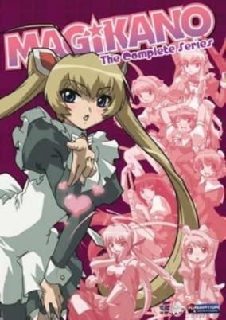

**Studio:** Tokyo Kids &nbsp;|&nbsp; **Episodes:** 13 &nbsp;|&nbsp; **Director:** Seiji Kishi &nbsp;|&nbsp; **Aired/Released:** January 1 – April 1 &nbsp;|&nbsp; **Genres:** Contemporary Fantasy, Earth, Fantasy, Japan, Asia, Comedy, Magic, Slapstick, Stereotypes, Present, Romance, Harem

> Ayumi Mamiya is a witch cursed to lose her powers and only one boy can break the spell. Haruo Yoshikawa thinks he is a normal boy but unknown to him his three sisters have magical powers and keep him protected and ignorant about the exsistence of magic. Now Ayumi must wake up Haruo's latent powers to save herself but his sisters will have none of that.
>
> _Synopsis source: Kitsu_

[Wikipedia](https://en.wikipedia.org/wiki/Magikano) · [Kitsu](https://kitsu.io/anime/magikano)

---

### Ah My Buddha (season 2) (Ah My Buddha)

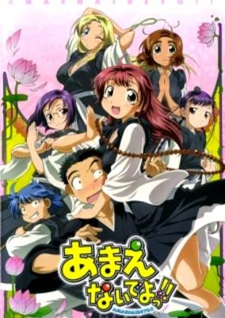

**Studio:** Studio Deen &nbsp;|&nbsp; **Episodes:** 12 &nbsp;|&nbsp; **Director:** Keitaro Motonaga &nbsp;|&nbsp; **Aired/Released:** January 4 – March 22 &nbsp;|&nbsp; **Genres:** Ecchi, Japan, Asia, Earth, Comedy, Violent Retribution For Accidental Infringement, School Life, Violence, Present, Harem, Romance

> Satonaka Ikkou, a 16 year old boy, is a first year trainee at the Saienji Buddhist Temple. He was sent there by his parents to be trained by his grandmother, the Saienji Priestess. At the temple he finds himself surrounded by beautiful female priestesses-in-training. Upon seeing a girl naked, Ikko has the ability to turn into a super-monk, performing massive exorcisms for the good of the temple.
>
> _Synopsis source: Kitsu_

[Wikipedia](https://en.wikipedia.org/wiki/Ah_My_Buddha) · [Kitsu](https://kitsu.io/anime/amaenaide-yo)

---

### Eternal Alice (Key Princess Story Eternal Alice Rondo)

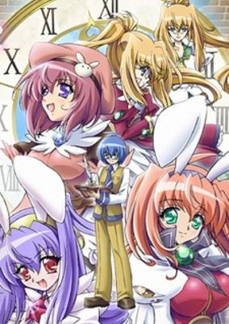

**Studio:** Trinet Entertainment Picture Magic &nbsp;|&nbsp; **Episodes:** 13 &nbsp;|&nbsp; **Director:** Nagisa Miyazaki &nbsp;|&nbsp; **Aired/Released:** January 4 – March 29 &nbsp;|&nbsp; **Genres:** Ecchi, Action, High School, Magic, Past, School Life, Magical Girl, Fantasy

> Kirihara Aruto loves the stories of Alice, so much so that he begins to write one. One night while writing, he sees a girl out his window who he thinks is Alice. He follows her, and discovers that she is called a Seeker of Alice, and with the powers granted to her she fights other Seekers of Alice to take their eternal story, in order to find the part that belongs to the Eternal Alice. Throughout Aruto's adventures with Arisugawa Arisu, his little sister Kirihara Kiraha and their various friends they discover more about the land of Alice, about the novels, the man who wrote them, and their own powers.
>
> _Synopsis source: Kitsu_

[Wikipedia](https://en.wikipedia.org/wiki/Kagihime_Monogatari_Eiky%C5%AB_Alice_Rondo) · [Kitsu](https://kitsu.io/anime/kagihime-monogatari-eikyuu-alice-rinbukyoku)

---

### Humanoid Monster Bem

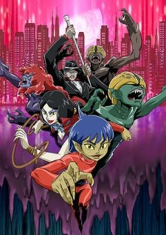

**Studio:** Studio Comet &nbsp;|&nbsp; **Episodes:** 26 &nbsp;|&nbsp; **Director:** Hiroshi Harada &nbsp;|&nbsp; **Aired/Released:** January 4 – July 10 &nbsp;|&nbsp; **Genres:** Horror

> The plot of the series revolves around three youkai, Bem, Bera and Barro, who arrive at a large coastal city and come across an evil atmosphere, which was brought about by immoral behavior by humans and mischief caused by monsters and youkai. They therefore decide to stay in the city, fighting against other monsters and yōkai which attack humans, making a few friends in the way. Even though the three youkai are often abused by other human beings due to their appearance, they still strive in protecting the human populace of the city from other monsters, one day hoping to become human beings in return for their good actions.
>
> _Synopsis source: Kitsu_

[Wikipedia](https://en.wikipedia.org/wiki/Humanoid_Monster_Bem) · [Kitsu](https://kitsu.io/anime/youkai-ningen-bem-2006)

---

### Rakugo Tennyo Oyui

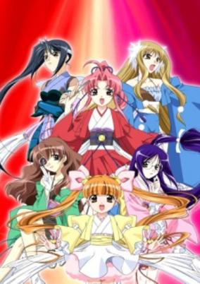

**Studio:** TNK &nbsp;|&nbsp; **Episodes:** 12 &nbsp;|&nbsp; **Director:** Yoshihiro Takamoto &nbsp;|&nbsp; **Aired/Released:** January 5 – March 23 &nbsp;|&nbsp; **Genres:** Tokugawa Period, Japan, Adventure, Fantasy, Past, Historical, Comedy

> Six girls including Tsukishima Yui were summoned into the end of Edo period by the power of mystic stones. They became celestial nymphs to protect cities from evils. Each girl obtained her own power. The power Yui obtained was "word". She would fight against evils by her "words" that gave people hope.
>
> _Synopsis source: Kitsu_

[Wikipedia](https://en.wikipedia.org/wiki/Rakugo_Tennyo_Oyui) · [Kitsu](https://kitsu.io/anime/rakugo-tennyo-oyui)

---

### Kinnikuman II Sei: Ultimate Muscle 2

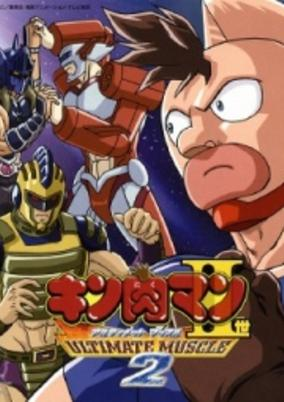

**Studio:** Toei Animation &nbsp;|&nbsp; **Episodes:** 13 &nbsp;|&nbsp; **Director:** Toshiaki Komura &nbsp;|&nbsp; **Aired/Released:** January 5 – March 30 &nbsp;|&nbsp; **Genres:** Action, Martial Arts, Science Fiction, Comedy, Sports

> Mantaro has made it to the semifinal match of the Chojin Cup. He must now fight Ricardo in a soccer field to advance to the last match. Kevin Mask is also in the semifinals, and must defeat Ilioukhine in an aerial field to advance. These three matches will determine who wins the Chojin Cup.
>
> _Synopsis source: Kitsu_

[Kitsu](https://kitsu.io/anime/kinnikuman-ii-sei-ultimate-muscle-2)

---

### Lemon Angel Project

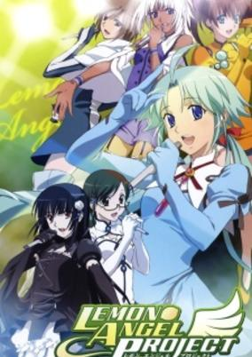

**Studio:** Radix &nbsp;|&nbsp; **Episodes:** 13 &nbsp;|&nbsp; **Director:** Daisuke Chiba &nbsp;|&nbsp; **Aired/Released:** January 6 – March 31 &nbsp;|&nbsp; **Genres:** Earth, Japan, Asia, Musical Band, Idol, Present, Music

> Lemon Angel was once the greatest girl band of Japan, but then it broke up and most of its members vanished. When a music producer decides to put together a new Lemon Angel, average high schooler Tomo Minaguchi is approached to audition for the group. Little does she know of the mystery behind the original Lemon Angel...
>
> _Synopsis source: Kitsu_

[Wikipedia](https://en.wikipedia.org/wiki/Lemon_Angel_Project) · [Kitsu](https://kitsu.io/anime/lemon-angel-project)

---

### Fate/stay night

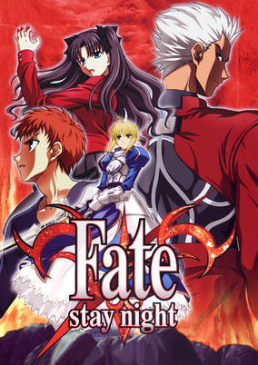

**Studio:** Studio Deen &nbsp;|&nbsp; **Episodes:** 24 &nbsp;|&nbsp; **Director:** Yūji Yamaguchi &nbsp;|&nbsp; **Aired/Released:** January 7 – June 17 &nbsp;|&nbsp; **Genres:** Magic, Battle Royale, Swordplay, Super Power, Present, Earth, Alternative Present, Contemporary Fantasy, Japan, Violence

> After a mysterious inferno kills his family, Shirou is saved and adopted by Kiritsugu Emiya, who teaches him the ways of magic and justice. One night, years after Kiritsugu's death, Shirou is cleaning at school, when he finds himself caught in the middle of a deadly encounter between two superhumans known as Servants. During his attempt to escape, the boy is caught by one of the Servants and receives a life-threatening injury. Miraculously, he survives, but the same Servant returns to finish what he started. In desperation, Shirou summons a Servant of his own, a knight named Saber. The two must now participate in the Fifth Holy Grail War, a battle royale of seven Servants and the mages who summoned them, with the grand prize being none other than the omnipotent Holy Grail itself.Fate/stay night follows Shirou as he struggles to find the fine line between a hero and a killer, his ideals clashing with the harsh reality around him. Will the boy become a hero like his foster father, or die trying? [Written by MAL Rewrite]
>
> _Synopsis source: Kitsu_

[Wikipedia](https://en.wikipedia.org/wiki/Fate/stay_night) · [Kitsu](https://kitsu.io/anime/fate-stay-night)

---

### Wan Wan Celeb Soreyuke! Tetsunoshin

**Studio:** Studio Comet &nbsp;|&nbsp; **Episodes:** 51 &nbsp;|&nbsp; **Director:** Kiyoshi Fukumoto &nbsp;|&nbsp; **Aired/Released:** January 7 – December 30 &nbsp;|&nbsp; **Genres:** Fantasy, Comedy, Kids

> The Inuyama Family, along with their pet dog Tetsunoshin moves to the famous Hoppongi Hills (modeled after Roppongi Hills) from Kyushu. Rumi Inuyama's father owns an IT Company in Japan and is a step further to becoming number one. However, Tetsunoshin learned that his master's family loaned a lot of money renting their home in Hoppongi Hills, almost to the point of the whole company becoming Bankrupt. To make things even worse, the whole family spends a lot of money on everything, making Tetsunoshin's problems worse. To solve this problem, Tetsunoshin teamed up with the Hills Dogs and will do anything to pay all the Inuyama Family's expenses.
>
> _Synopsis source: Kitsu_

[Wikipedia](https://en.wikipedia.org/wiki/Wan_Wan_Celeb_Soreyuke!_Tetsunoshin) · [Kitsu](https://kitsu.io/anime/wan-wan-serepu-soreyuke-tetsunoshin)

---

### Guardian Ninja Mamoru

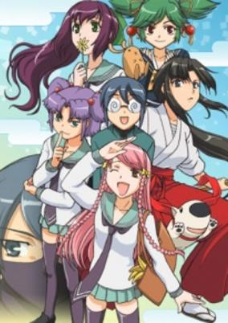

**Studio:** Group TAC &nbsp;|&nbsp; **Episodes:** 12 &nbsp;|&nbsp; **Director:** Yoshitaka Fujimoto &nbsp;|&nbsp; **Aired/Released:** January 8 – March 26 &nbsp;|&nbsp; **Genres:** Romance, Ninja, Earth, Japan, Action, Asia, Comedy, Martial Arts, Present, Harem, Samurai

> Kagemori Mamoru is a dowdy boy whose hair is disheveled and who wears thick glasses, but he is actually the son of a ninja family. They have protected their neighbors, the Konnyaku family, secretly for 400 years. Mamoru has personally protected their daughter, Konnyaku Yuuna, since they were in kindergarten. When Yuuna is in trouble, Mamoru puts on ninja suit and turns into a competent ninja to help her.
>
> _Synopsis source: Kitsu_

[Wikipedia](https://en.wikipedia.org/wiki/Kage_Kara_Mamoru!) · [Kitsu](https://kitsu.io/anime/kage-kara-mamoru)

---

### Tactical Roar

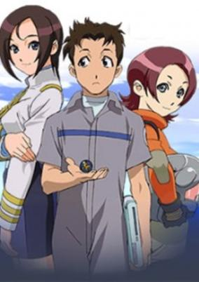

**Studio:** Actas &nbsp;|&nbsp; **Episodes:** 13 &nbsp;|&nbsp; **Director:** Yoshitaka Fujimoto &nbsp;|&nbsp; **Aired/Released:** January 8 – April 2 &nbsp;|&nbsp; **Genres:** Science Fiction, Ecchi, Action, Thriller, Conspiracy, Love Polygon, Nurse, Navy, Future, Friendship, Harem, Comedy, Romance, Military

> In the near future the world's climate shifted creating in the Western Pacific a perpetual super cyclone: the Grand Roar that altered the earth, flooding most countries. Shipping and navigation became important to nations and following the appearance of ocean pirates, necessisated companies to hire escort cruisers to safeguard their investments. Hyousuke Nagimiya is a system engineer that was comissioned to upgrade the Pascal Magi manned by an entire crew of women with its captain, Misaki Nanaha. Together the crew strives to prove themselves to their detractors that they are no mere 'Alice Brand'. Yet as they go about their mission a larger global conspiracy seems to be working behind the scenes to take advantage of this new world order.
>
> _Synopsis source: Kitsu_

[Wikipedia](https://en.wikipedia.org/wiki/Tactical_Roar) · [Kitsu](https://kitsu.io/anime/tactical-roar)

---

### Yomigaeru Sora – Rescue Wings

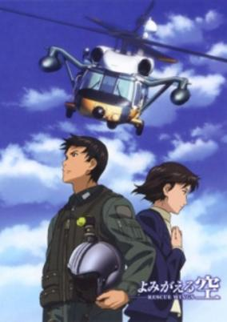

**Studio:** J.C.Staff &nbsp;|&nbsp; **Episodes:** 13 &nbsp;|&nbsp; **Director:** Katsushi Sakurabi &nbsp;|&nbsp; **Aired/Released:** January 9 – March 26 &nbsp;|&nbsp; **Genres:** Earth, Japan, Action, Asia, Slice of Life, Air Force, Drama, Plot Continuity, Present, Military

> Kazuhiro Uchida is transferred to a rescue centre located in a small town while training to become a fighter pilot. Initially, Kazuhiro thinks negatively about his new occupation, due to the difficult missions and the harsh discipline he receives from his seniors. However, over the course of his training, he begins to accept the job for what it is and becomes a true member of the rescue force.
>
> _Synopsis source: Kitsu_

[Wikipedia](https://en.wikipedia.org/wiki/Yomigaeru_Sora_%E2%80%93_Rescue_Wings) · [Kitsu](https://kitsu.io/anime/yomigaeru-sora-rescue-wings)

---

### Crash B-Daman

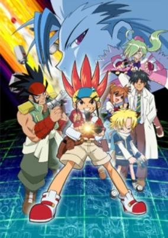

**Studio:** Nippon Animedia &nbsp;|&nbsp; **Episodes:** 50 &nbsp;|&nbsp; **Director:** Yoshiaki Okumura &nbsp;|&nbsp; **Aired/Released:** January 9 – December 25 &nbsp;|&nbsp; **Genres:** Adventure

> Hitto Tamaga, an 11-year-old boy, lives in some town in Japan. He is a very unfortunate boy, whose only asset is brightness. He lives only with his father who is a Bedaman researcher, but he left home several months ago, and he's been missing since then. He is living alone in a hut built on a relative’s land. Nobody celebrates his 11th birthday...except his cousin Nana who lives in the same land. One day, Hitto receives a present from the lost father, and he is very grad to know that his father remembers his birthday. It is “Crash Bedaman” that he longed for. After he puts them together to complete Crash Bedaman, he brings it to Bee Park, or a battle field of Beedaman. A battle there shows him a new way he should go. There is a message from his father with the present. “Overcome the difficulties”. Putting this word in his mind, he beats the enemies one after another with his Bedaman. With the encounter of partners and rivals, the mystery of Bedaman, a shadow organization, and the reason of the missing of his father gradually come to light. Defeating various obstacles in his way, he’s growing up.
>
> _Synopsis source: Kitsu_

[Wikipedia](https://en.wikipedia.org/wiki/Crash_B-Daman) · [Kitsu](https://kitsu.io/anime/bakkyuu-hit-crash-bedaman)

---

### Play Ball 2nd

**Studio:** Eiken &nbsp;|&nbsp; **Episodes:** 13 &nbsp;|&nbsp; **Director:** Satoshi Dezaki &nbsp;|&nbsp; **Aired/Released:** January 10 – March 28

[Wikipedia](https://en.wikipedia.org/wiki/Play_Ball_(manga))

---

### Nerima Daikon Brothers

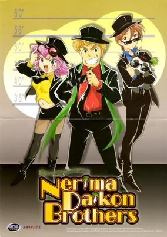

**Studio:** Studio Hibari &nbsp;|&nbsp; **Episodes:** 12 &nbsp;|&nbsp; **Director:** Shinichi Watanabe &nbsp;|&nbsp; **Aired/Released:** January 10 – March 28 &nbsp;|&nbsp; **Genres:** Parody, Comedy, Musical Band, Music

> Hideki, leader of the Nerima Daikon Brothers, has a dream to build a dome in his hometown of Nerima to hold a concert for his band. Together with his cousin, Mako (whom he has a crush on), Ichiro, and Pandaikon (a panda he found in his yard that resembles a daikon), they strive to make money any way they can, and in the process, rid the world of evil-doers and steal their money in the process. With help from a rental guy, Nabeshin, who rents them outrageous items that always seem to help them defeat the bad guys, the Nerima Daikon Brothers sing their way to victory but always manage to lose the money they stole in the end. Even under the investigation of Inspector Karakuri, they never fail to fight for justice the Nerima-Daikon way.
>
> _Synopsis source: Kitsu_

[Wikipedia](https://en.wikipedia.org/wiki/Nerima_Daikon_Brothers) · [Kitsu](https://kitsu.io/anime/nerima-daikon-brothers)

---

### Kashimashi: Girl Meets Girl (Girl Meets Girl)

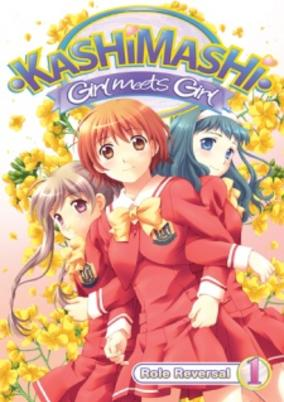

**Studio:** Studio Hibari &nbsp;|&nbsp; **Episodes:** 12 &nbsp;|&nbsp; **Director:** Nobuaki Nakanishi &nbsp;|&nbsp; **Aired/Released:** January 12 – March 30 &nbsp;|&nbsp; **Genres:** Romance, Japan, Asia, Earth, Shoujo Ai, Super Deformed, Love Polygon, Angst, Humanoid Alien, Alien, Present, Comedy, Slice of Life, School Life, Gender Bender

> Hazumu was a shy boy who enjoyed gardening, collecting herbs, and long walks in the mountains. One day he finally worked up the courage to confess his love to Yasuna, but she rejected him. Depressed, he wandered up Mt. Kashimayama, the place where they first met, to reconsider his feelings. After getting lost, he wished upon a shooting star and received a bizarre twist of fate. Now he is a she, and she stumbles headfirst back into social life and relationships only to find that the entire landscape has changed!
>
> _Synopsis source: Kitsu_

[Kitsu](https://kitsu.io/anime/kashimashi-girl-meets-girl)

---

### Hanbun no Tsuki ga Noboru Sora (Looking Up At The Half-Moon)

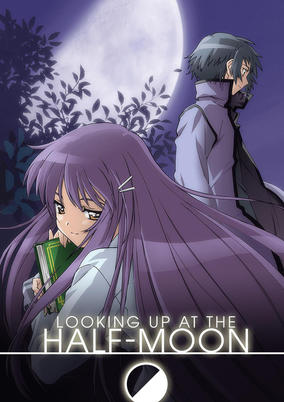

**Studio:** Group TAC &nbsp;|&nbsp; **Episodes:** 6 &nbsp;|&nbsp; **Director:** Yukihiro Matsushita &nbsp;|&nbsp; **Aired/Released:** January 13 – February 24 &nbsp;|&nbsp; **Genres:** Romance, Japan, Asia, Earth, Coming Of Age, Angst, Drama, Plot Continuity, Present, Comedy

> After contracting hepatitis A, Ezaki Yuuichi has been confined to a hospital, away from his friends and family, much to his displeasure. To relieve his boredom, he has taken to sneaking out of the hospital, usually putting himself on the receiving end of a beating from his nurse. Upon meeting a girl his age also staying in the hospital, he is immediately captivated by her beauty. Akiba Rika's personality is not quite as captivating as her beauty however. In fact, she is rather selfish, moody, and bossy. But as the two spend more time with each other, they become closer, sharing the ordinary joys and trials of a budding teenage romance, even when darkened with impending tragedy—for Rika's condition does not leave her much longer to live. [Written by MAL Rewrite]
>
> _Synopsis source: Kitsu_

[Wikipedia](https://en.wikipedia.org/wiki/Hanbun_no_Tsuki_ga_Noboru_Sora) · [Kitsu](https://kitsu.io/anime/hanbun-no-tsuki-ga-noboru-sora)

---

### Ayakashi: Samurai Horror Tales

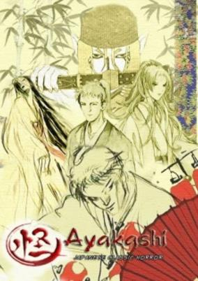

**Studio:** Toei Animation &nbsp;|&nbsp; **Episodes:** 11 &nbsp;|&nbsp; **Director:** Tetsuo Imazawa (Yotsuya Kaidan) Hidehiko Kadota (Tenshu Monogatari) Kouzou Nagayama (Tenshu Monogatari) Kenji Nakamura (Bakeneko) &nbsp;|&nbsp; **Aired/Released:** January 13 – March 24 &nbsp;|&nbsp; **Genres:** Contemporary Fantasy, Japan, Action, Fantasy, Asia, Earth, Swordplay, Deity, Angst, Horror, Drama, Past, Plot Continuity, Violence, Demon, Historical

> A collection of three classic Japanese horror stories: "Yotsuya Kaidan", the story of a wife betrayed by her husband who seeks vengeance even in death. "Tenshu Monogatari", the story of forbidden love between a goddess and a human, and "Bakeneko", the story of a mysterious cat monster with a vendetta against a certain family.
>
> _Synopsis source: Kitsu_

[Kitsu](https://kitsu.io/anime/ayakashi-japanese-classic-horror)

---

### Meine Liebe: Wieder

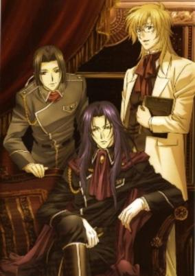

**Studio:** Bee Train &nbsp;|&nbsp; **Episodes:** 13 &nbsp;|&nbsp; **Director:** Shinya Kawatsura &nbsp;|&nbsp; **Aired/Released:** January 22 – April 13 &nbsp;|&nbsp; **Genres:** Earth, Europe, Bishounen, Past, Fantasy

> The Strahl candidates are enjoying a brief holiday in their various homes. However, many surprises await them when they finally come back to their elite boarding school: Rosenstolz Academy. There is a new headmaster, and his policies are not necessarily to the advantage of the main characters.
>
> _Synopsis source: Kitsu_

[Kitsu](https://kitsu.io/anime/ginyuu-mokushiroku-meine-liebe-wieder)

---

### Rec

**Studio:** Shaft &nbsp;|&nbsp; **Episodes:** 9 &nbsp;|&nbsp; **Director:** Ryūtarō Nakamura &nbsp;|&nbsp; **Aired/Released:** February 3 – March 31 &nbsp;|&nbsp; **Genres:** Romance, Japan, Asia, Earth, Slice of Life, Comedy, Working Life, Sudden Girlfriend Appearance, Slapstick, Plot Continuity, Present

> Fumihiko Matsumaru is an average salaryman with no girlfriend. He invited his colleague Miss Tanaka to a movie but was stood up. Right at the time he was about to toss tickets into a trash can, a cute girl appeared and asked him not to waste those two tickets. After movie and dinner, he escorted her home and found they live in the same neighborhood, yet unfortunately her apartment caught on fire hours later. Having nowhere else to stay, rookie seiyuu Aka Onda moved to Matsumaru's place, and the two had started a "more than friend but not yet lovers" relationship under the same roof while keeping this secret from their employers.
>
> _Synopsis source: Kitsu_

[Wikipedia](https://en.wikipedia.org/wiki/Rec_(manga)) · [Kitsu](https://kitsu.io/anime/rec)

---

### Binchō-tan

**Studio:** Studio Deen &nbsp;|&nbsp; **Episodes:** 12 &nbsp;|&nbsp; **Director:** Kazuhiro Furuhashi &nbsp;|&nbsp; **Aired/Released:** February 3 – April 16

[Wikipedia](https://en.wikipedia.org/wiki/Binch%C5%8D-tan_(manga))

---

### Futari wa Pretty Cure Splash Star (Pretty Cure: Splash Star)

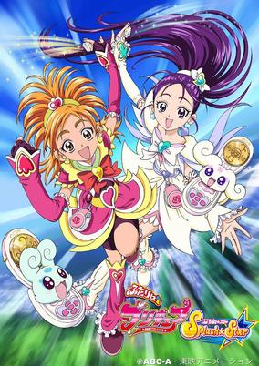

**Studio:** Toei Animation &nbsp;|&nbsp; **Episodes:** 49 &nbsp;|&nbsp; **Director:** Toshiaki Komura &nbsp;|&nbsp; **Aired/Released:** February 5 – January 28, 2007 &nbsp;|&nbsp; **Genres:** Fantasy, Japan, Comedy, Magic, Magical Girl, Present, Super Power, Action

> During the summer festival five years ago, two girls met at a mysterious tree and saw two glowing spheres. Now, these two girls--Saki Hyuuga, ace pitcher on the school softball team; and Mai Mishou, who prefers sketching over stargazing--are chosen by the spirits of flowers (Flappy) and birds (Choppy) to restore the Seven Fountains and save their worlds from Dark Autumn. Together, they are the NEW Pretty Cure.
>
> _Synopsis source: Kitsu_

[Wikipedia](https://en.wikipedia.org/wiki/Futari_wa_Pretty_Cure_Splash_Star) · [Kitsu](https://kitsu.io/anime/futari-wa-precure-splash-star)

---

### Papillon Rose: The New Season (Papillon Rose)

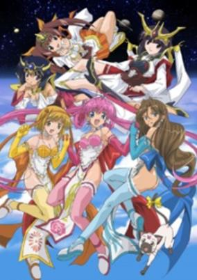

**Studio:** Studio Kelmadick &nbsp;|&nbsp; **Episodes:** 6 &nbsp;|&nbsp; **Director:** Yasuhiro Matsumura &nbsp;|&nbsp; **Aired/Released:** February 9 – March 17 &nbsp;|&nbsp; **Genres:** Ecchi, Parody, Comedy, Magic

> The story takes place one year after the OVA. Because of the previous war, Kabucki-cho was devastated, and the owner abandoned his lingerie pub, "Pallion," and opened "New Papillion" in Akihabara. During the war, Tsubomi, and her colleagues Anne and Shizuku lost their memories, and they began new lives in Akihabara. On the other hand, the Susano, aliens who were invading the Earth, appeared. They turned a UMA (Unidentified Mysterious Animal) into a monster and make it raid on Akihabara. Rama the cat made Tsubomi and her buddies retrieve their memories, and let them fight against the monster as Lingerie Soldiers.
>
> _Synopsis source: Kitsu_

[Kitsu](https://kitsu.io/anime/papillon-rose)

---

### Ergo Proxy

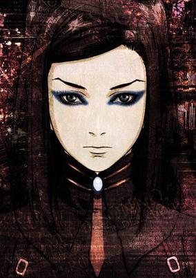

**Studio:** Manglobe &nbsp;|&nbsp; **Episodes:** 23 &nbsp;|&nbsp; **Director:** Shūkō Murase &nbsp;|&nbsp; **Aired/Released:** February 25 – August 12 &nbsp;|&nbsp; **Genres:** Contemporary Fantasy, Science Fiction, Mecha, Post Apocalypse, Fantasy World, Action, Earth, Gunfights, Conspiracy, Dystopia, Angst, Future, Android, Plot Continuity, Violence, Psychological, Mystery

> Thousands of years after Earth's atmosphere was destroyed, adventure blooms in the strangest of places. The domed city of Romdo is supposed to be perfect, but Re-l Mayer, a young female inspector from the Civilian Intelligence Office, knows better. In this place where humans and robots coexist, she receives a strange message: something is awakening!
>
> _Synopsis source: Kitsu_

[Wikipedia](https://en.wikipedia.org/wiki/Ergo_Proxy) · [Kitsu](https://kitsu.io/anime/ergo-proxy)

---

### Ballad of a Shinigami (Momo)

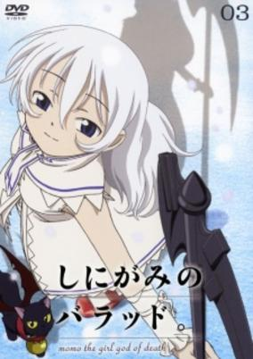

**Studio:** Ginga Ya Group TAC &nbsp;|&nbsp; **Episodes:** 6 &nbsp;|&nbsp; **Director:** Tomomi Mochizuki &nbsp;|&nbsp; **Aired/Released:** March 3 – April 7 &nbsp;|&nbsp; **Genres:** Present, Earth, Contemporary Fantasy, Japan, Asia, Fantasy, Romance, Slice of Life, Drama, Psychological

> A girl wrapped in white, her name is Momo...in her hand lies a blunt yet shiny scythe. By her side is a winged black cat by the name of Daniel. Carrying the souls of humans, the girl's existence parallels to that of a "Death God" or "Shinigami". At the instant when this white Death God touches the hearts of humans, the world is filled with kindness and grief...
>
> _Synopsis source: Kitsu_

[Wikipedia](https://en.wikipedia.org/wiki/Ballad_of_a_Shinigami) · [Kitsu](https://kitsu.io/anime/shinigami-no-ballad)

---

### Gakuen Heaven

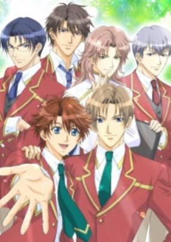

**Studio:** Tokyo Kids &nbsp;|&nbsp; **Episodes:** 13 &nbsp;|&nbsp; **Director:** Yukina Hiiro &nbsp;|&nbsp; **Aired/Released:** April 1 – June 24 &nbsp;|&nbsp; **Genres:** Earth, Japan, Asia, Bishounen, High School, Stereotypes, School Life, Present, Shounen Ai, Harem, Comedy, Romance

> Itou Keita, an average guy, is shocked when he's invited to attend the elite institution, "Bell Liberty Academy." Unnerved by the mystery, he's further distracted by the school's social dynamics. In a sea of amazing young men, Keita struggles to find out what makes him unique, and how he can possibly deserve to be treated as an equal by the boys of BL. Lacking any particular ability, just why has Itou been welcomed into the privileged world of the talented and the beautiful? Along the way, he develops intense relationships with the almost everyone at school but he is terribly drawn to the friendly, over-caring but very mysterious classmate, Kazuki Endou.
>
> _Synopsis source: Kitsu_

[Wikipedia](https://en.wikipedia.org/wiki/Gakuen_Heaven) · [Kitsu](https://kitsu.io/anime/gakuen-heaven)

---

### Hula Kappa

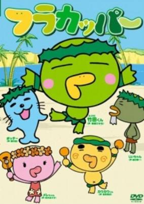

**Studio:** Office AO &nbsp;|&nbsp; **Episodes:** 78 &nbsp;|&nbsp; **Aired/Released:** April 1 – December 21 &nbsp;|&nbsp; **Genres:** Comedy

> Some sort of educationnal anime for children. A bit of humoristic.
>
> _Synopsis source: Kitsu_

[Kitsu](https://kitsu.io/anime/furakappa)

---

### Twin Princesses of Wonder Planet Gyu!

**Studio:** HAL Film Maker J.C.Staff &nbsp;|&nbsp; **Episodes:** 52 &nbsp;|&nbsp; **Director:** Junichi Sato (chief) Shōgo Kōmoto &nbsp;|&nbsp; **Aired/Released:** April 1 – March 31, 2007

[Wikipedia](https://en.wikipedia.org/wiki/Twin_Princesses_of_the_Wonder_Planet)

---

### Gargoyle of Yoshinaga House

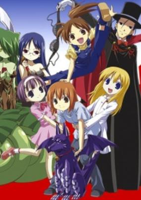

**Studio:** Studio Hibari &nbsp;|&nbsp; **Episodes:** 13 &nbsp;|&nbsp; **Director:** Iku Suzuki &nbsp;|&nbsp; **Aired/Released:** April 2 – June 25 &nbsp;|&nbsp; **Genres:** Japan, Adventure, Action, Comedy, Present, Super Power, Fantasy, Slice of Life

> When Yoshinaga Futaba wins the first prize in a lottery, the prize turns out to be a stone gargoyle. More surprising yet, the gargoyle turns out to be alive.
>
> _Synopsis source: Kitsu_

[Wikipedia](https://en.wikipedia.org/wiki/Gargoyle_of_Yoshinaga_House) · [Kitsu](https://kitsu.io/anime/yoshinaga-san-chi-no-gargoyle)

---

### Soul Link

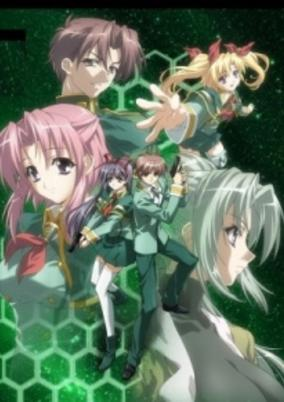

**Studio:** Picture Magic &nbsp;|&nbsp; **Episodes:** 12 &nbsp;|&nbsp; **Director:** Toshikatsu Tokoro &nbsp;|&nbsp; **Aired/Released:** April 2 – June 25 &nbsp;|&nbsp; **Genres:** Science Fiction, Ecchi, Action, Gunfights, Shipboard, Future, Stereotypes, Plot Continuity, Space, Adventure, Comedy, Romance, Military

> Aizawa Ryota was in the 3rd grade of the preparatory course of Central Military Academy. AD 2045, he went to a space station, Aries, for the training with his classmates including Nagase Saka and Nittak Kazuhiko. However, the station was attacked by a terrorist group, Hallarax.Now they must find a way back to earth.
>
> _Synopsis source: Kitsu_

[Wikipedia](https://en.wikipedia.org/wiki/Soul_Link) · [Kitsu](https://kitsu.io/anime/soul-link)

---

### Akubi Girl

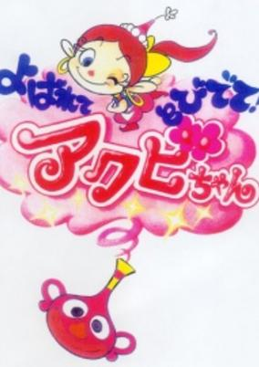

**Studio:** Tatsunoko Production &nbsp;|&nbsp; **Episodes:** 26 &nbsp;|&nbsp; **Aired/Released:** April 2 – September 24 &nbsp;|&nbsp; **Genres:** Fantasy, Comedy

> Akubi-chan is a cute magical girl. She is good at magic, she can turn into any form by tapping a tambourine, and she can grant any dream or wishes. Usually, Akubi-chan is in a vase, but when Ruru-chan, the owner of the vase, yarns (akubi), Akubi-chan pops out of the vase. Ruru-chan is in the 1st grade in elementary school, but she is little precocious and loves secretly her classmate Itoshi-kun living next-door. Akubi-chan uses various magic to make them good friends, but she always fails. However, for her best friend Ruru-chan, Akubi-chan gets out of the vase and taps the tambaine to play Cupid.
>
> _Synopsis source: Kitsu_

[Wikipedia](https://en.wikipedia.org/wiki/Akubi_Girl) · [Kitsu](https://kitsu.io/anime/akubi-girl)

---

### Fighting Beauty Wulong Rebirth

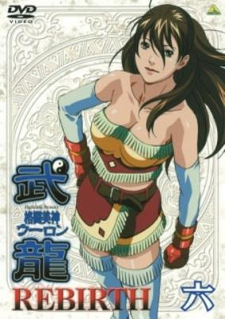

**Studio:** TMS Entertainment &nbsp;|&nbsp; **Episodes:** 25 &nbsp;|&nbsp; **Director:** Yoshio Suzuki &nbsp;|&nbsp; **Aired/Released:** April 2 – October 1 &nbsp;|&nbsp; **Genres:** Wrestling, Action, Martial Arts, Comedy, School Life

> Mao Lan continues growing into her path in life through what she learns while fighting. Her grandfather thinks that she has grown complacent and decides to train an adversary for her next Prime Mat appearance. Training with her friends and companions Mao Lan slowly advances through life.
>
> _Synopsis source: Kitsu_

[Wikipedia](https://en.wikipedia.org/wiki/Fighting_Beauty_Wulong_Rebirth) · [Kitsu](https://kitsu.io/anime/fighting-beauty-wulong-rebirth)

---

### Digimon Data Squad

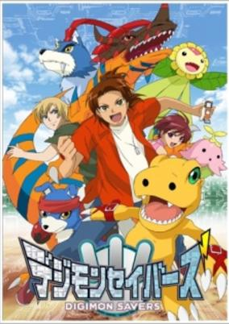

**Studio:** Toei Animation &nbsp;|&nbsp; **Episodes:** 48 &nbsp;|&nbsp; **Director:** Naoyuki Itō &nbsp;|&nbsp; **Aired/Released:** April 2 – March 25, 2007 &nbsp;|&nbsp; **Genres:** Science Fiction, Adventure, Genetic Modification, Action, Comedy, Special Squads, Proxy Battles, Parallel Universe, Present, Super Power, Fantasy, Friendship, Isekai

> Masaru, a second year Junior High student and undefeated street-fighter, is about to learn the meaning of the word "teamwork." After Agumon escapes DATS, an organization that deals with Digimon, it winds up in a fight with Masaru. Soon Yoshino and Lalamon come to capture Agumon, and the two fighters escape. After an evil Digimon appears, it's up to Masaru and Agumon to defeat it with their DNA Charge. Soon, Masaru must join DATS to put an end to the Digimon coming to Earth. With the help of Yoshino, Ikuto, and Touma, the group must stop any evil Digimon that appear, and return them to the Digital World. But not everything goes as planned...
>
> _Synopsis source: Kitsu_

[Wikipedia](https://en.wikipedia.org/wiki/Digimon_Data_Squad) · [Kitsu](https://kitsu.io/anime/digimon-savers)

---

### Kiba

**Studio:** Madhouse &nbsp;|&nbsp; **Episodes:** 51 &nbsp;|&nbsp; **Director:** Hiroshi Kōjina &nbsp;|&nbsp; **Aired/Released:** April 2 – March 25, 2007

[Wikipedia](https://en.wikipedia.org/wiki/Kiba_(anime))

---

### Onegai My Melody: Kuru Kuru Shuffle

**Studio:** Studio Comet &nbsp;|&nbsp; **Episodes:** 52 &nbsp;|&nbsp; **Director:** Makoto Moriwaki &nbsp;|&nbsp; **Aired/Released:** April 2 – March 25, 2007 &nbsp;|&nbsp; **Genres:** Japan, Slice of Life, Comedy, Magic, Plot Continuity, Present, Fantasy

> A continuation of Onegai My Melody.
>
> _Synopsis source: Kitsu_

[Kitsu](https://kitsu.io/anime/onegai-my-melody-kuru-kuru-shuffle)

---

### The Melancholy of Haruhi Suzumiya

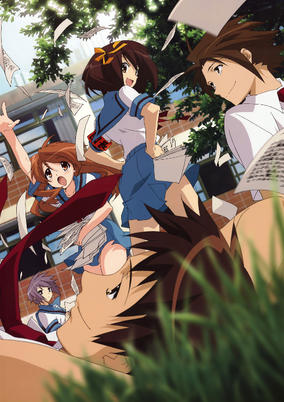

**Studio:** Kyoto Animation &nbsp;|&nbsp; **Episodes:** 14 &nbsp;|&nbsp; **Director:** Tatsuya Ishihara &nbsp;|&nbsp; **Aired/Released:** April 3 – July 3 &nbsp;|&nbsp; **Genres:** Japan, Asia, Earth, Parody, Comedy, High School, School Clubs, School Life, Plot Continuity, Present, Science Fiction, Slice of Life, Mystery

> Kyon, your typical high school student, has long given up his belief in the supernatural. However, upon meeting Haruhi Suzumiya, he quickly finds out that it is the supernatural that she is interested in—aliens, time travelers, and espers among other things. When Haruhi laments about the lack of intriguing clubs around school, Kyon inspires Haruhi to form her own club. As a result, the SOS Brigade is formed, a club which specializes in all that is the supernatural. Much to his chagrin, Kyon, along with the silent bookworm, Yuki Nagato, the shy and timid Mikuru Asahina, and the perpetually smiling Itsuki Koizumi, are recruited as members. The story follows the crazy adventures that these four endure under their whimsical leader, Haruhi. The story is based on the light novels by Nagaru Tanigawa. [Written by MAL Rewrite]
>
> _Synopsis source: Kitsu_

[Wikipedia](https://en.wikipedia.org/wiki/The_Melancholy_of_Haruhi_Suzumiya) · [Kitsu](https://kitsu.io/anime/the-melancholy-of-haruhi-suzumiya)

---

### Aria the Natural

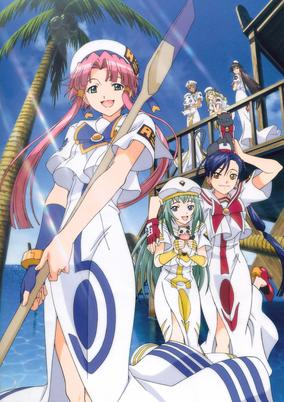

**Studio:** HAL Film Maker &nbsp;|&nbsp; **Episodes:** 26 &nbsp;|&nbsp; **Director:** Junichi Sato &nbsp;|&nbsp; **Aired/Released:** April 3 – September 25 &nbsp;|&nbsp; **Genres:** Fantasy, Slice of Life, Mars, Other Planet, Future, Space, Science Fiction

> Akari, Aika and Alice are three girls who share a single dream: to become the most talented gondoliers in all of Neo-Venezia! Every day they train toward their goal, exploring all the wondrous sights that the water-covered planet Aqua has to offer. Whether it's spending a wild day at Carnevale, sharing a beautiful sunset, or even crossing paths with the mysterious spirits that dwell in Aqua's shadows, for these three friends, each day is a new adventure!
>
> _Synopsis source: Kitsu_

[Wikipedia](https://en.wikipedia.org/wiki/Aria_the_Natural) · [Kitsu](https://kitsu.io/anime/aria-the-natural)

---

### School Rumble: 2nd Semester (School Rumble 2nd Semester)

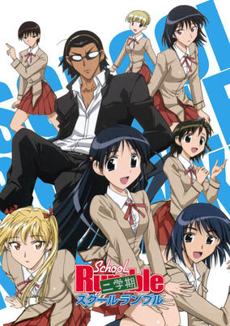

**Studio:** Studio Comet &nbsp;|&nbsp; **Episodes:** 26 &nbsp;|&nbsp; **Director:** Takaomi Kanasaki &nbsp;|&nbsp; **Aired/Released:** April 3 – September 25 &nbsp;|&nbsp; **Genres:** Romance, Japan, Asia, Earth, Parody, Comedy, Love Polygon, High School, Slapstick, School Life, Present

> Continuing right where season 1 left off: Harima still likes Tenma but still runs into obstacles everytime he tries to confess his love to her. To complicate the situation, Class 2-D challenges class 2-C once again and there's a rumor floating around that Harima and Yakumo are dating as the school prepares for the cultural festival.
>
> _Synopsis source: Kitsu_

[Kitsu](https://kitsu.io/anime/school-rumble-ni-gakki)

---

### BakéGyamon

**Studio:** Radix &nbsp;|&nbsp; **Episodes:** 51 &nbsp;|&nbsp; **Director:** Hiroshi Negishi &nbsp;|&nbsp; **Aired/Released:** April 3 – March 26, 2007

[Wikipedia](https://en.wikipedia.org/wiki/Bak%C3%A9Gyamon)

---

### High School Girls

**Studio:** Arms Studio Guts Studio Kelmadick &nbsp;|&nbsp; **Episodes:** 12 &nbsp;|&nbsp; **Director:** Yoshitaka Fujimoto &nbsp;|&nbsp; **Aired/Released:** April 4 – June 20 &nbsp;|&nbsp; **Genres:** All Girls School, High School, Present, Earth, Japan, Asia, Comedy, Ecchi, Slice of Life, School Life

> Eriko and her friends Yuma and Ayano are excited about entering high school. Their excitement leads to their breaking of the rules when they toured the school before the opening ceremony. They find out their preconceptions about the all female school may not be as true as they had first thought. Despite that, Eriko and her friends are joined by new friends. They aim to get through high school life together.
>
> _Synopsis source: Kitsu_

[Wikipedia](https://en.wikipedia.org/wiki/High_School_Girls) · [Kitsu](https://kitsu.io/anime/joshi-kousei)

---

### Renkin 3-kyū Magical? Pokān

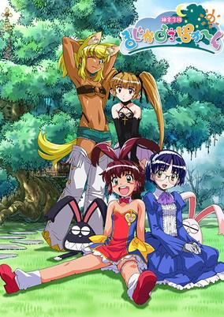

**Studio:** Remic &nbsp;|&nbsp; **Episodes:** 12 &nbsp;|&nbsp; **Director:** Kenichi Yatagai &nbsp;|&nbsp; **Aired/Released:** April 4 – June 20 &nbsp;|&nbsp; **Genres:** Contemporary Fantasy, Fantasy, Ecchi, Earth, Japan, Asia, Comedy, Magic, Slapstick, Stereotypes, Plot Continuity, Present, Vampire, Parody

> Renkin San-kyuu Magical? Pokaan follows the daily lives of four young girls. There is just one catch: they are anything but normal. This group of friends—the energetic werewolf Liru, the joyful witch-in-training Uma, the motherly android Aiko, and the seductive vampire Pachira—are actually princesses from the netherworld who have traveled to the human world in search of a new home. Unfortunately, their naivety and severe lack of knowledge make living peacefully among earthlings much more difficult than they imagined. As they attempt to adapt to their brand new lifestyle, they cause all sorts of trouble, and end up attracting the unwanted attention of a woman by the name of Dr. K-Ko. The scientist believes that these new residents of Earth are up to no good and attempts to capture the girls to prove the existence of the supernatural and gain credibility with the scientific community. Every day brings a new adventure as the girls deal with the insanity of her antics and all that the human realm has to offer. [Written by MAL Rewrite]
>
> _Synopsis source: Kitsu_

[Wikipedia](https://en.wikipedia.org/wiki/Renkin_3-ky%C5%AB_Magical%3F_Pok%C4%81n) · [Kitsu](https://kitsu.io/anime/renkin-san-kyuu-magical-pokaan)

---

### Simoun

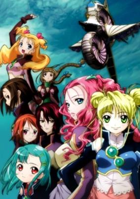

**Studio:** Studio Deen &nbsp;|&nbsp; **Episodes:** 26 &nbsp;|&nbsp; **Director:** Junji Nishimura &nbsp;|&nbsp; **Aired/Released:** April 4 – September 26 &nbsp;|&nbsp; **Genres:** Romance, Science Fiction, Steampunk, Fantasy World, Air Force, Shoujo Ai, Love Polygon, Coming Of Age, Plot Continuity, Military, Magic

> In the peaceful theocracy of Simulicram, everyone is born female. At age 17, each maiden undergoes a special ceremony where she chooses her sex. However, only Pairs of maiden priestesses can synchronize with the ancient flying ships known as Simoun needed to defend Simulicram. These Pairs refrain from undergoing the ceremony as long as they wish to keep piloting their Simoun. Aer is recruited to be a Simoun pilot after a terrifying attack by an enemy nation decimates the squadron known as Chor Tempest. To earn her wings she needs to find her way into the heart of Neviril, Regina of Chor Tempest. But Neviril's heart still belongs to her previous Pair, lost in the battle when she attempted a forbidden Simoun maneuver.
>
> _Synopsis source: Kitsu_

[Wikipedia](https://en.wikipedia.org/wiki/Simoun_(anime)) · [Kitsu](https://kitsu.io/anime/simoun)

---

### Strawberry Panic! (Strawberry Panic)

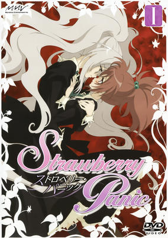

**Studio:** Madhouse &nbsp;|&nbsp; **Episodes:** 26 &nbsp;|&nbsp; **Director:** Masayuki Sakoi &nbsp;|&nbsp; **Aired/Released:** April 4 – September 26 &nbsp;|&nbsp; **Genres:** Romance, Japan, Asia, Earth, Middle School, Shoujo Ai, Love Polygon, High School, School Life, Present

> Aoi Nagisa transfers to one of the three affiliated all-girl Catholic schools on Astraea Hill, St. Miator's Girls' Academy. There, she discovers a community of fellow students entwined in an intricate hierarchy, in which two Etoiles represent the three schools. In order to fit in, Nagisa must go to class, join clubs, and make new friends. Meanwhile, Shizuma Hanazono, the sole Etoile of Astraea Hill, finds herself drawn to this new, exciting transfer student. As Shizuma and Nagisa get to know each other, Shizuma finally decides it is time to face her troubled past.
>
> _Synopsis source: Kitsu_

[Wikipedia](https://en.wikipedia.org/wiki/Strawberry_Panic!) · [Kitsu](https://kitsu.io/anime/strawberry-panic)

---

### Utawarerumono

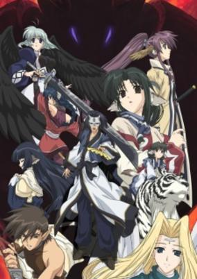

**Studio:** OLM &nbsp;|&nbsp; **Episodes:** 26 &nbsp;|&nbsp; **Director:** Tomoki Kobayashi &nbsp;|&nbsp; **Aired/Released:** April 4 – September 26 &nbsp;|&nbsp; **Genres:** Fantasy, Science Fiction, Post Apocalypse, Action, Earth, Swordplay, Juujin, War, Drama, Future, Plot Continuity, Violence, Military

> Everything about him is shrouded in mystery. The mask he can't remove. The past he can't unravel. And the very survival of the people who have chosen him as their leader. But what Hakuoro does know is this: he was gravely injured and left for dead in a forest. A kind young girl named Eruruu found him and nursed him back to health. He was welcomed into a barren land where strange creatures roam, an angry god seeks vengeance, an oppressive government slaughters the innocent, and a bloody war looms on the horizon. Will the masked hero liberate the people who saved him? Can he unlock the memories that elude him? Or will he remain a stranger even to himself?
>
> _Synopsis source: Kitsu_

[Wikipedia](https://en.wikipedia.org/wiki/Utawarerumono) · [Kitsu](https://kitsu.io/anime/utawarerumono)

---

### Gin Tama

**Studio:** Sunrise &nbsp;|&nbsp; **Episodes:** 201 &nbsp;|&nbsp; **Director:** Shinji Takamatsu (eps 1-105) Yoichi Fujita (eps 100-201) &nbsp;|&nbsp; **Aired/Released:** April 4 – March 25, 2010

[Wikipedia](https://en.wikipedia.org/wiki/Gin_Tama)

---

### Makai Senki Disgaea (Disgaea)

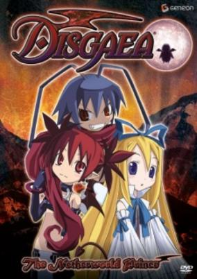

**Studio:** OLM &nbsp;|&nbsp; **Episodes:** 12 &nbsp;|&nbsp; **Director:** Kiyotaka Isako &nbsp;|&nbsp; **Aired/Released:** April 5 – June 21 &nbsp;|&nbsp; **Genres:** Fantasy, Fantasy World, Adventure, Action, Comedy, Angel, Future, Slapstick, Demon, Super Power, Magic

> An angel arrives in Hell! A demon lord is awakened! There are penguins everywhere! What’s going on here? Angel assassin-in-training Flonne is on a quest to destroy the demon Overlord. Instead of accomplishing her mission, the ditzy Flonne manages to wake Laharl, the demon lord and heir to the throne, from his two year slumber. Now the pair, along with Laharl’s not-so-faithful vassal Etna and her army of explosive souls in penguin costumes, must restore order to the crumbling Netherworld. Based on the events of the game Disgaea: Hour of Darkness, Makai Senki Disgaea follows Laharl’s journey to squash the demon rebellion, reclaim the throne, and destroy anyone who stands in his path. Or, you know, let them join him on his travels if they really want. Just remember: Laharl is a demon lord. There’s no way he’ll ever show kindness, compassion, or love... right?
>
> _Synopsis source: Kitsu_

[Wikipedia](https://en.wikipedia.org/wiki/Makai_Senki_Disgaea) · [Kitsu](https://kitsu.io/anime/makai-senki-disgaea)

---

### Ray the Animation

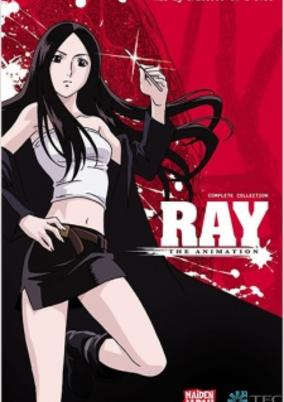

**Studio:** OLM &nbsp;|&nbsp; **Episodes:** 13 &nbsp;|&nbsp; **Director:** Naohito Takahashi &nbsp;|&nbsp; **Aired/Released:** April 5 – June 28 &nbsp;|&nbsp; **Genres:** Science Fiction, Japan, Earth, Asia, Violence, Present, Romance

> If you have enough money, you can buy anything. So why wait for an organ you need to become available? Raised to be harvested for parts, Ray had already lost her eyes when renegade surgeon Black Jack rescued her. Now, ten years later, she has grown up to be a surgeon herself. And thanks to the unique artificial eyes she received as replacements, she has a reputation for performing incredible medical operations that no one else could even attempt. But unknown to any but a select few, her surgical endeavors are only part of a greater mission: to discover what happened to the other children she was raised with, and to find the men who stole the eyes she was born with and to bring them to justice.
>
> _Synopsis source: Kitsu_

[Wikipedia](https://en.wikipedia.org/wiki/Ray_the_Animation) · [Kitsu](https://kitsu.io/anime/ray-the-animation)

---

### Glass Fleet (Glass Fleet: The Legend of the Wind of the Universe)

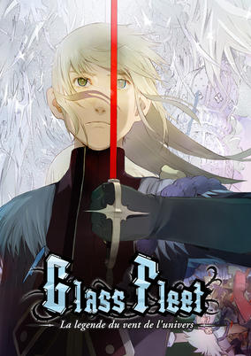

**Studio:** Gonzo Satelight &nbsp;|&nbsp; **Episodes:** 26 &nbsp;|&nbsp; **Director:** Minoru Ōhara &nbsp;|&nbsp; **Aired/Released:** April 5 – September 22 &nbsp;|&nbsp; **Genres:** Romance, Space Travel, Science Fiction, Steampunk, Action, Space Battles, Space Opera, Unrequited Love, Swordplay, Shipboard, War, Disaster, Plot Continuity, Space, Military, Shounen Ai, Adventure

> The People's Army led by Michel stands against Vetti's newly founded empire. Upon seeing how strong the Glass Battleship is, Michel tries to get Cleo, the captain of the Glass Battleship, to help People's Army overthrow Vetti's empire. And together they fight against Vetti's empire.
>
> _Synopsis source: Kitsu_

[Wikipedia](https://en.wikipedia.org/wiki/Glass_Fleet) · [Kitsu](https://kitsu.io/anime/glass-no-kantai-la-legende-du-vent-de-l-univers)

---

### Air Gear

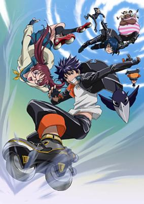

**Studio:** Marvelous Entertainment Toei Animation &nbsp;|&nbsp; **Episodes:** 25 &nbsp;|&nbsp; **Director:** Hajime Kamegaki &nbsp;|&nbsp; **Aired/Released:** April 5 – September 27 &nbsp;|&nbsp; **Genres:** Ecchi, Japan, Action, Asia, Earth, Sports, Alternative Present, Present, Comedy, Shounen

> Minami Itsuki never thought about seriously riding Air Treck motorized roller blades, until he got his butt handed to him by a street gang of Storm Riders. That day, he discovered in a locked up room, a pair of AT's and a box of stickers belonging to the Sleeping Forest street gang. One thing leads to another, and Ikki dons the wheels and begins to ride. As his reputation builds in the AT street fighting/racing world, he begins to develop his own gang and participate in more fights, gaining more and more territory.
>
> _Synopsis source: Kitsu_

[Wikipedia](https://en.wikipedia.org/wiki/Air_Gear) · [Kitsu](https://kitsu.io/anime/air-gear)

---

### Higurashi When They Cry (When They Cry)

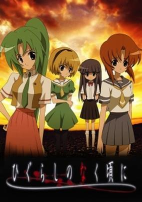

**Studio:** Studio Deen &nbsp;|&nbsp; **Episodes:** 26 &nbsp;|&nbsp; **Director:** Chiaki Kon &nbsp;|&nbsp; **Aired/Released:** April 5 – September 27 &nbsp;|&nbsp; **Genres:** Past, Earth, Japan, Violence, Plot Continuity, Asia, Angst, Horror, Thriller, Drama

> Keiichi Maebara has just moved to the quiet little village of Hinamizawa in the summer of 1983, and quickly becomes inseparable friends with schoolmates Rena Ryuuguu, Mion Sonozaki, Satoko Houjou, and Rika Furude. However, darkness lurks underneath the seemingly idyllic life they lead. As the village prepares for its annual festival, Keiichi learns about the local legends surrounding it. To his horror, he discovers that there have been several murders and disappearances in the village in the recent years, and that they all seem to be connected to the festival and the village's patron god, Oyashiro. Keiichi tries to ask his new friends about these incidents, but they are suspiciously silent and refuse to give him the answers he needs. As more and more bizarre events occur, he wonders just what else his friends might be keeping from him, and if he can even trust them at all. When madness and paranoia begin taking root in Keiichi's heart, he will stumble straight into the mysteries at work in Higurashi no Naku Koro ni, a story that is told across multiple arcs. [Written by MAL Rewrite]
>
> _Synopsis source: Kitsu_

[Wikipedia](https://en.wikipedia.org/wiki/Higurashi_When_They_Cry) · [Kitsu](https://kitsu.io/anime/higurashi-no-naku-koro-ni)

---

### Love Get Chu

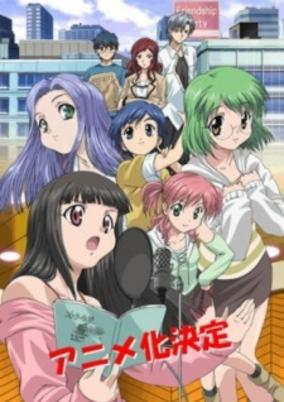

**Studio:** Radix &nbsp;|&nbsp; **Episodes:** 25 &nbsp;|&nbsp; **Director:** Mitsuhiro Tōgō &nbsp;|&nbsp; **Aired/Released:** April 5 – September 27 &nbsp;|&nbsp; **Genres:** Romance, Japan, Asia, Earth, Comedy, Performance, Tokyo, Coming Of Age, Friendship, Plot Continuity, Present

> Five girls came to a training school to become voice actresses holding each thought in her mind. Momoko - she wanted to be a voice actress to meet her favorite voice actor. Rinka - she is an armature voice actress, but she didn't have special purpose to become voice actress. Yurika - she likes anime very much. Tsubasa - she was a girl in love, and acted only as a boy. Amane - she found a deadlock as a actress and tried to find another way. They managed to get over the difficulty to become voice actress although they couldn't perform as main characters yet. There is a love romance with a boy works for an anime company, and you can catch a glimpse of situations of anime industries.
>
> _Synopsis source: Kitsu_

[Wikipedia](https://en.wikipedia.org/wiki/Love_Get_Chu) · [Kitsu](https://kitsu.io/anime/love-get-chu)

---

### Ouran High School Host Club

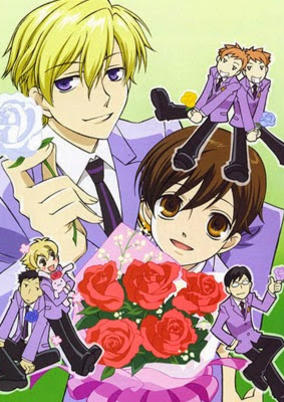

**Studio:** Bones &nbsp;|&nbsp; **Episodes:** 26 &nbsp;|&nbsp; **Director:** Takuya Igarashi &nbsp;|&nbsp; **Aired/Released:** April 5 – September 27 &nbsp;|&nbsp; **Genres:** Romance, Satire, Japan, Earth, Asia, Comedy, Super Deformed, Bishounen, High School, School Clubs, Reverse Harem, Slapstick, Stereotypes, School Life, Present, Harem, Gender Bender

> Haruhi Fujioka is a bright scholarship candidate with no rank or title to speak of—a rare species at Ouran High School, an elite academy for students of high pedigree. When she opens the door to Music Room #3 hoping to find a quiet place to study, Haruhi unexpectedly stumbles upon the Host Club. Led by the princely Tamaki, the club—whose other members include the "Shadow King" Kyouya, the mischievous Hitachiin twins, and the childlike Haninozuka "Honey" and his strong protector Mori—is where handsome boys with too much time on their hands entertain the girls in the academy. In a frantic attempt to remove herself from the hosts, Haruhi ends up breaking a vase worth eight million yen and is forced into becoming the eccentric group's general errand boy to repay her enormous debt. However, thanks to her convincingly masculine appearance, her naturally genial disposition toward girls, and fascinating commoner status, she is soon promoted to full-time male host and plunged headlong into a glitzy whirlwind of elaborate cosplays, rich food, and exciting shenanigans that only the immensely wealthy Ouran Host Club can pull off. [Written by MAL Rewrite]
>
> _Synopsis source: Kitsu_

[Wikipedia](https://en.wikipedia.org/wiki/Ouran_High_School_Host_Club) · [Kitsu](https://kitsu.io/anime/ouran-koukou-host-club)

---

### Spider Riders

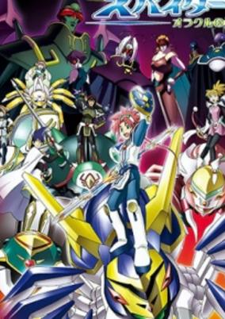

**Studio:** Bee Train &nbsp;|&nbsp; **Episodes:** 26 &nbsp;|&nbsp; **Director:** Kōichi Mashimo Takaaki Ishiyama &nbsp;|&nbsp; **Aired/Released:** April 5 – September 27 &nbsp;|&nbsp; **Genres:** Mecha, Action, Adventure

> In this Earth, there exists unknown underground world, the Inner World. In the world, there are braves who fight with large spiders, and they are called “Spider Riders”. According to his grandfather’s diary, a boy, Hunter Steel is traveling around. Meanwhile he happens to enter the Inner World from a pyramid. There, the war between the insect squad that aims at conquest of the Inner World and Spider Riders continues. Oracle, the fairly of the Inner World, summons Hunter because he thinks Hunter will be the messiah of the world. However, the powers of Oracle are sealed by Mantid who is the rule of the Insecter. For the peace of the Inner World, he has to find four sealed keys of Oracle to retrieve Oracle’s power. Hunter asks Spider Shadow, which is a big spider chosen by Oracle, to become a member of Spider Riders to fight against enemies.
>
> _Synopsis source: Kitsu_

[Wikipedia](https://en.wikipedia.org/wiki/Spider_Riders) · [Kitsu](https://kitsu.io/anime/spider-riders-oracle-no-yuusha-tachi)

---

### Nana

**Studio:** Madhouse &nbsp;|&nbsp; **Episodes:** 47 &nbsp;|&nbsp; **Director:** Morio Asaka &nbsp;|&nbsp; **Aired/Released:** April 5 – March 28, 2007

[Wikipedia](https://en.wikipedia.org/wiki/Nana_(manga))

---

### Trotting Hamtaro Hai!

**Studio:** TMS Entertainment &nbsp;|&nbsp; **Episodes:** 77 &nbsp;|&nbsp; **Director:** Osamu Nabeshima &nbsp;|&nbsp; **Aired/Released:** April 5 – March 28, 2008

[Wikipedia](https://en.wikipedia.org/wiki/Trotting_Hamtaro_Hai!)

---

### Ring ni Kakero 1 Episode: The Pacific War

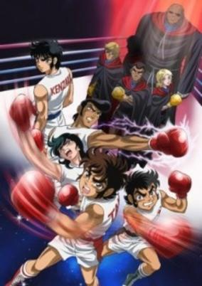

**Studio:** Toei Animation &nbsp;|&nbsp; **Episodes:** 12 &nbsp;|&nbsp; **Director:** Yukio Kaizawa &nbsp;|&nbsp; **Aired/Released:** April 6 – June 12 &nbsp;|&nbsp; **Genres:** Boxing, Martial Arts, Present, Japan, Action, Sports

> Immediately after Ryuuji Takane won the Champion Carnival, the U.S. Junior Champion Black Shaft appeared, and challenged the best Japan has to offer, just before the World Tournament is about to happen. Now Ryuuji, Takeshi Kawai, Kazuki Shinatora, Ishimatsu Katori, and Superstar Jun Kenzaki have to prove to not only Black Shaft, but the world, that they are truly world-class boxers before the World Tournament starts. But Shaft is not recruiting boxers for his challenge, but instead gets a life-timer criminal from Death Row, the leader of the Great Angels, one of the toughest gangs in America, a mysterious woman, and the "Dark Emperor of the South". Also, Shaft negotiates with Don Juliano, the Italian Junior Champion, just in case...
>
> _Synopsis source: Kitsu_

[Wikipedia](https://en.wikipedia.org/wiki/Ring_ni_Kakero) · [Kitsu](https://kitsu.io/anime/ring-ni-kakero-1-nichibei-kessen-hen)

---

### Eagle Talon

**Studio:** DLE &nbsp;|&nbsp; **Episodes:** 11 &nbsp;|&nbsp; **Director:** Ryo Ono &nbsp;|&nbsp; **Aired/Released:** April 6 – June 15

[Wikipedia](https://en.wikipedia.org/wiki/Eagle_Talon_(anime))

---

### Princess Princess

**Studio:** Studio Deen &nbsp;|&nbsp; **Episodes:** 12 &nbsp;|&nbsp; **Director:** Keitaro Motonaga &nbsp;|&nbsp; **Aired/Released:** April 6 – June 22

[Wikipedia](https://en.wikipedia.org/wiki/Princess_Princess_(manga))

---

### Yoshimune

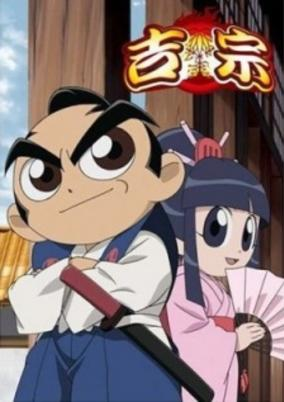

**Studio:** AIC Spirits Ginga Ya Gonzino &nbsp;|&nbsp; **Episodes:** 24 &nbsp;|&nbsp; **Director:** Hiroaki Sato &nbsp;|&nbsp; **Aired/Released:** April 6 – September 14 &nbsp;|&nbsp; **Genres:** Comedy, Super Deformed, Historical

> It is the end of the Edo Era, a flourishing period when stylish civilians, samurai and old-fashioned farmers live peacefully together. However, if you take a closer look at their lives, you'll notice that it is actually a parallel world in which modern conveniences, such as cellular phones, personal computers, microwave ovens, motorcycles, subways, and so on, exist. If you enter a night club, you'll find young people dancing to blaring trance music. However, you will also find that they wear kimonos, that the darkness is illuminated by candles, and that the stage is covered by tatami mats! While the people reflect the fashions and manners of the Edo Era, they reside within a strange world where the "present" and the "past" coexist. Welcome to the Yoshimune world that no one has ever seen!
>
> _Synopsis source: Kitsu_

[Wikipedia](https://en.wikipedia.org/wiki/Yoshimune_(anime)) · [Kitsu](https://kitsu.io/anime/yoshimune)

---

### Witchblade

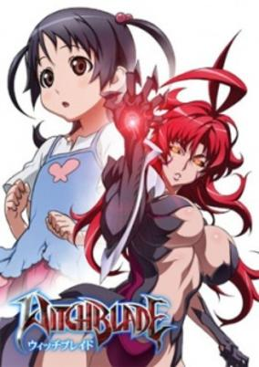

**Studio:** Gonzo &nbsp;|&nbsp; **Episodes:** 24 &nbsp;|&nbsp; **Director:** Yoshimitsu Ohashi &nbsp;|&nbsp; **Aired/Released:** April 6 – September 21 &nbsp;|&nbsp; **Genres:** Earth, Science Fiction, Post Apocalypse, Japan, Action, Asia, Drama, Future, Plot Continuity, Violence, Super Power

> Masane Amaha and her daughter Rihoko are on the run from a government child welfare agency that wants to take Rihoko away from her mother. They are caught and Rihoko is taken away. Meanwhile, Masane is attacked by an advanced weapon that can disguise itself as a human being. When faced with the danger, a strange light emits from her wrist and she transforms into a powerful being. She destroys the weapon and consequently becomes involved in a power struggle between powerful organizations, with her at the center of their attention. Because she holds the greatest power of them all, the legendary Witchblade.
>
> _Synopsis source: Kitsu_

[Wikipedia](https://en.wikipedia.org/wiki/Witchblade_(anime)) · [Kitsu](https://kitsu.io/anime/witchblade)

---

### .hack//Roots

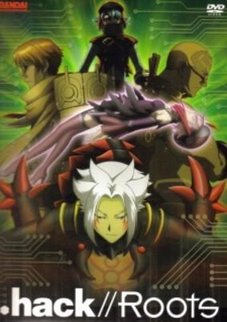

**Studio:** Bee Train &nbsp;|&nbsp; **Episodes:** 26 &nbsp;|&nbsp; **Director:** Kōichi Mashimo &nbsp;|&nbsp; **Aired/Released:** April 6 – September 28 &nbsp;|&nbsp; **Genres:** Fantasy, Fantasy World, Adventure, Action, Swordplay, Plot Continuity, Virtual Reality, Super Power, Science Fiction

> After the destruction of "The World" in 2015, CC Corporation rebuilt the game using data from what was previously to be another game. "The World R:2" was then released in 2016. A newcomer to the game, Haseo, is instantly PKed and then revived by a mysterious man known as Ovan. With the problem of PKs occupying the game, Haseo soon after receives help from a female Harvest known as Shino. Amidst curiosity and confusion, Haseo is lead to joining the guild known as the Twilight Brigade. The guild that searches for the legendary object known as the "Key of the Twilight". Set before the .hack//G.U. game.
>
> _Synopsis source: Kitsu_

[Wikipedia](https://en.wikipedia.org/wiki/.hack//Roots) · [Kitsu](https://kitsu.io/anime/hack-roots)

---

### Inukami!

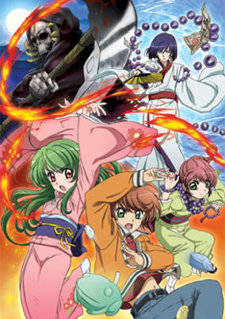

**Studio:** Seven Arcs &nbsp;|&nbsp; **Episodes:** 26 &nbsp;|&nbsp; **Director:** Keizō Kusakawa &nbsp;|&nbsp; **Aired/Released:** April 6 – September 28 &nbsp;|&nbsp; **Genres:** Contemporary Fantasy, Ecchi, Earth, Fantasy, Japan, Action, Asia, Comedy, Juujin, Slapstick, Present, Super Power, Romance

> Kawahira Keita is a descendant of a historic Inukami tamer family; however, because he lacked in its ability, he was forsaken by the family. One day, an Inukami named Youko came. She looked graceful, obedient, above all, beautiful. Soon he contracted with her, and she paid homage to him. However, she was a problematic Inukami that no one had been able to control. This is a slap stick comedy of an Inukami Tamer, Keita and an Inukami, Youko. Keita is a man of worldly passions, and he likes money and girls very much. On the other hand, Youko likes to destroy things and is very jealous.
>
> _Synopsis source: Kitsu_

[Wikipedia](https://en.wikipedia.org/wiki/Inukami!) · [Kitsu](https://kitsu.io/anime/inukami)

---

### Iron Kid (Eon Kid)

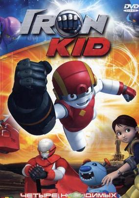

**Studio:** Daewon Media &nbsp;|&nbsp; **Episodes:** 26 &nbsp;|&nbsp; **Aired/Released:** April 6 – September 28 &nbsp;|&nbsp; **Genres:** Comedy, Science Fiction, Action, Adventure

> In a futuristic world, young Marty stumbles upon a bionic arm which endows him with superhuman powers and put him at the centre of a centuries-old struggle between good and evil. His teenager heart will now begin a long-way training together with two loyal friends: Buttons, his robo-puppy, and the brave Ally.
>
> _Synopsis source: Kitsu_

[Wikipedia](https://en.wikipedia.org/wiki/Iron_Kid) · [Kitsu](https://kitsu.io/anime/iron-kid)

---

### Zegapain

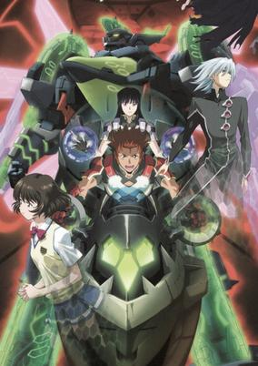

**Studio:** Sunrise &nbsp;|&nbsp; **Episodes:** 26 &nbsp;|&nbsp; **Director:** Masami Shimoda &nbsp;|&nbsp; **Aired/Released:** April 6 – September 28 &nbsp;|&nbsp; **Genres:** Post Apocalypse, Science Fiction, Mecha, Japan, Action, Asia, Earth, Piloted Robot, Drama, Future, Stereotypes, Plot Continuity, Virtual Reality, Romance

> Kyo, an avid swimmer tries his best to keep the high school swimming club going, which is pretty hard when he's the only member. Facing the prospect of the club being closed by the student council, he tries to enlist beautiful Misaki to act in a promo video, shot by his good friend Ryoko, in a bid to start a recruitment drive. She agrees but only if he pilots a mecha under the wing of Celebrum, a resistance organisation fighting to destroy Deutera Areas formed on Earth by the aliens Gards-orm. He agrees but finds it all strangely familiar as if he's done it before...
>
> _Synopsis source: Kitsu_

[Wikipedia](https://en.wikipedia.org/wiki/Zegapain) · [Kitsu](https://kitsu.io/anime/zegapain)

---

### Ah! My Goddess: Flights of Fancy

**Studio:** AIC &nbsp;|&nbsp; **Episodes:** 22 &nbsp;|&nbsp; **Director:** Hiroaki Gōda &nbsp;|&nbsp; **Aired/Released:** April 7 – September 15 &nbsp;|&nbsp; **Genres:** Romance, Japan, Fantasy, Asia, Earth, Comedy, Deity, Angel, Magic, Present, Motorsport, Harem

> One year after goddess Belldandy emerged from Keiichi Morisato's mirror and promised to stay with him forever, a new threat to their happiness emerges, one that could end the contract between Belldandy and Keiichi.
>
> _Synopsis source: Kitsu_

[Kitsu](https://kitsu.io/anime/aa-megami-sama-sorezore-no-tsubasa)

---

### xxxHolic

**Studio:** Production I.G &nbsp;|&nbsp; **Episodes:** 24 &nbsp;|&nbsp; **Director:** Tsutomu Mizushima &nbsp;|&nbsp; **Aired/Released:** April 7 – September 29 &nbsp;|&nbsp; **Genres:** Contemporary Fantasy, Earth, Fantasy, Japan, Asia, Magic, Present, Comedy, Psychological, Mystery

> Kimihiro Watanuki can see spirits and other assorted supernatural creatures, which is quite a bothersome ability he strongly dislikes. On the way home one day, while plagued by some spirits, he is inexplicably compelled to enter a strange house. There, he encounters Yuuko, a mysterious woman who claims to be able to rid him of the ability to see and attract the troublesome creatures—for a price. She demands that he work at her "store" that grants wishes to people, and thus begins Watanuki's adventures through weird and wonderful events. [Written by MAL Rewrite]
>
> _Synopsis source: Kitsu_

[Wikipedia](https://en.wikipedia.org/wiki/XxxHolic) · [Kitsu](https://kitsu.io/anime/xxxholic)

---

### Kirarin Revolution

**Studio:** G&G Entertainment SynergySP &nbsp;|&nbsp; **Episodes:** 153 &nbsp;|&nbsp; **Director:** Masaharu Okuwaki &nbsp;|&nbsp; **Aired/Released:** April 7 – March 27, 2009 &nbsp;|&nbsp; **Genres:** Romance, Love Polygon, Idol, Comedy

> Kirari Tsukishima, a gluttonous 14-year-old beauty, is a girl who does not care about idols and the entertainment world because her mind is occupied by food. Her obsession with food only causes her to be clueless about love. One day, after saving a turtle that is stranded in a tree, Kirari meets with a handsome and gentle boy named Seiji, who gives her ticket to a SHIPS (a popular idol group) concert to show his gratitude for her saving his pet. Kirari then storms off to the concert and runs into another boy, who tears up her ticket and warns her to stay away from Seiji because she and Seiji live in different worlds. The outraged Kirari then sneaks into the concert, only to discover that Seiji and the boy who tore her ticket, named Hiroto, are actually members of SHIPS. Finally understanding the meaning of "different worlds" (Seiji is a popular idol while she is an average middle school student), Kirari refuses to give up. Filled with determination to be with Seiji, she declares that she will also become an idol.
>
> _Synopsis source: Kitsu_

[Wikipedia](https://en.wikipedia.org/wiki/Kirarin_Revolution) · [Kitsu](https://kitsu.io/anime/kirarin-revolution)

---

### The Good Witch Of The West

**Studio:** HAL Film Maker &nbsp;|&nbsp; **Episodes:** 13 &nbsp;|&nbsp; **Director:** Katsuichi Nakayama &nbsp;|&nbsp; **Aired/Released:** April 8 – July 1 &nbsp;|&nbsp; **Genres:** Fantasy World, Adventure, Action, Fantasy, Past, Parallel Universe, Plot Continuity, Comedy, Romance, Mystery

> On Filiel's 15th birthday, she received her mother's necklace as a memento from her obstinate astronomer father. Her common and tedious life was turned into a life of conspiracies. With her new life, many adventures await.
>
> _Synopsis source: Kitsu_

[Wikipedia](https://en.wikipedia.org/wiki/The_Good_Witch_of_the_West) · [Kitsu](https://kitsu.io/anime/the-good-witch-of-the-west)

---

### Rockman.EXE Beast+

**Studio:** Xebec &nbsp;|&nbsp; **Episodes:** 26 &nbsp;|&nbsp; **Director:** Takao Kato &nbsp;|&nbsp; **Aired/Released:** April 8 – September 30

[Wikipedia](https://en.wikipedia.org/wiki/MegaMan_NT_Warrior)

---

### The Story of Saiunkoku

**Studio:** Madhouse &nbsp;|&nbsp; **Episodes:** 39 &nbsp;|&nbsp; **Director:** Jun Shishido &nbsp;|&nbsp; **Aired/Released:** April 8 – February 24, 2007 &nbsp;|&nbsp; **Genres:** Romance, Earth, Fantasy, Asia, Comedy, Alternative Past, Bishounen, Past, Reverse Harem, Plot Continuity, Historical, Adventure

> Most people think being born into a noble family means a life of comfort and wealth. That couldn't be further from the truth for Shuurei Kou. Despite the Kou family being an old and important bloodline, they've fallen on hard times. Shuurei's father works as an archivist in the Imperial library, which is a prestigious position, but unfortunately not one that pays much. To put food on the table, Shuurei works odd jobs such as teaching young children or playing live music in a restaurant―and even then, it's barely enough. Then, one day, a court advisor makes Shuurei an offer. If she becomes the concubine of the new, but lazy, emperor and teaches him how to become a good ruler, then she will receive 500 pieces of gold. Never one to turn down good money, Shuurei accepts the proposition. After all, the new emperor only prefers men so her virtue is safe… or so she thinks. The more time she spends in the palace, the more her old dream of becoming a court official is reignited. There's only one problem: she's a woman and women do not become government officials. Shuurei may be able to turn the emperor into a good ruler, but will it be at the expense of her own aspirations?
>
> _Synopsis source: Kitsu_

[Wikipedia](https://en.wikipedia.org/wiki/The_Story_of_Saiunkoku) · [Kitsu](https://kitsu.io/anime/saiunkoku-monogatari)

---

### Black Lagoon

**Studio:** Madhouse &nbsp;|&nbsp; **Episodes:** 12 &nbsp;|&nbsp; **Director:** Sunao Katabuchi &nbsp;|&nbsp; **Aired/Released:** April 9 – June 25 &nbsp;|&nbsp; **Genres:** Pirate, Action, Asia, Earth, Mafia, Slice of Life, Gunfights, Crime, Rotten World, Plot Continuity, Violence, Present

> Within Thailand is Roanapur, a depraved, crime-ridden city where not even the authorities or churches are untouched by the claws of corruption. A haven for convicts and degenerates alike, the city is notorious for being the center of illegal activities and operations, often fueled by local crime syndicates. Enter Rokurou Okajima, an average Japanese businessman who has been living a dull and monotonous life, when he finally gets his chance for a change of pace with a delivery trip to Southeast Asia. His business trip swiftly goes downhill as Rokurou is captured by a mercenary group operating in Roanapur, called Black Lagoon. The group plans to use him as a bargaining chip in negotiations which ultimately failed. Now abandoned and betrayed by his former employer, Rokurou decides to join Black Lagoon. In order to survive, he must quickly adapt to his new environment and prepare himself for the bloodshed and tribulation to come. A non-stop, high-octane thriller, Black Lagoon delves into the depths of human morality and virtue. Witness Rokurou struggling to keep his values and philosophies intact as he slowly transforms from businessman to ruthless mercenary. [Written by MAL Rewrite]
>
> _Synopsis source: Kitsu_

[Wikipedia](https://en.wikipedia.org/wiki/Black_Lagoon) · [Kitsu](https://kitsu.io/anime/black-lagoon)

---

### Yume Tsukai

**Studio:** Madhouse &nbsp;|&nbsp; **Episodes:** 12 &nbsp;|&nbsp; **Director:** Kazuo Yamazaki &nbsp;|&nbsp; **Aired/Released:** April 9 – June 25 &nbsp;|&nbsp; **Genres:** Contemporary Fantasy, Japan, Asia, Earth, Fantasy, Magic, Drama, Present, Slice of Life

> When people dream, they express their utmost desires and emotions within the confines of their mind; but when their strong emotions cross the border into reality, the dream can turn into an uncontrollable nightmare. Touko and Rinko are sisters known as "yume tsukai" (dream users), and their job is to take care of these nightmares. Using toys as weapons, the girls must both destroy the nightmare and return the dream to its rightful owner before the nightmare does any sort of serious damage. Have no fear, Touko and Rinko are here!
>
> _Synopsis source: Kitsu_

[Wikipedia](https://en.wikipedia.org/wiki/Yume_Tsukai) · [Kitsu](https://kitsu.io/anime/yume-tsukai)

---

### Himawari!

**Studio:** Arms &nbsp;|&nbsp; **Episodes:** 13 &nbsp;|&nbsp; **Director:** Shigenori Kageyama &nbsp;|&nbsp; **Aired/Released:** April 9 – July 2 &nbsp;|&nbsp; **Genres:** Ninja, Japan, Action, Asia, Earth, Comedy, Juujin, Martial Arts, School Life, Countryside, Present, Adventure

> Himawari Hinata recently transfered to Shinobi Gakuen to train to become the best kunoichi she can be. She wanted to be a ninja ever since she was saved by one when she was little. On her first day, she meets Hayato Madenokoji (a new transfer teacher) who saves her life. Hayato does not possess any ninja skills or traits, he is teaching the ninjas about normal society to pay off his debt. However, Himawari notices that Hayato bares the same mark on his neck as the ninja who saved her when she was young.
>
> _Synopsis source: Kitsu_

[Wikipedia](https://en.wikipedia.org/wiki/Himawari!) · [Kitsu](https://kitsu.io/anime/himawari-1)

---

### Musashi Gundoh (Gun Samurai)

**Studio:** ACC Production &nbsp;|&nbsp; **Episodes:** 26 &nbsp;|&nbsp; **Director:** Yuki Kinoshita &nbsp;|&nbsp; **Aired/Released:** April 9 – October 8 &nbsp;|&nbsp; **Genres:** Fantasy, Gunfights, Samurai, Adventure

> The adventures of a whiny teenage Miyamoto Musashi, his electro-sword and demon-sealing revolvers, and his quest to win the love of the beautiful Kaguyahime.
>
> _Synopsis source: Kitsu_

[Wikipedia](https://en.wikipedia.org/wiki/Musashi_Gundoh) · [Kitsu](https://kitsu.io/anime/gun-dou-musashi)

---

### Black Jack 21

**Studio:** Tezuka Productions &nbsp;|&nbsp; **Episodes:** 17 &nbsp;|&nbsp; **Director:** Satoshi Kuwabara (chief) Makoto Tezuka &nbsp;|&nbsp; **Aired/Released:** April 10 – September 4 &nbsp;|&nbsp; **Genres:** Earth, Japan, Action, Epidemic, Asia, Detective, Conspiracy, Drama, Plot Continuity, Present

> No direct-relation sequel to original Black Jack. Black Jack attempts to find out the conspiracy, of why he was involved in the bombfield accident that killed his mother, while he uncovers secrets of Organization and Project "Noir", which, his father and other famous doctors were involved in...
>
> _Synopsis source: Kitsu_

[Wikipedia](https://en.wikipedia.org/wiki/Black_Jack_21) · [Kitsu](https://kitsu.io/anime/black-jack-21)

---

### Shinseiki Duel Masters Flash

**Studio:** SynergySP &nbsp;|&nbsp; **Episodes:** 24 &nbsp;|&nbsp; **Director:** Suzuki Warurou &nbsp;|&nbsp; **Aired/Released:** April 10 – March 23, 2007 &nbsp;|&nbsp; **Genres:** Earth, Japan, Asia, Card Games, Proxy Battles, Present, Comedy, Kids

> No synopsis has been added for this series yet.Click here to update this information.
>
> _Synopsis source: Kitsu_

[Wikipedia](https://en.wikipedia.org/wiki/Shinseiki_Duel_Masters_Flash) · [Kitsu](https://kitsu.io/anime/shinseiki-duel-masters-flash)

---

### Sasami: Magical Girls Club (Sasami Magical Girls Club)

**Studio:** AIC Spirits &nbsp;|&nbsp; **Episodes:** 13 &nbsp;|&nbsp; **Director:** Yoshihiro Takamoto &nbsp;|&nbsp; **Aired/Released:** April 13 – July 13 &nbsp;|&nbsp; **Genres:** Fantasy, Magic, Magical Girl, School Life

> In this world, there live a group of people who call themselves "Majo" or "Magical Girls." They hide their powers so as to assimilate into the environment. They have been living together in harmony with the humans for many years to come, and their predecessors continue to do so. Sasami was enthroned with magical powers since her birth. However, at the age of three, she was told by her parents never to use her innate powers and from then on, had kept it a secret from everyone. On the day of a new school term, a new transfer teacher by the name of Wajuu arrives and from then on, Sasami's life begins to change tremendously.
>
> _Synopsis source: Kitsu_

[Kitsu](https://kitsu.io/anime/sasami-mahou-shoujo-club)

---

### Hime-sama Goyōjin

**Studio:** Nomad &nbsp;|&nbsp; **Episodes:** 12 &nbsp;|&nbsp; **Director:** Shigehito Takayanagi &nbsp;|&nbsp; **Aired/Released:** April 13 – July 20

[Wikipedia](https://en.wikipedia.org/wiki/Hime-sama_Goy%C5%8Djin)

---

### Jyu-Oh-Sei (Jyu-Oh-Sei: Planet of the Beast King)

**Studio:** Bones &nbsp;|&nbsp; **Episodes:** 11 &nbsp;|&nbsp; **Director:** Hiroshi Nishikiori &nbsp;|&nbsp; **Aired/Released:** April 14 – June 23 &nbsp;|&nbsp; **Genres:** Science Fiction, Adventure, Action, Other Planet, Drama, Future, Plot Continuity, Violence, Space, Mystery

> Thor and his twin brother, Rai, are cast off to a forsaken planet by unknown masked men after witnessing the suspicious death of their parents. Given only a beam knife and a smelly satchel, they wander together in search of civilization on the primarily plant based world. They soon discover the plants have the advantage. Only the strong survive; the ones who throw away their humanity and become the beasts humans once were.
>
> _Synopsis source: Kitsu_

[Wikipedia](https://en.wikipedia.org/wiki/Jyu-Oh-Sei) · [Kitsu](https://kitsu.io/anime/jyu-oh-sei)

---

### The Third: Aoi Hitomi no Shōjo (The Third: The Girl with the Blue Eye)

**Studio:** Xebec &nbsp;|&nbsp; **Episodes:** 24 &nbsp;|&nbsp; **Director:** Jun Kamiya &nbsp;|&nbsp; **Aired/Released:** April 14 – October 27 &nbsp;|&nbsp; **Genres:** Post Apocalypse, Contemporary Fantasy, Earth, Desert, Power Suit, Science Fiction, Adventure, Action, Swordplay, Future, Robot Helper

> In a devastated world overrun by monstrous bugs and ravaged by outlaws, there’s only one person to call when you really need a job done right: Honoka. With a sixth sense for danger, sword skills second to none, and a smart-aleck A.I. tank by the name of Bogie, she’s ready to tackle any job and solve any problem for her clients. But while crossing the desert one night, she finds a young man alone in the wasteland. It’s the first step of a journey that will challenge even Honoka’s amazing skills to their very limit!
>
> _Synopsis source: Kitsu_

[Kitsu](https://kitsu.io/anime/the-third-aoi-hitomi-no-shoujo)

---

### Tokko

**Studio:** AIC Spirits Group TAC &nbsp;|&nbsp; **Episodes:** 13 &nbsp;|&nbsp; **Director:** Masashi Abe &nbsp;|&nbsp; **Aired/Released:** April 16 – July 30

[Wikipedia](https://en.wikipedia.org/wiki/Tokko_(manga))

---

### Tsubasa Chronicle (season 2) (Tsubasa RESERVoir CHRoNiCLE)

**Studio:** Bee Train &nbsp;|&nbsp; **Episodes:** 26 &nbsp;|&nbsp; **Director:** Kōichi Mashimo Hiroshi Morioka &nbsp;|&nbsp; **Aired/Released:** April 29 – November 4 &nbsp;|&nbsp; **Genres:** Fantasy, Fantasy World, Adventure, Action, Alternative Past, Swordplay, High Fantasy, Martial Arts, Bishounen, Past, Alternative Present, Parallel Universe, Plot Continuity, Present, Magic, Romance

> During an excavation at the mysterious ruins in Clow Country, Syaoran discovers his childhood friend Princess Sakura appear on the site with wings that disperse into many feathers. As the feather's disappear to different dimensions, so does Sakura's memory. In attempts to save Sakura's life and restore her memory, Syaoran travels through to another world to find a solution. There's only one thing left he can do. Travel through to different dimensions to collect Sakura's feathers. Helping out with the quest is Kurogane, an exiled ninja from Japan Country who wishes to return to his world, the runaway magician, Fay, who desires to jump between each world never to return to his own and the white meat-bun shaped creature, Mokona.
>
> _Synopsis source: Kitsu_

[Wikipedia](https://en.wikipedia.org/wiki/Tsubasa_Chronicle) · [Kitsu](https://kitsu.io/anime/tsubasa-chronicle)

---

### Kamisama Kazoku

**Studio:** Toei Animation &nbsp;|&nbsp; **Episodes:** 13 &nbsp;|&nbsp; **Director:** Kimitoshi Chioka &nbsp;|&nbsp; **Aired/Released:** May 18 – August 10 &nbsp;|&nbsp; **Genres:** Romance, Fantasy, Contemporary Fantasy, Japan, Earth, Asia, Comedy, Deity, Angel, Slapstick, Plot Continuity, Present

> Samatarou is not just an average high-school boy, the truth is that he is the son of a god, his mother is a goddess and his sisters are candidates to become goddesses. They are living in the human world, because they want their boy to learn about the human customs and the habits of the creatures that they are protecting, so that in this way Samatarou will become a better god. Tenko is a angel assigned to look after Samatarou. She's born the same day, same year as Samatarou and have been close friends ever since. Life seems normal but things start to change with the appearance of a transfer student named Kumiko. Samatarou falls in love with her and from now on, things will be a lot more different for him. His decision of making her fall in love with him without using his powers will put him in trouble.
>
> _Synopsis source: Kitsu_

[Wikipedia](https://en.wikipedia.org/wiki/Kamisama_Kazoku) · [Kitsu](https://kitsu.io/anime/kamisama-kazoku)

---

### Kishin Hōkō Demonbane

**Studio:** View Works &nbsp;|&nbsp; **Episodes:** 12 &nbsp;|&nbsp; **Director:** Hidetoshi Yoshida &nbsp;|&nbsp; **Aired/Released:** May 19 – August 18 &nbsp;|&nbsp; **Genres:** Romance, Science Fiction, Mecha, Ecchi, Earth, Fantasy, Action, Piloted Robot, Slice of Life, Comedy, United States, Crime, Coming Of Age, Angst, Magic, Americas, Dark Fantasy, Humanoid Alien, Drama, Alternative Present, Magical Girl, Plot Continuity, Violence, Super Power, Harem

> Kurou Daijuuji is a poor detective living in Arkham City. One day, he was requested by Ruri Hado of Hado Financial Group, to search for a magic book. While he initially refused, Ruri offered him a large sum of money upon completion of her request, in which bribed Kuro to accept. As Kurou searches for the book, he unexpectedly runs into Al, a pretty girl that is actually a powerful grimoire. They forge a contract with each other, bestowing Kuro with powerful magic. Soon afterwards, Al also activates Demonbane, a deus machina owned by the Hado Financial Group, to combat the mechanical menace from the Black Lodge. With this, the war between the Hado Financial Group and the Black Lodge begins....
>
> _Synopsis source: Kitsu_

[Wikipedia](https://en.wikipedia.org/wiki/Kishin_H%C5%8Dk%C5%8D_Demonbane) · [Kitsu](https://kitsu.io/anime/kishin-houkou-demonbane-tv)

---

### IGPX : Immortal Grand Prix (Season 2) (IGPX: Immortal Grand Prix (2005))

**Studio:** Production I.G &nbsp;|&nbsp; **Episodes:** 13 &nbsp;|&nbsp; **Director:** Mitsuru Hongo &nbsp;|&nbsp; **Aired/Released:** May 20 – August 26 &nbsp;|&nbsp; **Genres:** Science Fiction, Mecha, Piloted Robot, Sports, Coming Of Age, Future, Plot Continuity, Motorsport

> In the year 2048, people are raving about a fighting race called “Immortal Grand Prix”, or IGPX in short, which is faster and more exciting than any of the existing motor sports. The phenomenon is so big that an entire city was built for the racing industry where competitions take place on a huge track. In the “Immortal Grand Prix,” two teams of three IG machines, high-tech humanoid mechs driven by humans, race at speeds greater than 400km/h. The teams make three laps of a 60 km course while intercepting the opponent as they vie for a first place finish. The best machine performance, the best pilots and the best teamwork are the only factors that can make them the winners.
>
> _Synopsis source: Kitsu_

[Wikipedia](https://en.wikipedia.org/wiki/IGPX) · [Kitsu](https://kitsu.io/anime/igpx-immortal-grand-prix)

---

### Night Head Genesis

**Studio:** Bee Media &nbsp;|&nbsp; **Episodes:** 24 &nbsp;|&nbsp; **Director:** Yoshio Takeuchi &nbsp;|&nbsp; **Aired/Released:** June 17 – December 31 &nbsp;|&nbsp; **Genres:** Earth, Parental Abandonment, Science Fiction, Japan, Asia, Conspiracy, Coming Of Age, Horror, Plot Continuity, Present, Super Power, Psychological, Mystery

> It is said that 70% of the human brain capacity is unused. If humans possess incredible power, it is strongly believed to be lying dormant within this region. This unused 70% brain capacity is known as "Night Head". The famous work 'NIGHT HEAD' is going to break the silence. They were abandoned by their parents because of the psychic power they possessed. They are the Kirihara brothers, who lived in a laboratory within a barrier-protected forest. They have escaped from the laboratory, and a new wave of 'Revolution' is about to arise. A new "Night Head" is about to be awakened.
>
> _Synopsis source: Kitsu_

[Wikipedia](https://en.wikipedia.org/wiki/Night_Head_Genesis) · [Kitsu](https://kitsu.io/anime/night-head-genesis)

---

### Binbō Shimai Monogatari

**Studio:** Toei Animation &nbsp;|&nbsp; **Episodes:** 10 &nbsp;|&nbsp; **Director:** Yukio Kaizawa &nbsp;|&nbsp; **Aired/Released:** June 30 – September 15 &nbsp;|&nbsp; **Genres:** Earth, Japan, Asia, Slice of Life, Stereotypes, Present, Comedy

> The Yamada sisters, Kyou (15) and Asu (9), are students studying in secondary and primary schools respectively. Their mother passed away and their father ran away after incurring gambling debts. Despite the difficult circumstances, both of them decide to overcome the unhappiness and welcome their days with enthusiasm and pride. Fortunately, with the change in the law system several years ago, Kyou is able to study and simultaneously take temporary jobs (such as distributing newspapers and tutoring) to make ends meet. On the other hand, Asu takes charge of household chores, prepares meals, and manages the finances to assist her older sister. Surrounding them are also good and kind neighbors such as the novelist, Saegusa-san, and the aunt at the public bath who watch over them. Although life is difficult and at times painful, the sisters are happy to have each other.
>
> _Synopsis source: Kitsu_

[Wikipedia](https://en.wikipedia.org/wiki/Binb%C5%8D_Shimai_Monogatari) · [Kitsu](https://kitsu.io/anime/binbou-shimai-monogatari)

---

### Honey and Clover II

**Studio:** J.C.Staff &nbsp;|&nbsp; **Episodes:** 12 &nbsp;|&nbsp; **Director:** Tatsuyuki Nagai &nbsp;|&nbsp; **Aired/Released:** June 30 – September 15 &nbsp;|&nbsp; **Genres:** Romance, Earth, Japan, Asia, Slice of Life, University, Love Polygon, School Life, The Arts, Plot Continuity, Present, Josei

> The sequel and final installment to the highly popular series once again delves into the life stories and love lives of Takemoto Yuuta, Mayama Takumi and Morita Shinobu. The story continues where the first season left off, after Takemoto's self-discovery journey around Japan. Of course, the love triangles and tribulations they face will continue, and eventually decide the paths to their future.
>
> _Synopsis source: Kitsu_

[Wikipedia](https://en.wikipedia.org/wiki/Honey_and_Clover_II) · [Kitsu](https://kitsu.io/anime/honey-and-clover-ii)

---

### Otogi-Jūshi Akazukin (Fairy Musketeers)

**Studio:** Madhouse &nbsp;|&nbsp; **Episodes:** 39 &nbsp;|&nbsp; **Director:** Takaaki Ishiyama &nbsp;|&nbsp; **Aired/Released:** July 1 – March 31, 2007 &nbsp;|&nbsp; **Genres:** Fantasy, Fantasy World, Adventure, Plot Continuity, Present, Super Power, Comedy

> Long, long ago, there existed a world of magic and science. God, afraid of man's potential, split the world in to the world of science, Elde, and the world of magic, Fandavale. One day in Fandavale, a terrible witch named Cendrillon (Cinderella) revives. Cendrillon plots to rule both worlds, and searches for the "key" which holds tremendous power. A young boy from Elde by the name of Sōta meets a mysterious girl from Fandavale, Akazukin, and her talking wolf companion, Val. Sōta learns that he is the key Cendrillon is searching for. Now it is up to Akazukin, Val, and the other Fairy Musketeers to protect Sōta from Cendrillon and her Nightmarelians who wish to obtain the power he mysteriously possesses.
>
> _Synopsis source: Kitsu_

[Wikipedia](https://en.wikipedia.org/wiki/Otogi-J%C5%ABshi_Akazukin) · [Kitsu](https://kitsu.io/anime/otogi-jushi-akazukin)

---

### Powerpuff Girls Z

**Studio:** Toei Animation &nbsp;|&nbsp; **Episodes:** 52 &nbsp;|&nbsp; **Director:** Megumu Ishiguro &nbsp;|&nbsp; **Aired/Released:** July 1 – June 30, 2007 &nbsp;|&nbsp; **Genres:** Japan, Asia, Earth, Magical Girl, Present, Super Power, Superhero, Magic, Action, Science Fiction, Comedy, Slice of Life, School Life, Kids

> Based on the American cartoon, "The Powerpuff Girls." Professor Utonium and his son Ken are studying the strange Chemical X. When a mochi cake falls into the formula, it changes into Chemical Z. Ken fires a ray of Chemical Z at a glacier in Tokyo Bay, however that causes strange black and white lights to scatter. The black lights turn its victims into monsters, with emphasis on a black light hitting a zoo monkey and transforming him into Mojo Jojo. The white lights, however, aim at three normal girls, Momoko, Miyako, and Kaoru. This gives them the power to transform into superheroes, the Powerpuff Girls Z!
>
> _Synopsis source: Kitsu_

[Wikipedia](https://en.wikipedia.org/wiki/Powerpuff_Girls_Z) · [Kitsu](https://kitsu.io/anime/demashitaa-powerpuff-girls-z)

---

### Tsuyokiss Cool×Sweet

**Studio:** Studio Hibari Trinet Entertainment &nbsp;|&nbsp; **Episodes:** 12 &nbsp;|&nbsp; **Director:** Shinichiro Kimura &nbsp;|&nbsp; **Aired/Released:** July 2 – September 17 &nbsp;|&nbsp; **Genres:** Romance, Earth, Japan, Asia, Comedy, Performance, High School, School Clubs, School Life, Present, Slice of Life

> Sunao Konoe starts her first day at a new school and is surprised to find that there is no drama club. So, she decides to make one of her own. But between a childhood friend showing up, the crazy student body, and the arrogant student council president blocking her at every turn, it seems that actually creating the club is going to be more difficult than she thought.
>
> _Synopsis source: Kitsu_

[Wikipedia](https://en.wikipedia.org/wiki/Tsuyokiss_Cool%C3%97Sweet) · [Kitsu](https://kitsu.io/anime/tsuyokiss)

---

### Mamotte! Lollipop (Save Me! Lollipop)

**Studio:** Studio Comet &nbsp;|&nbsp; **Episodes:** 13 &nbsp;|&nbsp; **Director:** Noriyoshi Nakamura &nbsp;|&nbsp; **Aired/Released:** July 2 – September 24 &nbsp;|&nbsp; **Genres:** Romance, Fantasy, Comedy, Magic, Slapstick, Adventure

> Nina, thinking it was a lolly, swallows an object called "Crystal Pearl". But the candy turns out to be a test for the magicians. To retrieve the crystal, a special medicine has to be made so now Zero and Ichii, the magicians, have to protect her from others while waiting for the medicine to be completed.
>
> _Synopsis source: Kitsu_

[Wikipedia](https://en.wikipedia.org/wiki/Mamotte!_Lollipop) · [Kitsu](https://kitsu.io/anime/mamotte-lollipop)

---

### Project Blue Earth SOS

**Studio:** A.C.G.T . &nbsp;|&nbsp; **Episodes:** 6 &nbsp;|&nbsp; **Director:** Tensai Okamura &nbsp;|&nbsp; **Aired/Released:** July 2 – December 3 &nbsp;|&nbsp; **Genres:** Earth, Action, Alien, Alternative Present, Plot Continuity, Present, Military, Science Fiction, Adventure, Comedy

> In this exhilarating series paying homage to classic 50s era science fiction, the disappearance of revolutionary G-Reaction engines is but the beginning of the ghastly end for mankind. While deranged alien forces prepare a fleet of flying saucers to the invasion of all invasions, teenage geniuses Penny Carter and Billy Kimura join forces with a clandestine secret alliance to save humanity from the extra-terrestrial helmet worms and their tentacles of doom! Avoiding alien attacks and dodging disintegration rays won't be easy, but these courageous kids will have help from above as Ace pilot James and his mentor Cpt. Clayton enter the fray to stave off a threat incomprehensible to mere mortals!
>
> _Synopsis source: Kitsu_

[Wikipedia](https://en.wikipedia.org/wiki/Project_Blue_Earth_SOS) · [Kitsu](https://kitsu.io/anime/project-blue-chikyuu-sos)

---

### Le Chevalier D'Eon

**Studio:** Production I.G &nbsp;|&nbsp; **Episodes:** 24 &nbsp;|&nbsp; **Director:** Kazuhiro Furuhashi &nbsp;|&nbsp; **Aired/Released:** July 2 – February 24, 2007 &nbsp;|&nbsp; **Genres:** Earth, Fantasy, France, Action, Swordplay, Thriller, Europe, Conspiracy, Magic, Drama, Past, Plot Continuity, Violence, Historical, Mystery

> 18th Century, France. Lia de Beaumont, loyal servant of Versailles and its King, Louis XV, is found dead in the river Seine. Floating inside a coffin, on which the word "Psalms" was written, her body had been poisoned by mercury, thus preserving decay. According to the Church, the soul that belonged to a corpse incapable of being consumed by the soil will forever wander in the human realm, unable to go to Heaven. This greatly affects D'Eon de Beaumont, Lia's brother and one of the king's spies. He vows to discover by whom - and why - she was murdered. But he never expected that the one who conducting the revenge would be Lia, now possessing D'Eon's body! And what will the knight do when this quest might risk France itself? History is retold in this supernatural tale of vengeance, loyalty and betrayal.
>
> _Synopsis source: Kitsu_

[Wikipedia](https://en.wikipedia.org/wiki/Le_Chevalier_D%27Eon) · [Kitsu](https://kitsu.io/anime/le-chevalier-d-eon)

---

### The Familiar of Zero

**Studio:** J.C.Staff &nbsp;|&nbsp; **Episodes:** 13 &nbsp;|&nbsp; **Director:** Yoshiaki Iwasaki &nbsp;|&nbsp; **Aired/Released:** July 3 – September 25 &nbsp;|&nbsp; **Genres:** Romance, Fantasy, Fantasy World, Adventure, Action, Feudal Warfare, Love Polygon, Magic, Past, Stereotypes, Parallel Universe, Military, Comedy, Ecchi, Harem, School Life, Isekai

> Louise Françoise Le Blanc de La Vallière is a self-absorbed mage in a world of wands, cloaks, and royalty. Although she studies at Tristain Academy, a prestigious school for magicians, she has a major problem: Louise is unable to cast magic properly, earning her the nickname of "Louise the Zero" from her classmates. When the first year students are required to perform a summoning ritual, Louise's summoning results in a catastrophic explosion! Everyone deems this to be yet another failure, but when the smoke clears, a boy named Saito Hiraga appears. Now Louise's familiar, Saito is treated as a slave, forced to clean her clothes and eat off the ground. But when an unfamiliar brand is found etched on Saito's hand from the summoning ritual, it is believed to be the mark of a powerful familiar named Gandalfr. Wild, adventurous, and explosive, Zero no Tsukaima follows Saito as he comes to terms with his new life and as Louise proves that there is more to her than her nickname suggests. [Written by MAL Rewrite]
>
> _Synopsis source: Kitsu_

[Wikipedia](https://en.wikipedia.org/wiki/The_Familiar_of_Zero) · [Kitsu](https://kitsu.io/anime/zero-no-tsukaima)

---

### Coyote Ragtime Show

**Studio:** ufotable &nbsp;|&nbsp; **Episodes:** 12 &nbsp;|&nbsp; **Director:** Matsuri Ouse (chief) Takuya Nonaka &nbsp;|&nbsp; **Aired/Released:** July 4 – September 19 &nbsp;|&nbsp; **Genres:** Science Fiction, Mecha, Adventure, Action, Gunfights, Crime, Other Planet, Shipboard, Future, Android, Plot Continuity, Space, Comedy

> Mister is a "coyote" or space faring outlaw who has been sitting in prison for a year for a traffic offense. Ten days from release, he breaks out with the help of his old partners Bishop and Katana. He then seeks out Franka who has been left in his care by her dead father and takes her on a journey to find her father's treasure. On their heels are the federal investigators Angelica and Chelsea as well as the android assassins of the Criminal Guild, Madame Marciano's Twelve Sisters.
>
> _Synopsis source: Kitsu_

[Wikipedia](https://en.wikipedia.org/wiki/Coyote_Ragtime_Show) · [Kitsu](https://kitsu.io/anime/coyote-ragtime-show)

---

### We Were There

**Studio:** Artland &nbsp;|&nbsp; **Episodes:** 26 &nbsp;|&nbsp; **Director:** Kōichirō Sohtome (chief) Akitaro Daichi &nbsp;|&nbsp; **Aired/Released:** July 4 – December 26

[Wikipedia](https://en.wikipedia.org/wiki/We_Were_There_(manga))

---

### Muteki Kanban Musume (Ramen Fighter Miki)

**Studio:** Telecom Animation Film &nbsp;|&nbsp; **Episodes:** 12 &nbsp;|&nbsp; **Director:** Nobuo Tomizawa &nbsp;|&nbsp; **Aired/Released:** July 5 – September 20 &nbsp;|&nbsp; **Genres:** Earth, Japan, Action, Asia, Parody, Slice of Life, Comedy, Martial Arts, Cooking, Slapstick, Stereotypes, Present

> Miki Onimaru is a poster girl that works at her mother's Chinese ramen restaurant. She appears to be a normal girl, but she can become very violent if provoked. She picks a fight with her mother and accquaintances as a result on an almost daily basis, causing a series of troubling mishaps in their otherwise normal lives.
>
> _Synopsis source: Kitsu_

[Wikipedia](https://en.wikipedia.org/wiki/Muteki_Kanban_Musume) · [Kitsu](https://kitsu.io/anime/muteki-kanban-musume)

---

### Government Crime Investigation Agent Zaizen Jotaro

**Studio:** Trans Arts &nbsp;|&nbsp; **Episodes:** 11 &nbsp;|&nbsp; **Director:** Hidetoshi Ōmori &nbsp;|&nbsp; **Aired/Released:** July 6 – September 21 &nbsp;|&nbsp; **Genres:** Japan, Crime, Law And Order, Present, Action, Cops

> Based on Ken Kitashiba &amp; Yasuhiro Watanabe's political intrigue detective manga. The close relationship between political and business circles doesn't die; politicians and government officers line their pockets taking advantage of their positions. Zaizen Jotaro is an investigator who is allowed to use extralegal methods to crack down these power abusing criminals.
>
> _Synopsis source: Kitsu_

[Kitsu](https://kitsu.io/anime/naikaku-kenryoku-hanzai-kyousei-torishimarikan-zaizen-jotaro)

---

### Koi suru Tenshi Angelique (Loving Angel Angelique: When Hearts Awaken)

**Studio:** Satelight &nbsp;|&nbsp; **Episodes:** 13 &nbsp;|&nbsp; **Director:** Susumu Kudo &nbsp;|&nbsp; **Aired/Released:** July 8 – September 30 &nbsp;|&nbsp; **Genres:** Fantasy, Bishounen, Magic, Reverse Harem, Plot Continuity, Science Fiction, Adventure, Comedy, Romance

> A young girl named Ange is summoned to a Sacred Land and is chosen as the Legendary Etoile, whose mission is to save the newly-born Cosmos of the Holy Beast, which has recently fallen under a crisis. With the support of nine Guardians (who have the power of nine elements), she embarks on a journey to save the dying land of the Holy Beast and to discover her true self.
>
> _Synopsis source: Kitsu_

[Wikipedia](https://en.wikipedia.org/wiki/Koi_suru_Tenshi_Angelique) · [Kitsu](https://kitsu.io/anime/koi-suru-tenshi-angelique-kokoro-no-mezameru-toki)

---

### Tona-Gura!

**Studio:** Daume &nbsp;|&nbsp; **Episodes:** 13 &nbsp;|&nbsp; **Director:** Tatsuya Abe &nbsp;|&nbsp; **Aired/Released:** July 9 – October 1

[Wikipedia](https://en.wikipedia.org/wiki/Tona-Gura!)

---

### Welcome to the N.H.K.

**Studio:** Gonzo &nbsp;|&nbsp; **Episodes:** 24 &nbsp;|&nbsp; **Director:** Yusuke Yamamoto &nbsp;|&nbsp; **Aired/Released:** July 10 – December 18 &nbsp;|&nbsp; **Genres:** Earth, Japan, Asia, Slice of Life, Comedy, Conspiracy, Coming Of Age, Angst, Plot Continuity, Present, Romance, Psychological

> Twenty-two-year-old college dropout Tatsuhiro Satou has been a hikikomori for almost four years now. In his isolation, he has come to believe in many obscure conspiracy theories, but there is one in particular which he holds unshakable faith in: the theory that the evil conspirator behind his shut-in NEET (Not in Employment, Education or Training) status is the Nihon Hikikomori Kyokai (NHK)—an evil and secret organization dedicated to fostering the spread of hikikomori culture. NHK ni Youkoso! is a psychological dramedy that follows Tatsuhiro as he strives to escape from the NHK's wicked machinations and the disease of self-wrought isolation, while struggling to even just leave his apartment and find a job. His unexpected encounter with the mysterious Misaki Nakahara might signal a reversal of fortune for Tatsuhiro, but with this meeting comes the inevitable cost of having to face his greatest fear—society.
>
> _Synopsis source: Kitsu_

[Wikipedia](https://en.wikipedia.org/wiki/Welcome_to_the_N.H.K.) · [Kitsu](https://kitsu.io/anime/welcome-to-the-n-h-k)

---

### Chocotto Sister

**Studio:** Nomad &nbsp;|&nbsp; **Episodes:** 24 &nbsp;|&nbsp; **Director:** Yasuhiro Kuroda &nbsp;|&nbsp; **Aired/Released:** July 12 – December 20 &nbsp;|&nbsp; **Genres:** Romance, Japan, Comedy, Present

> Haruma Kawagoe is an only child. A long time ago, at Christmas time, his mother miscarried the child that was to have been his baby sister. That night, young Haruma knelt down and offered up an earnest prayer: "Please make my mother well again, and please give me a little sister." Years have passed, and Haruma has nearly forgotten his prayer. But Santa hasn't.... one Christmas, when Haruma is least expecting it, he gets an unusual present - his sister.
>
> _Synopsis source: Kitsu_

[Wikipedia](https://en.wikipedia.org/wiki/Chocotto_Sister) · [Kitsu](https://kitsu.io/anime/chocotto-sister)

---

### Innocent Venus

**Studio:** Brain's Base &nbsp;|&nbsp; **Episodes:** 12 &nbsp;|&nbsp; **Director:** Jun Kawagoe &nbsp;|&nbsp; **Aired/Released:** July 27 – October 26 &nbsp;|&nbsp; **Genres:** Post Apocalypse, Earth, Science Fiction, Mecha, Japan, Genetic Modification, Action, Asia, Piloted Robot, Navy, Future, Plot Continuity, Violence, Military, Adventure, Drama

> In the year 2010 AD, Hyper Hurricanes born concurrently all over the world caused severe damage. Five billion people lost their lives, decreasing the world's population to 3 billion. Existing economies and military were wiped out. Countries were frozen under solid ice, plains sank beneath seas, the world was changed dramatically. Human civilization enters a chaotic era. Poverty flourished outside of these economic zones and slums were widespread. The ruling class called themselves Logos and maintained their position by force of arms. They call the poor Revenus, who are exiled to live outside the special economic areas. Time has passed since then. Katsuragi Jo and Tsurasawa Jin, escape from Phantom, a force organized to watch Revenus and to suppress renegade elements of the Logos, taking with them a mysterious girl, Nobuto Sana. There are many who are interested in her, all with their own reasons.
>
> _Synopsis source: Kitsu_

[Wikipedia](https://en.wikipedia.org/wiki/Innocent_Venus) · [Kitsu](https://kitsu.io/anime/innocent-venus)

---

### Masuda Kousuke Gekijou Gag Manga Biyori 2

**Studio:** Artland &nbsp;|&nbsp; **Episodes:** 12 &nbsp;|&nbsp; **Director:** Akitarō Daichi &nbsp;|&nbsp; **Aired/Released:** August 5 – October 21 &nbsp;|&nbsp; **Genres:** Present, Earth, Parody, Japan, Violence, Asia, Fantasy, Comedy

> Gyagu Manga Biyori is an anime that is about absolutely nothing. It is comprised of 12 short stories (5 minutes long each) that only build up a small amount of plot for each story. The anime feeds off the stupidest things, but is quite humorous.
>
> _Synopsis source: Kitsu_

[Wikipedia](https://en.wikipedia.org/wiki/Gag_Manga_Biyori) · [Kitsu](https://kitsu.io/anime/gyagu-manga-biyori)

---

### Kemonozume

**Studio:** Madhouse &nbsp;|&nbsp; **Episodes:** 13 &nbsp;|&nbsp; **Director:** Masaaki Yuasa &nbsp;|&nbsp; **Aired/Released:** August 6 – November 5 &nbsp;|&nbsp; **Genres:** Contemporary Fantasy, Romance, Earth, Fantasy, Japan, Action, Asia, Comedy, Swordplay, Horror, Alternative Present, Plot Continuity, Violence, Present, Demon

> A race of cannibal monsters called the Shokujinki exists and it is the job of the Kifuuken, an elite group of beast-hunters, to stop them. Toshihiko Momota, an expert swordsman and son of the Kifuuken organization's leader, unexpectedly falls in love at first sight with a beautiful girl named Yuka; however, the couple's relationship is much more complicated than it seems at first glance, for Yuka is a Shokujinki.
>
> _Synopsis source: Kitsu_

[Wikipedia](https://en.wikipedia.org/wiki/Kemonozume) · [Kitsu](https://kitsu.io/anime/kemonozume)

---

### Hanoka

**Studio:** RAMS &nbsp;|&nbsp; **Episodes:** 12 &nbsp;|&nbsp; **Director:** Aruji Morino &nbsp;|&nbsp; **Aired/Released:** August 8 – October 31 &nbsp;|&nbsp; **Genres:** Science Fiction, Adventure, Post Apocalypse, Alien

> This anime is the first full-fledged TV anime made with FLASH. The story takes place on a planet Tokinea where human beings and Star Races have been fighting. The story revolves around a girl who was made as "Demon God," an ultimate weapon against human beings, and a boy who is a partner of the girl.
>
> _Synopsis source: Kitsu_

[Wikipedia](https://en.wikipedia.org/wiki/Hanoka) · [Kitsu](https://kitsu.io/anime/hanoka)

---

### Black Blood Brothers

**Studio:** Group TAC Studio Live &nbsp;|&nbsp; **Episodes:** 12 &nbsp;|&nbsp; **Director:** Hiroaki Yoshikawa &nbsp;|&nbsp; **Aired/Released:** September 8 – November 24 &nbsp;|&nbsp; **Genres:** Post Apocalypse, Vampire, Earth, China, Action, Asia, Special Squads, Swordplay, Future, Law And Order, Plot Continuity, Cops, Super Power, Fantasy, Comedy

> A decade has passed since the war between humans and vampires, when the infectious bite of the Kowloon Bloodline set the streets ablaze. Today, Jiro travels to the Special Zone, where the peace between vampires and humans is threatening to crack. As a new battle erupts between human soldiers, vampiric refugees, and Kowloon Children, Jiro must draw the Silver Blade once more.
>
> _Synopsis source: Kitsu_

[Wikipedia](https://en.wikipedia.org/wiki/Black_Blood_Brothers) · [Kitsu](https://kitsu.io/anime/black-blood-brothers)

---

### Silk Road Shounen Yuuto

**Studio:** OLM &nbsp;|&nbsp; **Episodes:** 26 &nbsp;|&nbsp; **Director:** Tetsuro Amino &nbsp;|&nbsp; **Aired/Released:** September 16 – March 24, 2007 &nbsp;|&nbsp; **Genres:** Historical, Fantasy, Adventure

> When a boy Yuto visits Qinghai in China, he is involved in the battle between time-travelers, and he is sent to the Silk Road in the past. They are looking for a mysterious treasure, the statue of Yuki Daruma Taishi, which is said to make miracles. Seeing historical events and encountering historical persons, such as Yang Guifei and Xuanzang, he will learn many thinks. Whether will he be able to go back to today?
>
> _Synopsis source: Kitsu_

[Kitsu](https://kitsu.io/anime/silk-road-shounen-yuuto)

---

### Pucca

**Studio:** Studio B Productions (2006–08) Bazooka Studio (2018–19) &nbsp;|&nbsp; **Episodes:** 26 &nbsp;|&nbsp; **Director:** Greg Sullivan Jayson Thiessen (co-director, season 2) Joon Won Lee (season 3) &nbsp;|&nbsp; **Aired/Released:** September 18 – May 14, 2007 &nbsp;|&nbsp; **Genres:** Ninja, Parody, Comedy, Slapstick, Romance

> Pucca is the young daughter of a Chinese noodle house owner and she is hopelessly in love with the ninja Garu. He tries desperately to avoid Pucca's advances and usually does not return her affection. This results in many comical situations as Pucca goes to great lengths just to steal a kiss from Garu. Expect to see lots of "funny love" antics involving everything from noodles to deadly ninjas.
>
> _Synopsis source: Kitsu_

[Wikipedia](https://en.wikipedia.org/wiki/Pucca_(TV_series)) · [Kitsu](https://kitsu.io/anime/pucca-2006)

---

### Oban Star-Racers

**Studio:** HAL Film Maker &nbsp;|&nbsp; **Episodes:** 26 &nbsp;|&nbsp; **Director:** Savin Yeatman-Eiffel Thomas Romain &nbsp;|&nbsp; **Aired/Released:** September 23 – March 25, 2007 &nbsp;|&nbsp; **Genres:** Science Fiction, Mecha, Other Planet, Alien, Future, Plot Continuity, Motorsport, Adventure

> Eva's birthday has just passed, and she hasn't heard from her father. Despising the Boarding School she attends, she escapes using her Rocket Bike that she just completed. Taking on the alias "Molly," Eva sneaks with the Earth team to Alwas for the Great Race because the winner of the race gets any one wish granted. Little does the Earth Team know what danger awaits them...
>
> _Synopsis source: Kitsu_

[Wikipedia](https://en.wikipedia.org/wiki/%C5%8Cban_Star-Racers) · [Kitsu](https://kitsu.io/anime/oban-star-racers)

---

### Galaxy Angel Rune

**Studio:** Satelight &nbsp;|&nbsp; **Episodes:** 13 &nbsp;|&nbsp; **Director:** Seiji Kishi &nbsp;|&nbsp; **Aired/Released:** October 2 – December 25 &nbsp;|&nbsp; **Genres:** Science Fiction, Comedy

> Apricot Sakuraba and 4 new girls were now assigned as the new Galaxy Angels with the same mission: to search for the Lost Technology and keep peace to Planet Transbaal.
>
> _Synopsis source: Kitsu_

[Wikipedia](https://en.wikipedia.org/wiki/Galaxy_Angel_Rune) · [Kitsu](https://kitsu.io/anime/galaxy-angel-rune)

---

### Marginal Prince

**Studio:** Tokyo Kids &nbsp;|&nbsp; **Episodes:** 13 &nbsp;|&nbsp; **Director:** Takayuki Inagaki &nbsp;|&nbsp; **Aired/Released:** October 2 – December 25 &nbsp;|&nbsp; **Genres:** Bishounen, Coming Of Age, School Life, Shounen Ai, Romance

> "Marginal Prince" based off of the hit love simulation game series for girls! Yuta studies abroad in a tiny, far away island in the pacific ocean name Alphonso where he enters the all-dorm, all-male Alphonso Gakuen. However, the school is really a place for the children of the famous . . . and the school specializes in classes on empires and alchemy! And one day, after studying enough at the school, the students become known as "Marginal Princes"! Learn about the stories of fate and trial as each of the students studies to become kings!
>
> _Synopsis source: Kitsu_

[Wikipedia](https://en.wikipedia.org/wiki/Marginal_Prince) · [Kitsu](https://kitsu.io/anime/marginal-prince)

---

### La Corda d'Oro: Primo Passo

**Studio:** Yumeta Company &nbsp;|&nbsp; **Episodes:** 25 &nbsp;|&nbsp; **Director:** Kōjin Ochi &nbsp;|&nbsp; **Aired/Released:** October 2 – March 26, 2007 &nbsp;|&nbsp; **Genres:** Earth, Japan, Asia, Bishounen, High School, Reverse Harem, Stereotypes, School Life, Plot Continuity, Present, Music, Magic, Comedy, Romance, Harem

> Hino Kahoko is a student whose school is divided into two branches—the Normal Branch, in which students wear grey uniforms, and the Music Branch, in which the students wear white. The school's tradition is a music competition, but it is more common that students from the Music Branch are chosen to compete. Kahoko is surprised one day to encounter a fairy named Lili. Solely because she is the only student to see him, she is the only student from the Normal Branch to be in the competition. Kahoko doesn't have any musical knowledge, until Lili grants her a magic violin, one that anyone can play if they believe they can truly do it. Kahoko must now face the trials of the competition, her competitors, and her peers.
>
> _Synopsis source: Kitsu_

[Kitsu](https://kitsu.io/anime/kiniro-no-corda-primo-passo)

---

### Black Lagoon: The Second Barrage

**Studio:** Madhouse &nbsp;|&nbsp; **Episodes:** 12 &nbsp;|&nbsp; **Director:** Sunao Katabuchi &nbsp;|&nbsp; **Aired/Released:** October 3 – December 19 &nbsp;|&nbsp; **Genres:** Earth, Action, Asia, Mafia, Gunfights, Crime, Rotten World, Plot Continuity, Violence, Present

> Rokurou "Rock" Okajima has joined the Lagoon Company, a pirate mercenary group which operates out of Roanapur, Thailand. Despite his initial protests, this filthy slum of depraved souls and merciless criminals now serves as the former salaryman's home. Stranded, with nothing left of his past life but the clothes on his back and his inner morality, Rock is forced to perform jobs alongside the other members of the Lagoon crew. Berated for his lack of spine as he wades through the underbelly of society, he must decide whether to continue on amidst the gunfire and ruthlessness or risk everything he has in an attempt to be free. Whether he chooses the comfort of a familiar land or the freedom of being an outlaw, his decision will have lasting consequences on the crew who gave him a home. [Written by MAL Rewrite]
>
> _Synopsis source: Kitsu_

[Kitsu](https://kitsu.io/anime/black-lagoon-the-second-barrage)

---

### Lovely Idol

**Studio:** AIC ASTA TNK &nbsp;|&nbsp; **Episodes:** 12 &nbsp;|&nbsp; **Director:** Keitaro Motonaga &nbsp;|&nbsp; **Aired/Released:** October 3 – December 19 &nbsp;|&nbsp; **Genres:** Japan, Comedy, High School, Idol, Music, Harem

> Lovedol, or Lovely Idol, is a girl group consisting of two generations of idols. The 3rd Generation is about to make its debut, but to their surprise, they have been delayed! The vague reason is only that "they lack something." The manager, and the 3rd Gen. girls too, must find the answer.
>
> _Synopsis source: Kitsu_

[Wikipedia](https://en.wikipedia.org/wiki/Lovely_Idol) · [Kitsu](https://kitsu.io/anime/lovedol-lovely-idol)

---

### Pumpkin Scissors

**Studio:** AIC Gonzo &nbsp;|&nbsp; **Episodes:** 24 &nbsp;|&nbsp; **Director:** Katsuhito Akiyama &nbsp;|&nbsp; **Aired/Released:** October 3 – March 18, 2007 &nbsp;|&nbsp; **Genres:** Fantasy World, Adventure, Action, Special Squads, Drama, Past, Law And Order, Disaster, Violence, Military, Comedy

> A ceasefire put an end to the long war between the Royal Empire and the Republic of Frost. Three years later, the Empire is still plagued by starvation, pestilence, and soldiers turning into bandits. To aid in the war relief effort, the Empire created the Intelligence Army State Section III, also known as the Pumpkin Scissors. Considered a waste of resources by some, and just an instrument of propaganda by others, the Pumpkin Scissors still takes their role in the country's reconstruction seriously. One day their life starts to change when a certain corporal with a mysterious past joins the team.
>
> _Synopsis source: Kitsu_

[Wikipedia](https://en.wikipedia.org/wiki/Pumpkin_Scissors) · [Kitsu](https://kitsu.io/anime/pumpkin-scissors)

---

### Tokimeki Memorial Only Love (Tokimeki Memorial)

**Studio:** AIC ASTA &nbsp;|&nbsp; **Episodes:** 25 &nbsp;|&nbsp; **Director:** Yoshihiro Takamoto &nbsp;|&nbsp; **Aired/Released:** October 3 – April 3, 2007 &nbsp;|&nbsp; **Genres:** Romance, Earth, Japan, Asia, Slice of Life, Sudden Girlfriend Appearance, Love Polygon, High School, Stereotypes, School Life, Present, Harem, Comedy

> Aoba Riku has just transferred to a new high school because of his father's job, and things aren't quite what he expected. The headmaster's secretary controls the school while espousing the virtues of academic freedom, the teachers are even stranger than normal teachers, and half the student body is walking around with animal ears on. On his very first day, Riku is unfortunate enough to find himself at the center of the student council's latest event, which has him running for his life. All this on top of the normal high school rigour of popularity contests, crushes, and homework makes it unsure whether Riku will be able to survive this new school.
>
> _Synopsis source: Kitsu_

[Wikipedia](https://en.wikipedia.org/wiki/Tokimeki_Memorial_Only_Love) · [Kitsu](https://kitsu.io/anime/tokimeki-memorial-only-love)

---

### D.Gray-man

**Studio:** TMS Entertainment &nbsp;|&nbsp; **Episodes:** 103 &nbsp;|&nbsp; **Director:** Nana Harada (chief) (89 episodes) Osamu Nabeshima &nbsp;|&nbsp; **Aired/Released:** October 3 – September 30, 2008 &nbsp;|&nbsp; **Genres:** Earth, Victorian Period, Fantasy, Adventure, Action, Comedy, Special Squads, Alternative Past, Magic, Dark Fantasy, War, Past, Plot Continuity, Violence, Demon, Super Power, Shounen, Drama

> Losing a loved one is so painful that one may sometimes wish to be able to resurrect them—a weakness that the enigmatic Millennium Earl exploits. To make his mechanical weapons known as "Akuma," he uses the souls of the dead that are called back. Once a soul is placed in an Akuma, it is trapped forever, and the only way to save them is to exorcise them from their vessel using the Anti-Akuma weapon, "Innocence." After spending three years as the disciple of General Cross, Allen Walker is sent to the Black Order—an organization comprised of those willing to fight Akuma and the Millennium Earl—to become an official Exorcist. With an arm as his Innocence and a cursed eye that can see the suffering souls within an Akuma, it's up to Allen and his fellow Exorcists to stop the Millennium Earl's ultimate plot: one that can lead to the destruction of the world. [Written by MAL Rewrite]
>
> _Synopsis source: Kitsu_

[Wikipedia](https://en.wikipedia.org/wiki/D.Gray-man) · [Kitsu](https://kitsu.io/anime/d-gray-man)

---

### Red Garden

**Studio:** Gonzo &nbsp;|&nbsp; **Episodes:** 22 &nbsp;|&nbsp; **Director:** Kou Matsuo &nbsp;|&nbsp; **Aired/Released:** October 4 – March 14, 2007 &nbsp;|&nbsp; **Genres:** Earth, New York, Action, United States, Angst, High School, Americas, Horror, Drama, Friendship, School Life, Plot Continuity, Violence, Present, Music, Super Power, Mystery

> Strange suicides have been taking place in New York. One day, four girls from the same high school wake up in the morning feeling tired and dizzy and not being able to remember anything about the previous night. In school, they find out that one of their classmates has committed suicide. School is canceled for the rest of the day, but instead of going home, the girls are drawn to a park by butterflies only they can see. Suddenly a man and a woman approach the girls, telling them that they all died the previous night.
>
> _Synopsis source: Kitsu_

[Wikipedia](https://en.wikipedia.org/wiki/Red_Garden) · [Kitsu](https://kitsu.io/anime/red-garden)

---

### Ghost Hunt

**Studio:** J.C.Staff &nbsp;|&nbsp; **Episodes:** 25 &nbsp;|&nbsp; **Director:** Akira Mano &nbsp;|&nbsp; **Aired/Released:** October 4 – March 28, 2007 &nbsp;|&nbsp; **Genres:** Earth, Fantasy, Japan, Contemporary Fantasy, Asia, Ghost, Detective, Horror, Present, Comedy, Mystery

> While at school, Taniyama Mai and her friends like to exchange ghost stories. Apparently, there is an abandoned school building on their campus that is the center of many ghost stories. During the story, they are interrupted by a mysterious male figure. The person turns out to be Shibuya Kazuya, a 17-year-old who is president of the Shibuya Psychic Research Company. He was called by the principal to investigate the stories surrounding the abandoned school building. The next day, on the way to school, Mai passes the school building in question. While examining a strange camera she spotted inside, she gets surprised by Kazuya's assistant. Unknowingly interfering with the investigation, Mai breaks the camera and Kazuya's assistant gets injured. Kazuya forcefully hires Mai in order to pay for the camera and replace his injured assistant. From that point on, Mai begins to learn about the paranormal world and the profession of ghost hunting. [Written by MAL Rewrite]
>
> _Synopsis source: Kitsu_

[Wikipedia](https://en.wikipedia.org/wiki/Ghost_Hunt_(novel_series)) · [Kitsu](https://kitsu.io/anime/ghost-hunt)

---

### Negima!? (Negima!? Magister Negi Magi)

**Studio:** GANSIS Shaft &nbsp;|&nbsp; **Episodes:** 26 &nbsp;|&nbsp; **Director:** Shin Ōnuma (chief) Akiyuki Shinbo &nbsp;|&nbsp; **Aired/Released:** October 4 – March 28, 2007 &nbsp;|&nbsp; **Genres:** Fantasy World, Comedy, Middle School, Magic, All Girls School, Slapstick, Alternative Present, Stereotypes, School Life, Harem, Fantasy, Adventure, Ecchi, Romance, Shounen

> A remake of the Negima anime with its own original story. Wizard Negi Springfield may be a boy, but he has a man-sized job to do! Fresh from the Academy of Magic, Negi continues his training as an instructor at Mahora Academy in Japan. But before he can get his Masters in magic, the 31 schoolgirls of Class 3-A are gonna keep him up all night cramming for a final exam in will power. Temptation aside, Negi has more on his syllabus than flirting and spells. Darkness is closing in, and Negi is gonna need help from his lovely student bodies to drive the ghouls from their school. These girls want to prove that they're the best in class, and extra credit is available to the cuties that aren't afraid of after-hours phantom fighting!
>
> _Synopsis source: Kitsu_

[Wikipedia](https://en.wikipedia.org/wiki/Negima!%3F) · [Kitsu](https://kitsu.io/anime/negima)

---

### Shōnen Onmyōji

**Studio:** Studio Deen &nbsp;|&nbsp; **Episodes:** 26 &nbsp;|&nbsp; **Director:** Kunihiro Mori &nbsp;|&nbsp; **Aired/Released:** October 4 – March 28, 2007

[Wikipedia](https://en.wikipedia.org/wiki/Sh%C5%8Dnen_Onmy%C5%8Dji)

---

### The Wallflower

**Studio:** Nippon Animation &nbsp;|&nbsp; **Episodes:** 25 &nbsp;|&nbsp; **Director:** Shinichi Watanabe &nbsp;|&nbsp; **Aired/Released:** October 4 – March 28, 2007 &nbsp;|&nbsp; **Genres:** Japan, Earth, Asia, Comedy, Super Deformed, Bishounen, Reverse Harem, Slapstick, Present

> After years of sponging off a wealthy older woman, four beautiful boys are confronted with a horrifying challenge: transform their benefactor's awkward niece into a beautiful lady or start paying rent! This isn't just any ugly duckling they're facing: she's a paranoid goth chick who’s obsessed with horror movies and totally clueless when it comes to all things feminine!
>
> _Synopsis source: Kitsu_

[Wikipedia](https://en.wikipedia.org/wiki/The_Wallflower_(manga)) · [Kitsu](https://kitsu.io/anime/yamato-nadeshiko-shichi-henge)

---

### Death Note

**Studio:** Madhouse &nbsp;|&nbsp; **Episodes:** 37 &nbsp;|&nbsp; **Director:** Tetsurō Araki &nbsp;|&nbsp; **Aired/Released:** October 4 – June 27, 2007 &nbsp;|&nbsp; **Genres:** Earth, Japan, Asia, Thriller, Detective, Alternative Present, Plot Continuity, Present, Cops, Psychological, Mystery, Shounen, Supernatural, Drama

> A shinigami, as a god of death, can kill any person—provided they see their victim's face and write their victim's name in a notebook called a Death Note. One day, Ryuk, bored by the shinigami lifestyle and interested in seeing how a human would use a Death Note, drops one into the human realm. High school student and prodigy Light Yagami stumbles upon the Death Note and—since he deplores the state of the world—tests the deadly notebook by writing a criminal's name in it. When the criminal dies immediately following his experiment with the Death Note, Light is greatly surprised and quickly recognizes how devastating the power that has fallen into his hands could be. With this divine capability, Light decides to extinguish all criminals in order to build a new world where crime does not exist and people worship him as a god. Police, however, quickly discover that a serial killer is targeting criminals and, consequently, try to apprehend the culprit. To do this, the Japanese investigators count on the assistance of the best detective in the world: a young and eccentric man known only by the name of L.
>
> _Synopsis source: Kitsu_

[Wikipedia](https://en.wikipedia.org/wiki/Death_Note) · [Kitsu](https://kitsu.io/anime/death-note)

---

### Yoake Mae yori Ruriiro na (Brighter Than the Dawning Blue)

**Studio:** Daume &nbsp;|&nbsp; **Episodes:** 12 &nbsp;|&nbsp; **Director:** Masahiko Ohta &nbsp;|&nbsp; **Aired/Released:** October 5 – December 21 &nbsp;|&nbsp; **Genres:** Romance, Fantasy, Japan, Future, Stereotypes, Plot Continuity, Science Fiction, Comedy, School Life

> The moon and the earth are linked by a single contact point, "Mitsuru ga Sakichau Ouren Rakuniushi" where Tatsuya lives under the supervision of the Sphere Kingdom (Moon Kingdom)'s Princess Feena Fam Earthlight who is coming to stay at his home.
>
> _Synopsis source: Kitsu_

[Wikipedia](https://en.wikipedia.org/wiki/Yoake_Mae_yori_Ruriiro_na) · [Kitsu](https://kitsu.io/anime/yoake-mae-yori-ruriiro-na-crescent-love)

---

### Sasami Magical Girls Club 2 (Sasami Magical Girls Club Season 2)

**Studio:** AIC Spirits &nbsp;|&nbsp; **Episodes:** 13 &nbsp;|&nbsp; **Director:** Yoshihiro Takamoto &nbsp;|&nbsp; **Aired/Released:** October 5 – January 11, 2007 &nbsp;|&nbsp; **Genres:** Fantasy World, Magical Girl, Magic, Fantasy, School Life

> In this world, there live a group of people who call themselves "Majo" or "Magical Girls". They hide their powers so as to assimilate into the environment. They have been living together in harmony with the humans for many years to come, and their predecessors continue to do so. Sasami was enthroned with magical powers since her birth. However, at the age of three, she was told by her parents never to use her innate powers and from then on, had kept it a secret from everyone. On the day of a new school term, a new transfer teacher by the name of Wajuu arrives and from then on, Sasami's life begins to change tremendously.
>
> _Synopsis source: Kitsu_

[Kitsu](https://kitsu.io/anime/sasami-mahou-shoujo-club-2)

---

### Fist of the Blue Sky

**Studio:** APPP &nbsp;|&nbsp; **Episodes:** 22 &nbsp;|&nbsp; **Director:** Mihiro Yamaguchi &nbsp;|&nbsp; **Aired/Released:** October 5 – March 15, 2007 &nbsp;|&nbsp; **Genres:** China, Earth, Action, Asia, Martial Arts, Crime, Drama, Past, Plot Continuity, Violence, Historical

> A mysterious man known as "the King of Death" roams the streets of pre-war Shanghai in this action-packed prequel to Fist of the North Star. Shanghai in the 1930s is a dangerous place. Foreign governments and Chinese factions have carved the city into different quarters, each with its own laws and government, and all rife with corruption. As the major powers vie for political control, the streets are left to local gangs. Life is cheap, and death is always near. In days past, one man walked these mean streets battling the forces of evil. He was known only as Yan Wang, "the King of Death." Few knew who he really was, but many knew that he was a master of Hokuto Shinken - Fist of the North Star - a lethal martial art. He disappeared years ago after dispatching the city's worst gangsters, and is now rumored to be in Japan. Various people have come to Japan in search of him, but who will find him first?
>
> _Synopsis source: Kitsu_

[Wikipedia](https://en.wikipedia.org/wiki/Fist_of_the_Blue_Sky) · [Kitsu](https://kitsu.io/anime/souten-no-ken)

---

### Buso Renkin

**Studio:** Xebec &nbsp;|&nbsp; **Episodes:** 26 &nbsp;|&nbsp; **Director:** Takao Kato &nbsp;|&nbsp; **Aired/Released:** October 5 – March 29, 2007 &nbsp;|&nbsp; **Genres:** Contemporary Fantasy, Earth, Fantasy, Japan, Action, Asia, Swordplay, Alternative Present, Plot Continuity, Violence, Present, Super Power, Comedy, School Life

> The story begins when high school student Kazuki Muto is killed one night saving a mysterious girl from a monster, only to wake up in his school dorm, believing it to have been a dream; however, he soon finds out that dream wasn't a dream at all when a giant serpentine monster attacks him and his sister. Tokiko Tsumura, the girl he saved, explains that the monster is a homunculus. Kazuki had been attacked and killed by it when he was rescuing her; however, she, feeling responsible for him, revived him by placing a Kakugane medallion in his chest, serving as a replacement heart. The Kakugane, as Tokiko explains, is an alchemical device that, when activated, takes a certain form based on the Kakugane's user, forming a unique Buso Renkin. The Buso Renkin is the only thing that can destroy a homunculus monster. Using this, Kazuki creates his own Buso Renkin (the "Sunlight Heart," a huge lance). Along with Tokiko and her own Buso Renkin (the "Valkyrie Skirt," an execution scythe), Kazuki joins the fight against the homunculi and their master.
>
> _Synopsis source: Kitsu_

[Wikipedia](https://en.wikipedia.org/wiki/Buso_Renkin) · [Kitsu](https://kitsu.io/anime/busou-renkin)

---

### The Galaxy Railways: Crossroads to Eternity (The Galaxy Railways II: Crossroads to Eternity - Sirius Platoon of My Heart)

**Studio:** Planet &nbsp;|&nbsp; **Episodes:** 24 &nbsp;|&nbsp; **Director:** Tsuneo Tominaga &nbsp;|&nbsp; **Aired/Released:** October 5 – March 29, 2007 &nbsp;|&nbsp; **Genres:** Action, Adventure, Other Planet, Space, Space Travel, Space Opera, Science Fiction, Special Squads, Future, Law And Order, Plot Continuity, Steampunk, Shipboard

> The Galaxy Railways is attacked by Metanoids... Episodes 25 and 26 of the second season of the show were unaired episodes and were included on some Japanese DVDs.
>
> _Synopsis source: Kitsu_

[Kitsu](https://kitsu.io/anime/the-galaxy-railways-2-specials)

---

### Super Robot Wars Original Generation: Divine Wars (Super Robot Wars Original Generation: Divine Wars Special)

**Studio:** OLM &nbsp;|&nbsp; **Episodes:** 25 &nbsp;|&nbsp; **Director:** Hiroyuki Kakudō &nbsp;|&nbsp; **Aired/Released:** October 5 – March 29, 2007 &nbsp;|&nbsp; **Genres:** Comedy, Mecha, Action

> This is considered episode 26 of the series which was only included on the final DVD. It primarily focuses on the aftermath of the final TV episode (25).
>
> _Synopsis source: Kitsu_

[Kitsu](https://kitsu.io/anime/super-robot-taisen-og-divine-wars-special)

---

### Artificial Insect KABUTO BORG Victory by Victory

**Studio:** G&G Entertainment &nbsp;|&nbsp; **Episodes:** 52 &nbsp;|&nbsp; **Director:** Hiroshi Ishiodori &nbsp;|&nbsp; **Aired/Released:** October 5 – October 11, 2007

---

### 009-1

**Studio:** Ishimori Entertainment &nbsp;|&nbsp; **Episodes:** 12 &nbsp;|&nbsp; **Director:** Naoyuki Konno &nbsp;|&nbsp; **Aired/Released:** October 6 – December 22 &nbsp;|&nbsp; **Genres:** Science Fiction, Earth, Action, Cyborg, Conspiracy, Drama, Mecha

> Mylene Hoffman, a beautiful cyborg spy with the codename "009-1" lives in an alternative world where the cold war never ended, continuously on-going for 140 years. The world is split into two factions, the West and the East block. A masquerade of peace between the two is slowly dissipated as the conflict occurs. Through politics, the two factions battle over supremacy over technology to threats of a nuclear attack. Mylene Hoffman, teaming up with three other agent, gets surrounded by deception, chaos and rivalry as she carries out missions assigned by her superiors. [Written by MAL Rewrite]
>
> _Synopsis source: Kitsu_

[Wikipedia](https://en.wikipedia.org/wiki/009-1) · [Kitsu](https://kitsu.io/anime/nine-1)

---

### Gift: Eternal Rainbow

**Studio:** OLM &nbsp;|&nbsp; **Episodes:** 12 &nbsp;|&nbsp; **Director:** Shigeru Kimiya &nbsp;|&nbsp; **Aired/Released:** October 6 – December 22 &nbsp;|&nbsp; **Genres:** Comedy, High School, Drama, School Life, Harem, Magic, Romance

> Amaumi Haruhiko is a high school student who attends Shimano Academy in a town called Narasakicho. Narasakicho contains an unknown rainbow which constantly overlooks the town and is related to granting a magical wish called "Gift." Gift is a once-in-a-lifetime present between two people. As a child, Haruhiko has been close with his childhood friend, Kirino, until he obtains a new non-blood sister by the name of Riko. Haruhiko develops a strong relationship with Riko until they sadly depart due to the fact Haruhiko's father could no longer support the two of them. After some times passes by, Riko finally returns to the town of Narasakicho, and along with Kirino, starts to attend Shimano Academy with Haruhiko. The series revolves around the relationship among these main protagonists and slowly reveals the story behind both Gift and the rainbow.
>
> _Synopsis source: Kitsu_

[Kitsu](https://kitsu.io/anime/gift-eternal-rainbow)

---

### Gin'iro no Olynssis

**Studio:** Toei Animation &nbsp;|&nbsp; **Episodes:** 12 &nbsp;|&nbsp; **Director:** Katsumi Tokoro &nbsp;|&nbsp; **Aired/Released:** October 6 – December 22

[Wikipedia](https://en.wikipedia.org/wiki/Gin%27iro_no_Olynssis)

---

### Happiness!

**Studio:** Artland &nbsp;|&nbsp; **Episodes:** 12 &nbsp;|&nbsp; **Director:** Hiroshi Hara &nbsp;|&nbsp; **Aired/Released:** October 6 – December 22 &nbsp;|&nbsp; **Genres:** Fantasy, Japan, Contemporary Fantasy, Earth, Asia, High School, Magic, Alternative Present, Stereotypes, School Life, Present, Comedy, Romance, Harem

> Kamizaka Haruhi having been rescued when she was young by a mage, longed to be a mage herself, so she enrolled into a special school that allows regular and magic classes into two different sections. Together with her rival/best friend, Hiiragi Anri, they study magic together while she is searching for the boy that saved her years ago, to give him a Valentines' chocolate.
>
> _Synopsis source: Kitsu_

[Wikipedia](https://en.wikipedia.org/wiki/Happiness!_(visual_novel)) · [Kitsu](https://kitsu.io/anime/happiness)

---

### Living for the Day After Tomorrow

**Studio:** J.C.Staff &nbsp;|&nbsp; **Episodes:** 12 &nbsp;|&nbsp; **Director:** Katsushi Sakurabi &nbsp;|&nbsp; **Aired/Released:** October 6 – December 22 &nbsp;|&nbsp; **Genres:** Earth, Japan, Asia, Coming Of Age, Drama, Plot Continuity, Present

> There are far worse things than having to deal with your ex-boyfriend's little sister or your older brother's ex-girlfriend. But that's something Karada Iokawa and Shoko Nogami have to learn the hard way when a magic wishing stone inexplicably grants Karada's wish to be older—and does it by stealing the years from Shoko! Now Shoko, who's already graduated and studied overseas, is Karada's age, just about to enter junior high school. Meanwhile Karada must suddenly face the real facts about what being grown up entails. And just to make a bizarre situation even more awkward, there's the issue of how to handle their existing romantic interests!
>
> _Synopsis source: Kitsu_

[Wikipedia](https://en.wikipedia.org/wiki/Living_for_the_Day_After_Tomorrow) · [Kitsu](https://kitsu.io/anime/asatte-no-houkou)

---

### Kanon

**Studio:** Kyoto Animation &nbsp;|&nbsp; **Episodes:** 24 &nbsp;|&nbsp; **Director:** Tatsuya Ishihara &nbsp;|&nbsp; **Aired/Released:** October 6 – March 16, 2007

[Wikipedia](https://en.wikipedia.org/wiki/Kanon_(visual_novel))

---

### Sumomomo Momomo

**Studio:** Studio Hibari &nbsp;|&nbsp; **Episodes:** 22 &nbsp;|&nbsp; **Director:** Nobuaki Nakanishi &nbsp;|&nbsp; **Aired/Released:** October 6 – March 16, 2007 &nbsp;|&nbsp; **Genres:** Ninja, Earth, Ecchi, Japan, Action, Asia, Comedy, Sudden Girlfriend Appearance, Martial Arts, Slapstick, Stereotypes, Present, Harem, Super Power, Romance

> Koushi Inuzuka is a smart high school student who aims to become a public prosecutor. Unfortunately for our good guy, he was born into a martial arts family whose head (ie his father) only knows one language: violence. When Koushi was still a baby, his father made a pact with his biggest rival to marry Koushi to his opponent-turned-friend's daughter. The union of the two blood lines is supposed to bring forth Earth's strongest martial arts clan. Skip forward: Koushi is in high school, oblivious to the marriage arranged for him at his birth. Enter Momoko Kuzuryuu: sugar bomb, airhead, loli martial arts artist and Koushi's self-proclaimed bride (the strongest on Earth, no less). Her wish for sexual intercourse meets with Koushi's square refusal as he has absolutely no desire to get it on with someone who looks like she could be his little sister, not to mention that he doesn't have the foggiest idea who she actually is. Meanwhile, a war has broken out between the martial arts families. For Koushi, this means that numerous fighters are out to challenge/assassinate him. As if that weren't bad enough, our protagonist also has a fight phobia due to a traumatic incident that took place in his childhood. Now it's up to Momoko and her superhuman fighting skills to protect her "husband." Will the two sweethearts survive the trials and tribulations ahead of them? More importantly, will Momoko get her way receiving a baby from Koushi?
>
> _Synopsis source: Kitsu_

[Wikipedia](https://en.wikipedia.org/wiki/Sumomomo_Momomo) · [Kitsu](https://kitsu.io/anime/sumomomo-momomo-chijou-saikyou-no-yome)

---

### Mamoru-kun ni Megami no Shukufuku o! (Venus to Mamoru!)

**Studio:** Zexcs &nbsp;|&nbsp; **Episodes:** 24 &nbsp;|&nbsp; **Director:** Itsuro Kawasaki &nbsp;|&nbsp; **Aired/Released:** October 6 – March 30, 2007 &nbsp;|&nbsp; **Genres:** Romance, Ecchi, Japan, Action, High School, Magic, School Life, Super Power, Comedy

> "Beatrice". It is a mysterious power that responds to people’s will and realize all of them. Tokyo Beatrice University Attached High School is the only school that teaches Beatrice called "magic appears in the real world". Yoshimura Mamoru is a high school boy who was saved by Beatrice miraculously when he was a child. At the first day of the school, he meets a girl under the cherry trees on his way to the school. She orders him to go out with her. Her name is Takasu Ayako. She is in the second grade and one year older than him. She is a director of student committee of discipline. Also, she is a granddaughter of a big-name politician, very beautiful, and a genius Beatrician who can even shoot a satellite down. She is called Witch Beatrice or Death Angel in Beatrice, but in fact, she is a pure-hearted girl.
>
> _Synopsis source: Kitsu_

[Wikipedia](https://en.wikipedia.org/wiki/Mamoru-kun_ni_Megami_no_Shukufuku_o!) · [Kitsu](https://kitsu.io/anime/mamoru-kun-ni-megami-no-shukufuku-wo)

---

### Code Geass: Lelouch of the Rebellion

**Studio:** Sunrise &nbsp;|&nbsp; **Episodes:** 25 &nbsp;|&nbsp; **Director:** Gorō Taniguchi &nbsp;|&nbsp; **Aired/Released:** October 6 – July 29, 2007 &nbsp;|&nbsp; **Genres:** Earth, Science Fiction, Mecha, Japan, Action, Asia, Piloted Robot, Tokyo, War, Alternative Present, Stereotypes, Politics, Plot Continuity, Violence, Present, Military, Super Power, School Life, Drama

> On August 10th of the year 2010, the Holy Empire of Britannia began a campaign of conquest, its sights set on Japan. Operations were completed in one month thanks to Britannia's deployment of new mobile humanoid armor vehicles dubbed Knightmare Frames. Japan's rights and identity were stripped away, the once proud nation is now referred to as Area 11. Its citizens, Elevens, are forced to scratch out a living while the Britannian aristocracy lives comfortably within their settlements. Pockets of resistance appear throughout Area 11, working towards independence for Japan. Lelouch, an exiled Imperial Prince of Britannia posing as a student, finds himself in the heart of the ongoing conflict for the island nation. Through a chance meeting with a mysterious girl named C.C., Lelouch gains his Geass, the power of the king. Now endowed with absolute dominance over any person, Lelouch may finally realize his goal of bringing down Britannia from within!
>
> _Synopsis source: Kitsu_

[Kitsu](https://kitsu.io/anime/code-geass-lelouch-of-the-rebellion)

---

### Kujibiki Unbalance

**Studio:** Ajia-do &nbsp;|&nbsp; **Episodes:** 12 &nbsp;|&nbsp; **Director:** Tsutomu Mizushima &nbsp;|&nbsp; **Aired/Released:** October 7 – December 23

[Wikipedia](https://en.wikipedia.org/wiki/Kujibiki_Unbalance_(2006_series))

---

### Ghost Slayers Ayashi

**Studio:** Bones &nbsp;|&nbsp; **Episodes:** 25 &nbsp;|&nbsp; **Director:** Hiroshi Nishikiori &nbsp;|&nbsp; **Aired/Released:** October 7 – March 31, 2007 &nbsp;|&nbsp; **Genres:** Earth, Fantasy, Tokugawa Period, Japan, Contemporary Fantasy, Action, Asia, Special Squads, Tokyo, Magic, Horror, Past, Plot Continuity, Samurai, Demon, Super Power, Historical

> In the year of Tenpo 14, Yoi, monsters from another world attack Edo. Those who fight against them are members of Bansha Aratemesho. In public, Bansha Aratemsho is known as an organization to study foreign books. In fact, they are a organization dedicated to destroying the Yoi. These warriors are called Ayakashi. They gather information of odd events in the country, and are sent to destroy Yoi who appear. They are generally very strange people. For example, a guy who has lost his memory, a girl who dresses like a man. They have special powers with which to beat the Yoi.
>
> _Synopsis source: Kitsu_

[Wikipedia](https://en.wikipedia.org/wiki/Ghost_Slayers_Ayashi) · [Kitsu](https://kitsu.io/anime/tenpou-ibun-ayakashi-ayashi)

---

### Hell Girl: Two Mirrors

**Studio:** Studio Deen &nbsp;|&nbsp; **Episodes:** 26 &nbsp;|&nbsp; **Director:** Takahiro Omori &nbsp;|&nbsp; **Aired/Released:** October 7 – April 7, 2007 &nbsp;|&nbsp; **Genres:** Japan, Earth, Asia, Thriller, Angst, Horror, Drama, Violence, Present, Psychological, Mystery

> Ai Enma and her companions continue to offer their service of revenge against those who have wronged others, and the price is as steep as ever—for damning the offender to hell, the person exacting vengeance is sent to the abyss as well. As they cast soul after soul into the darkness, a new sinister force is watching them: a little girl named Kikuri. While Ai continues her duties, she meets a boy named Takuma Kurebayashi, known as the "Devil's Child" because of the horrific events that occur around him. Unfortunately, Takuma's reputation leads the townspeople to use him as a scapegoat for those who have been ferried off to hell. When things quickly spiral out of control, Ai must find a way to bring an end to this senseless violence, as it poses a threat to her very existence. [Written by MAL Rewrite]
>
> _Synopsis source: Kitsu_

[Kitsu](https://kitsu.io/anime/jigoku-shoujo-futakomori)

---

### Pururun! Shizuku-chan

**Studio:** TMS Entertainment &nbsp;|&nbsp; **Episodes:** 51 &nbsp;|&nbsp; **Director:** Atsushi Yano &nbsp;|&nbsp; **Aired/Released:** October 7 – September 29, 2007 &nbsp;|&nbsp; **Genres:** Comedy, Kids

> The series revolves around a playful young child named Shizuku-Chan. He, alongside his schoolmates, friends, and family lives a life of dangerous adventures in the Shizuku Forest.
>
> _Synopsis source: Kitsu_

[Wikipedia](https://en.wikipedia.org/wiki/Pururun!_Shizuku-chan) · [Kitsu](https://kitsu.io/anime/pururun-shizuku-chan)

---

### Mega Man Star Force (Mega Man Star Force Tribe)

**Studio:** Xebec &nbsp;|&nbsp; **Episodes:** 55 &nbsp;|&nbsp; **Director:** Takao Kato &nbsp;|&nbsp; **Aired/Released:** October 7 – October 27, 2007 &nbsp;|&nbsp; **Genres:** Science Fiction, Japan, Action, Alien, Future, Virtual Reality, Super Power, Adventure

> The second series is to follow the events of the second video game, focusing on the lost continent of Mu. The ancient civilization vanished ages ago, and a few of its remnants still exist as myths and legends called UMAs (unidentified lifeforms). The UMAs begin merging with humans in order to search for the treasures of Mu, the powerful ooparts, which will give them the power to revive Mu. After Subaru and War-Rock encounter several unusual enemies, they meet a professor named Doctor Orihime who sends them on a quest to find the ooparts and stop the UMAs. Using the ooparts, Rockman is able to take new forms, including Thunder Berserk, Fire Dinosaur, and Green Shinobi.
>
> _Synopsis source: Kitsu_

[Wikipedia](https://en.wikipedia.org/wiki/Mega_Man_Star_Force_(anime)) · [Kitsu](https://kitsu.io/anime/ryuusei-no-rockman-tribe)

---

### Reborn!

**Studio:** Artland &nbsp;|&nbsp; **Episodes:** 203 &nbsp;|&nbsp; **Director:** Kenichi Imaizumi &nbsp;|&nbsp; **Aired/Released:** October 7 – September 25, 2010 &nbsp;|&nbsp; **Genres:** Japan, Earth, Action, Asia, Mafia, Comedy, Gunfights, Swordplay, Crime, Magic, Future, Violence, Present, Super Power

> There is no putting it lightly—Tsunayoshi Sawada is just no good. He is clumsy, talentless, and desperately in love with the school idol Kyouko Sasagawa, a girl so completely out of his league. Dubbed "Loser Tsuna" by his classmates, he seems to be the very personification of failure in the guise of a middle-schooler. Tsuna's boring life takes an extraordinary twist when he encounters the mysterious Reborn, who happens to be a hitman... and shockingly, a baby! Sent from the strongest Mafia family in Italy, Reborn is assigned the daunting mission of preparing the dull middle schooler to succeed the ninth boss of the notorious Vongola family, who is on the brink of retirement. The dull boy has a grueling road ahead, but with the help of his new criminal affiliates and his peculiar home tutor, perhaps even Loser Tsuna can achieve greatness. [Written by MAL Rewrite]
>
> _Synopsis source: Kitsu_

[Wikipedia](https://en.wikipedia.org/wiki/Reborn!) · [Kitsu](https://kitsu.io/anime/katekyo-hitman-reborn)

---

### Otome wa Boku ni Koishiteru (Otoboku: Maidens are Falling for Me!)

**Studio:** feel. &nbsp;|&nbsp; **Episodes:** 12 &nbsp;|&nbsp; **Director:** Munenori Nawa &nbsp;|&nbsp; **Aired/Released:** October 8 – December 24 &nbsp;|&nbsp; **Genres:** Romance, Earth, Japan, Asia, Comedy, High School, All Girls School, School Life, Present

> Mizuho can't believe his ears when Grandpa's will is read out. Grandpa's final wish is for Mizuho to attend the same academy as Mizuho's mother. The catch is it's an all-girls school. With the help of friend Mariya however, he gets a makeover good enough to fool everyone at the academy.
>
> _Synopsis source: Kitsu_

[Wikipedia](https://en.wikipedia.org/wiki/Otome_wa_Boku_ni_Koishiteru) · [Kitsu](https://kitsu.io/anime/otome-wa-boku-ni-koishiteru)

---

### Kenichi: The Mightiest Disciple

**Studio:** TMS Entertainment &nbsp;|&nbsp; **Episodes:** 50 &nbsp;|&nbsp; **Director:** Hajime Kamegaki &nbsp;|&nbsp; **Aired/Released:** October 8 – September 30, 2007 &nbsp;|&nbsp; **Genres:** Japan, Earth, Action, Asia, Comedy, Delinquent, Martial Arts, High School, Slapstick, Stereotypes, School Life, Plot Continuity, Present

> "Weak Legs" Kenichi Shirahama would rather spend his time reading self improvement books than fighting. However, when he finally works up the courage to become strong and join his school's karate club, he is coerced into fighting a bullying upperclassman who is intent on getting him kicked out of the club. He is about to give it all up until he falls for his mysterious new classmate, Miu Furinji. In order to face this challenge, he undergoes rigorous training at the dojo she lives at, Ryouzanpaku. Some initial training by the masters there allow him to defeat his upperclassman, however his fighting prowess brings him to the attention of the powerful gang of delinquents, Ragnarok. Wishing to protect the things he loves and determined to have the strength to face the increasing adversity, he must learn various martial arts from the dojo's resident masters, taking Karate, Muay Thai, Ju Jitsu and Chinese Martial Arts and combining them to create his own fighting style!
>
> _Synopsis source: Kitsu_

[Kitsu](https://kitsu.io/anime/shijou-saikyou-no-deshi-kenichi)

---

### Hataraki Man

**Studio:** Gallop &nbsp;|&nbsp; **Episodes:** 11 &nbsp;|&nbsp; **Director:** Katsumi Ono &nbsp;|&nbsp; **Aired/Released:** October 13 – December 22 &nbsp;|&nbsp; **Genres:** Earth, Japan, Asia, Slice of Life, Working Life, Present, Comedy, Romance

> Hiroko Matsukata is a woman who works for a magazine company. She puts all she has into her work, and is known as a strong, straight-forward working girl, who can at will turn herself into Hataraki man (working man) mode. Despite Hiroko's success at work, her life lacks romance. Even though a hard worker, she'd leave early anytime to go on a date. Too bad her boyfriend is even bigger a workaholic than Hiroko.
>
> _Synopsis source: Kitsu_

[Wikipedia](https://en.wikipedia.org/wiki/Hataraki_Man) · [Kitsu](https://kitsu.io/anime/hataraki-man)

---

### Bartender

**Studio:** Palm Studio &nbsp;|&nbsp; **Episodes:** 11 &nbsp;|&nbsp; **Director:** Masaki Watanabe &nbsp;|&nbsp; **Aired/Released:** October 15 – December 31 &nbsp;|&nbsp; **Genres:** Japan, Earth, Asia, Slice of Life, Working Life, Present, Cooking

> Genius bartender, Sasakura Ryuu makes the most incredible cocktails anyone has ever tasted. Seeking his "Glass of God", individuals from all different walks of life visit his bar. With both a compassionate ear and a godly drink, Ryuu helps people with their problems.
>
> _Synopsis source: Kitsu_

[Wikipedia](https://en.wikipedia.org/wiki/Bartender_(manga)) · [Kitsu](https://kitsu.io/anime/bartender)

---

### Happy Lucky Bikkuriman

**Studio:** Toei Animation &nbsp;|&nbsp; **Episodes:** 46 &nbsp;|&nbsp; **Director:** Gō Koga &nbsp;|&nbsp; **Aired/Released:** October 15 – September 30, 2007

[Wikipedia](https://en.wikipedia.org/wiki/Happy_Lucky_Bikkuriman)

---

### Kekkaishi

**Studio:** Sunrise &nbsp;|&nbsp; **Episodes:** 52 &nbsp;|&nbsp; **Director:** Kenji Kodama &nbsp;|&nbsp; **Aired/Released:** October 16 – February 5, 2008 &nbsp;|&nbsp; **Genres:** Earth, Fantasy, Japan, Contemporary Fantasy, Action, Asia, Plot Continuity, Present, Demon, Super Power, Adventure, Comedy

> Yoshimura Sumimura comes from a long line of "Kekkaishi," individuals who have supernatural abilities and are able to destroy evil creatures called Ayakashi that venture into the human realm from time to time. The Ayakashi are demons that look to feast on the power emanating from the land of Karasumori, which also happens to be where Yoshimura's high school is located. Now, Yoshimura must fight to protect his beloved school and hometown. Although, if it were up to him, he would rather be baking cakes than fighting off the ugly characters that show up at night. Thankfully, Yoshimura isn't the only one helping to keep the baddies at bay. His childhood friend and neighbor, Tokine Yukimura, joins him in this righteous battle. Despite the fact that they are from rival clans, these two make a fantastic team. And teamwork is something vital to fighting the evil that is closing in, as the Ayakashi attack in waves, looking to claim the land as their own, and a shadowy organization looks on, ready to pounce when the time is right...
>
> _Synopsis source: Kitsu_

[Wikipedia](https://en.wikipedia.org/wiki/Kekkaishi) · [Kitsu](https://kitsu.io/anime/kekkaishi)

---

### Strain: Strategic Armored Infantry

**Studio:** Studio Fantasia &nbsp;|&nbsp; **Episodes:** 13 &nbsp;|&nbsp; **Director:** Tetsuya Watanabe &nbsp;|&nbsp; **Aired/Released:** November 2 – February 15, 2007 &nbsp;|&nbsp; **Genres:** Science Fiction, Mecha, Action, Space Opera, Piloted Robot, Angst, Shipboard, Future, Stereotypes, Plot Continuity, Space, Military, Ecchi

> In the distant future, mankind is divided into two factions: Union and Deague. They have waged a war against each other for so long that no one remembers when it first began. The backbone of the Union military is the manned weapons system Strain, while the Deague uses an unmanned version, the Tumoru. Sara Werec, the daughter of a respectable family, is a 16-yearold girl who attends Grapera Space Armed Soldier Academy located in the Cranial Solar System, where she is training to become a full-fledged Reasoner (a Strain pilot). Her brother, Ralph Werec, had been sent to the frontline 130 light-years away to accomplish a special mission when she was 11 years old, a distance that requires 400 years of objective time to traverse by even the fastest Union spacecraft. However, in accordance with the theory of relativity, this corresponds to only two subjective years (time as experienced by those within the spacecraft). The two of them had lost their parents when they were young and the bond between the two is very close. It is Sara’s dearest wish to be reunited with her brother. To do that, she must travel to the battlefield where he is. One day, Sara’s planet is suddenly assaulted by Deague forces. To her surprise, her brother, Ralph, turns out to be one of the raiders who successfully kidnap a mysterious girl sleeping in a capsule. In order to find the truth, Sara gets in a Strain and chases after him. However, she is attacked by Ralph, and the Mimic, a copy of the pilot’s brain which is essential to controlling the Strain, is damaged.
>
> _Synopsis source: Kitsu_

[Kitsu](https://kitsu.io/anime/soukou-no-strain)

---

### Tokyo Tribes

**Studio:** Madhouse &nbsp;|&nbsp; **Episodes:** 13 &nbsp;|&nbsp; **Director:** Tatsuo Satō &nbsp;|&nbsp; **Aired/Released:** November 12 – February 18, 2007 &nbsp;|&nbsp; **Genres:** Present, Earth, Japan, Violence, Plot Continuity, Asia, Action, Crime

> This is the other side of Tokyo, a Tokyo of a different color. There, various tribes are living. The SARU from Japan's Musashino, WU-RONZE of Bukuro, and HANDS of Shindyuku... Young men living in the city...the public of modern times builds a home out of corruption, these young men of the sordid side of life, a side called "reality," are depicted here!
>
> _Synopsis source: Kitsu_

[Wikipedia](https://en.wikipedia.org/wiki/Tokyo_Tribes) · [Kitsu](https://kitsu.io/anime/tokyo-tribe-2)

---

## Original net animations

### Flag

**Studio:** The Answer Studio &nbsp;|&nbsp; **Episodes:** 13 &nbsp;|&nbsp; **Director:** Ryousuke Takahashi (chief) Kazuo Terada &nbsp;|&nbsp; **Aired/Released:** June 16 – March 2, 2007

[Wikipedia](https://en.wikipedia.org/wiki/Flag_(TV_series))

---

### Hoshizora Kiseki

**Studio:** CoMix Wave Films &nbsp;|&nbsp; **Episodes:** 1 &nbsp;|&nbsp; **Director:** Akio Watanabe Toshikazu Matsubara &nbsp;|&nbsp; **Aired/Released:** July 10 &nbsp;|&nbsp; **Genres:** Romance, Earth, Science Fiction, Japan, Asia, Present

> Kozue is a girl who loves astronomy, particularly the stars. One night, on an excursion to witness a meteorite, she meets Ginga, a boy who is able to help scientists discover more information about the stars through a mysterious ability of his. However, he is forced to stay in a protective suit in order to carry out his mission. Because of this, Kozue decides to convince Ginga to make his own decisions &amp; to take off the suit using his own will.
>
> _Synopsis source: Kitsu_

[Wikipedia](https://en.wikipedia.org/wiki/Hoshizora_Kiseki) · [Kitsu](https://kitsu.io/anime/hoshizora-kiseki)

---

### Mobile Suit Gundam SEED C.E. 73: Stargazer

**Studio:** Sunrise &nbsp;|&nbsp; **Episodes:** 3 &nbsp;|&nbsp; **Director:** Susumu Nishizawa &nbsp;|&nbsp; **Aired/Released:** July 14 – September 29 &nbsp;|&nbsp; **Genres:** Science Fiction, Mecha, Action, Piloted Robot, Shipboard, War, Future, Space, Military

> In C.E. 73, tensions between Naturals and Coordinators continue to persist, eventually leading to another war between the Earth Alliance and PLANT. Sven Cal Bayan is a Natural pilot of the elite EA squad, the Phantom Pain, and carries out his squad's various anti-Coordinator missions without fail. Selene McGriff is a Coordinator researcher at the neutral Deep Space Survey and Development Organization (DSSD) and a developer of the GSX-401FW Stargazer space exploration mobile suit. Though their backgrounds are completely different, the expanding war will nevertheless force their paths to collide.
>
> _Synopsis source: Kitsu_

[Kitsu](https://kitsu.io/anime/mobile-suit-gundam-seed-c-e-73-stargazer)

---

### Kimi ga Nozomu Eien: Ayu Mayu Gekijou

**Studio:** Picture Magic &nbsp;|&nbsp; **Episodes:** 7 &nbsp;|&nbsp; **Director:** Satoshi Saga &nbsp;|&nbsp; **Aired/Released:** September 29 – February 23, 2007 &nbsp;|&nbsp; **Genres:** Japan, Earth, Asia, Comedy, Super Deformed, Slapstick, Present

> A spin-off show from Kimi ga Nozomu Eien. It's about the daily adventures of Ayu and Mayu, the two waitresses from Sky Temple.
>
> _Synopsis source: Kitsu_

[Kitsu](https://kitsu.io/anime/ayu-mayu-gekijou)

---

## Original video animations

### Gunparade Orchestra OVA (Gunparade Orchestra)

**Studio:** Brain's Base &nbsp;|&nbsp; **Episodes:** 3 &nbsp;|&nbsp; **Aired/Released:** January 12 – July 20 &nbsp;|&nbsp; **Genres:** Science Fiction, Mecha, Japan, Action, Asia, Earth, Piloted Robot, Coming Of Age, High School, Alien, Alternative Present, School Life, Present, Romance, Slice of Life, Military

> The story focuses and revolves around the 108th Guard Squad, stationed in Aomori. A poorly equipped unit with very little military standing, it is often viewed as a 'reject camp' for pilots not making the grade for the elite units based in Hokkaido. The apparent helpless nature of this force is hardly a deterrent for the encroaching enemy armies, ever closing in on both the 108th and the rest of the empire. The young pilots of the 108th, who had dreamed on returning home, are plunged forcefully and unwillingly into a war.
>
> _Synopsis source: Kitsu_

[Wikipedia](https://en.wikipedia.org/wiki/Gunparade_Orchestra) · [Kitsu](https://kitsu.io/anime/gunparade-orchestra)

---

### Beyond the Train Tracks

**Studio:** Directions, Inc. &nbsp;|&nbsp; **Episodes:** 1 &nbsp;|&nbsp; **Director:** Tayuta Mikage &nbsp;|&nbsp; **Aired/Released:** January 18

---

### Hellsing : Digest for Freaks (Hellsing Ultimate)

**Studio:** Satelight &nbsp;|&nbsp; **Episodes:** 1 &nbsp;|&nbsp; **Director:** Hideki Tonokatsu &nbsp;|&nbsp; **Aired/Released:** January 22 &nbsp;|&nbsp; **Genres:** Vampire, Gunfights, Present, Violence, United Kingdom, Action, Horror, Conspiracy, Law And Order, Cops

> There exist creatures of darkness and evil that plague the night, devouring any human unfortunate enough to be caught in their grasp. On the other side is Hellsing, an organization dedicated to destroying these supernatural forces that threaten the very existence of humanity. At its head is Integra Fairbrook Wingates Hellsing, who commands a powerful military and spends her life fighting the undead. Integra's vast army, however, pales in comparison with her ultimate weapon: the vampire Alucard, who works against his own kind as an exterminator for Hellsing. With his new vampire servant, Seras Victoria, at his side, Alucard must battle not only monsters, but all those who stand to oppose Hellsing, be they in the guise of good or evil. In a battle for mankind's survival, Hellsing Ultimate proves that appearances are not all they may seem, and sometimes the greatest weapon can come in the form of one's worst nightmare. [Written by MAL Rewrite]
>
> _Synopsis source: Kitsu_

[Wikipedia](https://en.wikipedia.org/wiki/Hellsing) · [Kitsu](https://kitsu.io/anime/hellsing-ultimate)

---

### Ghost in the Shell: Stand Alone Complex 2nd GIG – Individual Eleven (Ghost in the Shell: Stand Alone Complex 2nd GIG - Individual Eleven)

**Studio:** Production I.G &nbsp;|&nbsp; **Episodes:** 1 &nbsp;|&nbsp; **Director:** Kenji Kamiyama &nbsp;|&nbsp; **Aired/Released:** January 27 &nbsp;|&nbsp; **Genres:** Earth, Science Fiction, Mecha, Japan, Action, Asia, Special Squads, Detective, Human Enhancement, Cyborg, Cyberpunk, Future, Law And Order, Virtual Reality, Cops

> Compilation movie of the "Individual Eleven" story from Ghost in the Shell: SAC 2nd Gig series.
>
> _Synopsis source: Kitsu_

[Kitsu](https://kitsu.io/anime/ghost-in-the-shell-stand-alone-complex-2nd-gig-individual-eleven)

---

### Hellsing Ultimate

**Studio:** Graphinica Madhouse Satelight &nbsp;|&nbsp; **Episodes:** 10 &nbsp;|&nbsp; **Director:** Hiroyuki Tanaka (eps 5-7) Kenichi Suzuki (eps 9-10) Tomokazu Tokoro (eps 1-4) Yasuhiro Matsumura (eps 8, 10) &nbsp;|&nbsp; **Aired/Released:** February 10 – December 26, 2012 &nbsp;|&nbsp; **Genres:** United Kingdom, Action, Special Squads, Gunfights, Conspiracy, Vampire, Horror, War, Law And Order, Violence, Present, Military, Cops

> There exist creatures of darkness and evil that plague the night, devouring any human unfortunate enough to be caught in their grasp. On the other side is Hellsing, an organization dedicated to destroying these supernatural forces that threaten the very existence of humanity. At its head is Integra Fairbrook Wingates Hellsing, who commands a powerful military and spends her life fighting the undead. Integra's vast army, however, pales in comparison with her ultimate weapon: the vampire Alucard, who works against his own kind as an exterminator for Hellsing. With his new vampire servant, Seras Victoria, at his side, Alucard must battle not only monsters, but all those who stand to oppose Hellsing, be they in the guise of good or evil. In a battle for mankind's survival, Hellsing Ultimate proves that appearances are not all they may seem, and sometimes the greatest weapon can come in the form of one's worst nightmare. [Written by MAL Rewrite]
>
> _Synopsis source: Kitsu_

[Wikipedia](https://en.wikipedia.org/wiki/Hellsing_Ultimate) · [Kitsu](https://kitsu.io/anime/hellsing-ultimate)

---

### Jinki: Extend

**Studio:** feel. &nbsp;|&nbsp; **Episodes:** 1 &nbsp;|&nbsp; **Aired/Released:** February 22 &nbsp;|&nbsp; **Genres:** Science Fiction, Mecha, Earth, Action, Piloted Robot

> Aoba is a young girl who loves to build models of robots. She lived alone with her grandmother until her grandmother passes away. Shortly after she is kidnapped and brought to a secret base where she discovers a huge robot. The piloted robots fight against Ancient-Jinki in The Grand Savanna, but the true meaning behind the fights is hidden. Aoba works hard at the base so one day she can pilot one of the robots and discover these secrets.
>
> _Synopsis source: Kitsu_

[Kitsu](https://kitsu.io/anime/jinki-extend)

---

### Detective Conan: Follow the Vanished Diamond! Conan & Heiji vs. Kid!

**Studio:** TMS Entertainment &nbsp;|&nbsp; **Episodes:** 1 &nbsp;|&nbsp; **Director:** Masato Sato &nbsp;|&nbsp; **Aired/Released:** March 15

[Wikipedia](https://en.wikipedia.org/wiki/List_of_Case_Closed_TV_specials_and_OVAs)

---

### Magical Witch Punie-Chan

**Studio:** Diomedéa &nbsp;|&nbsp; **Episodes:** 4 &nbsp;|&nbsp; **Director:** Tsutomu Mizushima &nbsp;|&nbsp; **Aired/Released:** March 20 &nbsp;|&nbsp; **Genres:** Japan, Earth, Fantasy, Asia, Parody, Comedy, Stereotypes, School Life, Violence, Present, Magic

> Punie is next in line to become queen of Magical Land. However, she must spend a year on Earth before she can inherit the throne, so she transfers into a school in Japan. She's usually a sweet and gentle girl... that is unless someone does something to displease her, then she'll drop the act. She won't hesitate to whip out her magic stick and cheerfully rain bloody destruction down on the hapless fool, or barring that, simply use wrestling moves she calls "Submission" to punish them. Accompanied by her animal mascot Paya-tan, who makes regular attempts on her life (still bitter about being defeated and then forcibly recruited from Waku Waku Mascot Village), and forced to fend off random attacks by various people from her Kingdom who all have different reasons for wanting her dead, she must complete this year of training on Earth without fail.
>
> _Synopsis source: Kitsu_

[Wikipedia](https://en.wikipedia.org/wiki/Magical_Witch_Punie-chan) · [Kitsu](https://kitsu.io/anime/dai-mahou-touge)

---

### Ar Tonelico : The Girl Who Sings at the End of the World

**Studio:** Trans Arts &nbsp;|&nbsp; **Episodes:** 1 &nbsp;|&nbsp; **Director:** Ken Ando &nbsp;|&nbsp; **Aired/Released:** March 22 &nbsp;|&nbsp; **Genres:** Mecha, Floating Island, Fantasy World, Action, Fantasy, Magic, Plot Continuity, Science Fiction, Adventure

> Based on the RPG game of the same name. Aurica Nestmile is a young Reyvateil, or "singing maiden" who feels her song magic is not of much use to anyone. From high up on the tower Ar Tonelico comes Lyner Barsett, whose airship is totaled upon impact with the ground. These two meet up, and in the search for someone who can repair the ship, end up helping both each other and themselves.
>
> _Synopsis source: Kitsu_

[Wikipedia](https://en.wikipedia.org/wiki/Ar_Tonelico) · [Kitsu](https://kitsu.io/anime/ar-tonelico)

---

### Cream Lemon : New Generation

**Studio:** Radix &nbsp;|&nbsp; **Episodes:** 4 &nbsp;|&nbsp; **Director:** Naruyo Takahashi &nbsp;|&nbsp; **Aired/Released:** March 23 – May 31 &nbsp;|&nbsp; **Genres:** Romance

> A remake of the old Cream Lemon OVA series.
>
> _Synopsis source: Kitsu_

[Wikipedia](https://en.wikipedia.org/wiki/Cream_Lemon) · [Kitsu](https://kitsu.io/anime/cream-lemon-new-generation)

---

### Sin in the Rain

**Studio:** Mook Animation &nbsp;|&nbsp; **Episodes:** 1 &nbsp;|&nbsp; **Director:** Hitoshi Haga &nbsp;|&nbsp; **Aired/Released:** March 24 &nbsp;|&nbsp; **Genres:** Violence, Mystery

> It is raining in Tokyo at night. A woman, named Kimura Yu, is caught in the rain. She has had lots of trauma in her life, because her parents were killed, and to make things worse she experiences another tragedy, her reliable councilor, Kanzaki, is killed. But Yu is "saved" by a mysterious detective named Takamizawa Kyosuke.
>
> _Synopsis source: Kitsu_

[Kitsu](https://kitsu.io/anime/sin-in-the-rain)

---

### TANK S.W.A.T. 01

**Studio:** DOGA Productions &nbsp;|&nbsp; **Episodes:** 1 &nbsp;|&nbsp; **Director:** Romanov Higa &nbsp;|&nbsp; **Aired/Released:** March 24 &nbsp;|&nbsp; **Genres:** Science Fiction, Mecha, Japan, Action, Special Squads, Future, Law And Order, Cops

> Masamune Shirow presents a story about the Dominion Tank Police dealing with terrorists taking over the NT Building with AI driven tanks.
>
> _Synopsis source: Kitsu_

[Wikipedia](https://en.wikipedia.org/wiki/TANK_S.W.A.T._01) · [Kitsu](https://kitsu.io/anime/tank-s-w-a-t-01)

---

### Today in Class 5-2

**Studio:** Lilix Shinkuukan &nbsp;|&nbsp; **Episodes:** 4 &nbsp;|&nbsp; **Director:** Makoto Sokuza &nbsp;|&nbsp; **Aired/Released:** March 24 – March 21, 2007 &nbsp;|&nbsp; **Genres:** Elementary School, Present, Earth, Slapstick, Japan, Violent Retribution For Accidental Infringement, Asia, Comedy, Ecchi, School Life

> Kyou no Go no Ni revolves around Sato Ryota, a 5th grader in an elementary school. He is a bright and active boy but always manages to get in to a bit of ecchi trouble with his female classmates.
>
> _Synopsis source: Kitsu_

[Wikipedia](https://en.wikipedia.org/wiki/Ky%C5%8D_no_Go_no_Ni) · [Kitsu](https://kitsu.io/anime/kyou-no-go-no-ni)

---

### The Prince of Tennis : National Championship Chapter (Prince of Tennis: National Championship Chapter)

**Studio:** M.S.C &nbsp;|&nbsp; **Episodes:** 13 &nbsp;|&nbsp; **Director:** Shunsuke Tada &nbsp;|&nbsp; **Aired/Released:** March 24 – March 23, 2007 &nbsp;|&nbsp; **Genres:** Middle School, Tennis, Action, Comedy, Sports, Shounen

> Seigaku continues their road to winning the National Championship, but only the best schools remain as they'll have to go toe-to-toe with old rivals and new foes in the National Tournament.
>
> _Synopsis source: Kitsu_

[Wikipedia](https://en.wikipedia.org/wiki/The_Prince_of_Tennis) · [Kitsu](https://kitsu.io/anime/prince-of-tennis-the-national-tournament)

---

### Memories Off #5 Togireta Film The Animation

**Studio:** Doga Kobo &nbsp;|&nbsp; **Episodes:** 1 &nbsp;|&nbsp; **Director:** Tarou Iwasaki &nbsp;|&nbsp; **Aired/Released:** March 29 &nbsp;|&nbsp; **Genres:** Present, Earth, School Clubs, Japan, Asia, Romance, School Life, Drama

> Kawai Haruto belongs to a cinema club to realize his dream to make his own movie. But he is losing his passion of the movie because Hina Yusuke, his best friend as well as a good rival, died suddenly last year. One day, he meets Sendo Mahiro. She asks him to make a movie with her. Also she says that she was at the place where Yusuke died, and that he died because of her. On the other hand, Yusuke’s little sister Hina Asuka blames him for killing her brother.
>
> _Synopsis source: Kitsu_

[Kitsu](https://kitsu.io/anime/memories-off-5)

---

### Fullmetal Alchemist: Premium Collection (Fullmetal Alchemist: Premium OVA Collection)

**Studio:** Bones &nbsp;|&nbsp; **Episodes:** 3 &nbsp;|&nbsp; **Director:** Seiji Mizushima &nbsp;|&nbsp; **Aired/Released:** March 29 &nbsp;|&nbsp; **Genres:** Comedy, Fantasy, Shounen

> 1. State Alchemists vs Seven Homunculi A 10 minute film featuring: Ed, Al, Mustang and many other members of the State doing battle with the deadly Homonculi in an alternate reality Amestris. 2. Chibi Party (Enkai-hen) Short 6 minute Skit drawn in Super Deformed style where every character in the series (including bad guys) are celebrating an "After Party" of the Conqueror of Shambala movie. 3. Kids (Kodomo-hen) Short 3 minute story which features Edward and his grandkids in present day 2005.
>
> _Synopsis source: Kitsu_

[Kitsu](https://kitsu.io/anime/fullmetal-alchemist-premium-collection)

---

### Haru no Ashioto The Movie: Ourin Dakkan

**Studio:** Asahi Production &nbsp;|&nbsp; **Episodes:** 1 &nbsp;|&nbsp; **Aired/Released:** March 31 &nbsp;|&nbsp; **Genres:** Earth, Japan, Asia, Comedy, High School, Slapstick, Stereotypes, School Life, Present, Action

> One day the else so peaceful mood in the Ourin Gakuen suddenly changes. Kusunoki-sensei, the so-called subheroine, along with most of the students takes over the school after a coup d'état. The principal is beaten and now it`s up to Yuu Sakurano, Yuzuki Kaede and Nagomi Fujikura to take back the school from her and return it to the former peaceful days. This is the start of a full-scale war, one that this school has never seen before.
>
> _Synopsis source: Kitsu_

[Wikipedia](https://en.wikipedia.org/wiki/Haru_no_Ashioto) · [Kitsu](https://kitsu.io/anime/haru-no-ashioto-the-movie-ourin-dakkan)

---

### Mobile Suit Gundam MS IGLOO: Apocalypse 0079

**Studio:** Sunrise &nbsp;|&nbsp; **Episodes:** 3 &nbsp;|&nbsp; **Director:** Takashi Imanishi &nbsp;|&nbsp; **Aired/Released:** April 26 – August 25 &nbsp;|&nbsp; **Genres:** Science Fiction, Mecha, Piloted Robot, Shipboard, Space, Military

> Lieutenant Oliver May and the 603 Technical Division Unit aboard the Jotunheim continue testing and evaluating experimental weapons to aid the Zeon war effort against the Federation Forces. At the end of each experiment, the tale of the trials and tribulations faced by the weapon and its test pilot adds a small chapter to the long history of the One Year War
>
> _Synopsis source: Kitsu_

[Kitsu](https://kitsu.io/anime/kidou-senshi-gundam-ms-igloo-mokushiroku-0079)

---

### Angel's Feather

**Studio:** Venet &nbsp;|&nbsp; **Episodes:** 2 &nbsp;|&nbsp; **Director:** Yasuhiro Kuroda &nbsp;|&nbsp; **Aired/Released:** April 28 – May 26 &nbsp;|&nbsp; **Genres:** Bishounen, Angel, School Life, Shounen Ai, Science Fiction, Fantasy, Romance

> In the Binfield Kingdom Chronicle, it is said that there was once a small, peaceful country called the Kingdom of Winfield, whose king and royal family possessed great white wings. Hamura Shou is newly enrolled at Yuusei Academy. After hearing about a student named Misonou Kai from the headmaster, Shou comes to believe that Kai is his younger twin brother, who he was separated from when he was younger. However, after a mysterious earthquake, Shou is suddenly carried into another world with two other students. It is in this new world that, after being attacked by a monster, Shou suddenly unleashes great, white wings. [Written by MAL Rewrite]
>
> _Synopsis source: Kitsu_

[Wikipedia](https://en.wikipedia.org/wiki/Angel%27s_Feather) · [Kitsu](https://kitsu.io/anime/angel-s-feather)

---

### Honey x Honey Drops

**Studio:** Radix &nbsp;|&nbsp; **Episodes:** 2 &nbsp;|&nbsp; **Director:** Mitsuhiro Tougou &nbsp;|&nbsp; **Aired/Released:** April 28 – July 28 &nbsp;|&nbsp; **Genres:** Romance, Comedy, High School, School Life

> Students at the Houjou academy are perfectly normal—except for those who take the Kuge course. This special course is reserved only for elite and rich students and their "honeys." Hagino Yuzuru enrolls in the course through Kai Renge, and she quickly regrets it. To become a honey, a student must get someone already in the Kuge course to sponsor her. Kai becomes Hagino's sponsor, getting her into the course and paying the price to cover it. But in return, Hagino must submit to him as her master, catering to his every whim. Hagino may have gotten herself into something she can't handle. But if she pulls out now, she gets expelled from the school. Can she make things work with Kai, or will she call it quits before he does something she'll regret?
>
> _Synopsis source: Kitsu_

[Wikipedia](https://en.wikipedia.org/wiki/Honey_%C3%97_Honey_Drops) · [Kitsu](https://kitsu.io/anime/mitsu-x-mitsu-drops)

---

### UFO Ultramaiden Valkyrie 4: Banquet of Time, Dreams, and Galaxies (UFO Ultramaiden Valkyrie 3: Bride of Celestial Souls' Day)

**Studio:** TNK &nbsp;|&nbsp; **Episodes:** 2 &nbsp;|&nbsp; **Director:** Yoshihiro Takamoto &nbsp;|&nbsp; **Aired/Released:** July 21 – October 25 &nbsp;|&nbsp; **Genres:** Magic, Alien, Deity, Earth, Science Fiction, Fantasy, Comedy, Ecchi, Romance, Juujin

> The third season doesn`t have a particular story behind everything (like "Valkyrie Ghost" in the second season). It just tells 6 stories about the life of Kazuto &amp; Co. with some additions: Raine and Chorus get a house on earth, the last three Valhalla princesses each get an episode, and in the last episode Kazuto and Valkyrie, who in the same episode managed to stay adult, &gt;try&lt; to marry again.
>
> _Synopsis source: Kitsu_

[Wikipedia](https://en.wikipedia.org/wiki/UFO_Ultramaiden_Valkyrie) · [Kitsu](https://kitsu.io/anime/ufo-princess-valkyrie-3-seiresetsu-no-hanayome)

---

### Pinky Street

**Studio:** Gonzo &nbsp;|&nbsp; **Episodes:** 2 &nbsp;|&nbsp; **Director:** Keiichiro Kawaguchi &nbsp;|&nbsp; **Aired/Released:** July 26 &nbsp;|&nbsp; **Genres:** Present, Comedy, Slice of Life

> Forget the fashion police or a therapist – the Pinky Street action figure Saki is here to save the day! Mei is a tomboyish girl who would love to spend more time on fashion like her favorite Pinky Street figure, if she wasn’t busy being hassled by her male classmates; Keiichirou is an otaku who collects Pinky Street figures, and who has just been in a fight with a good friend. Both are taken in their sleep to the fabulous Pinky Town, where they are taken to a clothing store, toy store, and have a bite to eat with Saki herself! What other insights await our heroes?
>
> _Synopsis source: Kitsu_

[Kitsu](https://kitsu.io/anime/pinky-street)

---

### Onimusha: Dawn of Dreams

**Episodes:** 1 &nbsp;|&nbsp; **Director:** Kouichi Kimura &nbsp;|&nbsp; **Aired/Released:** July 26 &nbsp;|&nbsp; **Genres:** Japan, Alternative Past, Sengoku Period, Swordplay, Martial Arts, Conspiracy, Demon, Samurai, Historical, Action

> Set fifteen years after the fall of Oda Nobunaga. After the fall of this evil warlord, in the late sixteenth century, it appears as though evil times are ahead as his successor, Hideyoshi Toyotomi, has decided to call upon the Genma forces and once again place Japan under their demonic shadow. A strong warrior Soki who possesses the dark power of the Oni. Having learned about Hideyoshi's insidious scheme, he sets out on a journey to burn the Genma trees and defeat the Genma running rampant across the land. Shin Onimusha: Dawn of Dreams the Story is a compilation of cut-scenes from the game by the same title. It has been released on DVD separately from the game.
>
> _Synopsis source: Kitsu_

[Kitsu](https://kitsu.io/anime/shin-onimusha-dawn-of-dreams-the-story)

---

### Fantascope: Tylostoma

**Studio:** Toei Animation &nbsp;|&nbsp; **Episodes:** 1 &nbsp;|&nbsp; **Aired/Released:** August 1 &nbsp;|&nbsp; **Genres:** Fantasy

> A man who appears every 700 years. Streaching before the man's eyes the world rusted away to monochrome and gray. Once before the town flourished that is now in ruins. The man now, has a chance meeting with a person, a prositute. A story of passion curling like smoke....Tairosu Tomah's story has begun.
>
> _Synopsis source: Kitsu_

[Kitsu](https://kitsu.io/anime/fantascope-tylostoma)

---

### Gendai Kibunroku Kaii Monogatari (Strange Tales of Modern Mysterious Events)

**Studio:** Toei Animation &nbsp;|&nbsp; **Episodes:** 1 &nbsp;|&nbsp; **Aired/Released:** August 1 &nbsp;|&nbsp; **Genres:** Horror

> The horrid stories that remain in many conversations, the chilling urban legends come to life thanks to the Ga-nime. The terrible anecdote of an old fridge thrown by a dried up river bed in “Refrigerator”. The grotesque encounter with an out of place sculpture standing on top of a building in “The Dharma Statue”. The ghost encounter experience by a boy on a long bridge at night in “The Night Bridge” A purchase at the flea market that brings a man to an ironic end in “US Army Surplus” The enigma of continuous deadly accidents near a railroad in “The Railroad Crossing” The mysterious experience of a boy on summer vacation in a peaceful countryside in “I Want Friends”. 6 pieces of horror put on 1 film. The Japanese urban legends, put on screen in the characteristic drawing of KIMURA Toshiyuki, whose fame reaches outside the borders of Japan, call for a scream, with the talented collaboration for the ending theme of an artist produced by SUDOH Akira, Leilani.
>
> _Synopsis source: Kitsu_

[Kitsu](https://kitsu.io/anime/gendai-kibunroku-kaii-monogatari)

---

### Joseito (School Girl)

**Studio:** Toei Animation &nbsp;|&nbsp; **Episodes:** 1 &nbsp;|&nbsp; **Director:** Shutaro Oku &nbsp;|&nbsp; **Aired/Released:** August 1 &nbsp;|&nbsp; **Genres:** School Life, Slice of Life, Drama

> A sunny summer's day, the trembling insides of a girl are painted by Dazai Osamu's hidden masterpiece, "School Girl," a "Kaku Nime" production. Dazai's new literature taste is that of a person's challenge. The format of a girl talking to herself is presented by Motosaku, a Dazai Osamu fan as well; a girls of the modern day's heart also will resound as the finishing touches are applied to this work.
>
> _Synopsis source: Kitsu_

[Kitsu](https://kitsu.io/anime/joseito)

---

### Maihime

**Studio:** Toei Animation &nbsp;|&nbsp; **Episodes:** 1 &nbsp;|&nbsp; **Director:** Shutaro Oku &nbsp;|&nbsp; **Aired/Released:** August 1 &nbsp;|&nbsp; **Genres:** Romance, Historical

> A lonely exchange student meets and falls in passionate love with a dancer. A girl who falls into madness when she learns her lover is going home to make his life. The wanderings of youth on the stage of 19th century Berlin. The legendary novel of Meiji writer MORI Ogai, “Maihime (dancing girl)”, adapted by Ga-nime “School Girl” producer OKU Shutaro who shows us his illustration talent and appoints Ms FURUYA Akisa for the booklets, slide shows, and animation of this Ga-nime. Over the background of a foreign country, we discover all the pathetic, poetic feelings of this elegant story as the wind of fresh artistic images brings it to life.
>
> _Synopsis source: Kitsu_

[Kitsu](https://kitsu.io/anime/maihime)

---

### Neko Machi (Cat City)

**Studio:** Toei Animation &nbsp;|&nbsp; **Episodes:** 1 &nbsp;|&nbsp; **Aired/Released:** August 1 &nbsp;|&nbsp; **Genres:** Fantasy, Horror

> A fantasy world with only cats as far as the eye can see. The awe and fear a person can feel in a world that doesn’t know mankind, the world of Cat City invented by HAGIWARA Sakutaro, is depicted with sense by the art of KANAIDA Etsuko. The commercial editor URAHAMA Shojiro edits the story narrated by the musician and poet MACHIDA Kou with a taste of fantastic for this new Ga-nime.
>
> _Synopsis source: Kitsu_

[Kitsu](https://kitsu.io/anime/cat-city)

---

### Tsuyu no Hito Shizuku (A Drop of Dew: Shouji Ueda's Photographs that Woke the World)

**Studio:** Toei Animation &nbsp;|&nbsp; **Episodes:** 1 &nbsp;|&nbsp; **Aired/Released:** August 1 &nbsp;|&nbsp; **Genres:** Historical

> Working since before WW2, UEDA Shoji pierced through amateurism, Then, in his picture world he takes, cuts and rearranges photos through his own sensibility, which takes him to the new media that is Ga-nime, encouraged by his friend the actor SANO Shiro, born in the same prefecture. The pictures used for this exhibition are not only from his most famous “Dune Mode” series, but also of many pre/post-war pictures of his birthplace, streetcars running in Tokyo, and traditional scene of Japan, through which a whole culture appears.
>
> _Synopsis source: Kitsu_

[Kitsu](https://kitsu.io/anime/tsuyu-no-hitoshizuku)

---

### You Shoumei Bijutsukan Line (Yoh Shomei Art Gallery Line)

**Studio:** Toei Animation &nbsp;|&nbsp; **Episodes:** 1 &nbsp;|&nbsp; **Aired/Released:** August 1 &nbsp;|&nbsp; **Genres:** Fantasy

> A simple world of sound and picture, composed by NAKAI Yuu from the paintings of major Japanese artist YOH Shomei and pure, simple sounds, comes out in Ga-nime. Great pictures that will make you feel the life of the earth, with the horizon stretching ever farther… Get inside a minimalist world modeled before your eyes, with the sounds of wind and rain, of air and thunder that stir emotions in every viewer’s heart, through a lyricism that resounds at the core of your mind.
>
> _Synopsis source: Kitsu_

[Kitsu](https://kitsu.io/anime/you-shoumei-bijutsukan-line)

---

### Zakuro Yashiki

**Studio:** Toei Animation &nbsp;|&nbsp; **Episodes:** 1 &nbsp;|&nbsp; **Aired/Released:** August 1 &nbsp;|&nbsp; **Genres:** Historical

> The Japanese painter FUKAZAWA Takeshi expresses in pictures the novel written by Honoré de BALZAC “La grenadière”. Over 70 tempera paintings are beautifully brought to life and put together by FUKADA Koji for this Ga-nime that tells us the story of a mother and child in the 19th century, coated in a music that punctuates the whole experience. FUKAZAWA and FUKADA thus succeed in reproducing the ambiance of this mansion so dear to BALZAC, as the artistic pictures call to the imagination and the emotions of the viewer that only be so aroused by a Ga-nime.
>
> _Synopsis source: Kitsu_

[Kitsu](https://kitsu.io/anime/zakuro-yashiki-la-grenadiere)

---

### Kikoushi Enma

**Studio:** Brain's Base &nbsp;|&nbsp; **Episodes:** 4 &nbsp;|&nbsp; **Director:** Mamoru Kanbe &nbsp;|&nbsp; **Aired/Released:** August 24 – March 23, 2007 &nbsp;|&nbsp; **Genres:** Earth, Fantasy, Japan, Asia, Horror, Violence, Present, Demon, Magic, Ecchi

> A remake of Go Nagai's 1973 lighthearted horror anime TV series Dororon Enma-kun. Kikoushi Enma is a full-fledged horror show, which contains very few lighthearted parts, since it is much more grim and aimed towards adults. Enma forms together with Yuki-hime and Kappa a team which sends demons back to the netherworld.
>
> _Synopsis source: Kitsu_

[Wikipedia](https://en.wikipedia.org/wiki/Demon_Prince_Enma) · [Kitsu](https://kitsu.io/anime/kikoushi-enma)

---

### Sky Girls OVA

**Studio:** J.C.Staff &nbsp;|&nbsp; **Episodes:** 1 &nbsp;|&nbsp; **Director:** Yoshiaki Iwasaki &nbsp;|&nbsp; **Aired/Released:** August 25 &nbsp;|&nbsp; **Genres:** Earth, Power Suit, Science Fiction, Mecha, Japan, Post Apocalypse, Action, Asia, Piloted Robot, Loli, Cyborg, Coming Of Age, Navy, Future, Stereotypes, Military

> In the near future, Earth is at war with aliens called Worms. The war leaves the population of Earth decimated, with young men the main casualties. The Worms were beaten back but their re-emergence heralds the creation of a mecha unit called the Sonic Divers, piloted by 3 young girls to counter this threat.
>
> _Synopsis source: Kitsu_

[Wikipedia](https://en.wikipedia.org/wiki/Sky_Girls) · [Kitsu](https://kitsu.io/anime/sky-girls)

---

### Fushigiboshi no☆Futagohime Gyu! Recap

**Studio:** J.C.Staff &nbsp;|&nbsp; **Episodes:** 1 &nbsp;|&nbsp; **Director:** Shōgo Kōmoto &nbsp;|&nbsp; **Aired/Released:** August 25

[Wikipedia](https://en.wikipedia.org/wiki/Twin_Princess_of_Wonder_Planet)

---

### Stratos 4 Advance Kanketsu-hen

**Studio:** Studio Fantasia &nbsp;|&nbsp; **Episodes:** 2 &nbsp;|&nbsp; **Director:** Takeshi Mori &nbsp;|&nbsp; **Aired/Released:** September 22 – October 22 &nbsp;|&nbsp; **Genres:** Air Force, Alien, Action, Science Fiction, Comedy, Military

> Having failed the Comet Blaster exams mysteriously, Mikaze and her friends are sent back to the Shimoji Island base, where, with three new Meteor Sweeper trainees around, they have been promoted to instructor positions. Meanwhile, more comets are on their way to Earth, and the mysteries behind the rift in the Cosmic Emergency Management Agency—as well as the alien parasites—begins to unravel.
>
> _Synopsis source: Kitsu_

[Wikipedia](https://en.wikipedia.org/wiki/Stratos_4) · [Kitsu](https://kitsu.io/anime/stratos-4-advance)

---

### G-9

**Studio:** Toei Animation &nbsp;|&nbsp; **Episodes:** 1 &nbsp;|&nbsp; **Director:** Keita Amemiya &nbsp;|&nbsp; **Aired/Released:** September 27 &nbsp;|&nbsp; **Genres:** Science Fiction, Action, Martial Arts, Future, Violence, Fantasy

> This is the story of wicked creatures, "Yokoshima Ryu Zama", the destroyers and demon practioner of the unknown. In an uninhabited town, the only person, a little girl, wakes up. Demon Woman of the unknown, Buddhist priest Agarerura. Her memory of reality keeps coming and going, Agarerura fights with what kind of person she should be. Now her consciousness' battle with a parasite life-form will begin.
>
> _Synopsis source: Kitsu_

[Kitsu](https://kitsu.io/anime/g-9)

---

### Kaleido Star: Good da yo! Goood!!

**Studio:** Gonzo &nbsp;|&nbsp; **Episodes:** 1 &nbsp;|&nbsp; **Director:** Junichi Satō Yoshimasa Hiraike &nbsp;|&nbsp; **Aired/Released:** September 27 &nbsp;|&nbsp; **Genres:** Comedy, Super Deformed

> In 3 short scenes with chibi-versions of Sora, Layla, May and others you'll find out how to cook, how to play with diabolo and learn some words from seal language.
>
> _Synopsis source: Kitsu_

[Kitsu](https://kitsu.io/anime/kaleido-star-it-s-good-goood)

---

### Negima!? Haru Special!?

**Studio:** GANSIS Shaft &nbsp;|&nbsp; **Episodes:** 1 &nbsp;|&nbsp; **Director:** Akiyuki Simbo (chief) Shin Ōnuma &nbsp;|&nbsp; **Aired/Released:** October 25 &nbsp;|&nbsp; **Genres:** Ecchi, Comedy, High School, All Girls School, Magic, Super Power, Fantasy, Romance, Harem, Shounen

> Sometime after all the events which took place during Negi's first year as a teacher, Class 2-A goes on a school trip to a beautiful island for Spring break. Everything is fine now, but troubles continue for Negi, because he's still the main atraction of the class. But he has something else to worry about, Asuna is angry at him because he told her she had nothing to do with his studies as a wizard. During the trip, the situation gets intense as Asuna's friends try to help Negi make up with her.
>
> _Synopsis source: Kitsu_

[Kitsu](https://kitsu.io/anime/mahou-sensei-negima-ova-haru)

---

### Girl Meets Girl

**Studio:** Studio Hibari &nbsp;|&nbsp; **Episodes:** 1 &nbsp;|&nbsp; **Aired/Released:** October 27 &nbsp;|&nbsp; **Genres:** Alien, Present, Earth, Super Deformed, Japan, Humanoid Alien, Shoujo Ai, Love Polygon, Asia, Angst

> Hazumu was a shy boy who enjoyed gardening, collecting herbs, and long walks in the mountains. One day he finally worked up the courage to confess his love to Yasuna, but she rejected him. Depressed, he wandered up Mt. Kashimayama, the place where they first met, to reconsider his feelings. After getting lost, he wished upon a shooting star and received a bizarre twist of fate. Now he is a she, and she stumbles headfirst back into social life and relationships only to find that the entire landscape has changed!
>
> _Synopsis source: Kitsu_

[Kitsu](https://kitsu.io/anime/kashimashi-girl-meets-girl)

---

### Underbar Summer

**Studio:** Rikuentai &nbsp;|&nbsp; **Episodes:** 2 &nbsp;|&nbsp; **Director:** Takahiro Okao &nbsp;|&nbsp; **Aired/Released:** October 27 – January 26, 2007

[Wikipedia](https://en.wikipedia.org/wiki/Underbar_Summer)

---

### Baldr Force EXE Resolution

**Studio:** Trinet Entertainment Satelight &nbsp;|&nbsp; **Episodes:** 4 &nbsp;|&nbsp; **Director:** Takashi Yamazaki &nbsp;|&nbsp; **Aired/Released:** November 10 – April 4, 2007 &nbsp;|&nbsp; **Genres:** Science Fiction, Mecha, Fantasy World, Japan, Action, Asia, Earth, Piloted Robot, Thriller, Cyberpunk, Angst, Drama, Future, Violence, Virtual Reality

> Any network runs all over the world, and the development of the information network reaches its acme. In this age, there are two developed worlds; "the real world" and "wired", or the virtual network world. Soma Toru belongs to a hacking group, Steppen Wolf, which runs around the network world freely. They attack the database of the UN forces as their last work. During this attack, he loses Nonomura Yuya, his friend as well as the team leader. Toru is arrested by the army. In exchange for letting him free, he has to work for an anti-hacker organization, the first squad of the UN Security Force Information Administration Bureau. Working for them, he is looking for the person who killed his friend, while the other members also have their own reason to fight. The three-way fights of the terrorist group, the security enterprise, and the army, continue every day. The various events occurred during the fight seem to be independent of each other at the first glance, but they're converging on one event as if they were attracted by something. Based on the game by GIGA.
>
> _Synopsis source: Kitsu_

[Wikipedia](https://en.wikipedia.org/wiki/Baldr_Force_EXE_Resolution) · [Kitsu](https://kitsu.io/anime/baldr-force-exe-resolution)

---

### Negima!? Natsu Special!?

**Studio:** GANSIS Shaft &nbsp;|&nbsp; **Episodes:** 1 &nbsp;|&nbsp; **Director:** Akiyuki Simbo (chief) Shin Ōnuma &nbsp;|&nbsp; **Aired/Released:** November 22 &nbsp;|&nbsp; **Genres:** Ecchi, Comedy, Magic, All Girls School, Slapstick, Fantasy, Romance, Shounen

> Yue and Nodoka are practicing magic, and one spell catches their eye: The Red String of Fate. Supposedly, this spell connects you with your fated partner. Nodoka decides to try it out, and ends up tied to Negi. However, this spell isn't the Red String of Fate at all, but is in fact just a red string that connects two people. A magical red string that happens to be impossible to sever. Delightful. Meanwhile, Ayaka invites the class to a free trip to her family's recently constructed spa resort. Tied together for at least a day, will Negi and Nodoka be able to make the most out of this free trip without going too far...?
>
> _Synopsis source: Kitsu_

[Kitsu](https://kitsu.io/anime/mahou-sensei-negima-ova-natsu)

---

### My-Otome Zwei

**Studio:** Sunrise &nbsp;|&nbsp; **Episodes:** 4 &nbsp;|&nbsp; **Director:** Masakazu Obara &nbsp;|&nbsp; **Aired/Released:** November 24 – August 24, 2007 &nbsp;|&nbsp; **Genres:** Post Apocalypse, Science Fiction, Mecha, Fantasy, Ecchi, Action, Slice of Life, Comedy, Maid, Human Enhancement, Cyborg, Other Planet, Anthropomorphism, All Girls School, Future, Stereotypes, Plot Continuity, Military, Super Power, Magic

> My-Otome Zwei takes place one year after the events of My-Otome. Arika is now a full-fledged Otome (though still under the tutelage of Miss Maria) and Nagi is incarcerated in a prison somewhere in Aries. The various nations are at peace with one another and plan to hold S.O.L.T. (Strategic Otome Limitation Talks) to discuss limiting the numbers of Otome. A mission to destroy a meteor threatening to collide with Earl sets into motion a chain of events which result in a mysterious shadowy figure attacking Garderobe and several Otome as well as a new, more powerful version of Slave appearing across the planet. To make matters worse, Queen Mashiro disappears following an argument with Arika. The series follows Arika's search for Mashiro as well as Garderobe's attempts to uncover the truth behind the shadowy figure.
>
> _Synopsis source: Kitsu_

[Wikipedia](https://en.wikipedia.org/wiki/My-Otome_Zwei) · [Kitsu](https://kitsu.io/anime/mai-otome-zwei)

---

### Freedom

**Studio:** Sunrise &nbsp;|&nbsp; **Episodes:** 7 &nbsp;|&nbsp; **Director:** Shuhei Morita &nbsp;|&nbsp; **Aired/Released:** November 24 – May 23, 2008

[Wikipedia](https://en.wikipedia.org/wiki/Freedom_Project)

---

### Shakugan no Shana: Koi to Onsen no Kougai Gakushuu! (Shakugan no Shana: Season I)

**Studio:** J.C.Staff &nbsp;|&nbsp; **Episodes:** 1 &nbsp;|&nbsp; **Director:** Takashi Watanabe &nbsp;|&nbsp; **Aired/Released:** December 8 &nbsp;|&nbsp; **Genres:** Contemporary Fantasy, Fantasy, Romance, Japan, Action, Asia, Earth, Love Polygon, Magic, Stereotypes, Plot Continuity, Present, Demon, Super Power, School Life

> The world has become a slaughtering ground for the Crimson Denizens, mysterious beings from a parallel universe who thrive on the life energy of humans. These merciless murderers only leave behind scant remainders of souls called "Torches," which are mere residues that will eventually be destroyed, along with the very fact of the victims' existence from the minds of the living. In an ambitious endeavor to put an end to this invisible, hungry massacre, warriors called Flame Hazes relentlessly fight these monsters. One fateful day, Yuuji Sakai ceases to be a regular high schooler—he becomes trapped in a crevice of time and is suddenly attacked by a Denizen. Coming to his rescue just in the nick of time is a nameless hunter who seems no different from an ordinary young girl except for her blazing eyes and burning crimson hair. However, before Yuuji can learn anything more about his situation, he discovers that he has already been reduced to a Torch—merely a scrap of memory waiting to be extinguished. [Written by MAL Rewrite]
>
> _Synopsis source: Kitsu_

[Wikipedia](https://en.wikipedia.org/wiki/Shakugan_no_Shana) · [Kitsu](https://kitsu.io/anime/shakugan-no-shana)

---

### Genshiken (Genshiken 2)

**Studio:** Ajia-do &nbsp;|&nbsp; **Episodes:** 3 &nbsp;|&nbsp; **Director:** Tsutomu Mizushima &nbsp;|&nbsp; **Aired/Released:** December 22 – April 25, 2007 &nbsp;|&nbsp; **Genres:** Present, Earth, Parody, University, School Clubs, Japan, Plot Continuity, Stereotypes, Asia, Comedy

> The Society for the Study of Modern Visual Culture, otherwise known as Genshiken, is now under the charge of a more confident Sasahara. Things have changed in between semesters, and the otaku club now has a new otaku-hating member named Ogiue. Sasahara's initial goal of starting a doujin circle and selling those fan-made magazines at the next Comic Festival becomes a reality, but reality is a cruel master... who apparently crossplays. Afterward, the club is abuzz with talk about Tanaka and Ohno's relationship, which takes a hesitant step forward.
>
> _Synopsis source: Kitsu_

[Wikipedia](https://en.wikipedia.org/wiki/Genshiken) · [Kitsu](https://kitsu.io/anime/genshiken-2)

---

### Maria Watches Over Us 3rd

**Studio:** Studio Deen &nbsp;|&nbsp; **Episodes:** 5 &nbsp;|&nbsp; **Director:** Yukihiro Matsushita &nbsp;|&nbsp; **Aired/Released:** December 29 – July 25, 2007 &nbsp;|&nbsp; **Genres:** All Girls School, High School, Shoujo Ai, Plot Continuity, Romance, Slice of Life, School Life, Coming Of Age

> Summer has arrived, and the students of Lillian Girls' Academy are on break! Yumi and Sachiko head out to the Ogasawara family's summer home, but what was supposed to be a relaxing vacation takes a turn for the worse when some of Sachiko's old acquaintances drop by for tea. These rich and snobby debutantes don't think Yumi is worthy of Sachiko's affection and they're out to make this summer one she'll regret.
>
> _Synopsis source: Kitsu_

[Wikipedia](https://en.wikipedia.org/wiki/Maria-sama_ga_Miteru) · [Kitsu](https://kitsu.io/anime/maria-sama-ga-miteru-3rd)

---

### The Galaxy Railways: A Letter from the Abandoned Planet

**Studio:** Planet &nbsp;|&nbsp; **Episodes:** 4 &nbsp;|&nbsp; **Director:** Hideaki Oba &nbsp;|&nbsp; **Aired/Released:** December 30 – April 25, 2007 &nbsp;|&nbsp; **Genres:** Science Fiction, Adventure, Special Squads, Other Planet, Shipboard, Drama, Law And Order, Space

> This is the OVA of The Galaxy Railways. The Galaxy Express 999 crashes on the off-limits planet of Herise and it's up to the SDF Sirius Platoon to assist.
>
> _Synopsis source: Kitsu_

[Kitsu](https://kitsu.io/anime/the-galaxy-railways-a-letter-from-the-abandoned-planet)

---

## Films

### Origin: Spirits of the Past

**Studio:** Gonzo &nbsp;|&nbsp; **Director:** Keiichi Sugiyama &nbsp;|&nbsp; **Aired/Released:** January 7 &nbsp;|&nbsp; **Genres:** Steampunk, Romance, Science Fiction, Post Apocalypse, Earth, Dystopia, Future, Super Power, Fantasy, Adventure

> Long ago, the Forest was awakened and the Moon unleashed a ravenous Beast upon the Earth. Centuries later, as humanity struggle to coexist with the Forest, Agito revives slumbering Toola, who calls forth ancient technology to reshape the future from the ashes of the past. With the blessing of the Forest, Agito must save Toola from herself in order to rescue them all.
>
> _Synopsis source: Kitsu_

[Kitsu](https://kitsu.io/anime/giniro-no-kami-no-agito)

---

### Mobile Suit Zeta Gundam : A New Translation III – Love Is the Pulse of the Stars (Mobile Suit Zeta Gundam: A New Translation - Heir to the Stars)

**Studio:** Sunrise &nbsp;|&nbsp; **Director:** Yoshiyuki Tomino &nbsp;|&nbsp; **Aired/Released:** March 4 &nbsp;|&nbsp; **Genres:** Future, Space, Earth, Mecha, Space Travel, Transforming Craft, Piloted Robot, Violence, Americas, Action

> Digitally remastered compilation movies for the Zeta Gundam TV series with some new footage. Part of Gundam's 25th Anniversary celebration.
>
> _Synopsis source: Kitsu_

[Wikipedia](https://en.wikipedia.org/wiki/Mobile_Suit_Zeta_Gundam) · [Kitsu](https://kitsu.io/anime/mobile-suit-zeta-gundam-a-new-translation-heir-to-the-stars)

---

### One Piece: The Giant Mechanical Soldier of Karakuri Castle

**Studio:** Toei Animation &nbsp;|&nbsp; **Director:** Kōnosuke Uda &nbsp;|&nbsp; **Aired/Released:** March 4

[Wikipedia](https://en.wikipedia.org/wiki/List_of_One_Piece_films)

---

### Kaiketsu Zorori

**Studio:** Ajia-do Sunrise &nbsp;|&nbsp; **Director:** Hajime Kamegaki &nbsp;|&nbsp; **Aired/Released:** March 11 &nbsp;|&nbsp; **Genres:** Adventure, Kids

> Season 1 focuses on the wizard Nelly and the mysterious Najo as Zorori, Ishishi, and Noshishi help them restore the magic forest in a magical country (episodes 1-50). Season 2 focuses on Puppe's search for the Minus Eel (episodes 51-97).
>
> _Synopsis source: Kitsu_

[Wikipedia](https://en.wikipedia.org/wiki/Kaiketsu_Zorori) · [Kitsu](https://kitsu.io/anime/majime-ni-fumajime-kaiketsu-zorori)

---

### Fist of the North Star: Raoh Side Story Junai Arc

**Studio:** TMS Entertainment &nbsp;|&nbsp; **Director:** Takahiro Imamura &nbsp;|&nbsp; **Aired/Released:** March 11 &nbsp;|&nbsp; **Genres:** Post Apocalypse, Action, Earth, Martial Arts, Dystopia, Drama, Violence, Super Power, Adventure

> Kenshiro is the heir of the legendary martial arts known as Hokuto Shinken, which can kill a man with a single blow, by striking the pressure points in the enemy's body. Hokuto Shinken can be passed only to one successor at a time. When he was chosen as the successor, he parted ways with his brothers, Toki and Raoh. The former decided to use what he knew of the art to cure people... while the latter has chosen to use his supreme strength to install peace in the world by power. Kenshiro is accompanied by Lynn and Bart, and the movie's story begins when an overlord starts kidnapping children to use them as slaves for building his own pyramid...
>
> _Synopsis source: Kitsu_

[Kitsu](https://kitsu.io/anime/hokuto-no-ken-raoh-gaiden-junai-hen)

---

### Sergeant Frog Movie

**Studio:** Sunrise &nbsp;|&nbsp; **Director:** Junichi Satō (Chief) Nobuhiro Kondō &nbsp;|&nbsp; **Aired/Released:** March 11

[Wikipedia](https://en.wikipedia.org/wiki/Keroro_Guns%C5%8D_the_Super_Movie)

---

### Tachigui – The Amazing Lives of the Fast Food Grifters

**Studio:** Production I.G &nbsp;|&nbsp; **Director:** Mamoru Oshii &nbsp;|&nbsp; **Aired/Released:** April 8 &nbsp;|&nbsp; **Genres:** Comedy

> Immediately following the end of the World War II, Tokyo was trying to emerge from the rubble. In a corner of the black market stood a flimsy soba (buckwheat noodle) eatery. It was a delicate time just before the closing. A man appeared at the threshold. "One moongaze (raw egg). With soba." This was none other than the legendary Fast Food Grifter known as Moongaze Ginji. His relentless scam quietly initiates. The time changes. In the midst of the first anti Japan-US Security Treaty movement (1960), the streets rumored about Foxy Croquette O-Gin, a beautiful lady Fast Food Grifter, who disappeared all of a sudden. Wandering the alleys in the years of the economic miracle was Crying Inumaru, the loser. Then came Cold Badger Masa, whose scandalous death made people aware of the presence of Fast Food Grifters within the Japanese society. Beefbowl Ushigoro put an end to a major gyudon (beef and rice bowl) restaurant chain. And it is not possible not to mention Hamburger Tetsu, who shocked the entire fast food industry. Fast Food Grifters are the phantoms that rise and fall with the shifting diet-styles. They are the dissenting heroes who carved their names on the dark side of dietary culture with their glare. Now their legend revives, strong as ever...
>
> _Synopsis source: Kitsu_

[Wikipedia](https://en.wikipedia.org/wiki/Tachiguishi-Retsuden) · [Kitsu](https://kitsu.io/anime/tachiguishi-retsuden)

---

### Yonna in the Solitary Fortress

**Studio:** CoMix Wave Films &nbsp;|&nbsp; **Director:** Kengo Takeuchi &nbsp;|&nbsp; **Aired/Released:** April 8 &nbsp;|&nbsp; **Genres:** Fantasy, Fantasy World, Magic, Adventure

> Yonna and Stan, brother and sister, live in isolation because of their special powers. There are enigmatic people who plot to use their power, in conflict with the king`s government, which is also planning to draw them onto their side. Intrigue surrounds Yonna, and now a new agent comes to see her.
>
> _Synopsis source: Kitsu_

[Wikipedia](https://en.wikipedia.org/wiki/Yonna_in_the_Solitary_Fortress) · [Kitsu](https://kitsu.io/anime/yonna-in-the-solitary-fortress)

---

### Crayon Shin-chan: The Legend Called: Dance! Amigo!

**Studio:** Shin-Ei Animation &nbsp;|&nbsp; **Director:** Yūji Mutō &nbsp;|&nbsp; **Aired/Released:** April 15 &nbsp;|&nbsp; **Genres:** Comedy, Ecchi, Slice of Life, School Life, Kids

> An action comedy film based on the "duplicating humans' invasion" setting derived from Jack Finney's Sci-Fi novel "The Body Snatchers", combining Sci-Fi horror-like story and dance (samba). An authority on biotechnology and a developer of "konjaclone" technology, Amigo Suzuki carries out "Transformation Plans for Samba World", in which he makes human clones using konjac as a material and makes them dance a samba. In Kasukabe city, people switch places with false ones who look just like the real persons. The Nohara family and the members of Kasukabe Defense Forces try to escape from Kasukabe with the help of a mystery beautiful girl Jacqueline Feeney (Jackie).
>
> _Synopsis source: Kitsu_

[Kitsu](https://kitsu.io/anime/crayon-shin-chan-movie-14-densetsu-wo-yobu-odore-amigo)

---

### Detective Conan: The Private Eyes' Requiem (Case Closed Movie 10: Requiem of the Detectives)

**Studio:** TMS Entertainment &nbsp;|&nbsp; **Director:** Yasuichiro Yamamoto &nbsp;|&nbsp; **Aired/Released:** April 15 &nbsp;|&nbsp; **Genres:** Japan, Action, Asia, Earth, Detective, Present, Adventure, Comedy, Cops, Mystery

> Kogoro and Conan came to Yokohama according to a request from a mysterious man. But that was a trap of this man. Ran and the Detective Boys will be taken as hostages. If they don't solve the request of the man within 12 hours, the bombs attached to the hostages will explode. Furthermore, the man know that Conan's true identity is Kudo Shinichi. Also Hattori Heiji, the High School Detective of the West, and Kaito Kid enter the stage. Will they be able to solve the mystery within the time limit and save Ran and the others? And who in the world is the client?
>
> _Synopsis source: Kitsu_

[Kitsu](https://kitsu.io/anime/detective-conan-movie-10-requiem-of-the-detectives)

---

### The Celestial Railroad

**Studio:** KAGAYA Studio &nbsp;|&nbsp; **Director:** Kagaya &nbsp;|&nbsp; **Aired/Released:** June 17 &nbsp;|&nbsp; **Genres:** Fantasy, Drama, Mystery

> The Celestial Railroad is a fantastic journey of a boy, Giovanni, in a dreamscape created into a colorful full-dome CG animation picture with inspiring background music. Based on a story written in the early 20th century, KAGAYA, a digital fine artist, has breathed new life into the unique imaginary world using creativity and precise astronomical knowledge. The starry sky is depicted as the Celestial Field made up of a river, a field of silver grasses, flowers, birds, survey towers, railway signals and more. Across this amazing beautiful scenery, the Celestial Railroad runs along the Milky Way.
>
> _Synopsis source: Kitsu_

[Kitsu](https://kitsu.io/anime/the-celestial-railroad)

---

### Aachi and Ssipak

**Studio:** Studio 2.0 &nbsp;|&nbsp; **Director:** Jo Beom-jin &nbsp;|&nbsp; **Aired/Released:** June 28 &nbsp;|&nbsp; **Genres:** Post Apocalypse, Earth, Action, Asia, Parody, Comedy, Gunfights, Crime, Horror, Future, Slapstick, Violence

> Aachi and Ssipak are two likable street hoodlums who scrape by stealing and selling "Juicybars," highly addictive blue popsicles distributed by the government in exchange for human excrement, the only usable fuel in Shibal, a dystopian, futuristic, post-apocalyptic city. Aachi and Ssipak hook up with "Beautiful," a blue-haired, wannabe-actress with a lucrative knack for making the Juicybars pile up. Aachi, the entrepreneur, exploits her special talent and Ssipak, the romantic, falls in love with her. Rich in Juicybars, the threesome go on a rock star tear-up that makes them a target. They are pursued relentlessly by both the Diaper Gang, an army of violent blue mutants led by the Diaper King, and the police. AACHI AND SSIPAK is a crazy, high-octane story driven by a contemporary dubstep soundtrack by Mad Decent with some of the most mind-blowing action scenes ever to be animated.
>
> _Synopsis source: Kitsu_

[Wikipedia](https://en.wikipedia.org/wiki/Aachi_%26_Ssipak) · [Kitsu](https://kitsu.io/anime/aachi-wa-ssipak)

---

### Brave Story

**Studio:** Gonzo &nbsp;|&nbsp; **Director:** Koichi Chigira &nbsp;|&nbsp; **Aired/Released:** July 8 &nbsp;|&nbsp; **Genres:** Fantasy, Fantasy World, Adventure, Action, Coming Of Age, Anthropomorphism, Drama, Parallel Universe, Plot Continuity, Magic, Kids

> When 11-year-old Wataru's father leaves home and his mother is taken ill to the hospital, he decides to change his fate by traveling through the door shown to him by his friend Mitsuru. In a land of magic and monsters, Wataru must summon all his courage and embark on a journey with several comrades to meet the Goddess of Destiny and change this "mistaken fate."
>
> _Synopsis source: Kitsu_

[Wikipedia](https://en.wikipedia.org/wiki/Brave_Story) · [Kitsu](https://kitsu.io/anime/brave-story)

---

### The Girl Who Leapt Through Time

**Studio:** Madhouse &nbsp;|&nbsp; **Director:** Mamoru Hosoda &nbsp;|&nbsp; **Aired/Released:** July 15 &nbsp;|&nbsp; **Genres:** Romance, Science Fiction, Japan, Earth, Asia, Slice of Life, Time Travel, High School, School Life, Plot Continuity, Present, Adventure

> Makoto Konno is in her last year of high school, but is having a hard time deciding what to do with her future. In between enduring the pressure of her teachers and killing time with her best friends, Makoto's life suddenly changes when she accidentally discovers that she is capable of literally leaping through time.Toki wo Kakeru Shoujo follows Makoto as she plays around with her newfound power. However, she soon learns the hard way that every choice has a consequence, and time is a lot more complicated than it may seem. [Written by MAL Rewrite]
>
> _Synopsis source: Kitsu_

[Wikipedia](https://en.wikipedia.org/wiki/The_Girl_Who_Leapt_Through_Time_(2006_film)) · [Kitsu](https://kitsu.io/anime/the-girl-who-leapt-through-time)

---

### Tales from Earthsea

**Studio:** Studio Ghibli &nbsp;|&nbsp; **Director:** Gorō Miyazaki &nbsp;|&nbsp; **Aired/Released:** July 29 &nbsp;|&nbsp; **Genres:** Fantasy, Fantasy World, Angst, Magic, Past, Parallel Universe, Violence, Adventure

> In the land of Earthsea, crops are dwindling, dragons have reappeared, and humanity is giving way to chaos. Journey with Lord Archmage Sparrowhawk, a master wizard, and Arren, a troubled young prince, on a tale of redemption and self-discovery as they search for the force behind the mysterious imbalance that threatens to destroy their world.
>
> _Synopsis source: Kitsu_

[Wikipedia](https://en.wikipedia.org/wiki/Tales_from_Earthsea_(film)) · [Kitsu](https://kitsu.io/anime/tales-from-earthsea)

---

### Naruto the Movie: Guardians of the Crescent Moon Kingdom (Naruto the Movie 3: Guardians of the Crescent Moon Kingdom)

**Studio:** Studio Pierrot &nbsp;|&nbsp; **Director:** Toshiyuki Tsuru &nbsp;|&nbsp; **Aired/Released:** August 5 &nbsp;|&nbsp; **Genres:** Ninja, Adventure, Action, Martial Arts, Coming Of Age, Super Power, Shounen

> Naruto, Kakashi, Sakura, and Lee are sent to protect a prince during his trip around the world and see that he returns safely to his home in the Moon Country. The Moon Country happens to be really rich and as such the Prince tends to buy anything his heart desires, during his travels the Prince would come across a circus group that features a rare Sabre-toothed tiger that he just had to have. So he purchased the entire group. Suddenly a mission to protect just the spoiled prince that hardly listened to anything said, turns in to a mission to look after animals and a prince that doesn't listen to what they say, and in the end somehow get them all back safely to their home country. All the while there are three mysterious Ninja wielding some frightening jutsu waiting for them. Why are they attacking them? What do they want with Team Kakashi!?!
>
> _Synopsis source: Kitsu_

[Kitsu](https://kitsu.io/anime/naruto-movie-3-dai-koufun-mikazuki-jima-no-animaru-panikku-dattebayo)

---

### Paprika

**Studio:** Madhouse &nbsp;|&nbsp; **Director:** Satoshi Kon &nbsp;|&nbsp; **Aired/Released:** November 25 &nbsp;|&nbsp; **Genres:** Fantasy World, Contemporary Fantasy, Science Fiction, Fantasy, Horror, Thriller, Anthropomorphism, Conspiracy, Psychological, Mystery

> In the real world, she is the renowned and highly intelligent Dr. Atsuko Chiba. In the dream world, she is the spunky redhead Paprika. Thanks to a new technology developed at Chiba’s lab called a DC Mini, Paprika is able to jump into people’s dreams with the ease of a driver switching lanes. The dream machine allows her to see into the dreamers’ deepest thoughts by entering and analyzing their dreams, then using that information to resolve emotional and psychological issues. Even the inventors aren't sure of the true extent of the power of the DC Mini. Just imagine the world of good this kind of technology can do… unless it falls into the wrong hands. A prototype DC Mini has been stolen, and Paprika is on the case. It’s up to this dream detective to track down and stop the thief through the psychedelic backdrop of people’s dreams. Paprika will need to hurry, before the dream machine does some serious damage.
>
> _Synopsis source: Kitsu_

[Wikipedia](https://en.wikipedia.org/wiki/Paprika_(2006_film)) · [Kitsu](https://kitsu.io/anime/paprika)

---

### Digimon Savers: Ultimate Power! Activate Burst Mode!!

**Studio:** Toei Animation &nbsp;|&nbsp; **Director:** Tatsuya Nagamine &nbsp;|&nbsp; **Aired/Released:** December 9

[Wikipedia](https://en.wikipedia.org/wiki/List_of_Digimon_films)

---

### Pretty Cure Splash Star Tic-Tac Crisis Hanging by a Thin Thread!

**Studio:** Toei Animation &nbsp;|&nbsp; **Director:** Junji Shimizu &nbsp;|&nbsp; **Aired/Released:** December 9

---

### Bleach: Memories of Nobody (Bleach the Movie: Memories of Nobody)

**Studio:** Studio Pierrot &nbsp;|&nbsp; **Director:** Noriyuki Abe &nbsp;|&nbsp; **Aired/Released:** December 16 &nbsp;|&nbsp; **Genres:** Action, Swordplay, Super Power, Adventure, Friendship, Shounen

> In Karakura Town, there has been a sudden outbreak of unidentifiable spirits called "blanks" (vacant souls) while in the skies of Soul Society, the real world has been reflected. A mysterious female shinigami called Senna has appeared before Ichigo along with a man named Ganryu, leading a group called the "Dark Ones."
>
> _Synopsis source: Kitsu_

[Kitsu](https://kitsu.io/anime/bleach-memories-of-nobody)

---

### Tekkonkinkreet

**Studio:** Studio 4°C &nbsp;|&nbsp; **Director:** Michael Arias &nbsp;|&nbsp; **Aired/Released:** December 23 &nbsp;|&nbsp; **Genres:** Parental Abandonment, Contemporary Fantasy, Japan, Fantasy, Action, Earth, Asia, Mafia, Conspiracy, Angst, Drama, Friendship, Violence, Super Power, Adventure, Psychological

> Black and White are two orphans who roam the streets of Treasure Town, beating down any thug or yakuza who gets in their way. When mysterious foreign entrepreneurs appear with the intention of tearing down Treasure Town and replacing it with an amusement park, Black and White face their greatest adversaries yet. It is up to the destructive Black to save the fate of the city and up to the gentle White to save Black from his own dark nature.
>
> _Synopsis source: Kitsu_

[Wikipedia](https://en.wikipedia.org/wiki/Tekkonkinkreet) · [Kitsu](https://kitsu.io/anime/tekkon-kinkreet)

---
