# 2007 in Anime

[← Back to index](../README.md)

200 titles · 182 with a matched synopsis/cover art · [source](https://en.wikipedia.org/wiki/2007_in_anime)

## Television series

### Shattered Angels

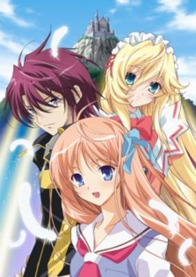

**Studio:** TNK &nbsp;|&nbsp; **Episodes:** 12 &nbsp;|&nbsp; **Director:** Tetsuya Yanagisawa &nbsp;|&nbsp; **Aired/Released:** January 5 – March 23 &nbsp;|&nbsp; **Genres:** Fantasy, Shoujo Ai, Bishounen, Angel, School Life, Magic, Romance

> Kyoshiro to Towa no Sora revolves around the life of Kuu Shiratori, a seemingly normal high school girl who enjoys her school life in the giant city Academia, which is thought of as a symbol of recovery for humanity since already ten years have passed since the greatest disaster mankind had ever seen, occurred. Kuu has recently been having a recurring dream where a prince meets her and takes her away. One day, while all the students at her school are preparing for the upcoming school festival, the prince, whom she has met several times in her dreams, appears. The prince, Kyoshiro Ayanokoji, requests of her just as he had done in Kuu's dreams, "Let's go... together..."
>
> _Synopsis source: Kitsu_

[Wikipedia](https://en.wikipedia.org/wiki/Shattered_Angels) · [Kitsu](https://kitsu.io/anime/kyoshiro-to-towa-no-sora)

---

### Saint October

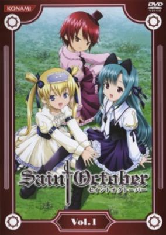

**Studio:** Studio Comet &nbsp;|&nbsp; **Episodes:** 26 &nbsp;|&nbsp; **Director:** Masafumi Satō &nbsp;|&nbsp; **Aired/Released:** January 5 – June 29 &nbsp;|&nbsp; **Genres:** Fantasy, Comedy, Detective, Plot Continuity, Present, Super Power, Adventure

> Whether it is the future or the past it is the world of fantasy and horror hiding in the shadow of the demon city. In the city, consecutive mysterious incidents that cannot be solved by science have occurred. To solve the incidents, they gather three girl detectives possessing special abilities. Hayama Kotono. She is an orphan living in a convent. Shirafuji Natuski. She is Kotono's classmate and a pop idol. Hijiri Misaki. She is a mysterious girl who fights against nightmares of her previous life. Those who want to bring the Judgement Day to the world. Those who want to save the world. Which is justice, and which is evil? When Kotono encounters a boy who lost his memory, the wheel of the story begins to move but slowly. Then, solving the mysteries, the three girls will confront the fate that will influence the existence of the human beings.
>
> _Synopsis source: Kitsu_

[Wikipedia](https://en.wikipedia.org/wiki/Saint_October) · [Kitsu](https://kitsu.io/anime/saint-october)

---

### Koi suru Tenshi Angelique: Kagayaki no Ashita (Loving Angel Angelique: When Hearts Awaken)

**Studio:** Satelight &nbsp;|&nbsp; **Episodes:** 12 &nbsp;|&nbsp; **Director:** Susumu Kudo &nbsp;|&nbsp; **Aired/Released:** January 6 – March 24 &nbsp;|&nbsp; **Genres:** Fantasy, Bishounen, Magic, Reverse Harem, Plot Continuity, Science Fiction, Adventure, Comedy, Romance

> A young girl named Ange is summoned to a Sacred Land and is chosen as the Legendary Etoile, whose mission is to save the newly-born Cosmos of the Holy Beast, which has recently fallen under a crisis. With the support of nine Guardians (who have the power of nine elements), she embarks on a journey to save the dying land of the Holy Beast and to discover her true self.
>
> _Synopsis source: Kitsu_

[Wikipedia](https://en.wikipedia.org/wiki/Koi_suru_Tenshi_Angelique) · [Kitsu](https://kitsu.io/anime/koi-suru-tenshi-angelique-kokoro-no-mezameru-toki)

---

### Major (Season 3)

**Studio:** Studio Hibari &nbsp;|&nbsp; **Episodes:** 26 &nbsp;|&nbsp; **Director:** Riki Fukushima &nbsp;|&nbsp; **Aired/Released:** January 6 – June 30

[Wikipedia](https://en.wikipedia.org/wiki/Major_(manga))

---

### Himawari!! (Himawari!)

**Studio:** Arms &nbsp;|&nbsp; **Episodes:** 13 &nbsp;|&nbsp; **Director:** Shigenori Kageyama &nbsp;|&nbsp; **Aired/Released:** January 7 – April 1 &nbsp;|&nbsp; **Genres:** Ninja, Japan, Action, Asia, Earth, Comedy, Juujin, Martial Arts, School Life, Countryside, Present, Adventure

> Himawari Hinata recently transfered to Shinobi Gakuen to train to become the best kunoichi she can be. She wanted to be a ninja ever since she was saved by one when she was little. On her first day, she meets Hayato Madenokoji (a new transfer teacher) who saves her life. Hayato does not possess any ninja skills or traits, he is teaching the ninjas about normal society to pay off his debt. However, Himawari notices that Hayato bares the same mark on his neck as the ninja who saved her when she was young.
>
> _Synopsis source: Kitsu_

[Wikipedia](https://en.wikipedia.org/wiki/Himawari!!) · [Kitsu](https://kitsu.io/anime/himawari-1)

---

### Les Misérables: Shōjo Cosette

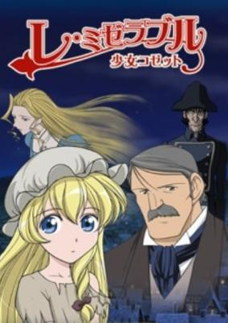

**Studio:** Nippon Animation &nbsp;|&nbsp; **Episodes:** 52 &nbsp;|&nbsp; **Director:** Hiroaki Sakurai &nbsp;|&nbsp; **Aired/Released:** January 7 – December 30 &nbsp;|&nbsp; **Genres:** France, Earth, Europe, Past, Plot Continuity, Historical, Slice of Life

> Based on the famous classic novel Les Miserables. Being a single mother is hard in early 19th Century France. When young Cosette was traveling with her mother trying to find a job and a place to live, they were always shunned away because very few employers hire single mothers. When she is promised with the prosperity of working in the big city, Cosette is separated from her mother in the hopes a caretaker will watch over her while her mother earns some money. Unfortunately this was a trick and the caretaker is a corrupt man who makes Cosette his indentured servant. Then the kind mayor of the town that Cosette makes her new home in sees how winds of change are so detrimental for children and families, and decides to do something about it.
>
> _Synopsis source: Kitsu_

[Kitsu](https://kitsu.io/anime/les-miserables-shoujo-cosette)

---

### Gakuen Utopia Manabi Straight!

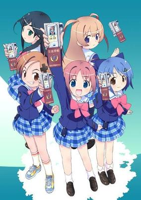

**Studio:** Ufotable &nbsp;|&nbsp; **Episodes:** 12 &nbsp;|&nbsp; **Director:** Hayato (ep 6) Hazuki Mizumoto (ep 10) Hiroatsu Agata (ep 4) Kei Tsunematsu (ep 7) Makoto Hoshino (ep 8) Takahiro Miura (eps 3, 9) Takayuki Hirao (5 episodes) Takuro Takahashi (eps 1, 12) &nbsp;|&nbsp; **Aired/Released:** January 8 – March 26 &nbsp;|&nbsp; **Genres:** Earth, Japan, Asia, Slice of Life, Comedy, Coming Of Age, High School, All Girls School, Future, Slapstick, School Life

> Manabi Straight! follows the lives of a group of young high school girls living in the year 2035 while they attend the all-girl Seioh Private High School. Since the birth rate has dropped dramatically, schools are being closed down due to the sheer lack of students available to teach. Morale in schools has dropped dramatically, and Seioh is no exception. The story begins when the main character, Manami Amamiya, transfers to Seioh. After some initial hijinks involving a futuristic scooter and a swim meet, followed by an inspirational school song performance, she is inducted as the student council president. The story that follows pertains to Manami working with Mika Inamori, the only other student council member, and three other classmates named Mutsuki Uehara, Mei Etoh, and Momoha Odori, in student council matters. After some remodeling of the student council room, Manami and her friends set forth to plan for the upcoming student festival.
>
> _Synopsis source: Kitsu_

[Wikipedia](https://en.wikipedia.org/wiki/Gakuen_Utopia_Manabi_Straight!) · [Kitsu](https://kitsu.io/anime/gakuen-utopia-manabi-straight)

---

### Master of Epic: The Animation Age

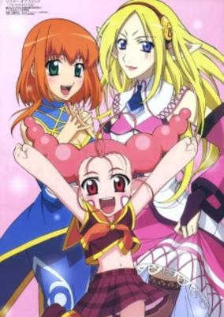

**Studio:** Gonzo Palm Studio &nbsp;|&nbsp; **Episodes:** 12 &nbsp;|&nbsp; **Director:** Tetsuya Endō &nbsp;|&nbsp; **Aired/Released:** January 8 – March 26 &nbsp;|&nbsp; **Genres:** Earth, Fantasy World, Adventure, Parody, Comedy, Slapstick, Virtual Reality, Fantasy

> Over millions of years, there have been many ages - war, gods, and future to name a few. Each of these was infinitely less exciting than the current Animation Age! In this RPG-esque existence, becoming stronger is paramount to one's survival and leveling up is a must. From pacifists to news casting, from fishing woes to love advice, there's nothing the Animation Age can't show or teach us about life in a game world! Armed with healing spells, changes of clothes and plenty of summoned familiars, the characters of Master of Epic will do what it takes to level up and live to fight another day!
>
> _Synopsis source: Kitsu_

[Wikipedia](https://en.wikipedia.org/wiki/Master_of_Epic) · [Kitsu](https://kitsu.io/anime/master-of-epic-the-animation-age)

---

### Shuffle! Memories

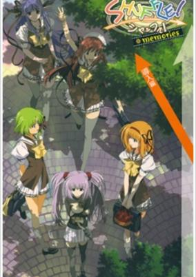

**Studio:** Asread &nbsp;|&nbsp; **Episodes:** 12 &nbsp;|&nbsp; **Director:** Naoto Hosoda &nbsp;|&nbsp; **Aired/Released:** January 8 – March 26 &nbsp;|&nbsp; **Genres:** Romance, Fantasy, Earth, Deity, High School, Drama, School Life, Harem, Magic, Comedy, Ecchi

> A recap of the Shuffle world, set ten years in the future. Gods, Demons, and Humans freely visit the other worlds as if traveling overseas, and romance is in the air. Demons, Gods, And Humans together have been falling in love and creating new families, breaking down the wall that once seperated them. Past memories are visited by Rin Tsuchimi and the events that occured between him and Lisianthus, Nerine, Kaede, Asa, and Primula.
>
> _Synopsis source: Kitsu_

[Wikipedia](https://en.wikipedia.org/wiki/Shuffle!_Memories) · [Kitsu](https://kitsu.io/anime/shuffle-memories)

---

### Hidamari Sketch

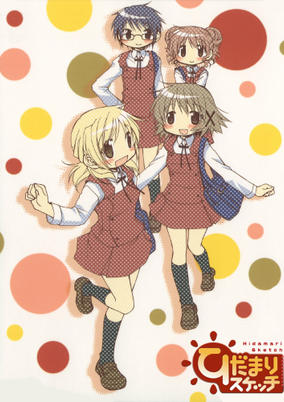

**Studio:** Shaft &nbsp;|&nbsp; **Episodes:** 12 &nbsp;|&nbsp; **Director:** Akiyuki Shinbo (chief) Ryōki Kamitsubo &nbsp;|&nbsp; **Aired/Released:** January 12 – March 30 &nbsp;|&nbsp; **Genres:** Japan, Earth, Asia, Parody, Slice of Life, Comedy, School Life, The Arts, Present

> For years, Yuno has dreamed of attending Yamabuki Arts High School, but now that she's been accepted, it means the scary prospect of moving away from her home and family for the first time! Fortunately, Yuno quickly learns that if her new neighbors at the eclectic Hidamari (Sunshine) Apartments aren't technically family, at least the majority share the bond of being fellow art students. From second year students like Hiro and Sae, who try to behave like helpful older sisters (mostly successfully) to her hyperactive new neighbor, classmate and best friend Miyako (who has the scariest apartment ever) Yuno begins to build the support network she'll need for dealing with strange characters like her oddly masculine landlady, her cosplay obsessed home room teacher, her tooth-chattering principal and all of the other odd denizens who inhabit her chosen world of art.
>
> _Synopsis source: Kitsu_

[Wikipedia](https://en.wikipedia.org/wiki/Hidamari_Sketch) · [Kitsu](https://kitsu.io/anime/hidamari-sketch)

---

### Venus Versus Virus

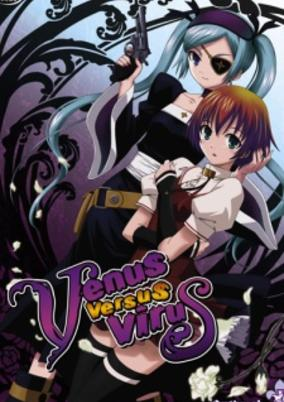

**Studio:** Studio Hibari &nbsp;|&nbsp; **Episodes:** 12 &nbsp;|&nbsp; **Director:** Shinichiro Kimura &nbsp;|&nbsp; **Aired/Released:** January 12 – March 30 &nbsp;|&nbsp; **Genres:** Fantasy, Japan, Adventure, Action, Plot Continuity, Violence, Present, Demon, Super Power, Romance

> Venus Versus Virus follows regular schoolgirl Sumire who's had the ability to see ghosts since a young age. She tells friends and family about this fact and they just dismiss it, thinking she's a liar. A chance encounter with a broach flying out of nowhere, a monster and gothloli clad monster killer named Lucia leaves her with a life changing decision to use her ability and fight against these "viruses" feeding upon the human race.
>
> _Synopsis source: Kitsu_

[Wikipedia](https://en.wikipedia.org/wiki/Venus_Versus_Virus) · [Kitsu](https://kitsu.io/anime/venus-versus-virus)

---

### Nodame Cantabile

**Studio:** J.C.Staff &nbsp;|&nbsp; **Episodes:** 23 &nbsp;|&nbsp; **Director:** Ken'ichi Kasai &nbsp;|&nbsp; **Aired/Released:** January 12 – June 15 &nbsp;|&nbsp; **Genres:** Romance, Japan, Earth, Asia, Slice of Life, Comedy, Sudden Girlfriend Appearance, University, Coming Of Age, Slapstick, School Life, Plot Continuity, Present, Music, Josei

> Shinichi Chiaki is a first class musician whose dream is to play among the elites in Europe. Coming from a distinguished family, he is an infamous perfectionist—not only is he highly critical of himself, but of others as well. The only thing stopping Shinichi from leaving for Europe is his fear of flying. As a result, he's grounded in Japan. During his fourth year at Japan's top music university, Shinichi happens to meet Megumi Noda or, as she refers to herself, Nodame. On the surface, she seems to be an unkempt girl with no direction in life. However, when Shinichi hears Nodame play the piano for the first time, he is in awe of the kind of music she creates. Nevertheless, Shinichi is dismayed to discover that Nodame is his neighbor, and worse, she ends up falling head over heels in love with him. [Written by MAL Rewrite]
>
> _Synopsis source: Kitsu_

[Wikipedia](https://en.wikipedia.org/wiki/Nodame_Cantabile) · [Kitsu](https://kitsu.io/anime/nodame-cantabile)

---

### Getsumento Heiki Mina

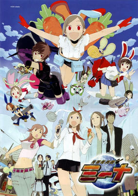

**Studio:** Gonzo &nbsp;|&nbsp; **Episodes:** 11 &nbsp;|&nbsp; **Director:** Keiichiro Kawaguchi &nbsp;|&nbsp; **Aired/Released:** January 14 – March 25 &nbsp;|&nbsp; **Genres:** Science Fiction, Japan, Action, Asia, Earth, Comedy, High School, Alien, Future, Magical Girl, Law And Order, Super Power, Parody

> An animated spin-off from the Densha Otoko (Trainman) TV drama. In the drama, actor Itoh Atsushi plays the otaku Yamada, whose main love in life is the Mina anime, a cutesy busty heroine with floppy rabbit ears and carrots sticking out her rear. Mina itself is a character homage which triggers back to the Daicon Animation done by GAINAX where a similar nameless bunny girl appeared. Densha Otoko futher featured an opening with scenes which were appearing back in the Daicon Animation.
>
> _Synopsis source: Kitsu_

[Wikipedia](https://en.wikipedia.org/wiki/Getsumento_Heiki_Mina) · [Kitsu](https://kitsu.io/anime/getsumen-to-heiki-mina)

---

### Tokyo Majin

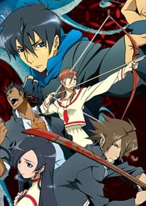

**Studio:** AIC Spirits BeSTACK &nbsp;|&nbsp; **Episodes:** 14 &nbsp;|&nbsp; **Director:** Shinji Ishihira &nbsp;|&nbsp; **Aired/Released:** January 19 – April 20 &nbsp;|&nbsp; **Genres:** Fantasy, Japan, Earth, Action, Asia, Tokyo, Horror, Plot Continuity, Violence, Present, Demon, Super Power, Martial Arts, School Life

> Something evil is stirring in the shadows of Tokyo... During the spring of his senior year in high school, quiet Tatsuma Hiyuu transfers to Magami Academy in Shinjuku. The mysterious boy's "outsider" status and his profound skills in martial arts quickly earn him the friendship of class delinquent Kyouichi Houraiji. Through an uncanny connection and a happenstance challenge, he also meets Yuuya Daigo of the wrestling club, the captain of the girls' archery club, Komaki Sakurai, and Aoi Misato, the Student Council President. During their encounter, there is a sudden, harsh disruption of the Ryumyaku (literally Dragon Pulse, otherwise known as Dragon Vein or Dragon Stream), the flow of arcane energy. The surge awakens within the five teenagers a latent power, giving them each a supernatural ability. Enlightened to their newly acquired gifts by Hisui, the young heir of the Kisaragi Clan who maintains his family's antiques shop - as well as their duty to protect Tokyo from Oni (demons) - the Magami students decide to use their power to protect the city from the onslaught of dark forces. Battling the demons alongside Hisui Kisaragi, the five unlikely friends discover that they may have to face a greater threat to Tokyo other than destroying a few malevolent, random monsters. The Ryumyaku had been disrupted by force, from someone invoking the Dark Arts - and that person has a wicked desire to unleash a long-dead evil. Can the teenagers overcome their own fears and flaws to fight against the Dark Arts? And soon they will also have to face their own destinies as they discover their Stars of Fate. This anime is based on a manga, which was based on the Nintendo role-playing video game originally released in 1998.
>
> _Synopsis source: Kitsu_

[Wikipedia](https://en.wikipedia.org/wiki/Tokyo_Majin) · [Kitsu](https://kitsu.io/anime/tokyo-majin-gakuen-kenpucho-tou)

---

### GR: Giant Robo

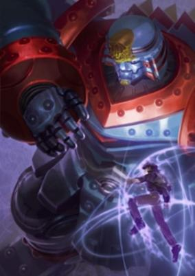

**Studio:** A.C.G.T &nbsp;|&nbsp; **Episodes:** 13 &nbsp;|&nbsp; **Director:** Masahiko Murata &nbsp;|&nbsp; **Aired/Released:** January 19 – July 20 &nbsp;|&nbsp; **Genres:** Mecha, Science Fiction, Adventure, Military

> The year is 20XX. Mysterious huge robots called "Giant Robo (GR)" started to appear all over the world and destroy cities. The earth was covered with fear. And their next target is Japan! The hero of this animation Daisaku Kusama, who works in a diving shop, encounters a mysterious girl, simply called V who leads him to make a contract with an enormous robot "Giant Robo 1 (GR1)" at the ancient ruins (Minami Yonaguni Island) in Okinawa. He made a contract with UNISOM (good guys) and was approved to be a commander of GR1. Thus his battle has begun against GRO (bad guys) and creates a lot of dramas. Before long, Giant Robo of the 21st century will ask the world the true meaning of its power.
>
> _Synopsis source: Kitsu_

[Kitsu](https://kitsu.io/anime/gr-giant-robo)

---

### Yes! PreCure 5 (Yes! Pretty Cure 5)

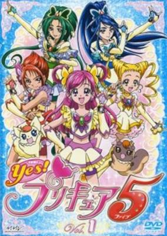

**Studio:** Toei Animation &nbsp;|&nbsp; **Episodes:** 49 &nbsp;|&nbsp; **Director:** Toshiaki Komura &nbsp;|&nbsp; **Aired/Released:** February 4 – January 27, 2008 &nbsp;|&nbsp; **Genres:** Contemporary Fantasy, Fantasy, Japan, Earth, Action, Asia, Middle School, Magical Girl, Present, Magic, School Life

> Yumehara Nozomi, a regular student, finds a magical book called the Dream Collet in the library and meets Coco and Nuts, two creatures from the Palmier Kingdom. They plead with Nozomi to restore their world, which has been destroyed by an organization called the Nightmares, by completing the Dream Collet and finding the 55 Pinkies to make any wish come true. Meanwhile, the Nightmares are moving into the real world. Once Nozomi agrees to help, Coco and Nuts transform her into the magical girl Cure Dream and turn four fellow students into her Pretty Cure team.
>
> _Synopsis source: Kitsu_

[Wikipedia](https://en.wikipedia.org/wiki/Yes!_PreCure_5) · [Kitsu](https://kitsu.io/anime/yes-precure-5)

---

### Reideen

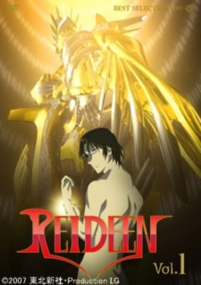

**Studio:** Production I.G &nbsp;|&nbsp; **Episodes:** 26 &nbsp;|&nbsp; **Director:** Mitsuru Hongo &nbsp;|&nbsp; **Aired/Released:** February 4 – September 1 &nbsp;|&nbsp; **Genres:** Mecha, Piloted Robot, Action, Science Fiction

> Saiga is a normal high school student with a gift in mathematics. His daily routine is disrupted when his family gets news that his Father's remains have been discovered—a noted archeologist and researcher who had gone missing while exploring a site many years before. Among his remains were notes and artifacts that needed to be identified by the family near a notable triangular mountain in Japan known as "Japan's pyramid", a place suspected by some to be man-made. A meteor containing a strange robotic lifeform falls from the sky and begins to cause destruction, putting Saiga in danger and causing a mysterious bracelet from his father's research to activate and merge him with an ancient robot burried within the pyramid—a robot the runes describe as Reideen. It is now up to Saiga and guardian Reideen to fight against this unknown alien threat from the sky.
>
> _Synopsis source: Kitsu_

[Wikipedia](https://en.wikipedia.org/wiki/Reideen) · [Kitsu](https://kitsu.io/anime/reideen)

---

### Jūsō Kikō Dancouga Nova

**Studio:** Ashi Productions &nbsp;|&nbsp; **Episodes:** 12 &nbsp;|&nbsp; **Director:** Masami Ōbari &nbsp;|&nbsp; **Aired/Released:** February 15 – May 3

[Wikipedia](https://en.wikipedia.org/wiki/J%C5%ABs%C5%8D_Kik%C5%8D_Dancouga_Nova)

---

### Naruto: Shippuden

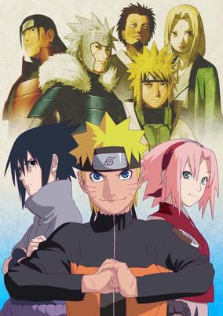

**Studio:** Pierrot &nbsp;|&nbsp; **Episodes:** 500 &nbsp;|&nbsp; **Director:** Yasuaki Kurotsu &nbsp;|&nbsp; **Aired/Released:** February 15 – March 23, 2017 &nbsp;|&nbsp; **Genres:** Ninja, Fantasy World, Action, Martial Arts, Love Polygon, Angst, Plot Continuity, Super Power, Comedy, Shounen

> It has been two and a half years since Naruto Uzumaki left Konohagakure, the Hidden Leaf Village, for intense training following events which fueled his desire to be stronger. Now Akatsuki, the mysterious organization of elite rogue ninja, is closing in on their grand plan which may threaten the safety of the entire shinobi world. Although Naruto is older and sinister events loom on the horizon, he has changed little in personality—still rambunctious and childish—though he is now far more confident and possesses an even greater determination to protect his friends and home. Come whatever may, Naruto will carry on with the fight for what is important to him, even at the expense of his own body, in the continuation of the saga about the boy who wishes to become Hokage.
>
> _Synopsis source: Kitsu_

[Kitsu](https://kitsu.io/anime/naruto-shippuden)

---

### Rocket Girls

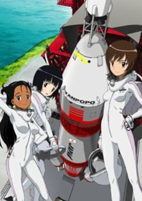

**Studio:** Mook Animation &nbsp;|&nbsp; **Episodes:** 12 &nbsp;|&nbsp; **Director:** Hiroshi Aoyama &nbsp;|&nbsp; **Aired/Released:** February 22 – May 18 &nbsp;|&nbsp; **Genres:** Science Fiction, Japan, Adventure, Earth, Asia, Comedy, Island, Friendship, Present

> A high school girl Morita Yukari visits Axia of the Solomon Islands in order to look for her father who became lost during his honeymoon trip. There, she meets a man named Nasuda of Solomon Space Agency, and she is hired to work part-time. That job is an astronaut. She is chosen as one of the crews of the first Japanese manned spaceship only because she is little and light. Where is her future going to?
>
> _Synopsis source: Kitsu_

[Wikipedia](https://en.wikipedia.org/wiki/Rocket_Girls_(anime)) · [Kitsu](https://kitsu.io/anime/rocket-girls)

---

### Ikki Tousen: Dragon Destiny (Ikkitousen: Dragon Destiny)

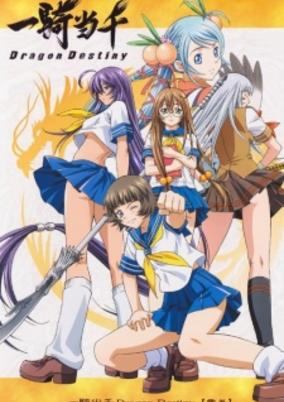

**Studio:** Arms &nbsp;|&nbsp; **Episodes:** 12 &nbsp;|&nbsp; **Director:** Koichi Ohata &nbsp;|&nbsp; **Aired/Released:** February 26 – May 14 &nbsp;|&nbsp; **Genres:** Ecchi, Japan, Action, Martial Arts, High School, Present, Super Power, School Life

> Loosely based on the novel Romance of the Three Kingdoms, modern day Japan sees a similar struggle for power between different rival schools with the three strongest being; Kyosho Academy led by Sousou Moutoku, Nanyo Academy by Sonsaku Hakufu and Ryuubi Gentoku from Seito High School. Together these three tousei, each with their own mangatama, fight for the honour of becoming ikki tousen and fulfilling their fated destiny through battle and conquest.
>
> _Synopsis source: Kitsu_

[Kitsu](https://kitsu.io/anime/ikkitousen-dragon-destiny)

---

### Moonlight Mile

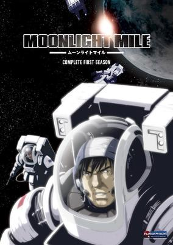

**Studio:** Studio Hibari &nbsp;|&nbsp; **Episodes:** 12 &nbsp;|&nbsp; **Director:** Iku Suzuki &nbsp;|&nbsp; **Aired/Released:** March 4 – May 27 &nbsp;|&nbsp; **Genres:** Space Travel, Science Fiction, Adventure, Earth, Asia, Slice of Life, Air Force, Shipboard, Military, Space

> After scaling Mt. Everest, mountain climbing partners Saruwatari Gorou and "Lostman" Jack F. Woodbridge see the ISA Space Station, and each vows to make the trek into outerspace. When Helium 3, a new energy source, is discovered on the moon, NASA forms a new project named "Nexus" to harness that energy for use on earth. This is the story of the two and the paths they take to see their dream become a reality in the quest to harness the next-generation energy source.
>
> _Synopsis source: Kitsu_

[Wikipedia](https://en.wikipedia.org/wiki/Moonlight_Mile_(manga)) · [Kitsu](https://kitsu.io/anime/moonlight-mile)

---

### Hitohira

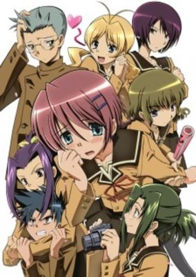

**Studio:** Xebec M2 &nbsp;|&nbsp; **Episodes:** 12 &nbsp;|&nbsp; **Director:** Akira Nishimori &nbsp;|&nbsp; **Aired/Released:** March 28 – June 13 &nbsp;|&nbsp; **Genres:** Japan, Earth, Asia, Comedy, Performance, High School, School Clubs, Romance, Slice of Life, School Life

> A transfer student Asai Mugi is a painfully shy girl. She is so shy that she can't speak when she becomes seriously nervous. However, for some reason, she is spotted and recruited as a member of the drama club.
>
> _Synopsis source: Kitsu_

[Wikipedia](https://en.wikipedia.org/wiki/Hitohira) · [Kitsu](https://kitsu.io/anime/hitohira)

---

### Gurren Lagann

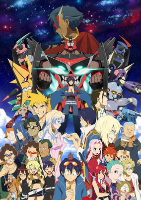

**Studio:** Gainax &nbsp;|&nbsp; **Episodes:** 27 &nbsp;|&nbsp; **Director:** Hiroyuki Imaishi &nbsp;|&nbsp; **Aired/Released:** April 1 – September 30 &nbsp;|&nbsp; **Genres:** Transforming Craft, Science Fiction, Mecha, Adventure, Post Apocalypse, Earth, Action, Space Battles, Piloted Robot, Comedy, Absurdist Humour, Humanoid Alien, Alien, Future, Plot Continuity, Drama

> Simon and Kamina were born and raised in a deep, underground village, hidden from the fabled surface. Kamina is a free-spirited loose cannon bent on making a name for himself, while Simon is a timid young boy with no real aspirations. One day while excavating the earth, Simon stumbles upon a mysterious object that turns out to be the ignition key to an ancient artifact of war, which the duo dubs Lagann. Using their new weapon, Simon and Kamina fend off a surprise attack from the surface with the help of Yoko Littner, a hot-blooded redhead wielding a massive gun who wanders the world above. In the aftermath of the battle, the sky is now in plain view, prompting Simon and Kamina to set off on a journey alongside Yoko to explore the wastelands of the surface. Soon, they join the fight against the "Beastmen," humanoid creatures that terrorize the remnants of humanity in powerful robots called "Gunmen." Although they face some challenges and setbacks, the trio bravely fights these new enemies alongside other survivors to reclaim the surface, while slowly unraveling a galaxy-sized mystery. [Written by MAL Rewrite]
>
> _Synopsis source: Kitsu_

[Wikipedia](https://en.wikipedia.org/wiki/Gurren_Lagann) · [Kitsu](https://kitsu.io/anime/tengen-toppa-gurren-lagann)

---

### Onegai My Melody Sukkiri♪

**Studio:** Studio Comet &nbsp;|&nbsp; **Episodes:** 52 &nbsp;|&nbsp; **Director:** Makoto Moriwaki &nbsp;|&nbsp; **Aired/Released:** April 1 – March 24, 2008 &nbsp;|&nbsp; **Genres:** Magic, Present, Japan, Plot Continuity, Fantasy, Comedy, Slice of Life

> A continuation of Onegai My Melody.
>
> _Synopsis source: Kitsu_

[Wikipedia](https://en.wikipedia.org/wiki/Onegai_My_Melody) · [Kitsu](https://kitsu.io/anime/onegai-my-melody-kuru-kuru-shuffle)

---

### Hayate the Combat Butler

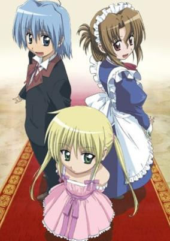

**Studio:** SynergySP &nbsp;|&nbsp; **Episodes:** 52 &nbsp;|&nbsp; **Director:** Keiichiro Kawaguchi &nbsp;|&nbsp; **Aired/Released:** April 1 – March 30, 2008 &nbsp;|&nbsp; **Genres:** Japan, Earth, Asia, Parody, Comedy, Absurdist Humour, Present, Action, Romance, Harem

> According to Murphy's Law, "anything that can go wrong, will go wrong," and truer words cannot describe the unfortunate life of the hard-working Hayate Ayasaki. Abandoned by his parents after accumulating a debt of over one hundred fifty million yen, he is sold off to the yakuza, initiating his swift getaway from a future he does not want. On that fateful night, he runs into Nagi Sanzenin, a young girl whom he decides to try and kidnap to pay for his family's massive debt. Unfortunately, due to his kind-hearted nature and a string of misunderstandings, Nagi believes Hayate to be confessing his love to her. After saving her from real kidnappers, Hayate is hired as Nagi's personal butler, upon which she is revealed to be a member of one of the wealthiest families in Japan. Highly skilled but cursed with the world's worst luck, Hayate gets straight to work serving his employer all the while trying to deal with the many misfortunes that befall him. From taking care of a mansion to fending off dangerous foes, and even unintentionally wooing the hearts of the women around him, Hayate is in over his head in the butler comedy Hayate no Gotoku! [Written by MAL Rewrite]
>
> _Synopsis source: Kitsu_

[Wikipedia](https://en.wikipedia.org/wiki/Hayate_the_Combat_Butler) · [Kitsu](https://kitsu.io/anime/hayate-no-gotoku-1)

---

### GeGeGe no Kitarō

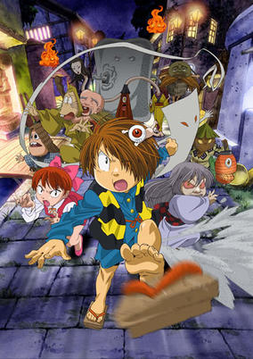

**Studio:** Toei Animation &nbsp;|&nbsp; **Episodes:** 100 &nbsp;|&nbsp; **Director:** Yukio Kaizawa &nbsp;|&nbsp; **Aired/Released:** April 1 – March 29, 2009 &nbsp;|&nbsp; **Genres:** Demon, Fantasy, Horror, Comedy

> The classic tale of Gegege no Kitaro told yet again. The story is the usual in the Gegege no Kitaro series. Kitaro is a boy living in the Gegege Forest/Cemetery (lands where many Yokai roam) with his mostly dead father (who survives only in his eye), Sunakake Babaa, NekoMusume, and Konaki Jiji. One difference between this Kitaro and all of the others that came before him, is that this one has brown hair instead of the standard grayish silver.
>
> _Synopsis source: Kitsu_

[Wikipedia](https://en.wikipedia.org/wiki/GeGeGe_no_Kitar%C5%8D) · [Kitsu](https://kitsu.io/anime/gegege-no-kitarou-2007)

---

### Magical Girl Lyrical Nanoha Strikers

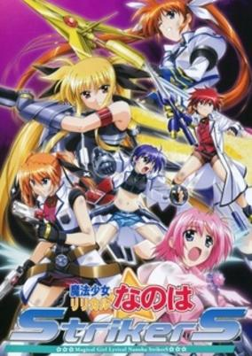

**Studio:** Seven Arcs &nbsp;|&nbsp; **Episodes:** 26 &nbsp;|&nbsp; **Director:** Keizō Kusakawa &nbsp;|&nbsp; **Aired/Released:** April 2 – September 24 &nbsp;|&nbsp; **Genres:** Science Fiction, Mecha, Fantasy, Fantasy World, Contemporary Fantasy, Action, Human Enhancement, Cyborg, Other Planet, Magic, Humanoid Alien, Shipboard, Magical Girl, Parallel Universe, Plot Continuity, Present, Military, Super Power, Comedy

> Set 10 years after Mahou Shoujo Lyrical Nanoha A's, Nanoha, Fate, Hayate and the rest of the crew are now working full time in the Time-Space Administration Bureau. Nanoha is a combat instructor, Fate is a special investigator, and Hayate is a commanding officer. They must unite once again to save the dimensions. Introducing new characters as well: Subaru, Teana, Caro and Erio. Stand by. Ready. Set up!
>
> _Synopsis source: Kitsu_

[Wikipedia](https://en.wikipedia.org/wiki/Magical_Girl_Lyrical_Nanoha_Strikers) · [Kitsu](https://kitsu.io/anime/mahou-shoujo-lyrical-nanoha-strikers)

---

### Heroic Age

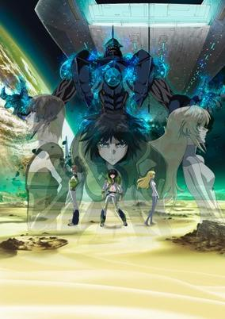

**Studio:** Xebec &nbsp;|&nbsp; **Episodes:** 26 &nbsp;|&nbsp; **Director:** Takashi Noto (chief) Toshimasa Suzuki &nbsp;|&nbsp; **Aired/Released:** April 2 – October 1 &nbsp;|&nbsp; **Genres:** Space Travel, Science Fiction, Dystopia, Post Apocalypse, Action, Space Opera, Coming Of Age, Humanoid Alien, Shipboard, Alien, Drama, Future, Friendship, Plot Continuity, Violence, Space, Military, Super Power, Mecha

> When the Golden Race invited other races to join them in the stars, three sentient races answered their call. The Goldens called them the Bronze, Silver and Heroic Tribes. Just before the Gold Tribe left to travel to another Universe, a fourth race appeared, traveling to the stars on their own accomplishments. The Golds named the human race the Iron Tribe. During the passing of time, humanity suffers at the hands of the more dominant races and is now facing extinction. Following a prophecy left by the Gold Tribe, Princess Deianeira sets out to search for the powerful being who might be able to save humankind. She meets a wild haired boy on an abandoned planet—a fateful encounter that will not only change the fortunes of Humanity, but also the fate of the universe.
>
> _Synopsis source: Kitsu_

[Wikipedia](https://en.wikipedia.org/wiki/Heroic_Age_(anime)) · [Kitsu](https://kitsu.io/anime/heroic-age)

---

### My Bride is a Mermaid

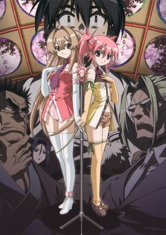

**Studio:** Gonzo AIC &nbsp;|&nbsp; **Episodes:** 26 &nbsp;|&nbsp; **Director:** Seiji Kishi &nbsp;|&nbsp; **Aired/Released:** April 2 – October 1 &nbsp;|&nbsp; **Genres:** Japan, Earth, Asia, Mafia, Parody, Comedy, Middle School, Super Deformed, Crime, Coming Of Age, Slapstick, School Life, Present, Romance, Mermaid

> Michishio Nagasumi's life couldn't be any more normal. In an odd twist of events, during his summer vacation he ends up almost drowning in the sea. Luckily, the cute mermaid Seto Sun appears to save him. However, Sun is from a yakuza mermaid family and according to their law, if a human is to catch sight of a mermaid, either he or the mermaid must die. The only other way is for Nagasumi to be taken in as a family member, marrying Sun. In attempts to save both of their lives, Nagasumi asks for Sun's hand in marriage. Nagasumi's summer vacation reaped more than what he would expect, as he must now protect Sun from others finding her secret out.
>
> _Synopsis source: Kitsu_

[Wikipedia](https://en.wikipedia.org/wiki/My_Bride_is_a_Mermaid) · [Kitsu](https://kitsu.io/anime/seto-no-hanayome)

---

### El Cazador de la Bruja

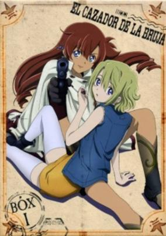

**Studio:** Bee Train &nbsp;|&nbsp; **Episodes:** 26 &nbsp;|&nbsp; **Director:** Kōichi Mashimo &nbsp;|&nbsp; **Aired/Released:** April 3 – September 25 &nbsp;|&nbsp; **Genres:** Desert, Adventure, Earth, Action, Gunfights, Conspiracy, Bounty Hunter, Americas, Mystery

> Ellis, a young girl suspected of murdering a prominent physicist Heinrich Schneider, is on the run from an underground society called "Hunters" when she is tracked down by the bounty hunter Nadie in a small Mexican town. However, instead of turning her in, Nadie impulsively decides to help her and the two girls embark on a journey to Ellis' hometown, where they plan on finding clues about her past. From there, they travel south to search for the mysterious Gemstone of the Inca Rose, the "Eternal City" of Wiñay Marka, and Ellis' own obscure destiny.
>
> _Synopsis source: Kitsu_

[Wikipedia](https://en.wikipedia.org/wiki/El_Cazador_de_la_Bruja) · [Kitsu](https://kitsu.io/anime/el-cazador-de-la-bruja)

---

### Idolmaster: Xenoglossia (IDOLM@STER Xenoglossia)

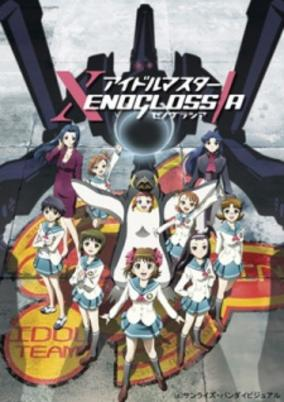

**Studio:** Sunrise &nbsp;|&nbsp; **Episodes:** 26 &nbsp;|&nbsp; **Director:** Tatsuyuki Nagai &nbsp;|&nbsp; **Aired/Released:** April 3 – September 25 &nbsp;|&nbsp; **Genres:** Science Fiction, Mecha, Japan, Post Apocalypse, Earth, Genetic Modification, Action, Piloted Robot, Tokyo, Human Enhancement, Future, Plot Continuity, Military, Comedy

> 107 years ago, the Moon was destroyed in a massive cataclysm that shattered Earth's former satellite into 81 quintillion tons of orbital debris. However, thanks to super-science, the Earth itself was saved and today no one really thinks much about that century-past disaster. Which is why when teenage Haruka Amami auditions for something called the Idolmaster Project, she THINKS she's trying out to be a singing idol. Instead, Haruka finds herself at a secret school run by the Mondenkind Agency, living with a group of other girls who have also been selected as candidates to pilot an iDOL - an advanced robot specifically designed to intercept falling chunks of moon rock. Except, the people who run the Mondenkind Agency aren't exactly knights in shining armor. And then there's the question of whether the iDOLs are really JUST robots. Because from almost the first moment, Haruka starts to feel emotions resonating from within the iDOL called Imber.
>
> _Synopsis source: Kitsu_

[Kitsu](https://kitsu.io/anime/idolm-ster-xenoglossia)

---

### Sugarbunnies

**Studio:** Asahi Production &nbsp;|&nbsp; **Episodes:** 26 &nbsp;|&nbsp; **Director:** Hiroshi Kugimiya &nbsp;|&nbsp; **Aired/Released:** April 3 – September 25

[Wikipedia](https://en.wikipedia.org/wiki/Sugarbunnies)

---

### Toka Gettan: The Moonlight Lady Returns

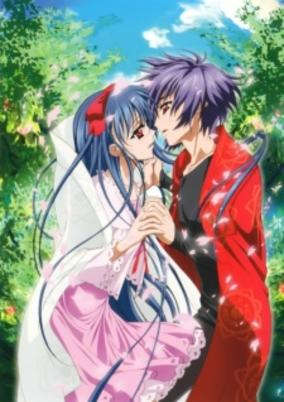

**Studio:** Studio Deen &nbsp;|&nbsp; **Episodes:** 26 &nbsp;|&nbsp; **Director:** Yūji Yamaguchi &nbsp;|&nbsp; **Aired/Released:** April 3 – September 25 &nbsp;|&nbsp; **Genres:** Romance, Japan, Earth, Asia, Shoujo Ai

> Touka Gettan is set in the land of Kamitsumihara, where traces of magic and legend can still be seen. The land has been under the protection of the Kamiazuma clan since it was founded. The story revolves around Touka Kamiazuma, the main protagonist, and his encounter with a young girl named Momoka Kawakabe who comes to stay with the clan. Their meeting sets off a chain of events that will bring an ancient legend to life.
>
> _Synopsis source: Kitsu_

[Wikipedia](https://en.wikipedia.org/wiki/T%C5%8Dka_Gettan) · [Kitsu](https://kitsu.io/anime/touka-gettan)

---

### Shinkyoku Sōkai Polyphonica

**Studio:** Ginga-ya &nbsp;|&nbsp; **Episodes:** 12 &nbsp;|&nbsp; **Director:** Junichi Watanabe (chief) Masami Shimoda &nbsp;|&nbsp; **Aired/Released:** April 4 – June 20

[Wikipedia](https://en.wikipedia.org/wiki/Shinkyoku_S%C5%8Dkai_Polyphonica)

---

### Kono Aozora ni Yakusoku o

**Studio:** Artland &nbsp;|&nbsp; **Episodes:** 13 &nbsp;|&nbsp; **Director:** Ken Ando (chief) Tsutomu Yabuki &nbsp;|&nbsp; **Aired/Released:** April 4 – June 27 &nbsp;|&nbsp; **Genres:** Romance, Slice of Life, Comedy, Female Teacher, School Life, Female Student, Harem

> One morning, Wataru Hoshino found a sleeping girl—in nothing but her underwear—in his room. When she woke up, she quickly escaped by jumping out of the window, but not without punching Wataru in the face first. This girl, Rinna Sawaki, ends up being a transfer student of Wataru's school, as well as the new roommate of Wataru's dormitory. Wataru lives with four other girls and their school teacher, but due to Temizugawa Heavy Industry's cancellation of their aviation branch—South Sakojima Island's major company—the families involved with the corporation have to be evacuated in one year. As a result of this, the four girls have to leave the island in one year's time. Knowing this, Rinna refuses to become friends with Wataru and the other girls, because of the pain that she might experience as a result of their eventual separation; however, Wataru disagrees with her, and over the course of the year, tries to convince her otherwise.
>
> _Synopsis source: Kitsu_

[Wikipedia](https://en.wikipedia.org/wiki/Kono_Aozora_ni_Yakusoku_o) · [Kitsu](https://kitsu.io/anime/kono-aozora-ni-yakusoku-wo)

---

### Saint Beast: Kouin Jojishi Tenshi Tan

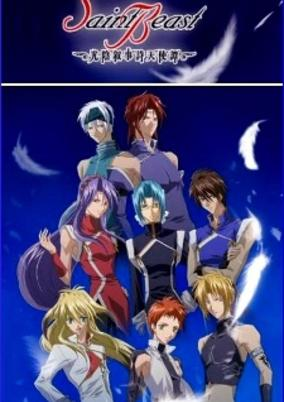

**Studio:** Tokyo Kids Yuhodo &nbsp;|&nbsp; **Episodes:** 13 &nbsp;|&nbsp; **Director:** Nanako Shimazaki &nbsp;|&nbsp; **Aired/Released:** April 4 – June 27 &nbsp;|&nbsp; **Genres:** Bishounen, Magic, Angel, Super Power, Earth, Shounen Ai, Action, Fantasy

> A long time ago, Zeus, the great god, created a three–tier hierarchy of angels, top, middle and lower, although they were supposed to be equal. Also, Zeus appointed 6 angels as Saint Beasts who govern the animals of Earth. They were: Go, the seiyu; Shin, the genbu; Rei, the suzaku; Guy, the byakko; Yuda, the kirin; and Ruka, the hooh. However, Kira, the shooting star, and Maya, the fuga, didn’t attend the selection tests and left for the Earth. The six angels fulfilled their tasks faithfully. However, because of Zeus’s increasingly tyrannical acts, they begin to mistrust him.
>
> _Synopsis source: Kitsu_

[Wikipedia](https://en.wikipedia.org/wiki/Saint_Beast) · [Kitsu](https://kitsu.io/anime/saint-beast-kouin-jojishi-tenshi-tan)

---

### Sisters of Wellber (Sisters of Wellber Zwei)

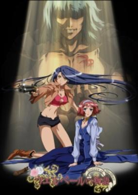

**Studio:** Trans Arts &nbsp;|&nbsp; **Episodes:** 13 &nbsp;|&nbsp; **Director:** Takayuki Hamana &nbsp;|&nbsp; **Aired/Released:** April 4 – June 27 &nbsp;|&nbsp; **Genres:** Steampunk, Adventure, Historical, Fantasy, Romance

> The loquacious sentient tank, Gyrano De Borgerac seems very busy being pampered by solicitous maids. The fairy Sherri, too, is enjoying the luxury of the court's life. And for Rita, time has come to face her duties as princess of Wellber. But Tina is resolute: she wants to continue her search for the Man with a tattoo of Bee the Death, the devil who exterminated her family. An unspeakable feeling of sadness fills the hearts of the two girls, who shared so much and are now about to say farewell to each other. And then, on the day of Tina's departure... A new journey that will take Tina walking through the still sore scars of the Great War that wiped out entire cities ten years before, until the unsuspected truth about her nemesis! Credit: Production I.G ( /www.productionig.com )
>
> _Synopsis source: Kitsu_

[Wikipedia](https://en.wikipedia.org/wiki/Sisters_of_Wellber) · [Kitsu](https://kitsu.io/anime/wellber-no-monogatari-sisters-of-wellber-zwei)

---

### Engage Planet Kiss Dum

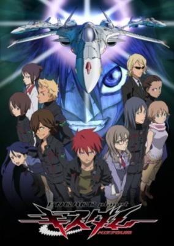

**Studio:** Satelight &nbsp;|&nbsp; **Episodes:** 26 &nbsp;|&nbsp; **Director:** Yasuchika Nagaoka (chief) Eiichi Satō &nbsp;|&nbsp; **Aired/Released:** April 4 – September 26 &nbsp;|&nbsp; **Genres:** Mecha, Post Apocalypse, Earth, Action, Alien, Drama, Future, Military, Super Power, Science Fiction

> In A.D. 2031, humans are enjoying a prosperous existence until strange life forms called Hardians appear. They suddenly begin to multiply and assault the human population. As a countermeasure, mankind organizes the N.I.D.F. to investigate the Hardians and protect themselves. A fighter pilot, Aiba Shu, begins to become involved in the battle against the lifeforms. Rurika Yuno, one of Earth's foremost scientists, investigates the Hardians and hears rumors about the "Book of a Dead Man." What is the secret of this tome, and what relation does it have to the Hardians? Now, the fight for mankind's survival begins.
>
> _Synopsis source: Kitsu_

[Wikipedia](https://en.wikipedia.org/wiki/Engage_Planet_Kiss_Dum) · [Kitsu](https://kitsu.io/anime/kiss-dum-engage-planet)

---

### Oh! Edo Rocket

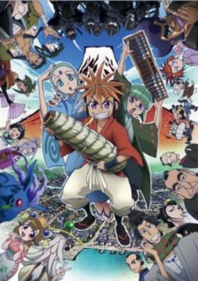

**Studio:** Madhouse &nbsp;|&nbsp; **Episodes:** 26 &nbsp;|&nbsp; **Director:** Seiji Mizushima &nbsp;|&nbsp; **Aired/Released:** April 4 – September 26 &nbsp;|&nbsp; **Genres:** Space Travel, Science Fiction, Japan, Earth, Action, Asia, Parody, Comedy, Alternative Past, Alien, Past, Slapstick, Plot Continuity, Historical, Fantasy

> In Edo in the mid-1800's, fireworks maker Seikichi Tamaya and his friends struggle to live under the harsh morality laws imposed by the strict city councilor, which ban all luxuries, including fireworks. One day, a strange girl stops by Sekichi's shop with an equally strange request: she wants Sekichi to build a firework that can reach the moon.
>
> _Synopsis source: Kitsu_

[Wikipedia](https://en.wikipedia.org/wiki/Oh!_Edo_Rocket) · [Kitsu](https://kitsu.io/anime/oh-edo-rocket)

---

### Over Drive

**Studio:** Xebec &nbsp;|&nbsp; **Episodes:** 26 &nbsp;|&nbsp; **Director:** Takao Kato &nbsp;|&nbsp; **Aired/Released:** April 4 – September 26 &nbsp;|&nbsp; **Genres:** Japan, Earth, Asia, Sports, Comedy, Cycling, High School, School Clubs, School Life, Plot Continuity, Present

> Tour de France, it is the biggest bicycle race in the world. Now, a new achievement is about to be recorded in the history of Tour de France. The top racer is a Japanese boy named Shinozaki Mikoto. "Why don't you join our bicycle club?" said Fukazawa, Shinozaki Mikoto's secret love. Unfortunately, despite being a high school student, he doesn't know how to ride a bike. With no real idea of what the bicycle club is, he earnestly practices. After he overcomes this challenge, while he pedals along, something that was smoldering in his mind for 15 years ignites. "I want to devote myself to bike riding." Experiencing failure with his friends and rivals, he pedals towards becoming the top racer.
>
> _Synopsis source: Kitsu_

[Wikipedia](https://en.wikipedia.org/wiki/Over_Drive_(manga)) · [Kitsu](https://kitsu.io/anime/over-drive)

---

### Claymore

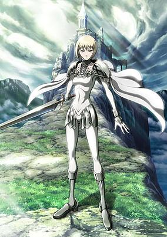

**Studio:** Madhouse &nbsp;|&nbsp; **Episodes:** 26 &nbsp;|&nbsp; **Director:** Hiroyuki Tanaka &nbsp;|&nbsp; **Aired/Released:** April 4 – September 26 &nbsp;|&nbsp; **Genres:** Fantasy, Fantasy World, Adventure, Action, Swordplay, Dystopia, Angst, Dark Fantasy, Drama, Past, Stereotypes, Plot Continuity, Violence, Demon, Super Power

> In this world, humans coexist with demonic predators called Yoma. These demonic beasts feast on human innards and can blend into human society by taking on human appearance. As a counter force, a mysterious organization created half-human, half-Yoma warriors known as the "Silver Eyed Witches" or "Claymores," after the huge claymore swords they carry. They are detested by humanity however necessary. The story begins with a young boy, Raki, who has lost everything in a Yoma attack, and the Claymore, Clare, who is generally detested by society. Throughout the series, Clare and Raki show their deeper qualities, powers and Clare's never ending devotion to the goal she swore to fulfill in her childhood.
>
> _Synopsis source: Kitsu_

[Wikipedia](https://en.wikipedia.org/wiki/Claymore_(manga)) · [Kitsu](https://kitsu.io/anime/claymore)

---

### Kotetsushin Jeeg

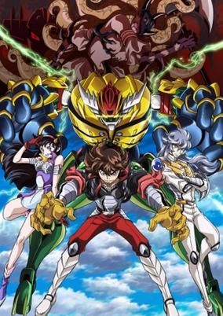

**Studio:** Actas &nbsp;|&nbsp; **Episodes:** 13 &nbsp;|&nbsp; **Director:** Jun Kawagoe &nbsp;|&nbsp; **Aired/Released:** April 5 – July 12 &nbsp;|&nbsp; **Genres:** Transforming Craft, Science Fiction, Mecha, Fantasy, Japan, Action, Piloted Robot, Alien, Demon

> Kotetsushin Jeeg takes place fifty years after the original and features a new cast of characters—primarily the new main character Kenji Kusanagi, a high school student who becomes Kotetsushin Jeeg to fight the sudden reappearance of "Haniwa Genjin" ("Haniwa Phantom Gods", or clay robots) from the Jamada Empire ruled by Queen Himika. Other characters include Tsubaki Tamashiro (grandaughter of Miwa Uzuki); and Kyou Misumi. Other main characters from the original series also appear.
>
> _Synopsis source: Kitsu_

[Wikipedia](https://en.wikipedia.org/wiki/Kotetsushin_Jeeg) · [Kitsu](https://kitsu.io/anime/koutetsushin-jeeg)

---

### Romeo × Juliet (Romeo x Juliet)

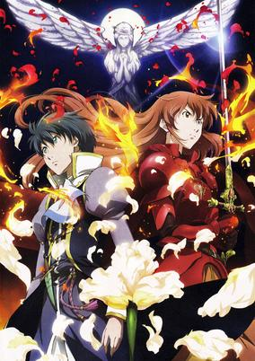

**Studio:** Gonzo &nbsp;|&nbsp; **Episodes:** 24 &nbsp;|&nbsp; **Director:** Fumitoshi Oizaki &nbsp;|&nbsp; **Aired/Released:** April 5 – September 26 &nbsp;|&nbsp; **Genres:** Romance, Fantasy World, Angst, Drama, Past, Plot Continuity, Historical, Fantasy

> In the floating continent of Neo Verona, the Montague family seized control and murdered every member of the Capulet family with the exception of Capulet's daughter, Juliet Fiammata Asto Capulet. 14 years later, Juliet and the remnants of Capulet's retainers live hidden from the iron fist of the Montague family. Juliet has long forgotten the murder of her family or her identity, and cross dresses as Odin and the town's hero of justice, "Red Whirlwind." A sudden escape in her daily escapades leads her to meet Romeo Candorebanto Montague, the kind son of the tyrannical Montague. Destiny has been set as these two individuals soon to be "star-crossed lovers" are cruelly toyed with by fate in the midst of war. Loosely based on the play by William Shakespeare.
>
> _Synopsis source: Kitsu_

[Wikipedia](https://en.wikipedia.org/wiki/Romeo_%C3%97_Juliet) · [Kitsu](https://kitsu.io/anime/romeo-x-juliet)

---

### Kishin Taisen Gigantic Formula

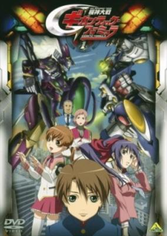

**Studio:** Brain's Base &nbsp;|&nbsp; **Episodes:** 26 &nbsp;|&nbsp; **Director:** Keiji Gotoh &nbsp;|&nbsp; **Aired/Released:** April 5 – September 27 &nbsp;|&nbsp; **Genres:** Science Fiction, Mecha, Japan, Post Apocalypse, Earth, Action, Asia, Piloted Robot, Conspiracy, Future, Plot Continuity, Military

> 2035 A.D. The heads of ancient giant idols were excavated all over the world. Using those twelve stones statues, Humanity had barely overcome the threat of extinction called the "Equatorial Winter". But the stone statues had forced Humanity to construct colossal suits of armor as their bodies and demanded that the humans fight each other.
>
> _Synopsis source: Kitsu_

[Wikipedia](https://en.wikipedia.org/wiki/Kishin_Taisen_Gigantic_Formula) · [Kitsu](https://kitsu.io/anime/kishin-taisen-gigantic-formula)

---

### Nagasarete Airantō

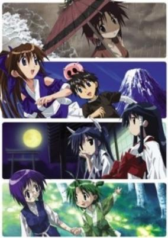

**Studio:** Feel &nbsp;|&nbsp; **Episodes:** 26 &nbsp;|&nbsp; **Director:** Hideki Okamoto &nbsp;|&nbsp; **Aired/Released:** April 5 – September 27 &nbsp;|&nbsp; **Genres:** Fantasy, Earth, Slice of Life, Comedy, Island, Anthropomorphism, Slapstick, Stereotypes, Present, Harem, Ecchi, Romance

> Ikuto Touhohin just had a fight with his old man, one that led him to make a rash decision to run away from home. He boards a ship, deciding to take a vacation, but the ship is suddenly hit by a huge storm—one that sends Ikuto overboard! When he regains consciousness, he realizes he is still alive on some island. An isolated island. An isolated island with nothing but girls. Beautiful girls. Stranded on an island with only girls, no electricity, gas, radio, television, like he was back in the stone age.
>
> _Synopsis source: Kitsu_

[Wikipedia](https://en.wikipedia.org/wiki/Nagasarete_Airant%C5%8D) · [Kitsu](https://kitsu.io/anime/nagasarete-airantou)

---

### Bakugan Battle Brawlers

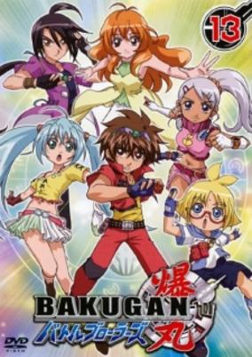

**Studio:** TMS Entertainment &nbsp;|&nbsp; **Episodes:** 52 &nbsp;|&nbsp; **Director:** Mitsuo Hashimoto &nbsp;|&nbsp; **Aired/Released:** April 5 – March 27, 2008 &nbsp;|&nbsp; **Genres:** Proxy Battles, Action, Fantasy

> Bakugan Battle Brawlers begins with Danma Kuusou, a boy who invented the game Bakugan with his friend Shun Kazami after mysterious and seemingly random cards fell out of the sky. Together with their other friends, they form a team called the "Bakugan Battle Brawlers" in order to play this new game together. But unknown to these young friends, Bakugan is much more than a simple past time. Their game accidently sucks them into an alternate dimension called Vestroia, the home ground of Bakugan. Vestroia has recently come under attack by creatures known as the Doom Beings. This realm is balanced by the Perfect Core, which itself is formed by the Infinity and Silent Cores. When the evil Bakugan Naga attempted to take this great power for himself, he was unable to absorb the negative energy he wished to steal and found himself trapped in the Silent Core. Now, his presence within the core has destabilized Vestroia and attempts to merge with Earth as well as many other worlds. Danma and his friends must team up with individuals from other worlds who have also been drawn into this epic battle. As Naga is seeking the Infinity Core so that he may complete the Perfect Core in order to gain control of Vestroia, Earth, and all other worlds, time is of the essence in this devastating war of worlds.
>
> _Synopsis source: Kitsu_

[Wikipedia](https://en.wikipedia.org/wiki/Bakugan_Battle_Brawlers) · [Kitsu](https://kitsu.io/anime/bakugan-battle-brawlers)

---

### Darker than Black

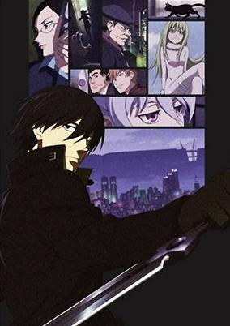

**Studio:** Bones &nbsp;|&nbsp; **Episodes:** 25 &nbsp;|&nbsp; **Director:** Tensai Okamura &nbsp;|&nbsp; **Aired/Released:** April 6 – September 28 &nbsp;|&nbsp; **Genres:** Contemporary Fantasy, Japan, Earth, Action, Asia, Tokyo, Conspiracy, Angst, Drama, Alternative Present, Violence, Present, Super Power, Science Fiction, Mystery

> It has been 10 years since Heaven's Gate appeared in South America and Hell's Gate appeared in Japan, veiling the once familiar night sky with an oppressive skyscape. Their purposes unknown, these Gates are spaces in which the very laws of physics are ignored. With the appearance of the Gates emerged Contractors, who, in exchange for their humanity, are granted supernatural abilities. In the Japanese city surrounding Hell’s Gate, Section 4 Chief Misaki Kirihara finds herself at odds with an infamous Contractor codenamed Hei. Called "Black Reaper" in the underground world, Hei, like his associates, undertakes missions for the mysterious and ruthless Syndicate while slowly peeling back the dark layers covering a nefarious plot that threatens the very existence of Contractors. From the mind of Tensai Okamura comes a sci-fi thriller taking the form of a subtle exposé on a war in which political positions and justice have no sway—a war waged exclusively in the shadows. [Written by MAL Rewrite]
>
> _Synopsis source: Kitsu_

[Wikipedia](https://en.wikipedia.org/wiki/Darker_than_Black) · [Kitsu](https://kitsu.io/anime/darker-than-black)

---

### Kamichama Karin

**Studio:** Satelight &nbsp;|&nbsp; **Episodes:** 26 &nbsp;|&nbsp; **Director:** Takashi Anno &nbsp;|&nbsp; **Aired/Released:** April 6 – September 28 &nbsp;|&nbsp; **Genres:** Romance, Fantasy, Japan, Comedy, Shoujo Ai, Deity, Coming Of Age, Angst, Magical Girl, Present, Shounen Ai, Magic, School Life

> Thirteen-year-old Karin Hanazono feels like her life can't get any worse, Her parents died when she was younger, leaving her with an aunt who doesn't hesitate to call her stupid and useless over her poor grades. Her only friend, her cat named Shii-chan, passed away recently, leaving her completely alone. All she has left of her parents is a ring given to her by her mother, which she treasures dearly as the sole thing left of her past.Kamichama Karin begins the moment her life takes a turn for the better, when she is approached by Himeka Kuujou, a cute girl who has also lost her parents, and Kazune Kuujou, her cousin who finds girls to be troublesome, both of whom are searching for a goddess. Her mother's memento ring shines brightly in their presence and fills her with its radiance, making her smarter, faster, and capable of granting wishes. It turns out that her ring allows her to become the very goddess they were looking for, and now that she has awakened that power, others will come after her for it…
>
> _Synopsis source: Kitsu_

[Wikipedia](https://en.wikipedia.org/wiki/Kamichama_Karin) · [Kitsu](https://kitsu.io/anime/kamichama-karin)

---

### Kōtetsu Sangokushi

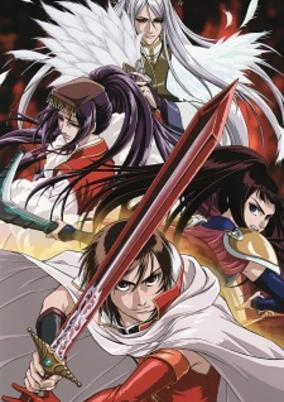

**Studio:** Picture Magic &nbsp;|&nbsp; **Episodes:** 25 &nbsp;|&nbsp; **Director:** Tetsuya Endo (chief) Satoshi Saga &nbsp;|&nbsp; **Aired/Released:** April 6 – September 28 &nbsp;|&nbsp; **Genres:** China, Adventure, Earth, Action, Three Kingdoms, Asia, Swordplay, Past, Shounen Ai, Historical

> The Imperial Seal has been passed down through the generations since ancient times. It confers great power unto the warriors that it chooses. This is the story of those warriors. It is a time of chaos and of civil war. It is a time when great armies clash in titanic battles and great heroes carve their names in history. It is also a time of death and destruction, when the people of the land live in constant fear of the sword. Onto this stage steps the reluctant Rikuson (Lu Xun), whose family had been the guardians of the Imperial Seal up until it was stolen by Sonsaku. At the behest of his mentor Rikuson offers his services to Sonsaku with the intention of confirming the will of the Imperial Seal. However, assassins strike down Sonsaku and the Imperial Seal is lost. So begins, Rikuson’s journey to recover the Imperial Seal and discover his destiny.
>
> _Synopsis source: Kitsu_

[Wikipedia](https://en.wikipedia.org/wiki/K%C5%8Dtetsu_Sangokushi) · [Kitsu](https://kitsu.io/anime/koutetsu-sangokushi)

---

### Shining Tears X Wind

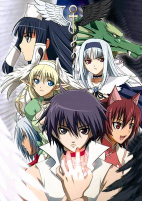

**Studio:** Studio Deen &nbsp;|&nbsp; **Episodes:** 13 &nbsp;|&nbsp; **Director:** Hiroshi Watanabe &nbsp;|&nbsp; **Aired/Released:** April 7 – June 30 &nbsp;|&nbsp; **Genres:** Fantasy, Fantasy World, Adventure, Elf, High Fantasy, Anthropomorphism, Android, Parallel Universe, Present, Magic, Action

> Mysterious disappearances are occurring one after the other in Tatsumi Town. Kiriya has a vision from a mysterious beautiful girl with pointy ears. A book talking for an alternative world is found. And Mao searching for her long lost friend, Zero, comes to our world. But what she didn’t expect is to find Souma and Kureha, and even less, to accidentally take them to her world. Now, Souma and Kureha have to find a way to come back. But other forces are playing their part in the darkness and Souma with Kureha will find that going back is harder than they first anticipated.
>
> _Synopsis source: Kitsu_

[Wikipedia](https://en.wikipedia.org/wiki/Shining_Tears_X_Wind) · [Kitsu](https://kitsu.io/anime/shining-tears-x-wind)

---

### Sola

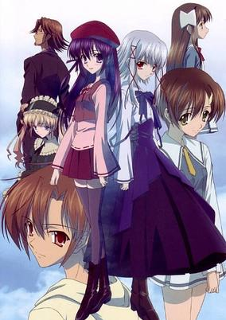

**Studio:** Nomad &nbsp;|&nbsp; **Episodes:** 13 &nbsp;|&nbsp; **Director:** Tomoki Kobayashi &nbsp;|&nbsp; **Aired/Released:** April 7 – June 30 &nbsp;|&nbsp; **Genres:** Contemporary Fantasy, Romance, Japan, Earth, Action, Asia, Sudden Girlfriend Appearance, Plot Continuity, Present, Super Power, Slice of Life

> Yorito Morimiya is obsessed with the sky. He especially loves taking pictures of its array of different faces—sunrises, sunsets, clouds. On one of his early-morning excursions to photograph the sunrise, Yorito meets a strange girl engaged in an argument with a vending machine. By the time that Yorito forces the girl's tomato juice out of the machine, she's vanished without a trace.Sola follows the story of Yorito, his sister Aono, and their childhood friends Mana and Koyori Ishizuki, as well as that of a mysterious girl who appears and disappears, and who seems to harbor a dark secret. In a world where magic and the supernatural are never far below the surface and no one is who they seem to be, love and loneliness vie for supremacy beneath Yorito's sky.
>
> _Synopsis source: Kitsu_

[Wikipedia](https://en.wikipedia.org/wiki/Sola_(manga)) · [Kitsu](https://kitsu.io/anime/sola)

---

### Toward the Terra

**Studio:** Minami machi Bugyōsho Tokyo Kids &nbsp;|&nbsp; **Episodes:** 24 &nbsp;|&nbsp; **Director:** Osamu Yamazaki &nbsp;|&nbsp; **Aired/Released:** April 7 – September 22

[Wikipedia](https://en.wikipedia.org/wiki/Toward_the_Terra)

---

### Kaze no Shoujo Emily

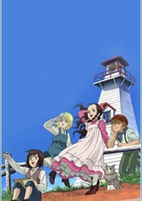

**Studio:** TMS Entertainment &nbsp;|&nbsp; **Episodes:** 26 &nbsp;|&nbsp; **Director:** Harume Kosaka &nbsp;|&nbsp; **Aired/Released:** April 7 – September 29 &nbsp;|&nbsp; **Genres:** Earth, Coming Of Age, Americas, Past, Historical

> Based on the Emily of New Moon novel by Lucy Maud Montgomery. Emily is an orphan who gets sent to live with her relatives on Prince Edward Island, after her father dies. In New Moon she lives with her Aunt Elizabeth, Aunt Laura, and Cousin Jimmy, and learns to adapt with the help of her imagination and new friends.
>
> _Synopsis source: Kitsu_

[Wikipedia](https://en.wikipedia.org/wiki/Kaze_no_Shoujo_Emily) · [Kitsu](https://kitsu.io/anime/kaze-no-shoujo-emily)

---

### Love Com

**Studio:** Toei Animation &nbsp;|&nbsp; **Episodes:** 24 &nbsp;|&nbsp; **Director:** Kōnosuke Uda &nbsp;|&nbsp; **Aired/Released:** April 7 – September 29

[Wikipedia](https://en.wikipedia.org/wiki/Love_Com)

---

### Moribito: Guardian of the Spirit (Moribito - Guardian of the Spirit)

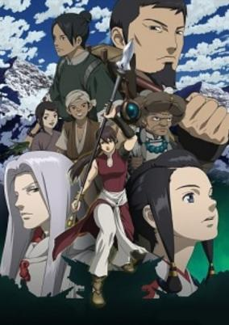

**Studio:** Production I.G &nbsp;|&nbsp; **Episodes:** 26 &nbsp;|&nbsp; **Director:** Kenji Kamiyama &nbsp;|&nbsp; **Aired/Released:** April 7 – September 29 &nbsp;|&nbsp; **Genres:** Earth, Fantasy, Fantasy World, Adventure, Action, Asia, Past, Parallel Universe, Plot Continuity, Historical

> On the precipice of a cataclysmic drought, the Star Readers of the Shin Yogo Empire must devise a plan to avoid widespread famine. It is written in ancient myths that the first emperor, along with eight warriors, slew a water demon to avoid a great drought and save the land that was to become Shin Yogo. If a water demon was to appear once more, its death could bring salvation. However, the water demon manifests itself within the body of the emperor's son, Prince Chagum—by the emperor's order, Chagum is to be sacrificed to save the empire. Meanwhile, a mysterious spear-wielding mercenary named Balsa arrives in Shin Yogo on business. After saving Chagum from a thinly veiled assassination attempt, she is tasked by Chagum's mother to protect him from the emperor and his hunters. Bound by a sacred vow she once made, Balsa accepts.Seirei no Moribito follows Balsa as she embarks on her journey to protect Chagum, exploring the beauty of life, nature, family, and the bonds that form between strangers. [Written by MAL Rewrite]
>
> _Synopsis source: Kitsu_

[Kitsu](https://kitsu.io/anime/seirei-no-moribito)

---

### The Story of Saiunkoku (season 2) (The Story of Saiunkoku)

**Studio:** Madhouse &nbsp;|&nbsp; **Episodes:** 39 &nbsp;|&nbsp; **Director:** Jun Shishido &nbsp;|&nbsp; **Aired/Released:** April 7 – March 8, 2008 &nbsp;|&nbsp; **Genres:** Romance, Earth, Fantasy, Asia, Comedy, Alternative Past, Bishounen, Past, Reverse Harem, Plot Continuity, Historical, Adventure

> Most people think being born into a noble family means a life of comfort and wealth. That couldn't be further from the truth for Shuurei Kou. Despite the Kou family being an old and important bloodline, they've fallen on hard times. Shuurei's father works as an archivist in the Imperial library, which is a prestigious position, but unfortunately not one that pays much. To put food on the table, Shuurei works odd jobs such as teaching young children or playing live music in a restaurant―and even then, it's barely enough. Then, one day, a court advisor makes Shuurei an offer. If she becomes the concubine of the new, but lazy, emperor and teaches him how to become a good ruler, then she will receive 500 pieces of gold. Never one to turn down good money, Shuurei accepts the proposition. After all, the new emperor only prefers men so her virtue is safe… or so she thinks. The more time she spends in the palace, the more her old dream of becoming a court official is reignited. There's only one problem: she's a woman and women do not become government officials. Shuurei may be able to turn the emperor into a good ruler, but will it be at the expense of her own aspirations?
>
> _Synopsis source: Kitsu_

[Wikipedia](https://en.wikipedia.org/wiki/The_Story_of_Saiunkoku) · [Kitsu](https://kitsu.io/anime/saiunkoku-monogatari)

---

### Blue Dragon

**Studio:** Studio Pierrot &nbsp;|&nbsp; **Episodes:** 51 &nbsp;|&nbsp; **Director:** Yukihiro Matsushita &nbsp;|&nbsp; **Aired/Released:** April 7 – March 29, 2008

[Wikipedia](https://en.wikipedia.org/wiki/Blue_Dragon_(anime))

---

### Lucky Star

**Studio:** Kyoto Animation &nbsp;|&nbsp; **Episodes:** 24 &nbsp;|&nbsp; **Director:** Yutaka Yamamoto (op; ed; eps 1-4) Yasuhiro Takemoto (eps 5-24) &nbsp;|&nbsp; **Aired/Released:** April 8 – September 17

[Wikipedia](https://en.wikipedia.org/wiki/Lucky_Star_(manga))

---

### Bokurano

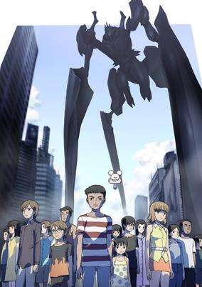

**Studio:** Gonzo &nbsp;|&nbsp; **Episodes:** 24 &nbsp;|&nbsp; **Director:** Hiroyuki Morita &nbsp;|&nbsp; **Aired/Released:** April 9 – September 25 &nbsp;|&nbsp; **Genres:** Science Fiction, Mecha, Japan, Earth, Action, Asia, Piloted Robot, Angst, Drama, Plot Continuity, Present, Psychological

> 15 children, 8 boys and 7 girls, are enjoying their summer camp together when they suddenly discover a grotto by the sea. When they enter the mysterious place they find a room full of computers, as well as a man named Kokopelli, who introduces himself as the owner. He claims to be working on a game which involves a giant robot that has been designed to protect the Earth from 15 different alien invasions. Kokopelli hasn't been able to test the game yet, so he persuades all but one of the children to sign a contract in what he claims will be a fun adventure. However, as soon as the contracts are signed things start to take a much darker turn. In Bokurano, the children must now pilot the giant robot Zearth one at a time in the hopes that they will have what it takes to defeat all of the upcoming enemies. But Kokopelli has left out one very important piece of information: the giant robot Zearth's energy source.
>
> _Synopsis source: Kitsu_

[Wikipedia](https://en.wikipedia.org/wiki/Bokurano) · [Kitsu](https://kitsu.io/anime/bokurano)

---

### Kaze no Stigma

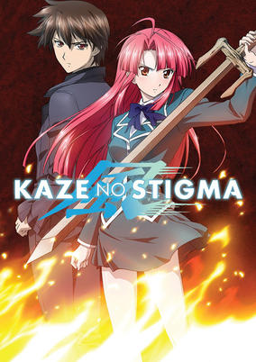

**Studio:** Gonzo &nbsp;|&nbsp; **Episodes:** 24 &nbsp;|&nbsp; **Director:** Junichi Sakata &nbsp;|&nbsp; **Aired/Released:** April 13 – September 21 &nbsp;|&nbsp; **Genres:** Contemporary Fantasy, Fantasy, Japan, Earth, Action, Asia, Magic, Alternative Present, Stereotypes, Present, Super Power, Romance

> Kazuma Yagami is a user of "Fuujutsu," the ability to control the wind. He returns to his old home, the noble Kannagi household, after being banished four years ago for his inability to control fire and his subsequent defeat in a duel at the hands of his younger cousin, Ayano Kannagi. Returning after such a brutal exile already gives rise to many conflicts, but to make matters worse, several Kannagi family members have recently been murdered with Fuujutsu. This leads the Kannagi family, including the hot-headed Ayano, to suspect Kazuma as the culprit. Now, Kazuma must not only clear his name, but also aid the family he shares a mutual hatred with, in order to discover the true identity of the killer. [Written by MAL Rewrite]
>
> _Synopsis source: Kitsu_

[Wikipedia](https://en.wikipedia.org/wiki/Kaze_no_Stigma) · [Kitsu](https://kitsu.io/anime/kaze-no-stigma)

---

### Big Windup!

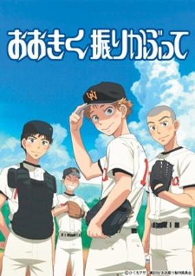

**Studio:** A-1 Pictures &nbsp;|&nbsp; **Episodes:** 25 &nbsp;|&nbsp; **Director:** Tsutomu Mizushima &nbsp;|&nbsp; **Aired/Released:** April 13 – September 28 &nbsp;|&nbsp; **Genres:** Japan, Earth, Asia, Sports, Coming Of Age, Baseball, Plot Continuity, Present, Comedy

> Ren Mihashi was the ace of his middle school's baseball team, but due to his poor pitching, they could never win. Constant losses eventually lead to his teammates bullying him and reached the point where his teammates no longer tried to win, causing Mihashi to graduate with little self-esteem. As a result, Mihashi decides to go to a high school in a different prefecture where he has no intention of playing baseball. Unfortunately, upon his arrival at Nishiura High, he is dragged into joining their new team as the starting pitcher. Although unwilling at first, Mihashi realizes that this is a place where he will be accepted for who he is; with help from the catcher Takaya Abe, he starts to have more confidence in his own abilities. Abe, seeing the potential in Mihashi, makes it a goal to help him become a pitcher worthy of being called an ace. [Written by MAL Rewrite]
>
> _Synopsis source: Kitsu_

[Wikipedia](https://en.wikipedia.org/wiki/Big_Windup!) · [Kitsu](https://kitsu.io/anime/ookiku-furikabutte)

---

### Princess Resurrection

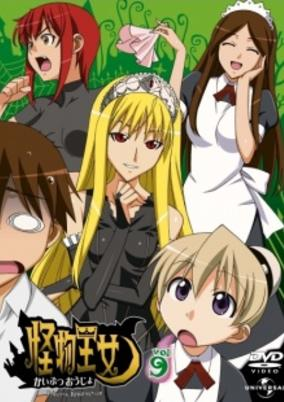

**Studio:** Madhouse &nbsp;|&nbsp; **Episodes:** 25 &nbsp;|&nbsp; **Director:** Masayuki Sakoi &nbsp;|&nbsp; **Aired/Released:** April 13 – September 28 &nbsp;|&nbsp; **Genres:** Contemporary Fantasy, Fantasy, Japan, Earth, Action, Asia, Maid, Horror, Stereotypes, Present, Vampire, Comedy

> When Hiro Hiyorimi tries to save a beautiful young woman from certain death, he ends up a dead hero himself! However, since the drop-dead girl is Hime, daughter of the King of the Monsters, his "reward" is to come back as a not-quite-living soldier in her honor guard of horror! That means helping fight off the army of supernatural monstrosities Hime's siblings are unleashing against her in hopes of moving up the ladder of succession. And if facing off with vampires and zombies isn't bad enough, how can anyone be prepared for the REALLY weird ones, like were-sharks, pandas and killer dumplings? This sure as hell isn't the afterlife Hiro was hoping for, but the really sad part is that Hime is the good girl in all of this... or at least as close to good as you can come when you're on the wrong side of the gates of hell!
>
> _Synopsis source: Kitsu_

[Wikipedia](https://en.wikipedia.org/wiki/Princess_Resurrection) · [Kitsu](https://kitsu.io/anime/princess-resurrection)

---

### Spider Riders

**Studio:** Bee Train &nbsp;|&nbsp; **Episodes:** 26 &nbsp;|&nbsp; **Director:** Kōichi Mashimo &nbsp;|&nbsp; **Aired/Released:** April 14 – October 13 &nbsp;|&nbsp; **Genres:** Mecha, Action, Adventure

> In this Earth, there exists unknown underground world, the Inner World. In the world, there are braves who fight with large spiders, and they are called “Spider Riders”. According to his grandfather’s diary, a boy, Hunter Steel is traveling around. Meanwhile he happens to enter the Inner World from a pyramid. There, the war between the insect squad that aims at conquest of the Inner World and Spider Riders continues. Oracle, the fairly of the Inner World, summons Hunter because he thinks Hunter will be the messiah of the world. However, the powers of Oracle are sealed by Mantid who is the rule of the Insecter. For the peace of the Inner World, he has to find four sealed keys of Oracle to retrieve Oracle’s power. Hunter asks Spider Shadow, which is a big spider chosen by Oracle, to become a member of Spider Riders to fight against enemies.
>
> _Synopsis source: Kitsu_

[Wikipedia](https://en.wikipedia.org/wiki/Spider_Riders) · [Kitsu](https://kitsu.io/anime/spider-riders-oracle-no-yuusha-tachi)

---

### Eikoku Koi Monogatari Emma: Molders-hen (Emma: A Victorian Romance Season Two)

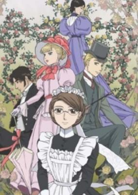

**Studio:** Ajia-do Animation Works &nbsp;|&nbsp; **Episodes:** 12 &nbsp;|&nbsp; **Director:** Tsuneo Kobayashi &nbsp;|&nbsp; **Aired/Released:** April 17 – July 3 &nbsp;|&nbsp; **Genres:** Maid, Past, Earth, Historical, Victorian Period, Plot Continuity, United Kingdom, Europe, Romance, Slice of Life

> In the faraway village of Haworth, a new chapter in Emma's life has begun. Now employed by the wealthy Molders family, Emma has resolved to put the past behind her. She'll have to adjust to a new house, a charming (but eccentric) new mistress, and a host of fellow servants, some with buried pasts of their own. Meanwhile, back in London, William is doing his best to uphold his father's wishes as the Jones family heir, but try as he might, he can't forget Emma. Yet, whenever he feels at his worst, Eleanor is always there to comfort him with a warm, shy smile. Could the answer to his broken heart be right before his eyes?
>
> _Synopsis source: Kitsu_

[Wikipedia](https://en.wikipedia.org/wiki/Emma_(manga)) · [Kitsu](https://kitsu.io/anime/eikoku-koi-monogatari-emma-molders-hen)

---

### Skull Man (The Skull Man)

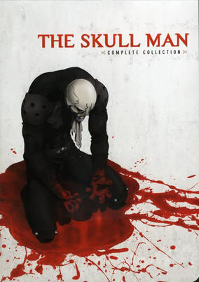

**Studio:** Bones &nbsp;|&nbsp; **Episodes:** 13 &nbsp;|&nbsp; **Director:** Takeshi Mori &nbsp;|&nbsp; **Aired/Released:** April 29 – July 22 &nbsp;|&nbsp; **Genres:** Action, Detective, Drama, Super Power, Mystery

> Otomo City: where freedom and justice have atrophied to the bone; where conspiracy rules the day and death stalks the night... Death in the form of the Skull Man, a literal Grim Reaper whose skeletal grin presages grisly mayhem and murder, even to the monstrous mutants that haunt the city's underworlds! To investigate a bizarre slaying, journalist Minagami Hayato and photographer Kiriko Mamiya must stalk this ultimate predator, through a festering cadaver of a city where the corruption flows in rivers as deep and foul as the sins of the reigning elite, and unearth a secret so shocking that an entire city has been turned into a tomb to contain! In a nightmarish necropolis where nothing is as it seems, vengeance comes in the form of a living Death's-Head!
>
> _Synopsis source: Kitsu_

[Wikipedia](https://en.wikipedia.org/wiki/Skull_Man) · [Kitsu](https://kitsu.io/anime/the-skull-man)

---

### Tai Chi Chasers

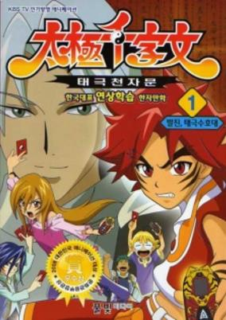

**Studio:** JM Animation Toei Animation &nbsp;|&nbsp; **Episodes:** 39 &nbsp;|&nbsp; **Director:** Hiroki Shibata &nbsp;|&nbsp; **Aired/Released:** April 29 – January 20, 2008 &nbsp;|&nbsp; **Genres:** Adventure, Action, Magic, Fantasy

> Tai Chi Chasers focuses on Rai, a young orphan, shocked to discover he's a secret descendent of the Tigeroids: an ancient race of peaceful beings locked in struggle with the ruthless and cunning Dragonoids. In a parallel universe called Suhn, the Tigeroids and Dragonoids are locked in an age-old race to recover 500 lost tai chi symbols. Whoever recovers these precious and potent symbols will possess the ultimate power to rule their realm…and destroy their enemies. Rai must now hone his innate tai chi card skills to fight the Dragonoids, find the lost symbols and battle to become one of the champion Tai Chi Chasers.
>
> _Synopsis source: Kitsu_

[Wikipedia](https://en.wikipedia.org/wiki/Tai_Chi_Chasers) · [Kitsu](https://kitsu.io/anime/taichi-senjimon)

---

### Afro Samurai

**Studio:** Gonzo &nbsp;|&nbsp; **Episodes:** 5 &nbsp;|&nbsp; **Director:** Fuminori Kizaki Takeshi Koike (Pilot) &nbsp;|&nbsp; **Aired/Released:** May 3 – May 4 &nbsp;|&nbsp; **Genres:** Mecha, Action, Gunfights, Swordplay, Alternative Present, Violence, Samurai, Adventure

> When he was a young boy, Afro witnessed his father be cut down in a duel at the hands of a man known only as Justice. After taking the life of Afro's father, Justice cast aside his Number Two headband and took the Number One to claim its godly powers as his own. Years later, having obtained the Number Two headband which grants him the right to challenge the Number One, Afro moves forward in his hunt for revenge on the man who murdered his father. There is just one thing that stands in his way—everyone else in the world! Though the Number One can only be challenged by the Number Two, the Number Two can be challenged by anyone. As his enemies gather to try and take the title of Number Two, Afro must fight through a myriad of foes and obstacles if he hopes to reach the Number One and claim vengeance once and for all. [Written by MAL Rewrite]
>
> _Synopsis source: Kitsu_

[Wikipedia](https://en.wikipedia.org/wiki/Afro_Samurai) · [Kitsu](https://kitsu.io/anime/afro-samurai)

---

### Dennō Coil (Den-noh Coil)

**Studio:** Madhouse &nbsp;|&nbsp; **Episodes:** 26 &nbsp;|&nbsp; **Director:** Mitsuo Iso &nbsp;|&nbsp; **Aired/Released:** May 12 – December 1 &nbsp;|&nbsp; **Genres:** Science Fiction, Earth, Japan, Asia, Elementary School, Drama, Future, School Life, Plot Continuity, Virtual Reality, Adventure, Comedy, Mystery

> Eleven years after the introduction of internet-connected, augmented reality eyeglasses and visors, Yuuko Okonogi moves with her family to Daikoku City, the technological center of the emerging half-virtual world. Yuuko joins her grandmother's "investigation agency" comprised of children equipped with virtual tools and powerful metatags. She quickly crosses paths with Yuuko Amasawa, an expert hacker of the virtual environment, as Amasawa relentlessly seeks to "unlock" the mystery of a computer virus that emerges from an inaccessible corrupted space.
>
> _Synopsis source: Kitsu_

[Wikipedia](https://en.wikipedia.org/wiki/Denn%C5%8D_Coil) · [Kitsu](https://kitsu.io/anime/dennou-coil)

---

### Devil May Cry: The Animated Series

**Studio:** Madhouse &nbsp;|&nbsp; **Episodes:** 12 &nbsp;|&nbsp; **Director:** Shin Itagaki &nbsp;|&nbsp; **Aired/Released:** June 14 – September 6 &nbsp;|&nbsp; **Genres:** Fantasy, Fantasy World, Action, Gunfights, United States, Swordplay, Alternative Present, Parallel Universe, Violence, Present, Demon

> Cursed to live as both monster and man, Dante must spend his life fighting the demonic forces of darkness. Brandishing his sword, Rebellion, and his always-loaded guns, Ebony and Ivory, Dante is more than happy to send the demons back to hell—especially when there's money to be made. The wildly popular video game is now a series, and this time, there's no sympathy for the devil.
>
> _Synopsis source: Kitsu_

[Kitsu](https://kitsu.io/anime/devil-may-cry)

---

### Wangan Midnight

**Studio:** A.C.G.T &nbsp;|&nbsp; **Episodes:** 26 &nbsp;|&nbsp; **Director:** Tsuneo Tominaga &nbsp;|&nbsp; **Aired/Released:** June 15 – September 13, 2008 &nbsp;|&nbsp; **Genres:** Sports, Street Racing, Plot Continuity, Motorsport, Action

> Based on a seinen manga by Kusunoki Michiharu serialised in Young Magazine. The story gets its roots from the actual street racing that occurs on Tokyo's Shuto Expressway, one stretch of which is known as the "Wangan", literally meaning "bay side" (although it is generally used to refer to the freeway), the longest, straightest road in the entire country. Of course, there's also lots of traffic to contend with, including a fair number of heavy trucks. Because of this, the action is inherently hazardous, and wrecks are common. Blown engines are also a frequent hazard, especially with the extreme-high power engines. One day, Akio Asakura, a third year high school student, is driving his Fairlady Z (Z31) and is challenged by Tatsuya Shima, a doctor, in his black Porsche 964 Turbo (nicknamed the "BlackBird"). With a friend in the passenger seat and two girls in the back, Akio pitifully tries to win, but is defeated. Determined to become faster, he goes to the junkyard to buy parts for his car, when he sees a pristine, unscratched midnight blue Fairlady Z (S30) in the junkyard. Intrigued as to why such a machine is about to be junked, he buys it. He soon finds that the car is unnaturally fast due to a tuned L28 engine, bored and stroked to 3.1 liters combined with twin turbos, which produces 620bhp. He also finds that all of the car's previous owners had unfortunate accidents in it, starting with the first owner's death. The manga follows Akio's various encounters, though the central plot revolves around his constant battle with the BlackBird for superiority.
>
> _Synopsis source: Kitsu_

[Wikipedia](https://en.wikipedia.org/wiki/Wangan_Midnight) · [Kitsu](https://kitsu.io/anime/wangan-midnight)

---

### Tetsuko no Tabi

**Studio:** Group TAC &nbsp;|&nbsp; **Episodes:** 13 &nbsp;|&nbsp; **Director:** Akinori Nagaoka &nbsp;|&nbsp; **Aired/Released:** June 24 – September 23 &nbsp;|&nbsp; **Genres:** Japan, Earth, Asia, Comedy, Absurdist Humour, Countryside, Present, Slice of Life

> Based on a seinen manga by Kikuchi Naoe and Yokomi Hirohiko, serialised in IKKI. The "story" is that a manga artist is asked by her boss to accompany him and a travel-writer on various train trips around Japan and draw a manga about it. The kicker though, is that it's completely non-fiction —the creator really did go on all these trips, and the manga simply records what happened, with no embellishment. There's a little disclaimer at the front that says "This is non-fiction, so I apologize for the lack of drama," and indeed, it mostly is just about them riding trains from place to place, waiting on platforms, etc. The "travel writer" turns out to be a super train-otaku who has vast knowledge of the train network, but also micro-manages all their trips, planning every detail down to the second. He cares mostly about following the schedule and successfully achieving his planned goals (e.g. visiting all stations on a line in a completely bizarre order to accomodate infrequent trains). The mangaka doesn't really care about trains; she's cynical, sarcastic, and rather lazy (she mainly just looks forward to the next eki-ben); he's completely gung-ho as long as he's following the schedule, and the inevitable conflicts are pretty entertaining. Throughout, though, it feels real —if you've travelled by train in Japan it will all seem very familiar, not just the scenery, but also the atmosphere and feel— and the artist does a great job of pacing and applying little tweaks to keep it consistently entertaining. In an additional bit of recursiveness, some of the characters who show up in the manga (who of course are real people, who really did show up) do so because they (really) read previous episodes of the manga! In addition of course, you can learn about various out of the way and interesting Japanese train lines and stations; some of them really do look cool. There's always this vague sense of surreality about it however, the trips are all planned by the train-guy (goal: visit all 9,843 stations in Japan) who seems to consider everything as part of a checklist rather than an experience to be enjoyed. You learn a bit about train-otaku culture too; there's really only the one guy in the story, but train-otaku culture is a sort of constant peripheral presence.
>
> _Synopsis source: Kitsu_

[Wikipedia](https://en.wikipedia.org/wiki/Tetsuko_no_Tabi) · [Kitsu](https://kitsu.io/anime/tetsuko-no-tabi)

---

### Nanatsuiro Drops

**Studio:** Diomedéa &nbsp;|&nbsp; **Episodes:** 12 &nbsp;|&nbsp; **Director:** Takashi Yamamoto &nbsp;|&nbsp; **Aired/Released:** July 3 – September 18 &nbsp;|&nbsp; **Genres:** Romance, Fantasy, Japan, Earth, Asia, High School, Magic, Magical Girl, Present, School Life

> Tsuwabuki is a normal student, though not very social. One day he meets a new transfer student, named Sumomo Akihime, and another girl, both the only members of the gardening club. Tsuwabuki is forced by a teacher to join this club. But then he bumps into a strange guy with dog ears, switching his drink with they guy's by mistake. Drinking it, he is turned in a stuffed animal. The teacher tells him that the only way to turn back to normal is to find the chosen girl and let her catch the seven stardrops. This girl is Sumomo, that accepts to help him, though she's not allowed to know the animal's true identity.
>
> _Synopsis source: Kitsu_

[Wikipedia](https://en.wikipedia.org/wiki/Nanatsuiro_Drops) · [Kitsu](https://kitsu.io/anime/nanatsuiro-drops)

---

### Zombie-Loan

**Studio:** Xebec M2 &nbsp;|&nbsp; **Episodes:** 11 &nbsp;|&nbsp; **Director:** Akira Nishimori &nbsp;|&nbsp; **Aired/Released:** July 4 – September 12 &nbsp;|&nbsp; **Genres:** Contemporary Fantasy, Fantasy, Japan, Earth, Action, Asia, Super Deformed, Bounty Hunter, Crime, Horror, Stereotypes, Violence, Present, Zombie

> Do you know when you are going to die? Michiru Kita does, as she has the ability to see the ring of death around people's necks. The darker the ring, the closer to death someone is. She notices that two boys in her class, Chika Akatsuki and Shito Tachibana, have completely black rings. Seeking to warn them of their impending demise, she stumbles onto their secret: they are already dead, but they are kept alive due to a contract with Zombie-Loan. Of course, nothing comes without a price. The boys must hunt down and destroy zombies, seeking to use Michiru's "Shinigami Eyes" to help them in their endeavor. [Written by MAL Rewrite]
>
> _Synopsis source: Kitsu_

[Wikipedia](https://en.wikipedia.org/wiki/Zombie-Loan) · [Kitsu](https://kitsu.io/anime/zombie-loan)

---

### Code-E

**Studio:** Studio Deen &nbsp;|&nbsp; **Episodes:** 12 &nbsp;|&nbsp; **Director:** Toshiyuki Katō &nbsp;|&nbsp; **Aired/Released:** July 4 – September 19 &nbsp;|&nbsp; **Genres:** High School, Super Power, Earth, Japan, Love Polygon, Asia, Action, Angst, Science Fiction, Comedy

> Chinami Ebihara is girl with a strange ability to generate electromagnetic waves when her emotions run high. However, since this "ability" affects anything electrical, it resulted in her having to transfer from school to school when she was younger. As Chinami, now 18 years of age, transfers to a new school, she once again affects the electronic devices in the school, but this time, when another student, Kotaro Kannagi, sees her do this, he becomes obsessed in studying her "TYPE-E" ability.
>
> _Synopsis source: Kitsu_

[Wikipedia](https://en.wikipedia.org/wiki/Code-E) · [Kitsu](https://kitsu.io/anime/code-e)

---

### Dōjin Work (Dojin Work)

**Studio:** Remic &nbsp;|&nbsp; **Episodes:** 12 &nbsp;|&nbsp; **Director:** Kenichi Yatagai &nbsp;|&nbsp; **Aired/Released:** July 4 – September 19 &nbsp;|&nbsp; **Genres:** Japan, Earth, Asia, Comedy, The Arts, Present, Slice of Life

> Doujin Work follows the life of a young girl named Najimi Osana and her exposure into the doujin world. She was first tempted into becoming a doujin artist after seeing how much one of her friends can make at a convention. Najimi loves to draw, though soon learns contrary to what she expected that this new world is anything but easy. As she attends more conventions and meets more people, Najimi eventually manages to find a group of very interesting friends. These friends already have some experience in the field and help her out along the way so that she can someday make a name for herself creating doujinshi.
>
> _Synopsis source: Kitsu_

[Wikipedia](https://en.wikipedia.org/wiki/D%C5%8Djin_Work) · [Kitsu](https://kitsu.io/anime/doujin-work)

---

### Buzzer Beater (season 2)

**Studio:** TMS Entertainment &nbsp;|&nbsp; **Episodes:** 13 &nbsp;|&nbsp; **Director:** Shigeyuki Miya &nbsp;|&nbsp; **Aired/Released:** July 4 – September 26 &nbsp;|&nbsp; **Genres:** Alien, Future, Earth, Space Travel, Other Planet, Basketball, Humanoid Alien, Plot Continuity, Action, Angst

> After being drafted into the Earth Team, a basketball team comprised solely of humans, street-punk-turned-pro Hideyoshi couldn't be more cocky. The team is still up against the Gorons, a physically superior race of aliens who have dominated the game for some time. New challenges and problems stand in their way. Hideyoshi is unhappy with the team and the Gorons have new tricks up their sleeves.
>
> _Synopsis source: Kitsu_

[Wikipedia](https://en.wikipedia.org/wiki/Buzzer_Beater_(manga)) · [Kitsu](https://kitsu.io/anime/buzzer-beater-2007)

---

### Kenkō Zenrakei Suieibu Umishō

**Studio:** Artland &nbsp;|&nbsp; **Episodes:** 13 &nbsp;|&nbsp; **Director:** Kōichirō Sōtome &nbsp;|&nbsp; **Aired/Released:** July 4 – September 26 &nbsp;|&nbsp; **Genres:** Ecchi, Japan, Earth, Asia, Sports, Comedy, High School, School Clubs, Slapstick, Stereotypes, Plot Continuity, Present, School Life

> Kaname Okiura, a student of Prefectoral Umineko Shougyou High ("Umishou" for short), joined the school's swimming club in order to learn how to swim, but the club is filled with weirdos, let alone who can teach him swimming. Then, a sunny, happy-go-lucky girl named Amuro Ninagawa who transferred from Okinawa joined the club. Her extraordinary underwater speed and unorthodox swimming style (plus her personal habit of nude swimming—a powerful magnet to teenage boys) surprised every club member, especially Okiura, because she reminds him of a mermaid-like creature he saw only once in his early childhood.
>
> _Synopsis source: Kitsu_

[Wikipedia](https://en.wikipedia.org/wiki/Kenk%C5%8D_Zenrakei_Suieibu_Umish%C5%8D) · [Kitsu](https://kitsu.io/anime/kenkou-zenrakei-suieibu-umishou)

---

### School Days

**Studio:** TNK &nbsp;|&nbsp; **Episodes:** 12 &nbsp;|&nbsp; **Director:** Keitaro Motonaga &nbsp;|&nbsp; **Aired/Released:** July 4 – September 27 &nbsp;|&nbsp; **Genres:** High School, Present, Earth, Japan, Love Polygon, Stereotypes, Asia, Angst, Romance, Harem

> High school student Makoto Itou first notices Kotonoha Katsura at the start of his second semester, freshman year. Immediately, he becomes entranced by her beauty, but his bashfulness doesn't allow him to approach her, even though they ride the same train every day. Instead, he snaps a photo of her in secret and sets it as his cell phone's wallpaper: a charm that, if kept under wraps, would supposedly help you realize your love. However, classmate Sekai Saionji spots the picture, but instead of ratting him out, she offers to help set him up with Kotonoha—going so far as befriending her just for him. Thus, the trio begins a rather impromptu friendship. School Days follows the lives of these three teenagers as they traverse the joys and hardships that come with being a high schooler. In a story alive and brimming with romance and melancholy, the tale of these three students will linger in memory long after the momentous conclusion. [Written by MAL Rewrite]
>
> _Synopsis source: Kitsu_

[Wikipedia](https://en.wikipedia.org/wiki/School_Days_(visual_novel)) · [Kitsu](https://kitsu.io/anime/school-days)

---

### Happy Happy Clover

**Studio:** Group TAC &nbsp;|&nbsp; **Episodes:** 13 &nbsp;|&nbsp; **Director:** Kazumi Nonaka &nbsp;|&nbsp; **Aired/Released:** July 6 – September 28 &nbsp;|&nbsp; **Genres:** Slice of Life, Anthropomorphism, Fantasy, Comedy, Kids

> Happy Happy Clover recounts the everyday life of a bunny named Chima and the other animals in the Crescent Moon Forest.
>
> _Synopsis source: Kitsu_

[Wikipedia](https://en.wikipedia.org/wiki/Happy_Happy_Clover) · [Kitsu](https://kitsu.io/anime/happy-happy-clover)

---

### Mushi-Uta

**Studio:** Beat Frog &nbsp;|&nbsp; **Episodes:** 12 &nbsp;|&nbsp; **Director:** Kazuo Sakai &nbsp;|&nbsp; **Aired/Released:** July 6 – October 5 &nbsp;|&nbsp; **Genres:** Fantasy, Japan, Earth, Action, Asia, Sudden Girlfriend Appearance, Plot Continuity, Present, Super Power, Science Fiction

> Mushi-uta's story takes place in the near future. Ten years before the story's opening, strange insect-like creatures known as "Mushi" began appearing. The Mushi are able to consume peoples' dreams and thoughts in return for supernatural powers. At the end of episode one, protagonist Daisuke "Kakkou" Kusuriya encounters a young girl named Shiika Anmoto. The two, in time, become quite close. However, unbeknownst to Kakkou, Shiika is an escapee from a secret prison known as GARDEN where those posessed by the Mushi, known as the Mushitsuki are held. GARDEN's military force, the Special Environmental Conservation Executive Office, dispatches its finest killer to track down Shiika. However, they are faced with resistance from the Mushibane resistance organisation, led by the secretive "Ladybird."
>
> _Synopsis source: Kitsu_

[Wikipedia](https://en.wikipedia.org/wiki/Mushi-Uta) · [Kitsu](https://kitsu.io/anime/mushi-uta)

---

### Higurashi When They Cry: Kai (When They Cry)

**Studio:** Studio Deen &nbsp;|&nbsp; **Episodes:** 24 &nbsp;|&nbsp; **Director:** Chiaki Kon &nbsp;|&nbsp; **Aired/Released:** July 6 – December 18 &nbsp;|&nbsp; **Genres:** Past, Earth, Japan, Violence, Plot Continuity, Asia, Angst, Horror, Thriller, Drama

> Keiichi Maebara has just moved to the quiet little village of Hinamizawa in the summer of 1983, and quickly becomes inseparable friends with schoolmates Rena Ryuuguu, Mion Sonozaki, Satoko Houjou, and Rika Furude. However, darkness lurks underneath the seemingly idyllic life they lead. As the village prepares for its annual festival, Keiichi learns about the local legends surrounding it. To his horror, he discovers that there have been several murders and disappearances in the village in the recent years, and that they all seem to be connected to the festival and the village's patron god, Oyashiro. Keiichi tries to ask his new friends about these incidents, but they are suspiciously silent and refuse to give him the answers he needs. As more and more bizarre events occur, he wonders just what else his friends might be keeping from him, and if he can even trust them at all. When madness and paranoia begin taking root in Keiichi's heart, he will stumble straight into the mysteries at work in Higurashi no Naku Koro ni, a story that is told across multiple arcs. [Written by MAL Rewrite]
>
> _Synopsis source: Kitsu_

[Wikipedia](https://en.wikipedia.org/wiki/Higurashi_When_They_Cry) · [Kitsu](https://kitsu.io/anime/higurashi-no-naku-koro-ni)

---

### Sky Girls

**Studio:** J.C.Staff &nbsp;|&nbsp; **Episodes:** 26 &nbsp;|&nbsp; **Director:** Yoshiaki Iwasaki &nbsp;|&nbsp; **Aired/Released:** July 6 – December 28 &nbsp;|&nbsp; **Genres:** Earth, Power Suit, Science Fiction, Mecha, Japan, Post Apocalypse, Action, Asia, Piloted Robot, Loli, Cyborg, Coming Of Age, Navy, Future, Stereotypes, Military

> In the near future, Earth is at war with aliens called Worms. The war leaves the population of Earth decimated, with young men the main casualties. The Worms were beaten back but their re-emergence heralds the creation of a mecha unit called the Sonic Divers, piloted by 3 young girls to counter this threat.
>
> _Synopsis source: Kitsu_

[Wikipedia](https://en.wikipedia.org/wiki/Sky_Girls) · [Kitsu](https://kitsu.io/anime/sky-girls)

---

### Potemayo

**Studio:** J.C.Staff &nbsp;|&nbsp; **Episodes:** 12 &nbsp;|&nbsp; **Director:** Takashi Ikehata &nbsp;|&nbsp; **Aired/Released:** July 7 – September 22 &nbsp;|&nbsp; **Genres:** Japan, Earth, Asia, Slice of Life, Comedy, Middle School, Juujin, Super Deformed, Slapstick, School Life, Present

> Sunao Moriyama finds a strange but cute creature that he names Potemayo. Potemayo starts following him everywhere, usually riding on top of his head. His discovery becomes the center of attention in his class at school. Soon after, a similar creature appears, and is named Guchuko by one of Sunao's classmates. However, Guchuko doesn't seem to be as good-natured as Potemayo.
>
> _Synopsis source: Kitsu_

[Wikipedia](https://en.wikipedia.org/wiki/Potemayo) · [Kitsu](https://kitsu.io/anime/potemayo)

---

### Sayonara, Zetsubou-Sensei (Sayonara)

**Studio:** Shaft &nbsp;|&nbsp; **Episodes:** 12 &nbsp;|&nbsp; **Director:** Akiyuki Shinbo &nbsp;|&nbsp; **Aired/Released:** July 8 – September 23 &nbsp;|&nbsp; **Genres:** Satire, Japan, Earth, Asia, Parody, Comedy, High School, School Life, Present

> Nozomu Itoshiki is a high school teacher so pessimistic that even the smallest of misfortunes can send him into a pit of raging despair; some of these "catastrophes" even lead to suicide attempts. Sayonara Zetsubou Sensei is a satirical slice-of-life comedy set in the modern day, covering various aspects of Japanese life and culture through Nozomu and his interactions with his students: Kiri Komori, a recluse who refuses to leave the school; Abiru Kobushi, an enigma who frequently arrives to class with severe and mysterious injuries; the hyper-optimistic Kafuuka Fuura, Nozomu's polar opposite; and several other unusual girls, all of whom are just as eccentric as their teacher. [Written by MAL Rewrite]
>
> _Synopsis source: Kitsu_

[Wikipedia](https://en.wikipedia.org/wiki/Sayonara,_Zetsubou-Sensei) · [Kitsu](https://kitsu.io/anime/sayonara-zetsubou-sensei)

---

### Moetan

**Studio:** Actas &nbsp;|&nbsp; **Episodes:** 13 &nbsp;|&nbsp; **Director:** Keiichiro Kawaguchi &nbsp;|&nbsp; **Aired/Released:** July 9 – September 24 &nbsp;|&nbsp; **Genres:** Romance, Ecchi, Fantasy, Japan, Earth, Asia, Parody, Loli, Comedy, Coming Of Age, High School, Magic, Stereotypes, School Life, Magical Girl, Present

> Ink Nijihara is a girl in high school. Unfortunately her crush Nao Tezuka barely recognizes her. To make matters worse, she is very short. Now Ink meets a duck and becomes a "mahou shoujo" and teaches Nao english in disguise.
>
> _Synopsis source: Kitsu_

[Wikipedia](https://en.wikipedia.org/wiki/Moetan) · [Kitsu](https://kitsu.io/anime/moetan)

---

### The Familiar of Zero: Knight of the Twin Moons

**Studio:** J.C.Staff &nbsp;|&nbsp; **Episodes:** 12 &nbsp;|&nbsp; **Director:** Yū Kō &nbsp;|&nbsp; **Aired/Released:** July 9 – September 24 &nbsp;|&nbsp; **Genres:** Romance, Ecchi, Fantasy, Fantasy World, Adventure, Action, Comedy, Violent Retribution For Accidental Infringement, Dragon, Feudal Warfare, Magic, Past, Slapstick, Stereotypes, Parallel Universe, Military, Harem, School Life, Isekai

> Revered as heroes for their role in defending Tristain, Louise and her familiar Saito face heavy pressure to continue protecting the Kingdom. With an uneasy peace now established within Albion, the newly crowned Queen Henrietta must deal with a political struggle brewing on the horizon. To make matters worse, a new villain has begun plotting in the shadows against the Crown. With the continuing threats that face the Kingdom, Louise and Saito are compelled to work together once more. No longer "Louise the Zero," the young mage's newfound aptitude for Void magic gives her enough power to wipe out an entire village; however, wielding these abilities comes with its share of challenges. As more conflicts arise, the idea of placing honor above oneself is put into question—regardless of their answer, their only choice is to see it through until the end. [Written by MAL Rewrite]
>
> _Synopsis source: Kitsu_

[Kitsu](https://kitsu.io/anime/zero-no-tsukaima-futatsuki-no-kishi)

---

### Mononoke

**Studio:** Toei Animation &nbsp;|&nbsp; **Episodes:** 12 &nbsp;|&nbsp; **Director:** Kenji Nakamura &nbsp;|&nbsp; **Aired/Released:** July 13 – September 28 &nbsp;|&nbsp; **Genres:** Fantasy, Tokugawa Period, Japan, Earth, Asia, Religion, Buddhism, Angst, Magic, Horror, Past, Demon, Historical, Mystery, Seinen, Psychological, Supernatural

> The "Medicine Seller" is a deadly and mysterious master of the occult who travels across feudal Japan in search of malevolent spirits called "mononoke" to slay. When he locates one of these spirits, he cannot simply kill it; he must first learn its Form, its Truth, and its Reason in order to wield the mighty Exorcism Sword and fight against it. He must begin his strange exorcisms with intense psychological analysis and careful investigative work—an extremely dangerous step, as he must first confront and learn about the mononoke before he even has the means to defeat it. The Medicine Seller's journey leads him to an old-fashioned inn where Shino, a pregnant woman, has finally found a place to rest. The owner has reluctantly placed her in the last vacant room; however, as she settles in, it quickly becomes clear that the room is infested by a lethal band of mononoke, the Zashiki Warashi. With his hunter's intuition, the Medicine Seller begins his investigation to discover the Form, the Truth, and the Reason before the Zashiki Warashi can kill again. [Written by MAL Rewrite]
>
> _Synopsis source: Kitsu_

[Wikipedia](https://en.wikipedia.org/wiki/Mononoke_(TV_series)) · [Kitsu](https://kitsu.io/anime/mononoke)

---

### Shigurui (Shigurui: Death Frenzy)

**Studio:** Madhouse &nbsp;|&nbsp; **Episodes:** 12 &nbsp;|&nbsp; **Director:** Hiroshi Hamasaki &nbsp;|&nbsp; **Aired/Released:** July 19 – October 11 &nbsp;|&nbsp; **Genres:** Tokugawa Period, Japan, Earth, Action, Asia, Swordplay, Past, Violence, Samurai, Martial Arts, Historical

> At the beginning of the Edo Era, when people enjoyed a time of peace, Lord Tokugawa Tadanaga holds a fighting tournament. In the past, matches were fought with wooden swords. This time, real swords will be used. One-armed Fujiki Gennosuke and blind Irako Seigen will fight each other in this match. Both are disciples of Iwamoto Kogan, who is known as Japan's greatest swordsman. Each of them are determined to prove himself the successor of Iwamoto's school. However, there can only be one champion. So begins a story of intertwining fates, conflict, and strange destinies.
>
> _Synopsis source: Kitsu_

[Wikipedia](https://en.wikipedia.org/wiki/Shigurui) · [Kitsu](https://kitsu.io/anime/shigurui)

---

### Tokyo Majin (season 2) (Tokyo Majin)

**Studio:** AIC Spirits BeSTACK &nbsp;|&nbsp; **Episodes:** 12 &nbsp;|&nbsp; **Director:** Shinji Ishihira &nbsp;|&nbsp; **Aired/Released:** July 27 – October 12 &nbsp;|&nbsp; **Genres:** Fantasy, Japan, Earth, Action, Asia, Tokyo, Horror, Plot Continuity, Violence, Present, Demon, Super Power, Martial Arts, School Life

> Something evil is stirring in the shadows of Tokyo... During the spring of his senior year in high school, quiet Tatsuma Hiyuu transfers to Magami Academy in Shinjuku. The mysterious boy's "outsider" status and his profound skills in martial arts quickly earn him the friendship of class delinquent Kyouichi Houraiji. Through an uncanny connection and a happenstance challenge, he also meets Yuuya Daigo of the wrestling club, the captain of the girls' archery club, Komaki Sakurai, and Aoi Misato, the Student Council President. During their encounter, there is a sudden, harsh disruption of the Ryumyaku (literally Dragon Pulse, otherwise known as Dragon Vein or Dragon Stream), the flow of arcane energy. The surge awakens within the five teenagers a latent power, giving them each a supernatural ability. Enlightened to their newly acquired gifts by Hisui, the young heir of the Kisaragi Clan who maintains his family's antiques shop - as well as their duty to protect Tokyo from Oni (demons) - the Magami students decide to use their power to protect the city from the onslaught of dark forces. Battling the demons alongside Hisui Kisaragi, the five unlikely friends discover that they may have to face a greater threat to Tokyo other than destroying a few malevolent, random monsters. The Ryumyaku had been disrupted by force, from someone invoking the Dark Arts - and that person has a wicked desire to unleash a long-dead evil. Can the teenagers overcome their own fears and flaws to fight against the Dark Arts? And soon they will also have to face their own destinies as they discover their Stars of Fate. This anime is based on a manga, which was based on the Nintendo role-playing video game originally released in 1998.
>
> _Synopsis source: Kitsu_

[Wikipedia](https://en.wikipedia.org/wiki/Tokyo_Majin) · [Kitsu](https://kitsu.io/anime/tokyo-majin-gakuen-kenpucho-tou)

---

### Baccano!

**Studio:** Brain's Base &nbsp;|&nbsp; **Episodes:** 13 &nbsp;|&nbsp; **Director:** Takahiro Omori &nbsp;|&nbsp; **Aired/Released:** July 27 – November 2 &nbsp;|&nbsp; **Genres:** Contemporary Fantasy, Earth, Action, Mafia, Gunfights, United States, Crime, Americas, Past, Plot Continuity, Violence, Historical, Comedy, Mystery, Drama

> During the early 1930s in Chicago, the transcontinental train, Flying Pussyfoot, is starting its legendary journey that will leave a trail of blood all over the country. At the same time in New York, the ambitious scientist Szilard and his unwilling aide Ennis are looking for missing bottles of the immortality elixir. In addition, a war between the mafia groups is getting worse. On board the Advena Avis, in 1711, alchemists are about to learn the price of immortality. Based on the award-winning light novels of the same name, Baccano! follows several events that initially seem unrelated, both in time and place, but are part of a much bigger story—one of alchemy, survival and immortality. Merging these events together are the kindhearted would-be thieves, Isaac and Miria, connecting various people, all of them with their own hidden ambitions and agendas, and creating lifelong bonds and consequences for everyone involved. [Written by MAL Rewrite]
>
> _Synopsis source: Kitsu_

[Wikipedia](https://en.wikipedia.org/wiki/Baccano!) · [Kitsu](https://kitsu.io/anime/baccano)

---

### Moonlight Mile (season 2)

**Studio:** Studio Hibari &nbsp;|&nbsp; **Episodes:** 14 &nbsp;|&nbsp; **Director:** Iku Suzuki &nbsp;|&nbsp; **Aired/Released:** September 13 – December 13 &nbsp;|&nbsp; **Genres:** Space Travel, Science Fiction, Adventure, Earth, Asia, Slice of Life, Air Force, Shipboard, Military, Space

> After scaling Mt. Everest, mountain climbing partners Saruwatari Gorou and "Lostman" Jack F. Woodbridge see the ISA Space Station, and each vows to make the trek into outerspace. When Helium 3, a new energy source, is discovered on the moon, NASA forms a new project named "Nexus" to harness that energy for use on earth. This is the story of the two and the paths they take to see their dream become a reality in the quest to harness the next-generation energy source.
>
> _Synopsis source: Kitsu_

[Wikipedia](https://en.wikipedia.org/wiki/Moonlight_Mile_(manga)) · [Kitsu](https://kitsu.io/anime/moonlight-mile)

---

### Da Capo II

**Studio:** Feel &nbsp;|&nbsp; **Episodes:** 13 &nbsp;|&nbsp; **Director:** Hideki Okamoto &nbsp;|&nbsp; **Aired/Released:** October 2 – December 25 &nbsp;|&nbsp; **Genres:** Romance, Japan, Android, Stereotypes, School Life, Ecchi

> The undying Sakura Trees return. Based on a PS2 sequel of the original DaCapo game, the story once again takes place on Hatsunejima, but is set 53 years after the events of D.C. and D.C.S.S.. Although some characters will probably look a bit familiar to the initiated eye, the cast is a new one. The new main protagonist is Yoshiyuki Sakurai, who lives next door to the Asakura sisters Yume and Otome, who are the granddaughters of Junichi and Nemu from the first season. [Written by MAL Rewrite]
>
> _Synopsis source: Kitsu_

[Wikipedia](https://en.wikipedia.org/wiki/Da_Capo_II) · [Kitsu](https://kitsu.io/anime/da-capo-ii)

---

### Sketchbook: Full Color's (Sketchbook ~full color's~)

**Studio:** Hal Film Maker &nbsp;|&nbsp; **Episodes:** 13 &nbsp;|&nbsp; **Director:** Yoshimasa Hiraike &nbsp;|&nbsp; **Aired/Released:** October 2 – December 25 &nbsp;|&nbsp; **Genres:** Japan, Earth, Asia, Slice of Life, Comedy, High School, School Clubs, School Life, The Arts, Present

> Sora Kajiwara is a shy first year who joined the art club at her school. Sora slowly becomes less shy as she befriends everyone in the art club. She also grows artistically and learns how to sketch the beautiful world around her... and cats!
>
> _Synopsis source: Kitsu_

[Wikipedia](https://en.wikipedia.org/wiki/Sketchbook_(manga)) · [Kitsu](https://kitsu.io/anime/sketchbook-full-color-s)

---

### Bamboo Blade

**Studio:** AIC ASTA &nbsp;|&nbsp; **Episodes:** 26 &nbsp;|&nbsp; **Director:** Hisashi Saito &nbsp;|&nbsp; **Aired/Released:** October 2 – April 1, 2008 &nbsp;|&nbsp; **Genres:** Earth, Japan, Asia, Combat, Sports, Comedy, Swordplay, Martial Arts, High School, School Clubs, Slapstick, School Life, Plot Continuity, Present

> Kojirou is the kendo instructor for Muroe High School and he's totally broke. But then an unexpected chance is given to him: his team must win against his senpai's team and the prize is: free meals for a whole year! Now, the only problem left... where to find girls skilled enough and willing to join the kendo team?
>
> _Synopsis source: Kitsu_

[Wikipedia](https://en.wikipedia.org/wiki/Bamboo_Blade) · [Kitsu](https://kitsu.io/anime/bamboo-blade)

---

### Blue Drop: Tenshitachi no Gikyoku (Blue Drop)

**Studio:** Asahi Production BeSTACK &nbsp;|&nbsp; **Episodes:** 13 &nbsp;|&nbsp; **Director:** Masahiko Ohkura &nbsp;|&nbsp; **Aired/Released:** October 3 – December 26 &nbsp;|&nbsp; **Genres:** Earth, Romance, Science Fiction, Japan, Asia, Slice of Life, Shoujo Ai, All Girls School, School Life, Present

> Five years ago, something horrifying happened on Kamioki Island. Something so nightmarish that it stripped all memory from Mari Wakatake's mind even as it left every other human on the island dead in its wake! Now enrolled against her will at an isolated girl's academy, Mari is unaware that hidden eyes are watching her, waiting for her memory to return. Buried in her psyche is the most terrifying secret of all: while Mari was the only human who lived, she may not have been the only survivor! As something in a female skin invades Kaihou Academy, Mari's only hope may lie in a strange girl to whom she is inexplicably drawn yet cannot trust.
>
> _Synopsis source: Kitsu_

[Kitsu](https://kitsu.io/anime/blue-drop-tenshi-tachi-no-gikyoku)

---

### Myself ; Yourself (Myself; Yourself)

**Studio:** Doga Kobo &nbsp;|&nbsp; **Episodes:** 13 &nbsp;|&nbsp; **Director:** Yasuhiro Kuroda &nbsp;|&nbsp; **Aired/Released:** October 3 – December 26 &nbsp;|&nbsp; **Genres:** Earth, Romance, Japan, Asia, Slice of Life, High School, Drama, Present, School Life

> For the sake of parents' business plans, Hidaka Sana moved to Tokyo. Five years later, he has become a high school student, and returned to his hometown, Sakuranomori. He feels uneasy because the streets of his hometown and his old friend he meets again have changed a lot since five years ago. The most changed thing is his childhood friend, Yatsushiro Nanaka. She used to smile sweetly with innocent eyes, but now she has withdrawn herself and is gloomy.
>
> _Synopsis source: Kitsu_

[Wikipedia](https://en.wikipedia.org/wiki/Myself_;_Yourself) · [Kitsu](https://kitsu.io/anime/myself-yourself)

---

### Night Wizard!

**Studio:** Hal Film Maker &nbsp;|&nbsp; **Episodes:** 13 &nbsp;|&nbsp; **Director:** Yuusuke Yamamoto &nbsp;|&nbsp; **Aired/Released:** October 3 – December 26 &nbsp;|&nbsp; **Genres:** Earth, Contemporary Fantasy, Fantasy, Japan, Adventure, Action, Asia, Slice of Life, Comedy, Swordplay, Magic, Parallel Universe, Present

> Night Wizard. A term given to those whose mission is to protect the world from impending darkness. Renji Hiiragi is one such Night Wizard, who is constantly called on missions, even though all he wants is to be able to go to school and graduate. However, his latest order was to protect Elis Shiho, who is a new transfer student at his academy. Being dragged into the Astronomy Club by Renji's childhood friend, Kureha Akabane on her first day at school, Elis soon realises that she too, has the power to become a night wizard, after possessing one of seven secret Jewels, the Jewel of Kindness. Along with Renji and Kureha, Elis now begins her fight and her new life, as a Night Wizard
>
> _Synopsis source: Kitsu_

[Wikipedia](https://en.wikipedia.org/wiki/Night_Wizard!) · [Kitsu](https://kitsu.io/anime/night-wizard)

---

### Mokke

**Studio:** Madhouse Tezuka Productions &nbsp;|&nbsp; **Episodes:** 24 &nbsp;|&nbsp; **Director:** Masayoshi Nishida &nbsp;|&nbsp; **Aired/Released:** October 3 – March 16, 2008 &nbsp;|&nbsp; **Genres:** Contemporary Fantasy, Japan, Earth, Asia, Slice of Life, Countryside, Present, Demon, Mystery

> This is a story about two sisters: Shizuru, is a high school student who is able to see ghosts while her younger sister, Mizuki, is haunted by these apparitions. Frustrated by their abilities, their parents decided to entrust the sisters into the care of their grandparents who live in the countryside. As they adapt to life in the countryside, Shizuru and Mizuki begin to learn about the importance of coexisting nature with these apparitions.
>
> _Synopsis source: Kitsu_

[Wikipedia](https://en.wikipedia.org/wiki/Mokke) · [Kitsu](https://kitsu.io/anime/mokke)

---

### Fantastic Detective Labyrinth

**Studio:** Studio Deen &nbsp;|&nbsp; **Episodes:** 25 &nbsp;|&nbsp; **Director:** Hiroshi Watanabe &nbsp;|&nbsp; **Aired/Released:** October 3 – March 26, 2008 &nbsp;|&nbsp; **Genres:** Contemporary Fantasy, Japan, Detective, Martial Arts, Alternative Present, Super Power, Science Fiction, Mystery

> In a forgotten town known as the old capital of Tokyo, strange and mysterious crimes are progressively occuring. These supernatural occurances are beyond comprehension and bring fear and terror to the people. Only one person is not intimidated by the evil underlying these occurances and is willing to challenge them: Hyuga Mayuki, a young boy detective who holds a special insight power that allows him to uncover the real truth behind these occurances.
>
> _Synopsis source: Kitsu_

[Wikipedia](https://en.wikipedia.org/wiki/Fantastic_Detective_Labyrinth) · [Kitsu](https://kitsu.io/anime/suteki-tantei-labyrinth)

---

### Neuro: Supernatural Detective

**Studio:** Madhouse &nbsp;|&nbsp; **Episodes:** 25 &nbsp;|&nbsp; **Director:** Hiroshi Kōjina &nbsp;|&nbsp; **Aired/Released:** October 3 – March 26, 2008 &nbsp;|&nbsp; **Genres:** Detective, Demon, Comedy, Mystery

> The series focuses on Neuro Nougami, a demon who feeds on mysteries and puzzles, who comes to the human world to feast on the mysteries offered by humans who release negative energy from their planned crimes. As a demon, he must not make his presence noticed by the humans as it is the law in the human world. Because of this, he makes a permanent deal with Yako Katsuragi (who has her own personal mystery she has to solve), and together they solve crimes for Neuro's appetite.
>
> _Synopsis source: Kitsu_

[Kitsu](https://kitsu.io/anime/majin-tantei-nougami-neuro)

---

### Kaiji: Ultimate Survivor

**Studio:** Madhouse &nbsp;|&nbsp; **Episodes:** 26 &nbsp;|&nbsp; **Director:** Yūzō Satō &nbsp;|&nbsp; **Aired/Released:** October 3 – April 2, 2008 &nbsp;|&nbsp; **Genres:** Earth, Japan, Asia, Mafia, Thriller, Conspiracy, Crime, Angst, Plot Continuity, Present, Psychological

> Kaiji Itou is a good-for-nothing loiterer who spends his days drinking beer and stealing hubcaps—that is, until he ends up being tricked by his former co-worker. Unable to suddenly repay his friend's huge debt all by himself, Kaiji is offered a shady deal to participate in an illegal underground gamble on a cruise ship. This turns out to be nothing more than the beginning of his new life of hell—thrown headlong into a life-threatening roller coaster of mind games, cheating, and deceit. Based on the first entry of the famous gambling manga series by Nobuyuki Fukumoto, Gyakkyou Burai Kaiji: Ultimate Survivor follows our unlucky protagonist as he is forced to fight not only other people, but also the mysteries of their psyches. Kaiji finds out the hard way that the worst sides of human nature surface when people's backs are against the wall, and that the most fearsome dangers of all are greed, paranoia, and the human survival instinct itself. [Written by MAL Rewrite]
>
> _Synopsis source: Kitsu_

[Wikipedia](https://en.wikipedia.org/wiki/Kaiji_(manga)) · [Kitsu](https://kitsu.io/anime/gyakkyou-burai-kaiji-ultimate-survivor)

---

### Dragonaut: The Resonance (Dragonaut - The Resonance)

**Studio:** Gonzo &nbsp;|&nbsp; **Episodes:** 25 &nbsp;|&nbsp; **Director:** Manabu Ono &nbsp;|&nbsp; **Aired/Released:** October 4 – March 27, 2008 &nbsp;|&nbsp; **Genres:** Romance, Fantasy, Japan, Earth, Action, Asia, Dragon, Humanoid Alien, Future, Plot Continuity, Mecha, Science Fiction

> Twenty years prior to the story's beginning, an asteroid headed for Earth destroys Pluto. Due to Pluto's destruction, the asteroid, which is dubbed Thanatos, becomes temporarily stagnant. Now, in order to avoid Earth's impending destruction, the International Solarsystem Development Agency (ISDA) works on the "D-Project", and creates the "Dragonaut" after finding a dragon egg under the ocean. This weapon's primary purpose is to destroy the asteroid when the time comes. However, they soon find out that the asteroid is not their only threat, as powerful dragon-like creatures, which are bent on destruction, appear on Earth. After witnessing a murder by one of the creatures, Jin Kamishina, a lonely 18-year-old boy who lost his family in a shuttle accident two years ago, gets involved in the mysteries of the dragons and becomes the chosen pilot of the Dragonaut. Helping him on his journey is Toa, a mysterious girl who saves him from falling to his death after the creature attacks him. As they get deeper into the mysteries of the dragons, they encounter new friends and enemies, and also begin to develop a closer relationship.
>
> _Synopsis source: Kitsu_

[Kitsu](https://kitsu.io/anime/dragonaut-the-resonance)

---

### Good Luck! Ninomiya-kun

**Studio:** AIC Spirits &nbsp;|&nbsp; **Episodes:** 12 &nbsp;|&nbsp; **Director:** Koji Yoshikawa &nbsp;|&nbsp; **Aired/Released:** October 5 – December 21 &nbsp;|&nbsp; **Genres:** Romance, Ecchi, Japan, Earth, Asia, Comedy, Love Polygon, Present, Demon, Fantasy, Harem

> Shungo Ninomiya is just an ordinary, run-of-the-mill high school student who lives at home with his older sister Ryoko—at least when she's not away doing her job as a mercenary. However, Shungo's life ceases to be normal the moment a cute girl named Mayu Tsukimura descends into the middle of his school's campus in a military-grade helicopter. It turns out Ryoko sent this girl, along with her older brother Mikihiro, to live at the Ninomiya household. But the newly-arrived siblings are a little special: Mayu is, in fact, a succubus and her brother, an incubus! And as if the circumstances are not problematic enough, Mayu is crippled with androphobia—the fear of men—and it's up to Shungo to help her overcome this at the behest of his sister. Ryoko plans to force Mayu to be closer to Shungo, and to do this, she’ll employ some questionable methods such as having them share the same bed and even take baths together. The situation further complicates when student council president Reika Houjou arrives as the new maid of the Ninomiya family, and she will stop at nothing to thwart Shungo and Mayu’s sexually-geared training. With the sudden arrival of all these oddities, Shungo's ordinary life is about to be thrown into utter turmoil. [Written by MAL Rewrite]
>
> _Synopsis source: Kitsu_

[Wikipedia](https://en.wikipedia.org/wiki/Good_Luck!_Ninomiya-kun) · [Kitsu](https://kitsu.io/anime/goshuushou-sama-ninomiya-kun)

---

### Clannad

**Studio:** Kyoto Animation &nbsp;|&nbsp; **Episodes:** 23 &nbsp;|&nbsp; **Director:** Tatsuya Ishihara &nbsp;|&nbsp; **Aired/Released:** October 5 – March 28, 2008

[Wikipedia](https://en.wikipedia.org/wiki/Clannad_(visual_novel))

---

### Shakugan no Shana Second (Shakugan no Shana: Season II)

**Studio:** J.C.Staff &nbsp;|&nbsp; **Episodes:** 24 &nbsp;|&nbsp; **Director:** Takashi Watanabe &nbsp;|&nbsp; **Aired/Released:** October 5 – March 28, 2008 &nbsp;|&nbsp; **Genres:** Contemporary Fantasy, Romance, Fantasy, Japan, Earth, Action, Asia, Love Polygon, Plot Continuity, Present, Demon, Super Power, School Life

> The heated bond between Shana and Yuji is tested as their paranormal adventures continue. The Flame Haze fends off supernatural foes by night. By day, she contends with a classmate who's also after Yuji's heart. Emotions flare as a suspicious transfer student who resembles a recently defeated Denizen clings to Yuji. His training rises in intensity when they catch wind of a revered warrior in search of her lost lover—who will stop at nothing to extract the power keeping Yuji alive!
>
> _Synopsis source: Kitsu_

[Wikipedia](https://en.wikipedia.org/wiki/Shakugan_no_Shana_Second) · [Kitsu](https://kitsu.io/anime/shakugan-no-shana-ii-second)

---

### You're Under Arrest: Full Throttle

**Studio:** Studio Deen &nbsp;|&nbsp; **Episodes:** 23 &nbsp;|&nbsp; **Director:** Koichi Ohata &nbsp;|&nbsp; **Aired/Released:** October 5 – March 28, 2008 &nbsp;|&nbsp; **Genres:** Japan, Earth, Action, Asia, Comedy, Law And Order, Present, Cops

> Miyuki Kobayakawa, fresh from forensics training in the United States and Natsumi Tsujimoto, from completing Japanese Self-Defense Force (JSDF) ranger training return in the long-awaited 3rd season of the highly popular series. This time, the duo rejoins active duty at Bokuto Police Department, fighting against crime using their wits and brawn, plus having some misadventures along the way.
>
> _Synopsis source: Kitsu_

[Kitsu](https://kitsu.io/anime/you-re-under-arrest-full-throttle)

---

### Duel Masters Zero

**Studio:** Shogakukan Music & Digital Entertainment &nbsp;|&nbsp; **Episodes:** 24 &nbsp;|&nbsp; **Director:** Waruo Suzuki &nbsp;|&nbsp; **Aired/Released:** October 6 – March 22, 2008 &nbsp;|&nbsp; **Genres:** Earth, Action, Adventure, Comedy, Proxy Battles, Sports, Card Games

> It is featured in an alternate universe where Shobu had lost his duel against Hakuoh in their duel back in the Season 1 episode "Just Duel It". A mysterious organization is interested in fledgling duelist Shobu Kirifuda's ability to bring Duel Master creatures to life. With the support of his friends, Shobu duels with passion, discipline, and heart as he strives to be like his father and become the next Kaijudo master.
>
> _Synopsis source: Kitsu_

[Wikipedia](https://en.wikipedia.org/wiki/Duel_Masters) · [Kitsu](https://kitsu.io/anime/zero-duel-masters)

---

### Mobile Suit Gundam 00

**Studio:** Sunrise &nbsp;|&nbsp; **Episodes:** 25 &nbsp;|&nbsp; **Director:** Seiji Mizushima &nbsp;|&nbsp; **Aired/Released:** October 6 – March 29, 2008 &nbsp;|&nbsp; **Genres:** Science Fiction, Mecha, Earth, Action, Piloted Robot, Angst, War, Drama, Future, Plot Continuity, Space, Military

> In the distant future, mankind's dependence on fossil fuels will lead to their complete depletion, an energy crisis unlike anything the world witnessed. Out of retaliation and fear, humanity began focusing at an alternative source of energy: solar power. Different nations have united together to form three major factions—the Union of Solar Energy and Free Nations, the Advanced European Union, and the Human Reform League. Each of these sectors has access to a solar power generator, which gives them limitless energy. As a result, countries that were once dependent on the sale of fossil fuels are now plunged in poverty, leading to years of warfare and internal strife over the control of solar energy. Amid this chaos, an unknown paramilitary organization appeared identifying themselves as "Celestial Being," aspire to end all warfare through armed intervention by using mysterious and technologically advanced Mobile Suits known as Gundams.Mobile Suit Gundam 00 follows the story of Celestial Being's Gundam Meisters Setsuna F. Seiei, Lockon Stratos, Allelujah Haptism, and Tieria Erde. These four dive into the devastating battle between the three superpowers to accomplish their goal of changing the world. [Written by MAL Rewrite]
>
> _Synopsis source: Kitsu_

[Wikipedia](https://en.wikipedia.org/wiki/Mobile_Suit_Gundam_00) · [Kitsu](https://kitsu.io/anime/mobile-suit-gundam-00)

---

### Shugo Chara!

**Studio:** Satelight &nbsp;|&nbsp; **Episodes:** 51 &nbsp;|&nbsp; **Director:** Kenji Yasuda &nbsp;|&nbsp; **Aired/Released:** October 6 – September 27, 2008 &nbsp;|&nbsp; **Genres:** Earth, Contemporary Fantasy, Romance, Japan, Asia, Elementary School, Comedy, Coming Of Age, School Clubs, Reverse Harem, Magical Girl, Present, Magic, School Life

> Amu Hinamori is a student at Seiyo Elementary, where she has a reputation for being "cool and spicy"; however, her real personality is that of an extremely shy and easily intimidated girl. One night Amu makes a wish that she would have the courage to be reborn as her "would-be" self. The next morning Amu finds three brightly colored eggs—red, blue, and green—in her bed. Each egg eventually hatches into a Guardian Character: Ran, Miki, and Su. Guardian Characters are angel-like beings that aid a person into becoming their "would-be" selves and fulfill the person's dreams. The Guardian Characters accomplish this by giving encouragement and advice, but they can also temporarily change a person's personality and abilities. With the Guardian Characters, Amu's life becomes much more complex as she now struggles to deal with her new personalities and the Seiyo Elementary Guardians—a student council group where each member has their own Guardian Character—who recruits Amu to search for and seal the X eggs and X Characters, corrupted forms of people's dreams.
>
> _Synopsis source: Kitsu_

[Wikipedia](https://en.wikipedia.org/wiki/Shugo_Chara!) · [Kitsu](https://kitsu.io/anime/shugo-chara)

---

### Ef: A Tale of Memories (ef - a tale of memories.)

**Studio:** Shaft &nbsp;|&nbsp; **Episodes:** 12 &nbsp;|&nbsp; **Director:** Shin Ōnuma &nbsp;|&nbsp; **Aired/Released:** October 7 – December 23 &nbsp;|&nbsp; **Genres:** Earth, Romance, Angst, High School, School Life, Present, Psychological, Mystery, Drama

> One Christmas Eve, Hiro Hirono helps Miyako, the victim of a purse snatching, and discovers that she goes to the same school he does. To the dismay of his childhood friend, Kei, Hiro starts hanging out with Miyako. But Kei is not about to let a new girl in Hiro's life take him away from her, and sets out to prove that she's the only one for him. When Renji Asou meets Chihiro Shindou at an abandoned train station, he doesn't notice anything unusual at first. But he soon discovers that she suffers from a rare form of amnesia and can only remember things for thirteen hours. Chihiro dreams of writing a novel, but her amnesia has made it an impossible task. Now, however, Renji is determined to help her fulfill her dream.
>
> _Synopsis source: Kitsu_

[Kitsu](https://kitsu.io/anime/ef-a-tale-of-memories)

---

### KimiKiss: Pure Rouge

**Studio:** J.C.Staff &nbsp;|&nbsp; **Episodes:** 24 &nbsp;|&nbsp; **Director:** Ken'ichi Kasai &nbsp;|&nbsp; **Aired/Released:** October 7 – March 23, 2008 &nbsp;|&nbsp; **Genres:** Earth, Romance, Japan, Asia, Love Polygon, Coming Of Age, Angst, High School, School Life, Present

> Kouichi Sanada and Kazuki Aihara's childhood friend Mao Mizusawa has returned after living in France for a couple of years. Kouichi is surprised to learn that, since her parents are remaining overseas for the time being, his mother has agreed to let Mao stay with them. The three friends help each other deal with the ups and downs of high school romance.
>
> _Synopsis source: Kitsu_

[Kitsu](https://kitsu.io/anime/kimikiss-pure-rouge)

---

### MapleStory

**Studio:** Madhouse &nbsp;|&nbsp; **Episodes:** 25 &nbsp;|&nbsp; **Director:** Takaaki Ishiyama &nbsp;|&nbsp; **Aired/Released:** October 7 – March 30, 2008 &nbsp;|&nbsp; **Genres:** Fantasy, Action, Comedy, Romance, Kids

> Ten years ago, the World Tree that protected peace and order of the world was being targeted by an evil organization called the Zakum. The Human race led four other races: the brave warriors, the intelligent magicians, the agile archers and the sly thieves in a fight against the Zakums. In the end, the World Tree activated self-destruction to protect itself. However, the other races thought it was the Human race that destroyed the World Tree. When the World Tree was destroyed most of the races had nothing left, so a number of them went to Maple Island thinking the ones who stayed would die. They escaped Victoria and lived on Maple Island where living is getting harder and harder. Since then, a never-ending war between the different races began. Ten years later, the main protagonist, Al, is determined to revive the World Tree. Al and his companions begin their journey to seek the seeds of the World Tree. At the same time, the Zakums reappear…
>
> _Synopsis source: Kitsu_

[Wikipedia](https://en.wikipedia.org/wiki/MapleStory_(anime)) · [Kitsu](https://kitsu.io/anime/maplestory)

---

### Pururun! Shizuku-chan Aha

**Studio:** TMS Entertainment &nbsp;|&nbsp; **Episodes:** 51 &nbsp;|&nbsp; **Director:** Atsushi Yano &nbsp;|&nbsp; **Aired/Released:** October 7 – September 28, 2008 &nbsp;|&nbsp; **Genres:** Comedy, Kids

> Second season of Pururun! Shizuku-chan.
>
> _Synopsis source: Kitsu_

[Wikipedia](https://en.wikipedia.org/wiki/Pururun!_Shizuku-chan_Aha) · [Kitsu](https://kitsu.io/anime/pururun-shizuku-chan-aha)

---

### Hatara Kizzu Maihamu Gumi (Master Hamsters)

**Studio:** Toei Animation &nbsp;|&nbsp; **Episodes:** 50 &nbsp;|&nbsp; **Director:** Tetsuo Imazawa &nbsp;|&nbsp; **Aired/Released:** October 7 – October 5, 2008 &nbsp;|&nbsp; **Genres:** Action, Kids

> Hatara Kids Maihamu Gumi, literally "Working Kids, My Hamster Team", is a Japanese anime action series for young children about hamsters who hold down jobs from firefighting to cooking.
>
> _Synopsis source: Kitsu_

[Wikipedia](https://en.wikipedia.org/wiki/Hatara_Kizzu_Maihamu_Gumi) · [Kitsu](https://kitsu.io/anime/hatara-kids-mai-ham-gumi)

---

### Prism Ark

**Studio:** Frontline &nbsp;|&nbsp; **Episodes:** 12 &nbsp;|&nbsp; **Director:** Masami Ōbari &nbsp;|&nbsp; **Aired/Released:** October 8 – December 24 &nbsp;|&nbsp; **Genres:** Romance, Ecchi, Fantasy, Fantasy World, Adventure, Action, Comedy, School Life, Magic

> The Sablum Empire has been attempting to take over the kingdom of Windland for many years, and are now plotting with the mercenaries Sister Hell and Darkness Knight to start a new offensive using powerful magical beings called Angels. Hyaweh, a carefree yet talented swordsman, and Priecia, who just might be the lost princess of Windland, are enrolled at the Knight's Academy in Windland to hone their skill at swords and sorcery. There they meet many friends and allies who can help them protect their homeland from the impending invasion.
>
> _Synopsis source: Kitsu_

[Wikipedia](https://en.wikipedia.org/wiki/Prism_Ark) · [Kitsu](https://kitsu.io/anime/prism-ark)

---

### Minami-ke

**Studio:** Daume &nbsp;|&nbsp; **Episodes:** 13 &nbsp;|&nbsp; **Director:** Masahiko Ohta &nbsp;|&nbsp; **Aired/Released:** October 8 – December 31 &nbsp;|&nbsp; **Genres:** Earth, Japan, Asia, Slice of Life, Comedy, School Life, Present

> There are three of the Minami sisters: Haruka, Kana and Chiaki, who have an average life. The girls only have each other to depend on and help each other get through everything from love confessions to cooking.
>
> _Synopsis source: Kitsu_

[Wikipedia](https://en.wikipedia.org/wiki/Minami-ke) · [Kitsu](https://kitsu.io/anime/minami-ke)

---

### Rental Magica

**Studio:** Zexcs &nbsp;|&nbsp; **Episodes:** 24 &nbsp;|&nbsp; **Director:** Itsuro Kawasaki &nbsp;|&nbsp; **Aired/Released:** October 8 – March 24, 2008 &nbsp;|&nbsp; **Genres:** Fantasy, Japan, Action, Martial Arts, Love Polygon, Magic, School Life, Harem, Demon, Super Power, Mystery

> Due to his father's disappearance, Itsuki Iba has to take over the family business: a magician dispatch service. Their family employs countless magicians and other supernatural beings in order to send them out to help those who need magical assistance. As a leader, Itsuki now has to be tough, commanding, and reliable, but there's one problem, he's a coward. Also, in order to run a successful business, he must connect with his employees, which is more difficult than it seems due to his personality. But not only does he have to deal with his own employees, he also has to deal with those who threaten the family business.
>
> _Synopsis source: Kitsu_

[Wikipedia](https://en.wikipedia.org/wiki/Rental_Magica) · [Kitsu](https://kitsu.io/anime/rental-magica)

---

### Hero Tales

**Studio:** Studio Flag &nbsp;|&nbsp; **Episodes:** 26 &nbsp;|&nbsp; **Director:** Osamu Sekita &nbsp;|&nbsp; **Aired/Released:** October 8 – March 31, 2008 &nbsp;|&nbsp; **Genres:** Fantasy, Action, Swordplay, Martial Arts, Super Power

> For citizens of the Ken Empire, justice is a myth. Lord Keiro, the deranged Shogun of the Imperial Army, blazes a trail of terror across the countryside in search of the sacred sword that will make him a god. Standing in his way is Taito, an omnipotent star reborn in human form—a young hero who vows to use his celestial strength to avenge those slaughtered by the villainous Shogun. Taito's mystical powers steer him toward a violent showdown with Keiro, and if used recklessly, his newfound abilities could shred the very fabric of his being. To master the art of control and become a heroic martial artist, Taito must seek the guidance of others like him: the seven star-born warriors with the strength to shatter a corrupt empire.
>
> _Synopsis source: Kitsu_

[Wikipedia](https://en.wikipedia.org/wiki/Hero_Tales) · [Kitsu](https://kitsu.io/anime/jyuushin-enbu-hero-tales)

---

### Genshiken 2

**Studio:** Arms &nbsp;|&nbsp; **Episodes:** 12 &nbsp;|&nbsp; **Director:** Kinji Yoshimoto &nbsp;|&nbsp; **Aired/Released:** October 10 – December 26 &nbsp;|&nbsp; **Genres:** Japan, Earth, Asia, Slice of Life, Comedy, University, School Clubs, Stereotypes, School Life, Plot Continuity, Present, Parody

> The Society for the Study of Modern Visual Culture, otherwise known as Genshiken, is now under the charge of a more confident Sasahara. Things have changed in between semesters, and the otaku club now has a new otaku-hating member named Ogiue. Sasahara's initial goal of starting a doujin circle and selling those fan-made magazines at the next Comic Festival becomes a reality, but reality is a cruel master... who apparently crossplays. Afterward, the club is abuzz with talk about Tanaka and Ohno's relationship, which takes a hesitant step forward.
>
> _Synopsis source: Kitsu_

[Wikipedia](https://en.wikipedia.org/wiki/Genshiken_2) · [Kitsu](https://kitsu.io/anime/genshiken-2)

---

### Moyasimon: Tales of Agriculture

**Studio:** Shirogumi Telecom Animation Film &nbsp;|&nbsp; **Episodes:** 11 &nbsp;|&nbsp; **Director:** Yūichirō Yano &nbsp;|&nbsp; **Aired/Released:** October 12 – December 21

---

### Kodomo no Jikan

**Studio:** Diomedéa &nbsp;|&nbsp; **Episodes:** 12 &nbsp;|&nbsp; **Director:** Eiji Suganuma &nbsp;|&nbsp; **Aired/Released:** October 12 – December 28 &nbsp;|&nbsp; **Genres:** Ecchi, Japan, Earth, Asia, Elementary School, Loli, Comedy, Female Teacher, School Life, Female Student, Plot Continuity, Present

> 3rd grade teacher Aoki Daisuke didn't expect the first class he ever taught to be one of the toughest obstacles of his life. After getting off on the wrong foot with the entire class, a moment of kind-heartedness instantly convinces one of his students, Rin Kokonoe, to make the ill-fated Aoki-sensei her lover. But what exactly are Rin's intentions for wanting to actively seduce Aoki-sensei, and will Aoki-sensei be able to help her to deal with them?
>
> _Synopsis source: Kitsu_

[Wikipedia](https://en.wikipedia.org/wiki/Kodomo_no_Jikan) · [Kitsu](https://kitsu.io/anime/kodomo-no-jikan)

---

### Shion no Ō

**Studio:** Studio Deen &nbsp;|&nbsp; **Episodes:** 22 &nbsp;|&nbsp; **Director:** Toshifumi Kawase &nbsp;|&nbsp; **Aired/Released:** October 14 – March 23, 2008 &nbsp;|&nbsp; **Genres:** Japan, Earth, Asia, Sports, Thriller, Plot Continuity, Present, Mystery

> Shion no Ou follows the story of Yasuoka Shion, a 13-year-old Shougi player with a past of tragedy. Shion's parents were brutally murdered in front of her when she was 5 years old. The murderer sat down with her and challenged her to a game of Shougi, after telling her that if she wanted to stay alive she should forget how to speak, and forget what happened that night. Now Shion has entered the realm of female pro Kishi, mute but strong. As her playing gathers more and more attention, so do the questions about her past and the brutal murder she witnessed. Shion's memories slowly come back, and the mystery begins to unravel, thread by thread.
>
> _Synopsis source: Kitsu_

[Wikipedia](https://en.wikipedia.org/wiki/Shion_no_%C5%8C) · [Kitsu](https://kitsu.io/anime/shion-no-ou)

---

### Ghost Hound

**Studio:** Production I.G &nbsp;|&nbsp; **Episodes:** 22 &nbsp;|&nbsp; **Director:** Ryūtarō Nakamura &nbsp;|&nbsp; **Aired/Released:** October 18 – April 4, 2008 &nbsp;|&nbsp; **Genres:** Contemporary Fantasy, Fantasy, Japan, Earth, Asia, Religion, Angst, Horror, Drama, Plot Continuity, Present, Science Fiction, Psychological, Mystery

> In an isolated region of Kyushu lies the town of Suiten. Though seeming small and modest, Suiten is not a picturesque place for a vacation, unless it is from the "Unseen World." Taro, Makoto, and Masayuki, three boys with traumatic pasts, learn to let their souls cross between the two parallel worlds. However, the Unseen World is no mere copy of the real Apparent World. The Unseen World is the home of ghosts, but changes are now allowing the souls of the dead to pass over into the Apparent World, with unpredictable effects. Follow the journey of Taro, Makoto, and Masayuki, as they cross between the two worlds, trying to unravel a great mystery.
>
> _Synopsis source: Kitsu_

[Wikipedia](https://en.wikipedia.org/wiki/Ghost_Hound) · [Kitsu](https://kitsu.io/anime/shinreigari-ghost-hound)

---

### Shooting Star Rockman Tribe (Mega Man Star Force Tribe)

**Studio:** Xebec &nbsp;|&nbsp; **Episodes:** 21 &nbsp;|&nbsp; **Director:** Takao Kato &nbsp;|&nbsp; **Aired/Released:** November 3 – March 29, 2008 &nbsp;|&nbsp; **Genres:** Science Fiction, Japan, Action, Alien, Future, Virtual Reality, Super Power, Adventure

> The second series is to follow the events of the second video game, focusing on the lost continent of Mu. The ancient civilization vanished ages ago, and a few of its remnants still exist as myths and legends called UMAs (unidentified lifeforms). The UMAs begin merging with humans in order to search for the treasures of Mu, the powerful ooparts, which will give them the power to revive Mu. After Subaru and War-Rock encounter several unusual enemies, they meet a professor named Doctor Orihime who sends them on a quest to find the ooparts and stop the UMAs. Using the ooparts, Rockman is able to take new forms, including Thunder Berserk, Fire Dinosaur, and Green Shinobi.
>
> _Synopsis source: Kitsu_

[Wikipedia](https://en.wikipedia.org/wiki/Shooting_Star_Rockman_Tribe) · [Kitsu](https://kitsu.io/anime/ryuusei-no-rockman-tribe)

---

### Ayakashi

**Studio:** Tokyo Kids &nbsp;|&nbsp; **Episodes:** 12 &nbsp;|&nbsp; **Director:** Jun Takada &nbsp;|&nbsp; **Aired/Released:** December 12 – February 27, 2008

[Wikipedia](https://en.wikipedia.org/wiki/Ayakashi_(visual_novel))

---

## Original video animations

### Strike Witches

**Studio:** Gonzo &nbsp;|&nbsp; **Episodes:** 1 &nbsp;|&nbsp; **Director:** Kunihisa Sugishima &nbsp;|&nbsp; **Aired/Released:** January 1 &nbsp;|&nbsp; **Genres:** Earth, Ecchi, Power Suit, Science Fiction, Mecha, Action, Loli, Alternative Past, Gunfights, Shoujo Ai, Juujin, War, Past, Magic, Military

> Strike Witches is set in an alternate version of 1944, where the events of World War II are very different than what we know to be true. Alien invaders known as the Neuroi came to Earth in 1939. This is not the first appearance of the Neuroi as they have appeared at seemingly random intervals throughout human history. While the Neuroi primarily attack humanity using aircrafts, their mothership is able to produce a deadly miasma, a chemical that is fatally poisonous to humans, forcing the populations of affected areas to flee their homes. The Neuroi then use the poisoned areas to plunder Earth's natural resources to use against humanity. Luckily the miasma cannot spread across water, making the ocean humanity's main line of defense against the Neuroi. With normal humans unable to fight in the miasma, witches have become the forefront of military defense against the Neuroi. Each witch is able to deploy a defensive field around themselves that not only blocks the miasma but protects them from physical attacks as well. Utilizing leg mounted machines called Striker Units to fly into combat, the witches use their magical abilities to wield devastating weapons too large and ungainly for a normal person. The series follows the battles fought by the 501st Joint Fighter Wing, who battle on the front lines to defend the British Isles from the Neuroi. Will humanity be able to take back Earth and bring peace to their home? Find out in Strike Witches!
>
> _Synopsis source: Kitsu_

[Wikipedia](https://en.wikipedia.org/wiki/Strike_Witches) · [Kitsu](https://kitsu.io/anime/strike-witches)

---

### .hack//G.U. Returner

**Studio:** Bee Train &nbsp;|&nbsp; **Episodes:** 1 &nbsp;|&nbsp; **Director:** Kōichi Mashimo &nbsp;|&nbsp; **Aired/Released:** January 18 &nbsp;|&nbsp; **Genres:** Fantasy, Fantasy World, Adventure, Action, Virtual Reality, Magic, Science Fiction

> The characters from previous .hack//G.U. Games and .hack//Roots receive an email from Ovan. He is requesting them to go to Hidden Forbidden Festival where is set up a mysterious summer festival. There they find an AIDA Chim Chim who wishes to peacefully co-exist with the other players of The World. It then transforms into the word "Returner", so they assume it to mean that Ovan will return to The World.
>
> _Synopsis source: Kitsu_

[Kitsu](https://kitsu.io/anime/hack-g-u-returner)

---

### Happiness!: Watarase Jun no Kareinaru Ichinichi

**Studio:** Artland &nbsp;|&nbsp; **Episodes:** 1 &nbsp;|&nbsp; **Aired/Released:** January 25

[Wikipedia](https://en.wikipedia.org/wiki/Happiness!_(video_game))

---

### Eko Eko Azarak

**Studio:** Toei Animation &nbsp;|&nbsp; **Episodes:** 1 &nbsp;|&nbsp; **Director:** Choukou Toshikazu &nbsp;|&nbsp; **Aired/Released:** January 30 &nbsp;|&nbsp; **Genres:** Horror, Magic, Fantasy

> The worried owner of a luxury hotel hires high school student Kuroi Misa who has experience with necromancy. The reason is that a series of suicides carried out by guests have taken place in the garden which was once a place of execution. She agrees to use her knowledge of the black arts but demands a fee of ten million yen.
>
> _Synopsis source: Kitsu_

[Wikipedia](https://en.wikipedia.org/wiki/Eko_Eko_Azarak_(manga)) · [Kitsu](https://kitsu.io/anime/eko-eko-azarak)

---

### Tori no Uta (Bird's Song; Bird's Poem)

**Studio:** Toei Animation &nbsp;|&nbsp; **Episodes:** 1 &nbsp;|&nbsp; **Director:** Yoshitaka Amano &nbsp;|&nbsp; **Aired/Released:** January 30 &nbsp;|&nbsp; **Genres:** Fantasy

> A boy is walking home through the city where he finds a new path that he follows. It starts to rain and he seeks shelter with the aid of a girl. He falls in love with the girl. He gets a feather, and if he always carries it, they will meet again. He returns to his home following the path, but the next day he cant find it again. Time progresses and he forgets the girl. 50 years later he returns to the same city and he dreams of the girl. He is still dutifully carrying the feather. Written, drawn, and directed by famed illustrator Yoshitaka Amano.
>
> _Synopsis source: Kitsu_

[Kitsu](https://kitsu.io/anime/tori-no-uta)

---

### Hokuto no Ken: Yuria-den (Fist of the North Star: Raoh Side Story Junai Arc)

**Studio:** TMS Entertainment &nbsp;|&nbsp; **Episodes:** 1 &nbsp;|&nbsp; **Director:** Hidehito Ueda &nbsp;|&nbsp; **Aired/Released:** February 23 &nbsp;|&nbsp; **Genres:** Martial Arts, Super Power, Earth, Violence, Action, Adventure, Dystopia, Drama, Post Apocalypse

> Kenshiro is the heir of the legendary martial arts known as Hokuto Shinken, which can kill a man with a single blow, by striking the pressure points in the enemy's body. Hokuto Shinken can be passed only to one successor at a time. When he was chosen as the successor, he parted ways with his brothers, Toki and Raoh. The former decided to use what he knew of the art to cure people... while the latter has chosen to use his supreme strength to install peace in the world by power. Kenshiro is accompanied by Lynn and Bart, and the movie's story begins when an overlord starts kidnapping children to use them as slaves for building his own pyramid...
>
> _Synopsis source: Kitsu_

[Wikipedia](https://en.wikipedia.org/wiki/Fist_of_the_North_Star) · [Kitsu](https://kitsu.io/anime/hokuto-no-ken-raoh-gaiden-junai-hen)

---

### Ichigo Mashimaro OVA (Strawberry Marshmallow OVA)

**Studio:** Daume &nbsp;|&nbsp; **Episodes:** 3 &nbsp;|&nbsp; **Director:** Takuya Satō &nbsp;|&nbsp; **Aired/Released:** February 23 – April 25 &nbsp;|&nbsp; **Genres:** Present, Earth, Japan, Asia, Comedy, Slice of Life, School Life

> Based on Barasui's manga series, Ichigo Mashimaro follows the life of Nobue Itou, her younger sister Chika, and her friends. The basic premise of the show can be summed up in "cute girls do cute things in cute ways", be it trying to quit smoking, going outside to play, celebrating a holiday, or doing school work. This OVA picks up where the series left off, continuing the adventures of your everyday life, only cuter.
>
> _Synopsis source: Kitsu_

[Wikipedia](https://en.wikipedia.org/wiki/Strawberry_Marshmallow) · [Kitsu](https://kitsu.io/anime/ichigo-mashimaro-ova)

---

### To Heart 2 OVA

**Studio:** Chaos Project &nbsp;|&nbsp; **Episodes:** 3 &nbsp;|&nbsp; **Director:** Yasuhisa Katō &nbsp;|&nbsp; **Aired/Released:** February 28 – September 28

[Wikipedia](https://en.wikipedia.org/wiki/List_of_To_Heart_episodes)

---

### Detective Conan: A Challenge from Agasa! Agasa vs. Conan and the Detective Boys

**Studio:** TMS Entertainment &nbsp;|&nbsp; **Episodes:** 1 &nbsp;|&nbsp; **Director:** Yasuichiro Yamamoto &nbsp;|&nbsp; **Aired/Released:** March 13

[Wikipedia](https://en.wikipedia.org/wiki/List_of_Case_Closed_TV_specials_and_OVAs)

---

### Bakuretsu Tenshi: Infinity (Burst Angel: Infinity)

**Studio:** Gonzo &nbsp;|&nbsp; **Episodes:** 1 &nbsp;|&nbsp; **Director:** Kōichi Ōhata &nbsp;|&nbsp; **Aired/Released:** March 23 &nbsp;|&nbsp; **Genres:** Gunfights, Mecha, Action, Science Fiction, Comedy

> These events occur in Westland, New York, during the 21st century. With a sharp knife, a murderer is indiscriminately killing people… A girl witnesses one of these murders, and the knife is turned on the helpless girl shaking with fear. Meg returns to this town with Joe to celebrate the “birthday” of Shirley, who used to live with Meg. Orphans, they had decided that the day they first met would be her birthday. In the past, Meg had taken care of three little children, including Shirley, just before meeting Joe. The children were then adopted by a police officer, Sam. He possessed a strong sense of justice and they are supposedly living happily together now. Meg and Joe happen to help a person and receive a reward. They buy a present for Shirley with the reward money and go to meet Sam. However, they notice him acting strangely. Upon questioning him, he explains that Shirley was assaulted by a murderer and seriously injured. Joe says to the grieving and angry Meg, “Let's exact revenge on the murderer for Shirley.” However, the murderer gradually approaches them from behind. The cruel black eyes fall on Meg and Joe… To make matters worse, a dark plot casts its shadow over Meg, Joe, Sam, and the whole town.
>
> _Synopsis source: Kitsu_

[Wikipedia](https://en.wikipedia.org/wiki/Burst_Angel) · [Kitsu](https://kitsu.io/anime/bakuretsu-tenshi-infinity)

---

### Lovedol: Lovely Idol OVA (Lovely Idol)

**Studio:** AIC ASTA TNK &nbsp;|&nbsp; **Episodes:** 1 &nbsp;|&nbsp; **Aired/Released:** March 28 &nbsp;|&nbsp; **Genres:** Japan, Comedy, High School, Idol, Music, Harem

> Lovedol, or Lovely Idol, is a girl group consisting of two generations of idols. The 3rd Generation is about to make its debut, but to their surprise, they have been delayed! The vague reason is only that "they lack something." The manager, and the 3rd Gen. girls too, must find the answer.
>
> _Synopsis source: Kitsu_

[Wikipedia](https://en.wikipedia.org/wiki/Lovely_Idol) · [Kitsu](https://kitsu.io/anime/lovedol-lovely-idol)

---

### Murder Princess

**Studio:** Bee Train &nbsp;|&nbsp; **Episodes:** 6 &nbsp;|&nbsp; **Director:** Tomoyuki Kurokawa &nbsp;|&nbsp; **Aired/Released:** March 28 – August 29 &nbsp;|&nbsp; **Genres:** Fantasy, Fantasy World, Post Apocalypse, Action, Plot Continuity, Adventure

> In the kingdom of Forland, a coup d'etat occurs which leads to the death of the King. In the last moments of his life, the King sends his second child, Princess Alita Forland to escape. Unfortunately, while fleeing, a life and death situation between Alita and the bloodthirsty bounty hunter Falis causes the two of them to switch bodies. Desperate for the safety of her Kingdom, Alita begs Falis to return and protect the Kingdom, offering herself as collateral. After a swift beating on the rebel forces, Falis resumes the title of Princess of Forland, leading to the birth of the most savage princess in their land, the "Murder Princess."
>
> _Synopsis source: Kitsu_

[Wikipedia](https://en.wikipedia.org/wiki/Murder_Princess) · [Kitsu](https://kitsu.io/anime/murder-princess)

---

### Sakura Taisen: New York (Sakura Wars: New York)

**Studio:** AIC &nbsp;|&nbsp; **Episodes:** 6 &nbsp;|&nbsp; **Director:** Ryuichi Kimura &nbsp;|&nbsp; **Aired/Released:** April 4 – August 1 &nbsp;|&nbsp; **Genres:** Alternative Past, United States, Plot Continuity, Harem, Adventure, Comedy

> New York City, the late 1920s. The battle with Nobunaga is over, the city restored to peace...until the owner of Little Lip Theater informs Shinjiro... "This time, the leading lady will be...you." Thus Shinjiro, disguised as the actress Petitmint, is forced into the role of "Cleopatra." The Star Division members set out to persuade a reluctant Shinjiro, beginning a chase across the five boroughs. Meanwhile, a dark-skinned youth and his servant have appeared unexpectedly in the midst of the flourishing city. His eyes, concealing a silent wrath, are fixed upon nothing less than the Statue of Liberty. Now Shinjiro and company must protect this city of hopes and dreams from a new menace while safely raising the curtain on a new show.
>
> _Synopsis source: Kitsu_

[Kitsu](https://kitsu.io/anime/sakura-taisen-new-york)

---

### Aika R-16: Virgin Mission

**Studio:** Studio Fantasia &nbsp;|&nbsp; **Episodes:** 3 &nbsp;|&nbsp; **Director:** Katsuhiko Nishijima &nbsp;|&nbsp; **Aired/Released:** April 25 – October 26 &nbsp;|&nbsp; **Genres:** Ecchi, Action, Plot Continuity, Comedy

> Aika is a smart and athletic high school girl. She is so competent that she successfully passes the salvagers license test, obtaining a C-class license. Yet, she is young and hotheaded, so much so that Gota still treats her as a child. Due to this personality, no one is willing to hire her for salvaging jobs. Since she had taken the trouble to get her license, she decides to post an ad in her school to attract clients. She manages to get the attention of Erika, a daughter of a rich family and the leader of the treasure hunting club. She asks Aika to salvage something from the sea and Aika delightfully accepts the request. However, upon seeing the state-of-the-art submarine loaded onto Erika's private cruiser and discovering their destination, Aika realizes the terrible nature of her assignment. This results in a clash with a group of high school girls in the southern islands. Who is the mysterious girl named Karen? So begins Aika's newest challenge!
>
> _Synopsis source: Kitsu_

[Kitsu](https://kitsu.io/anime/aika-r-16-virgin-mission)

---

### Saiyuuki Reload: Burial

**Studio:** Arms Pierrot &nbsp;|&nbsp; **Episodes:** 3 &nbsp;|&nbsp; **Director:** Kōichi Ōhata &nbsp;|&nbsp; **Aired/Released:** April 27 – December 28 &nbsp;|&nbsp; **Genres:** Contemporary Fantasy, Action, Fantasy, Adventure, Josei

> Taking place in the past it offers a view at the Saiyuuki quartet before their formation and their journey to the west. First OVA starts with Sanzo and his master, also with Ukoku (known as a later Ni Jianyi). Second OVA shows first meeting of Goku and Sanzo. Third OVA considers the events after Hakkai's sins and his trial (that we know from first season of "Saiyuuki") and his decision to live in Gojyo's house.
>
> _Synopsis source: Kitsu_

[Kitsu](https://kitsu.io/anime/saiyuki-reload-burial)

---

### Kiddy GiRL-AND Pilot

**Studio:** asread. &nbsp;|&nbsp; **Episodes:** 1 &nbsp;|&nbsp; **Director:** Keiji Gotou &nbsp;|&nbsp; **Aired/Released:** May 25 &nbsp;|&nbsp; **Genres:** Science Fiction, Super Power, Action

> ES members Éclair and Lumière once were involved in a battle to decide the fate of the galaxy. They prevailed and peace was restored to the galaxy. Now, several years later, the galaxy once again stands on the brink of chaos. This conflict will see the dawn of two new heroines; Ascoeur and Q-feuille.
>
> _Synopsis source: Kitsu_

[Kitsu](https://kitsu.io/anime/kiddy-girl-and-pilot)

---

### Ice

**Studio:** PPM &nbsp;|&nbsp; **Episodes:** 3 &nbsp;|&nbsp; **Director:** Makoto Kobayashi &nbsp;|&nbsp; **Aired/Released:** May 25 – September 25 &nbsp;|&nbsp; **Genres:** Future, Earth, Japan, Tokyo, Violence, Shoujo Ai, Asia, Action, Science Fiction, Anti War

> By A.D. 2010, all men have died off quickly due to a dramatic change in the environment and an unknown contaminant. The population decreased to the lowest number ever seen...until only the women were left alive. They live huddled in small corners of a world mostly reclaimed by nature. There are those who accept their inevitable extinction and live a carefree life... There are those who try to continue on the race with the help of science... It is a society of constant conflict over their differences of principles and policies. The story takes place in the center of Tokyo. It is one of the places left for them. The conflict over the specimen of "ICE" and the chance it may provide to save humanity begins.
>
> _Synopsis source: Kitsu_

[Wikipedia](https://en.wikipedia.org/wiki/Ice_(anime)) · [Kitsu](https://kitsu.io/anime/ice)

---

### Sousei no Aquarion OVA

**Studio:** Satelight &nbsp;|&nbsp; **Episodes:** 2 &nbsp;|&nbsp; **Director:** Shōji Kawamori &nbsp;|&nbsp; **Aired/Released:** May 25 – November 22 &nbsp;|&nbsp; **Genres:** Transforming Craft, Science Fiction, Mecha, Post Apocalypse, Earth, Action, Piloted Robot, Angel, Future, Super Power, Romance, Friendship

> In a distant future there is an organization called Deava which had to fight against the so called "Shadow Angels", creatures that had survived for over 12,000 years whose only purpose was to destroy humanity. Apollo, a seemingly normal human, was in fact the reincarnation of a fallen Angel called Apollonius, who in turn had to fight against Touma, a Shadow Angel, along with his comrades in order to prevent the destruction of the Earth.
>
> _Synopsis source: Kitsu_

[Wikipedia](https://en.wikipedia.org/wiki/Genesis_of_Aquarion_(OVA)) · [Kitsu](https://kitsu.io/anime/sousei-no-aquarion-ova)

---

### Initial D Battle Stage 2

**Studio:** A.C.G.T. &nbsp;|&nbsp; **Episodes:** 1 &nbsp;|&nbsp; **Director:** Fumitsugu Yamaguchi &nbsp;|&nbsp; **Aired/Released:** May 30 &nbsp;|&nbsp; **Genres:** Earth, Japan, Action, Asia, Sports, Drifting, Street Racing, Present, Motorsport, Seinen

> This is simply the OAV summing up the major events and battles of "Initial D 4th Stage" much like the "Initial D Battle Stage" original summed up the first 3 seasons. Additionally, has 2 extra battles from the manga that were not incorporated into the original 4th Stage.
>
> _Synopsis source: Kitsu_

[Kitsu](https://kitsu.io/anime/initial-d-battle-stage-2)

---

### Tales of Symphonia The Animation: Sylvarant-hen

**Studio:** ufotable &nbsp;|&nbsp; **Episodes:** 4 &nbsp;|&nbsp; **Director:** Haruo Sotozaki &nbsp;|&nbsp; **Aired/Released:** June 8 – December 21 &nbsp;|&nbsp; **Genres:** Fantasy, Fantasy World, Adventure, Action, Swordplay, High Fantasy, Martial Arts, Magic, Countryside, Plot Continuity, Super Power

> Two worlds exist, both unaware of the existance of the other. In order for one world to flourish, the other will have to perish. On the perishing world, a Chosen one is sent on a journey to restore that world's mana by awakening the Spirits and becoming an angel. Colette Brunel, the Chosen of Sylvarant, sets out on her journey accompanied by her best friends Lloyd Irving and Genis Sage. As they travel further they meet more friends and even more enemies, while they learn more and more about the truth behind the World Regeneration.
>
> _Synopsis source: Kitsu_

[Wikipedia](https://en.wikipedia.org/wiki/Tales_of_Symphonia) · [Kitsu](https://kitsu.io/anime/tales-of-symphonia-the-animation-sylvarant-hen)

---

### Tennis no Oujisama: Zenkoku Taikai-hen - Semifinal

**Studio:** M.S.C &nbsp;|&nbsp; **Episodes:** 6 &nbsp;|&nbsp; **Aired/Released:** June 22 – January 25, 2008 &nbsp;|&nbsp; **Genres:** Japan, Sports, Tennis, Present, Action, Comedy

> The tournament continues.
>
> _Synopsis source: Kitsu_

[Kitsu](https://kitsu.io/anime/prince-of-tennis-the-national-tournament-semifinals)

---

### Sekishoku Elegy

**Studio:** Toei Animation &nbsp;|&nbsp; **Episodes:** 1 &nbsp;|&nbsp; **Director:** Seiichi Hayashi &nbsp;|&nbsp; **Aired/Released:** June 29 &nbsp;|&nbsp; **Genres:** Romance

> A legendary masterpiece of love comics, SEKISHOKU Elegy brought baby-boomers to tears for its depiction of the heart-rending sorrow of cohabitation symbolizing young Japanese couples in the 1970s. The famous painter Seiichi Hayashi, well known for his work in Koume Chan candies and Sendai's renowned confectionery Hagi No Tsuki, draws the animation as the original writer and also directs it. Hayashi also teams up with folk singer Morio Agata for the first time in more than three decades. Agata enjoyed a huge hit with a song originating from the comic. New renditions give new life to SEKISHOKU Elegy as a work of Ganime.
>
> _Synopsis source: Kitsu_

[Wikipedia](https://en.wikipedia.org/wiki/Red_Colored_Elegy) · [Kitsu](https://kitsu.io/anime/sekishoku-elegy)

---

### Iblard Jikan

**Studio:** Studio Ghibli &nbsp;|&nbsp; **Episodes:** 1 &nbsp;|&nbsp; **Director:** Naohisa Inoue &nbsp;|&nbsp; **Aired/Released:** July 4 &nbsp;|&nbsp; **Genres:** Fantasy, Fantasy World, The Arts

> Much like looking through a window, Iblard Jikan explores the fantastic and beautiful world of Iblard by panning through art created by Naohisa Inoue. Iblard shows itself to be nothing short of amazing and will wash serenity over your mind.
>
> _Synopsis source: Kitsu_

[Wikipedia](https://en.wikipedia.org/wiki/Iblard_Jikan) · [Kitsu](https://kitsu.io/anime/iblard-jikan)

---

### Flag Director's Edition: Issenman no Kufura no Kiroku

**Studio:** The Answer Studio &nbsp;|&nbsp; **Episodes:** 1 &nbsp;|&nbsp; **Director:** Kou Matsuo &nbsp;|&nbsp; **Aired/Released:** August 8 &nbsp;|&nbsp; **Genres:** Politics, Action

> For many years a civil war raves in Uddiyana. Even the peacekeeping forces of the United Nations can bring the situation not under control. Only a by chance taken up photo, this shows how civilians hoist an impromptu UN flag together with soldiers, hope for peace spreads by his symbolic power. Then, nevertheless, the flag is stolen by the extremists who want to prevent the upcoming armistice. As a result the special task force SDC is asked to find the flag and to fetch back with the help of HAVWCs, modern fight robots. The journalist Saeko Shirasu who already shot the symbolic-laden photo of the peace banner should accompany the mission and document. However, the time becomes scarce, because heated by the extremists the mood threatens to tip in the population...
>
> _Synopsis source: Kitsu_

[Kitsu](https://kitsu.io/anime/flag-director-s-edition-issenman-no-kufura-no-kiroku)

---

### Red Garden: Dead Girls

**Studio:** Gonzo &nbsp;|&nbsp; **Episodes:** 1 &nbsp;|&nbsp; **Aired/Released:** August 8 &nbsp;|&nbsp; **Genres:** Science Fiction, Mecha, New York, Earth, United States, Bounty Hunter, Americas, Future, Mystery

> In the future (subsequent to the events of the television series) Kate, Rose, Rachel and Claire divide their immortal lives between study and vigilantism. Their past link to the red garden on Roosevelt Island comes back to haunt them after mysterious transfer students Louise and Edgar seek out their friendship.
>
> _Synopsis source: Kitsu_

[Kitsu](https://kitsu.io/anime/red-garden-dead-girls)

---

### Bludgeoning Angel Dokuro-chan 2

**Studio:** HAL Film Maker &nbsp;|&nbsp; **Episodes:** 2 &nbsp;|&nbsp; **Director:** Tsutomu Mizushima &nbsp;|&nbsp; **Aired/Released:** August 11 – November 10 &nbsp;|&nbsp; **Genres:** Magic, Angel, Present, Earth, Contemporary Fantasy, Slapstick, Japan, Violence, Violent Retribution For Accidental Infringement, Asia

> The life of the once ordinary middle school student Sakura Kusakabe changed when an angel by the name of Dokuro-chan moved into his house. This heartwarming story of love, desire and... bloodshed continues as Sakura's normal everyday life slowly crumbles into a bloody mess.
>
> _Synopsis source: Kitsu_

[Wikipedia](https://en.wikipedia.org/wiki/Bludgeoning_Angel_Dokuro-chan) · [Kitsu](https://kitsu.io/anime/bokusatsu-tenshi-dokuro-chan-2)

---

### Blame! Prologue

**Studio:** Production I.G &nbsp;|&nbsp; **Episodes:** 2 &nbsp;|&nbsp; **Director:** Shigeyuki Watanabe &nbsp;|&nbsp; **Aired/Released:** September 7 &nbsp;|&nbsp; **Genres:** Science Fiction, Genetic Modification, Action, Human Enhancement, Cyborg, Cyberpunk, Drama, Future, Mecha

> Based on the manga Blame! by Nihei Tsutomu, serialised in Monthly Afternoon. In a city that is said to have thousands of levels, making it impossible to tell the sky from the ground, the mysterious Killy wanders the bizarre and foreboding levels of this mega-structure, where the boundaries between machine and living organism have been obscured.
>
> _Synopsis source: Kitsu_

[Kitsu](https://kitsu.io/anime/blame-prologue)

---

### Kodomo no Jikan OVA

**Studio:** Diomedéa &nbsp;|&nbsp; **Episodes:** 3 &nbsp;|&nbsp; **Aired/Released:** September 11 – January 21, 2011 &nbsp;|&nbsp; **Genres:** Ecchi, Japan, Earth, Asia, Elementary School, Loli, Comedy, Female Teacher, School Life, Female Student, Plot Continuity, Present

> 3rd grade teacher Aoki Daisuke didn't expect the first class he ever taught to be one of the toughest obstacles of his life. After getting off on the wrong foot with the entire class, a moment of kind-heartedness instantly convinces one of his students, Rin Kokonoe, to make the ill-fated Aoki-sensei her lover. But what exactly are Rin's intentions for wanting to actively seduce Aoki-sensei, and will Aoki-sensei be able to help her to deal with them?
>
> _Synopsis source: Kitsu_

[Wikipedia](https://en.wikipedia.org/wiki/Kodomo_no_Jikan) · [Kitsu](https://kitsu.io/anime/kodomo-no-jikan)

---

### Aria the OVA: Arietta

**Studio:** HAL Film Maker &nbsp;|&nbsp; **Episodes:** 1 &nbsp;|&nbsp; **Director:** Junichi Satō &nbsp;|&nbsp; **Aired/Released:** September 21 &nbsp;|&nbsp; **Genres:** Comedy, Slice of Life

> Special episode based on manga Navigation 39 entitled "The Secret Place". Its action takes place between episodes 5 and 6 of Aria the Origination. Akari and President Aria take a walk in the eastern part of Neo-Venezia. The are spotted by Akatsuki, who follows them to try to greet Akari. They eventually end up at St Mark's Basilica, where Akari has a secret place, which is discovered by Akatsuki, Aika, and Alice.
>
> _Synopsis source: Kitsu_

[Wikipedia](https://en.wikipedia.org/wiki/Aria_(manga)) · [Kitsu](https://kitsu.io/anime/aria-the-origination-special)

---

### Indian Summer

**Studio:** Daume &nbsp;|&nbsp; **Episodes:** 3 &nbsp;|&nbsp; **Director:** Takayuki Inagaki &nbsp;|&nbsp; **Aired/Released:** October 15 – March 10, 2008 &nbsp;|&nbsp; **Genres:** Science Fiction, Ecchi, Japan, Asia, Comedy, Maid, Super Deformed, Android

> Set in a near future, a time where robots are common workers for their owners. Takaya Murase has just purchased a maid robot from a robotic doll distriubutor, MaidWorks. Ready to live a normal cleaning, cooking, and serving life to her owner, Yui is purchased, by Takaya but he has other plans for her...like dressing her up in dress-costumes of his fantasies and more.
>
> _Synopsis source: Kitsu_

[Wikipedia](https://en.wikipedia.org/wiki/Koharu_Biyori) · [Kitsu](https://kitsu.io/anime/koharu-biyori)

---

### Nasu: A Migratory Bird with Suitcase

**Studio:** Madhouse &nbsp;|&nbsp; **Episodes:** 1 &nbsp;|&nbsp; **Director:** Kitarō Kōsaka &nbsp;|&nbsp; **Aired/Released:** October 24 &nbsp;|&nbsp; **Genres:** Japan, Earth, Asia, Sports, Cycling, Present

> Team Pao Pao Beer travel east to participate in the Japan Cup in what is very likely to be their final season together. Pepe Benengeli and teammate Jean Luigi Ciocci face an uncertain future and are also yet to come to terms with the suicide of one their heroes, Marco Rondanini. What follows is an introspective into the important things in life from the perspective of the professional cyclist.
>
> _Synopsis source: Kitsu_

[Kitsu](https://kitsu.io/anime/nasu-a-migratory-bird-with-suitcase)

---

### Gurren Lagann: My Gurren is Shiny!! (Gurren Lagann)

**Studio:** Gainax &nbsp;|&nbsp; **Episodes:** 1 &nbsp;|&nbsp; **Director:** Hiroyuki Imaishi &nbsp;|&nbsp; **Aired/Released:** October 25 &nbsp;|&nbsp; **Genres:** Transforming Craft, Science Fiction, Mecha, Adventure, Post Apocalypse, Earth, Action, Space Battles, Piloted Robot, Comedy, Absurdist Humour, Humanoid Alien, Alien, Future, Plot Continuity, Drama

> Simon and Kamina were born and raised in a deep, underground village, hidden from the fabled surface. Kamina is a free-spirited loose cannon bent on making a name for himself, while Simon is a timid young boy with no real aspirations. One day while excavating the earth, Simon stumbles upon a mysterious object that turns out to be the ignition key to an ancient artifact of war, which the duo dubs Lagann. Using their new weapon, Simon and Kamina fend off a surprise attack from the surface with the help of Yoko Littner, a hot-blooded redhead wielding a massive gun who wanders the world above. In the aftermath of the battle, the sky is now in plain view, prompting Simon and Kamina to set off on a journey alongside Yoko to explore the wastelands of the surface. Soon, they join the fight against the "Beastmen," humanoid creatures that terrorize the remnants of humanity in powerful robots called "Gunmen." Although they face some challenges and setbacks, the trio bravely fights these new enemies alongside other survivors to reclaim the surface, while slowly unraveling a galaxy-sized mystery. [Written by MAL Rewrite]
>
> _Synopsis source: Kitsu_

[Wikipedia](https://en.wikipedia.org/wiki/Gurren_Lagann) · [Kitsu](https://kitsu.io/anime/tengen-toppa-gurren-lagann)

---

### Kyou kara Maou! R

**Studio:** Studio Deen &nbsp;|&nbsp; **Episodes:** 5 &nbsp;|&nbsp; **Director:** Junji Nishimura &nbsp;|&nbsp; **Aired/Released:** October 26 – March 28, 2008

[Wikipedia](https://en.wikipedia.org/wiki/Kyo_Kara_Maoh!)

---

### Soukou Kihei Votoms: Pailsen Files

**Studio:** The Answer Studio &nbsp;|&nbsp; **Episodes:** 12 &nbsp;|&nbsp; **Director:** Ryousuke Takahashi &nbsp;|&nbsp; **Aired/Released:** October 26 – August 25, 2008 &nbsp;|&nbsp; **Genres:** Space Travel, Science Fiction, Mecha, Genetic Modification, Action, Piloted Robot, Rotten World, Other Planet, War, Future, Military, Space

> OVA release from anime series "Armored Trooper Votoms" utilizing the latest in 3D CG animation. Created by the original staff of the series, with an all new story about the end of the 100 year war.
>
> _Synopsis source: Kitsu_

[Kitsu](https://kitsu.io/anime/armored-trooper-votoms-pailsen-files)

---

### Tsubasa Tokyo Revelations (Tsubasa RESERVoir CHRoNiCLE: Tokyo Revelations)

**Studio:** Production I.G &nbsp;|&nbsp; **Episodes:** 3 &nbsp;|&nbsp; **Director:** Shunsuke Tada &nbsp;|&nbsp; **Aired/Released:** November 16 – March 17, 2008 &nbsp;|&nbsp; **Genres:** Romance, Fantasy, Fantasy World, Adventure, Action, Swordplay, Parallel Universe, Violence, Super Power

> Continuing their journey from Record Country (the place that held the book of memories), Syaoran and company land into Tokyo Country, a blood-filled country under war from opposing factions for natural resources and survival. While reluctantly involved in the race to live, the group faces their own problems as certain revelations are made, changing their journey forever. A shocking betrayal and a battle that risks all of their lives. After this revelation, they will never be the same again.
>
> _Synopsis source: Kitsu_

[Wikipedia](https://en.wikipedia.org/wiki/Tsubasa_Tokyo_Revelations) · [Kitsu](https://kitsu.io/anime/tsubasa-tokyo-revelations)

---

### Blow the Flute Jaguar!

**Studio:** Kaeruotoko Shokai &nbsp;|&nbsp; **Episodes:** 3 &nbsp;|&nbsp; **Director:** Frogman &nbsp;|&nbsp; **Aired/Released:** November 19 – January 21, 2008 &nbsp;|&nbsp; **Genres:** Comedy, Music

> Based on the gag manga written and illustrated by Usuta Kyousuke that ran in Shuukan Shounen Jump from 2000 to 2010.
>
> _Synopsis source: Kitsu_

[Wikipedia](https://en.wikipedia.org/wiki/Py%C5%AB_to_Fuku!_Jaguar) · [Kitsu](https://kitsu.io/anime/pyuu-to-fuku-jaguar)

---

### Tweeny Witches the Adventures (Tweeny Witches: Alice Adventures)

**Studio:** Studio 4°C &nbsp;|&nbsp; **Episodes:** 6 &nbsp;|&nbsp; **Director:** Yoshiharu Ashino &nbsp;|&nbsp; **Aired/Released:** November 22 &nbsp;|&nbsp; **Genres:** Fantasy, Fantasy World, Adventure, Magic, Magical Girl, Plot Continuity, Present, Comedy

> "Tweeny Witches" The Adventure created by Studio 4C in collaboration with "Garo" creator Keita Amemiya. Includes the Alice chapters "Sakana ni Natta Maho Shojotai" and "Fuin Sareta Kokoro," Sheila chapters "Yosei Hakusho" and "Kori no Majo to Hien no Taki," and Eva chapters "Dragon House no Himitsu" and "Shippu Doto no Maho Shojotai" on three DVDs.
>
> _Synopsis source: Kitsu_

[Kitsu](https://kitsu.io/anime/mahou-shoujo-tai-arusu-the-adventure)

---

### Strait Jacket

**Studio:** feel. &nbsp;|&nbsp; **Episodes:** 3 &nbsp;|&nbsp; **Director:** Shinji Ushiro &nbsp;|&nbsp; **Aired/Released:** November 26 – April 28, 2008 &nbsp;|&nbsp; **Genres:** Steampunk, Earth, Fantasy, Power Suit, Mecha, Action, Alternative Past, Magic, Horror, Past, Violence, Demon, Science Fiction

> It is the world where magic and science coexist. Rayotte Steinberg, a lone wolf "tactical sorcerist", fights against monsters. They used to be human beings, but they had overused forbidden power, "magic", to turn into monsters. What he wears is "mold", the straight jacket that keeps him being a human. What he holds on his hand is "staff", a magical wand that explodes everything. If he casts magic, he moves one step to be a monster. If he doesn't, he will be killed. Among the harsh battles, he will face a sin he had committed in the past.
>
> _Synopsis source: Kitsu_

[Wikipedia](https://en.wikipedia.org/wiki/Strait_Jacket) · [Kitsu](https://kitsu.io/anime/strait-jacket)

---

### Tokyo Marble Chocolate

**Studio:** Production I.G &nbsp;|&nbsp; **Episodes:** 2 &nbsp;|&nbsp; **Director:** Naoyoshi Shiotani &nbsp;|&nbsp; **Aired/Released:** December 5 &nbsp;|&nbsp; **Genres:** Earth, Romance, Japan, Asia, Slice of Life, Comedy, Coming Of Age, Present

> Serious and generous, but a bit shy, Yuudai has been unsuccessful with the opposite gender. Chizuru is an energetic and cheerful girl, but when it comes to boyfriends, she's been unlucky and clumsy, and never had a steady relationship. This is the first Christmas the couple spends together. Chizuru loves animals and Yuudai plans to give her a rabbit in a box, but it turns out to be... a mini donkey?! As the funny creature escapes, Chizuru goes after it, and Yuudai loses sight of them both! The time that should have been spent together... The important feeling that should have been revealed... Small, but precious things that tend to be buried in every day life. What answer will the two youngsters find while separated from each other? Yuudai and Chizuru - their feelings and the time they spent far from each other are delicately unfolded in this double-sided pure love story told from two different perspectives!
>
> _Synopsis source: Kitsu_

[Wikipedia](https://en.wikipedia.org/wiki/Tokyo_Marble_Chocolate) · [Kitsu](https://kitsu.io/anime/tokyo-marble-chocolate)

---

### Rumbling Hearts OVA

**Studio:** Brain's Base &nbsp;|&nbsp; **Episodes:** 4 &nbsp;|&nbsp; **Director:** Hideki Takayama &nbsp;|&nbsp; **Aired/Released:** December 21 – December 19, 2008 &nbsp;|&nbsp; **Genres:** Present, Earth, Japan, Love Polygon, Asia, Romance, Slice of Life, Coming Of Age

> After Haruka Suzumiya got out from the hospital from her three years of coma. She moved back to with her parents and continued to date Takayuki Narumi. She wanted to see her old friend Mitsuki Hayase who Takayuki Narumi dated while she was in coma.
>
> _Synopsis source: Kitsu_

[Wikipedia](https://en.wikipedia.org/wiki/Rumbling_Hearts) · [Kitsu](https://kitsu.io/anime/kimi-ga-nozomu-eien-next-season)

---

### Yawaraka Sangokushi Tsukisase!! Ryofuko-chan

**Studio:** Chaos Project &nbsp;|&nbsp; **Episodes:** 4 &nbsp;|&nbsp; **Director:** Yūji Moriyama &nbsp;|&nbsp; **Aired/Released:** December 26 – March 26, 2008 &nbsp;|&nbsp; **Genres:** Earth, Japan, Asia, Elementary School, Parody, Loli, Comedy, Slapstick, School Life, Present, Magic, Ecchi

> Ryofu Housen (Lu Bu) is a powerful general from the Three Kingdoms; alongside Chinkyuu (Chen Gong), Ryofu suddenly finds himself falling to Earth, and landing... in the body of an elementary school student?! With their new lives as flat-chested, women-loving children, Ryofu and Chinkyuu follow their hunger and their desire to get back to their old lives somehow; but it will be difficult, given the variety of obstacles in their way including old enemies, epic monster battles and the most important thing of all, trying to get their hands on Eri-sensei's mammoth F-cup breasts!
>
> _Synopsis source: Kitsu_

[Wikipedia](https://en.wikipedia.org/wiki/Yawaraka_Sangokushi_Tsukisase!!_Ryofuko-chan) · [Kitsu](https://kitsu.io/anime/yawaraka-sangokushi-tsukisase-ryofuko-chan)

---

## Films

### Highlander: The Search for Vengeance

**Studio:** Madhouse &nbsp;|&nbsp; **Director:** Yoshiaki Kawajiri &nbsp;|&nbsp; **Aired/Released:** February 14 &nbsp;|&nbsp; **Genres:** Romance, Science Fiction, Post Apocalypse, Action, Earth, Swordplay, Dystopia, Horror, Drama, Disaster, Violence

> Colin MacLeod, the immortal Scottish Highlander, travels with the wise-cracking ghost Amergan in search of the immortal despot Marcus Octavius, who killed Colin's lover on the Celtic plains centuries earlier. The once great city of New York is now submerged under water, with only one dominant fortress towering over the sea, the fortress of Marcus Octavius. MacLeod is torn between saving the survivors of New York and hunting down his nemesis.
>
> _Synopsis source: Kitsu_

[Kitsu](https://kitsu.io/anime/highlander-vengeance)

---

### JoJo's Bizarre Adventure: Phantom Blood

**Studio:** A.P.P.P. &nbsp;|&nbsp; **Director:** Junichi Hayama &nbsp;|&nbsp; **Aired/Released:** February 17 &nbsp;|&nbsp; **Genres:** Vampire, Victorian Period, United Kingdom, Earth, Action, Europe, Martial Arts, Angst, Past, Plot Continuity, Violence, Super Power, Adventure, Horror, Shounen

> An adaptation of the original five volume arc of the popular JoJo's Bizarre Adventure manga, covering the Phantom Blood chapters. Jonathan Joestar is an aristocratic boy whose life is suddenly turned upside down by a mysterious new boy who arrives, Dio Brando. Dio has a connection to his father, and over time, a rivalry forms as Dio becomes obsessed with a mysterious, ancient, and mystical stone mask that Jonathan's father keeps.
>
> _Synopsis source: Kitsu_

[Kitsu](https://kitsu.io/anime/jojo-s-bizarre-adventure-phantom-blood)

---

### 5 Centimeters per Second

**Studio:** CoMix Wave Inc. &nbsp;|&nbsp; **Director:** Makoto Shinkai &nbsp;|&nbsp; **Aired/Released:** March 3 &nbsp;|&nbsp; **Genres:** Romance, Earth, Japan, Asia, Slice of Life, Drama, School Life, Slow When It Comes To Love, Present

> Takaki Toono and Akari Shinohara, two very close friends and classmates, are torn apart when Akari's family is transferred to another region of Japan due to her family's job. Despite separation, they continue to keep in touch through mail. When Takaki finds out that his family is also moving, he decides to meet with Akari one last time. As years pass by, they continue down their own paths, their distance slowly growing wider and their contact with one another fades. Yet, they keep remembering one another and the times they have shared together, wondering if they will have the chance to meet once again. [Written by MAL Rewrite]
>
> _Synopsis source: Kitsu_

[Wikipedia](https://en.wikipedia.org/wiki/5_Centimeters_per_Second) · [Kitsu](https://kitsu.io/anime/five-centimeters-per-second)

---

### One Piece: Episode of Alabasta - The Desert Princess and the Pirates (One Piece The Movie: Episode of Alabasta - The Desert Princess and the Pirates)

**Studio:** Toei Animation &nbsp;|&nbsp; **Director:** Takahiro Imamura &nbsp;|&nbsp; **Aired/Released:** March 3 &nbsp;|&nbsp; **Genres:** Pirate, Fantasy World, Action, Crime, Past, Super Power, Fantasy, Adventure, Friendship

> A retelling of the Alabasta arc.
>
> _Synopsis source: Kitsu_

[Kitsu](https://kitsu.io/anime/one-piece-episode-of-alabaster-sabaku-no-ojou-to-kaizoku-tachi)

---

### Doraemon: Nobita's New Great Adventure into the Underworld (Doraemon the Movie: Nobita's New Great Adventure into the Underworld)

**Studio:** Shin-Ei Animation &nbsp;|&nbsp; **Director:** Kōzō Kusuba (chief) Yukiyo Teramoto &nbsp;|&nbsp; **Aired/Released:** March 10 &nbsp;|&nbsp; **Genres:** Earth, Fantasy, Japan, Adventure, Asia, Comedy

> Nobita requests of Doraemon the Moshimo-box and wishes for the world to become a place where the use of magic is possible. Witchcraft replaces science and technology and everyone makes use of it on their daily lives, except for Nobita, who, like usual, isn't very good at conjuring spells. Frustrated, he plans on returning things to their past state, but his mother threw the Moshimo-box away. One day, Doraemon and his friends meet Professor Mangetsu, who studies magic and magical beings such as goblins, and his daughter Miyoko, and are warned of the dangerous approximation of the "star of the Underworld" to the Earth's orbit. With the future of the planet at stake, the group must travel to the Underworld and pierce the heart of the Underworld King with a silver dart, as detailed in the ancient texts of "The Chronicles of the Underworld". Their attempts are, however, thwarted and Miyoko captured. Doraemon and his friends then decided to use the Time Machine to return to the past and, using Dorami's Moshimo-box, they manage to restore the Earth. The events on the Underworld continue, however, to take place in a Parallel Universe, where Miyoko is still captive. As a result, the group is once again forced to travel to the Underworld and defeat its tyrannical ruler once and for all.
>
> _Synopsis source: Kitsu_

[Kitsu](https://kitsu.io/anime/doraemon-nobita-s-new-great-adventure-into-the-underworld)

---

### Chō Gekijōban Keroro Gunsō 2: Shinkai no Princess de Arimasu!

**Studio:** Sunrise &nbsp;|&nbsp; **Director:** Junichi Sato (chief) Susumu Yamaguchi &nbsp;|&nbsp; **Aired/Released:** March 17

---

### Fashionable Witches Love and Berry: Magic of Happiness

**Studio:** TMS Entertainment &nbsp;|&nbsp; **Director:** Tomomi Mochizuki &nbsp;|&nbsp; **Aired/Released:** March 21 &nbsp;|&nbsp; **Genres:** Magic

> A movie based on the popular fashion card and arcade dance game aimed at young girls. The movie features the magical Princesses Love and Berry, who posess Fashion Magic. While Love and Berry are best friends, they become rivals for attention when they're on the dance floor.
>
> _Synopsis source: Kitsu_

[Kitsu](https://kitsu.io/anime/oshare-majo-love-and-berry-shiawase-no-mahou)

---

### Tetsujin 28-gou: Hakuchuu no Zangetsu

**Studio:** Palm Studio &nbsp;|&nbsp; **Director:** Yasuhiro Imagawa &nbsp;|&nbsp; **Aired/Released:** March 31 &nbsp;|&nbsp; **Genres:** Mecha, Japan, Earth, Asia, Piloted Robot, Past, Action, Science Fiction, Adventure

> This theatrical version based on the manga by Yokoyama Mitsuteru, deals with the genius boy detective Kaneda Shotaro and his giant robot, Tetsujin 28, set in Tokyo ten years after the end of the Second World War. Shotaro's missing brother appears as a a new character who was trained as a pilot of the soldier robot Tetsujin which Japan had created for the Second World War. However, with the end of the war, there was nothing left for him but a peaceful Japan. In the meantime, "Destruction Bombs" are found in many places in Tokyo. The bombs were developed by Professor Kaneda, the creator of Tetsujin 28 and Shotaro's father, as the ultimate weapons to protect the mainland. If the bombs explode, Tokyo will be reduced to ashes.
>
> _Synopsis source: Kitsu_

[Kitsu](https://kitsu.io/anime/tetsujin-28-go-hakuchuu-no-zangetsu)

---

### Japan, Our Homeland (Japan)

**Studio:** WAO World &nbsp;|&nbsp; **Director:** Akio Nishizawa [ ja ] &nbsp;|&nbsp; **Aired/Released:** April 7 &nbsp;|&nbsp; **Genres:** Japan, Elementary School, Slice of Life, Performance, School Clubs, Past, School Life, The Arts, Music, Historical

> It was the spring of 1956, roughly 10 years after the end of the Pacific War. A new teacher named Rieko Sakamoto is assigned to an elementary school in Kiba, downtown Tokyo. At the same time, Shizu Miyanaga, a transfer student from Kobe, joins the class #4 of the 6th grade. Shizu is a bright, pretty girl who dreams to become a singer. Blessed with both athletic and academic abilities, Shizu quickly becomes the center of everyone's attention in the class. Akira, the son of a joiner and also the class president, starts to develop a special feeling for Shizu...
>
> _Synopsis source: Kitsu_

[Wikipedia](https://en.wikipedia.org/wiki/Japan,_Our_Homeland) · [Kitsu](https://kitsu.io/anime/furusato-japan)

---

### Crayon Shin-chan: Fierceness That Invites Storm! The Singing Buttocks Bomb (Crayon Shin-Chan: Den-O vs. Shin-O)

**Studio:** Shin-Ei Animation &nbsp;|&nbsp; **Director:** Yūji Mutō &nbsp;|&nbsp; **Aired/Released:** April 21 &nbsp;|&nbsp; **Genres:** Super Power, Action, Comedy, Kids

> A sixty minute special of the Crayon Shin-chan anime featuring a crossover between Shin-chan and the live action tokusatsu series Kamen Rider Den-O, as well as three normal summer-themed episodes. The Den-O characters are drawn in the style of Shin-chan's regular characters. Another thing of note, inbetween commercial breaks, clips of a live action Shin-Chan onboard the Den-Liner or with characters from the Kamen Rider Den-O Series were shown. In most of these scenes it involves the Owner giving Shin a speech of sorts or making Shin feel uncomfortable.
>
> _Synopsis source: Kitsu_

[Kitsu](https://kitsu.io/anime/crayon-shin-chan-and-kamen-rider-den-o-vs-shin-o)

---

### Detective Conan: Jolly Roger in the Deep Azure (Case Closed Movie 11: Jolly Roger in the Deep Azure)

**Studio:** TMS Entertainment &nbsp;|&nbsp; **Director:** Yasuichiro Yamamoto &nbsp;|&nbsp; **Aired/Released:** April 21 &nbsp;|&nbsp; **Genres:** Pirate, Japan, Detective, Present, Adventure, Comedy, Cops, Mystery

> The Isle of Koumi, a beautiful island in the Pacific Ocean. On the island, people pass an old legend down from generation to generation that there was the Seabed Palace, an ancient ruin at the bottom of the sea, where the treasure of 2 female pirates, Anne Bonnie &amp; Mary Reed (who really existed 300 years ago), was left. When Conan and his friends visit Koumi Island while on vacation, they meet some treasure hunters. There was something suspicious about them.
>
> _Synopsis source: Kitsu_

[Kitsu](https://kitsu.io/anime/detective-conan-movie-11-jolly-roger-in-the-deep-azure)

---

### Inukami! The Movie

**Studio:** Seven Arcs &nbsp;|&nbsp; **Director:** Keizō Kusakawa &nbsp;|&nbsp; **Aired/Released:** April 21 &nbsp;|&nbsp; **Genres:** Contemporary Fantasy, Ecchi, Earth, Fantasy, Japan, Action, Asia, Comedy, Juujin, Slapstick, Present, Super Power, Romance

> Kawahira Keita is a descendant of a historic Inukami tamer family; however, because he lacked in its ability, he was forsaken by the family. One day, an Inukami named Youko came. She looked graceful, obedient, above all, beautiful. Soon he contracted with her, and she paid homage to him. However, she was a problematic Inukami that no one had been able to control. This is a slap stick comedy of an Inukami Tamer, Keita and an Inukami, Youko. Keita is a man of worldly passions, and he likes money and girls very much. On the other hand, Youko likes to destroy things and is very jealous.
>
> _Synopsis source: Kitsu_

[Wikipedia](https://en.wikipedia.org/wiki/Inukami!) · [Kitsu](https://kitsu.io/anime/inukami)

---

### Kino no Tabi: The Beautiful World - Byouki no Kuni - For You

**Studio:** Shaft &nbsp;|&nbsp; **Director:** Ryutaro Nakamura &nbsp;|&nbsp; **Aired/Released:** April 21 &nbsp;|&nbsp; **Genres:** Fantasy, Adventure, Steampunk

> Kino travels to a country divided into two parts: the very clean and peaceful city, closed off from the surrounding wastelands. They meet a little girl in the city suffering from a disease which is constantly being researched. The girl, however, does not know just how the research is being done.
>
> _Synopsis source: Kitsu_

[Wikipedia](https://en.wikipedia.org/wiki/Kino%27s_Journey) · [Kitsu](https://kitsu.io/anime/kino-no-tabi-the-beautiful-world-byouki-no-kuni-for-you)

---

### Shakugan no Shana: The Movie (Shakugan no Shana: Season II)

**Studio:** J.C.Staff &nbsp;|&nbsp; **Director:** Takashi Watanabe &nbsp;|&nbsp; **Aired/Released:** April 21 &nbsp;|&nbsp; **Genres:** Super Power, Present, Earth, Demon, Contemporary Fantasy, Japan, Love Polygon, Plot Continuity, Asia, Action

> The heated bond between Shana and Yuji is tested as their paranormal adventures continue. The Flame Haze fends off supernatural foes by night. By day, she contends with a classmate who's also after Yuji's heart. Emotions flare as a suspicious transfer student who resembles a recently defeated Denizen clings to Yuji. His training rises in intensity when they catch wind of a revered warrior in search of her lost lover—who will stop at nothing to extract the power keeping Yuji alive!
>
> _Synopsis source: Kitsu_

[Wikipedia](https://en.wikipedia.org/wiki/Shakugan_no_Shana) · [Kitsu](https://kitsu.io/anime/shakugan-no-shana-ii-second)

---

### Fist of the North Star: Raoh Side Story Fierce Fighting Arc

**Studio:** TMS Entertainment &nbsp;|&nbsp; **Director:** Toshiki Hirano &nbsp;|&nbsp; **Aired/Released:** April 28

---

### Shin SOS Dai Tokyo Tankentai

**Studio:** Sunrise &nbsp;|&nbsp; **Director:** Shinji Takagi &nbsp;|&nbsp; **Aired/Released:** May 19 &nbsp;|&nbsp; **Genres:** Japan, Adventure, Earth, Asia, Present

> "While packing for a move, elementary school student Ryuhei finds his father's old school notebook detailing a search for a treasure in Tokyo's vast network of underground passages. With his little brother tagging along, he and three friends from an online chat room gather and set out on a quest to find the treasure. What they discover instead is an entire underground community composed of assorted eccentrics, including a senile old soldier still performing a World War II-era mission."
>
> _Synopsis source: Kitsu_

[Kitsu](https://kitsu.io/anime/shin-sos-dai-tokyo-tankentai)

---

### Kiddy Grade: Maelstrom

**Studio:** asread Gonzo &nbsp;|&nbsp; **Director:** Keiji Gotō &nbsp;|&nbsp; **Aired/Released:** June 23 &nbsp;|&nbsp; **Genres:** Science Fiction, Mecha, Action, Conspiracy, Other Planet, Future, Space, Super Power

> A recap of the original anime's second quarter.
>
> _Synopsis source: Kitsu_

[Kitsu](https://kitsu.io/anime/kiddy-grade-maelstrom)

---

### Pokémon: The Rise of Darkrai (Pokemon: The Rise Of Darkrai)

**Studio:** OLM &nbsp;|&nbsp; **Director:** Kunihiko Yuyama &nbsp;|&nbsp; **Aired/Released:** July 15 &nbsp;|&nbsp; **Genres:** Fantasy, Fantasy World, Action, Proxy Battles, Adventure, Comedy, Kids

> While touring Alamos Town—home of the Space-Time Tower—with the beautiful Alice, Ash and his friends discover that the town's special garden has been decimated! Baron Alberto, a dashing but arrogant fellow, immediately blames the destruction on Darkrai. As if it just overheard the accusation, Darkrai appears and confronts our heroes! Who is Darkrai? Is it a fiend... or a friend in disguise? And as a battle between Legendary Pokemon Dialga and Palkia rages directly above Alamos Town—and threatens to tear a hole in the space-time continuum—will Ash and his friends survive this showdown and learn Darkrai's true nature?
>
> _Synopsis source: Kitsu_

[Kitsu](https://kitsu.io/anime/pokemon-diamond-pearl-dialga-vs-palkia-vs-darkrai)

---

### The Piano Forest

**Studio:** Madhouse &nbsp;|&nbsp; **Director:** Masayuki Kojima &nbsp;|&nbsp; **Aired/Released:** July 21 &nbsp;|&nbsp; **Genres:** Present, Earth, Countryside, Japan, Plot Continuity, Music, Asia, Angst, Adventure, Comedy

> Amamiya Shuuhei moves from Tokyo to the country side due to his grandmother's bad health. His father is a famous pianist and Shuuhei has taken strict piano lessons since he was very young, aspiring to follow in his footsteps. In school, he is teased by his classmates and is dared to play the piano in the forest. This piano is said to be cursed: if you play it, no sound will come. After school, Ichinose Kai, a boy in the same class, takes Shuuhei to the forest. When Shuuhei tries to play he fails, but Kai plays a wonderful song. This is the beginning of a strong friendship, and a story of two very different boys developing their skills as musicians.
>
> _Synopsis source: Kitsu_

[Wikipedia](https://en.wikipedia.org/wiki/The_Piano_Forest) · [Kitsu](https://kitsu.io/anime/piano-no-mori)

---

### Naruto Shippuden the Movie (Naruto: Shippuden the Movie)

**Studio:** Pierrot &nbsp;|&nbsp; **Director:** Hajime Kamegaki &nbsp;|&nbsp; **Aired/Released:** August 4 &nbsp;|&nbsp; **Genres:** Ninja, Fantasy World, Action, Martial Arts, Super Power, Fantasy, Adventure, Comedy, Shounen

> Demons that once almost destroyed the world, are revived by someone. To prevent the world from being destroyed, the demon has to be sealed and the only one who can do it is the shrine maiden Shion from the country of demons, who has two powers; one is sealing demons and the other is predicting the deaths of humans. This time Naruto's mission is to guard Shion, but she predicts Naruto's death. The only way to escape it, is to get away from Shion, which would leave her unguarded, then the demon, whose only goal is to kill Shion will do so, thus meaning the end of the world. Naruto decides to challenge this "prediction of death," but fails to prove Shion's prediction wrong and supposedly dies in vain.
>
> _Synopsis source: Kitsu_

[Wikipedia](https://en.wikipedia.org/wiki/Naruto_Shippuden_the_Movie) · [Kitsu](https://kitsu.io/anime/naruto-shippuden-movie-1)

---

### Vexille

**Studio:** Oxybot &nbsp;|&nbsp; **Director:** Fumihiko Sori &nbsp;|&nbsp; **Aired/Released:** August 18 &nbsp;|&nbsp; **Genres:** Power Suit, Science Fiction, Mecha, Japan, Earth, Action, Asia, Gunfights, Human Enhancement, Cyberpunk, Future, Android, Violence, Military

> In an alternate 21st century, the robotics industry undergoes a period of rapid advancement worldwide. By the year 2050, Japan has firmly established itself as the leader in robotic technology and manufacture with Daiwa Heavy Industries. As the technology evolves to include robotic enhancements to the human body, the blurring of the line between man and machine triggers a sudden shift in world opinion. In response, the U.N. passes a unilateral ban of further research and development on robotics in 2067. Japan fiercely objects to this ban, but is unable to prevent its passage. In protest, Japan withdrew from international politics and chose to pursue a policy of high-tech national isolation. While only trade continues, Japan disappears from the world scene. Ten years later, a series of bizarre incidents lead the American technology police agency SWORD to believe that Japan has concealed extensive development of banned technologies through the use of the RACE network. SWORD dispatches a unit of special agents to infiltrate Japan and gather intelligence on the country. Vexille, a veteran agent among the group, uncovers the horrifying truth behind the ten years of isolation.
>
> _Synopsis source: Kitsu_

[Wikipedia](https://en.wikipedia.org/wiki/Vexille) · [Kitsu](https://kitsu.io/anime/vexille-2077-nihon-sakoku)

---

### Evangelion: 1.0 You Are (Not) Alone

**Studio:** Studio Khara &nbsp;|&nbsp; **Director:** Hideaki Anno (chief) Masayuki Kazuya Tsurumaki &nbsp;|&nbsp; **Aired/Released:** September 1 &nbsp;|&nbsp; **Genres:** Science Fiction, Mecha, Japan, Post Apocalypse, Earth, Action, Asia, Piloted Robot, Human Enhancement, Angst, Anthropomorphism, Alien, Drama, Future, Disaster

> After the second impact, all that remains of Japan is Tokyo-3, a city that's being attacked by giant creatures that seek to eradicate the human kind, called Angels. After not seeing his father for more than eight years, Shinji Ikari receives a phone call in which he is told to urgently come to the NERV Headquarters, an organization that deals with the destruction of the Angels through the use of giant mechs called Evas. Shinji's objective is to pilot the Eva Unit 01 while teaming up with the Eva Unit 00 pilot, Ayanami Rei.
>
> _Synopsis source: Kitsu_

[Kitsu](https://kitsu.io/anime/evangelion-1-0-you-are-not-alone)

---

### Clannad Movie

**Studio:** Toei Animation &nbsp;|&nbsp; **Director:** Osamu Dezaki &nbsp;|&nbsp; **Aired/Released:** September 15

[Wikipedia](https://en.wikipedia.org/wiki/Clannad_(film))

---

### Aquarion: Ippatsu Gyakuten-hen

**Studio:** Satelight &nbsp;|&nbsp; **Director:** Shōji Kawamori &nbsp;|&nbsp; **Aired/Released:** September 22 &nbsp;|&nbsp; **Genres:** Angel, Super Power, Future, Earth, Mecha, Transforming Craft, Piloted Robot, Action, Science Fiction, Romance

> In a distant future there is an organization called Deava which had to fight against the so called "Shadow Angels", creatures that had survived for over 12,000 years whose only purpose was to destroy humanity. Apollo, a seemingly normal human, was in fact the reincarnation of a fallen Angel called Apollonius, who in turn had to fight against Touma, a Shadow Angel, along with his comrades in order to prevent the destruction of the Earth.
>
> _Synopsis source: Kitsu_

[Wikipedia](https://en.wikipedia.org/wiki/Genesis_of_Aquarion) · [Kitsu](https://kitsu.io/anime/sousei-no-aquarion-ova)

---

### Sword of the Stranger

**Studio:** Bones &nbsp;|&nbsp; **Director:** Masahiro Andō &nbsp;|&nbsp; **Aired/Released:** September 29 &nbsp;|&nbsp; **Genres:** Japan, Adventure, Earth, Action, Asia, Sengoku Period, Swordplay, Martial Arts, Friendship, Violence, Samurai, Historical

> In the Sengoku period of Japan, a young orphan named Kotarou and his dog Tobimaru steal from unsuspecting villagers in order to make ends meet. However, Kotarou is forced to remain on the run when he finds himself being hunted down by assassins sent by China's Ming Dynasty for mysterious reasons not involving his petty crimes. Fortunately, the duo run into Nanashi, a ronin who has taken refuge in a small temple, when Kotarou is attacked and Tobimaru poisoned. Although the samurai saves the helpless pair from their pursuers, he feels that there is no need to help them further; but when offered a gem in exchange for his services as a bodyguard, he reluctantly accepts Kotarou's offer of employment—just until Tobimaru is healed and the two reach their destination. As the three set out on a perilous journey, it soon becomes evident that their path is riddled with danger, as the Ming Dynasty has now sent a terrifying swordsman after them to capture Kotarou and fulfill a certain prophecy. [Written by MAL Rewrite]
>
> _Synopsis source: Kitsu_

[Wikipedia](https://en.wikipedia.org/wiki/Sword_of_the_Stranger) · [Kitsu](https://kitsu.io/anime/sword-of-the-stranger)

---

### Appleseed Ex Machina (Appleseed: Ex Machina)

**Studio:** Digital Frontier &nbsp;|&nbsp; **Director:** Shinji Aramaki &nbsp;|&nbsp; **Aired/Released:** October 19 &nbsp;|&nbsp; **Genres:** Science Fiction, Mecha, Earth, Genetic Modification, Action, Gunfights, Human Enhancement, Cyborg, Conspiracy, Future, Military

> Deunan, a young female warrior, and Briareos, a veteran cyborg-soldier, are both partners and lovers. As members of E.S.W.A.T., the elite special forces serving Olympus, they are deployed whenever trouble strikes. The two fighters find their partnership tested in a new way by the arrival of a new member to their ranks—an experimental Bioroid named Tereus.
>
> _Synopsis source: Kitsu_

[Wikipedia](https://en.wikipedia.org/wiki/Appleseed_Ex_Machina) · [Kitsu](https://kitsu.io/anime/appleseed-saga-ex-machina)

---

### Afro Samurai the Movie (Afro Samurai)

**Studio:** Gonzo &nbsp;|&nbsp; **Aired/Released:** October 27 &nbsp;|&nbsp; **Genres:** Mecha, Action, Gunfights, Swordplay, Alternative Present, Violence, Samurai, Adventure

> When he was a young boy, Afro witnessed his father be cut down in a duel at the hands of a man known only as Justice. After taking the life of Afro's father, Justice cast aside his Number Two headband and took the Number One to claim its godly powers as his own. Years later, having obtained the Number Two headband which grants him the right to challenge the Number One, Afro moves forward in his hunt for revenge on the man who murdered his father. There is just one thing that stands in his way—everyone else in the world! Though the Number One can only be challenged by the Number Two, the Number Two can be challenged by anyone. As his enemies gather to try and take the title of Number Two, Afro must fight through a myriad of foes and obstacles if he hopes to reach the Number One and claim vengeance once and for all. [Written by MAL Rewrite]
>
> _Synopsis source: Kitsu_

[Wikipedia](https://en.wikipedia.org/wiki/Afro_Samurai) · [Kitsu](https://kitsu.io/anime/afro-samurai)

---

### Yes! Precure 5 Movie: Kagami no Kuni no Miracle Daibouken!

**Studio:** Toei Animation &nbsp;|&nbsp; **Director:** Tatsuya Nagamine &nbsp;|&nbsp; **Aired/Released:** November 10 &nbsp;|&nbsp; **Genres:** Fantasy, Contemporary Fantasy, Fantasy World, Action, Magical Girl, Super Power, Music, Romance

> The five girls plus Coco, Nuts, and Milk all go to visit a castle-themed theme park, where they dress up as princes and princesses and go off to have a fun-filled day. However, Coco and Nuts end up kidnapped! The girls have to save them with the help of two inhabitants of the Mirror Country, Hidarin and Migirin, by battling Shadow, an evil clown, and five girls who are also from the Mirror Country that look very familiar...
>
> _Synopsis source: Kitsu_

[Kitsu](https://kitsu.io/anime/yes-pretty-cure-5-movie-kagami-no-kuni-no-miracle-daibouken)

---

### The Garden of Sinners: Overlooking View (the Garden of sinners Chapter 1: Overlooking View)

**Studio:** ufotable &nbsp;|&nbsp; **Director:** Ei Aoki &nbsp;|&nbsp; **Aired/Released:** December 1 &nbsp;|&nbsp; **Genres:** Contemporary Fantasy, Fantasy, Japan, Action, Horror, Violence, Present, Super Power, Thriller, Mystery

> In September 1998, a string of seemingly random suicides leaves Japan baffled and devastated. But a detective agency specializing in paranormal occurrences notices that there are a few glaring, disturbing similarities tying the deceptively unrelated cases together: All the victims are schoolgirls, and all of them have jumped to their deaths from atop the ancient Fujou Building, a skyscraper that is scheduled to be bulldozed soon. To investigate the cause of these disturbing events, the head of the agency, magus Touko Aozaki, dispatches Mikiya Kokutou and Shiki Ryougi. The kind and surprisingly normal Mikiya serves as a stark contrast to the cold and mysterious Shiki, who possesses the "Mystic Eyes of Death Perception": an abnormal ability which allows her to see, and bring, an end to all things. Dark and philosophical in tone, Fukan Fuukei is the first installment in the seven-part movie series Kara no Kyoukai, adapted from the light novels by Kinoko Nasu. [Written by MAL Rewrite]
>
> _Synopsis source: Kitsu_

[Kitsu](https://kitsu.io/anime/kara-no-kyoukai-1-fukan-fuukei)

---

### .hack//G.U. Trilogy

**Studio:** CyberConnect2 &nbsp;|&nbsp; **Director:** Hiroshi Matsuyama &nbsp;|&nbsp; **Aired/Released:** December 22 &nbsp;|&nbsp; **Genres:** Fantasy, Science Fiction, Action, Cyberpunk, Virtual Reality, Super Power

> Based on the CyberConnect2 HIT GAME, now will be released in a CG Movie! The Movie will be placed in the storyline of each .hack//G.U. games trilogy. The story follows Haseo, a player in the online MMORPG called The World:R2 at first depicted as a PKK (Player Killer Killer) known as the "Terror of Death", a former member of the disbanded Twilight Brigade guild. Haseo encounters Azure Kite (believing him to be Tri-Edge and blaming him for what happened to Shino) but is hopelessly outmatched. Azure Kite easily defeats Haseo and Data Drains him, reducing his level from 133 to 1 and leaving him without any items, weapons, or member addresses. He is left with a mystery on his hands as to the nature of the Data Drain and why Azure Kite is in possession of such a skill. Eventually Haseo gains the "Avatar" of Skeith. Acquiring the ability to call Skeith and wield his abilities, such as Data Drain. With Skeith as his strength, Haseo begins the quest for a way to save Shino. He is seen seeking out a PK (Player Killer) known as Tri-Edge, whose victims supposedly are unable to return to The World after he PKs them. Haseo's friend, Shino, was attacked six months prior to the events of the game by Tri-Edge, and the player herself, Shino Nanao, was left in a coma.
>
> _Synopsis source: Kitsu_

[Wikipedia](https://en.wikipedia.org/wiki/.hack//G.U._Trilogy) · [Kitsu](https://kitsu.io/anime/hack-g-u-trilogy)

---

### Bleach: The DiamondDust Rebellion (Bleach the Movie: The DiamondDust Rebellion)

**Studio:** Pierrot &nbsp;|&nbsp; **Director:** Noriyuki Abe &nbsp;|&nbsp; **Aired/Released:** December 22 &nbsp;|&nbsp; **Genres:** Action, Swordplay, Present, Adventure, Friendship, Shounen

> A valuable artifact known as "King's Seal" ("Ouin") is stolen by a mysterious group of people during transport in the Soul Society. Toshiro Hitsugaya, the 10th Division Captain of Gotei 13, is assigned to transport the seal, fights the leader of the group, and shortly after, goes missing. After the incident, the Seireitei declares Hitsugaya a traitor and orders the capture and execution of Hitsugaya. Ichigo Kurosaki refuses to believe this, and along with Rangiku Matsumoto, Rukia Kuchiki, and Renji Abarai, swears to uncover the real mastermind of the stolen seal, find Hitsugaya, and clear his name. Meanwhile, a rogue Hitsugaya searches for the perpetrators and uncovers a dark secret regarding a long dead shinigami.
>
> _Synopsis source: Kitsu_

[Kitsu](https://kitsu.io/anime/bleach-the-diamonddust-rebellion)

---

### Nezumi Monogatari - George to Gerald no Bōken

**Studio:** Madhouse &nbsp;|&nbsp; **Director:** Masami Hata &nbsp;|&nbsp; **Aired/Released:** December 22 &nbsp;|&nbsp; **Genres:** Earth, Fantasy, Adventure, Comedy, Anthropomorphism, Past, Kids

> Nezumi Monogatari is the story of two mice called George and Gerald who embark on a journey together with three friends to find the "Dragon of Light".
>
> _Synopsis source: Kitsu_

[Kitsu](https://kitsu.io/anime/nezumi-monogatari-george-to-gerald-no-bouken)

---

### The Garden of Sinners: A Study in Murder - Part 1 (the Garden of sinners Chapter 2: Murder Speculation Part A)

**Studio:** ufotable &nbsp;|&nbsp; **Director:** Takuya Nonaka &nbsp;|&nbsp; **Aired/Released:** December 29 &nbsp;|&nbsp; **Genres:** Fantasy, Thriller, Romance, Action, Mystery

> In the winter of 1995, Mikiya Kokutou passes a young woman during a late night stroll in the snow. Clad in a striking white kimono and bearing an enigmatic gaze, Shiki Ryougi smiles at Mikiya who stares back with curiosity. Later that spring, Mikiya notices Shiki at his high school entrance ceremony, and they become acquaintances through lunchtime conversations. As Shiki begins opening up to him, Mikiya learns about her unique upbringing. Meanwhile, a series of unprecedented murders takes place across Mifune City. Seemingly related, these murders are particularly brutal and warrant a large scale police investigation. Because of his cousin's work as a police investigator, Mikiya is given insight into the investigation. Concerned for Shiki's safety, Mikiya decides to monitor her actions, but in doing so, he stumbles upon a truly frightening discovery that changes his life forever. [Written by MAL Rewrite]
>
> _Synopsis source: Kitsu_

[Kitsu](https://kitsu.io/anime/kara-no-kyoukai-2-satsujin-kousatsu-part-1)

---
