# 2008 in Anime

[← Back to index](../README.md)

198 titles · 186 with a matched synopsis/cover art · [source](https://en.wikipedia.org/wiki/2008_in_anime)

## Television series

### Sisters of Wellber Zwei

**Studio:** Trans Arts &nbsp;|&nbsp; **Episodes:** 13 &nbsp;|&nbsp; **Director:** Takayuki Hamana &nbsp;|&nbsp; **Aired/Released:** January 2 – March 26 &nbsp;|&nbsp; **Genres:** Steampunk, Adventure, Historical, Fantasy, Romance

> The loquacious sentient tank, Gyrano De Borgerac seems very busy being pampered by solicitous maids. The fairy Sherri, too, is enjoying the luxury of the court's life. And for Rita, time has come to face her duties as princess of Wellber. But Tina is resolute: she wants to continue her search for the Man with a tattoo of Bee the Death, the devil who exterminated her family. An unspeakable feeling of sadness fills the hearts of the two girls, who shared so much and are now about to say farewell to each other. And then, on the day of Tina's departure... A new journey that will take Tina walking through the still sore scars of the Great War that wiped out entire cities ten years before, until the unsuspected truth about her nemesis! Credit: Production I.G ( /www.productionig.com )
>
> _Synopsis source: Kitsu_

[Wikipedia](https://en.wikipedia.org/wiki/Sisters_of_Wellber_Zwei) · [Kitsu](https://kitsu.io/anime/wellber-no-monogatari-sisters-of-wellber-zwei)

---

### Rosario + Vampire

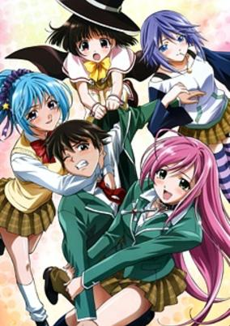

**Studio:** Gonzo &nbsp;|&nbsp; **Episodes:** 13 &nbsp;|&nbsp; **Director:** Takayuki Inagaki &nbsp;|&nbsp; **Aired/Released:** January 3 – March 27 &nbsp;|&nbsp; **Genres:** Earth, Vampire, Ecchi, Fantasy, Fantasy World, Action, High School, School Life, Parallel Universe, Present, Harem, Demon, Super Power, Comedy, Romance

> Youkai Academy is a seemingly normal boarding school, except that its pupils are monsters learning to coexist with humans. All students attend in human form and take normal academic subjects, such as literature, gym, foreign language, and mathematics. However, there is one golden rule at Youkai Academy—all humans found on school grounds are to be executed immediately! Tsukune Aono is an average teenager who is unable to get into any high school because of his bad grades. His parents inadvertently enroll him into Youkai Academy as a last-ditch effort to secure his education. As Tsukune unknowingly enters this new world, he has a run-in with the most attractive girl on campus, Moka Akashiya. Deciding to stay in the perilous realm in order to further his relationship with Moka, he does not realize that beneath her beauty lies a menacing monster—a vampire.Rosario to Vampire is a supernatural school comedy that explores Tsukune's romantic exploits, experiences, and misadventures with a bevy of beautiful but dangerous creatures. [Written by MAL Rewrite]
>
> _Synopsis source: Kitsu_

[Wikipedia](https://en.wikipedia.org/wiki/Rosario_%2B_Vampire) · [Kitsu](https://kitsu.io/anime/rosario-vampire)

---

### H2O: Footprints in the Sand

**Studio:** Zexcs &nbsp;|&nbsp; **Episodes:** 12 &nbsp;|&nbsp; **Director:** Hideki Tachibana &nbsp;|&nbsp; **Aired/Released:** January 4 – March 21 &nbsp;|&nbsp; **Genres:** Earth, Romance, Japan, Asia, Slice of Life, Sudden Girlfriend Appearance, Middle School, Coming Of Age, Drama, School Life, Countryside, Present, Harem

> Takuma Hirose is a blind young male high school student, though the cause for his blindness is undetermined. In order to heal his medical condition, he is sent to live in a village with his uncle. There, he meets several girls, three of which stand out more than any of the others. They are Hayami Kohinata, Hinata Kangura, and Otoha. Otoha temporarily heals his blindness and Hirose uses his sight to help others. He finds out that, for some reason, Hayami Kohinata is hated in the village, and he tries his best to help her out. Meanwhile, many sad secrets unfold in the village...
>
> _Synopsis source: Kitsu_

[Kitsu](https://kitsu.io/anime/h2o-footprints-in-the-sand)

---

### Hatenkō Yūgi (Hatenkou Yugi)

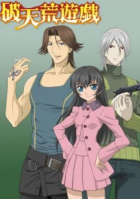

**Studio:** Studio Deen &nbsp;|&nbsp; **Episodes:** 10 &nbsp;|&nbsp; **Director:** Yoshihiro Takamoto &nbsp;|&nbsp; **Aired/Released:** January 5 – March 8 &nbsp;|&nbsp; **Genres:** Fantasy World, Adventure, Past, Plot Continuity, Fantasy, Comedy, Romance, Josei

> "See the world" With these words, Rahzel, the daughter of a rich family, is kicked out of her house and sent on her journey. Along the way she meets up with Heat and Alzeid, two men with very different personalities but very similar journeys. Rahzel is a clever, stubborn, and confident girl, who, with the powers of her magic and mind helps the people she runs into on her journey to discover the world.
>
> _Synopsis source: Kitsu_

[Wikipedia](https://en.wikipedia.org/wiki/Hatenk%C5%8D_Y%C5%ABgi) · [Kitsu](https://kitsu.io/anime/hatenkou-yuugi)

---

### Major S4

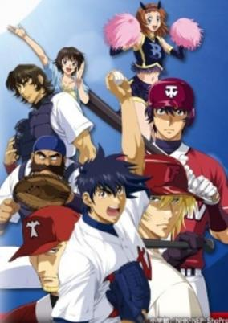

**Studio:** SynergySP &nbsp;|&nbsp; **Episodes:** 26 &nbsp;|&nbsp; **Director:** Riki Fukushima &nbsp;|&nbsp; **Aired/Released:** January 5 – June 28 &nbsp;|&nbsp; **Genres:** Earth, Sports, United States, Americas, Baseball, Plot Continuity, Present, Comedy

> After the final game of his Seishuu team against the goal he set himself, Kaidou—the team he left to play against, Gorou has no feelings of remorse anymore. Again he decides to take a step forward and challenge himself. Saying one more time good bye to Shimizu and his friends, he leaves for the USA, where he plans on competing in the Minor League. This is where Season 4 starts, in a country that's foreign to him, a baseball style that's unknown to him and new friends and strong rivals who share the same love to the game as him. Accompany Gorou in his never-ending quest for new challenges.
>
> _Synopsis source: Kitsu_

[Wikipedia](https://en.wikipedia.org/wiki/Major_S4) · [Kitsu](https://kitsu.io/anime/major-s4)

---

### Persona: Trinity Soul

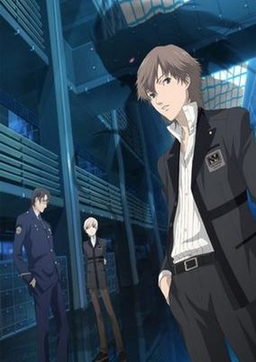

**Studio:** A-1 Pictures &nbsp;|&nbsp; **Episodes:** 26 &nbsp;|&nbsp; **Director:** Jun Matsumoto &nbsp;|&nbsp; **Aired/Released:** January 5 – June 28 &nbsp;|&nbsp; **Genres:** Earth, Science Fiction, Japan, Asia, Proxy Battles, Future, Plot Continuity, Violence, Super Power, Action

> The stage is Ayanagi City, a city near the Japan Sea. It is a futuristic city that was built to carry out the recovery from the calamity caused by the "Apathy Syndrome" ten years previous. High school student Shin Kanzato with his little brother Jun, meet with their elder brother Ryou, who is the chief of the Ayanagi City Police, again after ten years. At that time, a series of strange incidents happen in Ayanagi City such as the crew of a submarine that suddenly disappears while in their submarine, or a spiritless symptom which disturbs the world after ten years, or the case of the inside out corpse where a student took on a cruel appearance. Ryou tracks down the organization behind the string of incidents, and having become involved in the incidents, Shin awakens the "Persona."
>
> _Synopsis source: Kitsu_

[Kitsu](https://kitsu.io/anime/persona-trinity-soul)

---

### Shigofumi: Letters from the Departed

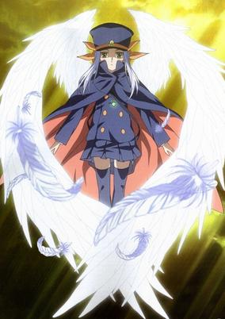

**Studio:** J.C.Staff &nbsp;|&nbsp; **Episodes:** 12 &nbsp;|&nbsp; **Director:** Tatsuo Satō &nbsp;|&nbsp; **Aired/Released:** January 6 – March 23 &nbsp;|&nbsp; **Genres:** Earth, Fantasy, Japan, Asia, Coming Of Age, Angst, Drama, Present, Super Power, Thriller, Psychological

> When someone dies, what should their final words be? Words that couldn't be said while still alive—of love, hate, hope, regret, or perhaps words without any importance. These words are sent through letters called "shigofumi" from the recently deceased to the living. Mikawa Fumika is a mail carrier of these shigofumi, delivering them alongside staff and her partner Kanaka. However, there must be something more behind Fumika's silent exterior; shigofumi mail carriers are deceased humans with the same appearance they had just before death. Despite this, Fumika is still aging... [Written by MAL Rewrite]
>
> _Synopsis source: Kitsu_

[Kitsu](https://kitsu.io/anime/shigofumi)

---

### They Are My Noble Masters

**Studio:** A.C.G.T &nbsp;|&nbsp; **Episodes:** 13 &nbsp;|&nbsp; **Director:** Susumu Kudo &nbsp;|&nbsp; **Aired/Released:** January 6 – March 30 &nbsp;|&nbsp; **Genres:** Ecchi, Japan, Earth, Asia, Parody, Slice of Life, Comedy, Maid, Stereotypes, Present, Harem, Romance

> Based On a Visual Novel developed by Minato Soft. Due to family troubles, Ren Uesugi and his sister, Mihato, leave their home. They end up moving to the city but find themselves with a lack of money. Somehow they are able to find work in the form of the Kuonji family's mansion, being employed as servants to the three sisters of the Kuonji family: Shinra, Miyu, and Yume. Being a servant also associates Ren with the mansion's additional servants and the Kuonji sisters' friends.
>
> _Synopsis source: Kitsu_

[Wikipedia](https://en.wikipedia.org/wiki/Kimi_ga_Aruji_de_Shitsuji_ga_Ore_de) · [Kitsu](https://kitsu.io/anime/kimi-ga-aruji-de-shitsuji-ga-ore-de)

---

### True Tears

**Studio:** P.A.Works &nbsp;|&nbsp; **Episodes:** 13 &nbsp;|&nbsp; **Director:** Junji Nishimura &nbsp;|&nbsp; **Aired/Released:** January 6 – March 30

[Wikipedia](https://en.wikipedia.org/wiki/True_Tears_(anime))

---

### (Zoku) Sayonara, Zetsubou-Sensei (Sayonara)

**Studio:** Shaft &nbsp;|&nbsp; **Episodes:** 13 &nbsp;|&nbsp; **Director:** Akiyuki Shinbo &nbsp;|&nbsp; **Aired/Released:** January 6 – March 30 &nbsp;|&nbsp; **Genres:** Satire, Japan, Earth, Asia, Parody, Comedy, High School, School Life, Present

> Nozomu Itoshiki is a high school teacher so pessimistic that even the smallest of misfortunes can send him into a pit of raging despair; some of these "catastrophes" even lead to suicide attempts. Sayonara Zetsubou Sensei is a satirical slice-of-life comedy set in the modern day, covering various aspects of Japanese life and culture through Nozomu and his interactions with his students: Kiri Komori, a recluse who refuses to leave the school; Abiru Kobushi, an enigma who frequently arrives to class with severe and mysterious injuries; the hyper-optimistic Kafuuka Fuura, Nozomu's polar opposite; and several other unusual girls, all of whom are just as eccentric as their teacher. [Written by MAL Rewrite]
>
> _Synopsis source: Kitsu_

[Wikipedia](https://en.wikipedia.org/wiki/Sayonara,_Zetsubou-Sensei) · [Kitsu](https://kitsu.io/anime/sayonara-zetsubou-sensei)

---

### Porphy no Nagai Tabi (The Orphans of Simitra)

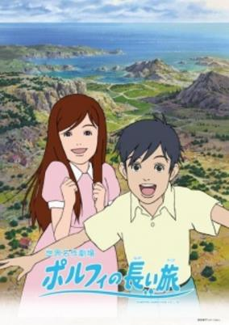

**Studio:** Nippon Animation &nbsp;|&nbsp; **Episodes:** 52 &nbsp;|&nbsp; **Director:** Tomomi Mochizuki &nbsp;|&nbsp; **Aired/Released:** January 6 – December 28 &nbsp;|&nbsp; **Genres:** Adventure, Drama, Historical, Slice of Life, Kids

> Porfy, his younger sister Mina, and their parents live a humble but happy life in the Grecian countryside. They've just started running a gas station, much to Porphy's joy, and it seems like only good things are in store for their future. However, a huge earthquake changes all that, leaving Porfy without a home or a family -- sans Mina, who seems to have disappeared in the commotion. Now, Porfy is determined to find his sister and be able to live together happily again.
>
> _Synopsis source: Kitsu_

[Wikipedia](https://en.wikipedia.org/wiki/Porphy_no_Nagai_Tabi) · [Kitsu](https://kitsu.io/anime/porfy-no-nagai-tabi)

---

### Minami-ke: Okawari

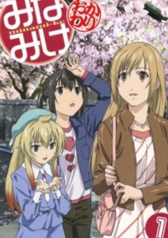

**Studio:** Asread &nbsp;|&nbsp; **Episodes:** 13 &nbsp;|&nbsp; **Director:** Naoto Hosoda &nbsp;|&nbsp; **Aired/Released:** January 7 – March 31 &nbsp;|&nbsp; **Genres:** Earth, Japan, Asia, Slice of Life, Comedy, Coming Of Age, Present, School Life

> The second season of Minami-Ke. It picks up where the first season left off, and just like the first season, it's about the daily lives of the three Minami sisters, Haruka, Kana and Chiaki, and their school friends.
>
> _Synopsis source: Kitsu_

[Kitsu](https://kitsu.io/anime/minami-ke-okawari)

---

### Aria the Origination

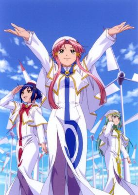

**Studio:** Hal Film Maker &nbsp;|&nbsp; **Episodes:** 13 &nbsp;|&nbsp; **Director:** Junichi Sato &nbsp;|&nbsp; **Aired/Released:** January 8 – April 1 &nbsp;|&nbsp; **Genres:** Slice of Life, Comedy, Mars, Other Planet, Future, Slapstick, Space, Science Fiction, Fantasy

> As winter melts into spring, Akari, Aika and Alice continue to work hard to become Neo-Venezia's top gondoliers. Aika starts to take on more responsibility around Himeya, Alice travels up the challenging canal near Hope Hill, and even Akari spends a day working on a huge gondola called a traghetto! But there's still so much to learn... and the final test to become a Prima, which once seemed so far off in the future, might not be so far off anymore.
>
> _Synopsis source: Kitsu_

[Wikipedia](https://en.wikipedia.org/wiki/Aria_the_Origination) · [Kitsu](https://kitsu.io/anime/aria-the-origination)

---

### Gunslinger Girl: Il Teatrino

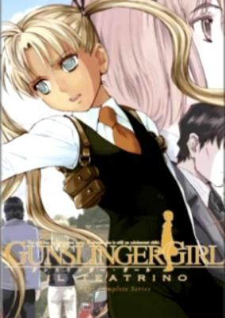

**Studio:** Artland &nbsp;|&nbsp; **Episodes:** 13 &nbsp;|&nbsp; **Director:** Hiroshi Ishidori &nbsp;|&nbsp; **Aired/Released:** January 8 – April 1 &nbsp;|&nbsp; **Genres:** Earth, Science Fiction, Italy, Action, Gunfights, Assassin, Europe, Human Enhancement, Cyborg, Present, Military

> When the Social Welfare Agency investigates the disappearance of an operative, their inquiry leads them right into the lair of their rival, the Five Republics. The assassin Triela infiltrates the hostile organization, but her search is cut short when she finds herself staring down the barrel of a gun...
>
> _Synopsis source: Kitsu_

[Kitsu](https://kitsu.io/anime/gunslinger-girl-il-teatrino)

---

### Noramimi

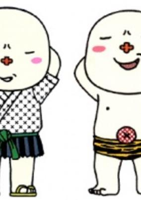

**Studio:** TMS Entertainment &nbsp;|&nbsp; **Episodes:** 12 &nbsp;|&nbsp; **Director:** Yoshitaka Koyama &nbsp;|&nbsp; **Aired/Released:** January 9 – March 26 &nbsp;|&nbsp; **Genres:** Comedy

> The anime is based on Kazuo Hara's comedy manga in which mascot characters live and work among humans. Agencies have been set up to train mascots to babysit children and then to place the mascots within families. Noramimi is one such mascot at the Hello Kids branch office #59. Unfortunately, no family wants to adopt a mascot born from a demon (oni) family, so he is stuck living at the agency. Source: ANN, Moon Phase
>
> _Synopsis source: Kitsu_

[Wikipedia](https://en.wikipedia.org/wiki/Noramimi) · [Kitsu](https://kitsu.io/anime/noramimi)

---

### Spice and Wolf

**Studio:** Imagin &nbsp;|&nbsp; **Episodes:** 13 &nbsp;|&nbsp; **Director:** Takeo Takahashi &nbsp;|&nbsp; **Aired/Released:** January 9 – March 26 &nbsp;|&nbsp; **Genres:** Earth, Contemporary Fantasy, Fantasy, Adventure, Deity, Juujin, Past, Plot Continuity, Historical, Romance, Drama

> Holo is a powerful wolf deity who is celebrated and revered in the small town of Pasloe for blessing the annual harvest. Yet as years go by and the villagers become more self-sufficient, Holo, who stylizes herself as the "Wise Wolf of Yoitsu," has been reduced to a mere folk tale. When a traveling merchant named Kraft Lawrence stops at Pasloe, Holo offers to become his business partner if he eventually takes her to her northern home of Yoitsu. The savvy trader recognizes Holo's unusual ability to evaluate a person's character and accepts her proposition. Now in the possession of both sharp business skills and a charismatic negotiator, Lawrence inches closer to his goal of opening his own shop. However, as Lawrence travels the countryside with Holo in search of economic opportunities, he begins to realize that his aspirations are slowly morphing into something unexpected. Based on the popular light novel of the same name, Ookami to Koushinryou, also known as Spice and Wolf, fuses the two polar genres of economics and romance to create an enthralling story abundant with elaborate schemes, sharp humor, and witty dialogue. Ookami to Koushinryou is more than just a story of bartering; it turns into a journey of searching for a lost identity in an ever-changing world.
>
> _Synopsis source: Kitsu_

[Wikipedia](https://en.wikipedia.org/wiki/Spice_and_Wolf) · [Kitsu](https://kitsu.io/anime/spice-and-wolf)

---

### Kitarō of the Graveyard (Graveyard Kitaro)

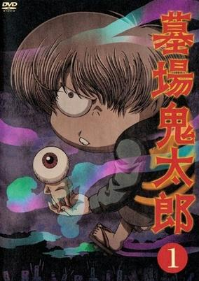

**Studio:** Toei Animation &nbsp;|&nbsp; **Episodes:** 11 &nbsp;|&nbsp; **Director:** Kimitoshi Chioki &nbsp;|&nbsp; **Aired/Released:** January 11 – March 21 &nbsp;|&nbsp; **Genres:** Japan, Comedy, Thriller, Horror, Plot Continuity, Demon, Violence, Supernatural, Deity, Ghost, Dark Fantasy, Past

> Kitarou is a youkai boy born in a cemetery, and aside from his mostly-decayed father, the last living member of the Ghost tribe. He is missing his left eye, but his hair usually covers the empty socket. He fights for peace between humans and youkai, which generally involves protecting the former from the wiles of the latter. This version of the Kitarou story is based on the original Hakaba Kitarou manga, the manga which inspired the popular Gegege no Kitarou series in the late 60's.
>
> _Synopsis source: Kitsu_

[Wikipedia](https://en.wikipedia.org/wiki/Kitar%C5%8D_of_the_Graveyard) · [Kitsu](https://kitsu.io/anime/hakaba-kitarou)

---

### Moegaku★5

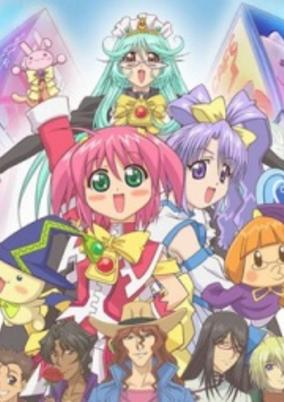

**Studio:** AIC Spirits &nbsp;|&nbsp; **Episodes:** 40 &nbsp;|&nbsp; **Director:** Yoshihiro Takamoto &nbsp;|&nbsp; **Aired/Released:** January 14 – March 3 &nbsp;|&nbsp; **Genres:** Parody, Magical Girl, Magic

> A Tokyo school girl named Tukishima Moe obtains the ability of becoming a magical girl with the help of Lulue. Her duty is to protect Akihabara, the source of moe energy, from falling into the evil hands. Note: This is a hybrid anime/live-action television series based on the Moegaku language-learning software. The series further the original concept by expanded language study to include English, Korean, Spanish, Chinese, and French.
>
> _Synopsis source: Kitsu_

[Wikipedia](https://en.wikipedia.org/wiki/Moegaku) · [Kitsu](https://kitsu.io/anime/moegaku-5)

---

### Yatterman

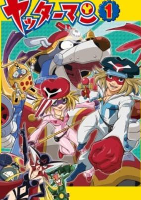

**Studio:** Tatsunoko Production &nbsp;|&nbsp; **Episodes:** 60 &nbsp;|&nbsp; **Director:** Hiroshi Sasagawa &nbsp;|&nbsp; **Aired/Released:** January 14 – September 27, 2009 &nbsp;|&nbsp; **Genres:** Comedy, Parody, Adventure

> Remake of the Yatterman series.
>
> _Synopsis source: Kitsu_

[Wikipedia](https://en.wikipedia.org/wiki/Yatterman) · [Kitsu](https://kitsu.io/anime/yatterman-2008)

---

### Yes PreCure 5 GoGo!

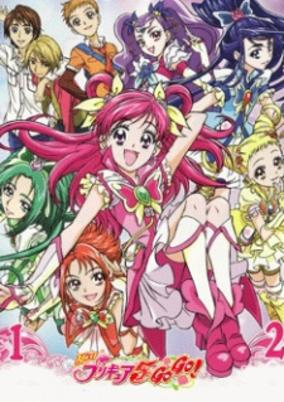

**Studio:** Toei Animation &nbsp;|&nbsp; **Episodes:** 48 &nbsp;|&nbsp; **Director:** Toshiaki Komura &nbsp;|&nbsp; **Aired/Released:** February 3 – January 25, 2009 &nbsp;|&nbsp; **Genres:** Earth, Fantasy, Contemporary Fantasy, Japan, Asia, Middle School, School Life, Magical Girl, Magic, Action

> A direct continuation of the former season, this series again follows the story of Nozomi Yumehara and her friends from Yes! Precure 5. The girls who had formerly lost their powers and bade farewell to their friends Coco and Nuts from Palmier Kingdom are resurrected as Pretty Cure by the mysterious woman Flora who also wants them to find her in a place called Cure Rosegarden. To go there, they need the magic Rose Pact and the powers of the four kings of countries surrounding Palmier. But a dark organization called Eternal is also striving to get to Cure Rosegarden by stealing the Rose Pact. Luckily, Precure get helped by new allies: the delivery-boy Syrup who can change into a giant bird and fly them anywhere they want and the mysterious and beautiful fighter Milky Rose stand alongside Pretty Cure to protect what is really valuable.
>
> _Synopsis source: Kitsu_

[Wikipedia](https://en.wikipedia.org/wiki/Yes_PreCure_5_GoGo!) · [Kitsu](https://kitsu.io/anime/yes-precure-5-gogo)

---

### Mnemosyne (Rin: Daughters of Mnemosyne)

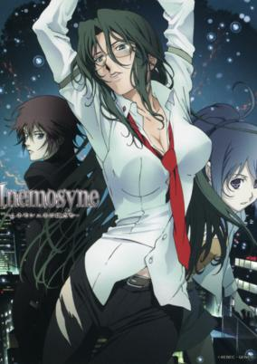

**Studio:** Xebec &nbsp;|&nbsp; **Episodes:** 6 &nbsp;|&nbsp; **Director:** Shigeru Ueda &nbsp;|&nbsp; **Aired/Released:** February 4 – July 7 &nbsp;|&nbsp; **Genres:** Earth, Science Fiction, Japan, Contemporary Fantasy, Action, Asia, Alternative Past, Shoujo Ai, Detective, Crime, Horror, Future, Violence, Virtual Reality, Super Power

> For normal people, getting stabbed to death would constitute the end of the road. For Rin Asogi, it's a mere inconvenience. Rin is immortal, a nice perk to have when you're a private detective constantly finding yourself in dangerous situations. Rin has eaten a "time fruit": a fruit from the guardian tree Yggdrasil, which, when consumed by a woman, makes her unable to die. Rin's immortality doesn't stop others from trying to kill her, of course; over her long lifetime she has been shot at, cut up, maimed, tortured, and suffered countless other violent deaths. This time, it's different. The year 1990 sparks the beginning of a series of events in Rin's life that sends her spiraling toward her fate. Someone is hunting down immortal women like Rin, and Rin's life may be in actual danger. Mnemosyne no Musume-tachi spans 65 years in Rin's life, during which she watches those around her get old while she herself remains unchanged. Higher forces are after her, and Rin must use every means at her disposal—or her next death may just be her last. And it all begins when she goes searching for a lost cat, but finds the amnesiac Koki Maeno instead...
>
> _Synopsis source: Kitsu_

[Wikipedia](https://en.wikipedia.org/wiki/Mnemosyne_(anime)) · [Kitsu](https://kitsu.io/anime/mnemosyne-mnemosyne-no-musume-tachi)

---

### Bus Gamer

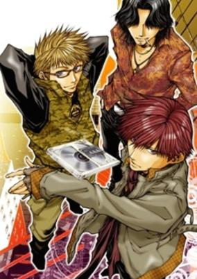

**Studio:** Studio Izena &nbsp;|&nbsp; **Episodes:** 3 &nbsp;|&nbsp; **Director:** Naoyuki Kazuya &nbsp;|&nbsp; **Aired/Released:** March 15 – March 29 &nbsp;|&nbsp; **Genres:** Earth, Japan, Action, Asia, Crime, Violence, Present

> When three complete strangers, Mishiba Toki, Nakajyo Nobuto, and Saitoh Kazuo, are hired by a corporation to compete in the Bus Game, an illegal dog-fight conducted in strict secrecy, they are given the team code of "Team AAA" (Triple Anonymous). This group of three who differ entirely from their living environments to their personalities have to work together effectively, but without mutually wiping out their mistrust of each other or prying into each other's privacy. They only have one point in common—each of them need a large amount of money for their individual circumstances. To get the money, they must play in the game despite their very own lives being at stake.
>
> _Synopsis source: Kitsu_

[Wikipedia](https://en.wikipedia.org/wiki/Bus_Gamer) · [Kitsu](https://kitsu.io/anime/bus-gamer)

---

### Chi's Sweet Home

**Studio:** Madhouse &nbsp;|&nbsp; **Episodes:** 104 &nbsp;|&nbsp; **Director:** Mitsuyuki Masuhara &nbsp;|&nbsp; **Aired/Released:** March 31 – September 25 &nbsp;|&nbsp; **Genres:** Earth, Japan, Asia, Slice of Life, Comedy, Present

> A grey and white kitten with black stripes wanders away from her mother and siblings one day while enjoying a walk outside. Lost in her surroundings, the kitten struggles to find her family and instead is found by a young boy, Youhei, and his mother. They take the kitten home, but pets are not allowed in their housing complex, so they try to find a new home for the kitten. This proves to be difficult, and the family eventually decides to keep the kitten, naming her "Chi."
>
> _Synopsis source: Kitsu_

[Wikipedia](https://en.wikipedia.org/wiki/Chi%27s_Sweet_Home) · [Kitsu](https://kitsu.io/anime/chi-s-sweet-home)

---

### Sugarbunnies: Chocolat!

**Studio:** Asahi Production &nbsp;|&nbsp; **Episodes:** 26 &nbsp;|&nbsp; **Director:** Hiroshi Kugimiya &nbsp;|&nbsp; **Aired/Released:** April 1 – September 30 &nbsp;|&nbsp; **Genres:** Kids

> Sequel to Sugar Bunnies Chocolate!
>
> _Synopsis source: Kitsu_

[Kitsu](https://kitsu.io/anime/sugar-bunnies-fleur)

---

### Yu-Gi-Oh! 5D's

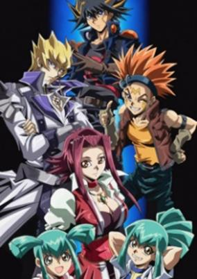

**Studio:** Gallop &nbsp;|&nbsp; **Episodes:** 154 &nbsp;|&nbsp; **Director:** Katsumi Ono &nbsp;|&nbsp; **Aired/Released:** April 2 – March 30, 2011 &nbsp;|&nbsp; **Genres:** Action, Card Games, Proxy Battles, Plot Continuity, Friendship, Science Fiction, Shounen

> Yu☆Gi☆Oh! 5D's, set in the not too distant future, is the sequel to Yu☆Gi☆Oh!: Duel Monsters GX. Following on from its predecessors, the show is centered on the Duel Monsters Card Game. Neo Domino City, a newer, evolved city is the largest in the world, watched over by its Director, Rex Godwin. Satellite, the renamed old Domino City, is now the city's main waste disposal area and the inhabitants who live there, Satellites, live in poor conditions and are forbidden from Duelling. Fudou Yuusei, the shows main protagonist, has built a D-Wheel (used for the new form of duelling, Riding Duels) in the hope that he can escape to Neo Domino City. Spurred on by revenge towards Jack Atlus, the King of Riding Duels, he manages to escape and duel Jack for his precious card, Stardust Dragon. However when it is summoned along with Jack's ace monster, Red Demons Dragon, a wondrous Crimson Dragon appears, along with a mysterious Birthmark on Yuusei's arm. From here on, Yuusei and his friends are thrown into a world of Darkness, from which they must duel their way out and attempt to save the world from the destructive forces that soon appear.
>
> _Synopsis source: Kitsu_

[Wikipedia](https://en.wikipedia.org/wiki/Yu-Gi-Oh!_5D%27s) · [Kitsu](https://kitsu.io/anime/yu-gi-oh-5d-s)

---

### Allison & Lillia

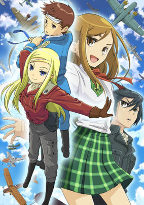

**Studio:** Madhouse &nbsp;|&nbsp; **Episodes:** 26 &nbsp;|&nbsp; **Director:** Masayoshi Nishida &nbsp;|&nbsp; **Aired/Released:** April 3 – October 2 &nbsp;|&nbsp; **Genres:** Romance, Adventure, Slice of Life, Alternative Past, Air Force, Conspiracy, Past, Plot Continuity, Action

> Set in a continent divided into two commonwealths that have been engaged in war for hundreds of years, Allison and Will go on a mission to search "the treasure that will put an end to the war". Their hope is inherited to their daughter Lillia, who strives to thaw the torn nations into a united country. This anime encourages young generations to believe in a world without hatred or war regardless of nationalities and beliefs.
>
> _Synopsis source: Kitsu_

[Wikipedia](https://en.wikipedia.org/wiki/Allison_%26_Lillia) · [Kitsu](https://kitsu.io/anime/allison-lillia)

---

### Kyo Kara Maoh! (season 3)

**Studio:** Studio Deen &nbsp;|&nbsp; **Episodes:** 39 &nbsp;|&nbsp; **Director:** Junji Nishimura &nbsp;|&nbsp; **Aired/Released:** April 3 – February 19, 2009

[Wikipedia](https://en.wikipedia.org/wiki/Kyo_Kara_Maoh!)

---

### Kure-nai (Kurenai)

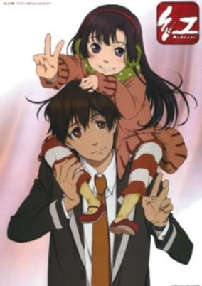

**Studio:** Brain's Base &nbsp;|&nbsp; **Episodes:** 12 &nbsp;|&nbsp; **Director:** Kō Matsuo &nbsp;|&nbsp; **Aired/Released:** April 4 – June 20 &nbsp;|&nbsp; **Genres:** Earth, Japan, Asia, Mafia, Martial Arts, Drama, Violence, Present, Harem, Comedy

> After losing his family in a tragic terrorist attack when he was but a child, the main protagonist of Kure-nai, Shinkurou Kurenai, made a pact to stay strong no matter what. Now a high school student, he works with Benika as a mediator and lives with the Houzuki family, training and gradually mastering the family martial arts. Together with other members of the team, Shinkurou aims to aid those who seek his help. One day, Benika brings a beautiful 7-year-old girl from a wealthy family, Murasaki Kuhouin, to the Houzuki house. When Shinkurou asks for a more challenging mission, he is left with the task of guarding this young lady. At first, he takes these orders for granted. However, when he comes home to find that Murasaki is gone, he panics, frantically running around to search for her. Thankfully, he soon finds her, and from that moment on, a bond between Murasaki and Shinkurou is formed that is sure to evolve into something more. Will Murasaki be able to help Shinkurou get past his tragic past? Or is it the other way around? How will these two face the challenges sure to come their way?
>
> _Synopsis source: Kitsu_

[Wikipedia](https://en.wikipedia.org/wiki/Kure-nai) · [Kitsu](https://kitsu.io/anime/kure-nai)

---

### xxxHolic: Kei

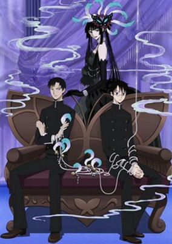

**Studio:** Production I.G &nbsp;|&nbsp; **Episodes:** 13 &nbsp;|&nbsp; **Director:** Tsutomu Mizushima &nbsp;|&nbsp; **Aired/Released:** April 4 – June 27 &nbsp;|&nbsp; **Genres:** Earth, Fantasy, Contemporary Fantasy, Japan, Asia, Present, Comedy, Psychological, Mystery

> Still working to get his wish complete, Watanuki finds himself into more mess than he can handle when certain facts about his everyday life gets revealed and when he needs to learn the lesson of Yuuko the hard way.
>
> _Synopsis source: Kitsu_

[Kitsu](https://kitsu.io/anime/xxxholic-kei)

---

### Macross Frontier

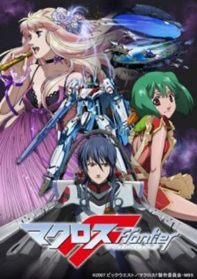

**Studio:** Satelight &nbsp;|&nbsp; **Episodes:** 25 &nbsp;|&nbsp; **Director:** Shōji Kawamori (chief) Yasuhito Kikuchi &nbsp;|&nbsp; **Aired/Released:** April 4 – September 26 &nbsp;|&nbsp; **Genres:** Romance, Space Travel, Science Fiction, Mecha, Action, Space Opera, Piloted Robot, Love Polygon, Humanoid Alien, Alien, Future, Idol, Space, Military, Music

> In a futuristic universe, humanity waged war against a race of giants known as Zentradi. Facing extinction at hands of their foes, humanity escaped to the stars. In 2059 A.D., the 25th Giant Immigration fleet, also known as the Macross Frontier, undergoes its journey towards the center of the galaxy. For the most part, life on the Macross Frontier proceeds as normal. But when famous singer Sheryl Nome visits, things go awry. Mysterious biomechanical aliens known as Vajra appear and attack, just as the citizens are busy clamoring over Sheryl. 17-year-old student mech pilot Alto Saotome joins the fray against the alien threat. While battling against a Varja, Alto rescues a young girl named Ranka Lee. Major Ozma Lee notes Alto's skill during his battle, and recruits him into the Strategic Military Services program. But his recruitment does not go smoothly, as the ghosts of Alto's past come up to haunt him.
>
> _Synopsis source: Kitsu_

[Wikipedia](https://en.wikipedia.org/wiki/Macross_Frontier) · [Kitsu](https://kitsu.io/anime/macross-frontier)

---

### To Love-Ru (To LOVE Ru)

**Studio:** Xebec &nbsp;|&nbsp; **Episodes:** 26 &nbsp;|&nbsp; **Director:** Takao Kato &nbsp;|&nbsp; **Aired/Released:** April 4 – September 26 &nbsp;|&nbsp; **Genres:** Earth, Romance, Japan, Ecchi, Comedy, Violent Retribution For Accidental Infringement, Sudden Girlfriend Appearance, Love Polygon, Coming Of Age, Humanoid Alien, Alien, School Life, Present, Harem, Demon, Science Fiction

> Timid 16-year-old Rito Yuuki has yet to profess his love to Haruna Sairenji—a classmate and object of his infatuation since junior high. Sadly, his situation becomes even more challenging when one night, a mysterious, stark-naked girl crash-lands right on top of a bathing Rito. To add to the confusion, Rito discovers that the girl, Lala Satalin Deviluke, is the crown princess of an alien empire and has run away from her home. Despite her position as the heiress to the most dominant power in the entire galaxy, Lala is surprisingly more than willing to marry the decidedly average Rito in order to avoid an unwanted political marriage.To LOVE-Ru depicts Rito's daily struggles with the bizarre chaos that begins upon the arrival of Lala. With an evergrowing legion of swooning beauties that continuously foil his attempted confessions to Haruna, To LOVE-Ru is a romantic comedy full of slapstick humor, sexy girls, and outlandishly lewd moments that defy the laws of physics. [Written by MAL Rewrite]
>
> _Synopsis source: Kitsu_

[Wikipedia](https://en.wikipedia.org/wiki/To_Love-Ru) · [Kitsu](https://kitsu.io/anime/to-love-ru)

---

### Kanokon (Kanokon: The Girl Who Cried Fox)

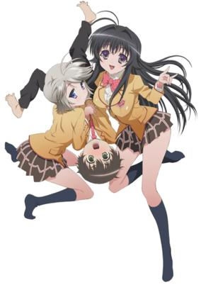

**Studio:** Xebec &nbsp;|&nbsp; **Episodes:** 12 &nbsp;|&nbsp; **Director:** Atsushi Ōtsuki &nbsp;|&nbsp; **Aired/Released:** April 5 – June 21 &nbsp;|&nbsp; **Genres:** Earth, Romance, Japan, Ecchi, Asia, Comedy, Sudden Girlfriend Appearance, Juujin, Love Polygon, Coming Of Age, High School, Countryside, Present, Harem, Slice of Life, School Life

> Kouta has girl troubles of the supernatural sort. For some reason, he keeps attracting the attention (and affections) of animal spirits! Having spent most of his life in the country, Kouta is understandably nervous when he moves in with his grandma to attend a high school in the big city. He hoped to make a good impression, but having Chizuru, a beautiful fox spirit, hanging off his arm didn't seem to be the sort of image he wanted to have. She's not alone in her love for Kouta, either. Nozomu, a wolf spirit, as well as other youkai have their sights set on the hapless country boy.
>
> _Synopsis source: Kitsu_

[Wikipedia](https://en.wikipedia.org/wiki/Kanokon) · [Kitsu](https://kitsu.io/anime/kanokon)

---

### The Tower of Druaga: The Aegis of Uruk (Tower of Druaga: The Aegis of Uruk)

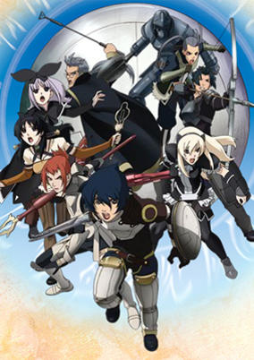

**Studio:** Gonzo &nbsp;|&nbsp; **Episodes:** 12 &nbsp;|&nbsp; **Director:** Koichi Chigira &nbsp;|&nbsp; **Aired/Released:** April 5 – June 21 &nbsp;|&nbsp; **Genres:** Fantasy, Fantasy World, Adventure, Comedy, Magic

> It is said that every few years, there is what's known as the "Summer of Anu." During that summer, thanks to the divine protection of the sky-god Anu, all of the demons in the tower lose their power. The country of Uruk has begun an invasion of the tower in order to suppress the demons. They've built up positions inside the tower, with their sights set on getting to the upper levels. The Uruk army knows that this is the third Summer of Anu-a perfect time to launch a mission to suppress the monster Druaga once and for all. The army soldiers aren't the only ones in the tower, though. An enitre city called Meskia has formed inside the tower's first floor. It plays host not just to soldiers, but also to adventurers who have heard rumors about a legendary treasure called the Blue Crystal Rod, which is said to rest at the very top of the tower. With all these different groups in the mix, each with its own agenda, one can only guess how things will play out during this unusual summer.
>
> _Synopsis source: Kitsu_

[Kitsu](https://kitsu.io/anime/druaga-no-tou-the-aegis-of-uruk)

---

### Amatsuki

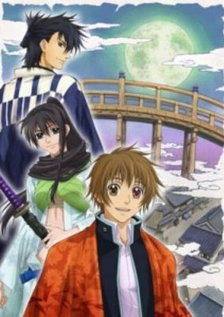

**Studio:** Studio Deen &nbsp;|&nbsp; **Episodes:** 13 &nbsp;|&nbsp; **Director:** Kazuhiro Furuhashi &nbsp;|&nbsp; **Aired/Released:** April 5 – June 28 &nbsp;|&nbsp; **Genres:** Earth, Fantasy, Contemporary Fantasy, Bakumatsu   Meiji Period, Japan, Adventure, Action, Asia, Alternative Past, Parallel Universe, Samurai, Demon, Historical, Josei

> Tokidoki is a Japanese high school student who, when he fails his history class, is sent to a high-tech history museum that virtually recreates the Edo period to do make-up work. However, what was supposed to be a simple school project becomes much more complicated when he's attacked by two supernatural beings known as "the nue" and "the yakou" and loses the vision in his left eye. After he's saved from the nue by a girl named Kuchiha, he realizes that he's no longer wearing the simulation goggles, and is trapped in the virtual Edo.
>
> _Synopsis source: Kitsu_

[Wikipedia](https://en.wikipedia.org/wiki/Amatsuki) · [Kitsu](https://kitsu.io/anime/amatsuki)

---

### Itazura na Kiss (ItaKiss)

**Studio:** TMS Entertainment &nbsp;|&nbsp; **Episodes:** 25 &nbsp;|&nbsp; **Director:** Osamu Yamazaki &nbsp;|&nbsp; **Aired/Released:** April 5 – September 25 &nbsp;|&nbsp; **Genres:** Romance, Japan, Comedy, Plot Continuity, Present

> When her newly-built home is razed to the ground by an earthquake, low-achieving, clumsy, and troublesome third-year high school student Kotoko Aihara is forced to share a roof with the school's—and possibly Japan's—smartest student, Naoki Irie. Kotoko is not actually a complete stranger to Irie-kun; unfortunately, a single love letter that she tried to give him in the past has already sealed her fate as far as he is concerned. Throw in some quirky friends and a meddlesome mother, and Kotoko might not even have a snowball's chance in hell of winning the older Irie boy's heart. Yet Kotoko remains optimistic that, because she now lives in his house, her unattainable crush on the genius since the beginning of high school has never been more within reach. [Written by MAL Rewrite]
>
> _Synopsis source: Kitsu_

[Wikipedia](https://en.wikipedia.org/wiki/Itazura_na_Kiss) · [Kitsu](https://kitsu.io/anime/itazura-na-kiss)

---

### Penguin no Mondai

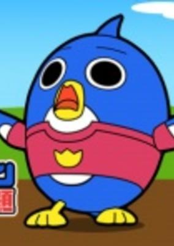

**Studio:** Shogakukan Music & Digital Entertainment &nbsp;|&nbsp; **Episodes:** 100 &nbsp;|&nbsp; **Director:** Jun Kamiya &nbsp;|&nbsp; **Aired/Released:** April 5 – March 20, 2009 &nbsp;|&nbsp; **Genres:** Comedy, Kids

> About the daily lives of a boy and his talking penguin.
>
> _Synopsis source: Kitsu_

[Wikipedia](https://en.wikipedia.org/wiki/Penguin_no_Mondai) · [Kitsu](https://kitsu.io/anime/penguin-no-mondai)

---

### Blue Dragon: Trials of the Seven Shadows (Blue Dragon: The Seven Dragons of the Heavens)

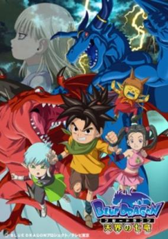

**Studio:** Studio Pierrot &nbsp;|&nbsp; **Episodes:** 51 &nbsp;|&nbsp; **Director:** Yukihiro Matsushita &nbsp;|&nbsp; **Aired/Released:** April 5 – March 28, 2009 &nbsp;|&nbsp; **Genres:** Adventure, Super Power, Fantasy, Comedy

> After the events of the Blue Dragon series, Shu and Bouquet join a resistance group to fight General Rogi's army of invasion.They encounter a mysterious child , Noi, who has the power to revive Shu's shadow counter-part Blue Dragon, and save her from the pursuit of a red dragon. Now Shu and his company have to set foot once again on a journey to discover the purpose of the dragons, undergo their tests and stop the chains of events which threatens the fate of humanity.
>
> _Synopsis source: Kitsu_

[Kitsu](https://kitsu.io/anime/blue-dragon-tenkai-no-shichi-ryuu)

---

### Duel Masters Cross

**Studio:** Shogakukan Music & Digital Entertainment &nbsp;|&nbsp; **Episodes:** 100 &nbsp;|&nbsp; **Director:** Waruo Suzuki &nbsp;|&nbsp; **Aired/Released:** April 5 – March 27, 2010 &nbsp;|&nbsp; **Genres:** Earth, Action, Adventure, Comedy, Proxy Battles, Sports, Card Games

> It is featured in an alternate universe where Shobu had lost his duel against Hakuoh in their duel back in the Season 1 episode "Just Duel It". A mysterious organization is interested in fledgling duelist Shobu Kirifuda's ability to bring Duel Master creatures to life. With the support of his friends, Shobu duels with passion, discipline, and heart as he strives to be like his father and become the next Kaijudo master.
>
> _Synopsis source: Kitsu_

[Wikipedia](https://en.wikipedia.org/wiki/Duel_Masters) · [Kitsu](https://kitsu.io/anime/zero-duel-masters)

---

### Kamen no Maid Guy

**Studio:** Madhouse &nbsp;|&nbsp; **Episodes:** 12 &nbsp;|&nbsp; **Director:** Masayuki Sakoi &nbsp;|&nbsp; **Aired/Released:** April 6 – June 22 &nbsp;|&nbsp; **Genres:** Earth, Ecchi, Japan, Asia, Comedy, School Life, Super Power, Action

> Fujiwara Naeka is a typical 17-year-old high school student. Or so we thought. She's really one of two surviving heirs of a tycoon who has the right to inherit his mass fortune when she turns 18 in half a year. Fubuki, a young and beautiful maid, and Kogarashi, a big burly maid guy with a mask, have been assigned to keep Naeka and her brother Kousuke safe from those who would plot their demise, and to steal the fortune she would inherit.
>
> _Synopsis source: Kitsu_

[Wikipedia](https://en.wikipedia.org/wiki/Kamen_no_Maid_Guy) · [Kitsu](https://kitsu.io/anime/kamen-no-maid-guy)

---

### Da Capo II: Second Season

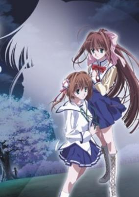

**Studio:** Feel &nbsp;|&nbsp; **Episodes:** 13 &nbsp;|&nbsp; **Director:** Hideki Okamoto &nbsp;|&nbsp; **Aired/Released:** April 6 – June 29 &nbsp;|&nbsp; **Genres:** Earth, Romance, Japan, Asia, Drama, Present, Harem, Fantasy, Comedy

> The story continues where it left off at season 1, but now we start to get to know the people we already know a little more in detail.
>
> _Synopsis source: Kitsu_

[Kitsu](https://kitsu.io/anime/da-capo-ii-second-season)

---

### Blassreiter

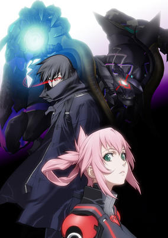

**Studio:** Gonzo &nbsp;|&nbsp; **Episodes:** 24 &nbsp;|&nbsp; **Director:** Ichirō Itano &nbsp;|&nbsp; **Aired/Released:** April 6 – September 28 &nbsp;|&nbsp; **Genres:** Science Fiction, Mecha, Germany, Action, Epidemic, Special Squads, Gunfights, Europe, Human Enhancement, Rotten World, Drama, Future, Plot Continuity, Violence, Super Power

> Blassreiter takes place in an alternate version of modern Germany which is under siege from an outbreak of mindless, biomechanical creatures, known as Demoniacs, who are mysteriously born from human corpses. These creatures possess the ability to merge their bodies with technology, most commonly upgrading themselves with cars, motorcycles, and other vehicles in order to improve their physical capabilities. In an effort to suppress the Demoniac plague, a task force called the Xenogenesis Assault Team (XAT) is formed. These individuals are responsible for responding to Demoniac incidents, finding themselves dispatched in order to protect the lives of the people of Germany. But the Demoniac threat has now taken a strange turn of events. A number of living humans have begun to develop Demoniac powers and retain the ability to think instead of lashing out like enraged animals. Some of these individuals have decided to use their powers to defend humanity, while others have decided that mankind should fall to the Demoniac. One of these Demoniac will rise above the others and become the Blassreiter, but will this Demoniac leader save the world or destroy it?
>
> _Synopsis source: Kitsu_

[Wikipedia](https://en.wikipedia.org/wiki/Blassreiter) · [Kitsu](https://kitsu.io/anime/blassreiter)

---

### Code Geass: Lelouch of the Rebellion R2

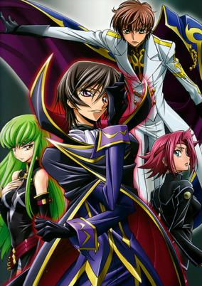

**Studio:** Sunrise &nbsp;|&nbsp; **Episodes:** 25 &nbsp;|&nbsp; **Director:** Gorō Taniguchi &nbsp;|&nbsp; **Aired/Released:** April 6 – September 28 &nbsp;|&nbsp; **Genres:** Earth, Science Fiction, Mecha, China, Japan, Action, Asia, Piloted Robot, War, Drama, Future, Alternative Present, Politics, Plot Continuity, Present, Military, Super Power

> One year has passed since the Black Rebellion, a failed uprising against the Holy Britannian Empire led by the masked vigilante Zero, who is now missing. At a loss without their revolutionary leader, Area 11's resistance group—the Black Knights—find themselves too powerless to combat the brutality inflicted upon the Elevens by Britannia, which has increased significantly in order to crush any hope of a future revolt. Lelouch Lamperouge, having lost all memory of his double life, is living peacefully alongside his friends as a high school student at Ashford Academy. His former partner C.C., unable to accept this turn of events, takes it upon herself to remind him of his past purpose, hoping that the mastermind Zero will rise once again to finish what he started, in this thrilling conclusion to the series.
>
> _Synopsis source: Kitsu_

[Kitsu](https://kitsu.io/anime/code-geass-lelouch-of-the-rebellion-r2)

---

### Net Ghost PiPoPa (Web Ghosts PiPoPa)

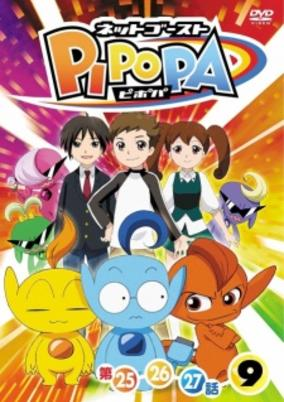

**Studio:** Studio Hibari &nbsp;|&nbsp; **Episodes:** 51 &nbsp;|&nbsp; **Director:** Shinichiro Kimura &nbsp;|&nbsp; **Aired/Released:** April 6 – March 29, 2009 &nbsp;|&nbsp; **Genres:** Fantasy, Adventure, Comedy, Magic, Future, Action, Science Fiction, Kids

> About a young boy named Akigawa Yuta who gets sucked into a virtual world through his cell phone. He meets three strange creatures that travel with him on Yuta's adventure in this strange new world.
>
> _Synopsis source: Kitsu_

[Wikipedia](https://en.wikipedia.org/wiki/Net_Ghost_PiPoPa) · [Kitsu](https://kitsu.io/anime/net-ghost-pipopa)

---

### Onegai My Melody Kirara☆

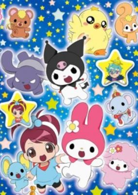

**Studio:** Studio Comet &nbsp;|&nbsp; **Episodes:** 52 &nbsp;|&nbsp; **Director:** Makoto Moriwaki &nbsp;|&nbsp; **Aired/Released:** April 6 – March 29, 2009 &nbsp;|&nbsp; **Genres:** Comedy, Magic, Fantasy

> Sequel to Onegai My Melody Sukkiri.
>
> _Synopsis source: Kitsu_

[Wikipedia](https://en.wikipedia.org/wiki/Onegai_My_Melody_Kirara%E2%98%86) · [Kitsu](https://kitsu.io/anime/onegai-my-melody-kirara)

---

### Zettai Karen Children (Psychic Squad)

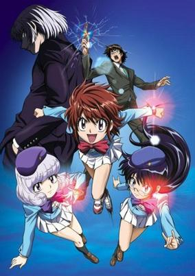

**Studio:** SynergySP &nbsp;|&nbsp; **Episodes:** 51 &nbsp;|&nbsp; **Director:** Keiichiro Kawaguchi &nbsp;|&nbsp; **Aired/Released:** April 6 – March 29, 2009 &nbsp;|&nbsp; **Genres:** Contemporary Fantasy, Japan, Elementary School, Comedy, Special Squads, Harem, Super Power, Action

> They're cute, adorable and three of the most powerful Espers the world has ever seen: Kaoru, the brash psychokinetic who can move objects with her mind; Shiho, the sarcastic and dark natured psychometric able to pick thoughts from people's minds and read the pasts of inanimate objects like a book; and Aoi, the most collected and rational of the three, who has the ability to teleport herself and the others at will. So what to do with these potential psychic monsters in the making? Enter B.A.B.E.L., the Base of Backing ESP Laboratory, where hopefully "The Children" and others like them can become part of the answer to an increasing wave of psychic evolution. It's a win-win solution... Unless you're Koichi Minamoto, the overworked young man stuck with the unenviable task of field commanding a team of three pre-teen girls!
>
> _Synopsis source: Kitsu_

[Wikipedia](https://en.wikipedia.org/wiki/Zettai_Karen_Children) · [Kitsu](https://kitsu.io/anime/zettai-karen-children)

---

### Neo Angelique Abyss

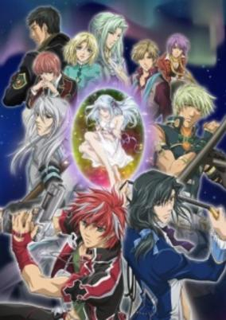

**Studio:** Yumeta Company &nbsp;|&nbsp; **Episodes:** 13 &nbsp;|&nbsp; **Director:** Shin Katagai &nbsp;|&nbsp; **Aired/Released:** April 7 – June 30 &nbsp;|&nbsp; **Genres:** Fantasy, Romance, Action, Bishounen, Reverse Harem, Comedy, Harem

> While the young Angelique lives out her days peacefully in her school, attacks from the monstrous Thanatos has been increasing everywhere else. Two Purifiers show up one day, men with the power to exterminate the Thanatos. One of them, Nyx, attempts to convince Angelique to join them in their work, as she has the power to be the only female Purifier. As Angelique hesitates, a Thanatos shows up in their school. Nyx and the other Purifier, Rayne, fight a losing battle. With her classmates falling prey to the Thanatos, and the Purifiers beaten to submission, Angelique's desire to save everyone awakens. She became the only female Purifier in their land of Arcadia, the one known as the "Queen's Egg".
>
> _Synopsis source: Kitsu_

[Wikipedia](https://en.wikipedia.org/wiki/Neo_Angelique_Abyss) · [Kitsu](https://kitsu.io/anime/neo-angelique-abyss)

---

### Our Home's Fox Deity. (Our Home's Fox Deity)

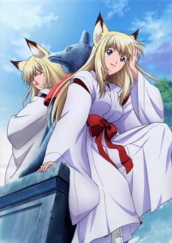

**Studio:** Zexcs &nbsp;|&nbsp; **Episodes:** 24 &nbsp;|&nbsp; **Director:** Yoshiaki Iwasaki &nbsp;|&nbsp; **Aired/Released:** April 7 – September 15 &nbsp;|&nbsp; **Genres:** Fantasy, Contemporary Fantasy, Japan, Slice of Life, Comedy, Juujin, Super Deformed, Present, Adventure

> The Mizuchi bloodline has long been hunted by Yokai, or monsters. Toru and Noboru Takagami are descendents of this bloodline, and under their grandmother's discretion, are given a secret weapon to combat these monsters. It is Tenko Kugen, a fox deity who can take the shape of a man or woman at will. The mischievous deity is accompanied by a shrine maiden, Ko, who will both live with the Takagami brothers at their house. Life just got complicated.
>
> _Synopsis source: Kitsu_

[Wikipedia](https://en.wikipedia.org/wiki/Our_Home%27s_Fox_Deity.) · [Kitsu](https://kitsu.io/anime/wagaya-no-oinari-sama)

---

### Special A (Special A (S.A))

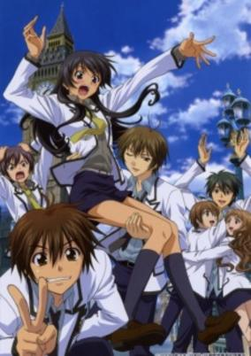

**Studio:** AIC Gonzo &nbsp;|&nbsp; **Episodes:** 24 &nbsp;|&nbsp; **Director:** Yoshikazu Miyao &nbsp;|&nbsp; **Aired/Released:** April 7 – September 15 &nbsp;|&nbsp; **Genres:** Earth, Romance, Japan, Asia, Slice of Life, Comedy, Coming Of Age, High School, Slapstick, School Life, Present

> Hikari was the best at everything until one day she challenged someone and lost. Now she is on a mission to beat him at something. Now a decade later she is still trying and he has fallen in love with her. What would you do?
>
> _Synopsis source: Kitsu_

[Wikipedia](https://en.wikipedia.org/wiki/Special_A) · [Kitsu](https://kitsu.io/anime/special-a)

---

### Nabari no Ou

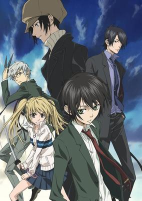

**Studio:** J.C.Staff &nbsp;|&nbsp; **Episodes:** 26 &nbsp;|&nbsp; **Director:** Kunihisa Sugishima &nbsp;|&nbsp; **Aired/Released:** April 7 – September 29 &nbsp;|&nbsp; **Genres:** Earth, Ninja, Contemporary Fantasy, Japan, Action, Asia, Bishounen, Present, Fantasy, Comedy

> Silent, apathetic, yet mischievous, 14-year-old Rokujou Miharu is the bearer of the hijutsu, "Shinrabanshou," a powerful technique many ninja clans desire to possess to become the ruler of Nabari. Fellow classmate Kouichi and his English teacher Kumohira are both secretly Banten clan ninjas, pledging themselves to protect Miharu from his many attackers. Keeping apathetic, Miharu attempts to reject their invitation to join their ninja "club." However, after numerous attacks, he finds no choice but to join their group as a means for his survival. Slowly, Miharu takes a step closer to becoming the ruler of Nabari. [Written by MAL Rewrite]
>
> _Synopsis source: Kitsu_

[Wikipedia](https://en.wikipedia.org/wiki/Nabari_no_Ou) · [Kitsu](https://kitsu.io/anime/nabari-no-ou)

---

### Soul Eater

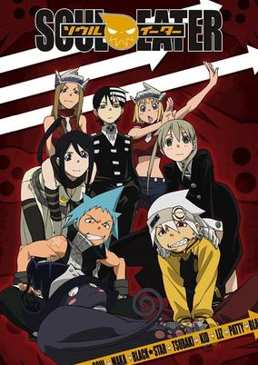

**Studio:** Bones &nbsp;|&nbsp; **Episodes:** 51 &nbsp;|&nbsp; **Director:** Takuya Igarashi &nbsp;|&nbsp; **Aired/Released:** April 7 – March 30, 2009 &nbsp;|&nbsp; **Genres:** Fantasy, Fantasy World, Action, Angst, Dark Fantasy, Alternative Present, Present, Demon, Adventure, Comedy, Shounen

> Death City is home to the famous Shibusen, a technical academy headed by the Shinigami–Lord Death himself. Its mission: to raise "Death Scythes" for the Shinigami to wield against the many evils of their fantastical world. These Death Scythes, however, are not made from physical weapons; rather, they are born from human hybrids who have the ability to transform their bodies into Demon Weapons, and only after they have consumed the souls of 99 evil beings and one witch's soul. Soul Eater Evans, a Demon Scythe who only seems to care about what's cool, aims to become a Death Scythe with the help of his straight-laced wielder, or meister, Maka Albarn. The contrasting duo work and study alongside the hot headed Black☆Star and his caring weapon Tsubaki, as well as the Shinigami's own son, Death the Kid, an obsessive-compulsive dual wielder of twin pistols Patty and Liz.Soul Eater follows these students of Shibusen as they take on missions to collect souls and protect the city from the world's threats while working together under the snickering sun to become sounder in mind, body, and soul. [Written by MAL Rewrite]
>
> _Synopsis source: Kitsu_

[Wikipedia](https://en.wikipedia.org/wiki/Soul_Eater_(manga)) · [Kitsu](https://kitsu.io/anime/soul-eater)

---

### Hakken Taiken Daisuki! Shimajirō

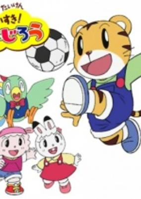

**Studio:** Pierrot Plus Studio Kikan &nbsp;|&nbsp; **Episodes:** 101 &nbsp;|&nbsp; **Director:** Akira Shigino Masahiro Nakata &nbsp;|&nbsp; **Aired/Released:** April 7 – March 29, 2010 &nbsp;|&nbsp; **Genres:** Comedy, Magic, Fantasy, Adventure, Kids

> Second season of the Shimajirou children's television series.
>
> _Synopsis source: Kitsu_

[Wikipedia](https://en.wikipedia.org/wiki/Hakken_Taiken_Daisuki!_Shimajir%C5%8D) · [Kitsu](https://kitsu.io/anime/hakken-taiken-daisuki-shimajirou)

---

### Vampire Knight

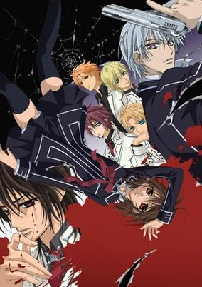

**Studio:** Studio Deen &nbsp;|&nbsp; **Episodes:** 13 &nbsp;|&nbsp; **Director:** Kiyoko Sayama &nbsp;|&nbsp; **Aired/Released:** April 8 – July 1 &nbsp;|&nbsp; **Genres:** Fantasy, Romance, Vampire, Contemporary Fantasy, Bishounen, Angst, Drama, Reverse Harem, Mystery

> Cross Academy is an elite boarding school with two separate, isolated classes: the Day Class and the Night Class. On the surface, Yuuki Cross and Zero Kiryuu are prefects of the academy, and attempt to keep order between the students as classes rotate in the evenings. As the Night Class is full of utterly gorgeous elites, this can sometimes prove to be a bit difficult. It is completely necessary, however, as those "elites" are actually vampires. Yuuki and Zero act as guardians, protecting the secrets of the Night Class and the safety of their ignorant morning counterparts. As the adopted daughter of the academy's chairman, Yuuki takes her job with a serious and energetic attitude. It also allows her to interact with her secret crush and savior, the president of the Night students' dorm, Kaname Kuran. Zero, on the other hand, has a deep-rooted hatred against vampires, and at times, does not hesitate to kill. Can vampires and humans co-exist, even in the strict setup of the Cross Academy? Only time will tell. [Written by MAL Rewrite]
>
> _Synopsis source: Kitsu_

[Wikipedia](https://en.wikipedia.org/wiki/Vampire_Knight) · [Kitsu](https://kitsu.io/anime/vampire-knight)

---

### Monochrome Factor

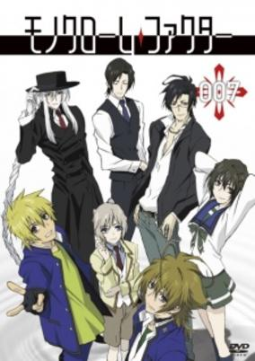

**Studio:** A.C.G.T &nbsp;|&nbsp; **Episodes:** 24 &nbsp;|&nbsp; **Director:** Yuu Kou &nbsp;|&nbsp; **Aired/Released:** April 8 – September 30 &nbsp;|&nbsp; **Genres:** Fantasy, Contemporary Fantasy, Japan, Action, Comedy, Delinquent, Alternative Present, Present, Shounen Ai

> The story revolves around high school student Akira Nikaido, a typical slacker living a normal life. That is, until he meets the mysterious Shirogane, a man who suddenly appears and tells him that they have a destiny together. When Akira hears this, he is shocked and doesn't believe a word of it. Aya, a friend of Akira, forgets something in the school one night, and asks Akira to help her and go find it. He agrees, and while there, he gets attacked by a shadow monster. Shirogane convinces him that the balance between the human world and the shadow world has been distorted and that Akira must become a "shin"- a creature of the shadow world- in order to help restore the balance. The anime has shonen-ai themes which are completely absent from the manga.
>
> _Synopsis source: Kitsu_

[Wikipedia](https://en.wikipedia.org/wiki/Monochrome_Factor) · [Kitsu](https://kitsu.io/anime/monochrome-factor)

---

### Glass Maiden

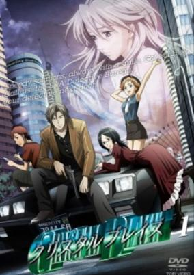

**Studio:** Studio Fantasia &nbsp;|&nbsp; **Episodes:** 12 &nbsp;|&nbsp; **Director:** Mitsuko Kase &nbsp;|&nbsp; **Aired/Released:** April 9 – June 25 &nbsp;|&nbsp; **Genres:** Science Fiction, Japan, Genetic Modification, Action, Gunfights, Detective, Plot Continuity

> Rags Town is the garbage dump of Japan. The place where people who want to forget their pasts run to. In this town, where the rules strictly forbid asking about the past or getting to know people, there is small detective agency called S&amp;A Detectives. The story revolves around Ayamana, the inseparable pair of misfit wannabe detectives, the case Manami takes on impulse, and the trouble that arises from it. On the case they find a woman who is abnormally hot, and who is being chased by a bunch of women with guns. After being dubbed Sara, the detectives try and figure out just what is going on with her. At the same time, all over town teenage girls are burning up and turning into glass. The government is covering everything up, but the detectives, as well as a nosy reporter and the local police, are determined to find out what is happening.
>
> _Synopsis source: Kitsu_

[Wikipedia](https://en.wikipedia.org/wiki/Glass_Maiden) · [Kitsu](https://kitsu.io/anime/crystal-blaze)

---

### Real Drive

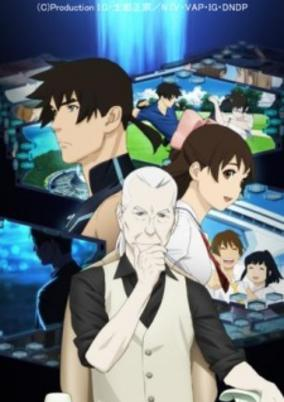

**Studio:** Production I.G &nbsp;|&nbsp; **Episodes:** 26 &nbsp;|&nbsp; **Director:** Kazuhiro Furuhashi &nbsp;|&nbsp; **Aired/Released:** April 9 – October 1 &nbsp;|&nbsp; **Genres:** Earth, Adventure, Science Fiction, Action, Detective, Human Enhancement, Cyborg, Cyberpunk, Future, Android, Law And Order, Virtual Reality

> 2061 AD. Fifty years have passed since mankind developed the Network society. It was anticipated that this new infrastructure would realize a utopia where people connected with each other at the level of consciousness. However, new social problems such as personal data leaks and proliferation of manipulated information began to surface. Nevertheless, people still relied on the Network to exchange information, and proved unable to opt to abandon it. In due course, a new Network realm with more effective security measures was developed. This was called Meta Real Network, usually abbreviated as "the Metal." The Metal accommodated personal memory data within protected virtual stand-alone organic cyber enclaves called bubble shells and eventually pervaded the everyday lives of people. However, people gradually learned to release and explode their instincts within the secure environment of the Metal. The unleashed instincts pushed each individual's consciousness to drown in the sea of information and to be exposed to the pressures of desire. Meanwhile, norms and regulations continued to bind their real world lives. Thus, strange friction between the two worlds began to manifest themselves as aberrations beyond the bounds of the imaginable. Experts who challenged the deep sea of the Metal to investigate and decipher such aberrations were called cyber divers. This is a story of a cyber diver, Masamichi Haru, who investigates the incidents that lie between Reality and the Metal.
>
> _Synopsis source: Kitsu_

[Wikipedia](https://en.wikipedia.org/wiki/Real_Drive) · [Kitsu](https://kitsu.io/anime/rd-sennou-chousashitsu)

---

### Top Secret: The Revelation

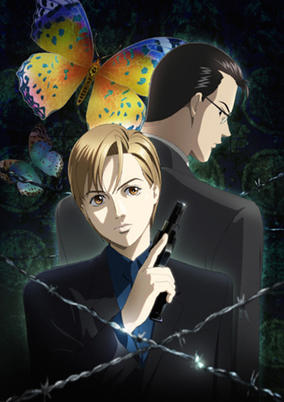

**Studio:** Madhouse &nbsp;|&nbsp; **Episodes:** 26 &nbsp;|&nbsp; **Director:** Hiroshi Aoyama &nbsp;|&nbsp; **Aired/Released:** April 9 – October 1 &nbsp;|&nbsp; **Genres:** Earth, Japan, Asia, Special Squads, Detective, Drama, Future, Law And Order, Science Fiction, Cops, Psychological, Mystery

> A newly developed method allows to display the memories of dead people. It is used to solve difficult murder cases. But at what cost? What of the dead's privacy as strangers poke about in their most private memories? What about the effects the imageries may have on the persons whose jobs require going through psychotic murderers' minds and experience whatever emotions and feelings these murderers felt as they skin and disembowel their victims?
>
> _Synopsis source: Kitsu_

[Kitsu](https://kitsu.io/anime/himitsu-top-secret-the-revelation)

---

### Junjo Romantica

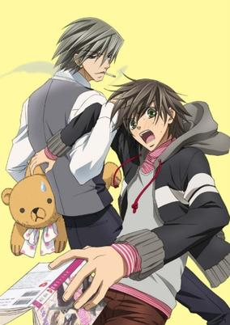

**Studio:** Studio Deen &nbsp;|&nbsp; **Episodes:** 12 &nbsp;|&nbsp; **Director:** Chiaki Kon &nbsp;|&nbsp; **Aired/Released:** April 11 – June 27 &nbsp;|&nbsp; **Genres:** Earth, Japan, Asia, Coming Of Age, Angst, Shounen Ai, Comedy, Romance

> Misaki Takahashi is a regular high school student who is preparing for his university entrance exams. In order to reduce the stress of studying, or so he hopes, he accepts the help of his older brother's best friend, and famous author, Akihiko Usami. However, Masaki is about to find out that Usami's books are of a very naughty genre, and that there may be something naughty waking up inside Masaki as well.Junjou Romantica also follows the story of two other couples loosely connected to Masaki and Usami's "Romantica." Egoist shows the very passionate, but often complicated, relationship between university professor Hiroki Kamijou (whose life has reached an all time low) and paediatrician Nowaki Kusama, who falls for Hiroki at first sight and would do anything to make him happy. The third story, "Terrorist," shows just how obsessive love can become when rich eighteen-year-old Shinobu Takatsuki finally discovers something that he cannot have so easily—the literature professor You Miyagi. There is passion abound as these three couples try to achieve their goals in life while also falling into temptation and anguish with their partners.
>
> _Synopsis source: Kitsu_

[Wikipedia](https://en.wikipedia.org/wiki/Junjo_Romantica) · [Kitsu](https://kitsu.io/anime/junjou-romantica)

---

### Library War (Library Wars)

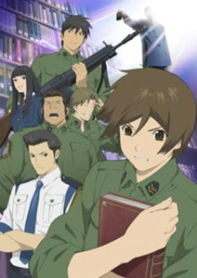

**Studio:** Production I.G &nbsp;|&nbsp; **Episodes:** 12 &nbsp;|&nbsp; **Director:** Takayuki Hamana &nbsp;|&nbsp; **Aired/Released:** April 11 – June 27 &nbsp;|&nbsp; **Genres:** Japan, Action, Comedy, Alternative Present, Present, Military, Romance

> Toshokan Sensou tells the story of Kasahara Iku, the first woman to join the Library Task Force. In the near future in Japan, the Media Enhancement Law has been forced upon the population censoring all books and media. To counter this, the Library Defense Force was created. To protect themselves against the Media Enhancement Law Commission, all major libraries are fully equipped with a military Task Force, who take it upon themselves to protect the books and freedom of media of the people. This anime follows Iku and her fellow soldiers as they protect various special books and artifacts from the oppression of the Media Enhancement Law Commission. A love story, war story, and comedy all rolled into one.
>
> _Synopsis source: Kitsu_

[Wikipedia](https://en.wikipedia.org/wiki/Library_War) · [Kitsu](https://kitsu.io/anime/toshokan-sensou)

---

### Kaiba

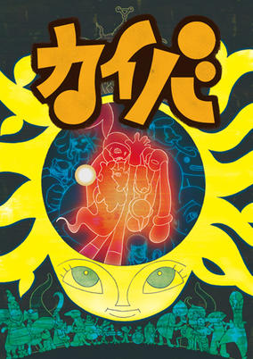

**Studio:** Madhouse &nbsp;|&nbsp; **Episodes:** 12 &nbsp;|&nbsp; **Director:** Masaaki Yuasa &nbsp;|&nbsp; **Aired/Released:** April 11 – July 25 &nbsp;|&nbsp; **Genres:** Romance, Adventure, Space Travel, Science Fiction, Dystopia, Fantasy World, Other Planet, Drama, Future, Mystery

> A boy with no name awakens with a hole through his chest, a strange marking on his belly, and no memories. The one link to his past is a locket containing a picture of a girl whose name he does not know. Within moments he meets Popo, who unlike the memoryless boy has a purpose. Through Popo, the boy learns that where he is a body without memory, in this world there are many who are only memories with no body. The rich harvest the choice bodies, leaving only the dregs for those down below. And yet even though he has no memories, there are many who seem to want his life. How does he fit into this world where not even memories might be real?
>
> _Synopsis source: Kitsu_

[Wikipedia](https://en.wikipedia.org/wiki/Kaiba) · [Kitsu](https://kitsu.io/anime/kaiba)

---

### The Diary of a Crazed Family

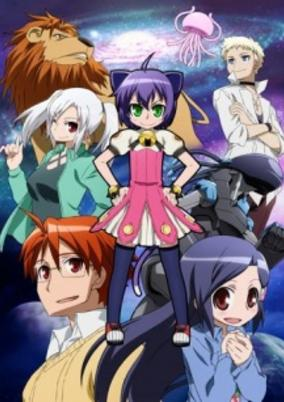

**Studio:** Nomad &nbsp;|&nbsp; **Episodes:** 26 &nbsp;|&nbsp; **Director:** Yasuhiro Kuroda &nbsp;|&nbsp; **Aired/Released:** April 12 – October 4 &nbsp;|&nbsp; **Genres:** Tone Changes, Parody, Comedy, Sudden Girlfriend Appearance, Magical Girl, Science Fiction

> Midarezaki Ouka is used to having strange things happen to him -after all, he is the head of the Great Japanese Empire Paranormal Phenomena Bureau of Measures. But when he catches a small cat girl in the shopping district stealing apples, his whole life rearranges to fit a new operation... OPERATION COZY FAMILY. Thousands of years ago, Enka the God of Destruction, was killed. However, with a dying breath it claimed that its child would appear and destroy humanity. Now in futuristic Japan, all of the potential children of Enka have been found and placed into a haphazard family. Teika the lion, Gekka the jellyfish, Yuuka the oni, Ginka the cross-dressing mafia son, and Hyouka the bioweapon--along with their parents Ouka and Kyouka (the ruler of a demon underworld)--all live under one roof in a family frenzy.
>
> _Synopsis source: Kitsu_

[Wikipedia](https://en.wikipedia.org/wiki/Ky%C5%8Dran_Kazoku_Nikki) · [Kitsu](https://kitsu.io/anime/kyouran-kazoku-nikki)

---

### Golgo 13

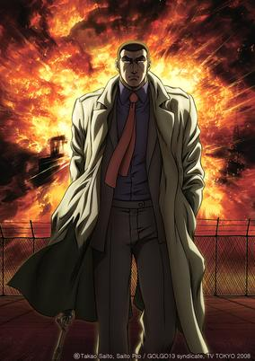

**Studio:** The Answer Studio &nbsp;|&nbsp; **Episodes:** 50 &nbsp;|&nbsp; **Director:** Shunji Oga &nbsp;|&nbsp; **Aired/Released:** April 12 – March 28, 2009 &nbsp;|&nbsp; **Genres:** Gunfights, Action, Adventure, Thriller, Crime

> Golgo 13 is not his real name. Then again, neither is Duke Togo, Tadashi Togo, or any number of the aliases he goes by. A man of mystery, not even the world’s most prominent intelligence agencies can determine who Golgo really is, or just where he came from. But all agree that his skills are nothing short of legendary. Armed with a custom M16, Golgo is willing to take any job for any agency, from the FBI to the KGB. He has completed every contract he has ever taken and will work for anyone who can meet his price. He is both the greatest weapon and the greatest threat to any nation; no one is safe once they are in Golgo’s sights.
>
> _Synopsis source: Kitsu_

[Wikipedia](https://en.wikipedia.org/wiki/Golgo_13) · [Kitsu](https://kitsu.io/anime/golgo-13)

---

### Legend of the Condor Hero III

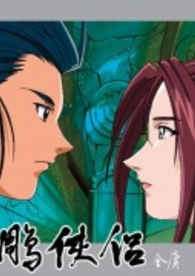

**Studio:** Nippon Animation &nbsp;|&nbsp; **Episodes:** 26 &nbsp;|&nbsp; **Aired/Released:** April 13 – May 3 &nbsp;|&nbsp; **Genres:** Martial Arts, Swordplay, Past, Earth, Historical, China, Plot Continuity, Asia, Action, Adventure

> Continuation of Legend of the Condor Hero II.
>
> _Synopsis source: Kitsu_

[Wikipedia](https://en.wikipedia.org/wiki/The_Legend_of_Condor_Hero) · [Kitsu](https://kitsu.io/anime/shin-chou-kyou-ryo-condor-hero-iii)

---

### The Daughter of 20 Faces

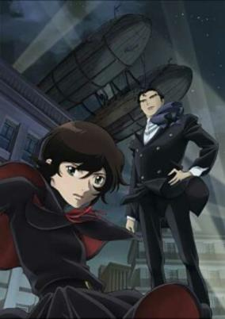

**Studio:** Bones Telecom Animation Film &nbsp;|&nbsp; **Episodes:** 22 &nbsp;|&nbsp; **Director:** Nobuo Tomizawa &nbsp;|&nbsp; **Aired/Released:** April 13 – September 28 &nbsp;|&nbsp; **Genres:** Earth, Steampunk, Adventure, Action, Alternative Past, Detective, Coming Of Age, Anti War, All Girls School, Plot Continuity, Mystery

> Chiko is the daughter of the wealthy Mikamo family who has to live with her aunt and uncle after her parents passed away. Because her aunt wants to inherit the Mikamo family's wealth, she gives Chiko poisoned food. One day, however, she's kidnapped by the Nijuu Mensou (20 Faces) and decides to join his clan.
>
> _Synopsis source: Kitsu_

[Wikipedia](https://en.wikipedia.org/wiki/Nij%C5%AB_Mens%C5%8D_no_Musume) · [Kitsu](https://kitsu.io/anime/nijuu-mensou-no-musume)

---

### RoboDz Kazagumo Hen

**Studio:** Toei Animation &nbsp;|&nbsp; **Episodes:** 26 &nbsp;|&nbsp; **Director:** Daisuke Nishio &nbsp;|&nbsp; **Aired/Released:** June 2 – November 24 &nbsp;|&nbsp; **Genres:** Science Fiction

> not available
>
> _Synopsis source: Kitsu_

[Wikipedia](https://en.wikipedia.org/wiki/RoboDz_Kazagumo_Hen) · [Kitsu](https://kitsu.io/anime/robodz)

---

### Ikki Tousen: Great Guardians

**Studio:** Arms &nbsp;|&nbsp; **Episodes:** 12 &nbsp;|&nbsp; **Director:** Koichi Ohata &nbsp;|&nbsp; **Aired/Released:** June 11 – August 27 &nbsp;|&nbsp; **Genres:** Ecchi, Action, Comedy, Martial Arts, High School, School Life, Female Student, Super Power

> Hakufu's dreams of participating in new fights and tournaments are put on hold as new obstacles block her path. Her friends have lost faith in her, new enemies appear, and a younger sister she never knew existed suddenly shows up on her doorstep. If Hakufu ever hopes to compete worldwide, she's going to have to deal with her issues at home first.
>
> _Synopsis source: Kitsu_

[Kitsu](https://kitsu.io/anime/ikkitousen-great-guardians)

---

### Telepathy Shōjo Ran

**Studio:** TMS Entertainment &nbsp;|&nbsp; **Episodes:** 26 &nbsp;|&nbsp; **Director:** Masaharu Okuwaki &nbsp;|&nbsp; **Aired/Released:** June 21 – December 20 &nbsp;|&nbsp; **Genres:** Romance, Middle School, Detective, Magic, School Life, Super Power, Fantasy

> Ran is a bright and energetic first-grader in junior high school who possesses supernatual abilities. Together with Midori (her friend who also has supernatural powers) and Rui, the threesome are constantly embroiled in mysterious circumstances. Ran is troubled by her powers because it seems to spark off the ill intentions of people in contact with her. However, with the support of her family and peers, Ran learns to deal with her 'other' side and accepts who she is. The threesome also learn how to team up as a whole and solve these mysterious events.
>
> _Synopsis source: Kitsu_

[Wikipedia](https://en.wikipedia.org/wiki/Telepathy_Sh%C5%8Djo_Ran) · [Kitsu](https://kitsu.io/anime/telepathy-shoujo-ran)

---

### Ultraviolet: Code 044

**Studio:** Madhouse &nbsp;|&nbsp; **Episodes:** 12 &nbsp;|&nbsp; **Director:** Osamu Dezaki &nbsp;|&nbsp; **Aired/Released:** July 1 – September 16 &nbsp;|&nbsp; **Genres:** Space Travel, Science Fiction, Dystopia, Genetic Modification, Action, Gunfights, Swordplay, Cyberpunk, Anti War, Angst, Other Planet, Drama, Future, Violence, Military

> 044 becomes the strongest female soldier excelling in combat through gene manipulation using a virus. However, in exchange for her abilities, her days become numbered. The next mission of the government is to destroy a bloodthirsty squad, Phage, and its leader King. In her battle, she encounters a Phage soldier, Luka, and finds herself unable to kill him. She wonders why, but as a result, Daxus Jr., the leader of the government group, regards her as a traitor. She is targeted by both Phage and the government, and she runs away with the injured Luka.
>
> _Synopsis source: Kitsu_

[Kitsu](https://kitsu.io/anime/ultraviolet-code-044)

---

### Sekirei

**Studio:** Seven Arcs &nbsp;|&nbsp; **Episodes:** 12 &nbsp;|&nbsp; **Director:** Keizō Kusakawa &nbsp;|&nbsp; **Aired/Released:** July 2 – September 17 &nbsp;|&nbsp; **Genres:** Earth, Ecchi, Japan, Action, Asia, Comedy, Sudden Girlfriend Appearance, Harem, Super Power

> Struggling yet brilliant teenager Minato Sahashi has failed his college entrance exams for the second time, resulting in him being regarded as worthless by those around him. However, the course of his seemingly bleak future is altered dramatically when a beautiful, supernatural woman falls from the sky and into his life. That woman, Musubi, is a unique being known as a "Sekirei," a humanoid extraterrestrial with extraordinary abilities. These aliens are known for kissing humans carrying the Ashikabi gene in order to awaken additional latent powers deep within.Recognizing the potential within the seemingly insignificant youth, Musubi kisses the bewildered Minato, initiating a bond between the two of them. This drags him into the high-stakes world of the Sekirei, where he and his new partner must compete against others in a battle for survival called the "Sekirei Plan." However, unbeknownst to the contestants, there is far more at risk that what the competition initially entailed.[Written by MAL Rewrite]
>
> _Synopsis source: Kitsu_

[Wikipedia](https://en.wikipedia.org/wiki/Sekirei) · [Kitsu](https://kitsu.io/anime/sekirei)

---

### Slayers Revolution

**Studio:** J.C.Staff &nbsp;|&nbsp; **Episodes:** 13 &nbsp;|&nbsp; **Director:** Takashi Watanabe &nbsp;|&nbsp; **Aired/Released:** July 3 – September 25 &nbsp;|&nbsp; **Genres:** Fantasy, Comedy, Magic, Adventure

> Having lost the Sword of Light in the previous battle, Lina and Gourry continue their journey in search of a replacement weapon. On the way, the two of them meet up with Amelia and Zelgadis in the kingdom of Luvinagard while taunting some pirates. Lina is happy to reunite with her old friends, but appearing before her is Luvinagard's Inspector of the Special Investigative Unit; a man called Wizer. However, Lina is amazed at his unusual behavior...
>
> _Synopsis source: Kitsu_

[Wikipedia](https://en.wikipedia.org/wiki/Slayers_Revolution) · [Kitsu](https://kitsu.io/anime/slayers-revolution)

---

### Someday's Dreamers: Summer Skies (Someday's Dreamers II: Sora)

**Studio:** Hal Film Maker &nbsp;|&nbsp; **Episodes:** 12 &nbsp;|&nbsp; **Director:** Osamu Kobayashi &nbsp;|&nbsp; **Aired/Released:** July 3 – September 25 &nbsp;|&nbsp; **Genres:** Japan, Slice of Life, Magic, Drama, Present

> Get ready for a second magical journey to the world of Someday's Dreamers, where spellcasting is a profession that requires both the proper training AND a license. It's to get that license and fulfill a promise made to her late father that young Sora Suzuki has made the long journey from her distant home in the countryside town of Biei to the big city of Tokyo. It's a daunting challenge, but she's got a little bit of talent, a charming personality and, most important of all, the promise of an internship! What she ISN'T expecting, though, is how different life in the city will be, especially the people themselves. While she gets along with the confident Asagi, Kuroda and the gentle Hiyori, she's completely confused with the mysterious boy Gouta. And yet, as a result of their internships they keep ending up in the same situations and slowly learning to understand more about each other than they ever imagined possible!
>
> _Synopsis source: Kitsu_

[Kitsu](https://kitsu.io/anime/mahou-tsukai-ni-taisetsu-na-koto-natsu-no-sora)

---

### Antique Bakery

**Studio:** Nippon Animation Shirogumi &nbsp;|&nbsp; **Episodes:** 12 &nbsp;|&nbsp; **Director:** Yoshiaki Okumura &nbsp;|&nbsp; **Aired/Released:** July 4 – September 19 &nbsp;|&nbsp; **Genres:** Japan, Slice of Life, Bishounen, Cooking, Plot Continuity, Present, Shounen Ai, Comedy

> A high school crush, a world-class pastry chef, a former middle-weight boxing champion... and a whole lot of cake! Ono has come a long way since the agonizing day in high school when he confessed his love to handsome Tachibana. Now, some 14 years later Ono, a world-class pastry chef and gay playboy has it all. No man can resist Ono's charms (or his cooking skills!) but he has just found a new position under a man named Tachibana. Can this be the only man who resisted his charms, and if so, will the man who once snubbed the "magically gay" Ono get his just deserts? And how in the heck did a former middleweight boxing champion wind up as Ono's cake boy?
>
> _Synopsis source: Kitsu_

[Wikipedia](https://en.wikipedia.org/wiki/Antique_Bakery) · [Kitsu](https://kitsu.io/anime/antique-bakery)

---

### Strike Witches

**Studio:** Gonzo &nbsp;|&nbsp; **Episodes:** 12 &nbsp;|&nbsp; **Director:** Kazuhiro Takamura &nbsp;|&nbsp; **Aired/Released:** July 4 – September 19 &nbsp;|&nbsp; **Genres:** Earth, Ecchi, Power Suit, Science Fiction, Mecha, Action, Loli, Alternative Past, Gunfights, Shoujo Ai, Juujin, War, Past, Magic, Military

> Strike Witches is set in an alternate version of 1944, where the events of World War II are very different than what we know to be true. Alien invaders known as the Neuroi came to Earth in 1939. This is not the first appearance of the Neuroi as they have appeared at seemingly random intervals throughout human history. While the Neuroi primarily attack humanity using aircrafts, their mothership is able to produce a deadly miasma, a chemical that is fatally poisonous to humans, forcing the populations of affected areas to flee their homes. The Neuroi then use the poisoned areas to plunder Earth's natural resources to use against humanity. Luckily the miasma cannot spread across water, making the ocean humanity's main line of defense against the Neuroi. With normal humans unable to fight in the miasma, witches have become the forefront of military defense against the Neuroi. Each witch is able to deploy a defensive field around themselves that not only blocks the miasma but protects them from physical attacks as well. Utilizing leg mounted machines called Striker Units to fly into combat, the witches use their magical abilities to wield devastating weapons too large and ungainly for a normal person. The series follows the battles fought by the 501st Joint Fighter Wing, who battle on the front lines to defend the British Isles from the Neuroi. Will humanity be able to take back Earth and bring peace to their home? Find out in Strike Witches!
>
> _Synopsis source: Kitsu_

[Wikipedia](https://en.wikipedia.org/wiki/Strike_Witches) · [Kitsu](https://kitsu.io/anime/strike-witches)

---

### Hidamari Sketch × 365 (Hidamari Sketch x 365)

**Studio:** Shaft &nbsp;|&nbsp; **Episodes:** 13 &nbsp;|&nbsp; **Director:** Akiyuki Shinbo &nbsp;|&nbsp; **Aired/Released:** July 4 – September 26 &nbsp;|&nbsp; **Genres:** Earth, Japan, Asia, Slice of Life, Comedy, Super Deformed, High School, School Life, The Arts

> After passing her entrance exam, Yuno enrolls at Yamabuki High School as part of an art degree. She stays at the Hidamari Apartments along with best friend Miyako, and seniors Hiro and Sae. Each episode follows a day in her life as she mingles with her friends, close peers, overly hyper teachers and closely follows the mundane lives of the high school girls. (Note: This season also takes place in Yuno's first year at high school, and overlaps with season one of the show)
>
> _Synopsis source: Kitsu_

[Wikipedia](https://en.wikipedia.org/wiki/Hidamari_Sketch_%C3%97_365) · [Kitsu](https://kitsu.io/anime/hidamari-sketch-x-365)

---

### Birdy the Mighty: Decode

**Studio:** A-1 Pictures &nbsp;|&nbsp; **Episodes:** 13 &nbsp;|&nbsp; **Director:** Kazuki Akane &nbsp;|&nbsp; **Aired/Released:** July 5 – September 27 &nbsp;|&nbsp; **Genres:** Contemporary Fantasy, Power Suit, Science Fiction, Action, Special Squads, Alien, Idol, Robot Helper, Android, Law And Order, Comedy

> Federation investigator Birdy chases the space criminal Geega through space to Earth, where he hides in the entertainment industry under a human disguise. Birdy goes undercover herself, posing as famous model “Arita Shion” that often uses a ‘space girl’ look. A male student, Senkawa, stumbles upon a fight between the two one night in an abandoned building only to be severed in half as he is used as a shield by Geega against Birdy. Birdy heals him from imminent death in some fashion- but Senkawas body, and life, are now changed and permanently linked to Birdy.
>
> _Synopsis source: Kitsu_

[Kitsu](https://kitsu.io/anime/tetsuwan-birdy-decode)

---

### Yakushiji Ryōko no Kaiki Jikenbo (Ryoko's Case File Special)

**Studio:** Doga Kobo &nbsp;|&nbsp; **Episodes:** 13 &nbsp;|&nbsp; **Director:** Tarō Iwasaki &nbsp;|&nbsp; **Aired/Released:** July 6 – September 28 &nbsp;|&nbsp; **Genres:** Fantasy, Cops, Mystery

> A recap of the last few episodes with some commentary by Jacqueline, as well as Ryoko, and Izumida.
>
> _Synopsis source: Kitsu_

[Wikipedia](https://en.wikipedia.org/wiki/Yakushiji_Ry%C5%8Dko_no_Kaiki_Jikenbo) · [Kitsu](https://kitsu.io/anime/yakushiji-ryouko-no-kaiki-jikenbo-hamachou-voice-fiction)

---

### The Familiar of Zero: Rondo of Princesses

**Studio:** J.C.Staff &nbsp;|&nbsp; **Episodes:** 12 &nbsp;|&nbsp; **Director:** Yū Kō &nbsp;|&nbsp; **Aired/Released:** July 7 – September 22 &nbsp;|&nbsp; **Genres:** Fantasy, Ecchi, Fantasy World, Comedy, Violent Retribution For Accidental Infringement, Elf, Magic, Stereotypes, Parallel Universe, Plot Continuity, Harem, Action, Adventure, Romance, School Life, Isekai

> Following his brave sacrifice in the war against Albion, Saito Hiraga is knighted and treated as an aristocrat, something that proves difficult for Louise Françoise Le Blanc de La Vallière. With their relationship no longer defined as the mighty Void mage and clueless familiar, she wonders what exactly this means for them. While venturing to a castle, Louise is ambushed by a powerful mage named Sheffield. Battling alone, the young mage nearly faces defeat until Saito makes his appearance. The mystical and unknown nature of Void magic seems to be at work in the battle, and Louise begins to believe in the possibility of another Void user. Moreover, she realizes that Saito's magical rune is fading, and so a new adventure begins as they search for the elf who revived Saito in the past. The relationship between former master and servant faces a new challenge as they work to restore the runes and redefine the bond which holds them together. [Written by MAL Rewrite]
>
> _Synopsis source: Kitsu_

[Kitsu](https://kitsu.io/anime/zero-no-tsukaima-princesses-no-rondo)

---

### Neo Angelique Abyss: Second Age

**Studio:** Yumeta Company &nbsp;|&nbsp; **Episodes:** 13 &nbsp;|&nbsp; **Director:** Shin Katagai &nbsp;|&nbsp; **Aired/Released:** July 7 – September 29 &nbsp;|&nbsp; **Genres:** Fantasy, Romance, Action, Bishounen, Reverse Harem, Adventure, Harem

> Continuing where the first season left off, the sudden increase of Thanatos with the disappearance of the Aube Hunters has now left Arcadia in ruin. Desperation reigns high as the Religious Organization fights to battle the Thanatos. Six months had already past since Hidamari mansion burned to ashes, the Aube Hunters, once hailed as heroes, is now blamed for the appearance of Thanatos. Nevertheless, hope still exists for the reappearance of the Queen's Egg one day, who will become the savior of Arcadia. Unknown to many however, the Aube Hunters have actually been silently waiting for the awakening of Angelique, who has been asleep the entire time.
>
> _Synopsis source: Kitsu_

[Kitsu](https://kitsu.io/anime/neo-angelique-abyss-second-age)

---

### Mission-E

**Studio:** Studio Deen &nbsp;|&nbsp; **Episodes:** 12 &nbsp;|&nbsp; **Director:** Ichiro Sakaki Jukki Hanada Junji Nishimura Takuya Satō Toshifumi Kawase Toshiyuki Kato &nbsp;|&nbsp; **Aired/Released:** July 8 – September 23 &nbsp;|&nbsp; **Genres:** Super Power, Earth, Japan, Tokyo, Violence, Asia, Action, Science Fiction, Comedy, School Life

> Chinami and her friends have formed an organization called OZ, with the financial backing of the Kujo Group. Their goal is to peacefully integrate people with Type-E abilities into society, and oppose the Foundation, an organization which seeks to capture and control Type-E users for their own mysterious purposes.
>
> _Synopsis source: Kitsu_

[Wikipedia](https://en.wikipedia.org/wiki/Mission-E) · [Kitsu](https://kitsu.io/anime/mission-e)

---

### Natsume's Book of Friends

**Studio:** Brain's Base &nbsp;|&nbsp; **Episodes:** 13 &nbsp;|&nbsp; **Director:** Takahiro Omori &nbsp;|&nbsp; **Aired/Released:** July 8 – September 30 &nbsp;|&nbsp; **Genres:** Earth, Fantasy, Contemporary Fantasy, Japan, Asia, Present, Slice of Life, Shoujo

> While most fifteen-year-old boys, in one way or another, harbor secrets that are related to girls, Takashi Natsume has a peculiar and terrifying secret involving youkai: for as long as he can remember, he has been constantly chased by these spirits. Natsume soon discovers that his deceased grandmother Reiko had passed on to him the Yuujinchou, or "Book of Friends," which contains the names of the spirits whom she brought under her control. Now in Natsume's possession, the book gives Reiko's grandson this power as well, which is why these enraged beings now haunt him in hopes of somehow attaining their freedom. Without parents and a loving home, and constantly being hunted by hostile, merciless youkai, Natsume is looking for solace—a place where he belongs. However, his only companion is a self-proclaimed bodyguard named Madara. Fondly referred to as Nyanko-sensei, Madara is a mysterious, pint-sized feline spirit who has his own reasons for sticking with the boy. Based on the critically acclaimed manga by Yuki Midorikawa, Natsume Yuujinchou is an unconventional and supernatural slice-of-life series that follows Natsume as he, with his infamous protector Madara, endeavors to free the spirits bound by his grandmother's contract.
>
> _Synopsis source: Kitsu_

[Wikipedia](https://en.wikipedia.org/wiki/Natsume%27s_Book_of_Friends) · [Kitsu](https://kitsu.io/anime/natsume-yuujinchou)

---

### World Destruction (Sands of Destruction)

**Studio:** Production I.G &nbsp;|&nbsp; **Episodes:** 13 &nbsp;|&nbsp; **Director:** Shunsuke Tada &nbsp;|&nbsp; **Aired/Released:** July 8 – September 30 &nbsp;|&nbsp; **Genres:** Action, Fantasy, Adventure, Anthropomorphism, Special Squads

> Spinoff based on the Nintendo DS RPG game by SEGA, released in Japan July, 2008. In a world where humans serve as livestock for the ruling beastman, and where sand fills the roles of water and fire. Kyrie is recruited by the "World Destruction Committee" to assist in putting an end to their world. Kyrie alone holds the power needed to do it.
>
> _Synopsis source: Kitsu_

[Wikipedia](https://en.wikipedia.org/wiki/World_Destruction) · [Kitsu](https://kitsu.io/anime/sands-of-destruction)

---

### Koihime Musō

**Studio:** Doga Kobo &nbsp;|&nbsp; **Episodes:** 12 &nbsp;|&nbsp; **Director:** Nobuaki Nakanishi &nbsp;|&nbsp; **Aired/Released:** July 9 – September 24 &nbsp;|&nbsp; **Genres:** Earth, Fantasy, China, Three Kingdoms, Asia, Performance, Shoujo Ai, Past, Stereotypes, Plot Continuity, Historical, Comedy, Ecchi

> Kanuu and Chouhi's group rescue a mysterious girl, who is actually the real Ryuubi, her name and heirloom sword stolen after the events of the last season. The group sets off to recover Ryuubi's sword. At the same time, a group of street performers, the three Chou Sisters, are given a mysterious magic book that may be more trouble than they think....The franchise re-imagines the classic Chinese historical novel Romance of the Three Kingdoms (Sangokushi) as a "moe (fiery), moe (preciously cute) action love comedy" with an almost all-female cast.
>
> _Synopsis source: Kitsu_

[Wikipedia](https://en.wikipedia.org/wiki/Koihime_Mus%C5%8D) · [Kitsu](https://kitsu.io/anime/shin-koihime-musou)

---

### Haruka Nogizaka's Secret

**Studio:** Diomedéa &nbsp;|&nbsp; **Episodes:** 12 &nbsp;|&nbsp; **Director:** Munenori Nawa &nbsp;|&nbsp; **Aired/Released:** July 11 – September 26 &nbsp;|&nbsp; **Genres:** Romance, Slice of Life, Comedy, School Life

> Hakujo Academy is a private high school with a student body filled with elite students. At the top of this list is the beautiful Haruka Nogizaka, an intelligent and wealthy girl who comes from a prestigious family, and is by far the most idolized girl at school. Her popularity is so great that her classmates occasionally give her French nicknames to further express their infatuation. Yuuto Ayase is a timid boy who has the unbelievable luck of sitting in class with Haruka every day. Like many others, he admires her from a distance, never even dreaming of approaching her. But with a sudden twist of fate, Yuuto's random visit to the school library brings Haruka's darkest secret to light, one which could potentially destroy her current reputation of elegance. As it turns out, the school's most beloved princess is actually a huge otaku. This revelation marks the beginning of a beautiful friendship between these two classmates.
>
> _Synopsis source: Kitsu_

[Wikipedia](https://en.wikipedia.org/wiki/Haruka_Nogizaka%27s_Secret) · [Kitsu](https://kitsu.io/anime/nogizaka-haruka-no-himitsu)

---

### Blade of the Immortal

**Studio:** Bee Train &nbsp;|&nbsp; **Episodes:** 13 &nbsp;|&nbsp; **Director:** Kōichi Mashimo &nbsp;|&nbsp; **Aired/Released:** July 14 – December 29 &nbsp;|&nbsp; **Genres:** Tokugawa Period, Action, Swordplay, Angst, Violence, Samurai, Historical, Adventure

> Manji is an amoral swordsman, who has been cursed with eternal life. He has grown tired of living with all the death he has created. He has no skills other then those of killing, thus he forms a plan to regain his mortality: he shall kill one hundred evil men for each good one he has killed. The old witch who afflicted Manji with immortality agrees to Manji's proposition and Manji is set on his path to kill one thousand evil men. On his journey he meets a young girl, Rin, who has her own vengeance to seek against the sword school whose members slaughtered Rin's family. Rin and Manji journey together, each hoping to find some kind of peace. In their way are many varied enemies. Rin and Manji are almost constantly under attack and must learn to live their lives, avoiding being consumed by revenge.
>
> _Synopsis source: Kitsu_

[Wikipedia](https://en.wikipedia.org/wiki/Blade_of_the_Immortal) · [Kitsu](https://kitsu.io/anime/blade-of-the-immortal)

---

### Battle Spirits: Shounen Toppa Bashin

**Studio:** Sunrise &nbsp;|&nbsp; **Episodes:** 50 &nbsp;|&nbsp; **Director:** Mitsuru Hongo &nbsp;|&nbsp; **Aired/Released:** September 7 – September 6 &nbsp;|&nbsp; **Genres:** Adventure, Proxy Battles, Friendship

> Meet Toppa Bashin, a hero sixth-grader's favorite trading card. Bashin Kadobatora got a special ability. The legend is a rumor at school Reakado X. Bashin actually know that there are rivals with the pyroxene in the same way, the X over the Reakado, intense card battle we protest. Stocked all the time Reakado X, say the battle to achieve the strongest and legendary champion. The ultimate battle and win the world champion's best put to everyone.
>
> _Synopsis source: Kitsu_

[Kitsu](https://kitsu.io/anime/battle-spirits-shounen-toppa-version)

---

### Mach Girl

**Studio:** Tatsunoko Production &nbsp;|&nbsp; **Episodes:** 26 &nbsp;|&nbsp; **Director:** Masatsugu Arakawa &nbsp;|&nbsp; **Aired/Released:** September 13 – September 14 &nbsp;|&nbsp; **Genres:** Motorsport, Science Fiction, Comedy, Anime Influenced

> An animated TV series centered on the child of the legendary Speed Racer -- a young talent named after his father who enrolls in an academy for the fastest kids on Earth. [Source: IMDB]
>
> _Synopsis source: Kitsu_

[Wikipedia](https://en.wikipedia.org/wiki/Speed_Racer) · [Kitsu](https://kitsu.io/anime/speed-racer-the-next-generation)

---

### The Earl and the Fairy

**Studio:** Artland &nbsp;|&nbsp; **Episodes:** 12 &nbsp;|&nbsp; **Director:** Kōichirō Sōtome &nbsp;|&nbsp; **Aired/Released:** September 29 – December 24 &nbsp;|&nbsp; **Genres:** Magic, Historical, Fantasy, Adventure

> Chibi-Earl and Chibi-Fairy. Every special focuses on another character, who will in their turn recite a poem by Shakespeare, that they feel describes their lives the best.
>
> _Synopsis source: Kitsu_

[Wikipedia](https://en.wikipedia.org/wiki/The_Earl_and_the_Fairy) · [Kitsu](https://kitsu.io/anime/hakushaku-to-yousei-specials)

---

### Hyakko

**Studio:** Nippon Animation &nbsp;|&nbsp; **Episodes:** 13 &nbsp;|&nbsp; **Director:** Michio Fukuda &nbsp;|&nbsp; **Aired/Released:** October 2 – December 25 &nbsp;|&nbsp; **Genres:** Earth, Japan, Parody, Slice of Life, Comedy, High School, Slapstick, School Life, Present

> On their first day of high school shy Ayumi Nonomura and taciturn Tatsuki Iizuka become lost on the immense campus of Kamizono Academy. An irresistible force of nature named Torako Kageyama accompanied by her best friend Suzume Saotome appears in front of them. Led, sometimes pushed, by Torako, the girls and their classmates work through problems of school, home and adolescence.
>
> _Synopsis source: Kitsu_

[Wikipedia](https://en.wikipedia.org/wiki/Hyakko) · [Kitsu](https://kitsu.io/anime/hyakko)

---

### Rosario + Vampire Capu2 (Rosario + Vampire)

**Studio:** Gonzo &nbsp;|&nbsp; **Episodes:** 13 &nbsp;|&nbsp; **Director:** Takayuki Inagaki &nbsp;|&nbsp; **Aired/Released:** October 2 – December 25 &nbsp;|&nbsp; **Genres:** Earth, Vampire, Ecchi, Fantasy, Fantasy World, Action, High School, School Life, Parallel Universe, Present, Harem, Demon, Super Power, Comedy, Romance

> Youkai Academy is a seemingly normal boarding school, except that its pupils are monsters learning to coexist with humans. All students attend in human form and take normal academic subjects, such as literature, gym, foreign language, and mathematics. However, there is one golden rule at Youkai Academy—all humans found on school grounds are to be executed immediately! Tsukune Aono is an average teenager who is unable to get into any high school because of his bad grades. His parents inadvertently enroll him into Youkai Academy as a last-ditch effort to secure his education. As Tsukune unknowingly enters this new world, he has a run-in with the most attractive girl on campus, Moka Akashiya. Deciding to stay in the perilous realm in order to further his relationship with Moka, he does not realize that beneath her beauty lies a menacing monster—a vampire.Rosario to Vampire is a supernatural school comedy that explores Tsukune's romantic exploits, experiences, and misadventures with a bevy of beautiful but dangerous creatures. [Written by MAL Rewrite]
>
> _Synopsis source: Kitsu_

[Wikipedia](https://en.wikipedia.org/wiki/Rosario_%2B_Vampire) · [Kitsu](https://kitsu.io/anime/rosario-vampire)

---

### Shikabane Hime: Aka (Corpse Princess: Aka)

**Studio:** Feel Gainax &nbsp;|&nbsp; **Episodes:** 13 &nbsp;|&nbsp; **Director:** Masahiko Murata &nbsp;|&nbsp; **Aired/Released:** October 2 – December 25 &nbsp;|&nbsp; **Genres:** Earth, Japan, Action, Asia, Gunfights, Coming Of Age, Angst, Dark Fantasy, Drama, Violence, Present, Demon, Super Power, Zombie, Martial Arts, Horror

> After being brutally murdered along with her family, Makina Hoshimura turns into a Shikabane Hime, a living corpse contracted to the Kougon Cult, in order to exert revenge on the mysterious undead organization responsible for her death. She is assisted in this task by Keisei Tagami, her contracted priest and former friend. This series follows the story of Keisei's younger brother Ouri, a boy with an unusual attraction to death, who slowly discovers his brother's secret and gets dragged into the world of the Shikabanes.
>
> _Synopsis source: Kitsu_

[Kitsu](https://kitsu.io/anime/shikabane-hime-aka)

---

### Casshern Sins

**Studio:** Madhouse Tatsunoko Production &nbsp;|&nbsp; **Episodes:** 24 &nbsp;|&nbsp; **Director:** Shigeyasu Yamauchi &nbsp;|&nbsp; **Aired/Released:** October 2 – March 16, 2009 &nbsp;|&nbsp; **Genres:** Post Apocalypse, Science Fiction, Mecha, Action, Angst, Android, Violence, Adventure, Psychological

> In the distant future, where cyborgs and humans struggle to survive after the war which destroyed the world, a being in white suit awakens. His name is Casshern and he remembers nothing of his own past. In barren and dark dystopian world, where every being alive seems to hate his existence and the evil from his past wants him dead, Casshern, haunted by the flashes of his past memories has to survive and figure out who or what exactly he is and how he got to where he is now. But he does not know that he might not like the horrible truth of the past, hidden deep inside his mind... Created as an intended reboot of Casshern franchise.
>
> _Synopsis source: Kitsu_

[Wikipedia](https://en.wikipedia.org/wiki/Casshern_Sins) · [Kitsu](https://kitsu.io/anime/casshern-sins)

---

### Toradora!

**Studio:** J.C.Staff &nbsp;|&nbsp; **Episodes:** 25 &nbsp;|&nbsp; **Director:** Tatsuyuki Nagai &nbsp;|&nbsp; **Aired/Released:** October 2 – March 26, 2009 &nbsp;|&nbsp; **Genres:** Earth, Romance, Japan, Comedy, Love Polygon, Coming Of Age, High School, Slapstick, School Life, Present, Slice of Life

> Ryuuji Takasu is a gentle high school student with a love for housework; but in contrast to his kind nature, he has an intimidating face that often gets him labeled as a delinquent. On the other hand is Taiga Aisaka, a small, doll-like student, who is anything but a cute and fragile girl. Equipped with a wooden katana and feisty personality, Taiga is known throughout the school as the "Palmtop Tiger." One day, an embarrassing mistake causes the two students to cross paths. Ryuuji discovers that Taiga actually has a sweet side: she has a crush on the popular vice president, Yuusaku Kitamura, who happens to be his best friend. But things only get crazier when Ryuuji reveals that he has a crush on Minori Kushieda—Taiga's best friend!Toradora! is a romantic comedy that follows this odd duo as they embark on a quest to help each other with their respective crushes, forming an unlikely alliance in the process. [Written by MAL Rewrite]
>
> _Synopsis source: Kitsu_

[Wikipedia](https://en.wikipedia.org/wiki/Toradora!) · [Kitsu](https://kitsu.io/anime/toradora)

---

### Akaneiro ni Somaru Saka (Akane Iro ni Somaru Saka)

**Studio:** TNK &nbsp;|&nbsp; **Episodes:** 12 &nbsp;|&nbsp; **Director:** Keitaro Motonaga &nbsp;|&nbsp; **Aired/Released:** October 3 – December 19 &nbsp;|&nbsp; **Genres:** Romance, Japan, Comedy, Sudden Girlfriend Appearance, Love Polygon, High School, School Life, Present, Harem

> Yuuhi Katagiri is not your average girl – she's the treasured daughter of the Katagiri family. She's generally kept under strict supervision, but one day ends up walking home from school on her own. This proves to be instant trouble when a group of boys start harassing her. Junichi Nagase, who was on his way home from a convenience store, sees the troubled Yuuhi and comes to her rescue. One of the boys recognized Junichi as the famed "Geno Killer" and they dash off. Yuuhi thanks Junichi and when she asked for his name, he just waves and leaves. Of course, he regrets trying to act cool in front of the beautiful girl right away, wishing he asked her name. The following day, a transfer student joins Junichi's class – it's Yuuhi! She calls Junichi out as the "Geno Killer", the only name she remembers him by, and rumors about the two spread quickly. Matters are made worse when Junichi kisses Yuuhi due to a misunderstanding. And on top of all that, it turns out that Junichi is Yuuhi's fiancé! Yuuhi doesn't see Junichi as someone worthy. But, she could not go against her father's wishes. The only thing that Yuuhi can do is live with Junichi in the house he shares with his little sister Minato, and prove that Junichi is not worthy to be her husband. Will she succeed in proving his unworthiness, or will she fall in love on the way?
>
> _Synopsis source: Kitsu_

[Wikipedia](https://en.wikipedia.org/wiki/Akaneiro_ni_Somaru_Saka) · [Kitsu](https://kitsu.io/anime/akane-iro-ni-somaru-saka)

---

### Yozakura Quartet

**Studio:** Nomad &nbsp;|&nbsp; **Episodes:** 12 &nbsp;|&nbsp; **Director:** Kou Matsuo &nbsp;|&nbsp; **Aired/Released:** October 3 – December 19 &nbsp;|&nbsp; **Genres:** Earth, Japan, Action, Slice of Life, Special Squads, Martial Arts, Law And Order, Demon, Super Power, Magic, Comedy

> The world of Yozakura Quartet is actually not one, but two worlds: one of humans, and one of youkai. Despite appearing mostly human, youkai may have animal like physical traits, along with a number of special abilities. Normally youkai are confined to their world, but some have found their way into the realm of humanity. As a symbol of peace, and a bridge between the two realms, a city was constructed within the protective barrier of seven magical trees, otherwise known as the Seven Pillars. This city of Sakurashin is home to both humans and youkai, with the peace between them maintained by the Hizumi Life Counseling Office. The director of this office is Akina Hiizumi, a teenager with the inherited family ability to perform “tuning,” which can send harmful youkai back to their world permanently. He is aided by a group of girls, including the town’s 16 year old youkai mayor, Hime Yarizakura, their town’s announcer and resident telepath, Ao Nanami, and Kotoha Isone, a half-youkai who can summon objects just by stating the object’s name. As new residents enter and mysterious events begin to take place, this quartet of protectors and their closest friends must continue to guard the city of Sakurashin, and maintain the fragile balance of peace between humans and youkai.
>
> _Synopsis source: Kitsu_

[Wikipedia](https://en.wikipedia.org/wiki/Yozakura_Quartet) · [Kitsu](https://kitsu.io/anime/yozakura-quartet)

---

### Legends of the Dark King: A Fist of the North Star Story

**Studio:** Satelight &nbsp;|&nbsp; **Episodes:** 13 &nbsp;|&nbsp; **Director:** Masashi Abe &nbsp;|&nbsp; **Aired/Released:** October 3 – December 26 &nbsp;|&nbsp; **Genres:** Earth, Post Apocalypse, Martial Arts, Future, Plot Continuity, Violence, Super Power, Action

> In the wastelands following the great nuclear war, a legend grew of a man. “Hokuto No Ken.” The Fist of the North Star. Master of a legendary fighting technique. A man of impossible strength and endurance. Yet before Ken claimed the title of the Fist, there was another master, trained in the art of Hokuto Shinken, the King of the Fist, the Divine Fist of Heaven. Raoh: the ultimate assassin, the ultimate warrior. This is the story of the world before Fist of the North Star, and how one man took the future of a savage world into his deadly hands and reshaped its destiny. Not as a hero but as a conqueror. For in the mind of the man called Raoh, the only way to save Mankind is to grind it under his giant heel! The greatest battle is about to begin in Legends of the Dark King ~ Fist of the North Star!
>
> _Synopsis source: Kitsu_

[Wikipedia](https://en.wikipedia.org/wiki/Legends_of_the_Dark_King) · [Kitsu](https://kitsu.io/anime/hokuto-no-ken-raoh-gaiden-ten-no-haoh)

---

### Linebarrels of Iron

**Studio:** Gonzo &nbsp;|&nbsp; **Episodes:** 24 &nbsp;|&nbsp; **Director:** Masamitsu Hidaka &nbsp;|&nbsp; **Aired/Released:** October 3 – March 20, 2009 &nbsp;|&nbsp; **Genres:** Earth, Ecchi, Mecha, Japan, Action, Piloted Robot, Middle School, Conspiracy, Coming Of Age, Parallel Universe, Violence, Military, Harem, Science Fiction

> Fourteen-year-old Kouichi Hayase’s life has always been a mediocre one, if not dismal. However, those days of being bullied by classmates and escaping to a fantasy of being a hero are put to an end when a certain “accident” bestows on him a girl and a gigantic humanoid robot called “LINEBARREL”. The extraordinary power that Kouichi obtains puts him and everything around him on a sudden rollercoaster ride of battles, intrigues and friendship! During the course of his adventure, the boy starts to learn what life has to offer; he meets new friends, bids farewell to the old ones, but most of all he now has considerable responsibilities and is forced to confront the world around him.
>
> _Synopsis source: Kitsu_

[Wikipedia](https://en.wikipedia.org/wiki/Linebarrels_of_Iron) · [Kitsu](https://kitsu.io/anime/kurogane-no-linebarrels)

---

### Black Butler

**Studio:** A-1 Pictures &nbsp;|&nbsp; **Episodes:** 24 &nbsp;|&nbsp; **Director:** Toshiya Shinohara &nbsp;|&nbsp; **Aired/Released:** October 3 – March 27, 2009 &nbsp;|&nbsp; **Genres:** Fantasy, Victorian Period, United Kingdom, Angst, Demon, Super Power, Historical, Action, Comedy, Shounen

> Young Ciel Phantomhive is known as "the Queen's Guard Dog," taking care of the many unsettling events that occur in Victorian England for Her Majesty. Aided by Sebastian Michaelis, his loyal butler with seemingly inhuman abilities, Ciel uses whatever means necessary to get the job done. But is there more to this black-clad butler than meets the eye? In Ciel's past lies a secret tragedy that enveloped him in perennial darkness—during one of his bleakest moments, he formed a contract with Sebastian, a demon, bargaining his soul in exchange for vengeance upon those who wronged him. Today, not only is Sebastian one hell of a butler, but he is also the perfect servant to carry out his master's orders—all the while anticipating the delicious meal he will eventually make of Ciel's soul. As the two work to unravel the mystery behind Ciel's chain of misfortunes, a bond forms between them that neither heaven nor hell can tear apart. [Written by MAL Rewrite]
>
> _Synopsis source: Kitsu_

[Wikipedia](https://en.wikipedia.org/wiki/Black_Butler) · [Kitsu](https://kitsu.io/anime/black-butler)

---

### Clannad After Story (Clannad ~After Story~)

**Studio:** Kyoto Animation &nbsp;|&nbsp; **Episodes:** 24 &nbsp;|&nbsp; **Director:** Tatsuya Ishihara &nbsp;|&nbsp; **Aired/Released:** October 3 – March 27, 2009 &nbsp;|&nbsp; **Genres:** Earth, Romance, Japan, Asia, Slice of Life, Coming Of Age, Angst, Drama, Plot Continuity, Present, Fantasy, Family

> Clannad: After Story, the sequel to the critically acclaimed slice-of-life series Clannad, begins after Tomoya Okazaki and Nagisa Furukawa graduate from high school. Together, they experience the emotional rollercoaster of growing up. Unable to decide on a course for his future, Tomoya learns the value of a strong work ethic and discovers the strength of Nagisa's support. Through the couple's dedication and unity of purpose, they push forward to confront their personal problems, deepen their old relationships, and create new bonds. Time also moves on in the Illusionary World. As the plains grow cold with the approach of winter, the Illusionary Girl and the Garbage Doll are presented with a difficult situation that reveals the World's true purpose. Based on the visual novel by Key and produced by Kyoto Animation, Clannad: After Story is an impactful drama highlighting the importance of family and the struggles of adulthood. [Written by MAL Rewrite]
>
> _Synopsis source: Kitsu_

[Wikipedia](https://en.wikipedia.org/wiki/Clannad_After_Story) · [Kitsu](https://kitsu.io/anime/clannad-after-story)

---

### Tales of the Abyss

**Studio:** Sunrise &nbsp;|&nbsp; **Episodes:** 26 &nbsp;|&nbsp; **Director:** Kenji Kodama &nbsp;|&nbsp; **Aired/Released:** October 3 – March 27, 2009 &nbsp;|&nbsp; **Genres:** Comedy, Slice of Life

> Two short "skit-type" anime: Episode 1: "Meii Jade? (Great Doctor Jade?)" Episode 2: "Goshujin-sama to Maid (Master and Maid)"
>
> _Synopsis source: Kitsu_

[Wikipedia](https://en.wikipedia.org/wiki/Tales_of_the_Abyss_anime) · [Kitsu](https://kitsu.io/anime/tales-of-the-abyss-special-fan-disc)

---

### Astro Fighter Sunred

**Studio:** AIC ASTA &nbsp;|&nbsp; **Episodes:** 26 &nbsp;|&nbsp; **Director:** Seiji Kishi &nbsp;|&nbsp; **Aired/Released:** October 3 – March 28, 2009 &nbsp;|&nbsp; **Genres:** Satire, Japan, Parody, Slice of Life, Comedy, Superhero, Martial Arts, Cooking, Slapstick, Stereotypes, Present, Super Power

> The story revolves around the Tama River area, based mostly in Kawasaki City Kanagawa where battles are fought between the evil organisation Florsheim and the ally of justice Sunred. The twist is that Sunred (referred to most characters familiar with him as Red-san) is a rough-talking, violent and rude hero while the villains of Florsheim (led by General Vamp) are for the most part polite, conscientious and easy-going. Despite this, both sides still stay true to their roles, with Florsheim dedicated to destroying Sunred and taking over the world while Sunred battles against them. Other evil organisations and heroes also appear from time to time. Each episode is divided into various shorts of varying length. Most of the humour comes from the interactions of the characters, especially the main trio of Sunred, his girlfriend Kayoko, and General Vamp. Kayoko and Vamp, for example, get along very well and she occasionally consults him about housework or cooking. In contrast, she and Sunred often argue like a long married couple.
>
> _Synopsis source: Kitsu_

[Wikipedia](https://en.wikipedia.org/wiki/Astro_Fighter_Sunred) · [Kitsu](https://kitsu.io/anime/tentai-senshi-sunred)

---

### Kannagi (Kannagi: Crazy Shrine Maidens)

**Studio:** A-1 Pictures &nbsp;|&nbsp; **Episodes:** 13 &nbsp;|&nbsp; **Director:** Yutaka Yamamoto &nbsp;|&nbsp; **Aired/Released:** October 4 – December 27 &nbsp;|&nbsp; **Genres:** Earth, Fantasy, Romance, Japan, Asia, Comedy, Deity, Coming Of Age, Slapstick, Present, School Life

> Based on a shounen manga by Takenashi Eri, serialised in Comic REX. Our unlucky protagonist, Jin, uses the trunk of a sacred tree to carve a statue for a school project. When he takes it outside, to his surprise it begins absorbing the surrounding earth and transforms into, hold your breath on this one, a girl! So like all similar setups this guardian deity is pretty pissed that her tree was cut down and lives with Jin while she takes out her anger on squashing bugs....er, cleaning the "Impurities."
>
> _Synopsis source: Kitsu_

[Kitsu](https://kitsu.io/anime/kannagi)

---

### Hell Girl: Three Vessels

**Studio:** Studio Deen &nbsp;|&nbsp; **Episodes:** 26 &nbsp;|&nbsp; **Director:** Hiroshi Watanabe &nbsp;|&nbsp; **Aired/Released:** October 4 – April 4, 2009 &nbsp;|&nbsp; **Genres:** Earth, Japan, Asia, Angst, Horror, Drama, Violence, Present, Psychological, Mystery

> After the events of the second season, Ai's three helpers, Ichimoku Ren, Wanyuudou, and Hone-Onna live out their lives in relative peace. This is suddenly shattered when Kikuri returns to recruit them. Meanwhile, Ai mysteriously reappears from the dead and uses the body of a young schoolgirl, Yuzuki Mikage, to continue the Jigoku Tsuushin operation. Yuzuki is aware of Ai's presence, however, when she can see what Ai sees.
>
> _Synopsis source: Kitsu_

[Kitsu](https://kitsu.io/anime/jigoku-shoujo-mitsuganae)

---

### Shugo Chara!! Doki— (Shugo Chara!! Doki)

**Studio:** Satelight &nbsp;|&nbsp; **Episodes:** 51 &nbsp;|&nbsp; **Director:** Kenji Yasuda &nbsp;|&nbsp; **Aired/Released:** October 4 – September 25, 2009 &nbsp;|&nbsp; **Genres:** Japan, Elementary School, Comedy, School Life, Magical Girl, Plot Continuity, Present, Magic

> Now Utau has left Easter and restarted her singing career, while Ikuto still remains at Easter. To replace Utau Easter hires a new character, Lulu. Lulu has the power to create question mark eggs, instead of x-eggs. Throughout this season we start to see all the love interests more so then in the first season. Tadase and Amu seem to be a couple now, but they have their problem, especially when Amu starts hiding Ikuto in her room. She lies to Tadase, her family and all the Guardians about it, which in the end causes more problems then she expected. Easter also has a new plan to control Ikuto. Using his violin Easter controls Ikuto so that he transforms into Death Rebel. The sound of his violin turns all the heart eggs with in distance into x-eggs. With a large amount of x-eggs gathered, the embryo will soon turn up. (Source: ANN) Episode numbers continue as 52, 53, 54, etc.
>
> _Synopsis source: Kitsu_

[Wikipedia](https://en.wikipedia.org/wiki/Shugo_Chara!!_Doki%E2%80%94) · [Kitsu](https://kitsu.io/anime/shugo-chara-doki)

---

### Kemeko Deluxe!

**Studio:** Hal Film Maker &nbsp;|&nbsp; **Episodes:** 12 &nbsp;|&nbsp; **Director:** Tsutomu Mizushima &nbsp;|&nbsp; **Aired/Released:** October 5 – December 21 &nbsp;|&nbsp; **Genres:** Earth, Power Suit, Science Fiction, Japan, Ecchi, Action, Asia, Comedy, Sudden Girlfriend Appearance, Slapstick, Present, Romance, School Life

> When Sanpeita Kobayashi was a child, his lovely friend had to move away, but she vowed that in ten years, they would meet again—as husband and wife. Ten years later, Sanpeita is a high school student, but he hasn't forgotten the feelings they shared. Sanpeita awakes from a dream about his last day with her, only to have his morning interrupted. A weird robot girl is battling other robots in his bedroom, claiming to be his wife. The robot's pilot looks like none other than Sanpeita's long-lost, childhood friend. But who is she really? Why did she have to leave? And what does she have to do with the Mishima Electronics Corporation?
>
> _Synopsis source: Kitsu_

[Wikipedia](https://en.wikipedia.org/wiki/Kemeko_Deluxe!) · [Kitsu](https://kitsu.io/anime/kemeko-dx)

---

### A Certain Magical Index

**Studio:** J.C.Staff &nbsp;|&nbsp; **Episodes:** 24 &nbsp;|&nbsp; **Director:** Hiroshi Nishikiori &nbsp;|&nbsp; **Aired/Released:** October 5 – March 19, 2009 &nbsp;|&nbsp; **Genres:** Fantasy, Science Fiction, Japan, Action, Sudden Girlfriend Appearance, Magic, Alternative Present, Plot Continuity, Violence, Super Power

> Academy City, Japan, is at the forefront of science. Besides being 30 years ahead of the world technologically, more than three-fourths of this peculiar city's population consists of students developing their psychic abilities as espers in various institutions. Among these students is Touma Kamijou, a high school boy with the lowest psychic rank of zero, but with a mysterious power no scientist can understand: "Imagine Breaker," which allows him to negate other supernatural abilities. This, however, doesn't affect Kamijou's life in the least as he plays his role as a regular teenager; that is, until he meets the strange Index Librorum Prohibitorum, a young girl who has memorized the entire forbidden grimoires, and now a dangerous organization is hunting Index down. With several magicians looking to harm the girl, Kamijou will defend his new companion at all costs as he discovers a strange new realm of the supernatural. [Written by MAL Rewrite]
>
> _Synopsis source: Kitsu_

[Wikipedia](https://en.wikipedia.org/wiki/A_Certain_Magical_Index) · [Kitsu](https://kitsu.io/anime/toaru-majutsu-no-index)

---

### Mobile Suit Gundam 00 (season 2) (Mobile Suit Gundam 00)

**Studio:** Sunrise &nbsp;|&nbsp; **Episodes:** 25 &nbsp;|&nbsp; **Director:** Seiji Mizushima &nbsp;|&nbsp; **Aired/Released:** October 5 – March 29, 2009 &nbsp;|&nbsp; **Genres:** Science Fiction, Mecha, Earth, Action, Piloted Robot, Angst, War, Drama, Future, Plot Continuity, Space, Military

> In the distant future, mankind's dependence on fossil fuels will lead to their complete depletion, an energy crisis unlike anything the world witnessed. Out of retaliation and fear, humanity began focusing at an alternative source of energy: solar power. Different nations have united together to form three major factions—the Union of Solar Energy and Free Nations, the Advanced European Union, and the Human Reform League. Each of these sectors has access to a solar power generator, which gives them limitless energy. As a result, countries that were once dependent on the sale of fossil fuels are now plunged in poverty, leading to years of warfare and internal strife over the control of solar energy. Amid this chaos, an unknown paramilitary organization appeared identifying themselves as "Celestial Being," aspire to end all warfare through armed intervention by using mysterious and technologically advanced Mobile Suits known as Gundams.Mobile Suit Gundam 00 follows the story of Celestial Being's Gundam Meisters Setsuna F. Seiei, Lockon Stratos, Allelujah Haptism, and Tieria Erde. These four dive into the devastating battle between the three superpowers to accomplish their goal of changing the world. [Written by MAL Rewrite]
>
> _Synopsis source: Kitsu_

[Wikipedia](https://en.wikipedia.org/wiki/Mobile_Suit_Gundam_00) · [Kitsu](https://kitsu.io/anime/mobile-suit-gundam-00)

---

### Live On Cardliver Kakeru

**Studio:** TMS Entertainment &nbsp;|&nbsp; **Episodes:** 51 &nbsp;|&nbsp; **Director:** Hatsuki Tsuji &nbsp;|&nbsp; **Aired/Released:** October 5 – September 27, 2009 &nbsp;|&nbsp; **Genres:** Card Games, Fantasy

> Kakeru is a big fan of the Live On card game, like so many kids his age. However he loses every time he plays, no matter how hard he tries. Things change when one day Kakeru saves a small dog-like creature chased by weird people. The “dog” is in fact a Create Monster and gives Kakeru an unusual Live Change card, which in turn allows Kakeru to protect his newfound friend… And gets him involved in something he did not expect…
>
> _Synopsis source: Kitsu_

[Kitsu](https://kitsu.io/anime/live-on-cardliver-kakeru)

---

### Inazuma Eleven

**Studio:** OLM &nbsp;|&nbsp; **Episodes:** 127 &nbsp;|&nbsp; **Director:** Katsuhito Akiyama (chief) Yoshikazu Miyao &nbsp;|&nbsp; **Aired/Released:** October 5 – April 27, 2011 &nbsp;|&nbsp; **Genres:** Earth, Japan, Sports, Soccer, School Clubs, Stereotypes, Super Power

> While other schools in Japan compete for the title of being the best soccer team in the country, Raimon Middle School's soccer club, Inazuma Eleven, struggles to rise from the verge of being disbanded. The grandson of Inazuma Eleven's first generation goalkeeper and captain of the team, Mamoru Endou, takes the challenge of kicking the long neglected club back into shape. To do this, he'll need a little help and more than a little luck. Mamoru Endou finds hope in the hands of Shuuya Gouenji, a brilliant young player who has given up on soccer. Mamoru is determined to get Shuuya and other new recruits to join his team, no matter what the cost. Is his passion and determination enough to treat the ailing club? Or is there no more hope for the team?
>
> _Synopsis source: Kitsu_

[Wikipedia](https://en.wikipedia.org/wiki/Inazuma_Eleven_(manga)) · [Kitsu](https://kitsu.io/anime/inazuma-eleven)

---

### Ga-Rei: Zero (Ga-Rei-Zero)

**Studio:** AIC Spirits Asread &nbsp;|&nbsp; **Episodes:** 12 &nbsp;|&nbsp; **Director:** Ei Aoki &nbsp;|&nbsp; **Aired/Released:** October 6 – December 22 &nbsp;|&nbsp; **Genres:** Japan, Action, Special Squads, Gunfights, Thriller, Coming Of Age, Angst, Horror, Drama, Law And Order, Violence, Present, Super Power

> "Will you kill someone you love because of love?" The Japanese Ministry of Defense has an anti-paranormal special forces group called the Supernatural Disaster Prevention Office. They are the ones responsible to protect Japanese soil and its people from supernatural and paranormal events. However, things didn't go so well in one of their missions...
>
> _Synopsis source: Kitsu_

[Kitsu](https://kitsu.io/anime/ga-rei-zero)

---

### Macademi Wasshoi!

**Studio:** Zexcs &nbsp;|&nbsp; **Episodes:** 12 &nbsp;|&nbsp; **Director:** Takaomi Kanzaki &nbsp;|&nbsp; **Aired/Released:** October 6 – December 22 &nbsp;|&nbsp; **Genres:** Earth, Fantasy, Ecchi, Japan, Action, Parody, Loli, Comedy, Sudden Girlfriend Appearance, Maid, Juujin, Super Deformed, Love Polygon, Magic, Anthropomorphism, Slapstick, Harem, Romance, School Life

> Magician's Academy revolves around Takuto Hasegawa, who attends a magic academy that is not marked on any map. During a summoning spell exam, he accidentally creates a girl named Tanarotte, who happens to hold enough magical power to destroy his country, but fortunately Tanarotte professes undying loyalty (and love) to her "creator."
>
> _Synopsis source: Kitsu_

[Wikipedia](https://en.wikipedia.org/wiki/Macademi_Wasshoi!) · [Kitsu](https://kitsu.io/anime/macademi-wasshoi)

---

### Kyō no Go no Ni

**Studio:** Xebec &nbsp;|&nbsp; **Episodes:** 13 &nbsp;|&nbsp; **Director:** Tsuyoshi Nagasawa &nbsp;|&nbsp; **Aired/Released:** October 6 – December 29 &nbsp;|&nbsp; **Genres:** Earth, Japan, Asia, Elementary School, Comedy, Violent Retribution For Accidental Infringement, Slapstick, School Life, Present, Ecchi

> Following the line of the precedent OVAs (of the same name) This anime goes around the normal lives of some elementary school (5th grade, 2nd class room) kids and their adventures, while turning to teens. Their games, stupid jokes, and the misunderstandings around their premature attraction to the opposite sex. Ryota Satou is the main character here, but his friends are almost as important as him since the school wouldn't be the same without them, especially the girls who the majority of time appear to be mature by their ages but in the ends they are as childish and even more "dangerous" than the boys.
>
> _Synopsis source: Kitsu_

[Wikipedia](https://en.wikipedia.org/wiki/Ky%C5%8D_no_Go_no_Ni) · [Kitsu](https://kitsu.io/anime/kyou-no-go-no-ni-2008)

---

### Skip Beat!

**Studio:** HAL Film Maker &nbsp;|&nbsp; **Episodes:** 25 &nbsp;|&nbsp; **Director:** Kiyoko Sayama &nbsp;|&nbsp; **Aired/Released:** October 6 – March 30, 2009 &nbsp;|&nbsp; **Genres:** Earth, Romance, Japan, Asia, Comedy, Performance, Super Deformed, Plot Continuity, Present, Shoujo

> Bright, diligent, and yet naïve 16-year-old Kyouko Mogami works hard to support the career and dreams of her childhood friend, crush, and rising pop icon, Shoutarou Fuwa. Toiling endlessly at burger joints and tea ceremonies, the innocent Kyouko remains unaware that day in day out, all her tireless efforts have been taken for granted, until, one day, she finds out that her beloved Shou sees her as nothing but a free servant. Shocked, heartbroken and enraged, she vows to take revenge on the rookie star by entering the ruthless world of entertainment herself. As she steps into this new life, Kyouko will face new challenges as well as people who will push her out of her comfort zone. Based on the best-selling shoujo manga by Yoshiki Nakamura, Skip Beat showcases the growth of a young woman who slowly unlearns how to work herself to the bone for the satisfaction of others and takes her future into her own hands instead. [Written by MAL Rewrite]
>
> _Synopsis source: Kitsu_

[Wikipedia](https://en.wikipedia.org/wiki/Skip_Beat!) · [Kitsu](https://kitsu.io/anime/skip-beat)

---

### Ef: A Tale of Melodies (ef - a tale of melodies.)

**Studio:** Shaft &nbsp;|&nbsp; **Episodes:** 12 &nbsp;|&nbsp; **Director:** Shin Ōnuma &nbsp;|&nbsp; **Aired/Released:** October 7 – December 23 &nbsp;|&nbsp; **Genres:** Earth, Romance, Angst, High School, Drama, School Life, Present, Psychological, Mystery

> Shuichi Kuze’s been spending time with Mizuki Hayama and as they’ve been getting to know each other, they’ve been growing closer. Sadly, Kuze discovers that he’s contracted a fatal illness and decides to break all romantic ties for the little time left to him. Before he can break things off, however, Mizuki tells him that she loves him. Will her declaration change Kuze’s mind? In another city, in the not so distant past, Yuu Himura meets a girl who seems to know him, but he doesn't know her. Soon enough, however, he remembers Yuko Amamiya, a girl he met long ago, and begins to rediscover the depth of their feelings for each other. Will Yuko’s love reach across time to find her true love once and for all?
>
> _Synopsis source: Kitsu_

[Kitsu](https://kitsu.io/anime/ef-a-tale-of-melodies)

---

### Kurozuka

**Studio:** Madhouse &nbsp;|&nbsp; **Episodes:** 12 &nbsp;|&nbsp; **Director:** Tetsurō Araki &nbsp;|&nbsp; **Aired/Released:** October 7 – December 23 &nbsp;|&nbsp; **Genres:** Post Apocalypse, Ninja, Heian Period, Dystopia, Fantasy, Genetic Modification, Action, Gunfights, Swordplay, Thriller, Martial Arts, Human Enhancement, Dark Fantasy, Horror, Past, Future, Violence, Samurai, Super Power, Vampire, Historical, Science Fiction, Romance

> Adaptation of Takashi Noguchi's manga, which itself adapts Baku Yumemakura's supernatural romance novel. The original novel is about a 12th-century man named Minamoto no Yoshitsune (Kurou). Kurou flees into the mountains after losing to his brother Minamoto no Yoritomo, the first Shogun to rule all of Japan. History records that he committed suicide, but instead, Kurou meets a strange, beautiful woman named Kuromitsu in her mountain hermitage. Eventually, Kurou falls in love with Kuromitsu, but then realizes she conceals a dark secret. He learns that he is unable to die and continues to live for a thousand years as Japan evolves into a future society.
>
> _Synopsis source: Kitsu_

[Wikipedia](https://en.wikipedia.org/wiki/Kurozuka_(novel)) · [Kitsu](https://kitsu.io/anime/kurozuka)

---

### Vampire Knight Guilty (Vampire Knight: Guilty)

**Studio:** Studio Deen &nbsp;|&nbsp; **Episodes:** 13 &nbsp;|&nbsp; **Director:** Kiyoko Sayama &nbsp;|&nbsp; **Aired/Released:** October 7 – December 30 &nbsp;|&nbsp; **Genres:** Vampire, Romance, Contemporary Fantasy, Conspiracy, Bishounen, Love Polygon, Angst, Drama, Reverse Harem, Mystery

> As a direct continuation of the first season, Zero comes back after his disappearance from the academy. Despite her relief, Yuuki, whose past is still shrouded in mystery, wonders what exactly happened to Zero during the separation. As Zero continues having the strange vision that appeared since the day he drank Kaname's blood, he visits the now awakened Maria Kurenai in an attempt to find answers. She only provides him with a cryptic answer that suggests who the true enemy really might be. In the meantime, vampires from the Supreme Vampire Council arrive at the academy in order to punish Zero with death for his sin of killing a pureblood. However, Kaname intervenes with the council's decision with not only the intention of saving Zero but with another purpose unbeknown to everyone around him. [Written by MAL Rewrite]
>
> _Synopsis source: Kitsu_

[Wikipedia](https://en.wikipedia.org/wiki/Vampire_Knight_Guilty) · [Kitsu](https://kitsu.io/anime/vampire-knight-guilty)

---

### Mōryō no Hako

**Studio:** Madhouse &nbsp;|&nbsp; **Episodes:** 13 &nbsp;|&nbsp; **Director:** Ryosuke Nakamura &nbsp;|&nbsp; **Aired/Released:** October 8 – December 31 &nbsp;|&nbsp; **Genres:** Contemporary Fantasy, Japan, Detective, Horror, Past, Thriller, Mystery

> The story follows a series of bizarre murders of schoolgirls who have been dismembered and stuffed into boxes. The private investigator hired by a missing daughter's mother joins forces with an antique book seller and others to unravel the murder spree.
>
> _Synopsis source: Kitsu_

[Wikipedia](https://en.wikipedia.org/wiki/M%C5%8Dry%C5%8D_no_Hako) · [Kitsu](https://kitsu.io/anime/mouryou-no-hako)

---

### Stitch!

**Studio:** Madhouse &nbsp;|&nbsp; **Episodes:** 25 &nbsp;|&nbsp; **Director:** Masami Hata &nbsp;|&nbsp; **Aired/Released:** October 8 – March 25, 2009 &nbsp;|&nbsp; **Genres:** Comedy, Adventure, Kids

> A spin-off series of Disney's Lilo &amp; Stitch. In the new story, the alien creature Stitch is running off on the mad scientist Jumba's space scooter when he gets caught in a space storm and has to make an emergency landing at Izayoi Island, the southermost tip of Japan. There, he meets Yuuna, a spirited fourth-grade girl who happens to know karate. Yuuna tells Stitch about the Stone of Chitama, a mysterious object that can make any wish come true. However, he has to perform 43 good deeds to receive his wish.
>
> _Synopsis source: Kitsu_

[Wikipedia](https://en.wikipedia.org/wiki/Stitch!) · [Kitsu](https://kitsu.io/anime/stitch)

---

### One Outs

**Studio:** Madhouse &nbsp;|&nbsp; **Episodes:** 25 &nbsp;|&nbsp; **Director:** Yuzo Sato &nbsp;|&nbsp; **Aired/Released:** October 8 – April 1, 2009 &nbsp;|&nbsp; **Genres:** Present, Earth, Japan, Plot Continuity, Baseball, Asia, Sports, Psychological, Seinen

> Toua Tokuchi is an athlete by profession, but a reckless gambler at heart. On the streets of Okinawa, he uses nothing but his wits and a "fastball" peaking at a mere 134 kmph to somehow achieve 499 wins in the game of "One Outs," a simplified version of baseball between the pitcher and one batter. Amazed by Toua's unique prowess on the mound, veteran slugger Kojima Hiromichi artfully scouts the pitcher for his long unsuccessful team, the Saikyou Saitama Lycaons. Kojima desperately hopes Toua will lead them to the championship; however, Tsuneo Saikawa, the mercenary owner of the Lycaons, sees the vastly talented pitcher as a threat to the income generated by the team. Rising to the challenge of swaying the owner, Toua suggests a one-of-a-kind "One Outs" contract: every out Toua pitches will earn him five million yen, but with every run he gives up, he will lose fifty million yen. Adapted from the manga by Shinobu Kaitani of Liar Game fame, One Outs documents the intense psychological battles between Toua and those around him. With millions of yen at stake, can a pitcher who has done nothing but gamble in a head-to-head imitation of baseball finally lead a real baseball team to victory? [Written by MAL Rewrite]
>
> _Synopsis source: Kitsu_

[Wikipedia](https://en.wikipedia.org/wiki/One_Outs) · [Kitsu](https://kitsu.io/anime/one-outs)

---

### Chaos;Head (ChäoS;HEAd)

**Studio:** Madhouse &nbsp;|&nbsp; **Episodes:** 12 &nbsp;|&nbsp; **Director:** Takaaki Ishiyama &nbsp;|&nbsp; **Aired/Released:** October 9 – December 25 &nbsp;|&nbsp; **Genres:** Super Power, Earth, Japan, Violence, Action, Angst, Science Fiction, Horror, Harem, Slice of Life

> Shibuya, Japan, 2008. Takumi Nishijou, a high school student at the Private Suimei Academy, one day hears about the 'New Gen' murders that have been occurring around the city. Although dismissing the subject because it doesn't involve him, Takumi begins to experience strange mishaps around him, from a horrific picture he received while on his PC, to a mysterious Pink-Haired girl standing at a murder scene. From there on Takumi struggles to cope with the events unfolding around him, and is soon unaware of what is real or a delusion. As his fate opens up before him, the perpetrator behind the 'New Gen' events attempts to find him, leading him into a world where nothing is as it seems.
>
> _Synopsis source: Kitsu_

[Wikipedia](https://en.wikipedia.org/wiki/Chaos;Head_(TV_series)) · [Kitsu](https://kitsu.io/anime/chaos-head)

---

### Tytania

**Studio:** Artland &nbsp;|&nbsp; **Episodes:** 26 &nbsp;|&nbsp; **Director:** Noboru Ishiguro &nbsp;|&nbsp; **Aired/Released:** October 9 – March 26, 2009 &nbsp;|&nbsp; **Genres:** Space Travel, Science Fiction, Space Battles, Space Opera, War, Future, Plot Continuity, Space, Military, Adventure, Romance, Psychological

> One Man vs. an Empire! Through fear and conquest, the Empire of Valdana holds the future of most of human space within its iron hands, and for generations, those hands have belonged to the Landless Lords of the ruling Tytania dynasty. But now the foundation of the empire is crumbling, pockets of rebellion are forming and when a mission sent to punish the city-state of Euriya is shockingly defeated, the man responsible becomes the target of a galaxy-wide manhunt! For Fan Hyurlick, architect of Tytania's first defeat, glory becomes desperation as his own side betrays him. Now Fan must not only save his own life, but somehow turn the tables on opponents who have whole worlds to command!
>
> _Synopsis source: Kitsu_

[Wikipedia](https://en.wikipedia.org/wiki/Tytania) · [Kitsu](https://kitsu.io/anime/tytania)

---

### Nodame Cantabile: Paris-Hen

**Studio:** J.C.Staff &nbsp;|&nbsp; **Episodes:** 11 &nbsp;|&nbsp; **Director:** Chiaki Kon &nbsp;|&nbsp; **Aired/Released:** October 10 – December 19 &nbsp;|&nbsp; **Genres:** Earth, Romance, France, Slice of Life, Comedy, Europe, Coming Of Age, Plot Continuity, Present, Music, Josei

> Having been given the opportunity to study in Paris, Noda accompanies Chiaki to Europe as he strives to become the accomplished conductor he always dreamt to be.
>
> _Synopsis source: Kitsu_

[Kitsu](https://kitsu.io/anime/nodame-cantabile-paris-chapter)

---

### Junjo Romantica (season 2) (Junjo Romantica)

**Studio:** Studio Deen &nbsp;|&nbsp; **Episodes:** 12 &nbsp;|&nbsp; **Director:** Chiaki Kon &nbsp;|&nbsp; **Aired/Released:** October 12 – December 28 &nbsp;|&nbsp; **Genres:** Earth, Japan, Asia, Coming Of Age, Angst, Shounen Ai, Comedy, Romance

> Misaki Takahashi is a regular high school student who is preparing for his university entrance exams. In order to reduce the stress of studying, or so he hopes, he accepts the help of his older brother's best friend, and famous author, Akihiko Usami. However, Masaki is about to find out that Usami's books are of a very naughty genre, and that there may be something naughty waking up inside Masaki as well.Junjou Romantica also follows the story of two other couples loosely connected to Masaki and Usami's "Romantica." Egoist shows the very passionate, but often complicated, relationship between university professor Hiroki Kamijou (whose life has reached an all time low) and paediatrician Nowaki Kusama, who falls for Hiroki at first sight and would do anything to make him happy. The third story, "Terrorist," shows just how obsessive love can become when rich eighteen-year-old Shinobu Takatsuki finally discovers something that he cannot have so easily—the literature professor You Miyagi. There is passion abound as these three couples try to achieve their goals in life while also falling into temptation and anguish with their partners.
>
> _Synopsis source: Kitsu_

[Wikipedia](https://en.wikipedia.org/wiki/Junjo_Romantica) · [Kitsu](https://kitsu.io/anime/junjou-romantica)

---

### Michiko & Hatchin

**Studio:** Manglobe &nbsp;|&nbsp; **Episodes:** 22 &nbsp;|&nbsp; **Director:** Sayo Yamamoto &nbsp;|&nbsp; **Aired/Released:** October 16 – March 19, 2009 &nbsp;|&nbsp; **Genres:** Earth, Action, Crime, Americas, Stereotypes, Violence, Present, Adventure

> Michiko is a stunning escaped convict with lethal looks and a deadly disrespect for the law. Hatchin is a hapless orphan pushed to the breaking point by the sadistic spawn of her evil foster parents. On their own, these chicas are nothing more than a Yin searching for its Yang, but when fate – in the form of a mysterious hombre from their past – brings them together, the world better watch out!
>
> _Synopsis source: Kitsu_

[Wikipedia](https://en.wikipedia.org/wiki/Michiko_%26_Hatchin) · [Kitsu](https://kitsu.io/anime/michiko-to-hatchin)

---

## Original net animations

### Ikuze! Gen-san

**Studio:** Nippon Animation &nbsp;|&nbsp; **Episodes:** 24 &nbsp;|&nbsp; **Director:** Yoshiaki Okumura &nbsp;|&nbsp; **Aired/Released:** March 24 – September 1 &nbsp;|&nbsp; **Genres:** Comedy

> The slapstick comedy centers on Genzō Tamura, a 19-year-old third-generation construction worker in the working-class neighborhood of Beranme. When the Kuromoku Group urban developers threatens the neighborhood with Chainsaw Mika and Dynamite Dan, Tamura must save his town with his trusty hammer. Source: ANN
>
> _Synopsis source: Kitsu_

[Kitsu](https://kitsu.io/anime/ikuze-gen-san)

---

### Yurumi to Shimeru

**Studio:** Opera House &nbsp;|&nbsp; **Episodes:** 1 &nbsp;|&nbsp; **Aired/Released:** April 3 &nbsp;|&nbsp; **Genres:** Comedy, Science Fiction

> The Mukai siblings, Sunao and Ai, were having a normal day, when suddenly, a space ship suddenly fell into the yard of their house!? What came from within the ship was a little girl who called herself Yurumi. "We're from the cosmic repair shop, 'Rutsubo Mechanic Company,'" said another girl, Yurumi's partner, Shimeru, who stepped out afterwards. And so, in the Mukai household, a comedy of cosmic proportions unfolds!
>
> _Synopsis source: Kitsu_

[Kitsu](https://kitsu.io/anime/yurumi-to-shimeru)

---

### Penguin Musume♥Heart

**Studio:** Picture Magic &nbsp;|&nbsp; **Episodes:** 22 &nbsp;|&nbsp; **Director:** Hitoyuki Matsui &nbsp;|&nbsp; **Aired/Released:** April 19 – November 14 &nbsp;|&nbsp; **Genres:** Middle School, Earth, Japan, Asia, Comedy, Ecchi, Slice of Life, School Life, Female Student

> Sakura Nankyoku is a total otaku. Due to a fluke, she gets elected as her class' Student Council President. Everything takes off from there into a series of crazy misadventures revolving around Sakura, her family, and her classmates.
>
> _Synopsis source: Kitsu_

[Wikipedia](https://en.wikipedia.org/wiki/Penguin_Musume_Heart) · [Kitsu](https://kitsu.io/anime/penguin-musume-heart)

---

### Hennako-chan

**Studio:** Gonzo &nbsp;|&nbsp; **Episodes:** 6 &nbsp;|&nbsp; **Aired/Released:** April 25 – July 3 &nbsp;|&nbsp; **Genres:** Comedy

> Hennako-chan is a black comedy series targeted at adult readers. The main character is an eccentric elementary school girl who has telekinetic powers that enable her to manipulate other people, animals, and even plants or objects by just staring at them. The series follows the helter-skelter daily lives of Hennako-chan and the people around her, including her family consisting of her very cracker-barrel parents, hot-to-trot elder sister, and a former stray dog, who are always thrown into frenzy by Hennako-chan's super-natural powers that expose their secrets.
>
> _Synopsis source: Kitsu_

[Kitsu](https://kitsu.io/anime/hennako-chan)

---

### Candy Boy

**Studio:** AIC &nbsp;|&nbsp; **Episodes:** 7 &nbsp;|&nbsp; **Director:** Takafumi Hoshikawa &nbsp;|&nbsp; **Aired/Released:** May 2 – May 8, 2009 &nbsp;|&nbsp; **Genres:** Shoujo Ai, Love Polygon, Romance, School Life

> Twin sisters, Yukino and Kanade Sakurai, room together in the dorms at their high school, enjoying school life with their friends and one another. One day, Sakuya Kamiyama, an underclassman, seeks out Yukino, while Kanade learns from a friend that Sakuya has admired Yukino for a very long time. This innocent revelation sets into motion a chain of events that eventually lead to Yukino expressing her feelings for her sister.
>
> _Synopsis source: Kitsu_

[Wikipedia](https://en.wikipedia.org/wiki/Candy_Boy) · [Kitsu](https://kitsu.io/anime/candy-boy)

---

### Xam'd: Lost Memories

**Studio:** Bones &nbsp;|&nbsp; **Episodes:** 26 &nbsp;|&nbsp; **Director:** Masayuki Miyaji &nbsp;|&nbsp; **Aired/Released:** July 15 – February 4, 2009 &nbsp;|&nbsp; **Genres:** Science Fiction, Fantasy World, Action, Human Enhancement, Coming Of Age, War, Plot Continuity, Military

> Sentan Island is a small island surrounded by the Yuden Sea. It exists in a state of dreamlike tranquility, cut off from the war between the Northern Government and the Southern Continent Free Zone. Our hero, Akiyuki Takehara, lives on Sentain Island along with his mother Fusa. He is currently separated from his father, the town doctor Ryuzo, but the bond between father and son remains. One day, after taking Ryuzo the lunch that Fusa has made for him as usual, Akiyuki arrives at school, where he is caught up in an explosion along with his friends, Haru and Furuichi. The explosion produces a mysterious light, which enters Akiyuki's arm, causing him excruciating pain. He's given no time to understand it, however, as the white-haired girl who rode on the bus with him guides him to a power unlike anything he's ever known.
>
> _Synopsis source: Kitsu_

[Kitsu](https://kitsu.io/anime/bounen-no-xamdou)

---

### Time of Eve (Vampire Knight)

**Studio:** Studio Rikka &nbsp;|&nbsp; **Episodes:** 6 &nbsp;|&nbsp; **Director:** Yasuhiro Yoshiura &nbsp;|&nbsp; **Aired/Released:** August 1 – September 18, 2009 &nbsp;|&nbsp; **Genres:** Vampire, Bishounen, Contemporary Fantasy, Reverse Harem, Angst, Fantasy, Romance, Drama, Mystery

> Cross Academy is an elite boarding school with two separate, isolated classes: the Day Class and the Night Class. On the surface, Yuuki Cross and Zero Kiryuu are prefects of the academy, and attempt to keep order between the students as classes rotate in the evenings. As the Night Class is full of utterly gorgeous elites, this can sometimes prove to be a bit difficult. It is completely necessary, however, as those "elites" are actually vampires. Yuuki and Zero act as guardians, protecting the secrets of the Night Class and the safety of their ignorant morning counterparts. As the adopted daughter of the academy's chairman, Yuuki takes her job with a serious and energetic attitude. It also allows her to interact with her secret crush and savior, the president of the Night students' dorm, Kaname Kuran. Zero, on the other hand, has a deep-rooted hatred against vampires, and at times, does not hesitate to kill. Can vampires and humans co-exist, even in the strict setup of the Cross Academy? Only time will tell. [Written by MAL Rewrite]
>
> _Synopsis source: Kitsu_

[Wikipedia](https://en.wikipedia.org/wiki/Time_of_Eve) · [Kitsu](https://kitsu.io/anime/vampire-knight)

---

## Original video animations

### School Days: Valentine Days

**Studio:** TNK &nbsp;|&nbsp; **Episodes:** 1 &nbsp;|&nbsp; **Director:** Keitaro Motonaga &nbsp;|&nbsp; **Aired/Released:** January 17 &nbsp;|&nbsp; **Genres:** Earth, Japan, Asia, Comedy, Slapstick, School Life, Present, Harem, Romance

> OVA that came with the PlayStation 2 game "School Days L×H" Makoto, Sekai, Kotonoha, and many other classmates all go to a hot springs hotel to relax, where they discuss what their plans are for the upcoming Valentine's Day. When the day actually comes, half a dozen girls fight over who gets to give chocolate to Makoto.
>
> _Synopsis source: Kitsu_

[Kitsu](https://kitsu.io/anime/school-days-valentine-days)

---

### My-Otome 0: S.ifr

**Studio:** Sunrise &nbsp;|&nbsp; **Episodes:** 3 &nbsp;|&nbsp; **Director:** Hirokazu Hisayuki &nbsp;|&nbsp; **Aired/Released:** February 21 – November 21 &nbsp;|&nbsp; **Genres:** Post Apocalypse, Science Fiction, Mecha, Fantasy, Action, Human Enhancement, Conspiracy, Other Planet, Future, Plot Continuity, Super Power

> This is the prequel of My-Otome, which predates the events before the My-Otome Series. In this series, it focuses upon the origins of Lena Sayers, the mother of Arika Yumemiya and former bearer of Lofty Crimson Jade / Blue Sky Sapphire GEM, and Sifr Fran, the biological mother of Nina Wáng and the former queen of Windbloom Kingdom, as well as the origins of Schwartz, Aswad, and the Garderobe Academy and its Five Columns. The kidnapping of Sifr and the powerful revelation of Lena's GEM will soon fatefully determine the outcome of the future for themselves and the others around them.
>
> _Synopsis source: Kitsu_

[Kitsu](https://kitsu.io/anime/mai-otome-0-s-ifr)

---

### Code Geass: Hangyaku no Lelouch Special Edition - Black Rebellion (Code Geass: Lelouch of the Rebellion R2)

**Studio:** Sunrise &nbsp;|&nbsp; **Episodes:** 1 &nbsp;|&nbsp; **Director:** Goro Taniguchi &nbsp;|&nbsp; **Aired/Released:** February 22 &nbsp;|&nbsp; **Genres:** Super Power, Present, Future, Earth, Mecha, Alternative Present, Piloted Robot, Japan, China, Plot Continuity

> One year has passed since the Black Rebellion, a failed uprising against the Holy Britannian Empire led by the masked vigilante Zero, who is now missing. At a loss without their revolutionary leader, Area 11's resistance group—the Black Knights—find themselves too powerless to combat the brutality inflicted upon the Elevens by Britannia, which has increased significantly in order to crush any hope of a future revolt. Lelouch Lamperouge, having lost all memory of his double life, is living peacefully alongside his friends as a high school student at Ashford Academy. His former partner C.C., unable to accept this turn of events, takes it upon herself to remind him of his past purpose, hoping that the mastermind Zero will rise once again to finish what he started, in this thrilling conclusion to the series.
>
> _Synopsis source: Kitsu_

[Wikipedia](https://en.wikipedia.org/wiki/Code_Geass) · [Kitsu](https://kitsu.io/anime/code-geass-lelouch-of-the-rebellion-r2)

---

### The iDOLM@STER Live For You!

**Studio:** Actas &nbsp;|&nbsp; **Episodes:** 1 &nbsp;|&nbsp; **Director:** Keiichiro Kawaguchi &nbsp;|&nbsp; **Aired/Released:** February 28 &nbsp;|&nbsp; **Genres:** Earth, Japan, Asia, Musical Band, Idol, Stereotypes, Present, Music, Comedy

> On the day before the 765 Productions Fan Appreciation Event, each of the idols prepare to head home. However, Chihaya Kisaragi, uneasy about tomorrow's events, decides to have a last minute personal rehearsal. One thing leads to another as Chihaya, Miki and Haruka are dragged from one exciting situation to the next. What is the truck driver's true destination? What is the secret behind the old house? Will the girls make it in time for the event? Watch as Miki, Haruka, Chihaya and the other idols join together for their biggest adventure yet!
>
> _Synopsis source: Kitsu_

[Wikipedia](https://en.wikipedia.org/wiki/The_Idolmaster_Live_For_You!) · [Kitsu](https://kitsu.io/anime/the-idolm-ster-live-for-you)

---

### Yotsunoha

**Studio:** Hal Film Maker &nbsp;|&nbsp; **Episodes:** 2 &nbsp;|&nbsp; **Director:** Hiroshi Nishikiori &nbsp;|&nbsp; **Aired/Released:** February 29 – March 28 &nbsp;|&nbsp; **Genres:** Earth, Romance, Japan, Asia, Love Polygon, Coming Of Age, Stereotypes, School Life, Plot Continuity, Present, Friendship

> Based on the game by Haikuo-Soft. A story about the reunion of 4 childhood friends, Yuzuki, Matsuri, Nono and Makoto, in their deserted old school campus, Mochitsuki Academy. 3 years ago, they buried a time capsule under a tree inside the school and made a promise. A promise to meet again after exactly 3 years from that day. And the day of promise has finally arrived.
>
> _Synopsis source: Kitsu_

[Wikipedia](https://en.wikipedia.org/wiki/Yotsunoha) · [Kitsu](https://kitsu.io/anime/yotsunoha)

---

### Saint Seiya: The Hades Chapter - Elysion (Saint Seiya: The Lost Canvas)

**Studio:** Toei Animation &nbsp;|&nbsp; **Episodes:** 6 &nbsp;|&nbsp; **Director:** Tomoharu Katsumata &nbsp;|&nbsp; **Aired/Released:** March 7 – August 1 &nbsp;|&nbsp; **Genres:** Martial Arts, Deity, Super Power, Past, Earth, Violence, Italy, Europe, Action, Fantasy

> A Holy War, from ancient mythology, where the Goddess Athena and Hades have fought against each other while defending the earth repeatedly over the span of 200 years. The story takes place in 18th century Europe, 243 years prior to the original "Saint Seiya" Three small children, Tenma, Alone, and Sasha have all shared a very happy childhood together. Tenma who is quite aggressive but upstanding has moved to Sanctuary to become a saint. It is there that he is reunited with Sasha who is the sister of Alone and learns that she is the reincarnation of Goddess Athena. Alone, who is kind, gentle and loves painting was chosen for the body of enemy King Hades. Tenma eventually becomes a saint of Pegasus and engages in a fierce battle with his best friend Alone, the King of Hades. Pegasus Tenma, King Hades, and the Goddess Athena and through the twist of their 3 fates merge together which unfolds a prologue to the original Saint Seiya.
>
> _Synopsis source: Kitsu_

[Wikipedia](https://en.wikipedia.org/wiki/Saint_Seiya) · [Kitsu](https://kitsu.io/anime/saint-seiya-the-lost-canvas-meiou-shinwa)

---

### Kite Liberator

**Studio:** Arms &nbsp;|&nbsp; **Episodes:** 1 &nbsp;|&nbsp; **Director:** Yasuomi Umetsu &nbsp;|&nbsp; **Aired/Released:** March 21 &nbsp;|&nbsp; **Genres:** Parental Abandonment, Science Fiction, Japan, Earth, Genetic Modification, Action, Asia, Gunfights, Assassin, Human Enhancement, Bounty Hunter, Crime, Horror, Violence

> In the previous series "Kite," a killer—Sawa—suddenly disappears after she avenges her parents' death, and no one knows where she is. Several years later, a figure dances airily on the dark side of a big city. She is an angel of death, killing her victim gracefully and disappearing. Monaka is a normal high school student, though this quiet and modest life has a darker side. An angel of death is Monaka's other persona.
>
> _Synopsis source: Kitsu_

[Wikipedia](https://en.wikipedia.org/wiki/Kite_Liberator) · [Kitsu](https://kitsu.io/anime/kite-liberator)

---

### Fist of the North Star: The Legend of Toki

**Studio:** APPP &nbsp;|&nbsp; **Episodes:** 1 &nbsp;|&nbsp; **Director:** Kobun Shizuno &nbsp;|&nbsp; **Aired/Released:** March 26 &nbsp;|&nbsp; **Genres:** Post Apocalypse, Action, Earth, Martial Arts, Violence

> The fourth part of the new Hokuto no Ken pentalogy (3 movies, 2 OVAs).
>
> _Synopsis source: Kitsu_

[Kitsu](https://kitsu.io/anime/hokuto-no-ken-toki-den)

---

### Saishuu Shiken Kujira Progressive

**Studio:** Zexcs &nbsp;|&nbsp; **Episodes:** 1 &nbsp;|&nbsp; **Director:** Nagisa Miyazaki &nbsp;|&nbsp; **Aired/Released:** March 26 &nbsp;|&nbsp; **Genres:** Contemporary Fantasy, Romance, Earth, Fantasy, Japan, Asia, Comedy, School Life, Present, Ecchi, Mystery

> Like snow falling in summer, like a cicada lamenting the coming of winter... In a town watched over by a whale in the sky... the extraordinary is made ordinary. Spectacles that could never be given form are instead given flesh and soul. And in their midst, the story of a miracle that comes to pass in this town of miracles incarnate... For Kuonji, this newly-discovered vision is a thing of wonder and fright – a sentiment not shared by his peers. Under its watchful gaze, Kuonji chats with and hangs out with his somewhat unusual friends. Whether it's with Nina and her striped panties, cat-loving Sacchan, the strange alien Allen or a variety of other busty, skimpily-dressed babes, Kuonji finds himself in the middle of ecchi situations galore! Welcome to the world of Final Examination Kujira. (Source: BakaBT) Based on a game by Circus.
>
> _Synopsis source: Kitsu_

[Wikipedia](https://en.wikipedia.org/wiki/Saish%C5%AB_Shiken_Kujira) · [Kitsu](https://kitsu.io/anime/saishuu-shiken-kujira)

---

### School Days: Magical Heart Kokoro-chan

**Studio:** TNK &nbsp;|&nbsp; **Episodes:** 1 &nbsp;|&nbsp; **Director:** Keitaro Motonaga &nbsp;|&nbsp; **Aired/Released:** March 26 &nbsp;|&nbsp; **Genres:** Earth, Japan, Ecchi, Asia, Parody, Comedy, Magical Girl, Present, Magic

> Originally an April's Fool in 2007, this one episode OVA is a spin-off of the School Days game by 0verflow, and shows Kokoro Katsura, the little sister of one of the main characters, from her other side. A mahou shoujo out to save the world, or something like that.
>
> _Synopsis source: Kitsu_

[Kitsu](https://kitsu.io/anime/school-days-magical-heart-kokoro-chan)

---

### To Heart 2 AD

**Studio:** Chaos Project &nbsp;|&nbsp; **Episodes:** 2 &nbsp;|&nbsp; **Director:** Yasuhisa Katō &nbsp;|&nbsp; **Aired/Released:** March 26 – August 8

[Wikipedia](https://en.wikipedia.org/wiki/List_of_To_Heart_episodes)

---

### Amuri in Star Ocean

**Studio:** Studio Hibari &nbsp;|&nbsp; **Episodes:** 3 &nbsp;|&nbsp; **Director:** Yoshitomo Yonetani &nbsp;|&nbsp; **Aired/Released:** April 1 – September 26 &nbsp;|&nbsp; **Genres:** Science Fiction, Genetic Modification, Action, Human Enhancement, Future, Plot Continuity, Space, Super Power, Fantasy, Adventure

> The 3D modeled anime is set in Year 019 of the Insonity Progressive Revolution - a future era in which mankind has evolved into a new species called Adapters. Three very young Adapter girls from Japan, China and France set out on a space adventure that will affect the rest of their species.
>
> _Synopsis source: Kitsu_

[Wikipedia](https://en.wikipedia.org/wiki/Amuri_in_Star_Ocean) · [Kitsu](https://kitsu.io/anime/hoshi-no-umi-no-amuri)

---

### Green vs. Red (Lupin the Third: Green vs. Red)

**Studio:** TMS Entertainment &nbsp;|&nbsp; **Episodes:** 1 &nbsp;|&nbsp; **Director:** Shigeyuki Miya &nbsp;|&nbsp; **Aired/Released:** April 2 &nbsp;|&nbsp; **Genres:** Earth, Action, Thievery, Comedy, Crime, Slapstick, Present, Mystery

> If Lupin is stealing something in one place, how can he be shoplifting in another place entirely? One Lupin wears red; the other wears green. In the final standoff, whose side will Jigen, Goemon and Fujiko choose? After all, as the world's number one thief, there can't be two of him!
>
> _Synopsis source: Kitsu_

[Wikipedia](https://en.wikipedia.org/wiki/Green_vs._Red) · [Kitsu](https://kitsu.io/anime/lupin-iii-green-vs-red)

---

### Detective Conan: Kudou Shinichi - The Case of the Mysterious Wall and the Black Lab

**Studio:** TMS Entertainment &nbsp;|&nbsp; **Episodes:** 1 &nbsp;|&nbsp; **Director:** Yasuichiro Yamamoto &nbsp;|&nbsp; **Aired/Released:** April 19

[Wikipedia](https://en.wikipedia.org/wiki/List_of_Case_Closed_TV_specials_and_OVAs)

---

### Naisho no Tsubomi

**Studio:** Studio Kikan &nbsp;|&nbsp; **Episodes:** 3 &nbsp;|&nbsp; **Director:** Akira Shigino &nbsp;|&nbsp; **Aired/Released:** April 25 – June 27 &nbsp;|&nbsp; **Genres:** Earth, Japan, Asia, Elementary School, Coming Of Age, School Life, Present, Romance, Slice of Life, Kids

> Tsubomi Tachibana is a fifth grader dealing with rather sensitive issues such as her mother's pregnancy, her first period and the strange feelings she has started to get when she has been around boys.
>
> _Synopsis source: Kitsu_

[Wikipedia](https://en.wikipedia.org/wiki/Naisho_no_Tsubomi) · [Kitsu](https://kitsu.io/anime/naisho-no-tsubomi)

---

### The Prince of Tennis: The National Tournament Finals (Prince of Tennis: The National Tournament Finals)

**Studio:** M.S.C &nbsp;|&nbsp; **Episodes:** 7 &nbsp;|&nbsp; **Director:** Shunsuke Tada &nbsp;|&nbsp; **Aired/Released:** April 25 – January 23, 2009 &nbsp;|&nbsp; **Genres:** Super Power, Present, Japan, Tennis, Comedy, School Life, Sports

> Seigaku continues through the Nation tournament. Now they are up against the strongest team in the tournament, Rikkaidai.
>
> _Synopsis source: Kitsu_

[Wikipedia](https://en.wikipedia.org/wiki/The_Prince_of_Tennis) · [Kitsu](https://kitsu.io/anime/prince-of-tennis-the-national-tournament-finals)

---

### Batman: Gotham Knight

**Studio:** Bee Train Madhouse Production I.G Studio 4°C &nbsp;|&nbsp; **Episodes:** 6 &nbsp;|&nbsp; **Director:** Futoshi Higashide Hiroshi Morioka Jong-Sik Nam Shōjirō Nishimi Toshiyuki Kubooka Yasuhiro Aoki Yoshiaki Kawajiri (uncredited) &nbsp;|&nbsp; **Aired/Released:** July 8 &nbsp;|&nbsp; **Genres:** Earth, Action, Gunfights, Superhero, United States, Americas, Alternative Present, Law And Order, Violence, Present, Martial Arts, Adventure

> Anime-inspired direct-to-DVD anthology film. Comprised of six short stories, from diverse creators, including Academy Award-nominated Josh Olsen (A History of Violence), Batman Begins writer David S. Goyer, and comics scribe Brian Azzarello. It's planned for a release window of two to four weeks prior to the release of The Dark Knight, and would bridge the gap between Batman Begins and The Dark Knight.
>
> _Synopsis source: Kitsu_

[Kitsu](https://kitsu.io/anime/batman-gotham-knight)

---

### Kodomo no Jikan Recap

**Studio:** Diomedéa &nbsp;|&nbsp; **Episodes:** 1 &nbsp;|&nbsp; **Director:** Eiji Suganuma &nbsp;|&nbsp; **Aired/Released:** July 11 &nbsp;|&nbsp; **Genres:** Ecchi, Japan, Earth, Asia, Elementary School, Loli, Comedy, Female Teacher, School Life, Female Student, Plot Continuity, Present

> 3rd grade teacher Aoki Daisuke didn't expect the first class he ever taught to be one of the toughest obstacles of his life. After getting off on the wrong foot with the entire class, a moment of kind-heartedness instantly convinces one of his students, Rin Kokonoe, to make the ill-fated Aoki-sensei her lover. But what exactly are Rin's intentions for wanting to actively seduce Aoki-sensei, and will Aoki-sensei be able to help her to deal with them?
>
> _Synopsis source: Kitsu_

[Wikipedia](https://en.wikipedia.org/wiki/Kodomo_no_Jikan) · [Kitsu](https://kitsu.io/anime/kodomo-no-jikan)

---

### School Rumble 3rd Semester

**Studio:** Studio Comet &nbsp;|&nbsp; **Episodes:** 2 &nbsp;|&nbsp; **Director:** Shinji Takamatsu &nbsp;|&nbsp; **Aired/Released:** July 17 – September 17 &nbsp;|&nbsp; **Genres:** High School, Present, Earth, Slapstick, Japan, Love Polygon, Asia, Comedy, Romance, School Life

> A short 2 episodes attempt to conclude the series. Karasuma goes to America after then end of the third term. Will Harima finally confess? What will happen with Tenma and Karasuma?
>
> _Synopsis source: Kitsu_

[Wikipedia](https://en.wikipedia.org/wiki/School_Rumble) · [Kitsu](https://kitsu.io/anime/school-rumble-san-gakki)

---

### Ranma ½: Nightmare! Incense of Spring Sleep

**Studio:** Studio Deen &nbsp;|&nbsp; **Episodes:** 1 &nbsp;|&nbsp; **Director:** Takeshi Mori &nbsp;|&nbsp; **Aired/Released:** July 30 &nbsp;|&nbsp; **Genres:** Earth, Romance, Japan, Action, Asia, Comedy, Martial Arts, Love Polygon, Harem, Gender Bender, Shounen

> Twelve years after the final OVA was shown, and the end of the manga, a new piece of Ranma ½ animation was made for the "It's a Rumic World" exhibition of Rumiko Takahashi's artwork. The new 30 minute special is based on the "Nightmare! Incense of Spring Sleep" manga story from volume 34, and was shown on odd numbered days at the "It's A Rumic World" exhibition in Tokyo from July 30th to August 11th.
>
> _Synopsis source: Kitsu_

[Kitsu](https://kitsu.io/anime/ranma-nightmare-incense-of-spring-sleep)

---

### Kaitō Tenshi Twin Angel

**Studio:** Nomad &nbsp;|&nbsp; **Episodes:** 2 &nbsp;|&nbsp; **Director:** Tatsuyuki Nagai &nbsp;|&nbsp; **Aired/Released:** August 8 – October 2 &nbsp;|&nbsp; **Genres:** Contemporary Fantasy, Friendship, Magical Girl, Super Power, Magic

> Haruka Minazuki and Aoi Kannazuki are freshman high school students and best friends. During the day they help with school activities but at night they thwart enemies like Black Auction and other villains as Red Angel and Blue Angel, the Twin Angel team.
>
> _Synopsis source: Kitsu_

[Wikipedia](https://en.wikipedia.org/wiki/Kait%C5%8D_Tenshi_Twin_Angel) · [Kitsu](https://kitsu.io/anime/kaitou-tenshi-twin-angel)

---

### Detroit Metal City (Detroit Metal City: The Animated Series)

**Studio:** Studio 4°C &nbsp;|&nbsp; **Episodes:** 12 &nbsp;|&nbsp; **Director:** Hiroshi Nagahama &nbsp;|&nbsp; **Aired/Released:** August 8 – October 28 &nbsp;|&nbsp; **Genres:** Earth, Japan, Asia, Parody, Comedy, Musical Band, Violence, Present, Music

> Souichi Negishi is a timid young man who aspires to use his musical talents for a career as a pop star in the entertainment industry. But aspirations don't pay the rent, so in order to get by, he has joined the death metal band known as Detroit Metal City. On stage, Souichi becomes lead singer and guitarist Johannes Krauser II, publicized as a demon from hell that murdered his own parents and committed numerous other atrocities. Souichi’s band mates find themselves in similar predicaments; drummer Terumichi Nishida, stage name Camus, is actually an avid otaku who particularly enjoys ecchi anime, while bassist Masayuki Wada takes on the persona of Alexander Jagi, even though he would rather perform in a visual kei band. Despite loathing the music he plays, Souichi just cannot seem to get away from Detroit Metal City. He feels compelled not to abandon his fellow band members and knows his success with pop music is nowhere near what he can do as Johannes Krauser II. Negishi will have to decide what is more important—who he is now or who he wants to be.
>
> _Synopsis source: Kitsu_

[Wikipedia](https://en.wikipedia.org/wiki/Detroit_Metal_City) · [Kitsu](https://kitsu.io/anime/detroit-metal-city)

---

### Magical Teacher Negima! ~The White Wing~

**Studio:** Shaft Studio Pastoral &nbsp;|&nbsp; **Episodes:** 3 &nbsp;|&nbsp; **Director:** Akiyuki Simbo Hiroaki Tomita Yukihiro Miyamoto &nbsp;|&nbsp; **Aired/Released:** August 12 – February 17, 2009 &nbsp;|&nbsp; **Genres:** All Girls School, Vampire, Magic, Present, Earth, Japan, Stereotypes, Asia, Adventure, Comedy

> OVA episodes that are bundled with the limited edition of the manga volumes 23-25. First episode to cover chapters 176 and 177 of the manga. Second episode to cover chapters 178-180. And third episode to cover chapters 182 and 183.
>
> _Synopsis source: Kitsu_

[Wikipedia](https://en.wikipedia.org/wiki/Negima!_Magister_Negi_Magi) · [Kitsu](https://kitsu.io/anime/mahou-sensei-negima-shiroki-tsubasa-ala-alba)

---

### Candy Boy Episode: EX01 - Mirai Yohouzu

**Studio:** AIC &nbsp;|&nbsp; **Episodes:** 1 &nbsp;|&nbsp; **Director:** Takafumi Hoshikawa &nbsp;|&nbsp; **Aired/Released:** August 13 &nbsp;|&nbsp; **Genres:** Shoujo Ai, Love Polygon, Romance, School Life

> Twin sisters, Yukino and Kanade Sakurai, room together in the dorms at their high school, enjoying school life with their friends and one another. One day, Sakuya Kamiyama, an underclassman, seeks out Yukino, while Kanade learns from a friend that Sakuya has admired Yukino for a very long time. This innocent revelation sets into motion a chain of events that eventually lead to Yukino expressing her feelings for her sister.
>
> _Synopsis source: Kitsu_

[Wikipedia](https://en.wikipedia.org/wiki/Candy_Boy) · [Kitsu](https://kitsu.io/anime/candy-boy)

---

### Renketsu Houshiki

---

### Ai no Katachi: Ecchi na Onnanoko wa Kirai... desu ka?

---

### Alignment You! You! The Animation

---

### Tsuma Shibori

---

### Ero Manga Mitai na Koi Shiyo

---

### Square Sisters

**Genres:** Martial Arts, Comedy, Ecchi, Romance

> DVD episodes 23 and 24. Based on a seinen manga by Shinobu Ohtaka, serialized in Young Gangan. Koushi Inuzuka is a smart high school student who aims to become a public prosecutor. Unfortunately for our good guy, he was born into a martial arts family whose head (ie his father) only knows one language: violence. When Koushi was still a baby, his father made a pact with his biggest rival to marry Koushi to his opponent-turned-friend's daughter. The union of the two blood lines is supposed to bring forth Earth's strongest martial arts clan. Skip forward: Koushi is in high school, oblivious to the marriage arranged for him at his birth. Enter Momoko Kuzuryuu: sugar bomb, airhead, loli martial arts artist and Koushi's self-proclaimed bride (the strongest on Earth, no less). Her wish for sexual intercourse meets with Koushi's square refusal as he has absolutely no desire to get it on with someone who looks like she could be his little sister, not to mention that he doesn't have the foggiest idea who she actually is. Meanwhile, a war has broken out between the martial arts families. For Koushi, this means that numerous fighters are out to challenge him. As if that weren't bad enough, our protagonist also has a fight phobia due to a traumatic incident that took place in his childhood. Now it's up to Momoko and her superhuman fighting skills to protect her "husband." Will the two sweethearts survive the trials and tribulations ahead of them? More importantly, will Momoko get her way receiving a baby from Koushi?
>
> _Synopsis source: Kitsu_

[Kitsu](https://kitsu.io/anime/sumomomo-momomo-chijou-saikyou-no-yome-specials)

---

### Shakkin Shimai

**Genres:** Magic, Fantasy, Adventure, Comedy, Kids

> Second season of the Shimajirou children's television series.
>
> _Synopsis source: Kitsu_

[Kitsu](https://kitsu.io/anime/hakken-taiken-daisuki-shimajirou)

---

### Cafe Junkie

---

### Cobra the Animation

**Studio:** Magic Bus &nbsp;|&nbsp; **Episodes:** 6 &nbsp;|&nbsp; **Director:** Buichi Terasawa &nbsp;|&nbsp; **Aired/Released:** August 29 – February 27, 2009 &nbsp;|&nbsp; **Genres:** Alien, Gunfights, Future, Space, Mecha, Mars, Plot Continuity, Action, Science Fiction, Adventure

> When Utopia More discovers an ancient record that holds the key to unlocking the secrets of the universe, she becomes the target of the ruthless Gypsy Doc of the Pirate Guild. Utopia finds herself saved by the easy-going yet legendary space pirate, Cobra, whose custom made Psychogun makes him a force to be reckoned with. Together, the two of them attempt to stop Gypsy Doc (along with Cobra's revived arch-nemesis, Crystal Boy) and his efforts to steal the record and use its secrets to rule the universe.
>
> _Synopsis source: Kitsu_

[Wikipedia](https://en.wikipedia.org/wiki/Cobra_the_Animation) · [Kitsu](https://kitsu.io/anime/cobra-the-animation-the-psycho-gun)

---

### Quiz Magic Academy: The Original Animation

**Studio:** AIC PLUS+ &nbsp;|&nbsp; **Episodes:** 1 &nbsp;|&nbsp; **Director:** Keitaro Motonaga &nbsp;|&nbsp; **Aired/Released:** September 12 &nbsp;|&nbsp; **Genres:** Fantasy, Contemporary Fantasy, Fantasy World, Parody, Comedy, Magic, Slapstick, School Life, Female Student

> There is a magical academy that is located on a floating island in the sky. This OVA is about the students of one of the academy's classes, who's only chance not to fail the semester is to win a competition where they must show off their magic skills.
>
> _Synopsis source: Kitsu_

[Kitsu](https://kitsu.io/anime/quiz-magic-academy-the-original-animation)

---

### Mushrambo

**Studio:** Toei Animation &nbsp;|&nbsp; **Episodes:** 2 &nbsp;|&nbsp; **Director:** Tetsuo Imazawa &nbsp;|&nbsp; **Aired/Released:** September 21 &nbsp;|&nbsp; **Genres:** Action, Science Fiction, Fantasy, Adventure

> Kokoro wo Chikara ni: The story follows the human girl Yakumo, who awakens from cryogenic sleep in a devastated world destroyed by genetically engineered lifeforms, Enterrans. With the help of a few friendly Enterrans, she goes on a journey to find more human survivors and bring peace between the two factions. Owaranai Chikyuu: After restoring the world to order, one threat remains for Yakumo and her friends. The cause of the war itself, hidden deep inside a meteorite that crashed at the start of the war, a cause that's about to resurface.
>
> _Synopsis source: Kitsu_

[Wikipedia](https://en.wikipedia.org/wiki/Shinzo) · [Kitsu](https://kitsu.io/anime/mushrambo-2008)

---

### Lucky☆Star OVA

**Studio:** Kyoto Animation &nbsp;|&nbsp; **Episodes:** 1 &nbsp;|&nbsp; **Director:** Yasuhiro Takemoto &nbsp;|&nbsp; **Aired/Released:** September 26

[Wikipedia](https://en.wikipedia.org/wiki/Lucky_Star_(manga))

---

### Initial D Extra Stage 2

**Studio:** A.C.G.T. &nbsp;|&nbsp; **Episodes:** 1 &nbsp;|&nbsp; **Director:** Tsuneo Tominaga &nbsp;|&nbsp; **Aired/Released:** October 3 &nbsp;|&nbsp; **Genres:** Present, Earth, Japan, Motorsport, Street Racing, Asia, Action, Slice of Life, Sports, Drifting

> Iketani missed an opportunity to see Mako-chan and hates himself for never calling to say he was sorry. By chance he runs into her 6 months later, and the situation is awkward. Iketani does not have time to talk at that moment, but both want to talk, so they arrange a second meeting. Iketani goes to the meeting place early, but an old man was left behind from an tourist bus, and asks Iketani to catch the bus for him. Iketani being a nice guy, so he can't say no.
>
> _Synopsis source: Kitsu_

[Wikipedia](https://en.wikipedia.org/wiki/Initial_D) · [Kitsu](https://kitsu.io/anime/initial-d-extra-stage-2)

---

### Goodbye Mr. Despair OAD (Sayonara)

**Studio:** Shaft &nbsp;|&nbsp; **Episodes:** 3 &nbsp;|&nbsp; **Director:** Akiyuki Simbo &nbsp;|&nbsp; **Aired/Released:** October 17 – February 17, 2009 &nbsp;|&nbsp; **Genres:** Satire, Japan, Earth, Asia, Parody, Comedy, High School, School Life, Present

> Nozomu Itoshiki is a high school teacher so pessimistic that even the smallest of misfortunes can send him into a pit of raging despair; some of these "catastrophes" even lead to suicide attempts. Sayonara Zetsubou Sensei is a satirical slice-of-life comedy set in the modern day, covering various aspects of Japanese life and culture through Nozomu and his interactions with his students: Kiri Komori, a recluse who refuses to leave the school; Abiru Kobushi, an enigma who frequently arrives to class with severe and mysterious injuries; the hyper-optimistic Kafuuka Fuura, Nozomu's polar opposite; and several other unusual girls, all of whom are just as eccentric as their teacher. [Written by MAL Rewrite]
>
> _Synopsis source: Kitsu_

[Wikipedia](https://en.wikipedia.org/wiki/Sayonara,_Zetsubou-Sensei) · [Kitsu](https://kitsu.io/anime/sayonara-zetsubou-sensei)

---

### Gunslinger Girl: Il Teatrino OVA (Gunslinger Girl: Il Teatrino)

**Studio:** Artland &nbsp;|&nbsp; **Episodes:** 2 &nbsp;|&nbsp; **Director:** Hiroshi Ishiodori (chief) Akira Mano &nbsp;|&nbsp; **Aired/Released:** October 24 &nbsp;|&nbsp; **Genres:** Cyborg, Assassin, Gunfights, Present, Earth, Human Enhancement, Italy, Europe, Action, Science Fiction

> When the Social Welfare Agency investigates the disappearance of an operative, their inquiry leads them right into the lair of their rival, the Five Republics. The assassin Triela infiltrates the hostile organization, but her search is cut short when she finds herself staring down the barrel of a gun...
>
> _Synopsis source: Kitsu_

[Wikipedia](https://en.wikipedia.org/wiki/Gunslinger_Girl) · [Kitsu](https://kitsu.io/anime/gunslinger-girl-il-teatrino)

---

### Switch

**Studio:** Actas &nbsp;|&nbsp; **Episodes:** 2 &nbsp;|&nbsp; **Director:** Naoki Oohira &nbsp;|&nbsp; **Aired/Released:** October 24 – February 25, 2009

[Wikipedia](https://en.wikipedia.org/wiki/Switch_(manga))

---

### MS IGLOO 2: Gravity Front

**Studio:** Sunrise &nbsp;|&nbsp; **Episodes:** 3 &nbsp;|&nbsp; **Director:** Takashi Imanishi &nbsp;|&nbsp; **Aired/Released:** October 24 – April 24, 2009 &nbsp;|&nbsp; **Genres:** Earth, Mecha, Revenge, Future, Military, Science Fiction

> MS igLoo 2 goes back to the first MS igLoo and tells the story of the Federation soldiers side that has to fight against the monstrous Zakus. Each episode tells a story of a different federation soldier that is cursed by a Death God that came down to earth with the Zakus and shows the desperate struggle against mobile suits with only conventional weapons such as tanks and missiles. Each soldier, fueled with revenge, and a Death God looming over their backs, fights against the odds that is the terrible might of a Zaku.
>
> _Synopsis source: Kitsu_

[Kitsu](https://kitsu.io/anime/kidou-senshi-gundam-ms-igloo-2-juuryoku-sensen)

---

### Master of Martial Hearts

**Studio:** Arms &nbsp;|&nbsp; **Episodes:** 5 &nbsp;|&nbsp; **Director:** Yoshitaka Fujimoto &nbsp;|&nbsp; **Aired/Released:** October 29 – February 25, 2009 &nbsp;|&nbsp; **Genres:** Ecchi, Action, Martial Arts, Female Student, Violence, Present

> The story centers on the Platonic Heart, a jewel that—according to an old urban legend—can grant any wish when collected. Only a chosen few are allowed to compete in the Platonic Heart hunt, and high school junior Aya Iseshima is one of 11 girls and women who are taking part.
>
> _Synopsis source: Kitsu_

[Wikipedia](https://en.wikipedia.org/wiki/Master_of_Martial_Hearts) · [Kitsu](https://kitsu.io/anime/zettai-shougeki-platonic-heart)

---

### My Bride is a Mermaid OVA (My Bride is a Mermaid)

**Studio:** AIC Gonzo &nbsp;|&nbsp; **Episodes:** 2 &nbsp;|&nbsp; **Director:** Seiji Kishi &nbsp;|&nbsp; **Aired/Released:** November 3 – January 5, 2009 &nbsp;|&nbsp; **Genres:** Japan, Earth, Asia, Mafia, Parody, Comedy, Middle School, Super Deformed, Crime, Coming Of Age, Slapstick, School Life, Present, Romance, Mermaid

> Michishio Nagasumi's life couldn't be any more normal. In an odd twist of events, during his summer vacation he ends up almost drowning in the sea. Luckily, the cute mermaid Seto Sun appears to save him. However, Sun is from a yakuza mermaid family and according to their law, if a human is to catch sight of a mermaid, either he or the mermaid must die. The only other way is for Nagasumi to be taken in as a family member, marrying Sun. In attempts to save both of their lives, Nagasumi asks for Sun's hand in marriage. Nagasumi's summer vacation reaped more than what he would expect, as he must now protect Sun from others finding her secret out.
>
> _Synopsis source: Kitsu_

[Wikipedia](https://en.wikipedia.org/wiki/My_Bride_Is_a_Mermaid) · [Kitsu](https://kitsu.io/anime/seto-no-hanayome)

---

### One Piece: Romance Dawn Story

**Studio:** Toei Animation &nbsp;|&nbsp; **Episodes:** 1 &nbsp;|&nbsp; **Director:** Katsumi Tokoro &nbsp;|&nbsp; **Aired/Released:** November 24 &nbsp;|&nbsp; **Genres:** Pirate, Fantasy World, Action, Crime, Past, Super Power, Fantasy, Comedy, Friendship

> The Straw Hat Pirates, searching for the great passage "Grand Line", are in trouble when their food runs out! Luffy, searching for food on his own, finds a ship belonging to the pirate, Gary, and takes it over!! He lands at a nearby town... Luffy was attacked by a young girl, Silk, who mistook him for a member of the other pirate gang. As the two eat a meal, they tell their stories. Meanwhile, Gary and his band are burning with anger at Luffy, demanding payment from the town's defenseless citizens...!!
>
> _Synopsis source: Kitsu_

[Kitsu](https://kitsu.io/anime/one-piece-romance-dawn-story)

---

### Kamen no Maid Guy: Ano Natsu, Ichiban Yutaka na Chichi.

**Studio:** Madhouse &nbsp;|&nbsp; **Episodes:** 1 &nbsp;|&nbsp; **Director:** Masayuki Sakoi &nbsp;|&nbsp; **Aired/Released:** December 22 &nbsp;|&nbsp; **Genres:** Earth, Ecchi, Japan, Asia, Comedy, School Life, Super Power, Action

> Fujiwara Naeka is a typical 17-year-old high school student. Or so we thought. She's really one of two surviving heirs of a tycoon who has the right to inherit his mass fortune when she turns 18 in half a year. Fubuki, a young and beautiful maid, and Kogarashi, a big burly maid guy with a mask, have been assigned to keep Naeka and her brother Kousuke safe from those who would plot their demise, and to steal the fortune she would inherit.
>
> _Synopsis source: Kitsu_

[Wikipedia](https://en.wikipedia.org/wiki/Kamen_no_Maid_Guy) · [Kitsu](https://kitsu.io/anime/kamen-no-maid-guy)

---

### Kissxsis

**Studio:** Feel &nbsp;|&nbsp; **Episodes:** 12 &nbsp;|&nbsp; **Director:** Munenori Nawa &nbsp;|&nbsp; **Aired/Released:** December 22 – April 6, 2015 &nbsp;|&nbsp; **Genres:** Present, Earth, Japan, Love Polygon, Asia, Comedy, Ecchi, Romance, Harem, School Life

> After his single father gets remarried, Keita Suminoe not only finds himself with a new mother, but also two beautiful twin step-sisters, Ako and Riko. Their close bond as children soon grows into something more personal, and Keita finds himself in a real bind that he vigorously struggles to escape from. For the twins, the transition from little girls to teenagers brought about changes in appearance as well as emotional growth. Their love for Keita became something more than brotherly love, as they were both overcome with romantic feelings and pure lust. These innocent girls, being a couple of honest young ladies, could not help but confess their newborn love to their poor little brother. Hilarity ensues as Keita, who refuses to see the two as anything other than his sisters, then starts getting into embarrassing, sensual and lustful situations with them. Will Keita cross the line of incest or will he be able to protect his family jewels? Kiss x Sis is an ecchi-filled harem anime that may make you blush a bit, but it will also surely make you laugh.
>
> _Synopsis source: Kitsu_

[Wikipedia](https://en.wikipedia.org/wiki/Kissxsis) · [Kitsu](https://kitsu.io/anime/kiss-x-sis)

---

### D.C.if: Da Capo if

**Studio:** Zexcs &nbsp;|&nbsp; **Episodes:** 2 &nbsp;|&nbsp; **Director:** Shinji Ushiro &nbsp;|&nbsp; **Aired/Released:** December 25 – March 25, 2009 &nbsp;|&nbsp; **Genres:** Earth, Romance, Japan, Asia, Present, Magic, Harem

> This two episode OVA retelling of the first Da Capo series with the "what if" Asakura Jun'ichi were to return Shirakawa Kotori's feelings.
>
> _Synopsis source: Kitsu_

[Kitsu](https://kitsu.io/anime/da-capo-if)

---

## Films

### The Garden of Sinners: Remaining Sense of Pain (the Garden of sinners Chapter 3: Remaining Sense of Pain)

**Studio:** ufotable &nbsp;|&nbsp; **Director:** Mitsuru Obunai &nbsp;|&nbsp; **Aired/Released:** February 9 &nbsp;|&nbsp; **Genres:** Fantasy, Thriller, Drama, Action, Mystery

> On a solemn night in July 1998, teenager Fujino Asagami is mercilessly raped by a street gang in a dilapidated bar. No matter what physical or sexual abuse they deal, however, the girl regards her captors with the same apathetic expression. The next day, mangled bodies are discovered in that same building, so torn apart that investigators find it infeasible to even consider the culprit human. Elsewhere, a client request reaches Touko Aozaki's detective agency, tasking Shiki Ryougi with either capturing or killing the perpetrator of last night's incident. But soon, word spreads that a single survivor escaped the slaughter, and now the murderer is plowing down everything in their path to locate and exterminate him. A brutal race against time begins, pitting Shiki against a dangerous foe imperceptible even to her legendary eyes. [Written by MAL Rewrite]
>
> _Synopsis source: Kitsu_

[Kitsu](https://kitsu.io/anime/kara-no-kyoukai-3-tsuukaku-zanryuu)

---

### Keroro Gunso the Super Movie 3: Keroro vs. Keroro Great Sky Duel (Keroro Movie 3)

**Studio:** Toei Animation &nbsp;|&nbsp; **Director:** Junichi Satō (chief) Susumu Yamaguchi &nbsp;|&nbsp; **Aired/Released:** March 1 &nbsp;|&nbsp; **Genres:** Comedy, Science Fiction

> The movie begins with Fuyuki Hinata and the Keroro Platoon exploring an abandoned temple in the mountaintop city of Machu Picchu in Peru. While on the exploration, Keroro accidentally sets off a trap, and by chance they find a hidden chamber with a large blue crystal in the center, on a stand that has a key in it. Keroro leans on the key, causing the room to activate a mysterious machine, this caused the entire temple to shake. As soon as the group realized what was happening, they run out of the room. While running, Keroro accidentally loses his Kero Ball while Fuyuki catches a fleeting glimpse of a glowing young woman as he is running out, and tells Keroro that there was a girl in the room, but he is forced to leave the room before he can say anything else. The group successfully escapes, while the girl (now sprouting a pair of glowing wings) watches them leave - while back in the chamber, something is growing within the crystal...
>
> _Synopsis source: Kitsu_

[Kitsu](https://kitsu.io/anime/keroro-gunsou-movie-3-tenkuu-daikessen-de-arimasu)

---

### One Piece: Episode of Chopper Plus - Bloom in the Winter, Miracle Sakura

**Studio:** Sunrise &nbsp;|&nbsp; **Director:** Junji Shimizu &nbsp;|&nbsp; **Aired/Released:** March 1 &nbsp;|&nbsp; **Genres:** Fantasy, Adventure, Action, Comedy, Swordplay, Crime, Past, Slapstick, Super Power, Friendship

> The movie is a retelling of the Drum Island arc with new music and animation. Vivi has been removed from the plot while both Nico Robin and Franky, who joined the crew after the Drum Island arc, have been added. The movie also has the Straw Hat's new ship, the Thousand Sunny. It has been stated that Oda will be creating a new character for this movie, Wapol's older brother, Mushul, who also appears to be a Devil Fruit user.
>
> _Synopsis source: Kitsu_

[Kitsu](https://kitsu.io/anime/one-piece-episode-of-chopper-plus-fuyu-ni-saku-kiseki-no-sakura)

---

### Crayon Shin-chan: The Storm Called: The Hero of Kinpoko

**Studio:** Shin-Ei Animation &nbsp;|&nbsp; **Director:** Mitsuru Hongo &nbsp;|&nbsp; **Aired/Released:** April 19 &nbsp;|&nbsp; **Genres:** Ecchi, Comedy, Slice of Life, School Life, Kids

> A comical fantasy adventure on a fight against invaders from another world. The ruler of dark world "Don Kurai", Dark, plots to dominate the human world. There is a legend about three treasures and a hero in Don Kurai, and Dark takes over one of the three treasures, a bell of copper, but a man sent other two treasures (a spear of gold and a shield of silver) to the human world. Shinnosuke falls into Dark's trap and opens the door between the human world and Don Kurai, but he becomes the hero selected by the spear of gold. With the power of a girl from Don Kurai, Mata Tami, the Nohara Family transform into various things and fight against Dark.
>
> _Synopsis source: Kitsu_

[Kitsu](https://kitsu.io/anime/crayon-shin-chan-movie-16-chou-arashi-wo-yobu-kinpoko-no-yuusha)

---

### Detective Conan: Full Score of Fear (Case Closed Movie 12: Full Score of Fear)

**Studio:** TMS Entertainment &nbsp;|&nbsp; **Director:** Yasuichiro Yamamoto &nbsp;|&nbsp; **Aired/Released:** April 19 &nbsp;|&nbsp; **Genres:** Japan, Detective, Present, Music, Adventure, Comedy, Cops, Mystery

> Serial murders involving all kinds have happened. All the victims are from a Music School led by a famous pianist. Conan and company have been invited to a opening concert of the Music Hall built by the pianist. The biggest attraction of this concert is the world famous violin called "Stradivarius" and a special appearance of a singer who has perfect pitch.
>
> _Synopsis source: Kitsu_

[Kitsu](https://kitsu.io/anime/detective-conan-movie-12-full-score-of-fear)

---

### The Garden of Sinners: The Hollow Shrine (the Garden of sinners Chapter 4: The Hollow Shrine)

**Studio:** ufotable &nbsp;|&nbsp; **Director:** Teiichi Takiguchi &nbsp;|&nbsp; **Aired/Released:** May 24 &nbsp;|&nbsp; **Genres:** Fantasy, Thriller, Action, Mystery

> June 1998: After spending two years in a coma caused by a traffic accident, Shiki Ryougi awakens with amnesia. She is visited by Touko Aozaki, a wizard and proprietor of a studio called Garan no Dou. Shiki has lost not only the memory of her accident, but also any real sense that she's even alive. Strangely, enigmatic beings begin to attack her...
>
> _Synopsis source: Kitsu_

[Kitsu](https://kitsu.io/anime/kara-no-kyoukai-4-garan-no-dou)

---

### Himitsukessha Taka no Tsume: Watashi wo Aishita Kuro Oolong-Cha

**Studio:** DLE &nbsp;|&nbsp; **Director:** FROGMAN &nbsp;|&nbsp; **Aired/Released:** May 31 &nbsp;|&nbsp; **Genres:** Comedy, Super Power, Parody

> The second Eagle Talon movie.
>
> _Synopsis source: Kitsu_

[Kitsu](https://kitsu.io/anime/himitsukessha-taka-no-tsume-the-movie-2-watashi-wo-aishita-kuro-oolong-cha)

---

### Pokémon: Giratina and the Sky Warrior (Pokemon: Giratina and the Sky Warrior)

**Studio:** OLM &nbsp;|&nbsp; **Director:** Kunihiko Yuyama &nbsp;|&nbsp; **Aired/Released:** July 19 &nbsp;|&nbsp; **Genres:** Fantasy, Fantasy World, Action, Proxy Battles, Adventure, Kids

> On the other side of the world, there exists another mysterious, mirror-like dimension known as the Reverse World. In this unique space lives the legendary Pokemon Giratina, a god-like Pokemon who soon finds itself in a great struggle with the legendary Pokemon Dialga! Why are these two Pokemon fighting? And what is the secret of this Reverse World? Meanwhile, Satoshi and his friends are traveling when they are greeted by yet another legendary Pokemon, Shami. This cute and somewhat cheeky Pokemon holds the secret to the battle between the two god Pokemon, but something unexpected happens to it during its journey. In order to save both worlds, Satoshi joins forces with it to stop the fighting once and for all!
>
> _Synopsis source: Kitsu_

[Kitsu](https://kitsu.io/anime/pokemon-diamond-pearl-giratina-to-sora-no-hanataba-sheimi)

---

### Ponyo

**Studio:** Studio Ghibli &nbsp;|&nbsp; **Director:** Hayao Miyazaki &nbsp;|&nbsp; **Aired/Released:** July 19 &nbsp;|&nbsp; **Genres:** Fantasy, Adventure

> A lonely little boy named Sousuke lives with his mother by the sea, flashing messages across the water to his father's boat. One day, amid the detritus brought in with the tide, he stumbles upon a little goldfish. Delighted by this strange new friend, he takes her home and names her Ponyo. Sousuke comes to learn, however, that Ponyo is no ordinary fish. A visit from a strange man brings with it fantastical happenings that lead Sousuke and Ponyo on an enlightening adventure. In Gake no Ue no Ponyo, magic and reality clash around Ponyo and Sousuke, testing their resolve. Despite the trials they face, Ponyo and Sousuke form a strong friendship. They meet many interesting characters, and learn just as many lessons from them.
>
> _Synopsis source: Kitsu_

[Wikipedia](https://en.wikipedia.org/wiki/Ponyo) · [Kitsu](https://kitsu.io/anime/ponyo-on-a-cliff)

---

### Naruto Shippuden: Bonds (Naruto: Shippuden the Movie 2 -Bonds-)

**Studio:** Pierrot &nbsp;|&nbsp; **Director:** Hajime Kamegaki &nbsp;|&nbsp; **Aired/Released:** August 2 &nbsp;|&nbsp; **Genres:** Ninja, Action, Martial Arts, Super Power, Shounen

> A mysterious group of ninjas makes a surprise attack on the Konohagakure, which takes great damage. The nightmare of another Shinobi World War could become a reality. Sasuke, who left Konoha to kill his brother, Itachi, appears for the second time in front of Naruto at an unknown location to prevent it from coming to fruition.
>
> _Synopsis source: Kitsu_

[Kitsu](https://kitsu.io/anime/naruto-shippuden-movie-2-kizuna)

---

### The Sky Crawlers (Ghost in the Shell 2.0)

**Studio:** Production I.G &nbsp;|&nbsp; **Director:** Mamoru Oshii &nbsp;|&nbsp; **Aired/Released:** August 2 &nbsp;|&nbsp; **Genres:** Earth, Science Fiction, Japan, Action, Asia, Special Squads, Detective, Human Enhancement, Cyborg, Cyberpunk, Future, Law And Order, Violence, Virtual Reality, Cops, Mecha, Psychological

> Mamoru Oshii's first Ghost in the Shell cyberspace film will return to five Japanese theaters in an enhanced Ghost in the Shell 2.0 edition on July 12. The new edition will include new computer graphics and digital effects for some scenes and a reunion of most of the cast members for a new 6.1 surround sound recording. Academy-Award-winning sound mixer/editor Randy Thom (Ghost in the Shell 2: Innocence, The Incredibles, The Right Stuff) has overseen the new soundtrack with Kenji Kawai's original music and a final mix that has been produced at Thom and Lucas Digital's Skywalker Sound studio in California. In the new edition, the enigmatic Puppet Master character will be played by Yoshiko Sakakibara (Ghost in the Shell 2: Innocence's Harraway, Ghost in the Shell: Stand Alone Complex's Prime Minister Yoko Kayabuki). Iemasa Kayumi (Giant Robo's Chief Chuujou Shizuo, RahXephon's Ernst Von Bähbem) played the role in the original edition. The film will screen in Tokyo, Osaka, Nagoya, Fukuoka, and Sapporo. Not coincidentally, Oshii's latest film, The Sky Crawlers, will open one month after Ghost in the Shell 2.0 on August 2.
>
> _Synopsis source: Kitsu_

[Wikipedia](https://en.wikipedia.org/wiki/The_Sky_Crawlers_(film)) · [Kitsu](https://kitsu.io/anime/ghost-in-the-shell-2-0)

---

### The Garden of Sinners: Paradox Spiral (the Garden of sinners Chapter 5: Paradox Paradigm)

**Studio:** ufotable &nbsp;|&nbsp; **Director:** Takayuki Hirao &nbsp;|&nbsp; **Aired/Released:** August 16 &nbsp;|&nbsp; **Genres:** Fantasy, Thriller, Drama, Romance, Action, Mystery

> In November 1998, a double homicide occurs at the newly constructed Ogawa apartment complex in the heart of Mifune City. The murderer, Tomoe Enjou, has fled in a panic. To his astonishment, he is not pursued by the police and news of the incident has not been reported through media outlets. After Shiki Ryougi defends Tomoe from a group of thugs, she allows him to use her residence as a hideout. However, a few days later, Tomoe is shaken to discover that his mother is alive, even though he is convinced that he killed her. Coincidentally, Mikiya Kokutou is investigating a tip that his associate Touko Aozaki receives regarding the murder at the unique apartment complex. As he uncovers more information about the incident, Mikiya takes a particular interest in Tomoe. Deciding to investigate him further, Mikiya soon discovers the disturbing truth of the foreboding Ogawa complex. The fifth installment of the Kara no Kyoukai film series, Mujun Rasen combines an intricately constructed mystery with established themes and characters to produce a dark, thought-provoking story. [Written by MAL Rewrite]
>
> _Synopsis source: Kitsu_

[Kitsu](https://kitsu.io/anime/kara-no-kyoukai-5-mujun-rasen)

---

### Gurren Lagann: Childhood's End (Gurren Lagann)

**Studio:** Gainax &nbsp;|&nbsp; **Director:** Hiroyuki Imaishi &nbsp;|&nbsp; **Aired/Released:** September 6 &nbsp;|&nbsp; **Genres:** Transforming Craft, Science Fiction, Mecha, Adventure, Post Apocalypse, Earth, Action, Space Battles, Piloted Robot, Comedy, Absurdist Humour, Humanoid Alien, Alien, Future, Plot Continuity, Drama

> Simon and Kamina were born and raised in a deep, underground village, hidden from the fabled surface. Kamina is a free-spirited loose cannon bent on making a name for himself, while Simon is a timid young boy with no real aspirations. One day while excavating the earth, Simon stumbles upon a mysterious object that turns out to be the ignition key to an ancient artifact of war, which the duo dubs Lagann. Using their new weapon, Simon and Kamina fend off a surprise attack from the surface with the help of Yoko Littner, a hot-blooded redhead wielding a massive gun who wanders the world above. In the aftermath of the battle, the sky is now in plain view, prompting Simon and Kamina to set off on a journey alongside Yoko to explore the wastelands of the surface. Soon, they join the fight against the "Beastmen," humanoid creatures that terrorize the remnants of humanity in powerful robots called "Gunmen." Although they face some challenges and setbacks, the trio bravely fights these new enemies alongside other survivors to reclaim the surface, while slowly unraveling a galaxy-sized mystery. [Written by MAL Rewrite]
>
> _Synopsis source: Kitsu_

[Wikipedia](https://en.wikipedia.org/wiki/Gurren_Lagann) · [Kitsu](https://kitsu.io/anime/tengen-toppa-gurren-lagann)

---

### Fist of the North Star: Legend of Kenshiro

**Studio:** TMS Entertainment &nbsp;|&nbsp; **Director:** Toshiki Hirano &nbsp;|&nbsp; **Aired/Released:** October 11 &nbsp;|&nbsp; **Genres:** Martial Arts, Super Power, Earth, Violence, Action, Horror, Drama, Post Apocalypse

> Last of the Shin Kyuuseishu Densetsu pentalogy. A prequel set between Kenshiro's defeat at the hands of Shin and the beginning of the manga.
>
> _Synopsis source: Kitsu_

[Wikipedia](https://en.wikipedia.org/wiki/Fist_of_the_North_Star) · [Kitsu](https://kitsu.io/anime/hokuto-no-ken-zero-kenshiro-den)

---

### Genius Party Beyond

**Studio:** Studio 4°C &nbsp;|&nbsp; **Director:** Mahiro Maeda Kazuto Nakazawa Shinya Ōhira Tatsuyuki Tanaka Kōji Morimoto &nbsp;|&nbsp; **Aired/Released:** October 11 &nbsp;|&nbsp; **Genres:** Science Fiction, Music, Fantasy, Dementia

> The sequel to Genius Party. It includes most of the films which were eventually finished but not included in the original Genius Party. 1: Gala (Mahiro Maeda) 2: Moondrive (Kazuto Nakazawa) 3. Wanwa the Puppy (Shinya Ohira) 4: Tojin Kit (Tatsuyuki Tanaka) 5: Dimension Bomb (Koji Morimoto)
>
> _Synopsis source: Kitsu_

[Wikipedia](https://en.wikipedia.org/wiki/Genius_Party_Beyond) · [Kitsu](https://kitsu.io/anime/genius-party-beyond)

---

### Biohazard: Degeneration (Resident Evil: Degeneration)

**Studio:** Digital Frontier &nbsp;|&nbsp; **Director:** Makoto Kamiya &nbsp;|&nbsp; **Aired/Released:** October 18 &nbsp;|&nbsp; **Genres:** Earth, Science Fiction, Action, Epidemic, Zombie, United States, Americas, Horror, Violence, Present

> The story is set in autumn 2005, one year after Resident Evil 4 game took place. Due to an as of yet unexplained reason, zombies appear in a United States airport. The release of the zombies leads to danger of an outbreak.
>
> _Synopsis source: Kitsu_

[Kitsu](https://kitsu.io/anime/biohazard-degeneration)

---

### Hells

**Studio:** Madhouse &nbsp;|&nbsp; **Director:** Yoshiki Yamakawa &nbsp;|&nbsp; **Aired/Released:** October 18 &nbsp;|&nbsp; **Genres:** Fantasy, Contemporary Fantasy, Action, School Life, Plot Continuity, Present, Adventure, Horror, Comedy

> Amagane Rinne had an accident and died while hurrying to school. She suddenly arrived in an awkward school... in Hell, filled with demons. While she is struggling and wishing to go back to the world whence she came from, she makes friends with her demon schoolmates and develops an uncommon bond.
>
> _Synopsis source: Kitsu_

[Wikipedia](https://en.wikipedia.org/wiki/Hells_Angels_(manga)) · [Kitsu](https://kitsu.io/anime/hells)

---

### Yes! Precure 5 GoGo! Movie: Okashi no Kuni no Happy Birthday

**Studio:** Toei Animation &nbsp;|&nbsp; **Director:** Tatsuya Nagamine &nbsp;|&nbsp; **Aired/Released:** November 8 &nbsp;|&nbsp; **Genres:** Magic, Magical Girl, Super Power, Fantasy, Romance, Kids

> It's Nozomi's birthday, but it is disturbed by Bunbee chasing after a girl from another world, Chocola. When Pretty Cure rescue her, she thanks them by taking them to her country, Dessert Kingdom. In this cockaigne with rivers of juice and candy growing on trees, they feel very comfortable. But then they meet the evil Mushiban and his two subordinates Dry and Bitter. They want to take over the kingdom and change Pretty Cure into sweets. In order to save not only Nozomi's Birthday but also the whole Dessert Kingdom, Pretty Cure have to fight their way against Dry and Bitter and also against their own friend: Coco, who is being brainwashed by Mushiban.
>
> _Synopsis source: Kitsu_

[Kitsu](https://kitsu.io/anime/yes-precure-5-gogo-movie-okashi-no-kuni-no-happy-birthday)

---

### Ice

**Studio:** PPM &nbsp;|&nbsp; **Aired/Released:** November 29 &nbsp;|&nbsp; **Genres:** Future, Earth, Japan, Tokyo, Violence, Shoujo Ai, Asia, Action, Science Fiction, Anti War

> By A.D. 2010, all men have died off quickly due to a dramatic change in the environment and an unknown contaminant. The population decreased to the lowest number ever seen...until only the women were left alive. They live huddled in small corners of a world mostly reclaimed by nature. There are those who accept their inevitable extinction and live a carefree life... There are those who try to continue on the race with the help of science... It is a society of constant conflict over their differences of principles and policies. The story takes place in the center of Tokyo. It is one of the places left for them. The conflict over the specimen of "ICE" and the chance it may provide to save humanity begins.
>
> _Synopsis source: Kitsu_

[Wikipedia](https://en.wikipedia.org/wiki/Ice_(anime)) · [Kitsu](https://kitsu.io/anime/ice)

---

### Bleach: Fade to Black (Bleach the Movie: Fade to Black)

**Studio:** Pierrot &nbsp;|&nbsp; **Director:** Noriyuki Abe &nbsp;|&nbsp; **Aired/Released:** December 13 &nbsp;|&nbsp; **Genres:** Action, Swordplay, Martial Arts, Super Power, Comedy, Friendship, Shounen

> A mysterious reiatsu (spiritual particle) explosion occurs in the center of Seireitei in Soul Society, causing it to be destroyed. At the exact same time, a major change overwhelms Kuchiki Rukia, which leaves her losing something important inside. Urahara Kisuke sends Kurosaki Ichigo to Soul Society to investigate the disturbance. Upon reaching Seireitei, Ichigo is set upon and attacked by shinigamis, once allies, who have no memory of him and Rukia. Now alone and on the run, Ichigo must find the missing Rukia and uncover the cause of the mysterious incident before it's too late.
>
> _Synopsis source: Kitsu_

[Kitsu](https://kitsu.io/anime/bleach-fade-to-black-kimi-no-na-wo-yobu)

---

### Major: Yuujou no Winning Shot

**Studio:** Xebec &nbsp;|&nbsp; **Director:** Takao Kato &nbsp;|&nbsp; **Aired/Released:** December 13 &nbsp;|&nbsp; **Genres:** Present, Earth, Japan, Motorsport, Street Racing, Asia, Action, Sports, Drifting, Seinen

> This is simply the OAV summing up the major events and battles of "Initial D 4th Stage" much like the "Initial D Battle Stage" original summed up the first 3 seasons. Additionally, has 2 extra battles from the manga that were not incorporated into the original 4th Stage.
>
> _Synopsis source: Kitsu_

[Wikipedia](https://en.wikipedia.org/wiki/Major_(manga)) · [Kitsu](https://kitsu.io/anime/initial-d-battle-stage-2)

---

### The Garden of Sinners: Oblivion Recording (the Garden of sinners Chapter 6: Oblivion Recording)

**Studio:** ufotable &nbsp;|&nbsp; **Director:** Takahiro Miura &nbsp;|&nbsp; **Aired/Released:** December 20 &nbsp;|&nbsp; **Genres:** Magic, Fantasy, Thriller, Romance, Action, Mystery

> January 1999: Apprentice mage Azaka Kokutou, Mikiya's younger sister, has been ordered by her mentor, Touko Aozaki, to investigate a certain incident in which fairies steal the memories of students at Azaka's school, Reien Academy. Azaka launches an investigation with the help of Shiki.
>
> _Synopsis source: Kitsu_

[Kitsu](https://kitsu.io/anime/kara-no-kyoukai-6-boukyaku-rokuon)

---
