# 2009 in Anime

[← Back to index](../README.md)

222 titles · 187 with a matched synopsis/cover art · [source](https://en.wikipedia.org/wiki/2009_in_anime)

## Television series

### Corpse Princess: Kuro

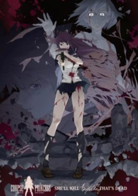

**Studio:** feel. Gainax &nbsp;|&nbsp; **Episodes:** 12 &nbsp;|&nbsp; **Director:** Masahiko Murata &nbsp;|&nbsp; **Aired/Released:** January 1 – March 26 &nbsp;|&nbsp; **Genres:** Action, Gunfights, Dark Fantasy, Zombie, Horror

> A direct continuation of Shikabane Hime: Aka, taking place six months after Tagami Keisei's death at the hands of the Shichisei (Seven Stars), a group of elite Shikabane who act on more than just regrets. As per Keisei's dying wish, Kagami Ouri formed a temporary contract with Makina to save her from degenerating into a Shikabane. Since then, Ouri's been training to become a proper monk so that he can remain contracted to Makina and help her fight against the Shichisei -- the ones who originally killed Makina, the entire Hoshimura family, and now Keisei. However, the traitorous monk Shishidou Akasha has sided with the Shichisei in an attempt to destroy all Shikabane Hime and the entire monk organization that uses them -- Kougon Sect.
>
> _Synopsis source: Kitsu_

[Kitsu](https://kitsu.io/anime/shikabane-hime-kuro)

---

### Maria Watches Over Us Season 4

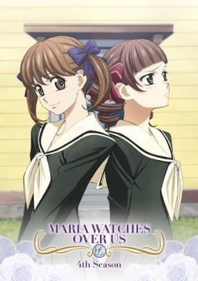

**Studio:** Studio Deen &nbsp;|&nbsp; **Episodes:** 13 &nbsp;|&nbsp; **Director:** Toshiyuki Kato &nbsp;|&nbsp; **Aired/Released:** January 3 – March 28 &nbsp;|&nbsp; **Genres:** Japan, Slice of Life, Coming Of Age, High School, All Girls School, School Life, Plot Continuity, Present, Shoujo Ai

> Yumi and the Yamayuri Council have found two new helpers in Kanako and Toko. Unfortunately, their assistance comes with tension, as neither girl is particularly fond of the other and both seem likely candidates to be Yumi's petite soeur. Will either be a good fit for Yumi? As the school year marches on, the work for the Yamayuri Council piles up, and pressure begins to mount for Yumi to make her final decision.
>
> _Synopsis source: Kitsu_

[Wikipedia](https://en.wikipedia.org/wiki/Maria-sama_ga_Miteru_4th) · [Kitsu](https://kitsu.io/anime/maria-sama-ga-miteru-4th)

---

### Maria Holic (Maria†Holic)

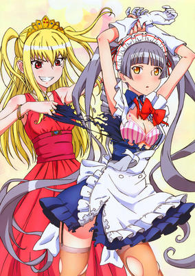

**Studio:** Shaft &nbsp;|&nbsp; **Episodes:** 12 &nbsp;|&nbsp; **Director:** Akiyuki Shinbo Yukihiro Miyamoto &nbsp;|&nbsp; **Aired/Released:** January 4 – March 22 &nbsp;|&nbsp; **Genres:** Earth, Japan, Asia, Comedy, Super Deformed, All Girls School, Present, Parody, Shoujo Ai, School Life

> In search of true love, Kanako Miyamae transfers to Ame no Kisaki Catholic school, inspired by how her parents fell in love with each other there. There is just one difference, though: because men make Kanako break into hives, she has actually come to the all-girls school to find a partner of the same sex. When she meets the beautiful Mariya Shidou, Kanako believes she has found that special someone; however, there's more to Mariya than meets the eye—it turns out that Kanako's first love is actually a cross-dressing boy. Mariya threatens to expose Kanako's impure intentions unless she keeps his real gender a secret, and to make things worse, he also replaces her original roommate so that he can now keep a close eye on her.Maria†Holic follows Kanako as she looks for love in all the wrong places and searches for the girl of her dreams—that is, if she can survive being Mariya's roommate! [Written by MAL Rewrite]
>
> _Synopsis source: Kitsu_

[Wikipedia](https://en.wikipedia.org/wiki/Maria_Holic) · [Kitsu](https://kitsu.io/anime/maria-holic)

---

### Akikan!

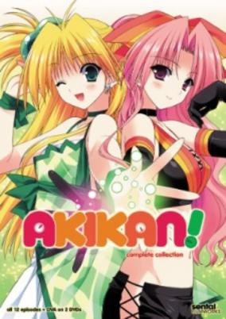

**Studio:** Brain's Base &nbsp;|&nbsp; **Episodes:** 12 &nbsp;|&nbsp; **Director:** Yuji Himaki &nbsp;|&nbsp; **Aired/Released:** January 4 – March 29 &nbsp;|&nbsp; **Genres:** Ecchi, Romance, Comedy, Sudden Girlfriend Appearance, Shoujo Ai, Super Power, Fantasy

> Hobbies are often a great way of meeting new people, but how could Kakeru Diachi, who collects rare juice cans, have ever suspected that he'd meet a fascinating new girl when he attempted to DRINK her? Naming her Melon, because she's got great melon... soda, Kakeru quickly learns that she's an Akikan—a beautiful girl who's also a special can created to fight other Akikans in a strange experiment to determine what kind of container is better: steel or aluminum! Will becoming involved in this ridiculously twisted research project gone amuck complicate Kakeru's life incredibly? Of course it will, but because Melon's steel body needs carbon dioxide to breathe, he's now stuck with her since she's too CO2 dependent! And when his wealthy, attractive, best childhood friend Najimi gets HER own aluminum Akikan, the trouble really begins!
>
> _Synopsis source: Kitsu_

[Wikipedia](https://en.wikipedia.org/wiki/Akikan!) · [Kitsu](https://kitsu.io/anime/akikan)

---

### White Album

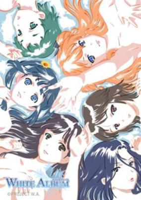

**Studio:** Seven Arcs &nbsp;|&nbsp; **Episodes:** 13 &nbsp;|&nbsp; **Director:** Akira Yoshimura Taizo Yoshida &nbsp;|&nbsp; **Aired/Released:** January 4 – March 29 &nbsp;|&nbsp; **Genres:** Romance, Japan, University, Love Polygon, Angst, Past, Idol, Plot Continuity, Music, Harem

> Can a relationship between a regular college student and an idol singer survive? That is the question that White Album tries to answer. Touya Fujii is a normal college student with normal worries—namely balancing his classes and his job he works to pay for school. He is also concerned about the amount of time he has to spend with Yuki Morikawa, or rather, the lack of it. Being an up and coming idol singer, Yuki has concerns of her own. Even though she's not yet as popular as experienced veteran Rina Ogata, Yuki is turning heads and landing interviews on television. This should be a good thing, but not everyone is happy about the attention she receives from the media and from Rina. The idol industry is surprisingly cutthroat, and rival singers have their eyes on Yuki. While it may seem exciting to watch your girlfriend on television, how does Touya really feel about all this? Between the challenges associated with Yuki's career and other people that Touya meets at his university, their relationship may not last…
>
> _Synopsis source: Kitsu_

[Wikipedia](https://en.wikipedia.org/wiki/White_Album_(visual_novel)) · [Kitsu](https://kitsu.io/anime/white-album)

---

### Minami-ke: Okaeri

**Studio:** asread . &nbsp;|&nbsp; **Episodes:** 13 &nbsp;|&nbsp; **Director:** Kei Oikawa &nbsp;|&nbsp; **Aired/Released:** January 5 – March 30 &nbsp;|&nbsp; **Genres:** Earth, Japan, Asia, Slice of Life, Comedy, Coming Of Age, Present, School Life

> A year has passed since Okawari and the three sisters have grown up. Their likings and moods are almost the same. Haruka, the older sister, is a love-giving mother to the younger sisters and a discipline follower. Kana, the middle one, leaves everything to the last possible moment and always gives trouble to the trio. Chiaki, the little one, is the calculating and manipulating one; she likes to be admired and loved by Haruka and always gives trouble to the less blessed Kana. Despite being an unbalanced family, they love each other with all their heart. The family's daily life is as funny as ever; trouble and love are always present. Now it's time to see if they'll survive this age change since Haruka is now a young adult; she has even more responsibilities, having to watch over the young while integrating into the adult life.
>
> _Synopsis source: Kitsu_

[Kitsu](https://kitsu.io/anime/minami-ke-okaeri)

---

### Viper's Creed

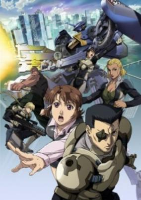

**Studio:** AIC Spirits Digital Frontier &nbsp;|&nbsp; **Episodes:** 12 &nbsp;|&nbsp; **Director:** Shinji Aramaki (chief) Hiroyuki Kanbe &nbsp;|&nbsp; **Aired/Released:** January 6 – March 24 &nbsp;|&nbsp; **Genres:** Post Apocalypse, Transforming Craft, Mecha, Piloted Robot, Special Squads, Conspiracy, Future, Stereotypes, Action, Science Fiction, Military

> The story revolves around the members of a private military company (PMC), and the uneasy tension between them and the regular military after a war that caused massive environmental destruction.
>
> _Synopsis source: Kitsu_

[Wikipedia](https://en.wikipedia.org/wiki/Viper%27s_Creed) · [Kitsu](https://kitsu.io/anime/viper-s-creed)

---

### Natsume's Book of Friends Season 2 (Natsume's Book of Friends)

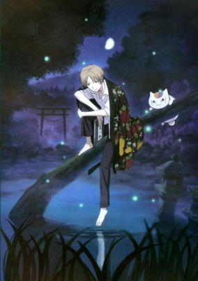

**Studio:** Sunrise &nbsp;|&nbsp; **Episodes:** 13 &nbsp;|&nbsp; **Director:** Takahiro Omori &nbsp;|&nbsp; **Aired/Released:** January 6 – March 31 &nbsp;|&nbsp; **Genres:** Earth, Fantasy, Contemporary Fantasy, Japan, Asia, Present, Slice of Life, Shoujo

> While most fifteen-year-old boys, in one way or another, harbor secrets that are related to girls, Takashi Natsume has a peculiar and terrifying secret involving youkai: for as long as he can remember, he has been constantly chased by these spirits. Natsume soon discovers that his deceased grandmother Reiko had passed on to him the Yuujinchou, or "Book of Friends," which contains the names of the spirits whom she brought under her control. Now in Natsume's possession, the book gives Reiko's grandson this power as well, which is why these enraged beings now haunt him in hopes of somehow attaining their freedom. Without parents and a loving home, and constantly being hunted by hostile, merciless youkai, Natsume is looking for solace—a place where he belongs. However, his only companion is a self-proclaimed bodyguard named Madara. Fondly referred to as Nyanko-sensei, Madara is a mysterious, pint-sized feline spirit who has his own reasons for sticking with the boy. Based on the critically acclaimed manga by Yuki Midorikawa, Natsume Yuujinchou is an unconventional and supernatural slice-of-life series that follows Natsume as he, with his infamous protector Madara, endeavors to free the spirits bound by his grandmother's contract.
>
> _Synopsis source: Kitsu_

[Wikipedia](https://en.wikipedia.org/wiki/Natsume%27s_Book_of_Friends) · [Kitsu](https://kitsu.io/anime/natsume-yuujinchou)

---

### The Girl Who Leapt Through Space

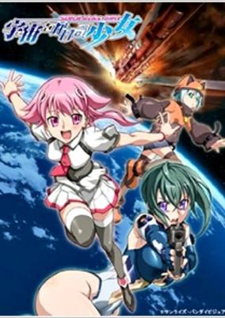

**Studio:** Brain's Base &nbsp;|&nbsp; **Episodes:** 26 &nbsp;|&nbsp; **Director:** Masakazu Obara &nbsp;|&nbsp; **Aired/Released:** January 6 – June 30 &nbsp;|&nbsp; **Genres:** Space Travel, Science Fiction, Action, Ecchi, Piloted Robot, Parody, Comedy, Future, Robot Helper, Law And Order, Space, Virtual Reality, Adventure

> The story is set in the year 311 of the Orbital Calendar, when humanity has migrated to countless colony clusters in space. A space colony girl named Akiha Shishidou encounters a malevolent artificial intelligence named Leopard that has been installed on a colony. Akiha is joined by an Inter-Colony Police officer named Itsuki Kannagi, a taciturn young girl named Honoka Kawai, and a robot named Imoko "Imo-chan" Shishidou.
>
> _Synopsis source: Kitsu_

[Wikipedia](https://en.wikipedia.org/wiki/The_Girl_Who_Leapt_Through_Space) · [Kitsu](https://kitsu.io/anime/sora-wo-kakeru-shoujo)

---

### Hajime no Ippo: New Challenger (Fighting Spirit: New Challenger)

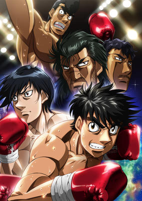

**Studio:** Madhouse &nbsp;|&nbsp; **Episodes:** 26 &nbsp;|&nbsp; **Director:** Jun Shishido &nbsp;|&nbsp; **Aired/Released:** January 7 – July 1 &nbsp;|&nbsp; **Genres:** Earth, Boxing, Japan, Action, Asia, Sports, Comedy, Plot Continuity, Present, Shounen

> Japanese Featherweight Champion Ippo Makunouchi has successfully defended and retained his title. Meanwhile, his rival, Ichirou Miyata, has resurfaced in Japan, aiming for his own Featherweight belt in the Oriental Pacific Boxing Federation. When the rest of the world comes knocking, however, will Japan's best fighters rise to the challenge and achieve glory at the top? Or will the small island nation be crushed under the weight of greater entities? This time, champions will become challengers issuing a call to the rest of the world and ready to show off their fighting spirit! [Written by MAL Rewrite]
>
> _Synopsis source: Kitsu_

[Kitsu](https://kitsu.io/anime/hajime-no-ippo-new-challenger)

---

### Samurai Harem

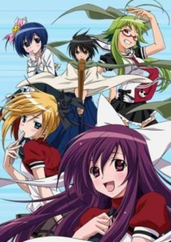

**Studio:** AIC &nbsp;|&nbsp; **Episodes:** 12 &nbsp;|&nbsp; **Director:** Rion Kujo &nbsp;|&nbsp; **Aired/Released:** January 9 – March 27 &nbsp;|&nbsp; **Genres:** Earth, Japan, Ecchi, Action, Asia, Comedy, Violent Retribution For Accidental Infringement, Swordplay, Martial Arts, Coming Of Age, Stereotypes, Present, Harem, Samurai, Romance

> Yoichi Karasuma has spent all of his life in the mountains, training in the Soaring Wind, Divine Wind swordsmanship style. Under his father’s guidance, he is able to master the technique at the age of 17. With nothing left to learn, Yoichi is sent to a new dojo located in the city so he can continue to train and gain an understanding of modern society. Unfortunately, Yoichi has no idea how to act or speak to anyone in the present day and acts like a samurai, complete with odd speech and traditional clothing. As he goes to live with the Ikaruga sisters at the dojo, Yoichi, clueless on how to interact with others, is constantly hurtled in hilarious misunderstandings. Asu no Yoichi! follows Yoichi as he stumbles through his new life and tries to learn how to live in the modern world with his new family. [Written by MAL Rewrite]
>
> _Synopsis source: Kitsu_

[Kitsu](https://kitsu.io/anime/asu-no-yoichi)

---

### The Tower of Druaga: The Sword of Uruk (Tower of Druaga: The Sword of Uruk)

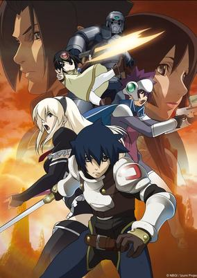

**Studio:** Gonzo &nbsp;|&nbsp; **Episodes:** 12 &nbsp;|&nbsp; **Director:** Koichi Chigira &nbsp;|&nbsp; **Aired/Released:** January 9 – March 27 &nbsp;|&nbsp; **Genres:** Fantasy, Adventure, Fantasy World, Action, Magic, Past

> With broken spirits and enigmatic questions that hold no answers lingering, Jil is still trying to figure everything out. Then, a mysterious girl named Kai appears before him and says: "Take me to the top of the tower." Kai's request shrouded in ambiguity, Jil will have another chance to work towards completing his destiny and ascend the Tower. With his hopes and aspirations seemingly slipping out of his hands, Jil must rise to the challenge once again on this never-ending adventure.
>
> _Synopsis source: Kitsu_

[Kitsu](https://kitsu.io/anime/druaga-no-tou-the-sword-of-uruk)

---

### Kurokami: The Animation (Kurokami The Animation)

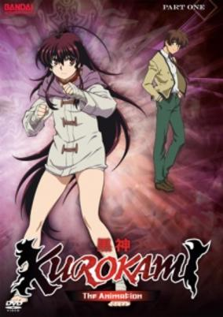

**Studio:** Sunrise &nbsp;|&nbsp; **Episodes:** 23 &nbsp;|&nbsp; **Director:** Tsuneo Kobayashi &nbsp;|&nbsp; **Aired/Released:** January 9 – June 19 &nbsp;|&nbsp; **Genres:** Japan, Contemporary Fantasy, Action, Fantasy, Martial Arts, Present, Super Power

> High school student Ibuki Keita has been haunted by misfortune for as long as he can remember. For no apparent reason, everyone around him dies tragically. Ultimately, he refuses to become too close to anyone, even his childhood friend Akane. This leaves Keita alone in a life full of misery and disgrace. While eating at his favorite ramen shop one evening, Keita meets a strange young girl named Kuro. Possessing abilities that surpass that of a normal human being, Kuro classifies herself as a Mototsumitama. She explains to Keita about "Terra," a life-energy force split between three identical looking people; a global phenomenon dubbed the "Doppeliner System." As a Mototsumitama, Kuro guards the "Coexistence Equilibrium," the beings that protect the flow of Terra around the world. Keita refuses to believe her story, until he is caught up in the crossfire of this hidden world. On the verge of death, he makes a contract with Kuro, unbeknownst to its true meaning. Now he is bound to Kuro, and must be with her at all times. Could Keita's misfortune possibly get any greater? [Written by MAL Rewrite]
>
> _Synopsis source: Kitsu_

[Kitsu](https://kitsu.io/anime/kurokami-the-animation)

---

### Birdy the Mighty: Decode (season 2) (Birdy the Mighty: Decode 02)

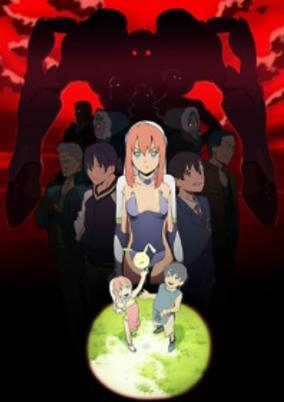

**Studio:** A-1 Pictures &nbsp;|&nbsp; **Episodes:** 12 &nbsp;|&nbsp; **Director:** Kazuki Akane &nbsp;|&nbsp; **Aired/Released:** January 10 – March 28 &nbsp;|&nbsp; **Genres:** Science Fiction, Action, Human Enhancement, Time Travel, Humanoid Alien, Alien, Android, Law And Order, Comedy

> Birdy and Tsutomu are still co-existing in the same body, as Birdy continues her duties as Federation Investigator and celebrity persona, and Tsutomu seeks to balance them with his normal everyday life. When a criminal group connected to the Ryunka incident escape from custody, hiding themselves and their alien identities on Earth, Birdy and Tsutomu are thrown back into action. It seems, however, that there are other forces involved, as well as old faces, which give Birdy time to reflect on the past, and the people that influenced her.
>
> _Synopsis source: Kitsu_

[Kitsu](https://kitsu.io/anime/tetsuwan-birdy-decode-02)

---

### Major S5

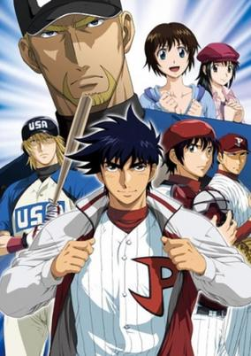

**Studio:** SynergySP &nbsp;|&nbsp; **Episodes:** 25 &nbsp;|&nbsp; **Director:** Riki Fukushima &nbsp;|&nbsp; **Aired/Released:** January 10 – June 27 &nbsp;|&nbsp; **Genres:** Sports, Americas, Baseball, Plot Continuity, Comedy, Romance

> After the baseball season was over, Gorou returned to Japan. There he learned from Toshi that there is going to be a Baseball World Cup the following year hosted in America.
>
> _Synopsis source: Kitsu_

[Wikipedia](https://en.wikipedia.org/wiki/Major_S5) · [Kitsu](https://kitsu.io/anime/major-s5)

---

### The Beast Player Erin (Erin)

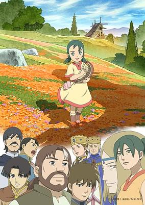

**Studio:** Production I.G Trans Arts &nbsp;|&nbsp; **Episodes:** 50 &nbsp;|&nbsp; **Director:** Takayuki Hamana &nbsp;|&nbsp; **Aired/Released:** January 10 – December 26 &nbsp;|&nbsp; **Genres:** Fantasy World, Fantasy, Slice of Life, Coming Of Age, War, Drama, Past, Plot Continuity

> Erin is a young girl who lives with her mother in a village which raises war-lizards, called Touda. We see her daily life, which changes as she grows up. Meanwhile, there is growing tension between the two provinces of the country she lives in. Based on the fantasy series written by Uehashi Nahoko, also known for Seirei no Moribito.
>
> _Synopsis source: Kitsu_

[Wikipedia](https://en.wikipedia.org/wiki/The_Beast_Player_Erin) · [Kitsu](https://kitsu.io/anime/kemono-no-souja-erin)

---

### Koukaku no Regios (Chrome Shelled Regios)

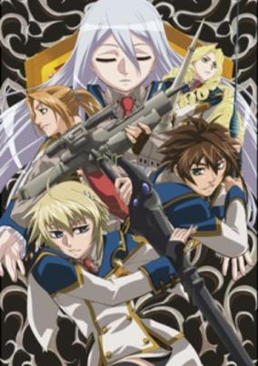

**Studio:** Zexcs &nbsp;|&nbsp; **Episodes:** 24 &nbsp;|&nbsp; **Director:** Itsuro Kawasaki &nbsp;|&nbsp; **Aired/Released:** January 11 – June 21 &nbsp;|&nbsp; **Genres:** Fantasy, Adventure, Fantasy World, Action, Parasite, High School, Magic, School Life, Harem, Super Power, Science Fiction

> In a post-apocalyptic world overrun with mutated beasts called Limbeekoon or Filth Monsters, humanity is forced to live in large mobile cities called Regios and learn to use special weapons called Dite, by harnessing the power of Kei to defend themselves. In the Academy City of Zuellni, Layfon Alseif is hoping to start a new life and forget his past. However, his past has caught the attention of Karian Loss, the manipulative Student Council President and Nina Antalk, a Military Arts student and Captain of the 17th Military Arts Platoon, who instantly recognizes his abilities and decides he’s the perfect candidate to join her group. However, with a secret past that won’t leave him alone and unknown powers beyond normal, Layfon just might not take it.
>
> _Synopsis source: Kitsu_

[Wikipedia](https://en.wikipedia.org/wiki/Chrome_Shelled_Regios) · [Kitsu](https://kitsu.io/anime/chrome-shelled-regios)

---

### Examurai Sengoku

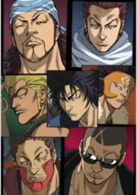

**Studio:** TMS Entertainment &nbsp;|&nbsp; **Episodes:** 24 &nbsp;|&nbsp; **Director:** Yoshio Takeuchi &nbsp;|&nbsp; **Aired/Released:** January 11 – June 25 &nbsp;|&nbsp; **Genres:** Action, Samurai, Martial Arts, Science Fiction

> The Examurai Sengoku anime production depicts the members of the EXILE group as futuristic samurai that are transported back in time to Japan’s sengoku (warring states) period. The anime character renditions of the EXILE members were designed by manga creator Hiroshi Takahashi (Crows, Worst).
>
> _Synopsis source: Kitsu_

[Kitsu](https://kitsu.io/anime/examurai-sengoku)

---

### Rideback (Ride Back)

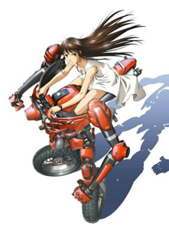

**Studio:** Madhouse &nbsp;|&nbsp; **Episodes:** 12 &nbsp;|&nbsp; **Director:** Atsushi Takahashi &nbsp;|&nbsp; **Aired/Released:** January 12 – March 30 &nbsp;|&nbsp; **Genres:** Transforming Craft, Mecha, School Clubs, War, Future, Military, Action, Science Fiction, School Life

> In the future, an organization called the GGP has taken control of the world. Rin Ogata was a promising up-and-coming ballet dancer, but suffered a serious injury while dancing and decided to quit. Years later in college, she comes across a club building and soon finds herself intrigued by a transforming motorcycle-like robotic vehicle called a "Rideback". She soon finds that her unique ballet skills with balance and finesse make her a born natural on a Rideback. However, those same skills also get her into serious trouble with the government.
>
> _Synopsis source: Kitsu_

[Wikipedia](https://en.wikipedia.org/wiki/Rideback_(manga)) · [Kitsu](https://kitsu.io/anime/rideback)

---

### Slayers Evolution-R

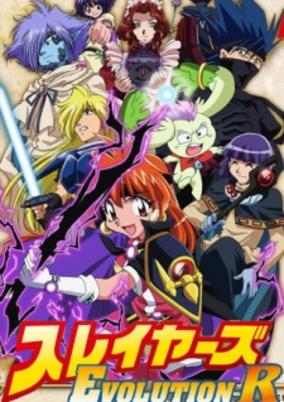

**Studio:** J.C.Staff &nbsp;|&nbsp; **Episodes:** 13 &nbsp;|&nbsp; **Director:** Takashi Watanabe &nbsp;|&nbsp; **Aired/Released:** January 12 – April 6 &nbsp;|&nbsp; **Genres:** Fantasy World, Fantasy, Comedy, Dragon, Magic, Stereotypes, Plot Continuity, Violence, Adventure

> To find a way in rescuing Pokota's country Taforashia which was sealed by Rezo, Lina and her group are in search for the Hellmaster's jar in what the Red Priest placed his soul after death. Zelgadis is willing to do anything to get the jar for changing back into a human while Zuuma is plotting on revenge and accomplishing assignment in killing Lina Inverse. Still a big mystery for her and the others is what Xellos is aiming for in this battle.
>
> _Synopsis source: Kitsu_

[Wikipedia](https://en.wikipedia.org/wiki/Slayers_Evolution-R) · [Kitsu](https://kitsu.io/anime/slayers-evolution-r)

---

### Sora o Miageru Shōjo no Hitomi ni Utsuru Sekai (The Girl Who Leapt Through Space)

**Studio:** Kyoto Animation &nbsp;|&nbsp; **Episodes:** 9 &nbsp;|&nbsp; **Director:** Yoshiji Kigami &nbsp;|&nbsp; **Aired/Released:** January 14 – March 11 &nbsp;|&nbsp; **Genres:** Space Travel, Science Fiction, Action, Ecchi, Piloted Robot, Parody, Comedy, Future, Robot Helper, Law And Order, Space, Virtual Reality, Adventure

> The story is set in the year 311 of the Orbital Calendar, when humanity has migrated to countless colony clusters in space. A space colony girl named Akiha Shishidou encounters a malevolent artificial intelligence named Leopard that has been installed on a colony. Akiha is joined by an Inter-Colony Police officer named Itsuki Kannagi, a taciturn young girl named Honoka Kawai, and a robot named Imoko "Imo-chan" Shishidou.
>
> _Synopsis source: Kitsu_

[Wikipedia](https://en.wikipedia.org/wiki/Sora_o_Miageru_Sh%C5%8Djo_no_Hitomi_ni_Utsuru_Sekai) · [Kitsu](https://kitsu.io/anime/sora-wo-kakeru-shoujo)

---

### Genji Monogatari Sennenki (Millennium Old Journal: Tale of Genji)

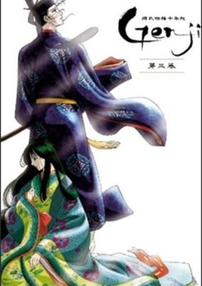

**Studio:** Tezuka Productions TMS Entertainment &nbsp;|&nbsp; **Episodes:** 11 &nbsp;|&nbsp; **Director:** Osamu Dezaki &nbsp;|&nbsp; **Aired/Released:** January 16 – March 27 &nbsp;|&nbsp; **Genres:** Romance, Heian Period, Japan, Past, Plot Continuity, Historical

> Born from a much loved, but lowly ranked concubine, Genji Hikaru is called the Shining Prince and is the beloved second son of the Emperor. Although he cannot be an heir to the throne of his father, Genji spends his life surrounded by every pleasure and love. And yet, his one longing in love is something that even the power of an Emperor can never give him.
>
> _Synopsis source: Kitsu_

[Wikipedia](https://en.wikipedia.org/wiki/Genji_Monogatari_Sennenki) · [Kitsu](https://kitsu.io/anime/genji-monogatari-sennenki)

---

### Fresh PreCure!

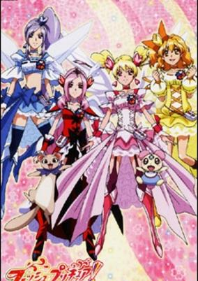

**Studio:** Toei Animation &nbsp;|&nbsp; **Episodes:** 50 &nbsp;|&nbsp; **Director:** Junji Shimizu Akifumi Zako &nbsp;|&nbsp; **Aired/Released:** February 1 – January 30, 2010 &nbsp;|&nbsp; **Genres:** Action, Comedy, Magical Girl, Super Power, Magic, Fantasy, Slice of Life

> Love Momozono is a 14-year-old student at Yotsuba Junior Highschool that tends to care more for others than for herself. One day she visits a show of the famous dance unit "Trinity" and decides to become a dancer, too. On the same event, subordinates of the Labyrinth Kingdom show up who want to collect the unhappiness of the audience. Love gets the power to change into Cure Peach and fights them. Soon after, she is joined by her good friends Miki, who is Cure Berry, and Inori, who becomes Cure Pine.
>
> _Synopsis source: Kitsu_

[Wikipedia](https://en.wikipedia.org/wiki/Fresh_PreCure!) · [Kitsu](https://kitsu.io/anime/fresh-precure)

---

### Chi's New Address

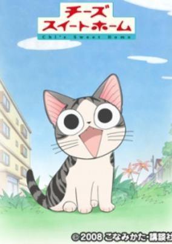

**Studio:** Madhouse &nbsp;|&nbsp; **Episodes:** 104 &nbsp;|&nbsp; **Director:** Mitsuyuki Masuhara &nbsp;|&nbsp; **Aired/Released:** March 30 – September 24 &nbsp;|&nbsp; **Genres:** Earth, Japan, Asia, Slice of Life, Comedy, Present

> A grey and white kitten with black stripes wanders away from her mother and siblings one day while enjoying a walk outside. Lost in her surroundings, the kitten struggles to find her family and instead is found by a young boy, Youhei, and his mother. They take the kitten home, but pets are not allowed in their housing complex, so they try to find a new home for the kitten. This proves to be difficult, and the family eventually decides to keep the kitten, naming her "Chi."
>
> _Synopsis source: Kitsu_

[Wikipedia](https://en.wikipedia.org/wiki/Chi%27s_Sweet_Home) · [Kitsu](https://kitsu.io/anime/chi-s-sweet-home)

---

### Cookin' Idol Ai! Mai! Main!

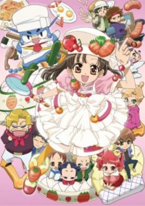

**Studio:** Studio Deen &nbsp;|&nbsp; **Episodes:** 305 &nbsp;|&nbsp; **Director:** Hiroshi Watanabe &nbsp;|&nbsp; **Aired/Released:** March 30 – March 22, 2013 &nbsp;|&nbsp; **Genres:** Cooking, Comedy, Kids

> Cooking Idol teaches children how to cook through instruction of the main character, MAIN. The show itself is divided into an animated segment featuring MAIN, and a live-action segment featuring the voice actor of MAIN, Fukuhara Haruka, as she practices the cooking herself.
>
> _Synopsis source: Kitsu_

[Kitsu](https://kitsu.io/anime/cookin-idol-ai-mai-main)

---

### Marie & Gali

**Studio:** Toei Animation &nbsp;|&nbsp; **Episodes:** 40 &nbsp;|&nbsp; **Director:** Kōhei Kureta Yukio Kaizawa &nbsp;|&nbsp; **Aired/Released:** March 31 – March 23, 2010 &nbsp;|&nbsp; **Genres:** Fantasy World, Comedy, Present

> Marika is a gothic lolita who somehow ends up in the mysterious town of Galihabara. There she meets different famous scientists like Galileo Galilei, Marie Skłodowska Curie and Sir Isaac Newton.
>
> _Synopsis source: Kitsu_

[Wikipedia](https://en.wikipedia.org/wiki/Marie_%26_Gali) · [Kitsu](https://kitsu.io/anime/marie-gali)

---

### Mainichi Kaasan (Kaasan - Mom's Life)

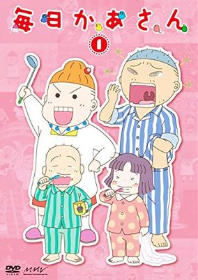

**Studio:** Dongwoo A&E Gallop TYO Animations &nbsp;|&nbsp; **Episodes:** 142 &nbsp;|&nbsp; **Director:** Mitsuru Hongo &nbsp;|&nbsp; **Aired/Released:** April 1 – March 25, 2012 &nbsp;|&nbsp; **Genres:** Earth, Japan, Asia, Slice of Life, Comedy, The Arts, Present, Family

> Based on Rieko Saibara's humorous semi-autobiographical manga about her life raising her two children.
>
> _Synopsis source: Kitsu_

[Wikipedia](https://en.wikipedia.org/wiki/Mainichi_Kaasan) · [Kitsu](https://kitsu.io/anime/mainichi-kaasan)

---

### Queen's Blade: The Exiled Virgin

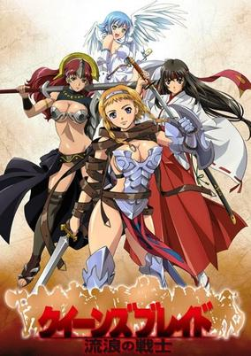

**Studio:** Arms &nbsp;|&nbsp; **Episodes:** 12 &nbsp;|&nbsp; **Director:** Kinji Yoshimoto &nbsp;|&nbsp; **Aired/Released:** April 2 – June 18 &nbsp;|&nbsp; **Genres:** Ecchi, Fantasy, Fantasy World, Action, Swordplay, High Fantasy, Martial Arts, Past, Adventure

> In a land where a queen is chosen every few years solely by winning a tournament, there can be no short supply of formidable opponents. For one woman warrior however, an early defeat clearly shows her that she is lacking in experience though she may be bountiful in body. Fortunately, while defeat could spell one's doom, her life is saved by a powerful stranger. But unfortunately for this savior, less-than-pure motives and shrewd family members mean her reward is a prison cell. Her release is prompt when the unseasoned warrior she saved, tired of her current lifestyle of nobility, sets off to prove herself.
>
> _Synopsis source: Kitsu_

[Kitsu](https://kitsu.io/anime/queen-s-blade-rurou-no-senshi)

---

### Sengoku Basara: Samurai Kings

**Studio:** Production I.G &nbsp;|&nbsp; **Episodes:** 12 &nbsp;|&nbsp; **Director:** Itsuro Kawasaki &nbsp;|&nbsp; **Aired/Released:** April 2 – June 18 &nbsp;|&nbsp; **Genres:** Action, Sengoku Period, Swordplay, Martial Arts, War, Past, Samurai, Super Power, Historical

> During Japan's Sengoku period, several powerful warlords fought in politics and in arms with hopes of unifying the country under a central government. Nobunaga Oda had asserted himself as being the most powerful of these rulers by possessing the strength and military resource necessary to conquer all of Japan. Shingen Takeda and his trusted warrior Yukimura Sanada led one of the main clans standing in Nobunaga’s way. One night, Sanada had been ordered to lead a sneak attack against General Kenshin Uesugi, which was then thwarted by Masamune Date and his army. Sanada and Date fought to a draw, which forged a heated rivalry out of their newfound admiration for one another. Nobunaga continues to exert his forces in Sengoku Basara by doubling down on his influence across the country. Sanada and Date find themselves having to put their differences aside in order to quell the rise of Nobunaga and save feudal Japan from his tyrannical reign. Magical, militant, and political powers fly forth as these warriors and leaders clash amongst themselves and the armies of Nobunaga.
>
> _Synopsis source: Kitsu_

[Kitsu](https://kitsu.io/anime/sengoku-basara)

---

### Asura Cryin'

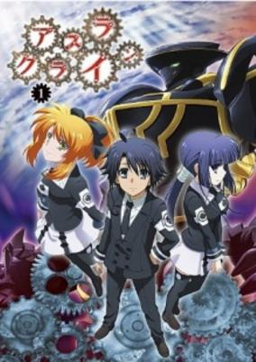

**Studio:** Seven Arcs &nbsp;|&nbsp; **Episodes:** 13 &nbsp;|&nbsp; **Director:** Keizō Kusakawa &nbsp;|&nbsp; **Aired/Released:** April 2 – June 25 &nbsp;|&nbsp; **Genres:** Earth, Contemporary Fantasy, Fantasy, Mecha, Japan, Action, Alternative Present, Harem, Super Power

> Natsume Tomoharu is a normal high-school student in every way with one exception: he's being followed by the ghost of his best friend, Misao. After moving into his brother's old house, Tomoharu expects to continue living his normal life but is one day left with a mysterious and locked briefcase without any instruction. At first he plans to leave it in storage; however, his house is soon invaded by multiple groups of people after the briefcase. Although still not knowing the purpose of the briefcase, Tomoharu and Misao attempt to escape with it. From there on, Tomoharu tries to learn the secrets behind the briefcase, the connections between it and Misao, and why it has the power to change the world. [Written by MAL Rewrite]
>
> _Synopsis source: Kitsu_

[Wikipedia](https://en.wikipedia.org/wiki/Asura_Cryin%27) · [Kitsu](https://kitsu.io/anime/asura-cryin)

---

### K-On!

**Studio:** Kyoto Animation &nbsp;|&nbsp; **Episodes:** 13 &nbsp;|&nbsp; **Director:** Naoko Yamada &nbsp;|&nbsp; **Aired/Released:** April 3 – June 26 &nbsp;|&nbsp; **Genres:** Japan, Comedy, Performance, High School, School Clubs, Musical Band, All Girls School, School Life, Present, Music, Slice of Life, Seinen

> Hirasawa Yui, a young, carefree girl entering high school, has her imagination instantly captured when she sees a poster advertising the "Light Music Club." Being the carefree girl that she is, she quickly signs up; however, Yui has a problem, she is unable to play an instrument. When Yui goes to the clubroom to explain, she's greeted by the other members: Ritsu, Mio, and Tsumugi. Although disheartened at Yui's lack of musical know-how, they still try to convince her to stay to prevent the club's disbandment. After playing Yui a short piece which re-ignites her imagination, they succeed in keeping their new member and guitarist. Along with the tasks of school and homework, Yui begins to learn the guitar with the help of the other band members, experiencing many mishaps along the way. However, with the school festival drawing near and Yui getting stuck with her practice, will the Light Music Club be ready in time for their debut? [Written by MAL Rewrite]
>
> _Synopsis source: Kitsu_

[Wikipedia](https://en.wikipedia.org/wiki/K-On!) · [Kitsu](https://kitsu.io/anime/k-on)

---

### Pandora Hearts (PandoraHearts)

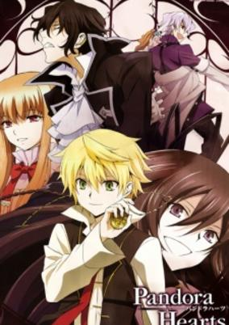

**Studio:** Xebec &nbsp;|&nbsp; **Episodes:** 25 &nbsp;|&nbsp; **Director:** Takao Kato &nbsp;|&nbsp; **Aired/Released:** April 3 – September 25 &nbsp;|&nbsp; **Genres:** Earth, Contemporary Fantasy, Fantasy, Adventure, Comedy, Parallel Universe, Plot Continuity, Mystery

> To young Oz Vessalius, heir to the Vessalius Duke House, the perilous world called the Abyss is nothing more than a folktale used to scare misbehaving children. However, when Oz's coming-of-age ceremony is interrupted by the malicious Baskerville Clan intent on banishing him into the depths of the Abyss, the Vessalius heir realizes that his peaceful life of luxury is at its end. Now, he must confront the world of the Abyss and its dwellers, the monstrous "Chains," which are both not quite as fake as he once believed. Based on the supernatural fantasy manga of the same name, Pandora Hearts tells the story of fifteen-year-old Oz's journey to discover the meaning behind the strange events that have overtaken his life. Assisted by a mysterious Chain named Alice, whose nickname is "Bloodstained Black Rabbit," and members of a clandestine organization known as "Pandora," Oz begins to realize his existence may have more meaning than he could have ever imagined. [Written by MAL Rewrite]
>
> _Synopsis source: Kitsu_

[Wikipedia](https://en.wikipedia.org/wiki/Pandora_Hearts) · [Kitsu](https://kitsu.io/anime/pandora-hearts)

---

### Phantom: Requiem for the Phantom

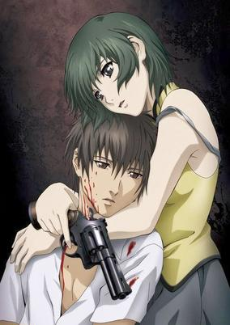

**Studio:** Bee Train &nbsp;|&nbsp; **Episodes:** 26 &nbsp;|&nbsp; **Director:** Kōichi Mashimo &nbsp;|&nbsp; **Aired/Released:** April 3 – September 25 &nbsp;|&nbsp; **Genres:** Action, Mafia, Gunfights, United States, Assassin, Conspiracy, Crime, Rotten World, Drama, Violence, Present, Thriller

> Mafia is rife in America where assassinations are a regular occurrence on the streets. Inferno, a mysterious company, is behind most of these dealings through the use of their near-invincible human weapon, "Phantom." One day, a Japanese tourist accidentally witnesses Phantom's latest murder. Desperate to escape, the tourist hides in a secluded building. However, Phantom, revealed to be a young woman named Ein, and the leader of Inferno "Scythe Master" captures the tourist and brainwashes him. Given the name "Zwei," this once peaceful tourist is now a puppet of Inferno with no memories. Drawn into a world of lies, deceit, and violence, Zwei must fight to survive, hopefully to one day regain his memories and escape from this world where he is constantly on the brink of death. [Written by MAL Rewrite]
>
> _Synopsis source: Kitsu_

[Kitsu](https://kitsu.io/anime/phantom-requiem-for-the-phantom)

---

### Basquash!

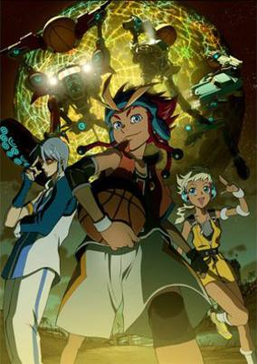

**Studio:** Satelight &nbsp;|&nbsp; **Episodes:** 26 &nbsp;|&nbsp; **Director:** Hidekazu Sato Shin Itagaki &nbsp;|&nbsp; **Aired/Released:** April 3 – October 2 &nbsp;|&nbsp; **Genres:** Science Fiction, Mecha, Basketball, Piloted Robot, Sports, Future, Plot Continuity, Ecchi

> On the planet Earthdash, its inhabitants gaze on its moon and the technologically advanced lunar city of Mooneyes with awe. Dan JD, a boy living in Rollingtown on Earthdash's surface, gets caught up in Bigfoot Basketball—a fast-paced sport played with giant Bigfoot robots.
>
> _Synopsis source: Kitsu_

[Wikipedia](https://en.wikipedia.org/wiki/Basquash!) · [Kitsu](https://kitsu.io/anime/basquash)

---

### Higepiyo

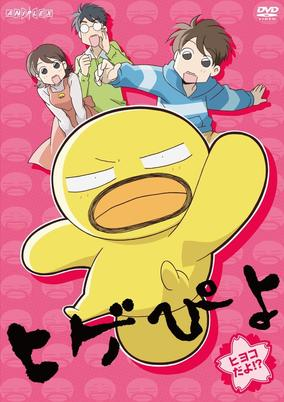

**Studio:** Kinema Citrus &nbsp;|&nbsp; **Episodes:** 39 &nbsp;|&nbsp; **Director:** Atsushi Takeyama &nbsp;|&nbsp; **Aired/Released:** April 3 – February 19, 2010 &nbsp;|&nbsp; **Genres:** Comedy, Slapstick, Kids, School Life, Elementary School, Slice of Life, Friendship, Japan

> Higepiyo is a little chick with a mustache, who is seeking to aquire masculinity with his friend Hiroshi but ends up being entangled with a skin of heated milk.
>
> _Synopsis source: Kitsu_

[Wikipedia](https://en.wikipedia.org/wiki/Higepiyo) · [Kitsu](https://kitsu.io/anime/higepiyo)

---

### Hayate the Combat Butler!!

**Studio:** J.C.Staff &nbsp;|&nbsp; **Episodes:** 25 &nbsp;|&nbsp; **Director:** Yoshiaki Iwasaki &nbsp;|&nbsp; **Aired/Released:** April 4 – September 19

[Wikipedia](https://en.wikipedia.org/wiki/Hayate_the_Combat_Butler!!)

---

### Mazinger Edition Z: The Impact!

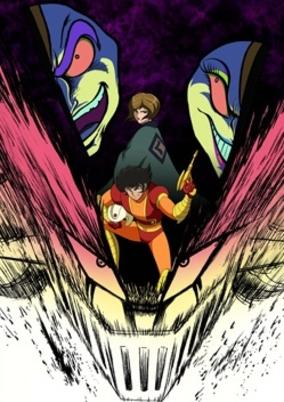

**Studio:** Bee Media Code &nbsp;|&nbsp; **Episodes:** 26 &nbsp;|&nbsp; **Director:** Yasuhiro Imagawa &nbsp;|&nbsp; **Aired/Released:** April 4 – September 26 &nbsp;|&nbsp; **Genres:** Battle Royale, Science Fiction, Mecha, Action, Piloted Robot, Parasite, Dark Fantasy, Alien, Super Power

> Set in the near future, humanity enters another energy revolution following the discovery of Photon Power. Derived from the ore discovered under the foothills of Mt. Fuji, its intended use was to solve the world's energy problems with its unimaginable power. Seeking this energy is Dr. Hell, a madman craving world domination who with his subordinates Baron Ashura, Count Brocken and Viscount Pygman, commands an army of mechanical beasts excavated from the ruins of ancient Greece to seize the Photon Power Lab for himself. Meeting the attack head on is the hot-blooded teenager Kabuto Kouji, who pilots the Photon Powered robot built by his grandfather, Mazinger Z. But in this battle between Dr. Hell and the Kabuto family, many legends surrounding the Mycenaean Civilization and Bardos Island, as well as the secrets of Mazinger Z remain shrouded in mystery. A new series based on the mecha show that started it all, Mazinger Z. Shin Mazinger Shougeki! Z-Hen starts over from the beginning with a new cast, to tell a new story unrelated to the original show.
>
> _Synopsis source: Kitsu_

[Kitsu](https://kitsu.io/anime/shin-mazinger-shougeki-z-hen)

---

### Slap-up Party: Arad Senki

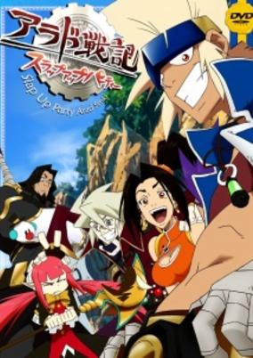

**Studio:** Gonzo &nbsp;|&nbsp; **Episodes:** 26 &nbsp;|&nbsp; **Director:** Lee Jin-Hyung Takahiro Ikezoe &nbsp;|&nbsp; **Aired/Released:** April 4 – September 26 &nbsp;|&nbsp; **Genres:** Fantasy World, Fantasy, Comedy, Action, Adventure

> The anime will follow the adventures of Baron, a man living on continent of Arad in the year 981 after "the cursed light of Kazan" has fallen across the land. Thanks to the curse, one of his arms has become possessed. After finding a sword that has been possessed by the spirit Roxy, he embarks on a quest to unravel the secret of the curse and meets various people who also join his party.
>
> _Synopsis source: Kitsu_

[Kitsu](https://kitsu.io/anime/arad-senki-slap-up-party)

---

### Gokujō!! Mecha Mote Iinchō (The Best!! Extremely Cool Student Council President)

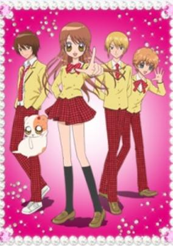

**Studio:** Shogakukan Music & Digital Entertainment &nbsp;|&nbsp; **Episodes:** 51 &nbsp;|&nbsp; **Director:** Harume Kosaka &nbsp;|&nbsp; **Aired/Released:** April 4 – March 27, 2010 &nbsp;|&nbsp; **Genres:** Japan, Comedy, High School, School Life, Present, Romance

> Mimi Kitagami is a kind, level-headed girl who aims to be the best, coolest student council president of her high school class. However, three trouble-making boys are always causing her grief — and she has a one-sided crush on one of the boys, Ushio Toujou.
>
> _Synopsis source: Kitsu_

[Wikipedia](https://en.wikipedia.org/wiki/Gokuj%C5%8D!!_Mecha_Mote_Iinch%C5%8D) · [Kitsu](https://kitsu.io/anime/gokujou-mecha-mote-iinchou)

---

### Shinkyoku Sōkai Polyphonica Crimson S (Polyphonica Crimson S)

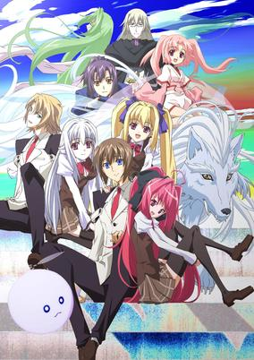

**Studio:** Diomedéa &nbsp;|&nbsp; **Episodes:** 12 &nbsp;|&nbsp; **Director:** Toshimasa Suzuki &nbsp;|&nbsp; **Aired/Released:** April 5 – June 21 &nbsp;|&nbsp; **Genres:** Romance, Fantasy World, Magic, School Life, Music, Fantasy

> The new series will again focus on Corticarte, but it will tie into Ichiro Sakaki and Noboru Kannatsuki's Shinkyoku Sōkai Polyphonica crimson S light novel adaptation, which are set during the Academy years of the storyline.
>
> _Synopsis source: Kitsu_

[Wikipedia](https://en.wikipedia.org/wiki/Shinkyoku_S%C5%8Dkai_Polyphonica_Crimson_S) · [Kitsu](https://kitsu.io/anime/shinkyoku-soukai-polyphonica-crimson-s)

---

### Guin Saga

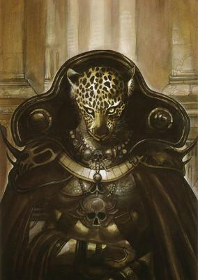

**Studio:** Satelight &nbsp;|&nbsp; **Episodes:** 26 &nbsp;|&nbsp; **Director:** Atsushi Wakabayashi &nbsp;|&nbsp; **Aired/Released:** April 5 – September 27 &nbsp;|&nbsp; **Genres:** Fantasy, Fantasy World, Adventure, Action, Feudal Warfare, Swordplay, High Fantasy, Plot Continuity

> The ancient kingdom of Parros has been invaded by the armies of Mongaul, and its king and queen have been slain. But the "twin pearls of Parros," the princess Rinda and the prince Remus, escape using a strange device hidden in the palace. Lost in Roodwood, they are rescued from Mongaul soldiers by a strange leopard-headed man, who has no memories except for the words "Aurra" and "Guin," which he believes to be his name.
>
> _Synopsis source: Kitsu_

[Wikipedia](https://en.wikipedia.org/wiki/Guin_Saga) · [Kitsu](https://kitsu.io/anime/guin-saga)

---

### Valkyria Chronicles

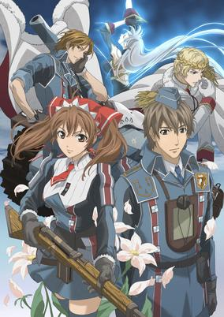

**Studio:** A-1 Pictures &nbsp;|&nbsp; **Episodes:** 26 &nbsp;|&nbsp; **Director:** Yasutaka Yamamoto &nbsp;|&nbsp; **Aired/Released:** April 5 – September 27 &nbsp;|&nbsp; **Genres:** Contemporary Fantasy, Romance, Fantasy World, War, Past, Disaster, Plot Continuity, Violence, Military, Action

> Valkyria Chronicles is set in a fictitious continent reminiscent of 1930s Europe. The continent, called Europa, is divided into two main powers: The Imperial Empire, a monarchy in the east, and the alliance of democracies called the Federation in the west. In this world, there is a very important resource called ragnite; its uses range from fueling weapons of war to use in medical treatments. Since ragnite is such an important resource, the Federation and the Empire are constantly at war with each other for it. The story takes place in the neutral country of Gallia, known for its bountiful reserves of ragnite, when the Empire decides to invade and seize the ragnite for themselves. The story follows Welkin, the son of a former war hero; Isara, Welkin's Darcsen adoptive sister; and Alicia, a member of the Bruhl town watch, as they fight the Imperials in the ragtag Gallian militia group, Squad 7. Squad 7 fights to regain their homes and livelihoods with Welkin as the squad leader and commander of the Edelweiss tank; Alicia as a scout; Isara as the pilot of the Edelweiss, and a variety of colorful individuals.
>
> _Synopsis source: Kitsu_

[Wikipedia](https://en.wikipedia.org/wiki/Valkyria_Chronicles) · [Kitsu](https://kitsu.io/anime/senjou-no-valkyria-gallian-chronicles)

---

### Kon'nichiwa Anne: Before Green Gables (Before Green Gables)

**Studio:** Nippon Animation &nbsp;|&nbsp; **Episodes:** 39 &nbsp;|&nbsp; **Director:** Katsuyoshi Yatabe &nbsp;|&nbsp; **Aired/Released:** April 5 – December 27 &nbsp;|&nbsp; **Genres:** Earth, Slice of Life, Coming Of Age, Americas, Drama, Past, Countryside, Plot Continuity, Historical, Kids

> The story of what happened to Anne Shirley before she was adopted.
>
> _Synopsis source: Kitsu_

[Kitsu](https://kitsu.io/anime/konnichiwa-anne)

---

### Hanasakeru Seishōnen

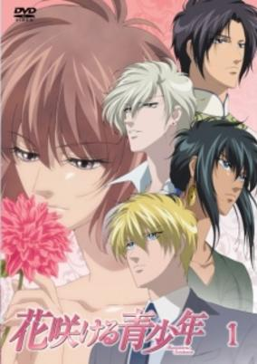

**Studio:** Pierrot &nbsp;|&nbsp; **Episodes:** 39 &nbsp;|&nbsp; **Director:** Chiaki Kon Hajime Kamegaki &nbsp;|&nbsp; **Aired/Released:** April 5 – February 14, 2010 &nbsp;|&nbsp; **Genres:** Earth, Bishounen, Love Polygon, Reverse Harem, Romance

> Kajika Louisa Kugami Burnsworth is the only daughter of Harry Burnsworth, an influential and respected industrialist who has the power to move the world. There was a threat on Kajika’s life when she was just two years old, and her mother died protecting her. After this tragic incident, Harry sent his only child to an isolated island, Giviolle, where she was raised by the island’s native, Maria. Kajika’s companions during her time there include a white leopard named Mustafa and a boy named Li Ren Fang, who visited her two or three times a year. Kajika, now fourteen, returns to her father's side, only to be told to begin a game to find her future husband. Harry makes sure that Kajika willingly participates in this game by telling her that she needs to face the harshness of her fate along with the man she chooses to be her husband. She needs to decide among the three candidates that Harry has personally chosen, but it won’t be easy. Kajika must figure out who they are and where they are without any information to go on except that they all possess an irresistible brilliance and charm. All the while, the men aren't even aware that they are the chosen ones. Kajika must also choose wisely, as her partner has to willingly accept her to be his bride.Hansakeru Seishounen revolves around endearing love, intense passion, noble friendship, undying loyalty, family relations, and political intrigue. The heaviness of Kajika’s fate is real, the threat on Kajika’s life is inevitable, and the husband game is more than just a mere game. Harry needs to find a suitable partner to protect his daughter before someone discovers Kajika’s deep secret—a secret even she is unaware of.
>
> _Synopsis source: Kitsu_

[Wikipedia](https://en.wikipedia.org/wiki/Hanasakeru_Seish%C5%8Dnen) · [Kitsu](https://kitsu.io/anime/hanasakeru-seishounen)

---

### Beyblade: Metal Fusion

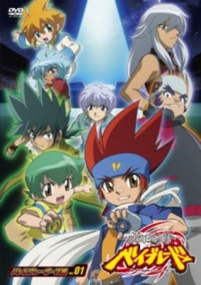

**Studio:** Tatsunoko Production &nbsp;|&nbsp; **Episodes:** 51 &nbsp;|&nbsp; **Director:** Kunihisa Sugishima &nbsp;|&nbsp; **Aired/Released:** April 5 – March 28, 2010 &nbsp;|&nbsp; **Genres:** Proxy Battles, Adventure, Comedy, Friendship, Sports

> A new cast of characters take on the continued battle between good and evil. Ginga, our hero, and his group of loyal friends take on a dangerous group called the Dark Nebula. The Dark Nebula’s sole mission is to take over the world and unleash their evil upon it; but before they can do so, they must destroy Ginga as he is the only person that’s strong enough to stand in their way. The plot thickens as friends become enemies and enemies become allies. Everything starts and ends with Ginga as he struggles to find the strength to defend his world and the honor of Beyblade.
>
> _Synopsis source: Kitsu_

[Kitsu](https://kitsu.io/anime/metal-fight-beyblade)

---

### Cross Game

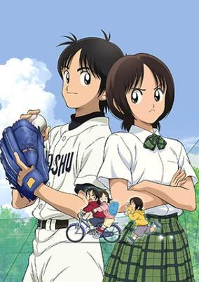

**Studio:** SynergySP &nbsp;|&nbsp; **Episodes:** 50 &nbsp;|&nbsp; **Director:** Osamu Sekita &nbsp;|&nbsp; **Aired/Released:** April 5 – March 28, 2010 &nbsp;|&nbsp; **Genres:** Japan, Asia, Sports, Slice of Life, High School, School Clubs, Baseball, School Life, Present, Comedy, Romance

> The main character is Kou Kitamura, son of the owner of Kitamura Sports. In the same neighborhood is a batting center run by the Tsukishima family. Due to their proximity and the relationship between their businesses, the Kitamura and Tsukishima familes have been close for many years, with their children going back and forth between the two homes like extended family. Because Kou and Wakaba were the same age and always together, Aoba was jealous of all the time Kou spent with her older sister. Aoba is a natural pitcher with excellent form, and Kou secretly trains to become as good as she was, even while publicly showing little interest in baseball.
>
> _Synopsis source: Kitsu_

[Wikipedia](https://en.wikipedia.org/wiki/Cross_Game) · [Kitsu](https://kitsu.io/anime/cross-game)

---

### Jewelpet

**Studio:** Studio Comet &nbsp;|&nbsp; **Episodes:** 52 &nbsp;|&nbsp; **Director:** Nanako Sasaki &nbsp;|&nbsp; **Aired/Released:** April 5 – March 28, 2010

[Wikipedia](https://en.wikipedia.org/wiki/Jewelpet_(TV_series))

---

### Fullmetal Alchemist: Brotherhood

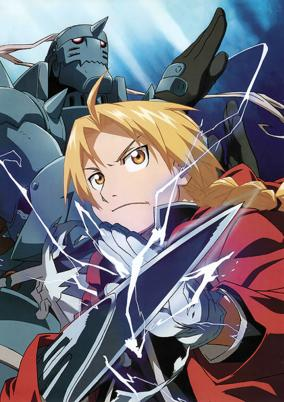

**Studio:** Bones &nbsp;|&nbsp; **Episodes:** 64 &nbsp;|&nbsp; **Director:** Yasuhiro Irie &nbsp;|&nbsp; **Aired/Released:** April 5 – July 4, 2010 &nbsp;|&nbsp; **Genres:** Steampunk, Contemporary Fantasy, Fantasy, Fantasy World, Adventure, Action, Human Enhancement, Magic, Plot Continuity, Violence, Military, Shounen

> "In order for something to be obtained, something of equal value must be lost." Alchemy is bound by this Law of Equivalent Exchange—something the young brothers Edward and Alphonse Elric only realize after attempting human transmutation: the one forbidden act of alchemy. They pay a terrible price for their transgression—Edward loses his left leg, Alphonse his physical body. It is only by the desperate sacrifice of Edward's right arm that he is able to affix Alphonse's soul to a suit of armor. Devastated and alone, it is the hope that they would both eventually return to their original bodies that gives Edward the inspiration to obtain metal limbs called "automail" and become a state alchemist, the Fullmetal Alchemist. Three years of searching later, the brothers seek the Philosopher's Stone, a mythical relic that allows an alchemist to overcome the Law of Equivalent Exchange. Even with military allies Colonel Roy Mustang, Lieutenant Riza Hawkeye, and Lieutenant Colonel Maes Hughes on their side, the brothers find themselves caught up in a nationwide conspiracy that leads them not only to the true nature of the elusive Philosopher's Stone, but their country's murky history as well. In between finding a serial killer and racing against time, Edward and Alphonse must ask themselves if what they are doing will make them human again... or take away their humanity.
>
> _Synopsis source: Kitsu_

[Kitsu](https://kitsu.io/anime/fullmetal-alchemist-brotherhood)

---

### Dragon Ball Z Kai

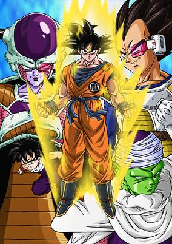

**Studio:** Toei Animation &nbsp;|&nbsp; **Episodes:** 97 &nbsp;|&nbsp; **Director:** Yasuhiro Nowatari &nbsp;|&nbsp; **Aired/Released:** April 5 – March 27, 2011 &nbsp;|&nbsp; **Genres:** Fantasy, Space Travel, Adventure, Genetic Modification, Action, Martial Arts, Cyborg, Humanoid Alien, Alien, Violence, Super Power, Comedy, Shounen

> Five years after the events of Dragon Ball, martial arts expert Gokuu is now a grown man married to his wife Chi-Chi, with a four-year old son named Gohan. While attending a reunion on Turtle Island with his old friends Master Roshi, Krillin, Bulma and others, the festivities are interrupted when a humanoid alien named Raditz not only reveals the truth behind Gokuu's past, but kidnaps Gohan as well. With Raditz displaying power beyond anything Gokuu has seen before, he is forced to team up with his old nemesis, Piccolo, in order to rescue his son. But when Gokuu and Piccolo reveal the secret of the seven mystical wish-granting Dragon Balls to Raditz, he informs the duo that there is more of his race, the Saiyans, and they won’t pass up an opportunity to seize the power of the Dragon Balls for themselves. These events begin the saga of Dragon Ball Kai, a story that finds Gokuu and his friends and family constantly defending the galaxy from increasingly more powerful threats. Bizarre, comical, heartwarming and threatening characters come together in a series of battles that push the powers and abilities of Gokuu and his friends beyond anything they have ever experienced.
>
> _Synopsis source: Kitsu_

[Wikipedia](https://en.wikipedia.org/wiki/Dragon_Ball_Z_Kai) · [Kitsu](https://kitsu.io/anime/dragon-ball-kai)

---

### Tayutama: Kiss on my Deity

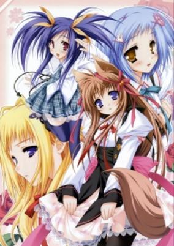

**Studio:** SILVER LINK. &nbsp;|&nbsp; **Episodes:** 12 &nbsp;|&nbsp; **Director:** Keitaro Motonaga &nbsp;|&nbsp; **Aired/Released:** April 6 – June 22 &nbsp;|&nbsp; **Genres:** Romance, Contemporary Fantasy, Fantasy, Japan, Plot Continuity, Present, Harem

> Yuuri Mito is a typical, normal Japanese teenager. He goes to school, works on people's motorcycles and performs exorcisms. Okay, that last part's a little bit unusual, but his family lives in a shrine and they do that sort of thing. Still, you would think he'd know enough to be careful with an ancient relic he finds in the woods, especially when a mysterious goddess appears and tells him to leave it alone. Unfortunately, despite Mito's best efforts, the seal gets broken anyway and a number of dangerous "tayuti" that it held in stasis get loose. This is bad. Mito also ends up with a beautiful goddess girl who decides that she's going to marry him. This might not be so bad. if he wasn't already caught up in the middle of a war between the entities he's released. The flesh may be weak but the spirit's more than willing to compensate.
>
> _Synopsis source: Kitsu_

[Kitsu](https://kitsu.io/anime/tayutama-kiss-on-my-deity)

---

### Natsu no Arashi!

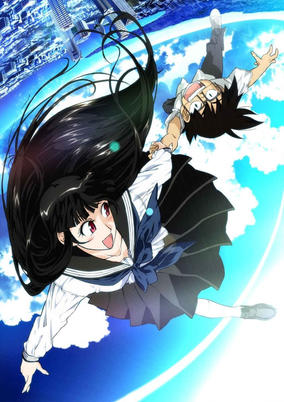

**Studio:** Shaft &nbsp;|&nbsp; **Episodes:** 13 &nbsp;|&nbsp; **Director:** Shin Ōnuma (Chief) Akiyuki Shinbo &nbsp;|&nbsp; **Aired/Released:** April 6 – June 29 &nbsp;|&nbsp; **Genres:** Earth, Fantasy, Contemporary Fantasy, Japan, Asia, Comedy, Time Travel, Anti War, Drama, Friendship, Present, Romance

> Thirteen-year-old Yasaka is a boy staying at his grandfather's house during his summer vacation. One day he entered a store and met Arashi, a beautiful sixteen-year-old girl working there. After trying to protect her from a man who claims to have been hired by her family to take her back by force, Yasaka ran away with her and now she stays at his grandpa's place with him. It didn't take much time for Yasaka to figure out that his new friend is far from an ordinary girl, as she possesses mysterious powers. The plot thickens when he finds a sixty-year-old picture of Arashi and another girl named Kaja, and to the surprise of all Kaja suddenly appears, and just like Arashi, her appearance hasn't changed at all since then.
>
> _Synopsis source: Kitsu_

[Wikipedia](https://en.wikipedia.org/wiki/Natsu_no_Arashi!) · [Kitsu](https://kitsu.io/anime/natsu-no-arashi)

---

### Shangri-La

**Studio:** Gonzo &nbsp;|&nbsp; **Episodes:** 24 &nbsp;|&nbsp; **Director:** Makoto Bessho &nbsp;|&nbsp; **Aired/Released:** April 6 – September 14 &nbsp;|&nbsp; **Genres:** Earth, Science Fiction, Action, Future

> In the distant future, earthquakes and the effects of global warming have splintered Japanese society. Some struggle hand-to-mouth in the jungle-tangled ruins of civilization. Some live comfortably within the closed-off city of Atlas. Others lurk online, anonymously hacking the global economy. As nature grows more violent and the divide between classes expands, one spirited girl—Kuniko—must face her destiny and lead her people into the utopia of Atlas. The city's ruthless government isn't going to welcome them with open arms, but Kuniko won't give up until the gates of Atlas are kicked open for good—even if it means discovering that the promised land she dreamed of is built upon a foundation of twisted secrets and lies.
>
> _Synopsis source: Kitsu_

[Wikipedia](https://en.wikipedia.org/wiki/Shangri-La_(novel)) · [Kitsu](https://kitsu.io/anime/shangri-la)

---

### Saki

**Studio:** Gonzo Picture Magic &nbsp;|&nbsp; **Episodes:** 25 &nbsp;|&nbsp; **Director:** Manabu Ono &nbsp;|&nbsp; **Aired/Released:** April 6 – September 28

[Wikipedia](https://en.wikipedia.org/wiki/Saki_(manga))

---

### Tears to Tiara

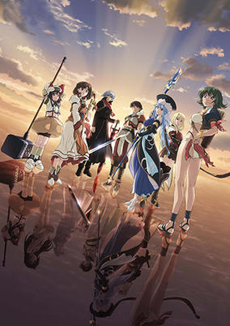

**Studio:** White Fox &nbsp;|&nbsp; **Episodes:** 26 &nbsp;|&nbsp; **Director:** Tomoki Kobayashi &nbsp;|&nbsp; **Aired/Released:** April 6 – September 28 &nbsp;|&nbsp; **Genres:** Fantasy, Fantasy World, Alternative Past, Magic, Past, Action, Adventure

> In a world resembling the middle-age. A girl, Riannon, is set to be sacrificed to appease a resurrected demon lord, Arawn. As her brother Arthur attempts to rescue her, Arawn defies those who resurrected him and frees Riannon from her captors, which leads to Riannon admiring him. This eventually leads to a party of companions being assembled for adventure, with Arawn acting as the leader.
>
> _Synopsis source: Kitsu_

[Wikipedia](https://en.wikipedia.org/wiki/Tears_to_Tiara) · [Kitsu](https://kitsu.io/anime/tears-to-tiara)

---

### 07-Ghost

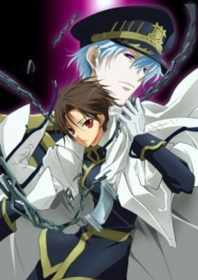

**Studio:** Studio Deen &nbsp;|&nbsp; **Episodes:** 25 &nbsp;|&nbsp; **Director:** Yoshihiro Takamoto &nbsp;|&nbsp; **Aired/Released:** April 7 – September 22 &nbsp;|&nbsp; **Genres:** Fantasy World, Action, Fantasy, Bishounen, Magic, Drama, Plot Continuity, Military, Super Power, Demon, Friendship, Josei

> Barsburg Empire's Military Academy is known for training elites who bring victory to the empire. Students of the academy freely utilize an ability called "Zaiphon" to fight, while the types of Zaiphon usable depends on the nature of the soldier. Teito Klein, a student at the academy, is one of the most promising soldiers produced. Although ridiculed by everyone for being a sklave (German for slave) with no memories of his past, he is befriended by a fellow student called Mikage. While preparing for the final exam, Teito uncovers a dark secret related to his past. When an attempt to assassinate Ayanami, a high-ranking official who killed his father, fails, Teito is locked away awaiting punishment. Only wanting the best for Teito, Mikage helps him escape. Teito ends up at the 7th District Church where he is taken in by the bishops. It is here that Teito attempts to evade the grasp of Ayanami and the Military, so he can rediscover his memories and learn why he is the person that can change the fate of the world. [Written by MAL Rewrite]
>
> _Synopsis source: Kitsu_

[Wikipedia](https://en.wikipedia.org/wiki/07-Ghost) · [Kitsu](https://kitsu.io/anime/seven-ghost)

---

### Sugarbunnies: Fleur

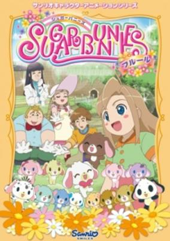

**Studio:** Asahi Production &nbsp;|&nbsp; **Episodes:** 26 &nbsp;|&nbsp; **Director:** Hiroshi Kugimiya &nbsp;|&nbsp; **Aired/Released:** April 7 – September 29 &nbsp;|&nbsp; **Genres:** Kids

> Sequel to Sugar Bunnies Chocolate!
>
> _Synopsis source: Kitsu_

[Kitsu](https://kitsu.io/anime/sugar-bunnies-fleur)

---

### Sōten Kōro (Beyond the Heavens)

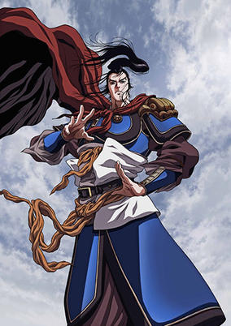

**Studio:** Madhouse &nbsp;|&nbsp; **Episodes:** 26 &nbsp;|&nbsp; **Director:** Toyoo Ashida (Chief) Tsuneo Tominaga &nbsp;|&nbsp; **Aired/Released:** April 8 – September 30 &nbsp;|&nbsp; **Genres:** Earth, China, Three Kingdoms, Asia, War, Past, Violence, Historical, Action, Adventure

> Souten Kouro's story is based loosely on the events taking place in Three Kingdoms period of China during the life of the last Chancellor of the Eastern Han Dynasty, Cao Cao (155 – March 15, 220), who also serves as the main character. The Three Kingdoms period has been a popular theme in Japanese manga for decades, but Souten Kouro differs greatly from most of the others on several points. One significant difference is its highly positive portrayal of its main character, Cao Cao, who is traditionally the antagonist in not only Japanese manga, but also most novel versions of the Three Kingdoms period, including the original 14th century version, Romance of the Three Kingdoms by Luo Guanzhong. Another significant difference from others is that the storyline primarily uses the original historical account of the era, Records of Three Kingdoms by Chen Shou, as a reference rather than the aforementioned Romance of the Three Kingdoms novel. By this, the traditional hero of Romance of the Three Kingdoms, Liu Bei, takes on relatively less importance within the story and is portrayed in a less positive light. Yet, several aspects of the story are in fact based on the novel version, including the employment of its original characters such as Diao Chan, as well as anachronistic weapons such as Guan Yu's Green Dragon Crescent Blade and Zhang Fei's Viper Blade. A consistent theme throughout the story is Cao Cao's perpetual desire to break China and its people away from its old systems and ways of thinking and initiate a focus on pragmatism over empty ideals. This often puts him at odds with the prevalent customs and notions of Confucianism and those that support them.
>
> _Synopsis source: Kitsu_

[Wikipedia](https://en.wikipedia.org/wiki/S%C5%8Dten_K%C5%8Dro) · [Kitsu](https://kitsu.io/anime/souten-kouro)

---

### Ristorante Paradiso

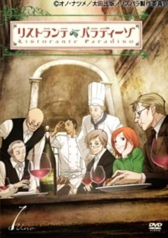

**Studio:** David Production &nbsp;|&nbsp; **Episodes:** 11 &nbsp;|&nbsp; **Director:** Mitsuko Kase &nbsp;|&nbsp; **Aired/Released:** April 9 – June 25 &nbsp;|&nbsp; **Genres:** Earth, Romance, Italy, Slice of Life, Europe, Cooking, Reverse Harem, Plot Continuity, Present, Josei

> When Nicoletta was a little girl, her mother, Olga, abandoned her and ran off to Rome to remarry. Now, 15 years later and a young woman, she travels to Rome with the intention of ruining her mother's life. She tracks Olga down to a restaurant called Casetta dell'Orso, but the second Nicoletta steps through its door, everything changes. It's a peculiar place staffed entirely by mature gentlemen wearing spectacles, and like their clientele, she is helpless against their wise smiles and warm voices. Before Nicoletta realizes it, her plans for vengeance start to fade, and she's swept up in the sweet romance of everyday Italian life.
>
> _Synopsis source: Kitsu_

[Wikipedia](https://en.wikipedia.org/wiki/Ristorante_Paradiso) · [Kitsu](https://kitsu.io/anime/ristorante-paradiso)

---

### Eden of The East

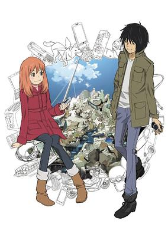

**Studio:** Production I.G &nbsp;|&nbsp; **Episodes:** 11 &nbsp;|&nbsp; **Director:** Kenji Kamiyama &nbsp;|&nbsp; **Aired/Released:** April 10 – June 19 &nbsp;|&nbsp; **Genres:** Earth, Romance, Battle Royale, Japan, Conspiracy, Alternative Present, Plot Continuity, Present, Action, Science Fiction, Thriller, Comedy, Mystery

> On November 22, 2010, Japan was hit by missile strikes, a terrorist act that fortunately did not harm anyone, becoming known as "Careless Monday." Quickly forgotten, society goes on about their lives as normal. During her graduation trip to America three months later, friendly college student Saki Morimi's life is forever changed when she finds herself saved from unexpected trouble by Akira Takizawa. Takizawa is cheerful, but odd in many ways—he is stark naked and suffers from amnesia, believing himself to be a terrorist. In addition, he possesses a strange cell phone loaded with 8.2 billion yen in digital cash. Despite Takizawa's suspicious traits, Saki quickly befriends the enigmatic young man. However, unbeknownst to her, this is the beginning of a thrilling death game involving money, cell phones, and the salvation of the world. Higashi no Eden chronicles Saki's struggle to unravel the mysteries behind her savior, while Takizawa himself battles other individuals armed with similar cell phones and returning memories which reveal his possible connection to the event from months ago.
>
> _Synopsis source: Kitsu_

[Wikipedia](https://en.wikipedia.org/wiki/Eden_of_the_East) · [Kitsu](https://kitsu.io/anime/eden-of-the-east)

---

### First Love Limited (Hatsukoi Limited Shorts)

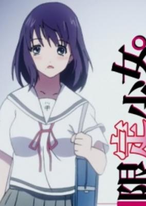

**Studio:** J.C.Staff &nbsp;|&nbsp; **Episodes:** 12 &nbsp;|&nbsp; **Director:** Yoshiki Yamakawa &nbsp;|&nbsp; **Aired/Released:** April 12 – June 28 &nbsp;|&nbsp; **Genres:** Comedy, School Life, Ecchi

> Andou Soako, a high school girl and a 'Mega-klutz' as she thinks herself to be is about to be late for school yet again, for nine straight days! She rushes out from her home and runs out to make up for the lost time when she suddenly realizes that her breasts are wobbling much more than usual and she has a feeling of a gentle breeze under her skirt...
>
> _Synopsis source: Kitsu_

[Wikipedia](https://en.wikipedia.org/wiki/First_Love_Limited) · [Kitsu](https://kitsu.io/anime/hatsukoi-limited-gentei-shoujo)

---

### The Melancholy of Haruhi Suzumiya

**Studio:** Kyoto Animation &nbsp;|&nbsp; **Episodes:** 14 &nbsp;|&nbsp; **Director:** Tatsuya Ishihara Yutaka Yamamoto &nbsp;|&nbsp; **Aired/Released:** May 22 – September 11

[Wikipedia](https://en.wikipedia.org/wiki/The_Melancholy_of_Haruhi_Suzumiya)

---

### Weiß Survive

**Studio:** Studio Hibari &nbsp;|&nbsp; **Episodes:** 16 &nbsp;|&nbsp; **Director:** Iku Suzuki &nbsp;|&nbsp; **Aired/Released:** June 6 – September 26 &nbsp;|&nbsp; **Genres:** Parody, Violent Retribution For Accidental Infringement, Super Deformed, Card Games, Parallel Universe, Plot Continuity, Present, Comedy, Ecchi

> Takeshi was just an ordinary guy until a perfectly innocent study session with Michi - the most beautiful girl in the school - ended up with him being mysteriously transported into the strange dimension known as the Weiss Schwarz Battle Space. Once there, a crazy but enthusiastic old man informs him that he is the chosen warrior and must win a succession of card battles to get back home. The only problem: he doesn't know how to play! However, with the expert Michi ready to teach him the ins and outs of this bizarre and improbably slapstick card game, Takeshi will learn the ropes and get ready for the card battle of a lifetime. Assuming he survives the training...
>
> _Synopsis source: Kitsu_

[Wikipedia](https://en.wikipedia.org/wiki/Wei%C3%9F_Survive) · [Kitsu](https://kitsu.io/anime/weiss-survive)

---

### Fight Ippatsu! Jūden-chan!! (Charger Girl Ju-den Chan)

**Studio:** Studio Hibari &nbsp;|&nbsp; **Episodes:** 12 &nbsp;|&nbsp; **Director:** Shinichiro Kimura &nbsp;|&nbsp; **Aired/Released:** June 25 – September 10 &nbsp;|&nbsp; **Genres:** Earth, Ecchi, Science Fiction, Fantasy World, Japan, Asia, Comedy, Slapstick, Parallel Universe, Plot Continuity, Present

> Meet Plug, an unusual girl from a parallel world. Plug is a "Juuden-chan," capable of "recharging" people down on their luck, spreading good cheer wherever she goes!
>
> _Synopsis source: Kitsu_

[Wikipedia](https://en.wikipedia.org/wiki/Fight_Ippatsu!_J%C5%ABden-chan!!) · [Kitsu](https://kitsu.io/anime/fight-ippatsu-juuden-chan)

---

### Umi Monogatari

**Studio:** Zexcs &nbsp;|&nbsp; **Episodes:** 12 &nbsp;|&nbsp; **Director:** Yuu Kou Junichi Sato &nbsp;|&nbsp; **Aired/Released:** June 25 – September 17 &nbsp;|&nbsp; **Genres:** Earth, Contemporary Fantasy, Romance, Fantasy, Japan, Asia, Coming Of Age, Magic, Magical Girl, Plot Continuity, Present

> Marin and her sister Urin live in the sea. One day they find a ring fallen into the sea. They get out of the sea and meet a girl Kanon, the owner of the ring. Kanon tells them she doesn't want the ring anymore because it was given by her boyfriend whom she just broke up with, and she throws it into the forest. Marin thinks Kanon is still in love with him and looks for the ring with her sister. But Urin accidentally breaks a seal near a shrine...
>
> _Synopsis source: Kitsu_

[Wikipedia](https://en.wikipedia.org/wiki/Umi_Monogatari) · [Kitsu](https://kitsu.io/anime/umi-monogatari-anata-ga-ite-kureta-koto)

---

### Sweet Blue Flowers

**Studio:** J.C.Staff &nbsp;|&nbsp; **Episodes:** 11 &nbsp;|&nbsp; **Director:** Ken'ichi Kasai &nbsp;|&nbsp; **Aired/Released:** July 2 – September 10 &nbsp;|&nbsp; **Genres:** Romance, Japan, Slice of Life, Shoujo Ai, Coming Of Age, High School, All Girls School, School Life, Present

> Fumi and Akira were close childhood friends until Fumi had to move away. Ten years after losing touch with each other, the two girls meet again as high school freshmen. The two struggle to reconnect after so much has changed, and both deal with the trials and tribulations of high school — sometimes independently and sometimes with each other’s help.
>
> _Synopsis source: Kitsu_

[Wikipedia](https://en.wikipedia.org/wiki/Sweet_Blue_Flowers) · [Kitsu](https://kitsu.io/anime/aoi-hana)

---

### Umineko When They Cry (Umineko: When They Cry)

**Studio:** Studio Deen &nbsp;|&nbsp; **Episodes:** 26 &nbsp;|&nbsp; **Director:** Chiaki Kon &nbsp;|&nbsp; **Aired/Released:** July 2 – December 24 &nbsp;|&nbsp; **Genres:** Earth, Contemporary Fantasy, Japan, Asia, Thriller, Detective, Horror, Past, Plot Continuity, Violence, Psychological, Mystery

> Considered as the third installment in the highly popular When They Cry series by 07th Expansion, Umineko no Naku Koro ni takes place on the island of Rokkenjima, owned by the immensely wealthy Ushiromiya family. As customary per year, the entire family is gathering on the island for a conference that discusses the current financial situations of each respective person. Because of the family head's poor health, this year involves the topic of the head of the family's inheritance and how it will be distributed. However, the family is unaware that the distribution of his wealth is the least of Ushiromiya Kinzou's (family head) concerns for this year's family conference. After being told that his end was approaching by his longtime friend and physician, Kinzou is desperate to meet his life's true love one last time: the Golden Witch, Beatrice. Having immersed himself in black magic for many of the later years in his life, Kinzou instigates a ceremony to revive his beloved upon his family's arrival on Rokkenjima. Soon after, a violent typhoon traps the family on the island and a string of mysterious murders commence, forcing the eighteen people on the island to fight for their lives in a deadly struggle between fantasy and reality. [Written by MAL Rewrite]
>
> _Synopsis source: Kitsu_

[Wikipedia](https://en.wikipedia.org/wiki/Umineko_When_They_Cry) · [Kitsu](https://kitsu.io/anime/umineko-no-naku-koro-ni)

---

### Taishō Baseball Girls (Taisho Baseball Girls)

**Studio:** J.C.Staff &nbsp;|&nbsp; **Episodes:** 12 &nbsp;|&nbsp; **Director:** Takashi Ikehata &nbsp;|&nbsp; **Aired/Released:** July 3 – September 25 &nbsp;|&nbsp; **Genres:** Earth, Japan, Asia, Sports, Middle School, School Clubs, Past, Baseball, Historical, Comedy, School Life

> In 1925 (year 14 of the Taisho era) baseball is still quite unknown in Japan and there are only a few male teams. After being told by a baseball player that women should become housewives instead of going to school, 14-year-old Akiko invites her friend Koume to start a baseball team in order to prove him wrong. During this time, when even running was considered too vulgar for women, baseball is known as "what the boys do" and they face many difficulties when having to find enough members, to get permission from their parents and also when learning about the sport itself, which they soon discover to be more difficult than expected.
>
> _Synopsis source: Kitsu_

[Wikipedia](https://en.wikipedia.org/wiki/Taish%C5%8D_Baseball_Girls) · [Kitsu](https://kitsu.io/anime/taishou-yakyuu-musume)

---

### Needless

**Studio:** Madhouse &nbsp;|&nbsp; **Episodes:** 24 &nbsp;|&nbsp; **Director:** Masayuki Sakoi &nbsp;|&nbsp; **Aired/Released:** July 3 – December 11 &nbsp;|&nbsp; **Genres:** Earth, Ecchi, Post Apocalypse, Japan, Action, Asia, Parody, Comedy, Future, Super Power, Science Fiction

> At the onset of World War III, nobody could have predicted the effect it would have on Japan. While it had officially ended fifty years ago in 2150, its battles still persist. Large, mysterious areas known as "Blackspots" appeared across the country, filled with the contaminated ruins of cities and countrysides. Those inside were trapped to halt the spread of contamination, and their powers began to mutate—be they shapeshifters, pyromancers, or controllers of gravity itself—they all became known as the Needless. Adam Blade is one such Needless, possessing remarkable regenerative abilities and incredible strength. In order to restore peace to a war-torn Japan, he and his allies must fight together to rise against a heinous research group by the name of Simeon.
>
> _Synopsis source: Kitsu_

[Wikipedia](https://en.wikipedia.org/wiki/Needless) · [Kitsu](https://kitsu.io/anime/needless)

---

### Bakemonogatari

**Studio:** Shaft &nbsp;|&nbsp; **Episodes:** 15 &nbsp;|&nbsp; **Director:** Akiyuki Shinbo Tatsuya Oishi &nbsp;|&nbsp; **Aired/Released:** July 3 – June 25, 2010 &nbsp;|&nbsp; **Genres:** Earth, Ecchi, Romance, Contemporary Fantasy, Japan, Asia, Sudden Girlfriend Appearance, Coming Of Age, Angst, Drama, Stereotypes, School Life, Present, Harem, Vampire, Mystery

> Koyomi Araragi, a third-year high school student, manages to survive a vampire attack with the help of Meme Oshino, a strange man residing in an abandoned building. Though being saved from vampirism and now a human again, several side effects such as superhuman healing abilities and enhanced vision still remain. Regardless, Araragi tries to live the life of a normal student, with the help of his friend and the class president, Tsubasa Hanekawa. When fellow classmate Hitagi Senjougahara falls down the stairs and is caught by Araragi, the boy realizes that the girl is unnaturally weightless. Despite Senjougahara's protests, Araragi insists he help her, deciding to enlist the aid of Oshino, the very man who had once helped him with his own predicament. Through several tales involving demons and gods, Bakemonogatari follows Araragi as he attempts to help those who suffer from supernatural maladies. [Written by MAL Rewrite]
>
> _Synopsis source: Kitsu_

[Wikipedia](https://en.wikipedia.org/wiki/Bakemonogatari) · [Kitsu](https://kitsu.io/anime/bakemonogatari)

---

### Canaan

**Studio:** P.A. Works &nbsp;|&nbsp; **Episodes:** 13 &nbsp;|&nbsp; **Director:** Masahiro Ando &nbsp;|&nbsp; **Aired/Released:** July 4 – September 26 &nbsp;|&nbsp; **Genres:** China, Action, Asia, Gunfights, Violence, Seinen, Super Power

> Oosawa Maria is a Japanese photographer currently working in Shanghai, China. Along with her partner Mino, she searches for potential newsworthy stories throughout the city. When strange events occur at a local festival, Maria and Mino immediately investigate. Quickly, the two are immersed in a battle between unknown masked men and a strange, white-haired woman. Just when Maria is about to be caught in the crossfire, an old friend by the name of Canaan appears and helps Maria escape. But a sinister plot over a deadly virus soon develops, and Canaan learns she must confront her past if she wants any chance at stopping the perpetrator and saving her friends. [Written by MAL Rewrite]
>
> _Synopsis source: Kitsu_

[Wikipedia](https://en.wikipedia.org/wiki/Canaan_(anime)) · [Kitsu](https://kitsu.io/anime/canaan)

---

### Element Hunters

**Studio:** Heewon Entertainment NHK Enterprises &nbsp;|&nbsp; **Episodes:** 39 &nbsp;|&nbsp; **Director:** Han Pyo Hong Yoshiaki Okumura &nbsp;|&nbsp; **Aired/Released:** July 4 – March 27, 2010 &nbsp;|&nbsp; **Genres:** Earth, Power Suit, Science Fiction, Action, Future, Android, Stereotypes, Parallel Universe, Plot Continuity

> In 2029, a large scale ground sinkage occurred in the Mediterranean Sea. Chemical elements such as oxygen, carbon, gold, molybdenum, and cobalt disappeared from the earth's crust suddenly. The human population was decreased by 90% in sixty years. Researchers found out that the disappeared elements were drained into a planet "Nega Earth", located in another dimension. To save the Earth, a special team called the "Element Hunters" is organized. All of the members are under 13 years old, because young and flexible brains are needed to access "Nega Earth".
>
> _Synopsis source: Kitsu_

[Wikipedia](https://en.wikipedia.org/wiki/Element_Hunters) · [Kitsu](https://kitsu.io/anime/element-hunters)

---

### (Zan) Sayonara, Zetsubou-Sensei

**Studio:** Shaft &nbsp;|&nbsp; **Episodes:** 13 &nbsp;|&nbsp; **Director:** Akiyuki Shinbo &nbsp;|&nbsp; **Aired/Released:** July 5 – September 27

[Wikipedia](https://en.wikipedia.org/wiki/Sayonara,_Zetsubou-Sensei)

---

### Kuruneko

**Studio:** DAX Production &nbsp;|&nbsp; **Episodes:** 50 &nbsp;|&nbsp; **Director:** Akitaro Daichi &nbsp;|&nbsp; **Aired/Released:** July 5 – June 26, 2010 &nbsp;|&nbsp; **Genres:** Slice of Life, Comedy

> Based on a manga about cats and their sake loving owner.
>
> _Synopsis source: Kitsu_

[Wikipedia](https://en.wikipedia.org/wiki/Kuruneko) · [Kitsu](https://kitsu.io/anime/kuruneko)

---

### Princess Lover!

**Studio:** GoHands &nbsp;|&nbsp; **Episodes:** 12 &nbsp;|&nbsp; **Director:** Hiromitsu Kanazawa &nbsp;|&nbsp; **Aired/Released:** July 6 – September 21 &nbsp;|&nbsp; **Genres:** Earth, Ecchi, Japan, Sudden Girlfriend Appearance, Alternative Present, Plot Continuity, Present, Harem, Comedy, School Life

> Following an automobile accident that claims the life of his parents, Teppei Arima is taken in by his grandfather and introduced to the world of the rich and the elite. Compared to his humble upbringing, Isshin Arima's lavish lifestyle surprises and stuns the young teenager. In return for the gracious hospitality, Teppei is expected to continue the family business by replacing his grandfather as the head of Arima Financial Combine, and to prepare him for these responsibilities, he is enrolled into an esteemed high school. Along with his recently acquired celebrity status and affluence, Teppei is informed of an arranged marriage with the equally prosperous Sylvia van Hossen, thus, beginning the thrilling escapades of his new life! [Written by MAL Rewrite]
>
> _Synopsis source: Kitsu_

[Wikipedia](https://en.wikipedia.org/wiki/Princess_Lover!) · [Kitsu](https://kitsu.io/anime/princess-lover)

---

### Kanamemo

**Studio:** feel. &nbsp;|&nbsp; **Episodes:** 13 &nbsp;|&nbsp; **Director:** Shigehito Takayanagi &nbsp;|&nbsp; **Aired/Released:** July 6 – September 28 &nbsp;|&nbsp; **Genres:** Ecchi, Japan, Loli, Slice of Life, Comedy, Shoujo Ai, Super Deformed, Coming Of Age, Slapstick, Stereotypes, Present

> Nakamachi Kana is a junior high school girl, but when her grandmother passes away she is left all alone. Stuck for somewhere to live, she finds a newspaper carrier station and starts working for her room and board, alongside other female workers that make every day as fun as the last.
>
> _Synopsis source: Kitsu_

[Wikipedia](https://en.wikipedia.org/wiki/Kanamemo) · [Kitsu](https://kitsu.io/anime/kanamemo)

---

### GA Geijutsuka Art Design Class

**Studio:** AIC PLUS+ &nbsp;|&nbsp; **Episodes:** 12 &nbsp;|&nbsp; **Director:** Hiroaki Sakurai &nbsp;|&nbsp; **Aired/Released:** July 7 – September 22 &nbsp;|&nbsp; **Genres:** Earth, Japan, Asia, Slice of Life, School Clubs, Friendship, School Life, The Arts, Present, Comedy

> The Ayanoi High School features the Geijutsuka Art Design Class (GA) that focuses on the arts. Five close friends — the energetic "hime"-prankster Noda Miki; the level-headed, cynical Nozaki Namiko; the intelligent, observant, and kind Oomichi Miyabi; the lively and mischievous tomboy Tomokane; and the curious, innocent, glasses-wearing Yamaguchi Kisaragi — attend this class with great enthusiasm, learning about the many art techniques. Every day seems to pose a new and interesting challenge, be it struggling with the latest assignment or when dealing with the daily strangeness of school life.
>
> _Synopsis source: Kitsu_

[Wikipedia](https://en.wikipedia.org/wiki/GA_Geijutsuka_Art_Design_Class) · [Kitsu](https://kitsu.io/anime/ga-geijutsuka-art-design-class)

---

### Sora no Manimani (At The Mercy of The Sky)

**Studio:** Studio Comet &nbsp;|&nbsp; **Episodes:** 12 &nbsp;|&nbsp; **Director:** Shinji Takamatsu &nbsp;|&nbsp; **Aired/Released:** July 7 – September 22 &nbsp;|&nbsp; **Genres:** Earth, Japan, Asia, Comedy, High School, School Clubs, School Life, Present, Romance, Slice of Life

> Saku Ooyagi returns to his hometown after seven years and is soon reacquainted with his childhood friend, Mihoshi Akeno. The reunion is far from merry since the last memory they have of each other is of her falling off a tree and him saving her. In any case, Mihoshi is determined to improve their relationship and forces Saku to join the astronomy club she founded.
>
> _Synopsis source: Kitsu_

[Wikipedia](https://en.wikipedia.org/wiki/Sora_no_Manimani) · [Kitsu](https://kitsu.io/anime/sora-no-manimani)

---

### Spice and Wolf II (Spice and Wolf)

**Studio:** Brain's Base Marvy Jack &nbsp;|&nbsp; **Episodes:** 12 &nbsp;|&nbsp; **Director:** Takeo Takahashi &nbsp;|&nbsp; **Aired/Released:** July 9 – September 24 &nbsp;|&nbsp; **Genres:** Earth, Contemporary Fantasy, Fantasy, Adventure, Deity, Juujin, Past, Plot Continuity, Historical, Romance, Drama

> Holo is a powerful wolf deity who is celebrated and revered in the small town of Pasloe for blessing the annual harvest. Yet as years go by and the villagers become more self-sufficient, Holo, who stylizes herself as the "Wise Wolf of Yoitsu," has been reduced to a mere folk tale. When a traveling merchant named Kraft Lawrence stops at Pasloe, Holo offers to become his business partner if he eventually takes her to her northern home of Yoitsu. The savvy trader recognizes Holo's unusual ability to evaluate a person's character and accepts her proposition. Now in the possession of both sharp business skills and a charismatic negotiator, Lawrence inches closer to his goal of opening his own shop. However, as Lawrence travels the countryside with Holo in search of economic opportunities, he begins to realize that his aspirations are slowly morphing into something unexpected. Based on the popular light novel of the same name, Ookami to Koushinryou, also known as Spice and Wolf, fuses the two polar genres of economics and romance to create an enthralling story abundant with elaborate schemes, sharp humor, and witty dialogue. Ookami to Koushinryou is more than just a story of bartering; it turns into a journey of searching for a lost identity in an ever-changing world.
>
> _Synopsis source: Kitsu_

[Wikipedia](https://en.wikipedia.org/wiki/Spice_and_Wolf) · [Kitsu](https://kitsu.io/anime/spice-and-wolf)

---

### Tokyo Magnitude 8.0

**Studio:** Bones Kinema Citrus &nbsp;|&nbsp; **Episodes:** 11 &nbsp;|&nbsp; **Director:** Masaki Tachibana &nbsp;|&nbsp; **Aired/Released:** July 10 – September 18 &nbsp;|&nbsp; **Genres:** Earth, Japan, Asia, Slice of Life, Coming Of Age, Drama, Plot Continuity, Present, Disaster

> Middle school student Mirai Onozawa is dissatisfied with her family circumstances and, in a moment of frustration, wishes to tear everything apart. Unfortunately, these destructive thoughts seem to come true in the form of a magnitude 8.0 earthquake just a few moments later. When summer vacation begins, Mirai reluctantly takes her younger brother Yuuki to Odaiba, where a robot exhibition that he wanted to go to is being held. However, while they are in the exhibition center, the fury of a major earthquake shakes the Kanto region; helpless, both kids witness the devastating power of this natural disaster as it brings the city to its knees. In its aftermath, they stumble upon Mari Kusakabe, a motorcyclist and single mother who decides to help the young siblings. Aiming to return to their homes and reunite with their families, the group sets off on a long and hard journey through the decimated city. [Written by MAL Rewrite]
>
> _Synopsis source: Kitsu_

[Wikipedia](https://en.wikipedia.org/wiki/Tokyo_Magnitude_8.0) · [Kitsu](https://kitsu.io/anime/tokyo-magnitude-8-0)

---

### Modern Magic Made Simple

**Studio:** Nomad &nbsp;|&nbsp; **Episodes:** 12 &nbsp;|&nbsp; **Director:** Yasuhiro Kuroda &nbsp;|&nbsp; **Aired/Released:** July 12 – September 27 &nbsp;|&nbsp; **Genres:** Japan, Comedy, Magic, Magical Girl

> Life hasn't been fair to Koyomi Morishita. Even though she's in high school, she's so short that everyone assumes she's still in grade school. The boys and girls in her school tease her mercilessly, and she's not exactly graceful either. On the other hand, she's still better off than Yumiko, who has a magician trying to kill her. Or at least Koyomi was until their paths crossed! Fortunately, salvation arrives in the form of master mage and graduate student Misa Anehara, who agrees to take Koyomi under her wing in learning the new style of magic, which breaks enchantment down into sequences of code. That'll be quite a task, given that so far Koyomi's talent seems to consist of making washbasins randomly fall out of the sky. But if it was easy, it wouldn't be magic, would it?
>
> _Synopsis source: Kitsu_

[Wikipedia](https://en.wikipedia.org/wiki/Modern_Magic_Made_Simple) · [Kitsu](https://kitsu.io/anime/yokuwakaru-gendaimahou)

---

### Battle Spirits: Shounen Gekiha Dan

**Studio:** Sunrise &nbsp;|&nbsp; **Episodes:** 50 &nbsp;|&nbsp; **Director:** Akira Nishimori &nbsp;|&nbsp; **Aired/Released:** September 13 – September 5, 2010 &nbsp;|&nbsp; **Genres:** Adventure, Proxy Battles, Action

> The Japanese toy conglomerate Bandai has revealed that the second television anime series based on the Battle Spirits trading card game will premiere on September 13 under the name Battle Spirits: Shounen Gekiha Dan. The Sunrise anime studio will continue to produce along with the Nagoya TV station and the Asatsu-DK (ADK) advertising agency. JAM Project (MazinKaiser, Yu-Gi-Oh! Duel Monster GX, Super Robot Wars) will perform the opening theme and Mitsuhiro Oikawa (Battle Spirits: Shounen Toppa Bashin, Revolutionary Girl Utena: The Movie) will sing the ending theme. Like the first anime series, the new series will incorporate computer graphics to portray the battles from the card game.
>
> _Synopsis source: Kitsu_

[Kitsu](https://kitsu.io/anime/battle-spirits-shounen-gekiha-dan)

---

### Queen's Blade: Inheritor of the Throne (Queen's Blade: The Exiled Virgin)

**Studio:** Arms &nbsp;|&nbsp; **Episodes:** 12 &nbsp;|&nbsp; **Director:** Kinji Yoshimoto &nbsp;|&nbsp; **Aired/Released:** September 24 – December 10 &nbsp;|&nbsp; **Genres:** Ecchi, Fantasy, Fantasy World, Action, Swordplay, High Fantasy, Martial Arts, Past, Adventure

> In a land where a queen is chosen every few years solely by winning a tournament, there can be no short supply of formidable opponents. For one woman warrior however, an early defeat clearly shows her that she is lacking in experience though she may be bountiful in body. Fortunately, while defeat could spell one's doom, her life is saved by a powerful stranger. But unfortunately for this savior, less-than-pure motives and shrewd family members mean her reward is a prison cell. Her release is prompt when the unseasoned warrior she saved, tired of her current lifestyle of nobility, sets off to prove herself.
>
> _Synopsis source: Kitsu_

[Wikipedia](https://en.wikipedia.org/wiki/Queen%27s_Blade) · [Kitsu](https://kitsu.io/anime/queen-s-blade-rurou-no-senshi)

---

### Asura Cryin' (season 2)

**Studio:** Seven Arcs &nbsp;|&nbsp; **Episodes:** 13 &nbsp;|&nbsp; **Director:** Keizō Kusakawa &nbsp;|&nbsp; **Aired/Released:** October 1 – December 24 &nbsp;|&nbsp; **Genres:** Earth, Contemporary Fantasy, Fantasy, Mecha, Japan, Action, Alternative Present, Harem, Super Power

> Natsume Tomoharu is a normal high-school student in every way with one exception: he's being followed by the ghost of his best friend, Misao. After moving into his brother's old house, Tomoharu expects to continue living his normal life but is one day left with a mysterious and locked briefcase without any instruction. At first he plans to leave it in storage; however, his house is soon invaded by multiple groups of people after the briefcase. Although still not knowing the purpose of the briefcase, Tomoharu and Misao attempt to escape with it. From there on, Tomoharu tries to learn the secrets behind the briefcase, the connections between it and Misao, and why it has the power to change the world. [Written by MAL Rewrite]
>
> _Synopsis source: Kitsu_

[Wikipedia](https://en.wikipedia.org/wiki/Asura_Cryin%27) · [Kitsu](https://kitsu.io/anime/asura-cryin)

---

### Kämpfer

**Studio:** Nomad &nbsp;|&nbsp; **Episodes:** 12 &nbsp;|&nbsp; **Director:** Yasuhiro Kuroda &nbsp;|&nbsp; **Aired/Released:** October 2 – December 18 &nbsp;|&nbsp; **Genres:** Japan, Ecchi, Contemporary Fantasy, Fantasy, Comedy, High School, Slapstick, Alternative Present, Stereotypes, Female Student, Harem, Super Power, Shoujo Ai, Action, Romance, School Life, Gender Bender

> Waking up transformed into a beautiful girl might be the stuff of some guys' fantasies, but when the suddenly effeminatized Natsuru is informed by a stuffed tiger that he's now a Kampfer, a mystical fighter who has to fight other Kampfers in female form, his life becomes a living nightmare! Putting aside the obvious "plumbing" issues, Natsuru's best childhood friend turns out to swing the other way and SHE has a crush on his new female body. Not complex enough? Natsuru's school has separate sections for boys and girls, so he and she are now double enrolled. The rumor-mill has it that he's dating herself. And there are other Kampfers attending the school who want to take her out, and he's not sure which ones mean "on a date" and which ones mean "permanently." Oh, and did we mention that some Kampfers use swords and guns?! Hormones, fists, and other body parts will fly as the daring, new gender-bender defender must become a contender or die!
>
> _Synopsis source: Kitsu_

[Wikipedia](https://en.wikipedia.org/wiki/K%C3%A4mpfer) · [Kitsu](https://kitsu.io/anime/kampfer)

---

### Nyan Koi!

**Studio:** AIC &nbsp;|&nbsp; **Episodes:** 12 &nbsp;|&nbsp; **Director:** Keiichiro Kawaguchi &nbsp;|&nbsp; **Aired/Released:** October 2 – December 18 &nbsp;|&nbsp; **Genres:** Earth, Ecchi, Japan, Asia, Comedy, Super Deformed, High School, Harem, Romance

> On his way home from school one day, Junpei Kousaka idly kicked a can into a trashcan, missed miserably, and broke off the head of a cat deity statue. Now he’s cursed. After incurring the wrath of the great cat guardian, Junpei can suddenly hear what all cats say, and it’s rarely anything nice. To break the curse, Junpei must do 100 good deeds for cats. It doesn’t help that he’s allergic to cats, or that his crush Kaede Mizuno loves cats, but is terrible at dealing with them. As he works to atone for breaking the guardian cat statue, he must keep his curse a secret from others or it will grow stronger. He might have a thing for Kaede, but working through this curse makes him more aware of all the other wonderful people (and girls) around him. Guided by his fat cat Nyamusas and joined by a number of catty personalities around his neighborhood, Junpei works towards fulfilling 100 cat wishes, or he is doomed to become a cat himself－a fate which means certain death due to his allergies.
>
> _Synopsis source: Kitsu_

[Wikipedia](https://en.wikipedia.org/wiki/Nyan_Koi!) · [Kitsu](https://kitsu.io/anime/nyan-koi)

---

### Tatakau Shisho: The Book of Bantorra (Armed Librarians: The Book of Bantorra)

**Studio:** David Production &nbsp;|&nbsp; **Episodes:** 27 &nbsp;|&nbsp; **Director:** Toshiya Shinohara &nbsp;|&nbsp; **Aired/Released:** October 2 – April 2, 2010 &nbsp;|&nbsp; **Genres:** Fantasy World, Action, Fantasy, Conspiracy, Past, Plot Continuity, Violence, Super Power

> In a world where dead people turn into books and are stored in the Bantorra Library where anyone who reads a book can learn their past, Bantorra Library is maintained by Armed Librarians who wield psychic powers and their enemy is a religious society known as Sindeki Kyoudan.
>
> _Synopsis source: Kitsu_

[Kitsu](https://kitsu.io/anime/tatakau-shisho-the-book-of-bantorra)

---

### The Sacred Blacksmith

**Studio:** Manglobe &nbsp;|&nbsp; **Episodes:** 12 &nbsp;|&nbsp; **Director:** Masamitsu Hidaka &nbsp;|&nbsp; **Aired/Released:** October 3 – December 19 &nbsp;|&nbsp; **Genres:** Earth, Fantasy, Fantasy World, Slice of Life, Swordplay, Plot Continuity, Present, Demon, Action, Adventure

> Once upon a time, there was a tragic war, in which the power of the devils was involved. After the war, the devils' power was banned and the world was restored to peace. Cecily Campbell is a knight, who has been looking for a blacksmith to repair her old sword given by her father. One day, she saw a man fighting with a ruffian who used the tabooed devil's power. The man defeated him with one blow of his weirdly shaped sword. The man turned out to be a blacksmith called Luke. The fateful encounter was the beginning of the adventure.
>
> _Synopsis source: Kitsu_

[Wikipedia](https://en.wikipedia.org/wiki/The_Sacred_Blacksmith) · [Kitsu](https://kitsu.io/anime/seiken-no-blacksmith)

---

### Student Council's Discretion

**Studio:** Studio Deen &nbsp;|&nbsp; **Episodes:** 12 &nbsp;|&nbsp; **Director:** Takuya Satō &nbsp;|&nbsp; **Aired/Released:** October 3 – December 19 &nbsp;|&nbsp; **Genres:** Japan, Parody, Comedy, Super Deformed, Slapstick, Stereotypes, School Life, Present, Harem

> The student council of Hekiyou Gakuen is chosen by popular vote, so of course all the members are cute girls. All except Ken Sugisaki, that is. Ken managed to get a spot by being the top scoring student in his year, which granted him an automatic seat. It wasn’t an easy feat, as Ken is not exactly book-smart, but he studied hard and improved his score just to become a part of the exclusive student council. However, for such a highly regarded council, the members don’t really do much. Ken spends most of his time trying to turn the girls into his harem, while the girls ignore him in favor of more important things, like running festivals, attempting to boost their popularity, and slowly driving Ken mad in the best way possible. Get ready for fourth wall breaking, loads of references and parodies, and even a couple of cameos in Seitokai no Ichizon!
>
> _Synopsis source: Kitsu_

[Wikipedia](https://en.wikipedia.org/wiki/Student_Council%27s_Discretion) · [Kitsu](https://kitsu.io/anime/seitokai-no-ichizon)

---

### White Album (season 2) (White Album)

**Studio:** Seven Arcs &nbsp;|&nbsp; **Episodes:** 13 &nbsp;|&nbsp; **Director:** Taizō Yoshida &nbsp;|&nbsp; **Aired/Released:** October 3 – December 24 &nbsp;|&nbsp; **Genres:** Romance, Japan, University, Love Polygon, Angst, Past, Idol, Plot Continuity, Music, Harem

> Can a relationship between a regular college student and an idol singer survive? That is the question that White Album tries to answer. Touya Fujii is a normal college student with normal worries—namely balancing his classes and his job he works to pay for school. He is also concerned about the amount of time he has to spend with Yuki Morikawa, or rather, the lack of it. Being an up and coming idol singer, Yuki has concerns of her own. Even though she's not yet as popular as experienced veteran Rina Ogata, Yuki is turning heads and landing interviews on television. This should be a good thing, but not everyone is happy about the attention she receives from the media and from Rina. The idol industry is surprisingly cutthroat, and rival singers have their eyes on Yuki. While it may seem exciting to watch your girlfriend on television, how does Touya really feel about all this? Between the challenges associated with Yuki's career and other people that Touya meets at his university, their relationship may not last…
>
> _Synopsis source: Kitsu_

[Wikipedia](https://en.wikipedia.org/wiki/White_Album_(visual_novel)) · [Kitsu](https://kitsu.io/anime/white-album)

---

### A Certain Scientific Railgun

**Studio:** J.C.Staff &nbsp;|&nbsp; **Episodes:** 24 &nbsp;|&nbsp; **Director:** Tatsuyuki Nagai &nbsp;|&nbsp; **Aired/Released:** October 3 – March 20, 2010 &nbsp;|&nbsp; **Genres:** Earth, Fantasy, Science Fiction, Dystopia, Japan, Action, Asia, Comedy, Conspiracy, Alternative Present, Super Power, Friendship

> The student-filled Academy City is at the forefront of scientific advancement and home to the esper development program. The seven "Level 5" espers are the most powerful in Academy City, and ranked third among them is middle schooler Mikoto Misaka, an electricity manipulator known as "The Railgun." When strange incidents begin occurring throughout the city, she finds each crime to be connected to the elusive "Level Upper," a legendary device that allegedly increases the esper level of its user. As the situation escalates, it becomes apparent that there is more to the Level Upper than meets the eye, and that Academy City may be a far more twisted place than the glamorous utopia it appears to be.Toaru Kagaku no Railgun focuses on Mikoto and her friends—and the dangerous situations they find themselves in—as they get caught up in the matter of the Level Upper. As Mikoto says, "There's never a dull moment in this city." [Written by MAL Rewrite]
>
> _Synopsis source: Kitsu_

[Wikipedia](https://en.wikipedia.org/wiki/A_Certain_Scientific_Railgun) · [Kitsu](https://kitsu.io/anime/toaru-kagaku-no-railgun)

---

### Astro Fighter Sunred (Season 2)

**Studio:** AIC ASTA &nbsp;|&nbsp; **Episodes:** 26 &nbsp;|&nbsp; **Director:** Seiji Kishi (Chief) Takehiko Matsumoto &nbsp;|&nbsp; **Aired/Released:** October 3 – March 27, 2010 &nbsp;|&nbsp; **Genres:** Satire, Japan, Parody, Slice of Life, Comedy, Superhero, Martial Arts, Cooking, Slapstick, Stereotypes, Present, Super Power

> The story revolves around the Tama River area, based mostly in Kawasaki City Kanagawa where battles are fought between the evil organisation Florsheim and the ally of justice Sunred. The twist is that Sunred (referred to most characters familiar with him as Red-san) is a rough-talking, violent and rude hero while the villains of Florsheim (led by General Vamp) are for the most part polite, conscientious and easy-going. Despite this, both sides still stay true to their roles, with Florsheim dedicated to destroying Sunred and taking over the world while Sunred battles against them. Other evil organisations and heroes also appear from time to time. Each episode is divided into various shorts of varying length. Most of the humour comes from the interactions of the characters, especially the main trio of Sunred, his girlfriend Kayoko, and General Vamp. Kayoko and Vamp, for example, get along very well and she occasionally consults him about housework or cooking. In contrast, she and Sunred often argue like a long married couple.
>
> _Synopsis source: Kitsu_

[Wikipedia](https://en.wikipedia.org/wiki/Astro_Fighter_Sunred) · [Kitsu](https://kitsu.io/anime/tentai-senshi-sunred)

---

### Shugo Chara! Party!

**Studio:** Satelight &nbsp;|&nbsp; **Episodes:** 25 &nbsp;|&nbsp; **Director:** Kenji Yasuda &nbsp;|&nbsp; **Aired/Released:** October 3 – March 27, 2010 &nbsp;|&nbsp; **Genres:** Romance, Japan, Elementary School, Comedy, School Life, Magical Girl, Present, Super Power, Magic

> Amu meets a super-peppy transfer student at Seiyo Academy Elementary School named Hiiragi Rikka at school one day. Not only can she see Guardian Characters, but it seems she has some other, mysterious powers as well. When she sees the work that Amu and the other Guardians do at school, she's awestruck. Each 24-25 minute episode consists of a series of variety show style shorts (including Shugo Chara! Pucchi Puchi) totaling approx. 9-10 minutes, followed by the main 11-12 minute animation titled Shugo Chara!!! Dokki Doki which is the actual continuation of season 2 and comes with it's own opening animation. The remaining time is occupied by live action padding between each section and capped off with the opening/ending themes at the beginning and end of the episode.
>
> _Synopsis source: Kitsu_

[Wikipedia](https://en.wikipedia.org/wiki/Shugo_Chara!_Party!) · [Kitsu](https://kitsu.io/anime/shugo-chara-party)

---

### Tegami Bachi (Tegami Bachi: Letter Bee)

**Studio:** Pierrot Plus &nbsp;|&nbsp; **Episodes:** 25 &nbsp;|&nbsp; **Director:** Akira Iwanaga &nbsp;|&nbsp; **Aired/Released:** October 3 – March 27, 2010 &nbsp;|&nbsp; **Genres:** Contemporary Fantasy, Fantasy World, Adventure, Fantasy, Coming Of Age, Plot Continuity, Drama

> With his mother taken away from him and having lost everything, Lag Seeing is now a letter whose delivery has been assigned to Gauche Suede, a Letter Bee. Despite their troubling start, the two of them become friends, leading Lag to realize what his aim in life is: to deliver people's most important feelings in the form of letters, just as Gauche has done. [Written by MAL Rewrite]
>
> _Synopsis source: Kitsu_

[Wikipedia](https://en.wikipedia.org/wiki/Tegami_Bachi) · [Kitsu](https://kitsu.io/anime/tegami-bachi-letter-bee)

---

### Inuyasha: The Final Act

**Studio:** Sunrise &nbsp;|&nbsp; **Episodes:** 26 &nbsp;|&nbsp; **Director:** Yasunao Aoki &nbsp;|&nbsp; **Aired/Released:** October 4 – March 30, 2010 &nbsp;|&nbsp; **Genres:** Romance, Action, Adventure, Fantasy, Parallel Universe, Magic, Demon, Comedy, Shounen, Isekai, Swordplay

> Inuyasha, Kagome, Miroku, Sango, Shippou and their neko-mata friend Kirara, are now in the final leg of their quest to put an end to the elusive demon, Naraku and all of the chaos and evil he has caused, and to ultimately undo the unfortunate karma of the Jewel of Four Souls. Their journey, however, will not be easy as their remaining enemies put out all the stops to make sure that they do not accomplish their goal. This TV Anime depicts Volumes 36-56 (end) of the Inuyasha manga. The story continues from the last moment seen in Inuyasha's original anime. Inuyasha, Kagome, Sango, Miroku and Shippou are now in the definitive quest to beat Naraku and the evil he has created and absorbed, they don't lose hope since their future depends on it, but the path isn't easy nor short so they will go through life threatening situations and must put their friendship and love on the line with wisdom to know who their friends and foes are to succeed.
>
> _Synopsis source: Kitsu_

[Kitsu](https://kitsu.io/anime/inuyasha-kanketsu-hen)

---

### Yumeiro Patissiere

**Studio:** Studio Hibari &nbsp;|&nbsp; **Episodes:** 50 &nbsp;|&nbsp; **Director:** Iku Suzuki &nbsp;|&nbsp; **Aired/Released:** October 4 – September 26, 2010 &nbsp;|&nbsp; **Genres:** France, Japan, Asia, Earth, Comedy, Cooking, Reverse Harem, School Life, Present, Kids

> Aside from her deep passion for eating cakes, the clumsy Ichigo Amano has never been successful at anything. After an encounter with Henri Lucas, a famous patissier, Ichigo's amazing tasting abilities—although unbeknownst to her—are discovered. Recognizing her talent, Henri offers her the chance to attend St. Marie Academy, a prestigious culinary school which specializes in desserts. In spite of the fact that she is a beginner lacking skills, thanks to Henri's recommendation, Ichigo is placed in the topmost group with the "Sweets Princes." The princes, famous throughout the school for their magical treats, are Sennosuke Andou, an expert in traditional Japanese sweets; Satsuki Hanabusa, with a flair for candied flowers; and Makoto Kashino, a gifted chocolatier. Ichigo and the Sweets Princes, each accompanied by their "Sweets Spirits"—fairies who make patissiers' dreams come true—all work towards their goals in the competitive world of sweets. [Written by MAL Rewrite]
>
> _Synopsis source: Kitsu_

[Wikipedia](https://en.wikipedia.org/wiki/Yumeiro_Patissiere) · [Kitsu](https://kitsu.io/anime/yumeiro-patissiere)

---

### Shin Koihime Musō

**Studio:** Doga Kobo &nbsp;|&nbsp; **Episodes:** 12 &nbsp;|&nbsp; **Director:** Nobuaki Nakanishi &nbsp;|&nbsp; **Aired/Released:** October 5 – December 21 &nbsp;|&nbsp; **Genres:** Earth, Fantasy, China, Three Kingdoms, Asia, Performance, Shoujo Ai, Past, Stereotypes, Plot Continuity, Historical, Comedy, Ecchi

> Kanuu and Chouhi's group rescue a mysterious girl, who is actually the real Ryuubi, her name and heirloom sword stolen after the events of the last season. The group sets off to recover Ryuubi's sword. At the same time, a group of street performers, the three Chou Sisters, are given a mysterious magic book that may be more trouble than they think....The franchise re-imagines the classic Chinese historical novel Romance of the Three Kingdoms (Sangokushi) as a "moe (fiery), moe (preciously cute) action love comedy" with an almost all-female cast.
>
> _Synopsis source: Kitsu_

[Wikipedia](https://en.wikipedia.org/wiki/Shin_Koihime_Mus%C5%8D) · [Kitsu](https://kitsu.io/anime/shin-koihime-musou)

---

### Heaven's Lost Property

**Studio:** AIC ASTA &nbsp;|&nbsp; **Episodes:** 13 &nbsp;|&nbsp; **Director:** Hisashi Saitō &nbsp;|&nbsp; **Aired/Released:** October 5 – December 28 &nbsp;|&nbsp; **Genres:** Japan, Ecchi, Asia, Earth, Contemporary Fantasy, Fantasy, Comedy, Violent Retribution For Accidental Infringement, Super Deformed, Love Polygon, Angel, Humanoid Alien, Slapstick, Countryside, Present, Harem, Science Fiction, Romance

> Ever since he was a child, Tomoki Sakurai has always woke up with tears after a dream of an angel. His childhood friend Sohara Mitsuki worries about this and decides to seek the help of Eishirou Sugata, an eccentric sky maniac. He concludes that Tomoki's dream is undoubtedly connected to what is known as the New World, a floating anomaly that scientists have failed to understand. Recruiting the New World Discovery Club's first members, Eishirou schedules a time to meet up in order to observe the mystery in the sky. That day, Tomoki's peaceful life is changed forever when a strange girl falls from the sky and begins to call him master. Sora no Otoshimono follows the daily activities of the New World Discovery Club as they begin to learn more about the Angeloids that have arrived on Earth. [Written by MAL Rewrite]
>
> _Synopsis source: Kitsu_

[Wikipedia](https://en.wikipedia.org/wiki/Heaven%27s_Lost_Property) · [Kitsu](https://kitsu.io/anime/heaven-s-lost-property)

---

### Miracle Train: Ōedo-sen e Yōkoso (Miracle Train: Welcome to the Oedo Line)

**Studio:** Yumeta Company &nbsp;|&nbsp; **Episodes:** 13 &nbsp;|&nbsp; **Director:** Kenichi Kasai &nbsp;|&nbsp; **Aired/Released:** October 5 – December 28 &nbsp;|&nbsp; **Genres:** Contemporary Fantasy, Bishounen, Reverse Harem, Fantasy

> Another version of Miracle Train: Chuo-sen e Youkoso. The first version of the Miracle Train project focused on the stations of the central Chuo line, while the new anime and related stories deal with the Oedo subway line. As a result, the anime will feature a newer cast of characters—specifically, Fumi Roppongi, Rintarou Shinjuku, Izayoi Tsukishima, Iku Shiodome, Saki Tochou, and Itsumi Ryougoku.
>
> _Synopsis source: Kitsu_

[Kitsu](https://kitsu.io/anime/miracle-train-oedo-sen-e-youkoso)

---

### Natsu no Arashi! Akinai-chū (Summer Storm! Open for Business)

**Studio:** Shaft &nbsp;|&nbsp; **Episodes:** 13 &nbsp;|&nbsp; **Director:** Shin Ōnuma Ken'ichi Ishikura &nbsp;|&nbsp; **Aired/Released:** October 5 – December 28 &nbsp;|&nbsp; **Genres:** Japan, Asia, Earth, Slice of Life, Comedy, Time Travel, Summer, Present, Romance

> The summer of a man's boyhood memories continue. Still on the cusp between childhood and being a man, he has linked with the ghost of a young woman from the World War 2 era. She, and the ghosts of other young ladies from that time, continue adventures alongside their linked partners, learning more about each other and travelling through time via their supernatural connection. While he struggles to see his crush on her come to fruition, meanwhile his friend—a girl his age, pretending to be a boy—seeks his attention as well.
>
> _Synopsis source: Kitsu_

[Wikipedia](https://en.wikipedia.org/wiki/Natsu_no_Arashi!_Akinai-ch%C5%AB) · [Kitsu](https://kitsu.io/anime/natsu-no-arashi-akinaichuu)

---

### Anyamaru Tantei Kiruminzuu

**Studio:** Satelight &nbsp;|&nbsp; **Episodes:** 50 &nbsp;|&nbsp; **Director:** Soichi Masui &nbsp;|&nbsp; **Aired/Released:** October 5 – September 20, 2010 &nbsp;|&nbsp; **Genres:** Contemporary Fantasy, Comedy, Detective, Magical Girl, Magic

> While searching for a run-away cat the twins Riko and Rimu Mikogami find a strange device that transforms them into "Kirumin." It also enables them to turn into real animals. Their older sister Nagisa soon joins them. Now the three have cute, funny and sometimes dangerous adventures.
>
> _Synopsis source: Kitsu_

[Wikipedia](https://en.wikipedia.org/wiki/Anyamaru_Tantei_Kiruminzuu) · [Kitsu](https://kitsu.io/anime/anyamal-tantei-kiruminzoo)

---

### Haruka Nogizaka's Secret Purezza (Haruka Nogizaka's Secret)

**Studio:** Diomedéa &nbsp;|&nbsp; **Episodes:** 12 &nbsp;|&nbsp; **Director:** Munenori Nawa &nbsp;|&nbsp; **Aired/Released:** October 6 – December 22 &nbsp;|&nbsp; **Genres:** Romance, Slice of Life, Comedy, School Life

> Hakujo Academy is a private high school with a student body filled with elite students. At the top of this list is the beautiful Haruka Nogizaka, an intelligent and wealthy girl who comes from a prestigious family, and is by far the most idolized girl at school. Her popularity is so great that her classmates occasionally give her French nicknames to further express their infatuation. Yuuto Ayase is a timid boy who has the unbelievable luck of sitting in class with Haruka every day. Like many others, he admires her from a distance, never even dreaming of approaching her. But with a sudden twist of fate, Yuuto's random visit to the school library brings Haruka's darkest secret to light, one which could potentially destroy her current reputation of elegance. As it turns out, the school's most beloved princess is actually a huge otaku. This revelation marks the beginning of a beautiful friendship between these two classmates.
>
> _Synopsis source: Kitsu_

[Wikipedia](https://en.wikipedia.org/wiki/Haruka_Nogizaka%27s_Secret) · [Kitsu](https://kitsu.io/anime/nogizaka-haruka-no-himitsu)

---

### Kobato (Kobato.)

**Studio:** Madhouse &nbsp;|&nbsp; **Episodes:** 24 &nbsp;|&nbsp; **Director:** Mitsuyuki Masuhara &nbsp;|&nbsp; **Aired/Released:** October 6 – March 23, 2010 &nbsp;|&nbsp; **Genres:** Earth, Contemporary Fantasy, Japan, Asia, Fantasy, Slice of Life, Comedy, Magic, Parallel Universe, Present

> Sweet and naïve Hanato Kobato came to Earth on a mission to collect and fill a bottle with "konpeito," which appear after healing a person's heart that is suffering. Kobato collects these because it is her wish to go to a certain place. Despite her strangeness, Kobato turns out to be well-suited for this mission as her heartfelt sincerity in helping others earns her the love and admiration of everyone she meets. However, she is not allowed to fall in love with anyone whose heart she heals. [Written by MAL Rewrite]
>
> _Synopsis source: Kitsu_

[Wikipedia](https://en.wikipedia.org/wiki/Kobato) · [Kitsu](https://kitsu.io/anime/kobato)

---

### 11eyes: Tsumi to Batsu to Aganai no Shōjo (11eyes)

**Studio:** Doga Kobo &nbsp;|&nbsp; **Episodes:** 12 &nbsp;|&nbsp; **Director:** Masami Shimoda &nbsp;|&nbsp; **Aired/Released:** October 7 – December 23 &nbsp;|&nbsp; **Genres:** Ecchi, Action, Contemporary Fantasy, Fantasy, Swordplay, Angst, Stereotypes, Female Student, Super Power

> When the Sky turns Red, the Moon turns Black, and monsters begin roaming the streets, Satsuki Kakeru is at a loss for what to do. Along with his best friend Yuka, they try to decipher why they have been sent to this strange world, which is seemingly empty aside from themselves. However, when the "Red Night" ends, Kakeru and Yuka believed it was all a dream, until it happens again and they are left in a dangerous situation. They meet four others in the same predicament: Kusakabe Misuzu, an expert swordswoman, Tachibana Kukuri, a strange mute girl who looks uncannily like Kakeru's deceased sister, Hirohara Yukiko, a lively young girl whose personality reverts to that of a cold killer when her glasses are removed, and Tajima Takahisa, a young pyrokineticist. As the six of them band together to survive and discover what this mysterious world is, things take a turn for the worse as six shadows appear before them... [Written by MAL Rewrite]
>
> _Synopsis source: Kitsu_

[Kitsu](https://kitsu.io/anime/eleven-eyes)

---

### Kimi ni Todoke (Kimi ni Todoke: From Me to You)

**Studio:** Production I.G &nbsp;|&nbsp; **Episodes:** 25 &nbsp;|&nbsp; **Director:** Hiro Kaburagi &nbsp;|&nbsp; **Aired/Released:** October 7 – March 31, 2010 &nbsp;|&nbsp; **Genres:** Earth, Romance, Japan, Asia, Slice of Life, Coming Of Age, High School, Plot Continuity, Present, Friendship, School Life

> Kuronuma Sawako is completely misunderstood by her classmates. Her timid and sweet demeanor is often mistaken for malicious behavior. This is due to her resemblance to the ghost girl from "The Ring," which has led her peers to give her the nickname Sadako. Longing to make friends and live a normal life, she is naturally drawn to Kazehaya Shouta, the most popular guy in class, whose "100% refreshing" personality earns him great admiration from Sawako. So when Kazehaya starts talking to her, maybe there is hope for the friendships Sawako has always longed for. Maybe... there is even a little hope for some romance in her future. [Written by MAL Rewrite]
>
> _Synopsis source: Kitsu_

[Wikipedia](https://en.wikipedia.org/wiki/Kimi_ni_Todoke) · [Kitsu](https://kitsu.io/anime/kimi-ni-todoke)

---

### Whispered Words

**Studio:** AIC &nbsp;|&nbsp; **Episodes:** 13 &nbsp;|&nbsp; **Director:** Eiji Suganuma &nbsp;|&nbsp; **Aired/Released:** October 8 – December 31 &nbsp;|&nbsp; **Genres:** Earth, Romance, Japan, Asia, Shoujo Ai, High School, School Life, Present, Comedy

> Murasame Sumika is popular in the high school for her excellence in the marks and sports. However, she has a secret: she is in love with her classmate Kazama Ushio. Ushio also has a liking to the love between girls, but she hasn't noticed Sumika's feelings and has always been refused by other girls.
>
> _Synopsis source: Kitsu_

[Wikipedia](https://en.wikipedia.org/wiki/Whispered_Words) · [Kitsu](https://kitsu.io/anime/sasameki-koto)

---

### Darker than Black: Gemini of the Meteor

**Studio:** Bones &nbsp;|&nbsp; **Episodes:** 12 &nbsp;|&nbsp; **Director:** Tensai Okamura &nbsp;|&nbsp; **Aired/Released:** October 9 – December 25 &nbsp;|&nbsp; **Genres:** Science Fiction, Japan, Adventure, Action, Asia, Earth, Contemporary Fantasy, Alternative Present, Violence, Present, Super Power, Mystery

> One night, as meteors streak across the star-studded sky, Shion Pavlichenko becomes a Contractor. Despite her brother's transformation, Shion's twin sister Suou continues to live a fairly ordinary life, attending middle school with her friends and getting caught up in the awkwardness of growing up. However, everything changes when her home is invaded by a masked man cloaked in black, destroying any sense of normality she once had. Revealed to possess latent Contractor abilities of her own, Suou is caught between family, friends, and her own sense of purpose as she ventures into the ruthless world of cutthroats and espionage that Contractors call home. Meanwhile in Tokyo, investigation surrounding Hell's Gate's sudden collapse is underway, and prophetic signs of doom point in the direction of a silver-haired doll. [Written by MAL Rewrite]
>
> _Synopsis source: Kitsu_

[Kitsu](https://kitsu.io/anime/darker-than-black-ryuusei-no-gemini)

---

### Aoi Bungaku Series

**Studio:** Madhouse &nbsp;|&nbsp; **Episodes:** 12 &nbsp;|&nbsp; **Director:** Atsuko Ishizuka Morio Asaka Ryosuke Nakamura Shigeyuki Miya Tetsuro Araki &nbsp;|&nbsp; **Aired/Released:** October 11 – December 27 &nbsp;|&nbsp; **Genres:** Japan, Contemporary Fantasy, Drama, Past, Historical, Thriller, Psychological

> The series consists of adaptations of six modern classics of Japanese literature: Osamu Dazai's No Longer Human (Ningen Shikkaku) &amp; Run, Melos! (Hashire, Melos!), Natsume Soseki’s Kokoro, Ryunosuke Akutagawa’s Hell Screen (Jigoku Hen) &amp; The Spider's Thread (Kumo no Ito), and Ango Sakaguchi's In the Forest, Under Cherries in Full Bloom (Sakura no Mori no Mankai no Shita). No Longer Human (Ningen Shikkaku) - A high school student becomes lost and alienated. Despondent and aimless, he falls into a cycle of self abuse, depression and drugs that taints his life for years. Told in four chapters, each chapter deals with a different point in his life and the final chapter leaves him standing alone - an empty and hollow caricature of his former self. In the Forest, Under Cherries in Full Bloom (Sakura no Mori no Mankai no Shita) - A love story between a 12th-century woman and a mountain bandit who abducts her. Kokoro - A 1914 tale of a young man's life journey during the Meiji era. The work deals with the transition from the Japanese Meiji society to the modern era, by exploring the friendship between a young man and an older man he calls "Sensei". It continues the theme of isolation developed in Soseki's previous works, here in the context of interwoven strands of egoism and guilt, as opposed to shame. Run, Melos! (Hashire, Melos!) - An updated retelling of a classic Greek tale of the story of Damon and Pythias. The most prominent theme of "Run, Melos!" is unwavering friendship. Despite facing hardships, the protagonist Melos does his best to save his friend's life, and in the end his efforts are rewarded. The Spider's Thread (Kumo no Ito) - The Buddha Shakyamuni chances to notice a cold-hearted criminal suffering in Hell. But this criminal did perform one single act of kindness in not stepping on a spider in a forest. Moved by this selfless act, Shakyamuni takes the silvery thread of a spider in Paradise and lowers it down into Hell, but it falls upon the criminal to seize the opportunity and pull himself out - if he can. Hell Screen (Jigoku Hen) - A famous artist is commissioned by a great lord to create a series of paintings depicting scenes of the "Buddhist Hell." The artist is unable to paint scenes that he has not seen himself, prompting him to torture and torment the Lord's staff to create his imagined images of hell. His creative efforts taint the household, as the story descends into madness and destruction.
>
> _Synopsis source: Kitsu_

[Wikipedia](https://en.wikipedia.org/wiki/Aoi_Bungaku_Series) · [Kitsu](https://kitsu.io/anime/aoi-bungaku-series)

---

### Tamagotchi!

**Studio:** OLM Digital &nbsp;|&nbsp; **Episodes:** 143 &nbsp;|&nbsp; **Director:** Jōji Shimura &nbsp;|&nbsp; **Aired/Released:** October 12 – September 3, 2012

[Wikipedia](https://en.wikipedia.org/wiki/Tamagotchi!_(TV_series))

---

### Fairy Tail

**Studio:** A-1 Pictures Satelight &nbsp;|&nbsp; **Episodes:** 175 &nbsp;|&nbsp; **Director:** Shinji Ishihira &nbsp;|&nbsp; **Aired/Released:** October 12 – March 30, 2013

[Wikipedia](https://en.wikipedia.org/wiki/Fairy_Tail)

---

### Kaidan Restaurant

**Studio:** Toei Animation &nbsp;|&nbsp; **Episodes:** 23 &nbsp;|&nbsp; **Director:** Yoko Ikeda &nbsp;|&nbsp; **Aired/Released:** October 13 – June 8, 2010 &nbsp;|&nbsp; **Genres:** Contemporary Fantasy, Horror, Mystery, Kids

> TV Asahi announced a new kids anime "Kaidan Restaurant (Thriller Restaurant)" based on a picture book. Each episode will consist of three stories or "dishes": the appetizer, the main dish, and dessert. The first two "dishes" will deal with an ordinary sixth-grade schoolgirl named Ako Ozara and the bizarre occurrences that befall her classmates. The third "dish" will be a standalone short ghost story told by Ako and her friends.
>
> _Synopsis source: Kitsu_

[Wikipedia](https://en.wikipedia.org/wiki/Kaidan_Restaurant) · [Kitsu](https://kitsu.io/anime/kaidan-restaurant)

---

### Stitch! The Mischievous Alien's Great Adventure (Stitch!)

**Studio:** Madhouse &nbsp;|&nbsp; **Episodes:** 29 &nbsp;|&nbsp; **Director:** Masami Hata &nbsp;|&nbsp; **Aired/Released:** October 13 – June 29, 2010 &nbsp;|&nbsp; **Genres:** Comedy, Adventure, Kids

> A spin-off series of Disney's Lilo &amp; Stitch. In the new story, the alien creature Stitch is running off on the mad scientist Jumba's space scooter when he gets caught in a space storm and has to make an emergency landing at Izayoi Island, the southermost tip of Japan. There, he meets Yuuna, a spirited fourth-grade girl who happens to know karate. Yuuna tells Stitch about the Stone of Chitama, a mysterious object that can make any wish come true. However, he has to perform 43 good deeds to receive his wish.
>
> _Synopsis source: Kitsu_

[Wikipedia](https://en.wikipedia.org/wiki/Stitch!) · [Kitsu](https://kitsu.io/anime/stitch)

---

### Kūchū Buranko (Welcome to Irabu's Office)

**Studio:** Toei Animation &nbsp;|&nbsp; **Episodes:** 11 &nbsp;|&nbsp; **Director:** Kenji Nakamura &nbsp;|&nbsp; **Aired/Released:** October 15 – December 24 &nbsp;|&nbsp; **Genres:** Japan, Asia, Earth, Comedy, Angst, Nurse, Present, Psychological

> Many patients with different problems visit the psychiatric ward of Irabu General Hospital; a trapeze artist suffering from insomnia after suddenly failing his jumps, a gangster afraid of knives and sharp objects and a business man who has an erection 24 hours a day. They undergo counseling by Dr. Ichiro Irabu, who is the child-like son of the hospital director. His assistant is the sullen faced sexy nurse Mayumi. With his mysterious injections, and advice that does not make sense, Dr. Irabu confuses his patients. But at the end of his unique treatments, the patients are lead to digging further into their souls to find peace of mind.
>
> _Synopsis source: Kitsu_

[Wikipedia](https://en.wikipedia.org/wiki/K%C5%ABch%C5%AB_Buranko) · [Kitsu](https://kitsu.io/anime/kuuchuu-buranko)

---

### Kiddy Girl-and

**Studio:** Satelight &nbsp;|&nbsp; **Episodes:** 24 &nbsp;|&nbsp; **Director:** Keiji Gotoh &nbsp;|&nbsp; **Aired/Released:** October 16 – March 26, 2010 &nbsp;|&nbsp; **Genres:** Ninja, Space Travel, Science Fiction, Human Enhancement, Coming Of Age, Other Planet, Future, Stereotypes, Space, Super Power, Action, Comedy

> Twenty-five years after Éclair and Lumière, (from the flagship Kiddy Grade series), rescued the galaxy from destruction's doorstep, the GTO (Galactic Trade Organization), created after the defeat of the GOTT (Galactic Organization of Trade and Tariffs), act on behalf of universal peace by combating criminal activity. Their special ES division mirrored after the GOTT's ES (Encounter of Shadow-work) force, now includes publicly acknowledged ES member candidates. The series follows two such trainees, Ascoeur and Q-feuille, as they work their way to ES membership.
>
> _Synopsis source: Kitsu_

[Wikipedia](https://en.wikipedia.org/wiki/Kiddy_Girl-and) · [Kitsu](https://kitsu.io/anime/kiddy-girl-and)

---

### Winter Sonata

**Studio:** KeyEast REALTHING Studio Comet &nbsp;|&nbsp; **Episodes:** 26 &nbsp;|&nbsp; **Director:** Yoon Suk-ho &nbsp;|&nbsp; **Aired/Released:** October 17 – May 1, 2010 &nbsp;|&nbsp; **Genres:** Romance, Korea, France, United States, Coming Of Age, Drama, School Life

> Based on the Korean Drama of the same name, Yoo Jin falls in love with Joon Sang as a young girl. After losing him in an accident, she decides to marry her childhood friend. However, Yoo Jin meets someone looking exactly like her lost love, putting her in a bind. The program featured 23 members of the original Korean cast voicing the characters and was broadcast with Japanese subtitles.
>
> _Synopsis source: Kitsu_

[Wikipedia](https://en.wikipedia.org/wiki/Winter_Sonata) · [Kitsu](https://kitsu.io/anime/winter-sonata)

---

### Weiß Survive R

**Studio:** Studio Hibari &nbsp;|&nbsp; **Episodes:** 12 &nbsp;|&nbsp; **Director:** Kenji Seto &nbsp;|&nbsp; **Aired/Released:** December 5 – March 27, 2010 &nbsp;|&nbsp; **Genres:** Japan, Fantasy World, Parody, Asia, Comedy, Ecchi, Earth, Violent Retribution For Accidental Infringement, Super Deformed, Card Games, Slapstick, Stereotypes, Female Student, Parallel Universe, Plot Continuity, Present, Harem

> The second season of Weiß Survive.
>
> _Synopsis source: Kitsu_

[Wikipedia](https://en.wikipedia.org/wiki/Wei%C3%9F_Survive_R) · [Kitsu](https://kitsu.io/anime/weiss-survive-r)

---

### Hipira-kun

**Studio:** Sunrise &nbsp;|&nbsp; **Episodes:** 10 &nbsp;|&nbsp; **Director:** Shinji Kimura &nbsp;|&nbsp; **Aired/Released:** December 21 – December 25 &nbsp;|&nbsp; **Genres:** Vampire, Fantasy, Comedy, Kids

> In the city of Salta, a place where the sun never shines, a community of vampires lives. Hipira is a little vampire who lives the life of a typical boy, attending school and dealing with bullies along the way. However, he also has a soft spot for exploring, playing pranks on others and having grand adventures! Whether he's befriending a human soul, scaring his neighbours by pretending day has come or encountering giant frogs and aliens, Hipira is always getting himself into and out of trouble.
>
> _Synopsis source: Kitsu_

[Wikipedia](https://en.wikipedia.org/wiki/Hipira-kun) · [Kitsu](https://kitsu.io/anime/hipira-kun)

---

## Original net animations

### Hetalia: Axis Powers (Hetalia Axis Powers)

**Studio:** Studio Deen &nbsp;|&nbsp; **Episodes:** 52 &nbsp;|&nbsp; **Director:** Bob Shirohata &nbsp;|&nbsp; **Aired/Released:** January 24 – March 5, 2010 &nbsp;|&nbsp; **Genres:** Earth, France, United Kingdom, Italy, Germany, Japan, World War II, Russia, Parody, Comedy, United States, Europe, Past, Stereotypes, Plot Continuity, Historical

> What if nations were people? What traits would they have? What would this mean for historical events?Hetalia Axis Powers takes these questions and runs with them, personifying countries into characters. The show takes a comedic and light approach to politics and historical events while educating the viewer. Taking place primarily during the events of World War I and World War II, the story focuses on the Axis Powers and occasionally throws the spotlight onto the tumultuous relationship between the Allied Forces. The Axis Powers feature the titular character North Italy, who is clumsy, carefree and loves pasta; Germany, who is very serious but easily flustered; and Japan, who is stoic but has bizarre interests. Based on Hidekaz Himaruya's widely popular webcomic turned print manga, Hetalia Axis Powers is a historical comedy that pokes lightly at culture, examines the relationships between nations and breathes fun into history. [Written By MAL Rewrite]
>
> _Synopsis source: Kitsu_

[Kitsu](https://kitsu.io/anime/hetalia-axis-powers)

---

### Nyorōn Churuya-san (Nyoron! Churuya-san)

**Studio:** Kyoto Animation &nbsp;|&nbsp; **Episodes:** 13 &nbsp;|&nbsp; **Director:** Yasuhiro Takemoto &nbsp;|&nbsp; **Aired/Released:** February 13 – May 8 &nbsp;|&nbsp; **Genres:** Japan, Comedy, Super Deformed, High School, School Life, Present

> An anime adaptation of the 4-panel strip manga release: Nyoron Churuya-san. Based on Suzumiya Haruhi's energetic and 'always up to go' character, Tsuruya. Churuya is a girl with a strong passion for smoked cheese. But Kyon and the rest of the crew know this, and they make use of the weakness. They make her do all kinds of things with smoked cheese as a possible reward. But Churuya isn't aware of this evil plot, thus she maintains the effort for the sake of cheese. Each day is a struggle to get the beloved smoked cheese, but it's much harder than she could ever imagine!
>
> _Synopsis source: Kitsu_

[Wikipedia](https://en.wikipedia.org/wiki/Nyor%C5%8Dn_Churuya-san) · [Kitsu](https://kitsu.io/anime/nyoro-n-churuya-san)

---

### The Melancholy of Haruhi-chan Suzumiya

**Studio:** Kyoto Animation &nbsp;|&nbsp; **Episodes:** 25 &nbsp;|&nbsp; **Director:** Yasuhiro Takemoto &nbsp;|&nbsp; **Aired/Released:** February 14 – May 8 &nbsp;|&nbsp; **Genres:** Earth, Japan, Asia, Comedy, Super Deformed, School Clubs, Slapstick, Parody

> A parody series featuring the entire cast of The Melancholy of Haruhi Suzumiya in a smaller form factor. Among the changes are: Yuki plays eroge, Haruhi is even more obnoxiuous and loud, Mikuru is even more emotional and Koizumi harbors a deep love for Kyon. Kyon, on the other hand, is generally the same as ever.
>
> _Synopsis source: Kitsu_

[Wikipedia](https://en.wikipedia.org/wiki/The_Melancholy_of_Haruhi-chan_Suzumiya) · [Kitsu](https://kitsu.io/anime/the-melancholy-of-haruhi-chan-suzumiya)

---

### Kigurumikku V3

**Studio:** AIC ASTA &nbsp;|&nbsp; **Episodes:** 3 &nbsp;|&nbsp; **Director:** Hisashi Saito &nbsp;|&nbsp; **Aired/Released:** April 5 – May 20 &nbsp;|&nbsp; **Genres:** Earth, Japan, Asia, Parody, Comedy, Martial Arts, Magical Girl, Magic, Mecha, Ecchi

> The high spirited girls Azuki Edomae, Mutsumi Mutsuki and Serika Shihodo, put on their "KIGURUMI"costumes instantly transforming them into the super heros Kigurumikku-Swan, Kigurumikku-Falcon and Kigurumikku-Swallow. Follow these super-girls as they defend Minamachi City and bring peace to the town.
>
> _Synopsis source: Kitsu_

[Kitsu](https://kitsu.io/anime/kigurumikku-v3)

---

### Umi Monogatari: Seeing Amamiko Island with Kanon (Umi Monogatari)

**Studio:** Zexcs &nbsp;|&nbsp; **Episodes:** 13 &nbsp;|&nbsp; **Aired/Released:** July 1 – September 25 &nbsp;|&nbsp; **Genres:** Earth, Contemporary Fantasy, Romance, Fantasy, Japan, Asia, Coming Of Age, Magic, Magical Girl, Plot Continuity, Present

> Marin and her sister Urin live in the sea. One day they find a ring fallen into the sea. They get out of the sea and meet a girl Kanon, the owner of the ring. Kanon tells them she doesn't want the ring anymore because it was given by her boyfriend whom she just broke up with, and she throws it into the forest. Marin thinks Kanon is still in love with him and looks for the ring with her sister. But Urin accidentally breaks a seal near a shrine...
>
> _Synopsis source: Kitsu_

[Wikipedia](https://en.wikipedia.org/wiki/Umi_Monogatari) · [Kitsu](https://kitsu.io/anime/umi-monogatari-anata-ga-ite-kureta-koto)

---

### Halo Legends

**Studio:** Bee Train Bones Production I.G Studio 4°C Toei Animation &nbsp;|&nbsp; **Episodes:** 8 &nbsp;|&nbsp; **Director:** Frank O'Connor (chief) Daisuke Nishio Hideki Futamura Hiroshi Yamazaki Kōichi Mashimo Kōji Sawai Mamoru Oshii Shinji Aramaki Tomoki Kyoda Toshiyuki Kanno Yasushi Muraki &nbsp;|&nbsp; **Aired/Released:** November 7 – February 16, 2010 &nbsp;|&nbsp; **Genres:** Science Fiction, Alien, Future, Violence, Space, Action, Military

> Halo Legends features seven different stories set in the Halo universe, each made by a different studio.The Babysitter follows the Helljumpers, Orbital Drop Shock Troopers who are sent behind enemy lines to perform an assassination.The Duel features the tale of an ancient Arbiter who refused to bow down to the Covenant religion. Branded a heretic, he must now face the consequences of his actions.The Package depicts a group of Spartans, including the Master Chief, who are deployed to infiltrate a Covenant flagship and retrieve a “package” in a secret operation.Origins shows Master Chief and Cortana stranded following the events of Halo 3, with Cortana summarizing the fall of the Forerunners, the defeat of the Flood, and the rise of humanity as well as the events of the Human-Covenant War.Homecoming centers on the Spartan Daisy, who reminisces on her past, and the SPARTAN-II project while evacuating UNSC soldiers pinned down by Covenant forces.Prototype is viewed from the perspective of Marine Sergeant Ghost, who is determined to fight for all he is worth in order to make up for past grievances.Odd One Out is a non-canon parody of Halo featuring Spartan 1337, who suffers from extremely bad luck.
>
> _Synopsis source: Kitsu_

[Wikipedia](https://en.wikipedia.org/wiki/Halo_Legends) · [Kitsu](https://kitsu.io/anime/halo-legends)

---

## Original video animations

### Strawberry Marshmallow Encore

**Studio:** Daume &nbsp;|&nbsp; **Episodes:** 2 &nbsp;|&nbsp; **Director:** Takuya Satō &nbsp;|&nbsp; **Aired/Released:** January 23 – March 25 &nbsp;|&nbsp; **Genres:** Earth, Japan, Asia, Slice of Life, Comedy, Present

> Ichigo Mashimaro encore is a two-episode OVA continues onwards from the previous set of OVAs of Ichigo Mashimaro.
>
> _Synopsis source: Kitsu_

[Wikipedia](https://en.wikipedia.org/wiki/Strawberry_Marshmallow_Encore) · [Kitsu](https://kitsu.io/anime/ichigo-mashimaro-encore)

---

### Denpa teki na Kanojo

**Studio:** Brain's Base &nbsp;|&nbsp; **Episodes:** 2 &nbsp;|&nbsp; **Director:** Mamoru Kanbe &nbsp;|&nbsp; **Aired/Released:** February 4 – December 4 &nbsp;|&nbsp; **Genres:** Earth, Japan, Action, Asia, Drama, School Life, Violence, Present, Thriller, Mystery

> Delinquent Juu Juuzawa is a lone wolf who does not see much use in befriending people. So when a girl named Ame Ochibana claims they are linked together from their previous lives, he is highly skeptical and doesn't want anything to do with her. Even stranger is that her fondest wish is to be his servant. Thinking that Ame must be delusional, he tries to distance himself from her. But when a classmate is murdered, Juu instead decides to keep her close, believing the strange girl to be the culprit. However, her intelligence and skill begin to prove invaluable as the two begin working together to solve the murder.Denpa-teki na Kanojo weaves together a story of love, loss, and devotion, showing that allies can be found in the most unlikely of places. [Written by MAL Rewrite]
>
> _Synopsis source: Kitsu_

[Wikipedia](https://en.wikipedia.org/wiki/Denpa_teki_na_Kanojo) · [Kitsu](https://kitsu.io/anime/denpa-teki-na-kanojo)

---

### Street Fighter IV: The Ties That Bind

**Studio:** Studio 4°C &nbsp;|&nbsp; **Episodes:** 1 &nbsp;|&nbsp; **Director:** Jirō Kanai &nbsp;|&nbsp; **Aired/Released:** February 12 &nbsp;|&nbsp; **Genres:** Martial Arts, Alternative Present, Violence, Super Power, Action, Adventure, Shounen

> CAPCOM has announced an anime feature based on its Street Fighter IV fighting game at Tokyo Game Show. The feature will show what happens to the characters after Street Fighter II, including: Cammy walking through the woods with a group of troops, Ryu awakening to his dark side, Sakura and Chun-Li fighting together against a gang of thugs, and Crimson Viper fighting against Ryu.
>
> _Synopsis source: Kitsu_

[Kitsu](https://kitsu.io/anime/street-fighter-aratanaru-kizuna)

---

### xxxHOLiC Shunmuki

**Studio:** Production I.G &nbsp;|&nbsp; **Episodes:** 2 &nbsp;|&nbsp; **Director:** Tsutomu Mizushima &nbsp;|&nbsp; **Aired/Released:** February 17 – June 23 &nbsp;|&nbsp; **Genres:** Earth, Japan, Contemporary Fantasy, Asia, Fantasy, Plot Continuity, Present, Comedy, Psychological, Mystery

> Tsubasa/xxxHOLiC project. A 4-part OVA consisting of two OVAs for each series, with plots linked together. Direct sequel to the events on xxxHOLiC - Kei, with special guests.
>
> _Synopsis source: Kitsu_

[Wikipedia](https://en.wikipedia.org/wiki/XxxHOLiC_Shunmuki) · [Kitsu](https://kitsu.io/anime/xxxholic-shunmuki)

---

### Kodomo no Jikan: Ni Gakki

**Studio:** Diomedéa &nbsp;|&nbsp; **Episodes:** 3 &nbsp;|&nbsp; **Director:** Eiji Suganuma &nbsp;|&nbsp; **Aired/Released:** February 20 – July 24 &nbsp;|&nbsp; **Genres:** Earth, Japan, Ecchi, Asia, Elementary School, Loli, Comedy, School Life, Present

> The second season of Kodomo no Jikan.
>
> _Synopsis source: Kitsu_

[Kitsu](https://kitsu.io/anime/kodomo-no-jikan-ni-gakki)

---

### Higurashi no Naku Koro ni Rei (When They Cry: Rei)

**Studio:** Studio Deen &nbsp;|&nbsp; **Episodes:** 5 &nbsp;|&nbsp; **Director:** Toshifumi Kawase &nbsp;|&nbsp; **Aired/Released:** February 25 – August 21 &nbsp;|&nbsp; **Genres:** Japan, Horror, Drama, Past, Plot Continuity, Thriller, Comedy, Psychological, Mystery

> The infamous series of unexplainable murders in Hinamizawa have been solved and the chains of fate have broken due to the efforts of Rika Furude and her friends. Rika believes she has finally obtained the normal and peaceful life she desired with her friends; however, she is proven wrong when the wheels of fate begin turning once again after an unfortunate accident. Rika suddenly finds herself in a "perfect" world, the constant cycle of brutal killings having never taken place, where all of her friends are content and satisfied. Not wanting to abandon the world that she fought so hard for, she learns she must destroy an essential "key" to get back. But can Rika abandon the faultless world she is given the chance to live in, after all of her battles have brought her this far? [Written by MAL Rewrite]
>
> _Synopsis source: Kitsu_

[Wikipedia](https://en.wikipedia.org/wiki/Higurashi_no_Naku_Koro_ni_Rei) · [Kitsu](https://kitsu.io/anime/higurashi-no-naku-koro-ni-rei)

---

### Hayate no Gotoku!!: Atsu ga Natsuize - Mizugi-hen!

**Studio:** J.C.Staff &nbsp;|&nbsp; **Episodes:** 1 &nbsp;|&nbsp; **Director:** Yoshiaki Iwasaki &nbsp;|&nbsp; **Aired/Released:** March 6 &nbsp;|&nbsp; **Genres:** Earth, Ecchi, Romance, Japan, Loli, Asia, Comedy, Maid, High School, Slapstick, Stereotypes, School Life, Harem, Parody, Action

> To encourage Nagi to swim and enjoy summer, Maria invites various friends to their Sanzenin family's private beach. While everyone is having fun, Nagi hesitates to wear swimsuits and come out because of her small breasts, and refuses to join...
>
> _Synopsis source: Kitsu_

[Kitsu](https://kitsu.io/anime/hayate-no-gotoku-atsu-ga-natsuize-mizugihen)

---

### Tsubasa Spring Thunder Chronicles (Tsubasa RESERVoir CHRoNiCLE: Spring Thunder Chronicle)

**Studio:** Production I.G &nbsp;|&nbsp; **Episodes:** 2 &nbsp;|&nbsp; **Director:** Shunsuke Tada &nbsp;|&nbsp; **Aired/Released:** March 17 – May 15 &nbsp;|&nbsp; **Genres:** Fantasy World, Adventure, Action, Fantasy, Parallel Universe, Magic, Romance, Mystery

> Tsubasa/xxxHOLiC Project A 4 part OVA released with the limited editions of the Tsubasa and xxxHOLiC volumes. There are two OVAs for each series, with plots linked together. They cover the Nihon Country Arc and scarcely some of the Celes Country Arc.
>
> _Synopsis source: Kitsu_

[Wikipedia](https://en.wikipedia.org/wiki/Tsubasa_Spring_Thunder_Chronicles) · [Kitsu](https://kitsu.io/anime/tsubasa-shunraiki)

---

### Koihime†Musou: Gunyuu, Seitoukaichou no Za wo Neratte Aiarasou no Koto - Ato, Porori mo Aru yo!

**Studio:** Doga Kobo &nbsp;|&nbsp; **Episodes:** 1 &nbsp;|&nbsp; **Aired/Released:** April 1 &nbsp;|&nbsp; **Genres:** Earth, Fantasy, China, Three Kingdoms, Asia, Performance, Shoujo Ai, Past, Stereotypes, Plot Continuity, Historical, Comedy, Ecchi

> Kanuu and Chouhi's group rescue a mysterious girl, who is actually the real Ryuubi, her name and heirloom sword stolen after the events of the last season. The group sets off to recover Ryuubi's sword. At the same time, a group of street performers, the three Chou Sisters, are given a mysterious magic book that may be more trouble than they think....The franchise re-imagines the classic Chinese historical novel Romance of the Three Kingdoms (Sangokushi) as a "moe (fiery), moe (preciously cute) action love comedy" with an almost all-female cast.
>
> _Synopsis source: Kitsu_

[Wikipedia](https://en.wikipedia.org/wiki/Koihime_Mus%C5%8D) · [Kitsu](https://kitsu.io/anime/shin-koihime-musou)

---

### To Love-Ru (To LOVE Ru)

**Studio:** Xebec &nbsp;|&nbsp; **Episodes:** 6 &nbsp;|&nbsp; **Director:** Takao Kato &nbsp;|&nbsp; **Aired/Released:** April 3 – April 2, 2010 &nbsp;|&nbsp; **Genres:** Earth, Romance, Japan, Ecchi, Comedy, Violent Retribution For Accidental Infringement, Sudden Girlfriend Appearance, Love Polygon, Coming Of Age, Humanoid Alien, Alien, School Life, Present, Harem, Demon, Science Fiction

> Timid 16-year-old Rito Yuuki has yet to profess his love to Haruna Sairenji—a classmate and object of his infatuation since junior high. Sadly, his situation becomes even more challenging when one night, a mysterious, stark-naked girl crash-lands right on top of a bathing Rito. To add to the confusion, Rito discovers that the girl, Lala Satalin Deviluke, is the crown princess of an alien empire and has run away from her home. Despite her position as the heiress to the most dominant power in the entire galaxy, Lala is surprisingly more than willing to marry the decidedly average Rito in order to avoid an unwanted political marriage.To LOVE-Ru depicts Rito's daily struggles with the bizarre chaos that begins upon the arrival of Lala. With an evergrowing legion of swooning beauties that continuously foil his attempted confessions to Haruna, To LOVE-Ru is a romantic comedy full of slapstick humor, sexy girls, and outlandishly lewd moments that defy the laws of physics. [Written by MAL Rewrite]
>
> _Synopsis source: Kitsu_

[Wikipedia](https://en.wikipedia.org/wiki/To_Love-Ru) · [Kitsu](https://kitsu.io/anime/to-love-ru)

---

### Final Fantasy VII: Advent Children Complete

**Studio:** Square Enix Visual Works &nbsp;|&nbsp; **Episodes:** 1 &nbsp;|&nbsp; **Director:** Tetsuya Nomura &nbsp;|&nbsp; **Aired/Released:** April 16 &nbsp;|&nbsp; **Genres:** Super Power, Fantasy, Action

> AC: Complete contains a considerable amount of new footage that the original version lacks, as well as roughly a thousand revised scenes. This adds a total of 26 minutes to the film. Some of the new scenes include a more in-depth look at the Geostigma, Denzel and Kadaj's origins, as well as an extended fight between Cloud and Sephiroth. The Japanese release of this edition features a new ending track from Kyosuke Himuro called "Safe and Sound", with additional lyrics from My Chemical Romance frontman Gerard Way. The track replaces Himuro's previous track "Calling" from the original cut of the film. However, in the North American release, the song "Calling" remains, and "Safe and Sound" is absent.
>
> _Synopsis source: Kitsu_

[Kitsu](https://kitsu.io/anime/final-fantasy-vii-advent-children-complete)

---

### Final Fantasy VII: On the Way to a Smile - Episode: Denzel

**Studio:** A-1 Pictures &nbsp;|&nbsp; **Episodes:** 1 &nbsp;|&nbsp; **Director:** Shinji Ishihira &nbsp;|&nbsp; **Aired/Released:** April 16 &nbsp;|&nbsp; **Genres:** Super Power, Fantasy, Action

> Final Fantasy VII spinoff novel On the Way to a Smile Episode: Denzel will be adapted into an anime for the Final Fantasy VII: Advent Children Complete release on April 16. The anime will ship as an extra supplement on Advent Children's Blu-ray Disc releases. The Denzel part of On the Way to a Smile story begins as the character Denzel aims to enlist in the World Regenesis Organization (WRO) and "leaps" back into Denzel's past.
>
> _Synopsis source: Kitsu_

[Kitsu](https://kitsu.io/anime/final-fantasy-vii-on-the-way-to-a-smile-episode-denzel)

---

### Detective Conan Magic File 3: Shinichi and Ran - Memories of Mahjong Tiles and Tanabata (Case Closed Magic File 3: Shinichi and Ran - Memories of Mahjong Tiles and Tanabata)

**Studio:** TMS Entertainment &nbsp;|&nbsp; **Episodes:** 1 &nbsp;|&nbsp; **Director:** Yasuichiro Yamamoto &nbsp;|&nbsp; **Aired/Released:** April 18 &nbsp;|&nbsp; **Genres:** Earth, Japan, Asia, Present, Mystery

> Another Shinichi and Ran pre-story.
>
> _Synopsis source: Kitsu_

[Kitsu](https://kitsu.io/anime/detective-conan-magic-file-3-shinichi-and-ran-memories-of-mahjong-tiles-and-tanabata)

---

### Issho ni Training: Training with Hinako

**Studio:** Studio Hibari &nbsp;|&nbsp; **Episodes:** 1 &nbsp;|&nbsp; **Director:** Iku Suzuki &nbsp;|&nbsp; **Aired/Released:** April 24 &nbsp;|&nbsp; **Genres:** Ecchi, Sports, Present

> "First muscle training animation ever," a 16-year-old girl named Hinako leads exercises in push-ups, sit-ups, and squats. Hinako was once a human, but she was turned into an anime character when she was a second-year middle-school student.
>
> _Synopsis source: Kitsu_

[Kitsu](https://kitsu.io/anime/issho-ni-training-training-with-hinako)

---

### Cobra The Animation: Time Drive

**Studio:** Magic Bus &nbsp;|&nbsp; **Episodes:** 2 &nbsp;|&nbsp; **Director:** Buichi Terasawa Kenichi Maejima &nbsp;|&nbsp; **Aired/Released:** April 24 – June 26

[Wikipedia](https://en.wikipedia.org/wiki/Cobra_(manga))

---

### To Heart 2 AD Plus

**Studio:** Chaos Project &nbsp;|&nbsp; **Episodes:** 2 &nbsp;|&nbsp; **Director:** Junichi Sakata &nbsp;|&nbsp; **Aired/Released:** April 24 – October 7

[Wikipedia](https://en.wikipedia.org/wiki/To_Heart_2)

---

### Spice and Wolf II: The Wolf and the Amber Melancholy (Spice and Wolf)

**Studio:** Brain's Base Marvy Jack &nbsp;|&nbsp; **Episodes:** 1 &nbsp;|&nbsp; **Director:** Takeo Takahashi &nbsp;|&nbsp; **Aired/Released:** April 30 &nbsp;|&nbsp; **Genres:** Earth, Contemporary Fantasy, Fantasy, Adventure, Deity, Juujin, Past, Plot Continuity, Historical, Romance, Drama

> Holo is a powerful wolf deity who is celebrated and revered in the small town of Pasloe for blessing the annual harvest. Yet as years go by and the villagers become more self-sufficient, Holo, who stylizes herself as the "Wise Wolf of Yoitsu," has been reduced to a mere folk tale. When a traveling merchant named Kraft Lawrence stops at Pasloe, Holo offers to become his business partner if he eventually takes her to her northern home of Yoitsu. The savvy trader recognizes Holo's unusual ability to evaluate a person's character and accepts her proposition. Now in the possession of both sharp business skills and a charismatic negotiator, Lawrence inches closer to his goal of opening his own shop. However, as Lawrence travels the countryside with Holo in search of economic opportunities, he begins to realize that his aspirations are slowly morphing into something unexpected. Based on the popular light novel of the same name, Ookami to Koushinryou, also known as Spice and Wolf, fuses the two polar genres of economics and romance to create an enthralling story abundant with elaborate schemes, sharp humor, and witty dialogue. Ookami to Koushinryou is more than just a story of bartering; it turns into a journey of searching for a lost identity in an ever-changing world.
>
> _Synopsis source: Kitsu_

[Wikipedia](https://en.wikipedia.org/wiki/Spice_and_Wolf) · [Kitsu](https://kitsu.io/anime/spice-and-wolf)

---

### Toradora! Recap

**Studio:** J.C.Staff &nbsp;|&nbsp; **Episodes:** 1 &nbsp;|&nbsp; **Aired/Released:** April 30 &nbsp;|&nbsp; **Genres:** Comedy, School Life, Slice of Life, Romance

> Recap OVA of the Toradora series included as a bonus with limited edition of Choudokyuu Premium Box release of PSP game Toradora! Portable.
>
> _Synopsis source: Kitsu_

[Kitsu](https://kitsu.io/anime/toradora-ova)

---

### Dogs: Bullets & Carnage

**Studio:** David Production &nbsp;|&nbsp; **Episodes:** 4 &nbsp;|&nbsp; **Director:** Tatsuya Abe &nbsp;|&nbsp; **Aired/Released:** May 19 – July 17 &nbsp;|&nbsp; **Genres:** Science Fiction, Dystopia, Fantasy World, Genetic Modification, Action, Mafia, Gunfights, Human Enhancement, Bounty Hunter, Crime, Alternative Present, Violence, Present

> It is sometime in the future, where a certain European city extends far underground, even secret, dark levels that have the key to the past. Ex-assassin Mihai has returned and is living with Kiri, who now runs a resturaunt. Sword-wielding Naoto, Haine (white hair), a mysterious product of genetic engineering and his sometime partner Badou (eyepatch).
>
> _Synopsis source: Kitsu_

[Kitsu](https://kitsu.io/anime/dogs-bullets-carnage)

---

### Tenchi Muyo! War on Geminar

**Studio:** AIC Spirits BeSTACK &nbsp;|&nbsp; **Episodes:** 13 &nbsp;|&nbsp; **Director:** Toshifumi Kawase &nbsp;|&nbsp; **Aired/Released:** May 22 – May 26, 2010 &nbsp;|&nbsp; **Genres:** Ecchi, Mecha, Fantasy World, Piloted Robot, Elf, Conspiracy, Magic, School Life, Parallel Universe, Harem, Action, Fantasy, Comedy

> Mysteriously teleported from Earth, Kenshi Masaki finds himself ensnared by a mysterious organization in a world called Geminar, where male mecha pilots are extremely rare. With the promise of returning home, the 15 year-old agrees to pilot a mecha suit called a Sacred Mechanoid and assassinate the ruler of the Shtrayu Empire, Lashara Earth XVIII. However, things do not go according to plan, and Kenshi finds himself prisoner and an object of scrutiny by Lashara and her shipmates. After learning of Kenshi’s plight, Lashara offers him the chance to redeem himself by entering her employ. He will act as her servant, practically a slave, but also have a chance to once more pilot a mecha suit. Kenshi is willing to endure Geminar’s eccentricities if it means he may return home, but will he ever be able to do so? And what of this mysterious organization that brought him to Geminar to try to kill Lashara?
>
> _Synopsis source: Kitsu_

[Wikipedia](https://en.wikipedia.org/wiki/Tenchi_Muyo!_War_on_Geminar) · [Kitsu](https://kitsu.io/anime/isekai-no-seikishi-monogatari)

---

### The Prince of Tennis: Another Story - Messages From Past and Future

**Studio:** M.S.C &nbsp;|&nbsp; **Episodes:** 4 &nbsp;|&nbsp; **Director:** Shunsuke Tada &nbsp;|&nbsp; **Aired/Released:** May 26 – September 25 &nbsp;|&nbsp; **Genres:** Japan, Slice of Life, Tennis, Present, Comedy, School Life, Sports, Shounen

> A new Prince of Tennis OVA, called Prince of Tennis OVA Another Story ~Kako to Mirai no Message~, was announced at Shueisha's Jump Festa 09 this past weekend. The official website of the show has confirmed it yesterday. According to the latest issue of Weekly Shonen Jump magazine, Another Story will take place in Osaka after the finals. The preview of the new OVA will be available on the third volume of Prince of Tennis: The National Tournament Finals.
>
> _Synopsis source: Kitsu_

[Kitsu](https://kitsu.io/anime/prince-of-tennis-another-story-messages-from-past-and-future)

---

### Utawarerumono

**Studio:** Chaos Project &nbsp;|&nbsp; **Episodes:** 3 &nbsp;|&nbsp; **Director:** Kenichiro Katsura &nbsp;|&nbsp; **Aired/Released:** June 5 – June 23, 2010

[Wikipedia](https://en.wikipedia.org/wiki/Utawarerumono)

---

### Detective Conan OVA 09: The Stranger in 10 Years... (Case Closed Movie 14: The Lost Ship in the Sky)

**Studio:** TMS Entertainment &nbsp;|&nbsp; **Episodes:** 1 &nbsp;|&nbsp; **Director:** Kōjin Ochi &nbsp;|&nbsp; **Aired/Released:** June 17 &nbsp;|&nbsp; **Genres:** Earth, Japan, Asia, Detective, Tokyo, Present, Action, Cops, Mystery

> Kid has his eyes set on the "Lady of the Sky" jewel aboard Bell 3, the largest airship in the world. However, a mysterious terrorist group called Red Shamu-neko (Red Siamese Cat) has hijacked the airship itself, along with Conan and his allies Kogoro and Ran.
>
> _Synopsis source: Kitsu_

[Wikipedia](https://en.wikipedia.org/wiki/List_of_Case_Closed_TV_specials_and_OVAs) · [Kitsu](https://kitsu.io/anime/detective-conan-movie-14-the-lost-ship-in-the-sky)

---

### Minami-ke: Betsubara

**Studio:** asread. &nbsp;|&nbsp; **Episodes:** 1 &nbsp;|&nbsp; **Director:** Kei Oikawa &nbsp;|&nbsp; **Aired/Released:** June 23 &nbsp;|&nbsp; **Genres:** Japan, Asia, Earth, Slice of Life, Comedy, Present

> Valentine's Day is approaching; Hosaka is still trying to express his love to Haruka by cooking, cross-dressing Mako-chan fears to be found out, Kana-"sensei" teaches the other girls how to "win" Valentine's Day, and Fujioka is desperately trying to receive Kana's chocolate.
>
> _Synopsis source: Kitsu_

[Kitsu](https://kitsu.io/anime/minami-ke-betsubara)

---

### Saint Seiya: The Lost Canvas

**Studio:** TMS Entertainment &nbsp;|&nbsp; **Episodes:** 13 &nbsp;|&nbsp; **Director:** Osamu Nabeshima &nbsp;|&nbsp; **Aired/Released:** June 24 – April 21, 2010 &nbsp;|&nbsp; **Genres:** Earth, Fantasy, Italy, Europe, Deity, Martial Arts, Drama, Past, The Arts, Violence, Super Power, Henshin, Action, Adventure, Shounen

> A Holy War, from ancient mythology, where the Goddess Athena and Hades have fought against each other while defending the earth repeatedly over the span of 200 years. The story takes place in 18th century Europe, 243 years prior to the original "Saint Seiya" Three small children, Tenma, Alone, and Sasha have all shared a very happy childhood together. Tenma who is quite aggressive but upstanding has moved to Sanctuary to become a saint. It is there that he is reunited with Sasha who is the sister of Alone and learns that she is the reincarnation of Goddess Athena. Alone, who is kind, gentle and loves painting was chosen for the body of enemy King Hades. Tenma eventually becomes a saint of Pegasus and engages in a fierce battle with his best friend Alone, the King of Hades. Pegasus Tenma, King Hades, and the Goddess Athena and through the twist of their 3 fates merge together which unfolds a prologue to the original Saint Seiya.
>
> _Synopsis source: Kitsu_

[Kitsu](https://kitsu.io/anime/saint-seiya-the-lost-canvas-meiou-shinwa)

---

### AIKa ZERO

**Studio:** Studio Fantasia &nbsp;|&nbsp; **Episodes:** 3 &nbsp;|&nbsp; **Director:** Noriyasu Yamauchi &nbsp;|&nbsp; **Aired/Released:** July 6 – December 22 &nbsp;|&nbsp; **Genres:** Earth, Science Fiction, Ecchi, Action, Comedy, Gunfights, Conspiracy, High School, All Girls School, Future, Plot Continuity, Adventure

> Aika's story continues, she is now 19 years-old, 3 years older than in R-16 and 7 younger than in Agent AIKa. Strange phenomena have been occuring at a girls academy. Slowly but persistently the most cute and beautiful girls are joining an internal club, but instead of a sing-in they just get abducted by a strange being that takes control over them by some indecent means. By coincidence Aika was flying-by on her plane when one of this abductions occurred and she was attacked to prevent her from comming closer, but instead of repelling her, she is intrigued about the attack's origin and then the opportunity shows up when her late partners from R-16 decide to investigate those abductions. The story remains full of action and panty flashing that are a must in Aika's series.
>
> _Synopsis source: Kitsu_

[Wikipedia](https://en.wikipedia.org/wiki/AIKa_ZERO) · [Kitsu](https://kitsu.io/anime/aika-zero)

---

### Tetsuwan Birdy Decode: The Cipher

**Studio:** A-1 Pictures &nbsp;|&nbsp; **Episodes:** 1 &nbsp;|&nbsp; **Director:** Kazuki Akane &nbsp;|&nbsp; **Aired/Released:** July 22

[Wikipedia](https://en.wikipedia.org/wiki/Birdy_the_Mighty)

---

### Code Geass: Hangyaku no Lelouch R2 Special Edition - Zero Requiem

**Studio:** Sunrise &nbsp;|&nbsp; **Episodes:** 1 &nbsp;|&nbsp; **Director:** Goro Taniguchi &nbsp;|&nbsp; **Aired/Released:** July 24

[Wikipedia](https://en.wikipedia.org/wiki/Code_Geass)

---

### Mahō Sensei Negima!: Mō Hitotsu no Sekai

**Studio:** Shaft Studio Pastoral &nbsp;|&nbsp; **Episodes:** 5 &nbsp;|&nbsp; **Director:** Akiyuki Shinbo &nbsp;|&nbsp; **Aired/Released:** September 17 – August 17, 2010 &nbsp;|&nbsp; **Genres:** Ecchi, Fantasy World, Comedy, All Girls School, Present, Magic, Action, Adventure, Shounen

> This is a series of OVAs covering some of the Magic World manga arc by Ken Akamatsu, starting with chapters 184 through 188.
>
> _Synopsis source: Kitsu_

[Kitsu](https://kitsu.io/anime/mahou-sensei-negima-mou-hitotsu-no-sekai)

---

### TO

**Studio:** Oxybot &nbsp;|&nbsp; **Episodes:** 2 &nbsp;|&nbsp; **Director:** Fumihiko Sori &nbsp;|&nbsp; **Aired/Released:** October 2

[Wikipedia](https://en.wikipedia.org/wiki/2001_Nights)

---

### Kanokon: Manatsu no Daishanikusai

**Studio:** Xebec &nbsp;|&nbsp; **Episodes:** 2 &nbsp;|&nbsp; **Director:** Atsushi Ōtsuki &nbsp;|&nbsp; **Aired/Released:** October 5 – October 12 &nbsp;|&nbsp; **Genres:** Contemporary Fantasy, Earth, Japan, Ecchi, Asia, Slice of Life, Comedy, Countryside, Present, Romance

> With the arrival of summer and the school break, Chizuru, Kota, and the rest of their friends are lazily enjoying the warm weather. Chizuru flirts with Kota, Kota gets embarrassed, and Nozomu gets in the way. Tayura pines after Akane, Akane rebuffs Tayura, and a sexy good time ensues. The status quo isn't quite the same since the fox snared her prey, but the timeless boy-meets-girl tale lingers on.
>
> _Synopsis source: Kitsu_

[Kitsu](https://kitsu.io/anime/kanokon-manatsu-no-dai-shanikusai)

---

### Kyou no 5 no 2: Takarabako

**Studio:** Xebec &nbsp;|&nbsp; **Episodes:** 1 &nbsp;|&nbsp; **Director:** Tsuyoshi Nagasawa &nbsp;|&nbsp; **Aired/Released:** October 6 &nbsp;|&nbsp; **Genres:** Earth, Japan, Asia, Elementary School, Comedy, Violent Retribution For Accidental Infringement, Slapstick, School Life, Present, Ecchi

> Following the line of the precedent OVAs (of the same name) This anime goes around the normal lives of some elementary school (5th grade, 2nd class room) kids and their adventures, while turning to teens. Their games, stupid jokes, and the misunderstandings around their premature attraction to the opposite sex. Ryota Satou is the main character here, but his friends are almost as important as him since the school wouldn't be the same without them, especially the girls who the majority of time appear to be mature by their ages but in the ends they are as childish and even more "dangerous" than the boys.
>
> _Synopsis source: Kitsu_

[Wikipedia](https://en.wikipedia.org/wiki/Ky%C5%8D_no_Go_no_Ni) · [Kitsu](https://kitsu.io/anime/kyou-no-go-no-ni-2008)

---

### Hyakko Extra

**Studio:** Nippon Animation &nbsp;|&nbsp; **Episodes:** 1 &nbsp;|&nbsp; **Director:** Michio Fukuda &nbsp;|&nbsp; **Aired/Released:** October 8 &nbsp;|&nbsp; **Genres:** Earth, Japan, Parody, Slice of Life, Comedy, High School, Slapstick, School Life, Present

> On their first day of high school shy Ayumi Nonomura and taciturn Tatsuki Iizuka become lost on the immense campus of Kamizono Academy. An irresistible force of nature named Torako Kageyama accompanied by her best friend Suzume Saotome appears in front of them. Led, sometimes pushed, by Torako, the girls and their classmates work through problems of school, home and adolescence.
>
> _Synopsis source: Kitsu_

[Wikipedia](https://en.wikipedia.org/wiki/Hyakko) · [Kitsu](https://kitsu.io/anime/hyakko)

---

### Akikan! OVA (Akikan!)

**Studio:** Brain's Base &nbsp;|&nbsp; **Episodes:** 1 &nbsp;|&nbsp; **Director:** Yuji Himaki &nbsp;|&nbsp; **Aired/Released:** October 23 &nbsp;|&nbsp; **Genres:** Ecchi, Romance, Comedy, Sudden Girlfriend Appearance, Shoujo Ai, Super Power, Fantasy

> Hobbies are often a great way of meeting new people, but how could Kakeru Diachi, who collects rare juice cans, have ever suspected that he'd meet a fascinating new girl when he attempted to DRINK her? Naming her Melon, because she's got great melon... soda, Kakeru quickly learns that she's an Akikan—a beautiful girl who's also a special can created to fight other Akikans in a strange experiment to determine what kind of container is better: steel or aluminum! Will becoming involved in this ridiculously twisted research project gone amuck complicate Kakeru's life incredibly? Of course it will, but because Melon's steel body needs carbon dioxide to breathe, he's now stuck with her since she's too CO2 dependent! And when his wealthy, attractive, best childhood friend Najimi gets HER own aluminum Akikan, the trouble really begins!
>
> _Synopsis source: Kitsu_

[Wikipedia](https://en.wikipedia.org/wiki/Akikan!) · [Kitsu](https://kitsu.io/anime/akikan)

---

### Kemono to Chat

**Studio:** Indeprox &nbsp;|&nbsp; **Episodes:** 1 &nbsp;|&nbsp; **Director:** Yūji Umoto &nbsp;|&nbsp; **Aired/Released:** October 23 &nbsp;|&nbsp; **Genres:** Japan, Comedy, High School, Present

> Fifteen-year-old Chacha is a typical teen with an atypical talent: she can communicate with cats. Though her friend Mito thinks this is the coolest ability in the world, Chacha finds her unique skill to be annoying at best and disruptive at worst. Whether she's dealing with countless strays proposing marriage, neighborhood cats offering to help her with tests or waking up to 'presents' on her bed in the night, Chacha's normal school life will be anything but!
>
> _Synopsis source: Kitsu_

[Kitsu](https://kitsu.io/anime/kemono-to-chat)

---

### Shoujo Fight: Norainu-tachi no Odekake

**Studio:** Production I.G &nbsp;|&nbsp; **Episodes:** 1 &nbsp;|&nbsp; **Director:** Shunsuke Tada &nbsp;|&nbsp; **Aired/Released:** October 23

[Wikipedia](https://en.wikipedia.org/wiki/Shojo_Fight)

---

### Shakugan no Shana S (Shakugan no Shana S: OVA Series)

**Studio:** J.C.Staff &nbsp;|&nbsp; **Episodes:** 4 &nbsp;|&nbsp; **Director:** Takashi Watanabe &nbsp;|&nbsp; **Aired/Released:** October 23 – September 29, 2010 &nbsp;|&nbsp; **Genres:** Japan, Asia, Contemporary Fantasy, Earth, Fantasy, Present, Action, Romance, School Life

> Find out what happens when Yuji accidentally triggers a found Treasure Tool while it's pointed at Shana! Then, Yuji teams up with Wilhelmina to stalk their fiery friend—whose secrecy has become unsettling. Finally, in a two-part special, Shana tracks a Denizen's trail by sorting through a Torch's memories for clues. Her sleuth skills reveal a teenage girl's heartwarming last days and a predator with a serious identity crisis!
>
> _Synopsis source: Kitsu_

[Wikipedia](https://en.wikipedia.org/wiki/Shakugan_no_Shana_S) · [Kitsu](https://kitsu.io/anime/shakugan-no-shana-s)

---

### Mobile Suit Gundam 00 Special Edition

**Studio:** Sunrise &nbsp;|&nbsp; **Episodes:** 3 &nbsp;|&nbsp; **Director:** Seiji Mizushima &nbsp;|&nbsp; **Aired/Released:** October 27 – February 23, 2010

[Wikipedia](https://en.wikipedia.org/wiki/Mobile_Suit_Gundam_00)

---

### Zan Sayonara Zetsubou Sensei Bangaichi

**Studio:** Shaft &nbsp;|&nbsp; **Episodes:** 2 &nbsp;|&nbsp; **Director:** Akiyuki Simbo &nbsp;|&nbsp; **Aired/Released:** November 17 – February 17, 2010

[Wikipedia](https://en.wikipedia.org/wiki/Sayonara,_Zetsubou-Sensei)

---

### Tokimeki Memorial 4 OVA

**Studio:** Asahi Production &nbsp;|&nbsp; **Episodes:** 1 &nbsp;|&nbsp; **Aired/Released:** December 3 &nbsp;|&nbsp; **Genres:** Earth, Japan, Asia, High School, School Life, Present, Harem

> OVA added to new PSP game Tokimeki Memorial 4.
>
> _Synopsis source: Kitsu_

[Wikipedia](https://en.wikipedia.org/wiki/Tokimeki_Memorial_4) · [Kitsu](https://kitsu.io/anime/tokimeki-memorial-4-ova)

---

### Aki Sora

**Studio:** Hoods Entertainment &nbsp;|&nbsp; **Episodes:** 1 &nbsp;|&nbsp; **Director:** Takeo Takahashi &nbsp;|&nbsp; **Aired/Released:** December 18 &nbsp;|&nbsp; **Genres:** Earth, Romance, Japan, Ecchi, Asia, Female Student, Present

> The Aoi siblings, Aki and Sora, are as close as a brother and sister can be. But as Sora enters high school, he realizes that his feelings for his older sister go beyond simple family ties. Oblivious to her sibling's affair, Sora's twin sister Nami attempts to get her best friend to go out with him. And unbeknownst to either of them, Nami harbors a deep and jealous lust of her own.Aki-Sora is a love story, for sure, but whose love will be returned? Whose love goes unrequited? Can the bond between brother and sister be strengthened by romance, or will Aki's and Sora's affection drive them apart?
>
> _Synopsis source: Kitsu_

[Wikipedia](https://en.wikipedia.org/wiki/Aki_Sora) · [Kitsu](https://kitsu.io/anime/aki-sora)

---

### Kanojo × Kanojo × Kanojo

**Studio:** Studio Eromatick &nbsp;|&nbsp; **Episodes:** 1 &nbsp;|&nbsp; **Director:** Kōsuke Murayama &nbsp;|&nbsp; **Aired/Released:** December 25

[Wikipedia](https://en.wikipedia.org/wiki/Kanojo_%C3%97_Kanojo_%C3%97_Kanojo)

---

### "Bungaku Shoujo" Kyou no Oyatsu: Hatsukoi

**Studio:** Production I.G &nbsp;|&nbsp; **Episodes:** 1 &nbsp;|&nbsp; **Director:** Shunsuke Tada &nbsp;|&nbsp; **Aired/Released:** December 26 &nbsp;|&nbsp; **Genres:** Romance, Japan, Asia, Earth, Love Polygon, Coming Of Age, School Life, Present, Mystery

> The protagonist of the story, Konoha Inoue, is a seemingly normal senior high 2nd year student. His high school life, other than a hinted incident 2 years ago, can be summed up as normal- if one can dismiss the secret fact that he used to be a female bestselling romance author. Due to that incident, however, he has now vowed never to write again. This continued on until he was forced to join the literary club by the literary club president, the 3rd year female student Amano Tooko, a beautiful girl who has a taste for eating literary works. Now he has been tasked with writing her snack every day after school.
>
> _Synopsis source: Kitsu_

[Wikipedia](https://en.wikipedia.org/wiki/Book_Girl) · [Kitsu](https://kitsu.io/anime/bungaku-shoujo)

---

### Kowarekake no Orgel

**Studio:** Electromagnetic Wave &nbsp;|&nbsp; **Episodes:** 1 &nbsp;|&nbsp; **Director:** Keiichiro Kawaguchi &nbsp;|&nbsp; **Aired/Released:** December 31 &nbsp;|&nbsp; **Genres:** Science Fiction, Japan, Slice of Life, Performance, Drama, Android, Alternative Present, Music

> In 2039, helper androids are widespread as general purpose electronics. Keiichiro lost his family in a traffic accident and retired from his band. One day, he finds an android of an old model in a garbage dump. He takes her home, but after taking her to a repair shop he was told that she couldn't be repaired, so he plans to throw her away. The next day, Keiichiro finds her making breakfast for him. Thus begin the summer days of an android with no memories and a dreamless boy.
>
> _Synopsis source: Kitsu_

[Wikipedia](https://en.wikipedia.org/wiki/Kowarekake_no_Orgel) · [Kitsu](https://kitsu.io/anime/kowarekake-no-orgel)

---

### Stretta The Animation

---

### Mizugi Kanojo Animation

---

### 15 Bishoujo Hyouryuuki

---

### Triangle Blue

---

### Ayatsuri Haramase DreamNote

---

### Fault!!

---

### Binkan Athlete

---

### Mama Puri

---

### Jinkou Shoujo Henshin Sex Android

---

### Issho ni H Shiyo!

**Genres:** Ecchi, Sports, Present

> "First muscle training animation ever," a 16-year-old girl named Hinako leads exercises in push-ups, sit-ups, and squats. Hinako was once a human, but she was turned into an anime character when she was a second-year middle-school student.
>
> _Synopsis source: Kitsu_

[Kitsu](https://kitsu.io/anime/issho-ni-training-training-with-hinako)

---

### Natsumushi The Animation

---

### Kimihagu

**Genres:** Ecchi, Japan, Earth, Asia, Parody, Slice of Life, Comedy, Maid, Stereotypes, Present, Harem, Romance

> Based On a Visual Novel developed by Minato Soft. Due to family troubles, Ren Uesugi and his sister, Mihato, leave their home. They end up moving to the city but find themselves with a lack of money. Somehow they are able to find work in the form of the Kuonji family's mansion, being employed as servants to the three sisters of the Kuonji family: Shinra, Miyu, and Yume. Being a servant also associates Ren with the mansion's additional servants and the Kuonji sisters' friends.
>
> _Synopsis source: Kitsu_

[Kitsu](https://kitsu.io/anime/kimi-ga-aruji-de-shitsuji-ga-ore-de)

---

### Cartagra Tsuki Gurui no Yamai

---

### Oni chichi

---

### Samayou Midara na Lunatics

---

## Films

### Pleasant Goat and Big Big Wolf: The Super Snail Adventure

**Studio:** Creative Power Entertaining &nbsp;|&nbsp; **Director:** Choo Sung Pong James William Kan Chen Hui Yan Tan Shujun &nbsp;|&nbsp; **Aired/Released:** January 16 &nbsp;|&nbsp; **Genres:** Comedy, Adventure, Kids

> In 3131, the goats lived on Qingqing Field happily, and the Grey Wolf lived in the castle with his wife named Red Wolf beyond the Qingqing Field. Every time when Grey Wolf appeared on the Qingqing Field, and was going to catch the goats, all the goats would work together and chucked the wolf out of Qingqing Field. PGBBW is a classic story line of a village of happy-go-lucky goats and their not-so-friendly wolf neighbors. Each episode explores the wolf’s latest scheme to catch himself goat for dinner. Despite his attempts, the goats in the village always seem to outsmart the wolf—all while creating a funny and adventurous plot line.
>
> _Synopsis source: Kitsu_

[Kitsu](https://kitsu.io/anime/pleasant-goat-and-big-big-wolf-movie)

---

### Soukou Kihei Votoms: Pailsen Files Movie

**Studio:** The Answer Studio &nbsp;|&nbsp; **Director:** Ryousuke Takahashi &nbsp;|&nbsp; **Aired/Released:** January 17 &nbsp;|&nbsp; **Genres:** Space Travel, Science Fiction, Mecha, Genetic Modification, Action, Piloted Robot, Other Planet, War, Future, Military, Space

> Alternative release of Armored Trooper Votoms: Pailsen Files OVA. Was aired 2 years later. Created by the original staff of the series, with an all new story about the end of the 100 year war.
>
> _Synopsis source: Kitsu_

[Kitsu](https://kitsu.io/anime/armored-trooper-votoms-pailsen-files-the-movie)

---

### Afro Samurai: Resurrection

**Studio:** Gonzo &nbsp;|&nbsp; **Director:** Fuminori Kizaki &nbsp;|&nbsp; **Aired/Released:** January 25 &nbsp;|&nbsp; **Genres:** Mecha, Action, Swordplay, Martial Arts, Cyborg, Drama, Alternative Present, Plot Continuity, Violence, Samurai, Adventure

> Takashi Okazaki said in the new season Afro "loses his way, gets tired of all the killing" and he "wakes up to his destiny, which is to be the world's number one warrior". Produced by Japanese studio GONZO in association/partnership with GDH K.K. and based on the original art and story telling of manga artist Takashi Okazaki. Funimation is also collaborating on the production.
>
> _Synopsis source: Kitsu_

[Kitsu](https://kitsu.io/anime/afro-samurai-resurrection)

---

### Chocolate Underground the Movie

**Studio:** Production I.G Trans Arts &nbsp;|&nbsp; **Director:** Takayuki Hamana &nbsp;|&nbsp; **Aired/Released:** January 31 &nbsp;|&nbsp; **Genres:** Adventure

> The previously announced Chocolate Underground anime adaptation of Alex Shearer's Bootleg novel will be heading to Japanese theaters this January. The satirical novel follows two English boys who create a bootleg chocolate factory after their country bans chocolate. The theatrical version will add 20 minutes of new footage and present the entire project in widescreen format.
>
> _Synopsis source: Kitsu_

[Wikipedia](https://en.wikipedia.org/wiki/Bootleg_(TV_series)) · [Kitsu](https://kitsu.io/anime/chocolate-underground-the-movie)

---

### Doraemon: The Record of Nobita's Spaceblazer (Doraemon the Movie: The Record of Nobita's Spaceblazer)

**Studio:** Shin-Ei Animation &nbsp;|&nbsp; **Director:** Kōzō Kusuba (chief) Shigeo Koshi &nbsp;|&nbsp; **Aired/Released:** March 7 &nbsp;|&nbsp; **Genres:** Comedy, Fantasy, Adventure, Kids

> While Nobita is sleeping, he suddenly feels the floor is trembling, like there would be an earthquake in his room. A little rabbit from an alternate universe named Chamii opens the door between the dimensions using a hammer and gets inside Nobita's room through the floor. Nobita waks up and Doraemon hears somebody steals food from the fridge in the kitchen. It is Chamii, who gets caught by Doraemon and Nobita. She shows them the passageway through Nobita's floor into the spaceship. After they enter the spaceship, they see the Koya Koya Planet. they meet a boy named Roppuru...
>
> _Synopsis source: Kitsu_

[Kitsu](https://kitsu.io/anime/doraemon-the-new-record-of-nobita-spaceblazer)

---

### Keroro Gunso the Super Movie 4: Gekishin Dragon Warriors (Keroro Movie 3)

**Studio:** Sunrise &nbsp;|&nbsp; **Director:** Junichi Satō (chief) Susumu Yamaguchi &nbsp;|&nbsp; **Aired/Released:** March 7 &nbsp;|&nbsp; **Genres:** Comedy, Science Fiction

> The movie begins with Fuyuki Hinata and the Keroro Platoon exploring an abandoned temple in the mountaintop city of Machu Picchu in Peru. While on the exploration, Keroro accidentally sets off a trap, and by chance they find a hidden chamber with a large blue crystal in the center, on a stand that has a key in it. Keroro leans on the key, causing the room to activate a mysterious machine, this caused the entire temple to shake. As soon as the group realized what was happening, they run out of the room. While running, Keroro accidentally loses his Kero Ball while Fuyuki catches a fleeting glimpse of a glowing young woman as he is running out, and tells Keroro that there was a girl in the room, but he is forced to leave the room before he can say anything else. The group successfully escapes, while the girl (now sprouting a pair of glowing wings) watches them leave - while back in the chamber, something is growing within the crystal...
>
> _Synopsis source: Kitsu_

[Kitsu](https://kitsu.io/anime/keroro-gunsou-movie-3-tenkuu-daikessen-de-arimasu)

---

### Kara no Kyoukai Remix: Gate of Seventh Heaven

**Studio:** ufotable &nbsp;|&nbsp; **Director:** Hikaru Kondo Sae Yoshikawa Yūichi Terao &nbsp;|&nbsp; **Aired/Released:** March 14

[Wikipedia](https://en.wikipedia.org/wiki/The_Garden_of_Sinners)

---

### Precure All Stars Movie DX: Minna Tomodachi☆Kiseki no Zenin Daishuugou!

**Studio:** Toei Animation &nbsp;|&nbsp; **Director:** Takashi Otsuka &nbsp;|&nbsp; **Aired/Released:** March 20

[Wikipedia](https://en.wikipedia.org/wiki/Pretty_Cure_All_Stars)

---

### Detective Conan: The Raven Chaser (Case Closed: The Jet Black Chaser)

**Studio:** Tokyo Movie Shinsha &nbsp;|&nbsp; **Director:** Yasuichiro Yamamoto &nbsp;|&nbsp; **Aired/Released:** April 18 &nbsp;|&nbsp; **Genres:** Earth, Romance, Japan, Action, Asia, Thriller, Detective, Crime, Angst, Law And Order, Present, Cops, Mystery

> Kudou Shinichi is living his life as Edogawa Conan, but those days seem like they might end pretty soon. The Black Syndicate is coming dangerously close to learning the truth about Shinichi having survived. Conan and everybody around him may end up dead if he doesn't manage to find Irish—a member of the Black Organization who has infiltrated the police forces, currently investigating a big serial murder case.
>
> _Synopsis source: Kitsu_

[Kitsu](https://kitsu.io/anime/detective-conan-movie-13-the-raven-chaser)

---

### Crayon Shin-chan: Roar! Kasukabe Animal Kingdom

**Studio:** Shin-Ei Animation &nbsp;|&nbsp; **Director:** Akira Shigino &nbsp;|&nbsp; **Aired/Released:** April 18 &nbsp;|&nbsp; **Genres:** Comedy, Ecchi, Slice of Life, School Life, Kids

> Comical action adventure film including a caricature of radical ecoactivism and theme of bond between mother and children. The new mayor of Futaba Town, Kasukabe-City, Saitama Prefecture, Mamoru Shizan promotes ecology activities, but his true identity is the leader of an eco-terrorist organization "SKBE: Save Keeping Beautiful Earth", and he launches a plan to transform human into animals by making them take a drink to change into animals. By taking the drink, Shinnosuke's father, Hiroshi changes into a chicken, and his mother changes into a panther. With a mystery woman Victoria, the Nohara Family and half-animalized members of Kasukabe Defense Forces fight against SKBE to stop Shizen's plan.
>
> _Synopsis source: Kitsu_

[Kitsu](https://kitsu.io/anime/crayon-shin-chan-movie-17-otakebe-kasukabe-yasei-oukoku)

---

### Munto Movie

**Studio:** Kyoto Animation &nbsp;|&nbsp; **Director:** Yoshiji Kigami &nbsp;|&nbsp; **Aired/Released:** April 18 &nbsp;|&nbsp; **Genres:** Fantasy, Fantasy World, Elf, Coming Of Age, Angst, Magic, Friendship, Alternative Present, Super Power, Action

> A movie finale to Munto, a director's cut of the climactic scenes with new footage.
>
> _Synopsis source: Kitsu_

[Wikipedia](https://en.wikipedia.org/wiki/Tenj%C5%8Dbito_to_Akutobito_Saigo_no_Tatakai) · [Kitsu](https://kitsu.io/anime/tenjou-jin-to-akuto-jin-saigo-no-tatakai)

---

### Gurren Lagann: The Lights in the Sky are Stars

**Studio:** Gainax &nbsp;|&nbsp; **Director:** Hiroyuki Imaishi &nbsp;|&nbsp; **Aired/Released:** April 22

[Wikipedia](https://en.wikipedia.org/wiki/Gurren_Lagann)

---

### Eureka Seven: Pocketful of Rainbows (Eureka Seven - good night)

**Studio:** Bones Kinema Citrus &nbsp;|&nbsp; **Director:** Tomoki Kyoda (chief) Hiroshi Haraguchi &nbsp;|&nbsp; **Aired/Released:** April 25 &nbsp;|&nbsp; **Genres:** Fantasy, Romance, Science Fiction, Mecha, Action, Piloted Robot, Alien, Future, Violence, Adventure

> Renton, son of scientists, and Eureka, a girl who can't live under the sun, are raised together when very young and become very attached to each other. One day, Eureka is taken away. Powerless at the time, Renton vows to rescue her. He enters the military and is soon is assigned to the Independent Youths Unit 303 of the First Mobile Forces thanks to his exceptional performance alongside his Nirvash, a bio-mechanical armor/control system. Unknown to Renton, lies a plot to extinguish the alien invasion that is currently happening involving not only him, but Eureka too.
>
> _Synopsis source: Kitsu_

[Kitsu](https://kitsu.io/anime/eureka-seven-pocket-ga-niji-de-ippai)

---

### Baton

**Studio:** Titmouse &nbsp;|&nbsp; **Director:** Ryuhei Kitamura &nbsp;|&nbsp; **Aired/Released:** April 28 &nbsp;|&nbsp; **Genres:** Science Fiction, Action, Other Planet, Future, Android, Adventure

> Project to mark Yokohama City's 150th anniversary. On Planet Abel, humans and robots co-exist. One day a mysterious stowaway on a transport vessel tries to invade the planet, but is discovered by Apollo (Hayato Ichihara), a robot that looks like a human; and Mikaru (Aya Ueto), a human that looks like a robot. The stowaway had in his possession a memory chip containing the latest in camouflage software, the mysterious "Cipher" OS. Apollo takes the Cipher chip simply for fun, but has no idea what he's getting himself into. He suddenly starts acting strange, but Mikaru has no idea what's wrong or that Cipher is behind it. What exactly is Cipher? What sort of secrets does it hold? Apollo and Mikaru will unravel a mystery encompassing the past, present, and future to find out.
>
> _Synopsis source: Kitsu_

[Kitsu](https://kitsu.io/anime/baton)

---

### Pattenlai! ~A Water Story of the Southern Islands~!

**Studio:** Mushi Production &nbsp;|&nbsp; **Director:** Noboru Ishiguro &nbsp;|&nbsp; **Aired/Released:** May 9 &nbsp;|&nbsp; **Genres:** Slice of Life, Coming Of Age, Historical

> The film was directed by Noboru Ishiguro (The Super Dimension Fortress Macross) and is based on the true story of Yoichi Hatta (1886-1942), a civil engineer who traveled to Japanese-ruled Taiwan in 1910 to build a complex irrigation system in the barren southwest. Hatta manages to overcome the initial doubts of local farmers, but a tragic tunnel accident eventually halts the project and shakes his confidence.
>
> _Synopsis source: Kitsu_

[Kitsu](https://kitsu.io/anime/pattenrai-minami-no-shima-no-mizu-monogatari)

---

### First Squad: The Moment of Truth

**Studio:** Studio 4°C &nbsp;|&nbsp; **Director:** Yoshiharu Ashino &nbsp;|&nbsp; **Aired/Released:** May 13 &nbsp;|&nbsp; **Genres:** Earth, Fantasy, World War II, Action, Asia, Russia, Special Squads, Alternative Past, Gunfights, Swordplay, Magic, War, Military, Super Power, Historical

> First Squad is set during the opening days of World War II on the Eastern Front. Its main cast are a group of Soviet teenagers with extraordinary abilities; the teenagers have been drafted to form a special unit to fight the invading German army. They are opposed by a Schutzstaffel (SS) officer who is attempting to raise from the dead a supernatural army of crusaders from the 12th-century Order of the Sacred Cross and enlist them in the Nazi cause.
>
> _Synopsis source: Kitsu_

[Wikipedia](https://en.wikipedia.org/wiki/First_Squad) · [Kitsu](https://kitsu.io/anime/first-squad-the-moment-of-truth)

---

### Musashi: The Dream of the Last Samurai

**Studio:** Production I.G &nbsp;|&nbsp; **Director:** Mizuho Nishikubo &nbsp;|&nbsp; **Aired/Released:** June 13

[Wikipedia](https://en.wikipedia.org/wiki/Miyamoto_Musashi_in_fiction)

---

### The Asylum Session

**Studio:** CoMix Wave Films &nbsp;|&nbsp; **Director:** Tact Aoki &nbsp;|&nbsp; **Aired/Released:** July 11 &nbsp;|&nbsp; **Genres:** Dystopia, Japan, Science Fiction

> The story takes place in the far future, when the civilization has declined. Hiyoko is a high school girl, who aims to enter an art university. She runs away from her home because her father tried to throw away her mother's keepsake drawings. She finds a slum located in a stadium and meets the leader of the street children, Akira. The police attempts to demolish the stadium for the beautification of the city. In order to resist the demolition, the people in the stadium plans to hold a street-art event "The Asylum Session". Hiroko takes the charge of a giant painting on the stadium.
>
> _Synopsis source: Kitsu_

[Kitsu](https://kitsu.io/anime/asylum-session)

---

### Pokémon: Arceus and the Jewel of Life (Pokemon: Arceus and the Jewel of Life)

**Studio:** OLM &nbsp;|&nbsp; **Director:** Kunihiko Yuyama &nbsp;|&nbsp; **Aired/Released:** July 18 &nbsp;|&nbsp; **Genres:** Fantasy, Fantasy World, Action, Proxy Battles, Adventure, Comedy, Kids

> Many millennia ago, a meteor from space which threatened to destroy the world was stopped by Arceus who intervened to protect the world. While attempting to protect the world, Arceus was badly injured and Damos (ダモス) took care of it. As gratidude, Arceus promised to help make the desolate land of Michīna rich and prosperous so it gave Damos the Jewel of Life (命の宝玉). Arceus let Damos borrow 16 parts of its body to create the Jewel of Life which were to be returned to it on a specific date. Arceus was betrayed when it was not returned and it vowed to judge humans when it awakens. Many millennia after these events, Satoshi, Hikari and Takeshi arrive in the riverside town of Michīna (ミチーナ) which is surrounded by nature's beauty. They decide to go the ruins of Michīna which are at the summit of a large rock. There is a large and beautiful lake at its shores and Satoshi and friends are fascinated by the lake, but suddenly, waves begin to form in the lake and tornado of water begins to wreak havoc. A descendant of Damos, a girl called Sheena, runs out from the ruins of Michīna. Sheena saw what was happening and she summoned Dialga and she says "Dialga, please!" and Dialga manages to stop the tornado. Satoshi and his friends finally get to see the ruins and Kevin and Sheena tell the old legend of Michīna to Satoshi and his friends. Moments after they explain the legend, the fighting between Dialga, Palkia and Giratina becomes fierce and the ruins of Michīna are destroyed. Arceus is awoken... Source: pocketmonsters
>
> _Synopsis source: Kitsu_

[Kitsu](https://kitsu.io/anime/pokemon-diamond-pearl-arceus-choukoku-no-jikuu-e)

---

### Evangelion: 2.0 You Can (Not) Advance

**Studio:** Khara &nbsp;|&nbsp; **Director:** Hideaki Anno (chief) Kazuya Tsurumaki (Co-Director) Masayuki &nbsp;|&nbsp; **Aired/Released:** July 27 &nbsp;|&nbsp; **Genres:** Earth, Post Apocalypse, Science Fiction, Mecha, Japan, Action, Asia, Piloted Robot, Human Enhancement, Angst, Anthropomorphism, Alien, Drama, Future, Disaster, Violence

> When the threat of the Angel menace escalates, mankind's defense force is pushed to its limits, with Nerv at the forefront of the struggle. Shinji Ikari and his partner Rei Ayanami are assisted by two new pilots: the fiery Asuka Langley Shikinami and the mysterious Mari Illustrious Makinami. With the aid of their mechanized Evangelion units, equipped with weapons perfect for engaging their monstrous opponents, the four young souls fight desperately to protect their loved ones and prevent an impending apocalypse. But when startling secrets are brought to light, will the heroes' greatest challenge prove to be the monsters...or humanity itself?
>
> _Synopsis source: Kitsu_

[Kitsu](https://kitsu.io/anime/evangelion-2-0-you-can-not-advance)

---

### Cencoroll

**Studio:** Anime Innovation Tokyo Aniplex &nbsp;|&nbsp; **Director:** Atsuya Uki &nbsp;|&nbsp; **Aired/Released:** July 28 &nbsp;|&nbsp; **Genres:** Contemporary Fantasy, Science Fiction, Japan, Earth, Asia, Alien, Present, Action

> When a gigantic, unearthly monster suddenly looms on the skyline of a Japanese city, the expected occurs—the Japan Self-Defense Forces roll out the tanks while the public panics. Nobody knows what it is or where it came from, but Yuki, a bold and inquisitive teenage girl, has a secret but might be a useful clue. Her friend Tetsu has been clandestinely caring for a bizarre creature called Cenco, which will soon prove itself to have some remarkable, even impossible characteristics. Another teenage boy, a stranger with some mysterious link to the monstrosity attacking the city, shows up, and his unwelcome interest in Tetsu's pet snuffs out any doubt of a connection—and lights the fuse for the coming battle.
>
> _Synopsis source: Kitsu_

[Wikipedia](https://en.wikipedia.org/wiki/Cencoroll) · [Kitsu](https://kitsu.io/anime/cencoroll)

---

### Naruto Shippuden the Movie: The Will of Fire (Naruto Shippuden the Movie: Will of Fire)

**Studio:** Pierrot &nbsp;|&nbsp; **Director:** Masahiko Murata &nbsp;|&nbsp; **Aired/Released:** August 1 &nbsp;|&nbsp; **Genres:** Ninja, Fantasy World, Action, Martial Arts, Super Power, Comedy, Shounen

> Ninjas with bloodline limits begin disappearing in all the countries and blame points toward the fire nation. By Tsunade's order, Kakashi is sacrificed to prevent an all out war. After inheriting charms left by Kakashi, Naruto fights through friends and foes to prevent his death while changing the minds of those who've inherited the will of fire.
>
> _Synopsis source: Kitsu_

[Kitsu](https://kitsu.io/anime/naruto-shippuden-movie-3-hi-no-ishi-wo-tsugu-mono)

---

### Summer Wars

**Studio:** Madhouse &nbsp;|&nbsp; **Director:** Mamoru Hosoda &nbsp;|&nbsp; **Aired/Released:** August 1 &nbsp;|&nbsp; **Genres:** Earth, Science Fiction, Fantasy World, Japan, Asia, Comedy, Countryside, Virtual Reality, Family

> OZ, a virtual world connected to the internet, has become extremely popular worldwide as a spot for people to engage in a large variety of activities, such as playing sports or shopping, through avatars created and customized by the user. OZ also possesses a near impenetrable security due to its strong encryption, ensuring that any personal data transmitted through the networks will be kept safe in order to protect those who use it. Because of its convenient applications, the majority of society has become highly dependent on the simulated reality, even going as far as entrusting the system with bringing back the unmanned asteroid explorer, Arawashi. Kenji Koiso is a 17-year-old math genius and part-time OZ moderator who is invited by his crush Natsuki Shinohara on a summer trip. But unbeknownst to him, this adventure requires him to act as her fiancé. Shortly after arriving at Natsuki's family's estate, which is preparing for her great-grandmother's 90th birthday, he receives a strange, coded message on his cell phone from an unknown sender who challenges him to solve it. Kenji is able to crack the code, but little does he know that his math expertise has just put Earth in great danger. [Written by MAL Rewrite]
>
> _Synopsis source: Kitsu_

[Wikipedia](https://en.wikipedia.org/wiki/Summer_Wars) · [Kitsu](https://kitsu.io/anime/summer-wars)

---

### The Garden of Sinners: A Study in Murder – Part 2

**Studio:** ufotable &nbsp;|&nbsp; **Director:** Shinsuke Takizawa &nbsp;|&nbsp; **Aired/Released:** August 8

---

### Redline (Fullmetal Alchemist: Brotherhood)

**Studio:** Madhouse &nbsp;|&nbsp; **Director:** Takeshi Koike &nbsp;|&nbsp; **Aired/Released:** August 14 &nbsp;|&nbsp; **Genres:** Steampunk, Contemporary Fantasy, Fantasy, Fantasy World, Adventure, Action, Human Enhancement, Magic, Plot Continuity, Violence, Military, Shounen

> "In order for something to be obtained, something of equal value must be lost." Alchemy is bound by this Law of Equivalent Exchange—something the young brothers Edward and Alphonse Elric only realize after attempting human transmutation: the one forbidden act of alchemy. They pay a terrible price for their transgression—Edward loses his left leg, Alphonse his physical body. It is only by the desperate sacrifice of Edward's right arm that he is able to affix Alphonse's soul to a suit of armor. Devastated and alone, it is the hope that they would both eventually return to their original bodies that gives Edward the inspiration to obtain metal limbs called "automail" and become a state alchemist, the Fullmetal Alchemist. Three years of searching later, the brothers seek the Philosopher's Stone, a mythical relic that allows an alchemist to overcome the Law of Equivalent Exchange. Even with military allies Colonel Roy Mustang, Lieutenant Riza Hawkeye, and Lieutenant Colonel Maes Hughes on their side, the brothers find themselves caught up in a nationwide conspiracy that leads them not only to the true nature of the elusive Philosopher's Stone, but their country's murky history as well. In between finding a serial killer and racing against time, Edward and Alphonse must ask themselves if what they are doing will make them human again... or take away their humanity.
>
> _Synopsis source: Kitsu_

[Wikipedia](https://en.wikipedia.org/wiki/Redline_(2009_film)) · [Kitsu](https://kitsu.io/anime/fullmetal-alchemist-brotherhood)

---

### Mai-Mai Miracle

**Studio:** Madhouse &nbsp;|&nbsp; **Director:** Sunao Katabuchi &nbsp;|&nbsp; **Aired/Released:** August 15 &nbsp;|&nbsp; **Genres:** Earth, Japan, Asia, Slice of Life, Past, Stereotypes, Countryside, Adventure, Family

> The story is set in 1955 in Kokuga, Hofu City, Yamaguchi Prefecture. One thousand years ago it was the site of the ancient capital, Suo no Kuni, and traces of the Heian Period (year 794-1185) are passed down to us in the form of ruins and historical place names. The protagonist is Shinko, a third grade elementary school student, who was born and raised in one of the town's venerable families. She is a little girl whose characteristic is a strange curl on her forehead (she calls it her "Mai Mai"), and her love for playing in the fields. On the other hand, her secret joy is to imagine and to daydream about the world of one thousand years ago. Her fantasies travel far into the days of the Heian Period... One day, a girl called Kiiko transfers from Tokyo and enters Shinko's class. This girl from the big city has difficulty feeling at home in this small town, but gradually her friendship with Shinko deepens. Before long, the two of them become engulfed in a strange incident of one thousand years earlier...?!
>
> _Synopsis source: Kitsu_

[Wikipedia](https://en.wikipedia.org/wiki/Mai_Mai_Miracle) · [Kitsu](https://kitsu.io/anime/mai-mai-shinko-to-sennen-no-mahou)

---

### Oblivion Island: Haruka and the Magic Mirror

**Studio:** Polygon Pictures Production I.G &nbsp;|&nbsp; **Director:** Akio Nishizawa &nbsp;|&nbsp; **Aired/Released:** August 22 &nbsp;|&nbsp; **Genres:** Fantasy, Fantasy World, Adventure, Present

> Your favourite teddy bear. That model kit that took so long to complete. The picture book you used to read over and over again. The shining stone you found that day in the park. Where do all your childhood's treasures go when you grow up? In this story, we meet fantastic creatures that gather all these little objects that fall into oblivion as they are forgotten by their owners when they step into adulthood. These creatures sneak into our world from a different dimension, and unseen by humans, they take all the ditched and forgotten "treasures" into their world. Here, they use their booty to build their own city, a fairy tale-like place called... Oblivion Island!
>
> _Synopsis source: Kitsu_

[Kitsu](https://kitsu.io/anime/hottarake-no-shima-haruka-to-mahou-no-kagami)

---

### Symphony in August

**Studio:** WAO World &nbsp;|&nbsp; **Director:** Shinsuke Satō &nbsp;|&nbsp; **Aired/Released:** August 22 &nbsp;|&nbsp; **Genres:** Earth, Japan, Asia, Performance, Tokyo, Drama, The Arts, Present, Music

> Based on the autobiography of the singer Kawashima Ai. The name of the book is "Saigo no Kotoba (The Last Words)" and it follows Kawashima Ai's life after her mother's death. The story chronicles her journey to make her dream come true to be a singer and, among other things, how she used to perform for free on Tokyo's streets.
>
> _Synopsis source: Kitsu_

[Kitsu](https://kitsu.io/anime/eight-gatsu-no-symphony-shibuya-2002-2003)

---

### Yona Yona Penguin

**Studio:** Madhouse &nbsp;|&nbsp; **Director:** Rintarō &nbsp;|&nbsp; **Aired/Released:** September 12 &nbsp;|&nbsp; **Genres:** Fantasy, Fantasy World, Adventure, Present, Kids

> Koko is a little girl who always wears the penguin coat her deceased father gave her. She believes that she can fly like her father told her and is often teased by the other children. One night Koko follows a strange cat and finds herself in the land of the goblins. The mystical land is in danger for the old enemy is gathering his forces. Will Koko be able to save her new friends?
>
> _Synopsis source: Kitsu_

[Wikipedia](https://en.wikipedia.org/wiki/Yona_Yona_Penguin) · [Kitsu](https://kitsu.io/anime/yona-yona-penguin)

---

### Duel Masters: Lunatic God Saga

**Studio:** Shogakukan-Shueisha Productions &nbsp;|&nbsp; **Director:** Waruo Suzuki (chief) Keidai Hattori &nbsp;|&nbsp; **Aired/Released:** September 19 &nbsp;|&nbsp; **Genres:** Action, Comedy, Adventure, Card Games, Proxy Battles

> Five Enlightened cards scatters all around Japan after a secret ritual gets interrupted. Shobu Kirifuda got one of these cards from his father. Shori Kirifuda and 5 other duelist hunters are after him. Shobu must battle descendants of the Chosen Ones (Yaesar), named Luna &amp; Mikado Kozuki, who can control God power.
>
> _Synopsis source: Kitsu_

[Kitsu](https://kitsu.io/anime/duel-masters-movie-2-lunatic-god-saga)

---

### Eden of The East Compilation: Air Communication; Higashi no Eden Recap (Eden of the East)

**Studio:** Production I.G &nbsp;|&nbsp; **Director:** Kenji Kamiyama &nbsp;|&nbsp; **Aired/Released:** September 26 &nbsp;|&nbsp; **Genres:** Earth, Romance, Battle Royale, Japan, Conspiracy, Alternative Present, Plot Continuity, Present, Action, Science Fiction, Thriller, Comedy, Mystery

> On November 22, 2010, Japan was hit by missile strikes, a terrorist act that fortunately did not harm anyone, becoming known as "Careless Monday." Quickly forgotten, society goes on about their lives as normal. During her graduation trip to America three months later, friendly college student Saki Morimi's life is forever changed when she finds herself saved from unexpected trouble by Akira Takizawa. Takizawa is cheerful, but odd in many ways—he is stark naked and suffers from amnesia, believing himself to be a terrorist. In addition, he possesses a strange cell phone loaded with 8.2 billion yen in digital cash. Despite Takizawa's suspicious traits, Saki quickly befriends the enigmatic young man. However, unbeknownst to her, this is the beginning of a thrilling death game involving money, cell phones, and the salvation of the world. Higashi no Eden chronicles Saki's struggle to unravel the mysteries behind her savior, while Takizawa himself battles other individuals armed with similar cell phones and returning memories which reveal his possible connection to the event from months ago.
>
> _Synopsis source: Kitsu_

[Wikipedia](https://en.wikipedia.org/wiki/Eden_of_the_East) · [Kitsu](https://kitsu.io/anime/eden-of-the-east)

---

### Tales of Vesperia: The First Strike (Tales of Vesperia ~The First Strike~)

**Studio:** Production I.G &nbsp;|&nbsp; **Director:** Kanta Kamei &nbsp;|&nbsp; **Aired/Released:** October 3 &nbsp;|&nbsp; **Genres:** Fantasy World, Adventure, Action, Coming Of Age, Friendship, Parallel Universe, Military, Magic, Fantasy

> Ten years after the Great War against the demon-beasts, the empire rules over the world and prosperity relies on the massive use of aer. Yuri Lowell and Flynn Scifo are two young men who have just enrolled the ranks of the prestigious Imperial Knights. One day, they are sent to the town of Ceazontania, where abnormal aer activity has reportedly caused the proliferation of horribly mutated beasts, with serious threat for the whole region. Meanwhile, the Knights Supreme Commander Alexei Denoia and the naive Princess Estellise are involved in a behind-the-curtains struggle for power in the capital. The situation in Ceazontania deteriorates as the garrison of Imperial Knights finds that they cannot expect any immediate support from the capital. Then, Niren Fedrok, commander of the Imperial Knights in Ceazontania, takes an unexpected decision that is going to change Yuri and Flynn's destiny forever. What are the secrets behind the extraordinary events that are happening around Yuri and Flynn? Will they be able to defend the innocent people of Ceazontania and stay true to their beliefs?
>
> _Synopsis source: Kitsu_

[Kitsu](https://kitsu.io/anime/tales-of-vesperia-the-first-strike)

---

### King of Thorn

**Studio:** Sunrise &nbsp;|&nbsp; **Director:** Kazuyoshi Katayama &nbsp;|&nbsp; **Aired/Released:** October 9 &nbsp;|&nbsp; **Genres:** Science Fiction, United Kingdom, Epidemic, Earth, Horror, Drama, Disaster, Action, Thriller, Mystery

> "Medusa," a deadly virus becomes a worldwide epidemic. In order to escape from this deadly virus, a handful of people are chosen to be put into a cold sleep, laying in a capsule hoping for the future cure. Kasumi, a teenage girl is one of the 160 chosen for this procedure, and is guided to a Cold Sleep Capsule Center (CSCC) inside an ancient castle. Understanding that it is hardly possible, Kasumi goes to sleep still anticipating for a reunion with her twin sister Shizuku, who also is infected with the virus. As Kasumi and the others awake, they notice that the CSCC is not as they remembered. Just like the story of "Sleeping Beauty," the castle is covered with thorn, and the awaken are attacked by unknown creatures and monsters! How long were they asleep? Where did the monsters come from? What has happened to the world? Abandoned in the midst of an enigma, the escapade of the seven survivors begins...
>
> _Synopsis source: Kitsu_

[Wikipedia](https://en.wikipedia.org/wiki/King_of_Thorn) · [Kitsu](https://kitsu.io/anime/ibara-no-ou)

---

### Tailenders

**Studio:** Picograph &nbsp;|&nbsp; **Director:** Makoto Ōta Masaru Kawahara Mebae Nao Sasaki &nbsp;|&nbsp; **Aired/Released:** October 16 &nbsp;|&nbsp; **Genres:** Science Fiction, Action, Adventure, Post Apocalypse, Cyborg, Motorsport

> Tomoe Shiro, a formidable racer with a very promising career, experiments a U-turn when a serious accident puts his life at stake. He recovers miraculously though when his heart is replaced with the engine of his own racing car. However, because of that very reason, race regulations demote him to the category of a mere mechanical part of the vehicle and is deprived from the right to participate as a pilot in regular races. Only in a far away colonial planet, along with a multitude of other charismatic pilots also vetoed from participating in regular competitions, will he be given the opportunity to race for his pride and the money of the prize. And so this exciting rally starts!!
>
> _Synopsis source: Kitsu_

[Kitsu](https://kitsu.io/anime/tailenders)

---

### The Rebirth of Buddha

**Studio:** Group TAC &nbsp;|&nbsp; **Director:** Takaaki Ishiyama &nbsp;|&nbsp; **Aired/Released:** October 17 &nbsp;|&nbsp; **Genres:** Fantasy, Romance, Psychological

> 17-year-old Sayako Amanokawa aspires to become a journalist, just like Kanemoto, an elite newspaper writer she looks up to. But Kanemoto, shamed from an erroneous report about a corruption scandal, jumps in front of a train and commits suicide. Since that incident, Sayako suddenly becomes able to see spirits and almost loses her life. However, from that near-fatal incident she experiences something extraordinary. The journalist inside her stirred, she embarks to find out about the truth. But the forces that stand in her way turn out to be much more formidable than she ever imagined.
>
> _Synopsis source: Kitsu_

[Wikipedia](https://en.wikipedia.org/wiki/The_Rebirth_of_Buddha) · [Kitsu](https://kitsu.io/anime/buddha-saitan)

---

### Fresh Pretty Cure!: The Kingdom of Toys has Lots of Secrets!?

**Studio:** Toei Animation &nbsp;|&nbsp; **Director:** Junji Shimizu &nbsp;|&nbsp; **Aired/Released:** October 31 &nbsp;|&nbsp; **Genres:** Action, Comedy, Magical Girl, Super Power, Magic, Fantasy, Slice of Life

> Love Momozono is a 14-year-old student at Yotsuba Junior Highschool that tends to care more for others than for herself. One day she visits a show of the famous dance unit "Trinity" and decides to become a dancer, too. On the same event, subordinates of the Labyrinth Kingdom show up who want to collect the unhappiness of the audience. Love gets the power to change into Cure Peach and fights them. Soon after, she is joined by her good friends Miki, who is Cure Berry, and Inori, who becomes Cure Pine.
>
> _Synopsis source: Kitsu_

[Wikipedia](https://en.wikipedia.org/wiki/Fresh_Pretty_Cure!) · [Kitsu](https://kitsu.io/anime/fresh-precure)

---

### Macross Frontier: The False Songstress

**Studio:** 8bit Satelight &nbsp;|&nbsp; **Director:** Shōji Kawamori &nbsp;|&nbsp; **Aired/Released:** November 21 &nbsp;|&nbsp; **Genres:** Romance, Space Travel, Science Fiction, Mecha, Action, Space Opera, Piloted Robot, Love Polygon, Humanoid Alien, Alien, Future, Idol, Space, Military, Music

> Half retelling of the original Frontier series, half new story. Conspiracies arise within the Frontier government when Sheryl Nome arrives to the colonial fleet for her concert and is soon marked as a spy for Galaxy while childhood friends, Alto Saotome and Ranka Lee both try to achieve their dreams as the battle between Frontier and the Vajra draws closer. This movie serves as part one of the Frontier retelling and will conclude with the second, The Wings of Goodbye.
>
> _Synopsis source: Kitsu_

[Kitsu](https://kitsu.io/anime/macross-frontier-itsuwari-no-utahime)

---

### Eden of The East: The King of Eden (Eden of the East)

**Studio:** Production I.G &nbsp;|&nbsp; **Director:** Kenji Kamiyama &nbsp;|&nbsp; **Aired/Released:** November 28 &nbsp;|&nbsp; **Genres:** Earth, Romance, Battle Royale, Japan, Conspiracy, Alternative Present, Plot Continuity, Present, Action, Science Fiction, Thriller, Comedy, Mystery

> On November 22, 2010, Japan was hit by missile strikes, a terrorist act that fortunately did not harm anyone, becoming known as "Careless Monday." Quickly forgotten, society goes on about their lives as normal. During her graduation trip to America three months later, friendly college student Saki Morimi's life is forever changed when she finds herself saved from unexpected trouble by Akira Takizawa. Takizawa is cheerful, but odd in many ways—he is stark naked and suffers from amnesia, believing himself to be a terrorist. In addition, he possesses a strange cell phone loaded with 8.2 billion yen in digital cash. Despite Takizawa's suspicious traits, Saki quickly befriends the enigmatic young man. However, unbeknownst to her, this is the beginning of a thrilling death game involving money, cell phones, and the salvation of the world. Higashi no Eden chronicles Saki's struggle to unravel the mysteries behind her savior, while Takizawa himself battles other individuals armed with similar cell phones and returning memories which reveal his possible connection to the event from months ago.
>
> _Synopsis source: Kitsu_

[Wikipedia](https://en.wikipedia.org/wiki/Eden_of_the_East) · [Kitsu](https://kitsu.io/anime/eden-of-the-east)

---

### One Piece Film: Strong World

**Studio:** Toei Animation &nbsp;|&nbsp; **Director:** Munehisa Sakai &nbsp;|&nbsp; **Aired/Released:** December 12 &nbsp;|&nbsp; **Genres:** Fantasy, Pirate, Floating Island, Fantasy World, Adventure, Action, Crime, Navy, Stereotypes, Military, Comedy, Friendship

> 20 years after his escape from Impel Down, the legendary pirate Shiki "the Golden Lion" reappears causing massive upheaval to the Marines. During his long seclusion, he was able to come up with a scheme to bring the World Government to its knees. On his way to execute the plan, Shiki crosses paths with the Straw Hat Pirates and becomes so impressed with Nami's knowledge of meteorology that he abducts her to forcedly enlist her into his crew. Luffy and the gang end up on a strange land populated with monstrous beasts as they desperately search for Shiki and Nami.
>
> _Synopsis source: Kitsu_

[Kitsu](https://kitsu.io/anime/one-piece-strong-world)

---

### Space Battleship Yamato Resurrection

**Studio:** Enagio &nbsp;|&nbsp; **Director:** Takeshi Shirato Yoshinobu Nishizaki &nbsp;|&nbsp; **Aired/Released:** December 12 &nbsp;|&nbsp; **Genres:** Space Travel, Science Fiction, Other Planet, Humanoid Alien, Shipboard, Alien, Future, Space, Action, Adventure, Military

> A crisis is approaching Earth with the expansion of a moving black hole, in the year 2220. A plan is devised to move over 300-million people from Earth. When the latest transportation fleet is attacked, Space Battleship Yamato comes to its defense, the ship is now commanded by Susumu Kodai, also aboard is daughter Miyuki, child of Susumu and Yuki.
>
> _Synopsis source: Kitsu_

[Kitsu](https://kitsu.io/anime/uchuu-senkan-yamato-fukkatsu-hen)

---

### Professor Layton and the Eternal Diva

**Studio:** OLM P.A. Works &nbsp;|&nbsp; **Director:** Masakazu Hashimoto &nbsp;|&nbsp; **Aired/Released:** December 19 &nbsp;|&nbsp; **Genres:** Adventure, Detective, Mystery

> Layton receives a letter from the famed opera singer, Jenis Quatlane, inviting them to see her newest performance. She also asks Layton, Luke and Remi for assistance in a mystery, saying her friend Melina died one year ago, but returned later as a seven year old girl saying she had found the secret of eternal life, and she also knew all the secrets that only the true Melina could know. Naturally, the case fascinates Layton and his apprentice, so they head to the Crown Petone opera house, but Remi stays in London, searching for some girls that went missing in there. The opera was about a lost kingdom, The Kingdom of Immortals; once, there was a beautiful queen that loved music. She was beloved by everyone in the kingdom. But one day, the queen became very ill. The people of the kingdom toiled to find a cure, but medicine couldn’t help. The queen finally passed away, and right after, the cure was completed: A potion for immortality. The people of the kingdom deeply lamented for the death of their queen. In order to the meet reincarnated queen again, they decided to become immortal, using the just-completed immortality nostrum. Abrosia's Kingdom is still somewhere in this world, waiting for its queen to return, and then, she will sing forever. After the spectacle finishes, a masked men appears, and proposes something to the audience: "Let's play a game"- he says- "The winner, will have eternal life. The losers, will have to die." It's up to Layton and Luke to enter in the game, and discover the secret of Eternal Life.
>
> _Synopsis source: Kitsu_

[Wikipedia](https://en.wikipedia.org/wiki/Professor_Layton_and_the_Eternal_Diva) · [Kitsu](https://kitsu.io/anime/layton-kyouju-to-eien-no-utahime)

---
