# 2010 in Anime

[← Back to index](../README.md)

226 titles · 204 with a matched synopsis/cover art · [source](https://en.wikipedia.org/wiki/2010_in_anime)

## Television series

### Cobra the Animation

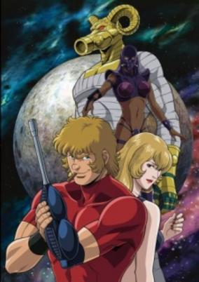

**Studio:** Magic Bus &nbsp;|&nbsp; **Episodes:** 13 &nbsp;|&nbsp; **Director:** Keizō Shimizu &nbsp;|&nbsp; **Aired/Released:** January 2 – March 27 &nbsp;|&nbsp; **Genres:** Space Travel, Science Fiction, Action, Gunfights, Cyborg, Crime, Other Planet, Humanoid Alien, Alien, Future, Space, Adventure

> This Cobra adaptation features short arcs of Cobra saving the world, his friends or himself.
>
> _Synopsis source: Kitsu_

[Wikipedia](https://en.wikipedia.org/wiki/Cobra_the_Animation) · [Kitsu](https://kitsu.io/anime/cobra-the-animation)

---

### Chu-Bra!! (Chu-Bra)

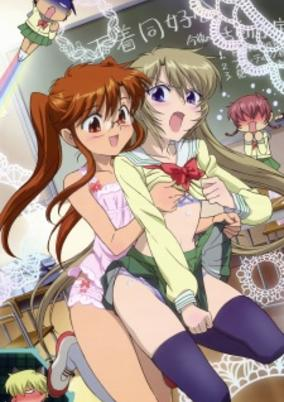

**Studio:** Zexcs &nbsp;|&nbsp; **Episodes:** 12 &nbsp;|&nbsp; **Director:** Yukina Hiiro &nbsp;|&nbsp; **Aired/Released:** January 4 – March 22 &nbsp;|&nbsp; **Genres:** Romance, Japan, Asia, Ecchi, Earth, Middle School, School Clubs, School Life, Present, Comedy

> The story centers on Nayu, a middle school girl who shocks her schoolmates on the first day of school by wearing black lace panties. She likes this kind of underwear, and she tries to "spread the word on the merits of [these kinds of] underwear" via an underwear club with her schoolmates, who are worried about their bodies' development and which underwear to choose.
>
> _Synopsis source: Kitsu_

[Wikipedia](https://en.wikipedia.org/wiki/Chu-Bra!!) · [Kitsu](https://kitsu.io/anime/chuu-bra)

---

### Ladies versus Butlers!

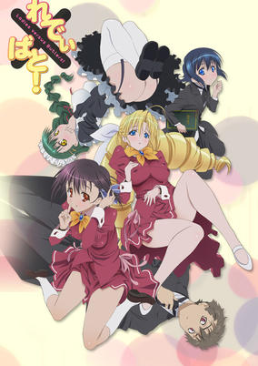

**Studio:** Xebec &nbsp;|&nbsp; **Episodes:** 12 &nbsp;|&nbsp; **Director:** Atsushi Ōtsuki &nbsp;|&nbsp; **Aired/Released:** January 5 – March 23 &nbsp;|&nbsp; **Genres:** Japan, Asia, Ecchi, Earth, Comedy, Violent Retribution For Accidental Infringement, Maid, School Life, Present, Harem, Romance

> Hino Akiharu lost his parents when he was small and was adopted into his uncle's family. He didn't want to be a burden on his uncle's family and decides to enter a free boarding school as a butler, Hakureiryou high school. However, his delinquent boy-like appearance frightens the girls, who make up the majority of the students. Unable to get along with the classmates, Akiharu meets his childhood crush Saikyou Tomomi.
>
> _Synopsis source: Kitsu_

[Wikipedia](https://en.wikipedia.org/wiki/Ladies_versus_Butlers!) · [Kitsu](https://kitsu.io/anime/ladies-versus-butlers)

---

### Sound of the Sky

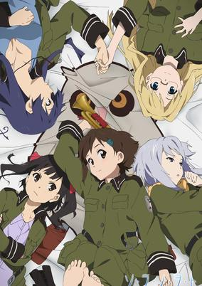

**Studio:** A-1 Pictures &nbsp;|&nbsp; **Episodes:** 12 &nbsp;|&nbsp; **Director:** Mamoru Kanbe &nbsp;|&nbsp; **Aired/Released:** January 5 – March 23 &nbsp;|&nbsp; **Genres:** Earth, Post Apocalypse, Slice of Life, Europe, War, Future, The Arts, Military, Music, Science Fiction

> In a lonely corner of the world, on the edge of No Man's Land, sits Clocktower Fortress. It's home to the 1121st Platoon of the Helvetian Army, and their newest member is a 15-year-old volunteer named Kanata Sorami, who enlisted to learn how to play the bugle. When she was a child, Kanata was saved by a beautiful soldier and found inspiration in the clear, golden sound of her trumpet. From that day forward, Kanata decided music would be her life. As the other platoon members train her how to be a bugler and a soldier, Kanata's enduring optimism will inspire them to look for happiness and beauty, even in a world haunted by war.
>
> _Synopsis source: Kitsu_

[Wikipedia](https://en.wikipedia.org/wiki/Sound_of_the_Sky) · [Kitsu](https://kitsu.io/anime/so-ra-no-wo-to)

---

### Gyagu Manga Biyori+

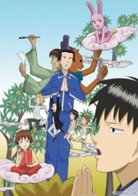

**Studio:** Studio Deen &nbsp;|&nbsp; **Episodes:** 12 &nbsp;|&nbsp; **Director:** Akitarō Daichi &nbsp;|&nbsp; **Aired/Released:** January 5 – June 29 &nbsp;|&nbsp; **Genres:** Comedy

> Based on a shounen gag manga by Masuda Kousuke serialised in Monthly Shounen Jump.
>
> _Synopsis source: Kitsu_

[Wikipedia](https://en.wikipedia.org/wiki/Gyagu_Manga_Biyori) · [Kitsu](https://kitsu.io/anime/gyagu-manga-biyori-1)

---

### Omamori Himari

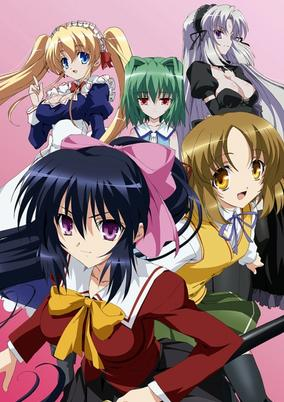

**Studio:** Zexcs &nbsp;|&nbsp; **Episodes:** 12 &nbsp;|&nbsp; **Director:** Shinji Ushiro &nbsp;|&nbsp; **Aired/Released:** January 7 – March 25 &nbsp;|&nbsp; **Genres:** Earth, Ecchi, Japan, Contemporary Fantasy, Asia, Comedy, Anthropomorphism, Stereotypes, Present, Harem, Demon, Super Power, Action, Romance

> After the death of his parents, Yuuto Amakawa lives a pretty ordinary life in the city. The only problem he has to worry about while attending school alongside Rinko, his next-door neighbor, is his cat allergies. That all changes on his sixteenth birthday, when an Ayakashi—a supernatural creature—attacks him for the sins of his ancestors. Luckily, he is saved by Himari, a mysterious cat-woman with a sword, who explains that Yuuto is the scion of a family of demon-slayers, and she is there to protect him now that the charm that kept him hidden from the supernatural forces of the world has lost its power.Omamori Himari chronicles Yuuto's dealings with the various forces of the supernatural world, as well as the growing number of women that show up on his doorstep, each with their own dark desires. Will Yuuto be able to adjust to his new "exciting" environment? Or will the ghost of his (ancestor's) past catch up with him?
>
> _Synopsis source: Kitsu_

[Wikipedia](https://en.wikipedia.org/wiki/Omamori_Himari) · [Kitsu](https://kitsu.io/anime/omamori-himari)

---

### Baka and Test (Baka & Test – Summon the Beasts 2)

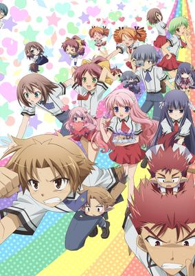

**Studio:** SILVER LINK. &nbsp;|&nbsp; **Episodes:** 13 &nbsp;|&nbsp; **Director:** Shin Ōnuma &nbsp;|&nbsp; **Aired/Released:** January 7 – April 1 &nbsp;|&nbsp; **Genres:** Japan, Earth, Asia, Comedy, High School, Proxy Battles, Stereotypes, School Life, Present, Super Power, Romance

> Goofball Yoshii's still leading his crew in Avatar battles against the brainier students in school, but the girls in Class F have grown way less concerned with improving their status on campus. Instead of moving up in the world, the girls are more interested in getting closer to the guys in the gang! Of course, some of the boys are totally oblivious to the romantic intentions of their female friends. That's to be expected in a group of dim-wits and misfits. Nonetheless, the femmes of Class F aren't giving up anytime soon. Because when love is on the line, even the biggest underachievers can find motivation – even if they can't spell it!
>
> _Synopsis source: Kitsu_

[Wikipedia](https://en.wikipedia.org/wiki/Baka_and_Test) · [Kitsu](https://kitsu.io/anime/baka-to-test-to-shoukanjuu-ni)

---

### Dance in the Vampire Bund

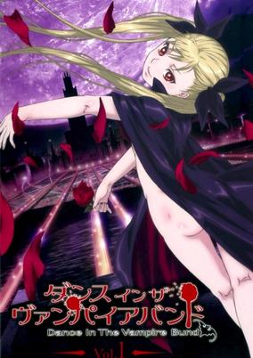

**Studio:** Shaft &nbsp;|&nbsp; **Episodes:** 12 &nbsp;|&nbsp; **Director:** Masahiro Sonoda Akiyuki Simbo &nbsp;|&nbsp; **Aired/Released:** January 7 – April 1 &nbsp;|&nbsp; **Genres:** Vampire, Loli, Japan, Action, Fantasy, Violence, Present

> On live television, Mina Tepes, the ruler of all vampires, reveals the existence of her species to the world and states her plan to build a sanctuary in Japan for vampires, called the Vampire Bund. Using her family's wealth to pay off the nation's debt, they have agreed to let her build this safe-haven for her fellow creatures of the night. But not everyone is so easily swayed by Mina's influence, as her announcement brings about conflict with humans who believe that the queen's quest for peace is a façade. Akira Kaburagi does not believe in vampires and gets uneasy whenever they are brought up, although he has yet to realize why. Apart from suffering a head injury a year ago, he lives on blissfully until he meets Mina. She triggers within him memories of a life he had long forgotten, and he soon begins protecting her without understanding why. But Akira's secret is far stranger than he could have ever thought possible—he discovers that he is a werewolf, sworn from birth to protect the vampire queen, even if it costs him his life. Now, as these two dance a rondo of death in the Vampire Bund, Mina and Akira find out just how deep their bond goes. [Written by MAL Rewrite]
>
> _Synopsis source: Kitsu_

[Wikipedia](https://en.wikipedia.org/wiki/Dance_in_the_Vampire_Bund) · [Kitsu](https://kitsu.io/anime/dance-in-the-vampire-bund)

---

### Hidamari Sketch × Hoshimittsu (Hidamari Sketch Hoshimittsu)

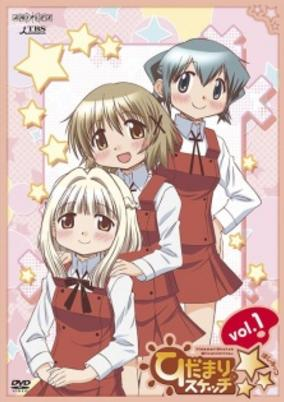

**Studio:** Shaft &nbsp;|&nbsp; **Episodes:** 12 &nbsp;|&nbsp; **Director:** Kenichi Ishikura Akiyuki Simbo &nbsp;|&nbsp; **Aired/Released:** January 8 – March 26 &nbsp;|&nbsp; **Genres:** Japan, Slice of Life, Asia, Comedy, Earth, Super Deformed, High School, School Life, The Arts, Present

> The continuing stories of the daily life of the students of the Hidamari Apartments at Yamabuki High School. This time, a year has passed since the first season. Yuno and Miyako are second years, Sae and Hiro are third years, and two new students, Nori and Nazuna, move into the Hidamari Apartments.
>
> _Synopsis source: Kitsu_

[Wikipedia](https://en.wikipedia.org/wiki/Hidamari_Sketch_%C3%97_Hoshimittsu) · [Kitsu](https://kitsu.io/anime/hidamari-sketch-x-hoshimittsu)

---

### Ōkami Kakushi

**Studio:** AIC &nbsp;|&nbsp; **Episodes:** 12 &nbsp;|&nbsp; **Director:** Yoshihiro Takamoto &nbsp;|&nbsp; **Aired/Released:** January 8 – March 26

[Wikipedia](https://en.wikipedia.org/wiki/%C5%8Ckami_Kakushi)

---

### Durarara!!

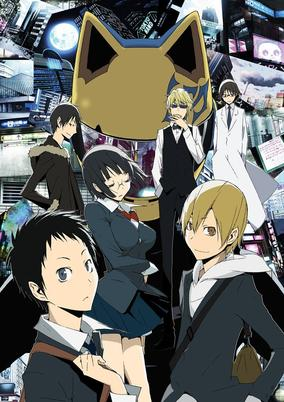

**Studio:** Brain's Base &nbsp;|&nbsp; **Episodes:** 24 &nbsp;|&nbsp; **Director:** Takahiro Ōmori &nbsp;|&nbsp; **Aired/Released:** January 8 – June 25 &nbsp;|&nbsp; **Genres:** Japan, Action, Asia, Earth, Slice of Life, Tokyo, Absurdist Humour, Crime, High School, Violence, Present, Mystery, Drama

> In Tokyo's downtown district of Ikebukuro, amidst many strange rumors and warnings of anonymous gangs and dangerous occupants, one urban legend stands out above the rest—the existence of a headless "Black Rider" who is said to be seen driving a jet-black motorcycle through the city streets. Mikado Ryuugamine has always longed for the excitement of the city life, and an invitation from a childhood friend convinces him to move to Tokyo. Witnessing the Black Rider on his first day in the city, his wishes already seem to have been granted. But as supernatural events begin to occur, ordinary citizens like himself, along with Ikebukuro's most colorful inhabitants, are mixed up in the commotion breaking out in their city. [Written by MAL Rewrite]
>
> _Synopsis source: Kitsu_

[Wikipedia](https://en.wikipedia.org/wiki/Durarara!!) · [Kitsu](https://kitsu.io/anime/durarara)

---

### Kaitou Reinya

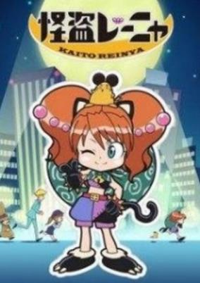

**Studio:** Stingray &nbsp;|&nbsp; **Episodes:** 12 &nbsp;|&nbsp; **Director:** Something Yoshimatsu &nbsp;|&nbsp; **Aired/Released:** January 9 – March 27 &nbsp;|&nbsp; **Genres:** Japan, Thievery, Juujin, Present, Comedy, Crime

> Reinya appears to be an ordinary girl working at a convenience store but she is in fact, the Phantom Thief Reinya. Together with her assistant Chūtarō in their secret hideout right below the local convenience store, Reinya hatches plans to steal various treasures made of gold. They face an incompetent trio of a perverted police inspector, a policewoman who is a natural airhead, and a detective totally infatuated with Reinya, all of them in a police station beside Reinya's convenience store.
>
> _Synopsis source: Kitsu_

[Kitsu](https://kitsu.io/anime/kaitou-reinya)

---

### Unko-san: Tsuiteru Hito ni Shika Mienai Yousei Junjou Ha

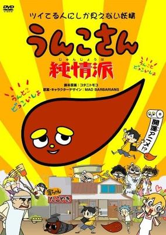

**Studio:** Kachidoki Studio &nbsp;|&nbsp; **Episodes:** 13 &nbsp;|&nbsp; **Aired/Released:** January 10 – April 4 &nbsp;|&nbsp; **Genres:** Comedy, Magic

> On a legendary island shaped like an unusually regular turd, a population of turd-people and insanely aggressive animals go about their hilarity-packed day to day lives. Central character Yoshiko Un is known as Unko-san, but you're unlikely to meet her--the island appears only to the fortunate few, to whom they give good luck.
>
> _Synopsis source: Kitsu_

[Kitsu](https://kitsu.io/anime/unko-san-tsuiteru-hito-ni-shika-mienai-yousei-junjou-ha)

---

### The Qwaser of Stigmata

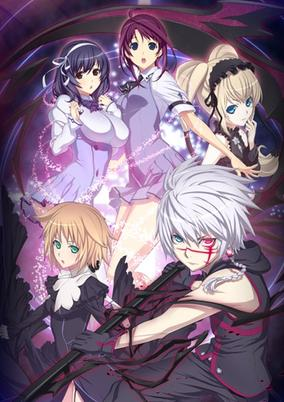

**Studio:** Hoods Entertainment &nbsp;|&nbsp; **Episodes:** 24 &nbsp;|&nbsp; **Director:** Hiraku Kaneko &nbsp;|&nbsp; **Aired/Released:** January 10 – June 20 &nbsp;|&nbsp; **Genres:** Action, Ecchi, Comedy, Present, Super Power

> At St. Mihailov Academy, a series of serial murders have taken place with all the victims being young women. Who is this rampant culprit? And which beautiful maiden will fall prey to his evil next? After a horrible day of being harassed by their classmates, the adopted sisters Mafuyu Oribe and Tomo Yamanobe stumble across an injured young man and decide to bring him back to their place to recover. That very night, Mafuyu ends up at the mercy of the infamous serial killer. Strangely, he demands not her life, but instead an icon left behind by Tomo's father. Luckily, Sasha, the mysterious young man that the sisters had taken in, comes to the rescue just in time, helping Mafuyu avoid the same fate as the other victims. Sasha reveals that he is a Qwaser, an individual capable of controlling scientific elements by partaking in Soma, a miraculous essence found within the breasts of women. Capable of manipulating iron, Sasha crafts a giant scythe and slays the serial killer. He enrolls in the academy the next day signalling the beginning of a very "interesting" school year.Seikon no Qwaser is an action-heavy story that doesn't shy away from fan-service. Join Sasha and his allies as they fend off the evil that is nearing in.
>
> _Synopsis source: Kitsu_

[Wikipedia](https://en.wikipedia.org/wiki/The_Qwaser_of_Stigmata) · [Kitsu](https://kitsu.io/anime/seikon-no-qwaser)

---

### Hanamaru Kindergarten

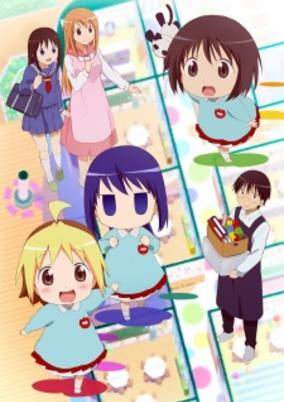

**Studio:** Gainax &nbsp;|&nbsp; **Episodes:** 12 &nbsp;|&nbsp; **Director:** Seiji Mizushima &nbsp;|&nbsp; **Aired/Released:** January 11 – March 29 &nbsp;|&nbsp; **Genres:** Japan, Asia, Earth, Comedy, Coming Of Age, Countryside, Present, Slice of Life

> Anzu goes to a kindergarten with her friends, the shy Koume and the eccentric Hiiragi. Together they try to attract attention from their caretaker Tsuchida. However, he is clearly more interested in the pretty Yamamoto who supervises the class next door.
>
> _Synopsis source: Kitsu_

[Wikipedia](https://en.wikipedia.org/wiki/Hanamaru_Kindergarten) · [Kitsu](https://kitsu.io/anime/hanamaru-youchien)

---

### Keshikasu-kun

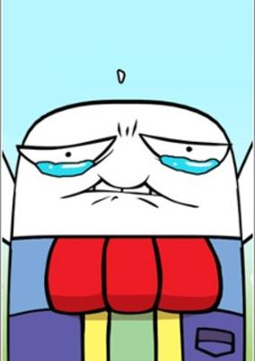

**Studio:** Shogakukan Music & Digital Entertainment &nbsp;|&nbsp; **Episodes:** 44 &nbsp;|&nbsp; **Director:** Takao Kato &nbsp;|&nbsp; **Aired/Released:** January 12 – April 1, 2011 &nbsp;|&nbsp; **Genres:** Comedy, Kids

> Keshikasu-kun is an anthropomorphism anime about stationery. The main character is the eraser Keshikasu who aims to be an idol of the stationary world. He fights against other stationary and erases a mechanical pencil or gets crushed by a permanent marker.
>
> _Synopsis source: Kitsu_

[Wikipedia](https://en.wikipedia.org/wiki/Keshikasu-kun) · [Kitsu](https://kitsu.io/anime/keshikasu-kun)

---

### Nodame Cantabile: Finale

**Studio:** J.C.Staff &nbsp;|&nbsp; **Episodes:** 11 &nbsp;|&nbsp; **Director:** Chiaki Kon &nbsp;|&nbsp; **Aired/Released:** January 15 – March 26 &nbsp;|&nbsp; **Genres:** Romance, France, Earth, Europe, The Arts, Present, Music, Comedy, Josei

> The series continues the relationship between two aspiring classical musicians, Megumi "Nodame" Noda and Shinichi Chiaki, as students and after graduation.
>
> _Synopsis source: Kitsu_

[Kitsu](https://kitsu.io/anime/nodame-cantabile-finale)

---

### Katanagatari

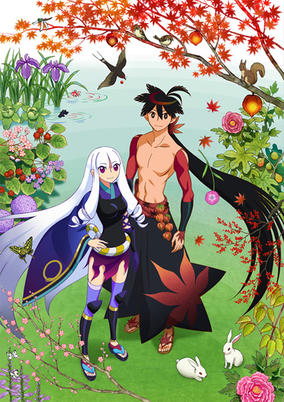

**Studio:** White Fox &nbsp;|&nbsp; **Episodes:** 12 &nbsp;|&nbsp; **Director:** Keitaro Motonaga &nbsp;|&nbsp; **Aired/Released:** January 26 – December 11 &nbsp;|&nbsp; **Genres:** Romance, Fantasy World, Adventure, Fantasy, Action, Alternative Past, Swordplay, Martial Arts, Angst, Drama, Historical

> In an Edo-era Japan lush with a variety of sword-fighting styles, Shichika Yasuri practices the most unique one: Kyotouryuu, a technique in which the user's own body is wielded as a blade. The enigmatic seventh head of the Kyotouryuu school, Shichika lives quietly in exile with his sister Nanami until one day—the wildly ambitious strategist Togame barges into their lives. Togame brazenly requests that Shichika help in her mission to collect twelve unique swords, known as the "Deviant Blades," for the shogunate. Shichika accepts, interested in the girl herself rather than petty politics, and thus sets out on a journey. Standing in their way are the fierce wielders of these legendary weapons as well as other power-hungry entities who seek to thwart Togame's objective. In order to prevail against their enemies, the duo must become an unbreakable team as they forge ahead on a path of uncertainty and peril. [Written by MAL Rewrite]
>
> _Synopsis source: Kitsu_

[Wikipedia](https://en.wikipedia.org/wiki/Katanagatari) · [Kitsu](https://kitsu.io/anime/katanagatari)

---

### HeartCatch PreCure!

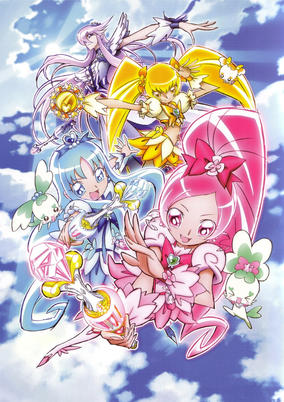

**Studio:** Toei Animation &nbsp;|&nbsp; **Episodes:** 49 &nbsp;|&nbsp; **Director:** Tatsuya Nagamine &nbsp;|&nbsp; **Aired/Released:** February 7 – January 30, 2011 &nbsp;|&nbsp; **Genres:** Earth, Contemporary Fantasy, Japan, Asia, Magical Girl, Present, Super Power, Magic, Action, Fantasy, Comedy, Slice of Life, School Life

> 2nd year middle school student Tsubomi Hanasaki has just moved with her family to the town of Kibougahana to live with her grandma. She is shy and introverted, but is determined to start off her new school life at Myoudou Academy as confidently as possible. Lately she has been having the same mysterious dream again and again, of Cure Moonlight's defeat at the Great Heart Tree. She wonders what it all means. Then suddenly, two fairies from the dream appear to her, and before she knows it, she is transformed into the legendary Pretty Cure, Cure Blossom! Later joined by her high energy classmate and new friend Erika Kurumi as Cure Marine, the two girls vow work hard to protect everyone's Heart Flowers from the evil gang, The Desert Messengers.
>
> _Synopsis source: Kitsu_

[Wikipedia](https://en.wikipedia.org/wiki/HeartCatch_PreCure!) · [Kitsu](https://kitsu.io/anime/heartcatch-precure)

---

### Bakugan Battle Brawlers: New Vestroia (Bakugan: New Vestroia)

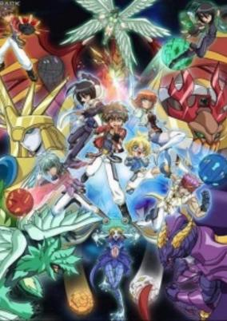

**Studio:** TMS Entertainment &nbsp;|&nbsp; **Episodes:** 52 &nbsp;|&nbsp; **Director:** Mitsuo Hashimoto &nbsp;|&nbsp; **Aired/Released:** March 2 – March 5, 2011 &nbsp;|&nbsp; **Genres:** Proxy Battles, Parallel Universe, Fantasy, Adventure

> Join Danma, Chouji and Dragonoid as they unite with the new Bakugan Resistance in an attempt to restore peace and freedom to their enslaved planet, New Vestroia. The newly-formed group of friends must battle the evil Vestals to free the captured Bakugan and destroy Vestal’s evil plans for domination.
>
> _Synopsis source: Kitsu_

[Kitsu](https://kitsu.io/anime/bakugan-battle-brawlers-new-vestroia)

---

### Doubutsu Kankyou Kaigi

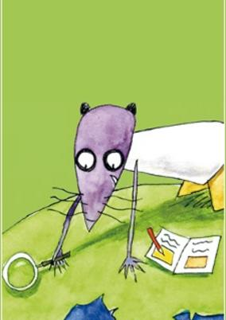

**Studio:** Studio Deen &nbsp;|&nbsp; **Episodes:** 20 &nbsp;|&nbsp; **Director:** Junji Nishimura &nbsp;|&nbsp; **Aired/Released:** March 20 – August 20 &nbsp;|&nbsp; **Genres:** Kids

[Kitsu](https://kitsu.io/anime/doubutsu-kankyou-kaigi)

---

### Marie & Gali ver. 2.0

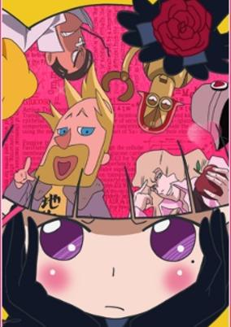

**Studio:** Toei Animation &nbsp;|&nbsp; **Episodes:** 30 &nbsp;|&nbsp; **Director:** Kōhei Kureta Yukio Kaizawa &nbsp;|&nbsp; **Aired/Released:** March 20 – March 22, 2011 &nbsp;|&nbsp; **Genres:** Fantasy World, Comedy, Present

> Marika is a gothic lolita who somehow ends up in the mysterious town of Galihabara. There she meets different famous scientists like Galileo Galilei, Marie Skłodowska Curie and Sir Isaac Newton.
>
> _Synopsis source: Kitsu_

[Wikipedia](https://en.wikipedia.org/wiki/Marie_%26_Gali) · [Kitsu](https://kitsu.io/anime/marie-gali)

---

### Ikki Tousen: Xtreme Xecutor

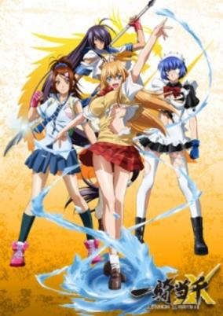

**Studio:** TNK &nbsp;|&nbsp; **Episodes:** 12 &nbsp;|&nbsp; **Director:** Kōichi Ōhata &nbsp;|&nbsp; **Aired/Released:** March 26 – June 11 &nbsp;|&nbsp; **Genres:** Earth, Ecchi, Japan, Action, Asia, Martial Arts, High School, Stereotypes, Plot Continuity, Violence, Present, Super Power, School Life

> Life gets crazy for Hakufu when she takes on a pupil that acts just like her! A tournament between the school heads start, but due to Hakufu's negligence, her pupil ends up taking her place. The tournament isn't what it seems, and the girls find themselves in the middle of a plot to take over the clans.
>
> _Synopsis source: Kitsu_

[Kitsu](https://kitsu.io/anime/ikkitousen-xtreme-xecutor)

---

### Shin Koihime Musō: Otome Tairan

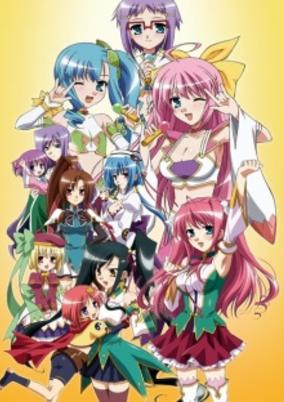

**Studio:** Doga Kobo &nbsp;|&nbsp; **Episodes:** 12 &nbsp;|&nbsp; **Director:** Nobuaki Nakanishi &nbsp;|&nbsp; **Aired/Released:** March 26 – June 17 &nbsp;|&nbsp; **Genres:** Earth, Fantasy, China, Three Kingdoms, Asia, Comedy, Feudal Warfare, Past, Stereotypes, Military, Historical, Adventure, Ecchi

> The third season of Koihime Musou. Han's high court general Kashin (何進) was forced to swallow a cursed pill from Chou Jou. The effect is slowly turning her into a cat, which she dislikes. Chou Jou also made use of the emperor's name to dispose her from the Han court as a traitor. She met Kada during her escape while Kada brought her to the Touka village, whom he believes they would help her.
>
> _Synopsis source: Kitsu_

[Kitsu](https://kitsu.io/anime/shin-koihime-musou-otome-tairan)

---

### Hanakappa

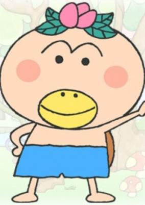

**Studio:** OLM Xebec &nbsp;|&nbsp; **Director:** Kazumi Nonaka &nbsp;|&nbsp; **Aired/Released:** March 29 – &nbsp;|&nbsp; **Genres:** Comedy, Kids

> Story about Kappa with flowers on their heads.
>
> _Synopsis source: Kitsu_

[Kitsu](https://kitsu.io/anime/hanakappa)

---

### Ketsuinu

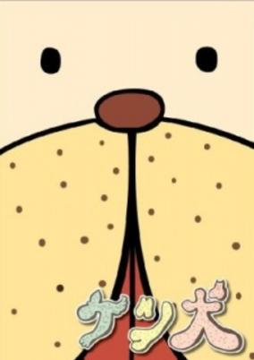

**Studio:** Toei Animation &nbsp;|&nbsp; **Episodes:** 13 &nbsp;|&nbsp; **Director:** Haruki Kasugamori &nbsp;|&nbsp; **Aired/Released:** April 1 – May 31 &nbsp;|&nbsp; **Genres:** Comedy

> Ketsuinu is a dog with a butt-like face. The unidentified creature comes out of nowhere and quickly multiplies. In the end, the owners' faces turn into butts...
>
> _Synopsis source: Kitsu_

[Kitsu](https://kitsu.io/anime/ketsuinu)

---

### Heroman

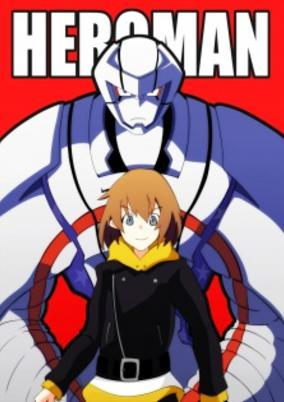

**Studio:** Bones &nbsp;|&nbsp; **Episodes:** 26 &nbsp;|&nbsp; **Director:** Hitoshi Nanba &nbsp;|&nbsp; **Aired/Released:** April 1 – September 23 &nbsp;|&nbsp; **Genres:** Science Fiction, Mecha, Earth, Action, United States, Americas, Alien, Present, Superhero

> Joey is an orphan living with his grandmother in Center City on the West Coast of the United States of America. Joey, like any other boy his age, is interested in robots and gadgets and dreams about owning a particular toy robot called a Heybo. Heybos have very advanced mechanisms and controls but with great mechanisms comes great price; the robot is too expensive for Joey, whose only source of income is a part-time job at a restaurant and he needs that money to help support himself and his grandmother. One day, when Joey is on his way home from school, he happens upon a couple of bullies who are playing around with a Heybo. Long story short, the bullies manage to get the robot run over by a car and Joey retrieves the wreckage from a trash can. Once home, Joey fixes the robot and names it Heroman. Later that night, a thunderstorm results in Heroman getting wet and, improbably, struck by lightning. The result is amazing, Heroman grows massive in size, gets emblazoned with the colors of the American flag and responds to Joey's commands! At the same time in space, an alien race called the Skrugg is preparing an invasion of Earth. Now it's up to Joey and Heroman to save Earth!
>
> _Synopsis source: Kitsu_

[Wikipedia](https://en.wikipedia.org/wiki/Heroman) · [Kitsu](https://kitsu.io/anime/heroman)

---

### Ring ni Kakero 1: Kage Dou-hen

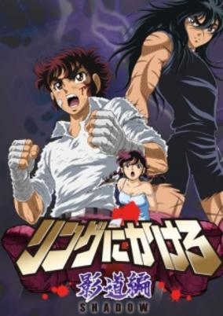

**Studio:** Toei Animation &nbsp;|&nbsp; **Episodes:** 6 &nbsp;|&nbsp; **Director:** Toshiaki Komura &nbsp;|&nbsp; **Aired/Released:** April 2 – June 17 &nbsp;|&nbsp; **Genres:** Boxing, Combat, Action, Sports

> After defeating Black Shaft's makeshift Team America, the Golden Japan Jr. team returns to training for the World Tournament that will be held in Tokyo. But during training the Shadow Clan, which uses boxing as an assassination technique, kidnaps Kiku in order to lure Ryuji and the others into a fight to see who's truly the better representatives of Japan's junior boxers.
>
> _Synopsis source: Kitsu_

[Wikipedia](https://en.wikipedia.org/wiki/Ring_ni_Kakero) · [Kitsu](https://kitsu.io/anime/ring-ni-kakero-1-kage-dou-hen)

---

### B Gata H Kei (Yamada's First Time: B Gata H Kei)

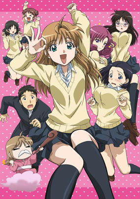

**Studio:** HAL Film Maker &nbsp;|&nbsp; **Episodes:** 12 &nbsp;|&nbsp; **Director:** Yūsuke Yamamoto &nbsp;|&nbsp; **Aired/Released:** April 2 – June 18 &nbsp;|&nbsp; **Genres:** Earth, Ecchi, Japan, Asia, Comedy, Coming Of Age, Slapstick, Present, Romance, School Life

> Yamada, first name withheld, is a 15-year-old girl who has just entered Takizawa High School. Easily considered exceptionally beautiful, she has only one problem with her own body, she thinks her vagina looks weird and is very self-conscious about it. Upon entering high school, her dream was to have casual sex with 100 men but therein lies the problem, she believes an experienced partner will tease her about the way her vagina looks or simply the fact that she's a virgin. She stumbles upon the solution in the form of Kosuda Takashi, a fellow virgin, whom she believes will help ease the transition to more experienced partners. There's only one small problem, Yamada doesn't know anything about sex or the ancient art of seduction, meaning her quest to conquer Kosuda will be a difficult one.
>
> _Synopsis source: Kitsu_

[Wikipedia](https://en.wikipedia.org/wiki/B_Gata_H_Kei) · [Kitsu](https://kitsu.io/anime/b-gata-h-kei)

---

### Maid Sama!

**Studio:** J.C.Staff &nbsp;|&nbsp; **Episodes:** 26 &nbsp;|&nbsp; **Director:** Hiroaki Sakurai &nbsp;|&nbsp; **Aired/Released:** April 2 – September 24 &nbsp;|&nbsp; **Genres:** Romance, Japan, Asia, Earth, Comedy, Sudden Girlfriend Appearance, Maid, Love Polygon, High School, School Life, Plot Continuity, Present

> Being the first female student council president isn't easy, especially when your school just transitioned from an all boys high school to a co-ed one. Aptly nicknamed "Demon President" by the boys for her strict disciplinary style, Misaki Ayuzawa is not afraid to use her mastery of Aikido techniques to cast judgment onto the hordes of misbehaving boys and defend the girls at Seika High School. Yet even the perfect Ayuzawa has an embarrassing secret—she works part-time as a maid at a maid café to help her struggling family pay the bills. She has managed to keep her job hidden from her fellow students and maintained her flawless image as a stellar student until one day, Takumi Usui, the most popular boy in school, walks into the maid café. He could destroy her reputation with her secret... or he could twist the student council president around his little finger and use her secret as an opportunity to get closer to her. [Written by MAL Rewrite]
>
> _Synopsis source: Kitsu_

[Wikipedia](https://en.wikipedia.org/wiki/Maid_Sama!) · [Kitsu](https://kitsu.io/anime/kaichou-wa-maid-sama)

---

### Ōkiku Furikabutte: Natsu no Taikai-hen (Big Windup! 2)

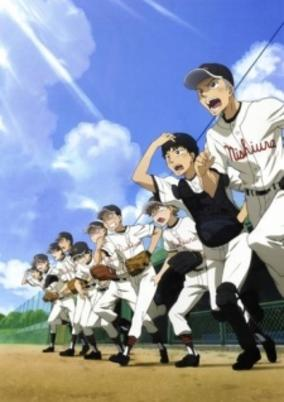

**Studio:** A-1 Pictures &nbsp;|&nbsp; **Episodes:** 13 &nbsp;|&nbsp; **Director:** Tsutomu Mizushima &nbsp;|&nbsp; **Aired/Released:** April 2 – June 25 &nbsp;|&nbsp; **Genres:** Earth, Japan, Sports, Asia, Coming Of Age, Baseball, Plot Continuity, Present, Comedy

> Picking up where the original series left off, Ren Mihashi, the ace pitcher of the newly-formed Nishiura High School baseball team, and his teammates face the Sakitama High School team in the next round of the High School Baseball Invitational Tournament as they aim to play in the finals at legendary Hanshin Koushien Stadium.
>
> _Synopsis source: Kitsu_

[Kitsu](https://kitsu.io/anime/ookiku-furikabutte-natsu-no-taikai-hen)

---

### Demon King Daimao

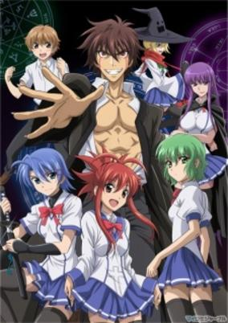

**Studio:** Artland &nbsp;|&nbsp; **Episodes:** 12 &nbsp;|&nbsp; **Director:** Takashi Watanabe &nbsp;|&nbsp; **Aired/Released:** April 3 – June 19 &nbsp;|&nbsp; **Genres:** Action, Ecchi, Fantasy, Comedy, Violent Retribution For Accidental Infringement, High School, School Life, Violence, Harem, Magic

> Dreaming of changing the world for good, Akuto Sai transfers to Constant Magic Academy where he befriends a virtuous ninja clan member, Junko Hattori. On the way to the academy, they vow to make the world a better place together; however, the situation suddenly takes a turn for the worse upon his arrival—it is prophesied that he will become the Demon King! As word of his destiny spreads, the school begins to fear him, and Junko's trust in him falters. While Akuto is determined to not let his predicted future control his fate, it seems as though everything he says and does only serve to reinforce the fact that he is destined to be the Demon King. Moreover, he is surrounded by a harem of beautiful girls who each have their own plans for him, ranging from bringing him to justice to simply showering him with love. With his newly awakened powers, Akuto must cope with his constantly growing list of misfortune and fight to prove that his fate is not set in stone. [Written by MAL Rewrite]
>
> _Synopsis source: Kitsu_

[Wikipedia](https://en.wikipedia.org/wiki/Demon_King_Daimao) · [Kitsu](https://kitsu.io/anime/ichiban-ushiro-no-daimaou)

---

### Angel Beats!

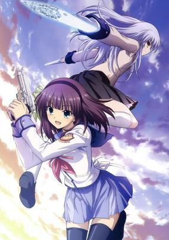

**Studio:** P.A. Works &nbsp;|&nbsp; **Episodes:** 13 &nbsp;|&nbsp; **Director:** Seiji Kishi &nbsp;|&nbsp; **Aired/Released:** April 3 – June 26 &nbsp;|&nbsp; **Genres:** Contemporary Fantasy, Fantasy World, Fantasy, Action, Comedy, Gunfights, Drama, Plot Continuity, Present, Friendship, School Life

> Otonashi awakens only to learn he is dead. A rifle-toting girl named Yuri explains that they are in the afterlife, and Otonashi realizes the only thing he can remember about himself is his name. Yuri tells him that she leads the Shinda Sekai Sensen (Afterlife Battlefront) and wages war against a girl named Tenshi. Unable to believe Yuri's claims that Tenshi is evil, Otonashi attempts to speak with her, but the encounter doesn't go as he intended. Otonashi decides to join the SSS and battle Tenshi, but he finds himself oddly drawn to her. While trying to regain his memories and understand Tenshi, he gradually unravels the mysteries of the afterlife. [Written by MAL Rewrite]
>
> _Synopsis source: Kitsu_

[Wikipedia](https://en.wikipedia.org/wiki/Angel_Beats!) · [Kitsu](https://kitsu.io/anime/angel-beats)

---

### Major (Season 6)

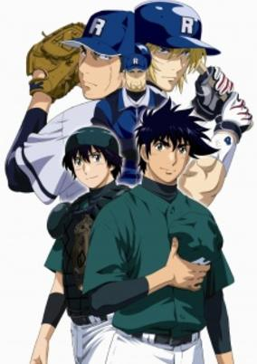

**Studio:** SynergySP &nbsp;|&nbsp; **Episodes:** 25 &nbsp;|&nbsp; **Director:** Riki Fukushima &nbsp;|&nbsp; **Aired/Released:** April 3 – September 25 &nbsp;|&nbsp; **Genres:** Sports, United States, Baseball, Plot Continuity, Comedy

> According to Weekly Shonen Sunday, a new OVA of manga "Major" was announced to be released in December. The World Series chapter, which was skipped in the TV series, will be animated. This OVA will be the final anime of Major.
>
> _Synopsis source: Kitsu_

[Wikipedia](https://en.wikipedia.org/wiki/Major_(manga)) · [Kitsu](https://kitsu.io/anime/major-world-series)

---

### SD Gundam Sangokuden Brave Battle Warriors

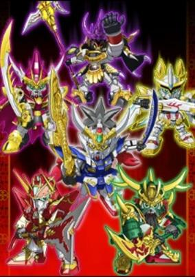

**Studio:** Sunrise &nbsp;|&nbsp; **Episodes:** 51 &nbsp;|&nbsp; **Director:** Kenichi Suzuki Kunihiro Mori &nbsp;|&nbsp; **Aired/Released:** April 3 – March 19, 2011 &nbsp;|&nbsp; **Genres:** Mecha, Action, Three Kingdoms, Adventure, Feudal Warfare, Swordplay, Martial Arts, Historical

> A Romance of the Three Kingdoms retelling using SD Gundams.
>
> _Synopsis source: Kitsu_

[Wikipedia](https://en.wikipedia.org/wiki/SD_Gundam_Sangokuden_Brave_Battle_Warriors) · [Kitsu](https://kitsu.io/anime/sd-gundam-sangokuden-brave-battle-warriors)

---

### Duel Masters Cross Shock

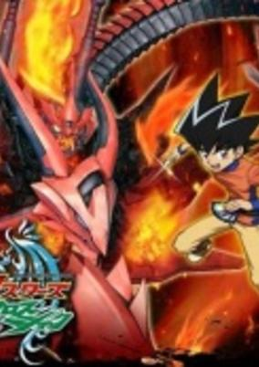

**Studio:** Shogakukan Music & Digital Entertainment &nbsp;|&nbsp; **Episodes:** 50 &nbsp;|&nbsp; **Director:** Waruo Suzuki &nbsp;|&nbsp; **Aired/Released:** April 3 – March 26, 2011 &nbsp;|&nbsp; **Genres:** Earth, Action, Comedy, Adventure, Card Games, Proxy Battles

> Shobu and friends continue to face the members of Fua Duelist in the world championship and defeat them all. And now Shobu is the world champion. Before Shobu could relax he is being called into the creature world to face Diabolos Zeta, Temporal Ruler, who is about to bring annihilation. Shobu and friends gather the new legendary cards and stop him with their new powers of these cards.
>
> _Synopsis source: Kitsu_

[Wikipedia](https://en.wikipedia.org/wiki/Duel_Masters_Cross_Shock) · [Kitsu](https://kitsu.io/anime/duel-masters-cross-shock)

---

### Penguin no Mondai MAX

**Studio:** Shogakukan Music & Digital Entertainment &nbsp;|&nbsp; **Episodes:** 50 &nbsp;|&nbsp; **Aired/Released:** April 3 – March 26, 2011 &nbsp;|&nbsp; **Genres:** Comedy, Kids

> The continuation of Penguin no Mondai.
>
> _Synopsis source: Kitsu_

[Wikipedia](https://en.wikipedia.org/wiki/Penguin_no_Mondai_MAX) · [Kitsu](https://kitsu.io/anime/penguin-no-mondai-max)

---

### Jewelpet Twinkle

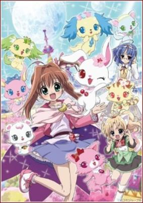

**Studio:** Studio Comet &nbsp;|&nbsp; **Episodes:** 52 &nbsp;|&nbsp; **Director:** Takashi Yamamoto &nbsp;|&nbsp; **Aired/Released:** April 3 – April 2, 2011 &nbsp;|&nbsp; **Genres:** Contemporary Fantasy, Fantasy, Magic, School Life, Magical Girl

> In Jewel Land, Jewelpets, creatures who has the natural ability to use magic lived in harmony with the Witches, attending the School of Witchcraft and Wizardry to learn to use magic with their Jewel Eyes. However for Ruby, a white Japanese Hare whose magic sometimes fail, is appointed to go to the Human World to search for her partner. But when she used the card the magicians gave her, she was sent to the Human World by accident. In the Human World, A girl named Akari Sakura met her on the beach on her way to school. At first, Akari can't understand her due to her Jewel Land Language until Ruby took a special candy so she could speak and understand human language. As the day passes, Ruby knew about her problems and later apologized. A Jewel Charm appeared on Akari's hand and she realized it that she's chosen by Ruby to be her partner. After that, she decided to enter the Jewel Star Grand Prix, on the prize is that any wish that they wanted will be granted. Will she be the Next Jewel Star and her wish be granted in the end? Or It'll just end in one big disaster...
>
> _Synopsis source: Kitsu_

[Wikipedia](https://en.wikipedia.org/wiki/Jewelpet_Twinkle) · [Kitsu](https://kitsu.io/anime/jewelpet-tinkle)

---

### Gokujō! Mecha Mote Iinchō Second Collection (The Best!! Extremely Cool Student Council President Second Collection)

**Studio:** Shogakukan Music & Digital Entertainment &nbsp;|&nbsp; **Episodes:** 51 &nbsp;|&nbsp; **Director:** Masatsugu Arakawa &nbsp;|&nbsp; **Aired/Released:** April 3 – April 10, 2011 &nbsp;|&nbsp; **Genres:** Romance, Earth, Japan, Asia, Comedy, High School, School Life, Present

> The continuation of Gokujou!! Mecha Mote Iinchou with a new title. Episode numbers continue from 51.
>
> _Synopsis source: Kitsu_

[Wikipedia](https://en.wikipedia.org/wiki/Gokuj%C5%8D!_Mecha_Mote_Iinch%C5%8D_Second_Collection) · [Kitsu](https://kitsu.io/anime/gokujou-mecha-mote-iinchou-second-collection)

---

### Hakuōki

**Studio:** Studio Deen &nbsp;|&nbsp; **Episodes:** 12 &nbsp;|&nbsp; **Director:** Osamu Yamasaki &nbsp;|&nbsp; **Aired/Released:** April 4 – June 20

[Wikipedia](https://en.wikipedia.org/wiki/Haku%C5%8Dki)

---

### Working!! (Wagnaria!!)

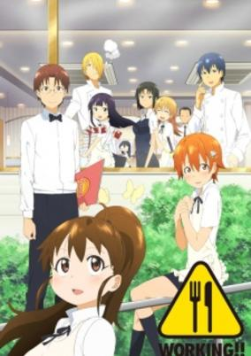

**Studio:** A-1 Pictures &nbsp;|&nbsp; **Episodes:** 13 &nbsp;|&nbsp; **Director:** Yoshimasa Hiraike &nbsp;|&nbsp; **Aired/Released:** April 4 – June 27 &nbsp;|&nbsp; **Genres:** Waitress, Present, Earth, Japan, Asia, Comedy, Slice of Life, Working Life

> Due to his love for small, cute things, Souta Takanashi cannot turn childlike Popura Taneshima down when she recruits him to work for Wagnaria, a family restaurant located in Hokkaido. Takanashi takes particular joy in doting on the older Popura, which only fuels her complex over how young she looks. He also quickly learns he must stay on his toes once he meets the rest of his colleagues, including the katana-wielding floor chief Yachiyo Todoroki, the intimidating head chef Jun Satou, the dangerously well-informed and subtly sadistic sous chef Hiroomi Souma, the adamantly lazy manager Kyouko Shirafuji, and the waitress Mahiru Inami who has a "painful" fear of men. Powered by an eccentric cast, Working!! is a unique workplace comedy that follows the never-dull happenings within the walls of Wagnaria as Takanashi and his co-workers' quirky personalities combine to create non-stop antics, shenanigans, and hilarity. [Written by MAL Rewrite]
>
> _Synopsis source: Kitsu_

[Wikipedia](https://en.wikipedia.org/wiki/Working!!) · [Kitsu](https://kitsu.io/anime/working-1)

---

### Giant Killing

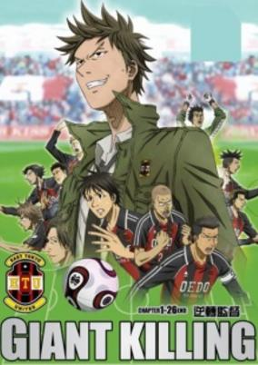

**Studio:** Studio Deen &nbsp;|&nbsp; **Episodes:** 26 &nbsp;|&nbsp; **Director:** Yuu Kou &nbsp;|&nbsp; **Aired/Released:** April 4 – September 26 &nbsp;|&nbsp; **Genres:** Japan, Sports, Soccer, Plot Continuity, Present

> East Tokyo United, ETU, has been struggling in Japan's top football league for a few years. It has taken everything they have just to avoid relegation. To make matters even worse, the fans are starting to abandon the team. In an effort to improve their performance, ETU has hired a new coach, the slightly eccentric Tatsumi Takeshi. Tatsumi, who was considered a great football player when he was younger, abandoned the team years before but has proven himself as the manager of one of England's lower division amateur teams. The task won't be easy, the teams East Tokyo United is pitted against have bigger budgets and better players. However, Tatsumi is an expert at Giant Killing.
>
> _Synopsis source: Kitsu_

[Wikipedia](https://en.wikipedia.org/wiki/Giant_Killing) · [Kitsu](https://kitsu.io/anime/giant-killing)

---

### Beyblade: Metal Masters

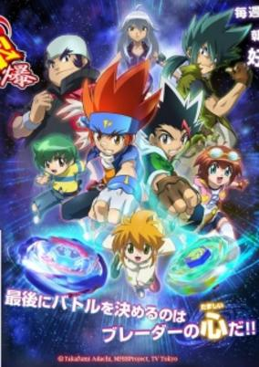

**Studio:** SynergySP &nbsp;|&nbsp; **Episodes:** 51 &nbsp;|&nbsp; **Director:** Kunihisa Sugishima &nbsp;|&nbsp; **Aired/Released:** April 4 – March 27, 2011 &nbsp;|&nbsp; **Genres:** Proxy Battles, Adventure, Comedy, Friendship, Sports

> Ginga Hagane and his crew of Bladers are back and ready to take on new challenges. The World Championship beckons, and Ginga is more than prepared, now equipped with a new Beyblade, the Galaxy Pegasus W105R2F. And he will be battling with a tag-partner from the USA, Masamune Kadoya. However, Masamune has also set his eyes on the championship, and plans to defeat Gingka. Masamune may be not the only threat to Ginga's path to victory. The world's top Blader Kyoya was chosen alongside Ginga, Masamune, Tsubasa, and Yu to represent Japan, but instead decides to join the African team. Together with his teammate Benkei, he wishes to take down Ginga and the Japanese team. The stage is now set for one of the most dramatic showdowns in Metal Fight Beyblade: Baku.
>
> _Synopsis source: Kitsu_

[Kitsu](https://kitsu.io/anime/metal-fight-beyblade-baku)

---

### Lilpri (Spellbound! Magical Princess Lilpri)

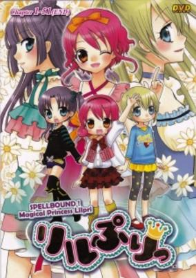

**Studio:** TMS Entertainment &nbsp;|&nbsp; **Episodes:** 51 &nbsp;|&nbsp; **Director:** Makoto Moriwaki &nbsp;|&nbsp; **Aired/Released:** April 4 – March 27, 2011 &nbsp;|&nbsp; **Genres:** Contemporary Fantasy, Fantasy, Japan, Fantasy World, Slice of Life, Magic, Magical Girl, Plot Continuity, Present

> The Fairytale World is in trouble. Its princesses and their respective worlds are disappearing, causing a ripple effect in the human world where their stories are popular. In order to save the Fairytale World, the Queen sends three magic animals, Sei, Dai, and Ryoku, to the human world with magic gems to find three girls who can become the "Super Miracle Idols," the princesses Snow White, Cinderella, and Kaguya-hime. Those "princesses" end up being three little girls: Yukimori Ringo, Takashiro Layla, and Sasahara Natsuki. But the gems transform them into older singing superstars, and after their accidental debut at the singer Wish's concert, they become known as "Little Princesses," or "LilPri." Now they must collect Happiness Tones from humans in order to restore the Fairytale World.
>
> _Synopsis source: Kitsu_

[Wikipedia](https://en.wikipedia.org/wiki/Lilpri) · [Kitsu](https://kitsu.io/anime/hime-chen-otogi-chikku-idol-lilpri)

---

### Kissxsis

**Studio:** feel. &nbsp;|&nbsp; **Episodes:** 12 &nbsp;|&nbsp; **Director:** Munenori Nawa &nbsp;|&nbsp; **Aired/Released:** April 5 – June 21

[Wikipedia](https://en.wikipedia.org/wiki/Kissxsis)

---

### Arakawa Under the Bridge

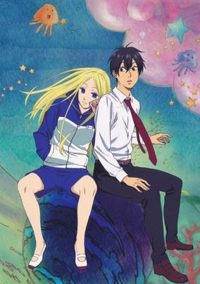

**Studio:** Shaft &nbsp;|&nbsp; **Episodes:** 13 &nbsp;|&nbsp; **Director:** Yukihiro Miyamoto Akiyuki Simbo &nbsp;|&nbsp; **Aired/Released:** April 5 – June 28 &nbsp;|&nbsp; **Genres:** Earth, Romance, Japan, Slice of Life, Asia, Comedy, Present

> Kou Ichinomiya is the son of a wealthy businessman who holds firm belief in his elite status. As such, he is determined to avoid becoming indebted to anyone; but one day, after a run-in with some mischievous kids on Arakawa Bridge, he ends up falling into the river running underneath. Luckily for him, a passerby is there to save him—but now, he owes his life to this stranger! Angered by this, Kou insists on paying her back, but this may just be the worst deal the arrogant businessman has ever made. The stranger—a stoic, tracksuit-wearing homeless girl known only as Nino—lives in a cardboard box under the bridge and wants only one thing: to fall in love. Asking Kou to be her boyfriend, he has no choice but to accept, forcing him to move out of his comfortable home and start a new life under the bridge!
>
> _Synopsis source: Kitsu_

[Wikipedia](https://en.wikipedia.org/wiki/Arakawa_Under_the_Bridge) · [Kitsu](https://kitsu.io/anime/arakawa-under-the-bridge)

---

### Shimajirou Hesoka

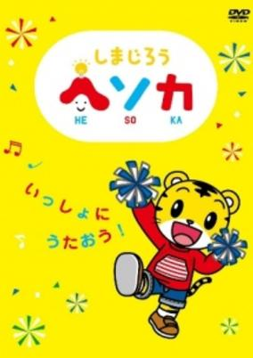

**Studio:** Pierrot Plus &nbsp;|&nbsp; **Episodes:** 99 &nbsp;|&nbsp; **Director:** Akari Shigino &nbsp;|&nbsp; **Aired/Released:** April 5 – March 26, 2012 &nbsp;|&nbsp; **Genres:** Comedy, Magic, Fantasy, Adventure, Kids

> Third season of the Shimajirou children's television series.
>
> _Synopsis source: Kitsu_

[Kitsu](https://kitsu.io/anime/shimajirou-hesoka)

---

### Mayoi Neko Overrun!

**Studio:** AIC &nbsp;|&nbsp; **Episodes:** 13 &nbsp;|&nbsp; **Director:** Akitarō Daichi Junichi Satō Keizō Kusakawa Kenichi Yatagai Manabu Ono Michio Fukuda Rion Kujo Shin Itagaki Takashi Ikehata Takuya Satō Tomohiro Hirata Yoshimasa Hiraike &nbsp;|&nbsp; **Aired/Released:** April 6 – June 29 &nbsp;|&nbsp; **Genres:** Earth, Japan, Asia, Comedy, Violent Retribution For Accidental Infringement, School Clubs, Slapstick, Plot Continuity, Present, Harem, Romance, Family

> Takumi Tsuzuki is a high school student who attends the Umenomori Private Academy, free of charge, alongside Fumino Serizawa, a childhood friend of his whom always says the opposite of what she feels. He spends most of his time at school fending off Chise Umenomori, the granddaughter of the board chairman and a pampered princess, who is constantly roping him into her eccentric hobbies. After school, he goes to work at the "Stray Cats" confectionery, a cake shop run by his adoptive older sister, Otome Tsuzuki, until it's time to go to bed. This is the average routine in the day and the life of Takumi.Mayoi Neko Overrun follows another seemingly average day in the life of Takumi. With his sister away from the shop, having gone to save someone else in need of help, Fumino takes it upon herself to wake him up so that he won't be late for their usual walk to school together, giving him a glimpse of her blue and white striped panties in the process. What a nice way to start the day. When Otome returns home, she brings with her a girl named Nozomi Kiriya, whose hair and mannerisms resemble that of a large cat. It turns out that she is a runaway that Otome can't help but take in. Takumi's ordinary days are transformed into splendid chaos as he tries to unravel who this mysterious beauty is and what she's running away from...
>
> _Synopsis source: Kitsu_

[Wikipedia](https://en.wikipedia.org/wiki/Mayoi_Neko_Overrun!) · [Kitsu](https://kitsu.io/anime/mayoi-neko-overrun)

---

### Night Raid 1931

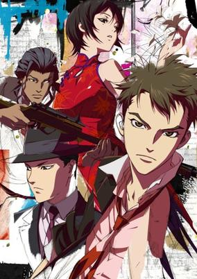

**Studio:** A-1 Pictures &nbsp;|&nbsp; **Episodes:** 13 &nbsp;|&nbsp; **Director:** Jun Matsumoto &nbsp;|&nbsp; **Aired/Released:** April 6 – June 29 &nbsp;|&nbsp; **Genres:** Earth, China, Asia, Special Squads, Alternative Past, Gunfights, Conspiracy, Past, Military, Super Power, Historical, Action

> The year is 1931. The city is Shanghai. Ten years before America will enter World War II, the hydra's teeth planted by the first great global conflict are beginning to germinate. Hatching like spiders, they weave the complex web of plots and conspiracies destined to inevitably draw entire nations to the brink of destruction. Caught in the heart of these webs, desperately seeking to separate lies from truth, is "Sakurai Kikan," an ultra-secret intelligence agency staffed by extraordinarily talented individuals with abilities far beyond those of normal humans. Their duty: to stop the darkest plots and eliminate the greatest threats. But in a city built on intrigue, can even a team of clairvoyants, telepaths and espers stand against the ultimate forces of destiny?
>
> _Synopsis source: Kitsu_

[Wikipedia](https://en.wikipedia.org/wiki/Night_Raid_1931) · [Kitsu](https://kitsu.io/anime/senkou-no-night-raid)

---

### K-On!! (K-ON!)

**Studio:** Kyoto Animation &nbsp;|&nbsp; **Episodes:** 26 &nbsp;|&nbsp; **Director:** Naoko Yamada &nbsp;|&nbsp; **Aired/Released:** April 7 – September 29 &nbsp;|&nbsp; **Genres:** Japan, Comedy, Performance, High School, School Clubs, Musical Band, All Girls School, School Life, Present, Music, Slice of Life, Seinen

> Hirasawa Yui, a young, carefree girl entering high school, has her imagination instantly captured when she sees a poster advertising the "Light Music Club." Being the carefree girl that she is, she quickly signs up; however, Yui has a problem, she is unable to play an instrument. When Yui goes to the clubroom to explain, she's greeted by the other members: Ritsu, Mio, and Tsumugi. Although disheartened at Yui's lack of musical know-how, they still try to convince her to stay to prevent the club's disbandment. After playing Yui a short piece which re-ignites her imagination, they succeed in keeping their new member and guitarist. Along with the tasks of school and homework, Yui begins to learn the guitar with the help of the other band members, experiencing many mishaps along the way. However, with the school festival drawing near and Yui getting stuck with her practice, will the Light Music Club be ready in time for their debut? [Written by MAL Rewrite]
>
> _Synopsis source: Kitsu_

[Wikipedia](https://en.wikipedia.org/wiki/K-On!!) · [Kitsu](https://kitsu.io/anime/k-on)

---

### Rainbow: Nisha Rokubō no Shichinin (Rainbow)

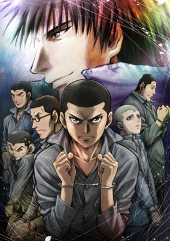

**Studio:** Madhouse &nbsp;|&nbsp; **Episodes:** 26 &nbsp;|&nbsp; **Director:** Hiroshi Koujina &nbsp;|&nbsp; **Aired/Released:** April 7 – September 29 &nbsp;|&nbsp; **Genres:** Earth, Japan, World War II, Asia, Delinquent, Coming Of Age, Rotten World, Angst, Drama, Past, Violence, Historical, Thriller

> Japan, 1955: Mario Minakami has just arrived at Shounan Special Reform School along with six other teenagers who have been arrested on serious criminal charges. All assigned to the same cell, they meet older inmate Rokurouta Sakuragi—a former boxer—with whom they establish a close bond. Under his guidance, and with the promise that they will meet again on the outside after serving their sentences, the delinquents begin to view their hopeless situation in a better light.Rainbow: Nisha Rokubou no Shichinin follows the seven cellmates as they struggle together against the brutal suffering and humiliation inflicted upon them by Ishihara, a sadistic guard with a grudge on Rokurouta, and Gisuke Sasaki, a doctor who takes pleasure in violating boys. Facing such hellish conditions, the seven inmates must scrape together all the strength they have to survive until their sentences are up; but even if they do, just what kind of lives are waiting for them on the other side? [Written by MAL Rewrite]
>
> _Synopsis source: Kitsu_

[Kitsu](https://kitsu.io/anime/rainbow-nisha-rokubou-no-shichinin)

---

### The Betrayal Knows My Name

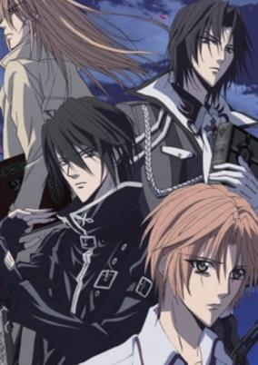

**Studio:** J.C.Staff &nbsp;|&nbsp; **Episodes:** 24 &nbsp;|&nbsp; **Director:** Katsushi Sakurabi &nbsp;|&nbsp; **Aired/Released:** April 12 – September 20 &nbsp;|&nbsp; **Genres:** Contemporary Fantasy, Fantasy, Bishounen, Magic, Shounen Ai, Demon, Adventure

> Sakurai Yuki is an orphan with a mysterious ability. Found near the fence of his current home, the Asahi Orphanage, Yuki strives for independence. The last thing he wants is to be a burden to anybody. However, his ability makes this nearly impossible; whenever he touches someone, he feels their emotions and see the darkness within their hearts and what caused such darkness. Unable to control his ability, Yuki has often made insensitive blunders while trying to empathize with the person he feels pain for. Now, however, with death threats clouding his judgement and his ability increasing immensely, what will happen when a man claiming to be Yuki's older brother appears?
>
> _Synopsis source: Kitsu_

[Wikipedia](https://en.wikipedia.org/wiki/The_Betrayal_Knows_My_Name) · [Kitsu](https://kitsu.io/anime/uragiri-wa-boku-no-namae-wo-shitteiru)

---

### House of Five Leaves

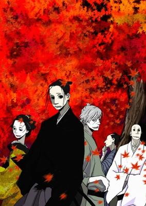

**Studio:** Manglobe &nbsp;|&nbsp; **Episodes:** 12 &nbsp;|&nbsp; **Director:** Tomomi Mochizuki &nbsp;|&nbsp; **Aired/Released:** April 16 – July 2 &nbsp;|&nbsp; **Genres:** Tokugawa Period, Japan, Mafia, Crime, Past, Plot Continuity, Samurai, Historical

> Masterless samurai Akitsu Masanosuke is a skilled and loyal swordsman, but his naïve, diffident nature has time and again caused him to be let go by the lords who have employed him. Hungry and desperate, he becomes a bodyguard for Yaichi, the charismatic leader of a gang called "Five Leaves." Although disturbed by the gang's sinister activities, Masa begins to suspect that Yaichi's motivations are not what they seem. And despite his misgivings, the deeper he's drawn into the world of the Five Leaves, the more he finds himself fascinated by these devious, mysterious outlaws.
>
> _Synopsis source: Kitsu_

[Wikipedia](https://en.wikipedia.org/wiki/House_of_Five_Leaves) · [Kitsu](https://kitsu.io/anime/saraiya-goyou)

---

### The Tatami Galaxy

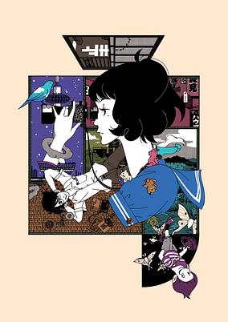

**Studio:** Madhouse &nbsp;|&nbsp; **Episodes:** 11 &nbsp;|&nbsp; **Director:** Masaaki Yuasa &nbsp;|&nbsp; **Aired/Released:** April 23 – July 2 &nbsp;|&nbsp; **Genres:** Earth, Romance, Japan, Asia, Comedy, University, School Clubs, School Life, Parallel Universe, Present, Psychological, Mystery

> One autumn evening at a mysterious ramen stand behind the Shimogamo Shrine, a lonely third-year college student bumps into a man with an eggplant-shaped head who calls himself a god of matrimony. Meeting this man causes the student to reflect upon his past two years at college—two years bitterly spent trying to break up couples on campus with his only friend Ozu, a ghoulish-looking man seemingly set on making his life as miserable as possible. Resolving to make the most out of the rest of his college life, the student attempts to ask out the unsociable but kind-hearted underclassman Akashi, yet fails to follow through, prompting him to regret not living out his college life differently. As soon as this thought passes through his head, however, he is hurtled through time and space to the beginning of his years at college and given another chance to live his life. Surreal, artistic, and mind-bending, Yojouhan Shinwa Taikei chronicles the misadventures of a young man on a journey to make friends, find love, and experience the rose-colored campus life he always dreamed of.
>
> _Synopsis source: Kitsu_

[Wikipedia](https://en.wikipedia.org/wiki/The_Tatami_Galaxy) · [Kitsu](https://kitsu.io/anime/the-tatami-galaxy)

---

### Okami-san and Her Seven Companions

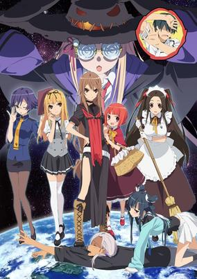

**Studio:** J.C.Staff &nbsp;|&nbsp; **Episodes:** 12 &nbsp;|&nbsp; **Director:** Yoshiaki Iwasaki &nbsp;|&nbsp; **Aired/Released:** July 1 – September 16 &nbsp;|&nbsp; **Genres:** Romance, Fantasy, Earth, Japan, Parody, Asia, Comedy, Delinquent, School Clubs, School Life, Present

> Ookami Ryouko is a spunky and, by some accounts, rather manly high school girl. She is tall, speaks in a traditionally masculine way and is very proficient in fighting. Ookami-san's best friend is the small and high-pitched voiced Akai Ringo. Incidentally, the two are rather flat-chested, a fact the Narrator (voiced by Arai "Kuroko" Satomi of Railgun fame) is all too eager to point out. Ookami and Ringo are members of the Otogi Bank, a club in Otogi High School that assists students with their problems in return for their assistance on a different problem at a later date; thus the Otogi Bank is effectively a loan institute for problems where you can take out a loan for a solved problem but you have to repay it sooner or later. The Otogi Bank is able to solve any problem and will go to any lengths to do so, often leading the members to danger or mayhem. Since most of the members of the club are female, another male is needed for the more dangerous assignments. Thus, the scopophobic (the fear of being looked at) Morino Ryoushi is inducted as a member, right after he confesses his love for Ookami...
>
> _Synopsis source: Kitsu_

[Wikipedia](https://en.wikipedia.org/wiki/Okami-san_and_Her_Seven_Companions) · [Kitsu](https://kitsu.io/anime/ookami-san-to-shichinin-no-nakama-tachi)

---

### Black Butler (season 2) (Black Butler II)

**Studio:** A-1 Pictures &nbsp;|&nbsp; **Episodes:** 12 &nbsp;|&nbsp; **Director:** Hirofumi Ogura &nbsp;|&nbsp; **Aired/Released:** July 2 – September 17 &nbsp;|&nbsp; **Genres:** Bishounen, Super Power, Past, Demon, Victorian Period, United Kingdom, Action, Angst, Fantasy, Comedy

> The stage of Kuroshitsuji II opens on the life of Alois Trancy, the young heir to the Trancy earldom. Though he is privileged now, such was not always the case for the hot-tempered boy. Kidnapped and forced into slavery at a young age, he was eventually rescued and returned home, only to have his beloved father pass away soon after. However, there are certain individuals who doubt Alois' story and legitimacy. And rightfully so, because things in the Trancy household are not as they appear, starting with Alois' black-clad butler with supernatural abilities, Claude Faustus. Who exactly is the mysterious Claude, and what connection does he have with Alois? Amid the web of lies and deceit running rampant in the mansion, the bond between Alois and Claude will be tested as hell itself arrives at their doorstep. [Written by MAL Rewrite]
>
> _Synopsis source: Kitsu_

[Wikipedia](https://en.wikipedia.org/wiki/Black_Butler) · [Kitsu](https://kitsu.io/anime/black-butler-ii)

---

### The Legend of the Legendary Heroes

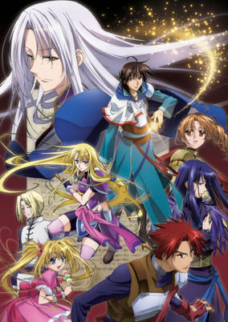

**Studio:** Zexcs &nbsp;|&nbsp; **Episodes:** 24 &nbsp;|&nbsp; **Director:** Itsurō Kawasaki &nbsp;|&nbsp; **Aired/Released:** July 2 – December 17 &nbsp;|&nbsp; **Genres:** Fantasy, Action, Adventure, Feudal Warfare, Magic, Drama, Violence

> "Alpha Stigma" are known to be eyes that can analyze all types of magic. However, they are more infamously known as cursed eyes that can only bring destruction and death to others. Ryner Lute, a talented mage and also an Alpha Stigma bearer, was once a student of the Roland Empire's Magician Academy, an elite school dedicated to training magicians for military purposes. However, after many of his classmates died in a war, he makes an oath to make the nation a more orderly and peaceful place, with fellow survivor and best friend, Sion Astal. Now that Sion is the the king of Roland, he orders Ryner to search for useful relics that will aid the nation. Together with Ferris Eris, a beautiful and highly skilled swordswoman, Ryner goes on a journey to search for relics of legendary heroes from the past, and also uncover the secrets behind his cursed eyes. [Written by MAL Rewrite]
>
> _Synopsis source: Kitsu_

[Wikipedia](https://en.wikipedia.org/wiki/The_Legend_of_the_Legendary_Heroes) · [Kitsu](https://kitsu.io/anime/densetsu-no-yuusha-no-densetsu)

---

### Amagami SS

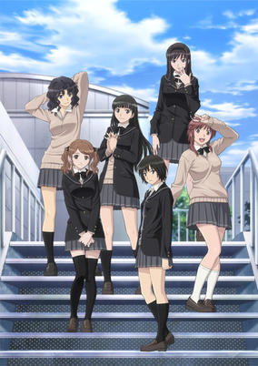

**Studio:** AIC &nbsp;|&nbsp; **Episodes:** 25 &nbsp;|&nbsp; **Director:** Yoshimasa Hiraike &nbsp;|&nbsp; **Aired/Released:** July 2 – December 24 &nbsp;|&nbsp; **Genres:** Romance, Earth, Japan, Asia, Comedy, High School, School Life, Present, Slice of Life

> Two years ago, Tachibana Junichi got his heart broken by a girl who didn't show up for a date on Christmas Eve. Now a second year student in high school, Junichi spends his days inside his closet planetarium, going to school and hanging out with his friends Tanamachi Kaoru and Umehara Masayoshi. After a chance encounter with one of the most beautiful girls in school, the third year student Morishima Haruka, Junichi finds himself spending time with her, carrying books for her or having her unexpectedly jump on his back and act as she's a jockey and he's her horse. Soon enough, Junichi becomes romantically interested in Haruka which leads to... Amagami SS is based on a PS2 dating game featuring six different girls. The story of the anime will be arranged in an omnibus format, with each heroine getting her own version of the story animated. Each heroine will sing her own version of the ending theme song.
>
> _Synopsis source: Kitsu_

[Wikipedia](https://en.wikipedia.org/wiki/Amagami_SS) · [Kitsu](https://kitsu.io/anime/amagami-ss)

---

### Shukufuku no Campanella (Blessing of the Campanella)

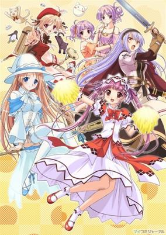

**Studio:** AIC &nbsp;|&nbsp; **Episodes:** 12 &nbsp;|&nbsp; **Director:** Shinji Ushiro &nbsp;|&nbsp; **Aired/Released:** July 3 – September 18 &nbsp;|&nbsp; **Genres:** Fantasy World, Adventure, Alternative Past, Magic, Alternative Present, Harem, Fantasy

> The story takes place in a trading city Ert'Aria. Leicester Maycraft is an item engineer belonging to an adventurer guild "Oasis." One night, he is at a party with his friends to see a meteor stream on the rooftop of a chapel. One meteor grazes them and hits the steeple of the chapel. There he finds a secret room and a sleeping girl. The girl wakes up and says "You must be my father!" The encounter with the mysterious girl brings an unexpected adventure to Leicester.
>
> _Synopsis source: Kitsu_

[Wikipedia](https://en.wikipedia.org/wiki/Shukufuku_no_Campanella) · [Kitsu](https://kitsu.io/anime/shukufuku-no-campanella)

---

### Mitsudomoe

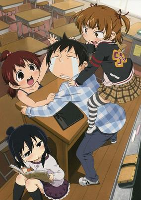

**Studio:** Bridge &nbsp;|&nbsp; **Episodes:** 13 &nbsp;|&nbsp; **Director:** Masahiko Ōta &nbsp;|&nbsp; **Aired/Released:** July 3 – September 26 &nbsp;|&nbsp; **Genres:** Earth, Japan, Elementary School, Asia, Comedy, School Life, Present, Slice of Life

> The 11-year-old Marui triplets could not be any more different. The oldest one, Mitsuba, is sadistic and kind of mature for her age. The middle one, Futaba, is perverted and very athletic and has the strength of a full-grown man. The youngest one, Hitoha, is generally very quiet and gentle but when push comes to shove, she might just be the strongest, the most perverted and the most sadistic out of the three. The three are all in the same class, led by the newly graduated teacher Yabe Satoshi. He usually gets pushed around by the girls and, on occasion, abused but the triplets also try to lead him and the new school nurse, the clumsy Kuriyama Aiko, together. However, Yabe had no intention of dating Aiko and the methods the triplets use to accomplish their goal are highly unorthodox...
>
> _Synopsis source: Kitsu_

[Wikipedia](https://en.wikipedia.org/wiki/Mitsudomoe_(manga)) · [Kitsu](https://kitsu.io/anime/mitsudomoe)

---

### Seitokai Yakuindomo

**Studio:** GoHands &nbsp;|&nbsp; **Episodes:** 13 &nbsp;|&nbsp; **Director:** Hiromitsu Kanazawa &nbsp;|&nbsp; **Aired/Released:** July 4 – September 26 &nbsp;|&nbsp; **Genres:** Earth, Japan, Parody, Asia, Comedy, High School, Slapstick, School Life, Present, Slice of Life

> On his first day of high school at the formerly all-girl's Ousai Private Academy, Takatoshi Tsuda is called out for his untidy uniform by the student council president Shino Amakusa. In apology for delaying Takatoshi for his first class—and stating that the group needs a male point of view to accommodate the arrival of boys at the school—Shino offers him the position of vice president of the student council. Though unwilling, Takatoshi finds himself appointed as the newest member of the student council having yet to even step foot inside the school building. Takatoshi soon realizes that the other student council members who are more than a little strange: President Shino, who is studious and serious in appearance, but actually a huge pervert, fascinated with the erotic and constantly making lewd jokes; the secretary Aria Shichijou, who may seem like a typical sheltered rich girl, but is just as risque as the president, if not more so; and finally, the treasurer Suzu Hagimura, who may act fairly normal, but has the body of an elementary school student and is extremely self-conscious of it. Surrounded by these colorful characters, the new vice president must now work through a nonstop assault of sexual humor and insanity. [Written by MAL Rewrite]
>
> _Synopsis source: Kitsu_

[Wikipedia](https://en.wikipedia.org/wiki/Seitokai_Yakuindomo) · [Kitsu](https://kitsu.io/anime/seitokai-yakuindomo)

---

### Sekirei: Pure Engagement

**Studio:** Seven Arcs &nbsp;|&nbsp; **Episodes:** 13 &nbsp;|&nbsp; **Director:** Keizō Kusakawa &nbsp;|&nbsp; **Aired/Released:** July 4 – September 26 &nbsp;|&nbsp; **Genres:** Earth, Japan, Ecchi, Asia, Comedy, Love Polygon, Plot Continuity, Present, Harem, Super Power, Action

> The battle to find the supreme Sekirei continues. Still some of the fighters and their masters refuse to participate in the battle since losing it means to lose the Sekirei forever, and many of them actually care about their partners, while others just use them as tools. A storm is rising on the horizon, a bigger threat approaches the city and it's about to bring pain and suffering to those who love and care for their Sekireis.
>
> _Synopsis source: Kitsu_

[Kitsu](https://kitsu.io/anime/sekirei-pure-engagement)

---

### Highschool of the Dead (High School of the Dead)

**Studio:** Madhouse &nbsp;|&nbsp; **Episodes:** 12 &nbsp;|&nbsp; **Director:** Tetsuro Araki &nbsp;|&nbsp; **Aired/Released:** July 5 – September 20 &nbsp;|&nbsp; **Genres:** Ecchi, Japan, Action, Epidemic, Zombie, Post Apocalypse, Gunfights, Swordplay, Coming Of Age, Rotten World, Angst, Horror, Plot Continuity, Violence, Present, Harem, Shounen

> It happened suddenly: The dead began to rise and Japan was thrown into total chaos. As these monsters begin terrorizing a high school, Takashi Kimuro is forced to kill his best friend when he gets bitten and joins the ranks of the walking dead. Vowing to protect Rei Miyamoto, the girlfriend of the man he just executed, they narrowly escape their death trap of a school, only to be greeted with a society that has already fallen. Soon, Takashi and Rei band together with other students on a journey to find their family members and uncover what caused this overwhelming pandemic. Joining them is Saeko Busujima, the beautiful president of the Kendo Club; Kouta Hirano, an otaku with a fetish for firearms; Saya Takagi, the daughter of an influential politician; and Shizuka Marikawa, their hot school nurse. But will the combined strength of these individuals be enough to conquer this undead apocalypse?
>
> _Synopsis source: Kitsu_

[Wikipedia](https://en.wikipedia.org/wiki/Highschool_of_the_Dead) · [Kitsu](https://kitsu.io/anime/high-school-of-the-dead)

---

### Tono to Issho: Ippunkan Gekijou

**Studio:** Gathering &nbsp;|&nbsp; **Episodes:** 12 &nbsp;|&nbsp; **Director:** Mankyū &nbsp;|&nbsp; **Aired/Released:** July 6 – September 21 &nbsp;|&nbsp; **Genres:** Japan, Parody, Comedy, Sengoku Period, Historical, Samurai

> Comedy parodying famous samurai generals and historical events.
>
> _Synopsis source: Kitsu_

[Wikipedia](https://en.wikipedia.org/wiki/Tono_to_Issho) · [Kitsu](https://kitsu.io/anime/tono-to-issho)

---

### Occult Academy

**Studio:** A-1 Pictures &nbsp;|&nbsp; **Episodes:** 13 &nbsp;|&nbsp; **Director:** Tomohiko Ito &nbsp;|&nbsp; **Aired/Released:** July 6 – September 28 &nbsp;|&nbsp; **Genres:** Romance, Science Fiction, Contemporary Fantasy, Japan, Action, Past, School Life, Comedy, Mystery

> The story revolves around Maya, the daughter of the former Headmaster of Waldstein Academy, and a time traveling agent Fumiaki Uchida. In the year 2012, the world had been invaded by aliens and time travelers were sent back to the year 1999 in order to find and destroy the Nostradamus Key, which Nostradamus Prophecy foretold as what would bring about the apocalypse. The series then turns to the year 1999, where Maya returns to the Academy with the intention of destroying the Academy by superseding her late father's position as the principal. Her plan was interrupted when she meets Fumiaki and learns of the forthcoming destruction. Despite being distrusting towards Fumiaki, they form a pact to look for the Nostradamus Key. In order to find the Nostradamus Key, time agents were provided with specially created cell phones. When a user finds an object of interest, by thinking of destroying it and taking a photo, and if the resulting image is that of a peaceful world, then the subject is the Nostradamus Key. Conversely, if the subject is not the Nostradamus Key, then the photo displays destruction. By using the phone, Maya and Fumiaki investigates occult occurrences as they occur in the town.
>
> _Synopsis source: Kitsu_

[Wikipedia](https://en.wikipedia.org/wiki/Occult_Academy) · [Kitsu](https://kitsu.io/anime/seikimatsu-occult-gakuin)

---

### Nura: Rise of the Yokai Clan

**Studio:** Studio Deen &nbsp;|&nbsp; **Episodes:** 24 &nbsp;|&nbsp; **Director:** Junji Nishimura &nbsp;|&nbsp; **Aired/Released:** July 6 – December 21 &nbsp;|&nbsp; **Genres:** Contemporary Fantasy, Fantasy, Earth, Japan, Action, Asia, Adventure, Swordplay, Demon

> Rikuo Nura doesn't want anything to do with evil youkai, and just wants a normal life. Too bad he's a quarter youkai, and Nurarihyon, his grandfather, is insistent that he takes over as head of the Nura Clan. He's able to keep his supernatural secret life hidden from his classmates, as he can only transform into a youkai at night, for six hours at a time. Unfortunately for him, various youkai factions are out to target both his youkai and human friends, and like it or not, he needs to embrace his youkai side. Life is not easy when you're Nurarihyon's grandson.
>
> _Synopsis source: Kitsu_

[Kitsu](https://kitsu.io/anime/nurarihyon-no-mago)

---

### Digimon Fusion

**Studio:** Toei Animation &nbsp;|&nbsp; **Episodes:** 30 &nbsp;|&nbsp; **Director:** Tetsuya Endō &nbsp;|&nbsp; **Aired/Released:** July 6 – March 8, 2011 &nbsp;|&nbsp; **Genres:** Science Fiction, Action, Fantasy World, Adventure, Proxy Battles, Present, Virtual Reality, Fantasy, Comedy, Friendship

> The Digital World is in a state of war, with the evil Bagra Army attempting to collect fragments of the Code Crown. Whoever manages to collect all 108 fragments will become king of the Digital World. An evil group of Digimon, known as the Bagra Army, are determined to get their hands on the Code Crown.Digimon Xros Wars features Taiki Kudou, a soccer-loving middle schooler who will always go out of his way to help people in need. When out with his friends Akari Hinomoto and Zenjirou Tsurugi one day, he hears a voice calling out for help. Investigating the situation, he meets a Digimon named Shoutmon who has been severely wounded in a nearby alley. Using the power of a strange device called a Xros Loader, Taiki manages to save Shoutmon's life, but is pulled into the Digital World alongside Akari and Zenjirou. Determined not to let the evil Bagra have their way, Taiki and his friends join with Shoutmon and other local Digimon to form their own army known as Xros Heart. Now Xros Heart must fight their way across the Digital World to collect Code Crown fragments and defeat the Bagra Army, but Taiki and his friends are not the only humans caught up in this war of monsters…
>
> _Synopsis source: Kitsu_

[Wikipedia](https://en.wikipedia.org/wiki/Digimon_Fusion) · [Kitsu](https://kitsu.io/anime/digimon-xros-wars)

---

### Stitch: Season 3

**Studio:** Shin-Ei Animation &nbsp;|&nbsp; **Episodes:** 29 &nbsp;|&nbsp; **Director:** Tetsuo Yasumi &nbsp;|&nbsp; **Aired/Released:** July 6 – March 8, 2011 &nbsp;|&nbsp; **Genres:** Science Fiction, Adventure, Comedy, Kids

> The second season of Stitch!, episode numbers continue from 27.
>
> _Synopsis source: Kitsu_

[Wikipedia](https://en.wikipedia.org/wiki/Stitch!) · [Kitsu](https://kitsu.io/anime/stitch-itazura-alien-no-daibouken)

---

### Strike Witches 2

**Studio:** AIC Spirits &nbsp;|&nbsp; **Episodes:** 12 &nbsp;|&nbsp; **Director:** Kazuhiro Takamura &nbsp;|&nbsp; **Aired/Released:** July 8 – September 23 &nbsp;|&nbsp; **Genres:** Power Suit, Science Fiction, Earth, Italy, Ecchi, World War II, Action, Alternative Past, Air Force, Gunfights, Europe, Juujin, Coming Of Age, Alien, War, Past, Military, Magic

> After discovering that Neuroi are capable of communication with humans and making peace with the nest above Gallia the Witches squads are now on a mission to re-establish communication when a sudden attack vanishes the Neuroi; they now discover a new and massive nest that just appeared covering almost all Europe. Ruthless and without mercy it annihilates allied forces along with Witches. Word of the attack reaches Fuso and a support battalion is deployed to rescue the survivors. Among the rescue team is the former Striker captain Mio Sakamoto and the now civilian Yoshika Miyafuji who want to save their dear friends.
>
> _Synopsis source: Kitsu_

[Wikipedia](https://en.wikipedia.org/wiki/Strike_Witches_2) · [Kitsu](https://kitsu.io/anime/strike-witches-2)

---

### Shiki

**Studio:** Daume &nbsp;|&nbsp; **Episodes:** 22 &nbsp;|&nbsp; **Director:** Tetsuro Amino &nbsp;|&nbsp; **Aired/Released:** July 9 – December 31

[Wikipedia](https://en.wikipedia.org/wiki/Shiki_(novel_series))

---

### Asobi ni Iku yo! (Cat Planet Cuties)

**Studio:** AIC PLUS+ &nbsp;|&nbsp; **Episodes:** 12 &nbsp;|&nbsp; **Director:** Yōichi Ueda &nbsp;|&nbsp; **Aired/Released:** July 11 – September 26 &nbsp;|&nbsp; **Genres:** Science Fiction, Contemporary Fantasy, Earth, Japan, Asia, Juujin, Humanoid Alien, Alien, Robot Helper, Present, Harem, Comedy, Ecchi, Romance

> Kio is just another boring, nice guy with a boring, nice life until he meets a beautiful, curvaceous cat-girl while attending a memorial service for one of his ancestors. Next thing he knows, he's lying in bed with this half-naked beauty next to him! Her name is Eris, and she has come to Earth to learn more about its inhabitants as a representative of the planet Catian. And she's decided to set up shop at Kio's home for her stay on Earth! Unbeknownst to Kio, there are quite a few organizations who will attempt to capture Eris, looking to keep her existence a secret by any means necessary. What's worse is when people around Kio turn out to secretly be a part of those organizations! Kio will have to work hard to keep Eris safe from these shady groups. Things are about to get mysterious, exciting, and most importantly sexy in Asobi ni Iku yo!
>
> _Synopsis source: Kitsu_

[Wikipedia](https://en.wikipedia.org/wiki/Asobi_ni_Iku_yo!) · [Kitsu](https://kitsu.io/anime/asobi-ni-iku-yo)

---

### Sengoku Basara II (Sengoku Basara: Samurai Kings)

**Studio:** Production I.G &nbsp;|&nbsp; **Episodes:** 12 &nbsp;|&nbsp; **Director:** Kazuya Nomura &nbsp;|&nbsp; **Aired/Released:** July 11 – September 26 &nbsp;|&nbsp; **Genres:** Action, Sengoku Period, Swordplay, Martial Arts, War, Past, Samurai, Super Power, Historical

> During Japan's Sengoku period, several powerful warlords fought in politics and in arms with hopes of unifying the country under a central government. Nobunaga Oda had asserted himself as being the most powerful of these rulers by possessing the strength and military resource necessary to conquer all of Japan. Shingen Takeda and his trusted warrior Yukimura Sanada led one of the main clans standing in Nobunaga’s way. One night, Sanada had been ordered to lead a sneak attack against General Kenshin Uesugi, which was then thwarted by Masamune Date and his army. Sanada and Date fought to a draw, which forged a heated rivalry out of their newfound admiration for one another. Nobunaga continues to exert his forces in Sengoku Basara by doubling down on his influence across the country. Sanada and Date find themselves having to put their differences aside in order to quell the rise of Nobunaga and save feudal Japan from his tyrannical reign. Magical, militant, and political powers fly forth as these warriors and leaders clash amongst themselves and the armies of Nobunaga.
>
> _Synopsis source: Kitsu_

[Kitsu](https://kitsu.io/anime/sengoku-basara)

---

### Scan2Go

**Studio:** SynergySP &nbsp;|&nbsp; **Episodes:** 52 &nbsp;|&nbsp; **Director:** Mitsuo Hashimoto &nbsp;|&nbsp; **Aired/Released:** August 9 – March 29, 2011 &nbsp;|&nbsp; **Genres:** Space, Sports, Motorsport, Kids

> Sometime in the near future, in an age in which we have established contact and communications with planets outside our galaxy, Scan2Go has become a huge phenomenon throughout all of outer space. Giant races are held at every locality, with each racer gunning for the title of the universe's number one racer! The main character in the series, Kazuya, possesses the power of the eagle, performed well with his blazing, innate power commanding his falconine beast spirit. He competes in a tournament, the "Pro-Racer Exhibition Race.", but was no match for the other teams that had won their way through the competitive Space Preliminaries. Realizing the difficult obstacles that lie before them, Kazuya and his friends leave the small Earth behind and set off on a universe-wide quest to hone their skills as warriors!
>
> _Synopsis source: Kitsu_

[Wikipedia](https://en.wikipedia.org/wiki/Scan2Go) · [Kitsu](https://kitsu.io/anime/scan2go)

---

### Kkoma Bus Tayo (Tayo the Little Bus)

**Studio:** Iconix Entertainment Studio Gale &nbsp;|&nbsp; **Episodes:** 26 &nbsp;|&nbsp; **Aired/Released:** August 23 – November 16 &nbsp;|&nbsp; **Genres:** Comedy, Anthropomorphism

> Tayo the Little Bus is a South Korean computer-animated television series created by Iconix Entertainment, Educational Broadcasting System and the Metropolitan Government of Seoul. The show was produced with the help of Seoul mayor Oh Se-hoon's administration. It began airing in South Korea on EBS in 2010, and an English-dubbed version of the series began airing on Disney Junior (Asia) in 2012, with Disney Junior (Australia and New Zealand) following in 2013. In the United States and Canada, Hulu is the exclusive distributor of the series, though the second season is on Netflix. The series is available in Korean, English, Spanish, Turkish and Russian on the production company's Tayo YouTube channel. (Source: Wikipedia
>
> _Synopsis source: Kitsu_

[Wikipedia](https://en.wikipedia.org/wiki/Tayo_the_Little_Bus) · [Kitsu](https://kitsu.io/anime/tayo-the-little-bus)

---

### Hyakka Ryōran Samurai Girls

**Studio:** Arms &nbsp;|&nbsp; **Episodes:** 12 &nbsp;|&nbsp; **Director:** KOBUN &nbsp;|&nbsp; **Aired/Released:** September 4 – December 20

[Wikipedia](https://en.wikipedia.org/wiki/Hyakka_Ry%C5%8Dran_Samurai_Girls)

---

### Battle Spirits: Brave

**Studio:** Sunrise &nbsp;|&nbsp; **Episodes:** 50 &nbsp;|&nbsp; **Director:** Akira Nishimori &nbsp;|&nbsp; **Aired/Released:** September 12 – September 11, 2011 &nbsp;|&nbsp; **Genres:** Card Games, Proxy Battles, Action, Friendship

> Dan now desires more exciting battles and stronger opponents. Thus it is that when Maru appears before him, offering the two, Dan leapt at the chance. He is transported into the future, a time when Earth is threatened by demons from another dimension. Now, the fate of all humanity rests on Dan's shoulders. The price of failure is a re-set of Earth's entire timeline.
>
> _Synopsis source: Kitsu_

[Kitsu](https://kitsu.io/anime/battle-spirits-brave)

---

### Pokemon Best Wishes! (Pokemon: Black & White)

**Studio:** OLM &nbsp;|&nbsp; **Episodes:** 84 &nbsp;|&nbsp; **Director:** Kunihiko Yuyama (Chief) Norihiko Sudo &nbsp;|&nbsp; **Aired/Released:** September 23 – June 14, 2012 &nbsp;|&nbsp; **Genres:** Fantasy, Adventure, Proxy Battles, Action, Comedy, Kids

> As with both the Advanced Generation and Diamond &amp; Pearl series before it, the Best Wishes! series begins with only Satoshi, headed off to the Isshu region, located far away from Kanto, Johto, Houen, and Sinnoh, with his Pikachu. After he meets up with the new trainer and rival Shooty and the region's Professor Araragi, he gains traveling companions in Iris, a girl from a town known for its Dragon Pokémon, and Dent, Pokémon Connoisseur and the Grass Pokémon specialist of the three Sanyou City Gym Leaders.
>
> _Synopsis source: Kitsu_

[Kitsu](https://kitsu.io/anime/pokemon-best-wishes)

---

### Iron Man

**Studio:** Madhouse &nbsp;|&nbsp; **Episodes:** 12 &nbsp;|&nbsp; **Director:** Yūzō Satō &nbsp;|&nbsp; **Aired/Released:** October 1 – December 17 &nbsp;|&nbsp; **Genres:** Science Fiction, Action, Adventure, Superhero

> Original Pilot for the "Iron Man" Anime series.
>
> _Synopsis source: Kitsu_

[Wikipedia](https://en.wikipedia.org/wiki/Iron_Man_(anime)) · [Kitsu](https://kitsu.io/anime/iron-man-pilot)

---

### Heaven's Lost Property: Forte

**Studio:** AIC ASTA &nbsp;|&nbsp; **Episodes:** 12 &nbsp;|&nbsp; **Director:** Hisashi Saito &nbsp;|&nbsp; **Aired/Released:** October 2 – December 18 &nbsp;|&nbsp; **Genres:** Earth, Contemporary Fantasy, Japan, Ecchi, Fantasy, Asia, Comedy, Violent Retribution For Accidental Infringement, Angel, Android, Slapstick, Countryside, Present, Harem, Science Fiction, Romance

> Sakurai Tomoki has settled into his life with the two angeloids, Ikaros and Nymph, and is enjoying himself immensely. However, he keeps having weird dreams and asks all of his friends to help him investigate the cause. Nymph conjures up a device that enables people, but not angeloids, to enter other people's dreams. The device malfunctions at first but eventually they get to what was supposed to be Tomoki's dream but discover that something is very wrong with it. Later, a meteor comes crashing down from the skies at the site of the large cherry blossom tree where Tomoki first discovered Ikaros. An extremely well endowed blonde angeloid with a huge sword emerges from the meteor and sets off in search of Tomoki!
>
> _Synopsis source: Kitsu_

[Kitsu](https://kitsu.io/anime/heaven-s-lost-property-forte)

---

### MM!

**Studio:** Xebec &nbsp;|&nbsp; **Episodes:** 12 &nbsp;|&nbsp; **Director:** Tsuyoshi Nagasawa &nbsp;|&nbsp; **Aired/Released:** October 2 – December 18 &nbsp;|&nbsp; **Genres:** Earth, Japan, Asia, Comedy, Violent Retribution For Accidental Infringement, Super Deformed, High School, Slapstick, Stereotypes, School Life, Present, Ecchi, Harem

> There are twisted tales and twisted tales, but few are as twisted as poor Sado's, who's just realized that he actually likes being made miserable. Of course, knowing that only makes him more miserable, which in turn... well, you get the idea. Desperate to break the circle, Sado volunteers for a special club where he hopes he can work through his issues only to discover that the other members have equally... complex... issues to deal with. For example, the hyper-aggressive club president Isurugi not only has a violent fear of cats, but also believes herself to be a god! Then there's Yuno, who's terrified of men; the Nurse, who forces other people to perform cosplay; and Hayama, Sado's best friend and a compulsive cross-dresser, who's also the girl that Sado is infatuated with.
>
> _Synopsis source: Kitsu_

[Wikipedia](https://en.wikipedia.org/wiki/MM!) · [Kitsu](https://kitsu.io/anime/mm)

---

### Panty & Stocking with Garterbelt

**Studio:** Gainax &nbsp;|&nbsp; **Episodes:** 13 &nbsp;|&nbsp; **Director:** Hiroyuki Imaishi &nbsp;|&nbsp; **Aired/Released:** October 2 – December 25 &nbsp;|&nbsp; **Genres:** Earth, Japan, Ecchi, Action, Contemporary Fantasy, Parody, Asia, Comedy, Gunfights, Swordplay, Super Deformed, Angel, Slapstick, Stereotypes, Violence, Present, Demon

> The "Anarchy Sisters," Panty and Stocking, have been kicked out of Heaven for, to put it mildly, misbehaving. Led by a priest named Garterbelt, these angels must buy their way back by exterminating ghosts in Daten City. But this task requires unconventional weapons for these unorthodox angels—they transform their lingerie into weapons to dispatch the spirits. Unfortunately, neither of them take their duties seriously, as they rather spend their time in pursuit of other "hobbies": Panty prefers to sleep with anything that walks, and Stocking favors stuffing her face with sweets than hunting ghosts. Follow these two unruly angels as they battle ghosts, an overflow of bodily fluids, and their own tendency to get side-tracked in Panty and Stocking with Garterbelt. [Written by MAL Rewrite]
>
> _Synopsis source: Kitsu_

[Wikipedia](https://en.wikipedia.org/wiki/Panty_%26_Stocking_with_Garterbelt) · [Kitsu](https://kitsu.io/anime/panty-stocking-with-garterbelt)

---

### Bakuman (Bakuman.)

**Studio:** J.C.Staff &nbsp;|&nbsp; **Episodes:** 25 &nbsp;|&nbsp; **Director:** Kenichi Kasai Noriaki Akitaya &nbsp;|&nbsp; **Aired/Released:** October 2 – April 2, 2011 &nbsp;|&nbsp; **Genres:** Earth, Japan, Asia, Coming Of Age, The Arts, Present, Comedy, Romance

> As a child, Moritaka Mashiro dreamt of becoming a mangaka, just like his childhood hero and uncle, Tarou Kawaguchi, creator of a popular gag manga. But when tragedy strikes, he gives up on his dream and spends his middle school days studying, aiming to become a salaryman instead. One day, his classmate Akito Takagi, the school's top student and aspiring writer, notices the detailed drawings in Moritaka's notebook. Seeing the vast potential of his artistic talent, Akito approaches Moritaka, proposing that they become mangaka together. After much convincing, Moritaka realizes that if he is able to create a popular manga series, he may be able to get the girl he has a crush on, Miho Azuki, to take part in the anime adaptation as a voice actor. Thus the pair begins creating manga under the pen name Muto Ashirogi, hoping to become the greatest mangaka in Japan, the likes of which no one has ever seen. [Written by MAL Rewrite]
>
> _Synopsis source: Kitsu_

[Wikipedia](https://en.wikipedia.org/wiki/Bakuman) · [Kitsu](https://kitsu.io/anime/bakuman)

---

### Super Robot Wars Original Generation: The Inspector (Super Robot Wars OG: The Inspector)

**Studio:** Asahi Production &nbsp;|&nbsp; **Episodes:** 26 &nbsp;|&nbsp; **Director:** Masami Ōbari &nbsp;|&nbsp; **Aired/Released:** October 2 – April 2, 2011 &nbsp;|&nbsp; **Genres:** Earth, Space Travel, Transforming Craft, Mecha, Action, Piloted Robot, Human Enhancement, Time Travel, Humanoid Alien, Alien, War, Future, Android, Parallel Universe, Plot Continuity, Space, Military, Science Fiction

> With many of its central personnel lost in the war, the Earth Federation Government is forced to rebuild, and Brian Midcrid, president of the Unified Colonies, takes the position of its president. During an emergency session of the Federation Diet, he publicly acknowledges the existence of extraterrestrials, and reveals the events of the L5 campaign to the masses in what will later come to be called the "Tokyo Declaration." He goes on to state that these aliens pose a serious threat to humanity.
>
> _Synopsis source: Kitsu_

[Kitsu](https://kitsu.io/anime/super-robot-taisen-og-the-inspector)

---

### Oreimo

**Studio:** AIC Build &nbsp;|&nbsp; **Episodes:** 12 &nbsp;|&nbsp; **Director:** Hiroyuki Kanbe &nbsp;|&nbsp; **Aired/Released:** October 3 – December 19 &nbsp;|&nbsp; **Genres:** Earth, Japan, Asia, Comedy, Present, Slice of Life

> Kirino Kousaka embodies the ideal student with equally entrancing looks. Her grades are near perfect, and to cover her personal expenses, she works as a professional model alongside her best friend Ayase Aragaki, who abhors liars and all things otaku. But what Ayase doesn't know is that Kirino harbors a deep, entrenched secret that will soon be brought to light. At home one day, Kyousuke, Kirino's perfectly average brother, stumbles upon an erotic game that belongs to none other than his seemingly flawless little sister. With her reputation at stake, Kirino places a gag order on her sibling while simultaneously introducing him to the world of eroge and anime. Through Kirino, Kyousuke encounters the gothic lolita Ruri Gokou and the bespectacled otaku Saori Makishima, thus jump-starting an entirely new lifestyle. But as he becomes more and more involved in his little sister's secret life, it becomes that much harder to keep under wraps. [Written by MAL Rewrite]
>
> _Synopsis source: Kitsu_

[Wikipedia](https://en.wikipedia.org/wiki/Oreimo) · [Kitsu](https://kitsu.io/anime/oreimo)

---

### Psychic Detective Yakumo

**Studio:** Bee Train &nbsp;|&nbsp; **Episodes:** 13 &nbsp;|&nbsp; **Director:** Tomoyuki Kurokawa &nbsp;|&nbsp; **Aired/Released:** October 3 – December 26 &nbsp;|&nbsp; **Genres:** Contemporary Fantasy, Earth, Fantasy, Japan, Asia, Detective, Present, Horror, Mystery, Drama

> Haruka Ozawa's sophomore year is getting seriously scary. One of her friends is possessed, another has committed suicide and Haruka could be the next one to flunk the still-breathing test. Her only way out of this potentially lethal dead end? Yakumo Saito, an enigmatic student born with a mysterious red eye that allows him to see and communicate with the dead. But the deceased don't always desist and some killers are more than ready to kill again to keep dead men from telling any more tales. That doesn't stop Haruka's knack for digging up buried secrets, and there's even more evidence of bodies being exhumed by both Yakumo's police contact and an investigative journalist with a newly made corpse in her closet! Can this pair of anything but normal paranormal detectives solve the ultimate dead case files or will they end up in cold storage themselves?
>
> _Synopsis source: Kitsu_

[Wikipedia](https://en.wikipedia.org/wiki/Psychic_Detective_Yakumo) · [Kitsu](https://kitsu.io/anime/shinrei-tantei-yakumo)

---

### Yumeiro Patissiere SP Professional

**Studio:** Studio Hibari &nbsp;|&nbsp; **Episodes:** 13 &nbsp;|&nbsp; **Director:** Iku Suzuki &nbsp;|&nbsp; **Aired/Released:** October 3 – December 26

[Wikipedia](https://en.wikipedia.org/wiki/Yumeiro_Patissiere_SP_Professional)

---

### Tegami Bachi Reverse (Tegami Bachi: Letter Bee Reverse)

**Studio:** Pierrot Plus &nbsp;|&nbsp; **Episodes:** 25 &nbsp;|&nbsp; **Director:** Akira Iwanaga &nbsp;|&nbsp; **Aired/Released:** October 3 – March 26, 2011 &nbsp;|&nbsp; **Genres:** Super Power, Fantasy World, High Fantasy, Plot Continuity, Fantasy, Adventure

> After Niche carries the wounded and stunned Lag back to the Bee Hive, the Letter Bee finally begins to piece the puzzle together. Now he knows what's happened to Gauche, why the Marauders are so focused on stealing mail and the actual intent of the group controlling both, Reverse. However, when he's forbidden to reveal the truth, Lag is soon forced out of the artificial sunlight and back into the world of perpetual night. And soon Reverse's plot to take down the Letter Bees and overthrow the Amberground government begins to accelerate. If things weren't already bad enough, the giant insect creatures called gaichuu are apparently evolving into something new; there may be traitors working within the Hive; and Niche's sister, who's definitely not human friendly, shows up to turn family drama into a full-scale siege! It all spells serious trouble for the Letter Bees, but if anyone can weather the storms and gloom of night, Lag and his team are the ones who'll deliver.
>
> _Synopsis source: Kitsu_

[Wikipedia](https://en.wikipedia.org/wiki/Tegami_Bachi_Reverse) · [Kitsu](https://kitsu.io/anime/letter-bee-reverse)

---

### Star Driver

**Studio:** Bones &nbsp;|&nbsp; **Episodes:** 25 &nbsp;|&nbsp; **Director:** Takuya Igarashi &nbsp;|&nbsp; **Aired/Released:** October 3 – April 3, 2011 &nbsp;|&nbsp; **Genres:** Science Fiction, Mecha, Action, Piloted Robot, High School, School Life, Romance

> To the south of Japan, there lies a lush green island called Southern Cross Isle. One night, a boy by the name of Takuto Tsunashi washes up on the shore of the island. Having swum from the mainland alone and without any possessions, he enrolls in the senior high level in the school on the island - Southern Cross High School. With his bright and positive personality, he starts to mix with various students in the school and builds relationships with many of them, including Wako Agemaki and Sugata Shindou. But this school hides a deep secret. There are sleeping giants hidden under the ground called "Cybodies". There are about 20 of these giants, and they are just some of the various secrets kept by everyone on the island: The secret movements of the mysterious organization known as Glittering Crux. The songs of the shrine maidens. And even Takuto himself will soon come to embrace a great secret... This island in the southern territories surrounded by the blue sea and the blue skies is the stage where the "Eulogy of Youth" filled with love, dreams and friendships, will begin.
>
> _Synopsis source: Kitsu_

[Wikipedia](https://en.wikipedia.org/wiki/Star_Driver) · [Kitsu](https://kitsu.io/anime/star-driver-kagayaki-no-takuto)

---

### Miyanishi Tatsuya Gekijō: Omae Umasō da na

**Studio:** Ajia-do &nbsp;|&nbsp; **Episodes:** 20 &nbsp;|&nbsp; **Director:** Masaharu Takizawa &nbsp;|&nbsp; **Aired/Released:** October 4 – October 29 &nbsp;|&nbsp; **Genres:** Anthropomorphism, Adventure, Kids

> A Tyrannosaurus called Heart was raised by a herbivorous dinosaur. As he grew up, he was scared by other dinosaurs. One day, Heart meets a baby Ankylosaurus and he names the baby "Umasou (looks delicious)". Umasou started to be attached to Heart and a strange family love develops between the two.
>
> _Synopsis source: Kitsu_

[Kitsu](https://kitsu.io/anime/miyanishi-tatsuya-gekijou-omae-umasou-da-na)

---

### Hakuouki: Hekketsuroku (Hakuoki ~Demon of the Fleeting Blossom~)

**Studio:** Studio Deen &nbsp;|&nbsp; **Episodes:** 10 &nbsp;|&nbsp; **Director:** Osamu Yamasaki &nbsp;|&nbsp; **Aired/Released:** October 4 – December 6 &nbsp;|&nbsp; **Genres:** Bakumatsu   Meiji Period, Tokugawa Period, Action, Shinsengumi, Swordplay, Bishounen, Past, Reverse Harem, Violence, Samurai, Historical, Josei

> In 1860's Edo, Japan, 16-year-old Chizuru Yukimura lives a simple life as the daughter of a doctor. When her father's work takes him away from home and into the capital of Kyoto, Chizuru is left alone with only the letters from her father as a means to stay in contact with him. After the letters stop coming though, Chizuru becomes gravely concerned. Disguising herself as a man for safety, she travels to Kyoto to find him, only to find herself being attacked by a group of samurai and a strange, almost inhuman man. Chizuru is saved by a mysterious member of a group known as the Shinsengumi, but because of what she witnessed, she's taken back to their base of operations to be interrogated and possibly silenced…forever.Hakuouki features the striking young men of the Shinsengumi and their secret clan of warriors, who decide to spare Chizuru upon finding out who her father is, revealing that they too are looking for him, but for different reasons. Now Chizuru must not only continue the search for her father among her new friends, but discover secrets bigger than she ever imagined, all the while forming bonds with the handsome young men that will forever change the course of their lives.
>
> _Synopsis source: Kitsu_

[Wikipedia](https://en.wikipedia.org/wiki/Hakuoki) · [Kitsu](https://kitsu.io/anime/hakuouki)

---

### Yosuga no Sora

**Studio:** feel. &nbsp;|&nbsp; **Episodes:** 12 &nbsp;|&nbsp; **Director:** Takeo Takahashi &nbsp;|&nbsp; **Aired/Released:** October 4 – December 20 &nbsp;|&nbsp; **Genres:** Earth, Romance, Japan, Ecchi, Asia, Female Student, Present, Harem

> After losing both of their parents in an accident, Haruka and his twin sister Sora move out of the city to the rural town where they spent their childhood summers. In their new home, everything seems peaceful until Haruka discovers a special, forbidden love that may disrupt the entire town!
>
> _Synopsis source: Kitsu_

[Wikipedia](https://en.wikipedia.org/wiki/Yosuga_no_Sora) · [Kitsu](https://kitsu.io/anime/yosuga-no-sora-in-solitude-where-we-are-least-alone)

---

### Arakawa Under the Bridge *2 (Arakawa Under the Bridge x Bridge)

**Studio:** Shaft &nbsp;|&nbsp; **Episodes:** 13 &nbsp;|&nbsp; **Director:** Yukihiro Miyamoto Akiyuki Simbo &nbsp;|&nbsp; **Aired/Released:** October 4 – December 27 &nbsp;|&nbsp; **Genres:** Earth, Japan, Slice of Life, Asia, Comedy, Present, Romance

> In the dry riverbed of Arakawa River, undefeated elite Ichinomiya Kou (aka Ric) met the lovely homeless girl Nino, a self-declared Venusian. Their awkward love stirs up trouble among the other strange inhabitants of the riverbed.
>
> _Synopsis source: Kitsu_

[Wikipedia](https://en.wikipedia.org/wiki/Arakawa_Under_the_Bridge_*2) · [Kitsu](https://kitsu.io/anime/arakawa-under-the-bridge-x-bridge)

---

### Squid Girl

**Studio:** Diomedéa &nbsp;|&nbsp; **Episodes:** 12 &nbsp;|&nbsp; **Director:** Tsutomu Mizushima &nbsp;|&nbsp; **Aired/Released:** October 5 – December 21 &nbsp;|&nbsp; **Genres:** Earth, Japan, Slice of Life, Asia, Comedy, Tentacle, Slapstick, Summer

> From the depth of the seas rises an evil monster, bent on taking over the human world: Ika Musume. She's ruthless. She's menacing. She's... an adorably non-threatening little girl who makes an awesome squid-ink spaghetti? Ika Musume has come out of her home in the ocean on a quest to punish humanity for polluting her waters. With squid tentacles for hair and some pretty useful ink-spitting skills, Ika Musume is sure she'll have no trouble invading Earth. What she didn't account for were the Aizawa sisters, rough and tumble Eiko and deceptively mellow Chizuru, who immediately bully her into working as a waitress in their seafood restaurant by the shore. Ika Musume decides to take this chance to learn more about the human world, having silly adventures, meeting lots of strange characters, and never once letting world domination out of her sights. Will Ika Musume be able to exact her revenge on the human race that had wronged her? Or will she learn to enjoy the company of these foolish air-breathers and let bygones be bygones?
>
> _Synopsis source: Kitsu_

[Wikipedia](https://en.wikipedia.org/wiki/Squid_Girl) · [Kitsu](https://kitsu.io/anime/squid-girl)

---

### Otome Yōkai Zakuro (Zakuro)

**Studio:** J.C.Staff &nbsp;|&nbsp; **Episodes:** 13 &nbsp;|&nbsp; **Director:** Chiaki Kon &nbsp;|&nbsp; **Aired/Released:** October 5 – December 28 &nbsp;|&nbsp; **Genres:** Romance, Bakumatsu   Meiji Period, Earth, Japan, Fantasy, Asia, Comedy, Alternative Past, Juujin, Bishounen, Past, Military, Historical, Demon, Friendship

> Otome Youkai Zakuro takes place in an alternate version of Japan's Meiji Era. In this version of history, humans and spirits coexist side by side in the same world. However Japan is becoming more and more influenced by the West, and more people are accepting Western religions as their chosen faith rather than the more traditional Eastern faiths which have dominated the country for many centuries, leading to conflicts between humans and youkai. To help ease tensions, an organization is established called the Ministry of Spirits made up of a group of male soldiers and a group of female youkai. Unfortunately things don't go as swimmingly as one would hope, as one of the soldiers, Kei Agemaki, is terribly afraid of youkai and one of the spirits, Zakuro, has an extreme dislike for humans who accept practices and traditions from the west. Life for these two is about to become a lot more interesting as they have to learn how to cooperate with their worst enemies!
>
> _Synopsis source: Kitsu_

[Wikipedia](https://en.wikipedia.org/wiki/Otome_Y%C5%8Dkai_Zakuro) · [Kitsu](https://kitsu.io/anime/otome-youkai-zakuro)

---

### Motto To Love-Ru (Motto To LOVE Ru)

**Studio:** Xebec &nbsp;|&nbsp; **Episodes:** 12 &nbsp;|&nbsp; **Director:** Atsushi Ōtsuki &nbsp;|&nbsp; **Aired/Released:** October 6 – December 22 &nbsp;|&nbsp; **Genres:** Earth, Japan, Ecchi, Asia, Comedy, Violent Retribution For Accidental Infringement, High School, Humanoid Alien, Alien, Stereotypes, School Life, Present, Harem, Science Fiction

> A year after Lala came to Earth, she is all the more determined to make Rito fall for her, putting all her effort into it, even though she knows that Rito actually loves Haruna. Poor Rito will have to face tough times since Lala's younger twin sisters, Nana and Momo, now live in the same house, along with Rito's reliable sister, Mikan, and Celine. Fun and trouble await with their other friends from school and the many other characters, with Lala's usually catastrophic inventions, Yami's contract to kill Rito and many pending issues from the first season.
>
> _Synopsis source: Kitsu_

[Wikipedia](https://en.wikipedia.org/wiki/Motto_To_Love-Ru) · [Kitsu](https://kitsu.io/anime/motto-to-love-ru)

---

### Tantei Opera Milky Holmes

**Studio:** J.C.Staff &nbsp;|&nbsp; **Episodes:** 12 &nbsp;|&nbsp; **Director:** Makoto Moriwaki &nbsp;|&nbsp; **Aired/Released:** October 7 – December 23 &nbsp;|&nbsp; **Genres:** Loli, Comedy, Absurdist Humour, Super Deformed, Slapstick, Super Power, Magical Girl, Mystery

> "Sheryl, Nero, Elly, and Cordelia are the most popular students at Holmes Detective Academy, because of the many cases they've solved with their Toys and teamwork. The students and the people of the Detective City Yokohama all look up to the members of "Milky Holmes", as they're called. But on a dark and stormy night, during a battle with their rivals "The Gentlemen Thief Empire", they lose their toys, and their fate undergoes a dramatic change..."
>
> _Synopsis source: Kitsu_

[Wikipedia](https://en.wikipedia.org/wiki/Tantei_Opera_Milky_Holmes) · [Kitsu](https://kitsu.io/anime/tantei-opera-milky-holmes)

---

### The World God Only Knows

**Studio:** Manglobe &nbsp;|&nbsp; **Episodes:** 12 &nbsp;|&nbsp; **Director:** Shigehito Takayanagi &nbsp;|&nbsp; **Aired/Released:** October 7 – December 23 &nbsp;|&nbsp; **Genres:** Earth, Romance, Japan, Contemporary Fantasy, Fantasy, Asia, Comedy, High School, School Life, Present, Harem, Demon

> Keima Katsuragi, known online as the legendary "God of Conquest," can conquer any girl's heart—in dating sim games, at least. In reality, he opts for the two-dimensional world of gaming over real life because he is an unhealthily obsessed otaku of galge games (a type of Japanese video game centered on interactions with attractive girls). When he arrogantly accepts an anonymous offer to prove his supremacy at dating sim games, Keima is misled into aiding a naïve and impish demon from hell named Elucia "Elsie" de Lute Ima with her mission: retrieving runaway evil spirits who have escaped from hell and scattered themselves throughout the human world. Keima discovers that the only way to capture these spirits is to conquer what he hates the most: the unpredictable hearts of three-dimensional girls! Shackled to Elsie via a deadly collar, Keima now has his title of "God of Conquest" put to the ultimate test as he is forced to navigate through the hearts of a multitude of real-life girls. [Written by MAL Rewrite]
>
> _Synopsis source: Kitsu_

[Wikipedia](https://en.wikipedia.org/wiki/The_World_God_Only_Knows) · [Kitsu](https://kitsu.io/anime/the-world-god-only-knows)

---

### Togainu no Chi

**Studio:** A-1 Pictures &nbsp;|&nbsp; **Episodes:** 12 &nbsp;|&nbsp; **Director:** Naoyuki Konno &nbsp;|&nbsp; **Aired/Released:** October 8 – December 23 &nbsp;|&nbsp; **Genres:** Science Fiction, Japan, Action, Post Apocalypse, Bishounen, Stereotypes, Violence, Shounen Ai

> A Third World War left Japan devastated, and in these ruins, an organization named Vischio seized control of Tokyo, renaming it Toshima. Tournament style battles called Igura take place on the streets, overseen by Vischio. Combatants murder and fight for the chance to take on the tournament’s king known as "Il-re." This tournament is not the only one around, however. Akira, a young man separated from his family, participates in another known as Bl@ster and is hailed as nearly unbeatable. Though his companions attempt to shower him in praise, Akira is taciturn and indifferent to their awe. Fate has bigger plans for Akira than streetfights, and he finds himself in police custody with a murder pinned on his head. Unable to prove his own innocence, all hope is lost until a mysterious woman named Emma appears, offering him a chance to participate in Igura in order to obtain his freedom.
>
> _Synopsis source: Kitsu_

[Wikipedia](https://en.wikipedia.org/wiki/Togainu_no_Chi) · [Kitsu](https://kitsu.io/anime/togainu-no-chi)

---

### And Yet the Town Moves

**Studio:** Shaft &nbsp;|&nbsp; **Episodes:** 12 &nbsp;|&nbsp; **Director:** Akiyuki Simbo &nbsp;|&nbsp; **Aired/Released:** October 8 – December 24 &nbsp;|&nbsp; **Genres:** Earth, Japan, Slice of Life, Asia, Comedy, Maid, Present

> Hotori Arashiyama loves mysteries, but there's one she just can't solve: why does the solution to one problem inevitably seem to lead to another? Like how when Hotori has to start working at the Seaside Maid Cafe after school to pay off a debt and her friend Toshiko fortunately knows exactly how a Maid Cafe should be run. Which is fortunate since Hotori has no clue. Except that, unfortunately, Toshiko has no interest in working at the cafe—until she discovers that Hotori's childhood friend Hiroyuki is a regular. Which SEEMS fortunate. Except that Hotori doesn't know that, while Toshiko likes Hiroyuki, Hiroyuki secretly likes Hotori, while Hotori secretly has a crush on... No, no more spoilers! But if that's not enough drama, there's work, angst with a certain math teacher, table tennis between her classmates, her younger brother versus the school's bad girl... And yet, even though everything seems like it's going to crash at any moment, somehow Hotori's life keeps going hilariously forward.
>
> _Synopsis source: Kitsu_

[Wikipedia](https://en.wikipedia.org/wiki/And_Yet_the_Town_Moves) · [Kitsu](https://kitsu.io/anime/soredemo-machi-wa-mawatteiru)

---

### A Certain Magical Index II

**Studio:** J.C.Staff &nbsp;|&nbsp; **Episodes:** 24 &nbsp;|&nbsp; **Director:** Hiroshi Nishikiori &nbsp;|&nbsp; **Aired/Released:** October 8 – April 1, 2011 &nbsp;|&nbsp; **Genres:** Earth, Science Fiction, Italy, Japan, Action, Fantasy, Asia, Magic, Alternative Present, Plot Continuity, Violence, Harem, Super Power

> As tensions between the world of magic and Academy City continues to rise, Touma Kamijou and his hand of negation must face off against both esper and magician in order to protect the lives of those around him. Of course, he is not alone in his fight; whether by his side or out of sight, allies and enemies both old and new will enter the fray to help him.
>
> _Synopsis source: Kitsu_

[Wikipedia](https://en.wikipedia.org/wiki/A_Certain_Magical_Index_II) · [Kitsu](https://kitsu.io/anime/toaru-majutsu-no-index-ii)

---

### Fortune Arterial: Akai Yakusoku

**Studio:** feel. Zexcs &nbsp;|&nbsp; **Episodes:** 12 &nbsp;|&nbsp; **Director:** Munenori Nawa &nbsp;|&nbsp; **Aired/Released:** October 9 – December 25 &nbsp;|&nbsp; **Genres:** Earth, Contemporary Fantasy, Japan, Asia, High School, Stereotypes, School Life, Present, Harem, Vampire, Comedy, Romance

> Fortune Arterial's story revolves around the male protagonist Kohei Hasekura, who transfers into a prestigious public school in the style of an English six-year school encompassing junior-high and high school students. The school is on an island named Tamatsu Island off-shore from mainland Japan, and the only way to get there is by boat. Soon after transferring, he discovers that one of the student in the class next door to his, Sendo Erika, is in fact a type of vampire.
>
> _Synopsis source: Kitsu_

[Kitsu](https://kitsu.io/anime/fortune-arterial-akai-yakusoku)

---

### Princess Jellyfish

**Studio:** Brain's Base &nbsp;|&nbsp; **Episodes:** 11 &nbsp;|&nbsp; **Director:** Takahiro Ōmori &nbsp;|&nbsp; **Aired/Released:** October 15 – December 31 &nbsp;|&nbsp; **Genres:** Earth, Japan, Asia, Comedy, Present, Slice of Life, Josei

> Tsukimi and her wallflower friends are hopeless nerds with bizarre hobbies. Their crippling social anxieties keep them from setting foot outside the all-girl apartment complex they inhabit, but a late night jellyfish rescue mission and the arrival of a “Stylish Girl” are about to turn their lives upside down!
>
> _Synopsis source: Kitsu_

[Wikipedia](https://en.wikipedia.org/wiki/Princess_Jellyfish) · [Kitsu](https://kitsu.io/anime/kuragehime)

---

### Shin-Men

**Studio:** Shin-Ei Animation &nbsp;|&nbsp; **Episodes:** 13 &nbsp;|&nbsp; **Director:** Masaaki Yuasa &nbsp;|&nbsp; **Aired/Released:** November 26 – September 14, 2012 &nbsp;|&nbsp; **Genres:** Comedy, Action, Kids

> The spinoff is set in a parallel world known as Shin Jigen (Shin Dimension). The titular Shin-men team is composed of five heroes with supernatural powers symbolized by fire (Gou), water (Sui), wind (Hyuu), greenery (Nyoki), and iron (Kan). Together, they fight against their enemy, the evil pigs of Ton-Men.
>
> _Synopsis source: Kitsu_

[Kitsu](https://kitsu.io/anime/shin-men)

---

### Haiyore! Nyaruko: Remember My Mr. Lovecraft (Haiyoru! Nyaruani: Remember My Mr. Lovecraft)

**Studio:** DLE &nbsp;|&nbsp; **Episodes:** 11 &nbsp;|&nbsp; **Director:** Azuma Tani &nbsp;|&nbsp; **Aired/Released:** December 11 – February 26, 2011 &nbsp;|&nbsp; **Genres:** Parody, Comedy, Science Fiction

> The story centers around Nyarlko, a formless Cthulhu deity who can take on the shape of anyone it wishes, but particularly the shape of a seemingly ordinary silver-haired girl. Mahiro Yasaka is a normal high school student who is chased by aliens one night, until "Nyarlko" saves him.
>
> _Synopsis source: Kitsu_

[Kitsu](https://kitsu.io/anime/haiyoru-nyaruani-remember-my-love-craft-sensei)

---

## Original net animations

### Reborn! Here Comes a Vongola Family-Style School Trip!

**Studio:** Artland &nbsp;|&nbsp; **Episodes:** 1 &nbsp;|&nbsp; **Director:** Kenichi Imaizumi &nbsp;|&nbsp; **Aired/Released:** March 14 &nbsp;|&nbsp; **Genres:** Comedy

> An internet-only stand-alone special episode of Katekyo Hitman Reborn! on the Shounen-Jump website, where the main characters go to various tourist spots in Japan. It will be made available on DVD in July 2010, and extra scenes will be included.
>
> _Synopsis source: Kitsu_

[Wikipedia](https://en.wikipedia.org/wiki/Reborn!) · [Kitsu](https://kitsu.io/anime/katekyo-hitman-reborn-special)

---

### Hetalia World Series

**Studio:** Studio Deen &nbsp;|&nbsp; **Episodes:** 48 &nbsp;|&nbsp; **Director:** Bob Shirohata &nbsp;|&nbsp; **Aired/Released:** March 26 – March 11, 2011 &nbsp;|&nbsp; **Genres:** World War II, Comedy, Past, Historical, Parody

> The third and fourth seasons of the Hetalia Axis Powers anime. A continuation of the first 2 seasons under a new name, still adapting the online webcomics drawn by Himaruya Hidekaz. Based on a popular web-released manga series by Hidekazu Himaruya, this has been described as a "cynical gag" story set in Europe in the years between WW1 and WW2 (1915-1939), using exaggerated caricatures of the different nationalities as portrayed by a gaggle of bishōnen. For example, the Italia Veneziano character is into pasta and women. The Deutsche (German) bishi loves potatoes and sausages, and Nippon is an otaku boy. Installments of the manga have jumped back and forth in setting from the ancient times to modern-day geopolitics. The manga's title comes the Japanese words for "useless" (hetare) and Italy (Italia).
>
> _Synopsis source: Kitsu_

[Wikipedia](https://en.wikipedia.org/wiki/Hetalia_world_series) · [Kitsu](https://kitsu.io/anime/hetalia-world-series)

---

### Hipira-kun ONA

**Studio:** Sunrise &nbsp;|&nbsp; **Episodes:** 2 &nbsp;|&nbsp; **Aired/Released:** April 7 &nbsp;|&nbsp; **Genres:** Comedy, Fantasy, Vampire, Kids

> The phone-only episodes 11 &amp; 12 of Hipira-kun.
>
> _Synopsis source: Kitsu_

[Kitsu](https://kitsu.io/anime/hipira-kun-ona)

---

### Nanchatte!

**Studio:** Shin-Ei Animation &nbsp;|&nbsp; **Episodes:** 2 &nbsp;|&nbsp; **Aired/Released:** May 14 &nbsp;|&nbsp; **Genres:** Comedy, Parody

> A satire gag story about politics for adults.
>
> _Synopsis source: Kitsu_

[Kitsu](https://kitsu.io/anime/nanchatte)

---

### Potecco Babies

**Studio:** Shin-Ei Animation &nbsp;|&nbsp; **Episodes:** 2 &nbsp;|&nbsp; **Aired/Released:** May 17 – September 4 &nbsp;|&nbsp; **Genres:** Comedy

> Anime about potato characters.
>
> _Synopsis source: Kitsu_

[Kitsu](https://kitsu.io/anime/potekko-babies)

---

### Susume! Gachimuchi Sankyoudai

**Studio:** TMS Entertainment &nbsp;|&nbsp; **Episodes:** 1 &nbsp;|&nbsp; **Aired/Released:** June 2 &nbsp;|&nbsp; **Genres:** Comedy

> A short comedy show about 3 brothers who work out at a gym.
>
> _Synopsis source: Kitsu_

[Kitsu](https://kitsu.io/anime/susume-gachimuchi-sankyoudai)

---

### Cat Shit One

**Studio:** Anima &nbsp;|&nbsp; **Episodes:** 1 &nbsp;|&nbsp; **Director:** Kazuya Sasahara &nbsp;|&nbsp; **Aired/Released:** July 17 &nbsp;|&nbsp; **Genres:** Earth, Desert, Middle East, Action, Gunfights, Anthropomorphism, War, Violence, Present, Military, Fantasy

> This bold account follows the brave exploits of Sergeant "Packy" Perkins and his unit... of rabbits! Join Packy and Private "Bota" Botasky as they resolve an Iranian hostage crisis. Watch these commando-style bunnies through an anthropomorphic lens as events unfold and violence erupts. Note: This anime has been provisionally set to "Finished Airing" due to lack of official information regarding future installments.
>
> _Synopsis source: Kitsu_

[Wikipedia](https://en.wikipedia.org/wiki/Cat_Shit_One) · [Kitsu](https://kitsu.io/anime/cat-shit-one)

---

### Ginga Tetsudou 999: Jikuu wo Koeta Energy no Tabi

**Studio:** Toei Animation &nbsp;|&nbsp; **Episodes:** 5 &nbsp;|&nbsp; **Aired/Released:** July 24 – September 24 &nbsp;|&nbsp; **Genres:** Science Fiction, Drama, Adventure

> Five shorts to promote the Japanese electricity company Kyushu Electric Power (Kyuden). Tetsuro and Maetel visit five interplanetary stops (including Earth) and see how each locale deals with energy.
>
> _Synopsis source: Kitsu_

[Kitsu](https://kitsu.io/anime/galaxy-express-999-jikuu-wo-koeta-energy-no-tabi)

---

### Joshikousei Nobunaga-chan!!

**Studio:** MooGoo Studio Ranmaru WAO World &nbsp;|&nbsp; **Episodes:** 10 &nbsp;|&nbsp; **Director:** Hiroshi Kubo &nbsp;|&nbsp; **Aired/Released:** August 12 – February 10, 2012 &nbsp;|&nbsp; **Genres:** Comedy, School Life, Ecchi

> The 16th-century shogun Oda Nobunaga wakes up in a high school girl's body.
>
> _Synopsis source: Kitsu_

[Kitsu](https://kitsu.io/anime/joshikousei-nobunaga-chan)

---

### Baka to Test to Shoukanjuu: Matsuri - Sentaku ni Yotte Tenkai ga Kawaru "LIPS Eizou" (Baka & Test – Summon the Beasts 2)

**Studio:** SILVER LINK. &nbsp;|&nbsp; **Episodes:** 1 &nbsp;|&nbsp; **Director:** Shin Ōnuma &nbsp;|&nbsp; **Aired/Released:** August 29 &nbsp;|&nbsp; **Genres:** Japan, Earth, Asia, Comedy, High School, Proxy Battles, Stereotypes, School Life, Present, Super Power, Romance

> Goofball Yoshii's still leading his crew in Avatar battles against the brainier students in school, but the girls in Class F have grown way less concerned with improving their status on campus. Instead of moving up in the world, the girls are more interested in getting closer to the guys in the gang! Of course, some of the boys are totally oblivious to the romantic intentions of their female friends. That's to be expected in a group of dim-wits and misfits. Nonetheless, the femmes of Class F aren't giving up anytime soon. Because when love is on the line, even the biggest underachievers can find motivation – even if they can't spell it!
>
> _Synopsis source: Kitsu_

[Wikipedia](https://en.wikipedia.org/wiki/Baka_and_Test) · [Kitsu](https://kitsu.io/anime/baka-to-test-to-shoukanjuu-ni)

---

### Agukaru (Agriculture Angel BARAKI)

**Studio:** Studio PuYUKAI &nbsp;|&nbsp; **Episodes:** 5 &nbsp;|&nbsp; **Director:** Minoru Ashina &nbsp;|&nbsp; **Aired/Released:** September 17 – April 1, 2014 &nbsp;|&nbsp; **Genres:** Magic, Fantasy, Slice of Life

> Set in the eastern Japanese prefecture of Ibaraki, Agukaru centers around Sanae Baraki, a farmer’s daughter who can see spirits. Every day she works on her field together with such spirits to produce the best agricultural goods. However, there is a group that aims for that field. With the blessing of the earth, she transforms into Agriculture Angel Baraki.
>
> _Synopsis source: Kitsu_

[Kitsu](https://kitsu.io/anime/agukaru)

---

### Ichirin-sha

**Studio:** Nomad &nbsp;|&nbsp; **Episodes:** 1 &nbsp;|&nbsp; **Director:** Ushio Tazawa &nbsp;|&nbsp; **Aired/Released:** September 24 &nbsp;|&nbsp; **Genres:** Post Apocalypse, Science Fiction, Mecha, Action, Future

> On a planet very similar to the earth... Here, the missile mechanoids started to have its own will and control, and were driving the human beings into serious danger. Shaleen was the last ICHIRIN-SHA (unicyclist) in the world, traveling the world on his beat up motor unicycle. One day, when Shaleen was running from the attacks of the missile mechanoids, he stops by a ghost town and meets a mysterious girl who was constantly targeted by the mechanoids. Note: Originally meant to be a full length movie, the project was cancelled, but a 7 minutes long trailer was released before that.
>
> _Synopsis source: Kitsu_

[Kitsu](https://kitsu.io/anime/ichirin-sha)

---

### Starry☆Sky

**Studio:** Studio Deen &nbsp;|&nbsp; **Episodes:** 26 &nbsp;|&nbsp; **Director:** Yoshihiro Takamoto &nbsp;|&nbsp; **Aired/Released:** December 23 – June 16, 2011 &nbsp;|&nbsp; **Genres:** Bishounen, High School, Present, Earth, School Clubs, Japan, Plot Continuity, Reverse Harem, Asia, Harem

> The heroine, Tsukiko, enrolled to a school that was recently changed from all-boys school to co-ed. Since the area where the school is conveniently rural and the rather exclusive curriculums the school has, up until now the heroine is the only one female who enrolled to the school. In Starry Sky, the 13 constellations of the Zodiac are personified into handsome young men. The anime will be directed by Kiyomo Sayaka who worked with Vampire Knight. Similar to Hetalia - Axis Powers, Starry Sky's anime will be distributed through the Animate.tv website and other means.
>
> _Synopsis source: Kitsu_

[Wikipedia](https://en.wikipedia.org/wiki/Starry_Sky) · [Kitsu](https://kitsu.io/anime/starry-sky)

---

## Original video animations

### Fate/stay night TV Reproduction

**Studio:** Studio Deen &nbsp;|&nbsp; **Episodes:** 2 &nbsp;|&nbsp; **Aired/Released:** January 17 &nbsp;|&nbsp; **Genres:** Magic, Battle Royale, Swordplay, Super Power, Present, Earth, Alternative Present, Contemporary Fantasy, Japan, Violence

> An edited and condensed version of the TV series.
>
> _Synopsis source: Kitsu_

[Wikipedia](https://en.wikipedia.org/wiki/Fate/stay_night) · [Kitsu](https://kitsu.io/anime/fate-stay-night-tv-reproduction)

---

### Issho ni Sleeping: Sleeping with Hinako

**Studio:** Studio Hibari &nbsp;|&nbsp; **Episodes:** 1 &nbsp;|&nbsp; **Director:** Shinichiro Kimura &nbsp;|&nbsp; **Aired/Released:** February 11 &nbsp;|&nbsp; **Genres:** Ecchi, Present

> Hinako returns to our TV screens, this time showing us how to sleep.
>
> _Synopsis source: Kitsu_

[Kitsu](https://kitsu.io/anime/issho-ni-sleeping-sleeping-with-hinako)

---

### Quiz Magic Academy: The Original Animation 2

**Studio:** AIC PLUS+ &nbsp;|&nbsp; **Episodes:** 1 &nbsp;|&nbsp; **Director:** Keitaro Motonaga &nbsp;|&nbsp; **Aired/Released:** February 11 &nbsp;|&nbsp; **Genres:** Fantasy, Fantasy World, Parody, Comedy, Magic, School Life

> Following the destruction of the magical floating device from OVA 1, the Magic Academy falls to earth, but unfortunately lands on and breaks a demon seal, releasing hundreds of ancient demons into the forest around the academy. The teachers are barely keeping the demons away and are desperately searching for the pieces of the floating device, so to earn more magic stones, all of the students from Amelia's class decide to leave the academy (even though they were told not to) to find the missing pieces.
>
> _Synopsis source: Kitsu_

[Kitsu](https://kitsu.io/anime/quiz-magic-academy-the-original-animation-2)

---

### Yondemasuyo, Azazel-san (You're Being Summoned)

**Studio:** Production I.G &nbsp;|&nbsp; **Episodes:** 4 &nbsp;|&nbsp; **Director:** Tsutomu Mizushima &nbsp;|&nbsp; **Aired/Released:** February 23 – June 23, 2014 &nbsp;|&nbsp; **Genres:** Fantasy, Contemporary Fantasy, Japan, Earth, Parody, Asia, Comedy, Anthropomorphism, Violence, Present, Demon

> Akutabe is a detective who summons devils to solve the troubles of his clients. One day, a low class devil Azazel Atsushi is summoned by Akutabe and is used harshly by him and his assistant Rinko.
>
> _Synopsis source: Kitsu_

[Wikipedia](https://en.wikipedia.org/wiki/Yondemasuyo,_Azazel-san) · [Kitsu](https://kitsu.io/anime/yondemasu-yo-azazel-san-tv)

---

### Mudazumo Naki Kaikaku

**Studio:** TYO Animations &nbsp;|&nbsp; **Episodes:** 3 &nbsp;|&nbsp; **Director:** Tsutomu Mizushima &nbsp;|&nbsp; **Aired/Released:** February 26 &nbsp;|&nbsp; **Genres:** Earth, Satire, China, Sports, Parody, Asia, Comedy, Alternative Present, Politics, Military

> Global political figures such as The Pope, Kim Jong Il, George W. Bush and recent Japanese Prime Ministers play riichi mahjong against each other.
>
> _Synopsis source: Kitsu_

[Wikipedia](https://en.wikipedia.org/wiki/Mudazumo_Naki_Kaikaku) · [Kitsu](https://kitsu.io/anime/mudazumo-naki-kaikaku-the-legend-of-koizumi)

---

### Mobile Suit Gundam Unicorn

**Studio:** Sunrise &nbsp;|&nbsp; **Episodes:** 7 &nbsp;|&nbsp; **Director:** Kazuhiro Furuhashi &nbsp;|&nbsp; **Aired/Released:** March 12 – June 6, 2014 &nbsp;|&nbsp; **Genres:** Space Travel, Science Fiction, Mecha, Action, Space Opera, Piloted Robot, Navy, War, Future, Space, Military

> U.C. 0096... The manufacturing colony Industrial 7, which is still under construction, floats at Lagrange point 1. A youth named Banagher Links, who grew up without knowing his father, meets a mysterious girl who has stowed away on a ship bound for Industrial 7. As the white mobile suit Unicorn undergoes repeated tests and becomes the subject of diverse speculations, the hands of time begin to move. Banagher does not yet know that he has been caught up in the conflict surrounding Laplace's Box. What is Laplace's Box? What secret does it contain? The hundred-year curse of the Universal Century is about to be resolved.
>
> _Synopsis source: Kitsu_

[Wikipedia](https://en.wikipedia.org/wiki/Mobile_Suit_Gundam_Unicorn) · [Kitsu](https://kitsu.io/anime/mobile-suit-gundam-unicorn)

---

### Haiyoru! Nyaruani

**Studio:** DLE &nbsp;|&nbsp; **Episodes:** 9 &nbsp;|&nbsp; **Director:** Azuma Tani &nbsp;|&nbsp; **Aired/Released:** March 17 &nbsp;|&nbsp; **Genres:** Parody, Comedy, Present, Science Fiction

> Animated Flash shorts based on the light novel series "Haiyore! Nyaruko-san." In these shorts, Nyarlko, an anthropomorphized female version of Nyarlathotep from the Cthulhu Mythos, is constantly being told off by Mahiro, a normal human boy, for all the crazy or stupid things she does. In one of the shorts, Nyarlko is drawing a cover design for a body pillow. It turns out that the pillow's subject is a half-dressed Mahiro in what appears to be a hot and heavy scene with Nyarlko. Naturally, Mahiro proceeds to stab Nyarlko in the hand with a fork and threatens to kill her if she releases the pillow design. Other shorts revolve around various gags and occasionally feature Cthuko, an anthropomorphized female version of Cthugha, who's madly in love with Nyarlko.
>
> _Synopsis source: Kitsu_

[Wikipedia](https://en.wikipedia.org/wiki/Haiyoru!_Nyaruani) · [Kitsu](https://kitsu.io/anime/haiyoru-nyaruani)

---

### One Piece Recap (One Piece Film: Strong World)

**Studio:** Toei Animation &nbsp;|&nbsp; **Episodes:** 1 &nbsp;|&nbsp; **Aired/Released:** March 17 &nbsp;|&nbsp; **Genres:** Pirate, Fantasy World, Stereotypes, Floating Island, Action, Fantasy, Adventure, Comedy, Friendship, Crime

> 20 years after his escape from Impel Down, the legendary pirate Shiki "the Golden Lion" reappears causing massive upheaval to the Marines. During his long seclusion, he was able to come up with a scheme to bring the World Government to its knees. On his way to execute the plan, Shiki crosses paths with the Straw Hat Pirates and becomes so impressed with Nami's knowledge of meteorology that he abducts her to forcedly enlist her into his crew. Luffy and the gang end up on a strange land populated with monstrous beasts as they desperately search for Shiki and Nami.
>
> _Synopsis source: Kitsu_

[Wikipedia](https://en.wikipedia.org/wiki/One_Piece) · [Kitsu](https://kitsu.io/anime/one-piece-strong-world)

---

### Shin Koihime†Musou: Live Revolution

**Studio:** Doga Kobo &nbsp;|&nbsp; **Episodes:** 1 &nbsp;|&nbsp; **Director:** Nobuaki Nakanishi &nbsp;|&nbsp; **Aired/Released:** March 17 &nbsp;|&nbsp; **Genres:** Earth, Fantasy, China, Three Kingdoms, Asia, Performance, Shoujo Ai, Past, Stereotypes, Plot Continuity, Historical, Comedy, Ecchi

> Kanuu and Chouhi's group rescue a mysterious girl, who is actually the real Ryuubi, her name and heirloom sword stolen after the events of the last season. The group sets off to recover Ryuubi's sword. At the same time, a group of street performers, the three Chou Sisters, are given a mysterious magic book that may be more trouble than they think....The franchise re-imagines the classic Chinese historical novel Romance of the Three Kingdoms (Sangokushi) as a "moe (fiery), moe (preciously cute) action love comedy" with an almost all-female cast.
>
> _Synopsis source: Kitsu_

[Wikipedia](https://en.wikipedia.org/wiki/Koihime_Mus%C5%8D) · [Kitsu](https://kitsu.io/anime/shin-koihime-musou)

---

### Ookiku Furikabutte: Natsu no Scorebook (Big Windup! 2)

**Studio:** A-1 Pictures &nbsp;|&nbsp; **Episodes:** 2 &nbsp;|&nbsp; **Aired/Released:** March 24 &nbsp;|&nbsp; **Genres:** Present, Earth, Japan, Plot Continuity, Baseball, Asia, Comedy, Sports, Coming Of Age

> Picking up where the original series left off, Ren Mihashi, the ace pitcher of the newly-formed Nishiura High School baseball team, and his teammates face the Sakitama High School team in the next round of the High School Baseball Invitational Tournament as they aim to play in the finals at legendary Hanshin Koushien Stadium.
>
> _Synopsis source: Kitsu_

[Wikipedia](https://en.wikipedia.org/wiki/Ookiku_Furikabutte) · [Kitsu](https://kitsu.io/anime/ookiku-furikabutte-natsu-no-taikai-hen)

---

### Ashiaraiyashiki no Juunin-tachi.

**Studio:** GARDEN LODGE &nbsp;|&nbsp; **Episodes:** 1 &nbsp;|&nbsp; **Director:** Yoshihide Ibata &nbsp;|&nbsp; **Aired/Released:** March 25 &nbsp;|&nbsp; **Genres:** Contemporary Fantasy, Fantasy, Japan, Slice of Life, Present, Action

> More than twenty years ago, an evil summoner committed "Great Summon". One third of human beings were killed, and devils and monsters invaded the Earth. One day, a painter, Tamura Fukutaro, moves into an apartment house called "Ashiaraiyashiki" and gets involved in the troubles of his non-human neighbors. It's the beginning of a severe battle among gods, devils and the ruler "The Central".
>
> _Synopsis source: Kitsu_

[Kitsu](https://kitsu.io/anime/ashiaraiyashiki-no-juunintachi)

---

### Tono to Issho

**Studio:** Gathering &nbsp;|&nbsp; **Episodes:** 1 &nbsp;|&nbsp; **Director:** Mankyū &nbsp;|&nbsp; **Aired/Released:** March 25 &nbsp;|&nbsp; **Genres:** Japan, Parody, Comedy, Sengoku Period, Historical, Samurai

> Comedy parodying famous samurai generals and historical events.
>
> _Synopsis source: Kitsu_

[Wikipedia](https://en.wikipedia.org/wiki/Tono_to_Issho) · [Kitsu](https://kitsu.io/anime/tono-to-issho)

---

### Tales of Symphonia: The Animation Tethe'alla Episode

**Studio:** ufotable &nbsp;|&nbsp; **Episodes:** 4 &nbsp;|&nbsp; **Director:** Haruo Sotozaki &nbsp;|&nbsp; **Aired/Released:** March 25 – February 25, 2011 &nbsp;|&nbsp; **Genres:** Fantasy World, Action, Adventure, Fantasy, Swordplay, High Fantasy, Martial Arts, Magic, Plot Continuity

> The second arc of Tales of Symphonia that takes place in the flourishing world of Tethe'alla. This OVA takes place up to two-thirds of the game, prior to the Derris-Kharlan arc.
>
> _Synopsis source: Kitsu_

[Kitsu](https://kitsu.io/anime/tales-of-symphonia-the-animation-tethe-alla-hen)

---

### Soukou Kihei Votoms: Genei-hen (Armored Trooper Votoms: Alone Again)

**Studio:** Sunrise &nbsp;|&nbsp; **Episodes:** 6 &nbsp;|&nbsp; **Director:** Ryousuke Takahashi &nbsp;|&nbsp; **Aired/Released:** March 26 – October 27 &nbsp;|&nbsp; **Genres:** Future, Space, Mecha, Space Travel, Piloted Robot, Other Planet, Action, Science Fiction, Genetic Modification, Military

> The fight with the Martial Church had dire consequences, and Chirico now finds himself a wanderer. An encounter with a woman called Stevia leads a reunion with old friends, but the homecoming must wait since war refuses to leave Chirico alone.
>
> _Synopsis source: Kitsu_

[Wikipedia](https://en.wikipedia.org/wiki/Armored_Trooper_Votoms) · [Kitsu](https://kitsu.io/anime/armored-trooper-votoms-alone-again)

---

### GA: Geijutsuka Art Design Class - Aozora ga Kakitai

**Studio:** AIC PLUS+ &nbsp;|&nbsp; **Episodes:** 1 &nbsp;|&nbsp; **Aired/Released:** April 2 &nbsp;|&nbsp; **Genres:** Earth, Japan, Asia, Slice of Life, School Clubs, Friendship, School Life, The Arts, Present, Comedy

> The Ayanoi High School features the Geijutsuka Art Design Class (GA) that focuses on the arts. Five close friends — the energetic "hime"-prankster Noda Miki; the level-headed, cynical Nozaki Namiko; the intelligent, observant, and kind Oomichi Miyabi; the lively and mischievous tomboy Tomokane; and the curious, innocent, glasses-wearing Yamaguchi Kisaragi — attend this class with great enthusiasm, learning about the many art techniques. Every day seems to pose a new and interesting challenge, be it struggling with the latest assignment or when dealing with the daily strangeness of school life.
>
> _Synopsis source: Kitsu_

[Wikipedia](https://en.wikipedia.org/wiki/GA_Geijutsuka_Art_Design_Class) · [Kitsu](https://kitsu.io/anime/ga-geijutsuka-art-design-class)

---

### Detective Conan: Kid in Trap Island (Case Closed Movie 14: The Lost Ship in the Sky)

**Studio:** TMS Entertainment &nbsp;|&nbsp; **Episodes:** 1 &nbsp;|&nbsp; **Director:** Kōjin Ochi &nbsp;|&nbsp; **Aired/Released:** April 14 &nbsp;|&nbsp; **Genres:** Earth, Japan, Asia, Detective, Tokyo, Present, Action, Cops, Mystery

> Kid has his eyes set on the "Lady of the Sky" jewel aboard Bell 3, the largest airship in the world. However, a mysterious terrorist group called Red Shamu-neko (Red Siamese Cat) has hijacked the airship itself, along with Conan and his allies Kogoro and Ran.
>
> _Synopsis source: Kitsu_

[Wikipedia](https://en.wikipedia.org/wiki/List_of_Case_Closed_TV_specials_and_OVAs) · [Kitsu](https://kitsu.io/anime/detective-conan-movie-14-the-lost-ship-in-the-sky)

---

### One Piece Film: Strong World Episode 0

**Studio:** Toei Animation &nbsp;|&nbsp; **Episodes:** 1 &nbsp;|&nbsp; **Director:** Naoyuki Itō &nbsp;|&nbsp; **Aired/Released:** April 16 &nbsp;|&nbsp; **Genres:** Fantasy, Adventure, Crime, Navy, Past, Super Power, Action, Comedy, Friendship, Shounen, Pirate

> Set over 20 years prior to the main One Piece story, this limited release OVA chronicles the confrontation between Gold Lion Shiki and Gold Roger as well as other events around the world around the time of the Pirate King's execution.
>
> _Synopsis source: Kitsu_

[Kitsu](https://kitsu.io/anime/one-piece-strong-world-episode-0)

---

### Peeping Life: The Perfect Emotion

**Studio:** CoMix Wave Films &nbsp;|&nbsp; **Episodes:** 10 &nbsp;|&nbsp; **Director:** Ryōichi Mori &nbsp;|&nbsp; **Aired/Released:** April 16 &nbsp;|&nbsp; **Genres:** Japan, Slice of Life, Present, Comedy

> A sequel to Peeping Life comedy anthology, The Perfect Emotion features 10 new animated versions of improvised comedy sketches.
>
> _Synopsis source: Kitsu_

[Kitsu](https://kitsu.io/anime/peeping-life-the-perfect-emotion)

---

### Zettai Karen Children: Gentei Kaikin!! OVA Chou Sakidori Special!!

**Studio:** SynergySP &nbsp;|&nbsp; **Episodes:** 1 &nbsp;|&nbsp; **Director:** Keiichiro Kawaguchi &nbsp;|&nbsp; **Aired/Released:** April 16

[Wikipedia](https://en.wikipedia.org/wiki/Psychic_Squad)

---

### Detective Conan Magic File 4: Osaka Okonomiyaki Odyssey (Case Closed: The Jet Black Chaser)

**Studio:** Tokyo Movie &nbsp;|&nbsp; **Episodes:** 1 &nbsp;|&nbsp; **Director:** Yasuichiro Yamamoto &nbsp;|&nbsp; **Aired/Released:** April 17 &nbsp;|&nbsp; **Genres:** Present, Earth, Japan, Asia, Action, Angst, Thriller, Romance, Crime, Law And Order

> Kudou Shinichi is living his life as Edogawa Conan, but those days seem like they might end pretty soon. The Black Syndicate is coming dangerously close to learning the truth about Shinichi having survived. Conan and everybody around him may end up dead if he doesn't manage to find Irish—a member of the Black Organization who has infiltrated the police forces, currently investigating a big serial murder case.
>
> _Synopsis source: Kitsu_

[Wikipedia](https://en.wikipedia.org/wiki/Case_Closed) · [Kitsu](https://kitsu.io/anime/detective-conan-movie-13-the-raven-chaser)

---

### Peeban

**Studio:** GARDEN LODGE &nbsp;|&nbsp; **Episodes:** 6 &nbsp;|&nbsp; **Aired/Released:** April 22 &nbsp;|&nbsp; **Genres:** Comedy

> The episodes follow a pig named Peeban and his friends.
>
> _Synopsis source: Kitsu_

[Kitsu](https://kitsu.io/anime/peeban)

---

### Chi's Sweet Home: Chi to Kocchi, Deau.

**Studio:** Madhouse &nbsp;|&nbsp; **Episodes:** 1 &nbsp;|&nbsp; **Director:** Morio Asaka &nbsp;|&nbsp; **Aired/Released:** April 23 &nbsp;|&nbsp; **Genres:** Present, Earth, Japan, Asia, Comedy, Slice of Life, Kids

> Chi meets someone new at the park and tries to befriend him.
>
> _Synopsis source: Kitsu_

[Wikipedia](https://en.wikipedia.org/wiki/Chi%27s_Sweet_Home) · [Kitsu](https://kitsu.io/anime/chi-s-sweet-home-ova)

---

### xxxHOLiC Rou

**Studio:** Production I.G &nbsp;|&nbsp; **Episodes:** 2 &nbsp;|&nbsp; **Director:** Tsutomu Mizushima &nbsp;|&nbsp; **Aired/Released:** April 23 – March 9, 2011 &nbsp;|&nbsp; **Genres:** Fantasy, Contemporary Fantasy, Mystery

> Takes place 10 years after xxxHolic Shunmuki.
>
> _Synopsis source: Kitsu_

[Wikipedia](https://en.wikipedia.org/wiki/XxxHolic_Rou) · [Kitsu](https://kitsu.io/anime/xxxholic-rou)

---

### Nodame Cantabile Finale OVA

**Studio:** J.C.Staff &nbsp;|&nbsp; **Episodes:** 1 &nbsp;|&nbsp; **Aired/Released:** April 26 &nbsp;|&nbsp; **Genres:** Romance, France, Earth, Europe, The Arts, Present, Music, Comedy, Josei

> The series continues the relationship between two aspiring classical musicians, Megumi "Nodame" Noda and Shinichi Chiaki, as students and after graduation.
>
> _Synopsis source: Kitsu_

[Wikipedia](https://en.wikipedia.org/wiki/Nodame_Cantabile_Finale) · [Kitsu](https://kitsu.io/anime/nodame-cantabile-finale)

---

### Super Street Fighter IV

**Studio:** Gonzo &nbsp;|&nbsp; **Episodes:** 1 &nbsp;|&nbsp; **Director:** Fuminori Kizaki &nbsp;|&nbsp; **Aired/Released:** April 28 &nbsp;|&nbsp; **Genres:** Earth, Action, Martial Arts, Crime, Present, Adventure, Shounen

> This OVA will reveal the truth about Juri's evil eye and feature plenty of Cammy and the Dolls.
>
> _Synopsis source: Kitsu_

[Wikipedia](https://en.wikipedia.org/wiki/Super_Street_Fighter_IV) · [Kitsu](https://kitsu.io/anime/super-street-fighter-iv)

---

### Hetalia Axis Powers Fan Disc

**Studio:** Studio Deen &nbsp;|&nbsp; **Episodes:** 1 &nbsp;|&nbsp; **Aired/Released:** May 25 &nbsp;|&nbsp; **Genres:** Comedy, Historical, Parody

> This Fan Disc gathers two of the most popular episodes and re-edits them to create a single story. These episodes are "Chibitalia" and "America's Storehouse Cleaning". The unaired episode "Ore-sama Nikki" is also included.
>
> _Synopsis source: Kitsu_

[Kitsu](https://kitsu.io/anime/hetalia-axis-powers-fan-disc)

---

### Himitsukessha Taka no Tsume The Movie 4: Kaspersky wo Motsu Otoko

**Studio:** DLE &nbsp;|&nbsp; **Episodes:** 1 &nbsp;|&nbsp; **Director:** Ryo Ono &nbsp;|&nbsp; **Aired/Released:** June 10

[Wikipedia](https://en.wikipedia.org/wiki/Eagle_Talon_(TV_series))

---

### Kyō, Koi o Hajimemasu

**Studio:** J.C.Staff &nbsp;|&nbsp; **Episodes:** 2 &nbsp;|&nbsp; **Director:** Shigeyasu Yamauchi &nbsp;|&nbsp; **Aired/Released:** June 25 – October 23

[Wikipedia](https://en.wikipedia.org/wiki/Ky%C5%8D,_Koi_o_Hajimemasu)

---

### Book Girl Memoir

**Studio:** Production I.G &nbsp;|&nbsp; **Episodes:** 3 &nbsp;|&nbsp; **Director:** Shunsuke Tada &nbsp;|&nbsp; **Aired/Released:** June 25 – December 24

[Wikipedia](https://en.wikipedia.org/wiki/Book_Girl_Memoir)

---

### Black Lagoon: Roberta's Blood Trail

**Studio:** Madhouse &nbsp;|&nbsp; **Episodes:** 5 &nbsp;|&nbsp; **Director:** Sunao Katabuchi &nbsp;|&nbsp; **Aired/Released:** June 27 – June 22, 2011 &nbsp;|&nbsp; **Genres:** Action, Asia, Earth, Gunfights, Crime, Plot Continuity, Violence, Present

> Roberta, the terrorist-turned-maid that made her appearence in the first season of Black Lagoon, returns in this five-episode OVA series—and this time, all bets are off! Roberta's benefactor, the patriarch of the Lovelace clan, is murdered during a political rally. The assassin's trail soon leads back to Roanapur—so now she has returned on a mission of vengeance! However, close behind her is the new patriarch, Garcia, as well as Roberta's apprentice (and maid), Fabiola Iglesias. As the body count of Roberta's bloody rampage mounts, forces from within the corrupt island (which includes the Lagoon Company), as well as overseas converge on what threatens to escalate into all-out war!
>
> _Synopsis source: Kitsu_

[Kitsu](https://kitsu.io/anime/black-lagoon-roberta-s-blood-trail)

---

### Kure-nai

**Studio:** Brain's Base &nbsp;|&nbsp; **Episodes:** 2 &nbsp;|&nbsp; **Aired/Released:** July 2 – December 3 &nbsp;|&nbsp; **Genres:** Martial Arts, Action, Comedy

> A Kure-nai OVA featuring new character designs closer to the novel/manga.
>
> _Synopsis source: Kitsu_

[Wikipedia](https://en.wikipedia.org/wiki/Kure-nai) · [Kitsu](https://kitsu.io/anime/kure-nai-ova)

---

### Je T'aime

**Studio:** Production I.G &nbsp;|&nbsp; **Episodes:** 1 &nbsp;|&nbsp; **Director:** Mamoru Oshii &nbsp;|&nbsp; **Aired/Released:** July 6

[Wikipedia](https://en.wikipedia.org/wiki/Glay_(album))

---

### Moyashimon CGI Anime

**Studio:** Shirogumi &nbsp;|&nbsp; **Episodes:** 1 &nbsp;|&nbsp; **Aired/Released:** July 6 &nbsp;|&nbsp; **Genres:** Comedy, Fantasy, School Life

> Six minutes long CGI anime of Moyashimon, bundled with the limited edition of the manga volume 9.
>
> _Synopsis source: Kitsu_

[Kitsu](https://kitsu.io/anime/moyashimon-cgi-anime)

---

### Shin Koihime†Musou: Gunyuu, Minami no Shima de Bakansu wo Suru no Koto - Ato, Porori mo Aru yo!

**Studio:** Doga Kobo &nbsp;|&nbsp; **Episodes:** 1 &nbsp;|&nbsp; **Aired/Released:** July 7 &nbsp;|&nbsp; **Genres:** Earth, Fantasy, China, Three Kingdoms, Asia, Performance, Shoujo Ai, Past, Stereotypes, Plot Continuity, Historical, Comedy, Ecchi

> Kanuu and Chouhi's group rescue a mysterious girl, who is actually the real Ryuubi, her name and heirloom sword stolen after the events of the last season. The group sets off to recover Ryuubi's sword. At the same time, a group of street performers, the three Chou Sisters, are given a mysterious magic book that may be more trouble than they think....The franchise re-imagines the classic Chinese historical novel Romance of the Three Kingdoms (Sangokushi) as a "moe (fiery), moe (preciously cute) action love comedy" with an almost all-female cast.
>
> _Synopsis source: Kitsu_

[Wikipedia](https://en.wikipedia.org/wiki/Shin_Koihime%E2%80%A0Musou) · [Kitsu](https://kitsu.io/anime/shin-koihime-musou)

---

### Zettai Karen Children OVA: Aitazousei! Ubawareta Mirai?

**Studio:** SynergySP &nbsp;|&nbsp; **Episodes:** 1 &nbsp;|&nbsp; **Director:** Keiichiro Kawaguchi &nbsp;|&nbsp; **Aired/Released:** July 16 &nbsp;|&nbsp; **Genres:** Super Power, Contemporary Fantasy, Action, Comedy

> An OVA that takes place during the manga's middle school storyline.
>
> _Synopsis source: Kitsu_

[Wikipedia](https://en.wikipedia.org/wiki/Zettai_Karen_Children) · [Kitsu](https://kitsu.io/anime/zettai-karen-children-ova-aitazousei-ubawareta-mirai)

---

### Hen Semi

**Studio:** Xebec &nbsp;|&nbsp; **Episodes:** 2 &nbsp;|&nbsp; **Director:** Ryouki Kamitsubo &nbsp;|&nbsp; **Aired/Released:** July 23 – March 23, 2011

[Wikipedia](https://en.wikipedia.org/wiki/Hen_Semi)

---

### Black Rock Shooter

**Studio:** Ordet &nbsp;|&nbsp; **Episodes:** 1 &nbsp;|&nbsp; **Director:** Shinobu Yoshioka &nbsp;|&nbsp; **Aired/Released:** July 24 &nbsp;|&nbsp; **Genres:** All Girls School, Present, Dark Fantasy, Japan, Parallel Universe, Action, Fantasy, Slice of Life, School Life

> On her first day of junior high school, Mato Kuroi meets Yomi Takanashi. Though Yomi is initially taken aback by Mako's straightforward personality, the pair quickly becomes friends and begin to spend time together daily. As a sign of their friendship, Mato gives Yomi a cell phone charm—a blue star, identical to her own. However, when the two enter their second year, their relationship starts to change. Placed in a different class, Mato begins to spend more time with Yuu Koutari instead, a girl she met through the basketball team. In fact, the former best friends drift apart so much so that Mato cannot find Yomi anywhere, as if she had disappeared entirely. Elsewhere, Black★Rock Shooter is on a quest to vanquish the Dead Master. These two, while opposed, bear a connection not unlike Mato and Yomi. As their stories begin to cross, it seems Yomi's disappearance may have to do with the blue star-shaped charm and the legendary gunslinger herself. [Written by MAL Rewrite]
>
> _Synopsis source: Kitsu_

[Wikipedia](https://en.wikipedia.org/wiki/Black_Rock_Shooter) · [Kitsu](https://kitsu.io/anime/black-rock-shooter-ova)

---

### Toaru Kagaku no Railgun: Entenka no Satsuei Model mo Raku Ja Arimasen wa ne. (A Certain Scientific Railgun)

**Studio:** J.C.Staff &nbsp;|&nbsp; **Episodes:** 1 &nbsp;|&nbsp; **Aired/Released:** July 24 &nbsp;|&nbsp; **Genres:** Earth, Fantasy, Science Fiction, Dystopia, Japan, Action, Asia, Comedy, Conspiracy, Alternative Present, Super Power, Friendship

> The student-filled Academy City is at the forefront of scientific advancement and home to the esper development program. The seven "Level 5" espers are the most powerful in Academy City, and ranked third among them is middle schooler Mikoto Misaka, an electricity manipulator known as "The Railgun." When strange incidents begin occurring throughout the city, she finds each crime to be connected to the elusive "Level Upper," a legendary device that allegedly increases the esper level of its user. As the situation escalates, it becomes apparent that there is more to the Level Upper than meets the eye, and that Academy City may be a far more twisted place than the glamorous utopia it appears to be.Toaru Kagaku no Railgun focuses on Mikoto and her friends—and the dangerous situations they find themselves in—as they get caught up in the matter of the Level Upper. As Mikoto says, "There's never a dull moment in this city." [Written by MAL Rewrite]
>
> _Synopsis source: Kitsu_

[Wikipedia](https://en.wikipedia.org/wiki/A_Certain_Scientific_Railgun) · [Kitsu](https://kitsu.io/anime/toaru-kagaku-no-railgun)

---

### Aki Sora: Yume no Naka

**Studio:** Hoods Entertainment &nbsp;|&nbsp; **Episodes:** 2 &nbsp;|&nbsp; **Director:** Takeo Takahashi &nbsp;|&nbsp; **Aired/Released:** July 30 – November 17 &nbsp;|&nbsp; **Genres:** Romance, Cross Dressing, Japan, Ecchi, Female Student, Present

> A sequel to Aki-Sora under a new name.
>
> _Synopsis source: Kitsu_

[Kitsu](https://kitsu.io/anime/aki-sora-yume-no-naka)

---

### Queen's Blade: Beautiful Warriors

**Studio:** Arms &nbsp;|&nbsp; **Episodes:** 6 &nbsp;|&nbsp; **Director:** Kinji Yoshimoto &nbsp;|&nbsp; **Aired/Released:** August 8 – March 14, 2011 &nbsp;|&nbsp; **Genres:** Contemporary Fantasy, Ecchi, Action, Fantasy World, Adventure, Swordplay, Elf, Past, Fantasy

> Queen's Blade OVA. Contains short stories from the lives of the warriors after the Queen's Blade competition.
>
> _Synopsis source: Kitsu_

[Kitsu](https://kitsu.io/anime/queen-s-blade-utsukushiki-toushitachi)

---

### Robotica*Robotics

**Studio:** CoMix Wave Films &nbsp;|&nbsp; **Episodes:** 1 &nbsp;|&nbsp; **Director:** Soubi Yamamoto &nbsp;|&nbsp; **Aired/Released:** August 16 &nbsp;|&nbsp; **Genres:** Science Fiction, Android, Shounen Ai, Slice of Life, Psychological

> What is love? Two robots abandoned by their previous owner are with a new owner, a scientist. A story about the meaning of love.
>
> _Synopsis source: Kitsu_

[Kitsu](https://kitsu.io/anime/robotica-robotics)

---

### Kuttsukiboshi

**Studio:** Primastea &nbsp;|&nbsp; **Episodes:** 2 &nbsp;|&nbsp; **Director:** Naoya Ishikawa &nbsp;|&nbsp; **Aired/Released:** August 16 – May 11, 2012 &nbsp;|&nbsp; **Genres:** Romance, Ecchi, Shoujo Ai, Angst, Magic, School Life, Female Student

> To Kiiko Kawakami, there was nothing in the world as important to her as Aaya Saitou. Something about her allured Kiiko to the extent that there was no sound sweeter to her ears than Aaya's voice and no sight more beautiful than her hair softly billowing in the wind. It was for that reason she let Aaya in on her secret: last year, she had gained psychic powers from an accident that changed her life.Kuttsukiboshi is a story of infatuation and romance between two girls as their feelings for one another reach the tipping point. Unable to deny their heartfelt desires, the two give into them and make many sweet memories together around the school—testing the bounds of Kiiko's powers and how far they can go without being caught in the midst of their trysts. However, will things remain as they are when Kiiko discovers the love of her life has a dark secret of her own?
>
> _Synopsis source: Kitsu_

[Wikipedia](https://en.wikipedia.org/wiki/Kuttsukiboshi) · [Kitsu](https://kitsu.io/anime/kuttsukiboshi)

---

### Loups=Garous #Overture

**Studio:** Production I.G &nbsp;|&nbsp; **Episodes:** 2 &nbsp;|&nbsp; **Aired/Released:** August 27 &nbsp;|&nbsp; **Genres:** Science Fiction, Conspiracy, Violence, Thriller, Mystery

> In a near future, the world's population has decreased dramatically due to a deadly virus that terrorized the whole planet. Now people eat only synthetic food and tend to avoid as much as possible any form of physical connection or "real contact" with living creatures. Real shops have disappeared from the streets, and with the exception of the community centers (what were once called schools), people communicate with each others exclusively online. But even in this tightly controlled and systematized society, there is a group of young girls who actively pursued real contact. And when a string of brutal murders emerges, their challenge to this closed world is just about to begin.
>
> _Synopsis source: Kitsu_

[Wikipedia](https://en.wikipedia.org/wiki/Loups%3DGarous) · [Kitsu](https://kitsu.io/anime/loups-garous)

---

### Prism Magical: Prism Generations!

**Studio:** Asahi Production &nbsp;|&nbsp; **Episodes:** 1 &nbsp;|&nbsp; **Director:** Masami Ōbari &nbsp;|&nbsp; **Aired/Released:** August 27 &nbsp;|&nbsp; **Genres:** Japan, Ecchi, Earth, Asia, Comedy, Present, Harem, Magic

> * An exclusive OVA produced for PAJAMAS SOFT 10th Anniversary-Project Prism Magical: Prism Generations! and included with the professional package of the game. There is a small town on the sea. Raika just enjoys his school life with Ibuki, his old friend, and Yuri, his maid. However, his father is actually a magical girl (?). Also, a group of magical girls come to his school to look for a treasure stone called Mana Prism. Though he doesn't want to wear a girl's costume, he is forced to be a magical girl as well! "Come back, my peaceful life!" To save his school, his battle against the magical girls starts now!
>
> _Synopsis source: Kitsu_

[Kitsu](https://kitsu.io/anime/prism-magical-prism-generations)

---

### Tamayura

**Studio:** HAL Film Maker &nbsp;|&nbsp; **Episodes:** 4 &nbsp;|&nbsp; **Director:** Junichi Satō &nbsp;|&nbsp; **Aired/Released:** September 6 – December 6 &nbsp;|&nbsp; **Genres:** Japan, Slice of Life, School Life, The Arts, Comedy

> As a little girl, Fuu Sawatari’s father taught her to love photography. They took pictures everywhere they went. But after he passed away, seeing those photographs only served as a reminder of her loss, so she locked them away to be forgotten. Years later, her brother Kou finds their father’s picture album, and as he flips through its pages, the pictures remind Fuu of all the happy memories of her father that she will carry with her forever. Now, as the shy Fuu enters her first year of high school, she once again takes up her father’s old camera, determined to take wonderful pictures that will bring joy and happiness to others.
>
> _Synopsis source: Kitsu_

[Wikipedia](https://en.wikipedia.org/wiki/Tamayura) · [Kitsu](https://kitsu.io/anime/tamayura-hitotose)

---

### Sora no Otoshimono: Project Pink (Heaven's Lost Property)

**Studio:** AIC ASTA &nbsp;|&nbsp; **Episodes:** 1 &nbsp;|&nbsp; **Director:** Hisashi Saito &nbsp;|&nbsp; **Aired/Released:** September 9 &nbsp;|&nbsp; **Genres:** Japan, Ecchi, Asia, Earth, Contemporary Fantasy, Fantasy, Comedy, Violent Retribution For Accidental Infringement, Super Deformed, Love Polygon, Angel, Humanoid Alien, Slapstick, Countryside, Present, Harem, Science Fiction, Romance

> Ever since he was a child, Tomoki Sakurai has always woke up with tears after a dream of an angel. His childhood friend Sohara Mitsuki worries about this and decides to seek the help of Eishirou Sugata, an eccentric sky maniac. He concludes that Tomoki's dream is undoubtedly connected to what is known as the New World, a floating anomaly that scientists have failed to understand. Recruiting the New World Discovery Club's first members, Eishirou schedules a time to meet up in order to observe the mystery in the sky. That day, Tomoki's peaceful life is changed forever when a strange girl falls from the sky and begins to call him master. Sora no Otoshimono follows the daily activities of the New World Discovery Club as they begin to learn more about the Angeloids that have arrived on Earth. [Written by MAL Rewrite]
>
> _Synopsis source: Kitsu_

[Wikipedia](https://en.wikipedia.org/wiki/Heaven%27s_Lost_Property) · [Kitsu](https://kitsu.io/anime/heaven-s-lost-property)

---

### Kami nomi zo Shiru Sekai: Flag 0 (The World God Only Knows)

**Studio:** Manglobe &nbsp;|&nbsp; **Episodes:** 1 &nbsp;|&nbsp; **Aired/Released:** September 17 &nbsp;|&nbsp; **Genres:** Earth, Romance, Japan, Contemporary Fantasy, Fantasy, Asia, Comedy, High School, School Life, Present, Harem, Demon

> Keima Katsuragi, known online as the legendary "God of Conquest," can conquer any girl's heart—in dating sim games, at least. In reality, he opts for the two-dimensional world of gaming over real life because he is an unhealthily obsessed otaku of galge games (a type of Japanese video game centered on interactions with attractive girls). When he arrogantly accepts an anonymous offer to prove his supremacy at dating sim games, Keima is misled into aiding a naïve and impish demon from hell named Elucia "Elsie" de Lute Ima with her mission: retrieving runaway evil spirits who have escaped from hell and scattered themselves throughout the human world. Keima discovers that the only way to capture these spirits is to conquer what he hates the most: the unpredictable hearts of three-dimensional girls! Shackled to Elsie via a deadly collar, Keima now has his title of "God of Conquest" put to the ultimate test as he is forced to navigate through the hearts of a multitude of real-life girls. [Written by MAL Rewrite]
>
> _Synopsis source: Kitsu_

[Wikipedia](https://en.wikipedia.org/wiki/The_World_God_Only_Knows) · [Kitsu](https://kitsu.io/anime/the-world-god-only-knows)

---

### To Heart 2 AD Next

**Studio:** Chaos Project &nbsp;|&nbsp; **Episodes:** 2 &nbsp;|&nbsp; **Director:** Junichi Sakata &nbsp;|&nbsp; **Aired/Released:** September 23 – December 22 &nbsp;|&nbsp; **Genres:** Japan, Present, Harem, Comedy, Romance

> The first and the second volume will feature Komaki Manaka and Kusakabe Yuuki, respectively.
>
> _Synopsis source: Kitsu_

[Wikipedia](https://en.wikipedia.org/wiki/To_Heart_2_AD_Next) · [Kitsu](https://kitsu.io/anime/to-heart-2-adnext)

---

### Toaru Kagaku no Railgun: Misaka-san wa Ima Chuumoku no Mato desu kara

**Studio:** J.C.Staff &nbsp;|&nbsp; **Episodes:** 1 &nbsp;|&nbsp; **Director:** Tatsuyuki Nagai &nbsp;|&nbsp; **Aired/Released:** September 26 &nbsp;|&nbsp; **Genres:** Science Fiction, Japan, Earth, Asia, Alternative Present, Super Power, Action, Friendship

> Continuing after the Level Upper incident, another phenomenon torments Misaka. A phenomenon called "Someone's Watching," its effect feels like the electricity in one's body flow backwards. With the help of her friends, Misaka fights against the unknown enemy.
>
> _Synopsis source: Kitsu_

[Kitsu](https://kitsu.io/anime/toaru-kagaku-no-railgun-misaka-san-wa-ima-chuumoku-no-mato-desukara)

---

### Yozakura Quartet: Hoshi no Umi

**Studio:** Purple Cow Studio Japan Tatsunoko Production &nbsp;|&nbsp; **Episodes:** 3 &nbsp;|&nbsp; **Director:** Ryo-timo &nbsp;|&nbsp; **Aired/Released:** October 8 – November 9, 2011 &nbsp;|&nbsp; **Genres:** Earth, Contemporary Fantasy, Japan, Action, Asia, Special Squads, Martial Arts, Present, Demon, Super Power, Magic, Comedy

> An OVA based on the Hoshi no Umi arc of the manga spanning chapters 26-34. This arc focuses on Rin Azuma, a Jiang-Shi yokai resident of Sakurashin adjusting to her new life in the city and working for a ramen shop. One day her former friend Zakuro Kurumaki invades Sakurashin to capture Rin and convince her to join her in destroying the city with the other yokai hunters as well as Enjin Hiizumi, the main antagonist of the series. Akina Hiizumi and the other members of the Hiizumi Life Counseling Office take action to save Rin, 'tune' the yokai controlling Zakuro and protect the city.
>
> _Synopsis source: Kitsu_

[Kitsu](https://kitsu.io/anime/yozakura-quartet-hoshi-no-umi)

---

### The Qwaser of Stigmata: Portrait of the Empress (The Qwaser of Stigmata)

**Studio:** Hoods Entertainment &nbsp;|&nbsp; **Episodes:** 1 &nbsp;|&nbsp; **Director:** Hiraku Kaneko &nbsp;|&nbsp; **Aired/Released:** October 20 &nbsp;|&nbsp; **Genres:** Action, Ecchi, Comedy, Present, Super Power

> At St. Mihailov Academy, a series of serial murders have taken place with all the victims being young women. Who is this rampant culprit? And which beautiful maiden will fall prey to his evil next? After a horrible day of being harassed by their classmates, the adopted sisters Mafuyu Oribe and Tomo Yamanobe stumble across an injured young man and decide to bring him back to their place to recover. That very night, Mafuyu ends up at the mercy of the infamous serial killer. Strangely, he demands not her life, but instead an icon left behind by Tomo's father. Luckily, Sasha, the mysterious young man that the sisters had taken in, comes to the rescue just in time, helping Mafuyu avoid the same fate as the other victims. Sasha reveals that he is a Qwaser, an individual capable of controlling scientific elements by partaking in Soma, a miraculous essence found within the breasts of women. Capable of manipulating iron, Sasha crafts a giant scythe and slays the serial killer. He enrolls in the academy the next day signalling the beginning of a very "interesting" school year.Seikon no Qwaser is an action-heavy story that doesn't shy away from fan-service. Join Sasha and his allies as they fend off the evil that is nearing in.
>
> _Synopsis source: Kitsu_

[Wikipedia](https://en.wikipedia.org/wiki/The_Qwaser_of_Stigmata) · [Kitsu](https://kitsu.io/anime/seikon-no-qwaser)

---

### D.C. I&II P.S.P. Re-Animated

**Studio:** Zexcs &nbsp;|&nbsp; **Episodes:** 1 &nbsp;|&nbsp; **Director:** Shinji Ushiro &nbsp;|&nbsp; **Aired/Released:** October 28

[Wikipedia](https://en.wikipedia.org/wiki/Da_Capo_II)

---

### Armored Trooper Votoms: Case; Irvine (Armored Trooper Votoms: Alone Again)

**Studio:** Sunrise &nbsp;|&nbsp; **Episodes:** 1 &nbsp;|&nbsp; **Director:** Shishō Igarashi &nbsp;|&nbsp; **Aired/Released:** November 6 &nbsp;|&nbsp; **Genres:** Future, Space, Mecha, Space Travel, Piloted Robot, Other Planet, Action, Science Fiction, Genetic Modification, Military

> The fight with the Martial Church had dire consequences, and Chirico now finds himself a wanderer. An encounter with a woman called Stevia leads a reunion with old friends, but the homecoming must wait since war refuses to leave Chirico alone.
>
> _Synopsis source: Kitsu_

[Wikipedia](https://en.wikipedia.org/wiki/Armored_Trooper_Votoms) · [Kitsu](https://kitsu.io/anime/armored-trooper-votoms-alone-again)

---

### Dragon Ball Z: Plan to Eradicate the Super Saiyans

**Studio:** Toei Animation &nbsp;|&nbsp; **Episodes:** 1 &nbsp;|&nbsp; **Director:** Yoshihiro Ueda &nbsp;|&nbsp; **Aired/Released:** November 11 &nbsp;|&nbsp; **Genres:** Science Fiction, Super Power, Fantasy, Adventure, Martial Arts, Shounen

> Remake of Dragon Ball Z: Plan to Destroy the Saiyajin. Extra on Dragonball Raging Blast 2 game on X360/PS3.
>
> _Synopsis source: Kitsu_

[Kitsu](https://kitsu.io/anime/dragon-ball-super-saiya-jin-zetsumetsu-keikaku)

---

### Mahou Sensei Negima!: Mou Hitotsu no Sekai Extra - Mahou Shoujo Yue♥

**Studio:** Shaft Studio Pastoral &nbsp;|&nbsp; **Episodes:** 1 &nbsp;|&nbsp; **Director:** Akiyuki Simbo (Chief) Tatsufumi Itō &nbsp;|&nbsp; **Aired/Released:** November 17

[Wikipedia](https://en.wikipedia.org/wiki/Negima!_Magister_Negi_Magi)

---

### Koe de Oshigoto!

**Studio:** Studio Gokumi &nbsp;|&nbsp; **Episodes:** 2 &nbsp;|&nbsp; **Director:** Naoto Hosoda &nbsp;|&nbsp; **Aired/Released:** November 17 – May 11, 2011 &nbsp;|&nbsp; **Genres:** Earth, Japan, Ecchi, Asia, Comedy, School Life, Present

> Kanna Aoyagi never really knew what her older sister Yayoi did for a living, until she turns sixteen. That’s when she finds that not only does Yayoi make erotic games (eroge), but she wants Kanna to become a voice actress for her upcoming production. At first, Kanna refuses. But one guilt trip later, Kanna winds up in the recording booth anyway, learning the ropes of eroge voice acting. How can Kanna, who’s too embarrassed to even say the mildest crude words, become a voice actress for Rated-18 games? To make matters worse, she has to keep her new day job a secret from her high school friends, and must perform in front of her older sister and her sister’s (male!) childhood friend. Soon, Kanna learns that what she lacks in experience, she makes up for with her vivid imagination. As it turns out, she might have what it takes to success after all.
>
> _Synopsis source: Kitsu_

[Wikipedia](https://en.wikipedia.org/wiki/Koe_de_Oshigoto!) · [Kitsu](https://kitsu.io/anime/koe-de-oshigoto)

---

### Air Gear: Kuro no Hane to Nemuri no Mori - Break on the Sky

**Studio:** Satelight &nbsp;|&nbsp; **Episodes:** 3 &nbsp;|&nbsp; **Director:** Shinji Ishihira &nbsp;|&nbsp; **Aired/Released:** November 17 – June 17, 2011 &nbsp;|&nbsp; **Genres:** Present, Earth, Alternative Present, Japan, Asia, Action, Comedy, Ecchi, Sports, Shounen

> First episode is based on the 16th volume of the manga. Features Ikki vs. Ringo. Second episode is based on the 23rd/24th volume of the manga. Features Kogarasumaru vs. Sleeping Forest inside Inorganic Net.
>
> _Synopsis source: Kitsu_

[Wikipedia](https://en.wikipedia.org/wiki/Air_Gear) · [Kitsu](https://kitsu.io/anime/air-gear-kuro-no-hane-to-nemuri-no-mori-break-on-the-sky)

---

### G-Taste (2010) (G-Best)

**Studio:** AIC PLUS+ &nbsp;|&nbsp; **Episodes:** 1 &nbsp;|&nbsp; **Director:** Katsuhiko Nishijima &nbsp;|&nbsp; **Aired/Released:** November 22 &nbsp;|&nbsp; **Genres:** Office Lady, Maid, Ecchi

> This OVA features five of the most popular girls from G-Taste: Riona Kisaragi, Yuki Shihoudou, Nana Morimura, Asuka Senou and Mai Kannazuki.
>
> _Synopsis source: Kitsu_

[Wikipedia](https://en.wikipedia.org/wiki/G-Taste) · [Kitsu](https://kitsu.io/anime/g-taste-2010)

---

### Megane na Kanojo

**Studio:** AIC Takarazuka &nbsp;|&nbsp; **Episodes:** 4 &nbsp;|&nbsp; **Director:** Kōji Itō &nbsp;|&nbsp; **Aired/Released:** November 25 &nbsp;|&nbsp; **Genres:** Earth, Romance, Japan, Slice of Life, Asia, Comedy, Coming Of Age, School Life, Present

> For most people, wearing glasses is a necessity for clear sight, but for four young girls, their spectacles mean so much more. From a teenage girl wearing her glasses with pride and a top idol who uses hers to disguise herself as a regular person, to a couple whose bent frames bring them closer together, a good pair of glasses can not only open your eyes, but also open your heart.
>
> _Synopsis source: Kitsu_

[Wikipedia](https://en.wikipedia.org/wiki/Megane_na_Kanojo) · [Kitsu](https://kitsu.io/anime/megane-na-kanojo)

---

### Mayo Elle Otokonoko

**Studio:** Actas &nbsp;|&nbsp; **Episodes:** 1 &nbsp;|&nbsp; **Director:** Keiichiro Kawaguchi &nbsp;|&nbsp; **Aired/Released:** November 26 &nbsp;|&nbsp; **Genres:** Comedy, School Life

> Located far from town, standing on a headland, is Ginga Private Academy. The school buildings are refined and graceful, and waterways wend through the grounds. It is a large facility with 600 students in primary, middle, and high school sections, all studying the performing arts. One spring, a certain boy transfers in...
>
> _Synopsis source: Kitsu_

[Kitsu](https://kitsu.io/anime/mayo-elle-otoko-no-ko)

---

### Koi☆Sento (Coicent)

**Studio:** Sunrise &nbsp;|&nbsp; **Episodes:** 1 &nbsp;|&nbsp; **Director:** Shuhei Morita &nbsp;|&nbsp; **Aired/Released:** November 27 &nbsp;|&nbsp; **Genres:** Science Fiction, Japan, Future, Comedy, Romance

> It's a quick time jump to the 26th century where a school trip to a rebuilt 21st century city turns into a wild adventure for teenaged Shinichi. While chasing a talking deer that steals his bag, he runs into a strange girl trying to elude even stranger pursuers, and then things get really wild. It's a mad dash through a city of the past as two young people discover a chance at a new future.
>
> _Synopsis source: Kitsu_

[Wikipedia](https://en.wikipedia.org/wiki/Coicent) · [Kitsu](https://kitsu.io/anime/koi-sento)

---

### Mazinkaiser SKL

**Studio:** Actas &nbsp;|&nbsp; **Episodes:** 3 &nbsp;|&nbsp; **Director:** Jun Kawagoe &nbsp;|&nbsp; **Aired/Released:** November 27 – April 7, 2011

[Wikipedia](https://en.wikipedia.org/wiki/Mazinkaizer_SKL)

---

### Votoms Finder Armored Trooperoid (Armored Trooper Votoms: Alone Again)

**Studio:** Sunrise &nbsp;|&nbsp; **Episodes:** 1 &nbsp;|&nbsp; **Director:** Atsushi Shigeta &nbsp;|&nbsp; **Aired/Released:** December 4 &nbsp;|&nbsp; **Genres:** Future, Space, Mecha, Space Travel, Piloted Robot, Other Planet, Action, Science Fiction, Genetic Modification, Military

> The fight with the Martial Church had dire consequences, and Chirico now finds himself a wanderer. An encounter with a woman called Stevia leads a reunion with old friends, but the homecoming must wait since war refuses to leave Chirico alone.
>
> _Synopsis source: Kitsu_

[Wikipedia](https://en.wikipedia.org/wiki/Armored_Trooper_Votoms) · [Kitsu](https://kitsu.io/anime/armored-trooper-votoms-alone-again)

---

### The Future Diary OVA (The Future Diary)

**Studio:** asread. &nbsp;|&nbsp; **Episodes:** 1 &nbsp;|&nbsp; **Director:** Naoto Hosoda &nbsp;|&nbsp; **Aired/Released:** December 9 &nbsp;|&nbsp; **Genres:** Battle Royale, Contemporary Fantasy, Science Fiction, Japan, Adventure, Action, Earth, Time Travel, Angst, Horror, Plot Continuity, Violence, Present, Thriller, Psychological, Mystery, Supernatural

> Lonely high school student, Yukiteru Amano, spends his days writing a diary on his cellphone, while conversing with his two seemingly imaginary friends Deus Ex Machina, who is the god of time and space, and Murmur, the god's servant. Revealing himself to be an actual entity, Deus grants Yukiteru a "Random Diary," which shows highly descriptive entries based on the future and forces him into a bloody battle royale with 11 other holders of similarly powerful future diaries. With the last person standing designated as the new god of time and space, Yukiteru must find and kill the other 11 in order to survive. He reluctantly teams up with his obsessive stalker Yuno Gasai (who also possesses such a diary), and she takes it upon herself to ensure his safety. But there's more to the girl than meets the eye, as she might have other plans for her unrequited love...4 [Written by MAL Rewrite]
>
> _Synopsis source: Kitsu_

[Wikipedia](https://en.wikipedia.org/wiki/The_Future_Diary) · [Kitsu](https://kitsu.io/anime/mirai-nikki-tv)

---

### Princess Resurrection

**Studio:** Tatsunoko Production &nbsp;|&nbsp; **Episodes:** 3 &nbsp;|&nbsp; **Director:** Keiichiro Kawaguchi &nbsp;|&nbsp; **Aired/Released:** December 9 – October 7, 2011

[Wikipedia](https://en.wikipedia.org/wiki/Princess_Resurrection)

---

### Major: Message

**Studio:** SynergySP &nbsp;|&nbsp; **Episodes:** 1 &nbsp;|&nbsp; **Director:** Riki Fukushima &nbsp;|&nbsp; **Aired/Released:** December 17 &nbsp;|&nbsp; **Genres:** Sports, United States, Baseball, Plot Continuity, Comedy

> According to Weekly Shonen Sunday, a new OVA of manga "Major" was announced to be released in December. The World Series chapter, which was skipped in the TV series, will be animated. This OVA will be the final anime of Major.
>
> _Synopsis source: Kitsu_

[Wikipedia](https://en.wikipedia.org/wiki/Major_(manga)) · [Kitsu](https://kitsu.io/anime/major-world-series)

---

### Yuri Seijin Naoko-san

**Studio:** ufotable &nbsp;|&nbsp; **Episodes:** 1 &nbsp;|&nbsp; **Director:** Tetsuya Takeuchi &nbsp;|&nbsp; **Aired/Released:** December 18 &nbsp;|&nbsp; **Genres:** Science Fiction, Japan, Earth, Asia, Comedy, Humanoid Alien, Alien, Present

> Naoko-san is an alien from the planet Yuri, who is plotting to conquer the Earth by yurifying it. Misuzu is a junior high girl and is always troubled by Naoko-san, who lives on the roof of her house. They hear rumors that a molester is wandering around in the area, so they decide to investigate.
>
> _Synopsis source: Kitsu_

[Wikipedia](https://en.wikipedia.org/wiki/Yuri_Seijin_Naoko-san) · [Kitsu](https://kitsu.io/anime/yuri-seijin-naoko-san)

---

### Ghost Messenger

**Studio:** Studio Animal &nbsp;|&nbsp; **Episodes:** 2 &nbsp;|&nbsp; **Aired/Released:** December 21 – August 19, 2014 &nbsp;|&nbsp; **Genres:** Fantasy, Action

> Ghost Messengers are super-power agents from the underground world called the World of Death. The World of Death is a digitalized world with cutting-edge technologies that control and manage the life and death of all living things based on its elaborate systems. Our Ghost Messenger hero, Kang-lim, has been dispatched to the human world to capture the remaining ghosts who are refusing to go to the World of Death although it is their time. An accident occurs during his mission and Kang-lim gets captured in his own mobile phone. Little Kang-lim, a human boy who has extraordinary spiritual powers, finds the mobile phone and takes GhostMessenger Kang-lim out from the mobile phone. And the adventure begins.
>
> _Synopsis source: Kitsu_

[Wikipedia](https://en.wikipedia.org/wiki/Ghost_Messenger) · [Kitsu](https://kitsu.io/anime/ghost-messenger)

---

### Issho ni Training Ofuro: Bathtime with Hinako & Hiyoko

**Studio:** Studio Hibari &nbsp;|&nbsp; **Episodes:** 1 &nbsp;|&nbsp; **Director:** Shinichiro Kimura &nbsp;|&nbsp; **Aired/Released:** December 24 &nbsp;|&nbsp; **Genres:** Ecchi, Sports, Present

> "First muscle training animation ever," a 16-year-old girl named Hinako leads exercises in push-ups, sit-ups, and squats. Hinako was once a human, but she was turned into an anime character when she was a second-year middle-school student.
>
> _Synopsis source: Kitsu_

[Wikipedia](https://en.wikipedia.org/wiki/Isshoni_Training) · [Kitsu](https://kitsu.io/anime/issho-ni-training-training-with-hinako)

---

### Goulart Knights: Evoked the Beginning Black

**Studio:** Studio Blanc . &nbsp;|&nbsp; **Episodes:** 1 &nbsp;|&nbsp; **Director:** Masahiro Sonoda &nbsp;|&nbsp; **Aired/Released:** December 25 &nbsp;|&nbsp; **Genres:** Contemporary Fantasy, Fantasy, Fantasy World, Bishounen, Stereotypes, Countryside, Super Power, Action

> Unidentified creatures "Archon" suddenly appear and bring the human beings to a crisis of extinction. A special corps "Goulart Knights" is formed to counter attack Archon. The knights have supernatural power to generate "Holy Grail" from their spirits and battle against Archon.
>
> _Synopsis source: Kitsu_

[Kitsu](https://kitsu.io/anime/goulart-knights-evoked-the-beginning-black)

---

### Hime Gal Paradise

**Studio:** SynergySP &nbsp;|&nbsp; **Episodes:** 9 &nbsp;|&nbsp; **Aired/Released:** December 28 – April 3, 2012

[Wikipedia](https://en.wikipedia.org/wiki/Hime_Gal_Paradise)

---

## Films

### Fate/stay night: Unlimited Blade Works (Fate/stay night - Unlimited Blade Works)

**Studio:** Studio Deen &nbsp;|&nbsp; **Director:** Keizō Kusakawa &nbsp;|&nbsp; **Aired/Released:** January 23 &nbsp;|&nbsp; **Genres:** Magic, Battle Royale, Swordplay, Super Power, Present, Earth, Contemporary Fantasy, Japan, Violence, Asia

> This is the adaptation of the second route of the popular visual novel: Fate/stay night. In this route, Rin Toosaka will be the major female character. Revelations about Shirou and his destiny will be made.
>
> _Synopsis source: Kitsu_

[Kitsu](https://kitsu.io/anime/fate-stay-night-unlimited-blade-works)

---

### Magical Girl Lyrical Nanoha: The Movie 1st

**Studio:** Seven Arcs &nbsp;|&nbsp; **Director:** Yuji Yamaguchi &nbsp;|&nbsp; **Aired/Released:** January 23 &nbsp;|&nbsp; **Genres:** Fantasy, Science Fiction, Mecha, Japan, Action, Special Squads, Magic, Magical Girl, Present, Super Power, Comedy

> The movie will be based on the storyline in season 1 but will have new battle animation and a new transformation sequence.
>
> _Synopsis source: Kitsu_

[Kitsu](https://kitsu.io/anime/mahou-shoujo-lyrical-nanoha-the-movie-1st)

---

### Yu-Gi-Oh!: Bonds Beyond Time (Yu-Gi-Oh! 3D: Bonds Beyond Time)

**Studio:** Gallop &nbsp;|&nbsp; **Director:** Kenichi Takeshita &nbsp;|&nbsp; **Aired/Released:** January 23 &nbsp;|&nbsp; **Genres:** Card Games, Proxy Battles, Adventure, Friendship, Science Fiction, Shounen

> While riding with Jack Atlas and Crow Hogan, Yuusei Fudou's Stardust Dragon is captured by Paradox, a mysterious Turbo Duelist from the future, during a Turbo Duel and turned into a Sin Monster. With the help of the Crimson Dragon, Yuusei chases after Paradox as he enters a time slip, ending up in the past. During this time, Paradox duels against Jaden Yuki, who is still able to use the powers of Yubel and The Supreme King. However, by this time Paradox had also captured Cyber End Dragon and Rainbow Dragon and overwhelms Jaden. He is saved thanks to Yuusei and the Crimson Dragon. Jaden informs Yuusei of Paradox's true intentions. By stealing various monsters from across time and turning them dark, he plans to kill Maximillion Pegasus, the creator of Duel Monsters, preventing the game from being created and causing the events of all three series to never happen. Yuusei and Jaden agree to pursue Paradox, which leads them to the past and causes a meeting with the King of Games, Yuugi Mutou. However, by the time Yuusei and Jaden arrive, Paradox had already attacked his time, supposedly killing both Pegasus and Yuugi's grandpa, and had also managed to steal Blue-Eyes White Dragon and Red-Eyes Black Dragon. After explaining everything to Yuugi, he agrees to fight with Yuusei and Jaden against Paradox in the ultimate three-on-one duel to free the trapped monsters and save both the world and time itself before it's too late.
>
> _Synopsis source: Kitsu_

[Kitsu](https://kitsu.io/anime/yu-gi-oh-chou-yuugou-toki-wo-koeta-kizuna)

---

### The Disappearance of Haruhi Suzumiya

**Studio:** Kyoto Animation &nbsp;|&nbsp; **Director:** Tatsuya Ishihara (chief) Yasuhiro Takemoto &nbsp;|&nbsp; **Aired/Released:** February 6 &nbsp;|&nbsp; **Genres:** Earth, Japan, Asia, Time Travel, Angst, School Clubs, Alien, School Life, Parallel Universe, Present, Science Fiction, Comedy, Romance, Mystery

> One cold Christmas day, Kyon heads over to school and the SOS Brigade's holiday celebration, only to realize that Haruhi Suzumiya seems to have disappeared. Moreover, no one even remembers her or the SOS Brigade; Mikuru Asahina knows nothing and is now afraid of him, and Itsuki Koizumi has also gone missing. The Literature Club, formed only by an uncharacteristically shy Yuki Nagato, now occupies the old SOS club room.Suzumiya Haruhi no Shoushitsu is based on the fourth light novel of the acclaimed Haruhi series and is set after the events of the anime series. Not uncultured in the supernatural, Kyon will have to deal with his whole life turned upside down like a bad joke, and maybe it's better that way. [Written by MAL Rewrite]
>
> _Synopsis source: Kitsu_

[Wikipedia](https://en.wikipedia.org/wiki/The_Disappearance_of_Haruhi_Suzumiya) · [Kitsu](https://kitsu.io/anime/the-disappearance-of-haruhi-suzumiya)

---

### Welcome to the Space Show

**Studio:** A-1 Pictures &nbsp;|&nbsp; **Director:** Koji Masunari &nbsp;|&nbsp; **Aired/Released:** February 18 &nbsp;|&nbsp; **Genres:** Space Travel, Science Fiction, Adventure, Anthropomorphism, Alien, Present, Space, Fantasy

> A tiny mountain village in a remote woodland region. Five primary school kids have come together in this idyllic spot in order to spend their summer holidays at a camp. At first the children enjoy carefree days amidst unspoiled nature far away from adult supervision. But their life changes dramatically when they come across what they believe to be a small dog, badly in need of help. The creature – known as Pochi – turns out not to be a dog at all but an alien on an important mission. It seems there is a mysterious substance on earth that is coveted throughout the universe. Pochi had almost found it but was so badly injured during a fight that he had to give up his search. Thanks to the children's help, the alien survives – and decides to reward them generously. “Where would you most like to travel?” is the question Pochi puts to his rescuers. Their answer is prompt, if vague: “As far as possible!” Pochi suggests they try the moon first of all, and so, the alien whisks away the kids to the satellite next door. This marks the beginning of an absolutely amazing adventure. During the course of their travels they discover that the substance coveted throughout the universe is in fact also integral to Japanese cuisine – and it just so happens that one of the kids has some of this mysterious substance in his pocket.
>
> _Synopsis source: Kitsu_

[Wikipedia](https://en.wikipedia.org/wiki/Welcome_to_the_Space_Show) · [Kitsu](https://kitsu.io/anime/uchuu-show-e-youkoso)

---

### Keroro Gunso the Super Movie: Creation! Ultimate Keroro, Wonder Space-Time Island (Keroro Gunso the Super Movie: Creation! Ultimate Keroro)

**Studio:** Sunrise &nbsp;|&nbsp; **Director:** Junichi Satō (chief) Susumu Yamaguchi &nbsp;|&nbsp; **Aired/Released:** February 27 &nbsp;|&nbsp; **Genres:** Comedy

> One day, a stone carving bearing an uncanny likeness to Keroro arrives at Fuyumi's place. To solve this mystery, the Keroro Squad travels to the isolated and mysterious Easter Island. There, they meet harmless spirits known as Mana, and the odd twins Io and Rana. Lastly, there is Akuaku, a legendary evil spirit recently awoken from its long sleep.
>
> _Synopsis source: Kitsu_

[Kitsu](https://kitsu.io/anime/keroro-gunsou-movie-5-tanjou-kyuukyoku-keroro-kiseki-no-jikuu-jima-de-arimasu)

---

### Doraemon: Nobita's Great Battle of the Mermaid King

**Studio:** Shin-Ei Animation &nbsp;|&nbsp; **Director:** Kōzō Kusuba &nbsp;|&nbsp; **Aired/Released:** March 6 &nbsp;|&nbsp; **Genres:** Fantasy, Mermaid, Adventure, Comedy, Kids

> Nobita asks Doraemon to take him somewhere they can dive and as a result the robot-cat uses several gadgets to make it possible for both to able to swim on an imaginary ocean above sea level. Inadvertently a mermaid ends up on Nobita's backyard when they turn off the illusion. Her name is Sophia and she is a princess of an ancient underwater civilization. Doraemon, Nobita, Shizuka, Jyaian, and Suneo quickly become her friends and are invited to visit her homeland. While heading towards the underwater kingdom they find themselves amid a conflict between the mermaids and an opposing tribe that has driven them away from their home planet thousands of years ago. Doraemon, Nobita, and their friends must then aid Sophia find a legendary sword that might bring peace once again to the seas.
>
> _Synopsis source: Kitsu_

[Kitsu](https://kitsu.io/anime/doraemon-nobita-s-great-mermaid-naval-battle)

---

### Time of Eve: The Movie (Time of Eve)

**Studio:** Studio Rikka &nbsp;|&nbsp; **Director:** Yasuhiro Yoshiura &nbsp;|&nbsp; **Aired/Released:** March 6 &nbsp;|&nbsp; **Genres:** Earth, Science Fiction, Dystopia, Japan, Slice of Life, Asia, Future, Android

> The movie version is the complete version of the story. It includes all the OVAs and completely new scenes giving details on the background story of some characters. Sometime in future Japan, androids have been involved in every aspect of people's lives. One day, upon checking his android's behavioral log, Rikuo, a student, noticed his android's returning times have been odd recently. With his friend Masaki, they found out the place where his android, Sammy, have been visiting: a small cafe called Eve no Jikan where androids and human are not seen as different. Upon talking with the "people" in the cafe and discovering more of Sammy's behavior, Rikuo changed his view about androids and treat them as friends rather than tools. At the same time, elsewhere in Japan, the Ethics committee is trying to impose policies to reduce the involvement and use of androids in society.
>
> _Synopsis source: Kitsu_

[Kitsu](https://kitsu.io/anime/eve-no-jikan-movie)

---

### Eden of The East: Paradise Lost

**Studio:** Production I.G &nbsp;|&nbsp; **Director:** Kenji Kamiyama &nbsp;|&nbsp; **Aired/Released:** March 13 &nbsp;|&nbsp; **Genres:** Earth, Battle Royale, Japan, Asia, Alternative Present, Action, Thriller, Comedy, Romance, Mystery

> The story of political and subversive intrigue in the series finally reaches endgame. Even as the law enforcement net tightens around Saki and her fellow Eden of the East associates over alleged terrorist activities, the complex web surrounding the mysterious Mr. Outside is finally untangled as the remaining Selecao attempt to outmaneuver one another. Takizawa's memories and identity are also finally revealed including his association with a former Prime Minister and his request to be the King of Eden.
>
> _Synopsis source: Kitsu_

[Kitsu](https://kitsu.io/anime/eden-of-the-east-movie-ii-paradise-lost)

---

### Pretty Cure All Stars DX2: Kibō no Hikari— Rainbow Jewel o Mamore! (Pretty Cure All Stars DX2: Light of Hope - Protect the Rainbow Jewel!)

**Studio:** Toei Animation &nbsp;|&nbsp; **Director:** Takashi Otsuka &nbsp;|&nbsp; **Aired/Released:** March 20 &nbsp;|&nbsp; **Genres:** Earth, Contemporary Fantasy, Japan, Action, Asia, Magical Girl, Present, Super Power, Magic, Fantasy

> Tsubomi Hanasaki is woken by her best friend Erika Kurumi only to find out that their two fairies, Coffret and Shypre, have left just leaving a note explaining where to find them. Fairy Park is not only the destination of both girls, it is also the meeting point of all other Precures who planned to spend this special day together. This magical theme park holds the Rainbow Jewel, a special gem that represents all of the hopes and dreams of the world. Such a powerful stone is the object of desire of a malefic entity named Bottom who has waited one thousand years for the opportunity to possess it.
>
> _Synopsis source: Kitsu_

[Kitsu](https://kitsu.io/anime/precure-all-stars-movie-dx2-kibou-no-hikari-rainbow-jewel-wo-mamore)

---

### Trigun: Badlands Rumble (Trigun - Badlands Rumble)

**Studio:** Madhouse &nbsp;|&nbsp; **Director:** Satoshi Nishimura &nbsp;|&nbsp; **Aired/Released:** April 2 &nbsp;|&nbsp; **Genres:** Desert, Science Fiction, Action, Gunfights, Cyborg, Bounty Hunter, Crime, Other Planet, Humanoid Alien, Future, Violence, Comedy, Shounen

> 20 years after meddling into the bank heist of a notorious robber named Gasback, Vash the Stampede is heading towards Macca City. Rumors say that the legendary thief might appear there causing an enormous influx of bounty hunters in the area who want to collect the $$300,000,000 prize for his head.
>
> _Synopsis source: Kitsu_

[Kitsu](https://kitsu.io/anime/trigun-badlands-rumble)

---

### Crayon Shin-chan: Super-Dimension! The Storm Called My Bride

**Studio:** Shin-Ei Animation &nbsp;|&nbsp; **Director:** Akira Shigino &nbsp;|&nbsp; **Aired/Released:** April 17

---

### Detective Conan: The Lost Ship in the Sky (Case Closed Movie 14: The Lost Ship in the Sky)

**Studio:** Tokyo Movie Shinsha &nbsp;|&nbsp; **Director:** Yasuichiro Yamamoto &nbsp;|&nbsp; **Aired/Released:** April 17 &nbsp;|&nbsp; **Genres:** Earth, Japan, Asia, Detective, Tokyo, Present, Action, Cops, Mystery

> Kid has his eyes set on the "Lady of the Sky" jewel aboard Bell 3, the largest airship in the world. However, a mysterious terrorist group called Red Shamu-neko (Red Siamese Cat) has hijacked the airship itself, along with Conan and his allies Kogoro and Ran.
>
> _Synopsis source: Kitsu_

[Kitsu](https://kitsu.io/anime/detective-conan-movie-14-the-lost-ship-in-the-sky)

---

### Gintama: The Movie

**Studio:** Sunrise &nbsp;|&nbsp; **Director:** Shinji Takamatsu &nbsp;|&nbsp; **Aired/Released:** April 24 &nbsp;|&nbsp; **Genres:** Science Fiction, Earth, Swordplay, Samurai, Historical, Parody, Action, Comedy

> Gintoki and his Yorozuya friends (or rather, employees suffering under labor violations), Shinpachi and Kagura, continue to scrape by in the futuristic, alien-infested city of Edo. They take on whatever work they can find while trying not to get involved in anything too dangerous. But when Katsura, the leader of the Joui rebels and Gintoki's long-time acquaintance, disappears after being brutally attacked by an unknown assassin, Shinpachi and Kagura begin an investigation into his whereabouts and the identity of the assailant. Meanwhile, Gintoki takes on a seemingly unrelated job: the blacksmith Tetsuya requests that Gin recover a strange and powerful sword called the Benizakura which was recently stolen. As the two investigations gradually intersect, the Yorozuya crew find themselves in the midst of a major conspiracy that hinges on the sinister nature of the Benizakura sword. Gintoki resolves to take the fight directly to the enemy headquarters, and together with a few unexpected allies, sets out on one of his most perilous jobs yet. [Written by MAL Rewrite]
>
> _Synopsis source: Kitsu_

[Kitsu](https://kitsu.io/anime/gintama-benizakura-arc-a-new-retelling)

---

### Book Girl

**Studio:** Production I.G &nbsp;|&nbsp; **Director:** Shunsuke Tada &nbsp;|&nbsp; **Aired/Released:** May 1

[Wikipedia](https://en.wikipedia.org/wiki/Book_Girl_(film))

---

### Junod

**Studio:** Studio Hibari &nbsp;|&nbsp; **Director:** Shinichiro Kimura &nbsp;|&nbsp; **Aired/Released:** May 11 &nbsp;|&nbsp; **Genres:** Earth, Anti War, War, Drama, Past, Disaster, Historical

> Mii and Yuko, two junior high school students are visiting Hiroshima Peace Memorial Park on a school trip when they come upon a monument dedicated to Dr. Marcel Junod standing forlornly in a corner of the park. They wonder who Dr. Junod was and what he did. Just then they are bathed in a strange light and transported back to Europe, more than 70 years before. It is 1935. The young Dr. Junod, who has been working in a hospital in Mulhouse, France, is heading to Ethiopia as a delegate of the ICRC. Time travelers Mii and Yuko set off along Dr. Junod's path of hardship and turmoil. In Ethiopia, Dr. Junod witnesses attacks on Red Cross workers and the use of poison gas. One after another people are felled. The young doctor sees firsthand the horrors of war, but buoyed by an indomitable spirit he willingly offers a helping hand to those who are suffering as a result of the war. Dr. Junod's work takes him from Ethiopia to Spain and across the European battlefields of World War II. He works to improve the treatment of prisoners of war and arranges prisoner exchanges. He establishes a method for prisoners and their families to write to each other. He secures routes for the delivery of relief supplies. As a humanitarian, Dr. Junod offers moral support to the weak. Seeing that, Mii and Yuko reflect on their own lives and problems.
>
> _Synopsis source: Kitsu_

[Kitsu](https://kitsu.io/anime/junod)

---

### Planzet

**Studio:** CoMix Wave Films &nbsp;|&nbsp; **Director:** Jun Awazu &nbsp;|&nbsp; **Aired/Released:** May 22 &nbsp;|&nbsp; **Genres:** Science Fiction, Mecha, Piloted Robot, Post Apocalypse, Alien, Future, Action

> In 2047, an unknown, alien life-form descends upon the Earth, destroying all the major cities in one fell swoop. The survivors unite and build a Diffusor to stop the Februus, the invaders the military would later codename the FOS, and a temporary peace is achieved. Jump forward to 2053, the present. PLANZET: The final plan, Plan Zed, to retake Planet Earth. A last, desperate counterattack against the enemy. Hiroshi Akishima, soldier in the Planetary Defense Forces Alliance, would like nothing better than a shot at the aliens responsible for his father's death six years ago. However, the new offensive requires the Diffusor to be dropped, leaving the entire planet terribly vulnerable once more. Will humanity regain the stars or lose everything in the final, ultimate gamble?
>
> _Synopsis source: Kitsu_

[Wikipedia](https://en.wikipedia.org/wiki/Planzet) · [Kitsu](https://kitsu.io/anime/planzet)

---

### Broken Blade

**Studio:** Production I.G Xebec &nbsp;|&nbsp; **Director:** Tetsuro Amino (Chief) Nobuyoshi Habara &nbsp;|&nbsp; **Aired/Released:** May 29 &nbsp;|&nbsp; **Genres:** Mecha, Action, Fantasy World, Piloted Robot, Gunfights, Swordplay, Magic, War, Military, Fantasy

> In the continent of Cruzon, an impending war between the Kingdom of Krisna and the nation of Athens is brimming. The people of this land are able to use quartz for whatever purpose they desire. Yet one person, Rygart Arrow, is not. He is an "un-sorcerer," a person unable to use quartz. But this characteristic will enable him to pilot an ancient Golem, one strong enough to put up a fight against the invading army of Athens.
>
> _Synopsis source: Kitsu_

[Wikipedia](https://en.wikipedia.org/wiki/Broken_Blade) · [Kitsu](https://kitsu.io/anime/break-blade-1-kakusei-no-toki)

---

### Hetalia Axis Powers: Paint it, White (Hetalia Axis Powers: Paint it)

**Studio:** Studio Deen &nbsp;|&nbsp; **Director:** Bob Shirohata &nbsp;|&nbsp; **Aired/Released:** June 5 &nbsp;|&nbsp; **Genres:** Comedy, Historical, Parody

> The movie involves a mysterious force causing unusual incidents to happen all over the world, and the nations having to try to ward off the threat of human extinction from the alien race known as Pict, who seek to transform mankind and drain the color from the world (with America deciding that the world will be saved under his command).
>
> _Synopsis source: Kitsu_

[Kitsu](https://kitsu.io/anime/hetalia-axis-powers-movie-paint-it-white)

---

### Broken Blade 2 (Broken Blade)

**Studio:** Production I.G Xebec &nbsp;|&nbsp; **Director:** Tetsuro Amino (Chief) Nobuyoshi Habara &nbsp;|&nbsp; **Aired/Released:** June 26 &nbsp;|&nbsp; **Genres:** Mecha, Action, Fantasy World, Piloted Robot, Gunfights, Swordplay, Magic, War, Military, Fantasy

> In the continent of Cruzon, an impending war between the Kingdom of Krisna and the nation of Athens is brimming. The people of this land are able to use quartz for whatever purpose they desire. Yet one person, Rygart Arrow, is not. He is an "un-sorcerer," a person unable to use quartz. But this characteristic will enable him to pilot an ancient Golem, one strong enough to put up a fight against the invading army of Athens.
>
> _Synopsis source: Kitsu_

[Wikipedia](https://en.wikipedia.org/wiki/Broken_Blade) · [Kitsu](https://kitsu.io/anime/break-blade-1-kakusei-no-toki)

---

### Pokémon: Zoroark: Master of Illusions (Pokemon: Zoroark: Master of Illusions)

**Studio:** OLM &nbsp;|&nbsp; **Director:** Kunihiko Yuyama &nbsp;|&nbsp; **Aired/Released:** July 10 &nbsp;|&nbsp; **Genres:** Fantasy, Action, Fantasy World, Proxy Battles, Adventure, Kids

> The Fury of Zoroark Has Been Unleashed! The Pokémon Baccer World Cup. It is the most anticipated event of the year, and as hundreds flock to Crown City to watch the exciting competition unfold, Ash, Pikachu, and his friends encounter a mysterious new Pokémon they have never seen before. But when the three Legendary Pokémon Raikou, Entei, and Suicune suddenly arrive and begin rampaging through the streets, it’s up to Ash and his companions, along with their new Pokémon friend Zorua, to uncover the secret behind the immense and powerful forces at work. What strange and dangerous powers are afoot in Crown City? Why did Celebi suddenly return after vanishing for twenty years? And why is the mighty Zoroark unleashing its fury upon the town? The quest for these answers leads down an uncertain path filled with peril—can Ash and his companions find enough courage, strength, and friendship to unearth the mystery in time to save Crown City?
>
> _Synopsis source: Kitsu_

[Kitsu](https://kitsu.io/anime/pokemon-diamond-pearl-genei-no-hasha-zoroark)

---

### Anne of Green Gables: Road to Green Gables (Before Green Gables)

**Studio:** Nippon Animation &nbsp;|&nbsp; **Director:** Isao Takahata &nbsp;|&nbsp; **Aired/Released:** July 17 &nbsp;|&nbsp; **Genres:** Past, Earth, Countryside, Historical, Plot Continuity, Americas, Slice of Life, Drama, Coming Of Age, Kids

> The story of what happened to Anne Shirley before she was adopted.
>
> _Synopsis source: Kitsu_

[Wikipedia](https://en.wikipedia.org/wiki/Anne_of_Green_Gables_(1979_TV_series)) · [Kitsu](https://kitsu.io/anime/konnichiwa-anne)

---

### Arrietty (The Secret World of Arrietty)

**Studio:** Studio Ghibli &nbsp;|&nbsp; **Director:** Hiromasa Yonebayashi &nbsp;|&nbsp; **Aired/Released:** July 17 &nbsp;|&nbsp; **Genres:** Contemporary Fantasy, Fantasy, Japan, Slice of Life, Adventure, Plot Continuity, Present

> Arrietty, a tiny but tenacious 14-year-old, lives with her parents in the recesses of a suburban garden home, unbeknownst to the homeowner and her housekeeper. Like all little people, Arrietty remains hidden from view, except during occasional covert ventures beyond the floorboards to "borrow" scrap supplies like sugar cubes from her human hosts. But when 12-year-old Shou, a human boy who comes to stay in the home, discovers his mysterious housemate one evening, a secret friendship blossoms. If discovered, their relationship could drive Arrietty's family from the home and straight into danger.
>
> _Synopsis source: Kitsu_

[Wikipedia](https://en.wikipedia.org/wiki/Arrietty) · [Kitsu](https://kitsu.io/anime/the-secret-world-of-arrietty)

---

### Young Alive!: iPS Cells for a New Future

**Studio:** Madhouse &nbsp;|&nbsp; **Director:** Tai Kase &nbsp;|&nbsp; **Aired/Released:** July 17

---

### Hutch the Honeybee

**Studio:** Tatsunoko Production &nbsp;|&nbsp; **Director:** Tetsuro Amino &nbsp;|&nbsp; **Aired/Released:** July 31 &nbsp;|&nbsp; **Genres:** Earth, Adventure, Comedy

> A Hutch movie.
>
> _Synopsis source: Kitsu_

[Wikipedia](https://en.wikipedia.org/wiki/Hutch_the_Honeybee) · [Kitsu](https://kitsu.io/anime/konchuu-monogatari-mitsubachi-hutch-yuuki-no-melody)

---

### Naruto Shippuden the Movie: The Lost Tower

**Studio:** Pierrot &nbsp;|&nbsp; **Director:** Masahiko Murata &nbsp;|&nbsp; **Aired/Released:** July 31 &nbsp;|&nbsp; **Genres:** Ninja, Action, Fantasy World, Comedy, Martial Arts, Time Travel, Super Power, Shounen

> Assigned on a mission to capture Mukade, a missing-nin, Naruto Uzumaki sets out for the once glorious historic ruins of "Ouran", where he pursues and corners the rogue ninja. Mukade's goal is revealed to be a dormant leyline within the ruins; he unleashes the power of the leyline, causing a light to envelop Naruto, sending him into the past, 20 years before the series began. When Naruto awakens, he comes into contact with the Fourth Hokage, Minato Namikaze.
>
> _Synopsis source: Kitsu_

[Kitsu](https://kitsu.io/anime/naruto-shippuden-movie-4-the-lost-tower)

---

### Colorful

**Studio:** Ascension Sunrise &nbsp;|&nbsp; **Director:** Keiichi Hara &nbsp;|&nbsp; **Aired/Released:** August 21

[Wikipedia](https://en.wikipedia.org/wiki/Colorful_(2010_film))

---

### Metal Fight Beyblade vs the Sun: Sol Blaze, the Scorching Hot Invader

**Studio:** SynergySP &nbsp;|&nbsp; **Director:** Kunihisa Sugishima &nbsp;|&nbsp; **Aired/Released:** August 21 &nbsp;|&nbsp; **Genres:** Fantasy, Adventure, Proxy Battles, Comedy, Friendship, Sports

> It's summer vacation. In front of Ginga and Co, who are excited about a Beyblade tournament, Helios, a mysterious youth, stands in their way. In his hands, he possesses "Sol Blaze", a Beyblade that has been passed down since ancient times. As intense battle between Ginga vs. Helios unfolds, extreme weather develops throughout the world.
>
> _Synopsis source: Kitsu_

[Kitsu](https://kitsu.io/anime/metal-fight-beyblade-vs-taiyou-shakunetsu-no-shinryakusha-sol-blaze)

---

### Loups=Garous

**Studio:** Production I.G Trans Arts &nbsp;|&nbsp; **Director:** Junichi Fujisaku &nbsp;|&nbsp; **Aired/Released:** August 28 &nbsp;|&nbsp; **Genres:** Science Fiction, Conspiracy, Violence, Thriller, Mystery

> In a near future, the world's population has decreased dramatically due to a deadly virus that terrorized the whole planet. Now people eat only synthetic food and tend to avoid as much as possible any form of physical connection or "real contact" with living creatures. Real shops have disappeared from the streets, and with the exception of the community centers (what were once called schools), people communicate with each others exclusively online. But even in this tightly controlled and systematized society, there is a group of young girls who actively pursued real contact. And when a string of brutal murders emerges, their challenge to this closed world is just about to begin.
>
> _Synopsis source: Kitsu_

[Wikipedia](https://en.wikipedia.org/wiki/Loups%3DGarous) · [Kitsu](https://kitsu.io/anime/loups-garous)

---

### Kowarekake no Orgel

**Studio:** Actas &nbsp;|&nbsp; **Director:** Keiichiro Kawaguchi &nbsp;|&nbsp; **Aired/Released:** September 11 &nbsp;|&nbsp; **Genres:** Science Fiction, Japan, Slice of Life, Performance, Drama, Android, Alternative Present, Music

> In 2039, helper androids are widespread as general purpose electronics. Keiichiro lost his family in a traffic accident and retired from his band. One day, he finds an android of an old model in a garbage dump. He takes her home, but after taking her to a repair shop he was told that she couldn't be repaired, so he plans to throw her away. The next day, Keiichiro finds her making breakfast for him. Thus begin the summer days of an android with no memories and a dreamless boy.
>
> _Synopsis source: Kitsu_

[Wikipedia](https://en.wikipedia.org/wiki/Kowarekake_no_Orgel) · [Kitsu](https://kitsu.io/anime/kowarekake-no-orgel)

---

### Mobile Suit Gundam 00 the Movie: A Wakening of the Trailblazer

**Studio:** Sunrise &nbsp;|&nbsp; **Director:** Seiji Mizushima &nbsp;|&nbsp; **Aired/Released:** September 18 &nbsp;|&nbsp; **Genres:** Science Fiction, Mecha, Action, Piloted Robot, Alien, Future, Space, Military

> The year is 2314 AD, two years after Celestial Being's last great battle and the world faces a new crisis. A derelict Jupiter exploration ship, abandoned 130 years ago, has left its orbit and is approaching Earth. The ESF has also begun to exploit the power of Innovators through Descartes Shaman. The world's exposure to GN Particles has resulted in many people awakening as True Innovators. Realizing the military benefits of such individuals, the Earth Sphere Federation has begun to research Innovation and exploit the emerging Innovators' abilities. As Celestial Being and its Gundam Meisters begin their final mission to save humanity from an unimaginable threat, the Extraterrestrial Living-metal Shape-shifters (ELS), Gundam Meister Setsuna F. Seiei is about to discover the true purpose of his evolution as an Innovator and the nature of the "dialogues" for which Aeolia Schenberg's plan had prepared the human race.
>
> _Synopsis source: Kitsu_

[Kitsu](https://kitsu.io/anime/mobile-suit-gundam-00-the-movie-a-wakening-of-the-trailblazer)

---

### Broken Blade 3 (Broken Blade)

**Studio:** Production I.G Xebec &nbsp;|&nbsp; **Director:** Tetsuro Amino (Chief) Nobuyoshi Habara &nbsp;|&nbsp; **Aired/Released:** September 25 &nbsp;|&nbsp; **Genres:** Mecha, Action, Fantasy World, Piloted Robot, Gunfights, Swordplay, Magic, War, Military, Fantasy

> In the continent of Cruzon, an impending war between the Kingdom of Krisna and the nation of Athens is brimming. The people of this land are able to use quartz for whatever purpose they desire. Yet one person, Rygart Arrow, is not. He is an "un-sorcerer," a person unable to use quartz. But this characteristic will enable him to pilot an ancient Golem, one strong enough to put up a fight against the invading army of Athens.
>
> _Synopsis source: Kitsu_

[Wikipedia](https://en.wikipedia.org/wiki/Broken_Blade) · [Kitsu](https://kitsu.io/anime/break-blade-1-kakusei-no-toki)

---

### Mardock Scramble: The First Compression

**Studio:** GoHands &nbsp;|&nbsp; **Director:** Susumu Kudo &nbsp;|&nbsp; **Aired/Released:** October 8 &nbsp;|&nbsp; **Genres:** Science Fiction, Action, Psychological

> Rune Balot is a down-and-out teen prostitute in Mardock City. One day, she's picked up by an ambitious casino manager named Shell who gives her everything she could want. Renewed by a false innocence, a false past, and now the false life Shell has given her, Balot feels grateful. However, she can't help but be curious about why he's done so much for her, so she does some research about his past on a computer. This turns out to be a mistake which will change her life greatly. When Shell finds out what she's done, he attempts to burn her to death by blowing up her car. Due to the high crime rate in Mardock, a new law called "Scramble 09" has given police carte blanche to take extreme and otherwise illegal measures to revive crime witnesses. With this in mind, they allow a professor to bring Balot back from the brink of death by reassembling her entire body with reinforced synthetic fiber. When she finally wakes up, her confused mental state eventually turns toward revenge as Shell is revealed as her killer.
>
> _Synopsis source: Kitsu_

[Kitsu](https://kitsu.io/anime/mardock-scramble-the-first-compression)

---

### Broken Blade 4 (Broken Blade)

**Studio:** Production I.G Xebec &nbsp;|&nbsp; **Director:** Tetsuro Amino (Chief) Nobuyoshi Habara &nbsp;|&nbsp; **Aired/Released:** October 30 &nbsp;|&nbsp; **Genres:** Mecha, Action, Fantasy World, Piloted Robot, Gunfights, Swordplay, Magic, War, Military, Fantasy

> In the continent of Cruzon, an impending war between the Kingdom of Krisna and the nation of Athens is brimming. The people of this land are able to use quartz for whatever purpose they desire. Yet one person, Rygart Arrow, is not. He is an "un-sorcerer," a person unable to use quartz. But this characteristic will enable him to pilot an ancient Golem, one strong enough to put up a fight against the invading army of Athens.
>
> _Synopsis source: Kitsu_

[Wikipedia](https://en.wikipedia.org/wiki/Broken_Blade) · [Kitsu](https://kitsu.io/anime/break-blade-1-kakusei-no-toki)

---

### Heart Catch Pretty Cure! The Movie: Fashion Show in Paris! (Heartcatch Precure!)

**Studio:** Toei Animation &nbsp;|&nbsp; **Director:** Rie Matsumoto &nbsp;|&nbsp; **Aired/Released:** October 30 &nbsp;|&nbsp; **Genres:** Earth, Contemporary Fantasy, Japan, Asia, Magical Girl, Present, Super Power, Magic, Action, Fantasy, Comedy, Slice of Life, School Life

> 2nd year middle school student Tsubomi Hanasaki has just moved with her family to the town of Kibougahana to live with her grandma. She is shy and introverted, but is determined to start off her new school life at Myoudou Academy as confidently as possible. Lately she has been having the same mysterious dream again and again, of Cure Moonlight's defeat at the Great Heart Tree. She wonders what it all means. Then suddenly, two fairies from the dream appear to her, and before she knows it, she is transformed into the legendary Pretty Cure, Cure Blossom! Later joined by her high energy classmate and new friend Erika Kurumi as Cure Marine, the two girls vow work hard to protect everyone's Heart Flowers from the evil gang, The Desert Messengers.
>
> _Synopsis source: Kitsu_

[Wikipedia](https://en.wikipedia.org/wiki/HeartCatch_Pretty_Cure!) · [Kitsu](https://kitsu.io/anime/heartcatch-precure)

---

### Bleach: Hell Verse (Bleach the Movie: Hell Verse)

**Studio:** Pierrot &nbsp;|&nbsp; **Director:** Noriyuki Abe &nbsp;|&nbsp; **Aired/Released:** December 4 &nbsp;|&nbsp; **Genres:** Action, Demon, Super Power, Comedy, Friendship, Shounen

> "Hell" is the place where a person is sent to who committed violent crimes when they were alive. Shinigami are forbidden to go there. One day, prisoners revolt and make their escape to Karakura—the real world—where Ichigo and his friends live in. Ichigo and his friends are defeated one after the other by prisoners with overwhelming power. A mysterious man appears who comes to their rescue. With Kokutou leading the way, Ichigo, Rukia, Uryuu, and Renji marche into Hell to save the world. Note: Episode 299 of Bleach serves as a prologue to this movie.
>
> _Synopsis source: Kitsu_

[Kitsu](https://kitsu.io/anime/bleach-jigokuhen)

---

### Inazuma Eleven: Saikyō Gundan Ōga Shūrai

**Studio:** OLM &nbsp;|&nbsp; **Director:** Yoshikazu Miyao &nbsp;|&nbsp; **Aired/Released:** December 23 &nbsp;|&nbsp; **Genres:** Sports, Soccer, Super Power

> An organization in the future sends the specially trained Team Ogre to defeat Endou Mamoru and his team, to prevent him from influencing the world with his soccer.
>
> _Synopsis source: Kitsu_

[Kitsu](https://kitsu.io/anime/inazuma-eleven-saikyou-gundan-ogre-shuurai)

---

### Fafner: Heaven and Earth

**Studio:** Xebec &nbsp;|&nbsp; **Director:** Takashi Noto (Chief) Toshimasa Suzuki &nbsp;|&nbsp; **Aired/Released:** December 25

[Wikipedia](https://en.wikipedia.org/wiki/Fafner_in_the_Azure)

---
