# 2011 in Anime

[← Back to index](../README.md)

346 titles · 287 with a matched synopsis/cover art · [source](https://en.wikipedia.org/wiki/2011_in_anime)

## Television series

### Rio - Rainbow Gate! (Rio - Rainbow Gate!: Reshuffle)

**Studio:** Xebec &nbsp;|&nbsp; **Episodes:** 13 &nbsp;|&nbsp; **Director:** Takao Kato &nbsp;|&nbsp; **Aired/Released:** January 4 – March 29 &nbsp;|&nbsp; **Genres:** Ecchi, Comedy

> The "Howard Resort Hotel" is an entertainment destination where people gather from around the world to grab huge fortunes. In the casino is a beautiful female dealer named Rio Rollins, known far and wide as the "Goddess of Victory". In order to approach closer to her mother, one of history's greatest dealers, she does battle to gather up the legendary cards called "gates". Those who gather all 13 gate cards are presented with the title MVCD (Most Valuable Casino Dealer), proof that they are a top dealer. Set in a vast resort, an exciting battle begins with rival dealers that'll take your breath away! Throw in some "supreme comedy" and a story that makes you cry when you least expect it, these cute and sexy girls will explode off your screen! With everyone's cheer of "Leave it to Rio!", Lady Luck'll be with you, too!
>
> _Synopsis source: Kitsu_

[Kitsu](https://kitsu.io/anime/rio-rainbow-gate)

---

### Wolverine

**Studio:** Madhouse &nbsp;|&nbsp; **Episodes:** 12 &nbsp;|&nbsp; **Director:** Hiroshi Aoyama Rintaro &nbsp;|&nbsp; **Aired/Released:** January 7 – March 25

[Wikipedia](https://en.wikipedia.org/wiki/Marvel_Anime)

---

### Infinite Stratos

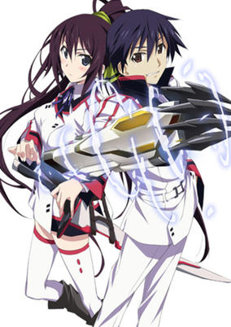

**Studio:** 8-Bit &nbsp;|&nbsp; **Episodes:** 12 &nbsp;|&nbsp; **Director:** Yasuhito Kikuchi &nbsp;|&nbsp; **Aired/Released:** January 7 – April 1 &nbsp;|&nbsp; **Genres:** Earth, Power Suit, Science Fiction, Mecha, Japan, Action, Asia, Comedy, High School, All Girls School, Future, Stereotypes, School Life, Harem

> Japan engineered an armed powered exoskeleton "Infinite Stratos" (IS) and it became the mainstream of weapons. Since only women can operate IS, women dominate the society over men. Orimura Ichika is a 15-year-old boy and accidentally touches an IS placed in the IS pilot training school. He is found to be the only man who can operate IS and forced to enter the training school. Ichika's busy school life surrounded by girls has begun.
>
> _Synopsis source: Kitsu_

[Wikipedia](https://en.wikipedia.org/wiki/Infinite_Stratos) · [Kitsu](https://kitsu.io/anime/is-infinite-stratos)

---

### Dream Eater Merry

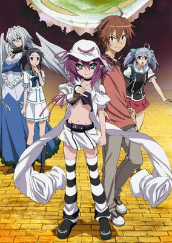

**Studio:** J.C. Staff &nbsp;|&nbsp; **Episodes:** 13 &nbsp;|&nbsp; **Director:** Shigeyasu Yamauchi &nbsp;|&nbsp; **Aired/Released:** January 7 – April 8 &nbsp;|&nbsp; **Genres:** Earth, Contemporary Fantasy, Japan, Action, Fantasy, Asia, Parallel Universe, Plot Continuity, Present, Demon, Super Power

> Yumekui Merry begins with Yumeji Fujiwara, a seemingly average high school student. But ten years ago, Yumeji gained the ability to see the dream auras of other people around him. This ability allows Yumeji to predict what type of dreams people are likely to have next. The dreams of others may not be a mystery to Yumeji, but his own dreams have recently left him puzzled. In dream after dream, Yumeji has been pursued by an army of cats lead by John Doe, who claims he needs Yumeji's body to enter the real world. These strange occurrences get stranger when Yumeji meets Nightmare Merry, a dream demon seeking to return to her own world. Using his powers, Yumeji decides to assist Merry in getting back home. But Merry's very presence in the real world means that the barrier separating dreams and reality has been broken, and not all of the dream demons intend to come to Earth peacefully…
>
> _Synopsis source: Kitsu_

[Wikipedia](https://en.wikipedia.org/wiki/Dream_Eater_Merry) · [Kitsu](https://kitsu.io/anime/yumekui-merry)

---

### Puella Magi Madoka Magica

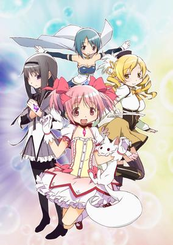

**Studio:** Shaft &nbsp;|&nbsp; **Episodes:** 12 &nbsp;|&nbsp; **Director:** Yukihiro Miyamoto Akiyuki Simbo &nbsp;|&nbsp; **Aired/Released:** January 7 – April 22 &nbsp;|&nbsp; **Genres:** Earth, Japan, Fantasy, Tone Changes, Contemporary Fantasy, Asia, Middle School, Angst, Magic, Horror, Drama, School Life, Magical Girl, Present, Super Power, Thriller, Psychological

> Madoka Kaname and Sayaka Miki are regular middle school girls with regular lives, but all that changes when they encounter Kyuubey, a cat-like magical familiar, and Homura Akemi, the new transfer student. Kyuubey offers them a proposition: he will grant one of their wishes and in exchange, they will each become a magical girl, gaining enough power to fulfill their dreams. However Homura, a magical girl herself, urges them not to accept the offer since everything is not what it seems. A story of hope, despair, and friendship, Mahou Shoujo Madoka★Magica deals with the difficulties of being a magical girl and the price one has to pay to make a dream come true. [Written by MAL Rewrite]
>
> _Synopsis source: Kitsu_

[Wikipedia](https://en.wikipedia.org/wiki/Puella_Magi_Madoka_Magica) · [Kitsu](https://kitsu.io/anime/mahou-shoujo-madoka-magica)

---

### Freezing

**Studio:** A.C.G.T &nbsp;|&nbsp; **Episodes:** 12 &nbsp;|&nbsp; **Director:** Takashi Watanabe &nbsp;|&nbsp; **Aired/Released:** January 8 – April 7

[Wikipedia](https://en.wikipedia.org/wiki/Freezing_(manga))

---

### Gosick

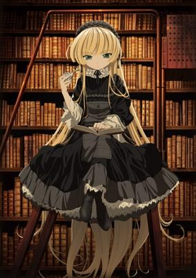

**Studio:** Bones &nbsp;|&nbsp; **Episodes:** 24 &nbsp;|&nbsp; **Director:** Hitoshi Nanba &nbsp;|&nbsp; **Aired/Released:** January 8 – July 2 &nbsp;|&nbsp; **Genres:** Earth, Victorian Period, Alternative Past, Europe, Past, Plot Continuity, Historical, Romance, Mystery

> Kazuya Kujou is a foreign student at Saint Marguerite Academy, a luxurious boarding school in the Southern European country of Sauville. Originally from Japan, his jet-black hair and dark brown eyes cause his peers to shun him and give him the nickname "Black Reaper," based on a popular urban legend about the traveler who brings death in the spring. On a day like any other, Kujou visits the school's extravagant library in search of ghost stories. However, his focus soon changes as he becomes curious about a golden strand of hair on the stairs. The steps lead him to a large garden and a beautiful doll-like girl known as Victorique de Blois, whose complex and imaginative foresight allows her to predict their futures, now intertwined. With more mysteries quickly developing—including the appearance of a ghost ship and an alchemist with the power of transmutation—Victorique and Kujou, bound by fate and their unique skills, have no choice but to rely on each other. [Written by MAL Rewrite]
>
> _Synopsis source: Kitsu_

[Wikipedia](https://en.wikipedia.org/wiki/Gosick) · [Kitsu](https://kitsu.io/anime/gosick)

---

### Cardfight!! Vanguard

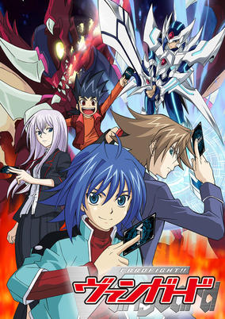

**Studio:** TMS Entertainment &nbsp;|&nbsp; **Episodes:** 65 &nbsp;|&nbsp; **Director:** Hatsuki Tsuji &nbsp;|&nbsp; **Aired/Released:** January 8 – March 31, 2012 &nbsp;|&nbsp; **Genres:** Card Games, Proxy Battles, Demon, Action, Adventure

> Cardfight!! Vanguard features a world where the game Cardfight!! Vanguard has becoming the latest craze among trading card games, becoming a part of everyday life for people all over the world. The game is not limited to Earth alone; battles between the creatures used by the players take place on another planet called Cray. The story begins with Aichi Sendou, a timid middle schooler whose meek attitude often leaves him a target for bullies. Aichi was given a very rare card, "Blaster Blade", when he was very young. It's his one treasure that gives him hope. That is, until it gets taken from him. Although Aichi has never played Cardfight!! Vanguard before, he challenges the thief to a game in order to win the "Blaster Blade" back. This high-stakes game quickly draws Aichi into the world of Vanguard battles, which will test and change his worth as both a player and a person.
>
> _Synopsis source: Kitsu_

[Wikipedia](https://en.wikipedia.org/wiki/Cardfight!!_Vanguard) · [Kitsu](https://kitsu.io/anime/cardfight-vanguard)

---

### Mitsudomoe Zouryouchuu!

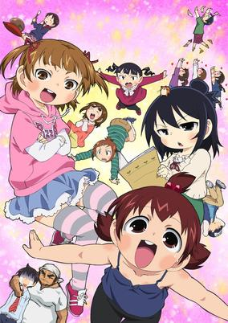

**Studio:** Bridge &nbsp;|&nbsp; **Episodes:** 8 &nbsp;|&nbsp; **Director:** Masahiko Ōta &nbsp;|&nbsp; **Aired/Released:** January 9 – February 27 &nbsp;|&nbsp; **Genres:** Japan, Elementary School, Earth, Slice of Life, Asia, Comedy, Slapstick, School Life, Present

> Second season of Mitsudomoe.
>
> _Synopsis source: Kitsu_

[Wikipedia](https://en.wikipedia.org/wiki/Mitsudomoe_Zouryouchuu!) · [Kitsu](https://kitsu.io/anime/mitsudomoe-zouryouchuu)

---

### I Don't Like My Big Brother At All!!

**Studio:** ZEXCS &nbsp;|&nbsp; **Episodes:** 12 &nbsp;|&nbsp; **Director:** Keitaro Motonaga &nbsp;|&nbsp; **Aired/Released:** January 9 – March 27

[Wikipedia](https://en.wikipedia.org/wiki/I_Don%27t_Like_You_at_All,_Big_Brother!!)

---

### Beelzebub

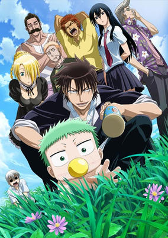

**Studio:** Pierrot Plus &nbsp;|&nbsp; **Episodes:** 60 &nbsp;|&nbsp; **Director:** Yoshihiro Takamoto &nbsp;|&nbsp; **Aired/Released:** January 9 – March 25, 2012 &nbsp;|&nbsp; **Genres:** Contemporary Fantasy, Action, Comedy, Delinquent, School Life, Demon, Shounen

> Ishiyama High is a school populated entirely by delinquents, where nonstop violence and lawlessness are the norm. However, there is one universally acknowledged rule—don't cross first year student Tatsumi Oga, Ishiyama's most vicious fighter. One day, Oga is by a riverbed when he encounters a man floating down the river. After being retrieved by Oga, the man splits down the middle to reveal a baby, which crawls onto Oga's back and immediately forms an attachment to him. Though he doesn't know it yet, this baby is named Kaiser de Emperana Beelzebub IV, or "Baby Beel" for short—the son of the Demon Lord! As if finding the future Lord of the Underworld isn't enough, Oga is also confronted by Hildegard, Beel's demon maid. Together they attempt to raise Baby Beel—although surrounded by juvenile delinquents and demonic powers, the two of them may be in for more of a challenge than they can imagine. [Written by MAL Rewrite]
>
> _Synopsis source: Kitsu_

[Wikipedia](https://en.wikipedia.org/wiki/Beelzebub_(manga)) · [Kitsu](https://kitsu.io/anime/beelzebub)

---

### Dragon Crisis!

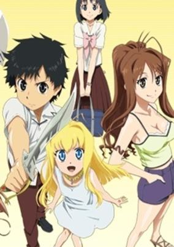

**Studio:** Studio Deen &nbsp;|&nbsp; **Episodes:** 12 &nbsp;|&nbsp; **Director:** Hideki Tachibana &nbsp;|&nbsp; **Aired/Released:** January 11 – March 29 &nbsp;|&nbsp; **Genres:** Earth, Romance, Contemporary Fantasy, Japan, Action, Fantasy, Asia, Sudden Girlfriend Appearance, Dragon, High School, Magic, Anthropomorphism, School Life, Present, Harem

> A normal high school boy Kisaragi Ryuji's peaceful life is turned into an adventure by the return of his second cousin Eriko. Ryuji and Eriko seize a relic box from a black broker. In the box, they find a red dragon girl Rose. In order to protect Rose from the black organization, Ryuji decides to fight using his power as a relic handler.
>
> _Synopsis source: Kitsu_

[Wikipedia](https://en.wikipedia.org/wiki/Dragon_Crisis!) · [Kitsu](https://kitsu.io/anime/dragon-crisis)

---

### Is This a Zombie?

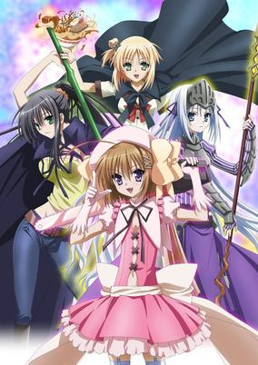

**Studio:** Studio Deen &nbsp;|&nbsp; **Episodes:** 12 &nbsp;|&nbsp; **Director:** Takaomi Kanasaki &nbsp;|&nbsp; **Aired/Released:** January 11 – March 30 &nbsp;|&nbsp; **Genres:** Earth, Vampire, Ninja, Loli, Contemporary Fantasy, Japan, Ecchi, Parody, Fantasy, Asia, Comedy, Magical Girl, Violence, Harem, Magic, Zombie, Action

> Not every zombie is the monstrous, brain-eating type. One night while walking home from the convenience store, regular high school boy Ayumu Aikawa is killed by a serial killer, and is just as suddenly brought back to life by a necromancer named Eucliwood Hellscythe. One small caveat: he's now a zombie. Things get even weirder for him when he accidentally steals a magical girl's uniform, and thus her powers! Haruna, the ex-magical girl, orders him to fight evil creatures known as Megalo in her place until they can figure out a way to get her powers back to her. It seems that life is just going to get stranger and stranger for poor Ayumu from here on out in Kore wa Zombie desu ka?.
>
> _Synopsis source: Kitsu_

[Wikipedia](https://en.wikipedia.org/wiki/Is_This_a_Zombie%3F) · [Kitsu](https://kitsu.io/anime/kore-wa-zombie-desu-ka)

---

### Level E

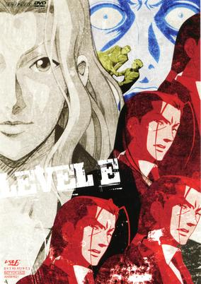

**Studio:** David Production Pierrot &nbsp;|&nbsp; **Episodes:** 13 &nbsp;|&nbsp; **Director:** Toshiyuki Kato &nbsp;|&nbsp; **Aired/Released:** January 11 – April 5 &nbsp;|&nbsp; **Genres:** Science Fiction, Comedy

> This extraterrestrial adventure follows the alien genius, Prince Baka as he turns life on Earth into his own personal laugh track. The Prince has the biggest brain in the galaxy, and he’s also a sadistic prankster who loves to make humans squirm. Nostalgic anime fans will fall hard for this “undeniably clever” series that spoofs the television shows and video games they loved as kids.
>
> _Synopsis source: Kitsu_

[Wikipedia](https://en.wikipedia.org/wiki/Level_E) · [Kitsu](https://kitsu.io/anime/level-e)

---

### Kimi ni Todoke 2nd Season (Kimi ni Todoke: From Me To You 2)

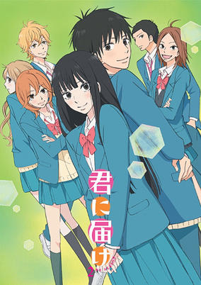

**Studio:** Production I.G &nbsp;|&nbsp; **Episodes:** 12 &nbsp;|&nbsp; **Director:** Hiro Kaburagi &nbsp;|&nbsp; **Aired/Released:** January 12 – March 30 &nbsp;|&nbsp; **Genres:** High School, Present, Earth, Japan, Asia, Comedy, Romance, Friendship, Slice of Life, School Life

> The continuation of the first season. Sawako Kuronuma and her friends have just begun their second year of high school and they are in the same class together again. To make matters more interesting a male student newly transferred into their class is seated right next to Kuronuma and has taken an interest in her. What hurdles will Sawako and Kazehaya face next?
>
> _Synopsis source: Kitsu_

[Wikipedia](https://en.wikipedia.org/wiki/Kimi_ni_Todoke) · [Kitsu](https://kitsu.io/anime/kimi-ni-todoke-2nd-season)

---

### DD Fist of the North Star

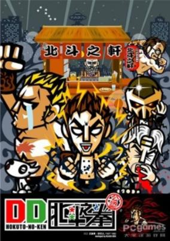

**Studio:** North Stars Pictures &nbsp;|&nbsp; **Episodes:** 12 &nbsp;|&nbsp; **Director:** Kajio &nbsp;|&nbsp; **Aired/Released:** January 12 – April 6 &nbsp;|&nbsp; **Genres:** Japan, Comedy, Super Deformed, Present, Parody

> Super-deformed version of Hokuto no Ken, Buronson &amp; Hara Tetsuo's post-apocalyptic fighting manga. Note: The "DD" stands for "Design Deformation," since the characters are only "two-heads-tall."
>
> _Synopsis source: Kitsu_

[Wikipedia](https://en.wikipedia.org/wiki/DD_Fist_of_the_North_Star) · [Kitsu](https://kitsu.io/anime/dd-hokuto-no-ken)

---

### Fractale

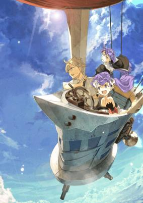

**Studio:** A-1 Pictures &nbsp;|&nbsp; **Episodes:** 11 &nbsp;|&nbsp; **Director:** Yutaka Yamamoto &nbsp;|&nbsp; **Aired/Released:** January 14 – April 1 &nbsp;|&nbsp; **Genres:** Dystopia, Fantasy, Fantasy World, Adventure, Human Enhancement, Plot Continuity, Virtual Reality, Science Fiction

> The story takes place on an island, where a "Fractale System" is beginning to collapse. One day, Clain finds an injured girl called Phryne under a cliff. She disappears leaving a pendant. Clain sets out for a journey with the girl-shaped avatar Nessa to look for Phryne and discovers the secret of the Fractale System.
>
> _Synopsis source: Kitsu_

[Wikipedia](https://en.wikipedia.org/wiki/Fractale) · [Kitsu](https://kitsu.io/anime/fractale)

---

### Wandering Son

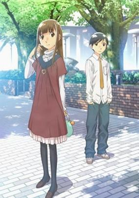

**Studio:** AIC Classic &nbsp;|&nbsp; **Episodes:** 11 &nbsp;|&nbsp; **Director:** Ei Aoki &nbsp;|&nbsp; **Aired/Released:** January 14 – April 1 &nbsp;|&nbsp; **Genres:** Romance, Japan, Earth, Slice of Life, Asia, Middle School, Tokyo, Coming Of Age, School Life, Present

> Effeminate fifth grader Shuuichi Nitori is considered by most to be one of the prettiest girls in school, but much to her dismay, she is actually biologically male. Fortunately, Shuuichi has a childhood friend who has similar feelings of discomfort related to gender identity: the lanky tomboy Yoshino Takatsuki, who, though biologically female, does not identify as a girl. These two friends share a similar secret and find solace in one another; however, their lives become even more complicated when they must tread the unfamiliar waters of a new school, attempt to make new friends, and struggle to maintain old ones. Faced with nearly insurmountable odds, they must learn to deal with the harsh realities of growing up, transexuality, relationships, and acceptance. Lauded as a decidedly serious take on gender identity and LGBT struggles, Takako Shimura's Hourou Musuko is about Shuuichi and Yoshino's attempts to discover their true selves as they enter puberty, make friends, fall in love, and face some very real and difficult choices. [Written by MAL Rewrite]
>
> _Synopsis source: Kitsu_

[Wikipedia](https://en.wikipedia.org/wiki/Wandering_Son) · [Kitsu](https://kitsu.io/anime/hourou-musuko)

---

### Suite Pretty Cure

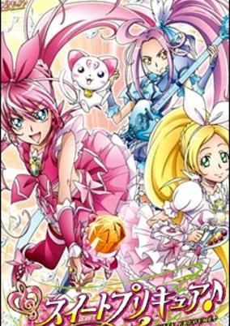

**Studio:** Toei Animation &nbsp;|&nbsp; **Episodes:** 48 &nbsp;|&nbsp; **Director:** Munehisa Sakai &nbsp;|&nbsp; **Aired/Released:** February 6 – January 29, 2012 &nbsp;|&nbsp; **Genres:** Middle School, Magic, Magical Girl, Super Power, Present, Earth, Japan, Plot Continuity, Music, Asia

> Kanon Town is filled with music. Hibiki Houjou and Kanade Minamino have grown up in this town and have known each other since they were children. However, they no longer get along. One day the fairy Hummy from the land of music, Major Land, appears before them. The evil king Mephisto of Minor Land is planning to turn the legendary Melody of Happiness into the Melody of Misfortune. To prevent this from happening, Hibiki and Kanade transform themselves into Pretty Cure. Kanade and Hibiki have to learn to work together to collect the scattered notes of the Melody of Happiness in order to recreate the score!
>
> _Synopsis source: Kitsu_

[Wikipedia](https://en.wikipedia.org/wiki/Suite_Pretty_Cure) · [Kitsu](https://kitsu.io/anime/suite-precure)

---

### Little Battlers eXperience (LBX: Little Battlers eXperience)

**Studio:** OLM &nbsp;|&nbsp; **Episodes:** 44 &nbsp;|&nbsp; **Director:** Naohito Takahashi &nbsp;|&nbsp; **Aired/Released:** March 2 – January 11, 2012 &nbsp;|&nbsp; **Genres:** Mecha, Action, Science Fiction, Proxy Battles, Kids

> In 2046, a revolutionary 80% shock-absorbing reinforced cardboard has been developed, rapidly transforming the world's exports. The reinforced cardboard would soon become the battleground for a popular children's hobby called "LBX" (Little Battler eXperience). Four years later, a boy named Yamano Ban who loves to play with LBX (although without a mecha himself) is given a case containing the model AX-00 by a mysterious woman. He is told that he now holds the hopes and despairs of mankind in his hands.
>
> _Synopsis source: Kitsu_

[Wikipedia](https://en.wikipedia.org/wiki/Little_Battlers_Experience) · [Kitsu](https://kitsu.io/anime/danball-senki)

---

### Shiawase Haitatsu Taneko

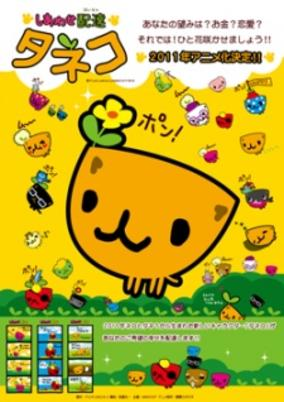

**Studio:** Kachidoki Studio &nbsp;|&nbsp; **Aired/Released:** March 26 – &nbsp;|&nbsp; **Genres:** Comedy

> The story centers around a cat who answers people's wishes and delivers happiness. ("Tane" and "neko" are the Japanese words for "seed" and "cat," respectively.)
>
> _Synopsis source: Kitsu_

[Kitsu](https://kitsu.io/anime/shiawase-haitatsu-taneko)

---

### X-Men

**Studio:** Madhouse &nbsp;|&nbsp; **Episodes:** 12 &nbsp;|&nbsp; **Director:** Fuminori Kizaki &nbsp;|&nbsp; **Aired/Released:** April 1 – June 24

[Wikipedia](https://en.wikipedia.org/wiki/Marvel_Anime)

---

### Dog Days

**Studio:** Seven Arcs &nbsp;|&nbsp; **Episodes:** 13 &nbsp;|&nbsp; **Director:** Keizō Kusakawa &nbsp;|&nbsp; **Aired/Released:** April 2 – June 25

[Wikipedia](https://en.wikipedia.org/wiki/Dog_Days_(Japanese_TV_series))

---

### Duel Masters Victory

**Studio:** Shogakukan Music & Digital Entertainment &nbsp;|&nbsp; **Episodes:** 52 &nbsp;|&nbsp; **Director:** Waruo Suzuki &nbsp;|&nbsp; **Aired/Released:** April 2 – March 31, 2012 &nbsp;|&nbsp; **Genres:** Earth, Action, Adventure, Comedy, Proxy Battles, Card Games

> Shobu and friends continue to face the members of Fua Duelist in the world championship and defeat them all. And now Shobu is the world champion. Before Shobu could relax he is being called into the creature world to face Diabolos Zeta, Temporal Ruler, who is about to bring annihilation. Shobu and friends gather the new legendary cards and stop him with their new powers of these cards.
>
> _Synopsis source: Kitsu_

[Wikipedia](https://en.wikipedia.org/wiki/Duel_Masters) · [Kitsu](https://kitsu.io/anime/duel-masters-cross-shock)

---

### Penguin no Mondai DX?

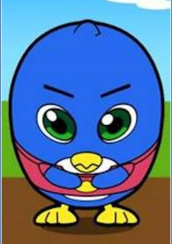

**Studio:** Shogakukan Music & Digital Entertainment &nbsp;|&nbsp; **Episodes:** 52 &nbsp;|&nbsp; **Aired/Released:** April 2 – March 31, 2012 &nbsp;|&nbsp; **Genres:** Comedy, Kids

> The continuation of Penguin no Mondai Max.
>
> _Synopsis source: Kitsu_

[Kitsu](https://kitsu.io/anime/penguin-no-mondai-dx)

---

### Tiger & Bunny

**Studio:** Sunrise &nbsp;|&nbsp; **Episodes:** 25 &nbsp;|&nbsp; **Director:** Keiichi Satō &nbsp;|&nbsp; **Aired/Released:** April 3 – September 18 &nbsp;|&nbsp; **Genres:** Earth, Power Suit, Science Fiction, Mecha, Action, Special Squads, Alternative Past, Superhero, United States, Americas, Past, Law And Order, Super Power, Comedy, Mystery

> In Stern Bild City, those with special abilities are called "NEXT," and can use their powers for good or bad. A unique organized group of NEXT appear regularly on Hero TV, where they chase down evildoers to bring limelight to their sponsors and earn Hero Points in the hopes of becoming the next "King of Heroes." Kotetsu T. Kaburagi, known as "Wild Tiger," is a veteran hero whose performance has been dwindling as of late, partially due to his inability to cooperate with other heroes. After a disappointing season in which most of the other heroes far outperformed Tiger, he is paired up with a brand new hero who identifies himself by his real name—Barnaby Brooks Jr. Barnaby, nicknamed "Bunny" by his frivolous new partner, quickly makes it clear that the two could not be more different. Though they mix as well as oil and water, Tiger and Bunny must learn to work together, both for the sake of their careers and to face the looming threats within Stern Bild.
>
> _Synopsis source: Kitsu_

[Wikipedia](https://en.wikipedia.org/wiki/Tiger_%26_Bunny) · [Kitsu](https://kitsu.io/anime/tiger-bunny)

---

### Digimon Fusion

**Studio:** Toei Animation &nbsp;|&nbsp; **Episodes:** 24 &nbsp;|&nbsp; **Director:** Tetsuya Endō &nbsp;|&nbsp; **Aired/Released:** April 3 – September 25 &nbsp;|&nbsp; **Genres:** Science Fiction, Action, Fantasy World, Adventure, Proxy Battles, Present, Virtual Reality, Fantasy, Comedy, Friendship

> The Digital World is in a state of war, with the evil Bagra Army attempting to collect fragments of the Code Crown. Whoever manages to collect all 108 fragments will become king of the Digital World. An evil group of Digimon, known as the Bagra Army, are determined to get their hands on the Code Crown.Digimon Xros Wars features Taiki Kudou, a soccer-loving middle schooler who will always go out of his way to help people in need. When out with his friends Akari Hinomoto and Zenjirou Tsurugi one day, he hears a voice calling out for help. Investigating the situation, he meets a Digimon named Shoutmon who has been severely wounded in a nearby alley. Using the power of a strange device called a Xros Loader, Taiki manages to save Shoutmon's life, but is pulled into the Digital World alongside Akari and Zenjirou. Determined not to let the evil Bagra have their way, Taiki and his friends join with Shoutmon and other local Digimon to form their own army known as Xros Heart. Now Xros Heart must fight their way across the Digital World to collect Code Crown fragments and defeat the Bagra Army, but Taiki and his friends are not the only humans caught up in this war of monsters…
>
> _Synopsis source: Kitsu_

[Wikipedia](https://en.wikipedia.org/wiki/Digimon_Fusion) · [Kitsu](https://kitsu.io/anime/digimon-xros-wars)

---

### Hanasaku Iroha - Blossoms for Tomorrow (Hanasaku Iroha ~Blossoms for Tomorrow~)

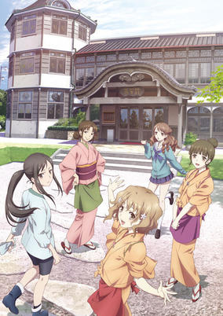

**Studio:** P.A. Works &nbsp;|&nbsp; **Episodes:** 26 &nbsp;|&nbsp; **Director:** Masahiro Andō &nbsp;|&nbsp; **Aired/Released:** April 3 – September 25 &nbsp;|&nbsp; **Genres:** Earth, Japan, Slice of Life, Asia, Coming Of Age, Plot Continuity, Present, Comedy

> Ohana Matsumae is an energetic and wild teenager residing in Tokyo with her carefree single mother. Abruptly, her mother decides to run away with her new boyfriend from debt collectors, forcing the young girl to fend for herself—as per her mother’s "rely only on yourself" philosophy—in rural Japan, where her cold grandmother runs a small inn. Driven to adapt to the tranquil lifestyle of the countryside, Ohana experiences and deals with the challenges of working as a maid, as well as meeting and making friends with enthralling people at her new school and the inn. [Written by MAL Rewrite]
>
> _Synopsis source: Kitsu_

[Wikipedia](https://en.wikipedia.org/wiki/Hanasaku_Iroha) · [Kitsu](https://kitsu.io/anime/hanasaku-iroha)

---

### Nichijou - My Ordinary Life

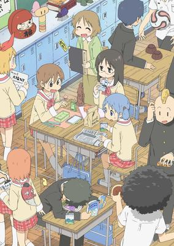

**Studio:** Kyoto Animation &nbsp;|&nbsp; **Episodes:** 26 &nbsp;|&nbsp; **Director:** Tatsuya Ishihara &nbsp;|&nbsp; **Aired/Released:** April 3 – September 25 &nbsp;|&nbsp; **Genres:** Japan, Parody, Slice of Life, Comedy, High School, Slapstick, School Life, Present

> Nichijou primarily focuses on the daily antics of a trio of childhood friends—high school girls Mio Naganohara, Yuuko Aioi and Mai Minakami—whose stories soon intertwine with the young genius Hakase Shinonome, her robot caretaker Nano, and their talking cat Sakamoto. With every passing day, the lives of these six, as well as of the many people around them, experience both the calms of normal life and the insanity of the absurd. Walking to school, being bitten by a talking crow, spending time with friends, and watching the principal suplex a deer: they are all in a day's work in the extraordinary everyday lives of those in Nichijou. [Written by MAL Rewrite]
>
> _Synopsis source: Kitsu_

[Wikipedia](https://en.wikipedia.org/wiki/Nichijou) · [Kitsu](https://kitsu.io/anime/nichijou)

---

### Suzy's Zoo: A Day with Witzy

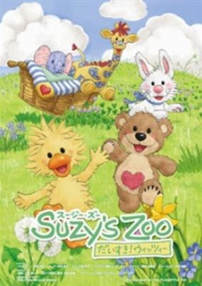

**Studio:** Digital Media Lab &nbsp;|&nbsp; **Episodes:** 25 &nbsp;|&nbsp; **Director:** Hidekazu Ohara &nbsp;|&nbsp; **Aired/Released:** April 3 – October 4 &nbsp;|&nbsp; **Genres:** Kids

> The Japanese television network TBS announced that it will start airing the Suzy's Zoo Daisuki! Witzy series of television anime shorts this April. The anime adapts the American greeting card line Suzy's Zoo from the San Diego-based artist Suzy Spafford. The story will center around a duckling named Witzy and his stuffed animal friends in a verdant backyard.
>
> _Synopsis source: Kitsu_

[Wikipedia](https://en.wikipedia.org/wiki/Suzy%27s_Zoo) · [Kitsu](https://kitsu.io/anime/suzy-s-zoo-daisuki-witzy)

---

### Bakugan Battle Brawlers: Gundalian Invaders (Bakugan: Gundalian Invaders)

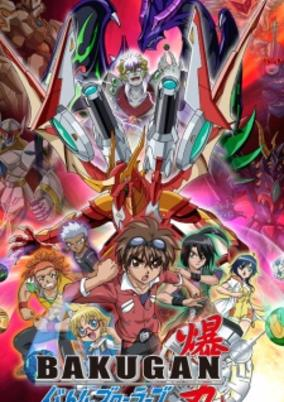

**Studio:** TMS Entertainment &nbsp;|&nbsp; **Episodes:** 39 &nbsp;|&nbsp; **Director:** Mitsuo Hashimoto &nbsp;|&nbsp; **Aired/Released:** April 3 – January 22, 2012 &nbsp;|&nbsp; **Genres:** Proxy Battles, Action, Fantasy, Adventure

> Dan, Marucho, and Shun get caught up in a war between two different alien factions in another universe, and teaming up with three new brawlers: the Neathian, Fabia, the new human, Jake, and the Gundalian, Ren, in order to stop the evil Gundalian Protectors, the Twelve Orders from destroying Neathia, and possibly, Earth. They meet these people by them entering through the virtual reality Bakugan Interspace. The stakes are high! Will the Battle Brawlers triumph, saving the Bakugan once more?
>
> _Synopsis source: Kitsu_

[Kitsu](https://kitsu.io/anime/bakugan-battle-brawlers-gundalian-invaders)

---

### Beyblade: Metal Fury

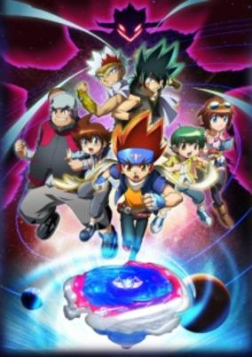

**Studio:** SynergySP &nbsp;|&nbsp; **Episodes:** 52 &nbsp;|&nbsp; **Director:** Kunihisa Sugishima &nbsp;|&nbsp; **Aired/Released:** April 3 – April 1, 2012 &nbsp;|&nbsp; **Genres:** Sports, Friendship, Adventure

> In the Cosmos, an unusual event has occurred. Taking a break from their latest triumph over Faust and the Spiral Core, Ginga and Co find themselves saving a boy named Yuki from a mysterious youth named Johannes. Although Yuki is a boy genius and an astronomer, he is a Blader who owns “Anubius”. Yuki says that he has come to tell Ginga and his friends about the voice of the Star Fragment. He witnessed the Star Fragment (a meteor) fall from the sky one day. That single light dwells within Anubius and he says that he heard the voice of the Star Fragment that evening. A great evil is trying to revive the “Black Sun” and "Nemesis", the god of destruction, by using the unknown power of the Star Fragment and destroy the world. Ginga and his friends must fight again, just as soon as they get the hang of their new 4D system beys! The episode numbers continue from 103.
>
> _Synopsis source: Kitsu_

[Kitsu](https://kitsu.io/anime/metal-fight-beyblade-4d)

---

### Toriko

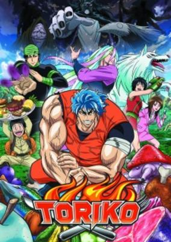

**Studio:** Toei Animation &nbsp;|&nbsp; **Episodes:** 147 &nbsp;|&nbsp; **Director:** Akifumi Zako Hidehito Ueda &nbsp;|&nbsp; **Aired/Released:** April 3 – March 30, 2014 &nbsp;|&nbsp; **Genres:** Adventure, Action, Comedy, Martial Arts, Cooking, Super Power, Fantasy, Shounen

> Welcome to the Gourmet Age, where happiness is measured by what you eat. In an era in which life revolves around fine cuisine, people will go to great lengths to procure special ingredients which have the power to turn a nice meal into a heavenly delight. However, since these delicious additives usually come from rare, powerful creatures, Gourmet Hunters are called upon to gather them. The International Gourmet Organization has the utmost power in this world, and is responsible for maintaining the balance of the distribution of ingredients worldwide. One day, Chef Komatsu is sent on a mission to locate one of the most renowned Gourmet Hunters in existence, Toriko, and to hire him for a very special job. However, astounded by Toriko's skill and unbelievable passion, what started out as a simple mission gradually grows into a deep friendship. Combine the talents of Gourmet Hunter Toriko, who dreams of creating the ultimate Full Course meal, and Chef Komatsu, who aspires to one day become a Master Chef, and the recipe for success may just be discovered.
>
> _Synopsis source: Kitsu_

[Wikipedia](https://en.wikipedia.org/wiki/Toriko) · [Kitsu](https://kitsu.io/anime/toriko)

---

### We Without Wings - Under the Innocent Sky (We Without Wings – Under the Innocent Sky)

**Studio:** Nomad &nbsp;|&nbsp; **Episodes:** 12 &nbsp;|&nbsp; **Director:** Shinji Ushiro &nbsp;|&nbsp; **Aired/Released:** April 4 – June 20 &nbsp;|&nbsp; **Genres:** Parental Abandonment, Earth, Japan, Ecchi, Asia, Harem, Comedy, Romance

> Haneda Takashi has a secret he cannot speak of. To leave his dull school-life, he was supposed to have escaped to another world. However, he is reeled in by certain ties on his heart. One of these is Kobato, his awkward younger sister. The other is Watarai Asuka, his negligent girlfriend. Chitose Shuusuke is a poor freeloader. He passes his days working at various part-time jobs. One day, he has a disastrous first encounter with Tamaizumi Hiyoko. The next time they meet, Shuusuke discovers that they are fellow employees at his part-time job. Narita Hayato sees himself as a "hard-boiled" person. Back-breaking jobs are nothing to him. Hayato shuns normal human contact, but, during the nights, he would get together with delinquents and other denizens of the night. One such night, he meets the cheerful and oblivious Otori Naru. The relationships with these girls will greatly affect these 3 young men. But what, exactly, is the relationship these young men have with each other?
>
> _Synopsis source: Kitsu_

[Wikipedia](https://en.wikipedia.org/wiki/We_Without_Wings) · [Kitsu](https://kitsu.io/anime/oretachi-ni-tsubasa-wa-nai-under-the-innocent-sky)

---

### Shouwa Monogatari

**Studio:** WAO World &nbsp;|&nbsp; **Episodes:** 13 &nbsp;|&nbsp; **Director:** Hiroshi Kugimiya Mitsuhiro Tougou &nbsp;|&nbsp; **Aired/Released:** April 4 – June 26

[Wikipedia](https://en.wikipedia.org/wiki/Sh%C5%8Dwa_Monogatari)

---

### Fireball Charming

**Studio:** Jinnis Animation Studios &nbsp;|&nbsp; **Episodes:** 13 &nbsp;|&nbsp; **Director:** Wataru Arakawa &nbsp;|&nbsp; **Aired/Released:** April 4 – June 27

[Wikipedia](https://en.wikipedia.org/wiki/Fireball_(anime))

---

### Fujilog [ q ]

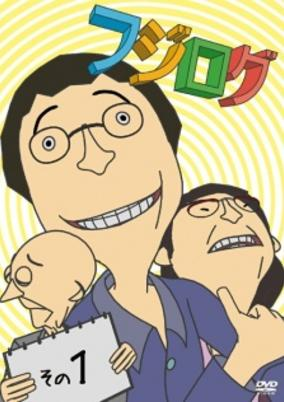

**Studio:** Team Fujilog &nbsp;|&nbsp; **Episodes:** 13 &nbsp;|&nbsp; **Director:** Shigeo Shichiji &nbsp;|&nbsp; **Aired/Released:** April 4 – June 27 &nbsp;|&nbsp; **Genres:** Comedy

> The story follows the hapless life of Osamu Fujiyama, 33 years old and NEET (Not in Education, Employment or Training).
>
> _Synopsis source: Kitsu_

[Kitsu](https://kitsu.io/anime/fujilog)

---

### Gintama'

**Studio:** Sunrise &nbsp;|&nbsp; **Episodes:** 51 &nbsp;|&nbsp; **Director:** Yōichi Fujita &nbsp;|&nbsp; **Aired/Released:** April 4 – March 26, 2012

[Wikipedia](https://en.wikipedia.org/wiki/Gin_Tama)

---

### Tono to Issho: Gantai no Yabō

**Studio:** Gathering &nbsp;|&nbsp; **Episodes:** 12 &nbsp;|&nbsp; **Director:** Mankyū &nbsp;|&nbsp; **Aired/Released:** April 5 – June 21 &nbsp;|&nbsp; **Genres:** Japan, Parody, Comedy, Sengoku Period, Historical, Samurai

> Comedy parodying famous samurai generals and historical events.
>
> _Synopsis source: Kitsu_

[Wikipedia](https://en.wikipedia.org/wiki/Tono_to_Issho) · [Kitsu](https://kitsu.io/anime/tono-to-issho)

---

### Battle Girls: Time Paradox

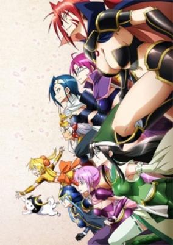

**Studio:** TMS Entertainment &nbsp;|&nbsp; **Episodes:** 13 &nbsp;|&nbsp; **Director:** Hideki Okamoto &nbsp;|&nbsp; **Aired/Released:** April 5 – June 28 &nbsp;|&nbsp; **Genres:** Science Fiction, Japan, Earth, Asia, Sengoku Period, Time Travel, Past, Samurai, Historical, Super Power, Action, Comedy

> Hideyoshino is an average girl who always seems to find trouble wherever she goes. One day Hideyoshino visits a local shrine to pray in order to pass her upcoming test. However Hideyoshino sees a blue light coming from inside the Shrine and looks inside to find a mysterious person performing a magic spell. Hideyoshino in a stroke of bad luck trips on a small bell and crashes into the shrine prompting the stranger to catch her. However upon catching Hideyoshino the magic spell spirals out of control and sends Hideyoshino back in time to the Sengoku Era. Hideyoshino then encounters Akechi Mitsuhide and Oda Nobunaga. But unlike what really happened during the era, Hideyoshino realizes that everyone in the world is female. She then decides to help Oda Nobunaga find the Crimson Armor which is said to allow the person wearing the armor to conquer all of Japan.
>
> _Synopsis source: Kitsu_

[Kitsu](https://kitsu.io/anime/sengoku-otome-momoiro-paradox)

---

### Steins;Gate

**Studio:** White Fox &nbsp;|&nbsp; **Episodes:** 24 &nbsp;|&nbsp; **Director:** Hiroshi Hamasaki Takuya Satō Tomoki Kobayashi &nbsp;|&nbsp; **Aired/Released:** April 6 – September 14

[Wikipedia](https://en.wikipedia.org/wiki/Steins;Gate_(anime))

---

### Kaiji: Against All Rules

**Studio:** Madhouse &nbsp;|&nbsp; **Episodes:** 26 &nbsp;|&nbsp; **Director:** Yūzō Satō &nbsp;|&nbsp; **Aired/Released:** April 6 – September 28

[Wikipedia](https://en.wikipedia.org/wiki/Kaiji_(anime))

---

### Spellbound! Magical Princess Lilpri

**Studio:** Telecom Animation Film &nbsp;|&nbsp; **Episodes:** 51 &nbsp;|&nbsp; **Director:** Masatsugu Arakawa &nbsp;|&nbsp; **Aired/Released:** April 6 – March 28, 2012 &nbsp;|&nbsp; **Genres:** Contemporary Fantasy, Fantasy, Japan, Fantasy World, Slice of Life, Magic, Magical Girl, Plot Continuity, Present

> The Fairytale World is in trouble. Its princesses and their respective worlds are disappearing, causing a ripple effect in the human world where their stories are popular. In order to save the Fairytale World, the Queen sends three magic animals, Sei, Dai, and Ryoku, to the human world with magic gems to find three girls who can become the "Super Miracle Idols," the princesses Snow White, Cinderella, and Kaguya-hime. Those "princesses" end up being three little girls: Yukimori Ringo, Takashiro Layla, and Sasahara Natsuki. But the gems transform them into older singing superstars, and after their accidental debut at the singer Wish's concert, they become known as "Little Princesses," or "LilPri." Now they must collect Happiness Tones from humans in order to restore the Fairytale World.
>
> _Synopsis source: Kitsu_

[Wikipedia](https://en.wikipedia.org/wiki/Lilpri) · [Kitsu](https://kitsu.io/anime/hime-chen-otogi-chikku-idol-lilpri)

---

### A Thirty-Year Old's Health and Physical Education

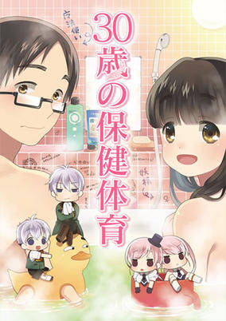

**Studio:** Gathering &nbsp;|&nbsp; **Episodes:** 12 &nbsp;|&nbsp; **Director:** Mankyū &nbsp;|&nbsp; **Aired/Released:** April 7 – June 23 &nbsp;|&nbsp; **Genres:** Earth, Romance, Japan, Ecchi, Slice of Life, Asia, Comedy, Plot Continuity, Present, Parody

> Based on Mitsuba and Ichijinsha's 30-sai no Hoken Taiiku (Health and Physical Education for 30-Year-Olds) guidebook. The guide is aimed at men in their 30s who have not experienced romance or sex with women yet. Imagawa Hayao is a 30-year-old virgin bachelor. One day, a cupid descends from heaven with the express purpose of forcing him to graduate from virginity. Thus unfolds a pure love story between a 30-year-old bachelor and a 30-year-old bachelorette.
>
> _Synopsis source: Kitsu_

[Wikipedia](https://en.wikipedia.org/wiki/30-sai_no_Hoken_Taiiku) · [Kitsu](https://kitsu.io/anime/thirty-sai-no-hoken-taiiku)

---

### 47 Todoufuken

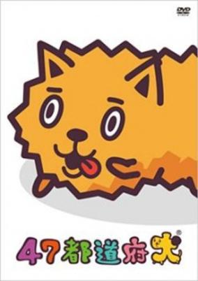

**Studio:** Pollyanna Graphics &nbsp;|&nbsp; **Episodes:** 26 &nbsp;|&nbsp; **Aired/Released:** April 7 – September 29 &nbsp;|&nbsp; **Genres:** Comedy, Kids

> "47 Prefecture Dogs" is a short flash animation from a voice over variety TV program in Japan called "SAY! YOU! SAY! ME!" The animation takes Japan's 47 prefectures—or more specifically, the local delicacies or famous landmarks from each of the regions—and gives them a canine makeover. For example, the "Fukuoka-ken" (Fukuoka dog),—Fukuoka of course being home to asianbeat HQ—uses the delicacy "mentaiko" (spicy pollack roe) as the motif for its canine characterization. Each of the characters are played by voice actors that hail from each of the individual prefectures, "Fukuoka-ken" being voiced by Fukuoka's Kana Asumi. Another feature of this anime is the use of regional dialect. All the dogs speak in the dialect of their individual prefectures. So for the Fukuoka dog you hear a lot of "~to" and "~to yo" at the end of sentences; for the Aichi dog it's "~dagane," and for Ehime, "~zonamoshi," etc.
>
> _Synopsis source: Kitsu_

[Kitsu](https://kitsu.io/anime/forty-seven-todoufuken)

---

### Hyouge Mono

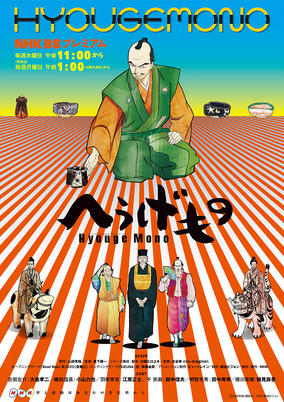

**Studio:** Bee Train &nbsp;|&nbsp; **Episodes:** 39 &nbsp;|&nbsp; **Director:** Kōichi Mashimo &nbsp;|&nbsp; **Aired/Released:** April 7 – January 26, 2012 &nbsp;|&nbsp; **Genres:** Japan, Asia, Comedy, Feudal Warfare, Sengoku Period, Swordplay, War, Past, Samurai, Historical

> The story is set during Japan's Sengoku Jidai (Era of the Warring States) and centers on Furuta Sasuke, a vassal of the great warlord Oda Nobunaga and a man obsessed with tea ceremony and material desires in his pursuit of a fortuitous life. Having learned from Oda and the legendary tea master Sen no Soueki, Furuta walks the way of the Hyouge Mono.
>
> _Synopsis source: Kitsu_

[Wikipedia](https://en.wikipedia.org/wiki/Hyouge_Mono) · [Kitsu](https://kitsu.io/anime/hyouge-mono)

---

### Sket Dance

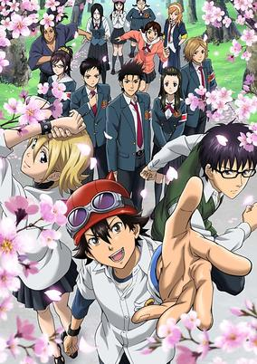

**Studio:** Tatsunoko Production &nbsp;|&nbsp; **Episodes:** 77 &nbsp;|&nbsp; **Director:** Keiichiro Kawaguchi &nbsp;|&nbsp; **Aired/Released:** April 7 – September 27, 2012 &nbsp;|&nbsp; **Genres:** Earth, Japan, Asia, Comedy, High School, School Clubs, Present, School Life

> At Kaimei High School, the Living Assistance Club (aka the Sket Brigade) was organized to help students with problems big or small. Most of the time, though, they hang out in their club room, bored, with only a few trivial problems floating in every once in a while. In spite of this, they still throw all their energy into solving these worries.
>
> _Synopsis source: Kitsu_

[Wikipedia](https://en.wikipedia.org/wiki/Sket_Dance) · [Kitsu](https://kitsu.io/anime/sket-dance)

---

### A-Channel

**Studio:** Studio Gokumi &nbsp;|&nbsp; **Episodes:** 12 &nbsp;|&nbsp; **Director:** Manabu Ono &nbsp;|&nbsp; **Aired/Released:** April 8 – June 24

[Wikipedia](https://en.wikipedia.org/wiki/A_Channel_(manga))

---

### Ghastly Prince Enma Burning Up

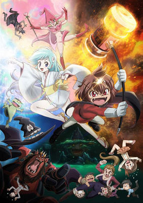

**Studio:** Brain's Base &nbsp;|&nbsp; **Episodes:** 12 &nbsp;|&nbsp; **Director:** Yoshitomo Yonetani &nbsp;|&nbsp; **Aired/Released:** April 8 – June 24 &nbsp;|&nbsp; **Genres:** Japan, Fantasy, Ecchi, Action, Earth, Contemporary Fantasy, Asia, Comedy, Tokyo, Magic, Anthropomorphism, Past, Slapstick, Demon, Super Power

> It's Tokyo in the 1970s, and evil youkai (demons) are attacking the human world. The "Youkai Patrol"—Enma, Princess Yukiko, Kapaeru, and Grandpa Shappo—are sent from hell to exterminate them.
>
> _Synopsis source: Kitsu_

[Wikipedia](https://en.wikipedia.org/wiki/Dororon_Enma-kun_Meeramera) · [Kitsu](https://kitsu.io/anime/dororon-enma-kun-meeramera)

---

### Maria†Holic Alive

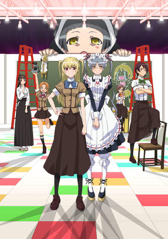

**Studio:** Shaft &nbsp;|&nbsp; **Episodes:** 12 &nbsp;|&nbsp; **Director:** Akiyuki Simbo (Chief) Tomokazu Tokoro &nbsp;|&nbsp; **Aired/Released:** April 8 – June 24 &nbsp;|&nbsp; **Genres:** Earth, Japan, Asia, Comedy, Super Deformed, All Girls School, Present, Parody, Shoujo Ai, School Life

> Miyamae Kanako, a high school girl, who is allergic to boys, enrolls in an all-girls school, hoping to find a female romantic partner. However, her ideal candidate, Shidou Mariya, turns out to be a mischievous cross-dressing boy, who together with his sarcastic maid Shinouji Matsurika, give Kanako really difficult times. Time passes and Kanako still fantasizes about her ideal female romantic partner(s), to no avail, alas. Living in the same room at the dormitory Mariya and his outspoken maid keep on challenging Kanako's sense of reality on a daily basis.
>
> _Synopsis source: Kitsu_

[Kitsu](https://kitsu.io/anime/maria-holic-alive)

---

### Softenni! the Animation

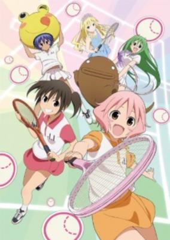

**Studio:** Xebec &nbsp;|&nbsp; **Episodes:** 12 &nbsp;|&nbsp; **Director:** Ryouki Kamitsubo &nbsp;|&nbsp; **Aired/Released:** April 8 – June 24 &nbsp;|&nbsp; **Genres:** Japan, Ecchi, Earth, Sports, Tennis, Asia, Comedy, Middle School, School Clubs, Stereotypes, School Life, Countryside, Present

> The tennis comedy centers around the members of a female middle school soft tennis team and the twists and turns that their lives take as they aim for the nationals.
>
> _Synopsis source: Kitsu_

[Wikipedia](https://en.wikipedia.org/wiki/Softenni) · [Kitsu](https://kitsu.io/anime/softenni)

---

### HenSemi

**Studio:** Xebec &nbsp;|&nbsp; **Episodes:** 13 &nbsp;|&nbsp; **Director:** Takao Kato &nbsp;|&nbsp; **Aired/Released:** April 8 – July 1

[Wikipedia](https://en.wikipedia.org/wiki/Hen_Semi)

---

### You're Being Summoned, Azazel (You're Being Summoned)

**Studio:** Production I.G &nbsp;|&nbsp; **Episodes:** 13 &nbsp;|&nbsp; **Director:** Tsutomu Mizushima &nbsp;|&nbsp; **Aired/Released:** April 8 – July 1 &nbsp;|&nbsp; **Genres:** Fantasy, Contemporary Fantasy, Japan, Earth, Parody, Asia, Comedy, Anthropomorphism, Violence, Present, Demon

> Akutabe is a detective who summons devils to solve the troubles of his clients. One day, a low class devil Azazel Atsushi is summoned by Akutabe and is used harshly by him and his assistant Rinko.
>
> _Synopsis source: Kitsu_

[Wikipedia](https://en.wikipedia.org/wiki/Yondemasuyo,_Azazel-san) · [Kitsu](https://kitsu.io/anime/yondemasu-yo-azazel-san-tv)

---

### Sekai Ichi Hatsukoi - The World's Greatest First Love [ r ] (Sekai Ichi Hatsukoi - World's Greatest First Love)

**Studio:** Studio Deen &nbsp;|&nbsp; **Episodes:** 12 &nbsp;|&nbsp; **Director:** Chiaki Kon &nbsp;|&nbsp; **Aired/Released:** April 9 – June 25 &nbsp;|&nbsp; **Genres:** Romance, Earth, Japan, Slice of Life, Asia, Bishounen, The Arts, Present, Shounen Ai, Comedy

> In Sekaiichi Hatsukoi, Onodera Ritsu is a renowned literary editor, and he's so passionate about his career that he doesn't have much time for anything else. Despite his earnestness, he has to deal with the jealousy of his less-successful colleagues on a daily basis. It all becomes too much for him, so he quits and transfers to Marukawa Shoten, where he hopes to continue his career in a friendlier environment. Unfortunately, instead of being placed in the literature department, he ends up in the shoujo manga division. As if things couldn't get any more complicated in his life, his new boss and editor-in-chief, Takano Masamune, is annoying, bossy and works on incredibly tight deadlines. But that's not all: to Ritsu's surprise, he realizes that his new boss is actually his high school love! Ritsu's new workplace is a lot more complicated than he bargained for.
>
> _Synopsis source: Kitsu_

[Wikipedia](https://en.wikipedia.org/wiki/Sekai-ichi_Hatsukoi) · [Kitsu](https://kitsu.io/anime/sekaiichi-hatsukoi)

---

### Jewelpet Sunshine

**Studio:** Studio Comet &nbsp;|&nbsp; **Episodes:** 52 &nbsp;|&nbsp; **Director:** Takayuki Inagaki &nbsp;|&nbsp; **Aired/Released:** April 9 – March 31, 2012

[Wikipedia](https://en.wikipedia.org/wiki/Jewelpet_(TV_series))

---

### Pretty Rhythm Aurora Dream

**Studio:** Tatsunoko Production &nbsp;|&nbsp; **Episodes:** 51 &nbsp;|&nbsp; **Director:** Masakazu Hishida &nbsp;|&nbsp; **Aired/Released:** April 9 – March 31, 2012 &nbsp;|&nbsp; **Genres:** Comedy, Music, Slice of Life, Sports

> Prism Stars are performers on the new popular ice show, Prism Show. They are superidols whose techniques, singing and fashion sense are a cut above all others. Aira and Rizumu are two Prism Stars whose goal is to become the best, the Prism Queen; however, the road to success is bumpy.
>
> _Synopsis source: Kitsu_

[Wikipedia](https://en.wikipedia.org/wiki/Pretty_Rhythm_Aurora_Dream) · [Kitsu](https://kitsu.io/anime/pretty-rhythm-aurora-dream)

---

### Ring ni Kakero 1: Sekai Taikai-hen

**Studio:** Toei Animation &nbsp;|&nbsp; **Episodes:** 6 &nbsp;|&nbsp; **Director:** Hiroshi Ikehata &nbsp;|&nbsp; **Aired/Released:** April 10 – June 12 &nbsp;|&nbsp; **Genres:** Boxing, Combat, Action, Sports

> After defeating Black Shaft's makeshift Team America, the Golden Japan Jr. team returns to training for the World Tournament that will be held in Tokyo. But during training the Shadow Clan, which uses boxing as an assassination technique, kidnaps Kiku in order to lure Ryuji and the others into a fight to see who's truly the better representatives of Japan's junior boxers.
>
> _Synopsis source: Kitsu_

[Wikipedia](https://en.wikipedia.org/wiki/Ring_ni_Kakero) · [Kitsu](https://kitsu.io/anime/ring-ni-kakero-1-kage-dou-hen)

---

### Astarotte's Toy

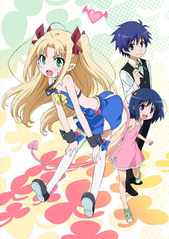

**Studio:** Diomedéa &nbsp;|&nbsp; **Episodes:** 12 &nbsp;|&nbsp; **Director:** Fumitoshi Oizaki &nbsp;|&nbsp; **Aired/Released:** April 11 – June 26 &nbsp;|&nbsp; **Genres:** Loli, Fantasy, Ecchi, Fantasy World, Comedy, Demon, Romance, Isekai

> The young succubus princess Astarotte Ygvar hates men. She hates them so much, in fact, that she goes out of her way to surround herself with women, and ends up with quite a collection of ladies with quirky personalities. Unfortunately, her duties as a succubus require her to form a harem of men to replenish her magic. Astarotte lives a fairly carefree life, until the World Tree opens a path into another realm and swallows up one of her companions. Luckily, Astarotte's friend returns unharmed, along with a handsome surprise. Naoya Touhara is a man, and a human one at that. He's perfect for becoming Astarotte's first male companion, if she can get over her hatred of men and accept him into her life. Naoya decides to stay in Astarotte's world and help her on her journey into adulthood, under one condition: he wants to bring his daughter Asuha with him.
>
> _Synopsis source: Kitsu_

[Wikipedia](https://en.wikipedia.org/wiki/Astarotte%27s_Toy) · [Kitsu](https://kitsu.io/anime/astarotte-no-omocha)

---

### A Bridge to the Starry Skies

**Studio:** Doga Kobo &nbsp;|&nbsp; **Episodes:** 12 &nbsp;|&nbsp; **Director:** Takenori Mihara &nbsp;|&nbsp; **Aired/Released:** April 11 – June 27 &nbsp;|&nbsp; **Genres:** Romance, Japan, Ecchi, Earth, Asia, Comedy, High School, School Life, Countryside, Harem

> Kazuma Hoshino is preparing himself for a new stage of his life as a teenager. Because of his brother Ayumu’s weaker than average health, their parents thought it best for the family to move out from the city to a more rural environment. Now the two brothers are off to the Yorozuyo Inn where they’ll be staying until their parents can settle affairs back in the city and set up their new home. Their arrival to the inn doesn’t go as planned though when they catch the wrong bus, wind up in the middle of nowhere, Ayumu gets his hat stolen by a wild monkey, and Kazuma gets lost in the woods trying to track the animal down. It all leads to a chance encounter with a spirited young girl named Ui, who Kazuma ends up accidentally falling onto and kissing while she tries leading him back to the bus stop. This hardly sits well with Ui’s friend Ibuki who swiftly kicks Kazuma and sends him on his way. Much to Kazuma’s continued horror, his bad luck is perpetuated at the inn thanks to its landlady Senka and her slightly perverted sense of humor, and then finding out that two of his classmates are the girls he embarrassed himself in front of back in the woods!Hoshizora e Kakaru Hashi finds Kazuma adapting to his new school, dealing with the multiple women who have entered his life, providing emotional support for his younger brother, and coping with living with his new landlady. However, for some reason, something about this place is bringing whispers of the past into Kazuma's mind. Small flashes back to a more innocent time and a friendship long forgotten. What could this déjà vu mean?
>
> _Synopsis source: Kitsu_

[Wikipedia](https://en.wikipedia.org/wiki/A_Bridge_to_the_Starry_Skies) · [Kitsu](https://kitsu.io/anime/hoshizora-e-kakaru-hashi)

---

### Yu-Gi-Oh! Zexal

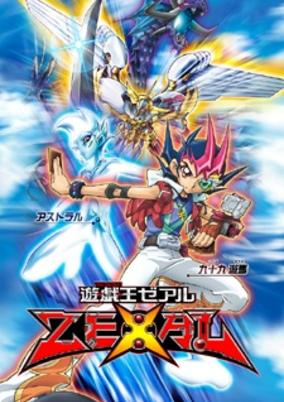

**Studio:** Gallop &nbsp;|&nbsp; **Episodes:** 73 &nbsp;|&nbsp; **Director:** Satoshi Kuwabara &nbsp;|&nbsp; **Aired/Released:** April 11 – September 24, 2012 &nbsp;|&nbsp; **Genres:** Coming Of Age, Card Games, Proxy Battles, Future, Plot Continuity, Action, Fantasy, Friendship, Science Fiction, Shounen

> Yu☆Gi☆Oh! Zexal follows the adventures of Yuuma Tsukumo in his hometown, the futuristic city of Heartland. Yuuma is an amateur duelist who wants to become the world's greatest Duel Monsters champion, having learned the basics of dueling from his father who disappeared long ago under mysterious circumstances. Always pushing himself to the limit in order to prove himself, Yuuma soon finds himself outmatched when dueling a bully to recover his friend's stolen cards. Just as hope seems lost, a mysterious spirit named Astral appears and helps Yuuma to win the duel. Astral explains that his memories have been lost and split into 99 cards called Numbers that have been scattered all over the world. These Numbers are extremely dangerous; each card has a will of its own and can possess any duelist who uses it by bringing out the deepest, and often darkest, desires of that person's heart. Seeing that Astral is a skilled duelist and wanting to better himself, Yuuma reluctantly agrees to assist Astral in recovering the Numbers. But Yuuma and Astral are not the only Number Hunters out there and many of the other parties seeking these powerful cards have much more malicious desires than recovering lost memories.
>
> _Synopsis source: Kitsu_

[Wikipedia](https://en.wikipedia.org/wiki/Yu-Gi-Oh!_Zexal) · [Kitsu](https://kitsu.io/anime/yu-gi-oh-zexal)

---

### The Qwaser of Stigmata II (The Qwaser of Stigmata)

**Studio:** Hoods Entertainment &nbsp;|&nbsp; **Episodes:** 12 &nbsp;|&nbsp; **Director:** Hiraku Kaneko &nbsp;|&nbsp; **Aired/Released:** April 12 – June 28 &nbsp;|&nbsp; **Genres:** Action, Ecchi, Comedy, Present, Super Power

> At St. Mihailov Academy, a series of serial murders have taken place with all the victims being young women. Who is this rampant culprit? And which beautiful maiden will fall prey to his evil next? After a horrible day of being harassed by their classmates, the adopted sisters Mafuyu Oribe and Tomo Yamanobe stumble across an injured young man and decide to bring him back to their place to recover. That very night, Mafuyu ends up at the mercy of the infamous serial killer. Strangely, he demands not her life, but instead an icon left behind by Tomo's father. Luckily, Sasha, the mysterious young man that the sisters had taken in, comes to the rescue just in time, helping Mafuyu avoid the same fate as the other victims. Sasha reveals that he is a Qwaser, an individual capable of controlling scientific elements by partaking in Soma, a miraculous essence found within the breasts of women. Capable of manipulating iron, Sasha crafts a giant scythe and slays the serial killer. He enrolls in the academy the next day signalling the beginning of a very "interesting" school year.Seikon no Qwaser is an action-heavy story that doesn't shy away from fan-service. Join Sasha and his allies as they fend off the evil that is nearing in.
>
> _Synopsis source: Kitsu_

[Wikipedia](https://en.wikipedia.org/wiki/The_Qwaser_of_Stigmata) · [Kitsu](https://kitsu.io/anime/seikon-no-qwaser)

---

### The World God Only Knows II (The World God Only Knows)

**Studio:** Manglobe &nbsp;|&nbsp; **Episodes:** 12 &nbsp;|&nbsp; **Director:** Shigehito Takayanagi &nbsp;|&nbsp; **Aired/Released:** April 12 – June 28 &nbsp;|&nbsp; **Genres:** Earth, Romance, Japan, Contemporary Fantasy, Fantasy, Asia, Comedy, High School, School Life, Present, Harem, Demon

> Keima Katsuragi, known online as the legendary "God of Conquest," can conquer any girl's heart—in dating sim games, at least. In reality, he opts for the two-dimensional world of gaming over real life because he is an unhealthily obsessed otaku of galge games (a type of Japanese video game centered on interactions with attractive girls). When he arrogantly accepts an anonymous offer to prove his supremacy at dating sim games, Keima is misled into aiding a naïve and impish demon from hell named Elucia "Elsie" de Lute Ima with her mission: retrieving runaway evil spirits who have escaped from hell and scattered themselves throughout the human world. Keima discovers that the only way to capture these spirits is to conquer what he hates the most: the unpredictable hearts of three-dimensional girls! Shackled to Elsie via a deadly collar, Keima now has his title of "God of Conquest" put to the ultimate test as he is forced to navigate through the hearts of a multitude of real-life girls. [Written by MAL Rewrite]
>
> _Synopsis source: Kitsu_

[Wikipedia](https://en.wikipedia.org/wiki/The_World_God_Only_Knows) · [Kitsu](https://kitsu.io/anime/the-world-god-only-knows)

---

### Pū-Neko

**Studio:** DLE &nbsp;|&nbsp; **Episodes:** 11 &nbsp;|&nbsp; **Aired/Released:** April 13 – June 22

---

### Weekly Shimakō

**Studio:** DLE &nbsp;|&nbsp; **Episodes:** 11 &nbsp;|&nbsp; **Director:** FROGMAN &nbsp;|&nbsp; **Aired/Released:** April 13 – June 22

---

### Genki!! Ekoda-chan

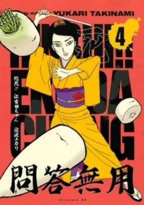

**Studio:** DLE &nbsp;|&nbsp; **Episodes:** 22 &nbsp;|&nbsp; **Director:** Benpineko &nbsp;|&nbsp; **Aired/Released:** April 13 – September 14 &nbsp;|&nbsp; **Genres:** Comedy

> Based on a four-panel manga, Rinshi!! Ekoda-chan is about a single woman in Tokyo who drifts through relationships and who works at various hostess clubs and the like.
>
> _Synopsis source: Kitsu_

[Kitsu](https://kitsu.io/anime/genki-ekoda-chan)

---

### Honto ni Atta! Reibai-Sensei

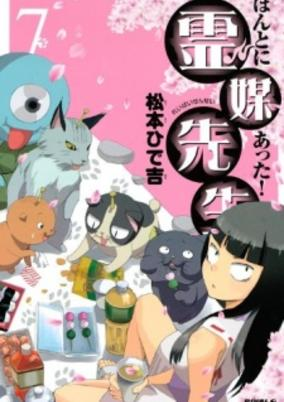

**Studio:** DLE &nbsp;|&nbsp; **Episodes:** 22 &nbsp;|&nbsp; **Director:** Azuma Tani &nbsp;|&nbsp; **Aired/Released:** April 13 – September 14 &nbsp;|&nbsp; **Genres:** Fantasy, Japan, Earth, Asia, Comedy, Anthropomorphism, School Life, Present

> The story revolves around Kibayashi, a teacher whose hobby is speaking with the dead and whose special talent is exorcism. She seems to know everything about the other world, yet nothing about our own.
>
> _Synopsis source: Kitsu_

[Kitsu](https://kitsu.io/anime/honto-ni-atta-reibai-sensei)

---

### Shiodome Cable TV

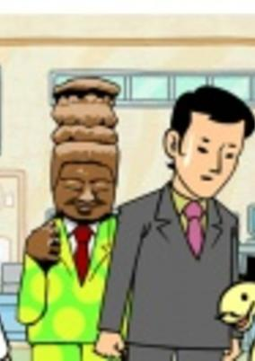

**Studio:** DLE &nbsp;|&nbsp; **Episodes:** 22 &nbsp;|&nbsp; **Director:** FROGMAN &nbsp;|&nbsp; **Aired/Released:** April 13 – September 14 &nbsp;|&nbsp; **Genres:** Comedy

> No synopsis has been added for this series yet.Click here to update this information.
>
> _Synopsis source: Kitsu_

[Kitsu](https://kitsu.io/anime/shiodome-cable-tv)

---

### Anohana: The Flower We Saw That Day

**Studio:** A-1 Pictures &nbsp;|&nbsp; **Episodes:** 11 &nbsp;|&nbsp; **Director:** Tatsuyuki Nagai &nbsp;|&nbsp; **Aired/Released:** April 15 – June 24 &nbsp;|&nbsp; **Genres:** Romance, Japan, Earth, Slice of Life, Asia, Ghost, Coming Of Age, Drama, Plot Continuity, Present, Friendship

> Jinta Yadomi is peacefully living as a recluse, spending his days away from school and playing video games at home instead. One hot summer day, his childhood friend, Meiko "Menma" Honma, appears and pesters him to grant a forgotten wish. He pays her no mind, which annoys her, but he doesn't really care. After all, Menma already died years ago. At first, Jinta thinks that he is merely hallucinating due to the summer heat, but he is later on convinced that what he sees truly is the ghost of Menma. Jinta and his group of childhood friends grew apart after her untimely death, but they are drawn together once more as they try to lay Menma's spirit to rest. Re-living their pain and guilt, will they be able to find the strength to help not only Menma move on—but themselves as well? [Written by MAL Rewrite]
>
> _Synopsis source: Kitsu_

[Kitsu](https://kitsu.io/anime/anohana-the-flower-we-saw-that-day)

---

### [C] – The Money of Soul and Possibility Control

**Studio:** Tatsunoko Production &nbsp;|&nbsp; **Episodes:** 11 &nbsp;|&nbsp; **Director:** Kenji Nakamura &nbsp;|&nbsp; **Aired/Released:** April 15 – June 24

[Wikipedia](https://en.wikipedia.org/wiki/C_(anime))

---

### Aria the Scarlet Ammo

**Studio:** J.C.Staff &nbsp;|&nbsp; **Episodes:** 12 &nbsp;|&nbsp; **Director:** Takashi Watanabe &nbsp;|&nbsp; **Aired/Released:** April 15 – July 1 &nbsp;|&nbsp; **Genres:** Romance, Earth, Japan, Action, Asia, Special Squads, Stereotypes, School Life, Law And Order, Plot Continuity, Present, Harem, Comedy

> In response to the worsening crime rate, Japan creates Tokyo Butei High, an elite academy where "Butei" or armed detectives hone their deadly skills in hopes of becoming mercenary-like agents of justice. One particular Butei is Kinji Tooyama, an anti-social and curt sophomore dropout who was once a student of the combat-centric Assault Division. Kinji now lives a life of leisure studying logistics in order to cover up his powerful but embarrassing special ability. However, his peaceful days soon come to an end when he becomes the target of the infamous "Butei Killer," and runs into an emotional hurricane and outspoken prodigy of the highest rank, Aria Holmes Kanzaki, who saves Kinji's life and demands that he become her partner after seeing what he is truly capable of. [Written by MAL Rewrite]
>
> _Synopsis source: Kitsu_

[Wikipedia](https://en.wikipedia.org/wiki/Aria_the_Scarlet_Ammo) · [Kitsu](https://kitsu.io/anime/hidan-no-aria)

---

### Ground Control to Psychoelectric Girl

**Studio:** Shaft &nbsp;|&nbsp; **Episodes:** 12 &nbsp;|&nbsp; **Director:** Akiyuki Simbo (Chief) Yukihiro Miyamoto &nbsp;|&nbsp; **Aired/Released:** April 15 – July 1 &nbsp;|&nbsp; **Genres:** Earth, Japan, Slice of Life, Asia, Comedy, Present, Science Fiction

> Makoto Niwa meticulously tallies the amount of positive and negative youthful experiences he engages in as if to grade his own life. When his parents go overseas, he moves to a new town to live with his aunt, welcoming the change and ready for a fresh start. However, as ordinary as he had imagined his adolescence to be, he could never have taken the existence of an enigmatic long-lost cousin into account. Upon moving into his aunt's house, he discovers the cousin he never knew about: Erio Touwa. Despite being Makoto's age, she couldn't be more different: Erio chooses to wrap herself in a futon all day rather than to go to school. She even claims to be an alien, and with a speech pattern and personality to back it up, any chance of Makoto's dreamt-of normal life is instantly tossed out the window. As he meets a string of other eccentric girls in town, Makoto must face the possibility of seeing his youth points in the red. However, he might be surprised by how thrilling an abnormal youth can be. [Written by MAL Rewrite]
>
> _Synopsis source: Kitsu_

[Wikipedia](https://en.wikipedia.org/wiki/Ground_Control_to_Psychoelectric_Girl) · [Kitsu](https://kitsu.io/anime/denpa-onna-to-seishun-otoko)

---

### Deadman Wonderland

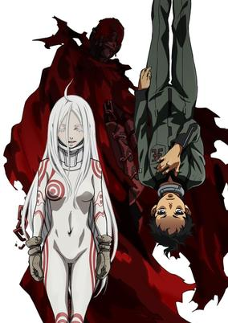

**Studio:** Manglobe &nbsp;|&nbsp; **Episodes:** 12 &nbsp;|&nbsp; **Director:** Koichi Hatsumi &nbsp;|&nbsp; **Aired/Released:** April 17 – July 3 &nbsp;|&nbsp; **Genres:** Earth, Science Fiction, Dystopia, Contemporary Fantasy, Japan, Action, Asia, Drama, Violence, Horror, Shounen

> It looked like it would be a normal day for Ganta Igarashi and his classmates—they were preparing to go on a class field trip to a certain prison amusement park called Deadman Wonderland, where the convicts perform dangerous acts for the onlookers' amusement. However, Ganta's life is quickly turned upside down when his whole class gets massacred by a mysterious man in red. Framed for the incident and sentenced to death, Ganta is sent to the very jail he was supposed to visit. But Ganta's nightmare is only just beginning. The young protagonist is thrown into a world of sadistic inmates and enigmatic powers, to live in constant fear of the lethal collar placed around his neck that is slowed only by winning in the prison's deathly games. Ganta must bet his life to survive in a ruthless place where it isn't always easy to tell friend from foe, all while trying to find the mysterious "Red Man" and clear his name, in Deadman Wonderland. [Written by MAL Rewrite]
>
> _Synopsis source: Kitsu_

[Wikipedia](https://en.wikipedia.org/wiki/Deadman_Wonderland) · [Kitsu](https://kitsu.io/anime/deadman-wonderland)

---

### Blue Exorcist

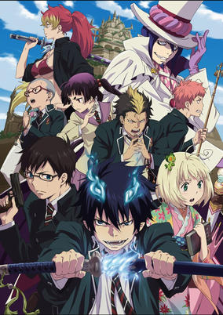

**Studio:** A-1 Pictures &nbsp;|&nbsp; **Episodes:** 25 &nbsp;|&nbsp; **Director:** Tensai Okamura &nbsp;|&nbsp; **Aired/Released:** April 17 – October 2 &nbsp;|&nbsp; **Genres:** Fantasy, Contemporary Fantasy, Japan, Adventure, Action, Earth, Fantasy World, Asia, Comedy, Drama, Parallel Universe, Demon, Shounen

> Humans and demons are two sides of the same coin, as are Assiah and Gehenna, their respective worlds. The only way to travel between the realms is by the means of possession, like in ghost stories. However, Satan, the ruler of Gehenna, cannot find a suitable host to possess and therefore, remains imprisoned in his world. In a desperate attempt to conquer Assiah, he sends his son instead, intending for him to eventually grow into a vessel capable of possession by the demon king.Ao no Exorcist follows Rin Okumura who appears to be an ordinary, somewhat troublesome teenager—that is until one day he is ambushed by demons. His world turns upside down when he discovers that he is in fact the very son of Satan and that his demon father wishes for him to return so they can conquer Assiah together. Not wanting to join the king of Gehenna, Rin decides to begin training to become an exorcist so that he can fight to defend Assiah alongside his brother Yukio. [Written by MAL Rewrite]
>
> _Synopsis source: Kitsu_

[Wikipedia](https://en.wikipedia.org/wiki/Blue_Exorcist) · [Kitsu](https://kitsu.io/anime/ao-no-exorcist)

---

### Ohayou Ninja-tai Gatchaman

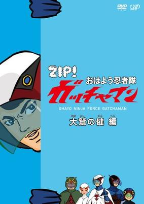

**Studio:** Kate Arrow &nbsp;|&nbsp; **Episodes:** 475 &nbsp;|&nbsp; **Aired/Released:** April 18 – March 29, 2013 &nbsp;|&nbsp; **Genres:** Parody, Comedy

> One-minute flash shorts based on Tatsunoko Production's classic science-fiction hero series Science Ninja Team Gatchaman aired during the NTV's Zip! television program on mornings.
>
> _Synopsis source: Kitsu_

[Wikipedia](https://en.wikipedia.org/wiki/Science_Ninja_Team_Gatchaman#Good_Morning_Ninja_Team_Gatchaman) · [Kitsu](https://kitsu.io/anime/ohayou-ninja-tai-gatchaman)

---

### Moshidora

**Studio:** Production I.G &nbsp;|&nbsp; **Episodes:** 10 &nbsp;|&nbsp; **Director:** Takayuki Hamana &nbsp;|&nbsp; **Aired/Released:** April 25 – May 6 &nbsp;|&nbsp; **Genres:** Japan, Sports, High School, School Clubs, Drama, Baseball, Present

> Minami joins her High School baseball team as a team manager after finding out that her best friend Yuuki is in the hospital and can't be a team manager any more. In order to try to fill in for Yuuki and to help out the team the best she can, she goes out to find a book on how to manage a baseball team. Unfortunately, she accidentally buys Peter Drucker's book called "Management: Tasks, Responsibilities, Practices" which is actually about how to properly manage a business. Because she couldn't return the book, she decides to read it anyway and to try to apply the business management concepts to the baseball team so that way they can go on and win the Nationals.
>
> _Synopsis source: Kitsu_

[Wikipedia](https://en.wikipedia.org/wiki/Moshidora) · [Kitsu](https://kitsu.io/anime/moshidora)

---

### Inazuma Eleven GO

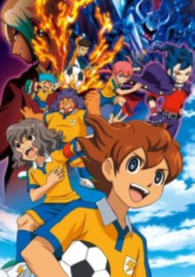

**Studio:** OLM &nbsp;|&nbsp; **Episodes:** 47 &nbsp;|&nbsp; **Director:** Katsuhito Akiyama &nbsp;|&nbsp; **Aired/Released:** May 4 – April 11, 2012 &nbsp;|&nbsp; **Genres:** Japan, Action, Earth, Sports, Asia, Soccer, School Clubs, School Life, Super Power

> Tenma Matsukaze is a new student at Raimon Junior High. Due to his love for soccer, he decides to join the school soccer team, which gained its reputation after the amazing performance shown ten years earlier in the Football Frontier International, a tournament that hosts the best youth teams the world has to offer. Unfortunately, the once renowned school doesn't have the soccer spirit it once enjoyed. This is primarily due to the fact that soccer in Japan is now controlled by a dark entity known as the "Fifth Sector." They alone decide the fate of every match, instructing teams to either win or lose. The actions of the Fifth Sector have beaten down the country’s soccer teams, who no longer have a love for the game. Tenma and his teammates will look to shift this paradigm and fight back against their evil oppressors. Thankfully, they will not be alone in this battle, as they will get help from a group known as the "Resistance." Cheer on the boys of Inazuma Eleven Go as they fight the good fight!
>
> _Synopsis source: Kitsu_

[Wikipedia](https://en.wikipedia.org/wiki/Inazuma_Eleven_GO) · [Kitsu](https://kitsu.io/anime/inazuma-eleven-go)

---

### Kayoe! Chugaku

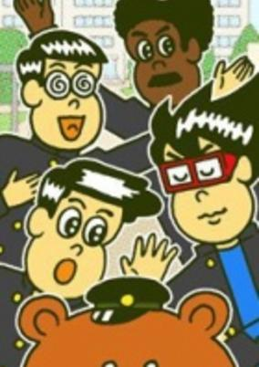

**Studio:** DLE &nbsp;|&nbsp; **Episodes:** 425 &nbsp;|&nbsp; **Director:** Taketo Shinkai &nbsp;|&nbsp; **Aired/Released:** June 6 – March 28, 2014 &nbsp;|&nbsp; **Genres:** Comedy, School Life

> Wada transfers from the Kansai region to the Toukai region in middle school. The story follows his new set of friends as their fivesome enjoy their everyday lives. All the characters' are names are based on Chunichi Dragons baseball team which is located in the Toukai region.
>
> _Synopsis source: Kitsu_

[Kitsu](https://kitsu.io/anime/kayoe-chuugaku)

---

### Inumarudashi

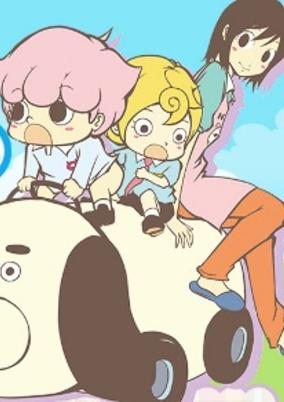

**Studio:** Gathering &nbsp;|&nbsp; **Episodes:** 4 &nbsp;|&nbsp; **Director:** Akitarou Daichi &nbsp;|&nbsp; **Aired/Released:** June 10 – July 22 &nbsp;|&nbsp; **Genres:** Comedy

> Comedy at a kindergarten. Inumaru-kun is a four-year old boy, who runs about the kindergarten naked below the waist. Yamada Tamako is a new nursery teacher and she is struggling with Inumaru's weird behaviour.
>
> _Synopsis source: Kitsu_

[Kitsu](https://kitsu.io/anime/inumarudashi)

---

### At that time Mr. Shimakoh moved!

**Studio:** DLE &nbsp;|&nbsp; **Episodes:** 11 &nbsp;|&nbsp; **Director:** FROGMAN &nbsp;|&nbsp; **Aired/Released:** June 29 – September 14

---

### Double-J

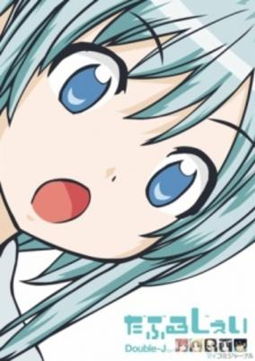

**Studio:** DLE &nbsp;|&nbsp; **Episodes:** 11 &nbsp;|&nbsp; **Director:** Azuma Tani &nbsp;|&nbsp; **Aired/Released:** June 29 – September 14 &nbsp;|&nbsp; **Genres:** Comedy, School Life

> In a school where after school activities are mandatory among all students, Hajime and her friend Sayo come across a new club that they have never seen before. The club is called "The Cultural Activity Preservation Club." The two enter the room to find all kinds of analog jobs and activities, such as handcrafting mats and toothpicks. This is a unique cultural anime mixed with comedy so as not to bore you, this is Double J!
>
> _Synopsis source: Kitsu_

[Wikipedia](https://en.wikipedia.org/wiki/Double-J_(manga)) · [Kitsu](https://kitsu.io/anime/double-j)

---

### Blade

**Studio:** Madhouse &nbsp;|&nbsp; **Episodes:** 12 &nbsp;|&nbsp; **Director:** Mitsuyuki Masuhara &nbsp;|&nbsp; **Aired/Released:** July 1 – September 16

[Wikipedia](https://en.wikipedia.org/wiki/Marvel_Anime)

---

### Ro-Kyu-Bu ~ Fast Break!

**Studio:** Project No.9 Studio Blanc . &nbsp;|&nbsp; **Episodes:** 12 &nbsp;|&nbsp; **Director:** Keizō Kusakawa &nbsp;|&nbsp; **Aired/Released:** July 1 – September 23 &nbsp;|&nbsp; **Genres:** Loli, Basketball, Japan, Earth, Asia, Present, Comedy, Ecchi, School Life, Sports

> Talk about games being called unexpectedly! Hasegawa Subaru joined the basketball club at Nanashiba High, only to have his hopes dashed when the teams' play is suspended after the captain is suspected of having inappropriate feelings for the coach's underage daughter. Blindsided and blocked by bad luck, Subaru expectedly finds an opening for his talent with the hoops when his aunt asks him to take on the task of coaching a young girls' basketball club—a Ro-Kyu-Bu!. But can a superstar wannabe find true satisfaction while playing sixth man to a team of five girls?
>
> _Synopsis source: Kitsu_

[Wikipedia](https://en.wikipedia.org/wiki/Ro-Kyu-Bu!) · [Kitsu](https://kitsu.io/anime/ro-kyu-bu)

---

### Monster Hunter Diary: Felyne Village on the Edge G

**Studio:** DLE &nbsp;|&nbsp; **Episodes:** 13 &nbsp;|&nbsp; **Director:** Benpineko Koutarou Yamawaki &nbsp;|&nbsp; **Aired/Released:** July 1 – September 29

[Wikipedia](https://en.wikipedia.org/wiki/Monster_Hunter_Diary)

---

### Heaven's Memo Pad

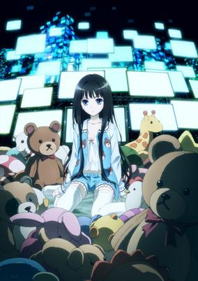

**Studio:** J.C.Staff &nbsp;|&nbsp; **Episodes:** 12 &nbsp;|&nbsp; **Director:** Katsushi Sakurabi &nbsp;|&nbsp; **Aired/Released:** July 2 – September 24 &nbsp;|&nbsp; **Genres:** Japan, Tone Changes, Earth, Mafia, Asia, Detective, Crime, Coming Of Age, Drama, Present, Mystery

> Narumi Fujishima isn't your typical high school student. He's never really fit in and has become increasingly more isolated from his fellow classmates. But he's not alone, and when Ayaka, the sole member of the Gardening Club, introduces him to the reclusive girl who lives above the ramen shop, Narumi enters a whole new secret world. Alice is a NEET, someone who is Not Employed, being Educated or in Training, but as Narumi quickly discovers, that doesn't mean that she does nothing all day. In between tending to her small army of stuffed bears, Alice is an expert hacker and a very exclusive private detective. To his surprise, Narumi finds himself drafted as one of the strange-but-elite team of associates that Alice has assembled from her NEET acquaintances. Together they'll battle gangs, thieves, murderers, and drug lords. And in the middle of it all, Narumi will find his life changing forever!
>
> _Synopsis source: Kitsu_

[Wikipedia](https://en.wikipedia.org/wiki/Heaven%27s_Memo_Pad) · [Kitsu](https://kitsu.io/anime/kamisama-no-memochou)

---

### Sacred Seven

**Studio:** Sunrise &nbsp;|&nbsp; **Episodes:** 12 &nbsp;|&nbsp; **Director:** Yoshimitsu Ohashi &nbsp;|&nbsp; **Aired/Released:** July 3 – September 16 &nbsp;|&nbsp; **Genres:** Science Fiction, Japan, Action, Earth, Asia, Conspiracy, Super Power, School Life

> Alma Tandoji lives a lonely life. One day, Ruri Alba, a girl accompanied by her butler and maids, visits him. Knowing the power of Sacred Seven is latent within Alma, she asks him to lend her his powers. However, he refuses and drives her away since he injured many with his unusual strength in the past. Meanwhile, a fiendish Dark Stone creature suddenly appears in this peaceful town in the Kanto region. Only Alma's power of Sacred Seven can fight against it. But Alma just lets his power run amuck and things begin to get worse. Ruri raised her gemstone in order to release his true abilities, My Soul I give to you. With Ruri's wishes engraved in it, will Alma be able to defeat the Dark Stone?
>
> _Synopsis source: Kitsu_

[Wikipedia](https://en.wikipedia.org/wiki/Sacred_Seven) · [Kitsu](https://kitsu.io/anime/sacred-seven)

---

### Uta no Prince Sama

**Studio:** A-1 Pictures &nbsp;|&nbsp; **Episodes:** 13 &nbsp;|&nbsp; **Director:** Yuu Kou &nbsp;|&nbsp; **Aired/Released:** July 3 – September 24 &nbsp;|&nbsp; **Genres:** Japan, Earth, Asia, Bishounen, Reverse Harem, Idol, Stereotypes, The Arts, Present, Music, Comedy, Romance, Harem, School Life

> Haruka Nanami, an aspiring composer from the countryside, longs to write music for her beloved idol, Hayato Ichinose. Determined to accomplish this goal, she enrolls into Saotome Academy, a highly regarded vocational school for the performing arts. Upon her arrival, Haruka soon learns that everyone on staff, including the headmaster, is either an idol, a composer, or a poet. To top it all off, she is surrounded by incredibly talented future idols and composers, and the competition among the students is fierce; with the possibility of recruitment by the Shining Agency upon graduation, the stakes are incredibly high. As she strives to reach her dream at the academy, one fateful night, a series of events lead Haruka to a mysterious man standing in the moonlight, and he seems a bit familiar... [Written by MAL Rewrite]
>
> _Synopsis source: Kitsu_

[Wikipedia](https://en.wikipedia.org/wiki/Uta_no_Prince-sama) · [Kitsu](https://kitsu.io/anime/uta-no-prince-sama-maji-love-1000)

---

### Nura: Rise of the Yokai Clan - Demon Capital

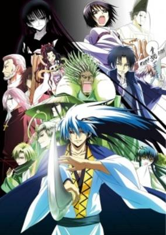

**Studio:** Studio Deen &nbsp;|&nbsp; **Episodes:** 24 &nbsp;|&nbsp; **Director:** Michio Fukuda &nbsp;|&nbsp; **Aired/Released:** July 3 – December 18 &nbsp;|&nbsp; **Genres:** Fantasy, Japan, Adventure, Action, Earth, Contemporary Fantasy, Asia, Swordplay, Bishounen, Present, Demon

> At first glance, Nura Rikuo seems like nothing more than a normal middle-schooler. In actual fact, he is grandson of Nurarihyon, master of a youkai clan. Having only recently resolved the hostilities between the Nura Clan and the Shikoku Yokai, Rikuo finds no rest as an ancient enemy of the Nura Clan, Haguromo-Gitsune, resurfaces. After 400 years of inactivity, Haguromo-Gitsune suddenly sweeps through Kyoto with overwhelming power.
>
> _Synopsis source: Kitsu_

[Kitsu](https://kitsu.io/anime/nurarihyon-no-mago-sennen-makyou)

---

### Croisée in a Foreign Labyrinth The Animation

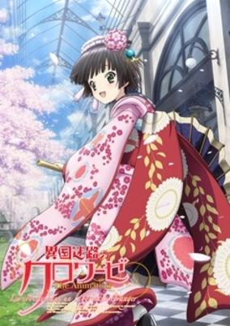

**Studio:** Satelight &nbsp;|&nbsp; **Episodes:** 12 &nbsp;|&nbsp; **Director:** Kenji Yasuda &nbsp;|&nbsp; **Aired/Released:** July 4 – September 19 &nbsp;|&nbsp; **Genres:** France, Earth, Slice of Life, Europe, Past, Stereotypes, Historical

> The story takes place in the second half of the 19th century, as Japanese culture gains popularity in the West. A young Japanese girl, Yune, accompanies a French traveler, Oscar, on his journey back to France, and offers to help at the family's ironwork shop in Paris. Oscar's nephew and shop-owner Claude reluctantly accepts to take care of Yune, and we learn how those two, who have so little in common, get to understand each other and live together in the Paris of the 1800s.
>
> _Synopsis source: Kitsu_

[Wikipedia](https://en.wikipedia.org/wiki/Crois%C3%A9e_in_a_Foreign_Labyrinth) · [Kitsu](https://kitsu.io/anime/ikoku-meiro-no-croisee)

---

### Twin Angel: Twinkle Paradise

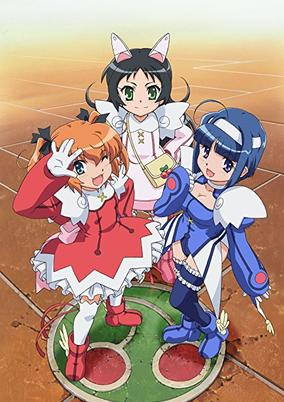

**Studio:** J.C.Staff &nbsp;|&nbsp; **Episodes:** 12 &nbsp;|&nbsp; **Director:** Yoshiaki Iwasaki &nbsp;|&nbsp; **Aired/Released:** July 5 – September 20 &nbsp;|&nbsp; **Genres:** Magic, Magical Girl, Present, Mecha, Super Deformed, Parody, Japan, Comedy, School Life, Thievery

> Haruka Minazuki and Aoi Kannazuki are two students at St. Cherine academy. Haruka is always filled with bubbly energy while Aoi is more mature and a top student in all her classes - but despite their differences the two are the best of friends. The two girls look like any other girls, attending the academy, but the truth is they are hiding a little secret, that they can't let anybody know about... During the day they really are just students at St. Cherine academy, but they can also become the Twin Angel duo, and fight against the evils of the town! The lovely Angels are back, and it's time for them to get ready for some action!
>
> _Synopsis source: Kitsu_

[Wikipedia](https://en.wikipedia.org/wiki/Kait%C5%8D_Tenshi_Twin_Angel) · [Kitsu](https://kitsu.io/anime/kaitou-tenshi-twin-angel-kyun-kyun-tokimeki-paradise)

---

### Yuruyuri: Happy Go Lily

**Studio:** Doga Kobo &nbsp;|&nbsp; **Episodes:** 12 &nbsp;|&nbsp; **Director:** Masahiko Ōta &nbsp;|&nbsp; **Aired/Released:** July 5 – September 20 &nbsp;|&nbsp; **Genres:** Romance, Japan, Earth, Slice of Life, Asia, Comedy, Unrequited Love, Middle School, Shoujo Ai, School Clubs, School Life, Present, Friendship

> After a year in grade school without her childhood friends, first year student Akari Akaza is finally reunited with second years Yui Funami and Kyouko Toshinou at their all-girls' middle school. During the duo's first year, Yui and Kyouko formed the "Amusement Club" which occupies the now nonexistent Tea Club's room. Shortly after Akari joins, one of her fellow classmates, Chinatsu Yoshikawa, pays the trio a visit under the impression that they are the Tea Club; it is only once the three girls explain that the Tea Club has been disbanded that they can convince Chinatsu to join the Amusement Club—a group with no purpose other than to provide entertainment for its members. Based on the slice-of-life manga by Namori, Yuru Yuri is an eccentric comedy about a group of girls who spend their spare time drinking tea and fawning over each other, all while completely failing to even notice the supposed main character Akari amongst them. [Written by MAL Rewrite]
>
> _Synopsis source: Kitsu_

[Wikipedia](https://en.wikipedia.org/wiki/Yuru_Yuri) · [Kitsu](https://kitsu.io/anime/yuru-yuri)

---

### Natsume's Book of Friends Season 3 (Natsume's Book of Friends Season 4)

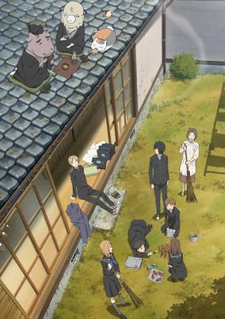

**Studio:** Brain's Base &nbsp;|&nbsp; **Episodes:** 13 &nbsp;|&nbsp; **Director:** Takahiro Ōmori &nbsp;|&nbsp; **Aired/Released:** July 5 – September 27 &nbsp;|&nbsp; **Genres:** Present, Demon, Contemporary Fantasy, Japan, Fantasy, Slice of Life, Shoujo

> Takashi Natsume, the timid youkai expert and master of the Book of Friends, continues his journey towards self-understanding and acceptance with the help of friends both new and old. His most important ally is still his gluttonous and sake-loving bodyguard, the arrogant but fiercely protective wolf spirit Madara—or Nyanko-sensei, as Madara is called when in his usual disguise of an unassuming, pudgy cat. Natsume, while briefly separated from Nyanko-sensei, is ambushed and kidnapped by a strange group of masked, monkey-like youkai, who have spirited him away to their forest as they desperately search for the Book of Friends. Realizing that his "servant" has been taken out from right under his nose, Nyanko-sensei enlists the help of Natsume's youkai friends and mounts a rescue operation. However, the forest of the monkey spirits holds many dangerous enemies, including the Matoba Clan, Natsume's old nemesis. Stretching from the formidable hideout of the Matoba to Natsume's own childhood home, Natsume Yuujinchou Shi is a sweeping but familiar return to a world of danger and friendship, where Natsume will finally confront the demons of his own past. [Written by MAL Rewrite]
>
> _Synopsis source: Kitsu_

[Wikipedia](https://en.wikipedia.org/wiki/Natsume%27s_Book_of_Friends) · [Kitsu](https://kitsu.io/anime/natsume-yuujinchou-shi)

---

### Nyanpire The Animation

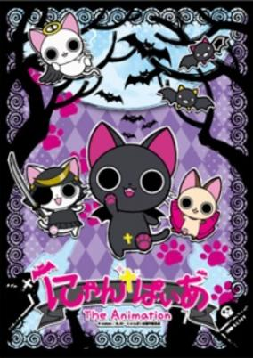

**Studio:** Gonzo &nbsp;|&nbsp; **Episodes:** 12 &nbsp;|&nbsp; **Director:** Takahiro Yoshimatsu &nbsp;|&nbsp; **Aired/Released:** July 6 – September 21 &nbsp;|&nbsp; **Genres:** Vampire, Comedy

> A heartwarming story about a stray black cat, who was given blood from a vampire. He was taken in by a girl called Misaki and started to live with her. Nyanpire's favorite phrase is "Give me blood nya."
>
> _Synopsis source: Kitsu_

[Wikipedia](https://en.wikipedia.org/wiki/Nyanpire) · [Kitsu](https://kitsu.io/anime/nyanpire-the-animation)

---

### Kamisama Dolls

**Studio:** Brain's Base &nbsp;|&nbsp; **Episodes:** 13 &nbsp;|&nbsp; **Director:** Seiji Kishi &nbsp;|&nbsp; **Aired/Released:** July 6 – September 28 &nbsp;|&nbsp; **Genres:** Romance, Science Fiction, Japan, Piloted Robot, Alternative Present, Plot Continuity, Violence, Super Power, Action

> Kyouhei, after moving away to Tokyo from his old town to get away from the events that happened, is on a goukon with his friends, including his old neighbor, Shiba. After drinking for a whole night, he and Shiba discover a dead, bloody body in the elevator. He is told by his younger sister, Utao with her Kamisama Doll, that Aki, an old friend, and his Doll are the culprits responsible.
>
> _Synopsis source: Kitsu_

[Wikipedia](https://en.wikipedia.org/wiki/Kamisama_Dolls) · [Kitsu](https://kitsu.io/anime/kamisama-dolls)

---

### Morita-san wa Mukuchi [ s ]

**Studio:** Seven &nbsp;|&nbsp; **Episodes:** 13 &nbsp;|&nbsp; **Director:** Naotaka Hayashi &nbsp;|&nbsp; **Aired/Released:** July 6 – September 28 &nbsp;|&nbsp; **Genres:** Japan, Earth, Asia, Comedy, School Life, Present, Slice of Life

> Morita Mayu, a high school girl. She is extremely reticent and her silence and habit of looking at people's eyes straightly sometimes cause misunderstanding. The reason behind it is not because she doesn’t like to talk nor because she has nothing to say. The reason she rarely speaks is due to the fact she thinks too much before speaking, thus losing the timing to speak altogether. But she lives a happy school life with her classmates.
>
> _Synopsis source: Kitsu_

[Wikipedia](https://en.wikipedia.org/wiki/Morita-san_wa_Mukuchi) · [Kitsu](https://kitsu.io/anime/morita-san-wa-mukuchi-1)

---

### Bunny Drop

**Studio:** Production I.G &nbsp;|&nbsp; **Episodes:** 11 &nbsp;|&nbsp; **Director:** Kanta Kamei &nbsp;|&nbsp; **Aired/Released:** July 8 – September 16 &nbsp;|&nbsp; **Genres:** Japan, Earth, Slice of Life, Asia, Coming Of Age, Friendship, Present, Family, Josei

> Daikichi Kawachi is a 30-year-old bachelor working a respectable job but otherwise wandering aimlessly through life. When his grandfather suddenly passes away, he returns to the family home to pay his respects. Upon arriving at the house, he meets a mysterious young girl named Rin who, to Daikichi’s astonishment, is his grandfather's illegitimate daughter! The shy and unapproachable girl is deemed an embarrassment to the family, and finds herself ostracized by her father's relatives, all of them refusing to take care of her in the wake of his death. Daikichi, angered by their coldness towards Rin, announces that he will take her in—despite the fact that he is a young, single man with no prior childcare experience.Usagi Drop is the story of Daikichi's journey through fatherhood as he raises Rin with his gentle and affectionate nature, as well as an exploration of the warmth and interdependence that are at the heart of a happy, close-knit family. [Written by MAL Rewrite]
>
> _Synopsis source: Kitsu_

[Wikipedia](https://en.wikipedia.org/wiki/Bunny_Drop) · [Kitsu](https://kitsu.io/anime/bunny-drop)

---

### No. 6

**Studio:** Bones &nbsp;|&nbsp; **Episodes:** 11 &nbsp;|&nbsp; **Director:** Kenji Nagasaki &nbsp;|&nbsp; **Aired/Released:** July 8 – September 16 &nbsp;|&nbsp; **Genres:** Science Fiction, Dystopia, Japan, Asia, Thriller, Bishounen, Drama, Future, Shounen Ai, Action

> Many years ago, after the end of a bloody world war, mankind took shelter in six city-states that were peaceful and perfect... at least on the surface. However, Shion—an elite resident of the city-state No. 6—gained a new perspective on the world he lives in, thanks to a chance encounter with a mysterious boy, Nezumi. Nezumi turned out to be just one of many who lived in the desolate wasteland beyond the walls of the supposed utopia. But despite knowing that the other boy was a fugitive, Shion decided to take him in for the night and protect him, which resulted in drastic consequences: because of his actions, Shion and his mother lost their status as elites and were relocated elsewhere, and the darker side of the city began to make itself known. Now, a long time after their life-altering first meeting, Shion and Nezumi are finally brought together once again—the former elite and the boy on the run are about to embark on an adventure that will, in time, reveal the shattering secrets of No. 6. [Written by MAL Rewrite]
>
> _Synopsis source: Kitsu_

[Wikipedia](https://en.wikipedia.org/wiki/No._6) · [Kitsu](https://kitsu.io/anime/no-6)

---

### Baka and Test - Summon the Beasts 2 (Baka & Test – Summon the Beasts 2)

**Studio:** SILVER LINK. &nbsp;|&nbsp; **Episodes:** 13 &nbsp;|&nbsp; **Director:** Shin Ōnuma &nbsp;|&nbsp; **Aired/Released:** July 8 – September 30 &nbsp;|&nbsp; **Genres:** Japan, Earth, Asia, Comedy, High School, Proxy Battles, Stereotypes, School Life, Present, Super Power, Romance

> Goofball Yoshii's still leading his crew in Avatar battles against the brainier students in school, but the girls in Class F have grown way less concerned with improving their status on campus. Instead of moving up in the world, the girls are more interested in getting closer to the guys in the gang! Of course, some of the boys are totally oblivious to the romantic intentions of their female friends. That's to be expected in a group of dim-wits and misfits. Nonetheless, the femmes of Class F aren't giving up anytime soon. Because when love is on the line, even the biggest underachievers can find motivation – even if they can't spell it!
>
> _Synopsis source: Kitsu_

[Wikipedia](https://en.wikipedia.org/wiki/Baka_and_Test_-_Summon_the_Beasts) · [Kitsu](https://kitsu.io/anime/baka-to-test-to-shoukanjuu-ni)

---

### Blood-C

**Studio:** Production I.G &nbsp;|&nbsp; **Episodes:** 12 &nbsp;|&nbsp; **Director:** Tsutomu Mizushima &nbsp;|&nbsp; **Aired/Released:** July 8 – September 30 &nbsp;|&nbsp; **Genres:** Fantasy, Contemporary Fantasy, Vampire, Japan, Action, Earth, Asia, Swordplay, Angst, Violence, Horror, School Life

> Peaceful schoolgirl by day, fearsome monster slayer by night, Saya Kisaragi is leading a split life. Equipped with a ceremonial sword given to her by her father for sacred tasks, she vanquishes every monster who dares threaten her quiet little village. But all too soon, Saya's reality and everything she believes to be true is tested, when she overhears the monsters speak of a broken covenant—something she knows nothing about. And then, unexpectedly, a strange dog appears; it asks her to whom she promised to protect the village, curious as to what would happen if she were to break that promise. Tormented by unexplainable visions and her world unraveling around her, we travel with Saya through her struggle to find a way to the truth in a village where nothing is as it seems. [Written by MAL Rewrite]
>
> _Synopsis source: Kitsu_

[Wikipedia](https://en.wikipedia.org/wiki/Blood-C) · [Kitsu](https://kitsu.io/anime/blood-c)

---

### Mayo Chiki!

**Studio:** feel. &nbsp;|&nbsp; **Episodes:** 13 &nbsp;|&nbsp; **Director:** Keiichiro Kawaguchi &nbsp;|&nbsp; **Aired/Released:** July 8 – September 30 &nbsp;|&nbsp; **Genres:** Romance, Japan, Ecchi, Earth, Asia, Comedy, Violent Retribution For Accidental Infringement, High School, Slapstick, School Life, Present, Harem

> Mayo Chiki!'s main protagonist, Sakamachi Kinjirou, has the worst case of gynophobia known to man. Just one touch from a girl and his nose bleeds almost uncontrollably. His condition is all thanks to his family of female wrestlers who "trained" him a bit too much as a child. Through this tough love, Kinjirou developed a body able to withstand hard blows... as well as an intense fear of the female race. Life with such a handicap is difficult in itself, but after one ominous visit to the school restroom, Kinjirou's semi-peaceful existence shifts into complete chaos. He discovers that the suave Subaru-sama, the bodyguard to the headmaster's daughter Kanade, is actually a girl. In exchange for his silence in the matter, Kanade promises to help him overcome his gynophobia. A cross dressing butler, a high-class twisted beauty, a BL writer wannabe, an aspiring pro-wrestler, and someone who lives with ghosts―these are the kind of girls that Sakamachi Kinjirou must deal with everyday. With such a unique cast of characters, high school life in Mayo Chiki! is sure to bring about a ton of wacky adventures.
>
> _Synopsis source: Kitsu_

[Wikipedia](https://en.wikipedia.org/wiki/Mayo_Chiki!) · [Kitsu](https://kitsu.io/anime/mayo-chiki)

---

### Penguindrum

**Studio:** Brain's Base &nbsp;|&nbsp; **Episodes:** 24 &nbsp;|&nbsp; **Director:** Shōko Nakamura Kunihiko Ikuhara &nbsp;|&nbsp; **Aired/Released:** July 8 – December 23 &nbsp;|&nbsp; **Genres:** Contemporary Fantasy, Japan, Action, Earth, Asia, Comedy, Conspiracy, Bishounen, Angst, Stereotypes, Present, Psychological, Mystery, Family, Drama

> For the Takakura family, destiny is an ever-spinning wheel, pointing passionately in their direction with equal tides of joy and sorrow before ticking on to the next wishmaker. With their parents gone, twin brothers Kanba and Shouma live alone with their beloved little sister Himari, whose poor health cannot decline any further. On the day Himari is given permission to temporarily leave the hospital, her brothers take her out to the aquarium to celebrate, where the family's supposed fate is brought forth with her sudden collapse. However, when Himari is inexplicably revived by a penguin hat from the aquarium's souvenir shop, the hand of fate continues to tick faithfully forward. With her miraculous recovery, though, comes a cost: there is a new entity within her body, whose condition for keeping her fate at bay sends the boys on a wild goose chase for the mysterious "Penguin Drum." In their search, the boys will have to follow the threads of fate leading from their own shocking past and into the lives of other wishmakers vying for the Penguin Drum, all hoping to land upon their chosen destiny. [Written by MAL Rewrite]
>
> _Synopsis source: Kitsu_

[Wikipedia](https://en.wikipedia.org/wiki/Penguindrum) · [Kitsu](https://kitsu.io/anime/mawaru-penguindrum)

---

### The Idolmaster

**Studio:** A-1 Pictures &nbsp;|&nbsp; **Episodes:** 25 &nbsp;|&nbsp; **Director:** Atsushi Nishigori &nbsp;|&nbsp; **Aired/Released:** July 8 – December 23

[Wikipedia](https://en.wikipedia.org/wiki/The_Idolmaster)

---

### A Dark Rabbit Has Seven Lives

**Studio:** Zexcs &nbsp;|&nbsp; **Episodes:** 12 &nbsp;|&nbsp; **Director:** Takashi Yamamoto &nbsp;|&nbsp; **Aired/Released:** July 9 – September 24 &nbsp;|&nbsp; **Genres:** Fantasy, Romance, Vampire, Japan, Action, Earth, Contemporary Fantasy, Asia, Bishounen, High School, Horror, School Life, Magical Girl, Violence, Present, Demon, Zombie, Comedy, Ecchi

> Taito has been really sleepy lately, and keeps dreaming of a female vampire who says she has given him her "poison." Sometimes he even thinks he hears her voice when he's awake. But after surviving an accident that should have killed him, Taito's world changes drastically and he realizes that his dreams are more real than he thought.
>
> _Synopsis source: Kitsu_

[Wikipedia](https://en.wikipedia.org/wiki/A_Dark_Rabbit_Has_Seven_Lives) · [Kitsu](https://kitsu.io/anime/itsuka-tenma-no-kuro-usagi)

---

### The Everyday Tales of a Cat God

**Studio:** AIC PLUS+ &nbsp;|&nbsp; **Episodes:** 12 &nbsp;|&nbsp; **Director:** Hiroaki Sakurai &nbsp;|&nbsp; **Aired/Released:** July 9 – September 24 &nbsp;|&nbsp; **Genres:** Earth, Japan, Asia, Comedy, Deity, Juujin, Slapstick, Slice of Life

> Koyama Yuzu is running an antique shop. Mayu, a cat god (nekogami), is living off Yuzu and leads an idle life playing games. Lots of other gods visit Mayu and enjoy merrymaking.
>
> _Synopsis source: Kitsu_

[Wikipedia](https://en.wikipedia.org/wiki/Nekogami_Yaoyorozu) · [Kitsu](https://kitsu.io/anime/nekogami-yaoyorozu)

---

### R-15

**Studio:** AIC &nbsp;|&nbsp; **Episodes:** 12 &nbsp;|&nbsp; **Director:** Munenori Nawa &nbsp;|&nbsp; **Aired/Released:** July 10 – September 25 &nbsp;|&nbsp; **Genres:** Earth, Japan, Ecchi, Asia, Present, Parody, Adventure, Comedy, Romance, Harem

> According to Kadokawa, an OVA of R-15 will be bundled with the tenth volume of the novel.
>
> _Synopsis source: Kitsu_

[Wikipedia](https://en.wikipedia.org/wiki/R-15_(novel_series)) · [Kitsu](https://kitsu.io/anime/r-15-ova)

---

### Magic Breast Secret Sword Scroll (Manyu Scroll)

**Studio:** Hoods Entertainment &nbsp;|&nbsp; **Episodes:** 12 &nbsp;|&nbsp; **Director:** Hiraku Kaneko &nbsp;|&nbsp; **Aired/Released:** July 11 – September 26 &nbsp;|&nbsp; **Genres:** Ninja, Japan, Ecchi, Earth, Asia, Alternative Past, Past, Plot Continuity, Samurai, Action, Comedy

> The Edo period of Japan gave rise to a clan of warriors with a very specialized, magical skill. The clan was known as the Manyuu, and the skill was the ability to administer a sword strike that could shrink the size of a woman’s breasts. This might not seem like an ability that could exert power over a land, but in Manyuu Hikenchou, large breasts denote status, wealth, fame, and influence. Grave concern has arisen in the Manyuu clan due to the actions of their chosen successor, Chifusa. Disgusted with the breast obsessed society that the Manyuu have created and perpetuated, Chifusa has not only deserted the clan, but also stolen the sacred scroll that details their techniques to growing and severing breasts. Fortunately, Chifusa is not completely alone. Her fellow warrior Kaede is sympathetic to her cause; a sympathy that could place her in considerable danger. Now wanted by the very clan that raised her, Chifusa must defend her life and Kaede’s while seeking to undo the damage their brethren have done to the land. Along the way, Chifusa will discover that she harbors a power that goes far beyond the scope of her training, one that could help shape and change the land that she seeks to bring equality to.
>
> _Synopsis source: Kitsu_

[Wikipedia](https://en.wikipedia.org/wiki/Manyu_Scroll) · [Kitsu](https://kitsu.io/anime/manyuu-hikenchou)

---

### The Mystic Archives of Dantalian

**Studio:** Gainax &nbsp;|&nbsp; **Episodes:** 12 &nbsp;|&nbsp; **Director:** Yutaka Uemura &nbsp;|&nbsp; **Aired/Released:** July 16 – October 1 &nbsp;|&nbsp; **Genres:** United Kingdom, Fantasy, Contemporary Fantasy, Magic, Past, Violence, Historical, Action, Mystery

> Hugh Anthony Disward inherits an old mansion and a personal library from his grandfather. In the basement of the mansion, he meets a mysterious girl, Dalian. She is a Dantalian and a gateway to "Dantalian's bookshelf," which stores the prohibited books of the demons. "Gensho (Illusory Books)," the prohibited books, endanger the balance of the world, but people are fascinated by the taboo. Hugh and Dalian solve the cases involving Gensho with their ability to access the Dantalian bookshelf.
>
> _Synopsis source: Kitsu_

[Wikipedia](https://en.wikipedia.org/wiki/The_Mystic_Archives_of_Dantalian) · [Kitsu](https://kitsu.io/anime/dantalian-no-shoka)

---

### Battle Spirits: Heroes

**Studio:** Sunrise &nbsp;|&nbsp; **Episodes:** 50 &nbsp;|&nbsp; **Director:** Akira Nishimori Masaki Watanabe &nbsp;|&nbsp; **Aired/Released:** September 18 – September 2, 2012 &nbsp;|&nbsp; **Genres:** Action, Friendship, Proxy Battles, Card Games

> Dan now desires more exciting battles and stronger opponents. Thus it is that when Maru appears before him, offering the two, Dan leapt at the chance. He is transported into the future, a time when Earth is threatened by demons from another dimension. Now, the fate of all humanity rests on Dan's shoulders. The price of failure is a re-set of Earth's entire timeline.
>
> _Synopsis source: Kitsu_

[Wikipedia](https://en.wikipedia.org/wiki/Battle_Spirits) · [Kitsu](https://kitsu.io/anime/battle-spirits-brave)

---

### The Squid Girl 2 (Squid Girl)

**Studio:** Diomedéa &nbsp;|&nbsp; **Episodes:** 12 &nbsp;|&nbsp; **Director:** Tsutomu Mizushima (Chief) Yasutaka Yamamoto &nbsp;|&nbsp; **Aired/Released:** September 27 – December 25 &nbsp;|&nbsp; **Genres:** Earth, Japan, Slice of Life, Asia, Comedy, Tentacle, Slapstick, Summer

> From the depth of the seas rises an evil monster, bent on taking over the human world: Ika Musume. She's ruthless. She's menacing. She's... an adorably non-threatening little girl who makes an awesome squid-ink spaghetti? Ika Musume has come out of her home in the ocean on a quest to punish humanity for polluting her waters. With squid tentacles for hair and some pretty useful ink-spitting skills, Ika Musume is sure she'll have no trouble invading Earth. What she didn't account for were the Aizawa sisters, rough and tumble Eiko and deceptively mellow Chizuru, who immediately bully her into working as a waitress in their seafood restaurant by the shore. Ika Musume decides to take this chance to learn more about the human world, having silly adventures, meeting lots of strange characters, and never once letting world domination out of her sights. Will Ika Musume be able to exact her revenge on the human race that had wronged her? Or will she learn to enjoy the company of these foolish air-breathers and let bygones be bygones?
>
> _Synopsis source: Kitsu_

[Wikipedia](https://en.wikipedia.org/wiki/Squid_Girl) · [Kitsu](https://kitsu.io/anime/squid-girl)

---

### C³ - CubexCursedxCurious

**Studio:** SILVER LINK. &nbsp;|&nbsp; **Episodes:** 12 &nbsp;|&nbsp; **Director:** Shin Ōnuma &nbsp;|&nbsp; **Aired/Released:** October 1 – December 17

[Wikipedia](https://en.wikipedia.org/wiki/C3_(novel_series))

---

### Wagnaria!! 2 (Wagnaria!!)

**Studio:** A-1 Pictures &nbsp;|&nbsp; **Episodes:** 13 &nbsp;|&nbsp; **Director:** Atsushi Ōtsuki &nbsp;|&nbsp; **Aired/Released:** October 1 – December 24 &nbsp;|&nbsp; **Genres:** Waitress, Present, Earth, Japan, Asia, Comedy, Slice of Life, Working Life

> Due to his love for small, cute things, Souta Takanashi cannot turn childlike Popura Taneshima down when she recruits him to work for Wagnaria, a family restaurant located in Hokkaido. Takanashi takes particular joy in doting on the older Popura, which only fuels her complex over how young she looks. He also quickly learns he must stay on his toes once he meets the rest of his colleagues, including the katana-wielding floor chief Yachiyo Todoroki, the intimidating head chef Jun Satou, the dangerously well-informed and subtly sadistic sous chef Hiroomi Souma, the adamantly lazy manager Kyouko Shirafuji, and the waitress Mahiru Inami who has a "painful" fear of men. Powered by an eccentric cast, Working!! is a unique workplace comedy that follows the never-dull happenings within the walls of Wagnaria as Takanashi and his co-workers' quirky personalities combine to create non-stop antics, shenanigans, and hilarity. [Written by MAL Rewrite]
>
> _Synopsis source: Kitsu_

[Wikipedia](https://en.wikipedia.org/wiki/Working!!) · [Kitsu](https://kitsu.io/anime/working-1)

---

### Bakuman. 2 (Bakuman.)

**Studio:** J.C.Staff &nbsp;|&nbsp; **Episodes:** 25 &nbsp;|&nbsp; **Director:** Kenichi Kasai Noriaki Akitaya &nbsp;|&nbsp; **Aired/Released:** October 1 – March 24, 2012 &nbsp;|&nbsp; **Genres:** Earth, Japan, Asia, Coming Of Age, The Arts, Present, Comedy, Romance

> As a child, Moritaka Mashiro dreamt of becoming a mangaka, just like his childhood hero and uncle, Tarou Kawaguchi, creator of a popular gag manga. But when tragedy strikes, he gives up on his dream and spends his middle school days studying, aiming to become a salaryman instead. One day, his classmate Akito Takagi, the school's top student and aspiring writer, notices the detailed drawings in Moritaka's notebook. Seeing the vast potential of his artistic talent, Akito approaches Moritaka, proposing that they become mangaka together. After much convincing, Moritaka realizes that if he is able to create a popular manga series, he may be able to get the girl he has a crush on, Miho Azuki, to take part in the anime adaptation as a voice actor. Thus the pair begins creating manga under the pen name Muto Ashirogi, hoping to become the greatest mangaka in Japan, the likes of which no one has ever seen. [Written by MAL Rewrite]
>
> _Synopsis source: Kitsu_

[Wikipedia](https://en.wikipedia.org/wiki/Bakuman) · [Kitsu](https://kitsu.io/anime/bakuman)

---

### Majikoi: Oh! Samurai Girls

**Studio:** Lerche &nbsp;|&nbsp; **Episodes:** 12 &nbsp;|&nbsp; **Director:** Keitaro Motonaga &nbsp;|&nbsp; **Aired/Released:** October 2 – December 18 &nbsp;|&nbsp; **Genres:** Fantasy, Japan, Ecchi, Action, Earth, Asia, Comedy, Swordplay, Martial Arts, School Life, Present, Harem, Super Power, Romance

> The samurai are a very important part of Japan's history, and to be related to them in any way is probably one of the most inspiring things that a young high school student could hope for. Kawakami City is well-known for having many samurai ancestors among its citizens, and is generally surrounded by an atmosphere of fighting spirit, loyalty, and dedication to work. In Maji de Watashi ni Koi Shinasai!, the students of Kawakami Academy use this knowledge on a daily basis, whether they are studying for exams, competing in sports competitions, or making sure that they take very good care of their traditions. Yamato Naoe is one such student, and his six closest friends (three boys and three girls) make up the perfect team for friendship, rivalry, and motivation. However, even samurai have weaknesses. Although the balance and long friendship of their group has been undisturbed for a long time, when two new girls enter the group, things start to get a lot more interesting. Not only must they maintain what they think is the samurai tradition, but they must now also do it with a lot of "distractions."
>
> _Synopsis source: Kitsu_

[Wikipedia](https://en.wikipedia.org/wiki/Maji_de_Watashi_ni_Koi_Shinasai!) · [Kitsu](https://kitsu.io/anime/maji-de-watashi-ni-koi-shinasai)

---

### Fate/Zero

**Studio:** ufotable &nbsp;|&nbsp; **Episodes:** 13 &nbsp;|&nbsp; **Director:** Ei Aoki &nbsp;|&nbsp; **Aired/Released:** October 2 – December 25 &nbsp;|&nbsp; **Genres:** Fantasy, Battle Royale, Japan, Action, Earth, Contemporary Fantasy, Asia, Swordplay, Magic, Dark Fantasy, Drama, Alternative Present, Present

> With the promise of granting any wish, the omnipotent Holy Grail triggered three wars in the past, each too cruel and fierce to leave a victor. In spite of that, the wealthy Einzbern family is confident that the Fourth Holy Grail War will be different; namely, with a vessel of the Holy Grail now in their grasp. Solely for this reason, the much hated "Magus Killer" Kiritsugu Emiya is hired by the Einzberns, with marriage to their only daughter Irisviel as binding contract. Kiritsugu now stands at the center of a cutthroat game of survival, facing off against six other participants, each armed with an ancient familiar, and fueled by unique desires and ideals. Accompanied by his own familiar, Saber, the notorious mercenary soon finds his greatest opponent in Kirei Kotomine, a priest who seeks salvation from the emptiness within himself in pursuit of Kiritsugu. Based on the light novel written by Gen Urobuchi, Fate/Zero depicts the events of the Fourth Holy Grail War—10 years prior to Fate/stay night. Witness a battle royale in which no one is guaranteed to survive. [Written by MAL Rewrite]
>
> _Synopsis source: Kitsu_

[Wikipedia](https://en.wikipedia.org/wiki/Fate/Zero) · [Kitsu](https://kitsu.io/anime/fate-zero)

---

### Horizon in the Middle of Nowhere

**Studio:** Sunrise &nbsp;|&nbsp; **Episodes:** 13 &nbsp;|&nbsp; **Director:** Manabu Ono &nbsp;|&nbsp; **Aired/Released:** October 2 – December 25 &nbsp;|&nbsp; **Genres:** Fantasy, Science Fiction, Adventure, Action, Earth, Fantasy World, Comedy, Swordplay, Angel, Future, Plot Continuity, Demon

> In the far future, humans abandon a devastated Earth and traveled to outer space. However, due to unknown phenomenon that prevents them from traveling into space, humanity returns to Earth only to find it inhospitable except for Japan. To accommodate the entire human population, pocket dimensions are created around Japan to house in the populace. In order to find a way to return to outer space, the humans began reenacting human history according to the Holy book Testament. But in the year 1413 of the Testament Era, the nations of the pocket dimensions invade and conquer Japan, dividing the territory into feudal fiefdoms and forcing the original inhabitants of Japan to leave. It is now the year 1648 of the Testament Era, the refugees of Japan now live in the city ship Musashi, where it constantly travels around Japan while being watched by the Testament Union, the authority that runs the re-enactment of history. However, rumors of an apocalypse and war begin to spread when the Testament stops revealing what happens next after 1648. Taking advantage of this situation, Toori Aoi, head of Musashi Ariadust Academy's Supreme Federation and President of the student council, leads his fellow classmates to use this opportunity to regain their homeland.
>
> _Synopsis source: Kitsu_

[Wikipedia](https://en.wikipedia.org/wiki/Horizon_in_the_Middle_of_Nowhere) · [Kitsu](https://kitsu.io/anime/horizon-in-the-middle-of-nowhere)

---

### Fujilog 2nd Season

**Studio:** uzupiyo Animation & Digital Works &nbsp;|&nbsp; **Episodes:** 13 &nbsp;|&nbsp; **Director:** Shigeo Shichiji &nbsp;|&nbsp; **Aired/Released:** October 2 – December 26

[Wikipedia](https://en.wikipedia.org/wiki/Fuji_Long_Distance_Series)

---

### Digimon Fusion

**Studio:** Toei Animation &nbsp;|&nbsp; **Episodes:** 25 &nbsp;|&nbsp; **Director:** Yukio Kaizawa &nbsp;|&nbsp; **Aired/Released:** October 2 – March 25, 2012 &nbsp;|&nbsp; **Genres:** Science Fiction, Action, Fantasy World, Adventure, Proxy Battles, Present, Virtual Reality, Fantasy, Comedy, Friendship

> The Digital World is in a state of war, with the evil Bagra Army attempting to collect fragments of the Code Crown. Whoever manages to collect all 108 fragments will become king of the Digital World. An evil group of Digimon, known as the Bagra Army, are determined to get their hands on the Code Crown.Digimon Xros Wars features Taiki Kudou, a soccer-loving middle schooler who will always go out of his way to help people in need. When out with his friends Akari Hinomoto and Zenjirou Tsurugi one day, he hears a voice calling out for help. Investigating the situation, he meets a Digimon named Shoutmon who has been severely wounded in a nearby alley. Using the power of a strange device called a Xros Loader, Taiki manages to save Shoutmon's life, but is pulled into the Digital World alongside Akari and Zenjirou. Determined not to let the evil Bagra have their way, Taiki and his friends join with Shoutmon and other local Digimon to form their own army known as Xros Heart. Now Xros Heart must fight their way across the Digital World to collect Code Crown fragments and defeat the Bagra Army, but Taiki and his friends are not the only humans caught up in this war of monsters…
>
> _Synopsis source: Kitsu_

[Wikipedia](https://en.wikipedia.org/wiki/Digimon_Xros_Wars) · [Kitsu](https://kitsu.io/anime/digimon-xros-wars)

---

### Phi-Brain - Puzzle of God (Phi-Brain ~ Puzzle of God)

**Studio:** Sunrise &nbsp;|&nbsp; **Episodes:** 25 &nbsp;|&nbsp; **Director:** Junichi Satō &nbsp;|&nbsp; **Aired/Released:** October 2 – April 1, 2012 &nbsp;|&nbsp; **Genres:** Comedy, Super Power, Action, Mystery

> Kaito Daimon would be a completely average high school student except for one thing: he's a 'demon' at solving puzzles. Kaito is so brilliant, in fact, that when he's asked to take some 'special' tests of his unique ability, he immediately suspects that the test itself is a test. Kaito suddenly finds himself caught up in a lethal Philosopher's Puzzle made by the sinister group POG, a murderous maze of trap upon trap, where failing to solve the secret correctly will result in death! Fortunately, Kaito's skills prove up to the first test, both for himself and his childhood friend Nanoha, who is also caught up in the deadly scheme. But now that he has been designated as a Solver, he is pulled into a new life where he must travel the world with other Solvers, attempting to solve the latest deadly riddles left by POG. There's a new conundrum around every corner and each deception could lead to death, but once a riddle has been posed, you can count on Kaito to unfold, unravel and unlock it!
>
> _Synopsis source: Kitsu_

[Kitsu](https://kitsu.io/anime/phi-brain-kami-no-puzzle)

---

### B-Daman Crossfire

**Studio:** SynergySP &nbsp;|&nbsp; **Episodes:** 52 &nbsp;|&nbsp; **Director:** Yoshinori Odaka &nbsp;|&nbsp; **Aired/Released:** October 2 – September 30, 2012 &nbsp;|&nbsp; **Genres:** Adventure

> A rumor has spread amongst the children worldwide regarding the popular B-Daman matches: A select group will be allowed to participate in an upcoming secret competition, known as "Cross Fight"!
>
> _Synopsis source: Kitsu_

[Wikipedia](https://en.wikipedia.org/wiki/B-Daman_Crossfire) · [Kitsu](https://kitsu.io/anime/cross-fight-b-daman)

---

### Hunter × Hunter

**Studio:** Madhouse &nbsp;|&nbsp; **Episodes:** 148 &nbsp;|&nbsp; **Director:** Hiroshi Koujina &nbsp;|&nbsp; **Aired/Released:** October 2 – September 24, 2014

[Wikipedia](https://en.wikipedia.org/wiki/Hunter_%C3%97_Hunter_(2011_TV_series))

---

### Tamayura - Hitotose

**Studio:** TYO Animations &nbsp;|&nbsp; **Episodes:** 12 &nbsp;|&nbsp; **Director:** Junichi Satō &nbsp;|&nbsp; **Aired/Released:** October 3 – December 19 &nbsp;|&nbsp; **Genres:** Japan, Slice of Life, School Life, The Arts, Comedy

> As a little girl, Fuu Sawatari’s father taught her to love photography. They took pictures everywhere they went. But after he passed away, seeing those photographs only served as a reminder of her loss, so she locked them away to be forgotten. Years later, her brother Kou finds their father’s picture album, and as he flips through its pages, the pictures remind Fuu of all the happy memories of her father that she will carry with her forever. Now, as the shy Fuu enters her first year of high school, she once again takes up her father’s old camera, determined to take wonderful pictures that will bring joy and happiness to others.
>
> _Synopsis source: Kitsu_

[Wikipedia](https://en.wikipedia.org/wiki/Tamayura) · [Kitsu](https://kitsu.io/anime/tamayura-hitotose)

---

### You and Me.

**Studio:** J.C.Staff &nbsp;|&nbsp; **Episodes:** 13 &nbsp;|&nbsp; **Director:** Mamoru Kanbe &nbsp;|&nbsp; **Aired/Released:** October 4 – December 27

[Wikipedia](https://en.wikipedia.org/wiki/Kimi_to_Boku_(manga))

---

### Sengoku Paradise Kiwami

**Studio:** LMD Milky Cartoon &nbsp;|&nbsp; **Episodes:** 26 &nbsp;|&nbsp; **Director:** Katsuya Kikuchi &nbsp;|&nbsp; **Aired/Released:** October 4 – March 27, 2012 &nbsp;|&nbsp; **Genres:** Samurai, Bishounen, Past, Earth, Historical, Japan, Sengoku Period, Asia, Action, Comedy

> Based on the online mobile phone otome game "Sengoku☆Paradise". The first 3 minutes of the 10 minute spot for Sengoku☆Paradise Kiwami is the anime. The rest of the 7 minutes is of Sengoku☆Paradise Kiwami cast members Daisuke Namikawa and others (first time with Tetsuya Kakihara, second time with Rei Mochizuki) going on missions, plus an informative short.
>
> _Synopsis source: Kitsu_

[Wikipedia](https://en.wikipedia.org/wiki/Sengoku_Paradise) · [Kitsu](https://kitsu.io/anime/sengoku-paradise-kiwami)

---

### Maken-Ki!

**Studio:** AIC Spirits &nbsp;|&nbsp; **Episodes:** 12 &nbsp;|&nbsp; **Director:** Kōichi Ōhata &nbsp;|&nbsp; **Aired/Released:** October 5 – December 21 &nbsp;|&nbsp; **Genres:** Romance, Japan, Ecchi, Earth, Contemporary Fantasy, Asia, Sudden Girlfriend Appearance, Love Polygon, School Life, Present, Harem, Martial Arts, Super Power, Action

> Based on the manga series by Hiromitsu Takeda, this romantic comedy is about Takeru Ohyama, a typical perverted teenage boy. His new school doesn't require entrance exams, and it just turned co-ed! Unfortunately, his dreams of a happy high school life are dashed when he finds out the school is much more than it seems. All of the students wield a special item—a Maken—to unleash their magical abilities in duels! Can Takeru find a Maken that works for him? Even while trying to fit in at a new school and dealing with all kinds of girl problems?
>
> _Synopsis source: Kitsu_

[Wikipedia](https://en.wikipedia.org/wiki/Maken-ki!) · [Kitsu](https://kitsu.io/anime/maken-ki)

---

### Mashiroiro Symphony: The Color of Lovers

**Studio:** Manglobe &nbsp;|&nbsp; **Episodes:** 12 &nbsp;|&nbsp; **Director:** Eiji Suganuma &nbsp;|&nbsp; **Aired/Released:** October 5 – December 21 &nbsp;|&nbsp; **Genres:** Romance, Earth, All Girls School, School Life, Present, Harem

> When boys suddenly get into places where they've never been allowed before, some girls tend to get upset. So when the decision is made to merge the elite Yuihime Girls' Private Academy and the coeducational Kagamidai Private Academy, everyone wants to take extra care in avoiding trouble while bringing the two Privates together. Therefore, rather than just bringing the Kagamidai boys into the Yuihime girls' school all at once, a plan is concocted in which a group of test males will be inserted into the Girls' Private Academy first. Thus, poor young Shingo finds himself being thrown as a sacrificial lamb to the lionesses of Yuihime, who aren't exactly waiting for him with open arms. Will Shingo manage to survive the estrogen soaked death pit that is Yuihime? Can the girls learn to be more receptive to the boys? And just how long until something involving panties will cause emotions to flare, sparks to fly and the battle of the sexes to explode?
>
> _Synopsis source: Kitsu_

[Wikipedia](https://en.wikipedia.org/wiki/Mashiroiro_Symphony) · [Kitsu](https://kitsu.io/anime/mashiroiro-symphony-the-color-of-lovers)

---

### Morita-san wa Mukuchi. 2

**Studio:** Seven &nbsp;|&nbsp; **Episodes:** 13 &nbsp;|&nbsp; **Aired/Released:** October 5 – December 28 &nbsp;|&nbsp; **Genres:** Japan, Earth, Asia, Comedy, School Life, Present, Slice of Life

> Morita Mayu, a high school girl. She is extremely reticent and her silence and habit of looking at people's eyes straightly sometimes cause misunderstanding. The reason behind it is not because she doesn’t like to talk nor because she has nothing to say. The reason she rarely speaks is due to the fact she thinks too much before speaking, thus losing the timing to speak altogether. But she lives a happy school life with her classmates.
>
> _Synopsis source: Kitsu_

[Wikipedia](https://en.wikipedia.org/wiki/Morita-san_wa_Mukuchi) · [Kitsu](https://kitsu.io/anime/morita-san-wa-mukuchi-1)

---

### Chihayafuru

**Studio:** Madhouse &nbsp;|&nbsp; **Episodes:** 25 &nbsp;|&nbsp; **Director:** Morio Asaka &nbsp;|&nbsp; **Aired/Released:** October 5 – March 28, 2012 &nbsp;|&nbsp; **Genres:** Romance, Earth, Japan, Sports, Asia, Card Games, School Clubs, Plot Continuity, Slice of Life, Josei

> Chihaya Ayase, a strong-willed and tomboyish girl, grows up under the shadow of her older sister. With no dreams of her own, she is contented with her share in life till she meets Arata Wataya. The quiet transfer student in her elementary class introduces her to competitive karuta, a physically and mentally demanding card game inspired by the classic Japanese anthology of Hundred Poets. Captivated by Arata's passion for the game and inspired by the possibility of becoming the best in Japan, Chihaya quickly falls in love with the world of karuta. Along with the prodigy Arata and her haughty but hard-working friend Taichi Mashima, she joins the local Shiranami Society. The trio spends their idyllic childhood days playing together, until circumstances split them up. Now in high school, Chihaya has grown into a karuta freak. She aims to establish the Municipal Mizusawa High Competitive Karuta Club, setting her sights on the national championship at Omi Jingu. Reunited with the now indifferent Taichi, Chihaya's dream of establishing a karuta team is only one step away from becoming true: she must bring together members with a passion for the game that matches her own. [Written by MAL Rewrite]
>
> _Synopsis source: Kitsu_

[Wikipedia](https://en.wikipedia.org/wiki/Chihayafuru) · [Kitsu](https://kitsu.io/anime/chihayafuru)

---

### Haganai: I don't have many friends

**Studio:** AIC Build &nbsp;|&nbsp; **Episodes:** 12 &nbsp;|&nbsp; **Director:** Hisashi Saito &nbsp;|&nbsp; **Aired/Released:** October 7 – December 23 &nbsp;|&nbsp; **Genres:** Japan, Ecchi, Parody, Comedy, School Clubs, School Life, Present, Harem, Romance, Slice of Life

> When Kodaka Hasegawa finds out that he will be transferring to a new school, he is determined to make a positive impression, and maybe even some friends. However, Kodaka discovers he is out of luck when he immediately gets labeled as a violent delinquent due to his blond hair and intimidating expression. Although a month has passed, Kodaka is still alone thanks to his notorious reputation. However, his life begins to change when he finds fellow loner Yozora Mikazuki talking to her imaginary friend in an empty classroom. After sharing stories of their lonely high school life, Kodaka and Yozora decide to overcome the difficulties of making friends together by starting the Neighbor's Club. Created for people who don't have friends, daily activities involve learning social skills and how to fit in, which will hopefully allow them to make friends. Joined by the eroge-loving Sena Kashiwazaki, and other eccentric outcasts, Kodaka may finally have managed to find people he can call friends, in this club filled with hilarious oddballs. [Written by MAL Rewrite]
>
> _Synopsis source: Kitsu_

[Wikipedia](https://en.wikipedia.org/wiki/Haganai) · [Kitsu](https://kitsu.io/anime/boku-wa-tomodachi-ga-sukunai)

---

### Persona 4 The Animation

**Studio:** AIC ASTA &nbsp;|&nbsp; **Episodes:** 25 &nbsp;|&nbsp; **Director:** Seiji Kishi &nbsp;|&nbsp; **Aired/Released:** October 7 – March 30, 2012 &nbsp;|&nbsp; **Genres:** Fantasy, Contemporary Fantasy, Japan, Adventure, Action, Fantasy World, Asia, Detective, High School, Proxy Battles, School Life, Plot Continuity, Present, Super Power, Science Fiction, Mystery

> Yuu Narukami moves to Inaba, a seemingly quiet and ordinary town, where he quickly befriends the clumsy transfer student Yousuke Hanamura, the energetic Chie Satonaka, and the beautiful heiress Yukiko Amagi. Shortly after Yuu's arrival, a chain of mysterious killings begin to occur on foggy days. At the same time, rumors about a strange television channel—dubbed the "Midnight Channel"—spread like wildfire; when staring into their TV screen at midnight, a person may see their soul mate. After witnessing the most recent murder victim on the Midnight Channel, Yuu attempts to watch it again, only to realize that he can traverse into the TV and reach another world overrun with "Shadows," evil creatures of the dark. Realizing the link behind the hidden dimension and the murders, Yuu and his friends attempt to crack the cases by exploring the diabolical world of the Midnight Channel using their "Personas," awakened manifestations of their "true selves." [Written by MAL Rewrite]
>
> _Synopsis source: Kitsu_

[Wikipedia](https://en.wikipedia.org/wiki/Persona_4_The_Animation) · [Kitsu](https://kitsu.io/anime/persona-4-the-animation)

---

### Sekai Ichi Hatsukoi - World's Greatest First Love 2 (Sekai Ichi Hatsukoi - World's Greatest First Love)

**Studio:** Studio Deen &nbsp;|&nbsp; **Episodes:** 12 &nbsp;|&nbsp; **Director:** Chiaki Kon &nbsp;|&nbsp; **Aired/Released:** October 8 – December 24 &nbsp;|&nbsp; **Genres:** Bishounen, Present, Earth, Japan, Shounen Ai, Asia, Comedy, Romance, Slice of Life, The Arts

> In Sekaiichi Hatsukoi, Onodera Ritsu is a renowned literary editor, and he's so passionate about his career that he doesn't have much time for anything else. Despite his earnestness, he has to deal with the jealousy of his less-successful colleagues on a daily basis. It all becomes too much for him, so he quits and transfers to Marukawa Shoten, where he hopes to continue his career in a friendlier environment. Unfortunately, instead of being placed in the literature department, he ends up in the shoujo manga division. As if things couldn't get any more complicated in his life, his new boss and editor-in-chief, Takano Masamune, is annoying, bossy and works on incredibly tight deadlines. But that's not all: to Ritsu's surprise, he realizes that his new boss is actually his high school love! Ritsu's new workplace is a lot more complicated than he bargained for.
>
> _Synopsis source: Kitsu_

[Wikipedia](https://en.wikipedia.org/wiki/The_World%27s_Greatest_First_Love) · [Kitsu](https://kitsu.io/anime/sekaiichi-hatsukoi)

---

### Shakugan no Shana: Season III

**Studio:** J.C.Staff &nbsp;|&nbsp; **Episodes:** 24 &nbsp;|&nbsp; **Director:** Takashi Watanabe &nbsp;|&nbsp; **Aired/Released:** October 8 – March 24, 2012 &nbsp;|&nbsp; **Genres:** Swordplay, Present, Earth, Contemporary Fantasy, Japan, Plot Continuity, Asia, Floating Island, Action, Fantasy

> Yuji disappeared the fateful night he was supposed to choose between a life combating evil by Shana's side or as a normal teenager. He returns from near-death to lead the Crimson Denizens in a dubious plot to bring peace to the universe, but Shana isn't fooled. In an explosive reunion, the fiery warrior faces her unlikeliest of foes while Flame Hazes from across the world join forces to ignite a war that will determine the fate of all supernatural kind.
>
> _Synopsis source: Kitsu_

[Wikipedia](https://en.wikipedia.org/wiki/Shakugan_no_Shana) · [Kitsu](https://kitsu.io/anime/shakugan-no-shana-iii-final)

---

### Ben-To

**Studio:** David Production &nbsp;|&nbsp; **Episodes:** 12 &nbsp;|&nbsp; **Director:** Shin Itagaki &nbsp;|&nbsp; **Aired/Released:** October 9 – December 25 &nbsp;|&nbsp; **Genres:** Ecchi, Action, Comedy, School Life, Female Student, Cooking, Martial Arts

> April 6th, 2011—that was the day that 15-year-old You Satou was knocked unconscious while reaching for a half-priced bento, a prepackaged meal sold at the supermarket. By the time he woke up on the ground, all the bento boxes were gone. He left the supermarket hungry and in pain, only for the same thing to happen the next day. You soon learn that, in the world of Ben-To, discounted bentos are sacred and highly-sought after, and in order to get one, you needed to fight your way to the top. These bento brawls are fought by experienced fighters known as “Wolves”, who leave the inexperienced and weak “Dogs” like him lying on the ground in defeat. In a world where the weak are left hungry and only the strong can dine, You must train under the guidance of the silver-haired “Ice Queen”, Sen Yarizui, to become a bento-eating wolf himself.
>
> _Synopsis source: Kitsu_

[Wikipedia](https://en.wikipedia.org/wiki/Ben-To) · [Kitsu](https://kitsu.io/anime/ben-to)

---

### The Future Diary

**Studio:** asread . &nbsp;|&nbsp; **Episodes:** 26 &nbsp;|&nbsp; **Director:** Naoto Hosoda &nbsp;|&nbsp; **Aired/Released:** October 9 – April 15, 2012 &nbsp;|&nbsp; **Genres:** Battle Royale, Contemporary Fantasy, Science Fiction, Japan, Adventure, Action, Earth, Time Travel, Angst, Horror, Plot Continuity, Violence, Present, Thriller, Psychological, Mystery, Supernatural

> Lonely high school student, Yukiteru Amano, spends his days writing a diary on his cellphone, while conversing with his two seemingly imaginary friends Deus Ex Machina, who is the god of time and space, and Murmur, the god's servant. Revealing himself to be an actual entity, Deus grants Yukiteru a "Random Diary," which shows highly descriptive entries based on the future and forces him into a bloody battle royale with 11 other holders of similarly powerful future diaries. With the last person standing designated as the new god of time and space, Yukiteru must find and kill the other 11 in order to survive. He reluctantly teams up with his obsessive stalker Yuno Gasai (who also possesses such a diary), and she takes it upon herself to ensure his safety. But there's more to the girl than meets the eye, as she might have other plans for her unrequited love...4 [Written by MAL Rewrite]
>
> _Synopsis source: Kitsu_

[Wikipedia](https://en.wikipedia.org/wiki/Future_Diary) · [Kitsu](https://kitsu.io/anime/mirai-nikki-tv)

---

### Mobile Suit Gundam AGE

**Studio:** Sunrise &nbsp;|&nbsp; **Episodes:** 49 &nbsp;|&nbsp; **Director:** Susumu Yamaguchi &nbsp;|&nbsp; **Aired/Released:** October 9 – September 23, 2012 &nbsp;|&nbsp; **Genres:** Space Travel, Science Fiction, Mecha, Action, Space Opera, Piloted Robot, Drama, Future, Space

> In A.G. 101 (the 101st year of the Advanced Generation calendar) a mysterious entity known only as "UE", or "unknown enemy", attacks and destroys the space colony Angel. This brutal attack becomes infamous as the "The Day the Angel Fell", and marks the beginning of humanity's war for survival. The series begins in A.G. 108 when the UE attack the space colony Ovan, where Flit Asuno lives with his mother. Flit's mother is killed by the UE, and in her belongings (in an object called a "AGE Device") he discovers the blueprints for a powerful weapon from the past - the ancient messiah named "Gundam." From these blueprints, Flit spends the next several years studying engineering at an Earth Federation base on the Nora space colony and designing the AGE-1 Gundam. Seven years later, in A.G. 115, Flit completes the Gundam, just as the UE attack Nora. Flit and his lineage's battle piloting the AGE-1 to protect mankind is about to begin.
>
> _Synopsis source: Kitsu_

[Wikipedia](https://en.wikipedia.org/wiki/Gundam_AGE) · [Kitsu](https://kitsu.io/anime/mobile-suit-gundam-age)

---

### Chibi Devi!

**Studio:** SynergySP &nbsp;|&nbsp; **Episodes:** 75 &nbsp;|&nbsp; **Director:** Maki Kamitani &nbsp;|&nbsp; **Aired/Released:** October 10 – February 17, 2014 &nbsp;|&nbsp; **Genres:** Romance, Earth, Contemporary Fantasy, Japan, Slice of Life, Asia, Comedy, Plot Continuity, Present, Demon, Fantasy

> Sawada Honoka is a 14-year-old girl who is very timid. She easily gets bullied by other classmates. Honoka is a non-believer in God, Angels, and Devils. Though one day, a devil baby was dropped into her room while she was sleeping. What will Honoka believe in now?
>
> _Synopsis source: Kitsu_

[Wikipedia](https://en.wikipedia.org/wiki/Chibi_Devi!) · [Kitsu](https://kitsu.io/anime/chibi-devi)

---

### gdgd Fairies

**Studio:** Bouncy &nbsp;|&nbsp; **Episodes:** 12 &nbsp;|&nbsp; **Director:** Souta Sugahara &nbsp;|&nbsp; **Aired/Released:** October 13 – December 29 &nbsp;|&nbsp; **Genres:** Fantasy, Fantasy World, Comedy, Magic, Stereotypes, Magical Girl, Parallel Universe

> gdgd Fairies is a short animation about a trio of fairies who live in the Forest of Fairies, and whatever trivial and queer subjects they decide to ramble about.
>
> _Synopsis source: Kitsu_

[Wikipedia](https://en.wikipedia.org/wiki/Gdgd_Fairies) · [Kitsu](https://kitsu.io/anime/gdgd-fairies)

---

### Un-Go

**Studio:** Bones &nbsp;|&nbsp; **Episodes:** 11 &nbsp;|&nbsp; **Director:** Seiji Mizushima &nbsp;|&nbsp; **Aired/Released:** October 14 – December 23 &nbsp;|&nbsp; **Genres:** Contemporary Fantasy, Japan, Adventure, Detective, Future, Plot Continuity, Mystery

> In a dystopian future, detective Shinjuurou Yuuki—known by some as the "Defeated Detective"—solves mysteries throughout Tokyo. Aided by his odd associate Inga, Shinjuurou's insight and ingenuity in cracking cases, particularly homicides, lead to numerous mysteries solved and culprits caught. However, his partner seems to have some other, more sinister intentions for the people they catch, and the truth of the assistant's identity and motivation is shrouded in secrecy. [Written by MAL Rewrite]
>
> _Synopsis source: Kitsu_

[Wikipedia](https://en.wikipedia.org/wiki/Un-Go) · [Kitsu](https://kitsu.io/anime/un-go)

---

### Guilty Crown

**Studio:** Production I.G &nbsp;|&nbsp; **Episodes:** 22 &nbsp;|&nbsp; **Director:** Tetsuro Araki &nbsp;|&nbsp; **Aired/Released:** October 14 – March 23, 2012 &nbsp;|&nbsp; **Genres:** Post Apocalypse, Science Fiction, Mecha, Dystopia, Japan, Action, Earth, Asia, Thriller, Coming Of Age, Angst, War, Drama, Future, Idol, Plot Continuity, Military, Super Power

> Japan, 2039. Ten years after the outbreak of the "Apocalypse Virus," an event solemnly regarded as "Lost Christmas," the once proud nation has fallen under the rule of the GHQ, an independent military force dedicated to restoring order. Funeral Parlor, a guerilla group led by the infamous Gai Tsutsugami, act as freedom fighters, offering the only resistance to GHQ's cruel despotism. Inori Yuzuriha, a key member of Funeral Parlor, runs into the weak and unsociable Shuu Ouma during a crucial operation, which results in him obtaining the "Power of Kings"—an ability which allows the wielder to draw out the manifestations of an individual's personality, or "voids." Now an unwilling participant in the struggle against GHQ, Shuu must learn to control his newfound power if he is to help take back Japan once and for all.Guilty Crown follows the action-packed story of a young high school student who is dragged into a war, possessing an ability that will help him uncover the secrets of the GHQ, Funeral Parlor, and Lost Christmas. However, he will soon learn that the truth comes at a far greater price than he could have ever imagined. [Written by MAL Rewrite]
>
> _Synopsis source: Kitsu_

[Wikipedia](https://en.wikipedia.org/wiki/Guilty_Crown) · [Kitsu](https://kitsu.io/anime/guilty-crown)

---

### Last Exile: Fam, the Silver Wing (Last Exile: Fam)

**Studio:** Gonzo &nbsp;|&nbsp; **Episodes:** 21 &nbsp;|&nbsp; **Director:** Koichi Chigira &nbsp;|&nbsp; **Aired/Released:** October 15 – March 24, 2012 &nbsp;|&nbsp; **Genres:** Fantasy, Science Fiction, Dystopia, Adventure, Steampunk, Fantasy World, Plot Continuity, Military, Action

> "I've made up my mind! I'm going to steal that ship!" All source of life originates from the Grand Lake. At this very sacred lake, the battle between the Ades Federation and the Turan Kingdom has just begun. The Ades Federation, armed with massive battleships and its sights set on conquering the world, declares war on the Turan Kingdom. With the Federation's troops encroaching on their beloved country, Turan now lies on the brink of collapse. As this is happening, the princesses of Turan look on as a small vanship named Vespa cruises above their heads. "We shall now commandeer your flagship and take her from this battlefield. The choice is yours. Die here, or survive with us Sky Pirates!" The Vespa continues to weave through the barrage of bombs, while the fleets of the Federation close in on Turan. What are the motives of Luscinia, the man leading the Ades Federation into the war? And what is the secret behind "Exile"?
>
> _Synopsis source: Kitsu_

[Kitsu](https://kitsu.io/anime/last-exile-ginyoku-no-fam)

---

### Tobidase! Dokan-kun

**Studio:** DLE &nbsp;|&nbsp; **Episodes:** 15 &nbsp;|&nbsp; **Aired/Released:** October 26 – March 14, 2012

---

### High Score

**Studio:** DLE &nbsp;|&nbsp; **Episodes:** 8 &nbsp;|&nbsp; **Director:** Hajime Kurihara &nbsp;|&nbsp; **Aired/Released:** November 28 – January 30, 2012 &nbsp;|&nbsp; **Genres:** Parody, Comedy, School Life

> A school comedy with violent and blue jokes. Fujiwara Megumi is a beautiful high school girl but has a selfish and violent character. She has a boyfriend named Matsumoto Masamune, but she often goes around with other boys, who end up as victims due to her selfish behavior.
>
> _Synopsis source: Kitsu_

[Kitsu](https://kitsu.io/anime/high-score)

---

## Films

### Broken Blade 5 (Broken Blade)

**Studio:** Production I.G Xebec &nbsp;|&nbsp; **Director:** Tetsuro Amino Nobuyoshi Habara &nbsp;|&nbsp; **Aired/Released:** January 22 &nbsp;|&nbsp; **Genres:** Mecha, Action, Fantasy World, Piloted Robot, Gunfights, Swordplay, Magic, War, Military, Fantasy

> In the continent of Cruzon, an impending war between the Kingdom of Krisna and the nation of Athens is brimming. The people of this land are able to use quartz for whatever purpose they desire. Yet one person, Rygart Arrow, is not. He is an "un-sorcerer," a person unable to use quartz. But this characteristic will enable him to pilot an ancient Golem, one strong enough to put up a fight against the invading army of Athens.
>
> _Synopsis source: Kitsu_

[Wikipedia](https://en.wikipedia.org/wiki/Broken_Blade) · [Kitsu](https://kitsu.io/anime/break-blade-1-kakusei-no-toki)

---

### Shouwa Monogatari

**Studio:** Wao World &nbsp;|&nbsp; **Director:** Masahiro Murakami &nbsp;|&nbsp; **Aired/Released:** January 29

[Wikipedia](https://en.wikipedia.org/wiki/Sh%C5%8Dwa_Monogatari)

---

### Macross Frontier the Movie: The Wings of Goodbye (Macross Frontier: The Wings of Farewell)

**Studio:** 8bit Satelight &nbsp;|&nbsp; **Director:** Shoji Kawamori &nbsp;|&nbsp; **Aired/Released:** February 26 &nbsp;|&nbsp; **Genres:** Alien, Idol, Future, Space, Mecha, Space Travel, Transforming Craft, Piloted Robot, Love Polygon, Music

> Second Macross Frontier movie.
>
> _Synopsis source: Kitsu_

[Wikipedia](https://en.wikipedia.org/wiki/Macross_Frontier) · [Kitsu](https://kitsu.io/anime/macross-frontier-sayonara-no-tsubasa)

---

### Bannō Yasai Ninninman [ a ]

**Studio:** P.A. Works &nbsp;|&nbsp; **Director:** Masayuki Yoshihara &nbsp;|&nbsp; **Aired/Released:** March 5 &nbsp;|&nbsp; **Genres:** Fantasy, Japan, Contemporary Fantasy, Slice of Life, Present, Comedy, Friendship

> This is a short story about a little girl who dislikes eating her vegetables.
>
> _Synopsis source: Kitsu_

[Kitsu](https://kitsu.io/anime/bannou-yasai-ninninman)

---

### Doraemon: Nobita and the New Steel Troops—Winged Angels [ b ]

**Studio:** Shin-Ei Animation &nbsp;|&nbsp; **Director:** Yukiyo Teramoto &nbsp;|&nbsp; **Aired/Released:** March 5

---

### Kizuna Ichigeki [ c ]

**Studio:** Ascension &nbsp;|&nbsp; **Director:** Mitsuru Hongo &nbsp;|&nbsp; **Aired/Released:** March 5 &nbsp;|&nbsp; **Genres:** Japan, Action, Earth, Combat, Sports, Asia, Comedy, Martial Arts, Present, Family

> Kizuna Todoroki is a young girl who fights using the teachings of the Wadachi Ju-ken school. After winning a big tournament, the day still isn't over for the Kizuna's family. Kizuna's family are visited by a woman journalist for an interview but are interrupted by a new group of challengers.
>
> _Synopsis source: Kitsu_

[Kitsu](https://kitsu.io/anime/kizuna-ichigeki)

---

### O-jii-san no Lamp [ d ]

**Studio:** TMS Entertainment &nbsp;|&nbsp; **Director:** Teiichi Takiguchi &nbsp;|&nbsp; **Aired/Released:** March 5

---

### Tansuwarashi [ e ]

**Studio:** Production I.G &nbsp;|&nbsp; **Director:** Kazuchika Kise &nbsp;|&nbsp; **Aired/Released:** March 5

---

### Gekijō-ban Anime Nintama Rantaro Ninjutsu Gakuen Zenin Shutsudō! no Dan

**Studio:** Ajia-do &nbsp;|&nbsp; **Director:** Masaya Fujimori &nbsp;|&nbsp; **Aired/Released:** March 12

[Wikipedia](https://en.wikipedia.org/wiki/Ninjaboy_Rantaro)

---

### One Piece 3D: Strawhat Chase [ f ]

**Studio:** Toei Animation &nbsp;|&nbsp; **Director:** Hiroyuki Satoh &nbsp;|&nbsp; **Aired/Released:** March 19

[Wikipedia](https://en.wikipedia.org/wiki/List_of_One_Piece_films)

---

### Pretty Cure All Stars DX3: Deliver the Future! The Rainbow-Colored Flower That Connects the World (Pretty Cure All Stars DX2: Light of Hope - Protect the Rainbow Jewel!)

**Studio:** Toei Animation &nbsp;|&nbsp; **Director:** Takashi Otsuka &nbsp;|&nbsp; **Aired/Released:** March 19 &nbsp;|&nbsp; **Genres:** Magic, Magical Girl, Super Power, Present, Earth, Contemporary Fantasy, Japan, Asia, Action, Fantasy

> Tsubomi Hanasaki is woken by her best friend Erika Kurumi only to find out that their two fairies, Coffret and Shypre, have left just leaving a note explaining where to find them. Fairy Park is not only the destination of both girls, it is also the meeting point of all other Precures who planned to spend this special day together. This magical theme park holds the Rainbow Jewel, a special gem that represents all of the hopes and dreams of the world. Such a powerful stone is the object of desire of a malefic entity named Bottom who has waited one thousand years for the opportunity to possess it.
>
> _Synopsis source: Kitsu_

[Wikipedia](https://en.wikipedia.org/wiki/Pretty_Cure_All_Stars) · [Kitsu](https://kitsu.io/anime/precure-all-stars-movie-dx2-kibou-no-hikari-rainbow-jewel-wo-mamore)

---

### Toriko 3D: Kaimaku Gourmet Adventure!! [ g ] (Toriko)

**Studio:** Toei Animation &nbsp;|&nbsp; **Director:** Junji Shimizu &nbsp;|&nbsp; **Aired/Released:** March 19 &nbsp;|&nbsp; **Genres:** Adventure, Action, Comedy, Martial Arts, Cooking, Super Power, Fantasy, Shounen

> Welcome to the Gourmet Age, where happiness is measured by what you eat. In an era in which life revolves around fine cuisine, people will go to great lengths to procure special ingredients which have the power to turn a nice meal into a heavenly delight. However, since these delicious additives usually come from rare, powerful creatures, Gourmet Hunters are called upon to gather them. The International Gourmet Organization has the utmost power in this world, and is responsible for maintaining the balance of the distribution of ingredients worldwide. One day, Chef Komatsu is sent on a mission to locate one of the most renowned Gourmet Hunters in existence, Toriko, and to hire him for a very special job. However, astounded by Toriko's skill and unbelievable passion, what started out as a simple mission gradually grows into a deep friendship. Combine the talents of Gourmet Hunter Toriko, who dreams of creating the ultimate Full Course meal, and Chef Komatsu, who aspires to one day become a Master Chef, and the recipe for success may just be discovered.
>
> _Synopsis source: Kitsu_

[Wikipedia](https://en.wikipedia.org/wiki/Toriko) · [Kitsu](https://kitsu.io/anime/toriko)

---

### Broken Blade 6 (Broken Blade)

**Studio:** Production I.G Xebec &nbsp;|&nbsp; **Director:** Tetsuro Amino Nobuyoshi Habara &nbsp;|&nbsp; **Aired/Released:** March 26 &nbsp;|&nbsp; **Genres:** Mecha, Action, Fantasy World, Piloted Robot, Gunfights, Swordplay, Magic, War, Military, Fantasy

> In the continent of Cruzon, an impending war between the Kingdom of Krisna and the nation of Athens is brimming. The people of this land are able to use quartz for whatever purpose they desire. Yet one person, Rygart Arrow, is not. He is an "un-sorcerer," a person unable to use quartz. But this characteristic will enable him to pilot an ancient Golem, one strong enough to put up a fight against the invading army of Athens.
>
> _Synopsis source: Kitsu_

[Wikipedia](https://en.wikipedia.org/wiki/Broken_Blade) · [Kitsu](https://kitsu.io/anime/break-blade-1-kakusei-no-toki)

---

### Ghost in the Shell Stand Alone Complex - Solid State Society 3D [ h ] (Ghost in the Shell: Stand Alone Complex: Solid State Society 3D)

**Studio:** Production I.G &nbsp;|&nbsp; **Director:** Kenji Kamiyama &nbsp;|&nbsp; **Aired/Released:** March 26 &nbsp;|&nbsp; **Genres:** Science Fiction, Cops, Military, Mecha, Mystery

> Kenji Kamiyama and Production I.G's Ghost in the Shell: Stand Alone Complex: Solid State Society movie will be converted into stereoscopic 3D. Kamiyama himself is overseeing the conversion, and I.G will also add a newly animated opening sequence.
>
> _Synopsis source: Kitsu_

[Kitsu](https://kitsu.io/anime/ghost-in-the-shell-stand-alone-complex-solid-state-society-3d)

---

### Xi AVANT

**Studio:** Production I.G &nbsp;|&nbsp; **Director:** Kenji Kamiyama &nbsp;|&nbsp; **Aired/Released:** March 26 &nbsp;|&nbsp; **Genres:** Earth, Europe, Future, Science Fiction, Adventure

> Short anime screened in theaters with the stereoscopic 3D conversion of Ghost in the Shell: Stand Alone Complex - Solid State Society movie. The story of Xi Avant is set in Spain and other locales in the near future, and it is tied to the NTT Docomo mobile phone network's next-generation Xi service.
>
> _Synopsis source: Kitsu_

[Kitsu](https://kitsu.io/anime/xi-avant)

---

### Detective Conan: Quarter of Silence (Case Closed Movie 15: Quarter of Silence)

**Studio:** TMS Entertainment &nbsp;|&nbsp; **Director:** Yasuichiro Yamamoto &nbsp;|&nbsp; **Aired/Released:** April 16 &nbsp;|&nbsp; **Genres:** Earth, Japan, Action, Asia, Thriller, Detective, Present, Adventure, Comedy, Cops, Mystery

> The story begins with a threat against the Tokyo governor, but Conan's quick thinking prevents any fatalities when a subway tunnel is blown up. Conan learns there may be a connection to a village that was relocated for the construction of a dam, and he races to stop the criminal before the next attack.
>
> _Synopsis source: Kitsu_

[Kitsu](https://kitsu.io/anime/detective-conan-movie-15-quarter-of-silence)

---

### Crayon Shin-chan: Fierceness That Invites Storm! Operation Golden Spy

**Studio:** Shin-Ei Animation &nbsp;|&nbsp; **Director:** Sōichi Masui &nbsp;|&nbsp; **Aired/Released:** April 16

---

### Legend of the Millennium Dragon

**Studio:** Pierrot &nbsp;|&nbsp; **Director:** Hirotsugu Kawasaki &nbsp;|&nbsp; **Aired/Released:** April 29 &nbsp;|&nbsp; **Genres:** Kyoto, Heian Period, Japan, Action, Fantasy, Dragon, Time Travel, Coming Of Age, Past, Super Power, Demon

> A 15-year-old boy travels back in time—over 1,200 years ago to the Heian period—and faces a war between oni (demons) and humans in the former Japanese capital of Kyoto.
>
> _Synopsis source: Kitsu_

[Wikipedia](https://en.wikipedia.org/wiki/Legend_of_the_Millennium_Dragon) · [Kitsu](https://kitsu.io/anime/onigamiden)

---

### Tōfu Kozō

**Studio:** Lapiz &nbsp;|&nbsp; **Director:** Gisaburō Sugii &nbsp;|&nbsp; **Aired/Released:** April 29

[Wikipedia](https://en.wikipedia.org/wiki/T%C5%8Dfu-koz%C5%8D)

---

### Children Who Chase Lost Voices

**Studio:** CoMix Wave Films &nbsp;|&nbsp; **Director:** Makoto Shinkai &nbsp;|&nbsp; **Aired/Released:** May 7 &nbsp;|&nbsp; **Genres:** Earth, Romance, Japan, Contemporary Fantasy, Asia, Coming Of Age, Drama, Parallel Universe, Present, Fantasy, Adventure

> Strange sounds in the darkness... Unearthly music from an old crystal radio... These are all the warning Asuna Watase has before a simple walk to her clubhouse catapults her into a nightmarish adventure that will take her beneath the Earth to a lost land beyond the realm of legend! Attacked by a strange monstrous creature, rescued by a mysterious stranger and pursued by a relentless enemy, Asuna finds herself enmeshed in a centuries old mystery that will bind her to a strange young defender and lead her inevitably, towards a secret that may hold the key to life itself!
>
> _Synopsis source: Kitsu_

[Wikipedia](https://en.wikipedia.org/wiki/Children_Who_Chase_Lost_Voices_from_Deep_Below) · [Kitsu](https://kitsu.io/anime/children-who-chase-lost-voices)

---

### Muybridge's Strings

**Studio:** Yamamura Animation, Inc. &nbsp;|&nbsp; **Director:** Koji Yamamura &nbsp;|&nbsp; **Aired/Released:** May 16 &nbsp;|&nbsp; **Genres:** Drama

> The destiny of photographer Eadweard Muybridge and that of a Japanese mother clash poetically in this exploration of the irrepressible human desire to make time stand still.
>
> _Synopsis source: Kitsu_

[Kitsu](https://kitsu.io/anime/muybridge-s-strings)

---

### Buddha: The Great Departure

**Studio:** Toei Animation &nbsp;|&nbsp; **Director:** Kozo Morishita &nbsp;|&nbsp; **Aired/Released:** May 28

[Wikipedia](https://en.wikipedia.org/wiki/Buddha_(manga))

---

### Sengoku Basara - Samurai Kings: The Last Party (Sengoku Basara - Samurai Kings: The Movie)

**Studio:** Production I.G &nbsp;|&nbsp; **Director:** Kazuya Nomura &nbsp;|&nbsp; **Aired/Released:** June 4 &nbsp;|&nbsp; **Genres:** Japan, Action, Earth, Sengoku Period, Swordplay, Martial Arts, War, Past, Samurai, Super Power, Historical

> The story of the film is set after the conflict instigated by Toyotomi Hideyoshi ended, but not before the Battle of Sekigahara determines who shall be the Shogun of Japan.
>
> _Synopsis source: Kitsu_

[Kitsu](https://kitsu.io/anime/sengoku-basara-the-last-party)

---

### Treasure Hunting [ i ] (Treasure Hunting)

**Studio:** Studio Ghibli &nbsp;|&nbsp; **Aired/Released:** June 4 &nbsp;|&nbsp; **Genres:** Fantasy, Adventure, Kids

> Short film shown only in the Ghibli Museum in Mitaka. The nine-minute short adapts a picture book by Rieko Nakagawa and Yuriko Yamawaki, the author and illustrator of two previous books that inspired Ghibli shorts (Sora Iro no Tane, The Whale Hunt). In the story, a boy named Yuuji and a rabbit named Gikku find a stick at the same time, and decide to compete in games to decide who can keep the stick. However, whether it is a foot race, long jump, or sumo wrestling, they always end up in a tie.
>
> _Synopsis source: Kitsu_

[Kitsu](https://kitsu.io/anime/takara-sagashi)

---

### The Tibetan Dog

**Studio:** Madhouse &nbsp;|&nbsp; **Director:** Masayuki Kojima &nbsp;|&nbsp; **Aired/Released:** June 6 &nbsp;|&nbsp; **Genres:** Earth, Asia, Coming Of Age, Historical, Adventure

> After the death of his mother, Tenzin decided to leave town to live with his father in the Tibetan grasslands. Life is tough at first, until one day the young man witnesses a fight between Tibetan guard dogs and a dog with golden hairs outside the pack.
>
> _Synopsis source: Kitsu_

[Wikipedia](https://en.wikipedia.org/wiki/The_Tibetan_Dog) · [Kitsu](https://kitsu.io/anime/tibet-inu-monogatari)

---

### Appleseed XIII: Tartaros [ j ]

**Studio:** Jinnis Animation Studios Production I.G &nbsp;|&nbsp; **Director:** Takayuki Hamana &nbsp;|&nbsp; **Aired/Released:** June 13 &nbsp;|&nbsp; **Genres:** Earth, Science Fiction, Mecha, Action, Piloted Robot, Special Squads, Cyborg, Cyberpunk, Future, Cops, Military

> After facing massive destruction from a devastating war, the city Olympus has become the last stronghold as the center of command for the world. In order to protect the city from a group of terrorists known as the Argonauts, former LAPD SWAT member, Deunan Knotts, runs special military forces consisting of Biroids (cloned humans) and her cyborg partner Brialeos. Knotts must protect the city at all costs but is met with difficulties when Al Ceides, the Argonaut leader thought to be dead, resurfaces and causes problems.
>
> _Synopsis source: Kitsu_

[Wikipedia](https://en.wikipedia.org/wiki/Appleseed_XIII) · [Kitsu](https://kitsu.io/anime/appleseed-xiii)

---

### Towanoquon [ k ] (Towanoquon: The Ephemeral Petala)

**Studio:** Bones &nbsp;|&nbsp; **Director:** Umanosuke Iida &nbsp;|&nbsp; **Aired/Released:** June 18 – November 26 &nbsp;|&nbsp; **Genres:** Fantasy, Super Power, Action

> This story follows a boy named Quon and his friends, who are "Attractors." Attractors are human beings who have awakened and have supernatural powers. Quon is determined to save them all. But a secret organization is hunting them...
>
> _Synopsis source: Kitsu_

[Wikipedia](https://en.wikipedia.org/wiki/Towa_no_Quon) · [Kitsu](https://kitsu.io/anime/towa-no-quon-1-utakata-no-kaben)

---

### Heaven's Lost Property the Movie: The Angeloid of Clockwork

**Studio:** AIC ASTA &nbsp;|&nbsp; **Director:** Hisashi Saito Tetsuya Yanagisawa &nbsp;|&nbsp; **Aired/Released:** June 25 &nbsp;|&nbsp; **Genres:** Fantasy, Japan, Ecchi, Earth, Contemporary Fantasy, Asia, Comedy, Angel, Drama, Android, Slapstick, Present, Harem, Science Fiction, Romance

> Movie adaptation of the Sora no Otoshimono manga, based on Kazane Hiyori's arc.
>
> _Synopsis source: Kitsu_

[Kitsu](https://kitsu.io/anime/heaven-s-lost-property-the-movie-the-angeloid-of-clockwork)

---

### Fullmetal Alchemist: The Sacred Star of Milos

**Studio:** Bones &nbsp;|&nbsp; **Director:** Kazuya Murata &nbsp;|&nbsp; **Aired/Released:** July 2 &nbsp;|&nbsp; **Genres:** Fantasy, Contemporary Fantasy, Adventure, Action, Fantasy World, Magic, Military, Comedy, Shounen

> A fugitive alchemist with mysterious abilities leads the Elric brothers to a distant valley of slums inhabited by the Milos, a proud people struggling against bureaucratic exploitation. Ed and Al quickly find themselves in the middle of a rising rebellion, as the exiled Milos lash out against their oppressors. At the heart of the conflict is Julia, a young alchemist befriended by Alphonse. She'll stop at nothing to restore the Milos to their former glory—even if that means harnessing the awful power of the mythical Philosopher's Stone.
>
> _Synopsis source: Kitsu_

[Kitsu](https://kitsu.io/anime/fullmetal-alchemist-the-sacred-star-of-milos)

---

### Go! Anpanman: Rescue! Kokorin and the Star of Miracles

**Studio:** Tokyo Movie &nbsp;|&nbsp; **Director:** Hiroyuki Yano &nbsp;|&nbsp; **Aired/Released:** July 2 &nbsp;|&nbsp; **Genres:** Fantasy, Comedy, Kids

> 22nd Anpanman short movie.
>
> _Synopsis source: Kitsu_

[Wikipedia](https://en.wikipedia.org/wiki/Anpanman) · [Kitsu](https://kitsu.io/anime/sore-ike-anpanman-black-nose-to-mahou-no-uta)

---

### From Up On Poppy Hill

**Studio:** Studio Ghibli &nbsp;|&nbsp; **Director:** Goro Miyazaki &nbsp;|&nbsp; **Aired/Released:** July 16 &nbsp;|&nbsp; **Genres:** Romance, Japan, Earth, Asia, Coming Of Age, High School, Past, School Life, Historical

> Yokohama, 1963. Umi is a high school student living in her family's hillside home overlooking the sea. Every morning she hoists two signal flags towards the bay, sending out a message. A poem about the flags is published in the school newspaper. Could the author be Shun, the daring newspaper editor who has drawn Umi's attention? While the two teenagers join in the campaign to save their school's old clubhouse, their budding relationship takes an unexpected turn when they discover a secret surrounding their past. In a Japan at the crossroads of tradition and modernization, Umi and Shun share a moving story of friendship, love and hope.
>
> _Synopsis source: Kitsu_

[Wikipedia](https://en.wikipedia.org/wiki/From_Up_On_Poppy_Hill) · [Kitsu](https://kitsu.io/anime/from-up-on-poppy-hill)

---

### Pokémon the Movie: Black - Victini and Reshiram [ l ] (Pokemon the Movie: Black - Victini and Reshiram)

**Studio:** OLM, Inc. Production I.G Xebec &nbsp;|&nbsp; **Director:** Kunihiko Yuyama &nbsp;|&nbsp; **Aired/Released:** July 16 &nbsp;|&nbsp; **Genres:** Action, Fantasy World, Proxy Battles, Fantasy, Adventure, Comedy, Kids

> One of the two Pokemon Best Wishes movies that will premiere simultaneously on July 16th. The two titles are: Pokemon Best Wishes! the Movie: Victini to Kuroki Eiyuu Zekrom Pokemon Best Wishes! the Movie: Victini to Shiroki Eiyuu Reshiram The stories of the two movies will be the same until Satoshi and Pikachu meet Victini but the legendary Pokemon will be either Zekrom or Reshiram.
>
> _Synopsis source: Kitsu_

[Kitsu](https://kitsu.io/anime/pokemon-best-wishes-victini-to-shiroki-eiyuu-reshiram)

---

### Pokémon the Movie: White - Victini and Zekrom [ m ] (Pokemon the Movie: White - Victini and Zekrom)

**Studio:** OLM, Inc. Production I.G Xebec &nbsp;|&nbsp; **Director:** Kunihiko Yuyama &nbsp;|&nbsp; **Aired/Released:** July 16 &nbsp;|&nbsp; **Genres:** Action, Fantasy World, Proxy Battles, Fantasy, Adventure, Comedy, Kids

> One of the two Pokemon Best Wishes movies that will premiere simultaneously on July 16th. The two titles are: Pokemon Best Wishes! the Movie: Victini to Kuroki Eiyuu Zekrom Pokemon Best Wishes! the Movie: Victini to Shiroki Eiyuu Reshiram The stories of the two movies will be the same until Satoshi and Pikachu meet Victini but the legendary Pokemon will be either Zekrom or Reshiram.
>
> _Synopsis source: Kitsu_

[Kitsu](https://kitsu.io/anime/pokemon-best-wishes-victini-to-kuroki-eiyuu-zekrom)

---

### Tekken: Blood Vengeance

**Studio:** Digital Frontier &nbsp;|&nbsp; **Director:** Yōichi Mōri &nbsp;|&nbsp; **Aired/Released:** July 26 &nbsp;|&nbsp; **Genres:** Kyoto, Japan, Action, Violence, Present, Martial Arts, Science Fiction, Fantasy

> High school student Ling Xiaoyu is recruited by Anna Williams of G Corporation to transfer to Kyoto University and gather information on a student named Shin Kamiya. Meanwhile, Jin Kazama, the current head of the Mishima Zaibatsu, sends Alisa Bosconovitch to the university for the same mission. Though they do not know each other's true motives, Xiaoyu and Alisa become close friends. However, their friendship is put to the test when Shin is captured by an unknown assailant.
>
> _Synopsis source: Kitsu_

[Kitsu](https://kitsu.io/anime/tekken-blood-vengeance)

---

### Alice in the Country of Hearts: Wonderful Wonder World

**Studio:** Asahi Production &nbsp;|&nbsp; **Director:** Hideaki Oba &nbsp;|&nbsp; **Aired/Released:** July 30

[Wikipedia](https://en.wikipedia.org/wiki/Alice_in_the_Country_of_Hearts)

---

### Naruto the Movie: Blood Prison

**Studio:** Pierrot &nbsp;|&nbsp; **Director:** Masahiko Murata &nbsp;|&nbsp; **Aired/Released:** July 30 &nbsp;|&nbsp; **Genres:** Ninja, Fantasy World, Super Power, Martial Arts, Action, Adventure, Mystery, Shounen

> After being captured for attempting to assassinate the leader of Kumogakure, the Raikage, and killing Jounin from Kirigakure and Iwagakure, Naruto is imprisoned in Houzukijou, a criminal containment facility also known as the Blood Prison. The master of the castle, Mui, uses the ultimate imprisonment jutsu to steal power from the prisoners. In this place, something is aiming for Naruto's life. The battle to prove his innocence and uncover the truth has begun for Naruto and his friends.
>
> _Synopsis source: Kitsu_

[Kitsu](https://kitsu.io/anime/naruto-shippuden-movie-5-blood-prison)

---

### Hayate the Combat Butler! Heaven Is a Place on Earth (Hayate the Combat Butler: Can't Take My Eyes Off You)

**Studio:** Manglobe &nbsp;|&nbsp; **Director:** Hideto Komori &nbsp;|&nbsp; **Aired/Released:** August 27 &nbsp;|&nbsp; **Genres:** Earth, Japan, Asia, Parody, Comedy, Stereotypes, Present, Harem

> Taking place one month after the events that occurred in the movie Heaven is a Place on Earth. Living at the Sanzenin Mansion once again, Nagi returns to her old ways of life, until she receives word from American authorities informing her that she has a week to pick up her late father's belongings that was indefinitely delayed due to various circumstances. After receiving news of her father whom she doesn't remember, Nagi then meets a mysterious girl (with a hidden agenda) claiming to be Nagi's little sister. The series tells a new story that is original to the anime and not directly based on the manga. The main author of the original series Kenjiro Hata personally created the original concept for the story of this anime.
>
> _Synopsis source: Kitsu_

[Wikipedia](https://en.wikipedia.org/wiki/Hayate_the_Combat_Butler!_Heaven_Is_a_Place_on_Earth) · [Kitsu](https://kitsu.io/anime/hayate-no-gotoku-can-t-take-my-eyes-off-you)

---

### Magister Negi Magi: Anime Final

**Studio:** Shaft &nbsp;|&nbsp; **Director:** Akiyuki Simbo &nbsp;|&nbsp; **Aired/Released:** August 27

[Wikipedia](https://en.wikipedia.org/wiki/Negima!_Magister_Negi_Magi)

---

### Mardock Scramble: The Second Combustion

**Studio:** GoHands &nbsp;|&nbsp; **Director:** Susumu Kudo &nbsp;|&nbsp; **Aired/Released:** September 3 &nbsp;|&nbsp; **Genres:** Science Fiction, Earth, Genetic Modification, Action, Gunfights, United States, Human Enhancement, Cyborg, Crime, Cyberpunk, Americas, Anthropomorphism, Future, Violence, Super Power, Psychological

> Rune Balot is weeping and trying to save both herself and a severely injured Oeufcoque from Shell's assassin Boiled. Luckily for her, Doctor Easter finally shows up in the Humpty Dumpty – a special militarized vehicle made for protecting those in Welfare cases if their lives are threatened. From there they go to Paradise, where the Scramble 09 technology (and Boiled's rebirth) was developed. All of the secrets of the past of Mardock City (and possibly its future) are revealed in this riveting second part of the Mardock Scramble series, upping the stakes and making Balot choose between justice for herself or peace within Paradise instead.
>
> _Synopsis source: Kitsu_

[Kitsu](https://kitsu.io/anime/mardock-scramble-the-second-combustion)

---

### The Prince of Tennis: Eikoku-shiki Teikyū-jō Kessen! (The Prince of Tennis II)

**Studio:** M.S.C Production I.G &nbsp;|&nbsp; **Director:** Shunsuke Tada &nbsp;|&nbsp; **Aired/Released:** September 3 &nbsp;|&nbsp; **Genres:** Bishounen, Present, Tennis, Plot Continuity, Action, Comedy, Sports, Shounen

> It takes a lot to reach the top when it comes to tennis. No one knows that better than Ryouma Echizen, a young prodigy tennis player, and his teammates at the Seishun Academy. It was only because they pushed themselves to the limit, spending countless hours preparing for every pulse-pounding match, that they managed to claim victory in the All-Japan National Tournament.New Prince of Tennis begins with Ryouma and his teammates heading to the U-17 Selection training camp, after receiving a special invitation due to their victory in the Nationals. The training camp is renowned for producing strong tennis players, so the boys of Seishun Academy can’t wait to take their game to the next level. However, not everyone is happy to have them among their ranks, and they’ll have to weather the intense training to prove they belong among the best of the up-and-coming players of their generation.
>
> _Synopsis source: Kitsu_

[Wikipedia](https://en.wikipedia.org/wiki/The_Prince_of_Tennis) · [Kitsu](https://kitsu.io/anime/new-prince-of-tennis)

---

### Hotarubi no Mori e (To the Forest of the Firefly Lights)

**Studio:** Brain's Base &nbsp;|&nbsp; **Director:** Takahiro Ōmori &nbsp;|&nbsp; **Aired/Released:** September 17 &nbsp;|&nbsp; **Genres:** Fantasy, Romance, Contemporary Fantasy, Japan, Earth, Slice of Life, Asia, Coming Of Age, Countryside, Present

> Intrigued by the tale of a mountain god, six-year-old Hotaru Takegawa loses her way in the ancient forest while visiting her uncle. Exhausted and desperate for help, Hotaru is thrilled to find a masked forest spirit named Gin. She learns the hard way that she should not touch the boy, or he would disappear. In spite of this, Gin leads Hotaru out of the forest and warns her never to return when she promises to come again with a gift. Paying no heed to his cautionary words, and despite being separated by both distance and planes of existence, Hotaru and Gin become close friends as she visits him every summer. However, their relationship and resolve are put to the test, when romantic feelings conflict with the one and only rule. Based on Yuki Midorikawa's manga of the same name, Hotarubi no Mori e is a tale of friendship and compromise of two people who should never have crossed paths, as their lives become hopelessly intertwined. [Written by MAL Rewrite]
>
> _Synopsis source: Kitsu_

[Wikipedia](https://en.wikipedia.org/wiki/To_the_Forest_of_Firefly_Lights) · [Kitsu](https://kitsu.io/anime/hotarubi-no-mori-e)

---

### The Princess and the Pilot

**Studio:** Madhouse &nbsp;|&nbsp; **Director:** Jun Shishido &nbsp;|&nbsp; **Aired/Released:** October 1 &nbsp;|&nbsp; **Genres:** Romance, Action, Fantasy World, Adventure, Air Force, War, Past, Military

> The war between the Levamme Empire and the Amatsukami Imperium has been raging for years. In the midst of this struggle, the prince of the Levamme Empire declares his love for Juana del Moral and vows to end the war in one year, as part of his marriage proposal. When the Amatsukami catch wind of this, they assault the del Moral residence, targeting Juana's life. As a last ditch effort to bring the prince his bride, the San Maltilia Airforce hires a mercenary of mixed blood—a bestado—to fly Juana to the Levamme capital in secret. The pilot, Charles, accepts the mission...but traversing an ocean alone, into enemy territory, proves a much more dangerous ordeal than anyone could have anticipated.
>
> _Synopsis source: Kitsu_

[Wikipedia](https://en.wikipedia.org/wiki/The_Princess_and_the_Pilot) · [Kitsu](https://kitsu.io/anime/toaru-hikuushi-e-no-tsuioku)

---

### Hal's Flute [ n ] (Hal's Flute)

**Studio:** TMS Entertainment &nbsp;|&nbsp; **Director:** Hiroshi Kawamata &nbsp;|&nbsp; **Aired/Released:** October 22 &nbsp;|&nbsp; **Genres:** Adventure, Kids

> The story follows a racoon-like tanuki creature named Hal who find an abandoned human baby. Hal names the baby Pal and decides to transform into a human mother to raise him.
>
> _Synopsis source: Kitsu_

[Kitsu](https://kitsu.io/anime/hal-no-fue)

---

### Appleseed XIII: Ouranos [ o ]

**Studio:** Jinnis Animation Studios Production I.G &nbsp;|&nbsp; **Director:** Takayuki Hamana &nbsp;|&nbsp; **Aired/Released:** October 24 &nbsp;|&nbsp; **Genres:** Earth, Science Fiction, Mecha, Action, Piloted Robot, Special Squads, Cyborg, Cyberpunk, Future, Cops, Military

> After facing massive destruction from a devastating war, the city Olympus has become the last stronghold as the center of command for the world. In order to protect the city from a group of terrorists known as the Argonauts, former LAPD SWAT member, Deunan Knotts, runs special military forces consisting of Biroids (cloned humans) and her cyborg partner Brialeos. Knotts must protect the city at all costs but is met with difficulties when Al Ceides, the Argonaut leader thought to be dead, resurfaces and causes problems.
>
> _Synopsis source: Kitsu_

[Wikipedia](https://en.wikipedia.org/wiki/Appleseed_XIII) · [Kitsu](https://kitsu.io/anime/appleseed-xiii)

---

### Gyo (GYO: Tokyo Fish Attack!)

**Studio:** ufotable &nbsp;|&nbsp; **Director:** Takayuki Hirao &nbsp;|&nbsp; **Aired/Released:** October 29 &nbsp;|&nbsp; **Genres:** Science Fiction, Japan, Epidemic, Earth, Asia, Parasite, Horror, Drama, Violence, Present

> Something in Okinawa reeks, and it isn't long before Kaori and her friends realize that the smell is coming from dead fish, which are walking out of the sea. The fish are fused to metal legs and are infected with a disease contractable by humans that was invented as a weapon by unknown sources. After what happens to Tadashi, Kaori finds herself in a new world very much like the old one but with the stench of death.
>
> _Synopsis source: Kitsu_

[Wikipedia](https://en.wikipedia.org/wiki/Gyo) · [Kitsu](https://kitsu.io/anime/gyo)

---

### Sakura no Ondo

**Studio:** ufotable &nbsp;|&nbsp; **Director:** Hirao Takayuki &nbsp;|&nbsp; **Aired/Released:** October 29 &nbsp;|&nbsp; **Genres:** Drama

> Original animated movie by ufotable. Screened at the studio's cinema and at the Sapporo short film festival.
>
> _Synopsis source: Kitsu_

[Kitsu](https://kitsu.io/anime/sakura-no-ondo)

---

### Suite PreCure: Take it back! The Miraculous Melody that Connects Hearts!

**Studio:** Toei Animation &nbsp;|&nbsp; **Director:** Yoko Ikeda &nbsp;|&nbsp; **Aired/Released:** October 29 &nbsp;|&nbsp; **Genres:** Contemporary Fantasy, Action, Magical Girl, Present, Super Power, Magic, Fantasy, Kids

> After Cure Muse's mission of restoring her father's kind heart was accomplished, Ako and Mephisto decided to return to Major Land together. Suddenly, a howling noise rang through the city, and when it died down, all music was gone. Ako and Mephisto tried to establish contact with Major Land, but could not get a response. Full of worry, Hibiki and the others headed to Major Land, where there was no sign of the former land of overflowing music. The world was desolate without sound, its people devoid of emotion like stone, continuing to play their soundless instruments. The only one left was Ako's friend Suzu, who explained how Aphrodite suddenly changed and took away all music from the land. Ako and Mephisto, unbelieving and determined to find out the truth, headed to the palace where Aphrodite was. Hibiki, Kanade and Ellen decided to chase after Suzu, who had run away after Ako refused to believe her story. While chasing after Suzu, the girls met with 3 men eager to steal the Healing Chest. And as the truth slowly came to light, the Pretty Cure had to face up to the real enemy.
>
> _Synopsis source: Kitsu_

[Wikipedia](https://en.wikipedia.org/wiki/Suite_PreCure) · [Kitsu](https://kitsu.io/anime/suite-precure-movie-torimodose-kokoro-ga-tsunaku-kiseki-no-melody)

---

### Scryed Alteration I Tao [ p ]

**Studio:** Sunrise &nbsp;|&nbsp; **Director:** Goro Taniguchi &nbsp;|&nbsp; **Aired/Released:** November 19 &nbsp;|&nbsp; **Genres:** Science Fiction, Super Power, Action, Adventure

> Special recap of Scryed to commemorate the 10th anniversary of the anime; featuring digital remastering and some new footage.
>
> _Synopsis source: Kitsu_

[Kitsu](https://kitsu.io/anime/scryed-alteration-i-tao)

---

### Un-Go episode:0 Inga chapter (Un-Go)

**Studio:** Bones &nbsp;|&nbsp; **Director:** Seiji Mizushima &nbsp;|&nbsp; **Aired/Released:** November 19 &nbsp;|&nbsp; **Genres:** Contemporary Fantasy, Japan, Adventure, Detective, Future, Plot Continuity, Mystery

> In a dystopian future, detective Shinjuurou Yuuki—known by some as the "Defeated Detective"—solves mysteries throughout Tokyo. Aided by his odd associate Inga, Shinjuurou's insight and ingenuity in cracking cases, particularly homicides, lead to numerous mysteries solved and culprits caught. However, his partner seems to have some other, more sinister intentions for the people they catch, and the truth of the assistant's identity and motivation is shrouded in secrecy. [Written by MAL Rewrite]
>
> _Synopsis source: Kitsu_

[Wikipedia](https://en.wikipedia.org/wiki/Un-Go) · [Kitsu](https://kitsu.io/anime/un-go)

---

### One Piece 3D Gekisō! Trap Coaster (One Piece Film: Z)

**Studio:** Toei Animation &nbsp;|&nbsp; **Aired/Released:** December 1 &nbsp;|&nbsp; **Genres:** Pirate, Fantasy World, Stereotypes, Action, Fantasy, Adventure, Comedy, Friendship, Navy, Shounen

> The Straw Hat Pirates enter the rough seas of the New World in search of the hidden treasures of the Pirate King, Gol D. Roger－One Piece. On their voyage, the pirates come across a terrifying, powerful man, former Marine Admiral Z. Z is accused of having stolen the "Dyna Stones", weapons believed to have the power to shake up the New World. The Marine Headquarters believes Z is about to use it to end the pirate era, and with it, the lives of many innocent people. In fear of such a phenomenal event, marines start to take action against the former admiral. Even if it means stumbling upon marines and the navy, the Straw Hat Pirates decided to chase after Z and stop him from causing havoc. As they continue to embark on their ventures, the pirates bump into new and familiar acquaintances.
>
> _Synopsis source: Kitsu_

[Wikipedia](https://en.wikipedia.org/wiki/One_Piece) · [Kitsu](https://kitsu.io/anime/one-piece-film-z)

---

### K-On! Movie (K-ON! The Movie)

**Studio:** Kyoto Animation &nbsp;|&nbsp; **Director:** Naoko Yamada &nbsp;|&nbsp; **Aired/Released:** December 3 &nbsp;|&nbsp; **Genres:** All Girls School, Musical Band, High School, Present, Earth, School Clubs, Japan, Music, United Kingdom, Europe

> With graduation right around the corner, the girls of the Light Music Club are headed to London for one last hurrah! Their overseas journey will lead them on a trip of discovery and friendship as they prepare for one last amazing encore.
>
> _Synopsis source: Kitsu_

[Wikipedia](https://en.wikipedia.org/wiki/K-On!#Film) · [Kitsu](https://kitsu.io/anime/k-on-movie)

---

### Friends: Mononoke Shima no Naki (Friends: Naki of Monster Island)

**Studio:** Robot Communications Shirogumi &nbsp;|&nbsp; **Director:** Ryûichi Yagi Takashi Yamazaki &nbsp;|&nbsp; **Aired/Released:** December 17 &nbsp;|&nbsp; **Genres:** Comedy, Fantasy, Kids

> On an island, legend has it that monsters have lived there since ancient times. Because of this, the residents have named the island “Monster Island.” In actuality, the monsters living on the island are friendly, but live in fear of humans. A child named Kotake wanders onto the island. A grumpy red ogre named Naki ends up taking care of the child. What strange things might this encounter cause?
>
> _Synopsis source: Kitsu_

[Kitsu](https://kitsu.io/anime/friends-mononoke-shima-no-naki)

---

### Inazuma Eleven GO: Kyūkyoku no Kizuna Griffon

**Studio:** OLM, Inc. &nbsp;|&nbsp; **Director:** Yoshikazu Miyao &nbsp;|&nbsp; **Aired/Released:** December 23 &nbsp;|&nbsp; **Genres:** Super Power, Earth, School Clubs, Japan, Asia, Action, School Life, Sports, Soccer

> Tenma Matsukaze is a new student at Raimon Junior High. Due to his love for soccer, he decides to join the school soccer team, which gained its reputation after the amazing performance shown ten years earlier in the Football Frontier International, a tournament that hosts the best youth teams the world has to offer. Unfortunately, the once renowned school doesn't have the soccer spirit it once enjoyed. This is primarily due to the fact that soccer in Japan is now controlled by a dark entity known as the "Fifth Sector." They alone decide the fate of every match, instructing teams to either win or lose. The actions of the Fifth Sector have beaten down the country’s soccer teams, who no longer have a love for the game. Tenma and his teammates will look to shift this paradigm and fight back against their evil oppressors. Thankfully, they will not be alone in this battle, as they will get help from a group known as the "Resistance." Cheer on the boys of Inazuma Eleven Go as they fight the good fight!
>
> _Synopsis source: Kitsu_

[Wikipedia](https://en.wikipedia.org/wiki/Inazuma_Eleven_(manga)) · [Kitsu](https://kitsu.io/anime/inazuma-eleven-go)

---

## OVAs, ONAs, and Specials

### Kimi ni Todoke: From Me to You - Unrequited Love (Kimi ni Todoke: From Me To You 2)

**Studio:** Production I.G &nbsp;|&nbsp; **Episodes:** 1 &nbsp;|&nbsp; **Director:** Hiro Kaburagi &nbsp;|&nbsp; **Aired/Released:** January 5 &nbsp;|&nbsp; **Genres:** High School, Present, Earth, Japan, Asia, Comedy, Romance, Friendship, Slice of Life, School Life

> The continuation of the first season. Sawako Kuronuma and her friends have just begun their second year of high school and they are in the same class together again. To make matters more interesting a male student newly transferred into their class is seated right next to Kuronuma and has taken an interest in her. What hurdles will Sawako and Kazehaya face next?
>
> _Synopsis source: Kitsu_

[Wikipedia](https://en.wikipedia.org/wiki/Kimi_ni_Todoke) · [Kitsu](https://kitsu.io/anime/kimi-ni-todoke-2nd-season)

---

### Otona Joshi no Anime Time

**Studio:** Bones Production Reed The Answer Studio WAO World &nbsp;|&nbsp; **Episodes:** 4 &nbsp;|&nbsp; **Director:** Hiroshi Kawamata &nbsp;|&nbsp; **Aired/Released:** January 7 – March 24, 2013 &nbsp;|&nbsp; **Genres:** Romance, Slice of Life, Drama, Josei, Comedy

> A series of animations based on prize-winning short stories for women.Kawamo wo Suberu Kaze (January 7, 2011) In the story, 33-year-old Kanazawa native Noriko had decided long ago not to accept an ordinary, provincial life for herself. So, she had gone to college in Tokyo, worked on her own, married a man at an elite trading firm, and had a child. She has just returned home from five years abroad with her husband and four-year-old son. However, she senses a large emptiness in her heart since coming back. Moreover, there is a man who shares a big secret with Noriko.Yuuge (March 10, 2013) Mimi, a wife in her late 20s, leaves her family and begins living with a young man.Jinsei Best 10 (March 17, 2013) Hatoko, a business woman, faces her upcoming 40th birthday and reunites with the person with whom she shared her first kiss in middle school, over two decades ago.Dokoka Dewanai Koko (March 24, 2013) A 43-year-old housewife gets a glimpse of a complicated relationship between a mother and a daughter.
>
> _Synopsis source: Kitsu_

[Kitsu](https://kitsu.io/anime/otona-joshi-no-anime-time)

---

### Armored Trooper Votoms: Alone Again

**Studio:** Sunrise &nbsp;|&nbsp; **Episodes:** 1 &nbsp;|&nbsp; **Director:** Kazuyoshi Takeuchi (chief) Ryousuke Takahashi &nbsp;|&nbsp; **Aired/Released:** January 8 &nbsp;|&nbsp; **Genres:** Future, Space, Mecha, Space Travel, Piloted Robot, Other Planet, Action, Science Fiction, Genetic Modification, Military

> The fight with the Martial Church had dire consequences, and Chirico now finds himself a wanderer. An encounter with a woman called Stevia leads a reunion with old friends, but the homecoming must wait since war refuses to leave Chirico alone.
>
> _Synopsis source: Kitsu_

[Wikipedia](https://en.wikipedia.org/wiki/Armored_Trooper_Votoms) · [Kitsu](https://kitsu.io/anime/armored-trooper-votoms-alone-again)

---

### Golden Kids

**Studio:** Shirogumi Inc. &nbsp;|&nbsp; **Episodes:** 2 &nbsp;|&nbsp; **Director:** Takayuki Hamana &nbsp;|&nbsp; **Aired/Released:** January 21 &nbsp;|&nbsp; **Genres:** Sports, Soccer, School Life

> The Koganedai Downtown FC Golden Kids haven't won a single game since they formed. The captain and goal keeper, Goal Kitagawa is determined to win a game with the current members before he moves away next month. However, even after all the determination to win the next game they lose terribly, extending their losing streak to 22 games. Even the adults in the community who support the team begin to get fed up with all the losses. At school, the constantly losing Golden Kids members start to get picked on and bullied, and the adults worry that the bullying will only get worse. When the team members become depressed and lose their will to play, they see Goal practicing outside, silently and as hard as he can. Once again, the Golden Kids start to practice intensely to get that one win. The next game for the Golden Kids will be against the second best team in the Jonan League, the Wild Tigers. Will the Golden Kids finally get their first win ever? What will the adults decide to do with the team?
>
> _Synopsis source: Kitsu_

[Kitsu](https://kitsu.io/anime/golden-kids)

---

### Five Numbers!

**Studio:** Sunrise &nbsp;|&nbsp; **Episodes:** 1 &nbsp;|&nbsp; **Director:** Hiroaki Ando &nbsp;|&nbsp; **Aired/Released:** January 22 &nbsp;|&nbsp; **Genres:** Shipboard, Space, Science Fiction, Mystery

> In an isolated prison, there are only four prisoners and a cat. One day, a power outage opens all the locks and all of the prisoners are released. However, all of the guards are nowhere to be seen and there are no exits. An extraordinary event occurs in response to an old man's strange behavior.
>
> _Synopsis source: Kitsu_

[Wikipedia](https://en.wikipedia.org/wiki/Five_Numbers!) · [Kitsu](https://kitsu.io/anime/norageki)

---

### A Certain Magical Index II: Specials

**Studio:** J.C.Staff &nbsp;|&nbsp; **Episodes:** 2 &nbsp;|&nbsp; **Aired/Released:** January 26

[Wikipedia](https://en.wikipedia.org/wiki/A_Certain_Magical_Index_season_2)

---

### T.P. Sakura: Time Paladin Sakura

**Studio:** Nomad &nbsp;|&nbsp; **Episodes:** 2 &nbsp;|&nbsp; **Director:** Takehiro Nakayama &nbsp;|&nbsp; **Aired/Released:** January 27 – February 24 &nbsp;|&nbsp; **Genres:** Contemporary Fantasy, Japan, Action, Elementary School, Time Travel, School Life, Plot Continuity, Super Power, Magic

> The project is a spinoff from Circus's D.C. Da Capo franchise and features the Yoshino Sakura character as a seemingly ordinary third grader with secret special powers.
>
> _Synopsis source: Kitsu_

[Kitsu](https://kitsu.io/anime/t-p-sakura-time-paladin-sakura)

---

### .hack//Quantum

**Studio:** Kinema Citrus &nbsp;|&nbsp; **Episodes:** 3 &nbsp;|&nbsp; **Director:** Masaki Tachibana &nbsp;|&nbsp; **Aired/Released:** January 28 – April 7 &nbsp;|&nbsp; **Genres:** Fantasy World, Conspiracy, Plot Continuity, Virtual Reality, Action, Science Fiction, Fantasy, Adventure

> Tobias, Mary, and Sakuya challenge the impregnable "The One Sin", but they lose their way in the maze and unintentionally trap other guild members. A mysterious cat is watching their blunder. Is it another player character or NPC?
>
> _Synopsis source: Kitsu_

[Wikipedia](https://en.wikipedia.org/wiki/.hack//Quantum) · [Kitsu](https://kitsu.io/anime/hack-quantum)

---

### .hack//Quantum: Go, Our Chim Chims!!

**Studio:** Kinema Citrus &nbsp;|&nbsp; **Episodes:** 3 &nbsp;|&nbsp; **Aired/Released:** January 28 – April 7 &nbsp;|&nbsp; **Genres:** Fantasy World, Conspiracy, Plot Continuity, Virtual Reality, Action, Science Fiction, Fantasy, Adventure

> Tobias, Mary, and Sakuya challenge the impregnable "The One Sin", but they lose their way in the maze and unintentionally trap other guild members. A mysterious cat is watching their blunder. Is it another player character or NPC?
>
> _Synopsis source: Kitsu_

[Wikipedia](https://en.wikipedia.org/wiki/.hack//Quantum) · [Kitsu](https://kitsu.io/anime/hack-quantum)

---

### Princess Jellyfish Specials (Princess Jellyfish)

**Studio:** Brain's Base &nbsp;|&nbsp; **Episodes:** 4 &nbsp;|&nbsp; **Aired/Released:** January 28 – April 22 &nbsp;|&nbsp; **Genres:** Earth, Japan, Asia, Comedy, Present, Slice of Life, Josei

> Tsukimi and her wallflower friends are hopeless nerds with bizarre hobbies. Their crippling social anxieties keep them from setting foot outside the all-girl apartment complex they inhabit, but a late night jellyfish rescue mission and the arrival of a “Stylish Girl” are about to turn their lives upside down!
>
> _Synopsis source: Kitsu_

[Wikipedia](https://en.wikipedia.org/wiki/Princess_Jellyfish) · [Kitsu](https://kitsu.io/anime/kuragehime)

---

### Wish Upon the Pleiades

**Studio:** Gainax &nbsp;|&nbsp; **Episodes:** 4 &nbsp;|&nbsp; **Director:** Shouji Saeki &nbsp;|&nbsp; **Aired/Released:** February 1 &nbsp;|&nbsp; **Genres:** Magic, Magical Girl, Present, Earth, Contemporary Fantasy, Japan, Asia, Fantasy

> Subaru is a young girl who discovers that her best friend Aoi is part of magical group trying to gather engine fragments so that a little being from Pleiades can return to his home. Subaru considers joining them as she was chosen by the Pleiadian, president of this afterschool club. A collaboration between Gainax and the car maker Subaru.
>
> _Synopsis source: Kitsu_

[Wikipedia](https://en.wikipedia.org/wiki/Wish_Upon_the_Pleiades) · [Kitsu](https://kitsu.io/anime/houkago-no-pleiades)

---

### Shin Koihime†Musou: Otome Tairan - Gakuensai da yo! Zenin Shuugou no Koto

**Studio:** Doga Kobo &nbsp;|&nbsp; **Episodes:** 1 &nbsp;|&nbsp; **Director:** Nobuaki Nakanishi &nbsp;|&nbsp; **Aired/Released:** February 2 &nbsp;|&nbsp; **Genres:** Past, Earth, Historical, China, Feudal Warfare, Stereotypes, Asia, Fantasy, Adventure, Comedy

> The third season of Koihime Musou. Han's high court general Kashin (何進) was forced to swallow a cursed pill from Chou Jou. The effect is slowly turning her into a cat, which she dislikes. Chou Jou also made use of the emperor's name to dispose her from the Han court as a traitor. She met Kada during her escape while Kada brought her to the Touka village, whom he believes they would help her.
>
> _Synopsis source: Kitsu_

[Wikipedia](https://en.wikipedia.org/wiki/Koihime_Mus%C5%8D) · [Kitsu](https://kitsu.io/anime/shin-koihime-musou-otome-tairan)

---

### The Garden of Sinners Chapter 8: Epilogue (the Garden of sinners Chapter 8: The Final Chapter)

**Studio:** ufotable &nbsp;|&nbsp; **Episodes:** 1 &nbsp;|&nbsp; **Director:** Hikaru Kondo &nbsp;|&nbsp; **Aired/Released:** February 2 &nbsp;|&nbsp; **Genres:** Mystery

> March 1999: Mikiya Kokutou meets "Shiki Ryougi" again at the same place where he met her for the first time four years ago...
>
> _Synopsis source: Kitsu_

[Wikipedia](https://en.wikipedia.org/wiki/The_Garden_of_Sinners) · [Kitsu](https://kitsu.io/anime/kara-no-kyoukai-epilogue)

---

### Pokemon Diamond & Pearl Specials (Pokemon: Zoroark: Master of Illusions)

**Studio:** OLM &nbsp;|&nbsp; **Episodes:** 2 &nbsp;|&nbsp; **Aired/Released:** February 3 &nbsp;|&nbsp; **Genres:** Fantasy World, Action, Fantasy, Adventure, Proxy Battles, Kids

> The Fury of Zoroark Has Been Unleashed! The Pokémon Baccer World Cup. It is the most anticipated event of the year, and as hundreds flock to Crown City to watch the exciting competition unfold, Ash, Pikachu, and his friends encounter a mysterious new Pokémon they have never seen before. But when the three Legendary Pokémon Raikou, Entei, and Suicune suddenly arrive and begin rampaging through the streets, it’s up to Ash and his companions, along with their new Pokémon friend Zorua, to uncover the secret behind the immense and powerful forces at work. What strange and dangerous powers are afoot in Crown City? Why did Celebi suddenly return after vanishing for twenty years? And why is the mighty Zoroark unleashing its fury upon the town? The quest for these answers leads down an uncertain path filled with peril—can Ash and his companions find enough courage, strength, and friendship to unearth the mystery in time to save Crown City?
>
> _Synopsis source: Kitsu_

[Wikipedia](https://en.wikipedia.org/wiki/Pokemon_Diamond_%26_Pearl) · [Kitsu](https://kitsu.io/anime/pokemon-diamond-pearl-genei-no-hasha-zoroark)

---

### Mai no Mahou to Katei no Hi

**Studio:** P.A. Works &nbsp;|&nbsp; **Episodes:** 1 &nbsp;|&nbsp; **Director:** Masayuki Yoshihara &nbsp;|&nbsp; **Aired/Released:** February 20 &nbsp;|&nbsp; **Genres:** Earth, Japan, Slice of Life, Asia, Coming Of Age, Stereotypes, Present, Magic

> The main character Tatsumi Mai is a girl who uses magic to understand the feelings of people.
>
> _Synopsis source: Kitsu_

[Wikipedia](https://en.wikipedia.org/wiki/Mai_no_Mah%C5%8D_to_Katei_no_Hi) · [Kitsu](https://kitsu.io/anime/mai-no-mahou-to-katei-no-hi)

---

### OreImo Specials (Oreimo)

**Studio:** AIC Build &nbsp;|&nbsp; **Episodes:** 4 &nbsp;|&nbsp; **Aired/Released:** February 22 – May 31 &nbsp;|&nbsp; **Genres:** Earth, Japan, Asia, Comedy, Present, Slice of Life

> Kirino Kousaka embodies the ideal student with equally entrancing looks. Her grades are near perfect, and to cover her personal expenses, she works as a professional model alongside her best friend Ayase Aragaki, who abhors liars and all things otaku. But what Ayase doesn't know is that Kirino harbors a deep, entrenched secret that will soon be brought to light. At home one day, Kyousuke, Kirino's perfectly average brother, stumbles upon an erotic game that belongs to none other than his seemingly flawless little sister. With her reputation at stake, Kirino places a gag order on her sibling while simultaneously introducing him to the world of eroge and anime. Through Kirino, Kyousuke encounters the gothic lolita Ruri Gokou and the bespectacled otaku Saori Makishima, thus jump-starting an entirely new lifestyle. But as he becomes more and more involved in his little sister's secret life, it becomes that much harder to keep under wraps. [Written by MAL Rewrite]
>
> _Synopsis source: Kitsu_

[Wikipedia](https://en.wikipedia.org/wiki/Oreimo) · [Kitsu](https://kitsu.io/anime/oreimo)

---

### Fortune Arterial: Akai Yakusoku - Tadoritsuita Basho

**Studio:** Feel ZEXCS &nbsp;|&nbsp; **Episodes:** 1 &nbsp;|&nbsp; **Aired/Released:** February 23 &nbsp;|&nbsp; **Genres:** Earth, Japan, Contemporary Fantasy, Asia, High School, School Life, Countryside, Present, Harem, Vampire, Fantasy, Comedy, Romance

> After the school festival, Kohei and friends head to a small cottage out of town and enjoy themselves after working hard.
>
> _Synopsis source: Kitsu_

[Kitsu](https://kitsu.io/anime/fortune-arterial-akai-yakusoku-tadoritsuita-basho)

---

### Mitsudomoe: Oppai Ippai Mama Genki (Mitsudomoe)

**Studio:** Bridge &nbsp;|&nbsp; **Episodes:** 1 &nbsp;|&nbsp; **Director:** Masahiko Ōta &nbsp;|&nbsp; **Aired/Released:** February 23 &nbsp;|&nbsp; **Genres:** Earth, Japan, Elementary School, Asia, Comedy, School Life, Present, Slice of Life

> The 11-year-old Marui triplets could not be any more different. The oldest one, Mitsuba, is sadistic and kind of mature for her age. The middle one, Futaba, is perverted and very athletic and has the strength of a full-grown man. The youngest one, Hitoha, is generally very quiet and gentle but when push comes to shove, she might just be the strongest, the most perverted and the most sadistic out of the three. The three are all in the same class, led by the newly graduated teacher Yabe Satoshi. He usually gets pushed around by the girls and, on occasion, abused but the triplets also try to lead him and the new school nurse, the clumsy Kuriyama Aiko, together. However, Yabe had no intention of dating Aiko and the methods the triplets use to accomplish their goal are highly unorthodox...
>
> _Synopsis source: Kitsu_

[Wikipedia](https://en.wikipedia.org/wiki/Mitsudomoe_(manga)) · [Kitsu](https://kitsu.io/anime/mitsudomoe)

---

### Baka & Test - Summon the Beasts OVA

**Studio:** Silver Link &nbsp;|&nbsp; **Episodes:** 2 &nbsp;|&nbsp; **Director:** Shin Ōnuma &nbsp;|&nbsp; **Aired/Released:** February 23 – March 30 &nbsp;|&nbsp; **Genres:** Earth, Japan, Asia, Comedy, Super Deformed, High School, Proxy Battles, Slapstick, Stereotypes, School Life, Plot Continuity, Present, Super Power

> OVA of Baka to Test to Shoukanjuu which was announced to be released before the start of the second series.
>
> _Synopsis source: Kitsu_

[Kitsu](https://kitsu.io/anime/baka-to-test-to-shoukanjuu-matsuri)

---

### Baka to Test to Shoukanjuu: Matsuri - Sentakushi Ikou nomi (Baka & Test – Summon the Beasts 2)

**Studio:** Silver Link &nbsp;|&nbsp; **Episodes:** 6 &nbsp;|&nbsp; **Aired/Released:** February 23 – March 30 &nbsp;|&nbsp; **Genres:** Japan, Earth, Asia, Comedy, High School, Proxy Battles, Stereotypes, School Life, Present, Super Power, Romance

> Goofball Yoshii's still leading his crew in Avatar battles against the brainier students in school, but the girls in Class F have grown way less concerned with improving their status on campus. Instead of moving up in the world, the girls are more interested in getting closer to the guys in the gang! Of course, some of the boys are totally oblivious to the romantic intentions of their female friends. That's to be expected in a group of dim-wits and misfits. Nonetheless, the femmes of Class F aren't giving up anytime soon. Because when love is on the line, even the biggest underachievers can find motivation – even if they can't spell it!
>
> _Synopsis source: Kitsu_

[Wikipedia](https://en.wikipedia.org/wiki/Baka_and_Test) · [Kitsu](https://kitsu.io/anime/baka-to-test-to-shoukanjuu-ni)

---

### Supernatural the Animation

**Studio:** Madhouse &nbsp;|&nbsp; **Episodes:** 22 &nbsp;|&nbsp; **Director:** Atsuko Ishizuka Shigeyuki Miya &nbsp;|&nbsp; **Aired/Released:** February 23 – April 27 &nbsp;|&nbsp; **Genres:** Vampire, Action, United States, Detective, Dark Fantasy, Horror, Present, Demon, Supernatural

> Based on the live-action CW show Supernatural, the anime will be a 22-episode season that will cover the storyline of the live-action version's first two seasons. The anime project will not only remake the best episodes from the live-action version, but also depict original episodes not seen in the live-action version. Those original episodes will include prologues of the Winchester brothers' childhood, anime-only enemies, and episodes featuring secondary characters from the live-action version.
>
> _Synopsis source: Kitsu_

[Wikipedia](https://en.wikipedia.org/wiki/Supernatural_the_Animation) · [Kitsu](https://kitsu.io/anime/supernatural-the-animation)

---

### Saint Seiya: The Lost Canvas 2

**Studio:** TMS Entertainment &nbsp;|&nbsp; **Episodes:** 13 &nbsp;|&nbsp; **Director:** Osamu Nabeshima &nbsp;|&nbsp; **Aired/Released:** February 23 – July 20 &nbsp;|&nbsp; **Genres:** Fantasy, Super Power, Action, Adventure, Henshin, Martial Arts, Shounen

> The sequel to Saint Seiya: The Lost Canvas - Meiou Shinwa.
>
> _Synopsis source: Kitsu_

[Kitsu](https://kitsu.io/anime/saint-seiya-the-lost-canvas-meiou-shinwa-2)

---

### Ah! My Goddess: Together Forever

**Studio:** AIC &nbsp;|&nbsp; **Episodes:** 3 &nbsp;|&nbsp; **Director:** Hiroaki Gohda &nbsp;|&nbsp; **Aired/Released:** February 23 – August 23, 2013

[Wikipedia](https://en.wikipedia.org/wiki/Ah!_My_Goddess)

---

### The Magic of Chocolate

**Studio:** SynergySP &nbsp;|&nbsp; **Episodes:** 13 &nbsp;|&nbsp; **Director:** Shinichiro Kimura &nbsp;|&nbsp; **Aired/Released:** March 3 – January 19, 2013 &nbsp;|&nbsp; **Genres:** Japan, Middle School, School Life, Plot Continuity, Present, Magic

> The "bittersweet, mysterious story" revolves around Chocolat Aikawa, a chocolatière who runs a shop called Chocolat Noir. She can grant wishes to the troubled people who visit her shop—if they give her something precious in exchange.
>
> _Synopsis source: Kitsu_

[Wikipedia](https://en.wikipedia.org/wiki/The_Magic_of_Chocolate) · [Kitsu](https://kitsu.io/anime/chocolat-no-mahou)

---

### Kämpfer für die Liebe

**Studio:** Nomad &nbsp;|&nbsp; **Episodes:** 2 &nbsp;|&nbsp; **Director:** Yasuhiro Kuroda &nbsp;|&nbsp; **Aired/Released:** March 6 &nbsp;|&nbsp; **Genres:** High School, Magical Girl, Super Power, Earth, Contemporary Fantasy, Japan, Shoujo Ai, Love Polygon, Asia, Action

> A two-episode special. They are designated as Episodes 13 and 14, and the first episode is a direct sequel to the previous series while the second episode is about the trans-sex of Natsuru.
>
> _Synopsis source: Kitsu_

[Wikipedia](https://en.wikipedia.org/wiki/K%C3%A4mpfer) · [Kitsu](https://kitsu.io/anime/kampfer-fur-die-liebe)

---

### Nichijou Episode 0 (Nichijou - My Ordinary Life)

**Studio:** Kyoto Animation &nbsp;|&nbsp; **Episodes:** 1 &nbsp;|&nbsp; **Director:** Tatsuya Ishihara &nbsp;|&nbsp; **Aired/Released:** March 12 &nbsp;|&nbsp; **Genres:** Japan, Parody, Slice of Life, Comedy, High School, Slapstick, School Life, Present

> Nichijou primarily focuses on the daily antics of a trio of childhood friends—high school girls Mio Naganohara, Yuuko Aioi and Mai Minakami—whose stories soon intertwine with the young genius Hakase Shinonome, her robot caretaker Nano, and their talking cat Sakamoto. With every passing day, the lives of these six, as well as of the many people around them, experience both the calms of normal life and the insanity of the absurd. Walking to school, being bitten by a talking crow, spending time with friends, and watching the principal suplex a deer: they are all in a day's work in the extraordinary everyday lives of those in Nichijou. [Written by MAL Rewrite]
>
> _Synopsis source: Kitsu_

[Wikipedia](https://en.wikipedia.org/wiki/Nichijou) · [Kitsu](https://kitsu.io/anime/nichijou)

---

### Haiyoru! Nyaruani: Remember My Mr. Lovecraft

**Studio:** DLE &nbsp;|&nbsp; **Episodes:** 1 &nbsp;|&nbsp; **Director:** Azuma Tani &nbsp;|&nbsp; **Aired/Released:** March 15 &nbsp;|&nbsp; **Genres:** Parody, Comedy, Science Fiction

> The story centers around Nyarlko, a formless Cthulhu deity who can take on the shape of anyone it wishes, but particularly the shape of a seemingly ordinary silver-haired girl. Mahiro Yasaka is a normal high school student who is chased by aliens one night, until "Nyarlko" saves him.
>
> _Synopsis source: Kitsu_

[Kitsu](https://kitsu.io/anime/haiyoru-nyaruani-remember-my-love-craft-sensei)

---

### K-On!!: Plan! (K-ON! Season 2)

**Studio:** Kyoto Animation &nbsp;|&nbsp; **Episodes:** 1 &nbsp;|&nbsp; **Aired/Released:** March 16 &nbsp;|&nbsp; **Genres:** All Girls School, Musical Band, High School, Present, Earth, School Clubs, Japan, Music, Asia, Comedy

> For two full years, Yui, Mio, Ritsu and Tsumugi have worked together to keep the struggling Light Music Club alive. With a new school year there are new and scary challenges ahead!
>
> _Synopsis source: Kitsu_

[Wikipedia](https://en.wikipedia.org/wiki/K-On!!) · [Kitsu](https://kitsu.io/anime/k-on-season-2)

---

### Shimanchu MiRiKa

**Studio:** Soratia &nbsp;|&nbsp; **Episodes:** 1 &nbsp;|&nbsp; **Director:** Kyuma Oshita &nbsp;|&nbsp; **Aired/Released:** March 21 &nbsp;|&nbsp; **Genres:** Slice of Life

> An original anime project promoting the local Okinawa agricultural and industrial businesses and sponsored by the Okinawa Prefecture. Set in Japan's Okinawa Prefecture the story is about three girls who are into music, dance, Okinawan stage productions and karate.
>
> _Synopsis source: Kitsu_

[Kitsu](https://kitsu.io/anime/shimanchu-mirika)

---

### Sekaiichi Hatsukoi OVA (Sekai Ichi Hatsukoi - World's Greatest First Love)

**Studio:** Studio Deen &nbsp;|&nbsp; **Episodes:** 2 &nbsp;|&nbsp; **Aired/Released:** March 22 – September 27 &nbsp;|&nbsp; **Genres:** Bishounen, Present, Earth, Japan, Shounen Ai, Asia, Comedy, Romance, Slice of Life, The Arts

> In Sekaiichi Hatsukoi, Onodera Ritsu is a renowned literary editor, and he's so passionate about his career that he doesn't have much time for anything else. Despite his earnestness, he has to deal with the jealousy of his less-successful colleagues on a daily basis. It all becomes too much for him, so he quits and transfers to Marukawa Shoten, where he hopes to continue his career in a friendlier environment. Unfortunately, instead of being placed in the literature department, he ends up in the shoujo manga division. As if things couldn't get any more complicated in his life, his new boss and editor-in-chief, Takano Masamune, is annoying, bossy and works on incredibly tight deadlines. But that's not all: to Ritsu's surprise, he realizes that his new boss is actually his high school love! Ritsu's new workplace is a lot more complicated than he bargained for.
>
> _Synopsis source: Kitsu_

[Wikipedia](https://en.wikipedia.org/wiki/The_World%27s_Greatest_First_Love) · [Kitsu](https://kitsu.io/anime/sekaiichi-hatsukoi)

---

### Saiyuki Gaiden

**Studio:** Anpro &nbsp;|&nbsp; **Episodes:** 3 &nbsp;|&nbsp; **Director:** Naoyuki Kuzuya &nbsp;|&nbsp; **Aired/Released:** March 25 – November 25 &nbsp;|&nbsp; **Genres:** Contemporary Fantasy, Action, Fantasy, Adventure, Josei

> An OVA adaptation of the climactic part of Saiyuuki Gaiden.
>
> _Synopsis source: Kitsu_

[Wikipedia](https://en.wikipedia.org/wiki/Saiyuki_Gaiden) · [Kitsu](https://kitsu.io/anime/saiyuki-gaiden)

---

### Hetalia World Series Specials (Hetalia World Series Extra Episodes)

**Studio:** Studio Deen &nbsp;|&nbsp; **Episodes:** 4 &nbsp;|&nbsp; **Aired/Released:** March 25 – September 24, 2012 &nbsp;|&nbsp; **Genres:** Comedy, Historical, Parody

> Extra episodes of Hetalia World Series. Includes: - Hetalia Extra 1: Chatty Nordics - Hetalia Extra 2: Celebrating Halloween - Hetalia Extra 3: Previously in Hetalia - Hetalia Extra 4: Hetalia Fantasia
>
> _Synopsis source: Kitsu_

[Kitsu](https://kitsu.io/anime/hetalia-world-series-extra-episodes)

---

### Gosick: Utsukushiki Kaibutsu wa Konton no Sen wo Shimiru

**Studio:** Bones &nbsp;|&nbsp; **Episodes:** 1 &nbsp;|&nbsp; **Aired/Released:** March 26 &nbsp;|&nbsp; **Genres:** Earth, Victorian Period, Alternative Past, Europe, Past, Plot Continuity, Historical, Romance, Mystery

> Kazuya Kujou is a foreign student at Saint Marguerite Academy, a luxurious boarding school in the Southern European country of Sauville. Originally from Japan, his jet-black hair and dark brown eyes cause his peers to shun him and give him the nickname "Black Reaper," based on a popular urban legend about the traveler who brings death in the spring. On a day like any other, Kujou visits the school's extravagant library in search of ghost stories. However, his focus soon changes as he becomes curious about a golden strand of hair on the stairs. The steps lead him to a large garden and a beautiful doll-like girl known as Victorique de Blois, whose complex and imaginative foresight allows her to predict their futures, now intertwined. With more mysteries quickly developing—including the appearance of a ghost ship and an alchemist with the power of transmutation—Victorique and Kujou, bound by fate and their unique skills, have no choice but to rely on each other. [Written by MAL Rewrite]
>
> _Synopsis source: Kitsu_

[Wikipedia](https://en.wikipedia.org/wiki/Gosick) · [Kitsu](https://kitsu.io/anime/gosick)

---

### Morita-san wa Mukuchi

**Studio:** Studio Gram &nbsp;|&nbsp; **Episodes:** 1 &nbsp;|&nbsp; **Director:** Naotaka Hayashi &nbsp;|&nbsp; **Aired/Released:** March 26 &nbsp;|&nbsp; **Genres:** Japan, Earth, Asia, Comedy, School Life, Present, Slice of Life

> Morita Mayu, a high school girl. She is extremely reticent and her silence and habit of looking at people's eyes straightly sometimes cause misunderstanding. The reason behind it is not because she doesn’t like to talk nor because she has nothing to say. The reason she rarely speaks is due to the fact she thinks too much before speaking, thus losing the timing to speak altogether. But she lives a happy school life with her classmates.
>
> _Synopsis source: Kitsu_

[Wikipedia](https://en.wikipedia.org/wiki/Morita-san_wa_Mukuchi) · [Kitsu](https://kitsu.io/anime/morita-san-wa-mukuchi-1)

---

### Nana to Kaoru

**Studio:** AIC Plus+ &nbsp;|&nbsp; **Episodes:** 1 &nbsp;|&nbsp; **Director:** Hideki Okamoto &nbsp;|&nbsp; **Aired/Released:** March 29 &nbsp;|&nbsp; **Genres:** Romance, Ecchi, Slice of Life, Comedy, Love Polygon, High School, School Life, Female Student

> Kaoru is a 17-year-old virgin who has an S&amp;M fetish. He has always dreamt about an SM relationship with his childhood friend Nana, who is looked upon as perfect and is always the target of boys' eyes. Their relationship has somewhat deteriorated through the years, due to them hanging out with different people and because Kaoru is not taking his education too seriously. One day though, Kaoru's mother gives some of his S&amp;M toys to Nana for safekeeping - Nana finds the leather one-piece that Kaoru bought and tries it on but accidentally locks herself in it and doesn't have the key! Kaoru frees her of the one-piece, but then Nana realizes she may like Kaoru's hobby more than she thought and subsequently the two of them start engaging in so-called "breathers". These breathers are intended to relieve Nana of stress, stress originating from her attempts at keeping her grades and her name perfect.
>
> _Synopsis source: Kitsu_

[Wikipedia](https://en.wikipedia.org/wiki/Nana_to_Kaoru) · [Kitsu](https://kitsu.io/anime/nana-to-kaoru)

---

### Shukufuku no Campanella: La Campanella Della Benedizione (Blessing of the Campanella)

**Studio:** AIC &nbsp;|&nbsp; **Episodes:** 1 &nbsp;|&nbsp; **Director:** Shinji Ushiro &nbsp;|&nbsp; **Aired/Released:** March 30 &nbsp;|&nbsp; **Genres:** Fantasy World, Adventure, Alternative Past, Magic, Alternative Present, Harem, Fantasy

> The story takes place in a trading city Ert'Aria. Leicester Maycraft is an item engineer belonging to an adventurer guild "Oasis." One night, he is at a party with his friends to see a meteor stream on the rooftop of a chapel. One meteor grazes them and hits the steeple of the chapel. There he finds a secret room and a sleeping girl. The girl wakes up and says "You must be my father!" The encounter with the mysterious girl brings an unexpected adventure to Leicester.
>
> _Synopsis source: Kitsu_

[Wikipedia](https://en.wikipedia.org/wiki/Shukufuku_no_Campanella) · [Kitsu](https://kitsu.io/anime/shukufuku-no-campanella)

---

### Freezing Specials

**Studio:** A.C.G.T. &nbsp;|&nbsp; **Episodes:** 6 &nbsp;|&nbsp; **Aired/Released:** March 30 – August 24

[Wikipedia](https://en.wikipedia.org/wiki/Freezing_(manga))

---

### Sengoku Basara Ni: Ryuko, Itadaki no Chikai! Atsuki Mirai e Kakeru Tamashii!! (Sengoku Basara: Samurai Kings 2)

**Studio:** Production I.G &nbsp;|&nbsp; **Episodes:** 1 &nbsp;|&nbsp; **Director:** Kazuya Nomura &nbsp;|&nbsp; **Aired/Released:** April 6 &nbsp;|&nbsp; **Genres:** Samurai, Martial Arts, Swordplay, Super Power, Past, Historical, Sengoku Period, Action, War

> The deadly confrontation with the Devil King, Oda Nobunaga is over, but the struggle for supremacy continues in Warring Countries-era Japan, as the armies of Takeda Shingen and Uesugi Kenshin repeatedly engage battle at Kawanakajima. Meanwhile, on the easternmost side of the battlefield, two outstanding characters bound by destiny—one clad in azure and the other in crimson—are about to clash in a long-awaited, decisive duel. Then a sudden dispatch informs that a huge army has surrounded the forces of Takeda, Uesugi and Date at Kakanakajima. Their leader is Toyotomi Hideyoshi, the man who inherited Nobunaga's dreams and ambitions, and who is now going to bring havoc over Japan once again!
>
> _Synopsis source: Kitsu_

[Wikipedia](https://en.wikipedia.org/wiki/Sengoku_Basara_II) · [Kitsu](https://kitsu.io/anime/sengoku-basara-two)

---

### Valkyria Chronicles 3 : Unrecorded Chronicles

**Studio:** A-1 Pictures &nbsp;|&nbsp; **Episodes:** 2 &nbsp;|&nbsp; **Director:** Nobuhiro Kondō &nbsp;|&nbsp; **Aired/Released:** April 13 – June 29 &nbsp;|&nbsp; **Genres:** Past, Fantasy World, Contemporary Fantasy, Action, Fantasy, Disaster, War, Military

> Two-episode OVA based on SEGA's Valkyria Chronicles 3: Unrecorded Chronicles game.
>
> _Synopsis source: Kitsu_

[Wikipedia](https://en.wikipedia.org/wiki/Valkyria_Chronicles_III) · [Kitsu](https://kitsu.io/anime/senjou-no-valkyria-3-tagatame-no-juusou)

---

### Seibu Tetsudou Ekiin Tako-chan

**Studio:** Shin-Ei Animation &nbsp;|&nbsp; **Episodes:** 12 &nbsp;|&nbsp; **Director:** Tetsuo Yasumi &nbsp;|&nbsp; **Aired/Released:** April 15 – February 29, 2012 &nbsp;|&nbsp; **Genres:** Comedy, Cops, Parody, Slice of Life

> Tako-chan joins Seibu Railways in 2011, and gets assigned to Tanashi Station. He finally became a railway employee like he always yearned for, but he constantly keeps making blunders, and so all his work seems to be useless. Will the day come when he can stand on his own?
>
> _Synopsis source: Kitsu_

[Kitsu](https://kitsu.io/anime/seibu-tetsudou-ekiin-tako-chan)

---

### Fairy Tail OVA (Fairy Tail the Movie: Phoenix Priestess)

**Studio:** A-1 Pictures Satelight &nbsp;|&nbsp; **Episodes:** 5 &nbsp;|&nbsp; **Director:** Shinji Ishihira &nbsp;|&nbsp; **Aired/Released:** April 15 – June 17, 2013 &nbsp;|&nbsp; **Genres:** Magic, Fantasy World, Action, Fantasy, Adventure, Comedy, Friendship, Shounen

> The film revolves around a mysterious girl named Éclair who appears before Fairy Tail, the world's most notorious wizard's guild. She lost all of her memories, except for the imperative that she must deliver two Phoenix Stones somewhere. The stones may spell the collapse of the magical world, and Natsu, Lucy, and the rest of the Fairy Tail guild are caught up in the intrigue.
>
> _Synopsis source: Kitsu_

[Wikipedia](https://en.wikipedia.org/wiki/Fairy_Tail) · [Kitsu](https://kitsu.io/anime/fairy-tail-houou-no-miko)

---

### Seitokai Yakuindomo OVA

**Studio:** GoHands &nbsp;|&nbsp; **Episodes:** 8 &nbsp;|&nbsp; **Director:** Hiromitsu Kanazawa &nbsp;|&nbsp; **Aired/Released:** April 15 – October 17, 2013 &nbsp;|&nbsp; **Genres:** Earth, Japan, Parody, Asia, Comedy, High School, Slapstick, School Life, Present, Slice of Life

> On his first day of high school at the formerly all-girl's Ousai Private Academy, Takatoshi Tsuda is called out for his untidy uniform by the student council president Shino Amakusa. In apology for delaying Takatoshi for his first class—and stating that the group needs a male point of view to accommodate the arrival of boys at the school—Shino offers him the position of vice president of the student council. Though unwilling, Takatoshi finds himself appointed as the newest member of the student council having yet to even step foot inside the school building. Takatoshi soon realizes that the other student council members who are more than a little strange: President Shino, who is studious and serious in appearance, but actually a huge pervert, fascinated with the erotic and constantly making lewd jokes; the secretary Aria Shichijou, who may seem like a typical sheltered rich girl, but is just as risque as the president, if not more so; and finally, the treasurer Suzu Hagimura, who may act fairly normal, but has the body of an elementary school student and is extremely self-conscious of it. Surrounded by these colorful characters, the new vice president must now work through a nonstop assault of sexual humor and insanity. [Written by MAL Rewrite]
>
> _Synopsis source: Kitsu_

[Wikipedia](https://en.wikipedia.org/wiki/Seitokai_Yakuindomo) · [Kitsu](https://kitsu.io/anime/seitokai-yakuindomo)

---

### Detective Conan Magic File 5: Niigata - Tokyo Omiyage Capriccio (Case Closed Movie 14: The Lost Ship in the Sky)

**Studio:** TMS Entertainment &nbsp;|&nbsp; **Episodes:** 1 &nbsp;|&nbsp; **Director:** Yasuichiro Yamamoto &nbsp;|&nbsp; **Aired/Released:** April 16 &nbsp;|&nbsp; **Genres:** Present, Earth, Japan, Tokyo, Asia, Action, Cops, Detective, Mystery

> Kid has his eyes set on the "Lady of the Sky" jewel aboard Bell 3, the largest airship in the world. However, a mysterious terrorist group called Red Shamu-neko (Red Siamese Cat) has hijacked the airship itself, along with Conan and his allies Kogoro and Ran.
>
> _Synopsis source: Kitsu_

[Wikipedia](https://en.wikipedia.org/wiki/List_of_Case_Closed_OVAs) · [Kitsu](https://kitsu.io/anime/detective-conan-movie-14-the-lost-ship-in-the-sky)

---

### Cinderella Hime Licca-chan

**Studio:** Tatsunoko Production &nbsp;|&nbsp; **Episodes:** 1 &nbsp;|&nbsp; **Aired/Released:** April 18

[Wikipedia](https://en.wikipedia.org/wiki/Licca-chan)

---

### Oyayubi-hime Licca-chan

**Studio:** Tatsunoko Production &nbsp;|&nbsp; **Episodes:** 1 &nbsp;|&nbsp; **Aired/Released:** April 18

[Wikipedia](https://en.wikipedia.org/wiki/Licca-chan)

---

### Shirayukihime Licca-chan

**Studio:** Tatsunoko Production &nbsp;|&nbsp; **Episodes:** 1 &nbsp;|&nbsp; **Aired/Released:** April 18

[Wikipedia](https://en.wikipedia.org/wiki/Licca-chan)

---

### Kimi ni Todoke: From Me to You Season 2 - Mini Theater (Kimi ni Todoke: From Me To You 2)

**Studio:** Production I.G &nbsp;|&nbsp; **Episodes:** 3 &nbsp;|&nbsp; **Director:** Hiro Kaburagi &nbsp;|&nbsp; **Aired/Released:** April 20 – September 21 &nbsp;|&nbsp; **Genres:** High School, Present, Earth, Japan, Asia, Comedy, Romance, Friendship, Slice of Life, School Life

> The continuation of the first season. Sawako Kuronuma and her friends have just begun their second year of high school and they are in the same class together again. To make matters more interesting a male student newly transferred into their class is seated right next to Kuronuma and has taken an interest in her. What hurdles will Sawako and Kazehaya face next?
>
> _Synopsis source: Kitsu_

[Wikipedia](https://en.wikipedia.org/wiki/Kimi_ni_Todoke) · [Kitsu](https://kitsu.io/anime/kimi-ni-todoke-2nd-season)

---

### Detective Conan vs. Wooo (Case Closed Movie 14: The Lost Ship in the Sky)

**Studio:** TMS Entertainment &nbsp;|&nbsp; **Episodes:** 2 &nbsp;|&nbsp; **Aired/Released:** April 22 – June 23 &nbsp;|&nbsp; **Genres:** Present, Earth, Japan, Tokyo, Asia, Action, Cops, Detective, Mystery

> Kid has his eyes set on the "Lady of the Sky" jewel aboard Bell 3, the largest airship in the world. However, a mysterious terrorist group called Red Shamu-neko (Red Siamese Cat) has hijacked the airship itself, along with Conan and his allies Kogoro and Ran.
>
> _Synopsis source: Kitsu_

[Wikipedia](https://en.wikipedia.org/wiki/Case_Closed) · [Kitsu](https://kitsu.io/anime/detective-conan-movie-14-the-lost-ship-in-the-sky)

---

### Potecco Babies (2011)

**Studio:** Shin-Ei Animation &nbsp;|&nbsp; **Episodes:** 12 &nbsp;|&nbsp; **Aired/Released:** April 22 – July 10 &nbsp;|&nbsp; **Genres:** Comedy

> Anime about potato characters continues.
>
> _Synopsis source: Kitsu_

[Kitsu](https://kitsu.io/anime/potecco-babies-2011)

---

### Highschool of the Dead: Drifters of the Dead (High School of the Dead)

**Studio:** Madhouse &nbsp;|&nbsp; **Episodes:** 1 &nbsp;|&nbsp; **Director:** Tetsuro Araki &nbsp;|&nbsp; **Aired/Released:** April 26 &nbsp;|&nbsp; **Genres:** Ecchi, Japan, Action, Epidemic, Zombie, Post Apocalypse, Gunfights, Swordplay, Coming Of Age, Rotten World, Angst, Horror, Plot Continuity, Violence, Present, Harem, Shounen

> It happened suddenly: The dead began to rise and Japan was thrown into total chaos. As these monsters begin terrorizing a high school, Takashi Kimuro is forced to kill his best friend when he gets bitten and joins the ranks of the walking dead. Vowing to protect Rei Miyamoto, the girlfriend of the man he just executed, they narrowly escape their death trap of a school, only to be greeted with a society that has already fallen. Soon, Takashi and Rei band together with other students on a journey to find their family members and uncover what caused this overwhelming pandemic. Joining them is Saeko Busujima, the beautiful president of the Kendo Club; Kouta Hirano, an otaku with a fetish for firearms; Saya Takagi, the daughter of an influential politician; and Shizuka Marikawa, their hot school nurse. But will the combined strength of these individuals be enough to conquer this undead apocalypse?
>
> _Synopsis source: Kitsu_

[Wikipedia](https://en.wikipedia.org/wiki/Highschool_of_the_Dead) · [Kitsu](https://kitsu.io/anime/high-school-of-the-dead)

---

### Panty & Stocking in Sanitarybox (Panty & Stocking with Garterbelt)

**Studio:** Gainax &nbsp;|&nbsp; **Episodes:** 1 &nbsp;|&nbsp; **Director:** Hiroyuki Imaishi &nbsp;|&nbsp; **Aired/Released:** April 28 &nbsp;|&nbsp; **Genres:** Earth, Japan, Ecchi, Action, Contemporary Fantasy, Parody, Asia, Comedy, Gunfights, Swordplay, Super Deformed, Angel, Slapstick, Stereotypes, Violence, Present, Demon

> The "Anarchy Sisters," Panty and Stocking, have been kicked out of Heaven for, to put it mildly, misbehaving. Led by a priest named Garterbelt, these angels must buy their way back by exterminating ghosts in Daten City. But this task requires unconventional weapons for these unorthodox angels—they transform their lingerie into weapons to dispatch the spirits. Unfortunately, neither of them take their duties seriously, as they rather spend their time in pursuit of other "hobbies": Panty prefers to sleep with anything that walks, and Stocking favors stuffing her face with sweets than hunting ghosts. Follow these two unruly angels as they battle ghosts, an overflow of bodily fluids, and their own tendency to get side-tracked in Panty and Stocking with Garterbelt. [Written by MAL Rewrite]
>
> _Synopsis source: Kitsu_

[Wikipedia](https://en.wikipedia.org/wiki/Panty_%26_Stocking_with_Garterbelt) · [Kitsu](https://kitsu.io/anime/panty-stocking-with-garterbelt)

---

### Amagami SS: Little Sister (Amagami SS)

**Studio:** AIC &nbsp;|&nbsp; **Episodes:** 1 &nbsp;|&nbsp; **Aired/Released:** April 29 &nbsp;|&nbsp; **Genres:** Romance, Earth, Japan, Asia, Comedy, High School, School Life, Present, Slice of Life

> Two years ago, Tachibana Junichi got his heart broken by a girl who didn't show up for a date on Christmas Eve. Now a second year student in high school, Junichi spends his days inside his closet planetarium, going to school and hanging out with his friends Tanamachi Kaoru and Umehara Masayoshi. After a chance encounter with one of the most beautiful girls in school, the third year student Morishima Haruka, Junichi finds himself spending time with her, carrying books for her or having her unexpectedly jump on his back and act as she's a jockey and he's her horse. Soon enough, Junichi becomes romantically interested in Haruka which leads to... Amagami SS is based on a PS2 dating game featuring six different girls. The story of the anime will be arranged in an omnibus format, with each heroine getting her own version of the story animated. Each heroine will sing her own version of the ending theme song.
>
> _Synopsis source: Kitsu_

[Wikipedia](https://en.wikipedia.org/wiki/Amagami_SS) · [Kitsu](https://kitsu.io/anime/amagami-ss)

---

### Kemurikusa

**Studio:** Yaoyorozu &nbsp;|&nbsp; **Episodes:** 2 &nbsp;|&nbsp; **Director:** Tatsuki &nbsp;|&nbsp; **Aired/Released:** May 1 – March 1, 2012

[Wikipedia](https://en.wikipedia.org/wiki/Kemurikusa) · [Kitsu](https://kitsu.io/anime/kemurikusa-special)

---

### SKET Dance: Tettei Bunseki Special (SKET Dance)

**Studio:** Tatsunoko Production &nbsp;|&nbsp; **Episodes:** 1 &nbsp;|&nbsp; **Aired/Released:** May 3 &nbsp;|&nbsp; **Genres:** Earth, Japan, Asia, Comedy, High School, School Clubs, Present, School Life

> At Kaimei High School, the Living Assistance Club (aka the Sket Brigade) was organized to help students with problems big or small. Most of the time, though, they hang out in their club room, bored, with only a few trivial problems floating in every once in a while. In spite of this, they still throw all their energy into solving these worries.
>
> _Synopsis source: Kitsu_

[Wikipedia](https://en.wikipedia.org/wiki/Sket_Dance) · [Kitsu](https://kitsu.io/anime/sket-dance)

---

### The Squid Girl Specials (Squid Girl)

**Studio:** Diomedéa &nbsp;|&nbsp; **Episodes:** 2 &nbsp;|&nbsp; **Aired/Released:** May 3 – May 27 &nbsp;|&nbsp; **Genres:** Earth, Japan, Slice of Life, Asia, Comedy, Tentacle, Slapstick, Summer

> From the depth of the seas rises an evil monster, bent on taking over the human world: Ika Musume. She's ruthless. She's menacing. She's... an adorably non-threatening little girl who makes an awesome squid-ink spaghetti? Ika Musume has come out of her home in the ocean on a quest to punish humanity for polluting her waters. With squid tentacles for hair and some pretty useful ink-spitting skills, Ika Musume is sure she'll have no trouble invading Earth. What she didn't account for were the Aizawa sisters, rough and tumble Eiko and deceptively mellow Chizuru, who immediately bully her into working as a waitress in their seafood restaurant by the shore. Ika Musume decides to take this chance to learn more about the human world, having silly adventures, meeting lots of strange characters, and never once letting world domination out of her sights. Will Ika Musume be able to exact her revenge on the human race that had wronged her? Or will she learn to enjoy the company of these foolish air-breathers and let bygones be bygones?
>
> _Synopsis source: Kitsu_

[Wikipedia](https://en.wikipedia.org/wiki/Squid_Girl) · [Kitsu](https://kitsu.io/anime/squid-girl)

---

### Maid Sama!: It's an Extra! (Maid Sama!)

**Studio:** J.C.Staff &nbsp;|&nbsp; **Episodes:** 1 &nbsp;|&nbsp; **Aired/Released:** May 11 &nbsp;|&nbsp; **Genres:** Romance, Japan, Asia, Earth, Comedy, Sudden Girlfriend Appearance, Maid, Love Polygon, High School, School Life, Plot Continuity, Present

> Being the first female student council president isn't easy, especially when your school just transitioned from an all boys high school to a co-ed one. Aptly nicknamed "Demon President" by the boys for her strict disciplinary style, Misaki Ayuzawa is not afraid to use her mastery of Aikido techniques to cast judgment onto the hordes of misbehaving boys and defend the girls at Seika High School. Yet even the perfect Ayuzawa has an embarrassing secret—she works part-time as a maid at a maid café to help her struggling family pay the bills. She has managed to keep her job hidden from her fellow students and maintained her flawless image as a stellar student until one day, Takumi Usui, the most popular boy in school, walks into the maid café. He could destroy her reputation with her secret... or he could twist the student council president around his little finger and use her secret as an opportunity to get closer to her. [Written by MAL Rewrite]
>
> _Synopsis source: Kitsu_

[Wikipedia](https://en.wikipedia.org/wiki/Maid_Sama!) · [Kitsu](https://kitsu.io/anime/kaichou-wa-maid-sama)

---

### Plastic Neesan

**Studio:** Barnum Studio TYO Animations &nbsp;|&nbsp; **Episodes:** 12 &nbsp;|&nbsp; **Director:** Tsutomu Mizushima &nbsp;|&nbsp; **Aired/Released:** May 16 – July 26, 2012

[Wikipedia](https://en.wikipedia.org/wiki/%2BTic_Elder_Sister)

---

### Katte ni Kaizou

**Studio:** Shaft &nbsp;|&nbsp; **Episodes:** 6 &nbsp;|&nbsp; **Director:** Akiyuki Simbo Naoyuki Tatsuwa &nbsp;|&nbsp; **Aired/Released:** May 23 – October 26

[Wikipedia](https://en.wikipedia.org/wiki/Katteni_Kaiz%C5%8D)

---

### Katte ni Kaizou Specials

**Studio:** Shaft &nbsp;|&nbsp; **Episodes:** 3 &nbsp;|&nbsp; **Director:** Akiyuki Shinbou &nbsp;|&nbsp; **Aired/Released:** May 25

[Wikipedia](https://en.wikipedia.org/wiki/Katteni_Kaiz%C5%8D)

---

### Shiki Specials (Shiki)

**Studio:** Daume &nbsp;|&nbsp; **Episodes:** 2 &nbsp;|&nbsp; **Director:** Tetsurou Amino &nbsp;|&nbsp; **Aired/Released:** May 25 – June 22 &nbsp;|&nbsp; **Genres:** Vampire, Earth, Contemporary Fantasy, Japan, Asia, Dark Fantasy, Horror, Drama, Countryside, Plot Continuity, Violence, Present, Thriller, Mystery

> Fifteen-year-old Megumi Shimizu dreamed of a glamorous life in the big city; however, her unexpected death in the quiet village of Sotoba marks the beginning of what appears to be a ferocious epidemic that turns the hot summer into a season of blood and terror. A young doctor named Toshio Ozaki begins to doubt the nature of the disease and comes to understand that to discover the truth, he must abandon his humanity. Meanwhile, Natsuno Yuuki, an antisocial youth from the city, is haunted by the sudden death of Megumi and must realize the pain of friendship in the face of his own tragedy. Toshio and Natsuno form an unlikely pair as they work together to save Sotoba before it transforms into a ghost town of vampires.Shiki, adapted from the horror novel written by Fuyumi Ono, goes beyond the average vampire story. It tells the tragic tale of survival in a world where one cannot easily distinguish between good and evil. Abandoned by God, the Shiki, as the vampires call themselves, have only their will to live as they clash with the fear of the paranoid/unbelieving villagers. Shiki explores the boundary that separates man from monster. [Written by MAL Rewrite]
>
> _Synopsis source: Kitsu_

[Wikipedia](https://en.wikipedia.org/wiki/Shiki_(novel)) · [Kitsu](https://kitsu.io/anime/shiki-anime)

---

### A-Channel: +A-Channel

**Studio:** Studio Gokumi &nbsp;|&nbsp; **Episodes:** 11 &nbsp;|&nbsp; **Aired/Released:** May 25 – October 26

[Wikipedia](https://en.wikipedia.org/wiki/A_Channel_(manga))

---

### Tiger & Bunny Pilot (Tiger & Bunny)

**Studio:** Sunrise &nbsp;|&nbsp; **Episodes:** 1 &nbsp;|&nbsp; **Aired/Released:** May 27 &nbsp;|&nbsp; **Genres:** Earth, Power Suit, Science Fiction, Mecha, Action, Special Squads, Alternative Past, Superhero, United States, Americas, Past, Law And Order, Super Power, Comedy, Mystery

> In Stern Bild City, those with special abilities are called "NEXT," and can use their powers for good or bad. A unique organized group of NEXT appear regularly on Hero TV, where they chase down evildoers to bring limelight to their sponsors and earn Hero Points in the hopes of becoming the next "King of Heroes." Kotetsu T. Kaburagi, known as "Wild Tiger," is a veteran hero whose performance has been dwindling as of late, partially due to his inability to cooperate with other heroes. After a disappointing season in which most of the other heroes far outperformed Tiger, he is paired up with a brand new hero who identifies himself by his real name—Barnaby Brooks Jr. Barnaby, nicknamed "Bunny" by his frivolous new partner, quickly makes it clear that the two could not be more different. Though they mix as well as oil and water, Tiger and Bunny must learn to work together, both for the sake of their careers and to face the looming threats within Stern Bild.
>
> _Synopsis source: Kitsu_

[Wikipedia](https://en.wikipedia.org/wiki/Tiger_%26_Bunny) · [Kitsu](https://kitsu.io/anime/tiger-bunny)

---

### Detective Conan OVA 11: A Secret Order from London (Case Closed Movie 14: The Lost Ship in the Sky)

**Studio:** TMS Entertainment &nbsp;|&nbsp; **Episodes:** 1 &nbsp;|&nbsp; **Director:** Kōjin Ochi &nbsp;|&nbsp; **Aired/Released:** May 30 &nbsp;|&nbsp; **Genres:** Earth, Japan, Asia, Detective, Tokyo, Present, Action, Cops, Mystery

> Kid has his eyes set on the "Lady of the Sky" jewel aboard Bell 3, the largest airship in the world. However, a mysterious terrorist group called Red Shamu-neko (Red Siamese Cat) has hijacked the airship itself, along with Conan and his allies Kogoro and Ran.
>
> _Synopsis source: Kitsu_

[Wikipedia](https://en.wikipedia.org/wiki/List_of_Case_Closed_TV_specials_and_OVAs) · [Kitsu](https://kitsu.io/anime/detective-conan-movie-14-the-lost-ship-in-the-sky)

---

### Appleseed XIII

**Studio:** Jinnis Animation Studios Production I.G &nbsp;|&nbsp; **Episodes:** 13 &nbsp;|&nbsp; **Director:** Takayuki Hamana &nbsp;|&nbsp; **Aired/Released:** June 3 – January 25, 2012 &nbsp;|&nbsp; **Genres:** Earth, Science Fiction, Mecha, Action, Piloted Robot, Special Squads, Cyborg, Cyberpunk, Future, Cops, Military

> After facing massive destruction from a devastating war, the city Olympus has become the last stronghold as the center of command for the world. In order to protect the city from a group of terrorists known as the Argonauts, former LAPD SWAT member, Deunan Knotts, runs special military forces consisting of Biroids (cloned humans) and her cyborg partner Brialeos. Knotts must protect the city at all costs but is met with difficulties when Al Ceides, the Argonaut leader thought to be dead, resurfaces and causes problems.
>
> _Synopsis source: Kitsu_

[Wikipedia](https://en.wikipedia.org/wiki/Appleseed_XIII) · [Kitsu](https://kitsu.io/anime/appleseed-xiii)

---

### Is This a Zombie? OVA (Is This a Zombie?)

**Studio:** Studio Deen &nbsp;|&nbsp; **Episodes:** 2 &nbsp;|&nbsp; **Director:** Takaomi Kanasaki &nbsp;|&nbsp; **Aired/Released:** June 10 – April 24, 2012 &nbsp;|&nbsp; **Genres:** Earth, Vampire, Ninja, Loli, Contemporary Fantasy, Japan, Ecchi, Parody, Fantasy, Asia, Comedy, Magical Girl, Violence, Harem, Magic, Zombie, Action

> Not every zombie is the monstrous, brain-eating type. One night while walking home from the convenience store, regular high school boy Ayumu Aikawa is killed by a serial killer, and is just as suddenly brought back to life by a necromancer named Eucliwood Hellscythe. One small caveat: he's now a zombie. Things get even weirder for him when he accidentally steals a magical girl's uniform, and thus her powers! Haruna, the ex-magical girl, orders him to fight evil creatures known as Megalo in her place until they can figure out a way to get her powers back to her. It seems that life is just going to get stranger and stranger for poor Ayumu from here on out in Kore wa Zombie desu ka?.
>
> _Synopsis source: Kitsu_

[Wikipedia](https://en.wikipedia.org/wiki/Is_This_a_Zombie%3F) · [Kitsu](https://kitsu.io/anime/kore-wa-zombie-desu-ka)

---

### Amagami SS Short Animations (Amagami SS)

**Studio:** AIC &nbsp;|&nbsp; **Episodes:** 6 &nbsp;|&nbsp; **Aired/Released:** June 11 – August 5 &nbsp;|&nbsp; **Genres:** Romance, Earth, Japan, Asia, Comedy, High School, School Life, Present, Slice of Life

> Two years ago, Tachibana Junichi got his heart broken by a girl who didn't show up for a date on Christmas Eve. Now a second year student in high school, Junichi spends his days inside his closet planetarium, going to school and hanging out with his friends Tanamachi Kaoru and Umehara Masayoshi. After a chance encounter with one of the most beautiful girls in school, the third year student Morishima Haruka, Junichi finds himself spending time with her, carrying books for her or having her unexpectedly jump on his back and act as she's a jockey and he's her horse. Soon enough, Junichi becomes romantically interested in Haruka which leads to... Amagami SS is based on a PS2 dating game featuring six different girls. The story of the anime will be arranged in an omnibus format, with each heroine getting her own version of the story animated. Each heroine will sing her own version of the ending theme song.
>
> _Synopsis source: Kitsu_

[Wikipedia](https://en.wikipedia.org/wiki/Amagami_SS) · [Kitsu](https://kitsu.io/anime/amagami-ss)

---

### Asobi ni Iku yo!: Asobi ni Oide - Owari (Cat Planet Cuties)

**Studio:** AIC PLUS+ &nbsp;|&nbsp; **Episodes:** 1 &nbsp;|&nbsp; **Director:** Yōichi Ueda &nbsp;|&nbsp; **Aired/Released:** June 15 &nbsp;|&nbsp; **Genres:** Science Fiction, Contemporary Fantasy, Earth, Japan, Asia, Juujin, Humanoid Alien, Alien, Robot Helper, Present, Harem, Comedy, Ecchi, Romance

> Kio is just another boring, nice guy with a boring, nice life until he meets a beautiful, curvaceous cat-girl while attending a memorial service for one of his ancestors. Next thing he knows, he's lying in bed with this half-naked beauty next to him! Her name is Eris, and she has come to Earth to learn more about its inhabitants as a representative of the planet Catian. And she's decided to set up shop at Kio's home for her stay on Earth! Unbeknownst to Kio, there are quite a few organizations who will attempt to capture Eris, looking to keep her existence a secret by any means necessary. What's worse is when people around Kio turn out to secretly be a part of those organizations! Kio will have to work hard to keep Eris safe from these shady groups. Things are about to get mysterious, exciting, and most importantly sexy in Asobi ni Iku yo!
>
> _Synopsis source: Kitsu_

[Wikipedia](https://en.wikipedia.org/wiki/Cat_Planet_Cuties) · [Kitsu](https://kitsu.io/anime/asobi-ni-iku-yo)

---

### Cat Planet Cuties: Come Drop By (Cat Planet Cuties)

**Studio:** AIC PLUS+ &nbsp;|&nbsp; **Episodes:** 1 &nbsp;|&nbsp; **Director:** Yōichi Ueda &nbsp;|&nbsp; **Aired/Released:** June 15 &nbsp;|&nbsp; **Genres:** Science Fiction, Contemporary Fantasy, Earth, Japan, Asia, Juujin, Humanoid Alien, Alien, Robot Helper, Present, Harem, Comedy, Ecchi, Romance

> Kio is just another boring, nice guy with a boring, nice life until he meets a beautiful, curvaceous cat-girl while attending a memorial service for one of his ancestors. Next thing he knows, he's lying in bed with this half-naked beauty next to him! Her name is Eris, and she has come to Earth to learn more about its inhabitants as a representative of the planet Catian. And she's decided to set up shop at Kio's home for her stay on Earth! Unbeknownst to Kio, there are quite a few organizations who will attempt to capture Eris, looking to keep her existence a secret by any means necessary. What's worse is when people around Kio turn out to secretly be a part of those organizations! Kio will have to work hard to keep Eris safe from these shady groups. Things are about to get mysterious, exciting, and most importantly sexy in Asobi ni Iku yo!
>
> _Synopsis source: Kitsu_

[Wikipedia](https://en.wikipedia.org/wiki/Asobi_ni_Iku_yo!) · [Kitsu](https://kitsu.io/anime/asobi-ni-iku-yo)

---

### Stitch: Heroes are Hard

**Studio:** Shin-Ei Animation &nbsp;|&nbsp; **Episodes:** 1 &nbsp;|&nbsp; **Aired/Released:** June 19 &nbsp;|&nbsp; **Genres:** Adventure, Comedy, Kids

> In their new adventure, Yuuna and Stitch move from their small island Izayoi to the Okinawa main island where Yuuna is supposed to visit a school. A new cast of friends awaits them there as well as a new crisis approaching from space.
>
> _Synopsis source: Kitsu_

[Wikipedia](https://en.wikipedia.org/wiki/Stitch!) · [Kitsu](https://kitsu.io/anime/stitch-zutto-saikou-no-tomodachi)

---

### Softenni Specials (Softenni! the Animation)

**Studio:** Xebec &nbsp;|&nbsp; **Episodes:** 6 &nbsp;|&nbsp; **Aired/Released:** June 22 – November 23 &nbsp;|&nbsp; **Genres:** Japan, Ecchi, Earth, Sports, Tennis, Asia, Comedy, Middle School, School Clubs, Stereotypes, School Life, Countryside, Present

> The tennis comedy centers around the members of a female middle school soft tennis team and the twists and turns that their lives take as they aim for the nationals.
>
> _Synopsis source: Kitsu_

[Wikipedia](https://en.wikipedia.org/wiki/Softenni) · [Kitsu](https://kitsu.io/anime/softenni)

---

### Blue Exorcist: Ura Eku (Blue Exorcist)

**Studio:** A-1 Pictures &nbsp;|&nbsp; **Episodes:** 10 &nbsp;|&nbsp; **Aired/Released:** June 22 – March 21, 2012 &nbsp;|&nbsp; **Genres:** Fantasy, Contemporary Fantasy, Japan, Adventure, Action, Earth, Fantasy World, Asia, Comedy, Drama, Parallel Universe, Demon, Shounen

> Humans and demons are two sides of the same coin, as are Assiah and Gehenna, their respective worlds. The only way to travel between the realms is by the means of possession, like in ghost stories. However, Satan, the ruler of Gehenna, cannot find a suitable host to possess and therefore, remains imprisoned in his world. In a desperate attempt to conquer Assiah, he sends his son instead, intending for him to eventually grow into a vessel capable of possession by the demon king.Ao no Exorcist follows Rin Okumura who appears to be an ordinary, somewhat troublesome teenager—that is until one day he is ambushed by demons. His world turns upside down when he discovers that he is in fact the very son of Satan and that his demon father wishes for him to return so they can conquer Assiah together. Not wanting to join the king of Gehenna, Rin decides to begin training to become an exorcist so that he can fight to defend Assiah alongside his brother Yukio. [Written by MAL Rewrite]
>
> _Synopsis source: Kitsu_

[Wikipedia](https://en.wikipedia.org/wiki/Blue_Exorcist) · [Kitsu](https://kitsu.io/anime/ao-no-exorcist)

---

### Oretachi ni Tsubasa wa Nai: Hadairo Ritsu Kyuuwari Zou!?

**Studio:** Nomad &nbsp;|&nbsp; **Episodes:** 1 &nbsp;|&nbsp; **Director:** Shinji Ushiro &nbsp;|&nbsp; **Aired/Released:** June 24 &nbsp;|&nbsp; **Genres:** Japan, Ecchi, Earth, Asia, Stereotypes, Present, Fantasy, Romance, Harem

> An OVA bundled with the non-adult version of the OreTsuba PC game. The OVA has more fan service than the TV series (what they call, "nakedness plus 90%").
>
> _Synopsis source: Kitsu_

[Kitsu](https://kitsu.io/anime/oretachi-ni-tsubasa-wa-nai-hadairo-ritsu-kyuuwari-zou)

---

### My Ordinary Life Specials (Nichijou - My Ordinary Life)

**Studio:** Kyoto Animation &nbsp;|&nbsp; **Episodes:** 25 &nbsp;|&nbsp; **Aired/Released:** June 24 – June 29, 2012 &nbsp;|&nbsp; **Genres:** Japan, Parody, Slice of Life, Comedy, High School, Slapstick, School Life, Present

> Nichijou primarily focuses on the daily antics of a trio of childhood friends—high school girls Mio Naganohara, Yuuko Aioi and Mai Minakami—whose stories soon intertwine with the young genius Hakase Shinonome, her robot caretaker Nano, and their talking cat Sakamoto. With every passing day, the lives of these six, as well as of the many people around them, experience both the calms of normal life and the insanity of the absurd. Walking to school, being bitten by a talking crow, spending time with friends, and watching the principal suplex a deer: they are all in a day's work in the extraordinary everyday lives of those in Nichijou. [Written by MAL Rewrite]
>
> _Synopsis source: Kitsu_

[Wikipedia](https://en.wikipedia.org/wiki/Nichijou) · [Kitsu](https://kitsu.io/anime/nichijou)

---

### Beelzebub Specials (Beelzebub)

**Studio:** Pierrot Plus &nbsp;|&nbsp; **Episodes:** 16 &nbsp;|&nbsp; **Aired/Released:** June 29 – September 26, 2012 &nbsp;|&nbsp; **Genres:** Contemporary Fantasy, Action, Comedy, Delinquent, School Life, Demon, Shounen

> Ishiyama High is a school populated entirely by delinquents, where nonstop violence and lawlessness are the norm. However, there is one universally acknowledged rule—don't cross first year student Tatsumi Oga, Ishiyama's most vicious fighter. One day, Oga is by a riverbed when he encounters a man floating down the river. After being retrieved by Oga, the man splits down the middle to reveal a baby, which crawls onto Oga's back and immediately forms an attachment to him. Though he doesn't know it yet, this baby is named Kaiser de Emperana Beelzebub IV, or "Baby Beel" for short—the son of the Demon Lord! As if finding the future Lord of the Underworld isn't enough, Oga is also confronted by Hildegard, Beel's demon maid. Together they attempt to raise Baby Beel—although surrounded by juvenile delinquents and demonic powers, the two of them may be in for more of a challenge than they can imagine. [Written by MAL Rewrite]
>
> _Synopsis source: Kitsu_

[Wikipedia](https://en.wikipedia.org/wiki/Beelzebub_(manga)) · [Kitsu](https://kitsu.io/anime/beelzebub)

---

### Toei Robot Girls

**Studio:** Toei Animation &nbsp;|&nbsp; **Episodes:** 1 &nbsp;|&nbsp; **Director:** Hiroshi Ikehata &nbsp;|&nbsp; **Aired/Released:** July 2 &nbsp;|&nbsp; **Genres:** Action, Mecha, Parody, Science Fiction

> A pilot film streamed on the anime studio Toei Animation's website. The female leads in the film are dressed as various famous robots in Toei's anime catalog—the girls are personifications of robots in the Gaiking ("Gai-chan"), Magnerobo Ga-Keen ("Gacky"), and Superhuman Combat Team Baratack ("Bara-tan") and the newly added character is from the anime Planet Robot Danguard Ace.
>
> _Synopsis source: Kitsu_

[Kitsu](https://kitsu.io/anime/toei-robot-girls)

---

### The Qwaser Of Stigmata II Picture Drama (The Qwaser of Stigmata)

**Studio:** Hoods Entertainment &nbsp;|&nbsp; **Episodes:** 4 &nbsp;|&nbsp; **Aired/Released:** July 6 – October 5 &nbsp;|&nbsp; **Genres:** Action, Ecchi, Comedy, Present, Super Power

> At St. Mihailov Academy, a series of serial murders have taken place with all the victims being young women. Who is this rampant culprit? And which beautiful maiden will fall prey to his evil next? After a horrible day of being harassed by their classmates, the adopted sisters Mafuyu Oribe and Tomo Yamanobe stumble across an injured young man and decide to bring him back to their place to recover. That very night, Mafuyu ends up at the mercy of the infamous serial killer. Strangely, he demands not her life, but instead an icon left behind by Tomo's father. Luckily, Sasha, the mysterious young man that the sisters had taken in, comes to the rescue just in time, helping Mafuyu avoid the same fate as the other victims. Sasha reveals that he is a Qwaser, an individual capable of controlling scientific elements by partaking in Soma, a miraculous essence found within the breasts of women. Capable of manipulating iron, Sasha crafts a giant scythe and slays the serial killer. He enrolls in the academy the next day signalling the beginning of a very "interesting" school year.Seikon no Qwaser is an action-heavy story that doesn't shy away from fan-service. Join Sasha and his allies as they fend off the evil that is nearing in.
>
> _Synopsis source: Kitsu_

[Wikipedia](https://en.wikipedia.org/wiki/The_Qwaser_of_Stigmata) · [Kitsu](https://kitsu.io/anime/seikon-no-qwaser)

---

### Oniichan no Koto nanka Zenzen Suki ja Nai n da kara ne!! Special

**Studio:** Zexcs &nbsp;|&nbsp; **Episodes:** 1 &nbsp;|&nbsp; **Aired/Released:** July 13

[Wikipedia](https://en.wikipedia.org/wiki/I_Don%27t_Like_You_at_All,_Big_Brother!!)

---

### Install Pilot

**Studio:** Asahi Production &nbsp;|&nbsp; **Episodes:** 1 &nbsp;|&nbsp; **Director:** Yoshinobu Sena &nbsp;|&nbsp; **Aired/Released:** July 18 &nbsp;|&nbsp; **Genres:** Fantasy, Japan, Present, Action, Science Fiction

> Kamiyashiro Chikage was raised as a fighter of Shumisen, a secret society to seal mononke demons using special spirits called "In." When he was small, his father was killed by traitors to Shumisen and the trauma had made him withdraw into himself. Some years later, he gains the skill of "In" and is assigned an undercover mission to execute the traitors in the society.
>
> _Synopsis source: Kitsu_

[Kitsu](https://kitsu.io/anime/install-pilot)

---

### Baby Princess 3D Paradise 0 [Love]

**Studio:** Studio Comet &nbsp;|&nbsp; **Episodes:** 1 &nbsp;|&nbsp; **Director:** Takayuki Inagaki &nbsp;|&nbsp; **Aired/Released:** July 20 &nbsp;|&nbsp; **Genres:** Japan, Ecchi, Earth, Asia, Stereotypes, Present, Harem

> A high school senior named Yotaro thought he was an only child—until he met his real mother and discovered that she has 19 daughters, from 0 to 18 years old. He ends up living with his "true family."
>
> _Synopsis source: Kitsu_

[Wikipedia](https://en.wikipedia.org/wiki/Baby_Princess) · [Kitsu](https://kitsu.io/anime/baby-princess-3d-paradise-0-love)

---

### Higurashi: When They Cry - Kira (When They Cry Kira)

**Studio:** Studio Deen &nbsp;|&nbsp; **Episodes:** 4 &nbsp;|&nbsp; **Director:** Hideki Tachibana &nbsp;|&nbsp; **Aired/Released:** July 21 – January 25, 2012 &nbsp;|&nbsp; **Genres:** Magical Girl, Earth, Parody, Japan, Asia, Mystery

> With things such as story out of the way, Higurashi cranks up the fanservice with Kira, a new OVA series to commemorate the series' 10th anniversary, featuring nail-biting situations such as Rika and Satoko becoming magical girls to battle evil magic crime syndicates with the help of their trusty squad of cheerleaders, among other things. The excitement may be too much to handle. Do you dare step inside the... "different" world of Higurashi no Naku Koro ni Kira?
>
> _Synopsis source: Kitsu_

[Wikipedia](https://en.wikipedia.org/wiki/Higurashi_When_They_Cry) · [Kitsu](https://kitsu.io/anime/higurashi-no-naku-koro-ni-kira)

---

### Ghost in the Shell: Stand Alone Complex: Solid State Society 3D: Tachikomatic Days

**Studio:** Production I.G &nbsp;|&nbsp; **Episodes:** 3 &nbsp;|&nbsp; **Aired/Released:** July 22 &nbsp;|&nbsp; **Genres:** Comedy, Science Fiction, Mecha

> Three new 3D Tachikomatic shorts released with the 3D version of Ghost in the Shell: Stand Alone Complex - Solid State Society on blu-ray and also in a BD-box with all the Tachikoma shorts.
>
> _Synopsis source: Kitsu_

[Kitsu](https://kitsu.io/anime/ghost-in-the-shell-stand-alone-complex-solid-state-society-3d-tachikoma-no-hibi)

---

### Konnichiwa Anne: Before Green Gables Specials

**Studio:** Nippon Animation &nbsp;|&nbsp; **Episodes:** 2 &nbsp;|&nbsp; **Aired/Released:** July 22

---

### Les Misérables: Shoujo Cosette Specials

**Studio:** Nippon Animation &nbsp;|&nbsp; **Episodes:** 2 &nbsp;|&nbsp; **Aired/Released:** July 22

---

### Porphy no Nagai Tabi Specials

**Studio:** Nippon Animation &nbsp;|&nbsp; **Episodes:** 2 &nbsp;|&nbsp; **Aired/Released:** July 22

[Wikipedia](https://en.wikipedia.org/wiki/Porphy_no_Nagai_Tabi)

---

### 30-sai no Hoken Taiiku Specials (A Thirty-Year Old's Health and Physical Education)

**Studio:** Gathering &nbsp;|&nbsp; **Episodes:** 3 &nbsp;|&nbsp; **Director:** Mankyuu &nbsp;|&nbsp; **Aired/Released:** July 22 – September 23 &nbsp;|&nbsp; **Genres:** Earth, Romance, Japan, Ecchi, Slice of Life, Asia, Comedy, Plot Continuity, Present, Parody

> Based on Mitsuba and Ichijinsha's 30-sai no Hoken Taiiku (Health and Physical Education for 30-Year-Olds) guidebook. The guide is aimed at men in their 30s who have not experienced romance or sex with women yet. Imagawa Hayao is a 30-year-old virgin bachelor. One day, a cupid descends from heaven with the express purpose of forcing him to graduate from virginity. Thus unfolds a pure love story between a 30-year-old bachelor and a 30-year-old bachelorette.
>
> _Synopsis source: Kitsu_

[Wikipedia](https://en.wikipedia.org/wiki/30-sai_no_Hoken_Taiiku) · [Kitsu](https://kitsu.io/anime/thirty-sai-no-hoken-taiiku)

---

### Pretty Rhythm: Aurora Dream - Prism Shougekijou

**Studio:** Tatsunoko Production &nbsp;|&nbsp; **Episodes:** 51 &nbsp;|&nbsp; **Aired/Released:** July 22 – June 22, 2012 &nbsp;|&nbsp; **Genres:** Comedy

> Short specials included in the DVDs of the TV series.
>
> _Synopsis source: Kitsu_

[Kitsu](https://kitsu.io/anime/pretty-rhythm-aurora-dream-specials)

---

### Hellsing: The Dawn

**Studio:** Graphinica &nbsp;|&nbsp; **Episodes:** 3 &nbsp;|&nbsp; **Director:** Hiroyuki Ooshima &nbsp;|&nbsp; **Aired/Released:** July 27 – December 26, 2012 &nbsp;|&nbsp; **Genres:** Fantasy, Vampire, Horror, Action

> It is September 1944 and World War II is raging in Europe. To get an advantage on the field, Nazis are experimenting with artificial vampire technologies, they are still far away from achieving their initial goal, but even the intermediate stages of such researches are possessing a great threat to The anti-German coalition. In an attempt to stop the Nazi project and to protect England and The Allies current head of the Hellsing House, Sir Arthur Hellsing, is sending his best agents—Walter C. Dornes and Alucard—into German-occupied Poland where monstrous experiments are being conducted.
>
> _Synopsis source: Kitsu_

[Kitsu](https://kitsu.io/anime/hellsing-the-dawn)

---

### Croisée in a Foreign Labyrinth The Animation: Concert (Croisée in a Foreign Labyrinth The Animation)

**Studio:** Satelight &nbsp;|&nbsp; **Episodes:** 1 &nbsp;|&nbsp; **Aired/Released:** July 29 &nbsp;|&nbsp; **Genres:** France, Earth, Slice of Life, Europe, Past, Stereotypes, Historical

> The story takes place in the second half of the 19th century, as Japanese culture gains popularity in the West. A young Japanese girl, Yune, accompanies a French traveler, Oscar, on his journey back to France, and offers to help at the family's ironwork shop in Paris. Oscar's nephew and shop-owner Claude reluctantly accepts to take care of Yune, and we learn how those two, who have so little in common, get to understand each other and live together in the Paris of the 1800s.
>
> _Synopsis source: Kitsu_

[Wikipedia](https://en.wikipedia.org/wiki/Crois%C3%A9e_in_a_Foreign_Labyrinth) · [Kitsu](https://kitsu.io/anime/ikoku-meiro-no-croisee)

---

### Pokémon: Pikachu's Summer Bridge Story

**Studio:** OLM &nbsp;|&nbsp; **Episodes:** 1 &nbsp;|&nbsp; **Director:** Kunihiko Yuyama &nbsp;|&nbsp; **Aired/Released:** August 1

[Wikipedia](https://en.wikipedia.org/wiki/Pok%C3%A9mon_(anime)#Specials)

---

### Dragon Ball Z Kai: Bring Peace to the Future! Goku's Spirit is Eternal

**Studio:** Toei Animation &nbsp;|&nbsp; **Episodes:** 1 &nbsp;|&nbsp; **Aired/Released:** August 2 &nbsp;|&nbsp; **Genres:** Comedy, Science Fiction, Super Power, Fantasy, Action, Shounen

> Special episode about Trunks going back to the future and fighting the Androids. Also known as episode 98 of Dragon Ball Kai.
>
> _Synopsis source: Kitsu_

[Kitsu](https://kitsu.io/anime/dragon-ball-kai-mirai-ni-heiwa-wo-goku-no-tamashii-yo-towa-ni)

---

### Hakuoki: Demon of the Fleeting Blossom - A Memory of Snow Flowers

**Studio:** Studio Deen &nbsp;|&nbsp; **Episodes:** 6 &nbsp;|&nbsp; **Director:** Osamu Yamasaki &nbsp;|&nbsp; **Aired/Released:** August 5 – June 27, 2012

[Wikipedia](https://en.wikipedia.org/wiki/Haku%C5%8Dki)

---

### Copihan

**Studio:** Gonzo &nbsp;|&nbsp; **Episodes:** 7 &nbsp;|&nbsp; **Aired/Released:** August 12 – November 3 &nbsp;|&nbsp; **Genres:** Japan, Earth, Slice of Life, Asia, Comedy, High School, Future, Science Fiction, School Life

> A school comedy taking place in Tokyo in 2034. Copihan is a joint project of Gonzo and Kei, the illustrator of the manga version of Copihan who is best known for Hatsune Miku.
>
> _Synopsis source: Kitsu_

[Kitsu](https://kitsu.io/anime/copihan)

---

### Carnival Phantasm

**Studio:** Lerche &nbsp;|&nbsp; **Episodes:** 12 &nbsp;|&nbsp; **Director:** Seiji Kishi &nbsp;|&nbsp; **Aired/Released:** August 14 – December 31 &nbsp;|&nbsp; **Genres:** Earth, Japan, Parody, Asia, Comedy

> How do you resolve a conflict between powerful spirits of famous heroes for a prize capable of granting any wish? Wage a war that will cost your blood, sweat, and tears? Too much work—how about a game-show competition instead?Carnival Phantasm takes a number of characters from Type-Moon's original works, and puts them in a variety of light-hearted scenarios which parody their respective series. Watch Lancer suffering due to his low luck stat, or watch the egotistical King of Heroes gladly kneel to a dominatrix King of Knights. Just remember to leave your sanity at the door.
>
> _Synopsis source: Kitsu_

[Wikipedia](https://en.wikipedia.org/wiki/Carnival_Phantasm) · [Kitsu](https://kitsu.io/anime/carnival-phantasm)

---

### Moshidora Recap

**Studio:** Production I.G &nbsp;|&nbsp; **Episodes:** 1 &nbsp;|&nbsp; **Aired/Released:** August 16 &nbsp;|&nbsp; **Genres:** Sports, Drama

> Recap episode of Moshidora that aired between the rebroadcasts of the series.
>
> _Synopsis source: Kitsu_

[Kitsu](https://kitsu.io/anime/moshidora-recap)

---

### One Piece: Episode of Alabasta - Prologue

**Studio:** Toei Animation &nbsp;|&nbsp; **Episodes:** 1 &nbsp;|&nbsp; **Aired/Released:** August 20

---

### Wandering Son Specials (Wandering Son)

**Studio:** AIC Classic &nbsp;|&nbsp; **Episodes:** 2 &nbsp;|&nbsp; **Aired/Released:** August 20 &nbsp;|&nbsp; **Genres:** Romance, Japan, Earth, Slice of Life, Asia, Middle School, Tokyo, Coming Of Age, School Life, Present

> Effeminate fifth grader Shuuichi Nitori is considered by most to be one of the prettiest girls in school, but much to her dismay, she is actually biologically male. Fortunately, Shuuichi has a childhood friend who has similar feelings of discomfort related to gender identity: the lanky tomboy Yoshino Takatsuki, who, though biologically female, does not identify as a girl. These two friends share a similar secret and find solace in one another; however, their lives become even more complicated when they must tread the unfamiliar waters of a new school, attempt to make new friends, and struggle to maintain old ones. Faced with nearly insurmountable odds, they must learn to deal with the harsh realities of growing up, transexuality, relationships, and acceptance. Lauded as a decidedly serious take on gender identity and LGBT struggles, Takako Shimura's Hourou Musuko is about Shuuichi and Yoshino's attempts to discover their true selves as they enter puberty, make friends, fall in love, and face some very real and difficult choices. [Written by MAL Rewrite]
>
> _Synopsis source: Kitsu_

[Wikipedia](https://en.wikipedia.org/wiki/Wandering_Son) · [Kitsu](https://kitsu.io/anime/hourou-musuko)

---

### Tantei Opera Milky Holmes: Summer Special

**Studio:** Artland J.C.Staff &nbsp;|&nbsp; **Episodes:** 1 &nbsp;|&nbsp; **Director:** Makoto Moriwaki &nbsp;|&nbsp; **Aired/Released:** August 25 &nbsp;|&nbsp; **Genres:** Loli, Comedy, Absurdist Humour, Super Deformed, Slapstick, Super Power, Magical Girl, Mystery

> "Sheryl, Nero, Elly, and Cordelia are the most popular students at Holmes Detective Academy, because of the many cases they've solved with their Toys and teamwork. The students and the people of the Detective City Yokohama all look up to the members of "Milky Holmes", as they're called. But on a dark and stormy night, during a battle with their rivals "The Gentlemen Thief Empire", they lose their toys, and their fate undergoes a dramatic change..."
>
> _Synopsis source: Kitsu_

[Wikipedia](https://en.wikipedia.org/wiki/Tantei_Opera_Milky_Holmes) · [Kitsu](https://kitsu.io/anime/tantei-opera-milky-holmes)

---

### VitaminX Addiction

**Studio:** Nomad &nbsp;|&nbsp; **Episodes:** 3 &nbsp;|&nbsp; **Director:** Keiichiro Kawaguchi &nbsp;|&nbsp; **Aired/Released:** August 26 – October 21

[Wikipedia](https://en.wikipedia.org/wiki/Vitamin_(video_game_series))

---

### The Prince of Tennis OVA Another Story II

**Studio:** Production I.G &nbsp;|&nbsp; **Episodes:** 4 &nbsp;|&nbsp; **Director:** Shunsuke Tada &nbsp;|&nbsp; **Aired/Released:** August 26 – October 26 &nbsp;|&nbsp; **Genres:** Japan, Sports, Slice of Life, Tennis, Present, Shounen

> Episode 1: Shiraishi becomes the captain of Shitenhoji Tennis Club. In order to maintain the club, the members have to invite a new member. They try to attract Zaizen's attention by showing him jokes but Zaizen passes them off. Episode 2: Ryoma is told Seigaku's seven ghost stories by Momoshiro. They are quite common stories but the third grade members leave the club room in a hurry. Fuji says "It's time to confide this to you." and he begins to tell what he experienced two years ago.
>
> _Synopsis source: Kitsu_

[Kitsu](https://kitsu.io/anime/prince-of-tennis-another-story-ii-ano-toki-no-bokura)

---

### The Prince of Tennis OVA Another Story II Bonus

**Studio:** Production I.G &nbsp;|&nbsp; **Episodes:** 2 &nbsp;|&nbsp; **Director:** Shunsuke Tada &nbsp;|&nbsp; **Aired/Released:** August 26 – October 26 &nbsp;|&nbsp; **Genres:** Japan, Sports, Slice of Life, Tennis, Present, Shounen

> Episode 1: Shiraishi becomes the captain of Shitenhoji Tennis Club. In order to maintain the club, the members have to invite a new member. They try to attract Zaizen's attention by showing him jokes but Zaizen passes them off. Episode 2: Ryoma is told Seigaku's seven ghost stories by Momoshiro. They are quite common stories but the third grade members leave the club room in a hurry. Fuji says "It's time to confide this to you." and he begins to tell what he experienced two years ago.
>
> _Synopsis source: Kitsu_

[Kitsu](https://kitsu.io/anime/prince-of-tennis-another-story-ii-ano-toki-no-bokura)

---

### Astarotte's Toy! EX (Astarotte's Toy)

**Studio:** Diomedéa &nbsp;|&nbsp; **Episodes:** 1 &nbsp;|&nbsp; **Director:** Fumitoshi Oizaki &nbsp;|&nbsp; **Aired/Released:** September 7 &nbsp;|&nbsp; **Genres:** Loli, Fantasy, Ecchi, Fantasy World, Comedy, Demon, Romance, Isekai

> The young succubus princess Astarotte Ygvar hates men. She hates them so much, in fact, that she goes out of her way to surround herself with women, and ends up with quite a collection of ladies with quirky personalities. Unfortunately, her duties as a succubus require her to form a harem of men to replenish her magic. Astarotte lives a fairly carefree life, until the World Tree opens a path into another realm and swallows up one of her companions. Luckily, Astarotte's friend returns unharmed, along with a handsome surprise. Naoya Touhara is a man, and a human one at that. He's perfect for becoming Astarotte's first male companion, if she can get over her hatred of men and accept him into her life. Naoya decides to stay in Astarotte's world and help her on her journey into adulthood, under one condition: he wants to bring his daughter Asuha with him.
>
> _Synopsis source: Kitsu_

[Wikipedia](https://en.wikipedia.org/wiki/Lotte_no_Omocha!) · [Kitsu](https://kitsu.io/anime/astarotte-no-omocha)

---

### Busou Shinki: Moon Angel (Busou Shinki: Armored War Goddess)

**Studio:** Kinema Citrus TNK &nbsp;|&nbsp; **Episodes:** 10 &nbsp;|&nbsp; **Director:** Masayuki Kojima &nbsp;|&nbsp; **Aired/Released:** September 7 – January 26, 2012 &nbsp;|&nbsp; **Genres:** Earth, Science Fiction, Mecha, Japan, Asia, Swordplay, Future, Android, Friendship, Action, Slice of Life

> The slice-of-life battle story is set in a future that has neither World War III nor an alien invasion—just an ordinary future set after our current age. In this world, robots are part of everyday life, and they contribute in various aspects of society. "Shinki" are 15-centimeter-tall (about 6-inch-tall) cute partners made to assist humans. Equipped with intelligence and emotions, they devote themselves to serving their "Masters." These Shinki can even be equipped with weapons and armor to fight each other. Such Shinki are named "Busou Shinki" (literally, "armed divine princesses"). In particular, the Shinki Ann (Arnval), Aines (Altines), and Lene (Altlene) serve a high school freshman named Masato. Things change when a new Shinki, the bellicose Strarf, joins them.
>
> _Synopsis source: Kitsu_

[Wikipedia](https://en.wikipedia.org/wiki/Busou_Shinki_(anime)) · [Kitsu](https://kitsu.io/anime/busou-shinki)

---

### The World God Only Knows: Four Girls and an Idol

**Studio:** Manglobe &nbsp;|&nbsp; **Episodes:** 1 &nbsp;|&nbsp; **Director:** Shigehito Takayanagi &nbsp;|&nbsp; **Aired/Released:** September 16 &nbsp;|&nbsp; **Genres:** Contemporary Fantasy, Japan, Earth, Asia, Comedy, High School, Musical Band, School Life, Present, Music

> Eli, Chihiro, and Miyako try to form a band but end up looking to Katsuragi for help. In the process they meet Kanon and become friends/ rivals.
>
> _Synopsis source: Kitsu_

[Kitsu](https://kitsu.io/anime/kami-nomi-zo-shiru-sekai-yonin-to-idol)

---

### Baka to Test to Shoukanjuu: Spinout! Sore ga Bokura no Nichijou

**Studio:** SILVER LINK. &nbsp;|&nbsp; **Episodes:** 6 &nbsp;|&nbsp; **Aired/Released:** September 21 – February 22, 2012 &nbsp;|&nbsp; **Genres:** Comedy, Super Power, School Life, Romance

> Spin-off of Baka to Test to Shoukanjuu that has been serialized on Famitsu Comic Clear website since 2010. These specials are included in the Baka to Test Ni! BD/DVD releases.
>
> _Synopsis source: Kitsu_

[Kitsu](https://kitsu.io/anime/baka-to-test-to-shoukanjuu-spinout-sore-ga-bokura-no-nichijou)

---

### Kamisama Dolls Specials (Kamisama Dolls)

**Studio:** Brain's Base &nbsp;|&nbsp; **Episodes:** 6 &nbsp;|&nbsp; **Aired/Released:** September 21 – February 22, 2012 &nbsp;|&nbsp; **Genres:** Romance, Science Fiction, Japan, Piloted Robot, Alternative Present, Plot Continuity, Violence, Super Power, Action

> Kyouhei, after moving away to Tokyo from his old town to get away from the events that happened, is on a goukon with his friends, including his old neighbor, Shiba. After drinking for a whole night, he and Shiba discover a dead, bloody body in the elevator. He is told by his younger sister, Utao with her Kamisama Doll, that Aki, an old friend, and his Doll are the culprits responsible.
>
> _Synopsis source: Kitsu_

[Wikipedia](https://en.wikipedia.org/wiki/Kamisama_Dolls) · [Kitsu](https://kitsu.io/anime/kamisama-dolls)

---

### La croisée dans un labyrinthe étranger: Yune & Alice

**Studio:** Satelight &nbsp;|&nbsp; **Episodes:** 7 &nbsp;|&nbsp; **Aired/Released:** September 21 – March 21, 2012 &nbsp;|&nbsp; **Genres:** Historical, Slice of Life

> Each of the seven volumes of the Blu-ray &amp; DVDs will carry a short SD anime titled "Yune &amp; Alice".
>
> _Synopsis source: Kitsu_

[Kitsu](https://kitsu.io/anime/ikoku-meiro-no-croisee-yune-alice)

---

### Nekogami Yaoyorozu Specials (The Everyday Tales of a Cat God)

**Studio:** AIC PLUS+ &nbsp;|&nbsp; **Episodes:** 7 &nbsp;|&nbsp; **Director:** Hiroaki Sakurai &nbsp;|&nbsp; **Aired/Released:** September 21 – March 21, 2012 &nbsp;|&nbsp; **Genres:** Earth, Japan, Asia, Comedy, Deity, Juujin, Slapstick, Slice of Life

> Koyama Yuzu is running an antique shop. Mayu, a cat god (nekogami), is living off Yuzu and leads an idle life playing games. Lots of other gods visit Mayu and enjoy merrymaking.
>
> _Synopsis source: Kitsu_

[Wikipedia](https://en.wikipedia.org/wiki/The_Everyday_Tales_of_a_Cat_God) · [Kitsu](https://kitsu.io/anime/nekogami-yaoyorozu)

---

### Haganai: Black Hotpot Gives Girls a Bad Smell (Haganai: I don't have many friends)

**Studio:** AIC Build &nbsp;|&nbsp; **Episodes:** 1 &nbsp;|&nbsp; **Director:** Hisashi Saito &nbsp;|&nbsp; **Aired/Released:** September 22 &nbsp;|&nbsp; **Genres:** Japan, Ecchi, Parody, Comedy, School Clubs, School Life, Present, Harem, Romance, Slice of Life

> When Kodaka Hasegawa finds out that he will be transferring to a new school, he is determined to make a positive impression, and maybe even some friends. However, Kodaka discovers he is out of luck when he immediately gets labeled as a violent delinquent due to his blond hair and intimidating expression. Although a month has passed, Kodaka is still alone thanks to his notorious reputation. However, his life begins to change when he finds fellow loner Yozora Mikazuki talking to her imaginary friend in an empty classroom. After sharing stories of their lonely high school life, Kodaka and Yozora decide to overcome the difficulties of making friends together by starting the Neighbor's Club. Created for people who don't have friends, daily activities involve learning social skills and how to fit in, which will hopefully allow them to make friends. Joined by the eroge-loving Sena Kashiwazaki, and other eccentric outcasts, Kodaka may finally have managed to find people he can call friends, in this club filled with hilarious oddballs. [Written by MAL Rewrite]
>
> _Synopsis source: Kitsu_

[Wikipedia](https://en.wikipedia.org/wiki/Haganai) · [Kitsu](https://kitsu.io/anime/boku-wa-tomodachi-ga-sukunai)

---

### Nura: Rise of the Yokai Clan - Demon Capital

**Studio:** Studio Deen &nbsp;|&nbsp; **Episodes:** 2 &nbsp;|&nbsp; **Aired/Released:** September 25 – December 25 &nbsp;|&nbsp; **Genres:** Fantasy, Japan, Adventure, Action, Earth, Contemporary Fantasy, Asia, Swordplay, Bishounen, Present, Demon

> At first glance, Nura Rikuo seems like nothing more than a normal middle-schooler. In actual fact, he is grandson of Nurarihyon, master of a youkai clan. Having only recently resolved the hostilities between the Nura Clan and the Shikoku Yokai, Rikuo finds no rest as an ancient enemy of the Nura Clan, Haguromo-Gitsune, resurfaces. After 400 years of inactivity, Haguromo-Gitsune suddenly sweeps through Kyoto with overwhelming power.
>
> _Synopsis source: Kitsu_

[Kitsu](https://kitsu.io/anime/nurarihyon-no-mago-sennen-makyou)

---

### Goulart Knights: Evoked the Beginning White

**Studio:** Studio Blanc. &nbsp;|&nbsp; **Episodes:** 1 &nbsp;|&nbsp; **Director:** Masahiro Sonoda &nbsp;|&nbsp; **Aired/Released:** September 26 &nbsp;|&nbsp; **Genres:** Fantasy, Drama, Action

> Sequel of Goulart Knights: Evoked the Beginning Black.
>
> _Synopsis source: Kitsu_

[Kitsu](https://kitsu.io/anime/goulart-knights-evoked-the-beginning-white)

---

### Kiss Dum: Omokage

**Studio:** Satelight &nbsp;|&nbsp; **Episodes:** 1 &nbsp;|&nbsp; **Aired/Released:** September 29

[Wikipedia](https://en.wikipedia.org/wiki/Engage_Planet_Kiss_Dum)

---

### A Dark Rabbit has Seven Lives Picture Drama (A Dark Rabbit has Seven Lives)

**Studio:** Zexcs &nbsp;|&nbsp; **Episodes:** 6 &nbsp;|&nbsp; **Aired/Released:** September 30 – February 24, 2012 &nbsp;|&nbsp; **Genres:** Fantasy, Romance, Vampire, Japan, Action, Earth, Contemporary Fantasy, Asia, Bishounen, High School, Horror, School Life, Magical Girl, Violence, Present, Demon, Zombie, Comedy, Ecchi

> Taito has been really sleepy lately, and keeps dreaming of a female vampire who says she has given him her "poison." Sometimes he even thinks he hears her voice when he's awake. But after surviving an accident that should have killed him, Taito's world changes drastically and he realizes that his dreams are more real than he thought.
>
> _Synopsis source: Kitsu_

[Wikipedia](https://en.wikipedia.org/wiki/A_Dark_Rabbit_Has_Seven_Lives) · [Kitsu](https://kitsu.io/anime/itsuka-tenma-no-kuro-usagi)

---

### Manyuu Hikenchou Specials (Manyu Scroll)

**Studio:** Hoods Entertainment &nbsp;|&nbsp; **Episodes:** 8 &nbsp;|&nbsp; **Director:** Hiraku Kaneko &nbsp;|&nbsp; **Aired/Released:** October 4 – January 7, 2012 &nbsp;|&nbsp; **Genres:** Ninja, Japan, Ecchi, Earth, Asia, Alternative Past, Past, Plot Continuity, Samurai, Action, Comedy

> The Edo period of Japan gave rise to a clan of warriors with a very specialized, magical skill. The clan was known as the Manyuu, and the skill was the ability to administer a sword strike that could shrink the size of a woman’s breasts. This might not seem like an ability that could exert power over a land, but in Manyuu Hikenchou, large breasts denote status, wealth, fame, and influence. Grave concern has arisen in the Manyuu clan due to the actions of their chosen successor, Chifusa. Disgusted with the breast obsessed society that the Manyuu have created and perpetuated, Chifusa has not only deserted the clan, but also stolen the sacred scroll that details their techniques to growing and severing breasts. Fortunately, Chifusa is not completely alone. Her fellow warrior Kaede is sympathetic to her cause; a sympathy that could place her in considerable danger. Now wanted by the very clan that raised her, Chifusa must defend her life and Kaede’s while seeking to undo the damage their brethren have done to the land. Along the way, Chifusa will discover that she harbors a power that goes far beyond the scope of her training, one that could help shape and change the land that she seeks to bring equality to.
>
> _Synopsis source: Kitsu_

[Wikipedia](https://en.wikipedia.org/wiki/Manyu_Scroll) · [Kitsu](https://kitsu.io/anime/manyuu-hikenchou)

---

### Kimezō no Kimarimonku Ja Kimaranee. Featuring Sabu-Otoko

**Studio:** Shin-Ei Animation &nbsp;|&nbsp; **Episodes:** 12 &nbsp;|&nbsp; **Aired/Released:** October 5 – April 19, 2012 &nbsp;|&nbsp; **Genres:** Comedy

> Follows the story of young employee of a company that produces star-shaped confections. The unusual man views society cynically and does not fit typical Japanese competitive male stereotypes. He has to contend with a variety of coworkers including the flamboyant Kimezou, the company president, and the president's daughter.
>
> _Synopsis source: Kitsu_

[Kitsu](https://kitsu.io/anime/kimezou-no-kimarimonku-ja-kimaranee-featuring-sabu-otoko)

---

### Deadman Wonderland: The Red Knife Wielder (Deadman Wonderland)

**Studio:** Manglobe &nbsp;|&nbsp; **Episodes:** 1 &nbsp;|&nbsp; **Director:** Koichi Hatsumi &nbsp;|&nbsp; **Aired/Released:** October 8 &nbsp;|&nbsp; **Genres:** Earth, Science Fiction, Dystopia, Contemporary Fantasy, Japan, Action, Asia, Drama, Violence, Horror, Shounen

> It looked like it would be a normal day for Ganta Igarashi and his classmates—they were preparing to go on a class field trip to a certain prison amusement park called Deadman Wonderland, where the convicts perform dangerous acts for the onlookers' amusement. However, Ganta's life is quickly turned upside down when his whole class gets massacred by a mysterious man in red. Framed for the incident and sentenced to death, Ganta is sent to the very jail he was supposed to visit. But Ganta's nightmare is only just beginning. The young protagonist is thrown into a world of sadistic inmates and enigmatic powers, to live in constant fear of the lethal collar placed around his neck that is slowed only by winning in the prison's deathly games. Ganta must bet his life to survive in a ruthless place where it isn't always easy to tell friend from foe, all while trying to find the mysterious "Red Man" and clear his name, in Deadman Wonderland. [Written by MAL Rewrite]
>
> _Synopsis source: Kitsu_

[Wikipedia](https://en.wikipedia.org/wiki/Deadman_Wonderland) · [Kitsu](https://kitsu.io/anime/deadman-wonderland)

---

### This Boy Can Fight Aliens

**Studio:** CoMix Wave Films &nbsp;|&nbsp; **Episodes:** 1 &nbsp;|&nbsp; **Director:** Soubi Yamamoto &nbsp;|&nbsp; **Aired/Released:** October 10 &nbsp;|&nbsp; **Genres:** Slice of Life, Bishounen, Drama, Shounen Ai, Alien, Super Power, Action, Fantasy

> When aliens suddenly invade the world, Earth seems to be fighting a losing battle until Arikawa, one of the defense command staff, accidentally discovers a young man lying on a hill. Tests soon prove the impossible: this one teenager, Kakashi, has the power to defeat the attackers! Unfortunately, Kakashi has also lost his memory, and with it the knowledge of how to actually use his power. Moving Kakashi in with himself and his own commander, Shiro, Arikawa accidentally starts a strange triangle of emotions and relationships. A triangle that threatens the fate of the planet as Kakashi begins to question his own motivations!
>
> _Synopsis source: Kitsu_

[Kitsu](https://kitsu.io/anime/kono-danshi-uchuujin-to-tatakaemasu)

---

### The Legend of Heroes: Trails in the Sky (Legend of the Heroes: Trails in the Sky)

**Studio:** Kinema Citrus &nbsp;|&nbsp; **Episodes:** 2 &nbsp;|&nbsp; **Director:** Masaki Tachibana &nbsp;|&nbsp; **Aired/Released:** October 10 – January 28, 2012 &nbsp;|&nbsp; **Genres:** Adventure, Action, Fantasy World, Swordplay, Conspiracy, Drama, Plot Continuity, Fantasy

> Ten years ago, a massive invasion by the Erebonian Empire almost shattered the Kingdom of Liberl, piercing to the heart of Capital City before being driven back by a determined counteroffensive led by Cassius Bright. Now, as the invaders pace behind the northern borders, coveting the small kingdom's magic and high technology, Liberl slowly rebuilds with the aid of the Bracer's Guild, whose mystical use of "Craft" is even more intrinsic to the nation's defense than its own army. For young Estelle Bright, daughter of Cassius, this is all just ancient history that she and her adopted brother Joshua learned as kids. But history has a way of repeating itself, and as they prepare to join the Bracers Guild themselves, sinister forces are preparing to thrust them into the familiar family situation of being in the worst possible place when mayhem breaks out. Because when their father's airship goes suddenly missing, of course it only makes sense to two green, but extraordinarily capable, young teenagers to strike out on a rescue mission of their own!
>
> _Synopsis source: Kitsu_

[Kitsu](https://kitsu.io/anime/eiyuu-densetsu-sora-no-kiseki)

---

### Rio: Rainbow Gate! Special

**Studio:** Xebec &nbsp;|&nbsp; **Episodes:** 1 &nbsp;|&nbsp; **Aired/Released:** October 19 &nbsp;|&nbsp; **Genres:** Comedy, Virtual Reality, Ecchi

> An extra episode of Rio: Rainbow Gate! which will be bundled with the seventh volume of the Blu-ray and the DVD.
>
> _Synopsis source: Kitsu_

[Kitsu](https://kitsu.io/anime/rio-rainbow-gate-special)

---

### Baka and Test - Summon the Beasts: Magical Hideyoshi Hideyoshi (Baka & Test – Summon the Beasts 2)

**Studio:** SILVER LINK. &nbsp;|&nbsp; **Episodes:** 1 &nbsp;|&nbsp; **Aired/Released:** October 26 &nbsp;|&nbsp; **Genres:** Japan, Earth, Asia, Comedy, High School, Proxy Battles, Stereotypes, School Life, Present, Super Power, Romance

> Goofball Yoshii's still leading his crew in Avatar battles against the brainier students in school, but the girls in Class F have grown way less concerned with improving their status on campus. Instead of moving up in the world, the girls are more interested in getting closer to the guys in the gang! Of course, some of the boys are totally oblivious to the romantic intentions of their female friends. That's to be expected in a group of dim-wits and misfits. Nonetheless, the femmes of Class F aren't giving up anytime soon. Because when love is on the line, even the biggest underachievers can find motivation – even if they can't spell it!
>
> _Synopsis source: Kitsu_

[Wikipedia](https://en.wikipedia.org/wiki/Baka_and_Test) · [Kitsu](https://kitsu.io/anime/baka-to-test-to-shoukanjuu-ni)

---

### Blue Exorcist: Kuro Runs Away From Home (Blue Exorcist)

**Studio:** A-1 Pictures &nbsp;|&nbsp; **Episodes:** 1 &nbsp;|&nbsp; **Aired/Released:** October 26 &nbsp;|&nbsp; **Genres:** Fantasy, Contemporary Fantasy, Japan, Adventure, Action, Earth, Fantasy World, Asia, Comedy, Drama, Parallel Universe, Demon, Shounen

> Humans and demons are two sides of the same coin, as are Assiah and Gehenna, their respective worlds. The only way to travel between the realms is by the means of possession, like in ghost stories. However, Satan, the ruler of Gehenna, cannot find a suitable host to possess and therefore, remains imprisoned in his world. In a desperate attempt to conquer Assiah, he sends his son instead, intending for him to eventually grow into a vessel capable of possession by the demon king.Ao no Exorcist follows Rin Okumura who appears to be an ordinary, somewhat troublesome teenager—that is until one day he is ambushed by demons. His world turns upside down when he discovers that he is in fact the very son of Satan and that his demon father wishes for him to return so they can conquer Assiah together. Not wanting to join the king of Gehenna, Rin decides to begin training to become an exorcist so that he can fight to defend Assiah alongside his brother Yukio. [Written by MAL Rewrite]
>
> _Synopsis source: Kitsu_

[Wikipedia](https://en.wikipedia.org/wiki/Blue_Exorcist) · [Kitsu](https://kitsu.io/anime/ao-no-exorcist)

---

### La croisée dans un labyrinthe étranger Picture Drama

**Studio:** Satelight &nbsp;|&nbsp; **Episodes:** 6 &nbsp;|&nbsp; **Aired/Released:** October 26 – March 21, 2012 &nbsp;|&nbsp; **Genres:** Historical, Slice of Life

> Ikoku Meiro no Croisée Picture Drama.
>
> _Synopsis source: Kitsu_

[Kitsu](https://kitsu.io/anime/ikoku-meiro-no-croisee-picture-drama)

---

### Usagi Drop Specials (Bunny Drop)

**Studio:** Production I.G &nbsp;|&nbsp; **Episodes:** 4 &nbsp;|&nbsp; **Aired/Released:** October 28 – January 27, 2012 &nbsp;|&nbsp; **Genres:** Japan, Earth, Slice of Life, Asia, Coming Of Age, Friendship, Present, Family, Josei

> Daikichi Kawachi is a 30-year-old bachelor working a respectable job but otherwise wandering aimlessly through life. When his grandfather suddenly passes away, he returns to the family home to pay his respects. Upon arriving at the house, he meets a mysterious young girl named Rin who, to Daikichi’s astonishment, is his grandfather's illegitimate daughter! The shy and unapproachable girl is deemed an embarrassment to the family, and finds herself ostracized by her father's relatives, all of them refusing to take care of her in the wake of his death. Daikichi, angered by their coldness towards Rin, announces that he will take her in—despite the fact that he is a young, single man with no prior childcare experience.Usagi Drop is the story of Daikichi's journey through fatherhood as he raises Rin with his gentle and affectionate nature, as well as an exploration of the warmth and interdependence that are at the heart of a happy, close-knit family. [Written by MAL Rewrite]
>
> _Synopsis source: Kitsu_

[Wikipedia](https://en.wikipedia.org/wiki/Bunny_Drop) · [Kitsu](https://kitsu.io/anime/bunny-drop)

---

### Queen's Blade OVA

**Studio:** Arms &nbsp;|&nbsp; **Episodes:** 2 &nbsp;|&nbsp; **Director:** Shigenori Kageyama &nbsp;|&nbsp; **Aired/Released:** October 29 – January 28, 2012 &nbsp;|&nbsp; **Genres:** Elf, Swordplay, Past, Fantasy World, High Fantasy, Action, Fantasy, Adventure, Ecchi

> Power corrupts, and it when it appears that the once noble Queen Claudette's ways have turned to oppression and heretical persecution, it's up to a new generation of warriors to step up to the plate armor to bear arms and bare their naked fury in open rebellion! The odds may seem unfairly stacked in favor of the Amazonian ranks of the queen, doubly supported by her power of writ and assassins. But the incredible wits and assets of the dazzling array of daring damsels willing to risk their gorgeous skins and put their lithesome bodies on line against her, might just expose a few unexpected weaknesses in the queen's support!
>
> _Synopsis source: Kitsu_

[Wikipedia](https://en.wikipedia.org/wiki/Queen%27s_Blade) · [Kitsu](https://kitsu.io/anime/queen-s-blade-rebellion)

---

### Queen's Blade OVA Specials

**Studio:** Arms &nbsp;|&nbsp; **Episodes:** 2 &nbsp;|&nbsp; **Director:** Shigenori Kageyama &nbsp;|&nbsp; **Aired/Released:** October 29 – January 28, 2012 &nbsp;|&nbsp; **Genres:** Elf, Swordplay, Past, Fantasy World, High Fantasy, Action, Fantasy, Adventure, Ecchi

> Power corrupts, and it when it appears that the once noble Queen Claudette's ways have turned to oppression and heretical persecution, it's up to a new generation of warriors to step up to the plate armor to bear arms and bare their naked fury in open rebellion! The odds may seem unfairly stacked in favor of the Amazonian ranks of the queen, doubly supported by her power of writ and assassins. But the incredible wits and assets of the dazzling array of daring damsels willing to risk their gorgeous skins and put their lithesome bodies on line against her, might just expose a few unexpected weaknesses in the queen's support!
>
> _Synopsis source: Kitsu_

[Wikipedia](https://en.wikipedia.org/wiki/Queen%27s_Blade) · [Kitsu](https://kitsu.io/anime/queen-s-blade-rebellion)

---

### Hidamari Sketch × SP (Hidamari Sketch Hoshimittsu)

**Studio:** Shaft &nbsp;|&nbsp; **Episodes:** 2 &nbsp;|&nbsp; **Director:** Akiyuki Shinbou &nbsp;|&nbsp; **Aired/Released:** October 30 – November 6 &nbsp;|&nbsp; **Genres:** High School, Present, Earth, Super Deformed, Japan, Asia, Comedy, Slice of Life, School Life, The Arts

> The continuing stories of the daily life of the students of the Hidamari Apartments at Yamabuki High School. This time, a year has passed since the first season. Yuno and Miyako are second years, Sae and Hiro are third years, and two new students, Nori and Nazuna, move into the Hidamari Apartments.
>
> _Synopsis source: Kitsu_

[Wikipedia](https://en.wikipedia.org/wiki/Hidamari_Sketch) · [Kitsu](https://kitsu.io/anime/hidamari-sketch-x-hoshimittsu)

---

### Ikki Tousen: Shūgaku Tōshi Keppu-roku

**Studio:** Arms &nbsp;|&nbsp; **Episodes:** 1 &nbsp;|&nbsp; **Director:** Rion Kujo &nbsp;|&nbsp; **Aired/Released:** November 12

[Wikipedia](https://en.wikipedia.org/wiki/Ikki_Tousen)

---

### YuruYuri: For Whatever Reason, Never Ending, Heart Throbbing, Pitter-patter, Paradox Eternal (YuruYuri: Happy Go Lily)

**Studio:** Doga Kobo &nbsp;|&nbsp; **Episodes:** 1 &nbsp;|&nbsp; **Aired/Released:** November 16 &nbsp;|&nbsp; **Genres:** Middle School, Present, Earth, School Clubs, Japan, Shoujo Ai, Unrequited Love, Asia, Comedy, Romance

> After a year in grade school without her childhood friends, first year student Akari Akaza is finally reunited with second years Yui Funami and Kyouko Toshinou at their all-girls' middle school. During the duo's first year, Yui and Kyouko formed the "Amusement Club" which occupies the now nonexistent Tea Club's room. Shortly after Akari joins, one of her fellow classmates, Chinatsu Yoshikawa, pays the trio a visit under the impression that they are the Tea Club; it is only once the three girls explain that the Tea Club has been disbanded that they can convince Chinatsu to join the Amusement Club—a group with no purpose other than to provide entertainment for its members. Based on the slice-of-life manga by Namori, Yuru Yuri is an eccentric comedy about a group of girls who spend their spare time drinking tea and fawning over each other, all while completely failing to even notice the supposed main character Akari amongst them. [Written by MAL Rewrite]
>
> _Synopsis source: Kitsu_

[Wikipedia](https://en.wikipedia.org/wiki/YuruYuri) · [Kitsu](https://kitsu.io/anime/yuru-yuri)

---

### Tales of Symphonia The Animation: Sekai Tougou-hen

**Studio:** ufotable &nbsp;|&nbsp; **Episodes:** 3 &nbsp;|&nbsp; **Director:** Haruo Sotozaki &nbsp;|&nbsp; **Aired/Released:** November 23 &nbsp;|&nbsp; **Genres:** Magic, Martial Arts, Swordplay, Fantasy World, High Fantasy, Plot Continuity, Action, Fantasy, Adventure

> The second arc of Tales of Symphonia that takes place in the flourishing world of Tethe'alla. This OVA takes place up to two-thirds of the game, prior to the Derris-Kharlan arc.
>
> _Synopsis source: Kitsu_

[Wikipedia](https://en.wikipedia.org/wiki/Tales_of_Symphonia) · [Kitsu](https://kitsu.io/anime/tales-of-symphonia-the-animation-tethe-alla-hen)

---

### Precure All Stars DX the Dance Live♥: Miracle Dance Stage e Youkoso (Pretty Cure All Stars DX2: Light of Hope - Protect the Rainbow Jewel!)

**Studio:** Toei Animation &nbsp;|&nbsp; **Episodes:** 1 &nbsp;|&nbsp; **Director:** Naoki Miyahara &nbsp;|&nbsp; **Aired/Released:** November 25 &nbsp;|&nbsp; **Genres:** Magic, Magical Girl, Super Power, Present, Earth, Contemporary Fantasy, Japan, Asia, Action, Fantasy

> Tsubomi Hanasaki is woken by her best friend Erika Kurumi only to find out that their two fairies, Coffret and Shypre, have left just leaving a note explaining where to find them. Fairy Park is not only the destination of both girls, it is also the meeting point of all other Precures who planned to spend this special day together. This magical theme park holds the Rainbow Jewel, a special gem that represents all of the hopes and dreams of the world. Such a powerful stone is the object of desire of a malefic entity named Bottom who has waited one thousand years for the opportunity to possess it.
>
> _Synopsis source: Kitsu_

[Wikipedia](https://en.wikipedia.org/wiki/Pretty_Cure) · [Kitsu](https://kitsu.io/anime/precure-all-stars-movie-dx2-kibou-no-hikari-rainbow-jewel-wo-mamore)

---

### Carnival Phantasm EX Season

**Studio:** Lerche &nbsp;|&nbsp; **Episodes:** 1 &nbsp;|&nbsp; **Director:** Seiji Kishi &nbsp;|&nbsp; **Aired/Released:** November 26 &nbsp;|&nbsp; **Genres:** Earth, Japan, Parody, Asia, Comedy

> How do you resolve a conflict between powerful spirits of famous heroes for a prize capable of granting any wish? Wage a war that will cost your blood, sweat, and tears? Too much work—how about a game-show competition instead?Carnival Phantasm takes a number of characters from Type-Moon's original works, and puts them in a variety of light-hearted scenarios which parody their respective series. Watch Lancer suffering due to his low luck stat, or watch the egotistical King of Heroes gladly kneel to a dominatrix King of Knights. Just remember to leave your sanity at the door.
>
> _Synopsis source: Kitsu_

[Wikipedia](https://en.wikipedia.org/wiki/Carnival_Phantasm) · [Kitsu](https://kitsu.io/anime/carnival-phantasm)

---

### Kyousogiga

**Studio:** Toei Animation &nbsp;|&nbsp; **Episodes:** 1 &nbsp;|&nbsp; **Director:** Rie Matsumoto &nbsp;|&nbsp; **Aired/Released:** December 1

[Wikipedia](https://en.wikipedia.org/wiki/Ky%C5%8Ds%C5%8Dgiga)

---

### Lupin III: Blood Seal of the Eternal Mermaid

**Studio:** Telecom Animation Film &nbsp;|&nbsp; **Episodes:** 1 &nbsp;|&nbsp; **Director:** Teiichi Takiguchi &nbsp;|&nbsp; **Aired/Released:** December 2

[Wikipedia](https://en.wikipedia.org/wiki/List_of_Lupin_III_television_specials)

---

### Itsuka Tenma no Kuro Usagi: Kokoro Utsuri no Toukoubi - School Attendance Day (A Dark Rabbit has Seven Lives)

**Studio:** Zexcs &nbsp;|&nbsp; **Episodes:** 1 &nbsp;|&nbsp; **Director:** Shunsuke Fukui &nbsp;|&nbsp; **Aired/Released:** December 5 &nbsp;|&nbsp; **Genres:** Fantasy, Romance, Vampire, Japan, Action, Earth, Contemporary Fantasy, Asia, Bishounen, High School, Horror, School Life, Magical Girl, Violence, Present, Demon, Zombie, Comedy, Ecchi

> Taito has been really sleepy lately, and keeps dreaming of a female vampire who says she has given him her "poison." Sometimes he even thinks he hears her voice when he's awake. But after surviving an accident that should have killed him, Taito's world changes drastically and he realizes that his dreams are more real than he thought.
>
> _Synopsis source: Kitsu_

[Wikipedia](https://en.wikipedia.org/wiki/A_Dark_Rabbit_Has_Seven_Lives) · [Kitsu](https://kitsu.io/anime/itsuka-tenma-no-kuro-usagi)

---

### Honto ni Atta! Reibai Sensei: Gyakushuu no Kurage.

**Studio:** DLE &nbsp;|&nbsp; **Episodes:** 1 &nbsp;|&nbsp; **Aired/Released:** December 7 &nbsp;|&nbsp; **Genres:** Fantasy, Japan, Earth, Asia, Comedy, Anthropomorphism, School Life, Present

> The story revolves around Kibayashi, a teacher whose hobby is speaking with the dead and whose special talent is exorcism. She seems to know everything about the other world, yet nothing about our own.
>
> _Synopsis source: Kitsu_

[Kitsu](https://kitsu.io/anime/honto-ni-atta-reibai-sensei)

---

### IS: Infinite Stratos Encore - Koi ni Kogareru Rokujuusou (Infinite Stratos)

**Studio:** 8bit &nbsp;|&nbsp; **Episodes:** 1 &nbsp;|&nbsp; **Director:** Yasuhito Kikuchi &nbsp;|&nbsp; **Aired/Released:** December 7 &nbsp;|&nbsp; **Genres:** Earth, Power Suit, Science Fiction, Mecha, Japan, Action, Asia, Comedy, High School, All Girls School, Future, Stereotypes, School Life, Harem

> Japan engineered an armed powered exoskeleton "Infinite Stratos" (IS) and it became the mainstream of weapons. Since only women can operate IS, women dominate the society over men. Orimura Ichika is a 15-year-old boy and accidentally touches an IS placed in the IS pilot training school. He is found to be the only man who can operate IS and forced to enter the training school. Ichika's busy school life surrounded by girls has begun.
>
> _Synopsis source: Kitsu_

[Wikipedia](https://en.wikipedia.org/wiki/Infinite_Stratos) · [Kitsu](https://kitsu.io/anime/is-infinite-stratos)

---

### Sengoku Basara Movie: 4-koma Gekijou - Another Last Party (Sengoku Basara: Samurai Kings 2)

**Studio:** Production I.G &nbsp;|&nbsp; **Episodes:** 5 &nbsp;|&nbsp; **Aired/Released:** December 7 &nbsp;|&nbsp; **Genres:** Samurai, Martial Arts, Swordplay, Super Power, Past, Historical, Sengoku Period, Action, War

> The deadly confrontation with the Devil King, Oda Nobunaga is over, but the struggle for supremacy continues in Warring Countries-era Japan, as the armies of Takeda Shingen and Uesugi Kenshin repeatedly engage battle at Kawanakajima. Meanwhile, on the easternmost side of the battlefield, two outstanding characters bound by destiny—one clad in azure and the other in crimson—are about to clash in a long-awaited, decisive duel. Then a sudden dispatch informs that a huge army has surrounded the forces of Takeda, Uesugi and Date at Kakanakajima. Their leader is Toyotomi Hideyoshi, the man who inherited Nobunaga's dreams and ambitions, and who is now going to bring havoc over Japan once again!
>
> _Synopsis source: Kitsu_

[Wikipedia](https://en.wikipedia.org/wiki/Devil_Kings) · [Kitsu](https://kitsu.io/anime/sengoku-basara-two)

---

### Inazuma Eleven Go Specials

**Studio:** OLM &nbsp;|&nbsp; **Episodes:** 2 &nbsp;|&nbsp; **Aired/Released:** December 8 – December 23 &nbsp;|&nbsp; **Genres:** Sports, Super Power

> Recap episode.
>
> _Synopsis source: Kitsu_

[Kitsu](https://kitsu.io/anime/inazuma-eleven-go-recap)

---

### Zero Escape: VLR prologue

**Studio:** Gonzo &nbsp;|&nbsp; **Episodes:** 1 &nbsp;|&nbsp; **Aired/Released:** December 11

---

### R-15: R15 Shounen Hyouryuuki

**Studio:** AIC &nbsp;|&nbsp; **Episodes:** 1 &nbsp;|&nbsp; **Director:** Daisuke Takashima &nbsp;|&nbsp; **Aired/Released:** December 13 &nbsp;|&nbsp; **Genres:** Earth, Japan, Ecchi, Asia, Present, Parody, Adventure, Comedy, Romance, Harem

> According to Kadokawa, an OVA of R-15 will be bundled with the tenth volume of the novel.
>
> _Synopsis source: Kitsu_

[Wikipedia](https://en.wikipedia.org/wiki/R-15_(novel_series)) · [Kitsu](https://kitsu.io/anime/r-15-ova)

---

### Major: World Series

**Studio:** SynergySP &nbsp;|&nbsp; **Episodes:** 2 &nbsp;|&nbsp; **Director:** Riki Fukushima &nbsp;|&nbsp; **Aired/Released:** December 16 – January 18, 2012 &nbsp;|&nbsp; **Genres:** Sports, United States, Baseball, Plot Continuity, Comedy

> According to Weekly Shonen Sunday, a new OVA of manga "Major" was announced to be released in December. The World Series chapter, which was skipped in the TV series, will be animated. This OVA will be the final anime of Major.
>
> _Synopsis source: Kitsu_

[Wikipedia](https://en.wikipedia.org/wiki/Major_(manga)) · [Kitsu](https://kitsu.io/anime/major-world-series)

---

### Battle Break

**Studio:** OLM &nbsp;|&nbsp; **Episodes:** 1 &nbsp;|&nbsp; **Director:** Shinji Ushiro &nbsp;|&nbsp; **Aired/Released:** December 17 &nbsp;|&nbsp; **Genres:** Action, Kids

> Based on Bandai's trading figure battle game. The story of Battle Break is set 100 years into the future, when four superpowers - Earth's mechanized Empire, the fused hybrid beast/human resistance fighters of Gaia, the genetically engineered creatures of Coeurl, and the galactic Alien alliance - clash in the solar system.
>
> _Synopsis source: Kitsu_

[Kitsu](https://kitsu.io/anime/battle-break)

---

### Dragon Ball: Episode of Bardock

**Studio:** Toei Animation &nbsp;|&nbsp; **Episodes:** 1 &nbsp;|&nbsp; **Director:** Yoshihiro Ueda &nbsp;|&nbsp; **Aired/Released:** December 17 &nbsp;|&nbsp; **Genres:** Science Fiction, Adventure, Action, Martial Arts, Other Planet, Alien, Past, Space, Super Power, Fantasy, Comedy, Shounen

> Shown at Jump Festa 2012, held in December, 2011. Bardock, Goku's father, who was supposed to have died when Freeza's attack hit him along with the Planet Vegeta, was sent way back in time where the planet was inhabited by strange creatures. There, he meets Freeza's ancestor, a space pirate named Chilled, and fights him to protect the planet.
>
> _Synopsis source: Kitsu_

[Kitsu](https://kitsu.io/anime/dragon-ball-episode-of-bardock)

---

### Yakimochi Caprice

**Studio:** AIC &nbsp;|&nbsp; **Episodes:** 2 &nbsp;|&nbsp; **Aired/Released:** December 17 – April 9, 2012 &nbsp;|&nbsp; **Genres:** Juujin, Slice of Life

> Special ending animation sequence for the "Anime Seijin: Tokimeki Recipe" cooking and talk show. The "nonsensical romantic fantasy" of the anime centres around a kitten named Loup and a puppy named Noix — both of whom believe that they are actually human girls.
>
> _Synopsis source: Kitsu_

[Kitsu](https://kitsu.io/anime/yakimochi-caprice)

---

### Rurouni Kenshin: New Kyoto Arc

**Studio:** Studio Deen &nbsp;|&nbsp; **Episodes:** 2 &nbsp;|&nbsp; **Director:** Kazuhiro Furuhashi &nbsp;|&nbsp; **Aired/Released:** December 17 – June 23, 2012 &nbsp;|&nbsp; **Genres:** Earth, Bakumatsu   Meiji Period, Japan, Action, Asia, Swordplay, Drama, Past, Violence, Samurai, Historical

> A large scale remake of the time after Kenshin leaves Tokyo up until before the inferno of Kyoto.
>
> _Synopsis source: Kitsu_

[Kitsu](https://kitsu.io/anime/rurouni-kenshin-shin-kyoto-hen)

---

### Hoshizora e Kakaru Hashi: Kakaru ka? Gakuensai ni Koi no Hashi (A Bridge to the Starry Skies)

**Studio:** Doga Kobo &nbsp;|&nbsp; **Episodes:** 1 &nbsp;|&nbsp; **Aired/Released:** December 21 &nbsp;|&nbsp; **Genres:** Romance, Japan, Ecchi, Earth, Asia, Comedy, High School, School Life, Countryside, Harem

> Kazuma Hoshino is preparing himself for a new stage of his life as a teenager. Because of his brother Ayumu’s weaker than average health, their parents thought it best for the family to move out from the city to a more rural environment. Now the two brothers are off to the Yorozuyo Inn where they’ll be staying until their parents can settle affairs back in the city and set up their new home. Their arrival to the inn doesn’t go as planned though when they catch the wrong bus, wind up in the middle of nowhere, Ayumu gets his hat stolen by a wild monkey, and Kazuma gets lost in the woods trying to track the animal down. It all leads to a chance encounter with a spirited young girl named Ui, who Kazuma ends up accidentally falling onto and kissing while she tries leading him back to the bus stop. This hardly sits well with Ui’s friend Ibuki who swiftly kicks Kazuma and sends him on his way. Much to Kazuma’s continued horror, his bad luck is perpetuated at the inn thanks to its landlady Senka and her slightly perverted sense of humor, and then finding out that two of his classmates are the girls he embarrassed himself in front of back in the woods!Hoshizora e Kakaru Hashi finds Kazuma adapting to his new school, dealing with the multiple women who have entered his life, providing emotional support for his younger brother, and coping with living with his new landlady. However, for some reason, something about this place is bringing whispers of the past into Kazuma's mind. Small flashes back to a more innocent time and a friendship long forgotten. What could this déjà vu mean?
>
> _Synopsis source: Kitsu_

[Wikipedia](https://en.wikipedia.org/wiki/Hoshizora_e_Kakaru_Hashi) · [Kitsu](https://kitsu.io/anime/hoshizora-e-kakaru-hashi)

---

### Aria the Scarlet Ammo Special

**Studio:** J.C.Staff &nbsp;|&nbsp; **Episodes:** 1 &nbsp;|&nbsp; **Aired/Released:** December 21 &nbsp;|&nbsp; **Genres:** Comedy, Romance, Action, Mystery

> The story takes place in Tokyo Butei High School, a special school where armed detectives—"Butei"—are trained to use weapons. Kinji Tooyama is a second-year-student who has a special ability, but he keeps it a secret to maintain an ordinary, peaceful life; however, when he gets caught in a bombing on the way to school, he encounters H. Aria Kanzaki, the most powerful S-Rank Butei student in Assault Studies.
>
> _Synopsis source: Kitsu_

[Kitsu](https://kitsu.io/anime/hidan-no-aria-special)

---

### Toradora! Special (Toradora!: Bento Battle)

**Studio:** J.C.Staff &nbsp;|&nbsp; **Episodes:** 1 &nbsp;|&nbsp; **Aired/Released:** December 21 &nbsp;|&nbsp; **Genres:** Comedy, Romance, Slice of Life, School Life

> An unaired episode included in the Blu-ray box set. Yuusaku brings an extravagant bento box to share with the class, which makes Ryuuji feel inferior about his own bento making skills. Desperate to beat his bentos, Ryuuji obsessively tries to compete against them to the point where he even brings a rice cooker to school. After Taiga brings him some salty onigiri, Ryuuji realises that the true meaning of bentos is not the taste, but the feelings that are put into it.
>
> _Synopsis source: Kitsu_

[Wikipedia](https://en.wikipedia.org/wiki/Toradora) · [Kitsu](https://kitsu.io/anime/toradora-bentou-no-gokui)

---

### Ben-To Picture Drama (Ben-To)

**Studio:** David Production &nbsp;|&nbsp; **Episodes:** 6 &nbsp;|&nbsp; **Aired/Released:** December 21 – May 16, 2012 &nbsp;|&nbsp; **Genres:** Ecchi, Action, Comedy, School Life, Female Student, Cooking, Martial Arts

> April 6th, 2011—that was the day that 15-year-old You Satou was knocked unconscious while reaching for a half-priced bento, a prepackaged meal sold at the supermarket. By the time he woke up on the ground, all the bento boxes were gone. He left the supermarket hungry and in pain, only for the same thing to happen the next day. You soon learn that, in the world of Ben-To, discounted bentos are sacred and highly-sought after, and in order to get one, you needed to fight your way to the top. These bento brawls are fought by experienced fighters known as “Wolves”, who leave the inexperienced and weak “Dogs” like him lying on the ground in defeat. In a world where the weak are left hungry and only the strong can dine, You must train under the guidance of the silver-haired “Ice Queen”, Sen Yarizui, to become a bento-eating wolf himself.
>
> _Synopsis source: Kitsu_

[Wikipedia](https://en.wikipedia.org/wiki/Ben-To) · [Kitsu](https://kitsu.io/anime/ben-to)

---

### Maken-Ki! Secret Training

**Studio:** AIC Spirits &nbsp;|&nbsp; **Episodes:** 6 &nbsp;|&nbsp; **Aired/Released:** December 21 – May 25, 2012 &nbsp;|&nbsp; **Genres:** Sports, Ecchi

> Each of the six volumes of the Maken-Ki! Blu-rays will carry a 10 minute long short anime "Doki Doki! Maken-ki! Himitsu no Kunren". Secret trainings with the main characters will be animated.
>
> _Synopsis source: Kitsu_

[Kitsu](https://kitsu.io/anime/maken-ki-specials)

---

### Busō Chūgakusei Basket Army

**Studio:** asread StudioRF Inc. &nbsp;|&nbsp; **Episodes:** 5 &nbsp;|&nbsp; **Director:** Romanov Higa &nbsp;|&nbsp; **Aired/Released:** December 22 – December 20, 2012 &nbsp;|&nbsp; **Genres:** Future, Violence, Action, Military

> The story is set in August of 2026 at the Fuji Training Facility. Natori Touko, a third-year middle school student in the Eastern Private Defense Academy, is entrenched in field training with instructor Kamiya. It has been a harsh training regiment, but it is finally the last day. Kamiya proposes a extracurricular class under the name Newest Weapons Research. But then, an incident occurs that rocks all of Japan.
>
> _Synopsis source: Kitsu_

[Kitsu](https://kitsu.io/anime/busou-chuugakusei-basket-army)

---

### Gattai Robot Atranger

**Studio:** AIC &nbsp;|&nbsp; **Episodes:** 1 &nbsp;|&nbsp; **Director:** Tōru Yoshida &nbsp;|&nbsp; **Aired/Released:** December 29 &nbsp;|&nbsp; **Genres:** Science Fiction, Mecha, Piloted Robot, Robot

> Atlanger is a plastic model series first released in 1975. The robot has a perennial popularity among middle aged fans.
>
> _Synopsis source: Kitsu_

[Kitsu](https://kitsu.io/anime/atlanger)

---

### Justeen

**Studio:** AIC &nbsp;|&nbsp; **Episodes:** 1 &nbsp;|&nbsp; **Director:** Yukio Nishimoto &nbsp;|&nbsp; **Aired/Released:** December 29 &nbsp;|&nbsp; **Genres:** Science Fiction, Mecha, Action

> The story is set in the future when a new threat attacks humans just as they are expanding their presence into space. Now, an enigmatic entity from 17 years ago has been set free, and the name of the entity is Justeen.
>
> _Synopsis source: Kitsu_

[Kitsu](https://kitsu.io/anime/justeen)

---

### Fate/Prototype

**Studio:** Lerche &nbsp;|&nbsp; **Episodes:** 1 &nbsp;|&nbsp; **Director:** Seiji Kishi &nbsp;|&nbsp; **Aired/Released:** December 31 &nbsp;|&nbsp; **Genres:** Magic, Fantasy, Romance, Action

> Fate/Prototype is a digest version of Kinoko Nasu's original version of Fate/stay night.
>
> _Synopsis source: Kitsu_

[Wikipedia](https://en.wikipedia.org/wiki/Fate/Prototype) · [Kitsu](https://kitsu.io/anime/fate-prototype)

---
