# 2012 in Anime

[← Back to index](../README.md)

399 titles · 380 with a matched synopsis/cover art · [source](https://en.wikipedia.org/wiki/2012_in_anime)

## Television series

### Natsume's Book of Friends Season 4 (Natsume's Book of Friends: Nyanko-sensei & The First Errand)

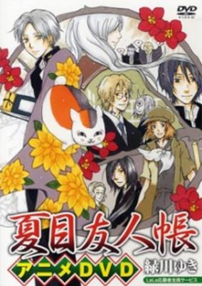

**Episodes:** 13 &nbsp;|&nbsp; **Aired/Released:** January 3 – March 27 &nbsp;|&nbsp; **Genres:** Contemporary Fantasy, Japan, Asia, Fantasy, Slice of Life, Supernatural, Shoujo

> Nyanko-sensei runs away from Natsume to chase a dragonfly. He finds himself stuck with two young children on their first errand. He keeps trying to leave, but the area of the forest they’re in is filled with dangerous youkai. Can he help them complete their errand, while still retaining his sanity? (Source: Crunchyroll) Note: Originally included on a bonus mail-order DVD eligible for readers of LaLa's August, October and September 2013 issues. It was later aired as a special in the broadcast schedule of Natsume Yuujinchou Go on the November 16, 2016.
>
> _Synopsis source: Kitsu_

[Wikipedia](https://en.wikipedia.org/wiki/Natsume_Y%C5%ABjin-ch%C5%8D_Shi) · [Kitsu](https://kitsu.io/anime/natsume-yuujinchou-lala-special)

---

### Detective Opera Milky Holmes 2

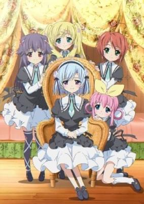

**Episodes:** 12 &nbsp;|&nbsp; **Aired/Released:** January 5 – March 22 &nbsp;|&nbsp; **Genres:** Loli, Action, Comedy, Super Deformed, Slapstick, Magical Girl, Super Power, Mystery

> Second season of Tantei Opera Milky Holmes.
>
> _Synopsis source: Kitsu_

[Kitsu](https://kitsu.io/anime/tantei-opera-milky-holmes-dai-2-maku)

---

### The Prince of Tennis II

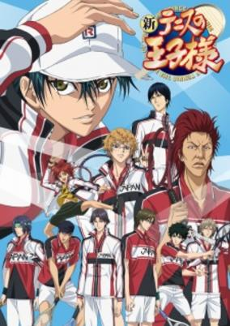

**Episodes:** 13 &nbsp;|&nbsp; **Aired/Released:** January 5 – March 29 &nbsp;|&nbsp; **Genres:** Bishounen, Present, Tennis, Plot Continuity, Action, Comedy, Sports, Shounen

> It takes a lot to reach the top when it comes to tennis. No one knows that better than Ryouma Echizen, a young prodigy tennis player, and his teammates at the Seishun Academy. It was only because they pushed themselves to the limit, spending countless hours preparing for every pulse-pounding match, that they managed to claim victory in the All-Japan National Tournament.New Prince of Tennis begins with Ryouma and his teammates heading to the U-17 Selection training camp, after receiving a special invitation due to their victory in the Nationals. The training camp is renowned for producing strong tennis players, so the boys of Seishun Academy can’t wait to take their game to the next level. However, not everyone is happy to have them among their ranks, and they’ll have to weather the intense training to prove they belong among the best of the up-and-coming players of their generation.
>
> _Synopsis source: Kitsu_

[Wikipedia](https://en.wikipedia.org/wiki/The_New_Prince_of_Tennis) · [Kitsu](https://kitsu.io/anime/new-prince-of-tennis)

---

### High School DxD

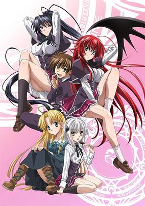

**Episodes:** 12 &nbsp;|&nbsp; **Aired/Released:** January 6 – March 23 &nbsp;|&nbsp; **Genres:** Fantasy, Romance, Earth, Contemporary Fantasy, Japan, Ecchi, Action, Asia, High School, School Life, Plot Continuity, Violence, Present, Harem, Demon, Super Power, Comedy

> High school student Issei Hyoudou is your run-of-the-mill pervert who does nothing productive with his life, peeping on women and dreaming of having his own harem one day. Things seem to be looking up for Issei when a beautiful girl asks him out on a date, although she turns out to be a fallen angel who brutally kills him! However, he gets a second chance at life when beautiful senior student Rias Gremory, who is a top-class devil, revives him as her servant, recruiting Issei into the ranks of the school's Occult Research club. Slowly adjusting to his new life, Issei must train and fight in order to survive in the violent world of angels and devils. Each new adventure leads to many hilarious (and risqué) moments with his new comrades, all the while keeping his new life a secret from his friends and family in High School DxD! [Written by MAL Rewrite]
>
> _Synopsis source: Kitsu_

[Wikipedia](https://en.wikipedia.org/wiki/High_School_DxD) · [Kitsu](https://kitsu.io/anime/high-school-dxd)

---

### Recorder and Randsell

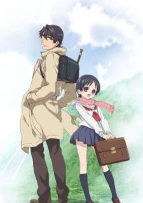

**Episodes:** 13 &nbsp;|&nbsp; **Aired/Released:** January 6 – March 28 &nbsp;|&nbsp; **Genres:** Earth, Japan, Elementary School, Asia, High School, School Life, Present, Comedy, Slice of Life

> Miyagawa Atsushi is an 11-year-old boy who is 180 centimeters tall. Since he has a grown-up looking build but acts his age, he has always been running into troubles. On the other hand, his 17-year-old elder sister Atsumi is only 137 centimeters tall. Even though she has a childish looking build, Atsumi takes good care of Atsushi.
>
> _Synopsis source: Kitsu_

[Wikipedia](https://en.wikipedia.org/wiki/Recorder_and_Randsell) · [Kitsu](https://kitsu.io/anime/recorder-to-randoseru-do)

---

### Amagami SS+ plus

**Episodes:** 13 &nbsp;|&nbsp; **Aired/Released:** January 6 – March 30 &nbsp;|&nbsp; **Genres:** Romance, Earth, Japan, Asia, Comedy, Love Polygon, High School, School Life, Present, Slice of Life

> A continuation of Amagami SS, showing what happens after each girl's respective arc. What if Tsukasa were to run for student council president...?
>
> _Synopsis source: Kitsu_

[Wikipedia](https://en.wikipedia.org/wiki/Amagami_SS%2B_plus) · [Kitsu](https://kitsu.io/anime/amagami-ss-plus)

---

### Kill Me Baby

**Episodes:** 13 &nbsp;|&nbsp; **Aired/Released:** January 6 – March 30 &nbsp;|&nbsp; **Genres:** Earth, Japan, Asia, Comedy, Super Deformed, Slapstick, Present, School Life

> Kill Me Baby is the touching story of Yasuna, a normal (?) high school girl, and Sonya, her best friend who happens to be an assassin. Unfortunately, little Sonya's trained assassin instincts often work against her and others in her daily high school life, as Yasuna's often-broken wrist can attest to. She just wanted a hug, but she ended up with a broken neck. Isn't it sad? No, it's hilarious. Not even Yasuna's intense ninja training can prepare her for the exciting adventures in this explosive 4-panel manga adaptation.
>
> _Synopsis source: Kitsu_

[Wikipedia](https://en.wikipedia.org/wiki/Kill_Me_Baby) · [Kitsu](https://kitsu.io/anime/kill-me-baby)

---

### Symphogear

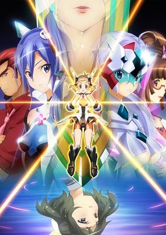

**Episodes:** 13 &nbsp;|&nbsp; **Aired/Released:** January 6 – March 30 &nbsp;|&nbsp; **Genres:** Power Suit, Earth, Science Fiction, Japan, Action, Asia, All Girls School, Plot Continuity, Violence, Present, Music

> Two years ago, a pair of idols, Tsubasa Kazanari and Kanade Amou, collectively known as ZweiWing, fought against an alien race known as Noise using armor known as Symphogear. To protect a girl named Hibiki Tachibana, who got severely wounded by the Noise, Kanade sacrificed herself. Two years later, as Tsubasa has fought the Noise alone, Hibiki ends up gaining the same power as Kanade.
>
> _Synopsis source: Kitsu_

[Wikipedia](https://en.wikipedia.org/wiki/Symphogear) · [Kitsu](https://kitsu.io/anime/senki-zesshou-symphogear-meteoroid-falling-burning-and-disappear-then)

---

### The Familiar of Zero F

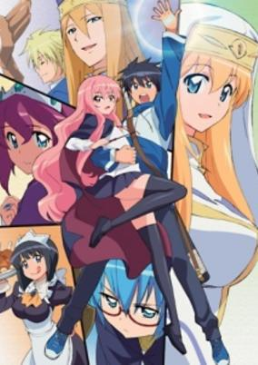

**Episodes:** 12 &nbsp;|&nbsp; **Aired/Released:** January 7 – March 24 &nbsp;|&nbsp; **Genres:** Magic, Swordplay, Fantasy World, Feudal Warfare, Plot Continuity, Parallel Universe, Action, Fantasy, Adventure, Ecchi

> The fourth and final season of The Familiar of Zero. Saito and Louise feel their bond deepening as the days go on, and they feel it might be time to take the next step in their relationship... But before that, the Queen has a mission for them. She sends them to the pope, who has both Louise and Tiffania become holy maidens. And with all the interruptions around, by both friends and foes, Louise and Saito's love will be tested to the limit.
>
> _Synopsis source: Kitsu_

[Wikipedia](https://en.wikipedia.org/wiki/The_Familiar_of_Zero) · [Kitsu](https://kitsu.io/anime/zero-no-tsukaima-f)

---

### The Knight in the Area

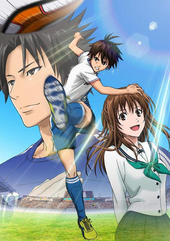

**Episodes:** 37 &nbsp;|&nbsp; **Aired/Released:** January 7 – September 29 &nbsp;|&nbsp; **Genres:** Japan, Sports, Soccer, Drama, Plot Continuity, Present, Comedy, School Life

> Kakeru and Suguru are brothers who both have a flaming passion for soccer. However, while Suguru becomes a rising star in the Japanese youth soccer system, Kakeru decides to take on a managerial role after struggling on the field. But due to a cruel twist of fate, Kakeru ends up reevaluating the role he has chosen. In hopes of one day being able to enter the World Cup by becoming a member of the national team, Kakeru trains harder than anyone else. He isn’t alone in this quest for glory, though. Kakeru's childhood friend, Nana, is a soccer prodigy of her own, with the wicked nickname “Little Witch”. She is a top-ranked player and is already playing for Nadeshiko Japan, the Japanese women’s national team. Nana's success gives Kakeru the extra push he needs to reach for his goals. Soccer and adolescent fervor combine for an epic, emotional ride. Check it out for yourself in Area no Kishi!
>
> _Synopsis source: Kitsu_

[Wikipedia](https://en.wikipedia.org/wiki/The_Knight_in_the_Area) · [Kitsu](https://kitsu.io/anime/area-no-kishi)

---

### Nisemonogatari

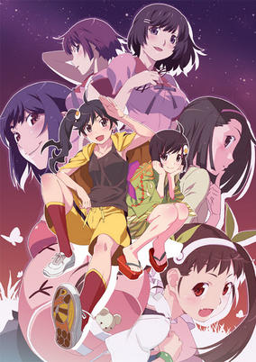

**Episodes:** 11 &nbsp;|&nbsp; **Aired/Released:** January 8 – March 18 &nbsp;|&nbsp; **Genres:** Loli, Earth, Contemporary Fantasy, Japan, Ecchi, Asia, Slapstick, Harem, Comedy, Mystery

> If Koyomi Araragi thought his life couldn't get any more complicated after meeting Hitagi Senjogahara, Mayoi Hachikuji, and Suruga Kanbaru, he's sorely mistaken. Without any knowledge of how it came to be, Koyomi finds himself in an unknown place as a prisoner. The reason for and answer to his predicament seem to lay in Hitagi's past and the con artist Kaiki Deishuu, but it becomes clear that there's much more to it than that, and it will threaten the well-being of those Koyomi holds dear. The second story arc of Nisemonogatari focuses on Koyomi's sister Tsukihi. When Koyomi meets a pair of enigmatic women who know suspiciously too much about him and his friends, he couldn't have anticipated the ramifications of their presence. Now Tsukihi's life may very well be at risk, and the cause behind it will shake the foundation of everything Koyomi knows about his sisters.
>
> _Synopsis source: Kitsu_

[Wikipedia](https://en.wikipedia.org/wiki/Nisemonogatari) · [Kitsu](https://kitsu.io/anime/nisemonogatari)

---

### Brave 10

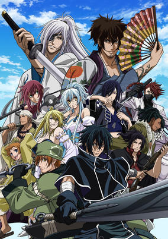

**Episodes:** 12 &nbsp;|&nbsp; **Aired/Released:** January 8 – March 25 &nbsp;|&nbsp; **Genres:** Ninja, Sengoku Period, Swordplay, Bishounen, Past, Violence, Samurai, Super Power, Historical, Action, Adventure

> Isanami, a young priestess of Izumo, is forced to watch as a group of evil ninja burn her temple to the ground and slaughter the people within, leaving her no choice but to flee into the forest to escape the same fate. By chance, she stumbles upon Saizou Kirigakure, a masterless ninja from the Iga school. The two travel to Ueda Castle to ask Yukimura Sanada for help. Isanami's possession of a strange and devastating power is revealed, and Sanada readily agrees to help her, gathering ten brave warriors to Isanami's side. Thus begins Brave 10, a story set in the Warring States period. It follows Saizou and Isanami's journey throughout the war-laden lands in search of brave warriors to serve under Yukimura's banner, each possessing powerful skills of their own. They'll have to travel far and wide, all while trying to fend off those who would chase after the dark power that she possesses to make it their own.
>
> _Synopsis source: Kitsu_

[Wikipedia](https://en.wikipedia.org/wiki/Brave_10) · [Kitsu](https://kitsu.io/anime/brave-10)

---

### Lagrange: The Flower of Rin-ne

**Episodes:** 12 &nbsp;|&nbsp; **Aired/Released:** January 8 – March 25 &nbsp;|&nbsp; **Genres:** Post Apocalypse, Earth, Mecha, Japan, Ecchi, Piloted Robot, Asia, School Clubs, Humanoid Alien, Alien, Friendship, Action, Science Fiction, Comedy

> Madoka Kyouno is an energetic girl who is full of passion. As the proud, and only, member of the Kamogawa Girls' High School Jersey Club, she goes around helping people in need. Madoka's life is turned upside down when she is suddenly asked by a mysterious girl named Lan to pilot a robot. Motivated by her desire to protect the people and city of Kamogawa, Madoka agrees to pilot the resurrected Vox robot to fight against extraterrestrials that have come to attack Earth.
>
> _Synopsis source: Kitsu_

[Kitsu](https://kitsu.io/anime/rinne-no-lagrange)

---

### Bodacious Space Pirates

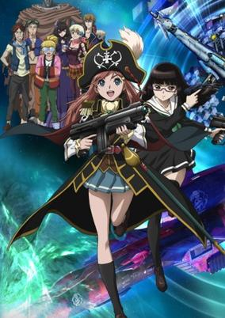

**Episodes:** 26 &nbsp;|&nbsp; **Aired/Released:** January 8 – July 1 &nbsp;|&nbsp; **Genres:** Space Travel, Science Fiction, Adventure, Shipboard, All Girls School, Space, Pirate

> The story centers around a spirited high school girl named Marika. She keeps herself busy with the space yacht club and her part-time job at a high-class retro café. One day, two strangers suddenly appear and claim to be subordinates of her dead father. They demand that she assume command of the space pirate ship Bentenmaru. A privateer ship's compact was made during a war of independence a century ago, and according to that compact, the ship must be inherited by the captain's next direct descendant. Marika finds herself embarking on a new life as a space pirate.
>
> _Synopsis source: Kitsu_

[Wikipedia](https://en.wikipedia.org/wiki/Bodacious_Space_Pirates) · [Kitsu](https://kitsu.io/anime/bodacious-space-pirates)

---

### Poyopoyo Kansatsu Nikki (Poyopoyo)

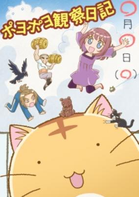

**Episodes:** 52 &nbsp;|&nbsp; **Aired/Released:** January 8 – December 30 &nbsp;|&nbsp; **Genres:** Slice of Life, Comedy, Super Deformed, Slapstick

> Moe Sato is a young lady who finds a cat and starts taking care of him. Named Poyo due to his round shape, he quickly becomes a dear member of the Sato family.
>
> _Synopsis source: Kitsu_

[Wikipedia](https://en.wikipedia.org/wiki/Poyopoyo_Kansatsu_Nikki) · [Kitsu](https://kitsu.io/anime/poyopoyo-kansatsu-nikki)

---

### Aquarion Evol

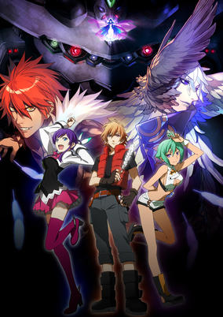

**Episodes:** 26 &nbsp;|&nbsp; **Aired/Released:** January 9 – June 25 &nbsp;|&nbsp; **Genres:** Fantasy, Romance, Transforming Craft, Mecha, Piloted Robot, Love Polygon, Drama, Future, Slow When It Comes To Love, Super Power, Action, Science Fiction, Comedy

> After accidentally forming the legendary mecha "Aquarion," Amata finds himself at a pilot-training academy where the girls are flirty and the boys seem more interested in exploring holes and big bangs than harnessing their Elemental superpowers. When a mysterious megalomaniac plots interplanetary disaster, the fate of the galaxy depends on whether or not the hormone-fueled coeds can come together.
>
> _Synopsis source: Kitsu_

[Wikipedia](https://en.wikipedia.org/wiki/Aquarion_Evol) · [Kitsu](https://kitsu.io/anime/aquarion-evol)

---

### Another (Another: The Other)

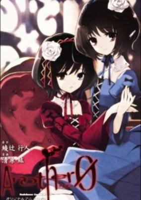

**Episodes:** 12 &nbsp;|&nbsp; **Aired/Released:** January 10 – March 27 &nbsp;|&nbsp; **Genres:** Present, Earth, Japan, Asia, Horror, Thriller, Slice of Life, Mystery

> Episode 0 bundled with the 0th limited-edition volume of Kiyohara Hiro's manga adaptation of Ayatsuji Yukito's horror novel Another.
>
> _Synopsis source: Kitsu_

[Wikipedia](https://en.wikipedia.org/wiki/Another_(novel)) · [Kitsu](https://kitsu.io/anime/another-the-other-inga)

---

### Daily Lives of High School Boys

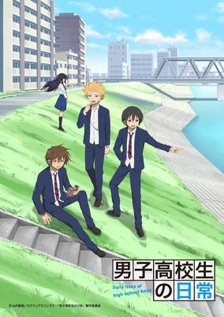

**Episodes:** 12 &nbsp;|&nbsp; **Aired/Released:** January 10 – March 27 &nbsp;|&nbsp; **Genres:** Japan, Parody, Slice of Life, Comedy, Delinquent, High School, Slapstick, School Life, Present

> Roaming the halls of the all-boys Sanada North High School are three close comrades: the eccentric ringleader with a hyperactive imagination Hidenori, the passionate Yoshitake, and the rational and prudent Tadakuni. Their lives are filled with giant robots, true love, and intense drama... in their colorful imaginations, at least. In reality, they are just an everyday trio of ordinary guys trying to pass the time, but who said everyday life couldn't be interesting? Whether it's an intricate RPG reenactment or an unexpected romantic encounter on the riverbank at sunset, Danshi Koukousei no Nichijou is rife with bizarre yet hilariously relatable situations that are anything but mundane. [Written by MAL Rewrite]
>
> _Synopsis source: Kitsu_

[Wikipedia](https://en.wikipedia.org/wiki/Daily_Lives_of_High_School_Boys) · [Kitsu](https://kitsu.io/anime/danshi-koukousei-no-nichijou)

---

### Waiting in the Summer

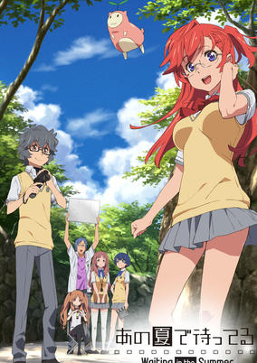

**Episodes:** 12 &nbsp;|&nbsp; **Aired/Released:** January 10 – March 27 &nbsp;|&nbsp; **Genres:** Romance, Earth, Science Fiction, Japan, Asia, Love Polygon, High School, Humanoid Alien, Alien, School Life, Summer, Countryside, Present, Comedy, Friendship, Slice of Life

> While testing out his camera on a bridge one summer night, Kaito Kirishima sees a blue light streaking across the sky, only to be blown off the railing seconds later. Just before succumbing to unconsciousness, a hand reaches down to grab ahold of his own. Dazed and confused, Kaito wakes up the next morning wondering how he ended up back in his own room with no apparent injuries or any recollection of the night before. As he proceeds with his normal school life, Kaito and his friends discuss what to do with his camera, finally deciding to make a film with it over their upcoming summer break. Noticing that Kaito has an interest in the new upperclassmen Ichika Takatsuki, his friend Tetsurou Ishigaki decides to invite her, as well as her friend Remon Yamano, to join them in their movie project. In what becomes one of the most entertaining and exciting summers of their lives, Kaito and his friends find that their time spent together is not just about creating a film, but something much more meaningful that will force them to confront their true feelings and each other. [Written by MAL Rewrite]
>
> _Synopsis source: Kitsu_

[Wikipedia](https://en.wikipedia.org/wiki/Waiting_in_the_Summer) · [Kitsu](https://kitsu.io/anime/ano-natsu-de-matteru)

---

### Listen to Me, Girls. I Am Your Father!

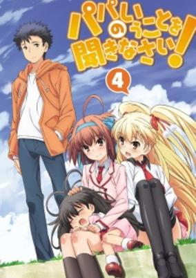

**Episodes:** 12 &nbsp;|&nbsp; **Aired/Released:** January 11 – March 28 &nbsp;|&nbsp; **Genres:** Loli, Slice of Life, Drama, Harem, Comedy, Romance, Family

> Segawa Yuta is a freshman of a university. He lost his parents when he was small and was raised by his sister Yuri. Yuta has been living alone since Yuri got married to a middle aged man when Yuta was a junior high student. One day, Yuri visited Yuta's apartment and asked him to take care of her three daughters while Yuri and her husband were on a trip. He unwillingly accepted the job but the plane Yuri took went missing. In order to prevent the daughters from being adopted separately by relatives, Yuta decided to take in all three girls. A life of a strange family in a tiny apartment begins.
>
> _Synopsis source: Kitsu_

[Wikipedia](https://en.wikipedia.org/wiki/Listen_to_Me,_Girls._I_Am_Your_Father!) · [Kitsu](https://kitsu.io/anime/papa-no-iukoto-wo-kikinasai)

---

### Inu X Boku Secret Service

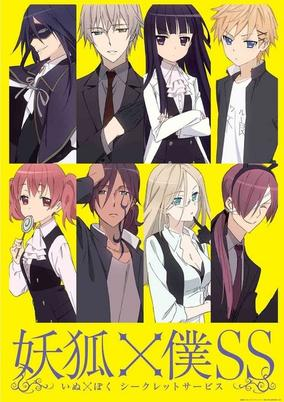

**Episodes:** 12 &nbsp;|&nbsp; **Aired/Released:** January 13 – March 30 &nbsp;|&nbsp; **Genres:** Romance, Contemporary Fantasy, Japan, Super Deformed, Bishounen, Present, Super Power, Comedy, Drama

> Ririchiyo Shirakiin is the sheltered daughter of a renowned family. With her petite build and wealthy status, Ririchiyo has been a protected and dependent girl her entire life, but now she has decided to change all that. However, there is just one problem—the young girl has a sharp tongue she can't control, and terrible communication skills. With some help from a childhood friend, Ririchiyo takes up residence in Maison de Ayakashi, a secluded high-security apartment complex that, as the unsociable 15-year-old soon discovers, is home to a host of bizarre individuals. Furthermore, their quirky personalities are not the strangest things about them: each inhabitant of the Maison de Ayakashi, including Ririchiyo, is actually half-human, half-youkai. But Ririchiyo's troubles have only just begun. As a requirement of staying in her new home, she must be accompanied by a Secret Service agent. Ririchiyo's new partner, Soushi Miketsukami, is handsome, quiet... but ridiculously clingy and creepily submissive. With Soushi, her new supernatural neighbors, and the beginning of high school, Ririchiyo definitely seems to have a difficult path ahead of her. [Written by MAL Rewrite]
>
> _Synopsis source: Kitsu_

[Wikipedia](https://en.wikipedia.org/wiki/Inu_%C3%97_Boku_SS) · [Kitsu](https://kitsu.io/anime/inu-x-boku-ss)

---

### LBX: Little Battlers eXperience Season 2 (LBX: Little Battlers eXperience)

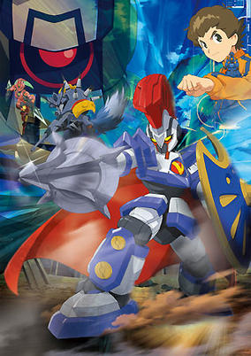

**Episodes:** 58 &nbsp;|&nbsp; **Aired/Released:** January 18 – March 20, 2013 &nbsp;|&nbsp; **Genres:** Mecha, Action, Science Fiction, Proxy Battles, Kids

> In 2046, a revolutionary 80% shock-absorbing reinforced cardboard has been developed, rapidly transforming the world's exports. The reinforced cardboard would soon become the battleground for a popular children's hobby called "LBX" (Little Battler eXperience). Four years later, a boy named Yamano Ban who loves to play with LBX (although without a mecha himself) is given a case containing the model AX-00 by a mysterious woman. He is told that he now holds the hopes and despairs of mankind in his hands.
>
> _Synopsis source: Kitsu_

[Wikipedia](https://en.wikipedia.org/wiki/Little_Battlers_Experience) · [Kitsu](https://kitsu.io/anime/danball-senki)

---

### Gokujo.: Gokurakuin Joshikou Ryou Monogatari

**Episodes:** 12 &nbsp;|&nbsp; **Aired/Released:** January 24 – March 27 &nbsp;|&nbsp; **Genres:** Earth, Japan, Ecchi, Asia, Comedy, Shoujo Ai, High School, All Girls School, School Life, Present

> A story about the humorous misadventures of Akabane Aya, an arrogant high school girl who's constantly trying to outdo her classmates in everything (especially sex appeal), only to make a fool of herself in the process. Since the story takes place in an all-girls school, expect lots of yuri fanservice innuendos without much seriousness.
>
> _Synopsis source: Kitsu_

[Wikipedia](https://en.wikipedia.org/wiki/Gokujyo) · [Kitsu](https://kitsu.io/anime/gokujo)

---

### Black Rock Shooter

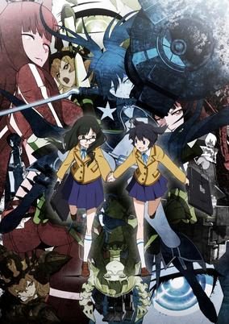

**Episodes:** 8 &nbsp;|&nbsp; **Aired/Released:** February 3 – March 23 &nbsp;|&nbsp; **Genres:** Fantasy, Earth, Japan, Action, Asia, Angst, Parallel Universe, Violence, Present, Super Power, Slice of Life, School Life

> On the first day of junior high school, Mato Kuroi happens to run into Yomi Takanashi, a shy, withdrawn girl whom she immediately takes an interest in. Mato tries her best to make conversation with Yomi, wanting to befriend her. At first, she is avoided, but the ice breaks when Yomi happens to notice a decorative blue bird attached to Mato's phone, which is from the book "Li'l Birds At Play." Discovering they have a common interest, the two form a strong friendship. In an alternate universe, the young girls exist as parallel beings, Mato as Black★Rock Shooter, and Yomi as Dead Master. Somehow, what happens in one world seems to have an effect on the other, and unaware of this fact, the girls unknowingly become entangled by the threads of fate. [Written by MAL Rewrite]
>
> _Synopsis source: Kitsu_

[Wikipedia](https://en.wikipedia.org/wiki/Black_Rock_Shooter) · [Kitsu](https://kitsu.io/anime/black-rock-shooter-tv)

---

### Smile PreCure! (Glitter Force)

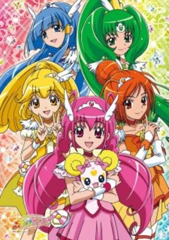

**Episodes:** 48 &nbsp;|&nbsp; **Aired/Released:** February 5 – January 27, 2013 &nbsp;|&nbsp; **Genres:** Contemporary Fantasy, Earth, Japan, Fantasy World, Asia, Comedy, Middle School, Friendship, School Life, Magical Girl, Plot Continuity, Present, Magic, Action, Fantasy

> Once upon a time, there was a kingdom of fairy tales called "Märchenland," where many fairy tale characters live together in joy. Suddenly, the evil emperor Pierrot made an invasion on Märchenland, sealing its Queen in the process. To revive the Queen, the symbol of happiness called Cure Decor, "the Queen's scattered power of light of happiness," is required. To collect the Cure Decor, a fairy named Candy searches for the Pretty Cures on Earth. There, Candy meets a girl, who decides to collect the Cure Decor. Now, will the world earn a "happy ending"?
>
> _Synopsis source: Kitsu_

[Wikipedia](https://en.wikipedia.org/wiki/Smile_PreCure!) · [Kitsu](https://kitsu.io/anime/smile-precure)

---

### Ozma

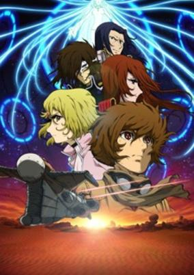

**Episodes:** 6 &nbsp;|&nbsp; **Aired/Released:** March 17 – April 21 &nbsp;|&nbsp; **Genres:** Post Apocalypse, Desert, Science Fiction, Earth, Pirate, Action

> In the far future, the elevated irradiation from the sun has destroyed the environment of the earth and the birthrate of humans has drastically decreased. The government controls society with an army of cloned soldiers called "Ideal Children (IC)". Sam Coyne is a trader in a desert. One day, he saves a beautiful woman Maya, who has been chased by Theseus, a corps of IC. He shelters her in his trade ship, but the destroyers of Theseus surround Sam and Maya.
>
> _Synopsis source: Kitsu_

[Wikipedia](https://en.wikipedia.org/wiki/Ozuma) · [Kitsu](https://kitsu.io/anime/ozma)

---

### Victory Kickoff!! (Hyperdimension Neptunia)

**Episodes:** 39 &nbsp;|&nbsp; **Aired/Released:** March 26 – February 26, 2013 &nbsp;|&nbsp; **Genres:** Fantasy, Action, Henshin, Anthropomorphism, Virtual Reality, Super Power, Parody, Science Fiction, Comedy

> After years of fruitless war between the four realms of Gamindustri (Planeptune, Lastation, Lowee and Leanbox) over Share energy, the source of their strength based on how much their people have faith in their goddesses, the four CPUs that rule over them have finally signed a friendship treaty. The treaty bans any attempt at claiming Share energy through military force, in hopes of bringing peace and prosperity to their worlds. Yet, a month after the treaty, Neptune, the CPU Goddess of Planeptune, spends her time goofing off and playing games rather than doing her job, leaving her land's Shares plummeting. Choujigen Game Neptune The Animation follows Neptune and her friends' attempts at raising Shares, while dealing with an external threat that could spell the end of both the Goddesses and Gamindustri itself...
>
> _Synopsis source: Kitsu_

[Wikipedia](https://en.wikipedia.org/wiki/Victory_Kickoff!!) · [Kitsu](https://kitsu.io/anime/choujigen-game-neptune-the-animation)

---

### Hiiro no Kakera: The Tamayori Princess Saga

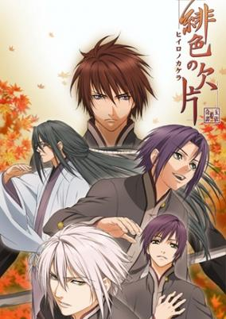

**Episodes:** 13 &nbsp;|&nbsp; **Aired/Released:** April 1 – June 24 &nbsp;|&nbsp; **Genres:** Contemporary Fantasy, Romance, Earth, Japan, Asia, Bishounen, High School, Magic, Reverse Harem, Countryside, Present, Fantasy, Drama

> Gods and ghosts only exist in fairy tales, right? That's the impression that high school girl Tamki Kasuga has before she goes to live with her grandmother in the remote village of Kifumura. After being attacked by strange creatures upon her arrival, she is soon informed that females in her family contain the blood of the Tamayori Princess, who has the responsibility and power of keeping gods and ghosts sealed away so that they can't harm the general public. At first Tamaki has trouble believing this, but having five beautiful young men following her everywhere she goes acting as her guardians goes a long way towards convincing her. There's more to this job than Tamaki first realizes, however, and the path that lies ahead of her is fraught with peril and danger. Will she be able to successfully take on the heavy role that has been put on her shoulders?
>
> _Synopsis source: Kitsu_

[Wikipedia](https://en.wikipedia.org/wiki/Hiiro_no_Kakera) · [Kitsu](https://kitsu.io/anime/hiiro-no-kakera)

---

### Shiba Inuko-san

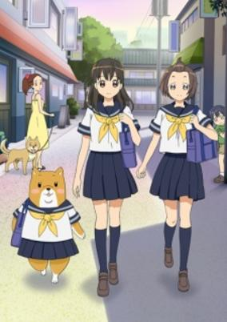

**Episodes:** 26 &nbsp;|&nbsp; **Aired/Released:** April 1 – September 23 &nbsp;|&nbsp; **Genres:** Japan, Earth, Slice of Life, Asia, Comedy, Middle School, Anthropomorphism, School Life, Present

> Shibainuko-san is a 14-year-old girl who looks exactly like a Shiba Inu dog. One of her classmates, Ishibashi Chako, wonders about her appearance, but no one else thinks it is strange.
>
> _Synopsis source: Kitsu_

[Kitsu](https://kitsu.io/anime/shiba-inuko-san)

---

### Space Brothers (Space Brothers: Apo's Dream)

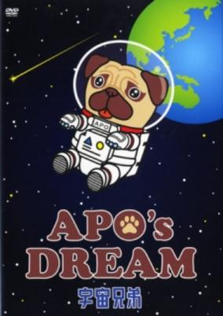

**Episodes:** 99 &nbsp;|&nbsp; **Aired/Released:** April 1 – March 22, 2014 &nbsp;|&nbsp; **Genres:** Comedy, Science Fiction, Space

> Included on a DVD within the limited edition of the manga's volume 17. Apo, the pet dog from the manga, will star in the anime.
>
> _Synopsis source: Kitsu_

[Wikipedia](https://en.wikipedia.org/wiki/Space_Brothers_(manga)) · [Kitsu](https://kitsu.io/anime/uchuu-kyoudai-apo-s-dream)

---

### Saint Seiya Omega

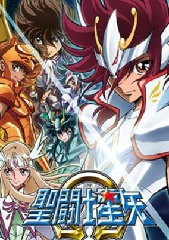

**Episodes:** 97 &nbsp;|&nbsp; **Aired/Released:** April 1 – March 30, 2014 &nbsp;|&nbsp; **Genres:** Fantasy, Action, Martial Arts, Super Power, Henshin, Adventure, Shounen

> The god of war and guardian of his namesake planet, Mars, was once sealed away by Seiya, but time has passed and his revival is at hand. Meanwhile, Saori Kido (Athena) is raising the boy Kouga, whose life Seiya saved, and he's been training every day to become a Saint in order to prepare for the coming crisis... Unaware of his destiny, when Kouga awakens to the power of his Cosmo hidden inside him, the curtain will rise upon the legend of a new Saint.
>
> _Synopsis source: Kitsu_

[Wikipedia](https://en.wikipedia.org/wiki/Saint_Seiya_Omega) · [Kitsu](https://kitsu.io/anime/saint-seiya-omega)

---

### Folktales from Japan

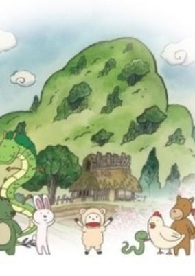

**Episodes:** 258 &nbsp;|&nbsp; **Aired/Released:** April 1 – March 26, 2017 &nbsp;|&nbsp; **Genres:** Fantasy, Japan, Adventure, Earth, Asia, Comedy, Juujin, Anthropomorphism, Past, Countryside, Historical, Kids

> Like in any culture, Japanese kids grow up listening to the stories repeatedly told by their parents and grandparents. The boy born from a peach; the princess from the moon who is discovered inside a bamboo; the old man who can make a dead cherry tree blossom, etc. These short stories that teach kids to see both the dark and bright sides of life have passed traditional moral values from generation to generation. Each half-hour episode of Folktales from Japan consists of three self-contained stories, well-known and unknown, with a special focus on heartwarming stories that originate from Tohoku, the northern region heavily touched by the earthquake of 2011. May this program help cheer up earthquake victims and cast a light of hope for them?
>
> _Synopsis source: Kitsu_

[Wikipedia](https://en.wikipedia.org/wiki/Folktales_from_Japan) · [Kitsu](https://kitsu.io/anime/folktales-from-japan)

---

### Nukko.

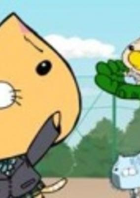

**Episodes:** 24 &nbsp;|&nbsp; **Aired/Released:** April 2 – September 19 &nbsp;|&nbsp; **Genres:** Comedy

> The new Nukko. anime is an adolescent school story revolving around Nukko and Nukko's slightly(?) oddball friends.
>
> _Synopsis source: Kitsu_

[Kitsu](https://kitsu.io/anime/nukko)

---

### Paboo & Mojies

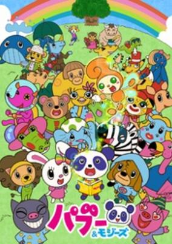

**Episodes:** 52 &nbsp;|&nbsp; **Aired/Released:** April 2 – March 2, 2013 &nbsp;|&nbsp; **Genres:** Kids

> Paboo is a fun loving and curious boy panda, and he and his group of larger-than-life friends explore and problem-solve in their quirky, imaginative and sometimes zany world! Each episode sees the Mojies (Japanese for letters of the alphabet) and Pappy (the Mojies book fairy of course!) help Paboo to discover the Magic Word and solve the problem of the day!
>
> _Synopsis source: Kitsu_

[Wikipedia](https://en.wikipedia.org/wiki/Paboo_%26_Mojies) · [Kitsu](https://kitsu.io/anime/paboo-mojies)

---

### Gon

**Episodes:** 50 &nbsp;|&nbsp; **Aired/Released:** April 2 – March 25, 2013

[Wikipedia](https://en.wikipedia.org/wiki/Gon_(manga))

---

### Panda no Taputapu

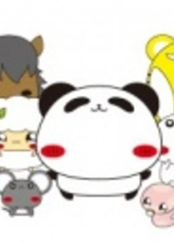

**Episodes:** 431 &nbsp;|&nbsp; **Aired/Released:** April 2 – November 29, 2013 &nbsp;|&nbsp; **Genres:** Kids

> A short anime featuring the zodiac animals with a panda named Taputapu as the main character. Each episode is focuses on having a proverb, moral, or uplifting value.
>
> _Synopsis source: Kitsu_

[Kitsu](https://kitsu.io/anime/panda-no-taputapu)

---

### Queen's Blade Rebellion

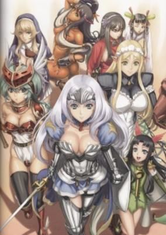

**Episodes:** 12 &nbsp;|&nbsp; **Aired/Released:** April 3 – June 19 &nbsp;|&nbsp; **Genres:** Fantasy, Action, Ecchi, Fantasy World, Swordplay, Elf, High Fantasy, Past, Adventure

> Power corrupts, and it when it appears that the once noble Queen Claudette's ways have turned to oppression and heretical persecution, it's up to a new generation of warriors to step up to the plate armor to bear arms and bare their naked fury in open rebellion! The odds may seem unfairly stacked in favor of the Amazonian ranks of the queen, doubly supported by her power of writ and assassins. But the incredible wits and assets of the dazzling array of daring damsels willing to risk their gorgeous skins and put their lithesome bodies on line against her, might just expose a few unexpected weaknesses in the queen's support!
>
> _Synopsis source: Kitsu_

[Wikipedia](https://en.wikipedia.org/wiki/Queen%27s_Blade_Rebellion) · [Kitsu](https://kitsu.io/anime/queen-s-blade-rebellion)

---

### You and Me 2 (You and Me.)

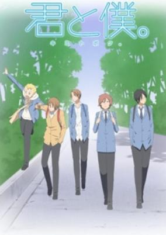

**Episodes:** 13 &nbsp;|&nbsp; **Aired/Released:** April 3 – June 26 &nbsp;|&nbsp; **Genres:** Japan, Earth, Slice of Life, Asia, Comedy, High School, School Life, Present, Romance, Friendship

> The high school students in Kimi to Boku. consider their school life to be anything but exciting. A repetitive journey through classes, arguments, and orientations for future careers that seem way too distant. But with the right group of friends, time can be made to move a little faster. Four high school boys, who have known each other since childhood, hang out together in school every day. There's the handsome twins Yuuki and Yuuta Asaba, the gentle Shun Matsuoka, and the calm class head Kaname Tsukahara. Although they have become used to a lack of excitement in their lives, the addition of a new transfer student, Chizuru Tachibana, who is half German and half Japanese, may add a little more adventure to their routine. With his energetic personality and stories from a distant country, Chizuru may be able to light up the dull atmosphere of the group.
>
> _Synopsis source: Kitsu_

[Wikipedia](https://en.wikipedia.org/wiki/Kimi_to_Boku) · [Kitsu](https://kitsu.io/anime/kimi-to-boku)

---

### Yurumates 3D

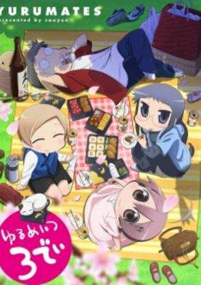

**Episodes:** 13 &nbsp;|&nbsp; **Aired/Released:** April 3 – June 26 &nbsp;|&nbsp; **Genres:** Present, Earth, Japan, Asia, Comedy, Slice of Life

> Yurume, an 18-year-old "ronin" and recent high school graduate, has high hopes of being accepted and attending Tokyo University. She moves into an apartment complex, the Maison du Wish, located on the outskirts of Tokyo where other ronins living there are studying for upcoming college acceptance exams.
>
> _Synopsis source: Kitsu_

[Wikipedia](https://en.wikipedia.org/wiki/Yurumates) · [Kitsu](https://kitsu.io/anime/yurumates-3d)

---

### Zetman

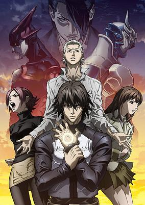

**Episodes:** 13 &nbsp;|&nbsp; **Aired/Released:** April 3 – June 26 &nbsp;|&nbsp; **Genres:** Action, Tokyo, Horror, Drama, Science Fiction, Romance

> The story starts off with a face-off between two rival heroes, ZET and ALPHAS, and then traces their origins - Jin Kanzaki, a young man with the ability to transform into a superhuman being known as ZET, and Kouga Amagi, a young man with a strong sense of justice who uses technology to fight as ALPHAS. The fates of these two men and those around them intertwine as they fight to protect mankind and destroy monstrous abominations known as Players, who ironically are the creations of the Amagi Corporation, the company founded by Kouga’s grandfather, Mitsugai Amagi.
>
> _Synopsis source: Kitsu_

[Wikipedia](https://en.wikipedia.org/wiki/Zetman) · [Kitsu](https://kitsu.io/anime/zetman)

---

### Gakkatsu!

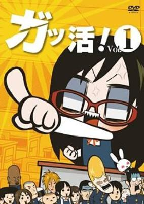

**Episodes:** 25 &nbsp;|&nbsp; **Aired/Released:** April 3 – September 18 &nbsp;|&nbsp; **Genres:** Japan, Slice of Life, Comedy, Super Deformed, Coming Of Age, School Life, Present

> In a fictional school, "Tender Tank" Rareko is constantly opening absurd yet strangely enthusiastic debates, this way creating a lively classroom life. Bringing up tremendous themes, she and her classmates exchange words like sword-strokes, and here and there even a profound remark is slipped in. A fun and informative debate comedy, packed into only five minutes each time.
>
> _Synopsis source: Kitsu_

[Kitsu](https://kitsu.io/anime/gakkatsu)

---

### Zumomo to Nupepe

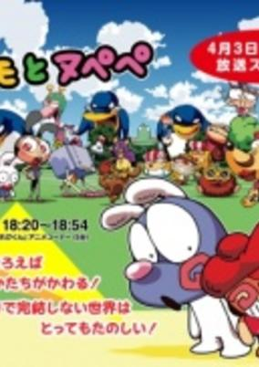

**Episodes:** 32 &nbsp;|&nbsp; **Aired/Released:** April 3 – February 26, 2013 &nbsp;|&nbsp; **Genres:** Comedy

> No synopsis has been added for this series yet.Click here to update this information.
>
> _Synopsis source: Kitsu_

[Kitsu](https://kitsu.io/anime/zumomo-to-nupepe)

---

### Naruto Spin-Off: Rock Lee & His Ninja Pals

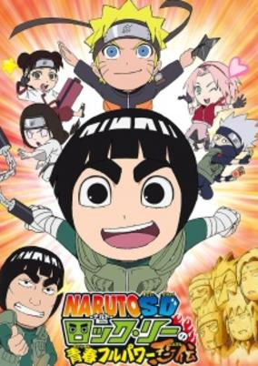

**Episodes:** 51 &nbsp;|&nbsp; **Aired/Released:** April 3 – March 26, 2013 &nbsp;|&nbsp; **Genres:** Ninja, Martial Arts, Super Deformed, Slapstick, Parody, Action, Comedy, Shounen

> Welcome to the Hidden Leaf Village. The village where Uzumaki Naruto, star of the TV show "Naruto" makes his home. Every day, countless powerful ninjas carry out missions and train to hone their skills. Our main character is one of these powerful ninjas...but it's not Naruto! It's the ninja who can't use ninjutsu, Rock Lee! In spite of his handicap, Lee has big dreams. He works hard every day to perfect his hand-to-hand combat skills and become a splendid ninja! And to achieve his dream, he puts in more effort than anyone else. Under the hot-blooded tutelage of his teacher Guy, he works alongside his teammates Tenten and Neji. Watch the Beautiful Green Beast Rock Lee train, go on missions, and have all sorts of adventures!
>
> _Synopsis source: Kitsu_

[Wikipedia](https://en.wikipedia.org/wiki/Rock_Lee_%26_His_Ninja_Pals) · [Kitsu](https://kitsu.io/anime/rock-lee-no-seishun-full-power-ninden)

---

### Recorder and Randsell Re

**Episodes:** 13 &nbsp;|&nbsp; **Aired/Released:** April 4 – June 27 &nbsp;|&nbsp; **Genres:** Japan, Elementary School, Earth, Asia, High School, School Life, Present, Comedy, Slice of Life

> Second season.
>
> _Synopsis source: Kitsu_

[Wikipedia](https://en.wikipedia.org/wiki/Recorder_to_Randoseru_Re) · [Kitsu](https://kitsu.io/anime/recorder-to-randoseru-re)

---

### Arashi no Yoru ni: Himitsu no Tomodachi

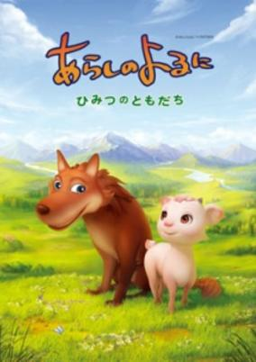

**Episodes:** 26 &nbsp;|&nbsp; **Aired/Released:** April 4 – September 26 &nbsp;|&nbsp; **Genres:** Adventure

> A new anime adaptation by Sparky Animation, Duckbill Entertainment, Baku Enterprise and Bandai Visual of the book Arashi no Yoru ni (One Stormy Night...) by Kimura Yuuichi.
>
> _Synopsis source: Kitsu_

[Wikipedia](https://en.wikipedia.org/wiki/Arashi_no_Yoru_ni) · [Kitsu](https://kitsu.io/anime/arashi-no-yoru-ni-himitsu-no-tomodachi)

---

### Here Comes the Black Witch!!

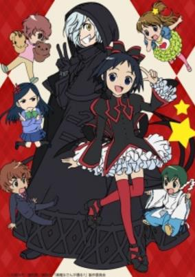

**Episodes:** 60 &nbsp;|&nbsp; **Aired/Released:** April 4 – February 19, 2014 &nbsp;|&nbsp; **Genres:** Comedy, Magic, School Life, Slice of Life

> Kurotori Chiyoko, a 5th-grader in elementary school, loves the occult. One day, a friend requests her to do a love fortune-telling. Chiyoko tries to summon Cupid, but thanks to a stuffy nose, accidentally summons a witch named Gyubid instead! From that day on, Chiyoko starts learning witchcraft from Gyubid, the self-proclaimed hottest instructor of the magic world. The training regimen is tough, and punishment for slacking is harsh. Fortunately, Chiyoko is able to keep her extra-curricular studies secret, aided by the fact that no one else can see Gyubid.
>
> _Synopsis source: Kitsu_

[Wikipedia](https://en.wikipedia.org/wiki/Kuromajo-san_ga_Toru!!) · [Kitsu](https://kitsu.io/anime/kuromajo-san-ga-tooru)

---

### Is This a Zombie? of the Dead

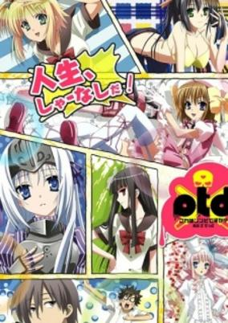

**Episodes:** 10 &nbsp;|&nbsp; **Aired/Released:** April 5 – June 7 &nbsp;|&nbsp; **Genres:** Fantasy, Contemporary Fantasy, Japan, Ecchi, Action, Parody, Comedy, Magic, Present, Harem, Zombie, Magical Girl

> Aikawa Ayumu was revived as a zombie by the cute necromancer Eucliwood Hellscythe. After the zany, madcap adventures in the first season of Is This a Zombie? ended, Ayumu thought his life might finally get back to normal, or as normal as it can be for a zombie. However, destiny has other plans for him. Some guys just can't catch a break.
>
> _Synopsis source: Kitsu_

[Wikipedia](https://en.wikipedia.org/wiki/Is_This_a_Zombie%3F_of_the_Dead) · [Kitsu](https://kitsu.io/anime/kore-wa-zombie-desu-ka-of-the-dead)

---

### Medaka Box

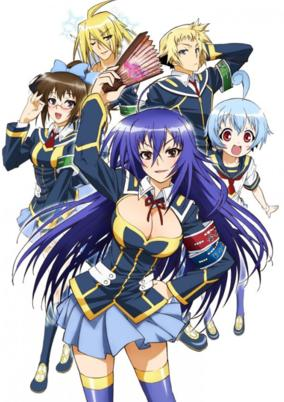

**Episodes:** 12 &nbsp;|&nbsp; **Aired/Released:** April 5 – June 21 &nbsp;|&nbsp; **Genres:** Earth, Japan, Asia, High School, Martial Arts, Super Power, Action, Comedy, Ecchi, School Life

> Medaka Kurokami is, in the truest sense of the word, perfect. Beautiful, intelligent, and athletic, Medaka's dream is to make others happy. So when she runs for Student Council President of the prestigious Hakoniwa Academy, winning the election with 98% of the votes is only to be expected. The very first thing the boisterous new president does is set up the "Medaka Box," a suggestion box allowing students to submit any kind of request for assistance. Together with the cynical Zenkichi Hitoyoshi, her childhood friend who has been strong-armed into helping, Medaka fulfills these requests at a ridiculous rate. For every job completed, she adds flowers to the student council room, with the aim of filling the entire school. However, the two are about to find out that helping others may be a lot harder than they think as they begin to uncover a devastating plan centering on the academy and even Medaka herself! [Written by MAL Rewrite]
>
> _Synopsis source: Kitsu_

[Wikipedia](https://en.wikipedia.org/wiki/Medaka_Box) · [Kitsu](https://kitsu.io/anime/medaka-box)

---

### Lupin the Third: The Woman Called Fujiko Mine

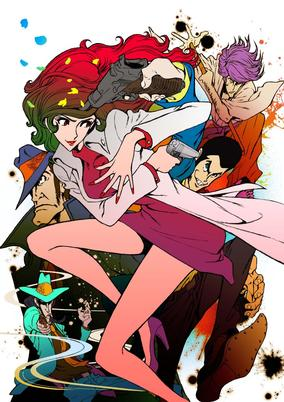

**Episodes:** 13 &nbsp;|&nbsp; **Aired/Released:** April 5 – June 28 &nbsp;|&nbsp; **Genres:** Action, Ecchi, Earth, Thievery, Comedy, Crime, Drama, Past, Cops, Samurai, Adventure, Seinen

> Many people are falling prey to a suspicious new religion. Lupin III infiltrates this group, hoping to steal the treasure their leader keeps hidden. There he lays eyes on the beautiful, bewitching woman who has the leader enthralled. This is the story of how fashionable female thief Fujiko Mine first met Lupin III, the greatest thief of his generation.
>
> _Synopsis source: Kitsu_

[Kitsu](https://kitsu.io/anime/lupin-the-third-mine-fujiko-to-iu-onna)

---

### Polar Bear Cafe (Polar Bear's Café)

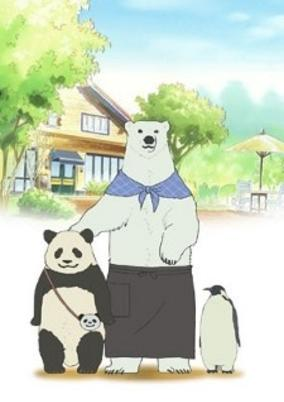

**Episodes:** 50 &nbsp;|&nbsp; **Aired/Released:** April 5 – March 28, 2013 &nbsp;|&nbsp; **Genres:** Parody, Slice of Life, Comedy, Working Life, Anthropomorphism, Josei

> Situated near the local zoo and owned by the charismatic polar bear Shirokuma, Shirokuma Cafe is a popular spot for animals and humans alike, allowing them to sit back and relax after a hard day of work. Whether it's a cold beverage or the latest item on his menu, Shirokuma finds joy in being able to serve his customers, often striking up conversations about various subjects. Together with the sarcastic Penguin and the clumsy Panda, they form an odd trio who get themselves caught up in all sorts of misadventures with their other friends such as Grizzly, a bar owner, and Sasako, a human who works at the cafe. From dealing with unrequited love, outdoor camping trips, karaoke sessions, and even the secret to brewing delicious coffee, there's always something bound to be happening in Shirokuma Cafe! [Written by MAL Rewrite]
>
> _Synopsis source: Kitsu_

[Wikipedia](https://en.wikipedia.org/wiki/Polar_Bear_Caf%C3%A9) · [Kitsu](https://kitsu.io/anime/shirokuma-cafe)

---

### Himitsukessha Taka no Tsume NEO

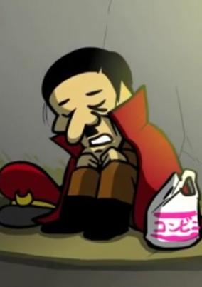

**Episodes:** 38 &nbsp;|&nbsp; **Aired/Released:** April 6 – June 28 &nbsp;|&nbsp; **Genres:** Comedy, Super Power, Parody

> A 3-minute trailer of the new TV series, Eagle Talon NEO, and the new ONA series, himitsukesshatakanotsume.jp, with original footage.
>
> _Synopsis source: Kitsu_

[Wikipedia](https://en.wikipedia.org/wiki/Eagle_Talon_(TV_series)) · [Kitsu](https://kitsu.io/anime/taka-no-tsume-neo-announcement-movie)

---

### A Summer-Colored Miracle

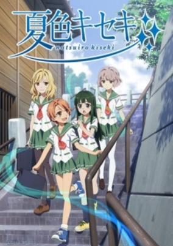

**Episodes:** 12 &nbsp;|&nbsp; **Aired/Released:** April 6 – June 29 &nbsp;|&nbsp; **Genres:** Earth, Japan, Contemporary Fantasy, Slice of Life, Asia, Comedy, Coming Of Age, Friendship, Present, School Life

> Yuka, Rinko, Saki, and Natsumi are childhood friends and classmates nearing the end of their second year of middle school and eagerly awaiting their summer break. Unfortunately, it's a bittersweet time for this close-knit group, as Saki is transferring to another school. The girls are determined to keep the spirit of their friendship alive, even if only for this summer. They reminisce about a large stone the four of them used to visit, tucked away in an old Shinto shrine, and the belief that if four friends gathered around it and made a single wish, it would come true. Now, much to their surprise, they discover that old folktale is true.Natsu-iro Kiseki follows the magical events the girls go through during this last summer they’ll all spend together. As friendships get tested, and fantasies are fulfilled, the four classmates will end up learning a great deal about themselves and each other on the path to forging a summer that they’ll never forget.
>
> _Synopsis source: Kitsu_

[Wikipedia](https://en.wikipedia.org/wiki/Natsuiro_Kiseki) · [Kitsu](https://kitsu.io/anime/natsuiro-kiseki)

---

### Place to Place (Kids on the Slope)

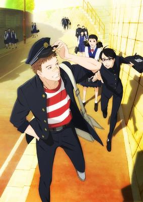

**Episodes:** 12 &nbsp;|&nbsp; **Aired/Released:** April 6 – June 29 &nbsp;|&nbsp; **Genres:** High School, Past, Earth, Japan, Plot Continuity, Music, Asia, Romance, Friendship, Slice of Life

> Introverted classical pianist and top student Kaoru Nishimi has just arrived in Kyushu for his first year of high school. Having constantly moved from place to place since his childhood, he abandons all hope of fitting in, preparing himself for another lonely, meaningless year. That is, until he encounters the notorious delinquent Sentarou Kawabuchi. Sentarou's immeasurable love for jazz music inspires Kaoru to learn more about the genre, and as a result, he slowly starts to break out of his shell, making his very first friend. Kaoru begins playing the piano at after-school jazz sessions, located in the basement of fellow student Ritsuko Mukae's family-owned record shop. As he discovers the immense joy of using his musical talents to bring enjoyment to himself and others, Kaoru's summer might just crescendo into one that he will remember forever.Sakamichi no Apollon is a heartwarming story of friendship, music, and love that follows three unique individuals brought together by their mutual appreciation for jazz. [Written by MAL Rewrite]
>
> _Synopsis source: Kitsu_

[Wikipedia](https://en.wikipedia.org/wiki/Place_to_Place) · [Kitsu](https://kitsu.io/anime/kids-on-the-slope)

---

### Sankarea: Undying Love

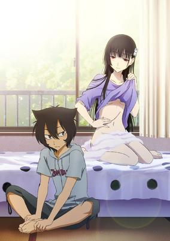

**Episodes:** 12 &nbsp;|&nbsp; **Aired/Released:** April 6 – June 29 &nbsp;|&nbsp; **Genres:** Fantasy, Earth, Contemporary Fantasy, Japan, Ecchi, Zombie, Asia, Love Polygon, Countryside, Present, Horror, Comedy, Romance

> Chihiro Furuya likes zombies. There’s something about the shambling corpses and blood that appeals to him on a visual level, and since childhood he longed to enter into a romantic situation with one. He gets his wish when he encounters Rea Sanka—the daughter of the school director—at the abandoned building he uses in an attempt to resurrect Baabu, the family cat, with a resurrection potion. Hoping to escape her awful home life, Rea consumes the potion and falls to her death, only to come back as a zombie?! Could this possibly be Chihiro's dream come true, or will it be a rude awakening?
>
> _Synopsis source: Kitsu_

[Kitsu](https://kitsu.io/anime/sankarea)

---

### Sengoku Collection

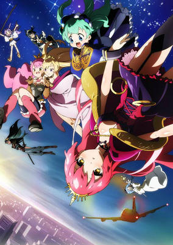

**Episodes:** 26 &nbsp;|&nbsp; **Aired/Released:** April 6 – September 28 &nbsp;|&nbsp; **Genres:** Fantasy, Contemporary Fantasy, Ecchi, Earth, Japan, Slice of Life, Asia, Comedy, Shoujo Ai, Sengoku Period, Americas, Stereotypes, School Life, Present, Samurai, Parody

> Sengoku Collection revolves around many samurai who are accidentally removed from a parallel universe inhabited by well-known historic characters. Unlike the historical war period known to us, all inhabitants in this unique world look like high school girls. Coming from the medieval era and finding themselves totally amazed by everything they encounter in modern day Tokyo, the girls become best friends through their adventures.
>
> _Synopsis source: Kitsu_

[Wikipedia](https://en.wikipedia.org/wiki/Sengoku_Collection) · [Kitsu](https://kitsu.io/anime/sengoku-collection)

---

### Magical Journey: Little Charo in Tohoku

**Episodes:** 12 &nbsp;|&nbsp; **Aired/Released:** April 7 – June 30

---

### Accel World

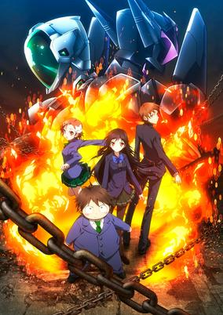

**Episodes:** 24 &nbsp;|&nbsp; **Aired/Released:** April 7 – September 22 &nbsp;|&nbsp; **Genres:** Science Fiction, Action, Fantasy World, Middle School, Future, School Life, Virtual Reality, Romance, Friendship

> Haruyuki Arita is an overweight, bullied middle schooler who finds solace in playing online games. But his life takes a drastic turn one day, when he finds that all his high scores have been topped by Kuroyukihime, the popular vice president of the student council. She then invites him to the student lounge and introduces him to "Brain Burst," a program which allows the users to accelerate their brain waves to the point where time seems to stop. Brain Burst also functions as an augmented reality fighting game, and in order to get more points to accelerate, users must win duels against other players. However, if a user loses all their points, they will also lose access to Brain Burst forever. Kuroyukihime explains that she chose to show Haruyuki the program because she needs his help. She wants to meet the creator of Brain Burst and uncover the reason of why it was created, but that's easier said than done; to do so, she must defeat the "Six Kings of Pure Color," powerful faction leaders within the game, and reach level 10, the highest level attainable. After the girl helps Haruyuki overcome the bullies that torment him, he vows to help her realize her goal, and so begins the duo's fight to reach the top. [Written by MAL Rewrite]
>
> _Synopsis source: Kitsu_

[Wikipedia](https://en.wikipedia.org/wiki/Accel_World) · [Kitsu](https://kitsu.io/anime/accel-world)

---

### Baku Tech! Bakugan

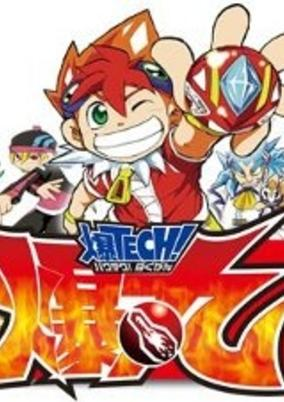

**Episodes:** 51 &nbsp;|&nbsp; **Aired/Released:** April 7 – March 30, 2013 &nbsp;|&nbsp; **Genres:** Virtual Reality, Action

> Bakugan is the card game for a new generation. In "Baku TECH" passionate warriors fight each other and risk their life for Bakugan.
>
> _Synopsis source: Kitsu_

[Wikipedia](https://en.wikipedia.org/wiki/Baku_Tech!_Bakugan) · [Kitsu](https://kitsu.io/anime/baku-tech-bakugan)

---

### Duel Masters Victory V

**Episodes:** 51 &nbsp;|&nbsp; **Aired/Released:** April 7 – March 30, 2013

[Wikipedia](https://en.wikipedia.org/wiki/Duel_Masters)

---

### Jewelpet Kira Deco!

**Episodes:** 52 &nbsp;|&nbsp; **Aired/Released:** April 7 – March 30, 2013 &nbsp;|&nbsp; **Genres:** Fantasy, Comedy, Magic, Magical Girl

> In the Legends of Jewel Land, the Jewelpets were born from the love and caring of their queen, Jewelina. However a strange meteor crashes into the Mirror Ball, destroying it into a million pieces and its fragments called "Deco Stones" were all scattered in Jewel Land. In the present time, Ruby, a dimwitted Rabbit Jewelpet and owner of the Kira Kira Shop, has a thing on sparkly decorations and loves to collect anything that sparkles and shines. However, when she and the others learn about the legend of the Mirror Ball and the Deco Stones, they all decided to go and search for them, until they all meet 5 strange individuals called the KiraDeco 5. The group also has the same goal on wanting to collect the Deco Stones and they befriended the Jewelpets, especially to one of their members: Pink Oomiya. Now, the group need to gather all the Deco Stones and stop the Eternal Darkness from taking over the human world.
>
> _Synopsis source: Kitsu_

[Wikipedia](https://en.wikipedia.org/wiki/Jewelpet_Kira_Deco!) · [Kitsu](https://kitsu.io/anime/jewelpet-kira-deco)

---

### Penguin no Mondai POW

**Episodes:** 51 &nbsp;|&nbsp; **Aired/Released:** April 7 – March 30, 2013

[Wikipedia](https://en.wikipedia.org/wiki/A_Penguin%27s_Troubles)

---

### Pretty Rhythm: Dear My Future

**Episodes:** 51 &nbsp;|&nbsp; **Aired/Released:** April 7 – March 30, 2013 &nbsp;|&nbsp; **Genres:** Sports, Music, Slice of Life

> Three years after the events of "Pretty Rhythm: Aurora Dream," Aira, Mion, and Rizumu have grown up and tutor a new group of aspiring idols: Karin, Reina, Mia, and Ayami, who form the Prizmmy☆. Teenage girls from Korea, named Somin, Shiyoon, Haein, Chaekyung, and Jae Eun (who are the PURETTY), appear as a rival group.
>
> _Synopsis source: Kitsu_

[Kitsu](https://kitsu.io/anime/pretty-rhythm-dear-my-future)

---

### Fate/Zero Season 2 (Fate/Zero)

**Episodes:** 12 &nbsp;|&nbsp; **Aired/Released:** April 8 – June 24 &nbsp;|&nbsp; **Genres:** Fantasy, Battle Royale, Japan, Action, Earth, Contemporary Fantasy, Asia, Swordplay, Magic, Dark Fantasy, Drama, Alternative Present, Present

> With the promise of granting any wish, the omnipotent Holy Grail triggered three wars in the past, each too cruel and fierce to leave a victor. In spite of that, the wealthy Einzbern family is confident that the Fourth Holy Grail War will be different; namely, with a vessel of the Holy Grail now in their grasp. Solely for this reason, the much hated "Magus Killer" Kiritsugu Emiya is hired by the Einzberns, with marriage to their only daughter Irisviel as binding contract. Kiritsugu now stands at the center of a cutthroat game of survival, facing off against six other participants, each armed with an ancient familiar, and fueled by unique desires and ideals. Accompanied by his own familiar, Saber, the notorious mercenary soon finds his greatest opponent in Kirei Kotomine, a priest who seeks salvation from the emptiness within himself in pursuit of Kiritsugu. Based on the light novel written by Gen Urobuchi, Fate/Zero depicts the events of the Fourth Holy Grail War—10 years prior to Fate/stay night. Witness a battle royale in which no one is guaranteed to survive. [Written by MAL Rewrite]
>
> _Synopsis source: Kitsu_

[Wikipedia](https://en.wikipedia.org/wiki/Fate/Zero) · [Kitsu](https://kitsu.io/anime/fate-zero)

---

### Mysterious Girlfriend X

**Episodes:** 13 &nbsp;|&nbsp; **Aired/Released:** April 8 – July 1 &nbsp;|&nbsp; **Genres:** Romance, Earth, Japan, Slice of Life, Asia, Comedy, Sudden Girlfriend Appearance, High School, School Life, Present, Ecchi

> Every girl is a mystery when you're a 16-year-old boy, but Mikoto Urabe is in another league. She carries scissors hidden in her panties. She sleeps on her desk every day. She seems to have no friends whatsoever. But none of that can compare to what happens when Tsubaki Akira decides on a whim to taste a drop of her drool while Urabe sleeps. From that moment onward, things between Urabe and Akira are never the same, and the mysterious girl slowly becomes Akira's mysterious girlfriend. Along with their friends Ueno Kouhei and Oka Ayuko, Akira and Urabe try and navigate the minefield of high school first romance and all the strange things that happen along the way.
>
> _Synopsis source: Kitsu_

[Wikipedia](https://en.wikipedia.org/wiki/Mysterious_Girlfriend_X) · [Kitsu](https://kitsu.io/anime/mysterious-girlfriend-x)

---

### Kuroko's Basketball

**Episodes:** 25 &nbsp;|&nbsp; **Aired/Released:** April 8 – September 22 &nbsp;|&nbsp; **Genres:** Earth, Basketball, Japan, Sports, Asia, Comedy, High School, Friendship, School Life, Plot Continuity, Present, Shounen

> Teikou Junior High School's basketball team is crowned champion three years in a row thanks to five outstanding players who, with their breathtaking and unique skills, leave opponents in despair and fans in admiration. However, after graduating, these teammates, known as "The Generation of Miracles," go their separate ways and now consider each other as rivals. At Seirin High School, two newly recruited freshmen prove that they are not ordinary basketball players: Taiga Kagami, a promising player returning from the US, and Tetsuya Kuroko, a seemingly ordinary student whose lack of presence allows him to move around unnoticed. Although Kuroko is neither athletic nor able to score any points, he was a member of Teikou's basketball team, where he played as the "Phantom Sixth Man," who easily passed the ball and assisted his teammates.Kuroko no Basket follows the journey of Seirin's players as they attempt to become the best Japanese high school team by winning the Interhigh Championship. To reach their goal, they have to cross pathways with several powerful teams, some of which have one of the five players with godlike abilities, whom Kuroko and Taiga make a pact to defeat. [Written by MAL Rewrite]
>
> _Synopsis source: Kitsu_

[Wikipedia](https://en.wikipedia.org/wiki/Kuroko%27s_Basketball) · [Kitsu](https://kitsu.io/anime/kuroko-no-basket)

---

### Phi-Brain ~ Puzzle of God: The Orpheus Order

**Episodes:** 25 &nbsp;|&nbsp; **Aired/Released:** April 8 – September 23 &nbsp;|&nbsp; **Genres:** Comedy, Super Power, Action, Mystery

> The puzzles get tougher and even more deadly as Kaito Daimon continues his battle against the power hungry Givers of the POG. And with one team member already switching sides, will Kaito have what it takes to keep solving the deadly puzzle traps put before him and reach the fabled Puzzle of God? More importantly, will he be able to solve the puzzles AND maintain his sanity?
>
> _Synopsis source: Kitsu_

[Kitsu](https://kitsu.io/anime/phi-brain-kami-no-puzzle-orpheus-order-hen)

---

### Beyblade: Shogun Steel

**Episodes:** 45 &nbsp;|&nbsp; **Aired/Released:** April 8 – December 23 &nbsp;|&nbsp; **Genres:** Sports, Friendship, Adventure

> Seven years after the Nemesis Crisis, much of the world has been devastated and ruined after the tragic fighting. As a result, most people lost faith and interest in Beyblading. Otori Tsubasa, who became leader of the WBBA, made it his life goal to ensure humanity could restore itself, as well as restore the popularity of Beyblading. He created the Zero-G battling style as a result, and hopes a new generation of bladers will rise up to accept the sport once again. One of these is a teenager named Zero Kurogane, who aims to become the top blader after having a destined encounter with the hero of the Nemesis Crisis, Ginga Hagane.
>
> _Synopsis source: Kitsu_

[Kitsu](https://kitsu.io/anime/metal-fight-beyblade-zero-g)

---

### Cardfight!! Vanguard Asia Circuit

**Episodes:** 39 &nbsp;|&nbsp; **Aired/Released:** April 8 – January 2, 2013 &nbsp;|&nbsp; **Genres:** Card Games, Proxy Battles, Demon, Action, Adventure

> Aichi and his friends have won the National Tournament and decide to go their own ways until a mysterious boy named Takuto Tatsunagi appears. He reveals that the Royal Paladins, Dark Paladins, and Kagero leaders have been captured, and the only way to free Cray is for the Vanguard fighters to use a new power- Limit Break. Because the Royal Paladins lose the ability to fight, Aichi's deck is changed to be a Gold Paladin deck. Aichi and his friends must now win the Vanguard VF Circuit if they are to learn more about the occurrences on Cray and free their old friends.
>
> _Synopsis source: Kitsu_

[Kitsu](https://kitsu.io/anime/cardfight-vanguard-asia-circuit-hen)

---

### Dusk Maiden of Amnesia

**Episodes:** 13 &nbsp;|&nbsp; **Aired/Released:** April 9 – June 25 &nbsp;|&nbsp; **Genres:** Fantasy, Romance, Contemporary Fantasy, Earth, Japan, Tone Changes, Asia, Comedy, Middle School, Detective, School Clubs, School Life, Present, Horror, Mystery

> Seikyou Private Academy, built on the intrigue of traditional occult myths, bears a dark past—for 60 years, it has been haunted by a ghost known as Yuuko, a young woman who mysteriously died in the basement of the old school building. With no memory of her life or death, Yuuko discreetly founds and heads the Paranormal Investigations Club in search of answers. After a chance meeting leads Yuuko to cling to diligent freshman Teiichi Niiya, who can see the quirky ghost, they quickly grow close, and he decides to help her. Along with Kirie Kanoe, Yuuko's relative, and the oblivious second year Momoe Okonogi, they delve deep into the infamous Seven Mysteries of the storied school.Tasogare Otome x Amnesia tells a unique tale of students who work together to shed light on their school's paranormal happenings, all the while inching closer to the truth behind Yuuko's death. [Written by MAL Rewrite]
>
> _Synopsis source: Kitsu_

[Wikipedia](https://en.wikipedia.org/wiki/Dusk_Maiden_of_Amnesia) · [Kitsu](https://kitsu.io/anime/tasogare-otome-x-amnesia)

---

### Saki Episode of Side A (Saki - Episode of Side A)

**Episodes:** 12 &nbsp;|&nbsp; **Aired/Released:** April 9 – July 2 &nbsp;|&nbsp; **Genres:** Earth, Japan, Sports, Asia, Comedy, Tokyo, School Clubs, All Girls School, Female Student, Present, Slice of Life, School Life

> The Achiga Girls' Academy in Nara once defeated regional mahjong powerhouse Bansei High School. It advanced into the national team semifinals but lost to the eventual champion, and the mahjong club was later disbanded. Six years later, elementary school student Shizuno Takakamo befriends transfer student Nodoka Haramura. The two eventually enter Achiga Girls', but Nodoka transfers out of the school in the second year. When Shizuno sees Nodoka on television the following year as the national middle school individual mahjong champion, she decides to revive Achiga's mahjong club.
>
> _Synopsis source: Kitsu_

[Wikipedia](https://en.wikipedia.org/wiki/Saki_Achiga-hen_episode_of_Side-A) · [Kitsu](https://kitsu.io/anime/saki-achiga-hen-episode-of-side-a)

---

### Nyaruko: Crawling with Love (Nyaruko: Crawling With Love!)

**Episodes:** 12 &nbsp;|&nbsp; **Aired/Released:** April 10 – June 26 &nbsp;|&nbsp; **Genres:** Fantasy, Earth, Japan, Contemporary Fantasy, Action, Parody, Comedy, Sudden Girlfriend Appearance, Super Deformed, Love Polygon, Alien, Magical Girl, Violence, Demon, Science Fiction

> Mahiro Yasaka is just an ordinary high school student, until one day he is suddenly attacked by a dangerous monster. Just when everything seems to be lost, he is saved by a silver-haired girl named Nyaruko, who claims to be the shape-shifting deity Nyarlathotep from horror author H. P. Lovecraft's Cthulhu Mythos, sent by the Space Defense Agency to Earth. She explains to Mahiro that the creature chasing him was an alien called Nightgaunt, who had planned on abducting and selling him as a slave. After rescuing him from the alien, the Lovecraftian deity falls madly in love with Mahiro and forces herself into his household, much to his chagrin. Moreover, they are soon joined by two others from the fictional universe: Cthuko, a girl obsessed with Nyaruko, and Hasuta, a young boy easily mistaken for a beautiful female. Together, the three eccentric aliens protect Mahiro from the various extraterrestrial dangers that threaten both his and Earth's well-being, all the while making his life a living hell. [Written by MAL Rewrite]
>
> _Synopsis source: Kitsu_

[Kitsu](https://kitsu.io/anime/haiyore-nyaruko-san)

---

### Jormungand

**Episodes:** 12 &nbsp;|&nbsp; **Aired/Released:** April 11 – June 27 &nbsp;|&nbsp; **Genres:** Earth, United Kingdom, Japan, Action, Asia, Gunfights, Europe, Plot Continuity, Violence, Present, Military, Adventure

> Brought up in a conflict-ridden environment, child soldier Jonathan "Jonah" Mar hates weapons and those who deal them. But when Koko Hekmatyar, an international arms dealer, takes on Jonah as one of her bodyguards, he has little choice but to take up arms. Along with Koko's other bodyguards, composed mostly of former special-ops soldiers, Jonah is now tasked with protecting Koko and her overly idealistic goal of world peace from the countless dangers that come from her line of work.Jormungand follows Koko, Jonah, and the rest of crew as they travel the world selling weapons under the international shipping company HCLI. As Koko's work is illegal under international law, she is forced to constantly sidestep both local and international authorities while doing business with armies, private militaries, and militias. With the CIA always hot on her trail, and assassins around every corner, Jonah and the crew must guard Koko and her dream of world peace with their lives or die trying. [Written by MAL Rewrite]
>
> _Synopsis source: Kitsu_

[Wikipedia](https://en.wikipedia.org/wiki/Jormungand_(manga)) · [Kitsu](https://kitsu.io/anime/jormungand)

---

### Kids on the Slope

**Episodes:** 12 &nbsp;|&nbsp; **Aired/Released:** April 13 – June 29 &nbsp;|&nbsp; **Genres:** Romance, Earth, Japan, Slice of Life, Asia, Coming Of Age, High School, Drama, Past, Friendship, Plot Continuity, Music, School Life, Josei

> Introverted classical pianist and top student Kaoru Nishimi has just arrived in Kyushu for his first year of high school. Having constantly moved from place to place since his childhood, he abandons all hope of fitting in, preparing himself for another lonely, meaningless year. That is, until he encounters the notorious delinquent Sentarou Kawabuchi. Sentarou's immeasurable love for jazz music inspires Kaoru to learn more about the genre, and as a result, he slowly starts to break out of his shell, making his very first friend. Kaoru begins playing the piano at after-school jazz sessions, located in the basement of fellow student Ritsuko Mukae's family-owned record shop. As he discovers the immense joy of using his musical talents to bring enjoyment to himself and others, Kaoru's summer might just crescendo into one that he will remember forever.Sakamichi no Apollon is a heartwarming story of friendship, music, and love that follows three unique individuals brought together by their mutual appreciation for jazz. [Written by MAL Rewrite]
>
> _Synopsis source: Kitsu_

[Wikipedia](https://en.wikipedia.org/wiki/Kids_on_the_Slope) · [Kitsu](https://kitsu.io/anime/kids-on-the-slope)

---

### Tsuritama

**Episodes:** 12 &nbsp;|&nbsp; **Aired/Released:** April 13 – June 29 &nbsp;|&nbsp; **Genres:** Science Fiction, Earth, Japan, Sports, Slice of Life, Asia, Humanoid Alien, Alien, Plot Continuity, Present, Comedy

> Yuki Sanada is a socially awkward young man who lives with his grandmother. Due to her job, they must move around a lot. This means Yuki has difficulty forming lasting relationships with his peers, or relationships at all, for that matter. His fear of social interaction is so great that when asked to make a greeting or parting speech in his classes, Yuki often freezes. As if drowning, he blacks out from the present, only able to focus on his certain ridicule. However, Yuki's life changes forever when he moves to Enoshima and meets an odd boy named Haru—who claims to be an alien. Haru wields a questionable water gun and fish bowl, and has a tendency to speak with the beta fish inside it. He immediately latches onto Yuki as a friend, completely disregarding any complaints Yuki might have about this. Haru is like a force of nature, unheeding of other people's resistance to his antics. Together, Haru and Yuki also snowball a fellow classmate and fisherman named Natsuki Usami into Haru’s schemes. What out-of-this-world adventures lie ahead for this unique bunch? Find out in Tsuritama!
>
> _Synopsis source: Kitsu_

[Wikipedia](https://en.wikipedia.org/wiki/Tsuritama) · [Kitsu](https://kitsu.io/anime/tsuritama)

---

### Shining Hearts: Shiawase no Pan

**Episodes:** 12 &nbsp;|&nbsp; **Aired/Released:** April 13 – June 30 &nbsp;|&nbsp; **Genres:** Fantasy, Fantasy World, Slice of Life, Island, Angel, Android, Harem, Action

> One day, a mysterious girl named Kaguya was washed ashore the island of Wyndaria after a great storm. She encounters Rick, a swordsman who wound up working at the island's bakery. Apparently, Kaguya is suffering from having lost her memories and emotions. In addition, the usually peaceful Wyndaria is now swarming with pirates who came seeking for the special spirit stone that is worn around Kaguya's neck. Knowing the situation, Rick and his co-workers, Nellis, Amyl, and Aerie decided to bring back peace to island and help Kaguya regain her lost memories and emotions.
>
> _Synopsis source: Kitsu_

[Kitsu](https://kitsu.io/anime/shining-hearts-shiawase-no-pan)

---

### Eureka Seven: AO

**Episodes:** 24 &nbsp;|&nbsp; **Aired/Released:** April 13 – November 20 &nbsp;|&nbsp; **Genres:** Earth, Science Fiction, Mecha, Piloted Robot, Future, Action, Adventure

> The story is set on Okinawa's isolated island of Iwado, which has seen a growing movement advocating a return to an autonomous government. Ao Fukai, a 12-year-old boy with a missing father, lives on the island with an old doctor named Toshio and is about to enter middle school. Ao's mother was taken away a decade ago by unknown individuals. Naru Arata, Ao's 12-year-old childhood friend and the story's heroine, lives with her father, older sister, and grandmother. She has a "Yuta" power awakened within her due to an incident when she was young. A mysterious entity called "Secret" suddenly appears and launches an attack on the Scub Coral lifeform on the island. Ao launches a certain military FP called "Nirvash" aboard a Japanese military transport in his fervent desire to protect the island.
>
> _Synopsis source: Kitsu_

[Kitsu](https://kitsu.io/anime/eureka-seven-ao)

---

### Inazuma Eleven Go: Chrono Stone

**Episodes:** 51 &nbsp;|&nbsp; **Aired/Released:** April 18 – May 1, 2013 &nbsp;|&nbsp; **Genres:** Earth, Japan, Sports, Asia, Soccer, School Life, Present, Super Power

> Inazuma Eleven Go: Chrono Stone is set after the Holy Road Soccer Tournament. The hero of of the moment, Tenma Matsukaze, traveled all over Japan to teach soccer to kids. He returns to Raimon Junior High School after completing his mission, but to his surprise, it's no longer the same Raimon Junior High that he remembers. The soccer club is non-existent, and the members of the champion team in the Holy Road Soccer Tournament have no recollection of taking part in the tournament. They neither remember Tenma nor the game of soccer they loved. As Tenma is baffled by this twist, Alpha, the leader of the Route Agents and captain of Protocol Omega team, suddenly appears before him. Alpha declares that he and his team are responsible for wiping out passion for soccer in Raimon along with the memories of the soccer club members: and Tenma himself is next. That's when a strange boy named Fei Rune appears just in time to save him. Just who is Fei, and why does Alpha want to eliminate soccer for good? Tenma knows that he needs to do everything in his power to emerge victorious. It's a battle that could seal the fate of soccer forever.
>
> _Synopsis source: Kitsu_

[Kitsu](https://kitsu.io/anime/inazuma-eleven-go-chrono-stone)

---

### Hyouka

**Episodes:** 22 &nbsp;|&nbsp; **Aired/Released:** April 23 – September 17 &nbsp;|&nbsp; **Genres:** Japan, Slice of Life, Asia, Detective, School Clubs, School Life, Present, Mystery

> Energy-conservative high school student Houtarou Oreki ends up with more than he bargained for when he signs up for the Classics Club at his sister's behest—especially when he realizes how deep-rooted the club's history really is. Begrudgingly, Oreki is dragged into an investigation concerning the 45-year-old mystery that surrounds the club room. Accompanied by his fellow club members, the knowledgeable Satoshi Fukube, the stern but benign Mayaka Ibara, and the ever-curious Eru Chitanda, Oreki must combat deadlines and lack of information with resourcefulness and hidden talent, in order to not only find the truth buried beneath the dust of works created years before them, but of other small side cases as well. Based on the award-winning Koten-bu light novel series, and directed by Yasuhiro Takemoto of Suzumiya Haruhi no Shoushitsu, Hyouka shows that normal life can be full of small mysteries, be it family history, a student film, or even the withered flowers that make up a ghost story. [Written by MAL Rewrite]
>
> _Synopsis source: Kitsu_

[Wikipedia](https://en.wikipedia.org/wiki/Hyouka_(TV_series)) · [Kitsu](https://kitsu.io/anime/hyouka)

---

### AKB0048

**Episodes:** 13 &nbsp;|&nbsp; **Aired/Released:** April 29 – July 22 &nbsp;|&nbsp; **Genres:** Science Fiction, Mecha, Coming Of Age, Other Planet, Musical Band, Future, Idol, The Arts, Space, Music, Friendship

> After an interplanetary war at the beginning of the 21st century, planet Earth has been left in ruins, with much of its ecosystem completely destroyed. Because it was no longer possible to live a normal life on this planet, the inhabitants are forced to move on to other planets where life will, hopefully, be more comfortable. The Deep Galactic Trade Organization, a totalitarian government that affects many of the newly inhabited planets, has somehow come to the conclusion that music is a source of evil, and that it must be banned and destroyed for good. The talent group AKB0048 is soon formed, based on the original AKB48 members that once lived on Earth. Even though their music is now considered universally illegal, they make it their mission to bring their music back to life by travelling from one planet to another and holding as many concerts as they possibly can. They must undergo a whole new set of training methods in order to become the best that they can possibly be, while also avoiding the constant danger of being arrested because of their music. Join interplanetary popstars AKB0048 as they try to save the world－with music!
>
> _Synopsis source: Kitsu_

[Wikipedia](https://en.wikipedia.org/wiki/AKB0048) · [Kitsu](https://kitsu.io/anime/akb0048-first-stage)

---

### Ninja Hattori-kun (2012)

**Episodes:** 52 &nbsp;|&nbsp; **Aired/Released:** May 13 – February 16, 2015 &nbsp;|&nbsp; **Genres:** Action, Comedy

> Remake of the Ninja Hattori-kun series.
>
> _Synopsis source: Kitsu_

[Wikipedia](https://en.wikipedia.org/wiki/Ninja_Hattori-kun) · [Kitsu](https://kitsu.io/anime/ninja-hattori-kun-2012)

---

### Kingdom

**Episodes:** 38 &nbsp;|&nbsp; **Aired/Released:** June 4 – February 25, 2013 &nbsp;|&nbsp; **Genres:** Romance

> The story centers on Nonoha Nonohara, a young manga artist who just enrolled in a new school. She finds herself surrounded by a group of three "super-cute" guys.
>
> _Synopsis source: Kitsu_

[Wikipedia](https://en.wikipedia.org/wiki/Kingdom_(manga)) · [Kitsu](https://kitsu.io/anime/ore-sama-kingdom)

---

### Pokémon: Black & White: Rival Destinies (Pokemon: Black & White 2)

**Episodes:** 24 &nbsp;|&nbsp; **Aired/Released:** June 21 – January 10, 2013 &nbsp;|&nbsp; **Genres:** Fantasy, Adventure, Proxy Battles, Action, Comedy, Kids

> Satoshi, Iris &amp; Dent continue their travels through the Isshu region. After successfully winning his 8th Gym Badge against Homika in Tachiwaki City, Shirona invites everyone to stay at her villa in East Isshu, where old friend Hikari is also staying, and participate in the Pokemon World Tournament Junior Cup before Satoshi participates in the Unova League. Team Rocket, meanwhile, initiate their final plan for the Isshu region-what is their purpose in their desire for the legendary Pokémon Meloetta?
>
> _Synopsis source: Kitsu_

[Kitsu](https://kitsu.io/anime/pokemon-best-wishes-season-2)

---

### La storia della Arcana Famiglia

**Episodes:** 12 &nbsp;|&nbsp; **Aired/Released:** July 1 – September 16 &nbsp;|&nbsp; **Genres:** Europe, Bishounen, Reverse Harem, Action, Romance, Harem, Family

> The trade island of Regalo is under the protection of a vigilante, mafia-like organization known as the "Arcana Famiglia". Members that rise through the ranks of the organization are gifted with supernatural powers. They forge contracts with Tarocco, tarot cards based on the Major Arcana, to gain use of these powers, enabling them to deal with all threats to the island. The story of Arcana Famiglia begins with Mondo, the leader of the organization, declaring his retirement. His successor will be determined by the Arcana Duello, a tournament between the various members possessing Arcana powers to see who is the strongest of them all. The winner of the tournament not only succeeds in becoming the head of the family and having a wish granted, but also possesses the right to marry his daughter Felicita. Not willing to accept this, Felicita decides to enter the Arcana Duello herself alongside Liberta, her friend, and Nova, her cousin, intending to win the freedom to forge her own path.
>
> _Synopsis source: Kitsu_

[Wikipedia](https://en.wikipedia.org/wiki/La_storia_della_Arcana_Famiglia) · [Kitsu](https://kitsu.io/anime/arcana-famiglia)

---

### Tari Tari

**Episodes:** 13 &nbsp;|&nbsp; **Aired/Released:** July 1 – September 23 &nbsp;|&nbsp; **Genres:** Earth, Japan, Slice of Life, Asia, Performance, High School, School Clubs, Friendship, School Life, Plot Continuity, Present, Music

> At Shirahamazaka High School, a special recital is held every year in which music students are able to showcase their talents in front of professionals and other prestigious guests. A third year, Konatsu Miyamoto desperately wants to sing in her last high school recital, but because she screwed up the year before, the vice principal has barred her from participating. That's when Konatsu comes up with a new plan to get involved; instead of joining the official choir, she'll form her own singing club with her friends! Unfortunately this proves to be harder than she imagined. Her friend Wakana Sakai, has given up on singing, for one, and Konatsu needed more than just two members. With only a month left until the recital, will Konatsu be able to find enough members for her club and actually be ready to sing at one of the most important events of the school year and graduate without regrets?
>
> _Synopsis source: Kitsu_

[Wikipedia](https://en.wikipedia.org/wiki/Tari_Tari) · [Kitsu](https://kitsu.io/anime/tari-tari)

---

### Humanity Has Declined

**Episodes:** 12 &nbsp;|&nbsp; **Aired/Released:** July 2 – September 17 &nbsp;|&nbsp; **Genres:** Fantasy, Post Apocalypse, Satire, Science Fiction, Dystopia, Tone Changes, Comedy, Future

> For years, declining birth rates have forced what's left of the human race to cede more and more territory to other beings who have appeared to take advantage of the emptying ecological niche. Now, only a handful of humans remain among the remnants of civilization and Earth is dominated by fairies —tiny, ten-inch tall creatures of surprising intelligence. But humanity's importance isn't over quite yet, as young Watashi learns as she makes the decision to return to her hometown and assume her grandfather's position as an arbitrator between the races. Unfortunately, the job isn't going to be anywhere near as simple as she expected, and it's going to take a wisdom far beyond her years to achieve her most important mission.
>
> _Synopsis source: Kitsu_

[Wikipedia](https://en.wikipedia.org/wiki/Humanity_Has_Declined) · [Kitsu](https://kitsu.io/anime/jinrui-wa-suitai-shimashita)

---

### YuruYuri: Happy Go Lily ♪♪ (YuruYuri: Happy Go Lily)

**Episodes:** 12 &nbsp;|&nbsp; **Aired/Released:** July 2 – September 18 &nbsp;|&nbsp; **Genres:** Middle School, Present, Earth, School Clubs, Japan, Shoujo Ai, Unrequited Love, Asia, Comedy, Romance

> After a year in grade school without her childhood friends, first year student Akari Akaza is finally reunited with second years Yui Funami and Kyouko Toshinou at their all-girls' middle school. During the duo's first year, Yui and Kyouko formed the "Amusement Club" which occupies the now nonexistent Tea Club's room. Shortly after Akari joins, one of her fellow classmates, Chinatsu Yoshikawa, pays the trio a visit under the impression that they are the Tea Club; it is only once the three girls explain that the Tea Club has been disbanded that they can convince Chinatsu to join the Amusement Club—a group with no purpose other than to provide entertainment for its members. Based on the slice-of-life manga by Namori, Yuru Yuri is an eccentric comedy about a group of girls who spend their spare time drinking tea and fawning over each other, all while completely failing to even notice the supposed main character Akari amongst them. [Written by MAL Rewrite]
>
> _Synopsis source: Kitsu_

[Wikipedia](https://en.wikipedia.org/wiki/YuruYuri) · [Kitsu](https://kitsu.io/anime/yuru-yuri)

---

### Chitose Get You!!

**Episodes:** 26 &nbsp;|&nbsp; **Aired/Released:** July 2 – December 24 &nbsp;|&nbsp; **Genres:** Comedy, Romance, Slice of Life, School Life

> Chitose is an 11-year-old girl who is madly in love with an older guy named Hiroshi. He works at the town hall right next to the school and Chitose spends every day relentlessly pursuing him. Can Chitose ever convince Hiroshi to go out with her?
>
> _Synopsis source: Kitsu_

[Wikipedia](https://en.wikipedia.org/wiki/Chitose_Get_You!!) · [Kitsu](https://kitsu.io/anime/chitose-get-you)

---

### Muv-Luv Alternative: Total Eclipse

**Episodes:** 24 &nbsp;|&nbsp; **Aired/Released:** July 2 – December 24 &nbsp;|&nbsp; **Genres:** Earth, Science Fiction, Mecha, Action, Piloted Robot, Special Squads, United States, Rotten World, Americas, Alien, War, Drama, Alternative Present, Plot Continuity, Violence, Military, Harem

> Since 1973, an invasion of aliens upon Earth known as BETA has driven human civilization to destruction. In order to defend themselves from this enormous mass of enemy force, mankind has developed large humanoid arms called Tactical Surface Fighters and deployed them to its defense lines through out the world. However, its efforts could only slow down the impending defeat, and mankind has been forced to abandon the major areas of the Eurasian Continent. For 30 years, they have been caught in an endless war against BETA without any hopes of victory. Now in 2001, Imperial Japan faces difficulties in the development of the next-generation of Tactical Surface Fighters (TSF) as it defends the front lines of the Far East. The UN has proposed a joint development program between Imperial Japan and the United States as a part of its TSF international mutual development unit, the Prominence Project. Yui Takamura (a surface pilot of the Imperial Royal Guards of Japan) is given the responsibility of the project and sets off to Alaska. Meanwhile, Yuya Bridges, also a surface pilot of the US Army, heads to the same destination. They never had any idea just how drastically their encounter would change their fates. This story of internal dilemma takes place during the development of the new Tactical Surface Fighters, the most crucial and effective weapons against BETA. And this time, the stakes are much higher than a handful of lives and our sanity. All we can do is fight.
>
> _Synopsis source: Kitsu_

[Kitsu](https://kitsu.io/anime/muv-luv-alternative-total-eclipse)

---

### Chōyaku Hyakunin isshu: Uta Koi (Utakoi)

**Episodes:** 13 &nbsp;|&nbsp; **Aired/Released:** July 3 – September 25 &nbsp;|&nbsp; **Genres:** Romance, Heian Period, Japan, Comedy, Historical

> Uta Koi tells the "super-liberal interpretation" of the Hyakuninisshu anthology compiled during Japan's Heian period of 100 romantic poems from 100 different poets such as The Tale of Genji's Murasaki Shikibu.
>
> _Synopsis source: Kitsu_

[Kitsu](https://kitsu.io/anime/chouyaku-hyakuninisshu-uta-koi)

---

### Yurumates 3D Plus

**Episodes:** 13 &nbsp;|&nbsp; **Aired/Released:** July 3 – September 25 &nbsp;|&nbsp; **Genres:** Present, Earth, Japan, Asia, Comedy, Slice of Life

> Yurume, an 18-year-old "ronin" and recent high school graduate, has high hopes of being accepted and attending Tokyo University. She moves into an apartment complex, the Maison du Wish, located on the outskirts of Tokyo where other ronins living there are studying for upcoming college acceptance exams.
>
> _Synopsis source: Kitsu_

[Wikipedia](https://en.wikipedia.org/wiki/Yurumates) · [Kitsu](https://kitsu.io/anime/yurumates-3d)

---

### Good Luck Girl!

**Episodes:** 13 &nbsp;|&nbsp; **Aired/Released:** July 5 – September 27 &nbsp;|&nbsp; **Genres:** Fantasy, Adventure, Parody, Comedy, Super Deformed, Bishounen, Slapstick, School Life, Violence, Present

> Born with a silver spoon, Ichiko Sakura is overflowing with good fortune. She is wealthy, beautiful, athletic, and smart. Not only that, but everyone around her does whatever they can to ensure that her perfect life is not disturbed in any way. Talk about luck! Unfortunately for everyone else, it turns out she is actually sponging up all of the good fortune from them and leaving them high and dry! On the opposite end of the spectrum lies Momiji, who is a god of poverty. She has been sent to take Ichiko down a peg or two in order to restore balance to the world, and will attempt to use everything else at her disposal to suck out all of that fortune.Binbougami Ga! is a battle between fortune and misfortune. A battle that will employ verbal jabs, dirty tricks, and odd-ball bets. Will the human with all the luck in the world or the deity with nothing but misfortune come out on top?
>
> _Synopsis source: Kitsu_

[Wikipedia](https://en.wikipedia.org/wiki/Good_Luck_Girl!) · [Kitsu](https://kitsu.io/anime/binbougami-ga)

---

### Moyasimon Returns

**Episodes:** 11 &nbsp;|&nbsp; **Aired/Released:** July 6 – September 14 &nbsp;|&nbsp; **Genres:** Earth, Japan, Slice of Life, Asia, Comedy, Delinquent, School Clubs, Present, School Life

> In the second season the story continues exactly where it left off previously. Professor Itsuki's Fermentation Cellar and laboratory is ready for operation and with Sawaki Tadayasu's unique gift to see and communicate with microbes to help, Itsuki's motley group of students begin to process different fermented products like soy sauce and sake.
>
> _Synopsis source: Kitsu_

[Wikipedia](https://en.wikipedia.org/wiki/Moyasimon_Returns) · [Kitsu](https://kitsu.io/anime/moyashimon-returns)

---

### Natsuyuki Rendezvous

**Episodes:** 11 &nbsp;|&nbsp; **Aired/Released:** July 6 – September 14 &nbsp;|&nbsp; **Genres:** Earth, Romance, Japan, Slice of Life, Asia, Present, Josei

> Ryousuke Hazuki is a young man whose heart has been stolen away, stopping by the local floral shop daily in order to catch a glimpse of the beautiful Rokka Shimao, the shop's owner. In hopes of getting close to her, he decides to get a part-time job at the shop, but before he is able to make his move, he runs into a major roadblock: in her apartment dwells a ghost who claims to be Rokka's deceased husband. Atsushi Shimao has quietly watched over his widowed wife ever since he passed three years ago. However, Hazuki is the first person to ever notice him, and the two quickly find themselves at odds: the jealous Shimao attempts to thwart the suitor's advances and possess his body, while Hazuki simply wants the ghost to pass on for good, allowing Rokka to move on from the past and him to be with the one he loves. As both men refuse to let go of their desires, an unusual relationship forms between a troubled woman, an unrelenting ghost, and a stubborn man in love. [Written by MAL Rewrite]
>
> _Synopsis source: Kitsu_

[Wikipedia](https://en.wikipedia.org/wiki/Natsuyuki_Rendezvous) · [Kitsu](https://kitsu.io/anime/natsuyuki-rendezvous)

---

### Aesthetica of a Rogue Hero

**Episodes:** 12 &nbsp;|&nbsp; **Aired/Released:** July 6 – September 21 &nbsp;|&nbsp; **Genres:** Fantasy, Romance, Contemporary Fantasy, Ecchi, Action, Comedy, Super Power, Isekai

> About thirty years prior to the start of Hagure Yuusha no Aesthetica, a number of selected people from Earth were summoned to other worlds with only about half of them being able to return. One of the young people chosen was Akatsuki Ousawa, who was sent to Alayzard to defeat the Dark Lord Garius, which he did, before returning to his original world. Some of the successful chosen ones brought back little trinkets as souvenirs. Akatsuki, on the other hand, went a different route—he brought back the defeated Dark Lord's daughter, Miu, who is now posing as his long lost little sister! Upon returning, Akatsuki and Miu are forced to join a special school called BABEL where they must train to one day master the powers they gained in Alayzard, in hopes that they will one day be able to serve mankind. Will Akatsuki and Miu be able to keep her true identity a secret or will their plan to live peaceful lives together go up in flames?
>
> _Synopsis source: Kitsu_

[Wikipedia](https://en.wikipedia.org/wiki/Aesthetica_of_a_Rogue_Hero) · [Kitsu](https://kitsu.io/anime/hagure-yuusha-no-estetica)

---

### So, I Can't Play H!

**Episodes:** 12 &nbsp;|&nbsp; **Aired/Released:** July 6 – September 25 &nbsp;|&nbsp; **Genres:** Fantasy, Romance, Earth, Ecchi, Japan, Asia, Love Polygon, Present, Harem, Super Power, Comedy

> NEVER make a deal with a wet goddess you've only just met. That's a lesson Ryosuke Kaga learns the hard way when he foolishly agrees to let Lisara Restole use some of his "essence" to stay in this world. Because despite her smoking hot appearance, Lisara's actually a Shinigami, a Goddess of Death. However, she DOESN'T steal years off his life like any decent Shinigami would do. Oh no, instead she sucks him dry of something much more perverse by leeching off his lecherous spirit and draining his ability to enjoy... er... the things that teenage boys normally spend most of their time thinking about! And now that he's been de-debased and de-debauched by her un-dirty trick, the poor regenerated degenerate's only hope of getting his licentiousness renewed is to join the queen of mental-clean on her quest, since when she leaves our mortal plane he regains his normal immorality! But the termination of the probation of his reprobation isn't guaranteed, because Goddesses of Death can be really harsh mistresses and it's going to be anything but easy to go back to being sleazy!
>
> _Synopsis source: Kitsu_

[Wikipedia](https://en.wikipedia.org/wiki/So,_I_Can%27t_Play_H!) · [Kitsu](https://kitsu.io/anime/dakara-boku-wa-h-ga-dekinai)

---

### Campione!

**Episodes:** 13 &nbsp;|&nbsp; **Aired/Released:** July 6 – September 28 &nbsp;|&nbsp; **Genres:** Fantasy, Romance, Contemporary Fantasy, Earth, Japan, Action, Asia, Sudden Girlfriend Appearance, Swordplay, Present, Harem, Magic, Comedy, Ecchi

> Some people suddenly find religion, but for 16-year-old Kusanagi Godou, it's that REALLY old time religion that's found him! As the result of defeating the God of War in mortal combat, Godou's stuck with the unwanted position of Campione!, or God Slayer, whose duty is to fight Heretical Gods whenever they try to muscle in on the local turf. Not only is this likely to make Godou roadkill on the Highway to Heaven, it's also a job that comes with a lot of other problems. Like how to deal with the fact that his "enhanced status" is attracting a bevy of overly-worshippy female followers. After all, they're just there to aid him in his demi-godly duties, right? So why is it that their leader, the demonically manipulative sword-mistress Erica Blandelli, seems to have such a devilish interest in encouraging some VERY unorthodox activities? Get ready for immortal affairs, heavenly harems and lots of dueling deities taking pious in the face as the ultimate smash, bash and thrash of the Titans rocks both Heaven and Earth.
>
> _Synopsis source: Kitsu_

[Wikipedia](https://en.wikipedia.org/wiki/Campione!) · [Kitsu](https://kitsu.io/anime/campione)

---

### Joshiraku

**Episodes:** 13 &nbsp;|&nbsp; **Aired/Released:** July 6 – September 28 &nbsp;|&nbsp; **Genres:** Earth, Japan, Parody, Slice of Life, Asia, Comedy, Performance, Tokyo, Slapstick, Present

> An adaptation of a manga written by the author of Sayonara Zetsubou Sensei about group of girls who discuss random things and usually reach an unusual or humorous conclusion that's far from the initial discussion topic.
>
> _Synopsis source: Kitsu_

[Wikipedia](https://en.wikipedia.org/wiki/Joshiraku) · [Kitsu](https://kitsu.io/anime/joshiraku)

---

### Love, Election and Chocolate

**Episodes:** 12 &nbsp;|&nbsp; **Aired/Released:** July 6 – September 28 &nbsp;|&nbsp; **Genres:** Romance, Earth, Parental Abandonment, Japan, Asia, High School, School Clubs, School Life, Female Student, Politics, Plot Continuity, Harem

> In Japan, participation in extra-curricular activities is as fundamental a part of an education as chalk and gym shorts. However, not all students are overachievers, and for those like Yuki Ojima, groups like the Food Research Club are welcome havens in which to slack-off. But what's a slacker to do when the radical new candidate for Student Council president announces her intent to get rid of clubs like the FRC? Well, getting the help of the current Student Council president is a good start, but HIS suggestion is so counter-intuitive that it's crazy: Yuki should run for the Student Council himself? And yet, it's SO crazy that it just might work! Especially when Chisato, the chocolate-adverse president of the FRC (and Yuki's best childhood friend,) and members of other targeted school clubs start to join the swelling FRC army. But can this army of goofs and goof-offs coast all the way to political victory? Or will someone have to step up to the plate and take one for the team?
>
> _Synopsis source: Kitsu_

[Wikipedia](https://en.wikipedia.org/wiki/Love,_Election_and_Chocolate) · [Kitsu](https://kitsu.io/anime/koi-to-senkyo-to-chocolate)

---

### Nakaimo - My Sister Is Among Them! (NAKAIMO - My Little Sister Is Among Them!)

**Episodes:** 12 &nbsp;|&nbsp; **Aired/Released:** July 6 – September 28 &nbsp;|&nbsp; **Genres:** Romance, Ecchi, Earth, Japan, Asia, Comedy, High School, School Life, Present, Harem, Mystery

> Is insanity hereditary? Shougo Mikadono's beginning to think so, because the terms of his late father's will seem crazy and following them may drive Shougo bonkers as well. Oh, it sounds simple at first: before Shougo can claim his VERY large inheritance, he just has to start attending a certain new school and find a nice girl to marry. It's a little unromantic, but perfectly do-able, right? After all, all the girls seem quite friendly, so all Shougo has to do is find one he has something in common with. EXCEPT, and here's the kicker, it turns out that Shougo has WAY too much in common with one of them, because she's actually his long lost sister! And he has no idea which one she is! Will Shougo meet and court his Miss Right without committing something very morally wrong? Can he find his future bride without slipping into the wrong set of genes? And if his little sister does reveal herself, just how much will be revealed and under what circumstances?
>
> _Synopsis source: Kitsu_

[Wikipedia](https://en.wikipedia.org/wiki/Nakaimo_-_My_Sister_Is_Among_Them!) · [Kitsu](https://kitsu.io/anime/kono-naka-ni-hitori-imouto-ga-iru)

---

### Dog Days

**Episodes:** 13 &nbsp;|&nbsp; **Aired/Released:** July 7 – September 29

[Wikipedia](https://en.wikipedia.org/wiki/Dog_Days_(Japanese_TV_series))

---

### Tanken Driland

**Episodes:** 37 &nbsp;|&nbsp; **Aired/Released:** July 7 – March 30, 2013 &nbsp;|&nbsp; **Genres:** Fantasy, Adventure, Action, Fantasy World, Comedy, Elf, High Fantasy, Super Deformed, Stereotypes, Plot Continuity

> Due to the influence of someone who visited her town when she was a child, Princess Mikoto of Elua decides to become a hunter and search for treasure all over the land of Driland. She sets out on her journey with her personal assistant Wallens, but they are soon joined by Pollon, a hunter who dreams of being a hero, and Paan, a wandering knight. As they continue their exploration they begin to sense great danger drawing near.
>
> _Synopsis source: Kitsu_

[Wikipedia](https://en.wikipedia.org/wiki/Tanken_Driland) · [Kitsu](https://kitsu.io/anime/tanken-driland)

---

### Lagrange: The Flower of Rin-ne Season 2

**Episodes:** 12 &nbsp;|&nbsp; **Aired/Released:** July 8 – September 23 &nbsp;|&nbsp; **Genres:** Science Fiction, Mecha, Post Apocalypse, Floating Island, Japan, Earth, Piloted Robot, Asia, Comedy, School Clubs, Humanoid Alien, Alien, Friendship, Alternative Present, Stereotypes, Action

> Several months have passed since Lan and Muginami left Earth. Now in her final year of high school, Madoka spends most of her days thinking about her friends, when Lan suddenly returns to Kamogawa City.
>
> _Synopsis source: Kitsu_

[Kitsu](https://kitsu.io/anime/rinne-no-lagrange-season-2)

---

### Kokoro Connect

**Episodes:** 13 &nbsp;|&nbsp; **Aired/Released:** July 8 – September 30 &nbsp;|&nbsp; **Genres:** Fantasy, Romance, Earth, Japan, Contemporary Fantasy, Asia, Comedy, Love Polygon, Coming Of Age, Angst, High School, School Clubs, Friendship, School Life, Plot Continuity, Present, Slice of Life

> When five students at Yamaboshi Academy realize that there are no clubs where they fit in, they band together to form the Student Cultural Society, or "StuCS" for short. The club consists of: Taichi Yaegashi, a hardcore wrestling fan; Iori Nagase, an indecisive optimist; Himeko Inaba, a calm computer genius; Yui Kiriyama, a petite karate practitioner; and Yoshifumi Aoki, the class clown. One day, Aoki and Yui experience a strange incident when, without warning, they switch bodies for a short period of time. As this supernatural phenomenon continues to occur randomly amongst the five friends, they begin to realize that it is not just fun and games. Now forced to become closer than ever, they soon discover each other's hidden secrets and emotional scars, which could end up tearing the StuCS and their friendship apart. [Written by MAL Rewrite]
>
> _Synopsis source: Kitsu_

[Wikipedia](https://en.wikipedia.org/wiki/Kokoro_Connect) · [Kitsu](https://kitsu.io/anime/kokoro-connect)

---

### Horizon in the Middle of Nowhere (season 2) (Horizon in the Middle of Nowhere)

**Episodes:** 13 &nbsp;|&nbsp; **Aired/Released:** July 8 – September 30 &nbsp;|&nbsp; **Genres:** Fantasy, Science Fiction, Adventure, Action, Earth, Fantasy World, Comedy, Swordplay, Angel, Future, Plot Continuity, Demon

> In the far future, humans abandon a devastated Earth and traveled to outer space. However, due to unknown phenomenon that prevents them from traveling into space, humanity returns to Earth only to find it inhospitable except for Japan. To accommodate the entire human population, pocket dimensions are created around Japan to house in the populace. In order to find a way to return to outer space, the humans began reenacting human history according to the Holy book Testament. But in the year 1413 of the Testament Era, the nations of the pocket dimensions invade and conquer Japan, dividing the territory into feudal fiefdoms and forcing the original inhabitants of Japan to leave. It is now the year 1648 of the Testament Era, the refugees of Japan now live in the city ship Musashi, where it constantly travels around Japan while being watched by the Testament Union, the authority that runs the re-enactment of history. However, rumors of an apocalypse and war begin to spread when the Testament stops revealing what happens next after 1648. Taking advantage of this situation, Toori Aoi, head of Musashi Ariadust Academy's Supreme Federation and President of the student council, leads his fellow classmates to use this opportunity to regain their homeland.
>
> _Synopsis source: Kitsu_

[Wikipedia](https://en.wikipedia.org/wiki/Horizon_in_the_Middle_of_Nowhere) · [Kitsu](https://kitsu.io/anime/horizon-in-the-middle-of-nowhere)

---

### Sword Art Online

**Episodes:** 25 &nbsp;|&nbsp; **Aired/Released:** July 8 – December 23 &nbsp;|&nbsp; **Genres:** Fantasy, Romance, Science Fiction, Japan, Adventure, Asia, Swordplay, Thriller, High Fantasy, Love Polygon, Angst, Future, Violence, Virtual Reality, Action, Isekai

> In the year 2022, virtual reality has progressed by leaps and bounds, and a massive online role-playing game called Sword Art Online (SAO) is launched. With the aid of "NerveGear" technology, players can control their avatars within the game using nothing but their own thoughts. Kazuto Kirigaya, nicknamed "Kirito," is among the lucky few enthusiasts who get their hands on the first shipment of the game. He logs in to find himself, with ten-thousand others, in the scenic and elaborate world of Aincrad, one full of fantastic medieval weapons and gruesome monsters. However, in a cruel turn of events, the players soon realize they cannot log out; the game's creator has trapped them in his new world until they complete all one hundred levels of the game. In order to escape Aincrad, Kirito will now have to interact and cooperate with his fellow players. Some are allies, while others are foes, like Asuna Yuuki, who commands the leading group attempting to escape from the ruthless game. To make matters worse, Sword Art Online is not all fun and games: if they die in Aincrad, they die in real life. Kirito must adapt to his new reality, fight for his survival, and hopefully break free from his virtual hell. [Written by MAL Rewrite]
>
> _Synopsis source: Kitsu_

[Wikipedia](https://en.wikipedia.org/wiki/Sword_Art_Online) · [Kitsu](https://kitsu.io/anime/sword-art-online)

---

### The Ambition of Oda Nobuna

**Episodes:** 12 &nbsp;|&nbsp; **Aired/Released:** July 9 – September 24 &nbsp;|&nbsp; **Genres:** Romance, Japan, Action, Comedy, Alternative Past, Sengoku Period, Swordplay, War, Past, Harem, Historical

> The historical romantic comedy follows 17-year-old high schooler Sagara Yoshiharu who one day time-travels to the Sengoku period, where all the major Samurai lords are cute girls. Yoshiharu meets Oda Nobuna, the female counterpart of Oda Nobunaga, and begins to serve her as a substitute of Kinoshita Tokichiro, who was killed.
>
> _Synopsis source: Kitsu_

[Wikipedia](https://en.wikipedia.org/wiki/The_Ambition_of_Oda_Nobuna) · [Kitsu](https://kitsu.io/anime/oda-nobuna-no-yabou)

---

### Hakuoki: Demon of the Fleeting Blossom - Dawn of the Shinsengumi (Hakuoki ~Demon of the Fleeting Blossom~ Dawn of the Shinsengumi)

**Episodes:** 12 &nbsp;|&nbsp; **Aired/Released:** July 10 – September 25 &nbsp;|&nbsp; **Genres:** Bakumatsu   Meiji Period, Tokugawa Period, Shinsengumi, Swordplay, Bishounen, Past, Reverse Harem, Violence, Samurai, Historical, Action, Josei

> The year is 1863 and as Japan's long festering wounds of political discord erupt into violent waves of street clashes and murder, the Tokugawa Shogunate sends a new force of masterless samurai called the Roshigumi to the aid of the Aizu forces in Kyoto. However the new "police" are anything but a cohesive force and assassination has already split them into two opposing factions. The stronger is led by the brutal Serizawa Kamo and the lesser by the more honorable but less assertive Isami Kondo. It is into this pack of wolves that Ryunosuke Ibuki is dragged by the rabid Serizawa. Forced to be a virtual slave by blood debt, he hates the samurai and everything they stand for. But as he sees how the other half of the samurai live, he begins to believe that there may still be a chance, for both himself and Japan, if only Kondo will step up and take down the mad dog Serizawa!
>
> _Synopsis source: Kitsu_

[Kitsu](https://kitsu.io/anime/hakuouki-reimeiroku)

---

### Maji de Otaku na English! Ribbon-chan: Eigo de Tatakau Mahou Shoujo

**Episodes:** 12 &nbsp;|&nbsp; **Aired/Released:** July 31 – November 16 &nbsp;|&nbsp; **Genres:** Japan, Earth, Asia, Parody, Comedy, Breaking The Fourth Wall, Absurdist Humour, Super Deformed, Magic

> Original anime that aims to teach English with cute girl characters.
>
> _Synopsis source: Kitsu_

[Kitsu](https://kitsu.io/anime/maji-de-otaku-na-english-ribbon-chan-eigo-de-tatakau-mahou-shoujo)

---

### Battle Spirits: Sword Eyes

**Episodes:** 29 &nbsp;|&nbsp; **Aired/Released:** September 9 – March 31, 2013 &nbsp;|&nbsp; **Genres:** Action

> The story is set 14 years after Atlantia, the largest country in the world of Legendia, was torn apart by riots. The protagonist Tsurugi Tatewaki was secreted away from the chaos at a young age. Oblivious to his true birthplace, Tsurugi grows up as a spirited boy in the neighboring rocky land of Pacifis. One day, Tsurugi suddenly comes across the "Shining Sword," and his great adventure begin. An army of darkness is hunting down the 12 Sword Braves, and as the army pursues Tsurugi, a figure appears before him. Bringer is a Card Battle Droid entrusted with the duty of protecting Tsurugi. Trained by Bringer in the ways of the Battle Spirits combat, Tsurugi joins the other Sword Braves in rising up against the army of darkness with his Key Spirit "Shining Dragon."
>
> _Synopsis source: Kitsu_

[Kitsu](https://kitsu.io/anime/battle-spirits-sword-eyes)

---

### Tamagotchi! Yume Kira Dream

**Episodes:** 49 &nbsp;|&nbsp; **Aired/Released:** September 10 – August 29, 2013

[Wikipedia](https://en.wikipedia.org/wiki/Tamagotchi!_(TV_series))

---

### From the New World (The Ideal Sponger Life)

**Episodes:** 25 &nbsp;|&nbsp; **Aired/Released:** September 29 – March 23, 2013 &nbsp;|&nbsp; **Genres:** Drama, Fantasy, Romance, Isekai, Magic

> Yamai Zenjirou is your everyday office worker in modern Japan. One morning, he suddenly finds himself summoned to a tropical world where dinosaurs roam the land. He is told that this is the kingdom of Capua and the person who summoned him - its monarch, Queen Aura - wants him to marry her and leave his old life behind for a life of carefree extravagance as her prince consort. The reasons for her offer are many and varied, but she needs an heir, and she wants him to be the one to provide it! If he accepts, he'll never have to work again, lazing around in luxury with no worries other than securing the kingdom its next monarch. Certainly, sleeping with the buxom beauty is far from a hardship, but is everything really as it seems? He'll also need to give up everything he knows on Earth. Is he ready to drop it all at a moment's notice for her sake? And how well will he be able to navigate the politics, people and culture of this new world if he does?
>
> _Synopsis source: Kitsu_

[Wikipedia](https://en.wikipedia.org/wiki/From_the_New_World_(novel)) · [Kitsu](https://kitsu.io/anime/risou-no-himo-seikatsu)

---

### Hiiro no Kakera: The Tamayori Princess Saga Season 2 (Hiiro no Kakera: The Tamayori Princess Saga)

**Episodes:** 13 &nbsp;|&nbsp; **Aired/Released:** September 30 – December 23 &nbsp;|&nbsp; **Genres:** Contemporary Fantasy, Romance, Earth, Japan, Asia, Bishounen, High School, Magic, Reverse Harem, Countryside, Present, Fantasy, Drama

> Gods and ghosts only exist in fairy tales, right? That's the impression that high school girl Tamki Kasuga has before she goes to live with her grandmother in the remote village of Kifumura. After being attacked by strange creatures upon her arrival, she is soon informed that females in her family contain the blood of the Tamayori Princess, who has the responsibility and power of keeping gods and ghosts sealed away so that they can't harm the general public. At first Tamaki has trouble believing this, but having five beautiful young men following her everywhere she goes acting as her guardians goes a long way towards convincing her. There's more to this job than Tamaki first realizes, however, and the path that lies ahead of her is fraught with peril and danger. Will she be able to successfully take on the heavy role that has been put on her shoulders?
>
> _Synopsis source: Kitsu_

[Wikipedia](https://en.wikipedia.org/wiki/Hiiro_no_Kakera) · [Kitsu](https://kitsu.io/anime/hiiro-no-kakera)

---

### Lychee Light Club

**Episodes:** 8 &nbsp;|&nbsp; **Aired/Released:** October 2 – November 20 &nbsp;|&nbsp; **Genres:** Parody, Japan, Comedy, Super Deformed, Horror, Romance, Psychological

> A short, comical anime adaptation of the psychological-horror manga, Litchi☆Hikari Club. The story is about nine boys who are members of the Hikari Club and their self-made AI robot, Litchi. They are led by their leader Zera and keep a kidnapped girl named Kanon.
>
> _Synopsis source: Kitsu_

[Wikipedia](https://en.wikipedia.org/wiki/Lychee_Light_Club) · [Kitsu](https://kitsu.io/anime/litchi-de-hikari-club)

---

### Kamisama Kiss

**Episodes:** 13 &nbsp;|&nbsp; **Aired/Released:** October 2 – December 25 &nbsp;|&nbsp; **Genres:** Parental Abandonment, Japan, Fantasy, Romance, Contemporary Fantasy, Earth, Asia, Comedy, Slapstick, Violence, Present, Demon, Shoujo

> High schooler Nanami Momozono has quite a few problems of late, beginning with her absentee father being in such extreme debt that they lose everything. Downtrodden and homeless, she runs into a man being harassed by a dog. After helping him, she explains her situation, and to her surprise, he offers her his home in gratitude. But when she discovers that said home is a rundown shrine, she tries to leave; however, she is caught by two shrine spirits and a fox familiar named Tomoe. They mistake her for the man Nanami rescued—the land god of the shrine, Mikage. Realizing that Mikage must have sent her there as a replacement god, Tomoe leaves abruptly, refusing to serve a human. Rather than going back to being homeless, Nanami immerses herself in her divine duties. But if she must keep things running smoothly, she will need the help of a certain hot-headed fox. In her fumbling attempt to seek out Tomoe, she lands in trouble and ends up sealing a contract with him. Now the two must traverse the path of godhood together as god and familiar; but it will not be easy, for new threats arise in the form of a youkai who wants to devour the girl, a snake that wants to marry her, and Nanami's own unexpected feelings for her new familiar. [Written by MAL Rewrite]
>
> _Synopsis source: Kitsu_

[Wikipedia](https://en.wikipedia.org/wiki/Kamisama_Kiss) · [Kitsu](https://kitsu.io/anime/kamisama-hajimemashita-kiss)

---

### My Little Monster

**Episodes:** 13 &nbsp;|&nbsp; **Aired/Released:** October 2 – December 25 &nbsp;|&nbsp; **Genres:** Earth, Romance, Japan, Slice of Life, Asia, Comedy, Delinquent, Love Polygon, High School, Friendship, Slow When It Comes To Love, Present, School Life

> Shizuku Mizutani is apathetic towards her classmates, only caring about her grades. However, her cold view of life begins to change when she meets Haru Yoshida, a violent troublemaker who stopped attending class after getting into a fight early in the school year. He is not much different from her, though—he too understands little about human nature and does not have any friends. Much to Shizuku's surprise, he proclaims that she will be his friend and immediately confesses his feelings towards her upon meeting her. Because of her lack of friends and social interaction, Shizuku has a hard time understanding her relationship with Haru. But slowly, their friendship begins to progress, and she discovers that there is more to Haru than violence. She begins to develop feelings for him, but is unsure what kind of emotions she is experiencing. Together, Shizuku and Haru explore the true nature of their relationship and emotions. [Written by MAL Rewrite]
>
> _Synopsis source: Kitsu_

[Wikipedia](https://en.wikipedia.org/wiki/My_Little_Monster) · [Kitsu](https://kitsu.io/anime/my-little-monster)

---

### Chōsoku Henkei Gyrozetter

**Episodes:** 51 &nbsp;|&nbsp; **Aired/Released:** October 2 – September 24, 2013 &nbsp;|&nbsp; **Genres:** Transforming Craft, Earth, Science Fiction, New York, Mecha, Japan, Action, Proxy Battles, Future, School Life, Super Power, Motorsport

> In 21st century Japan, cars with artificial intelligence for increased safety, known as "A.I. cars," have revolutionized the car industry. Special schools teaching children driving A.I. cars have been established. One day, Kakeru Todoroki, a fifth grader of Arcadia Academy, was summoned by the school principal and given an A.I. car "to save the humanity by chosen drivers like you." The car, however, is not just a car but also a transforming robot known as "Gyrozetter."
>
> _Synopsis source: Kitsu_

[Wikipedia](https://en.wikipedia.org/wiki/Ch%C5%8Dsoku_Henkei_Gyrozetter) · [Kitsu](https://kitsu.io/anime/chousoku-henkei-gyrozetter)

---

### Wooser's Hand-to-Mouth Life

**Episodes:** 12 &nbsp;|&nbsp; **Aired/Released:** October 3 – December 19 &nbsp;|&nbsp; **Genres:** Comedy, Fantasy, Slice of Life

> Lovely, but with a dark heart. The hand-to-mouth life of a strange yellow and black creature named "Wooser". Lovely but with a dark heart, the new hero (?) from the depths of the internet is appearing on TV and Nico Nico Video! "My favorite things are meat and money and girls," he says, but what are his cute, round eyes staring at? (* Probably meat, money, or girls) The strange hand-to-mouth life of this strange creature is now being animated by Sanzigen, famous for their 3D CG animations! Do note that the dot in the middle is supposedly a mouth, not a nose.
>
> _Synopsis source: Kitsu_

[Wikipedia](https://en.wikipedia.org/wiki/Wooser%27s_Hand-to-Mouth_Life) · [Kitsu](https://kitsu.io/anime/wooser-no-sono-higurashi)

---

### Monsuno: World Master

**Episodes:** 52 &nbsp;|&nbsp; **Aired/Released:** October 3 – September 25, 2013 &nbsp;|&nbsp; **Genres:** Present, Earth, Alternative Present, Action, Science Fiction, Adventure, Proxy Battles

> Chase Suno and his friends, Jinja and Bren, are on a search for Chase's father, Jeredy Suno. However, they soon become involved in something else upon reaching their father's lab and becoming involved with an organism known as Monsuno. Chase, choosing to side with his father's work, denies S.T.O.R.M. access to the Monsuno and escapes. They are now on the run from the military organization, S.T.O.R.M., while still looking for Chase's father. However, a mysterious organization also has his eyes set on Chase and the group's Monsuno.
>
> _Synopsis source: Kitsu_

[Wikipedia](https://en.wikipedia.org/wiki/Monsuno) · [Kitsu](https://kitsu.io/anime/juusen-battle-monsuno)

---

### Btooom!

**Episodes:** 12 &nbsp;|&nbsp; **Aired/Released:** October 4 – December 20 &nbsp;|&nbsp; **Genres:** Earth, Battle Royale, Science Fiction, Action, Combat, Blackmail, Island, Thriller, Plot Continuity, Violence, Present, Psychological, Drama

> Ryouta Sakamoto is unemployed and lives with his mother, his only real achievement being that he is Japan's top player of the popular online video game, "Btooom!" However, his peaceful life is about to change when he finds himself stranded on an island in the middle of nowhere, with a small, green crystal embedded in his left hand and no memory of how he got there. To his shock, someone has decided to recreate the game he is so fond of in real life, with the stakes being life or death. Armed with a bag full of unique bombs known as "BIM," the players are tasked with killing seven of their fellow participants to obtain their green crystals, used as proof of their victory, in order to return home. Initially condemning any form of violence, Ryouta is forced to fight when he realizes that many of the other players are not as welcoming as they may seem. Teaming up with Himiko, a fellow Btooom! player who turns out to be his in-game wife, they attempt to get off of the island together, slowly coming closer and closer to the truth behind this contest of death. [Written by MAL Rewrite]
>
> _Synopsis source: Kitsu_

[Wikipedia](https://en.wikipedia.org/wiki/Btooom!) · [Kitsu](https://kitsu.io/anime/btooom)

---

### Hayate the Combat Butler: Can't Take My Eyes Off You

**Episodes:** 12 &nbsp;|&nbsp; **Aired/Released:** October 4 – December 20 &nbsp;|&nbsp; **Genres:** Earth, Japan, Asia, Parody, Comedy, Stereotypes, Present, Harem

> Taking place one month after the events that occurred in the movie Heaven is a Place on Earth. Living at the Sanzenin Mansion once again, Nagi returns to her old ways of life, until she receives word from American authorities informing her that she has a week to pick up her late father's belongings that was indefinitely delayed due to various circumstances. After receiving news of her father whom she doesn't remember, Nagi then meets a mysterious girl (with a hidden agenda) claiming to be Nagi's little sister. The series tells a new story that is original to the anime and not directly based on the manga. The main author of the original series Kenjiro Hata personally created the original concept for the story of this anime.
>
> _Synopsis source: Kitsu_

[Kitsu](https://kitsu.io/anime/hayate-no-gotoku-can-t-take-my-eyes-off-you)

---

### Love, Chunibyo & Other Delusions (Love, Chunibyo & Other Delusions!)

**Episodes:** 12 &nbsp;|&nbsp; **Aired/Released:** October 4 – December 20 &nbsp;|&nbsp; **Genres:** Romance, Earth, Japan, Asia, Comedy, Coming Of Age, High School, School Clubs, Present, Slice of Life, School Life, Drama

> Yuta Togashi has a problem. He used to be a "chunibyo," one of the thousands of Japanese students so desperate to stand out that they've literally convinced themselves that they have secret knowledge and hidden powers. But now that he's starting high school, he's determined to put aside his delusions and face life head on. The trouble is Rikka Takanashi, his upstairs neighbor, is just a little bit delusional herself. And she knows all about his past indiscretions.
>
> _Synopsis source: Kitsu_

[Wikipedia](https://en.wikipedia.org/wiki/Love,_Chunibyo_%26_Other_Delusions) · [Kitsu](https://kitsu.io/anime/chuunibyou-demo-koi-ga-shitai)

---

### Gintama: Enchousen

**Episodes:** 13 &nbsp;|&nbsp; **Aired/Released:** October 4 – March 28, 2013 &nbsp;|&nbsp; **Genres:** Parody, Japan, Comedy, Asia, Alternative Past, Swordplay, Alien, Past, Samurai, Historical, Action, Science Fiction

> Sakata Gintoki, Kagura, and Shinpachi Shimura continue to scrape a living as freelance jack-of-all-trades at Edo while amidst the several odd humans and aliens that inhabit the peculiar metropolis.
>
> _Synopsis source: Kitsu_

[Kitsu](https://kitsu.io/anime/gintama-enchousen)

---

### Busou Shinki: Armored War Goddess

**Episodes:** 12 &nbsp;|&nbsp; **Aired/Released:** October 5 – December 21 &nbsp;|&nbsp; **Genres:** Earth, Science Fiction, Mecha, Japan, Asia, Swordplay, Future, Android, Friendship, Action, Slice of Life

> The slice-of-life battle story is set in a future that has neither World War III nor an alien invasion—just an ordinary future set after our current age. In this world, robots are part of everyday life, and they contribute in various aspects of society. "Shinki" are 15-centimeter-tall (about 6-inch-tall) cute partners made to assist humans. Equipped with intelligence and emotions, they devote themselves to serving their "Masters." These Shinki can even be equipped with weapons and armor to fight each other. Such Shinki are named "Busou Shinki" (literally, "armed divine princesses"). In particular, the Shinki Ann (Arnval), Aines (Altines), and Lene (Altlene) serve a high school freshman named Masato. Things change when a new Shinki, the bellicose Strarf, joins them.
>
> _Synopsis source: Kitsu_

[Wikipedia](https://en.wikipedia.org/wiki/Busou_Shinki) · [Kitsu](https://kitsu.io/anime/busou-shinki)

---

### Hidamari Sketch × Honeycomb

**Episodes:** 12 &nbsp;|&nbsp; **Aired/Released:** October 5 – December 21 &nbsp;|&nbsp; **Genres:** Earth, Japan, Slice of Life, Comedy, The Arts, School Life

> Studying at the Yamabuki Arts High School has been a dream-come-true for Yuno, and she's learned so much already! And not just from her instructors, but from her friends and neighbors who've become her second family and made the Hidamari Apartments such a safe and nurturing home. But as the day of her "big sisters" Sae and Hiro's graduation draws slowly closer, it's time for Yuno to start seriously taking on the same role for Nazuna, Nori and the other budding young artists who've entered Hidemari's protective cocoon. And it's also time to tackle some really challenging artistic assignments. That doesn't mean there won't still be time for fun with Miyako and all the others, but it's definitely time to pencil in her plans for the future. And sometimes that means you have to put the art before the course!
>
> _Synopsis source: Kitsu_

[Wikipedia](https://en.wikipedia.org/wiki/Hidamari_Sketch_%C3%97_Honeycomb) · [Kitsu](https://kitsu.io/anime/hidamari-sketch-x-honeycomb)

---

### OniAi

**Episodes:** 12 &nbsp;|&nbsp; **Aired/Released:** October 5 – December 21 &nbsp;|&nbsp; **Genres:** Ecchi, Romance, Japan, Slice of Life, Comedy, Present, Harem, School Life

> After six years of living separately, brother and sister Akiko and Akito Himenokouji are finally reunited. The two used to be quite close, until their parents died and they were sent to live with separate foster families. Now the two can live together and go to the same school as brother and extremely loving sister! It doesn’t take long before it becomes abundantly clear that Akiko has a huge brother complex. Unfortunately for Akiko, her brother only sees her as a little sister he must protect. But that won’t stop her from trying to win her brother’s affections! Things are only complicated when more girls move in with the siblings, making Akiko even more determined than ever to keep her brother’s eyes only on her. That’s tough to do with other girls flaunting their swimsuit-clad bodies at Akito, fighting over who gets to take care of him, and otherwise meddling in Akiko's plans for her brother. This is going to be one fun household…!
>
> _Synopsis source: Kitsu_

[Wikipedia](https://en.wikipedia.org/wiki/OniAi) · [Kitsu](https://kitsu.io/anime/onii-chan-dakedo-ai-sae-areba-kankeinai-yo-ne)

---

### K

**Episodes:** 13 &nbsp;|&nbsp; **Aired/Released:** October 5 – December 28

[Wikipedia](https://en.wikipedia.org/wiki/K_(anime))

---

### Blast of Tempest

**Episodes:** 24 &nbsp;|&nbsp; **Aired/Released:** October 5 – March 29, 2013 &nbsp;|&nbsp; **Genres:** Fantasy, Contemporary Fantasy, Japan, Action, Epidemic, Magic, Drama, Plot Continuity, Present, Super Power, Psychological, Mystery

> Yoshino Takigawa, an ordinary teenager, is secretly dating his best friend Mahiro's younger sister. But when his girlfriend Aika mysteriously dies, Mahiro disappears, vowing to find the one responsible and make them pay for murdering his beloved sister. Yoshino continues his life as usual and has not heard from Mahiro in a month—until he is confronted by a strange girl who holds him at gunpoint, and his best friend arrives in the nick of time to save him. Yoshino learns that Mahiro has enlisted the help of a witch named Hakaze Kusaribe to find Aika's killer and of the existence of an entity known as the "Tree of Exodus." The witch's brother selfishly desires to make use of its power, in spite of the impending peril to the world. However, Hakaze is banished to a deserted island, and it is now up to Yoshino and Mahiro to help her save the world, while inching ever closer to the truth behind Aika's death. [Written by MAL Rewrite]
>
> _Synopsis source: Kitsu_

[Wikipedia](https://en.wikipedia.org/wiki/Blast_of_Tempest) · [Kitsu](https://kitsu.io/anime/zetsuen-no-tempest)

---

### Picchipichi Shizuku-chan

**Episodes:** 52 &nbsp;|&nbsp; **Aired/Released:** October 5 – September 27, 2013 &nbsp;|&nbsp; **Genres:** Comedy, Kids

> Third season of Pururun! Shizuku-chan.
>
> _Synopsis source: Kitsu_

[Wikipedia](https://en.wikipedia.org/wiki/Shizuku-chan) · [Kitsu](https://kitsu.io/anime/picchipichi-shizuku-chan)

---

### Haitai Nanafa

**Episodes:** 13 &nbsp;|&nbsp; **Aired/Released:** October 6 – December 29 &nbsp;|&nbsp; **Genres:** Contemporary Fantasy, Earth, Asia, Japan, Comedy, Slapstick, Present

> Nanafa Kyan lives in Okinawa with her grandmother who runs the "Kame Soba" soba shop, her beautiful older sister Nao who is in high school, and her younger sister Kokona, who is in elementary school and has a strong ability to sense the supernatural. One day, Nanafa witnesses a seal fall off of a Chinese banyan tree, and three spirits who live in that tree are unleashed. These spirits include Niina and Raana, who are "jimunaa" spirits. The third spirit is Iina, who is an incarnation of an Okinawan lion statue. As spirits start appearing one after another, the peaceful life of Nanafa and her family begins to change.
>
> _Synopsis source: Kitsu_

[Wikipedia](https://en.wikipedia.org/wiki/Haitai_Nanafa) · [Kitsu](https://kitsu.io/anime/haitai-nanafa)

---

### To Love-Ru Darkness (To LOVE Ru Darkness)

**Episodes:** 12 &nbsp;|&nbsp; **Aired/Released:** October 6 – December 29 &nbsp;|&nbsp; **Genres:** Earth, Ecchi, Romance, Parental Abandonment, Japan, Slice of Life, Asia, Comedy, Violent Retribution For Accidental Infringement, Assassin, Humanoid Alien, Alien, Stereotypes, School Life, Present, Harem, Science Fiction

> As close encounters of the twisted kind between the residents of the planet Develuke (represented primarily by the female members of the royal family) and the inhabitants of Earth (represented mainly by one very exhausted Rito Yuki) continue to escalate, the situation spirals even further out of control. When junior princesses Nana and Momo transferred into Earth School where big sister LaLa can (theoretically) keep an eye on them, things SHOULD be smooth sailing. But when Momo decides she'd like to "supplement" Rito's relationship with LaLa with a little "sisterly love," you know LaLa's not going to waste any time splitting harems. Unfortunately, it's just about that point that Yami, the Golden Darkness, enters the scene with all the subtleness of a supernova, along with an army of possessed high school students! All of which is certain to make Rito's life suck more than a black hole at the family picnic. Unless, of course, a certain semi-demonic princess can apply a little of her Develukean Whoop Ass to exactly that portion of certain other heavenly bodies!
>
> _Synopsis source: Kitsu_

[Wikipedia](https://en.wikipedia.org/wiki/To_Love-Ru_Darkness) · [Kitsu](https://kitsu.io/anime/to-love-ru-darkness)

---

### Bakuman. 3

**Episodes:** 25 &nbsp;|&nbsp; **Aired/Released:** October 6 – March 30, 2013 &nbsp;|&nbsp; **Genres:** Romance, Earth, Japan, Asia, Coming Of Age, The Arts, Plot Continuity, Present, Comedy

> Onto their third serialization, manga duo Moritaka Mashiro and Akito Takagi—also known by their pen name, Muto Ashirogi—are ever closer to their dream of an anime adaption. However, the real challenge is only just beginning: if they are unable to compete with the artist Eiji Niizuma in the rankings within the span of six months, they will be cancelled. To top it off, numerous rivals are close behind and declaring war. They don't even have enough time to spare thinking about an anime! In Bakuman. 3rd Season, Muto Ashirogi must find a way to stay atop the colossal mountain known as the Shounen Jack rankings. With new problems and new assistants, the pair continue to strive for their dream. [Written by MAL Rewrite]
>
> _Synopsis source: Kitsu_

[Wikipedia](https://en.wikipedia.org/wiki/Bakuman._3) · [Kitsu](https://kitsu.io/anime/bakuman-3)

---

### JoJo's Bizarre Adventure (JoJo's Bizarre Adventure (2012))

**Episodes:** 26 &nbsp;|&nbsp; **Aired/Released:** October 6 – April 6, 2013 &nbsp;|&nbsp; **Genres:** Vampire, World War II, Action, Earth, Europe, Horror, Past, Violence, Super Power, Historical, Adventure, Shounen

> In 1868, Dario Brando saves the life of an English nobleman, George Joestar. By taking in Dario's son Dio when the boy becomes fatherless, George hopes to repay the debt he owes to his savior. However Dio, unsatisfied with his station in life, aspires to seize the Joestar house for his own. Wielding an Aztec stone mask with supernatural properties, he sets out to destroy George and his son, Jonathan "JoJo" Joestar, and triggers a chain of events that will continue to echo through the years to come. Half a century later, in New York City, Jonathan's grandson Joseph Joestar discovers the legacy his grandfather left for him. When an archeological dig unearths the truth behind the stone mask, he realizes that he is the only one who can defeat the Pillar Men, mystical beings of immeasurable power who inadvertently began everything. Adapted from the first two arcs of Hirohiko Araki's outlandish manga series, JoJo no Kimyou na Bouken follows the many thrilling expeditions of JoJo and his descendants. Whether it's facing off with the evil Dio, or combatting the sinister Pillar Men, there's always plenty of bizarre adventures in store.
>
> _Synopsis source: Kitsu_

[Wikipedia](https://en.wikipedia.org/wiki/JoJo%27s_Bizarre_Adventure_(2012_anime_series)) · [Kitsu](https://kitsu.io/anime/jojo-s-bizarre-adventure-2012)

---

### Little Busters!

**Episodes:** 26 &nbsp;|&nbsp; **Aired/Released:** October 6 – April 6, 2013 &nbsp;|&nbsp; **Genres:** Earth, Fantasy, Japan, Asia, Comedy, Angst, High School, Drama, Friendship, School Life, Present, Slice of Life

> As a child, Riki Naoe shut himself from the world, thanks to a diagnosis of narcolepsy following the tragic deaths of his parents. However, Riki is saved when, one fateful day, a boy named Kyousuke recruits him into a team who call themselves the Little Busters. Accompanied by Masato, Kengo, and Rin, these misfits spend their childhood fighting evil and enjoying their youth. Years pass, and even in high school, the well-knit teammates remain together. Kyousuke decides to re-ignite the Little Busters by forming a baseball team as it will be his last school year with them. They have a problem though: there aren't enough members! The tables have turned, for it is now Riki's turn to reach out and recruit new friends into the Little Busters, just like Kyousuke had once done for him. Then, an omen surfaces—Rin finds a strange letter attached to her cat, assigning them the duty of uncovering the "secret of this world" by completing specific tasks. Just what is this secret, and why is it being hidden? It's up to the Little Busters to find out! [Written by MAL Rewrite]
>
> _Synopsis source: Kitsu_

[Wikipedia](https://en.wikipedia.org/wiki/Little_Busters!) · [Kitsu](https://kitsu.io/anime/little-busters)

---

### Code:Breaker

**Episodes:** 13 &nbsp;|&nbsp; **Aired/Released:** October 7 – December 23 &nbsp;|&nbsp; **Genres:** Earth, Japan, Action, Asia, Tokyo, Martial Arts, Human Enhancement, Conspiracy, Bishounen, Disaster, Plot Continuity, Present, Super Power, Comedy, School Life, Supernatural

> Riding the bus one day, Sakurakouji Sakura looks out the window to see people being burned alive with a blue fire and a boy her age who's unharmed and standing over the people. She comes back to the site the next day and there are no corpses or evidence of any kind of murder, just a small fire. She then goes to class to find there's a new transfer student, Oogami Rei, who looks exactly like the boy she saw before and wears a black glove only on his left hand. Oogami is a Code Breaker, one who "does not exist". He is a seemingly cold-blooded killer who follows the principle of "an eye for an eye", to "use evil against evil". Convinced that killing is not right, Sakurakouji sets out to stop him and penetrate his icy heart.
>
> _Synopsis source: Kitsu_

[Kitsu](https://kitsu.io/anime/code-breaker)

---

### Teekyu

**Episodes:** 12 &nbsp;|&nbsp; **Aired/Released:** October 7 – December 23 &nbsp;|&nbsp; **Genres:** Tennis, Japan, Present, Comedy, Asia, Earth, Absurdist Humour, School Clubs, School Life, Sports

> Teekyuu is all about the wacky antics of four schoolgirls—Kanae Shinjou gets bored easily and often breaks the laws of physics to get what she wants; Nasuno Takamiya is incredibly rich and knows how to make things go her way; Marimo Bandou would probably get arrested from her actions like eating panties or kidnapping children; and Yuri Oshimoto, their ordinary junior, rounds out the eccentric bunch that forms the sole members of their school's tennis club. Despite their interest in learning the sport, the older girls prefer messing around, while Yuri, being the only one who actually knows how to play and the most mature in spite of being younger, has to deal with her seniors' out of control behavior. When these four girls come together, insanity ensues in this lightning-paced comedy about a tennis club that doesn't really play tennis. [Written by MAL Rewrite]
>
> _Synopsis source: Kitsu_

[Wikipedia](https://en.wikipedia.org/wiki/Teekyu) · [Kitsu](https://kitsu.io/anime/teekyuu)

---

### Say "I love you" (Say "I Love You".)

**Episodes:** 13 &nbsp;|&nbsp; **Aired/Released:** October 7 – December 30 &nbsp;|&nbsp; **Genres:** Earth, Romance, Japan, Asia, Unrequited Love, Sudden Girlfriend Appearance, Love Polygon, High School, Friendship, School Life, Slow When It Comes To Love, Plot Continuity, Present, Drama

> Mei Tachibana was once a regular girl who enjoyed hanging out with her friends. But after a traumatic incident where all her so-called friends suddenly turned their backs on her, Mei's idea of friendship changed forever. In order to stop herself from ever going through the same awful experience again, she decides to stay away from people as much as possible, and ideally, to never make any friends ever again. This tactic seems to have worked relatively well in her current high school life, and she didn't at all mind being thought of as gloomy and strange. However, the appearance of Yamato Kurosawa—one of the most popular boys in her high school—shakes her stable foundation of an introvert, and makes her question whether or not her choices were indeed the right ones. Not only does Yamato not ignore her like everyone else seems to be doing, he also decides to freely give her his phone number! As their relationship slowly develops, and is marked with an unexpected kiss, Mei is finding it very hard to adapt to this new life style, and hardest of all, to express her true feelings towards Yamato. Sukitte Ii na yo. follows their developing relationship, as well as their frequent disagreements, to portray how difficult it can really be to say "I love you."
>
> _Synopsis source: Kitsu_

[Wikipedia](https://en.wikipedia.org/wiki/Say_%22I_love_you%22) · [Kitsu](https://kitsu.io/anime/sukitte-ii-na-yo)

---

### Bottom Biting Bug

**Episodes:** 20 &nbsp;|&nbsp; **Aired/Released:** October 7 – February 24, 2013 &nbsp;|&nbsp; **Genres:** Comedy, Kids

> A gag comedy about Oshiri Kajiri Mushi XVIII, a 10-year-old insect who goes to Biting School to inherit his family's Biting Shop business.
>
> _Synopsis source: Kitsu_

[Wikipedia](https://en.wikipedia.org/wiki/Oshiri_Kajiri_Mushi) · [Kitsu](https://kitsu.io/anime/oshiri-kajiri-mushi)

---

### Magi: The Labyrinth of Magic

**Episodes:** 25 &nbsp;|&nbsp; **Aired/Released:** October 7 – March 31, 2013 &nbsp;|&nbsp; **Genres:** Fantasy, Desert, Adventure, Action, Fantasy World, Conspiracy, Magic, Friendship, Violence

> Dispersed around the world, there are several bizarre labyrinths hiding incredible treasures within them. These mysterious places, known as "Dungeons," are said to be the work of Magi, a class of rare magicians, who also help people build their empires by guiding them to a dungeon. Djinns, supernatural beings that rule over the labyrinths, grant successful conquerors access to their immense power and choose them as potential king candidates to rule the world. Having spent life in isolation, Aladdin, a kind and young magician, is eager to explore the world upon finally leaving his home behind. He begins his journey only accompanied by his mentor Ugo—a djinn that Aladdin can summon with his flute. However, Aladdin soon becomes friends with the courageous Alibaba Saluja after causing the destruction of a local merchant's supply cart. In order to pay for the damages, Alibaba suggests that they attempt to conquer the nearest dungeon, taking the first step in an epic adventure that will decide the fate of the world itself. [Written by MAL Rewrite]
>
> _Synopsis source: Kitsu_

[Kitsu](https://kitsu.io/anime/magi-the-labyrinth-of-magic)

---

### B-Daman Fireblast

**Episodes:** 52 &nbsp;|&nbsp; **Aired/Released:** October 7 – September 29, 2013 &nbsp;|&nbsp; **Genres:** Kids

> The anime takes place in Crest Land, where the mysterious B-Crystal has started to go berserk. The main protagonist Godai Kamon lives in the south area of Crest Land, and is an energetic boy who loves B-Daman. However, he lost his all past memories of B-Daman and his family, except for his big sister Aona who lives with him. One day, Kamon meets Galvan, a B-Daman at his local B-Daman shop, B-Junk, and he finds Galvan strangely familiar. Galvan becomes his partner, and he returns to the B-Daman battles once again.
>
> _Synopsis source: Kitsu_

[Wikipedia](https://en.wikipedia.org/wiki/B-Daman_Fireblast) · [Kitsu](https://kitsu.io/anime/cross-fight-b-daman-es)

---

### Yu-Gi-Oh! Zexal II

**Episodes:** 73 &nbsp;|&nbsp; **Aired/Released:** October 7 – March 23, 2014 &nbsp;|&nbsp; **Genres:** Science Fiction, Earth, Card Games, Proxy Battles, Action, Fantasy, Friendship, Shounen

> The continuation of Yu-Gi-Oh! Zexal. A new enemy has been revealed - Barian. They wish to gather the "Numbers" and destroy the Astral World to avoid their own world's destruction. As such, Yuma and his friends are their prime target, and the Barian begin to slowly enter Heartland City.
>
> _Synopsis source: Kitsu_

[Wikipedia](https://en.wikipedia.org/wiki/Yu-Gi-Oh!_Zexal_II) · [Kitsu](https://kitsu.io/anime/yu-gi-oh-zexal-second)

---

### Ixion Saga DT

**Episodes:** 25 &nbsp;|&nbsp; **Aired/Released:** October 8 – April 1, 2013 &nbsp;|&nbsp; **Genres:** Fantasy, Fantasy World, Parody, Comedy, Action

> The game and anime follow Kon Hokaze, a boy who embarks on a journey from our world to an alternate world known as Mira, which is full a mysterious energy known as Alma. After saving Princess Ecarlate from attackers, he soon finds himself in the middle of a struggle around Alma.
>
> _Synopsis source: Kitsu_

[Wikipedia](https://en.wikipedia.org/wiki/Ixion_Saga_DT) · [Kitsu](https://kitsu.io/anime/ixion-saga-dt)

---

### Aikatsu!

**Episodes:** 178 &nbsp;|&nbsp; **Aired/Released:** October 8 – March 31, 2016 &nbsp;|&nbsp; **Genres:** Japan, Henshin, Idol, School Life, The Arts, Music, Slice of Life, Kids, Shoujo

> An idol's brilliance illuminates the dreams of humanity. Starlight Academy, a holy ground for celebrities in training, seeks to realize this belief. Behind its rigorous entrance requirements lie not only the top young stars in the entertainment business, but some of the best memories these students will ever have. Or so Aoi Kiriya believes. Alongside her best friend Ichigo, Aoi decides to apply for the prestigious private school in hopes of living up to the praise of the biggest idol in the world: Mizuki Kanzaki. As they journey through the numerous laughs, friendships, and heartbreaks that await them, can the two girls light up the lives of others as Mizuki has done for them? Whether it be chopping down Christmas trees, traversing obstacle courses, or even rock climbing, there's always a playful new adventure to be found in the world of Aikatsu!. [Written by MAL Rewrite]
>
> _Synopsis source: Kitsu_

[Wikipedia](https://en.wikipedia.org/wiki/Aikatsu!) · [Kitsu](https://kitsu.io/anime/aikatsu)

---

### Girls und Panzer (Girls & Panzer)

**Episodes:** 12 &nbsp;|&nbsp; **Aired/Released:** October 9 – March 25, 2013 &nbsp;|&nbsp; **Genres:** Earth, School Clubs, Friendship, Plot Continuity, Military, School Life

> Imagine a world where humanity lives on enormous carrier ships. In Girls und Panzer, not only do these community ships support entire towns, they also host military-themed sports events that use tanks. Popular among high school girls, tankery, as the sport is known, claims to make young women strong, graceful, and popular with boys. Despite this, not every girl likes tankery. Miho Nishizumi comes from a long line of famous tankery practitioners, but a traumatic event drove her to abandon the sport. She even goes as far as to transfer to Oarai High School because it has no tankery team. Unfortunately, Miho joins the student body just as they're about to resurrect the sport. Because she's the only girl in the entire high school with prior tankery experience, the student council forces her to join the team. Can Miho's new friends and teammates help her overcome her traumatic past experiences and go on to win the national tankery championships?
>
> _Synopsis source: Kitsu_

[Wikipedia](https://en.wikipedia.org/wiki/Girls_und_Panzer) · [Kitsu](https://kitsu.io/anime/girls-und-panzer)

---

### The Pet Girl of Sakurasou

**Episodes:** 24 &nbsp;|&nbsp; **Aired/Released:** October 9 – March 26, 2013 &nbsp;|&nbsp; **Genres:** Japan, Comedy, Tokyo, Absurdist Humour, Love Polygon, Coming Of Age, Friendship, Slapstick, School Life, Present, Romance, Slice of Life

> When abandoned kittens and his good conscience force second year Sorata Kanda to move into Suimei High School’s infamous Sakura Hall, the satellite dorm and its eccentric, misfit residents turn his life upside down. The decidedly average Sorata finds it difficult to fit in with the bizarre collection of dorm residents like Misaki, an energetic animator; Jin, a playwright playboy; Ryuunosuke, a reclusive programmer; and Chihiro, the dorm manager, art teacher, and party girl. Sorata's friend Nanami, a second year student and aspiring voice actress, pushes him to find new owners for the many cats so that he can quickly move back into the regular dorms. However, his desire to escape Sakura Hall wavers when the pet-like and infantile second year Mashiro Shiina, a world-class artistic savant looking to become a mangaka, transfers in during the spring trimester and quickly latches onto him. Supported by each other's quirks, Sorata and Mashiro come out of their shells and trigger change in the lives of those around them. Based on the light novel series of the same name, Sakurasou no Pet na Kanojo explores the fine threads connecting talent, hard work, romance, and friendship with its ensemble cast. [Written by MAL Rewrite]
>
> _Synopsis source: Kitsu_

[Wikipedia](https://en.wikipedia.org/wiki/The_Pet_Girl_of_Sakurasou) · [Kitsu](https://kitsu.io/anime/sakurasou-no-pet-na-kanojo)

---

### Jormungand: Perfect Order (Jormungand Season 2: Perfect Order)

**Episodes:** 12 &nbsp;|&nbsp; **Aired/Released:** October 10 – December 26 &nbsp;|&nbsp; **Genres:** Earth, Action, Mafia, Gunfights, Crime, Friendship, Violence, Present, Military, Adventure

> A ruthless arms dealer on a quixotic quest for world peace. A child soldier born into chaotic conflict. Their lives will intertwine as they journey together through the seedy underbelly of the world's arms market.
>
> _Synopsis source: Kitsu_

[Kitsu](https://kitsu.io/anime/jormungand-perfect-order)

---

### Medaka Box Abnormal

**Episodes:** 12 &nbsp;|&nbsp; **Aired/Released:** October 11 – December 27 &nbsp;|&nbsp; **Genres:** Earth, Japan, Asia, High School, Martial Arts, Super Power, Action, Comedy, Ecchi, School Life

> After the defeat of Myouri Unzen at the hands of Medaka Kurokami and her Student Council, peace has returned to Hakoniwa Academy—at least, for a short while. Soon, Medaka, Zenkichi Hitoyoshi, Kouki Akune, and Mogana Kikaijima find themselves wrapped up in another sinister scheme, known as the "Flask Plan," led by the school's principal himself. However, the council's first problem is to deal with a whole new group of superhuman students calling themselves the "Thirteen Party," led by the egotistical but powerful Oudo Miyakonojou. With the mysterious Flask Plan, Oudo's tyranny, and the resurfacing of an old enemy, the state of Hakoniwa Academy is far from tranquil, and Medaka and her companions have their hands full as things only get a lot more abnormal. [Written by MAL Rewrite]
>
> _Synopsis source: Kitsu_

[Wikipedia](https://en.wikipedia.org/wiki/Medaka_Box_Abnormal) · [Kitsu](https://kitsu.io/anime/medaka-box-abnormal)

---

### Psycho-Pass

**Episodes:** 22 &nbsp;|&nbsp; **Aired/Released:** October 12 – March 22, 2013 &nbsp;|&nbsp; **Genres:** Earth, Dystopia, Science Fiction, Japan, Action, Asia, Special Squads, Crime, Cyberpunk, Future, Law And Order, Violence, Cops, Psychological, Drama

> Justice, and the enforcement of it, has changed. In the 22nd century, Japan enforces the Sibyl System, an objective means of determining the threat level of each citizen by examining their mental state for signs of criminal intent, known as their Psycho-Pass. Inspectors uphold the law by subjugating, often with lethal force, anyone harboring the slightest ill-will; alongside them are Enforcers, jaded Inspectors that have become latent criminals, granted relative freedom in exchange for carrying out the Inspectors' dirty work. Into this world steps Akane Tsunemori, a young woman with an honest desire to uphold justice. However, as she works alongside veteran Enforcer Shinya Kougami, she soon learns that the Sibyl System's judgments are not as perfect as her fellow Inspectors assume. With everything she has known turned on its head, Akane wrestles with the question of what justice truly is, and whether it can be upheld through the use of a system that may already be corrupt. [Written by MAL Rewrite]
>
> _Synopsis source: Kitsu_

[Wikipedia](https://en.wikipedia.org/wiki/Psycho-Pass) · [Kitsu](https://kitsu.io/anime/psycho-pass)

---

### Robotics;Notes

**Episodes:** 22 &nbsp;|&nbsp; **Aired/Released:** October 12 – March 22, 2013 &nbsp;|&nbsp; **Genres:** Earth, Science Fiction, Japan, Slice of Life, Asia, Thriller, Conspiracy, High School, School Clubs, Future, School Life, Virtual Reality, Mystery

> 2019, Divergence Ratio 1.048596. The near future, where a device popularly called the PokeCom, packaged with PhoneDroid OS, spreads, bringing the Augmented Reality world close to existence. Central Tanegashima High School's Robot Research Club is in danger of losing its club status. Kaito Yashio, one of only two members, is only obsessed with robot fighting games, showing no interest in the Robo Club even in this situation. The reckless, useless club head, Akiho Senomiya, aims to complete a giant robot, struggling hard to avoid losing the club's status. Then, one day, Kaito discovers the A.R. annotation that becomes the Kimijima Report. Written in that report is the indictment of someone named Kou Kimijima's conspiracy involving the world.
>
> _Synopsis source: Kitsu_

[Wikipedia](https://en.wikipedia.org/wiki/Robotics;Notes) · [Kitsu](https://kitsu.io/anime/robotics-notes)

---

### Initial D Fifth Stage

**Episodes:** 14 &nbsp;|&nbsp; **Aired/Released:** November 4 – May 10, 2013 &nbsp;|&nbsp; **Genres:** Sports, Romance, Japan, Present, Earth, Asia, Drifting, Street Racing, Plot Continuity, Motorsport, Action, Seinen

> Taking place in the sacred land of street running Kanagawa, once more Takumi Fujiwara will show his driving skills in his now legendary Hachi-roku.
>
> _Synopsis source: Kitsu_

[Wikipedia](https://en.wikipedia.org/wiki/Initial_D_Fifth_Stage) · [Kitsu](https://kitsu.io/anime/initial-d-fifth-stage)

---

### Boku no Imōto wa "Ōsaka Okan"

**Episodes:** 12 &nbsp;|&nbsp; **Aired/Released:** December 21 – March 15, 2013 &nbsp;|&nbsp; **Genres:** Japan, Present, Comedy, Asia, Earth, Cooking, Stereotypes

> Kyousuke's younger sister Namika has been living apart from him for ten years. One day, she returns and begins to live with him again, but she has turned into an energetic Osaka girl.
>
> _Synopsis source: Kitsu_

[Wikipedia](https://en.wikipedia.org/wiki/Boku_no_Im%C5%8Dto_wa_%22%C5%8Csaka_Okan%22) · [Kitsu](https://kitsu.io/anime/boku-no-imouto-wa-osaka-okan)

---

## Films

### Magic Tree House

**Studio:** Ajia-do &nbsp;|&nbsp; **Director:** Hiroshi Nishikiori &nbsp;|&nbsp; **Aired/Released:** January 7 &nbsp;|&nbsp; **Genres:** Adventure, Time Travel, Magic, Historical

> Based on The Magic Tree House series, award winning series of children books written by American author Mary Pope Osborne.
>
> _Synopsis source: Kitsu_

[Wikipedia](https://en.wikipedia.org/wiki/Magic_Tree_House_(film)) · [Kitsu](https://kitsu.io/anime/magic-tree-house)

---

### Sacred Seven: Wings of the Silver Moon

**Studio:** Sunrise &nbsp;|&nbsp; **Director:** Yoshimitsu Oohashi &nbsp;|&nbsp; **Aired/Released:** January 7 &nbsp;|&nbsp; **Genres:** Earth, Science Fiction, Parental Abandonment, Japan, Action, Asia, Conspiracy, Henshin, Slow When It Comes To Love, Super Power, School Life

> A recap special that will feature the battles of Alma and Knight. The past story of Knight will be described with new animations.
>
> _Synopsis source: Kitsu_

[Kitsu](https://kitsu.io/anime/sacred-seven-shirogane-no-tsubasa)

---

### .hack//The Movie: Sekai no Mukou ni

**Studio:** Anima CyberConnect2 &nbsp;|&nbsp; **Director:** Hiroshi Matsuyama &nbsp;|&nbsp; **Aired/Released:** January 21 &nbsp;|&nbsp; **Genres:** Fantasy, Earth, Japan, Action, Asia, Future, Disaster, Virtual Reality, Magic, Science Fiction, Adventure, Mystery

> In 2024, the computer network prevails throughout daily life. Sora Yuuki is a 14-year-old girl. One day, she is invited to an online game "The World". After an accident in the game, the real world begins to deform.
>
> _Synopsis source: Kitsu_

[Wikipedia](https://en.wikipedia.org/wiki/.hack//The_Movie) · [Kitsu](https://kitsu.io/anime/hack-the-movie-sekai-no-mukou-ni)

---

### Berserk: The Golden Age Arc I - The Egg of the King

**Studio:** Studio 4°C &nbsp;|&nbsp; **Director:** Toshiyuki Kubooka &nbsp;|&nbsp; **Aired/Released:** February 4 &nbsp;|&nbsp; **Genres:** Adventure, Fantasy, Action, Fantasy World, Alternative Past, Swordplay, Dark Fantasy, Horror, War, Past, Plot Continuity, Violence, Military, Demon, Friendship

> In the Kingdom of Midland, a mercenary named Guts wanders the land, preferring a life of conflict over a life of peace. Despite the odds never being in his favor, he is an unstoppable force that overcomes every opponent, wielding a massive sword larger than himself. One day, Griffith, the mysterious leader of the mercenary group Band of the Hawk, witnesses the warrior's battle prowess and invites the wandering swordsman to join his squadron. Rejecting the offer, Guts challenges Griffith to a duel—and, much to the former's surprise, is subsequently defeated and forced to join. Now, Guts must fight alongside Griffith and his crew to help Midland defeat the Empire of Chuder. However, Griffith seems to harbor ulterior motives, desiring something much larger than just settling the war... [Written by MAL Rewrite]
>
> _Synopsis source: Kitsu_

[Kitsu](https://kitsu.io/anime/berserk-ougon-jidaihen-i-haou-no-tamago)

---

### Dragon Age: Dawn of the Seeker

**Studio:** Oxybot &nbsp;|&nbsp; **Director:** Fumihiko Sori &nbsp;|&nbsp; **Aired/Released:** February 11 &nbsp;|&nbsp; **Genres:** Fantasy, Action, Fantasy World, Dragon, Swordplay, High Fantasy, Conspiracy, Magic, Dark Fantasy, Past, Violence

> In a time of darkness and barbarism, the Chantry has arisen - a religious order seeking to bring stability to a world corrupted by sinister magic. Led by the Divine, the Chantry's Templar warriors ruthlessly restrain the Mages and their magical cabals. But when the Templars fail, the most elite order of the Chantry takes charge - the Seekers!
>
> _Synopsis source: Kitsu_

[Kitsu](https://kitsu.io/anime/dragon-age-blood-mage-no-seisen)

---

### Doraemon: Nobita to Kiseki no Shima - Animal Adventure

**Studio:** Shin-Ei Animation &nbsp;|&nbsp; **Director:** Kōzō Kusuba &nbsp;|&nbsp; **Aired/Released:** March 3 &nbsp;|&nbsp; **Genres:** Comedy, Fantasy, Adventure, Kids

[Kitsu](https://kitsu.io/anime/doraemon-nobita-and-the-miracle-island-animal-adventure)

---

### s.CRY.ed Alteration II: Quan

**Aired/Released:** March 10 &nbsp;|&nbsp; **Genres:** Super Power, Action, Science Fiction, Adventure

> Special recap of Scryed to commemorate the 10th anniversary of the anime; featuring digital remastering and some new footage.
>
> _Synopsis source: Kitsu_

[Wikipedia](https://en.wikipedia.org/wiki/S-CRY-ed) · [Kitsu](https://kitsu.io/anime/scryed-alteration-i-tao)

---

### Precure All Stars Movie New Stage: Mirai no Tomodachi

**Aired/Released:** March 17 &nbsp;|&nbsp; **Genres:** Contemporary Fantasy, Japan, Action, Magical Girl, Present, Super Power, Magic, Fantasy

> In the city of Minato Mirai in Yokohama, the news of Fusion's defeat by the Pretty Cures is the hottest topic in town! Girls everywhere are dressing up and acting as their favorite Cures. Only Sakagami Ayumi, the new transfer student, is alone by herself. On her way home from school, Ayumi encounters a strange creature. After naming it Fu-Chan, Ayumi and the creature soon become good friends. However, Fu-Chan is actually a piece of Fusion, and holds the power of darkness. In an effort to make Ayumi happy, Fu-chan swallows up everything that Ayumi dislikes, creating chaos in school and throughout the city! To help bring across Ayumi's true feelings to Fu-Chan, all 28 Pretty Cures gather once more. When everyone's power comes together, a miraculous light starts to shine.
>
> _Synopsis source: Kitsu_

[Kitsu](https://kitsu.io/anime/precure-all-stars-new-stage-mirai-no-tomodachi)

---

### Strike Witches: The Movie (Strike Witches The Movie)

**Aired/Released:** March 17 &nbsp;|&nbsp; **Genres:** Science Fiction, France, Ecchi, Action, Comedy, Alternative Past, Air Force, Gunfights, Europe, Alien, Navy, Military, Magic

> In 1945, Yoshika Miyafuji, who lost her witch powers during the Strike Witches' last assignment, has been studying to become a doctor. Shizuka Hattori, one of her cadets in the Imperial Fuso Navy, then arrives to deliver a message: Yoshika is to be transferred for study abroad in Europe.
>
> _Synopsis source: Kitsu_

[Kitsu](https://kitsu.io/anime/strike-witches-the-movie)

---

### Crayon Shin-chan: Arashi wo Yobu! Ora to Uchuu no Princess

**Aired/Released:** April 14 &nbsp;|&nbsp; **Genres:** Earth, Science Fiction, Japan, Asia, Comedy, Other Planet, Humanoid Alien, Alien, Present, Space, Kids

> An action comedy set in the solar system, about a row over Himawari, Shinnosuke's younger sister, between the Nohara family and aliens. Shinnosuke has a fight with Himawari, because she ate his crème caramel. Suddenly, two mysterious men appear and Shinnosuke signs an agreement to leave her with them. They abduct the Nohara family to the Planet Himawari by UFO. On the Planet Himawari, Sunday Goronesky the Great says Himawari needs to be the princess of the planet in order to save the Earth and the Planet Himawari from the fateful crisis.
>
> _Synopsis source: Kitsu_

[Kitsu](https://kitsu.io/anime/crayon-shin-chan-movie-20-arashi-wo-yobu-ora-to-uchuu-no-princess)

---

### Detective Conan: The Eleventh Striker (Case Closed Bonus File: Fantasista Flower)

**Aired/Released:** April 14 &nbsp;|&nbsp; **Genres:** Comedy, Cops, Sports, Mystery

> "Fantasista Flower" is a side-story OVA related to The Eleventh Striker.
>
> _Synopsis source: Kitsu_

[Kitsu](https://kitsu.io/anime/detective-conan-magic-file-6-fantasista-flower)

---

### A Letter to Momo

**Aired/Released:** April 21 &nbsp;|&nbsp; **Genres:** Fantasy, Japan, Earth, Contemporary Fantasy, Asia, Comedy, Anthropomorphism, Countryside, Present, Friendship

> Momo is a young girl who grew up in a big city. However, following the premature loss of her father, she has to move with her mother to the old family house on a remote island. Here, time seems to have stopped: old wooden buildings, holy shrines surrounded by trees, fields painstakingly carved out from steep hills... and no shopping mall. Needless to say, Momo is not too overenthusiastic about this new environment. Most of all, her heart is still feeling uneasy about an unfinished letter left by her father. A letter that contained only two words: "Dear Momo..." What was dad going to say? One day, exploring the attic of her new big house, Momo finds a dusty and worn out book. And from that moment, something really unexpected starts happening around her...
>
> _Synopsis source: Kitsu_

[Wikipedia](https://en.wikipedia.org/wiki/A_Letter_to_Momo) · [Kitsu](https://kitsu.io/anime/momo-e-no-tegami)

---

### Rainbow Fireflies

**Aired/Released:** May 19 &nbsp;|&nbsp; **Genres:** Romance, Japan, Slice of Life, Coming Of Age, Past, Fantasy

> Yuuta was 12-year-old boy, who had lost his father in the traffic accident one year ago. In the summer vacation, he visited a deserted dam deep in the mountains, where he had a good time with his father before. Suddenly a thunder storm occurred and he slipped on the ground. He lost consciousness and woke up to find a girl and an unfamiliar village. He time-traveled 30 years and reached a village, which sank at the bottom of the dam. This is Yuuta's precious memory of "another" summer vacation.
>
> _Synopsis source: Kitsu_

[Wikipedia](https://en.wikipedia.org/wiki/Rainbow_Fireflies) · [Kitsu](https://kitsu.io/anime/nijiiro-hotaru-eien-no-natsuyasumi)

---

### Blood-C: The Last Dark

**Aired/Released:** June 2 &nbsp;|&nbsp; **Genres:** Fantasy, Contemporary Fantasy, Vampire, Genetic Modification, Swordplay, Tokyo, Drama, Violence, Present, Demon, Action, Horror

> Having escaped the many horrors of her village, Saya Kisaragi vows to hunt down the monster responsible and make him pay with his life. As she tears through flesh and bone for her vendetta, she encounters SIRRUT, a group of ingenious hackers, who enlist Saya to help them defeat a common enemy—someone she knows all too well. Unfortunately, the path she follows is paved with tragedy, as once again, Saya faces betrayal at the hands of those she has come to trust. With her back against the wall, the fearsome monster slayer must fight with all her strength and skill if she is to overcome this final mission and exact vengeance. [Written by MAL Rewrite]
>
> _Synopsis source: Kitsu_

[Kitsu](https://kitsu.io/anime/blood-c-the-last-dark)

---

### Combustible (A Farewell to Arms)

**Aired/Released:** June 4 &nbsp;|&nbsp; **Genres:** Science Fiction, Drama, Action

> Based on a story by Otomo (Katsuhiro), it's about a ragtag group of hard-talkin', power suit-wearin' men tasked with disarming automatic tanks in a post-apocalyptic Tokyo.
>
> _Synopsis source: Kitsu_

[Wikipedia](https://en.wikipedia.org/wiki/Short_Peace) · [Kitsu](https://kitsu.io/anime/buki-yo-saraba)

---

### Possessions (A Farewell to Arms)

**Aired/Released:** June 4 &nbsp;|&nbsp; **Genres:** Science Fiction, Drama, Action

> Based on a story by Otomo (Katsuhiro), it's about a ragtag group of hard-talkin', power suit-wearin' men tasked with disarming automatic tanks in a post-apocalyptic Tokyo.
>
> _Synopsis source: Kitsu_

[Wikipedia](https://en.wikipedia.org/wiki/Short_Peace) · [Kitsu](https://kitsu.io/anime/buki-yo-saraba)

---

### Persona 4 the Animation: The Factor of Hope

**Aired/Released:** June 9 &nbsp;|&nbsp; **Genres:** Fantasy, Contemporary Fantasy, Adventure, Action, Fantasy World, Comedy, Detective, Proxy Battles, Horror, Drama, Present, Super Power, School Life, Mystery

> Recap of the entire 25-episode television anime series with new cuts and also the unaired "True End Episode" that was included in the 10th Blu-ray Disc/DVD volume.
>
> _Synopsis source: Kitsu_

[Kitsu](https://kitsu.io/anime/persona-4-the-animation-the-factor-of-hope)

---

### Library Wars: The Wings of Revolution

**Aired/Released:** June 16 &nbsp;|&nbsp; **Genres:** Romance, Japan, Alternative Present, Present, Military, Action, Comedy

> Kasahara Iku and Dojo Atsushi receive an emergency recall in the middle of their date as Japan is rocked by a terror attack. Their new duty is a protection detail assigned to Touma Kurato, an author. Meanwhile, the relationship between Librarians and the Media Purity Committee is also worsening.
>
> _Synopsis source: Kitsu_

[Kitsu](https://kitsu.io/anime/toshokan-sensou-kakumei-no-tsubasa)

---

### Berserk: The Golden Age Arc II - The Battle for Doldrey

**Aired/Released:** June 23 &nbsp;|&nbsp; **Genres:** Fantasy, Military, Demon, Horror, Drama, Action, Friendship, Adventure, Violence

> This second Berserk film will cover the part of the series dealing with the taking of the important Band of the Hawk stronghold.
>
> _Synopsis source: Kitsu_

[Kitsu](https://kitsu.io/anime/berserk-ougon-jidaihen-ii-doldrey-kouryaku)

---

### Anpanman: Revive Banana Island!

**Aired/Released:** July 7

[Wikipedia](https://en.wikipedia.org/wiki/Anpanman)

---

### Sore Ike! Anpanman: Rhythm de Teasobi - Anpanman to Fushigi na Parasol

**Aired/Released:** July 7

[Wikipedia](https://en.wikipedia.org/wiki/Anpanman)

---

### The Life of Budori Gusuko

**Aired/Released:** July 7 &nbsp;|&nbsp; **Genres:** Earth, Japan, Asia, Coming Of Age, Anthropomorphism, Drama, Past, Historical, Fantasy, Slice of Life, Kids

> The fairy tale follows a young man named Guskou in the Tohoku forests of northeastern Japan in the 1920s. After an onslaught of droughts and natural disasters, Guskou is forced to leave his home and search for a better life elsewhere. Guskou joins a group of scientists at the Ihatov Volcano Department, which deals with the same natural disasters that drove Guskou from his home.
>
> _Synopsis source: Kitsu_

[Wikipedia](https://en.wikipedia.org/wiki/The_Life_of_Budori_Gusuko) · [Kitsu](https://kitsu.io/anime/guskou-budori-no-denki-2012)

---

### Magical Girl Lyrical Nanoha: The Movie 2nd A's

**Aired/Released:** July 14 &nbsp;|&nbsp; **Genres:** Fantasy, Contemporary Fantasy, Earth, Science Fiction, Japan, Action, Asia, Magic, Humanoid Alien, Magical Girl, Present, Super Power, Comedy

> Sequel of Mahou Shoujo Lyrical Nanoha The Movie 1st.
>
> _Synopsis source: Kitsu_

[Kitsu](https://kitsu.io/anime/mahou-shoujo-lyrical-nanoha-the-movie-2nd-a-s)

---

### Pokémon: Kyurem VS. The Sword of Justice (Pokemon the Movie: Kyurem VS. The Sword of Justice)

**Aired/Released:** July 14 &nbsp;|&nbsp; **Genres:** Fantasy, Action, Fantasy World, Proxy Battles, Adventure, Comedy, Kids

> The 15th Pokemon movie and the 2nd 'Best Wishes!' movie. It will feature the legendary Pokemon Kyurem (appearing also in its new Black Kyurem and White Kyurem formes.) The Legendary Musketeer Pokemon-Cobalion, Terrakion and Virizion-will appear alongside their newly revealed 4th member, Keldeo.
>
> _Synopsis source: Kitsu_

[Kitsu](https://kitsu.io/anime/pokemon-best-wishes-season-2-kyurem-vs-seikenshi)

---

### Pokémon: Meloetta's Moonlight Serenade (Pokemon: Meloetta's Moonlight Serenade)

**Aired/Released:** July 14 &nbsp;|&nbsp; **Genres:** Fantasy, Fantasy World, Music, Adventure, Comedy, Kids

> The 24th Pikachu short, set to premiere alongisde the 15th movie of the Pokémon franchise, "Pokemon Best Wishes!: Kyurem vs. Seikenshi". It will star the recently unveiled Pokémon, Meloetta, in its Aria and Pirouette formes.
>
> _Synopsis source: Kitsu_

[Kitsu](https://kitsu.io/anime/pokemon-meloetta-no-kirakira-recital)

---

### Code Geass: Akito the Exiled - The Wyvern Arrives (Code Geass: Akito the Exiled 1 - The Wyvern Arrives)

**Aired/Released:** July 16 &nbsp;|&nbsp; **Genres:** Science Fiction, Mecha, Action, Bishounen, Alternative Present, Present, Military

> It is the year 2017, and Europe is being invaded by the forces of the Holy Britannian Empire. In an attempt to combat the opposition's overwhelming pressure and put an end to the massive casualties, the army forms a special unit called Wyvern, or W-0, composed of former Japanese citizens referred to as "Elevens." Recruited from ghettos, these young men and women pilot Knightmare frames—humanoid war machines—into dangerous operations where death awaits, hoping to make a name for themselves. When a European regiment attempting to recapture a crucial city is pinned down by the enemy, it's up to W-0 to bail them out. Among those selected for the rescue operation is Lieutenant Akito Hyuuga, known as "Hannibal's Ghost" due to his prowess on the battlefield. However, the supposed rescue mission becomes suicidal when, in an attempt to take out as many Britannians as possible, the commanding officer initiates the Knightmare's self-destruct sequence. In its aftermath, Akito finds that he is the last one standing… [Written by MAL Rewrite]
>
> _Synopsis source: Kitsu_

[Kitsu](https://kitsu.io/anime/code-geass-akito-the-exiled-1)

---

### Starship Troopers: Invasion

**Aired/Released:** July 21 &nbsp;|&nbsp; **Genres:** Space Travel, Science Fiction, Action, Alien, Future, Violence, Space, Military

> A distant Federation outpost Fort Casey comes under attack by bugs. The team on the fast attack ship Alesia is assigned to help the Starship John A. Warden stationed in Fort Casey evacuate along with the survivors and bring military intelligence safely back to Earth. Carl Jenkins, now head of the Ministry of Paranormal Warfare, takes the starship on a clandestine mission before its rendezvous with the Alesia and goes missing in the nebula. Now, the battle-hardened troopers are charged with a rescue mission that may lead to a much more sinister consequence than they ever could have imagined...
>
> _Synopsis source: Kitsu_

[Kitsu](https://kitsu.io/anime/starship-troopers-invasion)

---

### Uchuu Kyoudai: Itten no Hikari

**Aired/Released:** July 21 &nbsp;|&nbsp; **Genres:** Comedy, Science Fiction, Slice of Life

> The anime's original story features Mutta and Hibito during one summer when they were children. During the summer when Mutta and Hibito made their promise to go to space, they met a young girl who also had a wish.
>
> _Synopsis source: Kitsu_

[Kitsu](https://kitsu.io/anime/planetarium-uchuu-kyoudai-itten-no-hikari)

---

### Wolf Children

**Aired/Released:** July 21 &nbsp;|&nbsp; **Genres:** Contemporary Fantasy, Japan, Slice of Life, Juujin, Coming Of Age, Drama, Countryside, Present, Fantasy, Family

> Hana, a hard-working college student, falls in love with a mysterious man who attends one of her classes though he is not an actual student. As it turns out, he is not truly human either. On a full moon night, he transforms, revealing that he is the last werewolf alive. Despite this, Hana's love remains strong, and the two ultimately decide to start a family. Hana gives birth to two healthy children—Ame, born during rainfall, and Yuki, born during snowfall—both possessing the ability to turn into wolves, a trait inherited from their father. All too soon, however, the sudden death of her lover devastates Hana's life, leaving her to raise a peculiar family completely on her own. The stress of raising her wild-natured children in a densely populated city, all while keeping their identity a secret, culminates in a decision to move to the countryside, where she hopes Ame and Yuki can live a life free from the judgments of society. Wolf Children is the heartwarming story about the challenges of being a single mother in an unforgiving modern world. [Written by MAL Rewrite]
>
> _Synopsis source: Kitsu_

[Wikipedia](https://en.wikipedia.org/wiki/Wolf_Children) · [Kitsu](https://kitsu.io/anime/wolf-children)

---

### Naruto Shippuden: Road to Ninja (Road to Ninja: Naruto the Movie)

**Aired/Released:** July 28 &nbsp;|&nbsp; **Genres:** Ninja, Action, Fantasy World, Martial Arts, Parallel Universe, Super Power, Adventure, Shounen

> Ten years ago, a gigantic demon beast known as the Nine-Tailed Demon Fox was released from its jinchuuriki by an unknown shinobi wearing a mask. The village of Konohagakure was close to destruction by the attack of the Nine-Tails, but the village was saved by its leader. Minato Namikaze and his wife Kushina Uzumaki—who was the jinchuuriki at the time of the attack—sealed away the demon inside their new born son: Naruto Uzumaki. However, this act of saving the village cost them their lives and they left the future of the ninja world to Naruto. With the demon fox sealed away, things continued as normal. However, the peace of the village would not last long, for Pain, Konan, Itachi Uchiha, Kisame Hoshigaki, Sasori, Deidara, Hidan and Kakuzu—members of a dreaded shinobi group called the Akatsuki—attacked Konohagakure. Naruto narrowly manages to launch a counter-attack but why have these shinobi appeared when all of them were meant to have died? The mystery remains, but the shinobi are praised by heir families for completing such a dangerous mission. However, one of them who has never known the faces of his parents, Naruto, cannot help but feel lonely. At that exact time, suddenly, the masked man makes his appearance in Konoha. Naruto and his allies are both attacked by the man's mysterious new doujutsu.
>
> _Synopsis source: Kitsu_

[Kitsu](https://kitsu.io/anime/naruto-shippuden-movie-6-road-to-ninja)

---

### Jewelpet Movie: Sweets Dance Princess

**Aired/Released:** August 11 &nbsp;|&nbsp; **Genres:** Magic, Fantasy, Magical Girl

> The story of the new film is set in Sweetsland, a country next to Jewelland. Ruby and the other Jewelpets are celebrating the birthday of the princess with dancing. However, during the preparations for the birthday party, a mysterious object appears from the skies. In the object is a Sweetspet boy, whose identity is unknown.
>
> _Synopsis source: Kitsu_

[Kitsu](https://kitsu.io/anime/jewelpet-movie-sweets-dance-princess)

---

### Onegai My Melody: Yuu & Ai

**Aired/Released:** August 11 &nbsp;|&nbsp; **Genres:** Comedy, Fantasy

> Set before the events of Sweets Dance Princess, it focuses about My Melody's summer camping in Mary Land and how her friendship with Kuromi is becoming better, despite the upsetting experiences and misunderstandings she had during camp. (Source: ANN) Double feature with the first Jewelpet film, Jewelpet Movie: Sweets Dance Princess.
>
> _Synopsis source: Kitsu_

[Kitsu](https://kitsu.io/anime/onegai-my-melody-yuu-ai)

---

### Fairy Tail the Movie: The Phoenix Priestess (Fairy Tail the Movie: Phoenix Priestess)

**Aired/Released:** August 18 &nbsp;|&nbsp; **Genres:** Fantasy, Action, Fantasy World, Magic, Friendship, Adventure, Comedy, Shounen

> The film revolves around a mysterious girl named Éclair who appears before Fairy Tail, the world's most notorious wizard's guild. She lost all of her memories, except for the imperative that she must deliver two Phoenix Stones somewhere. The stones may spell the collapse of the magical world, and Natsu, Lucy, and the rest of the Fairy Tail guild are caught up in the intrigue.
>
> _Synopsis source: Kitsu_

[Kitsu](https://kitsu.io/anime/fairy-tail-houou-no-miko)

---

### After School Midnighters

**Aired/Released:** August 25 &nbsp;|&nbsp; **Genres:** Fantasy, Japan, Adventure, Contemporary Fantasy, Elementary School, Asia, Comedy, Anthropomorphism, Plot Continuity, Present, Kids

> Mako, Miko, and Mutsuko are three young girls visiting St. Claire Elementary, a school filled with strange legends. They have an abrupt encounter with Kunstrijk, a human body anatomy model, and Goth, a skeleton model. Both haunt the soon-to-be-demolished science room. Seeking revenge for being vandalized by the three girls, Kunstrijk invites them to the school's midnight party in order to scare them. Together, the five go on a quest to collect three mythical medals that can grant a wish and hopefully save the science room.
>
> _Synopsis source: Kitsu_

[Wikipedia](https://en.wikipedia.org/wiki/After_School_Midnighters) · [Kitsu](https://kitsu.io/anime/houkago-midnighters)

---

### Gintama: Yorinuki Gintama-san on Theater 2D (Gintama Season 2)

**Aired/Released:** August 26 &nbsp;|&nbsp; **Genres:** Samurai, Alien, Martial Arts, Swordplay, Earth, Alternative Past, Historical, Slapstick, Parody, Japan

> After a one-year hiatus, Shinpachi Shimura returns to Edo, only to stumble upon a shocking surprise: Gintoki and Kagura, his fellow Yorozuya members, have become completely different characters! Fleeing from the Yorozuya headquarters in confusion, Shinpachi finds that all the denizens of Edo have undergone impossibly extreme changes, in both appearance and personality. Most unbelievably, his sister Otae has married the Shinsengumi chief and shameless stalker Isao Kondou and is pregnant with their first child. Bewildered, Shinpachi agrees to join the Shinsengumi at Otae and Kondou's request and finds even more startling transformations afoot both in and out of the ranks of the the organization. However, discovering that Vice Chief Toushirou Hijikata has remained unchanged, Shinpachi and his unlikely Shinsengumi ally set out to return the city of Edo to how they remember it. With even more dirty jokes, tongue-in-cheek parodies, and shameless references, Gintama' follows the Yorozuya team through more of their misadventures in the vibrant, alien-filled world of Edo. [Written by MAL Rewrite]
>
> _Synopsis source: Kitsu_

[Wikipedia](https://en.wikipedia.org/wiki/Gintama) · [Kitsu](https://kitsu.io/anime/gintama-2)

---

### Biohazard: Damnation (Resident Evil: Damnation)

**Aired/Released:** September 15 &nbsp;|&nbsp; **Genres:** Action, Epidemic, Gunfights, Europe, Martial Arts, Cooking, War, Alternative Present, Violence, Present, Military, Zombie, Science Fiction, Horror

> United States Special Agent Leon S. Kennedy sneaks into a small Eastern European country to verify rumors that Bio Organic Weapons (B.O.W.s) are being used in war. Right after his infiltration, the U.S. government orders him to leave immediately. Determined to uncover the truth, Leon ignores the order and enters the battlefield to end the chain of tragedies caused by the B.O.W.s.
>
> _Synopsis source: Kitsu_

[Kitsu](https://kitsu.io/anime/biohazard-damnation)

---

### Tiger & Bunny Movie 1 (Tiger & Bunny)

**Aired/Released:** September 22 &nbsp;|&nbsp; **Genres:** Earth, Power Suit, Science Fiction, Mecha, Action, Special Squads, Alternative Past, Superhero, United States, Americas, Past, Law And Order, Super Power, Comedy, Mystery

> In Stern Bild City, those with special abilities are called "NEXT," and can use their powers for good or bad. A unique organized group of NEXT appear regularly on Hero TV, where they chase down evildoers to bring limelight to their sponsors and earn Hero Points in the hopes of becoming the next "King of Heroes." Kotetsu T. Kaburagi, known as "Wild Tiger," is a veteran hero whose performance has been dwindling as of late, partially due to his inability to cooperate with other heroes. After a disappointing season in which most of the other heroes far outperformed Tiger, he is paired up with a brand new hero who identifies himself by his real name—Barnaby Brooks Jr. Barnaby, nicknamed "Bunny" by his frivolous new partner, quickly makes it clear that the two could not be more different. Though they mix as well as oil and water, Tiger and Bunny must learn to work together, both for the sake of their careers and to face the looming threats within Stern Bild.
>
> _Synopsis source: Kitsu_

[Wikipedia](https://en.wikipedia.org/wiki/Tiger_%26_Bunny) · [Kitsu](https://kitsu.io/anime/tiger-bunny)

---

### Asura

**Aired/Released:** September 29 &nbsp;|&nbsp; **Genres:** Japan, Action, Drama, Past, Countryside, Violence, Historical

> Asura is an unrelentingly dark drama that follows the struggles of a young boy who did whatever it took to survive during a time of war and famine in medieval Japan.
>
> _Synopsis source: Kitsu_

[Wikipedia](https://en.wikipedia.org/wiki/Asura_(2012_film)) · [Kitsu](https://kitsu.io/anime/asura)

---

### Mardock Scramble: The Third Exhaust

**Aired/Released:** September 29 &nbsp;|&nbsp; **Genres:** Science Fiction, Action, Psychological

> The final plans to finish Shell off in court have been made by Easter, Balot, and Oeufcoque. But in order to execute those plans, they must set foot into Shell's domain: the BlueEgg Casino in the center of Mardock City, and find the chip where his memories lie. If they can't find the chip, their case will be dismissed in court, and their "usefulness" will be gone – resulting in all of their deaths. Will Balot find the chip in time, while still dodging Boiled and his now mad search for her and Oeufcoque?
>
> _Synopsis source: Kitsu_

[Kitsu](https://kitsu.io/anime/mardock-scramble-the-third-exhaust)

---

### Puella Magi Madoka Magica the Movie Part 1: Beginnings

**Aired/Released:** October 6

[Wikipedia](https://en.wikipedia.org/wiki/Puella_Magi_Madoka_Magica_(film_series))

---

### The Mystical Laws

**Aired/Released:** October 6 &nbsp;|&nbsp; **Genres:** Fantasy, Adventure

> The film takes place in 201X, when the newly-formed Empire of Godom is threatening to take over the world by using mysterious technology offered to them by Chan Reika, the mysterious female president of a trading company. The protagonist of the film Shishimaru Shou is the one man who has the mystical technology that can stop the Empire of Godom, but after being hunted down by the Empire, he is saved by mysterious Indians, who tell him about a prophecy about the second coming of a savior.
>
> _Synopsis source: Kitsu_

[Kitsu](https://kitsu.io/anime/shinpi-no-hou)

---

### Puella Magi Madoka Magica the Movie Part 2: Eternal

**Aired/Released:** October 13

[Wikipedia](https://en.wikipedia.org/wiki/Puella_Magi_Madoka_Magica_(film_series))

---

### Psychic School Wars

**Aired/Released:** October 19 &nbsp;|&nbsp; **Genres:** Earth, Romance, Japan, Slice of Life, Asia, Middle School, Time Travel, Love Polygon, Coming Of Age, Angst, Anthropomorphism, School Life, Summer, Present, Science Fiction

> Kenji Seki's daily routine was set in stone. Every morning he walks his dog at the beach to get a glimpse of his crush, Kahori Harukawa, as she rides the waves on her surfboard, and walks to school together with his childhood friend, Natsuki Suzuura. Everything changed on a sunny spring morning when he stumbled across Ryouichi Kyougoku, a handsome new transfer student who claims to be a psychic, musing about how amazing it was that he was finally on Earth…Nerawareta Gakuen tells the relationship-driven story of how Ryouichi's presence sets the wheels of fate in motion for Kenji. Not only are his ordinary days challenged by growing jealousy from seeing Kahori falling for the young psychic, but his friend Natsuki seems to be troubled by problems of her own. And then he still has to deal with whatever plans Ryouichi has in store for him.
>
> _Synopsis source: Kitsu_

[Wikipedia](https://en.wikipedia.org/wiki/Psychic_School_Wars) · [Kitsu](https://kitsu.io/anime/nerawareta-gakuen)

---

### Fusé: Memoirs of a Huntress

**Aired/Released:** October 20 &nbsp;|&nbsp; **Genres:** Tokugawa Period, Japan, Contemporary Fantasy, Gunfights, Juujin, Tokyo, Violence, Samurai, Historical, Action

> In Kyokutei Bakin's classic Japanese epic novel Nansou Satomi Hakkenden, eight samurai serve the Satomi clan during Japan's tumultuous Sengoku (Warring States) era. The Edo-era samurai are the reincarnations of the spirits that Princess Fuse mothered with a dog named Yatsufusa. In Fuse Gansaku: Satomi Hakkenden, the female hunter Hamaji comes to her brother in order to hunt Fuse. Thus, the karmic cycle of retribution that began long ago with the Satomi family begins anew.
>
> _Synopsis source: Kitsu_

[Wikipedia](https://en.wikipedia.org/wiki/Fuse_Tepp%C5%8D_Musume_no_Torimonoch%C5%8D) · [Kitsu](https://kitsu.io/anime/fuse-teppou-musume-no-torimonochou)

---

### Macross FB7: Ore no Uta wo Kike!

**Aired/Released:** October 20 &nbsp;|&nbsp; **Genres:** Transforming Craft, Mecha, Piloted Robot, Science Fiction, Action, Humanoid Alien, Shipboard, Alien, Future, Space, Music, Romance

> In 2059, five decades after the Space War I conflict seen in the first Macross story. Macross Frontier, the 25th New Macross Class super-long-distance colonization fleet, is journeying through the galaxy to a new paradise to call home. However, it is locked in a state of war with a strange enemy called Vajra. Macross FB7 is the 30th anniversary work of the Macross franchise.
>
> _Synopsis source: Kitsu_

[Kitsu](https://kitsu.io/anime/macross-fb7-ginga-rukon-ore-no-uta-wo-kike)

---

### 009 Re:Cyborg

**Aired/Released:** October 27 &nbsp;|&nbsp; **Genres:** Earth, Science Fiction, Middle East, Action, Gunfights, Human Enhancement, Cyborg, Angel, Drama, Disaster, Super Power, Mecha, Adventure

> Nine regular humans from different parts of the world are abducted and transformed into cyborgs with astounding powers for the purpose of being used as weapons. The nine cyborgs rebel and start to fight against their creators in the name of justice and world peace. Decades later, the nine cyborgs seem to be untouched by time, but they live in a world where "justice" has as many nuances as the number of people living on the planet. What is their place in the world now? "In the beginning was the Voice, and the word was Him; and all obeyed His word in great awe. But those who dwelt upon the land, through vanity, cunning and greed, attempted to build a multitude of towers whose tops reached unto heaven, and accumulated great wealth on earth. Scattering across the land and laying it to waste, man turned a deaf ear to His Voice. So He gave unto man an opportunity to atone for his misdeeds; and flame and smoke and the roar of a lion descended upon earth; and shattered the many towers to dust...."
>
> _Synopsis source: Kitsu_

[Kitsu](https://kitsu.io/anime/009-re-cyborg)

---

### Smile Precure! Movie: Ehon no Naka wa Minna Chiguhagu!

**Aired/Released:** October 27 &nbsp;|&nbsp; **Genres:** Contemporary Fantasy, Earth, Japan, Adventure, Fantasy World, Asia, Comedy, Henshin, Anthropomorphism, Friendship, Magical Girl, Present, Magic, Fantasy, Kids

> The movie transports the Precure into a world inside a picture book, where they are guided by Nico, a mysterious inhabitant of the picture book world.
>
> _Synopsis source: Kitsu_

[Kitsu](https://kitsu.io/anime/smile-precure-movie-ehon-no-naka-wa-minna-chiguhagu)

---

### Gothicmade: Hana no Utame

**Aired/Released:** November 1 &nbsp;|&nbsp; **Genres:** Science Fiction, Mecha, Romance

> On a tiny colony world named Carmine, young women known as Songstresses inherit the generation memories of those who came before them, using their knowledge to help a populace that suffers under the harsh policies of the ruling interplanetary league. Newly reborn as a Songstress, 16-year-old Bellin Ajelli sets off a holy pilgrimage across the planet. Rumors of a possible terrorist attack result in Prince Truhallon of the militant Donau Empire being sent in to protect her, but his very presence is the antithesis of everything Bellin stands for. The two are as different as night and day, but they're stuck together until they reach the capital.
>
> _Synopsis source: Kitsu_

[Wikipedia](https://en.wikipedia.org/wiki/Gothicmade) · [Kitsu](https://kitsu.io/anime/gothicmade-hana-no-utame)

---

### Evangelion: 3.0 You Can (Not) Redo

**Aired/Released:** November 17 &nbsp;|&nbsp; **Genres:** Earth, Science Fiction, Mecha, Japan, Action, Piloted Robot, Post Apocalypse, Human Enhancement, Angst, Alien, Drama, Future

> Fourteen years after the Third Impact, the Earth is a post-apocalyptic wasteland, human civilization is in ruins, and the people Shinji knows are almost unrecognizable. Trapped inside Evangelion Unit-01, he is recovered from space by Asuka and Mari, only to find himself a prisoner of Wille, a military faction led by his former guardian Misato Katsuragi. Cold and bitter, his former allies view him with suspicion and refuse to support him as he comes to terms with the consequences of his actions. A hurt and confused Shinji is rescued from Wille by Rei and returned to Nerv headquarters. There, he meets and quickly befriends the enigmatic Kaworu Nagisa, who offers him warmth and insight into the state of Nerv's war with the Angels. But Shinji and Kaworu's brief respite lies on the eve of a new battle, one in which Shinji finds that his enemies are no longer Angels but former comrades. In this bitter confrontation to determine the future of the world, Shinji will learn first-hand that the past truly cannot be undone.
>
> _Synopsis source: Kitsu_

[Kitsu](https://kitsu.io/anime/evangelion-3-0-you-can-not-redo)

---

### Mass Effect: Paragon Lost

**Aired/Released:** November 29 &nbsp;|&nbsp; **Genres:** Science Fiction, Action, Gunfights, Other Planet, Humanoid Alien, Alien, Drama, Future, Stereotypes, Disaster, Violence, Space, Adventure

> Mass Effect: Paragon Lost is the prequel to the highly-anticipated Mass Effect 3 and follows the early career of Alliance Marine, James Vega. Vega leads an elite Special Forces squad into battle against a mysterious alien threat known as The Collectors. Stationed at a colony in a remote star system, Vega and his soldiers must protect the civilians from a ruthless invasion determined to capture the population for unknown purposes. Learn more about the Mass Effect universe with an unprecedented glimpse into the haunted past of Mass Effect's newest hero!
>
> _Synopsis source: Kitsu_

[Kitsu](https://kitsu.io/anime/mass-effect-paragon-lost)

---

### Anpanman ga Umareta Hi

**Aired/Released:** December 1

---

### Inazuma Eleven Go vs. Danball Senki W Movie

**Aired/Released:** December 1 &nbsp;|&nbsp; **Genres:** Sports, Mecha, Action, Kids

> As Shinsei Inazuma Japan was about to have a match with Inazuma Legend Japan, a mysterious attack of a person and a swarm of robots interrupted, and another mysterious girl's power drove the world into another dimension. As the world of Inazuma Eleven Go and Danball Senki W met, the two teams must work together to find out what happened to their worlds.
>
> _Synopsis source: Kitsu_

[Wikipedia](https://en.wikipedia.org/wiki/Inazuma_Eleven_GO_vs._Danb%C5%8Dru_Senki_W) · [Kitsu](https://kitsu.io/anime/inazuma-eleven-go-vs-danball-senki-w-movie)

---

### One Piece Film: Z

**Aired/Released:** December 15 &nbsp;|&nbsp; **Genres:** Fantasy, Pirate, Adventure, Action, Fantasy World, Navy, Stereotypes, Comedy, Friendship, Shounen

> The Straw Hat Pirates enter the rough seas of the New World in search of the hidden treasures of the Pirate King, Gol D. Roger－One Piece. On their voyage, the pirates come across a terrifying, powerful man, former Marine Admiral Z. Z is accused of having stolen the "Dyna Stones", weapons believed to have the power to shake up the New World. The Marine Headquarters believes Z is about to use it to end the pirate era, and with it, the lives of many innocent people. In fear of such a phenomenal event, marines start to take action against the former admiral. Even if it means stumbling upon marines and the navy, the Straw Hat Pirates decided to chase after Z and stop him from causing havoc. As they continue to embark on their ventures, the pirates bump into new and familiar acquaintances.
>
> _Synopsis source: Kitsu_

[Kitsu](https://kitsu.io/anime/one-piece-film-z)

---

### Kaiketsu Zorori Da-Da-Da-Daibouken!

**Aired/Released:** December 22 &nbsp;|&nbsp; **Genres:** Comedy, Adventure

> The first full-length feature film adaptation of Yutaka Hara's Kaiketsu Zorori.
>
> _Synopsis source: Kitsu_

[Kitsu](https://kitsu.io/anime/kaiketsu-zorori-da-da-da-daibouken)

---

### Blue Exorcist: The Movie (Blue Exorcist The Movie)

**Aired/Released:** December 28 &nbsp;|&nbsp; **Genres:** Fantasy, Earth, Contemporary Fantasy, Japan, Action, Fantasy World, Asia, Parallel Universe, Plot Continuity, Present, Demon, Super Power, Shounen

> The atmosphere in True Cross Academy is lively and boisterous in the days leading up to the grand festival held once every 11 years. During this time, Okumura Rin is entrusted with the responsibility of suppressing the berserk Phantom Train. In the midst of his mission, he meets a devil whose appearance is that of a young boy.
>
> _Synopsis source: Kitsu_

[Kitsu](https://kitsu.io/anime/ao-no-exorcist-movie)

---

## OVAs, ONAs, and Television Specials

### Tales of Gekijou

**Episodes:** 5 &nbsp;|&nbsp; **Aired/Released:** January 1 – February 23 &nbsp;|&nbsp; **Genres:** Fantasy World, Comedy, Super Deformed, Slapstick

> Tales of Gekijou is the pre-order bonus for Tales of the Heroes: Twin Brave. It is a series of five short animations produced by Sunrise. Episodes 1 and 2 were aired in BS-TBS's New Year Special. The other 3 episodes will be available in the pre-order bonus via a download code along with the first two.
>
> _Synopsis source: Kitsu_

[Kitsu](https://kitsu.io/anime/tales-of-gekijou)

---

### Guilty Crown Locus: Reassortment (Guilty Crown)

**Episodes:** 1 &nbsp;|&nbsp; **Aired/Released:** January 3 &nbsp;|&nbsp; **Genres:** Post Apocalypse, Science Fiction, Mecha, Dystopia, Japan, Action, Earth, Asia, Thriller, Coming Of Age, Angst, War, Drama, Future, Idol, Plot Continuity, Military, Super Power

> Japan, 2039. Ten years after the outbreak of the "Apocalypse Virus," an event solemnly regarded as "Lost Christmas," the once proud nation has fallen under the rule of the GHQ, an independent military force dedicated to restoring order. Funeral Parlor, a guerilla group led by the infamous Gai Tsutsugami, act as freedom fighters, offering the only resistance to GHQ's cruel despotism. Inori Yuzuriha, a key member of Funeral Parlor, runs into the weak and unsociable Shuu Ouma during a crucial operation, which results in him obtaining the "Power of Kings"—an ability which allows the wielder to draw out the manifestations of an individual's personality, or "voids." Now an unwilling participant in the struggle against GHQ, Shuu must learn to control his newfound power if he is to help take back Japan once and for all.Guilty Crown follows the action-packed story of a young high school student who is dragged into a war, possessing an ability that will help him uncover the secrets of the GHQ, Funeral Parlor, and Lost Christmas. However, he will soon learn that the truth comes at a far greater price than he could have ever imagined. [Written by MAL Rewrite]
>
> _Synopsis source: Kitsu_

[Wikipedia](https://en.wikipedia.org/wiki/Guilty_Crown) · [Kitsu](https://kitsu.io/anime/guilty-crown)

---

### Neko no Sakusen

**Episodes:** 1 &nbsp;|&nbsp; **Aired/Released:** January 3 &nbsp;|&nbsp; **Genres:** Baseball, Sports, Kids

> Cats play baseball at night. When their ball goes over the fence a dog is indifferent on giving it back. The cat tries different methods to get revenge.
>
> _Synopsis source: Kitsu_

[Kitsu](https://kitsu.io/anime/the-night-game-neko-no-sakusen)

---

### Thermae Romae

**Episodes:** 3 &nbsp;|&nbsp; **Aired/Released:** January 13 – January 27 &nbsp;|&nbsp; **Genres:** Italy, Japan, Asia, Comedy, Europe, Time Travel, Present, Historical

> The story is a comedy about Lucius, an architect of public bath houses in ancient Rome, who time-travels to various modern-day baths in Japan. The author explores the two cultures in the world "that have loved baths the most: the Japanese and the Romans." Please note that MAL considers this show to be 3 episodes and not 5. See More Info for additional details.
>
> _Synopsis source: Kitsu_

[Wikipedia](https://en.wikipedia.org/wiki/Thermae_Romae) · [Kitsu](https://kitsu.io/anime/thermae-romae)

---

### Ai no Kusabi

**Episodes:** 4 &nbsp;|&nbsp; **Aired/Released:** January 18 – April 18 &nbsp;|&nbsp; **Genres:** Future, Other Planet, Shounen Ai, Science Fiction, Romance, Yaoi

> The story is set in the future on the planet named Amoi which is controlled by a supercomputer named Jupiter. Among the mostly male human population, the light-haired elite class is allowed to temporarily keep the dark-haired "mongrels" as pets. One elite member, Iason, encounters a mongrel named Riki in the slums and decides to take him in. However, Iason keeps Riki longer than it is socially approved, and rumors abound about their possible relationship.
>
> _Synopsis source: Kitsu_

[Wikipedia](https://en.wikipedia.org/wiki/Ai_no_Kusabi) · [Kitsu](https://kitsu.io/anime/ai-no-kusabi-2012)

---

### Mashiro-iro Symphony: Airi ga Anata no Kanojo ni!? (Mashiroiro Symphony: The Color of Lovers)

**Episodes:** 1 &nbsp;|&nbsp; **Aired/Released:** January 25 &nbsp;|&nbsp; **Genres:** Romance, Earth, All Girls School, School Life, Present, Harem

> When boys suddenly get into places where they've never been allowed before, some girls tend to get upset. So when the decision is made to merge the elite Yuihime Girls' Private Academy and the coeducational Kagamidai Private Academy, everyone wants to take extra care in avoiding trouble while bringing the two Privates together. Therefore, rather than just bringing the Kagamidai boys into the Yuihime girls' school all at once, a plan is concocted in which a group of test males will be inserted into the Girls' Private Academy first. Thus, poor young Shingo finds himself being thrown as a sacrificial lamb to the lionesses of Yuihime, who aren't exactly waiting for him with open arms. Will Shingo manage to survive the estrogen soaked death pit that is Yuihime? Can the girls learn to be more receptive to the boys? And just how long until something involving panties will cause emotions to flare, sparks to fly and the battle of the sexes to explode?
>
> _Synopsis source: Kitsu_

[Wikipedia](https://en.wikipedia.org/wiki/Mashiroiro_Symphony) · [Kitsu](https://kitsu.io/anime/mashiroiro-symphony-the-color-of-lovers)

---

### Guilty Crown: 4-koma Gekijou (Guilty Crown)

**Episodes:** 11 &nbsp;|&nbsp; **Aired/Released:** January 25 – November 21 &nbsp;|&nbsp; **Genres:** Post Apocalypse, Science Fiction, Mecha, Dystopia, Japan, Action, Earth, Asia, Thriller, Coming Of Age, Angst, War, Drama, Future, Idol, Plot Continuity, Military, Super Power

> Japan, 2039. Ten years after the outbreak of the "Apocalypse Virus," an event solemnly regarded as "Lost Christmas," the once proud nation has fallen under the rule of the GHQ, an independent military force dedicated to restoring order. Funeral Parlor, a guerilla group led by the infamous Gai Tsutsugami, act as freedom fighters, offering the only resistance to GHQ's cruel despotism. Inori Yuzuriha, a key member of Funeral Parlor, runs into the weak and unsociable Shuu Ouma during a crucial operation, which results in him obtaining the "Power of Kings"—an ability which allows the wielder to draw out the manifestations of an individual's personality, or "voids." Now an unwilling participant in the struggle against GHQ, Shuu must learn to control his newfound power if he is to help take back Japan once and for all.Guilty Crown follows the action-packed story of a young high school student who is dragged into a war, possessing an ability that will help him uncover the secrets of the GHQ, Funeral Parlor, and Lost Christmas. However, he will soon learn that the truth comes at a far greater price than he could have ever imagined. [Written by MAL Rewrite]
>
> _Synopsis source: Kitsu_

[Wikipedia](https://en.wikipedia.org/wiki/Guilty_Crown) · [Kitsu](https://kitsu.io/anime/guilty-crown)

---

### Otome Nadeshiko Koi Techou

**Episodes:** 1 &nbsp;|&nbsp; **Aired/Released:** January 26 &nbsp;|&nbsp; **Genres:** Past, Historical

> The story follows a 16-year-old girl who is experiencing her first love during Japan's Taishou period (1912-1926). Bundled with special versions of Otome Nadeshiko Love Diary 2 light novel.
>
> _Synopsis source: Kitsu_

[Kitsu](https://kitsu.io/anime/otome-nadeshiko-koi-techou)

---

### Morita-san wa Mukuchi. Specials

**Episodes:** 2 &nbsp;|&nbsp; **Aired/Released:** January 27 &nbsp;|&nbsp; **Genres:** Japan, Earth, Asia, Comedy, School Life, Present, Slice of Life

> Morita Mayu, a high school girl. She is extremely reticent and her silence and habit of looking at people's eyes straightly sometimes cause misunderstanding. The reason behind it is not because she doesn’t like to talk nor because she has nothing to say. The reason she rarely speaks is due to the fact she thinks too much before speaking, thus losing the timing to speak altogether. But she lives a happy school life with her classmates.
>
> _Synopsis source: Kitsu_

[Wikipedia](https://en.wikipedia.org/wiki/Morita-san_wa_Mukuchi) · [Kitsu](https://kitsu.io/anime/morita-san-wa-mukuchi-1)

---

### Shakugan no Shana-tan III (Final): Final Destruction (Shakugan no Shana: Season III)

**Episodes:** 2 &nbsp;|&nbsp; **Aired/Released:** January 27 – May 30 &nbsp;|&nbsp; **Genres:** Swordplay, Present, Earth, Contemporary Fantasy, Japan, Plot Continuity, Asia, Floating Island, Action, Fantasy

> Yuji disappeared the fateful night he was supposed to choose between a life combating evil by Shana's side or as a normal teenager. He returns from near-death to lead the Crimson Denizens in a dubious plot to bring peace to the universe, but Shana isn't fooled. In an explosive reunion, the fiery warrior faces her unlikeliest of foes while Flame Hazes from across the world join forces to ignite a war that will determine the fate of all supernatural kind.
>
> _Synopsis source: Kitsu_

[Wikipedia](https://en.wikipedia.org/wiki/Shakugan_no_Shana) · [Kitsu](https://kitsu.io/anime/shakugan-no-shana-iii-final)

---

### The Future Diary Specials (The Future Diary)

**Episodes:** 10 &nbsp;|&nbsp; **Aired/Released:** January 27 – August 31 &nbsp;|&nbsp; **Genres:** Battle Royale, Contemporary Fantasy, Science Fiction, Japan, Adventure, Action, Earth, Time Travel, Angst, Horror, Plot Continuity, Violence, Present, Thriller, Psychological, Mystery, Supernatural

> Lonely high school student, Yukiteru Amano, spends his days writing a diary on his cellphone, while conversing with his two seemingly imaginary friends Deus Ex Machina, who is the god of time and space, and Murmur, the god's servant. Revealing himself to be an actual entity, Deus grants Yukiteru a "Random Diary," which shows highly descriptive entries based on the future and forces him into a bloody battle royale with 11 other holders of similarly powerful future diaries. With the last person standing designated as the new god of time and space, Yukiteru must find and kill the other 11 in order to survive. He reluctantly teams up with his obsessive stalker Yuno Gasai (who also possesses such a diary), and she takes it upon herself to ensure his safety. But there's more to the girl than meets the eye, as she might have other plans for her unrequited love...4 [Written by MAL Rewrite]
>
> _Synopsis source: Kitsu_

[Wikipedia](https://en.wikipedia.org/wiki/Future_Diary) · [Kitsu](https://kitsu.io/anime/mirai-nikki-tv)

---

### Sayonara Zetsubou Sensei Special Omake

**Episodes:** 1 &nbsp;|&nbsp; **Aired/Released:** January 31 &nbsp;|&nbsp; **Genres:** Parody, Comedy, Mystery

> A new special episode that was distributed to those who purchase all three Blu-ray box sets of Sayonara Zetsubou Sensei series on January 31, 2012.
>
> _Synopsis source: Kitsu_

[Wikipedia](https://en.wikipedia.org/wiki/Sayonara,_Zetsubou-Sensei) · [Kitsu](https://kitsu.io/anime/sayonara-zetsubou-sensei-special)

---

### Sayonara Zetsubou Sensei Special

**Episodes:** 1 &nbsp;|&nbsp; **Aired/Released:** January 31 &nbsp;|&nbsp; **Genres:** Parody, Comedy, Mystery

> A new special episode that was distributed to those who purchase all three Blu-ray box sets of Sayonara Zetsubou Sensei series on January 31, 2012.
>
> _Synopsis source: Kitsu_

[Wikipedia](https://en.wikipedia.org/wiki/Sayonara,_Zetsubou-Sensei) · [Kitsu](https://kitsu.io/anime/sayonara-zetsubou-sensei-special)

---

### Ijime: Ikenie no Kyoushitsu

**Episodes:** 1 &nbsp;|&nbsp; **Aired/Released:** February 3 &nbsp;|&nbsp; **Genres:** Earth, Japan, Elementary School, Asia, Coming Of Age, School Life, Present

> The March issue of Shogakukan's Ciao shoujo magazine bundled a DVD with a special anime of Igarashi Kaoru's Ijime manga.
>
> _Synopsis source: Kitsu_

[Kitsu](https://kitsu.io/anime/ijime)

---

### Ground Control to Psychoelectric Girl Special (Ground Control to Psychoelectric Girl)

**Episodes:** 1 &nbsp;|&nbsp; **Aired/Released:** February 8 &nbsp;|&nbsp; **Genres:** Earth, Japan, Slice of Life, Asia, Comedy, Present, Science Fiction

> Makoto Niwa meticulously tallies the amount of positive and negative youthful experiences he engages in as if to grade his own life. When his parents go overseas, he moves to a new town to live with his aunt, welcoming the change and ready for a fresh start. However, as ordinary as he had imagined his adolescence to be, he could never have taken the existence of an enigmatic long-lost cousin into account. Upon moving into his aunt's house, he discovers the cousin he never knew about: Erio Touwa. Despite being Makoto's age, she couldn't be more different: Erio chooses to wrap herself in a futon all day rather than to go to school. She even claims to be an alien, and with a speech pattern and personality to back it up, any chance of Makoto's dreamt-of normal life is instantly tossed out the window. As he meets a string of other eccentric girls in town, Makoto must face the possibility of seeing his youth points in the red. However, he might be surprised by how thrilling an abnormal youth can be. [Written by MAL Rewrite]
>
> _Synopsis source: Kitsu_

[Wikipedia](https://en.wikipedia.org/wiki/Ground_Control_to_Psychoelectric_Girl) · [Kitsu](https://kitsu.io/anime/denpa-onna-to-seishun-otoko)

---

### Minori Scramble!

**Episodes:** 1 &nbsp;|&nbsp; **Aired/Released:** February 15 &nbsp;|&nbsp; **Genres:** Japan, Action, Earth, Asia, Comedy, Android, Present

> Tamaki is an elementary school girl. Her father Dr. Yagiyama loves penguins and his excessive lectures about penguins makes Tamaki hate them. In order to get rid of her hatred of penguins, he engineers the penguin-roid "Minori". Tamaki and Minori run about the neighborhood to solve troubles caused by her father.
>
> _Synopsis source: Kitsu_

[Wikipedia](https://en.wikipedia.org/wiki/Minori_Scramble!) · [Kitsu](https://kitsu.io/anime/minori-scramble)

---

### Yuri Seijin Naoko-san

**Episodes:** 1 &nbsp;|&nbsp; **Aired/Released:** February 15 &nbsp;|&nbsp; **Genres:** Alien, Present, Earth, Japan, Humanoid Alien, Asia, Science Fiction, Comedy

> Naoko-san is an alien from the planet Yuri, who is plotting to conquer the Earth by yurifying it. Misuzu is a junior high girl and is always troubled by Naoko-san, who lives on the roof of her house.
>
> _Synopsis source: Kitsu_

[Wikipedia](https://en.wikipedia.org/wiki/Yuri_Seijin_Naoko-san) · [Kitsu](https://kitsu.io/anime/yuri-seijin-naoko-san-2012)

---

### Ano Hi Mita Hana no Namae wo Bokutachi wa Mada Shiranai.: Menma e no Tegami (anohana: The Flower We Saw That Day)

**Episodes:** 1 &nbsp;|&nbsp; **Aired/Released:** February 22 &nbsp;|&nbsp; **Genres:** Romance, Japan, Earth, Slice of Life, Asia, Ghost, Coming Of Age, Drama, Plot Continuity, Present, Friendship

> Jinta Yadomi is peacefully living as a recluse, spending his days away from school and playing video games at home instead. One hot summer day, his childhood friend, Meiko "Menma" Honma, appears and pesters him to grant a forgotten wish. He pays her no mind, which annoys her, but he doesn't really care. After all, Menma already died years ago. At first, Jinta thinks that he is merely hallucinating due to the summer heat, but he is later on convinced that what he sees truly is the ghost of Menma. Jinta and his group of childhood friends grew apart after her untimely death, but they are drawn together once more as they try to lay Menma's spirit to rest. Re-living their pain and guilt, will they be able to find the strength to help not only Menma move on—but themselves as well? [Written by MAL Rewrite]
>
> _Synopsis source: Kitsu_

[Wikipedia](https://en.wikipedia.org/wiki/Anohana) · [Kitsu](https://kitsu.io/anime/anohana-the-flower-we-saw-that-day)

---

### Steins;Gate: Egoistic Poriomania

**Episodes:** 1 &nbsp;|&nbsp; **Aired/Released:** February 22 &nbsp;|&nbsp; **Genres:** Science Fiction, Thriller

> Special episode included in the last of the nine Blu-ray/DVD volumes. The story is set a few months after the last scene of the television series. On a calm day in Akihabara, Okabe and the other laboratory members are invited by Feyris to go to America. Mayuri and the rest are planning to reunite with Kurisu, who had come back to an American laboratory. A few days later, Okabe's mad scientist persona Hououin Kyouma arrives alone at the airport in Los Angeles, where he may be taking the first step to leading the world into chaos.
>
> _Synopsis source: Kitsu_

[Wikipedia](https://en.wikipedia.org/wiki/Steins;Gate_(TV_series)) · [Kitsu](https://kitsu.io/anime/steins-gate-egoistic-poriomania)

---

### Mashiroiro Symphony Picture Drama (Mashiroiro Symphony: The Color of Lovers)

**Episodes:** 2 &nbsp;|&nbsp; **Aired/Released:** February 22 – May 23 &nbsp;|&nbsp; **Genres:** Romance, Earth, All Girls School, School Life, Present, Harem

> When boys suddenly get into places where they've never been allowed before, some girls tend to get upset. So when the decision is made to merge the elite Yuihime Girls' Private Academy and the coeducational Kagamidai Private Academy, everyone wants to take extra care in avoiding trouble while bringing the two Privates together. Therefore, rather than just bringing the Kagamidai boys into the Yuihime girls' school all at once, a plan is concocted in which a group of test males will be inserted into the Girls' Private Academy first. Thus, poor young Shingo finds himself being thrown as a sacrificial lamb to the lionesses of Yuihime, who aren't exactly waiting for him with open arms. Will Shingo manage to survive the estrogen soaked death pit that is Yuihime? Can the girls learn to be more receptive to the boys? And just how long until something involving panties will cause emotions to flare, sparks to fly and the battle of the sexes to explode?
>
> _Synopsis source: Kitsu_

[Wikipedia](https://en.wikipedia.org/wiki/Mashiroiro_Symphony) · [Kitsu](https://kitsu.io/anime/mashiroiro-symphony-the-color-of-lovers)

---

### To Heart 2: Dungeon Travelers

**Episodes:** 2 &nbsp;|&nbsp; **Aired/Released:** February 22 – July 25 &nbsp;|&nbsp; **Genres:** Magic, Super Power, Parody, Fantasy, Adventure, Comedy, Ecchi, Harem

> According to Amazon Japan, a two-volume OVA series "ToHeart 2 Dungeon Travelers" was announced. "ToHeart 2 Dungeon Travelers" is an RPG game on PlayStaion Portable released in 2011.
>
> _Synopsis source: Kitsu_

[Wikipedia](https://en.wikipedia.org/wiki/To_Heart_2) · [Kitsu](https://kitsu.io/anime/to-heart-2-dungeon-travelers)

---

### Kaette Kita Top wo Nerae! Kagaku Kouza

**Episodes:** 2 &nbsp;|&nbsp; **Aired/Released:** February 24 &nbsp;|&nbsp; **Genres:** Science Fiction

> Similar to the Gunbuster! Science Lesson these are short "omake" bonus features bundled on the Blu-ray Box Complete Edition of the Top wo Nerae 2! Diebuster. Each short lasts around three minutes, and features super deformed versions of Nono, Lal`C Melk Mark and the Dix-Neuf explaining the various scientific aspects of the series.
>
> _Synopsis source: Kitsu_

[Wikipedia](https://en.wikipedia.org/wiki/Gunbuster) · [Kitsu](https://kitsu.io/anime/top-wo-nerae-2-diebuster-science-lesson)

---

### Tenkuu no Escaflowne Recaps (The Vision of Escaflowne Recaps)

**Episodes:** 4 &nbsp;|&nbsp; **Aired/Released:** February 24 &nbsp;|&nbsp; **Genres:** Dragon, Fantasy World, Mecha, Transforming Craft, Piloted Robot, Action, Science Fiction, Fantasy, Adventure, Romance

> Recaps of Tenkuu no Escaflowne included in the BD-BOX.
>
> _Synopsis source: Kitsu_

[Wikipedia](https://en.wikipedia.org/wiki/The_Vision_of_Escaflowne) · [Kitsu](https://kitsu.io/anime/tenkuu-no-escaflowne-recaps)

---

### Patema Inverted: Beginning of the Day (Patema Inverted)

**Episodes:** 4 &nbsp;|&nbsp; **Aired/Released:** February 26 – August 25 &nbsp;|&nbsp; **Genres:** Post Apocalypse, Earth, Science Fiction, Dystopia, Adventure, Future, Friendship, Disaster, Plot Continuity

> Patema is a plucky young girl from an underground civilization boasting an incredible network of tunnels. Inspired by a friend that mysteriously went missing, she is often reprimanded due to her constant excursions of these tunnels due to her royal status. After she enters what is known as the "forbidden zone," she accidentally falls into a giant bottomless pit after being startled by a strange creature. Finding herself on the surface, a world literally turned upside down, she begins falling towards the sky only to be saved by Age, a discontented student of the totalitarian nation known as Aiga. The people of Aiga are taught to believe that "Inverts," like Patema, are sinners that will be "swallowed by the sky," but Age has resisted this propaganda and decides to protect his new friend. A chance meeting between two curious teenagers leads to an exploration of two unique worlds as they begin working together to unveil the secrets of their origins in Sakasama no Patema, a heart-warming film about overcoming differences in order to coexist. [Written by MAL Rewrite]
>
> _Synopsis source: Kitsu_

[Wikipedia](https://en.wikipedia.org/wiki/Patema_Inverted) · [Kitsu](https://kitsu.io/anime/sakasama-no-patema)

---

### Maken-Ki! OVA

**Episodes:** 2 &nbsp;|&nbsp; **Aired/Released:** March 1 – September 25, 2013 &nbsp;|&nbsp; **Genres:** Romance, Japan, Ecchi, Earth, Contemporary Fantasy, Asia, Sudden Girlfriend Appearance, Love Polygon, School Life, Present, Harem, Martial Arts, Super Power, Action

> Based on the manga series by Hiromitsu Takeda, this romantic comedy is about Takeru Ohyama, a typical perverted teenage boy. His new school doesn't require entrance exams, and it just turned co-ed! Unfortunately, his dreams of a happy high school life are dashed when he finds out the school is much more than it seems. All of the students wield a special item—a Maken—to unleash their magical abilities in duels! Can Takeru find a Maken that works for him? Even while trying to fit in at a new school and dealing with all kinds of girl problems?
>
> _Synopsis source: Kitsu_

[Wikipedia](https://en.wikipedia.org/wiki/Maken-ki!) · [Kitsu](https://kitsu.io/anime/maken-ki)

---

### Buta

**Episodes:** 1 &nbsp;|&nbsp; **Aired/Released:** March 5 &nbsp;|&nbsp; **Genres:** Fantasy, Fantasy World, Magic, Magical Girl, Adventure, Comedy, School Life

> For young witches everywhere, the world-renowned witch Shiny Chariot reigns as the most revered and celebrated role model. But as the girls age, so do their opinions of her—now just the mention of Chariot would get a witch labeled a child. However, undeterred in her blind admiration for Chariot, ordinary girl Atsuko Kagari enrolls into Luna Nova Magical Academy, hoping to someday become just as mesmerizing as her idol. However, the witch academy isn't all the fun and games Atsuko thought it would be: boring lectures, strict teachers, and students who mock Chariot plague the campus. Coupled with her own ineptness in magic, she's seen as little more than a rebel student. But when a chance finally presents itself to prove herself to her peers and teachers, she takes it, and now it's up to her to stop a rampaging dragon before it flattens the entire academy. [Written by MAL Rewrite]
>
> _Synopsis source: Kitsu_

[Wikipedia](https://en.wikipedia.org/wiki/Young_Animator_Training_Project) · [Kitsu](https://kitsu.io/anime/little-witch-academia)

---

### Fate/Zero: Please! Einzbern Counseling Room (Fate/Zero)

**Episodes:** 6 &nbsp;|&nbsp; **Aired/Released:** March 7 – September 19 &nbsp;|&nbsp; **Genres:** Fantasy, Battle Royale, Japan, Action, Earth, Contemporary Fantasy, Asia, Swordplay, Magic, Dark Fantasy, Drama, Alternative Present, Present

> With the promise of granting any wish, the omnipotent Holy Grail triggered three wars in the past, each too cruel and fierce to leave a victor. In spite of that, the wealthy Einzbern family is confident that the Fourth Holy Grail War will be different; namely, with a vessel of the Holy Grail now in their grasp. Solely for this reason, the much hated "Magus Killer" Kiritsugu Emiya is hired by the Einzberns, with marriage to their only daughter Irisviel as binding contract. Kiritsugu now stands at the center of a cutthroat game of survival, facing off against six other participants, each armed with an ancient familiar, and fueled by unique desires and ideals. Accompanied by his own familiar, Saber, the notorious mercenary soon finds his greatest opponent in Kirei Kotomine, a priest who seeks salvation from the emptiness within himself in pursuit of Kiritsugu. Based on the light novel written by Gen Urobuchi, Fate/Zero depicts the events of the Fourth Holy Grail War—10 years prior to Fate/stay night. Witness a battle royale in which no one is guaranteed to survive. [Written by MAL Rewrite]
>
> _Synopsis source: Kitsu_

[Wikipedia](https://en.wikipedia.org/wiki/Fate/Zero) · [Kitsu](https://kitsu.io/anime/fate-zero)

---

### Li'l Spider Girl

**Episodes:** 1 &nbsp;|&nbsp; **Aired/Released:** March 12 &nbsp;|&nbsp; **Genres:** Fantasy, Fantasy World, Magic, Magical Girl, Adventure, Comedy, School Life

> For young witches everywhere, the world-renowned witch Shiny Chariot reigns as the most revered and celebrated role model. But as the girls age, so do their opinions of her—now just the mention of Chariot would get a witch labeled a child. However, undeterred in her blind admiration for Chariot, ordinary girl Atsuko Kagari enrolls into Luna Nova Magical Academy, hoping to someday become just as mesmerizing as her idol. However, the witch academy isn't all the fun and games Atsuko thought it would be: boring lectures, strict teachers, and students who mock Chariot plague the campus. Coupled with her own ineptness in magic, she's seen as little more than a rebel student. But when a chance finally presents itself to prove herself to her peers and teachers, she takes it, and now it's up to her to stop a rampaging dragon before it flattens the entire academy. [Written by MAL Rewrite]
>
> _Synopsis source: Kitsu_

[Wikipedia](https://en.wikipedia.org/wiki/Young_Animator_Training_Project) · [Kitsu](https://kitsu.io/anime/little-witch-academia)

---

### Kid Icarus: Uprising

**Episodes:** 3 &nbsp;|&nbsp; **Aired/Released:** March 13 – March 19 &nbsp;|&nbsp; **Genres:** Fantasy, Fantasy World, Deity, Angel, Magic, Adventure, Comedy

> Anime shorts of the 3DS game "Kid Icarus: Uprising", known as "Shin Hikari Shinwa: Palutena no Kagami" in Japan. Episode 1 - Thanatos Rising Animation: Production I.G Director: Junichi Fujisaku Episode 2 - Medusa's Revenge Animation: Studio 4°C Director: Kazuto Nakazawa Episode 3 - Palutena's Revolting Dinner Animation: SHAFT Director: Akiyuki Shinbou
>
> _Synopsis source: Kitsu_

[Kitsu](https://kitsu.io/anime/shin-hikari-shinwa-palutena-no-kagami)

---

### KenIchi: The Mightiest Disciple OVA

**Episodes:** 11 &nbsp;|&nbsp; **Aired/Released:** March 14 – May 16, 2014 &nbsp;|&nbsp; **Genres:** Earth, Japan, Ecchi, Action, Asia, Martial Arts, Present, Comedy, School Life

> OVAs of History's Strongest Disciple Kenichi bundled with volumes 46, 47, 49, 53, 54, 55, &amp; 56 of the manga.
>
> _Synopsis source: Kitsu_

[Kitsu](https://kitsu.io/anime/shijou-saikyou-no-deshi-kenichi-ova)

---

### A Town Where You Live: Crossing at Twilight (A Town Where You Live)

**Episodes:** 2 &nbsp;|&nbsp; **Aired/Released:** March 16 – June 15 &nbsp;|&nbsp; **Genres:** Present, Romance, Love Polygon, Countryside, Slice of Life

> Haruto Kirishima lived a calm life out in the countryside, away from the fast-paced life of the city. Then Yuzuki Eba appeared in his life out of nowhere, having come from Tokyo to briefly live with her family. Their time together left him enamored with the memories of that short period before she just as abruptly disappeared from his life, and left him full of questions.Kimi no Iru Machi begins some time later, after Haruto moves to Tokyo to live with his sister, in order to pursue a career as a cook. In reality though he wishes to be with Yuzuki. Things don't start good though. When he arrives he is mistaken for a burglar and attacked by his sister's neighbour Mishima Asuka. After the misunderstand is cleared his feelings begin to waver though. Is Eba, who keeps avoiding him for seemingly no reason, the one for him or is it Asuka?
>
> _Synopsis source: Kitsu_

[Wikipedia](https://en.wikipedia.org/wiki/A_Town_Where_You_Live) · [Kitsu](https://kitsu.io/anime/kimi-no-iru-machi)

---

### Marimo no Hana: Saikyou Butouha Shougakusei Densetsu

**Episodes:** 1 &nbsp;|&nbsp; **Aired/Released:** March 18 &nbsp;|&nbsp; **Genres:** Earth, Japan, Action, Elementary School, Asia, Comedy, Delinquent, School Life, Present

> The story of the manga centers around Marimo Nogami, a usually quiet fourth-grade girl in elementary school. However, a certain incident leads to Marimo's personal strength blossoming.
>
> _Synopsis source: Kitsu_

[Kitsu](https://kitsu.io/anime/marimo-no-hana-saikyou-butouha-shougakusei-densetsu)

---

### Nagareboshi Lens

**Episodes:** 1 &nbsp;|&nbsp; **Aired/Released:** March 18 &nbsp;|&nbsp; **Genres:** Romance, Earth, Japan, Asia, Sudden Girlfriend Appearance, Middle School, School Life, Plot Continuity, Present

> The story follows Risa, a girl with zero experience in romance. Meanwhile, a boy named Yuugure is the most popular student in Risa's school year. Even though the two have had no contact with each other in the past, they find themselves at school at the same time one night.
>
> _Synopsis source: Kitsu_

[Kitsu](https://kitsu.io/anime/nagareboshi-lens)

---

### Pukapuka Juju

**Episodes:** 1 &nbsp;|&nbsp; **Aired/Released:** March 19 &nbsp;|&nbsp; **Genres:** Japan, Fantasy, Slice of Life, Family

> Puka Puka Juju is one of the four anime works that each received 38 million yen (about US$470,000) from the "2011 Young Animator Training Project." Just like in 2010, the animation labor group received 214.5 million yen (US$2.65 million) from the Japanese government's Agency for Cultural Affairs, and it distributed most of those funds to studios who train young animators on-the-job.
>
> _Synopsis source: Kitsu_

[Kitsu](https://kitsu.io/anime/puka-puka-juju)

---

### Shiranpuri (Special)

**Episodes:** 1 &nbsp;|&nbsp; **Aired/Released:** March 20 &nbsp;|&nbsp; **Genres:** Elementary School, Present, Japan, School Life

> Don-chan is being bullied by Yaragase, but when Boku keeps seeing it happen, he has to ask himself, what will he do? Shiranpuri is one of the four anime works that each received 38 million yen (about US$470,000) from the "2011 Young Animator Training Project." Just like in 2010, the animation labor group received 214.5 million yen (US$2.65 million) from the Japanese government's Agency for Cultural Affairs, and it distributed most of those funds to studios who train young animators on-the-job.
>
> _Synopsis source: Kitsu_

[Kitsu](https://kitsu.io/anime/shiranpuri)

---

### 47 Todoufuken Specials

**Episodes:** 2 &nbsp;|&nbsp; **Aired/Released:** March 20 – June 30 &nbsp;|&nbsp; **Genres:** Comedy, Romance, Kids

> A two-part TV special focusing on the romance between the dogs.
>
> _Synopsis source: Kitsu_

[Kitsu](https://kitsu.io/anime/forty-seven-todoufuken-specials)

---

### A Channel + smile

**Episodes:** 3 &nbsp;|&nbsp; **Aired/Released:** March 21 &nbsp;|&nbsp; **Genres:** Earth, Japan, Slice of Life, Asia, Comedy, High School, School Life, Present, Friendship

> Following the everyday lives of four high school girls: the flighty Run, the reckless Tooru, the timid Yuuko, and the level-headed Nagi. Mountain of Pancakes Kitou-sensei injures her hand during class and has to deal with it while Tooru brings cat Tansan to school with her to meet Yutaka and Miho. Later, the girls decide to get pancakes at a café where Miho happens to be working, facing trouble when Yutaka shows up out of the blue. A Picture of a Wish Yuuko catches a cold so the others pay her a visit and help look after her. Later, the girls get together for the New Year's shrine visit.
>
> _Synopsis source: Kitsu_

[Wikipedia](https://en.wikipedia.org/wiki/A_Channel_%2B_smile) · [Kitsu](https://kitsu.io/anime/a-channel-a-channel-smile)

---

### Cat God: Ohanami Ghostbusters (The Everyday Tales of a Cat God)

**Episodes:** 1 &nbsp;|&nbsp; **Aired/Released:** March 21 &nbsp;|&nbsp; **Genres:** Earth, Japan, Asia, Comedy, Deity, Juujin, Slapstick, Slice of Life

> Koyama Yuzu is running an antique shop. Mayu, a cat god (nekogami), is living off Yuzu and leads an idle life playing games. Lots of other gods visit Mayu and enjoy merrymaking.
>
> _Synopsis source: Kitsu_

[Wikipedia](https://en.wikipedia.org/wiki/The_Everyday_Tales_of_a_Cat_God) · [Kitsu](https://kitsu.io/anime/nekogami-yaoyorozu)

---

### Holy Knight

**Episodes:** 2 &nbsp;|&nbsp; **Aired/Released:** March 21 – May 25 &nbsp;|&nbsp; **Genres:** Earth, Parental Abandonment, Japan, Asia, Present, Vampire, Fantasy, Ecchi, School Life

> The story centers around a timid orphan named Mizumura Shinta who goes to a missionary school in Tokyo. His seemingly normal life changes when a beautiful half-human Romanian girl named Lilith suddenly transfers into his school. Mizumura discovers that he is actually a vampire hunter and the successor of the Romuald lineage.
>
> _Synopsis source: Kitsu_

[Wikipedia](https://en.wikipedia.org/wiki/Holy_Knight) · [Kitsu](https://kitsu.io/anime/holy-knight)

---

### High School DxD Specials (High School DxD)

**Episodes:** 6 &nbsp;|&nbsp; **Aired/Released:** March 21 – August 29 &nbsp;|&nbsp; **Genres:** Fantasy, Romance, Earth, Contemporary Fantasy, Japan, Ecchi, Action, Asia, High School, School Life, Plot Continuity, Violence, Present, Harem, Demon, Super Power, Comedy

> High school student Issei Hyoudou is your run-of-the-mill pervert who does nothing productive with his life, peeping on women and dreaming of having his own harem one day. Things seem to be looking up for Issei when a beautiful girl asks him out on a date, although she turns out to be a fallen angel who brutally kills him! However, he gets a second chance at life when beautiful senior student Rias Gremory, who is a top-class devil, revives him as her servant, recruiting Issei into the ranks of the school's Occult Research club. Slowly adjusting to his new life, Issei must train and fight in order to survive in the violent world of angels and devils. Each new adventure leads to many hilarious (and risqué) moments with his new comrades, all the while keeping his new life a secret from his friends and family in High School DxD! [Written by MAL Rewrite]
>
> _Synopsis source: Kitsu_

[Wikipedia](https://en.wikipedia.org/wiki/High_School_DxD) · [Kitsu](https://kitsu.io/anime/high-school-dxd)

---

### Lagrange: The Flower of Rin-ne Specials

**Episodes:** 6 &nbsp;|&nbsp; **Aired/Released:** March 23 – August 24 &nbsp;|&nbsp; **Genres:** Comedy

> Rinne no Lagrange short specials included in the Rinne no Lagrange Blu-rays and DVDs.
>
> _Synopsis source: Kitsu_

[Kitsu](https://kitsu.io/anime/rinne-no-lagrange-specials)

---

### Fate/Zero Remix (Fate/Zero)

**Episodes:** 2 &nbsp;|&nbsp; **Aired/Released:** March 25 – April 1 &nbsp;|&nbsp; **Genres:** Fantasy, Battle Royale, Japan, Action, Earth, Contemporary Fantasy, Asia, Swordplay, Magic, Dark Fantasy, Drama, Alternative Present, Present

> With the promise of granting any wish, the omnipotent Holy Grail triggered three wars in the past, each too cruel and fierce to leave a victor. In spite of that, the wealthy Einzbern family is confident that the Fourth Holy Grail War will be different; namely, with a vessel of the Holy Grail now in their grasp. Solely for this reason, the much hated "Magus Killer" Kiritsugu Emiya is hired by the Einzberns, with marriage to their only daughter Irisviel as binding contract. Kiritsugu now stands at the center of a cutthroat game of survival, facing off against six other participants, each armed with an ancient familiar, and fueled by unique desires and ideals. Accompanied by his own familiar, Saber, the notorious mercenary soon finds his greatest opponent in Kirei Kotomine, a priest who seeks salvation from the emptiness within himself in pursuit of Kiritsugu. Based on the light novel written by Gen Urobuchi, Fate/Zero depicts the events of the Fourth Holy Grail War—10 years prior to Fate/stay night. Witness a battle royale in which no one is guaranteed to survive. [Written by MAL Rewrite]
>
> _Synopsis source: Kitsu_

[Wikipedia](https://en.wikipedia.org/wiki/Fate/Zero) · [Kitsu](https://kitsu.io/anime/fate-zero)

---

### Lupin III 3DCG (Lupin the Third: The Woman Called Fujiko Mine)

**Episodes:** 1 &nbsp;|&nbsp; **Aired/Released:** March 28 &nbsp;|&nbsp; **Genres:** Samurai, Past, Earth, Action, Adventure, Comedy, Ecchi, Crime, Drama, Cops

> Many people are falling prey to a suspicious new religion. Lupin III infiltrates this group, hoping to steal the treasure their leader keeps hidden. There he lays eyes on the beautiful, bewitching woman who has the leader enthralled. This is the story of how fashionable female thief Fujiko Mine first met Lupin III, the greatest thief of his generation.
>
> _Synopsis source: Kitsu_

[Wikipedia](https://en.wikipedia.org/wiki/Lupin_the_Third) · [Kitsu](https://kitsu.io/anime/lupin-the-third-mine-fujiko-to-iu-onna)

---

### Lupin VIII

**Episodes:** 1 &nbsp;|&nbsp; **Aired/Released:** March 28 &nbsp;|&nbsp; **Genres:** Comedy, Action, Future, Space, Adventure, Crime, Seinen

> Pilot of Lupin sequel to be included with the Lupin 40th anniversary Bluray set. 5 generations after Lupin the 3rd, Lupin the 8th plies his trade in an airship that flies above a futuristic Paris.
>
> _Synopsis source: Kitsu_

[Kitsu](https://kitsu.io/anime/lupin-viii)

---

### Daily Lives of High School Boys Specials (Daily Lives of High School Boys)

**Episodes:** 6 &nbsp;|&nbsp; **Aired/Released:** April 3 – September 4 &nbsp;|&nbsp; **Genres:** Japan, Parody, Slice of Life, Comedy, Delinquent, High School, Slapstick, School Life, Present

> Roaming the halls of the all-boys Sanada North High School are three close comrades: the eccentric ringleader with a hyperactive imagination Hidenori, the passionate Yoshitake, and the rational and prudent Tadakuni. Their lives are filled with giant robots, true love, and intense drama... in their colorful imaginations, at least. In reality, they are just an everyday trio of ordinary guys trying to pass the time, but who said everyday life couldn't be interesting? Whether it's an intricate RPG reenactment or an unexpected romantic encounter on the riverbank at sunset, Danshi Koukousei no Nichijou is rife with bizarre yet hilariously relatable situations that are anything but mundane. [Written by MAL Rewrite]
>
> _Synopsis source: Kitsu_

[Wikipedia](https://en.wikipedia.org/wiki/Daily_Lives_of_High_School_Boys) · [Kitsu](https://kitsu.io/anime/danshi-koukousei-no-nichijou)

---

### Shinken Seminar Koukou Kouza

**Episodes:** 1 &nbsp;|&nbsp; **Aired/Released:** April 4 &nbsp;|&nbsp; **Genres:** School Life

> Shinken Seminar Koukou Kouza is Benesse's correspondence course that helps middle school students get into their high schools of choice. The story follows a middle school boy named Shouta as he strives to get in the right high school, despite the appearance of a rival.
>
> _Synopsis source: Kitsu_

[Kitsu](https://kitsu.io/anime/shinken-zemi-koukou-kouza)

---

### Amagami SS+ Plus: Extra Episode+ Plus (Amagami SS+ Plus)

**Episodes:** 6 &nbsp;|&nbsp; **Aired/Released:** April 4 – September 5 &nbsp;|&nbsp; **Genres:** High School, Present, Earth, Japan, Love Polygon, Asia, Comedy, Romance, Slice of Life, School Life

> A continuation of Amagami SS, showing what happens after each girl's respective arc. What if Tsukasa were to run for student council president...?
>
> _Synopsis source: Kitsu_

[Wikipedia](https://en.wikipedia.org/wiki/Amagami) · [Kitsu](https://kitsu.io/anime/amagami-ss-plus)

---

### Koukyoushihen Eureka Seven: New Order

**Episodes:** 1 &nbsp;|&nbsp; **Aired/Released:** April 6 &nbsp;|&nbsp; **Genres:** Future, Earth, Mecha, Piloted Robot, Action, Science Fiction, Adventure

> The story is set on Okinawa's isolated island of Iwado, which has seen a growing movement advocating a return to an autonomous government. Ao Fukai, a 12-year-old boy with a missing father, lives on the island with an old doctor named Toshio and is about to enter middle school. Ao's mother was taken away a decade ago by unknown individuals. Naru Arata, Ao's 12-year-old childhood friend and the story's heroine, lives with her father, older sister, and grandmother. She has a "Yuta" power awakened within her due to an incident when she was young. A mysterious entity called "Secret" suddenly appears and launches an attack on the Scub Coral lifeform on the island. Ao launches a certain military FP called "Nirvash" aboard a Japanese military transport in his fervent desire to protect the island.
>
> _Synopsis source: Kitsu_

[Wikipedia](https://en.wikipedia.org/wiki/Eureka_Seven) · [Kitsu](https://kitsu.io/anime/eureka-seven-ao)

---

### himitsukesshatakanotsume.jp

**Episodes:** 78 &nbsp;|&nbsp; **Aired/Released:** April 6 – April 23, 2014 &nbsp;|&nbsp; **Genres:** Comedy, Super Power, Parody

> Eagle Talon, a secret society based in Kojimachi, Tokyo, with plans for world domination, is going nation-wide by broadcasting a new series through NHK! But that's not all, they're going world-wide with a new series on their homepage as well!
>
> _Synopsis source: Kitsu_

[Kitsu](https://kitsu.io/anime/himitsukesshatakanotsume-jp)

---

### Upotte!!

**Episodes:** 10 &nbsp;|&nbsp; **Aired/Released:** April 7 – June 9 &nbsp;|&nbsp; **Genres:** Ecchi, Earth, Comedy, Gunfights, Middle School, School Life, Female Student, Military, Action

> Kiss kiss, bang bang! The arms race takes on a startling new development when the arms come with heads, legs and very feminine bodies attached! Yes, at Seishou Academy every girl is literally a lethal weapon, and they're all gunning for the top shot at getting their own personal serviceman! Needless to say, it's going to be difficult for newly recruited human instructor Genkoku to adjust to working with a living arsenal of high caliber cuties with tricky names like FNC (Funko) M 16A4 (Ichiroku) L85A1 (Eru) and SG 550 (Shigu). Especially since many have hair triggers and there's no bulletproof vest that can stop a really determined coed! He'll have to rewrite the operator's manual on student/teacher relationships, and pray that his job description won't include having to field strip and reassemble one of his cadets in the dark. But unfortunately (for him) FNC's already thinking about becoming HIS personal weapon, and she usually gets what she aims for!
>
> _Synopsis source: Kitsu_

[Wikipedia](https://en.wikipedia.org/wiki/Upotte!!) · [Kitsu](https://kitsu.io/anime/upotte)

---

### Blood-C: None-None Gekijou (BLOOD-C)

**Episodes:** 7 &nbsp;|&nbsp; **Aired/Released:** April 8 – October 7 &nbsp;|&nbsp; **Genres:** Fantasy, Contemporary Fantasy, Vampire, Japan, Action, Earth, Asia, Swordplay, Angst, Violence, Horror, School Life

> Peaceful schoolgirl by day, fearsome monster slayer by night, Saya Kisaragi is leading a split life. Equipped with a ceremonial sword given to her by her father for sacred tasks, she vanquishes every monster who dares threaten her quiet little village. But all too soon, Saya's reality and everything she believes to be true is tested, when she overhears the monsters speak of a broken covenant—something she knows nothing about. And then, unexpectedly, a strange dog appears; it asks her to whom she promised to protect the village, curious as to what would happen if she were to break that promise. Tormented by unexplainable visions and her world unraveling around her, we travel with Saya through her struggle to find a way to the truth in a village where nothing is as it seems. [Written by MAL Rewrite]
>
> _Synopsis source: Kitsu_

[Wikipedia](https://en.wikipedia.org/wiki/Blood-C) · [Kitsu](https://kitsu.io/anime/blood-c)

---

### Detective Conan Bonus File: Fantasista Flower

**Episodes:** 1 &nbsp;|&nbsp; **Aired/Released:** April 14

[Wikipedia](https://en.wikipedia.org/wiki/List_of_Case_Closed_TV_specials_and_OVAs)

---

### Mermaid Licca-chan

**Episodes:** 1 &nbsp;|&nbsp; **Aired/Released:** April 18

[Wikipedia](https://en.wikipedia.org/wiki/Licca-chan)

---

### Sacred Seven: Wings of the Silver Moon Picture Drama (Sacred Seven)

**Episodes:** 2 &nbsp;|&nbsp; **Aired/Released:** April 20 &nbsp;|&nbsp; **Genres:** Science Fiction, Japan, Action, Earth, Asia, Conspiracy, Super Power, School Life

> Alma Tandoji lives a lonely life. One day, Ruri Alba, a girl accompanied by her butler and maids, visits him. Knowing the power of Sacred Seven is latent within Alma, she asks him to lend her his powers. However, he refuses and drives her away since he injured many with his unusual strength in the past. Meanwhile, a fiendish Dark Stone creature suddenly appears in this peaceful town in the Kanto region. Only Alma's power of Sacred Seven can fight against it. But Alma just lets his power run amuck and things begin to get worse. Ruri raised her gemstone in order to release his true abilities, My Soul I give to you. With Ruri's wishes engraved in it, will Alma be able to defeat the Dark Stone?
>
> _Synopsis source: Kitsu_

[Wikipedia](https://en.wikipedia.org/wiki/Sacred_Seven) · [Kitsu](https://kitsu.io/anime/sacred-seven)

---

### Thermae Romae

**Episodes:** 2 &nbsp;|&nbsp; **Aired/Released:** April 20 &nbsp;|&nbsp; **Genres:** Italy, Japan, Asia, Comedy, Europe, Time Travel, Present, Historical

> The story is a comedy about Lucius, an architect of public bath houses in ancient Rome, who time-travels to various modern-day baths in Japan. The author explores the two cultures in the world "that have loved baths the most: the Japanese and the Romans." Please note that MAL considers this show to be 3 episodes and not 5. See More Info for additional details.
>
> _Synopsis source: Kitsu_

[Wikipedia](https://en.wikipedia.org/wiki/Thermae_Romae) · [Kitsu](https://kitsu.io/anime/thermae-romae)

---

### Thermae Romae: Kodai Romajin ga Uchuu e (Thermae Romae)

**Episodes:** 1 &nbsp;|&nbsp; **Aired/Released:** April 20 &nbsp;|&nbsp; **Genres:** Italy, Japan, Asia, Comedy, Europe, Time Travel, Present, Historical

> The story is a comedy about Lucius, an architect of public bath houses in ancient Rome, who time-travels to various modern-day baths in Japan. The author explores the two cultures in the world "that have loved baths the most: the Japanese and the Romans." Please note that MAL considers this show to be 3 episodes and not 5. See More Info for additional details.
>
> _Synopsis source: Kitsu_

[Wikipedia](https://en.wikipedia.org/wiki/Thermae_Romae) · [Kitsu](https://kitsu.io/anime/thermae-romae)

---

### The Prince of Tennis II Specials (The Prince of Tennis II)

**Episodes:** 7 &nbsp;|&nbsp; **Aired/Released:** April 20 – April 24, 2013 &nbsp;|&nbsp; **Genres:** Sports, Tennis, Bishounen, Plot Continuity, Present, Action, Comedy, Shounen

> It takes a lot to reach the top when it comes to tennis. No one knows that better than Ryouma Echizen, a young prodigy tennis player, and his teammates at the Seishun Academy. It was only because they pushed themselves to the limit, spending countless hours preparing for every pulse-pounding match, that they managed to claim victory in the All-Japan National Tournament.New Prince of Tennis begins with Ryouma and his teammates heading to the U-17 Selection training camp, after receiving a special invitation due to their victory in the Nationals. The training camp is renowned for producing strong tennis players, so the boys of Seishun Academy can’t wait to take their game to the next level. However, not everyone is happy to have them among their ranks, and they’ll have to weather the intense training to prove they belong among the best of the up-and-coming players of their generation.
>
> _Synopsis source: Kitsu_

[Wikipedia](https://en.wikipedia.org/wiki/The_Prince_of_Tennis_II) · [Kitsu](https://kitsu.io/anime/new-prince-of-tennis)

---

### Yama ni Kagayaku: Guide-ken Heiji Gou

**Episodes:** 1 &nbsp;|&nbsp; **Aired/Released:** April 21 &nbsp;|&nbsp; **Genres:** Slice of Life, Drama

> A short story about a mountain guide dog Heiji.
>
> _Synopsis source: Kitsu_

[Kitsu](https://kitsu.io/anime/yama-ni-kagayaku-guide-ken-heiji-gou)

---

### C 3 - CubexCursedxCurious - Outdoor School Confusion (C³ - CubexCursedxCurious)

**Episodes:** 1 &nbsp;|&nbsp; **Aired/Released:** April 25 &nbsp;|&nbsp; **Genres:** Fantasy, Contemporary Fantasy, Parental Abandonment, Japan, Action, Earth, Asia, Swordplay, High School, Magic, Anthropomorphism, Alternative Present, Stereotypes, School Life, Violence, Harem, Comedy, Ecchi

> From the light novel series written by Minase Hazuki, comes a story of love, action, and comedy. Yachi Haruaki is a high school boy who is naturally resistant to curses. After his father sends him a mysterious black cube, Haruaki awakes to find a nude girl named Fear standing in his kitchen. She’s the human form of the cursed black cube – and an instrument of torture! Utilizing her special abilities, Fear fights alongside Haruaki to defeat other cursed instruments and their owners.
>
> _Synopsis source: Kitsu_

[Wikipedia](https://en.wikipedia.org/wiki/C3_(novel_series)) · [Kitsu](https://kitsu.io/anime/c)

---

### Detective Conan OVA 12: The Miracle of Excalibur

**Episodes:** 1 &nbsp;|&nbsp; **Aired/Released:** May 24

[Wikipedia](https://en.wikipedia.org/wiki/List_of_Case_Closed_TV_specials_and_OVAs)

---

### Ai Mai! Moe Can Change!

**Episodes:** 1 &nbsp;|&nbsp; **Aired/Released:** May 25 &nbsp;|&nbsp; **Genres:** Earth, Science Fiction, Mecha, Japan, Asia, Future, Android, Comedy

> The OVA adaptation Moe Can Change! is created by Frontier Works, based on a free-to-play game developed by Ambition for mobile phones. The original "playful bishoujo Miroid-raising / clothes-changing moe game" has the player joining a beta test program for androids, who the player must raise and dress up as girls.
>
> _Synopsis source: Kitsu_

[Kitsu](https://kitsu.io/anime/ai-mai-moe-can-change)

---

### PES: Peace Eco Smiles

**Episodes:** 7 &nbsp;|&nbsp; **Aired/Released:** May 25 – August 17 &nbsp;|&nbsp; **Genres:** Japan, Alien, Plot Continuity, Present, Motorsport, Space, Slice of Life

> A collaborative effort between the Japanese automaker and Japanese anime company Studio 4°C, PES: Peace Eco Smile is a new web promotional anime series that centers around PES, a traveller from space, and NaSuBi, a mysterious life-form who is enamored by the charm of Earth. The car of choice for these strangers in a new world? The Prius, particularly the Prius Liftback and Prius C hatchback. These two hybrids seem to be as much a part of this series as the two main characters are. A Lexus LFA (likely the ride of the antagonist) and the Toyota Camry hybrid also have a role to play. Each anime short in the campaign will be three to four minutes long and will be posted on Toyota's specially-dedicated website.
>
> _Synopsis source: Kitsu_

[Kitsu](https://kitsu.io/anime/pes-peace-eco-smile)

---

### Star Blazers: Space Battleship Yamato 2199 (Space Battleship Yamato 2199)

**Episodes:** 26 &nbsp;|&nbsp; **Aired/Released:** May 25 – October 25, 2013 &nbsp;|&nbsp; **Genres:** Space Travel, Science Fiction, Adventure, Action, Space Opera, Humanoid Alien, Shipboard, War, Future, Robot Helper, Space, Military, Other Planet, Drama

> In the year 2199, Earth faces its greatest crisis. Due to unrelenting bombings by the alien race known as "Gamilas," the planet can no longer sustain its inhabitants. In exactly one year, humanity is set to become extinct. In desperation, the people of Earth establish the Earth Defense Force, their last defense against the power-hungry Gamilas Empire. However, humanity finds a glimmer of hope after receiving a message from the mysterious planet Iscandar, which offers them a device that would restore Earth to its former glory. With salvation in sight, the Earth Defense Force calls on the prolific Space Battleship Yamato and swiftly assembles a crew to make the 148,000 light-year trek to Iscandar and receive their aid. Among the crew are young officers Susumu Kodai and Daisuke Shima, along with several other newly promoted leaders, all under the command of the distinguished Captain Juuzou Okita. Forced to learn how to handle the ship's innovative technology while dealing with the onslaught of Gamilas fleets, the inexperienced cast of Uchuu Senkan Yamato 2199 must summon every inch of their resolve to survive the many hardships aboard the Yamato and complete their mission: to save humanity before it's too late.
>
> _Synopsis source: Kitsu_

[Kitsu](https://kitsu.io/anime/uchuu-senkan-yamato-2199)

---

### Another: The Other

**Episodes:** 1 &nbsp;|&nbsp; **Aired/Released:** May 26 &nbsp;|&nbsp; **Genres:** Present, Earth, Japan, Asia, Horror, Thriller, Slice of Life, Mystery

> Episode 0 bundled with the 0th limited-edition volume of Kiyohara Hiro's manga adaptation of Ayatsuji Yukito's horror novel Another.
>
> _Synopsis source: Kitsu_

[Wikipedia](https://en.wikipedia.org/wiki/Another_(novel)) · [Kitsu](https://kitsu.io/anime/another-the-other-inga)

---

### Blood-C: Special Edition

**Episodes:** 2 &nbsp;|&nbsp; **Aired/Released:** May 26 – May 30 &nbsp;|&nbsp; **Genres:** Fantasy, School Life, Vampire, Horror, Action, Violence

> Two summary episodes of the TV series that are airing prior to Blood-C: The Last Dark. They will feature secret content that was never aired during the TV series' run.
>
> _Synopsis source: Kitsu_

[Kitsu](https://kitsu.io/anime/blood-c-special-edition)

---

### Tight-rope

**Episodes:** 2 &nbsp;|&nbsp; **Aired/Released:** May 30 – June 27 &nbsp;|&nbsp; **Genres:** Romance, Japan, Mafia, Bishounen, Shounen Ai

> Tightrope tells the tale of the reluctant heir of a yakuza family and his childhood friend, and follows their love relationship that started budding in their school days and keeps developing slowly but surely.
>
> _Synopsis source: Kitsu_

[Kitsu](https://kitsu.io/anime/tight-rope)

---

### Computer Kakumei: Saikyou x Saisoku no Zunou Tanjou

**Episodes:** 1 &nbsp;|&nbsp; **Aired/Released:** June 3 &nbsp;|&nbsp; **Genres:** Earth, Science Fiction, Japan, Slice of Life, Asia, Future, Plot Continuity, Virtual Reality

> The anime short Computer Kakumei was aired by the Japanese public broadcaster NHK as part of a TV special. The near-future anime was conceived by Parasite Eve author Hideaki Sena, and it depicts how ubiquitous computers have transformed life's various aspects in 2020 Tokyo. The story is told through the eyes of a high school senior named Mako.
>
> _Synopsis source: Kitsu_

[Kitsu](https://kitsu.io/anime/computer-kakumei-saikyou-x-saisoku-no-zunou-tanjou)

---

### Sankarea OVA

**Episodes:** 2 &nbsp;|&nbsp; **Aired/Released:** June 8 – November 9 &nbsp;|&nbsp; **Genres:** Fantasy, Japan, Contemporary Fantasy, Earth, Asia, Countryside, Present, Zombie, Horror, Comedy, Ecchi, Romance

> Two OVA episodes are bundled as DVDs with each of volumes 6 and 7 of the manga. The first OVA is a prequel story written by the manga's author. Before the beginning of the main story, Rea and Chihiro have already met at a certain place: an outdoor hot-spring bath. The second OVA takes place after the series (effectively episode 14). The Furuya family finds a mysterious young girl hiding under the household temple.
>
> _Synopsis source: Kitsu_

[Kitsu](https://kitsu.io/anime/sankarea-ova)

---

### Mahoutsukai Nara Miso wo Kue!

**Episodes:** 1 &nbsp;|&nbsp; **Aired/Released:** June 15 &nbsp;|&nbsp; **Genres:** Ecchi, Magic, Fantasy, School Life

> A world where the existence of magic has been known for a century as a mysterious power to rival science. However, the discovery of MISO — the Material of an Impediment to the Sorcerer's Orders — made magic into not a special power, but a technique that can be raised. One morning, while Shōta Hacchōya (a high school boy attending a magic academy) was tasting miso soup, a princess of Majieeru suddenly breaks in. Majieeru happens to be the birthplace of magic.
>
> _Synopsis source: Kitsu_

[Kitsu](https://kitsu.io/anime/mahou-tsukai-nara-miso-wo-kue)

---

### Stitch and the Planet of Sand

**Episodes:** 1 &nbsp;|&nbsp; **Aired/Released:** June 16 &nbsp;|&nbsp; **Genres:** Comedy, Science Fiction, Adventure, Kids

> To confront a planetary war at the sand planet of Katuuna, Stitch must leave Yuna and Earth behind.
>
> _Synopsis source: Kitsu_

[Kitsu](https://kitsu.io/anime/stitch-to-suna-no-wakusei)

---

### Surprise 4 U.

**Episodes:** 2 &nbsp;|&nbsp; **Aired/Released:** June 19 – July 5 &nbsp;|&nbsp; **Genres:** Sports

> A series of shorts by Production I.G and funded by Acer Japan, which focus on five members of the Sunrise Japan group (not to be confused with the animation studio) of prominent female athletes in celebration of the 2012 Olympics: Yamasaki Shizuyo (boxer/comedian), Hamaguchi Kyouko (wrestler), Itou Satsuki (boxer), Urata Satako (beach volleyball player), and Nishibori Takemi (beach volleyball player).
>
> _Synopsis source: Kitsu_

[Kitsu](https://kitsu.io/anime/surprise-4-u)

---

### Top wo Nerae 2! Kagaku Kouza

**Episodes:** 3 &nbsp;|&nbsp; **Aired/Released:** June 22 &nbsp;|&nbsp; **Genres:** Science Fiction

> Similar to the Gunbuster! Science Lesson these are short "omake" bonus features bundled on the Blu-ray Box Complete Edition of the Top wo Nerae 2! Diebuster. Each short lasts around three minutes, and features super deformed versions of Nono, Lal`C Melk Mark and the Dix-Neuf explaining the various scientific aspects of the series.
>
> _Synopsis source: Kitsu_

[Kitsu](https://kitsu.io/anime/top-wo-nerae-2-diebuster-science-lesson)

---

### Lagrange: The Flower of Rin-ne – Kamogawa Days

**Episodes:** 1 &nbsp;|&nbsp; **Aired/Released:** June 23 &nbsp;|&nbsp; **Genres:** Earth, Mecha, Japan, Piloted Robot, Ecchi, School Clubs, Humanoid Alien, Alien, Science Fiction, Comedy, Slice of Life, School Life

> As Yoko has her assistant scour the seabed in search of something, Madoka, unable to pilot Midori properly again, returns to Kamogawa to see the New Year in. Upon returning home, Madoka receives New Year's letters from Lan and Muginami, updating her about what's going on in their lives, to which Madoka makes a prompt reply. As the months pass by and Madoka moves up a year in school, Lan and Muginami visit an intergalactic replica of Kamogawa on the tourist planet Polyhedron. Takes place between seasons 1 and 2.
>
> _Synopsis source: Kitsu_

[Kitsu](https://kitsu.io/anime/rinne-no-lagrange-kamogawa-days)

---

### See Me After Class

**Episodes:** 1 &nbsp;|&nbsp; **Aired/Released:** June 23 &nbsp;|&nbsp; **Genres:** Earth, Ecchi, Japan, Asia, Female Teacher, High School, School Life, Female Student, Present, Comedy, Romance

> The story revolves around Yuuki Kagami, a boy who enrolls in the academy of his dreams as a honors student — and is mistakenly put in the girls' dormitory where boys are prohibited. Faced with the possibility of having to leave the school, Yuuki has to dress up as a girl in the dormitory. On top of things, he ends up rooming with the female teacher Ayana Kakinozaka, who has to watch over him.
>
> _Synopsis source: Kitsu_

[Wikipedia](https://en.wikipedia.org/wiki/See_Me_After_Class) · [Kitsu](https://kitsu.io/anime/asa-made-jugyou-chu)

---

### Tamayura: Hitotose - Attakai Kaze no Omoide, nanode

**Episodes:** 1 &nbsp;|&nbsp; **Aired/Released:** June 27 &nbsp;|&nbsp; **Genres:** Comedy, Slice of Life, Drama

> Extra episode in the 7th Blu-ray and DVD volumes.
>
> _Synopsis source: Kitsu_

[Kitsu](https://kitsu.io/anime/tamayura-hitotose-attakai-kaze-no-omoide-nanode)

---

### Queen's Blade: Rebellion Specials

**Episodes:** 6 &nbsp;|&nbsp; **Aired/Released:** June 27 – November 28 &nbsp;|&nbsp; **Genres:** Ecchi

> Specials included in the Blu-ray/DVD volumes. Each special will be about a different character.
>
> _Synopsis source: Kitsu_

[Kitsu](https://kitsu.io/anime/queen-s-blade-rebellion-specials)

---

### .hack//Versus: The Thanatos Report

**Episodes:** 1 &nbsp;|&nbsp; **Aired/Released:** June 28 &nbsp;|&nbsp; **Genres:** Science Fiction, Virtual Reality, Action

> Bundled along with a free game, .hack//Versus, on the .hack//Sekai no Mukou ni Blu-ray disc, is a special called "The Thanatos Report". This special connects the events of the game with the events of the movie and "reveal the last truth". The protagonist of the special is Dave; a character who also appears in the main movie. The special takes place in both 2024 (the year in which the movie takes place) and 2025 (the year in which the game .hack//Versus takes place).
>
> _Synopsis source: Kitsu_

[Kitsu](https://kitsu.io/anime/hack-versus-the-thanatos-report)

---

### The iDOLM@STER: 765 Pro to Iu Monogatari (THE IDOLM@STER)

**Episodes:** 1 &nbsp;|&nbsp; **Aired/Released:** June 28 &nbsp;|&nbsp; **Genres:** Japan, Earth, Asia, Performance, Idol, Friendship, Stereotypes, The Arts, Present, Music, Comedy

> THE IDOLM@STER follows 13 girls from the 765 Production Studio, whose sole goals is to become the top idols in the Japanese entertainment industry. Along with the laughs, struggles and tears that are inherently part of this journey, you will cheer for the girls of IDOLM@STER as they climb their way to the top!
>
> _Synopsis source: Kitsu_

[Wikipedia](https://en.wikipedia.org/wiki/The_Idolmaster) · [Kitsu](https://kitsu.io/anime/the-idolm-ster)

---

### Lagrange: The Flower of Rin-ne Episode 00

**Episodes:** 1 &nbsp;|&nbsp; **Aired/Released:** July 1 &nbsp;|&nbsp; **Genres:** Comedy, Science Fiction, Mecha, Action

> A recap episode of the first season of Rinne no Lagrange.
>
> _Synopsis source: Kitsu_

[Kitsu](https://kitsu.io/anime/rinne-no-lagrange-kamogawa-memoria)

---

### Pokémon: Sing Meloetta - Search for the Rinka Berries (Pokemon: Sing Meloetta - Search for the Rinka Berries)

**Episodes:** 1 &nbsp;|&nbsp; **Aired/Released:** July 3 &nbsp;|&nbsp; **Genres:** Fantasy World, Fantasy, Adventure, Comedy, Kids

> Meloetta has throat trouble, Pikachu and Snivy search for the Rinka Berries for her throat cure. Meowth and Wobbuffet run after Meloetta. The 23rd Pikachu short, bundled with the August 2012 issue of Shogakukan's Ciao shoujo magazine.
>
> _Synopsis source: Kitsu_

[Kitsu](https://kitsu.io/anime/utae-meloetta-rinka-no-mi-wo-sagase)

---

### Carnival Phantasm: HibiChika Special

**Episodes:** 1 &nbsp;|&nbsp; **Aired/Released:** July 7 &nbsp;|&nbsp; **Genres:** Comedy, Fantasy

> A new episode of Carnival Phantasm released on the Type-moon Fes - 10th Anniversary Event - Blu-ray.
>
> _Synopsis source: Kitsu_

[Kitsu](https://kitsu.io/anime/carnival-phantasm-hibichika-special)

---

### Hyouka: What Should Be Had

**Episodes:** 1 &nbsp;|&nbsp; **Aired/Released:** July 8 &nbsp;|&nbsp; **Genres:** Earth, Japan, Slice of Life, Asia, Present

> Episode 11.5, an OVA bundled with the third volume of the manga. Oreki Houtarou gets a job at a swimming pool.
>
> _Synopsis source: Kitsu_

[Kitsu](https://kitsu.io/anime/hyouka-motsubeki-mono-wa)

---

### Papa no Iukoto wo Kikinasai!: Pokkapoka (Listen to Me, Girls. I Am Your Father! Warm Fuzzies)

**Episodes:** 1 &nbsp;|&nbsp; **Aired/Released:** July 11 &nbsp;|&nbsp; **Genres:** Comedy, Slice of Life, Romance, Family

> Unaired episode included in the fifth Blu-ray and fourth DVD volume.
>
> _Synopsis source: Kitsu_

[Kitsu](https://kitsu.io/anime/papa-no-iukoto-wo-kikinasai-pokkapoka)

---

### Ebiten

**Episodes:** 10 &nbsp;|&nbsp; **Aired/Released:** July 14 – September 15 &nbsp;|&nbsp; **Genres:** Earth, Ecchi, Japan, Comedy, High School, School Clubs, Stereotypes, School Life, Present, Parody

> Noya Itsuki just transferred to Ebisugawa High School. Since he has always had a fascination with space, he decides to join the Astronomy Club. However, he mistakenly walks into the Asstronomy Club - a club whose members are all female otaku. Itsuki notices that the members are really weird, but he has yet to realize that he joined the wrong club. His life becomes very strange very quickly.
>
> _Synopsis source: Kitsu_

[Kitsu](https://kitsu.io/anime/ebiten-kouritsu-ebisugawa-koukou-tenmonbu)

---

### Recorder to Randoseru

**Episodes:** 2 &nbsp;|&nbsp; **Aired/Released:** July 17 &nbsp;|&nbsp; **Genres:** Earth, Japan, Slice of Life, Asia, Comedy, Present, School Life

> Unaired episodes bundled with the special edition of volume 4 of the original manga.
>
> _Synopsis source: Kitsu_

[Kitsu](https://kitsu.io/anime/recorder-to-randoseru)

---

### Accel World: Acchel World.

**Episodes:** 8 &nbsp;|&nbsp; **Aired/Released:** July 25 – February 27, 2013 &nbsp;|&nbsp; **Genres:** Comedy, Science Fiction, Friendship

> Spin-off of Accel World included on the anime Blu-ray/DVDs.
>
> _Synopsis source: Kitsu_

[Kitsu](https://kitsu.io/anime/accel-world-specials)

---

### Guilty Crown: Lost Christmas

**Episodes:** 1 &nbsp;|&nbsp; **Aired/Released:** July 26 &nbsp;|&nbsp; **Genres:** Earth, Science Fiction, Japan, Action, Asia, Future, Violence, Super Power

> In 2029, Scrooge escapes from a research facility where he had been confined as an experimental subject. His body was remodeled by genetic manipulations and he uses his psychic power to kill the chasers. One day, he meets another experimental subject called Carol. When three psychic chasers hunt down the two, Carol asks Scrooge to use his right arm to extract a weapon from her body.
>
> _Synopsis source: Kitsu_

[Kitsu](https://kitsu.io/anime/guilty-crown-lost-christmas)

---

### Code Geass: Lelouch of the Rebellion - Nunnally in Wonderland

**Episodes:** 1 &nbsp;|&nbsp; **Aired/Released:** July 27

---

### Dangerous Jiisan Ja

**Episodes:** 2 &nbsp;|&nbsp; **Aired/Released:** July 27 – November 22 &nbsp;|&nbsp; **Genres:** Comedy, Kids

> Two OVAs bundled with a special-edition issues of Coro Coro Comics.
>
> _Synopsis source: Kitsu_

[Kitsu](https://kitsu.io/anime/dangerous-jiisan-ja)

---

### Shining Hearts: Bread of Happiness Picture Drama

**Episodes:** 6 &nbsp;|&nbsp; **Aired/Released:** July 27 – December 21 &nbsp;|&nbsp; **Genres:** Fantasy

> Picture dramas included in the Blu-ray/DVD volumes.
>
> _Synopsis source: Kitsu_

[Kitsu](https://kitsu.io/anime/shining-hearts-shiawase-no-pan-kokoro-ga-todoita-picture-drama)

---

### Shining Hearts: Bread of Happiness Specials

**Episodes:** 6 &nbsp;|&nbsp; **Aired/Released:** July 27 – December 21 &nbsp;|&nbsp; **Genres:** Fantasy

> The 6 short "Chibi Style" Specials on each of the Blu-rays/DVDs.
>
> _Synopsis source: Kitsu_

[Kitsu](https://kitsu.io/anime/shining-hearts-shiawase-no-pan-specials)

---

### Kuroko's Basketball Specials

**Episodes:** 9 &nbsp;|&nbsp; **Aired/Released:** July 27 – March 22, 2013 &nbsp;|&nbsp; **Genres:** Comedy, Sports, School Life, Shounen, Basketball

> Animated bloopers, based on the extra section of the original manga series, included with the BD/DVD series for Kuroko no Basket (both limited and normal editions).
>
> _Synopsis source: Kitsu_

[Kitsu](https://kitsu.io/anime/kuroko-no-basket-ng-shuu)

---

### Otome wa Boku ni Koishiteru: Futari no Elder The Animation

**Episodes:** 3 &nbsp;|&nbsp; **Aired/Released:** July 30 – October 1 &nbsp;|&nbsp; **Genres:** Earth, Japan, Asia, High School, All Girls School, Friendship, School Life, Present, Romance

> Otoboku 2 begins about two years after Mizuho's graduation. The main protagonist Chihaya Mikado was truant at his school because of harassment in the school and of a distrust in men. His mother cannot bear to watch him be in trouble, so she makes him transfer to Seio Girl's School, her old school. He dresses as a girl and introduces himself as Chihaya Kisakinomiya. Chihaya meets another protagonist Kaoruko Nanahara, who once rescued him from a playboy, and he begins to live in the dormitory building. He becomes the focus of public attention due to his attractive face and figure, and due to high grades at studies.
>
> _Synopsis source: Kitsu_

[Kitsu](https://kitsu.io/anime/otome-wa-boku-ni-koishiteru-futari-no-elder)

---

### Corpse Party: Missing Footage

**Episodes:** 1 &nbsp;|&nbsp; **Aired/Released:** August 2 &nbsp;|&nbsp; **Genres:** Earth, Japan, Asia, High School, School Life, Present, Horror

> An original video anime bundled with a limited-number edition of Corpse Party -The Anthology- Sachiko no Renai Yuugi Hysteric Birthday 2U (コープスパーティー -THE ANTHOLOGY- サチコの恋愛遊戯Hysteric Birthday 2U) spinoff game.
>
> _Synopsis source: Kitsu_

[Kitsu](https://kitsu.io/anime/corpse-party-missing-footage)

---

### Today's Asuka Show

**Episodes:** 20 &nbsp;|&nbsp; **Aired/Released:** August 3 – January 5, 2013 &nbsp;|&nbsp; **Genres:** Ecchi, Comedy, Seinen, Female Student, School Life, High School, Slice of Life, Japan, Friendship

> Asuka is a cute and clueless high school girl who habitually does things, in all innocence, that seem sexually suggestive to the men around her. Each chapter in "Today's Asuka Show" features a different awkward situation.
>
> _Synopsis source: Kitsu_

[Kitsu](https://kitsu.io/anime/kyou-no-asuka-show)

---

### Nazotoki-hime wa Meitantei♥

**Episodes:** 6 &nbsp;|&nbsp; **Aired/Released:** August 3 – December 27, 2013 &nbsp;|&nbsp; **Genres:** Mystery

> The story centers around Hinami, a bookish, eyeglasses-wearing girl, and her two friends. When there is a mystery to solve, she transforms into the clever Nazotoki-hime (literally, Princess Mystery Time).
>
> _Synopsis source: Kitsu_

[Kitsu](https://kitsu.io/anime/nazotoki-hime-wa-meitantei)

---

### Yahabee

**Episodes:** 1 &nbsp;|&nbsp; **Aired/Released:** August 4 &nbsp;|&nbsp; **Genres:** Time Travel

> Yosuke Kamogawa had nothing to live for, but a mysterious pyramid appears called Yahabe! With the power to turn back time, how will Yosuke's life change?
>
> _Synopsis source: Kitsu_

[Kitsu](https://kitsu.io/anime/yahabe)

---

### One Off

**Episodes:** 4 &nbsp;|&nbsp; **Aired/Released:** August 5 – October 7 &nbsp;|&nbsp; **Genres:** Action, Ecchi, Romance, Harem, Friendship, School Life, Sports

> Taking place at Winford Academy located in an old town called Helen's Hill, the story is all about knights and the sport of jousting. At this school, students learn how to become knights, ride horses and joust properly. The main character is a young man named Takahiro Mizuno who was training to become a knight and jouster but after suffering an injury he dropped out of the knight program and joined the begleiter (assistant) program instead. Due to his animal handling skills and former experience as a jouster, this makes him a hot commodity. Multiple beautiful girls in the school want him to become their personal begleiter, though Takahiro always refuses their offers. One day a bizarre accident causes his friend, Mio Kisaski, to be challenged to a jousting duel despite her not actually being a knight. Takahiro agrees to become her temporary begleiter, but that ends up only being the beginning of their partnership as she enrolls in the annual tournament.
>
> _Synopsis source: Kitsu_

[Kitsu](https://kitsu.io/anime/walkure-romanze)

---

### The Squid Girl OVA

**Episodes:** 3 &nbsp;|&nbsp; **Aired/Released:** August 8 – September 8, 2014 &nbsp;|&nbsp; **Genres:** Earth, Japan, Slice of Life, Asia, Comedy, Present

> Original anime DVD bundled with the 12th, 14th, and 17th volumes of the manga.
>
> _Synopsis source: Kitsu_

[Kitsu](https://kitsu.io/anime/shinryaku-ika-musume)

---

### The Mystic Archives of Dantalian: Ibarahime

**Episodes:** 1 &nbsp;|&nbsp; **Aired/Released:** August 9 &nbsp;|&nbsp; **Genres:** Fantasy, Contemporary Fantasy, Earth, United Kingdom, Europe, Past, Historical, Action, Mystery

> A DVD containing an all new, original anime episode bundled with the fifth volume of Chako Abeno's Dantalian no Shoka manga adaptation.
>
> _Synopsis source: Kitsu_

[Kitsu](https://kitsu.io/anime/dantalian-no-shoka-ibarahime)

---

### Ichigeki Sacchuu!! Hoihoi-san: Legacy

**Episodes:** 1 &nbsp;|&nbsp; **Aired/Released:** August 11 &nbsp;|&nbsp; **Genres:** Comedy, Science Fiction

> Originally planned to be released as an original video anime adaptation of Ichigeki Sacchuu!! HoiHoi-san Legacy manga. Japanese publisher ASCII Media Works concluded that there has been no prospect of completing the production of the title and cancelled the production. The two-minute trailer is all that was released of this project.
>
> _Synopsis source: Kitsu_

[Kitsu](https://kitsu.io/anime/ichigeki-sacchuu-hoihoi-san-legacy)

---

### Zettai Junpaku♡Mahou Shoujo

**Episodes:** 1 &nbsp;|&nbsp; **Aired/Released:** August 12 &nbsp;|&nbsp; **Genres:** Ecchi, Contemporary Fantasy, Fantasy, Japan, Action, Present, Earth, Asia, Henshin, Magic, Alien, Magical Girl, Harem

> Doujinshi anime Blu-ray Disc offered at the Comic Market 82 event on August 2012.
>
> _Synopsis source: Kitsu_

[Kitsu](https://kitsu.io/anime/zettai-junpaku-mahou-shoujo)

---

### To LOVE-Ru Darkness OVA

**Episodes:** 6 &nbsp;|&nbsp; **Aired/Released:** August 17 – April 3, 2015 &nbsp;|&nbsp; **Genres:** Earth, Ecchi, Romance, Parental Abandonment, Japan, Slice of Life, Asia, Comedy, Violent Retribution For Accidental Infringement, Humanoid Alien, Stereotypes, Present, Harem, Science Fiction, School Life

> Bundled with the 5th, 6th, 8th, 9th, 12th and 13th limited-edition volume of the manga.
>
> _Synopsis source: Kitsu_

[Kitsu](https://kitsu.io/anime/to-love-ru-darkness-ova)

---

### Tantei Opera Milky Holmes: Alternative

**Episodes:** 2 &nbsp;|&nbsp; **Aired/Released:** August 18 – December 9 &nbsp;|&nbsp; **Genres:** Detective, Plot Continuity, Present, Super Power, Magical Girl, Comedy, Mystery

> Milky Holmes is a detective team composed of four girls who descended from famous detectives and possess supernatural powers known as "Toys". In this alternative world, instead of losing their Toys and becoming worthless students, they are on the path to becoming successful detectives. Under the guidance of Kobayashi Opera, they work to solve mysteries.
>
> _Synopsis source: Kitsu_

[Kitsu](https://kitsu.io/anime/tantei-opera-milky-holmes-alternative)

---

### Haruka Nogizaka's Secret Finale (Haruka Nogizaka's Secret: Finale)

**Episodes:** 4 &nbsp;|&nbsp; **Aired/Released:** August 19 – November 28 &nbsp;|&nbsp; **Genres:** Earth, Ecchi, Romance, Japan, Parody, Asia, Comedy, High School, Stereotypes, School Life, Present

> Yuuto and Haruka are looking forward to spending time together on a school trip. However, Shina finally works up the nerve to tell Yuuto she has feelings for him. This event drives a wedge between Haruka and Yuuto and forces them to confront how they feel.
>
> _Synopsis source: Kitsu_

[Kitsu](https://kitsu.io/anime/nogizaka-haruka-no-himitsu-finale)

---

### Sukkiri!! x Eiga Himitsu no Akko-chan

**Episodes:** 10 &nbsp;|&nbsp; **Aired/Released:** August 20 – August 31

---

### Persona 4 the Animation: No One is Alone

**Episodes:** 1 &nbsp;|&nbsp; **Aired/Released:** August 22 &nbsp;|&nbsp; **Genres:** Science Fiction, Fantasy, Super Power, School Life, Adventure, Mystery

> New episode included with the 10th blu-ray volume. The episode will adapt the true ending from the original PS2 game.
>
> _Synopsis source: Kitsu_

[Kitsu](https://kitsu.io/anime/persona-4-the-animation-no-one-is-alone)

---

### Mysterious Girlfriend X: A Mysterious Summer Festival

**Episodes:** 1 &nbsp;|&nbsp; **Aired/Released:** August 23 &nbsp;|&nbsp; **Genres:** Japan, Earth, Asia, Present, Ecchi, Romance, Mystery

> OVA released with the 9th volume of the manga.
>
> _Synopsis source: Kitsu_

[Kitsu](https://kitsu.io/anime/nazo-no-kanojo-x-nazo-no-natsu-matsuri)

---

### So, I Can't Play H! Recap

**Episodes:** 1 &nbsp;|&nbsp; **Aired/Released:** August 24 &nbsp;|&nbsp; **Genres:** Comedy, Fantasy, Romance, Ecchi

> Recap episode aired between episodes 7 and 8.
>
> _Synopsis source: Kitsu_

[Kitsu](https://kitsu.io/anime/dakara-boku-wa-h-ga-dekinai-recap)

---

### Tobidase! Dokan-kun Specials

**Episodes:** 2 &nbsp;|&nbsp; **Aired/Released:** August 24

---

### One Piece: Episode of Nami - Tears of a Navigator and the Bonds of Friends

**Episodes:** 1 &nbsp;|&nbsp; **Aired/Released:** August 25 &nbsp;|&nbsp; **Genres:** Comedy, Super Power, Fantasy, Drama, Action, Friendship, Adventure, Shounen, Pirate

> A retelling of the Arlong Park arc, with new animation.
>
> _Synopsis source: Kitsu_

[Kitsu](https://kitsu.io/anime/one-piece-episode-of-nami-koukaishi-no-namida-to-nakama-no-kizuna)

---

### Natsu-iro Kiseki: 15-kaime no Natsuyasumi

**Episodes:** 1 &nbsp;|&nbsp; **Aired/Released:** August 29 &nbsp;|&nbsp; **Genres:** Slice of Life

> A seven minute epilogue to the TV series, released as an OVA.
>
> _Synopsis source: Kitsu_

[Kitsu](https://kitsu.io/anime/natsuiro-kiseki-15-kaime-no-natsuyasumi)

---

### Yurumates 3D OVA

**Episodes:** 1 &nbsp;|&nbsp; **Aired/Released:** August 30 &nbsp;|&nbsp; **Genres:** Earth, Japan, Asia, Comedy, Present, Slice of Life

> An original anime DVD bundled with a limited edition of saxyun's 4th Yurumates manga volume. The bundled DVD contained the opening animation sequence for the television anime series and its first episode, as well as two unaired episodes. The limited edition also included an exclusive booklet.
>
> _Synopsis source: Kitsu_

[Kitsu](https://kitsu.io/anime/yurumates-2012)

---

### Kyousou Giga (2012)

**Episodes:** 5 &nbsp;|&nbsp; **Aired/Released:** August 31 – December 22 &nbsp;|&nbsp; **Genres:** Fantasy, Action, Comedy

> Three kids are stuck in a strange city causing massive mayhem through the land. They are searching for an atypical rabbit in order to return home. Koto, the eldest of the three, seems to have some sort of connection to this weird place ruled by a monk, a demon, and a priest.
>
> _Synopsis source: Kitsu_

[Kitsu](https://kitsu.io/anime/kyousougiga-2012)

---

### Spy Penguin

**Episodes:** 5 &nbsp;|&nbsp; **Aired/Released:** September 4 – November 4 &nbsp;|&nbsp; **Genres:** Kids

> Spy Penguin revolves around a group of three penguins who protect Paris from those who threaten the peace.
>
> _Synopsis source: Kitsu_

[Kitsu](https://kitsu.io/anime/spy-penguin)

---

### High School DxD OVA

**Episodes:** 2 &nbsp;|&nbsp; **Aired/Released:** September 6 – May 31, 2013 &nbsp;|&nbsp; **Genres:** Fantasy, Ecchi, Earth, Japan, Asia, Stereotypes, Present, Demon, Super Power, Comedy, Romance, School Life

> #1: Oppai, Minorimasu! (Episode 13) A rumor is going about the school about how girls are disappearing and coming back ill and with their breast size decreased. #2: Oppai, Motomemasu! (Episode 14) While observing how the others do their jobs so they can do theirs better, Issei and Asia go with Rias to see if a coffin is cursed. During the investigation Issei is possessed by an Egyptian magician named Unas, It just so happens that Unas is just as perverted as Issei. Unas will only leave Issei's body if they can release Unas from the curse placed on him by a devil that Unas tried to make his bride.
>
> _Synopsis source: Kitsu_

[Kitsu](https://kitsu.io/anime/high-school-dxd-ova)

---

### Accel World EX

**Episodes:** 2 &nbsp;|&nbsp; **Aired/Released:** September 13 – January 31, 2013 &nbsp;|&nbsp; **Genres:** Earth, Ecchi, Romance, Science Fiction, Japan, Fantasy World, Asia, High School, Future, Virtual Reality, Action, Friendship, School Life

> OVA bundled with the Accel World simulation and action games. The Blu-ray OVA discs came with the PS3 limited edition versions and the DVD with the PSP limited edition versions. The project was split into two PSP and PS3 titles, and one episode was released with each game: #EX01: Reverberation;Zankyou (bundled with Stage:01 Ginyoku no Kakusei) #EX02: Vacation;Onsen (bundled with Stage:02 Kasoku no Chouten)
>
> _Synopsis source: Kitsu_

[Kitsu](https://kitsu.io/anime/accel-world-ex)

---

### Cockroach Girls

**Episodes:** 2 &nbsp;|&nbsp; **Aired/Released:** September 14 &nbsp;|&nbsp; **Genres:** Present, Comedy, Anthropomorphism

> A heartwarming story about a cockroach girl who tries to be liked by humans while dodging the insecticide.
>
> _Synopsis source: Kitsu_

[Kitsu](https://kitsu.io/anime/gokicha-cockroach-girl)

---

### Kremlin

**Episodes:** 5 &nbsp;|&nbsp; **Aired/Released:** September 14 – February 22, 2013 &nbsp;|&nbsp; **Genres:** Slice of Life, Comedy

> A gag, flash animation comedy that centers around a purported college student named Haruo "Cat" Kyattsuyama who only went to his school, the low-tier Kunekune College, once. One day, he sees a cute Russian Blue cat named Kan-u abandoned in a cardboard box on the roadside somewhere in Japan. Kyattsuyama pretends not to see the cat, and continues to do so for an entire year. Surprisingly, no one has shown up to try to save the cat, so Kyattsuyama finally decides to pick the cat up — however, by then, there are now three Russian Blue cats instead of just one. Kyattsuyama asked the cats for their names, and they all said "Kan-u." The anime shorts are inspired by Kaoru Curry-zawa's "Kremlin" cat gag comedy manga.
>
> _Synopsis source: Kitsu_

[Kitsu](https://kitsu.io/anime/kremlin)

---

### Yu☆Gi☆Oh! Zexal Special

**Episodes:** 1 &nbsp;|&nbsp; **Aired/Released:** September 17 &nbsp;|&nbsp; **Genres:** Virtual Reality, Fantasy, Action, Friendship, Card Games, Science Fiction, Shounen

> A short special aired in the middle of information about Yu-Gi-Oh! with real people. Kotori takes Yuma to the gymnastics club at their school to cheer on her friend. There they meet the ace of the club, Kimura Taiki, who plans to quit after a recent loss at a competition. To cheer him up, Yuma challenges him to a duel.
>
> _Synopsis source: Kitsu_

[Kitsu](https://kitsu.io/anime/yu-gi-oh-zexal-special)

---

### Humanity Has Declined Specials

**Episodes:** 6 &nbsp;|&nbsp; **Aired/Released:** September 19 – February 20, 2013 &nbsp;|&nbsp; **Genres:** Comedy, Fantasy

> DVD/BD Extras.
>
> _Synopsis source: Kitsu_

[Kitsu](https://kitsu.io/anime/jinrui-wa-suitai-shimashita-specials)

---

### Eureka Seven AO: Jungfrau no Hanabana-tachi

**Episodes:** 1 &nbsp;|&nbsp; **Aired/Released:** September 20 &nbsp;|&nbsp; **Genres:** Science Fiction, Comedy, Europe, Future, Mecha, Action, Adventure

> An original video anime, released on Blu-ray in a combined Hybrid Disc that also hold an Eureka Seven AO game for the PlayStation 3. The OVA is set between episodes eight and nine of the series.
>
> _Synopsis source: Kitsu_

[Kitsu](https://kitsu.io/anime/eureka-seven-ao-jungfrau-no-hanabana-tachi)

---

### Hashi no Mukou

**Episodes:** 1 &nbsp;|&nbsp; **Aired/Released:** September 21 &nbsp;|&nbsp; **Genres:** Horror, Historical

> There are old stories of children disappearing by the river's edge. This has haunted Otoha ever since her friend Jiro disappeared when she was seven years old and now she is back in her hometown covering the war between the government and the dissidents. When she gets separated from the squad, Otoha thinks someone seems to be leading her deeper into the back alleys of the town.
>
> _Synopsis source: Kitsu_

[Kitsu](https://kitsu.io/anime/hashi-no-mukou)

---

### Lagrange: The Flower of Rin-ne Season 2 Specials

**Episodes:** 6 &nbsp;|&nbsp; **Aired/Released:** September 21 – February 22, 2013 &nbsp;|&nbsp; **Genres:** Comedy

> Rinne no Lagrange short specials included in the Rinne no Lagrange Season 2 Blu-rays and DVDs.
>
> _Synopsis source: Kitsu_

[Kitsu](https://kitsu.io/anime/rinne-no-lagrange-season-2-picture-drama)

---

### Bakuman. 2nd Season Special

**Episodes:** 1 &nbsp;|&nbsp; **Aired/Released:** September 26 &nbsp;|&nbsp; **Genres:** Comedy

> Short animation included as a bonus in the Blu-ray Box volume 2.
>
> _Synopsis source: Kitsu_

[Kitsu](https://kitsu.io/anime/bakuman-2-special)

---

### Haganai: A Round-Robin Story's Ending Is Way Extreme

**Episodes:** 1 &nbsp;|&nbsp; **Aired/Released:** September 26 &nbsp;|&nbsp; **Genres:** Comedy, Harem, Romance, Slice of Life, School Life

> Hasegawa Kodaka has transferred schools, and he's having a hard time making friends. It doesn't help that his blond hair tends to make people think he's a delinquent. One day, he runs into his bad-tempered solitary classmate Yozora while she's talking animatedly to her imaginary friend Tomo. Realizing that neither of them have any actual friends, they decide that the best way to alter this situation is to form a club and start recruiting. That is how "Rinjinbu", The Neighbours' Club, was formed, a club specifically designed for people who don't have very many friends. As other lonely classmates slowly join their little club, they'll try to learn how to build friendships through cooking together, playing games, and other group activities. But will this group of relationship-challenged misfits really be able to get along?
>
> _Synopsis source: Kitsu_

[Kitsu](https://kitsu.io/anime/boku-wa-tomodachi-ga-sukunai-episode-0)

---

### Hidamari Sketch x ☆☆☆ Recap

**Episodes:** 1 &nbsp;|&nbsp; **Aired/Released:** September 26 &nbsp;|&nbsp; **Genres:** Comedy, School Life, Slice of Life

> Recap of Hidamari Sketch x ☆☆☆ series included on the limited edition Blu-Ray "Hidamari Sketch Fan Disc / Mousugu! Hidamari Sketch x Honeycomb".
>
> _Synopsis source: Kitsu_

[Kitsu](https://kitsu.io/anime/hidamari-sketch-x-recap)

---

### Inu X Boku Secret Service Episode 13 (Inu X Boku Secret Service Special)

**Episodes:** 1 &nbsp;|&nbsp; **Aired/Released:** September 26 &nbsp;|&nbsp; **Genres:** Comedy, Fantasy

> Unaired episode released with the seventh volume of the Blu-ray &amp; DVD. It consists of three short episodes newly written by the manga author Fujiwara Cocoa. Fujiwara also designed a new character called Hana-chan for the episode.
>
> _Synopsis source: Kitsu_

[Kitsu](https://kitsu.io/anime/inu-x-boku-ss-special)

---

### Koi to Senkyo to Chocolate: Ikenai Hazuki-sensei

**Episodes:** 1 &nbsp;|&nbsp; **Aired/Released:** September 26 &nbsp;|&nbsp; **Genres:** School Life, Drama, Romance

> Picture drama included with the 1st DVD/BD.
>
> _Synopsis source: Kitsu_

[Kitsu](https://kitsu.io/anime/koi-to-senkyo-to-chocolate-ikenai-hazuki-sensei)

---

### Aesthetica of a Rogue Hero Specials

**Episodes:** 6 &nbsp;|&nbsp; **Aired/Released:** September 26 – February 27, 2013 &nbsp;|&nbsp; **Genres:** Comedy, Ecchi, Isekai

> DVD/BD Specials
>
> _Synopsis source: Kitsu_

[Kitsu](https://kitsu.io/anime/hagure-yuusha-no-estetica-hajirai-ippai)

---

### Hori-san to Miyamura-kun

**Episodes:** 6 &nbsp;|&nbsp; **Aired/Released:** September 26 – May 25, 2021 &nbsp;|&nbsp; **Genres:** Earth, Japan, Asia, High School, Friendship, School Life, Slow When It Comes To Love, Present, Comedy, Romance

> People say that the youthful days are always bittersweet, but maybe it's just bitter? Kyouko Hori is a flashy high school girl, who, despite her ostentatious appearance, excels in academics and has a family-loving character. Izumi Miyamura is a bland high school boy, who, despite not wanting to stand out in class, secretly wears piercings outside of school and has a large body tattoo. One day, Miyamura finds Hori's little brother injured and helps him back to Hori's house, where the relationship between Hori and Miyamura begins with Hori's discovery of Miyamura's secret.
>
> _Synopsis source: Kitsu_

[Kitsu](https://kitsu.io/anime/hori-san-to-miyamura-kun-)

---

### Love, Chunibyo & Other Delusions!: Chuni-Shorts

**Episodes:** 6 &nbsp;|&nbsp; **Aired/Released:** September 27 – October 31 &nbsp;|&nbsp; **Genres:** Comedy, School Life

> Short episodes aired on KyoAni's official YouTube channel.
>
> _Synopsis source: Kitsu_

[Kitsu](https://kitsu.io/anime/chuunibyou-demo-koi-ga-shitai-lite)

---

### Bakuman.: Deraman.

**Episodes:** 2 &nbsp;|&nbsp; **Aired/Released:** September 29 – January 2, 2013 &nbsp;|&nbsp; **Genres:** Comedy, School Life

> First Episode: Summary of the previous two seasons of Bakuman Second Episode: Shows many of the mangakas' works. Main cast members also talk about which "Bakuman." works they would like to see animated
>
> _Synopsis source: Kitsu_

[Kitsu](https://kitsu.io/anime/bakuman-deraman)

---

### The Ambition of Oda Nobuna

**Episodes:** 1 &nbsp;|&nbsp; **Aired/Released:** October 1 &nbsp;|&nbsp; **Genres:** Romance, Japan, Action, Comedy, Alternative Past, Sengoku Period, Swordplay, War, Past, Harem, Historical

> The historical romantic comedy follows 17-year-old high schooler Sagara Yoshiharu who one day time-travels to the Sengoku period, where all the major Samurai lords are cute girls. Yoshiharu meets Oda Nobuna, the female counterpart of Oda Nobunaga, and begins to serve her as a substitute of Kinoshita Tokichiro, who was killed.
>
> _Synopsis source: Kitsu_

[Kitsu](https://kitsu.io/anime/oda-nobuna-no-yabou)

---

### Amagami SS+ Plus Picture Drama

**Episodes:** 2 &nbsp;|&nbsp; **Aired/Released:** October 3 &nbsp;|&nbsp; **Genres:** Romance

> Picture Dramas from the DVD/BD Vol.7.
>
> _Synopsis source: Kitsu_

[Kitsu](https://kitsu.io/anime/amagami-ss-plus-picture-drama)

---

### Jormungand: Perfect Order Recap

**Episodes:** 1 &nbsp;|&nbsp; **Aired/Released:** October 3 &nbsp;|&nbsp; **Genres:** Action, Adventure

> A recap of season 1.
>
> _Synopsis source: Kitsu_

[Kitsu](https://kitsu.io/anime/jormungand-perfect-order-first-stage-soushuuhen)

---

### Minami-ke Omatase

**Episodes:** 1 &nbsp;|&nbsp; **Aired/Released:** October 5 &nbsp;|&nbsp; **Genres:** Earth, Japan, Slice of Life, Asia, Comedy, Coming Of Age, Present

> Minami-ke OVA bundled with the 10th volume of the manga.
>
> _Synopsis source: Kitsu_

[Kitsu](https://kitsu.io/anime/minami-ke-omatase)

---

### Aratanari Fukaki Ao

**Episodes:** 10 &nbsp;|&nbsp; **Aired/Released:** October 5 – December 7 &nbsp;|&nbsp; **Genres:** Comedy, Super Deformed, Future, Slapstick, Slice of Life

> A short anime series that describes the everyday life of Ao and other Eureka Seven Ao characters.
>
> _Synopsis source: Kitsu_

[Kitsu](https://kitsu.io/anime/eureka-seven-ao-aratanari-fukaki-ao)

---

### Kunchi

**Episodes:** 1 &nbsp;|&nbsp; **Aired/Released:** October 9 &nbsp;|&nbsp; **Genres:** Dementia

> An early work of Saigo no Shudan, this movie is collaboration with the artist to-kichi. The motif is "Nagasaki Kunchi" which is the most famous festival in Nagasaki, Japan.
>
> _Synopsis source: Kitsu_

[Kitsu](https://kitsu.io/anime/Kunchi)

---

### Upotte!! Miatte Waratte (Upotte!! OVA)

**Episodes:** 1 &nbsp;|&nbsp; **Aired/Released:** October 13 &nbsp;|&nbsp; **Genres:** Ecchi, Comedy, School Life, Military

> OVA bundled with 4th volume of manga.
>
> _Synopsis source: Kitsu_

[Kitsu](https://kitsu.io/anime/upotte-ova)

---

### Student Council's Discretion Level 2

**Episodes:** 10 &nbsp;|&nbsp; **Aired/Released:** October 13 – December 15 &nbsp;|&nbsp; **Genres:** Earth, Japan, Parody, Student Government, Comedy, Breaking The Fourth Wall, High School, Stereotypes, School Life, Present, Harem

> Sugisaki Ken, through diligence and academic excellence, had successfully entered the paradise that is the Hekiyou Private Academy's Student Council. There, he boldly embarks on his plan to create his personal harem with the 4 girls who are the other council members, namely: The incredibly youthful president Sakurano Kurimu; The cool and kindly yet super-sadistic secretary Akaba Chizuru; Tomboyish and hot-blooded vice-president Shiina Minatsu; and The ephemerally beautiful yet complicated treasurer Shiina Mafuyu. While every day since then has been non-stop fun, Graduation Day now looms near. Could this spell the end of their carefree days?
>
> _Synopsis source: Kitsu_

[Kitsu](https://kitsu.io/anime/seitokai-no-ichizon-lv-2)

---

### The World God Only Knows: Tenri Arc

**Episodes:** 2 &nbsp;|&nbsp; **Aired/Released:** October 18 – December 18 &nbsp;|&nbsp; **Genres:** Romance, Contemporary Fantasy, Fantasy, Present, Comedy, School Life, Demon, Harem

> It is summer break and Keima intends to spend all his time on video games. An old acquaintance, the timid girl Tenri, comes back into the neighborhood - and apparently has a lost soul inside her. It is up to Keima and Elysia to unravel the secrets of her heart.
>
> _Synopsis source: Kitsu_

[Kitsu](https://kitsu.io/anime/kami-nomi-zo-shiru-sekai-tenri-hen)

---

### Ippatsu Hicchuu!! Devander

**Episodes:** 1 &nbsp;|&nbsp; **Aired/Released:** October 19 &nbsp;|&nbsp; **Genres:** Power Suit, Science Fiction, Mecha, Japan, Piloted Robot, Parody, Alien, Robot Helper, Super Power, Action

> This story revolves around a spirited, carefree boy named Kazuma Harukaze, who lives with his little sister Sakura and his horse Lovely on a farm within sight of Mt. Fuji. One day, a "meteor" lands nearby, and it turns out to be Hinkeeru — a messenger from Muzanda who has come to warn Earth of a grave danger — and a robot horse named Robony.
>
> _Synopsis source: Kitsu_

[Kitsu](https://kitsu.io/anime/ippatsu-hicchuu-devander)

---

### Usogui

**Episodes:** 1 &nbsp;|&nbsp; **Aired/Released:** October 19 &nbsp;|&nbsp; **Genres:** Virtual Reality, Psychological

> There are gamblers out there who even bet their lives as ante. But to secure the integrity of these life-threatening gambles, a violent and powerful organization by the name of "Kagerou" referees these games as a neutral party. Follow Bak Madarame a.k.a. Usogui (The Lie Eater) as he gambles against maniacal opponents at games—such as Escape the Abandoned Building, Old Maid, and Hangman—to ultimately "out-gamble" and control the neutral organization of Kagerou itself.
>
> _Synopsis source: Kitsu_

[Kitsu](https://kitsu.io/anime/usogui)

---

### Is This a Zombie? Of the Dead OVA

**Episodes:** 1 &nbsp;|&nbsp; **Aired/Released:** October 20 &nbsp;|&nbsp; **Genres:** Earth, Ecchi, Vampire, Japan, Contemporary Fantasy, Slice of Life, Asia, Comedy, Friendship, Present, Harem, Magic, Zombie, Action

> An unaired OVA episode of Kore wa Zombie Desu ka? of the Dead. It is the 11th episode and was bundled with the sixth volume of the manga.
>
> _Synopsis source: Kitsu_

[Kitsu](https://kitsu.io/anime/kore-wa-zombie-desu-ka-of-the-dead-ova)

---

### World's End

**Episodes:** 1 &nbsp;|&nbsp; **Aired/Released:** October 20 &nbsp;|&nbsp; **Genres:** Future, Earth, Time Travel, Japan, Plot Continuity, Asia, Science Fiction, Romance, Disaster, Post Apocalypse

> Four high school girls in uniforms walk silently on the barren earth. These girls are time travelers who had been sent 6000 years into the future, from their present in which the same day is endlessly repeated, in order to evade human extinction. They studied time travel in school, were examined by the aptitude test, and were sent to the future as told. What should they do now? They had no idea. The only thing they could take with them from the present was a light, toy-like cellphone. Of course, it receives no signal here. As the girls are walking, they see strange birds flying in the sky, and a discolored river in the distance. Then, one girl finds an abandoned house, and recognizes the name inscribed on the front gates.
>
> _Synopsis source: Kitsu_

[Kitsu](https://kitsu.io/anime/arata-naru-sekai-mirai-hen)

---

### World War Blue

**Episodes:** 3 &nbsp;|&nbsp; **Aired/Released:** October 20 – April 4, 2013 &nbsp;|&nbsp; **Genres:** Fantasy, Action, Fantasy World, Combat, Ecchi, Parody, Coming Of Age, Magic, War, Super Power, Adventure

> Segua Kingdom has been losing the war against Ninterdo Empire but the tables are turned by the appearance of a boy called Gear. All the characters are parodies of Nintendo or Sega games such as Sonic the Hedgehog, Super Mario Bros., The Legend of Zelda etc.
>
> _Synopsis source: Kitsu_

[Kitsu](https://kitsu.io/anime/aoi-sekai-no-chuushin-de)

---

### Sword Art Offline

**Episodes:** 9 &nbsp;|&nbsp; **Aired/Released:** October 24 – June 26, 2013 &nbsp;|&nbsp; **Genres:** Comedy, Virtual Reality

> BD/DVD specials.
>
> _Synopsis source: Kitsu_

[Kitsu](https://kitsu.io/anime/sword-art-online-sword-art-offline)

---

### Karneval

**Episodes:** 1 &nbsp;|&nbsp; **Aired/Released:** October 25 &nbsp;|&nbsp; **Genres:** Science Fiction, Fantasy, Josei

> DVD bundled with the limited edition of the 10th volume of the manga, previewing the upcoming TV anime and including footage that will not be used in the series.
>
> _Synopsis source: Kitsu_

[Kitsu](https://kitsu.io/anime/karneval)

---

### The iDOLM@STER Shiny Festa

**Episodes:** 3 &nbsp;|&nbsp; **Aired/Released:** October 25 &nbsp;|&nbsp; **Genres:** Japan, Earth, Asia, Idol, The Arts, Present, Music, Comedy

> New anime episodes released with each of the three iDOLM@STER Shiny Festa PSP games (Honey Sound, Funky Note, and Groovy Tune).
>
> _Synopsis source: Kitsu_

[Kitsu](https://kitsu.io/anime/the-idolm-ster-shiny-festa)

---

### Puchimas!: Petit iDOLM@STER Episode 0

**Episodes:** 1 &nbsp;|&nbsp; **Aired/Released:** October 27 &nbsp;|&nbsp; **Genres:** Comedy, Super Deformed, Music, Slice of Life

> Episode 0 of the anime adaptation of Puchimas! -Petit iDOLM@STER- manga, bundled with the December 2012 issue of Dengeki Maou magazine.
>
> _Synopsis source: Kitsu_

[Kitsu](https://kitsu.io/anime/puchimas-wakku-waku)

---

### Jinrui wa Suitai Shimashita: Ningen-san no, Yousei-san Memo

**Episodes:** 1 &nbsp;|&nbsp; **Aired/Released:** October 28 &nbsp;|&nbsp; **Genres:** Fantasy

> Recap featuring fairies with new narration by Watashi.
>
> _Synopsis source: Kitsu_

[Kitsu](https://kitsu.io/anime/jinrui-wa-suitai-shimashita-ningen-san-no-yousei-san-memo)

---

### Pokémon Mystery Dungeon: Gates to Infinity (Pokemon Mystery Dungeon: Gates to Infinity)

**Episodes:** 2 &nbsp;|&nbsp; **Aired/Released:** November 1 &nbsp;|&nbsp; **Genres:** Fantasy, Adventure, Proxy Battles, Kids

> A boy awakens to the sound of someone crying for help. Looking around he notices he is on a body of water. Upon looking at his hands, he realizes he has been transformed into an Oshawott. He panics, and then finds himself plummeting toward then ground. He then wakes up again to find himself in a forest, with a female Pikachu leaning over him, asking if he's okay.
>
> _Synopsis source: Kitsu_

[Kitsu](https://kitsu.io/anime/pokemon-fushigi-no-dungeon-magnagate-to-mugendai-meikyu)

---

### Lupin III: The Secret Page of Marco Polo (Lupin the Third: Princess of the Breeze - Hidden City in the Sky)

**Episodes:** 1 &nbsp;|&nbsp; **Aired/Released:** November 2 &nbsp;|&nbsp; **Genres:** Action, Adventure, Comedy, Crime, Thievery, Seinen

> The story is set in Shahalta, a tiny European city-state floating in the air with practically no contact with the outside world for years. The government is transitioning from a monarchy to a republic, and to celebrate the occasion, a national treasure exhibition is being held. Lupin infiltrates the exhibition for the secret royal treasures, but not before sky pirates snatch them first.
>
> _Synopsis source: Kitsu_

[Kitsu](https://kitsu.io/anime/lupin-iii-princess-of-the-breeze-kakusareta-kuuchuu-toshi)

---

### Acchi Kocchi: Place=Princess

**Episodes:** 1 &nbsp;|&nbsp; **Aired/Released:** November 7 &nbsp;|&nbsp; **Genres:** Comedy, School Life, Slice of Life, Romance

> Episode 13 of Acchi Kocchi that was included in Vol.6.
>
> _Synopsis source: Kitsu_

[Kitsu](https://kitsu.io/anime/acchi-kocchi-place-princess)

---

### Kono Danshi, Ningyo Hiroimashita. (This Boy Caught A Merman)

**Episodes:** 1 &nbsp;|&nbsp; **Aired/Released:** November 9 &nbsp;|&nbsp; **Genres:** Parental Abandonment, Mermaid, Shounen Ai, Fantasy, Contemporary Fantasy

> *The Second OVA of Kono Dan series. They say look before you leap and make sure you can swim before you go in the deep water, but when a picture of his late grandfather falls into the ocean, Shima jumps in after it without thinking. Nearly drowning as a result, he is instead saved by a very perfect stranger... one whose strangeness extends to only being human from the waist up! For Shima, who's always felt like a fish out of water himself, it's more than just a revelation, and the young man and merman quickly begin to bond in ways neither anticipated. And yet, it's going to be far from easy sailing. After all, Shima and Isaki aren't just from opposite sides of the tracks, they're from entirely divergent species, and swimming in separate gene pools may make maintaining a long term relationship a whole different kettle of fish!
>
> _Synopsis source: Kitsu_

[Kitsu](https://kitsu.io/anime/kono-danshi-ningyo-hiroimashita)

---

### Komachi to Dangorou

**Episodes:** 4 &nbsp;|&nbsp; **Aired/Released:** November 10 – October 28, 2015 &nbsp;|&nbsp; **Genres:** Comedy, Science Fiction, Adventure, Kids

> Niigata city's publicity mascot characters, Komachi Hanano and Dangorou Sasa, search for the mysterious stone that was stolen after it had fallen from the skies.
>
> _Synopsis source: Kitsu_

[Kitsu](https://kitsu.io/anime/komachi-to-dangorou-lagoon-stone-wo-sagase)

---

### Girls & Panzer: Shoukai Shimasu!

**Episodes:** 2 &nbsp;|&nbsp; **Aired/Released:** November 13 – December 25 &nbsp;|&nbsp; **Genres:** School Life, Military

> Specials aired between episodes five and six and episodes ten and eleven.
>
> _Synopsis source: Kitsu_

[Kitsu](https://kitsu.io/anime/girls-und-panzer-shoukai-shimasu)

---

### Muv-Luv Alternative: Total Eclipse Recap - Climax Chokuzen Special

**Episodes:** 1 &nbsp;|&nbsp; **Aired/Released:** November 19 &nbsp;|&nbsp; **Genres:** Science Fiction, Military, Mecha, Action

> A recap primarily of episodes 3-19, this special aired prior to episode 20. It also included the new OP/ED of the series and a preview of what's to come in future episodes.
>
> _Synopsis source: Kitsu_

[Kitsu](https://kitsu.io/anime/muv-luv-alternative-total-eclipse-recap-climax-chokuzen-special)

---

### Kokoro Connect OVA

**Episodes:** 4 &nbsp;|&nbsp; **Aired/Released:** November 19 – December 10 &nbsp;|&nbsp; **Genres:** Comedy, Fantasy, School Life, Slice of Life, Drama, Romance

> The final four episodes of Kokoro Connect.
>
> _Synopsis source: Kitsu_

[Kitsu](https://kitsu.io/anime/kokoro-connect-michi-random)

---

### Tsuritama: Harikitte Contest

**Episodes:** 1 &nbsp;|&nbsp; **Aired/Released:** November 21 &nbsp;|&nbsp; **Genres:** Comedy, Science Fiction, Sports, Slice of Life

[Kitsu](https://kitsu.io/anime/tsuritama-harikitte-contest)

---

### Owanko

**Episodes:** 7 &nbsp;|&nbsp; **Aired/Released:** November 22 – April 18, 2014 &nbsp;|&nbsp; **Genres:** Comedy

> He wears a bowl on his head and dances to the rhythms of Samba! What in the world is this creature? It is Owanco! He is a fairy dog who wears a bowl like a hat. He loves food so much that he transforms himself into whatever food he pleases. His biggest fan and the admirer of tea-cupped-poodle, "Pooko-chan" and his rival cat, "Nori-Tama" (Nori=seaweed, Tama=the most typical name for cats in Japan) will join the fun ride. By the way, what's for dinner tonight?
>
> _Synopsis source: Kitsu_

[Kitsu](https://kitsu.io/anime/owanko)

---

### Haiyore! Nyaruko-san: Yasashii Teki no Shitome-kata

**Episodes:** 1 &nbsp;|&nbsp; **Aired/Released:** November 23 &nbsp;|&nbsp; **Genres:** Comedy, Science Fiction, Parody, Magical Girl

> Adaptation of the short story written by Manta Aisora for the first issue of GA Bunko magazine.
>
> _Synopsis source: Kitsu_

[Kitsu](https://kitsu.io/anime/haiyore-nyaruko-san-yasashii-teki-no-shitome-kata)

---

### Dusk Maiden of Amnesia: Ghost Girl

**Episodes:** 1 &nbsp;|&nbsp; **Aired/Released:** November 28 &nbsp;|&nbsp; **Genres:** Fantasy, School Life, Horror, Romance, Mystery

> Tired of Yuuko's antics for causing more ghost stories to be spread amongst the students, Kirie challenges her to a series of games which if Yuuko loses, she must behave.
>
> _Synopsis source: Kitsu_

[Kitsu](https://kitsu.io/anime/tasogare-otome-x-amnesia-taima-otome)

---

### Yumekuri

**Episodes:** 1 &nbsp;|&nbsp; **Aired/Released:** November 28 &nbsp;|&nbsp; **Genres:** Japan, Present, Asia, Contemporary Fantasy, Earth, Friendship, Slice of Life

> The story revolves around Yukami Makoto, a high school boy whose hobby is visiting hot springs. His 100th hot spring visit is at Miyama-kan, an inn run by four poster girls: Tokura, Akino, Tsutsuji and Mitomo. There, Makoto spies Yuri, a goddess of the hot springs, and unexpectedly usurps her powers. Makoto ends up working at the inn.
>
> _Synopsis source: Kitsu_

[Kitsu](https://kitsu.io/anime/yumekuri)

---

### Sankarea: I, Too, Am... A Zombie...

**Episodes:** 1 &nbsp;|&nbsp; **Aired/Released:** November 30 &nbsp;|&nbsp; **Genres:** Comedy, Fantasy, Horror, Romance, Ecchi, Zombie

> Extra episode included on BD/DVD vol. 6; effectively episode 13. Despite their decaying bodies, Rea’s zombie power comes in handy both at school and at home, and Babu gets interested in another cat—although this particular feline is one of the living.
>
> _Synopsis source: Kitsu_

[Kitsu](https://kitsu.io/anime/sankarea-wagahai-mo-zombie-de-aru)

---

### Ebiten: Kouritsu Ebisugawa Koukou Tenmonbu Specials

**Episodes:** 5 &nbsp;|&nbsp; **Aired/Released:** November 30 – March 29, 2013 &nbsp;|&nbsp; **Genres:** Comedy, School Life, Parody, Ecchi

> BD/DVD specials.
>
> _Synopsis source: Kitsu_

[Kitsu](https://kitsu.io/anime/ebiten-kouritsu-ebisugawa-koukou-tenmonbu-specials)

---

### Hiyokoi (2012)

**Episodes:** 3 &nbsp;|&nbsp; **Aired/Released:** December 2 – December 16 &nbsp;|&nbsp; **Genres:** School Life, Romance

> Three episodes aired on TV as part of the Ribon x Oha Suta specials.
>
> _Synopsis source: Kitsu_

[Kitsu](https://kitsu.io/anime/hiyokoi-2012)

---

### Hanayaka Nari, Waga Ichizoku: Kinetograph

**Episodes:** 2 &nbsp;|&nbsp; **Aired/Released:** December 2 – March 14, 2013 &nbsp;|&nbsp; **Genres:** Japan, Maid, Bishounen, Reverse Harem, Historical

> Set during Japan's Taishō era (1912-1926), a girl named Haru Asagi works as a maid of the Miyanomori family, which is headed by one of Japan's most powerful magnates. However, the family head suddenly announces that he is retiring, so one of his six sons must assume control of the family.
>
> _Synopsis source: Kitsu_

[Kitsu](https://kitsu.io/anime/hanayaka-nari-waga-ichizoku-kinetograph)

---

### Saint☆Young Men

**Episodes:** 2 &nbsp;|&nbsp; **Aired/Released:** December 3 – August 23, 2013 &nbsp;|&nbsp; **Genres:** Japan, Present, Slice of Life, Comedy, Asia, Earth, Religion, Buddhism

> Jesus Christ and Gautama Buddha, the founders of Christianity and Buddhism, are living together as roommates in a Tokyo apartment while taking a vacation on Earth. The comedy often involves jokes about Christianity, Buddhism, and all things related, as well as the main characters' attempts to hide their identities and understand modern society in Japan.
>
> _Synopsis source: Kitsu_

[Kitsu](https://kitsu.io/anime/saint-onii-san)

---

### Nurarihyon no Mago OVA

**Episodes:** 2 &nbsp;|&nbsp; **Aired/Released:** December 4 – March 4, 2013 &nbsp;|&nbsp; **Genres:** Fantasy, Demon, Action

> The story begins at about 100 years after the disappearance of Otome Yamabuki, Rihan Nura's first wife. Rihan has finally pulled himself together and his life returns to normal. As the head of the Nura Clan, he's busy working on building a harmonious world for humans and youkais. One day, he sees Setsura being upset so he decides to cheer her up by taking the clan to go enjoy the hot spring where Setsura makes up her mind to tell Rihan that she met Otome once after she left him about 100 years ago. She tells him the message that Otome left for him and the truth is...?
>
> _Synopsis source: Kitsu_

[Kitsu](https://kitsu.io/anime/nurarihyon-no-mago-ova)

---

### Kotoura-san: Haruka no Heya

**Episodes:** 6 &nbsp;|&nbsp; **Aired/Released:** December 7 – January 11, 2013 &nbsp;|&nbsp; **Genres:** Comedy, School Life

> Mini episodes of Kotoura-san introducing each of the series' characters.
>
> _Synopsis source: Kitsu_

[Kitsu](https://kitsu.io/anime/kotoura-san-haruka-no-heya)

---

### Yu☆Gi☆Oh! Zexal Second: Midokoro Tenkomori Special

**Episodes:** 1 &nbsp;|&nbsp; **Aired/Released:** December 8 &nbsp;|&nbsp; **Genres:** Virtual Reality, Fantasy, Action, Friendship, Card Games, Science Fiction, Shounen

> Recap of first 8 episodes of the second season, narrated by Yuma and Astral.
>
> _Synopsis source: Kitsu_

[Kitsu](https://kitsu.io/anime/yu-gi-oh-zexal-second-midokoro-tenkomori-special)

---

### himitsukesshatakanotsume.jp Specials

**Episodes:** 2 &nbsp;|&nbsp; **Aired/Released:** December 12 – February 6, 2013 &nbsp;|&nbsp; **Genres:** Comedy, Parody

> The parody of Batman Begins and The Dark Knight Rises films.
>
> _Synopsis source: Kitsu_

[Kitsu](https://kitsu.io/anime/himitsukesshatakanotsume-jp-ova)

---

### One Piece: Episode of Luffy - Adventure on Hand Island

**Episodes:** 1 &nbsp;|&nbsp; **Aired/Released:** December 15

---

### Kindaichi Shounen no Jikenbo: Kuromajutsu Satsujin Jiken-hen

**Episodes:** 2 &nbsp;|&nbsp; **Aired/Released:** December 17 – March 15, 2013 &nbsp;|&nbsp; **Genres:** Mystery

> Kindaichi is back with another mystery to solve.
>
> _Synopsis source: Kitsu_

[Kitsu](https://kitsu.io/anime/kindaichi-shounen-no-jikenbo-kuromajutsu-satsujin-jiken-hen)

---

### Code:Breaker OVA

**Episodes:** 3 &nbsp;|&nbsp; **Aired/Released:** December 17 – April 17, 2013 &nbsp;|&nbsp; **Genres:** Japan, Action, Present, Bishounen, Super Power, Comedy, Ecchi, School Life

> A three-volume OVA of Code:Breaker. Each volume will be bundled with volumes 22-24 of the manga, respectively. Subtitles and release dates: Vol.1: "code:extra 1,2,3 &amp; Plus 1", Dec 17, 2012 Vol.2: "code:100 &amp; extra HANAMI &amp; Plus 2", Feb 15, 2013 Vol.3: "code:4koma Special Theater", Apr 17, 2013
>
> _Synopsis source: Kitsu_

[Kitsu](https://kitsu.io/anime/code-breaker-ova)

---

### Lupin Shanshei

**Episodes:** 10 &nbsp;|&nbsp; **Aired/Released:** December 19 &nbsp;|&nbsp; **Genres:** Parody, Comedy, Crime

> Series of 10 shorts parodying the popular classic anime Lupin III.
>
> _Synopsis source: Kitsu_

[Kitsu](https://kitsu.io/anime/lupin-shanshei)

---

### Lupin Shanshei Pilot

**Episodes:** 1 &nbsp;|&nbsp; **Aired/Released:** December 19 &nbsp;|&nbsp; **Genres:** Comedy, Parody, Crime, Seinen

[Kitsu](https://kitsu.io/anime/lupin-shanshei-pilot)

---

### Love, Chunibyo & Other Delusions! Depth of Field: Love and Hate Theater (Love, Chunibyo & Other Delusions! Specials)

**Episodes:** 7 &nbsp;|&nbsp; **Aired/Released:** December 19 – June 19, 2013 &nbsp;|&nbsp; **Genres:** Mecha, Action

> Specials bundled with the 1st season's BD/DVD volumes.
>
> _Synopsis source: Kitsu_

[Kitsu](https://kitsu.io/anime/chuunibyou-demo-koi-ga-shitai-depth-of-field-ai-to-nikushimi-gekijou)

---

### Junjou Romantica OVA

**Episodes:** 2 &nbsp;|&nbsp; **Aired/Released:** December 20 – December 1, 2015 &nbsp;|&nbsp; **Genres:** Romance, Japan, Slice of Life, Comedy, Present, Shounen Ai

> OVAs that come with the limited premium edition of volumes 16 and 20 of the manga series.
>
> _Synopsis source: Kitsu_

[Kitsu](https://kitsu.io/anime/junjou-romantica-ova)

---

### Cowboy Bebop: Ein's Summer Vacation (Ein's Summer Vacation)

**Episodes:** 1 &nbsp;|&nbsp; **Aired/Released:** December 21 &nbsp;|&nbsp; **Genres:** Adventure

> Picture drama featuring Ein.
>
> _Synopsis source: Kitsu_

[Kitsu](https://kitsu.io/anime/cowboy-bebop-ein-no-natsuyasumi)

---

### Kuroko's Basketball Special

**Episodes:** 1 &nbsp;|&nbsp; **Aired/Released:** December 21 &nbsp;|&nbsp; **Genres:** Comedy, Sports, School Life, Shounen, Basketball

> Episode 22.5 bundled with BD/DVD volume 8. The episode covers Kuroko's past, when he was part of the "Generation of Miracles."
>
> _Synopsis source: Kitsu_

[Kitsu](https://kitsu.io/anime/kuroko-no-basket-tip-off)

---

### Tiger & Bunny Recaps

**Episodes:** 2 &nbsp;|&nbsp; **Aired/Released:** December 21 – January 9, 2013 &nbsp;|&nbsp; **Genres:** Comedy, Super Power, Action, Mystery

> Recap compilation of the Tiger &amp; Bunny series with some new sequences and new narration from the viewpoint of the characters Barnaby and Kotetsu.
>
> _Synopsis source: Kitsu_

[Kitsu](https://kitsu.io/anime/tiger-bunny-special-edition-side-bunny)

---

### Girls & Panzer: Fushou Akiyama Yukari no Sensha Kouza

**Episodes:** 6 &nbsp;|&nbsp; **Aired/Released:** December 21 – June 21, 2013 &nbsp;|&nbsp; **Genres:** School Life, Military

> Girls und Panzer specials with Yukari Akiyama explaining the background of tank units that appear in the series.
>
> _Synopsis source: Kitsu_

[Kitsu](https://kitsu.io/anime/girls-und-panzer-fushou-akiyama-yukari-no-sensha-kouza)

---

### Girls und Panzer OVA (Girls & Panzer OVAs)

**Episodes:** 6 &nbsp;|&nbsp; **Aired/Released:** December 21 – June 21, 2013 &nbsp;|&nbsp; **Genres:** School Life, Military

> Mini episodes bundled with Blu-rays and DVDs.
>
> _Synopsis source: Kitsu_

[Kitsu](https://kitsu.io/anime/girls-und-panzer-specials)

---

### One Piece: Glorious Island

**Episodes:** 2 &nbsp;|&nbsp; **Aired/Released:** December 23 – December 30 &nbsp;|&nbsp; **Genres:** Comedy, Super Power, Fantasy, Action, Friendship, Adventure, Shounen, Pirate

> An exclusive anime prologue to One Piece Film Z with an original story penned by manga creator Eiichiro Oda.
>
> _Synopsis source: Kitsu_

[Kitsu](https://kitsu.io/anime/one-piece-special-glorious-island)

---

### Inferno Cop

**Episodes:** 13 &nbsp;|&nbsp; **Aired/Released:** December 25 – March 19, 2013 &nbsp;|&nbsp; **Genres:** Cops, Action

> The story deals with those in this world who dwell in the dark, invisible to the naked eye. From time to time, these figures bare their fangs and attack people. Inferno Cop is a messenger of justice who came from the depths of hell to protect people from them.
>
> _Synopsis source: Kitsu_

[Kitsu](https://kitsu.io/anime/inferno-cop)

---

### Say "I Love You".: Mei and Marshmallow Meow

**Episodes:** 10 &nbsp;|&nbsp; **Aired/Released:** December 26 – May 22, 2013 &nbsp;|&nbsp; **Genres:** School Life, Romance

> Specials released with the anime BD/DVD.
>
> _Synopsis source: Kitsu_

[Kitsu](https://kitsu.io/anime/sukitte-ii-na-yo-specials)

---

### OniAi Specials

**Episodes:** 6 &nbsp;|&nbsp; **Aired/Released:** December 26 – May 29, 2013 &nbsp;|&nbsp; **Genres:** Comedy, Ecchi

> Short specials included in the Onii-chan Dakedo Ai Sae Areba Kankeinai yo ne Blu-rays and DVDs.
>
> _Synopsis source: Kitsu_

[Kitsu](https://kitsu.io/anime/onii-chan-dakedo-ai-sae-areba-kankeinai-yo-ne-specials)

---

### Inferno Cop: Fact Files

**Episodes:** 12 &nbsp;|&nbsp; **Aired/Released:** December 28 – March 17, 2013 &nbsp;|&nbsp; **Genres:** Comedy, Cops, Action

> There are 12 companion pieces in the forms of "Fact Files" (which expand upon a given character from a corresponding episode) airing shortly after each episode.
>
> _Synopsis source: Kitsu_

[Kitsu](https://kitsu.io/anime/inferno-cop-fact-files)

---

### Boku no Imouto wa "Osaka Okan": Haishin Gentei Osaka Okan.

**Episodes:** 1 &nbsp;|&nbsp; **Aired/Released:** December 29 &nbsp;|&nbsp; **Genres:** Comedy

> An online-broadcast-only episode of Boku no Imouto wa "Osaka Okan."
>
> _Synopsis source: Kitsu_

[Kitsu](https://kitsu.io/anime/boku-no-imouto-wa-osaka-okan-haishin-gentei-osaka-okan)

---

### D.C.III: Da Capo III Special

**Episodes:** 1 &nbsp;|&nbsp; **Aired/Released:** December 31 &nbsp;|&nbsp; **Genres:** School Life, Music, Drama, Romance

> Special that counts down the best of the Da Capo theme songs and introduces the characters of Da Capo III.
>
> _Synopsis source: Kitsu_

[Kitsu](https://kitsu.io/anime/da-capo-iii-special)

---

### Nekomonogatari Black

**Episodes:** 4 &nbsp;|&nbsp; **Aired/Released:** December 31 &nbsp;|&nbsp; **Genres:** Romance, Vampire, Japan, Violence, Contemporary Fantasy, Ecchi, Fantasy, Breaking The Fourth Wall, Comedy

> After surviving a vampire attack, Koyomi Araragi notices that his friend and savior, Tsubasa Hanekawa, has been acting strange. When he happens to cross paths with her on his way to a bookstore and sees she has a bandage on her face, he knows something must definitely be wrong. Koyomi wants to help her, but Tsubasa assures him that her wound is just something she received at home and that he should not concern himself with it. But when a white cat with no tail is hit and killed by a car, the pair bury the creature and the real trouble begins. When Koyomi later pays a visit to his friend Meme Oshino and recounts the day's events, he is informed what they have buried is actually an apparition, one perfect for Tsubasa in her current state. Tasked with finding his friend to confirm her safety, he discovers that she has attacked her parents, possessed by the "Sawari Neko." Now, it is up to Koyomi to help Tsubasa as she once helped him.
>
> _Synopsis source: Kitsu_

[Kitsu](https://kitsu.io/anime/nekomonogatari-kuro)

---
