# 2013 in Anime

[← Back to index](../README.md)

156 titles · 155 with a matched synopsis/cover art · [source](https://en.wikipedia.org/wiki/2013_in_anime)

## Original video animations

### Future Diary: Redial (The Future Diary: Redial)

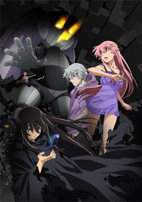

**Studio:** Asread &nbsp;|&nbsp; **Episodes:** 1 &nbsp;|&nbsp; **Director:** Akira Iwanaga &nbsp;|&nbsp; **Aired/Released:** June 19 &nbsp;|&nbsp; **Genres:** Romance, Action, Contemporary Fantasy, Psychological

> Yuno Gasai lives a normal life as a first-year in high school. She gets along well with her parents and even has a small circle of friends. However, she cannot help but feel as if someone is missing from her life, someone so important to her that it was as if she had lived another life trying desperately to stay with them. After a class trip to the beach, Yuno returns home; but in the middle of the night, she receives strange messages from a voice only she can hear. The voice informs her of the person she is desperate to meet and that she must find him. Soon, she finds herself in a mysterious realm, her only goal being reunited with the person she cannot remember. Though obstacles stand in her way, Yuno will stop at nothing to meet her beloved once again. [Written by MAL Rewrite]
>
> _Synopsis source: Kitsu_

[Kitsu](https://kitsu.io/anime/mirai-nikki-redial)

---

### Ghost in the Shell: Arise (Ghost in the Shell: Arise - Border 1: Ghost Pain)

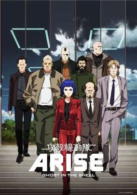

**Studio:** Production I.G &nbsp;|&nbsp; **Episodes:** 5 &nbsp;|&nbsp; **Director:** Kazuchika Kise &nbsp;|&nbsp; **Aired/Released:** July 22 – August 26, 2015 &nbsp;|&nbsp; **Genres:** Asia, Japan, Action, Earth, Science Fiction, Special Squads, Gunfights, Human Enhancement, Cyborg, Cyberpunk, Future, Law And Order, Cops, Mecha, Psychological

> The anime's story is set in 2027, one year after the end of the fourth non-nuclear war. New Port City is still reeling from the war's aftermath when it suffers a bombing caused by a self-propelled mine. Then, a military member implicated in arms-dealing bribes is gunned down. During the investigation, Public Security Section's Daisuke Aramaki encounters Motoko Kusanagi, the cyborg wizard-level hacker assigned to the military's 501st Secret Unit. Batou, a man with the "eye that does not sleep," suspects that Kusanagi is the one behind the bombing. The Niihama Prefectural Police detective Togusa is pursuing his own dual cases of the shooting death and a prostitute's murder. Motoko herself is being watched by the 501st Secret Unit's head Kurutsu and cyborg agents.
>
> _Synopsis source: Kitsu_

[Kitsu](https://kitsu.io/anime/ghost-in-the-shell-arise-border-1-ghost-pain)

---

### Corpse Party: Tortured Souls

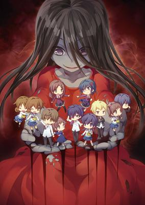

**Studio:** Asread &nbsp;|&nbsp; **Episodes:** 4 &nbsp;|&nbsp; **Director:** Akira Iwanaga &nbsp;|&nbsp; **Aired/Released:** July 24 &nbsp;|&nbsp; **Genres:** Violence, Ecchi, Thriller, Ghost, Angst, High School, Horror, Drama, School Life, Mystery

> Nine students gather in their high school at night to bid farewell to a friend. As is customary among many high school students, they perform a sort of ritual for good luck using small paper charms shaped like dolls. However, the students do not realize that these charms are connected to Heavenly Host Academy—an elementary school that was destroyed years ago after a series of gruesome murders took place, a school that rests under the foundation of their very own Kisaragi Academy. Now, trapped in an alternate dimension with vengeful ghosts of the past, the students must work together to escape—or join the spirits of the damned forever. A feast for mystery fanatics, gore-hounds, and horror fans alike, Corpse Party: Tortured Souls - Bougyakusareta Tamashii no Jukyou shows a sobering look at redemption, sacrifice, and how the past is always right behind, sometimes a little too close for comfort.
>
> _Synopsis source: Kitsu_

[Kitsu](https://kitsu.io/anime/corpse-party-tortured-souls-bougyakusareta-tamashii-no-jukyou)

---

## Films

### Death Billiards

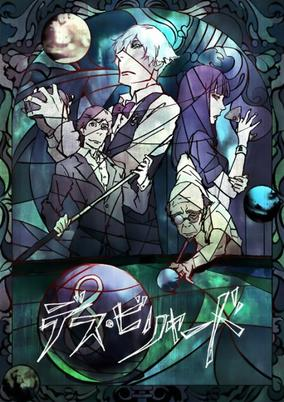

**Studio:** Madhouse &nbsp;|&nbsp; **Director:** Yuzuru Tachikawa &nbsp;|&nbsp; **Aired/Released:** March 2 &nbsp;|&nbsp; **Genres:** Sports, Thriller, Angst, Drama, Present, Psychological, Mystery

> Two men have just arrived at a location known as Quindecim and are unable to remember how they got there. They are immediately greeted by a young woman who escorts them to a small bar, where a bartender awaits them. They are told that they will have to participate in a game, randomly chosen by roulette, and will be unable to leave until its completion; if they refuse, the consequences will be dire. In addition to the rules of the game, the two men are told to play as if their lives are at stake. The game that has been chosen is billiards. But there's more to it than just pocketing pool balls, as the two are about to find out the outcome could mean life or death. [Written by MAL Rewrite]
>
> _Synopsis source: Kitsu_

[Wikipedia](https://en.wikipedia.org/wiki/Death_Billiards) · [Kitsu](https://kitsu.io/anime/death-billiards)

---

### Little Witch Academia

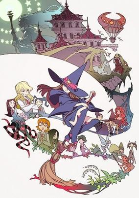

**Studio:** Trigger &nbsp;|&nbsp; **Director:** Yoh Yoshinari &nbsp;|&nbsp; **Aired/Released:** March 2 &nbsp;|&nbsp; **Genres:** Fantasy, Fantasy World, Magic, Magical Girl, Adventure, Comedy, School Life

> For young witches everywhere, the world-renowned witch Shiny Chariot reigns as the most revered and celebrated role model. But as the girls age, so do their opinions of her—now just the mention of Chariot would get a witch labeled a child. However, undeterred in her blind admiration for Chariot, ordinary girl Atsuko Kagari enrolls into Luna Nova Magical Academy, hoping to someday become just as mesmerizing as her idol. However, the witch academy isn't all the fun and games Atsuko thought it would be: boring lectures, strict teachers, and students who mock Chariot plague the campus. Coupled with her own ineptness in magic, she's seen as little more than a rebel student. But when a chance finally presents itself to prove herself to her peers and teachers, she takes it, and now it's up to her to stop a rampaging dragon before it flattens the entire academy. [Written by MAL Rewrite]
>
> _Synopsis source: Kitsu_

[Wikipedia](https://en.wikipedia.org/wiki/Little_Witch_Academia) · [Kitsu](https://kitsu.io/anime/little-witch-academia)

---

### Shimajirō to Fufu no Daibōken: Sukue! Nanairo no Hana

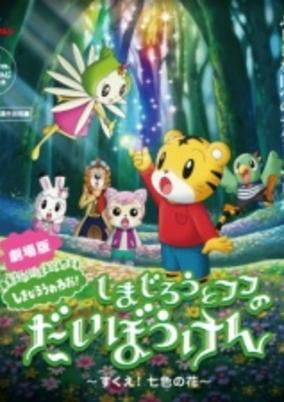

**Studio:** Benesse Corporation &nbsp;|&nbsp; **Director:** Isamu Hirabayashi &nbsp;|&nbsp; **Aired/Released:** March 15 &nbsp;|&nbsp; **Genres:** Comedy, Magic, Fantasy, Adventure, Kids

> Movie for the Shimajirou children's series.
>
> _Synopsis source: Kitsu_

[Kitsu](https://kitsu.io/anime/shimajirou-to-fufu-no-daibouken-movie-sukue-nana-iro-no-hana)

---

### Dragon Ball Z: Battle of Gods

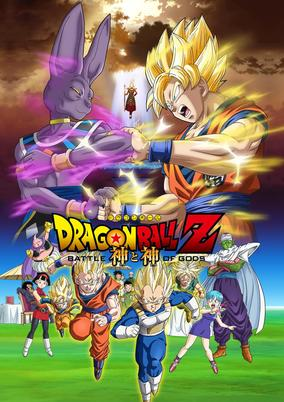

**Studio:** Toei Animation &nbsp;|&nbsp; **Director:** Masahiro Hosoda &nbsp;|&nbsp; **Aired/Released:** March 30 &nbsp;|&nbsp; **Genres:** Fantasy, Action, Martial Arts, Super Power, Adventure, Shounen

> Dragon Ball Z Movie 14: Kami to Kami brings Gokuu, Vegeta, Piccolo and your other favorite characters back for a new revitalization of the Dragon Ball universe. Enter Beerus, the God of Destruction. Having awoken from his slumber, Beerus seeks to find an opponent worthy of challenging his power. After being shocked to learn that Frieza has been defeated by a Saiyan, Beerus sets out to analyze the legend of the Super Saiyan God in order to find his ultimate opponent. His destination: Earth, home to the few survivors of the Saiyan race. And if a Super Saiyan God is not there, the Earth's destruction will just have to do as entertainment. How will Gokuu and friends fare against a god that is even feared among the other gods?
>
> _Synopsis source: Kitsu_

[Kitsu](https://kitsu.io/anime/dragon-ball-z-movie-14-kami-to-kami)

---

### Hanasaku Iroha: The Movie – Home Sweet Home (Hanasaku Iroha the Movie ~Home Sweet Home~)

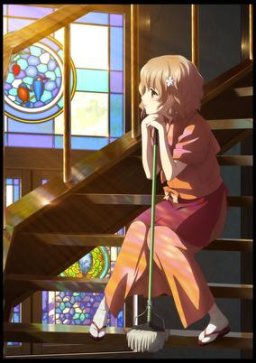

**Studio:** P.A. Works &nbsp;|&nbsp; **Director:** Masahiro Andō &nbsp;|&nbsp; **Aired/Released:** March 30 &nbsp;|&nbsp; **Genres:** Earth, Japan, Slice of Life, Asia, Present, Comedy

> In the days before the Bonbori Festival, Ohana's friend Yuina comes to Kissuiso for training. While cleaning up after her, Ohana discovers a logbook kept by Beans from when her mother, Satsuki, was still a youth at Kissuisso. Through the logbook, Ohana catches a glimpse of her mother's struggles, and realizes that maybe the two of them aren't so different after all. Meanwhile, the rest of the inn staff are caught up in dealing with a blackout.
>
> _Synopsis source: Kitsu_

[Kitsu](https://kitsu.io/anime/hanasaku-iroha-home-sweet-home)

---

### Aura: Koga Maryuin's Last War

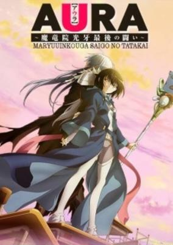

**Studio:** AIC ASTA &nbsp;|&nbsp; **Director:** Seiji Kishi &nbsp;|&nbsp; **Aired/Released:** April 13 &nbsp;|&nbsp; **Genres:** Romance, Japan, Coming Of Age, High School, Present, Comedy, Friendship, School Life

> Ichirou Satou is an ordinary high school student who pretended that he was a hero by the name of "Maryuuin Kouga" back in middle school, which led to others frequently bullying him. Now that he has left this embarrassing phase behind, he does his best to avoid standing out and live a peaceful life, although he feels the world has become quite dull. But when he makes his way back to school one night to grab a textbook he left in class, he runs into a strange girl wearing a costume. This girl, Ryouko Satou, happens to be his classmate and is affected by the exact same condition that he once had, holding on to a delusion that she is someone else and dressing up to reflect this. The very next day, Ichirou is asked by his teacher to become friends with Ryouko, to which he adamantly refuses, unwilling to be reminded of his own history. When he sees that she is being bullied just as he once was, however, the boy makes it his responsibility to take care of her and break her free from that which what once plagued him—the perfect job for Maryuuin Kouga. [Written by MAL Rewrite]
>
> _Synopsis source: Kitsu_

[Kitsu](https://kitsu.io/anime/aura-maryuuinkouga-saigo-no-tatakai)

---

### The Wind Rises

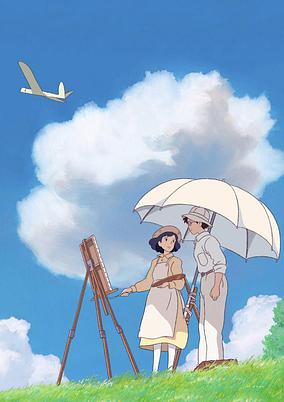

**Studio:** Studio Ghibli &nbsp;|&nbsp; **Director:** Hayao Miyazaki &nbsp;|&nbsp; **Aired/Released:** July 20 &nbsp;|&nbsp; **Genres:** Japan, Slice of Life, Asia, Earth, Coming Of Age, Past, Historical, Romance

> Although Jirou Horikoshi's nearsightedness prevents him from ever becoming a pilot, he leaves his hometown to study aeronautical engineering at Tokyo Imperial University for one simple purpose: to design and build planes just like his hero, Italian aircraft pioneer Giovanni Battista Caproni. His arrival in the capital coincides with the Great Kanto Earthquake of 1923, during which he saves a maid serving the family of a young girl named Naoko Satomi; this disastrous event marks the beginning of over two decades of social unrest and malaise leading up to Japan's eventual surrender in World War II.
>
> _Synopsis source: Kitsu_

[Kitsu](https://kitsu.io/anime/the-wind-rises)

---

### Puella Magi Madoka Magica the Movie: Rebellion

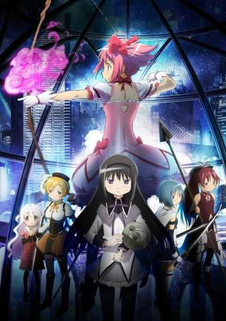

**Studio:** Shaft &nbsp;|&nbsp; **Director:** Akiyuki Shinbo Yukihiro Miyamoto &nbsp;|&nbsp; **Aired/Released:** October 26 &nbsp;|&nbsp; **Genres:** Magic, Thriller, Drama, Psychological, Magical Girl

> The young girls of Mitakihara happily live their lives, occasionally fighting off evil, but otherwise going about their peaceful, everyday routines. However, Homura Akemi feels that something is wrong with this unusually pleasant atmosphere—though the others remain oblivious, she can't help but suspect that there is more to what is going on than meets the eye: someone who should not exist is currently present to join in on their activities.Mahou Shoujo Madoka★Magica Movie 3: Hangyaku no Monogatari follows Homura in her struggle to uncover the painful truth behind the mysterious circumstances, as she selfishly and desperately fights for the sake of her undying love in this despair-ridden conclusion to the story of five magical girls. [Written by MAL Rewrite]
>
> _Synopsis source: Kitsu_

[Kitsu](https://kitsu.io/anime/mahou-shoujo-madoka-magica-movie-3-hangyaku-no-monogatari)

---

### Persona 3 The Movie: #1 Spring of Birth

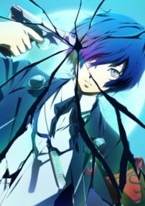

**Studio:** AIC ASTA &nbsp;|&nbsp; **Director:** Noriaki Akitaya , Tomohisa Taguchi &nbsp;|&nbsp; **Aired/Released:** November 23 &nbsp;|&nbsp; **Genres:** Fantasy, Action

> At the stroke of midnight, the Dark Hour appears—a secret hour which most are unaware of. Those not trapped in coffins during this time, unfortunate enough to find themselves conscious, are met by dangerous creatures known as Shadows. A select few, however, possess the potential to wield Persona: a special power used to defeat these beings. This secret group is called SEES (Specialized Extracurricular Execution Squad), and their mission is to uncover the reason behind the Dark Hour's appearance. Only a short while after transfer student Makoto Yuuki begins his residency at Iwatodai Dorm, his Persona awakens after an attack by a strong Shadow. Now recruited into the ranks of SEES, he begins fighting alongside his comrades, as only they can protect humanity from Shadows and prevent the anomaly that is the Dark Hour. [Written by MAL Rewrite]
>
> _Synopsis source: Kitsu_

[Kitsu](https://kitsu.io/anime/persona-3-the-movie-1-spring-of-birth)

---

## Televisionseries

### Mangirl!

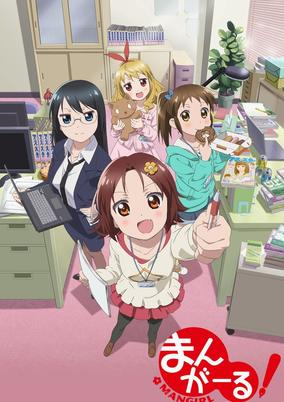

**Studio:** Doga Kobo &nbsp;|&nbsp; **Episodes:** 13 &nbsp;|&nbsp; **Director:** Nobuaki Nakanishi &nbsp;|&nbsp; **Aired/Released:** January 2 – March 27 &nbsp;|&nbsp; **Genres:** Earth, Japan, Asia, Comedy, Working Life, Present, Slice of Life

> "We're going to launch a manga magazine!" A team of girls with zero experience in manga editing are off and running toward their dream of creating the biggest manga magazine in Japan! They seem to do nothing but run into problems and failures... But still they're working hard every day!
>
> _Synopsis source: Kitsu_

[Wikipedia](https://en.wikipedia.org/wiki/Mangirl!) · [Kitsu](https://kitsu.io/anime/mangirl)

---

### Ai Mai Mi (Ai-Mai-Mi)

**Studio:** Seven &nbsp;|&nbsp; **Episodes:** 13 &nbsp;|&nbsp; **Director:** Itsuki Imazaki &nbsp;|&nbsp; **Aired/Released:** January 3 – March 28 &nbsp;|&nbsp; **Genres:** Japan, Present, Comedy, Asia, Earth, Absurdist Humour, Slapstick, Slice of Life

> The anime adaptation of the four-panel manga "Ai Mai Mii". The story follows girls in a manga club—Ai, Mai, Mii, and Ponoka-senpai—who might be fighting evil invaders threatening Earth, facing off against rivals in tournaments, and dealing with other absurd situations when they are not drawing manga.
>
> _Synopsis source: Kitsu_

[Wikipedia](https://en.wikipedia.org/wiki/Ai_Mai_Mi) · [Kitsu](https://kitsu.io/anime/ai-mai-mi)

---

### Encouragement of Climb

**Studio:** 8-Bit &nbsp;|&nbsp; **Episodes:** 12 &nbsp;|&nbsp; **Director:** Yusuke Yamamoto &nbsp;|&nbsp; **Aired/Released:** January 3 – March 21 &nbsp;|&nbsp; **Genres:** Japan, Slice of Life, Friendship, Countryside, Plot Continuity, Present, Adventure, Comedy, Seinen, Drama

> Aoi prefers indoor hobbies and is afraid of heights, but her childhood friend Hinata loves to show off her passion for mountain climbing. As young children they once watched the sunrise from the top of a mountain, and now they've decided to take up mountain climbing in hopes of seeing that sunrise again. They have cooking battles with mountaineering gear, climb small hills in their neighborhood, and meet new mountaineering friends as they learn the ropes of the hobby. When will they finally see that sunrise again?
>
> _Synopsis source: Kitsu_

[Wikipedia](https://en.wikipedia.org/wiki/Encouragement_of_Climb) · [Kitsu](https://kitsu.io/anime/yama-no-susume)

---

### Cuticle Detective Inaba

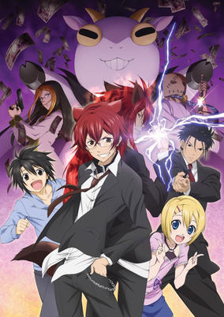

**Studio:** Zexcs &nbsp;|&nbsp; **Episodes:** 12 &nbsp;|&nbsp; **Director:** Susumu Nitsukawa &nbsp;|&nbsp; **Aired/Released:** January 4 – March 22 &nbsp;|&nbsp; **Genres:** Violence, Comedy, Earth, Assassin, Detective, Super Deformed, Bishounen, Slapstick, Law And Order, Action, Mystery

> In a world where half-human, half-animal chimeras live and work alongside normal people, there are sure to be a few bad apples in the bunch. Unfortunately, half-human criminals means non-human clues that often leave the police stumped. That's where lone wolf detectives like Hiroshi Inaba come in. He's literally part wolf and has the amazing ability to extract critical information just by examining or tasting a sample of someone's hair! Of course, that ability has also resulted in Inaba having a little bit of a hair fetish, but that doesn't seem to be a problem for his two assistants. (Well, at least the cross-dressing one isn't complaining much.) And it's nothing compared to the strange tastes of Inaba's nemesis, the omnivorous (and half goat) crime boss Don Valentino, who has an appetite for green legal tender instead of tender young greens! Inaba's sworn to cut Valentino out of the criminal flock before the Don can wolf down more ill-gotten dough, but he's going to have to chew his way through a lot of evidence to get his goat. Can sheer dogged detective work put the baaaaad guys behind bars?
>
> _Synopsis source: Kitsu_

[Wikipedia](https://en.wikipedia.org/wiki/Cuticle_Detective_Inaba) · [Kitsu](https://kitsu.io/anime/cuticle-detective-inaba)

---

### AKB0048 next stage (AKB0048: Next Stage)

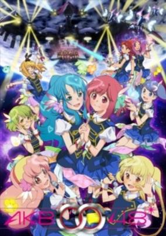

**Studio:** Satelight &nbsp;|&nbsp; **Episodes:** 13 &nbsp;|&nbsp; **Director:** Shōji Kawamori Yoshimasa Hiraike &nbsp;|&nbsp; **Aired/Released:** January 5 – March 30 &nbsp;|&nbsp; **Genres:** Mecha, Science Fiction, Performance, Other Planet, Musical Band, Future, Idol, Friendship, The Arts, Space, Music

> In the year since the 77th generation understudies joined AKB0048, the Deep Galactic Trade Organization [DGTO] and DES have stepped up their attacks on entertainment. In response, AKB0048 brings back the general elections and the center nova position. The understudies are now thrusted into a new competition directly against the successors. But as AKB0048 brings back policies not seen since Acchan's disappearance, a new more powerful enemy is quietly moving behind the scenes.
>
> _Synopsis source: Kitsu_

[Wikipedia](https://en.wikipedia.org/wiki/AKB0048_next_stage) · [Kitsu](https://kitsu.io/anime/akb0048-next-stage)

---

### Da Capo III

**Studio:** Kazami Gakuen Kōshiki Dōga-bu &nbsp;|&nbsp; **Episodes:** 13 &nbsp;|&nbsp; **Director:** Ken'ichi Ishikura &nbsp;|&nbsp; **Aired/Released:** January 5 – March 30 &nbsp;|&nbsp; **Genres:** High School, Magic, Earth, School Clubs, Plot Continuity, Ecchi, Romance, Harem, School Life, Female Student

> On the island of Hatsunejima, where spring is eternal, grows a particular large cherry blossom tree. This cherry blossom tree never withers, and is said to be able to fulfill any wish. However, one day, this tree had become a normal cherry blossom tree...
>
> _Synopsis source: Kitsu_

[Wikipedia](https://en.wikipedia.org/wiki/Da_Capo_III) · [Kitsu](https://kitsu.io/anime/da-capo-iii)

---

### Hakkenden: Eight Dogs of the East (Hakkenden -Eight Dogs of the East-)

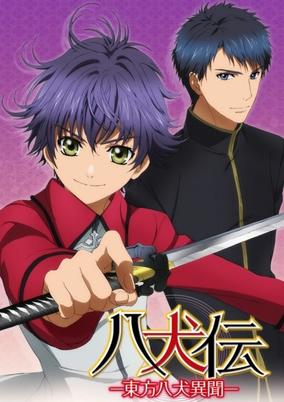

**Studio:** Studio Deen &nbsp;|&nbsp; **Episodes:** 13 &nbsp;|&nbsp; **Director:** Mitsue Yamazaki &nbsp;|&nbsp; **Aired/Released:** January 5 – March 30 &nbsp;|&nbsp; **Genres:** Japan, Fantasy, Deity, Bishounen, Past, Demon, Super Power, Action, Shoujo

> The village of Ootsuka—home to Shino Inuzuka, Sousuke Inukawa, and Hamaji—was lit on fire under the preconception that a virus had seen all of its life eradicated. Now surrounded by flames and on the verge of death, the three were approached by a strange man holding a sword. He tells them that they must reach a decision if they want to live. That night changed everything for these children. Five years later, the family of three now lives under the watchful eye of the small Imperial Church in a nearby village. All is fine and dandy until the Church attempts to reclaim the demonic sword of Murasame. To accomplish this, they kidnap Hamaji to lure Shino, now a bearer of Murasame's soul, and Sousuke, who possesses the ability to transform into a dog. The brothers must put their differences aside to rescue their beloved sister from the Church in the Imperial Capital, signalling the beginning of a very difficult journey.
>
> _Synopsis source: Kitsu_

[Kitsu](https://kitsu.io/anime/hakkenden-touhou-hakken-ibun)

---

### Maoyu (Maoyu ~ Archenemy & Hero)

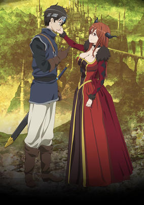

**Studio:** Arms &nbsp;|&nbsp; **Episodes:** 12 &nbsp;|&nbsp; **Director:** Takeo Takahashi &nbsp;|&nbsp; **Aired/Released:** January 5 – March 30 &nbsp;|&nbsp; **Genres:** Romance, Dystopia, Fantasy, Fantasy World, Comedy, Past, Politics, Plot Continuity, Demon, Historical, Adventure

> Fifteen years have passed since the war between humans and demons began. Dissatisfied with their slow advance into the Demon Realm, the Hero abandons his companions to quickly forge ahead towards the Demon Queen's castle. Upon his arrival at the royal abode, the Hero makes a startling discovery: not only is the Demon Queen a woman of unparalleled beauty, but she also seeks the Hero's help. Confused by this unexpected turn of events, the Hero refuses to ally himself with his enemy, claiming that the war the demons have waged is tearing the Southern Nations apart. However, the Demon Queen rebuts, arguing that the war has not only united humanity but has also brought them wealth and prosperity, providing evidence to support her claims. Furthermore, she explains that if the war were to end, the supplies sent by the Central Nations in aid to the Southern Nations would cease, leaving hundreds of thousands to starve. Fortunately, she offers the Hero a way to end the war while bringing hope not only to the Southern Nations, but also to the rest of the world, though she will need his assistance to make this a reality. Finally convinced, the Hero agrees to join his now former enemy in her quest. Vowing to stay together through sickness and health, they set off for the human world. [Written by MAL Rewrite]
>
> _Synopsis source: Kitsu_

[Wikipedia](https://en.wikipedia.org/wiki/Maoyu) · [Kitsu](https://kitsu.io/anime/maoyu)

---

### Ishida & Asakura

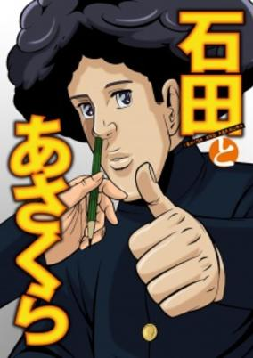

**Studio:** Dax Production Hotline &nbsp;|&nbsp; **Episodes:** 12 &nbsp;|&nbsp; **Director:** Pippuya &nbsp;|&nbsp; **Aired/Released:** January 6 – March 24 &nbsp;|&nbsp; **Genres:** Comedy, School Life

> Anime adaptation of the surreal gag manga about two high school boys, Ishida and Asakura.
>
> _Synopsis source: Kitsu_

[Wikipedia](https://en.wikipedia.org/wiki/Ishida_%26_Asakura) · [Kitsu](https://kitsu.io/anime/ishida-to-asakura)

---

### Love Live! (Love Live! School Idol Project)

**Studio:** Sunrise &nbsp;|&nbsp; **Episodes:** 13 &nbsp;|&nbsp; **Director:** Takahiko Kyōgoku &nbsp;|&nbsp; **Aired/Released:** January 6 – March 31 &nbsp;|&nbsp; **Genres:** Earth, Japan, Asia, Performance, Tokyo, High School, School Clubs, All Girls School, Idol, School Life, The Arts, Present, Music, Slice of Life

> Otonokizaka High School is in a crisis! With the number of enrolling students dropping lower and lower every year, the school is set to shut down after its current first years graduate. However, second year Honoka Kousaka refuses to let it go without a fight. Searching for a solution, she comes across popular school idol group A-RISE and sets out to create a school idol group of her own. With the help of her childhood friends Umi Sonoda and Kotori Minami, Honoka forms μ's (pronounced "muse") to boost awareness and popularity of her school. Unfortunately, it's all easier said than done. Student council president Eli Ayase vehemently opposes the establishment of a school idol group and will do anything in her power to prevent its creation. Moreover, Honoka and her friends have trouble attracting any additional members. But the Love Live, a competition to determine the best and most beloved school idol groups in Japan, can help them gain the attention they desperately need. With the contest fast approaching, Honoka must act quickly and diligently to try and bring together a school idol group and win the Love Live in order to save Otonokizaka High School. [Written by MAL Rewrite]
>
> _Synopsis source: Kitsu_

[Wikipedia](https://en.wikipedia.org/wiki/Love_Live!_School_Idol_Project) · [Kitsu](https://kitsu.io/anime/love-live-school-idol-project)

---

### Minami-ke: Tadaima

**Studio:** Feel &nbsp;|&nbsp; **Episodes:** 13 &nbsp;|&nbsp; **Director:** Keiichiro Kawaguchi &nbsp;|&nbsp; **Aired/Released:** January 6 – March 30 &nbsp;|&nbsp; **Genres:** Earth, Parental Abandonment, Japan, Slice of Life, Asia, Comedy, Present, School Life

> The everyday lives of the Minami sisters continue. Chiaki, the youngest, continues to call people idiots while worshipping her eldest sister. Kana, the middle, still can't figure out that Fujioka's feelings for her are a crush, not a grudge. Haruka, the eldest, still unknowingly avoids Hosaka's advances to invite her to the volleyball team, and after a long day of excitement, the sisters enjoy sitting at the table at their home.
>
> _Synopsis source: Kitsu_

[Kitsu](https://kitsu.io/anime/minami-ke-tadaima)

---

### Oreshura

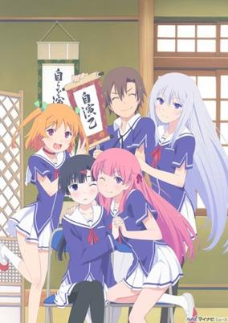

**Studio:** A-1 Pictures &nbsp;|&nbsp; **Episodes:** 13 &nbsp;|&nbsp; **Director:** Kanta Kamei &nbsp;|&nbsp; **Aired/Released:** January 6 – March 31 &nbsp;|&nbsp; **Genres:** Japan, Parental Abandonment, Asia, Romance, Earth, Comedy, Sudden Girlfriend Appearance, Blackmail, Love Polygon, Coming Of Age, High School, School Clubs, School Life, Slow When It Comes To Love, Present, Harem

> It is often said that events of the past shape what you become in the future. For Eita Kidou, a studious, hard-working student aspiring to earn a scholarship so that he can become a doctor, this is an undeniable truth after being abandoned by his love-addled parents. This event left him jaded to the notion of romance, seeing it as only a distraction that gets in the way of studying. Unfortunately for Eita, his efforts hit a snag when he receives a confession of love from Masuzu Natsukawa, a transfer student with platinum hair and blue eyes. Eita sees through the confession, causing Masuzu to admit that she only did so because having a boyfriend would stop people from asking her out daily. She finds love to be just as much of a hindrance as he does, so by pretending to date, they can stave off advances from everyone else. Eita refuses on the grounds that his classmates will be jealous, but Masuzu blackmails him by revealing that she has his journal and will post it online for everyone to see if he betrays her. Thus begins Ore no Kanojo to Osananajimi ga Shuraba Sugiru, a story that follows Eita coping with his new "relationship" and the complications that arise from it.
>
> _Synopsis source: Kitsu_

[Wikipedia](https://en.wikipedia.org/wiki/Oreshura) · [Kitsu](https://kitsu.io/anime/oreshura)

---

### Senran Kagura

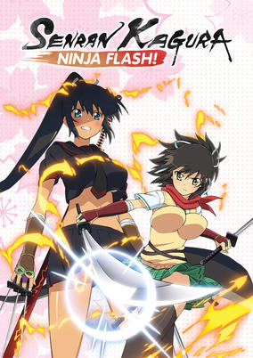

**Studio:** Animation Studio Artland &nbsp;|&nbsp; **Episodes:** 12 &nbsp;|&nbsp; **Director:** Takashi Watanabe &nbsp;|&nbsp; **Aired/Released:** January 6 – March 24 &nbsp;|&nbsp; **Genres:** Ecchi, Ninja, Japan, Action, Comedy, Swordplay, Henshin, Friendship, Stereotypes, School Life, Female Student, Super Power

> Super cute Asuka and her curvy companions appear to be your typical high school students, but they’ve got an outrageous secret: they’re learning the wild ways of the ninja! Get a lesson in action, naughtiness, and sexy slapstick fun as Asuka's gang takes on the toughest (and hottest) fighters in town! Fan service fanatics won’t want to miss a minute!
>
> _Synopsis source: Kitsu_

[Wikipedia](https://en.wikipedia.org/wiki/Senran_Kagura) · [Kitsu](https://kitsu.io/anime/senran-kagura)

---

### Amnesia

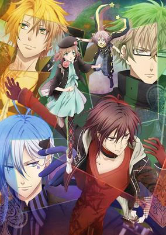

**Studio:** Brain's Base &nbsp;|&nbsp; **Episodes:** 12 &nbsp;|&nbsp; **Director:** Yoshimitsu Ohashi &nbsp;|&nbsp; **Aired/Released:** January 7 – March 25 &nbsp;|&nbsp; **Genres:** Bishounen, Present, Earth, Japan, Reverse Harem, Asia, Angst, Fantasy, Romance, Drama

> After fainting at work, a young lady awakens in the back room of the café she works at with no memory of her life or those around her. Two of her friends, whom she soon learns are named Shin and Toma, are called to help her get home safely. Once she is alone, she meets a spectral boy named Orion that only she can see and hear. He explains that she lost her memories because of his chance visit to her world, so he vows to help her remember who she is. However, regaining her departed memories without worrying those around her may be more difficult than she realizes. In addition to the gloomy Shin and the protective Toma, she must be wary of arousing the suspicions of the captivating Ikki, the quick-witted Kent, and a mysterious man who lurks in the distance. As her amnesia entangles her in the lives of each of these men, her fragmented memories return piece by piece, and the mysteries of her circumstances slowly come to light. [Written by MAL Rewrite]
>
> _Synopsis source: Kitsu_

[Wikipedia](https://en.wikipedia.org/wiki/Amnesia_(visual_novel)) · [Kitsu](https://kitsu.io/anime/amnesia)

---

### Bakumatsu Gijinden Roman

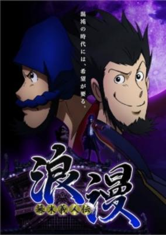

**Studio:** TMS Entertainment &nbsp;|&nbsp; **Episodes:** 12 &nbsp;|&nbsp; **Director:** Hirofumi Ogura &nbsp;|&nbsp; **Aired/Released:** January 7 – March 26 &nbsp;|&nbsp; **Genres:** Power Suit, Bakumatsu   Meiji Period, Japan, Earth, Crime, Past, Historical, Fantasy

> The stage is the close of the Edo period, an age when, not unlike our own time, both natural and man-made disasters left chaos in their wake. Manjiro makes a living helping the people of the troubled capital city, but behind the scenes, he also works in secret to take back precious belongings stolen from the people by unjust political powers and conspiratorial menaces. The people call him "Get-backer Roman."
>
> _Synopsis source: Kitsu_

[Wikipedia](https://en.wikipedia.org/wiki/Bakumatsu_Gijinden_Roman) · [Kitsu](https://kitsu.io/anime/bakumatsu-gijinden-roman)

---

### Unlimited Psychic Squad

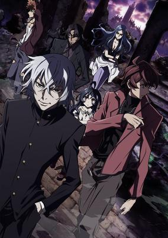

**Studio:** Manglobe &nbsp;|&nbsp; **Episodes:** 12 &nbsp;|&nbsp; **Director:** Shishō Igarashi &nbsp;|&nbsp; **Aired/Released:** January 7 – March 25 &nbsp;|&nbsp; **Genres:** Science Fiction, Action, Contemporary Fantasy, Crime, Super Power

> Kyousuke Hyoubu, an ESPer who was betrayed many years ago, is now one of the most powerful ESPers—and also a fugitive. However, behind that glare lies a kind heart. His main mission is to save ESPers who are mistreated by humans, even if that be by force. Through his methods, he has saved many ESPer lives and gained the loyalty of those he has saved. The name of his group: P.A.N.D.R.A.
>
> _Synopsis source: Kitsu_

[Wikipedia](https://en.wikipedia.org/wiki/Unlimited_Psychic_Squad) · [Kitsu](https://kitsu.io/anime/zettai-karen-children-the-unlimited-hyoubu-kyousuke)

---

### Senyu

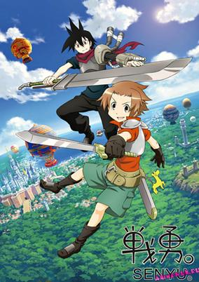

**Studio:** Liden Films Ordet &nbsp;|&nbsp; **Episodes:** 12 &nbsp;|&nbsp; **Director:** Yutaka Yamamoto &nbsp;|&nbsp; **Aired/Released:** January 8 – April 2 &nbsp;|&nbsp; **Genres:** Parody, Breaking The Fourth Wall, Absurdist Humour, Slapstick, Action, Fantasy, Comedy

> Once upon a time, the demon lord Rchimedes spread terror throughout the world, until he was eventually sealed away by the legendary hero Creasion. Since then, a thousand years have passed peacefully. However, a mysterious hole has opened up between the demon and human spheres, and countless demons have surged into the human realm once more. Coming to the conclusion that Rchimedes would soon return to wreak havoc, a human king summons the possible descendants of the legendary hero—all 75 of them. Unfortunately, after so long, it was too difficult to pinpoint his true descendants. Among the lionhearted prospects is the amateur adventurer Alba Frühling. His skills may not be top-notch, but he is accompanied by the talented soldier Ross, who helps the young hero whenever he is in a pinch...or at least, he is supposed to. Though undoubtedly a skilled warrior, Ross is actually both sarcastic and sadistic, and hence revels in Alba's suffering. Senyuu. is a comedic adventure following the unlikely duo as they struggle in their endeavor to defeat the demon lord, meeting various eccentrics along the way. [Written by MAL Rewrite]
>
> _Synopsis source: Kitsu_

[Wikipedia](https://en.wikipedia.org/wiki/Senyu) · [Kitsu](https://kitsu.io/anime/senyuu)

---

### Silver Spoon (season 2) (Silver Spoon)

**Studio:** A-1 Pictures &nbsp;|&nbsp; **Episodes:** 11 &nbsp;|&nbsp; **Director:** Tomohiko Itō Kotomi Deai &nbsp;|&nbsp; **Aired/Released:** January 9 – March 27 &nbsp;|&nbsp; **Genres:** Japan, Earth, Asia, Present, Comedy, Coming Of Age, Plot Continuity, Slice of Life, School Life

> Hachiken Yuugo enrolled in Oezo Agricultural High School for the reason that he could live in a dorm there. In some ways he chose Oezo in an effort to escape the highly competitive prep schools he had attended previously, but he was faced with an entirely new set of difficulties at Oezo, surrounded by animals and Mother Nature. After growing up in an average family, he began to encounter clubs and training the likes of which he had never seen before.
>
> _Synopsis source: Kitsu_

[Wikipedia](https://en.wikipedia.org/wiki/Silver_Spoon_(manga)) · [Kitsu](https://kitsu.io/anime/gin-no-saji)

---

### GJ Club

**Studio:** Doga Kobo &nbsp;|&nbsp; **Episodes:** 12 &nbsp;|&nbsp; **Director:** Yoshiyuki Fujiwara &nbsp;|&nbsp; **Aired/Released:** January 10 – March 28 &nbsp;|&nbsp; **Genres:** Slice of Life, Comedy, High School, School Clubs, School Life, Harem

> Shinomiya Kyouya is forced to become a new member of the GJ, an unidentified club that dwells in a room of the former building of a certain school. Here he meets the club leader, Mao, a short girl with a big attitude; Mao's younger sister, Megumi, who has the heart of a bipolar angel; the recognized genius with a lack of common sense, Shion; and the always-hungry and mysterious Kirara. Time flies with these unique girls around.
>
> _Synopsis source: Kitsu_

[Wikipedia](https://en.wikipedia.org/wiki/GJ_Club) · [Kitsu](https://kitsu.io/anime/gj-bu)

---

### Tamako Market

**Studio:** Kyoto Animation &nbsp;|&nbsp; **Episodes:** 12 &nbsp;|&nbsp; **Director:** Naoko Yamada &nbsp;|&nbsp; **Aired/Released:** January 10 – March 28 &nbsp;|&nbsp; **Genres:** Japan, Present, Slice of Life, Cooking, Friendship, Comedy

> Tamako knows everything about mochi, the traditional Japanese dessert treats - she even works at Tama-ya, her family’s mochi shop. However, friendships, rivalries, and strange new feelings are beginning to make her life a sticky, complicated mess!
>
> _Synopsis source: Kitsu_

[Wikipedia](https://en.wikipedia.org/wiki/Tamako_Market) · [Kitsu](https://kitsu.io/anime/tamako-market)

---

### Chihayafuru 2

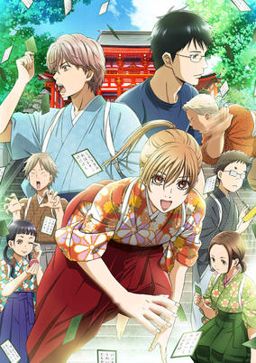

**Studio:** Madhouse &nbsp;|&nbsp; **Episodes:** 25 &nbsp;|&nbsp; **Director:** Morio Asaka &nbsp;|&nbsp; **Aired/Released:** January 11 – June 28 &nbsp;|&nbsp; **Genres:** Romance, Earth, Japan, Sports, Asia, Tokyo, Love Polygon, School Clubs, Plot Continuity, Present, Slice of Life, Josei

> Chihaya Ayase is obsessed with developing her school's competitive karuta club, nursing daunting ambitions like winning the national team championship at the Omi Jingu and becoming the Queen, the best female karuta player in Japan—and in extension, the world. As their second year of high school rolls around, Chihaya and her fellow teammates must recruit new members, train their minds and bodies alike, and battle the formidable opponents that stand in their way to the championship title. Meanwhile, Chihaya's childhood friend, Arata Wataya, the prodigy who introduced her to karuta, rediscovers his lost love for the old card game.
>
> _Synopsis source: Kitsu_

[Wikipedia](https://en.wikipedia.org/wiki/Chihayafuru_2) · [Kitsu](https://kitsu.io/anime/chihayafuru-2)

---

### Haganai NEXT (Haganai: I don't have many friends NEXT)

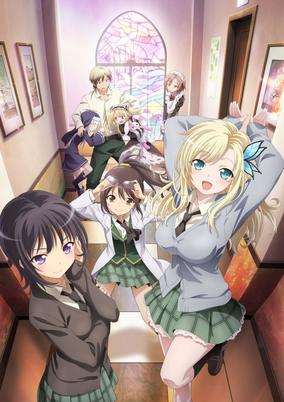

**Studio:** AIC Build &nbsp;|&nbsp; **Episodes:** 12 &nbsp;|&nbsp; **Director:** Toru Kitahata &nbsp;|&nbsp; **Aired/Released:** January 11 – March 29 &nbsp;|&nbsp; **Genres:** Ecchi, Japan, Present, Comedy, Maid, School Clubs, School Life, Female Student, Harem, Romance, Slice of Life

> The Neighbor's Club—a club founded for the purpose of making friends, where misfortunate boys and girls with few friends live out their regrettable lives. Although Yozora Mikazuki faced a certain incident at the end of summer, the daily life of the Neighbor's Club goes on as usual. A strange nun, members of the student council and other new faces make an appearance, causing Kodaka Hasegawa's life to grow even busier. While they all enjoy going to the amusement park, playing games, celebrating birthdays, and challenging the "school festival"—a symbol of the school life normal people live—the relations amongst the members slowly begins to change... Let the next stage begin, on this unfortunate coming-of-age love comedy!!
>
> _Synopsis source: Kitsu_

[Wikipedia](https://en.wikipedia.org/wiki/Haganai_NEXT) · [Kitsu](https://kitsu.io/anime/boku-wa-tomodachi-ga-sukunai-next)

---

### Kotoura-san (The Troubled Life of Miss Kotoura)

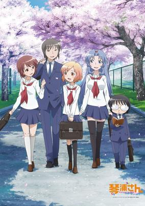

**Studio:** AIC Classic &nbsp;|&nbsp; **Episodes:** 12 &nbsp;|&nbsp; **Director:** Masahiko Ohta &nbsp;|&nbsp; **Aired/Released:** January 11 – March 29 &nbsp;|&nbsp; **Genres:** Romance, Parental Abandonment, Japan, Comedy, Contemporary Fantasy, Earth, Thriller, Super Deformed, Angst, School Clubs, Friendship, School Life

> A school love comedy. Kotoura Haruka is a 15-year-old girl who can read people's minds. She has been suffering from troubles caused by her mind-reading ability, and her parents got divorced as a result. She moves to a new high school but tries to keep away from her classmates. Manabe Yoshihisa, one of her classmates, accepts and appreciates her ability and she begins to interact with her friends with his help.
>
> _Synopsis source: Kitsu_

[Wikipedia](https://en.wikipedia.org/wiki/Kotoura-san) · [Kitsu](https://kitsu.io/anime/kotoura-san)

---

### Problem Children Are Coming from Another World, Aren't They?

**Studio:** Diomedéa &nbsp;|&nbsp; **Episodes:** 10 &nbsp;|&nbsp; **Director:** Keizō Kusakawa Yasutaka Yamamoto &nbsp;|&nbsp; **Aired/Released:** January 11 – March 15 &nbsp;|&nbsp; **Genres:** Battle Royale, Fantasy World, Fantasy, Comedy, Juujin, Magic, Anthropomorphism, Super Power

> Izayoi Sakamaki, Asuka Kudou, and You Kasukabe are extraordinary teenagers who are blessed with psychic powers but completely fed up with their disproportionately mundane lives—until, unexpectedly, each of them receives a strange envelope containing an invitation to a mysterious place known as Little Garden. Inexplicably dropped into a vast new world, the trio is greeted by Kurousagi, who explains that they have been given a once-in-a-lifetime chance to participate in special high-stakes games using their abilities. In order to take part, however, they must first join a community. Learning that Kurousagi's community "No Names" has lost its official status and bountiful land due to their defeat at the hands of a demon lord, the group sets off to help reclaim their new home's dignity, eager to protect its residents and explore the excitement that Little Garden has to offer. [Written by MAL Rewrite]
>
> _Synopsis source: Kitsu_

[Wikipedia](https://en.wikipedia.org/wiki/Problem_Children_Are_Coming_from_Another_World,_Aren%27t_They%3F) · [Kitsu](https://kitsu.io/anime/problem-children-are-coming-from-another-world-aren-t-they)

---

### Sasami-san@Ganbaranai

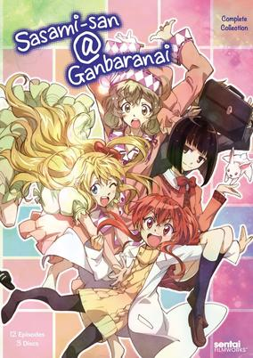

**Studio:** Shaft &nbsp;|&nbsp; **Episodes:** 12 &nbsp;|&nbsp; **Director:** Akiyuki Shinbo &nbsp;|&nbsp; **Aired/Released:** January 11 – March 29 &nbsp;|&nbsp; **Genres:** Contemporary Fantasy, Earth, Japan, Comedy, Swordplay, Absurdist Humour, Cyborg, Female Student, Super Power, Romance

> The Japanese call them hikikomori—people who've become so withdrawn socially that they refuse to leave their homes for weeks and even months at a time. For Sasami Tsukuyomi, who's attempting to pass her first year of high school despite being a shut in, it's more than just a word. Fortunately though, she lives with her older brother Kamiomi, who just happens to be a teacher at the school Sasami is supposed to attend. Not to mention, her "Brother Surveillance Tool" which lets her view the outside world via her computer and will, theoretically, allow her to readjust to interfacing with people again. What it mainly does, however, is let her view her brother's interactions with the three very odd Yagami sisters, who inexplicably seem to have had their ages reversed and have various types of "interest" in Kamiomi. And then things start to get really weird... Magical powers? Everything turning into chocolate? Is life via the web warping Sasami's brain, or is it the universe that's going crazy?
>
> _Synopsis source: Kitsu_

[Wikipedia](https://en.wikipedia.org/wiki/Sasami-san@Ganbaranai) · [Kitsu](https://kitsu.io/anime/sasami-san-ganbaranai)

---

### Vividred Operation

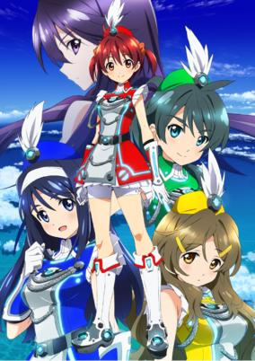

**Studio:** A-1 Pictures &nbsp;|&nbsp; **Episodes:** 12 &nbsp;|&nbsp; **Director:** Kazuhiro Takamura &nbsp;|&nbsp; **Aired/Released:** January 11 – March 29 &nbsp;|&nbsp; **Genres:** Earth, Science Fiction, Japan, Action, Asia, Island, Friendship, Ecchi

> Friendship is the key to protecting the world. That is everyone's wish. Here in a world where science has solved all questions. This story is set in Oshima. The happy, carefree 14-year-old Akane Isshiki lived a poor, but well loved life together with her reliable little sister, Momo, who does all the housework, and her grandfather, Kenjirou, a genius inventor who only created useless devices. When the weather is clear, they can see the artificial island, Blue Island, across the sea. In the center of that island rises the revolutionary Manifestation Engine, a discovery that solved the world's energy problems. It is a peaceful future, just like everyone dreamed of. One where everyone can smile and be happy... But suddenly, the world is visited by danger. An unknown enemy, the Alone, appear, targeting the Manifestation Engine. As none of their weapons worked and they fell into despair, a lone girl takes a stand wearing a red "Palette Suit" which wields a great, hidden power. Before long, allies gather around her to fight. And their friendship becomes the only hope for saving the world!
>
> _Synopsis source: Kitsu_

[Wikipedia](https://en.wikipedia.org/wiki/Vividred_Operation) · [Kitsu](https://kitsu.io/anime/vividred-operation)

---

### Beast Saga

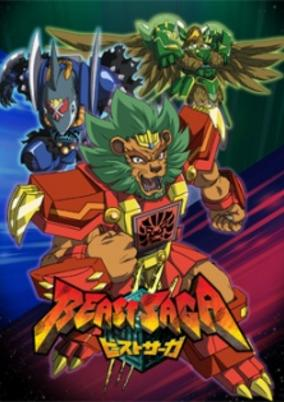

**Studio:** SynergySP &nbsp;|&nbsp; **Episodes:** 38 &nbsp;|&nbsp; **Director:** Katsumi Ono &nbsp;|&nbsp; **Aired/Released:** January 13 – September 29 &nbsp;|&nbsp; **Genres:** Power Suit, Fantasy World, Adventure, Action, Fantasy, High Fantasy, Anthropomorphism, Stereotypes, Super Power, Science Fiction, Kids

> Beast Saga takes place on a distant planet in our galaxy called Beast where three beast tribes, the Sea Tribe, the Land Tribe, and the Sky Tribe, fight for their honor. Each of the tribes protect an infinite elemental power source called Godlot.
>
> _Synopsis source: Kitsu_

[Wikipedia](https://en.wikipedia.org/wiki/Beast_Saga) · [Kitsu](https://kitsu.io/anime/beast-saga)

---

### Cardfight!! Vanguard: Link Joker (Cardfight!! Vanguard Link Joker)

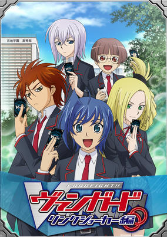

**Studio:** TMS Entertainment &nbsp;|&nbsp; **Episodes:** 59 &nbsp;|&nbsp; **Director:** Hatsuki Tsuji &nbsp;|&nbsp; **Aired/Released:** January 13 – March 2, 2014 &nbsp;|&nbsp; **Genres:** Adventure, Japan, Action, Asia, Earth, High School, Card Games, School Clubs, Proxy Battles, School Life, Demon

> A few months have passed since the VF Circuit, and Aichi is now in High School. However Aichi is in a different high school than most of his friends, a high school where the instructors focus on looking towards the future. One day Aichi admits he thinks Cardfight can be a future people can believe in, but in order to prove it Aichi must use his new deck, a deck in which Royal Paladins and Gold Paladins are combined as one force. Slowly but surely Aichi must gain friends through Cardfighting and help his new team win the newly formed high school cardfighting championships.
>
> _Synopsis source: Kitsu_

[Kitsu](https://kitsu.io/anime/cardfight-vanguard-link-joker-hen)

---

### DokiDoki! PreCure (Glitter Force: Dokidoki!)

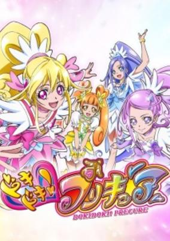

**Studio:** Toei Animation &nbsp;|&nbsp; **Episodes:** 49 &nbsp;|&nbsp; **Director:** Gō Koga &nbsp;|&nbsp; **Aired/Released:** February 3 – January 26, 2014 &nbsp;|&nbsp; **Genres:** Contemporary Fantasy, Magical Girl, Plot Continuity, Super Power, Magic, Action, Fantasy

> Aida Mana is a girl who is always eager to do things for the sake of others. One day, when she was visiting the Clover Tower during her school's orientation program, an enemy who called themselves "Selfish" appeared suddenly, and tried to manipulate her inner heart! To fight this enemy, she borrowed power from a magical fairy Sharuru to transform into Pretty Cure! To protect the peace of the world, other legendary Pretty Cure soon joined her in battle! A mysterious baby also appears, making each day a "Heartthrob" experience! The 4 Cures, always holding "love" in their hearts, are battling for the world's fate!
>
> _Synopsis source: Kitsu_

[Wikipedia](https://en.wikipedia.org/wiki/DokiDoki!_PreCure) · [Kitsu](https://kitsu.io/anime/dokidoki-precure)

---

### Straight Title Robot Anime

**Episodes:** 12 &nbsp;|&nbsp; **Director:** Kōtarō Ishidate Toru Nakano &nbsp;|&nbsp; **Aired/Released:** February 6 – April 24 &nbsp;|&nbsp; **Genres:** Earth, Action, Mecha, Post Apocalypse, Piloted Robot, Science Fiction, Super Deformed, Future, Comedy

> The story of the anime is set in the year Mobile Century 8013. It has been over seven millennia since humanity was wiped out on Earth, but the surviving military robots continue to wage war with no end in sight. The war has embroiled the Rebellion Federation that controls Europe and the Principality of Shin centered in Asia. Three young robots stand up to put an end to this futile war.
>
> _Synopsis source: Kitsu_

[Wikipedia](https://en.wikipedia.org/wiki/Straight_Title_Robot_Anime) · [Kitsu](https://kitsu.io/anime/chokkyuu-hyoudai-robot-anime-straight-title)

---

### Red Data Girl

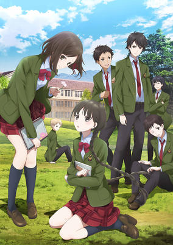

**Studio:** P.A. Works &nbsp;|&nbsp; **Episodes:** 12 &nbsp;|&nbsp; **Director:** Toshiya Shinohara &nbsp;|&nbsp; **Aired/Released:** March 16 – June 1 &nbsp;|&nbsp; **Genres:** Fantasy, Japan, Magic, Mystery, Drama, Adventure, Contemporary Fantasy, Seinen, Ghost, School Life, Romance

> Shy 15-year-old Izumiko has a hard time making personal connections. Oddly, she can't use computers or cell phones, either—they mysteriously crash when she touches them. When her childhood bully Miyuki shows up at the shrine where she was raised, their lives become involuntarily entwined. Izumiko learns she is the last vessel of a goddess—and Miyuki must serve as her dutiful guardian.
>
> _Synopsis source: Kitsu_

[Wikipedia](https://en.wikipedia.org/wiki/Red_Data_Girl) · [Kitsu](https://kitsu.io/anime/rdg-red-data-girl)

---

### DD Fist of the North Star

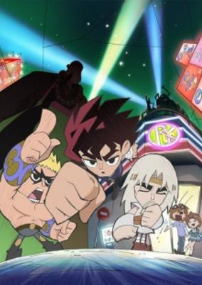

**Studio:** Ajia-do Animation Works &nbsp;|&nbsp; **Episodes:** 13 &nbsp;|&nbsp; **Director:** Akitaro Daichi &nbsp;|&nbsp; **Aired/Released:** April 2 – June 25 &nbsp;|&nbsp; **Genres:** Martial Arts, Present, Absurdist Humour, Parody, Japan, Comedy, Slice of Life

> It's a special project commemorating the 30th anniversary of Hokuto no Ken.
>
> _Synopsis source: Kitsu_

[Wikipedia](https://en.wikipedia.org/wiki/DD_Fist_of_the_North_Star) · [Kitsu](https://kitsu.io/anime/dd-hokuto-no-ken-2013)

---

### Karneval

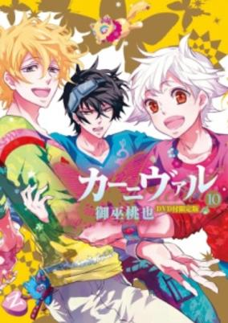

**Studio:** Manglobe &nbsp;|&nbsp; **Episodes:** 13 &nbsp;|&nbsp; **Director:** Eiji Suganuma &nbsp;|&nbsp; **Aired/Released:** April 3 – June 26 &nbsp;|&nbsp; **Genres:** Science Fiction, Fantasy, Josei

> DVD bundled with the limited edition of the 10th volume of the manga, previewing the upcoming TV anime and including footage that will not be used in the series.
>
> _Synopsis source: Kitsu_

[Wikipedia](https://en.wikipedia.org/wiki/Karneval_(manga)) · [Kitsu](https://kitsu.io/anime/karneval)

---

### Uta no Prince-sama Maji LOVE 2000% (Uta no Prince Sama 2)

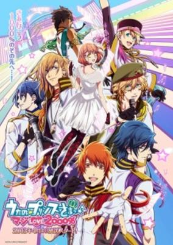

**Studio:** A-1 Pictures &nbsp;|&nbsp; **Episodes:** 13 &nbsp;|&nbsp; **Director:** Yuu Kou Yūki Ukai &nbsp;|&nbsp; **Aired/Released:** April 3 – June 26 &nbsp;|&nbsp; **Genres:** Japan, Bishounen, Reverse Harem, Idol, Stereotypes, Present, Music, Comedy, Romance, Harem, School Life

> Entering her Master's course, Nanami Haruka is facing an even more difficult time. And she isn't the only one. The main six members of Starish are assigned new seniors to watch over them! But the seniors aren't having the best attitudes about it. Watch Uta no☆Prince-sama♪ Maji Love 2000% and find yourself completely engaged in a whole new adventure mixed in with comedy and romance!
>
> _Synopsis source: Kitsu_

[Wikipedia](https://en.wikipedia.org/wiki/Uta_no_Prince-sama_Maji_LOVE_2000%25) · [Kitsu](https://kitsu.io/anime/uta-no-prince-sama-maji-love-2000)

---

### Little Battlers eXperience WARS

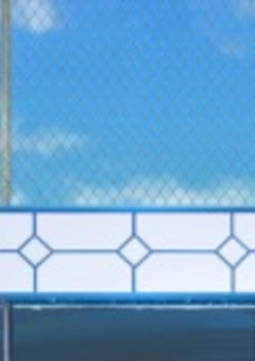

**Studio:** OLM, Inc. &nbsp;|&nbsp; **Episodes:** 37 &nbsp;|&nbsp; **Director:** Naohito Takahashi &nbsp;|&nbsp; **Aired/Released:** April 3 – December 25

> Arata Sena is unable to leave the island after he forgets to have his permission form signed. However, he gets an even better opportunity: facing off against LBX legend Ban Yamano.
>
> _Synopsis source: Kitsu_

[Wikipedia](https://en.wikipedia.org/wiki/Little_Battlers_Experience) · [Kitsu](https://kitsu.io/anime/danball-senki-wars-all-star-battle)

---

### Devil Survivor 2: The Animation (Devil Survivor 2 The Animation)

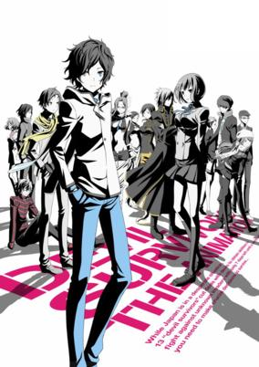

**Studio:** Bridge &nbsp;|&nbsp; **Episodes:** 13 &nbsp;|&nbsp; **Director:** Seiji Kishi &nbsp;|&nbsp; **Aired/Released:** April 4 – June 27 &nbsp;|&nbsp; **Genres:** Japan, Asia, Earth, Fantasy, Magic, Proxy Battles, Drama, Plot Continuity, Demon, Action

> Mysterious invaders called the Septentriones arrive in Japan and begin attacking the country on a Sunday. To fight back, the heroes in Devil Survivor 2 signed a pact with the devil to become the Thirteen Devil Messengers. The Septentriones show up at least once a day and you have a time limit of seven days to defeat them.
>
> _Synopsis source: Kitsu_

[Kitsu](https://kitsu.io/anime/devil-survivor-2-the-animation)

---

### The Devil Is a Part-Timer!

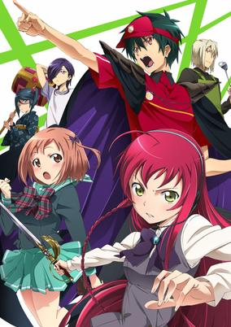

**Studio:** White Fox &nbsp;|&nbsp; **Episodes:** 13 &nbsp;|&nbsp; **Director:** Naoto Hosoda &nbsp;|&nbsp; **Aired/Released:** April 4 – June 27 &nbsp;|&nbsp; **Genres:** Parody, Romance, Japan, Slice of Life, Comedy, Fantasy, Earth, Magic, Demon, Super Power, Working Life, Isekai

> Striking fear into the hearts of mortals, the Demon Lord Satan begins to conquer the land of Ente Isla with his vast demon armies. However, while embarking on this brutal quest to take over the continent, his efforts are foiled by the hero Emilia, forcing Satan to make his swift retreat through a dimensional portal only to land in the human world. Along with his loyal general Alsiel, the demon finds himself stranded in modern-day Tokyo and vows to return and complete his subjugation of Ente Isla—that is, if they can find a way back! Powerless in a world without magic, Satan assumes the guise of a human named Sadao Maou and begins working at MgRonald's—a local fast-food restaurant—to make ends meet. He soon realizes that his goal of conquering Ente Isla is just not enough as he grows determined to climb the corporate ladder and become the ruler of Earth, one satisfied customer at a time! Whether it's part-time work, household chores, or simply trying to pay the rent on time, Hataraku Maou-sama! presents a hilarious view of the most mundane aspects of everyday life, all through the eyes of a hapless demon lord.
>
> _Synopsis source: Kitsu_

[Wikipedia](https://en.wikipedia.org/wiki/The_Devil_Is_a_Part-Timer!) · [Kitsu](https://kitsu.io/anime/the-devil-is-a-part-timer)

---

### Majestic Prince

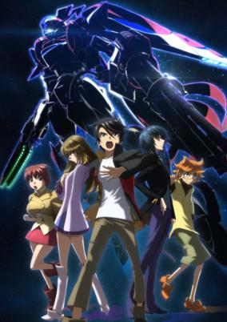

**Studio:** Doga Kobo Orange &nbsp;|&nbsp; **Episodes:** 24 &nbsp;|&nbsp; **Director:** Keitaro Motonaga &nbsp;|&nbsp; **Aired/Released:** April 4 – September 19 &nbsp;|&nbsp; **Genres:** Space Travel, Mecha, Genetic Modification, Piloted Robot, Science Fiction, Special Squads, Humanoid Alien, War, Future, Disaster, Space, Action, School Life

> In the latter half of 21st century, humans leave the Earth and begin to live in space. In order to adapt to the environment in space and deal with the hostile aliens in Jupiter, genetically engineered children called "Princes" are artificially raised and trained to be pilots of armed robots "AHSMB (Advanced High Standard Multipurpose Battle Device). This is a story about one of the teenage "Princes," Hitachi O Izuru, who studies in an academic city Grandzehle.
>
> _Synopsis source: Kitsu_

[Wikipedia](https://en.wikipedia.org/wiki/Majestic_Prince_(manga)) · [Kitsu](https://kitsu.io/anime/ginga-kikoutai-majestic-prince)

---

### The Severing Crime Edge

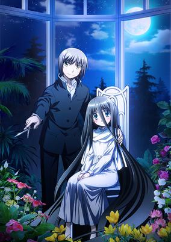

**Studio:** Studio Gokumi &nbsp;|&nbsp; **Episodes:** 13 &nbsp;|&nbsp; **Director:** Yūji Yamaguchi &nbsp;|&nbsp; **Aired/Released:** April 4 – June 27 &nbsp;|&nbsp; **Genres:** Violence, Contemporary Fantasy, Ecchi, Fantasy, Action, Romance

> Haimura Kiri is a seemingly ordinary boy with one slight problem: he is obsessed with cutting other people's hair. One day he meets Mushiyanokouji Iwai, the "Hair Queen" who cannot cut her hair because of an inherited curse. Kiri finds out that his scissor, "Dansai Bunri no Crime Edge" is the only thing that can cut them. But little did he know that their meeting sparked the start of an old murder game to kill the "Hair Queen" using the cursed killing tools, the "Killing Goods." Can Kiri protect Iwai from the Killing Goods Owners? Let the game begin!
>
> _Synopsis source: Kitsu_

[Wikipedia](https://en.wikipedia.org/wiki/The_Severing_Crime_Edge) · [Kitsu](https://kitsu.io/anime/dansai-bunri-no-crime-edge)

---

### Samurai Bride

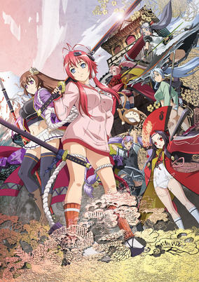

**Studio:** Arms &nbsp;|&nbsp; **Episodes:** 12 &nbsp;|&nbsp; **Director:** KOBUN &nbsp;|&nbsp; **Aired/Released:** April 5 – June 21 &nbsp;|&nbsp; **Genres:** Fantasy, Japan, Action, Asia, Earth, Ecchi, Swordplay, Martial Arts, Harem, Samurai, Comedy, School Life

> Second season of Hyakka Ryoran: Samurai Girls.
>
> _Synopsis source: Kitsu_

[Wikipedia](https://en.wikipedia.org/wiki/Hyakka_Ry%C5%8Dran) · [Kitsu](https://kitsu.io/anime/hyakka-ryouran-samurai-bride)

---

### The Flowers of Evil (Flowers of Evil)

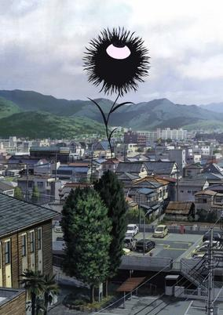

**Studio:** Zexcs &nbsp;|&nbsp; **Episodes:** 13 &nbsp;|&nbsp; **Director:** Hiroshi Nagahama &nbsp;|&nbsp; **Aired/Released:** April 5 – June 29 &nbsp;|&nbsp; **Genres:** Japan, Present, Asia, Earth, Middle School, Angst, School Life, Plot Continuity, Romance, Psychological

> Kasuga Takao is a boy who loves reading books, particularly Baudelaire's Les Fleurs du Mal. A girl at his school, Saeki Nanako, is his muse and his Venus, and he admires her from a distance. One day, he forgets his copy of Les Fleurs du Mal in the classroom and runs back alone to pick it up. In the classroom, he finds not only his book, but Saeki's gym uniform. On a mad impulse, he steals it. Now everyone knows "some pervert" stole Saeki's uniform, and Kasuga is dying with shame and guilt. Furthermore, the weird, creepy, and friendless girl of the class, Nakamura, saw him take the uniform. Instead of revealing it was him, she recognizes his kindred deviant spirit and uses her knowledge to take control of his life. Will it be possible for Kasuga to get closer to Saeki, despite Nakamura's meddling and his dark secret? What exactly does Nakamura intend to do with him?
>
> _Synopsis source: Kitsu_

[Wikipedia](https://en.wikipedia.org/wiki/The_Flowers_of_Evil_(manga)) · [Kitsu](https://kitsu.io/anime/aku-no-hana)

---

### My Youth Romantic Comedy Is Wrong, As I Expected (My Teen Romantic Comedy SNAFU)

**Studio:** Brain's Base &nbsp;|&nbsp; **Episodes:** 13 &nbsp;|&nbsp; **Director:** Ai Yoshimura &nbsp;|&nbsp; **Aired/Released:** April 5 – June 28 &nbsp;|&nbsp; **Genres:** Earth, Japan, Present, High School, School Clubs, School Life, Comedy, Romance

> So exactly what’s going to happen when Hachiman Hikigaya, an isolated high school student with no friends, no interest in making any and a belief that everyone else’s supposedly great high school experiences are either delusions or outright lies, is coerced by a well meaning faculty member into joining the one member “Services Club” run by Yukino Yukinoshita, who’s smart, attractive and generally considers everyone in her school to be her complete inferior?
>
> _Synopsis source: Kitsu_

[Wikipedia](https://en.wikipedia.org/wiki/My_Youth_Romantic_Comedy_Is_Wrong,_As_I_Expected) · [Kitsu](https://kitsu.io/anime/yahari-ore-no-seishun-love-comedy-wa-machigatteiru)

---

### Photo Kano

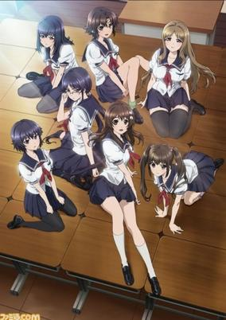

**Studio:** Madhouse &nbsp;|&nbsp; **Episodes:** 13 &nbsp;|&nbsp; **Director:** Akitoshi Yokoyama &nbsp;|&nbsp; **Aired/Released:** April 5 – June 28 &nbsp;|&nbsp; **Genres:** Romance, Japan, Present, Comedy, Ecchi, High School, School Clubs, School Life, Slow When It Comes To Love, Harem

> Kazuya, a mild-mannered high school sophomore coming to the end of a very average summer break, receives a digital single lens reflex camera as a gift. His nerdy fascination with its design soon turns to wonder when he realizes this little gadget could really give his social life a shot in the arm!
>
> _Synopsis source: Kitsu_

[Wikipedia](https://en.wikipedia.org/wiki/Photo_Kano) · [Kitsu](https://kitsu.io/anime/photokano)

---

### Baku Tech! Bakugan Gachi

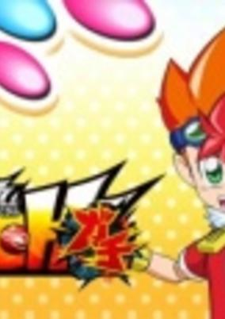

**Studio:** Shogakukan Music & Digital Entertainment &nbsp;|&nbsp; **Episodes:** 39 &nbsp;|&nbsp; **Director:** Junji Nishimura &nbsp;|&nbsp; **Aired/Released:** April 6 – December 28, 2013 &nbsp;|&nbsp; **Genres:** Virtual Reality, Action

> BakuTech! Bakugan Gachi is the sequel to the BakuTech! Bakugan series.
>
> _Synopsis source: Kitsu_

[Wikipedia](https://en.wikipedia.org/wiki/Baku_Tech!_Bakugan_Gachi) · [Kitsu](https://kitsu.io/anime/baku-tech-bakugan-gachi)

---

### Danchi Tomoo

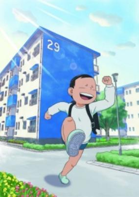

**Studio:** Shogakukan Music & Digital Entertainment &nbsp;|&nbsp; **Episodes:** 78 &nbsp;|&nbsp; **Director:** Ayumu Watanabe &nbsp;|&nbsp; **Aired/Released:** April 6 – February 7, 2015 &nbsp;|&nbsp; **Genres:** Comedy

> It's a heartwarming and sometimes nonsense comedy about an elementary school boy Tomoo Kinoshita.
>
> _Synopsis source: Kitsu_

[Wikipedia](https://en.wikipedia.org/wiki/Danchi_Tomoo) · [Kitsu](https://kitsu.io/anime/danchi-tomoo)

---

### Date A Live

**Studio:** AIC Plus+ &nbsp;|&nbsp; **Episodes:** 12 &nbsp;|&nbsp; **Director:** Keitaro Motonaga &nbsp;|&nbsp; **Aired/Released:** April 6 – June 22 &nbsp;|&nbsp; **Genres:** Contemporary Fantasy, Fantasy, Romance, Japan, Special Squads, Harem, Mecha, Science Fiction, Comedy, School Life

> "Before the world ends, kill me or kiss me." Thirty years before the events of Date A Live, an enormous explosion devastates east Asia and kills 150 million people. This is the first known "Spacequake", an inexplicable natural disaster that has since become commonplace. Fast forward to the future. High school second year Shidou Itsuka lives alone with his cute little sister while their parents are away. What do these things have to do with each other? While rushing to save his sister from a sudden Spacequake, Shidou is caught in the blast and, in the midst of the chaos, finds a mysterious girl. It turns out that this girl is actually a Spirit, a powerful being from another world whose arrival devastates the surrounding area. Thankfully, Shidou is rescued by an anti-Spirit strike team... led by his little sister?! This vicious task force is locked and loaded, ready to exterminate Spirits with extreme prejudice. But this violent method is not for Shidou. He discovers the one way to neutralize these Spirits peacefully: make them fall in love. Now, it's up to Shidou to save the world by dating those who threaten to destroy it!
>
> _Synopsis source: Kitsu_

[Wikipedia](https://en.wikipedia.org/wiki/Date_A_Live) · [Kitsu](https://kitsu.io/anime/date-a-live)

---

### Duel Masters Victory V3

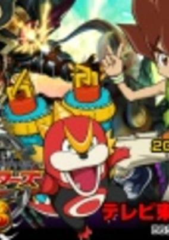

**Episodes:** 51 &nbsp;|&nbsp; **Director:** Takao Kato &nbsp;|&nbsp; **Aired/Released:** April 6 – March 29, 2014 &nbsp;|&nbsp; **Genres:** Comedy, Action, Adventure, Card Games

> In this series the story continues after Katta Kirifuda defeats the YA.RA.SI band and also gains back his popularity by defeating Leo and his sidekick Nai Minamimo. In this series Katta will use a new race of Outrage creatures against the opposing new race of Oracle deck users. Also in the creature world a new time era will start off.
>
> _Synopsis source: Kitsu_

[Wikipedia](https://en.wikipedia.org/wiki/Duel_Masters_Victory_V3) · [Kitsu](https://kitsu.io/anime/duel-masters-victory-v3)

---

### Haitai Nanafa

**Studio:** Passione &nbsp;|&nbsp; **Episodes:** 13 &nbsp;|&nbsp; **Director:** Hiroshi Kimura &nbsp;|&nbsp; **Aired/Released:** April 6 – June 29 &nbsp;|&nbsp; **Genres:** Contemporary Fantasy, Earth, Asia, Japan, Comedy, Slapstick, Present

> Nanafa Kyan lives in Okinawa with her grandmother who runs the "Kame Soba" soba shop, her beautiful older sister Nao who is in high school, and her younger sister Kokona, who is in elementary school and has a strong ability to sense the supernatural. One day, Nanafa witnesses a seal fall off of a Chinese banyan tree, and three spirits who live in that tree are unleashed. These spirits include Niina and Raana, who are "jimunaa" spirits. The third spirit is Iina, who is an incarnation of an Okinawan lion statue. As spirits start appearing one after another, the peaceful life of Nanafa and her family begins to change.
>
> _Synopsis source: Kitsu_

[Wikipedia](https://en.wikipedia.org/wiki/Haitai_Nanafa) · [Kitsu](https://kitsu.io/anime/haitai-nanafa)

---

### Jewelpet Happiness

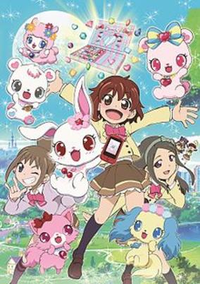

**Studio:** Studio Comet &nbsp;|&nbsp; **Episodes:** 52 &nbsp;|&nbsp; **Director:** Hiroaki Sakurai &nbsp;|&nbsp; **Aired/Released:** April 6 – March 29, 2014 &nbsp;|&nbsp; **Genres:** Magic, Fantasy, Magical Girl

> The series focuses on the main heroine Chiari Tsukikage and her friends on managing the Jewelpet Cafe. One day at the magical world of Jewel Land, Lady Jewelina entrusted Ruby the Magical Jewel Box with a mission to make friends and collect Magic Jewels. At the same time she needs to attend the Jewel Academy to do so and open a shop called the Jewelpet Cafe. However with her friends, things didn't go well as planned with several failed mishaps happened to her and the students being scared, in the point of Ruby giving up. But when she met a young girl named Chiari Tsukikage and decides to help, Ruby's life is about to change forever. Now, she and her friends now must work together for the cafe to prosper, stick together through good and bad luck as well as protecting the Jewel Box from being stolen.
>
> _Synopsis source: Kitsu_

[Wikipedia](https://en.wikipedia.org/wiki/Jewelpet_Happiness) · [Kitsu](https://kitsu.io/anime/jewelpet-happiness)

---

### Leviathan: The Last Defense

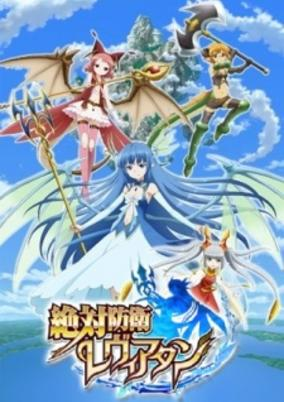

**Studio:** Gonzo &nbsp;|&nbsp; **Episodes:** 13 &nbsp;|&nbsp; **Director:** Kenichi Yatani &nbsp;|&nbsp; **Aired/Released:** April 6 – July 7 &nbsp;|&nbsp; **Genres:** Comedy, Fantasy, Fantasy World, Slice of Life, Dragon, Elf, Juujin, Henshin, Magic, Friendship, Stereotypes, Magical Girl, Plot Continuity

> The story is set in Aquafall, a fantasy world abound with water and greenery, and populated by dragons and fairies. Meteorites suddenly bring forth evil creatures that threaten all living things on the planet. The fairy Syrup assembles the Aquafall Defense Force, with three girls of the dragon clans as recruits. The story follows Syrup and the dragon girls Leviathan, Bahamut, and Jörmungandr as they work together to battle enemies and grow up.
>
> _Synopsis source: Kitsu_

[Kitsu](https://kitsu.io/anime/zettai-bouei-leviathan)

---

### Muromi-san

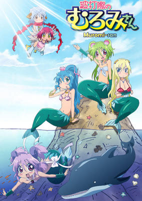

**Studio:** Tatsunoko Production &nbsp;|&nbsp; **Episodes:** 13 &nbsp;|&nbsp; **Director:** Tatsuya Yoshihara &nbsp;|&nbsp; **Aired/Released:** April 6 – June 29 &nbsp;|&nbsp; **Genres:** Comedy, Ecchi, Fantasy, Earth, Mermaid, Slice of Life

> Mukoujima Takurou is a lonely teenager who spends his time fishing at the pier and, to his incredible surprise, fishes up Muromi, a mermaid. Muromi first off doesn't realize she's a mermaid until she meets Takurou. Not only that, she is incredibly dense and crazy and has a drinking problem to top it off. Now every time Takurou goes fishing, Muromi appears and makes life interesting for him.
>
> _Synopsis source: Kitsu_

[Wikipedia](https://en.wikipedia.org/wiki/Muromi-san) · [Kitsu](https://kitsu.io/anime/namiuchigiwa-no-muromi-san)

---

### Pretty Rhythm: Rainbow Live

**Studio:** Tatsunoko Production &nbsp;|&nbsp; **Episodes:** 51 &nbsp;|&nbsp; **Director:** Masakazu Hishida &nbsp;|&nbsp; **Aired/Released:** April 6 – March 29, 2014 &nbsp;|&nbsp; **Genres:** Sports, Music, Slice of Life

> Naru Ayase is an 8th grader who can see the colors of music when she listens to it. For Naru, who is extremely good at decorating, becoming the owner of a shop like Dear Crown was her dream. One day, she finds out that the manager of a newly-opened shop is recruiting middle school girls who can do Prism Dance, and immediately applies. Naru begins to Prism Dance at the audition, and an aura she's never experienced spreads out in front of her. At that moment, a mysterious girl named Rinne asks her if she can see "rainbow music."
>
> _Synopsis source: Kitsu_

[Kitsu](https://kitsu.io/anime/pretty-rhythm-rainbow-live)

---

### Tanken Driland: Sennen no Mahō

**Studio:** Toei Animation &nbsp;|&nbsp; **Episodes:** 51 &nbsp;|&nbsp; **Director:** Toshinori Fukuzawa &nbsp;|&nbsp; **Aired/Released:** April 6 – March 30, 2014 &nbsp;|&nbsp; **Genres:** Fantasy, Adventure

> New series of Tanken Driland with brand new casts.
>
> _Synopsis source: Kitsu_

[Kitsu](https://kitsu.io/anime/tanken-driland-1000-nen-no-mahou)

---

### Attack on Titan

**Studio:** Wit Studio &nbsp;|&nbsp; **Episodes:** 25 &nbsp;|&nbsp; **Director:** Tetsurō Araki &nbsp;|&nbsp; **Aired/Released:** April 7 – September 29 &nbsp;|&nbsp; **Genres:** Post Apocalypse, Violence, Action, Adventure, Fantasy, Alternative Past, Angst, Horror, Drama, Military, Super Power, Shounen

> Centuries ago, mankind was slaughtered to near extinction by monstrous humanoid creatures called titans, forcing humans to hide in fear behind enormous concentric walls. What makes these giants truly terrifying is that their taste for human flesh is not born out of hunger but what appears to be out of pleasure. To ensure their survival, the remnants of humanity began living within defensive barriers, resulting in one hundred years without a single titan encounter. However, that fragile calm is soon shattered when a colossal titan manages to breach the supposedly impregnable outer wall, reigniting the fight for survival against the man-eating abominations. After witnessing a horrific personal loss at the hands of the invading creatures, Eren Yeager dedicates his life to their eradication by enlisting into the Survey Corps, an elite military unit that combats the merciless humanoids outside the protection of the walls. Based on Hajime Isayama's award-winning manga, Shingeki no Kyojin follows Eren, along with his adopted sister Mikasa Ackerman and his childhood friend Armin Arlert, as they join the brutal war against the titans and race to discover a way of defeating them before the last walls are breached.
>
> _Synopsis source: Kitsu_

[Wikipedia](https://en.wikipedia.org/wiki/Attack_on_Titan) · [Kitsu](https://kitsu.io/anime/attack-on-titan)

---

### Gargantia on the Verdurous Planet

**Studio:** Production I.G &nbsp;|&nbsp; **Episodes:** 13 &nbsp;|&nbsp; **Director:** Kazuya Murata &nbsp;|&nbsp; **Aired/Released:** April 7 – June 30 &nbsp;|&nbsp; **Genres:** Mecha, Post Apocalypse, Genetic Modification, Piloted Robot, Science Fiction, Action, Earth, Gunfights, Human Enhancement, Coming Of Age, Future, Robot Helper, Robot, Disaster, Plot Continuity, Adventure

> In the distant future, a majority of humans have left the Earth, and the Galactic Alliance of Humanity is founded to guide exploration and ensure the prosperity of mankind. However, a significant threat arises in the form of strange creatures called Hideauze, resulting in an interstellar war to prevent humanity's extinction. Armed with Chamber, an autonomous robot, 16-year-old lieutenant Ledo of the Galactic Alliance joins the battle against the monsters. In an unfortunate turn of events, Ledo loses control during the battle and is cast out to the far reaches of space, crash-landing on a waterlogged Earth. On the blue planet, Gargantia—a large fleet of scavenger ships—comes across Chamber and retrieves it from the ocean, thinking they have salvaged something of value. Mistaking their actions for hostility, Ledo sneaks aboard and takes a young messenger girl named Amy hostage, only to realize that the residents of Gargantia are not as dangerous as he had believed. Faced with uncertainty, and unable to communicate with his comrades in space, Ledo attempts to get his bearings and acclimate to a new lifestyle. But his peaceful days are about to be short-lived, as there is more to this ocean-covered planet than meets the eye. [Written by MAL Rewrite]
>
> _Synopsis source: Kitsu_

[Wikipedia](https://en.wikipedia.org/wiki/Gargantia_on_the_Verdurous_Planet) · [Kitsu](https://kitsu.io/anime/gargantia-on-the-verdurous-planet)

---

### Ore no Imōto ga Konna ni Kawaii Wake ga Nai.

**Studio:** A-1 Pictures &nbsp;|&nbsp; **Episodes:** 13 &nbsp;|&nbsp; **Director:** Hiroyuki Kanbe &nbsp;|&nbsp; **Aired/Released:** April 7 – June 30 &nbsp;|&nbsp; **Genres:** Music

> Music video/PV for ClariS' single "reunion." The song was used as the opening theme for "Ore no Imoto ga Konna ni Kawaii Wake ga nai" second season. Released on April 17, 2013, and was also included in the "second story" album.
>
> _Synopsis source: Kitsu_

[Wikipedia](https://en.wikipedia.org/wiki/Ore_no_Im%C5%8Dto_ga_Konna_ni_Kawaii_Wake_ga_Nai.) · [Kitsu](https://kitsu.io/anime/reunion-music)

---

### Yondemasuyo, Azazel-san Z (You're Being Summoned)

**Studio:** Production I.G &nbsp;|&nbsp; **Episodes:** 13 &nbsp;|&nbsp; **Director:** Tsutomu Mizushima &nbsp;|&nbsp; **Aired/Released:** April 7 – June 30 &nbsp;|&nbsp; **Genres:** Japan, Violence, Present, Comedy, Super Deformed, Slapstick, Demon

> The second season of Yondemasu yo, Azazel-san.
>
> _Synopsis source: Kitsu_

[Wikipedia](https://en.wikipedia.org/wiki/Yondemasuyo,_Azazel-san_Z) · [Kitsu](https://kitsu.io/anime/yondemasu-yo-azazel-san-z)

---

### Haiyore! Nyaruko-san W (Nyaruko: Crawling With Love! Second Season)

**Studio:** Xebec &nbsp;|&nbsp; **Episodes:** 12 &nbsp;|&nbsp; **Director:** Tsuyoshi Nagasawa &nbsp;|&nbsp; **Aired/Released:** April 8 – July 1 &nbsp;|&nbsp; **Genres:** Parody, Japan, Present, Comedy, Asia, Contemporary Fantasy, Fantasy, Earth, Love Polygon, Humanoid Alien, Alien, Harem, Demon, Science Fiction

> Nyaruko still wants Mahiro, as does Hasuta. Kūko wants Nyaruko, but believes both Nyaruko's and Mahiro's "first time" belongs to her. Yoriko puts up with all of it and cheerfully runs the house where they all live. Mahiro just wants some sanity. He doesn't want to be the love toy of a Nyarlathotepan, Cthughan, or a shots-like Hasturan. He may or may not hold out.
>
> _Synopsis source: Kitsu_

[Wikipedia](https://en.wikipedia.org/wiki/Haiyore!_Nyaruko-san_W) · [Kitsu](https://kitsu.io/anime/haiyore-nyaruko-san-w)

---

### Hayate the Combat Butler: Cuties (Hayate the Combat Butler! Cuties)

**Studio:** Manglobe &nbsp;|&nbsp; **Episodes:** 12 &nbsp;|&nbsp; **Director:** Masashi Kudo &nbsp;|&nbsp; **Aired/Released:** April 8 – July 1 &nbsp;|&nbsp; **Genres:** Japan, Present, Comedy, Earth, Maid, Friendship, Stereotypes, Harem, Parody, Romance

> Taking place after the events that occurred in Hayate no Gotoku! Can't Take My Eyes off You. Hayate, Nagi and Maria return to their daily lives at the Sanzenin Mansion and the Violet Mansion.
>
> _Synopsis source: Kitsu_

[Kitsu](https://kitsu.io/anime/hayate-the-combat-butler-cuties)

---

### Mushibugyo

**Studio:** Seven Arcs Pictures &nbsp;|&nbsp; **Episodes:** 26 &nbsp;|&nbsp; **Director:** Takayuki Hamana &nbsp;|&nbsp; **Aired/Released:** April 8 – September 30 &nbsp;|&nbsp; **Genres:** Japan, Action, Tokugawa Period, Special Squads, Swordplay, Samurai, Martial Arts, Super Power, Historical, Fantasy

> In Feudal Japan, the people of Edo are under siege by giant insects that ravage the land. The people desperately beg the government to do something about it. Thus the Insect Magistrate Office is established, gathering strong warriors to defend against the onset of pests.Mushibugyou follows Jinbee Tsukishima, a young man striving to be a master swordsman like his father. To atone for a horrific incident that occurred at his fault, Jinbee seeks to take his father's place as a member of the Insect Magistrate Office. On his journey there, he meets the lovely Haru, a young woman who helps manage her family’s tea house, and is forced to put his sword to good use in saving her from a grisly fate. This act of bravery that earns him a spot in the Insect Magistrate. Will this rookie exterminator be able to rid the land of the horde of insects swarming in?
>
> _Synopsis source: Kitsu_

[Wikipedia](https://en.wikipedia.org/wiki/Mushibugyo) · [Kitsu](https://kitsu.io/anime/mushibugyou)

---

### Arata: The Legend

**Studio:** Satelight JM Animation &nbsp;|&nbsp; **Episodes:** 12 &nbsp;|&nbsp; **Director:** Kenji Yasuda Woo Hyun Park &nbsp;|&nbsp; **Aired/Released:** April 9 – July 1 &nbsp;|&nbsp; **Genres:** Fantasy World, Present, Fantasy, Parallel Universe, Plot Continuity, Adventure, Friendship

> Every 30 years, a new princess is chosen from the Hime family to serve the Hayagami. The time has come again, but over these past years, records state not a single female has been born, save for one, the 15-year-old Arata. The only problem is, Arata is actually a male! Forced to disguise himself and take the place of the princess candidate until a formal one can be found, he attends the festival only to witness the current princess, Kokuri-hime, murdered, and his own life is forfeit as well, by the hands of the princess' personal guard, the 12 Shinshou. As he runs for his life, Kannagi of the 12 convinces everyone that Arata is the one who has murdered the princess instead, and now everyone in the Imperial Court is after his head!
>
> _Synopsis source: Kitsu_

[Kitsu](https://kitsu.io/anime/arata-kangatari)

---

### Sparrow's Hotel

**Studio:** Hotline &nbsp;|&nbsp; **Episodes:** 12 &nbsp;|&nbsp; **Director:** Tetsuji Nakamura &nbsp;|&nbsp; **Aired/Released:** April 9 – June 25 &nbsp;|&nbsp; **Genres:** Comedy

> The comedy revolves around Sayuri Satou, the new front desk worker at the Sparrow's Hotel—"the closest hotel to Heaven". Her special features are her large breasts and her skills of assassination. She takes down people who cause trouble in the business hotel with those skills, but she is in fact very unskilled when talking to the male hotel manager, and often bites her tongue.
>
> _Synopsis source: Kitsu_

[Wikipedia](https://en.wikipedia.org/wiki/Sparrow%27s_Hotel) · [Kitsu](https://kitsu.io/anime/sparrow-s-hotel)

---

### Yuyushiki

**Studio:** Kinema Citrus &nbsp;|&nbsp; **Episodes:** 12 &nbsp;|&nbsp; **Director:** Kaori &nbsp;|&nbsp; **Aired/Released:** April 9 – June 26 &nbsp;|&nbsp; **Genres:** Japan, Present, Comedy, Asia, Earth, Shoujo Ai, Absurdist Humour, School Clubs, All Girls School, Slapstick, School Life, Slice of Life

> The story follows the school life of the three girls, Yuzuko, Yukari, and Yui, who join their high school's Data Processing Club. The odd friendship between the three make for wacky humor in even the most mundane of events.
>
> _Synopsis source: Kitsu_

[Wikipedia](https://en.wikipedia.org/wiki/Yuyushiki) · [Kitsu](https://kitsu.io/anime/yuyushiki)

---

### Aiura

**Studio:** Liden Films &nbsp;|&nbsp; **Episodes:** 12 &nbsp;|&nbsp; **Director:** Ryōsuke Nakamura &nbsp;|&nbsp; **Aired/Released:** April 10 – June 26 &nbsp;|&nbsp; **Genres:** Slice of Life, Friendship, Comedy, School Life

> The story centers around Amaya, Iwasawa, and Uehara—three "annoying, spirited high school girls with zero motivation"—and their classmates. Their daily life is "what happens when there is nothing happening."
>
> _Synopsis source: Kitsu_

[Wikipedia](https://en.wikipedia.org/wiki/Aiura) · [Kitsu](https://kitsu.io/anime/aiura)

---

### A Certain Scientific Railgun S

**Studio:** J.C.Staff &nbsp;|&nbsp; **Episodes:** 24 &nbsp;|&nbsp; **Director:** Tatsuyuki Nagai &nbsp;|&nbsp; **Aired/Released:** April 12 – September 27, 2013 &nbsp;|&nbsp; **Genres:** Science Fiction, Parental Abandonment, Japan, Action, Asia, Fantasy, Earth, Middle School, All Girls School, Drama, Friendship, Alternative Present, Plot Continuity, Super Power

> Mikoto Misaka and her friends are back, investigating rumors across Academy City. Soon, Mikoto discovers something terrifying: horrific experiments are taking place throughout the city, involving the murder of thousands of espers. Moreover, these espers are far from just ordinary people: they are clones of Mikoto herself. Feeling responsible for their treatment, she sets off to put an end to the experiments; however, the forces opposing her are much more dangerous than she anticipated, and Mikoto finds herself up against some of the most powerful espers imaginable.Toaru Kagaku no Railgun S continues the story of the Railgun as she desperately fights to put an end to the inhuman experiments that she believes she helped cause, her life dragged deep into despair in the process. There's never a dull moment in Academy City, but no one ever said all of them would be pleasant. [Written by MAL Rewrite]
>
> _Synopsis source: Kitsu_

[Wikipedia](https://en.wikipedia.org/wiki/A_Certain_Scientific_Railgun_S) · [Kitsu](https://kitsu.io/anime/toaru-kagaku-no-railgun-s)

---

### Valvrave the Liberator

**Studio:** Sunrise &nbsp;|&nbsp; **Episodes:** 12 &nbsp;|&nbsp; **Director:** Kō Matsuo &nbsp;|&nbsp; **Aired/Released:** April 12 – June 28 &nbsp;|&nbsp; **Genres:** Mecha, Space Battles, Piloted Robot, Science Fiction, Action, Future, Plot Continuity, Space

> By the 71st year of the True Calendar, humanity has expanded its reach to the stars. The nations of JIOR, ARUS, and Dorssia have set up colonies made of individual modules in space, each serving to house more than half of mankind. Yet, war is still being waged between ARUS and Dorssia, each looking for a way to break the stalemate in their favor, and the key to victory happens to be nestled within a lone JIOR-controlled module.Kakumeiki Valvrave opens with an average day in the life of Haruto Tokishima being turned upside down as Dorssia launches an invasion of the Sakimori Academy, hoping to claim the secret weapons that lay hidden within it—the powerful combat machines known as the Valvraves. To liberate their home, Haruto and four others sacrifice their humanity and bear the curse of the Valvraves, becoming undying immortals that can steal the body of others. Together, with the aid of L-elf, a genius-strategist and traitor to Dorssia, they’ll spark a revolution that will change the world.
>
> _Synopsis source: Kitsu_

[Wikipedia](https://en.wikipedia.org/wiki/Valvrave_the_Liberator) · [Kitsu](https://kitsu.io/anime/kakumeiki-valvrave)

---

### The "Hentai" Prince and the Stony Cat.

**Studio:** J.C.Staff &nbsp;|&nbsp; **Episodes:** 12 &nbsp;|&nbsp; **Director:** Yōhei Suzuki &nbsp;|&nbsp; **Aired/Released:** April 13 – June 29 &nbsp;|&nbsp; **Genres:** Ecchi, Japan, Present, Earth, Slice of Life, Comedy, Asia, Sudden Girlfriend Appearance, Love Polygon, Plot Continuity, Harem, Romance, School Life

> Youto Yokodera wants to be seen in a way different from most men: as a pervert. However, his lewd actions are often misinterpreted as good intentions, and people cannot see his true nature. Upon hearing rumors of a cat statue that can banish an unwanted trait, he searches for it and prays for his façade to be removed. But each wish comes at a price: those unwelcomed traits are transferred to someone else who desires them! After realizing that vocalizing his dirty thoughts is not the best thing, Youto decides to regain his lost traits by seeking out the person who received them. Unfortunately, he was not alone in praying to the cat statue, and now he must not only fix his life, but the lives of others as well. [Written by MAL Rewrite]
>
> _Synopsis source: Kitsu_

[Wikipedia](https://en.wikipedia.org/wiki/The_%22Hentai%22_Prince_and_the_Stony_Cat.) · [Kitsu](https://kitsu.io/anime/the-hentai-prince-and-the-stony-cat)

---

### Kingdom (season 2) (The Seven Deadly Sins)

**Studio:** Pierrot &nbsp;|&nbsp; **Episodes:** 39 &nbsp;|&nbsp; **Director:** Jun Kamiya &nbsp;|&nbsp; **Aired/Released:** June 8 – March 1, 2014 &nbsp;|&nbsp; **Genres:** Super Power, Action, Fantasy, Adventure, Comedy, Ecchi

> In a world similar to the European Middle Ages, the feared yet revered Holy Knights of Britannia use immensely powerful magic to protect the region of Britannia and its kingdoms. However, a small subset of the Knights supposedly betrayed their homeland and turned their blades against their comrades in an attempt to overthrow the ruler of Liones. They were defeated by the Holy Knights, but rumors continued to persist that these legendary knights, called the "Seven Deadly Sins," were still alive. Ten years later, the Holy Knights themselves staged a coup d’état, and thus became the new, tyrannical rulers of the Kingdom of Liones. Based on the best-selling manga series of the same name, Nanatsu no Taizai follows the adventures of Elizabeth, the third princess of the Kingdom of Liones, and her search for the Seven Deadly Sins. With their help, she endeavors to not only take back her kingdom from the Holy Knights, but to also seek justice in an unjust world.
>
> _Synopsis source: Kitsu_

[Wikipedia](https://en.wikipedia.org/wiki/Kingdom_(manga)) · [Kitsu](https://kitsu.io/anime/nanatsu-no-taizai)

---

### Dog & Scissors

**Studio:** Gonzo &nbsp;|&nbsp; **Episodes:** 12 &nbsp;|&nbsp; **Director:** Yukio Takahashi &nbsp;|&nbsp; **Aired/Released:** July 1 – September 16 &nbsp;|&nbsp; **Genres:** Present, Japan, Comedy, Ecchi, Detective, Coming Of Age, Slapstick, Stereotypes

> A nonsense comical mystery. Harumi Kazuhito is a high school boy who loves books and is a fan of novelist Natsuno Kirihime. One day, he finds Kirihime writing at a cafe, about to be shot by a robber. He protects her from the attack but is killed instead. Through the supernatural power of a book-worm, he is reincarnated as a dachshund dog. Kazuhito (as a dog) writhes in a painful bookless life, when a sadistic woman carrying a pair of scissors offers him help. She is Kirihime herself.
>
> _Synopsis source: Kitsu_

[Wikipedia](https://en.wikipedia.org/wiki/Dog_%26_Scissors) · [Kitsu](https://kitsu.io/anime/inu-to-hasami-wa-tsukaiyou)

---

### Brothers Conflict

**Studio:** Brain's Base &nbsp;|&nbsp; **Episodes:** 12 &nbsp;|&nbsp; **Director:** Atsushi Matsumoto &nbsp;|&nbsp; **Aired/Released:** July 2 – September 17 &nbsp;|&nbsp; **Genres:** Bishounen, Reverse Harem, Romance, Harem

> Imagine being the only child your whole life, and then suddenly finding yourself gaining 13 step-brothers! Ema Hinata's lonely life takes a new and exciting turn when her single father Rintarou Hinata, a famous adventurer, falls in love and marries Miwa Asahina, an apparel maker. In order to give the newly-wed couple space, Ema starts living with her new step-brothers in a mansion called Sunrise Residence and for the first time, experiences being part of a lively and big family. She finally feels safe and content. Each brother has his own unique personality, and Ema soon realizes that it is not only family love that grows between them, but romance as well. Which brother will be the one to steal her heart in the end?
>
> _Synopsis source: Kitsu_

[Wikipedia](https://en.wikipedia.org/wiki/Brothers_Conflict) · [Kitsu](https://kitsu.io/anime/brothers-conflict)

---

### Gifū Dōdō!! Kanetsugu to Keiji

**Studio:** Studio Deen &nbsp;|&nbsp; **Episodes:** 25 &nbsp;|&nbsp; **Director:** Bob Shirahata &nbsp;|&nbsp; **Aired/Released:** July 2 – December 17

[Wikipedia](https://en.wikipedia.org/wiki/Gif%C5%AB_D%C5%8Dd%C5%8D!!_Kanetsugu_to_Keiji)

---

### Senyu (season 2)

**Studio:** Liden Films Ordet &nbsp;|&nbsp; **Episodes:** 12 &nbsp;|&nbsp; **Director:** Yutaka Yamamoto &nbsp;|&nbsp; **Aired/Released:** July 2 – September 24 &nbsp;|&nbsp; **Genres:** Parody, Breaking The Fourth Wall, Absurdist Humour, Slapstick, Action, Fantasy, Comedy

> Once upon a time, the demon lord Rchimedes spread terror throughout the world, until he was eventually sealed away by the legendary hero Creasion. Since then, a thousand years have passed peacefully. However, a mysterious hole has opened up between the demon and human spheres, and countless demons have surged into the human realm once more. Coming to the conclusion that Rchimedes would soon return to wreak havoc, a human king summons the possible descendants of the legendary hero—all 75 of them. Unfortunately, after so long, it was too difficult to pinpoint his true descendants. Among the lionhearted prospects is the amateur adventurer Alba Frühling. His skills may not be top-notch, but he is accompanied by the talented soldier Ross, who helps the young hero whenever he is in a pinch...or at least, he is supposed to. Though undoubtedly a skilled warrior, Ross is actually both sarcastic and sadistic, and hence revels in Alba's suffering. Senyuu. is a comedic adventure following the unlikely duo as they struggle in their endeavor to defeat the demon lord, meeting various eccentrics along the way. [Written by MAL Rewrite]
>
> _Synopsis source: Kitsu_

[Wikipedia](https://en.wikipedia.org/wiki/Senyu) · [Kitsu](https://kitsu.io/anime/senyuu)

---

### Tamayura: More Aggressive

**Studio:** TYO Animations &nbsp;|&nbsp; **Episodes:** 12 &nbsp;|&nbsp; **Director:** Junichi Sato &nbsp;|&nbsp; **Aired/Released:** July 3 – September 18 &nbsp;|&nbsp; **Genres:** Japan, Slice of Life, School Life, Comedy

> The second season of Tamayura: Hitotose.
>
> _Synopsis source: Kitsu_

[Kitsu](https://kitsu.io/anime/tamayura-more-aggressive)

---

### Chronicles of the Going Home Club

**Studio:** Nomad &nbsp;|&nbsp; **Episodes:** 12 &nbsp;|&nbsp; **Director:** Hikaru Sato &nbsp;|&nbsp; **Aired/Released:** July 4 – October 11 &nbsp;|&nbsp; **Genres:** Present, Japan, Comedy, Earth, Parody, High School, School Clubs, Slice of Life, School Life

> When a friend asks Natsuki what high school club she's going to join, she cheerfully responds "the go-home club" (meaning, she's not going to join any of them). However, she soon realizes that this club actually exists at her high school, and she's just expressed interest in joining it! Before she knows it, she ends up as one of the two new members of "the go-home club," which is a small group of eccentric school girls. One of the girls likes fighting bears, while another is ridiculously rich. But what exactly constitutes the activities of "the go-home club"?
>
> _Synopsis source: Kitsu_

[Wikipedia](https://en.wikipedia.org/wiki/Chronicles_of_the_Going_Home_Club) · [Kitsu](https://kitsu.io/anime/kitakubu-katsudou-kiroku)

---

### Danganronpa: The Animation

**Studio:** Lerche &nbsp;|&nbsp; **Episodes:** 13 &nbsp;|&nbsp; **Director:** Seiji Kishi &nbsp;|&nbsp; **Aired/Released:** July 4 – September 26 &nbsp;|&nbsp; **Genres:** Battle Royale, Action, Comedy, Thriller, Detective, Stereotypes, Horror, Psychological, Mystery

> Hope's Peak Academy is an elite high school that accepts only the most talented students. Individuals who successfully enroll receive their own unique titles, suitably reflective of their skills and traits. Of the fifteen candidates admitted to the peculiar school that year, Makoto Naegi is a completely ordinary individual who has been accepted by sheer chance, with the title of "Super High School-Level Luck." Naegi and his fellow classmates are initially ecstatic to be chosen to study at this prestigious institution, but these feelings of happiness are short-lived. They are soon confronted by Monokuma, the principal and resident bear, who traps them inside the school. The pupils' hopes of escape and graduation hinge on one of them successfully murdering one of their peers without being discovered. However, if the killer is caught, he or she will be executed, and the remaining survivors will be left to continue the deathmatch until only a single victor remains. [Written by MAL Rewrite]
>
> _Synopsis source: Kitsu_

[Kitsu](https://kitsu.io/anime/danganronpa-kibou-no-gakuen-to-zetsubou-no-koukousei-the-animation)

---

### Free!

**Studio:** Kyoto Animation Animation Do &nbsp;|&nbsp; **Episodes:** 12 &nbsp;|&nbsp; **Director:** Hiroko Utsumi &nbsp;|&nbsp; **Aired/Released:** July 4 – September 26 &nbsp;|&nbsp; **Genres:** Music, Fantasy

> SPring-8 Angstrom Compact free electron LAser's (SACLA) 5 minute pencil and watercolor anime short narrated by Mamiko Noto and music by twoth.
>
> _Synopsis source: Kitsu_

[Wikipedia](https://en.wikipedia.org/wiki/Free!_(anime)) · [Kitsu](https://kitsu.io/anime/wasureboshi)

---

### Rozen Maiden: Zurückspulen

**Studio:** Studio Deen &nbsp;|&nbsp; **Episodes:** 13 &nbsp;|&nbsp; **Director:** Mamoru Hatekayama &nbsp;|&nbsp; **Aired/Released:** July 4 – September 26 &nbsp;|&nbsp; **Genres:** Japan, Action, Present, Comedy, Thriller, Magic

> During the events of the original Rozen Maiden, after circling "yes" on a paper and agreeing to wind an unknown "something," a traumatized Jun Sakurada fights alongside the lifelike dolls known as the Rozen Maidens. But what would have happened if Jun had circled "no"? Jun, having gotten over his school trauma from his younger days, spends his time attending college and working in a bookstore. However, he does not feel as though he belongs anywhere. One day, he finds a book containing instructions on how to make a Rozen Maiden. Mysteriously, when he arrives home that night, the second volume in the book series has been delivered to his house, along with some pieces of a doll. But as suddenly as they started arriving, the books stop coming, and Jun gets a notice that says that the books have ceased being published. With an incomplete doll in hand, and a message from his other self in another world, this Jun also finds his way into the world of the Rozen Maidens. [Written by MAL Rewrite]
>
> _Synopsis source: Kitsu_

[Kitsu](https://kitsu.io/anime/rozen-maiden-zuruckspulen)

---

### Senki Zesshō Symphogear G (Symphogear G)

**Studio:** Satelight &nbsp;|&nbsp; **Episodes:** 13 &nbsp;|&nbsp; **Director:** Katsumi Ono &nbsp;|&nbsp; **Aired/Released:** July 4 – September 26 &nbsp;|&nbsp; **Genres:** Power Suit, Science Fiction, Violence, Action, Earth, All Girls School, Plot Continuity, Music

> Peace had seemed to return to the world when Hibiki, Tsubasa, and Chris had saved the planet from the Luna Attack with their song. However, 3 months later at a joint concert between Tsubasa Kazanari and foreign superstar Maria Cadenzavna Eve, the Symphogear team is faced with her dangerous declaration of war against the world. Maria and her allies Kirika and Shirabe have a fearful power backing them: The power of a dark Symphogear.
>
> _Synopsis source: Kitsu_

[Wikipedia](https://en.wikipedia.org/wiki/Senki_Zessh%C5%8D_Symphogear_G) · [Kitsu](https://kitsu.io/anime/senki-zesshou-symphogear-g-in-the-distance-that-day-when-the-star-became-music)

---

### [[Stella Women's Academy, High School Division Class C 3 ]] (Stella Women's Academy)

**Studio:** Gainax &nbsp;|&nbsp; **Episodes:** 13 &nbsp;|&nbsp; **Director:** Masayoshi Kawajiri &nbsp;|&nbsp; **Aired/Released:** July 4 – September 26 &nbsp;|&nbsp; **Genres:** Sports, Gunfights, Angst, School Clubs, All Girls School, School Life, Military

> Yura Yamato has just arrived at the high school division of Stella Women's Academy, when Sonora Kashima invites her to join a club called "C³". Sonora is the third-year student who became the new head of this club for military survival games. The other members include two second-year students (part-Japanese Karila Hatsuse and G36K-wielding Honoka Mutsu) and two other new students (Rento Kirishima whose family runs a Japanese sweets shop and the really short Yachiyo Hinata).
>
> _Synopsis source: Kitsu_

[Kitsu](https://kitsu.io/anime/stella-jogakuin-koutou-ka-c-bu)

---

### Love Lab

**Studio:** Doga Kobo &nbsp;|&nbsp; **Episodes:** 13 &nbsp;|&nbsp; **Director:** Masahiko Ohta &nbsp;|&nbsp; **Aired/Released:** July 5 – September 27 &nbsp;|&nbsp; **Genres:** Japan, Present, Comedy, Asia, Earth, Middle School, School Life, Romance

> Natsuo Maki is the most mature of all the dignified young ladies at Fujisaki Girls Academy. As the student president, Maki is revered by all the other young girls for her grace and poise. What happens behind closed doors, though, is an entirely different story. One day, Natsuo decides to practice her kissing technique on a pillow, a move which makes her look neither graceful nor elegant. Unluckily, fellow student "Wild Kid" Riko Kurahashi walks in on her. Luckily, instead of making fun of her, Riko chooses to help her. The two begin a project called the Love Lab, intended to practice the essentials of love and romance. Bumping into each other "accidentally," holding hands, and more "love techniques." Soon the rest of the student council is pulled into the girls' Love Lab, and then the rest of the school. Suddenly the student council's job has expanded to include answering anonymous questions about romance. And it becomes quite clear that many girls at the academy long for a bit of romance in their lives!
>
> _Synopsis source: Kitsu_

[Wikipedia](https://en.wikipedia.org/wiki/Love_Lab) · [Kitsu](https://kitsu.io/anime/love-lab)

---

### Ro-Kyu-Bu! SS

**Studio:** Project No. 9 &nbsp;|&nbsp; **Episodes:** 13 &nbsp;|&nbsp; **Director:** Tetsuya Yanagisawa &nbsp;|&nbsp; **Aired/Released:** July 5 – September 27 &nbsp;|&nbsp; **Genres:** Loli, Basketball, Japan, Present, Asia, Earth, Friendship, School Life, Comedy, Ecchi, Sports

> Second season of Ro-Kyu-Bu!
>
> _Synopsis source: Kitsu_

[Wikipedia](https://en.wikipedia.org/wiki/Ro-Kyu-Bu!_SS) · [Kitsu](https://kitsu.io/anime/ro-kyu-bu-ss)

---

### Servant × Service (Servant x Service)

**Studio:** A-1 Pictures &nbsp;|&nbsp; **Episodes:** 13 &nbsp;|&nbsp; **Director:** Yasutaka Yamamoto &nbsp;|&nbsp; **Aired/Released:** July 5 – September 27 &nbsp;|&nbsp; **Genres:** Present, Japan, Comedy, Romance, Stereotypes, Slice of Life, Working Life

> Imagine if three people suddenly found themselves as civil servants of the city Mitsuba. What sort of personalities and drives would they have to push them to seek out such careers? Lucy Yamagami, a serious young woman assigned to the Welfare Administrative Section, intends to use the job as a means of settling a vendetta against another civil servant. Yutaka Hasebe, a flirtatious young man assigned to the First Section of the Welfare Department, intends to slack off whenever he can and have a good time. And Saya Miyoshi, a college graduate assigned to the Second Section of the Welfare Department, intends to simply get through the first job she's had in her life as best she can.Servant x Service follows these three newcomers starting their jobs as government employees under their supervisor, Taishi Ichimiya, who is utterly clueless about how to direct them—despite having worked there for the last eight years. Nevertheless, he welcomes them as fellow civil servants and encourages them to work themselves like dogs for the sake of the citizens. We follow their day-to-day lives as they experience the rigors of government employment, including dealing with regulations, office romances, paperwork, and being the nearest punching bags when citizens need something to complain about.
>
> _Synopsis source: Kitsu_

[Wikipedia](https://en.wikipedia.org/wiki/Servant_%C3%97_Service) · [Kitsu](https://kitsu.io/anime/servant-x-service)

---

### Day Break Illusion

**Studio:** AIC &nbsp;|&nbsp; **Episodes:** 13 &nbsp;|&nbsp; **Director:** Keizō Kusakawa &nbsp;|&nbsp; **Aired/Released:** July 6 – September 28 &nbsp;|&nbsp; **Genres:** Fantasy, Magic, Drama, Magical Girl

> Since ancient times long past, this world has been ruled by two tarot cards. Diablos Tarot—The tarot of the devil that feasts on the souls of living humans and uses that nourishment to bring countless pain and suffering. Elemental Tarot—The tarot that draws its energy from the power of nature in order to oppose the Diablos Tarot. Girls chosen from 22 different bloodlines become the wielders of the Elemental Tarot, plunging themselves into this secret battle. To maintain the balance of this world, while carrying unbearable guilt... Are they executioners? Or saviors? This is the story of the long, long battle fought by girls who cannot escape the fate they bear.
>
> _Synopsis source: Kitsu_

[Wikipedia](https://en.wikipedia.org/wiki/Day_Break_Illusion) · [Kitsu](https://kitsu.io/anime/genei-wo-kakeru-taiyou)

---

### Kin-iro Mosaic (KINMOZA!)

**Studio:** Studio Gokumi &nbsp;|&nbsp; **Episodes:** 12 &nbsp;|&nbsp; **Director:** Tensho &nbsp;|&nbsp; **Aired/Released:** July 6 – September 21 &nbsp;|&nbsp; **Genres:** Japan, Present, Slice of Life, Comedy, Asia, Earth, Friendship, School Life

> Shinobu Oomiya once left Japan to participate in a homestay in England. During her time there, she became close friends with Alice Cartelet, the daughter of the family she was living with. However, when it was time for Shinobu to return to Japan, the two were able to express their sorrow despite the language barrier between them. Five years later, now a first year student in high school, Shinobu receives a letter by air mail in a language she does not understand. This letter is penned by none other than Alice, detailing her own homestay in Japan. In fact, Alice will be attending Shinobu's high school and living with her! Alongside their friends Youko Inokuma, Aya Komichi, and Karen Kujou, the five girls attend school together and learn about what their different cultures have to offer, day after day. [Written by MAL Rewrite]
>
> _Synopsis source: Kitsu_

[Wikipedia](https://en.wikipedia.org/wiki/Kin-iro_Mosaic) · [Kitsu](https://kitsu.io/anime/kiniro-mosaic)

---

### Sunday Without God

**Studio:** Madhouse &nbsp;|&nbsp; **Episodes:** 12 &nbsp;|&nbsp; **Director:** Yūji Kumazawa &nbsp;|&nbsp; **Aired/Released:** July 6 – September 21 &nbsp;|&nbsp; **Genres:** Fantasy, Adventure, Coming Of Age, Mystery, Drama

> God has abandoned the world. As a result, life cannot end nor can new life be born, and the "dead" walk restlessly among the living. Granting one last miracle before turning away forever, God created "gravekeepers," mystical beings capable of putting the dead to rest through a proper burial. Ai Astin, a cheerful but naïve young girl, serves as her village's gravekeeper in place of her late mother. One day, a man known as Hampnie Hambart, who is supposedly Ai's father, arrives and kills all the people in her village. Having lost her village and with no plans for the future, Ai decides to accompany the mysterious man on his journey. As she travels the land, the young gravekeeper strives to fulfill her duties, granting peace to the dead and assisting the living, while at the same time learning more about the world that God left in this tragic state. [Written by MAL Rewrite]
>
> _Synopsis source: Kitsu_

[Wikipedia](https://en.wikipedia.org/wiki/Sunday_Without_God) · [Kitsu](https://kitsu.io/anime/kamisama-no-inai-nichiyoubi)

---

### Blood Lad

**Studio:** Brain's Base &nbsp;|&nbsp; **Episodes:** 10 &nbsp;|&nbsp; **Director:** Shigeyuki Miya &nbsp;|&nbsp; **Aired/Released:** July 7 – September 8 &nbsp;|&nbsp; **Genres:** Fantasy, Vampire, Fantasy World, Comedy, Present, Demon, Action

> Staz Charlie Blood is a powerful vampire who rules the Eastern district of Demon World. According to rumors, he is a bloodthirsty and merciless monster, but in reality, Staz is just an otaku obsessed with Japanese culture and completely uninterested in human blood. Leaving the management of his territory to his underlings, Staz spends his days lazing around, indulging in anime, manga, and games. When Fuyumi Yanagi, a Japanese girl, accidentally wanders through a portal leading into the demon world, Staz is overjoyed. But just as he is starting to feel an unusual attraction to her, his territory is attacked, resulting in Fuyumi's untimely death. She turns into a wandering ghost and the crestfallen Staz vows to resurrect her as this would mean being able to travel to the human world, something he has always dreamed of.Blood Lad follows Staz and Fuyumi, soon joined by the spatial magician Bell and the half-werewolf Wolf, as they travel to find a magic that can bring humans back to life. [Written by MAL Rewrite]
>
> _Synopsis source: Kitsu_

[Wikipedia](https://en.wikipedia.org/wiki/Blood_Lad) · [Kitsu](https://kitsu.io/anime/blood-lad)

---

### Devils and Realist

**Studio:** Doga Kobo &nbsp;|&nbsp; **Episodes:** 12 &nbsp;|&nbsp; **Director:** Chiaki Kon &nbsp;|&nbsp; **Aired/Released:** July 7 – September 22 &nbsp;|&nbsp; **Genres:** Comedy, Fantasy, Demon, Historical, School Life, Mystery, Josei

> The story revolves around William, an aristocratic family's progeny with rare intellect. One day, his uncle lost his possessions after his business failed. Fearing that his family's name has been tarnished, William returns home and searches with his family's butler for anything that can be converted into cash. A search of the premises yields an underground room left by an ancestor. In the room is a magical seal, and William unintentionally summons a devil. The summoned devil tells William his name Dantalion, and reveals that William is the designator who can choose the acting ruler of the demon world.
>
> _Synopsis source: Kitsu_

[Wikipedia](https://en.wikipedia.org/wiki/Devils_and_Realist) · [Kitsu](https://kitsu.io/anime/makai-ouji-devils-and-realist)

---

### Teekyu (season 2) (Teekyu)

**Studio:** MAPPA &nbsp;|&nbsp; **Episodes:** 12 &nbsp;|&nbsp; **Director:** Shin Itagaki &nbsp;|&nbsp; **Aired/Released:** July 7 – September 22 &nbsp;|&nbsp; **Genres:** Tennis, Japan, Present, Comedy, Asia, Earth, Absurdist Humour, School Clubs, School Life, Sports

> Teekyuu is all about the wacky antics of four schoolgirls—Kanae Shinjou gets bored easily and often breaks the laws of physics to get what she wants; Nasuno Takamiya is incredibly rich and knows how to make things go her way; Marimo Bandou would probably get arrested from her actions like eating panties or kidnapping children; and Yuri Oshimoto, their ordinary junior, rounds out the eccentric bunch that forms the sole members of their school's tennis club. Despite their interest in learning the sport, the older girls prefer messing around, while Yuri, being the only one who actually knows how to play and the most mature in spite of being younger, has to deal with her seniors' out of control behavior. When these four girls come together, insanity ensues in this lightning-paced comedy about a tennis club that doesn't really play tennis. [Written by MAL Rewrite]
>
> _Synopsis source: Kitsu_

[Wikipedia](https://en.wikipedia.org/wiki/Teekyu) · [Kitsu](https://kitsu.io/anime/teekyuu)

---

### The Eccentric Family

**Studio:** P.A. Works &nbsp;|&nbsp; **Episodes:** 13 &nbsp;|&nbsp; **Director:** Masayuki Yoshihara &nbsp;|&nbsp; **Aired/Released:** July 7 – September 29 &nbsp;|&nbsp; **Genres:** Asia, Present, Japan, Comedy, Fantasy, Earth, Kyoto, Contemporary Fantasy, Anthropomorphism, Plot Continuity, Slice of Life

> In modern day Kyoto, humans live in the city, tengus take to the sky, and tanukis roam the earth. One such tanuki is Yasaburo, the third son of Soichiro Shimogamo, famed tanuki leader who met his end far too early at the hands of a group of humans and their year-end banquet hot pot. Yasaburo has since embraced his "fool's blood" and strives for a happy, carefree life. But between taking care of his old tengu master Akadama-sensei, avoiding the life- threatening advances of the beautiful human Benten, dealing with his dangerously stupid twin cousins, and avoiding becoming a hot pot himself in the next year-end banquet, the young tanuki has his proverbial work cut out for him!
>
> _Synopsis source: Kitsu_

[Wikipedia](https://en.wikipedia.org/wiki/The_Eccentric_Family) · [Kitsu](https://kitsu.io/anime/uchouten-kazoku)

---

### Fantasista Doll

**Studio:** Hoods Entertainment &nbsp;|&nbsp; **Episodes:** 12 &nbsp;|&nbsp; **Director:** Hisashi Saitō &nbsp;|&nbsp; **Aired/Released:** July 7 – September 28 &nbsp;|&nbsp; **Genres:** Fantasy, Action, Proxy Battles, Magical Girl, Magic, Science Fiction

> Uzume Uno is a young student and former champion of a trading card game competition. She is trusted with a special device containing five powerful Fantasista Dolls. These dolls are sentient virtual beings who reside in cards which are now controlled by their new master, Uzume.
>
> _Synopsis source: Kitsu_

[Wikipedia](https://en.wikipedia.org/wiki/Fantasista_Doll) · [Kitsu](https://kitsu.io/anime/fantasista-doll)

---

### Genshiken: Second Season (Genshiken Second Season)

**Studio:** Production I.G &nbsp;|&nbsp; **Episodes:** 13 &nbsp;|&nbsp; **Director:** Tsutomu Mizushima &nbsp;|&nbsp; **Aired/Released:** July 7 – September 29 &nbsp;|&nbsp; **Genres:** Asia, Present, Japan, Comedy, Earth, University, School Clubs, Parody, Slice of Life

> Another college semester begins and the returning members of Genshiken attempt to recruit new club members. Three new members join the club, attracted by Ogiue's BL drawings. She welcomes the new members but fears the club will become a "fujoshi" haven for yaoi fans and is getting a bit too far removed from its original purpose.
>
> _Synopsis source: Kitsu_

[Kitsu](https://kitsu.io/anime/genshiken-nidaime)

---

### High School DxD New

**Studio:** TNK &nbsp;|&nbsp; **Episodes:** 12 &nbsp;|&nbsp; **Director:** Tetsuya Yanagisawa &nbsp;|&nbsp; **Aired/Released:** July 7 – September 22 &nbsp;|&nbsp; **Genres:** Romance, Violence, Action, Comedy, Fantasy, Ecchi, Dragon, Angel, Harem, Demon, Super Power, School Life

> The misadventures of Issei Hyoudou, high school pervert and aspiring Harem King, continue on in High School DxD New. As the members of the Occult Research Club carry out their regular activities, it becomes increasingly obvious that there is something wrong with their Knight, the usually composed and alert Yuuto Kiba. Soon, Issei learns of Kiba's dark, bloody past and its connection to the mysterious Holy Swords. Once the subject of a cruel experiment, Kiba now seeks revenge on all those who wronged him. With the return of an old enemy, as well as the appearance of two new, Holy Sword-wielding beauties, it isn't long before Issei and his Devil comrades are plunged into a twisted plot once more. [Written by MAL Rewrite]
>
> _Synopsis source: Kitsu_

[Wikipedia](https://en.wikipedia.org/wiki/High_School_DxD_New) · [Kitsu](https://kitsu.io/anime/high-school-dxd-new)

---

### Hakkenden: Eight Dogs of the East (season 2) (Hakkenden -Eight Dogs of the East- Season 2)

**Studio:** Studio Deen &nbsp;|&nbsp; **Episodes:** 13 &nbsp;|&nbsp; **Director:** Mitsue Yamazaki &nbsp;|&nbsp; **Aired/Released:** July 8 – September 29 &nbsp;|&nbsp; **Genres:** Asia, Japan, Earth, Bishounen, Past, Action, Fantasy

> Second season of Hakkenden: Touhou Hakken Ibun.
>
> _Synopsis source: Kitsu_

[Kitsu](https://kitsu.io/anime/hakkenden-touhou-hakken-ibun-2)

---

### No Matter How I Look at It, It's You Guys' Fault I'm Not Popular! (WataMote: No Matter How I Look At It, It's You Guys' Fault I'm Unpopular!)

**Studio:** Silver Link &nbsp;|&nbsp; **Episodes:** 12 &nbsp;|&nbsp; **Director:** Shin Ōnuma &nbsp;|&nbsp; **Aired/Released:** July 8 – September 23 &nbsp;|&nbsp; **Genres:** Satire, Japan, Present, Slice of Life, Comedy, Asia, Earth, Coming Of Age, High School, Stereotypes, School Life

> 15-year-old Tomoko Kuroki is a budding hikikomori—a shut-in who spends her time playing dating sims and watching anime. But even a lifetime of experience wooing virtual boys can't prepare her for the greatest challenge of all: high school. Everyday life is a terrifying journey for Tomoko, fraught with hidden judgments and secret surprises. Her anxiety makes social interaction nigh impossible, but she's determined to figure it out. Will she make friends? Become popular? Maybe even meet a real-life cute guy? Find out in WataMote!
>
> _Synopsis source: Kitsu_

[Wikipedia](https://en.wikipedia.org/wiki/No_Matter_How_I_Look_at_It,_It%27s_You_Guys%27_Fault_I%27m_Not_Popular!) · [Kitsu](https://kitsu.io/anime/watashi-ga-motenai-no-wa-dou-kangaetemo-omaera-ga-warui)

---

### Recorder to Randoseru Mi (Recorder and Randsell Mi)

**Studio:** Seven &nbsp;|&nbsp; **Episodes:** 12 &nbsp;|&nbsp; **Director:** Hiroshi Kimura &nbsp;|&nbsp; **Aired/Released:** July 8 – September 23 &nbsp;|&nbsp; **Genres:** Comedy, Slice of Life, School Life

> Third season of Recorder to Randoseru.
>
> _Synopsis source: Kitsu_

[Wikipedia](https://en.wikipedia.org/wiki/Recorder_to_Randoseru_Mi) · [Kitsu](https://kitsu.io/anime/recorder-to-randoseru-mi)

---

### The World God Only Knows: Goddesses

**Studio:** Manglobe &nbsp;|&nbsp; **Episodes:** 12 &nbsp;|&nbsp; **Director:** Satoshi Ōsedo &nbsp;|&nbsp; **Aired/Released:** July 8 – September 23 &nbsp;|&nbsp; **Genres:** High School, Deity, Present, Demon, Contemporary Fantasy, Japan, Plot Continuity, Comedy, Romance, Harem

> Having freed a myriad of women from the runaway spirits possessing their hearts, the "God of Conquest" Keima Katsuragi is confronted with a new task: find the Jupiter Sisters, the goddesses that sealed Old Hell in the past. Diana, the goddess that resides inside his childhood friend Tenri Ayukawa, explains that they have taken shelter in the hearts of the girls he had assisted previously. Moreover, once Diana and her sisters are reunited, their power can seal the runaway spirits away for good and relieve Keima of his exorcising duties. Though he is initially reluctant to get involved in yet another chore, everything changes when tragedy befalls one of the hosts. Discovering that the goddesses are being targeted by a mysterious organization known as Vintage, Keima is caught in a race against time to reunite the sisters and rescue the girl who has already fallen prey. With deeper resolve than ever before, Keima works together with demons Elsie and Haqua to recapture the hearts of the girls he had charmed in the past. However, the road ahead is a difficult one, as he is soon met with the consequences of his previous conquests. [Written by MAL Rewrite]
>
> _Synopsis source: Kitsu_

[Wikipedia](https://en.wikipedia.org/wiki/The_World_God_Only_Knows) · [Kitsu](https://kitsu.io/anime/the-world-god-only-knows-goddess-arc)

---

### Gatchaman Crowds

**Studio:** Tatsunoko Production &nbsp;|&nbsp; **Episodes:** 12 &nbsp;|&nbsp; **Director:** Kenji Nakamura &nbsp;|&nbsp; **Aired/Released:** July 12 – September 27 &nbsp;|&nbsp; **Genres:** Asia, Present, Japan, Action, Earth, Science Fiction, Adventure, Plot Continuity, Super Power

> Hajime Ichinose's ordinary life is in for a change when a transcendent being named J.J Robinson hands her a small book called NOTE—a device which transforms her into one of the Gatchaman, the legendary protectors of Tachikawa City. Stressing that the existence of their group must remain a secret, fellow Gatchaman Sugane Tachibana takes Hajime to their base of operations, where Paiman, the panda-like alien leader of the Gatchaman, reveals their purpose: to eliminate aliens that pose a danger to humanity. These existential threats, called MESS, are becoming increasingly dangerous, destroying everything they touch. Now it's up to the Gatchaman and their new recruit to stop them before the world is engulfed in chaos.
>
> _Synopsis source: Kitsu_

[Wikipedia](https://en.wikipedia.org/wiki/Gatchaman_Crowds) · [Kitsu](https://kitsu.io/anime/gatchaman-crowds)

---

### Hyperdimension Neptunia: The Animation (Hyperdimension Neptunia)

**Studio:** David Production &nbsp;|&nbsp; **Episodes:** 12 &nbsp;|&nbsp; **Director:** Masahiro Mukai &nbsp;|&nbsp; **Aired/Released:** July 12 – September 27 &nbsp;|&nbsp; **Genres:** Fantasy, Action, Henshin, Anthropomorphism, Virtual Reality, Super Power, Parody, Science Fiction, Comedy

> After years of fruitless war between the four realms of Gamindustri (Planeptune, Lastation, Lowee and Leanbox) over Share energy, the source of their strength based on how much their people have faith in their goddesses, the four CPUs that rule over them have finally signed a friendship treaty. The treaty bans any attempt at claiming Share energy through military force, in hopes of bringing peace and prosperity to their worlds. Yet, a month after the treaty, Neptune, the CPU Goddess of Planeptune, spends her time goofing off and playing games rather than doing her job, leaving her land's Shares plummeting. Choujigen Game Neptune The Animation follows Neptune and her friends' attempts at raising Shares, while dealing with an external threat that could spell the end of both the Goddesses and Gamindustri itself...
>
> _Synopsis source: Kitsu_

[Kitsu](https://kitsu.io/anime/choujigen-game-neptune-the-animation)

---

### Fate/kaleid liner Prisma Illya

**Studio:** Silver Link &nbsp;|&nbsp; **Episodes:** 10 &nbsp;|&nbsp; **Director:** Shin Ōnuma Takashi Sakamoto Miki Minato &nbsp;|&nbsp; **Aired/Released:** July 13 – September 14 &nbsp;|&nbsp; **Genres:** Fantasy, Magic, Magical Girl, Plot Continuity, Super Power, Action, Comedy

> Illyasviel von Einzbern is an ordinary elementary school student who becomes a magical girl when the magical Kaleidostick Ruby deems her a more suitable master than the sorceress, Rin Tohsaka. Rin, who had been tasked by the wizard Zelretch to collect the seven Class Cards containing the spirits of Heroic Spirits from legend, finds that she is unable to change Ruby's mind and must supervise Illya in completing the task of collecting the Class Cards. During Illya's adventures, she receives a friend and rival in a girl named Miyu, the contracted master of the Kaleidostick Sapphire, which similarly abandoned its original master and Rin's rival, Luvia Edelfelt.
>
> _Synopsis source: Kitsu_

[Wikipedia](https://en.wikipedia.org/wiki/Fate/kaleid_liner_Prisma_Illya) · [Kitsu](https://kitsu.io/anime/fate-kaleid-liner-prisma-illya)

---

### Futari wa Milky Holmes

**Studio:** J.C.Staff Nomad &nbsp;|&nbsp; **Episodes:** 12 &nbsp;|&nbsp; **Director:** Hiroshi Nishikiori &nbsp;|&nbsp; **Aired/Released:** July 13 – September 28 &nbsp;|&nbsp; **Genres:** Asia, Present, Japan, Comedy, Action, Earth, Detective, Slapstick, Super Power, Mystery

> Fans of the Milky Holmes detectives, Kazumi and Alice, decide to form their own detective unit, calling themselves "Feathers."
>
> _Synopsis source: Kitsu_

[Wikipedia](https://en.wikipedia.org/wiki/Futari_wa_Milky_Holmes) · [Kitsu](https://kitsu.io/anime/futari-wa-milky-holmes)

---

### Super Seisyun Brothers

**Studio:** AIC PLUS+ &nbsp;|&nbsp; **Episodes:** 14 &nbsp;|&nbsp; **Director:** Masahiro Takata &nbsp;|&nbsp; **Aired/Released:** September 13 – December 13 &nbsp;|&nbsp; **Genres:** Comedy, Slice of Life, Josei

> The story involves two pairs of teenage elder sister and younger brother, the Shinmoto's who are a bit narcissistic and the Saitou's who look a bit mysterious. It follows their everyday life in school and at home.
>
> _Synopsis source: Kitsu_

[Wikipedia](https://en.wikipedia.org/wiki/Super_Seisyun_Brothers) · [Kitsu](https://kitsu.io/anime/super-seisyun-brothers)

---

### A Town Where You Live

**Studio:** Gonzo &nbsp;|&nbsp; **Episodes:** 12 &nbsp;|&nbsp; **Director:** Shigeyasu Yamauchi &nbsp;|&nbsp; **Aired/Released:** September 13 – September 28 &nbsp;|&nbsp; **Genres:** Present, Romance, Love Polygon, Countryside, Slice of Life

> Haruto Kirishima lived a calm life out in the countryside, away from the fast-paced life of the city. Then Yuzuki Eba appeared in his life out of nowhere, having come from Tokyo to briefly live with her family. Their time together left him enamored with the memories of that short period before she just as abruptly disappeared from his life, and left him full of questions.Kimi no Iru Machi begins some time later, after Haruto moves to Tokyo to live with his sister, in order to pursue a career as a cook. In reality though he wishes to be with Yuzuki. Things don't start good though. When he arrives he is mistaken for a burglar and attacked by his sister's neighbour Mishima Asuka. After the misunderstand is cleared his feelings begin to waver though. Is Eba, who keeps avoiding him for seemingly no reason, the one for him or is it Asuka?
>
> _Synopsis source: Kitsu_

[Wikipedia](https://en.wikipedia.org/wiki/A_Town_Where_You_Live) · [Kitsu](https://kitsu.io/anime/kimi-no-iru-machi)

---

### Diabolik Lovers

**Studio:** Zexcs &nbsp;|&nbsp; **Episodes:** 12 &nbsp;|&nbsp; **Director:** Shinobu Tagashira &nbsp;|&nbsp; **Aired/Released:** September 16 – December 9 &nbsp;|&nbsp; **Genres:** Vampire, Bishounen, Harem, School Life

> At the behest of her father, Yui Komori goes to live in a secluded mansion, home to the six Sakamaki brothers—Shuu, Reiji, Ayato, Kanato, Laito, and Subaru—a family of vampires. Though at first the siblings are confused as to why the girl has arrived, they soon realize that she is to be their new "sacrificial bride," not to mention their other, more carnal intentions for her. After meeting the brothers, Yui quickly begins to question why her father would have sent her here and why she feels a strange, new pain in her chest. With each brother more sadistic than the last, Yui's life as a captive takes a harrowing turn in her new home. As her days turn into endless nights, and each brother vows to make her his own, Yui falls deeper and deeper into madness and ecstasy. [Written by MAL Rewrite]
>
> _Synopsis source: Kitsu_

[Wikipedia](https://en.wikipedia.org/wiki/Diabolik_Lovers) · [Kitsu](https://kitsu.io/anime/diabolik-lovers)

---

### Battle Spirits: Saikyou Ginga Ultimate Zero

**Studio:** Sunrise &nbsp;|&nbsp; **Episodes:** 49 &nbsp;|&nbsp; **Director:** Masaki Watanabe &nbsp;|&nbsp; **Aired/Released:** September 22 – September 21, 2014

> Rei is an adventurer called a "Card Quester." He wishes to collect strong cards scattered throughout space, and battle with his rivals unfold. Soon enough, he will discover what happened to his own past.
>
> _Synopsis source: Kitsu_

[Kitsu](https://kitsu.io/anime/saikyou-ginga-ultimate-zero-battle-spirits)

---

### Miss Monochrome

**Studio:** Liden Films Sanzigen &nbsp;|&nbsp; **Episodes:** 13 &nbsp;|&nbsp; **Director:** Yoshiaki Iwasaki &nbsp;|&nbsp; **Aired/Released:** September 1 – December 24 &nbsp;|&nbsp; **Genres:** Android, Idol, Earth, Japan, Music, Asia, Slice of Life, Comedy

> "Miss Monochrome" is an original character design from seiyuu Horie Yui. In March 2012, she first used the "Miss Monochrome" character as a 3D virtual singer to sing her songs at her concert "Horie Yui wo Meguru Bouken III ~Secret Mission Tour~." Later, the character appeared in a range of merchandise as well as in the social network game "Girlfriend (Beta)." According to the setting, Miss Monochrome loves only the monochrome style, dislikes all kinds of color, and always dreams about changing the world into her favorite monochrome color.
>
> _Synopsis source: Kitsu_

[Wikipedia](https://en.wikipedia.org/wiki/Miss_Monochrome) · [Kitsu](https://kitsu.io/anime/miss-monochrome)

---

### Beyond the Boundary

**Studio:** Kyoto Animation &nbsp;|&nbsp; **Episodes:** 12 &nbsp;|&nbsp; **Director:** Taichi Ishidate &nbsp;|&nbsp; **Aired/Released:** October 2 – December 18 &nbsp;|&nbsp; **Genres:** Japan, Violence, Asia, Contemporary Fantasy, Earth, Fantasy, Swordplay, Thriller, Demon, Slice of Life, Drama

> Mirai Kuriyama is the sole survivor of a clan of Spirit World warriors with the power to employ their blood as weapons. As such, Mirai is tasked with hunting down and killing "youmu"—creatures said to be the manifestation of negative human emotions. One day, while deep in thought on the school roof, Mirai comes across Akihito Kanbara, a rare half-breed of youmu in human form. In a panicked state, she plunges her blood saber into him only to realize that he's an immortal being. From then on, the two form an impromptu friendship that revolves around Mirai constantly trying to kill Akihito, in an effort to boost her own wavering confidence as a Spirit World warrior. Eventually, Akihito also manages to convince her to join the Literary Club, which houses two other powerful Spirit World warriors, Hiroomi and Mitsuki Nase. As the group's bond strengthens, however, so does the tenacity of the youmu around them. Their misadventures will soon turn into a fight for survival as the inevitable release of the most powerful youmu, Beyond the Boundary, approaches. [Written by MAL Rewrite]
>
> _Synopsis source: Kitsu_

[Wikipedia](https://en.wikipedia.org/wiki/Beyond_the_Boundary) · [Kitsu](https://kitsu.io/anime/kyoukai-no-kanata)

---

### Coppelion

**Studio:** GoHands &nbsp;|&nbsp; **Episodes:** 13 &nbsp;|&nbsp; **Director:** Shingo Suzuki &nbsp;|&nbsp; **Aired/Released:** October 2 – December 25 &nbsp;|&nbsp; **Genres:** Post Apocalypse, Science Fiction, Dystopia, Japan, Adventure, Genetic Modification, Action, Earth, Asia, Special Squads, Tokyo, Human Enhancement, Future, Disaster, Plot Continuity, Violence, Seinen, Psychological

> In 2016, a meltdown of a nuclear power plant creates a big catastrophe in Tokyo. 20 years later, the city has become a ghost town due to the high levels of radiation. From that area a distress signal is received. The Self Defense forces dispatch three girls from the special unit Coppelion to search for survivors. But why aren't they wearing any protection against radiation?
>
> _Synopsis source: Kitsu_

[Wikipedia](https://en.wikipedia.org/wiki/Coppelion) · [Kitsu](https://kitsu.io/anime/coppelion)

---

### Gaist Crusher

**Studio:** Pierrot &nbsp;|&nbsp; **Episodes:** 51 &nbsp;|&nbsp; **Director:** Yoshihiro Takamoto &nbsp;|&nbsp; **Aired/Released:** October 2 – October 1, 2014 &nbsp;|&nbsp; **Genres:** Action, Fantasy

> In the year 2047, mankind discovered a rare metal ore called "Gaimetal", which possessed a huge amount of energy, and mining for these strange metal ore begins all over the world. However, in 2075, humankind were been constantly attacked by Gaist, a race of metallic creatures whose bodies were encrusted with Gaimetal, thus forming the GCG (also known as "Gaist Crusher Garrison"), an organization tasked with dealing against the Gaist. In 2064, the GCG send out mankind's line of defense: the Gaist Crushers, humans who can wear a special Gaimetal armor called "Gaist Gear", and battle the Gaist,as well as the threat opposed by a mysterious organization called "Erasers".
>
> _Synopsis source: Kitsu_

[Wikipedia](https://en.wikipedia.org/wiki/Gaist_Crusher) · [Kitsu](https://kitsu.io/anime/gaist-crusher)

---

### Kyōsōgiga (Kyousougiga)

**Studio:** Toei Animation &nbsp;|&nbsp; **Episodes:** 10 &nbsp;|&nbsp; **Director:** Rie Matsumoto &nbsp;|&nbsp; **Aired/Released:** October 2 – December 25 &nbsp;|&nbsp; **Genres:** Fantasy, Fantasy World, Parental Abandonment, Adventure, Coming Of Age, Anthropomorphism, Parallel Universe, Action, Family

> In Kyoto, nothing changes. No, not *that* Kyoto, but rather the "Mirror Capital" Kyoto, the world inside of a painting! Colorful, beautiful, but static, the people of this world live an idyllic, if boring life. That is, until Koto appears, like a wrecking ball slamming into still waters. Koto's never met her mother, and in search of clues about her missing parent, she winds up in the very place she's supposed to be, yet least expected. What unfolds is a tale of a crazy, mixed-up family, where the father has mysterious powers, the mother is a goddess, and the siblings have an intense rivalry that will finally see its conclusion... even if that conclusion brings about the attention of the Shrine, an organization dedicated to protecting the multiverse.
>
> _Synopsis source: Kitsu_

[Wikipedia](https://en.wikipedia.org/wiki/Ky%C5%8Ds%C5%8Dgiga) · [Kitsu](https://kitsu.io/anime/kyousougiga-tv)

---

### Ace of Diamond

**Studio:** Madhouse Production I.G &nbsp;|&nbsp; **Episodes:** 75 &nbsp;|&nbsp; **Director:** Mitsuyuki Masuhara &nbsp;|&nbsp; **Aired/Released:** October 3 – March 29, 2015 &nbsp;|&nbsp; **Genres:** Japan, Sports, Friendship, Baseball, Comedy, School Life, Shounen

> With a stray pitch that completely missed the batter, Eijun Sawamura loses his final middle school baseball game. Frustrated by this defeat, Eijun and his teammates vow to reach the national tournament once they are in high school. But everything changes when a scout unexpectedly invites him to Tokyo's prestigious Seidou High School after seeing the potential in his unusual pitching style. Encouraged by his teammates, Eijun accepts the offer, ready to improve his skills and play at a much more competitive level of baseball. However, now surrounded by a large number of skilled players, Eijun struggles to find his place on the team. He declares that he will one day become the team's ace, but that's only if fellow first year Satoru Furuya doesn't take the title first, with his breakneck fastballs that earn him a coveted spot on the starting roster. With the addition of these talented new players to an already powerful lineup, the Seidou baseball team aims to become the best in Japan, facing off against a number of formidable foes that stand in their way. [Written by MAL Rewrite]
>
> _Synopsis source: Kitsu_

[Wikipedia](https://en.wikipedia.org/wiki/Ace_of_Diamond) · [Kitsu](https://kitsu.io/anime/diamond-no-ace)

---

### Golden Time

**Studio:** J.C.Staff &nbsp;|&nbsp; **Episodes:** 24 &nbsp;|&nbsp; **Director:** Chiaki Kon &nbsp;|&nbsp; **Aired/Released:** October 3 – March 27, 2014 &nbsp;|&nbsp; **Genres:** Asia, Present, Japan, Comedy, Earth, Romance, Slice of Life, Unrequited Love, University, Tokyo, Love Polygon, Coming Of Age, Plot Continuity, Drama

> Due to a tragic accident, Banri Tada is struck with amnesia, dissolving the memories of his hometown and past. However, after befriending Mitsuo Yanagisawa, he decides to move on and begin a new life at law school in Tokyo. But just as he is beginning to adjust to his college life, the beautiful Kouko Kaga dramatically barges into Banri's life, and their chance meeting marks the beginning of an unforgettable year. After having a glimpse of college life, Banri learns that he is in a new place and a new world - a place where he can be reborn, to have new friends, fall in love, makes mistakes and grow. And as he begins to discover who he was, the path he has chosen leads him towards a blindingly bright life that he will never want to forget. [Written by MAL Rewrite]
>
> _Synopsis source: Kitsu_

[Wikipedia](https://en.wikipedia.org/wiki/Golden_Time_(novel_series)) · [Kitsu](https://kitsu.io/anime/golden-time)

---

### Nagi-Asu: A Lull in the Sea (A Lull in the Sea)

**Studio:** P.A. Works &nbsp;|&nbsp; **Episodes:** 26 &nbsp;|&nbsp; **Director:** Toshiya Shinohara &nbsp;|&nbsp; **Aired/Released:** October 3 – April 3, 2014 &nbsp;|&nbsp; **Genres:** Romance, Fantasy, Japan, Asia, Earth, Love Polygon, Coming Of Age, Alternative Present, Slow When It Comes To Love, Plot Continuity, Friendship, Drama

> Long ago, all humans lived beneath the sea. However, some people preferred the surface and abandoned living underwater permanently. As a consequence, they were stripped of their god-given protection called "Ena" which allowed them to breathe underwater. Over time, the rift between the denizens of the sea and of the surface widened, although contact between the two peoples still existed.Nagi no Asukara follows the story of Hikari Sakishima and Manaka Mukaido, along with their childhood friends Chisaki Hiradaira and Kaname Isaki, who are forced to leave the sea and attend a school on the surface. There, the group also meets Tsumugu Kihara, a fellow student and fisherman who loves the sea. Hikari and his friends' lives are bound to change as they have to deal with the deep-seated hatred and discrimination between the people of sea and of the surface, the storms in their personal lives, as well as an impending tempest which may spell doom for all who dwell on the surface. [Written by MAL Rewrite]
>
> _Synopsis source: Kitsu_

[Kitsu](https://kitsu.io/anime/nagi-no-asukara)

---

### Outbreak Company

**Studio:** Feel &nbsp;|&nbsp; **Episodes:** 12 &nbsp;|&nbsp; **Director:** Kei Oikawa &nbsp;|&nbsp; **Aired/Released:** October 3 – December 19 &nbsp;|&nbsp; **Genres:** Comedy, Fantasy, Fantasy World, Elf, Magic, Parallel Universe, Harem, Parody

> Having a light novel author father and an eroge illustrator mother, Kanou Shinichi is a thoroughbred otaku. However he does not have any special power except for his broad knowledge, sharp insight, and impeccable instinct about "MOE" and its products, from manga to anime to games to light novel to figures. One day he found himself transported to a fantasy world where elves live and dragons fly. And he is given a task—not to fight monster or embark on a quest, but to enhance cultural exchange by becoming a "moe missionary" in this fantasy world! He meets a palace guard who has a bit of fujoshi taste, a half-elf maid, and the empress who is a little girl. He comes up with the idea of building a school. At first it runs as a comedy but later there are serious matters that Shinichi needs to face: ethnic discrimination, social problems, conflict with neighboring countries, sabotage by opposition elements including Japanese government, etc. Can he overcome the obstacles, successfully bring "moe" culture to the fantasy world, and help the people there as well?
>
> _Synopsis source: Kitsu_

[Wikipedia](https://en.wikipedia.org/wiki/Outbreak_Company) · [Kitsu](https://kitsu.io/anime/outbreak-company)

---

### Strike the Blood

**Studio:** Silver Link Connect &nbsp;|&nbsp; **Episodes:** 24 &nbsp;|&nbsp; **Director:** Takao Sano Hideyo Yamamoto &nbsp;|&nbsp; **Aired/Released:** October 3 – March 28, 2014 &nbsp;|&nbsp; **Genres:** Present, Action, Violence, Fantasy, Vampire, Contemporary Fantasy, Magic, Harem, Demon, Super Power, Ecchi, School Life

> Kojou Akatsuki's days as an ordinary high school student in the Demon District of Itogami Island come to an abrupt end after a fateful encounter leaves him with the remarkable abilities of a vampire. It isn't long before he is thrust into the center of attention when it is discovered that he is the fourth primogenitor, an immensely powerful vampire whom most consider to be merely a legend. Fearing Kojou's destructive potential, the Lion King Organization sends in an apprentice sword-shaman, Yukina Himeragi, to monitor, and should he become a threat, kill the boy deemed the world's most powerful vampire. Forced together by circumstance, the two form an unlikely alliance as Kojou comes to terms with his abilities and they both struggle to protect the city from various emerging chaotic forces. [Written by MAL Rewrite]
>
> _Synopsis source: Kitsu_

[Wikipedia](https://en.wikipedia.org/wiki/Strike_the_Blood) · [Kitsu](https://kitsu.io/anime/strike-the-blood)

---

### Freezing Vibration

**Studio:** A.C.G.T &nbsp;|&nbsp; **Episodes:** 12 &nbsp;|&nbsp; **Director:** Takashi Watanabe &nbsp;|&nbsp; **Aired/Released:** October 4 – December 20 &nbsp;|&nbsp; **Genres:** Asia, Japan, Action, Violence, Earth, Ecchi, Alien, Future, Stereotypes, Martial Arts, Science Fiction, Romance, Harem, Military

> Second season of Freezing. Ever since the 10th NOVA clash, the Chevalier had concluded that the NOVA have been appearing at a steadier rate and they are losing more Pandoras than they can produce. Their solution is the E-Pandora Project which involves normal humans being given the power to become Pandoras. Inviting Pandora from around the world to their Alaskan base witness the unveiling of their new project, Satellizer, Kazuya and Rana are among those who have been summoned. However, as time goes the E-Pandora Project starts to become fishier and the Pandoras start to grow more and more concerned...
>
> _Synopsis source: Kitsu_

[Wikipedia](https://en.wikipedia.org/wiki/Freezing_Vibration) · [Kitsu](https://kitsu.io/anime/freezing-vibration)

---

### Infinite Stratos 2

**Studio:** 8-Bit &nbsp;|&nbsp; **Episodes:** 12 &nbsp;|&nbsp; **Director:** Susumu Tosaka Yasuhito Kikuchi &nbsp;|&nbsp; **Aired/Released:** October 4 – December 20 &nbsp;|&nbsp; **Genres:** Asia, Japan, Action, Power Suit, Earth, Mecha, Science Fiction, All Girls School, Future, Stereotypes, School Life, Harem, Comedy

> Second season of Infinite Stratos.
>
> _Synopsis source: Kitsu_

[Wikipedia](https://en.wikipedia.org/wiki/Infinite_Stratos_2) · [Kitsu](https://kitsu.io/anime/is-infinite-stratos-2)

---

### Kill la Kill

**Studio:** Trigger &nbsp;|&nbsp; **Episodes:** 24 &nbsp;|&nbsp; **Director:** Hiroyuki Imaishi &nbsp;|&nbsp; **Aired/Released:** October 4 – March 28, 2014 &nbsp;|&nbsp; **Genres:** Asia, Present, Japan, Comedy, Action, Violence, Fantasy, Earth, Ecchi, Absurdist Humour, Revenge, High School, Henshin, Friendship, Slapstick, Alternative Present, School Life, Super Power

> After the murder of her father, Ryuuko Matoi has been wandering the land in search of his killer. Following her only lead—the missing half of his invention, the Scissor Blade—she arrives at the prestigious Honnouji Academy, a high school unlike any other. The academy is ruled by the imposing and cold-hearted student council president Satsuki Kiryuuin alongside her powerful underlings, the Elite Four. In the school's brutally competitive hierarchy, Satsuki bestows upon those at the top special clothes called "Goku Uniforms," which grant the wearer unique superhuman abilities. Thoroughly beaten in a fight against one of the students in uniform, Ryuuko retreats to her razed home where she stumbles across Senketsu, a rare and sentient "Kamui," or God Clothes. After coming into contact with Ryuuko's blood, Senketsu awakens, latching onto her and providing her with immense power. Now, armed with Senketsu and the Scissor Blade, Ryuuko makes a stand against the Elite Four, hoping to reach Satsuki and uncover the culprit behind her father's murder once and for all.
>
> _Synopsis source: Kitsu_

[Wikipedia](https://en.wikipedia.org/wiki/Kill_la_Kill) · [Kitsu](https://kitsu.io/anime/kill-la-kill)

---

### Hajime no Ippo: Rising (Fighting Spirit: Rising)

**Studio:** Madhouse MAPPA &nbsp;|&nbsp; **Episodes:** 25 &nbsp;|&nbsp; **Director:** Jun Shishido &nbsp;|&nbsp; **Aired/Released:** October 5 – March 29, 2014 &nbsp;|&nbsp; **Genres:** Present, Boxing, Combat, Sports, Plot Continuity, Comedy, Shounen

> Japanese Featherweight Champion Makunouchi Ippo has defended his title belt once more with the help of his devastating signature move: the Dempsey Roll. However, new challengers are rising up left and right, claiming to have an answer for the move responsible for crushing his opponents. Will Ippo be able to step up to the challenge, or will the weight of his pride destroy him before he finds out just what it means to be strong? Meanwhile, fellow Kamogawa Gym mate Aoki Masaru is just a hop, skip, and a Frog Punch away from claiming his own belt, ready to take on the Japanese Lightweight Champion!Hajime no Ippo: Rising continues Ippo's quest to become stronger, featuring the same cast of loveable dimwits from Kamogawa Gym, as they put their bodies and hearts on the line to make their way in the harsh world of professional boxing. With a will of iron, Ippo steps into the ring once again. [Written by MAL Rewrite]
>
> _Synopsis source: Kitsu_

[Kitsu](https://kitsu.io/anime/hajime-no-ippo-rising)

---

### I Couldn't Become a Hero, So I Reluctantly Decided to Get a Job (Yusibu: I couldn't become a hero, so I reluctantly decided to get a job.)

**Studio:** Asread &nbsp;|&nbsp; **Episodes:** 12 &nbsp;|&nbsp; **Director:** Kinji Yoshimoto &nbsp;|&nbsp; **Aired/Released:** October 5 – December 21 &nbsp;|&nbsp; **Genres:** Fantasy, Comedy, Fantasy World, Ecchi, Magic, Romance, Working Life, Isekai

> Dreaming of becoming a hero and vanquishing the Demon King, Raul Chaser enters the Hero Training Program in pursuit of his ambition. However, when the Demon King is defeated and peace returns to the world, the Hero Training Program is suspended indefinitely, making it impossible for anyone to become a hero. Two years later, Raul reluctantly works at a small electronics store called Magic Shop Leon. Though the former hero-in-training is plagued by the mundanity of working in retail, everything changes with the arrival of a new hire. Appearing at first to be just a boy with good looks, "he" turns out to be a female demon by the name of Fino Bloodstone. She is not just any old demon either—Raul's new coworker is in fact the daughter of the late Demon King! Handed the responsibility of training this eccentric new employee, Raul soon finds his life becoming livelier than it ever was before. [Written by MAL Rewrite]
>
> _Synopsis source: Kitsu_

[Wikipedia](https://en.wikipedia.org/wiki/I_Couldn%27t_Become_a_Hero,_So_I_Reluctantly_Decided_to_Get_a_Job) · [Kitsu](https://kitsu.io/anime/yuusha-ni-narenakatta-ore-wa-shibushibu-shuushoku-wo-ketsui-shimashita)

---

### Little Busters! Refrain (Little Busters! ~Refrain~)

**Studio:** J.C.Staff &nbsp;|&nbsp; **Episodes:** 13 &nbsp;|&nbsp; **Director:** Yoshinobu Yamakawa &nbsp;|&nbsp; **Aired/Released:** October 5 – December 28 &nbsp;|&nbsp; **Genres:** Present, Slice of Life, High School, Drama, Friendship, School Life, Comedy, Romance

> Riki and his friends have been managing to form a complete team for the Little Busters baseball team and after overcoming some of its new members' internal conflicts, Riki and Rin slowly approach the "secret of this world." Will they be ready for the truth? In this world devoid of logic, something has started to move and soon will come the time when the lives of the Little Busters will change forever.
>
> _Synopsis source: Kitsu_

[Wikipedia](https://en.wikipedia.org/wiki/Little_Busters!_Refrain) · [Kitsu](https://kitsu.io/anime/little-busters-refrain)

---

### Log Horizon

**Studio:** Satelight &nbsp;|&nbsp; **Episodes:** 25 &nbsp;|&nbsp; **Director:** Shinji Ishihira &nbsp;|&nbsp; **Aired/Released:** October 5 – March 22, 2014 &nbsp;|&nbsp; **Genres:** Comedy, Action, Fantasy, Magic, Politics, Virtual Reality, Adventure, Isekai

> In the blink of an eye, thirty thousand bewildered Japanese gamers are whisked from their everyday lives into the world of the popular MMORPG, Elder Tale, after the game's latest update—unable to log out. Among them is the socially awkward college student Shiroe, whose confusion and shock lasts only a moment as, a veteran of the game, he immediately sets out to explore the limits of his new reality. Shiroe must learn to live in this new world, leading others and negotiating with the NPC "natives" in order to bring stability to the virtual city of Akihabara. He is joined by his unfortunate friend Naotsugu, having logged in for the first time in years only to find himself trapped, and Akatsuki, a petite but fierce assassin who labels Shiroe as her master. A tale of fantasy, adventure, and politics, Log Horizon explores the elements of gaming through the eyes of a master strategist who attempts to make the best of a puzzling situation. [Written by MAL Rewrite]
>
> _Synopsis source: Kitsu_

[Wikipedia](https://en.wikipedia.org/wiki/Log_Horizon) · [Kitsu](https://kitsu.io/anime/log-horizon)

---

### Tesagure! Bukatsu-mono

**Studio:** Yaoyorozu &nbsp;|&nbsp; **Episodes:** 12 &nbsp;|&nbsp; **Director:** Kōtarō Ishidate &nbsp;|&nbsp; **Aired/Released:** October 5 – December 29 &nbsp;|&nbsp; **Genres:** School Clubs, Comedy, Parody, Slice of Life, School Life

> The CG anime centers around the extracurricular activities of students.
>
> _Synopsis source: Kitsu_

[Wikipedia](https://en.wikipedia.org/wiki/Tesagure!_Bukatsu-mono) · [Kitsu](https://kitsu.io/anime/tesagure-bukatsumono)

---

### Gingitsune (Gingitsune: Messenger Fox of the Gods)

**Studio:** Diomedéa &nbsp;|&nbsp; **Episodes:** 12 &nbsp;|&nbsp; **Director:** Shin Misawa &nbsp;|&nbsp; **Aired/Released:** October 6 – December 22 &nbsp;|&nbsp; **Genres:** Present, Japan, Slice of Life

> Gintarou is a fox spirit that has been protecting the small Inari temple since the Edo era. Saeki Makoto's family possesses the power to see the gods' agent, but the ability is limited to one living relative at a time. When Makoto's mother passed away while she was still young, Makoto inherited the ability as the sole remaining family member. With the help of fox spirit's power, Makoto and Gintarou help the people of their community, in spite of their many differences.
>
> _Synopsis source: Kitsu_

[Wikipedia](https://en.wikipedia.org/wiki/Gingitsune) · [Kitsu](https://kitsu.io/anime/gingitsune)

---

### Kuroko's Basketball (season 2) (Kuroko's Basketball)

**Studio:** Production I.G &nbsp;|&nbsp; **Episodes:** 25 &nbsp;|&nbsp; **Director:** Shunsuke Tada &nbsp;|&nbsp; **Aired/Released:** October 6 – March 30, 2014 &nbsp;|&nbsp; **Genres:** Earth, Basketball, Japan, Sports, Asia, Comedy, High School, Friendship, School Life, Plot Continuity, Present, Shounen

> Teikou Junior High School's basketball team is crowned champion three years in a row thanks to five outstanding players who, with their breathtaking and unique skills, leave opponents in despair and fans in admiration. However, after graduating, these teammates, known as "The Generation of Miracles," go their separate ways and now consider each other as rivals. At Seirin High School, two newly recruited freshmen prove that they are not ordinary basketball players: Taiga Kagami, a promising player returning from the US, and Tetsuya Kuroko, a seemingly ordinary student whose lack of presence allows him to move around unnoticed. Although Kuroko is neither athletic nor able to score any points, he was a member of Teikou's basketball team, where he played as the "Phantom Sixth Man," who easily passed the ball and assisted his teammates.Kuroko no Basket follows the journey of Seirin's players as they attempt to become the best Japanese high school team by winning the Interhigh Championship. To reach their goal, they have to cross pathways with several powerful teams, some of which have one of the five players with godlike abilities, whom Kuroko and Taiga make a pact to defeat. [Written by MAL Rewrite]
>
> _Synopsis source: Kitsu_

[Wikipedia](https://en.wikipedia.org/wiki/Kuroko%27s_Basketball) · [Kitsu](https://kitsu.io/anime/kuroko-no-basket)

---

### Magi: The Kingdom of Magic

**Studio:** A-1 Pictures &nbsp;|&nbsp; **Episodes:** 25 &nbsp;|&nbsp; **Director:** Koji Masunari &nbsp;|&nbsp; **Aired/Released:** October 6 – March 30, 2014 &nbsp;|&nbsp; **Genres:** Action, Desert, Adventure, Swordplay, Magic, Super Power, Fantasy

> After celebrating their victory against Al-Thamen, Aladdin and his friends depart the land of Sindria. With the end of the battle, however, comes the time for each of them to go their separate ways. Hakuryuu and Kougyoku are ordered to go back to their home country, the Kou Empire. Meanwhile Aladdin announces he needs to head for Magnostadt—a mysterious country ruled by magicians—to investigate the mysterious events occurring in this new kingdom and become more proficient in magic. For their part, encouraged by Aladdin's words, Alibaba and Morgiana also set off in pursuit of their own goals: training and going to her homeland, respectively.Magi: The Kingdom of Magic follows these friends as they all go about their separate adventures, each facing their own challenges. However, a new threat begins to rise as a great war looms over the horizon... [Written by MAL Rewrite]
>
> _Synopsis source: Kitsu_

[Kitsu](https://kitsu.io/anime/magi-the-kingdom-of-magic)

---

### Meganebu!

**Studio:** Studio Deen &nbsp;|&nbsp; **Episodes:** 12 &nbsp;|&nbsp; **Director:** Soubi Yamamoto &nbsp;|&nbsp; **Aired/Released:** October 6 – December 22 &nbsp;|&nbsp; **Genres:** Present, Japan, Comedy, Slice of Life, Bishounen, School Clubs, School Life

> The story revolves around the daily misadventures of 5 glasses-wearing high school boys who are members of the "Glasses Club" and their antics resulting from their shared passion for eyewear, most especially, their ultimate goal to make functioning "X-ray glasses."
>
> _Synopsis source: Kitsu_

[Wikipedia](https://en.wikipedia.org/wiki/Meganebu!) · [Kitsu](https://kitsu.io/anime/meganebu)

---

### Phi Brain: Puzzle of God (season 3) (Phi Brain: Puzzle of God 3)

**Studio:** Sunrise &nbsp;|&nbsp; **Episodes:** 25 &nbsp;|&nbsp; **Director:** Junichi Sato &nbsp;|&nbsp; **Aired/Released:** October 6 – March 23, 2014 &nbsp;|&nbsp; **Genres:** Virtual Reality, Action, Mystery

> "Are puzzles really necessary in this world?" In order to restore Jin's memory, Kaito and his friends go on a puzzle-viewing journey to England. As they're walking through the underground maze beneath the church, where young Kaito and Rook first met Jin, a mysterious girl appears in front of them. Jin calls the girl by the name "Raetsel". It seems they know each other. However, she suddenly disappears and takes Jin with her. What's more, the traps in the underground maze are activated and start coming after Kaito and his friends.
>
> _Synopsis source: Kitsu_

[Kitsu](https://kitsu.io/anime/phi-brain-kami-no-puzzle-shukuteki-ratsel-hen)

---

### Walkure Romanze

**Studio:** 8-Bit &nbsp;|&nbsp; **Episodes:** 12 &nbsp;|&nbsp; **Director:** Yūsuke Yamamoto &nbsp;|&nbsp; **Aired/Released:** October 6 – December 22 &nbsp;|&nbsp; **Genres:** Ecchi, Sports, Romance, Friendship, School Life, Harem, Action

> Taking place at Winford Academy located in an old town called Helen's Hill, the story is all about knights and the sport of jousting. At this school, students learn how to become knights, ride horses and joust properly. The main character is a young man named Takahiro Mizuno who was training to become a knight and jouster but after suffering an injury he dropped out of the knight program and joined the begleiter (assistant) program instead. Due to his animal handling skills and former experience as a jouster, this makes him a hot commodity. Multiple beautiful girls in the school want him to become their personal begleiter, though Takahiro always refuses their offers. One day a bizarre accident causes his friend, Mio Kisaski, to be challenged to a jousting duel despite her not actually being a knight. Takahiro agrees to become her temporary begleiter, but that ends up only being the beginning of their partnership as she enrolls in the annual tournament.
>
> _Synopsis source: Kitsu_

[Wikipedia](https://en.wikipedia.org/wiki/Walkure_Romanze) · [Kitsu](https://kitsu.io/anime/walkure-romanze)

---

### Wanna Be the Strongest in the World

**Studio:** Arms &nbsp;|&nbsp; **Episodes:** 12 &nbsp;|&nbsp; **Director:** Rion Kujo &nbsp;|&nbsp; **Aired/Released:** October 6 – December 22 &nbsp;|&nbsp; **Genres:** Wrestling, Action, Ecchi, Sports

> Hagiwara Sakura and Miyazawa Elena are the leading members of a popular idol group, Sweet Diva. One day, Elena is injured by the attack of a female pro-wrestler Kazama Rio during the recording of a TV program. Sakura gets mad at Rio and gives her a dropkick. To avenge Elena, Sakura enters the female pro-wrestling matches.
>
> _Synopsis source: Kitsu_

[Wikipedia](https://en.wikipedia.org/wiki/Wanna_Be_the_Strongest_in_the_World) · [Kitsu](https://kitsu.io/anime/sekai-de-ichiban-tsuyoku-naritai)

---

### Teekyu (season 3) (Teekyu)

**Studio:** MAPPA &nbsp;|&nbsp; **Episodes:** 12 &nbsp;|&nbsp; **Director:** Shin Itagaki &nbsp;|&nbsp; **Aired/Released:** October 6 – December 22 &nbsp;|&nbsp; **Genres:** Tennis, Japan, Present, Comedy, Asia, Earth, Absurdist Humour, School Clubs, School Life, Sports

> Teekyuu is all about the wacky antics of four schoolgirls—Kanae Shinjou gets bored easily and often breaks the laws of physics to get what she wants; Nasuno Takamiya is incredibly rich and knows how to make things go her way; Marimo Bandou would probably get arrested from her actions like eating panties or kidnapping children; and Yuri Oshimoto, their ordinary junior, rounds out the eccentric bunch that forms the sole members of their school's tennis club. Despite their interest in learning the sport, the older girls prefer messing around, while Yuri, being the only one who actually knows how to play and the most mature in spite of being younger, has to deal with her seniors' out of control behavior. When these four girls come together, insanity ensues in this lightning-paced comedy about a tennis club that doesn't really play tennis. [Written by MAL Rewrite]
>
> _Synopsis source: Kitsu_

[Wikipedia](https://en.wikipedia.org/wiki/Teekyu) · [Kitsu](https://kitsu.io/anime/teekyuu)

---

### White Album 2

**Studio:** Satelight &nbsp;|&nbsp; **Episodes:** 13 &nbsp;|&nbsp; **Director:** Masaomi Andō &nbsp;|&nbsp; **Aired/Released:** October 6 – December 29 &nbsp;|&nbsp; **Genres:** Asia, Present, Japan, Earth, Romance, Love Polygon, High School, Musical Band, School Life, Plot Continuity, Music, Slice of Life

> Haruki Kitahara's light music club is on the verge of disbanding. At this rate, the third year's dream of performing at the school festival would never be realized. However, as his exhausted fingers drift through the chords of "White Album," the first song he would ever play, an angelic voice and mysterious piano begin harmonizing with his lonely guitar. It is a momentous performance that marks the beginning of everything for Haruki.White Album 2 orchestrates Haruki's final semester with complex romance and exhilarating music, as the curtains of the stage he so desired begin to open... [Written by MAL Rewrite]
>
> _Synopsis source: Kitsu_

[Wikipedia](https://en.wikipedia.org/wiki/White_Album_2) · [Kitsu](https://kitsu.io/anime/white-album-2)

---

### Yozakura Quartet: Hana no Uta

**Studio:** Tatsunoko Production &nbsp;|&nbsp; **Episodes:** 13 &nbsp;|&nbsp; **Director:** Ryochimo Sawa &nbsp;|&nbsp; **Aired/Released:** October 6 – January 1, 2014 &nbsp;|&nbsp; **Genres:** Asia, Japan, Action, Violence, Fantasy, Earth, Slice of Life, Tokyo, Martial Arts, Angst, Law And Order, Super Power, Magic, Comedy

> In a town where humans and demons co-exist, it takes more than a normal police force to maintain the peace. Enter the Hiizumi Life Counseling Office, a fantastic foursome of unique teenagers, each gifted with an amazing super power!
>
> _Synopsis source: Kitsu_

[Kitsu](https://kitsu.io/anime/yozakura-quartet-hana-no-uta)

---

### Arpeggio of Blue Steel: Ars Nova (Arpeggio of Blue Steel -Ars Nova-)

**Studio:** Sanzigen &nbsp;|&nbsp; **Episodes:** 12 &nbsp;|&nbsp; **Director:** Seiji Kishi &nbsp;|&nbsp; **Aired/Released:** October 7 – December 23 &nbsp;|&nbsp; **Genres:** Asia, Japan, Action, Earth, Science Fiction, Romance, Adventure, Conspiracy, Navy, War, Disaster, Military, Friendship

> By 2039, global warming had caused sea levels to rise and large amount of territory to be lost. As though in response, a mysterious group of warships clad in mist, "the Fleet of Mist," appeared in every corner of the ocean, and began attacking human ships. In spite of humanity mustering all their strength, they were utterly defeated by the Mist's overwhelming force. All of humanity's trade routes were blockaded by the Fleet of Mist, their political economy was destroyed, and the human race was steadily beaten down. Seven years later, the Fleet of Mist's submarine I-401 appears before cadet Gunzo Chihaya. The humanoid life form that pilots the sub, who should be their enemy, is instead offering her services to mankind.
>
> _Synopsis source: Kitsu_

[Kitsu](https://kitsu.io/anime/aoki-hagane-no-arpeggio-ars-nova)

---

### Gundam Build Fighters

**Studio:** Sunrise &nbsp;|&nbsp; **Episodes:** 25 &nbsp;|&nbsp; **Director:** Kenji Nagasaki &nbsp;|&nbsp; **Aired/Released:** October 7 – March 31, 2014 &nbsp;|&nbsp; **Genres:** Earth, Mecha, Proxy Battles, Future, Action, Science Fiction

> Though Gundam Plastic Models, better known as Gunpla, exploded in popularity with the release of the anime series Mobile Suit Gundam, their presence faded before resurging with a new purpose. Through the power of Plavsky particles, fans are now able to pit their Gunpla against others in a virtual reality-style battle with the best competing at the annual Gunpla World Tournament. Sei Iori, whose father was a once finalist in the competition, dreams of one day conquering the contest himself. However, while Sei is an expert Gunpla builder, he lacks the prowess to effectively fight his creations during actual battle. In comes Reiji, a mysterious boy who is curiously ignorant of society but quickly demonstrates to Sei tremendous ability in Gunpla battles. The two boys decide to combine their strengths in order to sweep the Gunpla World Tournament and take the Gunpla world by storm.
>
> _Synopsis source: Kitsu_

[Wikipedia](https://en.wikipedia.org/wiki/Gundam_Build_Fighters) · [Kitsu](https://kitsu.io/anime/gundam-build-fighters)

---

### Non Non Biyori

**Studio:** Silver Link &nbsp;|&nbsp; **Episodes:** 12 &nbsp;|&nbsp; **Director:** Shin'ya Kawatsura &nbsp;|&nbsp; **Aired/Released:** October 7 – December 23 &nbsp;|&nbsp; **Genres:** Asia, Present, Japan, Comedy, Earth, Slice of Life, Friendship, School Life, Countryside

> When Hotaru Ichijo transfers from a school in Tokyo to the tiny little Asahigaoka Branch School in the rural countryside, she should be experiencing major culture shock. After all, there are only three other girls in the school, and none of them are even in the same grade as her. But she quickly finds herself adjusting to spending her time with first grader Renge and the Koshigaya sisters, Natsumi and Komari, who are in the seventh and eighth grade, respectively. The Koshigaya’s older brother, the only male student, isn’t so hard to get along with either. Even if it is 20 minutes by bicycle to the only place that sells comics and the video store is ten train stations away, there’s something about the laid-back lifestyle that makes her feel right at home and comfortable. It’s a big change from the big city, but there are still plenty of new adventures to look forward to as Hotaru learns that “home” really is where the heart is in NON NON BIYORI.
>
> _Synopsis source: Kitsu_

[Wikipedia](https://en.wikipedia.org/wiki/Non_Non_Biyori) · [Kitsu](https://kitsu.io/anime/non-non-biyori)

---

### Unbreakable Machine-Doll

**Studio:** Lerche &nbsp;|&nbsp; **Episodes:** 12 &nbsp;|&nbsp; **Director:** Kinji Yoshimoto &nbsp;|&nbsp; **Aired/Released:** October 7 – December 23 &nbsp;|&nbsp; **Genres:** Action, Earth, Fantasy, Mecha, United Kingdom, Steampunk, Science Fiction, Romance, Contemporary Fantasy, Europe, Magic, Proxy Battles, Android, Ecchi, School Life

> The Walpurgis Royal Academy of Machinart was founded alongside the development of "Machinart," machine magic capable of giving life and intelligence to mechanical dolls subsequently called as "automaton." Its aim: train skilled puppeteers to control the automatons, as militaries across the globe have begun incorporating Machinart into their armies. After miserably failing the academy's entrance exams, Raishin Akabane and his humanoid automaton Yaya must defeat one of the top one hundred students to earn the right to take part in the Evening Party, a fight for supremacy between puppeteers using their automatons. The last one standing is bestowed the title of "Wiseman" and granted access to the powerful forbidden arts. Thus, Raishin challenges Charlotte Belew and her automaton Sigmund to a duel, but before they even begin, Sigmund is attacked by other students. After saving his opponents from their assaulters, Raishin cancels the duel but is forced to search for a new way to gain access to the Party. Driven by the tragedies of his past, Raishin fights alongside Yaya to rise to the top and claim the title of Wiseman. [Written by MAL Rewrite]
>
> _Synopsis source: Kitsu_

[Wikipedia](https://en.wikipedia.org/wiki/Unbreakable_Machine-Doll) · [Kitsu](https://kitsu.io/anime/unbreakable-machine-doll)

---

### Yowamushi Pedal

**Studio:** TMS/8PAN &nbsp;|&nbsp; **Episodes:** 38 &nbsp;|&nbsp; **Director:** Osamu Nabeshima &nbsp;|&nbsp; **Aired/Released:** October 7 – July 1, 2014 &nbsp;|&nbsp; **Genres:** Sports, Japan, Asia, Earth, Cycling, Comedy

> Sakamichi Onoda is a cheerful otaku looking to join his new school's anime club, eager to finally make some friends. Unfortunately, the club has been disbanded and he takes it upon himself to revive it by finding students who are willing to join. Without much luck, Onoda decides to make a round trip to Akihabara on his old, bulky city bicycle, a weekly 90-kilometer ride he has been completing since fourth grade. This is when he meets fellow first year student, Shunsuke Imaizumi, a determined cyclist who is using the school's steep incline for practice. Surprised by Onoda's ability to climb the hill with his specific type of bicycle, Imaizumi challenges him to a race, with the proposition of joining the anime club should Onoda win. And thus begins the young boy's first foray into the world of high school bicycle racing! [Written by MAL Rewrite]
>
> _Synopsis source: Kitsu_

[Wikipedia](https://en.wikipedia.org/wiki/Yowamushi_Pedal) · [Kitsu](https://kitsu.io/anime/yowamushi-pedal)

---

### BlazBlue Alter Memory (BlazBlue: Alter Memory)

**Studio:** TeamKG Hoods Entertainment &nbsp;|&nbsp; **Episodes:** 12 &nbsp;|&nbsp; **Director:** Hideki Tachibana &nbsp;|&nbsp; **Aired/Released:** October 8 – December 24 &nbsp;|&nbsp; **Genres:** Action, Violence, Fantasy, Swordplay, Bounty Hunter

> The story is set in December of 2199, when the streets are full of anticipation for the end of the year and the start of the new one. Amid the celebrations, word spreads that Ragna the Bloodedge, an SS-class rebel with the highest ever bounty on his head, has appeared in the 13th Hierarchical City of Kagutsuchi. The apparent aim of Ragna or the "Grim Reaper" is the destruction of the system controlling the world. To collect the bounty, a motley array of unrivaled fighters converge on Kagutsuchi.
>
> _Synopsis source: Kitsu_

[Wikipedia](https://en.wikipedia.org/wiki/BlazBlue_Alter_Memory) · [Kitsu](https://kitsu.io/anime/blazblue-alter-memory)

---

### Tokyo Ravens

**Studio:** 8-Bit &nbsp;|&nbsp; **Episodes:** 24 &nbsp;|&nbsp; **Director:** Takaomi Kanasaki &nbsp;|&nbsp; **Aired/Released:** October 9 – March 26, 2014 &nbsp;|&nbsp; **Genres:** Japan, Action, Comedy, Contemporary Fantasy, Earth, Tokyo, Magic, Super Power, School Life

> Onmyoudou magic was once a powerful technique used by the Japanese during the second World War in order for them to gain the upper hand and establish their nation as a formidable force. But Japan was quickly defeated after the revered onmyouji Yakou Tsuchimikado caused the "Great Spiritual Disaster," an event which plagues Tokyo to this very day. As a result of this mishap, the Onmyou Agency was established in order to exorcise further spiritual disasters and combat the demons that would make their way into the world. Now, Onmyoudou has become far more modern, simplified, and refined for use in a wide variety of applications such as medicine and technology. However, not everyone is able to utilize the magic, as is the case with Harutora, a member of the Tsuchimikado's branch family. Despite an old promise to protect Natsume, the heir of the Tsuchimikado's main family and Yakou's supposed reincarnation, as her familiar, Harutora has no talent and chooses to live a normal life instead. But when a prominent member of the Onmyou Agency attempts to recreate the same experiment which led to Japan's downfall, he decides to make good on his word and fight by Natsume's side. [Written by MAL Rewrite]
>
> _Synopsis source: Kitsu_

[Wikipedia](https://en.wikipedia.org/wiki/Tokyo_Ravens) · [Kitsu](https://kitsu.io/anime/tokyo-ravens)

---

### Galilei Donna (Galilei Donna: Storia di tre sorelle a caccia di un mistero)

**Studio:** A-1 Pictures &nbsp;|&nbsp; **Episodes:** 11 &nbsp;|&nbsp; **Director:** Yasuomi Umetsu &nbsp;|&nbsp; **Aired/Released:** October 10 – December 19 &nbsp;|&nbsp; **Genres:** Mecha, Science Fiction, Future, Plot Continuity, Action, Adventure

> Three sisters, Hozuki, Kazuki, and Hazuki, are descendants of Galileo and have completely different personalities and tastes; they never meet eye-to-eye. One day, the girls are suddenly attacked by a mysterious organization. The organization was after the "Galileo Tesoro" which Galileo Galilei was said to have discovered. Still unaware of what was going on, the sisters escape on the airship they built after the sudden attack. But it won't be so easy for these three sisters to help each other out in a pinch when they're constantly at odds with each other. What is the Tesoro, and what is the organization after? And what about the relationship between the sisters? It's a threesome of cute girls, action, and mystery!
>
> _Synopsis source: Kitsu_

[Wikipedia](https://en.wikipedia.org/wiki/Galilei_Donna) · [Kitsu](https://kitsu.io/anime/galilei-donna)

---

### Noucome (My Mental Choices Are Completely Interfering With My School Romantic Comedy)

**Studio:** Diomedéa &nbsp;|&nbsp; **Episodes:** 10 &nbsp;|&nbsp; **Director:** Takayuki Inagaki &nbsp;|&nbsp; **Aired/Released:** October 10 – December 12 &nbsp;|&nbsp; **Genres:** Comedy, Ecchi, Absurdist Humour, High School, Stereotypes, Harem, Romance, School Life

> For Kanade Amakusa, life as a high schooler should have been normal, and it would have been—if he wasn't living with the most ridiculous curse imaginable. “Absolute Choice," a system forced upon him by a self-proclaimed god, randomly presents a mental selection of actions that he must act out based on his choice. To add to his dilemma, it tends to occur in the most public of places, and his options never seem to deviate from the rude and crude in nature. As a result, the helpless boy stresses through each day, fumbling to repair his already tarnished reputation while desperately praying to avoid the next spontaneous episode of Absolute Choice. To his dismay, the one in charge is always one step ahead of him and proceeds to not-so-subtly "choice" him into the lives of several girls at his school. Just when Kanade's school life can’t seem to be doomed any further, a decision that he reluctantly selects on the way home sends a beautiful girl crashing down from the sky, along with the promise of more hysterically hellish choices. [Written by MAL Rewrite]
>
> _Synopsis source: Kitsu_

[Wikipedia](https://en.wikipedia.org/wiki/Noucome) · [Kitsu](https://kitsu.io/anime/noucome-my-mental-choices-are-completely-interfering-with-my-school-romantic-comedy)

---

### Samurai Flamenco

**Studio:** Manglobe &nbsp;|&nbsp; **Episodes:** 22 &nbsp;|&nbsp; **Director:** Takahiro Omori &nbsp;|&nbsp; **Aired/Released:** October 10 – March 27, 2014 &nbsp;|&nbsp; **Genres:** Present, Japan, Comedy, Violence, Earth, Parody, Law And Order, Cops, Action

> Inspired by hero shows and his own grandfather, driven by an unfaltering sense of justice, one man stands up for what is right. By day, he is superstar model Masayoshi Hazama. By night, he is Samurai Flamenco! His outfit may be handmade and cheesy, and his fighting skills might be nonexistent, but that doesn’t stop Masayoshi. He’ll clean this city of crime, one misdemeanor at a time－as soon as the bad guys start taking him seriously. Masayoshi might start out as a nobody, but he doesn’t let that stop him. Before he knows it, his vigilante alter-ego has gained the attention of quite a number of people. Joined by good-guy cop Hidenori Goto, a J-pop star trio, an actor and martial artist master, and a motley crew of other characters, Masayoshi lives out his dream of becoming a tokusatsu superhero. But the dream is about to turn into a nightmare. Samurai Flamenco’s crime-fighting ways escalate quickly from preventing littering and petty theft to insane adventures and the fate of the world resting squarely on his costumed shoulders. What makes a true hero? Masayoshi is about to find out.
>
> _Synopsis source: Kitsu_

[Wikipedia](https://en.wikipedia.org/wiki/Samurai_Flamenco) · [Kitsu](https://kitsu.io/anime/samurai-flamenco)

---

### Valvrave the Liberator (season 2) (Valvrave the Liberator)

**Studio:** Sunrise &nbsp;|&nbsp; **Episodes:** 12 &nbsp;|&nbsp; **Director:** Kō Matsuo &nbsp;|&nbsp; **Aired/Released:** October 10 – December 26 &nbsp;|&nbsp; **Genres:** Mecha, Space Battles, Piloted Robot, Science Fiction, Action, Future, Plot Continuity, Space

> By the 71st year of the True Calendar, humanity has expanded its reach to the stars. The nations of JIOR, ARUS, and Dorssia have set up colonies made of individual modules in space, each serving to house more than half of mankind. Yet, war is still being waged between ARUS and Dorssia, each looking for a way to break the stalemate in their favor, and the key to victory happens to be nestled within a lone JIOR-controlled module.Kakumeiki Valvrave opens with an average day in the life of Haruto Tokishima being turned upside down as Dorssia launches an invasion of the Sakimori Academy, hoping to claim the secret weapons that lay hidden within it—the powerful combat machines known as the Valvraves. To liberate their home, Haruto and four others sacrifice their humanity and bear the curse of the Valvraves, becoming undying immortals that can steal the body of others. Together, with the aid of L-elf, a genius-strategist and traitor to Dorssia, they’ll spark a revolution that will change the world.
>
> _Synopsis source: Kitsu_

[Wikipedia](https://en.wikipedia.org/wiki/Valvrave_the_Liberator) · [Kitsu](https://kitsu.io/anime/kakumeiki-valvrave)

---

### Pupipō!

**Studio:** AIC Plus+ &nbsp;|&nbsp; **Episodes:** 15 &nbsp;|&nbsp; **Director:** Kaoru Suzuki &nbsp;|&nbsp; **Aired/Released:** December 20 – March 28, 2014 &nbsp;|&nbsp; **Genres:** Present, Earth, Ghost, Japan, Plot Continuity, Asia, Elementary School, Contemporary Fantasy, Comedy, Slice of Life, School Life, Friendship

> Himeji Wakaba is a 5th year elementary school student, and she has the ability to see things that others can't. They are mostly frightening evil spirits, and they tend to do bad things to people who are close to her. As a result, Wakaba has no friends and rarely smiles. On a couple of occasions, she brings home stray animals, but her parents won't let her keep them. However, they're worried about their sad, creepy daughter, so one day they decide that whatever Wakaba brings home next, they'll let her keep. The next thing she brings home is a pink monster called "Pupipo", but her parents stand by their decision and let her keep it. No one is quite sure what Pupipo is, but it protects Wakaba from the other things she sees. Pupipo also helps Wakaba make friends with an occult-obsessed transfer student and solve problems with bullying. Wakaba's life is a much better place with her pet pink monster!
>
> _Synopsis source: Kitsu_

[Wikipedia](https://en.wikipedia.org/wiki/Pupip%C5%8D!) · [Kitsu](https://kitsu.io/anime/pupipo)

---
