# 2014 in Anime

[← Back to index](../README.md)

304 titles · 259 with a matched synopsis/cover art · [source](https://en.wikipedia.org/wiki/2014_in_anime)

## Television series

### Rowdy Sumo Wrestler Matsutaro!!

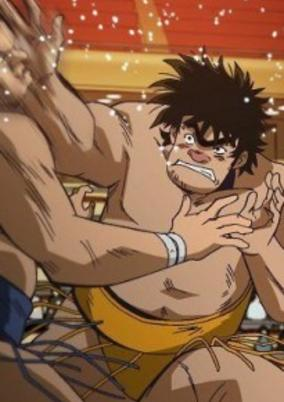

**Studio:** Toei Animation &nbsp;|&nbsp; **Director:** Yukio Kaizawa &nbsp;|&nbsp; **Aired/Released:** April 6 &nbsp;|&nbsp; **Genres:** Wrestling, Past, Historical, Absurdist Humour, Combat, Comedy, Sports

> Matsutarou Sakaguchi is a giant roughneck man with strength far beyond ordinary people. He never uttered words like "work hard," "strive," and "dream" like the typical shounen manga protagonist. However, he is stronger than anyone and peerless in sumo wrestling. His greatest weakness is his own carefree personality. He grows into a full-fledged sumo wrestler.
>
> _Synopsis source: Kitsu_

[Wikipedia](https://en.wikipedia.org/wiki/Rowdy_Sumo_Wrestler_Matsutaro!!) · [Kitsu](https://kitsu.io/anime/abarenbou-kishi-matsutarou)

---

### Ai Tenchi Muyo!

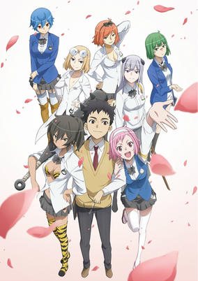

**Studio:** AIC Plus+ &nbsp;|&nbsp; **Director:** Hiroshi Negishi &nbsp;|&nbsp; **Aired/Released:** October 6 &nbsp;|&nbsp; **Genres:** All Girls School, Present, Earth, Japan, Asia, School Life, Science Fiction, Comedy

> The franchise is celebrating its 20th anniversary with this new project.Note: The recap episodes are not included in the main episode count, and are now included here.
>
> _Synopsis source: Kitsu_

[Wikipedia](https://en.wikipedia.org/wiki/Ai_Tenchi_Muyo!) · [Kitsu](https://kitsu.io/anime/ai-tenchi-muyo)

---

### Ai Mai Mi: Mousou Catastrophe (Ai-Mai-Mi)

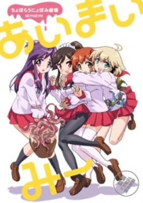

**Studio:** Seven &nbsp;|&nbsp; **Director:** Itsuki Imazaki &nbsp;|&nbsp; **Aired/Released:** July 8 &nbsp;|&nbsp; **Genres:** Japan, Present, Comedy, Asia, Earth, Absurdist Humour, Slapstick, Slice of Life

> The anime adaptation of the four-panel manga "Ai Mai Mii". The story follows girls in a manga club—Ai, Mai, Mii, and Ponoka-senpai—who might be fighting evil invaders threatening Earth, facing off against rivals in tournaments, and dealing with other absurd situations when they are not drawing manga.
>
> _Synopsis source: Kitsu_

[Wikipedia](https://en.wikipedia.org/wiki/Ai_Mai_Mi) · [Kitsu](https://kitsu.io/anime/ai-mai-mi)

---

### Aikatsu!

**Studio:** Sunrise &nbsp;|&nbsp; **Director:** Ryuichi Kimura &nbsp;|&nbsp; **Aired/Released:** October 2 &nbsp;|&nbsp; **Genres:** School Life, Music, Kids

> This season focuses on Akari Ozora, a first year at Starlight Academy who seeks to become a top idol like her upperclassman, Ichigo Hoshimiya. Akari gets a new roommate, Sumire the 'Ice Flower of the Stage' and later meets Hinaki who has been an rising idol since childhood.
>
> _Synopsis source: Kitsu_

[Wikipedia](https://en.wikipedia.org/wiki/Aikatsu!_(season_3)) · [Kitsu](https://kitsu.io/anime/aikatsu-3)

---

### Atelier Escha & Logy: Alchemists of the Dusk Sky

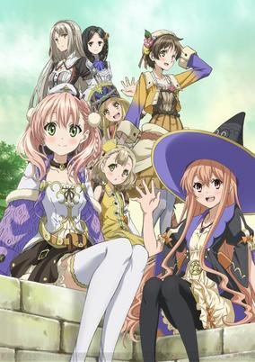

**Studio:** Studio Gokumi &nbsp;|&nbsp; **Director:** Yoshiaki Iwasaki &nbsp;|&nbsp; **Aired/Released:** April 10 &nbsp;|&nbsp; **Genres:** Fantasy World, Fantasy

> This world has gone through many Dusks, and is slowly nearing its end. Within this world, in the western reaches of the "Land of Dusk," there was a nation that prospered thanks to its use of alchemy. There, in order to survive the eventual arrival of the "Dusk End," the people devoted their efforts to rediscover and recreate lost alchemic technologies. Rediscovered technology from the past era was gathered in the alchemy research city known as "Central," where research was conducted on how to halt the advance of the twilight. One of the heroes is a young man who researched alchemy in Central, the other a girl living in a small town on the frontier. This girl's name is Escha. In the process of using her knowledge of ancient alchemy to help others, she was assigned to the Development Department. The young man's name is Logy. Having learned the newest alchemic techniques in Central, he requested a transfer to this understaffed town to make use of his abilities, and meets Escha when he is assigned to the Development Department as well. The two make a promise to use their alchemy together, and bring success to the Development Department.
>
> _Synopsis source: Kitsu_

[Kitsu](https://kitsu.io/anime/escha-logy-no-atelier-tasogare-no-sora-no-renkinjutsushi)

---

### Baby Gamba

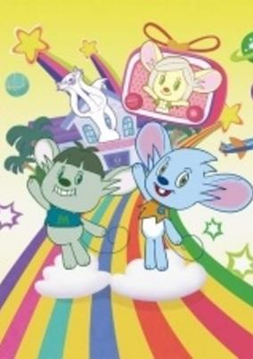

**Studio:** Shirogumi Inc. &nbsp;|&nbsp; **Director:** Tomohiro Kawamura &nbsp;|&nbsp; **Aired/Released:** July 19

> There is currently no synopsis for this title.
>
> _Synopsis source: Kitsu_

[Kitsu](https://kitsu.io/anime/baby-gamba)

---

### Barakamon

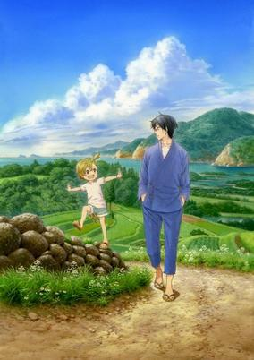

**Studio:** Kinema Citrus &nbsp;|&nbsp; **Director:** Masaki Tachibana &nbsp;|&nbsp; **Aired/Released:** July 6 &nbsp;|&nbsp; **Genres:** Present, Earth, Island, Countryside, Japan, Stereotypes, Asia, Comedy, Slice of Life, Friendship

> Seishuu Handa is an up-and-coming calligrapher: young, handsome, talented, and unfortunately, a narcissist to boot. When a veteran labels his award-winning piece as "unoriginal," Seishuu quickly loses his cool with severe repercussions. As punishment, and also in order to aid him in self-reflection, Seishuu's father exiles him to the Goto Islands, far from the comfortable Tokyo lifestyle the temperamental artist is used to. Now thrown into a rural setting, Seishuu must attempt to find new inspiration and develop his own unique art style—that is, if boisterous children (headed by the frisky Naru Kotoishi), fujoshi middle schoolers, and energetic old men stop barging into his house! The newest addition to the intimate and quirky Goto community only wants to get some work done, but the islands are far from the peaceful countryside he signed up for. Thanks to his wacky neighbors who are entirely incapable of minding their own business, the arrogant calligrapher learns so much more than he ever hoped to. [Written by MAL Rewrite]
>
> _Synopsis source: Kitsu_

[Wikipedia](https://en.wikipedia.org/wiki/Barakamon) · [Kitsu](https://kitsu.io/anime/barakamon)

---

### BeyWarriors: BeyRaiderz

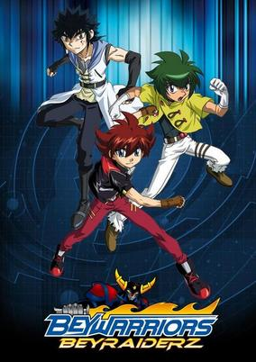

**Studio:** Nelvana , SynergySP , d-rights &nbsp;|&nbsp; **Director:** Katsumi Hasegawa &nbsp;|&nbsp; **Aired/Released:** January 4 &nbsp;|&nbsp; **Genres:** Comedy, Sports, Anime Influenced, Shounen

> In an unknown land, 6 guardian beasts provide protection and help cities to thrive through battles called BeyRaiderz. An unknown evil arises to take on the 6-guardian figures, forcing the six to unite together. At the end of the battle the land is protected, but the guardians fall into a slumber. This allows many natural disasters to occur causing the land to lose its beauty and the people to forget about BeyRaiderz battles. As the six guardian beasts begin to awaken, they call on six BeyWarriors from other lands. The six BeyWarriors are each given BeyRaiderz and charged with going from coliseum arena to coliseum arena to battle. Battling enough times will allow the spirits to reawaken, and it can't happen soon enough as the same darkness that caused them to unite is reawakening and threatens to destroy the world once more.
>
> _Synopsis source: Kitsu_

[Kitsu](https://kitsu.io/anime/beywarriors-beyraiderz)

---

### BeyWarriors: Cyborg

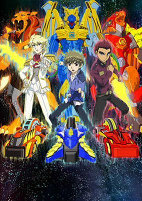

**Studio:** Nelvana, SynergySP, d-rights &nbsp;|&nbsp; **Director:** Kunihisa Sugishima &nbsp;|&nbsp; **Aired/Released:** October 18 &nbsp;|&nbsp; **Genres:** Comedy, Science Fiction, Sports, Action, Friendship, Adventure, Anime Influenced, Shounen

> The newest series of the Beyblade saga is BeyWarriors: Cyborg, warriors who resemble half-creatures and half-machines. Mysterious objects called "Beyraiderz" are found in the sanctuaries of Teslandia. The Cyborg Warriors transform the energy released from the sanctuaries into small objects called Tokens. Who will win more battles to collect the most amount of Tokens?
>
> _Synopsis source: Kitsu_

[Kitsu](https://kitsu.io/anime/beywarriors-cyborg)

---

### Black Butler: Book of Circus

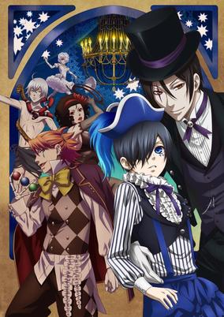

**Studio:** A-1 Pictures &nbsp;|&nbsp; **Director:** Noriyuki Abe &nbsp;|&nbsp; **Aired/Released:** July 10 &nbsp;|&nbsp; **Genres:** Detective, Super Power, Earth, United Kingdom, Europe, Action, Angst, Fantasy, Historical, Demon, Comedy, Shounen

> Full of wonder and excitement, the Noah's Arc Circus troupe has captured audiences with their dazzling performances. Yet these fantastic acts don't come without a price. Children have mysteriously gone missing around London, correlating to that of the groups' movements. Unsettled by these kidnappings, Queen Victoria sends in her notorious guard dog, Ciel Phantomhive, and his ever-faithful demon butler, Sebastian Michaelis, on an undercover mission to find these missing children. Trying to balance their new circus acts with their covert investigation under the big top, however, proves to be quite a challenge. With the other performers growing suspicious and the threat of the circus' mysterious benefactor looming overhead, what the two discover will shake Ciel to his very core. [Written by MAL Rewrite]
>
> _Synopsis source: Kitsu_

[Kitsu](https://kitsu.io/anime/black-butler-book-of-circus)

---

### Blade & Soul

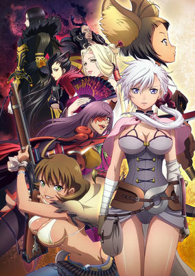

**Studio:** Gonzo &nbsp;|&nbsp; **Director:** Hiroshi Takeuchi, Hiroshi Hamasaki &nbsp;|&nbsp; **Aired/Released:** April 3 &nbsp;|&nbsp; **Genres:** Action, Revenge, Martial Arts, Fantasy, Adventure

> Alka is an assassin for the Clan of the Sword. She's on a journey to find the woman Jin Valel, who killed her master Hon without feeling—not unlike how Alka has learned to kill in her work as an assassin. On her journey, Alka encounters three strange women, each a great warrior in her own right and grapples with her slain master's wish that she leaves the life of an assassin behind.
>
> _Synopsis source: Kitsu_

[Wikipedia](https://en.wikipedia.org/wiki/Blade_%26_Soul) · [Kitsu](https://kitsu.io/anime/blade-and-soul)

---

### Blade Dance of the Elementalers

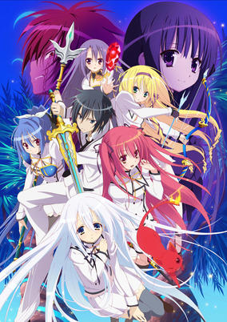

**Studio:** TNK &nbsp;|&nbsp; **Director:** Tetsuya Yanagisawa &nbsp;|&nbsp; **Aired/Released:** July 14 &nbsp;|&nbsp; **Genres:** Comedy, Action, Fantasy, Romance, Stereotypes, Harem, Ecchi, School Life

> Seirei Tsukai no Blade Dance takes place at a very prestigious school for holy shrine princesses called Areishia Spirit Academy. At this school, the girls train to be elementalists and try to form slave contracts with spirits so that they can compete in battles against one another. Only females have this privilege... at least until now. Kamito Kazehaya is a normal guy in pretty much all respects except for the fact that he's the first man in 1,000 years to be able to form a contract with a spirit (which he "stole" from a shrine princess named Claire Rouge). Additionally, the headmaster of the school, Greyworth, has summoned him to enroll and is forcing him to participate in a special tournament that will take place two months down the road. With Claire demanding that he become her contracted spirit, will Kamito even manage to survive the entire two months until the tournament takes place?
>
> _Synopsis source: Kitsu_

[Wikipedia](https://en.wikipedia.org/wiki/Bladedance_of_Elementalers) · [Kitsu](https://kitsu.io/anime/seirei-tsukai-no-blade-dance)

---

### Blue Spring Ride

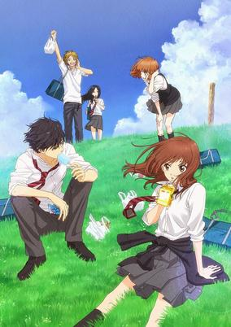

**Studio:** Production I.G &nbsp;|&nbsp; **Director:** Ai Yoshimura &nbsp;|&nbsp; **Aired/Released:** July 7 &nbsp;|&nbsp; **Genres:** High School, Present, Earth, Japan, Plot Continuity, Asia, Romance, Friendship, School Life, Comedy, Slice of Life

> Futaba Yoshioka used to be an attractive and popular middle-schooler—well liked by the opposite sex, but ostracized by the girls. Nevertheless, she was able to brush all that off, because the only opinion that truly mattered to her was that of Kou Tanaka, a classmate with whom she shared a shelter from rain once, followed by quite a few other precious and significant memories. She even succeeded at making plans to meet with the quiet and innocent boy at the summer festival, but a simple misunderstanding, and Tanaka's subsequent disappearance, left her walking the halls of her school friendless. Now in high school, Futaba is not your typical adolescent girl. Determined to become a class favorite this time, she avoids all unwanted attention and, instead of acting cute and feminine, only stands out through her tomboyish behavior and disheveled look. But still, her world is soon turned upside down when the only boy she ever liked unexpectedly comes into her life once again—except he goes by the name of Kou Mabuchi now, and it is not his name alone that has gone through a sea change. [Written by MAL Rewrite]
>
> _Synopsis source: Kitsu_

[Wikipedia](https://en.wikipedia.org/wiki/Blue_Spring_Ride) · [Kitsu](https://kitsu.io/anime/ao-haru-ride)

---

### BONJOUR Sweet Love Patisserie (Bonjour♪Sweet Love Patisserie)

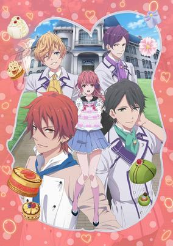

**Studio:** Silver Link, Connect &nbsp;|&nbsp; **Director:** Noriaki Akitaya &nbsp;|&nbsp; **Aired/Released:** October 10 &nbsp;|&nbsp; **Genres:** Bishounen, Reverse Harem, Cooking, Comedy, Romance, Harem, Slice of Life

> Sayuri Haruno dreams of becoming a pastry chef and enrolls in Fleurir Confectionary Academy, an elite school located in Tokyo's trendy Aoyama district. At Fleurir, she finds herself surrounded by charming boys, each one distinctly unique. Out of the entire class, Ryou Kouzuki's desire to become a pastry chef is the strongest. Blessed with unparalleled technique, instructor Mitsuki Aoi acts like a prince and is hugely popular at the school. Gilbert Hanafusa, the mood maker of the bunch, is a student from France. Yoshinosuke Suzumi is not very good at expressing his feelings, but underneath his stony exterior lies a wholehearted passion for wagashi (Japanese sweets). As Sayuri pours her heart and soul into making her dream a reality, she encounters many happenings...
>
> _Synopsis source: Kitsu_

[Wikipedia](https://en.wikipedia.org/wiki/Bonjour_Sweet_Love_Patisserie) · [Kitsu](https://kitsu.io/anime/bonjour-koiaji-patisserie)

---

### Bottom Biting Bug (Bottom Biting Bug 2)

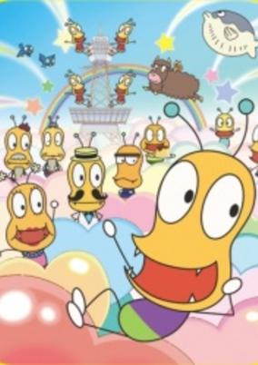

**Studio:** Kinema Citrus &nbsp;|&nbsp; **Director:** Kaori, Masatsugu Arakawa &nbsp;|&nbsp; **Aired/Released:** June 6 &nbsp;|&nbsp; **Genres:** Comedy, Kids

> Continuation of the gag comedy about Oshiri Kajiri Mushi XVIII, a 10-year-old insect who goes to Biting School to inherit his family's Biting Shop business.
>
> _Synopsis source: Kitsu_

[Wikipedia](https://en.wikipedia.org/wiki/Oshiri_Kajiri_Mushi) · [Kitsu](https://kitsu.io/anime/oshiri-kajiri-mushi-2)

---

### Broken Blade

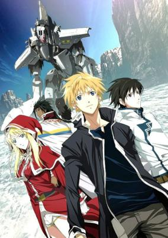

**Studio:** Production I.G , Xebec &nbsp;|&nbsp; **Director:** Nobuyoshi Habara &nbsp;|&nbsp; **Aired/Released:** April 6 &nbsp;|&nbsp; **Genres:** Magic, Gunfights, Swordplay, Fantasy World, Mecha, Piloted Robot, Action, Fantasy, War, Military

> In the continent of Cruzon, an impending war between the Kingdom of Krisna and the nation of Athens is brimming. The people of this land are able to use quartz for whatever purpose they desire. Yet one person, Rygart Arrow, is not. He is an "un-sorcerer," a person unable to use quartz. But this characteristic will enable him to pilot an ancient Golem, one strong enough to put up a fight against the invading army of Athens.
>
> _Synopsis source: Kitsu_

[Wikipedia](https://en.wikipedia.org/wiki/Broken_Blade) · [Kitsu](https://kitsu.io/anime/break-blade-tv)

---

### Calimero

**Studio:** Gaumont Animation [ citation needed ] &nbsp;|&nbsp; **Aired/Released:** June 7

[Wikipedia](https://en.wikipedia.org/wiki/Calimero)

---

### Cardfight!! Vanguard G

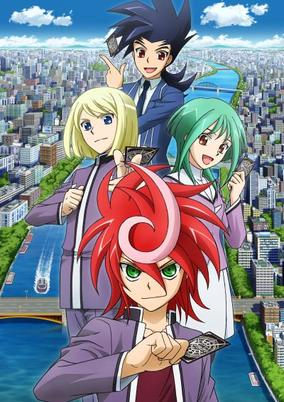

**Studio:** TMS Entertainment, Sotsu, Dentsu &nbsp;|&nbsp; **Director:** Yui Umemoto &nbsp;|&nbsp; **Aired/Released:** October 26 &nbsp;|&nbsp; **Genres:** Card Games, Action

> Taking place after a three-year time skip, the series will follow Shindou Kurono, Kiba Shion, and Anjou Tokoha as the new protagonists of G. Kurono uses the never-before-seen clan Gear Chronicle, which brings together the destinies of these three toward an "impossible future, an impossible self signifying 'Generation.'"
>
> _Synopsis source: Kitsu_

[Wikipedia](https://en.wikipedia.org/wiki/Cardfight!!_Vanguard_G) · [Kitsu](https://kitsu.io/anime/cardfight-vanguard-g)

---

### Cardfight!! Vanguard: Legion Mate (Cardfight!! Vanguard Legion Mate)

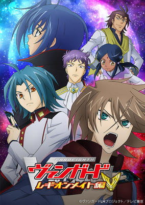

**Studio:** TMS/Double Eagle &nbsp;|&nbsp; **Director:** Hatsuki Tsuji &nbsp;|&nbsp; **Aired/Released:** March 9 &nbsp;|&nbsp; **Genres:** Action, Adventure, Proxy Battles, Card Games, Demon

> Several days after the mortal battle against Link Joker which embroils the whole world, the world has returned to peace. But Kai Toshiki faces a surprising situation. Sendou Aichi, the hero who saved the world from the invasion of Link Joker, has suddenly disappeared. In addition, everyone's memory about Aichi is lost...Almost all hints have been lost, and Kai starts to search Aichi with "Blaster Blade" and the deck of Royal Paladin, the only existing hint and the proof of their bonds. Kai is approached by fighters who call themselves "Quatre Knights". The four---Gaillard, Neve, Ratie and Sarah---are fighters with world-class power in vanguard fights. They control mysterious power and urge Kai to give up searching Aichi. What is their purpose...!? And what is their relationship with Aichi...!? Kai, with the new power "Legion" in his hand, fights to take Aichi back. Now, the war has begun!
>
> _Synopsis source: Kitsu_

[Kitsu](https://kitsu.io/anime/cardfight-vanguard-legion-mate-hen)

---

### Carino Coni

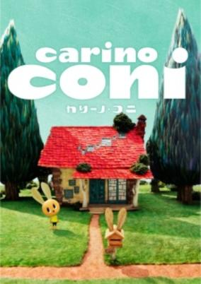

**Studio:** Robot [ citation needed ] &nbsp;|&nbsp; **Director:** Yuuichi Abe &nbsp;|&nbsp; **Aired/Released:** April 2 &nbsp;|&nbsp; **Genres:** Fantasy, Kids

> A shy little Carino Coni is a rabbit boy who just started to live alone in the forest away from his family. Everyday Coni's heart raises with joy playing with his siblings who lives nearby, but suddenly cries of lonesomeness, which he cannot explain. This story is about all heart warming stories Coni encounters, and how he himself become not so lonely anymore as he gradually grows up.
>
> _Synopsis source: Kitsu_

[Kitsu](https://kitsu.io/anime/carino-coni)

---

### La Corda d'Oro Blue Sky (La corda d'oro: Blue♪Sky)

**Studio:** TYO Animations &nbsp;|&nbsp; **Director:** Kōjin Ochi &nbsp;|&nbsp; **Aired/Released:** April 5 &nbsp;|&nbsp; **Genres:** Bishounen, High School, Reverse Harem, Music, Harem, School Life, The Arts

> Soon after transferring to Seisou Gakuin, Kanade finds the orchestra club in the middle of preparing for the National concur. Teaming up with the other members, she will improve her skills, meet new rivals and create memories for what will become an unforgettable summer...
>
> _Synopsis source: Kitsu_

[Wikipedia](https://en.wikipedia.org/wiki/La_Corda_d%27Oro_Blue_Sky) · [Kitsu](https://kitsu.io/anime/kiniro-no-corda-blue-sky)

---

### CROSS ANGE Rondo of Angel and Dragon (Cross Ange: Rondo of Angels and Dragons)

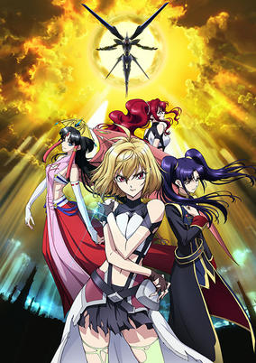

**Studio:** Sunrise &nbsp;|&nbsp; **Director:** Yoshiharu Ashino &nbsp;|&nbsp; **Aired/Released:** October 5 &nbsp;|&nbsp; **Genres:** Dragon, Mecha, Transforming Craft, Violence, Shoujo Ai, Science Fiction, Dystopia, Action

> The royal life of Princess Angelise Ikaruga Misurugi was as idyllic as the life of a sixteen-year-old princess could be. Beautiful, talented, athletic, loved by her people, and soon to be baptized in honor of her ascension to the throne of the Misurugi Empire, Angelise had everything. Even her kingdom was in a blissful age of peace and prosperity thanks to the utilization of an extremely advanced technology materialization force known as "mana." However, everything Angelise has come to know soon crashes to the ground around her after she is revealed to be a "norma," a member of society resistant to the effects of mana and unable to use it herself. Just like the rest of the norma, Angelise is arrested and removed from society. Now she's being forced to work as a soldier based out of the prison camp, Arzenal, and fly a transforming robotic vehicle called a "Paramail." To survive, Angelise will have to adapt to several different aspects of her new life in Cross Ange: Tenshi to Ryuu no Rondo, coping with prison society, relationships with other "norma" women, and piloting her Paramail against giant beasts known as DRAGONs. Will revenge be a great enough motive to encourage her to overcome these challenges? Or will the hate for those that betrayed her tear her apart in the process?
>
> _Synopsis source: Kitsu_

[Wikipedia](https://en.wikipedia.org/wiki/Cross_Ange) · [Kitsu](https://kitsu.io/anime/cross-ange-tenshi-to-ryuu-no-rinbu)

---

### Dragon Ball Z Kai: The Final Chapters

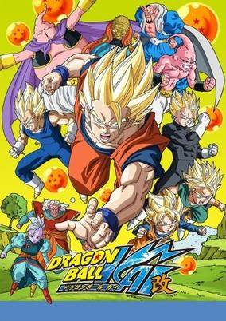

**Studio:** Toei Animation &nbsp;|&nbsp; **Director:** Yasuhiro Nowatari &nbsp;|&nbsp; **Aired/Released:** April 6 &nbsp;|&nbsp; **Genres:** Cyborg, Alien, Martial Arts, Super Power, Human Enhancement, Space Travel, Violence, Humanoid Alien, Action, Science Fiction

> Remastered version of the Majin Buu saga that adheres more to the manga's story. Note: Only 61 episodes were released in Japan. International Broadcast had 69. Episode count on this page Represents International count.
>
> _Synopsis source: Kitsu_

[Wikipedia](https://en.wikipedia.org/wiki/Dragon_Ball_Z_Kai) · [Kitsu](https://kitsu.io/anime/dragon-ball-kai-2014)

---

### Dragon Collection

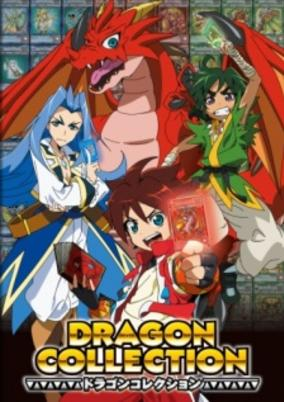

**Studio:** OLM &nbsp;|&nbsp; **Director:** Keiichiro Kawaguchi &nbsp;|&nbsp; **Aired/Released:** April 7 &nbsp;|&nbsp; **Genres:** Proxy Battles, Fantasy

> Through an unexpected turn of events, an ordinary elementary school student, Hiro Enryuu, finds himself in the world of the "Dragon Collection" game. This is a world called Dragon Earth, where gods, humans, and monsters exist side by side. Those who roam this world using a magic book, called a Grimoire, and cards to summon monsters and search for treasures that bear the powers of dragons are called Dracolle Battlers. Despite his bewilderment, Hiro becomes a Dracolle Battler and, together with the friends he meets there, begins his adventure to become a legendary Dragon Master!
>
> _Synopsis source: Kitsu_

[Wikipedia](https://en.wikipedia.org/wiki/Dragon_Collection) · [Kitsu](https://kitsu.io/anime/dragon-collection)

---

### Dramatical Murder

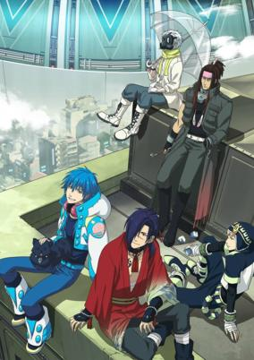

**Studio:** NAZ &nbsp;|&nbsp; **Director:** Kazuya Miura &nbsp;|&nbsp; **Aired/Released:** July 6 &nbsp;|&nbsp; **Genres:** Shounen Ai, Virtual Reality, Science Fiction, Super Power, Action, Psychological

> Some time ago, the influential and powerful Toue Inc. bought the island of Midorijima, Japan, with the plans of building Platinum Jail—a luxurious utopian facility. Those who are lucky enough to call it home are the wealthiest citizens in the world. The original residents of the island, however, were forced to relocate to the Old Residential District; and after the completion of Platinum Jail, they were completely abandoned. "Rib" and "Rhyme" are the most common games played on the island. Rib is an old school game in which gangs engage in turf wars against each other, while Rhyme is a technologically advanced game wherein participants fight in a virtual reality. To be able to play Rhyme, you must have an "All-Mate" (an AI that typically looks like a pet), and the match must be mediated by an "Usui." Aoba Seragaki has no interest in playing either game; he prefers to live a peaceful life with his grandmother and All-Mate, Ren. However, after getting forcefully dragged into a dangerous Rhyme match and hearing rumors about disappearing Rib players, all of Aoba's hopes of living a normal life are completely abolished. [Written by MAL Rewrite]
>
> _Synopsis source: Kitsu_

[Wikipedia](https://en.wikipedia.org/wiki/Dramatical_Murder) · [Kitsu](https://kitsu.io/anime/dramatical-murder)

---

### Duel Masters VS

**Studio:** Ascension &nbsp;|&nbsp; **Director:** Shinobu Sasaki &nbsp;|&nbsp; **Aired/Released:** April 5

[Wikipedia](https://en.wikipedia.org/wiki/Duel_Masters)

---

### Fate/kaleid liner Prisma Illya 2wei!

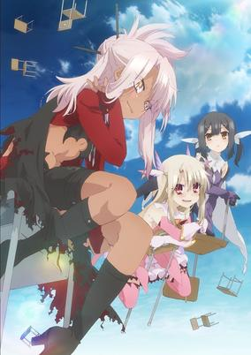

**Studio:** Silver Link &nbsp;|&nbsp; **Director:** Shin Ōnuma, Masato Jinbo &nbsp;|&nbsp; **Aired/Released:** July 10 &nbsp;|&nbsp; **Genres:** Elementary School, Magic, Magical Girl, Present, Earth, Contemporary Fantasy, Japan, Plot Continuity, Asia, Action, Fantasy, Comedy, School Life

> The magical girls are back, and ready for another round of adventure! After successfully recovering the Class Cards, fifth graders-turned magical girls Illya and Miyu think they can finally take it easy. But as fate would have it, the girls are once again called back into active duty when they find out that the Cards have left some very nasty side effects on their world. However, their seemingly easy mission goes totally awry with the appearance of a dark stranger who looks just like Illya! Who is this new but familiar face, where did she come from, and what does she want from Illya? With the arrival of this new foe, it seems like Illya's finally met her match when her everyday life takes one dark turn!
>
> _Synopsis source: Kitsu_

[Wikipedia](https://en.wikipedia.org/wiki/Fate/kaleid_liner_Prisma_Illya_2wei) · [Kitsu](https://kitsu.io/anime/fate-kaleid-liner-prisma-illya-2wei)

---

### The File of Young Kindaichi Returns

**Studio:** Toei Animation &nbsp;|&nbsp; **Director:** Yutaka Tsuchida &nbsp;|&nbsp; **Aired/Released:** April 5

[Wikipedia](https://en.wikipedia.org/wiki/The_Kindaichi_Case_Files)

---

### Francesca: Girls Be Ambitious (Hungry Zombie Francesca)

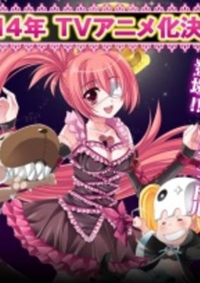

**Studio:** Telecom Animation Film &nbsp;|&nbsp; **Director:** Hitoshi Kumagai, Yuichiro Yano &nbsp;|&nbsp; **Aired/Released:** July 6 &nbsp;|&nbsp; **Genres:** Zombie, Idol, Earth, Japan, Music, Asia, Fantasy, The Arts, Comedy

> Hokkaido is being targeted by Hijikata Toshizou and the rest of the Shinsengumi who have awakened from their eternal slumber. The little girl Exorcist fights to stop them and protect Hokkaido from a hurricane of ambition. In the midst of this, undead idol Francesca awakens to help protect the area of Japan as well.
>
> _Synopsis source: Kitsu_

[Kitsu](https://kitsu.io/anime/francesca-girls-be-ambitious)

---

### Free! Eternal Summer (Free! - Eternal Summer)

**Studio:** Kyoto Animation, Animation Do &nbsp;|&nbsp; **Director:** Hiroko Utsumi &nbsp;|&nbsp; **Aired/Released:** July 2 &nbsp;|&nbsp; **Genres:** Bishounen, High School, Present, Earth, School Clubs, Japan, Plot Continuity, Asia, Friendship, School Life, Sports, Comedy, Slice of Life

> The Iwatobi Swim Club returns! As their third year begins, Haruka, Makoto and Rin are still swimming strong, but choosing plans for their futures loom, and as friends both new and old make their way into the picture, rivalries will take root once again. Will the team make it out stronger than before or sink under pressure?
>
> _Synopsis source: Kitsu_

[Wikipedia](https://en.wikipedia.org/wiki/Free!_-_Eternal_Summer) · [Kitsu](https://kitsu.io/anime/free-eternal-summer)

---

### The Fruit of Grisaia

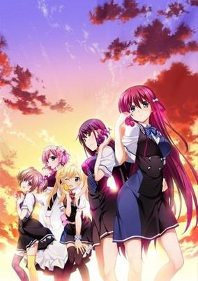

**Studio:** 8-Bit &nbsp;|&nbsp; **Director:** Tensho &nbsp;|&nbsp; **Aired/Released:** October 5 &nbsp;|&nbsp; **Genres:** Asia, Japan, Comedy, Earth, Romance, Angst, Drama, School Life, Harem, Psychological

> Yuuji Kazami is a transfer student who has just been admitted into Mihama Academy. He wants to live an ordinary high school life, but this dream of his may not come true any time soon as Mihama Academy is quite the opposite. Consisting of only the principal and five other students, all of whom are girls, Yuuji becomes acquainted with each of them, discovering more about their personalities as socialization is inevitable. Slowly, he begins to learn about the truth behind the small group of students occupying the academy—they each have their own share of traumatic experiences which are tucked away from the world. Mihama Academy acts as a home for these girls, they are the "fruit" which fell from their trees and have begun to decay. It is up to Yuuji to become the catalyst to save them from themselves, but how can he save another when he cannot even save himself? [Written by MAL Rewrite]
>
> _Synopsis source: Kitsu_

[Wikipedia](https://en.wikipedia.org/wiki/The_Fruit_of_Grisaia) · [Kitsu](https://kitsu.io/anime/grisaia-no-kajitsu)

---

### Ganbare! Lulu Lolo - Tiny Twin Bears (TINY★TWIN★BEARS)

**Studio:** Fanworks &nbsp;|&nbsp; **Director:** Yūji Umoto &nbsp;|&nbsp; **Aired/Released:** September 26 &nbsp;|&nbsp; **Genres:** Slice of Life, Kids

> The new anime centers around the daily life of two twin bear sisters: the orange-colored Lulu and the yellow-colored Lolo. The two take on new jobs and despite the occasional failure and tears, give their best efforts.
>
> _Synopsis source: Kitsu_

[Kitsu](https://kitsu.io/anime/ganbare-lulu-lolo)

---

### Gigant Shooter Tsukasa

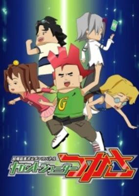

**Studio:** Fanworks, Forest Hunting One &nbsp;|&nbsp; **Director:** Ryōichi Mori &nbsp;|&nbsp; **Aired/Released:** April 1 &nbsp;|&nbsp; **Genres:** Comedy, Virtual Reality, Action, Kids

> The anime follows Tsukasa, whose dream is to become the best at Gigant Shooter (battles in a game similar to pog) in the world. The menko card his father left for him called King Menger is his partner. Tsukasa's fellow gamers are the cute but tsundere Koide Miruko, the spectacled bully Numata Manabu, and the realist and sharp-tongued Doumoto Ataru.
>
> _Synopsis source: Kitsu_

[Wikipedia](https://en.wikipedia.org/wiki/Gigant_Shooter_Tsukasa) · [Kitsu](https://kitsu.io/anime/choubakuretsu-ijigen-menko-battle-gigant-shooter-tsukasa)

---

### Glasslip

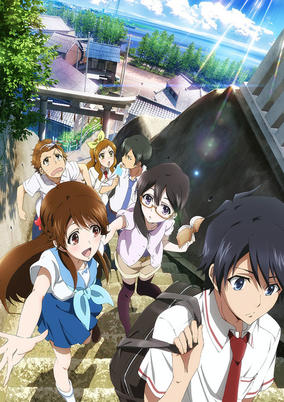

**Studio:** P.A. Works &nbsp;|&nbsp; **Director:** Junji Nishimura &nbsp;|&nbsp; **Aired/Released:** July 3 &nbsp;|&nbsp; **Genres:** Present, Earth, Japan, Slow When It Comes To Love, Love Polygon, Asia, Romance, Coming Of Age, Slice of Life

> What if you hold the power to hear the voices or see fragments of images from the future? Would that be a good thing or a bad thing? Glasslip follows the life of Touko Fukami, an aspiring glass artist born from a glass artisan family. She enjoys her worry-free life in Fukui, save for the fragments of images that she sees on occasion. On her 18th summer, she meets the transfer student Kakeru Okikura at her school, and then again at her favorite café called Kazemichi together with all four of her friends. The voices from the future lead Kakeru to Touko, and his arrival disrupts her mediocre existence. All six of the friends must face their most unforgettable summer full of hope, affection, and heartache.
>
> _Synopsis source: Kitsu_

[Wikipedia](https://en.wikipedia.org/wiki/Glasslip) · [Kitsu](https://kitsu.io/anime/glasslip)

---

### Go-Go Tamagotchi!

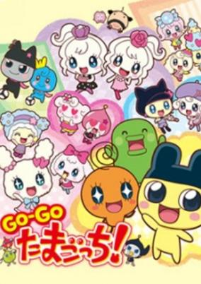

**Studio:** OLM &nbsp;|&nbsp; **Director:** Jouji Shimura &nbsp;|&nbsp; **Aired/Released:** April 3 &nbsp;|&nbsp; **Genres:** Fantasy, Comedy, Kids

> New series of Tamagotchi!.
>
> _Synopsis source: Kitsu_

[Kitsu](https://kitsu.io/anime/go-go-tamagotchi)

---

### GraP & RodeO

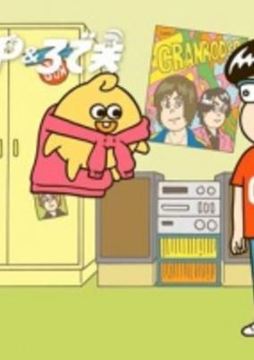

**Studio:** Pie in the Sky &nbsp;|&nbsp; **Director:** Taketo Shinkai &nbsp;|&nbsp; **Aired/Released:** October 20 &nbsp;|&nbsp; **Genres:** Comedy, Music

> Rodeo is a normal high school boy who aims to be like GRANRODEO. Gra-P, a self-proclaimed music producer who comes from the future, tries to help him.
>
> _Synopsis source: Kitsu_

[Kitsu](https://kitsu.io/anime/gra-p-rodeo)

---

### Gundam Build Fighters Try

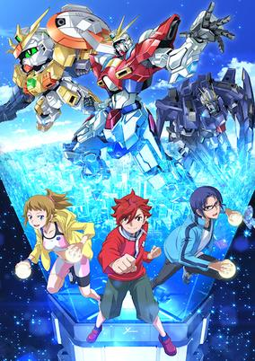

**Studio:** Sunrise &nbsp;|&nbsp; **Director:** Shinya Watada &nbsp;|&nbsp; **Aired/Released:** October 8 &nbsp;|&nbsp; **Genres:** Mecha, Proxy Battles, Action, Science Fiction

> The story of Gundam Build Fighters Try is set 7 years after the end of the 1st series. Now Seiho Academy's Gunpla Battle Club has only one member, Hoshino Fumina, who is a third grade student in junior high. As the president of the club, she needs two more members to participate in the upcoming All-Japan Gunpla Battle Championships. One day she encounters a transfer student named Kamiki Sekai, who has traveled around for Kenpo training with his master. Then joining by a young Gunpla builder Kousaka Yuuma, their challenge to the Gunpla Battle begins....
>
> _Synopsis source: Kitsu_

[Wikipedia](https://en.wikipedia.org/wiki/Gundam_Build_Fighters_Try) · [Kitsu](https://kitsu.io/anime/gundam-build-fighters-try)

---

### Gundam Reconguista in G

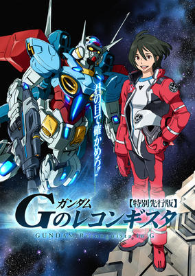

**Studio:** Sunrise &nbsp;|&nbsp; **Director:** Yoshiyuki Tomino &nbsp;|&nbsp; **Aired/Released:** October 2 &nbsp;|&nbsp; **Genres:** Robot, Future, Mecha, Piloted Robot, Science Fiction, Space, Action

> In the 1014th year of the Regild Century, humanity has seemingly prospered after previous centuries of war. This is due to the ability to harvest power through the use of photon batteries, and an orbital elevator known as the Capital Tower, which has become something of a religious icon for the new age. However, various threats to the Capital Tower have necessitated the creation of an academy meant to teach promising students how to defend and repair it, named the Capital Guard Academy.Gundam G no Reconguista begins with Bellri Zenam, a student at the Capital Guard Academy, and his classmates undergoing a practical exercise in repairing the Umbilical Cable of the Central Tower. Unluckily for them, they get attacked by the mobile suit known as "G-Self," piloted by the female space pirate, Aida. Though Bellri and his classmates manage to capture her and the mobile suit, the Capital Guard Academy also comes under attack shortly afterwards, and they are quickly overwhelmed. Realizing that they need the power of the G-Self to defend their home, Bellri hops into the cockpit and heads into action himself in an attempt to defend his friends and home.
>
> _Synopsis source: Kitsu_

[Wikipedia](https://en.wikipedia.org/wiki/Gundam_Reconguista_in_G) · [Kitsu](https://kitsu.io/anime/gundam-g-no-reconguista)

---

### Hero Bank (Herobank)

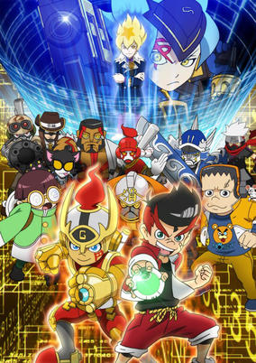

**Studio:** TMS Entertainment &nbsp;|&nbsp; **Director:** Yasutaka Yamamoto &nbsp;|&nbsp; **Aired/Released:** April 7 &nbsp;|&nbsp; **Genres:** Virtual Reality, Kids

> In Big Money City, players participate in "Hero Battles" using Bankfon Gs, which allows them to rent powerful hero suits and fight battles against other players, receiving power boosts from the system's public domain feature. Kaito Goushou, a young elementary school student who is always eager to help others, ends up hastily signing a contract to rent the powerful unlisted hero suit, "Enter the Gold," from a mysteriously seedy priest named Sennen; however, he soon learns that the suit comes with a debt of 10 billion yen, and Kaito must now clear his dues by winning Hero Battles.
>
> _Synopsis source: Kitsu_

[Wikipedia](https://en.wikipedia.org/wiki/Hero_Bank) · [Kitsu](https://kitsu.io/anime/hero-bank)

---

### Hi-sCool! Seha Girls (Hi☆sCoool! SeHa Girls)

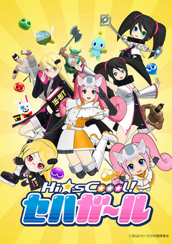

**Studio:** TMS Entertainment &nbsp;|&nbsp; **Director:** Sōta Sugawara &nbsp;|&nbsp; **Aired/Released:** October 8 &nbsp;|&nbsp; **Genres:** Parody, Virtual Reality, Comedy, School Life

> The story of the anime will revolve around Dreamcast, Sega Saturn, and Mega Drive, who have just enrolled in SeHaGaga Academy at Tokyo's Haneda Ōtorii station. They are given an assignment needed to graduate by a suspicious teacher, and to clear this assignment, the girls need to enter the world of Sega games. The girls must try their best to graduate without incident.
>
> _Synopsis source: Kitsu_

[Wikipedia](https://en.wikipedia.org/wiki/Hi-sCoool!_SeHa_Girls) · [Kitsu](https://kitsu.io/anime/sega-hard-girls)

---

### Secret Princess Himegoto [ 8 ]

**Studio:** Asahi Production &nbsp;|&nbsp; **Director:** Yūji Yanase &nbsp;|&nbsp; **Aired/Released:** July 7 &nbsp;|&nbsp; **Genres:** Present, High School, Cross Dressing, Absurdist Humour, Japan, Stereotypes, Asia, Parental Abandonment, Student Government, Earth, Comedy, School Life

> The main protagonist of Himegoto, Arikawa Hime, is in serious trouble. He’s being pursued by loan sharks for the debt his parents left him with. That is, until the Shimoshina High School student council steps in to bail him out. These "kind" girls help Hime by paying off his debt and accepting him into the student council… as a beautiful girl, that is! Hime just happened to be wearing a French maid outfit when the council came across him, and now they won’t have him any other way. In return for paying off his debt, Hime must dress as a girl and be the council’s pet dog for the rest of his high school years. Still, things could be worse. After all, Hime is now surrounded by beautiful girls who constantly dote on him, expose him, and do naughty things to him. Thankfully, Hime has at least one person trying to get him out of this predicament: his little brother, who also happens to cross-dress. And then, of course, there’s the head of the disciplinary committee, who is… another cross-dressing boy!? This is getting ridiculous!
>
> _Synopsis source: Kitsu_

[Wikipedia](https://en.wikipedia.org/wiki/Himegoto) · [Kitsu](https://kitsu.io/anime/himegoto)

---

### Secret Society Eagle Talon Extreme [ 9 ]

**Studio:** DLE &nbsp;|&nbsp; **Director:** FROGMAN &nbsp;|&nbsp; **Aired/Released:** April

---

### I Can't Understand What My Husband Is Saying

**Studio:** Seven &nbsp;|&nbsp; **Director:** Shinpei Nagai &nbsp;|&nbsp; **Aired/Released:** October 3 &nbsp;|&nbsp; **Genres:** Present, Earth, Japan, Asia, Comedy, Slice of Life

> Though they couldn't be any more different, love has managed to blossom between Hajime Tsunashi, a hardcore otaku who shuts himself in at home while making a living off his blog, and his wife Kaoru—a hard-working office lady who, in contrast, is fairly ordinary, albeit somewhat of a crazy drunk. As this unlikely couple discovers, love is much more than just a first kiss or a wedding; the years that come afterward in the journey of marriage brings with it many joys as well as challenges. Whether due to their quirky personalities or the peculiar people surrounding them, Hajime and Kaoru find themselves caught up in a variety of baffling and ridiculous antics. But despite the struggles they face, the love that ties them together spurs them to move forward and strive to become better people in order to bring their partner happiness. [Written by MAL Rewrite]
>
> _Synopsis source: Kitsu_

[Wikipedia](https://en.wikipedia.org/wiki/I_Can%27t_Understand_What_My_Husband_Is_Saying) · [Kitsu](https://kitsu.io/anime/danna-ga-nani-wo-itteiru-ka-wakaranai-ken)

---

### Initial D: Final Stage

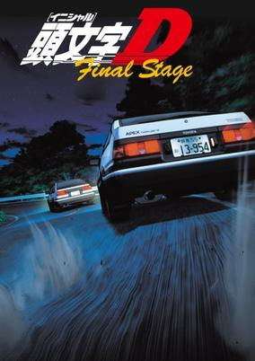

**Studio:** SynergySP &nbsp;|&nbsp; **Director:** Mitsuo Hashimoto &nbsp;|&nbsp; **Aired/Released:** May 16 &nbsp;|&nbsp; **Genres:** Present, Earth, Japan, Motorsport, Street Racing, Plot Continuity, Asia, Sports, Drifting, Seinen

> After defeating every racing team in the prefecture, everything comes down to one last race. Takumi Fujiwara has never lost a race, but when his opponent is also using an AE86, it turns into a battle of the AE86. Will Project D succeed in the final and most difficult race of Initial D?
>
> _Synopsis source: Kitsu_

[Wikipedia](https://en.wikipedia.org/wiki/Initial_D) · [Kitsu](https://kitsu.io/anime/initial-d-final-stage)

---

### Insufficient Direction

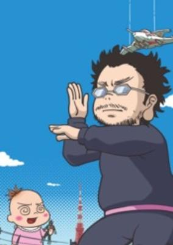

**Studio:** DLE &nbsp;|&nbsp; **Director:** Azuma Tani &nbsp;|&nbsp; **Aired/Released:** April 3 &nbsp;|&nbsp; **Genres:** Present, Earth, Japan, Asia, Comedy, Slice of Life

> This is the anime adaptation of Kantoku Fuyuki Todoki (Insufficient Direction), the first essay manga by the "queen of the manga world," Moyoco Anno. The comedic and heartwarming autobiographical story follows her everyday married "otaku lifestyle" with Hideaki Anno, "the founder of the otaku cult."
>
> _Synopsis source: Kitsu_

[Kitsu](https://kitsu.io/anime/kantoku-fuyuki-todoki)

---

### Invaders of the Rokujyōma!? (Invaders of the Rokujyoma!?)

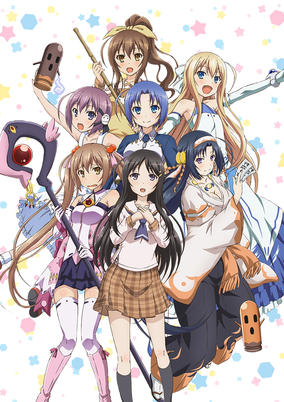

**Studio:** Silver Link &nbsp;|&nbsp; **Director:** Shin Ōnuma &nbsp;|&nbsp; **Aired/Released:** July 11 &nbsp;|&nbsp; **Genres:** Earth, Absurdist Humour, Parody, Japan, Fantasy, Comedy, Ecchi, Friendship, School Life, Romance, Harem

> After his father is transferred away for work, Koutarou must find a cheap place to live by himself while attending high school. He thinks that he's found just the place: Room 106 at Corona House. It's a small apartment, but it's only 5,000 yen a month rent, which is an impossibly cheap price! Add in the fact that he has a beautiful landlady and he thinks that he has it made－ at least until he starts to get some unexpected visitors. One night Koutarou is visited by various girls, including a ghost named Sanae, a magical girl named Yurika, a girl who lives underground named Kiriha, and a princess from outer space named Theiamillis. All four of them claim that they need to have his apartment for their own reasons and thus need him to leave immediately. But he's not willing to give up his cheap apartment without a fight! Before things can get too out of control, the landlady forces everyone to sign an agreement which states that they will all figure out who gets the apartment in a peaceful manner. Will Koutarou be forced out of his home before he can even finish putting his things away or will he be able to send his unwanted guests packing?
>
> _Synopsis source: Kitsu_

[Wikipedia](https://en.wikipedia.org/wiki/Rokujyoma_no_Shinryakusha) · [Kitsu](https://kitsu.io/anime/rokujouma-no-shinryakusha-tv)

---

### Jinsei - Life Consulting (JINSEI -Life Consulting-)

**Studio:** Feel &nbsp;|&nbsp; **Director:** Keiichiro Kawaguchi &nbsp;|&nbsp; **Aired/Released:** July 6 &nbsp;|&nbsp; **Genres:** High School, Present, Earth, Parody, School Clubs, Japan, Asia, Comedy, School Life, Slice of Life

> Yuuki Akamatsu, who is in the Kyuumon Gakuen Second News Club, is asked to become the counselor of the club immediately after joining the club by Ayaka Nikaidou, the club leader. Three girls currently give advice to issues sent in by the students: Rino Endou from the science stream, Fumi Kujou from the literary stream, and Ikumi Suzuki from the sports stream. However, the three always have different opinions and cannot get their views to agree, so they just try things out anyway...
>
> _Synopsis source: Kitsu_

[Wikipedia](https://en.wikipedia.org/wiki/Jinsei) · [Kitsu](https://kitsu.io/anime/jinsei)

---

### Keroro

**Studio:** Sunrise, Gathering &nbsp;|&nbsp; **Director:** Haruki Kasugamori &nbsp;|&nbsp; **Aired/Released:** March 22

[Wikipedia](https://en.wikipedia.org/wiki/Sgt._Frog)

---

### Konna Watashi-tachi ga Nariyuki de Heroine ni Natta Kekka www 'Narihero www'

**Studio:** Bouncy &nbsp;|&nbsp; **Director:** Sōta Sugahara [ citation needed ] &nbsp;|&nbsp; **Aired/Released:** October 6

---

### KutsuDaru.

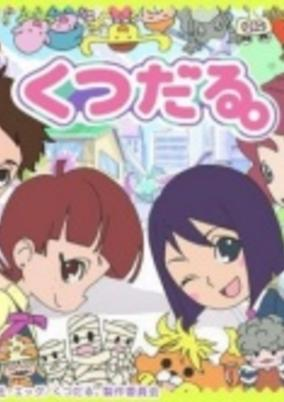

**Studio:** Studio Egg &nbsp;|&nbsp; **Director:** Taka Katou [ citation needed ] &nbsp;|&nbsp; **Aired/Released:** April 2 &nbsp;|&nbsp; **Genres:** School Life, Fantasy, Slice of Life, Kids

> In a Tokyo suburb small town, there lives a girl named Nekota Kaoru. Being born into a normal family, being raised in a normal way, this spring she'll become a normal happy middle-schooler. However, since young age, Nekota had an abnormal ability to see Imadoki youkai (Modern Monster). And she has kept it a secret from others...
>
> _Synopsis source: Kitsu_

[Kitsu](https://kitsu.io/anime/kutsudaru)

---

### Lady Jewelpet

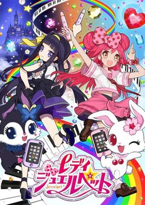

**Studio:** Zexcs , Studio Gallop &nbsp;|&nbsp; **Director:** Itsuro Kawasaki &nbsp;|&nbsp; **Aired/Released:** April 5 &nbsp;|&nbsp; **Genres:** Magic, Fantasy, Romance, Magical Girl

> Momona is an ordinary junior-high school student hailing from Jewel Land. At her cousin's wedding, she envies the bride, Lady Diana, due to the fact that she is marrying the cousin who she had a slight crush on. However, once she sees Lady Diana and her cousin together, Momona begins to like her, and accepts her as her cousin's bride. Just as Lady Diana is about to properly meet her and introduce herself, Momona is transported to a snowy place in Jewel Land where the ruler, Lady Jewel, is giving a speech to the Petit Ladies, girls who are chosen as Jewel Candidates to be the next Lady Jewel. Momona meets her partner and mentor, Ruby, a white rabbit, who will guide her through the tasks in becoming Lady Jewel. Whoever passes the most tasks wins and becomes the next Lady Jewel, but standing in her way is Lillian, a girl who also aims to win the title of Lady Jewel, so she can choose her brother, Cayenne, to be her King alongside her. Momona soon also begins to fall in love with Cayenne, yet Lillian doesn't want her to get too close to him. Cayenne also seems to harbor feelings for Momona, but who will be chosen in the end as Lady Jewel to decide it all? And will Momona and Lillian ever become true friends and will Cayenne and Momona ever be together?
>
> _Synopsis source: Kitsu_

[Wikipedia](https://en.wikipedia.org/wiki/Lady_Jewelpet) · [Kitsu](https://kitsu.io/anime/lady-jewelpet)

---

### Locodol

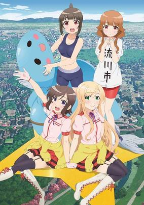

**Studio:** Feel &nbsp;|&nbsp; **Director:** Munenori Nawa &nbsp;|&nbsp; **Aired/Released:** July 4 &nbsp;|&nbsp; **Genres:** High School, Idol, Music, Comedy, School Life, The Arts

> In the town of Nagarekawa, Nanako Usami, an ordinary high school girl, is approached by her uncle to become a local idol or "Locodol," partnering with upperclassman Yukari Kohinata to form the idol unit, Nagarekawa Girls. As the girls use their talent to promote Nagarekawa and their businesses, they are joined by Yui Mikoze, who acts as the local mascot, and Mirai Nazukari, who serves as Yui's substitute.
>
> _Synopsis source: Kitsu_

[Wikipedia](https://en.wikipedia.org/wiki/Locodol) · [Kitsu](https://kitsu.io/anime/futsuu-no-joshikousei-ga-locodol-yatte-mita)

---

### M3: The Dark Metal

**Studio:** Satelight, C2C &nbsp;|&nbsp; **Director:** Junichi Sato &nbsp;|&nbsp; **Aired/Released:** April 21

[Wikipedia](https://en.wikipedia.org/wiki/M3_the_dark_metal)

---

### Lovely Movie: Lovely Muuuuuuuco! Season 2 (Lovely Muuuuuuuco!)

**Studio:** Doga Kobo &nbsp;|&nbsp; **Director:** Takenori Mihara &nbsp;|&nbsp; **Aired/Released:** April 27 &nbsp;|&nbsp; **Genres:** Comedy, Slice of Life

> Itoshi no Muco depicts the life of the pet dog Muco and her owner Komatsu, who lives in his glass-making workshop in the mountains.
>
> _Synopsis source: Kitsu_

[Wikipedia](https://en.wikipedia.org/wiki/Lovely_Muco) · [Kitsu](https://kitsu.io/anime/itoshi-no-muco)

---

### Magic Kaito 1412

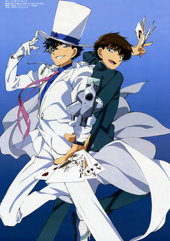

**Studio:** A-1 Pictures &nbsp;|&nbsp; **Director:** Susumu Kudo &nbsp;|&nbsp; **Aired/Released:** October 4 &nbsp;|&nbsp; **Genres:** High School, Thievery, Japan, Earth, Comedy, Tokyo, Asia, Magic, Cops, Adventure, Romance, Crime

> Eight years after the mysterious death of his father, Kaito Kuroba, a slightly mischievous but otherwise ordinary teenager, discovers a shocking secret: the Phantom Thief Kaito Kid—also known as "The Magician Under the Moonlight"—was none other than his own father. The former thief was murdered by a criminal organization seeking a mythical stone called the Pandora Gem, said to shed a tear with the passing of the Valley Comet that comes every ten thousand years. When the tear is consumed, the gem supposedly grants immortality. Vowing to bring those responsible for his father's death to justice, Kaito dons the Phantom Thief's disguise, stealing priceless jewels night after night to find the Pandora Gem before his enemies can use the power for themselves. [Written by MAL Rewrite]
>
> _Synopsis source: Kitsu_

[Wikipedia](https://en.wikipedia.org/wiki/Magic_Kaito_1412) · [Kitsu](https://kitsu.io/anime/magic-kaito-1412)

---

### Magimoji Rurumo

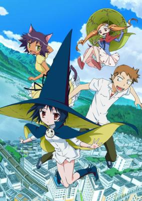

**Studio:** J.C.Staff &nbsp;|&nbsp; **Director:** Chikara Sakurai &nbsp;|&nbsp; **Aired/Released:** July 9 &nbsp;|&nbsp; **Genres:** Present, High School, Fantasy, Earth, Comedy, Slice of Life, Dark Skinned Girl, Ecchi, Contemporary Fantasy, Japan, Magic, School Life

> Shibaki is a high-school boy whose only interest is girls. Except he's been branded as the most perverted boy at school and the girls avoid him like the plague. One day he finds a book in the library about how to summon witches. He tries it as a joke, but it turns out to be the real thing. An apprentice witch named Rurumo appears to grant him a wish. Shibaki helps Rurumo and she in return refuses to take his soul. (This part of this story happened before the start of chapter 1) When the story starts, Shibaki wishes he could see Rurumo again. His wishes are granted immediately as Rurumo falls from the sky and crash lands in front of him. He finds out that as punishment for not taking his soul she's been busted down to an apprentice demon. Now, she must complete the task of getting Shibaki to use up 666 magic tickets that grant wishes before she can become a witch again. However, what she doesn't know is that each time he uses a ticket it shortens his life. When the last ticket is used up, Shibaki will die. Shibaki knows this because Rurumo's familiar black cat Chiro tells him as part of the "contract" for giving him the tickets. Now, Shibaki has a choice, make a wish and help Rurumo become a witch again or resist the temptation and try to save his own life.
>
> _Synopsis source: Kitsu_

[Wikipedia](https://en.wikipedia.org/wiki/Magimoji_Rurumo) · [Kitsu](https://kitsu.io/anime/majimoji-rurumo)

---

### Always! Super Radical Gag Family

**Studio:** Studio Deen &nbsp;|&nbsp; **Director:** Akitaro Daichi &nbsp;|&nbsp; **Aired/Released:** July 6

[Wikipedia](https://en.wikipedia.org/wiki/Super_Radical_Gag_Family)

---

### Majin Bone

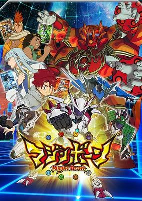

**Studio:** Toei Animation &nbsp;|&nbsp; **Director:** Kōnosuke Uda &nbsp;|&nbsp; **Aired/Released:** April 1 &nbsp;|&nbsp; **Genres:** Virtual Reality

> Anime adaptation of Majin Bone, a digital card game project. Majin, the creator of the Universe, has been resurrected in the present day. Shougo Ryuujin, an ordinary high school student who transforms into the Bone Fighter Dragonbone with the Bone Card in order to save Earth. Together, with the other White Bone warriors take a stand against the Dark Bone, a foe that has appeared from darkness to devastate Earth. However, "could the true enemy be ourselves?"
>
> _Synopsis source: Kitsu_

[Wikipedia](https://en.wikipedia.org/wiki/Majin_Bone) · [Kitsu](https://kitsu.io/anime/majin-bone)

---

### Marvel Disk Wars: The Avengers

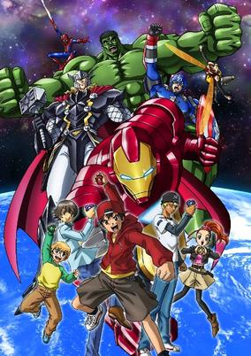

**Studio:** Toei Animation &nbsp;|&nbsp; **Director:** Toshiaki Komura &nbsp;|&nbsp; **Aired/Released:** April 2 &nbsp;|&nbsp; **Genres:** Present, Earth, Human Enhancement, Power Suit, Asia, Action, Science Fiction, Adventure, Proxy Battles, Superhero, Super Power, Kids

> The story will revolve around how the Avengers—Iron Man, Captain America, Thor, and the Hulk together with the help of Spider-Man and a group of teens—will harness their respective fighting skills and superhuman powers to foil Loki's scheme to take over the world. Marvel Disk Wars: The Avengers will target boys in the 6-12 age group.
>
> _Synopsis source: Kitsu_

[Kitsu](https://kitsu.io/anime/marvel-disk-wars-the-avengers)

---

### Medamayaki no Kimi Itsu Tsubusu?

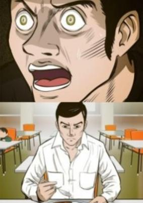

**Studio:** Fanworks [ 10 ] &nbsp;|&nbsp; **Director:** Lareko &nbsp;|&nbsp; **Aired/Released:** August 5 &nbsp;|&nbsp; **Genres:** Comedy

> Based on the same name gourmet manga that focuses on the dining of cuisine. The protagonist Jirou Tamiyamaru is more obssessed with how to eat than most people, and the anime comically depicts how he agonizes over the differences with how others eat.
>
> _Synopsis source: Kitsu_

[Kitsu](https://kitsu.io/anime/medamayaki-no-kimi-itsu-tsubusu)

---

### Me Itantei Rasukaru

**Director:** Shudō Jun [ citation needed ] [ citation needed ] &nbsp;|&nbsp; **Aired/Released:** January 9

---

### Meshimase Lodoss-tō Senki Sorette Oishii no?

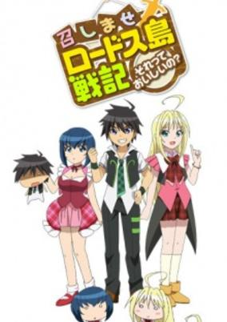

**Studio:** Studio Deen, Studio Hibari &nbsp;|&nbsp; **Director:** Iku Suzuki &nbsp;|&nbsp; **Aired/Released:** April 6 &nbsp;|&nbsp; **Genres:** Comedy

> Two Lodoss-obsessed students attempt to recruit party members so they can put on a Lodoss-themed play at their school festival.
>
> _Synopsis source: Kitsu_

[Kitsu](https://kitsu.io/anime/meshimase-lodoss-tou-senki-sorette-oishii-no)

---

### Minarai Diva

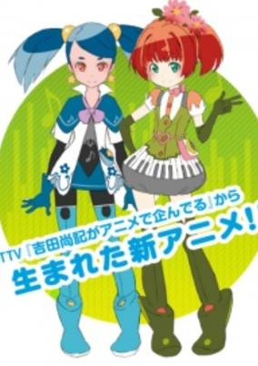

**Studio:** Bouncy &nbsp;|&nbsp; **Director:** Kōtarō Ishidate &nbsp;|&nbsp; **Aired/Released:** July 14 &nbsp;|&nbsp; **Genres:** Idol, Music, The Arts

> The story follows two aspiring divas who hope to become famous through a unique brand of music.
>
> _Synopsis source: Kitsu_

[Kitsu](https://kitsu.io/anime/minarai-diva)

---

### Mobile Suit Gundam-san

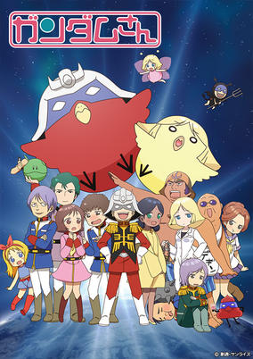

**Studio:** Sunrise &nbsp;|&nbsp; **Director:** Mankyū &nbsp;|&nbsp; **Aired/Released:** July 6 &nbsp;|&nbsp; **Genres:** Space, Shipboard, Comedy, Mecha, Parody

> Anime adaptation of the 4-koma manga Mobile Suit Gundam-san.
>
> _Synopsis source: Kitsu_

[Wikipedia](https://en.wikipedia.org/wiki/Mobile_Suit_Gundam-san) · [Kitsu](https://kitsu.io/anime/mobile-suit-gundam-san)

---

### Momo Kyun Sword (Momokyun Sword)

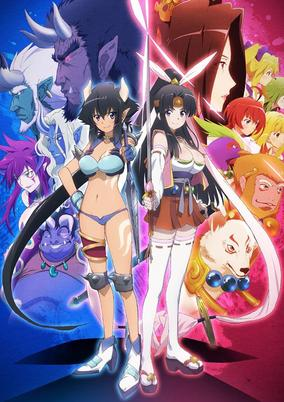

**Studio:** Tri-Slash, Project No. 9 &nbsp;|&nbsp; **Director:** Shinsuke Yanagi &nbsp;|&nbsp; **Aired/Released:** July 8 &nbsp;|&nbsp; **Genres:** Swordplay, Past, Earth, Alternative Past, Demon, Japan, Asia, Action, Fantasy, Henshin, Comedy, Ecchi

> Momoko is a beautiful young sword fighter who was born inside a peach (momo in Japanese). She lives with her constant companions—the dog god Inugami, the monkey god Sarugami, and the pheasant god Kijigami—in a peaceful paradise. However, a demon army led by devil king invades the paradise and steals the precious treasure that protects Momoko's land. To retrieve the treasure and save the people, Momoko embarks on a great adventure with her three companions.
>
> _Synopsis source: Kitsu_

[Wikipedia](https://en.wikipedia.org/wiki/Momo_Kyun_Sword) · [Kitsu](https://kitsu.io/anime/momo-kyun-sword)

---

### Monthly Girls' Nozaki-kun

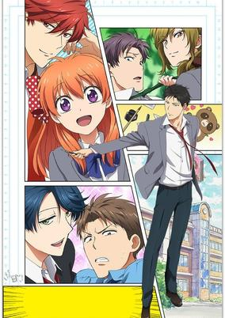

**Studio:** Doga Kobo &nbsp;|&nbsp; **Director:** Mitsue Yamazaki &nbsp;|&nbsp; **Aired/Released:** July 7 &nbsp;|&nbsp; **Genres:** High School, Present, Earth, Japan, Slow When It Comes To Love, Stereotypes, Asia, Comedy, Slice of Life, School Life, Romance

> You know how the story goes: girl crushes on guy, girl confesses feelings to guy, guy mistakes confession for a job application. Okay, maybe that's not how it usually goes, but that's what happens when Chiyo Sakura finally gets up the nerve to tell her classroom crush Nozaki how she feels. Since she doesn't know that he's secretly a manga artist who publishes under a female pen name, and he doesn't know that she doesn't know, he misunderstands and offers her a chance to work as his assistant instead of a date! But while it's not flowers and dancing, it is a chance to get closer to him, so Chiyo gamely accepts. And when Nozaki realizes how useful Chiyo can be in figuring out what girls find romantic, he'll be spending even more time with her "researching" while remaining completely clueless. Could Chiyo's romantic frustration possibly get any more drawn out of proportion? The answer will be profusely illustrated in MONTHLY GIRLS' NOZAKI-KUN!
>
> _Synopsis source: Kitsu_

[Wikipedia](https://en.wikipedia.org/wiki/Monthly_Girls%27_Nozaki-kun) · [Kitsu](https://kitsu.io/anime/gekkan-shoujo-nozaki-kun)

---

### Mysterious Joker (JOKER)

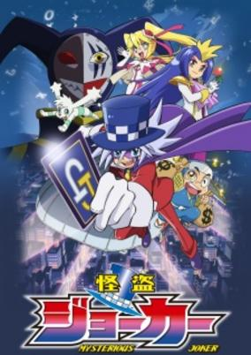

**Studio:** Shin-Ei Animation &nbsp;|&nbsp; **Director:** Yukiyo Teramoto &nbsp;|&nbsp; **Aired/Released:** October 6 &nbsp;|&nbsp; **Genres:** Adventure, Comedy, Mystery

> In the story, there is nothing in the world that the mysterious phantom thief Joker cannot steal. He goes after one treasure after another in unpredictable capers with seemingly miraculous tricks.
>
> _Synopsis source: Kitsu_

[Wikipedia](https://en.wikipedia.org/wiki/Mysterious_Joker) · [Kitsu](https://kitsu.io/anime/kaitou-joker)

---

### Nandaka Velonica

**Studio:** Cyclone Graphics &nbsp;|&nbsp; **Director:** Michiya Katou &nbsp;|&nbsp; **Aired/Released:** March 10 &nbsp;|&nbsp; **Genres:** Robot Helper, Alien, Present, Earth, Mecha, Japan, Tokyo, Humanoid Alien, Stereotypes, Asia, Science Fiction, Fantasy, Comedy, Kids

> The children's anime revolves around Velonica, a high-handed and ultra-selfish little alien girl on the Galaxy Network, who begins to cause havoc on Earth. After a "fated encounter" with an Earthling boy, Velonica wavers between a possible budding romance with the boy and her dedication to the arts.
>
> _Synopsis source: Kitsu_

[Kitsu](https://kitsu.io/anime/nandaka-velonica)

---

### Neko no Dayan

**Studio:** Kachidoki Studio &nbsp;|&nbsp; **Director:** Hazumu Sakuta [ citation needed ] &nbsp;|&nbsp; **Aired/Released:** April 26 &nbsp;|&nbsp; **Genres:** Magic, Kids

> Dayan the cat came to Wachi Field from the Earth through Snow magic. Wachi Field was originally part of the Earth, but separated by Snow God because of the War between Gods and Titans, which destroyed the land. After the war, the Earth's time flow faster than Wachi Field, which the life is slow with animals and fairies and full of mischief.
>
> _Synopsis source: Kitsu_

[Kitsu](https://kitsu.io/anime/neko-no-dayan)

---

### Ninjaboy Rintaro

**Studio:** Ajia-do &nbsp;|&nbsp; **Director:** Tsutomu Shibayama &nbsp;|&nbsp; **Aired/Released:** April 1

[Wikipedia](https://en.wikipedia.org/wiki/Ninjaboy_Rantaro)

---

### Nyanpuku Nyaruma

**Studio:** Kachidoki Studio &nbsp;|&nbsp; **Director:** Takeshi Onaka &nbsp;|&nbsp; **Aired/Released:** July &nbsp;|&nbsp; **Genres:** Comedy

> Follows twin cats who wish to make others happy and their strange friends.
>
> _Synopsis source: Kitsu_

[Kitsu](https://kitsu.io/anime/nyanpuku-nyaruma)

---

### Nobunaga Concerto

**Director:** Yūsuke Fujikawa [ citation needed ] &nbsp;|&nbsp; **Aired/Released:** July 12 &nbsp;|&nbsp; **Genres:** Time Travel, Sengoku Period, Past, Disaster, War, Feudal Warfare, Science Fiction, Military, Historical, Romance

> "Who cares about what happened in Japan's past? It has nothing to do with my life." With these words, carefree high school student Saburou finds himself unceremoniously thrown back in time to the Sengoku Era, landing directly in front of the legendary general Nobunaga Oda. Nobunaga, on the run from his retainers and wishing to rest due to his frailty, beseeches Saburou to take his place, as the two bear an uncanny resemblance. Although Saburou is still confused by his surroundings, Nobunaga hurriedly provides the boy with the necessary items to prove that he is the bona fide feudal lord and makes a hasty getaway. Now a stand-in for someone he doesn't even know all that much about—though his modern experiences and knowledge are sure to help him—Saburou begins his unexpected quest to pose as the man who attempted to unite all of Japan. [Written by MAL Rewrite]
>
> _Synopsis source: Kitsu_

[Wikipedia](https://en.wikipedia.org/wiki/Nobunaga_Concerto) · [Kitsu](https://kitsu.io/anime/nobunaga-concerto)

---

### Ohenro

**Studio:** ufotable [ citation needed ] &nbsp;|&nbsp; **Director:** Masato Nagamori &nbsp;|&nbsp; **Aired/Released:** May 3

---

### Oreca Battle

**Studio:** OLM, Xebec &nbsp;|&nbsp; **Director:** Tetsurō Amino &nbsp;|&nbsp; **Aired/Released:** April 7 &nbsp;|&nbsp; **Genres:** Virtual Reality

> The anime adaptation revolves around a young boy named Faiya Orega who loves Oreca competitions. One day, he is granted the power to summon real Oreca monsters due to the mysterious powers of the treasure chest Pandora. To protect the peace of the Oreca world, Faiya must fight the demon king who threatens the land.
>
> _Synopsis source: Kitsu_

[Wikipedia](https://en.wikipedia.org/wiki/Oreca_Battle) · [Kitsu](https://kitsu.io/anime/oreca-battle)

---

### Orenchi no Furo Jijō [ 11 ]

**Studio:** Asahi Production &nbsp;|&nbsp; **Director:** Sayo Aoi &nbsp;|&nbsp; **Aired/Released:** October 6 &nbsp;|&nbsp; **Genres:** Mermaid, Shounen Ai, Fantasy, Comedy, Josei

> On his way home from school, Tatsumi sees a man collapsed near a lake. When he approaches him, Tatsumi notices something strange: the person in need of help is actually a beautiful merman named Wakasa! Because Wakasa's home has become too polluted to live in, Tatsumi graciously offers his bathtub as a refuge. With a boisterous merman as his new roommate, Tatsumi's normal life won't be returning anytime soon, not to mention Wakasa's aquatic friends—Takasu, Mikuni, and Maki—often show up uninvited, making them all quite a handful for the high school student. As he humors their curiosity for human life, Tatsumi sometimes finds himself enjoying their childish antics, but he will have to keep his cool if he intends to keep up with his daily life and newfound friendship. [Written by MAL Rewrite]
>
> _Synopsis source: Kitsu_

[Wikipedia](https://en.wikipedia.org/wiki/Orenchi_no_Furo_Jij%C5%8D) · [Kitsu](https://kitsu.io/anime/orenchi-no-furo-jijou)

---

### Persona 4: The Golden Animation (Persona 4 the Golden ANIMATION)

**Studio:** A-1 Pictures &nbsp;|&nbsp; **Director:** Seiji Kishi, Tomohisa Taguchi &nbsp;|&nbsp; **Aired/Released:** July 11 &nbsp;|&nbsp; **Genres:** Present, Comedy, Proxy Battles, Slice of Life, Earth, Asia, Japan, Plot Continuity, Friendship, Super Power, Science Fiction, Adventure, School Life, Mystery

> Spring. Far from the city, time flows peacefully in this rural town. As the cherry blossoms scatter in the wind, a young man named Yu Narukami steps off the train at Yasoinaba Station. Yu has come to this town, where his uncle lives, for family reasons; he will be transferring into the local high school, Yasogami High. And so begins his school life... The shopping mall after school. A series of murders taking place in town. The Midnight Channel, airing late at night.... What lies in store for Yu and his friends ‘this time around?
>
> _Synopsis source: Kitsu_

[Kitsu](https://kitsu.io/anime/persona-4-the-golden-animation)

---

### Pretty Rhythm All Star Selection

**Studio:** Tatsunoko Production &nbsp;|&nbsp; **Director:** Masakazu Hishida &nbsp;|&nbsp; **Aired/Released:** April 5 &nbsp;|&nbsp; **Genres:** Music, Slice of Life, Sports

> Naru Ayase is an 8th grader who can see the colors of music when she listens to it. For Naru, who is extremely good at decorating, becoming the owner of a shop like Dear Crown was her dream. One day, she finds out that the manager of a newly-opened shop is recruiting middle school girls who can do Prism Dance, and immediately applies. Naru begins to Prism Dance at the audition, and an aura she's never experienced spreads out in front of her. At that moment, a mysterious girl named Rinne asks her if she can see "rainbow music."
>
> _Synopsis source: Kitsu_

[Wikipedia](https://en.wikipedia.org/wiki/Pretty_Rhythm) · [Kitsu](https://kitsu.io/anime/pretty-rhythm-rainbow-live)

---

### PriPara (Prism Paradise)

**Studio:** Tatsunoko Production, DongWoo A&E &nbsp;|&nbsp; **Director:** Makoto Moriwaki &nbsp;|&nbsp; **Aired/Released:** July 5 &nbsp;|&nbsp; **Genres:** Musical Band, Idol, Earth, Japan, Performance, Music, Asia, Friendship, The Arts, Slice of Life, School Life, Shoujo

> Every little girl waits for the day she'll get her special ticket, one that will grant her entry into the world of PriPara (Prism Paradise). PriPara is a world of music, fashion, and daily auditions for a chance to become a pop idol. Laala Manaka's friends and classmates aspire to become idols, but her school forbids elementary school students from participating in the idol competitions. Luckily, Laala is only interested in watching the idol shows. Yet somehow despite all this, she manages to bumble her way into the PriPara world, and debut as a fresh new talent. After being told all her life that she's too loud, Laala has finally found a place where she can be as loud as she wants and sing from her heart. And not only that, but there's a possibility that she might be the legendary Prism Voice. Adventure, fashion, and music awaits as Laala climbs her way to the top, on her way to become the cutest and most beloved pop idol in the world of PriPara!
>
> _Synopsis source: Kitsu_

[Wikipedia](https://en.wikipedia.org/wiki/PriPara) · [Kitsu](https://kitsu.io/anime/pripara)

---

### Rail Wars!

**Studio:** Passione &nbsp;|&nbsp; **Director:** Yoshifumi Matsuda &nbsp;|&nbsp; **Aired/Released:** July 4 &nbsp;|&nbsp; **Genres:** Earth, Alternative Present, Japan, Tokyo, Asia, Harem, Law And Order, Special Squads, Action, Ecchi, Cops

> Rail Wars! takes place in an alternate universe where the Japanese government remains in control of the nation's railway systems. Because of the stability afforded by the leadership of the government, the railway system is allowed to flourish. Naoto Takayama aspires to become an employee for Japan National Railways because of the comfortable life that it will enable him to live. In order to accomplish this he enters its training program, where students must demonstrate their knowledge of trains as well as their ability to be ready for any challenge that might arise. During this time period he will encounter other students such as the athletically gifted Aoi Sakura, the constantly hungry Sho Iwaizumi, and the human encyclopedia Haruka Komi. Together they will work towards surviving their trainee period, all the while taking on purse snatchers, bomb threats, and the looming specter of the extremist “RJ” group who wants to privatize the railway system.
>
> _Synopsis source: Kitsu_

[Wikipedia](https://en.wikipedia.org/wiki/Rail_Wars!) · [Kitsu](https://kitsu.io/anime/rail-wars)

---

### Re:␣Hamatora (Hamatora The Animation)

**Studio:** Lerche &nbsp;|&nbsp; **Director:** Seiji Kishi &nbsp;|&nbsp; **Aired/Released:** July 8 &nbsp;|&nbsp; **Genres:** Detective, Super Power, Present, Earth, Japan, Violence, Plot Continuity, Asia, Action, Comedy, Mystery

> The ability to create miracles is not just a supernatural phenomenon; it is a gift which manifests in a limited number of human beings. "Minimum," or small miracles, are special powers that only selected people called "Minimum Holders" possess. The detective agency Yokohama Troubleshooting, or Hamatora for short, is composed of the "Minimum Holder PI Duo," Nice and Murasaki. Their office is a lone table at Cafe Nowhere, where the pair and their coworkers await new clients. Suddenly, the jobs that they begin to receive seem to have strange connections to the serial killer whom their friend Art, a police officer, is searching for. The murder victims share a single similarity: they are all Minimum Holders. Nice and Murasaki, as holders themselves, are drawn to the case—but what exactly is the link between Nice and the one who orchestrates it all? [Written by MAL Rewrite]
>
> _Synopsis source: Kitsu_

[Wikipedia](https://en.wikipedia.org/wiki/Hamatora) · [Kitsu](https://kitsu.io/anime/hamatora-the-animation)

---

### Samurai Jam -Bakumatsu Rock-

**Studio:** Studio Deen &nbsp;|&nbsp; **Director:** Itsuro Kawasaki &nbsp;|&nbsp; **Aired/Released:** July 2 &nbsp;|&nbsp; **Genres:** Bishounen, Musical Band, Earth, Japan, Kyoto, Music, Asia, The Arts, Historical, Action, Comedy

> Ryouma Sakamoto wants everyone to know about his passion for rock 'n' roll, so he roams around town with his electric guitar willing to show anyone he encounters that he's just as skilled as the famous Shinsengumi stars they admire. Unfortunately, Japan doesn't allow anything other than that group's Heaven's Songs, for writing or performing different types of music is forbidden and can lead to harsh consequences. Agitated by these strict rules and brainwashing, Ryouma does everything he can to show people that the music he loves will bring them the freedom they deserve. Along with his bandmates Shinsaku Takasugi and Kogoru Katsura, Ryouma works hard to find places for his rock 'n' roll group to perform. Refusing to back down until their music is accepted in Japan, the trio begin to realize that there's more to their passion than they had thought. [Written by MAL Rewrite]
>
> _Synopsis source: Kitsu_

[Wikipedia](https://en.wikipedia.org/wiki/Bakumatsu_Rock) · [Kitsu](https://kitsu.io/anime/bakumatsu-rock)

---

### Selector Spread Wixoss

**Studio:** J.C.Staff &nbsp;|&nbsp; **Director:** Takuya Satō &nbsp;|&nbsp; **Aired/Released:** October 4 &nbsp;|&nbsp; **Genres:** Present, Angst, Friendship, Proxy Battles, Drama, Coming Of Age, Card Games, Magical Girl, Psychological

> Get ready for the thrilling second season of the WIXOSS series! Immerse yourself in a game where special cards called LRIGs—cards that possess personalities and wills of their own—can change your life forever. Teenager Ruko holds one of these rare cards, and if she wins, her wish will be granted. But what happens if she loses?
>
> _Synopsis source: Kitsu_

[Wikipedia](https://en.wikipedia.org/wiki/Selector_Spread_Wixoss) · [Kitsu](https://kitsu.io/anime/selector-spread-wixoss)

---

### Sengoku Basara: End of Judgement

**Studio:** TMS Entertainment &nbsp;|&nbsp; **Director:** Takashi Sano &nbsp;|&nbsp; **Aired/Released:** July 6 &nbsp;|&nbsp; **Genres:** Past, Historical, Sengoku Period, Action, Samurai, Martial Arts, Super Power

> Based on CAPCOM's 2010 game Sengoku Basara 3 (Sengoku Basara: Samurai Heroes), Sengoku Basara: Judge End will depict the epic Battle of Sekigahara.
>
> _Synopsis source: Kitsu_

[Kitsu](https://kitsu.io/anime/sengoku-basara-judge-end)

---

### Shōnen Hollywood - Holly Stage for 49

**Studio:** Zexcs &nbsp;|&nbsp; **Director:** Toshimasa Kuroyanagi &nbsp;|&nbsp; **Aired/Released:** July 5 &nbsp;|&nbsp; **Genres:** Bishounen, Musical Band, Idol, Present, Earth, Japan, Tokyo, Performance, Music, Asia, The Arts, Slice of Life

> The anime tells an original story set 15 years after the novel's story. It takes place at a fictional theater called Hollywood Tokyo in Harajuku, where members of the idol group "Shounen Hollywood" develop their talents with diligent work and studying.
>
> _Synopsis source: Kitsu_

[Wikipedia](https://en.wikipedia.org/wiki/Sh%C5%8Dnen_Hollywood) · [Kitsu](https://kitsu.io/anime/shounen-hollywood-holly-stage-for-49)

---

### Silver Spoon Season 2 (Silver Spoon)

**Studio:** A-1 Pictures &nbsp;|&nbsp; **Director:** Tomohiko Itō , Kotomi Deai &nbsp;|&nbsp; **Aired/Released:** January 9 &nbsp;|&nbsp; **Genres:** Japan, Earth, Asia, Present, Comedy, Coming Of Age, Plot Continuity, Slice of Life, School Life

> Hachiken Yuugo enrolled in Oezo Agricultural High School for the reason that he could live in a dorm there. In some ways he chose Oezo in an effort to escape the highly competitive prep schools he had attended previously, but he was faced with an entirely new set of difficulties at Oezo, surrounded by animals and Mother Nature. After growing up in an average family, he began to encounter clubs and training the likes of which he had never seen before.
>
> _Synopsis source: Kitsu_

[Wikipedia](https://en.wikipedia.org/wiki/Silver_Spoon_(manga)) · [Kitsu](https://kitsu.io/anime/gin-no-saji)

---

### Sin Strange Plus

**Studio:** Seven &nbsp;|&nbsp; **Director:** Hiroyuki Furukawa &nbsp;|&nbsp; **Aired/Released:** July 3 &nbsp;|&nbsp; **Genres:** Absurdist Humour, Slapstick, Parody, Comedy, Slice of Life, Detective

> Kou comes to a slum neighborhood in search of his elder brother Takumi and finds him to have become the head of a private detective firm. Kou is drafted by Takumi to do errands and chores in the detective firm, and they come to meet various interesting people...
>
> _Synopsis source: Kitsu_

[Wikipedia](https://en.wikipedia.org/wiki/Strange%2B) · [Kitsu](https://kitsu.io/anime/strange)

---

### Tokyo ESP

**Studio:** Xebec &nbsp;|&nbsp; **Director:** Shigehito Takayanagi &nbsp;|&nbsp; **Aired/Released:** July 11 &nbsp;|&nbsp; **Genres:** Japan, Comedy, Earth, Slice of Life, Special Squads, Tokyo, Super Power, Action, Science Fiction

> Rinka Urushiba is an ordinary, if poor, high school student. With her father no longer employed, she spends every day working to save money so that they can both keep living in their small apartment. That all changes one day when Rinka sees a flying penguin and chases it to the top of the New Tokyo Tower—where she is confronted by a glowing fish swimming through the sky, who grants her the power to phase through solid objects, turning her hair as white as snow in the process. The only problem is that she isn't the only one to gain superpowers, and Tokyo quickly finds itself in dire need of heroes.Tokyo ESP follows Rinka's struggles as she inadvertently becomes the heroine known to the public as the "White Girl" for her hair and powers. Working alongside Kyoutarou Azuma, a classmate with the power of teleportation, she'll deal with the growing threat of those that would abuse their own powers. But will she and her sense of justice be able to survive as the stakes grow higher, and the foes they face grow stronger?
>
> _Synopsis source: Kitsu_

[Wikipedia](https://en.wikipedia.org/wiki/Tokyo_ESP) · [Kitsu](https://kitsu.io/anime/tokyo-esp)

---

### Tokyo Ghoul

**Studio:** Pierrot &nbsp;|&nbsp; **Director:** Shuhei Morita &nbsp;|&nbsp; **Aired/Released:** July 4 &nbsp;|&nbsp; **Genres:** Dark Fantasy, Violence, Action, Horror, Psychological, Mystery

> The suspense horror/dark fantasy story is set in Tokyo, which is haunted by mysterious "ghouls" who are devouring humans. People are gripped by the fear of these ghouls whose identities are masked in mystery. An ordinary college student named Kaneki encounters Rize, a girl who is an avid reader like him, at the café he frequents. Little does he realize that his fate will change overnight.
>
> _Synopsis source: Kitsu_

[Wikipedia](https://en.wikipedia.org/wiki/Tokyo_Ghoul) · [Kitsu](https://kitsu.io/anime/tokyo-ghoul)

---

### Tribe Cool Crew

**Studio:** Sunrise, BN Pictures &nbsp;|&nbsp; **Director:** Masaya Fujimori &nbsp;|&nbsp; **Aired/Released:** September 28 &nbsp;|&nbsp; **Genres:** Performance, The Arts, Music, School Life

> Haneru Tobitatsu is a hyperactive middle schooler with a passion for dancing. Inspired by his idol Jey El, the hottest star in the world of dancing, Haneru practices outside Memorial Hall every day after school. Unbeknownst to him, his "secret" practice sessions are being watched by Kanon Otosaki—her true identity being the famous online dancer, Rhythm—who also frequents the same location for practice. When Haneru finds out about this, he shows an immediate interest in teaming up with her. Slowly realizing the joy of performing with others, the duo makes their way into the world of street dancing, where they meet Kumonosuke, Mizuki, and Yuzuru, ultimately forming the dance group "Tribe Cool Crew." As they face off against tough competition, they strive to one day realize their dream of sharing the stage with Jey El. [Written by MAL Rewrite]
>
> _Synopsis source: Kitsu_

[Wikipedia](https://en.wikipedia.org/wiki/Tribe_Cool_Crew) · [Kitsu](https://kitsu.io/anime/tribe-cool-crew)

---

### Tsukimonogatari

**Studio:** Shaft &nbsp;|&nbsp; **Director:** Akiyuki Shinbo, Tomoyuki Itamura &nbsp;|&nbsp; **Aired/Released:** December 31 &nbsp;|&nbsp; **Genres:** Ecchi, Comedy, Mystery

> Koyomi Araragi is studying hard in preparation for his college entrance exams when he begins to notice something very strange: his reflection no longer appears in a mirror, a characteristic of a true vampire. Worried about the state of his body, he enlists the help of the human-like doll Yotsugi Ononoki and her master Yozuru Kagenui, an immortal oddity specialist. Quickly realizing what is wrong with him, Yozuru gives him two choices: either abstain from using the vampiric abilities he received from Shinobu Oshino, or lose his humanity forever.
>
> _Synopsis source: Kitsu_

[Wikipedia](https://en.wikipedia.org/wiki/Tsukimonogatari) · [Kitsu](https://kitsu.io/anime/tsukimonogatari)

---

### Wasimo

**Studio:** Studio Deen &nbsp;|&nbsp; **Director:** Yasuhiro Imagawa &nbsp;|&nbsp; **Aired/Released:** March 10

---

### When Supernatural Battles Became Commonplace

**Studio:** Trigger &nbsp;|&nbsp; **Director:** Masahiko Otsuka, Masanori Takahashi &nbsp;|&nbsp; **Aired/Released:** October 6 &nbsp;|&nbsp; **Genres:** Super Power, Comedy, Harem, Friendship, Romance, Slice of Life, School Life

> During a Literature Club meeting, the four club members—along with their faculty adviser's niece—suddenly find themselves with supernatural powers. Now capable of fabricating black flames, resident chuunibyou Jurai Andou is the most ecstatic about their new abilities; unfortunately, his own is only for show and unable to accomplish anything of substance. Moreover, he is completely outclassed by those around him: fellow club member Tomoyo Kanzaki manipulates time, Jurai's childhood friend Hatoko Kushikawa wields control over the five elements, club president Sayumi Takanashi can repair both inanimate objects and living things, and their adviser's niece Chifuyu Himeki is able to create objects out of thin air. However, while the mystery of why they received these powers looms overhead, very little has changed for the Literature Club. The everyday lives of these five superpowered students continue on, albeit now tinged with the supernatural. [Written by MAL Rewrite]
>
> _Synopsis source: Kitsu_

[Wikipedia](https://en.wikipedia.org/wiki/When_Supernatural_Battles_Became_Commonplace) · [Kitsu](https://kitsu.io/anime/inou-battle-wa-nichijou-kei-no-naka-de)

---

### World Fool News

**Studio:** CoMix Wave Films [ 12 ] &nbsp;|&nbsp; **Aired/Released:** April 17 &nbsp;|&nbsp; **Genres:** Comedy, Slice of Life

> Takahashi is transferred to a main anchor of a news program, which is known for being a little...weird. This is a comedy about somewhat ridiculous happenings occurring at a broadcasting station.
>
> _Synopsis source: Kitsu_

[Kitsu](https://kitsu.io/anime/world-fool-news)

---

### World Trigger

**Studio:** Toei Animation &nbsp;|&nbsp; **Director:** Mitsuru Hongo , Kouji Ogawa &nbsp;|&nbsp; **Aired/Released:** October 5 &nbsp;|&nbsp; **Genres:** Swordplay, Super Power, Action, Fantasy, Science Fiction, School Life, Shounen, Contemporary Fantasy

> When a gate to another world suddenly opens on Earth, Mikado City is invaded by strange creatures known as "Neighbors," malicious beings impervious to traditional weaponry. In response to their arrival, an organization called the Border Defense Agency has been established to combat the Neighbor menace through special weapons called "Triggers." Even though several years have passed after the gate first opened, Neighbors are still a threat and members of Border remain on guard to ensure the safety of the planet. Despite this delicate situation, members-in-training, such as Osamu Mikumo, are not permitted to use their Triggers outside of headquarters. But when the mysterious new student in his class is dragged into a forbidden area by bullies, they are attacked by Neighbors, and Osamu has no choice but to do what he believes is right. Much to his surprise, however, the transfer student Yuuma Kuga makes short work of the aliens, revealing that he is a humanoid Neighbor in disguise. [Written by MAL Rewrite]
>
> _Synopsis source: Kitsu_

[Wikipedia](https://en.wikipedia.org/wiki/World_Trigger) · [Kitsu](https://kitsu.io/anime/world-trigger)

---

### Yowamushi Pedal Grande Road (Yowamushi Pedal)

**Studio:** TMS Entertainment, 8PAN &nbsp;|&nbsp; **Director:** Osamu Nabeshima &nbsp;|&nbsp; **Aired/Released:** October 6 &nbsp;|&nbsp; **Genres:** Sports, Japan, Asia, Earth, Cycling, Comedy

> Sakamichi Onoda is a cheerful otaku looking to join his new school's anime club, eager to finally make some friends. Unfortunately, the club has been disbanded and he takes it upon himself to revive it by finding students who are willing to join. Without much luck, Onoda decides to make a round trip to Akihabara on his old, bulky city bicycle, a weekly 90-kilometer ride he has been completing since fourth grade. This is when he meets fellow first year student, Shunsuke Imaizumi, a determined cyclist who is using the school's steep incline for practice. Surprised by Onoda's ability to climb the hill with his specific type of bicycle, Imaizumi challenges him to a race, with the proposition of joining the anime club should Onoda win. And thus begins the young boy's first foray into the world of high school bicycle racing! [Written by MAL Rewrite]
>
> _Synopsis source: Kitsu_

[Wikipedia](https://en.wikipedia.org/wiki/Yowamushi_Pedal) · [Kitsu](https://kitsu.io/anime/yowamushi-pedal)

---

### Yamishibai: Japanese Ghost Stories

**Studio:** ILCA &nbsp;|&nbsp; **Director:** Noboru Iguchi , Shoichiro Masumoto, Takashi Shimizu &nbsp;|&nbsp; **Aired/Released:** July 6 &nbsp;|&nbsp; **Genres:** Present, Japan, Contemporary Fantasy, Horror, Dementia

> The mysterious, yellow-masked Storyteller is a man whose true name and origin are both unknown. He appears at dusk where children gather and recites sinister tales based on Japanese urban legends, to which his young audience eerily intakes. However, the Storyteller is no ordinary teller of tales. He incorporates a kamishibai, a traditional paper-scrolling device, to add visuals to his already demented narration. A series of short horror stories, Yami Shibai begins with a bachelor who, after moving into a new apartment, immediately starts sensing a malevolent glare being pressed into him. A single talisman rests on his ceiling, but he has no way of knowing it is one of the few safeguards that separate him from a bottomless pit of suffering. Each story is more terrifying, more appalling, and more sickening than the last as the Storyteller's audience find themselves being sucked into the vicious world of his words. [Written by MAL Rewrite]
>
> _Synopsis source: Kitsu_

[Kitsu](https://kitsu.io/anime/yami-shibai)

---

### Future Card Buddyfight

**Studio:** OLM &nbsp;|&nbsp; **Director:** Shigetaka Ikeda &nbsp;|&nbsp; **Aired/Released:** January 4 &nbsp;|&nbsp; **Genres:** Virtual Reality

> An adaptation of the Future Card Buddyfight card game. Future Card Buddyfight takes place in a more futuristic version of today. The card game connects to a parallel universe through special cards (Buddy Rare Cards) that act as portals. They bring monsters to Earth in order for them to become buddies with humans. Through friendship and courage, they take on and fight challenges, known as Buddyfights, where people of all ages have friendly non-hurtful competitions. The main character, Gaou Mikado has just started Buddyfighting. As the story progresses, Buddyfights are seeming to become a little too real...
>
> _Synopsis source: Kitsu_

[Wikipedia](https://en.wikipedia.org/wiki/Future_Card_Buddyfight) · [Kitsu](https://kitsu.io/anime/future-card-buddyfight)

---

### Recently, My Sister is Unusual (Recently, my sister is unusual.)

**Studio:** Project No. 9 &nbsp;|&nbsp; **Director:** Hiroyuki Hata &nbsp;|&nbsp; **Aired/Released:** January 4 &nbsp;|&nbsp; **Genres:** Comedy, Contemporary Fantasy, Fantasy, Ecchi, Slapstick, Female Student, Romance

> Saikin, Imouto no Yousu ga Chotto Okashiinda ga. follows a family just starting to rebuild. When they marry, Mr. and Mrs. Kanzaki bring a teenage son and daughter along for the ride. But high school freshman Mitsuki Kanzaki is less than thrilled. Stinging from a history of absent and abusive father figures, she is slow to accept her stepfather and stepbrother. But after an accident lands Mitsuki in the hospital, she finds herself possessed by the ghost of Hiyori Kotobuki, a girl her age who was deeply in love with Mitsuki's stepbrother Yuuya. Hiyori cannot pass on to her final reward because of her unrequited love for Yuuya, meaning she's got to consummate it... in Mitsuki's body?! Now, Mitsuki's life depends on getting Hiyori to Heaven. But will she get used to sharing herself with a pushy, amorous ghost? Can she overcome her distrust of her new family? Can she bring herself to fulfill Hiyori's feelings for Yuuya? And might she be hiding some feelings of her own?
>
> _Synopsis source: Kitsu_

[Wikipedia](https://en.wikipedia.org/wiki/Recently,_My_Sister_is_Unusual) · [Kitsu](https://kitsu.io/anime/saikin-imouto-no-yousu-ga-chotto-okashiin-da-ga)

---

### Seitokai Yakuindomo

**Studio:** GoHands &nbsp;|&nbsp; **Director:** Hiromitsu Kanazawa &nbsp;|&nbsp; **Aired/Released:** January 4 &nbsp;|&nbsp; **Genres:** Present, Slapstick, Comedy, Ecchi, Slice of Life, School Life

> Formerly an all-girl school, Ousai Academy has recently gone co-ed. Enter student council vice president Takatoshi Tsuda, one of Ousai's first male students. He's adapting rather well now that he's in his second year, but there's still a lot to get used to. For example, what do girls talk about when there aren't any guys around? In Seitokai Yakuindomo*, pretty much exactly what you'd expect: sex! Although charged with upholding morality among the student body, the Ousai Student Council is notoriously perverted, especially president Shino Amakusa. As they carry out their duties to the school, Tsuda, Shino, and their fellow council members must balance curiosity with decency and sex jokes with studying. It takes a perv to know one, after all!
>
> _Synopsis source: Kitsu_

[Wikipedia](https://en.wikipedia.org/wiki/Seitokai_Yakuindomo) · [Kitsu](https://kitsu.io/anime/seitokai-yakuindomo-2nd-season)

---

### Space Dandy

**Studio:** Bones &nbsp;|&nbsp; **Director:** Shinichirō Watanabe , Shingo Natsume &nbsp;|&nbsp; **Aired/Released:** January 4 &nbsp;|&nbsp; **Genres:** Alien, Future, Space, Space Travel, Absurdist Humour, Parody, Shipboard, Science Fiction, Comedy, Anthropomorphism

> The universe is a mysterious and strange place, full of even stranger and more mysterious aliens. Dandy's job is to hunt down unclassified aliens and register them for a reward. It sounds easy enough, but something weird always seems to happen along the way, like chance meetings with zombies, mystical ramen chefs, and adorable orphans. Hunting down aliens may not be easy, but it's definitely never boring. With the help of his sidekicks, the adorable robot vacuum QT and cat-like alien Meow, and his slightly-used ship the Aloha Oe, Dandy roams the galaxy searching for new alien species. What he usually finds, however, is adventure, danger, and romance, and no two journeys (or universes) are ever the same. This is Space☆Dandy, baby!
>
> _Synopsis source: Kitsu_

[Wikipedia](https://en.wikipedia.org/wiki/Space_Dandy) · [Kitsu](https://kitsu.io/anime/space-dandy)

---

### Buddy Complex

**Studio:** Sunrise &nbsp;|&nbsp; **Director:** Yasuhiro Tanabe &nbsp;|&nbsp; **Aired/Released:** January 5 &nbsp;|&nbsp; **Genres:** Future, Mecha, Piloted Robot, Plot Continuity, Action, Science Fiction

> When ordinary high school student Aoba Watase is suddenly targeted by a giant robot known as a "Valiancer," he is saved by his mysterious classmate Hina Yumihara. After revealing that she and their robotic enemy are from the future, Hina suddenly propels Aoba 70 years forward in order to prevent his death. Upon arrival, Aoba finds himself in the cockpit of a Valiancer called "Luxon," stuck in the midst of a firefight between the military forces of the Free Pact Alliance (FPA) and Zogilia Republic. After he shows high compatibility with an FPA pilot named Dio Weinberg, the two perform a successful "coupling," allowing them to share experiences and subsequently increase their capabilities and skills. Although Aoba is able to survive this unexpected battle, he is taken into custody by the FPA ship Cygnus, who wishes to interrogate him. While the student's main concern is whether he will ever be able to return home, what he doesn't realize is that he is about to get caught up in a war to protect the world. [Written by MAL Rewrite]
>
> _Synopsis source: Kitsu_

[Wikipedia](https://en.wikipedia.org/wiki/Buddy_Complex) · [Kitsu](https://kitsu.io/anime/buddy-complex)

---

### Everyone Assemble! Falcom Academy

**Studio:** Dax Production &nbsp;|&nbsp; **Director:** Pippuya &nbsp;|&nbsp; **Aired/Released:** January 5 &nbsp;|&nbsp; **Genres:** Parody, Comedy, School Life

> Characters from various games released by Falcom (e.g. Dragon Slayer, The Legend of Heroes, and Ys series) come together in a school.
>
> _Synopsis source: Kitsu_

[Wikipedia](https://en.wikipedia.org/wiki/Minna_Atsumare!_Falcom_Gakuen) · [Kitsu](https://kitsu.io/anime/minna-atsumare-falcom-gakuen)

---

### Nobunaga the Fool

**Studio:** Satelight &nbsp;|&nbsp; **Director:** Hidekazu Sato &nbsp;|&nbsp; **Aired/Released:** January 5 &nbsp;|&nbsp; **Genres:** Samurai, Bishounen, Fantasy World, Mecha, Piloted Robot, Other Planet, Japan, Violence, Action, Science Fiction, War, Historical

> Two planets, one to the East and another to the West, were once bound together by a chain called the Dragon Stream. But now, that chain is broken and the two halves are only joined in war. Nobunaga the Fool is heir to the Eastern Country of Owari. Regarded as too foolish and carefree by many, including his friends, Nobunaga is thought to be a nuisance even by his father. A girl from the West named Jeanne Kaguya d'Arc has visions of a "Savior-King." She is accompanied by Leonardo da Vinci as she journeys to the Eastern Planet in search of the person in her visions. Leonardo and Jeanne quickly fall victim to a military confrontation between powerful mecha, only to be saved by Nobunaga. Nobunaga takes control of Leonardo's mecha, intending to warn his family of the siege he suspects. Jeanne suspects that the lackadaisical Nobunaga might be the Savior-King she's envisioned.
>
> _Synopsis source: Kitsu_

[Wikipedia](https://en.wikipedia.org/wiki/Nobunaga_the_Fool) · [Kitsu](https://kitsu.io/anime/nobunaga-the-fool)

---

### Nobunagun

**Studio:** Bridge &nbsp;|&nbsp; **Director:** Nobuhiro Kondo &nbsp;|&nbsp; **Aired/Released:** January 5 &nbsp;|&nbsp; **Genres:** Action, Violence, Power Suit, Mecha, Parasite, Alien, Alternative Present, Super Power

> Shio Ogura is a Japanese high school student, who is visiting Taiwan on a school trip when she is suddenly attacked by monsters. Agents known as "E-Gene Holders" from the government agency DOGOO also arrive, who wield weapons infused with the spirits of historical figures. Shio is revealed to also be an E-Gene Holder when the soul of Oda Nobunaga awakens after she tries to rescue a friend.
>
> _Synopsis source: Kitsu_

[Wikipedia](https://en.wikipedia.org/wiki/Nobunagun) · [Kitsu](https://kitsu.io/anime/nobunagun)

---

### Noragami

**Studio:** Bones &nbsp;|&nbsp; **Director:** Kotaro Tamura &nbsp;|&nbsp; **Aired/Released:** January 5 &nbsp;|&nbsp; **Genres:** Comedy, Action, Contemporary Fantasy, Tone Changes, Adventure, Swordplay, Ghost, Super Power, Supernatural, Shounen

> In times of need, if you look in the right place, you just may see a strange telephone number scrawled in red. If you call this number, you will hear a young man introduce himself as the Yato God. Yato is a minor deity and a self-proclaimed "Delivery God," who dreams of having millions of worshippers. Without a single shrine dedicated to his name, however, his goals are far from being realized. He spends his days doing odd jobs for five yen apiece, until his weapon partner becomes fed up with her useless master and deserts him. Just as things seem to be looking grim for the god, his fortune changes when a middle school girl, Hiyori Iki, supposedly saves Yato from a car accident, taking the hit for him. Remarkably, she survives, but the event has caused her soul to become loose and hence able to leave her body. Hiyori demands that Yato return her to normal, but upon learning that he needs a new partner to do so, reluctantly agrees to help him find one. And with Hiyori's help, Yato's luck may finally be turning around. [Written by MAL Rewrite]
>
> _Synopsis source: Kitsu_

[Wikipedia](https://en.wikipedia.org/wiki/Noragami) · [Kitsu](https://kitsu.io/anime/noragami)

---

### Saki: The Nationals

**Studio:** Studio Gokumi &nbsp;|&nbsp; **Director:** Manabu Ono &nbsp;|&nbsp; **Aired/Released:** January 5 &nbsp;|&nbsp; **Genres:** Comedy, School Life, Slice of Life

> Bundled with limited special first edition of the 14th volume of the Saki manga.
>
> _Synopsis source: Kitsu_

[Wikipedia](https://en.wikipedia.org/wiki/Saki_(manga)) · [Kitsu](https://kitsu.io/anime/saki-biyori)

---

### My Neighbor Seki: The Master of Killing Time (Tonari no Seki-kun: The Master of Killing Time)

**Studio:** Shin-Ei Animation &nbsp;|&nbsp; **Director:** Yūji Mutoh &nbsp;|&nbsp; **Aired/Released:** January 5 &nbsp;|&nbsp; **Genres:** Present, Japan, Comedy, Stereotypes, School Life

> He's a pest. A menace. And worst of all, he sits next to her in class. All Yokoi wants is to be able to pay attention to her teacher's lessons, but somehow her focus is always pulled away to what Seki is up to. Because he's always up to something, whether it's playing a game or building some mind-boggling creation on his desk. While their teacher is speaking! While Seki should be taking notes! And yet Yokoi is the only one who ever notices. She's the only one who sees disaster looming as Seki's nefarious plans slowly build to their evil fruition. And worst of all, while Seki always seems to get away with it, the constant distractions and paranoia that he's inducing in Yokoi keep getting HER into trouble! It's just not fair! But despite the consequences, Yokoi finds herself unable to look away. To ignore him. So with every class, the tension and torture begin again in TONARI NO SEKI-KUN!
>
> _Synopsis source: Kitsu_

[Wikipedia](https://en.wikipedia.org/wiki/My_Neighbor_Seki) · [Kitsu](https://kitsu.io/anime/tonari-no-seki-kun)

---

### Witch Craft Works

**Studio:** J.C.Staff &nbsp;|&nbsp; **Director:** Tsutomu Mizushima &nbsp;|&nbsp; **Aired/Released:** January 5 &nbsp;|&nbsp; **Genres:** Action, Fantasy, Magic, Magical Girl, Super Power

> Honoka Takamiya was perfectly happy with his completely average and normal life. His primary problem in life was the fact that he shared a school with the school's "Princess," Ayaka Kagari. Both girls and boys fawn over her which makes Honoka's life difficult since he rides the same bus as her in the morning and sits next to her in class. What's worse is that if he even idly interacts with her her fan club takes him out back and beats him up! One day while taking out the trash he looks up to see a school building falling on top of him! He is saved at the very last moment by the very same beautiful girl, Ayaka, that he's never even had a full conversation with. She finally speaks to him, revealing that she's been protecting him in secret, but now that someone is attacking him directly she no longer needs to do it covertly. It turns out that Ayaka is a fire witch and there are other witches in the world who want to capture Honoka and use him for the power that he possesses inside of him.
>
> _Synopsis source: Kitsu_

[Wikipedia](https://en.wikipedia.org/wiki/Witch_Craft_Works) · [Kitsu](https://kitsu.io/anime/witch-craft-works)

---

### D-Frag!

**Studio:** Brain's Base &nbsp;|&nbsp; **Director:** Seiki Sugawara, Shizutaka Sugahara &nbsp;|&nbsp; **Aired/Released:** January 6 &nbsp;|&nbsp; **Genres:** Present, Earth, High School, Delinquent, Absurdist Humour, Super Deformed, School Clubs, Japan, Slow When It Comes To Love, Asia, Comedy, Friendship, Harem, School Life

> Kazama Kenji likes to believe he is something of a delinquent. Moreover, others seem to like to agree that he is. Of course, Kenji's gang finds their way to a group of four not-so-normal girls—Chitose, Sakura, Minami and Roka—and all at once, whatever reputation he may have is nothing compared to the outrageous behavior of the girls. Shanghaied into joining their club, what will happen to his everyday life from that point on?
>
> _Synopsis source: Kitsu_

[Wikipedia](https://en.wikipedia.org/wiki/D-Frag!) · [Kitsu](https://kitsu.io/anime/d-frag)

---

### The Pilot's Love Song

**Studio:** TMS Entertainment , 3xCube &nbsp;|&nbsp; **Director:** Toshimasa Suzuki &nbsp;|&nbsp; **Aired/Released:** January 6 &nbsp;|&nbsp; **Genres:** Fantasy, Fantasy World, Romance, Adventure, Air Force, Military

> In order to uncover the "end of the sky," as spoken of in ancient mythology, Kal-el Albus is sent to Isla, an island in the sky. There he attends Cadoques High's Aerial Division, where he enjoys a carefree life with his schoolmates. That is...until a surprise attack by the air tribe drags Isla into a bloody war.
>
> _Synopsis source: Kitsu_

[Wikipedia](https://en.wikipedia.org/wiki/The_Pilot%27s_Love_Song) · [Kitsu](https://kitsu.io/anime/toaru-hikuushi-e-no-koiuta)

---

### Robot Girls Z

**Studio:** Toei Animation &nbsp;|&nbsp; **Director:** Hiroshi Ikehata &nbsp;|&nbsp; **Aired/Released:** January 6 &nbsp;|&nbsp; **Genres:** Absurdist Humour, Slapstick, Parody, Stereotypes, Comedy, Mecha

> The story revolves around a new team of "Toei robot girls" named "Team Z" that is made up of three girls based on Toei's Mazinger Z franchise: Mazinger Z, Great Mazinger, and UFO Robot Grendizer. Usually they perform in activities around Nerima ward in Tokyo to raise the awareness of the promising future energy source "Photon Power" (koushiryoku). However, there are times when "Mechanical Beast" team of girls emerge from the "Subterranean Empire" and attempt to steal the energy. Thus "Team Z" has to battle them to prevent this, though sometimes they just go and beat up the "bad girls" to relieve stress. Please note that because in this particular case MAL lists airings, not episodes/chapters/parts, this show is considered to be 3 episodes and not 9. Each of the three airings consisted of three episodes for a total runtime of 27 minutes per airing. The duration on MAL reflects this.
>
> _Synopsis source: Kitsu_

[Wikipedia](https://en.wikipedia.org/wiki/Robot_Girls_Z) · [Kitsu](https://kitsu.io/anime/robot-girls-z)

---

### SoniAni: Super Sonico The Animation (Soni-Ani: Super Sonico The Animation)

**Studio:** White Fox &nbsp;|&nbsp; **Director:** Kenichi Kawamura &nbsp;|&nbsp; **Aired/Released:** January 6 &nbsp;|&nbsp; **Genres:** Musical Band, Music, The Arts, Slice of Life

> Super Sonico is a clutzy, adorable, and well-endowed 18-year old girl. She's a complete sucker for anything cute, especially stray cats, all of which she giddily adopts. However, though Sonico should be enjoying a carefree and simple lifestyle as a young college student, her life is really anything but easy: she must balance being a professional model, working part-time at her grandmother's restaurant, and practicing guitar and performing concerts with her friends Suzu Fujimi and Fuuri Watanuki in their band, First Astronomical Velocity—all while attending college. SoniAni: Super Sonico the Animation follows Sonico as she faces daunting challenges in her search for her place in the world, even when her days are brimming with love and happiness. [Written by MAL Rewrite]
>
> _Synopsis source: Kitsu_

[Wikipedia](https://en.wikipedia.org/wiki/Super_Sonico) · [Kitsu](https://kitsu.io/anime/super-sonico-the-animation)

---

### Hamatora: The Animation (Hamatora The Animation)

**Studio:** NAZ &nbsp;|&nbsp; **Director:** Hiroshi Kimura &nbsp;|&nbsp; **Aired/Released:** January 7 &nbsp;|&nbsp; **Genres:** Detective, Super Power, Present, Earth, Japan, Violence, Plot Continuity, Asia, Action, Comedy, Mystery

> The ability to create miracles is not just a supernatural phenomenon; it is a gift which manifests in a limited number of human beings. "Minimum," or small miracles, are special powers that only selected people called "Minimum Holders" possess. The detective agency Yokohama Troubleshooting, or Hamatora for short, is composed of the "Minimum Holder PI Duo," Nice and Murasaki. Their office is a lone table at Cafe Nowhere, where the pair and their coworkers await new clients. Suddenly, the jobs that they begin to receive seem to have strange connections to the serial killer whom their friend Art, a police officer, is searching for. The murder victims share a single similarity: they are all Minimum Holders. Nice and Murasaki, as holders themselves, are drawn to the case—but what exactly is the link between Nice and the one who orchestrates it all? [Written by MAL Rewrite]
>
> _Synopsis source: Kitsu_

[Wikipedia](https://en.wikipedia.org/wiki/Hamatora) · [Kitsu](https://kitsu.io/anime/hamatora-the-animation)

---

### Wooser's Hand-to-Mouth Life: Awakening Arc

**Studio:** Sanzigen , Liden Films &nbsp;|&nbsp; **Director:** Kenji Seto &nbsp;|&nbsp; **Aired/Released:** January 7 &nbsp;|&nbsp; **Genres:** Fantasy, Comedy, Anthropomorphism, Slice of Life

> Second season of Wooser no Sono Higurashi.
>
> _Synopsis source: Kitsu_

[Wikipedia](https://en.wikipedia.org/wiki/Wooser%27s_Hand-to-Mouth_Life) · [Kitsu](https://kitsu.io/anime/wooser-no-sono-higurashi-kakusei-hen)

---

### The Love Of New Wings

**Studio:** Sunrise &nbsp;|&nbsp; **Director:** Toshiaki Komura &nbsp;|&nbsp; **Aired/Released:** January 7

---

### Love, Chunibyo & Other Delusions!: Heart Throb

**Studio:** Kyoto Animation &nbsp;|&nbsp; **Director:** Tatsuya Ishihara &nbsp;|&nbsp; **Aired/Released:** January 8 &nbsp;|&nbsp; **Genres:** High School, Present, Earth, School Clubs, Japan, Slow When It Comes To Love, Unrequited Love, Asia, Comedy, Romance

> Due to various events, Yuuta and Rikka are living together. This secret co-habitation is so exciting for the two lovebirds! Or so it should be... Is having a chuuni girlfriend too high of a hurdle for Yuuta, who never even went out with a normal girl?! Yuuta worries about how to advance his relationship with Rikka. And then everyone else, Nibutani, Kumin, and Dekomori, have powered up by advancing a grade. Furthermore, the cause of his chuunibyou outburst in middle school, the girl who calls herself Sophia Ring Saturn the 7th, Satone Shichimiya appears... This is the long-awaited second season of the adolescent romantic comedy revolving around chuunibyou that makes you laugh and cry.
>
> _Synopsis source: Kitsu_

[Wikipedia](https://en.wikipedia.org/wiki/Love,_Chunibyo_%26_Other_Delusions) · [Kitsu](https://kitsu.io/anime/chuunibyou-demo-koi-ga-shitai-ren)

---

### Engaged to the Unidentified

**Studio:** Doga Kobo &nbsp;|&nbsp; **Director:** Yoshiyuki Fujiwara &nbsp;|&nbsp; **Aired/Released:** January 8 &nbsp;|&nbsp; **Genres:** High School, Present, Earth, Japan, Stereotypes, Comedy, Romance, Slice of Life, School Life, Family

> Just an ordinary teenager, Kobeni Yonomori receives quite the surprise on her 16th birthday—a fiancé and a sister-in-law she never even knew she had. As a result of an arrangement that her late grandfather made, Hakuya Mitsumine and his younger sister Mashiro have moved from their countryside home to the Yonomori household in order to deepen their relationship with their new family members.Mikakunin de Shinkoukei follows Kobeni's "love life" with Hakuya as she tries her best to adjust to the abrupt changes forced upon her. However, as some extraordinary secrets regarding the siblings come to light, Kobeni will find her life changed forever. [Written by MAL Rewrite]
>
> _Synopsis source: Kitsu_

[Wikipedia](https://en.wikipedia.org/wiki/Engaged_to_the_Unidentified) · [Kitsu](https://kitsu.io/anime/mikakunin-de-shinkoukei)

---

### Yōkai Watch (Yo-kai Watch)

**Studio:** OLM &nbsp;|&nbsp; **Director:** Shinji Ushiro &nbsp;|&nbsp; **Aired/Released:** January 8 &nbsp;|&nbsp; **Genres:** Ghost, Comedy, Kids, Supernatural, Japan, Slice of Life, Slapstick, Friendship, Elementary School, Demon

> Primary school student Keita Amano's curiosity is as innocent as any other child's his age. But when one day he decides to venture deeper into the forest, he encounters a small and mysterious capsule. Out from its depths comes Whisper. After 190 years of imprisonment, this ghost-like creature is glad that someone has been kind enough to set him free. He decides to reward Keita by becoming his guardian against supernatural forces. Whisper is one of many Youkai that exist in the world, and provides Keita with a special Youkai Watch, which enables him to see and interact with all the other Youkai.Youkai Watch follows Keita, Whisper and the cat spirit Jibanyan as they encounter Youkai, befriend them, fix all the trouble that they so often cause, and, with the help of the watch, use the powers of previously encountered Youkai to aid them. Young Keita may have been just an ordinary primary school student when he first encountered the Youkai, but the many adventures that follow his discovery provide him with invaluable experiences and precious life lessons that help him grow.
>
> _Synopsis source: Kitsu_

[Wikipedia](https://en.wikipedia.org/wiki/Y%C5%8Dkai_Watch) · [Kitsu](https://kitsu.io/anime/youkai-watch)

---

### Hozuki's Coolheadedness

**Studio:** Wit Studio &nbsp;|&nbsp; **Director:** Hiro Kaburaki &nbsp;|&nbsp; **Aired/Released:** January 8 &nbsp;|&nbsp; **Genres:** Demon, Fantasy, Comedy, Seinen, Supernatural

> Bundled with the limited editions of 17th, 18th, 19th, and 24th volumes of the Hoozuki no Reitetsu manga.
>
> _Synopsis source: Kitsu_

[Wikipedia](https://en.wikipedia.org/wiki/H%C5%8Dzuki_no_Reitetsu) · [Kitsu](https://kitsu.io/anime/hoozuki-no-reitetsu-ova)

---

### Magical Warfare

**Studio:** Madhouse &nbsp;|&nbsp; **Director:** Yuzo Sato &nbsp;|&nbsp; **Aired/Released:** January 9 &nbsp;|&nbsp; **Genres:** Japan, Fantasy, Earth, Swordplay, Tokyo, Magic, School Life, Action

> The world as we know it is actually just half the story, as Takeshi Nanase finds out abruptly one summer morning. On his way to kendo practice, Takeshi comes across an unconscious girl in a uniform he doesn't recognize. Takeshi does the decent thing and saves her, and in return the girl wakes up and accidentally turns him into a magic-user. As Takeshi finds out, there is the world he lives in and the world of magic users. Most magic users just want to peacefully coexist with non-magicians, but there are some with bigger ambitions. Mui Aiba is a magician enrolled in the Subaru Magic Academy, where magic users can learn to control and channel their powers and how to live in peace with regular humans. After his fateful encounter with Mui, Takeshi and his newly magician friends Kurumi Isoshima and Kazumi Ida decide to enroll in the Magic Academy as well. All three friends have different reasons for fighting on, whether they're fighting to escape the past or catch up to the future. They wield different kinds of powers, which they must learn to harness in order to fight off the Ghost Trailers, a group of magicians who are willing to use violence to assert their superiority over humans. Pursued by the Ghost Trailers, Takeshi and his friends must train to become stronger, face the leader of the Trailers, and prevent the beginning of the Second Great Magic War.
>
> _Synopsis source: Kitsu_

[Wikipedia](https://en.wikipedia.org/wiki/Magical_Warfare) · [Kitsu](https://kitsu.io/anime/magical-warfare)

---

### Onee-chan ga Kita

**Studio:** C2C &nbsp;|&nbsp; **Director:** Yoshihide Yuuzumi &nbsp;|&nbsp; **Aired/Released:** January 9 &nbsp;|&nbsp; **Genres:** Present, Earth, Japan, Asia, Comedy, School Life, Slice of Life

> The story revolves around Tomoya Mizuhara, a 13-year-old boy who suddenly gains a big sister when his father remarries. 17-year-old Ichika is a little strange, and her affection for Tomoya is rather overwhelming, if not scary. On top of things, Ichika's friend Ruri is the ultimate sadist. Then there is Ichika's big-breasted quarter-Japanese friend Marina.
>
> _Synopsis source: Kitsu_

[Wikipedia](https://en.wikipedia.org/wiki/Oneechan_ga_Kita) · [Kitsu](https://kitsu.io/anime/onee-chan-ga-kita)

---

### Pupa

**Studio:** Studio Deen &nbsp;|&nbsp; **Director:** Tomomi Mochizuki &nbsp;|&nbsp; **Aired/Released:** January 9

[Wikipedia](https://en.wikipedia.org/wiki/Pupa_(manga))

---

### Sakura Trick

**Studio:** Studio Deen &nbsp;|&nbsp; **Director:** Ken'ichi Ishikura &nbsp;|&nbsp; **Aired/Released:** January 9 &nbsp;|&nbsp; **Genres:** Present, Comedy, Romance, Slice of Life, Shoujo Ai, High School, School Life

> Love is in the air when the story of Sakura Trick begins. Haruka Takayama and Yuu Sonoda were best friends in middle school, and are now attending Misato West High School together. They are assigned to the same class in their first year, but are given seats on opposite sides of the room! If that wasn't enough, it is announced at the entrance ceremony that the school will be closed in three years. This doesn't bother either of them, as they still plan on having lots of fun together during their high school years. Haruka gets jealous of Yuu making new friends though, so the two decide to deepen their bond. "Let's do something we'd never do with other girls," Yuu says, and they share a kiss in a vacant classroom after school one day. After that one kiss leads to many kisses, the two begin to realize that the relationship they share has changed completely. But what will happen to their relationship once a disapproving older sister begins to suspect that something is going on between the two?
>
> _Synopsis source: Kitsu_

[Wikipedia](https://en.wikipedia.org/wiki/Sakura_Trick) · [Kitsu](https://kitsu.io/anime/sakura-trick)

---

### Strange+

**Studio:** Seven &nbsp;|&nbsp; **Director:** Takashi Nishikawa &nbsp;|&nbsp; **Aired/Released:** January 9 &nbsp;|&nbsp; **Genres:** Absurdist Humour, Slapstick, Parody, Comedy, Slice of Life, Detective

> Kou comes to a slum neighborhood in search of his elder brother Takumi and finds him to have become the head of a private detective firm. Kou is drafted by Takumi to do errands and chores in the detective firm, and they come to meet various interesting people...
>
> _Synopsis source: Kitsu_

[Wikipedia](https://en.wikipedia.org/wiki/Strange%2B) · [Kitsu](https://kitsu.io/anime/strange)

---

### Z/X Ignition

**Studio:** Telecom Animation Film &nbsp;|&nbsp; **Director:** Yūji Yamaguchi &nbsp;|&nbsp; **Aired/Released:** January 9

[Wikipedia](https://en.wikipedia.org/wiki/Z/X)

---

### Go! Go! 575

**Studio:** C2C, Lay-duce &nbsp;|&nbsp; **Director:** Takebumi Anzai &nbsp;|&nbsp; **Aired/Released:** January 10 &nbsp;|&nbsp; **Genres:** Music, Friendship, Slice of Life, The Arts

> Go! Go! 575 adapts the Project 575 games for PlayStation Vita and iOS, which allow anyone to create songs using the traditional Japanese 5-7-5-syllable meter found in haiku and tanka poems.
>
> _Synopsis source: Kitsu_

[Wikipedia](https://en.wikipedia.org/wiki/Project_575) · [Kitsu](https://kitsu.io/anime/go-go-575)

---

### Wake Up, Girls!

**Studio:** Ordet , Tatsunoko Production &nbsp;|&nbsp; **Director:** Yutaka Yamamoto &nbsp;|&nbsp; **Aired/Released:** January 10 &nbsp;|&nbsp; **Genres:** Japan, Asia, Earth, Idol, The Arts, Plot Continuity, Music

> On Christmas 2013, the band Wake Up, Girls plays their debut song to a small audience without much fanfare. After the concert, the group’s manager takes off with the money, leaving Green Leaves Entertainment on the verge of closure and the band without a future. Despite this tumultuous beginning, the girls get a second chance, thanks to a mysterious benefactor and a shady business proposal. From here it’s a rocky climb to the top, but it’s a climb the girls are ready to make. Wake Up, Girls! follows the internal and external struggles of being a small-time idol girl band, from finding and accepting gigs to competing in popularity against other pop bands. Through the band, the girls come to accept their pasts and become more certain about their futures. Faced with increasing stakes and popularity, each of the band’s seven members must find the strength and courage inside herself to give her all to the band.
>
> _Synopsis source: Kitsu_

[Wikipedia](https://en.wikipedia.org/wiki/Wake_Up,_Girls!) · [Kitsu](https://kitsu.io/anime/wake-up-girls)

---

### No-Rin

**Studio:** Silver Link &nbsp;|&nbsp; **Director:** Shin Ōnuma &nbsp;|&nbsp; **Aired/Released:** January 10 &nbsp;|&nbsp; **Genres:** Idol, Earth, Countryside, Absurdist Humour, Parody, Japan, Comedy, Ecchi, Romance, Slice of Life

> Idol-obsessed Kousaku Hata is left devastated when his favorite, Yuka Kusakabe, unexpectedly announces her retirement at the peak of an illustrious career. As Yuka’s biggest fan, this news proves to be more difficult than he can bear. Shaken to his very core, he sinks into depression and places himself in self-imposed isolation. However, on the day his friends managed to convince him to attend school again, he gets a pleasant surprise. It turns out that his beloved idol, under the guise of Ringo Kinoshita, has transferred into his class. This miraculous development fills Kousaku with newfound resolve, as he dedicates himself to take advantage of the once-in-a-lifetime opportunity. With the support of his teacher and friends, Kousaku works toward getting close to the girl of his dreams and uncovering the reason for her retirement from the entertainment industry. [Written by MAL Rewrite]
>
> _Synopsis source: Kitsu_

[Wikipedia](https://en.wikipedia.org/wiki/No-Rin) · [Kitsu](https://kitsu.io/anime/nourin)

---

### Nisekoi: False Love

**Studio:** Shaft &nbsp;|&nbsp; **Director:** Naoyuki Tatsuwa, Akiyuki Shinbo &nbsp;|&nbsp; **Aired/Released:** January 11 &nbsp;|&nbsp; **Genres:** Comedy, Romance, Love Polygon, Slow When It Comes To Love, Harem, School Life, Shounen

> Raku Ichijou, a first-year student at Bonyari High School, is the sole heir to an intimidating yakuza family. Ten years ago, Raku promised his childhood friend that they would get married when they reunite as teenagers. To seal the deal, the girl had given Raku a closed locket, the key to which she took with her when she left him. Now, years later, Raku has grown into a typical teenager, and all he wants is to remain as uninvolved in his yakuza background as possible while spending his school days alongside his middle school crush Kosaki Onodera. However, when the American Bee Hive Gang invades his family's turf, Raku's idyllic romantic dreams are sent for a toss as he is dragged into a frustrating conflict: Raku is to pretend that he is in a romantic relationship with Chitoge Kirisaki, the beautiful daughter of the Bee Hive's chief, so as to reduce the friction between the two groups. Unfortunately, reality could not be farther from this whopping lie—Raku and Chitoge fall in hate at first sight, as the girl is convinced he is a pathetic pushover, and in Raku's eyes, Chitoge is about as attractive as a savage gorilla. Nisekoi follows the daily antics of this mismatched couple who have been forced to get along for the sake of maintaining the city's peace. With many more girls popping up his life, all involved with Raku's past somehow, his search for the girl who holds his heart and his promise leads him in more unexpected directions than he expects. [Written by MAL Rewrite]
>
> _Synopsis source: Kitsu_

[Wikipedia](https://en.wikipedia.org/wiki/Nisekoi) · [Kitsu](https://kitsu.io/anime/nisekoi)

---

### World Conquest Zvezda Plot

**Studio:** A-1 Pictures &nbsp;|&nbsp; **Director:** Tensai Okamura &nbsp;|&nbsp; **Aired/Released:** January 11 &nbsp;|&nbsp; **Genres:** Super Power, Earth, Absurdist Humour, Japan, Combat, Asia, Action, Comedy, Henshin, Sports, Law And Order, Special Squads, Fantasy

> What does it take to conquer the world?! Every leader of the past has thought of it... but all they have done was to merely dream of its greatness. World domination... nobody has been able to achieve it. Until one little girl by the name of Kate Hoshimiya came along. Kate Hoshimiya will shock the world! How was she able to carry out such a magnificent stunt? So frightful! So glorious! Could this be... the Zvezda Plot?! Let the light of our great Zvezda shine upon this land far and wide!
>
> _Synopsis source: Kitsu_

[Wikipedia](https://en.wikipedia.org/wiki/World_Conquest_Zvezda_Plot) · [Kitsu](https://kitsu.io/anime/sekai-seifuku-bouryaku-no-zvezda)

---

### Tesagure! Bukatsu-mono Encore

**Studio:** Yaoyorozu &nbsp;|&nbsp; **Director:** Kōtarō Ishidate &nbsp;|&nbsp; **Aired/Released:** January 12 &nbsp;|&nbsp; **Genres:** School Clubs, Comedy, Parody, Slice of Life, School Life

> The CG anime centers around the extracurricular activities of students.
>
> _Synopsis source: Kitsu_

[Wikipedia](https://en.wikipedia.org/wiki/Tesagure!_Bukatsu-mono) · [Kitsu](https://kitsu.io/anime/tesagure-bukatsumono)

---

### Wizard Barristers

**Studio:** Arms Corporation &nbsp;|&nbsp; **Director:** Yasuomi Umetsu &nbsp;|&nbsp; **Aired/Released:** January 12 &nbsp;|&nbsp; **Genres:** Magic, Earth, Contemporary Fantasy, Japan, Tokyo, Violence, Asia, Action, Fantasy, Ecchi, Conspiracy, Law And Order

> The story takes place in Tokyo in 2018, where normal humans and those who can use magic coexist. As a result, there are laws against using magic, and a "magic courtroom" exists to preside over lawsuits regarding magic use. In these cases, "Benmashi" or wizard barristers defend those who use magic. The anime follows Cecil, the youngest Benmashi in history, and her associates as they defend clients in these cases.
>
> _Synopsis source: Kitsu_

[Kitsu](https://kitsu.io/anime/wizard-barristers-benmashi-cecil)

---

### Sugar Soldier

**Aired/Released:** January 14 &nbsp;|&nbsp; **Genres:** Bishounen, Present, Earth, Japan, Asia, School Life

> Three episodes aired on TV as part of the Ribon x Oha Suta specials. Makoto is determined to step out of her model sister's shadow and have her own high school debut, but when Makoto's sister shows up at her school unexpectedly, things go awry.
>
> _Synopsis source: Kitsu_

[Wikipedia](https://en.wikipedia.org/wiki/Sugar_Soldier) · [Kitsu](https://kitsu.io/anime/sugar-soldier)

---

### Inari Kon Kon

**Studio:** Production IMS &nbsp;|&nbsp; **Director:** Toru Takahashi &nbsp;|&nbsp; **Aired/Released:** January 15 &nbsp;|&nbsp; **Genres:** Kyoto, Romance, Japan, Present, Comedy, Asia, Earth, Fantasy, Deity, School Life

> Clumsy, below average intellect, and shy – these are some of the traits that Inari Fushimi possesses. Despite her shortcomings, she is very considerate of others. She can’t ignore anyone's plea for help! She also has a long time crush on Kouji Tanbabashi, who she admires for being cheerful and always hardworking. The problem is, Inari’s incurable shyness makes it difficult to express her feelings for Kouji.Inari, Konkon, Koi Iroha starts with Inari taking a shortcut to her school. She happens to see a fox pup that’s about to fall to the river. Although she’s running late, she just can’t ignore the pup. Uka-no-Mitama-no-Kami, the god of the Inari Shrine, is thankful for Inari’s kindness towards the young fox, who turns out to be a familiar named Kon. To show her gratitude to Inari, she fulfills one of Inari’s wishes. But the fulfillment of the wish only invites trouble. To compensate, Uka-no-Mitama-no-Kami bestows Inari a small part of her divine power that gives Inari the ability to transform into anyone at will. Inari now possesses a power of a god, even if it's just a small portion. Otherworldly beings suddenly take an interest in her, for better or worse. What kind of adventure awaits Inari, and will she be able to tell Kouji everything that she has kept in her heart for so long?
>
> _Synopsis source: Kitsu_

[Wikipedia](https://en.wikipedia.org/wiki/Inari,_Konkon,_Koi_Iroha) · [Kitsu](https://kitsu.io/anime/inari-konkon-koi-iroha)

---

### Maken-Ki! Two

**Studio:** Xebec &nbsp;|&nbsp; **Director:** Hiraku Kaneko &nbsp;|&nbsp; **Aired/Released:** January 15 &nbsp;|&nbsp; **Genres:** Magic, Martial Arts, Super Power, Present, Earth, Contemporary Fantasy, Absurdist Humour, Japan, Violent Retribution For Accidental Infringement, Love Polygon

> Takeru continues his education at Tenbi Academy as part of the newly formed Security Committee. As a team with the other members, they battle unscrupulous individuals who use their Maken for evil purposes. In the meantime, his libido and the conflicting romantic interests of the girls surrounding him complicate matters considerably.
>
> _Synopsis source: Kitsu_

[Wikipedia](https://en.wikipedia.org/wiki/Maken-ki!) · [Kitsu](https://kitsu.io/anime/maken-ki-two)

---

### HappinessCharge PreCure!

**Studio:** Toei Animation &nbsp;|&nbsp; **Director:** Tatsuya Nagamine &nbsp;|&nbsp; **Aired/Released:** February 2 &nbsp;|&nbsp; **Genres:** Magic, Fantasy, Action, Magical Girl

> In the story, the Illusionary Empire led by Queen Mirage has begun attacking Earth. The Precure teams that are on every continent of the world fend off the rampaging Saiaaku, and word spreads on global television news about the Precure girls who fight for humanity. "Precure" becomes a common word throughout the world.
>
> _Synopsis source: Kitsu_

[Wikipedia](https://en.wikipedia.org/wiki/HappinessCharge_PreCure!) · [Kitsu](https://kitsu.io/anime/happiness-charge-precure)

---

### Romantica Clock

**Aired/Released:** February 4 &nbsp;|&nbsp; **Genres:** Comedy

> Three episodes aired on TV as part of the Ribon x Oha Suta specials. Akane: She's beautiful and popular, lively and full of vitality; Aoi: Looks like a small animal but is actually very clever. Who knew that these two very different people were actually... twin siblings?! (Source: MU) Note: Episodes were made available on the official stream few days before the official broadcast.
>
> _Synopsis source: Kitsu_

[Wikipedia](https://en.wikipedia.org/wiki/Romantica_Clock) · [Kitsu](https://kitsu.io/anime/romantica-clock)

---

### The Kawai Complex Guide to Manors and Hostel Behavior

**Studio:** Brain's Base &nbsp;|&nbsp; **Director:** Shigeyuki Miya &nbsp;|&nbsp; **Aired/Released:** April 3 &nbsp;|&nbsp; **Genres:** Present, Earth, Japan, Violent Retribution For Accidental Infringement, Asia, Comedy, Romance, Coming Of Age, Parental Abandonment, Slice of Life, School Life

> Kazunari Usa is a high school freshman who will start living alone due to his parents now working in a different area. Excited for his new independent life, he hopes to go about his teenage days without the worry of dealing with any strange people, but as he soon discovers, his new boarding house Kawai Complex is far from ordinary. The various tenants at Kawai Complex are all quite eccentric characters. Shirosaki, Kazunari's roommate, is a pervert and masochist; Mayumi Nishikino, a borderline alcoholic office lady, hates couples because of her unfortunate luck with men; and Sayaka Watanabe, a seemingly innocent college student, enjoys leading men on. Shocked with the lack of decent individuals at his new residence, Kazunari is about to leave when he runs into shy senior student Ritsu Kawai and finds himself slowly falling in love with her. [Written by MAL Rewrite]
>
> _Synopsis source: Kitsu_

[Wikipedia](https://en.wikipedia.org/wiki/The_Kawai_Complex_Guide_to_Manors_and_Hostel_Behavior) · [Kitsu](https://kitsu.io/anime/bokura-wa-minna-kawaisou)

---

### Riddle Story of Devil

**Studio:** Diomedéa &nbsp;|&nbsp; **Director:** Keizō Kusakawa &nbsp;|&nbsp; **Aired/Released:** April 3 &nbsp;|&nbsp; **Genres:** Parental Abandonment, Conspiracy, Crime, Coming Of Age, Angst, All Girls School, Drama, Shoujo Ai, Action, School Life

> Tokaku Azuma has just transferred to the elite Myoujou Academy, a private girls' boarding school. But there's a catch: she, along with 11 of her fellow students in Class Black, is an assassin taking part in the challenge to kill their sweet-natured classmate, Haru Ichinose. Whoever succeeds will be granted their deepest desire, no matter the difficulty or cost. However, each assassin only gets one chance; if they fail to kill her, they will be expelled. Despite the extraordinary reward, Tokaku decides to take a different course of action. Though Haru is her target, the young assassin soon finds herself drawn to the very girl she is supposed to kill. With the entire class out for Haru, Tokaku refuses to let her friend die, vowing to protect her from a growing bloodlust. [Written by MAL Rewrite]
>
> _Synopsis source: Kitsu_

[Wikipedia](https://en.wikipedia.org/wiki/Riddle_Story_of_Devil) · [Kitsu](https://kitsu.io/anime/akuma-no-riddle)

---

### Selector Infected WIXOSS [ 13 ] (selector infected WIXOSS)

**Studio:** J.C.Staff &nbsp;|&nbsp; **Director:** Takuya Satō &nbsp;|&nbsp; **Aired/Released:** April 3 &nbsp;|&nbsp; **Genres:** Present, Angst, Friendship, Proxy Battles, Drama, Coming Of Age, Card Games, Magical Girl, Psychological

> It's hard being the new girl, and Ruuko Kominato knows this better than anyone. She has yet to make any new friends after moving to a new town. Her brother sees her struggling and gives her a deck for the popular trading card game WIXOSS, hoping that it would help Ruuko connect with other people and forge new friendships. In Selector Infected WIXOSS, each WIXOSS deck comes equipped with a LRIG card, which serves as a player's avatar during matches. It all seems pretty straightforward…except for one thing. The girl drawn on Ruuko's card moves and talks! Is that normal? She soon finds out when a fellow student at her school approaches her and challenges her to a WIXOSS battle. Over the course of their match, Ruuko learns a few things. First of all, she is a Selector, a special girl who is gifted with a living LRIG. Secondly, Selectors have the opportunity to make a wish come true. But, finally, if they lose three matches, they forfeit their chance to realize a wish and instead become cursed. Ruuko's fight for her heart's desire begins now!
>
> _Synopsis source: Kitsu_

[Wikipedia](https://en.wikipedia.org/wiki/Selector_Infected_WIXOSS) · [Kitsu](https://kitsu.io/anime/selector-infected-wixoss)

---

### JoJo's Bizarre Adventure: Stardust Crusaders

**Studio:** David Production &nbsp;|&nbsp; **Director:** Naokatsu Tsuda, Ken'ichi Suzuki &nbsp;|&nbsp; **Aired/Released:** April 4 &nbsp;|&nbsp; **Genres:** Super Power, Present, Earth, Contemporary Fantasy, Violence, Plot Continuity, Middle East, Asia, Action, Adventure, Horror, Proxy Battles, Shounen

> Years after an ancient evil was salvaged from the depths of the sea, Joutarou Kuujou sits peacefully within a Japanese jail cell. He's committed no crime yet demands he not be released, believing he's been possessed by an evil spirit capable of harming those around him. Concerned for her son, Holly Kuujou asks her father, Joseph Joestar, to convince Joutarou to leave the prison. Joseph informs his grandson that the "evil spirit" is in fact something called a "Stand," the physical manifestation of one's fighting spirit which can adopt a variety of deadly forms. After a fiery brawl with Joseph's friend Mohammed Avdol, Joutarou is forced out of his cell and begins learning how to control the power of his Stand. However, when a Stand awakens within Holly and threatens to consume her in 50 days, Joutarou, his grandfather, and their allies must seek out and destroy the immortal vampire responsible for her condition. They must travel halfway across the world to Cairo, Egypt and along the way, do battle with ferocious Stand users set on thwarting them. If Joutarou and his allies fail in their mission, humanity is destined for a grim fate.
>
> _Synopsis source: Kitsu_

[Kitsu](https://kitsu.io/anime/jojo-s-bizarre-adventure-stardust-crusaders)

---

### Mushishi: The Next Chapter (MUSHI-SHI -Next Passage-)

**Studio:** Artland &nbsp;|&nbsp; **Director:** Hiroshi Nagahama &nbsp;|&nbsp; **Aired/Released:** April 4 &nbsp;|&nbsp; **Genres:** Countryside, Historical, Contemporary Fantasy, Japan, Fantasy, Adventure, Slice of Life, Detective, Buddhism, Mystery

> They existed long before anyone can remember. They are simple and strange in nature, not resembling any other plant or animal in this world. In ancient times, people revered these bizarre creatures and called them "Mushi." People once again began to believe in the existence of these "Mushi" when they began affecting their lives in inexplicable ways. The one who connects the world of "Mushi" to the world of humans—they were called the "Mushi-shi." All life exists not to hinder others in this world. They are simply there to live as they were meant to.
>
> _Synopsis source: Kitsu_

[Wikipedia](https://en.wikipedia.org/wiki/Mushishi) · [Kitsu](https://kitsu.io/anime/mushishi-zoku-shou)

---

### Dragonar Academy

**Studio:** C-Station &nbsp;|&nbsp; **Director:** Shunsuke Tada, Tomoyuki Kurokawa &nbsp;|&nbsp; **Aired/Released:** April 5 &nbsp;|&nbsp; **Genres:** Comedy, Fantasy, Ecchi, Student Government, Dragon, School Life, Female Student, Harem

> Learning to ride and tame dragons comes easy to most students at Ansarivan Dragonar Academy—except for first-year student Ash Blake, who is known by his fellow classmates as the "number one problem child." Poor Ash is the laughing stock at school because, despite his unfashionably large star-shaped brand that marks him as a future dragon master, he has nothing to show for it. His dragon has never appeared. Until now, that is. One fateful day, Ash's dragon awakes in full glory, but appears different than any dragon ever seen before—in the form of a beautiful girl! What's worse, Ash soon discovers that this new dragon has attitude to spare, as she promptly informs him that she is the master, and he, the servant. Ash's problems with dragon riding have only just begun.
>
> _Synopsis source: Kitsu_

[Wikipedia](https://en.wikipedia.org/wiki/Dragonar_Academy) · [Kitsu](https://kitsu.io/anime/seikoku-no-dragonar)

---

### Captain Earth

**Studio:** Bones &nbsp;|&nbsp; **Director:** Takuya Igarashi &nbsp;|&nbsp; **Aired/Released:** April 5 &nbsp;|&nbsp; **Genres:** Alien, Super Power, Mecha, Piloted Robot, Humanoid Alien, Plot Continuity, Romance, Space, Action, Science Fiction

> One night, right before summer vacation, Manatsu Daichi, a second-year in high school, sees a weird round rainbow floating in the sky above Tanegashima and ventures there alone. He has seen this rainbow before. With the memories of his father's mysterious death and an encounter of a strange boy and girl, Daiji arrives on the island while the alarm of a building labeled Earth Engine is going off. Someone asks him if he is a captain, just as robotic intruders from Uranus called Kill-T-Gang arrive. The battle around the shining stars is about to begin.
>
> _Synopsis source: Kitsu_

[Wikipedia](https://en.wikipedia.org/wiki/Captain_Earth) · [Kitsu](https://kitsu.io/anime/captain-earth)

---

### Fairy Tail (2014) (Fairy Tail Season 2)

**Studio:** A-1 Pictures, Bridge &nbsp;|&nbsp; **Director:** Shinji Ishihira &nbsp;|&nbsp; **Aired/Released:** April 5 &nbsp;|&nbsp; **Genres:** Magic, Fantasy World, Slapstick, Plot Continuity, Action, Fantasy, Adventure, Comedy, Friendship, Shounen

> Magic is what makes the fictional world of Earth-land go 'round, and its many mage guilds work together—or sometimes against one another—to bring balance to that world. Each guild flaunts unique features in hopes of being the best guild on the planet. Lucy Heartfilia, a 17-year-old girl, is desperately searching for the perfect guild. After running from her father, she wanders the city in search of Gold Keys, for they unlock the Celestial Spirits that are so vital for her magic. With so many wizards around, it's a journey that's very challenging and dangerous to go alone. Yet a fateful encounter with Natsu Dragneel (a wizard who largely resembles a dragon) leads her to a guild known as Fairy Tail, which soon becomes her new home. Her happiness amongst new-found friends is overshadowed by the evil powers of malicious guilds and the mysterious dark wizard Zeref. Their lives are about to take an unexpected turn as they battle evil, fight for their guild, and uncover fragments of their past. It will shake the foundations of who they are as people, and help explain why Earth-land has fallen into this state to begin with.
>
> _Synopsis source: Kitsu_

[Wikipedia](https://en.wikipedia.org/wiki/Fairy_Tail) · [Kitsu](https://kitsu.io/anime/fairy-tail-2014)

---

### The Irregular at Magic High School

**Studio:** Madhouse &nbsp;|&nbsp; **Director:** Manabu Ono &nbsp;|&nbsp; **Aired/Released:** April 5 &nbsp;|&nbsp; **Genres:** High School, Magic, Martial Arts, Future, Earth, Japan, Violence, Plot Continuity, Asia, Action, Fantasy, School Life, Science Fiction, Romance

> In the dawn of the 21st century, magic, long thought to be folklore and fairy tales, has become a systematized technology and is taught as a technical skill. In First High School, the institution for magicians, students are segregated into two groups based on their entrance exam scores: "Blooms," those who receive high scores, are assigned to the First Course, while "Weeds" are reserve students assigned to the Second Course. Mahouka Koukou no Rettousei follows the siblings, Tatsuya and Miyuki Shiba, who are enrolled in First High School. Upon taking the exam, the prodigious Miyuki is placed in the First Course, while Tatsuya is relegated to the Second Course. Though his practical test scores and status as a "Weed" show him to be magically inept, he possesses extraordinary technical knowledge, physical combat capabilities, and unique magic techniques—making Tatsuya the irregular at a magical high school.
>
> _Synopsis source: Kitsu_

[Wikipedia](https://en.wikipedia.org/wiki/The_Irregular_at_Magic_High_School) · [Kitsu](https://kitsu.io/anime/mahouka-koukou-no-rettousei)

---

### Daimidaler: Prince vs Penguin Empire (Daimidaler: Prince vs. Penguin Empire)

**Studio:** TNK &nbsp;|&nbsp; **Director:** Tetsuya Yanagisawa &nbsp;|&nbsp; **Aired/Released:** April 5 &nbsp;|&nbsp; **Genres:** Robot, Mecha, Piloted Robot, Parody, Science Fiction, Comedy, Ecchi, Super Robot

> The comedy centers around a high school boy named Madanbashi Kouichi who has Hi-ERo particles, the power source to operate the robotic weapon Daimidaler. With the help of Sonan Kyouko from the mysterious Prince Beauty Parlor organization, he stands up against the Penguin Empire that troubles humanity.
>
> _Synopsis source: Kitsu_

[Wikipedia](https://en.wikipedia.org/wiki/Kenzen_Robo_Daimidaler) · [Kitsu](https://kitsu.io/anime/kenzen-robo-daimidaler)

---

### Kamigami no Asobi: Ludere deorum (Kamigami no Asobi)

**Studio:** Brain's Base &nbsp;|&nbsp; **Director:** Tomoyuki Kawamura &nbsp;|&nbsp; **Aired/Released:** April 5 &nbsp;|&nbsp; **Genres:** Bishounen, Present, Deity, Contemporary Fantasy, Fantasy World, Stereotypes, Reverse Harem, Parallel Universe, Floating Island, Fantasy, Friendship, Super Power, Romance, Harem

> Yui Kusanagi, normal human girl, was suddenly transported to another world for a very special mission: to show the young gods of the divine realm what it means to be human. Over the years, these handsome young gods have lost their ability to empathize with or interact with humans. Anyone would be happy to be surrounded by such dizzyingly good-looking people, but the problem is, she only has one year to complete her mission, and if she fails, all of them will be stuck in this realm forever. With many of the gods showing great reluctance to even participate in the compassion project, Yui faces an uphill battle. Will she be able to convince them all to learn a lesson in humanity or will they all be stuck together for the rest of their lives?
>
> _Synopsis source: Kitsu_

[Wikipedia](https://en.wikipedia.org/wiki/Kamigami_no_Asobi) · [Kitsu](https://kitsu.io/anime/kamigami-no-asobi)

---

### Baby Steps

**Studio:** Pierrot &nbsp;|&nbsp; **Director:** Masahiko Murata &nbsp;|&nbsp; **Aired/Released:** April 6 &nbsp;|&nbsp; **Genres:** Tennis, Slow When It Comes To Love, Sports, Romance, School Life

> Diligent and methodical honor student Eiichirou Maruo decides to exercise more during the little free time he has available because he is worried about his health. For this reason, after seeing a flyer, he joins the Southern Tennis Club at the beginning of his freshman year. During his free trial at the club, he meets Natsu Takasaki, another first year student, who is determined on becoming a professional tennis player due to her love for the sport. In contrast, Eiichirou's study-oriented life exists because he believes that it is what he has to do, not because he enjoys it. However, his monotonous days come to an end as the more he plays tennis, the more he becomes fascinated by it.Baby Steps is the story of a boy who makes the most of his hard-working and perfectionist nature to develop his own unique playing style. Little by little, Eiichirou's skills begin to improve, and he hopes to stand on equal footing with tennis' best players. [Written by MAL Rewrite]
>
> _Synopsis source: Kitsu_

[Wikipedia](https://en.wikipedia.org/wiki/Baby_Steps_(manga)#Anime) · [Kitsu](https://kitsu.io/anime/baby-steps)

---

### Brynhildr in the Darkness

**Studio:** Arms Corporation &nbsp;|&nbsp; **Director:** Kenichi Imaizumi &nbsp;|&nbsp; **Aired/Released:** April 6 &nbsp;|&nbsp; **Genres:** Present, Alien, Japan, Earth, Violence, Plot Continuity, Love Polygon, Ecchi, Asia, Human Enhancement, Angst, Science Fiction, Horror, Drama, Action, Harem, Super Power, Mystery

> Ten years ago, Ryouta Murakami set out with his best friend Kuroneko to find proof of alien life. A tragic accident occurred, killing Kuroneko and injuring Ryouta. In honor of Kuroneko's memory, Ryouta now searches the night sky for alien signs, determined to prove that his friend had been right, and that aliens really do exist. Then one day, a new transfer student comes to his class and shatters everything he believes: her name is Kuroha Neko, and she looks exactly like the deceased Kuroneko. Kuroha denies being Ryouta's friend, but there’s something strange about her. She somehow aced a difficult test to transfer in, but doesn't know her multiplication tables. She possesses inhuman strength and strange abilities. And strangest of all, she predicts death. After Kuroha displays supernatural strength in saving his life, Ryouta becomes a part of Kuroha's life, learning about her past and the hidden forces that exist in the universe. As he sinks more and more into a world of artificially created witches and magic, Ryouta must allow his scientific mind to accept that Kuroha has a very real power - the kind of power some forces will stop at nothing to get a hold of.
>
> _Synopsis source: Kitsu_

[Wikipedia](https://en.wikipedia.org/wiki/Brynhildr_in_the_Darkness) · [Kitsu](https://kitsu.io/anime/gokukoku-no-brynhildr)

---

### Haikyū!!

**Studio:** Production I.G &nbsp;|&nbsp; **Director:** Susumu Mitsunaka &nbsp;|&nbsp; **Aired/Released:** April 6

[Wikipedia](https://en.wikipedia.org/wiki/Haiky%C5%AB!!)

---

### If Her Flag Breaks

**Studio:** Hoods Entertainment &nbsp;|&nbsp; **Director:** Ayumu Watanabe &nbsp;|&nbsp; **Aired/Released:** April 6 &nbsp;|&nbsp; **Genres:** Comedy, Absurdist Humour, Friendship, School Life, Harem, Romance

> Hatate Souta is a high school boy, who has an ability to visualize "flags" for future events such as "death flag," "friendship flag," and "romance flag." Despite the flag-viewing ability, he avoids making friends with others due to a trauma he experienced in a ship submergence accident. Twelve beautiful girls get interested in his strange way of living, and they begin to live with him at the school dorm.
>
> _Synopsis source: Kitsu_

[Wikipedia](https://en.wikipedia.org/wiki/If_Her_Flag_Breaks) · [Kitsu](https://kitsu.io/anime/kanojo-ga-flag-wo-oraretara)

---

### Love Live! School Idol Project 2 (Love Live! School Idol Project)

**Studio:** Sunrise &nbsp;|&nbsp; **Director:** Takahiko Kyōgoku &nbsp;|&nbsp; **Aired/Released:** April 6 &nbsp;|&nbsp; **Genres:** Earth, Japan, Asia, Performance, Tokyo, High School, School Clubs, All Girls School, Idol, School Life, The Arts, Present, Music, Slice of Life

> Otonokizaka High School is in a crisis! With the number of enrolling students dropping lower and lower every year, the school is set to shut down after its current first years graduate. However, second year Honoka Kousaka refuses to let it go without a fight. Searching for a solution, she comes across popular school idol group A-RISE and sets out to create a school idol group of her own. With the help of her childhood friends Umi Sonoda and Kotori Minami, Honoka forms μ's (pronounced "muse") to boost awareness and popularity of her school. Unfortunately, it's all easier said than done. Student council president Eli Ayase vehemently opposes the establishment of a school idol group and will do anything in her power to prevent its creation. Moreover, Honoka and her friends have trouble attracting any additional members. But the Love Live, a competition to determine the best and most beloved school idol groups in Japan, can help them gain the attention they desperately need. With the contest fast approaching, Honoka must act quickly and diligently to try and bring together a school idol group and win the Love Live in order to save Otonokizaka High School. [Written by MAL Rewrite]
>
> _Synopsis source: Kitsu_

[Wikipedia](https://en.wikipedia.org/wiki/Love_Live!_School_Idol_Project) · [Kitsu](https://kitsu.io/anime/love-live-school-idol-project)

---

### The World Is Still Beautiful [ 14 ] (The World is Still Beautiful)

**Studio:** Pierrot &nbsp;|&nbsp; **Director:** Hajime Kamegaki &nbsp;|&nbsp; **Aired/Released:** April 6 &nbsp;|&nbsp; **Genres:** Fantasy, Adventure, Comedy, Romance

> In the Sun Kingdom, sunshine is part of its citizens' everyday lives, and rain is something that they have never even heard of. However, in a faraway land called the Rain Dukedom, the weather is reversed, and everybody has the power to create rain with their voices. Livius Ifrikia has conquered the entire world and expanded the Sun Kingdom's influence in the three short years since he was crowned king. Upon learning about the powers to create rain, Livius decides to marry Nike Remercier, one of the princesses of the Rain Dukedom. However, those outside the Sun Kingdom have spread a rumor that Livius is a cruel, ruthless, and tyrannical ruler, and as word reaches the princess, she begins to prepare herself for the worst. But when she finally meets her fiancé, Nike discovers that he is an entirely different person from what she originally expected. [Written by MAL Rewrite]
>
> _Synopsis source: Kitsu_

[Wikipedia](https://en.wikipedia.org/wiki/Soredemo_Sekai_wa_Utsukushii) · [Kitsu](https://kitsu.io/anime/soredemo-sekai-wa-utsukushii)

---

### Yu-Gi-Oh! Arc-V

**Studio:** Studio Gallop &nbsp;|&nbsp; **Director:** Katsumi Ono &nbsp;|&nbsp; **Aired/Released:** April 6 &nbsp;|&nbsp; **Genres:** Plot Continuity, Action, Fantasy, Proxy Battles, Card Games, Friendship, Science Fiction, Shounen

> Yu-Gi-Oh! ARC-V centers around Yuya Sakaki, as he tries to escape from harsh reality by smiling. But one Duel leads him to make a determination to confront the difficulties and he will get the power of infinite possibilities. The show's main theme is "Take a step forward with courage!!" Yuya is a student at a preparatory school, learning to become an "entertainment Duelist," a type of professional Duelist. The story is set in Miami City on the coast of Japan. Leo Corporation is run by its president Reiji Akaba. Thanks to the spread of the company's "Solid Vision with mass," "Action Duels" are born in Miami City and has reached worldwide popularity. Children look up to star-level Pro Duelists, and they learn Summoning and Duel styles at various large and small cram schools, including the You Show Duel School that Yuya attends and the largest of such schools, Leo Duel School (LDS).
>
> _Synopsis source: Kitsu_

[Wikipedia](https://en.wikipedia.org/wiki/Yu-Gi-Oh!_Arc-V) · [Kitsu](https://kitsu.io/anime/yu-gi-oh-arc-v)

---

### One Week Friends

**Studio:** Brain's Base &nbsp;|&nbsp; **Director:** Tarou Iwasaki &nbsp;|&nbsp; **Aired/Released:** April 7 &nbsp;|&nbsp; **Genres:** Present, Earth, High School, Japan, Plot Continuity, Slow When It Comes To Love, Asia, Coming Of Age, Slice of Life, Romance, School Life, Friendship, Comedy

> Sixteen-year-old Yuuki Hase finally finds the courage to speak to his crush and ask her if she wants to become friends. The object of his affection, Kaori Fujimiya, is a quiet and reserved girl who cuts herself off from everyone and does not spare him the same blunt rejection she gives everybody else. Some time after, Yuuki finds her eating lunch on the roof where she secludes herself during break. He decides to start meeting with Kaori every day in the hopes of beginning to understand her better. The more time they spend together, the more she begins to open up to him. However, nearing the end of the week, she starts to push him away once more. It is then revealed to him the reason for Kaori's cold front: at the end of the week, her memories of those close to her, excluding her family, are forgotten, as they are reset every Monday. The result of an accident in middle school, the once popular and kind Kaori is now unable to make friends in fear of hurting the people dear to her. Determined to become more than just one week friends, Yuuki asks her the exact same question each Monday: "Would you like to be friends?" Because he knows that deep down, Kaori wishes for that more than anything. [Written by MAL Rewrite]
>
> _Synopsis source: Kitsu_

[Wikipedia](https://en.wikipedia.org/wiki/One_Week_Friends) · [Kitsu](https://kitsu.io/anime/isshuukan-friends)

---

### The Comic Artist and His Assistants

**Studio:** Zexcs &nbsp;|&nbsp; **Director:** Takeshi Furuta &nbsp;|&nbsp; **Aired/Released:** April 7 &nbsp;|&nbsp; **Genres:** Present, Earth, Japan, Violent Retribution For Accidental Infringement, Stereotypes, Asia, Comedy, Ecchi, Harem, Slice of Life

> The story depicts the work-life of a perverted mangaka, Aito Yuuki, and his assistant, Ashisu Sahoto. Constantly pressured by his editor and lacking experience with girls, Aito asks Ashisu to act as a reference.
>
> _Synopsis source: Kitsu_

[Wikipedia](https://en.wikipedia.org/wiki/The_Comic_Artist_and_His_Assistants) · [Kitsu](https://kitsu.io/anime/mangaka-san-to-assistant-san-to-the-animation)

---

### Soul Eater Not!

**Studio:** Bones &nbsp;|&nbsp; **Director:** Masakazu Hashimoto &nbsp;|&nbsp; **Aired/Released:** April 8 &nbsp;|&nbsp; **Genres:** Magic, Present, Fantasy World, Alternative Present, Slapstick, Fantasy, Comedy, Friendship, Slice of Life, School Life, Action, Ecchi

> Soul Eater NOT! is a spin-off and side story that takes place one year prior to the events of the original Soul Eater. At the Death Weapon Meister Academy, humans born with the power to transform into weapons and those with the power to wield these weapons (Meisters) train to hone their natural talent. The characters of the main series are enrolled in the Especially Advantaged Talent class, where they train to become warriors of justice capable of defeating what threats prey on innocent lives—or even the entire world. Other students at the DWMA are less talented. Members of the Normally Overcome Target class focus less on being warriors of justice and more on controlling their powers so they don't hurt themselves or anyone around them. Tsugumi Harudori, a new halberd-transforming student, meets Meisters Meme Tatane and Anya Hepburn and quickly grows indecisive about which of the two new friends should be her partner. As they learn to use these powers and settle in, their lives as everyday students will be far from normal.
>
> _Synopsis source: Kitsu_

[Wikipedia](https://en.wikipedia.org/wiki/Soul_Eater_Not!) · [Kitsu](https://kitsu.io/anime/soul-eater-not)

---

### Black Bullet

**Studio:** Kinema Citrus , Orange &nbsp;|&nbsp; **Director:** Masayuki Kojima &nbsp;|&nbsp; **Aired/Released:** April 8 &nbsp;|&nbsp; **Genres:** Cyborg, Martial Arts, Human Enhancement, Violence, Parasite, Action, Science Fiction, Horror, Harem, Drama, Post Apocalypse, Epidemic, Mystery

> In the year 2021, a parasitic virus known as "Gastrea" infects humans and turns them into monsters. What is left of mankind now lives within the Monolith walls, walls that are made of Varanium, the only material that can hurt Gastrea. To counter the threat that the Gastrea pose, "Cursed Children"—female children whose bodies contain trace amounts of the virus which grant them superhuman abilities—officially called Initiators by the Tendo Civil Security, are given partners called Promoters, people who work to guide and protect the young Initiators. These teams of two are sent out on missions to fight the monsters created by the Gastrea virus and keep them at bay. Black Bullet revolves around the team of Enju Aihara, an Initiator, and Satomi Rentaro, a Promoter, as they go on missions to fight the growing threat of Gastrea in their hometown of Tokyo. [Written by MAL Rewrite]
>
> _Synopsis source: Kitsu_

[Wikipedia](https://en.wikipedia.org/wiki/Black_Bullet) · [Kitsu](https://kitsu.io/anime/black-bullet)

---

### Magica Wars

**Studio:** Gainax &nbsp;|&nbsp; **Director:** Ayano Ohnoki &nbsp;|&nbsp; **Aired/Released:** April 8 &nbsp;|&nbsp; **Genres:** Magic, Magical Girl, Present, Earth, Contemporary Fantasy, Japan, Plot Continuity, Asia, Fantasy, Anthropomorphism

> "Mahou Shoujo Taisen" is a project created from a variety show for the Otaku "2.5 Chigen TV" (2.5 Dimension TV). The characters are the mahou shoujo that represent each local town in Japan. The characters that won from the second illustration competitions that were held on pixiv will appear in the anime.
>
> _Synopsis source: Kitsu_

[Wikipedia](https://en.wikipedia.org/wiki/Magica_Wars) · [Kitsu](https://kitsu.io/anime/mahou-shoujo-taisen)

---

### Dai-Shogun: Great Revolution

**Studio:** J.C.Staff, A.C.G.T &nbsp;|&nbsp; **Director:** Takashi Watanabe &nbsp;|&nbsp; **Aired/Released:** April 9 &nbsp;|&nbsp; **Genres:** Martial Arts, Piloted Robot, Japan, Tokugawa Period, Violence, Assassin, Alternative Past, Ecchi, Action, Mecha, Historical

> In the late Edo period, Japan had experienced an unprecedented crisis by Kurofune (Black Ships), the ships from foreign countries. But a giant robot called Onigami, which has existed since ancient time, dispelled the Kurofune ships and the exclusion of foreigners was accomplished. The story begins in Japan where Meiji restoration in 1868 didn't happen. The tagline says, "I can be the greatest man in the world, because I am a virgin!!"
>
> _Synopsis source: Kitsu_

[Wikipedia](https://en.wikipedia.org/wiki/F%C5%ABun_Ishin_Dai_Shogun) · [Kitsu](https://kitsu.io/anime/fuuun-ishin-dai-shogun)

---

### No Game No Life (No Game, No Life)

**Studio:** Madhouse &nbsp;|&nbsp; **Director:** Atsuko Ishizuka &nbsp;|&nbsp; **Aired/Released:** April 9 &nbsp;|&nbsp; **Genres:** Comedy, Fantasy, Ecchi, Fantasy World, Parody, Parallel Universe, Super Power, Adventure, Isekai

> No Game No Life is a surreal comedy that follows Sora and Shiro, shut-in NEET siblings and the online gamer duo behind the legendary username "Kuuhaku." They view the real world as just another lousy game; however, a strange e-mail challenging them to a chess match changes everything—the brother and sister are plunged into an otherworldly realm where they meet Tet, the God of Games. The mysterious god welcomes Sora and Shiro to Disboard, a world where all forms of conflict—from petty squabbles to the fate of whole countries—are settled not through war, but by way of high-stake games. This system works thanks to a fundamental rule wherein each party must wager something they deem to be of equal value to the other party's wager. In this strange land where the very idea of humanity is reduced to child’s play, the indifferent genius gamer duo of Sora and Shiro have finally found a real reason to keep playing games: to unite the sixteen races of Disboard, defeat Tet, and become the gods of this new, gaming-is-everything world.
>
> _Synopsis source: Kitsu_

[Wikipedia](https://en.wikipedia.org/wiki/No_Game_No_Life) · [Kitsu](https://kitsu.io/anime/no-game-no-life)

---

### Chaika - The Coffin Princess (Chaika -The Coffin Princess-)

**Studio:** Bones &nbsp;|&nbsp; **Director:** Sōichi Masui &nbsp;|&nbsp; **Aired/Released:** April 9 &nbsp;|&nbsp; **Genres:** Action, Fantasy, Adventure, Magic, Anthropomorphism, Disaster, Plot Continuity, Comedy, Romance

> Hitsugi no Chaika is about the quest of a pretty and charming 14-year old sorceress named Chaika Trabant, who carries a coffin on her back. She is surprisingly adept in casting high-precision spells, but she has no memory of her past. The only thing she knows is to gather the scattered remains of Emperor Gaz. Toru Acura is a Saboteur who relies on his adoptive sister Akari for their food. After the fall of Gaz Empire, he finds it difficult to land a job until he meets Chaika in the woods, and agrees to help her accomplish her quest along with Akari. The unlikely trio sets on the journey with a clear goal in mind, unaware of the dangerous truth.
>
> _Synopsis source: Kitsu_

[Wikipedia](https://en.wikipedia.org/wiki/Hitsugi_no_Chaika) · [Kitsu](https://kitsu.io/anime/hitsugi-no-chaika)

---

### Is the Order a Rabbit?

**Studio:** White Fox &nbsp;|&nbsp; **Director:** Hiroyuki Hashimoto &nbsp;|&nbsp; **Aired/Released:** April 10 &nbsp;|&nbsp; **Genres:** Earth, Comedy, Friendship, Slice of Life

> Kokoa Hoto is a positive and energetic girl who becomes friends with anyone in just three seconds. After moving in with the Kafuu family in order to attend high school away from home, she immediately befriends the shy and precocious granddaughter of Rabbit House cafe's founder, Chino Kafuu, who is often seen with the talking rabbit, Tippy, on her head. After beginning to work as a waitress in return for room and board, Kokoa also befriends another part-timer, Rize Tedeza, who has unusual behavior and significant physical capabilities due to her military upbringing; Chiya Ujimatsu, a waitress from a rival cafe who does everything at her own pace; and Sharo Kirima, another waitress at a different cafe who has the air of a noblewoman despite being impoverished. With fluffy silliness and caffeinated fun, Gochuumon wa Usagi Desu ka? is a heartwarming comedy about five young waitresses and their amusing adventures in the town they call home. [Written by MAL Rewrite]
>
> _Synopsis source: Kitsu_

[Wikipedia](https://en.wikipedia.org/wiki/Is_the_Order_a_Rabbit%3F) · [Kitsu](https://kitsu.io/anime/gochuumon-wa-usagi-desu-ka)

---

### Inugami-san to Nekoyama-san

**Studio:** Seven &nbsp;|&nbsp; **Director:** Shinpei Nagai &nbsp;|&nbsp; **Aired/Released:** April 10 &nbsp;|&nbsp; **Genres:** Present, All Girls School, High School, Slapstick, Japan, Stereotypes, Asia, Earth, Comedy, Shoujo Ai, Romance, School Life, Friendship

> The story revolves around Nekoyama Suzu, a timid, shy tsundere girl who loves dogs, and Inugami Yachiyo, a super masochistic, air-headed, friendly girl who loves cats. One day, after a fateful meeting, the two find themselves attracted to each other. In response to Inugami's instinctive approaches, Nekoyama is always bashful. Their friend Aki has to work hard to make jabs at some of the situations of the two, and also to stop Inugami from going berserk.
>
> _Synopsis source: Kitsu_

[Wikipedia](https://en.wikipedia.org/wiki/Inugami-san_to_Nekoyama-san) · [Kitsu](https://kitsu.io/anime/inugami-san-to-nekoyama-san)

---

### Nanana's Buried Treasure

**Studio:** A-1 Pictures &nbsp;|&nbsp; **Director:** Kanta Kamei &nbsp;|&nbsp; **Aired/Released:** April 10 &nbsp;|&nbsp; **Genres:** Earth, Japan, Action, Asia, Ghost, School Clubs, School Life, Plot Continuity, Present, Comedy

> Nanana Ryuugajou believes that there is nothing more thrilling than an adventure. Unfortunately, the boundaries of modern day society have made things quite dull, leaving children unable to bask in the sensation of having their hearts race from the excitement of exploring for hidden treasures. So why not make a place where they can do so to their heart's desire, a place filled with laughter and puzzles for those who relish in such activities? This train of thought leads to the creation of Nanae Island—a man-made island in the Pacific Ocean that exists to house and educate students so that they can achieve whatever it is they desire.Ryuugajou Nanana no Maizoukin (TV) follows Juugo Yama, a perverted but energetic high-school student who has been disowned by his family, after his arrival on the island. He moves into a furnished room at a steal of a price, only to learn that the room is haunted by the ghost of Nanana after she was stabbed in the back and killed. With Nanana bound to the room and him unable to afford living anywhere else, Juugo gets used to living with the pudding-loving ghost girl, while also searching for the buried treasures she left scattered over the island—all while unraveling the mystery of who killed her in the first place.
>
> _Synopsis source: Kitsu_

[Wikipedia](https://en.wikipedia.org/wiki/Nanana%27s_Buried_Treasure) · [Kitsu](https://kitsu.io/anime/ryuugajou-nanana-no-maizoukin-tv)

---

### Ping Pong the Animation [ 15 ]

**Studio:** Tatsunoko Production &nbsp;|&nbsp; **Director:** Masaaki Yuasa &nbsp;|&nbsp; **Aired/Released:** April 11

[Wikipedia](https://en.wikipedia.org/wiki/Ping_Pong_(manga))

---

### Knights of Sidonia

**Studio:** Polygon Pictures &nbsp;|&nbsp; **Director:** Kobun Shizuno &nbsp;|&nbsp; **Aired/Released:** April 11 &nbsp;|&nbsp; **Genres:** Action, Violence, Space Travel, Mecha, Post Apocalypse, Genetic Modification, Piloted Robot, Science Fiction, Human Enhancement, Horror, Shipboard, Alien, War, Drama, Future, Robot, Disaster, Plot Continuity, Space, Military

> After destroying Earth many years ago, the alien race Gauna has been pursuing the remnants of humanity—which, having narrowly escaped, fled across the galaxy in a number of giant seed ships. In the year 3394, Nagate Tanikaze surfaces from his lifelong seclusion deep beneath the seed ship Sidonia in search of food on the upper levels, only to find himself dragged into events unfolding without his knowledge. When the Gauna begin their assault on Sidonia, it's up to Tanikaze—with the help of his fellow soldiers and friends Shizuka Hoshijiro, Izana Shinatose, and Yuhata Midorikawa—to defend humanity's last hope for survival, and defeat their alien foes. Sidonia no Kishi follows Tanikaze as he discovers the world that has been above him his entire life, and becomes the hero Sidonia needs. [Written by MAL Rewrite]
>
> _Synopsis source: Kitsu_

[Wikipedia](https://en.wikipedia.org/wiki/Knights_of_Sidonia) · [Kitsu](https://kitsu.io/anime/sidonia-no-kishi)

---

### Date A Live II (Date A Live)

**Studio:** Production IMS &nbsp;|&nbsp; **Director:** Keitaro Motonaga &nbsp;|&nbsp; **Aired/Released:** April 12 &nbsp;|&nbsp; **Genres:** Contemporary Fantasy, Fantasy, Romance, Japan, Special Squads, Harem, Mecha, Science Fiction, Comedy, School Life

> "Before the world ends, kill me or kiss me." Thirty years before the events of Date A Live, an enormous explosion devastates east Asia and kills 150 million people. This is the first known "Spacequake", an inexplicable natural disaster that has since become commonplace. Fast forward to the future. High school second year Shidou Itsuka lives alone with his cute little sister while their parents are away. What do these things have to do with each other? While rushing to save his sister from a sudden Spacequake, Shidou is caught in the blast and, in the midst of the chaos, finds a mysterious girl. It turns out that this girl is actually a Spirit, a powerful being from another world whose arrival devastates the surrounding area. Thankfully, Shidou is rescued by an anti-Spirit strike team... led by his little sister?! This vicious task force is locked and loaded, ready to exterminate Spirits with extreme prejudice. But this violent method is not for Shidou. He discovers the one way to neutralize these Spirits peacefully: make them fall in love. Now, it's up to Shidou to save the world by dating those who threaten to destroy it!
>
> _Synopsis source: Kitsu_

[Wikipedia](https://en.wikipedia.org/wiki/Date_A_Live) · [Kitsu](https://kitsu.io/anime/date-a-live)

---

### Mekakucity Actors (Mekakucity Records)

**Studio:** Shaft &nbsp;|&nbsp; **Director:** Akiyuki Shinbo , Yuki Yase &nbsp;|&nbsp; **Aired/Released:** April 12

> Jin (Shizen no Teki-P)'s incredibly popular vocaloid song series (sung by IA and Hatsune Miku) with PV's done mainly by Sidu and Wannyanpu. This entry encompasses the official music videos published on the Mekakucity Records DVD release.
>
> _Synopsis source: Kitsu_

[Wikipedia](https://en.wikipedia.org/wiki/List_of_Mekakucity_Actors_episodes) · [Kitsu](https://kitsu.io/anime/mekakucity-records)

---

### Argevollen

**Studio:** Xebec &nbsp;|&nbsp; **Director:** Atsushi Ōtsuki &nbsp;|&nbsp; **Aired/Released:** July 3 &nbsp;|&nbsp; **Genres:** Military, Mecha, Piloted Robot, War, Action

> The Kingdom of Arandas Alliance and the Countries Unification of Ingelmia have been at war for many years. The situation has been at a stalemate across the fortress of the Great Wall, which has never been penetrated since the foundation of Arandas. The gate to the fortress has remained firmly closed, but when it creaks open, the complexity of war starts to change dramatically.
>
> _Synopsis source: Kitsu_

[Wikipedia](https://en.wikipedia.org/wiki/Shirogane_no_Ishi_Argevollen) · [Kitsu](https://kitsu.io/anime/shirogane-no-ishi-argevollen)

---

### Sword Art Online II

**Studio:** A-1 Pictures &nbsp;|&nbsp; **Director:** Tomohiko Itō &nbsp;|&nbsp; **Aired/Released:** July 5 &nbsp;|&nbsp; **Genres:** Swordplay, Future, Fantasy World, Plot Continuity, Virtual Reality, Action, Science Fiction, Fantasy, Romance, Harem, Adventure, Isekai

> A year after escaping Sword Art Online, Kazuto Kirigaya has been settling back into the real world. However, his peace is short-lived as a new incident occurs in a game called Gun Gale Online, where a player by the name of Death Gun appears to be killing people in the real world by shooting them in-game. Approached by officials to assist in investigating the murders, Kazuto assumes his persona of Kirito once again and logs into Gun Gale Online, intent on stopping the killer. Once inside, Kirito meets Sinon, a highly skilled sniper afflicted by a traumatic past. She is soon dragged in his chase after Death Gun, and together they enter the Bullet of Bullets, a tournament where their target is sure to appear. Uncertain of Death Gun's real powers, Kirito and Sinon race to stop him before he has the chance to claim another life. Not everything goes smoothly, however, as scars from the past impede their progress. In a high-stakes game where the next victim could easily be one of them, Kirito puts his life on the line in the virtual world once more.
>
> _Synopsis source: Kitsu_

[Wikipedia](https://en.wikipedia.org/wiki/Sword_Art_Online_II) · [Kitsu](https://kitsu.io/anime/sword-art-online-ii)

---

### Aldnoah.Zero

**Studio:** A-1 Pictures, TROYCA &nbsp;|&nbsp; **Director:** Ei Aoki &nbsp;|&nbsp; **Aired/Released:** July 6 &nbsp;|&nbsp; **Genres:** Military, Mecha, Alternative Present, Piloted Robot, Science Fiction, Politics, Drama, War, Action

> The discovery of a hypergate on the Moon once allowed the human race to teleport to Mars. Those who chose to settle there unearthed a technology far more advanced than that of their home planet, which they named "Aldnoah." This discovery led to the founding of the Vers Empire of Mars and a declaration of war against the "Terrans," those who stayed behind on Earth. However, a battle on the moon—later called "Heaven's Fall"—caused the hypergate to explode, destroying the moon and leading the two planets to establish an uneasy ceasefire. Their peace was a fragile one, however. Fifteen years later, high school student Inaho Kaizuka witnesses the plotted assassination of the Vers Empire's Princess Asseylum Vers Allusia, who had come to Earth in hopes of repairing the relationship between the empire and its homeland. The ceasefire is shattered, and the Martians declare war on the Terrans once again. In the face of this insurmountable enemy, Inaho and his friends must now fight against the Vers Empire to settle the war once and for all. [Written by MAL Rewrite]
>
> _Synopsis source: Kitsu_

[Wikipedia](https://en.wikipedia.org/wiki/Aldnoah.Zero) · [Kitsu](https://kitsu.io/anime/aldnoah-zero)

---

### Sabagebu! -Survival Game Club!-

**Studio:** Pierrot+ &nbsp;|&nbsp; **Director:** Masahiko Ohta &nbsp;|&nbsp; **Aired/Released:** July 6 &nbsp;|&nbsp; **Genres:** Gunfights, Earth, Breaking The Fourth Wall, Parody, Japan, Asia, Action, Comedy, Military

> Draw your weapons and take aim, because Sabagebu! is coming at you! Momoka Sonokawa was just minding her own business on the train one day when she encountered a pervert. Before she could do anything about it, a girl named Miou appears, brandishing two pistols and and scaring him off, only to be arrested herself a few minutes later for possessing firearms. Later Momoka sees this same girl at her school and follows her to a run down building. It turns out Miou is the president of the school's Survival Game Club, and it doesn't take long for Miou to capture Momoka and force her into joining them. Over the course of the series, Momoka and her new “friends” will take part in multiple battles against enemies from other schools, a rival from the same school who wants to see the club shut down and even each other (on multiple occasions). With friends and classmates like these, will Momoka even make it to graduation?
>
> _Synopsis source: Kitsu_

[Wikipedia](https://en.wikipedia.org/wiki/Sabagebu!) · [Kitsu](https://kitsu.io/anime/sabagebu)

---

### Akame ga Kill!

**Studio:** White Fox &nbsp;|&nbsp; **Director:** Tomoki Kobayashi &nbsp;|&nbsp; **Aired/Released:** July 7 &nbsp;|&nbsp; **Genres:** Military, Super Power, Violence, Action, Fantasy, Drama, Adventure

> Under the rule of a tyrannical empire, Tatsumi, a young swordsman, leaves his home to save his poverty stricken village. He meets a girl named Akame, an assassin who was bought, brainwashed and trained to kill by the Empire. Akame is a member of the secret assassin group called “Night Raid” who use special weapons called Teigu. Together, Tatsumi and the members of Night Raid confront the corrupt empire.
>
> _Synopsis source: Kitsu_

[Wikipedia](https://en.wikipedia.org/wiki/Akame_ga_Kill!) · [Kitsu](https://kitsu.io/anime/akame-ga-kill)

---

### Hanayamata

**Studio:** Madhouse &nbsp;|&nbsp; **Director:** Atsuko Ishizuka &nbsp;|&nbsp; **Aired/Released:** July 8 &nbsp;|&nbsp; **Genres:** Middle School, Present, Earth, School Clubs, Japan, Performance, Comedy, Friendship, School Life, The Arts, Slice of Life

> Naru Sekiya is an average 14-year-old girl with average intelligence, average athleticism, and average talents. She once had hopes that starting high school would change all that. Unfortunately, the reality could not be further from the truth and she remains a wallflower. Why can't real life be like fairy tales where a handsome prince lifts a poor girl from obscurity and transforms her into a dazzling princess? Her average student life changes when she meets a blonde girl dancing on top of a gate to a shrine. Naru assumes the girl is a fairy, but it turns out she's just a regular girl, too. But it also just so happens that she's a transfer student named Hana from America who fell in love with yosakoi, a type of dance, and came to Japan with the intention to start her own club! Excited that she's classmates with the girl she met the night before, Hana tries to recruit Naru to become the first member of the brand new yosakoi club. Too bad the thought of dancing in front of everyone terrifies her! Can Hana convince Naru to join the club? Will Naru fall in love with yosakoi? Find out in Hanayamata!
>
> _Synopsis source: Kitsu_

[Wikipedia](https://en.wikipedia.org/wiki/Hanayamata) · [Kitsu](https://kitsu.io/anime/hanayamata)

---

### Encouragement of Climb 2 (Encouragement of Climb)

**Studio:** 8-Bit &nbsp;|&nbsp; **Director:** Yusuke Yamamoto &nbsp;|&nbsp; **Aired/Released:** July 9 &nbsp;|&nbsp; **Genres:** Japan, Slice of Life, Friendship, Countryside, Plot Continuity, Present, Adventure, Comedy, Seinen, Drama

> Aoi prefers indoor hobbies and is afraid of heights, but her childhood friend Hinata loves to show off her passion for mountain climbing. As young children they once watched the sunrise from the top of a mountain, and now they've decided to take up mountain climbing in hopes of seeing that sunrise again. They have cooking battles with mountaineering gear, climb small hills in their neighborhood, and meet new mountaineering friends as they learn the ropes of the hobby. When will they finally see that sunrise again?
>
> _Synopsis source: Kitsu_

[Wikipedia](https://en.wikipedia.org/wiki/Encouragement_of_Climb) · [Kitsu](https://kitsu.io/anime/yama-no-susume)

---

### Love Stage!!

**Studio:** J.C.Staff &nbsp;|&nbsp; **Director:** Ken'ichi Kasai &nbsp;|&nbsp; **Aired/Released:** July 9 &nbsp;|&nbsp; **Genres:** Bishounen, Idol, Shounen Ai, Music, Comedy, Romance, The Arts

> Izumi Sena was born into a glamorous household—his brother and parents are famous celebrities. However, unlike his prestigious kin, Izumi has never liked being in the spotlight. His one true desire in life is to become a manga artist. Unfortunately, it seems that fate has already chosen Izumi's path in life. He is not only pulled into the show business, but he is also forced to pretend to be a girl! Everything gets even more complicated when he is paired with the handsome rising star, Ryouma Ichijou, on the set of a commercial taping. Ryouma is completely besotted with the feminine side of Izumi, completely unaware that he is actually falling in love with a boy. Is Izumi going to tell him the truth? If so, will Ryouma be able to accept Izumi's and his own feelings?
>
> _Synopsis source: Kitsu_

[Wikipedia](https://en.wikipedia.org/wiki/Love_Stage!!) · [Kitsu](https://kitsu.io/anime/love-stage)

---

### Terror in Resonance

**Studio:** MAPPA &nbsp;|&nbsp; **Director:** Shinichirō Watanabe &nbsp;|&nbsp; **Aired/Released:** July 10 &nbsp;|&nbsp; **Genres:** Plot Continuity, Law And Order, Drama, Cops, Thriller, Psychological, Mystery

> Painted in red, the word "VON" is all that is left behind after a terrorist attack on a nuclear facility in Japan. The government is shattered by their inability to act, and the police are left frantically searching for ways to crack down the perpetrators. The public are clueless—until, six months later, a strange video makes its way onto the internet. In it, two teenage boys who identify themselves only as "Sphinx" directly challenge the police, threatening to cause destruction and mayhem across Tokyo. Unable to stop the mass panic quickly spreading through the city and desperate for any leads in their investigation, the police struggle to act effectively against these terrorists, with Detective Kenjirou Shibazaki caught in the middle of it all.Zankyou no Terror tells the story of Nine and Twelve, the two boys behind the masked figures of Sphinx. They should not exist, yet they stand strong in a world of deception and secrets while they make the city fall around them, all in the hopes of burying their own tragic truth. [Written by MAL Rewrite]
>
> _Synopsis source: Kitsu_

[Wikipedia](https://en.wikipedia.org/wiki/Zanky%C5%8D_no_Terror) · [Kitsu](https://kitsu.io/anime/zankyou-no-terror)

---

### Terra Formars (Terraformars)

**Studio:** Liden Films &nbsp;|&nbsp; **Director:** Hiroshi Hamasaki &nbsp;|&nbsp; **Aired/Released:** September 27 &nbsp;|&nbsp; **Genres:** Future, Violence, Mars, Humanoid Alien, Action, Science Fiction, Genetic Modification, Space, Horror

> Akari Hizamaru will do anything for his beloved childhood friend, including participating in an underground cage fight against a wild bear! As ridiculous as it sounds, Akari does not have any other choice. His friend is dying of a mysterious virus, and the fight is the only way he can get the money to pay for the procedure she so desperately needs. At first glance, it seems like Akari has no chance of beating the dangerous animal, but the brawl reveals that he might have some strange abilities of his own. Unfortunately, he discovers he has been betrayed and his dear friend may be beyond help. In the aftermath, he meets two people who are part of an organization intending to send a manned mission to Mars. Prior expeditions to Mars ended in disaster when the explorers encountered hostile, mutant cockroaches. Now, they plan another mission with the sole purpose of exterminating the giant monsters because they may be connected to the mysterious virus that is plaguing mankind. Why are there giant cockroaches on Mars? And why does Akari have mysterious abilities that make him well-suited to fight these mutants?
>
> _Synopsis source: Kitsu_

[Wikipedia](https://en.wikipedia.org/wiki/Terra_Formars) · [Kitsu](https://kitsu.io/anime/terra-formars)

---

### Denki-Gai

**Studio:** Shin-Ei Animation &nbsp;|&nbsp; **Director:** Masafumi Sato &nbsp;|&nbsp; **Aired/Released:** October 2 &nbsp;|&nbsp; **Genres:** Present, Earth, Parody, Japan, Asia, Comedy, Slice of Life, Working Life

> Umio is a shy kid who just started his part time job at a manga store smack dab in the middle of the city. But his lifestyle isn't as glamorous as the neon lights that illuminate the city. Umio's closest friends are his co-workers who are all unique characters, to say the least, and although they're nice people, they have their quirks. They are a tight knit group of friends, have nicknames for each other and spend their weekends inside, sheltered from the extravagant scene happening on the outside.
>
> _Synopsis source: Kitsu_

[Wikipedia](https://en.wikipedia.org/wiki/Denkigai_no_Honya-san) · [Kitsu](https://kitsu.io/anime/denki-gai-no-honya-san)

---

### Lord Marksman and Vanadis

**Studio:** Satelight &nbsp;|&nbsp; **Director:** Tatsuo Satō &nbsp;|&nbsp; **Aired/Released:** October 4

[Wikipedia](https://en.wikipedia.org/wiki/Madan_no_%C5%8C_to_Vanadis)

---

### In Search of the Lost Future

**Studio:** Feel &nbsp;|&nbsp; **Director:** Naoto Hosoda &nbsp;|&nbsp; **Aired/Released:** October 4 &nbsp;|&nbsp; **Genres:** Fantasy World, Time Travel, Parallel Universe, Science Fiction, Romance, Drama, School Life

> The astronomy club consists of Sou Akiyama, Kaori Sasaki, Airi Hasekura, Eitarou Osafune, and Nagisa Hanamiya. Though they say they spend their time studying the stars, certain members of the club have also been studying Sou. This potential high school romance gets sidetracked as an increasingly bizarre series of events start happening in the soon-to-be-old school building. Ushinawareta Mirai wo Motomete finds the Astronomy Club of Uchihama Academy dealing with the appearances of ghosts, quelling civil unrest among different student clubs, coping with tragic accidents, and investigating an odd, relic-like cube. But perhaps the biggest task of all is unraveling the circumstances surrounding the sudden appearance of a transfer student named Yui.
>
> _Synopsis source: Kitsu_

[Wikipedia](https://en.wikipedia.org/wiki/Ushinawareta_Mirai_wo_Motomete) · [Kitsu](https://kitsu.io/anime/ushinawareta-mirai-wo-motomete)

---

### Laughing Under the Clouds

**Studio:** Doga Kobo &nbsp;|&nbsp; **Director:** Hiroshi Haraguchi &nbsp;|&nbsp; **Aired/Released:** October 4 &nbsp;|&nbsp; **Genres:** Samurai, Swordplay, Past, Historical, Absurdist Humour, Slapstick, Bakumatsu   Meiji Period, Violence, Action, Comedy

> When swords were outlawed in the eleventh year of the Meiji Era, the mighty samurai population began to dwindle. Those who rejected the ban on blades rebelled, causing violent unrest to erupt throughout the countryside. To combat the rise in criminal activity, an inescapable lake prison was constructed. Three young men, born of the Kumoh line, were given the duty of delivering criminals to their place of confinement—but could there be more to their mission than meets the eye?
>
> _Synopsis source: Kitsu_

[Wikipedia](https://en.wikipedia.org/wiki/Donten_ni_Warau) · [Kitsu](https://kitsu.io/anime/donten-ni-warau)

---

### Garo the Animation

**Studio:** MAPPA &nbsp;|&nbsp; **Director:** Yuichiro Hayashi &nbsp;|&nbsp; **Aired/Released:** October 4 &nbsp;|&nbsp; **Genres:** Magic, Swordplay, Fantasy World, Demon, High Fantasy, Dark Fantasy, Violence, Action, Fantasy, Comedy

> In Garo: Honoo no Kokuin, Makai Knights and Alchemists, those who are able to keep supernatural enemies at bay, are feared and hated in the kingdom of Valiante. Encouraging this fear is the king’s trusted advisor, Mendoza, who convinces him to launch an all-out purge. Those of Makai blood are hunted and imprisoned or burned at the stake for so-called witchcraft. However, a dark omen is cast over Valiante when the execution of the last “witch” ends in the birth of her child who is saved from the flames by his father, a Makai Knight. German spirits the baby Leon away from Valiante and raises him as a Makai Knight of the Garo armor. Now, they have been recalled to Valiante by the ever-increasing swarm of Horrors preying on unsuspecting civilians. With no Makai Knights left to defend them, the people are desperate. In answer to this desperation, Valiante’s Prince Alfonso sets out for help. How will these two sides clash? Will Leon and German be able to save their homeland?
>
> _Synopsis source: Kitsu_

[Kitsu](https://kitsu.io/anime/garo-honoo-no-kokuin)

---

### Log Horizon 2 (Log Horizon)

**Studio:** Studio Deen &nbsp;|&nbsp; **Director:** Shinji Ishihira &nbsp;|&nbsp; **Aired/Released:** October 4 &nbsp;|&nbsp; **Genres:** Comedy, Action, Fantasy, Magic, Politics, Virtual Reality, Adventure, Isekai

> In the blink of an eye, thirty thousand bewildered Japanese gamers are whisked from their everyday lives into the world of the popular MMORPG, Elder Tale, after the game's latest update—unable to log out. Among them is the socially awkward college student Shiroe, whose confusion and shock lasts only a moment as, a veteran of the game, he immediately sets out to explore the limits of his new reality. Shiroe must learn to live in this new world, leading others and negotiating with the NPC "natives" in order to bring stability to the virtual city of Akihabara. He is joined by his unfortunate friend Naotsugu, having logged in for the first time in years only to find himself trapped, and Akatsuki, a petite but fierce assassin who labels Shiroe as her master. A tale of fantasy, adventure, and politics, Log Horizon explores the elements of gaming through the eyes of a master strategist who attempts to make the best of a puzzling situation. [Written by MAL Rewrite]
>
> _Synopsis source: Kitsu_

[Wikipedia](https://en.wikipedia.org/wiki/Log_Horizon) · [Kitsu](https://kitsu.io/anime/log-horizon)

---

### Fate/stay night: Unlimited Blade Works (Fate/stay night [Unlimited Blade Works])

**Studio:** ufotable &nbsp;|&nbsp; **Director:** Takahiro Miura &nbsp;|&nbsp; **Aired/Released:** October 4 &nbsp;|&nbsp; **Genres:** Action, Violence, Battle Royale, Fantasy, Contemporary Fantasy, Plot Continuity, Super Power, Magic

> Fuyuki City—a city surrounded by the ocean and the mountains becomes the setting for an age-old ritual. To realize the mythical Holy Grail, which is said to grant any wish from its possessor, seven masters are given seven heroic spirits chosen by the Grail... Each master will enter into a contract with their assigned servants and battle the other masters and servants to the death until only one pair remains… This is the “Holy Grail War.”
>
> _Synopsis source: Kitsu_

[Kitsu](https://kitsu.io/anime/fate-stay-night-unlimited-blade-works-2014)

---

### Celestial Method

**Studio:** 3Hz &nbsp;|&nbsp; **Director:** Masayuki Sakoi &nbsp;|&nbsp; **Aired/Released:** October 5 &nbsp;|&nbsp; **Genres:** Alien, Present, Earth, Japan, Humanoid Alien, Plot Continuity, Asia, Science Fiction, Friendship, Fantasy, Slice of Life, School Life, Drama

> It's been seven years since an unusual saucer mysteriously appeared in the sky above Kiriya Lake. With no one knowing what this strange object was or where it came from, concern and panic spread amongst the people. But as time went on this occurrence went from oddity to tourist attraction. Before long, the world lost interest entirely, and the saucer remained nearly forgotten in the sky. Now, former resident Nonoka Komiya returns to the small town after seven years in Tokyo. With only vague memories of her time in the town, the appearance of a spritely girl named Noel causes Nonoka to slowly remember wishes she and four of her friends made in an old observatory.
>
> _Synopsis source: Kitsu_

[Wikipedia](https://en.wikipedia.org/wiki/Celestial_Method) · [Kitsu](https://kitsu.io/anime/sora-no-method)

---

### Wolf Girl & Black Prince

**Studio:** TYO Animations &nbsp;|&nbsp; **Director:** Kenichi Kasai &nbsp;|&nbsp; **Aired/Released:** October 5 &nbsp;|&nbsp; **Genres:** High School, Present, Earth, Japan, Asia, Comedy, Romance, School Life

> Erika Shinohara has taken to lying about her romantic exploits to earn the respect of her new friends. So when they ask for a picture of her "boyfriend," she hastily snaps a photo of a handsome stranger, whom her friends recognize as the popular and kind-hearted Kyouya Sata. Trapped in her own web of lies and desperately trying to avoid humiliation, Erika explains her predicament to Kyouya, hoping he will pretend to be her boyfriend. But Kyouya is not the angel he appears to be: he is actually a mean-spirited sadist who forces Erika to become his "dog" in exchange for keeping her secret. Begrudgingly accepting his deal, Erika soon begins to see glimpses of the real Kyouya beneath the multiple layers of his outer persona. As she finds herself falling for him, she can't help but question if he will ever feel the same way about her. Will Kyouya finally make an honest woman out of Erika, or is she destined to be a "wolf girl" forever? [Written by MAL Rewrite]
>
> _Synopsis source: Kitsu_

[Wikipedia](https://en.wikipedia.org/wiki/Wolf_Girl_%26_Black_Prince) · [Kitsu](https://kitsu.io/anime/ookami-shoujo-to-kuro-ouji)

---

### The Seven Deadly Sins

**Studio:** A-1 Pictures &nbsp;|&nbsp; **Director:** Tensai Okamura &nbsp;|&nbsp; **Aired/Released:** October 5 &nbsp;|&nbsp; **Genres:** Super Power, Action, Fantasy, Adventure, Comedy, Ecchi

> In a world similar to the European Middle Ages, the feared yet revered Holy Knights of Britannia use immensely powerful magic to protect the region of Britannia and its kingdoms. However, a small subset of the Knights supposedly betrayed their homeland and turned their blades against their comrades in an attempt to overthrow the ruler of Liones. They were defeated by the Holy Knights, but rumors continued to persist that these legendary knights, called the "Seven Deadly Sins," were still alive. Ten years later, the Holy Knights themselves staged a coup d’état, and thus became the new, tyrannical rulers of the Kingdom of Liones. Based on the best-selling manga series of the same name, Nanatsu no Taizai follows the adventures of Elizabeth, the third princess of the Kingdom of Liones, and her search for the Seven Deadly Sins. With their help, she endeavors to not only take back her kingdom from the Holy Knights, but to also seek justice in an unjust world.
>
> _Synopsis source: Kitsu_

[Wikipedia](https://en.wikipedia.org/wiki/Nanatsu_no_Taizai) · [Kitsu](https://kitsu.io/anime/nanatsu-no-taizai)

---

### Gugure! Kokkuri-san

**Studio:** TMS Entertainment &nbsp;|&nbsp; **Director:** Yoshimasa Hiraike &nbsp;|&nbsp; **Aired/Released:** October 6 &nbsp;|&nbsp; **Genres:** Magic, Loli, Earth, Japan, Asia, Fantasy, Comedy

> Kohina Ichimatsu, the self-proclaimed doll, called out the fox ghost Kokkuri-san with a suspicious incantation! But it was a story of the past where Kokkuri-san was able to answer any question you had. Nowadays, it relies on a certain search engine, but is actually bad at anything digital. He was going to possess Kohina, but got worried about her living all alone and devotes himself to do chores as if he was her mother. On top of that, the dog ghost Inugami who is infatuated with Kohina and the old good-for-nothing supernatural raccoon dog Shigaraki decide to root themselves with her as well!
>
> _Synopsis source: Kitsu_

[Wikipedia](https://en.wikipedia.org/wiki/Gugure!_Kokkuri-san) · [Kitsu](https://kitsu.io/anime/gugure-kokkuri-san)

---

### Rage of Bahamut: Genesis

**Studio:** MAPPA &nbsp;|&nbsp; **Director:** Keiichi Sato &nbsp;|&nbsp; **Aired/Released:** October 6 &nbsp;|&nbsp; **Genres:** Magic, Angel, Dragon, Deity, Past, Fantasy World, Demon, High Fantasy, Action, Fantasy, Adventure

> Thousands of years ago, the ancient dragon Bahamut wrought havoc upon the land of Mistarcia, a world where both gods and demons live amongst mankind. Working together to prevent the world's destruction, the rival deities barely managed to seal Bahamut, agreeing to split the key between them so that the dragon would remain eternally imprisoned. With the world safe from the destruction of Bahamut, it is business as usual for bounty hunters like Favaro Leone. Living a laid-back, self-serving lifestyle, the amoral Favaro goes about his work while on the run from fellow bounty hunter Kaisar Lidfard, a righteous man who swears vengeance upon Favaro. However, Favaro's carefree life is thrown into chaos when he meets Amira, a mysterious woman who holds half of the key to the world's fragile peace.Shingeki no Bahamut: Genesis tells the story of a group of unlikely heroes who find themselves caught in the middle of an epic clash between gods and demons, forced to carve their own path in the face of the imminent storm. [Written by MAL Rewrite]
>
> _Synopsis source: Kitsu_

[Kitsu](https://kitsu.io/anime/shingeki-no-bahamut-genesis)

---

### Amagi Brilliant Park

**Studio:** Kyoto Animation &nbsp;|&nbsp; **Director:** Yasuhiro Takemoto &nbsp;|&nbsp; **Aired/Released:** October 7 &nbsp;|&nbsp; **Genres:** Magic, Present, Earth, Contemporary Fantasy, Japan, Asia, Fantasy, Comedy, Anthropomorphism

> A mysterious but pretty transfer student, Sento Isuzu, asks Kanie Seiya out on a date to an amusement park. That park was Amagi Brilliant Park, featuring worn-down attractions and lackluster service -- the worst in Japan.
>
> _Synopsis source: Kitsu_

[Wikipedia](https://en.wikipedia.org/wiki/Amagi_Brilliant_Park) · [Kitsu](https://kitsu.io/anime/amagi-brilliant-park)

---

### Yona of the Dawn

**Studio:** Pierrot &nbsp;|&nbsp; **Director:** Kazuhiro Yoneda &nbsp;|&nbsp; **Aired/Released:** October 7 &nbsp;|&nbsp; **Genres:** Bishounen, Dragon, Violence, Plot Continuity, Fantasy, Adventure, Action, Comedy, Romance, Friendship, Shoujo

> Upon her sixteenth birthday, the cheerful Princess Yona intended to tell her doting father of her love for Su-Won, but her life was turned upside down after witnessing him cruelly assassinating her father. Heartbroken by this painful betrayal, Princess Yona fled the palace with her loyal servant Hak. Now, she will go on a quest to gain new allies and protect her beloved people.
>
> _Synopsis source: Kitsu_

[Wikipedia](https://en.wikipedia.org/wiki/Akatsuki_no_Yona) · [Kitsu](https://kitsu.io/anime/akatsuki-no-yona)

---

### Trinity Seven

**Studio:** Seven Arcs &nbsp;|&nbsp; **Director:** Hiroshi Nishikiori &nbsp;|&nbsp; **Aired/Released:** October 8 &nbsp;|&nbsp; **Genres:** Magic, Action, Fantasy, Comedy, Ecchi, Harem, Romance, School Life

> “Awaken now, Kasuga Arata.” With those words, Arata’s uneventful, carefree life ends forever. A black shadow covers the sun and Arata’s entire town is reduced to rubble, all the people in it spirited away by the blackness of the sun in an event called a "breakdown phenomenon". As Arata’s memories come flooding back, he realizes he’s been living inside an illusion created by a powerful book of spells. Lilith Asami, a mage dispatched to investigate the phenomenon, gives Arata two choices: hand over the book, or die. Arata chooses the third option: enrolling in the top-secret magic school Royal Biblia Academy. Waiting for him at the academy are seven beautiful magic users, the Trinity Seven, each with her own power and skill. With so many women surrounding him, there are plenty of opportunities to have some silly perverted fun. But it’s not all fun and games for Arata. Spurred on by the memory of his cousin and childhood friend Hijiri Kasuga, Arata will stop at nothing to stop the destruction of the world and bring his best friend back.
>
> _Synopsis source: Kitsu_

[Wikipedia](https://en.wikipedia.org/wiki/Trinity_Seven) · [Kitsu](https://kitsu.io/anime/trinity-seven)

---

### Parasyte ~The Maxim~ (Parasyte -the maxim-)

**Studio:** Madhouse &nbsp;|&nbsp; **Director:** Kenichi Shimizu &nbsp;|&nbsp; **Aired/Released:** October 8 &nbsp;|&nbsp; **Genres:** High School, Earth, Japan, Violence, Parasite, Plot Continuity, Asia, Science Fiction, Horror, School Life, Drama, Action, Psychological

> All of a sudden, they arrived: parasitic aliens that descended upon Earth and quickly infiltrated humanity by burrowing into the brains of vulnerable targets. These insatiable beings acquire full control of their host and are able to morph into a variety of forms in order to feed on unsuspecting prey. Sixteen-year-old high school student Shinichi Izumi falls victim to one of these parasites, but it fails to take over his brain, ending up in his right hand instead. Unable to relocate, the parasite, now named Migi, has no choice but to rely on Shinichi in order to stay alive. Thus, the pair is forced into an uneasy coexistence and must defend themselves from hostile parasites that hope to eradicate this new threat to their species.
>
> _Synopsis source: Kitsu_

[Wikipedia](https://en.wikipedia.org/wiki/Parasyte) · [Kitsu](https://kitsu.io/anime/kiseijuu)

---

### A Good Librarian Like a Good Shepherd

**Studio:** Hoods Entertainment &nbsp;|&nbsp; **Director:** Asami Sodeyama, Kaori Hayashi, Kenichi Konishi, Tomomi Kamiya, Yuu Nobuta [ citation needed ] &nbsp;|&nbsp; **Aired/Released:** October 9 &nbsp;|&nbsp; **Genres:** Asia, Present, Japan, Comedy, Earth, High School, School Clubs, School Life, Harem, Romance, Friendship

> Shiomi Academy, an elite high school, boasts a student body of 50,000 and is home to the Shiomi Daitoshokan (Great Library). It also has a famous urban legend: a mysterious figure called "The Shepherd," who appears before hard working students to grant them a wish. Kyotarou Kakei is a second year of Shiomi Academy, and loves to read more than anything else. Other than when he's in class, his nose is pretty much always in a book in the Daitoshokan. His dream is to spread his love of reading through the Library Club. One morning Kyotarou gets a strange email from 'The Shepherd' which tells him that something is going to happen to him which will change his fate. This triggers a sense of foreboding within him that causes him to rush back to the train platform and save another student, Tsugumi Shirasaki, from getting killed by a derailment. After a string of misunderstandings though, Kyotarou finds himself with three new members joining his library club while also becoming involved with Tsugumi's "Happy Project." The questions remain though; what is Tsugumi's "Happy Project"? Who is this mysterious Shepherd who keeps sending them emails? The school year is about to get a whole lot more interesting for Kyotarou and his new friends.
>
> _Synopsis source: Kitsu_

[Wikipedia](https://en.wikipedia.org/wiki/Daitoshokan_no_Hitsujikai) · [Kitsu](https://kitsu.io/anime/daitoshokan-no-hitsujikai)

---

### Shirobako

**Studio:** P.A. Works &nbsp;|&nbsp; **Director:** Tsutomu Mizushima &nbsp;|&nbsp; **Aired/Released:** October 9 &nbsp;|&nbsp; **Genres:** The Arts, Working Life, Present, Slice of Life, Japan, Comedy, Plot Continuity, Asia, Earth

> After making an animated film together in high school, Aoi and her friends Shizuka, Ema, Misa, and Midori made a promise to each other: to all get jobs in the anime industry and someday work together again. Two years later, Aoi is learning that working as a production assistant at a small animation studio is far more demanding than she ever imagined, and Shizuka's aspiring career as a voice actor involves more time waiting tables than recording. Meanwhile, Ema's slowly making a name for herself as a key animator, Misa's moved from 2D to 3D and now works in computer graphics, and screenwriting hopeful Midori is lagging furthest behind, still looking for her first big break. But are they ready to give up on their dreams just yet? No way! Because while anime may come from inspiration, in the end it's the ones who're willing to put in the perspiration that make their dreams real in SHIROBAKO!
>
> _Synopsis source: Kitsu_

[Wikipedia](https://en.wikipedia.org/wiki/Shirobako) · [Kitsu](https://kitsu.io/anime/shirobako)

---

### Psycho-Pass 2

**Studio:** Production I.G. &nbsp;|&nbsp; **Director:** Naoyoshi Shiotani, Kiyotaka Suzuki &nbsp;|&nbsp; **Aired/Released:** October 10 &nbsp;|&nbsp; **Genres:** Future, Earth, Japan, Violence, Asia, Action, Angst, Science Fiction, Thriller, Cyberpunk

> A year and a half after the events of the original sci-fi psychological thriller, Akane Tsunemori continues her work as an inspector—enforcing the Sibyl System's judgments. Joining her are new enforcers and junior inspector Mika Shimotsuki, a young woman blindly and inflexibly loyal to Sibyl. As Akane ponders both the nature of her job and the legitimacy of Sibyl's verdicts, a disturbing new menace emerges. A mysterious figure has discovered a way to control the Crime Coefficient—a number compiled from mental scans that allows Sibyl to gauge psychological health and identify potential criminals. Through these means, he is able to murder an enforcer, leaving behind a cryptic clue: "WC?" scrawled in blood on a wall. Akane and the rest of Division 1 soon find themselves playing a deadly game against their new foe, coming face-to-face with a conspiracy threatening not only the authority of the Sibyl System, but the very foundation of Akane's own convictions. [Written by MAL Rewrite]
>
> _Synopsis source: Kitsu_

[Wikipedia](https://en.wikipedia.org/wiki/Psycho-Pass) · [Kitsu](https://kitsu.io/anime/psycho-pass-2)

---

### Your Lie in April

**Studio:** A-1 Pictures &nbsp;|&nbsp; **Director:** Kyōhei Ishiguro &nbsp;|&nbsp; **Aired/Released:** October 10 &nbsp;|&nbsp; **Genres:** Present, Earth, Japan, Plot Continuity, Music, Asia, Friendship, The Arts, Drama, Parental Abandonment, Romance, School Life

> Music accompanies the path of the human metronome, the prodigious pianist Kousei Arima. But after the passing of his mother, Saki Arima, Kousei falls into a downward spiral, rendering him unable to hear the sound of his own piano. Two years later, Kousei still avoids the piano, leaving behind his admirers and rivals, and lives a colorless life alongside his friends Tsubaki Sawabe and Ryouta Watari. However, everything changes when he meets a beautiful violinist, Kaori Miyazono, who stirs up his world and sets him on a journey to face music again. Based on the manga series of the same name, Shigatsu wa Kimi no Uso approaches the story of Kousei's recovery as he discovers that music is more than playing each note perfectly, and a single melody can bring in the fresh spring air of April. [Written by MAL Rewrite]
>
> _Synopsis source: Kitsu_

[Wikipedia](https://en.wikipedia.org/wiki/Your_Lie_in_April) · [Kitsu](https://kitsu.io/anime/shigatsu-wa-kimi-no-uso)

---

### Gonna be the Twin-Tail!!

**Studio:** Production IMS &nbsp;|&nbsp; **Director:** Hiroyuki Kanbe &nbsp;|&nbsp; **Aired/Released:** October 10 &nbsp;|&nbsp; **Genres:** Absurdist Humour, Japan, Stereotypes, Asia, Henshin, Earth, Fantasy, Action, Comedy, Harem, Super Power, Romance, School Life, Gender Bender

> Twintails: the glory of all mankind—or at least that is what first-year high school student Souji Mitsuka believes. At school, Souji spends most of his time daydreaming and rating girls' twintails, even going as far as creating a club dedicated to the hairstyle. His obsession does not go unnoticed, however; when monsters from outer space attack Earth and claim the world's twintails for themselves, a strange woman named Twoearle enlists Souji to fight back using twintails of his own! By transforming into the twin-tailed warrior Tail Red, Souji combats the vicious alien organization known as Ultimegil, whose main goal is to colonize Earth and steal everyone's spiritual energy, or "attribute power." Alongside fellow twin-tailed fighters Aika Tsube and Erina Shindou, Souji must find a way to defeat the invading army and defend the twintails he holds so dear. [Written by MAL Rewrite]
>
> _Synopsis source: Kitsu_

[Wikipedia](https://en.wikipedia.org/wiki/Gonna_be_the_Twin-Tail!!) · [Kitsu](https://kitsu.io/anime/ore-twintails-ni-narimasu)

---

### Ronja the Robber's Daughter

**Studio:** Polygon Pictures, Studio Ghibli &nbsp;|&nbsp; **Director:** Gorō Miyazaki &nbsp;|&nbsp; **Aired/Released:** October 11 &nbsp;|&nbsp; **Genres:** Past, Fantasy World, Plot Continuity, Friendship, Crime, Thievery, Adventure

> The story is about a girl named Ronja who is the daughter of a chief of a tribe of bandits and lives in a huge castle in the forest with the bandits. The story follows Ronja as she encounters mystical creatures, makes friends with another young child like herself, and experiences life in the forest.
>
> _Synopsis source: Kitsu_

[Wikipedia](https://en.wikipedia.org/wiki/Ronja,_the_Robber%27s_Daughter_(2014_TV_series)) · [Kitsu](https://kitsu.io/anime/sanzoku-no-musume-ronja)

---

### Girl Friend BETA

**Studio:** Silver Link &nbsp;|&nbsp; **Director:** Naotaka Hayashi &nbsp;|&nbsp; **Aired/Released:** October 13 &nbsp;|&nbsp; **Genres:** School Life, Slice of Life

> A TV anime adaptation of the Girlfriend (Kari) a mobile game where players can have girlfriends through playing the game. Shiina Kokomi is a hard working but even tempered high school girl who is the lead performer in her school's rhythmic gymnastics club. The story follows her and her growing circle of friends as they support each other through the various trials and situations that comprise high school life.
>
> _Synopsis source: Kitsu_

[Wikipedia](https://en.wikipedia.org/wiki/Girlfriend_(Kari)) · [Kitsu](https://kitsu.io/anime/girlfriend-kari)

---

### Yuki Yuna Is a Hero

**Studio:** Studio Gokumi &nbsp;|&nbsp; **Director:** Seiji Kishi &nbsp;|&nbsp; **Aired/Released:** October 17 &nbsp;|&nbsp; **Genres:** Magical Girl, Contemporary Fantasy, Fantasy, Magic, Friendship, Slice of Life

> In her everyday life, Yuuna Yuuki is a hero. As proof, she is in her middle school's Hero Club, where she does her best to help others and bring a smile to everyone's face. But Yuuna, always up to any task, is about to become an even bigger hero. Mysterious destructive forces called Vertexes begin threatening the world she loves, and the Hero Club is called upon by a strange phone app to save it. Along with her best friend Mimori Tougou, as well as sisters Fuu and Itsuki Inubouzaki, they must transform into magical girls in order to battle the Vertexes. In between studying and putting on shows for kids, Yuuna and the Hero Club must fight for the very existence of their world and face the harsh truths behind their own powers, all the while discovering what it truly means to be a hero. [Written by MAL Rewrite]
>
> _Synopsis source: Kitsu_

[Wikipedia](https://en.wikipedia.org/wiki/Yuuki_Yuuna_wa_Yuusha_de_Aru) · [Kitsu](https://kitsu.io/anime/yuuki-yuuna-wa-yuusha-de-aru)

---

### Hanamonogatari (Monogatari Series: Second Season)

**Studio:** Shaft &nbsp;|&nbsp; **Director:** Akiyuki Shinbo, Tomoyuki Itamura &nbsp;|&nbsp; **Aired/Released:** August 16 &nbsp;|&nbsp; **Genres:** Earth, Contemporary Fantasy, Japan, Asia, Breaking The Fourth Wall, Time Travel, High School, Violence, Harem, Vampire, Comedy, Romance, Mystery

> Apparitions, oddities, and gods continue to manifest around Koyomi Araragi and his close-knit group of friends: Tsubasa Hanekawa, the group's modest genius; Shinobu Oshino, the resident doughnut-loving vampire; athletic deviant Suruga Kanbaru; bite-happy spirit Mayoi Hachikuji; Koyomi's cutesy stalker Nadeko Sengoku; and Hitagi Senjogahara, the poignant tsundere. Monogatari Series: Second Season revolves around these individuals and their struggle to overcome the darkness that is rapidly approaching. A new semester has begun and with graduation looming over Koyomi, he must quickly decide the paths he will walk, as well as the relationships and friends that he'll save. But as strange events begin to unfold, Koyomi is nowhere to be found, and a vicious tiger apparition has appeared in his absence. Tsubasa Hanekawa has become its target, and she must fend for herself—or bow to the creature's perspective on the feebleness of humanity. [Written by MAL Rewrite]
>
> _Synopsis source: Kitsu_

[Wikipedia](https://en.wikipedia.org/wiki/Monogatari_(series)) · [Kitsu](https://kitsu.io/anime/monogatari-series-second-season)

---

## Films

### The Idolmaster Movie: Beyond the Brilliant Future! (THE IDOLM@STER MOVIE: BEYOND THE BRILLIANT FUTURE!)

**Studio:** A-1 Pictures &nbsp;|&nbsp; **Director:** Atsushi Nishikori &nbsp;|&nbsp; **Aired/Released:** January 25 &nbsp;|&nbsp; **Genres:** Angst, Idol, The Arts, Music, Comedy

> The idols of 765 Production continue on their neverending journey—towards a new stage, towards a bright and shiny future! The girls and their producer have gone through thick and thin, and have stood face to face with all kinds of difficulties. It's time again for the girls to foster their friendship, and through great discipline, they step forward to their starry future.
>
> _Synopsis source: Kitsu_

[Kitsu](https://kitsu.io/anime/the-idolm-ster-movie-kagayaki-no-mukougawa-e)

---

### Appleseed Alpha

**Studio:** Sola Digital Arts &nbsp;|&nbsp; **Director:** Shinji Aramaki &nbsp;|&nbsp; **Aired/Released:** July 15 &nbsp;|&nbsp; **Genres:** Cyborg, Future, Human Enhancement, Science Fiction, Mecha, Action, Adventure, Cops, Military

> Set in a different series of events, this story does not follow the previous Appleseed movie canon (despite being directed by the same director of the previous movies); it is an alternate story to their beginnings. Briareos is already a cyborg and did not become separated from Deunan to be later reunited in Olympus to join ESWAT. Appleseed Alpha depicts the early days of Deunan Knute and Briareos in the 22nd century, as they embark on a journey throughout dystopic ruins of New York in search of the city of Olympus. They are hired by Two Horns, the warlord of the ruined city, to eliminate bipedal combat machines. During the fight, they encounter Iris (voiced by Brina Palencia) and Olson, both on a mission. Deunan and Briareos befriend them and decide to join their mission. Iris is tasked with preventing the malevolent cyborg Talos from capturing a secret weapon humans were building. Talos uses Iris to activate the gigantic war machine.
>
> _Synopsis source: Kitsu_

[Wikipedia](https://en.wikipedia.org/wiki/Appleseed_Alpha) · [Kitsu](https://kitsu.io/anime/appleseed-alpha)

---

### Attack on Titan: Crimson Arrows (Attack on Titan)

**Studio:** Wit Studio &nbsp;|&nbsp; **Director:** Tetsuro Araki &nbsp;|&nbsp; **Aired/Released:** November 11 &nbsp;|&nbsp; **Genres:** Post Apocalypse, Violence, Action, Adventure, Fantasy, Alternative Past, Angst, Horror, Drama, Military, Super Power, Shounen

> Centuries ago, mankind was slaughtered to near extinction by monstrous humanoid creatures called titans, forcing humans to hide in fear behind enormous concentric walls. What makes these giants truly terrifying is that their taste for human flesh is not born out of hunger but what appears to be out of pleasure. To ensure their survival, the remnants of humanity began living within defensive barriers, resulting in one hundred years without a single titan encounter. However, that fragile calm is soon shattered when a colossal titan manages to breach the supposedly impregnable outer wall, reigniting the fight for survival against the man-eating abominations. After witnessing a horrific personal loss at the hands of the invading creatures, Eren Yeager dedicates his life to their eradication by enlisting into the Survey Corps, an elite military unit that combats the merciless humanoids outside the protection of the walls. Based on Hajime Isayama's award-winning manga, Shingeki no Kyojin follows Eren, along with his adopted sister Mikasa Ackerman and his childhood friend Armin Arlert, as they join the brutal war against the titans and race to discover a way of defeating them before the last walls are breached.
>
> _Synopsis source: Kitsu_

[Wikipedia](https://en.wikipedia.org/wiki/Attack_on_Titan) · [Kitsu](https://kitsu.io/anime/attack-on-titan)

---

### Crayon Shin-chan: Serious Battle! Robot Dad Strikes Back! (Crayon Shin-chan: Serious Battle! Robot Dad Strikes Back)

**Studio:** Shin-Ei Animation &nbsp;|&nbsp; **Director:** Wataru Takahashi &nbsp;|&nbsp; **Aired/Released:** April 19 &nbsp;|&nbsp; **Genres:** Comedy, Kids

> Hiroshi got a slipped disk due to a back injury. He was taken to an Este salon by a mysterious beautiful girl who appeared suddenly, to receive a free trial of beauty treatment as well as a massage. When Hiroshi returned home after a beauty treatment, he was surprised to see himself in the form of a robot. Shinnosuke gets overjoyed, whereas Misae gets worried on seeing him as a naked robot. The robot version of Hiroshi turns out to be convenient. The robot Hiroshi could be controlled by a remote control and pretty much do anything including cooking and cleaning. Meanwhile, Hiroshi realizes that his turning into a robot has to do something with that Este salon. However, this new change was a dark conspiracy hatched by “Chichi Yure Doumei (The Association of Fathers)” to create a strong father figure for all the fathers in Japan. Soon, many dads in the whole nation go out of control, and the Nohara family (Shinnosuke's family) and Kasukabe start falling apart. Before the near-collapse of Kasukabe, Shinnosuke and Hiroshi i.e. Robot dad stand up to save the day. Featuring the most intense battle of middle-aged men, the movie brings a touching story that makes all fathers and families in Japan cry.
>
> _Synopsis source: Kitsu_

[Kitsu](https://kitsu.io/anime/crayon-shin-chan-movie-22-gachinko-gyakushuu-no-robo-to-chan)

---

### Happiness Charge Pretty Cure The Movie! Ballerina of the Doll Kingdom

**Studio:** Toei Animation &nbsp;|&nbsp; **Director:** Chiaki Kon &nbsp;|&nbsp; **Aired/Released:** October 11

---

### Cardfight!! Vanguard: The Movie

**Studio:** Liden Films &nbsp;|&nbsp; **Director:** Shin Itagaki, Takashi Motoki &nbsp;|&nbsp; **Aired/Released:** September 13 &nbsp;|&nbsp; **Genres:** Demon, Action, Adventure, Card Games

> A hybrid anime/live-action movie for the series to be released Fall 2014. After the events of Link Joker-hen, Aichi and Kai team up to a confront an enemy that threatens the peace they've just regained. The movie also covers the events leading up to Aichi's disappearance in Legion Mate-hen.
>
> _Synopsis source: Kitsu_

[Kitsu](https://kitsu.io/anime/cardfight-vanguard-movie-neon-messiah)

---

### Gekijō-ban gdgd Yōseis tte Iu Eiga wa Dō kana...?

**Studio:** Bouncy &nbsp;|&nbsp; **Director:** Sōta Sugahara &nbsp;|&nbsp; **Aired/Released:** September 27 &nbsp;|&nbsp; **Genres:** Magic, Magical Girl, Fantasy World, Absurdist Humour, Parody, Parallel Universe, Fantasy, Comedy, Slice of Life

> Direct continuation of the previous season. Full CG series about a 3 fairies who ramble over about random subjects in 3 locations.
>
> _Synopsis source: Kitsu_

[Wikipedia](https://en.wikipedia.org/wiki/Gdgd_Fairies) · [Kitsu](https://kitsu.io/anime/gdgd-fairies-2)

---

### Shimajiro and the Whale's Song

**Studio:** Benesse Corporation &nbsp;|&nbsp; **Director:** Isamu Hirabayashi &nbsp;|&nbsp; **Aired/Released:** March 14

---

### Hakuoki: Demon of the Fleeting Blossom: Warrior Spirit of the Blue Sky

**Studio:** Studio Deen &nbsp;|&nbsp; **Director:** Osamu Yamasaki &nbsp;|&nbsp; **Aired/Released:** March 8

[Wikipedia](https://en.wikipedia.org/wiki/Haku%C5%8Dki)

---

### Harmonie

**Studio:** Studio Rikka, Ultra Super Pictures &nbsp;|&nbsp; **Director:** Yasuhiro Yoshiura &nbsp;|&nbsp; **Aired/Released:** March 1

[Wikipedia](https://en.wikipedia.org/wiki/Young_Animator_Training_Project)

---

### Inazuma Eleven: Chōjigen Dream Match

**Studio:** OLM &nbsp;|&nbsp; **Director:** Katsuhito Akiyama &nbsp;|&nbsp; **Aired/Released:** June 13 &nbsp;|&nbsp; **Genres:** Super Power, Sports

> After fighting to free the game of soccer in Japan from the Fifth Sector, the country's soccer squads can once again look forward to stepping onto the field. However, a new challenge will emerge for Japanese players in the form of the Football Frontier International Vision 2, a new tournament that will bring together the best teams each country can assemble. Tenma Matsukaze and his Raimon teammates, Takuto Shindou and Kyousuke Tsurugi, are once again part of the action as they have been selected to play for the Japanese representative, Inazuma Japan. Much to their surprise, the coach selects eight other players that have no previous experience playing soccer! Team Inazuma Japan will have a huge mountain to climb, building chemistry and skills as they go along. What they don’t know is that the tournament will set the stage for something much bigger, something out of this world in Inazuma Eleven Go: Galaxy!
>
> _Synopsis source: Kitsu_

[Wikipedia](https://en.wikipedia.org/wiki/Inazuma_Eleven_(manga)) · [Kitsu](https://kitsu.io/anime/inazuma-eleven-go-galaxy)

---

### Konna Watashi-tachi ga Nariyuki de Heroine ni Natta Kekka www 'Narihero www'

**Studio:** Bouncy &nbsp;|&nbsp; **Director:** Sōta Sugahara &nbsp;|&nbsp; **Aired/Released:** September 27

---

### Lupin the Third: Jigen's Gravestone

**Studio:** Telecom Animation Film &nbsp;|&nbsp; **Director:** Takeshi Koike &nbsp;|&nbsp; **Aired/Released:** June 21 &nbsp;|&nbsp; **Genres:** Comedy, Drama, Action, Crime, Adventure, Seinen

> By bringing her voice to West Doroa, the East Doroan singer Queen Malta hoped that she could heal the rift between the two countries. Instead, her murder on stage by an unknown assassin only served to increase the tension between the two countries. Already a country known for its incredibly low crime rate, East Doroa increases security in preparation for war--but security is nothing to the likes of super-genius thief Lupin III! Still, when he and partner Jigen Daisuke swipe the Little Comet gemstone from an embassy in East Doroa, it's a little convenient that the police seem to know their every move. And worse, before they can even make their getaway, the pair find themselves under the crosshairs of a certain hitman--the same one that killed Queen Malta! Something's fishy, and in order to confirm his suspicions, Jigen visits the cemetery. There, he finds himself staring at his own gravestone. It's a calling card of the sniper, Yael Okuzaki... and no one targeted by him has ever escaped the grave! But why is he only after Jigen, and not Lupin? And things only get more complicated with Fujiko around!
>
> _Synopsis source: Kitsu_

[Kitsu](https://kitsu.io/anime/lupin-the-iiird-jigen-daisuke-no-bohyou)

---

### The Big First-Grader and the Small Second-Grader

**Studio:** A-1 Pictures &nbsp;|&nbsp; **Director:** Ayumu Watanabe &nbsp;|&nbsp; **Aired/Released:** March 1

[Wikipedia](https://en.wikipedia.org/wiki/Young_Animator_Training_Project)

---

### Parol's Future Island

**Studio:** Shin-Ei Animation &nbsp;|&nbsp; **Director:** Kazuaki Imai &nbsp;|&nbsp; **Aired/Released:** March 1

[Wikipedia](https://en.wikipedia.org/wiki/Young_Animator_Training_Project)

---

### Black Nest -Chronus-

**Studio:** Studio 4°C &nbsp;|&nbsp; **Director:** Naoyuki Onda &nbsp;|&nbsp; **Aired/Released:** March 1

[Wikipedia](https://en.wikipedia.org/wiki/Young_Animator_Training_Project)

---

### Santa Company

**Studio:** KENJI STUDIO, Nexus &nbsp;|&nbsp; **Director:** Kenji Itoso &nbsp;|&nbsp; **Aired/Released:** October 25 &nbsp;|&nbsp; **Genres:** Present, Slice of Life, Fantasy, Working Life, Magic

> As a trainee of Santa Company, Noel White prepares for her test to become an official Tonttu, her assignment being "To find the most important thing for a Santa Claus." The deadline nears with an answer yet to be found, when a single letter from a child arrives late at the company. As the letter is about to be handled as a defect, Noel and friends set out on an adventure for the present - but will Noel find the answer to her assignment? Set a year after the events of the novel.
>
> _Synopsis source: Kitsu_

[Wikipedia](https://en.wikipedia.org/wiki/Santa_Company) · [Kitsu](https://kitsu.io/anime/santa-company)

---

### Spochan Battle -for the future-

**Studio:** Wao World &nbsp;|&nbsp; **Director:** Hiroshi Kubo &nbsp;|&nbsp; **Aired/Released:** August 30

---

### Go! Anpanman: Apple Boy and the Wishes For Everyone (Anpanman: Apple Boy and Everyone's Hope)

**Studio:** TMS/3xCube &nbsp;|&nbsp; **Director:** Jun Kawagoe &nbsp;|&nbsp; **Aired/Released:** July 5 &nbsp;|&nbsp; **Genres:** Fantasy, Comedy, Kids

[Wikipedia](https://en.wikipedia.org/wiki/Anpanman) · [Kitsu](https://kitsu.io/anime/sore-ike-anpanman-ringo-bouya-to-minna-no-negai)

---

### Space Brothers #0

**Studio:** A-1 Pictures &nbsp;|&nbsp; **Director:** Ayumu Watanabe &nbsp;|&nbsp; **Aired/Released:** August 9

[Wikipedia](https://en.wikipedia.org/wiki/Space_Brothers_(manga))

---

### Space Battleship Yamato 2199: Odyssey of the Celestial Ark

**Studio:** Xebec &nbsp;|&nbsp; **Director:** Makoto Bessho, Yutaka Izubuchi &nbsp;|&nbsp; **Aired/Released:** December 6

---

### Space Battleship Yamato 2199: A Voyage to Remember

**Studio:** AIC Xebec &nbsp;|&nbsp; **Director:** Takao Kato [ citation needed ] &nbsp;|&nbsp; **Aired/Released:** October 11

---

### Yūto-kun ga Iku

**Studio:** Shirogumi &nbsp;|&nbsp; **Director:** Ryo Higuchi &nbsp;|&nbsp; **Aired/Released:** May 31

---

### Yowamushi Pedal Re:RIDE (Yowamushi Pedal)

**Studio:** TMS/8PAN &nbsp;|&nbsp; **Director:** Osamu Nabeshima &nbsp;|&nbsp; **Aired/Released:** September 19 &nbsp;|&nbsp; **Genres:** Sports, Japan, Asia, Earth, Cycling, Comedy

> Sakamichi Onoda is a cheerful otaku looking to join his new school's anime club, eager to finally make some friends. Unfortunately, the club has been disbanded and he takes it upon himself to revive it by finding students who are willing to join. Without much luck, Onoda decides to make a round trip to Akihabara on his old, bulky city bicycle, a weekly 90-kilometer ride he has been completing since fourth grade. This is when he meets fellow first year student, Shunsuke Imaizumi, a determined cyclist who is using the school's steep incline for practice. Surprised by Onoda's ability to climb the hill with his specific type of bicycle, Imaizumi challenges him to a race, with the proposition of joining the anime club should Onoda win. And thus begins the young boy's first foray into the world of high school bicycle racing! [Written by MAL Rewrite]
>
> _Synopsis source: Kitsu_

[Wikipedia](https://en.wikipedia.org/wiki/Yowamushi_Pedal) · [Kitsu](https://kitsu.io/anime/yowamushi-pedal)

---

### Eagle Talon 7: Her Majesty's Joboob [ 7 ]

**Studio:** Kaeruotoko Shokai [ citation needed ] &nbsp;|&nbsp; **Director:** FROGMAN &nbsp;|&nbsp; **Aired/Released:** April 4

[Wikipedia](https://en.wikipedia.org/wiki/Eagle_Talon_(anime))

---

### Buddha 2: The Endless Journey

**Studio:** Toei Animation, Tezuka Production &nbsp;|&nbsp; **Director:** Toshiaki Komura &nbsp;|&nbsp; **Aired/Released:** February 8

[Wikipedia](https://en.wikipedia.org/wiki/Buddha_(manga))

---

### Tiger & Bunny: The Rising

**Studio:** Sunrise &nbsp;|&nbsp; **Director:** Yoshitomo Yonetani &nbsp;|&nbsp; **Aired/Released:** February 8 &nbsp;|&nbsp; **Genres:** Super Power, Action, Comedy, Mystery

> New corporate leadership shakes up Tiger and Barnaby's partnership. Meanwhile, the city is hit by a series of incidents resembling a legendary curse.
>
> _Synopsis source: Kitsu_

[Wikipedia](https://en.wikipedia.org/wiki/Tiger_%26_Bunny) · [Kitsu](https://kitsu.io/anime/tiger-bunny-movie-2-the-rising)

---

### Bodacious Space Pirates: Abyss of Hyperspace (Bodacious Space Pirates the Movie: Abyss of Hyperspace)

**Studio:** Satelight &nbsp;|&nbsp; **Director:** Tatsuo Satō &nbsp;|&nbsp; **Aired/Released:** February 22 &nbsp;|&nbsp; **Genres:** Pirate, Space, Space Travel, Stereotypes, Science Fiction, Adventure

> Marika Katou, a third year student at Hakuho Girls' Academy, is a legitimate space pirate with a Letter of Marque. Between her studies, leading her school's space yacht club, working part time at Cafe Lamp, and being the captain of the space pirate ship Bentenmaru, Marika's days are very busy. One day, Marika gets a job to rob a high-class passenger ship, and she discovers that on the passenger list is Kanata Mugen, a boy who owns a "galaxy pass". Thus, an adventure featuring a hyperspace race between pirates and one young boy begins.
>
> _Synopsis source: Kitsu_

[Wikipedia](https://en.wikipedia.org/wiki/Bodacious_Space_Pirates) · [Kitsu](https://kitsu.io/anime/bodacious-space-pirates-the-movie-abyss-of-hyperspace)

---

### Giovanni's Island

**Studio:** Production I.G &nbsp;|&nbsp; **Director:** Mizuho Nishikubo &nbsp;|&nbsp; **Aired/Released:** February 2 &nbsp;|&nbsp; **Genres:** Russia, Drama, Past, Friendship, Disaster, Historical, Family

> In the aftermath of the most devastating conflict mankind had ever experienced, the tiny island of Shikotan became part of the Sakhalin Oblast... and on the unhealed border in this remote corner of the world, friendship among children from two different countries timidly blossomed, striving to overcome language barriers and the waves of history. Inspired by true events.On August 15th, they told us we had lost the war. At that time, we did not really understand. Then one day, everything changed. Many soldiers, wearing uniforms we had never seen before, arrived on the island. That was the day I met Tanya.
>
> _Synopsis source: Kitsu_

[Wikipedia](https://en.wikipedia.org/wiki/Giovanni%27s_Island) · [Kitsu](https://kitsu.io/anime/giovanni-no-shima)

---

### Doraemon: New Nobita's Great Demon—Peko and the Exploration Party of Five (Doraemon the Movie: Nobita in the New Haunts of Evil -Peko and the Five Explorers-)

**Studio:** Shin-Ei Animation &nbsp;|&nbsp; **Director:** Shinnosuke Yakuwa &nbsp;|&nbsp; **Aired/Released:** March 8 &nbsp;|&nbsp; **Genres:** Asia, Japan, Earth, Africa, Anthropomorphism, Fantasy, Adventure, Comedy, Kids

> This is a remake of the 1982 film, Doraemon: Nobita's Great Demon, which was written by original Doraemon co-creator Fujiko F. Fujio.
>
> _Synopsis source: Kitsu_

[Kitsu](https://kitsu.io/anime/doraemon-new-nobita-s-great-demon-peko-and-the-exploration-party-of-five)

---

### Pretty Rhythm All Stars Selection Prism Show☆Best Ten Movie

**Studio:** Tatsunoko Production &nbsp;|&nbsp; **Director:** Masakazu Hishida &nbsp;|&nbsp; **Aired/Released:** March 8 &nbsp;|&nbsp; **Genres:** Music, Slice of Life, Sports

> Naru Ayase is an 8th grader who can see the colors of music when she listens to it. For Naru, who is extremely good at decorating, becoming the owner of a shop like Dear Crown was her dream. One day, she finds out that the manager of a newly-opened shop is recruiting middle school girls who can do Prism Dance, and immediately applies. Naru begins to Prism Dance at the audition, and an aura she's never experienced spreads out in front of her. At that moment, a mysterious girl named Rinne asks her if she can see "rainbow music."
>
> _Synopsis source: Kitsu_

[Wikipedia](https://en.wikipedia.org/wiki/Pretty_Rhythm) · [Kitsu](https://kitsu.io/anime/pretty-rhythm-rainbow-live)

---

### Pretty Cure All Stars New Stage 3: Eternal Friends

**Studio:** Toei Animation &nbsp;|&nbsp; **Director:** Kouji Ogawa &nbsp;|&nbsp; **Aired/Released:** March 15

[Wikipedia](https://en.wikipedia.org/wiki/Pretty_Cure_All_Stars)

---

### Sekai-ichi Hatsukoi: The Case of Takafumi Yokozawa

**Studio:** Studio Deen &nbsp;|&nbsp; **Director:** Chiaki Kon &nbsp;|&nbsp; **Aired/Released:** March 15

[Wikipedia](https://en.wikipedia.org/wiki/Sekai-ichi_Hatsukoi)

---

### Detective Conan: Dimensional Sniper (Case Closed Movie 19: The Hellfire Sunflowers)

**Studio:** TMS Entertainment &nbsp;|&nbsp; **Director:** Kobun Shizuno &nbsp;|&nbsp; **Aired/Released:** April 19 &nbsp;|&nbsp; **Genres:** Crime, Detective, Asia, Thievery, Earth, Japan, Action, Cops, Mystery

> Kaitou Kid and Vincent van Gogh's artworks feature heavily in the movie, according to an interview with Gosho Aoyama. The teaser preview at the end of Dimensional Sniper included references to van Gogh's "Sunflowers" series.
>
> _Synopsis source: Kitsu_

[Kitsu](https://kitsu.io/anime/detective-conan-movie-19)

---

### Heaven's Lost Property Final: Eternal My Master (Heaven’s Lost Property Final – The Movie: Eternally My Master)

**Studio:** Production IMS &nbsp;|&nbsp; **Director:** Hisashi Saito &nbsp;|&nbsp; **Aired/Released:** April 26 &nbsp;|&nbsp; **Genres:** Fantasy, Romance, Ecchi, Earth, Japan, Action, Asia, Comedy, Super Deformed, Android, Present, Harem, Science Fiction

> The second movie of Sora no Otoshimono that concludes the anime series. Beautiful and otherworldly Ikaros’ connection with Tomoki is deeper than she originally thought. Now she’s starting to feel empty and confused—with new emotions she’s not had much experience with. How will she pick up the pieces after what comes next?
>
> _Synopsis source: Kitsu_

[Kitsu](https://kitsu.io/anime/heaven-s-lost-property-final-eternal-my-master)

---

### Tamako Love Story (Tamako Market)

**Studio:** Kyoto Animation &nbsp;|&nbsp; **Director:** Naoko Yamada &nbsp;|&nbsp; **Aired/Released:** April 26 &nbsp;|&nbsp; **Genres:** Japan, Present, Slice of Life, Cooking, Friendship, Comedy

> Tamako knows everything about mochi, the traditional Japanese dessert treats - she even works at Tama-ya, her family’s mochi shop. However, friendships, rivalries, and strange new feelings are beginning to make her life a sticky, complicated mess!
>
> _Synopsis source: Kitsu_

[Wikipedia](https://en.wikipedia.org/wiki/Tamako_Market) · [Kitsu](https://kitsu.io/anime/tamako-market)

---

### Persona 3 The Movie: Chapter 2, Midsummer Knight's Dream

**Studio:** A-1 Pictures &nbsp;|&nbsp; **Director:** Tomohisa Taguchi &nbsp;|&nbsp; **Aired/Released:** June 7

---

### Saint Seiya: Legend of Sanctuary

**Studio:** Toei Animation &nbsp;|&nbsp; **Director:** Keiichi Sato &nbsp;|&nbsp; **Aired/Released:** June 21 &nbsp;|&nbsp; **Genres:** Fantasy, Action, Alternative Present, Present, Super Power, Henshin, Science Fiction, Adventure, Shounen

> From the dawn of time, there have been warriors who protected the Goddess Athena. Once forces of evil appear, these warriors, called the Saints will present themselves. A young woman, Saori Kido, learns about this force known as "Cosmos" and that she is the reincarnation of Athena, protector of love and peace on Earth. However, the Pope of the Sanctuary, who is in the charge of all the Saints, does not take kindly to Saori, and targets her for usurping the identity of Athena. An assassin is sent out to kill her. Fortunately, one of the Bronze Saints, Seiya, manages to protect her. But will Seiya be able to protect Saori through to the end in the gripping saga of Saint Seiya: Legend of Sanctuary?
>
> _Synopsis source: Kitsu_

[Kitsu](https://kitsu.io/anime/saint-seiya-movie)

---

### K: Missing Kings

**Studio:** GoHands &nbsp;|&nbsp; **Director:** Shingo Suzuki &nbsp;|&nbsp; **Aired/Released:** July 12 &nbsp;|&nbsp; **Genres:** Fantasy, Action, Contemporary Fantasy, Swordplay, Magic, Super Power

> It's been a year since the disappearance of Shiro, the Silver King; Kurou Yatogami and Neko have been diligent in their search, but to no end. Their investigation leads to a run-in with members of the now disbanded Red Clan HOMRA—Rikio Kamamoto and Anna Kushina—being pursued by the Green Clan, who desire Anna's powers for their own ends. Now, the members of Scepter 4 are called upon alongside Kurou and Neko in order to rescue Anna, the mascot, and only female member of the ruined Red Clan, from the enemy's clutches and hopefully find Shiro using the young girl's powers. Amidst crisis, the group is forced into a power struggle when the Green Clan threatens to overtake the Gold King's domain. The second step in the K Project series, K: Missing Kings, continues the story of a young boy caught up in a psychic war between seven kings, and showcases each character's struggles after the losses of their respective Kings. [Written by MAL Rewrite]
>
> _Synopsis source: Kitsu_

[Kitsu](https://kitsu.io/anime/k-missing-kings)

---

### Pokémon the Movie: Diancie and the Cocoon of Destruction (Pokemon the Movie: Diancie and the Cocoon of Destruction)

**Studio:** OLM &nbsp;|&nbsp; **Director:** Kunihiko Yuyama &nbsp;|&nbsp; **Aired/Released:** July 19 &nbsp;|&nbsp; **Genres:** Fantasy, Adventure, Proxy Battles, Kids

> The story is set in Diamond Ore Country, of which Diancie is the princess.This is a country located deep underground, where the Pokémon Carbink live together in peace. The energy source of this country is a giant diamond called the Sacred Diamond, which can only be created by princess Diancie. However, the current princess doesn't yet possess the power to create such a diamond, and the current Sacred Diamond's power is soon going to run out, which would result in the end of the country. Diancie meets up with Ash and Pikachu, and set off together with them to search for the legendary Pokemon Xerneas, which possesses sacred power, but on the way, they find the cocoon where the Destruction Pokémon, Yveltal, who was said to have once destroyed life in Kalos, lies in wait.
>
> _Synopsis source: Kitsu_

[Wikipedia](https://en.wikipedia.org/wiki/The_Cocoon_of_Destruction) · [Kitsu](https://kitsu.io/anime/pokemon-xy-hakai-no-mayu)

---

### When Marnie Was There

**Studio:** Studio Ghibli &nbsp;|&nbsp; **Director:** Hiromasa Yonebayashi &nbsp;|&nbsp; **Aired/Released:** July 19 &nbsp;|&nbsp; **Genres:** Earth, Japan, Asia, Angst, Friendship, Coming Of Age, Psychological, Mystery

> Suffering from frequent asthma attacks, young Anna Sasaki is quiet, unsociable, and isolated from her peers, causing her foster parent endless worry. Upon recommendation by the doctor, Anna is sent to the countryside, in hope the cleaner air and more relaxing lifestyle will improve her health and help clear her mind. Engaging in her passion for sketching, Anna spends her summer days living with her aunt and uncle in a small town near the sea. One day while wandering outside, Anna discovers an abandoned mansion known as the Marsh House. However, she soon finds that the residence isn't as vacant as it appears to be, running into a mysterious girl named Marnie. Marnie's bubbly demeanor slowly begins to draw Anna out of her shell as she returns night after night to meet with her new friend. But it seems there is more to the strange girl than meets the eye—as her time in the town nears its end, Anna begins to discover the truth behind the walls of the Marsh House. Omoide no Marnie tells the touching story of a young girl's journey through self-discovery and friendship, and the summer that she will remember for the rest of her life.
>
> _Synopsis source: Kitsu_

[Wikipedia](https://en.wikipedia.org/wiki/When_Marnie_Was_There_(film)) · [Kitsu](https://kitsu.io/anime/omoide-no-marnie)

---

### Stand by Me Doraemon

**Studio:** Shin-Ei Animation, Shirogumi , Robot &nbsp;|&nbsp; **Director:** Ryūichi Yagi, Takashi Yamazaki &nbsp;|&nbsp; **Aired/Released:** August 8 &nbsp;|&nbsp; **Genres:** Earth, Time Travel, Japan, Asia, Science Fiction, Fantasy, Comedy, Kids

> Doraemon is a robotic cat that lives in the 22nd century, and is known as a caretaker who helps others with his futuristic gadgets. One day he is approached by Sewashi Nobi, the great-great-grandson of Nobi Nobita. Sewashi demands of Doraemon to go back to the past and make Nobita happy in order to prevent a disastrous and bleak future. Doraemon is not excited about this idea, but Sewashi installs a program into Doraemon and eventually sends him back to the past. Nobita Nobi is an elementary school boy who is very lazy, unlucky and a scaredy-cat. He gets bullied by everyone and does not excel in any school subject. When he meets Doraemon for the first time, the two of them start off on the wrong foot; however, they soon become great friends. Doraemon cannot go home to the 22nd century unless he turns Nobita into a boy who can stand on his own and be happy.
>
> _Synopsis source: Kitsu_

[Wikipedia](https://en.wikipedia.org/wiki/Stand_by_Me_Doraemon) · [Kitsu](https://kitsu.io/anime/stand-by-me-doraemon)

---

### New Theatrical Movie Initial D Legend 1: Awakening (Initial D Legend 1: Awakening)

**Studio:** Sanzigen , Liden Films &nbsp;|&nbsp; **Director:** Masamitsu Hidaka &nbsp;|&nbsp; **Aired/Released:** August 23 &nbsp;|&nbsp; **Genres:** Present, Earth, Japan, Motorsport, Street Racing, Asia, Action, Sports, Drifting, Seinen

> The first movie in a trilogy, focusing on the battle against the Takahashi brothers.
>
> _Synopsis source: Kitsu_

[Wikipedia](https://en.wikipedia.org/wiki/New_Initial_D_the_Movie) · [Kitsu](https://kitsu.io/anime/new-initial-d-movie-legend-1-kakusei)

---

### Expelled From Paradise

**Studio:** Toei Animation Graphinica &nbsp;|&nbsp; **Director:** Seiji Mizushima &nbsp;|&nbsp; **Aired/Released:** November 11 &nbsp;|&nbsp; **Genres:** Earth, Science Fiction, Mecha, Post Apocalypse, Genetic Modification, Action, United States, Human Enhancement, Americas, Future, Disaster, Plot Continuity, Violence

> In a future where a massive disaster has devastated Earth, most of humanity has abandoned their physical bodies and relocated in digital form to DEVA, an advanced space station orbiting the ravaged planet. Free from the limitations of traditional existence, such as death and hunger, the inhabitants of this virtual reality reside in relative peace until Frontier Setter, a skilled hacker, infiltrates the system and spreads subversive messages to the populace. Labeled a threat to security by authorities, Frontier Setter is pursued by Angela Balzac, a dedicated member of DEVA's law enforcement. When the hacker's signal is traced to Earth, Angela takes on physical form, transferring her consciousness to a clone body and traveling to the world below in order to deal with the menace. On Earth, she is assisted by Dingo, a charismatic agent, and during her journey to uncover the mystery behind Frontier Setter, she gradually discovers startling realities about the wasteland some of humanity still refers to as home, as well as the paradise above. [Written by MAL Rewrite]
>
> _Synopsis source: Kitsu_

[Wikipedia](https://en.wikipedia.org/wiki/Expelled_from_Paradise) · [Kitsu](https://kitsu.io/anime/rakuen-tsuihou-expelled-from-paradise)

---

### The Last: Naruto the Movie

**Studio:** Pierrot &nbsp;|&nbsp; **Director:** Tsuneo Kobayashi &nbsp;|&nbsp; **Aired/Released:** December 6 &nbsp;|&nbsp; **Genres:** Romance, Action, Martial Arts, Disaster, Super Power, Shounen

> The moon is beginning to fall, and at the rate it's going, it is doomed to fall on the Earth. The countdown for the survival of the planet begins. Among the havoc, Hinata's younger sister Hanabi is captured by the mysterious enemy, Toneri Ootsutsuki. Naruto must overcome great danger on a mission to save Hanabi and the world along with Hinata, Sai, Shikamaru, and Sakura is their final story. "The final story is a first love."
>
> _Synopsis source: Kitsu_

[Kitsu](https://kitsu.io/anime/the-last-naruto-the-movie)

---

### Aikatsu! the Movie

**Studio:** Sunrise &nbsp;|&nbsp; **Director:** Yuichiro Yano &nbsp;|&nbsp; **Aired/Released:** December 13 &nbsp;|&nbsp; **Genres:** Idol, Music, Slice of Life, School Life, The Arts

> The story of the anime revolves around Ichigo, who was just a normal middle school student until she suddenly got involved in the world of idols. The film will center on Aikatsu!'s greatest "Super Live" concert yet, the Dai Star Miya Ichigo Matsuri. Ichigo prepares for the concert with press conferences, last-minute lessons, and more.
>
> _Synopsis source: Kitsu_

[Wikipedia](https://en.wikipedia.org/wiki/Aikatsu!) · [Kitsu](https://kitsu.io/anime/aikatsu-movie)

---

## OVAs & Specials

### Ace of Diamond

**Studio:** Madhouse, Production I.G &nbsp;|&nbsp; **Director:** Takayuki Hamana &nbsp;|&nbsp; **Aired/Released:** November 17 &nbsp;|&nbsp; **Genres:** Japan, Sports, Friendship, Baseball, Comedy, School Life, Shounen

> With a stray pitch that completely missed the batter, Eijun Sawamura loses his final middle school baseball game. Frustrated by this defeat, Eijun and his teammates vow to reach the national tournament once they are in high school. But everything changes when a scout unexpectedly invites him to Tokyo's prestigious Seidou High School after seeing the potential in his unusual pitching style. Encouraged by his teammates, Eijun accepts the offer, ready to improve his skills and play at a much more competitive level of baseball. However, now surrounded by a large number of skilled players, Eijun struggles to find his place on the team. He declares that he will one day become the team's ace, but that's only if fellow first year Satoru Furuya doesn't take the title first, with his breakneck fastballs that earn him a coveted spot on the starting roster. With the addition of these talented new players to an already powerful lineup, the Seidou baseball team aims to become the best in Japan, facing off against a number of formidable foes that stand in their way. [Written by MAL Rewrite]
>
> _Synopsis source: Kitsu_

[Wikipedia](https://en.wikipedia.org/wiki/Ace_of_Diamond) · [Kitsu](https://kitsu.io/anime/diamond-no-ace)

---

### Age 12

**Studio:** SynergySP &nbsp;|&nbsp; **Director:** Masaki Ōzora &nbsp;|&nbsp; **Aired/Released:** April 3 &nbsp;|&nbsp; **Genres:** Middle School, Present, Earth, Japan, Unrequited Love, Asia, Romance, Friendship, School Life

> The story begins with Hanabi, a sixth-grade girl who is neither an adult nor a child. She deals with issues such as accidentally witnessing her homeroom teacher kissing, and worrying about experiencing physiological changes before her friends. The manga depicts a 12-year-old girl's innocent worries and first love.
>
> _Synopsis source: Kitsu_

[Wikipedia](https://en.wikipedia.org/wiki/Age_12) · [Kitsu](https://kitsu.io/anime/twelve-sai)

---

### Alice in Borderland

**Studio:** CONNECT, Silver Link &nbsp;|&nbsp; **Director:** Hideki Tachibana &nbsp;|&nbsp; **Aired/Released:** October 17 &nbsp;|&nbsp; **Genres:** Fantasy, Thriller, Action, Psychological

> Ryouhei Arisu is a high school student with no ambitions and just wants to escape from what he feels is a meaningless reality. One night when he is with his two friends Daikichi Karube and Chouta Segawa, they see an abnormally large firework shoot into the sky, an event which signals a permanent change in their lives. Blinded by the incredibly bright explosion, the three find themselves transported to what is known as the Borderland. The only inhabitants of this world are participants of a deadly game where specific tasks must be accomplished if they wish to survive. As the three begin playing to determine how they can get back home, Ryouhei finds himself feeling alive for the very first time in his life. [Written by MAL Rewrite]
>
> _Synopsis source: Kitsu_

[Wikipedia](https://en.wikipedia.org/wiki/Alice_in_Borderland) · [Kitsu](https://kitsu.io/anime/imawa-no-kuni-no-alice-ova)

---

### Sister's Log - Moyako's Monologue That Won't Stop

**Studio:** Brain's Base &nbsp;|&nbsp; **Director:** Tetsuo Ichimura &nbsp;|&nbsp; **Aired/Released:** April 18

[Wikipedia](https://en.wikipedia.org/wiki/Ane_Log)

---

### Attack on Titan: No Regrets

**Studio:** Wit Studio &nbsp;|&nbsp; **Director:** Tetsuo Araki &nbsp;|&nbsp; **Aired/Released:** December 9 &nbsp;|&nbsp; **Genres:** Action, Military, Fantasy, Violence, Shounen

> Many years before becoming the famed captain of the Survey Corps, a young Levi struggles to survive in the capital's garbage dump, the Underground. As the boss of his own criminal operation, Levi attempts to get by with meager earnings while aided by fellow criminals, Isabel Magnolia and Farlan Church. With little hope for the future, Levi accepts a deal from the anti-expedition faction leader Nicholas Lobov, who promises the trio citizenship aboveground if they are able to successfully assassinate Erwin Smith, a squad leader of the Survey Corps. As Levi and Erwin cross paths, Erwin acknowledges Levi's agility and skill and gives him the option to either become part of the expedition team, or be turned over to the Military Police, to atone for his crimes. Now closer to the man they are tasked to kill, the group plans to complete their mission and save themselves from a grim demise in the dim recesses of their past home. However, they are about to learn that the surface world is not as liberating as they had thought and that sometimes, freedom can come at a heavy price. Based on the popular spin-off manga of the same name, Shingeki no Kyojin: Kuinaki Sentaku illustrates the encounter between two of Shingeki no Kyojin's pivotal characters, as well as the events of the 23rd expedition beyond the walls.
>
> _Synopsis source: Kitsu_

[Kitsu](https://kitsu.io/anime/shingeki-no-kyojin-kuinaki-sentaku)

---

### Black Butler: Book of Murder (Black Butler: Book of Circus)

**Studio:** A-1 Pictures &nbsp;|&nbsp; **Director:** Noriyuki Abe &nbsp;|&nbsp; **Aired/Released:** October 25 &nbsp;|&nbsp; **Genres:** Super Power, Earth, Historical, Demon, United Kingdom, Europe, Action, Angst, Fantasy, Comedy

> Full of wonder and excitement, the Noah's Arc Circus troupe has captured audiences with their dazzling performances. Yet these fantastic acts don't come without a price. Children have mysteriously gone missing around London, correlating to that of the groups' movements. Unsettled by these kidnappings, Queen Victoria sends in her notorious guard dog, Ciel Phantomhive, and his ever-faithful demon butler, Sebastian Michaelis, on an undercover mission to find these missing children. Trying to balance their new circus acts with their covert investigation under the big top, however, proves to be quite a challenge. With the other performers growing suspicious and the threat of the circus' mysterious benefactor looming overhead, what the two discover will shake Ciel to his very core. [Written by MAL Rewrite]
>
> _Synopsis source: Kitsu_

[Wikipedia](https://en.wikipedia.org/wiki/Black_Butler) · [Kitsu](https://kitsu.io/anime/black-butler-book-of-circus)

---

### Brothers Conflict

**Studio:** Brain's Base &nbsp;|&nbsp; **Director:** Jun Matsumoto &nbsp;|&nbsp; **Aired/Released:** December 19 &nbsp;|&nbsp; **Genres:** Bishounen, Reverse Harem, Romance, Harem

> Imagine being the only child your whole life, and then suddenly finding yourself gaining 13 step-brothers! Ema Hinata's lonely life takes a new and exciting turn when her single father Rintarou Hinata, a famous adventurer, falls in love and marries Miwa Asahina, an apparel maker. In order to give the newly-wed couple space, Ema starts living with her new step-brothers in a mansion called Sunrise Residence and for the first time, experiences being part of a lively and big family. She finally feels safe and content. Each brother has his own unique personality, and Ema soon realizes that it is not only family love that grows between them, but romance as well. Which brother will be the one to steal her heart in the end?
>
> _Synopsis source: Kitsu_

[Wikipedia](https://en.wikipedia.org/wiki/Brothers_Conflict) · [Kitsu](https://kitsu.io/anime/brothers-conflict)

---

### Chain Chronicle

**Studio:** Jūmonji &nbsp;|&nbsp; **Director:** Takeshi Mori &nbsp;|&nbsp; **Aired/Released:** September 6 &nbsp;|&nbsp; **Genres:** Magic, Action, Fantasy, Adventure

> An anime adaptation of the game for mobile devices Chain Chronicle. Features eight short episodes that introduces the story, setting, and characters.
>
> _Synopsis source: Kitsu_

[Wikipedia](https://en.wikipedia.org/wiki/Chain_Chronicle) · [Kitsu](https://kitsu.io/anime/chain-chronicle-short-animation)

---

### Hyperdimension Robo Meguru

**Studio:** Brain's Base, Studio A-Cat &nbsp;|&nbsp; **Director:** Keiji Gotoh &nbsp;|&nbsp; **Aired/Released:** November

[Wikipedia](https://en.wikipedia.org/wiki/Ch%C5%8D_Jik%C5%AB_Robo_Meguru)

---

### Elite Jack!!

**Studio:** Wish [ citation needed ] &nbsp;|&nbsp; **Director:** Osamu Sekita &nbsp;|&nbsp; **Aired/Released:** August 2 &nbsp;|&nbsp; **Genres:** School Life

> The August issue of Shogakukan's Ciao magazine is announcing on Thursday that Meme Iwaoka's manga Elite Jack!! will get an anime adaptation. The anime will be on the Ciao Ciao TV bonus DVD that will be bundled with the September issue of the magazine on August 2. The story is set at the elite Omega High School, where test results decide everything. The high-scorers in the student council, in particular the student council president, have a lot of authority. Yuria Aikawa comes to this school, and though she seems like an ordinary girl who loves fun things and her boyfriend Shuri, she's actually a super-genius who gets the top score on every test. She becomes student council president and tries to make school life more fun in various ways.
>
> _Synopsis source: Kitsu_

[Kitsu](https://kitsu.io/anime/elite-jack)

---

### Fantasista Stella

**Studio:** Xebec &nbsp;|&nbsp; **Director:** Hideya Takahashi &nbsp;|&nbsp; **Aired/Released:** September 18

[Wikipedia](https://en.wikipedia.org/wiki/Fantasista_(manga))

---

### Fastening Days

**Studio:** Studio Colorido &nbsp;|&nbsp; **Director:** Hiroyasu Ishida &nbsp;|&nbsp; **Aired/Released:** October 29 &nbsp;|&nbsp; **Genres:** Future, Japan, Asia, Earth, Magic, Kids

> Yoji and Kei, a boy and girl, live in a town in the not-so-distant future with their foster parent, Anna. But these seemingly ordinary children have a secret hidden even from their unsuspecting mother. Yoji and Kei are superhero defenders of their town! With a flap of their capes, the two of them and their robot bear sidekick, Oscar, protect the citizens in their town with their handmade high-tech machinery. But from what menace? And will our little heroes be able to overcome the crisis about to threaten the town's peaceful everyday serenity? Check out this utterly electrifying near-future animation to find out!
>
> _Synopsis source: Kitsu_

[Kitsu](https://kitsu.io/anime/fastening-days)

---

### Fate/kaleid liner Prisma Illya

**Studio:** Silver Link &nbsp;|&nbsp; **Director:** Hiroshi Hiroyama &nbsp;|&nbsp; **Aired/Released:** March 10 &nbsp;|&nbsp; **Genres:** Fantasy, Magic, Magical Girl, Plot Continuity, Super Power, Action, Comedy

> Illyasviel von Einzbern is an ordinary elementary school student who becomes a magical girl when the magical Kaleidostick Ruby deems her a more suitable master than the sorceress, Rin Tohsaka. Rin, who had been tasked by the wizard Zelretch to collect the seven Class Cards containing the spirits of Heroic Spirits from legend, finds that she is unable to change Ruby's mind and must supervise Illya in completing the task of collecting the Class Cards. During Illya's adventures, she receives a friend and rival in a girl named Miyu, the contracted master of the Kaleidostick Sapphire, which similarly abandoned its original master and Rin's rival, Luvia Edelfelt.
>
> _Synopsis source: Kitsu_

[Wikipedia](https://en.wikipedia.org/wiki/Fate/kaleid_liner_Prisma_Illya) · [Kitsu](https://kitsu.io/anime/fate-kaleid-liner-prisma-illya)

---

### Futari H - The One And Only Step Up Love Story

**Studio:** Production Reed &nbsp;|&nbsp; **Director:** Tetsurō Amino &nbsp;|&nbsp; **Aired/Released:** October 10 &nbsp;|&nbsp; **Genres:** Comedy, Ecchi, Romance, Slice of Life, Housewives, Seinen

> Three new OVAs of Futari Ecchi released as standard DVDs and as part of a Premium DVD Box containing all seven OVAs of the series.
>
> _Synopsis source: Kitsu_

[Wikipedia](https://en.wikipedia.org/wiki/Futari_Ecchi) · [Kitsu](https://kitsu.io/anime/futari-ecchi-2014)

---

### School of Monsters

**Studio:** Studio Moriken [ citation needed ] &nbsp;|&nbsp; **Director:** Kenshirō Morii &nbsp;|&nbsp; **Aired/Released:** April 24

---

### Girls und Panzer: This Is the Real Anzio Battle! (Girls & Panzer: This is the Real Anzio Battle!)

**Studio:** Actas &nbsp;|&nbsp; **Director:** Tsutomu Mizushima &nbsp;|&nbsp; **Aired/Released:** July 25 &nbsp;|&nbsp; **Genres:** Military, School Life

> The story is based on the battle against Anzio High School.
>
> _Synopsis source: Kitsu_

[Kitsu](https://kitsu.io/anime/girls-und-panzer-kore-ga-hontou-no-anzio-sen-desu)

---

### GJ Club@ (GJ Club)

**Studio:** Doga Kobo &nbsp;|&nbsp; **Director:** Yoshiyuki Fujiwara &nbsp;|&nbsp; **Aired/Released:** May 5 &nbsp;|&nbsp; **Genres:** Slice of Life, Comedy, High School, School Clubs, School Life, Harem

> Shinomiya Kyouya is forced to become a new member of the GJ, an unidentified club that dwells in a room of the former building of a certain school. Here he meets the club leader, Mao, a short girl with a big attitude; Mao's younger sister, Megumi, who has the heart of a bipolar angel; the recognized genius with a lack of common sense, Shion; and the always-hungry and mysterious Kirara. Time flies with these unique girls around.
>
> _Synopsis source: Kitsu_

[Wikipedia](https://en.wikipedia.org/wiki/GJ_Club) · [Kitsu](https://kitsu.io/anime/gj-bu)

---

### Hayate the Combat Butler! (Hayate the Combat Butler! Cuties)

**Studio:** Manglobe &nbsp;|&nbsp; **Director:** Yōichi Ueda &nbsp;|&nbsp; **Aired/Released:** June 16 &nbsp;|&nbsp; **Genres:** Maid, Present, Earth, Parody, Japan, Stereotypes, Comedy, Romance, Harem, Friendship

> Taking place after the events that occurred in Hayate no Gotoku! Can't Take My Eyes off You. Hayate, Nagi and Maria return to their daily lives at the Sanzenin Mansion and the Violet Mansion.
>
> _Synopsis source: Kitsu_

[Wikipedia](https://en.wikipedia.org/wiki/Hayate_the_Combat_Butler) · [Kitsu](https://kitsu.io/anime/hayate-the-combat-butler-cuties)

---

### Hozuki's Coolheadedness

**Studio:** Wit Studio &nbsp;|&nbsp; **Director:** Hiro Kaburagi &nbsp;|&nbsp; **Aired/Released:** December 6 &nbsp;|&nbsp; **Genres:** Comedy, Fantasy, Religion, Demon

> Hell is a bureaucracy, and business is running smoother than ever thanks to the demonic efficiency of Hoozuki, chief deputy to Lord Enma, the King of Hell. Whether offering counsel to the Momotarou of Japanese folklore or receiving diplomatic missions from the Judeo-Christian Hell, the demon who runs the show from behind the king's imposing shadow is ready to beat down any challenges coming his way into a bloody pulp. Metaphorically, of course... The poster boy for micromanagement and armed with negotiation skills worthy of Wall Street, Hoozuki no Reitetsu follows the sadistic and level-headed Hoozuki as he spends his days troubleshooting hell. With an abundance of familiar faces from popular Japanese legends and East Asian mythology working middle management positions, this referential and anachronistic dark comedy brings new meaning to the phrase "employer liability." Just how hard could it be to manage employees from hell, anyway?
>
> _Synopsis source: Kitsu_

[Wikipedia](https://en.wikipedia.org/wiki/Hozuki%27s_Coolheadedness) · [Kitsu](https://kitsu.io/anime/hoozuki-no-reitetsu)

---

### Hybrid Child

**Studio:** Studio Deen &nbsp;|&nbsp; **Director:** Michio Fukuda &nbsp;|&nbsp; **Aired/Released:** October 29 &nbsp;|&nbsp; **Genres:** Shounen Ai, Romance, Historical, Science Fiction

> Kuroda, the puppet master, invented the Hybrid Child, a specialized android that is neither a machine nor a real human being. Originally purchased by lonely rich people yearning for companionship, the Hybrid Child is able to grow like a human when showered with love and care by its master. Even though they are designed like dolls, they have consciousness and can feel all kinds of emotions.Hybrid Child is made up of three very emotional and tragic love stories that explain the depth of a bond between a Hybrid Child and its owner.
>
> _Synopsis source: Kitsu_

[Wikipedia](https://en.wikipedia.org/wiki/Hybrid_Child) · [Kitsu](https://kitsu.io/anime/hybrid-child)

---

### Ikki Tousen: Extravaganza Epoch

**Studio:** Arms &nbsp;|&nbsp; **Director:** Masashi Kudō &nbsp;|&nbsp; **Aired/Released:** December 21

[Wikipedia](https://en.wikipedia.org/wiki/Ikki_Tousen)

---

### Inui-san!

**Studio:** Pie in the Sky [ 16 ] &nbsp;|&nbsp; **Director:** Yūtarō Sawada &nbsp;|&nbsp; **Aired/Released:** July 3 &nbsp;|&nbsp; **Genres:** Comedy

> Included in the Ciao Ciao TV bonus DVD that bundled with the August issue of the Ciao magazine.
>
> _Synopsis source: Kitsu_

[Kitsu](https://kitsu.io/anime/inui-san)

---

### Japan Animator Expo

**Studio:** Various &nbsp;|&nbsp; **Director:** Various &nbsp;|&nbsp; **Aired/Released:** November 7 &nbsp;|&nbsp; **Genres:** Violence, Military, War, Music, Adventure, Action, Fantasy, Fantasy World, Ecchi, Mecha, Piloted Robot, Science Fiction, Space, School Life, Slice of Life, Dementia

> The short film series "Japan Anima(tor)'s Exhibition" presented by Studio Khara and Dwango. Original projects, spin-off projects, promotional films, Music PV, and VJ Films, etc... Various omnibus animations produced with love and energy, regardless of any genres. The digital distribution anime series bring opportunities for project development, R&amp;D, human resources development, and free production under limited period and budget, to explore the possibilities of future film production.
>
> _Synopsis source: Kitsu_

[Wikipedia](https://en.wikipedia.org/wiki/Japan_Animator_Expo) · [Kitsu](https://kitsu.io/anime/nihon-animator-mihonichi)

---

### Jūza Engi Engetsu Sangokuden

**Studio:** Anpro, teamKG &nbsp;|&nbsp; **Director:** Naoyuki Kuzuya &nbsp;|&nbsp; **Aired/Released:** November 28 &nbsp;|&nbsp; **Genres:** Juujin, Bishounen, Fantasy World, Historical, Fantasy, Romance

> The Juuza. That is the name given to those of the 13th Zodiac: the cat people. Seen as a vulgar and contemptuous race, they live a life of seclusion away from human eyes. However, as the end of the Han Dynasty draws near, the rise of the Yellow Scarves has thrown the land of the Three Kingdoms into turmoil. As armies converge, a young Juuza woman named Kan'u and her village are forced out of their peaceful lives as Sousou and his punitive force press their way into the village.
>
> _Synopsis source: Kitsu_

[Kitsu](https://kitsu.io/anime/juuza-engi-engetsu-sangokuden-gaiden-youzhou-genya)

---

### Housekeeper Ita

**Studio:** Pie in the Sky &nbsp;|&nbsp; **Director:** Taketo Shinkai &nbsp;|&nbsp; **Aired/Released:** September 3

---

### A Town Where You Live

**Studio:** GONZO &nbsp;|&nbsp; **Director:** Shigeyasu Yamauchi [?] &nbsp;|&nbsp; **Aired/Released:** January 17 &nbsp;|&nbsp; **Genres:** Present, Romance, Love Polygon, Countryside, Slice of Life

> Haruto Kirishima lived a calm life out in the countryside, away from the fast-paced life of the city. Then Yuzuki Eba appeared in his life out of nowhere, having come from Tokyo to briefly live with her family. Their time together left him enamored with the memories of that short period before she just as abruptly disappeared from his life, and left him full of questions.Kimi no Iru Machi begins some time later, after Haruto moves to Tokyo to live with his sister, in order to pursue a career as a cook. In reality though he wishes to be with Yuzuki. Things don't start good though. When he arrives he is mistaken for a burglar and attacked by his sister's neighbour Mishima Asuka. After the misunderstand is cleared his feelings begin to waver though. Is Eba, who keeps avoiding him for seemingly no reason, the one for him or is it Asuka?
>
> _Synopsis source: Kitsu_

[Wikipedia](https://en.wikipedia.org/wiki/A_Town_Where_You_Live) · [Kitsu](https://kitsu.io/anime/kimi-no-iru-machi)

---

### Love Stage!!

**Studio:** J.C.Staff &nbsp;|&nbsp; **Director:** Ken'ichi Kasai &nbsp;|&nbsp; **Aired/Released:** November 11 &nbsp;|&nbsp; **Genres:** Bishounen, Idol, Shounen Ai, Music, Comedy, Romance, The Arts

> Izumi Sena was born into a glamorous household—his brother and parents are famous celebrities. However, unlike his prestigious kin, Izumi has never liked being in the spotlight. His one true desire in life is to become a manga artist. Unfortunately, it seems that fate has already chosen Izumi's path in life. He is not only pulled into the show business, but he is also forced to pretend to be a girl! Everything gets even more complicated when he is paired with the handsome rising star, Ryouma Ichijou, on the set of a commercial taping. Ryouma is completely besotted with the feminine side of Izumi, completely unaware that he is actually falling in love with a boy. Is Izumi going to tell him the truth? If so, will Ryouma be able to accept Izumi's and his own feelings?
>
> _Synopsis source: Kitsu_

[Wikipedia](https://en.wikipedia.org/wiki/Love_Stage!!) · [Kitsu](https://kitsu.io/anime/love-stage)

---

### Magi: Adventure of Sinbad

**Studio:** Lay-duce &nbsp;|&nbsp; **Director:** Yoshikazu Miyao &nbsp;|&nbsp; **Aired/Released:** May 16 &nbsp;|&nbsp; **Genres:** Magic, Super Power, Action, Fantasy, Adventure

> Not so long ago, mysterious structures called dungeons began appearing all over the world. No one knows what they are or how they came to be, but adventurers and armies around the world instantly took interest in them. Thousands set out to explore the dungeons, but so far, not a single person has returned. In a Parthevia port, a young boy is about to make a name for himself. Sinbad is good-natured, strong, and craving adventure. A kind deed leads to his meeting with Yunan, an enigmatic traveler who is far more powerful than his frivolous personality lets on. Yunan instructs Sinbad to attain the "power of the king" and change the world—by conquering a dungeon. The eager boy readily accepts, setting out on the grand adventure he so craved. Taking place 15 years before the events of the original series, Sinbad no Bouken chronicles Sinbad's youth as a dungeon conqueror. Along the way, the budding adventurer and merchant will have to face many obstacles, but anything is possible with the power of a king. [Written by MAL Rewrite]
>
> _Synopsis source: Kitsu_

[Kitsu](https://kitsu.io/anime/magi-sinbad-no-bouken)

---

### The Disappearance of Conan Edogawa: The Worst Two Days in History

**Studio:** TMS Entertainment [ 17 ] &nbsp;|&nbsp; **Director:** Yasuichiro Yamamoto &nbsp;|&nbsp; **Aired/Released:** December 26

[Wikipedia](https://en.wikipedia.org/wiki/Detective_Conan)

---

### Mitsuwano

**Studio:** ZEXCS &nbsp;|&nbsp; **Director:** Takashi Igari &nbsp;|&nbsp; **Aired/Released:** March 12 &nbsp;|&nbsp; **Genres:** Present, Earth, Japan, Kyoto, Asia, Slice of Life

> Based on Matsumoto Itsuki's "Mitsuwano" light novel series. The story follows a group of young girls in Kyoto who dream of becoming maiko.
>
> _Synopsis source: Kitsu_

[Kitsu](https://kitsu.io/anime/mitsuwano)

---

### Mushibugyo

**Studio:** Seven Arcs Pictures &nbsp;|&nbsp; **Director:** Takayuki Hamana &nbsp;|&nbsp; **Aired/Released:** July 18 &nbsp;|&nbsp; **Genres:** Japan, Action, Tokugawa Period, Special Squads, Swordplay, Samurai, Martial Arts, Super Power, Historical, Fantasy

> In Feudal Japan, the people of Edo are under siege by giant insects that ravage the land. The people desperately beg the government to do something about it. Thus the Insect Magistrate Office is established, gathering strong warriors to defend against the onset of pests.Mushibugyou follows Jinbee Tsukishima, a young man striving to be a master swordsman like his father. To atone for a horrific incident that occurred at his fault, Jinbee seeks to take his father's place as a member of the Insect Magistrate Office. On his journey there, he meets the lovely Haru, a young woman who helps manage her family’s tea house, and is forced to put his sword to good use in saving her from a grisly fate. This act of bravery that earns him a spot in the Insect Magistrate. Will this rookie exterminator be able to rid the land of the horde of insects swarming in?
>
> _Synopsis source: Kitsu_

[Wikipedia](https://en.wikipedia.org/wiki/Mushibugyo) · [Kitsu](https://kitsu.io/anime/mushibugyou)

---

### Mushishi Special: Sun-Eating Shade (MUSHI-SHI -Next Passage-)

**Studio:** Artland &nbsp;|&nbsp; **Director:** Hiroshi Nagahama &nbsp;|&nbsp; **Aired/Released:** January 1 &nbsp;|&nbsp; **Genres:** Countryside, Historical, Contemporary Fantasy, Japan, Fantasy, Adventure, Slice of Life, Detective, Buddhism, Mystery

> They existed long before anyone can remember. They are simple and strange in nature, not resembling any other plant or animal in this world. In ancient times, people revered these bizarre creatures and called them "Mushi." People once again began to believe in the existence of these "Mushi" when they began affecting their lives in inexplicable ways. The one who connects the world of "Mushi" to the world of humans—they were called the "Mushi-shi." All life exists not to hinder others in this world. They are simply there to live as they were meant to.
>
> _Synopsis source: Kitsu_

[Wikipedia](https://en.wikipedia.org/wiki/Mushishi) · [Kitsu](https://kitsu.io/anime/mushishi-zoku-shou)

---

### Mushi-Shi -Next Passage- Special: Path of Thorns (MUSHI-SHI -Next Passage-)

**Studio:** Artland &nbsp;|&nbsp; **Director:** Hiroshi Nagahama &nbsp;|&nbsp; **Aired/Released:** August 20 &nbsp;|&nbsp; **Genres:** Countryside, Historical, Contemporary Fantasy, Japan, Fantasy, Adventure, Slice of Life, Detective, Buddhism, Mystery

> They existed long before anyone can remember. They are simple and strange in nature, not resembling any other plant or animal in this world. In ancient times, people revered these bizarre creatures and called them "Mushi." People once again began to believe in the existence of these "Mushi" when they began affecting their lives in inexplicable ways. The one who connects the world of "Mushi" to the world of humans—they were called the "Mushi-shi." All life exists not to hinder others in this world. They are simply there to live as they were meant to.
>
> _Synopsis source: Kitsu_

[Wikipedia](https://en.wikipedia.org/wiki/Mushishi) · [Kitsu](https://kitsu.io/anime/mushishi-zoku-shou)

---

### Natsume's Book of Friends: Sometime on a Sunny Day (Natsume's Book of Friends: Sometime on a Snowy Day)

**Studio:** Brain's Base &nbsp;|&nbsp; **Director:** Takahiro Ōmori &nbsp;|&nbsp; **Aired/Released:** February 5 &nbsp;|&nbsp; **Genres:** Present, Earth, Contemporary Fantasy, Japan, Asia, Fantasy, Slice of Life, Shoujo

> During a winter walk, Natsume meets a snowman youkai who is searching for something she's lost and can't seem to recall and decides to help her despite not knowing what exactly she's looking for.
>
> _Synopsis source: Kitsu_

[Wikipedia](https://en.wikipedia.org/wiki/Natsume%27s_Book_of_Friends) · [Kitsu](https://kitsu.io/anime/natsume-yuujinchou-itsuka-yuki-no-hi-ni)

---

### Natsume's Book of Friends: Nyanko-sensei & The First Errand (Natsume's Book of Friends: Sometime on a Snowy Day)

**Studio:** Brain's Base &nbsp;|&nbsp; **Director:** Takahiro Ōmori &nbsp;|&nbsp; **Aired/Released:** February 5 &nbsp;|&nbsp; **Genres:** Present, Earth, Contemporary Fantasy, Japan, Asia, Fantasy, Slice of Life, Shoujo

> During a winter walk, Natsume meets a snowman youkai who is searching for something she's lost and can't seem to recall and decides to help her despite not knowing what exactly she's looking for.
>
> _Synopsis source: Kitsu_

[Wikipedia](https://en.wikipedia.org/wiki/Natsume%27s_Book_of_Friends) · [Kitsu](https://kitsu.io/anime/natsume-yuujinchou-itsuka-yuki-no-hi-ni)

---

### Nisekoi (Nisekoi: False Love)

**Studio:** Shaft &nbsp;|&nbsp; **Director:** Akiyuki Simbo , Naoyuki Tatsuwa &nbsp;|&nbsp; **Aired/Released:** October 3 &nbsp;|&nbsp; **Genres:** Comedy, Romance, Love Polygon, Slow When It Comes To Love, Harem, School Life, Shounen

> Raku Ichijou, a first-year student at Bonyari High School, is the sole heir to an intimidating yakuza family. Ten years ago, Raku promised his childhood friend that they would get married when they reunite as teenagers. To seal the deal, the girl had given Raku a closed locket, the key to which she took with her when she left him. Now, years later, Raku has grown into a typical teenager, and all he wants is to remain as uninvolved in his yakuza background as possible while spending his school days alongside his middle school crush Kosaki Onodera. However, when the American Bee Hive Gang invades his family's turf, Raku's idyllic romantic dreams are sent for a toss as he is dragged into a frustrating conflict: Raku is to pretend that he is in a romantic relationship with Chitoge Kirisaki, the beautiful daughter of the Bee Hive's chief, so as to reduce the friction between the two groups. Unfortunately, reality could not be farther from this whopping lie—Raku and Chitoge fall in hate at first sight, as the girl is convinced he is a pathetic pushover, and in Raku's eyes, Chitoge is about as attractive as a savage gorilla. Nisekoi follows the daily antics of this mismatched couple who have been forced to get along for the sake of maintaining the city's peace. With many more girls popping up his life, all involved with Raku's past somehow, his search for the girl who holds his heart and his promise leads him in more unexpected directions than he expects. [Written by MAL Rewrite]
>
> _Synopsis source: Kitsu_

[Wikipedia](https://en.wikipedia.org/wiki/Nisekoi) · [Kitsu](https://kitsu.io/anime/nisekoi)

---

### Non Non Biyori

**Studio:** Silver Link &nbsp;|&nbsp; **Director:** Shinya Kawatsura &nbsp;|&nbsp; **Aired/Released:** July 23 &nbsp;|&nbsp; **Genres:** Asia, Present, Japan, Comedy, Earth, Slice of Life, Friendship, School Life, Countryside

> When Hotaru Ichijo transfers from a school in Tokyo to the tiny little Asahigaoka Branch School in the rural countryside, she should be experiencing major culture shock. After all, there are only three other girls in the school, and none of them are even in the same grade as her. But she quickly finds herself adjusting to spending her time with first grader Renge and the Koshigaya sisters, Natsumi and Komari, who are in the seventh and eighth grade, respectively. The Koshigaya’s older brother, the only male student, isn’t so hard to get along with either. Even if it is 20 minutes by bicycle to the only place that sells comics and the video store is ten train stations away, there’s something about the laid-back lifestyle that makes her feel right at home and comfortable. It’s a big change from the big city, but there are still plenty of new adventures to look forward to as Hotaru learns that “home” really is where the heart is in NON NON BIYORI.
>
> _Synopsis source: Kitsu_

[Wikipedia](https://en.wikipedia.org/wiki/Non_Non_Biyori) · [Kitsu](https://kitsu.io/anime/non-non-biyori)

---

### One Piece 3D2Y: Overcome Ace's Death! Luffy's Vow to his Friends

**Studio:** Toei Animation &nbsp;|&nbsp; **Director:** Naoyuki Itou &nbsp;|&nbsp; **Aired/Released:** August 30 &nbsp;|&nbsp; **Genres:** Pirate, Super Power, Action, Fantasy, Adventure, Comedy, Friendship, Drama, Shounen

> The story arcs aboard the Straw Hat Crew's first ship Going Merry (Merry Go in some adaptations) are recreated with brand-new animation, from Luffy and Usopp's fight and Robin's disappearance to the crew's final farewell to the ship. Going Merry is treated as another member of the Straw Hats as Luffy, Zoro, Nami, and the rest of the crew set sail for the legendary treasure, the One Piece.
>
> _Synopsis source: Kitsu_

[Wikipedia](https://en.wikipedia.org/wiki/One_Piece) · [Kitsu](https://kitsu.io/anime/one-piece-episode-of-merry-mou-hitori-no-nakama-no-monogatari)

---

### Paradise of Innocence

**Studio:** Seven &nbsp;|&nbsp; **Director:** Hideki Araki, Takashi Nishikawa &nbsp;|&nbsp; **Aired/Released:** August 29 &nbsp;|&nbsp; **Genres:** Elementary School, Loli, Time Travel, Comedy, Ecchi, Harem, School Life, Romance

> Shouta Handa is a jobless 25 year old who is sick and tired of his boring life. One evening, at the class reunion, he gets to meet all of the cute girls that used to be his classmates. He soon discovers that they are all successful with interesting careers, and even more importantly—really beautiful now, with bigger curves. Unfortunately, it seems that they are all aware of his boring, unsuccessful life, so they mock him and call him a loser, just like in the old days. Everything changes when Shouta goes for a walk to have a smoke and accidentally falls into the school swimming pool. This triggers a supernatural phenomenon that takes him back ten years into the past. He finds himself in the same swimming pool during swimming class, surrounded by his female classmates in bikinis. How is Shouta going to deal with their cuteness and closeness now that he is a grown man in a boy's body?
>
> _Synopsis source: Kitsu_

[Wikipedia](https://en.wikipedia.org/wiki/Paradise_of_Innocence) · [Kitsu](https://kitsu.io/anime/mujaki-no-rakuen)

---

### Paulette's Chair

**Studio:** Studio Colorido [ 18 ] &nbsp;|&nbsp; **Director:** Hiroyasu Ishida &nbsp;|&nbsp; **Aired/Released:** March 21 &nbsp;|&nbsp; **Genres:** Earth, Countryside, Japan, Plot Continuity, Asia, Comedy, Anthropomorphism, Friendship, Slice of Life, Kids

> noitaminA's 10th anniversary commemoration short special.
>
> _Synopsis source: Kitsu_

[Kitsu](https://kitsu.io/anime/poulette-no-isu)

---

### Pokémon: Mega Evolution Special I

**Studio:** OLM &nbsp;|&nbsp; **Director:** Kunihiko Yuyama &nbsp;|&nbsp; **Aired/Released:** April 3

[Wikipedia](https://en.wikipedia.org/wiki/Pok%C3%A9mon_(anime))

---

### Pokémon: Mega Evolution Special II

**Studio:** OLM &nbsp;|&nbsp; **Director:** Kunihiko Yuyama &nbsp;|&nbsp; **Aired/Released:** November 6

[Wikipedia](https://en.wikipedia.org/wiki/Pok%C3%A9mon_(anime))

---

### The Prince of Tennis II OVA vs. Genius 10 (The Prince of Tennis II OVA vs Genius10)

**Studio:** M.S.C, Production I.G &nbsp;|&nbsp; **Director:** Hideyo Yamamoto &nbsp;|&nbsp; **Aired/Released:** October 28 &nbsp;|&nbsp; **Genres:** Bishounen, Present, Tennis, Plot Continuity, Action, Comedy, Sports, Shounen

> This OVA series is a continuation of The New Prince of Tennis series from 2012, still set in the U-17 High School Representatives Selection Camp. The story follows the matches played when the First Strings return from their tour.
>
> _Synopsis source: Kitsu_

[Wikipedia](https://en.wikipedia.org/wiki/The_Prince_of_Tennis) · [Kitsu](https://kitsu.io/anime/new-prince-of-tennis-ova-vs-genius10)

---

### Sunday Without God

**Studio:** Madhouse &nbsp;|&nbsp; **Director:** Yūji Kumazawa &nbsp;|&nbsp; **Aired/Released:** January 22 &nbsp;|&nbsp; **Genres:** Fantasy, Adventure, Coming Of Age, Mystery, Drama

> God has abandoned the world. As a result, life cannot end nor can new life be born, and the "dead" walk restlessly among the living. Granting one last miracle before turning away forever, God created "gravekeepers," mystical beings capable of putting the dead to rest through a proper burial. Ai Astin, a cheerful but naïve young girl, serves as her village's gravekeeper in place of her late mother. One day, a man known as Hampnie Hambart, who is supposedly Ai's father, arrives and kills all the people in her village. Having lost her village and with no plans for the future, Ai decides to accompany the mysterious man on his journey. As she travels the land, the young gravekeeper strives to fulfill her duties, granting peace to the dead and assisting the living, while at the same time learning more about the world that God left in this tragic state. [Written by MAL Rewrite]
>
> _Synopsis source: Kitsu_

[Wikipedia](https://en.wikipedia.org/wiki/Sunday_Without_God) · [Kitsu](https://kitsu.io/anime/kamisama-no-inai-nichiyoubi)

---

### Little Busters! EX (Little Busters! ~Refrain~)

**Studio:** J.C.Staff &nbsp;|&nbsp; **Director:** Yoshinobu Yamakawa &nbsp;|&nbsp; **Aired/Released:** January 29 &nbsp;|&nbsp; **Genres:** High School, Present, Comedy, Romance, Friendship, Slice of Life, School Life, Drama

> Riki and his friends have been managing to form a complete team for the Little Busters baseball team and after overcoming some of its new members' internal conflicts, Riki and Rin slowly approach the "secret of this world." Will they be ready for the truth? In this world devoid of logic, something has started to move and soon will come the time when the lives of the Little Busters will change forever.
>
> _Synopsis source: Kitsu_

[Wikipedia](https://en.wikipedia.org/wiki/Little_Busters!) · [Kitsu](https://kitsu.io/anime/little-busters-refrain)

---

### Noragami: Stray God (Noragami)

**Studio:** Bones &nbsp;|&nbsp; **Director:** Kotaro Tamura &nbsp;|&nbsp; **Aired/Released:** February 17 &nbsp;|&nbsp; **Genres:** Comedy, Action, Contemporary Fantasy, Tone Changes, Adventure, Swordplay, Ghost, Super Power, Supernatural, Shounen

> In times of need, if you look in the right place, you just may see a strange telephone number scrawled in red. If you call this number, you will hear a young man introduce himself as the Yato God. Yato is a minor deity and a self-proclaimed "Delivery God," who dreams of having millions of worshippers. Without a single shrine dedicated to his name, however, his goals are far from being realized. He spends his days doing odd jobs for five yen apiece, until his weapon partner becomes fed up with her useless master and deserts him. Just as things seem to be looking grim for the god, his fortune changes when a middle school girl, Hiyori Iki, supposedly saves Yato from a car accident, taking the hit for him. Remarkably, she survives, but the event has caused her soul to become loose and hence able to leave her body. Hiyori demands that Yato return her to normal, but upon learning that he needs a new partner to do so, reluctantly agrees to help him find one. And with Hiyori's help, Yato's luck may finally be turning around. [Written by MAL Rewrite]
>
> _Synopsis source: Kitsu_

[Wikipedia](https://en.wikipedia.org/wiki/Noragami) · [Kitsu](https://kitsu.io/anime/noragami)

---

### Extinct Device Girl: Amazing Twins

**Studio:** Encourage Films &nbsp;|&nbsp; **Director:** Junichi Sato &nbsp;|&nbsp; **Aired/Released:** February 26 &nbsp;|&nbsp; **Genres:** Super Power, Present, Earth, Contemporary Fantasy, Japan, Asia, Action, Fantasy, Magic, Slice of Life

> Amane Todoroki is a young girl who is straightforward but also unthinking. She will try her very best in everything and say, "I don't know how to answer you if you ask me whether this can be done. I just believe it can. If not, then nothing will get started!" She easily gets stuck in her thinking, but she can also get easily moved at something small and start crying.
>
> _Synopsis source: Kitsu_

[Wikipedia](https://en.wikipedia.org/wiki/Zetsumetsu_Kigu_Sh%C5%8Djo_Amazing_Twins) · [Kitsu](https://kitsu.io/anime/zetsumetsu-kigu-shoujo-amazing-twins)

---

### Sailor Moon Crystal (Pretty Guardian Sailor Moon Crystal)

**Studio:** Toei Animation &nbsp;|&nbsp; **Director:** Munehisa Sakai &nbsp;|&nbsp; **Aired/Released:** July 5 &nbsp;|&nbsp; **Genres:** Asia, Romance, Action, Earth, Japan, Tokyo, Henshin, Anthropomorphism, Magical Girl, Plot Continuity, Super Power, Magic, Demon, Shoujo

> Though a little clumsy and easily brought to tears, Usagi Tsukino is a typical 14-year-old girl in her second year of junior high. However, all of that changes when an encounter with Luna, a mysterious talking black cat, whose head bears the mark of a crescent moon, results in the animal bestowing a magical brooch upon her. Now Usagi can transform into Sailor Moon, a magical girl in a sailor uniform who protects love and peace! Usagi is appointed as a guardian of justice and is tasked with the search for the legendary Silver Crystal, a magical artifact that holds immense power, as well as finding the other Sailor Guardians and the lost princess of Luna's home, the Moon Kingdom. Her mission isn't without opposition, however; Queen Beryl, ruler of the Dark Kingdom, wants to claim the Silver Crystal and take its power for her own. Though she still has to worry about her school, family, and love life, it is up to Sailor Moon and the other Sailor Guardians to save the day! [Written by MAL Rewrite]
>
> _Synopsis source: Kitsu_

[Wikipedia](https://en.wikipedia.org/wiki/Sailor_Moon_Crystal) · [Kitsu](https://kitsu.io/anime/bishoujo-senshi-sailor-moon-crystal)

---

### Terra Formars (Terraformars)

**Studio:** Liden Films &nbsp;|&nbsp; **Director:** Hiroshi Hamasaki &nbsp;|&nbsp; **Aired/Released:** August 19 &nbsp;|&nbsp; **Genres:** Future, Violence, Mars, Humanoid Alien, Action, Science Fiction, Genetic Modification, Space, Horror

> Akari Hizamaru will do anything for his beloved childhood friend, including participating in an underground cage fight against a wild bear! As ridiculous as it sounds, Akari does not have any other choice. His friend is dying of a mysterious virus, and the fight is the only way he can get the money to pay for the procedure she so desperately needs. At first glance, it seems like Akari has no chance of beating the dangerous animal, but the brawl reveals that he might have some strange abilities of his own. Unfortunately, he discovers he has been betrayed and his dear friend may be beyond help. In the aftermath, he meets two people who are part of an organization intending to send a manned mission to Mars. Prior expeditions to Mars ended in disaster when the explorers encountered hostile, mutant cockroaches. Now, they plan another mission with the sole purpose of exterminating the giant monsters because they may be connected to the mysterious virus that is plaguing mankind. Why are there giant cockroaches on Mars? And why does Akari have mysterious abilities that make him well-suited to fight these mutants?
>
> _Synopsis source: Kitsu_

[Wikipedia](https://en.wikipedia.org/wiki/Terra_Formars) · [Kitsu](https://kitsu.io/anime/terra-formars)

---

### No Matter How I Look at It, It's You Guys' Fault I'm Not Popular! (WataMote: No Matter How I Look At It, It's You Guys' Fault I'm Unpopular!)

**Studio:** Silver Link &nbsp;|&nbsp; **Director:** Shin Ōnuma &nbsp;|&nbsp; **Aired/Released:** October 22 &nbsp;|&nbsp; **Genres:** Satire, Japan, Present, Slice of Life, Comedy, Asia, Earth, Coming Of Age, High School, Stereotypes, School Life

> 15-year-old Tomoko Kuroki is a budding hikikomori—a shut-in who spends her time playing dating sims and watching anime. But even a lifetime of experience wooing virtual boys can't prepare her for the greatest challenge of all: high school. Everyday life is a terrifying journey for Tomoko, fraught with hidden judgments and secret surprises. Her anxiety makes social interaction nigh impossible, but she's determined to figure it out. Will she make friends? Become popular? Maybe even meet a real-life cute guy? Find out in WataMote!
>
> _Synopsis source: Kitsu_

[Wikipedia](https://en.wikipedia.org/wiki/No_Matter_How_I_Look_at_It,_It%27s_You_Guys%27_Fault_I%27m_Not_Popular!) · [Kitsu](https://kitsu.io/anime/watashi-ga-motenai-no-wa-dou-kangaetemo-omaera-ga-warui)

---

### Riddle Story of Devil

**Studio:** Diomedéa &nbsp;|&nbsp; **Director:** Keizō Kusakawa &nbsp;|&nbsp; **Aired/Released:** November 22 &nbsp;|&nbsp; **Genres:** Parental Abandonment, Conspiracy, Crime, Coming Of Age, Angst, All Girls School, Drama, Shoujo Ai, Action, School Life

> Tokaku Azuma has just transferred to the elite Myoujou Academy, a private girls' boarding school. But there's a catch: she, along with 11 of her fellow students in Class Black, is an assassin taking part in the challenge to kill their sweet-natured classmate, Haru Ichinose. Whoever succeeds will be granted their deepest desire, no matter the difficulty or cost. However, each assassin only gets one chance; if they fail to kill her, they will be expelled. Despite the extraordinary reward, Tokaku decides to take a different course of action. Though Haru is her target, the young assassin soon finds herself drawn to the very girl she is supposed to kill. With the entire class out for Haru, Tokaku refuses to let her friend die, vowing to protect her from a growing bloodlust. [Written by MAL Rewrite]
>
> _Synopsis source: Kitsu_

[Wikipedia](https://en.wikipedia.org/wiki/Riddle_Story_of_Devil) · [Kitsu](https://kitsu.io/anime/akuma-no-riddle)

---

### Infinite Stratos 2: World Purge (Infinite Stratos 2)

**Studio:** 8-Bit &nbsp;|&nbsp; **Director:** Yasuhito Kikuchi &nbsp;|&nbsp; **Aired/Released:** November 26 &nbsp;|&nbsp; **Genres:** All Girls School, Future, Earth, Mecha, Power Suit, Japan, Stereotypes, Asia, Action, Science Fiction

> Second season of Infinite Stratos.
>
> _Synopsis source: Kitsu_

[Wikipedia](https://en.wikipedia.org/wiki/Infinite_Stratos) · [Kitsu](https://kitsu.io/anime/is-infinite-stratos-2)

---

### Tales of Zestiria: Dawn of the Shepherd

**Studio:** ufotable &nbsp;|&nbsp; **Director:** Haruo Sotozaki &nbsp;|&nbsp; **Aired/Released:** December 30 &nbsp;|&nbsp; **Genres:** Fantasy World, High Fantasy, Fantasy

> TV anime special of Bandai Namco Games' Tales of Zestiria role-playing game.
>
> _Synopsis source: Kitsu_

[Wikipedia](https://en.wikipedia.org/wiki/Tales_of_Zestiria) · [Kitsu](https://kitsu.io/anime/tales-of-zestiria-doushi-no-yoake)

---
