# 2015 in Anime

[← Back to index](../README.md)

225 titles · 209 with a matched synopsis/cover art · [source](https://en.wikipedia.org/wiki/2015_in_anime)

## Television series

### Absolute Duo

**Studio:** 8-Bit &nbsp;|&nbsp; **Episodes:** 12 &nbsp;|&nbsp; **Director:** Atsushi Nakayama &nbsp;|&nbsp; **Aired/Released:** January 4 – March 22 &nbsp;|&nbsp; **Genres:** Violence, Action, Fantasy, Ecchi, Romance, Harem, School Life

> Individuals who can materialize weapons from their soul are called "Blazers," and they attend Kouryou Academy High School in order to harness their abilities. Each student is required to partner with another, in the hopes that one day, the pair can attain the power of Absolute Duo. Tooru Kokonoe hopes to attend this academy in order to gain power after his sister and friends were slain by a mysterious man. However, at the opening ceremony, he is forced to duel against the person sitting next to him, with the loser being expelled. As Tooru prepares to give the match his all, it is not a weapon that manifests from his soul, but a shield, an irregularity which catches the attention of a foreign student named Julie Sigtuna. [Written by MAL Rewrite]
>
> _Synopsis source: Kitsu_

[Wikipedia](https://en.wikipedia.org/wiki/Absolute_Duo) · [Kitsu](https://kitsu.io/anime/absolute-duo)

---

### Minna Atsumare! Falcom Gakuen SC

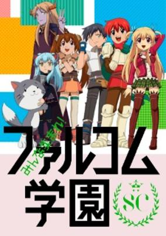

**Studio:** Chara-ani Dax Production &nbsp;|&nbsp; **Episodes:** 13 &nbsp;|&nbsp; **Director:** Pippuya &nbsp;|&nbsp; **Aired/Released:** January 4 – March 29 &nbsp;|&nbsp; **Genres:** Parody, Comedy, Ecchi, School Life

> The warriors who have been warped by the rampaging power of Justice have been summoned into the world of Xanadu. It is up to Dark Fact, a former villain, and principal Lappi to re-educate these students.
>
> _Synopsis source: Kitsu_

[Wikipedia](https://en.wikipedia.org/wiki/Minna_Atsumare!_Falcom_Gakuen_SC) · [Kitsu](https://kitsu.io/anime/minna-atsumare-falcom-gakuen-2nd-season)

---

### Tantei Kageki Milky Holmes TD

**Studio:** J.C. Staff Nomad &nbsp;|&nbsp; **Episodes:** 12 &nbsp;|&nbsp; **Director:** Hiroshi Nishikiori &nbsp;|&nbsp; **Aired/Released:** January 4 – March 28 &nbsp;|&nbsp; **Genres:** Magical Girl, Super Power, Comedy, Mystery

> The four members of Milky Holmes are going on a study tour. While soaking in the hot springs among snow monkeys, alarms interrupt the relaxing environment! It was the work of the Thief Empire. A fierce battle between Milky Holmes and the Thief Empire begins, with both sides using their Toys (special powers). Furthermore, with the arrival of the Genius 4, a three-way fight occurs! In the midst of battle, a violent lightning strikes from the sky. Struck by the lightning, the four Milky Holmes girls lose their abilities.
>
> _Synopsis source: Kitsu_

[Wikipedia](https://en.wikipedia.org/wiki/Tantei_Opera_Milky_Holmes) · [Kitsu](https://kitsu.io/anime/tantei-opera-milky-holmes-movie-gyakushuu-no-milky-holmes)

---

### Kamisama Kiss◎ (Kamisama Kiss: Season 2)

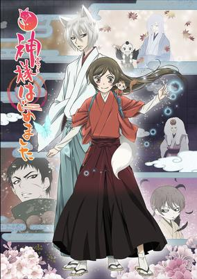

**Studio:** TMS/V1 Studio &nbsp;|&nbsp; **Episodes:** 12 &nbsp;|&nbsp; **Director:** Akitaro Daichi &nbsp;|&nbsp; **Aired/Released:** January 5 – March 30 &nbsp;|&nbsp; **Genres:** Bishounen, Deity, Present, Earth, Demon, Japan, Violence, Asia, Fantasy, Comedy

> After the events following the first season, Nanami is filled with new challenges as the Land God of the Shrine. She faces these challenges with her two familiars Tomoe and Mizuki. Along these challenges, Tomoe begins to realize his true feelings for Nanami.
>
> _Synopsis source: Kitsu_

[Wikipedia](https://en.wikipedia.org/wiki/Kamisama_Kiss) · [Kitsu](https://kitsu.io/anime/kamisama-hajimemashita-2)

---

### Yurikuma Arashi

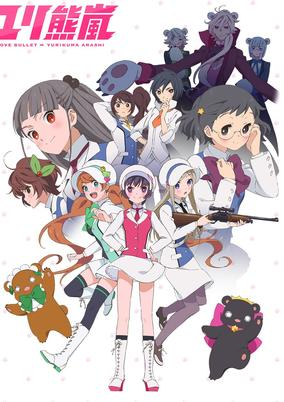

**Studio:** Silver Link &nbsp;|&nbsp; **Episodes:** 12 &nbsp;|&nbsp; **Director:** Kunihiko Ikuhara &nbsp;|&nbsp; **Aired/Released:** January 5 – March 31 &nbsp;|&nbsp; **Genres:** All Girls School, Fantasy, Ecchi, Anthropomorphism, School Life, Shoujo Ai, Psychological

> In the past, humanoid bears coexisted with humans. However, a meteor shower that fell onto Earth had a strange effect on bears throughout the world: they suddenly became violent and hungry for human flesh, spurring an endless cycle of bloodshed in which bear ate man and man shot bear, forgetting the lively relationship they once had. The "Wall of Severance" was thus built, separating the two civilizations and keeping peace. Kureha Tsubaki and Sumika Izumino are two lovers attending Arashigaoka Academy, who, upon the arrival of two bears that have sneaked through the Wall of Severance and infiltrated the academy, find their relationship under a grave threat. The hungering yet affectionate bears, Ginko Yurishiro and Lulu Yurigasaki, seem to see the bear-hating Kureha as more than just another meal, and in getting closer to her, trigger an unraveling of secrets that Kureha may not be able to bear. When their relationships provoke the Invisible Storm, a group that keeps order within the ideological school, the girls must stand on trial with their love, embarking on a journey of self-discovery en route to attaining true love's "promised kiss." [Written by MAL Rewrite]
>
> _Synopsis source: Kitsu_

[Wikipedia](https://en.wikipedia.org/wiki/Yurikuma_Arashi) · [Kitsu](https://kitsu.io/anime/yuri-kuma-arashi)

---

### Cute High Earth Defense Club Love!

**Studio:** Diomedéa &nbsp;|&nbsp; **Episodes:** 12 &nbsp;|&nbsp; **Director:** Shinji Takamatsu &nbsp;|&nbsp; **Aired/Released:** January 6 – March 24 &nbsp;|&nbsp; **Genres:** Bishounen, High School, School Clubs, Henshin, Anthropomorphism, Japan, School Life, Comedy, Action, Asia, Earth, Parody, Super Power, Magic, Magical Girl, Slice of Life

> Why should girls get to have all the fun? These magical boys are here to save the world from the loveless... at least that's what the pink wombat who gives them their magical powers wants them to do. In Binan Koukou Chikyuu Bouei-bu Love!, the main characters are the members of the "Earth Defense Club" at the Binan High School, though all they really want to do is hang out, goof off, and relax at the nearby Kurotama Bath. One fateful day, though, a pink wombat appears out of nowhere and forces these five high school students to become "Battle Lovers" and protect Earth from a trio of villains who are taking orders from a green hedgehog. Over the course of the series, the Battle Lovers will take on a variety of fiends, including the chikuwabu monster, a chopstick phantom, a monster remote control, and plenty more strange enemies! Will the heirs to the throne of love be able to protect Earth from those who want to destroy love? Or will the Earth Conquest Club fill the world with hate?
>
> _Synopsis source: Kitsu_

[Wikipedia](https://en.wikipedia.org/wiki/Cute_High_Earth_Defense_Club_Love!) · [Kitsu](https://kitsu.io/anime/binan-koukou-chikyuu-bouei-bu-love)

---

### Kantai Collection (KanColle)

**Studio:** Diomedéa &nbsp;|&nbsp; **Episodes:** 12 &nbsp;|&nbsp; **Director:** Keizō Kusakawa &nbsp;|&nbsp; **Aired/Released:** January 7 – March 25 &nbsp;|&nbsp; **Genres:** Military, Navy, Action, Science Fiction, Slice of Life, School Life

> With the seas under constant threat from the hostile "Abyssal Fleet," a specialized naval base is established to counter them. Rather than standard naval weaponry, however, the base is armed with "Kanmusu"—girls who harbor the spirits of Japanese warships—possessing the ability to don weaponized gear that allows them to harness the powerful souls within themselves. Fubuki, a young Destroyer-type Kanmusu, joins the base as a new recruit; unfortunately for her, despite her inexperience and timid nature, she is assigned to the famous Third Torpedo Squadron and quickly thrust into the heat of battle. When she is rescued from near annihilation, the rookie warship resolves to become as strong as the one who saved her. [Written by MAL Rewrite]
>
> _Synopsis source: Kitsu_

[Wikipedia](https://en.wikipedia.org/wiki/Kantai_Collection_(anime)) · [Kitsu](https://kitsu.io/anime/kantai-collection)

---

### Miritari!

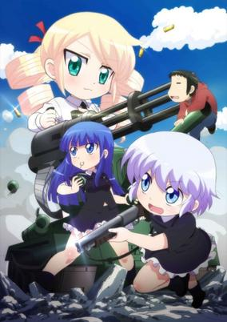

**Studio:** Creators in Pack &nbsp;|&nbsp; **Episodes:** 12 &nbsp;|&nbsp; **Director:** Hiroshi Kimura &nbsp;|&nbsp; **Aired/Released:** January 7 – March 25 &nbsp;|&nbsp; **Genres:** Gunfights, Absurdist Humour, Slapstick, Parental Abandonment, Violent Retribution For Accidental Infringement, Japan, Earth, Comedy, Action, Loli, Asia, Ecchi, Military, Slice of Life

> The story takes place during a conflict between the Krakozhia Dukedom and the Grania Republic. In the midst of the fighting, a savior appears to the Krakozhia Dukedom, and it is a high school student named Yano Souhei. Two female soldiers, First Lieutenant Ruto and Second Lieutenant Haruka, appear in tanks to intrude on Souhei's everyday life, followed by the enemy soldier Shachirofu, all of whom use firearms without hesitation at his house.
>
> _Synopsis source: Kitsu_

[Wikipedia](https://en.wikipedia.org/wiki/Miritari!) · [Kitsu](https://kitsu.io/anime/military)

---

### The Testament of Sister New Devil

**Studio:** Production IMS &nbsp;|&nbsp; **Episodes:** 12 &nbsp;|&nbsp; **Director:** Hisashi Saito &nbsp;|&nbsp; **Aired/Released:** January 7 – March 25 &nbsp;|&nbsp; **Genres:** Slapstick, Violent Retribution For Accidental Infringement, Stereotypes, Action, Fantasy, Comedy, Ecchi, Romance, Harem, Parental Abandonment, Demon

> Running into your new stepsister in the bathroom is not the best way to make a good first impression, which Basara Toujou learns the hard way. When his father suddenly brings home two beautiful girls and introduces them as his new siblings, he has no choice but to accept into his family the Naruse sisters: busty redhead Mio and petite silver-haired Maria. But when these seemingly normal girls reveal themselves as demons—Mio the former Demon Lord's only daughter and Maria her trusted succubus servant—Basara is forced to reveal himself as a former member of a clan of "Heroes," sworn enemies of the demons. However, having begun to care for his new sisters, Basara instead decides to protect them with his powers and forms a master-servant contract with Mio to keep watch over her. With the Heroes observing his every move and the constant threat of hostile demons, Basara has to do the impossible to protect his new family members. Moreover, the protector himself is hiding his own dark secret that still haunts him to this day... [Written by MAL Rewrite]
>
> _Synopsis source: Kitsu_

[Wikipedia](https://en.wikipedia.org/wiki/The_Testament_of_Sister_New_Devil) · [Kitsu](https://kitsu.io/anime/shinmai-maou-no-testament)

---

### Fafner in the Azure: Exodus

**Studio:** XEBECzwei &nbsp;|&nbsp; **Episodes:** 13 &nbsp;|&nbsp; **Director:** Takashi Noto Nobuyoshi Habara &nbsp;|&nbsp; **Aired/Released:** January 8 – April 15

[Wikipedia](https://en.wikipedia.org/wiki/Fafner_in_the_Azure)

---

### Saekano: How to Raise a Boring Girlfriend

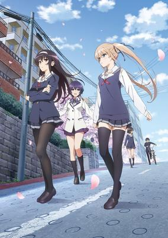

**Studio:** A-1 Pictures &nbsp;|&nbsp; **Episodes:** 12 &nbsp;|&nbsp; **Director:** Kanta Kamei &nbsp;|&nbsp; **Aired/Released:** January 8 – March 26 &nbsp;|&nbsp; **Genres:** High School, Breaking The Fourth Wall, Parody, School Clubs, Comedy, Harem, Ecchi, Romance, School Life

> One day, an otaku high school student Tomoya Aki has a fateful encounter with a girl. This meeting inspires Tomoya to design his very own “gal-game” featuring a heroine modeled after the girl he saw. In order to make his desire a reality, Tomoya must persuade a few eccentric “creators” such as the ace member of the art club, Eriri Spencer Sawamura and the school’s top student, Utaha Kasumigaoka to join his development team. Meanwhile, Tomoya is shocked to learn that the girl he idolized as his muse for this whole project was none other than his boring classmate, Megumi Kato!
>
> _Synopsis source: Kitsu_

[Kitsu](https://kitsu.io/anime/saenai-heroine-no-sodate-kata)

---

### Tokyo Ghoul √A (Tokyo Ghoul)

**Studio:** Pierrot &nbsp;|&nbsp; **Episodes:** 12 &nbsp;|&nbsp; **Director:** Shuhei Morita &nbsp;|&nbsp; **Aired/Released:** January 8 – March 26 &nbsp;|&nbsp; **Genres:** Dark Fantasy, Violence, Action, Horror, Psychological, Mystery

> The suspense horror/dark fantasy story is set in Tokyo, which is haunted by mysterious "ghouls" who are devouring humans. People are gripped by the fear of these ghouls whose identities are masked in mystery. An ordinary college student named Kaneki encounters Rize, a girl who is an avid reader like him, at the café he frequents. Little does he realize that his fate will change overnight.
>
> _Synopsis source: Kitsu_

[Wikipedia](https://en.wikipedia.org/wiki/Tokyo_Ghoul) · [Kitsu](https://kitsu.io/anime/tokyo-ghoul)

---

### Unlimited Fafnir

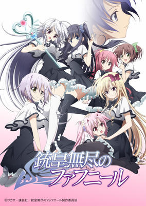

**Studio:** Diomedéa &nbsp;|&nbsp; **Episodes:** 12 &nbsp;|&nbsp; **Director:** Keizō Kusakawa &nbsp;|&nbsp; **Aired/Released:** January 8 – March 26 &nbsp;|&nbsp; **Genres:** All Girls School, Action, Fantasy, Ecchi, Harem, School Life, Romance

> Midgar, all-girl academy, would have been notable just for the action of accepting its first and only male student, Yuu Mononobe. But Midgar stands out for much more than that: it's a school exclusive to a group of girls known as D's. Each of them have extremely powerful abilities in generating dark matter and manipulating it into powerful weaponry. The D's didn't exist twenty-five years ago, and only appeared after a number of mysterious, destructive monsters known as "Dragons" started appearing around the world. Strangely, just as suddenly as they appeared, they vanished. In their destructive wake, some girls started being born with symbols on their bodies and powers similar in nature to those wielded by the Dragons themselves. Now the D's attend this school, hoping to harness and utilize their powers against the Dragons. Yuu is their latest member and is extraordinary for being the only known male D in existence. Now he must forge relationships with the girls around him, including his long separated sister who attends the school as well, and work with them to investigate and eliminate the threat of the powerful Dragons.
>
> _Synopsis source: Kitsu_

[Wikipedia](https://en.wikipedia.org/wiki/Unlimited_Fafnir) · [Kitsu](https://kitsu.io/anime/juuou-mujin-no-fafnir)

---

### Assassination Classroom

**Studio:** Lerche &nbsp;|&nbsp; **Episodes:** 22 &nbsp;|&nbsp; **Director:** Seiji Kishi &nbsp;|&nbsp; **Aired/Released:** January 9 – June 19 &nbsp;|&nbsp; **Genres:** Assassin, Comedy, School Life, Action

> When a mysterious creature chops the moon down to a permanent crescent, the students of class 3-E of Kunugigaoka Middle School find themselves confronted with an enormous task: assassinate the creature responsible for the disaster before Earth suffers a similar fate. However, the monster, dubbed Koro-sensei (the indestructible teacher), is able to fly at speeds of up to Mach 20, which he demonstrates freely, leaving any attempt to subdue him in his extraterrestrial dust. Furthermore, the misfits of 3-E soon find that the strange, tentacled beast is more than just indomitable—he is the best teacher they have ever had! Adapted from the humorous hit manga by Yuusei Matsui, Ansatsu Kyoushitsu tells the story of these junior high pupils as they polish their assassination skills and grow in order to stand strong against the oppressive school system, their own life problems, and one day, Koro-sensei.
>
> _Synopsis source: Kitsu_

[Wikipedia](https://en.wikipedia.org/wiki/Assassination_Classroom) · [Kitsu](https://kitsu.io/anime/ansatsu-kyoushitsu-tv)

---

### Gourmet Girl Graffiti

**Studio:** Shaft &nbsp;|&nbsp; **Episodes:** 12 &nbsp;|&nbsp; **Director:** Naoyuki Tatsuwa Akiyuki Shinbo &nbsp;|&nbsp; **Aired/Released:** January 9 – March 27 &nbsp;|&nbsp; **Genres:** Cooking, Comedy, Slice of Life

> The main protagonist of Koufuku Graffiti is a girl named Ryou Machiko who lives alone while attending art school. Ryou absolutely loves to cook (she learned how to from her grandmother who wanted her to grow up to be a fine wife) but lately, all of her dishes have been tasting horrible to her. One day, she gets a sudden call from her aunt who tells her that her second cousin Kirin will be staying with her on the weekends because she wants to attend the same art school as her. Soon after Kirin arrives, Ryou learns a valuable lesson and completely changes her perspective on cooking which is that good meals are meant to be eaten with loved ones and that's what makes them taste great. Over the course of the series, Ryou cooks a variety of dishes for her cousin, friends, neighbors and anyone else who drops by her apartment! This is not a series that you'll want to watch on an empty stomach!
>
> _Synopsis source: Kitsu_

[Wikipedia](https://en.wikipedia.org/wiki/Gourmet_Girl_Graffiti) · [Kitsu](https://kitsu.io/anime/koufuku-graffiti)

---

### Death Parade

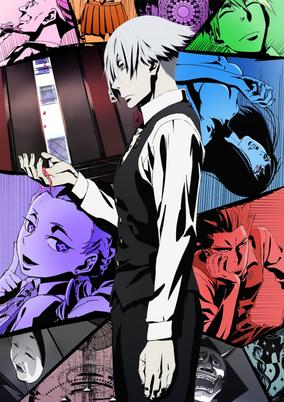

**Studio:** Madhouse &nbsp;|&nbsp; **Episodes:** 12 &nbsp;|&nbsp; **Director:** Yuzuru Tachikawa &nbsp;|&nbsp; **Aired/Released:** January 9 – March 27 &nbsp;|&nbsp; **Genres:** Present, Thriller, Psychological, Mystery, Drama, Supernatural

> After death, there is no heaven or hell, only a bar that stands between reincarnation and oblivion. There the attendant will, one after another, challenge pairs of the recently deceased to a random game in which their fate of either ascending into reincarnation or falling into the void will be wagered. Whether it's bowling, darts, air hockey, or anything in between, each person's true nature will be revealed in a ghastly parade of death and memories, dancing to the whims of the bar's master. Welcome to Quindecim, where Decim, arbiter of the afterlife, awaits! Death Parade expands upon the original one-shot intended to train young animators. It follows yet more people receiving judgment—until a strange, black-haired guest causes Decim to begin questioning his own rulings.
>
> _Synopsis source: Kitsu_

[Wikipedia](https://en.wikipedia.org/wiki/Death_Parade) · [Kitsu](https://kitsu.io/anime/death-parade)

---

### Dog Days''

**Studio:** Seven Arcs Pictures &nbsp;|&nbsp; **Episodes:** 12 &nbsp;|&nbsp; **Director:** Junji Nishimura Kikuchi Katsuya &nbsp;|&nbsp; **Aired/Released:** January 10 – March 28

[Wikipedia](https://en.wikipedia.org/wiki/Dog_Days_(Japanese_TV_series))

---

### Durarara!!×2 (Durarara!! x2)

**Studio:** Shuka &nbsp;|&nbsp; **Episodes:** 36 &nbsp;|&nbsp; **Director:** Takahiro Omori &nbsp;|&nbsp; **Aired/Released:** January 10 – March 26, 2016 &nbsp;|&nbsp; **Genres:** Present, Earth, Japan, Tokyo, Violence, Asia, Action, Mystery

> Although peace has finally returned to Ikebukuro, many of the odd occurrences have become common sights around the city. One such case is the police's constant pursuit of Celty Sturluson, the Headless Rider. Moreover, someone has placed a large bounty on her, igniting the motivation of gang members all over to begin searching for the supernatural creature as well. Meanwhile, Mikado Ryuugamine is approached by Aoba Kuronuma, a mysterious underclassman with unknown intentions, who reveals that he knows Mikado's true identity. But Ikebukuro's state of tranquility is short-lived, as a new threat appears in the form of a murderer who goes by the pseudonym "Hollywood," known for wearing a different mask each time they commit a crime. As the various events taking place prove to be connected yet again, Ikebukuro is thrown into another conflict that threatens to engulf the entire city in chaos. [Written by MAL Rewrite]
>
> _Synopsis source: Kitsu_

[Wikipedia](https://en.wikipedia.org/wiki/Durarara!!%C3%972) · [Kitsu](https://kitsu.io/anime/durarara-x2)

---

### Kuroko's Basketball (season 3) (Kuroko's Basketball 3)

**Studio:** Production I.G &nbsp;|&nbsp; **Episodes:** 25 &nbsp;|&nbsp; **Director:** Shunsuke Tada &nbsp;|&nbsp; **Aired/Released:** January 10 – July 1 &nbsp;|&nbsp; **Genres:** Basketball, Comedy, School Life, Sports, Shounen

> Following their triumph against Yousen High, Seirin's basketball team has reached the semifinals of the Winter Cup along with Kaijou, Rakuzan, and Shuutoku. Each of these teams possesses a member of the Generation of Miracles, and Seirin prepares to face the largest obstacles on their path to winning the Winter Cup. In the final season of Kuroko no Basket, Kuroko goes head-to-head with his old teammates once more as he attempts to show them that individual skill is not the only way to play basketball. His firm belief that his form of basketball, team play, is the right way to play the sport will clash with the talents of a perfect copy and an absolute authority. While Kuroko tries to prove that his basketball is "right," he and the rest of Seirin High ultimately have one goal: to win the Winter Cup and overcome the strength of the Generation of Miracles, who have long dominated the scene of middle and high school basketball. [Written by MAL Rewrite]
>
> _Synopsis source: Kitsu_

[Wikipedia](https://en.wikipedia.org/wiki/Kuroko%27s_Basketball) · [Kitsu](https://kitsu.io/anime/kuroko-no-basket-3rd-season)

---

### Shōnen Hollywood – Holly Stage for 50

**Studio:** Zexcs &nbsp;|&nbsp; **Episodes:** 13 &nbsp;|&nbsp; **Director:** Toshimasa Kuroyanagi &nbsp;|&nbsp; **Aired/Released:** January 10 – April 4 &nbsp;|&nbsp; **Genres:** Bishounen, Musical Band, Idol, Present, Earth, Japan, Tokyo, Performance, Music, Asia, The Arts, Slice of Life

> The anime tells an original story set 15 years after the novel's story. It takes place at a fictional theater called Hollywood Tokyo in Harajuku, where members of the idol group "Shounen Hollywood" develop their talents with diligent work and studying.
>
> _Synopsis source: Kitsu_

[Wikipedia](https://en.wikipedia.org/wiki/Sh%C5%8Dnen_Hollywood) · [Kitsu](https://kitsu.io/anime/shounen-hollywood-holly-stage-for-49)

---

### The IDOLM@STER Cinderella Girls

**Studio:** A-1 Pictures &nbsp;|&nbsp; **Episodes:** 13 &nbsp;|&nbsp; **Director:** Noriko Takao &nbsp;|&nbsp; **Aired/Released:** January 10 – April 11 &nbsp;|&nbsp; **Genres:** Idol, Present, Earth, Japan, Music, Asia, The Arts, Comedy

> There are many idols with long-established talent agency 346 Production. And now the company is starting a new program, the Cinderella Project! Girls leading normal lives... They are chosen to be aspiring idols and see another world for the first time in this Cinderella story. Can they all climb the stairs that lead to the palace? The magic begins now...
>
> _Synopsis source: Kitsu_

[Wikipedia](https://en.wikipedia.org/wiki/The_Idolmaster_Cinderella_Girls) · [Kitsu](https://kitsu.io/anime/the-idolm-ster-cinderella-girls)

---

### The Rolling Girls

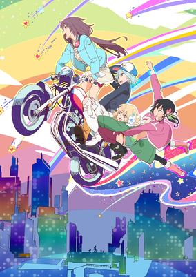

**Studio:** Wit Studio &nbsp;|&nbsp; **Episodes:** 12 &nbsp;|&nbsp; **Director:** Kotomi Deai &nbsp;|&nbsp; **Aired/Released:** January 10 – March 28 &nbsp;|&nbsp; **Genres:** Super Power, Japan, Friendship, Action, Adventure, Slice of Life, Alternative Present, Coming Of Age, Music, Supernatural

> In a dystopian future where Japan's political organization has crumbled after the Great Tokyo War, Japan is broken up into 10 independent nations, with each nation controlled by a gang led by a "Best," a human-proclaimed prophet with destructive superpowers. Nozomi Moritomo is a "Rest"—a normal girl that has just started out as a rookie in the local gang. She wants to help the Best Masami Utoku, her childhood friend and role model, in the ongoing territorial dispute. When Masami becomes severely injured and unable to fight, Nozomi decides to go on a mission to complete the requests sent to Masami from all over Japan. Along the way, she meets Yukina Kosaka, a shy girl with no sense of direction; Ai Hibiki, an upbeat girl who loves eating; and Chiaya Misono, a quiet and mysterious girl that wears a gas mask. Together, the four girls travel all over the country on their motorcycles while getting involved in territorial wars, disagreements, and even suspicious conspiracies.
>
> _Synopsis source: Kitsu_

[Wikipedia](https://en.wikipedia.org/wiki/The_Rolling_Girls) · [Kitsu](https://kitsu.io/anime/the-rolling-girls)

---

### Maria the Virgin Witch

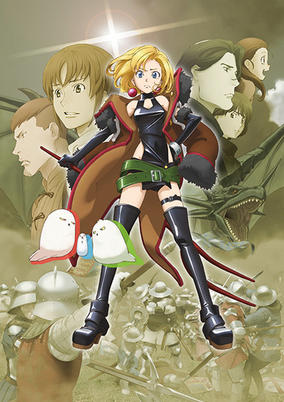

**Studio:** Production I.G &nbsp;|&nbsp; **Episodes:** 12 &nbsp;|&nbsp; **Director:** Gorō Taniguchi &nbsp;|&nbsp; **Aired/Released:** January 11 – March 29 &nbsp;|&nbsp; **Genres:** Magic, Past, Earth, Demon, Violence, France, Europe, Fantasy, Historical, Comedy, Drama

> The virgin witch Maria seeks to end a war with the help of her two familiars: a seductive succubus and incubus tandem. The archangel Michael despises her interference in human affairs and vows that her powers will vanish if she ever loses her virginity!
>
> _Synopsis source: Kitsu_

[Wikipedia](https://en.wikipedia.org/wiki/Maria_the_Virgin_Witch) · [Kitsu](https://kitsu.io/anime/junketsu-no-maria)

---

### World Break: Aria of Curse for a Holy Swordsman

**Studio:** Diomedéa &nbsp;|&nbsp; **Episodes:** 12 &nbsp;|&nbsp; **Director:** Inagaki Takayuki &nbsp;|&nbsp; **Aired/Released:** January 11 – March 29 &nbsp;|&nbsp; **Genres:** Magic, Contemporary Fantasy, Japan, Action, Fantasy, Ecchi, Harem, School Life, Romance

> Seiken Tsukai no World Break takes place at Akane Private Academy where students who possess memories of their previous lives are being trained to use Ancestral Arts so that they can serve as defenders against monsters, called Metaphysicals, who randomly attack. Known as saviors, the students are broken up into two categories: the kurogane who are able to use their prana to summon offensive weapons and the kuroma who are able to use magic. The story begins six months prior to the major climax of the series during the opening ceremonies on the first day of the school year. After the ceremony is over, the main character, Moroha Haimura, meets a girl named Satsuki Ranjou who reveals that she was Moroha's little sister in a past life where Moroha was a heroic prince capable of slaying entire armies with his sword skills. Soon afterwards he meets another girl, Shizuno Urushibara, who eventually reveals that she also knew Moroha in an entirely different past life where he was a dark lord capable of using destructive magic but saved her from a life of slavery. Can those whose minds live in both the present and the past truly reach a bright future? Delve into the complex world of Seiken Tsukai no World Break to find out!
>
> _Synopsis source: Kitsu_

[Kitsu](https://kitsu.io/anime/seiken-tsukai-no-world-break)

---

### Samurai Warriors

**Studio:** Tezuka Productions TYO Animations &nbsp;|&nbsp; **Episodes:** 12 &nbsp;|&nbsp; **Director:** Kōjin Ochi &nbsp;|&nbsp; **Aired/Released:** January 11 – March 29

[Wikipedia](https://en.wikipedia.org/wiki/Samurai_Warriors_(anime))

---

### Yatterman Night

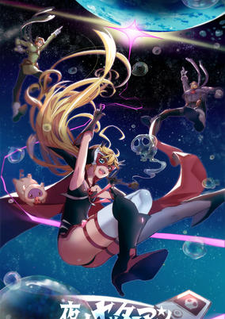

**Studio:** Tatsunoko Production &nbsp;|&nbsp; **Episodes:** 12 &nbsp;|&nbsp; **Director:** Tatsuya Yoshihara &nbsp;|&nbsp; **Aired/Released:** January 11 – March 29 &nbsp;|&nbsp; **Genres:** Comedy, Drama, Action, Adventure

> Several generations after the original Yatterman series, Leopard lives with her mother and guardians, Dorothy, Voltkatze, and Elephantus, just outside the prosperous Yatter Kingdom. She lives a happy if impoverished life, unaware of her ancestral ties to the infamous Doronbow Gang, until she discovers a mural of Doronjo, Boyacky, and Tonzura in a sealed off area of her home. It turns out that Dorothy, Voltkatze, and Elephantus are descendants of the villainous gangsters, which is why they have been forbidden from entering the hero Yatterman's Kingdom! At first, Leopard vows to never engage in villainous actions like her ancestors, but new circumstances may mean that she must go back on her word, donning the identity of villain in search of true justice.
>
> _Synopsis source: Kitsu_

[Wikipedia](https://en.wikipedia.org/wiki/Yatterman_Night) · [Kitsu](https://kitsu.io/anime/yoru-no-yatterman)

---

### Isuca

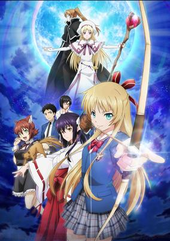

**Studio:** Arms &nbsp;|&nbsp; **Episodes:** 10 &nbsp;|&nbsp; **Director:** Akira Iwanaga &nbsp;|&nbsp; **Aired/Released:** January 23 – March 27 &nbsp;|&nbsp; **Genres:** Violence, Parental Abandonment, Japan, Earth, Asia, Female Student, Fantasy, Ecchi, Magic, Harem, Demon, Action, Comedy, Romance, School Life

> Poor Shinichirou Asano has the worst of luck. His parents abandoned him and ran off to Europe. If that isn't bad enough on its own, they barely left him any money to take care of himself. In order to pay rent and keep a roof over his head, he has to work. Unfortunately, he was just fired from his last job and as a high school student, he doesn't have many other prospects. One evening, he's attacked by a centipede monster on his way home. Shinichirou is saved by a mysterious girl with a bow and arrow, who he later discovers is Sakuya Shimazu, a beautiful student who attends his school. But when he later helps an injured girl, he discovers two things. First, the injured girl isn't human at all but rather a nekomata, a two-tailed demon cat. And second, Sakuya comes from a family of exorcists, who've protected humanity from rogue monsters and spirits for generations. Because Shinichirou was responsible for releasing the nekomata, Sakuya enlists his help in recapturing the demon, but that's just the beginning of Shinichirou's relationship with Sakuya. It turns out the Shimazu family needs a housekeeper and it just so happens that Shinichirou excels at cooking and likes to clean! It may not be his dream job, but if it pays the rent and puts food on the table...
>
> _Synopsis source: Kitsu_

[Wikipedia](https://en.wikipedia.org/wiki/Isuca) · [Kitsu](https://kitsu.io/anime/isuca)

---

### Go! Princess PreCure

**Studio:** Toei Animation &nbsp;|&nbsp; **Episodes:** 50 &nbsp;|&nbsp; **Director:** Yuta Tanaka &nbsp;|&nbsp; **Aired/Released:** February 1 – January 31, 2016 &nbsp;|&nbsp; **Genres:** Magical Girl, Magic, Action, Fantasy, Comedy, Slice of Life, School Life

> Once upon a time, there was a little girl who desperately wanted to become a princess just like the ones in her picture book. Other children made fun of her childish wishes, but she never stopped believing. One day, a boy who looked like a prince appeared, asking her if she would like to be a princess. He gave the girl magical charm to make her wish come true. That little girl, Haruka Haruno, is now a thirteen-year-old attending Noble Academy, a junior high boarding school. Her school life is interrupted by two fairies, Pafu and Aroma, who give her a Princess Perfume, which mysteriously matches the charm she was given eight years ago! Turns out, Haruka is one of the Princess Precures, and must team up with Cure Mermaid and Cure Twinkle in Go! Princess Precure in order to defeat the dark witch Dyspear before she brings the the Hope Kingdom and Haruka's world to a nightmareish end!
>
> _Synopsis source: Kitsu_

[Wikipedia](https://en.wikipedia.org/wiki/Go!_Princess_PreCure) · [Kitsu](https://kitsu.io/anime/go-princess-precure)

---

### Omakase! Miracle Cat-dan

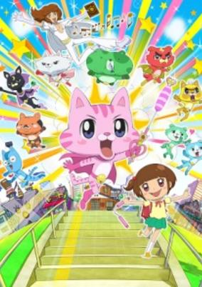

**Studio:** OLM, Inc. &nbsp;|&nbsp; **Episodes:** 32 &nbsp;|&nbsp; **Director:** Mitsuo Hashimoto &nbsp;|&nbsp; **Aired/Released:** March 31 – February 23, 2016 &nbsp;|&nbsp; **Genres:** Comedy, Super Power, Kids

> Nakagawa owns 10 cats in real life, and she adores one in particular named Mamitasu, the anime's namesake. The anime depicts the slapstick comedy of the idiosyncratic 10 cats and the folks in the unusual "Nakagawa family."
>
> _Synopsis source: Kitsu_

[Wikipedia](https://en.wikipedia.org/wiki/Omakase!_Miracle_Cat-dan) · [Kitsu](https://kitsu.io/anime/omakase-mamitasu)

---

### Battle Spirits Burning Soul

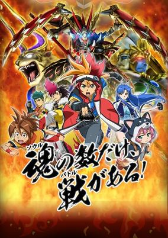

**Studio:** BN Pictures &nbsp;|&nbsp; **Director:** Hajime Yatate &nbsp;|&nbsp; **Aired/Released:** April 1 – &nbsp;|&nbsp; **Genres:** Action, Kids

> In the near future, a battle card game called "Battle Spirits" has gained enormous popularity. Players of the game—known as "Battlers"—start duelings everywhere using their color-coded cards with different attributes, creating a "Sengoku (Warring States) period" for the game.
>
> _Synopsis source: Kitsu_

[Wikipedia](https://en.wikipedia.org/wiki/Battle_Spirits) · [Kitsu](https://kitsu.io/anime/battle-spirits-burning-soul)

---

### I Can't Understand What My Husband Is Saying

**Studio:** Seven &nbsp;|&nbsp; **Episodes:** 26 &nbsp;|&nbsp; **Director:** Shinpei Nagai &nbsp;|&nbsp; **Aired/Released:** October 3, 2014 – June 25, 2015 &nbsp;|&nbsp; **Genres:** Present, Earth, Japan, Asia, Comedy, Slice of Life

> Though they couldn't be any more different, love has managed to blossom between Hajime Tsunashi, a hardcore otaku who shuts himself in at home while making a living off his blog, and his wife Kaoru—a hard-working office lady who, in contrast, is fairly ordinary, albeit somewhat of a crazy drunk. As this unlikely couple discovers, love is much more than just a first kiss or a wedding; the years that come afterward in the journey of marriage brings with it many joys as well as challenges. Whether due to their quirky personalities or the peculiar people surrounding them, Hajime and Kaoru find themselves caught up in a variety of baffling and ridiculous antics. But despite the struggles they face, the love that ties them together spurs them to move forward and strive to become better people in order to bring their partner happiness. [Written by MAL Rewrite]
>
> _Synopsis source: Kitsu_

[Wikipedia](https://en.wikipedia.org/wiki/I_Can%27t_Understand_What_My_Husband_Is_Saying) · [Kitsu](https://kitsu.io/anime/danna-ga-nani-wo-itteiru-ka-wakaranai-ken)

---

### My Teen Romantic Comedy SNAFU TOO!

**Studio:** Feel &nbsp;|&nbsp; **Episodes:** 13 &nbsp;|&nbsp; **Director:** Kei Oikawa &nbsp;|&nbsp; **Aired/Released:** April 2 – June 25 &nbsp;|&nbsp; **Genres:** High School, Present, Earth, School Clubs, Japan, Asia, Comedy, Romance, Friendship, School Life

> Hikigaya Hachiman, with his unique thought processes, seemed to be glorifying the life of a loner when his guidance counselor, Hiratsuka Shizuka, talked him into joining the Service Club. Together with the other members, the breathtaking, flawless Yukinoshita Yukino and the cute, popular Yuigahama Yui, he spent his days solving all kinds of problems for his classmates, from relationship worries to running the cultural festival committee. The seasons have given way to fall, and now Hachiman, Yukino, and Yui are preparing for a field trip to Kyoto. What request has been brought to the Service Club this time?
>
> _Synopsis source: Kitsu_

[Wikipedia](https://en.wikipedia.org/wiki/My_Teen_Romantic_Comedy_SNAFU) · [Kitsu](https://kitsu.io/anime/yahari-ore-no-seishun-love-comedy-wa-machigatteiru-zoku)

---

### Re-Kan!

**Studio:** Pierrot+ &nbsp;|&nbsp; **Episodes:** 13 &nbsp;|&nbsp; **Director:** Masashi Kudo &nbsp;|&nbsp; **Aired/Released:** April 2 – June 25 &nbsp;|&nbsp; **Genres:** Ghost, Fantasy, Comedy, School Life

> Amami Hibiki is a girl who can see ghosts and other supernatural phenomena in her surroundings. The stories follow her daily life with both her friends and the otherworldly.
>
> _Synopsis source: Kitsu_

[Wikipedia](https://en.wikipedia.org/wiki/Re-Kan!) · [Kitsu](https://kitsu.io/anime/re-kan)

---

### Is It Wrong to Try to Pick Up Girls in a Dungeon?

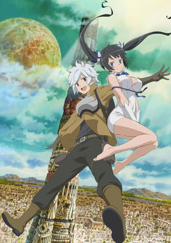

**Studio:** J.C. Staff &nbsp;|&nbsp; **Episodes:** 12 &nbsp;|&nbsp; **Director:** Yoshiki Yamakawa &nbsp;|&nbsp; **Aired/Released:** April 3 – June 26 &nbsp;|&nbsp; **Genres:** High Fantasy, Deity, Fantasy World, Plot Continuity, Action, Fantasy, Adventure, Romance, Harem, Comedy

> Commonly known as the "Dungeon," the city of Orario possesses a huge labyrinth in the underground. Its strange name attracts excitement, illusions of honor, and hopes of romance with a pretty girl. In this city of dreams and desires, new adventurer Bell Cranel has his fateful encounter with the tiny Goddess Hestia. Thus begins the story of a boy striving to become the best adventurer and a lonely goddess searching for followers both working together to fulfill their goals.
>
> _Synopsis source: Kitsu_

[Wikipedia](https://en.wikipedia.org/wiki/Is_It_Wrong_to_Try_to_Pick_Up_Girls_in_a_Dungeon%3F) · [Kitsu](https://kitsu.io/anime/dungeon-ni-deai-wo-motomeru-no-wa-machigatteiru-no-darou-ka)

---

### Food Wars!: Shokugeki no Soma (Food Wars! Shokugeki no Soma)

**Studio:** J.C. Staff &nbsp;|&nbsp; **Episodes:** 24 &nbsp;|&nbsp; **Director:** Yoshitomo Yonetani &nbsp;|&nbsp; **Aired/Released:** April 3 – September 25 &nbsp;|&nbsp; **Genres:** Cooking, Present, Japan, School Life, Comedy, Ecchi, Shounen

> Ever since he was a child, fifteen-year-old Souma Yukihira has helped his father by working as the sous chef in the restaurant his father runs and owns. Throughout the years, Souma developed a passion for entertaining his customers with his creative, skilled, and daring culinary creations. His dream is to someday own his family's restaurant as its head chef. Yet when his father suddenly decides to close the restaurant to test his cooking abilities in restaurants around the world, he sends Souma to Tootsuki Culinary Academy, an elite cooking school where only 10 percent of the students graduate. The institution is famous for its "Shokugeki" or "food wars," where students face off in intense, high-stakes cooking showdowns. As Souma and his new schoolmates struggle to survive the extreme lifestyle of Tootsuki, more and greater challenges await him, putting his years of learning under his father to the test. [Written by MAL Rewrite]
>
> _Synopsis source: Kitsu_

[Kitsu](https://kitsu.io/anime/shokugeki-no-souma)

---

### Magical Girl Lyrical Nanoha ViVid

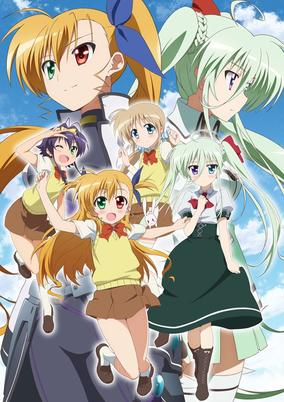

**Studio:** A-1 Pictures &nbsp;|&nbsp; **Episodes:** 12 &nbsp;|&nbsp; **Director:** Yuuki Itoh &nbsp;|&nbsp; **Aired/Released:** April 3 – June 19 &nbsp;|&nbsp; **Genres:** Magic, Super Power, Present, Fantasy World, Contemporary Fantasy, Action, Fantasy, Friendship, Magical Girl, Adventure

> Set four years after StrikerS, Nanoha finally has time to get off her feet. Now explore the Nanoha world in Vivio Takamichi's shoes and her device, Sacred Heart.
>
> _Synopsis source: Kitsu_

[Wikipedia](https://en.wikipedia.org/wiki/Magical_Girl_Lyrical_Nanoha_ViVid) · [Kitsu](https://kitsu.io/anime/mahou-shoujo-lyrical-nanoha-vivid)

---

### The Disappearance of Nagato Yuki-chan

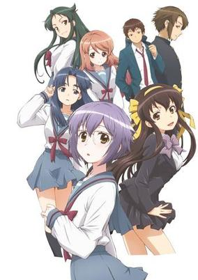

**Studio:** Satelight &nbsp;|&nbsp; **Episodes:** 16 &nbsp;|&nbsp; **Director:** Jun'ichi Wada &nbsp;|&nbsp; **Aired/Released:** April 3 – July 17 &nbsp;|&nbsp; **Genres:** High School, School Clubs, Slow When It Comes To Love, Present, Japan, School Life, Comedy, Asia, Earth, Romance, Slice of Life

> In an alternate universe, shy, awkward Yuki Nagato attempts to court her crush, Kyon, with the help of her best friend and neighbor, the perky and indomitable Ryoko Asakura. Together, the trio defends their high school literature club from extermination…and from the pestering of their over-the-top classmate Tsuruya and her friend and minion Mikuru.
>
> _Synopsis source: Kitsu_

[Wikipedia](https://en.wikipedia.org/wiki/The_Disappearance_of_Nagato_Yuki-chan) · [Kitsu](https://kitsu.io/anime/nagato-yuki-chan-no-shoushitsu)

---

### Blood Blockade Battlefront

**Studio:** Bones &nbsp;|&nbsp; **Episodes:** 12 &nbsp;|&nbsp; **Director:** Rie Matsumoto &nbsp;|&nbsp; **Aired/Released:** April 4 – October 4 &nbsp;|&nbsp; **Genres:** Fantasy World, New York, Parallel Universe, Americas, Action, United States, Disaster, Earth, Comedy, Science Fiction, Vampire, Super Power, Fantasy

> A breach between Earth and the netherworlds has opened up over the city of New York, trapping New Yorkers and creatures from other dimensions in an impenetrable bubble. They’ve lived together for years, in a world of crazy crime sci-fi sensibilities. Now someone is threatening to sever the bubble, and a group of stylish superhumans is working to keep it from happening.
>
> _Synopsis source: Kitsu_

[Wikipedia](https://en.wikipedia.org/wiki/Blood_Blockade_Battlefront) · [Kitsu](https://kitsu.io/anime/kekkai-sensen)

---

### Gunslinger Stratos: The Animation

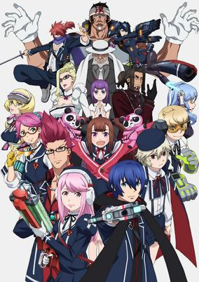

**Studio:** A-1 Pictures &nbsp;|&nbsp; **Episodes:** 12 &nbsp;|&nbsp; **Director:** Shinpei Ezaki &nbsp;|&nbsp; **Aired/Released:** April 4 – June 20 &nbsp;|&nbsp; **Genres:** Future, Asia, Japan, Earth, Action, Science Fiction

> A.D. 2115—the island nation once called Japan is now known as the "17th Far East Imperial City Management District." The citizens were promised a life of peace in exchange for some of the comfort they were used to having. People believed their lives would never change and tomorrow will be the same as today. No one suspected the impending doom which their society was about to face. "Degradation"—a rare disease which led to the total disintegration of the human body to a mere pile of sand was slowly but surely spreading throughout the world. Tohru Kazasumi, an ordinary student becomes embroiled in a multi universal battle between his world and the parallel world of "Frontier S (Stratos)." This meant that Tohru must fight himself from an alternate world. Their futures collide as their paths cross. Will both worlds ever find peace?
>
> _Synopsis source: Kitsu_

[Kitsu](https://kitsu.io/anime/gunslinger-stratos-the-animation)

---

### High School DxD BorN

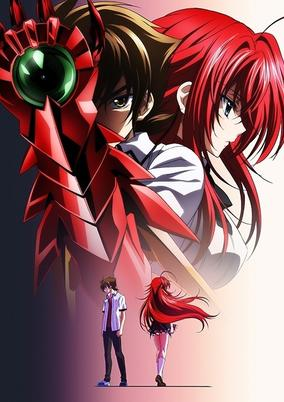

**Studio:** TNK &nbsp;|&nbsp; **Episodes:** 12 &nbsp;|&nbsp; **Director:** Tetsuya Yanagisawa &nbsp;|&nbsp; **Aired/Released:** April 4 – June 20 &nbsp;|&nbsp; **Genres:** Angel, Dragon, Super Power, Demon, Action, Fantasy, Comedy, Ecchi, Romance, Harem

> The babes and boys of the Occult Research Club are Back! Lovable loser (and bust buff) Issei and his clan of bewitching beauties return for a new season of supernatural tussles and sexy shenanigans—featuring old friends and new enemies! Now that all the girls live in Issei’s home, life seems like nothing but fun and scantily-clad lounging…for now! Join Rias, Akeno, Koneko, Asia, Xenovia, Gasper, and everyone’s favorite Harem King Issei as they fight, fumble, and fondle their way through their demonic high school lives.
>
> _Synopsis source: Kitsu_

[Wikipedia](https://en.wikipedia.org/wiki/High_School_DxD) · [Kitsu](https://kitsu.io/anime/high-school-dxd-born)

---

### Jewelpet: Magical Change

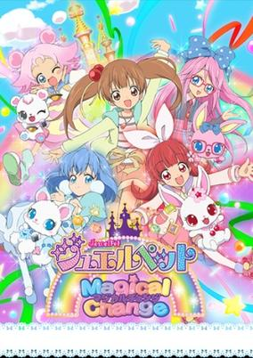

**Studio:** Studio Deen &nbsp;|&nbsp; **Episodes:** 39 &nbsp;|&nbsp; **Director:** Nobuhiro Kondo &nbsp;|&nbsp; **Aired/Released:** April 4 – December 26 &nbsp;|&nbsp; **Genres:** Magical Girl, Magic, Fantasy, Comedy

> The story follows the adventures of rabbit-shaped Jewelpet Ruby, her long-best human friend Airi Kirara and the other Jewelpets on their mission to restore the Jewel Castle, which had fallen from the skies into the middle of the town because of humanity's lack of faith in magic. To restore people's belief in magic, Jewelpets transform into humans to study more about them.
>
> _Synopsis source: Kitsu_

[Kitsu](https://kitsu.io/anime/jewelpet-magical-change)

---

### Plastic Memories

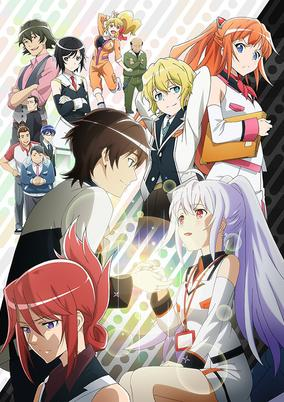

**Studio:** Doga Kobo &nbsp;|&nbsp; **Episodes:** 13 &nbsp;|&nbsp; **Director:** Yoshiyuki Fujiwara &nbsp;|&nbsp; **Aired/Released:** April 4 – June 27 &nbsp;|&nbsp; **Genres:** Android, Robot, Future, Comedy, Plot Continuity, Earth, Science Fiction, Drama, Romance

> Eighteen-year-old Tsukasa Mizugaki has failed his college entrance exams, but after pulling some strings, he manages to land a job at the Sion Artificial Intelligence Corporation. SAI Corp is responsible for the creation of "Giftias"—highly advanced androids which are almost indiscernible from normal humans. However, unlike humans, Giftias have a maximum lifespan of 81,920 hours, or around nine years and four months. Terminal Service One, the station Tsukasa was assigned to, is responsible for collecting Giftias that have met their expiration date, before they lose their memories and become hostile. Promptly after joining Terminal Service One, Tsukasa is partnered with a beautiful Giftia named Isla. She is a Terminal Service veteran and considered the best in Giftia retrievals, contrary to her petite figure and placid nature. Time is fleeting though, and Tsukasa must come to terms with his feelings for Isla before her time is up. No matter how much someone desires it, nothing lasts forever. [Written by MAL Rewrite]
>
> _Synopsis source: Kitsu_

[Wikipedia](https://en.wikipedia.org/wiki/Plastic_Memories) · [Kitsu](https://kitsu.io/anime/plastic-memories)

---

### Rin-ne

**Studio:** Brain's Base &nbsp;|&nbsp; **Episodes:** 25 &nbsp;|&nbsp; **Director:** Seiki Sugawara &nbsp;|&nbsp; **Aired/Released:** April 4 – September 20 &nbsp;|&nbsp; **Genres:** High School, Magic, Ghost, Present, Earth, Contemporary Fantasy, Japan, Asia, Fantasy, Comedy

> A very strange thing happened to Mamiya Sakura as a child: She disappeared in the woods behind her grandmother's house. Of course, Sakura doesn't quite recall what happened next, but she's been seeing dead people ever since—ghosts at home, ghosts at school, and even ghosts on the street. Now that she's in high school, another strange thing has happened in her life. A desk next to her that's sat empty all year is suddenly filled by an oddly-dressed boy named Rokudou Rinne. Rinne seems to be capable of seeing the same things Sakura does, and sometimes, other people can't even see him. What sort of secret is Rinne-kun hiding, and how is he connected to Sakura's strange power? In Kyoukai no Rinne, another world exists alongside the one we live in. Thanks to Rinne, Mamiya Sakura will get to know this world and the wacky characters that inhabit it.
>
> _Synopsis source: Kitsu_

[Wikipedia](https://en.wikipedia.org/wiki/Rin-ne) · [Kitsu](https://kitsu.io/anime/kyoukai-no-rinne-tv)

---

### Seraph of the End (Seraph of the End: Vampire Reign)

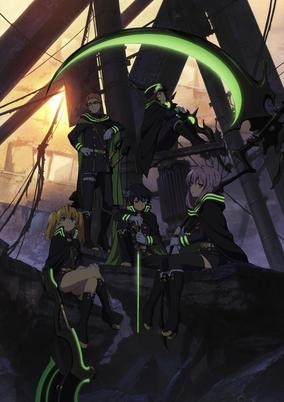

**Studio:** Wit Studio &nbsp;|&nbsp; **Episodes:** 12 &nbsp;|&nbsp; **Director:** Daisuke Tokudo &nbsp;|&nbsp; **Aired/Released:** April 4 – June 20 &nbsp;|&nbsp; **Genres:** Disaster, Japan, Post Apocalypse, Action, Tokyo, Asia, Earth, Fantasy, Vampire, Shounen

> With the appearance of a mysterious virus that kills everyone above the age of 13, mankind becomes enslaved by previously hidden, power-hungry vampires who emerge in order to subjugate society with the promise of protecting the survivors, in exchange for donations of their blood. Among these survivors are Yuuichirou and Mikaela Hyakuya, two young boys who are taken captive from an orphanage, along with other children whom they consider family. Discontent with being treated like livestock under the vampires' cruel reign, Mikaela hatches a rebellious escape plan that is ultimately doomed to fail. The only survivor to come out on the other side is Yuuichirou, who is found by the Moon Demon Company, a military unit dedicated to exterminating the vampires in Japan. Many years later, now a member of the Japanese Imperial Demon Army, Yuuichirou is determined to take revenge on the creatures that slaughtered his family, but at what cost?Owari no Seraph is a post-apocalyptic supernatural shounen anime that follows a young man's search for retribution, all the while battling for friendship and loyalty against seemingly impossible odds. [Written by MAL Rewrite]
>
> _Synopsis source: Kitsu_

[Wikipedia](https://en.wikipedia.org/wiki/Seraph_of_the_End) · [Kitsu](https://kitsu.io/anime/owari-no-seraph)

---

### Ultimate Otaku Teacher

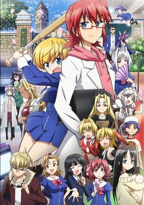

**Studio:** A-1 Pictures &nbsp;|&nbsp; **Episodes:** 24 &nbsp;|&nbsp; **Director:** Masato Sato &nbsp;|&nbsp; **Aired/Released:** April 4 – September 26 &nbsp;|&nbsp; **Genres:** High School, School Life, Japan, Asia, Present, Earth, Comedy, Romance

> Some academic geniuses suffer from burnout. Others simply lose all interest in their studies and want to focus on other things. Junichirou Kagami falls into the latter category. He was once a teenage physics genius whose papers were published in Nature, Science, and other prestigious research journals. Unfortunately, upon graduating from college, he left the science field and became a shut-in whose life motto is "I can only do things I want to do." These days, Kagami spends all of his time watching anime, reading manga, collecting figures, and updating his blog. He seems satisfied with not having a job, but his younger sister, Suzune, cannot stand the thought of her brother being an unemployed loser for the rest of his life. She goes behind his back and gets him a job as a substitute teacher at his old high school. What lucky timing that the regular physics teacher had to go on maternity leave! And good thing his alma mater remembers him as that teenage genius! But can a hardcore otaku actually teach a bunch of high school students anything important and useful?
>
> _Synopsis source: Kitsu_

[Wikipedia](https://en.wikipedia.org/wiki/Ultimate_Otaku_Teacher) · [Kitsu](https://kitsu.io/anime/denpa-kyoushi-tv)

---

### Uta no Prince-sama: Maji Love Revolutions (Uta no Prince Sama Revolutions)

**Studio:** A-1 Pictures &nbsp;|&nbsp; **Episodes:** 13 &nbsp;|&nbsp; **Director:** Yuu Kou Yūki Ukai &nbsp;|&nbsp; **Aired/Released:** April 4 – June 28 &nbsp;|&nbsp; **Genres:** Music, Comedy, Romance, Harem, School Life

> The third anime adaptation of the otome game Uta no☆Prince-sama♪. Starish are given new assignments in newly divided teams, and they do their best in order to try and impress Shining Saotome into allowing their entry to SSS, a top level music contest. Meanwhile, Haruka works with the Quartet Night.
>
> _Synopsis source: Kitsu_

[Wikipedia](https://en.wikipedia.org/wiki/Uta_no_Prince-sama) · [Kitsu](https://kitsu.io/anime/uta-no-prince-sama-maji-love-3)

---

### Baby Steps (season 2)

**Studio:** Pierrot &nbsp;|&nbsp; **Episodes:** 25 &nbsp;|&nbsp; **Director:** Masahiko Murata &nbsp;|&nbsp; **Aired/Released:** April 5 – September 20 &nbsp;|&nbsp; **Genres:** Tennis, Slow When It Comes To Love, Sports, Romance, School Life

> Diligent and methodical honor student Eiichirou Maruo decides to exercise more during the little free time he has available because he is worried about his health. For this reason, after seeing a flyer, he joins the Southern Tennis Club at the beginning of his freshman year. During his free trial at the club, he meets Natsu Takasaki, another first year student, who is determined on becoming a professional tennis player due to her love for the sport. In contrast, Eiichirou's study-oriented life exists because he believes that it is what he has to do, not because he enjoys it. However, his monotonous days come to an end as the more he plays tennis, the more he becomes fascinated by it.Baby Steps is the story of a boy who makes the most of his hard-working and perfectionist nature to develop his own unique playing style. Little by little, Eiichirou's skills begin to improve, and he hopes to stand on equal footing with tennis' best players. [Written by MAL Rewrite]
>
> _Synopsis source: Kitsu_

[Wikipedia](https://en.wikipedia.org/wiki/Baby_Steps_(manga)#Anime) · [Kitsu](https://kitsu.io/anime/baby-steps)

---

### Duel Masters Versus Revolution

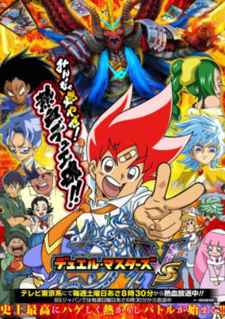

**Studio:** Ascension &nbsp;|&nbsp; **Episodes:** 51 &nbsp;|&nbsp; **Director:** Shinobu Sasaki &nbsp;|&nbsp; **Aired/Released:** April 5 – March 27, 2016 &nbsp;|&nbsp; **Genres:** Comedy, Action, Adventure, Card Games

> A next fierce fight is about to begin after Katta Kirifuda finally become the Duel Masters National Tournament champion. Japan's largest theme park, Duel Masters Land has appeared. With numerous fun attractions and events, Katta was also having fun. However, after meeting the mascot of the park, "Duemouse", Katta got involved in a ridiculous conspiracy of the park. A shadow that invades the Duel Masters World, which is the mysterious team of duelists! The mysterious identity of the legendary card is to be revealed. A new stage and revolution of Duel Masters befalls Katta!
>
> _Synopsis source: Kitsu_

[Wikipedia](https://en.wikipedia.org/wiki/Duel_Masters_Versus_Revolution) · [Kitsu](https://kitsu.io/anime/duel-masters-vsr)

---

### Hello!! Kin-iro Mosaic

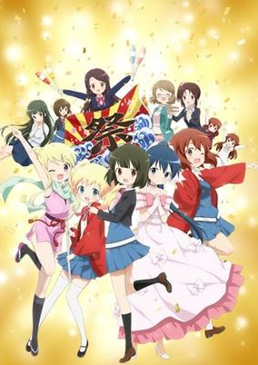

**Studio:** Studio Gokumi &nbsp;|&nbsp; **Episodes:** 12 &nbsp;|&nbsp; **Director:** Tensho &nbsp;|&nbsp; **Aired/Released:** April 5 – June 21 &nbsp;|&nbsp; **Genres:** Comedy, Slice of Life, School Life

> The episode is set during a school festival where Shinobu is assigned to write a script and make outfits for her class play. Youko and Alice notice that Shinobu is sleepy every morning and are worried that she might be getting tired of all the work. Will Shinobu be able to successfully complete all her tasks in time?
>
> _Synopsis source: Kitsu_

[Wikipedia](https://en.wikipedia.org/wiki/Kin-iro_Mosaic) · [Kitsu](https://kitsu.io/anime/hello-kiniro-mosaic-special)

---

### Rainy Cocoa

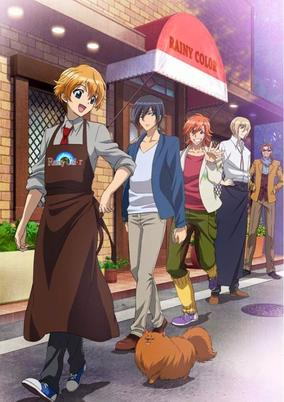

**Studio:** EMT Squared &nbsp;|&nbsp; **Episodes:** 12 &nbsp;|&nbsp; **Director:** Tomomi Mochizuki &nbsp;|&nbsp; **Aired/Released:** April 5 – June 21 &nbsp;|&nbsp; **Genres:** Slice of Life, Comedy

> Aoi Tokura is having a rough day. He’s used to being mistaken for a girl, but it’s even worse when a captivating stranger on the train calls him a creeper for staring a little too long. Aoi’s soaked by a sudden rainstorm and takes shelter at Rainy Color, a cozy café where the warmth of the staff compliments the sweet hot cocoa he’s served. When he falls into a job at the café he feels like things are finally looking up— until Keiichi Iwase, the man he couldn’t help but stare at on the train, shows up. Did this day just get worse, or better?
>
> _Synopsis source: Kitsu_

[Wikipedia](https://en.wikipedia.org/wiki/Rainy_Cocoa) · [Kitsu](https://kitsu.io/anime/ame-iro-cocoa)

---

### Show by Rock!!

**Studio:** Bones &nbsp;|&nbsp; **Episodes:** 12 &nbsp;|&nbsp; **Director:** Takahiro Ikezoe &nbsp;|&nbsp; **Aired/Released:** April 5 – June 21 &nbsp;|&nbsp; **Genres:** Juujin, Musical Band, Fantasy World, Plot Continuity, Music, Comedy

> The great music adventure in Show by Rock!! begins after Cyan decides to play her favorite rhythm game and suddenly gets sucked in, finding herself in a world called Midi City where music reigns supreme. She learns that anyone who delivers amazing and powerful music also has the ability to control the city. However, not all music is pure. An evil plan is set in motion to engulf the whole Midi City in darkness. Is it too late for Cyan to do something? Cyan Hijirikawa always regards herself as nothing but an ordinary girl living in a mediocre world. She has great talent and extreme guitar skills, but she also lacks the confidence to take the first step in realizing her dream to play in a band and be a music millionaire! Little did she know that an eminent power resides deep within herself—the power to defeat evil with her magical music! Join Cyan, Chuchu, Retoree and Moa in a world where music is everything.
>
> _Synopsis source: Kitsu_

[Wikipedia](https://en.wikipedia.org/wiki/Show_by_Rock!!) · [Kitsu](https://kitsu.io/anime/show-by-rock)

---

### The Heroic Legend of Arslan

**Studio:** Liden Films Sanzigen &nbsp;|&nbsp; **Episodes:** 25 &nbsp;|&nbsp; **Director:** Noriyuki Abe &nbsp;|&nbsp; **Aired/Released:** April 5 – September 27 &nbsp;|&nbsp; **Genres:** Historical, Fantasy, Adventure

> It has been announced that Hiromu Arakawa's Arslan Senki manga will bundle OVAs in the fifth and sixth volumes, to be released on May 9 and November 9 respectively. The first OVA will include an original story supervised by Hiromu Arakawa, while the content of the second OVA has not been announced yet.
>
> _Synopsis source: Kitsu_

[Wikipedia](https://en.wikipedia.org/wiki/The_Heroic_Legend_of_Arslan_(manga_by_Hiromu_Arakawa)) · [Kitsu](https://kitsu.io/anime/arslan-senki-tv-ova)

---

### Ghost in the Shell: Arise (Ghost in the Shell: Arise - Border 3: Ghost Tears)

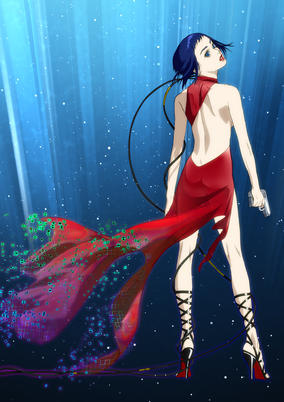

**Studio:** Production I.G &nbsp;|&nbsp; **Episodes:** 10 &nbsp;|&nbsp; **Director:** Kazuchika Kise &nbsp;|&nbsp; **Aired/Released:** April 5 – June 14 &nbsp;|&nbsp; **Genres:** Mecha, Science Fiction, Cops, Psychological

> Third movie of Ghost in the Shell: Arise. Motoko and Batou work to try to stop a terrorist organization whose symbol is the Scylla. Meanwhile, Togusa investigates a murder of a man who possessed a prosthetic leg manufactured by the Mermaid's Leg corporation.
>
> _Synopsis source: Kitsu_

[Kitsu](https://kitsu.io/anime/ghost-in-the-shell-arise-border-3-ghost-tears)

---

### Ace of Diamond: Second Season

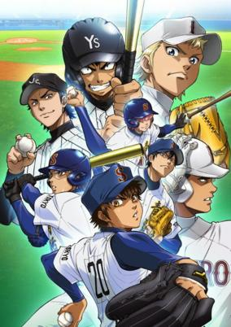

**Studio:** Madhouse Production I.G &nbsp;|&nbsp; **Director:** Mitsuyuki Masuhara &nbsp;|&nbsp; **Aired/Released:** April 6 – &nbsp;|&nbsp; **Genres:** Japan, Baseball, Comedy, Friendship, School Life, Sports, Shounen

> After the National Tournament, the Seidou High baseball team moves forward with uncertainty as the Fall season quickly approaches. In an attempt to build a stronger team centered around their new captain, fresh faces join the starting roster for the very first time. Previous losses weigh heavily on the minds of the veteran players as they continue their rigorous training, preparing for what will inevitably be their toughest season yet. Rivals both new and old stand in their path as Seidou once again climbs their way toward the top, one game at a time. Needed now more than ever before, Furuya and Eijun must be determined to pitch with all their skill and strength in order to lead their team to victory. And this time, one of these young pitchers may finally claim that coveted title: "The Ace of Seidou." [Written by MAL Rewrite]
>
> _Synopsis source: Kitsu_

[Wikipedia](https://en.wikipedia.org/wiki/Ace_of_Diamond) · [Kitsu](https://kitsu.io/anime/diamond-no-ace-second-season)

---

### Mikagura School Suite

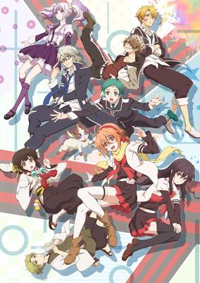

**Studio:** Doga Kobo &nbsp;|&nbsp; **Episodes:** 12 &nbsp;|&nbsp; **Director:** Tarō Iwasaki &nbsp;|&nbsp; **Aired/Released:** April 6 – June 22 &nbsp;|&nbsp; **Genres:** School Clubs, School Life, Comedy, Contemporary Fantasy, Fantasy, Action, Super Power, Shoujo Ai

> A story based on the super popular song series from NND. Eruna Ichinomiya, a freshman who dreamed of a school life filled with cuteness, entered a boarding school—Mikagura Private School. In this school, each of the cultural club representatives has to battle each other, with unique powers...!! What will happen to Eruna, who somehow ended up becoming the representative of a certain club?!
>
> _Synopsis source: Kitsu_

[Wikipedia](https://en.wikipedia.org/wiki/Mikagura_School_Suite) · [Kitsu](https://kitsu.io/anime/mikagura-gakuen-kumikyoku)

---

### Teekyu (season 4) (Teekyu 4)

**Studio:** Millepensee &nbsp;|&nbsp; **Episodes:** 12 &nbsp;|&nbsp; **Director:** Shin Itagaki &nbsp;|&nbsp; **Aired/Released:** April 7 – June 23 &nbsp;|&nbsp; **Genres:** Earth, Absurdist Humour, Slapstick, Japan, Tennis, Asia, Comedy, Sports

> Fourth season of Teekyuu series.
>
> _Synopsis source: Kitsu_

[Wikipedia](https://en.wikipedia.org/wiki/Teekyu) · [Kitsu](https://kitsu.io/anime/teekyuu-4)

---

### Sound! Euphonium

**Studio:** Kyoto Animation &nbsp;|&nbsp; **Episodes:** 13 &nbsp;|&nbsp; **Director:** Tatsuya Ishihara &nbsp;|&nbsp; **Aired/Released:** April 7 – June 30 &nbsp;|&nbsp; **Genres:** High School, School Clubs, The Arts, Present, Angst, Japan, School Life, Asia, Earth, Music, Musical Band, Coming Of Age

> After swearing off music due to an incident at the middle school regional brass band competition, euphonist Kumiko Oumae enters high school hoping for a fresh start. As fate would have it, she ends up being surrounded by people with an interest in the high school brass band. Kumiko finds the motivation she needs to make music once more with the help of her bandmates, some of whom are new like novice tubist Hazuki Katou; veteran contrabassist Sapphire Kawashima; and band vice president and fellow euphonist Asuka Tanaka. Others are old friends, like Kumiko's childhood friend and hornist-turned-trombonist Shuuichi Tsukamoto, and trumpeter and bandmate from middle school, Reina Kousaka. However, in the band itself, chaos reigns supreme. Despite their intention to qualify for the national band competition, as they currently are, just competing in the local festival will be a challenge—unless the new band advisor Noboru Taki does something about it. From the studio that animated Suzumiya Haruhi no Yuuutsu, Kyoto Animation's Hibike! Euphonium is a fresh and musical take on the slice-of-life staple that is the high school student's struggle to deal with their past, find romance, and realize their dreams and aspirations. [Written by MAL Rewrite]
>
> _Synopsis source: Kitsu_

[Wikipedia](https://en.wikipedia.org/wiki/Sound!_Euphonium) · [Kitsu](https://kitsu.io/anime/hibike-euphonium)

---

### Gintama°

**Studio:** BN Pictures &nbsp;|&nbsp; **Director:** Chizuru Miyawaki &nbsp;|&nbsp; **Aired/Released:** April 8 –

[Wikipedia](https://en.wikipedia.org/wiki/Gintama)

---

### My Love Story!!

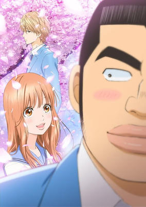

**Studio:** Madhouse &nbsp;|&nbsp; **Episodes:** 24 &nbsp;|&nbsp; **Director:** Morio Asaka &nbsp;|&nbsp; **Aired/Released:** April 8 – September 23 &nbsp;|&nbsp; **Genres:** Present, Japan, Plot Continuity, Asia, Earth, Romance, Comedy, Shoujo

> With his muscular build and tall stature, Takeo Gouda is not exactly your average high school freshman. However, behind his intimidating appearance hides a heart of gold, and he is considered a hero by the boys for his courage and chivalry. Unfortunately, these traits do not help much with his love life. As if his looks are not enough to scare the opposite sex away, Takeo's cool and handsome best friend and constant companion Makoto Sunakawa easily steals the hearts of the female students—including every girl Takeo has ever liked. When Takeo gallantly saves cute and angelic Rinko Yamato from being molested, he falls in love with her instantly, but suspects that she might be interested in Sunakawa. With his own love for Yamato continuing to bloom, Takeo unselfishly decides to act as her cupid, even as he yearns for his own love story. [Written by MAL Rewrite]
>
> _Synopsis source: Kitsu_

[Wikipedia](https://en.wikipedia.org/wiki/My_Love_Story!!) · [Kitsu](https://kitsu.io/anime/ore-monogatari)

---

### Triage X

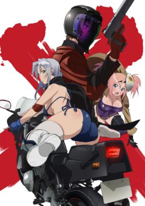

**Studio:** Xebec &nbsp;|&nbsp; **Episodes:** 10 &nbsp;|&nbsp; **Director:** Akio Takami Takao Kato &nbsp;|&nbsp; **Aired/Released:** April 8 – June 10 &nbsp;|&nbsp; **Genres:** Assassin, Violence, Action, Harem, Crime, Law And Order, Adventure, Ecchi

> In a deadly terrorist attack, Arashi Mikami narrowly escapes death but loses everything in the process, including his family and best friend. However, the surgeon that rescues him is far from just an ordinary doctor—he commands a strike team known as Black Label whose task is to exterminate deadly criminals who have fallen too far. Filled with a new determination, Arashi joins the ranks of the vigilante organization. Black Label's targets are aplenty, as evil scum lurks everywhere—dangerous arms dealers, corrupt politicians, and shady gangsters all find themselves hunted by the extermination team. Although haunted by their dark and sinister past, all of the hunters are highly skilled at slaying their targets. In spite of the perilous lives the members live, Arashi and the gorgeous ladies surrounding him still manage to get caught up in a variety of sultry moments and racy hijinks. Though they face strong opposition, nothing can stop Black Label's objective of cleansing the world of ghastly evil. [Written by MAL Rewrite]
>
> _Synopsis source: Kitsu_

[Wikipedia](https://en.wikipedia.org/wiki/Triage_X) · [Kitsu](https://kitsu.io/anime/triage-x)

---

### Etotama

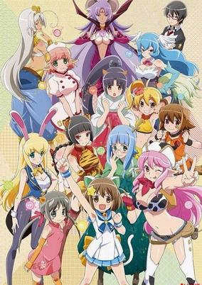

**Studio:** Shirogumi Encourage Films &nbsp;|&nbsp; **Episodes:** 12 &nbsp;|&nbsp; **Director:** Fumitoshi Oizaki Takamitsu Hirakawa &nbsp;|&nbsp; **Aired/Released:** April 9 – June 25 &nbsp;|&nbsp; **Genres:** Super Deformed, Slapstick, Comedy, Fantasy, Action

> When Takeru Amato moved into his new apartment in Akihabara, he was warned that there was one problem with it. He wasn’t warned, however, that the problem was a hole in the floor that leads to the realm of the zodiac gods. He also wasn’t told about Nyaa-tan, the eccentric, immature, prospective zodiac-sign cat. Nyaa-tan would like nothing more than to join the rest of the girls, otherwise known as Eto-shin, in the Chineze zodiac, but she’s going to have to fight to work her way in. Fortunately, establishing a relationship with Takeru can help her with that. In Etotama the members of the zodiac don’t just represent people’s births; they draw their power from positive human emotions in the form of energy called Sol/Lull. With this power, the Eto-musume, or potential Eto-shin, can change from their mostly humanoid appearances into smaller “pretty modes” that can battle with each other in the Eto world. Nyaa-tan needs to get Takeru to warm up to him fast, and not just because they’re living together. The ETM12 selection festival to determine the next member of the zodiac is coming soon. With Takeru’s good graces, Nyaa-tan just might be able to fight off the other Eto-musume and the 12 Eto-shin themselves, and finally take her place in the zodiac.
>
> _Synopsis source: Kitsu_

[Wikipedia](https://en.wikipedia.org/wiki/Etotama) · [Kitsu](https://kitsu.io/anime/etotama)

---

### Punch Line

**Studio:** MAPPA &nbsp;|&nbsp; **Episodes:** 12 &nbsp;|&nbsp; **Director:** Yutaka Uemura &nbsp;|&nbsp; **Aired/Released:** April 9 – June 25

[Wikipedia](https://en.wikipedia.org/wiki/Punchline_(anime))

---

### Urawa no Usagi-chan

**Studio:** A-Real &nbsp;|&nbsp; **Episodes:** 12 &nbsp;|&nbsp; **Director:** Mitsuyuki Ishibashi &nbsp;|&nbsp; **Aired/Released:** April 9 – June 25 &nbsp;|&nbsp; **Genres:** School Clubs, Comedy, Slice of Life, School Life

> An original anime to advertise Urawa City in Saitama, Japan.
>
> _Synopsis source: Kitsu_

[Wikipedia](https://en.wikipedia.org/wiki/Urawa_no_Usagi-chan) · [Kitsu](https://kitsu.io/anime/urawa-no-usagi-chan)

---

### Wish Upon the Pleiades

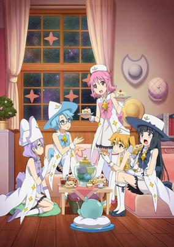

**Studio:** Gainax &nbsp;|&nbsp; **Episodes:** 12 &nbsp;|&nbsp; **Director:** Shōji Saeki &nbsp;|&nbsp; **Aired/Released:** April 9 – June 24 &nbsp;|&nbsp; **Genres:** Alien, Contemporary Fantasy, Fantasy, Magical Girl, Magic, Science Fiction, Adventure, Space

> The sky is the limit in Houkago no Pleiades. With telescope in hand, Subaru is set to go to the observation room of her school in order to get a view of that night's meteor shower. What she least expects is that behind the observatory door was not the starry skies, but a lavish garden, complete with a resplendent fountain and a mysterious young boy with long red hair. But the garden soon disappeared, as if Subaru was only imagining things. All that remains of that brilliant sight is an odd, bouncing blob creature that leads her to another magical door, occupied by other girls in magical witch-like costumes. Revelations start hitting Subaru one after the other: one of the girls in the room is her childhood friend Aoi, the little blob is actually an alien of a species called the Pleiadians trying to return home, and Subaru has been selected by him to become the newest member of their group! Now Subaru's dreams of the stars have come true in the wildest way, as she and her friends attempt to gather pieces of the Pleiadian spacecraft engine to return the being to his home. But they're not the only ones after the engine parts, and they have no idea why!
>
> _Synopsis source: Kitsu_

[Wikipedia](https://en.wikipedia.org/wiki/Wish_Upon_the_Pleiades) · [Kitsu](https://kitsu.io/anime/houkago-no-pleiades-tv)

---

### Knights of Sidonia: Battle for Planet Nine (Knights of Sidonia)

**Studio:** Polygon Pictures &nbsp;|&nbsp; **Episodes:** 12 &nbsp;|&nbsp; **Director:** Hiroyuki Seshita &nbsp;|&nbsp; **Aired/Released:** April 10 – June 26 &nbsp;|&nbsp; **Genres:** Action, Violence, Space Travel, Mecha, Post Apocalypse, Genetic Modification, Piloted Robot, Science Fiction, Human Enhancement, Horror, Shipboard, Alien, War, Drama, Future, Robot, Disaster, Plot Continuity, Space, Military

> After destroying Earth many years ago, the alien race Gauna has been pursuing the remnants of humanity—which, having narrowly escaped, fled across the galaxy in a number of giant seed ships. In the year 3394, Nagate Tanikaze surfaces from his lifelong seclusion deep beneath the seed ship Sidonia in search of food on the upper levels, only to find himself dragged into events unfolding without his knowledge. When the Gauna begin their assault on Sidonia, it's up to Tanikaze—with the help of his fellow soldiers and friends Shizuka Hoshijiro, Izana Shinatose, and Yuhata Midorikawa—to defend humanity's last hope for survival, and defeat their alien foes. Sidonia no Kishi follows Tanikaze as he discovers the world that has been above him his entire life, and becomes the hero Sidonia needs. [Written by MAL Rewrite]
>
> _Synopsis source: Kitsu_

[Wikipedia](https://en.wikipedia.org/wiki/Knights_of_Sidonia) · [Kitsu](https://kitsu.io/anime/sidonia-no-kishi)

---

### Nisekoi : (Nisekoi: False Love)

**Studio:** Shaft &nbsp;|&nbsp; **Episodes:** 12 &nbsp;|&nbsp; **Director:** Naoyuki Tatsuwa Akiyuki Shinbo Yukihiro Miyamoto &nbsp;|&nbsp; **Aired/Released:** April 10 – June 26 &nbsp;|&nbsp; **Genres:** Comedy, Romance, Love Polygon, Slow When It Comes To Love, Harem, School Life, Shounen

> Raku Ichijou, a first-year student at Bonyari High School, is the sole heir to an intimidating yakuza family. Ten years ago, Raku promised his childhood friend that they would get married when they reunite as teenagers. To seal the deal, the girl had given Raku a closed locket, the key to which she took with her when she left him. Now, years later, Raku has grown into a typical teenager, and all he wants is to remain as uninvolved in his yakuza background as possible while spending his school days alongside his middle school crush Kosaki Onodera. However, when the American Bee Hive Gang invades his family's turf, Raku's idyllic romantic dreams are sent for a toss as he is dragged into a frustrating conflict: Raku is to pretend that he is in a romantic relationship with Chitoge Kirisaki, the beautiful daughter of the Bee Hive's chief, so as to reduce the friction between the two groups. Unfortunately, reality could not be farther from this whopping lie—Raku and Chitoge fall in hate at first sight, as the girl is convinced he is a pathetic pushover, and in Raku's eyes, Chitoge is about as attractive as a savage gorilla. Nisekoi follows the daily antics of this mismatched couple who have been forced to get along for the sake of maintaining the city's peace. With many more girls popping up his life, all involved with Raku's past somehow, his search for the girl who holds his heart and his promise leads him in more unexpected directions than he expects. [Written by MAL Rewrite]
>
> _Synopsis source: Kitsu_

[Wikipedia](https://en.wikipedia.org/wiki/Nisekoi) · [Kitsu](https://kitsu.io/anime/nisekoi)

---

### Future Card Buddyfight 100 (Future Card Buddyfight)

**Studio:** OLM, Inc. Xebec &nbsp;|&nbsp; **Episodes:** 50 &nbsp;|&nbsp; **Director:** Shigetaka Ikeda &nbsp;|&nbsp; **Aired/Released:** April 11 – March 26, 2016 &nbsp;|&nbsp; **Genres:** Virtual Reality

> An adaptation of the Future Card Buddyfight card game. Future Card Buddyfight takes place in a more futuristic version of today. The card game connects to a parallel universe through special cards (Buddy Rare Cards) that act as portals. They bring monsters to Earth in order for them to become buddies with humans. Through friendship and courage, they take on and fight challenges, known as Buddyfights, where people of all ages have friendly non-hurtful competitions. The main character, Gaou Mikado has just started Buddyfighting. As the story progresses, Buddyfights are seeming to become a little too real...
>
> _Synopsis source: Kitsu_

[Wikipedia](https://en.wikipedia.org/wiki/Future_Card_Buddyfight) · [Kitsu](https://kitsu.io/anime/future-card-buddyfight)

---

### Yamada-kun and the Seven Witches

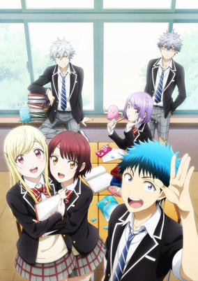

**Studio:** Liden Films &nbsp;|&nbsp; **Episodes:** 12 &nbsp;|&nbsp; **Director:** Tomoki Takuno &nbsp;|&nbsp; **Aired/Released:** April 12 – June 28 &nbsp;|&nbsp; **Genres:** Present, Asia, Earth, Japan, School Life, Harem, Comedy, Romance, Mystery

> When Ryuu Yamada entered high school, he wanted to turn over a new leaf and lead a productive school life. That's why he chose to attend Suzaku High, where no one would know of his violent delinquent reputation. However, much to Ryuu's dismay, he is soon bored; now a second year, Ryuu has reverted to his old ways—lazy with abysmal grades and always getting into fights. One day, back from yet another office visit, Ryuu encounters Urara Shiraishi, a beautiful honors student. A misstep causes them both to tumble down the stairs, ending in an accidental kiss! The pair discover they can switch bodies with a kiss: an ability which will prove to be both convenient and troublesome. Learning of their new power, Toranosuke Miyamura, a student council officer and the single member of the Supernatural Studies Club, recruits them for the club. Soon joined by Miyabi Itou, an eccentric interested in all things supernatural, the group unearths the legend of the Seven Witches of Suzaku High, seven female students who have obtained different powers activated by a kiss. The Supernatural Studies Club embarks on its first quest: to find the identities of all the witches. [Written by MAL Rewrite]
>
> _Synopsis source: Kitsu_

[Wikipedia](https://en.wikipedia.org/wiki/Yamada-kun_and_the_Seven_Witches) · [Kitsu](https://kitsu.io/anime/yamada-kun-to-7-nin-no-majo-tv)

---

### The Eden of Grisaia (The Fruit of Grisaia)

**Studio:** 8-Bit &nbsp;|&nbsp; **Episodes:** 10 &nbsp;|&nbsp; **Director:** Tensho &nbsp;|&nbsp; **Aired/Released:** April 19 – June 21 &nbsp;|&nbsp; **Genres:** Asia, Japan, Comedy, Earth, Romance, Angst, Drama, School Life, Harem, Psychological

> Yuuji Kazami is a transfer student who has just been admitted into Mihama Academy. He wants to live an ordinary high school life, but this dream of his may not come true any time soon as Mihama Academy is quite the opposite. Consisting of only the principal and five other students, all of whom are girls, Yuuji becomes acquainted with each of them, discovering more about their personalities as socialization is inevitable. Slowly, he begins to learn about the truth behind the small group of students occupying the academy—they each have their own share of traumatic experiences which are tucked away from the world. Mihama Academy acts as a home for these girls, they are the "fruit" which fell from their trees and have begun to decay. It is up to Yuuji to become the catalyst to save them from themselves, but how can he save another when he cannot even save himself? [Written by MAL Rewrite]
>
> _Synopsis source: Kitsu_

[Wikipedia](https://en.wikipedia.org/wiki/Le_Fruit_de_la_Grisaia) · [Kitsu](https://kitsu.io/anime/grisaia-no-kajitsu)

---

### Gangsta.

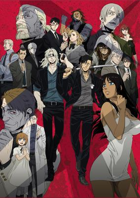

**Studio:** Manglobe &nbsp;|&nbsp; **Episodes:** 12 &nbsp;|&nbsp; **Director:** Shukou Murase &nbsp;|&nbsp; **Aired/Released:** July 1 – September 27 &nbsp;|&nbsp; **Genres:** Violence, Action, Crime, Tone Changes

> Nicholas Brown and Worick Arcangelo, known in the city of Ergastalum as the "Handymen," are mercenaries for hire who take on jobs no one else can handle. Contracted by powerful mob syndicates and police alike, the Handymen have to be ready and willing for anything. After completing the order of killing a local pimp, the Handymen add Alex Benedetto—a prostitute also designated for elimination—to their ranks to protect her from forces that want her gone from the decrepit hellhole of a city she has come to call home. However, this criminal’s paradise is undergoing a profound period of change that threatens to corrode the delicate balance of power. Ergastalum was once a safe haven for "Twilights," super-human beings born as the result of a special drug but are now being hunted down by a fierce underground organization. This new threat is rising up to challenge everything the city stands for, and the Handymen will not be able to avoid this coming war. [Written by MAL Rewrite]
>
> _Synopsis source: Kitsu_

[Wikipedia](https://en.wikipedia.org/wiki/Gangsta.) · [Kitsu](https://kitsu.io/anime/gangsta)

---

### Aquarion Logos

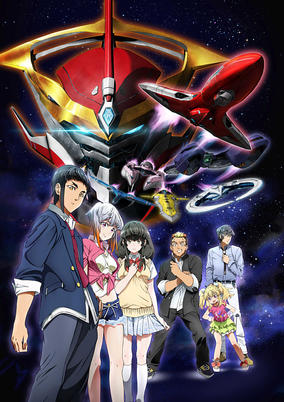

**Studio:** Satelight C2C &nbsp;|&nbsp; **Episodes:** 26 &nbsp;|&nbsp; **Director:** Eiichi Sato &nbsp;|&nbsp; **Aired/Released:** July 2 – December 24 &nbsp;|&nbsp; **Genres:** Robot, Piloted Robot, Comedy, Science Fiction, Mecha, Action, Fantasy, Romance

> For thousands of years after its development, mankind used the written word for communication between people and generations. As millenia passed and technology became more prevalent, writing - and thus, communication as a whole - diminished, until it could only be found on cell phones and computer screens. Seeing an opportunity, the sorcerer Sogan Kenzaki starts infecting words with the Nesta Virus, which brings them to life and turns them into monsters called MJBK (Menace of Japanese with Biological Kinetic energy). To counter this attack against humanity, an organization known as DEAVA (Division of EArth Verbalism Ability) assembles a group of youths with the ability of "Verbalism". They have to pilot the vector machines, which are used to form the mechas dubbed "Aquarions". The one wild card in the situation is the self-dubbed "savior", a young man who is the direct relative of a famous calligrapher, named Akira Kaibuki.
>
> _Synopsis source: Kitsu_

[Wikipedia](https://en.wikipedia.org/wiki/Aquarion_Logos) · [Kitsu](https://kitsu.io/anime/aquarion-logos)

---

### Castle Town Dandelion

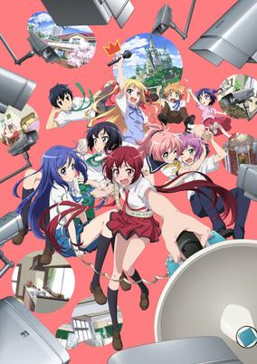

**Studio:** Production IMS &nbsp;|&nbsp; **Episodes:** 12 &nbsp;|&nbsp; **Director:** Noriaki Akitaya &nbsp;|&nbsp; **Aired/Released:** July 2 – September 17 &nbsp;|&nbsp; **Genres:** Comedy, Super Power, Slice of Life

> The Sakurada siblings live a normal life in a typical Japanese household. Well, that's what their father, the king, wants for them at least. As members of the royal family, each sibling possesses a unique ability, and over two thousand security cameras have been placed around town to make sure the children are safe and sound. Moreover, all nine of them have been designated as a potential successor to the throne with the decision that the next ruler will be selected through an election. However, for the timid Akane Sakurada, the third eldest daughter who wields the power to manipulate gravity, all of this attention is a complete nightmare. With all the cameras constantly monitoring the candidates and even broadcasting their actions on the Sakurada-dedicated news channel, she decides that if she becomes king, the cameras have got to go. But just how will she convince the public that she is the most suited to rule if she can't even overcome her own shyness?! Election season is in full swing as the search for the next king begins in Joukamachi no Dandelion. [Written by MAL Rewrite]
>
> _Synopsis source: Kitsu_

[Wikipedia](https://en.wikipedia.org/wiki/Castle_Town_Dandelion) · [Kitsu](https://kitsu.io/anime/joukamachi-no-dandelion)

---

### Chaos Dragon: Sekiryū Sen'eki (Chaos Dragon)

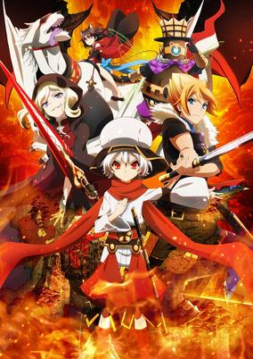

**Studio:** Silver Link Connect &nbsp;|&nbsp; **Episodes:** 12 &nbsp;|&nbsp; **Director:** Masato Matsune &nbsp;|&nbsp; **Aired/Released:** July 2 – September 17 &nbsp;|&nbsp; **Genres:** Dragon, Island, Fantasy World, Fantasy, Action

> In 3015, the year of Huanli, two countries, Donatia and Kouran, are embroiled in a war of supremacy that is tearing the world around them apart. The small island Nil Kamui has suffered exceptionally from the war, with lands conquered in the name of each kingdom and stolen away from the people. To make matters worse, their deity, the Red Dragon, has gone mad, rampaging about Nil Kamui burning villages and killing people indiscriminately. Ibuki, a descendant of Nil Kamui's royal family, resides at an orphanage and refuses to take on the role of king. Abhorring conflict, Ibuki desires a peaceful resolution, however the chaotic world will not allow for such pacifism when it is being torn asunder by war. Despite his reluctance, Ibuki is drawn deep into this conflict. Can he rise to the occasion and save his country?
>
> _Synopsis source: Kitsu_

[Wikipedia](https://en.wikipedia.org/wiki/Chaos_Dragon) · [Kitsu](https://kitsu.io/anime/chaos-dragon-sekiryuu-seneki)

---

### My Wife is the Student Council President (My Wife is the Student Council President!)

**Studio:** Seven &nbsp;|&nbsp; **Episodes:** 12 &nbsp;|&nbsp; **Director:** Hiroyuki Furukawa &nbsp;|&nbsp; **Aired/Released:** July 2 – September 17 &nbsp;|&nbsp; **Genres:** Absurdist Humour, Ecchi, Parental Abandonment, Student Government, Comedy, Romance, School Life

> Hayato Izumi is running for student council president. He's studious, responsible, down to earth...and completely outmatched by his rival, Ui Wakana. Ui wins in a landslide after promising comprehensive sex education, free condoms, and other exciting reforms. Bloodied but not discouraged, Hayato licks his wounds and settles for vice president. Then Ui moves in with him. As it turns out, their parents made a drunken promise decades ago that their children would one day marry. Ui and Hayato must now balance school life with matrimony, keeping their relationship secret from a prudish student body and learning to live with each other. Can they keep the student council in line and find happiness together? Find out in Okusama ga Seitokaichou!
>
> _Synopsis source: Kitsu_

[Wikipedia](https://en.wikipedia.org/wiki/My_Wife_is_the_Student_Council_President) · [Kitsu](https://kitsu.io/anime/oku-sama-ga-seito-kaichou)

---

### Rampo Kitan: Game of Laplace

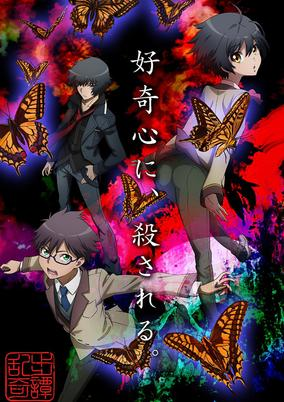

**Studio:** Lerche &nbsp;|&nbsp; **Episodes:** 11 &nbsp;|&nbsp; **Director:** Seiji Kishi &nbsp;|&nbsp; **Aired/Released:** July 2 – September 17 &nbsp;|&nbsp; **Genres:** Crime, Detective, Mystery

> After what appears to be just another ordinary day, middle school student Yoshio Kobayashi wakes up in his classroom to make a terrifying discovery: his teacher has been mutilated, and Yoshio happens to be holding the weapon used to commit the crime. Despite the initial shock of finding himself in this predicament, the curious and detached Yoshio can't help but be secretly thrilled about this attempt to frame him. His put-upon friend Souji Hashiba is turned into a willing accomplice, and together, they are determined to prove Yoshio's innocence. Additionally, Kogorou Akechi, a genius high school detective, has come to the scene of the crime in order investigate the case and when Kogorou meets the young man found guilty, an intense mutual interest sparks between the two of them. Kobayashi wishes to enter Akechi's world of crime solving as his assistant, and Akechi is determined to see if the enthusiastic boy is up to the challenge.Ranpo Kitan: Game of Laplace is a surreal mystery and horror anime that contains brutal and bizarre crimes, loosely based on stories written by Ranpo Edogawa, who is famous for his influence on Japanese fiction. [Written by MAL Rewrite]
>
> _Synopsis source: Kitsu_

[Kitsu](https://kitsu.io/anime/ranpo-kitan-game-of-laplace)

---

### Aoharu x Machinegun

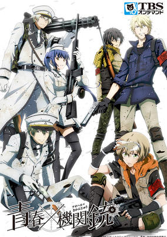

**Studio:** Brains Base &nbsp;|&nbsp; **Episodes:** 12 &nbsp;|&nbsp; **Director:** Hideaki Nakano &nbsp;|&nbsp; **Aired/Released:** July 3 – September 18 &nbsp;|&nbsp; **Genres:** Gunfights, Sports, Action, Comedy

> Hotaru Tachibana has a strong sense of justice and just cannot help confronting those who choose to perform malicious acts. Furthermore, Hotaru is actually a girl who likes to disguise herself as a boy. After hearing rumors that her best friend was tricked by the popular host of a local club, Hotaru seeks to punish the evildoer. Upon arriving at the club, however, she is challenged to a so-called "survival game" by the host Masamune Matsuoka, where the first person hit by the bullet of a toy gun will lose. After a destructive fight which results in Hotaru's loss, Masamune forces the young "boy" to join his survival game team named Toy Gun Gun, in order to repay the cost of the damages that "he" has caused inside the club. Although she is initially unhappy with this turn of events, Hotaru quickly begins to enjoy what survival games have to offer and is determined to pay off her debt, much to the dismay of Tooru Yukimura, the other member of Toy Gun Gun. As time goes on, Hotaru begins to develop a close friendship with the rest of the team and hopes to take part in realizing their dream of winning the Top Combat Game (TCG), a tournament to decide the best survival game team in Japan. Although Hotaru tries her best, there are just two little problems: she is absolutely terrible at the game, and Toy Gun Gun doesn't allow female members on their team! [Written by MAL Rewrite]
>
> _Synopsis source: Kitsu_

[Wikipedia](https://en.wikipedia.org/wiki/Aoharu_x_Machinegun) · [Kitsu](https://kitsu.io/anime/aoharu-x-kikanjuu)

---

### Classroom Crisis

**Studio:** Lay-duce &nbsp;|&nbsp; **Episodes:** 13 &nbsp;|&nbsp; **Director:** Kenji Nagasaki &nbsp;|&nbsp; **Aired/Released:** July 3 – September 25 &nbsp;|&nbsp; **Genres:** Science Fiction, School Life

> Unaired episode included with the third Blu-ray and DVD volume.
>
> _Synopsis source: Kitsu_

[Wikipedia](https://en.wikipedia.org/wiki/Classroom_Crisis) · [Kitsu](https://kitsu.io/anime/classroom-crisis-special)

---

### Gate: Jieitai Kanochi nite, Kaku Tatakaeri

**Studio:** A-1 Pictures &nbsp;|&nbsp; **Episodes:** 12 &nbsp;|&nbsp; **Director:** Takahiko Kyōgoku &nbsp;|&nbsp; **Aired/Released:** July 3 – September 18

[Wikipedia](https://en.wikipedia.org/wiki/Gate_(novel_series))

---

### Miss Monochrome (season 2)

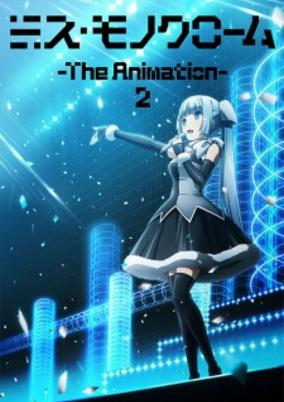

**Studio:** Liden Films Sanzigen &nbsp;|&nbsp; **Episodes:** 13 &nbsp;|&nbsp; **Director:** Yoshiaki Iwasaki &nbsp;|&nbsp; **Aired/Released:** July 3 – September 25 &nbsp;|&nbsp; **Genres:** Android, Idol, Earth, Music, Science Fiction, Comedy, Slice of Life

> The Ultra Super Pictures Special Stage event announced at AnimeJapan 2015 on Saturday that the Miss Monochrome television anime series will receive a second season. The season will run within the 30-minute Ultra Super Anime Time block beginning on July 3, 2015.
>
> _Synopsis source: Kitsu_

[Wikipedia](https://en.wikipedia.org/wiki/Miss_Monochrome) · [Kitsu](https://kitsu.io/anime/miss-monochrome-the-animation-2)

---

### Senki Zesshō Symphogear GX (Symphogear GX)

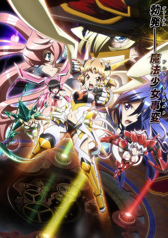

**Studio:** Encourage Films, Satelight &nbsp;|&nbsp; **Episodes:** 13 &nbsp;|&nbsp; **Director:** Katsumi Ono &nbsp;|&nbsp; **Aired/Released:** July 3 – September 25 &nbsp;|&nbsp; **Genres:** Magical Girl, Earth, Japan, Music, Asia, Action, Science Fiction, Henshin, The Arts

> After the frontier incident, everyone who knew the circumstances believed the Noise were gone and the pain they caused was at an end. But a new conflict approached unseen. In the Yokohama Harbor Oosan-bashi Pier, a new pattern is detected that is similar to the Noise. A combat group wielding mysterious technology stands in the way of Hibiki and the others. When she hears of this enemy of unprecedented strength, Tsubasa hurries back home from England. But the Symphogear users see no opening to counterattack and are forced into a difficult fight. In this situation of extreme disparity, the battle for the song that will end the world begins.
>
> _Synopsis source: Kitsu_

[Wikipedia](https://en.wikipedia.org/wiki/Symphogear) · [Kitsu](https://kitsu.io/anime/senki-zesshou-symphogear-3)

---

### Ushio and Tora

**Studio:** MAPPA Studio VOLN &nbsp;|&nbsp; **Episodes:** 26 &nbsp;|&nbsp; **Director:** Satoshi Nishimura &nbsp;|&nbsp; **Aired/Released:** July 3 – December 25 &nbsp;|&nbsp; **Genres:** Action, Demon, Adventure, Comedy, Shounen

> Ushio Aotsuki is a stubborn middle school student and son of an eccentric temple priest who goes about life without care for his father's claims regarding otherworldly monsters known as youkai. However, as he is tending to the temple while his father is away on work, his chores lead him to a shocking discovery: in the basement he finds a menacing youkai impaled by the fabled Beast Spear. The beast in question is Tora, infamous for his destructive power, who tries to coerce Ushio into releasing him from his five hundred year seal. Ushio puts no trust in his words and refuses to set him free. But when a sudden youkai outbreak puts his friends and home in danger, he is left with no choice but to rely on Tora, his only insurance being the ancient spear if he gets out of hand. Ushio and Tora's meeting is only the beginning of the unlikely duo's journey into the depths of the spiritual realm. With the legendary Beast Spear in his hands, Ushio will find out just how real and threatening the world of the supernatural can be. [Written by MAL Rewrite]
>
> _Synopsis source: Kitsu_

[Wikipedia](https://en.wikipedia.org/wiki/Ushio_and_Tora) · [Kitsu](https://kitsu.io/anime/ushio-to-tora-tv)

---

### Wakaba Girl

**Studio:** Nexus &nbsp;|&nbsp; **Episodes:** 13 &nbsp;|&nbsp; **Director:** Seiji Watanabe &nbsp;|&nbsp; **Aired/Released:** July 3 – September 25 &nbsp;|&nbsp; **Genres:** Japan, Slice of Life, Present, Asia, Earth, Friendship, Comedy, School Life

> The story centers around the activities of Wakaba Kohashi, "a slightly out-of-tune super" daughter of a well-to-do family, and her friends. Wakaba (literally, "young leaves") looks like an elegant rich daughter, but she admires the trendy gyaru fashion subculture. There is also the pure, innocent, fairy-tale-like Moeko. Mao is capricious and behaves in her own way. Nao used to be an athletic type of girl, but now loves the boys-love genre.
>
> _Synopsis source: Kitsu_

[Wikipedia](https://en.wikipedia.org/wiki/Wakaba_Girl) · [Kitsu](https://kitsu.io/anime/wakaba-girl)

---

### Wooser's Hand-to-Mouth Life: Mugen-hen (Wooser's Hand-to-Mouth Life: Awakening Arc)

**Studio:** Sanzigen &nbsp;|&nbsp; **Episodes:** 13 &nbsp;|&nbsp; **Director:** Seiji Mizushima &nbsp;|&nbsp; **Aired/Released:** July 3 – September 25 &nbsp;|&nbsp; **Genres:** Fantasy, Comedy, Anthropomorphism, Slice of Life

> Second season of Wooser no Sono Higurashi.
>
> _Synopsis source: Kitsu_

[Wikipedia](https://en.wikipedia.org/wiki/Wooser%27s_Hand-to-Mouth_Life) · [Kitsu](https://kitsu.io/anime/wooser-no-sono-higurashi-kakusei-hen)

---

### Charlotte

**Studio:** P.A. Works &nbsp;|&nbsp; **Episodes:** 13 &nbsp;|&nbsp; **Director:** Yoshiyuki Asai &nbsp;|&nbsp; **Aired/Released:** July 4 – September 26

[Wikipedia](https://en.wikipedia.org/wiki/Charlotte_(anime))

---

### Gatchaman Crowds insight

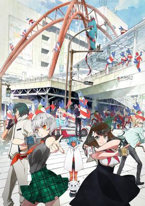

**Studio:** Tatsunoko Production &nbsp;|&nbsp; **Episodes:** 13 &nbsp;|&nbsp; **Director:** Kenji Nakamura &nbsp;|&nbsp; **Aired/Released:** July 4 – September 26 &nbsp;|&nbsp; **Genres:** Alien, Earth, Japan, Asia, Action, Science Fiction, Adventure, Henshin

> A year has passed since the "Tachikawa Incident" in summer 2015. CROWDS, the system that turns the mentality of humans into physical form that Berg Katze gave to Rui Ninomiya after extracting his NOTE, has spread among the public. Prime Minister Sugayama backs the plan, but not everyone agrees with his policy. A mysterious organization attacks Sugayama's vehicle, marking the start of a series of new conflicts.
>
> _Synopsis source: Kitsu_

[Wikipedia](https://en.wikipedia.org/wiki/Gatchaman_Crowds) · [Kitsu](https://kitsu.io/anime/gatchaman-crowds-insight)

---

### Rokka: Braves of the Six Flowers (Rokka -Braves of the Six Flowers-)

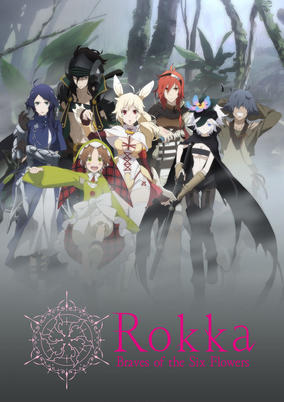

**Studio:** Passione &nbsp;|&nbsp; **Episodes:** 12 &nbsp;|&nbsp; **Director:** Takeo Takahashi &nbsp;|&nbsp; **Aired/Released:** July 4 – September 19 &nbsp;|&nbsp; **Genres:** Swordplay, Fantasy World, Fantasy, Detective, Action, Magic, Demon, Adventure, Mystery

> Legend says, when the Evil God awakens from the deepest of darkness, the god of fate will summon Six Braves and grant them with the power to save the world. Adlet, who claims to be the strongest on the face of this earth, is chosen as one of the “Brave Six Flowers,” and sets out on a battle to prevent the resurrection of the Evil God. However, it turns out that there are Seven Braves who gathered at the promised land…
>
> _Synopsis source: Kitsu_

[Kitsu](https://kitsu.io/anime/rokka-no-yuusha)

---

### Shimoneta (SHIMONETA: A Boring World Where the Concept of Dirty Jokes Doesn't Exist)

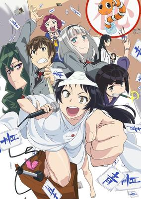

**Studio:** J.C. Staff &nbsp;|&nbsp; **Episodes:** 12 &nbsp;|&nbsp; **Director:** Youhei Suzuki &nbsp;|&nbsp; **Aired/Released:** July 4 – September 19 &nbsp;|&nbsp; **Genres:** Slapstick, Satire, Parental Abandonment, Student Government, Dystopia, Japan, School Life, Comedy, Ecchi, Asia, Earth

> With the introduction of strict new morality laws, Japan has become a nation cleansed of all that is obscene and impure. By monitoring citizens using special devices worn around their necks, authorities have taken extreme measures to ensure that society remains chaste. In this world of sexual suppression, Tanukichi Okuma—son of an infamous terrorist who opposed the chastity laws—has just entered high school, offering his help to the student council in order to get close to president Anna Nishikinomiya, his childhood friend and crush. Little does he know that the vice president Ayame Kajou has a secret identity: Blue Snow, a masked criminal dedicated to spreading lewd material amongst the sheltered public—and Tanukichi has caught the girl's interest due to his father's notoriety. Soon, Tanukichi is dragged into joining her organization called SOX, where he is forced to spread obscene propaganda, helping to launch an assault against the government's oppressive rule. With their school set as the first point of attack, Tanukichi will have to do the unthinkable when he realizes that their primary target is the person he admires most.
>
> _Synopsis source: Kitsu_

[Wikipedia](https://en.wikipedia.org/wiki/Shimoneta) · [Kitsu](https://kitsu.io/anime/shimoneta-to-iu-gainen-ga-sonzai-shinai-taikutsu-na-sekai)

---

### Working!!! (Wagnaria!!3)

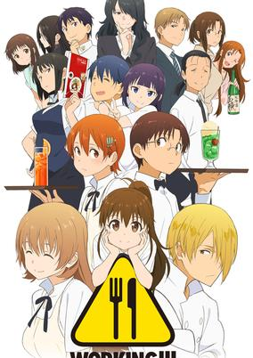

**Studio:** A-1 Pictures &nbsp;|&nbsp; **Episodes:** 14 &nbsp;|&nbsp; **Director:** Yumi Kamakura &nbsp;|&nbsp; **Aired/Released:** July 4 – December 26 &nbsp;|&nbsp; **Genres:** Waitress, Present, Earth, Japan, Asia, Comedy, Romance, Slice of Life, Working Life

> Working!!! is never easy, especially when your co-workers are as wacky as the gang at Wagnaria, Hokkaido's most beloved family restaurant. Over three seasons, they've become a family, and just like with most families, they spend a lot of time driving each other crazy. Everyone who works at Wagnaria has their own story, even "normal girl" Matsumoto Maya. In Working!!!, all the stories that have been told at Wagnaria build towards their endings. Romance, sibling rivalry, disappearing spouses, terrifying parents―things are getting pretty complicated. Will Kirio finally meet Aoi? Will Satou finally let Yachiyo know how he feels? Will Otoo-san finally find his wife? Will Popura get any taller? And just what the heck is going on between Souta and Mahiru? There's only one way to find out!
>
> _Synopsis source: Kitsu_

[Wikipedia](https://en.wikipedia.org/wiki/Working!!) · [Kitsu](https://kitsu.io/anime/working-3)

---

### Dragon Ball Super

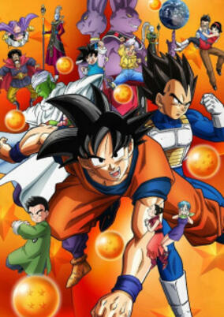

**Studio:** Toei Animation &nbsp;|&nbsp; **Episodes:** 131 &nbsp;|&nbsp; **Director:** Kimitoshi Chioka &nbsp;|&nbsp; **Aired/Released:** July 5 – March 25, 2018 &nbsp;|&nbsp; **Genres:** Comedy, Super Power, Fantasy, Action, Adventure, Martial Arts, Shounen

> Set just after the events of the Buu Saga of Dragon Ball Z, a deadly threat awakens once more. People lived in peace without knowing who the true heroes were during the devastating battle against Majin Buu. The powerful Dragon Balls have prevented any permanent damage, and our heroes also continue to live a normal life. In the far reaches of the universe, however, a powerful being awakens early from his slumber, curious about a prophecy of his defeat. Join Gokuu, Piccolo, Vegeta, Gohan, and the rest of the Dragon Ball crew as they tackle the strongest opponent they have ever faced. Beerus, the god of destruction, now sets his curious sights on Earth. Will the heroes save the day and prevent earth's destruction? Or will the whims of a bored god prove too powerful for the Saiyans? Gokuu faces impossible odds once more and fights for the safety of his loved ones and the planet.
>
> _Synopsis source: Kitsu_

[Wikipedia](https://en.wikipedia.org/wiki/Dragon_Ball_Super) · [Kitsu](https://kitsu.io/anime/dragon-ball-super)

---

### Wakakozake

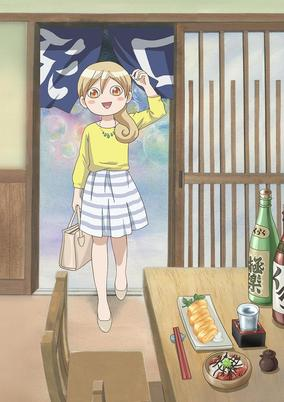

**Studio:** Office DCI &nbsp;|&nbsp; **Episodes:** 12 &nbsp;|&nbsp; **Director:** Minoru Yamaoka &nbsp;|&nbsp; **Aired/Released:** July 5 – September 20 &nbsp;|&nbsp; **Genres:** Cooking, Slice of Life

> Murasaki Wakako, who is 26 years old, loves going out alone to enjoy eating and drinking, especially when something unpleasant happens at work. This anime follows Wakako through many solitary outings, where she enjoys different combinations of food and drink!
>
> _Synopsis source: Kitsu_

[Wikipedia](https://en.wikipedia.org/wiki/Wakakozake) · [Kitsu](https://kitsu.io/anime/wakako-zake)

---

### Snow White with the Red Hair

**Studio:** Bones &nbsp;|&nbsp; **Episodes:** 12 &nbsp;|&nbsp; **Director:** Masahiro Andō &nbsp;|&nbsp; **Aired/Released:** July 6 – September 21 &nbsp;|&nbsp; **Genres:** Slow When It Comes To Love, Romance, Fantasy World, Fantasy

> Although her name means "snow white," Shirayuki is a cheerful, red-haired girl living in the country of Tanbarun who works diligently as an apothecary at her herbal shop. Her life changes drastically when she is noticed by the silly prince of Tanbarun, Prince Raji, who then tries to force her to become his concubine. Unwilling to give up her freedom, Shirayuki cuts her long red hair and escapes into the forest, where she is rescued from Raji by Zen Wistalia, the second prince of a neighboring country, and his two aides. Hoping to repay her debt to the trio someday, Shirayuki sets her sights on pursuing a career as the court herbalist in Zen's country, Clarines. Akagami no Shirayuki-hime depicts Shirayuki's journey toward a new life at the royal palace of Clarines, as well as Zen's endeavor to become a prince worthy of his title. As loyal friendships are forged and deadly enemies formed, Shirayuki and Zen slowly learn to support each other as they walk their own paths.
>
> _Synopsis source: Kitsu_

[Wikipedia](https://en.wikipedia.org/wiki/Snow_White_with_the_Red_Hair) · [Kitsu](https://kitsu.io/anime/akagami-no-shirayuki-hime)

---

### My Monster Secret

**Studio:** TMS Entertainment &nbsp;|&nbsp; **Episodes:** 13 &nbsp;|&nbsp; **Director:** Yasutaka Yamamoto &nbsp;|&nbsp; **Aired/Released:** July 6 – September 28

[Wikipedia](https://en.wikipedia.org/wiki/My_Monster_Secret)

---

### Million Doll

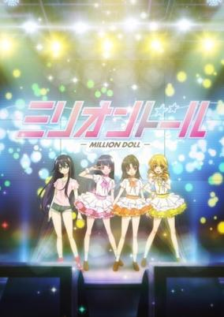

**Studio:** Asahi Production &nbsp;|&nbsp; **Episodes:** 11 &nbsp;|&nbsp; **Director:** Keiichiro Kawaguchi &nbsp;|&nbsp; **Aired/Released:** July 6 – September 21 &nbsp;|&nbsp; **Genres:** Music

> Million Doll revolves around Suuko, an idol-loving hikikomori (shut-in) who has one ability: To make any idol popular through the power of blogging. She puts her sights on the Fukuoka idol Itorio and tries to make her sell more, but she is impeded by the charismatic idol Ryuu-san and the underground idol Mariko.
>
> _Synopsis source: Kitsu_

[Wikipedia](https://en.wikipedia.org/wiki/Million_Doll) · [Kitsu](https://kitsu.io/anime/million-doll)

---

### Non Non Biyori Repeat

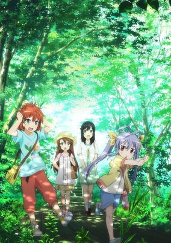

**Studio:** Silver Link &nbsp;|&nbsp; **Episodes:** 12 &nbsp;|&nbsp; **Director:** Shinya Kawamo &nbsp;|&nbsp; **Aired/Released:** July 6 – September 21 &nbsp;|&nbsp; **Genres:** Present, Earth, Countryside, Japan, Asia, Comedy, Friendship, Slice of Life, School Life

> Even though there are still only five students who attend the remote Asahigaoka Branch School, each one of the girls already has a lifetime of wonderful experiences in the carefree Japanese countryside. Some memories may belong to just one person, like Hotaru’s recollections of her first day in Asahigaoka before she’d had a chance to meet her new friends. Other memories bring an otherwise sleepy town to life for Komari, Natsumi, Renge, or even Suguru. From daily life in school, to unforgettable holiday festivities, or even simple adventures like learning how to make okonomiyaki, new adventures are just waiting to be shared as we return to Asahigaoka in NON NON BIYORI REPEAT!
>
> _Synopsis source: Kitsu_

[Wikipedia](https://en.wikipedia.org/wiki/Non_Non_Biyori) · [Kitsu](https://kitsu.io/anime/non-non-biyori-repeat)

---

### Bikini Warriors

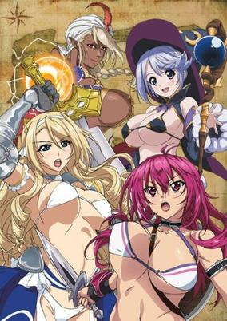

**Studio:** Feel &nbsp;|&nbsp; **Episodes:** 12 &nbsp;|&nbsp; **Director:** Naoyuki Kuzuya &nbsp;|&nbsp; **Aired/Released:** July 7 – September 22 &nbsp;|&nbsp; **Genres:** Magic, Elf, Fantasy, Ecchi, Adventure, Comedy, Parody

> When darkness threatens the world, four heroes hold the only hope for salvation—if they can even manage to get out of the first town, that is. Bikini Warriors follows a party of beautiful adventurers in revealing armor: courageous Fighter, airheaded Paladin, timid Mage, and alluring Darkelf. But can you really be an adventurer if you don't get going on an adventure? Our heroes are eternally broke, insufferably vain, and frequently outmatched by the dangers of their world. Between fleeing dungeons and robbing peasants, the unlikely heroes will have to learn to live with each other before they can survive a battle with ultimate evil!
>
> _Synopsis source: Kitsu_

[Wikipedia](https://en.wikipedia.org/wiki/Bikini_Warriors) · [Kitsu](https://kitsu.io/anime/bikini-warriors)

---

### Monster Musume (Monster Musume: Everyday Life with Monster Girls)

**Studio:** Lerche &nbsp;|&nbsp; **Episodes:** 12 &nbsp;|&nbsp; **Director:** Tatsuya Yoshihara &nbsp;|&nbsp; **Aired/Released:** July 7 – September 22 &nbsp;|&nbsp; **Genres:** Parental Abandonment, Slice of Life, Contemporary Fantasy, Japan, Present, Asia, Comedy, Ecchi, Fantasy, Earth, Harem, Romance

> With his parents abroad, Kimihito Kurusu lived a quiet, unremarkable life alone until monster girls came crowding in! This alternate reality presents cutting-edge Japan, the first country to promote the integration of non-human species into society. After the incompetence of interspecies exchange coordinator Agent Smith leaves Kimihito as the homestay caretaker of a Lamia named Miia, the newly-minted "Darling" quickly attracts girls of various breeds, resulting in an ever-growing harem flush with eroticism and attraction. Unfortunately for him and the ladies, sexual interactions between species is forbidden by the Interspecies Exchange Act! The only loophole is through an experimental marriage provision. Kimihito's life becomes fraught with an abundance of creature-specific caveats and sensitive interspecies law as the passionate, affectionate, and lusty women hound his every move, seeking his romantic and sexual affections. With new species often appearing and events materializing out of thin air, where Kimihito and his harem go is anyone's guess! [Written by MAL Rewrite]
>
> _Synopsis source: Kitsu_

[Wikipedia](https://en.wikipedia.org/wiki/Monster_Musume) · [Kitsu](https://kitsu.io/anime/monster-musume-no-iru-nichijou)

---

### Teekyu (season 5) (Teekyu 4)

**Studio:** Millepensee &nbsp;|&nbsp; **Episodes:** 12 &nbsp;|&nbsp; **Director:** Shin Itagaki &nbsp;|&nbsp; **Aired/Released:** July 7 – September 22 &nbsp;|&nbsp; **Genres:** Earth, Absurdist Humour, Slapstick, Japan, Tennis, Asia, Comedy, Sports

> Fourth season of Teekyuu series.
>
> _Synopsis source: Kitsu_

[Wikipedia](https://en.wikipedia.org/wiki/Teekyu) · [Kitsu](https://kitsu.io/anime/teekyuu-4)

---

### Overlord

**Studio:** Madhouse &nbsp;|&nbsp; **Episodes:** 13 &nbsp;|&nbsp; **Director:** Naoyuki Itō &nbsp;|&nbsp; **Aired/Released:** July 7 – September 29 &nbsp;|&nbsp; **Genres:** Comedy, Magic, Fantasy, Action

> Bundled with novel series' 11th volume. The new anime will feature the appearance of the Pleiades combat maids, as well as the rest of the Floor Guardians.
>
> _Synopsis source: Kitsu_

[Wikipedia](https://en.wikipedia.org/wiki/Overlord_(novel_series)) · [Kitsu](https://kitsu.io/anime/overlord-ple-ple-pleiades-ova)

---

### Seiyu's Life!

**Studio:** Gonzo &nbsp;|&nbsp; **Episodes:** 13 &nbsp;|&nbsp; **Director:** Hiroshi Ikehata &nbsp;|&nbsp; **Aired/Released:** July 7 – September 29 &nbsp;|&nbsp; **Genres:** Plot Continuity, Working Life, Comedy, Slice of Life

> Dreaming of becoming a top-tier professional in the fast-paced, competitive world of voice acting, rookie Futaba Ichinose frantically scurries around, searching for auditions and performance sessions. Rubbing elbows with some of the biggest names in the industry, she tries to find her own unique voice and style. Along the way, she befriends two important allies: Ichigo Moesaki, an aspiring idol who claims to be a princess from another planet, and Rin Kohana, a cheerful child actress who tries her best to balance her career and school at the same time. Together, the girls brave the ups and downs of the entertainment industry—but as for Futaba, whose performance assessment at her agency is just around the corner, her career might be over sooner than expected! Sore ga Seiyuu! is a humorous and sincere celebration of the industry that gives anime its voice. [Written by MAL Rewrite]
>
> _Synopsis source: Kitsu_

[Wikipedia](https://en.wikipedia.org/wiki/Seiyu%27s_Life!) · [Kitsu](https://kitsu.io/anime/sore-ga-seiyuu)

---

### To Love-Ru Darkness 2nd (To LOVE Ru Darkness 2)

**Studio:** Xebec &nbsp;|&nbsp; **Episodes:** 14 &nbsp;|&nbsp; **Director:** Atsushi Ootsuki &nbsp;|&nbsp; **Aired/Released:** July 7 – October 29 &nbsp;|&nbsp; **Genres:** Alien, Present, Earth, Japan, Violent Retribution For Accidental Infringement, Humanoid Alien, Stereotypes, Asia, Science Fiction, Comedy

> The dispassionate, transforming assassin Golden Darkness returns to peer deeper into the mysteries surrounding her new life, while a sinister Nemesis manipulates her younger sister Mea from the shadows. Along with their newly discovered mother, Tearju, this previously estranged family quickly becomes the center of everyone's attention. On the other hand, Princess Momo's Harem Plan stands on shaky ground amidst Rito's inability to confess to his longtime crush Haruna, who has grown feelings of her own. But things aren't as peaceful as they seem; an evil force looms amidst the innocuous commotion, threatening to eclipse the love, happiness, and friendship of Rito and his harem. Only the light of love can hope to banish the shadow. [Written by MAL Rewrite]
>
> _Synopsis source: Kitsu_

[Wikipedia](https://en.wikipedia.org/wiki/To_Love-Ru) · [Kitsu](https://kitsu.io/anime/to-love-ru-darkness-2nd)

---

### Junjō Romantica 3 (Junjo Romantica 3)

**Studio:** Studio Deen &nbsp;|&nbsp; **Episodes:** 12 &nbsp;|&nbsp; **Director:** Chiaki Kon &nbsp;|&nbsp; **Aired/Released:** July 8 – September 23 &nbsp;|&nbsp; **Genres:** Comedy, Shounen Ai, Drama, Romance

> After living together for three years, Misaki Takahashi and Akihiko "Usagi" Usami's relationship has been progressing smoothly. However, all great relationships have problems, and theirs is just beginning. With a new rival on the horizon, Usagi worries about Misaki's feelings towards him. Meanwhile, Ryuuichirou Isaka has always loved to intrude on Misaki and Usagi's love life, but his own love life hasn't been all smooth sailing—Isaka and his secretary Kaoru Asahina have been dating for a few years; however, Asahina prefers to keep their professional and private lives separate, often leading to troubled waters between them. As for Nowaki Kusama and Hiroki Kamijou, now that their careers are finally taking off, they hardly see each other anymore. With the time they spend together lessening, doubts and insecurities threaten to creep in between them. On the other hand, the 17-year age gap between Shinobu Takatsuki and You Miyagi has been a constant barrier in their relationship, but as they learn more about each other, their self-consciousness continues to fade. The beloved couples of Junjou Romantica, Junjou Egoist, and Junjou Terrorist are back again, this time with a new addition: Junjou Mistake! [Written by MAL Rewrite]
>
> _Synopsis source: Kitsu_

[Kitsu](https://kitsu.io/anime/junjou-romantica-3)

---

### Sky Wizards Academy

**Studio:** Diomedéa &nbsp;|&nbsp; **Episodes:** 12 &nbsp;|&nbsp; **Director:** Takayuki Inagaki &nbsp;|&nbsp; **Aired/Released:** July 8 – September 23 &nbsp;|&nbsp; **Genres:** Magic, Fantasy World, Action, Fantasy, Ecchi, School Life

> Forced to retreat to floating cities due to an invasion of armored insects, humanity must depend on Sky Wizards to battle the menace.
>
> _Synopsis source: Kitsu_

[Wikipedia](https://en.wikipedia.org/wiki/Sky_Wizards_Academy) · [Kitsu](https://kitsu.io/anime/kuusen-madoushi-kouhosei-no-kyoukan)

---

### Suzakinishi the Animation

**Studio:** Feel &nbsp;|&nbsp; **Episodes:** 12 &nbsp;|&nbsp; **Director:** Yoshihiro Hiramine &nbsp;|&nbsp; **Aired/Released:** July 8 – September 23 &nbsp;|&nbsp; **Genres:** Comedy, Slice of Life

> Voice actresses Aya Suzaki and Asuka Nishi announced at an event in Tokyo on Sunday that their Suzakinishi radio program will get a television anime adaptation starting in July. The Suzakinishi The AanimationN anime will air on Tokyo MX TV, TV Kanazawa, and Sun TV.
>
> _Synopsis source: Kitsu_

[Wikipedia](https://en.wikipedia.org/wiki/Suzakinishi_the_Animation) · [Kitsu](https://kitsu.io/anime/suzakinishi-the-animation)

---

### Danchigai

**Studio:** Creators in Pack &nbsp;|&nbsp; **Episodes:** 12 &nbsp;|&nbsp; **Director:** Hiroshi Kimura &nbsp;|&nbsp; **Aired/Released:** July 9 – September 24 &nbsp;|&nbsp; **Genres:** Parental Abandonment, Slice of Life, Comedy

> Haruki Nakano lives an average high school life, except for the fact that his mother is overseas and he shares an apartment with his four sisters. There's the oldest, Mutsuki, who has a bad habit of falling asleep in his bed, the junior high school student Yayoi, who hits him whenever something happens, and then the grade school twins, Uzuki and Satsuki, who love to play pranks on their older brother. Stuck in a house with four girls, Haruki has to deal with all sorts of trials. From going grocery shopping, watching scary movies, to kissing practice, life is never boring in Danchigai!
>
> _Synopsis source: Kitsu_

[Wikipedia](https://en.wikipedia.org/wiki/Danchigai) · [Kitsu](https://kitsu.io/anime/danchigai)

---

### Fate/kaleid liner Prisma Illya 2wei Herz! (Fate/Kaleid Liner Prisma Illya 2Wei!)

**Studio:** Silver Link &nbsp;|&nbsp; **Episodes:** 10 &nbsp;|&nbsp; **Director:** Shin Ōnuma Masato Jinbo &nbsp;|&nbsp; **Aired/Released:** July 9 – September 26 &nbsp;|&nbsp; **Genres:** Elementary School, Magic, Magical Girl, Present, Earth, Contemporary Fantasy, Japan, Plot Continuity, Asia, Action

> The magical girls are back, and ready for another round of adventure! After successfully recovering the Class Cards, fifth graders-turned magical girls Illya and Miyu think they can finally take it easy. But as fate would have it, the girls are once again called back into active duty when they find out that the Cards have left some very nasty side effects on their world. However, their seemingly easy mission goes totally awry with the appearance of a dark stranger who looks just like Illya! Who is this new but familiar face, where did she come from, and what does she want from Illya? With the arrival of this new foe, it seems like Illya's finally met her match when her everyday life takes one dark turn!
>
> _Synopsis source: Kitsu_

[Wikipedia](https://en.wikipedia.org/wiki/Fate/kaleid_liner_Prisma_Illya) · [Kitsu](https://kitsu.io/anime/fate-kaleid-liner-prisma-illya-2wei)

---

### Himouto! Umaru-chan

**Studio:** Doga Kobo &nbsp;|&nbsp; **Episodes:** 12 &nbsp;|&nbsp; **Director:** Masahiko Ohta &nbsp;|&nbsp; **Aired/Released:** July 9 – September 24 &nbsp;|&nbsp; **Genres:** Super Deformed, Comedy, Slice of Life, School Life

> People are not always who they appear to be, as is the case with Umaru Doma, the perfect high school girl—that is, until she gets home! Once the front door closes, the real fun begins. When she dons her hamster hoodie, she transforms from a refined, over-achieving student into a lazy, junk food-eating otaku, leaving all the housework to her responsible older brother Taihei. Whether she's hanging out with her friends Nana Ebina and Kirie Motoba, or competing with her self-proclaimed "rival" Sylphinford Tachibana, Umaru knows how to kick back and have some fun!Himouto! Umaru-chan is a cute story that follows the daily adventures of Umaru and Taihei, as they take care of—and put up with—each other the best they can, as well as the unbreakable bonds between friends and siblings. [Written by MAL Rewrite]
>
> _Synopsis source: Kitsu_

[Wikipedia](https://en.wikipedia.org/wiki/Himouto!_Umaru-chan) · [Kitsu](https://kitsu.io/anime/himouto-umaru-chan)

---

### School-Live!

**Studio:** Lerche &nbsp;|&nbsp; **Episodes:** 12 &nbsp;|&nbsp; **Director:** Masaomi Ando &nbsp;|&nbsp; **Aired/Released:** July 9 – September 24 &nbsp;|&nbsp; **Genres:** Zombie, School Clubs, Angst, Fantasy, Horror, Disaster, Rotten World, Epidemic, Slice of Life, School Life, Psychological, Mystery

> SCHOOL-LIVE! Focuses on the lives of 4 girls who decide to stay over at school: Yuki Takeya, Kurumi Ebisuzawa, Yuri Wakasa, and Miki Naoki. Along with the school adviser Megumi Sakura, they suddenly find themselves to be the final survivors of a zombie attack, and continue to live and survive at the school.
>
> _Synopsis source: Kitsu_

[Wikipedia](https://en.wikipedia.org/wiki/School-Live!) · [Kitsu](https://kitsu.io/anime/gakkou-gurashi)

---

### Prison School

**Studio:** J.C. Staff &nbsp;|&nbsp; **Episodes:** 12 &nbsp;|&nbsp; **Director:** Tsutomu Mizushima &nbsp;|&nbsp; **Aired/Released:** July 11 – September 26 &nbsp;|&nbsp; **Genres:** Violence, Japan, Earth, Comedy, Plot Continuity, Ecchi, Asia, Romance, School Life

> When the prestigious all-girls Hachimitsu Private Academy becomes co-ed, five young men are the first males to attend. But the girls aren't so accepting of their new classmates. Despite their best attempts, Kiyoshi and his friends are met with cold shoulders from the girls. So what better way to deal with rejection than a little bit of peeping? When they chance a peak at the girls during bath time, their plan falls apart and they are caught by the Underground Student Council. Unwilling to hear any excuses, the USC enforces an absurd punishment imprisonment! For a month, the boys must live within the school's very own penal system while enduring long, hard, and grueling tasks. But the work is the least of their worries. With the sharp crack of a riding crop and the harsh discipline from a stiletto heel, it's going to take more than sheer will power to survive the next month especially when the ladies of the USC have their own secret agenda.
>
> _Synopsis source: Kitsu_

[Wikipedia](https://en.wikipedia.org/wiki/Prison_School) · [Kitsu](https://kitsu.io/anime/prison-school)

---

### God Eater

**Studio:** Ufotable &nbsp;|&nbsp; **Episodes:** 13 &nbsp;|&nbsp; **Director:** Takayuki Hirao &nbsp;|&nbsp; **Aired/Released:** July 12 – March 26, 2016

[Wikipedia](https://en.wikipedia.org/wiki/God_Eater_(anime))

---

### Makura no Danshi (makuranodanshi)

**Studio:** Assez Finaud Fabric Feel &nbsp;|&nbsp; **Episodes:** 12 &nbsp;|&nbsp; **Aired/Released:** July 13 – September 28 &nbsp;|&nbsp; **Genres:** Bishounen, Slice of Life, Romance

> Who’s your ideal boyfriend? You might find just the guy in Makura no Danshi. Each short episode features a different boy who will listen to you and hold you when you need it. Episodes are shown from the viewer’s point of view, and the boys all address the viewer personally. Listen to them talk about their day, then tell them about yours. All the boys have kind hearts and will make you feel special and loved. Each boy has a distinct background, age, and personality, sure to please any kind of viewer taste. Merry is a gentle brown-eyed boy with an open heart. Eiji Kijinami is a punk from your school who is really not as scary as people think. The shy Ryuushi Theodore Emori loves to watch the stars with you, getting lost in the night sky. There are other boys and personalities to discover.
>
> _Synopsis source: Kitsu_

[Wikipedia](https://en.wikipedia.org/wiki/Makura_no_Danshi) · [Kitsu](https://kitsu.io/anime/makura-no-danshi)

---

### Lupin the 3rd Part IV: The Italian Adventure

**Studio:** Telecom Animation Film &nbsp;|&nbsp; **Episodes:** 26 &nbsp;|&nbsp; **Director:** Kazuhide Tomonaga Yūichirō Yano &nbsp;|&nbsp; **Aired/Released:** August 30 – November 30

---

### Diabolik Lovers More, Blood (Diabolik Lovers II: More,Blood)

**Studio:** Zexcs &nbsp;|&nbsp; **Episodes:** 12 &nbsp;|&nbsp; **Director:** Risako Yoshida &nbsp;|&nbsp; **Aired/Released:** September 23 – December 9 &nbsp;|&nbsp; **Genres:** Vampire, Bishounen, Reverse Harem, Harem, School Life

> Yui Komori, still held captive by the Sakamaki brothers—pureblood vampires after her blood—experiences yet more bizarre twists to her life following her stay at their household. Though haunted by enigmatic dreams, Yui soon deciphers their meaning when caught in a car crash, which subsequently leads to meeting four new vampires: the Mukami brothers, Ruki, Azusa, Kou, and Yuuma, who themselves capture the bewildered girl. Yui later awakens in the Mukami mansion, where the brothers reveal their plans for her: she is their "Eve," and her blood will find the "Adam" among them; together, they will have the power to rule the world. However, with the Sakamaki brothers hot on their heels, things might not go quite as smoothly as they had imagined. [Written by MAL Rewrite]
>
> _Synopsis source: Kitsu_

[Wikipedia](https://en.wikipedia.org/wiki/Diabolik_Lovers) · [Kitsu](https://kitsu.io/anime/diabolik-lovers-2nd-season)

---

### Kami-sama Minarai: Himitsu no Cocotama

**Studio:** OLM &nbsp;|&nbsp; **Director:** Norio Nitta &nbsp;|&nbsp; **Aired/Released:** October 1 –

---

### Kyo-fu! Zombie Neko

**Studio:** Kachidoki Studio &nbsp;|&nbsp; **Director:** Hiroshi Namiki &nbsp;|&nbsp; **Aired/Released:** October 1 –

---

### Lance N' Masques

**Studio:** Studio Gokumi &nbsp;|&nbsp; **Episodes:** 12 &nbsp;|&nbsp; **Director:** Kyōhei Ishiguro &nbsp;|&nbsp; **Aired/Released:** October 1 – December 17 &nbsp;|&nbsp; **Genres:** Plot Continuity, Action, Fantasy

> Youtarou Hanabusa is a Knight of the World, an order of knights active in the present time, whose job it is to aid those in need. Whenever someone cries out for help, Youtarou will be there! As the hero Knight Lancer, Youtarou dons a cape and mask, and wields an impressively powerful lance. His intentions might be noble, but a knight kissing ladies’ hands in the 21st century can come across as just a bit strange… Youtarou just can’t help himself. He has what he calls White Knight Syndrome: whenever someone is in need, his body reacts automatically in a “knight-like manner.” His fighting abilities and kindness are put to the test when he saves the young Makio Kidouin. Youtarou discovers that Makio is the only daughter of a wealthy family, and lives alone in the care of a group of maids. All Youtarou wanted was to leave his knighthood behind and start a normal life. But when he decides to take Makio under his wing, he becomes involved in something much bigger than him. Now Youtarou must defend Makio, without giving away the secret identity of the Knight Lancer she idolizes.
>
> _Synopsis source: Kitsu_

[Wikipedia](https://en.wikipedia.org/wiki/Lance_N%27_Masques) · [Kitsu](https://kitsu.io/anime/lance-n-masques)

---

### Young Black Jack

**Studio:** Tezuka Productions &nbsp;|&nbsp; **Episodes:** 12 &nbsp;|&nbsp; **Director:** Mitsuko Kase &nbsp;|&nbsp; **Aired/Released:** October 1 – December 17 &nbsp;|&nbsp; **Genres:** Historical, Drama

> The year is 1968, and the world is swept up in the Vietnam War and student protests. In this time of turmoil, a mysterious young man with white and black hair and a scar on his face is enrolled in medical school. His genius skills with a surgical knife achieve many a medical miracle and are getting noticed. This hero origin story reveals how this young man earned his medical degree and the name of Black Jack.
>
> _Synopsis source: Kitsu_

[Wikipedia](https://en.wikipedia.org/wiki/Young_Black_Jack) · [Kitsu](https://kitsu.io/anime/young-black-jack)

---

### Hacka Doll the Animation (Hackadoll The Animation)

**Studio:** Creators in Pack Studio Trigger &nbsp;|&nbsp; **Episodes:** 13 &nbsp;|&nbsp; **Director:** Ikuo Geso &nbsp;|&nbsp; **Aired/Released:** October 2 – December 25 &nbsp;|&nbsp; **Genres:** Slice of Life, Japan, Asia, Earth, Comedy, Science Fiction

> Hacka Doll app delivers a customized feed of news for each user. The user answers some simple questions when launching the app for the first time, and then the app will filter the news that caters to the user's personal interests. With daily use, the app automatically analyzes and learns which news articles the user reads and recommends to further personalize the feed. The anime personifies the app's customization engine as three "Hacka Dolls" — the personal entertainment AI and main navigator Hacka Doll #1, the anime expert Hacka Doll #2, and the knowledgeable otaku Hacka Doll #3.
>
> _Synopsis source: Kitsu_

[Wikipedia](https://en.wikipedia.org/wiki/Hacka_Doll_the_Animation) · [Kitsu](https://kitsu.io/anime/hacka-doll-the-animation)

---

### Heavy Object

**Studio:** J.C. Staff &nbsp;|&nbsp; **Episodes:** 24 &nbsp;|&nbsp; **Director:** Takashi Watanabe &nbsp;|&nbsp; **Aired/Released:** October 2 – March 25, 2016 &nbsp;|&nbsp; **Genres:** Mecha, Action, Comedy, Ecchi, War, Science Fiction, Military

> In the distant future, the nature of war has changed. "Objects"—massive, spherical tanks impermeable to standard weaponry and armed with destructive firepower—rule the battlefield; their very deployment ensures victory, rendering traditional armies useless. However, this new method of warfare is about to be turned on its head. Qwenthur Barbotage, a student studying Object Design, and Havia Winchell, a radar analyst of noble birth, serve in the Legitimate Kingdom's 37th Mobile Maintenance Battalion, tasked with supporting the Baby Magnum, one of the nation's Objects. Unfortunately, a battle gone awry places the duo in a precarious situation: mere infantry stand face-to-face against the unfathomable might of an enemy Object. As they scramble to save themselves and their fellow soldiers, a glimmer of hope shines through, and the world's perception of Objects is changed forever.Heavy Object follows these two soldiers alongside Milinda Brantini, the Baby Magnum's pilot, and their commanding officer Frolaytia Capistrano as the unit treks all over the globe to fight battle after battle. Facing one impossible situation after another, they must summon all their wit and courage to overcome the insurmountable foes that are Objects. [Written by MAL Rewrite]
>
> _Synopsis source: Kitsu_

[Wikipedia](https://en.wikipedia.org/wiki/Heavy_Object) · [Kitsu](https://kitsu.io/anime/heavy-object)

---

### Kagewani

**Studio:** Tomovies &nbsp;|&nbsp; **Episodes:** 13 &nbsp;|&nbsp; **Director:** Tomoya Takashima &nbsp;|&nbsp; **Aired/Released:** October 2 – December 25 &nbsp;|&nbsp; **Genres:** Past, Horror, Asia, Present, Japan, Earth, Thriller, Mystery

> A video blogger attempts to fake cryptid sightings to boost his views, but gets more than he bargained for when his crew is slaughtered by a real monster. Elsewhere, students find themselves preyed upon by a sandworm-like beast, initiating a desperate struggle for survival on their own school grounds. With more of these attacks from mysterious creatures occurring, researcher Sousuke Banba tasks himself with delving into the mystery. With nothing but the keyword "Kagewani" to lead him, he scours the sites of recent attacks in hopes of finding a lead to eradicating the creatures for good. However, Sousuke finds that these threats to humanity are even closer to home when the pharmaceutical company, Sarugaku, starts to encroach on his investigation. [Written by MAL Rewrite]
>
> _Synopsis source: Kitsu_

[Wikipedia](https://en.wikipedia.org/wiki/Kagewani) · [Kitsu](https://kitsu.io/anime/kagewani)

---

### Miss Monochrome (season 3)

**Studio:** Liden Films Sanzigen &nbsp;|&nbsp; **Episodes:** 13 &nbsp;|&nbsp; **Director:** Yoshiaki Iwasaki &nbsp;|&nbsp; **Aired/Released:** October 2 – December 18 &nbsp;|&nbsp; **Genres:** Android, Idol, Earth, Music, Science Fiction, Comedy, Slice of Life

> The Ultra Super Pictures Special Stage event announced at AnimeJapan 2015 on Saturday that the Miss Monochrome television anime series will receive a second season. The season will run within the 30-minute Ultra Super Anime Time block beginning on July 3, 2015.
>
> _Synopsis source: Kitsu_

[Wikipedia](https://en.wikipedia.org/wiki/Miss_Monochrome) · [Kitsu](https://kitsu.io/anime/miss-monochrome-the-animation-2)

---

### The Asterisk War: The Academy City of the Water (The Asterisk War: The Academy City on the Water)

**Studio:** A-1 Pictures &nbsp;|&nbsp; **Episodes:** 24 &nbsp;|&nbsp; **Director:** Kenji Seto &nbsp;|&nbsp; **Aired/Released:** October 3 – June 18, 2016 &nbsp;|&nbsp; **Genres:** Plot Continuity, Ecchi, Science Fiction, Harem, Super Power, Action, Fantasy, Comedy, Romance, School Life

> Long, long ago, an epic catastrophe, known as Invertia, caused a complete change in the world's power balance. In the years following this disaster, a group known as the Integrated Enterprise Foundation rose to power. In addition to this massive change, a new breed of humans born with amazing physical skills known as Genestella also emerged and joined the ranks of humanity.Gakusen Toshi Asterisk follows the story of Ayato Amagiri, a student who has just transferred into one of the six most elite schools for Genestella students in the world—Seidoukan Academy—where students learn to control their powers and duel against each other in entertainment battles known as festas. Unfortunately, Ayato gets off to a rough start. When trying to return a lost handkerchief to a female classmate, he accidentally sees her changing which leads to her challenging him to a duel. What most people don't realize however, is that Ayato has no real interest in festas and instead has an alternative motive for joining this prestigious school. What is Ayato's big secret? Will he be able to keep up his act when surrounded by some of the greatest Genestella in the world?
>
> _Synopsis source: Kitsu_

[Wikipedia](https://en.wikipedia.org/wiki/The_Asterisk_War) · [Kitsu](https://kitsu.io/anime/gakusen-toshi-asterisk)

---

### Fafner in the Azure: Exodus (2nd season)

**Studio:** XEBECzwei &nbsp;|&nbsp; **Episodes:** 13 &nbsp;|&nbsp; **Aired/Released:** October 3 –

[Wikipedia](https://en.wikipedia.org/wiki/Fafner_in_the_Azure)

---

### Haikyū!! (season 2) (Haikyu!!)

**Studio:** Production I.G &nbsp;|&nbsp; **Episodes:** 25 &nbsp;|&nbsp; **Director:** Susumu Mitsunaka &nbsp;|&nbsp; **Aired/Released:** October 3 – March 27, 2016 &nbsp;|&nbsp; **Genres:** Present, Earth, Japan, Volleyball, Plot Continuity, Asia, Sports, Comedy, School Life, Shounen

> Inspired after watching a volleyball ace nicknamed "Little Giant" in action, small-statured Shouyou Hinata revives the volleyball club at his middle school. The newly-formed team even makes it to a tournament; however, their first match turns out to be their last when they are brutally squashed by the "King of the Court," Tobio Kageyama. Hinata vows to surpass Kageyama, and so after graduating from middle school, he joins Karasuno High School's volleyball team—only to find that his sworn rival, Kageyama, is now his teammate. Thanks to his short height, Hinata struggles to find his role on the team, even with his superior jumping power. Surprisingly, Kageyama has his own problems that only Hinata can help with, and learning to work together appears to be the only way for the team to be successful. Based on Haruichi Furudate's popular shounen manga of the same name, Haikyuu!! is an exhilarating and emotional sports comedy following two determined athletes as they attempt to patch a heated rivalry in order to make their high school volleyball team the best in Japan.
>
> _Synopsis source: Kitsu_

[Wikipedia](https://en.wikipedia.org/wiki/Haiky%C5%AB!!) · [Kitsu](https://kitsu.io/anime/haikyuu)

---

### K: Return of Kings

**Studio:** GoHands &nbsp;|&nbsp; **Episodes:** 13 &nbsp;|&nbsp; **Director:** Shingo Suzuki &nbsp;|&nbsp; **Aired/Released:** October 3 – December 26 &nbsp;|&nbsp; **Genres:** Music

> days is the ending theme of Mekakucity Actors performed by Lia. The song was composed by Shizen no Teki-P (a.k.a. Jin) and a PV for the anime was illustrated and directed by Shidu.
>
> _Synopsis source: Kitsu_

[Wikipedia](https://en.wikipedia.org/wiki/K_(anime)) · [Kitsu](https://kitsu.io/anime/days)

---

### Kindaichi Shōnen no Jikenbo R (The File of Young Kindaichi Returns)

**Studio:** Toei Animation &nbsp;|&nbsp; **Episodes:** 22 &nbsp;|&nbsp; **Director:** Yoko Ikeda &nbsp;|&nbsp; **Aired/Released:** October 3 – March 26, 2016 &nbsp;|&nbsp; **Genres:** Earth, Japan, Asia, Crime, Law And Order, Detective, Mystery

> High school student Hajime Kindaichi is the supposed grandson of famous private detective Kosuke Kindaichi. Visiting Hong Kong for a fashion event with Kindaichi, our hero's girlfriend Miyuki is captured by a stranger in a case of mistaken identity. The journey to save Miyuki itself leads to yet another crime case...
>
> _Synopsis source: Kitsu_

[Wikipedia](https://en.wikipedia.org/wiki/Kindaichi_Case_Files) · [Kitsu](https://kitsu.io/anime/kindaichi-shounen-no-jikenbo-returns)

---

### Lovely Muco (season 3) (Lovely Muuuuuuuco!)

**Studio:** DLE &nbsp;|&nbsp; **Episodes:** 25 &nbsp;|&nbsp; **Director:** ROMANoV HiGA &nbsp;|&nbsp; **Aired/Released:** October 3 – March 26, 2016 &nbsp;|&nbsp; **Genres:** Comedy, Slice of Life

> Itoshi no Muco depicts the life of the pet dog Muco and her owner Komatsu, who lives in his glass-making workshop in the mountains.
>
> _Synopsis source: Kitsu_

[Wikipedia](https://en.wikipedia.org/wiki/Lovely_Muco) · [Kitsu](https://kitsu.io/anime/itoshi-no-muco)

---

### Noragami Aragoto (Noragami)

**Studio:** Bones &nbsp;|&nbsp; **Episodes:** 13 &nbsp;|&nbsp; **Director:** Kotaro Tamura &nbsp;|&nbsp; **Aired/Released:** October 3 – December 25 &nbsp;|&nbsp; **Genres:** Comedy, Action, Contemporary Fantasy, Tone Changes, Adventure, Swordplay, Ghost, Super Power, Supernatural, Shounen

> In times of need, if you look in the right place, you just may see a strange telephone number scrawled in red. If you call this number, you will hear a young man introduce himself as the Yato God. Yato is a minor deity and a self-proclaimed "Delivery God," who dreams of having millions of worshippers. Without a single shrine dedicated to his name, however, his goals are far from being realized. He spends his days doing odd jobs for five yen apiece, until his weapon partner becomes fed up with her useless master and deserts him. Just as things seem to be looking grim for the god, his fortune changes when a middle school girl, Hiyori Iki, supposedly saves Yato from a car accident, taking the hit for him. Remarkably, she survives, but the event has caused her soul to become loose and hence able to leave her body. Hiyori demands that Yato return her to normal, but upon learning that he needs a new partner to do so, reluctantly agrees to help him find one. And with Hiyori's help, Yato's luck may finally be turning around. [Written by MAL Rewrite]
>
> _Synopsis source: Kitsu_

[Wikipedia](https://en.wikipedia.org/wiki/Noragami) · [Kitsu](https://kitsu.io/anime/noragami)

---

### Chivalry of a Failed Knight

**Studio:** Silver Link Nexus &nbsp;|&nbsp; **Episodes:** 12 &nbsp;|&nbsp; **Director:** Shin Ōnuma Jin Tamamura &nbsp;|&nbsp; **Aired/Released:** October 3 – December 19 &nbsp;|&nbsp; **Genres:** Swordplay, Magic, Ecchi, Fantasy, Violence, Action, School Life, Romance

> There are some humans capable of using magical power to manifest their souls as weapons and control forces beyond normal comprehension. These people are known as Blazers, and those who are recognized as such can undergo training at academies to become Mage-Knights. Ikki Kurogane is an aspiring Mage-Knight, despite being considered the worst student at Hagun Academy as an F-ranked Blazer—the lowest rank possible. One morning, he accidentally stumbles upon Stella Vermillion, a visiting princess and A-ranked Blazer who has just enrolled at Hagun, in a state of undress. As a result, she challenges him to a duel where the loser will be the winner’s slave. It seems like a surefire win for Stella, but could there be more to Ikki than meets the eye? Rakudai Kishi no Cavalry tells the story of Ikki’s valiant efforts to qualify for an upcoming tournament that could bring him a step closer to his dreams, aided by Stella. Together, they will prove that hard work can overcome the limits set upon them.
>
> _Synopsis source: Kitsu_

[Wikipedia](https://en.wikipedia.org/wiki/Chivalry_of_a_Failed_Knight) · [Kitsu](https://kitsu.io/anime/rakudai-kishi-no-cavalry)

---

### Utawarerumono: Itsuwari no Kamen (Utawarerumono: The False Faces)

**Studio:** White Fox &nbsp;|&nbsp; **Episodes:** 25 &nbsp;|&nbsp; **Director:** Keitaro Motonaga &nbsp;|&nbsp; **Aired/Released:** October 3 – March 26, 2016 &nbsp;|&nbsp; **Genres:** Action, Fantasy, Harem, Juujin

> When I came to, I realized I was standing in the middle of a vast, snowy plain I knew nothing of. I didn't know how I got there. And to add to that, I couldn't remember anything, not even my name. I stood there, dumbfounded at my absurd situation. But then, as if to spite me further, a gigantic monster suddenly appeared, an insect-like creature that began to bear down on me. I tried desperately to run, but it cornered me into a hopeless situation. It was then that the girl appeared. Her name was Kuon. It was this beautiful girl, who bore an animal's ears and tail, that saved my life.
>
> _Synopsis source: Kitsu_

[Wikipedia](https://en.wikipedia.org/wiki/Utawarerumono) · [Kitsu](https://kitsu.io/anime/utawarerumono-itsuwari-no-kamen)

---

### Rainy Cocoa, Welcome to Rainy Color (Rainy Cocoa)

**Studio:** EMT Squared &nbsp;|&nbsp; **Episodes:** 12 &nbsp;|&nbsp; **Director:** Kazuomi Koga &nbsp;|&nbsp; **Aired/Released:** October 4 – December 27 &nbsp;|&nbsp; **Genres:** Slice of Life, Comedy

> Aoi Tokura is having a rough day. He’s used to being mistaken for a girl, but it’s even worse when a captivating stranger on the train calls him a creeper for staring a little too long. Aoi’s soaked by a sudden rainstorm and takes shelter at Rainy Color, a cozy café where the warmth of the staff compliments the sweet hot cocoa he’s served. When he falls into a job at the café he feels like things are finally looking up— until Keiichi Iwase, the man he couldn’t help but stare at on the train, shows up. Did this day just get worse, or better?
>
> _Synopsis source: Kitsu_

[Wikipedia](https://en.wikipedia.org/wiki/Rainy_Cocoa) · [Kitsu](https://kitsu.io/anime/ame-iro-cocoa)

---

### Attack on Titan: Junior High

**Studio:** Production I.G &nbsp;|&nbsp; **Episodes:** 12 &nbsp;|&nbsp; **Director:** Yoshihide Ibata &nbsp;|&nbsp; **Aired/Released:** October 4 – December 20 &nbsp;|&nbsp; **Genres:** Comedy, Parody, School Life

> Your favorite characters from Attack on Titan are back in…junior high school? Adapted from the hit spinoff manga series—Attack on Titan: Junior High (written by Saki Nakagawa), this parody reimagines Eren, Mikasa, Armin, and other characters from the original manga as students and teachers at Titan Junior High School.
>
> _Synopsis source: Kitsu_

[Kitsu](https://kitsu.io/anime/shingeki-kyojin-chuugakkou)

---

### Comet Lucifer

**Studio:** 8-Bit &nbsp;|&nbsp; **Episodes:** 12 &nbsp;|&nbsp; **Director:** Yasuhito Kikuchi Atsushi Nakayama &nbsp;|&nbsp; **Aired/Released:** October 4 – December 20 &nbsp;|&nbsp; **Genres:** Other Planet, Science Fiction, Space, Military, Mecha, Action, Fantasy, Adventure

> Deep under the ground, there are blue crystals called Giftium, which are regarded as highly valuable in the world Gift. Sougo Amagi's hobby is gathering Giftium. After all, the mining town of Garden Indigo where he lives is well-known for the abundance of it underground. He lives his days repetitively and without many disturbances, until one day he gets into a quarrel with his classmates Kaon, Roman and Otto. Their conflict escalates and a few missed steps send Sougo and Kaon falling into a hole. After recovering, they discover an underground lake and a strange blue-haired girl called Felia. Although they quickly strike a friendship with the girl, when they leave the mine they are suddenly faced with many problems. A secret organization is following Kaon and his friends in order to capture Felia, who is though to have special powers. Comet Lucifer follows their story as they must now protect themselves and the girl from the dangers that lie ahead.
>
> _Synopsis source: Kitsu_

[Wikipedia](https://en.wikipedia.org/wiki/Comet_Lucifer) · [Kitsu](https://kitsu.io/anime/comet-lucifer)

---

### Concrete Revolutio

**Studio:** Bones &nbsp;|&nbsp; **Episodes:** 13 &nbsp;|&nbsp; **Director:** Seiji Mizushima &nbsp;|&nbsp; **Aired/Released:** October 4 – December 27 &nbsp;|&nbsp; **Genres:** Alternative Present, Action, Asia, Japan, Present, Earth, Super Power, Demon, Science Fiction, Fantasy, Mystery

> What if superhumans were real? Even better, what if every fabled superhuman existed at the same time, in the same place? Titans from outer space, life forms from a mystical world, phantoms and goblins from ancient times, cyborgs created by scientists, relics that rose out of the ruins of ancient civilizations. In another Japan, it’s not just a question of "what if"—it's a reality.
>
> _Synopsis source: Kitsu_

[Wikipedia](https://en.wikipedia.org/wiki/Concrete_Revolutio) · [Kitsu](https://kitsu.io/anime/concrete-revolutio-choujin-gensou)

---

### Komori-san Can't Decline (Komori-san Can't Decline!)

**Studio:** Artland &nbsp;|&nbsp; **Episodes:** 12 &nbsp;|&nbsp; **Director:** Kenichi Imaizumi &nbsp;|&nbsp; **Aired/Released:** October 4 – December 20 &nbsp;|&nbsp; **Genres:** Slice of Life, School Life, Japan, Present, Asia, Earth, Comedy

> Fifteen-year-old Komori Shuri is a junior high school girl who is too nice to decline requests. Constantly doing favors for other people has given her incredible strength?! But even so, she is also an adolescent junior high school girl. An anime overflowing with the ups and downs of everyday life!
>
> _Synopsis source: Kitsu_

[Wikipedia](https://en.wikipedia.org/wiki/Komori-san_Can%27t_Decline) · [Kitsu](https://kitsu.io/anime/komori-san-wa-kotowarenai)

---

### Mobile Suit Gundam: Iron-Blooded Orphans

**Studio:** Sunrise &nbsp;|&nbsp; **Episodes:** 25 &nbsp;|&nbsp; **Director:** Tatsuyuki Nagai &nbsp;|&nbsp; **Aired/Released:** October 4 – March 27, 2016 &nbsp;|&nbsp; **Genres:** Revenge, Mars, Other Planet, Earth, Space, Mecha, Action, Science Fiction, War, Space Battles, Space Travel, Shipboard, Politics

> 300 years after a great conflict between Earth and Mars known as the "Calamity War," a woman named Kudelia sets out on a journey to Earth to speak for the independence of the Martian city of Chryse, which is under the control of the Earth government. Escorting her is the private security company CGS members Mikazuki Augus and Orga Itsuka. When a group named Gjallarhorn attacks CGS and Kudelia, Orga sees this as a chance to rebel against CGS and launch a coup. Mikazuki and Orga are thrust into a new conflict. To fend off Gjallarhorn, Mikazuki rides an old mobile suit from the Calamity War, powered by a nuclear reactor, the Gundam Barbatos.
>
> _Synopsis source: Kitsu_

[Kitsu](https://kitsu.io/anime/mobile-suit-gundam-iron-blooded-orphans)

---

### Owarimonogatari (Kizumonogatari Part 1: Tekketsu)

**Studio:** Shaft &nbsp;|&nbsp; **Director:** Akiyuki Simbo &nbsp;|&nbsp; **Aired/Released:** October 4 – &nbsp;|&nbsp; **Genres:** Vampire, Action, Fantasy, Supernatural, Mystery

> First season of the Monogatari Series, part 2/6. Contains the arc Koyomi Vamp from the Kizumonogatari light novel. March 25th—just another day during spring break. Koyomi Araragi, a second year high school student at Naoetsu High School, befriends Tsubasa Hanekawa, the top honors student at his school. Hanekawa mentions a rumor about a "blonde vampire" that has been sighted around their town recently. Araragi, who is usually anti-social, takes a liking to her down-to-earth personality. That night, Araragi encounters the rumored vampire: she is Kiss-shot Acerola-orion Heart-under-blade, also known as the "iron-blooded, hot-blooded, cold-blooded King of Apparitions." The stunningly beautiful vampire cries out for Koyomi to save her as she lies in a pool of her own blood, all four of her limbs cut off. Kiss-shot asks Araragi to give her his blood, and when he does, the next moment he awakes, Araragi finds himself reborn as her vampire kin. As Araragi struggles to accept his existence, Kiss-shot whispers, "Welcome to the world of darkness..."
>
> _Synopsis source: Kitsu_

[Wikipedia](https://en.wikipedia.org/wiki/Monogatari_(series)) · [Kitsu](https://kitsu.io/anime/kizumonogatari-part-1-tekketsu-hen)

---

### Onsen Yōsei Hakone-chan (Hakone-chan)

**Studio:** Asahi Production Production Reed &nbsp;|&nbsp; **Episodes:** 13 &nbsp;|&nbsp; **Director:** Takeyuki Yanase &nbsp;|&nbsp; **Aired/Released:** October 4 – December 27 &nbsp;|&nbsp; **Genres:** Comedy, Asia, Japan, Present, Earth, Slice of Life

> After many years of dormant rest, a hot springs fairy awakens in modern-day Japan. However, while she slept, she took on the appearance of a young girl. She decides to cooperate with the locals whilst trying to regain her powers.
>
> _Synopsis source: Kitsu_

[Wikipedia](https://en.wikipedia.org/wiki/Onsen_Y%C5%8Dsei_Hakone-chan) · [Kitsu](https://kitsu.io/anime/onsen-yousei-hakone-chan)

---

### High School Star Musical (Starmyu)

**Studio:** C-Station &nbsp;|&nbsp; **Director:** Shunsuke Tada &nbsp;|&nbsp; **Aired/Released:** October 5 – &nbsp;|&nbsp; **Genres:** School Life, Music, Slice of Life

> The series tells the story of the five students; Yuuta Hoshitani, Tooru Nayuki, Kaito Tsukigami, Kakeru Tengenji, and Shuu Kuga as they struggle to enter the musical department of Ayanagi Academy, a school focusing on music. They need to be accepted to the Star Frame Class, which is directly taught by the members of Kaou-kai, the most talented from the musical department who stand at the top of the pecking order within the academy. Luckily, they are spotted by Itsuki Ootori, one of Kaou-kai members.
>
> _Synopsis source: Kitsu_

[Wikipedia](https://en.wikipedia.org/wiki/High_School_Star_Musical) · [Kitsu](https://kitsu.io/anime/high-school-star-musical)

---

### One-Punch Man (One Punch Man)

**Studio:** Madhouse &nbsp;|&nbsp; **Episodes:** 12 &nbsp;|&nbsp; **Director:** Shingo Natsume &nbsp;|&nbsp; **Aired/Released:** October 5 – December 21 &nbsp;|&nbsp; **Genres:** Superhero, Violence, Action, Comedy, Super Power, Parody, Science Fiction, Seinen, Supernatural

> The seemingly ordinary and unimpressive Saitama has a rather unique hobby: being a hero. In order to pursue his childhood dream, he trained relentlessly for three years—and lost all of his hair in the process. Now, Saitama is incredibly powerful, so much so that no enemy is able to defeat him in battle. In fact, all it takes to defeat evildoers with just one punch has led to an unexpected problem—he is no longer able to enjoy the thrill of battling and has become quite bored. This all changes with the arrival of Genos, a 19-year-old cyborg, who wishes to be Saitama's disciple after seeing what he is capable of. Genos proposes that the two join the Hero Association in order to become certified heroes that will be recognized for their positive contributions to society, and Saitama, shocked that no one knows who he is, quickly agrees. And thus begins the story of One Punch Man, an action-comedy that follows an eccentric individual who longs to fight strong enemies that can hopefully give him the excitement he once felt and just maybe, he'll become popular in the process.
>
> _Synopsis source: Kitsu_

[Wikipedia](https://en.wikipedia.org/wiki/One-Punch_Man) · [Kitsu](https://kitsu.io/anime/one-punch-man)

---

### Star-Myu (Starmyu)

**Studio:** C-Station &nbsp;|&nbsp; **Episodes:** 12 &nbsp;|&nbsp; **Director:** Shunsuke Tada &nbsp;|&nbsp; **Aired/Released:** October 5 – December 25 &nbsp;|&nbsp; **Genres:** School Life, Music, Slice of Life

> The series tells the story of the five students; Yuuta Hoshitani, Tooru Nayuki, Kaito Tsukigami, Kakeru Tengenji, and Shuu Kuga as they struggle to enter the musical department of Ayanagi Academy, a school focusing on music. They need to be accepted to the Star Frame Class, which is directly taught by the members of Kaou-kai, the most talented from the musical department who stand at the top of the pecking order within the academy. Luckily, they are spotted by Itsuki Ootori, one of Kaou-kai members.
>
> _Synopsis source: Kitsu_

[Wikipedia](https://en.wikipedia.org/wiki/Star-Myu) · [Kitsu](https://kitsu.io/anime/high-school-star-musical)

---

### Yuruyuri San Hai!

**Studio:** TYO Animations &nbsp;|&nbsp; **Episodes:** 12 &nbsp;|&nbsp; **Director:** Hiroyuki Hata &nbsp;|&nbsp; **Aired/Released:** October 5 – December 21 &nbsp;|&nbsp; **Genres:** Present, Earth, Japan, Shoujo Ai, Unrequited Love, Asia, Comedy, Romance, Friendship, Slice of Life

> Upon finding some camping equipment in the clubroom, the Amusement Club decide to go camping together for summer vacation, with the student council deciding to tag along. After spending the day making curry, the girls form pairs to go on a test of courage before hitting a bathhouse together.
>
> _Synopsis source: Kitsu_

[Wikipedia](https://en.wikipedia.org/wiki/YuruYuri) · [Kitsu](https://kitsu.io/anime/yuru-yuri-ova)

---

### Shin Atashin'chi

**Studio:** Shin-Ei Animation &nbsp;|&nbsp; **Episodes:** 26 &nbsp;|&nbsp; **Director:** Ogura Hirofumi &nbsp;|&nbsp; **Aired/Released:** October 6 – April 5, 2016 &nbsp;|&nbsp; **Genres:** Comedy, Slice of Life

> Outrageous misadventures of an almost normal family with a housewife, her husband, and their two kids Yuusuke and Mikan. Wacky humor about this weird family's daily life.
>
> _Synopsis source: Kitsu_

[Wikipedia](https://en.wikipedia.org/wiki/Shin_Atashin%27chi) · [Kitsu](https://kitsu.io/anime/shin-atashin-chi)

---

### Aria the Scarlet Ammo AA

**Studio:** Doga Kobo &nbsp;|&nbsp; **Episodes:** 12 &nbsp;|&nbsp; **Director:** Takashi Kawabata &nbsp;|&nbsp; **Aired/Released:** October 6 – December 22 &nbsp;|&nbsp; **Genres:** Present, Earth, Japan, Shoujo Ai, Stereotypes, Asia, Action, Romance, School Life, Law And Order

> "Opportunities won't wait for you to be ready." – Aria Kanzaki In the world of Hidan no Aria AA, there are special students called Butei who are authorized to carry weapons, investigate crimes and solve various incidents. One of the best of these students is an S-rank second year at Tokyo Butei High School named Aria Kanzaki. On the opposite end of the scale is E-rank first year named Akari Mamiya. Akari absolutely idolizes Aria and wants to become an elite Butei just like her but sadly she just isn't very good and constantly fails her rank exams. One day she gets the bright idea to submit a request to become Aria's Amica (assistant), despite her friends telling her that she shouldn't even bother due to the disparity in their skills. Surprisingly though, Aria decides to give Akari a test, which she not only accepts, but passes! It won't be easy for Akari though, as before she can officially become Aria's Amica she'll have to work hard until she proves her value. Will Akari's dream ever come true or will she be forced to give up before she even has a chance to get started, and can Aria help this E-rank girl go from zero to hero?
>
> _Synopsis source: Kitsu_

[Wikipedia](https://en.wikipedia.org/wiki/Aria_the_Scarlet_Ammo) · [Kitsu](https://kitsu.io/anime/hidan-no-aria-aa)

---

### DD Fist of the North Star (DD Fist of the North Star 2: Strawberry Flavor Plus)

**Studio:** Doga Kobo &nbsp;|&nbsp; **Director:** Akitaro Daichi &nbsp;|&nbsp; **Aired/Released:** October 6 – &nbsp;|&nbsp; **Genres:** Absurdist Humour, Super Deformed, Slapstick, Parody, Comedy, School Life

> In the 21st century, the characters of Fist of the North Star are living in peaceful Japan. In particular, Kenshirou is a convenience store worker, Raoh works at a factory, and wracked by illness, Toki is looking for work. The legend of the Fighting NEET (Not in Education, Employment, or Training) North Star begins in the modern day.
>
> _Synopsis source: Kitsu_

[Wikipedia](https://en.wikipedia.org/wiki/DD_Fist_of_the_North_Star) · [Kitsu](https://kitsu.io/anime/hokuto-no-ken-ichigo-aji)

---

### Hokuto no Ken: Ichigo Aji (DD Fist of the North Star 2: Strawberry Flavor Plus)

**Studio:** Ajia-do Animation Works &nbsp;|&nbsp; **Episodes:** 12 &nbsp;|&nbsp; **Director:** Mankyū &nbsp;|&nbsp; **Aired/Released:** October 6 – December 22 &nbsp;|&nbsp; **Genres:** Super Deformed, Absurdist Humour, Slapstick, Comedy, Parody, School Life

> In the 21st century, the characters of Fist of the North Star are living in peaceful Japan. In particular, Kenshirou is a convenience store worker, Raoh works at a factory, and wracked by illness, Toki is looking for work. The legend of the Fighting NEET (Not in Education, Employment, or Training) North Star begins in the modern day.
>
> _Synopsis source: Kitsu_

[Kitsu](https://kitsu.io/anime/hokuto-no-ken-ichigo-aji)

---

### Teekyu (season 6) (Teekyu 4)

**Studio:** Millepensee &nbsp;|&nbsp; **Episodes:** 12 &nbsp;|&nbsp; **Director:** Shin Itagaki &nbsp;|&nbsp; **Aired/Released:** October 6 – December 22 &nbsp;|&nbsp; **Genres:** Earth, Absurdist Humour, Slapstick, Japan, Tennis, Asia, Comedy, Sports

> Fourth season of Teekyuu series.
>
> _Synopsis source: Kitsu_

[Wikipedia](https://en.wikipedia.org/wiki/Teekyu) · [Kitsu](https://kitsu.io/anime/teekyuu-4)

---

### JK Meshi! (JK-MESHI!)

**Studio:** Kyotoma, Office Noble &nbsp;|&nbsp; **Director:** Huzituka &nbsp;|&nbsp; **Aired/Released:** October 6 – &nbsp;|&nbsp; **Genres:** Cooking, Comedy

> Three high school girls have mastered the art of cooking simple, B-class dishes called JK meshi. The three girls — Reina, Ryouka, and Ruriko — are all classmates in their second year of high school. They often get distracted when studying for tests, and when they do, they cook JK meshi.
>
> _Synopsis source: Kitsu_

[Kitsu](https://kitsu.io/anime/jk-meshi)

---

### Mr. Osomatsu

**Studio:** Studio Pierrot &nbsp;|&nbsp; **Episodes:** 25 &nbsp;|&nbsp; **Director:** Yoichi Fujita &nbsp;|&nbsp; **Aired/Released:** October 6 – March 28, 2016 &nbsp;|&nbsp; **Genres:** Slapstick, Slice of Life, Comedy, Japan, Earth, Asia, Parody

> The majority of the Matsuno household is comprised of six identical siblings: self-centered leader Osomatsu, manly Karamatsu, voice of reason Choromatsu, cynical Ichimatsu, hyperactive Juushimatsu, and lovable Todomatsu. Despite each one of them being over the age of 20, they are incredibly lazy and have absolutely no motivation to get a job, choosing to live as NEETs instead. In the rare occurrence that they try to look for employment and are somehow able to land an interview, their unique personalities generally lead to their swift rejection. From trying to pick up girlfriends to finding the perfect job, the daily activities of the Matsuno brothers are never dull as they go on all sorts of crazy, and often downright bizarre, adventures. Though they desperately search for a way to improve their social standing, it won't be possible if they can't survive the various challenges that come with being sextuplets!
>
> _Synopsis source: Kitsu_

[Wikipedia](https://en.wikipedia.org/wiki/Mr._Osomatsu) · [Kitsu](https://kitsu.io/anime/osomatsu-san)

---

### AntiMagic Academy "The 35th Test Platoon" (AntiMagic Academy 35th Test Platoon)

**Studio:** Silver Link &nbsp;|&nbsp; **Episodes:** 12 &nbsp;|&nbsp; **Director:** Tomoyuki Kawamura &nbsp;|&nbsp; **Aired/Released:** October 7 – December 23 &nbsp;|&nbsp; **Genres:** Gunfights, Swordplay, Mecha, Power Suit, Violence, Action, Fantasy, Harem, Ecchi, Romance, Military

> The Antimagic Academy is a special school that specializes in educating future witch hunters whose primary job is to find and stop magical threats and dangers. They are also called Inquisitors, whose aim is to stop and confiscate, not kill or destroy. The Academy is divided into several squads, but the most infamous one is the 35th Test Platoon, also nicknamed the "Small Fry Platoon" due to its low ranking among the other squads and its incompetent members. However, the ever so boring atmosphere of this unlucky squad gets spiced up when their little club gets powered up with a new member named Ouka Ootori, a former Inquisitor and an excellent fighter. What they do not know is that she was removed from her position because of her tendency to break the rules and an incident where she killed a witch. The club is run by a clumsy captain Takeru Kusanagi who is unable to use anything except his sword, so Ouka's views clash immediately with the views of other members of the squad. Can they cooperate with someone who hates witches so much and will they be able to learn from each other’s mistakes and tragic pasts?
>
> _Synopsis source: Kitsu_

[Wikipedia](https://en.wikipedia.org/wiki/AntiMagic_Academy_%22The_35th_Test_Platoon%22) · [Kitsu](https://kitsu.io/anime/taimadou-gakuen-35-shiken-shoutai)

---

### Beautiful Bones: Sakurako's Investigation (Beautiful Bones -Sakurako's Investigation-)

**Studio:** TROYCA &nbsp;|&nbsp; **Episodes:** 12 &nbsp;|&nbsp; **Director:** Makoto Katō &nbsp;|&nbsp; **Aired/Released:** October 7 – December 23 &nbsp;|&nbsp; **Genres:** Detective, Present, Earth, Japan, Asia, Mystery

> The story centers around high school student Shotaro Tatewaki and the beautiful Sakurako Kujo, who loves beautiful bones. Due to the nature of her interests, the two of them are involved in all kinds of incidents involving bones.
>
> _Synopsis source: Kitsu_

[Kitsu](https://kitsu.io/anime/sakurako-san-no-ashimoto-ni-wa-shitai-ga-umatteiru)

---

### Dance with Devils

**Studio:** Brain's Base &nbsp;|&nbsp; **Episodes:** 12 &nbsp;|&nbsp; **Director:** Ai Yoshimura &nbsp;|&nbsp; **Aired/Released:** October 7 – December 23 &nbsp;|&nbsp; **Genres:** Reverse Harem, Demon, Romance, Harem

> Ritsuka Tachibana has always been a good student, so she is completely shocked when she is suddenly summoned by the student council. Even more, they seem to think of Ritsuka as a troublemaker. Led by the handsome Rem Kaginuki, the student council—also consisting of Urie Sogami, Shiki Natsumizaka and Mage Nanashiro—tries to question her, but it soon becomes clear that they have ulterior motives. However, this is only the beginning. When her mother gets kidnapped, her life is turned upside down, and Ritsuka gets drawn into a world of vampires and devils. Both groups are searching for the "Grimoire," a forbidden item allowing its owner to rule the world. The return of her brother Lindo from overseas gives her hope, but even he appears to be hiding something. In a world filled with secrets, Ritsuka questions whom she can trust in this dark musical tale, while the handsome and dangerous members of the student council compete for her attention. [Written by MAL Rewrite]
>
> _Synopsis source: Kitsu_

[Wikipedia](https://en.wikipedia.org/wiki/Dance_with_Devils) · [Kitsu](https://kitsu.io/anime/dance-with-devils)

---

### Magical Somera-chan

**Studio:** Seven &nbsp;|&nbsp; **Episodes:** 12 &nbsp;|&nbsp; **Director:** Itsuki Imazaki &nbsp;|&nbsp; **Aired/Released:** October 7 – December 23 &nbsp;|&nbsp; **Genres:** Comedy, Magic, Slice of Life

> The story follows the everyday life of Somera Nonomoto who can use the strongest kenpo, Nonomoto Mahou-ken, which is inherited from her mother with her younger sister Kukuru.
>
> _Synopsis source: Kitsu_

[Wikipedia](https://en.wikipedia.org/wiki/Magical_Somera-chan) · [Kitsu](https://kitsu.io/anime/fushigi-na-somera-chan)

---

### Shomin Sample

**Studio:** Silver Link &nbsp;|&nbsp; **Episodes:** 12 &nbsp;|&nbsp; **Director:** Masato Jinbo &nbsp;|&nbsp; **Aired/Released:** October 7 – December 23 &nbsp;|&nbsp; **Genres:** All Girls School, Absurdist Humour, Japan, Earth, Asia, Comedy, Ecchi, Romance, Harem, School Life

> Kimito Kagurazaka is a commoner with a fetish for men's muscles—or at least that's the lie he must keep telling if he wants to keep himself out of trouble at the elite all-girls school, Seikain Academy. Kidnapped by the school under the assumption that he prefers men, Kimito is made to be their "commoner sample," exposing the girls to both commoner and man so that the transition to the world after school is not jarring. Threatened with castration should his sexual preferences not match the school's assumptions, Kimito keeps up the facade to protect his manhood. But there are eccentric individuals around every corner who begin to make Kimito's life even more difficult. Among them are Aika Tenkuubashi, a social outcast who blurts out whatever comes to mind; Hakua Shiodome, a young genius; Karen Jinryou, the daughter of samurai who is obsessed with defeating Kimito; and Reiko Arisugawa, the perfect student who has delusions of marrying Kimito. Along with the commoner himself, these four girls make up the Commoner Club, which attempts to teach the girls more about life outside the school, while Kimito gradually learns about the odd girls surrounding him. [Written by MAL Rewrite]
>
> _Synopsis source: Kitsu_

[Wikipedia](https://en.wikipedia.org/wiki/Shomin_Sample) · [Kitsu](https://kitsu.io/anime/ore-ga-ojou-sama-gakkou-ni-shomin-sample-toshite-rachirareta-ken)

---

### Tantei Team KZ Jiken Note

**Studio:** Signal.MD &nbsp;|&nbsp; **Episodes:** 16 &nbsp;|&nbsp; **Director:** Kazuya Ichikawa &nbsp;|&nbsp; **Aired/Released:** October 7 – January 27, 2016 &nbsp;|&nbsp; **Genres:** Middle School, Detective, School Life, Mystery

> Aya Tachibana is a sixth-grader who frets and obsesses over friends, family, grades, and more. One day, she joins the "Tantei Team KZ" with four very idiosyncratic boys she met at cram school. There is the glib and attention-grabbing leader Kazuomi Wakatake, the mysterious "expert of personal relationships" Takakazu Kuroki, the smart and stoic math genius Kazunori Uesugi, and the sweet-hearted Kazuhiko Kozuka who is good at social matters and science. Aya finds her place among them as the "language expert." "Tantei Team KZ" gets involved in modern-day cases, and even if they bicker from time to time, they collaborate by pooling each of their talents and skills to solve these cases.
>
> _Synopsis source: Kitsu_

[Wikipedia](https://en.wikipedia.org/wiki/Tantei_Team_KZ_Jiken_Note) · [Kitsu](https://kitsu.io/anime/tantei-team-kz-jiken-note)

---

### Subete ga F ni Naru (The Perfect Insider)

**Studio:** A-1 Pictures &nbsp;|&nbsp; **Episodes:** 11 &nbsp;|&nbsp; **Director:** Mamoru Kanbe &nbsp;|&nbsp; **Aired/Released:** October 8 – December 17 &nbsp;|&nbsp; **Genres:** Earth, Asia, Detective, Present, Japan, Science Fiction, Psychological, Mystery

> Genius programmer Shiki Magata has been living in isolation at a research facility on a solitary island since she was a girl. Nagono University associate professor Souhei Saikawa and Moe Nishinosono wish to meet Shiki in person, so they visit the facility but get caught up in a murderous game.
>
> _Synopsis source: Kitsu_

[Wikipedia](https://en.wikipedia.org/wiki/Subete_ga_F_ni_Naru) · [Kitsu](https://kitsu.io/anime/subete-ga-f-ni-naru)

---

### Garo: Crimson Moon

**Studio:** MAPPA &nbsp;|&nbsp; **Episodes:** 24 &nbsp;|&nbsp; **Director:** Atsushi Wakabayashi &nbsp;|&nbsp; **Aired/Released:** October 9 – April 1, 2016 &nbsp;|&nbsp; **Genres:** Magic, Fantasy, Demon, Action

> Heian-kyou, capital and the center of elegant, aristocratic culture, is heavily guarded by a spiritual force field -- or so it seems. In reality, onmyouji (court magi who create the spiritual force field) can only defend the palace located in the northern part of the city; in downtown, monsters known as "horror" that feast upon human souls roam after sunset. There are, however, a group of heroes protecting commoners from "horrors" in darkness.
>
> _Synopsis source: Kitsu_

[Kitsu](https://kitsu.io/anime/garo-guren-no-tsuki)

---

### The Testament of Sister New Devil BURST (The Testament of Sister New Devil)

**Studio:** Production IMS &nbsp;|&nbsp; **Episodes:** 10 &nbsp;|&nbsp; **Director:** Hisashi Saito &nbsp;|&nbsp; **Aired/Released:** October 9 – December 11 &nbsp;|&nbsp; **Genres:** Slapstick, Violent Retribution For Accidental Infringement, Stereotypes, Action, Fantasy, Comedy, Ecchi, Romance, Harem, Parental Abandonment, Demon

> Running into your new stepsister in the bathroom is not the best way to make a good first impression, which Basara Toujou learns the hard way. When his father suddenly brings home two beautiful girls and introduces them as his new siblings, he has no choice but to accept into his family the Naruse sisters: busty redhead Mio and petite silver-haired Maria. But when these seemingly normal girls reveal themselves as demons—Mio the former Demon Lord's only daughter and Maria her trusted succubus servant—Basara is forced to reveal himself as a former member of a clan of "Heroes," sworn enemies of the demons. However, having begun to care for his new sisters, Basara instead decides to protect them with his powers and forms a master-servant contract with Mio to keep watch over her. With the Heroes observing his every move and the constant threat of hostile demons, Basara has to do the impossible to protect his new family members. Moreover, the protector himself is hiding his own dark secret that still haunts him to this day... [Written by MAL Rewrite]
>
> _Synopsis source: Kitsu_

[Wikipedia](https://en.wikipedia.org/wiki/The_Testament_of_Sister_New_Devil) · [Kitsu](https://kitsu.io/anime/shinmai-maou-no-testament)

---

### Is the Order a Rabbit?? (Is the order a rabbit?)

**Studio:** Kinema Citrus White Fox &nbsp;|&nbsp; **Episodes:** 12 &nbsp;|&nbsp; **Director:** Hiroyuki Hashimoto &nbsp;|&nbsp; **Aired/Released:** October 10 – December 26 &nbsp;|&nbsp; **Genres:** Earth, Comedy, Friendship, Slice of Life

> Kokoa Hoto is a positive and energetic girl who becomes friends with anyone in just three seconds. After moving in with the Kafuu family in order to attend high school away from home, she immediately befriends the shy and precocious granddaughter of Rabbit House cafe's founder, Chino Kafuu, who is often seen with the talking rabbit, Tippy, on her head. After beginning to work as a waitress in return for room and board, Kokoa also befriends another part-timer, Rize Tedeza, who has unusual behavior and significant physical capabilities due to her military upbringing; Chiya Ujimatsu, a waitress from a rival cafe who does everything at her own pace; and Sharo Kirima, another waitress at a different cafe who has the air of a noblewoman despite being impoverished. With fluffy silliness and caffeinated fun, Gochuumon wa Usagi Desu ka? is a heartwarming comedy about five young waitresses and their amusing adventures in the town they call home. [Written by MAL Rewrite]
>
> _Synopsis source: Kitsu_

[Wikipedia](https://en.wikipedia.org/wiki/Is_the_Order_a_Rabbit%3F) · [Kitsu](https://kitsu.io/anime/gochuumon-wa-usagi-desu-ka)

---

### Seraph of the End: Battle in Nagoya (Seraph of the End: Vampire Reign)

**Studio:** Wit Studio &nbsp;|&nbsp; **Episodes:** 12 &nbsp;|&nbsp; **Director:** Daisuke Tokudo &nbsp;|&nbsp; **Aired/Released:** October 10 – December 26 &nbsp;|&nbsp; **Genres:** Disaster, Japan, Post Apocalypse, Action, Tokyo, Asia, Earth, Fantasy, Vampire, Shounen

> With the appearance of a mysterious virus that kills everyone above the age of 13, mankind becomes enslaved by previously hidden, power-hungry vampires who emerge in order to subjugate society with the promise of protecting the survivors, in exchange for donations of their blood. Among these survivors are Yuuichirou and Mikaela Hyakuya, two young boys who are taken captive from an orphanage, along with other children whom they consider family. Discontent with being treated like livestock under the vampires' cruel reign, Mikaela hatches a rebellious escape plan that is ultimately doomed to fail. The only survivor to come out on the other side is Yuuichirou, who is found by the Moon Demon Company, a military unit dedicated to exterminating the vampires in Japan. Many years later, now a member of the Japanese Imperial Demon Army, Yuuichirou is determined to take revenge on the creatures that slaughtered his family, but at what cost?Owari no Seraph is a post-apocalyptic supernatural shounen anime that follows a young man's search for retribution, all the while battling for friendship and loyalty against seemingly impossible odds. [Written by MAL Rewrite]
>
> _Synopsis source: Kitsu_

[Wikipedia](https://en.wikipedia.org/wiki/Seraph_of_the_End) · [Kitsu](https://kitsu.io/anime/owari-no-seraph)

---

### Valkyrie Drive: Mermaid

**Studio:** Arms &nbsp;|&nbsp; **Episodes:** 12 &nbsp;|&nbsp; **Director:** Hiraku Kaneko &nbsp;|&nbsp; **Aired/Released:** October 10 – December 26 &nbsp;|&nbsp; **Genres:** Shoujo Ai, Swordplay, Ecchi, Action, Fantasy

> Naïve 16-year-old Mamori Tokonome is accustomed to being teased at school for having an unfortunate surname that can also be read as "virgin." However, young Mamori will soon have to get used to being teased in other ways... Kidnapped during gym class, Mamori wakes up only to find herself stranded and under attack on the exotic island of Mermaid. Luckily, enigmatic fellow castaway Mirei Shikishima knows exactly how to take the lead—through a passionate kiss, Mirei unleashes Mamori's Exter transformation abilities, turning the innocent red-head into a battle-ready cutlass through the power of arousal. The duo will need to tap into that power as Mermaid Island is full of potential friends and foes: Charlotte, the sadistic Liberator of an Exter harem; the gluttonous and crafty Meifon; the mysterious but charismatic Akira Hiiragi; and the erotic biker duo Lady Lady. Mamori and Mirei's powerful and intimate embrace is the only way for the pair to ensure their survival on this scandalous island. [Written by MAL Rewrite]
>
> _Synopsis source: Kitsu_

[Wikipedia](https://en.wikipedia.org/wiki/Valkyrie_Drive) · [Kitsu](https://kitsu.io/anime/valkyrie-drive-mermaid)

---

### Brave Beats

**Studio:** BN Pictures &nbsp;|&nbsp; **Episodes:** 22 &nbsp;|&nbsp; **Director:** Yūta Murano &nbsp;|&nbsp; **Aired/Released:** October 11 – March 27, 2016 &nbsp;|&nbsp; **Genres:** Music, Adventure

> Hibiki Kazaguruma, a sixth grader, meets an amusing little robot named Bureikin while coming home from school one day. Bureikin, a dancer from an alternate-dimension dance world, challenged the dance king for the throne and lost. He has been deprived of Dance Stones (the stones of dance power) and sent to the human world. To restore his power, Bureikin must collect all the Dance Stones scattered around Earth.
>
> _Synopsis source: Kitsu_

[Wikipedia](https://en.wikipedia.org/wiki/Brave_Beats) · [Kitsu](https://kitsu.io/anime/brave-beats)

---

### Cardfight!! Vanguard G: GIRS Crisis (Cardfight!! Vanguard Legion Mate)

**Studio:** TMS Entertainment &nbsp;|&nbsp; **Episodes:** 26 &nbsp;|&nbsp; **Director:** Yui Umemoto &nbsp;|&nbsp; **Aired/Released:** October 11 – April 10, 2016 &nbsp;|&nbsp; **Genres:** Demon, Action, Adventure, Proxy Battles, Card Games

> Several days after the mortal battle against Link Joker which embroils the whole world, the world has returned to peace. But Kai Toshiki faces a surprising situation. Sendou Aichi, the hero who saved the world from the invasion of Link Joker, has suddenly disappeared. In addition, everyone's memory about Aichi is lost...Almost all hints have been lost, and Kai starts to search Aichi with "Blaster Blade" and the deck of Royal Paladin, the only existing hint and the proof of their bonds. Kai is approached by fighters who call themselves "Quatre Knights". The four---Gaillard, Neve, Ratie and Sarah---are fighters with world-class power in vanguard fights. They control mysterious power and urge Kai to give up searching Aichi. What is their purpose...!? And what is their relationship with Aichi...!? Kai, with the new power "Legion" in his hand, fights to take Aichi back. Now, the war has begun!
>
> _Synopsis source: Kitsu_

[Wikipedia](https://en.wikipedia.org/wiki/Cardfight!!_Vanguard) · [Kitsu](https://kitsu.io/anime/cardfight-vanguard-legion-mate-hen)

---

### Ani Tore! EX (Anime de Training! Ex)

**Studio:** Rising Force &nbsp;|&nbsp; **Episodes:** 12 &nbsp;|&nbsp; **Director:** Atsushi Nigorikawa &nbsp;|&nbsp; **Aired/Released:** October 12 – December 28 &nbsp;|&nbsp; **Genres:** Comedy, Sports

> "Move your soul and body!" Each episode contains a variety of routines, such as push-ups, sit-ups, spine twists, dance, yoga, stretches, trunk training, and taichi. Five girls aiming to become idols will exercise with you, and that troubling body fat percentage will go down by 1000%...!?
>
> _Synopsis source: Kitsu_

[Wikipedia](https://en.wikipedia.org/wiki/Ani_Tore!_EX) · [Kitsu](https://kitsu.io/anime/anitore-ex)

---

## Films

### Psycho-Pass: The Movie

**Studio:** Production I.G &nbsp;|&nbsp; **Director:** Naoyoshi Shiotani &nbsp;|&nbsp; **Aired/Released:** January 9 &nbsp;|&nbsp; **Genres:** Military, Detective, Robot, Gunfights, Earth, Mecha, Asia, Action, Science Fiction, Cops, Crime

> Due to the incredible success of the Sibyl System, Japan has begun exporting the technology to other countries with the hope that it will one day be used all around the world. In order to test its effectiveness in a foreign location, the war-torn state of the South East Asian Union (SEAUn) decides to implement the system, hoping to bring peace and stability to the town of Shambala Float and keep the population in check. However, a group of anti-Sibyl terrorists arrive in Japan, and the Ministry of Welfare's Public Safety Bureau discovers significant evidence that the invaders are being aided by Shinya Kougami, a former Enforcer who went rogue. Because of their past relationship, Akane Tsunemori is sent to SEAUn to bring him back, but with their last meeting years in the past, their reunion might not go quite as planned. [Written by MAL Rewrite]
>
> _Synopsis source: Kitsu_

[Kitsu](https://kitsu.io/anime/psycho-pass-movie)

---

### Arpeggio of Blue Steel -Ars Nova DC-

**Studio:** Sanzigen &nbsp;|&nbsp; **Director:** Seiji Kishi &nbsp;|&nbsp; **Aired/Released:** January 31 &nbsp;|&nbsp; **Genres:** Action, Science Fiction, Friendship

> Second movie of Aoki Hagane no Arpeggio: Ars Nova which will be an entirely brand-new work.
>
> _Synopsis source: Kitsu_

[Wikipedia](https://en.wikipedia.org/wiki/Arpeggio_of_Blue_Steel) · [Kitsu](https://kitsu.io/anime/aoki-hagane-no-arpeggio-ars-nova-cadenza)

---

### The Case of Hana & Alice

**Studio:** Steve N' Steven &nbsp;|&nbsp; **Director:** Shunji Iwai &nbsp;|&nbsp; **Aired/Released:** February 20 &nbsp;|&nbsp; **Genres:** Detective, Present, Earth, Japan, Asia, Friendship, Slice of Life, Mystery

> Tetsuko "Alice" Arisugawa, a transfer student to Ishinomori Middle School, hears a strange rumor that one year ago, "Judas was killed by four other Judas" in Class 1. While investigating, Alice discovers that the only person who may know the truth, Alice's classmate Hana, lives next door to her in the "Flower House" that everyone is scared of... Eager to know more about the Judas murder, Alice sneaks into the Flower House to ask the reclusive Hana for more information about the Judas murder and why she's a recluse. The chance meeting of Hana and Alice sets them off on an adventure to solve the mystery of the "smallest murder in the world."
>
> _Synopsis source: Kitsu_

[Wikipedia](https://en.wikipedia.org/wiki/The_Case_of_Hana_%26_Alice) · [Kitsu](https://kitsu.io/anime/hana-to-alice-satsujin-jiken)

---

### Knights of Sidonia

**Studio:** Polygon Pictures &nbsp;|&nbsp; **Director:** Kobun Shizuno &nbsp;|&nbsp; **Aired/Released:** March 6 &nbsp;|&nbsp; **Genres:** Action, Violence, Space Travel, Mecha, Post Apocalypse, Genetic Modification, Piloted Robot, Science Fiction, Human Enhancement, Horror, Shipboard, Alien, War, Drama, Future, Robot, Disaster, Plot Continuity, Space, Military

> After destroying Earth many years ago, the alien race Gauna has been pursuing the remnants of humanity—which, having narrowly escaped, fled across the galaxy in a number of giant seed ships. In the year 3394, Nagate Tanikaze surfaces from his lifelong seclusion deep beneath the seed ship Sidonia in search of food on the upper levels, only to find himself dragged into events unfolding without his knowledge. When the Gauna begin their assault on Sidonia, it's up to Tanikaze—with the help of his fellow soldiers and friends Shizuka Hoshijiro, Izana Shinatose, and Yuhata Midorikawa—to defend humanity's last hope for survival, and defeat their alien foes. Sidonia no Kishi follows Tanikaze as he discovers the world that has been above him his entire life, and becomes the hero Sidonia needs. [Written by MAL Rewrite]
>
> _Synopsis source: Kitsu_

[Wikipedia](https://en.wikipedia.org/wiki/Knights_of_Sidonia) · [Kitsu](https://kitsu.io/anime/sidonia-no-kishi)

---

### Doraemon: Nobita's Space Heroes

**Studio:** Shin-Ei Animation &nbsp;|&nbsp; **Director:** Yoshihiro Osugi &nbsp;|&nbsp; **Aired/Released:** March 7 &nbsp;|&nbsp; **Genres:** Comedy, Space, Kids

> Nobita wishes to be a real hero. Doraemon uses his gadget, the Burger Director to make them a real movie superhero. Aron saw the five powers and abilities and asks them to help him save his planet, the planet Pokkuru. After their journey to the planet, the gang thought it was only Burger's doing but realizing that it is not a movie and they are actually fighting bad guys.
>
> _Synopsis source: Kitsu_

[Kitsu](https://kitsu.io/anime/doraemon-nobita-s-space-hero-record-of-space-heroes)

---

### PriPara the Movie: Eeeeveryone, Assemble! Prism Tours

**Studio:** Tatsunoko Production &nbsp;|&nbsp; **Director:** Masakazu Hishida &nbsp;|&nbsp; **Aired/Released:** March 7 &nbsp;|&nbsp; **Genres:** Musical Band, Idol, Earth, Japan, Performance, Music, Asia, Friendship, The Arts, Slice of Life, School Life, Shoujo

> Every little girl waits for the day she'll get her special ticket, one that will grant her entry into the world of PriPara (Prism Paradise). PriPara is a world of music, fashion, and daily auditions for a chance to become a pop idol. Laala Manaka's friends and classmates aspire to become idols, but her school forbids elementary school students from participating in the idol competitions. Luckily, Laala is only interested in watching the idol shows. Yet somehow despite all this, she manages to bumble her way into the PriPara world, and debut as a fresh new talent. After being told all her life that she's too loud, Laala has finally found a place where she can be as loud as she wants and sing from her heart. And not only that, but there's a possibility that she might be the legendary Prism Voice. Adventure, fashion, and music awaits as Laala climbs her way to the top, on her way to become the cutest and most beloved pop idol in the world of PriPara!
>
> _Synopsis source: Kitsu_

[Wikipedia](https://en.wikipedia.org/wiki/PriPara) · [Kitsu](https://kitsu.io/anime/pripara)

---

### Shimajirō to Ōkina Ki

**Studio:** Benesse Corporation &nbsp;|&nbsp; **Director:** Isamu Hirabayashi &nbsp;|&nbsp; **Aired/Released:** March 13 &nbsp;|&nbsp; **Genres:** Comedy, Fantasy, Adventure, Kids

[Wikipedia](https://en.wikipedia.org/wiki/Shimajir%C5%8D_to_%C5%8Ckina_Ki) · [Kitsu](https://kitsu.io/anime/shimajirou-to-kujira-no-uta)

---

### Beyond the Boundary: I'll Be Here – Past (Beyond the Boundary: I'll Be Here - Past)

**Studio:** Kyoto Animation &nbsp;|&nbsp; **Director:** Taichi Ichidate &nbsp;|&nbsp; **Aired/Released:** March 14 &nbsp;|&nbsp; **Genres:** Swordplay, Earth, Demon, Contemporary Fantasy, Japan, Violence, Fantasy, Thriller, Action

> The first part of a two-part movie. The story is a recap of the TV series.
>
> _Synopsis source: Kitsu_

[Kitsu](https://kitsu.io/anime/kyoukai-no-kanata-movie-kako-hen)

---

### Pretty Cure All Stars: Spring Carnival♪

**Studio:** Toei Animation &nbsp;|&nbsp; **Aired/Released:** March 14 &nbsp;|&nbsp; **Genres:** Magic, Kids

> Pretty Cure All Stars New Stage 3: Eien no Tomodachi is the sixth of the Pretty Cure All Stars crossover movie series featuring all current Pretty Cure characters and the last of the "New Stage" film, including the 16th movie of all Pretty Cure movie series.
>
> _Synopsis source: Kitsu_

[Kitsu](https://kitsu.io/anime/precure-all-stars-new-stage-3-eien-no-tomodachi)

---

### Tamayura: Sotsugyō Shashin Dai-1-bu Me -Kizashi-

**Studio:** TYO Animations &nbsp;|&nbsp; **Director:** Junichi Sato &nbsp;|&nbsp; **Aired/Released:** April 5 &nbsp;|&nbsp; **Genres:** Comedy, Slice of Life, Drama

> The first movie of a four-part finale of Tamayura.
>
> _Synopsis source: Kitsu_

[Wikipedia](https://en.wikipedia.org/wiki/Tamayura) · [Kitsu](https://kitsu.io/anime/tamayura-sotsugyou-shashin-part-1-kizashi)

---

### Le Labyrinthe de la Grisaia (The Fruit of Grisaia)

**Studio:** 8-Bit &nbsp;|&nbsp; **Director:** Tensho &nbsp;|&nbsp; **Aired/Released:** April 12 &nbsp;|&nbsp; **Genres:** Asia, Japan, Comedy, Earth, Romance, Angst, Drama, School Life, Harem, Psychological

> Yuuji Kazami is a transfer student who has just been admitted into Mihama Academy. He wants to live an ordinary high school life, but this dream of his may not come true any time soon as Mihama Academy is quite the opposite. Consisting of only the principal and five other students, all of whom are girls, Yuuji becomes acquainted with each of them, discovering more about their personalities as socialization is inevitable. Slowly, he begins to learn about the truth behind the small group of students occupying the academy—they each have their own share of traumatic experiences which are tucked away from the world. Mihama Academy acts as a home for these girls, they are the "fruit" which fell from their trees and have begun to decay. It is up to Yuuji to become the catalyst to save them from themselves, but how can he save another when he cannot even save himself? [Written by MAL Rewrite]
>
> _Synopsis source: Kitsu_

[Wikipedia](https://en.wikipedia.org/wiki/Le_Fruit_de_la_Grisaia) · [Kitsu](https://kitsu.io/anime/grisaia-no-kajitsu)

---

### Detective Conan: Sunflowers of Inferno (Case Closed Movie 19: The Hellfire Sunflowers)

**Studio:** TMS/V1 Studio &nbsp;|&nbsp; **Director:** Kobun Shizuno &nbsp;|&nbsp; **Aired/Released:** April 18 &nbsp;|&nbsp; **Genres:** Crime, Detective, Asia, Thievery, Earth, Japan, Action, Cops, Mystery

> Kaitou Kid and Vincent van Gogh's artworks feature heavily in the movie, according to an interview with Gosho Aoyama. The teaser preview at the end of Dimensional Sniper included references to van Gogh's "Sunflowers" series.
>
> _Synopsis source: Kitsu_

[Kitsu](https://kitsu.io/anime/detective-conan-movie-19)

---

### Crayon Shin-Chan: My Moving Story! Cactus Large Attack!

**Studio:** Shin-Ei Animation &nbsp;|&nbsp; **Director:** Masakazu Hashimoto &nbsp;|&nbsp; **Aired/Released:** April 18

---

### Dragon Ball Z: Resurrection 'F'

**Studio:** Toei Animation &nbsp;|&nbsp; **Director:** Tadayoshi Yamamuro &nbsp;|&nbsp; **Aired/Released:** April 18 &nbsp;|&nbsp; **Genres:** Comedy, Super Power, Fantasy, Action, Adventure, Martial Arts, Shounen

> An Earth where peace has arrived. However, remnants of Frieza's army Sorbet and Tagoma (from the Japanese word for 'egg') arrive on the planet. Their goal is to revive Frieza with the dragon balls. Their dastardly wish is granted, the "F" that plans its revenge against the Saiyans is revived...!
>
> _Synopsis source: Kitsu_

[Kitsu](https://kitsu.io/anime/dragon-ball-z-movie-15)

---

### Beyond the Boundary: I'll Be Here – Future (Beyond the Boundary: I'll Be Here - Future)

**Studio:** Kyoto Animation &nbsp;|&nbsp; **Director:** Taichi Ichidate &nbsp;|&nbsp; **Aired/Released:** April 25 &nbsp;|&nbsp; **Genres:** Slice of Life, Fantasy

> The story takes place one year after the TV series. Akihito, half human and half youmu, fights against a new threat that intends on seeking Mirai whilst protecting his closest friends.
>
> _Synopsis source: Kitsu_

[Kitsu](https://kitsu.io/anime/kyoukai-no-kanata-movie-mirai-hen)

---

### Miss Hokusai

**Studio:** Production I.G &nbsp;|&nbsp; **Director:** Keiichi Hara &nbsp;|&nbsp; **Aired/Released:** May 9 &nbsp;|&nbsp; **Genres:** Past, Historical, Tokugawa Period, Slice of Life, The Arts

> The time: 1814. The place: Edo, now known as Tokyo. One of the highest populated cities in the world, teeming with peasants, samurai, townsmen, merchants, nobles, artists, courtesans, and perhaps even supernatural things. A much accomplished artist of his time and now in his mid-fifties, Tetsuzo can boast clients from all over Japan, and tirelessly works in the garbage-loaded chaos of his house-atelier. He spends his days creating astounding pieces of art, from a giant-size Bodhidharma portrayed on a 180 square meter-wide sheet of paper, to a pair of sparrows painted on a tiny rice grain. Short-tempered, utterly sarcastic, with no passion for sake or money, he would charge a fortune for any job he is not really interested in. Third of Tetsuzo's four daughters and born out of his second marriage, outspoken 23-year-old O-Ei has inherited her father's talent and stubbornness, and very often she would paint instead of him, though uncredited. Her art is so powerful that sometimes leads to trouble. "We're father and daughter; with two brushes and four chopsticks, I guess we can always manage, in a way or another." Decades later, Europe was going to discover the immense talent of Tetsuzo. He was to become best known by one of his many names: Katsushika Hokusai. He would mesmerize Renoir and van Gogh, Monet and Klimt. However, very few today are even aware of the woman who assisted him all his life, and greatly contributed to his art while remaining uncredited. This is the untold story of O-Ei, Master Hokusai's daughter: a lively portrayal of a free-spirited woman overshadowed by her larger-than-life father, unfolding through the changing seasons.
>
> _Synopsis source: Kitsu_

[Wikipedia](https://en.wikipedia.org/wiki/Sarusuberi) · [Kitsu](https://kitsu.io/anime/sarusuberi)

---

### New Initial D the Movie (Initial D Legend 1: Awakening)

**Studio:** Sanzigen Liden Films &nbsp;|&nbsp; **Director:** Masamitsu Hidaka &nbsp;|&nbsp; **Aired/Released:** May 23 &nbsp;|&nbsp; **Genres:** Present, Earth, Japan, Motorsport, Street Racing, Asia, Action, Sports, Drifting, Seinen

> The first movie in a trilogy, focusing on the battle against the Takahashi brothers.
>
> _Synopsis source: Kitsu_

[Wikipedia](https://en.wikipedia.org/wiki/New_Initial_D_the_Movie) · [Kitsu](https://kitsu.io/anime/new-initial-d-movie-legend-1-kakusei)

---

### Tensai Bakavon: Yomigaeru Flanders no Inu

**Studio:** DLE &nbsp;|&nbsp; **Director:** FROGMAN &nbsp;|&nbsp; **Aired/Released:** May 23 &nbsp;|&nbsp; **Genres:** Comedy, Parody

> The film's story will start from the last scene of Nippon Animation's classic anime The Dog of Flanders, as the orphan Nello and his dog Patrash decide to take revenge instead of going to heaven. Nello and Patrash now orchestrates a shadowy organization, and Bakabon's family decides to confront them to save the world.
>
> _Synopsis source: Kitsu_

[Kitsu](https://kitsu.io/anime/tensai-bakavon-yomigaeru-flanders-no-inu)

---

### Typhoon Noruda

**Studio:** Studio Colorido &nbsp;|&nbsp; **Director:** Yōjirō Arai &nbsp;|&nbsp; **Aired/Released:** June 5 &nbsp;|&nbsp; **Genres:** Humanoid Alien, Alien, Science Fiction, Asia, Japan, Earth, Friendship, School Life

> The film takes place on a certain isolated island, at a certain middle school, and on the eve of the culture festival. A boy quits baseball after playing his whole life and has a fight with his best friend. Then, they suddenly meet a mysterious, red-eyed girl named Noruda, and a huge typhoon hits the middle school.
>
> _Synopsis source: Kitsu_

[Wikipedia](https://en.wikipedia.org/wiki/Typhoon_Noruda) · [Kitsu](https://kitsu.io/anime/taifuu-no-noruda)

---

### Yowamushi Pedal Re:ROAD

**Studio:** TMS Entertainment &nbsp;|&nbsp; **Director:** Osamu Nabeshima &nbsp;|&nbsp; **Aired/Released:** June 12 &nbsp;|&nbsp; **Genres:** Cycling, Present, Earth, Japan, Asia, Comedy, Sports

> Second season of the Yowamushi Pedal series.
>
> _Synopsis source: Kitsu_

[Wikipedia](https://en.wikipedia.org/wiki/Yowamushi_Pedal) · [Kitsu](https://kitsu.io/anime/yowamushi-pedal-grande-road)

---

### Love Live! The School Idol Movie (Love Live! School Idol Project 2)

**Studio:** Sunrise &nbsp;|&nbsp; **Director:** Takahiko Kyōgoku &nbsp;|&nbsp; **Aired/Released:** June 13 &nbsp;|&nbsp; **Genres:** All Girls School, High School, Idol, Present, Earth, School Clubs, Japan, Tokyo, Performance, Music

> Otonokizaka High School has been saved! Despite having to withdraw from the Love Live!, the efforts of μ's were able to garner enough interest in their school to prevent it from being shut down. What more, following the conclusion of the first, a second Love Live! is announced, this time on an even larger stage than before. Given a chance for redemption, the nine girls come together once more to sing their hearts out and claim victory. However, with the end of the school year approaching, the graduation of the third years draws near. As they attempt to reach the top of the Love Live!, they must also consider their future and choose what path the group will take. Though the question of whether to continue without the third years or disband weighs heavily on the minds of its members, μ's must quickly come to an answer with graduation right around the corner.Love Live! School Idol Project 2nd Season continues the story of the girls as they laugh, cry, sing, and dance in their journey to determine the future of their group and conquer the Love Live! in their last chance to win with all nine girls together. [Written by MAL Rewrite]
>
> _Synopsis source: Kitsu_

[Wikipedia](https://en.wikipedia.org/wiki/Love_Live!_School_Idol_Project) · [Kitsu](https://kitsu.io/anime/love-live-school-idol-project-2nd-season)

---

### Kōkaku Kidōtai Shin Gekijōban (Ghost in the Shell: The New Movie)

**Studio:** Production I.G &nbsp;|&nbsp; **Director:** Kazuya Nomura &nbsp;|&nbsp; **Aired/Released:** June 20 &nbsp;|&nbsp; **Genres:** Android, Robot, Law And Order, Special Squads, Human Enhancement, Cyberpunk, Cyborg, Science Fiction, Mecha, Action, Cops, Psychological

> In the year 2027, a year following the end of the non-nuclear World War IV, a bomb has gone off in Newport City, killing a major arms dealer who may have ties with the mysterious 501 Organization. Public Security official Daisuke Aramaki hires full-body cyber prosthesis user and hacker extraordinaire, Motoko Kusanagi, to investigate.
>
> _Synopsis source: Kitsu_

[Wikipedia](https://en.wikipedia.org/wiki/K%C5%8Dkaku_Kid%C5%8Dtai_Shin_Gekij%C5%8Dban) · [Kitsu](https://kitsu.io/anime/ghost-in-the-shell-2015)

---

### Attack on Titan Part II: Wings of Freedom (Attack on Titan: No Regrets)

**Studio:** Wit Studio &nbsp;|&nbsp; **Director:** Tetsuro Araki &nbsp;|&nbsp; **Aired/Released:** June 25 &nbsp;|&nbsp; **Genres:** Violence, Action, Fantasy, Military, Shounen

> Many years before becoming the famed captain of the Survey Corps, a young Levi struggles to survive in the capital's garbage dump, the Underground. As the boss of his own criminal operation, Levi attempts to get by with meager earnings while aided by fellow criminals, Isabel Magnolia and Farlan Church. With little hope for the future, Levi accepts a deal from the anti-expedition faction leader Nicholas Lobov, who promises the trio citizenship aboveground if they are able to successfully assassinate Erwin Smith, a squad leader of the Survey Corps. As Levi and Erwin cross paths, Erwin acknowledges Levi's agility and skill and gives him the option to either become part of the expedition team, or be turned over to the Military Police, to atone for his crimes. Now closer to the man they are tasked to kill, the group plans to complete their mission and save themselves from a grim demise in the dim recesses of their past home. However, they are about to learn that the surface world is not as liberating as they had thought and that sometimes, freedom can come at a heavy price. Based on the popular spin-off manga of the same name, Shingeki no Kyojin: Kuinaki Sentaku illustrates the encounter between two of Shingeki no Kyojin's pivotal characters, as well as the events of the 23rd expedition beyond the walls.
>
> _Synopsis source: Kitsu_

[Wikipedia](https://en.wikipedia.org/wiki/Attack_on_Titan) · [Kitsu](https://kitsu.io/anime/shingeki-no-kyojin-kuinaki-sentaku)

---

### Haikyu!! the Movie: Ending and Beginning (Haikyu!!)

**Studio:** Production I.G &nbsp;|&nbsp; **Aired/Released:** July 3 &nbsp;|&nbsp; **Genres:** Present, Earth, Japan, Volleyball, Plot Continuity, Asia, Sports, Comedy, School Life, Shounen

> Inspired after watching a volleyball ace nicknamed "Little Giant" in action, small-statured Shouyou Hinata revives the volleyball club at his middle school. The newly-formed team even makes it to a tournament; however, their first match turns out to be their last when they are brutally squashed by the "King of the Court," Tobio Kageyama. Hinata vows to surpass Kageyama, and so after graduating from middle school, he joins Karasuno High School's volleyball team—only to find that his sworn rival, Kageyama, is now his teammate. Thanks to his short height, Hinata struggles to find his role on the team, even with his superior jumping power. Surprisingly, Kageyama has his own problems that only Hinata can help with, and learning to work together appears to be the only way for the team to be successful. Based on Haruichi Furudate's popular shounen manga of the same name, Haikyuu!! is an exhilarating and emotional sports comedy following two determined athletes as they attempt to patch a heated rivalry in order to make their high school volleyball team the best in Japan.
>
> _Synopsis source: Kitsu_

[Wikipedia](https://en.wikipedia.org/wiki/Haiky%C5%AB!!) · [Kitsu](https://kitsu.io/anime/haikyuu)

---

### Sinbad: Sora Tobu Hime to Himitsu no Shima

**Studio:** Nippon Animation Shirogumi &nbsp;|&nbsp; **Director:** Shinpei Miyashita &nbsp;|&nbsp; **Aired/Released:** July 4 &nbsp;|&nbsp; **Genres:** Adventure

> Sinbad dreams of voyaging to an unknown world. He and his pet monkey Mimi encounter Sana, a girl riding a flying wooden horse. Then, the wind shifts.
>
> _Synopsis source: Kitsu_

[Kitsu](https://kitsu.io/anime/sinbad-soratobu-hime-to-himitsu-no-shima)

---

### The Boy and the Beast

**Studio:** Studio Chizu &nbsp;|&nbsp; **Director:** Mamoru Hosoda &nbsp;|&nbsp; **Aired/Released:** July 11 &nbsp;|&nbsp; **Genres:** Fantasy World, Parallel Universe, Coming Of Age, Contemporary Fantasy, Fantasy, Action, Adventure, Family

> Bakemono no Ko is the tale of a boy and a beast: both lonely, both stubborn, and both strong. For nine-year-old Ren, things could hardly be worse. His mother has passed away in a traffic accident, his father is nowhere to be found, and his extended family is cold and distant. Desperate, Ren runs away to the mean streets of Shibuya to try and survive on his own. In the beast realm of Shibuten, the fierce warrior Kumatetsu is certainly feared, but not especially liked or respected. When the Lord decides to retire and become a God, Kumatetsu would be a natural candidate to replace him; he and the noble Lord Iouzan are the two strongest in the land. But Kumatetsu is so anti-social he's never even managed to hold on to a disciple. And until he proves he can, he'll never be a serious contender. When Ren gets lost in a maze of alleyways and finds himself in the strange land of Shibuten, fate brings these two stubborn and fierce-willed souls together, and Kumatestu re-names the boy "Kyuuta." Each of them has much they can teach the other, but where these two are concerned, nothing is going to be easy. As Kyuuta adjusts to his new home he finds himself torn between two worlds—two worlds that are far less separate than either the Boy or the Beast realizes.
>
> _Synopsis source: Kitsu_

[Wikipedia](https://en.wikipedia.org/wiki/The_Boy_and_the_Beast) · [Kitsu](https://kitsu.io/anime/bakemono-no-ko)

---

### The Archdjinni of the Rings: Hoopa (Pokemon the Movie: Hoopa and the Clash of Ages)

**Studio:** OLM, Inc. &nbsp;|&nbsp; **Director:** Kunihiko Yuyama &nbsp;|&nbsp; **Aired/Released:** July 18 &nbsp;|&nbsp; **Genres:** Fantasy, Adventure, Proxy Battles, Kids

> One hundred years ago, Dahara City was beset by a terrible calamity brought on by a great power. The city was saved when a mysterious man sealed that power in the Prison Bottle, and became peaceful. In the present, Ash and his friends arrive in Dahara City, where they meet the mischievous Pokémon Hoopa as well as its human companion Mary. However, when Mary's elder brother Barza discovers the Prison Bottle in the desert and multiple Legendary Pokémon appear in the city, the battle of a century ago restarts, triggering a cataclysm that forces the appearance of even more Legendary Pokémon, drawing Arceus into the fray.
>
> _Synopsis source: Kitsu_

[Kitsu](https://kitsu.io/anime/pokemon-movie-2015)

---

### Gekijōban Meiji Tokyo Renka: Yumihari no Serenade

**Studio:** Studio Deen &nbsp;|&nbsp; **Director:** Hiroshi Watanabe &nbsp;|&nbsp; **Aired/Released:** July 18

---

### Aikatsu! Music Award: Minna de Shō o MoraimaSHOW!

**Studio:** BN Pictures &nbsp;|&nbsp; **Director:** Shinya Watada &nbsp;|&nbsp; **Aired/Released:** August 22 &nbsp;|&nbsp; **Genres:** Idol, Earth, Japan, Music, Asia, Henshin, Slice of Life, School Life, The Arts

> The series will feature a new protagonist named Yume Nijino. Yume aims to become a top idol, and she enrolls in the Yotsuboshi Gakuen (Four Stars Academy). This academy has a special group called the S4, who are the top four active idols in the school. Yume and the other first-year students aim to become a part of the S4.
>
> _Synopsis source: Kitsu_

[Wikipedia](https://en.wikipedia.org/wiki/Aikatsu!) · [Kitsu](https://kitsu.io/anime/aikatsu-stars)

---

### Date A Live: Mayuri Judgement

**Studio:** Production IMS &nbsp;|&nbsp; **Director:** Keitaro Motonaga &nbsp;|&nbsp; **Aired/Released:** August 22 &nbsp;|&nbsp; **Genres:** Cross Dressing, Alternative Present, Henshin, Action, Present, Disaster, Ecchi, Romance, Harem, Science Fiction

> The movie adaptation announced at the end of the final episode of Date A Live II.
>
> _Synopsis source: Kitsu_

[Kitsu](https://kitsu.io/anime/date-a-live-mayuri-judgement)

---

### Hikawa Maru Monogatari

**Studio:** Mushi Production &nbsp;|&nbsp; **Director:** Shunji Ōga &nbsp;|&nbsp; **Aired/Released:** August 22 &nbsp;|&nbsp; **Genres:** Historical, Drama

> Hirayama Jirou has lost his mother in the Great Kanto Earthquake and now runs a soba stall with his father. He decides to join the crew of the famous ocean liner Hikawa Maru and finds work cooking in the ship's galley. Through his eyes, the film explores the ship's 85-year history.
>
> _Synopsis source: Kitsu_

[Wikipedia](https://en.wikipedia.org/wiki/Hikawa_Maru_Monogatari) · [Kitsu](https://kitsu.io/anime/hikawa-maru-monogatari)

---

### Yowamushi Pedal: The Movie

**Studio:** TMS/8PAN &nbsp;|&nbsp; **Director:** Osamu Nabeshima &nbsp;|&nbsp; **Aired/Released:** August 28 &nbsp;|&nbsp; **Genres:** Cycling, Present, Earth, Japan, Asia, Comedy, Sports

> Second season of the Yowamushi Pedal series.
>
> _Synopsis source: Kitsu_

[Wikipedia](https://en.wikipedia.org/wiki/Yowamushi_Pedal) · [Kitsu](https://kitsu.io/anime/yowamushi-pedal-grande-road)

---

### Tamayura: Sotsugyō Shashin Dai-2-bu -Hibiki-

**Studio:** TYO Animations &nbsp;|&nbsp; **Director:** Junichi Sato &nbsp;|&nbsp; **Aired/Released:** August 29 &nbsp;|&nbsp; **Genres:** Comedy, Slice of Life, Drama

> The first movie of a four-part finale of Tamayura.
>
> _Synopsis source: Kitsu_

[Wikipedia](https://en.wikipedia.org/wiki/Tamayura) · [Kitsu](https://kitsu.io/anime/tamayura-sotsugyou-shashin-part-1-kizashi)

---

### The Anthem of the Heart

**Studio:** A-1 Pictures &nbsp;|&nbsp; **Director:** Tatsuyuki Nagai &nbsp;|&nbsp; **Aired/Released:** September 19 &nbsp;|&nbsp; **Genres:** Drama

> A collaboration video featuring the Sony Walkman and headphones.
>
> _Synopsis source: Kitsu_

[Wikipedia](https://en.wikipedia.org/wiki/The_Anthem_of_the_Heart) · [Kitsu](https://kitsu.io/anime/kokoro-ga-sakebitagatterunda-x-sony-hi-res-walkman-and-headphone)

---

### Haikyu!! the Movie: Winners and Losers (Haikyu!!)

**Studio:** Production I.G &nbsp;|&nbsp; **Aired/Released:** September 18 &nbsp;|&nbsp; **Genres:** Present, Earth, Japan, Volleyball, Plot Continuity, Asia, Sports, Comedy, School Life, Shounen

> Inspired after watching a volleyball ace nicknamed "Little Giant" in action, small-statured Shouyou Hinata revives the volleyball club at his middle school. The newly-formed team even makes it to a tournament; however, their first match turns out to be their last when they are brutally squashed by the "King of the Court," Tobio Kageyama. Hinata vows to surpass Kageyama, and so after graduating from middle school, he joins Karasuno High School's volleyball team—only to find that his sworn rival, Kageyama, is now his teammate. Thanks to his short height, Hinata struggles to find his role on the team, even with his superior jumping power. Surprisingly, Kageyama has his own problems that only Hinata can help with, and learning to work together appears to be the only way for the team to be successful. Based on Haruichi Furudate's popular shounen manga of the same name, Haikyuu!! is an exhilarating and emotional sports comedy following two determined athletes as they attempt to patch a heated rivalry in order to make their high school volleyball team the best in Japan.
>
> _Synopsis source: Kitsu_

[Wikipedia](https://en.wikipedia.org/wiki/Haiky%C5%AB!!) · [Kitsu](https://kitsu.io/anime/haikyuu)

---

### The Empire of Corpses

**Studio:** Wit Studio &nbsp;|&nbsp; **Director:** Ryoutarou Makihara &nbsp;|&nbsp; **Aired/Released:** October 2 &nbsp;|&nbsp; **Genres:** Victorian Period, Violence, Zombie, Earth, Alternative Past, Past, Steampunk, Action, Science Fiction, Historical, Psychological

> By the 19th century, humanity has cultivated technology enabling the reanimation of corpses. Unable to experience individual thoughts or emotions, the corpses are programmed by humans to act as laborers in various occupations. This newfound technology, however, comes with a catch. Science may be able to restore the corpses' ability to move, yet it cannot return what every corpse loses at death: the soul. But Doctor Victor Frankenstein, who vanished shortly after his revolutionary work on corpse reanimation, is said to have revived the only corpse in possession of a soul. In pursuit of this scientific knowledge, London medical student John Watson hopes to fulfill his promise to his late partner, Friday. After being scouted by a government agency, Watson is on a hunt to obtain Frankenstein's notes, which he believes hold the key to the secrets of the soul. During his search, Watson uncovers the harsh realities of the developing corpse technology and the price he must pay to advance his research. [Written by MAL Rewrite]
>
> _Synopsis source: Kitsu_

[Wikipedia](https://en.wikipedia.org/wiki/The_Empire_of_Corpses) · [Kitsu](https://kitsu.io/anime/shisha-no-teikoku)

---

### Arpeggio of Blue Steel -Ars Nova Cadenza-

**Studio:** Sanzigen &nbsp;|&nbsp; **Director:** Seiji Kishi &nbsp;|&nbsp; **Aired/Released:** October 3 &nbsp;|&nbsp; **Genres:** Action, Science Fiction, Friendship

> Second movie of Aoki Hagane no Arpeggio: Ars Nova which will be an entirely brand-new work.
>
> _Synopsis source: Kitsu_

[Wikipedia](https://en.wikipedia.org/wiki/Arpeggio_of_Blue_Steel) · [Kitsu](https://kitsu.io/anime/aoki-hagane-no-arpeggio-ars-nova-cadenza)

---

### Harmony

**Studio:** Studio 4°C &nbsp;|&nbsp; **Director:** Takashi Nakamura, Michael Arias &nbsp;|&nbsp; **Aired/Released:** November 13 &nbsp;|&nbsp; **Genres:** High School, Present, Japan, Slice of Life, School Life

> Every person has his or her own little world. Among the 34 bustling students of classroom 2-1, there are many such worlds. Honjou Akio's world—my world—is filled with passionate talk about last night's anime with Yoshida, Watanabe, and other friends. It's a fun, comfortable place... But, I always wonder. Wonder about the world of Makina Juri, smiling and surrounded by gorgeous friends on the other side of the classroom. One day, I enter her world. But it's not as simple as it sounds.
>
> _Synopsis source: Kitsu_

[Wikipedia](https://en.wikipedia.org/wiki/Harmony_(2015_film)) · [Kitsu](https://kitsu.io/anime/harmonie)

---

### Digimon Adventure tri : Saikai (Digimon Adventure tri. Chapter 1: Reunion)

**Studio:** Toei Animation &nbsp;|&nbsp; **Director:** Keitaro Motonaga &nbsp;|&nbsp; **Aired/Released:** November 21 &nbsp;|&nbsp; **Genres:** Comedy, Drama, Action, Friendship, Adventure, Proxy Battles

> It's been six years since that summer adventure when Taichi Yagami and the rest of the DigiDestined crossed over to the Digital World. And nearly three years have passed since the final battle between Hikari Yagami's group and BelialVamdemon. As the peaceful days passed by, at some point the gate to the Digital World closed. Not even the DigiDestined know what caused this, and time alone continues to pass.
>
> _Synopsis source: Kitsu_

[Wikipedia](https://en.wikipedia.org/wiki/Digimon_Adventure_tri) · [Kitsu](https://kitsu.io/anime/digimon-adventure-tri-1-saikai)

---

### Tamayura: Sotsugyō Shashin Dai-3-bu -Akogare-

**Studio:** TYO Animations &nbsp;|&nbsp; **Director:** Junichi Sato &nbsp;|&nbsp; **Aired/Released:** November 28 &nbsp;|&nbsp; **Genres:** Comedy, Slice of Life, Drama

> The first movie of a four-part finale of Tamayura.
>
> _Synopsis source: Kitsu_

[Wikipedia](https://en.wikipedia.org/wiki/Tamayura) · [Kitsu](https://kitsu.io/anime/tamayura-sotsugyou-shashin-part-1-kizashi)

---

### Chibi Maruko-chan: Italia Kara Kita Shōnen

**Studio:** Nippon Animation &nbsp;|&nbsp; **Director:** Jun Takagi [ ja ] &nbsp;|&nbsp; **Aired/Released:** December 23 &nbsp;|&nbsp; **Genres:** Comedy, School Life, Slice of Life, Kids

[Kitsu](https://kitsu.io/anime/chibi-maruko-chan-movie-2015)

---

## OVA/OAV

### Twin Angel: Kyun Tokimeki Paradise!!

**Studio:** J.C. Staff &nbsp;|&nbsp; **Episodes:** 2 &nbsp;|&nbsp; **Director:** Yoshiaki Iwasaki &nbsp;|&nbsp; **Aired/Released:** January 30 &nbsp;|&nbsp; **Genres:** Magic, Magical Girl

> The OVA will be pre-sold during the Comiket 87 starting on December 28, 2014, regular retail distribution of the limited edition package will start on January 30, 2015.
>
> _Synopsis source: Kitsu_

[Wikipedia](https://en.wikipedia.org/wiki/Twin_Angel) · [Kitsu](https://kitsu.io/anime/kaitou-tenshi-twin-angel-kyun-kyun-tokimeki-paradise-ova-2)

---

### Hōzuki no Reitetsu

**Studio:** Wit Studio &nbsp;|&nbsp; **Episodes:** 3 &nbsp;|&nbsp; **Director:** Hiro Kaburaki &nbsp;|&nbsp; **Aired/Released:** February 23 &nbsp;|&nbsp; **Genres:** Demon, Fantasy, Comedy, Seinen, Supernatural

> Bundled with the limited editions of 17th, 18th, 19th, and 24th volumes of the Hoozuki no Reitetsu manga.
>
> _Synopsis source: Kitsu_

[Wikipedia](https://en.wikipedia.org/wiki/H%C5%8Dzuki_no_Reitetsu) · [Kitsu](https://kitsu.io/anime/hoozuki-no-reitetsu-ova)

---

### Exodus! Episode 1: Exit Tokyo

**Studio:** P.A. Works &nbsp;|&nbsp; **Episodes:** 1 &nbsp;|&nbsp; **Director:** Tsutomu Mizushima &nbsp;|&nbsp; **Aired/Released:** February 25 &nbsp;|&nbsp; **Genres:** Science Fiction, Military, Mecha, Drama, Action

> An expanded version of the first episode of Soukyuu no Fafner: Dead Aggressor - Exodus included in the Blu-ray &amp; DVD Vol.1.
>
> _Synopsis source: Kitsu_

[Kitsu](https://kitsu.io/anime/soukyuu-no-fafner-dead-aggressor-exodus-special)

---

### Mobile Suit Gundam: The Origin I - Blue-Eyed Casval (Mobile Suit Gundam: The Origin)

**Studio:** Sunrise &nbsp;|&nbsp; **Episodes:** 1 &nbsp;|&nbsp; **Director:** Yoshikazu Yasuhiko , Takashi Imanishi &nbsp;|&nbsp; **Aired/Released:** February 28 &nbsp;|&nbsp; **Genres:** Science Fiction, Mecha, Piloted Robot, Future, Space, Action, Military

> What was the tragedy that decided the fates of Char Aznable, the man later nicknamed the "Red Comet" as an ace pilot of the Zeon forces, and his sister Sayla Mass? The two siblings' journeys, brought on by the sudden death of their father Zeon Zum Deikun who was a leader of the Spacenoids, are depicted in the four episodes of "Chronicle of Char and Sayla." The Zabi family who seize control of Side 3 and lead the Principality of Zeon, the early days of many renowned Zeon ace pilots who later fight in the One Year War, the secrets of mobile suit development, conflicts with the Earth Federation Forces, and the road leading to the outbreak of war—all will be revealed.
>
> _Synopsis source: Kitsu_

[Kitsu](https://kitsu.io/anime/mobile-suit-gundam-the-origin)

---

### Shōwa Genroku Rakugo Shinjū (Showa Genroku Rakugo Shinju)

**Studio:** Studio Deen &nbsp;|&nbsp; **Episodes:** 1 &nbsp;|&nbsp; **Director:** Mamoru Hatakeyama &nbsp;|&nbsp; **Aired/Released:** March 6 &nbsp;|&nbsp; **Genres:** Performance, The Arts, Past, Asia, Earth, Japan, Friendship, Historical, Josei

> Yotarou is a former yakuza member fresh out of prison and fixated on just one thing: rather than return to a life of crime, the young man aspires to take to the stage of Rakugo, a traditional Japanese form of comedic storytelling. Inspired during his incarceration by the performance of distinguished practitioner Yakumo Yuurakutei, he sets his mind on meeting the man who changed his life. After hearing Yotarou's desperate appeal for his mentorship, Yakumo is left with no choice but to accept his very first apprentice. As he eagerly begins his training, Yotarou meets Konatsu, an abrasive young woman who has been under Yakumo's care ever since her beloved father Sukeroku Yuurakutei, another prolific Rakugo performer, passed away. Through her hidden passion, Yotarou is drawn to Sukeroku's unique style of Rakugo despite learning under contrasting techniques. Upon seeing this, old memories and feelings return to Yakumo who reminisces about a much earlier time when he made a promise with his greatest rival. Shouwa Genroku Rakugo Shinjuu is a story set in both the past and present, depicting the art of Rakugo, the relationships it creates, and the lives and hearts of those dedicated to keeping the unique form of storytelling alive.
>
> _Synopsis source: Kitsu_

[Wikipedia](https://en.wikipedia.org/wiki/Sh%C5%8Dwa_Genroku_Rakugo_Shinj%C5%AB) · [Kitsu](https://kitsu.io/anime/shouwa-genroku-rakugo-shinjuu-tv)

---

### Senran Kagura: Estival Versus – Festival Eve Full of Swimsuits

**Studio:** Hoods Entertainment &nbsp;|&nbsp; **Episodes:** 1 &nbsp;|&nbsp; **Director:** Shigeru Ueda &nbsp;|&nbsp; **Aired/Released:** March 26 &nbsp;|&nbsp; **Genres:** Action, Comedy, Ecchi

> A letter arrives at Death Cram School. Inside is a an invitation to a spa resort. Yumi declares to the four excited girls that, "No. This is evil itself," points out that they are slacking off too much. Shiki proposes, "When opinions are divided, it's time for boob rock-paper-scissors!" and then wins so they all go to the pool. There, girls from Hanzoo Academy, Homura Crimson Squad, and Hebijo Clandestine Girls' Academy also come, but Asuka says, "Let's have fun together today" and they call a temporary truce. However, a trivial matter sets off a sour quarrel and, at Yumi's suggestion, they settle it with a showdown in the style of the ancient shinobi.
>
> _Synopsis source: Kitsu_

[Wikipedia](https://en.wikipedia.org/wiki/Senran_Kagura) · [Kitsu](https://kitsu.io/anime/senran-kagura-estival-versus-shoujo-tachi-no-sentaku)

---

### Chaika - The Coffin Princess (Chaika -The Coffin Princess-)

**Studio:** Bones &nbsp;|&nbsp; **Episodes:** 1 &nbsp;|&nbsp; **Director:** Soichi Masui &nbsp;|&nbsp; **Aired/Released:** March 10 &nbsp;|&nbsp; **Genres:** Action, Fantasy, Adventure, Magic, Anthropomorphism, Disaster, Plot Continuity, Comedy, Romance

> Hitsugi no Chaika is about the quest of a pretty and charming 14-year old sorceress named Chaika Trabant, who carries a coffin on her back. She is surprisingly adept in casting high-precision spells, but she has no memory of her past. The only thing she knows is to gather the scattered remains of Emperor Gaz. Toru Acura is a Saboteur who relies on his adoptive sister Akari for their food. After the fall of Gaz Empire, he finds it difficult to land a job until he meets Chaika in the woods, and agrees to help her accomplish her quest along with Akari. The unlikely trio sets on the journey with a clear goal in mind, unaware of the dangerous truth.
>
> _Synopsis source: Kitsu_

[Wikipedia](https://en.wikipedia.org/wiki/Chaika_-_The_Coffin_Princess) · [Kitsu](https://kitsu.io/anime/hitsugi-no-chaika)

---

### Haiyore! Nyaruko-san F

**Studio:** Xebec &nbsp;|&nbsp; **Episodes:** 1 &nbsp;|&nbsp; **Director:** Tsuyoshi Nagasawa &nbsp;|&nbsp; **Aired/Released:** May 30 &nbsp;|&nbsp; **Genres:** Alien, Humanoid Alien, Unrequited Love, Present, Japan, Love Polygon, Comedy, Contemporary Fantasy, Fantasy, Earth, Asia, Romance, Harem, Parody, Science Fiction

> A new OVA of the light novel Haiyore! Nyaruko-san, titled Haiyore! Nyaruko-san F, has been green-lit.
>
> _Synopsis source: Kitsu_

[Kitsu](https://kitsu.io/anime/haiyore-nyaruko-san-f)

---

### The Third Girls Aerial Squad Episode 1

**Studio:** P.A. Works &nbsp;|&nbsp; **Episodes:** 1 &nbsp;|&nbsp; **Director:** Tsutomu Mizushima &nbsp;|&nbsp; **Aired/Released:** June 21

---

### The Testament of Sister New Devil

**Studio:** Production IMS &nbsp;|&nbsp; **Episodes:** 1 &nbsp;|&nbsp; **Director:** Hisashi Saito &nbsp;|&nbsp; **Aired/Released:** January 22 &nbsp;|&nbsp; **Genres:** Slapstick, Violent Retribution For Accidental Infringement, Stereotypes, Action, Fantasy, Comedy, Ecchi, Romance, Harem, Parental Abandonment, Demon

> Running into your new stepsister in the bathroom is not the best way to make a good first impression, which Basara Toujou learns the hard way. When his father suddenly brings home two beautiful girls and introduces them as his new siblings, he has no choice but to accept into his family the Naruse sisters: busty redhead Mio and petite silver-haired Maria. But when these seemingly normal girls reveal themselves as demons—Mio the former Demon Lord's only daughter and Maria her trusted succubus servant—Basara is forced to reveal himself as a former member of a clan of "Heroes," sworn enemies of the demons. However, having begun to care for his new sisters, Basara instead decides to protect them with his powers and forms a master-servant contract with Mio to keep watch over her. With the Heroes observing his every move and the constant threat of hostile demons, Basara has to do the impossible to protect his new family members. Moreover, the protector himself is hiding his own dark secret that still haunts him to this day... [Written by MAL Rewrite]
>
> _Synopsis source: Kitsu_

[Kitsu](https://kitsu.io/anime/shinmai-maou-no-testament)

---

### Attack on Titan: No Regrets

**Studio:** Wit Studio &nbsp;|&nbsp; **Episodes:** 1 &nbsp;|&nbsp; **Director:** Tetsuro Araki &nbsp;|&nbsp; **Aired/Released:** April 9 &nbsp;|&nbsp; **Genres:** Action, Military, Fantasy, Violence, Shounen

> Many years before becoming the famed captain of the Survey Corps, a young Levi struggles to survive in the capital's garbage dump, the Underground. As the boss of his own criminal operation, Levi attempts to get by with meager earnings while aided by fellow criminals, Isabel Magnolia and Farlan Church. With little hope for the future, Levi accepts a deal from the anti-expedition faction leader Nicholas Lobov, who promises the trio citizenship aboveground if they are able to successfully assassinate Erwin Smith, a squad leader of the Survey Corps. As Levi and Erwin cross paths, Erwin acknowledges Levi's agility and skill and gives him the option to either become part of the expedition team, or be turned over to the Military Police, to atone for his crimes. Now closer to the man they are tasked to kill, the group plans to complete their mission and save themselves from a grim demise in the dim recesses of their past home. However, they are about to learn that the surface world is not as liberating as they had thought and that sometimes, freedom can come at a heavy price. Based on the popular spin-off manga of the same name, Shingeki no Kyojin: Kuinaki Sentaku illustrates the encounter between two of Shingeki no Kyojin's pivotal characters, as well as the events of the 23rd expedition beyond the walls.
>
> _Synopsis source: Kitsu_

[Kitsu](https://kitsu.io/anime/shingeki-no-kyojin-kuinaki-sentaku)

---

### Shōwa Genroku Rakugo Shinjū (Showa Genroku Rakugo Shinju)

**Studio:** Studio Deen &nbsp;|&nbsp; **Episodes:** 1 &nbsp;|&nbsp; **Director:** Mamoru Hatakeyama &nbsp;|&nbsp; **Aired/Released:** August 7 &nbsp;|&nbsp; **Genres:** Performance, The Arts, Past, Asia, Earth, Japan, Friendship, Historical, Josei

> Yotarou is a former yakuza member fresh out of prison and fixated on just one thing: rather than return to a life of crime, the young man aspires to take to the stage of Rakugo, a traditional Japanese form of comedic storytelling. Inspired during his incarceration by the performance of distinguished practitioner Yakumo Yuurakutei, he sets his mind on meeting the man who changed his life. After hearing Yotarou's desperate appeal for his mentorship, Yakumo is left with no choice but to accept his very first apprentice. As he eagerly begins his training, Yotarou meets Konatsu, an abrasive young woman who has been under Yakumo's care ever since her beloved father Sukeroku Yuurakutei, another prolific Rakugo performer, passed away. Through her hidden passion, Yotarou is drawn to Sukeroku's unique style of Rakugo despite learning under contrasting techniques. Upon seeing this, old memories and feelings return to Yakumo who reminisces about a much earlier time when he made a promise with his greatest rival. Shouwa Genroku Rakugo Shinjuu is a story set in both the past and present, depicting the art of Rakugo, the relationships it creates, and the lives and hearts of those dedicated to keeping the unique form of storytelling alive.
>
> _Synopsis source: Kitsu_

[Wikipedia](https://en.wikipedia.org/wiki/Sh%C5%8Dwa_Genroku_Rakugo_Shinj%C5%AB) · [Kitsu](https://kitsu.io/anime/shouwa-genroku-rakugo-shinjuu-tv)

---

### Isuca

**Studio:** Arms &nbsp;|&nbsp; **Episodes:** 10 &nbsp;|&nbsp; **Director:** Akira Iwanaga &nbsp;|&nbsp; **Aired/Released:** August 26 &nbsp;|&nbsp; **Genres:** Violence, Parental Abandonment, Japan, Earth, Asia, Female Student, Fantasy, Ecchi, Magic, Harem, Demon, Action, Comedy, Romance, School Life

> Poor Shinichirou Asano has the worst of luck. His parents abandoned him and ran off to Europe. If that isn't bad enough on its own, they barely left him any money to take care of himself. In order to pay rent and keep a roof over his head, he has to work. Unfortunately, he was just fired from his last job and as a high school student, he doesn't have many other prospects. One evening, he's attacked by a centipede monster on his way home. Shinichirou is saved by a mysterious girl with a bow and arrow, who he later discovers is Sakuya Shimazu, a beautiful student who attends his school. But when he later helps an injured girl, he discovers two things. First, the injured girl isn't human at all but rather a nekomata, a two-tailed demon cat. And second, Sakuya comes from a family of exorcists, who've protected humanity from rogue monsters and spirits for generations. Because Shinichirou was responsible for releasing the nekomata, Sakuya enlists his help in recapturing the demon, but that's just the beginning of Shinichirou's relationship with Sakuya. It turns out the Shimazu family needs a housekeeper and it just so happens that Shinichirou excels at cooking and likes to clean! It may not be his dream job, but if it pays the rent and puts food on the table...
>
> _Synopsis source: Kitsu_

[Wikipedia](https://en.wikipedia.org/wiki/Isuca) · [Kitsu](https://kitsu.io/anime/isuca)

---

### Cyborg 009 Vs. Devilman

**Studio:** Bee Media, Actas &nbsp;|&nbsp; **Episodes:** 3 &nbsp;|&nbsp; **Director:** Jun Kawagoe &nbsp;|&nbsp; **Aired/Released:** October 17 &nbsp;|&nbsp; **Genres:** Cyborg, Horror, Contemporary Fantasy, Earth, Science Fiction, Asia, Japan, Violence, Action, Fantasy, Demon, Super Power

> After discovering the existence of demons in Tokyo, the original Cyborg crew led by Dr. Gilmore find themselves in conflict with Devilman, a strong demon believed to be in league with the war-profiteering terrorist organisation, Black Ghost. Meanwhile, a bigger threat emerges when Dr. Adams, a Black Ghost scientist unleashes his new line of high teen Cyborg models against 009 and his friends.
>
> _Synopsis source: Kitsu_

[Wikipedia](https://en.wikipedia.org/wiki/Cyborg_009_Vs._Devilman) · [Kitsu](https://kitsu.io/anime/cyborg-009-vs-devilman)

---

### The Disappearance of Nagato Yuki-chan

**Studio:** Satelight &nbsp;|&nbsp; **Episodes:** 1 &nbsp;|&nbsp; **Director:** Jun'ichi Wada &nbsp;|&nbsp; **Aired/Released:** October 26 &nbsp;|&nbsp; **Genres:** High School, School Clubs, Slow When It Comes To Love, Present, Japan, School Life, Comedy, Asia, Earth, Romance, Slice of Life

> In an alternate universe, shy, awkward Yuki Nagato attempts to court her crush, Kyon, with the help of her best friend and neighbor, the perky and indomitable Ryoko Asakura. Together, the trio defends their high school literature club from extermination…and from the pestering of their over-the-top classmate Tsuruya and her friend and minion Mikuru.
>
> _Synopsis source: Kitsu_

[Wikipedia](https://en.wikipedia.org/wiki/The_Disappearance_of_Nagato_Yuki-chan) · [Kitsu](https://kitsu.io/anime/nagato-yuki-chan-no-shoushitsu)

---

### Mobile Suit Gundam: The Origin II - Artesia's Sorrow (Mobile Suit Gundam: The Origin)

**Studio:** Sunrise &nbsp;|&nbsp; **Episodes:** 1 &nbsp;|&nbsp; **Director:** Yoshikazu Yasuhiko , Takashi Imanishi &nbsp;|&nbsp; **Aired/Released:** October 31 &nbsp;|&nbsp; **Genres:** Science Fiction, Mecha, Piloted Robot, Future, Space, Action, Military

> What was the tragedy that decided the fates of Char Aznable, the man later nicknamed the "Red Comet" as an ace pilot of the Zeon forces, and his sister Sayla Mass? The two siblings' journeys, brought on by the sudden death of their father Zeon Zum Deikun who was a leader of the Spacenoids, are depicted in the four episodes of "Chronicle of Char and Sayla." The Zabi family who seize control of Side 3 and lead the Principality of Zeon, the early days of many renowned Zeon ace pilots who later fight in the One Year War, the secrets of mobile suit development, conflicts with the Earth Federation Forces, and the road leading to the outbreak of war—all will be revealed.
>
> _Synopsis source: Kitsu_

[Kitsu](https://kitsu.io/anime/mobile-suit-gundam-the-origin)

---

### Strike the Blood (Strike the Blood Second)

**Studio:** Silver Link Connect &nbsp;|&nbsp; **Episodes:** 2 &nbsp;|&nbsp; **Director:** Takao Sano, Hideyo Yamamoto &nbsp;|&nbsp; **Aired/Released:** November 25 &nbsp;|&nbsp; **Genres:** Vampire, Action, Fantasy, Ecchi, School Life

> Second season of Strike the Blood.
>
> _Synopsis source: Kitsu_

[Wikipedia](https://en.wikipedia.org/wiki/Strike_the_Blood) · [Kitsu](https://kitsu.io/anime/strike-the-blood-ii)

---

### The Unresurrected Phoenix (High School DxD BorN)

**Studio:** TNK &nbsp;|&nbsp; **Episodes:** 1 &nbsp;|&nbsp; **Director:** Tetsuya Yanagisawa &nbsp;|&nbsp; **Aired/Released:** December 9 &nbsp;|&nbsp; **Genres:** Angel, Dragon, Super Power, Demon, Action, Fantasy, Comedy, Ecchi, Romance, Harem

> The babes and boys of the Occult Research Club are Back! Lovable loser (and bust buff) Issei and his clan of bewitching beauties return for a new season of supernatural tussles and sexy shenanigans—featuring old friends and new enemies! Now that all the girls live in Issei’s home, life seems like nothing but fun and scantily-clad lounging…for now! Join Rias, Akeno, Koneko, Asia, Xenovia, Gasper, and everyone’s favorite Harem King Issei as they fight, fumble, and fondle their way through their demonic high school lives.
>
> _Synopsis source: Kitsu_

[Wikipedia](https://en.wikipedia.org/wiki/High_School_DxD) · [Kitsu](https://kitsu.io/anime/high-school-dxd-born)

---

### Tokyo Ghoul: Jack

**Studio:** Pierrot &nbsp;|&nbsp; **Episodes:** 1 &nbsp;|&nbsp; **Director:** Tadahito Matsubayashi &nbsp;|&nbsp; **Aired/Released:** December 25 &nbsp;|&nbsp; **Genres:** Horror, Violence, Action, School Life

> Who needs school, who needs baseball, and who needs friends? That's the attitude of high school delinquent, Taishi Fura, who became a loner after falling out with his peers. One day, he witnesses the brutal attack of a ghoul, which left one of his former friends in the hospital and the other dead. Determined to avenge them, Fura decides to pursue the man-eating monster. His efforts allow him to cross paths with Kishou Arima, a quiet student who also attends his high school. Arima, however, is no ordinary student. Despite his young age, he is a full-fledged investigator of the CCG, a government task force that strives to deal with the ghoul threat. Together, Fura and Arima hunt down the ghoul, known as Lantern, but it soon becomes apparent the monster may be closer than anyone suspects. In this side story, Tokyo Ghoul: "Jack" offers a glimpse into the past of Kishou Arima, well before he ever became the CCG's feared God of Death.
>
> _Synopsis source: Kitsu_

[Kitsu](https://kitsu.io/anime/tokyo-ghoul-jack)

---

## Original net animation

### Comical Psychosomatic Medicine

**Studio:** For All &nbsp;|&nbsp; **Director:** Hirofumi Ogura &nbsp;|&nbsp; **Aired/Released:** February 13 &nbsp;|&nbsp; **Genres:** Comedy

> The psychologist Ryou and his cheerful nurse Asuna explain many aspects of mental illness to the reader. They cover topics such as the validity, prevalence, and origins of mental disorders, in addition to addressing specific disorders. The information is imparted in a cheerful and comic manner, with various jokes, puns, and pop culture references.
>
> _Synopsis source: Kitsu_

[Wikipedia](https://en.wikipedia.org/wiki/Comical_Psychosomatic_Medicine) · [Kitsu](https://kitsu.io/anime/anime-de-wakaru-shinryounaika)

---

### Ninja Slayer From Animation

**Studio:** Trigger &nbsp;|&nbsp; **Director:** Akira Amemiya &nbsp;|&nbsp; **Aired/Released:** April 16 &nbsp;|&nbsp; **Genres:** Ninja, Parody, Satire, Combat, Action, Revenge

> Ninja... Ninja were... merciless demi-gods, ruling Japan with their karate in the age of ninja tranquillity. But, "some" committed a forbidden form of hara-kiri storing their souls at Kinkaku Temple for future resurrection. Their lost history was falsified and concealed and the truth about these ninja was long forgotten. Now, in the future where the universalization of cybernetic technology and electronic networks are God, suddenly, sinister ninja souls, resurrected from thousands of years past are unleashed on the dark shadows of Neo-Saitama. Fujikido Kenji, is a salaryman whose wife and child were killed in a ninja turf war. In a brush with his own death, Fujikido is possessed by an enigmatic ninja soul. Fujikido cheats death and becomes Ninja Slayer. A Grim Reaper destined to kill evil ninja, committed to a personal war of vengeance. Set in the dystopian underworld of Neo-Saitama, Ninja Slayer takes on Soukai Syndicate ninjas in mortal combat.
>
> _Synopsis source: Kitsu_

[Wikipedia](https://en.wikipedia.org/wiki/Ninja_Slayer) · [Kitsu](https://kitsu.io/anime/ninja-slayer-from-animation)

---
