# 2016 in Anime

[← Back to index](../README.md)

258 titles · 226 with a matched synopsis/cover art · [source](https://en.wikipedia.org/wiki/2016_in_anime)

## Television series

### Prince of Stride Alternative (Prince of Stride: Alternative)

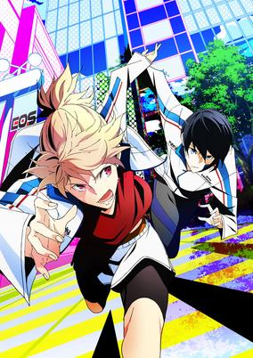

**Studio:** Madhouse &nbsp;|&nbsp; **Episodes:** 12 &nbsp;|&nbsp; **Director:** Atsuko Ishizuka &nbsp;|&nbsp; **Aired/Released:** 5 January - 22 March &nbsp;|&nbsp; **Genres:** Reverse Harem, Sports

> The series is about an extreme form of sport known as "Stride." It involves 6 players on a team that runs relay races in towns. The story takes place at Honan Academy where first year high school students Takeru Fujiwara and Nana Sakurai try to recruit members for their "Stride" club. They request Riku Yagami to join with the help of Takeru and Nana. Their goal is to compete and win the "End of Summer," a top competition hosted in Japan alongside other schools.
>
> _Synopsis source: Kitsu_

[Wikipedia](https://en.wikipedia.org/wiki/Prince_of_Stride) · [Kitsu](https://kitsu.io/anime/prince-of-stride-alternative)

---

### HaruChika: Haruta to Chika wa Seishun Suru (Haruchika: Haruta & Chika)

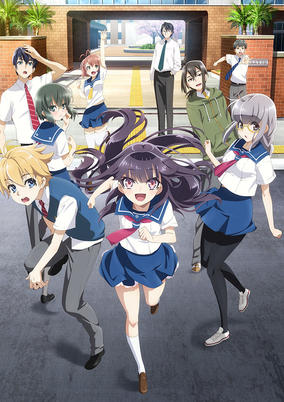

**Studio:** P.A. Works &nbsp;|&nbsp; **Episodes:** 12 &nbsp;|&nbsp; **Director:** Masakazu Hashimoto &nbsp;|&nbsp; **Aired/Released:** 6 January - 24 March &nbsp;|&nbsp; **Genres:** School Clubs, Detective, School Life, High School, Japan, Present, Asia, Earth, Music, Romance, Slice of Life, Mystery

> Chika Homura begins her high school career with a goal: to develop a "cute girl" persona. After quitting the volleyball team despite her all-star status, Chika decides to join her school's underrated Wind Instrument Club and play the flute, believing it to be the most delicate and feminine instrument. For the first time in nine years, Chika reunites with her childhood friend and total opposite, Haruta Kamijou. Unfortunately for Chika, Haruta is not fooled by her efforts to become more endearing. But this does not deter Chika, and she develops a crush on the band instructor, Shinjirou Kusakabe—but so does Haruta! However, Chika's high school life just won't go according to plan, as mysteries begin appearing around her and her friends. The club members must work together to solve the mysteries plaguing the school, all while trying to find more members to compete in musical competitions. [Written by MAL Rewrite]
>
> _Synopsis source: Kitsu_

[Wikipedia](https://en.wikipedia.org/wiki/Haruchika) · [Kitsu](https://kitsu.io/anime/haruchika-haruta-to-chika-wa-seishun-suru)

---

### Sushi Police

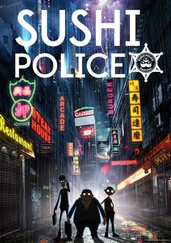

**Studio:** KOO-KI &nbsp;|&nbsp; **Episodes:** 13 &nbsp;|&nbsp; **Director:** Tatsushi Momen &nbsp;|&nbsp; **Aired/Released:** 6 January - 30 March &nbsp;|&nbsp; **Genres:** Comedy, Cops

> Honda, Kawasaki, and Suzuki all comprise the elite ninth unit of the Sushi Police—a task force with the sole objective of sniffing out restaurants serving illicit or non-traditional sushi and eradicating them, no matter how insignificant their offense may be. The Sushi Police travel freely around the world in pursuit of these vile criminals day or night, with their strong sense of justice and the World Food-Culture Conservation Organization backing them. No offenders of Japan's traditional cuisine can escape their wrath! During one of their purification missions, the Sushi Police encounter Sara—a hot, young, television reporter out to expose them and the World Food-Culture Conservation Organization for corruption. They interrogate her, but her wiles, skills, and charms allow her to easily escape from their grasp, setting off a chain of events that will lead to the true purpose of the Sushi Police being revealed. [Written by MAL Rewrite]
>
> _Synopsis source: Kitsu_

[Kitsu](https://kitsu.io/anime/sushi-police)

---

### Active Raid (Active Raid: Special Public Security Fifth Division Third Mobile Assault Eighth Unit)

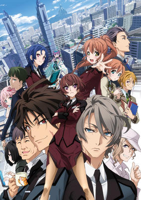

**Studio:** Production IMS &nbsp;|&nbsp; **Episodes:** 24 &nbsp;|&nbsp; **Director:** Gorō Taniguchi Noriaki Akitaya &nbsp;|&nbsp; **Aired/Released:** 7 January - 27 September &nbsp;|&nbsp; **Genres:** Power Suit, Special Squads, Crime, Law And Order, Science Fiction, Mecha, Comedy, Cops

> After the Quicksand Disaster sunk large swaths of Tokyo, fast reconstruction now requires the use of powerful exoskeletons. Although most of these exoskeletons are used for good, once they fall into the hands of criminals or the criminally-minded, they can become a danger for the citizens of Tokyo. More commonly called the “the Eighth” only, the Mobile Assault Division is properly equipped to handle criminals empowered by their own exoskeletons. Such overpowered criminals require equally powered police officers. By connecting their minds to the ACTIVE system, members of the Mobile Assault Division, better known as the “Willwearers”, step into their exoskeletons and become superhuman. Not every unit in the Mobile Assault Division is well respected. One unit of the M.A.D., Unit 18, unfortunately has a bad reputation due to their reckless and destructive way of solving crimes. That’s where Assistant Inspector Asami Kazari comes in. Although she is young, her experience in handling tough situations is unmatched. Can she pull the team together and help save the public image of the entire armored police force? Active Raid: Kidou Kyoushuushitsu Dai Hachi Gakari focuses on the efforts Asami Kazari must undertake to reign in a careless police unit.
>
> _Synopsis source: Kitsu_

[Wikipedia](https://en.wikipedia.org/wiki/Active_Raid) · [Kitsu](https://kitsu.io/anime/active-raid-kidou-kyoushuushitsu-dai-hakkei)

---

### Assassination Classroom

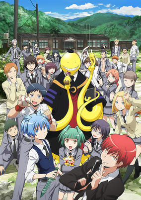

**Studio:** Lerche &nbsp;|&nbsp; **Episodes:** 25 &nbsp;|&nbsp; **Director:** Seiji Kishi &nbsp;|&nbsp; **Aired/Released:** 7 January - 30 June &nbsp;|&nbsp; **Genres:** Assassin, Comedy, School Life, Action

> When a mysterious creature chops the moon down to a permanent crescent, the students of class 3-E of Kunugigaoka Middle School find themselves confronted with an enormous task: assassinate the creature responsible for the disaster before Earth suffers a similar fate. However, the monster, dubbed Koro-sensei (the indestructible teacher), is able to fly at speeds of up to Mach 20, which he demonstrates freely, leaving any attempt to subdue him in his extraterrestrial dust. Furthermore, the misfits of 3-E soon find that the strange, tentacled beast is more than just indomitable—he is the best teacher they have ever had! Adapted from the humorous hit manga by Yuusei Matsui, Ansatsu Kyoushitsu tells the story of these junior high pupils as they polish their assassination skills and grow in order to stand strong against the oppressive school system, their own life problems, and one day, Koro-sensei.
>
> _Synopsis source: Kitsu_

[Wikipedia](https://en.wikipedia.org/wiki/Assassination_Classroom) · [Kitsu](https://kitsu.io/anime/ansatsu-kyoushitsu-tv)

---

### Dagashi Kashi

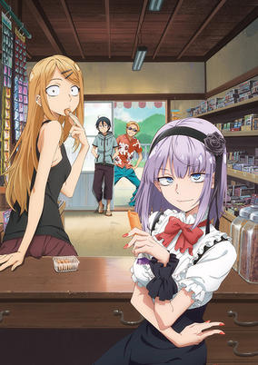

**Studio:** Feel &nbsp;|&nbsp; **Episodes:** 12 &nbsp;|&nbsp; **Director:** Shigehito Takayanagi &nbsp;|&nbsp; **Aired/Released:** 7 January - 31 March &nbsp;|&nbsp; **Genres:** Slow When It Comes To Love, Summer, Countryside, Slice of Life, Japan, Asia, Earth, Comedy, Parody

> Out in the countryside stands a sweet shop run by the Shikada family for nine generations: Shikada Dagashi, a small business selling traditional Japanese candy. However, despite his father's pleas, Kokonotsu Shikada, an aspiring manga artist, adamantly refuses to inherit the family business. However, this may start to change with the arrival of the eccentric Hotaru Shidare. Hotaru is in search of Kokonotsu's father, with the goal of bringing him back to work for her family's company, Shidare Corporation, a world famous sweets manufacturer. Although the senior Shikada initially refuses, he states that he will change his mind on one condition: if Hotaru can convince Kokonotsu to take over the family shop. And so begins Hotaru's mission to enlighten the boy on the true joy of delicious and nostalgic dagashi! [Written by MAL Rewrite]
>
> _Synopsis source: Kitsu_

[Wikipedia](https://en.wikipedia.org/wiki/Dagashi_Kashi) · [Kitsu](https://kitsu.io/anime/dagashi-kashi)

---

### ERASED

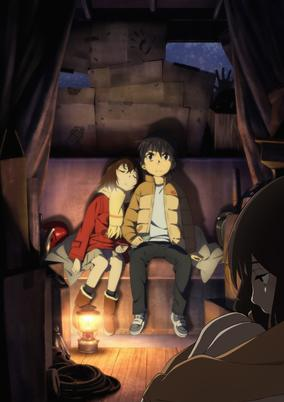

**Studio:** A-1 Pictures &nbsp;|&nbsp; **Episodes:** 12 &nbsp;|&nbsp; **Director:** Tomohiko Itō &nbsp;|&nbsp; **Aired/Released:** 7 January - 25 March &nbsp;|&nbsp; **Genres:** Time Travel, Past, Angst, Plot Continuity, Present, Psychological, Mystery, Thriller, Supernatural

> When tragedy is about to strike, Satoru Fujinuma finds himself sent back several minutes before the accident occurs. The detached, 29-year-old manga artist has taken advantage of this powerful yet mysterious phenomenon, which he calls "Revival," to save many lives. However, when he is wrongfully accused of murdering someone close to him, Satoru is sent back to the past once again, but this time to 1988, 18 years in the past. Soon, he realizes that the murder may be connected to the abduction and killing of one of his classmates, the solitary and mysterious Kayo Hinazuki, that took place when he was a child. This is his chance to make things right.Boku dake ga Inai Machi follows Satoru in his mission to uncover what truly transpired 18 years ago and prevent the death of his classmate while protecting those he cares about in the present. [Written by MAL Rewrite]
>
> _Synopsis source: Kitsu_

[Wikipedia](https://en.wikipedia.org/wiki/Boku_Dake_ga_Inai_Machi) · [Kitsu](https://kitsu.io/anime/boku-dake-ga-inai-machi)

---

### Girls Beyond the Wasteland

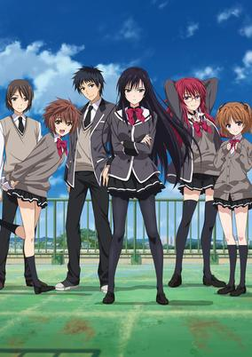

**Studio:** Project No.9 &nbsp;|&nbsp; **Episodes:** 12 &nbsp;|&nbsp; **Director:** Takuya Satō &nbsp;|&nbsp; **Aired/Released:** 7 January - 24 March &nbsp;|&nbsp; **Genres:** High School, School Clubs, School Life, Japan, Asia, Plot Continuity, Present, Earth

> Shoujo-tachi wa Kouya wo Mezasu is a series all about finding oneself and a direction in life... no matter how far off the beaten path it might be. Buntarou Hojo is a high school student who has a talent for writing, but no real direction in life or any plans for the future. His classmate, Sayuki Kuroda notices his talent, decides to help him find a way to use it properly by enlisting him in her bishoujo game development group. When Buntarou is cornered in the men's bathroom at school by Sayuki, he is surprised when he is asked out on what he thinks is a date, and even further surprised when he finds out that it's not a date, but a job interview. Reluctantly agreeing, the two start recruiting other members for their team but will they learn more about game creation, or life itself along the way?
>
> _Synopsis source: Kitsu_

[Wikipedia](https://en.wikipedia.org/wiki/Girls_Beyond_the_Wasteland) · [Kitsu](https://kitsu.io/anime/shoujo-tachi-wa-kouya-wo-mezasu)

---

### Myriad Colors Phantom World

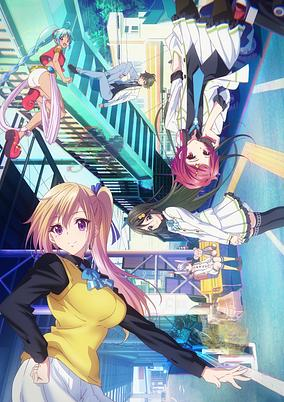

**Studio:** Kyoto Animation &nbsp;|&nbsp; **Episodes:** 13 &nbsp;|&nbsp; **Director:** Tatsuya Ishihara &nbsp;|&nbsp; **Aired/Released:** 7 January - 31 March &nbsp;|&nbsp; **Genres:** Anthropomorphism, Contemporary Fantasy, School Clubs, Action, Comedy, Super Power, Fantasy, Slice of Life

> In the near future, monstrous creatures called “phantoms” descend upon the world. Haruhiko Ichijo is a student at Hosea Academy, along with Mai Kawakami, Reina Izumi, and Koito Minase, three girls who fight these creatures. High school life proceeds as normal until a certain incident reveals the truth of their world to them.
>
> _Synopsis source: Kitsu_

[Wikipedia](https://en.wikipedia.org/wiki/Myriad_Colors_Phantom_World) · [Kitsu](https://kitsu.io/anime/musaigen-no-phantom-world)

---

### Norn9

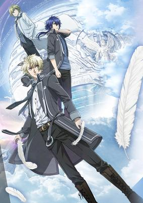

**Studio:** Kinema Citrus Orange &nbsp;|&nbsp; **Episodes:** 12 &nbsp;|&nbsp; **Director:** Takao Abo &nbsp;|&nbsp; **Aired/Released:** 7 January - 25 March &nbsp;|&nbsp; **Genres:** Super Power, Fantasy, Adventure, Romance, Josei

> The story takes place a little in the future. Guided by one particular song, young elementary school student Suzuhara Sorata, from the Heisei Era, is warped through a time skip to an unfamiliar place that looks much like the towns from the Meiji or Taishou period from his textbooks. In this world, he meets three young ladies and nine young men and joins them on a journey aboard the mysterious Norn ship, a giant globe that floats in midair.
>
> _Synopsis source: Kitsu_

[Wikipedia](https://en.wikipedia.org/wiki/Norn9) · [Kitsu](https://kitsu.io/anime/norn9-norn-nonet)

---

### Ojisan to Marshmallow (Ojisan and Marshmallow)

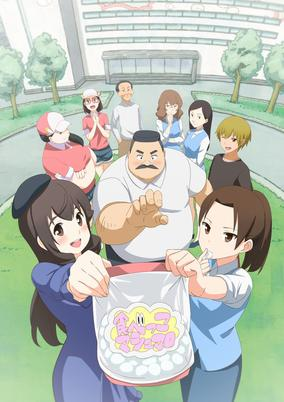

**Studio:** Creators in Pack &nbsp;|&nbsp; **Episodes:** 12 &nbsp;|&nbsp; **Director:** Hisayoshi Hirasawa Noriyoshi Sasaki &nbsp;|&nbsp; **Aired/Released:** 7 January - 25 March &nbsp;|&nbsp; **Genres:** Japan, Present, Asia, Earth, Comedy, Slice of Life

> Habahiro Hige is a simple-minded older man who works an office job and is an enthusiast of Tabekko Marshmallows. His days often consist of being teased by his 24-year-old colleague Iori Wakabayashi, who uses his obsession to her advantage: from eating them in front of his face, to buying out his favorite brand from the convenience store, and even embarrassing him in front of their boss. Although her friends cannot fathom what she sees in him, she just cannot get over his marshmallow-like, fluffy frame. No matter the lengths it takes, Iori will find a way to get his attention. Little does Habahiro know that she is trying to seduce him into a romantic relationship with her. The way to a man's heart is through his stomach, right? At least this is what Iori would honestly like to believe. With a bag in hand, Iori continues to make him chase after her day after day, hoping that he will finally see through her attempts. Will he ever realize that their relationship can become s'more? [Written by MAL Rewrite]
>
> _Synopsis source: Kitsu_

[Wikipedia](https://en.wikipedia.org/wiki/Ojisan_to_Marshmallow) · [Kitsu](https://kitsu.io/anime/ojisan-to-marshmallow)

---

### Phantasy Star Online 2: The Animation

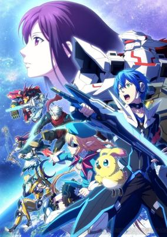

**Studio:** Telecom Animation Film &nbsp;|&nbsp; **Episodes:** 12 &nbsp;|&nbsp; **Director:** Keiichiro Kawaguchi &nbsp;|&nbsp; **Aired/Released:** 7 January - 31 March &nbsp;|&nbsp; **Genres:** Science Fiction, School Life, Virtual Reality, Action

> Phantasy Star Online 2 is the hottest game to hit the market. Just ask anyone at Seiga Academy—anyone except for Itsuki Tachibana, that is. Unlike his peers, Itsuki does not play video games and ended up missing out on this big trend. Thankfully, he has other good qualities. He gets good grades. He has perfect attendance. And, to the delight of his friends, he makes the perfect substitute for any afterschool activity. Who knew it was possible to be a jack of all trades in high school clubs? Itsuki's abilities attract the attention of student council president, Rina Izumi. While Itsuki is the perfect image of mediocrity, Rina is a vision of excellence; she is good looking, popular, an amazing athlete, and she has excellent grades. There is nothing she cannot do... except for keep an eye on the extracurricular activities of the student body, of course. Rina recruits Itsuki as the new vice president of the student council and asks him to play Phantasy Star Online 2. Because the game is an MMO, it has a social aspect and she wants to know if it is affecting the student body negatively. But first, Itsuki has to learn how to play the game! Will this jack of all trades pick up a new skill? Is the game just an unwanted distraction to the student body? Find out in Phantasy Star Online 2 The Animation!
>
> _Synopsis source: Kitsu_

[Wikipedia](https://en.wikipedia.org/wiki/Phantasy_Star_Online_2) · [Kitsu](https://kitsu.io/anime/phantasy-star-online-2-the-animation)

---

### Divine Gate

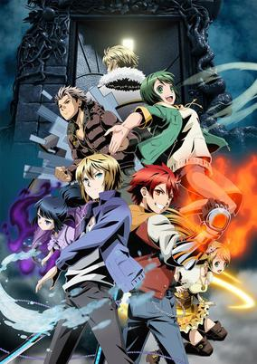

**Studio:** Studio Pierrot &nbsp;|&nbsp; **Episodes:** 12 &nbsp;|&nbsp; **Director:** Noriyuki Abe &nbsp;|&nbsp; **Aired/Released:** 8 January - 25 March &nbsp;|&nbsp; **Genres:** Action, Fantasy, Science Fiction

> When the Divine Gate opened, the living world, the heavens, and the underworld became connected, ushering an era of chaos where desires and conflict intersect. To restore order, the World Council is formed. As peace is restored, the Divine Gate becomes an urban legend. In that world, boys and girls deemed fit by the World Council are gathered. They are ones who aim to reach the gate for their personal objectives. Those who reach the gate can remake the world. What lies beyond the gate? When they reach the door, will the world change? Will it be the past that changes, or will it be the future?
>
> _Synopsis source: Kitsu_

[Wikipedia](https://en.wikipedia.org/wiki/Divine_Gate) · [Kitsu](https://kitsu.io/anime/divine-gate)

---

### Pandora in the Crimson Shell: Ghost Urn

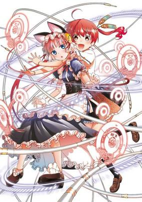

**Studio:** Studio Gokumi AXsiZ &nbsp;|&nbsp; **Episodes:** 12 &nbsp;|&nbsp; **Director:** Munenori Nawa &nbsp;|&nbsp; **Aired/Released:** 8 January - 25 March &nbsp;|&nbsp; **Genres:** Comedy, Science Fiction, Action, Ecchi

> In an age when large-scale natural disasters frequently happen all over the world, when cyborgs and autonomous robots are beginning to appear on the market in technologically advanced nations, and major world powers compete for technology and resources, the divide between rich and poor grows and the future for the poor looks bleak. In this transitional stage, everyone wanders around in a self-indulgent daze and the way out isn't clear... This is the story of how two cybernetically enhanced girls meet.
>
> _Synopsis source: Kitsu_

[Kitsu](https://kitsu.io/anime/koukaku-no-andora-ghost-urn)

---

### Please Tell Me! Galko-chan

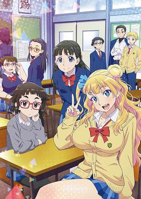

**Studio:** Feel &nbsp;|&nbsp; **Episodes:** 12 &nbsp;|&nbsp; **Director:** Keiichiro Kawaguchi &nbsp;|&nbsp; **Aired/Released:** 8 January - 25 March &nbsp;|&nbsp; **Genres:** High School, School Life, Comedy, Slice of Life

> Galko, Otako and Ojou are a trio of unlikely friends in high school with three very different perspectives. Each episode embarks on a day in the life of a trendy girl, an otaku, and a lady, as they discuss their “girl problems.”
>
> _Synopsis source: Kitsu_

[Wikipedia](https://en.wikipedia.org/wiki/Please_Tell_Me!_Galko-chan) · [Kitsu](https://kitsu.io/anime/oshiete-galko-chan)

---

### Reikenzan: Hoshikuzu-tachi no Utage

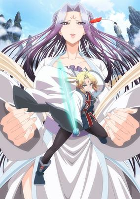

**Studio:** Studio Deen &nbsp;|&nbsp; **Episodes:** 12 &nbsp;|&nbsp; **Director:** Iku Suzuki &nbsp;|&nbsp; **Aired/Released:** 8 January - 25 March &nbsp;|&nbsp; **Genres:** Adventure, Fantasy, Magic, Comedy

> Twelve years ago in Kyuushu, an epic event occurred in which a falling comet brought upon an unknown calamity to the world. At the same time as this natural phenomenon, a baby boy named Ouriku whose soul was touched by this mysterious entity was born, oblivious to his inevitable destiny. In present day, almost nobody remembers this great star event. However, a powerful family of the Reiken clan have decided to conduct an entrance examination at the God's assembly. Their goal is to find the most talented and powerful disciples, fit to work as sages. Ouriku decides to take this exam, unaware of the special powers he possesses. Reikenzan: Hoshikuzu-tachi no Utage is the story of Ouriku and his journey to becoming a powerful sage.
>
> _Synopsis source: Kitsu_

[Kitsu](https://kitsu.io/anime/reikenzan-hoshikuzu-tachi-no-utage)

---

### Sekkō Boys (Sekko Boys)

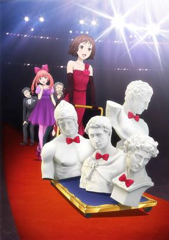

**Studio:** Liden Films &nbsp;|&nbsp; **Episodes:** 12 &nbsp;|&nbsp; **Director:** Tomoki Takuno &nbsp;|&nbsp; **Aired/Released:** 8 January - 25 March &nbsp;|&nbsp; **Genres:** The Arts, Idol, Music, Comedy

> As luck would have it, on her first day at Holbein Entertainment Co., Miki Ishimoto is tasked with managing a brand new idol group! A recent college graduate, Ishimoto is eager to begin her career in the industry. However, her department's responsibility is...statues?! The statues in question are the Sekkou Boys, or "The Rockies," a boy band comprised of four Greco-Roman sculptures: St. George, Mars, Hermes, and Medici. These four busts are new to the entertainment scene, and it is up to Miki to ensure the Rockies' prosperity in the idol world. But will they be a stone-cold success? Or will Miki's management prove to be a rocky start to stardom? [Written by MAL Rewrite]
>
> _Synopsis source: Kitsu_

[Wikipedia](https://en.wikipedia.org/wiki/Sekk%C5%8D_Boys) · [Kitsu](https://kitsu.io/anime/sekkou-boys)

---

### Shōwa Genroku Rakugo Shinjū (Showa Genroku Rakugo Shinju)

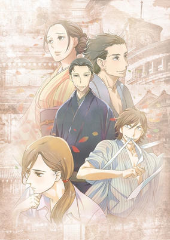

**Studio:** Studio Deen &nbsp;|&nbsp; **Episodes:** 13 &nbsp;|&nbsp; **Director:** Mamoru Hatakeyama &nbsp;|&nbsp; **Aired/Released:** 8 January - 1 April &nbsp;|&nbsp; **Genres:** Performance, The Arts, Past, Asia, Earth, Japan, Friendship, Historical, Josei

> Yotarou is a former yakuza member fresh out of prison and fixated on just one thing: rather than return to a life of crime, the young man aspires to take to the stage of Rakugo, a traditional Japanese form of comedic storytelling. Inspired during his incarceration by the performance of distinguished practitioner Yakumo Yuurakutei, he sets his mind on meeting the man who changed his life. After hearing Yotarou's desperate appeal for his mentorship, Yakumo is left with no choice but to accept his very first apprentice. As he eagerly begins his training, Yotarou meets Konatsu, an abrasive young woman who has been under Yakumo's care ever since her beloved father Sukeroku Yuurakutei, another prolific Rakugo performer, passed away. Through her hidden passion, Yotarou is drawn to Sukeroku's unique style of Rakugo despite learning under contrasting techniques. Upon seeing this, old memories and feelings return to Yakumo who reminisces about a much earlier time when he made a promise with his greatest rival. Shouwa Genroku Rakugo Shinjuu is a story set in both the past and present, depicting the art of Rakugo, the relationships it creates, and the lives and hearts of those dedicated to keeping the unique form of storytelling alive.
>
> _Synopsis source: Kitsu_

[Wikipedia](https://en.wikipedia.org/wiki/Sh%C5%8Dwa_Genroku_Rakugo_Shinj%C5%AB) · [Kitsu](https://kitsu.io/anime/shouwa-genroku-rakugo-shinjuu-tv)

---

### Tabi Machi Late Show

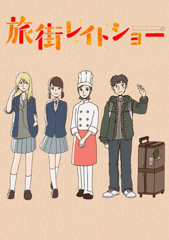

**Studio:** CoMix Wave Films &nbsp;|&nbsp; **Episodes:** 4 &nbsp;|&nbsp; **Director:** Yuu Numata &nbsp;|&nbsp; **Aired/Released:** 8 January - 29 January &nbsp;|&nbsp; **Genres:** Earth, Japan, Asia, Present

> Tabi Machi Late Show will have a theme of "goodbyes and journeys".
>
> _Synopsis source: Kitsu_

[Kitsu](https://kitsu.io/anime/tabi-machi-late-show)

---

### BBK/BRNK

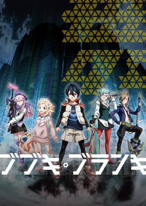

**Studio:** Sanzigen &nbsp;|&nbsp; **Episodes:** 12 &nbsp;|&nbsp; **Director:** Daizen Komatsuda &nbsp;|&nbsp; **Aired/Released:** 9 January - 26 March &nbsp;|&nbsp; **Genres:** Conspiracy, Future, Science Fiction, Mecha, Japan, Space, Action

> When Azuma Kazuki returns to Japan after 10 years, he gets assaulted by a group of armed men and becomes their prisoner. Kogane Asabuki, a childhood friend, saves him with a weapon on her right hand known as Bubuki; a weapon with its own mind. Azuma Kazuki, who is a Bubuki user himself, learns about the existence of Bubuki and goes on a journey alongside the companions he has found, in an attempt to find and revive Oubu, a Buranki (titan) who sleeps underground.
>
> _Synopsis source: Kitsu_

[Wikipedia](https://en.wikipedia.org/wiki/BBK/BRNK) · [Kitsu](https://kitsu.io/anime/bubuki-buranki)

---

### Durarara!!×2 Ketsu (Durarara!! x2)

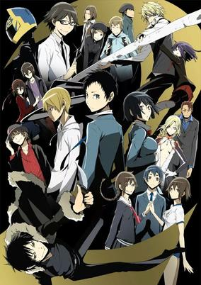

**Studio:** Shuka &nbsp;|&nbsp; **Episodes:** 12 &nbsp;|&nbsp; **Director:** Takahiro Omori &nbsp;|&nbsp; **Aired/Released:** 9 January - 26 March &nbsp;|&nbsp; **Genres:** Present, Earth, Japan, Tokyo, Violence, Asia, Action, Mystery

> Although peace has finally returned to Ikebukuro, many of the odd occurrences have become common sights around the city. One such case is the police's constant pursuit of Celty Sturluson, the Headless Rider. Moreover, someone has placed a large bounty on her, igniting the motivation of gang members all over to begin searching for the supernatural creature as well. Meanwhile, Mikado Ryuugamine is approached by Aoba Kuronuma, a mysterious underclassman with unknown intentions, who reveals that he knows Mikado's true identity. But Ikebukuro's state of tranquility is short-lived, as a new threat appears in the form of a murderer who goes by the pseudonym "Hollywood," known for wearing a different mask each time they commit a crime. As the various events taking place prove to be connected yet again, Ikebukuro is thrown into another conflict that threatens to engulf the entire city in chaos. [Written by MAL Rewrite]
>
> _Synopsis source: Kitsu_

[Wikipedia](https://en.wikipedia.org/wiki/Durarara!!) · [Kitsu](https://kitsu.io/anime/durarara-x2)

---

### Gate

**Studio:** A-1 Pictures &nbsp;|&nbsp; **Episodes:** 12 &nbsp;|&nbsp; **Director:** Takahiko Kyōgoku &nbsp;|&nbsp; **Aired/Released:** 9 January - 26 March

[Wikipedia](https://en.wikipedia.org/wiki/Gate_(novel_series))

---

### Luck & Logic

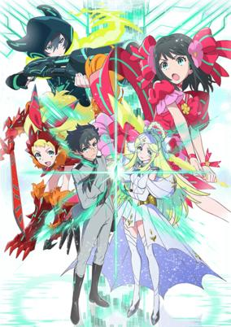

**Studio:** Doga Kobo &nbsp;|&nbsp; **Episodes:** 12 &nbsp;|&nbsp; **Director:** Koichi Chigira Takashi Naoya &nbsp;|&nbsp; **Aired/Released:** 9 January - 26 March &nbsp;|&nbsp; **Genres:** Fantasy, Deity, Action, Japan, Asia, Earth

> In the year L.C. 922, mankind faces an unprecedented crisis. Following the conclusion of a hundred-year war on the mythical world of Tetraheaven, the losing Majins sought a safe haven and invaded the human world Septpia. The government is forced to fight by employing Logicalists belonging to ALCA, a special police that protects the streets from foreigners of another world. Logicalists are given a special power that allows them to enter a trance with Goddesses from the other world. One day, Yoshichika Tsurugi, a civilian who is lacking "Logic" and lives peacefully with his family, meets the beautiful goddess Athena while helping people escape from a Majin attack. She wields the "Logic" that Yoshichika should have lost. This leads Yoshichika to an unexpected destiny with Athena. The future of the world depends on the "Luck" and "Logic" and these Logicalists.
>
> _Synopsis source: Kitsu_

[Wikipedia](https://en.wikipedia.org/wiki/Luck_%26_Logic) · [Kitsu](https://kitsu.io/anime/luck-logic)

---

### Dimension W

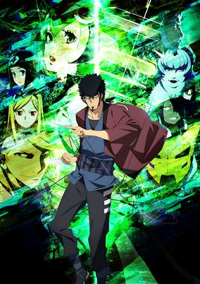

**Studio:** 3Hz Orange &nbsp;|&nbsp; **Episodes:** 12 &nbsp;|&nbsp; **Director:** Kanta Kamei &nbsp;|&nbsp; **Aired/Released:** 10 January - 27 March &nbsp;|&nbsp; **Genres:** Bounty Hunter, Crime, Rotten World, Dystopia, Cyberpunk, Android, Science Fiction, Future, Japan, Earth, Action, Asia

> In the near future, humans have discovered a fourth dimension, Dimension W, and a supposedly infinite source of energy within. In order to harness this profound new energy, mankind develops advanced "coils," devices that link to and use the power of Dimension W. However, by year 2071, the New Tesla Energy corporation has monopolized the energy industry with coils, soon leading to the illegal distribution of unofficial coils that begin flooding the markets. Kyouma Mabuchi is an ex-soldier who is wary of all coil-based technology to the extent that he still drives a gas-powered car. Kyouma is a "Collector," individuals with the sole duty of hunting down illegal coils in exchange for money. What started out as just any other mission is turned on its head when he bumps in Mira Yurizaki, an android with a connection to the "father" of coils. When a series of strange events begin to take place, these two unlikely allies band together to uncover the mysteries of Dimension W.
>
> _Synopsis source: Kitsu_

[Wikipedia](https://en.wikipedia.org/wiki/Dimension_W) · [Kitsu](https://kitsu.io/anime/dimension-w)

---

### Nijiiro Days (Rainbow Days)

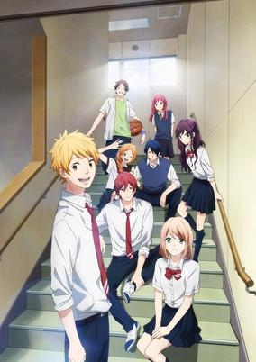

**Studio:** Production Reed &nbsp;|&nbsp; **Episodes:** 24 &nbsp;|&nbsp; **Director:** Tetsurō Amino Tomihiko Ohkubo &nbsp;|&nbsp; **Aired/Released:** 10 January - 26 June &nbsp;|&nbsp; **Genres:** Comedy, Slice of Life, Japan, Present, High School, School Life, Earth, Asia, Romance

> Nijiiro Days follows the colorful lives and romantic relationships of four high school boys—Natsuki Hashiba, a dreamer with delusions of love; Tomoya Matsunaga, a narcissistic playboy who has multiple girlfriends; Keiichi Katakura, a kinky sadist who always carries a whip; and Tsuyoshi Naoe, an otaku who has a cosplaying girlfriend. When his girlfriend unceremoniously dumps him on Christmas Eve, Natsuki breaks down in tears in the middle of the street and is offered tissues by a girl in a Santa Claus suit. He instantly falls in love with this girl, Anna Kobayakawa, who fortunately attends the same school as him. Natsuki's pursuit of Anna should have been simple and uneventful; however, much to his dismay, his nosy friends constantly meddle in his relationship, as they strive to succeed in their own endeavors of love. [Written by MAL Rewrite]
>
> _Synopsis source: Kitsu_

[Wikipedia](https://en.wikipedia.org/wiki/Nijiiro_Days) · [Kitsu](https://kitsu.io/anime/nijiiro-days)

---

### Nurse Witch Komugi-chan R

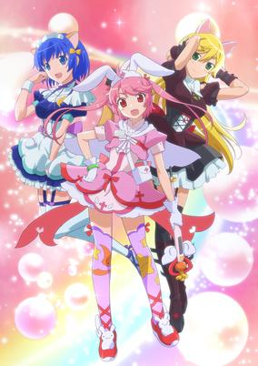

**Studio:** Tatsunoko Production &nbsp;|&nbsp; **Episodes:** 12 &nbsp;|&nbsp; **Director:** Keiichiro Kawaguchi &nbsp;|&nbsp; **Aired/Released:** 10 January - 27 March &nbsp;|&nbsp; **Genres:** Magic, Idol, Magical Girl, Present, Earth, Contemporary Fantasy, Parody, Music, Asia, Fantasy

> The new "slapstick" story will depict Komugi-chan and her rivals as they juggle their daily lives as students, idols, and magical girls "with laughter and tears." Komugi Yoshida is a somewhat clumsy second-year middle-school student whose strong point is her spiritedness. She performs as an idol like Kokona Saionji (her classmate and close friend) and Tsubasa Kisaragi (an idol who dresses in male clothing). However, unlike Kokona whose popularity is skyrocketing and Tsubasa with her charisma in male attire, Komugi's only gigs are low-end ones like those at the local shopping district. Still, Komugi has her "dream" as she lives her dual lives as a idol and a middle school girl. One day, a mysterious injured creature named Usa-P appears before Komugi. Komugi gives Usa-P medical treatment, and Usa-P, in consideration of Komugi's kindness, asks if she wants to be a Legendary Girl who can use magical powers. Having become a reluctant Legendary Girl, Komugi battles strange masked figures who suddenly appear! As a newly deemed Magical Nurse, she fights still more waves of masked figures. Meanwhile, a Magical Maid, a Magical Sister, and more also appear to make it a three-way battle!? Can Komugi handle the three roles of middle school girl, idol, and Magical Nurse? And, what lies ahead in these battles and her "dream"...?!
>
> _Synopsis source: Kitsu_

[Wikipedia](https://en.wikipedia.org/wiki/Nurse_Witch_Komugi) · [Kitsu](https://kitsu.io/anime/nurse-witch-komugi-chan-r)

---

### Ooya-san wa Shishunki!

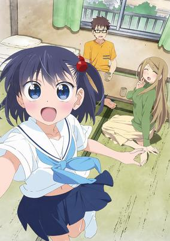

**Studio:** Seven Arcs &nbsp;|&nbsp; **Episodes:** 12 &nbsp;|&nbsp; **Director:** Yuki Ogawa &nbsp;|&nbsp; **Aired/Released:** 10 January - 27 March &nbsp;|&nbsp; **Genres:** Slice of Life, Comedy

> Leaving the nest to live on your own is one of the most exciting moments in a teenager's life. It's even more so if the landlord of that new apartment complex happens to be an adorable middle school student and your next door neighbor is a flirtatious bombshell. Freedom has never tasted so sweet. The protagonist of the story, Maeda, is your typical adolescent male, constantly fantasizing about the attractive girls around him, including Chie, his landlord, and Reiko, his neighbor. Life with these young ladies is full of fun surprises, making every day an interesting one.Ooyasan wa Shishunki! is your typical slice of life anime. The heartwarming characters and comedic plot are sure to brighten your day.
>
> _Synopsis source: Kitsu_

[Wikipedia](https://en.wikipedia.org/wiki/Ooya-san_wa_Shishunki!) · [Kitsu](https://kitsu.io/anime/ooyasan-wa-shishunki)

---

### Schwarzesmarken (Schwarzes Marken)

**Studio:** Ixtl Liden Films &nbsp;|&nbsp; **Episodes:** 12 &nbsp;|&nbsp; **Director:** Tetsuya Watanabe &nbsp;|&nbsp; **Aired/Released:** 10 January - 27 March &nbsp;|&nbsp; **Genres:** Alternative Present, Germany, Politics, Drama, Europe, Violence, Disaster, War, Robot, Present, Plot Continuity, Action, Earth, Piloted Robot, Science Fiction, Military, Mecha, Historical

> "Schwarzesmarken," the German word for "Black Marks." Set in the 1980s in an alternate timeline version of East Germany, Schwarzesmarken follows the East German Army's 666th TSF Squadron, also known as the "Black Marks." This special unit specializes in unconventional tactics using advanced technology. Their enemy? Beings of extraterrestrial origin, or the BETA, a fearsome and sometimes unpredictable enemy that seem dead set on destroying the human forces and taking the planet Earth for themselves and ripping it clean of its natural resources. Because the BETA come in all shapes and sizes, carrying any number of advanced alien technologies, the Black Marks must use the latest and most deadly weapons humanity can devise to drive them back. Irisdina Bernhard is the commanding officer of the Black Marks. As a war hero, she has earned the respect of her country. However, her cold exterior and personality make her extremely hard to work under, especially for one of the most talented members of the squadron, Theodor Eberbach. Only time will tell if the many battles fought together will bring peace to the earth, and between the many combating personalities in the 666th TSF Squadron.
>
> _Synopsis source: Kitsu_

[Wikipedia](https://en.wikipedia.org/wiki/Schwarzesmarken) · [Kitsu](https://kitsu.io/anime/schwarzesmarken)

---

### Aokana: Four Rhythm Across the Blue

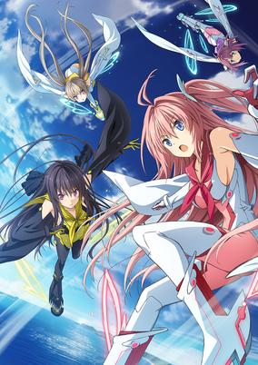

**Studio:** Gonzo &nbsp;|&nbsp; **Episodes:** 12 &nbsp;|&nbsp; **Director:** Fumitoshi Oizaki &nbsp;|&nbsp; **Aired/Released:** 11 January - 28 March &nbsp;|&nbsp; **Genres:** Sports, Comedy, Science Fiction, School Life

> Ao no Kanata no Four Rhythm is set in a world where people can take to the skies, soaring above land and sea. An area called the Four Islands Archipelago has a technology called Grav-Shoes, which allow the wearer to fly. Aside from simple transportation, people also use these shoes in a competition called FC (Flying Circus). To score points, they either touch buoys floating above the ocean, or their opponent's backs. The energetic but ditzy Asuka Kurashina transfers to Kunahama Academy, a high school in the Four Islands Archipelago, from the outside world. She joins Misaki Tobisawa and Masaya Hinata's second year class. Her lack of experience and general clumsiness make her classmates worry if she can learn to fly properly, but she quickly develops an interest in FC, and she, Misaki, and Mashiro, a freshman, join the school's tiny FC club. But Masaya seems reluctant for some reason, even though he seems to know a lot about the sport.
>
> _Synopsis source: Kitsu_

[Kitsu](https://kitsu.io/anime/ao-no-kanata-no-four-rhythm)

---

### Grimgar of Fantasy and Ash (Grimgar, Ashes and Illusions)

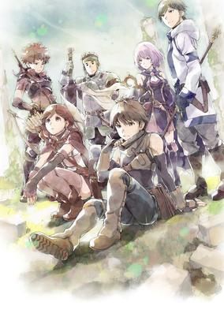

**Studio:** A-1 Pictures &nbsp;|&nbsp; **Episodes:** 12 &nbsp;|&nbsp; **Director:** Ryosuke Nakamura &nbsp;|&nbsp; **Aired/Released:** 11 January - 28 March &nbsp;|&nbsp; **Genres:** Parallel Universe, Plot Continuity, Fantasy, Action, Adventure

> Fear, survival, instinct. Thrown into a foreign land with nothing but hazy memories and the knowledge of their name, they can feel only these three emotions resonating deep within their souls. A group of strangers is given no other choice than to accept the only paying job in this game-like world—the role of a soldier in the Reserve Army—and eliminate anything that threatens the peace in their new world, Grimgar. When all of the stronger candidates join together, those left behind must create a party together to survive: Manato, a charismatic leader and priest; Haruhiro, a nervous thief; Yume, a cheerful hunter; Shihoru, a shy mage; Mogzo, a kind warrior; and Ranta, a rowdy dark knight. Despite its resemblance to one, this is no game—there are no redos or respawns; it is kill or be killed. It is now up to this ragtag group of unlikely fighters to survive together in a world where life and death are separated only by a fine line.
>
> _Synopsis source: Kitsu_

[Wikipedia](https://en.wikipedia.org/wiki/Grimgar_of_Fantasy_and_Ash) · [Kitsu](https://kitsu.io/anime/hai-to-gensou-no-grimgar)

---

### A Simple Thinking About Blood Type

**Studio:** Assez Finaud Fabric Feel Zexcs &nbsp;|&nbsp; **Episodes:** 12 &nbsp;|&nbsp; **Director:** Yoshihisa Oyama &nbsp;|&nbsp; **Aired/Released:** 11 January - 29 March

[Wikipedia](https://en.wikipedia.org/wiki/A_Simple_Thinking_About_Blood_Type)

---

### Snow White with the Red Hair

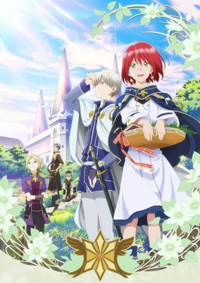

**Studio:** Bones &nbsp;|&nbsp; **Episodes:** 12 &nbsp;|&nbsp; **Director:** Masahiro Ando &nbsp;|&nbsp; **Aired/Released:** 11 January - 28 March &nbsp;|&nbsp; **Genres:** Slow When It Comes To Love, Romance, Fantasy World, Fantasy

> Although her name means "snow white," Shirayuki is a cheerful, red-haired girl living in the country of Tanbarun who works diligently as an apothecary at her herbal shop. Her life changes drastically when she is noticed by the silly prince of Tanbarun, Prince Raji, who then tries to force her to become his concubine. Unwilling to give up her freedom, Shirayuki cuts her long red hair and escapes into the forest, where she is rescued from Raji by Zen Wistalia, the second prince of a neighboring country, and his two aides. Hoping to repay her debt to the trio someday, Shirayuki sets her sights on pursuing a career as the court herbalist in Zen's country, Clarines. Akagami no Shirayuki-hime depicts Shirayuki's journey toward a new life at the royal palace of Clarines, as well as Zen's endeavor to become a prince worthy of his title. As loyal friendships are forged and deadly enemies formed, Shirayuki and Zen slowly learn to support each other as they walk their own paths.
>
> _Synopsis source: Kitsu_

[Wikipedia](https://en.wikipedia.org/wiki/Snow_White_with_the_Red_Hair) · [Kitsu](https://kitsu.io/anime/akagami-no-shirayuki-hime)

---

### Teekyū

**Studio:** Millepensee &nbsp;|&nbsp; **Episodes:** 12 &nbsp;|&nbsp; **Director:** Shin Itagaki &nbsp;|&nbsp; **Aired/Released:** 11 January - 29 March

[Wikipedia](https://en.wikipedia.org/wiki/Teeky%C5%AB)

---

### Undefeated Bahamut Chronicle

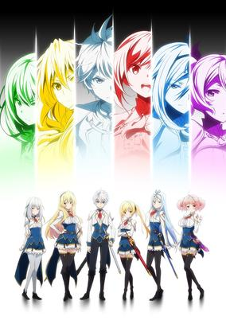

**Studio:** Lerche &nbsp;|&nbsp; **Episodes:** 12 &nbsp;|&nbsp; **Director:** Masaomi Ando &nbsp;|&nbsp; **Aired/Released:** 11 January - 28 March &nbsp;|&nbsp; **Genres:** Ecchi, Action, Science Fiction, Adventure, Fantasy, Harem, Mecha, Romance, School Life

> Lux, a former prince of an empire named Arcadia that was overthrown via a rebellion five years earlier, accidentally trespasses in a female dormitory's bathing area, sees the kingdom's new princess Lisesharte naked, incurring her wrath. Lisesharte then challenges Lux to a Drag-Ride duel. Drag-Rides are ancient armored mechanical weapons that have been excavated from ruins all around the world. Lux used to be called the strongest Drag-Knight, but now he's known as the "undefeated weakest" Drag-Knight because he will absolutely not attack in battle. After his duel with Lisesharte, Lux ends up attending the female-only academy that trains royals to be Drag-Knights.
>
> _Synopsis source: Kitsu_

[Wikipedia](https://en.wikipedia.org/wiki/Undefeated_Bahamut_Chronicle) · [Kitsu](https://kitsu.io/anime/saijaku-muhai-no-bahamut)

---

### Yamishibai: Japanese Ghost Stories (Yamishibai: Japanese Ghost Stories 3)

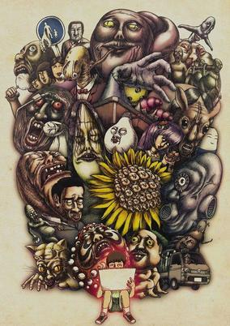

**Studio:** ILCA &nbsp;|&nbsp; **Episodes:** 13 &nbsp;|&nbsp; **Director:** Takashi Taniguchi Tomohisa Ishikawa &nbsp;|&nbsp; **Aired/Released:** 11 January - 3 April &nbsp;|&nbsp; **Genres:** Present, Japan, Horror, Dementia

> Yamishibai is a picture-story style of animation whose motif is surrounded and based off rumors and urban legends throughout the history of Japan.
>
> _Synopsis source: Kitsu_

[Kitsu](https://kitsu.io/anime/yami-shibai-3rd-season)

---

### Mahou Shoujo Nante Mouiidesukara

**Studio:** Pine Jam &nbsp;|&nbsp; **Episodes:** 12 &nbsp;|&nbsp; **Director:** Kazuhiro Yoneda &nbsp;|&nbsp; **Aired/Released:** 12 January - 29 March &nbsp;|&nbsp; **Genres:** Magical Girl, Magic, Comedy

> Yuzuka Hanami is a young, carefree girl who lives the most ordinary life imaginable. Although her father works around the clock and her mother is rarely home, she still enjoys herself and strives to be an excellent student. Miton, on the other hand, is an alien life-form with the ability to transform his master into a magical girl, a warrior who fights evil wherever it may appear. However, there are not as many enemies as there used to be, so Miton has been out of work for a while. Starving and homeless, he has taken up residence in a pile of garbage. As Yuzuka walks past him one day, Miton seizes the opportunity to offer his services to the young girl. Yuzuka reluctantly agrees, but when she transforms into a magical girl and discovers that her outfit is a swimsuit, she begins to have second thoughts about what she has gotten herself into! [Written by MAL Rewrite]
>
> _Synopsis source: Kitsu_

[Wikipedia](https://en.wikipedia.org/wiki/Mahou_Shoujo_Nante_Mouiidesukara) · [Kitsu](https://kitsu.io/anime/mahou-shoujo-nante-mou-ii-desukara)

---

### Teekyu (season 7) (Teekyu 4)

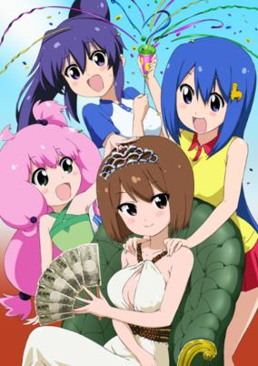

**Studio:** Millepensee &nbsp;|&nbsp; **Episodes:** 12 &nbsp;|&nbsp; **Director:** Shin Itagaki &nbsp;|&nbsp; **Aired/Released:** 12 January - 29 March &nbsp;|&nbsp; **Genres:** Earth, Absurdist Humour, Slapstick, Japan, Tennis, Asia, Comedy, Sports

> Fourth season of Teekyuu series.
>
> _Synopsis source: Kitsu_

[Wikipedia](https://en.wikipedia.org/wiki/Teekyu) · [Kitsu](https://kitsu.io/anime/teekyuu-4)

---

### Kono Subarashii Sekai ni Shukufuku o! (KONOSUBA -God's Blessings On This Wonderful Choker!)

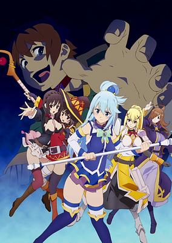

**Studio:** Studio Deen &nbsp;|&nbsp; **Episodes:** 10 &nbsp;|&nbsp; **Director:** Takaomi Kanasaki &nbsp;|&nbsp; **Aired/Released:** 13 January - 16 March &nbsp;|&nbsp; **Genres:** Deity, Parody, Parallel Universe, Fantasy, Comedy, Ecchi, Harem

> Kazuma finds a choker at Wiz's magic shop said to grant any one wish and decides to put it on. The problem? He'll die in four days from strangulation if the wish isn't granted. And Kazuma can't remember what he wished for, so he has no idea how his party members can help. The girls therefore have no choice but to submit to his every whim if they want to save him.
>
> _Synopsis source: Kitsu_

[Wikipedia](https://en.wikipedia.org/wiki/Kono_Subarashii_Sekai_ni_Shukufuku_o!) · [Kitsu](https://kitsu.io/anime/kono-subarashii-sekai-ni-shukufuku-wo-ova)

---

### Ajin: Demi-Human

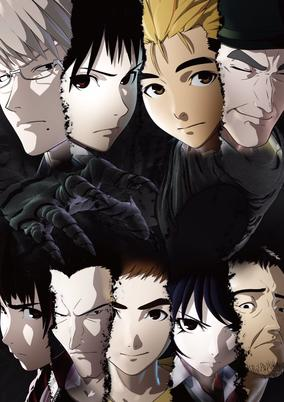

**Studio:** Polygon Pictures &nbsp;|&nbsp; **Episodes:** 13 &nbsp;|&nbsp; **Director:** Hiroyuki Seshita &nbsp;|&nbsp; **Aired/Released:** 16 January - 9 April &nbsp;|&nbsp; **Genres:** Fantasy, Horror, Action, Mystery

> Mysterious immortal humans known as "Ajin" first appeared 17 years ago in Africa. Upon their discovery, they were labeled as a threat to mankind, as they might use their powers for evil and were incapable of being destroyed. Since then, whenever an Ajin is found within society, they are to be arrested and taken into custody immediately. Studying hard to become a doctor, Kei Nagai is a high schooler who knows very little about Ajin, only having seen them appear in the news every now and then. Students are taught that these creatures are not considered to be human, but Kei doesn't pay much attention in class. As a result, his perilously little grasp on this subject proves to be completely irrelevant when he survives an accident that was supposed to claim his life, signaling his rebirth as an Ajin and the start of his days of torment. However, as he finds himself alone on the run from the entire world, Kei soon realizes that more of his species may be a lot closer than he thinks. [Written by MAL Rewrite]
>
> _Synopsis source: Kitsu_

[Kitsu](https://kitsu.io/anime/ajin)

---

### Ganbare! Lulu Lolo - Tiny Twin Bears (TINY★TWIN★BEARS 3rd Season)

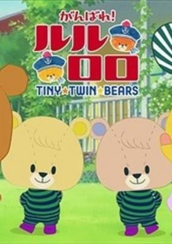

**Studio:** Fanworks &nbsp;|&nbsp; **Episodes:** 10 &nbsp;|&nbsp; **Director:** Yūji Umoto &nbsp;|&nbsp; **Aired/Released:** 21 January - 24 March &nbsp;|&nbsp; **Genres:** Slice of Life, Kids

> The anime centers around the daily life of two twin bear sisters: the orange-colored Lulu and the yellow-colored Lolo. The two take on new jobs and, despite the occasional failure and tears, give their best efforts.
>
> _Synopsis source: Kitsu_

[Kitsu](https://kitsu.io/anime/ganbare-lulu-lolo-3rd-season)

---

### Kono Danshi, Mahō ga Oshigoto Desu. (This Boy is a Professional Wizard)

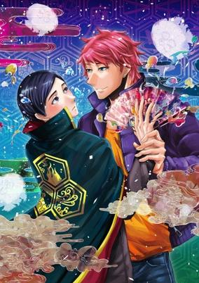

**Studio:** CoMix Wave Films &nbsp;|&nbsp; **Episodes:** 4 &nbsp;|&nbsp; **Director:** Soubi Yamamoto &nbsp;|&nbsp; **Aired/Released:** 5 February - 26 February &nbsp;|&nbsp; **Genres:** Shounen Ai, Magic, Fantasy

> Chiharu Kashima, captain of the Wizard Bureau's Crisis Countermeasures Division, is among a handful of people who can use magic. While frequenting his favorite bar, he is approached by a friendly man named Toyohi Utsumi. Having always dreamt of being a wizard, Toyohi is enthralled by the idea of meeting one. Much to the young Captain's surprise, Toyohi confesses that he has fallen in love with Kashima. While little time as passed, the two begin to spend more time together. Not all is well, however, as Kashima fears that magic is all that he has and Toyohi is only in love with Kashima the Wizard. [Written by MAL Rewrite]
>
> _Synopsis source: Kitsu_

[Kitsu](https://kitsu.io/anime/kono-danshi-mahou-ga-oshigoto-desu)

---

### Rilu Rilu Fairilu ~Yōsei no Door~

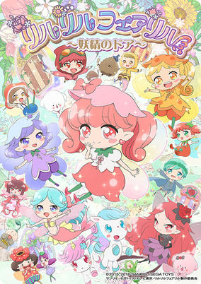

**Studio:** Studio Deen &nbsp;|&nbsp; **Episodes:** 59 &nbsp;|&nbsp; **Director:** Sakura Gojō &nbsp;|&nbsp; **Aired/Released:** 6 February - 25 March 2017 &nbsp;|&nbsp; **Genres:** Magic, Fantasy, Slice of Life

> "Fairilu" are fairies of flowers, insects, mermaids, or other entities that are born from "Farilu Seeds." All Fairilu are born with their own key, and they must search to find and open the door that fits only their key. Once the Fairilu pass through the doors, they mature. The doors are also related to the human world.
>
> _Synopsis source: Kitsu_

[Wikipedia](https://en.wikipedia.org/wiki/Rilu_Rilu_Fairilu) · [Kitsu](https://kitsu.io/anime/rilu-rilu-fairilu-yousei-no-door)

---

### Maho Girls PreCure! (Witchy Precure!)

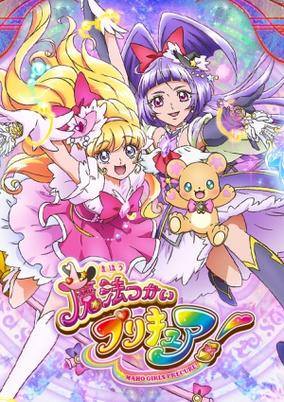

**Studio:** Toei Animation &nbsp;|&nbsp; **Episodes:** 50 &nbsp;|&nbsp; **Director:** Masato Mitsuka &nbsp;|&nbsp; **Aired/Released:** 7 February 2016 - 29 January 2017 &nbsp;|&nbsp; **Genres:** Magical Girl, Magic, Action, Fantasy, Slice of Life, School Life

> Mirai is a 13-year-old girl who lives in the human world. One day she witnesses a mysterious object fall from the sky into the park. Excitedly, she brings her stuffed bear Mofurun with her to see what it was. When she gets there she sees a girl named Riko flying on a broom. Riko is of the same age and from the magical world. Mirai has a lot of questions, and Riko explains that she's searching for a jewel with strong powers called "Link Stone Emerald." Then Batti, an ally of the dark magic users Dokurokushi, appears before them and demands that Riko hand over the "Link Stone Emerald," which Riko herself had been looking for. To make things worse, Batti uses dark magic to create a monster known as a Yokubaru! Mirai and Riko join hands and with the magic words "Cure-up Rapapa!" they transform into the legendary Pretty Cure.
>
> _Synopsis source: Kitsu_

[Wikipedia](https://en.wikipedia.org/wiki/Maho_Girls_PreCure!) · [Kitsu](https://kitsu.io/anime/mahoutsukai-precure)

---

### Itachi Shinden-hen (Boruto: Naruto Next Generations)

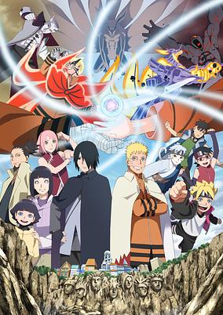

**Studio:** Studio Pierrot &nbsp;|&nbsp; **Episodes:** 7 &nbsp;|&nbsp; **Director:** Hayato Date &nbsp;|&nbsp; **Aired/Released:** 3 March - 28 April &nbsp;|&nbsp; **Genres:** Martial Arts, Ninja, Super Power, Action, Adventure, Shounen

> Naruto was a young shinobi with an incorrigible knack for mischief. He achieved his dream to become the greatest ninja in the village and his face sits atop the Hokage monument. But this is not his story... A new generation of ninja are ready to take the stage, led by Naruto's own son, Boruto!
>
> _Synopsis source: Kitsu_

[Wikipedia](https://en.wikipedia.org/wiki/Naruto) · [Kitsu](https://kitsu.io/anime/boruto-naruto-next-generations)

---

### She and Her Cat

**Studio:** Liden Films &nbsp;|&nbsp; **Episodes:** 4 &nbsp;|&nbsp; **Director:** Kazuya Sakamoto &nbsp;|&nbsp; **Aired/Released:** 4 March - 25 March

[Wikipedia](https://en.wikipedia.org/wiki/She_and_Her_Cat)

---

### Kagewani: Shō (Kagewani)

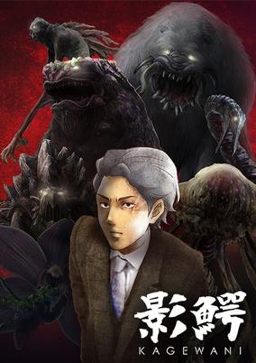

**Studio:** Tomovies &nbsp;|&nbsp; **Episodes:** 13 &nbsp;|&nbsp; **Director:** Tomoya Takashima &nbsp;|&nbsp; **Aired/Released:** 1 April - 23 June &nbsp;|&nbsp; **Genres:** Past, Horror, Asia, Present, Japan, Earth, Thriller, Mystery

> A video blogger attempts to fake cryptid sightings to boost his views, but gets more than he bargained for when his crew is slaughtered by a real monster. Elsewhere, students find themselves preyed upon by a sandworm-like beast, initiating a desperate struggle for survival on their own school grounds. With more of these attacks from mysterious creatures occurring, researcher Sousuke Banba tasks himself with delving into the mystery. With nothing but the keyword "Kagewani" to lead him, he scours the sites of recent attacks in hopes of finding a lead to eradicating the creatures for good. However, Sousuke finds that these threats to humanity are even closer to home when the pharmaceutical company, Sarugaku, starts to encroach on his investigation. [Written by MAL Rewrite]
>
> _Synopsis source: Kitsu_

[Wikipedia](https://en.wikipedia.org/wiki/Kagewani) · [Kitsu](https://kitsu.io/anime/kagewani)

---

### The Lost Village

**Studio:** Diomedéa &nbsp;|&nbsp; **Episodes:** 12 &nbsp;|&nbsp; **Director:** Tsutomu Mizushima &nbsp;|&nbsp; **Aired/Released:** 1 April - 18 June

[Wikipedia](https://en.wikipedia.org/wiki/The_Lost_Village_(anime))

---

### Space Patrol Luluco

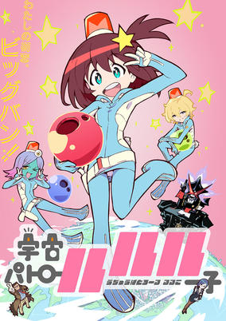

**Studio:** Studio Trigger &nbsp;|&nbsp; **Episodes:** 13 &nbsp;|&nbsp; **Director:** Hiroyuki Imaishi &nbsp;|&nbsp; **Aired/Released:** 1 April - 24 June &nbsp;|&nbsp; **Genres:** Earth, Middle School, Tokyo, Absurdist Humour, Alien, School Life, Law And Order, Science Fiction, Japan, Comedy, Parody, Asia, Space, Action, Adventure

> Living an abnormal existence in Ogikubo, an intergalactic melting pot of humans and aliens as well as the only Space Immigration Zone on Earth, Luluco is a bubbly middle school girl who just wants to be normal. One morning, however, her father, who works at the Space Patrol, eats a volatile sleep capsule by mistake and is frozen solid! To make matters worse, Luluco accidentally breaks him, so she hurries off to his office for help. There, the chief of the Space Patrol, Over Justice, hires Luluco as a space temp worker for undercover investigations, so that the institution may crack down on crime within her school. Made to don the Space Patrol suit and sent on her way to mete out justice, Luluco attempts to maintain the image of a normal girl who does not stand out in any way. But she soon discovers that with the automatic systems and inherently zealous judiciousness of the Space Patrol suit, continuing to be normal will be more difficult than she thought. [Written by MAL Rewrite]
>
> _Synopsis source: Kitsu_

[Wikipedia](https://en.wikipedia.org/wiki/Space_Patrol_Luluco) · [Kitsu](https://kitsu.io/anime/uchuu-patrol-luluco)

---

### Terra Formars Revenge

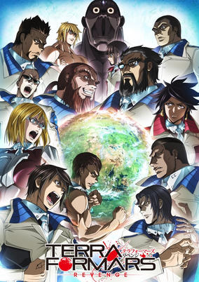

**Studio:** Liden Films TYO Animations &nbsp;|&nbsp; **Episodes:** 13 &nbsp;|&nbsp; **Director:** Michio Fukuda &nbsp;|&nbsp; **Aired/Released:** 1 April - 24 June &nbsp;|&nbsp; **Genres:** Space, Action, Science Fiction, Horror, Drama

> With the space program attempting to travel to Mars, 21st century scientists were tasked with warming up the planet so that humans could survive on its surface. They came up with an efficient and cost effective plan of sending cockroaches and mold to the surface so that the mold would absorb the sunlight and the insect corpses would serve as a food source for the mold.It is now the year 2577 and the first manned ship to Mars has landed on the planet and the six crew members are ready for their mission. But what they find are giant mutated humanoid cockroaches with incredible physical strength. The crew members are easily wiped out, but not before sending a transmission back to Earth. Now, humanity will send elite warriors to exterminate the mutated bugs and claim back Mars.
>
> _Synopsis source: Kitsu_

[Wikipedia](https://en.wikipedia.org/wiki/Terra_Formars) · [Kitsu](https://kitsu.io/anime/terra-formars-revenge)

---

### Ushio and Tora

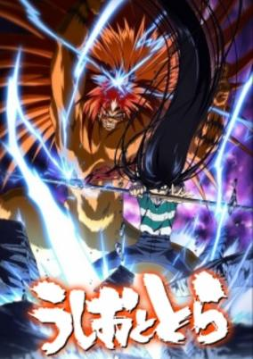

**Studio:** MAPPA Studio VOLN &nbsp;|&nbsp; **Episodes:** 13 &nbsp;|&nbsp; **Director:** Satoshi Nishimura &nbsp;|&nbsp; **Aired/Released:** 1 April - 24 June &nbsp;|&nbsp; **Genres:** Action, Demon, Adventure, Comedy, Shounen

> Ushio Aotsuki is a stubborn middle school student and son of an eccentric temple priest who goes about life without care for his father's claims regarding otherworldly monsters known as youkai. However, as he is tending to the temple while his father is away on work, his chores lead him to a shocking discovery: in the basement he finds a menacing youkai impaled by the fabled Beast Spear. The beast in question is Tora, infamous for his destructive power, who tries to coerce Ushio into releasing him from his five hundred year seal. Ushio puts no trust in his words and refuses to set him free. But when a sudden youkai outbreak puts his friends and home in danger, he is left with no choice but to rely on Tora, his only insurance being the ancient spear if he gets out of hand. Ushio and Tora's meeting is only the beginning of the unlikely duo's journey into the depths of the spiritual realm. With the legendary Beast Spear in his hands, Ushio will find out just how real and threatening the world of the supernatural can be. [Written by MAL Rewrite]
>
> _Synopsis source: Kitsu_

[Wikipedia](https://en.wikipedia.org/wiki/Ushio_and_Tora) · [Kitsu](https://kitsu.io/anime/ushio-to-tora-tv)

---

### Ace Attorney

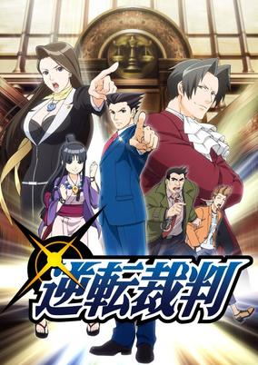

**Studio:** A-1 Pictures &nbsp;|&nbsp; **Episodes:** 24 &nbsp;|&nbsp; **Director:** Ayumu Watanabe &nbsp;|&nbsp; **Aired/Released:** 2 April - 24 September &nbsp;|&nbsp; **Genres:** Comedy, Cops, Drama, Crime, Law And Order, Mystery

> Since he was a child, Ryuuichi Naruhodou's dream was to become a defense attorney, protecting the innocent when no one else would. However, when the rookie lawyer finally takes on his first case under the guidance of his mentor Chihiro Ayasato, he realizes that the courtroom is a battlefield. In these fast paced trials, Ryuuichi is forced to think outside the box to uncover the truth of the crimes that have taken place in order to prove the innocence of his clients.Gyakuten Saiban: Sono "Shinjitsu", Igi Ari! follows Ryuuichi as he tackles cases to absolve the falsely accused of the charges they face. It will not be easy—standing in his path is the ruthless Reiji Mitsurugi, a prosecutor who will stop at nothing to hand out guilty verdicts. With his back against the wall, the defense attorney must carefully examine both evidence and witness testimony, sifting through lies to solve the mystery behind each case. With a shout of "objection!," the battle in the courtroom begins! [Written by MAL Rewrite]
>
> _Synopsis source: Kitsu_

[Wikipedia](https://en.wikipedia.org/wiki/Ace_Attorney_(anime)) · [Kitsu](https://kitsu.io/anime/gyakuten-saiban)

---

### The Asterisk War (The Asterisk War: The Academy City on the Water)

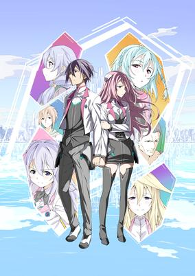

**Studio:** A-1 Pictures &nbsp;|&nbsp; **Episodes:** 12 &nbsp;|&nbsp; **Director:** Manabu Ono Kenji Seto &nbsp;|&nbsp; **Aired/Released:** 2 April - 18 June &nbsp;|&nbsp; **Genres:** Plot Continuity, Ecchi, Science Fiction, Harem, Super Power, Action, Fantasy, Comedy, Romance, School Life

> Long, long ago, an epic catastrophe, known as Invertia, caused a complete change in the world's power balance. In the years following this disaster, a group known as the Integrated Enterprise Foundation rose to power. In addition to this massive change, a new breed of humans born with amazing physical skills known as Genestella also emerged and joined the ranks of humanity.Gakusen Toshi Asterisk follows the story of Ayato Amagiri, a student who has just transferred into one of the six most elite schools for Genestella students in the world—Seidoukan Academy—where students learn to control their powers and duel against each other in entertainment battles known as festas. Unfortunately, Ayato gets off to a rough start. When trying to return a lost handkerchief to a female classmate, he accidentally sees her changing which leads to her challenging him to a duel. What most people don't realize however, is that Ayato has no real interest in festas and instead has an alternative motive for joining this prestigious school. What is Ayato's big secret? Will he be able to keep up his act when surrounded by some of the greatest Genestella in the world?
>
> _Synopsis source: Kitsu_

[Wikipedia](https://en.wikipedia.org/wiki/The_Asterisk_War) · [Kitsu](https://kitsu.io/anime/gakusen-toshi-asterisk)

---

### JoJo's Bizarre Adventure: Diamond Is Unbreakable

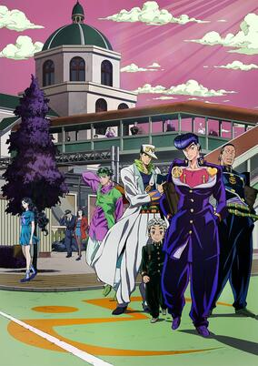

**Studio:** David Production &nbsp;|&nbsp; **Episodes:** 39 &nbsp;|&nbsp; **Director:** Naokatsu Tsuda &nbsp;|&nbsp; **Aired/Released:** 2 April - 23 December &nbsp;|&nbsp; **Genres:** Proxy Battles, Action, Japan, Asia, Earth, Super Power, Adventure, Comedy, Shounen

> The year is 1999. Morioh, a normally quiet and peaceful town, has recently become a hotbed of strange activity. Joutarou Kuujou, now a marine biologist, heads to the mysterious town to meet Jousuke Higashikata. While the two may seem like strangers at first, Jousuke is actually the illegitimate child of Joutarou's grandfather, Joseph Joestar. When they meet, Joutarou realizes that he may have more in common with Jousuke than just a blood relation. Along with the mild-mannered Kouichi Hirose and the boisterous Okuyasu Nijimura, the group dedicates themselves to investigating recent disappearances and other suspicious occurrences within Morioh. Aided by the power of Stands, the four men will encounter danger at every street corner, as it is up to them to unravel the town's secrets, before another occurs.
>
> _Synopsis source: Kitsu_

[Kitsu](https://kitsu.io/anime/jojo-s-bizarre-adventure-diamond-is-unbreakable)

---

### Concrete Revolutio: Chōjin Gensō The Last Song (Concrete Revolutio)

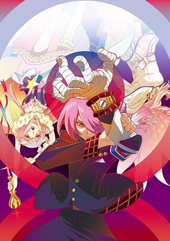

**Studio:** Bones &nbsp;|&nbsp; **Episodes:** 11 &nbsp;|&nbsp; **Director:** Seiji Mizushima &nbsp;|&nbsp; **Aired/Released:** 3 April - 17 June &nbsp;|&nbsp; **Genres:** Alternative Present, Action, Asia, Japan, Present, Earth, Super Power, Demon, Science Fiction, Fantasy, Mystery

> What if superhumans were real? Even better, what if every fabled superhuman existed at the same time, in the same place? Titans from outer space, life forms from a mystical world, phantoms and goblins from ancient times, cyborgs created by scientists, relics that rose out of the ruins of ancient civilizations. In another Japan, it’s not just a question of "what if"—it's a reality.
>
> _Synopsis source: Kitsu_

[Wikipedia](https://en.wikipedia.org/wiki/Concrete_Revolutio) · [Kitsu](https://kitsu.io/anime/concrete-revolutio-choujin-gensou)

---

### Endride

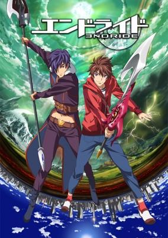

**Studio:** Brain's Base &nbsp;|&nbsp; **Episodes:** 24 &nbsp;|&nbsp; **Director:** Keiji Gotoh &nbsp;|&nbsp; **Aired/Released:** 3 April - 24 September &nbsp;|&nbsp; **Genres:** Fantasy, Adventure

> Shun Asanaga is a 15-year-old junior high school student with an optimistic and bright personality. One day, he finds a mysterious crystal in the office of his father, who is a scientist and businessman. When Shun touches it, the world becomes distorted, and he is sent into the world of Endra. Emilio, a prince of the kingdom of Endra, is nearing his 16th birthday and despises the reigning king, Delzain. Since Emilio is now at the age when he can inherit the throne, he takes up a weapon and attempts revenge. However, because Emilio is too weak, he is captured by Delzain and put in prison. When Emilio is in grief, the wall of his cell becomes distorted and Shun appears from there with two goals: return to his own world, and complete Emilio's revenge. What future lies ahead for the two boys trying to survive in Endra, yet raised in two different worlds?
>
> _Synopsis source: Kitsu_

[Wikipedia](https://en.wikipedia.org/wiki/Endride) · [Kitsu](https://kitsu.io/anime/endride)

---

### Kuma Miko: Girl Meets Bear

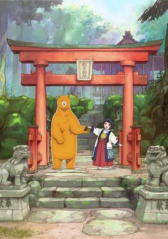

**Studio:** Kinema Citrus EMT Squared &nbsp;|&nbsp; **Episodes:** 12 &nbsp;|&nbsp; **Director:** Kiyoshi Matsuda &nbsp;|&nbsp; **Aired/Released:** 3 April - 19 June &nbsp;|&nbsp; **Genres:** Comedy

> Special episodes included in the Blu-ray and DVD boxes of Kuma Miko.
>
> _Synopsis source: Kitsu_

[Kitsu](https://kitsu.io/anime/kuma-miko-specials)

---

### Macross Delta

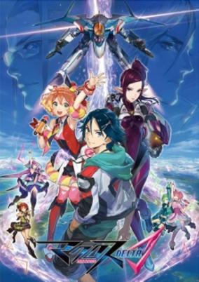

**Studio:** Satelight &nbsp;|&nbsp; **Episodes:** 26 &nbsp;|&nbsp; **Director:** Shōji Kawamori Kenji Yasuda &nbsp;|&nbsp; **Aired/Released:** 3 April - 25 September &nbsp;|&nbsp; **Genres:** Robot, Idol, Future, Transforming Craft, Piloted Robot, Other Planet, The Arts, Science Fiction, Action, Space, Music, Mecha, Romance, Military

> Eight years after the events of Macross F, a mysterious phenomenon known as the Var Syndrome is gradually consuming the galaxy. It's up to a new generation of highly capable Valkyrie pilots to deal with this universal menace. And if they didn't have enough on their plate already, the Aerial Knights Valkyrie fighter team from the Kingdom of Wind have come to challenge the Delta Squadron.
>
> _Synopsis source: Kitsu_

[Wikipedia](https://en.wikipedia.org/wiki/Macross_Delta) · [Kitsu](https://kitsu.io/anime/macross-delta)

---

### Mobile Suit Gundam Unicorn RE:0096

**Studio:** Sunrise &nbsp;|&nbsp; **Episodes:** 22 &nbsp;|&nbsp; **Director:** Kazuhiro Furuhashi &nbsp;|&nbsp; **Aired/Released:** 3 April - 11 September &nbsp;|&nbsp; **Genres:** Future, Space, Mecha, Space Travel, Piloted Robot, Action, Science Fiction, War, Military, Space Battles

> U.C. 0096... The manufacturing colony Industrial 7, which is still under construction, floats at Lagrange point 1. A youth named Banagher Links, who grew up without knowing his father, meets a mysterious girl who has stowed away on a ship bound for Industrial 7. As the white mobile suit Unicorn undergoes repeated tests and becomes the subject of diverse speculations, the hands of time begin to move. Banagher does not yet know that he has been caught up in the conflict surrounding Laplace's Box. What is Laplace's Box? What secret does it contain? The hundred-year curse of the Universal Century is about to be resolved.
>
> _Synopsis source: Kitsu_

[Wikipedia](https://en.wikipedia.org/wiki/Mobile_Suit_Gundam_Unicorn) · [Kitsu](https://kitsu.io/anime/mobile-suit-gundam-unicorn-re-0096)

---

### My Hero Academia

**Studio:** Bones &nbsp;|&nbsp; **Episodes:** 13 &nbsp;|&nbsp; **Director:** Kenji Nagasaki &nbsp;|&nbsp; **Aired/Released:** 3 April - 26 June &nbsp;|&nbsp; **Genres:** Superhero, Action, Super Power, High School, Comedy, School Life, Shounen

> What would the world be like if 80 percent of the population manifested extraordinary superpowers called “Quirks” at age four? Heroes and villains would be battling it out everywhere! Becoming a hero would mean learning to use your power, but where would you go to study? U.A. High's Hero Program of course! But what would you do if you were one of the 20 percent who were born Quirkless? Middle school student Izuku Midoriya wants to be a hero more than anything, but he hasn't got an ounce of power in him. With no chance of ever getting into the prestigious U.A. High School for budding heroes, his life is looking more and more like a dead end. Then an encounter with All Might, the greatest hero of them all gives him a chance to change his destiny…
>
> _Synopsis source: Kitsu_

[Wikipedia](https://en.wikipedia.org/wiki/My_Hero_Academia) · [Kitsu](https://kitsu.io/anime/boku-no-hero-academia)

---

### Age 12

**Studio:** OLM &nbsp;|&nbsp; **Episodes:** 24 &nbsp;|&nbsp; **Director:** Seiki Taichū &nbsp;|&nbsp; **Aired/Released:** 4 April - 19 December

[Wikipedia](https://en.wikipedia.org/wiki/Age_12)

---

### Bakuon!!

**Studio:** TMS/8PAN &nbsp;|&nbsp; **Episodes:** 12 &nbsp;|&nbsp; **Director:** Junji Nishimura &nbsp;|&nbsp; **Aired/Released:** 4 April - 20 June &nbsp;|&nbsp; **Genres:** All Girls School, High School, Parental Abandonment, Sports, Comedy, Motorsport, Slice of Life

> The story revolves around high school girls who discover the appeal of motorcycles. Sakura Hane is a high school student who looks a little bit like an airhead. On the way to her all-female high school one day, she is worn-out climbing a hilly road with a bicycle, but she sees a girl named Onsa Amano who is riding a motorcycle. Sakura immediately becomes interested in motorcycles, and she and Onsa join the motorcycle club at the school. Then, Sakura sets out to get her license.
>
> _Synopsis source: Kitsu_

[Wikipedia](https://en.wikipedia.org/wiki/Bakuon!!) · [Kitsu](https://kitsu.io/anime/bakuon)

---

### Hundred

**Studio:** Production IMS &nbsp;|&nbsp; **Episodes:** 12 &nbsp;|&nbsp; **Director:** Tomoki Kobayashi &nbsp;|&nbsp; **Aired/Released:** 4 April - 19 June

[Wikipedia](https://en.wikipedia.org/wiki/Hundred_(novel_series))

---

### Pan de Peace!

**Studio:** Asahi Production &nbsp;|&nbsp; **Episodes:** 13 &nbsp;|&nbsp; **Director:** Hatsuki Tsuji &nbsp;|&nbsp; **Aired/Released:** 4 April - 27 June &nbsp;|&nbsp; **Genres:** Cooking, Comedy, Slice of Life, School Life

> The "cute and soft bread four-panel manga" centers around Minami, an air-headed girl who is starting high school and who loves eating bread for breakfast. Baked goods bring happiness everyday to her and her classmates the reliable Yuu, the pastry-baking Fuyumi, and the independent Noa.
>
> _Synopsis source: Kitsu_

[Wikipedia](https://en.wikipedia.org/wiki/Pan_de_Peace!) · [Kitsu](https://kitsu.io/anime/pan-de-peace)

---

### Re:Zero kara Hajimeru Isekai Seikatsu (Re:ZERO -Starting Life in Another World-)

**Studio:** White Fox &nbsp;|&nbsp; **Episodes:** 25 &nbsp;|&nbsp; **Director:** Masaharu Watanabe &nbsp;|&nbsp; **Aired/Released:** 4 April - 19 September &nbsp;|&nbsp; **Genres:** Parallel Universe, Violence, Drama, Magic, Fantasy, Thriller, Psychological, Isekai

> When Subaru Natsuki leaves the convenience store, the last thing he expects is to be wrenched from his everyday life and dropped into a fantasy world. Things aren't looking good for the bewildered teenager; however, not long after his arrival, he is attacked by some thugs. Armed with only a bag of groceries and a now useless cell phone, he is quickly beaten to a pulp. Fortunately, a mysterious beauty named Satella, in hot pursuit after the one who stole her insignia, happens upon Subaru and saves him. In order to thank the honest and kindhearted girl, Subaru offers to help in her search, and later that night, he even finds the whereabouts of that which she seeks. But unbeknownst to them, a much darker force stalks the pair from the shadows, and just minutes after locating the insignia, Subaru and Satella are brutally murdered. However, Subaru immediately reawakens to a familiar scene—confronted by the same group of thugs, meeting Satella all over again—the enigma deepens as history inexplicably repeats itself.
>
> _Synopsis source: Kitsu_

[Kitsu](https://kitsu.io/anime/re-zero-kara-hajimeru-isekai-seikatsu)

---

### Seisen Cerberus: Ryūkoku no Fatalite (Cerberus)

**Studio:** Bridge &nbsp;|&nbsp; **Episodes:** 13 &nbsp;|&nbsp; **Director:** Nobuhiro Kondo &nbsp;|&nbsp; **Aired/Released:** 4 April - 27 June &nbsp;|&nbsp; **Genres:** Adventure, Fantasy, Action

> Sword and magic rule in the continent of Kuna'ahn. In this continent are three powerful nations: the Holy Kingdom of Amoria, the Kingdom of Ishilfen, and the Kingdom of Vanrodis, which share a delicate balance of power. Should disaster befall any one of the three nations, war would spread throughout the continent. Also residing there is the feared "Evil Dragon" Daganzord, an unstoppable force that leaves nothing but scorched land and destruction wherever he goes. Hiiro's parents, Bairo and Kismitete, joined other sorcerers in a magic ritual ten years ago in an attempt to seal Daganzord, but failed when someone interfered. The ritual would later become known as the "Balbagoa Tragedy." After being rescued by Giruu, young Hiiro set out to learn swordsmanship so that he could avenge his parents. Now, ten years later, sixteen-year-old Hiiro leaves home on a journey to slay the Evil Dragon, and Giruu feels he has no choice but to accompany him. In the search for the Evil Dragon, Hiiro encounters people of various races who join in his quest to eliminate Daganzord... but will Hiiro really succeed in overcoming the destiny he took upon himself and defeating Daganzord?!
>
> _Synopsis source: Kitsu_

[Wikipedia](https://en.wikipedia.org/wiki/Seisen_Cerberus) · [Kitsu](https://kitsu.io/anime/seisen-cerberus-ryuukoku-no-fatalites)

---

### Hakuōki: Otogisōshi

**Studio:** DLE Inc. &nbsp;|&nbsp; **Episodes:** 13 &nbsp;|&nbsp; **Director:** Parako Shinohara &nbsp;|&nbsp; **Aired/Released:** 5 April - 28 June

[Wikipedia](https://en.wikipedia.org/wiki/Haku%C5%8Dki)

---

### Joker Game

**Studio:** Production I.G &nbsp;|&nbsp; **Episodes:** 12 &nbsp;|&nbsp; **Director:** Kazuya Nomura &nbsp;|&nbsp; **Aired/Released:** 5 April - 21 June &nbsp;|&nbsp; **Genres:** Past, Violence, Japan, Earth, Asia, Historical, Military, Psychological, Thriller, Mystery

> With World War ll right around the corner, intelligence on other countries' social and economic situation has become a valuable asset. As a result, Japan, has established a new spy organization known as the "D Agency" to obtain this weapon. Under the command of Lieutenant Colonel Yuuki, eight agents have been assigned to infiltrate and observe some of the most powerful countries, reporting on any developments associated with the war. In order to carry out these dangerous tasks, these men have trained their bodies to survive in extreme conditions and studied numerous fields such as communications and languages. However, their greatest strength lies in their ability to manipulate people in order to obtain the information necessary to give their nation the upper hand. [Written by MAL Rewrite]
>
> _Synopsis source: Kitsu_

[Wikipedia](https://en.wikipedia.org/wiki/Joker_Game) · [Kitsu](https://kitsu.io/anime/joker-game)

---

### Bishōjo Yūgi Unit Crane Geer

**Studio:** Kyotoma &nbsp;|&nbsp; **Episodes:** 13 &nbsp;|&nbsp; **Director:** Mr. Milkman &nbsp;|&nbsp; **Aired/Released:** 6 April - 29 June

---

### Super Lovers

**Studio:** Studio Deen &nbsp;|&nbsp; **Episodes:** 10 &nbsp;|&nbsp; **Director:** Shinji Ishihira &nbsp;|&nbsp; **Aired/Released:** 6 April - 8 June &nbsp;|&nbsp; **Genres:** Shounen Ai, Comedy, Romance, Slice of Life

> While spending summer with his mother, Haru meets Ren, a boy newly adopted by his mother. Getting along with Ren isn't easy as Haru's goal is to "civilize" him by the time summer ends. Their relationship slowly improves as Haru spends more time with Ren and in return Ren steadily warms up to him. Can they really become a "family" at the end of summer?!
>
> _Synopsis source: Kitsu_

[Wikipedia](https://en.wikipedia.org/wiki/Super_Lovers) · [Kitsu](https://kitsu.io/anime/super-lovers)

---

### Twin Star Exorcists

**Studio:** Studio Pierrot &nbsp;|&nbsp; **Episodes:** 50 &nbsp;|&nbsp; **Director:** Tomohisa Taguchi &nbsp;|&nbsp; **Aired/Released:** 6 April - 29 March 2017 &nbsp;|&nbsp; **Genres:** Fantasy, Sudden Girlfriend Appearance, Horror, Action, Romance, Comedy, Contemporary Fantasy, Super Power, Shounen

> Grotesque monsters known as Impurities reside in Magano, a realm parallel to the present day. Exorcists purify these evil apparitions to protect the people. Rokuro Enmado is opposed to becoming an exorcist, even though he has the talent to be one, but an oracle gives him the title of "Twin Star Exorcist," the name bestowed upon married exorcists. Benio Adashino, the girl who receives the title along with Rokuro, is determined to exorcise all the Kegare, or Impurities, in the world. The two find themselves wrapped up in more and more battles together as the Twin Star Exorcists...
>
> _Synopsis source: Kitsu_

[Wikipedia](https://en.wikipedia.org/wiki/Twin_Star_Exorcists) · [Kitsu](https://kitsu.io/anime/sousei-no-onmyouji)

---

### Bungō Stray Dogs (Bungo Stray Dogs)

**Studio:** Bones &nbsp;|&nbsp; **Episodes:** 12 &nbsp;|&nbsp; **Director:** Takuya Igarashi &nbsp;|&nbsp; **Aired/Released:** 7 April - 23 June &nbsp;|&nbsp; **Genres:** Comedy, Action, Crime, Detective, Mafia, The Arts, Historical, Super Power, Conspiracy, Mystery

> For weeks, Atsushi Nakajima's orphanage has been plagued by a mystical tiger that only he seems to be aware of. Suspected to be behind the strange incidents, the 18-year-old is abruptly kicked out of the orphanage and left hungry, homeless, and wandering through the city. While starving on a riverbank, Atsushi saves a rather eccentric man named Osamu Dazai from drowning. Whimsical suicide enthusiast and supernatural detective, Dazai has been investigating the same tiger that has been terrorizing the boy. Together with Dazai's partner Doppo Kunikida, they solve the mystery, but its resolution leaves Atsushi in a tight spot. As various odd events take place, Atsushi is coerced into joining their firm of supernatural investigators, taking on unusual cases the police cannot handle, alongside his numerous enigmatic co-workers. [Written by MAL Rewrite]
>
> _Synopsis source: Kitsu_

[Wikipedia](https://en.wikipedia.org/wiki/Bung%C5%8D_Stray_Dogs) · [Kitsu](https://kitsu.io/anime/bungou-stray-dogs)

---

### Kuromukuro

**Studio:** P.A. Works &nbsp;|&nbsp; **Episodes:** 26 &nbsp;|&nbsp; **Director:** Tensai Okamura &nbsp;|&nbsp; **Aired/Released:** 7 April - 29 September &nbsp;|&nbsp; **Genres:** Robot, Piloted Robot, Science Fiction, Mecha, Plot Continuity, Action

> During the construction of the Kurobe Dam, an ancient artifact was discovered, and so the United Nations Kurobe Research Institute was established. Intellectuals from all over the world gathered to study the object, and the children of those researchers attend Mt. Tate International Senior High School, including the institute head's daughter, Yukina Shirahane. In the summer of 2016, a lone samurai once again awakens.
>
> _Synopsis source: Kitsu_

[Wikipedia](https://en.wikipedia.org/wiki/Kuromukuro) · [Kitsu](https://kitsu.io/anime/kuromukuro)

---

### And you thought there is never a girl online?

**Studio:** Project No.9 &nbsp;|&nbsp; **Episodes:** 12 &nbsp;|&nbsp; **Director:** Shinsuke Yanagi &nbsp;|&nbsp; **Aired/Released:** 7 April - 23 June &nbsp;|&nbsp; **Genres:** School Clubs, Japan, Present, High School, School Life, Earth, Asia, Comedy, Ecchi, Romance

> After Hideki Nishimura confesses to a girl online, he is shocked when she turns out to be a boy. Traumatized, he swears never to trust any “girl” players. That is, until one confesses to him! Ako Tamaki is a beautiful loner who has trouble differentiating between what’s reality and the online world she spends so much of her time in. Can Hideki and his guild friends help fix socially inept Ako?
>
> _Synopsis source: Kitsu_

[Wikipedia](https://en.wikipedia.org/wiki/And_you_thought_there_is_never_a_girl_online%3F) · [Kitsu](https://kitsu.io/anime/netoge-no-yome-wa-onnanoko-ja-nai-to-omotta)

---

### Onigiri

**Studio:** Pierrot Plus &nbsp;|&nbsp; **Episodes:** 13 &nbsp;|&nbsp; **Director:** Takashi Yamamoto &nbsp;|&nbsp; **Aired/Released:** 7 April - 30 June &nbsp;|&nbsp; **Genres:** Comedy, Parody, Fantasy

> Onigiri thrusts its players into mystical Japan, a land filled with mythical creatures of Japanese legend. Starting as a lone Oni, players fight against the malevolent influence of the Kamikui as their miasma spreads over the land. 8 NPCs, each with their own distinct personality and skills, ally themselves with the player to help build a legend, and quell the evil that has arisen. As you grow stronger together, so do the bonds binding you to each other.
>
> _Synopsis source: Kitsu_

[Wikipedia](https://en.wikipedia.org/wiki/Onigiri_(video_game)) · [Kitsu](https://kitsu.io/anime/onigiri)

---

### Unhappy

**Studio:** Silver Link &nbsp;|&nbsp; **Episodes:** 12 &nbsp;|&nbsp; **Director:** Shin Ōnuma &nbsp;|&nbsp; **Aired/Released:** 7 April - 23 June

[Wikipedia](https://en.wikipedia.org/wiki/Unhappy_Go_Lucky!)

---

### Haven't You Heard? I'm Sakamoto

**Studio:** Studio Deen &nbsp;|&nbsp; **Episodes:** 12 &nbsp;|&nbsp; **Director:** Shinji Takamatsu &nbsp;|&nbsp; **Aired/Released:** 8 April - 1 July &nbsp;|&nbsp; **Genres:** High School, Comedy, School Life

> Sophisticated, suave, sublime; all words which describe the exceedingly handsome and patently perfect Sakamoto. Though it is only his first day in high school, his attractiveness, intelligence, and charm already has the girls swooning and the guys fuming with jealousy. No one seems able to derail him, as all attempts at tripping him up are quickly foiled. His sangfroid is indomitable, his wits peerless. Will any of Sakamoto's classmates, or even teachers, be able to reach his level of excellence? Probably not, but they just might learn a thing or two trying... [Written by MAL Rewrite]
>
> _Synopsis source: Kitsu_

[Wikipedia](https://en.wikipedia.org/wiki/Haven%27t_You_Heard%3F_I%27m_Sakamoto) · [Kitsu](https://kitsu.io/anime/sakamoto-desu-ga)

---

### Kabaneri of the Iron Fortress

**Studio:** Wit Studio &nbsp;|&nbsp; **Episodes:** 12 &nbsp;|&nbsp; **Director:** Tetsurō Araki &nbsp;|&nbsp; **Aired/Released:** 8 April - 30 June &nbsp;|&nbsp; **Genres:** Zombie, Violence, Asia, Earth, Epidemic, Alternative Past, Past, Japan, Post Apocalypse, Steampunk, Plot Continuity, Action, Drama, Fantasy, Horror

> The world is in the midst of the industrial revolution when horrific creatures emerge from a mysterious virus, ripping through the flesh of humans to sate their never-ending appetite. The only way to kill these beings, known as "Kabane," is by destroying their steel-coated hearts. However, if bitten by one of these monsters, the victim is doomed to a fate worse than death, as the fallen rise once more to join the ranks of their fellow undead. Only the most fortified of civilizations have survived this turmoil, as is the case with the island of Hinomoto, where mankind has created a massive wall to protect themselves from the endless hordes of Kabane. The only way into these giant fortresses is via heavily-armored trains, which are serviced and built by young men such as Ikoma. Having created a deadly weapon that he believes will easily pierce through the hearts of Kabane, Ikoma eagerly awaits the day when he will be able to fight using his new invention. Little does he know, however, that his chance will come much sooner than he expected...
>
> _Synopsis source: Kitsu_

[Wikipedia](https://en.wikipedia.org/wiki/Kabaneri_of_the_Iron_Fortress) · [Kitsu](https://kitsu.io/anime/koutetsujou-no-kabaneri)

---

### Shōnen Maid (Shonen Maid)

**Studio:** 8-Bit &nbsp;|&nbsp; **Episodes:** 12 &nbsp;|&nbsp; **Director:** Yusuke Yamamoto &nbsp;|&nbsp; **Aired/Released:** 8 April - 24 June &nbsp;|&nbsp; **Genres:** Slice of Life, Comedy, Family

> After the sudden death of his mother, elementary school student Chihiro Komiya is left with no home and no family. But this changes when he encounters a rich and frivolous stranger who turns out to be his long-lost uncle, Madoka Takatori. Madoka offers to take Chihiro in, but upon arriving at his uncle's high-class mansion, the young boy is greeted by a plethora of dust and garbage. As Chihiro's neatfreak instincts kick in, he sets about cleaning the entire residence. Shounen Maid is a lighthearted comedy that follows Chihiro as he finds himself dressed in a frilly uniform (handmade by his uncle), receiving a salary, and working as maid of the house.
>
> _Synopsis source: Kitsu_

[Wikipedia](https://en.wikipedia.org/wiki/Sh%C5%8Dnen_Maid) · [Kitsu](https://kitsu.io/anime/shounen-maid)

---

### Flying Witch

**Studio:** J.C.Staff &nbsp;|&nbsp; **Episodes:** 12 &nbsp;|&nbsp; **Director:** Katsushi Sakurabi &nbsp;|&nbsp; **Aired/Released:** 9 April - 25 June &nbsp;|&nbsp; **Genres:** Countryside, Contemporary Fantasy, Slice of Life, Present, Earth, Fantasy, Japan, Asia, Magic, Comedy

> Aomori, Japan. In a land blessed by nature's bountiful beauty, bizarre things begin to take place. Makoto Kowata, 15 years old, is a professional witch. She left Yokohama with Chito, her black cat, to live in the house of her relatives in Aomori. This is where she begins to train as a witch. Even though Makoto's powers are still limited to just flying through the sky, she and her second cousins Kei and Chinatsu surely make the most out of each and every day.
>
> _Synopsis source: Kitsu_

[Wikipedia](https://en.wikipedia.org/wiki/Flying_Witch) · [Kitsu](https://kitsu.io/anime/flying-witch)

---

### Hai-Furi

**Studio:** Production IMS &nbsp;|&nbsp; **Episodes:** 12 &nbsp;|&nbsp; **Director:** Yuu Nobuta &nbsp;|&nbsp; **Aired/Released:** 9 April - 25 June

[Wikipedia](https://en.wikipedia.org/wiki/Hai-Furi)

---

### Kiznaiver

**Studio:** Studio Trigger &nbsp;|&nbsp; **Episodes:** 12 &nbsp;|&nbsp; **Director:** Hiroshi Kobayashi &nbsp;|&nbsp; **Aired/Released:** 9 April - 25 June &nbsp;|&nbsp; **Genres:** Unrequited Love, Human Enhancement, Love Polygon, Science Fiction, Romance, Japan, Asia, Present, Earth

> The story takes place in Sugomori, a city built upon reclaimed land that once prospered as a futuristic city. One high school boy living there, Agata Katsuhira, is somehow unable to feel any pain. One day just before the start of summer break, Katsuhira is called by a mysterious girl named Sonozaki Noriko and chosen to become one of a group of people who share one another's pain: a "Kiznaiver." Several of his classmates have also been chosen as part of this group, but they're all people from different circles who normally wouldn't associate with each other.
>
> _Synopsis source: Kitsu_

[Wikipedia](https://en.wikipedia.org/wiki/Kiznaiver) · [Kitsu](https://kitsu.io/anime/kiznaiver)

---

### Rin-ne

**Studio:** Brain's Base &nbsp;|&nbsp; **Episodes:** 25 &nbsp;|&nbsp; **Director:** Seiki Sugawara &nbsp;|&nbsp; **Aired/Released:** 9 April - 24 September &nbsp;|&nbsp; **Genres:** High School, Magic, Ghost, Present, Earth, Contemporary Fantasy, Japan, Asia, Fantasy, Comedy

> A very strange thing happened to Mamiya Sakura as a child: She disappeared in the woods behind her grandmother's house. Of course, Sakura doesn't quite recall what happened next, but she's been seeing dead people ever since—ghosts at home, ghosts at school, and even ghosts on the street. Now that she's in high school, another strange thing has happened in her life. A desk next to her that's sat empty all year is suddenly filled by an oddly-dressed boy named Rokudou Rinne. Rinne seems to be capable of seeing the same things Sakura does, and sometimes, other people can't even see him. What sort of secret is Rinne-kun hiding, and how is he connected to Sakura's strange power? In Kyoukai no Rinne, another world exists alongside the one we live in. Thanks to Rinne, Mamiya Sakura will get to know this world and the wacky characters that inhabit it.
>
> _Synopsis source: Kitsu_

[Wikipedia](https://en.wikipedia.org/wiki/Rin-ne) · [Kitsu](https://kitsu.io/anime/kyoukai-no-rinne-tv)

---

### Tanaka-kun wa Itsumo Kedaruge (Tanaka-kun is Always Listless)

**Studio:** Silver Link &nbsp;|&nbsp; **Episodes:** 12 &nbsp;|&nbsp; **Director:** Shinya Kawamo &nbsp;|&nbsp; **Aired/Released:** 9 April - 25 June &nbsp;|&nbsp; **Genres:** High School, Japan, Comedy, Slice of Life, Asia, Earth, School Life

> For high school student Tanaka, the act of being listless is a way of life. Known for his inattentiveness and ability to fall asleep anywhere, Tanaka prays that each day will be as uneventful as the last, seeking to preserve his lazy lifestyle however he can by avoiding situations that require him to exert himself. Along with his dependable friend Oota who helps him with tasks he is unable to accomplish, the lethargic teenager constantly deals with events that prevent him from experiencing the quiet and peaceful days he longs for. [Written by MAL Rewrite]
>
> _Synopsis source: Kitsu_

[Wikipedia](https://en.wikipedia.org/wiki/Tanaka-kun_wa_Itsumo_Kedaruge) · [Kitsu](https://kitsu.io/anime/tanaka-kun-wa-itsumo-kedaruge)

---

### Sansha San'yō (Three Leaves, Three Colors)

**Studio:** Doga Kobo &nbsp;|&nbsp; **Episodes:** 12 &nbsp;|&nbsp; **Director:** Yasuhiro Kimura &nbsp;|&nbsp; **Aired/Released:** 10 April - 26 June &nbsp;|&nbsp; **Genres:** Japan, Asia, Earth, Slice of Life, School Life, Comedy

> Futaba Odagiri is the new transfer student with a super energetic personality; Teru Hayama is the class president with a surprisingly mean personality contrary to her innocent looks; and Youko Nishikawa is from a formerly rich, now extremely poor family who still holds on to her princess attitude. These three unlikely students with clashing personalities become good friends and survive the day-to-day teenage life in a very funny story.
>
> _Synopsis source: Kitsu_

[Wikipedia](https://en.wikipedia.org/wiki/Sansha_San%27y%C5%8D) · [Kitsu](https://kitsu.io/anime/sansha-sanyou)

---

### Usakame (Teekyu 4)

**Studio:** Millepensee &nbsp;|&nbsp; **Episodes:** 12 &nbsp;|&nbsp; **Director:** Shin Itagaki &nbsp;|&nbsp; **Aired/Released:** 12 April - 28 June &nbsp;|&nbsp; **Genres:** Earth, Absurdist Humour, Slapstick, Japan, Tennis, Asia, Comedy, Sports

> Fourth season of Teekyuu series.
>
> _Synopsis source: Kitsu_

[Wikipedia](https://en.wikipedia.org/wiki/Teekyu) · [Kitsu](https://kitsu.io/anime/teekyuu-4)

---

### Wagamama High Spec

**Studio:** AXsiZ &nbsp;|&nbsp; **Episodes:** 12 &nbsp;|&nbsp; **Director:** Satoshi Shimizu &nbsp;|&nbsp; **Aired/Released:** 12 April - 28 June &nbsp;|&nbsp; **Genres:** Comedy, Slice of Life, School Life

> Even though he's just a student, the protagonist in Wagamama High Spec also happens to be the author of a manga published in a weekly magazine. Since it's mainly an ecchi and romcom type of story, he is actually hiding this fact from most people around him. The only people that know are his younger sister and his best friend. But then on one day, the student council president happens to find out his secret, just as she was actually looking for a male member to include in the student council. Afraid of having his secret exposed, our protagonist joins the student council under the promise of his secret staying safe.
>
> _Synopsis source: Kitsu_

[Wikipedia](https://en.wikipedia.org/wiki/Wagamama_High_Spec) · [Kitsu](https://kitsu.io/anime/wagamama-high-spec)

---

### Big Order

**Studio:** Asread &nbsp;|&nbsp; **Episodes:** 10 &nbsp;|&nbsp; **Director:** Nobuharu Kamanaka &nbsp;|&nbsp; **Aired/Released:** 16 April - 18 June &nbsp;|&nbsp; **Genres:** Post Apocalypse, Future, Japan, Asia, Disaster, Earth, Super Power, Action

> Ten years ago, a fairy by the name of Daisy appeared and asked the child Eiji Hoshimiya what his one and only wish was. Although his wish remains a mystery, the consequences were catastrophic. In an event called the "Great Destruction," the world started to fall apart as everything collapsed and countless people died. Now, Eiji is a high school student whose only concern is his sick sister. He does not remember what he wished for; all that he remembers is that his wish caused the Great Destruction. In the years since that event, thousands of other people have also received abilities to make their heart's desire come true. These people called "Orders" are believed to be evil and are hated by the general public. However, some of these Orders are after Eiji's life in vengeance for those that he killed. Will Eiji be able to survive the numerous assassination attempts? And the biggest mystery of all: what did he wish for, and what were his intentions in wishing for something that caused so much desolation? [Written by MAL Rewrite]
>
> _Synopsis source: Kitsu_

[Wikipedia](https://en.wikipedia.org/wiki/Big_Order) · [Kitsu](https://kitsu.io/anime/big-order-tv)

---

### Magi: Adventure of Sinbad (Magi: Adventure of Sinbad (TV))

**Studio:** Lay-duce &nbsp;|&nbsp; **Episodes:** 13 &nbsp;|&nbsp; **Director:** Yoshikazu Miyao &nbsp;|&nbsp; **Aired/Released:** 16 April - 2 July &nbsp;|&nbsp; **Genres:** Magic, Fantasy, Action, Adventure

> The story of Sinbad's early life and when he captured several dungeons.
>
> _Synopsis source: Kitsu_

[Kitsu](https://kitsu.io/anime/magi-sinbad-no-bouken-tv)

---

### Kamiwaza Wanda

**Studio:** TMS &nbsp;|&nbsp; **Episodes:** 47 &nbsp;|&nbsp; **Director:** Mitsuo Hashimoto &nbsp;|&nbsp; **Aired/Released:** 23 April 2016 - 25 March 2017 &nbsp;|&nbsp; **Genres:** Science Fiction, Kids

> The story is set in a world where every event has been turned into programs, and mysterious monsters known as "Promin" maintain the world. However, many Promin who have turned into bugs known as "Bugmin" are responsible for many of the world's real-life bugs. Left alone, they may eventually turn into a big problem. The boy Yuuto encounters the space dog Wanda, and the pair use a camera-like device and key items to capture Bugmin. Promin themselves are able to do things like "accelerate objects," "spew fire," or "create objects," through an ability known as "Kamiwaza" (miracle), and are able to fend off Bugmin with it. At first, the Bugmin only cause small, bothersome things, but it will soon elevate into a global scale threat. Can one boy and one dog save the world?
>
> _Synopsis source: Kitsu_

[Wikipedia](https://en.wikipedia.org/wiki/Kamiwaza_Wanda) · [Kitsu](https://kitsu.io/anime/kamiwaza-wanda)

---

### Fukigen na Mononokean (The Morose Mononokean)

**Studio:** Pierrot Plus &nbsp;|&nbsp; **Episodes:** 13 &nbsp;|&nbsp; **Director:** Akira Iwanaga &nbsp;|&nbsp; **Aired/Released:** 28 June - 21 September &nbsp;|&nbsp; **Genres:** Earth, Contemporary Fantasy, Fantasy, Japan, Asia, Present, Demon, Comedy

> The start of Hanae Ashiya's high school career has not been easy—he has spent all of the first week in the infirmary, and his inexplicable condition is only getting worse. The cause of his torment is the mysterious fuzzy creature that has attached itself to him ever since he stumbled upon it the day before school began. As his health continues to decline and the creature grows in size, Hanae comes across a flyer advertising an exorcist who expels youkai. Desperate and with nothing left to lose, he calls the number and is led to the Mononokean, a tea room which suddenly appears next to the infirmary. A morose-sounding man, Haruitsuki Abeno, reluctantly helps Hanae but demands payment afterward. Much to Hanae's dismay, he cannot afford the fee and must become an employee at the Mononokean to work off his debt. And to make things worse, his new boss is actually one of his classmates. If Hanae ever hopes to settle his debt, he must work together with Abeno to guide a variety of dangerous, strange, and interesting youkai back to the Underworld. [Written by MAL Rewrite]
>
> _Synopsis source: Kitsu_

[Wikipedia](https://en.wikipedia.org/wiki/The_Morose_Mononokean) · [Kitsu](https://kitsu.io/anime/fukigen-na-mononokean)

---

### Berserk

**Studio:** GEMBA Millepensee Liden Films &nbsp;|&nbsp; **Episodes:** 12 &nbsp;|&nbsp; **Director:** Shin Itagaki &nbsp;|&nbsp; **Aired/Released:** 1 July - 16 September &nbsp;|&nbsp; **Genres:** Fantasy, Military, Demon, Horror, Drama, Romance, Action, Friendship, Adventure, Violence

> A recap of the Berserk (2016) anime TV series.
>
> _Synopsis source: Kitsu_

[Wikipedia](https://en.wikipedia.org/wiki/Berserk_(2016_TV_series)) · [Kitsu](https://kitsu.io/anime/berserk-2016-recap)

---

### Momokuri

**Studio:** Satelight &nbsp;|&nbsp; **Episodes:** 13 &nbsp;|&nbsp; **Director:** Yoshimasa Hiraike &nbsp;|&nbsp; **Aired/Released:** 1 July - 23 September &nbsp;|&nbsp; **Genres:** Comedy, Slice of Life, Romance

> The story revolves around Yuki Kurihara, a girl who has finally been granted her wish of dating her crush Momo. At first glance, she just looks like a normal but very cute girl. However, she is in fact a maniac over Momo, taking notes of his activities and never missing the chance to see him in a cute moment. Momo, on the other hand, is inexperienced in love, and just wants to make Yuki happy.
>
> _Synopsis source: Kitsu_

[Wikipedia](https://en.wikipedia.org/wiki/Momokuri) · [Kitsu](https://kitsu.io/anime/momokuri)

---

### B-Project: Kodou*Ambitious

**Studio:** A-1 Pictures &nbsp;|&nbsp; **Episodes:** 12 &nbsp;|&nbsp; **Director:** Eiji Suganuma &nbsp;|&nbsp; **Aired/Released:** 2 July - 24 September &nbsp;|&nbsp; **Genres:** Bishounen, Idol, Music

> The anime's story follows Tsubasa, a new hire in the A&amp;R department of the major recording company Gandala Music. Tsubasa is immediately assigned to oversee the idol unit "B-PROJECT," which is made up of three idol groups: Kitakore, THRIVE, and MooNs. This is Tsubasa's first job, and she gets involved in various incidents and accidents as she deals with this group of young men who each have their own differing personalities.
>
> _Synopsis source: Kitsu_

[Kitsu](https://kitsu.io/anime/b-project-kodou-ambitious)

---

### Days

**Studio:** MAPPA &nbsp;|&nbsp; **Episodes:** 24 &nbsp;|&nbsp; **Director:** Kônosuke Uda &nbsp;|&nbsp; **Aired/Released:** 2 July - 18 December

[Wikipedia](https://en.wikipedia.org/wiki/Days_(manga))

---

### First Love Monster

**Studio:** Studio Deen &nbsp;|&nbsp; **Episodes:** 12 &nbsp;|&nbsp; **Director:** Takayuki Inagaki &nbsp;|&nbsp; **Aired/Released:** 2 July - 17 September &nbsp;|&nbsp; **Genres:** Bishounen, Romance, Comedy, School Life

> Nikaido Kaho is a daughter of a rich family and her whole life everyone's been nice to her. When moving to her new high school dormitory, she almost gets hit by a truck but is saved by a boy. It's love at first sight for Kaho but when asking him his name, he tells her she's weird. Kaho is shocked since it's the first time anyone's ever said mean things to her. Soon enough, she finds out that the boy who saved her lives in the same dormitory and so she bravely confesses her love. The boy says his name is Kanade and agrees to go out with her. Unfortunately, the following day Kaho finds out that her first boyfriend is a 5th grader.
>
> _Synopsis source: Kitsu_

[Wikipedia](https://en.wikipedia.org/wiki/First_Love_Monster) · [Kitsu](https://kitsu.io/anime/hatsukoi-monster)

---

### Food Wars! Shokugeki no Soma: The Second Plate (Food Wars! Shokugeki no Soma)

**Studio:** J.C. Staff &nbsp;|&nbsp; **Episodes:** 13 &nbsp;|&nbsp; **Director:** Yoshitomo Yonetani &nbsp;|&nbsp; **Aired/Released:** 2 July - 24 September &nbsp;|&nbsp; **Genres:** Cooking, Present, Japan, School Life, Comedy, Ecchi, Shounen

> Ever since he was a child, fifteen-year-old Souma Yukihira has helped his father by working as the sous chef in the restaurant his father runs and owns. Throughout the years, Souma developed a passion for entertaining his customers with his creative, skilled, and daring culinary creations. His dream is to someday own his family's restaurant as its head chef. Yet when his father suddenly decides to close the restaurant to test his cooking abilities in restaurants around the world, he sends Souma to Tootsuki Culinary Academy, an elite cooking school where only 10 percent of the students graduate. The institution is famous for its "Shokugeki" or "food wars," where students face off in intense, high-stakes cooking showdowns. As Souma and his new schoolmates struggle to survive the extreme lifestyle of Tootsuki, more and greater challenges await him, putting his years of learning under his father to the test. [Written by MAL Rewrite]
>
> _Synopsis source: Kitsu_

[Wikipedia](https://en.wikipedia.org/wiki/Food_Wars!_Shokugeki_no_Soma) · [Kitsu](https://kitsu.io/anime/shokugeki-no-souma)

---

### Love Live! Sunshine!!

**Studio:** Sunrise &nbsp;|&nbsp; **Episodes:** 13 &nbsp;|&nbsp; **Director:** Kazuo Sakai &nbsp;|&nbsp; **Aired/Released:** 2 July - 24 September &nbsp;|&nbsp; **Genres:** Earth, School Clubs, Idol, Friendship, Stereotypes, Japan, Comedy, Asia, Plot Continuity, Present, Music, Slice of Life, School Life

> Chika Takami, a self-proclaimed normal girl, has never been involved in any clubs and lacked any notable talents. However, after a visit to Tokyo, she discovers a stage where even an ordinary girl like her could shine—the world of school idols. Inspired by the former superstar school idol group μ's, Chika is determined to start her own school idol club in her seaside hometown at Uranohoshi Girl's High School. But even before gathering any students to join the group, the aspiring school idol finds her greatest obstacle to be student council president Dia Kurosawa who stands firmly against the creation of the club. Just when it seems there is no hope, Chika meets Riko Sakurauchi, a transfer student from Otonokizaka High School, home of μ's. Somewhat shy but a talented piano player, Chika believes her to be a promising recruit, though convincing her to join is easier said than done. In spite of that, Chika chooses to charge forward and overcome the obstacles keeping her from forming a school idol group that shines as bright as the nine that came before her. [Written by MAL Rewrite]
>
> _Synopsis source: Kitsu_

[Wikipedia](https://en.wikipedia.org/wiki/Love_Live!_Sunshine!!) · [Kitsu](https://kitsu.io/anime/love-live-sunshine)

---

### ReLIFE

**Studio:** TMS/Double Eagle &nbsp;|&nbsp; **Episodes:** 13 &nbsp;|&nbsp; **Director:** Tomo Kosaka &nbsp;|&nbsp; **Aired/Released:** 2 July - 24 September &nbsp;|&nbsp; **Genres:** Coming Of Age, School Life, High School, Friendship, Romance, Slice of Life, Seinen

> Dismissed as a hopeless loser by those around him, 27-year-old Arata Kaizaki bounces around from one job to another after quitting his first company. His unremarkable existence takes a sharp turn when he meets Ryou Yoake, a member of the ReLife Research Institute, who offers Arata the opportunity to change his life for the better with the help of a mysterious pill. Taking it without a second thought, Arata awakens the next day to find that his appearance has reverted to that of a 17-year-old. Arata soon learns that he is now the subject of a unique experiment and must attend high school as a transfer student for one year. Though he initially believes it will be a cinch due to his superior life experience, Arata is proven horribly wrong on his first day: he flunks all his tests, is completely out of shape, and can't keep up with the new school policies that have cropped up in the last 10 years. Furthermore, Ryou has been assigned to observe him, bringing Arata endless annoyance. ReLIFE follows Arata's struggle to adjust to his hectic new lifestyle and avoid repeating his past mistakes, all while slowly discovering more about his fellow classmates. [Written by MAL Rewrite] Note: All 13 episodes of the anime were pre-streamed before the television broadcast on the ReLIFE Channel app on June 24, 2016.
>
> _Synopsis source: Kitsu_

[Wikipedia](https://en.wikipedia.org/wiki/ReLIFE) · [Kitsu](https://kitsu.io/anime/relife)

---

### Rewrite

**Studio:** 8-Bit &nbsp;|&nbsp; **Episodes:** 13 &nbsp;|&nbsp; **Director:** Tensho &nbsp;|&nbsp; **Aired/Released:** 2 July - 24 September

[Wikipedia](https://en.wikipedia.org/wiki/Rewrite_(visual_novel))

---

### Tales of Zestiria the X

**Studio:** Ufotable &nbsp;|&nbsp; **Episodes:** 13 &nbsp;|&nbsp; **Director:** Haruo Sotozaki &nbsp;|&nbsp; **Aired/Released:** 3 July - 25 September &nbsp;|&nbsp; **Genres:** High Fantasy, Adventure, Action, Fantasy

> Sorey is a human youth who grew up among the seraphim, spiritual beings not visible to humans. Sorey believes in the folklore that says "long ago, every human was able to see the seraphim" and dreams of unraveling the ancient mystery to make the world a place where people and seraphim can live together in peace. One day, Sorey visits the human capital for the very first time. He becomes embroiled in an incident during which he pulls out a holy sword embedded in a rock and ends up becoming a Shepherd, one who casts away calamity from the world. He begins to realize the gravity of his mission, and his dream of coexistence between mankind and the seraphim becomes more intense— And thus, the Shepherd embarks on an amazing journey with his companions.
>
> _Synopsis source: Kitsu_

[Wikipedia](https://en.wikipedia.org/wiki/Tales_of_Zestiria_the_X) · [Kitsu](https://kitsu.io/anime/tales-of-zestiria-the-x)

---

### The Heroic Legend of Arslan: Dust Storm Dance

**Studio:** Liden Films &nbsp;|&nbsp; **Episodes:** 8 &nbsp;|&nbsp; **Director:** Noriyuki Abe &nbsp;|&nbsp; **Aired/Released:** 3 July - 21 August &nbsp;|&nbsp; **Genres:** Historical, Fantasy, Adventure

> It has been announced that Hiromu Arakawa's Arslan Senki manga will bundle OVAs in the fifth and sixth volumes, to be released on May 9 and November 9 respectively. The first OVA will include an original story supervised by Hiromu Arakawa, while the content of the second OVA has not been announced yet.
>
> _Synopsis source: Kitsu_

[Wikipedia](https://en.wikipedia.org/wiki/The_Heroic_Legend_of_Arslan_(manga_by_Hiromu_Arakawa)) · [Kitsu](https://kitsu.io/anime/arslan-senki-tv-ova)

---

### Orange

**Studio:** Telecom Animation Film TMS Entertainment &nbsp;|&nbsp; **Episodes:** 13 &nbsp;|&nbsp; **Director:** Hiroshi Hamasaki &nbsp;|&nbsp; **Aired/Released:** 3 July - 25 September &nbsp;|&nbsp; **Genres:** Science Fiction, School Life, Drama, Romance, Shoujo

> The film will be narrated from the viewpoint of Suwa, as he continues to support Kakeru and Naho's relationship. It will also feature an original story written by the series' original creator Ichigo Takano, which takes place after the events in the manga and TV anime. The tagline in the key visual reads, "Since that day, I've always wanted to show those two this future—."
>
> _Synopsis source: Kitsu_

[Wikipedia](https://en.wikipedia.org/wiki/Orange_(manga)) · [Kitsu](https://kitsu.io/anime/orange-mirai)

---

### Bananya

**Studio:** TMS Entertainment &nbsp;|&nbsp; **Episodes:** 13 &nbsp;|&nbsp; **Director:** Kyō Yatate &nbsp;|&nbsp; **Aired/Released:** 4 July - 26 September &nbsp;|&nbsp; **Genres:** Comedy, Slice of Life, Kids

> Above a nondescript kitchen counter quietly hangs a bunch of ripe, yellow bananas. Suddenly, one of the slender fruits begins to shake, gently at first but slowly increasing in ferocity until it tears itself away from the rest. With a graceful landing, the long and curvy edible gradually rolls back its golden peels, revealing what lies beneath its firm covering to be... a cat? This mysterious feline-fruit hybrid is named Bananya. Carefree and gentle, the adorable creature dreams of one day becoming a luscious bananya bathed in chocolate. Together, with his fellow bananya, this kitten cloaked in yellow passes its days without a care in the world, enjoying a rather calm and peaceful existence as it experiences what the world has to offer. [Written by MAL Rewrite]
>
> _Synopsis source: Kitsu_

[Wikipedia](https://en.wikipedia.org/wiki/Bananya) · [Kitsu](https://kitsu.io/anime/bananya)

---

### D.Gray-man Hallow

**Studio:** TMS/8PAN &nbsp;|&nbsp; **Episodes:** 13 &nbsp;|&nbsp; **Director:** Yoshiharu Ashino &nbsp;|&nbsp; **Aired/Released:** 4 July - 26 September &nbsp;|&nbsp; **Genres:** Super Power, Demon, Action, Shounen

> Toward the end of the 19th century, Allen Walker officially joins the organization of Exorcists that destroy the beings known as Akuma; mechanic weapons made by the Millennium Earl with the suffering souls of the dead. Allen has both a cursed eye and an anti-Akuma weapon as an arm, bearing the power of "Innocence," a gift given to him as an apostle of God. Allen, along with his fellow Exorcists must put a stop to the Millennium Earl's ultimate plot that could lead to the destruction of the world and all who live on it.
>
> _Synopsis source: Kitsu_

[Wikipedia](https://en.wikipedia.org/wiki/D.Gray-man) · [Kitsu](https://kitsu.io/anime/d-gray-man-hallow)

---

### Puzzle & Dragons X

**Studio:** Studio Pierrot &nbsp;|&nbsp; **Episodes:** 89 &nbsp;|&nbsp; **Director:** Hajime Kamegaki &nbsp;|&nbsp; **Aired/Released:** 4 July - 26 March 2018 &nbsp;|&nbsp; **Genres:** Virtual Reality, Dragon, Kids

> Dorogoza Island is rich in "Drop Energy" that players can use on friendly monsters. Once strong enough, they can face enemies in puzzle wars. Winners reap rewards, but what happens to the losers? Only the brave can take on these monstrous challenges!
>
> _Synopsis source: Kitsu_

[Wikipedia](https://en.wikipedia.org/wiki/Puzzle_%26_Dragons_X) · [Kitsu](https://kitsu.io/anime/puzzle-dragons-x)

---

### Saiki Kusuo no Psi-nan (The Disastrous Life of Saiki K.)

**Studio:** J.C. Staff Egg Firm &nbsp;|&nbsp; **Episodes:** 120 &nbsp;|&nbsp; **Director:** Hiroaki Sakurai &nbsp;|&nbsp; **Aired/Released:** 4 July - 26 December &nbsp;|&nbsp; **Genres:** Breaking The Fourth Wall, Absurdist Humour, High School, School Life, Comedy, Super Power

> To the average person, psychic abilities might seem a blessing; for Kusuo Saiki, however, this couldn't be further from the truth. Gifted with a wide assortment of supernatural abilities ranging from telepathy to x-ray vision, he finds this so-called blessing to be nothing but a curse. As all the inconveniences his powers cause constantly pile up, all Kusuo aims for is an ordinary, hassle-free life—a life where ignorance is bliss. Unfortunately, the life of a psychic is far from quiet. Though Kusuo tries to stay out of the spotlight by keeping his powers a secret from his classmates, he ends up inadvertently attracting the attention of many odd characters, such as the empty-headed Riki Nendou and the delusional Shun Kaidou. Forced to deal with the craziness of the people around him, Kusuo comes to learn that the ordinary life he has been striving for is a lot more difficult to achieve than expected. Note: Originally aired as 120 5min episodes that were later compiled into 24 normal lenght episodes
>
> _Synopsis source: Kitsu_

[Wikipedia](https://en.wikipedia.org/wiki/Saiki_Kusuo_no_Psi-nan) · [Kitsu](https://kitsu.io/anime/saiki-kusuo-no-psi-nan-tv)

---

### Show By Rock!! Short!!

**Studio:** Bones &nbsp;|&nbsp; **Episodes:** 12 &nbsp;|&nbsp; **Director:** Takahiro Ikezoe &nbsp;|&nbsp; **Aired/Released:** 4 July - 19 September &nbsp;|&nbsp; **Genres:** Juujin, Musical Band, Fantasy World, Plot Continuity, Music, Comedy

> The great music adventure in Show by Rock!! begins after Cyan decides to play her favorite rhythm game and suddenly gets sucked in, finding herself in a world called Midi City where music reigns supreme. She learns that anyone who delivers amazing and powerful music also has the ability to control the city. However, not all music is pure. An evil plan is set in motion to engulf the whole Midi City in darkness. Is it too late for Cyan to do something? Cyan Hijirikawa always regards herself as nothing but an ordinary girl living in a mediocre world. She has great talent and extreme guitar skills, but she also lacks the confidence to take the first step in realizing her dream to play in a band and be a music millionaire! Little did she know that an eminent power resides deep within herself—the power to defeat evil with her magical music! Join Cyan, Chuchu, Retoree and Moa in a world where music is everything.
>
> _Synopsis source: Kitsu_

[Wikipedia](https://en.wikipedia.org/wiki/Show_By_Rock!!) · [Kitsu](https://kitsu.io/anime/show-by-rock)

---

### Sweetness and Lightning (Sweetness & Lightning)

**Studio:** TMS/3xCube &nbsp;|&nbsp; **Episodes:** 12 &nbsp;|&nbsp; **Director:** Tarou Iwasaki &nbsp;|&nbsp; **Aired/Released:** 4 July - 19 September &nbsp;|&nbsp; **Genres:** Earth, Cooking, Friendship, Japan, Slice of Life, Asia, Present, Comedy

> Since the death of his wife, Kouhei Inuzuka has been caring for his young daughter Tsumugi to the best of his abilities. However, with his lack of culinary knowledge and his busy job as a teacher, he is left relying on ready-made meals from convenience stores to feed the little girl. Frustrated at his own incapability to provide a fresh, nutritious meal for his daughter, Kouhei takes up an offer from his student, Kotori Iida, to come have dinner at her family's restaurant. But on their very first visit, the father and daughter discover that the restaurant is often closed due to Kotori's mother being away for work and that Kotori often eats alone. After much pleading from his pupil, Kouhei decides to continue to go to the restaurant with Tsumugi to cook and share delicious homemade food with Kotori.Amaama to Inazuma follows the heartwarming story of a caring father trying his hardest to make his adorable little daughter happy, while exploring the meanings and values behind cooking, family, and the warm meals at home that are often taken for granted. [Written by MAL Rewrite]
>
> _Synopsis source: Kitsu_

[Wikipedia](https://en.wikipedia.org/wiki/Sweetness_and_Lightning) · [Kitsu](https://kitsu.io/anime/amaama-to-inazuma)

---

### Taboo-Tattoo (Taboo Tattoo)

**Studio:** J.C. Staff &nbsp;|&nbsp; **Episodes:** 12 &nbsp;|&nbsp; **Director:** Takashi Watanabe &nbsp;|&nbsp; **Aired/Released:** 4 July - 19 September &nbsp;|&nbsp; **Genres:** Violence, Plot Continuity, Action, Japan, Asia, Earth, Drama, Martial Arts, Super Power, Comedy, Mystery

> Seigi, a martial arts trained middle schooler, often feels driven to protect the weaker people around him. One day, he defends a homeless man against some punks, and the man gives him a strange tattoo on his palm in return. The tattoo is a secret weapon produced in the arms race between America and the Serinistan Kingdom. Seigi finds himself in over his head when a powerful girl, using the same secret weapon, violently pursues him in order to retrieve it. His skill at martial arts may not be enough to keep him alive, but will he be able to learn how to trigger the power of his tattoo in time?
>
> _Synopsis source: Kitsu_

[Wikipedia](https://en.wikipedia.org/wiki/Taboo-Tattoo) · [Kitsu](https://kitsu.io/anime/taboo-tattoo)

---

### Cheer Boys!!

**Studio:** Brain's Base &nbsp;|&nbsp; **Episodes:** 12 &nbsp;|&nbsp; **Director:** Ai Yoshimura &nbsp;|&nbsp; **Aired/Released:** 5 July - 27 September &nbsp;|&nbsp; **Genres:** Earth, Sports, Japan, Asia, School Life

> After suffering from a shoulder injury, shy first-year university student Haruki Bandou gladly takes the opportunity to give up judo, failing to find happiness in the sport regardless of his family owning a dojo. He did not expect, however, that his best friend Kazuma Hashimoto would also decide to leave their university's judo club at the same time as him. Despite Haruki's protests, Kazuma already has plans for a new and revolutionary activity: a cheerleading team made up of only men. Although heavily reluctant, Haruki ends up helping his friend set up the team. Through sheer determination, and with support from their newfound club members, Haruki and Kazuma persist in founding the Breakers, the first ever all-male cheerleading team of Meishiin University, slowly making history in spite of the feminine tag attached to the sport of cheerleading and the prejudices, physical challenges, and self-doubts that inevitably follow. [Written by MAL Rewrite]
>
> _Synopsis source: Kitsu_

[Wikipedia](https://en.wikipedia.org/wiki/Cheer_Boys!!) · [Kitsu](https://kitsu.io/anime/cheer-danshi)

---

### Fudanshi Kōkō Seikatsu

**Studio:** EMT Squared &nbsp;|&nbsp; **Episodes:** 12 &nbsp;|&nbsp; **Director:** Toshikatsu Tokoro &nbsp;|&nbsp; **Aired/Released:** 5 July - 20 September

[Wikipedia](https://en.wikipedia.org/wiki/Fudanshi_K%C5%8Dk%C5%8D_Seikatsu)

---

### Hybrid x Heart Magias Academy Ataraxia

**Studio:** Production IMS &nbsp;|&nbsp; **Episodes:** 12 &nbsp;|&nbsp; **Director:** Hiroyuki Furukawa &nbsp;|&nbsp; **Aired/Released:** 5 July - 20 September &nbsp;|&nbsp; **Genres:** Ecchi, Action, Romance, Contemporary Fantasy, Fantasy, Comedy, Harem, Science Fiction, School Life

> Hida Kizuna possesses the HHG (Heart Hybrid Gear) ability, but it is not strong enough to make him particularly important. His older sister calls him to transfer to a strategic defense school, where many of the students (many of which are large-breasted girls) use their HHG abilities to fight invaders from another world while wearing extremely skimpy pilot outfits. Kizuna's fighting ability doesn't measure up, but his sister has another plan—apparently having erotic experiences with Kizuna will allow the girls to replenish their energy or power-up. It looks like his new school life is going to be full of embarrassment
>
> _Synopsis source: Kitsu_

[Wikipedia](https://en.wikipedia.org/wiki/Hybrid_x_Heart_Magias_Academy_Ataraxia) · [Kitsu](https://kitsu.io/anime/masou-gakuen-hxh)

---

### Scared Rider Xechs (Scar-red Rider XechS)

**Studio:** Satelight &nbsp;|&nbsp; **Episodes:** 12 &nbsp;|&nbsp; **Director:** Hideto Komori &nbsp;|&nbsp; **Aired/Released:** 5 July - 21 September &nbsp;|&nbsp; **Genres:** Science Fiction, Harem, Romance, Adventure

> The Blue World, which symbolizes reason, is under constant attack by the creatures called the Nightfly O'Note originating from the Red World, symbolizing instinct. Akira Asagi, the 17-year-old protagonist who is a researcher at Blue World, is nominated to lead the war at Ryuukyuu LAG, a proud defense facility on the islands of Ishigaki and Iriomote. She meets the sixth combat unit "IS," which was formed four years after a fierce battle that annihilated the fifth unit. Akari must lead these six riders, also called the Scared Rider Xechs, to fight against the other world while at the same time deepening the relationship among them.
>
> _Synopsis source: Kitsu_

[Wikipedia](https://en.wikipedia.org/wiki/Scared_Rider_Xechs) · [Kitsu](https://kitsu.io/anime/scared-rider-xechs)

---

### Servamp

**Studio:** Brain's Base &nbsp;|&nbsp; **Episodes:** 12 &nbsp;|&nbsp; **Director:** Itto Sara Hideaki Nakano &nbsp;|&nbsp; **Aired/Released:** 5 July - 20 September &nbsp;|&nbsp; **Genres:** Comedy, Fantasy, Vampire, Drama, Action, Josei

> The story revolves around a high school student named Mahiru Shirota, who likes simple things and dislikes difficult things. One day, he picks up a stray black cat he finds in the middle of the road and gives him the name Kuro. From this moment on, a contract between the servant-vampire Kuro, called "Sleepy Ash," and Mahiru is formed, and Mahiru is pulled into a war between the seven deadly servamp and their eighth sibling Tsubaki.
>
> _Synopsis source: Kitsu_

[Wikipedia](https://en.wikipedia.org/wiki/Servamp) · [Kitsu](https://kitsu.io/anime/servamp)

---

### Fate/kaleid liner Prisma Illya 3rei!! (Fate/Kaleid Liner Prisma Illya 2Wei Herz!)

**Studio:** Silver Link &nbsp;|&nbsp; **Episodes:** 12 &nbsp;|&nbsp; **Director:** Shin Ōnuma Masato Jinbo Ken Takahashi &nbsp;|&nbsp; **Aired/Released:** 6 July - 21 September &nbsp;|&nbsp; **Genres:** Magic, Magical Girl, Present, Earth, Contemporary Fantasy, Japan, Asia, Action, Fantasy, Comedy

> Based on the Fate/Kaleid Liner Prisma☆Illya 2wei! manga by Hiroshi Hiroyama, which is a spin-off of the Fate/stay night erotic visual novel by Type-Moon.
>
> _Synopsis source: Kitsu_

[Wikipedia](https://en.wikipedia.org/wiki/Fate/kaleid_liner_Prisma_Illya) · [Kitsu](https://kitsu.io/anime/fate-kaleid-liner-prisma-illya-2wei-herz)

---

### Tsukiuta. The Animation

**Studio:** Studio Pierrot &nbsp;|&nbsp; **Episodes:** 13 &nbsp;|&nbsp; **Director:** Itsuro Kawasaki &nbsp;|&nbsp; **Aired/Released:** 6 July - 28 September &nbsp;|&nbsp; **Genres:** Idol, The Arts, Music

> In the anime series, the members of Six Gravity and Procellarum are all living in the same dorm building. Hajime Mutsuki and Haru Yayoi, the oldest members of Six Gravity, are first year university students. Each episode of the series will feature a different main character.
>
> _Synopsis source: Kitsu_

[Wikipedia](https://en.wikipedia.org/wiki/Tsukiuta._The_Animation) · [Kitsu](https://kitsu.io/anime/tsukiuta-the-animation)

---

### This Art Club Has a Problem!

**Studio:** Feel &nbsp;|&nbsp; **Episodes:** 12 &nbsp;|&nbsp; **Director:** Kei Oikawa &nbsp;|&nbsp; **Aired/Released:** 7 July - 22 September &nbsp;|&nbsp; **Genres:** Middle School, School Clubs, School Life, Comedy, Romance

> Kono Bijutsubu ni wa Mondai ga Aru! focuses on an art club in a certain middle school, and its members: Subaru Uchimaki, who is a genius at drawing faces, but only wants to draw the perfect 2D wife; Colette, a rich troublemaker who never stops making mischief; and the club president, who sleeps through sessions and collects sleeping aids. Mizuki Usami is the only person in the club who wants to do art club-like activities, and constantly struggles to do so.
>
> _Synopsis source: Kitsu_

[Wikipedia](https://en.wikipedia.org/wiki/This_Art_Club_Has_a_Problem!) · [Kitsu](https://kitsu.io/anime/kono-bijutsubu-ni-wa-mondai-ga-aru)

---

### OZMAFIA!!

**Studio:** Creators in Pack &nbsp;|&nbsp; **Episodes:** 12 &nbsp;|&nbsp; **Director:** Hisayoshi Hirasawa &nbsp;|&nbsp; **Aired/Released:** 7 July - 22 September &nbsp;|&nbsp; **Genres:** Historical, Harem, Fantasy, Romance

> The anime will feature an original story from the game on which it is based.
>
> _Synopsis source: Kitsu_

[Kitsu](https://kitsu.io/anime/ozmafia)

---

### Regalia: The Three Sacred Stars

**Studio:** Actas &nbsp;|&nbsp; **Episodes:** 13 &nbsp;|&nbsp; **Director:** Susumu Tosaka &nbsp;|&nbsp; **Aired/Released:** 7 July - 24 November &nbsp;|&nbsp; **Genres:** Science Fiction, Mecha, Action

> In the country of Rimguard, a mysterious event shook the country and its people just 12 years prior. As time passed, memory of the incident began to fade while peace reigned over the land. Sisters Yui and Rena live a quiet life in the Enastria Empire until a large mecha suddenly attacks their peaceful home, changing everything. The girls become caught in a vortex of destiny and godly revival.
>
> _Synopsis source: Kitsu_

[Kitsu](https://kitsu.io/anime/regalia-the-three-sacred-stars)

---

### 91 Days

**Studio:** Shuka &nbsp;|&nbsp; **Episodes:** 12 &nbsp;|&nbsp; **Director:** Hiro Kaburaki &nbsp;|&nbsp; **Aired/Released:** 8 July - 1 October &nbsp;|&nbsp; **Genres:** Earth, Mafia, Gunfights, United States, Crime, Revenge, Americas, Drama, Past, Action, Violence, Historical, Psychological

> During Prohibition, the law held no power and the mafia ruled the town. The story takes place in Lawless, a town thriving on black market sales of illicitly brewed liquor. One day, Avilio receives a letter from a mysterious sender, prompting him to return to Lawless for revenge. He then infiltrates the Vanetti family, the ones responsible for his family's murder, and sets about befriending the don's son, Nero, to set his vengeance in motion. Killing brings more killing, and revenge spawns more revenge. How will the 91-day story of these men guided by a tragic fate end?
>
> _Synopsis source: Kitsu_

[Wikipedia](https://en.wikipedia.org/wiki/91_Days) · [Kitsu](https://kitsu.io/anime/91-days)

---

### Amanchu!

**Studio:** J.C.Staff &nbsp;|&nbsp; **Episodes:** 12 &nbsp;|&nbsp; **Director:** Junichi Sato Kenichi Kasai &nbsp;|&nbsp; **Aired/Released:** 8 July - 22 September &nbsp;|&nbsp; **Genres:** Super Deformed, High School, School Life, Sports, Comedy, Slice of Life, Friendship

> Hikari Kohinata is a cheerful 15-year-old girl who lives near the ocean and she spends much of her time diving as a result. On her first day of high school, she meets a teacher who also likes scuba diving. There's also a 16-year-old classmate, Futaba, who gets dragged along in Hikari's maelstrom as soon as they meet at school.
>
> _Synopsis source: Kitsu_

[Wikipedia](https://en.wikipedia.org/wiki/Amanchu!) · [Kitsu](https://kitsu.io/anime/amanchu)

---

### Handa-kun

**Studio:** Diomedéa &nbsp;|&nbsp; **Episodes:** 12 &nbsp;|&nbsp; **Director:** Yoshitaka Koyama &nbsp;|&nbsp; **Aired/Released:** 8 July - 23 September

[Wikipedia](https://en.wikipedia.org/wiki/Barakamon)

---

### Cute High Earth Defense Club LOVE! LOVE! (Cute High Earth Defense Club LOVE!)

**Studio:** Studio Comet &nbsp;|&nbsp; **Episodes:** 12 &nbsp;|&nbsp; **Director:** Tomoko Miyakawa Atsuko Takahashi &nbsp;|&nbsp; **Aired/Released:** 8 July - 23 September &nbsp;|&nbsp; **Genres:** Bishounen, High School, School Clubs, Henshin, Anthropomorphism, Japan, School Life, Comedy, Action, Asia, Earth, Parody, Super Power, Magic, Magical Girl, Slice of Life

> Why should girls get to have all the fun? These magical boys are here to save the world from the loveless... at least that's what the pink wombat who gives them their magical powers wants them to do. In Binan Koukou Chikyuu Bouei-bu Love!, the main characters are the members of the "Earth Defense Club" at the Binan High School, though all they really want to do is hang out, goof off, and relax at the nearby Kurotama Bath. One fateful day, though, a pink wombat appears out of nowhere and forces these five high school students to become "Battle Lovers" and protect Earth from a trio of villains who are taking orders from a green hedgehog. Over the course of the series, the Battle Lovers will take on a variety of fiends, including the chikuwabu monster, a chopstick phantom, a monster remote control, and plenty more strange enemies! Will the heirs to the throne of love be able to protect Earth from those who want to destroy love? Or will the Earth Conquest Club fill the world with hate?
>
> _Synopsis source: Kitsu_

[Wikipedia](https://en.wikipedia.org/wiki/Cute_High_Earth_Defense_Club_LOVE!) · [Kitsu](https://kitsu.io/anime/binan-koukou-chikyuu-bouei-bu-love)

---

### Alderamin on the Sky

**Studio:** Madhouse &nbsp;|&nbsp; **Episodes:** 13 &nbsp;|&nbsp; **Director:** Tetsuo Ichimura &nbsp;|&nbsp; **Aired/Released:** 9 July - 30 September &nbsp;|&nbsp; **Genres:** Steampunk, Science Fiction, Action, Adventure, Violence, Fantasy, Military

> The huge Katvana Empire is at war with the neighboring Kioka republic. In a corner of the empire, a young man is about be caught up in the flames of war. His name is Ikta Solork. He's lazy, a philanderer, and he hates war. He's about as far from a soldier as you can get. On his way towards the next stage of officer's qualification exams, he and his childhood friend Yatorishino Igsem encounter the nurse trainee Harouma Beckle, Mashuu Tetrijirch, a member of the old military faction, and Torwey Lemion....
>
> _Synopsis source: Kitsu_

[Wikipedia](https://en.wikipedia.org/wiki/Alderamin_on_the_Sky) · [Kitsu](https://kitsu.io/anime/nejimaki-seirei-senki-tenkyou-no-alderamin)

---

### Ange Vierge

**Studio:** Silver Link &nbsp;|&nbsp; **Episodes:** 12 &nbsp;|&nbsp; **Director:** Masafumi Tamura &nbsp;|&nbsp; **Aired/Released:** 9 July - 24 September &nbsp;|&nbsp; **Genres:** Fantasy, Action, Magic, Adventure, School Life

> The story of the card game follows what happens when "Hairou" portals suddenly open, fusing five different worlds together. As a result, various mysterious "Exceed" powers are awakened in teenaged girls. An academy for these so-called "Progress" girls is built on the isolated Seiran Island in the Pacific.
>
> _Synopsis source: Kitsu_

[Wikipedia](https://en.wikipedia.org/wiki/Ange_Vierge) · [Kitsu](https://kitsu.io/anime/ange-vierge)

---

### Hitori no Shita the outcast (Hitori no Shita - The Outcast)

**Studio:** Pandanium &nbsp;|&nbsp; **Episodes:** 12 &nbsp;|&nbsp; **Director:** Wang Xin Kazuhiro Toda Mitsuo Mori &nbsp;|&nbsp; **Aired/Released:** 9 July - 24 September &nbsp;|&nbsp; **Genres:** Zombie, Super Power, Action

> One day, on his way to visit his grandfather's grave, Zhang Chulan is attacked by zombies in a graveyard. In the midst of that situation, he is saved by a mysterious girl, who wields kitchen knives in order to kill the enemies. The girl tells Chulan, who is relieved, to face his hardships head on and leaves. However, Chulan later sees that girl again at his university. From that moment, Zhang Chulan's destiny begins to move. There will be strangers with special powers appearing one by one, with battles involving those abilities. Each episode will bring a new mystery to light.
>
> _Synopsis source: Kitsu_

[Wikipedia](https://en.wikipedia.org/wiki/Hitori_no_Shita_the_outcast) · [Kitsu](https://kitsu.io/anime/hitori-no-shita-the-outcast)

---

### Qualidea Code

**Studio:** A-1 Pictures &nbsp;|&nbsp; **Episodes:** 12 &nbsp;|&nbsp; **Director:** Kenichi Kawamura &nbsp;|&nbsp; **Aired/Released:** 9 July - 24 September &nbsp;|&nbsp; **Genres:** Drama, Action, Super Power, Magic

> The story takes place in a world where people continue their war against the "unknown"—the enemy of humanity. Children who have been evacuated to a cold sleep facility during the invasion by the "unknown" several decades ago wake up from their slumber and learn that their bodies developed some supernatural forces. In order to protect the country from the "unknown" emerging from the Tokyo bay gate, the boys and girls wage battles in the defense the cities of Tokyo, Kanagawa, and Chiba.
>
> _Synopsis source: Kitsu_

[Wikipedia](https://en.wikipedia.org/wiki/Qualidea_Code) · [Kitsu](https://kitsu.io/anime/qualidea-code)

---

### Danganronpa 3: The End of Kibōgamine Gakuen - Mirai-hen (Danganronpa 3: The End of Hope's Peak High School - Future Arc)

**Studio:** Lerche &nbsp;|&nbsp; **Episodes:** 12 &nbsp;|&nbsp; **Director:** Seiji Kishi &nbsp;|&nbsp; **Aired/Released:** 11 July - 26 September &nbsp;|&nbsp; **Genres:** Horror, Action, Psychological, Mystery

> The world was close to being destroyed by Ultimate Despair, who caused "The Biggest, Most Awful, Most Tragic Event in Human History." In order to save this world from the event's chaos, the Future Foundation was formed. Although the organization continues its activities to restore the world, Makoto Naegi is under suspicion of treason due to him shielding the Remnants of Despair. The Future Foundation members had gathered together to decide on his punishment, but they all end up getting trapped inside the place they were meeting by Monokuma, who demands that they begin the "Final Killing." They have strange bangles put on their wrists, and are given tranquilizers when a certain time arrives. To make things worse, there apparently is a real traitor amongst their ranks who is coming to kill the members of the Future Foundation. In this game where class trials don't exist, the only way to get rid of the traitor is to find him and kill him off. Naegi is forced to face the ultimate death game, where it's kill or be killed. The tale of despair in which hope kills hope begins.
>
> _Synopsis source: Kitsu_

[Kitsu](https://kitsu.io/anime/danganronpa-3-the-end-of-kibougamine-gakuen-mirai-hen)

---

### Active Raid: Kidō Kyōshūshitsu Dai-Hakkei 2nd (Active Raid: Special Public Security Fifth Division Third Mobile Assault Eighth Unit)

**Studio:** Production IMS Orange &nbsp;|&nbsp; **Episodes:** 12 &nbsp;|&nbsp; **Director:** Gorō Taniguchi &nbsp;|&nbsp; **Aired/Released:** 12 July - 27 September &nbsp;|&nbsp; **Genres:** Power Suit, Special Squads, Crime, Law And Order, Science Fiction, Mecha, Comedy, Cops

> After the Quicksand Disaster sunk large swaths of Tokyo, fast reconstruction now requires the use of powerful exoskeletons. Although most of these exoskeletons are used for good, once they fall into the hands of criminals or the criminally-minded, they can become a danger for the citizens of Tokyo. More commonly called the “the Eighth” only, the Mobile Assault Division is properly equipped to handle criminals empowered by their own exoskeletons. Such overpowered criminals require equally powered police officers. By connecting their minds to the ACTIVE system, members of the Mobile Assault Division, better known as the “Willwearers”, step into their exoskeletons and become superhuman. Not every unit in the Mobile Assault Division is well respected. One unit of the M.A.D., Unit 18, unfortunately has a bad reputation due to their reckless and destructive way of solving crimes. That’s where Assistant Inspector Asami Kazari comes in. Although she is young, her experience in handling tough situations is unmatched. Can she pull the team together and help save the public image of the entire armored police force? Active Raid: Kidou Kyoushuushitsu Dai Hachi Gakari focuses on the efforts Asami Kazari must undertake to reign in a careless police unit.
>
> _Synopsis source: Kitsu_

[Wikipedia](https://en.wikipedia.org/wiki/Active_Raid) · [Kitsu](https://kitsu.io/anime/active-raid-kidou-kyoushuushitsu-dai-hakkei)

---

### Mob Psycho 100

**Studio:** Bones &nbsp;|&nbsp; **Episodes:** 12 &nbsp;|&nbsp; **Director:** Yuzuru Tachikawa &nbsp;|&nbsp; **Aired/Released:** 12 July - 27 September &nbsp;|&nbsp; **Genres:** Ghost, Action, Comedy, Plot Continuity, Super Power, Slice of Life

> Kageyama Shigeo, a.k.a. "Mob," is a boy who has trouble expressing himself, but who happens to be a powerful esper. Mob is determined to live a normal life and keeps his ESP suppressed, but when his emotions surge to a level of 100%, something terrible happens to him! As he's surrounded by false espers, evil spirits, and mysterious organizations, what will Mob think? What choices will he make?
>
> _Synopsis source: Kitsu_

[Wikipedia](https://en.wikipedia.org/wiki/Mob_Psycho_100) · [Kitsu](https://kitsu.io/anime/mob-psycho-100)

---

### Battery

**Studio:** Zero-G &nbsp;|&nbsp; **Episodes:** 11 &nbsp;|&nbsp; **Director:** Tomomi Mochizuki &nbsp;|&nbsp; **Aired/Released:** 14 July - 22 September

[Wikipedia](https://en.wikipedia.org/wiki/Battery_(novel_series))

---

### Danganronpa 3: The End of Kibōgamine Gakuen - Zetsubō-hen

**Studio:** Lerche &nbsp;|&nbsp; **Episodes:** 13 &nbsp;|&nbsp; **Director:** Seiji Kishi &nbsp;|&nbsp; **Aired/Released:** 14 July - 29 September

---

### The Seven Deadly Sins: Signs of Holy War

**Studio:** A-1 Pictures &nbsp;|&nbsp; **Episodes:** 4 &nbsp;|&nbsp; **Director:** Tomokazu Tokoro &nbsp;|&nbsp; **Aired/Released:** 28 August - 18 September

[Wikipedia](https://en.wikipedia.org/wiki/The_Seven_Deadly_Sins_(manga))

---

### BBK/BRNK: Hoshi no Kyojin (BBK/BRNK)

**Studio:** Sanzigen &nbsp;|&nbsp; **Episodes:** 12 &nbsp;|&nbsp; **Director:** Daizen Komatsuda &nbsp;|&nbsp; **Aired/Released:** 1 October - 17 December &nbsp;|&nbsp; **Genres:** Conspiracy, Future, Science Fiction, Mecha, Japan, Space, Action

> When Azuma Kazuki returns to Japan after 10 years, he gets assaulted by a group of armed men and becomes their prisoner. Kogane Asabuki, a childhood friend, saves him with a weapon on her right hand known as Bubuki; a weapon with its own mind. Azuma Kazuki, who is a Bubuki user himself, learns about the existence of Bubuki and goes on a journey alongside the companions he has found, in an attempt to find and revive Oubu, a Buranki (titan) who sleeps underground.
>
> _Synopsis source: Kitsu_

[Wikipedia](https://en.wikipedia.org/wiki/BBK/BRNK) · [Kitsu](https://kitsu.io/anime/bubuki-buranki)

---

### Digimon Universe: App Monsters (Digimon Universe)

**Studio:** Toei Animation &nbsp;|&nbsp; **Episodes:** 52 &nbsp;|&nbsp; **Director:** Gou Koga &nbsp;|&nbsp; **Aired/Released:** 1 October - 30 September 2017 &nbsp;|&nbsp; **Genres:** Comedy, Fantasy, Action, Friendship, Adventure, Proxy Battles, Kids

> Everyone in the world uses smartphone apps. But inside them lurks unknown creatures called "Appli Monsters," or "Appmon." The Appmon are AI lifeforms with the ability to think and act, and exist in the boundary between the human world and digital space. In the vast sea of the internet, the "last boss AI" Leviathan takes control of the Appmon with a virus and begins hacking every system, thus starting to control the human world from the world of the net. Haru Shinkai is led to acquire the Appli Drive, and uses it to materialize Gatchmon, a search app monster.
>
> _Synopsis source: Kitsu_

[Kitsu](https://kitsu.io/anime/digimon-universe-appli-monsters)

---

### Magical Girl Raising Project

**Studio:** Lerche &nbsp;|&nbsp; **Episodes:** 12 &nbsp;|&nbsp; **Director:** Hiroyuki Hashimoto &nbsp;|&nbsp; **Aired/Released:** 1 October - 17 December &nbsp;|&nbsp; **Genres:** Magical Girl, Contemporary Fantasy, Violence, Fantasy, Magic, Battle Royale, Action, Thriller

> A social game called The Magical Girl Raising Project allows one in tens of thousands of people to be a "magical girl" — possessing extraordinary physical capabilities and looks, as well as special magical powers that set them apart from the rest of the human race. But one day, in a district containing 16 magical girls, the administration announces that it must halve the number of magical girls to solve the problem of magical energy. At first, the 16 magical girls race to collect more "magical candy" than their competitors, but the rules quickly become twisted, and it quickly becomes a murderous battle for survival among them.
>
> _Synopsis source: Kitsu_

[Wikipedia](https://en.wikipedia.org/wiki/Magical_Girl_Raising_Project) · [Kitsu](https://kitsu.io/anime/mahou-shoujo-ikusei-keikaku)

---

### Shūmatsu no Izetta (Izetta: The Last Witch)

**Studio:** Ajia-do Animation Works &nbsp;|&nbsp; **Episodes:** 12 &nbsp;|&nbsp; **Director:** Masaya Fujimori &nbsp;|&nbsp; **Aired/Released:** 1 October - 17 December &nbsp;|&nbsp; **Genres:** Fantasy, Earth, World War II, Alternative Past, Europe, Magic, War, Past, Action, Disaster, Military, Historical

> The time is pre-World War II and the setting is a European-like imaginary world. A large-scale war erupts and bloody battles are taking place throughout the world. Eylstadt is a small country that lacks a strong military force and natural resources. Finé, who is the crown queen of Eylstadt, decides to use a secret weapon against larger countries, in a time where battling against larger countries was unthinkable. The secret weapon is a witch named Izetta, who uses her magical force to fight. The young witch Izetta is the last survivor of her kind, and is notable for her burning red hair.
>
> _Synopsis source: Kitsu_

[Wikipedia](https://en.wikipedia.org/wiki/Sh%C5%ABmatsu_no_Izetta) · [Kitsu](https://kitsu.io/anime/shuumatsu-no-izetta)

---

### Time Bokan 24

**Studio:** Tatsunoko Productions &nbsp;|&nbsp; **Episodes:** 24 &nbsp;|&nbsp; **Director:** Takayuki Inagaki &nbsp;|&nbsp; **Aired/Released:** 1 October - 18 March 2017 &nbsp;|&nbsp; **Genres:** Comedy, Mecha, Adventure

> A new TV series in the Time Bokan franchise.
>
> _Synopsis source: Kitsu_

[Wikipedia](https://en.wikipedia.org/wiki/Time_Bokan_24) · [Kitsu](https://kitsu.io/anime/time-bokan-24)

---

### Uta no Prince-sama Maji LOVE Legend Star (Uta no Prince Sama Revolutions)

**Studio:** A-1 Pictures &nbsp;|&nbsp; **Episodes:** 13 &nbsp;|&nbsp; **Director:** Takeshi Furuta &nbsp;|&nbsp; **Aired/Released:** 1 October - 24 December &nbsp;|&nbsp; **Genres:** Music, Comedy, Romance, Harem, School Life

> The third anime adaptation of the otome game Uta no☆Prince-sama♪. Starish are given new assignments in newly divided teams, and they do their best in order to try and impress Shining Saotome into allowing their entry to SSS, a top level music contest. Meanwhile, Haruka works with the Quartet Night.
>
> _Synopsis source: Kitsu_

[Wikipedia](https://en.wikipedia.org/wiki/Uta_no_Prince-sama) · [Kitsu](https://kitsu.io/anime/uta-no-prince-sama-maji-love-3)

---

### Chi's Sweet Home (Chi's Sweet Adventure)

**Studio:** Marza Animation Planet &nbsp;|&nbsp; **Episodes:** 51 &nbsp;|&nbsp; **Director:** Kiminori Kusano &nbsp;|&nbsp; **Aired/Released:** 2 October - 24 September 2017 &nbsp;|&nbsp; **Genres:** Present, Earth, Japan, Asia, Comedy, Slice of Life

> A new 3D CG anime of Kanata Konami's slice-of-life manga Chi's Sweet Home.
>
> _Synopsis source: Kitsu_

[Wikipedia](https://en.wikipedia.org/wiki/Chi%27s_Sweet_Home) · [Kitsu](https://kitsu.io/anime/koneko-no-chii-ponponra-daibouken)

---

### Magic-kyun Renaissance (Magic-Kyun! Renaissance)

**Studio:** Sunrise &nbsp;|&nbsp; **Episodes:** 13 &nbsp;|&nbsp; **Director:** Mitsue Yamazaki &nbsp;|&nbsp; **Aired/Released:** 2 October - 25 December &nbsp;|&nbsp; **Genres:** High School, Magic, Reverse Harem, Idol, School Life, The Arts, Music, Romance

> A world where art becomes magic. In this world, people who can inspire passion with their Magic Arts are called Artistas, and are employed in show business. In Hoshinomori Private Magical Arts High School, where Artistas are taught, a strange new student named Kohana Aigasaki transfers into the school. Kohana is placed on the planning committee for the school's yearly Hoshinomori Summer Festa cultural festival. She spends her romantic school life with six other boys who aim to become entertainers in the future. Each of the boys specializes in his own Arts, and aims to make Hoshi Fes a success. In addition, the boys also aim to be chosen alongside Kohana as the school's Artista Prince and Princess, only chosen once a year. A Magic-kyun for you! A new renaissance starts here! Magic-kyun! Renaissance is a multimedia project where you can create great memories with Artistas of greatly varying personalities!
>
> _Synopsis source: Kitsu_

[Wikipedia](https://en.wikipedia.org/wiki/Magic-kyun_Renaissance) · [Kitsu](https://kitsu.io/anime/magic-kyun-renaissance-tv)

---

### Mobile Suit Gundam: Iron-Blooded Orphans

**Studio:** Sunrise &nbsp;|&nbsp; **Episodes:** 25 &nbsp;|&nbsp; **Director:** Tatsuyuki Nagai &nbsp;|&nbsp; **Aired/Released:** 2 October 2016 - 2 April 2017 &nbsp;|&nbsp; **Genres:** Revenge, Mars, Other Planet, Earth, Space, Mecha, Action, Science Fiction, War, Space Battles, Space Travel, Shipboard, Politics

> 300 years after a great conflict between Earth and Mars known as the "Calamity War," a woman named Kudelia sets out on a journey to Earth to speak for the independence of the Martian city of Chryse, which is under the control of the Earth government. Escorting her is the private security company CGS members Mikazuki Augus and Orga Itsuka. When a group named Gjallarhorn attacks CGS and Kudelia, Orga sees this as a chance to rebel against CGS and launch a coup. Mikazuki and Orga are thrust into a new conflict. To fend off Gjallarhorn, Mikazuki rides an old mobile suit from the Calamity War, powered by a nuclear reactor, the Gundam Barbatos.
>
> _Synopsis source: Kitsu_

[Kitsu](https://kitsu.io/anime/mobile-suit-gundam-iron-blooded-orphans)

---

### Monster Hunter Stories: Ride On

**Studio:** David Production &nbsp;|&nbsp; **Episodes:** 48 &nbsp;|&nbsp; **Director:** Mitsuru Hongo &nbsp;|&nbsp; **Aired/Released:** 2 October - &nbsp;|&nbsp; **Genres:** Fantasy, Adventure

> This is a world where both men and monsters exist. Those who hunt the monsters are called Hunters. But in a small corner of the Hunter's world, there are those called Riders who bond with and coexist with monsters. With their Kizuna Ishi (Bonding Stones) that allow them to awaken the hidden power inside monsters, Riders live in secrecy together with their Otomon, the monsters they formed a connection with. Ryuto, a young boy living in the Rider village of Hakum, dreams of becoming the world's best Rider. Having just turned 12, he sets out to find his own Otomon for himself before the ceremony where he is given his own Kizuna Ishi. Together with his kind-hearted childhood friend Cheval, his inquisitive childhood friend Lilia, and his partner Naville, he sets out deep into the forest, and has a miraculous encounter with a Rathalos.
>
> _Synopsis source: Kitsu_

[Kitsu](https://kitsu.io/anime/monster-hunter-stories-ride-on)

---

### Show By Rock!!#

**Studio:** Bones &nbsp;|&nbsp; **Episodes:** 12 &nbsp;|&nbsp; **Director:** Takahiro Ikezoe &nbsp;|&nbsp; **Aired/Released:** 2 October - 18 December &nbsp;|&nbsp; **Genres:** Juujin, Musical Band, Fantasy World, Plot Continuity, Music, Comedy

> The great music adventure in Show by Rock!! begins after Cyan decides to play her favorite rhythm game and suddenly gets sucked in, finding herself in a world called Midi City where music reigns supreme. She learns that anyone who delivers amazing and powerful music also has the ability to control the city. However, not all music is pure. An evil plan is set in motion to engulf the whole Midi City in darkness. Is it too late for Cyan to do something? Cyan Hijirikawa always regards herself as nothing but an ordinary girl living in a mediocre world. She has great talent and extreme guitar skills, but she also lacks the confidence to take the first step in realizing her dream to play in a band and be a music millionaire! Little did she know that an eminent power resides deep within herself—the power to defeat evil with her magical music! Join Cyan, Chuchu, Retoree and Moa in a world where music is everything.
>
> _Synopsis source: Kitsu_

[Wikipedia](https://en.wikipedia.org/wiki/Show_By_Rock!!) · [Kitsu](https://kitsu.io/anime/show-by-rock)

---

### Tiger Mask W

**Studio:** Toei Animation &nbsp;|&nbsp; **Episodes:** 38 &nbsp;|&nbsp; **Director:** Toshiaki Komura &nbsp;|&nbsp; **Aired/Released:** 2 October - 2 July 2017 &nbsp;|&nbsp; **Genres:** Wrestling, Action, Sports, Drama

> Two young wrestlers face each other in a recently revived underground wrestling organization, the Tiger's Lair, which destroyed the wrestling dojo they grew up in. One took over the training facilities of Naoto Date at the foot of Mount Fuji, as well as the mask he left behind. The other dared to enter the Tiger's Lair and won a fierce competition, receiving a jet-black tiger mask. One tiger walks the path of light, while the other walks the path of shadows. Neither one knows the other's face. On the ring, they are natural enemies, but they have the same purpose—destroy the Tiger's Lair!
>
> _Synopsis source: Kitsu_

[Wikipedia](https://en.wikipedia.org/wiki/Tiger_Mask) · [Kitsu](https://kitsu.io/anime/tiger-mask-w)

---

### Idol Memories

**Studio:** Seven Arcs Pictures &nbsp;|&nbsp; **Episodes:** 12 &nbsp;|&nbsp; **Director:** Katsuya Kikuchi &nbsp;|&nbsp; **Aired/Released:** 3 October - 18 December &nbsp;|&nbsp; **Genres:** Idol, Music

> The story of Idol Memories is set in the near future, where live idol music performances in virtual reality have become commonplace. Against this backdrop, a pair of rival idol groups compete for the coveted "tiara," which represents the number one spot in the "Idol League."
>
> _Synopsis source: Kitsu_

[Wikipedia](https://en.wikipedia.org/wiki/Idol_Memories) · [Kitsu](https://kitsu.io/anime/idol-memories)

---

### Magic of Stella

**Studio:** Silver Link &nbsp;|&nbsp; **Episodes:** 12 &nbsp;|&nbsp; **Director:** Shinya Kawamo &nbsp;|&nbsp; **Aired/Released:** 3 October - 19 December &nbsp;|&nbsp; **Genres:** Earth, High School, School Clubs, The Arts, Japan, Comedy, Slice of Life, Asia, Present, School Life

> Upon enrolling in high school, Tamaki Honda joins a club for making doujin games known as the SNS Club. Joined by programmer Shiina, writer Ayame, and composer Kayo, Tamaki begins working as an illustrator for the club's next game.
>
> _Synopsis source: Kitsu_

[Wikipedia](https://en.wikipedia.org/wiki/Magic_of_Stella) · [Kitsu](https://kitsu.io/anime/stella-no-mahou)

---

### Touken Ranbu: Hanamaru (Touken Ranbu - Hanamaru)

**Studio:** Doga Kobo &nbsp;|&nbsp; **Episodes:** 12 &nbsp;|&nbsp; **Director:** Takashi Naoya &nbsp;|&nbsp; **Aired/Released:** 3 October - 19 December &nbsp;|&nbsp; **Genres:** Earth, Bishounen, Japan, Asia, Historical, Action, Fantasy, Comedy, Slice of Life

> The year is 2205. The "historical revisionists" have begun attacks on the past in their plot to change history. The Saniwa, who have been charged with protecting history, can imbue life into objects, and has the ability to bring famous historical swords to life as male warriors . Strongest among these are the Touken Danshi. The story centers around their cheerful lives.
>
> _Synopsis source: Kitsu_

[Kitsu](https://kitsu.io/anime/touken-ranbu-hanamaru)

---

### Matoi the Sacred Slayer

**Studio:** White Fox &nbsp;|&nbsp; **Episodes:** 12 &nbsp;|&nbsp; **Director:** Masayuki Sakoi &nbsp;|&nbsp; **Aired/Released:** 4 October - 29 December &nbsp;|&nbsp; **Genres:** Fantasy, Contemporary Fantasy, Magical Girl, Comedy, Magic

> There are two girls who are in training to become Miko at the Tema Shrine: Matoi Sumeragi and Yuma Kusanagi. Matoi Sumeragi lived with her grandparents on her father's side because her mother left her since she was young, until the second year of junior high school when she finally was able to live with her father since three months ago. Matoi yearns to live a simple life. Yuma Kusanagi is the daughter of a family who lives at the shrine and is expected to become the next Miko. She knows that her ancestor used Taimakou, a technique to exorcise evil spirits and invites Matoi to challenge the ritual called Kamikagari using the skill of Taimakou. One day after school on the way to the shrine, the two girls go to meet Yuma's parents, but discover that they have fallen in pain. Shingo, who is Matoi's father, and a police officer involved in investigating the case, discover a man giving off an unusual aura. To stop this man, Yuma calls out Kamikagari, but something happens to Matoi. The girl who yearns for a simple life has a power to exorcise evil spirits? In order to get her simple life back, she goes on a task to exorcise evil spirits.
>
> _Synopsis source: Kitsu_

[Wikipedia](https://en.wikipedia.org/wiki/Matoi_the_Sacred_Slayer) · [Kitsu](https://kitsu.io/anime/soushin-shoujo-matoi)

---

### Natsume Yūjin-Chō Go (Natsume's Book of Friends Season 5)

**Studio:** Shuka &nbsp;|&nbsp; **Episodes:** 11 &nbsp;|&nbsp; **Director:** Takahiro Omori &nbsp;|&nbsp; **Aired/Released:** 4 October - 20 December &nbsp;|&nbsp; **Genres:** Present, Demon, Contemporary Fantasy, Japan, Fantasy, Slice of Life, Shoujo

> Takashi Natsume is a boy who's been able to see youkai ever since he was a child. Ever since he inherited the "Book of Friends" from his grandmother Reiko, he and his self-proclaimed bodyguard Nyanko-sensei have spent their days returning names to the youkai who are bound by the book. As he meets the different youkai and people, he finds himself with many more things that he cares about. He wonders whether it's right to keep secrets to protect someone as little by little he works up the courage to build even more friendships.
>
> _Synopsis source: Kitsu_

[Wikipedia](https://en.wikipedia.org/wiki/Natsume%27s_Book_of_Friends) · [Kitsu](https://kitsu.io/anime/natsume-yuujinchou-go)

---

### Nobunaga no Shinobi (Ninja Girl & Samurai Master)

**Studio:** TMS/V1 Studio &nbsp;|&nbsp; **Episodes:** 26 &nbsp;|&nbsp; **Director:** Akitaro Daichi &nbsp;|&nbsp; **Aired/Released:** 4 October - 28 March 2017 &nbsp;|&nbsp; **Genres:** Ninja, Sengoku Period, Historical, Comedy

> Chidori is a little ninja girl living in Japan's Warring States Period. One day, Oda Nobunaga rescued her from drowning in a river. Since that day, Chidori knew she wanted to serve Nobunaga. Five years later, she and Sukezou (who likes her) head out from their ninja village, determined to serve Oda Nobunaga!
>
> _Synopsis source: Kitsu_

[Wikipedia](https://en.wikipedia.org/wiki/Nobunaga_no_Shinobi) · [Kitsu](https://kitsu.io/anime/nobunaga-no-shinobi)

---

### Soul Buster

**Studio:** Studio Pierrot &nbsp;|&nbsp; **Episodes:** 12 &nbsp;|&nbsp; **Director:** Kōbun Shizuno Odahiro Watanabe &nbsp;|&nbsp; **Aired/Released:** 4 October - 11 December &nbsp;|&nbsp; **Genres:** Samurai, Action

> Keishuu, China. The history books say that in the era of the Three Kingdoms, this land was a place of never-ending war. A young high school boy, Sonshin, who hates his city's history, is troubled by a certain dream. When he wakes up from the dream, strange things begin to happen one after another, and without understanding what's going on, he suddenly finds himself facing Gien, one of the generals from the Romance of the Three Kingdoms, who's trying to kill him! Just before Gien's blade strikes home, a mysterious beautiful woman appears in front of Sonshin. What trials await Sonshin, as he witnesses this terrible battle between two generals of the Three Kingdoms?
>
> _Synopsis source: Kitsu_

[Wikipedia](https://en.wikipedia.org/wiki/Soul_Buster) · [Kitsu](https://kitsu.io/anime/soul-buster)

---

### Trickster

**Studio:** TMS Entertainment Shin-Ei Animation &nbsp;|&nbsp; **Episodes:** 24 &nbsp;|&nbsp; **Director:** Masahiro Mukai &nbsp;|&nbsp; **Aired/Released:** 4 October - 27 March 2017 &nbsp;|&nbsp; **Genres:** Earth, Detective, Crime, Japan, Asia, Present, Super Power, Mystery

> The time period is the 2030s. Before the mysterious detective Kogorou Akechi, the Boys' Detective Team is assembled. Their actions have led to the resolution of various small and large incidents. One day, team member Kensuke Hanasaki meets a mysterious boy named Yoshio Kobayashi. Kobayashi, who has an undying body because of an "unidentified fog," wishes his own death and refuses contact with others. Hanasaki takes an interest in Kobayashi and invites him to join the Boys' Detective Team. The encounter eventually leads them to the connection between the criminal nicknamed the "Fiend with Twenty Faces" and Kogorou Akechi. The fate of the two begins to move...
>
> _Synopsis source: Kitsu_

[Wikipedia](https://en.wikipedia.org/wiki/Trickster_(anime)) · [Kitsu](https://kitsu.io/anime/trickster-edogawa-ranpo-shounen-tanteidan-yori)

---

### Brave Witches

**Studio:** Silver Link &nbsp;|&nbsp; **Episodes:** 12 &nbsp;|&nbsp; **Director:** Kazuhiro Takamura &nbsp;|&nbsp; **Aired/Released:** 5 October - 28 December &nbsp;|&nbsp; **Genres:** Air Force, Magic, Alien, Action, Science Fiction, Fantasy, Comedy, Ecchi, Military

> In September 1944, allied forces led by the 501st Joint Fighter Wing "Strike Witches" successfully eliminate the Neuroi threat from the skies of the Republic of Gallia, thus ensuring the security of western Europe. Taking advantage of this victory, allied forces begin a full-fledged push toward central and eastern Europe. From a base in Petersburg in the Empire of Orussia, the 502nd Joint Fighter Wing "Brave Witches," upon whom mankind has placed its hopes, flies with courage in the cold skies of eastern Europe.
>
> _Synopsis source: Kitsu_

[Wikipedia](https://en.wikipedia.org/wiki/Strike_Witches) · [Kitsu](https://kitsu.io/anime/brave-witches)

---

### Nanbaka

**Studio:** Satelight &nbsp;|&nbsp; **Episodes:** 25 &nbsp;|&nbsp; **Director:** Shinji Takamatsu &nbsp;|&nbsp; **Aired/Released:** 5 October - 22 March 2017 &nbsp;|&nbsp; **Genres:** Comedy, Drama, Action

> A super exciting action comedy starring the inmates and guards of the world's most formidable prison.
>
> _Synopsis source: Kitsu_

[Wikipedia](https://en.wikipedia.org/wiki/Nanbaka) · [Kitsu](https://kitsu.io/anime/nanbaka)

---

### Nazotokine

**Studio:** Tengu Kobou &nbsp;|&nbsp; **Episodes:** 12 &nbsp;|&nbsp; **Director:** Naoya Fukushi &nbsp;|&nbsp; **Aired/Released:** 5 October - 21 December &nbsp;|&nbsp; **Genres:** Present

> Tokine Amino works as a secretary for TEN2, an advertising agency. One day while cleaning the conference room, she is surrounded in light and finds she can't leave the room until she solves a puzzle. It seems a creature named Hacchin is a being from another dimension called Quizn. He is interested in the intellectual pleasure that happens when someone solves a puzzles or uncovers a mystery. And he has his sight set on Tokine Amino.
>
> _Synopsis source: Kitsu_

[Wikipedia](https://en.wikipedia.org/wiki/Nazotokine) · [Kitsu](https://kitsu.io/anime/nazotokine)

---

### Teekyu (season 8) (Teekyu 4)

**Studio:** Millepensee &nbsp;|&nbsp; **Episodes:** 12 &nbsp;|&nbsp; **Director:** Shin Itagaki &nbsp;|&nbsp; **Aired/Released:** 5 October - 21 December &nbsp;|&nbsp; **Genres:** Earth, Absurdist Humour, Slapstick, Japan, Tennis, Asia, Comedy, Sports

> Fourth season of Teekyuu series.
>
> _Synopsis source: Kitsu_

[Wikipedia](https://en.wikipedia.org/wiki/Teekyu) · [Kitsu](https://kitsu.io/anime/teekyuu-4)

---

### Bungō Stray Dogs (Bungo Stray Dogs)

**Studio:** Bones &nbsp;|&nbsp; **Episodes:** 12 &nbsp;|&nbsp; **Director:** Takuya Igarashi &nbsp;|&nbsp; **Aired/Released:** 6 October - 22 December &nbsp;|&nbsp; **Genres:** Comedy, Action, Crime, Detective, Mafia, The Arts, Historical, Super Power, Conspiracy, Mystery

> For weeks, Atsushi Nakajima's orphanage has been plagued by a mystical tiger that only he seems to be aware of. Suspected to be behind the strange incidents, the 18-year-old is abruptly kicked out of the orphanage and left hungry, homeless, and wandering through the city. While starving on a riverbank, Atsushi saves a rather eccentric man named Osamu Dazai from drowning. Whimsical suicide enthusiast and supernatural detective, Dazai has been investigating the same tiger that has been terrorizing the boy. Together with Dazai's partner Doppo Kunikida, they solve the mystery, but its resolution leaves Atsushi in a tight spot. As various odd events take place, Atsushi is coerced into joining their firm of supernatural investigators, taking on unusual cases the police cannot handle, alongside his numerous enigmatic co-workers. [Written by MAL Rewrite]
>
> _Synopsis source: Kitsu_

[Wikipedia](https://en.wikipedia.org/wiki/Bung%C5%8D_Stray_Dogs) · [Kitsu](https://kitsu.io/anime/bungou-stray-dogs)

---

### Flip Flappers

**Studio:** Studio 3Hz &nbsp;|&nbsp; **Episodes:** 13 &nbsp;|&nbsp; **Director:** Kiyotaka Oshiyama &nbsp;|&nbsp; **Aired/Released:** 6 October - 29 December &nbsp;|&nbsp; **Genres:** Fantasy, Contemporary Fantasy, Magic, Alternative Present, Fantasy World, Present, Science Fiction, Comedy

> Cocona, a cautious middle school girl, encounters an eccentric and headstrong girl named Papika. Together, they end up traveling to strange worlds known as Pure Illusion, where they must retrieve mysterious, amorphous fragments said to grant wishes. As Cocona and Papika gather these fragments for the Flip Flap organization, they come up against Cocona's childhood friend Yayaka, who is seeking the fragments for Flip Flap's rival, Asclepius, allegedly bent on world conquest. As both organizations collide, Cocona learns more about the world than she thought possible.
>
> _Synopsis source: Kitsu_

[Wikipedia](https://en.wikipedia.org/wiki/Flip_Flappers) · [Kitsu](https://kitsu.io/anime/flip-flappers)

---

### Kiss Him, Not Me

**Studio:** Brain's Base &nbsp;|&nbsp; **Episodes:** 12 &nbsp;|&nbsp; **Director:** Hiroshi Ishiodori &nbsp;|&nbsp; **Aired/Released:** 6 October - 22 December &nbsp;|&nbsp; **Genres:** High School, Reverse Harem, School Life, Comedy, Romance, Harem

> Kae Serinuma is a second year high schooler and an avid fujoshi who secretly ships her classmates, Igarashi-kun and Nanashima-kun. The death of her favorite anime character causes her to become stressed—and loses weight rapidly. Now that Serinuma has become an attractive girl to her classmates, her snarky kouhai Shinomiya-kun, and her senpai Mutsumi, how is she going to deal with them ...with her constant BL-filled, fujoshi mind?!
>
> _Synopsis source: Kitsu_

[Wikipedia](https://en.wikipedia.org/wiki/Kiss_Him,_Not_Me) · [Kitsu](https://kitsu.io/anime/watashi-ga-motete-dousunda)

---

### Sound! Euphonium

**Studio:** Kyoto Animation &nbsp;|&nbsp; **Episodes:** 13 &nbsp;|&nbsp; **Director:** Tatsuya Ishihara &nbsp;|&nbsp; **Aired/Released:** 6 October - 28 December &nbsp;|&nbsp; **Genres:** High School, School Clubs, The Arts, Present, Angst, Japan, School Life, Asia, Earth, Music, Musical Band, Coming Of Age

> After swearing off music due to an incident at the middle school regional brass band competition, euphonist Kumiko Oumae enters high school hoping for a fresh start. As fate would have it, she ends up being surrounded by people with an interest in the high school brass band. Kumiko finds the motivation she needs to make music once more with the help of her bandmates, some of whom are new like novice tubist Hazuki Katou; veteran contrabassist Sapphire Kawashima; and band vice president and fellow euphonist Asuka Tanaka. Others are old friends, like Kumiko's childhood friend and hornist-turned-trombonist Shuuichi Tsukamoto, and trumpeter and bandmate from middle school, Reina Kousaka. However, in the band itself, chaos reigns supreme. Despite their intention to qualify for the national band competition, as they currently are, just competing in the local festival will be a challenge—unless the new band advisor Noboru Taki does something about it. From the studio that animated Suzumiya Haruhi no Yuuutsu, Kyoto Animation's Hibike! Euphonium is a fresh and musical take on the slice-of-life staple that is the high school student's struggle to deal with their past, find romance, and realize their dreams and aspirations. [Written by MAL Rewrite]
>
> _Synopsis source: Kitsu_

[Wikipedia](https://en.wikipedia.org/wiki/Sound!_Euphonium) · [Kitsu](https://kitsu.io/anime/hibike-euphonium)

---

### Yuri!!! on Ice

**Studio:** MAPPA &nbsp;|&nbsp; **Episodes:** 12 &nbsp;|&nbsp; **Director:** Sayo Yamamoto &nbsp;|&nbsp; **Aired/Released:** 6 October - 22 December &nbsp;|&nbsp; **Genres:** Earth, Bishounen, Sports, Japan, Asia, Shounen Ai, Comedy

> Reeling from his crushing defeat at the Grand Prix Finale, Yuuri Katsuki, once Japan's most promising figure skater, returns to his family home to assess his options for the future. At age 23, Yuuri's window for success in skating is closing rapidly, and his love of pork cutlets and aptitude for gaining weight are not helping either. However, Yuuri finds himself in the spotlight when a video of him performing a routine previously executed by five-time world champion, Victor Nikiforov, suddenly goes viral. In fact, Victor himself abruptly appears at Yuuri's house and offers to be his mentor. As one of his biggest fans, Yuuri eagerly accepts, kicking off his journey to make it back onto the world stage. But the competition is fierce, as the rising star from Russia, Yuri Plisetsky, is relentlessly determined to defeat Yuuri and win back Victor's tutelage.
>
> _Synopsis source: Kitsu_

[Wikipedia](https://en.wikipedia.org/wiki/Yuri_on_Ice) · [Kitsu](https://kitsu.io/anime/yuri-on-ice)

---

### All Out!!

**Studio:** TMS Entertainment Madhouse &nbsp;|&nbsp; **Episodes:** 25 &nbsp;|&nbsp; **Director:** Kenichi Shimizu &nbsp;|&nbsp; **Aired/Released:** 7 October 2016 - 31 March 2017 &nbsp;|&nbsp; **Genres:** School Life, Sports

> In rugby, there is no ace striker, there is no number four batter, so who is the star of the team? The story begins at school entrance ceremony of Kanagawa High School where Kenji Gion, a small but gutsy go-getter joins the rugby club. He joins with his classmate, Iwashimizu, who has a complicated past and sub-captain Hachiouji, who always takes good care of his Club members. Lastly, there is Captain Sekizan, who has overwhelming powers but keeps his cards close to his chest. With such differences in both personality and physical performance, the team must learn to work and grow together so they can become the best.
>
> _Synopsis source: Kitsu_

[Wikipedia](https://en.wikipedia.org/wiki/All_Out!!) · [Kitsu](https://kitsu.io/anime/all-out)

---

### Drifters

**Studio:** Hoods Drifters Studio &nbsp;|&nbsp; **Episodes:** 12 &nbsp;|&nbsp; **Director:** Kenichi Suzuki &nbsp;|&nbsp; **Aired/Released:** 7 October - 23 December &nbsp;|&nbsp; **Genres:** Samurai, Historical, Action, Fantasy, Adventure, Comedy, Seinen, Isekai

> Bundled with the fifth manga volume.Contains edited footage of the first two episodes.
>
> _Synopsis source: Kitsu_

[Wikipedia](https://en.wikipedia.org/wiki/Drifters_(manga)) · [Kitsu](https://kitsu.io/anime/drifters-special-edition)

---

### Ajin: Demi-Human

**Studio:** Polygon Pictures &nbsp;|&nbsp; **Episodes:** 13 &nbsp;|&nbsp; **Director:** Hiroyuki Seshita &nbsp;|&nbsp; **Aired/Released:** 8 October - 24 December &nbsp;|&nbsp; **Genres:** Fantasy, Horror, Action, Mystery

> Mysterious immortal humans known as "Ajin" first appeared 17 years ago in Africa. Upon their discovery, they were labeled as a threat to mankind, as they might use their powers for evil and were incapable of being destroyed. Since then, whenever an Ajin is found within society, they are to be arrested and taken into custody immediately. Studying hard to become a doctor, Kei Nagai is a high schooler who knows very little about Ajin, only having seen them appear in the news every now and then. Students are taught that these creatures are not considered to be human, but Kei doesn't pay much attention in class. As a result, his perilously little grasp on this subject proves to be completely irrelevant when he survives an accident that was supposed to claim his life, signaling his rebirth as an Ajin and the start of his days of torment. However, as he finds himself alone on the run from the entire world, Kei soon realizes that more of his species may be a lot closer than he thinks. [Written by MAL Rewrite]
>
> _Synopsis source: Kitsu_

[Kitsu](https://kitsu.io/anime/ajin)

---

### Classicaloid

**Studio:** Sunrise &nbsp;|&nbsp; **Episodes:** 25 &nbsp;|&nbsp; **Director:** Yoichi Fujita &nbsp;|&nbsp; **Aired/Released:** 8 October 2016 - 1 April 2017 &nbsp;|&nbsp; **Genres:** Comedy, Music

> In a rural town undergoing revival through music, high school students Kanae and Sousuke meet none other than Beethoven and Mozart! Calling themselves "ClassicaLoids," this mysterious duo creates a strange power through the "music" they play. One night, stars fall from the sky and gigantic robots appear, causing trouble every single day! Bach, Chopin, Schubert also appear as ClassicaLoids. What is the mystery behind the powers they possess? Are they humanity's friend or foe?
>
> _Synopsis source: Kitsu_

[Wikipedia](https://en.wikipedia.org/wiki/Classicaloid) · [Kitsu](https://kitsu.io/anime/classicaloid)

---

### Haikyū!! Karasuno High School vs Shiratorizawa Academy

**Studio:** Production I.G &nbsp;|&nbsp; **Episodes:** 10 &nbsp;|&nbsp; **Director:** Susumu Mitsunaka &nbsp;|&nbsp; **Aired/Released:** 8 October - 10 December

[Wikipedia](https://en.wikipedia.org/wiki/Haiky%C5%AB!!)

---

### March Comes in Like a Lion

**Studio:** Shaft &nbsp;|&nbsp; **Episodes:** 22 &nbsp;|&nbsp; **Director:** Akiyuki Shinbo Kenjirō Okada &nbsp;|&nbsp; **Aired/Released:** 8 October 2016 - 18 March 2017 &nbsp;|&nbsp; **Genres:** Tokyo, Sports, Japan, Asia, Earth, Present, Slice of Life

> Rei Kiriyama is a 17-year-old boy who recently started living alone, financed by his salary as a professional Shogi player. Despite his independence, however, he's yet to mature emotionally, and his problems continue to haunt him in his daily life. His relationship with his adoptive family is strained, and he has difficulties interacting with his fellow high school students. Meanwhile, his professional career has entered a slump. Burdened with the heavy expectations placed on him as the fifth to become pro in middle school, his wins and losses are fluctuating as his record and progression into the ranks begin to stagnate. Acquainted with Rei are the three Kawamoto sisters: Akari, Hinata, and Momo. Unlike Rei, they live happily in their modest home, which they warmly welcome Rei into as if he were one of their own. Despite his reservations about becoming too close to the family, he frequently visits, interacting with them and receiving the kind of care and affection he never quite had while under his foster home. This is the story of Rei's triumphs and failures, relationships new and old, and his growth as a person.
>
> _Synopsis source: Kitsu_

[Wikipedia](https://en.wikipedia.org/wiki/March_Comes_in_Like_a_Lion) · [Kitsu](https://kitsu.io/anime/3-gatsu-no-lion)

---

### Occultic;Nine

**Studio:** A-1 Pictures &nbsp;|&nbsp; **Episodes:** 12 &nbsp;|&nbsp; **Director:** Kyōhei Ishiguro Miyuki Kuroki &nbsp;|&nbsp; **Aired/Released:** 9 October - 25 December &nbsp;|&nbsp; **Genres:** Earth, Japan, Asia, Present, Science Fiction, Mystery

> The "paranormal science" story follows nine idiosyncratic individuals, linked by the "Choujou Kagaku Kirikiri Basara" occult summary blog run by 17-year-old second-year high school student Yuuta Gamon. Little incongruities that occur around these nine eventually lead to a larger, unimaginable event that may alter what is considered common sense in this world.
>
> _Synopsis source: Kitsu_

[Wikipedia](https://en.wikipedia.org/wiki/Occultic;Nine) · [Kitsu](https://kitsu.io/anime/occultic-nine)

---

### Udon no Kuni no Kiniro Kemari (Poco's Udon World)

**Studio:** Liden Films &nbsp;|&nbsp; **Episodes:** 12 &nbsp;|&nbsp; **Director:** Yoshihide Ibata &nbsp;|&nbsp; **Aired/Released:** 9 October - 25 December &nbsp;|&nbsp; **Genres:** Earth, Japan, Asia, Present, Fantasy, Slice of Life

> Souta Tawara is a web designer working in Tokyo. When he visits his family's Udon place in his hometown Kagawa Prefecture, he discovers a young boy. Upon confronting the boy, Souta soon learns his secret and decides to quit his job in order to take care of the boy, Poko. The daily adventures of the two slowly enfold as Poco energetically navigates his way through Kagawa, the "Udon Kingdom," along with Souta.
>
> _Synopsis source: Kitsu_

[Wikipedia](https://en.wikipedia.org/wiki/Udon_no_Kuni_no_Kiniro_Kemari) · [Kitsu](https://kitsu.io/anime/udon-no-kuni-no-kiniro-kemari)

---

### The Great Passage

**Studio:** Zexcs &nbsp;|&nbsp; **Episodes:** 11 &nbsp;|&nbsp; **Director:** Toshimasa Kuroyanagi &nbsp;|&nbsp; **Aired/Released:** 14 October - 23 December &nbsp;|&nbsp; **Genres:** Plot Continuity, Romance, Slice of Life

> The publication of a new dictionary titled The Great Passage progresses. Mitsuya Majime, originally from publisher Genbu Shobo's sales department, has been recruited by Kouhei Araki, a veteran editor of the dictionary department who is looking to retire soon. The dictionary department is known internally as the "money-eating insect," but Mitsuya uses his perseverance and attachment to the words in order to become a great editor. Mitsuya, who has poor social skills, finds himself working with another man named Masashi Nishioka, who is able to express himself better.
>
> _Synopsis source: Kitsu_

[Wikipedia](https://en.wikipedia.org/wiki/The_Great_Passage_(TV_series)) · [Kitsu](https://kitsu.io/anime/fune-wo-amu)

---

### Luger Code 1951

**Studio:** Studio Deen &nbsp;|&nbsp; **Episodes:** 1 &nbsp;|&nbsp; **Director:** Shinya Takahashi &nbsp;|&nbsp; **Aired/Released:** 22 October &nbsp;|&nbsp; **Genres:** Contemporary Fantasy, Violence, Fantasy, Action

> The story follows a young genius university professor who is able to learn any language. He is asked to decipher a code used in wireless communication: the Luger Code, developed by werewolves, enemies to mankind. Startled to find that he cannot decipher the code and desperate to study it, the professor embarks on a journey to capture a living werewolf to aid him.
>
> _Synopsis source: Kitsu_

[Kitsu](https://kitsu.io/anime/luger-code-1951)

---

## Films

### Kizumonogatari Part 1: Tekketsu

**Studio:** Shaft &nbsp;|&nbsp; **Director:** Akiyuki Shinbo Tatsuya Oishi &nbsp;|&nbsp; **Aired/Released:** 8 January &nbsp;|&nbsp; **Genres:** Fantasy, Vampire, Mystery, Supernatural, Action

> First season of the Monogatari Series, part 2/6. Contains the arc Koyomi Vamp from the Kizumonogatari light novel. March 25th—just another day during spring break. Koyomi Araragi, a second year high school student at Naoetsu High School, befriends Tsubasa Hanekawa, the top honors student at his school. Hanekawa mentions a rumor about a "blonde vampire" that has been sighted around their town recently. Araragi, who is usually anti-social, takes a liking to her down-to-earth personality. That night, Araragi encounters the rumored vampire: she is Kiss-shot Acerola-orion Heart-under-blade, also known as the "iron-blooded, hot-blooded, cold-blooded King of Apparitions." The stunningly beautiful vampire cries out for Koyomi to save her as she lies in a pool of her own blood, all four of her limbs cut off. Kiss-shot asks Araragi to give her his blood, and when he does, the next moment he awakes, Araragi finds himself reborn as her vampire kin. As Araragi struggles to accept his existence, Kiss-shot whispers, "Welcome to the world of darkness..."
>
> _Synopsis source: Kitsu_

[Kitsu](https://kitsu.io/anime/kizumonogatari-part-1-tekketsu-hen)

---

### Garakowa -Restore the World-

**Studio:** A-1 Pictures &nbsp;|&nbsp; **Director:** Masashi Ishihama &nbsp;|&nbsp; **Aired/Released:** 9 January

[Wikipedia](https://en.wikipedia.org/wiki/Garakowa_-Restore_the_World-)

---

### Sinbad: Mahō no Lamp to Ugoku Shima

**Studio:** Nippon Animation &nbsp;|&nbsp; **Director:** Shinpei Miyashita &nbsp;|&nbsp; **Aired/Released:** 16 January &nbsp;|&nbsp; **Genres:** Adventure

> Sinbad and his friends run afoul of a storm while riding on the ship Bahal. Ali sights an island, which the ship heads toward to make repairs. Sinbad and Sana board a dinghy and land on the island. Sana sees a vision of a magical lamp, and Sinbad and the others set out to find it.
>
> _Synopsis source: Kitsu_

[Kitsu](https://kitsu.io/anime/sinbad-mahou-no-lamp-to-ugoku-shima)

---

### Persona 3 The Movie: No. 4, Winter of Rebirth

**Studio:** A-1 Pictures &nbsp;|&nbsp; **Director:** Tomohisa Taguchi &nbsp;|&nbsp; **Aired/Released:** 23 January

---

### New Initial D the Movie Legend 3: Half Awake, Half Asleep (Initial D Legend 2: Racer)

**Studio:** Sanzigen Liden Films &nbsp;|&nbsp; **Director:** Masamitsu Hidaka, Tomohito Naka &nbsp;|&nbsp; **Aired/Released:** 6 February &nbsp;|&nbsp; **Genres:** Motorsport, Street Racing, Action, Sports, Drifting, Seinen

> The second movie in a trilogy.
>
> _Synopsis source: Kitsu_

[Wikipedia](https://en.wikipedia.org/wiki/New_Initial_D_the_Movie) · [Kitsu](https://kitsu.io/anime/new-initial-d-movie-legend-2-tousou)

---

### Selector Destructed WIXOSS

**Studio:** J.C. Staff &nbsp;|&nbsp; **Director:** Takuya Satō &nbsp;|&nbsp; **Aired/Released:** 13 February &nbsp;|&nbsp; **Genres:** Virtual Reality, Psychological, Card Games

> This movie is a retelling/summary of Selector Infected and Spread, with extra scenes interspersed such as the characters in childhood. Despite mostly being previously used scenes, they were cut and altered to make a high intensity and fast paced story, highlighting the moments of slow silence and reflection. Some changes were made such as the true origin of Tama's name, the significance of Sachi and Rumi, and the relationship between your name and being alone.
>
> _Synopsis source: Kitsu_

[Wikipedia](https://en.wikipedia.org/wiki/Selector_Destructed_WIXOSS) · [Kitsu](https://kitsu.io/anime/selector-destructed-wixoss)

---

### Dōkyūsei

**Studio:** A-1 Pictures &nbsp;|&nbsp; **Director:** Shouko Nakamura &nbsp;|&nbsp; **Aired/Released:** 20 February

[Wikipedia](https://en.wikipedia.org/wiki/Classmates_(manga))

---

### Gekijōban Tantei Opera Milky Holmes: Gyakushū no Milky Holmes

**Studio:** J.C. Staff &nbsp;|&nbsp; **Director:** Makoto Moriwaki , Hiroaki Sakurai &nbsp;|&nbsp; **Aired/Released:** 27 February &nbsp;|&nbsp; **Genres:** Magical Girl, Super Power, Comedy, Mystery

> The four members of Milky Holmes are going on a study tour. While soaking in the hot springs among snow monkeys, alarms interrupt the relaxing environment! It was the work of the Thief Empire. A fierce battle between Milky Holmes and the Thief Empire begins, with both sides using their Toys (special powers). Furthermore, with the arrival of the Genius 4, a three-way fight occurs! In the midst of battle, a violent lightning strikes from the sky. Struck by the lightning, the four Milky Holmes girls lose their abilities.
>
> _Synopsis source: Kitsu_

[Wikipedia](https://en.wikipedia.org/wiki/Tantei_Opera_Milky_Holmes) · [Kitsu](https://kitsu.io/anime/tantei-opera-milky-holmes-movie-gyakushuu-no-milky-holmes)

---

### Shimajirō to Ehon no Kuni ni

**Studio:** Benesse Corporation &nbsp;|&nbsp; **Director:** Isamu Hirabayashi &nbsp;|&nbsp; **Aired/Released:** 11 March &nbsp;|&nbsp; **Genres:** Comedy, Fantasy, Action, Kids

[Kitsu](https://kitsu.io/anime/shimajirou-to-ehon-no-kuni)

---

### Digimon Adventure tri : Ketsui (Digimon Adventure tri. Chapter 1: Reunion)

**Studio:** Toei Animation &nbsp;|&nbsp; **Director:** Keitaro Motonaga &nbsp;|&nbsp; **Aired/Released:** 12 March &nbsp;|&nbsp; **Genres:** Comedy, Drama, Action, Friendship, Adventure, Proxy Battles

> It's been six years since that summer adventure when Taichi Yagami and the rest of the DigiDestined crossed over to the Digital World. And nearly three years have passed since the final battle between Hikari Yagami's group and BelialVamdemon. As the peaceful days passed by, at some point the gate to the Digital World closed. Not even the DigiDestined know what caused this, and time alone continues to pass.
>
> _Synopsis source: Kitsu_

[Wikipedia](https://en.wikipedia.org/wiki/Digimon_Adventure_tri) · [Kitsu](https://kitsu.io/anime/digimon-adventure-tri-1-saikai)

---

### Tamayura: Sotsugyō Shashin Dai-4-bu Asa -Ashita-

**Studio:** TYO Animations &nbsp;|&nbsp; **Director:** Junichi Sato &nbsp;|&nbsp; **Aired/Released:** 2 April &nbsp;|&nbsp; **Genres:** Comedy, Slice of Life, Drama

> The first movie of a four-part finale of Tamayura.
>
> _Synopsis source: Kitsu_

[Wikipedia](https://en.wikipedia.org/wiki/Tamayura) · [Kitsu](https://kitsu.io/anime/tamayura-sotsugyou-shashin-part-1-kizashi)

---

### Yu-Gi-Oh!: The Dark Side of Dimensions

**Studio:** Gallop &nbsp;|&nbsp; **Director:** Satoshi Kuwabara &nbsp;|&nbsp; **Aired/Released:** 23 April &nbsp;|&nbsp; **Genres:** Proxy Battles, Card Games, Adventure, Friendship, Shounen, Fantasy, Contemporary Fantasy, Science Fiction

> Set six months after the events of the original Yu-Gi-Oh! manga, Yugi Muto and his friends are in their final year of high school and are talking about what they will do in the future. Meanwhile, Seto Kaiba has commissioned an excavation to retrieve the disassembled Millennium Puzzle from the ruins of the Millennium chamber. The item had previously housed the soul of his rival, Atem, whom he hopes to revive in order to settle their score. The excavation is interrupted by a mysterious man, who faces Kaiba in a game of Duel Monsters and steals two pieces of the recovered Puzzle. What is his ulterior motive? The stakes have never been higher; the rivalries never as fierce; the risks never so great.
>
> _Synopsis source: Kitsu_

[Kitsu](https://kitsu.io/anime/yu-gi-oh-the-dark-side-of-dimensions)

---

### Zutto Mae Kara Suki Deshita: Kokuhaku Jikkō Iinkai (I've Always Liked You)

**Studio:** Qualia Animation &nbsp;|&nbsp; **Director:** Tetsuya Yanagisawa &nbsp;|&nbsp; **Aired/Released:** 23 April &nbsp;|&nbsp; **Genres:** Slow When It Comes To Love, Summer, Love Polygon, Asia, Romance, Present, Japan, Earth, School Life

> "This is the last time I’m going to practice… Natsuki Enomoto, a third-year student at Sakuragaoka High School, has feelings of unrequited love for her childhood friend, Yu Setoguchi. Unable to be true to her own feelings, Natsuki tells Yu that she is merely using him as a stand-in to practice confessing her love to. As Natsuki continues to pretend not having any feelings for Yu, her classmate Koyuki Ayase asks her out on a date. Will Natsuki ever be able to stop “practicing” and actually confess her love to Yu?"
>
> _Synopsis source: Kitsu_

[Kitsu](https://kitsu.io/anime/zutto-mae-kara-suki-deshita-kokuhaku-jikkou-iinkai)

---

### Ajin: Shōtotsu (Ajin: Demi-Human Movie 2: Confront)

**Studio:** Polygon Pictures &nbsp;|&nbsp; **Director:** Hiroyuki Seshita &nbsp;|&nbsp; **Aired/Released:** 6 May &nbsp;|&nbsp; **Genres:** Fantasy, Horror, Action, Mystery

> For high schooler Kei—and for at least forty-six others—immortality comes as the nastiest surprise ever. Sadly for Kei, such a feat doesn't make him a superhero. In the eyes of both the general public and governments, he's a rare specimen who needs to be hunted down and handed over to scientists to be experimented on for life—a demi-human who must die a thousand deaths for the benefit of humanity.
>
> _Synopsis source: Kitsu_

[Kitsu](https://kitsu.io/anime/ajin-part-2-shoutotsu)

---

### Garo: Divine Flame

**Studio:** MAPPA &nbsp;|&nbsp; **Director:** Yuichiro Hayashi &nbsp;|&nbsp; **Aired/Released:** 21 May &nbsp;|&nbsp; **Genres:** Magic, Demon, Action, Fantasy

> Leon, who has succeeded the name of Golden Knight "GARO," devotes himself to train a young Makai Knight for the next generation, together with Prince Alfonso of the Valiante Kingdom. Then, they receive an order to exterminate the most beautiful Horror in the world which resides in a neighboring country "Vazelia." At the same time, a young Makai Knight for the next generation is kidnapped by an unknown person. Leon desperately follows them, only to find that he is surrounded by his enemies at a dead end. Then, a Makai Knight Dario who was supposed to be missing for some time suddenly appears and rescues him. Under his guidance, Leon is led to the town where he meets up a totally unexpected person.
>
> _Synopsis source: Kitsu_

[Kitsu](https://kitsu.io/anime/garo-divine-flame)

---

### Why We Live: The Priest Rennyo and the Yoshizaki Fire

**Studio:** Studio Deen &nbsp;|&nbsp; **Director:** Hideaki Oba &nbsp;|&nbsp; **Aired/Released:** 21 May

---

### Mobile Suit Gundam Thunderbolt: December Sky (Mobile Suit Gundam: Thunderbolt)

**Studio:** Sunrise &nbsp;|&nbsp; **Director:** Kō Matsuo &nbsp;|&nbsp; **Aired/Released:** 25 June &nbsp;|&nbsp; **Genres:** Robot, Piloted Robot, Science Fiction, Mecha, Violence, Space, Action, Military

> In Universal Century 0079, forces of the Earth Federation and Principality of Zeon engage in a battle within the Thunderbolt Sector during the One Year War. This section of space—known for its constant strikes of electricity—proves to be a deadly battlefield, as Federation pilot Io Fleming leads a charge against Zeon's ace Daryl Lorenz and his squad of snipers. With the fighters on both sides proving to be formidable soldiers, neither side is willing to back down, fighting strategically amongst the remnants of colonies. But when Io gets a hold of a prototype Gundam, Daryl will have to make a sacrifice in order to obtain enough power to crush his enemy and ensure that Zeon is victorious, or watch as his comrades are slaughtered by a single man. [Written by MAL Rewrite]
>
> _Synopsis source: Kitsu_

[Wikipedia](https://en.wikipedia.org/wiki/Mobile_Suit_Gundam_Thunderbolt) · [Kitsu](https://kitsu.io/anime/mobile-suit-gundam-thunderbolt)

---

### Kingsglaive: Final Fantasy XV

**Studio:** Square Enix &nbsp;|&nbsp; **Director:** Takeshi Nozue &nbsp;|&nbsp; **Aired/Released:** 9 July &nbsp;|&nbsp; **Genres:** Action, Fantasy World, Super Power

> The magical kingdom of Lucis is home to the hallowed Crystal, but the menacing empire of Niflheim will stop at nothing to make it theirs. War has raged between the two for as long as most can remember. King Regis of Lucis commands an elite force of soldiers dubbed the Kingsglaive. Wielding their king's magic, Nyx Ulric and his fellow glaives stand before the crown city of Insomnia, fighting to stay the inexorable advance of Niflheim's imperial army.
>
> _Synopsis source: Kitsu_

[Kitsu](https://kitsu.io/anime/kingsglaive-final-fantasy-xv)

---

### Accel World: Infinite Burst

**Studio:** Sunrise &nbsp;|&nbsp; **Director:** Masakazu Obara &nbsp;|&nbsp; **Aired/Released:** 23 July &nbsp;|&nbsp; **Genres:** Science Fiction, School Life, Virtual Reality, Romance, Action, Friendship

> In 2046, many aspects of life are carried out on a virtual network. No matter how advanced the time becomes, however, bullying never disappears. Haruyuki is one of the bullied students. However, one day he is contacted by Kuroyukihime, the most famous person in the school. "Wouldn't you like to 'accelerate' and go further ahead, boy?" Haruyuki is introduced to the "Accel World" and decides to fight as Kuroyukihime's knight.
>
> _Synopsis source: Kitsu_

[Kitsu](https://kitsu.io/anime/accel-world-infinite-burst)

---

### One Piece Film: Gold

**Studio:** Toei Animation &nbsp;|&nbsp; **Director:** Hiroaki Miyamoto &nbsp;|&nbsp; **Aired/Released:** 23 July &nbsp;|&nbsp; **Genres:** Comedy, Fantasy, Drama, Action, Friendship, Adventure, Shounen, Pirate

> Monkey D. Luffy and his Straw Hat Crew have finally arrived on Gran Tesoro, a ship carrying the largest entertainment city in the world. Drawn in by the chances of hitting the jackpot, the crew immediately heads to the casino. There, they quickly find themselves on a winning streak, playing with what seems to be endless luck. When offered a special gamble by Gild Tesoro—the master of the city himself—the crew agrees, choosing to believe in their captain's luck. However, when they find themselves as victims of a despicable scam, the crew quickly realize that there is something darker happening beneath the city's surface. Left penniless and beaten down, the Straw Hat Crew are forced to rely on another gamble of a plan. With the help of a new friend or two, the group must work to reclaim what they've lost before time, and what remains of their luck, runs out. [Written by MAL Rewrite]
>
> _Synopsis source: Kitsu_

[Kitsu](https://kitsu.io/anime/one-piece-film-gold)

---

### Kizumonogatari Part 2: Nekketsu

**Studio:** Shaft &nbsp;|&nbsp; **Director:** Akiyuki Shinbo Tatsuya Oishi &nbsp;|&nbsp; **Aired/Released:** 19 August

[Wikipedia](https://en.wikipedia.org/wiki/Monogatari_(series))

---

### Your Name (Your Name.)

**Studio:** CoMix Wave Films &nbsp;|&nbsp; **Director:** Makoto Shinkai &nbsp;|&nbsp; **Aired/Released:** 26 August &nbsp;|&nbsp; **Genres:** Japan, Asia, Present, Earth, Romance, Drama, Disaster, School Life, Friendship, Supernatural

> From director Makoto Shinkai, the innovative mind behind Voices of a Distant Star and 5 Centimeters Per Second, comes a beautiful masterpiece about time, the thread of fate, and the hearts of two young souls. The day the stars fell, two lives changed forever. High schoolers Mitsuha and Taki are complete strangers living separate lives. But one night, they suddenly switch places. Mitsuha wakes up in Taki’s body, and he in hers. This bizarre occurrence continues to happen randomly, and the two must adjust their lives around each other. Yet, somehow, it works. They build a connection and communicate by leaving notes, messages, and more importantly, an imprint. When a dazzling comet lights up the night’s sky, it dawns on them. They want something more from this connection—a chance to meet, an opportunity to truly know each other. Tugging at the string of fate, they try to find a way to each other. But distance isn’t the only thing keeping them apart. Is their bond strong enough to face the cruel irony of time? Or is their meeting nothing more than a wish upon the stars?
>
> _Synopsis source: Kitsu_

[Wikipedia](https://en.wikipedia.org/wiki/Your_Name) · [Kitsu](https://kitsu.io/anime/kimi-no-na-wa)

---

### Kuroko's Basketball: Winter Cup Compilation ~Shadow and Light~ (Kuroko's Basketball 3)

**Studio:** Production I.G &nbsp;|&nbsp; **Director:** Shunsuke Tada &nbsp;|&nbsp; **Aired/Released:** 3 September &nbsp;|&nbsp; **Genres:** Basketball, Comedy, School Life, Sports, Shounen

> Following their triumph against Yousen High, Seirin's basketball team has reached the semifinals of the Winter Cup along with Kaijou, Rakuzan, and Shuutoku. Each of these teams possesses a member of the Generation of Miracles, and Seirin prepares to face the largest obstacles on their path to winning the Winter Cup. In the final season of Kuroko no Basket, Kuroko goes head-to-head with his old teammates once more as he attempts to show them that individual skill is not the only way to play basketball. His firm belief that his form of basketball, team play, is the right way to play the sport will clash with the talents of a perfect copy and an absolute authority. While Kuroko tries to prove that his basketball is "right," he and the rest of Seirin High ultimately have one goal: to win the Winter Cup and overcome the strength of the Generation of Miracles, who have long dominated the scene of middle and high school basketball. [Written by MAL Rewrite]
>
> _Synopsis source: Kitsu_

[Wikipedia](https://en.wikipedia.org/wiki/Kuroko%27s_Basketball) · [Kitsu](https://kitsu.io/anime/kuroko-no-basket-3rd-season)

---

### Planetarian: Hoshi no Hito

**Studio:** David Production &nbsp;|&nbsp; **Director:** Naokatsu Tsuda &nbsp;|&nbsp; **Aired/Released:** 3 September &nbsp;|&nbsp; **Genres:** Drama, Science Fiction

> An adaptation of the visual-novel by Key, Planetarian: Hoshi no Hito combines the story of the original work with an expansion that extends the narrative with content from the Hoshi no Hito light-novel sequel. In the future after much of the world has been devastated by nuclear and biological warfare, a young scavenger or "Junker" exploring a quarantined and abandoned city comes across a service robot still faithfully awaiting customers in the rooftop planetarium of a department store. Against his pragmatic instincts he helps the robot repair the planetarium's projector: a decision which will change both their fates.
>
> _Synopsis source: Kitsu_

[Kitsu](https://kitsu.io/anime/planetarian-hoshi-no-hito)

---

### Yowamushi Pedal: Spare Bike

**Studio:** TMS/8PAN &nbsp;|&nbsp; **Director:** Osamu Nabeshima &nbsp;|&nbsp; **Aired/Released:** 9 September &nbsp;|&nbsp; **Genres:** Motorsport, Comedy, Sports, Drama

> Third season of the Yowamushi Pedal series. With the team's combined strength, the Sohoku High bicycle racing club beat reigning champions Hakone Academy at the Interhigh national race and achieved an impressive overall victory. Now that their hot summer has ended and third-years Kinjou, Makishima, and Tadokoro have retired from the team, first-year participants in the Interhigh Onoda Sakamichi, Imaizumi Shunsuke, and Naruko Shoukichi, along with their new captain second-year Teshima Junta and vice-captain Aoyagi Hajime begin preparing as a "new team" for their second consecutive championship at the next Interhigh. In order to retake their throne, their rivals Hakone Academy have also incorporated new members and begun training as a new team. Kyoto Fushimi High is lead by the monstrous racer Midousuji Akira. The nation's top schools are all honing their skills to reach the top of the Interhigh.
>
> _Synopsis source: Kitsu_

[Wikipedia](https://en.wikipedia.org/wiki/Yowamushi_Pedal) · [Kitsu](https://kitsu.io/anime/yowamushi-pedal-3rd-season)

---

### A Silent Voice

**Studio:** Kyoto Animation &nbsp;|&nbsp; **Director:** Naoko Yamada &nbsp;|&nbsp; **Aired/Released:** 17 September

[Wikipedia](https://en.wikipedia.org/wiki/A_Silent_Voice_(film))

---

### Ajin: Shōgeki (Ajin: Demi-Human Movie 3: Collide)

**Studio:** Polygon Pictures &nbsp;|&nbsp; **Director:** Hiroyuki Seshita &nbsp;|&nbsp; **Aired/Released:** 23 September &nbsp;|&nbsp; **Genres:** Fantasy, Horror, Action, Mystery

> For high schooler Kei—and for at least forty-six others—immortality comes as the nastiest surprise ever. Sadly for Kei, such a feat doesn't make him a superhero. In the eyes of both the general public and governments, he's a rare specimen who needs to be hunted down and handed over to scientists to be experimented on for life—a demi-human who must die a thousand deaths for the benefit of humanity.
>
> _Synopsis source: Kitsu_

[Kitsu](https://kitsu.io/anime/ajin-part-3-shougeki)

---

### Digimon Adventure tri : Kokuhaku (Digimon Adventure tri. Chapter 1: Reunion)

**Studio:** Toei Animation &nbsp;|&nbsp; **Director:** Keitaro Motonaga &nbsp;|&nbsp; **Aired/Released:** 24 September &nbsp;|&nbsp; **Genres:** Comedy, Drama, Action, Friendship, Adventure, Proxy Battles

> It's been six years since that summer adventure when Taichi Yagami and the rest of the DigiDestined crossed over to the Digital World. And nearly three years have passed since the final battle between Hikari Yagami's group and BelialVamdemon. As the peaceful days passed by, at some point the gate to the Digital World closed. Not even the DigiDestined know what caused this, and time alone continues to pass.
>
> _Synopsis source: Kitsu_

[Wikipedia](https://en.wikipedia.org/wiki/Digimon_Adventure_tri) · [Kitsu](https://kitsu.io/anime/digimon-adventure-tri-1-saikai)

---

### Kuroko's Basketball: Winter Cup Compilation ~Beyond the Tears~ (Kuroko's Basketball 3)

**Studio:** Production I.G &nbsp;|&nbsp; **Director:** Shunsuke Tada &nbsp;|&nbsp; **Aired/Released:** 8 October &nbsp;|&nbsp; **Genres:** Basketball, Comedy, School Life, Sports, Shounen

> Following their triumph against Yousen High, Seirin's basketball team has reached the semifinals of the Winter Cup along with Kaijou, Rakuzan, and Shuutoku. Each of these teams possesses a member of the Generation of Miracles, and Seirin prepares to face the largest obstacles on their path to winning the Winter Cup. In the final season of Kuroko no Basket, Kuroko goes head-to-head with his old teammates once more as he attempts to show them that individual skill is not the only way to play basketball. His firm belief that his form of basketball, team play, is the right way to play the sport will clash with the talents of a perfect copy and an absolute authority. While Kuroko tries to prove that his basketball is "right," he and the rest of Seirin High ultimately have one goal: to win the Winter Cup and overcome the strength of the Generation of Miracles, who have long dominated the scene of middle and high school basketball. [Written by MAL Rewrite]
>
> _Synopsis source: Kitsu_

[Wikipedia](https://en.wikipedia.org/wiki/Kuroko%27s_Basketball) · [Kitsu](https://kitsu.io/anime/kuroko-no-basket-3rd-season)

---

### GANTZ:O

**Studio:** Digital Frontier &nbsp;|&nbsp; **Director:** Keiichi Sato Yasushi Kawamura &nbsp;|&nbsp; **Aired/Released:** 14 October &nbsp;|&nbsp; **Genres:** Science Fiction, Fantasy, Horror, Drama, Action, Ecchi, Psychological, Violence, Seinen

> The 3DCG film will cover the manga's Osaka Arc.
>
> _Synopsis source: Kitsu_

[Kitsu](https://kitsu.io/anime/gantz-o)

---

### In This Corner of the World

**Studio:** MAPPA &nbsp;|&nbsp; **Director:** Sunao Katabuchi &nbsp;|&nbsp; **Aired/Released:** 12 November &nbsp;|&nbsp; **Genres:** World War II, Japan, Asia, Earth, Past, Historical

> The award-winning story of IN THIS CORNER OF THE WORLD follows a young lady named Suzu Urano, who in 1944 moves to the small town of Kure in Hiroshima to live with her husband’s family. Suzu’s life is thrown into chaos when her town is bombed during World War II. Her perseverance and courage underpin this heart-warming and inspirational tale of the everyday challenges faced by the Japanese in the midst of a violent, war-torn country. This beautiful yet poignant tale shows that even in the face of adversity and loss, people can come together and rebuild their lives.
>
> _Synopsis source: Kitsu_

[Wikipedia](https://en.wikipedia.org/wiki/In_This_Corner_of_the_World) · [Kitsu](https://kitsu.io/anime/kono-sekai-no-katasumi-ni)

---

### KanColle: The Movie (KanColle)

**Studio:** Diomedéa &nbsp;|&nbsp; **Director:** Keizō Kusakawa &nbsp;|&nbsp; **Aired/Released:** 26 November &nbsp;|&nbsp; **Genres:** Military, Navy, Action, Science Fiction, Slice of Life, School Life

> With the seas under constant threat from the hostile "Abyssal Fleet," a specialized naval base is established to counter them. Rather than standard naval weaponry, however, the base is armed with "Kanmusu"—girls who harbor the spirits of Japanese warships—possessing the ability to don weaponized gear that allows them to harness the powerful souls within themselves. Fubuki, a young Destroyer-type Kanmusu, joins the base as a new recruit; unfortunately for her, despite her inexperience and timid nature, she is assigned to the famous Third Torpedo Squadron and quickly thrust into the heat of battle. When she is rescued from near annihilation, the rookie warship resolves to become as strong as the one who saved her. [Written by MAL Rewrite]
>
> _Synopsis source: Kitsu_

[Kitsu](https://kitsu.io/anime/kantai-collection)

---

### Kuroko's Basketball: Winter Cup Compilation ~Crossing the Door~ (Kuroko's Basketball 3)

**Studio:** Production I.G &nbsp;|&nbsp; **Director:** Shunsuke Tada &nbsp;|&nbsp; **Aired/Released:** 3 December &nbsp;|&nbsp; **Genres:** Basketball, Comedy, School Life, Sports, Shounen

> Following their triumph against Yousen High, Seirin's basketball team has reached the semifinals of the Winter Cup along with Kaijou, Rakuzan, and Shuutoku. Each of these teams possesses a member of the Generation of Miracles, and Seirin prepares to face the largest obstacles on their path to winning the Winter Cup. In the final season of Kuroko no Basket, Kuroko goes head-to-head with his old teammates once more as he attempts to show them that individual skill is not the only way to play basketball. His firm belief that his form of basketball, team play, is the right way to play the sport will clash with the talents of a perfect copy and an absolute authority. While Kuroko tries to prove that his basketball is "right," he and the rest of Seirin High ultimately have one goal: to win the Winter Cup and overcome the strength of the Generation of Miracles, who have long dominated the scene of middle and high school basketball. [Written by MAL Rewrite]
>
> _Synopsis source: Kitsu_

[Wikipedia](https://en.wikipedia.org/wiki/Kuroko%27s_Basketball) · [Kitsu](https://kitsu.io/anime/kuroko-no-basket-3rd-season)

---

### I wait for the moment that you love me. Confession Executive Committee

**Studio:** Qualia Animation &nbsp;|&nbsp; **Director:** Tetsuya Yanagisawa &nbsp;|&nbsp; **Aired/Released:** 17 December

---

### Pop in Q

**Studio:** Toei Animation &nbsp;|&nbsp; **Director:** Naoki Miyahara &nbsp;|&nbsp; **Aired/Released:** 23 December &nbsp;|&nbsp; **Genres:** Music, Fantasy

> The story begins the day before the graduation ceremony. Five middle school girls each are preoccupied with their real everyday lives. These girls meet each other in a fantasy world after being sent there through a sudden occurrence. There, they learn about the impending crisis that this world is facing. The way to avert this crisis is for the five to collaborate and bring their five hearts together as one through dance. However, the five cannot come to love the world, and cannot tell their true feelings to one another, so their hearts are unable to unite. The time limit is fast approaching. Can the dance of the five girls save the world? And will they be able to graduate?
>
> _Synopsis source: Kitsu_

[Wikipedia](https://en.wikipedia.org/wiki/Pop_in_Q) · [Kitsu](https://kitsu.io/anime/popin-q)

---

### Kabaneri of the Iron Fortress

**Studio:** Wit Studio &nbsp;|&nbsp; **Director:** Tetsurō Araki &nbsp;|&nbsp; **Aired/Released:** 31 December &nbsp;|&nbsp; **Genres:** Zombie, Violence, Asia, Earth, Epidemic, Alternative Past, Past, Japan, Post Apocalypse, Steampunk, Plot Continuity, Action, Drama, Fantasy, Horror

> The world is in the midst of the industrial revolution when horrific creatures emerge from a mysterious virus, ripping through the flesh of humans to sate their never-ending appetite. The only way to kill these beings, known as "Kabane," is by destroying their steel-coated hearts. However, if bitten by one of these monsters, the victim is doomed to a fate worse than death, as the fallen rise once more to join the ranks of their fellow undead. Only the most fortified of civilizations have survived this turmoil, as is the case with the island of Hinomoto, where mankind has created a massive wall to protect themselves from the endless hordes of Kabane. The only way into these giant fortresses is via heavily-armored trains, which are serviced and built by young men such as Ikoma. Having created a deadly weapon that he believes will easily pierce through the hearts of Kabane, Ikoma eagerly awaits the day when he will be able to fight using his new invention. Little does he know, however, that his chance will come much sooner than he expected...
>
> _Synopsis source: Kitsu_

[Wikipedia](https://en.wikipedia.org/wiki/Kabaneri_of_the_Iron_Fortress) · [Kitsu](https://kitsu.io/anime/koutetsujou-no-kabaneri)

---

## OVA/ONA

### Nisekoi (Nisekoi: False Love)

**Studio:** Shaft &nbsp;|&nbsp; **Episodes:** 1 &nbsp;|&nbsp; **Director:** Akiyuki Shinbo Yukihiro Miyamoto Naoyuki Tatsuwa &nbsp;|&nbsp; **Aired/Released:** 4 January &nbsp;|&nbsp; **Genres:** Slow When It Comes To Love, Love Polygon, Comedy, Romance, Harem, School Life, Shounen

> Despite having seemingly quelled the war between their respective gangs, Raku Ichijou and Chitoge Kirisaki still carry on with their fake relationship. Eventually, as Chitoge's perception of Raku slowly changes, she even begins to see him as a little charming. Chitoge struggles to come to terms with her newfound feelings for Raku, as a new girl joins the slew of Raku's admirers and the competition among those vying for the yakuza heir's attention grows even fiercer. And amidst all this, Raku's search for his first love and the contents of the mysterious sealed locket continues in Nisekoi:, which picks up where the first season left off. [Written by MAL Rewrite]
>
> _Synopsis source: Kitsu_

[Wikipedia](https://en.wikipedia.org/wiki/Nisekoi) · [Kitsu](https://kitsu.io/anime/nisekoi-2)

---

### Snow White with the Red Hair

**Studio:** Bones &nbsp;|&nbsp; **Episodes:** 1 &nbsp;|&nbsp; **Director:** Masahiro Ando &nbsp;|&nbsp; **Aired/Released:** 5 January &nbsp;|&nbsp; **Genres:** Slow When It Comes To Love, Romance, Fantasy World, Fantasy

> Although her name means "snow white," Shirayuki is a cheerful, red-haired girl living in the country of Tanbarun who works diligently as an apothecary at her herbal shop. Her life changes drastically when she is noticed by the silly prince of Tanbarun, Prince Raji, who then tries to force her to become his concubine. Unwilling to give up her freedom, Shirayuki cuts her long red hair and escapes into the forest, where she is rescued from Raji by Zen Wistalia, the second prince of a neighboring country, and his two aides. Hoping to repay her debt to the trio someday, Shirayuki sets her sights on pursuing a career as the court herbalist in Zen's country, Clarines. Akagami no Shirayuki-hime depicts Shirayuki's journey toward a new life at the royal palace of Clarines, as well as Zen's endeavor to become a prince worthy of his title. As loyal friendships are forged and deadly enemies formed, Shirayuki and Zen slowly learn to support each other as they walk their own paths.
>
> _Synopsis source: Kitsu_

[Wikipedia](https://en.wikipedia.org/wiki/Snow_White_with_the_Red_Hair) · [Kitsu](https://kitsu.io/anime/akagami-no-shirayuki-hime)

---

### Koyomimonogatari

**Studio:** Shaft &nbsp;|&nbsp; **Director:** Akiyuki Shinbo Tomoyuki Itamura &nbsp;|&nbsp; **Aired/Released:** 9 January

[Wikipedia](https://en.wikipedia.org/wiki/Monogatari_(series))

---

### The Testament of Sister New Devil

**Studio:** Production IMS &nbsp;|&nbsp; **Episodes:** 1 &nbsp;|&nbsp; **Director:** Hisashi Saitō &nbsp;|&nbsp; **Aired/Released:** 26 January &nbsp;|&nbsp; **Genres:** Slapstick, Violent Retribution For Accidental Infringement, Stereotypes, Action, Fantasy, Comedy, Ecchi, Romance, Harem, Parental Abandonment, Demon

> Running into your new stepsister in the bathroom is not the best way to make a good first impression, which Basara Toujou learns the hard way. When his father suddenly brings home two beautiful girls and introduces them as his new siblings, he has no choice but to accept into his family the Naruse sisters: busty redhead Mio and petite silver-haired Maria. But when these seemingly normal girls reveal themselves as demons—Mio the former Demon Lord's only daughter and Maria her trusted succubus servant—Basara is forced to reveal himself as a former member of a clan of "Heroes," sworn enemies of the demons. However, having begun to care for his new sisters, Basara instead decides to protect them with his powers and forms a master-servant contract with Mio to keep watch over her. With the Heroes observing his every move and the constant threat of hostile demons, Basara has to do the impossible to protect his new family members. Moreover, the protector himself is hiding his own dark secret that still haunts him to this day... [Written by MAL Rewrite]
>
> _Synopsis source: Kitsu_

[Wikipedia](https://en.wikipedia.org/wiki/The_Testament_of_Sister_New_Devil) · [Kitsu](https://kitsu.io/anime/shinmai-maou-no-testament)

---

### My Wife is the Student Council President (My Wife is the Student Council President!)

**Studio:** Seven &nbsp;|&nbsp; **Episodes:** 1 &nbsp;|&nbsp; **Aired/Released:** 27 January &nbsp;|&nbsp; **Genres:** Absurdist Humour, Ecchi, Parental Abandonment, Student Government, Comedy, Romance, School Life

> Hayato Izumi is running for student council president. He's studious, responsible, down to earth...and completely outmatched by his rival, Ui Wakana. Ui wins in a landslide after promising comprehensive sex education, free condoms, and other exciting reforms. Bloodied but not discouraged, Hayato licks his wounds and settles for vice president. Then Ui moves in with him. As it turns out, their parents made a drunken promise decades ago that their children would one day marry. Ui and Hayato must now balance school life with matrimony, keeping their relationship secret from a prudish student body and learning to live with each other. Can they keep the student council in line and find happiness together? Find out in Okusama ga Seitokaichou!
>
> _Synopsis source: Kitsu_

[Wikipedia](https://en.wikipedia.org/wiki/My_Wife_is_the_Student_Council_President) · [Kitsu](https://kitsu.io/anime/oku-sama-ga-seito-kaichou)

---

### One-Punch Man OVA #02 (One Punch Man)

**Studio:** Madhouse &nbsp;|&nbsp; **Episodes:** 1 &nbsp;|&nbsp; **Director:** Shingo Natsume &nbsp;|&nbsp; **Aired/Released:** 29 January &nbsp;|&nbsp; **Genres:** Superhero, Violence, Action, Comedy, Super Power, Parody, Science Fiction, Seinen, Supernatural

> The seemingly ordinary and unimpressive Saitama has a rather unique hobby: being a hero. In order to pursue his childhood dream, he trained relentlessly for three years—and lost all of his hair in the process. Now, Saitama is incredibly powerful, so much so that no enemy is able to defeat him in battle. In fact, all it takes to defeat evildoers with just one punch has led to an unexpected problem—he is no longer able to enjoy the thrill of battling and has become quite bored. This all changes with the arrival of Genos, a 19-year-old cyborg, who wishes to be Saitama's disciple after seeing what he is capable of. Genos proposes that the two join the Hero Association in order to become certified heroes that will be recognized for their positive contributions to society, and Saitama, shocked that no one knows who he is, quickly agrees. And thus begins the story of One Punch Man, an action-comedy that follows an eccentric individual who longs to fight strong enemies that can hopefully give him the excitement he once felt and just maybe, he'll become popular in the process.
>
> _Synopsis source: Kitsu_

[Wikipedia](https://en.wikipedia.org/wiki/One-Punch_Man) · [Kitsu](https://kitsu.io/anime/one-punch-man)

---

### Queen's Blade: Grimoire

**Studio:** FORTES &nbsp;|&nbsp; **Episodes:** 2 &nbsp;|&nbsp; **Director:** Kinji Yoshimoto &nbsp;|&nbsp; **Aired/Released:** 29 January - spring &nbsp;|&nbsp; **Genres:** Fantasy, Action, Ecchi, Adventure

> A scan of the latest issue of Hobby Japan magazine, released on April 25, announced that Queen's Blade Grimoire will be adapted into an OVA. Comprised of two disc volumes, it will be bundled with the release of the next visual combat book of the Queen's Blade series in Fall 2015. The project is made to commemorate the 10th anniversary of Queen's Blade. The project will feature a new cast, set in a parallel multiverse, with the characters fighting using Grimoires (magical books).
>
> _Synopsis source: Kitsu_

[Wikipedia](https://en.wikipedia.org/wiki/Queen%27s_Blade_Grimoire) · [Kitsu](https://kitsu.io/anime/queen-s-blade-grimoire)

---

### Noblesse: Awakening

**Studio:** Production I.G &nbsp;|&nbsp; **Episodes:** 1 &nbsp;|&nbsp; **Director:** Shunsuke Tada Kazuto Nakazawa &nbsp;|&nbsp; **Aired/Released:** 4 February &nbsp;|&nbsp; **Genres:** Vampire, Contemporary Fantasy, Action, School Life

> Cadis Etrama di Raizel wakes up from 820-years long sleep and starts a new life as a high school student. His peaceful days as a student are soon interrupted by a group of attackers known as the "Unions." Noblesse follows Raizel and his loyal servant, Frankenstein, as they constantly protect and save Raizel's new human friends from the mysterious threats.
>
> _Synopsis source: Kitsu_

[Wikipedia](https://en.wikipedia.org/wiki/Noblesse_(manhwa)) · [Kitsu](https://kitsu.io/anime/noblesse-awakening)

---

### Code Geass: Akito the Exiled (Code Geass: Akito the Exiled 3 - The Brightness Falls)

**Studio:** Sunrise &nbsp;|&nbsp; **Episodes:** 1 &nbsp;|&nbsp; **Director:** Kazuki Akane &nbsp;|&nbsp; **Aired/Released:** 6 February &nbsp;|&nbsp; **Genres:** Mecha, Action, Military

> After discovering the face of their true enemy—someone who is related to Akito and responsible for the Geass placed upon him—W-0 attempts to return to their base at Castle Weisswolf. However, stranded in Warsaw due to a complication involving their military identification, they are forced to accept the help of local gypsies, allowing the squad to take some time to deepen their bonds. Meanwhile, Britannian advisor Julius Kingsley and his guard Suzaku Kururugi begin working together with the Knights of St. Michael in order to crush the European resistance once and for all, armed with the destructive power of a giant weapon known as the Ark Fleet. [Written by MAL Rewrite]
>
> _Synopsis source: Kitsu_

[Kitsu](https://kitsu.io/anime/code-geass-akito-the-exiled-3)

---

### One-Punch Man OVA #03 (One Punch Man)

**Studio:** Madhouse &nbsp;|&nbsp; **Episodes:** 1 &nbsp;|&nbsp; **Aired/Released:** 24 February &nbsp;|&nbsp; **Genres:** Superhero, Violence, Action, Comedy, Super Power, Parody, Science Fiction, Seinen, Supernatural

> The seemingly ordinary and unimpressive Saitama has a rather unique hobby: being a hero. In order to pursue his childhood dream, he trained relentlessly for three years—and lost all of his hair in the process. Now, Saitama is incredibly powerful, so much so that no enemy is able to defeat him in battle. In fact, all it takes to defeat evildoers with just one punch has led to an unexpected problem—he is no longer able to enjoy the thrill of battling and has become quite bored. This all changes with the arrival of Genos, a 19-year-old cyborg, who wishes to be Saitama's disciple after seeing what he is capable of. Genos proposes that the two join the Hero Association in order to become certified heroes that will be recognized for their positive contributions to society, and Saitama, shocked that no one knows who he is, quickly agrees. And thus begins the story of One Punch Man, an action-comedy that follows an eccentric individual who longs to fight strong enemies that can hopefully give him the excitement he once felt and just maybe, he'll become popular in the process.
>
> _Synopsis source: Kitsu_

[Wikipedia](https://en.wikipedia.org/wiki/One-Punch_Man) · [Kitsu](https://kitsu.io/anime/one-punch-man)

---

### Prison School

**Studio:** J.C.Staff &nbsp;|&nbsp; **Episodes:** 1 &nbsp;|&nbsp; **Director:** Tsutomu Mizushima &nbsp;|&nbsp; **Aired/Released:** 4 March &nbsp;|&nbsp; **Genres:** Violence, Japan, Earth, Comedy, Plot Continuity, Ecchi, Asia, Romance, School Life

> When the prestigious all-girls Hachimitsu Private Academy becomes co-ed, five young men are the first males to attend. But the girls aren't so accepting of their new classmates. Despite their best attempts, Kiyoshi and his friends are met with cold shoulders from the girls. So what better way to deal with rejection than a little bit of peeping? When they chance a peak at the girls during bath time, their plan falls apart and they are caught by the Underground Student Council. Unwilling to hear any excuses, the USC enforces an absurd punishment imprisonment! For a month, the boys must live within the school's very own penal system while enduring long, hard, and grueling tasks. But the work is the least of their worries. With the sharp crack of a riding crop and the harsh discipline from a stiletto heel, it's going to take more than sheer will power to survive the next month especially when the ladies of the USC have their own secret agenda.
>
> _Synopsis source: Kitsu_

[Wikipedia](https://en.wikipedia.org/wiki/Prison_School) · [Kitsu](https://kitsu.io/anime/prison-school)

---

### Sky Wizards Academy

**Studio:** Diomedéa &nbsp;|&nbsp; **Episodes:** 1 &nbsp;|&nbsp; **Director:** Takayuki Inagaki &nbsp;|&nbsp; **Aired/Released:** 9 March &nbsp;|&nbsp; **Genres:** Magic, Fantasy World, Action, Fantasy, Ecchi, School Life

> Forced to retreat to floating cities due to an invasion of armored insects, humanity must depend on Sky Wizards to battle the menace.
>
> _Synopsis source: Kitsu_

[Wikipedia](https://en.wikipedia.org/wiki/Sky_Wizards_Academy) · [Kitsu](https://kitsu.io/anime/kuusen-madoushi-kouhosei-no-kyoukan)

---

### Bakuon!!

**Episodes:** 1 &nbsp;|&nbsp; **Aired/Released:** 18 March &nbsp;|&nbsp; **Genres:** All Girls School, High School, Parental Abandonment, Sports, Comedy, Motorsport, Slice of Life

> The story revolves around high school girls who discover the appeal of motorcycles. Sakura Hane is a high school student who looks a little bit like an airhead. On the way to her all-female high school one day, she is worn-out climbing a hilly road with a bicycle, but she sees a girl named Onsa Amano who is riding a motorcycle. Sakura immediately becomes interested in motorcycles, and she and Onsa join the motorcycle club at the school. Then, Sakura sets out to get her license.
>
> _Synopsis source: Kitsu_

[Wikipedia](https://en.wikipedia.org/wiki/Bakuon!!) · [Kitsu](https://kitsu.io/anime/bakuon)

---

### One-Punch Man OVA #04 (One Punch Man)

**Studio:** Madhouse &nbsp;|&nbsp; **Episodes:** 1 &nbsp;|&nbsp; **Aired/Released:** 25 March &nbsp;|&nbsp; **Genres:** Superhero, Violence, Action, Comedy, Super Power, Parody, Science Fiction, Seinen, Supernatural

> The seemingly ordinary and unimpressive Saitama has a rather unique hobby: being a hero. In order to pursue his childhood dream, he trained relentlessly for three years—and lost all of his hair in the process. Now, Saitama is incredibly powerful, so much so that no enemy is able to defeat him in battle. In fact, all it takes to defeat evildoers with just one punch has led to an unexpected problem—he is no longer able to enjoy the thrill of battling and has become quite bored. This all changes with the arrival of Genos, a 19-year-old cyborg, who wishes to be Saitama's disciple after seeing what he is capable of. Genos proposes that the two join the Hero Association in order to become certified heroes that will be recognized for their positive contributions to society, and Saitama, shocked that no one knows who he is, quickly agrees. And thus begins the story of One Punch Man, an action-comedy that follows an eccentric individual who longs to fight strong enemies that can hopefully give him the excitement he once felt and just maybe, he'll become popular in the process.
>
> _Synopsis source: Kitsu_

[Wikipedia](https://en.wikipedia.org/wiki/One-Punch_Man) · [Kitsu](https://kitsu.io/anime/one-punch-man)

---

### Shōjo-tachi wa Kōya o Mezasu (Girls Beyond the Wasteland)

**Episodes:** 1 &nbsp;|&nbsp; **Aired/Released:** 25 March &nbsp;|&nbsp; **Genres:** High School, School Clubs, School Life, Japan, Asia, Plot Continuity, Present, Earth

> Shoujo-tachi wa Kouya wo Mezasu is a series all about finding oneself and a direction in life... no matter how far off the beaten path it might be. Buntarou Hojo is a high school student who has a talent for writing, but no real direction in life or any plans for the future. His classmate, Sayuki Kuroda notices his talent, decides to help him find a way to use it properly by enlisting him in her bishoujo game development group. When Buntarou is cornered in the men's bathroom at school by Sayuki, he is surprised when he is asked out on what he thinks is a date, and even further surprised when he finds out that it's not a date, but a job interview. Reluctantly agreeing, the two start recruiting other members for their team but will they learn more about game creation, or life itself along the way?
>
> _Synopsis source: Kitsu_

[Wikipedia](https://en.wikipedia.org/wiki/Girls_Beyond_the_Wasteland) · [Kitsu](https://kitsu.io/anime/shoujo-tachi-wa-kouya-wo-mezasu)

---

### Brotherhood: Final Fantasy XV

**Studio:** A-1 Pictures &nbsp;|&nbsp; **Episodes:** 6 &nbsp;|&nbsp; **Director:** Soichi Masui &nbsp;|&nbsp; **Aired/Released:** 30 March - 30 September &nbsp;|&nbsp; **Genres:** Action

> Brotherhood is a prequel to the Final Fantasy XV role-playing game.
>
> _Synopsis source: Kitsu_

[Kitsu](https://kitsu.io/anime/brotherhood-final-fantasy-xv)

---

### Charlotte

**Studio:** P.A. Works &nbsp;|&nbsp; **Episodes:** 1 &nbsp;|&nbsp; **Aired/Released:** 30 March

[Wikipedia](https://en.wikipedia.org/wiki/Charlotte_(anime))

---

### One-Punch Man OVA #05 (One Punch Man)

**Studio:** Madhouse &nbsp;|&nbsp; **Episodes:** 1 &nbsp;|&nbsp; **Aired/Released:** 22 April &nbsp;|&nbsp; **Genres:** Superhero, Violence, Action, Comedy, Super Power, Parody, Science Fiction, Seinen, Supernatural

> The seemingly ordinary and unimpressive Saitama has a rather unique hobby: being a hero. In order to pursue his childhood dream, he trained relentlessly for three years—and lost all of his hair in the process. Now, Saitama is incredibly powerful, so much so that no enemy is able to defeat him in battle. In fact, all it takes to defeat evildoers with just one punch has led to an unexpected problem—he is no longer able to enjoy the thrill of battling and has become quite bored. This all changes with the arrival of Genos, a 19-year-old cyborg, who wishes to be Saitama's disciple after seeing what he is capable of. Genos proposes that the two join the Hero Association in order to become certified heroes that will be recognized for their positive contributions to society, and Saitama, shocked that no one knows who he is, quickly agrees. And thus begins the story of One Punch Man, an action-comedy that follows an eccentric individual who longs to fight strong enemies that can hopefully give him the excitement he once felt and just maybe, he'll become popular in the process.
>
> _Synopsis source: Kitsu_

[Wikipedia](https://en.wikipedia.org/wiki/One-Punch_Man) · [Kitsu](https://kitsu.io/anime/one-punch-man)

---

### Ajin: Demi-Human

**Studio:** Polygon Pictures &nbsp;|&nbsp; **Episodes:** 1 &nbsp;|&nbsp; **Director:** Hiroaki Ando &nbsp;|&nbsp; **Aired/Released:** 6 May &nbsp;|&nbsp; **Genres:** Fantasy, Horror, Action, Mystery

> Mysterious immortal humans known as "Ajin" first appeared 17 years ago in Africa. Upon their discovery, they were labeled as a threat to mankind, as they might use their powers for evil and were incapable of being destroyed. Since then, whenever an Ajin is found within society, they are to be arrested and taken into custody immediately. Studying hard to become a doctor, Kei Nagai is a high schooler who knows very little about Ajin, only having seen them appear in the news every now and then. Students are taught that these creatures are not considered to be human, but Kei doesn't pay much attention in class. As a result, his perilously little grasp on this subject proves to be completely irrelevant when he survives an accident that was supposed to claim his life, signaling his rebirth as an Ajin and the start of his days of torment. However, as he finds himself alone on the run from the entire world, Kei soon realizes that more of his species may be a lot closer than he thinks. [Written by MAL Rewrite]
>
> _Synopsis source: Kitsu_

[Kitsu](https://kitsu.io/anime/ajin)

---

### The Heroic Legend of Arslan

**Studio:** Liden Films &nbsp;|&nbsp; **Episodes:** 1 &nbsp;|&nbsp; **Aired/Released:** 9 May &nbsp;|&nbsp; **Genres:** Historical, Fantasy, Adventure

> It has been announced that Hiromu Arakawa's Arslan Senki manga will bundle OVAs in the fifth and sixth volumes, to be released on May 9 and November 9 respectively. The first OVA will include an original story supervised by Hiromu Arakawa, while the content of the second OVA has not been announced yet.
>
> _Synopsis source: Kitsu_

[Wikipedia](https://en.wikipedia.org/wiki/The_Heroic_Legend_of_Arslan_(manga_by_Hiromu_Arakawa)) · [Kitsu](https://kitsu.io/anime/arslan-senki-tv-ova)

---

### Fairy Tail

**Studio:** A-1 Pictures &nbsp;|&nbsp; **Episodes:** 1 &nbsp;|&nbsp; **Aired/Released:** 17 May &nbsp;|&nbsp; **Genres:** Magic, Action, Fantasy, Adventure, Comedy, Friendship, Shounen

> Dragon Cry is a magical artifact of deadly power, formed into a staff by the fury and despair of dragons long gone. Now, this power has been stolen from the hands of the Fiore kingdom by the nefarious traitor Zash Caine, who flees with it to the small island nation of Stella. Frightened that the power has fallen into the wrong hands, the King of Fiore hastily sends Fairy Tail to retrieve the staff. But this task proves frightening as a shadowy secret lies in the heart of the kingdom of Stella. Dragon Cry follows their story as they muster up all their strength to recover the stolen staff and save both kingdoms.
>
> _Synopsis source: Kitsu_

[Wikipedia](https://en.wikipedia.org/wiki/Fairy_Tail) · [Kitsu](https://kitsu.io/anime/fairy-tail-movie-2)

---

### Mobile Suit Gundam: The Origin

**Studio:** Sunrise &nbsp;|&nbsp; **Episodes:** 2 &nbsp;|&nbsp; **Director:** Yoshikazu Yasuhiko Takashi Imanishi &nbsp;|&nbsp; **Aired/Released:** 21 May - TBA &nbsp;|&nbsp; **Genres:** Science Fiction, Mecha, Piloted Robot, Future, Space, Action, Military

> What was the tragedy that decided the fates of Char Aznable, the man later nicknamed the "Red Comet" as an ace pilot of the Zeon forces, and his sister Sayla Mass? The two siblings' journeys, brought on by the sudden death of their father Zeon Zum Deikun who was a leader of the Spacenoids, are depicted in the four episodes of "Chronicle of Char and Sayla." The Zabi family who seize control of Side 3 and lead the Principality of Zeon, the early days of many renowned Zeon ace pilots who later fight in the One Year War, the secrets of mobile suit development, conflicts with the Earth Federation Forces, and the road leading to the outbreak of war—all will be revealed.
>
> _Synopsis source: Kitsu_

[Kitsu](https://kitsu.io/anime/mobile-suit-gundam-the-origin)

---

### One-Punch Man OVA #06 (One Punch Man)

**Studio:** Madhouse &nbsp;|&nbsp; **Episodes:** 1 &nbsp;|&nbsp; **Aired/Released:** 27 May &nbsp;|&nbsp; **Genres:** Superhero, Violence, Action, Comedy, Super Power, Parody, Science Fiction, Seinen, Supernatural

> The seemingly ordinary and unimpressive Saitama has a rather unique hobby: being a hero. In order to pursue his childhood dream, he trained relentlessly for three years—and lost all of his hair in the process. Now, Saitama is incredibly powerful, so much so that no enemy is able to defeat him in battle. In fact, all it takes to defeat evildoers with just one punch has led to an unexpected problem—he is no longer able to enjoy the thrill of battling and has become quite bored. This all changes with the arrival of Genos, a 19-year-old cyborg, who wishes to be Saitama's disciple after seeing what he is capable of. Genos proposes that the two join the Hero Association in order to become certified heroes that will be recognized for their positive contributions to society, and Saitama, shocked that no one knows who he is, quickly agrees. And thus begins the story of One Punch Man, an action-comedy that follows an eccentric individual who longs to fight strong enemies that can hopefully give him the excitement he once felt and just maybe, he'll become popular in the process.
>
> _Synopsis source: Kitsu_

[Wikipedia](https://en.wikipedia.org/wiki/One-Punch_Man) · [Kitsu](https://kitsu.io/anime/one-punch-man)

---

### Blood Blockade Battlefront

**Studio:** Bones &nbsp;|&nbsp; **Episodes:** 1 &nbsp;|&nbsp; **Director:** Rie Matsumoto &nbsp;|&nbsp; **Aired/Released:** 3 June &nbsp;|&nbsp; **Genres:** Fantasy World, New York, Parallel Universe, Americas, Action, United States, Disaster, Earth, Comedy, Science Fiction, Vampire, Super Power, Fantasy

> A breach between Earth and the netherworlds has opened up over the city of New York, trapping New Yorkers and creatures from other dimensions in an impenetrable bubble. They’ve lived together for years, in a world of crazy crime sci-fi sensibilities. Now someone is threatening to sever the bubble, and a group of stylish superhumans is working to keep it from happening.
>
> _Synopsis source: Kitsu_

[Wikipedia](https://en.wikipedia.org/wiki/Blood_Blockade_Battlefront) · [Kitsu](https://kitsu.io/anime/kekkai-sensen)

---

### Drifters

**Studio:** Hoods Drifters Studio &nbsp;|&nbsp; **Episodes:** 1 &nbsp;|&nbsp; **Aired/Released:** 6 June &nbsp;|&nbsp; **Genres:** Samurai, Historical, Action, Fantasy, Adventure, Comedy, Seinen, Isekai

> Bundled with the fifth manga volume.Contains edited footage of the first two episodes.
>
> _Synopsis source: Kitsu_

[Wikipedia](https://en.wikipedia.org/wiki/Drifters_(manga)) · [Kitsu](https://kitsu.io/anime/drifters-special-edition)

---

### Hantsu × Trash (Sexy and Stupid Water Polo Comedy!!)

**Studio:** Hoods Entertainment &nbsp;|&nbsp; **Episodes:** 1 &nbsp;|&nbsp; **Aired/Released:** 6 June &nbsp;|&nbsp; **Genres:** Ecchi, Comedy, Sports, School Life, Romance

> Hamaji Youhei, a high school freshman, lives his life aimlessly, lazing around all day. He can't keep up with his studies, no good at sports and won't stick with anything for long. Besides that he's a pervert who's continuously rejected by girls. A sophomore convinces him into joining a club where he could lunge at girls, fondling and touching all he wanted. Thus he joined the Water Polo Club. Can Youhei, who never sticks with anything for long, find his place in this club?
>
> _Synopsis source: Kitsu_

[Wikipedia](https://en.wikipedia.org/wiki/Hantsu_%C3%97_Trash) · [Kitsu](https://kitsu.io/anime/hantsu-x-trash)

---

### Kishibe Rohan wa Ugokanai (Thus Spoke Kishibe Rohan)

**Studio:** David Production &nbsp;|&nbsp; **Episodes:** 1 &nbsp;|&nbsp; **Aired/Released:** 22 June &nbsp;|&nbsp; **Genres:** Action, Adventure, Contemporary Fantasy, Mystery

> A popular manga creator becomes enmeshed in paranormal events while conducting research: Stand User Kishibe Rohan visits Italy, goes bankrupt and more.
>
> _Synopsis source: Kitsu_

[Kitsu](https://kitsu.io/anime/kishibe-rohan-wa-ugokanai)

---

### Kuma Miko: Girl Meets Bear

**Studio:** Kinema Citrus EMT Squared &nbsp;|&nbsp; **Episodes:** 2 &nbsp;|&nbsp; **Aired/Released:** 24 June - 24 August &nbsp;|&nbsp; **Genres:** Comedy

> Special episodes included in the Blu-ray and DVD boxes of Kuma Miko.
>
> _Synopsis source: Kitsu_

[Kitsu](https://kitsu.io/anime/kuma-miko-specials)

---

### Tanaka-kun is Always Listless

**Studio:** Silver Link &nbsp;|&nbsp; **Episodes:** 2 &nbsp;|&nbsp; **Aired/Released:** 24 June - 22 July &nbsp;|&nbsp; **Genres:** High School, Japan, Comedy, Slice of Life, Asia, Earth, School Life

> For high school student Tanaka, the act of being listless is a way of life. Known for his inattentiveness and ability to fall asleep anywhere, Tanaka prays that each day will be as uneventful as the last, seeking to preserve his lazy lifestyle however he can by avoiding situations that require him to exert himself. Along with his dependable friend Oota who helps him with tasks he is unable to accomplish, the lethargic teenager constantly deals with events that prevent him from experiencing the quiet and peaceful days he longs for. [Written by MAL Rewrite]
>
> _Synopsis source: Kitsu_

[Wikipedia](https://en.wikipedia.org/wiki/Tanaka-kun_is_Always_Listless) · [Kitsu](https://kitsu.io/anime/tanaka-kun-wa-itsumo-kedaruge)

---

### RS Project -Rebirth Storage-

**Episodes:** 1 &nbsp;|&nbsp; **Director:** Osamu Kamei &nbsp;|&nbsp; **Aired/Released:** 26 June

[Wikipedia](https://en.wikipedia.org/wiki/RS_Project_-Rebirth_Storage-)

---

### Sansha San'yō (Three Leaves, Three Colors)

**Studio:** Doga Kobo &nbsp;|&nbsp; **Episodes:** 3 &nbsp;|&nbsp; **Aired/Released:** 29 June - 17 August &nbsp;|&nbsp; **Genres:** Japan, Asia, Earth, Slice of Life, School Life, Comedy

> Futaba Odagiri is the new transfer student with a super energetic personality; Teru Hayama is the class president with a surprisingly mean personality contrary to her innocent looks; and Youko Nishikawa is from a formerly rich, now extremely poor family who still holds on to her princess attitude. These three unlikely students with clashing personalities become good friends and survive the day-to-day teenage life in a very funny story.
>
> _Synopsis source: Kitsu_

[Wikipedia](https://en.wikipedia.org/wiki/Sansha_San%27y%C5%8D) · [Kitsu](https://kitsu.io/anime/sansha-sanyou)

---

### Food Wars: Shokugeki no Soma (Food Wars! Shokugeki no Soma)

**Studio:** J.C. Staff &nbsp;|&nbsp; **Episodes:** 1 &nbsp;|&nbsp; **Aired/Released:** 4 July &nbsp;|&nbsp; **Genres:** Cooking, Present, Japan, School Life, Comedy, Ecchi, Shounen

> Ever since he was a child, fifteen-year-old Souma Yukihira has helped his father by working as the sous chef in the restaurant his father runs and owns. Throughout the years, Souma developed a passion for entertaining his customers with his creative, skilled, and daring culinary creations. His dream is to someday own his family's restaurant as its head chef. Yet when his father suddenly decides to close the restaurant to test his cooking abilities in restaurants around the world, he sends Souma to Tootsuki Culinary Academy, an elite cooking school where only 10 percent of the students graduate. The institution is famous for its "Shokugeki" or "food wars," where students face off in intense, high-stakes cooking showdowns. As Souma and his new schoolmates struggle to survive the extreme lifestyle of Tootsuki, more and greater challenges await him, putting his years of learning under his father to the test. [Written by MAL Rewrite]
>
> _Synopsis source: Kitsu_

[Kitsu](https://kitsu.io/anime/shokugeki-no-souma)

---

### To Love-Ru Darkness (To LOVE Ru Darkness 2)

**Episodes:** 2 &nbsp;|&nbsp; **Aired/Released:** 4 July - 2 December &nbsp;|&nbsp; **Genres:** Alien, Present, Earth, Japan, Violent Retribution For Accidental Infringement, Humanoid Alien, Stereotypes, Asia, Science Fiction, Comedy

> The dispassionate, transforming assassin Golden Darkness returns to peer deeper into the mysteries surrounding her new life, while a sinister Nemesis manipulates her younger sister Mea from the shadows. Along with their newly discovered mother, Tearju, this previously estranged family quickly becomes the center of everyone's attention. On the other hand, Princess Momo's Harem Plan stands on shaky ground amidst Rito's inability to confess to his longtime crush Haruna, who has grown feelings of her own. But things aren't as peaceful as they seem; an evil force looms amidst the innocuous commotion, threatening to eclipse the love, happiness, and friendship of Rito and his harem. Only the light of love can hope to banish the shadow. [Written by MAL Rewrite]
>
> _Synopsis source: Kitsu_

[Wikipedia](https://en.wikipedia.org/wiki/To_Love-Ru) · [Kitsu](https://kitsu.io/anime/to-love-ru-darkness-2nd)

---

### Planetarian: The Reverie of a Little Planet (Planetarian)

**Studio:** David Production &nbsp;|&nbsp; **Episodes:** 5 &nbsp;|&nbsp; **Director:** Naokatsu Tsuda &nbsp;|&nbsp; **Aired/Released:** 7 July - TBA &nbsp;|&nbsp; **Genres:** Earth, Post Apocalypse, Anti War, Drama, Future, Android, Robot, Science Fiction, Mecha, Disaster

> It is thirty years after the failure of the Space Colonization Program. Humanity is nearly extinct. A perpetual and deadly Rain falls on the Earth. Men known as "Junkers" plunder goods and artifacts from the ruins of civilization. One such Junker sneaks alone into the most dangerous of all ruins—a "Sarcophagus City." In the center of this dead city, he discovers a pre-War planetarium. And as he enters he is greeted by Hoshino Yumemi, a companion robot. Without a single shred of doubt, she assumes he is the first customer she's had in 30 years. She attempts to show him the stars at once, but the planetarium projector is broken. Unable to make heads or tails of her conversation, he ends up agreeing to try and repair the projector...
>
> _Synopsis source: Kitsu_

[Kitsu](https://kitsu.io/anime/planetarian-chiisana-hoshi-no-yume)

---

### Fairy Tail

**Episodes:** 1 &nbsp;|&nbsp; **Aired/Released:** 15 July &nbsp;|&nbsp; **Genres:** Magic, Action, Fantasy, Adventure, Comedy, Friendship, Shounen

> Dragon Cry is a magical artifact of deadly power, formed into a staff by the fury and despair of dragons long gone. Now, this power has been stolen from the hands of the Fiore kingdom by the nefarious traitor Zash Caine, who flees with it to the small island nation of Stella. Frightened that the power has fallen into the wrong hands, the King of Fiore hastily sends Fairy Tail to retrieve the staff. But this task proves frightening as a shadowy secret lies in the heart of the kingdom of Stella. Dragon Cry follows their story as they muster up all their strength to recover the stolen staff and save both kingdoms.
>
> _Synopsis source: Kitsu_

[Wikipedia](https://en.wikipedia.org/wiki/Fairy_Tail) · [Kitsu](https://kitsu.io/anime/fairy-tail-movie-2)

---

### Joker Game

**Studio:** Production I.G &nbsp;|&nbsp; **Episodes:** 2 &nbsp;|&nbsp; **Aired/Released:** 27 July - 28 September &nbsp;|&nbsp; **Genres:** Past, Violence, Japan, Earth, Asia, Historical, Military, Psychological, Thriller, Mystery

> With World War ll right around the corner, intelligence on other countries' social and economic situation has become a valuable asset. As a result, Japan, has established a new spy organization known as the "D Agency" to obtain this weapon. Under the command of Lieutenant Colonel Yuuki, eight agents have been assigned to infiltrate and observe some of the most powerful countries, reporting on any developments associated with the war. In order to carry out these dangerous tasks, these men have trained their bodies to survive in extreme conditions and studied numerous fields such as communications and languages. However, their greatest strength lies in their ability to manipulate people in order to obtain the information necessary to give their nation the upper hand. [Written by MAL Rewrite]
>
> _Synopsis source: Kitsu_

[Wikipedia](https://en.wikipedia.org/wiki/Joker_Game) · [Kitsu](https://kitsu.io/anime/joker-game)

---

### Star-Myu

**Studio:** C-Station &nbsp;|&nbsp; **Episodes:** 2 &nbsp;|&nbsp; **Aired/Released:** 27 July - 21 September

[Wikipedia](https://en.wikipedia.org/wiki/Star-Myu)

---

### My Teen Romantic Comedy SNAFU (My Teen Romantic Comedy SNAFU TOO!)

**Studio:** Feel &nbsp;|&nbsp; **Episodes:** 1 &nbsp;|&nbsp; **Aired/Released:** 28 July &nbsp;|&nbsp; **Genres:** High School, Present, Earth, School Clubs, Japan, Asia, Comedy, Romance, Friendship, School Life

> Hikigaya Hachiman, with his unique thought processes, seemed to be glorifying the life of a loner when his guidance counselor, Hiratsuka Shizuka, talked him into joining the Service Club. Together with the other members, the breathtaking, flawless Yukinoshita Yukino and the cute, popular Yuigahama Yui, he spent his days solving all kinds of problems for his classmates, from relationship worries to running the cultural festival committee. The seasons have given way to fall, and now Hachiman, Yukino, and Yui are preparing for a field trip to Kyoto. What request has been brought to the Service Club this time?
>
> _Synopsis source: Kitsu_

[Wikipedia](https://en.wikipedia.org/wiki/My_Teen_Romantic_Comedy_SNAFU) · [Kitsu](https://kitsu.io/anime/yahari-ore-no-seishun-love-comedy-wa-machigatteiru-zoku)

---

### Under the Dog

**Studio:** Kinema Citrus &nbsp;|&nbsp; **Episodes:** 1 &nbsp;|&nbsp; **Director:** Masahiro Andō &nbsp;|&nbsp; **Aired/Released:** 1 August &nbsp;|&nbsp; **Genres:** Future, Earth, Japan, Violence, Asia, Action, Science Fiction, Thriller

> The year is 2025. Five years have passed since the Tokyo Olympic Games were called off after deadly terrorist attacks. An international school run by the United Nations now stands in the former Olympic site on the edge of Tokyo Bay. Seven teenagers with special abilities, known as “Flowers,” are among the students. Their student identities are only a cover for their real identities as members of an intelligence organization run by the UN. Their objective is to assassinate other teenagers who have the same abilities.The Flowers have no choice but to complete their missions without fail. Their organization has taken their family members hostage to ensure this. For the Flowers, failure would mean death not only for themselves but also for their loved ones. This is the story of their struggle against cruel fate, and of how it is human nature to find hope, however bleak the outlook.
>
> _Synopsis source: Kitsu_

[Wikipedia](https://en.wikipedia.org/wiki/Under_the_Dog) · [Kitsu](https://kitsu.io/anime/under-the-dog)

---

### Gintama

**Studio:** Bandai Namco Pictures &nbsp;|&nbsp; **Episodes:** 2 &nbsp;|&nbsp; **Director:** Chizuru Miyawaki &nbsp;|&nbsp; **Aired/Released:** 4 August - 4 November

[Wikipedia](https://en.wikipedia.org/wiki/Gin_Tama)

---

### Akatsuki no Yona: Yona of the Dawn (Yona of the Dawn OVA)

**Studio:** Studio Pierrot &nbsp;|&nbsp; **Episodes:** 2 &nbsp;|&nbsp; **Director:** Kazuhiro Yoneda &nbsp;|&nbsp; **Aired/Released:** 19 August - 20 December &nbsp;|&nbsp; **Genres:** Action, Fantasy, Comedy, Friendship

> The first episode adapts two bonus chapters from Mizuho Kusanagi's 12th manga volume, titled "On That Back" and "Kija." "On That Back" follows an incident at a hot spring hotel, and "Kija" depicts the past of the Hakuryuu Kija. The second two episodes adapt the rest of the Zeno Arc and were bundled with the 21st and 22nd volumes of the manga.
>
> _Synopsis source: Kitsu_

[Kitsu](https://kitsu.io/anime/akatsuki-no-yona-ova)

---

### Dimension W

**Studio:** Orange 3Hz &nbsp;|&nbsp; **Episodes:** 1 &nbsp;|&nbsp; **Aired/Released:** 26 August &nbsp;|&nbsp; **Genres:** Bounty Hunter, Crime, Rotten World, Dystopia, Cyberpunk, Android, Science Fiction, Future, Japan, Earth, Action, Asia

> In the near future, humans have discovered a fourth dimension, Dimension W, and a supposedly infinite source of energy within. In order to harness this profound new energy, mankind develops advanced "coils," devices that link to and use the power of Dimension W. However, by year 2071, the New Tesla Energy corporation has monopolized the energy industry with coils, soon leading to the illegal distribution of unofficial coils that begin flooding the markets. Kyouma Mabuchi is an ex-soldier who is wary of all coil-based technology to the extent that he still drives a gas-powered car. Kyouma is a "Collector," individuals with the sole duty of hunting down illegal coils in exchange for money. What started out as just any other mission is turned on its head when he bumps in Mira Yurizaki, an android with a connection to the "father" of coils. When a series of strange events begin to take place, these two unlikely allies band together to uncover the mysteries of Dimension W.
>
> _Synopsis source: Kitsu_

[Wikipedia](https://en.wikipedia.org/wiki/Dimension_W) · [Kitsu](https://kitsu.io/anime/dimension-w)

---

### Paradise of Innocence

**Studio:** Seven &nbsp;|&nbsp; **Episodes:** 1 &nbsp;|&nbsp; **Director:** Takashi Nishikawa &nbsp;|&nbsp; **Aired/Released:** 29 August

[Wikipedia](https://en.wikipedia.org/wiki/Paradise_of_Innocence)

---

### Persona 5 the Animation -The Day Breakers-

**Studio:** A-1 Pictures &nbsp;|&nbsp; **Episodes:** 1 &nbsp;|&nbsp; **Director:** Takaharu Ozaki &nbsp;|&nbsp; **Aired/Released:** 3 September &nbsp;|&nbsp; **Genres:** Action, Fantasy

> The story focuses on the 16-year-old Protagonist after he is transferred to Shujin High School in Tokyo. Staying with friends of his parents, he meets up with two fellow students, problem child Ryuuji Sakamoto and withdrawn An Takamaki, and a talking, shape-shifting cat-like creature known as Morgana. During his time there, feeling suppressed by their environment, the four form a group known as the "Phantom Thieves," working together to carry out heists and encountering mysterious phenomena along the way.
>
> _Synopsis source: Kitsu_

[Wikipedia](https://en.wikipedia.org/wiki/Persona_5) · [Kitsu](https://kitsu.io/anime/persona-5)

---

### Nijiiro Days (Rainbow Days)

**Studio:** Production Reed &nbsp;|&nbsp; **Episodes:** 1 &nbsp;|&nbsp; **Aired/Released:** 23 September &nbsp;|&nbsp; **Genres:** Comedy, Slice of Life, Japan, Present, High School, School Life, Earth, Asia, Romance

> Nijiiro Days follows the colorful lives and romantic relationships of four high school boys—Natsuki Hashiba, a dreamer with delusions of love; Tomoya Matsunaga, a narcissistic playboy who has multiple girlfriends; Keiichi Katakura, a kinky sadist who always carries a whip; and Tsuyoshi Naoe, an otaku who has a cosplaying girlfriend. When his girlfriend unceremoniously dumps him on Christmas Eve, Natsuki breaks down in tears in the middle of the street and is offered tissues by a girl in a Santa Claus suit. He instantly falls in love with this girl, Anna Kobayakawa, who fortunately attends the same school as him. Natsuki's pursuit of Anna should have been simple and uneventful; however, much to his dismay, his nosy friends constantly meddle in his relationship, as they strive to succeed in their own endeavors of love. [Written by MAL Rewrite]
>
> _Synopsis source: Kitsu_

[Wikipedia](https://en.wikipedia.org/wiki/Nijiiro_Days) · [Kitsu](https://kitsu.io/anime/nijiiro-days)

---

### Myriad Colors Phantom World

**Studio:** Kyoto Animation &nbsp;|&nbsp; **Episodes:** 1 &nbsp;|&nbsp; **Aired/Released:** 5 October &nbsp;|&nbsp; **Genres:** Anthropomorphism, Contemporary Fantasy, School Clubs, Action, Comedy, Super Power, Fantasy, Slice of Life

> In the near future, monstrous creatures called “phantoms” descend upon the world. Haruhiko Ichijo is a student at Hosea Academy, along with Mai Kawakami, Reina Izumi, and Koito Minase, three girls who fight these creatures. High school life proceeds as normal until a certain incident reveals the truth of their world to them.
>
> _Synopsis source: Kitsu_

[Wikipedia](https://en.wikipedia.org/wiki/Myriad_Colors_Phantom_World) · [Kitsu](https://kitsu.io/anime/musaigen-no-phantom-world)

---

### Ajin: Demi-Human

**Studio:** Polygon Pictures &nbsp;|&nbsp; **Episodes:** 1 &nbsp;|&nbsp; **Aired/Released:** 7 October &nbsp;|&nbsp; **Genres:** Fantasy, Horror, Action, Mystery

> Mysterious immortal humans known as "Ajin" first appeared 17 years ago in Africa. Upon their discovery, they were labeled as a threat to mankind, as they might use their powers for evil and were incapable of being destroyed. Since then, whenever an Ajin is found within society, they are to be arrested and taken into custody immediately. Studying hard to become a doctor, Kei Nagai is a high schooler who knows very little about Ajin, only having seen them appear in the news every now and then. Students are taught that these creatures are not considered to be human, but Kei doesn't pay much attention in class. As a result, his perilously little grasp on this subject proves to be completely irrelevant when he survives an accident that was supposed to claim his life, signaling his rebirth as an Ajin and the start of his days of torment. However, as he finds himself alone on the run from the entire world, Kei soon realizes that more of his species may be a lot closer than he thinks. [Written by MAL Rewrite]
>
> _Synopsis source: Kitsu_

[Kitsu](https://kitsu.io/anime/ajin)

---

### Monster Musume (Monster Musume: Everyday Life with Monster Girls)

**Studio:** Lerche &nbsp;|&nbsp; **Episodes:** 1 &nbsp;|&nbsp; **Director:** Tatsuya Yoshihara &nbsp;|&nbsp; **Aired/Released:** 12 November &nbsp;|&nbsp; **Genres:** Parental Abandonment, Slice of Life, Contemporary Fantasy, Japan, Present, Asia, Comedy, Ecchi, Fantasy, Earth, Harem, Romance

> With his parents abroad, Kimihito Kurusu lived a quiet, unremarkable life alone until monster girls came crowding in! This alternate reality presents cutting-edge Japan, the first country to promote the integration of non-human species into society. After the incompetence of interspecies exchange coordinator Agent Smith leaves Kimihito as the homestay caretaker of a Lamia named Miia, the newly-minted "Darling" quickly attracts girls of various breeds, resulting in an ever-growing harem flush with eroticism and attraction. Unfortunately for him and the ladies, sexual interactions between species is forbidden by the Interspecies Exchange Act! The only loophole is through an experimental marriage provision. Kimihito's life becomes fraught with an abundance of creature-specific caveats and sensitive interspecies law as the passionate, affectionate, and lusty women hound his every move, seeking his romantic and sexual affections. With new species often appearing and events materializing out of thin air, where Kimihito and his harem go is anyone's guess! [Written by MAL Rewrite]
>
> _Synopsis source: Kitsu_

[Wikipedia](https://en.wikipedia.org/wiki/Monster_Musume) · [Kitsu](https://kitsu.io/anime/monster-musume-no-iru-nichijou)

---

### Fairy Tail

**Studio:** A-1 Pictures &nbsp;|&nbsp; **Episodes:** 1 &nbsp;|&nbsp; **Aired/Released:** 17 November &nbsp;|&nbsp; **Genres:** Magic, Action, Fantasy, Adventure, Comedy, Friendship, Shounen

> Dragon Cry is a magical artifact of deadly power, formed into a staff by the fury and despair of dragons long gone. Now, this power has been stolen from the hands of the Fiore kingdom by the nefarious traitor Zash Caine, who flees with it to the small island nation of Stella. Frightened that the power has fallen into the wrong hands, the King of Fiore hastily sends Fairy Tail to retrieve the staff. But this task proves frightening as a shadowy secret lies in the heart of the kingdom of Stella. Dragon Cry follows their story as they muster up all their strength to recover the stolen staff and save both kingdoms.
>
> _Synopsis source: Kitsu_

[Wikipedia](https://en.wikipedia.org/wiki/Fairy_Tail) · [Kitsu](https://kitsu.io/anime/fairy-tail-movie-2)

---

### Bakuon!!

**Studio:** TMS/8PAN &nbsp;|&nbsp; **Episodes:** 1 &nbsp;|&nbsp; **Aired/Released:** 20 December &nbsp;|&nbsp; **Genres:** All Girls School, High School, Parental Abandonment, Sports, Comedy, Motorsport, Slice of Life

> The story revolves around high school girls who discover the appeal of motorcycles. Sakura Hane is a high school student who looks a little bit like an airhead. On the way to her all-female high school one day, she is worn-out climbing a hilly road with a bicycle, but she sees a girl named Onsa Amano who is riding a motorcycle. Sakura immediately becomes interested in motorcycles, and she and Onsa join the motorcycle club at the school. Then, Sakura sets out to get her license.
>
> _Synopsis source: Kitsu_

[Wikipedia](https://en.wikipedia.org/wiki/Bakuon!!) · [Kitsu](https://kitsu.io/anime/bakuon)

---
