# 2017 in Anime

[← Back to index](../README.md)

180 titles · 157 with a matched synopsis/cover art · [source](https://en.wikipedia.org/wiki/2017_in_anime)

## Television series

### Ai Mai Mi Surgical Friends

**Studio:** Seven &nbsp;|&nbsp; **Episodes:** 12 &nbsp;|&nbsp; **Director:** Itsuki Imazaki &nbsp;|&nbsp; **Aired/Released:** 3 January – 21 March

[Wikipedia](https://en.wikipedia.org/wiki/Ai_Mai_Mi)

---

### Akiba's Trip: The Animation (Akiba's Trip The Animation)

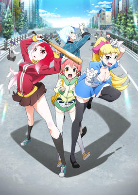

**Studio:** Gonzo &nbsp;|&nbsp; **Episodes:** 13 &nbsp;|&nbsp; **Director:** Hiroshi Ikehata &nbsp;|&nbsp; **Aired/Released:** 4 January – 29 March &nbsp;|&nbsp; **Genres:** Earth, Ecchi, Tokyo, Japan, Asia, Action

> Set in Akihabara, the shopping area has been invaded by creatures known as "Synthisters" who prey on the patrons of Akihabara, feasting on their social energy and will to live. These enemies can only be stopped by direct exposure to the air, meaning to defeat these synthisters their clothes need to be ripped off exposing their skin.
>
> _Synopsis source: Kitsu_

[Kitsu](https://kitsu.io/anime/akiba-s-trip-the-animation)

---

### Masamune-kun's Revenge

**Studio:** Silver Link &nbsp;|&nbsp; **Episodes:** 12 &nbsp;|&nbsp; **Director:** Mirai Minato &nbsp;|&nbsp; **Aired/Released:** 5 January – 23 March &nbsp;|&nbsp; **Genres:** Comedy, School Life, Harem, Romance

> As a child, Masamune Makabe was mercilessly teased about his weight and cruelly nicknamed “Pig’s Foot” by a young girl named Aki Adagaki. Years later, Masamune continues to hold resentment and decides to seek revenge against his tormenter. Now, handsome and in top shape, he returns to exact vengeance on Aki! But as he gets closer to her, he finds his heart desires something other than revenge.
>
> _Synopsis source: Kitsu_

[Wikipedia](https://en.wikipedia.org/wiki/Masamune-kun%27s_Revenge) · [Kitsu](https://kitsu.io/anime/masamune-kun-no-revenge)

---

### Seiren

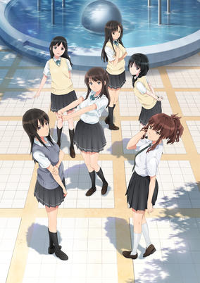

**Studio:** Studio Gokumi AXsiZ &nbsp;|&nbsp; **Episodes:** 12 &nbsp;|&nbsp; **Director:** Tomoki Kobayashi &nbsp;|&nbsp; **Aired/Released:** 5 January – 23 March &nbsp;|&nbsp; **Genres:** High School, School Life, Romance, Comedy

> Shoichi Kamita is an ordinary high school boy, who is faced with the university entrance exam and worried about his future. This campus romantic comedy, "Seiren", which means honest in Japanese, depicts his pure relationship with three different heroines. Each story is the unique and mutual memory between him and the heroine.
>
> _Synopsis source: Kitsu_

[Wikipedia](https://en.wikipedia.org/wiki/Seiren) · [Kitsu](https://kitsu.io/anime/seiren)

---

### Urara Meirocho

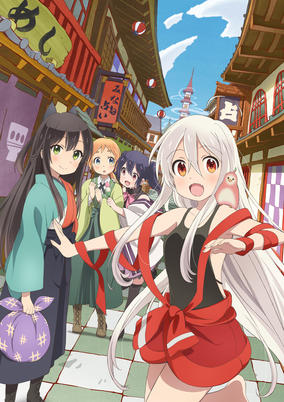

**Studio:** J.C.Staff &nbsp;|&nbsp; **Episodes:** 12 &nbsp;|&nbsp; **Director:** Youhei Suzuki &nbsp;|&nbsp; **Aired/Released:** 5 January – 23 March &nbsp;|&nbsp; **Genres:** Comedy, Fantasy, Slice of Life

> This is Meirochou (Labyrinth Town), the town of fortune-telling. In town, there is a fortune-telling shop called Urara, where girls aspiring to be fortune-tellers come from all over the country. Chiya, who was raised in the mountains, comes to the town with a purpose, but what is it exactly? There, she meets Kon who is always serious, Koume who loves all things western, and the shy Nono. Their fun days of living together as apprentice fortune-tellers are about to begin.
>
> _Synopsis source: Kitsu_

[Wikipedia](https://en.wikipedia.org/wiki/Urara_Meirocho) · [Kitsu](https://kitsu.io/anime/urara-meirochou)

---

### Fuuka

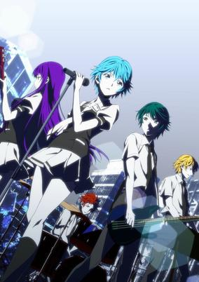

**Studio:** Diomedéa &nbsp;|&nbsp; **Episodes:** 12 &nbsp;|&nbsp; **Director:** Keizō Kusakawa &nbsp;|&nbsp; **Aired/Released:** 6 January – 24 March &nbsp;|&nbsp; **Genres:** School Life, Music, Drama, Romance, Ecchi

> Yuu Haruna just moved into town and loves to use Twitter. Out on his way to buy dinner, he bumps into a mysterious girl, Fuuka Akitsuki, who breaks his phone thinking he was trying to take a picture of her panties. How will his new life change now?
>
> _Synopsis source: Kitsu_

[Wikipedia](https://en.wikipedia.org/wiki/Fuuka_(manga)) · [Kitsu](https://kitsu.io/anime/fuuka)

---

### Minami Kamakura High School Girls Cycling Club

**Studio:** J.C.Staff A.C.G.T &nbsp;|&nbsp; **Episodes:** 13 &nbsp;|&nbsp; **Director:** Susumu Kudo &nbsp;|&nbsp; **Aired/Released:** 6 January – 15 May &nbsp;|&nbsp; **Genres:** Sports, School Life, Cycling

> Maiharu Hiromi has moved to Kamakura Nagasaki, and rides a bicycle to school everyday. Then she meets Akizuki Tomoe, the leader of the girls cycling club. She therefore joins the club and her life gradually begins to change.
>
> _Synopsis source: Kitsu_

[Wikipedia](https://en.wikipedia.org/wiki/Minami_Kamakura_High_School_Girls_Cycling_Club) · [Kitsu](https://kitsu.io/anime/minami-kamakura-koukou-joshi-jitenshabu)

---

### Saga of Tanya the Evil

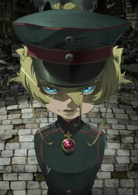

**Studio:** NUT &nbsp;|&nbsp; **Episodes:** 12 &nbsp;|&nbsp; **Director:** Yutaka Uemura &nbsp;|&nbsp; **Aired/Released:** 6 January – 31 March &nbsp;|&nbsp; **Genres:** Germany, Alternative Past, Europe, Magic, War, Military

> On the front lines of the war, there is a little girl. Blond hair, blue eyes, and porcelain white skin, she commands her squad with lisping voice. Her name is Tanya Degurechaff. But in reality, she is one of Japan's most elite salarymen, reborn as a little girl after angering a mysterious being who calls himself God. This little girl, who prioritizes efficiency and her own career over anything else, will become the most dangerous being amongst the sorcerers of the imperial army.
>
> _Synopsis source: Kitsu_

[Wikipedia](https://en.wikipedia.org/wiki/Saga_of_Tanya_the_Evil) · [Kitsu](https://kitsu.io/anime/youjo-senki)

---

### Blue Exorcist: Kyoto Saga

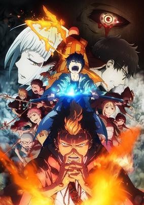

**Studio:** A-1 Pictures &nbsp;|&nbsp; **Episodes:** 12 &nbsp;|&nbsp; **Director:** Koichi Hatsumi &nbsp;|&nbsp; **Aired/Released:** 7 January – 25 March &nbsp;|&nbsp; **Genres:** Fantasy, Action, Comedy, Demon, Shounen

> Second season of the Ao no Exorcist series.
>
> _Synopsis source: Kitsu_

[Kitsu](https://kitsu.io/anime/ao-no-exorcist-2)

---

### Interviews with Monster Girls

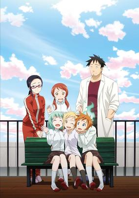

**Studio:** A-1 Pictures &nbsp;|&nbsp; **Episodes:** 12 &nbsp;|&nbsp; **Director:** Ryou Andou &nbsp;|&nbsp; **Aired/Released:** 7 January – 26 March &nbsp;|&nbsp; **Genres:** Comedy, School Life, Fantasy, Vampire

> Succubi, dullahans, snow women and vampires... We're a little different from humans and called "demi-humans." Lately, we've been called "demis." This is a stimulating and heartful school demi-human comedy featuring those very unique "demis" and a high school teacher named Takahashi Tetsuo, who's highly interested in learning more about their daily lives and habits.
>
> _Synopsis source: Kitsu_

[Wikipedia](https://en.wikipedia.org/wiki/Interviews_with_Monster_Girls) · [Kitsu](https://kitsu.io/anime/demi-chan-wa-kataritai)

---

### Chain Chronicle (Chain Chronicle: The Light of Haecceitas)

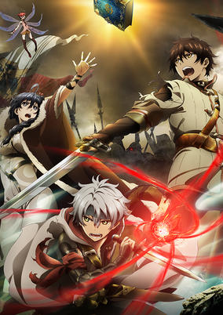

**Studio:** Telecom Animation Film Graphinica &nbsp;|&nbsp; **Episodes:** 12 &nbsp;|&nbsp; **Director:** Masashi Kudō &nbsp;|&nbsp; **Aired/Released:** 8 January – 25 March &nbsp;|&nbsp; **Genres:** Magic, Fantasy, Action, Adventure

> This is the story of the Chain Chronicle, a book that describes everything that happens in the world. The citizens of the remote continent of Yggd once thought that there was nothing beyond their continent. The continent was divided into several regions, each with its own king. Though there were small skirmishes amongst them, a lord, chosen by the kings in conference, always maintained balance, until the evil Black Army arrived. The Volunteer Army, led by Yuri, was no match for the Black Army. During the fighting, the Lord of Black captures half of the Chain Chronicle, as well as the capital.
>
> _Synopsis source: Kitsu_

[Wikipedia](https://en.wikipedia.org/wiki/Chain_Chronicle) · [Kitsu](https://kitsu.io/anime/chain-chronicle-tv)

---

### ēlDLIVE (elDLIVE)

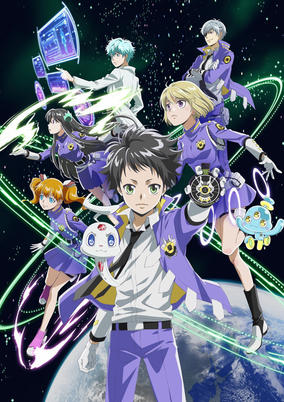

**Studio:** Pierrot &nbsp;|&nbsp; **Episodes:** 12 &nbsp;|&nbsp; **Director:** Takeshi Furuta Tomoya Tanaka &nbsp;|&nbsp; **Aired/Released:** 8 January – 26 March &nbsp;|&nbsp; **Genres:** Science Fiction, Space, Action

> Chuuta Kokonose is an orphan who lives with his aunt. For as long as he can remember, he's had a voice in his head, but other than that he's a normal boy—right until the day when a strange-looking thing follows him home and teleports him to a place filled with more fantastic creatures. It's a space police station, and Rein Brickke, the Chief of Solar System Department, tells him that he's been chosen by the computer as a possible candidate to join the police force. Misuzu Sonokata, a girl from Chuuta's school with an angelic face and ill temper who turns out to be one of Rein Brickke's subordinates, doesn't think him suitable for such a job. Chuuta, who was shocked at first, decides to take the aptitude test after being urged by the voice in his head and to prove Misuzu wrong.
>
> _Synopsis source: Kitsu_

[Wikipedia](https://en.wikipedia.org/wiki/%C4%92lDLIVE) · [Kitsu](https://kitsu.io/anime/eldlive)

---

### Idol Incidents

**Studio:** MAPPA Studio VOLN &nbsp;|&nbsp; **Episodes:** 12 &nbsp;|&nbsp; **Director:** Daisuke Yoshida &nbsp;|&nbsp; **Aired/Released:** 8 January – 27 March &nbsp;|&nbsp; **Genres:** Music

> Increasing income divide, creeping environmental pollution, unsolvable waste issues, childcare waiting lists being discussed without those concerned, repeated corruption… The government, smeared by vested interests, can't do a thing against the many problems and sources of discontent. It's in this situation, with Japan cornered with no way out, that idols rise up to save the day! The Heroine Party, Sunlight Party, Starlight Party, Bishoujo Party, Wakaba Party, Subculture New Party, and SOS Party. From these seven idol political parties, the idols who have become National Diet members and representatives for each prefecture will smash through the sense of stagnation covering Japan using the power of song and dance! They'll bring back the smiling faces of the people, and wrap Japan in a glittering aura!!
>
> _Synopsis source: Kitsu_

[Wikipedia](https://en.wikipedia.org/wiki/Idol_Incidents) · [Kitsu](https://kitsu.io/anime/idol-jihen)

---

### Nyanko Days

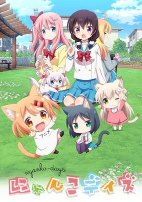

**Studio:** EMT Squared &nbsp;|&nbsp; **Episodes:** 12 &nbsp;|&nbsp; **Director:** Yoshimasa Hiraike &nbsp;|&nbsp; **Aired/Released:** 8 January – 26 March &nbsp;|&nbsp; **Genres:** Comedy, Slice of Life, Juujin

> Konagai Tomoko is a first-year in high school and a shy girl. Tomoko owns three cats. The cheerful and live Munchkin Maa, the smart and responsible Russian Blue Rou, and the gentle crybaby Singapura Shii. Tomoko, whose only friends were her cats, one day becomes friends with Shiratori Azumi, who also loves cats. This is a fluffy and cute comedy about the daily life of Tomoko and her cats, Tomoko and Azumi's friendship, and the interaction between cats.
>
> _Synopsis source: Kitsu_

[Wikipedia](https://en.wikipedia.org/wiki/Nyanko_Days) · [Kitsu](https://kitsu.io/anime/nyanko-days)

---

### Tales of Zestiria the X (season 2) (Tales of Zestiria the X)

**Studio:** Ufotable &nbsp;|&nbsp; **Episodes:** 13 &nbsp;|&nbsp; **Director:** Haruo Sotozaki &nbsp;|&nbsp; **Aired/Released:** 8 January – 29 April &nbsp;|&nbsp; **Genres:** High Fantasy, Adventure, Action, Fantasy

> Sorey is a human youth who grew up among the seraphim, spiritual beings not visible to humans. Sorey believes in the folklore that says "long ago, every human was able to see the seraphim" and dreams of unraveling the ancient mystery to make the world a place where people and seraphim can live together in peace. One day, Sorey visits the human capital for the very first time. He becomes embroiled in an incident during which he pulls out a holy sword embedded in a rock and ends up becoming a Shepherd, one who casts away calamity from the world. He begins to realize the gravity of his mission, and his dream of coexistence between mankind and the seraphim becomes more intense— And thus, the Shepherd embarks on an amazing journey with his companions.
>
> _Synopsis source: Kitsu_

[Wikipedia](https://en.wikipedia.org/wiki/Tales_of_Zestiria_the_X) · [Kitsu](https://kitsu.io/anime/tales-of-zestiria-the-x)

---

### Little Witch Academia

**Studio:** Trigger &nbsp;|&nbsp; **Episodes:** 25 &nbsp;|&nbsp; **Director:** Yoh Yoshinari &nbsp;|&nbsp; **Aired/Released:** 9 January – 26 June

[Wikipedia](https://en.wikipedia.org/wiki/Little_Witch_Academia)

---

### Gabriel DropOut

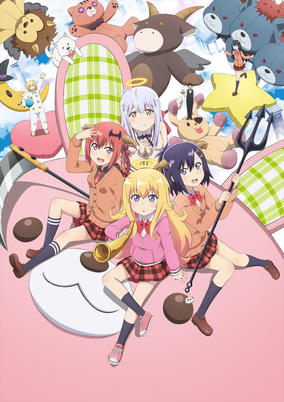

**Studio:** Doga Kobo &nbsp;|&nbsp; **Episodes:** 12 &nbsp;|&nbsp; **Director:** Masahiko Ohta &nbsp;|&nbsp; **Aired/Released:** 9 January – 27 March &nbsp;|&nbsp; **Genres:** Comedy, Fantasy, School Life

> For centuries, Heaven has required its young angels to live and study among humans in order to become full-fledged angels. This is no different for top-of-her-class Gabriel White Tenma, who believes it is her mission to be a great angel who will bring happiness to mankind. However, Gabriel grows addicted to video games on Earth and eventually becomes a hikikomori. Proclaiming herself a "Faillen Angel," she is apathetic to everything else—much to the annoyance of Vignette April Tsukinose, a demon whom Gabriel befriended in her angelic early days on Earth. Vignette's attempts to revert Gabriel back to her previous self are in vain, as Gabriel shoots down any attempt to change her precious lifestyle. As they spend their time on Earth, they meet two eccentric personalities: the angel Raphiel Ainsworth Shiraha, Gabriel's classmate with a penchant for sadism, and the demon Satanichia McDowell Kurumizawa, a clumsy self-proclaimed future ruler of the Underworld. Gabriel DropOut follows these four friends' comedic lives as they utterly fail to understand what it truly means to be a demon or an angel.
>
> _Synopsis source: Kitsu_

[Wikipedia](https://en.wikipedia.org/wiki/Gabriel_DropOut) · [Kitsu](https://kitsu.io/anime/gabriel-dropout)

---

### ACCA: 13-Territory Inspection Dept.

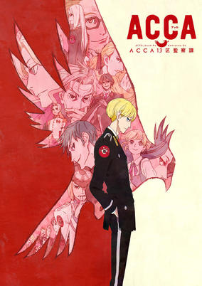

**Studio:** Madhouse &nbsp;|&nbsp; **Episodes:** 12 &nbsp;|&nbsp; **Director:** Shingo Natsume &nbsp;|&nbsp; **Aired/Released:** 10 January – 28 March &nbsp;|&nbsp; **Genres:** Cops, Fantasy, Drama, Politics

> The kingdom of Dowa, which is subdivided into 13 states, is celebrating its monarch's 99th birthday. These 13 states have many agencies that are controlled by the giant organization known as ACCA. Within ACCA, Jean Otus is the second-in-command of the inspection agency. His agency has ten people placed in each of the 13 states, with a central office in the capital city. They keep track of all the activities of ACCA across the kingdom, and keep data on each state's ACCA office flowing toward the central office. Jean also often has business trips from the capital to the other districts to check on the situation and personnel there.
>
> _Synopsis source: Kitsu_

[Kitsu](https://kitsu.io/anime/acca-13-ku-kansatsu-ka)

---

### Hand Shakers

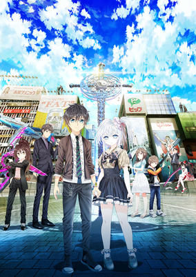

**Studio:** GoHands &nbsp;|&nbsp; **Episodes:** 12 &nbsp;|&nbsp; **Director:** Shingo Suzuki Hiromichi Kanazawa &nbsp;|&nbsp; **Aired/Released:** 10 January – 28 March &nbsp;|&nbsp; **Genres:** Action, Fantasy

> The anime takes place in Osaka in "AD20XX," and revolves around the Hand Shakers—partners who can summon "Nimrodes," weapons born from their deep psyche by joining hands. In order to grant the pair's wish, the Hand Shakers compete with and fight other Hand Shaker pairs. The top pair will then meet and challenge "God." "They, the receivers of the Revelation of Babel. They, the challengers to God. They, who inevitably throw themselves into battle with their partners. What does God want from them? And did they want powers exceeding that of Gods? The chosen ones, their souls linked, join hand and hand for the Ziggurat where the fighting shall ensue."
>
> _Synopsis source: Kitsu_

[Wikipedia](https://en.wikipedia.org/wiki/Hand_Shakers) · [Kitsu](https://kitsu.io/anime/hand-shakers)

---

### Kemono Friends

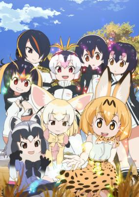

**Studio:** Yaoyorozu &nbsp;|&nbsp; **Episodes:** 12 &nbsp;|&nbsp; **Director:** Tatsuki &nbsp;|&nbsp; **Aired/Released:** 10 January – 28 March &nbsp;|&nbsp; **Genres:** Comedy, Adventure, Juujin

> The anime's story takes place in Japari Park, a "gigantic integrated zoo." In the zoo, due to the mysterious "sand star" substance, the animals start turning into human-shaped creatures called Animal Girls. Japari Park is a place where many people visit and have fun at, but one day a lost child wanders into the park. The lost child starts a journey to return, but because so many Animal Girls join in on the quest it becomes an unexpected grand adventure.
>
> _Synopsis source: Kitsu_

[Wikipedia](https://en.wikipedia.org/wiki/Kemono_Friends) · [Kitsu](https://kitsu.io/anime/kemono-friends)

---

### Yowamushi Pedal: New Generation

**Studio:** TMS/8PAN &nbsp;|&nbsp; **Episodes:** 25 &nbsp;|&nbsp; **Director:** Osamu Nabeshima &nbsp;|&nbsp; **Aired/Released:** 10 January – 26 June &nbsp;|&nbsp; **Genres:** Comedy, Sports, Motorsport, Drama

> Third season of the Yowamushi Pedal series. With the team's combined strength, the Sohoku High bicycle racing club beat reigning champions Hakone Academy at the Interhigh national race and achieved an impressive overall victory. Now that their hot summer has ended and third-years Kinjou, Makishima, and Tadokoro have retired from the team, first-year participants in the Interhigh Onoda Sakamichi, Imaizumi Shunsuke, and Naruko Shoukichi, along with their new captain second-year Teshima Junta and vice-captain Aoyagi Hajime begin preparing as a "new team" for their second consecutive championship at the next Interhigh. In order to retake their throne, their rivals Hakone Academy have also incorporated new members and begun training as a new team. Kyoto Fushimi High is lead by the monstrous racer Midousuji Akira. The nation's top schools are all honing their skills to reach the top of the Interhigh.
>
> _Synopsis source: Kitsu_

[Kitsu](https://kitsu.io/anime/yowamushi-pedal-3rd-season)

---

### Chaos;Child

**Studio:** Silver Link &nbsp;|&nbsp; **Episodes:** 12 &nbsp;|&nbsp; **Director:** Masato Jinbo &nbsp;|&nbsp; **Aired/Released:** 11 January – 29 March

[Wikipedia](https://en.wikipedia.org/wiki/Chaos;Child_(anime))

---

### One Room

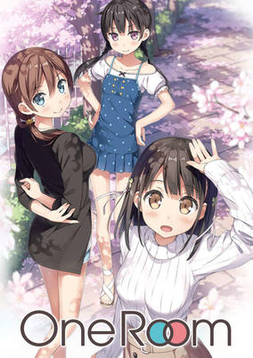

**Studio:** Typhoon Graphics &nbsp;|&nbsp; **Episodes:** 12 &nbsp;|&nbsp; **Aired/Released:** 11 January – 29 March &nbsp;|&nbsp; **Genres:** Slice of Life, Romance

> Series of shorts that tell stories of your relationship with "your" neighbor, younger sister, and childhood friend.
>
> _Synopsis source: Kitsu_

[Wikipedia](https://en.wikipedia.org/wiki/One_Room) · [Kitsu](https://kitsu.io/anime/one-room)

---

### Piacevole! (Piacevole: My Italian Cooking)

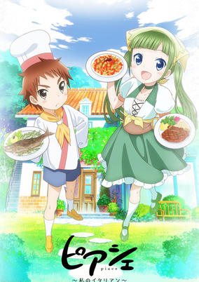

**Studio:** Zero-G &nbsp;|&nbsp; **Episodes:** 12 &nbsp;|&nbsp; **Director:** Hiroaki Sakurai &nbsp;|&nbsp; **Aired/Released:** 11 January – 29 March &nbsp;|&nbsp; **Genres:** Comedy, Slice of Life

> High-schooler Morina Nanase has begun working as a part-timer in an Italian restaurant, Trattoria Festa. As she encounters various quirky co-workers, such as their manager, the child prodigy chef Maro Kitahara, and unique cuisines, she begins to grow as a person.
>
> _Synopsis source: Kitsu_

[Wikipedia](https://en.wikipedia.org/wiki/Piacevole!) · [Kitsu](https://kitsu.io/anime/piace-watashi-no-italian)

---

### Schoolgirl Strikers

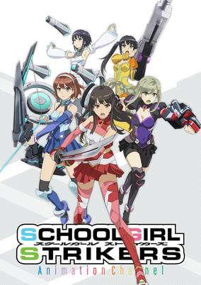

**Studio:** J.C.Staff &nbsp;|&nbsp; **Episodes:** 13 &nbsp;|&nbsp; **Director:** Hiroshi Nishikiori &nbsp;|&nbsp; **Aired/Released:** 11 January – 1 April &nbsp;|&nbsp; **Genres:** School Life, Action

> It's the near future. The newly established girls' private school Goryoukan Academy has another face. This school has a special unit, Fifth force, who is assembled and selected from the school's student body in order to fight an enemy called Oburi. This is a story about love, courage and friendship about the girls called Strikers.
>
> _Synopsis source: Kitsu_

[Wikipedia](https://en.wikipedia.org/wiki/Schoolgirl_Strikers) · [Kitsu](https://kitsu.io/anime/schoolgirl-strikers-animation-channel)

---

### Miss Kobayashi's Dragon Maid

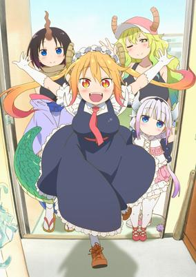

**Studio:** Kyoto Animation &nbsp;|&nbsp; **Episodes:** 13 &nbsp;|&nbsp; **Director:** Yasuhiro Takato &nbsp;|&nbsp; **Aired/Released:** 12 January – April 6 &nbsp;|&nbsp; **Genres:** Comedy, Fantasy, Slice of Life, Dragon, Maid

> Miss Kobayashi is your average office worker who lives a boring life, alone in her small apartment–until she saves the life of a female dragon in distress. The dragon, named Tohru, has the ability to magically transform into an adorable human girl (albeit with horns and a long tail!), who will do anything to pay off her debt of gratitude, whether Miss Kobayashi likes it or not. With a very persistent and amorous dragon as a roommate, nothing comes easy, and Miss Kobayashi’s normal life is about to go off the deep end!
>
> _Synopsis source: Kitsu_

[Wikipedia](https://en.wikipedia.org/wiki/Miss_Kobayashi%27s_Dragon_Maid) · [Kitsu](https://kitsu.io/anime/kobayashi-san-chi-no-maid-dragon)

---

### Scum's Wish

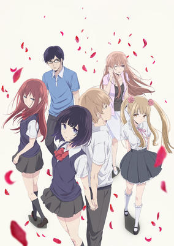

**Studio:** Lerche &nbsp;|&nbsp; **Episodes:** 12 &nbsp;|&nbsp; **Director:** Masaomi Ando &nbsp;|&nbsp; **Aired/Released:** 12 January – 30 March &nbsp;|&nbsp; **Genres:** School Life, Drama, Romance, Unrequited Love, Present, Coming Of Age, High School

> Seventeen-year-old Mugi Awaya and Hanabi Yasuraoka appear to be the ideal couple. They are both pretty popular, and they seem to suit each other well. However, outsiders don't know of the secret they share. Both Mugi and Hanabi have hopeless crushes on someone else, and they are only dating each other to soothe their loneliness. Mugi is in love with Akane Minagawa, a young teacher who used to be his home tutor. Hanabi is also in love with a teacher, a young man who has been a family friend since she was little. In each other, they find a place where they can grieve for the ones they cannot have, and they share physical intimacy driven by loneliness. Will things stay like this for them forever?
>
> _Synopsis source: Kitsu_

[Wikipedia](https://en.wikipedia.org/wiki/Scum%27s_Wish) · [Kitsu](https://kitsu.io/anime/kuzu-no-honkai)

---

### BanG Dream!

**Studio:** Issen Xebec &nbsp;|&nbsp; **Episodes:** 13 &nbsp;|&nbsp; **Director:** Atsushi Ootsuki &nbsp;|&nbsp; **Aired/Released:** 21 January – 22 April &nbsp;|&nbsp; **Genres:** Music, Musical Band, School Life, School Clubs, All Girls School, High School, Japan, Plot Continuity, Comedy, The Arts

> When she was a child, Kasumi Toyama felt a heart-pounding thrill every time she gazed at the stars, and she's been looking without success for something that could inspire the same feeling ever since. One day, she comes across a star-shaped guitar in a rundown pawnshop and, for the first time, discovers the thrill she's been searching for. Kasumi becomes determined to form an all-girl band, and her search leads her to four like-minded souls: Saya, Arisa, Rimi, and Tae. Does this band have what it takes to make their dreams of stardom come true?
>
> _Synopsis source: Kitsu_

[Wikipedia](https://en.wikipedia.org/wiki/BanG_Dream!) · [Kitsu](https://kitsu.io/anime/bang-dream)

---

### Kirakira PreCure a la Mode

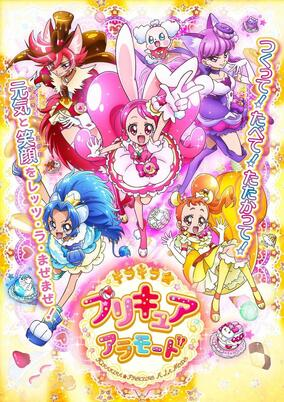

**Studio:** Toei Animation &nbsp;|&nbsp; **Episodes:** 49 &nbsp;|&nbsp; **Director:** Kohei Kureta Yukio Kaizawa &nbsp;|&nbsp; **Aired/Released:** 5 February – 28 January 2018 &nbsp;|&nbsp; **Genres:** Magic, Fantasy, Slice of Life, Magical Girl, Cooking, Adventure, Shoujo

> Ichika Usami is a second year middle school student who works in her family's cafe, Kirakira Patisserie. One day, she meets a spoiled lamb fairy named pekorin who tells her evil monsters known as Henteko have been stealing "Kirakiraru", the energy that resides within sweets and desserts. Ichhika then becomes a pretty cure and, with four other girls, they form the kirakira precure a la mode to fight the henteko and protect the sweets.
>
> _Synopsis source: Kitsu_

[Wikipedia](https://en.wikipedia.org/wiki/Kirakira_PreCure_a_la_Mode) · [Kitsu](https://kitsu.io/anime/kirakira-precure-a-la-mode)

---

### Dragon Dentist

**Episodes:** 2 &nbsp;|&nbsp; **Aired/Released:** 18 February – 25 February

[Wikipedia](https://en.wikipedia.org/wiki/Dragon_Dentist)

---

### Attack on Titan (season 2)

**Studio:** Wit Studio Production I.G &nbsp;|&nbsp; **Episodes:** 12 &nbsp;|&nbsp; **Director:** Tetsurō Araki Masashi Koizuka &nbsp;|&nbsp; **Aired/Released:** 1 April – 17 June

[Wikipedia](https://en.wikipedia.org/wiki/Attack_on_Titan)

---

### Future Card Buddyfight X

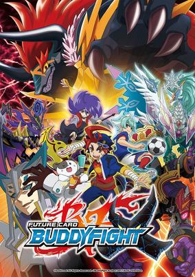

**Studio:** OLM, Inc. Xebec &nbsp;|&nbsp; **Aired/Released:** 1 April – &nbsp;|&nbsp; **Genres:** Virtual Reality

> The fourth season of Future Card Buddyfight.
>
> _Synopsis source: Kitsu_

[Wikipedia](https://en.wikipedia.org/wiki/Future_Card_Buddyfight_X) · [Kitsu](https://kitsu.io/anime/future-card-buddyfight-battsu)

---

### My Hero Academia (season 2) (My Hero Academia)

**Studio:** Bones &nbsp;|&nbsp; **Episodes:** 25 &nbsp;|&nbsp; **Director:** Kenji Nagasaki &nbsp;|&nbsp; **Aired/Released:** 1 April – 30 September &nbsp;|&nbsp; **Genres:** Superhero, Action, Super Power, High School, Comedy, School Life, Shounen

> What would the world be like if 80 percent of the population manifested extraordinary superpowers called “Quirks” at age four? Heroes and villains would be battling it out everywhere! Becoming a hero would mean learning to use your power, but where would you go to study? U.A. High's Hero Program of course! But what would you do if you were one of the 20 percent who were born Quirkless? Middle school student Izuku Midoriya wants to be a hero more than anything, but he hasn't got an ounce of power in him. With no chance of ever getting into the prestigious U.A. High School for budding heroes, his life is looking more and more like a dead end. Then an encounter with All Might, the greatest hero of them all gives him a chance to change his destiny…
>
> _Synopsis source: Kitsu_

[Wikipedia](https://en.wikipedia.org/wiki/My_Hero_Academia) · [Kitsu](https://kitsu.io/anime/boku-no-hero-academia)

---

### The Silver Guardian

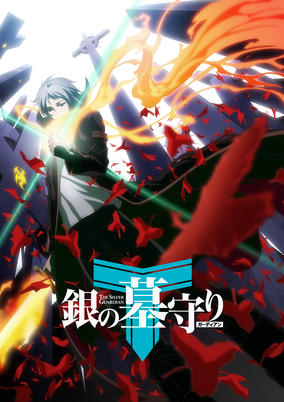

**Studio:** Haoliners Animation League &nbsp;|&nbsp; **Director:** Masahiko Ohkura &nbsp;|&nbsp; **Aired/Released:** 1 April – &nbsp;|&nbsp; **Genres:** Fantasy, Adventure

> Lu Shuiyin (Riku Suigin in Japanese) is a master of gaming, a skill only known to his classmate Lu Lian (Riku Lin in Japanese). One day, Shuiyin receives a device from Lu Lian for a tomb raiding online game. While Shuiyin is excited to receive the device, Lian is suddenly kidnapped. Shuiyin touches the device that was left behind, pulling him inside the game and trapping him there. What is the imaginary world inside the device? What will Shuiyin find there? It is a world where two groups of people fight over the power of the gods, which originates from the tomb the mother goddess Pangu (Bango in Japanese). The two groups are the tomb raiders and the tomb protectors. The device Shuiyin received from Lian is called the Monolith, and it allows a normal gamer to go near the tomb. The tomb raiding group plans its attack by recruiting common people in the name of gaming. Shuiyin, as the final tomb protector, must fight against the raiders in order to save Lian.
>
> _Synopsis source: Kitsu_

[Wikipedia](https://en.wikipedia.org/wiki/The_Silver_Guardian) · [Kitsu](https://kitsu.io/anime/gin-no-guardian)

---

### Alice & Zouroku (Alice & Zoroku)

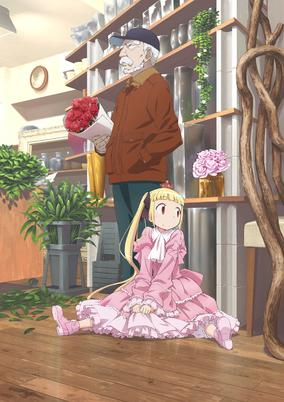

**Studio:** J.C.Staff &nbsp;|&nbsp; **Episodes:** 12 &nbsp;|&nbsp; **Director:** Katsushi Sakurabi &nbsp;|&nbsp; **Aired/Released:** 2 April – 25 June &nbsp;|&nbsp; **Genres:** Adventure, Mystery

> The story centers on a little girl called Sana, who is one of the children that holds the power of "Alice's Dream," an ability that enables her to materialize anything she imagines. After escaping a lab where she was a test subject, Sana ends up in a normal world where she encounters an old man named Zouroku, but will he help her?
>
> _Synopsis source: Kitsu_

[Wikipedia](https://en.wikipedia.org/wiki/Alice_%26_Zouroku) · [Kitsu](https://kitsu.io/anime/alice-to-zouroku)

---

### Granblue Fantasy The Animation

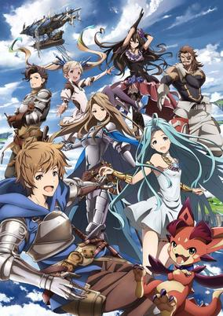

**Studio:** A-1 Pictures &nbsp;|&nbsp; **Episodes:** 12 &nbsp;|&nbsp; **Director:** Ayako Kurata Yuuki Itoh &nbsp;|&nbsp; **Aired/Released:** 2 April – 25 June &nbsp;|&nbsp; **Genres:** Fantasy, Adventure, Fantasy World, Swordplay, Action, Magic

> This is a world of the skies, where many islands drift in the sky. A boy named Gran and a talking winged lizard named Vyrn lived in Zinkenstill, an island which yields mysteries. One day, they come across a girl named Lyria. Lyria had escaped from the Erste Empire, a military government that is trying to rule over this world using powerful military prowess. In order to escape from the Empire, Gran and Lyria head out into the vast skies, holding the letter Gran's father left behind - which said, "I will be waiting at Estalucia, Island of Stars". (Source: Aniplex of America) Note: Episodes 1 and 2 preaired on TV on January 21, 2017. Regular broadcasting begins on April 2, 2017.
>
> _Synopsis source: Kitsu_

[Wikipedia](https://en.wikipedia.org/wiki/Granblue_Fantasy_The_Animation) · [Kitsu](https://kitsu.io/anime/granblue-fantasy-the-animation)

---

### Beyblade Burst Evolution

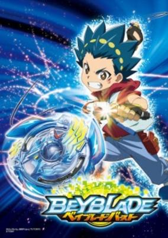

**Studio:** OLM &nbsp;|&nbsp; **Episodes:** 51 &nbsp;|&nbsp; **Director:** Katsuhito Akiyama &nbsp;|&nbsp; **Aired/Released:** 3 April – 26 March 2018 &nbsp;|&nbsp; **Genres:** Science Fiction, Sports, Action, Friendship, Adventure

> Valt Aoi is a hot-blooded kid who loves to attack and wields a Beyblade named Valkyrie. His close friend Shuu Kurenai is an elite Blader who is a genius but still puts in a lot of effort, and wields the Beyblade named Spriggan.
>
> _Synopsis source: Kitsu_

[Wikipedia](https://en.wikipedia.org/wiki/Beyblade_Burst_Evolution) · [Kitsu](https://kitsu.io/anime/beyblade-burst)

---

### Frame Arms Girl

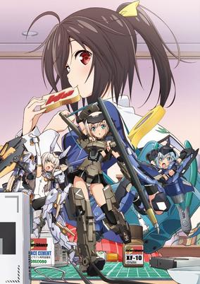

**Studio:** Zexcs Studio A-Cat &nbsp;|&nbsp; **Episodes:** 12 &nbsp;|&nbsp; **Director:** Keiichiro Kawaguchi &nbsp;|&nbsp; **Aired/Released:** 3 April – 19 June &nbsp;|&nbsp; **Genres:** Mecha

> The story begins when Ao opens a package that arrives at her doorstep. Inside the package is Gourai, a Frame Arms Girl: a small robot capable of independent movement. Gourai is a newly-developed prototype: a Frame Arms Girl equipped with an "Artificial Self," an advanced AI that gives her a personality. Ao is the only one that has activated her. Gourai begins to gather both battle data and emotions, starting a day-to-day life with Ao, who knows nothing about Frame Arms Girls.
>
> _Synopsis source: Kitsu_

[Wikipedia](https://en.wikipedia.org/wiki/Frame_Arms_Girl) · [Kitsu](https://kitsu.io/anime/frame-arms-girl)

---

### The Laughing Salesman NEW (The Laughing Salesman)

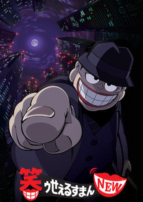

**Studio:** Shin-Ei Animation &nbsp;|&nbsp; **Episodes:** 12 &nbsp;|&nbsp; **Director:** Hirofumi Ogura &nbsp;|&nbsp; **Aired/Released:** 3 April – 19 June &nbsp;|&nbsp; **Genres:** Comedy, Drama

> Each episode follows Fukuzou Moguro, a traveling salesman, and his current customer. Moguro deals in things that give his customers their heart's desire, and once his deals are made and their unhealthy desires are satisfied, Moguro's customers are often left with terrible repercussions, especially if they break the rules of his deals...
>
> _Synopsis source: Kitsu_

[Wikipedia](https://en.wikipedia.org/wiki/The_Laughing_Salesman) · [Kitsu](https://kitsu.io/anime/warau-salesman-new)

---

### Tsugumomo

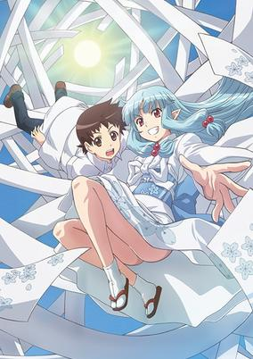

**Studio:** Zero-G &nbsp;|&nbsp; **Episodes:** 12 &nbsp;|&nbsp; **Director:** Ryōichi Kuraya &nbsp;|&nbsp; **Aired/Released:** 3 April – 19 June &nbsp;|&nbsp; **Genres:** Comedy, Fantasy, School Life, Action, Ecchi

> Kazuya Kagami never goes anywhere without the precious "Sakura Obi" his mother gave him. One day a beautiful, kimono-clad girl named Kiriha appeared before him. Kiriha naturally began to live with Kazuya in his room. Then there's Chisato, Kazuya's childhood friend with glasses and a ponytail, who meddles in his affairs. Soon there's also an overprotective older sister who seems to want to take baths with him. Jumble in a huge-chested priestess, a good-looking sorceress named Kokuyoura, beautiful women, and hot girls, and Kazuya's happy, embarrassing, confusing life begins…
>
> _Synopsis source: Kitsu_

[Wikipedia](https://en.wikipedia.org/wiki/Tsugumomo) · [Kitsu](https://kitsu.io/anime/tsugumomo)

---

### Akashic Records of Bastard Magic Instructor

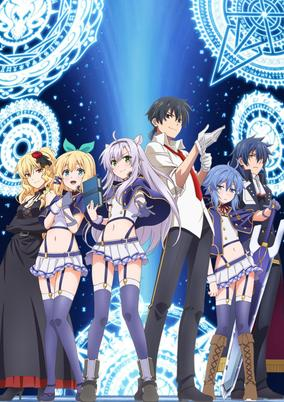

**Studio:** Liden Films &nbsp;|&nbsp; **Episodes:** 12 &nbsp;|&nbsp; **Director:** Minato Kazuto &nbsp;|&nbsp; **Aired/Released:** 4 April – 20 June &nbsp;|&nbsp; **Genres:** Magic, School Life, Fantasy, Action

> Sistina attends a magical academy to hone her skills in the magical arts, hoping to solve the mystery of the enigmatic Sky Castle. After the retirement of her favorite teacher, the replacement, Glen, turns out to be a tardy, lazy, and seemingly incompetent bastard of an instructor. How is it that Glen was hand-picked by the best magician in the academy?!
>
> _Synopsis source: Kitsu_

[Wikipedia](https://en.wikipedia.org/wiki/Akashic_Records_of_Bastard_Magic_Instructor) · [Kitsu](https://kitsu.io/anime/roku-de-nashi-majutsu-koushi-to-kinki-kyouten)

---

### Idol Time PriPara

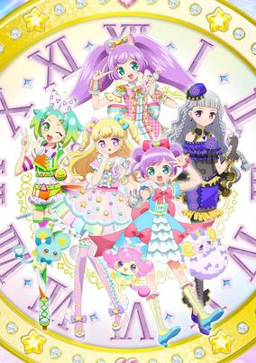

**Studio:** Tatsunoko Production DongWoo A&E &nbsp;|&nbsp; **Episodes:** 51 &nbsp;|&nbsp; **Director:** Makoto Moriwaki &nbsp;|&nbsp; **Aired/Released:** 4 April – 27 March 2018 &nbsp;|&nbsp; **Genres:** School Life, Music, Shoujo

> The story focuses on Yui, a girl who lives in the town of Paparajuku, and who dreams of being an idol, even if she realizes that being an idol is next to impossible for her. Her friends often remark on how much she dreams about it. But then, the PriPara idol theme park opens in her town, and that an idol named Laala is coming to town from Parajuku, which only makes Yui dream even bigger. The new PriPara theme park has been updated with new concepts. However, due to a system error, Laala is no longer able to PriPara Change.
>
> _Synopsis source: Kitsu_

[Wikipedia](https://en.wikipedia.org/wiki/Idol_Time_PriPara) · [Kitsu](https://kitsu.io/anime/idol-time-pripara)

---

### The Royal Tutor

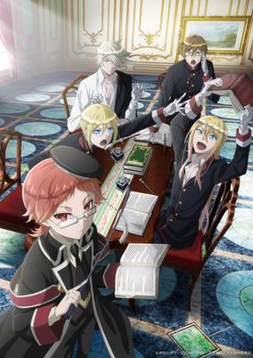

**Studio:** Bridge &nbsp;|&nbsp; **Episodes:** 12 &nbsp;|&nbsp; **Director:** Katsuya Kikuchi &nbsp;|&nbsp; **Aired/Released:** 4 April – 20 June &nbsp;|&nbsp; **Genres:** Comedy, Historical

> Accepting the post of Royal Tutor at the court of the king of Grannzreich, Heine Wittgenstein is a little professor with a big job ahead! Each of the kingdom's four princes has a rather distinct personality. Does their diminutive new instructor have what it takes to lay down some learning? It's a comedy of educational proportions!
>
> _Synopsis source: Kitsu_

[Wikipedia](https://en.wikipedia.org/wiki/The_Royal_Tutor) · [Kitsu](https://kitsu.io/anime/oushitsu-kyoushi-haine)

---

### Armed Girl's Machiavellism

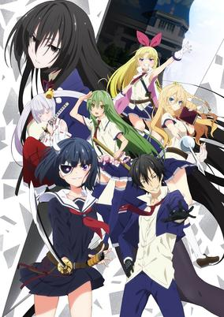

**Studio:** Silver Link &nbsp;|&nbsp; **Episodes:** 12 &nbsp;|&nbsp; **Director:** Hideki Tachibana &nbsp;|&nbsp; **Aired/Released:** 5 April – 21 June &nbsp;|&nbsp; **Genres:** School Life, Action

> The Private Aichi Symbiosis Academy was originally a high school for high-class girls. When it became co-ed, the girls, out of fear, asked to be permitted to bring weapons to school. When that was enforced, a five-member vigilante corps-like organization called the "Supreme Five Swords" was also formed. After many generations, the five swords eventually became a group which corrected problematic students, and the academy started proactively accepting such students in order to correct them. Nomura Fudou was sent to this school after being part of a huge brawl. What will he do when the only options he has after enrolling are being expelled from that school or being corrected the way the rest of the male students there were...by being forced to dress and act like a girl!
>
> _Synopsis source: Kitsu_

[Wikipedia](https://en.wikipedia.org/wiki/Armed_Girl%27s_Machiavellism) · [Kitsu](https://kitsu.io/anime/busou-shoujo-machiavellianism)

---

### Boruto: Naruto Next Generations

**Studio:** Pierrot &nbsp;|&nbsp; **Director:** Noriyuki Abe Hiroyuki Yamashita &nbsp;|&nbsp; **Aired/Released:** 5 April – 26 March 2023 &nbsp;|&nbsp; **Genres:** Super Power, Action, Adventure, Martial Arts, Shounen, Ninja

> Naruto was a young shinobi with an incorrigible knack for mischief. He achieved his dream to become the greatest ninja in the village and his face sits atop the Hokage monument. But this is not his story... A new generation of ninja are ready to take the stage, led by Naruto's own son, Boruto!
>
> _Synopsis source: Kitsu_

[Kitsu](https://kitsu.io/anime/boruto-naruto-next-generations)

---

### Sagrada Reset

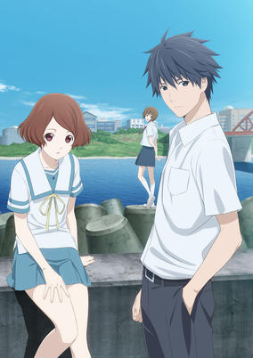

**Studio:** David Production &nbsp;|&nbsp; **Episodes:** 24 &nbsp;|&nbsp; **Director:** Shinya Kawatsura &nbsp;|&nbsp; **Aired/Released:** 5 April – 13 September &nbsp;|&nbsp; **Genres:** Fantasy, Super Power, School Life, Mystery

> Nearly half the population of Sakurada, a small town near the Pacific Ocean, has some sort of unique power. These powers range from being able to enter the mind of a cat, to resetting the world back to a certain point in time in the past. There is a group known as the "Kanrikyoku" that controls and monitors the use of these powers. Asai Kei and Haruki Misora work for their school's club called "Houshi" club, which execute any missions received from the Kanrikyoku. Misora has the ability to reset the world 3 days. This means that all events and any memory of the past 3 days that "could have" happened, never happened. Kei has the ability to "remember" the past. Even after Misora uses her powers to reset the world back 3 days, Kei will retain those 3 days in his memory. Combining their powers, these two solve missions issued by the Kanrikyoku.
>
> _Synopsis source: Kitsu_

[Wikipedia](https://en.wikipedia.org/wiki/Sagrada_Reset) · [Kitsu](https://kitsu.io/anime/sakurada-reset)

---

### Sakura Quest

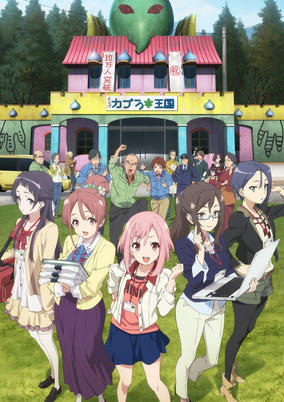

**Studio:** P.A. Works &nbsp;|&nbsp; **Episodes:** 25 &nbsp;|&nbsp; **Director:** Soichi Masui &nbsp;|&nbsp; **Aired/Released:** 5 April – 20 September &nbsp;|&nbsp; **Genres:** Comedy, Slice of Life, Working Life

> Five young women have one thing in common—the careers they planned for themselves weren’t working out. Job dissatisfaction, trying to make ends meet, and personal insecurities lead each of them to start working at a local tourism bureau where their lives become intertwined. As the girls experience their first year on the job, they learn a lot about their town, their industry, and themselves.
>
> _Synopsis source: Kitsu_

[Wikipedia](https://en.wikipedia.org/wiki/Sakura_Quest) · [Kitsu](https://kitsu.io/anime/sakura-quest)

---

### Clockwork Planet

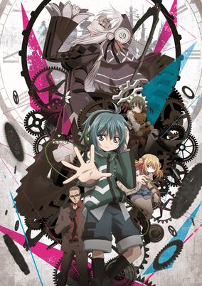

**Studio:** Xebec &nbsp;|&nbsp; **Episodes:** 12 &nbsp;|&nbsp; **Director:** Tsuyoshi Nagasawa &nbsp;|&nbsp; **Aired/Released:** 6 April – 22 June &nbsp;|&nbsp; **Genres:** Science Fiction, Fantasy

> This news may seem sudden... but this world died long ago. Earth died a thousand years ago, and a legendary clockmaker known only as "Y" rebuilt it using clockwork. Naoto Miura, a failing high school student, encounters RyuZU, an automaton that "Y" left behind, and the genius clockmaker Marie. When the abilities of these three come together, the gears of fate begin to turn. The cycle of failure and success repeats endlessly as the three of them work to repair the endangered "Clockwork Planet" in this clockpunk fantasy!
>
> _Synopsis source: Kitsu_

[Wikipedia](https://en.wikipedia.org/wiki/Clockwork_Planet) · [Kitsu](https://kitsu.io/anime/clockwork-planet)

---

### Kabukibu!

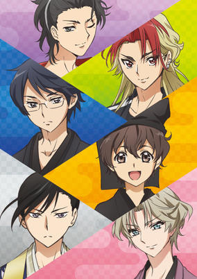

**Studio:** Studio Deen &nbsp;|&nbsp; **Episodes:** 12 &nbsp;|&nbsp; **Director:** Kazuhiro Yoneda &nbsp;|&nbsp; **Aired/Released:** 6 April – 22 June &nbsp;|&nbsp; **Genres:** School Life

> The series revolves around kabuki, a classic style of Japanese dance-drama that combines music, drama, and dance. Kurogo Kurusu, a 15-year-old high school student has a passion for kabuki and hopes to establish a kabuki club at school. Things are not easy as they seem when he realizes that he needs to find students to join him.
>
> _Synopsis source: Kitsu_

[Wikipedia](https://en.wikipedia.org/wiki/Kabukibu!) · [Kitsu](https://kitsu.io/anime/kabukibu)

---

### Love Tyrant

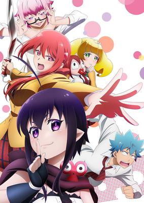

**Studio:** EMT Squared &nbsp;|&nbsp; **Episodes:** 12 &nbsp;|&nbsp; **Director:** Atsushi Nigorikawa &nbsp;|&nbsp; **Aired/Released:** 6 April – 22 June &nbsp;|&nbsp; **Genres:** Comedy, Fantasy, School Life, Romance

> A Kiss Note is a powerful notebook that makes anyone who has their name written together will instantly fall in love if they kiss each other regardless of any circumstances. This magical and very familiar item belongs to an angel named Guri whose job as cupid is to create couples. However, she accidentally writes down Aino Seiji, a regular high school student, and unless he kisses someone, Guri will die. She convinces Seiji to go kiss his crush, Hiyama Akane, the school's popular girl who turns out has even stronger feelings for him, bordering on obsessive and psychotic. Eventually Akane and Seiji come together but not before Guri decides that she likes Seiji as well. What seems awesome to most guys becomes hell for Seiji who just wants a normal relationship with girls.
>
> _Synopsis source: Kitsu_

[Wikipedia](https://en.wikipedia.org/wiki/Love_Tyrant) · [Kitsu](https://kitsu.io/anime/renai-boukun)

---

### Tsuki ga Kirei (Tsukigakirei)

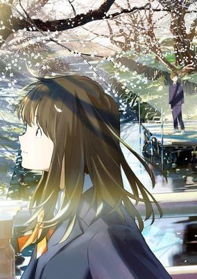

**Studio:** Feel &nbsp;|&nbsp; **Episodes:** 12 &nbsp;|&nbsp; **Director:** Seiji Kishi &nbsp;|&nbsp; **Aired/Released:** 6 April – 29 June &nbsp;|&nbsp; **Genres:** School Life, Romance

> Kotarou Azumi and Akane Mizuno became third year students at junior high school and are classmates for the first time. These two, along with fellow classmates, Chinatsu Nishio and Takumi Hira, relate to their peers through mutual understandings and feelings. As their final year at junior high school progresses, the group overcome their challenges to mature and become aware of changes in themselves.
>
> _Synopsis source: Kitsu_

[Wikipedia](https://en.wikipedia.org/wiki/Tsuki_ga_Kirei) · [Kitsu](https://kitsu.io/anime/tsuki-ga-kirei)

---

### Hinako Note

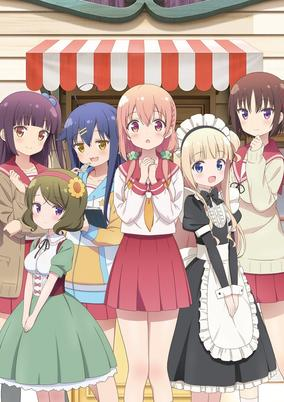

**Studio:** Passione &nbsp;|&nbsp; **Episodes:** 12 &nbsp;|&nbsp; **Director:** Takeo Takahashi Toru Kitahata &nbsp;|&nbsp; **Aired/Released:** 7 April – 23 June &nbsp;|&nbsp; **Genres:** Comedy, Slice of Life

> Hinako is a shy little girl whom animals are instinctively drawn to. Because of this, Hinako works as a scarecrow to keep said animals away from the crops in her neighbors fields. Thus the tale of the scarecrow girl begins!
>
> _Synopsis source: Kitsu_

[Wikipedia](https://en.wikipedia.org/wiki/Hinako_Note) · [Kitsu](https://kitsu.io/anime/hinako-note)

---

### Kado: The Right Answer

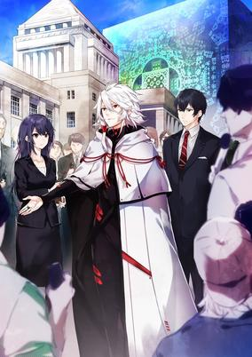

**Studio:** Toei Animation &nbsp;|&nbsp; **Episodes:** 12 &nbsp;|&nbsp; **Director:** Kazuya Murata &nbsp;|&nbsp; **Aired/Released:** 7 April – 30 June &nbsp;|&nbsp; **Genres:** Science Fiction

> Kojiro Shindo. Cabinet Office Director-General for Policy Planning, is at Haneda Airport for a business trip. While the plane is on the runway, a giant structure suddenly appears out of thin air. The plane carrying Shindo and 251 passengers is taken undamaged inside the giant structure. After everyone disembarks, a man who looks like an ordinary human being shows up. He assures those rom the plane that they're not in any danger. Shindo asks him to identify himself and explain the situation. Then the outside of the structure is displayed on a large screen, and at the same time, every passenger's cell phone starts ringing all at once. On each cell phone screen is a message from this man, to every one of Japan's citizens: "I, Yaha-kui zaShunina, hereby notify you that I am going to intervene in Japan's internal affairs." What is this young man's goal? And will Shindo manage to become an intermediary between Japan and the Anisotorons...?
>
> _Synopsis source: Kitsu_

[Kitsu](https://kitsu.io/anime/seikaisuru-kado)

---

### Rage of Bahamut: Virgin Soul (season 2) (Rage of Bahamut: Virgin Soul)

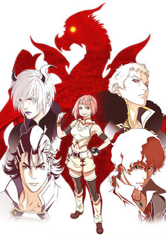

**Studio:** MAPPA &nbsp;|&nbsp; **Episodes:** 24 &nbsp;|&nbsp; **Director:** Keiichi Sato &nbsp;|&nbsp; **Aired/Released:** 7 April – 29 September &nbsp;|&nbsp; **Genres:** Magic, Demon, Action, Adventure, Fantasy

> This is the land of Mistarcia where gods and demons walk among mankind. It has been ten years since the world escaped oblivion from Bahamut's awakening. The new king of man has attacked the shrine of the gods and conquered the demon nation. Demons have been enslaved, and the power of the gods has waned. In a world losing its balance, mankind, gods, and demons clash to find justice.
>
> _Synopsis source: Kitsu_

[Kitsu](https://kitsu.io/anime/shingeki-no-bahamut-virgin-soul)

---

### Rilu Rilu Fairilu: Maho no Kagami

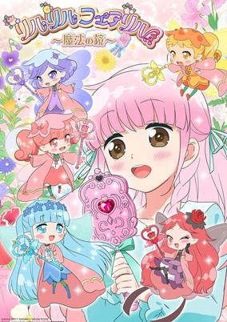

**Studio:** Studio Deen &nbsp;|&nbsp; **Episodes:** 51 &nbsp;|&nbsp; **Director:** Nana Imanaka Sakura Gojo &nbsp;|&nbsp; **Aired/Released:** 7 April – 30 March 2018 &nbsp;|&nbsp; **Genres:** Fantasy, Magic, Slice of Life

> Second season of Rilu Rilu Fairilu: Yousei no Door.
>
> _Synopsis source: Kitsu_

[Kitsu](https://kitsu.io/anime/rilu-rilu-fairilu-mahou-no-kagami)

---

### Twin Angel Break (Twin Angels BREAK)

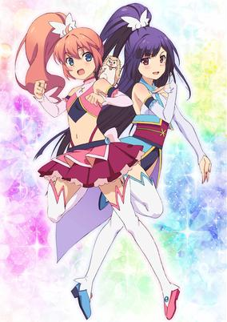

**Studio:** J.C.Staff &nbsp;|&nbsp; **Episodes:** 12 &nbsp;|&nbsp; **Director:** Yoshiaki Iwasaki &nbsp;|&nbsp; **Aired/Released:** 7 April – 23 June &nbsp;|&nbsp; **Genres:** Magic, Magical Girl

> New Kaitou Tenshi Twin Angel TV series.
>
> _Synopsis source: Kitsu_

[Wikipedia](https://en.wikipedia.org/wiki/Twin_Angel_Break) · [Kitsu](https://kitsu.io/anime/twin-angel-break)

---

### Eromanga Sensei

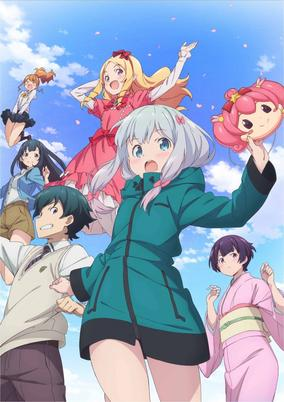

**Studio:** A-1 Pictures &nbsp;|&nbsp; **Episodes:** 12 &nbsp;|&nbsp; **Director:** Ryohei Takeshita &nbsp;|&nbsp; **Aired/Released:** 8 April – 24 June &nbsp;|&nbsp; **Genres:** Comedy, Romance, Ecchi

> The "new sibling romantic comedy" revolves around Masamune Izumi, a light novel author in high school. Masamune's little sister is Sagiri, a shut-in girl who hasn't left her room for an entire year. She even forces her brother to make and bring her meals when she stomps the floor. Masamune wants his sister to leave her room, because the two of them are each other's only family. Masamune's novel illustrator, pen name "Eromanga," draws extremely perverted drawings, and is very reliable. Masamune had never met his illustrator, and figured he was just a disgusting, perverted otaku. However, the truth is revealed... that his "Eromanga-sensei" is his own younger sister! To add to the chaos that erupts between the siblings, a beautiful, female, best-selling shoujo manga creator becomes their rival!
>
> _Synopsis source: Kitsu_

[Wikipedia](https://en.wikipedia.org/wiki/Eromanga_Sensei) · [Kitsu](https://kitsu.io/anime/eromanga-sensei)

---

### Re:Creators

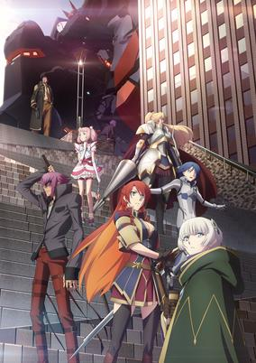

**Studio:** Troyca &nbsp;|&nbsp; **Episodes:** 22 &nbsp;|&nbsp; **Director:** Ei Aoki &nbsp;|&nbsp; **Aired/Released:** 8 April – 16 September &nbsp;|&nbsp; **Genres:** Action, Fantasy, Contemporary Fantasy, Japan, Battle Royale, Science Fiction

> Humans have created many stories. Joy, sadness, anger, deep emotion. Stories shake our emotions, and fascinate us. However, these are only the thoughts of bystanders. But what if the characters in the story have "intentions"? To them, are we god-like existences for bringing their story into the world? Our world is changed. Mete out punishment upon the realm of the gods. In Re:CREATORS, everyone becomes a Creator.
>
> _Synopsis source: Kitsu_

[Kitsu](https://kitsu.io/anime/re-creators)

---

### ID-0

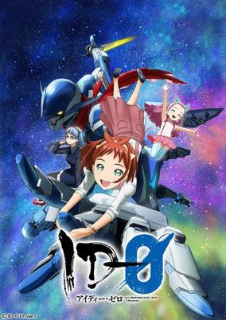

**Studio:** Sanzigen &nbsp;|&nbsp; **Episodes:** 12 &nbsp;|&nbsp; **Director:** Gorō Taniguchi &nbsp;|&nbsp; **Aired/Released:** 9 April – 25 June &nbsp;|&nbsp; **Genres:** Science Fiction, Mecha, Space, Space Travel

> I-Machines are the general term for robots that operate in extreme environments. While Alliance Academy student Maya Mikuri is in the middle of operating an I-Machine, she gets involved in an incident with pirates, and ends up serving as a crew member on an excavation company’s spaceship.
>
> _Synopsis source: Kitsu_

[Wikipedia](https://en.wikipedia.org/wiki/ID-0) · [Kitsu](https://kitsu.io/anime/id-0)

---

### The Eccentric Family (season 2)

**Studio:** P.A. Works &nbsp;|&nbsp; **Episodes:** 12 &nbsp;|&nbsp; **Director:** Masayuki Yoshihara &nbsp;|&nbsp; **Aired/Released:** 9 April – 25 June

[Wikipedia](https://en.wikipedia.org/wiki/The_Eccentric_Family)

---

### Grimoire of Zero

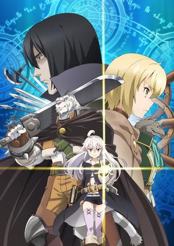

**Studio:** White Fox &nbsp;|&nbsp; **Episodes:** 12 &nbsp;|&nbsp; **Director:** Tetsuo Hirakawa &nbsp;|&nbsp; **Aired/Released:** 10 April – 26 June &nbsp;|&nbsp; **Genres:** Fantasy, Action, Drama

> Year 526 of the Liturgical Calendar. The world knew that witches existed, and that they practiced the notorious art of sorcery. Nevertheless, the world did not know anything about the study of magic. Our story follows a half-man, half-beast mercenary; humans mockingly call his kind the “fallen beasts”. He always dreamt of becoming a human, but one day, he met a witch who would change his life forever. “Do you desire a human form? Then be my escort, mercenary!” The witch introduced herself as “Zero”, and explained that she was searching for a one-of-a-kind magical tome that bandits had stolen from her lair. Entitled “The Book of Zero”, the grimoire supposedly contained valuable magical knowledge that could be used to effortlessly bring the world to its knees. Thus, in order to realize his dream of becoming a human, the mercenary must accompany Zero on her journey—despite her being one of the witches he so loathed. This is the story of a haughty sorceress and a kindhearted beast.
>
> _Synopsis source: Kitsu_

[Wikipedia](https://en.wikipedia.org/wiki/Grimoire_of_Zero) · [Kitsu](https://kitsu.io/anime/zero-kara-hajimeru-mahou-no-sho)

---

### Anonymous Noise

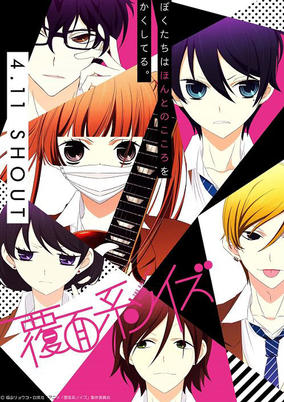

**Studio:** Brain's Base &nbsp;|&nbsp; **Episodes:** 12 &nbsp;|&nbsp; **Director:** Hideya Takahashi &nbsp;|&nbsp; **Aired/Released:** 11 April – 27 June &nbsp;|&nbsp; **Genres:** Music, Drama, Romance, Shoujo, The Arts, School Clubs, School Life, High School

> Nino, a girl who likes to sing, experienced two farewells in the past. First, with her first love, Momo, and second, with Yuzu, a boy who composes music. But upon those two farewells, she made a promise with each of them: to continue singing until they find her voice again. Time has passed, and now these three are in high school...?!
>
> _Synopsis source: Kitsu_

[Wikipedia](https://en.wikipedia.org/wiki/Anonymous_Noise) · [Kitsu](https://kitsu.io/anime/fukumenkei-noise)

---

### WorldEnd (WorldEnd: What Do You Do at the End of the World? Are You Busy? Will You Save Us?)

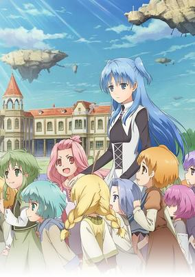

**Studio:** Satelight C2C &nbsp;|&nbsp; **Episodes:** 12 &nbsp;|&nbsp; **Aired/Released:** 11 April – 27 June &nbsp;|&nbsp; **Genres:** Science Fiction, Fantasy, Drama, Romance, Post Apocalypse, Juujin, Fantasy World, Magic, Floating Island, Plot Continuity

> The fleeting and sad story about little girls known as fairy weapons and an associate hero that survived. This is a world after it was attacked by unidentified monsters known as beasts and many of the species in the world, including humans, had been destroyed. The species that had managed to survived left the ground and were living on a floating island called Regal Ele. Willem Kumesh, wakes up above the clouds 500 years later and couldn’t protect the ones who he wanted to protect. Actually, he was living in despair because he was the only survivor.
>
> _Synopsis source: Kitsu_

[Wikipedia](https://en.wikipedia.org/wiki/WorldEnd) · [Kitsu](https://kitsu.io/anime/shuumatsu-nani-shitemasu-ka-isogashii-desu-ka-sukutte-moratte-ii-desu-ka)

---

### Kenka Bancho Otome: Girl Beats Boys (Kenka Bancho Otome -Girl Beats Boys-)

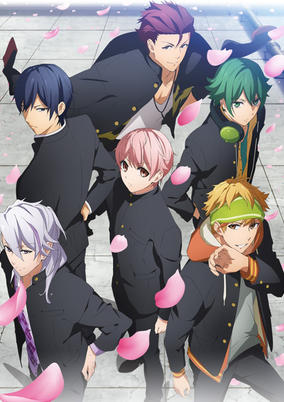

**Studio:** A-Real Project No.9 &nbsp;|&nbsp; **Episodes:** 12 &nbsp;|&nbsp; **Director:** Noriaki Saito &nbsp;|&nbsp; **Aired/Released:** 12 April – 28 June &nbsp;|&nbsp; **Genres:** School Life, Romance, Action

> Kenka Banchou Otome - Girl Beats Boys, Hinako Nakayama has spent all of her life being raised in state-run orphanages, without ever knowing her family. As she's about to enter high school, Hinako is approached by Hikaru, a boy who claims to be her twin brother. According to Hikaru, Hikaru and Hinako are the children of the head of the powerful Onigashima yakuza family, and Hikaru wants Hinako to switches places with him at Shishiku Academy, an all-boys school overrun with the nation's toughest delinquents. Can Hinako save her brother, find romance, and become the new boss of the school?
>
> _Synopsis source: Kitsu_

[Kitsu](https://kitsu.io/anime/kenka-banchou-otome-girl-beats-boys)

---

### Room Mate (One Room)

**Studio:** Typhoon Graphics &nbsp;|&nbsp; **Episodes:** 12 &nbsp;|&nbsp; **Aired/Released:** 12 April – 28 June &nbsp;|&nbsp; **Genres:** Slice of Life, Romance

> Series of shorts that tell stories of your relationship with "your" neighbor, younger sister, and childhood friend.
>
> _Synopsis source: Kitsu_

[Wikipedia](https://en.wikipedia.org/wiki/One_Room) · [Kitsu](https://kitsu.io/anime/one-room)

---

### Gamers!

**Studio:** Pine Jam &nbsp;|&nbsp; **Episodes:** 12 &nbsp;|&nbsp; **Director:** Manabu Okamoto &nbsp;|&nbsp; **Aired/Released:** 13 April – 28 September &nbsp;|&nbsp; **Genres:** Comedy, School Life, Romance

> This is a story that revolves around certain students and one hobby. Amano Keita is our lonely protagonist who has a passion for gaming and is friends with Uehara Tasuku, who is secretly a fellow gamer and is someone who believes his life is perfect. We also have Karen Tendou, the club president of the video games club and Chiaki Hoshinomori, who constantly bickers with Keita. This is a story filled with a non-stop sequence of comedy scenes and misunderstandings. Our chaotic romantic comedy now begins!
>
> _Synopsis source: Kitsu_

[Wikipedia](https://en.wikipedia.org/wiki/Gamers!) · [Kitsu](https://kitsu.io/anime/gamers)

---

### Saekano: How to Raise a Boring Girlfriend Flat (Saekano: How to Raise a Boring Girlfriend .flat)

**Studio:** A-1 Pictures &nbsp;|&nbsp; **Episodes:** 11 &nbsp;|&nbsp; **Director:** Kanta Kamei &nbsp;|&nbsp; **Aired/Released:** 14 April – 23 June &nbsp;|&nbsp; **Genres:** Comedy, School Life, Harem, Romance, Ecchi

> Second season of Saenai Heroine no Sodatekata.
>
> _Synopsis source: Kitsu_

[Kitsu](https://kitsu.io/anime/saenai-heroine-no-sodatekata-flat)

---

### Is It Wrong to Try to Pick Up Girls in a Dungeon?: Sword Oratoria (Sword Oratoria: Is it Wrong to Try to Pick Up Girls in a Dungeon? On the Side)

**Studio:** J.C.Staff &nbsp;|&nbsp; **Episodes:** 12 &nbsp;|&nbsp; **Director:** Yōhei Suzuki &nbsp;|&nbsp; **Aired/Released:** 14 April – 30 June &nbsp;|&nbsp; **Genres:** Comedy, Fantasy, Action, Adventure

> Sword princess Aiz Wallenstein. Today, once again, the strongest female swordsman heads to the giant labyrinth known as the "Dungeon" along with her allies. On the 50th floor where mysteries and threats such as a decayed dragon's corpse that crumbles to ash and an irregularity that creeps ever closer to the party loom, Aiz calls for the wind and heads deeper into the darkness of the Dungeon. Eventually, she finds herself meeting a boy for the first time. "Um, are you OK?" In the Labyrinth City of Orario, the contrasting stories of the boy and the girl intersect!
>
> _Synopsis source: Kitsu_

[Kitsu](https://kitsu.io/anime/dungeon-ni-deai-wo-motomeru-no-wa-machigatte-iru-darouka-gaiden-sword-oratoria)

---

### Seven Mortal Sins

**Studio:** Artland TNK &nbsp;|&nbsp; **Episodes:** 12 &nbsp;|&nbsp; **Director:** Kinji Yoshimoto &nbsp;|&nbsp; **Aired/Released:** 14 April – 29 July &nbsp;|&nbsp; **Genres:** Fantasy, Ecchi, Demon

> You, will you be a worshipper of the devil lords? These beautiful lords lead humans to the seven deadly sins: pride, envy, wrath, sloth, greed, gluttony, and lust. A revealing fantasy that craves to corruption and happiness starts now.
>
> _Synopsis source: Kitsu_

[Wikipedia](https://en.wikipedia.org/wiki/Seven_Mortal_Sins) · [Kitsu](https://kitsu.io/anime/sin-nanatsu-no-taizai)

---

### 100% Pascal-sensei

**Studio:** OLM &nbsp;|&nbsp; **Episodes:** 36 &nbsp;|&nbsp; **Director:** Yo Miura &nbsp;|&nbsp; **Aired/Released:** 15 April – 16 December &nbsp;|&nbsp; **Genres:** Comedy

> The story centers around an elementary school teacher who is so stupid that he cannot even write his own name. He does whatever he likes in his classroom. Plus, by all appearances, he is not human.
>
> _Synopsis source: Kitsu_

[Wikipedia](https://en.wikipedia.org/wiki/100%25_Pascal-sensei) · [Kitsu](https://kitsu.io/anime/100-pascal-sensei)

---

### Atom: The Beginning

**Studio:** OLM Production I.G Signal.MD &nbsp;|&nbsp; **Episodes:** 12 &nbsp;|&nbsp; **Director:** Katsuyuki Motohiro Tatsuo Satō &nbsp;|&nbsp; **Aired/Released:** 15 April – 8 July &nbsp;|&nbsp; **Genres:** Science Fiction, Mecha, Action

> With no investor funding, Umatarou Tenma and Hiroshi Ochanomizu must turn to odd jobs to fund their project: to build a humanoid robot that thinks and feels like a human being. When the two geniuses succeed in building A106, they start experimenting with his emotional capabilities right away. As they test to see if they truly can build a sentient robot, one question remains: will this robot become a god or a friend?
>
> _Synopsis source: Kitsu_

[Kitsu](https://kitsu.io/anime/atom-the-beginning)

---

### PriPri Chi-chan!!

**Studio:** OLM, Inc. &nbsp;|&nbsp; **Episodes:** 36 &nbsp;|&nbsp; **Director:** Takahiro Ikezoe &nbsp;|&nbsp; **Aired/Released:** 15 April – 16 December &nbsp;|&nbsp; **Genres:** Comedy, Science Fiction

> The story revolves around a girl named Yuuka, who encounters a being from the depths of the Earth named Chii-chan (a pun of chiteijin, the Japanese word for underground-dweller), and an alien named Ucchan (a pun of uchuujin or alien). The story follows their heartwarming and chaotic everyday lives together.
>
> _Synopsis source: Kitsu_

[Wikipedia](https://en.wikipedia.org/wiki/PriPri_Chi-chan!!) · [Kitsu](https://kitsu.io/anime/puripuri-chii-chan)

---

### Tomica Hyper Rescue Drive Head Kidō Kyūkyū Keisatsu

**Studio:** OLM Xebec &nbsp;|&nbsp; **Episodes:** 37 &nbsp;|&nbsp; **Director:** Takao Kato &nbsp;|&nbsp; **Aired/Released:** 15 April – 23 December &nbsp;|&nbsp; **Genres:** Science Fiction, Cops, Mecha, Adventure

> The story is set in "the future, just a little after the present day…. To respond to disasters beyond human comprehension and the increasing complexity of crime and mishaps, the mobile emergency police Hyper Rescue (an organization newly formed by the government primarily for life-saving) developed 'Drive Heads' that are specialized with police, fire-fighting, and rescue capabilities. "'Drive Heads' are special vehicles that change from car forms to humanoid walker vehicles. The grade schooler Gou Kurumada and other children found to be suitable become drivers and join forces with the mobile emergency police and other adults. Even now, they race to the scene to protect the peace and security of all humanity. Go Rescue!"
>
> _Synopsis source: Kitsu_

[Wikipedia](https://en.wikipedia.org/wiki/Tomica_Hyper_Rescue_Drive_Head_Kid%C5%8D_Ky%C5%ABky%C5%AB_Keisatsu) · [Kitsu](https://kitsu.io/anime/tomica-hyper-rescue-drive-head-kidou-kyuukyuu-keisatsu)

---

### Yu-Gi-Oh! VRAINS

**Studio:** Gallop &nbsp;|&nbsp; **Episodes:** 120 &nbsp;|&nbsp; **Director:** Masahiro Hosoda Katsuya Asano &nbsp;|&nbsp; **Aired/Released:** 10 May – 25 September 2019 &nbsp;|&nbsp; **Genres:** Virtual Reality, Fantasy, Action, Friendship, Card Games, Science Fiction, Shounen

> There is a city where network systems have evolved: Den City. In this city, with the advanced network technology developed by the corporation “SOL Technology”, a Virtual Reality space called “LINK VRAINS” has been developed, and in this VR Space people became excited over the latest way to Duel. However, in LINK VRAINS, a mysterious hacker group that hacks via Dueling has appeared: The Knights of Hanoi. Their goal is to destroy the “AI World” known as “Cyberse” that exists somewhere in the depths of the Network. However, there is one Duelist who stands against the threat to LINK VRAINS. His name is “Playmaker”. He has become famous in the Network World for crushing the “Knights of Hanoi” in fierce Duels, without mentioning his name. But the true identity of “Playmaker” is ordinary high school student “Fujiki Yusaku”, who pursues the “Knights of Hanoi” that appear in VRAINS in order to find out the truth of an incident that happened in the past.
>
> _Synopsis source: Kitsu_

[Wikipedia](https://en.wikipedia.org/wiki/Yu-Gi-Oh!_VRAINS) · [Kitsu](https://kitsu.io/anime/yu-gi-oh-vrains)

---

### Hina Logi: From Luck & Logic (Luck & Logic)

**Studio:** Doga Kobo &nbsp;|&nbsp; **Episodes:** 12 &nbsp;|&nbsp; **Director:** Hiroaki Akagi &nbsp;|&nbsp; **Aired/Released:** 1 July – 23 September &nbsp;|&nbsp; **Genres:** Fantasy, Deity, Action, Japan, Asia, Earth

> In the year L.C. 922, mankind faces an unprecedented crisis. Following the conclusion of a hundred-year war on the mythical world of Tetraheaven, the losing Majins sought a safe haven and invaded the human world Septpia. The government is forced to fight by employing Logicalists belonging to ALCA, a special police that protects the streets from foreigners of another world. Logicalists are given a special power that allows them to enter a trance with Goddesses from the other world. One day, Yoshichika Tsurugi, a civilian who is lacking "Logic" and lives peacefully with his family, meets the beautiful goddess Athena while helping people escape from a Majin attack. She wields the "Logic" that Yoshichika should have lost. This leads Yoshichika to an unexpected destiny with Athena. The future of the world depends on the "Luck" and "Logic" and these Logicalists.
>
> _Synopsis source: Kitsu_

[Wikipedia](https://en.wikipedia.org/wiki/Luck_%26_Logic) · [Kitsu](https://kitsu.io/anime/luck-logic)

---

### Kakegurui – Compulsive Gambler (Kakegurui: Compulsive Gambler)

**Studio:** MAPPA &nbsp;|&nbsp; **Episodes:** 12 &nbsp;|&nbsp; **Director:** Yuichiro Hayashi &nbsp;|&nbsp; **Aired/Released:** 1 July – 23 September &nbsp;|&nbsp; **Genres:** School Life, Psychological, Card Games, Mystery

> Hyakkaou Private Academy. An institution for the privileged with a very peculiar curriculum. You see, when you're the sons and daughters of the wealthiest of the wealthy, it's not athletic prowess or book smarts that keep you ahead. It's reading your opponent, the art of the deal. What better way to hone those skills than with a rigorous curriculum of gambling? At Hyakkaou Private Academy, the winners live like kings, and the losers are put through the wringer. But when Yumeko Jabami enrolls, she's gonna teach these kids what a high roller really looks like!
>
> _Synopsis source: Kitsu_

[Wikipedia](https://en.wikipedia.org/wiki/Kakegurui_%E2%80%93_Compulsive_Gambler) · [Kitsu](https://kitsu.io/anime/kakegurui)

---

### Katsugeki/Touken Ranbu (Katsugeki TOUKEN RANBU)

**Studio:** Ufotable &nbsp;|&nbsp; **Episodes:** 13 &nbsp;|&nbsp; **Director:** Toshiyuki Shirai &nbsp;|&nbsp; **Aired/Released:** 1 July – 23 September &nbsp;|&nbsp; **Genres:** Fantasy, Action

> The year is 1863 as the tumultuous samurai era is coming to an end, Japan is split between the pro-shogunate and anti-shogunate factions. The fate of the world is threatened as an army of historical revisionists are sent from the future to alter the course of history. In order to bring these forces down and protect the real history, two sword warriors, spirits who are swords brought to life by Saniwa (sage), rush to Edo. The polite and thoughtful Horikawa Kunihiro and the short tempered yet skillful Izuminokami Kanesada, who served the same master, confront the invading army along with a lively gang of other warriors including Mutsunokami Yoshiyuki, Yagen Toushirou, Tombokiri, and Tsurumaru Kuninaga. As the fate of history lies in these hero’s hands, what meets the blade is yet to be uncovered…
>
> _Synopsis source: Kitsu_

[Wikipedia](https://en.wikipedia.org/wiki/Katsugeki/Touken_Ranbu) · [Kitsu](https://kitsu.io/anime/katsugeki-touken-ranbu)

---

### Senki Zesshō Symphogear AXZ

**Studio:** Satelight &nbsp;|&nbsp; **Episodes:** 13 &nbsp;|&nbsp; **Director:** Katsumi Ono &nbsp;|&nbsp; **Aired/Released:** 1 July – 30 September &nbsp;|&nbsp; **Genres:** Science Fiction, Music, Action

> Fourth series of Senki Zesshou Symphogear.
>
> _Synopsis source: Kitsu_

[Wikipedia](https://en.wikipedia.org/wiki/Senki_Zessh%C5%8D_Symphogear_AXZ) · [Kitsu](https://kitsu.io/anime/senki-zesshou-symphogear-axz-by-shedding-many-tears-the-reality-you-face-is)

---

### Battle Girl High School

**Studio:** Silver Link &nbsp;|&nbsp; **Episodes:** 12 &nbsp;|&nbsp; **Director:** Noriaki Akitaya &nbsp;|&nbsp; **Aired/Released:** 2 July – 17 September &nbsp;|&nbsp; **Genres:** Science Fiction, School Life, Action

> Based on COLOPL's school action role-playing game. Set in the year 2045. The world has been contaminated by Irousu (mysterious invaders who suddenly appeared), and humans find themselves restricted and contained. Standing boldly against these invaders are ordinary girls everywhere, without a powerful army or even weapons. The Shinjugammine Girls Academy is a school for these "Hoshimori" (Star Guardians) destined to fight the Irousu. The player is assigned to this academy to train the girls and take back the contaminated Earth. And so, once again, the chimes echo through the sun-strewn schoolyard to mark the beginning of classes today…
>
> _Synopsis source: Kitsu_

[Wikipedia](https://en.wikipedia.org/wiki/Battle_Girl_High_School) · [Kitsu](https://kitsu.io/anime/battle-girl-high-school)

---

### Clean Freak! Aoyama kun (Clean Freak! Aoyama-kun)

**Studio:** Studio Hibari &nbsp;|&nbsp; **Episodes:** 12 &nbsp;|&nbsp; **Director:** Kazuya Ichikawa &nbsp;|&nbsp; **Aired/Released:** 2 July – 17 September &nbsp;|&nbsp; **Genres:** Comedy, Sports, Soccer

> The handsome young soccer genius named Aoyama is a Japan representative. His play style is "cleanliness." He doesn't tackle and doesn't head the ball. If he's doing a throw-in, he'll only do it if he's wearing gloves.
>
> _Synopsis source: Kitsu_

[Wikipedia](https://en.wikipedia.org/wiki/Clean_Freak!_Aoyama_kun) · [Kitsu](https://kitsu.io/anime/keppeki-danshi-aoyama-kun)

---

### Fate/Apocrypha

**Studio:** A-1 Pictures &nbsp;|&nbsp; **Episodes:** 25 &nbsp;|&nbsp; **Director:** Yoshiyuki Asai &nbsp;|&nbsp; **Aired/Released:** 2 July – 30 December &nbsp;|&nbsp; **Genres:** Contemporary Fantasy, Adventure, Battle Royale, Europe, Fantasy, Magic, Historical, Drama, Action

> There was once a Holy Grail War waged by seven Mages and Heroic Spirits in a town called Fuyuki. However, a certain Mage took advantage of the chaos of World War II to steal a Holy Grail. Several decades have passed, and the Yggdmillennia family, who took upon the Holy Grail as its symbol, defected from the Mages' Association and declared their independence. Furious, the Association sent a force to deal with the Yggdmillennia, but they were defeated by the summoned Servants. With the Holy Grail War system changed, war with seven versus seven, breaks out. And so, the curtain rises on the epoch-making Great Holy Grail War.
>
> _Synopsis source: Kitsu_

[Wikipedia](https://en.wikipedia.org/wiki/Fate/Apocrypha) · [Kitsu](https://kitsu.io/anime/fate-apocrypha)

---

### Knight's & Magic (Knight’s & Magic)

**Studio:** 8-Bit &nbsp;|&nbsp; **Episodes:** 13 &nbsp;|&nbsp; **Director:** Yusuke Yamamoto &nbsp;|&nbsp; **Aired/Released:** 2 July – 24 September &nbsp;|&nbsp; **Genres:** Magic, School Life, Fantasy, Action, Isekai, Mecha

> A genius programmer and hardcore robot otaku is reborn into a world of knights and magic, where huge robots called Silhouette Knights roar across the land! Now reborn as Ernesti Echevalier, he uses his vast knowledge of machines and programming talents to begin to make his ultimate robot. But his actions have unexpected results...?! The dreams of a robot otaku will change the world!
>
> _Synopsis source: Kitsu_

[Wikipedia](https://en.wikipedia.org/wiki/Knight%27s_%26_Magic) · [Kitsu](https://kitsu.io/anime/knights-and-magic)

---

### Elegant Yokai Apartment Life

**Studio:** Shin-Ei Animation &nbsp;|&nbsp; **Episodes:** 26 &nbsp;|&nbsp; **Director:** Mitsuo Hashimoto &nbsp;|&nbsp; **Aired/Released:** 3 July – 25 December &nbsp;|&nbsp; **Genres:** Slice of Life, Contemporary Fantasy, Mystery

> Inaba Yuushi's parents died in his first year of middle school, and he moved in with his relatives. Though they did care for him, he could tell he was a burden. After he graduated, he happily prepared to move to a high school with a dormitory. Unfortunately, the dormitory burned to the ground before he could move in! Yuushi doesn't want to live with his grudging relatives, but it's rough finding lodging as an orphaned student with little money. He finally finds a room in a nice old building which seems too good to be true. The catch is that it is a Monster House, a place where humans and supernatural creatures—ghosts, mononoke, etc.—live together. Another high schooler lives there, a cute girl named Akine, and she's completely unfazed by the monsters. In fact, she can even exorcise evil spirits! Yuushi's high school life just got much stranger than he ever bargained for!
>
> _Synopsis source: Kitsu_

[Wikipedia](https://en.wikipedia.org/wiki/Elegant_Yokai_Apartment_Life) · [Kitsu](https://kitsu.io/anime/youkai-apartment-no-yuuga-na-nichijou)

---

### Restaurant to Another World

**Studio:** Silver Link &nbsp;|&nbsp; **Episodes:** 12 &nbsp;|&nbsp; **Director:** Masato Jinbo &nbsp;|&nbsp; **Aired/Released:** 3 July – 18 September &nbsp;|&nbsp; **Genres:** Comedy, Fantasy, Fantasy World, Cooking, Mystery

> At the bottom floor of the building with a dog signboard, in the shopping district near the office street, there lies a cafeteria called "Youshoku no Nekoya," that has an illustration of a cat on the door. It's been open for fifty years and has satisfied various salarymen from nearby offices. Despite it being called a Western cuisine cafeteria, it also provides other varieties of menus. For the people of this certain world, it's their one-and-only special cafeteria. There is, however, one secret to "Nekoya." The cafeteria is closed to the public every Saturday in order to make way for special guests. When a bell rings, customers from different places of birth and races appear who ask for mysterious and delicious dishes. They are actually the same dishes served to the salarymen, but these special guests find them to be more exotic than to what they are used to. As the cafeteria aims to serve masterpieces, it is usually referred as "Isekai Shokudou." And so, the bell rings again this week.
>
> _Synopsis source: Kitsu_

[Wikipedia](https://en.wikipedia.org/wiki/Restaurant_to_Another_World) · [Kitsu](https://kitsu.io/anime/isekai-shokudou)

---

### Aho-Girl

**Studio:** Diomedéa &nbsp;|&nbsp; **Episodes:** 12 &nbsp;|&nbsp; **Director:** Keizō Kusakawa Shingo Tamaki &nbsp;|&nbsp; **Aired/Released:** 4 July – 19 September &nbsp;|&nbsp; **Genres:** Comedy, School Life, Romance, Ecchi

> She is Hanabatake Yoshiko, and she's an idiot through and through. She loves bananas, and she loves her childhood friend Akkun. That is all! Summer 2017, Aho Girl gets its long-awaited anime! Watching it will surely cheer you up, probably?
>
> _Synopsis source: Kitsu_

[Wikipedia](https://en.wikipedia.org/wiki/Aho-Girl) · [Kitsu](https://kitsu.io/anime/aho-girl)

---

### Love and Lies

**Studio:** Liden Films &nbsp;|&nbsp; **Episodes:** 12 &nbsp;|&nbsp; **Director:** Seiki Takuno &nbsp;|&nbsp; **Aired/Released:** 4 July – 19 September &nbsp;|&nbsp; **Genres:** School Life, Drama, Romance

> Lies are forbidden and love is doubly forbidden. In the near future, when young people in Japan turn sixteen, they are assigned a marriage partner by the government. People don't have to go through the trouble of looking for someone, and everyone accepts that the country will find a compatible partner to make them happy. Yukari Nejima is fifteen years old. He lives in a small corner of the country, and just can't seem to get ahead in life. Both academically and athletically he's below average. But within him, he hides a heart burning with passion! In this world in which love is forbidden, what will happen to him when he falls in love?
>
> _Synopsis source: Kitsu_

[Wikipedia](https://en.wikipedia.org/wiki/Love_and_Lies_(manga)) · [Kitsu](https://kitsu.io/anime/koi-to-uso)

---

### Nana Maru San Batsu (Fastest Finger First)

**Studio:** TMS Entertainment &nbsp;|&nbsp; **Episodes:** 12 &nbsp;|&nbsp; **Director:** Masaki Ōzora &nbsp;|&nbsp; **Aired/Released:** 4 July – 19 September &nbsp;|&nbsp; **Genres:** School Life, School Clubs

> Bunzou High School is welcoming its new first-year students. One of them, Koshiyama Shiki, is chosen to participate against his will in an impromptu fast-buzzing quiz meet by the president of the Quiz Bowl Circle. As a quiet boy who loves reading and doesn't want to stand out, Shiki is overwhelmed, but his classmate, Fukami Mari, is able to hit the buzzer and answer questions before the full question is given. As he watches her, Shiki realizes that there's a point in each question where the answer becomes certain.
>
> _Synopsis source: Kitsu_

[Wikipedia](https://en.wikipedia.org/wiki/Nana_Maru_San_Batsu) · [Kitsu](https://kitsu.io/anime/nana-maru-san-batsu)

---

### Tsuredure Children

**Studio:** Studio Gokumi &nbsp;|&nbsp; **Episodes:** 12 &nbsp;|&nbsp; **Director:** Hiraku Kaneko &nbsp;|&nbsp; **Aired/Released:** 4 July – 19 September &nbsp;|&nbsp; **Genres:** Comedy, School Life, Romance

> To those of you out there who never could say "I love you"— This story is about ordinary high schoolers and how love makes them fired up, shaken, laugh, cry, and hurt. Whether things go well or not, this story of adolescence and romance will show you how they spend their precious youth. Every character is the main character here, and you're sure to find one you can sympathize with.
>
> _Synopsis source: Kitsu_

[Wikipedia](https://en.wikipedia.org/wiki/Tsuredure_Children) · [Kitsu](https://kitsu.io/anime/tsurezure-children)

---

### NTR: Netsuzou Trap (Netsuzou Trap -NTR-)

**Studio:** Creators in Pack &nbsp;|&nbsp; **Episodes:** 12 &nbsp;|&nbsp; **Director:** Hisayoshi Hirasawa &nbsp;|&nbsp; **Aired/Released:** 5 July – 20 September &nbsp;|&nbsp; **Genres:** Shoujo Ai

> Yuma and Hotaru have been friends since childhood, so it's only natural that when Yuma is nervous about her new boyfriend, she asks Hotaru for advice. But when Hotaru starts coming onto Yuma for what feels like more than just 'practice', what does it mean...? With boyfriends in the foreground but a secret, passionate tryst in the background, will Yuma and Hotaru try to forget what happened between them or have they fallen into a trap of true love and betrayal?
>
> _Synopsis source: Kitsu_

[Kitsu](https://kitsu.io/anime/netsuzou-trap)

---

### Saiyuki Reload Blast

**Studio:** Platinum Vision &nbsp;|&nbsp; **Episodes:** 12 &nbsp;|&nbsp; **Director:** Hideaki Nakano &nbsp;|&nbsp; **Aired/Released:** 5 July – 20 September

[Wikipedia](https://en.wikipedia.org/wiki/Saiyuki_(manga))

---

### Convenience Store Boy Friends (Convenience Store Boyfriends)

**Studio:** Pierrot &nbsp;|&nbsp; **Episodes:** 12 &nbsp;|&nbsp; **Director:** Hayato Date &nbsp;|&nbsp; **Aired/Released:** 6 July – 28 September &nbsp;|&nbsp; **Genres:** Slice of Life

> It is spring, right around the time when new students start getting used to their school lives. First year high school students Haruki Mishima and Tōre Honda are looking forward to their new school life. Meanwhile Nasa Sanagi, sole member of the cooking research club, continues with his club activities from middle school, striving to work on the theme that his adviser laid out for him. Second year student Natsu Asumi, although he matured a little since the height of his impudence during his first year, has nevertheless chosen to remain alone this year. Third year students Mikado Nakajima and Masamuna Sakurakoji watch over him with a smile. All of them will pay the nearby convenience store a visit after school. Each of the students goes there for different reasons: to eat ice cream after club activities at school, to get the latest issue of this week's game magazine, to purchase ingredients for cooking, to meet friends, or to stock up on their favorite bread or chocolate drink. The convenience store becomes the place they can meet, relax, and make small memories. Starting now, the reasons they will go to the convenience store will slowly begin to change.
>
> _Synopsis source: Kitsu_

[Wikipedia](https://en.wikipedia.org/wiki/Convenience_Store_Boy_Friends) · [Kitsu](https://kitsu.io/anime/konbini-kareshi)

---

### Dive!! (Free! Dive to the Future)

**Studio:** Zero-G &nbsp;|&nbsp; **Episodes:** 12 &nbsp;|&nbsp; **Director:** Kaoru Suzuki &nbsp;|&nbsp; **Aired/Released:** 6 July – 21 September &nbsp;|&nbsp; **Genres:** School Life, Sports, University, Bishounen

> In the new series, Haruka, who is attending college in Tokyo, meets Asahi again and reawakens his memories from his middle school years, including those of Ikuya. Makoto is working toward a new dream while he is in Tokyo together with Haruka. Rin has an unexpected meeting in Sydney. As they await their new futures, will they see a new fight ahead? Or will they instead confront the past they left behind?
>
> _Synopsis source: Kitsu_

[Wikipedia](https://en.wikipedia.org/wiki/Dive!!) · [Kitsu](https://kitsu.io/anime/free-dive-to-the-future)

---

### 18if

**Studio:** Gonzo &nbsp;|&nbsp; **Episodes:** 13 &nbsp;|&nbsp; **Director:** Kōji Morimoto &nbsp;|&nbsp; **Aired/Released:** 7 July – 29 September &nbsp;|&nbsp; **Genres:** Fantasy, Adventure

> After going to sleep like normal, Tsukishiro Haruto wakes up to discover something unbelievable—he's stuck in dream world! Here, witches plague the dreamscape and are more than dreamy figments—they're the trapped souls of young women who've rejected reality and are afflicted by the "Sleeping Beauty Syndrome." As he searches for a way out, Haruto will face the witches and their terrifying powers.
>
> _Synopsis source: Kitsu_

[Wikipedia](https://en.wikipedia.org/wiki/18if) · [Kitsu](https://kitsu.io/anime/18-if)

---

### Action Heroine Cheer Fruits

**Studio:** Diomedéa &nbsp;|&nbsp; **Episodes:** 12 &nbsp;|&nbsp; **Director:** Keizō Kusakawa &nbsp;|&nbsp; **Aired/Released:** 7 July – 29 September &nbsp;|&nbsp; **Genres:** School Life, Slice of Life, Comedy

> The "local heroine fighter" of a certain city became popular and a national star. Because of this, "local heroines" debuted in various other places, and their action live events became a hit trend nationally. In Hinano City, high school girl Misaki Shirogane and other girls become local heroines (at the urging of Misaki's aunt, the prefectural governor) and vow to produce action live events.
>
> _Synopsis source: Kitsu_

[Wikipedia](https://en.wikipedia.org/wiki/Action_Heroine_Cheer_Fruits) · [Kitsu](https://kitsu.io/anime/action-heroine-cheer-fruits)

---

### Altair: A Record of Battles

**Studio:** MAPPA &nbsp;|&nbsp; **Episodes:** 24 &nbsp;|&nbsp; **Director:** Kazuhiro Furuhashi &nbsp;|&nbsp; **Aired/Released:** 7 July – 22 December &nbsp;|&nbsp; **Genres:** Historical, Fantasy, Drama, Adventure

> Tughril Mahmut is a young pasha serving on the Divan of the Ottoman Stratocracy. The clouds of war are gathering over his country due to the threat of an agressive Empire. With the Divan split between warmongers and the pacifists, Mahmut begins his quest to keep the peace at any cost. As he finds himself deeper and deeper in the politics of the ancient world, new enemies and allies surface. Who will prevail? What will Mahmut do if war proves to be inevitable?
>
> _Synopsis source: Kitsu_

[Kitsu](https://kitsu.io/anime/shoukoku-no-altair)

---

### Chronos Ruler

**Studio:** Project No.9 &nbsp;|&nbsp; **Episodes:** 13 &nbsp;|&nbsp; **Director:** Masato Matsune &nbsp;|&nbsp; **Aired/Released:** 7 July – 29 September &nbsp;|&nbsp; **Genres:** Fantasy, Action, Demon

> The story centers on "Chronos Rulers," those who fight the time-eating demons that appear when people wish they could turn back time. The Chronos Rulers fight a time-manipulation battle against these demons.
>
> _Synopsis source: Kitsu_

[Wikipedia](https://en.wikipedia.org/wiki/Chronos_Ruler) · [Kitsu](https://kitsu.io/anime/jikan-no-shihaisha)

---

### Made in Abyss

**Studio:** Kinema Citrus &nbsp;|&nbsp; **Episodes:** 13 &nbsp;|&nbsp; **Director:** Masayuki Kojima &nbsp;|&nbsp; **Aired/Released:** 7 July – 29 September &nbsp;|&nbsp; **Genres:** Science Fiction, Fantasy, Drama, Adventure, Dark Fantasy, Psychological, Android, Human Enhancement

> The enormous cave system, known as the Abyss, is the only unexplored place in the world. Nobody knows how deep down goes this titanic pit, inhabited by strange and wondrous creatures and full of mysterious ancient relics which purpose in unknown to modern man. Generations of bold adventurers have been drawn by the cryptic depths of the Abyss. In course of time those bold enough to explore the dangerous pit came to be known as "Cave Raiders." In Oosu, the town at the edge of the Abyss, there lives a little orphan named Rico, who dreams of becoming as great a cave raider as her mother was and solving the great mystery of the pit. One day exploring the murky depths she stumbles upon a little boy, who turns out to be a robot...
>
> _Synopsis source: Kitsu_

[Wikipedia](https://en.wikipedia.org/wiki/Made_in_Abyss) · [Kitsu](https://kitsu.io/anime/made-in-abyss)

---

### Vatican Miracle Examiner

**Studio:** J.C.Staff &nbsp;|&nbsp; **Episodes:** 12 &nbsp;|&nbsp; **Director:** Yoshitomo Yonetani &nbsp;|&nbsp; **Aired/Released:** 7 July – 22 September &nbsp;|&nbsp; **Genres:** Supernatural, Mystery, Drama, Religion

> Vatican City—Holy Land of the Catholics. Amidst the land, there is an organization that conducts rigorous investigations on "claims of miracles" from all over the world to ascertain their credibility. The organization is referred to as "Seito no Za" (Assembly of Saints) and the priests that belong there are called miracle investigators. Robert Nicholas, an ancient archive and cryptanalysis expert is partnered and good friends with Hiraga Josef Kou, a genius scientist. Together, the brilliant duo investigates the "miracles" and uncovers the incidents and conspiracies hidden behind them.
>
> _Synopsis source: Kitsu_

[Wikipedia](https://en.wikipedia.org/wiki/Vatican_Miracle_Examiner) · [Kitsu](https://kitsu.io/anime/vatican-kiseki-chosakan)

---

### Hitorijime My Hero

**Studio:** Encourage Films &nbsp;|&nbsp; **Episodes:** 12 &nbsp;|&nbsp; **Director:** Yukina Hiiro &nbsp;|&nbsp; **Aired/Released:** 8 July – 23 September &nbsp;|&nbsp; **Genres:** School Life, Slice of Life, Shounen Ai, Yaoi

> Story involving Kensuke's brother, Ooshiba Kousuke and friend, Setagawa Masahiro from Hitorijime Boyfriend.
>
> _Synopsis source: Kitsu_

[Wikipedia](https://en.wikipedia.org/wiki/Hitorijime_My_Hero) · [Kitsu](https://kitsu.io/anime/hitorijime-my-hero)

---

### Welcome to the Ballroom

**Studio:** Production I.G &nbsp;|&nbsp; **Episodes:** 24 &nbsp;|&nbsp; **Director:** Yoshimi Itazu &nbsp;|&nbsp; **Aired/Released:** 8 July – 17 December &nbsp;|&nbsp; **Genres:** Comedy, Sports, School Life, Romance, The Arts

> Fujita has drifted through middle school aimlessly, unable to find friends or anything that can hold his attention. Then, one day, he's attacked by a gang and saved by a mysterious man. But this isn't a karate master; it's a ballroom dance instructor! Reluctantly, Fujita takes a few beginner's classes, only to find his inspiration... an entrancing, teenage dance prodigy named Shizuku. It's Fujita's first step into the high-octane world of competitive dance!
>
> _Synopsis source: Kitsu_

[Wikipedia](https://en.wikipedia.org/wiki/Welcome_to_the_Ballroom) · [Kitsu](https://kitsu.io/anime/ballroom-e-youkoso)

---

### A Centaur's Life

**Studio:** Haoliners Animation League &nbsp;|&nbsp; **Episodes:** 12 &nbsp;|&nbsp; **Director:** Fumitoshi Oizaki Naoyuki Konno &nbsp;|&nbsp; **Aired/Released:** 9 July – 24 September &nbsp;|&nbsp; **Genres:** Comedy, Slice of Life, Contemporary Fantasy, Juujin, Fantasy

> Himeno is a sweet, shy little centaur girl. In her world, everyone seems to be a supernatural creature, and all her classmates have some kind of horns, wings, tails, halos, or other visible supernatural body part. Despite their supernatural elements, Himeno and her best friends, Nozomi and Kyoko, have a fun and mostly normal daily school life!
>
> _Synopsis source: Kitsu_

[Wikipedia](https://en.wikipedia.org/wiki/A_Centaur%27s_Life) · [Kitsu](https://kitsu.io/anime/centaur-no-nayami)

---

### Princess Principal

**Studio:** Studio 3Hz Actas &nbsp;|&nbsp; **Episodes:** 12 &nbsp;|&nbsp; **Director:** Masaki Tachibana &nbsp;|&nbsp; **Aired/Released:** 9 July – 24 September &nbsp;|&nbsp; **Genres:** Action, Steampunk, United Kingdom, Mystery, Alternative Past, Special Squads

> At the end of the 19th century, London, the Kingdom of Albion has been split into East and West sides by a giant wall. Five girls attend Queen's Mayfaire, a conventional and prestigious school. Under the guise of regular high school girls, they act as spies undercover. Disguise, reconnaissance, infiltration, car chases... Each girl uses their own set of special skills to dart around the world of shadow.
>
> _Synopsis source: Kitsu_

[Wikipedia](https://en.wikipedia.org/wiki/Princess_Principal) · [Kitsu](https://kitsu.io/anime/princess-principal)

---

### Angel's 3Piece!

**Studio:** Project No.9 &nbsp;|&nbsp; **Episodes:** 12 &nbsp;|&nbsp; **Director:** Shinsuke Yanagi &nbsp;|&nbsp; **Aired/Released:** 10 July – 25 September &nbsp;|&nbsp; **Genres:** School Life, Music, Slice of Life, Musical Band

> Kyou Nukui is a first year high school student hikikomori. His hobby is making Vocaloid songs and uploading them online. One day, he receives a message from a fan asking if they could meet up with him. At the meeting place, three elementary school girls were waiting for him. The three of them want to form a band and ask for Kyou's help.
>
> _Synopsis source: Kitsu_

[Wikipedia](https://en.wikipedia.org/wiki/Angel%27s_3Piece!) · [Kitsu](https://kitsu.io/anime/tenshi-no-3p)

---

### In Another World With My Smartphone

**Studio:** Production Reed &nbsp;|&nbsp; **Episodes:** 12 &nbsp;|&nbsp; **Director:** Takeyuki Yanase &nbsp;|&nbsp; **Aired/Released:** 11 July – 26 September &nbsp;|&nbsp; **Genres:** Comedy, Harem, Fantasy, Romance, Adventure, Isekai

> When Touya Mochizuki is accidentally struck by lightning and killed, God apologizes by reviving him into a fantasy world and granting him one wish. Touya’s request? To keep his smartphone in the next world. In his second chance at life, Touya befriends many important figures, inherits the legacy of an ancient civilization, and travels around with incredible power and a harem of girls!
>
> _Synopsis source: Kitsu_

[Wikipedia](https://en.wikipedia.org/wiki/In_Another_World_With_My_Smartphone) · [Kitsu](https://kitsu.io/anime/isekai-wa-smartphone-to-tomo-ni)

---

### Magical Circle Guru Guru

**Studio:** Production I.G &nbsp;|&nbsp; **Episodes:** 24 &nbsp;|&nbsp; **Director:** Hiroshi Ikehata &nbsp;|&nbsp; **Aired/Released:** 11 July – 19 December

[Wikipedia](https://en.wikipedia.org/wiki/Magical_Circle_Guru_Guru)

---

### New Game!!

**Studio:** Doga Kobo &nbsp;|&nbsp; **Episodes:** 12 &nbsp;|&nbsp; **Director:** Yoshiyuki Fujiwara &nbsp;|&nbsp; **Aired/Released:** 11 July – 26 September

[Wikipedia](https://en.wikipedia.org/wiki/New_Game!!)

---

### Musekinin Galaxy Tylor (The Irresponsible Galaxy Tylor)

**Studio:** Seven &nbsp;|&nbsp; **Episodes:** 12 &nbsp;|&nbsp; **Director:** Hiroshi Kimura &nbsp;|&nbsp; **Aired/Released:** 11 July – 26 September &nbsp;|&nbsp; **Genres:** Military, Science Fiction, Space, Comedy, Parody

> The new story centers on Banjo Ueki Tylor, and is set "beyond the distant future, in the even more distant future." It is long after the United Planets has declined, and the Empire has been destroyed. People have scattered all over the galaxy and lead peaceful lives on various planets. Banjo Tylor works in garbage disposal above the atmosphere of one of these planets, when he comes across a robot ship and finds a girl frozen in ice within. Suddenly, forces that are after the girl begin to activate all throughout the galaxy, as it is revealed that the girl is actually Goza the 168th, the harbinger of the galaxy's doom. Banjo and Goza set out on a journey to revive the United Planets, but nothing goes as planned.
>
> _Synopsis source: Kitsu_

[Wikipedia](https://en.wikipedia.org/wiki/Musekinin_Galaxy_Tylor) · [Kitsu](https://kitsu.io/anime/musekinin-galaxy-tylor)

---

### Classroom of the Elite

**Studio:** Lerche &nbsp;|&nbsp; **Episodes:** 12 &nbsp;|&nbsp; **Director:** Seiji Kishi Hiroyuki Hashimoto &nbsp;|&nbsp; **Aired/Released:** 12 July – 27 September &nbsp;|&nbsp; **Genres:** Comedy, School Life, Slice of Life, Drama, Romance, Psychological

> Kiyotaka Ayanokoji has just enrolled at Tokyo Koudo Ikusei Senior High School, where it's said that 100% of students go on to college or find employment. But he ends up in Class 1-D, which is full of all the school's problem children. What's more, every month, the school awards students points with a cash value of 100,000 yen, and the classes employ a laissez-faire policy in which talking, sleeping, and even sabotage are permitted during class. One month later, Ayanokoji, Horikita, and the students of Class D learn the truth of the system in place within their school...
>
> _Synopsis source: Kitsu_

[Wikipedia](https://en.wikipedia.org/wiki/Classroom_of_the_Elite) · [Kitsu](https://kitsu.io/anime/youkoso-jitsuryoku-shijou-shugi-no-kyoushitsu-e-tv)

---

### Clione no Akari

**Studio:** Drop &nbsp;|&nbsp; **Episodes:** 12 &nbsp;|&nbsp; **Director:** Naoya Ishikawa &nbsp;|&nbsp; **Aired/Released:** 12 July – 27 September

> The story centers around an illness-stricken, constantly bullied orphan girl named Minori. After one rainy day, she doesn't turn up at school, having been admitted into a hospital in a distant town. Two months pass, and the girl's two school friends, Takashi and Kyouko, receive a mysterious email with no sender listed. The email reveals a summer festival taking place at a nearby town...
>
> _Synopsis source: Kitsu_

[Wikipedia](https://en.wikipedia.org/wiki/Clione_no_Akari) · [Kitsu](https://kitsu.io/anime/clione-no-akari)

---

### Teekyu (season 9)

**Studio:** Millepensee &nbsp;|&nbsp; **Episodes:** 12 &nbsp;|&nbsp; **Director:** Shin Itagaki &nbsp;|&nbsp; **Aired/Released:** 12 July – 27 September

[Wikipedia](https://en.wikipedia.org/wiki/Teekyu)

---

### My First Girlfriend Is a Gal

**Studio:** NAZ &nbsp;|&nbsp; **Episodes:** 10 &nbsp;|&nbsp; **Director:** Hiroyuki Furukawa &nbsp;|&nbsp; **Aired/Released:** 12 July – 13 September &nbsp;|&nbsp; **Genres:** Comedy, School Life, Romance, Ecchi

> Spring. The “season of love” has arrived and it seems that finding himself a girlfriend was harder than Junichi believed. To break the status quo, Junichi’s friends have forced him into confessing to the gyaru, Yame Yukana. However, things do not go quite as he expected. A series of "firsts" begins!
>
> _Synopsis source: Kitsu_

[Wikipedia](https://en.wikipedia.org/wiki/My_First_Girlfriend_Is_a_Gal) · [Kitsu](https://kitsu.io/anime/hajimete-no-gal)

---

### Nora, Princess, and Stray Cat

**Studio:** DMM.futureworks W-Toon Studio &nbsp;|&nbsp; **Episodes:** 12 &nbsp;|&nbsp; **Director:** Kenshirō Morii &nbsp;|&nbsp; **Aired/Released:** 12 July – 27 September &nbsp;|&nbsp; **Genres:** Comedy, Ecchi

> Nora Handa is a boy who lives with Shachi Yuuri, who was adopted by his mother. With everyone supporting, the two of them grew up healthily even after their parents passed away. Shachi, who likes Nora the most, wakes him up every morning. Nora spends his happy student life with Michi Kuroki, who is a disciplinary committee, honor student at school and childhood friend of the main character, Yuuki Asuhara, who is a gal but is very bright and can talk his worries to, and more friends at school. One day, Nora meets a girl who calls herself Patricia at the park on the way to the school. Patricia is a queen at hell, and claims to come here to destroy the life on land. However, she is damaged heavily because she touched the life for the first time, which the energy is stronger than her, so Nora needed to tend her. Patricia asked him to tell her about the mysteries of the life, and he had to even explain the ero book that found at the park...?!
>
> _Synopsis source: Kitsu_

[Wikipedia](https://en.wikipedia.org/wiki/Nora,_Princess,_and_Stray_Cat) · [Kitsu](https://kitsu.io/anime/nora-to-oujo-to-noraneko-heart)

---

### Hell Girl: The Fourth Twilight

**Studio:** Studio Deen &nbsp;|&nbsp; **Episodes:** 12 &nbsp;|&nbsp; **Director:** Takahiro Omori &nbsp;|&nbsp; **Aired/Released:** 14 July – 29 September

---

### The Reflection

**Studio:** Studio Deen &nbsp;|&nbsp; **Episodes:** 12 &nbsp;|&nbsp; **Director:** Hiroshi Nagahama &nbsp;|&nbsp; **Aired/Released:** 22 July – 7 October

[Wikipedia](https://en.wikipedia.org/wiki/The_Reflection_(anime))

---

### UQ Holder!

**Studio:** J.C.Staff &nbsp;|&nbsp; **Episodes:** 12 &nbsp;|&nbsp; **Director:** Youhei Suzuki &nbsp;|&nbsp; **Aired/Released:** 2 October – 18 December &nbsp;|&nbsp; **Genres:** Science Fiction, Magic, Fantasy, Action

> In the decade since the world became aware of the existence of magic, the world has undergone massive upheaval. However, a boy named Touta lives in seclusion in a rural town far removed from these changes. His ordinary life is highlighted by his magic-using female teacher and his supportive friends. When his tranquil daily life is disrupted, he embarks on a unique adventure.
>
> _Synopsis source: Kitsu_

[Wikipedia](https://en.wikipedia.org/wiki/UQ_Holder!) · [Kitsu](https://kitsu.io/anime/uq-holder)

---

### Black Clover

**Studio:** Pierrot &nbsp;|&nbsp; **Episodes:** 170 &nbsp;|&nbsp; **Director:** Tatsuya Yoshihara &nbsp;|&nbsp; **Aired/Released:** 3 October – 30 March 2021 &nbsp;|&nbsp; **Genres:** Comedy, Magic, Fantasy, Action, Shounen, Fantasy World

> In a world where magic is everything, Asta and Yuno are both found abandoned at a church on the same day. While Yuno is gifted with exceptional magical powers, Asta is the only one in this world without any. At the age of fifteen, both receive grimoires, magic books that amplify their holder's magic. Asta's is a rare Grimoire of Anti-Magic that negates and repels his opponent's spells. Being opposite but good rivals, Yuno and Asta are ready for the hardest of challenges to achieve their common dream: to be the Wizard King. Giving up is never an option!
>
> _Synopsis source: Kitsu_

[Wikipedia](https://en.wikipedia.org/wiki/Black_Clover) · [Kitsu](https://kitsu.io/anime/black-clover-tv)

---

### Food Wars!: Shokugeki no Soma (season 3) (Food Wars! The Third Plate)

**Studio:** J.C.Staff &nbsp;|&nbsp; **Episodes:** 12 &nbsp;|&nbsp; **Director:** Yoshitomo Yonetani &nbsp;|&nbsp; **Aired/Released:** 3 October – 20 December &nbsp;|&nbsp; **Genres:** Cooking, Comedy, School Life, Japan, Earth, Ecchi, Shounen

> The third season of Shokugeki no Souma.
>
> _Synopsis source: Kitsu_

[Kitsu](https://kitsu.io/anime/shokugeki-no-souma-san-no-sara)

---

### Infini-T Force

**Studio:** Tatsunoko Digital Frontier &nbsp;|&nbsp; **Episodes:** 12 &nbsp;|&nbsp; **Director:** Kiyotaka Suzuki &nbsp;|&nbsp; **Aired/Released:** 3 October – 26 December &nbsp;|&nbsp; **Genres:** Super Power, Action, Superhero

> Emi is a seventeen-year-old girl living in Shibuya. Her father is always away with work and she's grown listless. Suddenly, a twist of fate involving a certain magical item changes everything. A mysterious pencil, of all things, is linked to the appearance of heroes from another world! Could this be the start to the excitement she's so desperately craving, or is there something more?
>
> _Synopsis source: Kitsu_

[Wikipedia](https://en.wikipedia.org/wiki/Infini-T_Force) · [Kitsu](https://kitsu.io/anime/infini-t-force)

---

### Juni Taisen: Zodiac War

**Studio:** Graphinica &nbsp;|&nbsp; **Episodes:** 12 &nbsp;|&nbsp; **Director:** Naoto Hosoda &nbsp;|&nbsp; **Aired/Released:** 3 October – 19 December &nbsp;|&nbsp; **Genres:** Action, Violence, Battle Royale

> 12 warriors who are burdened with the names of the 12 Chinese Zodiac members fight with each other's lives and pride at stake, all to grant just one wish.
>
> _Synopsis source: Kitsu_

[Kitsu](https://kitsu.io/anime/juuni-taisen)

---

### Osake wa Fūfu ni Natte kara (Love is Like a Cocktail)

**Studio:** Creators in Pack &nbsp;|&nbsp; **Episodes:** 13 &nbsp;|&nbsp; **Director:** Hisayoshi Hirasawa Saori Tachibana &nbsp;|&nbsp; **Aired/Released:** 3 October – 26 December &nbsp;|&nbsp; **Genres:** Slice of Life, Comedy, Romance

> Chisato Mizusawa is a reserved but excellent and pretty assistant manager in her company. She has a secret that only her husband Sora knows, which is that she likes drinking alcohol, and she can become very cute when she is drunk! Even tonight, she gets relaxed (with the phrase "Shifuku~") and drunk with the cocktail Sora makes♥. It's a "Yoidere (Drunken Dere)" cocktail comedy of Japan's closest husband and wife.
>
> _Synopsis source: Kitsu_

[Wikipedia](https://en.wikipedia.org/wiki/Osake_wa_F%C5%ABfu_ni_Natte_kara) · [Kitsu](https://kitsu.io/anime/osake-wa-fuufu-ni-natte-kara)

---

### Sengoku Night Blood

**Studio:** Typhoon Graphics &nbsp;|&nbsp; **Episodes:** 12 &nbsp;|&nbsp; **Director:** Katsuya Kikuchi &nbsp;|&nbsp; **Aired/Released:** 3 October – 26 December &nbsp;|&nbsp; **Genres:** Fantasy, Historical, Romance

> Set in the flourish world of Jinga that was formerly a prosperous and peaceful realm, the female protagonist is deemed to be the key to bring back order and to rule this world. Chaos started when people, specifically soldiers, who has special powers like turning into a vampire and a manwolf, called the Getsugazoku, fight for their land. These soldiers of different species would put their life on the line and fight as they follow their own thoughts and ideals. Until one day, she was called by a mysterious lady named "Hime Miko" due to the protagonist's blood bearing a mysterious power to give strength, healing, and to awake Jingazoku's real form. This is a story of love and war that she must not miss in order to rule the world.
>
> _Synopsis source: Kitsu_

[Wikipedia](https://en.wikipedia.org/wiki/Sengoku_Night_Blood) · [Kitsu](https://kitsu.io/anime/sengoku-night-blood)

---

### Konohana Kitan

**Studio:** Lerche &nbsp;|&nbsp; **Episodes:** 12 &nbsp;|&nbsp; **Director:** Hideki Okamoto &nbsp;|&nbsp; **Aired/Released:** 4 October – 20 December &nbsp;|&nbsp; **Genres:** Slice of Life, Fantasy, Shoujo Ai, Juujin

> In a village inhabited by youkai, the lives of several fox mononoke working in a hot spring inn. The stories revolve around a new employee, Yuzu. Yuzu had always been living in the mountains, but now has to adjust to a new life working in a high class inn. She is oblivious and clumsy at first, but with her simple cuteness, she is able to get along with all the other foxes.
>
> _Synopsis source: Kitsu_

[Wikipedia](https://en.wikipedia.org/wiki/Konohana_Kitan) · [Kitsu](https://kitsu.io/anime/konohana-kitan)

---

### Urahara

**Studio:** EMT Squared &nbsp;|&nbsp; **Episodes:** 12 &nbsp;|&nbsp; **Director:** Amika Kubo &nbsp;|&nbsp; **Aired/Released:** 4 October – 20 December &nbsp;|&nbsp; **Genres:** Japan, Earth, Alien, Comedy, Fantasy, Science Fiction

> Three high school girls are putting together a limited-time shop called "PARK" in Japan's Harajuku. One day, aliens come to Earth with the intent to steal the famed district's culture. At the same time, a mysterious girl appears. The three girls band together to defeat the alien threat and protect their beloved Harajuku.
>
> _Synopsis source: Kitsu_

[Wikipedia](https://en.wikipedia.org/wiki/Urahara) · [Kitsu](https://kitsu.io/anime/urahara)

---

### Dynamic Chord

**Studio:** Pierrot &nbsp;|&nbsp; **Episodes:** 12 &nbsp;|&nbsp; **Director:** Shigenori Kageyama &nbsp;|&nbsp; **Aired/Released:** 5 October – 22 December &nbsp;|&nbsp; **Genres:** Music

> Follows the musical careers and personal lives of several bands under the "Dynamic Chord" agency and music label.
>
> _Synopsis source: Kitsu_

[Wikipedia](https://en.wikipedia.org/wiki/Dynamic_Chord) · [Kitsu](https://kitsu.io/anime/dynamic-chord)

---

### Just Because!

**Studio:** Pine Jam &nbsp;|&nbsp; **Episodes:** 12 &nbsp;|&nbsp; **Director:** Atsushi Kobayashi &nbsp;|&nbsp; **Aired/Released:** 5 October – 28 December

[Wikipedia](https://en.wikipedia.org/wiki/Just_Because!)

---

### King's Game The Animation (King's Game)

**Studio:** Seven &nbsp;|&nbsp; **Episodes:** 12 &nbsp;|&nbsp; **Director:** Noriyoshi Sasaki &nbsp;|&nbsp; **Aired/Released:** 5 October – 21 December &nbsp;|&nbsp; **Genres:** Horror, Psychological, High School, Drama, Dementia, School Life, Supernatural, Mystery

> Nobuaki Kanazawa, who transferred to a high school far away, is afraid of getting intimate with his new classmates because of the events that happened from his previous school. This led him to shut his heart. However, he starts to open up during the sports festival's class relay. He and all his classmates received an email from "Ousama." At first, his classmates didn’t take what they were told seriously, thinking it's just a joke, but Nobuaki, the only one who knows the real meaning of it, fights against the "death" game that will soon begin… The rules of the Ousama Game are as follows: 1. All class members must participate. 2. The order sent by Ousama thru email must be followed within 24 hours. 3. A punishment will be given to those who don't follow the order. 4. Quitting the Ousama Game halfway is forbidden.
>
> _Synopsis source: Kitsu_

[Wikipedia](https://en.wikipedia.org/wiki/King%27s_Game_The_Animation) · [Kitsu](https://kitsu.io/anime/ousama-game-the-animation)

---

### Girls' Last Tour

**Studio:** White Fox &nbsp;|&nbsp; **Episodes:** 12 &nbsp;|&nbsp; **Director:** Takaharu Ozaki &nbsp;|&nbsp; **Aired/Released:** 6 October – 22 December &nbsp;|&nbsp; **Genres:** Slice of Life, Adventure, Post Apocalypse, Science Fiction, Robot, Future, Mystery

> Civilization is dead, but Chito and Yuuri are still alive. So they hop aboard their beloved Kettenkrad motorbike and aimlessly wander the ruins of the world they once knew. Day after hopeless day, they look for their next meal and fuel for their ride. But as long as the two are together, even an existence as bleak as theirs has a ray or two of sunshine in it, whether they're sucking down their fill of soup or hunting for machine parts to tinker with. For two girls in a world full of nothing, the experiences and feelings the two share give them something to live for…
>
> _Synopsis source: Kitsu_

[Wikipedia](https://en.wikipedia.org/wiki/Girls%27_Last_Tour) · [Kitsu](https://kitsu.io/anime/shoujo-shuumatsu-ryokou)

---

### Kino's Journey ~The Beautiful World~ The Animated Series

**Studio:** Lerche (studio) &nbsp;|&nbsp; **Episodes:** 12 &nbsp;|&nbsp; **Director:** Tomohisa Taguchi &nbsp;|&nbsp; **Aired/Released:** 6 October – 22 December

[Wikipedia](https://en.wikipedia.org/wiki/Kino%27s_Journey)

---

### Recovery of an MMO Junkie

**Studio:** Signal.MD &nbsp;|&nbsp; **Episodes:** 10 &nbsp;|&nbsp; **Director:** Kazuyoshi Yaginuma &nbsp;|&nbsp; **Aired/Released:** 6 October – 8 December &nbsp;|&nbsp; **Genres:** Comedy, Romance

> Moriko Morioka is a 30-year-old single NEET woman. After dropping out from reality, she has taken off in search for a fulfilling life and ended up in a net game or "netoge." In the netoge world, she began her new life as a refreshing and handsome character named Hayashi. While starting out as a beginner, a pretty character named Lily reached out to help her. Meanwhile, in the real world, awaits a shocking encounter with a good-looking elite company employee, a mysterious blue-eyed blonde.
>
> _Synopsis source: Kitsu_

[Wikipedia](https://en.wikipedia.org/wiki/Recovery_of_an_MMO_Junkie) · [Kitsu](https://kitsu.io/anime/net-juu-no-susume)

---

### Yuki Yuna is a Hero: Washio Sumi Chapter (Yuki Yuna Is a Hero: Washio Sumi Chapter - Promise)

**Studio:** Studio Gokumi &nbsp;|&nbsp; **Episodes:** 7 &nbsp;|&nbsp; **Director:** Seiji Kishi Daisei Fukuoka &nbsp;|&nbsp; **Aired/Released:** 6 October – 17 November &nbsp;|&nbsp; **Genres:** Magic, Fantasy, Slice of Life, Drama, Friendship, Magical Girl

> Final film in the Yuuki Yuuna wa Yuusha de Aru: Washio Sumi no Shou trilogy.
>
> _Synopsis source: Kitsu_

[Kitsu](https://kitsu.io/anime/yuuki-yuuna-wa-yuusha-de-aru-washio-sumi-no-shou-movie-3)

---

### Blood Blockade Battlefront & Beyond

**Studio:** Bones &nbsp;|&nbsp; **Episodes:** 12 &nbsp;|&nbsp; **Director:** Shigehito Takayanagi &nbsp;|&nbsp; **Aired/Released:** 7 October – 23 December &nbsp;|&nbsp; **Genres:** Parallel Universe, Science Fiction, Comedy, Super Power, Vampire, Action, Americas, New York, Earth, United States, Fantasy

> Three years ago, a gateway between Earth and the Beyond opened in New York City, trapping extradimensional creatures and humans alike in an impenetrable bubble. After the city's restoration, monsters, magic, and madness are common findings in the area now known as Hellsalem's Lot. Leonardo Watch, a young photographer who unwillingly obtained the "All-seeing Eyes of the Gods" in exchange for his sister's eyesight, came to this paranormal city to find answers to the mysterious power that he possesses. He later finds his life drastically changed when he joins Libra, a secret organization of people with supernatural abilities dedicated to maintaining order in the everyday chaos of Hellsalem's Lot. However, this is only the beginning of Leonardo's unexpected journey ahead. Regardless of the constant threat of otherworldly enemies, he is determined to uncover the secrets of his power and find a way to restore his sister's eyesight. Kekkai Sensen &amp; Beyond follows Leonardo as he sets off on more crazy adventures with his comrades, fighting to ensure peace and order.
>
> _Synopsis source: Kitsu_

[Wikipedia](https://en.wikipedia.org/wiki/Blood_Blockade_Battlefront_%26_Beyond) · [Kitsu](https://kitsu.io/anime/kekkai-sensen-beyond)

---

### ClassicaLoid (season 2) (ClassicaLoid)

**Studio:** Sunrise &nbsp;|&nbsp; **Director:** Yoichi Fujita &nbsp;|&nbsp; **Aired/Released:** 7 October – &nbsp;|&nbsp; **Genres:** Comedy, Music

> In a rural town undergoing revival through music, high school students Kanae and Sousuke meet none other than Beethoven and Mozart! Calling themselves "ClassicaLoids," this mysterious duo creates a strange power through the "music" they play. One night, stars fall from the sky and gigantic robots appear, causing trouble every single day! Bach, Chopin, Schubert also appear as ClassicaLoids. What is the mystery behind the powers they possess? Are they humanity's friend or foe?
>
> _Synopsis source: Kitsu_

[Wikipedia](https://en.wikipedia.org/wiki/ClassicaLoid) · [Kitsu](https://kitsu.io/anime/classicaloid)

---

### Code: Realize − Guardian of Rebirth (Code: Realize ~Guardian of Rebirth~)

**Studio:** M.S.C &nbsp;|&nbsp; **Episodes:** 12 &nbsp;|&nbsp; **Director:** Hideyo Yamamoto &nbsp;|&nbsp; **Aired/Released:** 7 October – 23 December &nbsp;|&nbsp; **Genres:** Fantasy, Romance, Adventure, Josei, Historical, Reverse Harem

> Cardia has a deadly poison residing in her body, and as a result, gets called a monster by others. One night, she meets a mysterious man calling himself Arséne Lupin, who leads her to Industrial London. From there, she meets various people uncovering the truths and real stories behind the strange people and land, in an attempt to recover her memories and search for her father who holds the keys to her memories in London.
>
> _Synopsis source: Kitsu_

[Kitsu](https://kitsu.io/anime/code-realize-sousei-no-himegimi)

---

### Dies Irae

**Studio:** A.C.G.T &nbsp;|&nbsp; **Episodes:** 18 &nbsp;|&nbsp; **Director:** Susumu Kudo &nbsp;|&nbsp; **Aired/Released:** 7 October – 23 December &nbsp;|&nbsp; **Genres:** Magic, Super Power, Action, Battle Royale, Contemporary Fantasy

> On May 1, 1945 in Berlin, as the Red Army raises the Soviet flag over the Reichskanzlei, a group of Nazi officers conduct a ritual. For them, the slaughter in the city is nothing but the perfect ritual sacrifice in order to bring back the Order of the 13 Lances, a group of supermen whose coming would bring the world's destruction. Years later, no one knows if this group of officers succeeded, or whether they lived or died. Few know of their existence, and even those who knew began to pass away as the decades passed. Now in December in the present day in Suwahara City, Ren Fujii spends his days at the hospital. It has been two months since the incident that brought him to the hospital: a fight with his friend Shirou Yusa where they almost tried to kill each other. He tries to value what he has left to him, but every night he sees the same dream: a guillotine, murderers who hunt people, and the black clothed knights who pursue the murderers. He is desperate to return to his normal, everyday life, but even now he hears Shirou's words: "Everyone who remains in this city eventually loses their minds."
>
> _Synopsis source: Kitsu_

[Wikipedia](https://en.wikipedia.org/wiki/Dies_Irae_(anime)) · [Kitsu](https://kitsu.io/anime/dies-irae)

---

### Garo: Vanishing Line (GARO -VANISHING LINE-)

**Studio:** MAPPA &nbsp;|&nbsp; **Episodes:** 24 &nbsp;|&nbsp; **Director:** Sunghoo Park &nbsp;|&nbsp; **Aired/Released:** 7 October – 30 March 2018 &nbsp;|&nbsp; **Genres:** Action, Fantasy, Demon, Contemporary Fantasy

> Highly advanced town - Russel City. While people enjoy its prosperity in the town, there is a huge conspiracy secretly going on which will shake the world. Sword, a man who notices its movement determines to throw himself into battles and reveal the conspiracy, but only to find a clue - "Eldorado". At that time, Sword happens to meet a girl Sophie who has been looking for the meaning of "Eldorado", a message left by her missing brother. These two, attracted by the word "Eldorado", somehow feel invisible ties each other and start to act together. Their journey with mixed feelings now begins.
>
> _Synopsis source: Kitsu_

[Kitsu](https://kitsu.io/anime/garo-vanishing-line)

---

### Hozuki's Coolheadedness (season 2)

**Studio:** Studio Deen &nbsp;|&nbsp; **Episodes:** 13 &nbsp;|&nbsp; **Director:** Kazuhiro Yoneda &nbsp;|&nbsp; **Aired/Released:** 7 October – 31 December

[Wikipedia](https://en.wikipedia.org/wiki/Hozuki%27s_Coolheadedness)

---

### Land of the Lustrous (Land of the Lustrous (TV))

**Studio:** Orange &nbsp;|&nbsp; **Episodes:** 12 &nbsp;|&nbsp; **Director:** Takahiko Kyōgoku &nbsp;|&nbsp; **Aired/Released:** 7 October – 23 December &nbsp;|&nbsp; **Genres:** Science Fiction, Fantasy, Action, Mystery, Seinen

> In the distant future, a new immortal and genderless life form called Gems populate the Earth. The 28 Gems must fight against the Moon Dwellers, who attack them regularly to abduct them and to turn them into decorations. Each Gem is assigned a role, such as a fighter or a medic. Being only 300 years old, Phosphophyllite is the youngest of the Gems and has no assignment yet. They want to help to fight the Moon Dwellers, but is too weak and brittle for battle. One day the master of Gems, Adamantine, assigns them the task of creating a natural history encyclopedia.
>
> _Synopsis source: Kitsu_

[Wikipedia](https://en.wikipedia.org/wiki/Land_of_the_Lustrous_(TV_series)) · [Kitsu](https://kitsu.io/anime/houseki-no-kuni-tv)

---

### Love Live! Sunshine!! (season 2) (Love Live! Sunshine!!)

**Studio:** Sunrise &nbsp;|&nbsp; **Episodes:** 13 &nbsp;|&nbsp; **Director:** Kazuo Sakai &nbsp;|&nbsp; **Aired/Released:** 7 October – 30 December &nbsp;|&nbsp; **Genres:** Earth, School Clubs, Idol, Friendship, Stereotypes, Japan, Comedy, Asia, Plot Continuity, Present, Music, Slice of Life, School Life

> Chika Takami, a self-proclaimed normal girl, has never been involved in any clubs and lacked any notable talents. However, after a visit to Tokyo, she discovers a stage where even an ordinary girl like her could shine—the world of school idols. Inspired by the former superstar school idol group μ's, Chika is determined to start her own school idol club in her seaside hometown at Uranohoshi Girl's High School. But even before gathering any students to join the group, the aspiring school idol finds her greatest obstacle to be student council president Dia Kurosawa who stands firmly against the creation of the club. Just when it seems there is no hope, Chika meets Riko Sakurauchi, a transfer student from Otonokizaka High School, home of μ's. Somewhat shy but a talented piano player, Chika believes her to be a promising recruit, though convincing her to join is easier said than done. In spite of that, Chika chooses to charge forward and overcome the obstacles keeping her from forming a school idol group that shines as bright as the nine that came before her. [Written by MAL Rewrite]
>
> _Synopsis source: Kitsu_

[Wikipedia](https://en.wikipedia.org/wiki/Love_Live!_Sunshine!!) · [Kitsu](https://kitsu.io/anime/love-live-sunshine)

---

### Pingu in the City

**Episodes:** 52 &nbsp;|&nbsp; **Director:** Naomi Iwata &nbsp;|&nbsp; **Aired/Released:** 7 October – 30 March 2019 &nbsp;|&nbsp; **Genres:** Comedy, Slice of Life, Anthropomorphism

> Pingu and his family move from their small village to a big city, where there are many people with many different occupations. The ever-curious Pingu tries to join them at their jobs, but his mischievous side gets the better of him and he ends up messing things up.
>
> _Synopsis source: Kitsu_

[Wikipedia](https://en.wikipedia.org/wiki/Pingu_in_the_City) · [Kitsu](https://kitsu.io/anime/pingu-in-the-city)

---

### The Ancient Magus' Bride

**Studio:** Wit Studio &nbsp;|&nbsp; **Episodes:** 24 &nbsp;|&nbsp; **Director:** Norihiro Naganuma &nbsp;|&nbsp; **Aired/Released:** 7 October – 24 March 2018 &nbsp;|&nbsp; **Genres:** Magic, Slice of Life, Contemporary Fantasy, Europe, Fantasy, United Kingdom, Romance, Countryside, Alternative Present, Drama, Slavery

> Hatori Chise has lived a life full of neglect and abuse, devoid of anything resembling love. Far from the warmth of family, she has had her share of troubles and pitfalls. Just when all hope seems lost, a fateful encounter awaits her. When a man with the head of a beast, wielding strange powers, obtains her through a slave auction, Chise's life will never be the same again. The man is a "magus,"a sorcerer of great power, who decides to free Chise from the bonds of captivity. The magus then makes a bold statement: Chise will become his apprentice--and his bride!
>
> _Synopsis source: Kitsu_

[Wikipedia](https://en.wikipedia.org/wiki/The_Ancient_Magus%27_Bride) · [Kitsu](https://kitsu.io/anime/mahoutsukai-no-yome)

---

### The Idolmaster SideM (The iDOLM@STER Side M)

**Studio:** A-1 Pictures &nbsp;|&nbsp; **Episodes:** 13 &nbsp;|&nbsp; **Director:** Miyuki Kuroki Takahiro Harada &nbsp;|&nbsp; **Aired/Released:** 7 October – 30 December &nbsp;|&nbsp; **Genres:** Music, Idol

> A group of young men leave their previous careers—including a lawyer and a doctor—behind to become male idols.
>
> _Synopsis source: Kitsu_

[Wikipedia](https://en.wikipedia.org/wiki/The_Idolmaster_SideM) · [Kitsu](https://kitsu.io/anime/the-idolmaster-side-m)

---

### Time Bokan: The Villains' Strike Back (Time Bokan: The Villains Strike Back)

**Studio:** Tatsunoko Productions &nbsp;|&nbsp; **Episodes:** 24 &nbsp;|&nbsp; **Director:** Takayuki Inagaki &nbsp;|&nbsp; **Aired/Released:** 7 October – 24 March 2018 &nbsp;|&nbsp; **Genres:** Comedy, Mecha, Adventure

> Second season of Time Bokan 24.
>
> _Synopsis source: Kitsu_

[Kitsu](https://kitsu.io/anime/time-bokan-gyakushuu-no-san-akunin)

---

### Two Car

**Studio:** Silver Link &nbsp;|&nbsp; **Episodes:** 12 &nbsp;|&nbsp; **Director:** Masafumi Tamura &nbsp;|&nbsp; **Aired/Released:** 7 October – 23 December

[Wikipedia](https://en.wikipedia.org/wiki/Two_Car)

---

### Anime-Gataris

**Studio:** Wao World &nbsp;|&nbsp; **Episodes:** 12 &nbsp;|&nbsp; **Director:** Kenshirō Morii &nbsp;|&nbsp; **Aired/Released:** 8 October – 24 December &nbsp;|&nbsp; **Genres:** Comedy, School Life, School Clubs

> The anime centers on Minoa Asagaya, a new high school student in Sakaneko Private High School. Despite being a novice to anime, Minoa's classmate Arisu Kamiigusa invites her to make an "anime research club" at school. Through conversations with her classmate Miko Kouenji, as well as various anime-loving upperclassmen, Minoa gradually gets hooked on anime. While they stand against the student council's continuous efforts to disband their club, and they ignore the impending end of the world, they talk about anime, whether in Akiba, or in real-life "sacred place" anime settings, or the hot springs.
>
> _Synopsis source: Kitsu_

[Wikipedia](https://en.wikipedia.org/wiki/Anime-Gataris) · [Kitsu](https://kitsu.io/anime/animegataris)

---

### A Sister's All You Need

**Studio:** Silver Link &nbsp;|&nbsp; **Episodes:** 12 &nbsp;|&nbsp; **Director:** Shin Ōnuma &nbsp;|&nbsp; **Aired/Released:** 8 October – 24 December &nbsp;|&nbsp; **Genres:** Comedy, Romance

> The story follows siscon novelist Itsuki Hashima, his perfect sibling Chihiro, obsessed genius illustrator Kani Nayuta, peer/friend Shirakawa Kyoto and other crazy figures from the publishing industry.
>
> _Synopsis source: Kitsu_

[Wikipedia](https://en.wikipedia.org/wiki/A_Sister%27s_All_You_Need) · [Kitsu](https://kitsu.io/anime/imouto-sae-ireba-ii)

---

### Blend S (BLEND-S)

**Studio:** A-1 Pictures &nbsp;|&nbsp; **Episodes:** 12 &nbsp;|&nbsp; **Director:** Ryōji Masuyama &nbsp;|&nbsp; **Aired/Released:** 8 October – 24 December &nbsp;|&nbsp; **Genres:** Comedy, Slice of Life

> Maika Sakuranomiya is, by nature, a person with bad luck who always gets into trouble, but knows Dino, who manages a cafe. However, it is not any cafe, as the waitresses have to act according to their "attributes."
>
> _Synopsis source: Kitsu_

[Wikipedia](https://en.wikipedia.org/wiki/Blend_S) · [Kitsu](https://kitsu.io/anime/blend-s)

---

### Cardfight!! Vanguard G: Z (Cardfight!! Vanguard G Z)

**Studio:** OLM, Inc. &nbsp;|&nbsp; **Director:** Nobuhiro Kondo &nbsp;|&nbsp; **Aired/Released:** 8 October – &nbsp;|&nbsp; **Genres:** Action, Card Games

> Fifth season of Cardfight!! Vanguard G series.
>
> _Synopsis source: Kitsu_

[Kitsu](https://kitsu.io/anime/cardfight-vanguard-g-z)

---

### Children of the Whales

**Studio:** J.C.Staff &nbsp;|&nbsp; **Episodes:** 12 &nbsp;|&nbsp; **Director:** Kyōhei Ishiguro &nbsp;|&nbsp; **Aired/Released:** 8 October – 24 December &nbsp;|&nbsp; **Genres:** Conspiracy, Dystopia, Post Apocalypse, Psychological, Super Power, Fantasy, Drama, Science Fiction, Mystery

> Chakuro is the 14-year-old archivist of the Mud Whale, a nigh-utopian island that floats across the surface of an endless sea of sand. Nine in ten of the inhabitants of the Mud Whale have been blessed and cursed with the ability to use saimia, special powers that doom them to an early death. Chakuro and his friends have stumbled across other islands, but they have never met, seen, or even heard of a human who wasn't from their own. One day, Chakuro visits an island as large as the Mud Whale and meets a girl who will change his destiny.
>
> _Synopsis source: Kitsu_

[Wikipedia](https://en.wikipedia.org/wiki/Children_of_the_Whales) · [Kitsu](https://kitsu.io/anime/kujira-no-kora-wa-sajou-ni-utau)

---

### Himouto! Umaru-chan R (season 2)

**Studio:** Doga Kobo &nbsp;|&nbsp; **Episodes:** 12 &nbsp;|&nbsp; **Director:** Masahiko Ohta &nbsp;|&nbsp; **Aired/Released:** 8 October – 24 December

[Wikipedia](https://en.wikipedia.org/wiki/Himouto!_Umaru-chan)

---

### Wake Up, Girls! New Chapter

**Studio:** Millepensee &nbsp;|&nbsp; **Episodes:** 12 &nbsp;|&nbsp; **Director:** Shin Itagaki &nbsp;|&nbsp; **Aired/Released:** 9 October – 7 January 2018

[Wikipedia](https://en.wikipedia.org/wiki/Wake_Up,_Girls!)

---

### Inuyashiki (Inuyashiki: Last Hero)

**Studio:** MAPPA &nbsp;|&nbsp; **Episodes:** 11 &nbsp;|&nbsp; **Director:** Keiichi Sato Shuhei Yabuta &nbsp;|&nbsp; **Aired/Released:** 12 October – 22 December &nbsp;|&nbsp; **Genres:** Science Fiction, Drama, Action, Psychological, Android

> Inuyashiki Ichirou is down on his luck. While only 58 years old, his geriatric looks often have him written off as a pathetic old man by the world around him and he's constantly ignored and disrespected by his family despite all that he's done to support them. On top of everything else, his doctor has revealed that he has cancer and it appears that he has little time left in this world. But just when it seems things couldn't get any worse, a blinding light in the night sky strikes the earth where Ichirou stands. He later wakes up to find himself unscathed, but he soon starts to notice that there's something... different about himself. However, it turns out that these strange, new changes are just what Ichirou needs to take a new lease on life and now it seems like there's nothing to stop him from being a hero worthy of the respect that he never had before... unless, that is, there was someone else out there with these same changes...
>
> _Synopsis source: Kitsu_

[Wikipedia](https://en.wikipedia.org/wiki/Inuyashiki) · [Kitsu](https://kitsu.io/anime/inuyashiki)

---

### My Girlfriend is Shobitch

**Studio:** Diomedéa Studio Blanc &nbsp;|&nbsp; **Episodes:** 10 &nbsp;|&nbsp; **Director:** Nobuyoshi Nagayama &nbsp;|&nbsp; **Aired/Released:** 12 October – 13 December &nbsp;|&nbsp; **Genres:** Comedy, Romance, School Life, Ecchi

> After Shinozaki Haruka confesses to the Class Rep, Kousaka Akiho, he comes to find that the perfect class representative might be a little bit harder to handle than he previously thought!
>
> _Synopsis source: Kitsu_

[Wikipedia](https://en.wikipedia.org/wiki/My_Girlfriend_is_Shobitch) · [Kitsu](https://kitsu.io/anime/boku-no-kanojo-ga-majimesugiru-sho-bitch-na-ken)

---

### Yuki Yuna is a Hero: Hero Chapter (Yuki Yuna is a Hero: The Hero Chapter)

**Studio:** Studio Gokumi &nbsp;|&nbsp; **Episodes:** 6 &nbsp;|&nbsp; **Director:** Seiji Kishi Daisei Fukuoka &nbsp;|&nbsp; **Aired/Released:** 24 November – 5 January 2018 &nbsp;|&nbsp; **Genres:** Magic, Fantasy, Slice of Life, Drama, Magical Girl

> Sequel of Yuuki Yuuna wa Yuusha de Aru.
>
> _Synopsis source: Kitsu_

[Kitsu](https://kitsu.io/anime/yuuki-yuuna-wa-yuusha-de-aru-yuusha-no-shou-tv)

---

## Films

### Kizumonogatari III: Reiketsu-hen (Kizumonogatari Part 3: Reiketsu)

**Studio:** Shaft &nbsp;|&nbsp; **Director:** Akiyuki Shinbo Tatsuya Oishi &nbsp;|&nbsp; **Aired/Released:** 6 January &nbsp;|&nbsp; **Genres:** Fantasy, Vampire, Action, Mystery, Supernatural

> With help from Meme Oshino, the apparition specialist, Koyomi defeats the three powerful vampire hunters: Dramaturgy, Episode and Guillotinecutter. Koyomi takes back all the limbs of Kiss-Shot-Acerola-Orion-Heart-Underblade in order to become a human again. But, when he returns to Kiss-Shot, she reveals to him the cold truth of what it means to be a vampire—a creature of the night. Unable to take back what he has done, Koyomi feels nothing but regret and can only deny his dreadful fate. While Koyomi is struggling to face reality, his "friend" Tsubasa Hanekawa comes to him with a certain plan…
>
> _Synopsis source: Kitsu_

[Kitsu](https://kitsu.io/anime/kizumonogatari-part-3-reiketsu-hen)

---

### Kabaneri of the Iron Fortress - Part 2: Burning Life (Kabaneri of the Iron Fortress)

**Studio:** Wit Studio &nbsp;|&nbsp; **Director:** Tetsurō Araki &nbsp;|&nbsp; **Aired/Released:** 7 January &nbsp;|&nbsp; **Genres:** Zombie, Violence, Asia, Earth, Epidemic, Alternative Past, Past, Japan, Post Apocalypse, Steampunk, Plot Continuity, Action, Drama, Fantasy, Horror

> The world is in the midst of the industrial revolution when horrific creatures emerge from a mysterious virus, ripping through the flesh of humans to sate their never-ending appetite. The only way to kill these beings, known as "Kabane," is by destroying their steel-coated hearts. However, if bitten by one of these monsters, the victim is doomed to a fate worse than death, as the fallen rise once more to join the ranks of their fellow undead. Only the most fortified of civilizations have survived this turmoil, as is the case with the island of Hinomoto, where mankind has created a massive wall to protect themselves from the endless hordes of Kabane. The only way into these giant fortresses is via heavily-armored trains, which are serviced and built by young men such as Ikoma. Having created a deadly weapon that he believes will easily pierce through the hearts of Kabane, Ikoma eagerly awaits the day when he will be able to fight using his new invention. Little does he know, however, that his chance will come much sooner than he expected...
>
> _Synopsis source: Kitsu_

[Wikipedia](https://en.wikipedia.org/wiki/Kabaneri_of_the_Iron_Fortress) · [Kitsu](https://kitsu.io/anime/koutetsujou-no-kabaneri)

---

### Black Butler: Book of the Atlantic

**Studio:** A-1 Pictures &nbsp;|&nbsp; **Director:** Noriyuki Abe &nbsp;|&nbsp; **Aired/Released:** 21 January &nbsp;|&nbsp; **Genres:** Comedy, Fantasy, Historical, Demon, Action, Shounen

> Whispers turn into screaming headlines in Earl Ciel Phantomhive's morning paper as word of the dead being resurrected takes society by storm. But when the unsavoury details of the business reach Ciel's ear, he and his superlative butler, Sebastian, book themselves on a luxury liner to look into these alleged miracles and the "Aurora Society" conducting them. As the waters lap and crash all around the vessel, mysterious individuals gather under the banner of the "Phoenix." Ciel and Sebastian may be one step closer to the truth, but have they sealed their fates by conducting an investigation on what could easily become a floating coffin...?
>
> _Synopsis source: Kitsu_

[Kitsu](https://kitsu.io/anime/black-butler-book-of-the-atlantic)

---

### Genocidal Organ

**Studio:** Manglobe &nbsp;|&nbsp; **Director:** Shukō Murase &nbsp;|&nbsp; **Aired/Released:** 3 February &nbsp;|&nbsp; **Genres:** Science Fiction, Psychological

> Based on the captivating sci-fi novel by Project Itoh, Genocidal Organ takes an introspective look at a post-9/11 future, exploring freedom, security, and a bizarre shift in terrorism throughout the world. After a homemade bomb decimates Sarajevo, developed countries rely on advanced surveillance to free them from the threat of terrorism. But while the United States enjoys heightened security, the nations it once considered threatening are mysteriously plagued by genocide within their own borders. Strangely, these massacres all link back to one American by the name of John Paul. Special agent Clavis Shepherd is sent to capture the elusive target, but even with combat meds to numb the pain and a life rooted in the bliss of ignorance, nothing can prepare this soldier—or the world—for the truth behind humanity’s darkness.
>
> _Synopsis source: Kitsu_

[Wikipedia](https://en.wikipedia.org/wiki/Genocidal_Organ) · [Kitsu](https://kitsu.io/anime/gyakusatsu-kikan)

---

### Ao Oni : The Animation (Aooni The Blue Monster)

**Studio:** Studio Deen &nbsp;|&nbsp; **Director:** Toshirō Hamamura &nbsp;|&nbsp; **Aired/Released:** 11 February &nbsp;|&nbsp; **Genres:** Comedy, Horror

> A mansion away from the village, which no one lives, is rumored to have a ghost appearing. Hiroshi visits the mansion with his classmates Takurou, Takeshi, and Mika, and gets attacked by a mysterious creature named Ao Oni. Will they be able to get out of the mansion while solving various puzzles, or... will they become crazy and just live in this mansion with an Ao Oni like that?! The daring lives of the four being played by Ao Oni starts now.
>
> _Synopsis source: Kitsu_

[Wikipedia](https://en.wikipedia.org/wiki/Ao_Oni) · [Kitsu](https://kitsu.io/anime/ao-oni-the-animation)

---

### Sword Art Online The Movie: Ordinal Scale (Sword Art Online the Movie -Ordinal Scale-)

**Studio:** A-1 Pictures &nbsp;|&nbsp; **Director:** Tomohiko Itō &nbsp;|&nbsp; **Aired/Released:** 18 February &nbsp;|&nbsp; **Genres:** Science Fiction, Action, Fantasy, Adventure, Romance, Virtual Reality

> In 2022, the world of virtual reality was upended by the arrival of a new invention from a genius programmer, Akihiko Kayaba, called NerveGear. It was the first full-dive system, and with it, came endless possibilities to VRMMORPGs. In 2026, a new machine called the Augma is developed to compete against the NerveGear and its successor, the Amusphere. A next-gen wearable device, the Augma doesn't have a full-dive function like its predecessors. Instead, it uses Augmented Reality (AR) to get players into the game. It is safe, user-friendly and lets users play while they are conscious, making it an instant hit on the market. The most popular game on the system is "Ordinal Scale" (aka: OS), an ARMMORPG developed exclusively for the Augma. Asuna and the gang have already been playing OS for a while, by the time Kirito decides to join them. They're about to find out that Ordinal Scale isn't all fun and games...
>
> _Synopsis source: Kitsu_

[Kitsu](https://kitsu.io/anime/sword-art-online-ordinal-scale)

---

### Digimon Adventure tri. Loss

**Studio:** Toei Animation &nbsp;|&nbsp; **Director:** Keitaro Motonaga &nbsp;|&nbsp; **Aired/Released:** 25 February

[Wikipedia](https://en.wikipedia.org/wiki/Digimon_Adventure_tri.)

---

### Doraemon the Movie 2017: Great Adventure in the Antarctic Kachi Kochi

**Studio:** Shin-Ei Animation &nbsp;|&nbsp; **Director:** Atsushi Takahashi &nbsp;|&nbsp; **Aired/Released:** 4 March &nbsp;|&nbsp; **Genres:** Comedy, Fantasy, Adventure, Kids

> Nobita and his friends find a strange frozen ring, which guides them to Antarctica in search of its owner. There, they stumble upon some ancient ruins and begin an adventure, facing the danger that the Earth may become frozen.
>
> _Synopsis source: Kitsu_

[Kitsu](https://kitsu.io/anime/doraemon-movie-37-nobita-no-nankyoku-kachi-kochi-daibouken)

---

### Shimajirō to Niji no Oashisu

**Studio:** Benesse Corporation &nbsp;|&nbsp; **Director:** Isamu Hirabayashi &nbsp;|&nbsp; **Aired/Released:** 10 March &nbsp;|&nbsp; **Genres:** Kids

[Wikipedia](https://en.wikipedia.org/wiki/Shimajir%C5%8D_to_Niji_no_Oashisu) · [Kitsu](https://kitsu.io/anime/shimajirou-to-niji-no-oasis)

---

### Kuroko's Basketball The Movie: Last Game

**Studio:** Production I.G &nbsp;|&nbsp; **Director:** Shunsuke Tada &nbsp;|&nbsp; **Aired/Released:** 18 March &nbsp;|&nbsp; **Genres:** Sports, School Life, Shounen, Basketball

> Kuroko reunites with the "Generation of Miracles" when former rivals are humiliated in an exhibition game against a notorious street basketball team.
>
> _Synopsis source: Kitsu_

[Kitsu](https://kitsu.io/anime/kuroko-no-basket-last-game)

---

### The Night Is Short, Walk On Girl

**Studio:** Science Saru &nbsp;|&nbsp; **Director:** Masaaki Yuasa &nbsp;|&nbsp; **Aired/Released:** 7 April &nbsp;|&nbsp; **Genres:** Comedy, Romance

> A black haired girl is walking around the streets of Kyoto, from the night scene of Pontocho to a second-hand book fair in Shimogamo, then off to a college fair. The main character that has a romantic feeling for her secretly follows her around and looks for the opportunities to run into her in a manner that seems like a coincidence. Unfortunately for him, she is not interested in love yet so she does not notice his feelings. What waits these two characters are crazy incidents caused by individuals such as a person who introduces himself as a Japanese mythical creature Tengu, the god of second-hand book or the money lender in a three story vehicle.
>
> _Synopsis source: Kitsu_

[Wikipedia](https://en.wikipedia.org/wiki/The_Night_Is_Short,_Walk_On_Girl) · [Kitsu](https://kitsu.io/anime/yoru-wa-mijikashi-arukeyo-otome)

---

### Crayon Shin-chan: Invasion!! Alien Shiriri

**Studio:** TMS Entertainment &nbsp;|&nbsp; **Director:** Masakazu Hashimoto &nbsp;|&nbsp; **Aired/Released:** 15 April

---

### Detective Conan: Crimson Love Letter (Case Closed Movie 21: The Crimson Love Letter)

**Studio:** TMS Entertainment &nbsp;|&nbsp; **Director:** Kobun Shizuno &nbsp;|&nbsp; **Aired/Released:** 15 April &nbsp;|&nbsp; **Genres:** Cops, Historical, Drama, Romance, Action, Mystery

> Movie 21 is about Heiji, Kazuha, and the new character Momiji.
>
> _Synopsis source: Kitsu_

[Kitsu](https://kitsu.io/anime/detective-conan-movie-21-deep-red-love-letter)

---

### Fairy Tail: Dragon Cry

**Studio:** A-1 Pictures &nbsp;|&nbsp; **Director:** Shōji Yonemura &nbsp;|&nbsp; **Aired/Released:** 6 May &nbsp;|&nbsp; **Genres:** Comedy, Magic, Fantasy, Action, Friendship, Adventure, Shounen

> Dragon Cry is a magical artifact of deadly power, formed into a staff by the fury and despair of dragons long gone. Now, this power has been stolen from the hands of the Fiore kingdom by the nefarious traitor Zash Caine, who flees with it to the small island nation of Stella. Frightened that the power has fallen into the wrong hands, the King of Fiore hastily sends Fairy Tail to retrieve the staff. But this task proves frightening as a shadowy secret lies in the heart of the kingdom of Stella. Dragon Cry follows their story as they muster up all their strength to recover the stolen staff and save both kingdoms.
>
> _Synopsis source: Kitsu_

[Kitsu](https://kitsu.io/anime/fairy-tail-movie-2)

---

### Lu over the Wall

**Studio:** Science Saru &nbsp;|&nbsp; **Director:** Masaaki Yuasa &nbsp;|&nbsp; **Aired/Released:** 19 May &nbsp;|&nbsp; **Genres:** Music, Fantasy, Adventure

> Kai, a young middle schooler, lives in Hinashi Town, a lonely fishing village, with his father and his grandfather, a sun-umbrella maker. He used to live in Tokyo, but after his parents divorced he moved back to his parent's home town. Kai has trouble telling his parents the complicated feelings he has for them, and he's lonely and pessimistic about his school life. One of his joys is uploading songs he writes to the internet. One day, his classmates Kunio and Yuho invite him to join their band, "SEIRÈN". As he reluctantly follows them to Merfolk Island, their practice spot, they meet Lu, the mermaid girl. Lu sings merrily and dances innocently. As Kai begins to spend time with her, he starts to be able to say what it is that he's really thinking. But since ancient times, the people of Hinashi Town have thought that mermaids brought disaster. Something happens that puts a huge rift between Lu and the townspeople. And then, the town is in danger. Will Kai's cry for the heart be able to save the town?
>
> _Synopsis source: Kitsu_

[Wikipedia](https://en.wikipedia.org/wiki/Lu_over_the_Wall) · [Kitsu](https://kitsu.io/anime/yoake-tsugeru-lu-no-uta)

---

### The Irregular at Magic High School: The Movie – The Girl Who Summons the Stars (The Irregular at Magic High School The Movie: The Girl Who Summons the Stars)

**Studio:** Eight Bit &nbsp;|&nbsp; **Director:** Risako Yoshida &nbsp;|&nbsp; **Aired/Released:** 17 June &nbsp;|&nbsp; **Genres:** Science Fiction, Magic, Fantasy, School Life, Romance, Action

> In the story, the seasons have changed, and it will soon be the second spring. The poor student older brother Tatsuya and the honor student younger sister Miyuki have finished their first year at their magic high school, and are on their spring break. The two go to their villa on the Ogasawara Island archipelago. After only a small moment of peace, a lone young woman named Kokoa appears before them. She has abandoned the Naval base, and she tells Tatsuya her one wish.
>
> _Synopsis source: Kitsu_

[Kitsu](https://kitsu.io/anime/mahouka-koukou-no-rettousei-movie-hoshi-wo-yobu-shoujo)

---

### No Game No Life: Zero

**Studio:** Kadokawa Animation &nbsp;|&nbsp; **Director:** Atsuko Ishizuka &nbsp;|&nbsp; **Aired/Released:** 15 July &nbsp;|&nbsp; **Genres:** Virtual Reality, Ecchi, Adventure, Fantasy World, Android, Drama, War, Elf, Fantasy, Comedy

> Six thousand years before Sora and Shiro were even a blink in the history of Disboard, war consumed the land, tearing apart the heavens, destroying stars, and even threatening to wipe out the human race. Amid the chaos and destruction, a young man named Riku leads humanity toward the tomorrow his heart believed in. One day, in the ruins of an Elf city, he meets Shuvi, a female exiled "Ex-machina" android who asks him to teach her what it means to have a human heart.
>
> _Synopsis source: Kitsu_

[Kitsu](https://kitsu.io/anime/no-game-no-life-zero)

---

### Pokémon the Movie: I Choose You!

**Studio:** OLM &nbsp;|&nbsp; **Director:** Kunihiko Yuyama &nbsp;|&nbsp; **Aired/Released:** 15 July &nbsp;|&nbsp; **Genres:** Comedy, Action, Adventure, Proxy Battles, Kids

> The film's plot tells the story of how Satoshi and Pikachu came to know each other. Pikachu was not cooperative toward Satoshi, but Satoshi only wanted to be friends with Pikachu. On the day they set out from Masara Town, both of them saw a Houou flying and made a vow to someday go and meet it.
>
> _Synopsis source: Kitsu_

[Kitsu](https://kitsu.io/anime/pokemon-kimi-ni-kimeta)

---

### Fireworks, Should We See It from the Side or the Bottom?

**Studio:** Shaft &nbsp;|&nbsp; **Director:** Akiyuki Shinbo Nobuyuki Takeuchi &nbsp;|&nbsp; **Aired/Released:** 18 August

[Wikipedia](https://en.wikipedia.org/wiki/Fireworks_(2017_film))

---

### Fate/kaleid liner Prisma Illya: Vow in the Snow

**Studio:** Silver Link &nbsp;|&nbsp; **Director:** Shin Ōnuma &nbsp;|&nbsp; **Aired/Released:** 26 August &nbsp;|&nbsp; **Genres:** Magic, Fantasy, Action, Magical Girl

> "I think I'm going to tell you about me and Miyu's story up to now." The world's destruction progresses. The only thing that can stop it is Miyu's sacrifice that is worthy of the Grail. When Ainsworth asks Illya, the one who carries the title of the world's savior, what she will save between the world and Miyu, she chooses the simple and selfish answer of "both." In a respite from the fighting, they all rest in the house Miyu and Shirou took care of. When they gather in a circle, Shirou tells them about himself and Miyu. She was the Child of God that granted any and all wishes. Shirou took in the girl who had no one else into the household that he had shared with Kiritsugu. It has been five years since then, and now they have lived peacefully like siblings. But that peaceful everyday life has now been shattered. They will take her back, but before that, Julian makes his appearance, still seeking in Miyu the miracle that he needs. The connection that lies between Miyu, Shirou, and Ainsworth will be told here.
>
> _Synopsis source: Kitsu_

[Kitsu](https://kitsu.io/anime/fate-kaleid-liner-prisma-illya-movie-sekka-no-chikai)

---

### Digimon Adventure tri. Coexistence

**Studio:** Toei Animation &nbsp;|&nbsp; **Director:** Keitaro Motonaga &nbsp;|&nbsp; **Aired/Released:** 30 September

[Wikipedia](https://en.wikipedia.org/wiki/Digimon_Adventure_tri.)

---

### Fate/stay night: Heaven's Feel I. presage flower

**Studio:** Ufotable &nbsp;|&nbsp; **Director:** Tomonori Sudō &nbsp;|&nbsp; **Aired/Released:** 14 October &nbsp;|&nbsp; **Genres:** Battle Royale, Action, Fantasy, Magic

> Emiya Shirou is a young magus who attends Homurahara Academy in Fuyuki City. One day after cleaning the Archery Dojo in his school, he catches a glimpse of a fight between superhuman beings, and he gets involved in the Holy Grail War, a ritual where magi called Masters fight each other with their Servants to win the Holy Grail. Shirou joins the battle to stop an evildoer from winning the Grail and to save innocent people, but everything goes wrong when a mysterious "Shadow" begins to indiscriminately kill people in Fuyuki...
>
> _Synopsis source: Kitsu_

[Kitsu](https://kitsu.io/anime/fate-stay-night-movie-heaven-s-feel)

---

### Gekijōban Haikara-san ga Tōru Zenpen - Benio, Hana no 17-sai

**Studio:** Nippon Animation &nbsp;|&nbsp; **Director:** Kazuhiro Furuhashi &nbsp;|&nbsp; **Aired/Released:** 11 November

[Wikipedia](https://en.wikipedia.org/wiki/Haikara-san_ga_T%C5%8Dru)

---

### Godzilla: Planet of the Monsters

**Studio:** Polygon Pictures &nbsp;|&nbsp; **Director:** Kōbun Shizuno &nbsp;|&nbsp; **Aired/Released:** 17 November &nbsp;|&nbsp; **Genres:** Science Fiction, Fantasy, Action, Adventure, Post Apocalypse

> The last summer of the 20th Century. That day, the human beings learn that they are not the only ruler of the planet Earth. The appearance of the giant living creatures “Kaiju's” and the ultimate existence that destroys all monsters: Godzilla. Through the battle against kaiju's that lasted for half a century, human beings has experienced continuous defeat, and finally plans to escape from the Earth. And in 2048, only those who were selected by the A.I. managed under the central government boarded the inter-sidereal emigrant spaceship “Aratrum” to head for “Tau Cetus e”, the planet beyond the distance of 11.9 light-year. However, the environmental condition differences between that of the Earth and Tau e, which they finally arrived after 20 years were far beyond the predicted numbers, and was not an environment considered to be habitable by human beings. The young man on the emigrant ship: Haruo, who saw his parents killed by Godzilla in front of his eyes when he was 4 years old, had only one thing in his mind for 20 years: to return to the Earth and defeat Godzilla. Shut out from the possibility of emigration, as the living environment in the ship deteriorates, the group of “Earth Returnists” led by Haruo became the majority, and determines to head back to Earth through a dangerous long-distance hyperspace navigation. However, the Earth they have returned has already passed the time of 20,000 years, and has become an unknown world with the ecosystem reigned by Godzilla. At the end, will human beings win back the Earth? And what will Haruo see beyond his fate?
>
> _Synopsis source: Kitsu_

[Kitsu](https://kitsu.io/anime/godzilla-kaijuu-wakusei)

---

### Girls und Panzer das Finale: Part 1 (Girls und Panzer: The Final Chapter Part 1)

**Studio:** Actas &nbsp;|&nbsp; **Director:** Tsutomu Mizushima &nbsp;|&nbsp; **Aired/Released:** 9 December &nbsp;|&nbsp; **Genres:** School Life, Military, School Clubs, All Girls School, Friendship, Sports

> Rumor has it that Momo Kawashima, former student council member at Ooarai Girls Academy, is bound to repeat a year. Having failed her university entry exams, she is far from spending another year at Ooarai, but her plight is unenviable nevertheless. The only way for her to gain admission into a university is to be granted an athletic scholarship. With the Winter Continuous Track Cup rapidly approaching, Momo becomes the commander of Ooarai's tankery team, so as to demonstrate her sport skills and wipe away the stain on her honor. Their first opponent—French-themed BC Freedom High School—is split into two factions that are constantly at odds with each other. Despite this seemingly fortuitous match against a disorganized rival, Ooarai might soon find itself taking one step too far. [Written by MAL Rewrite]
>
> _Synopsis source: Kitsu_

[Kitsu](https://kitsu.io/anime/girls-und-panzer-saishuushou-part-1)

---

## ONAs/OVAs

### Chōyū Sekai [ 53 ]

**Studio:** Asahi Production &nbsp;|&nbsp; **Episodes:** 20 &nbsp;|&nbsp; **Director:** Hatsuki Tsuji &nbsp;|&nbsp; **Aired/Released:** 12 January &nbsp;|&nbsp; **Genres:** Virtual Reality, Fantasy, Romance, Action, Adventure

> A hot-blooded high school teen, a mysterious female swordsman, and an unpredictable dark emo girl. It's impossible to distinguish between reality and the game world! What kind of conspiracy is awaiting them in this super journey of the world!
>
> _Synopsis source: Kitsu_

[Wikipedia](https://en.wikipedia.org/wiki/Ch%C5%8Dy%C5%AB_Sekai) · [Kitsu](https://kitsu.io/anime/chou-yuu-sekai-being-the-reality)

---

### Augmented Reality Girls Trinary

**Studio:** Feel &nbsp;|&nbsp; **Episodes:** 34 &nbsp;|&nbsp; **Director:** Keiichiro Kawaguchi &nbsp;|&nbsp; **Aired/Released:** 12 April &nbsp;|&nbsp; **Genres:** Mecha

> The story centers on five girls who fight with a special mission in the plane of existence on the other side of the screen. The setting of the story is the metropolitan area of the Japanese capital, after it was beset by a certain abnormality.
>
> _Synopsis source: Kitsu_

[Kitsu](https://kitsu.io/anime/kakuchou-shoujo-kei-trinary)

---
