# 2018 in Anime

[← Back to index](../README.md)

261 titles · 208 with a matched synopsis/cover art · [source](https://en.wikipedia.org/wiki/2018_in_anime)

## Television series

### A Place Further than the Universe

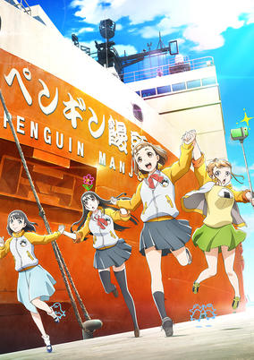

**Studio:** Madhouse &nbsp;|&nbsp; **Episodes:** 13 &nbsp;|&nbsp; **Director:** Atsuko Ishizuka &nbsp;|&nbsp; **Aired/Released:** January 2 – March 27 &nbsp;|&nbsp; **Genres:** Adventure, Friendship, Slice of Life

> Scenery that we have never seen. Sounds that we have never heard. Scent that we have never smelled. Food that we have never tasted. And the surge of emotion that we have never experienced. This is the expedition of recollecting the pieces torn apart and sensation left alone. When we reach that place, what will we think? Howling, 40 degree angle. Raging, 50 degree angle. Shouting, 60 degree angle. A wilderness beyond the heavy sea. The furthest south, far from civilization. At the top of the Earth. We will find lights through the girls' eyes to live tomorrow.
>
> _Synopsis source: Kitsu_

[Wikipedia](https://en.wikipedia.org/wiki/A_Place_Further_than_the_Universe) · [Kitsu](https://kitsu.io/anime/a-place-further-than-the-universe)

---

### Laid-Back Camp

**Studio:** C-Station &nbsp;|&nbsp; **Episodes:** 12 &nbsp;|&nbsp; **Director:** Yoshiaki Kyogoku &nbsp;|&nbsp; **Aired/Released:** January 4 – March 22

[Wikipedia](https://en.wikipedia.org/wiki/Laid-Back_Camp_season_1)

---

### Ms. Koizumi Loves Ramen Noodles

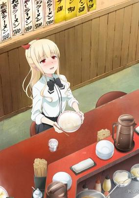

**Studio:** Studio Gokumi AXsiZ &nbsp;|&nbsp; **Episodes:** 12 &nbsp;|&nbsp; **Director:** Kenji Seto &nbsp;|&nbsp; **Aired/Released:** January 4 – March 22 &nbsp;|&nbsp; **Genres:** Comedy

> The gourmet comedy follows the daily life of Koizumi, a high school girl who looks like a cool beauty at first glance, but actually has an unexpected side of her that loves ramen.
>
> _Synopsis source: Kitsu_

[Wikipedia](https://en.wikipedia.org/wiki/Ms._Koizumi_Loves_Ramen_Noodles) · [Kitsu](https://kitsu.io/anime/ramen-daisuki-koizumi-san)

---

### Junji Ito Collection (Junji Ito "Collection")

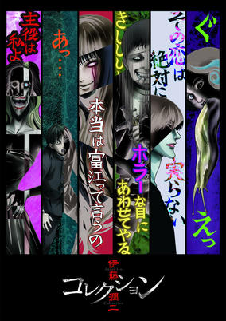

**Studio:** Studio Deen &nbsp;|&nbsp; **Episodes:** 12 &nbsp;|&nbsp; **Director:** Shinobu Tagashira &nbsp;|&nbsp; **Aired/Released:** January 5 – March 23 &nbsp;|&nbsp; **Genres:** Horror, Psychological

> A collection of animated horror stories based on the works of Japanese artist Junji Itou.
>
> _Synopsis source: Kitsu_

[Wikipedia](https://en.wikipedia.org/wiki/Junji_Ito_Collection) · [Kitsu](https://kitsu.io/anime/itou-junji-collection)

---

### Katana Maidens ~ Toji No Miko (Katana Maidens: Toji no Miko)

**Studio:** Studio Gokumi &nbsp;|&nbsp; **Episodes:** 24 &nbsp;|&nbsp; **Director:** Kodai Kakimoto &nbsp;|&nbsp; **Aired/Released:** January 5 – June 22 &nbsp;|&nbsp; **Genres:** Swordplay, Action, Fantasy, Fantasy World, All Girls School

> There's an evil creature called Aratama that attack people, and a group of Miko has been exorcising those creatures using swords since olden times. Those who wear uniforms and swords are called Toji, who are officially called Tokubetsu Saishi Kitoutai (Special Ritual Maneuver Team) in the police association. They are officially approved of wielding the swords by the government officials. The government has established five training schools consisting of junior and senior high levels for the female students to attend. They spend their student life normally, and use special skills with the swords when they're doing missions to protect people. In the spring, these five schools are to take part in a competition. Among the girls who train for the competition, there's a girl who's a bit more passionate than any other girls. Where would the girl with the sword aim?
>
> _Synopsis source: Kitsu_

[Wikipedia](https://en.wikipedia.org/wiki/Katana_Maidens_~_Toji_No_Miko) · [Kitsu](https://kitsu.io/anime/toji-no-miko)

---

### Record of Grancrest War

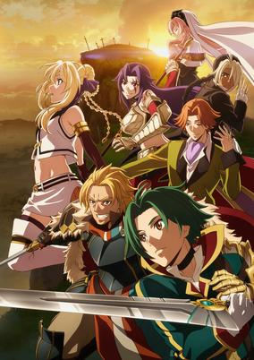

**Studio:** A-1 Pictures &nbsp;|&nbsp; **Episodes:** 24 &nbsp;|&nbsp; **Director:** Mamoru Hatakeyama &nbsp;|&nbsp; **Aired/Released:** January 6 – June 23 &nbsp;|&nbsp; **Genres:** Fantasy, Action, Adventure

> On a continent ruled by chaos, the Lords have the power of a holy seal that can calm the chaos and protect the people. However, before anyone realizes it, the rulers cast aside their creed of purifying the chaos, and instead start to fight each other for each other's holy seals to gain dominion over one another. Shiruuka, an isolated mage who scorns the Lords for abandoning their creed, and a wandering knight named Theo, who is on a journey to train to one day liberate his hometown, make an everlasting oath to work together to reform this continent dominated by wars and chaos.
>
> _Synopsis source: Kitsu_

[Wikipedia](https://en.wikipedia.org/wiki/Record_of_Grancrest_War) · [Kitsu](https://kitsu.io/anime/grancrest-senki)

---

### Sanrio Boys

**Studio:** Pierrot &nbsp;|&nbsp; **Episodes:** 12 &nbsp;|&nbsp; **Director:** Masashi Kudō &nbsp;|&nbsp; **Aired/Released:** January 6 – March 24 &nbsp;|&nbsp; **Genres:** School Life, High School

> The project's premise follows Kouta Hasegawa, a high school boy that loves the yellow Pom Pom Purin dog. By mere coincidence, he ends up attending the same school as Yuu Mizuno, a boy who likes the bunny My Melody. Yuu tells Kouta that there's nothing to be ashamed of for liking Sanrio's cute characters. Together, Kouta, Yuu, Shunsuke Yoshino, Ryou Nishimiya, and Seiichirou Minamoto learn to accept their love of the characters instead of feeling embarrassed.
>
> _Synopsis source: Kitsu_

[Wikipedia](https://en.wikipedia.org/wiki/Sanrio_Boys) · [Kitsu](https://kitsu.io/anime/sanrio-danshi)

---

### Citrus

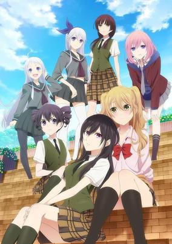

**Studio:** Passione &nbsp;|&nbsp; **Episodes:** 12 &nbsp;|&nbsp; **Director:** Takeo Takahashi &nbsp;|&nbsp; **Aired/Released:** January 6 – March 24 &nbsp;|&nbsp; **Genres:** School Life, Romance, Shoujo Ai, High School

> Yuzu, a high school gyaru who hasn't experienced her first love yet, transfers to an all-girls school after her mother remarries. She's beyond upset that she can't land a boyfriend at her new school. Then, on her first day, she meets the beautiful black-haired student council president Mei in the worst way possible. What's more, she later finds out that Mei is her new step-sister, and they'll be living under the same roof! And so the love affair between two polar opposite high school girls who find themselves drawn to one another begins!
>
> _Synopsis source: Kitsu_

[Wikipedia](https://en.wikipedia.org/wiki/Citrus_(manga)) · [Kitsu](https://kitsu.io/anime/citrus)

---

### Slow Start

**Studio:** CloverWorks &nbsp;|&nbsp; **Episodes:** 12 &nbsp;|&nbsp; **Director:** Hiroyuki Hashimoto &nbsp;|&nbsp; **Aired/Released:** January 7 – March 25

[Wikipedia](https://en.wikipedia.org/wiki/Slow_Start_(manga))

---

### Pop Team Epic

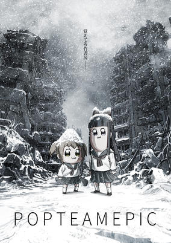

**Studio:** Kamikaze Douga &nbsp;|&nbsp; **Episodes:** 12 &nbsp;|&nbsp; **Director:** Jun Aoki Aoi Umeki &nbsp;|&nbsp; **Aired/Released:** January 7 – March 25 &nbsp;|&nbsp; **Genres:** Comedy, Parody, Super Deformed, Slapstick, Absurdist Humour, Satire

> Popuko and Pipimi are a pair of foul-mouthed girls ready to take on every pop culture reference ever made. Pop Team Epic follows the pair through a series of surreal skits and short stories full of internet, movie, video game, and self-referential based comedy.
>
> _Synopsis source: Kitsu_

[Wikipedia](https://en.wikipedia.org/wiki/Pop_Team_Epic) · [Kitsu](https://kitsu.io/anime/pop-team-epic)

---

### Kokkoku: Moment by Moment (KOKKOKU)

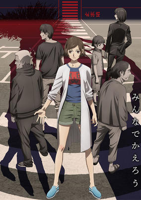

**Studio:** Geno Studio &nbsp;|&nbsp; **Episodes:** 12 &nbsp;|&nbsp; **Director:** Yoshimitsu Ohashi &nbsp;|&nbsp; **Aired/Released:** January 7 – March 25 &nbsp;|&nbsp; **Genres:** Psychological, Thriller, Drama, Time Travel, Conspiracy, Science Fiction

> Juri Yukawa lives with her NEET father and brother, her retired grandfather, her sister (a single mother) and her young nephew. One day, her nephew and brother are kidnapped for ransom. Having only 30 minutes to meet the demands of the kidnappers, Juri, who realizes there is not enough time to prepare the money, decides to head for their rescue by herself with knife in hand when her grandfather uses a mysterious stone passed on in the Yukawa family to stop time. In a world where everyone and everything are inert, Juri and her father and grandfather run to rescue the two. But at the kidnappers' hideout, they soon realize they are not the only ones who can move about in this still world...
>
> _Synopsis source: Kitsu_

[Kitsu](https://kitsu.io/anime/kokkoku)

---

### Mitsuboshi Colors

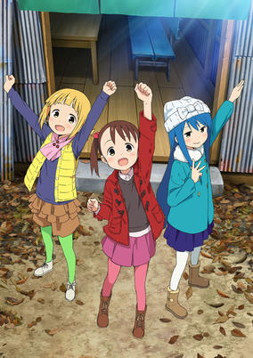

**Studio:** Silver Link &nbsp;|&nbsp; **Episodes:** 12 &nbsp;|&nbsp; **Director:** Tomoyuki Kawamura &nbsp;|&nbsp; **Aired/Released:** January 7 – March 25 &nbsp;|&nbsp; **Genres:** Comedy, Slice of Life, Tokyo, Japan, Earth, Asia, Present, Working Life, Law And Order, Cops, Slapstick, Violent Retribution For Accidental Infringement, Breaking The Fourth Wall, Blackmail, Adventure

> The "Colors" are three cute little girls who hang out together and say they're protecting the peace of their city. They have lots of fun together, doing stuff like playing games, solving puzzles, and going to the zoo. This manga follows their largely happy daily life.
>
> _Synopsis source: Kitsu_

[Wikipedia](https://en.wikipedia.org/wiki/Mitsuboshi_Colors) · [Kitsu](https://kitsu.io/anime/mitsuboshi-colors)

---

### Cardcaptor Sakura: Clear Card

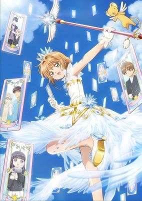

**Studio:** Madhouse &nbsp;|&nbsp; **Episodes:** 22 &nbsp;|&nbsp; **Director:** Morio Asaka &nbsp;|&nbsp; **Aired/Released:** January 7 – June 10 &nbsp;|&nbsp; **Genres:** Comedy, Magic, Fantasy, Romance, Adventure, Magical Girl, Shoujo

> The January issue of Kodansha's Nakayoshi magazine revealed on December 1 that CLAMP's Cardcaptor Sakura Clear Card-hen sequel manga is getting a television anime series adaptation in January 2018. Fourteen-year-old Sakura starts junior high school along her friends, including Syaoran, who had just returned to Tomoeda. After having a dream with a mysterious cloaked figure, all of Sakura's cards turn blank and are rendered powerless, thus she starts her quest to find out what is wrong. In doing so, Sakura and her allies discover and capture new transparent cards using a new key.
>
> _Synopsis source: Kitsu_

[Kitsu](https://kitsu.io/anime/cardcaptor-sakura-clear-card-hen)

---

### School Babysitters

**Studio:** Brain's Base &nbsp;|&nbsp; **Episodes:** 12 &nbsp;|&nbsp; **Director:** Shūsei Morishita &nbsp;|&nbsp; **Aired/Released:** January 7 – March 25 &nbsp;|&nbsp; **Genres:** Comedy, School Life, Slice of Life, Shoujo

> Ryuichi and Kotaro are brothers who lost their parents in an airplane crash. They're taken in by the chairman of Morinomiya Academy, who lost her son and daughter-in-law in the same crash, on one condition: Ryuichi has to babysit the kids at the daycare room in the school! This room was opened to help the school's teachers who had kids to take care of, but it suffers from a lack of staff until Ryuichi becomes the first member of the babysitter club formed to solve that problem.
>
> _Synopsis source: Kitsu_

[Wikipedia](https://en.wikipedia.org/wiki/School_Babysitters) · [Kitsu](https://kitsu.io/anime/gakuen-babysitters)

---

### Zoku Touken Ranbu: Hanamaru

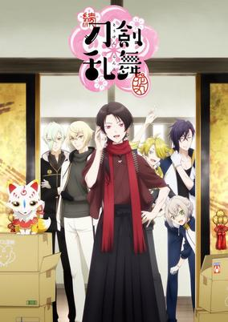

**Studio:** Doga Kobo &nbsp;|&nbsp; **Episodes:** 12 &nbsp;|&nbsp; **Director:** Tomoaki Koshida &nbsp;|&nbsp; **Aired/Released:** January 7 – March 25 &nbsp;|&nbsp; **Genres:** Comedy, Historical, Fantasy, Slice of Life, Drama, Action

> Sequel of Touken Ranbu: Hanamaru.
>
> _Synopsis source: Kitsu_

[Kitsu](https://kitsu.io/anime/zoku-touken-ranbu-hanamaru)

---

### Idolish7

**Studio:** Troyca &nbsp;|&nbsp; **Episodes:** 17 &nbsp;|&nbsp; **Director:** Makoto Bessho &nbsp;|&nbsp; **Aired/Released:** January 7 – May 19 &nbsp;|&nbsp; **Genres:** Music, Idol

> Working at an agency owned by your father, seven new idols await. They are all part of an idol unit IDOLiSH 7, and each of them have unique personalities. It is your task to manage them. In order to achieve the same goals, as manager and idols together, you gather the seven ununified hearts and aim for the top.
>
> _Synopsis source: Kitsu_

[Wikipedia](https://en.wikipedia.org/wiki/Idolish7) · [Kitsu](https://kitsu.io/anime/idolish7)

---

### Gintama. Shirogane no Tamashii-hen

**Studio:** BN Pictures &nbsp;|&nbsp; **Episodes:** 12 &nbsp;|&nbsp; **Director:** Chizuru Miyawaki &nbsp;|&nbsp; **Aired/Released:** January 7 – March 25

[Wikipedia](https://en.wikipedia.org/wiki/Gintama)

---

### Teasing Master Takagi-san

**Studio:** Shin-Ei Animation &nbsp;|&nbsp; **Episodes:** 12 &nbsp;|&nbsp; **Director:** Hiroaki Akagi &nbsp;|&nbsp; **Aired/Released:** January 8 – March 26 &nbsp;|&nbsp; **Genres:** Comedy, Romance, School Life, Slice of Life, Shounen, Middle School

> Tired of being mercilessly teased by his classmate Takagi, Nishikata has vowed to get her back and successfully tease the girl that's made him blush countless times. After all, if you blush, you lose! But getting vengeance isn't so easy when every attempt blows up in his face. Will Nishikata ever make Takagi blush or will he gain something more fulfilling from his bumbling attempts?
>
> _Synopsis source: Kitsu_

[Wikipedia](https://en.wikipedia.org/wiki/Teasing_Master_Takagi-san) · [Kitsu](https://kitsu.io/anime/karakai-jouzu-no-takagi-san)

---

### The Ryuo's Work Is Never Done! (The Ryuo’s Work is Never Done!)

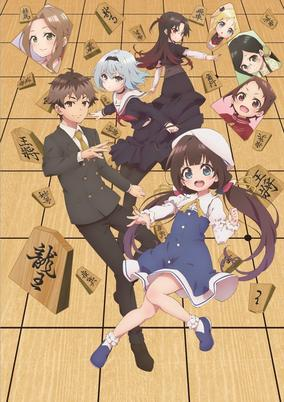

**Studio:** Project No.9 &nbsp;|&nbsp; **Episodes:** 12 &nbsp;|&nbsp; **Director:** Shinsuke Yanagi &nbsp;|&nbsp; **Aired/Released:** January 8 – March 26 &nbsp;|&nbsp; **Genres:** Loli, Harem, Sports, Comedy

> The newest work from creator of Norin - Shiratori Shirou, this time on the shogi (japanese analog for chess) scene! Kuzuryu Yaichi is the youngest shogi champion - Ryuou (dragon's king) - in history. And here is a girl - Hinazuru Ai, who asks him to become his disciple. Too young for his title, Yaichi is going to revive his shogi through passionate disciple.... wait, Ai-chan is 9 y.o.? She is an elementary schoolgirl! And... is she going to live with Yaichi? All night until morning? What? Officer, can we have you here, please! A comedy about shogi-holic live-in disciple.
>
> _Synopsis source: Kitsu_

[Wikipedia](https://en.wikipedia.org/wiki/The_Ryuo%27s_Work_Is_Never_Done!) · [Kitsu](https://kitsu.io/anime/ryuuou-no-oshigoto)

---

### Basilisk: The Ōka Ninja Scrolls

**Studio:** Seven Arcs Pictures &nbsp;|&nbsp; **Episodes:** 24 &nbsp;|&nbsp; **Director:** Junji Nishimura &nbsp;|&nbsp; **Aired/Released:** January 8 – June 18

[Wikipedia](https://en.wikipedia.org/wiki/Basilisk_(manga))

---

### Yowamushi Pedal: Glory Line

**Studio:** TMS/8PAN &nbsp;|&nbsp; **Episodes:** 25 &nbsp;|&nbsp; **Director:** Osamu Nabeshima &nbsp;|&nbsp; **Aired/Released:** January 8 – June 25

[Wikipedia](https://en.wikipedia.org/wiki/Yowamushi_Pedal)

---

### Overlord (season 2)

**Studio:** Madhouse &nbsp;|&nbsp; **Episodes:** 12 &nbsp;|&nbsp; **Director:** Naoyuki Ito &nbsp;|&nbsp; **Aired/Released:** January 10 – April 4

[Wikipedia](https://en.wikipedia.org/wiki/Overlord_(novel_series))

---

### Dame×Prince Anime Caravan (Damepri Anime Caravan)

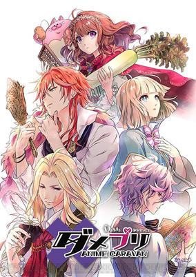

**Studio:** Studio Flad &nbsp;|&nbsp; **Episodes:** 12 &nbsp;|&nbsp; **Director:** Makoto Hoshino &nbsp;|&nbsp; **Aired/Released:** January 10 – March 28 &nbsp;|&nbsp; **Genres:** Romance, Adventure

> The story follows Ani, a princess from the minor nation of Inako. Ani is sent to the signing ceremony that will bring peace to the rival nations of Mildonia, a mighty military country, and Selenfaren, a powerful theocracy. Ani is supposed to help steer the signing ceremony along, but she runs into trouble when she encounters a handful of obstinate princes.
>
> _Synopsis source: Kitsu_

[Wikipedia](https://en.wikipedia.org/wiki/Dame%C3%97Prince_Anime_Caravan) · [Kitsu](https://kitsu.io/anime/dame-x-prince-anime-caravan)

---

### Death March to the Parallel World Rhapsody

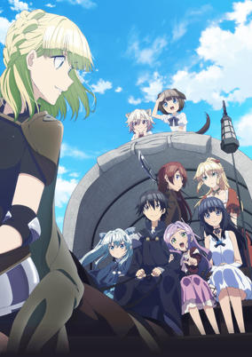

**Studio:** Silver Link Connect &nbsp;|&nbsp; **Episodes:** 12 &nbsp;|&nbsp; **Director:** Shin Ōnuma &nbsp;|&nbsp; **Aired/Released:** January 11 – March 29 &nbsp;|&nbsp; **Genres:** Fantasy, Action, Adventure, Comedy, Slice of Life, Harem, Isekai

> 29-year-old programmer Suzuki Ichirou finds himself transported into a fantasy RPG. Within the game, he's a 15-year-old named Satou. At first he thinks he's dreaming, but his experiences seem very real. Due to a powerful ability he possesses with limited use, he ends up wiping out an army of lizard men and becomes a high leveled adventurer. Satou decides to hide his level, and plans to live peacefully and meet new people. However, developments in the game's story, such as the return of a demon king, may cause a nuisance to Satou's plans.
>
> _Synopsis source: Kitsu_

[Wikipedia](https://en.wikipedia.org/wiki/Death_March_to_the_Parallel_World_Rhapsody) · [Kitsu](https://kitsu.io/anime/death-march-kara-hajimaru-isekai-kyousoukyoku)

---

### How to Keep a Mummy

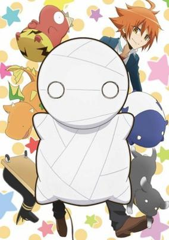

**Studio:** Eight Bit &nbsp;|&nbsp; **Episodes:** 12 &nbsp;|&nbsp; **Director:** Kaori &nbsp;|&nbsp; **Aired/Released:** January 11 – March 29 &nbsp;|&nbsp; **Genres:** Comedy, Fantasy, Slice of Life

> When high school student Sora Kashiwagi finds himself staring down a mysterious oversized package sent to him by his self-proclaimed "adventurer" father, the last thing he expects is for it to be opened from the inside... by a little mummy so small it can fit in the palm of his hand!
>
> _Synopsis source: Kitsu_

[Wikipedia](https://en.wikipedia.org/wiki/How_to_Keep_a_Mummy) · [Kitsu](https://kitsu.io/anime/miira-no-kaikata)

---

### Märchen Mädchen (Maerchen Maedchen)

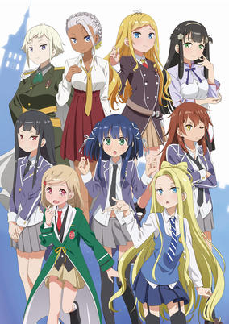

**Studio:** Hoods Entertainment &nbsp;|&nbsp; **Episodes:** 12 &nbsp;|&nbsp; **Director:** Hisashi Saito Shigeru Ueda &nbsp;|&nbsp; **Aired/Released:** January 11 – April 25, 2019 &nbsp;|&nbsp; **Genres:** Fantasy, Magic, School Life

> When the two girls meet, magic begins. Hazuki Kagimura loves stories, an orthodox girl who is overly imaginative. Because her relationship with her new family does not go well, the environment sends her toward the stories in which she spends her days. One day after school, Hazuki gets lost among the bookcases of the library, leading her to a mysterious school where meets Shizuka Tsuchimikado. It is a magic school where girls (called "mädchen") are selected by the magical texts from which the world's stories are born. Hazuki herself is said to be chosen by the book of Cinderella. In order to become a true magician, Hazuki becomes friends with Shizuka and begins her new life at the school.
>
> _Synopsis source: Kitsu_

[Wikipedia](https://en.wikipedia.org/wiki/M%C3%A4rchen_M%C3%A4dchen) · [Kitsu](https://kitsu.io/anime/marchen-madchen)

---

### Takunomi

**Studio:** Production IMS &nbsp;|&nbsp; **Episodes:** 12 &nbsp;|&nbsp; **Director:** Tomoki Kobayashi &nbsp;|&nbsp; **Aired/Released:** January 11 – March 29 &nbsp;|&nbsp; **Genres:** Slice of Life, Comedy

> 20-year-old Michiru Amatsuki moved to Tokyo due to a change of career. She decided to live in a woman-only share house "Stella House Haruno" with people of different ages and occupations. It's always fun when there's delicious alcohol and meal!!
>
> _Synopsis source: Kitsu_

[Wikipedia](https://en.wikipedia.org/wiki/Takunomi) · [Kitsu](https://kitsu.io/anime/takunomi)

---

### Violet Evergarden

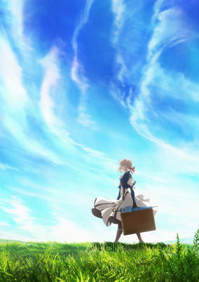

**Studio:** Kyoto Animation &nbsp;|&nbsp; **Episodes:** 13 &nbsp;|&nbsp; **Director:** Taichi Ishidate &nbsp;|&nbsp; **Aired/Released:** January 11 – April 5 &nbsp;|&nbsp; **Genres:** Military, Steampunk, War, Science Fiction, Fantasy, Drama, Android, Slice of Life

> There are words Violet heard on the battlefield, which she cannot forget. These words were given to her by someone she holds dear, more than anyone else. She does not yet know their meaning. A certain point in time, in the continent of Telesis. The great war which divided the continent into North and South has ended after four years, and the people are welcoming a new generation. Violet Evergarden, a young girl formerly known as “the weapon”, has left the battlefield to start a new life at CH Postal Service. There, she is deeply moved by the work of “Auto Memories Dolls”, who carry people's thoughts and convert them into words. Violet begins her journey as an Auto Memories Doll, and comes face to face with various people's emotions and differing shapes of love. All the while searching for the meaning of those words.
>
> _Synopsis source: Kitsu_

[Wikipedia](https://en.wikipedia.org/wiki/Violet_Evergarden) · [Kitsu](https://kitsu.io/anime/violet-evergarden)

---

### After the Rain

**Studio:** Wit Studio &nbsp;|&nbsp; **Episodes:** 12 &nbsp;|&nbsp; **Director:** Ayumu Watanabe &nbsp;|&nbsp; **Aired/Released:** January 12 – March 30

[Wikipedia](https://en.wikipedia.org/wiki/After_the_Rain_(manga))

---

### Hakumei and Mikochi

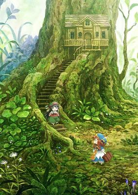

**Studio:** Lerche &nbsp;|&nbsp; **Episodes:** 12 &nbsp;|&nbsp; **Director:** Masaomi Ando &nbsp;|&nbsp; **Aired/Released:** January 12 – March 30 &nbsp;|&nbsp; **Genres:** Slice of Life, Fantasy, Fantasy World, Juujin, Anthropomorphism

> Nine centimeters (3.5 inches) tall, the tiny girls Hakumei and Mikochi live in the forest. Living in a tiny house in a tree, riding insects and birds, and making umbrellas out of leaves, these tiny girls live a tiny life. Follow their tiny but lovely lives as they live their day to day in a fantastic world of tiny people and gods.
>
> _Synopsis source: Kitsu_

[Wikipedia](https://en.wikipedia.org/wiki/Hakumei_and_Mikochi) · [Kitsu](https://kitsu.io/anime/hakumei-to-mikochi)

---

### Hakata Tonkotsu Ramens

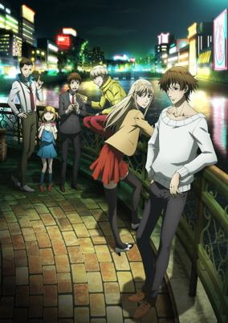

**Studio:** Satelight &nbsp;|&nbsp; **Episodes:** 12 &nbsp;|&nbsp; **Director:** Keiji Yasuda &nbsp;|&nbsp; **Aired/Released:** January 12 – March 30 &nbsp;|&nbsp; **Genres:** Assassin, Action

> "There is a person you desperately want to kill. Now, how do you kill that person?" At a glance, Fukuoka seems like a peaceful town, but crime runs rampant behind the scenes. It's now a battleground for professional killers, with urban legends suggesting that there's even one who specializes in killing professional killers. Assassins, detectives, revenge seekers, informants, torture specialists... When stories are told of these and other professionals of the underground, a "killer of professional killers" appears...
>
> _Synopsis source: Kitsu_

[Wikipedia](https://en.wikipedia.org/wiki/Hakata_Tonkotsu_Ramens) · [Kitsu](https://kitsu.io/anime/hakata-tonkotsu-ramens)

---

### Dagashi Kashi (season 2)

**Studio:** Tezuka Productions &nbsp;|&nbsp; **Episodes:** 12 &nbsp;|&nbsp; **Director:** Satoshi Kuwabara &nbsp;|&nbsp; **Aired/Released:** January 12 – March 30

[Wikipedia](https://en.wikipedia.org/wiki/Dagashi_Kashi)

---

### Hakyū Hōshin Engi (Hakyu Hoshin Engi)

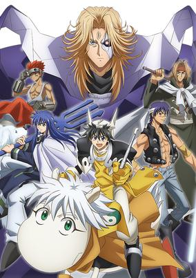

**Studio:** C-Station &nbsp;|&nbsp; **Episodes:** 23 &nbsp;|&nbsp; **Director:** Masahiro Aizawa &nbsp;|&nbsp; **Aired/Released:** January 12 – June 29 &nbsp;|&nbsp; **Genres:** Adventure, Demon, Fantasy

> When his clan is wiped out by a beautiful demon, young Taikobo finds himself in charge of the mysterious Houshin Project. Its mission: find all immortals living in the human world and seal them away forever. But who do you trust—and whose side are you really on—when you've been trained to hunt demons by a demon?
>
> _Synopsis source: Kitsu_

[Wikipedia](https://en.wikipedia.org/wiki/Hoshin_Engi) · [Kitsu](https://kitsu.io/anime/hakyuu-houshin-engi)

---

### Beatless

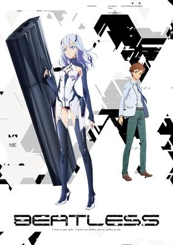

**Studio:** Diomedéa &nbsp;|&nbsp; **Episodes:** 24 &nbsp;|&nbsp; **Director:** Seiji Mizushima &nbsp;|&nbsp; **Aired/Released:** January 13 – September 28 &nbsp;|&nbsp; **Genres:** Android, Future, Action, Science Fiction, Romance

> With the introduction of an ultra-advanced AI that surpasses human intelligence, beings that mankind is yet to fully comprehend made from materials far too advanced for human technology begin coming into being. Lacia, an hIE equipped with a black coffin-shaped device, is one of these. In boy-meets-girl fashion, 17-year-old Arato Endo has a fateful encounter with the artificial Lacia. For what purpose were these artificial beings created? Amid questions regarding the coexistence of these artificial beings and humans, a 17-year-old boy makes a decision…
>
> _Synopsis source: Kitsu_

[Wikipedia](https://en.wikipedia.org/wiki/Beatless) · [Kitsu](https://kitsu.io/anime/beatless)

---

### Darling in the Franxx

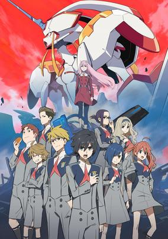

**Studio:** CloverWorks Trigger &nbsp;|&nbsp; **Episodes:** 24 &nbsp;|&nbsp; **Director:** Atsushi Nishigori &nbsp;|&nbsp; **Aired/Released:** January 13 – July 7 &nbsp;|&nbsp; **Genres:** Science Fiction, Mecha, Action, Romance, Slow When It Comes To Love, Love Polygon, Super Robot, Stereotypes, Conspiracy, Shounen, Piloted Robot

> The distant future: Humanity established the mobile fort city, Plantation, upon the ruined wasteland. Within the city were pilot quarters, Mistilteinn, otherwise known as the “Birdcage.” That is where the children live... Their only mission in life was the fight. Their enemies are the mysterious giant organisms known as Kyoryu. The children operate robots known as FRANXX in order to face these still unseen enemies. Among them was a boy who was once called a child prodigy: Code number 016, Hiro. One day, a mysterious girl called Zero Two appears in front of Hiro. “I’ve found you, my Darling.”
>
> _Synopsis source: Kitsu_

[Wikipedia](https://en.wikipedia.org/wiki/Darling_in_the_Franxx) · [Kitsu](https://kitsu.io/anime/darling-in-the-franxx)

---

### Killing Bites

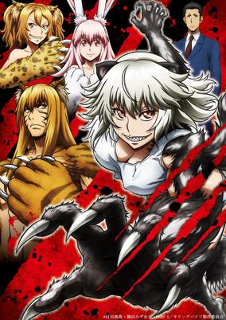

**Studio:** Liden Films &nbsp;|&nbsp; **Episodes:** 12 &nbsp;|&nbsp; **Director:** Yasuto Nishikata &nbsp;|&nbsp; **Aired/Released:** January 13 – March 31 &nbsp;|&nbsp; **Genres:** Battle Royale, Juujin, Ecchi, Action, Science Fiction, Violence, Horror

> People have been created that are human-animal hybrids, and powerful businesses bet on the outcome of their duels. College student Nomoto Yuuya's casual acquaintances ask him to drive them around to pick up girls one day, which he soon finds out means by force. The girl they kidnap is an animal-human hybrid named Hitomi, who slaughters all of them except Yuuya. Hitomi is a honey badger, which has been called the most fearless of all animals. Now Hitomi is assigned to stay with Yuuya, for his protection.
>
> _Synopsis source: Kitsu_

[Wikipedia](https://en.wikipedia.org/wiki/Killing_Bites) · [Kitsu](https://kitsu.io/anime/killing-bites)

---

### The Seven Deadly Sins: Revival of the Commandments

**Studio:** A-1 Pictures &nbsp;|&nbsp; **Episodes:** 24 &nbsp;|&nbsp; **Director:** Takeshi Furuta &nbsp;|&nbsp; **Aired/Released:** January 13 – June 30

[Wikipedia](https://en.wikipedia.org/wiki/The_Seven_Deadly_Sins_(manga))

---

### The Disastrous Life of Saiki K. (season 2)

**Studio:** J.C.Staff &nbsp;|&nbsp; **Episodes:** 24 &nbsp;|&nbsp; **Director:** Hiroaki Sakurai &nbsp;|&nbsp; **Aired/Released:** January 17 – June 27

[Wikipedia](https://en.wikipedia.org/wiki/The_Disastrous_Life_of_Saiki_K.)

---

### The Seven Heavenly Virtues (Seven Mortal Sins)

**Studio:** Bridge &nbsp;|&nbsp; **Episodes:** 10 &nbsp;|&nbsp; **Director:** Shinji Ishihira &nbsp;|&nbsp; **Aired/Released:** January 26 – March 30 &nbsp;|&nbsp; **Genres:** Fantasy, Ecchi, Demon

> You, will you be a worshipper of the devil lords? These beautiful lords lead humans to the seven deadly sins: pride, envy, wrath, sloth, greed, gluttony, and lust. A revealing fantasy that craves to corruption and happiness starts now.
>
> _Synopsis source: Kitsu_

[Wikipedia](https://en.wikipedia.org/wiki/Seven_Mortal_Sins) · [Kitsu](https://kitsu.io/anime/sin-nanatsu-no-taizai)

---

### Fate/Extra Last Encore (Fate/Extra: Last Encore)

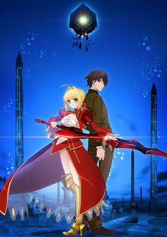

**Studio:** Shaft &nbsp;|&nbsp; **Episodes:** 13 &nbsp;|&nbsp; **Director:** Yukihiro Miyamoto Akiyuki Shinbo &nbsp;|&nbsp; **Aired/Released:** January 27 – July 29 &nbsp;|&nbsp; **Genres:** Magic, Fantasy, Action, Contemporary Fantasy, Swordplay, Romance, Battle Royale

> Waking up in a strange virtual world with no recollection of the past, Hakuno finds himself forced to fight for survival in a war he does not understand for a prize beyond value; the opportunity to have one's wish granted. With only an enigmatic "Servant" by his side, Hakuno Kishinami will have to face both friends and foes in battles to the death in order to not only gain possession of a mysterious object known as the "Holy Grail," but also to find the answer to the most important question of all: "Who am I?"
>
> _Synopsis source: Kitsu_

[Wikipedia](https://en.wikipedia.org/wiki/Fate/Extra_Last_Encore) · [Kitsu](https://kitsu.io/anime/fate-extra-last-encore)

---

### Hugtto! PreCure

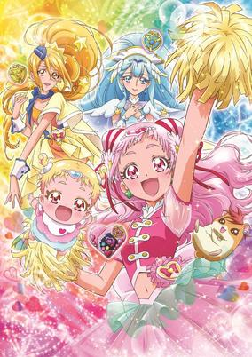

**Studio:** Toei Animation &nbsp;|&nbsp; **Episodes:** 49 &nbsp;|&nbsp; **Director:** Junichi Sato Akifumi Zako &nbsp;|&nbsp; **Aired/Released:** February 4 – January 27, 2019 &nbsp;|&nbsp; **Genres:** Fantasy, Magic, Magical Girl, Action

> Nono Hana is an 8th grade student who wants to be a stylish and mature big sister like figure. She always puts on a lovely smile and loves to search for exciting things. One day, Hana meets a baby named Hug-tan and her guardian fairy named Harry who had fallen from the sky. At that exact moment, an evil organisation called Dark Tomorrow suddenly appeared! They're trying to forcefully take Hug-tan's Mirai Crystal! In order to protect Hug-tan, Hana wishes to do something to help her, and her wish is granted, as she gains a Mirai Crystal and transforms into Cure Yell. The world is overflowed with Tomorrow Powerer, which is the power to create a brilliant tomorrow, which is crystalized into the Mirai Crystals. If it's stolen, everyone's future will not exist. To protect Hug-tan and everyone's future, Cure Yell will do her best!
>
> _Synopsis source: Kitsu_

[Wikipedia](https://en.wikipedia.org/wiki/Hugtto!_PreCure) · [Kitsu](https://kitsu.io/anime/hugtto-precure)

---

### GeGeGe no Kitarō (GeGeGe no Kitaro (2018))

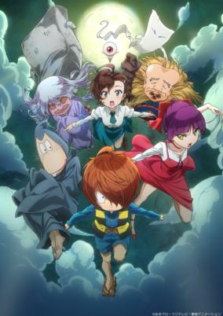

**Studio:** Toei Animation &nbsp;|&nbsp; **Episodes:** 97 &nbsp;|&nbsp; **Director:** Kōji Ogawa &nbsp;|&nbsp; **Aired/Released:** April 1 – March 29, 2020 &nbsp;|&nbsp; **Genres:** Comedy, Demon, Contemporary Fantasy, Adventure, Kids, Shounen, Deity, Parallel Universe, Supernatural

> Nearly twenty years into the 21st century, people have forgotten the existence of Yokai. When a number of unexplainable phenomena plague adults of the human world with confusion and chaos, thirteen-year-old Mana writes a letter to the Yokai Post in search of answers, only to be greeted by Ge Ge Ge no Kitaro...
>
> _Synopsis source: Kitsu_

[Wikipedia](https://en.wikipedia.org/wiki/GeGeGe_no_Kitar%C5%8D) · [Kitsu](https://kitsu.io/anime/gegege-no-kitarou-2018)

---

### Umamusume: Pretty Derby

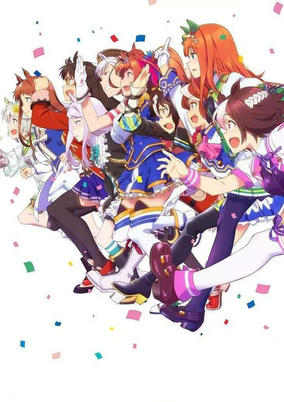

**Studio:** P.A. Works &nbsp;|&nbsp; **Episodes:** 13 &nbsp;|&nbsp; **Director:** Kei Oikawa &nbsp;|&nbsp; **Aired/Released:** April 2 – June 18 &nbsp;|&nbsp; **Genres:** Sports, Slice of Life, Juujin, Comedy

> This is a tale of a world where "horse girls" with glorious names and incredible running abilities live alongside humanity.Horse girl Special Week has moved from the country to the city to attend Tracen Academy. There, she and her classmates compete to win the Twinkle Series and earn the title of "The County's #1 Horse Girl."
>
> _Synopsis source: Kitsu_

[Kitsu](https://kitsu.io/anime/uma-musume-pretty-derby-tv)

---

### Beyblade Burst Turbo

**Studio:** OLM &nbsp;|&nbsp; **Episodes:** 51 &nbsp;|&nbsp; **Director:** Katsuhito Akiyama &nbsp;|&nbsp; **Aired/Released:** April 2 – March 25, 2019

[Wikipedia](https://en.wikipedia.org/wiki/Beyblade_Burst)

---

### Captain Tsubasa

**Studio:** David Production &nbsp;|&nbsp; **Episodes:** 52 &nbsp;|&nbsp; **Director:** Toshiyuki Kato &nbsp;|&nbsp; **Aired/Released:** April 2 – April 1, 2019

[Wikipedia](https://en.wikipedia.org/wiki/Captain_Tsubasa)

---

### Pazudora

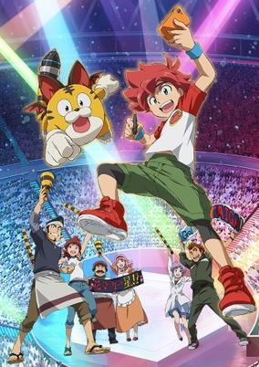

**Studio:** Pierrot &nbsp;|&nbsp; **Director:** Hajime Kamegaki &nbsp;|&nbsp; **Aired/Released:** April 2 –

> The story is set in modern day Japan following the growth of the protagonist Taiga Akashi, an elementary school kid who wants to be a professional gamer someday.
>
> _Synopsis source: Kitsu_

[Kitsu](https://kitsu.io/anime/puzzle-dragon)

---

### Magical Girl Ore

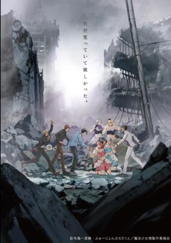

**Studio:** Pierrot+ &nbsp;|&nbsp; **Episodes:** 12 &nbsp;|&nbsp; **Director:** Itsuro Kawasaki &nbsp;|&nbsp; **Aired/Released:** April 2 – June 18 &nbsp;|&nbsp; **Genres:** Magical Girl, Magic, Comedy, Fantasy, Henshin, Parody

> "Love makes a girl stronger." Saki Uno is working hard as part of the new idol unit, Magical Twin. The one she admires most is Mohiro Mikage, who’s the older brother of her idol unit partner Sakuyo, and he’s also a member of the top idol unit STAR☆PRINCE. She would be willing to do anything for him, and one day, those feelings brought on a miracle. Saki ended up turning into a magical girl when she strongly wished to protect someone... But what she turned into wasn’t exactly what she was expecting...
>
> _Synopsis source: Kitsu_

[Wikipedia](https://en.wikipedia.org/wiki/Magical_Girl_Ore) · [Kitsu](https://kitsu.io/anime/mahou-shoujo-ore)

---

### Kakuriyo: Bed and Breakfast for Spirits (Kakuriyo: Bed & Breakfast for Spirits)

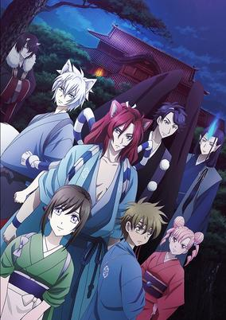

**Studio:** Gonzo &nbsp;|&nbsp; **Episodes:** 26 &nbsp;|&nbsp; **Director:** Yoshiki Okuda &nbsp;|&nbsp; **Aired/Released:** April 2 – September 24 &nbsp;|&nbsp; **Genres:** Fantasy, Cooking, Demon, Contemporary Fantasy, Ghost, Supernatural, Isekai, Drama, Romance, Shoujo

> After losing her grandfather, Aoi—a girl who can see spirits known as ayakashi—is suddenly approached by an ogre. Demanding she pay her grandfather’s debt, he makes a huge request: her hand in marriage! Refusing this absurd offer, Aoi decides to work at the Tenjin-ya bed and breakfast for the ayakashi to pay back what her family owes.
>
> _Synopsis source: Kitsu_

[Kitsu](https://kitsu.io/anime/kakuriyo-no-yadomeshi)

---

### Souten no Ken Re:Genesis

**Studio:** Polygon Pictures &nbsp;|&nbsp; **Episodes:** 12 &nbsp;|&nbsp; **Director:** Yoshio Kazumi &nbsp;|&nbsp; **Aired/Released:** April 2 – June 18

[Wikipedia](https://en.wikipedia.org/wiki/Fist_of_the_Blue_Sky)

---

### You Don't Know Gunma Yet

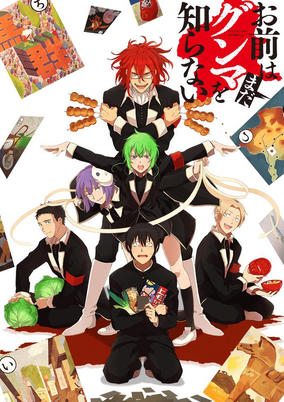

**Studio:** Asahi Production &nbsp;|&nbsp; **Episodes:** 12 &nbsp;|&nbsp; **Director:** Mankyū &nbsp;|&nbsp; **Aired/Released:** April 2 – June 18

> The comedy manga centers on Nori Kamitsuki, who moves from Chiba Prefecture to a fictionalized version of Gunma Prefecture northwest of Tokyo, and the story focuses on Gunma's culture. Before moving to Gunma, Kamitsuki only sees that the prefecture has a fearsome reputation on the net. Upon moving, he soon makes contact with the people who hold a strong love of Gunma's culture.
>
> _Synopsis source: Kitsu_

[Wikipedia](https://en.wikipedia.org/wiki/You_Don%27t_Know_Gunma_Yet) · [Kitsu](https://kitsu.io/anime/omae-wa-mada-gunma-wo-shiranai)

---

### Gundam Build Divers

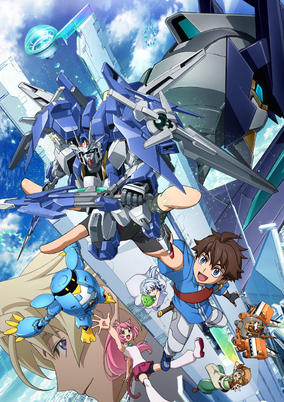

**Studio:** Sunrise &nbsp;|&nbsp; **Episodes:** 25 &nbsp;|&nbsp; **Director:** Shinya Watada &nbsp;|&nbsp; **Aired/Released:** April 3 – September 25 &nbsp;|&nbsp; **Genres:** Mecha, Proxy Battles, Action, Comedy, Science Fiction

> The Gunpla Force Battle Tournament is a big event held in GBN once per year. Competing in the final round are Avalon, led by the champion Kyoya Kujo, and the elite 7th Panzer Division led by the cunning Rommel. Starting with Kyoya’s Gundam AGE II Magnum, a variety of Gunpla take to the field to determine which is the strongest force!
>
> _Synopsis source: Kitsu_

[Wikipedia](https://en.wikipedia.org/wiki/Gundam_Build_Divers) · [Kitsu](https://kitsu.io/anime/gundam-build-divers)

---

### Space Battleship Tiramisu

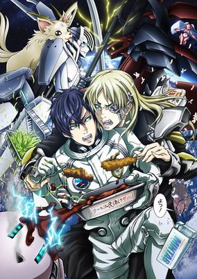

**Studio:** Gonzo &nbsp;|&nbsp; **Episodes:** 13 &nbsp;|&nbsp; **Director:** Hiroshi Ikehata &nbsp;|&nbsp; **Aired/Released:** April 3 – June 26 &nbsp;|&nbsp; **Genres:** Space Travel, Mecha, Space, Science Fiction, Piloted Robot, Comedy

> The human race extended its life field and greed to the vast reaches of space... In Space Era 0156, a war breaks out amidst all of the colonies in space. Earth begins to construct a new space battleship called Tiramisu in secret. Just as the war begins, one genius pilot steers the Tiramisu as a beacon of hope for humanity.
>
> _Synopsis source: Kitsu_

[Wikipedia](https://en.wikipedia.org/wiki/Space_Battleship_Tiramisu) · [Kitsu](https://kitsu.io/anime/uchuu-senkan-tiramisu)

---

### Tachibanakan To Lie Angle (Love to Lie Angle)

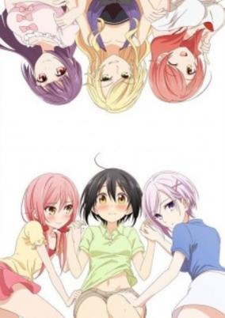

**Studio:** Creators in Pack Studio Lings &nbsp;|&nbsp; **Episodes:** 12 &nbsp;|&nbsp; **Director:** Hisayoshi Hirasawa &nbsp;|&nbsp; **Aired/Released:** April 3 – June 20 &nbsp;|&nbsp; **Genres:** Comedy, Ecchi, Shoujo Ai

> When Natsuno Hanabi went back to her hometown to study in high school, she thought that she will have a new wonderful life. But Tachibanakan, the dormitory she was going to live in, was not what she expected.
>
> _Synopsis source: Kitsu_

[Wikipedia](https://en.wikipedia.org/wiki/Tachibanakan_To_Lie_Angle) · [Kitsu](https://kitsu.io/anime/tachibanakan-to-lie-triangle)

---

### The Legend of the Galactic Heroes: Die Neue These Kaikō

**Studio:** Production I.G &nbsp;|&nbsp; **Episodes:** 12 &nbsp;|&nbsp; **Director:** Shunsuke Tada &nbsp;|&nbsp; **Aired/Released:** April 3 – June 26

[Wikipedia](https://en.wikipedia.org/wiki/Legend_of_the_Galactic_Heroes)

---

### Tokyo Ghoul:re

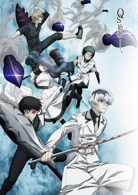

**Studio:** Pierrot &nbsp;|&nbsp; **Episodes:** 12 &nbsp;|&nbsp; **Director:** Odahiro Watanabe &nbsp;|&nbsp; **Aired/Released:** April 3 – June 19 &nbsp;|&nbsp; **Genres:** Action, Horror, Psychological, Supernatural, Mystery

> Haise Sasaki has been tasked with teaching Qs Squad how to be outstanding investigators, but his assignment is complicated by the troublesome personalities of his students and his own uncertain grasp of his Ghoul powers. Can he pull them together as a team, or will Qs Squad first assignment be their last?
>
> _Synopsis source: Kitsu_

[Kitsu](https://kitsu.io/anime/tokyo-ghoul-re)

---

### Alice or Alice

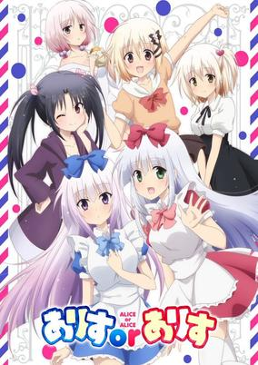

**Studio:** EMT Squared &nbsp;|&nbsp; **Episodes:** 12 &nbsp;|&nbsp; **Director:** Kōsuke Kobayashi &nbsp;|&nbsp; **Aired/Released:** April 4 – June 20 &nbsp;|&nbsp; **Genres:** Slice of Life

> This story gives a look at the daily life of a pair or Alice twins and their older brother who has a sister complex. Them eating meals, getting into fights, playing with friends… Would you like to peek at the heartful daily life of the cute Alices?
>
> _Synopsis source: Kitsu_

[Wikipedia](https://en.wikipedia.org/wiki/Alice_or_Alice) · [Kitsu](https://kitsu.io/anime/alice-or-alice)

---

### Last Hope

**Studio:** Satelight Xiamen Skyloong Media &nbsp;|&nbsp; **Episodes:** 26 &nbsp;|&nbsp; **Director:** Shoji Kawamori Hidekazu Sato &nbsp;|&nbsp; **Aired/Released:** April 4 – September 26

[Wikipedia](https://en.wikipedia.org/wiki/Last_Hope_(anime))

---

### Lupin the Third Part 5 (Lupin the Third: Part V)

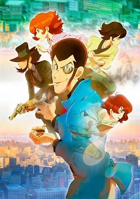

**Studio:** Telecom Animation Film &nbsp;|&nbsp; **Episodes:** 24 &nbsp;|&nbsp; **Director:** Kazuhide Tomonaga Yūichirō Yano &nbsp;|&nbsp; **Aired/Released:** April 4 – September 18 &nbsp;|&nbsp; **Genres:** Action, Crime, Present, Thievery, France, Europe, Seinen, Politics

> A legendary thief deserves a legendary heist, and Lupin has set his sights on his biggest bounty yet — but when a game called “Arrest Lupin III” goes viral on social media, things get a whole lot harder for the world’s most wanted thief!
>
> _Synopsis source: Kitsu_

[Wikipedia](https://en.wikipedia.org/wiki/Lupin_the_Third_Part_5) · [Kitsu](https://kitsu.io/anime/lupin-iii-part-v)

---

### Real Girl

**Studio:** Hoods Entertainment &nbsp;|&nbsp; **Episodes:** 12 &nbsp;|&nbsp; **Director:** Takashi Naoya &nbsp;|&nbsp; **Aired/Released:** April 4 – June 20

[Wikipedia](https://en.wikipedia.org/wiki/Real_Girl_(manga))

---

### Aikatsu Friends!

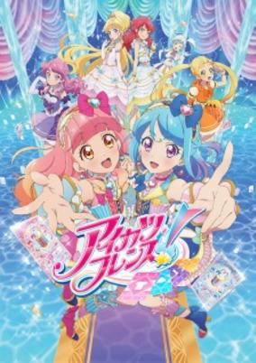

**Studio:** BN Pictures &nbsp;|&nbsp; **Episodes:** 76 &nbsp;|&nbsp; **Director:** Tatsuya Igarashi &nbsp;|&nbsp; **Aired/Released:** April 5 – September 26, 2019 &nbsp;|&nbsp; **Genres:** Magic, School Life, Slice of Life, Shoujo

> Aine Yuuki who is a regular student at Star Harmony Academy's normal division and meets Mio Minato from idol division who invites her to join Aikatsu to fulfill Aine's goal to make friends. She also befriends Maika Chouno and Ema Hinata who are also idols. Aine and Mio form a pair to become best friends to become the bright "Diamond Friends". Karen Kamishiro and Mirai Asuku are categorized as "Diamond Friends" and are in the Diamond Class!
>
> _Synopsis source: Kitsu_

[Wikipedia](https://en.wikipedia.org/wiki/Aikatsu_Friends!) · [Kitsu](https://kitsu.io/anime/aikatsu-friends)

---

### Comic Girls

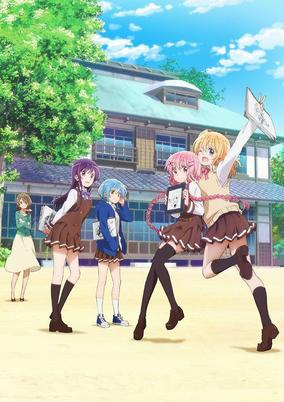

**Studio:** Nexus &nbsp;|&nbsp; **Episodes:** 12 &nbsp;|&nbsp; **Director:** Yoshinobu Tokumoto &nbsp;|&nbsp; **Aired/Released:** April 5 – June 21 &nbsp;|&nbsp; **Genres:** Slice of Life, Comedy, Working Life

> Moeta Kaoruko (Pen name: Kaos) is 15 years old, a high school student and 4-panel manga artist! After moving to a dorm especially for female manga artists, she meets shojo manga artist Koyume, teen romance manga artist Ruki, and shonen manga artist Tsubasa. Every day, they'll work all through the night trying to ink and finish their work! Her cute, funny life in a manga artist dorm is about to begin!
>
> _Synopsis source: Kitsu_

[Wikipedia](https://en.wikipedia.org/wiki/Comic_Girls) · [Kitsu](https://kitsu.io/anime/comic-girls)

---

### Tada Never Falls in Love

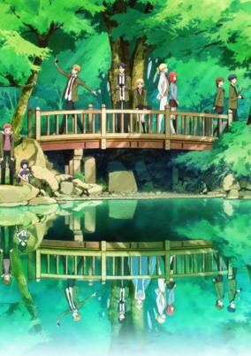

**Studio:** Doga Kobo &nbsp;|&nbsp; **Episodes:** 13 &nbsp;|&nbsp; **Director:** Mitsue Yamazaki &nbsp;|&nbsp; **Aired/Released:** April 5 – June 28 &nbsp;|&nbsp; **Genres:** Romance, Slice of Life, Comedy

> Mitsuyoshi Tada, a boy who has never fallen in love, encounters a lost transfer student Teresa Wagner. Everything Mitsuyoshi knows about love completely changes as he helps Teresa reunite with her travel companion.
>
> _Synopsis source: Kitsu_

[Wikipedia](https://en.wikipedia.org/wiki/Tada_Never_Falls_in_Love) · [Kitsu](https://kitsu.io/anime/tada-kun-wa-koi-wo-shinai)

---

### Dances with the Dragons

**Studio:** Seven Arcs Pictures &nbsp;|&nbsp; **Episodes:** 12 &nbsp;|&nbsp; **Director:** Hiroshi Nishikori Hirokazu Hanai &nbsp;|&nbsp; **Aired/Released:** April 5 – June 21 &nbsp;|&nbsp; **Genres:** Science Fiction, Fantasy, Action, Dragon, Fantasy World

> The series takes place in an alternate world, staged mostly in the city of Eridana, whose territory is half in the Tseberun Dragon Empire, and half in the Lapetodes Seven Cities Alliance. Each half is separated by the Orielal River. In this world, special abilities called spell formulas (咒式, jushiki) exist, which are essentially chemical reactions augmented through special weapons that cause a magic spell-like effect. These special weapons are called Magic Staff weapons, and are as varied as regular weapons are. Spell formulists use these spell formulas to fight with "Beasts of Abhorrent Form," natural creatures that use spell formulas and pose a threat to humans, such as Dragons, Aions, or Enormes. The story focuses on the two main characters, Gaius Sorel and Gigina Ashley-Bufh, the only two employees of spell formulist dispatch office Ashley-Bufh &amp; Sorel Co. They are met with a variety of requests from a variety of clients, all requiring the adept use of spell formulas.
>
> _Synopsis source: Kitsu_

[Wikipedia](https://en.wikipedia.org/wiki/Dances_with_the_Dragons) · [Kitsu](https://kitsu.io/anime/saredo-tsumibito-wa-ryuu-to-odoru)

---

### Akkun to Kanojo (My Sweet Tyrant)

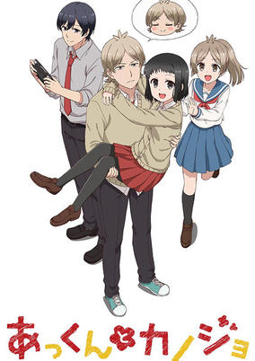

**Studio:** Yumeta Company &nbsp;|&nbsp; **Episodes:** 25 &nbsp;|&nbsp; **Director:** Shin Katagai &nbsp;|&nbsp; **Aired/Released:** April 6 – September 21 &nbsp;|&nbsp; **Genres:** Comedy, School Life, Romance, Josei

> The romantic comedy follows the everyday life of an extremely tsundere (initially aloof and abrasive, but later kind-hearted) boy named Atsuhiro "Akkun" Kagari and his girlfriend Non "Nontan" Katagiri. Akkun's behavior is harsh towards Nontan with verbal abuse and neglect, but he actually is head-over-heels for her and habitually acts like a stalker by tailing her or eavesdropping. Nontan is oblivious to Akkun's stalker ways, and thinks his actions are cute.
>
> _Synopsis source: Kitsu_

[Wikipedia](https://en.wikipedia.org/wiki/Akkun_to_Kanojo) · [Kitsu](https://kitsu.io/anime/akkun-to-kanojo)

---

### Gurazeni

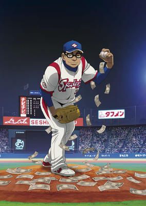

**Studio:** Studio Deen &nbsp;|&nbsp; **Episodes:** 12 &nbsp;|&nbsp; **Director:** Ayumu Watanabe &nbsp;|&nbsp; **Aired/Released:** April 6 – June 22 &nbsp;|&nbsp; **Genres:** Sports, Baseball, Comedy

> The "baseball money survival" story focuses on a baseball team that operates as a highly-stratified society, where the player's performance determines his annual salary. The story follows an eight-year relief pitcher with an odd left-handed side-arm throw as he fights to survive under the team's strict system.
>
> _Synopsis source: Kitsu_

[Wikipedia](https://en.wikipedia.org/wiki/Gurazeni) · [Kitsu](https://kitsu.io/anime/gurazeni)

---

### Hinamatsuri

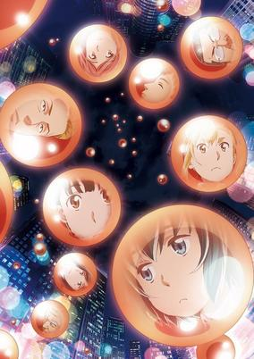

**Studio:** Feel &nbsp;|&nbsp; **Episodes:** 12 &nbsp;|&nbsp; **Director:** Kei Oikawa &nbsp;|&nbsp; **Aired/Released:** April 6 – June 22 &nbsp;|&nbsp; **Genres:** Science Fiction, Slice of Life, Comedy, Supernatural

> Nitta Yoshifumi, a young, intellectual yakuza, lived surrounded by his beloved pots in his turf in Ashigawa. But one day, a girl, Hina, arrives in a strange object, and uses her telekinetic powers to force Nitta to allow her to live with him, putting an end to his leisurely lifestyle. Hina tends to lose control of herself, wreaking havoc both at school and in Nitta's organization. Though troubled, he finds himself taking care of her. What will become of this strange arrangement? It's the beginning of the dangerous and lively story of a nice-guy outlaw and psychokinetic girl!
>
> _Synopsis source: Kitsu_

[Wikipedia](https://en.wikipedia.org/wiki/Hinamatsuri_(manga)) · [Kitsu](https://kitsu.io/anime/hinamatsuri)

---

### Inazuma Eleven: Ares

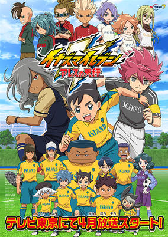

**Studio:** OLM &nbsp;|&nbsp; **Episodes:** 26 &nbsp;|&nbsp; **Director:** Akihiro Hino Yumi Kamakura &nbsp;|&nbsp; **Aired/Released:** April 6 – September 28 &nbsp;|&nbsp; **Genres:** Sports

> Inazuma Eleven Ares will be set in a parallel world, taking place after the events of the first game, and develop the story from the perspectives of three protagonists—Ryouhei Haizaki, Asuto Inamori, and Yuuma Nosaka. The story revolves around a group of boys living on an island who love to play soccer. Their soccer club is suddenly abolished, and the only way they can regain it is to win the Football Frontier. Protagonist Asuto Inamori and company leave the island for Tokyo to attend Raimon Junior High School and take on the Football Frontier. But their first match is against the number one-ranked Seishou Gakuen.
>
> _Synopsis source: Kitsu_

[Kitsu](https://kitsu.io/anime/inazuma-eleven-ares-no-tenbin)

---

### Lostorage conflated WIXOSS

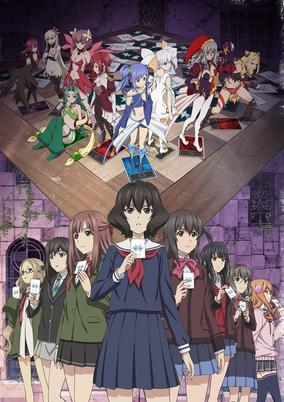

**Studio:** J.C.Staff &nbsp;|&nbsp; **Episodes:** 12 &nbsp;|&nbsp; **Director:** Risako Yoshida &nbsp;|&nbsp; **Aired/Released:** April 6 – June 22 &nbsp;|&nbsp; **Genres:** Card Games, Proxy Battles, Psychological

> The peaceful days turn out to be short-lived as the shadow of another Selector Battle looms large. Kiyoi Mizushima is the first to notice that things are amiss, and she makes her move to put an end to the cycle of darkness.The Battle this time includes a new card, "Key," and has been set up with rules different than before. With both the mastermind and their motive shrouded in mystery, the darkness grows ever deeper and more menacing. Suzuko Homura, Chinatsu Morishita, Hanna Mikage, Ruuko Kominato, Yuzuki Kurebayashi, Hitoe Uemura, and Akira Aoi, the Selectors gather once again.
>
> _Synopsis source: Kitsu_

[Wikipedia](https://en.wikipedia.org/wiki/Lostorage_conflated_WIXOSS) · [Kitsu](https://kitsu.io/anime/lostorage-conflated-wixoss)

---

### Magical Girl Site

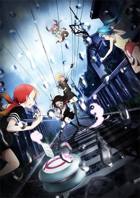

**Studio:** production doA &nbsp;|&nbsp; **Episodes:** 12 &nbsp;|&nbsp; **Director:** Tadahito Matsubayashi &nbsp;|&nbsp; **Aired/Released:** April 6 – June 22 &nbsp;|&nbsp; **Genres:** Horror, Psychological, Magical Girl, Violence, Supernatural

> Asagiri Aya is a young girl who has fallen victim to bullies at her school. Looking for a way to escape her troubles, she looks to the internet for distraction, when a mysterious website called "Magical Girl Site" appears. Simply viewing the page is all it takes to hurtle Aya headlong into the deadly world of the Magical Girl Apocalypse. There, it’s fight or die, against a seemingly endless array of savagely adorable, frilly-skirted killing machines, each armed with magical powers and an unquenchable thirst for blood and chaos.
>
> _Synopsis source: Kitsu_

[Wikipedia](https://en.wikipedia.org/wiki/Magical_Girl_Site) · [Kitsu](https://kitsu.io/anime/mahou-shoujo-site)

---

### Megalo Box (MEGALOBOX)

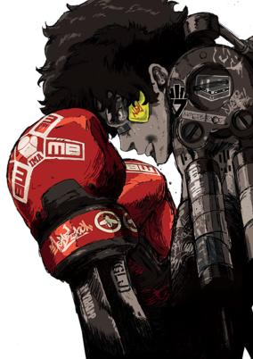

**Studio:** TMS/3xCube &nbsp;|&nbsp; **Episodes:** 13 &nbsp;|&nbsp; **Director:** You Moriyama &nbsp;|&nbsp; **Aired/Released:** April 6 – June 29 &nbsp;|&nbsp; **Genres:** Sports, Boxing, Action, Science Fiction, Steampunk

> An original story based on Takamori Asaki and Chiba Tetsuya's Ashita no Joe boxing manga. A desolate land stretches out from the city of poverty. A motorcycle speeds recklessly, blowing clouds of sand and dust. The rider is the protagonist of this story – he has neither a name nor a past. All he has is his ring name, Junk Dog and a technique for rigging MEGALOBOX matches with his pal Nanbu Gansaku, which they use to support their hand-to-mouth lives. Although he has the skill, he isn't dissatisfied enough to change his ways- but he's not satisfied with his life either. JD is bored, resigned, and unfulfilled. He lives with frustration in a life of shadows beneath the lights of fame. Meanwhile, under the bright sun is Shirato Yukiko, the daughter of Shirato Konzern - the reigning family of the wealthy class. Yukiko decides to advance her career by using MEGALOBOX to organize a large fighting event, MEGALONIA: the tournament to determine the champion of MEGALOBOX. She creates a scenario: MEGALOBOXER Yuri, under her control, will win and become the champion to further promote the Shirato brand gear and expand business. Yuri has been the reigning champion of MEGALOBOX for the past few years. Driven by self-discipline and his strong will to practice, he has the skills and presence of a true champion. The man himself is a shining exemplar of virtuosity. This is a story of JD and his rival, Yuri. An encounter between shadow and light; a fast-paced story begins when their paths cross.
>
> _Synopsis source: Kitsu_

[Wikipedia](https://en.wikipedia.org/wiki/Megalo_Box) · [Kitsu](https://kitsu.io/anime/megalo-box)

---

### Nobunaga no Shinobi: Anegawa Ishiyama-hen (Ninja Girl & Samurai Master: Anegawa and Ishiyama Arc)

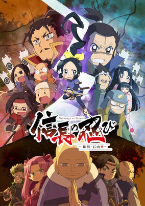

**Studio:** TMS/V1 Studio &nbsp;|&nbsp; **Episodes:** 26 &nbsp;|&nbsp; **Director:** Akitaro Daichi &nbsp;|&nbsp; **Aired/Released:** April 6 – September 28 &nbsp;|&nbsp; **Genres:** Comedy, Historical

> Third season of Nobunaga no Shinobi
>
> _Synopsis source: Kitsu_

[Kitsu](https://kitsu.io/anime/nobunaga-no-shinobi-anegawa-ishiyama-hen)

---

### Amanchu! Advance

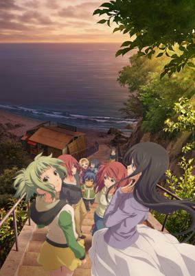

**Studio:** J.C.Staff &nbsp;|&nbsp; **Episodes:** 12 &nbsp;|&nbsp; **Director:** Junichi Sato Kiyoko Sayama &nbsp;|&nbsp; **Aired/Released:** April 7 – June 23 &nbsp;|&nbsp; **Genres:** School Life, Comedy, Slice of Life, Sports, Supernatural

> Second season of Amanchu!.
>
> _Synopsis source: Kitsu_

[Wikipedia](https://en.wikipedia.org/wiki/Amanchu!_Advance) · [Kitsu](https://kitsu.io/anime/amanchu-advance)

---

### My Hero Academia (season 3)

**Studio:** Bones &nbsp;|&nbsp; **Episodes:** 25 &nbsp;|&nbsp; **Director:** Kenji Nagasaki &nbsp;|&nbsp; **Aired/Released:** April 7 – September 29

[Wikipedia](https://en.wikipedia.org/wiki/My_Hero_Academia)

---

### Devils' Line

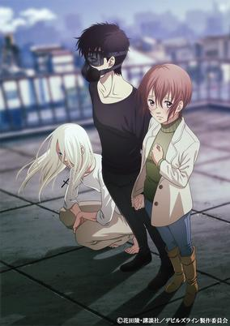

**Studio:** Platinum Vision &nbsp;|&nbsp; **Episodes:** 12 &nbsp;|&nbsp; **Director:** Yoshinobu Tokumoto &nbsp;|&nbsp; **Aired/Released:** April 7 – June 23 &nbsp;|&nbsp; **Genres:** Vampire, Action, Romance, Supernatural, Seinen, Violence

> Anzai, half vampire, and Tsukasa, a normal school girl. Vampires seem to be living among humans. Of course the government does not know of their existence, because their appearance does not differ from humans. They also do not need to drink blood, but when they get a craving or get angry, they can become uncontrollable monsters.
>
> _Synopsis source: Kitsu_

[Wikipedia](https://en.wikipedia.org/wiki/Devils%27_Line) · [Kitsu](https://kitsu.io/anime/devils-line)

---

### Major 2nd

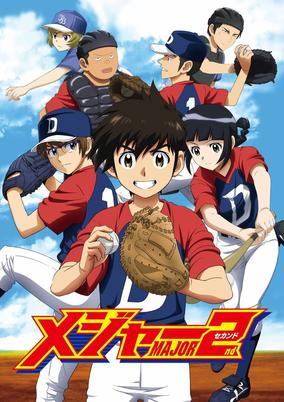

**Studio:** OLM &nbsp;|&nbsp; **Episodes:** 25 &nbsp;|&nbsp; **Director:** Ayumu Watanabe &nbsp;|&nbsp; **Aired/Released:** April 7 – September 22 &nbsp;|&nbsp; **Genres:** Sports, Baseball

> Daigo is born as the son of Gorou, a father who is too great. What path will Daigo, who is burdened with great expectations, take in baseball?
>
> _Synopsis source: Kitsu_

[Wikipedia](https://en.wikipedia.org/wiki/Major_2nd) · [Kitsu](https://kitsu.io/anime/major-2nd)

---

### Caligula

**Studio:** Satelight &nbsp;|&nbsp; **Episodes:** 12 &nbsp;|&nbsp; **Director:** Jun'ichi Wada &nbsp;|&nbsp; **Aired/Released:** April 8 – June 24 &nbsp;|&nbsp; **Genres:** Action, Science Fiction, School Life, High School, Virtual Reality, Thriller

> "Destroy ideals (you) and return to reality (hell)..." A beautiful song echoes throughout the city. A city is overseen by the popular virtual idol group "μ", every day was filled with peace and serenity. Ritsu Shikishima is a freshman at Miyabi city Kishimai High School. With good grades and athletic skills, he was spending a fulfilling high school life surrounded by many of his friends. Time has passed and on the first day of his second year, the one who stepped up to the podium as the class representative was someone who was not supposed to be there...
>
> _Synopsis source: Kitsu_

[Wikipedia](https://en.wikipedia.org/wiki/Caligula_(anime)) · [Kitsu](https://kitsu.io/anime/caligula)

---

### Cute High Earth Defence Club HAPPY KISS

**Studio:** Studio Comet &nbsp;|&nbsp; **Episodes:** 12 &nbsp;|&nbsp; **Director:** Shinji Takamatsu &nbsp;|&nbsp; **Aired/Released:** April 8 – July 1

[Wikipedia](https://en.wikipedia.org/wiki/Cute_High_Earth_Defense_Club_Love!)

---

### Cutie Honey Universe

**Studio:** Production Reed &nbsp;|&nbsp; **Episodes:** 12 &nbsp;|&nbsp; **Director:** Akitoshi Yokoyama &nbsp;|&nbsp; **Aired/Released:** April 8 – June 24 &nbsp;|&nbsp; **Genres:** Action, Comedy, Magic, Romance, Science Fiction, Henshin, Android, Magical Girl

> The forces of evil are on the rise. When the evil mastermind Sister Jill transforms one of her girls into the bestial Breast Claw and sends her minions out on a mission involving the group Panther Claw and a jewelry store heist, Honey Kisaragi departs from her Catholic girls' school to confront the threat as Cutie Honey. But that's exactly what Sister Jill wants, as she desires Honey's Airborne Element Fixing Device, which allows her to transform into Honey's seven different forms. Meanwhile, Sister Jill is also on the scene in disguise as Inspector Genet, trying to worm her way into Honey's confidence from a different angle.
>
> _Synopsis source: Kitsu_

[Wikipedia](https://en.wikipedia.org/wiki/Cutie_Honey_Universe) · [Kitsu](https://kitsu.io/anime/cutie-honey-universe)

---

### Forest of Piano

**Studio:** Gaina &nbsp;|&nbsp; **Episodes:** 12 &nbsp;|&nbsp; **Director:** Ryūtarō Suzuki Gaku Nakatani &nbsp;|&nbsp; **Aired/Released:** April 8 – July 1 &nbsp;|&nbsp; **Genres:** Adventure, The Arts, Music, Comedy, School Life

> A tranquil tale about two boys from very different upbringings. On one hand you have Kai, born as the son of a prostitute, who's been playing the abandoned piano in the forest near his home ever since he was young. And on the other you have Syuhei, practically breast-fed by the piano as the son of a family of prestigious pianists. Yet it is their common bond with the piano that eventually intertwines their paths in life.
>
> _Synopsis source: Kitsu_

[Wikipedia](https://en.wikipedia.org/wiki/Forest_of_Piano) · [Kitsu](https://kitsu.io/anime/piano-no-mori-tv)

---

### Hozuki's Coolheadedness (season 2, part 2)

**Studio:** Studio Deen &nbsp;|&nbsp; **Episodes:** 13 &nbsp;|&nbsp; **Director:** Kazuhiro Yoneda &nbsp;|&nbsp; **Aired/Released:** April 8 – July 1

[Wikipedia](https://en.wikipedia.org/wiki/Hozuki%27s_Coolheadedness)

---

### Kiratto Pri Chan

**Studio:** Tatsunoko Production DongWoo A&E &nbsp;|&nbsp; **Episodes:** 153 &nbsp;|&nbsp; **Director:** Hiroshi Ikehata &nbsp;|&nbsp; **Aired/Released:** April 8 – May 30, 2021 &nbsp;|&nbsp; **Genres:** Kids, Shoujo, Magical Girl, Magic, Music, Slice of Life

> First-year middle school girls Mirai Momoyama and Emo Moegi are two aspiring idols who decide to use the "Pri☆Chan System," a system used by famous people and companies to broadcast content. Like many girls starting their own channels and uploading content, the pair decide to become their own producers, starting their own channel in an attempt to become Pri☆Chan idols.
>
> _Synopsis source: Kitsu_

[Wikipedia](https://en.wikipedia.org/wiki/Kiratto_Pri_Chan) · [Kitsu](https://kitsu.io/anime/kiratto-pri-chan)

---

### Layton Mystery Tanteisha: Katori no Nazotoki File

**Studio:** Liden Films &nbsp;|&nbsp; **Episodes:** 50 &nbsp;|&nbsp; **Director:** Susumu Mitsunaka &nbsp;|&nbsp; **Aired/Released:** April 8 – March 31, 2019 &nbsp;|&nbsp; **Genres:** Detective, Comedy, Mystery

> The story is set in London and follows Katrielle as she solves mysteries with her talking dog Sherl.
>
> _Synopsis source: Kitsu_

[Kitsu](https://kitsu.io/anime/layton-mystery-tanteisha-katri-no-nazotoki-file)

---

### Nil Admirari no Tenbin: Teito Genwaku Kitan (The Scales of Nil Admirari ~The Mysterious Story of Teito~)

**Studio:** Zero-G &nbsp;|&nbsp; **Episodes:** 12 &nbsp;|&nbsp; **Director:** Masahiro Takata &nbsp;|&nbsp; **Aired/Released:** April 8 – June 24 &nbsp;|&nbsp; **Genres:** Fantasy, Historical, Romance, Japan, Reverse Harem

> The Taishou era didn't end in 15 years, but went on for another 25. In order to protect her waning family, a girl resolves to marry a man she doesn't even know the name of. However, just before the marriage was to take place, the girl's younger brother mysteriously committed suicide by self-immolation and was found holding an old book in his hands. Appearing before the bewildered young girl was the "Imperial Library Intelligence Asset Management Bureau," more commonly referred to as "Fukurou." According to these men, there exists "Maremono," which are books that greatly affect their readers. On top of that, ever since the incident involving the girl's younger brother, she unwittingly gains the ability to see "Auras" (the sentiments of the Maremono which manifest as bright lights and are usually invisible to humans). It was as though fate were trying to drag the young girl in its flames. And then, even though apprehensive, the girl chooses to venture outside her bird cage. Jealousy, hatred, scorn, compassion, and love. What awaited the girl was the darkness of betrayal that had already begun to bewitchingly inlay the imperial capital. Toyed by and swayed within that darkness, will the young girl finally reach the truth after her struggles, or...?
>
> _Synopsis source: Kitsu_

[Kitsu](https://kitsu.io/anime/nil-admirari-no-tenbin-teito-genwaku-kitan)

---

### Okko's Inn

**Studio:** Madhouse DLE &nbsp;|&nbsp; **Episodes:** 24 &nbsp;|&nbsp; **Director:** Mitsuyuki Masuhara &nbsp;|&nbsp; **Aired/Released:** April 8 – September 23 &nbsp;|&nbsp; **Genres:** Comedy, Shoujo, Slice of Life, Supernatural, Ghost, Family

> After losing her parents in a car accident, Okko goes to live in the countryside with her grandmother, who runs a traditional Japanese inn built on top of an ancient spring said to have healing waters. While she goes about her chores and prepares to become the inn's next caretaker, Okko discovers there are ghosts who live there that only she can see – not scary ghosts, but playful child ghosts who keep her company and help her feel less lonely. A sign outside says the spring welcomes all and will reject none, and this is soon put to the test as a string of new guests challenge Okko's ability to be a gracious host. But ultimately Okko discovers that dedicating herself to the happiness of others becomes the key to taking care of herself.
>
> _Synopsis source: Kitsu_

[Wikipedia](https://en.wikipedia.org/wiki/Okko%27s_Inn) · [Kitsu](https://kitsu.io/anime/wakaokami-wa-shougakusei-movie)

---

### Persona 5: The Animation (PERSONA 5 the Animation)

**Studio:** CloverWorks &nbsp;|&nbsp; **Episodes:** 26 &nbsp;|&nbsp; **Director:** Masashi Ishihama &nbsp;|&nbsp; **Aired/Released:** April 8 – September 30 &nbsp;|&nbsp; **Genres:** Demon, Action, Contemporary Fantasy, Crime, Fantasy, Mystery, Supernatural

> Ren Amamiya is about to enter his second year after transferring to Shujin Academy in Tokyo. Following a particular incident, his Persona awakens, and together with his friends they form the “Phantom Thieves of Hearts” to reform hearts of corrupt adults by stealing the source of their distorted desires. Meanwhile, bizarre and inexplicable crimes have been popping up one after another… Living an ordinary high school life in Tokyo during the day, the group maneuvers the metropolitan city as Phantom Thieves after hours. Let the curtain rise for this grand, picaresque story!
>
> _Synopsis source: Kitsu_

[Kitsu](https://kitsu.io/anime/persona-5-the-animation)

---

### Sword Art Online Alternative Gun Gale Online

**Studio:** 3Hz &nbsp;|&nbsp; **Episodes:** 12 &nbsp;|&nbsp; **Director:** Masayuki Sakoi &nbsp;|&nbsp; **Aired/Released:** April 8 – June 30 &nbsp;|&nbsp; **Genres:** Action, Fantasy, Military, Science Fiction, Virtual Reality

> In the world of guns and steel that is Gun Gale Online, LLENN has been a devoted, female solo player. She is obsessed with two things: donning herself entirely in pink and honing her skills with consistent gameplay. She soon discovers her love for hunting other players (a.k.a. PK), soon to be known as the “Pink Devil.” Meanwhile, LLENN meets a beautiful yet mysterious player, Pitohui, and the two click right away. Doing as she is told by Pitohui, she enters the Squad Jam group battle.
>
> _Synopsis source: Kitsu_

[Wikipedia](https://en.wikipedia.org/wiki/Sword_Art_Online_Alternative_Gun_Gale_Online) · [Kitsu](https://kitsu.io/anime/sword-art-online-alternative-gun-gale-online)

---

### Golden Kamuy

**Studio:** Geno Studio &nbsp;|&nbsp; **Episodes:** 12 &nbsp;|&nbsp; **Director:** Hitoshi Nanba &nbsp;|&nbsp; **Aired/Released:** April 9 – June 25 &nbsp;|&nbsp; **Genres:** Adventure, Action, Historical, Japan, Seinen

> The story takes place in the mighty Northern field of Hokkaido, the time is in the turbulent late Meiji Era. A post war soldier Sugimoto, aka, “Immortal Sugimoto” was in need of large sums of money for a particular purpose…. What awaited Sugimoto, who stepped into Hokkaido’s Gold Rush with dreams of making a fortune, was a tattoo map leading to a hidden treasure based on hints inscribed on the bodies of convicts in Abashiri Prison?! The magnificent nature of Hokkaido vs vicious convicts and the meeting with a pure Ainu girl, Ashiripa!! A survival battle for a hidden treasure hunt begins!
>
> _Synopsis source: Kitsu_

[Wikipedia](https://en.wikipedia.org/wiki/Golden_Kamuy) · [Kitsu](https://kitsu.io/anime/golden-kamuy)

---

### Food Wars! Shokugeki no Soma: The Third Plate (season 2) (Food Wars! The Third Plate – Totsuki Railway Arc)

**Studio:** J.C.Staff &nbsp;|&nbsp; **Episodes:** 12 &nbsp;|&nbsp; **Director:** Yoshitomo Yonetani &nbsp;|&nbsp; **Aired/Released:** April 9 – June 25 &nbsp;|&nbsp; **Genres:** Ecchi, School Life, Cooking, Shounen

> The second course of Shokugeki no Souma season 3.
>
> _Synopsis source: Kitsu_

[Kitsu](https://kitsu.io/anime/shokugeki-no-souma-san-no-sara-toutsuki-ressha-hen)

---

### Crossing Time

**Studio:** Ekachi Epilka &nbsp;|&nbsp; **Episodes:** 12 &nbsp;|&nbsp; **Director:** Yoshio Suzuki &nbsp;|&nbsp; **Aired/Released:** April 10 – June 26 &nbsp;|&nbsp; **Genres:** Comedy, Slice of Life

> A series of short stories about conversations young women have while waiting at railroad crossings.
>
> _Synopsis source: Kitsu_

[Wikipedia](https://en.wikipedia.org/wiki/Crossing_Time) · [Kitsu](https://kitsu.io/anime/fumikiri-jikan)

---

### High School DxD Hero

**Studio:** Passione &nbsp;|&nbsp; **Episodes:** 12 &nbsp;|&nbsp; **Director:** Yoshifumi Sueda &nbsp;|&nbsp; **Aired/Released:** April 10 – July 3 &nbsp;|&nbsp; **Genres:** Comedy, Fantasy, School Life, Demon, Harem, Romance, Ecchi

> 4th season of the High School DxD anime series.
>
> _Synopsis source: Kitsu_

[Wikipedia](https://en.wikipedia.org/wiki/High_School_DxD_Hero) · [Kitsu](https://kitsu.io/anime/high-school-dxd-hero)

---

### Ladyspo

**Episodes:** 12 &nbsp;|&nbsp; **Director:** Hiroshi Kimura &nbsp;|&nbsp; **Aired/Released:** April 10 – June 26 &nbsp;|&nbsp; **Genres:** Action, Comedy, Science Fiction

> The anime is a science-fiction comedy where various pro sports bounty hunters fight each other in sporting events. The story centers on Arigetti, Korupi, and Sabina, three women in a team who participate in various sports.
>
> _Synopsis source: Kitsu_

[Wikipedia](https://en.wikipedia.org/wiki/Ladyspo) · [Kitsu](https://kitsu.io/anime/ladyspo)

---

### Rokuhōdō Yotsuiro Biyori

**Studio:** Zexcs &nbsp;|&nbsp; **Episodes:** 12 &nbsp;|&nbsp; **Director:** Tomomi Kamiya &nbsp;|&nbsp; **Aired/Released:** April 10 – June 26 &nbsp;|&nbsp; **Genres:** Slice of Life, Cooking

> The story takes place at a popular Japanese-style tea house called Rokuhoudou. Four specialists work there: Sui makes the tea, Gure creates latte art, Tsubaki makes the sweets, and Tokitaka cooks. In addition to serving their customers, they sometimes help them solve their problems.
>
> _Synopsis source: Kitsu_

[Wikipedia](https://en.wikipedia.org/wiki/Rokuh%C5%8Dd%C5%8D_Yotsuiro_Biyori) · [Kitsu](https://kitsu.io/anime/rokuhoudou-yotsuiro-biyori)

---

### Steins;Gate 0

**Studio:** White Fox &nbsp;|&nbsp; **Episodes:** 23 &nbsp;|&nbsp; **Director:** Kenichi Kawamura &nbsp;|&nbsp; **Aired/Released:** April 11 – September 27 &nbsp;|&nbsp; **Genres:** Science Fiction, Thriller, Angst, Time Travel, Drama

> A divergent continuation of the original Steins;Gate ending, Steins;Gate 0 explores an alternate worldline where Okabe abandons time travel. While attempting to forget past traumas and get his life back on track, he meets an AI that re-opens old wounds.
>
> _Synopsis source: Kitsu_

[Wikipedia](https://en.wikipedia.org/wiki/Steins;Gate_0_(anime)) · [Kitsu](https://kitsu.io/anime/steins-gate-0)

---

### Butlers: Chitose Momotose Monogatari (Butlers x Battlers)

**Studio:** Silver Link &nbsp;|&nbsp; **Episodes:** 12 &nbsp;|&nbsp; **Director:** Ken Takahashi &nbsp;|&nbsp; **Aired/Released:** April 12 – June 28 &nbsp;|&nbsp; **Genres:** Comedy

> Koma "Jay" Jinguji is the smart and handsome student council president. His elegant smile captures the hearts of women. Tsubasa Hayakawa is a multi-talented and gentle shop assistant at a café. His cafe latte with owl latte art is very popular with female customers. The two men travel through time to fight their archenemy. The charming "Butlers," as they are called, fight supernatural battles and also experience a slapstick comedic life at their academy.
>
> _Synopsis source: Kitsu_

[Kitsu](https://kitsu.io/anime/butlers-chitose-momotose-monogatari)

---

### Last Period

**Studio:** J.C.Staff &nbsp;|&nbsp; **Episodes:** 12 &nbsp;|&nbsp; **Director:** Yoshiaki Iwasaki &nbsp;|&nbsp; **Aired/Released:** April 12 – June 28 &nbsp;|&nbsp; **Genres:** Adventure, Action, Comedy, Fantasy, Magic

> "Period" is how magic users called who beat "Spiral"—monsters that were summoned from isolation. Due to the rise of these beings, 14-year-old apprentice Period Haru, who is a part of the Eighth Arc-end Division, is called to break the cycle and cast himself into the endless battle. However, a mysterious thievery occurred and sank the division into bankruptcy, forcing Haru and his other comrades have to leave their headquarters. To rebuild a branch, they have to overcome quest after quest.
>
> _Synopsis source: Kitsu_

[Wikipedia](https://en.wikipedia.org/wiki/Last_Period) · [Kitsu](https://kitsu.io/anime/last-period)

---

### Doreiku

**Studio:** Zero-G TNK &nbsp;|&nbsp; **Episodes:** 12 &nbsp;|&nbsp; **Director:** Ryōichi Kuraya &nbsp;|&nbsp; **Aired/Released:** April 13 – June 29 &nbsp;|&nbsp; **Genres:** Psychological, Angst, Slavery, Violence, Drama, Seinen

> What if you could enslave anyone you ever wanted? Well, this comes close. The SCM lets you enslave anyone who is also wearing an SCM, at a price. One must win over the other, at the cost of anything, in order for the other to become their slave.
>
> _Synopsis source: Kitsu_

[Wikipedia](https://en.wikipedia.org/wiki/Doreiku) · [Kitsu](https://kitsu.io/anime/dorei-ku-the-animation)

---

### Full Metal Panic! Invisible Victory

**Studio:** Xebec &nbsp;|&nbsp; **Episodes:** 12 &nbsp;|&nbsp; **Director:** Katsuichi Nakayama &nbsp;|&nbsp; **Aired/Released:** April 13 – July 19 &nbsp;|&nbsp; **Genres:** Military, Mecha, Action

> Fujimi Shobo announced at the "Fantasia Bunko Big Thanksgiving 2015" event on that plans for a new anime adaptation of Shoji Gatoh and Shikidouji's Full Metal Panic! light novel series are underway.
>
> _Synopsis source: Kitsu_

[Wikipedia](https://en.wikipedia.org/wiki/Full_Metal_Panic!_Invisible_Victory) · [Kitsu](https://kitsu.io/anime/full-metal-panic-invisible-victory)

---

### Dragon Pilot: Hisone and Masotan (Dragon Pilot: Hisone & Masotan)

**Studio:** Bones &nbsp;|&nbsp; **Episodes:** 12 &nbsp;|&nbsp; **Director:** Shinji Higuchi Hiroshi Kobayashi &nbsp;|&nbsp; **Aired/Released:** April 13 – June 29 &nbsp;|&nbsp; **Genres:** Air Force, Dragon, Military, Contemporary Fantasy

> Straightforward and innocent Hisone Amakasu is a rookie self-defense official. She was struggling with the fact that she sometimes hurts people unintentionally by her innocent words and decided to join in Air Self-Defence, hoping to maintain a certain distance from people. This decision led her to a fateful encounter which profoundly changes her life. It was the dragon hidden in the base and it chose Hisone as his pilot. When it soared into the sky with Hisone, her fate as a dragon pilot was decided. It is said that dragons have a key to the future of the world...
>
> _Synopsis source: Kitsu_

[Kitsu](https://kitsu.io/anime/hisone-to-masotan)

---

### Wotakoi: Love is Hard for Otaku

**Studio:** A-1 Pictures &nbsp;|&nbsp; **Episodes:** 11 &nbsp;|&nbsp; **Director:** Yoshimasa Hiraike &nbsp;|&nbsp; **Aired/Released:** April 13 – June 22 &nbsp;|&nbsp; **Genres:** Romance, Slice of Life, Comedy, Office Lady, Working Life

> After discovering that they work at the same company, a gaming crazed otaku and a fujoshi reunite for the first time since middle school. After some post-work drinking sessions they begin dating, but will it be a perfect relationship for the two?
>
> _Synopsis source: Kitsu_

[Kitsu](https://kitsu.io/anime/wotaku-ni-koi-wa-muzukashii)

---

### FLCL Progressive (FLCL: Progressive)

**Studio:** Production I.G Signal.MD (#2) Production GoodBook (#5) &nbsp;|&nbsp; **Episodes:** 6 &nbsp;|&nbsp; **Director:** Katsuyuki Motohiro &nbsp;|&nbsp; **Aired/Released:** June 3 – July 7 &nbsp;|&nbsp; **Genres:** Comedy, Science Fiction, Mecha, Parody, Action, Dementia

> In the new season of FLCL, many years have passed since Naota and Haruhara Haruko shared their adventure together. Meanwhile, the war between the two entities known as Medical Mechanica and Fraternity rages across the galaxy. Enter Hidomi, a young teenaged girl who believes there is nothing amazing to expect from her average life, until one day when a new teacher named Haruko arrives at her school. Soon enough, Medical Mechanica is attacking her town and Hidomi discovers a secret within her that could save everyone, a secret that only Haruko can unlock. But why did Haruko return to Earth? What happened to her Rickenbacker 4001 she left with Naota? And where did the human-type robot "Canti" go?
>
> _Synopsis source: Kitsu_

[Wikipedia](https://en.wikipedia.org/wiki/FLCL_Progressive) · [Kitsu](https://kitsu.io/anime/flcl-progressive)

---

### Island

**Studio:** Feel &nbsp;|&nbsp; **Episodes:** 12 &nbsp;|&nbsp; **Director:** Keiichiro Kawaguchi &nbsp;|&nbsp; **Aired/Released:** July 1 – September 16

[Wikipedia](https://en.wikipedia.org/wiki/Island_(visual_novel))

---

### Hanebado!

**Studio:** Liden Films &nbsp;|&nbsp; **Episodes:** 13 &nbsp;|&nbsp; **Director:** Shinpei Ezaki &nbsp;|&nbsp; **Aired/Released:** July 2 – October 1 &nbsp;|&nbsp; **Genres:** Sports, High School, School Clubs, School Life, Seinen, Family, Friendship

> Despite her great potential, Ayano Hanesaki would rather avoid badminton than play it. But, when she meets Nagisa Aragaki, a third year who spends every waking moment perfecting her game, she’s inspired. Encouraged by their coach, Tachibana Kentarou, Ayano and Nagisa will hit the court and rally against opponents and rivals with amazing skills!
>
> _Synopsis source: Kitsu_

[Wikipedia](https://en.wikipedia.org/wiki/Hanebado!) · [Kitsu](https://kitsu.io/anime/hanebado)

---

### Encouragement of Climb (season 3)

**Studio:** Eight Bit &nbsp;|&nbsp; **Episodes:** 13 &nbsp;|&nbsp; **Director:** Yusuke Yamamoto &nbsp;|&nbsp; **Aired/Released:** July 2 – September 24

[Wikipedia](https://en.wikipedia.org/wiki/Encouragement_of_Climb)

---

### One Room (season 2) (One Room)

**Studio:** Zero-G &nbsp;|&nbsp; **Episodes:** 13 &nbsp;|&nbsp; **Director:** Hiroshi Gotō Ryōhei Suzuki Shūichi Suzuki &nbsp;|&nbsp; **Aired/Released:** July 3 – September 25 &nbsp;|&nbsp; **Genres:** Slice of Life, Romance

> Series of shorts that tell stories of your relationship with "your" neighbor, younger sister, and childhood friend.
>
> _Synopsis source: Kitsu_

[Wikipedia](https://en.wikipedia.org/wiki/One_Room) · [Kitsu](https://kitsu.io/anime/one-room)

---

### The Thousand Musketeers

**Studio:** TMS/Double Eagle &nbsp;|&nbsp; **Episodes:** 12 &nbsp;|&nbsp; **Director:** Ken'ichi Kasai &nbsp;|&nbsp; **Aired/Released:** July 3 – September 25 &nbsp;|&nbsp; **Genres:** Action, Military

> Despair War is a battle between ancient guns and contemporary guns. Due to a nuclear war, the world was destroyed. Under the full governance of a world empire, people are living with their freedom taken. Despite the forbidden rule of owning any weapons, there is a resistance that secretly fights against the world empire. They own ancient guns left as art and fight using these. Then, the Kijuushi appear as the souls of the ancient guns. Proud and magnificent, the "Absolute Royal" are the only ones that can give hope to this world. The story depicts the everyday life of the Kijuushi. Laughter, despair, happiness, confusion, pain; they would still pursue their own absolute loyalty to fight. What do they fight for? What should they protect?
>
> _Synopsis source: Kitsu_

[Wikipedia](https://en.wikipedia.org/wiki/The_Thousand_Musketeers) · [Kitsu](https://kitsu.io/anime/senjuushi)

---

### Back Street Girls

**Studio:** J.C.Staff &nbsp;|&nbsp; **Episodes:** 10 &nbsp;|&nbsp; **Director:** Chiaki Kon &nbsp;|&nbsp; **Aired/Released:** July 4 – September 5 &nbsp;|&nbsp; **Genres:** Ecchi, Idol, Comedy, Mafia, Gender Bender

> A group of 3 yakuza failed their boss for the last time. After messing up an important job, the boss gave them 2 choices: honorably commit suicide, or go to Thailand to get a sex reassignment surgery in order to become "female" idols. After a gruesome year training to become idols, they successfully debut, with overwhelming popularity, much to their dismay. This is where their tragedy truly begins.
>
> _Synopsis source: Kitsu_

[Wikipedia](https://en.wikipedia.org/wiki/Back_Street_Girls) · [Kitsu](https://kitsu.io/anime/back-street-girls)

---

### Mr. Tonegawa: Middle Management Blues

**Studio:** Madhouse &nbsp;|&nbsp; **Episodes:** 24 &nbsp;|&nbsp; **Director:** Keiichiro Kawaguchi &nbsp;|&nbsp; **Aired/Released:** July 4 – December 26 &nbsp;|&nbsp; **Genres:** Psychological, Comedy, Seinen, Working Life, Parody, Japan, Tone Changes

> Chuukan Kanriroku Tonegawa is a spin-off of the Kaiji series, which follows Tonegawa, the right hand man of Kazutaka Hyoudou, the president of the Teiai Corporation and owner of numerous gambling tournaments. After Hyoudou is getting bored with his life, he orders Tonegawa to organize a so called "game of death" as it is his and his subordinate's job to keep the president in a good mood. Tonegawa must cooperate with his subordinates in order to make the president happy and what follows is a humorous story of his interactions with his subordinates and other characters of the Kaiji series.
>
> _Synopsis source: Kitsu_

[Kitsu](https://kitsu.io/anime/chuukan-kanriroku-tonegawa)

---

### 100 Sleeping Princes and the Kingdom of Dreams (100 Sleeping Princes & The Kingdom of Dreams)

**Studio:** Project No.9 &nbsp;|&nbsp; **Episodes:** 12 &nbsp;|&nbsp; **Director:** Yukina Hiiro &nbsp;|&nbsp; **Aired/Released:** July 5 – September 20 &nbsp;|&nbsp; **Genres:** Romance, Fantasy, Adventure

> The heroine is a normal girl, until one day she is invited to another world and becomes the princess of the dream world, where people use dreams as the energy to live. One day, the dream world is being attacked by something called "yumekui" ("dream eater"), and many princes are being attacked by it. The heroine must wake them up to save the dream world, as the princes are unable to wake up due to having their dreams stolen.
>
> _Synopsis source: Kitsu_

[Wikipedia](https://en.wikipedia.org/wiki/100_Sleeping_Princes_and_the_Kingdom_of_Dreams) · [Kitsu](https://kitsu.io/anime/yume-oukoku-to-nemureru-100-nin-no-ouji-sama)

---

### Banana Fish

**Studio:** MAPPA &nbsp;|&nbsp; **Episodes:** 24 &nbsp;|&nbsp; **Director:** Hiroko Utsumi &nbsp;|&nbsp; **Aired/Released:** July 5 – December 20 &nbsp;|&nbsp; **Genres:** Action, Psychological, New York, Delinquent, United States, Drama, Mystery

> Nature made Ash Lynx beautiful; nurture made him a cold ruthless killer. A runaway brought up as the adopted heir and sex toy of "Papa" Dino Golzine, Ash, now at the rebellious age of seventeen, forsakes the kingdom held out by the devil who raised him. But the hideous secret that drove Ash's older brother mad in Iraq has suddenly fallen into Papa's insatiably ambitious hands—and it's exactly the wrong time for Eiji Okamura, a pure-hearted young photographer from Japan, to make Ash Lynx's acquaintance...
>
> _Synopsis source: Kitsu_

[Wikipedia](https://en.wikipedia.org/wiki/Banana_Fish) · [Kitsu](https://kitsu.io/anime/banana-fish)

---

### How Not to Summon a Demon Lord

**Studio:** Ajia-do Animation Works &nbsp;|&nbsp; **Episodes:** 12 &nbsp;|&nbsp; **Director:** Yūta Murano &nbsp;|&nbsp; **Aired/Released:** July 5 – September 20 &nbsp;|&nbsp; **Genres:** Comedy, Fantasy, Magic, Demon, Ecchi, Action, Isekai

> Sakamoto Takuma was so strong in the MMORPG Cross Reverie that his fellow players came to call him the "demon lord." One day, he gets summoned to another world in his avatar form, and meets two girls who both insist that they're the one who summoned him. They cast a spell used to enslave summoned beasts on him, but that activates his unique ability, Magic Reflect, and the girls end up being the ones put under the spell! And thus begins the otherworldly adventure of a demon lord (pretend) who blazes his own trail through overwhelming power.
>
> _Synopsis source: Kitsu_

[Wikipedia](https://en.wikipedia.org/wiki/How_Not_to_Summon_a_Demon_Lord) · [Kitsu](https://kitsu.io/anime/isekai-maou-to-shoukan-shoujo-no-dorei-majutsu)

---

### Miss Caretaker of Sunohara-sou

**Studio:** Silver Link &nbsp;|&nbsp; **Episodes:** 12 &nbsp;|&nbsp; **Director:** Shin Ōnuma Mirai Minato &nbsp;|&nbsp; **Aired/Released:** July 5 – September 20 &nbsp;|&nbsp; **Genres:** Comedy, Slice of Life, Ecchi, Harem

> Shiina Aki is constantly being treated like a girl due to his feminine looks so he decides to move to Tokyo to attend middle school in an attempt to change himself. However what awaits him in his new home, Sunohara-sou, is the kind-hearted caretaker, Sunohara Ayaka. Along with the three female members of Aki's new middle school's student council, Yukimoto Yuzu, Yamanashi Sumire &amp; Kazami Yuri. And so begins Aki's new life in Tokyo living with 4 girls.
>
> _Synopsis source: Kitsu_

[Wikipedia](https://en.wikipedia.org/wiki/Miss_Caretaker_of_Sunohara-sou) · [Kitsu](https://kitsu.io/anime/sunoharasou-no-kanrinin-san)

---

### BanG Dream! Girls Band Party! Pico (BanG Dream!)

**Studio:** Sanzigen DMM.futureworks &nbsp;|&nbsp; **Episodes:** 26 &nbsp;|&nbsp; **Aired/Released:** July 5 – December 27 &nbsp;|&nbsp; **Genres:** Music, Musical Band, School Life, School Clubs, All Girls School, High School, Japan, Plot Continuity, Comedy, The Arts

> When she was a child, Kasumi Toyama felt a heart-pounding thrill every time she gazed at the stars, and she's been looking without success for something that could inspire the same feeling ever since. One day, she comes across a star-shaped guitar in a rundown pawnshop and, for the first time, discovers the thrill she's been searching for. Kasumi becomes determined to form an all-girl band, and her search leads her to four like-minded souls: Saya, Arisa, Rimi, and Tae. Does this band have what it takes to make their dreams of stardom come true?
>
> _Synopsis source: Kitsu_

[Wikipedia](https://en.wikipedia.org/wiki/BanG_Dream!) · [Kitsu](https://kitsu.io/anime/bang-dream)

---

### Seven Senses of the Re'Union

**Studio:** Lerche &nbsp;|&nbsp; **Episodes:** 12 &nbsp;|&nbsp; **Director:** Yoshihito Nishōji &nbsp;|&nbsp; **Aired/Released:** July 6 – September 21 &nbsp;|&nbsp; **Genres:** Action, Fantasy, Science Fiction, Adventure, Virtual Reality

> There was once a legendary party named Subaru in the globally popular MMORPG "Union." The group was made of elementary school friends. They earned fame in the blink of an eye for their unparalleled abilities in the Sense system at the core of the game. However, there was an incident where a player passed away inside the game. As a result of the death, Union ended service. Six years pass. Haruto Amou, who was a key member of Subaru, has become a hopeless high school student. His personality has changed, and he has no friends or ambition. A classmate gets him to log in to the new Re'Union game, and he ends up having a "reunion" that is hard to believe. He meets his former in-game partner and real-world childhood friend Asahi Kuga. The girl who was supposed to have died six years ago was there. Haruto can't believe his eyes. He thinks he must be ill or Asahi must be a system error or bug. Yet, she really seems to be there in the game. A new legend begins after the pair's reunion.
>
> _Synopsis source: Kitsu_

[Wikipedia](https://en.wikipedia.org/wiki/Seven_Senses_of_the_Re%27Union) · [Kitsu](https://kitsu.io/anime/shichisei-no-subaru)

---

### Angels of Death

**Studio:** J.C.Staff &nbsp;|&nbsp; **Episodes:** 12 &nbsp;|&nbsp; **Director:** Kentarō Suzuki &nbsp;|&nbsp; **Aired/Released:** July 6 – September 21 &nbsp;|&nbsp; **Genres:** Thriller, Psychological, Violence, Horror, Mystery

> When Rachel wakes up in the basement of an unfamiliar building, she finds herself lost all her memory. As Rachel tries to get clear of the basement, she runs into Zack, a scythe-carrying serial killer wrapped from head to toe in bandages. “Kill me, kill me please…" "I will do it, but only if you help me to get out of this building.” The bizarre promise brings these two together and somehow makes them an irreplaceable partner to each other. Where are they? Why are they trapped? And what is the destiny they have been looking for? The journey of death and lives starts…
>
> _Synopsis source: Kitsu_

[Wikipedia](https://en.wikipedia.org/wiki/Angels_of_Death_(video_game)) · [Kitsu](https://kitsu.io/anime/satsuriku-no-tenshi)

---

### Chio's School Road

**Studio:** Diomedéa &nbsp;|&nbsp; **Episodes:** 12 &nbsp;|&nbsp; **Director:** Takayuki Inagaki &nbsp;|&nbsp; **Aired/Released:** July 6 – September 21 &nbsp;|&nbsp; **Genres:** Comedy, Seinen, Slice of Life

> This is a story of a nerdy bookworm girl on her way to school, and yes, that's the entire premise, as she's not getting to school any time soon. Taking her "usual" route to school, it becomes an increasingly unusual adventure, and all the more ridiculous as it carries on. It takes an unpleasant sentiment many can empathize with, the feeling of tardiness, and brings humor to it—making it a hilarious situation to look back upon.
>
> _Synopsis source: Kitsu_

[Wikipedia](https://en.wikipedia.org/wiki/Chio%27s_School_Road) · [Kitsu](https://kitsu.io/anime/chio-chan-no-tsuugakuro)

---

### Harukana Receive

**Studio:** C2C &nbsp;|&nbsp; **Episodes:** 12 &nbsp;|&nbsp; **Director:** Toshiyuki Kubooka &nbsp;|&nbsp; **Aired/Released:** July 6 – September 21 &nbsp;|&nbsp; **Genres:** Sports, Volleyball, Japan, Summer

> Oozora Haruka is a high school second-year who's just moved to Okinawa. Haruka is generally cheerful and optimistic, but there's one thing she feels insecure about: she's taller than most other girls. Higa Kanata, her cousin of the same age who meets her at the airport, also has one hang-up: she had to quit her beloved beach volleyball in the past because she was too short. Through some twist of fate, these mismatched cousins find themselves paired up as a beach volleyball team. How will this duo play together in a sport where the presence of one's teammate is more important than anything?!
>
> _Synopsis source: Kitsu_

[Wikipedia](https://en.wikipedia.org/wiki/Harukana_Receive) · [Kitsu](https://kitsu.io/anime/harukana-receive)

---

### Ongaku Shōjo

**Studio:** Studio Deen &nbsp;|&nbsp; **Episodes:** 12 &nbsp;|&nbsp; **Director:** Yukio Nishimoto &nbsp;|&nbsp; **Aired/Released:** July 6 – September 21

[Wikipedia](https://en.wikipedia.org/wiki/Ongaku_Sh%C5%8Djo)

---

### Oshiete Mahō no Pendulum: Rilu Rilu Fairilu

**Studio:** Studio Deen &nbsp;|&nbsp; **Episodes:** 26 &nbsp;|&nbsp; **Director:** Chisei Maeda &nbsp;|&nbsp; **Aired/Released:** July 7 – January 5, 2019 &nbsp;|&nbsp; **Genres:** Fantasy, Magic, Slice of Life

[Kitsu](https://kitsu.io/anime/oshiete-fairilu-mahou-no-pendulum)

---

### Zoids Wild

**Studio:** OLM &nbsp;|&nbsp; **Episodes:** 50 &nbsp;|&nbsp; **Director:** Norihiko Sudō &nbsp;|&nbsp; **Aired/Released:** July 7 – June 29, 2019 &nbsp;|&nbsp; **Genres:** Mecha, Piloted Robot, Science Fiction, Action, Adventure, Comedy, Kids, Shounen

> The series follows Arashi and his Wild Liger. The main antagonists are the Death Metal Empire, lead by Gallagher. They use Zoids for conquest, and have at their command many Zoids and warriors, including the Four Heavenly Kings. Arashi longs to follow his father's footsteps become a Zoid Hunter, and find his ultimate Partner. At the beginning of his journey, he partners up wiht the Wild Liger and meets Bacon and Team Supreme, who tell him about the Great Ancient Treasure Z. For the sake of adventure, Arashi sets out to find this treasure, and forms Team Freedom along the way.
>
> _Synopsis source: Kitsu_

[Wikipedia](https://en.wikipedia.org/wiki/Zoids_Wild) · [Kitsu](https://kitsu.io/anime/zoids-wild)

---

### Cells at Work!

**Studio:** David Production &nbsp;|&nbsp; **Episodes:** 13 &nbsp;|&nbsp; **Director:** Kenichi Suzuki &nbsp;|&nbsp; **Aired/Released:** July 8 – September 30 &nbsp;|&nbsp; **Genres:** Comedy, Action, Violence

> This is a story about you. A tale about the inside of your body... According to a new study, the human body consists of approximately 37 trillion cells. These cells are hard at work every day within a world that is your body. From the oxygen-carrying red blood cells to the bacteria-fighting white blood cells, get to know the unsung heroes and the drama that unfolds inside of you! It's the oddly relatable and interesting story that is the life of cells!
>
> _Synopsis source: Kitsu_

[Wikipedia](https://en.wikipedia.org/wiki/Cells_at_Work!) · [Kitsu](https://kitsu.io/anime/hataraku-saibou-tv)

---

### The Master of Ragnarok & Blesser of Einherjar

**Studio:** EMT Squared &nbsp;|&nbsp; **Episodes:** 12 &nbsp;|&nbsp; **Director:** Kōsuke Kobayashi &nbsp;|&nbsp; **Aired/Released:** July 8 – September 23 &nbsp;|&nbsp; **Genres:** Fantasy, Harem, Action, Ecchi, Romance, Violence, War, Isekai

> Some urban legends are best left untested! Yuuto Suou gets more than he bargained for when he joins his childhood friend Mitsuki Shimoya in testing out an urban legend. When he uses his phone to take a picture of himself with the local shrine's divine mirror, he is whisked off into another world—one heavily steeped in the lore of the old Norse myths. Using his knowledge gained from school and from his solar-powered smartphone, he has the chance to bring the Wolf Clan, the same people who cared for him, to prominence, all while earning the adoration of a group of magic-wielding warrior maidens known as the Einherjar.
>
> _Synopsis source: Kitsu_

[Wikipedia](https://en.wikipedia.org/wiki/The_Master_of_Ragnarok_%26_Blesser_of_Einherjar) · [Kitsu](https://kitsu.io/anime/hyakuren-no-haou-to-seiyaku-no-valkyria)

---

### Asobi Asobase (Asobi Asobase -workshop of fun-)

**Studio:** Lerche &nbsp;|&nbsp; **Episodes:** 12 &nbsp;|&nbsp; **Director:** Seiji Kishi &nbsp;|&nbsp; **Aired/Released:** July 8 – September 23 &nbsp;|&nbsp; **Genres:** Comedy, School Life

> Three classmates play simple hand games. One of the girls is good at games, but hates them as she always lost to her older sister and forced to do chores while growing up. Another girl is of American descent, but raised in Japan, and who only pretends to be bad at Japanese. Another girl usually observes their games, and loses to the other girls.
>
> _Synopsis source: Kitsu_

[Wikipedia](https://en.wikipedia.org/wiki/Asobi_Asobase) · [Kitsu](https://kitsu.io/anime/asobi-asobase)

---

### Gintama. Shirogane no Tamashii-hen (season 2)

**Studio:** BN Pictures &nbsp;|&nbsp; **Episodes:** 14 &nbsp;|&nbsp; **Director:** Chizuru Miyawaki &nbsp;|&nbsp; **Aired/Released:** July 8 – October 7

[Wikipedia](https://en.wikipedia.org/wiki/Gintama)

---

### Planet With

**Studio:** J.C.Staff &nbsp;|&nbsp; **Episodes:** 12 &nbsp;|&nbsp; **Director:** Yōhei Suzuki &nbsp;|&nbsp; **Aired/Released:** July 8 – September 23

[Wikipedia](https://en.wikipedia.org/wiki/Planet_With)

---

### Dropkick on My Devil!

**Studio:** Nomad &nbsp;|&nbsp; **Episodes:** 11 &nbsp;|&nbsp; **Director:** Hikaru Sato &nbsp;|&nbsp; **Aired/Released:** July 9 – September 17 &nbsp;|&nbsp; **Genres:** Comedy, Slice of Life, Supernatural, Seinen, Demon, Angel, Violence

> The demon Jashin-chan has been summoned to Earth by Yurine Hanazono, a girl with a knack for the occult. Unfortunately, Yurine does not actually know how to send Jashin-chan back to Hell. Now stuck on Earth, she must live at Yurine's apartment as her familiar. The only way for Jashin-chan to return would be to kill her summoner, but this is easier said than done for the incompetent demon. Since Jashin-chan is immortal and can regenerate her body, Yurine does not hold back in attacking her with a range of weapons, punishing her in gruesome manners for her evil schemes. Jashin-chan is also often visited by her demon friends: the kindhearted Gorgon Medusa and the energetic minotaur Minosu, who seem much more well-behaved in contrast, and disapprove of her plans to kill Yurine.
>
> _Synopsis source: Kitsu_

[Wikipedia](https://en.wikipedia.org/wiki/Dropkick_on_My_Devil!) · [Kitsu](https://kitsu.io/anime/jashin-chan-dropkick)

---

### Holmes of Kyoto

**Studio:** Seven &nbsp;|&nbsp; **Episodes:** 12 &nbsp;|&nbsp; **Director:** Noriyoshi Sasaki &nbsp;|&nbsp; **Aired/Released:** July 9 – September 24 &nbsp;|&nbsp; **Genres:** Mystery, Detective, Drama, Romance, Slice of Life

> The "light, antique mystery" series revolves around a "spiteful," handsome Kyoto boy and a high school girl. The story is set at an antique shop in Kyoto's Teramachi Sanjou shopping district. High school girl Aoi Mashiro unexpectedly runs into Kiyotaka Yagashira, the son of the shop's owner, and ends up working part-time at the shop. Kiyotaka is called the "Holmes at Teramachi Sanjou," and he and Aoi solve odd cases brought to them by various clients.
>
> _Synopsis source: Kitsu_

[Wikipedia](https://en.wikipedia.org/wiki/Holmes_of_Kyoto) · [Kitsu](https://kitsu.io/anime/kyoto-teramachi-sanjou-no-holmes)

---

### Agū: Tensai Ningyō

**Studio:** Studio Deen &nbsp;|&nbsp; **Episodes:** 12 &nbsp;|&nbsp; **Director:** Bob Shirahata &nbsp;|&nbsp; **Aired/Released:** July 10 – September 25 &nbsp;|&nbsp; **Genres:** Horror, Action, Supernatural

> In the story, Ai is an ordinary girl, and a dancer. Her friend Machi is also a dancer, but Machi is a genius. Watching Machi's talent often makes Ai feel down. But one day, Ai finds out Machi's secret: the existence of the Aguu, palm-size entities who grant genius talent upon those who hold them. In order to save Machi, who has become a "Seamstress" who makes Aguu, Ai becomes a "Savior." The Saviors are a group of people who have fought the Seamstresses for generations.
>
> _Synopsis source: Kitsu_

[Kitsu](https://kitsu.io/anime/aguu-tensai-ningyou)

---

### Phantom in the Twilight

**Studio:** Liden Films &nbsp;|&nbsp; **Episodes:** 12 &nbsp;|&nbsp; **Director:** Kunihiro Mori &nbsp;|&nbsp; **Aired/Released:** July 10 – September 25 &nbsp;|&nbsp; **Genres:** Slice of Life, Action, Supernatural, Vampire

> Set in modern day London, the story takes place in a world where "Shadows" are born from human fear and anxiety. A young girl arrives to study abroad, only to be caught in a bizarre incident as she enters university. In a city with no acquaintances, the helpless girl wanders into "Café Forbidden," a mysterious café that exclusively opens at midnight. She meets an assortment of handsome men employed at the café, where guardians who protect the boundary between humans and shadow convene.
>
> _Synopsis source: Kitsu_

[Wikipedia](https://en.wikipedia.org/wiki/Phantom_in_the_Twilight) · [Kitsu](https://kitsu.io/anime/phantom-in-the-twilight)

---

### Shinya! Tensai Bakabon

**Studio:** Pierrot+ &nbsp;|&nbsp; **Episodes:** 12 &nbsp;|&nbsp; **Director:** Toru Hosokawa &nbsp;|&nbsp; **Aired/Released:** July 10 – September 25

[Wikipedia](https://en.wikipedia.org/wiki/Tensai_Bakabon)

---

### Overlord (season 3)

**Studio:** Madhouse &nbsp;|&nbsp; **Episodes:** 13 &nbsp;|&nbsp; **Director:** Naoyuki Ito &nbsp;|&nbsp; **Aired/Released:** July 11 – October 2

[Wikipedia](https://en.wikipedia.org/wiki/Overlord_(novel_series))

---

### Angolmois: Record of Mongol Invasion

**Studio:** NAZ &nbsp;|&nbsp; **Episodes:** 12 &nbsp;|&nbsp; **Director:** Takayuki Kuriyama &nbsp;|&nbsp; **Aired/Released:** July 11 – September 26 &nbsp;|&nbsp; **Genres:** War, Violence, Action, Military, Samurai, Japan, Historical

> The year is 1274. After conquering most of the known world, the Mongols turn their sights on Japan and their first step on the road to a full invasion of the mainland is taking Tsushima Island. Kuchii Jinzaburou and a group exiles are sent by the Kamakura Shogunate to the island at the request of Princess Teruhi. There they will face overwhelming odds and the fate of Tsushima will be decided!
>
> _Synopsis source: Kitsu_

[Kitsu](https://kitsu.io/anime/angolmois-genkou-kassenki)

---

### Free! (season 3)

**Studio:** Kyoto Animation Animation Do &nbsp;|&nbsp; **Episodes:** 12 &nbsp;|&nbsp; **Director:** Eisaku Kawanami &nbsp;|&nbsp; **Aired/Released:** July 11 – September 26 &nbsp;|&nbsp; **Genres:** Slice of Life, Comedy, Sports, Drama, School Life, Bishounen

> Recap of the Free!: Dive to the Future TV series featuring new scenes.
>
> _Synopsis source: Kitsu_

[Wikipedia](https://en.wikipedia.org/wiki/Free!_(TV_series)) · [Kitsu](https://kitsu.io/anime/free-movie-3-road-to-the-world-yume)

---

### Revue Starlight

**Studio:** Kinema Citrus &nbsp;|&nbsp; **Episodes:** 12 &nbsp;|&nbsp; **Director:** Tomohiro Furukawa &nbsp;|&nbsp; **Aired/Released:** July 12 – September 27 &nbsp;|&nbsp; **Genres:** Music, School Life, Slice of Life, Adventure, Action

> Starlight is a song and dance revue troupe loved throughout the world. Karen and Hikari make a promise with each other when they're young that one day they'll stand on that stage together. Time passes, and now the girls are 16 years old. Karen is very enthusiastic about the lessons she takes every day, holding her promise close to her heart. Hikari has transferred schools and is now away from Karen. But the cogs of fate turn, and the two are destined to meet again. The girls and other Stage Girls will compete in a mysterious audition process to gain acceptance into the revue.
>
> _Synopsis source: Kitsu_

[Wikipedia](https://en.wikipedia.org/wiki/Revue_Starlight) · [Kitsu](https://kitsu.io/anime/shoujo-kageki-revue-starlight)

---

### Sirius the Jaeger

**Studio:** P.A. Works &nbsp;|&nbsp; **Episodes:** 12 &nbsp;|&nbsp; **Director:** Masahiro Ando &nbsp;|&nbsp; **Aired/Released:** July 12 – September 27 &nbsp;|&nbsp; **Genres:** Action, Vampire, Conspiracy, Thriller, Tokyo, Supernatural, Historical, Japan

> Imperial Capital, 1930. A strange group of people carrying musical instrument cases landed on Tokyo station. They are called the “Jaegers”, who came to hunt vampires. Amongst them, there stood a young man with striking serenity and unusual aura. His name is Yuliy, a werewolf whose home village was destroyed by vampires. Yuliy and the Jaegers engage in deadly battle over a mysterious holy arc only known as “The Arc of Sirius”. What truth awaits them at the end…? With eternal affinity and spiral of conspiracy entwine, the highly anticipated action-thriller anime begins!
>
> _Synopsis source: Kitsu_

[Wikipedia](https://en.wikipedia.org/wiki/Sirius_the_Jaeger) · [Kitsu](https://kitsu.io/anime/sirius-the-jaeger)

---

### High Score Girl

**Studio:** J.C.Staff &nbsp;|&nbsp; **Episodes:** 12 &nbsp;|&nbsp; **Director:** Yoshiki Yamakawa &nbsp;|&nbsp; **Aired/Released:** July 13 – September 28 &nbsp;|&nbsp; **Genres:** Comedy, School Life, Romance

> The "90s arcade romantic comedy" begins in 1991, during the heyday of the 2D fighting game boom. Sixth-grader Haruo spends practically his entire day at an arcade in the seedy part of town, oblivious to the world around him. However, one day at his usual arcade, he encounters Akira, his female classmate with good grades and money. She may look out of place at the arcade, but she is actually a top-class gamer. Akira completely outmatches Haruo in one Street Fighter II round after another, and their relationship develops from this unlikely encounter.
>
> _Synopsis source: Kitsu_

[Wikipedia](https://en.wikipedia.org/wiki/High_Score_Girl) · [Kitsu](https://kitsu.io/anime/high-score-girl)

---

### Lord of Vermilion: The Crimson King

**Studio:** Asread Tear Studio &nbsp;|&nbsp; **Episodes:** 12 &nbsp;|&nbsp; **Director:** Eiji Suganuma &nbsp;|&nbsp; **Aired/Released:** July 13 – September 28 &nbsp;|&nbsp; **Genres:** Action, Fantasy

> Set in Tokyo, it's January 29, 2030. High-frequency resonance is observed in the vicinity of Tokyo, and the red fog rolls into the city. Those who hear the sound, humans and animals alike, pass out, losing consciousness. Everything shuts down in Tokyo, believing that the fog is carrying an unknown virus that causes an epidemic. However, six days later, after the incident, people wake up as if nothing happened. After that, Tokyo's sealed-off city sections gradually return to normal. However, since the high-frequency resonance, some "bizarre events" start to happen, and people find themselves being pulled deeper into more mysteries. Meanwhile, young people start to become aware of themselves and release their power hidden in their blood, discovering themselves as "vessel of wisdom blood." Together, being led by something unknown, they meet, communicate, and face the unavoidable circle of fate, sacrificing their own lives.
>
> _Synopsis source: Kitsu_

[Kitsu](https://kitsu.io/anime/lord-of-vermilion-guren-no-ou)

---

### Grand Blue (Grand Blue Dreaming)

**Studio:** Zero-G &nbsp;|&nbsp; **Episodes:** 12 &nbsp;|&nbsp; **Director:** Shinji Takamatsu &nbsp;|&nbsp; **Aired/Released:** July 14 – September 29 &nbsp;|&nbsp; **Genres:** Comedy, Slice of Life, Summer, Sports, Romance, University, School Clubs, Japan

> When Iori Kitahara heads off to college, he decides to live at his uncle's dive shop in Izu named Grand Blue. Iori is looking forward to experiencing college life amidst the roar of the waves, the blazing sun, and his cute cousin who lives with him! However, Iori runs into a group of tough guys playing strip rock-paper-scissors, and ends up joining Peek-a-Boo, the college's diving club!
>
> _Synopsis source: Kitsu_

[Wikipedia](https://en.wikipedia.org/wiki/Grand_Blue) · [Kitsu](https://kitsu.io/anime/grand-blue)

---

### Happy Sugar Life

**Studio:** Ezo'la &nbsp;|&nbsp; **Episodes:** 12 &nbsp;|&nbsp; **Director:** Keizō Kusakawa Nobuyoshi Nagayama &nbsp;|&nbsp; **Aired/Released:** July 14 – September 29 &nbsp;|&nbsp; **Genres:** Horror, Violence, School Life, Mystery, Shoujo Ai, Psychological

> This is a shivering pure love psycho horror story of a girl named Satou Matsuzaka, who has someone she likes. She experiences a sweet feeling when she sleeps with her, and thought it must be love. Everything will be forgiven as long as she protects this feeling, even if she tricks, commits crimes, steals, or even kills, she thought.
>
> _Synopsis source: Kitsu_

[Wikipedia](https://en.wikipedia.org/wiki/Happy_Sugar_Life) · [Kitsu](https://kitsu.io/anime/happy-sugar-life)

---

### Yuuna and the Haunted Hot Springs

**Studio:** Xebec &nbsp;|&nbsp; **Episodes:** 12 &nbsp;|&nbsp; **Director:** Tsuyoshi Nagasawa &nbsp;|&nbsp; **Aired/Released:** July 14 – September 29 &nbsp;|&nbsp; **Genres:** Harem, Ghost, Comedy, Ecchi, Romance, Supernatural

> Kogarashi Fuyuzora is a "hands on" psychic. Ever since the day he got possessed by an evil ghost, he has been burdened with debt. Needing a cheap room to rent, he winds up at a haunted hot springs inn, Yuragi Inn, where only incredibly beautiful girls reside. Amongst the residents is a ghost, Yuuna, who cannot move on to the spirit world. Despite the resistance from the current tenants that are all girls, Kogarashi manages to start his new life at Yuragi Inn.
>
> _Synopsis source: Kitsu_

[Wikipedia](https://en.wikipedia.org/wiki/Yuuna_and_the_Haunted_Hot_Springs) · [Kitsu](https://kitsu.io/anime/yuragi-sou-no-yuuna-san)

---

### Tsukumogami Kashimasu (We Rent Tsukumogami)

**Studio:** Telecom Animation Film &nbsp;|&nbsp; **Episodes:** 12 &nbsp;|&nbsp; **Director:** Masahiko Murata &nbsp;|&nbsp; **Aired/Released:** July 22 – October 14 &nbsp;|&nbsp; **Genres:** Comedy, Demon, Historical, Slice of Life, Tokugawa Period

> The series is set during the Edo period, in the Fukagawa ward of old Edo (present-day Tokyo). Because the area is prone to fire and flooding, residents rent everyday items like pots, futons, and clothing from shops instead of purchasing them, so as not to impede them when they flee. Obeni and Seiji, an older sister and younger brother, run one such rental shop called Izumoya. However, mixed in with their inventory are tsukumogami, objects that have turned into spirits after a hundred years of existence. The siblings sometimes lend these sentient items to customers. Both Obeni and Seiji can see and talk to these spirits, and other tsukumogami often come to the store after hearing of the famed siblings.
>
> _Synopsis source: Kitsu_

[Wikipedia](https://en.wikipedia.org/wiki/Tsukumogami_Kashimasu) · [Kitsu](https://kitsu.io/anime/tsukumogami-kashimasu)

---

### Attack on Titan (season 3, part 1)

**Studio:** Wit Studio &nbsp;|&nbsp; **Episodes:** 12 &nbsp;|&nbsp; **Director:** Tetsurō Araki Masashi Koizuka &nbsp;|&nbsp; **Aired/Released:** July 23 – October 15

[Wikipedia](https://en.wikipedia.org/wiki/Attack_on_Titan)

---

### Muhyo & Roji's Bureau of Supernatural Investigation

**Studio:** Studio Deen &nbsp;|&nbsp; **Episodes:** 12 &nbsp;|&nbsp; **Director:** Nobuhiro Kondo &nbsp;|&nbsp; **Aired/Released:** August 3 – October 19 &nbsp;|&nbsp; **Genres:** Action, Comedy, Mystery, Supernatural

> Are you a victim of unwanted spirit possession? Is there a ghost you need sent up and away...or down to burn for all eternity? If the answer is yes, then you need Muhyo and Roji, experts in magic law. Serving justice to evil spirits is their specialty.
>
> _Synopsis source: Kitsu_

[Wikipedia](https://en.wikipedia.org/wiki/Muhyo_%26_Roji%27s_Bureau_of_Supernatural_Investigation) · [Kitsu](https://kitsu.io/anime/muhyo-to-rouji-no-mahouritsu-soudan-jimusho)

---

### FLCL Alternative (FLCL: Alternative)

**Studio:** Production I.G NUT Revoroot &nbsp;|&nbsp; **Episodes:** 6 &nbsp;|&nbsp; **Director:** Katsuyuki Motohiro &nbsp;|&nbsp; **Aired/Released:** September 8 – October 13 &nbsp;|&nbsp; **Genres:** Comedy, Science Fiction, Mecha, Parody, Action, Dementia

> Life seems to drift by for Kana Koumoto and her friends in their small Japanese town. Every day is just like the last, and it feels like every new day will be the same. Kana goes to school, hangs out with her friends, and likes to paint her nails and listen to music, but it feels like nothing special is ever going to happen. As a change of pace, Kana and her friends decide to design a bottle rocket and launch it into space, even though it might not get there at all. However, just when the rocket is completed, a robot suddenly crashes into and destroys it, shortly followed by a pink-haired woman claiming to be a "Galactic Investigator." Kana's life quickly becomes more exciting than she ever imagined, dealing with new feelings, changing friends, and even boy troubles. It turns out life can go by in the blink of an eye, fast enough to even miss it, so what's with these weird robots that seem to show up at the worst times?! [Written by MAL Rewrite]
>
> _Synopsis source: Kitsu_

[Wikipedia](https://en.wikipedia.org/wiki/FLCL_Alternative) · [Kitsu](https://kitsu.io/anime/flcl-alternative)

---

### Double Decker! Doug & Kirill

**Studio:** Sunrise &nbsp;|&nbsp; **Episodes:** 13 &nbsp;|&nbsp; **Director:** Joji Furuta &nbsp;|&nbsp; **Aired/Released:** September 30 – December 23 &nbsp;|&nbsp; **Genres:** Cops, Action, Super Power, Mystery, Comedy

> The city state of Lisvalletta. Two suns rise above this city, and the people here live peaceful lives, but in the shadows crime and illegal drugs run rampant. Among them is the dangerous, highly lethal drug "Anthem" which casts a dark shadow over the city. The SEVEN-O Special Crime Investigation Unit specializes in cracking down on Anthem. This unit operates in two man "buddy" teams in what's called the "Double Decker System" to tackle the problem. Doug Billingham is a seasoned investigator, and joining him is Kirill Vrubel, whose abilities are mysterious and unknown.
>
> _Synopsis source: Kitsu_

[Wikipedia](https://en.wikipedia.org/wiki/Double_Decker!_Doug_%26_Kirill) · [Kitsu](https://kitsu.io/anime/double-decker-doug-kiril)

---

### Souten no Ken Re:Genesis (season 2)

**Studio:** Polygon Pictures &nbsp;|&nbsp; **Episodes:** 12 &nbsp;|&nbsp; **Director:** Yoshio Kazumi &nbsp;|&nbsp; **Aired/Released:** October 1 – December 17

[Wikipedia](https://en.wikipedia.org/wiki/Fist_of_the_Blue_Sky)

---

### The Girl in Twilight

**Studio:** Dandelion Animation Studio Jūmonji &nbsp;|&nbsp; **Episodes:** 12 &nbsp;|&nbsp; **Director:** Jin Tamamura Yūichi Abe &nbsp;|&nbsp; **Aired/Released:** October 1 – December 17 &nbsp;|&nbsp; **Genres:** Action, Science Fiction, School Life

> What was supposed to only be an urban myth turns out to be very real when high school student Asuka Tsuchimiya and her friends open the door to a parallel world when they perform a ritual.
>
> _Synopsis source: Kitsu_

[Wikipedia](https://en.wikipedia.org/wiki/The_Girl_in_Twilight) · [Kitsu](https://kitsu.io/anime/akanesasu-shoujo)

---

### Xuan Yuan Sword Luminary

**Studio:** Studio Deen &nbsp;|&nbsp; **Episodes:** 13 &nbsp;|&nbsp; **Director:** Hiroshi Watanabe &nbsp;|&nbsp; **Aired/Released:** October 1 – December 24 &nbsp;|&nbsp; **Genres:** Action, Adventure, Demon, Fantasy, Magic, Martial Arts, Romance

> Yin and Ning are two sisters who have been wandering the land together ever since their village was destroyed by the villainous Taibai Empire. Their childhood friend, Zhao, has been enslaved by the Taibai himself, and uses his brilliance at tinkering and inventing to get by as a slave to the Empire's whims. One day, Yin accidentally discovers a legendary sword, which grants her fantastic abilities in combat, and allows her to summon a mystical, mechanical fox spirit named Yun, who is sworn to fight by her side. Meanwhile, Zhao is making fast friends with a mysterious young girl who just may hold a great amount of power within the Taibai Empire. As Zhao and the Fu sisters find themselves increasingly caught up in the Empire's battle for supremacy over the land, it will take all of the magic and might that the budding resistance armies can muster to turn the tide of war once and for all.
>
> _Synopsis source: Kitsu_

[Wikipedia](https://en.wikipedia.org/wiki/Xuan_Yuan_Sword_Luminary) · [Kitsu](https://kitsu.io/anime/ken-en-ken-aoki-kagayaki)

---

### Bakutsuri Bar Hunter

**Studio:** Toei Animation &nbsp;|&nbsp; **Episodes:** 25 &nbsp;|&nbsp; **Director:** Kenji Seto &nbsp;|&nbsp; **Aired/Released:** October 2 – March 26, 2019 &nbsp;|&nbsp; **Genres:** Adventure, Kids

> Totta loves to fish. One day a bar soul named Potepen appears from the barcode on Totta's bag of potato chips. Together, Totta and Potepen use a special "Bakutsuri" bar rod item to fish for other bar souls.
>
> _Synopsis source: Kitsu_

[Wikipedia](https://en.wikipedia.org/wiki/Bakutsuri_Bar_Hunter) · [Kitsu](https://kitsu.io/anime/bakutsuri-bar-hunter)

---

### Run with the Wind

**Studio:** Production I.G &nbsp;|&nbsp; **Episodes:** 23 &nbsp;|&nbsp; **Director:** Kazuya Nomura &nbsp;|&nbsp; **Aired/Released:** October 2 – March 26, 2019 &nbsp;|&nbsp; **Genres:** Sports, University, Japan, Seinen, Drama, Comedy

> One chilly March day, Kansei University fourth-year Kiyose Haiji (Haiji) encounters Kurahara Kakeru (Kakeru) running uncommonly fast through the streets at night and forces him into living at the Chikusei-so (AKA Aotake). Haiji has a dream and ambition. He became discouraged after suffering an injury in high school, but he wants to run again. He wants to participate in the Hakone Ekiden and show off the running ability he's been pursuing. He has only one year left to turn that dream and ambition into reality.
>
> _Synopsis source: Kitsu_

[Wikipedia](https://en.wikipedia.org/wiki/Run_with_the_Wind) · [Kitsu](https://kitsu.io/anime/kaze-ga-tsuyoku-fuiteiru)

---

### Space Battleship Tiramisu (season 2) (Space Battleship Tiramisu)

**Studio:** Gonzo &nbsp;|&nbsp; **Episodes:** 13 &nbsp;|&nbsp; **Director:** Hiroshi Ikehata &nbsp;|&nbsp; **Aired/Released:** October 2 – December 25 &nbsp;|&nbsp; **Genres:** Space Travel, Mecha, Space, Science Fiction, Piloted Robot, Comedy

> The human race extended its life field and greed to the vast reaches of space... In Space Era 0156, a war breaks out amidst all of the colonies in space. Earth begins to construct a new space battleship called Tiramisu in secret. Just as the war begins, one genius pilot steers the Tiramisu as a beacon of hope for humanity.
>
> _Synopsis source: Kitsu_

[Wikipedia](https://en.wikipedia.org/wiki/Space_Battleship_Tiramisu) · [Kitsu](https://kitsu.io/anime/uchuu-senkan-tiramisu)

---

### That Time I Got Reincarnated as a Slime

**Studio:** Eight Bit &nbsp;|&nbsp; **Episodes:** 24 &nbsp;|&nbsp; **Director:** Yasuhito Kikuchi &nbsp;|&nbsp; **Aired/Released:** October 2 – March 19, 2019 &nbsp;|&nbsp; **Genres:** Adventure, Action, Comedy, Fantasy, Harem, Isekai, Shounen

> Corporate worker Mikami Satoru is stabbed by a random killer, and is reborn to an alternate world. But he turns out to be reborn a slime! Thrown into this new world with the name Rimuru, he begins his quest to create a world that’s welcoming to all races.
>
> _Synopsis source: Kitsu_

[Wikipedia](https://en.wikipedia.org/wiki/That_Time_I_Got_Reincarnated_as_a_Slime) · [Kitsu](https://kitsu.io/anime/tensei-shitara-slime-datta-ken)

---

### Jingai-san no Yome

**Studio:** Saetta &nbsp;|&nbsp; **Episodes:** 12 &nbsp;|&nbsp; **Director:** Hisayoshi Hirasawa Takumi Shibata &nbsp;|&nbsp; **Aired/Released:** October 2 – December 18 &nbsp;|&nbsp; **Genres:** Comedy, Fantasy, Romance, Josei

> Hinowa Tomari, a completely ordinary high school boy, is summoned by his homeroom teacher one day and informed that he's been selected to become the wife of a mysterious creature called Kanenogi. Despite their uncertainty, the new couple registers their marriage... and starts a surprisingly happy new life together?! And thus the sugary-sweet married life of the soft, fluffy Jingai-san and the ordinary high school boy begins!
>
> _Synopsis source: Kitsu_

[Wikipedia](https://en.wikipedia.org/wiki/Jingai-san_no_Yome) · [Kitsu](https://kitsu.io/anime/jingai-san-no-yome)

---

### RErideD: Derrida, who leaps through time

**Studio:** Geek Toys &nbsp;|&nbsp; **Episodes:** 12 &nbsp;|&nbsp; **Director:** Takuya Satō &nbsp;|&nbsp; **Aired/Released:** October 3 – December 19 &nbsp;|&nbsp; **Genres:** Science Fiction, Time Travel, Future, Action

> In 2050 engineer Derrida Yvain is famous for his contribution to "Autonomous Machine DZ," at his father's company, Rebuild. But when he and his colleague Nathan discover a dangerous flaw in their creation, their warnings go ignored. The next day after Nathan's daughter Mage's birthday party, the group barely escapes an attack by unknown forces, leading to Derrida's unwitting captivity in cryogenic stasis. Ten years later, he emerges in a world at war with the mechanical lifeforms he helped create. Now, he fights to survive his nightmare future to make good his promise to "Take care of Mage."
>
> _Synopsis source: Kitsu_

[Kitsu](https://kitsu.io/anime/rerided-tokigoe-no-derrida)

---

### Between the Sky and Sea

**Studio:** TMS/Double Eagle &nbsp;|&nbsp; **Episodes:** 12 &nbsp;|&nbsp; **Director:** Atsushi Nigorikawa &nbsp;|&nbsp; **Aired/Released:** October 4 – December 20 &nbsp;|&nbsp; **Genres:** Adventure, Fantasy, Science Fiction, Space

> Fish suddenly disappeared on Earth. The Ministry of Fisheries has initiated the experimental program of creating ‘Aquatic Orbs’, farming fish in encapsulated bodies of water in space. Six girls are selected as candidates to become fishers who will go into space to catch new species of fish. From Onomichi City to the cosmos, this is the story of aspiring girls aiming to be Space Fishers!
>
> _Synopsis source: Kitsu_

[Wikipedia](https://en.wikipedia.org/wiki/Between_the_Sky_and_Sea) · [Kitsu](https://kitsu.io/anime/sora-to-umi-no-aida)

---

### Devidol!

**Episodes:** 12 &nbsp;|&nbsp; **Director:** Souta Suguhara &nbsp;|&nbsp; **Aired/Released:** October 4 – December 20 &nbsp;|&nbsp; **Genres:** Comedy

> Three demons are living in the human world: Aira, Shima, and Hana. While they work hard and make friends at school, they pursue their dream of being an idol. However, because none of them know how to be an idol, they keep trying and straying from their goal. Guided by the kind but sometimes strict lecture of Rocket-sensei, they strive to become idols.
>
> _Synopsis source: Kitsu_

[Kitsu](https://kitsu.io/anime/devidol)

---

### Gakuen Basara (Gakuen Basara: Samurai High School)

**Studio:** Brain's Base &nbsp;|&nbsp; **Episodes:** 12 &nbsp;|&nbsp; **Director:** Minoru Ohama &nbsp;|&nbsp; **Aired/Released:** October 4 – December 20 &nbsp;|&nbsp; **Genres:** Action, Comedy, School Life

> The suspension of student council president, Toyotomi Hideyoshi, has created a power vacuum at Basara Academy. Now, Date Masamune and Sanada Yukimura find themselves vying for the top spot. But they aren’t the only ones with their eyes on the prize.
>
> _Synopsis source: Kitsu_

[Wikipedia](https://en.wikipedia.org/wiki/Gakuen_Basara) · [Kitsu](https://kitsu.io/anime/gakuen-basara)

---

### Rascal Does Not Dream of Bunny Girl Senpai

**Studio:** CloverWorks &nbsp;|&nbsp; **Episodes:** 13 &nbsp;|&nbsp; **Director:** Sōichi Masui &nbsp;|&nbsp; **Aired/Released:** October 4 – December 27 &nbsp;|&nbsp; **Genres:** Comedy, Romance, School Life, Supernatural, Slice of Life, High School, Japan, Present, Asia, Earth

> "Puberty syndrome – Abnormal experiences rumored on the internet to be caused by sensitivity and instability during adolescence. This year, Sakuta Azusagawa, a second-year student at a high school near Enoshima, meets several girls that are experiencing this “puberty syndrome.” For instance, he meets a wild bunny girl in the library. She turns out to be an actress on hiatus, Mai Sakurajima, who is also his senior at the school. For some reason, no one else can see this enchanting girl. How did she become invisible…?
>
> _Synopsis source: Kitsu_

[Wikipedia](https://en.wikipedia.org/wiki/Rascal_Does_Not_Dream_of_Bunny_Girl_Senpai) · [Kitsu](https://kitsu.io/anime/seishun-buta-yarou-wa-bunny-girl-senpai-no-yume-wo-minai)

---

### Zombie Land Saga

**Studio:** MAPPA &nbsp;|&nbsp; **Episodes:** 12 &nbsp;|&nbsp; **Director:** Munehisa Sakai &nbsp;|&nbsp; **Aired/Released:** October 4 – December 20 &nbsp;|&nbsp; **Genres:** Zombie, Supernatural, Comedy, Idol, Music

> A typical morning. The usual music. Their normal lives. The peace these seven girls experience will suddenly be destroyed. By the living dead... zombies. A reality that they never wanted a part of, an amazing and terrifying zombie world. They all share one wish: "We want to live." These girls will struggle through this saga, in order to achieve a miracle. MAPPA, Avex Pictures, and Cygames team up to bring you a juicy, 100% original anime. A timeless shocker for all audiences, a brand new style of zombie anime, will soon rise.
>
> _Synopsis source: Kitsu_

[Wikipedia](https://en.wikipedia.org/wiki/Zombie_Land_Saga) · [Kitsu](https://kitsu.io/anime/zombieland-saga)

---

### A Certain Magical Index (season 3)

**Studio:** J.C.Staff &nbsp;|&nbsp; **Episodes:** 26 &nbsp;|&nbsp; **Director:** Hiroshi Nishikiori &nbsp;|&nbsp; **Aired/Released:** October 5 – April 5, 2019

[Wikipedia](https://en.wikipedia.org/wiki/A_Certain_Magical_Index)

---

### Bakumatsu

**Studio:** Studio Deen &nbsp;|&nbsp; **Episodes:** 12 &nbsp;|&nbsp; **Director:** Masaki Watanabe &nbsp;|&nbsp; **Aired/Released:** October 5 – December 21

[Wikipedia](https://en.wikipedia.org/wiki/Bakumatsu_(TV_series))

---

### Bloom Into You

**Studio:** Troyca &nbsp;|&nbsp; **Episodes:** 13 &nbsp;|&nbsp; **Director:** Makoto Katō &nbsp;|&nbsp; **Aired/Released:** October 5 – December 28 &nbsp;|&nbsp; **Genres:** Shoujo Ai, School Life, Romance

> Yuu has always dreamt of receiving a love confession but feels nothing when a boy gives her one. Confused, she starts her first year of high school and meets the beautiful student council president, Nanami, who makes her heart skip a beat.
>
> _Synopsis source: Kitsu_

[Wikipedia](https://en.wikipedia.org/wiki/Bloom_Into_You) · [Kitsu](https://kitsu.io/anime/yagate-kimi-ni-naru)

---

### Dakaichi (DAKAICHI -I'm being harassed by the sexiest man of the year-)

**Studio:** CloverWorks &nbsp;|&nbsp; **Episodes:** 13 &nbsp;|&nbsp; **Director:** Naoyuki Tatsuwa &nbsp;|&nbsp; **Aired/Released:** October 5 – December 28 &nbsp;|&nbsp; **Genres:** Romance, Shounen Ai, Yaoi, Comedy

> The veteran actor who has held the title of "Most Desirable Bachelor" for 5 years in a row, Takato Saijyo, and the up and coming actor who recently dethroned him, Junta Azumaya. Enter the cut throat world of the entertainment industry, where the two most desirable bachelors find themselves in a forbidden scandal. Based on Hashigo Sakurabi's "Dakaretai Otoko No.1 ni Odosareteimasu," first published and serialized in July of 2013 and one of the most talked about BL comic with over two million copies in print, gets a highly anticipated TV anime adaptation! The biggest scandal of 2018 is about to unfold!
>
> _Synopsis source: Kitsu_

[Wikipedia](https://en.wikipedia.org/wiki/Dakaichi) · [Kitsu](https://kitsu.io/anime/dakaretai-otoko-1-i-ni-odosarete-imasu)

---

### Gurazeni (season 2)

**Studio:** Studio Deen &nbsp;|&nbsp; **Episodes:** 12 &nbsp;|&nbsp; **Director:** Ayumu Watanabe &nbsp;|&nbsp; **Aired/Released:** October 5 – December 21 &nbsp;|&nbsp; **Genres:** Sports, Baseball, Comedy

> The "baseball money survival" story focuses on a baseball team that operates as a highly-stratified society, where the player's performance determines his annual salary. The story follows an eight-year relief pitcher with an odd left-handed side-arm throw as he fights to survive under the team's strict system.
>
> _Synopsis source: Kitsu_

[Wikipedia](https://en.wikipedia.org/wiki/Gurazeni) · [Kitsu](https://kitsu.io/anime/gurazeni)

---

### Hinomaru Sumo

**Studio:** Gonzo &nbsp;|&nbsp; **Episodes:** 24 &nbsp;|&nbsp; **Director:** Kōnosuke Uda Yasutaka Yamamoto &nbsp;|&nbsp; **Aired/Released:** October 5 – March 29, 2019 &nbsp;|&nbsp; **Genres:** Sports, Martial Arts, Shounen

> The intense fight for the dream of yokozuna has begun. A new student has joined Odachi High School's weak sumo club, the small boy Ushio Hinomaru! Although his physique seems ill-suited to a fighting sport where size and weight rule, Hinomaru has an incredible dream. He and the weak sumo club will fight their way to the top! The intense battle of high school sumo has begun!
>
> _Synopsis source: Kitsu_

[Wikipedia](https://en.wikipedia.org/wiki/Hinomaru_Sumo) · [Kitsu](https://kitsu.io/anime/hinomaruzumou)

---

### Inazuma Eleven: Orion no Kokuin (Inazuma Eleven: The Seal of Orion)

**Studio:** OLM &nbsp;|&nbsp; **Episodes:** 49 &nbsp;|&nbsp; **Director:** Yumi Kamakura &nbsp;|&nbsp; **Aired/Released:** October 5 – September 27, 2019 &nbsp;|&nbsp; **Genres:** Sports

> 19 members of Inazuma Japan have been announced, and they will battle against the mysterious team "Orion's Apostle" in the Football Frontier International.
>
> _Synopsis source: Kitsu_

[Kitsu](https://kitsu.io/anime/inazuma-eleven-orion-no-kokuin)

---

### JoJo's Bizarre Adventure: Golden Wind

**Studio:** David Production &nbsp;|&nbsp; **Episodes:** 39 &nbsp;|&nbsp; **Director:** Naokatsu Tsuda &nbsp;|&nbsp; **Aired/Released:** October 5 – July 28, 2019 &nbsp;|&nbsp; **Genres:** Italy, Europe, Mafia, Action, Adventure, Shounen, Super Power, Proxy Battles

> Naples, 2001. Giorno Giovanna is a small-time crook with one big dream—to become a "Gang-Star." No ordinary thief, Giorno has a connection to the remarkable Joestar bloodline, and possesses a Stand named Gold Experience. His dream starts to become reality when he meets Bruno Buccellati, a mobster from the gang Passione and a fellow Stand user himself. Realizing that they share similar ideals, and both disagree with the gang's harmful affairs, Giorno reveals his goal to Bruno: with Bruno's help, he will reform Passione by overthrowing the boss. As Giorno becomes a member of Passione, and is inducted into Bruno's squad, he discovers that it is no simple gang; its numbers are teeming with Stand users. Now confronted by other squads of differing loyalties and unpredictable caliber, their goal to change the gang from the inside out will be a tough one. Taking on these adversaries, Giorno attempts to rise through the ranks and inch closer to the boss, a man who is shrouded in mystery.
>
> _Synopsis source: Kitsu_

[Kitsu](https://kitsu.io/anime/jojo-s-bizarre-adventure-part-5-vento-aureo)

---

### Okoshiyasu, Chitose-chan

**Studio:** Gathering &nbsp;|&nbsp; **Episodes:** 24 &nbsp;|&nbsp; **Director:** Kyō Yatate &nbsp;|&nbsp; **Aired/Released:** October 5 – March 22, 2019 &nbsp;|&nbsp; **Genres:** Slice of Life, Comedy, Josei

> Chitose-chan is a penguin who lives in Kyoto. Getting in touch with people and getting fed delicious food as she curiously walks around Kyoto streets is her favourite thing to do. The story features popular places in Kyoto like Kiyomizu Temple, Ginkaku Temple, and Gion from the Penguin's point of view. This is a short story about a penguin that is nostalgic and warm, curing and relieving the heart.
>
> _Synopsis source: Kitsu_

[Wikipedia](https://en.wikipedia.org/wiki/Okoshiyasu,_Chitose-chan) · [Kitsu](https://kitsu.io/anime/okoshiyasu-chitose-chan-anime)

---

### Ms. Vampire who lives in my neighborhood.

**Studio:** Studio Gokumi AXsiZ &nbsp;|&nbsp; **Episodes:** 12 &nbsp;|&nbsp; **Director:** Noriyaki Akitaya &nbsp;|&nbsp; **Aired/Released:** October 5 – December 21 &nbsp;|&nbsp; **Genres:** Comedy, Vampire, Slice of Life, Supernatural, Shoujo Ai

> Human girl Amano Akari is rescued by a vampire, Sophie Twilight, and falls in love with her. She forces herself into Sophie’s home and begins living with her. Though Sophie is a vampire, she never attacks humans, instead buying blood and anime merchandise online like any ordinary person. A modern-day vampire comedy!
>
> _Synopsis source: Kitsu_

[Wikipedia](https://en.wikipedia.org/wiki/Ms._Vampire_who_lives_in_my_neighborhood.) · [Kitsu](https://kitsu.io/anime/tonari-no-kyuuketsuki-san)

---

### Uchi no Maid ga Uzasugiru! (UzaMaid!)

**Studio:** Doga Kobo &nbsp;|&nbsp; **Episodes:** 12 &nbsp;|&nbsp; **Director:** Masahiko Ohta &nbsp;|&nbsp; **Aired/Released:** October 5 – December 21 &nbsp;|&nbsp; **Genres:** Shoujo Ai, Slice of Life, Comedy, Maid, Loli

> Misha is an elementary school girl who lives with her father, having lost her mother at a young age. A new maid has joined their household, and on top of being an unusually muscular woman, she also has an excessive love for young girls! Thus the not-so-heartwarming comedy starring a pervy maid versus a half-Russian schoolgirl begins!
>
> _Synopsis source: Kitsu_

[Wikipedia](https://en.wikipedia.org/wiki/Uchi_no_Maid_ga_Uzasugiru!) · [Kitsu](https://kitsu.io/anime/uchi-no-maid-ga-uzasugiru)

---

### Voice of Fox

**Studio:** Yumeta Company &nbsp;|&nbsp; **Episodes:** 12 &nbsp;|&nbsp; **Director:** Kōjin Ochi &nbsp;|&nbsp; **Aired/Released:** October 5 – December 21 &nbsp;|&nbsp; **Genres:** Music

> Hu Li is a poor but talented high school boy. He is a "ghost" singer/songwriter for the popular and narcissistic boy idol Kong Que, who is very handsome but can barely sing. Hu always wears a fox mask to hide his large facial scar caused by a traffic accident. He also uses a screen name "Mr. Fox" to publish his music online.
>
> _Synopsis source: Kitsu_

[Kitsu](https://kitsu.io/anime/kitsune-no-koe)

---

### Ace Attorney (season 2) (Ace Attorney Season 2)

**Studio:** CloverWorks &nbsp;|&nbsp; **Episodes:** 23 &nbsp;|&nbsp; **Director:** Ayumu Watanabe &nbsp;|&nbsp; **Aired/Released:** October 6 – March 30, 2019 &nbsp;|&nbsp; **Genres:** Law And Order, Comedy, Cops, Crime, Mystery

> Adaption of the Ace Attorney Video Game Series starting from the 3rd Game.
>
> _Synopsis source: Kitsu_

[Wikipedia](https://en.wikipedia.org/wiki/Ace_Attorney_(TV_series)) · [Kitsu](https://kitsu.io/anime/gyakuten-saiban-sono-shinjitsu-igi-ari-season-2)

---

### Boarding School Juliet

**Studio:** Liden Films &nbsp;|&nbsp; **Episodes:** 12 &nbsp;|&nbsp; **Director:** Seiki Takuno &nbsp;|&nbsp; **Aired/Released:** October 6 – December 22 &nbsp;|&nbsp; **Genres:** Action, School Life, Comedy, Romance, Shounen

> At Dahlia Academy, a prestigious boarding school on a remote island, students from two feuding countries battle each other every day. However, Romio Inuzuka, the leader of the Touwa dorm, and Juliet Persia, the leader of the West dorm, start a secret relationship!
>
> _Synopsis source: Kitsu_

[Wikipedia](https://en.wikipedia.org/wiki/Boarding_School_Juliet) · [Kitsu](https://kitsu.io/anime/kishuku-gakkou-no-juliet)

---

### Iroduku: The World in Colors

**Studio:** P.A. Works &nbsp;|&nbsp; **Episodes:** 13 &nbsp;|&nbsp; **Director:** Toshiya Shinohara &nbsp;|&nbsp; **Aired/Released:** October 6 – December 29 &nbsp;|&nbsp; **Genres:** Magic, Romance, School Clubs, School Life

> In a world in the future where magic is still a part of everyday life, 17-year-old Hitomi Tsukishiro, a descendant of a family of mages, lost the ability to see colors when young and has grown up into a girl devoid of emotion.
>
> _Synopsis source: Kitsu_

[Kitsu](https://kitsu.io/anime/iroduku-sekai-no-ashita-kara)

---

### Pingu in the City (season 2)

**Studio:** Dandelion Animation Studio Polygon Pictures &nbsp;|&nbsp; **Episodes:** 26 &nbsp;|&nbsp; **Director:** Naomi Iwata &nbsp;|&nbsp; **Aired/Released:** October 6 – March 30, 2019 &nbsp;|&nbsp; **Genres:** Comedy, Slice of Life, Anthropomorphism

> Pingu and his family move from their small village to a big city, where there are many people with many different occupations. The ever-curious Pingu tries to join them at their jobs, but his mischievous side gets the better of him and he ends up messing things up.
>
> _Synopsis source: Kitsu_

[Wikipedia](https://en.wikipedia.org/wiki/Pingu_in_the_City) · [Kitsu](https://kitsu.io/anime/pingu-in-the-city)

---

### Radiant

**Studio:** Lerche &nbsp;|&nbsp; **Episodes:** 21 &nbsp;|&nbsp; **Director:** Daisei Fukuoka Seiji Kishi &nbsp;|&nbsp; **Aired/Released:** October 6 – February 23, 2019 &nbsp;|&nbsp; **Genres:** Fantasy, Fantasy World, Adventure, Action, Magic

> Seth dreams of being a great sorcerer. He wants to be powerful and defeat the Némésis, monsters that come down from the sky. But his eagerness constantly gets him into trouble. He can’t seem to avoid angering the villagers and even his guardian, Alma. One day, an enormous Némésis really attacks the village! Determined to save the world, Seth embarks on a journey in search for the “Radiant,” the legendary lair of the Némésis. Making new friends, fighting tough enemies, and confronting hardships, Seth’s adventure begins!
>
> _Synopsis source: Kitsu_

[Wikipedia](https://en.wikipedia.org/wiki/Radiant_(manfra)) · [Kitsu](https://kitsu.io/anime/radiant)

---

### Sono Toki, Kanojo wa. (She's in love.)

**Studio:** Master Lights &nbsp;|&nbsp; **Episodes:** 12 &nbsp;|&nbsp; **Director:** Susumu Banba &nbsp;|&nbsp; **Aired/Released:** October 6 – December 22 &nbsp;|&nbsp; **Genres:** Romance, Drama

> The anime will take place in Fukuoka, and will follow the love lives of four female protagonists as high school students, college students, and as working adults.
>
> _Synopsis source: Kitsu_

[Kitsu](https://kitsu.io/anime/sono-toki-kanojo-wa)

---

### Anima Yell!

**Studio:** Doga Kobo &nbsp;|&nbsp; **Episodes:** 12 &nbsp;|&nbsp; **Director:** Masako Sato &nbsp;|&nbsp; **Aired/Released:** October 7 – December 23 &nbsp;|&nbsp; **Genres:** Comedy, School Life, School Clubs, Sports

> Hatogaya Kohane falls in love with cheerleading at the end of middle school, and begins a cheerleading club in high school with Arima Hizume and Saruwatari Uki. The positive, hard-working girls will be sure to cheer you up!
>
> _Synopsis source: Kitsu_

[Wikipedia](https://en.wikipedia.org/wiki/Anima_Yell!) · [Kitsu](https://kitsu.io/anime/anima-yell)

---

### Fairy Tail (season 9) (Fairy Tail Final Season)

**Studio:** A-1 Pictures Bridge CloverWorks &nbsp;|&nbsp; **Episodes:** 51 &nbsp;|&nbsp; **Director:** Shinji Ishihira &nbsp;|&nbsp; **Aired/Released:** October 7 – September 29, 2019 &nbsp;|&nbsp; **Genres:** Fantasy, Fantasy World, Magic, Adventure, Action, Comedy, Friendship, Shounen

> The final season of Fairy Tail. Fairy Tail has been disbanded. A year later, Lucy comes into contact with Natsu and Happy. The three of them try to find the other former members' whereabouts to reconstruct the guild as they seek the real reason behind the guild's disbandment.
>
> _Synopsis source: Kitsu_

[Wikipedia](https://en.wikipedia.org/wiki/Fairy_Tail) · [Kitsu](https://kitsu.io/anime/fairy-tail-2018)

---

### Goblin Slayer

**Studio:** White Fox &nbsp;|&nbsp; **Episodes:** 12 &nbsp;|&nbsp; **Director:** Takaharu Ozaki &nbsp;|&nbsp; **Aired/Released:** October 7 – December 30 &nbsp;|&nbsp; **Genres:** Action, Violence, Dark Fantasy, Fantasy, Harem, Fantasy World, Swordplay, Adventure, Comedy, Elf, Magic, Countryside, Seinen

> "I'm not saving the world. I just kill goblins." Rumor has it that, in a certain guild in the middle of nowhere, there is an extraordinary man who has climbed all the way to the Silver rank just by killing goblins. At the same guild, a priestess who's just become a new adventurer has formed her first party... and the man who ends up rescuing that party when they get into trouble is none other than the Goblin Slayer.
>
> _Synopsis source: Kitsu_

[Wikipedia](https://en.wikipedia.org/wiki/Goblin_Slayer) · [Kitsu](https://kitsu.io/anime/goblin-slayer)

---

### Release the Spyce

**Studio:** Lay-duce &nbsp;|&nbsp; **Episodes:** 12 &nbsp;|&nbsp; **Director:** Yō Satō &nbsp;|&nbsp; **Aired/Released:** October 7 – December 23 &nbsp;|&nbsp; **Genres:** Action, High School, Special Squads, Super Power, Science Fiction, Conspiracy

> Momo may be a quiet student at school, but she’s the newest recruit of the private intelligence agency, Tsukikage. Now she must survive both her training and missions to fight against a global crime organization.
>
> _Synopsis source: Kitsu_

[Wikipedia](https://en.wikipedia.org/wiki/Release_the_Spyce) · [Kitsu](https://kitsu.io/anime/release-the-spyce)

---

### SSSS.Gridman

**Studio:** Trigger &nbsp;|&nbsp; **Episodes:** 12 &nbsp;|&nbsp; **Director:** Akira Amemiya &nbsp;|&nbsp; **Aired/Released:** October 7 – December 23 &nbsp;|&nbsp; **Genres:** Science Fiction, Henshin, Action, Mecha, Super Robot

> Yuta Hibiki can’t remember who he is, and now he’s seeing and hearing things that others don’t! A voice from an old computer tells him to remember his calling, and he sees a massive, unmoving creature in the distance. Nothing’s making sense—until the behemoth springs to life! Suddenly, Yuta is pulled into the digital world, reappearing in the real one as the colossal hero—Gridman!
>
> _Synopsis source: Kitsu_

[Wikipedia](https://en.wikipedia.org/wiki/SSSS.Gridman) · [Kitsu](https://kitsu.io/anime/ssss-gridman)

---

### Sword Art Online: Alicization

**Studio:** A-1 Pictures &nbsp;|&nbsp; **Episodes:** 24 &nbsp;|&nbsp; **Director:** Manabu Ono &nbsp;|&nbsp; **Aired/Released:** October 7 – March 31, 2019 &nbsp;|&nbsp; **Genres:** Action, Fantasy, Science Fiction, Virtual Reality, Adventure, Romance, Swordplay

> "Where...am I...?" Before he knows it, Kirito has made a full-dive into an epic, fantasy-like virtual world. With only a murky recollection of what happened right before he logged in, he starts to wander around, searching for clues. He comes upon an enormous, pitch dark tree (the Gigas Cedar), where he encounters a boy. "My name is Eugeo. Nice to meet you, Kirito." Although he is supposedly a resident of the virtual world – an NPC – the boy shows the same array of emotions as any human being. As Kirito bonds with Eugeo, he continues to search for a way to log out of this world. Meanwhile, he remembers a certain memory deep down within him. He remembers racing through the mountains with Eugeo as a child... A memory that he should not have in the first place. And in this memory, he sees someone other than Eugeo, a young blond girl. Her name is Alice. And it is a name that must never be forgotten...
>
> _Synopsis source: Kitsu_

[Kitsu](https://kitsu.io/anime/sword-art-online-alicization)

---

### Ulysses: Jeanne d'Arc and the Alchemist Knight

**Studio:** AXsiZ &nbsp;|&nbsp; **Episodes:** 12 &nbsp;|&nbsp; **Director:** Shin Itagaki &nbsp;|&nbsp; **Aired/Released:** October 7 – December 30 &nbsp;|&nbsp; **Genres:** Action, Fantasy, Romance

> Montmorency, the son of a noble family, immerses himself in the studies of sorcery and alchemy at a royal knight training school in Paris, surrounded by many other knight candidates. His life is hectic, but fulfilling... until France suffers a crushing defeat at the Battle of Agincourt, changing his fate along with that of the entire nation. With the fall of Paris, the knight training school is shut down, and Montmorency loses everything. Now a wanted man and a wandering alchemist, he flees to a certain village where he meets a mysterious young woman named Jeanne...
>
> _Synopsis source: Kitsu_

[Kitsu](https://kitsu.io/anime/ulysses-jeanne-darc-to-renkin-no-kishi)

---

### Skull-face Bookseller Honda-san

**Studio:** DLE &nbsp;|&nbsp; **Episodes:** 12 &nbsp;|&nbsp; **Director:** Owl Todoroki &nbsp;|&nbsp; **Aired/Released:** October 8 – December 24 &nbsp;|&nbsp; **Genres:** Comedy, Slice of Life, Contemporary Fantasy, Working Life

> Honda-san is at war - with business, with out-of-print books, and with people who love manga! Who knew there were so many laughs to be found at the manga counter of a bookstore?! These are the day-to-day happenings that take place at a certain bookstore where the love of manga is abundant.
>
> _Synopsis source: Kitsu_

[Wikipedia](https://en.wikipedia.org/wiki/Skull-face_Bookseller_Honda-san) · [Kitsu](https://kitsu.io/anime/gaikotsu-shotenin-honda-san)

---

### Golden Kamuy (season 2)

**Studio:** Geno Studio &nbsp;|&nbsp; **Episodes:** 12 &nbsp;|&nbsp; **Director:** Hitoshi Nanba &nbsp;|&nbsp; **Aired/Released:** October 8 – December 24 &nbsp;|&nbsp; **Genres:** Adventure, Action, Historical, Japan, Seinen

> The story takes place in the mighty Northern field of Hokkaido, the time is in the turbulent late Meiji Era. A post war soldier Sugimoto, aka, “Immortal Sugimoto” was in need of large sums of money for a particular purpose…. What awaited Sugimoto, who stepped into Hokkaido’s Gold Rush with dreams of making a fortune, was a tattoo map leading to a hidden treasure based on hints inscribed on the bodies of convicts in Abashiri Prison?! The magnificent nature of Hokkaido vs vicious convicts and the meeting with a pure Ainu girl, Ashiripa!! A survival battle for a hidden treasure hunt begins!
>
> _Synopsis source: Kitsu_

[Wikipedia](https://en.wikipedia.org/wiki/Golden_Kamuy) · [Kitsu](https://kitsu.io/anime/golden-kamuy)

---

### Himote House (HIMOTE HOUSE: A share house of super psychic girls)

**Studio:** Bouncy &nbsp;|&nbsp; **Episodes:** 12 &nbsp;|&nbsp; **Director:** Koutarō Ishidate &nbsp;|&nbsp; **Aired/Released:** October 8 – December 24 &nbsp;|&nbsp; **Genres:** Comedy, Slice of Life

> The three Himote sisters, Tokiyo, Kinami, and Kokoro, are living in what they've dubbed the "Himote House" in Nakano, Tokyo. Sharing the house with them are their former classmates, Tae and Minamo, and a cat named Enishi. These five unique girls live a boisterous life at the Himote House, spending their days trying to figure out how to get guys to like them. What's more, the five of them, and the cat, all have a mysterious power...
>
> _Synopsis source: Kitsu_

[Kitsu](https://kitsu.io/anime/himote-house)

---

### Hashiri Tsuzukete Yokattatte. (I'm glad I could keep running.)

**Studio:** Signal.MD &nbsp;|&nbsp; **Episodes:** 4 &nbsp;|&nbsp; **Director:** Masatsugu Arakawa &nbsp;|&nbsp; **Aired/Released:** October 9 – October 30 &nbsp;|&nbsp; **Genres:** Slice of Life

> Minato goes to an anime event that has a voice acting recital with a friend. He is fascinated by the talent of the voice actors, and he meets Chikako, who studies at the Suidoubashi Animation Academy.
>
> _Synopsis source: Kitsu_

[Kitsu](https://kitsu.io/anime/hashiri-tsuzukete-yokattatte)

---

### The Idolmaster SideM Wake Atte Mini!

**Studio:** Zero-G &nbsp;|&nbsp; **Episodes:** 12 &nbsp;|&nbsp; **Director:** Mankyū &nbsp;|&nbsp; **Aired/Released:** October 9 – December 25

[Wikipedia](https://en.wikipedia.org/wiki/The_Idolmaster)

---

### Tokyo Ghoul:re (season 2) (Tokyo Ghoul:re 2)

**Studio:** Pierrot &nbsp;|&nbsp; **Episodes:** 12 &nbsp;|&nbsp; **Director:** Odahiro Watanabe &nbsp;|&nbsp; **Aired/Released:** October 9 – December 25 &nbsp;|&nbsp; **Genres:** Action, Horror, Mystery, Psychological, Supernatural

> The second cour of Tokyo Ghoul:re. Kaneki Ken has finally regained memories of his former self, but this once again leaves him at a crossroads in the war between human and ghoul. After donning a pair of glasses to mirror his mentor Arima, Kaneki's new assignment is to manage the interrogation of Eto, the One-Eyed Owl, after she reveals her ghoul nature in a press conference about the publication of her newest book, which she claims will bridge the gap between the two warring sides. Now interred in Cochlea, Eto eagerly awaits the awakening of the "One-Eyed King", but only Kaneki seems to understand what she's really planning. As Aogiri Tree descends on the facility to rescue their leader, Kaneki turns to one of his oldest friends for help in his new secret mission. (Source: Anime News Network) The first episode was distributed online via GYAO! on September 29, 2018. TV broadcast began on October 9, 2018.
>
> _Synopsis source: Kitsu_

[Kitsu](https://kitsu.io/anime/tokyo-ghoul-re-2)

---

### Conception

**Studio:** Gonzo &nbsp;|&nbsp; **Episodes:** 12 &nbsp;|&nbsp; **Director:** Keitaro Motonaga &nbsp;|&nbsp; **Aired/Released:** October 10 – December 26

[Wikipedia](https://en.wikipedia.org/wiki/Conception_(TV_series))

---

### My Sister, My Writer

**Studio:** NAZ Magia Doraglier &nbsp;|&nbsp; **Episodes:** 10 &nbsp;|&nbsp; **Director:** Hiroyuki Furukawa &nbsp;|&nbsp; **Aired/Released:** October 10 – December 19 &nbsp;|&nbsp; **Genres:** Romance, Comedy, Ecchi, Harem

> Yuu Nagami, a high school student aiming to become a light novel author has a little sister named Suzuka. Suzuka is an excellent student with good grades and great looks, but she's very cold toward her older brother. Every year Yuu keeps failing at the preliminary rounds of the light novel contest, but one day Suzuka reveals a shocking truth. The flirty sibling romantic comedy that Suzuka wrote has won the light novel contest! To make matters worse, Suzuka doesn't understand anything about light novels or moe so she begs Yuu to stand in for her under her pen-name, Towano Chikai!
>
> _Synopsis source: Kitsu_

[Wikipedia](https://en.wikipedia.org/wiki/My_Sister,_My_Writer) · [Kitsu](https://kitsu.io/anime/ore-ga-suki-nano-wa-imouto-dakedo-imouto-ja-nai)

---

### As Miss Beelzebub Likes (As Miss Beelzebub Likes it.)

**Studio:** Liden Films &nbsp;|&nbsp; **Episodes:** 12 &nbsp;|&nbsp; **Director:** Minato Kazuto &nbsp;|&nbsp; **Aired/Released:** October 11 – December 27 &nbsp;|&nbsp; **Genres:** Fantasy, Demon, Slice of Life, Comedy, Romance, Shounen

> Banished from Heaven, Beelzebub rules over Pandemonium where former angels that turned into demons work. One day, Beelzebub gets a new attendant named Mullin. Beelzebub seems wise and cool... but she's actually a girl that loves fluffy things! Mullin is shocked at this revelation but still tries to get closer to Beelzebub every day. They are surrounded by various other unique and clumsy demons, and in this story might be about the demons giving a certain emotion a name...
>
> _Synopsis source: Kitsu_

[Wikipedia](https://en.wikipedia.org/wiki/As_Miss_Beelzebub_Likes) · [Kitsu](https://kitsu.io/anime/beelzebub-jou-no-okinimesu-mama)

---

### Karakuri Circus

**Studio:** Studio VOLN &nbsp;|&nbsp; **Episodes:** 36 &nbsp;|&nbsp; **Director:** Satoshi Nishimura &nbsp;|&nbsp; **Aired/Released:** October 11 – June 27, 2019 &nbsp;|&nbsp; **Genres:** Adventure, Mystery, Shounen, Action, Drama

> The protagonist, Masaru, has just inherited a big fortune after the death of his father. However, people are trying to get their hands on it by any means necessary, even if it means killing him. Narumi helps Masaru from being kidnapped after fighting strange figures. He finds out that they're not humans, but wooden puppets with amazing strength. After a hard fight, Narumi is forced to admit that he's no opponent for them; and just when he starts to think that Masaru will be captured, Shirogane, Masaru's watcher arrives from France with a weapon, the puppet Arlequin. Here begins the story of Karakuri Circus.
>
> _Synopsis source: Kitsu_

[Wikipedia](https://en.wikipedia.org/wiki/Karakuri_Circus) · [Kitsu](https://kitsu.io/anime/karakuri-circus)

---

### Merc Storia: The Apathetic Boy and the Girl in a Bottle

**Studio:** Encourage Films &nbsp;|&nbsp; **Episodes:** 12 &nbsp;|&nbsp; **Director:** Fumitoshi Oizaki &nbsp;|&nbsp; **Aired/Released:** October 11 – December 27 &nbsp;|&nbsp; **Genres:** Action, Adventure, Fantasy, Magic

> Yuu, a young healer with the power to heal the hearts of monsters, receives a mysterious bottle from his father as a gift. When Yuu touches the bottle, Merc, a girl made of liquid, appears from it. Merc has no memories from before she met Yuu and wants to learn more about who she is, so the two of them set out on a journey through various countries. And thus begins the comical fantasy of Yuu, an apprentice healer with a fear of monsters, and Merc, the girl in the bottle.
>
> _Synopsis source: Kitsu_

[Wikipedia](https://en.wikipedia.org/wiki/Merc_Storia) · [Kitsu](https://kitsu.io/anime/merc-storia-mukiryoku-no-shounen-to-bin--no-naka-no-shoujo)

---

### Senran Kagura (season 2)

**Studio:** TNK &nbsp;|&nbsp; **Episodes:** 12 &nbsp;|&nbsp; **Director:** Tetsuya Yanagisawa &nbsp;|&nbsp; **Aired/Released:** October 12 – December 28

[Wikipedia](https://en.wikipedia.org/wiki/Senran_Kagura)

---

### Ingress: The Animation

**Studio:** Craftar &nbsp;|&nbsp; **Episodes:** 11 &nbsp;|&nbsp; **Director:** Yūhei Sakuragi &nbsp;|&nbsp; **Aired/Released:** October 18 – December 27

[Wikipedia](https://en.wikipedia.org/wiki/Ingress_(TV_series))

---

### Tsurune

**Studio:** Kyoto Animation &nbsp;|&nbsp; **Episodes:** 13 &nbsp;|&nbsp; **Director:** Takuya Yamamura &nbsp;|&nbsp; **Aired/Released:** October 22 – January 21, 2019 &nbsp;|&nbsp; **Genres:** Sports, School Life, High School

> When Narumiya Minato joins Prefectural Kazemai High School, he is quickly invited to join the archery club by the club's advisor, Tommy-sensei. His childhood friends Takehaya Seiya and Yamanouchi Ryohei swiftly agree to join, but Minato is hesitant at first. Because Minato is the rare student with experience in archery, Tommy-sensei orders him to give a demonstration, which Minato does... except his arrow doesn't hit the target. It is revealed that Minato has developed a terrible dysfunction regarding archery.
>
> _Synopsis source: Kitsu_

[Wikipedia](https://en.wikipedia.org/wiki/Tsurune) · [Kitsu](https://kitsu.io/anime/tsurune-kazemai-koko-kyudo-bu)

---

### Million Arthur

**Studio:** J.C.Staff &nbsp;|&nbsp; **Episodes:** 10 &nbsp;|&nbsp; **Director:** Yōhei Suzuki &nbsp;|&nbsp; **Aired/Released:** October 25 – December 27 &nbsp;|&nbsp; **Genres:** Adventure, Action, Fantasy, Magic

> Unaired episode bundled with the sixth Blu-ray volume of the Hangyakusei Million Arthur anime series.
>
> _Synopsis source: Kitsu_

[Wikipedia](https://en.wikipedia.org/wiki/Million_Arthur_(TV_series)) · [Kitsu](https://kitsu.io/anime/hangyakusei-million-arthur-special)

---

## Original net animations

### Devilman Crybaby (Devilman: Crybaby)

**Studio:** Science Saru &nbsp;|&nbsp; **Episodes:** 10 &nbsp;|&nbsp; **Director:** Masaaki Yuasa &nbsp;|&nbsp; **Aired/Released:** January 5 &nbsp;|&nbsp; **Genres:** Demon, Horror, Action, Violence, Supernatural, Drama

> Akira Fudo is informed by his best friend Ryou Asuka that the demons will revive and reclaim the world from the humans. As the humans do not stand a chance against the supernatural power of the demons, Ryou suggests fusing with a demon. Akira becomes Devilman, with the power of a demon and the heart of a human.
>
> _Synopsis source: Kitsu_

[Wikipedia](https://en.wikipedia.org/wiki/Devilman_Crybaby) · [Kitsu](https://kitsu.io/anime/devilman-crybaby)

---

### Kaiju Girls (season 2)

**Studio:** Studio Puyukai &nbsp;|&nbsp; **Episodes:** 12 &nbsp;|&nbsp; **Director:** Minoru Ashina Junichi Inaba &nbsp;|&nbsp; **Aired/Released:** January 9 – March 27

[Wikipedia](https://en.wikipedia.org/wiki/Kaiju_Girls)

---

### Tomica Hyper Rescue Drive Head Kidō Kyūkyū Keisatsu

**Studio:** OLM Xebec &nbsp;|&nbsp; **Episodes:** 8 &nbsp;|&nbsp; **Director:** Takao Kato &nbsp;|&nbsp; **Aired/Released:** January 20 – August 18 &nbsp;|&nbsp; **Genres:** Science Fiction, Cops, Mecha, Adventure

> The story is set in "the future, just a little after the present day…. To respond to disasters beyond human comprehension and the increasing complexity of crime and mishaps, the mobile emergency police Hyper Rescue (an organization newly formed by the government primarily for life-saving) developed 'Drive Heads' that are specialized with police, fire-fighting, and rescue capabilities. "'Drive Heads' are special vehicles that change from car forms to humanoid walker vehicles. The grade schooler Gou Kurumada and other children found to be suitable become drivers and join forces with the mobile emergency police and other adults. Even now, they race to the scene to protect the peace and security of all humanity. Go Rescue!"
>
> _Synopsis source: Kitsu_

[Wikipedia](https://en.wikipedia.org/wiki/Tomica_Hyper_Rescue_Drive_Head_Kid%C5%8D_Ky%C5%ABky%C5%AB_Keisatsu) · [Kitsu](https://kitsu.io/anime/tomica-hyper-rescue-drive-head-kidou-kyuukyuu-keisatsu)

---

### Tanuki to Kitsune

**Studio:** Lesprit &nbsp;|&nbsp; **Episodes:** 20 &nbsp;|&nbsp; **Director:** Tomohiro Tsukimisato &nbsp;|&nbsp; **Aired/Released:** February 9 – May 15 &nbsp;|&nbsp; **Genres:** Comedy

> The manga's story centers on the daily lives of a raccoon dog who is not quite with it and a mischievous fox who likes to tease the raccoon dog. The two are close friends who live together on a mountain. Their other friends include a wolf, a bear, a rabbit, and birds.
>
> _Synopsis source: Kitsu_

[Wikipedia](https://en.wikipedia.org/wiki/Tanuki_to_Kitsune) · [Kitsu](https://kitsu.io/anime/tanuki-to-kisune)

---

### B: The Beginning

**Studio:** Production I.G &nbsp;|&nbsp; **Episodes:** 12 &nbsp;|&nbsp; **Director:** Kazuto Nakazawa Yoshinobu Yamakawa &nbsp;|&nbsp; **Aired/Released:** March 2 &nbsp;|&nbsp; **Genres:** Science Fiction, Detective, Thriller, Violence, Cops, Law And Order, Mystery

> In a world powered by advanced technology, crime and action unfold in the archipelagic nation of Cremona. Koku, the protagonist. Keith, the legendary investigator of the royal police force RIS. A mysterious criminal organization. A wide variety of characters race through the fortified city as it is beset by the serial killer, Killer B, and a chain of crimes.
>
> _Synopsis source: Kitsu_

[Wikipedia](https://en.wikipedia.org/wiki/B_%E2%80%93_The_Beginning) · [Kitsu](https://kitsu.io/anime/b-the-beginning)

---

### A.I.C.O. -Incarnation-

**Studio:** Bones &nbsp;|&nbsp; **Episodes:** 12 &nbsp;|&nbsp; **Director:** Kazuya Murata &nbsp;|&nbsp; **Aired/Released:** March 9

[Wikipedia](https://en.wikipedia.org/wiki/A.I.C.O._-Incarnation-)

---

### Sword Gai: The Animation

**Studio:** LandQ Studios &nbsp;|&nbsp; **Episodes:** 12 &nbsp;|&nbsp; **Director:** Takahiro Ikezoe Tomohito Naka &nbsp;|&nbsp; **Aired/Released:** March 23

[Wikipedia](https://en.wikipedia.org/wiki/Sword_Gai)

---

### Lost Song

**Studio:** Liden Films &nbsp;|&nbsp; **Episodes:** 12 &nbsp;|&nbsp; **Director:** Junpei Morita &nbsp;|&nbsp; **Aired/Released:** March 31 – June 16 &nbsp;|&nbsp; **Genres:** Music

> At Anime Expo in Los Angeles, m-flo announced that their upcoming song "HUMAN LOST feat. J BALVIN" will be the theme song for the highly anticipated animated film "HUMAN LOST" set for global release in October 11. This song release will mark the global reggaeton superstar's first ever collaboration with a Japanese artist. A year ago, J BALVIN performed alongside Chance The Rapper, Marshmello and other International artists at Japan's largest music festival, Summer Sonic, where he also met VERBAL from m-flo for the first time. With J BALVIN having a strong interest in Japanese culture, the two immediately connected, and J Balvin happily accepted when VERBAL offered him the opportunity to collaborate on the "HUMAN LOST" theme song. A multiple Latin Grammy Winner, J BALVIN is one of the top music artists in the world, having already been the #1 global streaming artist on YouTube, Spotify, Deezer, and more. Following his groundbreaking work with artists from many genres and countries, J Balvin will look to connect further with Asian music fans this fall through this special partnership with m-flo.
>
> _Synopsis source: Kitsu_

[Wikipedia](https://en.wikipedia.org/wiki/Lost_Song_(anime)) · [Kitsu](https://kitsu.io/anime/human-lost-feat-j-balvin-m-flo)

---

### Isekai Izakaya "Nobu" (Isekai Izakaya: Japanese Food from Another World)

**Studio:** Sunrise &nbsp;|&nbsp; **Episodes:** 24 &nbsp;|&nbsp; **Director:** Katsumi Ono &nbsp;|&nbsp; **Aired/Released:** April 13 – September 14 &nbsp;|&nbsp; **Genres:** Comedy, Fantasy, Cooking, Isekai, Slice of Life, Working Life, Fantasy World

> On a deserted street somewhere in Kyoto resides a Japanese style pub called "Izakaya Nobu." But this hole in the wall holds a secret: its entrance is mysteriously linked to another world! Chief Yazawa Nobuyuki and his server, Senke Shinobu, have decided to open up business in this distant and strange land, an ancient city known as "Aitheria." Palace guards, craftsmen, merchants, noblemen... Nobu's doors are open for business, welcoming one and all with a cold beer and a warm meal!
>
> _Synopsis source: Kitsu_

[Wikipedia](https://en.wikipedia.org/wiki/Isekai_Izakaya_%22Nobu%22) · [Kitsu](https://kitsu.io/anime/isekai-izakaya-nobu)

---

### Aggretsuko

**Studio:** Fanworks &nbsp;|&nbsp; **Episodes:** 10 &nbsp;|&nbsp; **Director:** Rarecho &nbsp;|&nbsp; **Aired/Released:** April 20 &nbsp;|&nbsp; **Genres:** Slice of Life, Working Life, Comedy, Music, Anthropomorphism

> The series follows Retsuko, a red panda office worker who unleashes her frustrations with life via death metal karaoke.
>
> _Synopsis source: Kitsu_

[Wikipedia](https://en.wikipedia.org/wiki/Aggretsuko) · [Kitsu](https://kitsu.io/anime/aggressive-retsuko-ona)

---

### Baki

**Studio:** TMS/Double Eagle &nbsp;|&nbsp; **Episodes:** 26 &nbsp;|&nbsp; **Director:** Toshiki Hirano &nbsp;|&nbsp; **Aired/Released:** June 25 – December 17

[Wikipedia](https://en.wikipedia.org/wiki/Baki_the_Grappler)

---

### Super Dragon Ball Heroes

**Studio:** Toei Animation &nbsp;|&nbsp; **Aired/Released:** July 1 – &nbsp;|&nbsp; **Genres:** Action, Shounen, Super Power, Comedy, Martial Arts, Humanoid Alien, Alien

> In May 2018, a promotional anime for Dragon Ball Heroes was announced. It will adapt from the Universe Survival and Prison Planet arcs. A pre-screening for the first episode will take place July 1, 2018 at Aeon Lake Town. Dragon Ball Heroes is a Japanese trading arcade card game based on the Dragon Ball franchise.
>
> _Synopsis source: Kitsu_

[Wikipedia](https://en.wikipedia.org/wiki/Super_Dragon_Ball_Heroes_(web_series)) · [Kitsu](https://kitsu.io/anime/super-dragon-ball-heroes)

---

### Calamity of a Zombie Girl

**Studio:** Gonzo Stingray &nbsp;|&nbsp; **Episodes:** 1 &nbsp;|&nbsp; **Director:** Hideaki Iwami &nbsp;|&nbsp; **Aired/Released:** July 4 &nbsp;|&nbsp; **Genres:** Zombie, Action, Horror, Supernatural, Combat, Violence, Contemporary Fantasy

> The story revolves around a beautiful girl named Euphrosyne (Yūfurojiinu) who is regretfully a zombie. Yūfurojiinu wakes up in an underground archive of a university, where a maid named Aruma tells her, "Madam, kill the students and retrieve the 'Secret Stone.'"
>
> _Synopsis source: Kitsu_

[Wikipedia](https://en.wikipedia.org/wiki/Calamity_of_a_Zombie_Girl) · [Kitsu](https://kitsu.io/anime/aru-zombie-shoujo-no-sainan)

---

### Sword Gai: The Animation (season 2)

**Studio:** LandQ Studios &nbsp;|&nbsp; **Episodes:** 12 &nbsp;|&nbsp; **Director:** Takahiro Ikezoe Tomohito Naka &nbsp;|&nbsp; **Aired/Released:** July 30

[Wikipedia](https://en.wikipedia.org/wiki/Sword_Gai)

---

### Armor Shop for Ladies & Gentlemen

**Studio:** IMAGICA Image Works &nbsp;|&nbsp; **Episodes:** 12 &nbsp;|&nbsp; **Director:** Junichi Yamamoto &nbsp;|&nbsp; **Aired/Released:** October 8 – December 24 &nbsp;|&nbsp; **Genres:** Comedy, Ecchi, Fantasy, Slice of Life

> Based on a 4-koma web manga of the same name.Kautz was looking for a job and suddenly he gets hired by an armor shop. But it's not your run of the mill armor shop, it's an adult armor shop. An ecchi comedy showing the shopkeeper side of selling sexy battle armor.
>
> _Synopsis source: Kitsu_

[Wikipedia](https://en.wikipedia.org/wiki/Armor_Shop_for_Ladies_%26_Gentlemen) · [Kitsu](https://kitsu.io/anime/otona-no-bouguya-san)

---

### Hero Mask

**Studio:** Pierrot &nbsp;|&nbsp; **Episodes:** 15 &nbsp;|&nbsp; **Director:** Hiroyasu Aoki &nbsp;|&nbsp; **Aired/Released:** December 3 &nbsp;|&nbsp; **Genres:** Action, Mystery, Cops, Science Fiction

> Now there's a mysterious Mask before James Blood, and the man behind it is one that shouldn't exist. What is the mystery surrounding this mask...? So begins an action-packed crime story set in a beautiful city!
>
> _Synopsis source: Kitsu_

[Wikipedia](https://en.wikipedia.org/wiki/Hero_Mask) · [Kitsu](https://kitsu.io/anime/hero-mask)

---

### Saint Seiya: Saintia Shō

**Studio:** Gonzo &nbsp;|&nbsp; **Episodes:** 10 &nbsp;|&nbsp; **Director:** Masato Tamagawa &nbsp;|&nbsp; **Aired/Released:** December 10 – February 18, 2019 &nbsp;|&nbsp; **Genres:** Action, Adventure, Seinen, Alternative Present, Fantasy, Deity, Henshin, Martial Arts, Science Fiction, Super Power, Shounen

> The whole Sanctuary was misled into danger due to the civil war instigated by the Gemini Gold Saint, Saga. Our story begins right after the end of those events... This is a story of the girls protecting Athena. These are the records of love and fierce fights they meet while opposing destiny on their way to maturity...
>
> _Synopsis source: Kitsu_

[Kitsu](https://kitsu.io/anime/saint-seiya-saintia-shou)

---

## Original video animations

### The Testament of Sister New Devil Departures

**Studio:** Production IMS &nbsp;|&nbsp; **Episodes:** 1 &nbsp;|&nbsp; **Director:** Hisashi Saito &nbsp;|&nbsp; **Aired/Released:** March 28

[Wikipedia](https://en.wikipedia.org/wiki/The_Testament_of_Sister_New_Devil)

---

### Kase-san and Morning Glories

**Studio:** Zexcs &nbsp;|&nbsp; **Episodes:** 1 &nbsp;|&nbsp; **Director:** Takuya Satō &nbsp;|&nbsp; **Aired/Released:** June 9 &nbsp;|&nbsp; **Genres:** Shoujo Ai, Romance, School Life

> While tending to her campus’ morning glories, shy, reserved Yui Yamada has a chance encounter with the vivacious, sporty Tomoka Kase, star of the girl’s track team. Yamada and Kase could not be more different, but soon after meeting, they begin to date! But dating isn’t as easy as it looks, and the pair must weather the storms that all couples eventually face. Will their relationship continue to bloom as college entrance exams threaten to keep them apart?
>
> _Synopsis source: Kitsu_

[Wikipedia](https://en.wikipedia.org/wiki/Kase-san_and_Morning_Glories) · [Kitsu](https://kitsu.io/anime/asagao-to-kase-san)

---

### Queen's Blade: Unlimited (1st OVA)

**Studio:** FORTES &nbsp;|&nbsp; **Episodes:** 1 &nbsp;|&nbsp; **Director:** Gabi Kisaragi &nbsp;|&nbsp; **Aired/Released:** July 13

[Wikipedia](https://en.wikipedia.org/wiki/Queen%27s_Blade)

---

### Re:Zero − Starting Life in Another World: Memory Snow (Re:ZERO -Starting Life in Another World- Memory Snow)

**Studio:** White Fox &nbsp;|&nbsp; **Episodes:** 1 &nbsp;|&nbsp; **Director:** Tatsuya Koyanagi Masaharu Watanabe &nbsp;|&nbsp; **Aired/Released:** October 6 &nbsp;|&nbsp; **Genres:** Fantasy, Parallel Universe, Magic, Psychological, Thriller, Isekai

> Subaru Natsuki finally gets to take a breather, but he does not waste any time as he prepares for a date with his beloved Emilia. He scouts the nearby village for the right dating spot, and with the help of the village children, he finds a wonderful location. With that, he is well prepared for his date! Unfortunately for Subaru, cold weather suddenly sweeps across Roswaal's mansion on his important day, leaving him with no choice but to postpone the date. Overnight, it becomes even colder and unbearable. Subaru must get to the bottom of this because, at this rate, his date will be the least of his worries. [Written by MAL Rewrite]
>
> _Synopsis source: Kitsu_

[Kitsu](https://kitsu.io/anime/re-zero-kara-hajimeru-isekai-seikatsu-memory-snow)

---

### Love and Lies

**Studio:** Liden Films &nbsp;|&nbsp; **Episodes:** 2 &nbsp;|&nbsp; **Director:** Seiki Takuno &nbsp;|&nbsp; **Aired/Released:** November 9 &nbsp;|&nbsp; **Genres:** School Life, Drama, Romance

> Lies are forbidden and love is doubly forbidden. In the near future, when young people in Japan turn sixteen, they are assigned a marriage partner by the government. People don't have to go through the trouble of looking for someone, and everyone accepts that the country will find a compatible partner to make them happy. Yukari Nejima is fifteen years old. He lives in a small corner of the country, and just can't seem to get ahead in life. Both academically and athletically he's below average. But within him, he hides a heart burning with passion! In this world in which love is forbidden, what will happen to him when he falls in love?
>
> _Synopsis source: Kitsu_

[Wikipedia](https://en.wikipedia.org/wiki/Love_and_Lies_(manga)) · [Kitsu](https://kitsu.io/anime/koi-to-uso)

---

### Drifters: The Outlandish Knight

**Studio:** Hoods Drifters Studio &nbsp;|&nbsp; **Episodes:** 1 &nbsp;|&nbsp; **Director:** Kenichi Suzuki &nbsp;|&nbsp; **Aired/Released:** November 30 &nbsp;|&nbsp; **Genres:** Action, Adventure, Comedy, Historical, Samurai, Fantasy, Seinen

> Episode 15 of Drifters shipped with the special version of the manga's sixth volume.
>
> _Synopsis source: Kitsu_

[Wikipedia](https://en.wikipedia.org/wiki/Drifters_(manga)) · [Kitsu](https://kitsu.io/anime/drifters-the-outlandish-knight)

---

## Films

### Love, Chunibyo & Other Delusions! Take on Me (Love, Chunibyo & Other Delusions! the Movie: Take On Me)

**Studio:** Kyoto Animation &nbsp;|&nbsp; **Director:** Tatsuya Ishihara &nbsp;|&nbsp; **Aired/Released:** January 6 &nbsp;|&nbsp; **Genres:** Comedy, School Life, Slice of Life, Romance, Drama

> Rikka is 18 and in the last year of high school. But she still acts like she's in puberty. It's spring break, and high school seniors are looking ahead to their college entrance exams. Rikka Takanashi and her boyfriend, Yuuta Togashi, have been an item for a long time and live together, but their relationship seems frozen in time, unable to mature to the next level. Then one day, Rikka's elder sister, Tooka, declares she's taking her sister and the family to Italy where she's landed a stable job. Yuuta panics despite agreeing with Tooka that Rikka can't be left alone in Japan, and her chances of getting into college are slim. Still, the two lament the idea of being torn from each other. So at the suggestion of his friends, Yuuta decides the two will elope, and a dramatic chase across Japan begins.
>
> _Synopsis source: Kitsu_

[Wikipedia](https://en.wikipedia.org/wiki/Love,_Chunibyo_%26_Other_Delusions!_Take_on_Me) · [Kitsu](https://kitsu.io/anime/chuunibyou-demo-koi-ga-shitai-take-on-me)

---

### Macross Delta the Movie: Passionate Walküre

**Studio:** Satelight &nbsp;|&nbsp; **Director:** Shoji Kawamori &nbsp;|&nbsp; **Aired/Released:** February 9

[Wikipedia](https://en.wikipedia.org/wiki/Macross_Delta)

---

### Code Geass: Lelouch of the Rebellion: Rebellion Path

**Studio:** Sunrise &nbsp;|&nbsp; **Director:** Goro Taniguchi &nbsp;|&nbsp; **Aired/Released:** February 10

[Wikipedia](https://en.wikipedia.org/wiki/Code_Geass)

---

### Maquia: When the Promised Flower Blooms

**Studio:** P.A. Works &nbsp;|&nbsp; **Director:** Mari Okada &nbsp;|&nbsp; **Aired/Released:** February 24 &nbsp;|&nbsp; **Genres:** Adventure, Fantasy World, Fantasy, Drama

> The people of Iolph have a lifespan of hundreds of years and maintain their teenage appearances for life, but when the peace of this town is shattered by those who want the secret to their longevity for themselves, a young girl named Maquia is forced to escape. Wandering the land alone, upon finding an orphaned baby she chooses to raise him, but as this boy grows up so the difference in their lifespans is thrown into ever-sharper relief.
>
> _Synopsis source: Kitsu_

[Kitsu](https://kitsu.io/anime/sayonara-no-asa-ni-yakusoku-no-hana-wo-kazarou)

---

### Bungo Stray Dogs: Dead Apple (Bungo Stray Dogs 3)

**Studio:** Bones &nbsp;|&nbsp; **Director:** Takuya Igarashi &nbsp;|&nbsp; **Aired/Released:** March 3 &nbsp;|&nbsp; **Genres:** Action, Mystery, Supernatural, Seinen, Super Power

> The White Tiger and the Black Beast – Nakajima Atsushi and Akutagawa Ryunosuke’s fight against Francis F. brings an end to the great war against the Guild. Life goes on as normal in Yokohama, thanks to the continued truce between the Armed Detective Agency and the Port Mafia, who, together, saved the city from ruin. But there are still rumors of Guild stragglers and other crime organizations making their way in from abroad. Meanwhile, Dazai Osamu had premonitions of another impending disaster. Lurking in the darkness is the Fyodor D., leader of pirate organization Rats in the House of the Dead, his dreadful plans on the verge of execution.
>
> _Synopsis source: Kitsu_

[Kitsu](https://kitsu.io/anime/bungou-stray-dogs-3)

---

### Doraemon the Movie: Nobita's Treasure Island (Doraemon the Movie 2018: Nobita's Treasure Island)

**Studio:** Shin-Ei Animation &nbsp;|&nbsp; **Director:** Kazuaki Imai &nbsp;|&nbsp; **Aired/Released:** March 3

> Doraemon, Nobita, Shizuka, Gian, and Suneo set out on an adventure in the Caribbean Sea. Nobita is the captain of a ship and fights his enemies on board. Shizuka gets kidnapped, and a storm impedes their journey. Mini-Dora robots help Nobita and friends on their journey. When the adventurers finally find the mysterious Treasure Island, they discover it is more than just an ordinary island.
>
> _Synopsis source: Kitsu_

[Kitsu](https://kitsu.io/anime/doraemon-movie-38-nobita-no-takarajima)

---

### Servamp: Alice in the Garden

**Studio:** Platinum Vision &nbsp;|&nbsp; **Director:** Hideaki Nakano &nbsp;|&nbsp; **Aired/Released:** April 7 &nbsp;|&nbsp; **Genres:** Vampire, Action, Comedy, Josei

> The film's story will deal with Misono Alicein's past.
>
> _Synopsis source: Kitsu_

[Kitsu](https://kitsu.io/anime/servamp-movie-alice-in-the-garden)

---

### Crayon Shin-chan: Burst Serving! Kung Fu Boys ~Ramen Rebellion~

**Studio:** Shin-Ei Animation &nbsp;|&nbsp; **Director:** Wataru Takahashi &nbsp;|&nbsp; **Aired/Released:** April 13

---

### Detective Conan: Zero the Enforcer (Detective Conan: Amuro Secret Call)

**Studio:** TMS Entertainment &nbsp;|&nbsp; **Director:** Yuzuru Tachikawa &nbsp;|&nbsp; **Aired/Released:** April 13 &nbsp;|&nbsp; **Genres:** Detective, Mystery, Comedy

> Special two-part bonus video included on the Limited Deluxe Edition BD/DVD of the Detective Conan: Zero The Enforcer Movie.
>
> _Synopsis source: Kitsu_

[Kitsu](https://kitsu.io/anime/meitantei-conan-secret-amuro-call)

---

### Liz and the Blue Bird

**Studio:** Kyoto Animation &nbsp;|&nbsp; **Director:** Naoko Yamada &nbsp;|&nbsp; **Aired/Released:** April 21 &nbsp;|&nbsp; **Genres:** The Arts, School Clubs, School Life, Asia, Earth, Japan, Music, Musical Band

> Mizore Yoroizuka and Nozomi Kasaki are a pair of best friends in their final year of high school. Their shared obsession? The school's brass band club. With Mizore on the oboe and Nozomi on the flute, they spend their days in happiness--until the club begins to practice songs inspired by the fairy tale Liz und ein Blauer Vogel (Liz and the Blue Bird). Immersed in this story, Mizore and Nozomi begin to realize that there may be no such thing as being together forever.
>
> _Synopsis source: Kitsu_

[Wikipedia](https://en.wikipedia.org/wiki/Liz_and_the_Blue_Bird) · [Kitsu](https://kitsu.io/anime/liz-to-aoi-tori)

---

### Digimon Adventure tri. Future

**Studio:** Toei Animation &nbsp;|&nbsp; **Director:** Keitaro Motonaga &nbsp;|&nbsp; **Aired/Released:** May 5

[Wikipedia](https://en.wikipedia.org/wiki/Digimon_Adventure_tri.)

---

### Godzilla: City on the Edge of Battle

**Studio:** Polygon Pictures &nbsp;|&nbsp; **Director:** Kobun Shizuno Hiroyuki Seshita &nbsp;|&nbsp; **Aired/Released:** May 18 &nbsp;|&nbsp; **Genres:** Science Fiction, Fantasy, Action, Adventure, Post Apocalypse

> By the advent of the 21st century, much of humanity was dead, having been trampled over by a new master, Godzilla. A select few among mankind took to the stars in a spacefaring vessel called the Aratrum in search of "the promised land," the planet Tau-e that could sustain human life. But the migration plan fails, and the remnants of the human race decide to return to Earth. But the distortions in space-time and the distance traveled means that mankind is returning to a completely changed Earth some 20,000 years later. The returnees, led by hero Haruo, prepare to take the fight to Godzilla based on a strategy that has been 20 years in the making. Carried out with the help of two alien species, the Exif and the Bilusaludo, the humans succeed in defeating Godzilla in a costly battle to the death. But the victory is short-lived. Rising from the depths of the planet is a new breed of monster, dubbed "Godzilla Earth." Evolving for 20,000 years, the creature stands 300 meters high, weighs over 100,000 tons and wields such overwhelmingly destructive power that Haruo and company have no choice but to run for their lives. Coming to Haruo's rescue, however, is Miana, a member of an aboriginal tribe called the Houtua. They are the first humanoid people the returnees have encountered. Could they descend from humans? "Our tribal god was destroyed by Godzilla. All that we have left are these eggs. Anyone who has tried to fight or resist him has been drowned in fire," the tribespeople say to Haruo, who responds with: "This is our last hope of recovering our home." Meanwhile, Bilusaludo commander, Galu-gu is elated to discover that the Houtua tribe's arrowheads are made of a nanometal or a self-sustaining metal. It had been developed in the 21st century as an "anti-Godzilla" killer weapon deployed at their decisive battle fought at the foot of Mt. Fuji, but had been destroyed before it could be activated in the form of a "Mecha-Godzilla." The nanometal was its base substance, and proof that the manufacturing plant can still be used.
>
> _Synopsis source: Kitsu_

[Kitsu](https://kitsu.io/anime/godzilla-kessen-kidou-zoushoku-toshi)

---

### Code Geass: Lelouch of the Rebellion: Imperial Path

**Studio:** Sunrise &nbsp;|&nbsp; **Director:** Goro Taniguchi &nbsp;|&nbsp; **Aired/Released:** May 26

[Wikipedia](https://en.wikipedia.org/wiki/Code_Geass)

---

### Peacemaker Kurogane Part 1: Belief

**Studio:** White Fox &nbsp;|&nbsp; **Director:** Shigeru Kimiya &nbsp;|&nbsp; **Aired/Released:** June 2

[Wikipedia](https://en.wikipedia.org/wiki/Peacemaker_Kurogane)

---

### K: Seven Stories - R:B Blaze (The Disastrous Life of Saiki K.: Reawakened)

**Studio:** GoHands &nbsp;|&nbsp; **Director:** Shingo Suzuki &nbsp;|&nbsp; **Aired/Released:** July 7 &nbsp;|&nbsp; **Genres:** Comedy, School Life, Shounen, Slice of Life, Supernatural, Super Power

> Being an esper seems cool on TV, but in Saiki Kusuo's life as a normal teenager it's a real drag. The hit comedy manga returns in a new anime series! (Source: Netflix) Note: The first 5 episodes take place between Season 2 and the Final Arc. The last continues the story from the Final Arc.
>
> _Synopsis source: Kitsu_

[Wikipedia](https://en.wikipedia.org/wiki/List_of_K_episodes) · [Kitsu](https://kitsu.io/anime/saiki-kusuo-no-nan-shidou-hen)

---

### Pokémon the Movie: The Power of Us (Pokemon: The Power of Us)

**Studio:** OLM Wit Studio &nbsp;|&nbsp; **Director:** Tetsuo Yajima &nbsp;|&nbsp; **Aired/Released:** July 13 &nbsp;|&nbsp; **Genres:** Fantasy, Fantasy World, Adventure, Action, Proxy Battles, Kids

[Kitsu](https://kitsu.io/anime/pokemon-movie-minna-no-monogatari)

---

### Mirai

**Studio:** Studio Chizu &nbsp;|&nbsp; **Director:** Mamoru Hosoda &nbsp;|&nbsp; **Aired/Released:** July 20

[Wikipedia](https://en.wikipedia.org/wiki/Mirai_(2018_film))

---

### My Hero Academia: Two Heroes (My Hero Academia the Movie: Two Heroes)

**Studio:** Bones &nbsp;|&nbsp; **Director:** Kenji Nagasaki &nbsp;|&nbsp; **Aired/Released:** August 3 &nbsp;|&nbsp; **Genres:** Superhero, Super Power, Action, School Life, Comedy, Shounen

> The climactic finals are over, and U.A. is getting ready for the summer training camp. Deku and All Might receive an invitation from a certain person to go overseas to a giant artificial moving city called I-Island. This island, a kind of “science Hollywood” that gathers the knowledge of scientists from around the world, is holding an exhibition called I-Expo showcasing the results of Quirk and hero item research. In the midst of all this, Deku meets a Quirkless girl named Melissa and remembers his own Quirkless past. Out of the blue, the impregnable security system the island boasts is hacked by villains, and all the people on the island are taken as hostages! Now, a plan that could shake hero society has been put into motion! The man who holds the key to it all is the number one hero and Symbol of Peace, All Might.
>
> _Synopsis source: Kitsu_

[Kitsu](https://kitsu.io/anime/boku-no-hero-academia-the-movie)

---

### Flavors of Youth

**Studio:** CoMix Wave Films Haoliners Animation League &nbsp;|&nbsp; **Director:** Li Haoling Jiaoshou Yi Xiaoxing Yoshitaka Takeuchi &nbsp;|&nbsp; **Aired/Released:** August 4 &nbsp;|&nbsp; **Genres:** Slice of Life, Romance

> The three shorts in the anthology are titled "Hidamari no Chōshoku" (Sunny Breakfast), "Chiisana Fashion Show" (A Small Fashion Show), and "Shanghai Koi" (Shanghai Love), and all three will be set in three different Chinese cities.The theme of the three stories are food, clothing, and shelter. "Hidamari no Chōshoku," which is about a youth working in Beijing and a grandmother in his hometown. "Chiisana Fashion Show," which is about sisters living in Guangzhou. "Shanghai Koi," which is set in 1990s Shanghai.
>
> _Synopsis source: Kitsu_

[Wikipedia](https://en.wikipedia.org/wiki/Flavors_of_Youth) · [Kitsu](https://kitsu.io/anime/shikioriori)

---

### K: Seven Stories - Side: Blue (The Disastrous Life of Saiki K.: Reawakened)

**Studio:** GoHands &nbsp;|&nbsp; **Director:** Shingo Suzuki &nbsp;|&nbsp; **Aired/Released:** August 4 &nbsp;|&nbsp; **Genres:** Comedy, School Life, Shounen, Slice of Life, Supernatural, Super Power

> Being an esper seems cool on TV, but in Saiki Kusuo's life as a normal teenager it's a real drag. The hit comedy manga returns in a new anime series! (Source: Netflix) Note: The first 5 episodes take place between Season 2 and the Final Arc. The last continues the story from the Final Arc.
>
> _Synopsis source: Kitsu_

[Wikipedia](https://en.wikipedia.org/wiki/List_of_K_episodes) · [Kitsu](https://kitsu.io/anime/saiki-kusuo-no-nan-shidou-hen)

---

### Penguin Highway

**Studio:** Studio Colorido &nbsp;|&nbsp; **Director:** Hiroyasu Ishida &nbsp;|&nbsp; **Aired/Released:** August 17 &nbsp;|&nbsp; **Genres:** Coming Of Age, Fantasy, Science Fiction

> In Penguin Highway, Aoyama-kun is an intelligent and studious 4th grade student who is constantly jotting down everything that he learns in his notebooks. He is also on good terms with "Onee-san", a young lady who works at the dental clinic that Aoyama-kun goes to. Aoyama-kun is shocked one day when he encounters a penguin in the middle of his suburban town, which is nowhere near the sea. The mystery only deepens when Aoyama-kun observes "Onee-san" tossing away a can of cola, only for the can to turn into a penguin!
>
> _Synopsis source: Kitsu_

[Wikipedia](https://en.wikipedia.org/wiki/Penguin_Highway) · [Kitsu](https://kitsu.io/anime/penguin-highway)

---

### The Seven Deadly Sins the Movie: Prisoners of the Sky

**Studio:** A-1 Pictures &nbsp;|&nbsp; **Director:** Noriyuki Abe Yasuto Nishikata &nbsp;|&nbsp; **Aired/Released:** August 18 &nbsp;|&nbsp; **Genres:** Action, Adventure, Ecchi, Fantasy, Fantasy World, Super Power

> The Seven Deadly Sins travel to a remote land in search of the phantom ingredient "sky fish." Meliodas and Hawk end up at a "Sky Palace" that exists above the clouds, where all the residents have wings. Meliodas is mistaken for a boy who committed a crime and is thrown in prison. Meanwhile, the residents are preparing a ceremony for defense against a ferocious beast that awakens once every 3,000 years. But the Six Knights of Black, a Demon Clan army, arrives and removes the seal on the beast in order to threaten the lives of the residents of Sky Palace. Meliodas and his allies meet the Six Knights of Black in battle.
>
> _Synopsis source: Kitsu_

[Kitsu](https://kitsu.io/anime/nanatsu-no-taizai-movie-tenkuu-no-torawarebito)

---

### Movie Shimajiro Mahō no Shima no Daibōken

**Studio:** Benesse Corporation &nbsp;|&nbsp; **Director:** Hiroshi Kawamata, Hiro Takashima &nbsp;|&nbsp; **Aired/Released:** August 22

[Kitsu](https://kitsu.io/anime/shimajirou-movie-mahou-no-shima-no-daibouken)

---

### Modest Heroes

**Studio:** Studio Ponoc &nbsp;|&nbsp; **Director:** Hiromasa Yonebayashi Yoshiyuki Momose Akihiko Yamashita &nbsp;|&nbsp; **Aired/Released:** August 24 &nbsp;|&nbsp; **Genres:** Adventure, Fantasy, Family, Slice of Life, Drama, Contemporary Fantasy

> Modest Heroes will consist of three shorts by three different directors: "Kanini &amp; Kanino" ("Kani no Kanino") by Hiromasa Yonebayashi will be a 15-minute fantasy adventure story of two crab siblings, and will be long. "Life Ain't Gonna Lose" ("Samurai Egg") by Yoshiyuki Momose will be a 15-minute "human drama" showing the love between a mother and a boy. "Invisible" ("Tōmei Ningen") by Akihiko Yamashita will be a 14-minute "action spectacle" that centers on the lonely struggle of one invisible man. Studio Ponoc describes the shorts as "tales of modest heroes of our times."
>
> _Synopsis source: Kitsu_

[Wikipedia](https://en.wikipedia.org/wiki/Modest_Heroes) · [Kitsu](https://kitsu.io/anime/chiisana-eiyuu-kani-to-tamago-to-toumei-ningen)

---

### Drive Head: Tomica Hyper Rescue Kidō Kyūkyū Keisatsu

**Studio:** OLM Xebec &nbsp;|&nbsp; **Director:** Takao Kato &nbsp;|&nbsp; **Aired/Released:** August 24 &nbsp;|&nbsp; **Genres:** Science Fiction, Cops, Mecha, Adventure

> The story is set in "the future, just a little after the present day…. To respond to disasters beyond human comprehension and the increasing complexity of crime and mishaps, the mobile emergency police Hyper Rescue (an organization newly formed by the government primarily for life-saving) developed 'Drive Heads' that are specialized with police, fire-fighting, and rescue capabilities. "'Drive Heads' are special vehicles that change from car forms to humanoid walker vehicles. The grade schooler Gou Kurumada and other children found to be suitable become drivers and join forces with the mobile emergency police and other adults. Even now, they race to the scene to protect the peace and security of all humanity. Go Rescue!"
>
> _Synopsis source: Kitsu_

[Wikipedia](https://en.wikipedia.org/wiki/Tomica_Hyper_Rescue_Drive_Head_Kid%C5%8D_Ky%C5%ABky%C5%AB_Keisatsu) · [Kitsu](https://kitsu.io/anime/tomica-hyper-rescue-drive-head-kidou-kyuukyuu-keisatsu)

---

### Non Non Biyori Vacation

**Studio:** Silver Link &nbsp;|&nbsp; **Director:** Shinya Kawatsura &nbsp;|&nbsp; **Aired/Released:** August 25

[Wikipedia](https://en.wikipedia.org/wiki/Non_Non_Biyori)

---

### I Want to Eat Your Pancreas

**Studio:** Studio VOLN &nbsp;|&nbsp; **Director:** Shinichiro Ushijima &nbsp;|&nbsp; **Aired/Released:** September 1 &nbsp;|&nbsp; **Genres:** Drama, School Life, Romance

> Spring time in April and the last of the cherry blossoms are still in bloom. The usually aloof bookworm with no interest in others comes across a book in a hospital waiting room. Handwritten on the cover are the words: "Living with Dying." He soon discovers that it is a diary kept by his very popular and genuinely cheerful classmate, Sakura Yamauchi, who reveals to him that she is secretly suffering from a pancreatic illness and only has a limited time left. It is at this moment that she gains just one more person to share her secret. Trying to maintain a normal life as much as possible, Sakura is determined to live her life to the fullest until the very last day. As her free spirit and unpredictable actions throw him for a loop, his heart begins to gradually change.
>
> _Synopsis source: Kitsu_

[Wikipedia](https://en.wikipedia.org/wiki/I_Want_to_Eat_Your_Pancreas_(film)) · [Kitsu](https://kitsu.io/anime/kimi-no-suizou-wo-tabetai)

---

### K: Seven Stories - Side: Green (The Disastrous Life of Saiki K.: Reawakened)

**Studio:** GoHands &nbsp;|&nbsp; **Director:** Shingo Suzuki &nbsp;|&nbsp; **Aired/Released:** September 1 &nbsp;|&nbsp; **Genres:** Comedy, School Life, Shounen, Slice of Life, Supernatural, Super Power

> Being an esper seems cool on TV, but in Saiki Kusuo's life as a normal teenager it's a real drag. The hit comedy manga returns in a new anime series! (Source: Netflix) Note: The first 5 episodes take place between Season 2 and the Final Arc. The last continues the story from the Final Arc.
>
> _Synopsis source: Kitsu_

[Wikipedia](https://en.wikipedia.org/wiki/List_of_K_episodes) · [Kitsu](https://kitsu.io/anime/saiki-kusuo-no-nan-shidou-hen)

---

### Natsume's Book of Friends the Movie: Ephemeral Bond (Natsume's Book of Friends Movie: Tied to the Temporal World)

**Studio:** Shuka &nbsp;|&nbsp; **Director:** Takahiro Omori Hideaki Itō &nbsp;|&nbsp; **Aired/Released:** September 29 &nbsp;|&nbsp; **Genres:** Contemporary Fantasy, Slice of Life, Demon, Fantasy, Japan, Present, Shoujo

> Takashi Natsume and his spirit companion Madara, nicknamed "Nyanko," continue returning the names of spirits from the Book of Friends given by his late grandmother Reiko Natsume. On his way back from school one day, Takashi encounters a lurking spirit named Monmonbou, who recalls memories of Takashi's grandmother after hearing his name. Takashi's natural curiosity leads him to explore a mysterious town where his grandmother used to live. Befriending her old acquaintance Yorie Tsumura and Yorie's son Mukuo, Takashi unveils more of his grandmother's past. In the meantime, Nyanko detours for food and stumbles upon a suspicious "Spirit Seed," which miraculously sprouts into a fruit tree overnight. Giving in to temptation, Nyanko consumes the fruit, splitting him into three. Seeking a solution to Nyanko's predicament, Takashi and his friends lend a hand, unexpectedly uncovering more secrets the town holds in the process. [Written by MAL Rewrite]
>
> _Synopsis source: Kitsu_

[Wikipedia](https://en.wikipedia.org/wiki/Natsume%27s_Book_of_Friends_the_Movie) · [Kitsu](https://kitsu.io/anime/natsume-yuujinchou-movie)

---

### Monster Strike the Movie: Sora no Kanata (Monster Strike the Anime 2nd Season)

**Studio:** Orange &nbsp;|&nbsp; **Director:** Hiroshi Nishikiori &nbsp;|&nbsp; **Aired/Released:** October 5 &nbsp;|&nbsp; **Genres:** Virtual Reality, Fantasy, Action

> Second season of Monster Strike.
>
> _Synopsis source: Kitsu_

[Wikipedia](https://en.wikipedia.org/wiki/Monster_Strike_(anime)) · [Kitsu](https://kitsu.io/anime/monster-strike-2)

---

### Garo: The Fleeting Cherry Blossom

**Studio:** Studio VOLN Studio M2 &nbsp;|&nbsp; **Director:** Satoshi Nishimura &nbsp;|&nbsp; **Aired/Released:** October 6

---

### K: Seven Stories - Lost Small World (The Disastrous Life of Saiki K.: Reawakened)

**Studio:** GoHands &nbsp;|&nbsp; **Director:** Shingo Suzuki &nbsp;|&nbsp; **Aired/Released:** October 6 &nbsp;|&nbsp; **Genres:** Comedy, School Life, Shounen, Slice of Life, Supernatural, Super Power

> Being an esper seems cool on TV, but in Saiki Kusuo's life as a normal teenager it's a real drag. The hit comedy manga returns in a new anime series! (Source: Netflix) Note: The first 5 episodes take place between Season 2 and the Final Arc. The last continues the story from the Final Arc.
>
> _Synopsis source: Kitsu_

[Wikipedia](https://en.wikipedia.org/wiki/List_of_K_episodes) · [Kitsu](https://kitsu.io/anime/saiki-kusuo-no-nan-shidou-hen)

---

### Magical Girl Lyrical Nanoha Detonation

**Studio:** Seven Arcs Pictures &nbsp;|&nbsp; **Director:** Takayuki Hamana &nbsp;|&nbsp; **Aired/Released:** October 19

[Wikipedia](https://en.wikipedia.org/wiki/Magical_Girl_Lyrical_Nanoha)

---

### K: Seven Stories - Memory of Red (The Disastrous Life of Saiki K.: Reawakened)

**Studio:** GoHands &nbsp;|&nbsp; **Director:** Shingo Suzuki &nbsp;|&nbsp; **Aired/Released:** November 3 &nbsp;|&nbsp; **Genres:** Comedy, School Life, Shounen, Slice of Life, Supernatural, Super Power

> Being an esper seems cool on TV, but in Saiki Kusuo's life as a normal teenager it's a real drag. The hit comedy manga returns in a new anime series! (Source: Netflix) Note: The first 5 episodes take place between Season 2 and the Final Arc. The last continues the story from the Final Arc.
>
> _Synopsis source: Kitsu_

[Wikipedia](https://en.wikipedia.org/wiki/List_of_K_episodes) · [Kitsu](https://kitsu.io/anime/saiki-kusuo-no-nan-shidou-hen)

---

### Godzilla: The Planet Eater

**Studio:** Polygon Pictures &nbsp;|&nbsp; **Director:** Kobun Shizuno Hiroyuki Seshita &nbsp;|&nbsp; **Aired/Released:** November 9 &nbsp;|&nbsp; **Genres:** Science Fiction, Fantasy, Action, Adventure, Post Apocalypse

> A door opens, and a golden seal shatters a star. It is the early 21st century. Mankind has lost the battle for planet Earth to Godzilla, and has taken to the stars in search of a new home. But the search ends in vain, forcing them and their alien allies back to Earth. But 20,000 years have passed in their absence, and the Earth is a wholly different place. The planet's flora and fauna now embody and serve Godzilla. Earth is a monster's planet, ruled by the largest Godzilla ever at 300 meters in height. Godzilla Earth. Human protagonist, Captain Haruo, yearns to defeat Godzilla and retake the planet for mankind. There, he meets aboriginal descendants of the human race, the Houtua tribe. The Houtua twin sisters, Maina and Miana, lead him to the skeletal remains of Mecha-Godzilla, an old anti-Godzilla weapon, which to everyone's surprise is still alive in the form of self-generating nanometal. Taken from the Mecha-Godzilla carcass, the nanometals have gradually been rebuilding a "Mecha-Godzilla City," a potential weapon capable of destroying Godzilla Earth. As the strategy develops, a rift forms between the humans and the Bilusaludo, one of several alien races that had joined the humans on their exodus from Earth. Their leader, Galu-gu, believes that the secret to defeating Godzilla lies in the use of superhuman powers – namely, the nanometal integration – but Haruo resists, fearing that in defeating monsters, they must not become monsters themselves. Haruo ultimately uses his means for defeating Godzilla Earth to destroy the Mecha-Godzilla city so as to prevent nanometal assimilation, killing Galu-gu. However, his childhood friend, Yuuko, has been absorbed by the nanometal integration and has fallen into a brain dead coma. The human race, once again, is lost. Metphies, commander of the priestly alien race, Exif, marvels at the miraculous survival of Haruo, he begins to attract a following. The Exif has secretly harbored this outcome as their "ultimate goal." Miana and Maina issue warnings against Metphies, while Haruo begins to question mankind's next move. With no means for defeating Godzilla Earth, mankind watches as King Ghidorah, clad in a golden light, descends on the planet. The earth shakes once again with as war moves to a higher dimension. What is Godzilla exactly? Does mankind stand a chance? Is there a future vision in Haruo's eyes? Find out in the finale.
>
> _Synopsis source: Kitsu_

[Kitsu](https://kitsu.io/anime/godzilla-hoshi-o-kuu-mono)

---

### Zoku Owarimonogatari

**Studio:** Shaft &nbsp;|&nbsp; **Director:** Akiyuki Shinbo &nbsp;|&nbsp; **Aired/Released:** November 10

[Wikipedia](https://en.wikipedia.org/wiki/Monogatari_(series))

---

### Peacemaker Kurogane Part 2: Friend

**Studio:** White Fox &nbsp;|&nbsp; **Director:** Shigeru Kimiya &nbsp;|&nbsp; **Aired/Released:** November 17

[Wikipedia](https://en.wikipedia.org/wiki/Peacemaker_Kurogane)

---

### Mobile Suit Gundam Narrative

**Studio:** Sunrise &nbsp;|&nbsp; **Director:** Toshikazu Yoshizawa &nbsp;|&nbsp; **Aired/Released:** November 30 &nbsp;|&nbsp; **Genres:** Mecha, Action, Space Battles, Space, Piloted Robot

> U.C. 0097. The year the Laplace’s Box was opened. Despite the revelation of the original charter for the Universal Century, which acknowledges the existence of Newtypes and their rights, the world remains largely unchanged. After the destruction of the Neo Zeon remnant force known as the Sleeves, the event that has come to be known as the “Laplace Incident” seems to have drawn to a close. In the final battle, two Full Psycho Frame mobile suits displayed power beyond human imagination. The menace of the White Unicorn and the Black Lion were sealed away from public consciousness, and were consigned to be forgotten by history. But now sightings of the RX-0 Unicorn 03, long thought lost two years ago, are being reported. Its name is Phenex, an immortal golden bird.
>
> _Synopsis source: Kitsu_

[Wikipedia](https://en.wikipedia.org/wiki/Mobile_Suit_Gundam_Narrative) · [Kitsu](https://kitsu.io/anime/mobile-suit-gundam-narrative)

---

### K: Seven Stories - Nameless Song (The Disastrous Life of Saiki K.: Reawakened)

**Studio:** GoHands &nbsp;|&nbsp; **Director:** Shingo Suzuki &nbsp;|&nbsp; **Aired/Released:** December 1 &nbsp;|&nbsp; **Genres:** Comedy, School Life, Shounen, Slice of Life, Supernatural, Super Power

> Being an esper seems cool on TV, but in Saiki Kusuo's life as a normal teenager it's a real drag. The hit comedy manga returns in a new anime series! (Source: Netflix) Note: The first 5 episodes take place between Season 2 and the Final Arc. The last continues the story from the Final Arc.
>
> _Synopsis source: Kitsu_

[Wikipedia](https://en.wikipedia.org/wiki/List_of_K_episodes) · [Kitsu](https://kitsu.io/anime/saiki-kusuo-no-nan-shidou-hen)

---

### Dragon Ball Super: Broly

**Studio:** Toei Animation &nbsp;|&nbsp; **Director:** Tatsuya Nagamine &nbsp;|&nbsp; **Aired/Released:** December 14 &nbsp;|&nbsp; **Genres:** Adventure, Action, Fantasy World, Fantasy, Super Power, Martial Arts, Shounen

> Earth is at peace after The Tournament of Power but Goku continues to train, knowing there are ever-stronger forces in the universe. With the arrival of a Saiyan warrior named Broly, Goku and Vegeta face their most dangerous challenge yet. The film also chronicles the history of the Saiyans and the background story of these three Saiyans with different destinies connected to the turbulent period of their now extinct race.
>
> _Synopsis source: Kitsu_

[Kitsu](https://kitsu.io/anime/dragon-ball-super-broly)

---
