# 2019 in Anime

[← Back to index](../README.md)

246 titles · 222 with a matched synopsis/cover art · [source](https://en.wikipedia.org/wiki/2019_in_anime)

## Television series

### BanG Dream! (season 2) (BanG Dream! S2)

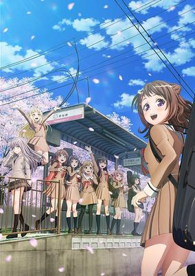

**Studio:** Sanzigen &nbsp;|&nbsp; **Episodes:** 13 &nbsp;|&nbsp; **Director:** Kōdai Kakimoto &nbsp;|&nbsp; **Aired/Released:** January 3 – March 28 &nbsp;|&nbsp; **Genres:** All Girls School, Musical Band, High School, School Clubs, Japan, Plot Continuity, Music, Comedy, School Life, The Arts

> Second season of BanG Dream! series.
>
> _Synopsis source: Kitsu_

[Wikipedia](https://en.wikipedia.org/wiki/BanG_Dream!) · [Kitsu](https://kitsu.io/anime/bang-dream-2nd-season)

---

### Boogiepop and Others

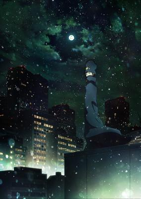

**Studio:** Madhouse &nbsp;|&nbsp; **Episodes:** 18 &nbsp;|&nbsp; **Director:** Shingo Natsume &nbsp;|&nbsp; **Aired/Released:** January 4 – March 29 &nbsp;|&nbsp; **Genres:** Violence, Angst, Psychological, Japan, Contemporary Fantasy

> Takeda Keiji was waiting for his girlfriend and junior in school, Miyashita Touka. But she doesn't show up at the time they agreed on and he can't get a hold of her. The sun starts to set and Takeda decides to give up and head home. But then, he sees a man unsteadily wandering around with tears in his eyes. Takeda and the other people around him quickly realize the man is not normal and decide to ignore him when a mysterious figure approaches the man. A mysterious figure wearing a cape and a bizarre hat. That figure happened to have the same face as Miyashita Touka, the girlfriend who ditched Takeda...
>
> _Synopsis source: Kitsu_

[Wikipedia](https://en.wikipedia.org/wiki/Boogiepop_and_Others) · [Kitsu](https://kitsu.io/anime/boogiepop-wa-warawanai)

---

### The Price of Smiles

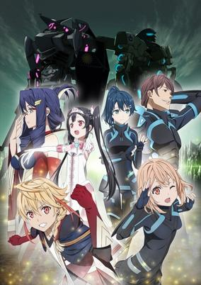

**Studio:** Tatsunoko Production &nbsp;|&nbsp; **Episodes:** 12 &nbsp;|&nbsp; **Director:** Toshimasa Suzuki &nbsp;|&nbsp; **Aired/Released:** January 4 – March 22 &nbsp;|&nbsp; **Genres:** Military, Slice of Life, Fantasy, Drama, Mecha, Science Fiction, Action, Violence, War, Anti War, Future, Other Planet, Parental Abandonment

> On a planet far, far away from Earth, there reigns a kingdom overflowing with smiles. Princess Yuki is twelve years old and beginning to ride the roller coaster of emotions that comes with adolescence. Each day brings with it tears, laughter, and even a little romance. The palace is full of fun, and the vassals who serve her there add color to her life. Seventeen-year-old Stella is a brilliant warrior. Even though she is cool as a cucumber, she never fails to smile. That's because smiling is essential to life. This is a story about two girls born on a distant planet.
>
> _Synopsis source: Kitsu_

[Wikipedia](https://en.wikipedia.org/wiki/The_Price_of_Smiles) · [Kitsu](https://kitsu.io/anime/egao-no-daika)

---

### The Morose Mononokean (season 2) (The Morose Mononokean Ⅱ)

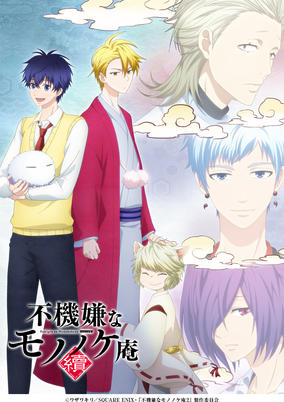

**Studio:** Pierrot+ &nbsp;|&nbsp; **Episodes:** 13 &nbsp;|&nbsp; **Director:** Itsuro Kawasaki &nbsp;|&nbsp; **Aired/Released:** January 5 – March 30 &nbsp;|&nbsp; **Genres:** Demon, Comedy, Supernatural

> Second season of Fukigen na Mononokean.
>
> _Synopsis source: Kitsu_

[Wikipedia](https://en.wikipedia.org/wiki/The_Morose_Mononokean) · [Kitsu](https://kitsu.io/anime/fukigen-na-mononokean-tsuzuki)

---

### W'z

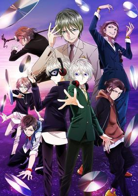

**Studio:** GoHands &nbsp;|&nbsp; **Episodes:** 13 &nbsp;|&nbsp; **Director:** Shingo Suzuki Hiromitsu Kanazawa &nbsp;|&nbsp; **Aired/Released:** January 5 – March 30 &nbsp;|&nbsp; **Genres:** Action, Music, The Arts

> Yukiya spends his free time as a DJ for a crowd of one and uploads his videos online while yearning for something greater than his current life. One day, he stumbles across a mysterious live broadcast that will change his world forever.
>
> _Synopsis source: Kitsu_

[Wikipedia](https://en.wikipedia.org/wiki/W%27z) · [Kitsu](https://kitsu.io/anime/w-z)

---

### How Clumsy you are, Miss Ueno (How Clumsy you are, Miss Ueno.)

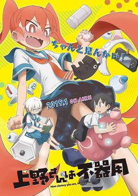

**Studio:** Lesprit &nbsp;|&nbsp; **Episodes:** 12 &nbsp;|&nbsp; **Director:** Tomohiro Yamanashi &nbsp;|&nbsp; **Aired/Released:** January 6 – March 24 &nbsp;|&nbsp; **Genres:** Comedy, Romance, Seinen

> Ueno may be the president of the science club at her junior high and a genius inventor, but she still can’t figure out how to confess to her crush, Tanaka! Can she find a way to give her heart what it truly yearns for?
>
> _Synopsis source: Kitsu_

[Wikipedia](https://en.wikipedia.org/wiki/How_Clumsy_you_are,_Miss_Ueno) · [Kitsu](https://kitsu.io/anime/ueno-san-wa-bukiyou)

---

### Dororo

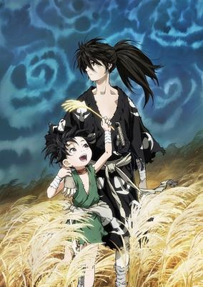

**Studio:** MAPPA Tezuka Productions &nbsp;|&nbsp; **Episodes:** 24 &nbsp;|&nbsp; **Director:** Kazuhiro Furuhashi &nbsp;|&nbsp; **Aired/Released:** January 7 – June 24 &nbsp;|&nbsp; **Genres:** Historical, Demon, Action, Adventure, Supernatural, Shounen

> In Japan's Warring States period, Lord Daigo Kagemitsu makes a pact with 12 demons, exchanging his unborn son for the prosperity of his lands. The child is born malformed and is set adrift in a river, while Kagemitsu's lands thrive as promised. Years later, young thief Dororo encounters the mysterious "Hyakkimaru", a boy whose arms are blades and whose visionless eyes seem able to see monsters.
>
> _Synopsis source: Kitsu_

[Wikipedia](https://en.wikipedia.org/wiki/Dororo_(2019_TV_series)) · [Kitsu](https://kitsu.io/anime/dororo)

---

### Mob Psycho 100 II

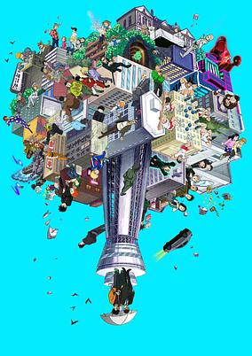

**Studio:** Bones &nbsp;|&nbsp; **Episodes:** 13 &nbsp;|&nbsp; **Director:** Yuzuru Tachikawa &nbsp;|&nbsp; **Aired/Released:** January 7 – April 1 &nbsp;|&nbsp; **Genres:** Ghost, Super Power, Plot Continuity, Action, Comedy, Slice of Life, Supernatural

> The second season of Mob Psycho 100. Kageyama is an ordinary 8th grader who just wants to live a normal life. Although he can disappear in the crowd in a flash, he was actually the most powerful psychic. The lives of those around Mob and his numerous feelings that softly piles up for the eventual explosion. The mysterious group "Claw" stands before him once again. In the midst of his youthful days, where will his roaring heart take him!?
>
> _Synopsis source: Kitsu_

[Wikipedia](https://en.wikipedia.org/wiki/Mob_Psycho_100) · [Kitsu](https://kitsu.io/anime/mob-psycho-100-ii)

---

### Circlet Princess

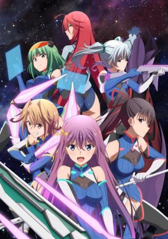

**Studio:** Silver Link &nbsp;|&nbsp; **Episodes:** 12 &nbsp;|&nbsp; **Director:** Hideki Tachibana &nbsp;|&nbsp; **Aired/Released:** January 8 – March 26 &nbsp;|&nbsp; **Genres:** Action, School Life, Science Fiction, Sports, High School

> The game follows a fictional near-future e-sport that utilizes a "mixed reality system" developed from augmented reality technology. The story centers on a fledgling team of high school girls from Saint Union Academy who pursue the sport of Circlet Bout.
>
> _Synopsis source: Kitsu_

[Wikipedia](https://en.wikipedia.org/wiki/Circlet_Princess) · [Kitsu](https://kitsu.io/anime/circlet-princess)

---

### Kakegurui ××

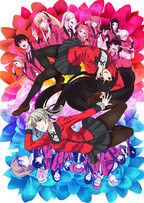

**Studio:** MAPPA &nbsp;|&nbsp; **Episodes:** 12 &nbsp;|&nbsp; **Director:** Yuichiro Hayashi Kiyoshi Matsuda &nbsp;|&nbsp; **Aired/Released:** January 8 – March 26 &nbsp;|&nbsp; **Genres:** Card Games, Psychological, School Life, Mystery

> Second season of Kakegurui.
>
> _Synopsis source: Kitsu_

[Wikipedia](https://en.wikipedia.org/wiki/Kakegurui_%C3%97%C3%97) · [Kitsu](https://kitsu.io/anime/kakeguruixx)

---

### Pastel Memories

**Studio:** Project No.9 &nbsp;|&nbsp; **Episodes:** 12 &nbsp;|&nbsp; **Director:** Yasuyuki Shinozaki &nbsp;|&nbsp; **Aired/Released:** January 8 – March 26 &nbsp;|&nbsp; **Genres:** Adventure, Action, Science Fiction

> Akihabara is a mecca for otaku culture everywhere. But that culture is on the decline due to a mysterious affliction causing widespread memory loss. Izumi and her comrades hatch a plan to restore lost memories and return “Akiba” to its former glory.
>
> _Synopsis source: Kitsu_

[Wikipedia](https://en.wikipedia.org/wiki/Pastel_Memories) · [Kitsu](https://kitsu.io/anime/pastel-memories)

---

### Rainy Cocoa side G (Rainy Cocoa: Side G)

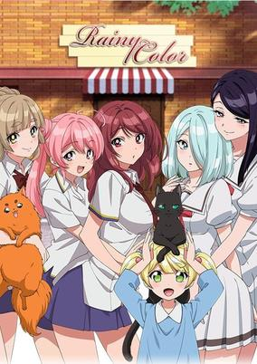

**Studio:** EMT Squared &nbsp;|&nbsp; **Episodes:** 12 &nbsp;|&nbsp; **Director:** Hisashi Ishii &nbsp;|&nbsp; **Aired/Released:** January 8 – March 26 &nbsp;|&nbsp; **Genres:** Slice of Life, Comedy

> It's a peaceful day like any other in the cafe Rainy Color. Suddenly, the silence is broken when a girl kicks down the door. Her name is Amami Yoko, and she's the daughter of the cafe's owner, Amami Koji. The target of her ire and the cause of all the ruckus is Koji himself. Just then, she catches sight of Rainy Color's mascot dog, Rain, and freezes. It turns out that she's afraid of dogs! She trips over the suitcase, topples over, and shatters a vase that Koji was keeping nearby. As punishment for breaking the vase, Yoko is forced to stand in as Rainy Color's manager for summer vacation.
>
> _Synopsis source: Kitsu_

[Wikipedia](https://en.wikipedia.org/wiki/Rainy_Cocoa_side_G) · [Kitsu](https://kitsu.io/anime/ame-iro-cocoa-side-g)

---

### Real Girl (season 2)

**Studio:** Hoods Entertainment &nbsp;|&nbsp; **Episodes:** 12 &nbsp;|&nbsp; **Director:** Takashi Naoya &nbsp;|&nbsp; **Aired/Released:** January 8 – March 26

[Wikipedia](https://en.wikipedia.org/wiki/Real_Girl_(manga))

---

### Rinshi!! Ekoda-chan (Rinshi!! Ekodachan)

**Studio:** Creators in Pack (#2, 5) Ascension (#3) Zero-G (#4) &nbsp;|&nbsp; **Episodes:** 12 &nbsp;|&nbsp; **Aired/Released:** January 8 – March 26 &nbsp;|&nbsp; **Genres:** Comedy, Seinen, Slice of Life

> Ekoda-chan is from the countryside, living alone in the city. She's a temp worker and a strong, carefree soul, with no solid plan for the future, who doesn't care much about guys. She talks about how she lives her life and provides support to all those women trying to survive in the real life society.
>
> _Synopsis source: Kitsu_

[Kitsu](https://kitsu.io/anime/rinshi-ekoda-chan)

---

### Wataten!: An Angel Flew Down to Me

**Studio:** Doga Kobo &nbsp;|&nbsp; **Episodes:** 12 &nbsp;|&nbsp; **Director:** Daisuke Hiramaki &nbsp;|&nbsp; **Aired/Released:** January 8 – March 26 &nbsp;|&nbsp; **Genres:** Comedy, Shoujo Ai, Slice of Life

> Miyako is a shy college student who is also an otaku. One day she happens to meet some angelic grade school kids! When Miyako sees her little sister's new friend Hana-chan, Miyako's heart won't stop racing! Miyako tries to get along with them but struggles... A sketch comedy all about trying to get along with the super cute girl is about to begin!
>
> _Synopsis source: Kitsu_

[Kitsu](https://kitsu.io/anime/watashi-ni-tenshi-ga-maiorita)

---

### Kemurikusa (kemurikusa.)

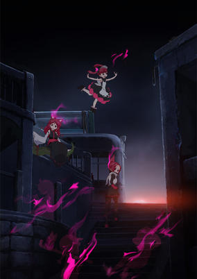

**Studio:** Yaoyorozu &nbsp;|&nbsp; **Episodes:** 12 &nbsp;|&nbsp; **Director:** Tatsuki &nbsp;|&nbsp; **Aired/Released:** January 9 – March 27 &nbsp;|&nbsp; **Genres:** Science Fiction, Fantasy

> A story about three sisters struggling to survive in a desolate world surrounded by decaying buildings and red fog. The story revolves around Rin, a girl with an updo. There's also Ritsu, the big sister who has cat ears and is always calm, and Rina, the innocent, cheerful one dressed in a maid's costume. Just what is it that these sisters are after in this mysterious world?
>
> _Synopsis source: Kitsu_

[Wikipedia](https://en.wikipedia.org/wiki/Kemurikusa) · [Kitsu](https://kitsu.io/anime/kemurikusa)

---

### Meiji Tokyo Renka

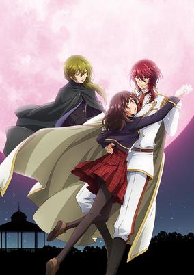

**Studio:** TMS/V1 Studio &nbsp;|&nbsp; **Episodes:** 12 &nbsp;|&nbsp; **Director:** Akitaro Daichi &nbsp;|&nbsp; **Aired/Released:** January 9 – March 27 &nbsp;|&nbsp; **Genres:** Fantasy, Romance, Historical, Shoujo, Reverse Harem

> On the night of a crimson full moon, high school girl Ayazuki Mei enters into a box. When she awakens, she's in Tokyo during the Meiji Period! The lost and confused Mei is taken to the Rokumeikan, a lavish ballroom full of powerful high officials. In this world, during the "Misty Hour" between sundown and sunup, "mononoke" appear. Those who can see them are called "Tamayori," and Mei herself possesses this power. As she navigates an unfamiliar life, romance begins to bloom between Mei and these men -- and the power of the tamayori will only strengthen their bonds.
>
> _Synopsis source: Kitsu_

[Wikipedia](https://en.wikipedia.org/wiki/Meiji_Tokyo_Renka) · [Kitsu](https://kitsu.io/anime/meiji-tokyo-renka-tv)

---

### My Roommate Is a Cat

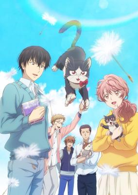

**Studio:** Zero-G &nbsp;|&nbsp; **Episodes:** 12 &nbsp;|&nbsp; **Director:** Kaoru Suzuki &nbsp;|&nbsp; **Aired/Released:** January 9 – March 27 &nbsp;|&nbsp; **Genres:** Comedy, Slice of Life

> The story of Mikazuki Subaru, a novelist who is shy and struggles in relationships with other people, and a cat who was dumped by humans and lived a tough life on the streets. Through a twist of fate, the two of them end up living together. This heartwarming tale illustrates day-to-day life through the eyes of both man and cat. These moments seem trivial, but as they build upon themselves, the two become family and find happiness in their life together.
>
> _Synopsis source: Kitsu_

[Wikipedia](https://en.wikipedia.org/wiki/My_Roommate_Is_a_Cat) · [Kitsu](https://kitsu.io/anime/doukyonin-wa-hiza-tokidoki-atama-no-ue)

---

### The Rising of the Shield Hero

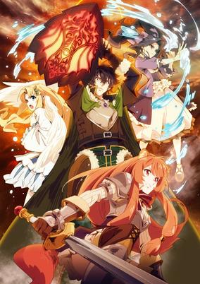

**Studio:** Kinema Citrus &nbsp;|&nbsp; **Episodes:** 25 &nbsp;|&nbsp; **Director:** Takao Abo &nbsp;|&nbsp; **Aired/Released:** January 9 – June 26 &nbsp;|&nbsp; **Genres:** Action, Adventure, Comedy, Drama, Romance, Fantasy, Seinen, Demon, Isekai

> Iwatani Naofumi, a run-of-the-mill otaku, finds a book in the library that summons him to another world. He is tasked with joining the sword, spear, and bow as one of the Four Cardinal Heroes and fighting the Waves of Catastrophe as the Shield Hero. Excited by the prospect of a grand adventure, Naofumi sets off with his party. However, merely a few days later, he is betrayed and loses all his money, dignity, and respect. Unable to trust anyone anymore, he employs a slave named Raphtalia and takes on the Waves and the world. But will he really find a way to overturn this desperate situation?
>
> _Synopsis source: Kitsu_

[Wikipedia](https://en.wikipedia.org/wiki/The_Rising_of_the_Shield_Hero) · [Kitsu](https://kitsu.io/anime/tate-no-yuusha-no-nariagari)

---

### Dimension High School

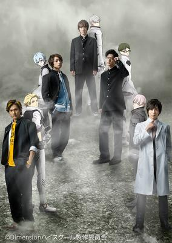

**Studio:** Asmik Ace Polygon Magic &nbsp;|&nbsp; **Episodes:** 12 &nbsp;|&nbsp; **Director:** Yuichi Abe &nbsp;|&nbsp; **Aired/Released:** January 10 – March 28 &nbsp;|&nbsp; **Genres:** School Life

> On his way to school, Junpei picks up a strange rock. In class, the rock comes to life and transports him and four others to an animated world! Now, they must work together in both the animated and real world to save what they cherish the most.
>
> _Synopsis source: Kitsu_

[Wikipedia](https://en.wikipedia.org/wiki/Dimension_High_School) · [Kitsu](https://kitsu.io/anime/dimension-high-school)

---

### Girly Air Force

**Studio:** Satelight &nbsp;|&nbsp; **Episodes:** 12 &nbsp;|&nbsp; **Director:** Katsumi Ono &nbsp;|&nbsp; **Aired/Released:** January 10 – March 28 &nbsp;|&nbsp; **Genres:** Action, Science Fiction

> Mysterious flying creatures called Zai suddenly appear and overwhelm all of mankind's aerial combat forces. To fight them, mankind modifies existing aircraft frames to create mechanized soldiers called "Daughters," which are operated by automated piloting mechanisms called "Anima" that have the appearance of human girls. The story begins when Narutani Kei, a boy who yearns to take to the skies, encounters a shining red aircraft and its pilot, an Anima named Gripen who has been named mankind's trump card.
>
> _Synopsis source: Kitsu_

[Wikipedia](https://en.wikipedia.org/wiki/Girly_Air_Force) · [Kitsu](https://kitsu.io/anime/girly-air-force)

---

### Grimms Notes the Animation

**Studio:** Brain's Base &nbsp;|&nbsp; **Episodes:** 12 &nbsp;|&nbsp; **Director:** Seiki Sugawara &nbsp;|&nbsp; **Aired/Released:** January 10 – March 28 &nbsp;|&nbsp; **Genres:** Action, Adventure, Magic, Fantasy

> Set in a fairy tale world in which everyone receives a book when they are born. These books determine every little detail of that person’s life. Written by the mysterious storyteller, each book traps that individual into a preordained fate. The story, however, stars a hero without a story, someone free to decide his own fate. But since he has only blank pages he can only wander to find his purpose. Our hero travels to lands and meets characters straight out of the pages of some of the most famous fairy tales. He must work together with the characters he meets to fight to get back his story.
>
> _Synopsis source: Kitsu_

[Wikipedia](https://en.wikipedia.org/wiki/Grimms_Notes_the_Animation) · [Kitsu](https://kitsu.io/anime/grimms-notes-the-animation)

---

### Revisions

**Studio:** Shirogumi &nbsp;|&nbsp; **Episodes:** 12 &nbsp;|&nbsp; **Director:** Gorō Taniguchi &nbsp;|&nbsp; **Aired/Released:** January 10 – March 28

[Wikipedia](https://en.wikipedia.org/wiki/Revisions_(TV_series))

---

### The Quintessential Quintuplets

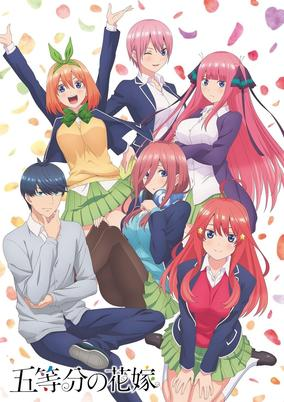

**Studio:** Tezuka Productions &nbsp;|&nbsp; **Episodes:** 12 &nbsp;|&nbsp; **Director:** Satoshi Kuwabara &nbsp;|&nbsp; **Aired/Released:** January 10 – March 28 &nbsp;|&nbsp; **Genres:** Harem, Romance, Comedy, School Life, Shounen

> Uesugi Fuutarou, a high school second-year from a poor family, receives a highly appealing offer to work part-time as a tutor... but his students turn out to be girls from his own class! What's more, they're quintuplets... and all five are beautiful, but happen to be problem students who have borderline grades and hate studying! Looks like his first assignment will be to win all the sisters' trust?! Every day is a wild party in this rom-com centering around the quintuplet sisters of the Nakano household!
>
> _Synopsis source: Kitsu_

[Wikipedia](https://en.wikipedia.org/wiki/The_Quintessential_Quintuplets) · [Kitsu](https://kitsu.io/anime/5-toubun-no-hanayome)

---

### B-Project: Zecchō Emotion

**Studio:** BN Pictures &nbsp;|&nbsp; **Episodes:** 12 &nbsp;|&nbsp; **Director:** Makoto Moriwaki &nbsp;|&nbsp; **Aired/Released:** January 11 – March 29 &nbsp;|&nbsp; **Genres:** Music, Shoujo

> Second season of B-Project: Kodou*Ambitious.
>
> _Synopsis source: Kitsu_

[Kitsu](https://kitsu.io/anime/b-project-zecchou-emotion)

---

### Date A Live III

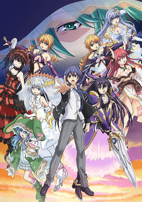

**Studio:** J.C.Staff &nbsp;|&nbsp; **Episodes:** 12 &nbsp;|&nbsp; **Director:** Keitaro Motonaga &nbsp;|&nbsp; **Aired/Released:** January 11 – March 29 &nbsp;|&nbsp; **Genres:** Harem, Action, Comedy, Mecha, Science Fiction, School Life, Romance

> Third season of Date A Live.
>
> _Synopsis source: Kitsu_

[Wikipedia](https://en.wikipedia.org/wiki/Date_A_Live_(season_3)) · [Kitsu](https://kitsu.io/anime/date-a-live-III)

---

### Hulaing Babies

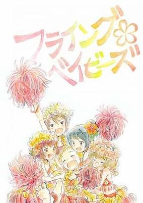

**Studio:** Gaina &nbsp;|&nbsp; **Episodes:** 12 &nbsp;|&nbsp; **Director:** Yoshinori Asao &nbsp;|&nbsp; **Aired/Released:** January 11 – March 29 &nbsp;|&nbsp; **Genres:** Slice of Life, Comedy

> Anime centering on a group of young girls and their struggle as they aim to become Hula Girls.
>
> _Synopsis source: Kitsu_

[Wikipedia](https://en.wikipedia.org/wiki/Hulaing_Babies) · [Kitsu](https://kitsu.io/anime/hulaing-babies)

---

### The Promised Neverland

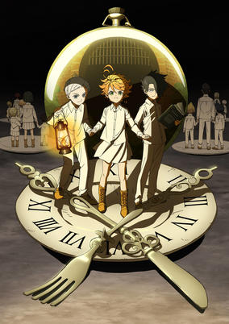

**Studio:** CloverWorks &nbsp;|&nbsp; **Episodes:** 12 &nbsp;|&nbsp; **Director:** Mamoru Kanbe &nbsp;|&nbsp; **Aired/Released:** January 11 – March 29 &nbsp;|&nbsp; **Genres:** Science Fiction, Mystery, Horror, Psychological, Thriller, Shounen

> The orphans at Grace Field House have only ever known peace. Their home is nice, their bellies stay full, and their caretaker, Mom, loves them very much. But their world turns upside down when the smartest children of the bunch—Emma, Ray, and Norman—learn what horror awaits them on adoption day. Now, their cultivated wit may be their only chance of survival.
>
> _Synopsis source: Kitsu_

[Wikipedia](https://en.wikipedia.org/wiki/The_Promised_Neverland) · [Kitsu](https://kitsu.io/anime/yakusoku-no-neverland)

---

### Bermuda Triangle: Colorful Pastrale

**Studio:** Seven Arcs Pictures &nbsp;|&nbsp; **Episodes:** 12 &nbsp;|&nbsp; **Director:** Junji Nishimura &nbsp;|&nbsp; **Aired/Released:** January 12 – March 30 &nbsp;|&nbsp; **Genres:** Fantasy, Music, Idol, Slice of Life, Comedy

> The glittering spotlights. The sparkling, fluffy, cute outfits. The charming voices while dancing with bright smiles. Under the dazzling lights on the big city stage, these would be the mermaid idols who swim and dance freely underwater. But far from this big city, the girls once lived in the peaceful village of Parrel. These girls, who would not even imagine such a glittering future for themselves, are instead just raising a fuss over the snack cakes they are eating. This is the story of the cheerful daily life of mermaids who strive their hardest everyday.
>
> _Synopsis source: Kitsu_

[Kitsu](https://kitsu.io/anime/colorful-pastrale-from-bermuda)

---

### Domestic Girlfriend

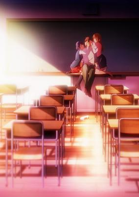

**Studio:** Diomedéa &nbsp;|&nbsp; **Episodes:** 12 &nbsp;|&nbsp; **Director:** Shōta Ihata &nbsp;|&nbsp; **Aired/Released:** January 12 – March 30 &nbsp;|&nbsp; **Genres:** Romance, School Life, High School, Love Polygon, Shounen, Drama

> Natsuo’s life suddenly becomes more complicated when his father comes home and announces he has remarried a woman with two daughters whom Natsuo has met before. They’re Hina, his teacher and unrequited crush, and Rui, a girl he previously slept with.
>
> _Synopsis source: Kitsu_

[Wikipedia](https://en.wikipedia.org/wiki/Domestic_Girlfriend) · [Kitsu](https://kitsu.io/anime/domestic-na-kanojo)

---

### Endro!

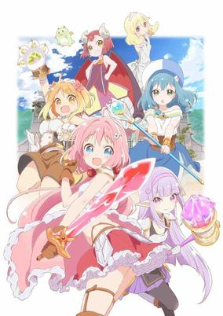

**Studio:** Studio Gokumi &nbsp;|&nbsp; **Episodes:** 12 &nbsp;|&nbsp; **Director:** Kaori &nbsp;|&nbsp; **Aired/Released:** January 12 – March 30 &nbsp;|&nbsp; **Genres:** Slice of Life, Fantasy, Magic

> In the land of Naral Island, a land of magic and swords, humans and monsters live together. Once upon a time, there used to be a terrifying Demon Lord, but long, long ago the first Hero defeated the Demon Lord. The Demon Lord would revive again and again throughout the ages, but every time a Hero would appear to defeat it... Now these young girls attend an Adventurer's Academy to prepare them to defeat the Demon Lord that will one day rise again. This is the beginning of a laid-back fantasy life with no sign of the Demon Lord for these four who hope to become a party of heroes.
>
> _Synopsis source: Kitsu_

[Wikipedia](https://en.wikipedia.org/wiki/Endro!) · [Kitsu](https://kitsu.io/anime/endro)

---

### Kaguya-sama: Love Is War

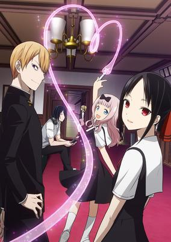

**Studio:** A-1 Pictures &nbsp;|&nbsp; **Episodes:** 12 &nbsp;|&nbsp; **Director:** Mamoru Hatakeyama &nbsp;|&nbsp; **Aired/Released:** January 12 – March 30 &nbsp;|&nbsp; **Genres:** Comedy, Psychological, School Life, High School, Student Government, Romance

> Known for being both brilliant and powerful, Miyuki Shirogane and Kaguya Shinomiya lead the illustrious Shuchiin Academy as near equals. Everyone thinks they’d make a great couple. But with pride and arrogance in ample supply, the only logical move is to trick the other into instigating a date! Who will come out on top in this psychological war where the first move is the only one that matters?
>
> _Synopsis source: Kitsu_

[Kitsu](https://kitsu.io/anime/kaguya-sama-wa-kokurasetai-tensai-tachi-no-renai-zunousen)

---

### Magical Girl Spec-Ops Asuka

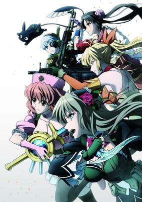

**Studio:** Liden Films &nbsp;|&nbsp; **Episodes:** 12 &nbsp;|&nbsp; **Director:** Hideyo Yamamoto &nbsp;|&nbsp; **Aired/Released:** January 12 – March 30 &nbsp;|&nbsp; **Genres:** Magical Girl, Magic, Action, Supernatural, Special Squads, Drama, Violence, Dark Fantasy, Ecchi, Military

> Legends, myths, magic... Humanity has finally had a chance encounter with a world that had been all but forgotten among all its scientific developments. However, this reunion is not a happy one. Monsters invading from the world of the dead render modern weapons useless, leaving the fate of humanity uncertain. But with help from the Otherworld Trade Agreement, mankind gains a possible means of returning from the brink of death in the form of magical girls. These girls finally lead humanity to victory. However, even this victory proves to be no more than the beginning of a new battle.
>
> _Synopsis source: Kitsu_

[Wikipedia](https://en.wikipedia.org/wiki/Magical_Girl_Spec-Ops_Asuka) · [Kitsu](https://kitsu.io/anime/mahou-shoujo-tokushusen-asuka)

---

### Mini Toji (Katana Maidens: Toji no Miko)

**Studio:** Project No.9 &nbsp;|&nbsp; **Episodes:** 10 &nbsp;|&nbsp; **Director:** Yuu Nobuta &nbsp;|&nbsp; **Aired/Released:** January 12 – March 16 &nbsp;|&nbsp; **Genres:** Swordplay, Action, Fantasy, Fantasy World, All Girls School

> There's an evil creature called Aratama that attack people, and a group of Miko has been exorcising those creatures using swords since olden times. Those who wear uniforms and swords are called Toji, who are officially called Tokubetsu Saishi Kitoutai (Special Ritual Maneuver Team) in the police association. They are officially approved of wielding the swords by the government officials. The government has established five training schools consisting of junior and senior high levels for the female students to attend. They spend their student life normally, and use special skills with the swords when they're doing missions to protect people. In the spring, these five schools are to take part in a competition. Among the girls who train for the competition, there's a girl who's a bit more passionate than any other girls. Where would the girl with the sword aim?
>
> _Synopsis source: Kitsu_

[Wikipedia](https://en.wikipedia.org/wiki/Katana_Maidens_~_Toji_No_Miko) · [Kitsu](https://kitsu.io/anime/toji-no-miko)

---

### The Magnificent Kotobuki

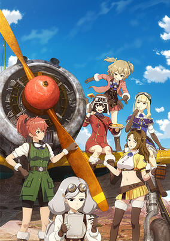

**Studio:** GEMBA &nbsp;|&nbsp; **Episodes:** 12 &nbsp;|&nbsp; **Director:** Tsutomu Mizushima &nbsp;|&nbsp; **Aired/Released:** January 13 – March 31 &nbsp;|&nbsp; **Genres:** Adventure, Action, Military

> Combat is part of life. The talented members of Team KOTOBUKI use their impressive aerial fighting skills to help defend and transport goods across a desolate wasteland. For the right price, they’ll take on any enemy that comes their way!
>
> _Synopsis source: Kitsu_

[Wikipedia](https://en.wikipedia.org/wiki/The_Magnificent_Kotobuki) · [Kitsu](https://kitsu.io/anime/kouya-no-kotobuki-hikoutai)

---

### Kemono Friends (season 2)

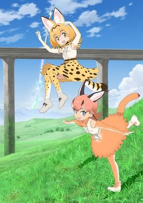

**Studio:** Tomason &nbsp;|&nbsp; **Episodes:** 12 &nbsp;|&nbsp; **Director:** Ryuichi Kimura &nbsp;|&nbsp; **Aired/Released:** January 14 – April 1 &nbsp;|&nbsp; **Genres:** Fantasy, Adventure, Comedy, Juujin

> Second season of Kemono Friends.
>
> _Synopsis source: Kitsu_

[Wikipedia](https://en.wikipedia.org/wiki/Kemono_Friends) · [Kitsu](https://kitsu.io/anime/kemono-friends-2)

---

### Mysteria Friends

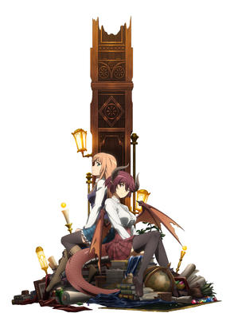

**Studio:** CygamesPictures &nbsp;|&nbsp; **Episodes:** 10 &nbsp;|&nbsp; **Director:** Hideki Okamoto &nbsp;|&nbsp; **Aired/Released:** January 20 – March 24 &nbsp;|&nbsp; **Genres:** Magic, Fantasy, School Life, Demon, Action, Adventure, High Fantasy

> Mysteria Academy is a prestigious magic school that teaches magic without discrimination to the three factions (men, gods, demons), who usually are engaged in battle with each other. Two of the academy's students are Anne, a princess and honor student, and Grea, a princess born from a dragon and a human.
>
> _Synopsis source: Kitsu_

[Wikipedia](https://en.wikipedia.org/wiki/Manaria_Friends) · [Kitsu](https://kitsu.io/anime/manaria-friends)

---

### Forest of Piano (season 2) (Forest of Piano)

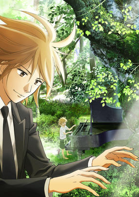

**Studio:** Gaina &nbsp;|&nbsp; **Episodes:** 12 &nbsp;|&nbsp; **Director:** Hiroyuki Yamaga &nbsp;|&nbsp; **Aired/Released:** January 27 – April 14 &nbsp;|&nbsp; **Genres:** Adventure, The Arts, Music, Comedy, School Life

> A tranquil tale about two boys from very different upbringings. On one hand you have Kai, born as the son of a prostitute, who's been playing the abandoned piano in the forest near his home ever since he was young. And on the other you have Syuhei, practically breast-fed by the piano as the son of a family of prestigious pianists. Yet it is their common bond with the piano that eventually intertwines their paths in life.
>
> _Synopsis source: Kitsu_

[Wikipedia](https://en.wikipedia.org/wiki/Forest_of_Piano) · [Kitsu](https://kitsu.io/anime/piano-no-mori-tv)

---

### Star Twinkle PreCure

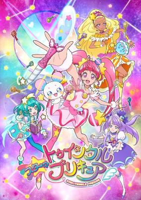

**Studio:** Toei Animation &nbsp;|&nbsp; **Episodes:** 49 &nbsp;|&nbsp; **Director:** Hiroaki Miyamoto &nbsp;|&nbsp; **Aired/Released:** February 3 – January 26, 2020 &nbsp;|&nbsp; **Genres:** Action, Magic, Fantasy, Shoujo, Kids, Comedy

> The story begins when the protagonist Hikaru meets aliens Lala, Prunce, and Fuwa while watching the night sky. She learns of the "Star Palace," where the 12 Star Princesses of the constellations kept the balance of the universe until they were attacked. Lala is searching for the legendary Precure warriors to help find the 12 scattered "Princess Star Color Pens" and revive the princesses. When Fuwa is captured by an enemy, Hikaru wishes to save Fuwa, and a Star Color Pendent and a Star Color Pen appear to allow her to transform into Cure Star. From then on she works to collect the pens and raise Fuwa, who is the key to reviving the princesses.
>
> _Synopsis source: Kitsu_

[Wikipedia](https://en.wikipedia.org/wiki/Star_Twinkle_PreCure) · [Kitsu](https://kitsu.io/anime/star-twinkle-precure)

---

### Ace of Diamond Act II (Ace of Diamond: Act II)

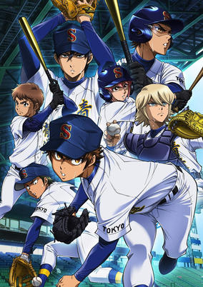

**Studio:** Madhouse &nbsp;|&nbsp; **Episodes:** 52 &nbsp;|&nbsp; **Director:** Mitsuyuki Masuhara &nbsp;|&nbsp; **Aired/Released:** April 2 – March 31, 2020 &nbsp;|&nbsp; **Genres:** Baseball, Comedy, School Life, Sports, Shounen

> Picking up the next year after the end of the fall tournament, Seidou High School baseball team battle it out with new and old faces as they begin their tournament run at Koshien.
>
> _Synopsis source: Kitsu_

[Wikipedia](https://en.wikipedia.org/wiki/Ace_of_Diamond) · [Kitsu](https://kitsu.io/anime/diamond-no-ace-act-ii)

---

### YU-NO: A Girl Who Chants Love at the Bound of this World

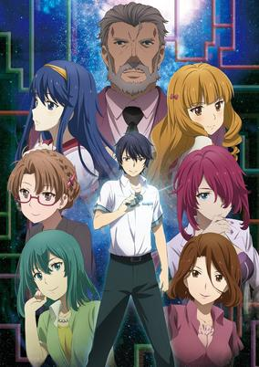

**Studio:** Feel &nbsp;|&nbsp; **Episodes:** 26 &nbsp;|&nbsp; **Director:** Tetsuo Hirakawa &nbsp;|&nbsp; **Aired/Released:** April 2 – October 1 &nbsp;|&nbsp; **Genres:** Science Fiction, Drama

> During the summer, Takuya Arima receives a package—from his missing father—detailing the existence of parallel universes. He investigates further and soon realizes that he’s been given the key to cross-dimensional time travel. Now, Takuya is forced to use this newfound tech to unravel the mystery of his father’s whereabouts and find out why those closest to him are keeping secrets.
>
> _Synopsis source: Kitsu_

[Kitsu](https://kitsu.io/anime/kono-yo-no-hate-de-koi-wo-utau-shoujo-yu-no)

---

### Bakumatsu Crisis (Bakumatsu)

**Studio:** Studio Deen &nbsp;|&nbsp; **Episodes:** 12 &nbsp;|&nbsp; **Director:** Mitsutoshi Satō &nbsp;|&nbsp; **Aired/Released:** April 4 – June 20 &nbsp;|&nbsp; **Genres:** Samurai, Swordplay, Action, Historical

> This story takes place during the Bakumatsu era in Japan. Japan’s history looked bleak during this time, and many passionate men fought over hegemony within the country, various ideals in their hearts. Shinsaku Takasugi, a samurai warrior from Choshu, attempts to sneak onto a ship run by Yoshinobu Tokugawa, his partner Kogoro Katsura at his side. Takasugi and Katsura aim to steal a legendary treasure that is said to have the ability to control time: the pocket watch “Jishingi.” However, the moment they obtain the watch, it is stolen from them by a woman dressed in black.
>
> _Synopsis source: Kitsu_

[Wikipedia](https://en.wikipedia.org/wiki/Renai_Bakumatsu_Kareshi) · [Kitsu](https://kitsu.io/anime/renai-bakumatsu-kareshi)

---

### Million Arthur (season 2)

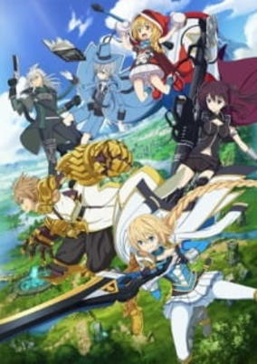

**Studio:** J.C.Staff &nbsp;|&nbsp; **Episodes:** 13 &nbsp;|&nbsp; **Director:** Yōhei Suzuki &nbsp;|&nbsp; **Aired/Released:** April 4 – June 27 &nbsp;|&nbsp; **Genres:** Adventure, Action, Fantasy, Magic

> Unaired episode bundled with the sixth Blu-ray volume of the Hangyakusei Million Arthur anime series.
>
> _Synopsis source: Kitsu_

[Wikipedia](https://en.wikipedia.org/wiki/Million_Arthur_(TV_series)) · [Kitsu](https://kitsu.io/anime/hangyakusei-million-arthur-special)

---

### Yatogame-chan Kansatsu Nikki

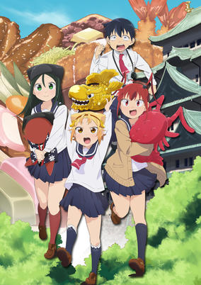

**Studio:** Saetta &nbsp;|&nbsp; **Episodes:** 12 &nbsp;|&nbsp; **Director:** Hisayoshi Hirasawa &nbsp;|&nbsp; **Aired/Released:** April 4 – June 20 &nbsp;|&nbsp; **Genres:** School Life, Slice of Life, Shounen, Comedy

> After growing up in Tokyo, high school student Jin Kaito moves to Nagoya where he meets Yatogame Monaka, a fellow student who puts her Nagoya dialect on full display. With her cat-like appearance and unvarnished Nagoya dialect, Yatogame won't open up to him at all. This popular local comedy is increasing the status of Nagoya through observation of the adorable Yatogame-chan!
>
> _Synopsis source: Kitsu_

[Wikipedia](https://en.wikipedia.org/wiki/Yatogame-chan_Kansatsu_Nikki) · [Kitsu](https://kitsu.io/anime/yatogame-chan-kansatsu-nikki)

---

### Hitori Bocchi no Marumaru Seikatsu (Hitoribocchi no Marumaruseikatsu)

**Studio:** C2C &nbsp;|&nbsp; **Episodes:** 12 &nbsp;|&nbsp; **Director:** Takebumi Anzai &nbsp;|&nbsp; **Aired/Released:** April 5 – June 21 &nbsp;|&nbsp; **Genres:** Comedy, Slice of Life, School Life, Shounen

> Hitori Bocchi, a girl with extreme social anxiety, has had only one friend throughout elementary school. When Bocchi learns they'll be split up after graduation, she makes a promise to her: "By the time of my middle school graduation, I'll make friends with everyone in my class." And if she can't... they won't be friends anymore?! But Bocchi has a hard time talking to people. When she gets nervous, her legs cramp. She can't look other people in the eye. She doesn't even know how to make friends! Every way she thinks of to make friends ends up failing. Will her friend-making plan pay off?!
>
> _Synopsis source: Kitsu_

[Wikipedia](https://en.wikipedia.org/wiki/Hitori_Bocchi_no_Marumaru_Seikatsu) · [Kitsu](https://kitsu.io/anime/hitoribocchi-no-seikatsu)

---

### Ao-chan Can't Study!

**Studio:** Silver Link &nbsp;|&nbsp; **Episodes:** 12 &nbsp;|&nbsp; **Director:** Keisuke Inoue &nbsp;|&nbsp; **Aired/Released:** April 6 – June 22 &nbsp;|&nbsp; **Genres:** Comedy, Ecchi, Romance, Shounen

> When Ao was in kindergarten, she smiled ear-to-ear as she told her classmates how her father (a bestselling erotic author) chose her name: "A as in apple and O as in orgy!" That day still haunts her ten years later as she studies with a single goal in mind: get into an elite university and achieve independence from her father once and for all. She has no youth to misspend and no time to think about boys ... until her classmate, "King Normie" Kijima, approaches her with a shocking confession of love. She tries to lose Kijima, but he just can't take a hint ... and as her mind runs wild with impure thoughts, she realizes her father has totally influenced her!
>
> _Synopsis source: Kitsu_

[Wikipedia](https://en.wikipedia.org/wiki/Ao-chan_Can%27t_Study!) · [Kitsu](https://kitsu.io/anime/midara-na-ao-chan-wa-benkyou-ga-dekinai)

---

### Demon Slayer: Kimetsu no Yaiba

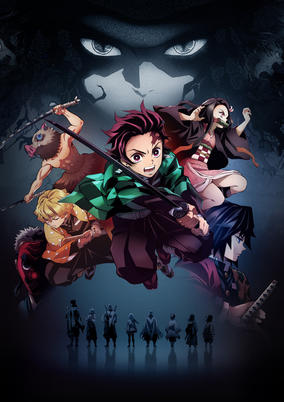

**Studio:** Ufotable &nbsp;|&nbsp; **Episodes:** 26 &nbsp;|&nbsp; **Director:** Haruo Sotozaki &nbsp;|&nbsp; **Aired/Released:** April 6 – September 28 &nbsp;|&nbsp; **Genres:** Demon, Adventure, Action, Japan, Historical, Shounen, Fantasy, Supernatural

> It is the Taisho Period in Japan. Tanjiro, a kindhearted boy who sells charcoal for a living, finds his family slaughtered by a demon. To make matters worse, his younger sister Nezuko, the sole survivor, has been transformed into a demon herself. Though devastated by this grim reality, Tanjiro resolves to become a “demon slayer” so that he can turn his sister back into a human, and kill the demon that massacred his family.
>
> _Synopsis source: Kitsu_

[Kitsu](https://kitsu.io/anime/kimetsu-no-yaiba)

---

### Fruits Basket (Fruits Basket (2019))

**Studio:** TMS/8PAN &nbsp;|&nbsp; **Episodes:** 25 &nbsp;|&nbsp; **Director:** Yoshihide Ibata &nbsp;|&nbsp; **Aired/Released:** April 6 – September 21 &nbsp;|&nbsp; **Genres:** Bishounen, Contemporary Fantasy, Reverse Harem, Angst, Fantasy, Comedy, Romance, Slice of Life, School Life, Drama

> High school student Tohru Honda begins living alone in a tent after she loses her mother, who was her only remaining family member. However, it turns out that the land she pitches her tent on is part of the distinguished Sohma family estate! When Shigure Sohma sees the value of her housekeeping skills, Tohru ends up living with Yuki Sohma, who is essentially the prince of her school, and Kyo Sohma, who regards Yuki as the enemy. Still, there’s something Tohru doesn’t know yet: the Sohma family has been bound for centuries by a horrible curse…
>
> _Synopsis source: Kitsu_

[Wikipedia](https://en.wikipedia.org/wiki/Fruits_Basket) · [Kitsu](https://kitsu.io/anime/fruits-basket-2019)

---

### Joshi Kausei

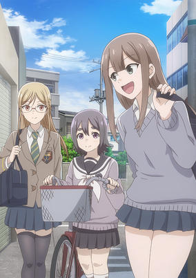

**Studio:** Seven &nbsp;|&nbsp; **Episodes:** 12 &nbsp;|&nbsp; **Director:** Tadayoshi Sasaki &nbsp;|&nbsp; **Aired/Released:** April 6 – June 22 &nbsp;|&nbsp; **Genres:** Comedy, School Life, Slice of Life, Female Student

> A silent high school girl anime that's still cute, even if no one talks! This is a story about three girls and their fun high school life, centering around the unfortunate beauty, Momoko, the cool girl with glasses, Shibumi, and the gentle little Mayumi. Fun alone, fun with all. The daily lives of slightly dumb yet cute high school girls.
>
> _Synopsis source: Kitsu_

[Wikipedia](https://en.wikipedia.org/wiki/Joshi_Kausei) · [Kitsu](https://kitsu.io/anime/joshikausei)

---

### Kono Oto Tomare! Sounds of Life (Kono Oto Tomare!: Sounds of Life)

**Studio:** Platinum Vision &nbsp;|&nbsp; **Episodes:** 13 &nbsp;|&nbsp; **Director:** Ryōma Mizuno &nbsp;|&nbsp; **Aired/Released:** April 6 – June 29 &nbsp;|&nbsp; **Genres:** Drama, School Life, Shounen, Music, Musical Band, Delinquent, School Clubs

> Down to its last member, the koto club will accept anyone who is interested in the traditional Japanese instrument. But when a delinquent and a prodigy player sign up, finding harmony isn’t going to be easy—especially not with ensemble competitions looming around the corner. With enough time and some incredible skill at the strings, perhaps this motley crew can strike a chord with the judges.
>
> _Synopsis source: Kitsu_

[Wikipedia](https://en.wikipedia.org/wiki/Kono_Oto_Tomare!_Sounds_of_Life) · [Kitsu](https://kitsu.io/anime/kono-oto-tomare)

---

### Mix

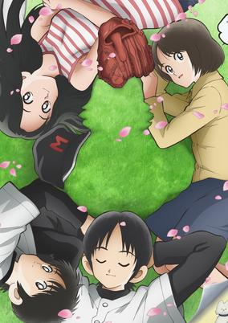

**Studio:** OLM &nbsp;|&nbsp; **Episodes:** 24 &nbsp;|&nbsp; **Director:** Odahiro Watanabe &nbsp;|&nbsp; **Aired/Released:** April 6 – September 28 &nbsp;|&nbsp; **Genres:** Baseball, Romance, School Life, Sports, Drama, Shounen

> A new generation steps up to the plate in a moving sequel to the 1985 baseball manga, Touch. Stepbrothers Touma and Suichirou are ace players on Meisei High School’s baseball team, and thanks to them, the team may finally have a chance at returning to nationals. But little by little, a tragic legacy unfolds as the stepbrothers follow in their fathers’ footsteps.
>
> _Synopsis source: Kitsu_

[Wikipedia](https://en.wikipedia.org/wiki/Mix_(manga)) · [Kitsu](https://kitsu.io/anime/mix)

---

### Nobunaga teacher's young bride

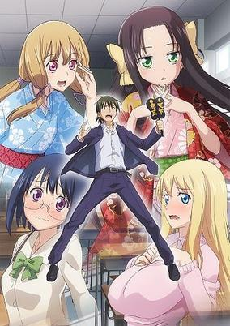

**Studio:** Seven &nbsp;|&nbsp; **Episodes:** 12 &nbsp;|&nbsp; **Director:** Tadayoshi Sasaki &nbsp;|&nbsp; **Aired/Released:** April 6 – June 22 &nbsp;|&nbsp; **Genres:** Comedy, Romance, School Life, Ecchi, Harem

> "One day, there'll be a girl who'll fall head over heels for me." Nobunaga was a teacher who was waiting for that kind of dating sim event to happen in real life. One day, a 14 year old girl named Kicho appears in front of him, saying that she's his wife?! Apparently she came from the Warring States era and seems to have mistaken Nobunaga for the Oda Nobunaga and tells him that she wants to have his children. An age-gap love comedy featuring a teacher with a dating sims brain and a princess with a warring states era brain!!
>
> _Synopsis source: Kitsu_

[Wikipedia](https://en.wikipedia.org/wiki/Nobunaga_teacher%27s_young_bride) · [Kitsu](https://kitsu.io/anime/nobunaga-sensei-no-osanazuma)

---

### Over Drive Girl 1/6

**Studio:** Studio A-Cat &nbsp;|&nbsp; **Episodes:** 12 &nbsp;|&nbsp; **Director:** Keitaro Motonaga &nbsp;|&nbsp; **Aired/Released:** April 6 – June 22

[Wikipedia](https://en.wikipedia.org/wiki/Over_Drive_Girl_1/6)

---

### Senryu Girl

**Studio:** Connect &nbsp;|&nbsp; **Episodes:** 12 &nbsp;|&nbsp; **Director:** Masato Jinbo &nbsp;|&nbsp; **Aired/Released:** April 6 – June 22 &nbsp;|&nbsp; **Genres:** Comedy, School Life, Slice of Life, Shounen

> Yukishiro Nanako may seem like a normal girl, but she expresses herself only through written senryu poetry! This means she communicates in 5-7-5 syllables as she and her ex-delinquent bestie, Busujima Eiji, run their high school’s Literature Club.
>
> _Synopsis source: Kitsu_

[Wikipedia](https://en.wikipedia.org/wiki/Senryu_Girl) · [Kitsu](https://kitsu.io/anime/senryuu_shoujo)

---

### Afterlost

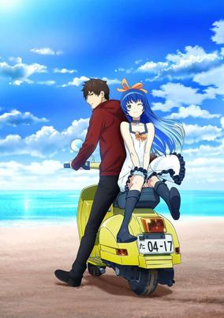

**Studio:** Madhouse &nbsp;|&nbsp; **Episodes:** 12 &nbsp;|&nbsp; **Director:** Shigeyuki Miya &nbsp;|&nbsp; **Aired/Released:** April 7 – June 23 &nbsp;|&nbsp; **Genres:** Adventure, Action, Mystery, Fantasy, Drama

> The entire population of a city disappeared—vanished without a trace. Yuki, the sole survivor, joins Takuya, a contract courier, on a perilous journey to find answers within the newly named ghost town “Lost”. With a letter from Yuki’s father as the pair’s only lead, a secretive organization refuses to let Yuki and Takuya’s meddling go unchecked.
>
> _Synopsis source: Kitsu_

[Wikipedia](https://en.wikipedia.org/wiki/Afterlost) · [Kitsu](https://kitsu.io/anime/shoumetsu-toshi)

---

### Fairy Gone

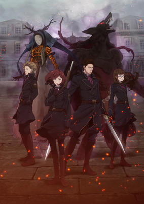

**Studio:** P.A. Works &nbsp;|&nbsp; **Episodes:** 12 &nbsp;|&nbsp; **Director:** Kenichi Suzuki &nbsp;|&nbsp; **Aired/Released:** April 7 – June 23 &nbsp;|&nbsp; **Genres:** Action, Fantasy, Magic, Contemporary Fantasy, Alternative Past, Past, Disaster

> The anime is set in a world where fairies possess and reside within animals, granting them special powers. By surgically removing and transplanting the organs of a possessed animal into a human, humans can partially summon the fairy and use it as a weapon. Eventually, such individuals were used for war, and were called "Fairy Soldiers." After a long war, these soldiers lost their purpose, and had to reintegrate into society. From the government, to the mafia, and even becoming terrorists, each tread their own path. The story begins nine years after the end of the war, and centers on the protagonist Maria. Maria is a fresh recruit of "Dorothea," an organization dedicated to the investigation and suppression of fairy-related crimes and incidents. Even in peacetime, the government is still unstable after the war. Many criminals still have lingering wounds from the previous conflict, and there are terrorist groups bent on revenge. This is the story of Fairy Soldiers seeking their own justice in a chaotic postwar world.
>
> _Synopsis source: Kitsu_

[Wikipedia](https://en.wikipedia.org/wiki/Fairy_Gone) · [Kitsu](https://kitsu.io/anime/fairy-gone)

---

### Hachigatsu no Cinderella Nine (Cinderella Nine)

**Studio:** TMS Entertainment &nbsp;|&nbsp; **Episodes:** 12 &nbsp;|&nbsp; **Director:** Susumu Kudo &nbsp;|&nbsp; **Aired/Released:** April 7 – July 7 &nbsp;|&nbsp; **Genres:** Sports, Baseball, School Life, School Clubs

> When Arihara Tsubasa enters Rigahama Municipal High School and learns that it has no baseball club, she starts up the Girls' Baseball Club on her own. Drawn to the club are girls who have never played baseball before, girls who once played it but quit, and girls who are constantly tackling great challenges. The Rigahama Girls' Baseball Club races through the trials of youth, periodically clashing and quarreling, but supporting each other all the way! And so begins the hottest summer the world has ever known...
>
> _Synopsis source: Kitsu_

[Wikipedia](https://en.wikipedia.org/wiki/Hachigatsu_no_Cinderella_Nine) · [Kitsu](https://kitsu.io/anime/hachigatsu-no-cinderella-nine-tv)

---

### Midnight Occult Civil Servants

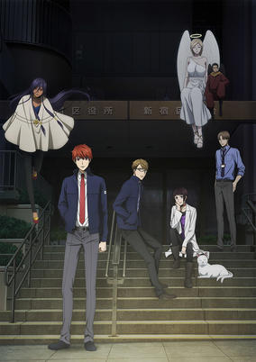

**Studio:** Liden Films &nbsp;|&nbsp; **Episodes:** 12 &nbsp;|&nbsp; **Director:** Tetsuya Watanabe &nbsp;|&nbsp; **Aired/Released:** April 7 – June 23 &nbsp;|&nbsp; **Genres:** Contemporary Fantasy, Demon, Mystery, Supernatural, Zombie, Fantasy, Shoujo

> When Miyako Arata joins the Shinjuku Ward Office, he thinks he's gotten a normal civil servant job. But it turns out he's joined the Night Community Exchange Department, one of which operates secretly in each of Tokyo's twenty-three ward offices. Their job is to resolve occult issues concerning non-human beings. Accompanied by his senpai and department head Sakaki Kyoichi and the occult obsessed Himetsuka Seo, they work night after night, facing off with beings whose existence defies the laws of our world.
>
> _Synopsis source: Kitsu_

[Wikipedia](https://en.wikipedia.org/wiki/Midnight_Occult_Civil_Servants) · [Kitsu](https://kitsu.io/anime/mayonaka-no-occult-koumuin)

---

### Ultramarine Magmell

**Studio:** Pierrot+ &nbsp;|&nbsp; **Episodes:** 13 &nbsp;|&nbsp; **Director:** Hayato Date &nbsp;|&nbsp; **Aired/Released:** April 7 – June 30 &nbsp;|&nbsp; **Genres:** Adventure, Action, Fantasy, Super Power, Shounen

> One day in the middle of the pacific ocean a miracle occurred, a new continent appeared out of nowhere! The new continent was the home for new and mysterious plants, creatures and minerals! Humanity is excited as the age of exploration has returned.
>
> _Synopsis source: Kitsu_

[Wikipedia](https://en.wikipedia.org/wiki/Ultramarine_Magmell) · [Kitsu](https://kitsu.io/anime/gunjou-no-magmell)

---

### We Never Learn: BOKUBEN

**Studio:** Studio Silver Arvo Animation &nbsp;|&nbsp; **Episodes:** 13 &nbsp;|&nbsp; **Director:** Yoshiaki Iwasaki &nbsp;|&nbsp; **Aired/Released:** April 7 – June 30 &nbsp;|&nbsp; **Genres:** Comedy, Harem, Romance, School Life, Shounen, Slice of Life, Ecchi

> Nariyuki Yuiga is in his last and most painful year of high school. In order to gain the “special VIP recommendation” which would grant him a full scholarship to college, he must now tutor his classmates as they struggle to prepare for entrance exams. Among his pupils are “the sleeping beauty of the literary forest,” Fumino Furuhashi, and "the Thumbelina supercomputer," Rizu Ogata–two of the most beautiful super-geniuses at the school! While these two were thought to be academically flawless, it turns out that they’re completely clueless outside of their pet subjects…!?
>
> _Synopsis source: Kitsu_

[Wikipedia](https://en.wikipedia.org/wiki/We_Never_Learn) · [Kitsu](https://kitsu.io/anime/bokutachi-wa-benkyou-ga-dekinai)

---

### I'm From Japan

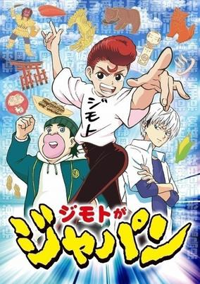

**Studio:** ODDJOB &nbsp;|&nbsp; **Episodes:** 50 &nbsp;|&nbsp; **Director:** Isamu Ueno &nbsp;|&nbsp; **Aired/Released:** April 8 – March 23, 2020 &nbsp;|&nbsp; **Genres:** Slice of Life, Comedy, Shounen

> There's a new tough guy transfer student in Tokyo. His name is Tokio and he's raring to see how scrappy the locals are. But when he comes face-to-face with a Japan-obsessed red-haired kid that won't leave him alone until he tells him exactly what prefecture he's from, his life takes a turn for the crazy! This kid isn't just Japan obsessed, he's developed a martial art based on all the different prefectures in the country!
>
> _Synopsis source: Kitsu_

[Wikipedia](https://en.wikipedia.org/wiki/I%27m_From_Japan) · [Kitsu](https://kitsu.io/anime/jimoto-ga-japan)

---

### Namu Amida Butsu! -Rendai Utena-

**Studio:** Asahi Production &nbsp;|&nbsp; **Episodes:** 12 &nbsp;|&nbsp; **Director:** Akira Oguro &nbsp;|&nbsp; **Aired/Released:** April 8 – June 24

---

### RobiHachi

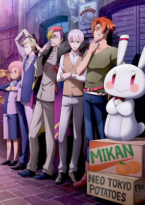

**Studio:** Studio Comet &nbsp;|&nbsp; **Episodes:** 12 &nbsp;|&nbsp; **Director:** Shinji Takamatsu &nbsp;|&nbsp; **Aired/Released:** April 8 – June 24 &nbsp;|&nbsp; **Genres:** Adventure, Comedy, Space Battles, Alien, Super Robot, Science Fiction, Space

> Neo Tokyo, the year G.C. (Galaxy Century) 0051, which marks a half century since first contact was made. Humans have obtained super light-speed navigation technology and formed a commonwealth of planets with aliens. A streak of bad luck is continuing for self-proclaimed freelance reportage writer Robby Yarge, who is around 30 years old. He fails at work, so his contract is cut. His girlfriend leaves him, he nearly dies in a traffic accident, and debt collectors come after him. One day, a bag snatcher steals Robby's bag, and a young man helps him. Hatchi Kita, an 18-year-old part-time worker, catches the criminal and returns Robby's bag. Robby offers him his gratitude and a meal in return. The pair discover they are complete opposites and soon part ways. However, Hatchi turns up again in Robby's life as a debt collector. Hatchi explains that it's his part-time job working for the loan shark Yan. A cat-and-mouse chase begins, and Yan's Finance president Yan takes his subordinates Aro and Gra along for the ride. Robby manages to elude Hatchi and escape to space while shaking off Yan's group. Robby thinks of escaping to Isekandar, a distant and legendary planet in the Milky Way that is said to bring happiness to those who go there. Though Robby thought he had escaped to space alone, he discovers Hatchi inside his spaceship. The two decide to travel across the galaxy together in search of Isekandar.
>
> _Synopsis source: Kitsu_

[Wikipedia](https://en.wikipedia.org/wiki/RobiHachi) · [Kitsu](https://kitsu.io/anime/robihachi)

---

### Why the Hell are You Here, Teacher!?

**Studio:** Tear Studio &nbsp;|&nbsp; **Episodes:** 12 &nbsp;|&nbsp; **Director:** Hiraku Kaneko (Chief) Toshikatsu Tokoro &nbsp;|&nbsp; **Aired/Released:** April 8 – June 24 &nbsp;|&nbsp; **Genres:** Comedy, Ecchi, School Life, Seinen, Female Teacher, High School

> Ichiro Sato is about as average as a student can get… except for his above-average ability to land himself in totally awkward, intensely risqué situations with his no-nonsense teacher, Kana Kojima!
>
> _Synopsis source: Kitsu_

[Wikipedia](https://en.wikipedia.org/wiki/Why_the_Hell_are_You_Here,_Teacher!%3F) · [Kitsu](https://kitsu.io/anime/nande-koko-ni-sensei-ga)

---

### Isekai Quartet

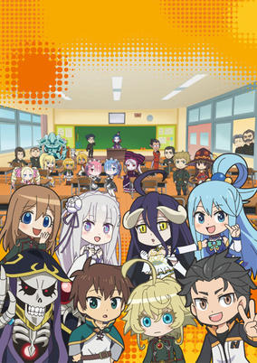

**Studio:** Studio Puyukai &nbsp;|&nbsp; **Episodes:** 12 &nbsp;|&nbsp; **Director:** Minoru Ashina &nbsp;|&nbsp; **Aired/Released:** April 9 – June 25 &nbsp;|&nbsp; **Genres:** Comedy, Fantasy, Parody, Isekai, Magic

> The button appeared out of nowhere. There weren’t any signs NOT to push it...so the solution is obvious, right? Is it a trap or the start of something new and exciting? The crews of Re:Zero, Overlord, Konosuba, and The Saga of Tanya the Evil will find out when they go from their world to another and get stuck in...class?! See what adorable chaos they’ll get up to in this collection of shorts!
>
> _Synopsis source: Kitsu_

[Wikipedia](https://en.wikipedia.org/wiki/Isekai_Quartet) · [Kitsu](https://kitsu.io/anime/isekai-quartet)

---

### One-Punch Man (season 2) (One-Punch Man 2)

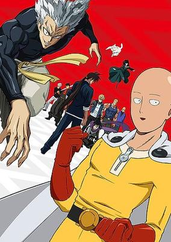

**Studio:** J.C.Staff &nbsp;|&nbsp; **Episodes:** 12 &nbsp;|&nbsp; **Director:** Chikara Sakurai &nbsp;|&nbsp; **Aired/Released:** April 9 – July 2 &nbsp;|&nbsp; **Genres:** Super Power, Parody, Action, Science Fiction, Fantasy, Comedy, Superhero, Shounen

> The second season of One Punch Man. Saitama is a hero who only became a hero for fun. After three years of “special training,” he’s become so strong that he’s practically invincible. In fact, he’s too strong—even his mightiest opponents are taken out with a single punch. Now, the great seer Madame Shibabawa’s prediction about the Earth being doomed seems to be coming true as the frequency of monster incidents escalates. Alongside Genos, his faithful disciple, Saitama begins his official hero duties as a member of the Hero Association, while Garou, a man utterly fascinated by monsters, makes his appearance.
>
> _Synopsis source: Kitsu_

[Wikipedia](https://en.wikipedia.org/wiki/One-Punch_Man) · [Kitsu](https://kitsu.io/anime/one-punch-man-2)

---

### Strike Witches: 501st Joint Fighter Wing Take Off!

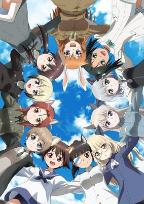

**Studio:** acca effe Giga Production &nbsp;|&nbsp; **Episodes:** 12 &nbsp;|&nbsp; **Director:** Fumio Ito &nbsp;|&nbsp; **Aired/Released:** April 9 – June 25 &nbsp;|&nbsp; **Genres:** Science Fiction, Fantasy, Comedy, Military, Shounen

> Strike Witches, the 501st Joint Fighter Wing girls, are back from battle and ready to relax as best they can! War with the deadly Neuroi won’t last forever, but one thing is certain, the war on laundry is eternal. Join these aerial combat cuties in a down-to-earth series highlighting the team’s hijinks between missions.
>
> _Synopsis source: Kitsu_

[Wikipedia](https://en.wikipedia.org/wiki/Strike_Witches) · [Kitsu](https://kitsu.io/anime/strike-witches-501-butai-hasshin-shimasu)

---

### Carole & Tuesday

**Studio:** Bones &nbsp;|&nbsp; **Episodes:** 24 &nbsp;|&nbsp; **Director:** Shinichirō Watanabe (Chief) Motonobu Hori &nbsp;|&nbsp; **Aired/Released:** April 10 – October 2 &nbsp;|&nbsp; **Genres:** Music, Plot Continuity, Comedy, The Arts, Future, Drama, Science Fiction, Mars, Romance

> Fifty years have passed since mankind began migrating to the new frontier: Mars. It's an age where most culture is produced by AI, and people are content to be passive consumers. There's a girl. Scrapping a living in the metropolis of Alba City, she's working part time while trying to become a musician. She's always felt like something is missing. Her name is Carole. There's a girl. Born to a wealthy family in the provincial town of Herschel City, she dreams of becoming a musician, but nobody around her understands. She feels like the loneliest person in the world. Her name is Tuesday. A chance meeting brings them together. They want to sing. They want to make music. Together, they feel like they just might have a chance. The two of them may only create a tiny wave. But that wave will eventually grow into something larger...
>
> _Synopsis source: Kitsu_

[Wikipedia](https://en.wikipedia.org/wiki/Carole_%26_Tuesday) · [Kitsu](https://kitsu.io/anime/carole-and-tuesday)

---

### The Helpful Fox Senko-san

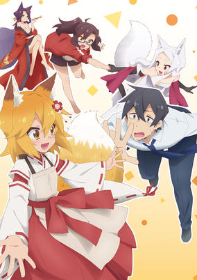

**Studio:** Doga Kobo &nbsp;|&nbsp; **Episodes:** 12 &nbsp;|&nbsp; **Director:** Tomoaki Koshida &nbsp;|&nbsp; **Aired/Released:** April 10 – June 26 &nbsp;|&nbsp; **Genres:** Comedy, Romance, Supernatural

> Sometimes the cure to a hard day’s work is the tender love and care of...a fox girl?! Salaryman Nakano’s stressful life is suddenly intruded upon by the fox, Senko-san, who is eager to help him heal his exhaustion. Whether she’s cooking, cleaning, or finding other ways to care for Nakano, she’s there to take away his stress!
>
> _Synopsis source: Kitsu_

[Wikipedia](https://en.wikipedia.org/wiki/The_Helpful_Fox_Senko-san) · [Kitsu](https://kitsu.io/anime/sewayaki-kitsune-no-senko-san)

---

### Wise Man's Grandchild

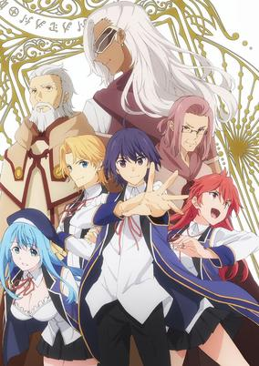

**Studio:** Silver Link &nbsp;|&nbsp; **Episodes:** 12 &nbsp;|&nbsp; **Director:** Masafumi Tamura &nbsp;|&nbsp; **Aired/Released:** April 10 – June 26 &nbsp;|&nbsp; **Genres:** Action, Comedy, Fantasy, Magic, Isekai

> A young man dies in a car accident and is reborn in a magical new world. The old, yet wise Merlin finds the boy, names him Shin, raises him from infancy, and teaches him combat and powerful magic along the way. 15 years later, Shin is ready to travel the globe on his own, but Merlin forgot to teach him something major—common sense!
>
> _Synopsis source: Kitsu_

[Wikipedia](https://en.wikipedia.org/wiki/Wise_Man%27s_Grandchild) · [Kitsu](https://kitsu.io/anime/kenja-no-mago)

---

### Sarazanmai

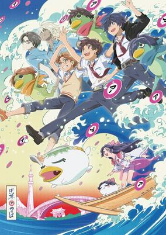

**Studio:** MAPPA Lapin Track &nbsp;|&nbsp; **Episodes:** 11 &nbsp;|&nbsp; **Director:** Nobuyuki Takeuchi (Chief) Kunihiko Ikuhara &nbsp;|&nbsp; **Aired/Released:** April 11 – June 20 &nbsp;|&nbsp; **Genres:** Supernatural, Henshin, Demon, Cops, Japan, Drama, Fantasy, Absurdist Humour

> The setting is Asakusa. One day, second-years in middle school Kazuki Yasaka, Toi Kuji, and Enta Jinnai meet Keppi, a mysterious kappa-like creature, who steals their shirikodama and transforms them into kappas. "To return to your original forms," Keppi tells them, "you must fight the zombies and take the shirikodama from them." Can the boys connect with each other and steal the zombies' shirikodama?! This is the story of three boys who can't connect with someone important to them, learning about what it truly means to do so.
>
> _Synopsis source: Kitsu_

[Wikipedia](https://en.wikipedia.org/wiki/Sarazanmai) · [Kitsu](https://kitsu.io/anime/sarazanmai)

---

### Bungo Stray Dogs (season 3) (Bungo Stray Dogs 3)

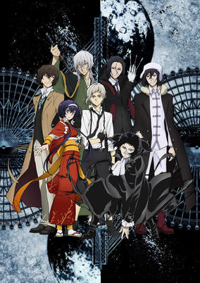

**Studio:** Bones &nbsp;|&nbsp; **Episodes:** 12 &nbsp;|&nbsp; **Director:** Takuya Igarashi &nbsp;|&nbsp; **Aired/Released:** April 12 – June 28 &nbsp;|&nbsp; **Genres:** Super Power, Action, Supernatural, Mystery, Seinen

> The White Tiger and the Black Beast – Nakajima Atsushi and Akutagawa Ryunosuke’s fight against Francis F. brings an end to the great war against the Guild. Life goes on as normal in Yokohama, thanks to the continued truce between the Armed Detective Agency and the Port Mafia, who, together, saved the city from ruin. But there are still rumors of Guild stragglers and other crime organizations making their way in from abroad. Meanwhile, Dazai Osamu had premonitions of another impending disaster. Lurking in the darkness is the Fyodor D., leader of pirate organization Rats in the House of the Dead, his dreadful plans on the verge of execution.
>
> _Synopsis source: Kitsu_

[Wikipedia](https://en.wikipedia.org/wiki/Bungo_Stray_Dogs) · [Kitsu](https://kitsu.io/anime/bungou-stray-dogs-3)

---

### King of Prism: Shiny Seven Stars

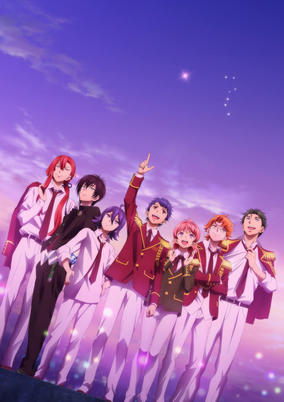

**Studio:** Tatsunoko Production &nbsp;|&nbsp; **Episodes:** 12 &nbsp;|&nbsp; **Director:** Masakazu Hishida &nbsp;|&nbsp; **Aired/Released:** April 15 – July 1 &nbsp;|&nbsp; **Genres:** Music, Shounen, Sports

> After appearing in the Prism King Cup representing Edel Rose, and getting a glimpse of what it was like to a be a future Prism Star, Ichijo Shin entered Kakyoin Academy’s High School division in spring and became a first-year high school student. Koji, Hiro, and Kazuki from Over The Rainbow left Edel Rose and established a new agency. Meanwhile, after having the title of Prism King stolen by Hiro, the leader of Schwarz Rose, Norizuki Jin, proposes PRISM.1, which would decide a new king other than Prism King. He then announces that Schwarz Rose and Edel Rose will be competing with each other.
>
> _Synopsis source: Kitsu_

[Kitsu](https://kitsu.io/anime/king-of-prism-shiny-seven-stars)

---

### Attack on Titan (season 3, part 2) (Attack on Titan Season 3)

**Studio:** Wit Studio &nbsp;|&nbsp; **Episodes:** 10 &nbsp;|&nbsp; **Director:** Tetsurō Araki Masashi Koizuka &nbsp;|&nbsp; **Aired/Released:** April 29 – July 1 &nbsp;|&nbsp; **Genres:** Alternative Past, Violence, Action, Angst, Fantasy, Adventure, Drama, Post Apocalypse, Military, Shounen

> After recovering Eren and Historia, the recruits are put under the care of Levi. Stuck out in the middle of nowhere, Hange subjects Eren to a series of experiments in an attempt to find out more about his ability. But when their link to the secrets behind the wall is murdered, the squad must move out and find a new refuge. Except, a figure from Levi’s past has his own plans to stop them.
>
> _Synopsis source: Kitsu_

[Wikipedia](https://en.wikipedia.org/wiki/Attack_on_Titan) · [Kitsu](https://kitsu.io/anime/shingeki-no-kyojin-3)

---

### Star-Myu (season 3)

**Studio:** C-Station &nbsp;|&nbsp; **Episodes:** 12 &nbsp;|&nbsp; **Director:** Shunsuke Tada &nbsp;|&nbsp; **Aired/Released:** July 1 – September 16

[Wikipedia](https://en.wikipedia.org/wiki/Star-Myu)

---

### To the Abandoned Sacred Beasts

**Studio:** MAPPA &nbsp;|&nbsp; **Episodes:** 12 &nbsp;|&nbsp; **Director:** Jun Shishido &nbsp;|&nbsp; **Aired/Released:** July 1 – September 16 &nbsp;|&nbsp; **Genres:** Shounen, Historical, Dragon, War, Fantasy, Drama, Action

> The democratic nation of Patria was created on the continent of Patria. Because of economical disputes, the country split north and south, creating the Northern Union of Patria and the Southern Confederation of Patria and they waged a long civil war. With their numbers dwindling, the North decides to use forbidden technology in order to defeat the South. This technology turns humans into monster-like soldiers, giving them almost godlike powers. And with those powers, the long war came to an end and peace was restored. Incarnates. They were the heroes who saved the country and were regarded as gods. Time had passed, leaving the war behind. The people who had given up their human forms to become Incarnates were now feared by the masses due to their overwhelming power and were now called Beasts. The former captain of the Incarnate squad, Hank, was on a journey to find his former Incarnate comrades who had turned into Beasts and was hunting them down as the Beast Hunter. A young woman named Schaal was on a journey to find the person who killed her Incarnate father. She encounters Hank and decides to go on a journey with him to discover the truth behind her father's death. She eventually finds out that the battle is never truly over, and the existence of the man Hank is looking for who is apparently responsible for letting the Beasts loose into the world. Where does Hank's path lead him, as he bears the sins for killing his own comrades?
>
> _Synopsis source: Kitsu_

[Wikipedia](https://en.wikipedia.org/wiki/To_the_Abandoned_Sacred_Beasts) · [Kitsu](https://kitsu.io/anime/katsute-kami-datta-kemono-tachi-e)

---

### Are You Lost?

**Studio:** Ezo'la &nbsp;|&nbsp; **Episodes:** 12 &nbsp;|&nbsp; **Director:** Nobuyoshi Nagayama &nbsp;|&nbsp; **Aired/Released:** July 2 – September 17 &nbsp;|&nbsp; **Genres:** Comedy, Seinen, Psychological, Ecchi, Female Student, Drama, Adventure

> Because of a plane crash…starting today, we're spending the springtime of our lives on a desert island!! There's nothing here, so we have to make everything!! And eat everything!! (Ugh!) Check out our high school girl survival story of courage and knowledge. We're actually doing pretty well! [Volume One Includes:] How to eat cicadas, how to build traps, a simple allergy test, how to eat hermit crabs, etc.
>
> _Synopsis source: Kitsu_

[Wikipedia](https://en.wikipedia.org/wiki/Are_You_Lost%3F) · [Kitsu](https://kitsu.io/anime/sounan-desu-ka)

---

### Magical Sempai

**Studio:** Liden Films &nbsp;|&nbsp; **Episodes:** 12 &nbsp;|&nbsp; **Director:** Fumiaki Usui &nbsp;|&nbsp; **Aired/Released:** July 2 – September 17 &nbsp;|&nbsp; **Genres:** Comedy, Ecchi, School Life, Seinen

> "I encountered her… a cute, but ‘weird’ sempai!" Magic-loving but stage-fright-addled, this sempai comes with a failure rate of 100%—but you can't take your eyes off her! The off-color, magical gag manga that's caused an uproar all over Japan is finally here! Here's to non-athletic hobbies!
>
> _Synopsis source: Kitsu_

[Wikipedia](https://en.wikipedia.org/wiki/Magical_Sempai) · [Kitsu](https://kitsu.io/anime/tejina-senpai)

---

### Astra Lost in Space

**Studio:** Lerche &nbsp;|&nbsp; **Episodes:** 12 &nbsp;|&nbsp; **Director:** Masaomi Andō &nbsp;|&nbsp; **Aired/Released:** July 3 – September 18 &nbsp;|&nbsp; **Genres:** Adventure, Shipboard, Space Travel, Space, Other Planet, Science Fiction, Conspiracy, Action, Shounen

> In the year 2063, eight high school students and a kid are flown out to Planet Camp, tasked with surviving on their own for a few days. But shortly after arriving, an ominous glowing orb warps them to an unknown quadrant of space, nearly 5,012 light years away. Now, the only way back home is a slow, dangerous trek across the universe—a journey that’ll test them in ways Planet Camp never could.
>
> _Synopsis source: Kitsu_

[Wikipedia](https://en.wikipedia.org/wiki/Astra_Lost_in_Space) · [Kitsu](https://kitsu.io/anime/kanata-no-astra)

---

### How Heavy Are the Dumbbells You Lift?

**Studio:** Doga Kobo &nbsp;|&nbsp; **Episodes:** 12 &nbsp;|&nbsp; **Director:** Mitsue Yamazaki &nbsp;|&nbsp; **Aired/Released:** July 3 – September 18 &nbsp;|&nbsp; **Genres:** Comedy, Ecchi, Slice of Life, Sports

> Hibiki Sakura’s love for food is starting to affect her size. In effort to slim down, she scopes out her local gym only to discover two problems—it’s a haven for intimidating body builders, and her classmate Akemi has a weirdly aggressive muscle obsession. After meeting her handsome personal trainer, Machio, Hibiki bites the bullet and starts her quest for a hot bod!
>
> _Synopsis source: Kitsu_

[Wikipedia](https://en.wikipedia.org/wiki/How_Heavy_Are_the_Dumbbells_You_Lift%3F) · [Kitsu](https://kitsu.io/anime/dumbbell-nan-kilo-moteru)

---

### Demon Lord, Retry!

**Studio:** Ekachi Epilka &nbsp;|&nbsp; **Episodes:** 12 &nbsp;|&nbsp; **Director:** Hiroshi Kimura &nbsp;|&nbsp; **Aired/Released:** July 4 – September 19 &nbsp;|&nbsp; **Genres:** Action, Adventure, Comedy, Fantasy, Isekai

> On the night of his favorite game’s shutdown, Akira Oono awakens in the body of his online character: Demon Lord Hakuto Kunai. He’s not the most confident guy ever, and he’s traveling with an injured young girl. But with powerful game mechanics and abilities on his side, this gamer turned badass plots his course through a diverse new world filled with saints, demons, and charming companions!
>
> _Synopsis source: Kitsu_

[Wikipedia](https://en.wikipedia.org/wiki/Demon_Lord,_Retry!) · [Kitsu](https://kitsu.io/anime/maou-sama-retry)

---

### If It's for My Daughter, I'd Even Defeat a Demon Lord

**Studio:** Maho Film &nbsp;|&nbsp; **Episodes:** 12 &nbsp;|&nbsp; **Director:** Takeyuki Yanase &nbsp;|&nbsp; **Aired/Released:** July 4 – September 19 &nbsp;|&nbsp; **Genres:** Slice of Life, Family, Demon, Fantasy

> Dale is a well-known and highly skilled adventurer despite being so young. One day, he's on a quest and goes deep into the woods and finds a little devil girl named Latina, who is just skin and bones. Latina is branded with the mark of a sinner, but Dale decides he can't just leave Latina there and decides to become her guardian. Thinking to himself, "Latina is too cute, I don't want to work," he ends up doting over her before he even realizes it.
>
> _Synopsis source: Kitsu_

[Wikipedia](https://en.wikipedia.org/wiki/If_It%27s_for_My_Daughter,_I%27d_Even_Defeat_a_Demon_Lord) · [Kitsu](https://kitsu.io/anime/uchinoko)

---

### Dr. Stone

**Studio:** TMS/8PAN &nbsp;|&nbsp; **Episodes:** 24 &nbsp;|&nbsp; **Director:** Shinya Iino &nbsp;|&nbsp; **Aired/Released:** July 5 – December 13 &nbsp;|&nbsp; **Genres:** Plot Continuity, Action, Comedy, Future, Disaster, Adventure, Science Fiction, Shounen, Post Apocalypse

> Several thousand years after a mysterious phenomenon that turns all of humanity to stone, the extraordinarily intelligent, science-driven boy, Senku Ishigami, awakens. Facing a world of stone and the total collapse of civilization, Senku makes up his mind to use science to rebuild the world. Starting with his super strong childhood friend Taiju Oki, who awakened at the same time, they will begin to rebuild civilization from nothing... Depicting two million years of scientific history from the Stone Age to present day, the unprecedented crafting adventure story is about to begin!
>
> _Synopsis source: Kitsu_

[Wikipedia](https://en.wikipedia.org/wiki/Dr._Stone) · [Kitsu](https://kitsu.io/anime/dr-stone)

---

### Fire Force

**Studio:** David Production &nbsp;|&nbsp; **Episodes:** 24 &nbsp;|&nbsp; **Director:** Yuki Yase &nbsp;|&nbsp; **Aired/Released:** July 5 – December 27 &nbsp;|&nbsp; **Genres:** Supernatural, Demon, Action, Science Fiction, Shounen, Super Power

> Tokyo is burning, and citizens are mysteriously suffering from spontaneous human combustion all throughout the city! Responsible for snuffing out this inferno is the Fire Force, and Shinra is ready to join their fight. Now, as part of Company 8, he’ll use his devil’s footprints to help keep the city from turning to ash! But his past and a burning secret behind the scenes could set everything ablaze.
>
> _Synopsis source: Kitsu_

[Wikipedia](https://en.wikipedia.org/wiki/Fire_Force) · [Kitsu](https://kitsu.io/anime/enen-no-shouboutai)

---

### Granbelm

**Studio:** Nexus &nbsp;|&nbsp; **Episodes:** 13 &nbsp;|&nbsp; **Director:** Masaharu Watanabe &nbsp;|&nbsp; **Aired/Released:** July 5 – September 26 &nbsp;|&nbsp; **Genres:** Magic, Fantasy, Mecha, Action

> It had been nearly 1,000 years since all the magic in the world disappeared, and most people had forgotten it ever existed. Kohinata Mangetsu is a cheerful high school student who has a pretty positive outlook on life, but she has nothing to call her own-- Because she wasn't good at academics or sports, she dreamed of having something she was good at. On a night where the full moon was shining brightly, she happens to meet another girl with the character for "moon" in her name named Shingetsu Ernesta Fukami. That was also when she encountered the mechanical dolls called "ARMANOX."
>
> _Synopsis source: Kitsu_

[Wikipedia](https://en.wikipedia.org/wiki/Granbelm) · [Kitsu](https://kitsu.io/anime/granbelm)

---

### O Maidens in Your Savage Season

**Studio:** Lay-duce &nbsp;|&nbsp; **Episodes:** 12 &nbsp;|&nbsp; **Director:** Masahiro Ando Takurō Tsukada &nbsp;|&nbsp; **Aired/Released:** July 5 – September 20 &nbsp;|&nbsp; **Genres:** School Life, Shounen, Slice of Life, Romance, Comedy, Drama, Friendship, Coming Of Age, School Clubs

> When the girls in the literature club ask themselves, “What do you want to do before you die?” one of them gives a most surprising response. Now they're all preoccupied (for better or for worse) by their friend's unexpected answer! Soon each of these very different young women find themselves propelled along the uncertain road to adulthood, their emotional journeys taking them down paths as surprising as their friend's unconventional wish. Poignant, painful and awkward in turns, O Maidens in Your Savage Season chronicles with humor and with grace the universal rites of passage so endemic to growing up.
>
> _Synopsis source: Kitsu_

[Wikipedia](https://en.wikipedia.org/wiki/O_Maidens_in_Your_Savage_Season) · [Kitsu](https://kitsu.io/anime/araburu-kisetsu-no-otome-domo-yo)

---

### Wasteful Days of High School Girls

**Studio:** Passione &nbsp;|&nbsp; **Episodes:** 12 &nbsp;|&nbsp; **Director:** Takeo Takahashi (Chief) Hijiri Sanpei &nbsp;|&nbsp; **Aired/Released:** July 5 – September 20 &nbsp;|&nbsp; **Genres:** Slice of Life, Comedy, School Life

> Bored out of her skull, Tanaka decides to give her friends some rather quirky nicknames, but they aren’t going to take her unflattering descriptions lying down. Sakuchi (who got saddled with “Ota” due to her nerdy otaku tendencies) and Saginomiya (dubbed “Robo” thanks to her deadpan personality) decide to call Tanaka “Baka” — and honestly? This should give you a pretty good idea of the shenanigans these three get up to. They’re at the height of their youth and they’re utterly ridiculous, eagerly and hilariously wasting away their days as high school girls!
>
> _Synopsis source: Kitsu_

[Wikipedia](https://en.wikipedia.org/wiki/Wasteful_Days_of_High_School_Girls) · [Kitsu](https://kitsu.io/anime/joshikousei-no-mudazukai)

---

### Senki Zesshō Symphogear XV (Symphogear XV)

**Studio:** Satelight &nbsp;|&nbsp; **Episodes:** 13 &nbsp;|&nbsp; **Director:** Katsumi Ono &nbsp;|&nbsp; **Aired/Released:** July 6 – September 28 &nbsp;|&nbsp; **Genres:** Magical Girl, Music, Action, Science Fiction, Fantasy, Drama

> The fifth season of Senki Zesshou Symphogear. Humanity is finally confronted with the threat of the Custodians—the ancient, sentient species held responsible for cursing humanity to speak different languages thousands of years ago. The Symphogear wielders—Hibiki Tachibana, Tsubasa Kazanari, Chris Yukine, Maria Cadenzavna Eve, Kirika Akatsuki, and Shirabe Tsukuyomi—are sent to the Antarctic in order to retrieve an ancient relic. After securing it and rescuing the scientific staff present there from a Coffin, the automated defense mechanism protecting it, the relic is given to American researchers due to international agreements. The criminal organization Noble Red, a remnant of the previously fought Bavarian Illuminati, starts targeting the relic. Will the Symphogear wielders and their supporting organization S.O.N.G. be able to foil the plans of the organizations conspiring against them?
>
> _Synopsis source: Kitsu_

[Wikipedia](https://en.wikipedia.org/wiki/Symphogear) · [Kitsu](https://kitsu.io/anime/senki-zesshou-symphogear-5th-season)

---

### The Case Files of Lord El-Melloi II: Rail Zeppelin Grace Note (Lord El-Melloi II's Case Files {Rail Zeppelin} Grace note)

**Studio:** Troyca &nbsp;|&nbsp; **Episodes:** 13 &nbsp;|&nbsp; **Director:** Makoto Katō &nbsp;|&nbsp; **Aired/Released:** July 6 – September 28 &nbsp;|&nbsp; **Genres:** Fantasy, Mystery, Supernatural

> Waver Velvet – The boy who fought side by side with the King of Conquerors, Iskandar, during the Fourth Holy Grail War in Fate/Zero. Time has passed, and the mature Waver has now adopted the name of Lord El-Melloi II. As one of the Lords of the Clock Tower as well as the department head of the Modern Magecraft Theories department, Lord El-Melloi II holds yet another lecture for his diverse array of students. After the post-lecture meeting with other Clock Tower nobility, he throws out a few insults at the fellow Lords who are interested only in their internal power struggles – but quickly receives a counter-curse in retaliation. On the following day, while in transit with his apprentice Gray, he notices a cat that had been hit by a car – the very same stray cat that frequently visited his room of late. Lord El-Melloi II realizes that this was an attempt to take his life, and commences a hunt for the perpetrator alongside Gray, Flat, and Svin.
>
> _Synopsis source: Kitsu_

[Wikipedia](https://en.wikipedia.org/wiki/The_Case_Files_of_Lord_El-Melloi_II) · [Kitsu](https://kitsu.io/anime/lord-el-melloi-ii-sei-no-jikenbo-rail-zeppelin-grace-note)

---

### Business Fish

**Studio:** IANDA &nbsp;|&nbsp; **Episodes:** 12 &nbsp;|&nbsp; **Director:** Takashi Sumida &nbsp;|&nbsp; **Aired/Released:** July 7 – August 11 &nbsp;|&nbsp; **Genres:** Slice of Life, Comedy, Working Life

[Wikipedia](https://en.wikipedia.org/wiki/Business_Fish) · [Kitsu](https://kitsu.io/anime/business-fish)

---

### Ensemble Stars! (Ensemble Stars)

**Studio:** David Production &nbsp;|&nbsp; **Episodes:** 24 &nbsp;|&nbsp; **Director:** Yasufumi Soejima Masakazu Hishida &nbsp;|&nbsp; **Aired/Released:** July 7 – December 22 &nbsp;|&nbsp; **Genres:** Music, School Life, Shoujo

> Yumenosaki Private Academy, a school located on a hill facing the ocean. Specializing in boys' idol training, the school has a long history of producing generations of idols for the entertainment world out of the young men overbrimming with talents, like the shining stars in the sky. Due to "special circumstances," you are a transfer student at the school, as well as the only female student there. In fact, you are chosen to be the very first student of the "producer course," and your task is to produce these idols… We hope you will enjoy your journey with the idols you meet at the academy, as well as the vigorous ensemble that together you will make.
>
> _Synopsis source: Kitsu_

[Wikipedia](https://en.wikipedia.org/wiki/Ensemble_Stars!) · [Kitsu](https://kitsu.io/anime/ensemble-stars)

---

### Re:Stage! Dream Days♪ (Re:Stage! Dream Days)

**Studio:** Yumeta Company Graphinica &nbsp;|&nbsp; **Episodes:** 12 &nbsp;|&nbsp; **Director:** Shin Katagai &nbsp;|&nbsp; **Aired/Released:** July 7 – September 29 &nbsp;|&nbsp; **Genres:** Idol, Music, Slice of Life, School Life, Shoujo

> Young Mana Shikimiya once had big dreams, but she set those dreams aside once she reached middle school in order to live a normal life. When Mana joins the Singing and Dancing Club of Homareboshi Academy to help save the group from being shut down, her dreams of stardom are rekindled. She’ll give it her all to win the Prism Stage competition and be named the top idol. With her friends beside her, there are no dreams too big!
>
> _Synopsis source: Kitsu_

[Kitsu](https://kitsu.io/anime/re-stage-dream-days)

---

### Teasing Master Takagi-san (season 2) (Teasing Master Takagi-san)

**Studio:** Shin-Ei Animation &nbsp;|&nbsp; **Episodes:** 12 &nbsp;|&nbsp; **Director:** Hiroaki Akagi &nbsp;|&nbsp; **Aired/Released:** July 7 – September 22 &nbsp;|&nbsp; **Genres:** Comedy, Romance, School Life, Slice of Life, Shounen, Middle School

> Tired of being mercilessly teased by his classmate Takagi, Nishikata has vowed to get her back and successfully tease the girl that's made him blush countless times. After all, if you blush, you lose! But getting vengeance isn't so easy when every attempt blows up in his face. Will Nishikata ever make Takagi blush or will he gain something more fulfilling from his bumbling attempts?
>
> _Synopsis source: Kitsu_

[Wikipedia](https://en.wikipedia.org/wiki/Teasing_Master_Takagi-san) · [Kitsu](https://kitsu.io/anime/karakai-jouzu-no-takagi-san)

---

### The Ones Within

**Studio:** Silver Link &nbsp;|&nbsp; **Episodes:** 12 &nbsp;|&nbsp; **Director:** Shin Ōnuma &nbsp;|&nbsp; **Aired/Released:** July 7 – September 22 &nbsp;|&nbsp; **Genres:** Fantasy, Isekai, Fantasy World, Shounen, Drama

> Akatsuki Iride is a popular live streamer for the game The Ones Within –Genome. But what was once fantasy quickly becomes reality when he and seven others are transported against their will into the game world. View count matters more than ever as millions watch them put their lives on the line to complete various high-risk challenges. Only the best will survive in the land that’s always live!
>
> _Synopsis source: Kitsu_

[Wikipedia](https://en.wikipedia.org/wiki/The_Ones_Within) · [Kitsu](https://kitsu.io/anime/nakanohito-genome-jikkyouchuu)

---

### Vinland Saga

**Studio:** Wit Studio &nbsp;|&nbsp; **Episodes:** 24 &nbsp;|&nbsp; **Director:** Shuhei Yabuta &nbsp;|&nbsp; **Aired/Released:** July 7 – December 29 &nbsp;|&nbsp; **Genres:** Adventure, Action, Historical, Seinen, Coming Of Age, War, Revenge, Drama, Violence, Military, Swordplay

> As a child, Thorfinn sat at the feet of the great Leif Ericson and thrilled to wild tales of a land far to the west. But his youthful fantasies were shattered by a mercenary raid. Raised by the Vikings who murdered his family, Thorfinn became a terrifying warrior, forever seeking to kill the band's leader, Askeladd, and avenge his father. Sustaining Throfinn through his ordeal are his pride in his family and his dreams of a fertile westward land, a land without war or slavery … the land Leif called Vinland.
>
> _Synopsis source: Kitsu_

[Wikipedia](https://en.wikipedia.org/wiki/Vinland_Saga_(manga)) · [Kitsu](https://kitsu.io/anime/vinland-saga)

---

### Arifureta: From Commonplace to World's Strongest

**Studio:** White Fox Asread &nbsp;|&nbsp; **Episodes:** 13 &nbsp;|&nbsp; **Director:** Kinji Yoshimoto &nbsp;|&nbsp; **Aired/Released:** July 8 – October 7 &nbsp;|&nbsp; **Genres:** Fantasy, Isekai, Action, Adventure, Vampire, Conspiracy, Magic, Loli, Fantasy World, Revenge, Harem, Romance

> Hajime Nagumo and his high school class are suddenly summoned to a fantastical land as heroes. But while most of his classmates have powerful stats and abilities, Hajime does not. Underappreciated and unprepared, he tumbles into the depths of a monster-infested dungeon where voracity and sacrifice are his only options. To thrive in this savage world, he’ll have no choice but to welcome the abyss.
>
> _Synopsis source: Kitsu_

[Kitsu](https://kitsu.io/anime/arifureta-shokugyou-de-sekai-saikyou)

---

### Cop Craft

**Studio:** Millepensee &nbsp;|&nbsp; **Episodes:** 12 &nbsp;|&nbsp; **Director:** Shin Itagaki &nbsp;|&nbsp; **Aired/Released:** July 8 – September 30 &nbsp;|&nbsp; **Genres:** Action, Science Fiction, Cops, Crime, Fantasy, Magic

> 15 years ago, a hyper-dimensional rift appeared above the Pacific Ocean linking Earth with a magical world. San-Teresa City became a melting pot of cultures and species, but despite peace on the surface, there’s always an underbelly. That’s where Detective Kei Matoba and knight Tirana come in—partners with different perceptions of life and law, working together to keep the city safe.
>
> _Synopsis source: Kitsu_

[Wikipedia](https://en.wikipedia.org/wiki/Cop_Craft) · [Kitsu](https://kitsu.io/anime/cop-craft)

---

### Fire in His Fingertips: My Childhood Friend is a Firefighter (Fire in His Fingertips)

**Studio:** Studio Hōkiboshi &nbsp;|&nbsp; **Episodes:** 8 &nbsp;|&nbsp; **Director:** Toshihiro Watase &nbsp;|&nbsp; **Aired/Released:** July 8 – September 1 &nbsp;|&nbsp; **Genres:** Comedy, Romance, Ecchi

> Office worker Ryou Fujihashi is trapped inside her apartment which has set ablaze. The firefighters arrive in time to save her, and one of them happens to be Souma Mizuno, Fujihashi's childhood friend who she had a crush on. As the apartment fire gets put out, an old love gets rekindled.
>
> _Synopsis source: Kitsu_

[Wikipedia](https://en.wikipedia.org/wiki/Fire_in_His_Fingertips) · [Kitsu](https://kitsu.io/anime/yubisaki-kara-no-honki-no-netsujou-osananajimi-wa-shouboushi)

---

### Hensuki: Are You Willing to Fall in Love with a Pervert, as Long as She's a Cutie? (Hensuki: Are you willing to fall in love with a pervert, as long as she’s a cutie?)

**Studio:** Geek Toys &nbsp;|&nbsp; **Episodes:** 12 &nbsp;|&nbsp; **Director:** Itsuki Imazaki &nbsp;|&nbsp; **Aired/Released:** July 8 – September 23 &nbsp;|&nbsp; **Genres:** Harem, Comedy, Romance, Ecchi, School Life

> The romantic comedy begins when a love letter arrives out of the blue for Keiki Kiryū, an ordinary high school student who has never had a girlfriend as long as he has been alive. The letter does not include the sender's name — but the letter does include white panties. In the process of investigating who could be his "Cinderella who left behind her panties," Keiki discovers every candidate is uniquely perverted and desperately interested in having him participate in their perversion.
>
> _Synopsis source: Kitsu_

[Kitsu](https://kitsu.io/anime/kawaikereba-hentai-demo-suki-ni-natte-kuremasu-ka)

---

### Kochoki: Wakaki Nobunaga (Kochoki)

**Studio:** Studio Deen &nbsp;|&nbsp; **Episodes:** 12 &nbsp;|&nbsp; **Director:** Noriyuki Abe &nbsp;|&nbsp; **Aired/Released:** July 8 – September 23 &nbsp;|&nbsp; **Genres:** Historical, Past, Josei, Action, Drama, Samurai

> The fearsome warlord, the demonic king—Oda Nobunaga! Before he was trying to rule over Japan, he was a teenager who began his path to greatness with his younger brother and faithful followers. Through succession, betrayal, battles, and bonds between one another, the struggles these boys face promise a future where they can blossom into powerful men.
>
> _Synopsis source: Kitsu_

[Kitsu](https://kitsu.io/anime/kochouki-wakaki-nobunaga)

---

### Isekai Cheat Magician

**Studio:** Encourage Films &nbsp;|&nbsp; **Episodes:** 12 &nbsp;|&nbsp; **Director:** Daisuke Tsukushi &nbsp;|&nbsp; **Aired/Released:** July 10 – September 25 &nbsp;|&nbsp; **Genres:** Fantasy, Isekai, Adventure, Action

> Nishimura Taichi is a typical, average high schooler, and Azuma Rin is a beautiful woman with the build of a model and excellent reflexes. The two live a normal high school life until one day they're suddenly enveloped in a mysterious magic circle and transported to an unknown land. That world is full of terrifying monsters, beastmen, dwarves, elves, and many other races right out of fantasy. In order to survive in this new world Taichi and Rin decide to become adventurers, but when they take the aptitude test they discover they both possess cheat level magic...
>
> _Synopsis source: Kitsu_

[Wikipedia](https://en.wikipedia.org/wiki/Isekai_Cheat_Magician) · [Kitsu](https://kitsu.io/anime/isekai-cheat-magician)

---

### Given

**Studio:** Lerche &nbsp;|&nbsp; **Episodes:** 11 &nbsp;|&nbsp; **Director:** Hikaru Yamaguchi &nbsp;|&nbsp; **Aired/Released:** July 11 – September 19

[Wikipedia](https://en.wikipedia.org/wiki/Given_(manga))

---

### A Certain Scientific Accelerator

**Studio:** J.C.Staff &nbsp;|&nbsp; **Episodes:** 12 &nbsp;|&nbsp; **Director:** Nobuharu Kamanaka &nbsp;|&nbsp; **Aired/Released:** July 12 – September 27 &nbsp;|&nbsp; **Genres:** Fantasy, Super Power, Supernatural, Action, Science Fiction

> After rescuing Last Order and subsequently taking a bullet to the head, Academy City’s top-ranked esper rests in the hospital. But Accelerator’s recovery is cut short when a mysterious girl carrying a photo of his little clone companion asks for help. Now they’re taking on Disciplinary Action—an anti-evil coalition whose sinister plans threaten Last Order, Academy City, and even the entire world!
>
> _Synopsis source: Kitsu_

[Wikipedia](https://en.wikipedia.org/wiki/A_Certain_Scientific_Accelerator) · [Kitsu](https://kitsu.io/anime/toaru-kagaku-no-accelerator)

---

### The Demon Girl Next Door

**Studio:** J.C.Staff &nbsp;|&nbsp; **Episodes:** 12 &nbsp;|&nbsp; **Director:** Hiroaki Sakurai &nbsp;|&nbsp; **Aired/Released:** July 12 – September 27 &nbsp;|&nbsp; **Genres:** Demon, Contemporary Fantasy, Comedy, Slice of Life, Magical Girl, Magic, Fantasy

> Yuko Yoshida is just an ordinary schoolgirl — until one day her dormant, devilish powers are unleashed by the demon Lilith! Yuko transforms into Shadow Mistress Yuko, a supernatural powerhouse with horns and a devil tail. Now she must defeat another mystical being named Momo Chiyoda, the shrine maiden of the Light Clan… who just so happens to go to Yuko’s school! But being a demonic magical girl isn’t as easy as it looks, and Yuko has a whole lot to learn before she’s ready to fulfill her destiny and take on the Clan of Light.
>
> _Synopsis source: Kitsu_

[Wikipedia](https://en.wikipedia.org/wiki/The_Demon_Girl_Next_Door) · [Kitsu](https://kitsu.io/anime/machikado-mazoku)

---

### Do You Love Your Mom and Her Two-Hit Multi-Target Attacks?

**Studio:** J.C.Staff &nbsp;|&nbsp; **Episodes:** 12 &nbsp;|&nbsp; **Director:** Yoshiaki Iwasaki &nbsp;|&nbsp; **Aired/Released:** July 13 – September 28 &nbsp;|&nbsp; **Genres:** Comedy, Adventure, Fantasy, Isekai, Virtual Reality

> Just when Masato thought that a random survey conducted in school was over, he got involved in a secret Government scheme. As he was carried along with the flow, he ended up in a Game world! As if that wasn't enough, shockingly, his mother was there as well! It was a little different from a typical transported to another world setting, but after some bickering, "Mom wants go on an adventure together with Maa-kun. Can mom become Maa-kun's companion?" With that, Masato and Mamako began their adventure as a mother and son pair. They met Porta, a cute traveling merchant, and Wise, a regrettable philosopher. Along with their new party members, Masato and co. start on their journey.
>
> _Synopsis source: Kitsu_

[Wikipedia](https://en.wikipedia.org/wiki/Do_You_Love_Your_Mom_and_Her_Two-Hit_Multi-Target_Attacks%3F) · [Kitsu](https://kitsu.io/anime/tsuujou-kougeki-ga-zentai-kougeki-de-ni-kai-kougeki-no-okaasan-wa-suki-desu-ka)

---

### Is It Wrong to Try to Pick Up Girls in a Dungeon? (season 2) (Is It Wrong to Try to Pick Up Girls in a Dungeon? II)

**Studio:** J.C.Staff &nbsp;|&nbsp; **Episodes:** 12 &nbsp;|&nbsp; **Director:** Hideki Tachibana &nbsp;|&nbsp; **Aired/Released:** July 13 – September 28 &nbsp;|&nbsp; **Genres:** Fantasy World, High Fantasy, Action, Fantasy, Adventure

> Second season of Is It Wrong to Try to Pick Up Girls in a Dungeon?
>
> _Synopsis source: Kitsu_

[Wikipedia](https://en.wikipedia.org/wiki/Is_It_Wrong_to_Try_to_Pick_Up_Girls_in_a_Dungeon%3F) · [Kitsu](https://kitsu.io/anime/dungeon-ni-deai-wo-motomeru-no-wa-machigatteiru-no-darou-ka-ii)

---

### BEM

**Studio:** LandQ Studios &nbsp;|&nbsp; **Episodes:** 12 &nbsp;|&nbsp; **Director:** Yoshinori Odaka &nbsp;|&nbsp; **Aired/Released:** July 14 – October 13

[Wikipedia](https://en.wikipedia.org/wiki/Humanoid_Monster_Bem)

---

### Try Knights

**Studio:** Gonzo &nbsp;|&nbsp; **Episodes:** 12 &nbsp;|&nbsp; **Director:** Tadayoshi Sasaki &nbsp;|&nbsp; **Aired/Released:** July 30 – October 15 &nbsp;|&nbsp; **Genres:** Sports, School Life, Josei

> Riku Haruma enters high school without a future in sight. He sees people playing like monsters on the ground, jumping higher than anyone else, running fast, deciding to try their best. There, he sees Akira Kariya playing rugby, a sport he was once passionate about but gave up due to his physique. While Akira is running roughly, Riku gives him a piece of advice without thinking. From that, Riku feels his dying passion for the sport set ablaze, and his future starts to brighten up...
>
> _Synopsis source: Kitsu_

[Wikipedia](https://en.wikipedia.org/wiki/Try_Knights) · [Kitsu](https://kitsu.io/anime/try-knights)

---

### Bananya and the Curious Bunch

**Studio:** Gathering &nbsp;|&nbsp; **Episodes:** 13 &nbsp;|&nbsp; **Director:** Kyō Yatate &nbsp;|&nbsp; **Aired/Released:** October 1 – December 24 &nbsp;|&nbsp; **Genres:** Comedy, Slice of Life, Kids

> There are still many mysterious creatures in this universe that we don’t know about. On a distant planet, one mysterious species has come into existence. They are known as "Bananyas." What sort of planet do the Bananyas come from, and what sort of life do they lead? And what if they began to dream about coming to Earth someday?
>
> _Synopsis source: Kitsu_

[Wikipedia](https://en.wikipedia.org/wiki/Bananya) · [Kitsu](https://kitsu.io/anime/bananya-fushigi-na-nakama-tachi)

---

### After School Dice Club

**Studio:** Liden Films &nbsp;|&nbsp; **Episodes:** 12 &nbsp;|&nbsp; **Director:** Kenichi Imaizumi &nbsp;|&nbsp; **Aired/Released:** October 2 – December 18 &nbsp;|&nbsp; **Genres:** Comedy, School Life, Shounen

> A story about girls playing board games after school! Kyoto in Spring. Aya is a high school girl who's just moved to a new town. Miki is her shy classmate, and her first friend. One day after school Aya and Miki follow the committee president Midori to a speciality board games store. The Dice Club!! Without thinking they try out a German board game together. These girls, who are searching for fun, soon fall into the exciting world of games!
>
> _Synopsis source: Kitsu_

[Wikipedia](https://en.wikipedia.org/wiki/After_School_Dice_Club) · [Kitsu](https://kitsu.io/anime/houkago-saikoro-club)

---

### Ahiru no Sora

**Studio:** Diomedéa &nbsp;|&nbsp; **Episodes:** 50 &nbsp;|&nbsp; **Director:** Keizō Kusakawa (Chief) Shingo Tamaki &nbsp;|&nbsp; **Aired/Released:** October 2 – September 30, 2020 &nbsp;|&nbsp; **Genres:** Basketball, Sports, Shounen, School Life, School Clubs, High School

> He may be short in stature, but Sora Kurumatani can soar and score on the basketball court! With a passion for the sport he inherited from his mother, Sora vows to her that he’ll take top prize at a high school basketball tournament… but there’s one problem. His new school’s basketball club has turned into a hangout for delinquents! Will Sora’s sheer tenacity and amazing three-point shooting change their minds and get the club up and running again?
>
> _Synopsis source: Kitsu_

[Wikipedia](https://en.wikipedia.org/wiki/Ahiru_no_Sora) · [Kitsu](https://kitsu.io/anime/ahiru-no-sora)

---

### Cautious Hero: The Hero Is Overpowered but Overly Cautious

**Studio:** White Fox &nbsp;|&nbsp; **Episodes:** 12 &nbsp;|&nbsp; **Director:** Masayuki Sakoi &nbsp;|&nbsp; **Aired/Released:** October 2 – December 27 &nbsp;|&nbsp; **Genres:** Action, Adventure, Fantasy, Demon, Isekai, Magic, Comedy

> Goddess Listarte, the savior of the super hard-mode world Gairbrunde, summons a hero to her aid. The hero, Seiya Ryuuguuin, holds the cheat-rank status, but he is ridiculously cautious. For instance, he would buy three sets of armor: one to wear, a spare, and a spare for the spare. Beyond keeping an absurd amount of item stock, he remains in his room for muscle training till he reaches the max level and fights slimes at full power just to stay on the safe side.
>
> _Synopsis source: Kitsu_

[Kitsu](https://kitsu.io/anime/kono-yuusha-ga-ore-tueee-kuse-ni-shinchou-sugiru)

---

### Kemono Michi: Rise Up

**Studio:** ENGI &nbsp;|&nbsp; **Episodes:** 12 &nbsp;|&nbsp; **Director:** Kazuya Miura &nbsp;|&nbsp; **Aired/Released:** October 2 – December 18 &nbsp;|&nbsp; **Genres:** Comedy, Fantasy, Slice of Life, Isekai, Juujin, Shounen

> The manga follows masked wrestler Genzou Shibata, who likes all kinds of animals and creatures. One day he is summoned to another world, where a princess asks him to help kill magical beasts, but he gets mad and puts her in a German suplex. Instead, he begins life as a pet shop owner in the other world.
>
> _Synopsis source: Kitsu_

[Wikipedia](https://en.wikipedia.org/wiki/Kemono_Michi) · [Kitsu](https://kitsu.io/anime/hataage-kemono-michi)

---

### Oresuki (ORESUKI: Are you the only one who loves me?)

**Studio:** Connect &nbsp;|&nbsp; **Episodes:** 12 &nbsp;|&nbsp; **Director:** Noriaki Akitaya &nbsp;|&nbsp; **Aired/Released:** October 2 – December 25 &nbsp;|&nbsp; **Genres:** Comedy, Romance, School Life, Plot Continuity, Japan, Love Polygon, Unrequited Love, Ecchi, Friendship, High School

> What would you do if a girl you like would confess to you? Besides, what if it were not just one girl? Cool high school student that loves the whole school and your hilarious and cheerful childhood friend. Yes, you would be crazy with happiness. But, what if an unexpected problem arises because of the content of this confession?
>
> _Synopsis source: Kitsu_

[Wikipedia](https://en.wikipedia.org/wiki/Oresuki) · [Kitsu](https://kitsu.io/anime/ore-wo-suki-nano-wa-omae-dake-ka-yo)

---

### Radiant (season 2) (Radiant)

**Studio:** Lerche &nbsp;|&nbsp; **Episodes:** 21 &nbsp;|&nbsp; **Director:** Daisei Fukuoka Seiji Kishi &nbsp;|&nbsp; **Aired/Released:** October 2 – February 26, 2020 &nbsp;|&nbsp; **Genres:** Fantasy, Fantasy World, Adventure, Action, Magic

> Seth dreams of being a great sorcerer. He wants to be powerful and defeat the Némésis, monsters that come down from the sky. But his eagerness constantly gets him into trouble. He can’t seem to avoid angering the villagers and even his guardian, Alma. One day, an enormous Némésis really attacks the village! Determined to save the world, Seth embarks on a journey in search for the “Radiant,” the legendary lair of the Némésis. Making new friends, fighting tough enemies, and confronting hardships, Seth’s adventure begins!
>
> _Synopsis source: Kitsu_

[Wikipedia](https://en.wikipedia.org/wiki/Radiant_(manfra)) · [Kitsu](https://kitsu.io/anime/radiant)

---

### Ascendance of a Bookworm

**Studio:** Ajia-do Animation Works &nbsp;|&nbsp; **Episodes:** 14 &nbsp;|&nbsp; **Director:** Mitsuru Hongo &nbsp;|&nbsp; **Aired/Released:** October 3 – December 26 &nbsp;|&nbsp; **Genres:** Comedy, Slice of Life, Isekai, Fantasy, Magic, Drama, Religion, Fantasy World

> A certain college girl who's loved books ever since she was a little girl dies in an accident and is reborn in another world she knows nothing about. She is now Myne, the sickly five-year-old daughter of a poor soldier. To make things worse, the world she's been reborn in has a very low literacy rate and books mostly don't exist. She'd have to pay an enormous amounts of money to buy one. Myne resolves herself: If there aren't any books, she'll just have to make them! Her goal is to become a librarian. This story begins with her quest to make books so she can live surrounded by them! Dive into this biblio-fantasy written for book lovers and bookworms!
>
> _Synopsis source: Kitsu_

[Wikipedia](https://en.wikipedia.org/wiki/Ascendance_of_a_Bookworm) · [Kitsu](https://kitsu.io/anime/honzuki-no-gekujou-shisho-ni-naru-tame-niwa-shudan-o-erandeiramasen)

---

### Azur Lane

**Studio:** Bibury Animation Studio &nbsp;|&nbsp; **Episodes:** 12 &nbsp;|&nbsp; **Director:** Tensho &nbsp;|&nbsp; **Aired/Released:** October 3 – March 20, 2020 &nbsp;|&nbsp; **Genres:** Action, Military, Historical, Disaster, War, Science Fiction

> Azur Lane, a combination of all the different Camps in the world, was once successful in repelling the underwater menace, the Siren. Now splintered, they must face a new threat in Red Axis, former allies who crave to wield this otherworldly Siren technology for their own nefarious desires! Who will be victorious in the never-ending war between these battleship girls!?
>
> _Synopsis source: Kitsu_

[Wikipedia](https://en.wikipedia.org/wiki/Azur_Lane) · [Kitsu](https://kitsu.io/anime/azur-lane)

---

### High School Prodigies Have It Easy Even In Another World (High School Prodigies Have It Easy Even in Another World!)

**Studio:** Project No.9 &nbsp;|&nbsp; **Episodes:** 12 &nbsp;|&nbsp; **Director:** Shinsuke Yanagi &nbsp;|&nbsp; **Aired/Released:** October 3 – December 19 &nbsp;|&nbsp; **Genres:** Fantasy, Isekai

> Seven Japanese high school prodigies have taken the world by storm, exercising their mind-blowing abilities in everything from politics to entertainment. But when their plane crashes one day, these geniuses awaken to find themselves in a different realm-one that's home to magic and beast folk! While such strange new surroundings might throw an average person for a loop, these prodigies take their situation in stride...and then some! With the greatest minds and talents known to Earth, this dream team is about to turn the other world on its head!
>
> _Synopsis source: Kitsu_

[Wikipedia](https://en.wikipedia.org/wiki/High_School_Prodigies_Have_It_Easy_Even_In_Another_World) · [Kitsu](https://kitsu.io/anime/choujin-koukousei-tachi-wa-isekai-demo-yoyuu-de-ikinuku-you-desu)

---

### Granblue Fantasy The Animation (season 2) (Granblue Fantasy: The Animation Season 2)

**Studio:** MAPPA &nbsp;|&nbsp; **Episodes:** 12 &nbsp;|&nbsp; **Director:** Yui Umemoto &nbsp;|&nbsp; **Aired/Released:** October 4 – December 27 &nbsp;|&nbsp; **Genres:** Magic, Swordplay, Fantasy World, Action, Fantasy, Adventure

> Second season of Granblue Fantasy The Animation.
>
> _Synopsis source: Kitsu_

[Wikipedia](https://en.wikipedia.org/wiki/Granblue_Fantasy_The_Animation) · [Kitsu](https://kitsu.io/anime/granblue-fantasy-the-animation-2)

---

### Young Disease Outburst Boy

**Studio:** Studio Deen &nbsp;|&nbsp; **Episodes:** 11 &nbsp;|&nbsp; **Director:** Kazuya Ichikawa &nbsp;|&nbsp; **Aired/Released:** October 4 – December 13

[Wikipedia](https://en.wikipedia.org/wiki/Young_Disease_Outburst_Boy)

---

### Zoids Wild Zero

**Studio:** OLM &nbsp;|&nbsp; **Episodes:** 50 &nbsp;|&nbsp; **Director:** Takao Kato &nbsp;|&nbsp; **Aired/Released:** October 4 – October 16, 2020 &nbsp;|&nbsp; **Genres:** Mecha, Piloted Robot, Science Fiction, Action, Adventure, Comedy, Kids, Shounen

> The series follows Arashi and his Wild Liger. The main antagonists are the Death Metal Empire, lead by Gallagher. They use Zoids for conquest, and have at their command many Zoids and warriors, including the Four Heavenly Kings. Arashi longs to follow his father's footsteps become a Zoid Hunter, and find his ultimate Partner. At the beginning of his journey, he partners up wiht the Wild Liger and meets Bacon and Team Supreme, who tell him about the Great Ancient Treasure Z. For the sake of adventure, Arashi sets out to find this treasure, and forms Team Freedom along the way.
>
> _Synopsis source: Kitsu_

[Wikipedia](https://en.wikipedia.org/wiki/Zoids_Wild) · [Kitsu](https://kitsu.io/anime/zoids-wild)

---

### Aikatsu on Parade!

**Studio:** BN Pictures &nbsp;|&nbsp; **Episodes:** 25 &nbsp;|&nbsp; **Director:** Shishō Igarashi &nbsp;|&nbsp; **Aired/Released:** October 5 – March 28, 2020 &nbsp;|&nbsp; **Genres:** Music, School Life, Slice of Life, Shoujo, Henshin, Idol, Kids, The Arts, Japan

> Raki Kiseki is a second-year middle school student who transfers to Star Harmony Academy to become an idol. However, when she uses an Aikatsu Pass she received from her big sister (an Aikatsu engineer), something mysterious happens. Lots of doors appeared before her, and when she opens them, she meets Aikatsu idols she never knew before, such as Yume Nijino (Aikatsu Stars!). Raki vows to design her own premium dress and perform in it on stage.
>
> _Synopsis source: Kitsu_

[Wikipedia](https://en.wikipedia.org/wiki/Aikatsu_on_Parade!) · [Kitsu](https://kitsu.io/anime/aikatsu-on-parade)

---

### Fate/Grand Order - Absolute Demonic Front: Babylonia (Fate/Grand Order Absolute Demonic Front: Babylonia)

**Studio:** CloverWorks &nbsp;|&nbsp; **Episodes:** 21 &nbsp;|&nbsp; **Director:** Toshifumi Akai &nbsp;|&nbsp; **Aired/Released:** October 5 – March 21, 2020 &nbsp;|&nbsp; **Genres:** Action, Fantasy, Magic, Supernatural

> 2017 AD. The last era in which Magecraft still existed. Society was created by human hands, but Mages grasped the truth of the world. Magecraft is comprised of techniques from past humans that cannot be explained by science, while science encompasses the techniques of future humans that Magecraft cannot achieve. Researchers and scholars of both Magecraft and science have been gathered to maintain human civilization under the Chaldea Security Organization. But calculations then proved the extinction of humanity in 2019. The cause of this is "realms that cannot be observed" that suddenly appeared in various eras of history, called "Singularities." Ritsuka Fujimaru, the one Master remaining in Chaldea, has been intervening within these Singularites, alongside the Demi-Servant Mash Kyrielight. He has been attending to the forbidden rituals to resolve or destroy the Singularities: the "Grand Order." A seventh Singularity has been discovered in ancient Mesopotamia in the year 2655 BC. The land of Uruk, governed by the wise King Gilgamesh after his return from a journey seeking immortality, was grand and prosperous until three goddesses and countless Demonic Beasts appeared. These enemies have brought Uruk to the brink of destruction. With a "Rayshift," a method of time travel to the past, Fujimaru and Mash arrive in the lands of Uruk to encounter the fortress city of Uruk and the Absolute Demonic Front, fighting back the fearsome attack of the Demonic Beasts. There, the people who live their lives to the fullest despite facing a major threat, continue to fight for their future. Deities and Demonic Beasts make their assault, and mankind stands up against it. It is the destined era where humans and gods part ways. Fujimaru and Mash, the pair who have raced through six previous Singularities, embark on their final battle.
>
> _Synopsis source: Kitsu_

[Kitsu](https://kitsu.io/anime/fate-grand-order-zettai-majuu-sensen-babylonia)

---

### Kono Oto Tomare! Sounds of Life (season 2) (Kono Oto Tomare!: Sounds of Life)

**Studio:** Platinum Vision &nbsp;|&nbsp; **Episodes:** 13 &nbsp;|&nbsp; **Director:** Ryōma Mizuno &nbsp;|&nbsp; **Aired/Released:** October 5 – December 28 &nbsp;|&nbsp; **Genres:** Drama, School Life, Shounen, Music, Musical Band, Delinquent, School Clubs

> Down to its last member, the koto club will accept anyone who is interested in the traditional Japanese instrument. But when a delinquent and a prodigy player sign up, finding harmony isn’t going to be easy—especially not with ensemble competitions looming around the corner. With enough time and some incredible skill at the strings, perhaps this motley crew can strike a chord with the judges.
>
> _Synopsis source: Kitsu_

[Wikipedia](https://en.wikipedia.org/wiki/Kono_Oto_Tomare!_Sounds_of_Life) · [Kitsu](https://kitsu.io/anime/kono-oto-tomare)

---

### Val × Love (Val x Love)

**Studio:** Hoods Entertainment &nbsp;|&nbsp; **Episodes:** 12 &nbsp;|&nbsp; **Director:** Takashi Naoya &nbsp;|&nbsp; **Aired/Released:** October 5 – December 21 &nbsp;|&nbsp; **Genres:** Comedy, Ecchi, Harem, Romance, School Life, Shounen, Supernatural

> Takuma Akutsu has a “unique” appearance that, unfortunately, leaves him feeling isolated and alone among his high school classmates who shun him. Enter the Valkyries sent by Odin himself! Once they descend into Takuma’s life, he discovers they aren’t scared of him one bit! In fact, they’re super keen to get to know him better. As the intimacy between the Valkyries and Takuma grows, so too do their powers. And that’s a good thing because they’re on orders to slay the vicious monsters intent on destroying the earth. How far will they go to deepen their connection, level up, and save the world… by any means necessary!?!
>
> _Synopsis source: Kitsu_

[Wikipedia](https://en.wikipedia.org/wiki/Val_%C3%97_Love) · [Kitsu](https://kitsu.io/anime/val-x-love)

---

### Welcome to Demon School! Iruma-kun

**Studio:** BN Pictures &nbsp;|&nbsp; **Episodes:** 23 &nbsp;|&nbsp; **Director:** Makoto Moriwaki &nbsp;|&nbsp; **Aired/Released:** October 5 – March 7, 2020 &nbsp;|&nbsp; **Genres:** Comedy, Demon, Supernatural, Fantasy, Shounen

> A boy's chaotic life in a "prestigious" boarding school for elite demons! Iruma Suzuki, human, 14, one day finds himself sold to the devil. To add to his predicament, his doting owner and self-appointed "Grandpa" is the principal at his new school. Now Iruma must deal with a haughty student who challenges him to a duel, a girl with adjustment issues, and so many more scary beings! Can this ultimate pacifist dodge the slings and arrows that are flung his way? As he struggles frantically, Iruma's innate kindness begins to win over enemies.
>
> _Synopsis source: Kitsu_

[Wikipedia](https://en.wikipedia.org/wiki/Welcome_to_Demon_School!_Iruma-kun) · [Kitsu](https://kitsu.io/anime/mairimashita-iruma-kun)

---

### Actors: Songs Connection

**Studio:** Drive &nbsp;|&nbsp; **Episodes:** 12 &nbsp;|&nbsp; **Director:** Osamu Yamasaki &nbsp;|&nbsp; **Aired/Released:** October 6 – December 22 &nbsp;|&nbsp; **Genres:** Music, School Life

> Private Tenshou Gakuen is the seventh of ten school districts circled within a 130-meter tall wall with restricted entry and egress aside from officials. The academy is fully autonomous by the government but to strive for independence, the school allows students to engage in club activities after school, which comes with a strangely unique system. Each club is ranked according to its overall accumulated points gathered from various club activities and school events. Points can also be received by winning at the school's periodic Tenshou Gakuen Singing Contest, where many students compete. The members in the clubs work hard to win the contest for their goal.
>
> _Synopsis source: Kitsu_

[Kitsu](https://kitsu.io/anime/actors-songs-connection)

---

### African Office Worker

**Studio:** Hotzipang &nbsp;|&nbsp; **Episodes:** 12 &nbsp;|&nbsp; **Director:** Tetsuya Tatamitani &nbsp;|&nbsp; **Aired/Released:** October 6 – December 22

[Wikipedia](https://en.wikipedia.org/wiki/African_Office_Worker)

---

### Babylon

**Studio:** Revoroot &nbsp;|&nbsp; **Episodes:** 12 &nbsp;|&nbsp; **Director:** Kiyotaka Suzuki &nbsp;|&nbsp; **Aired/Released:** October 6 – January 27, 2020 &nbsp;|&nbsp; **Genres:** Thriller, Conspiracy

> Seizaki Zen is a prosecutor with the Tokyo District Public Prosecutors' Office. While investigating illegal acts by a certain pharmaceutical company, Seizaki stumbles across a conspiracy over an election for an autonomous "new zone" established in western Tokyo.
>
> _Synopsis source: Kitsu_

[Wikipedia](https://en.wikipedia.org/wiki/Babylon_(novel_series)) · [Kitsu](https://kitsu.io/anime/babylon)

---

### Fairy Gone (season 2) (Fairy Gone)

**Studio:** P.A. Works &nbsp;|&nbsp; **Episodes:** 12 &nbsp;|&nbsp; **Director:** Kenichi Suzuki &nbsp;|&nbsp; **Aired/Released:** October 6 – December 22 &nbsp;|&nbsp; **Genres:** Action, Fantasy, Magic, Contemporary Fantasy, Alternative Past, Past, Disaster

> The anime is set in a world where fairies possess and reside within animals, granting them special powers. By surgically removing and transplanting the organs of a possessed animal into a human, humans can partially summon the fairy and use it as a weapon. Eventually, such individuals were used for war, and were called "Fairy Soldiers." After a long war, these soldiers lost their purpose, and had to reintegrate into society. From the government, to the mafia, and even becoming terrorists, each tread their own path. The story begins nine years after the end of the war, and centers on the protagonist Maria. Maria is a fresh recruit of "Dorothea," an organization dedicated to the investigation and suppression of fairy-related crimes and incidents. Even in peacetime, the government is still unstable after the war. Many criminals still have lingering wounds from the previous conflict, and there are terrorist groups bent on revenge. This is the story of Fairy Soldiers seeking their own justice in a chaotic postwar world.
>
> _Synopsis source: Kitsu_

[Wikipedia](https://en.wikipedia.org/wiki/Fairy_Gone) · [Kitsu](https://kitsu.io/anime/fairy-gone)

---

### Special 7: Special Crime Investigation Unit

**Studio:** ANIMA&CO. &nbsp;|&nbsp; **Episodes:** 12 &nbsp;|&nbsp; **Director:** Takayuki Kuriyama (Chief) Harume Kosaka &nbsp;|&nbsp; **Aired/Released:** October 6 – December 29 &nbsp;|&nbsp; **Genres:** Action, Tokyo, Japan, Cops

> Set in a different Tokyo in a different world than ours, the story follows Tokunana, a unit of assembled misfits in the Metropolitan Police Department. Tokunana battles against "Nine" — an organization committing crimes in their zealous worship of the dragons that once roamed the world.
>
> _Synopsis source: Kitsu_

[Kitsu](https://kitsu.io/anime/keishichou-tokumubu-tokushu-kyouakuhan-taisakushitsu-dainanaka-tokunana)

---

### We Never Learn: BOKUBEN (season 2) (We Never Learn: BOKUBEN)

**Studio:** Studio Silver Arvo Animation &nbsp;|&nbsp; **Episodes:** 13 &nbsp;|&nbsp; **Director:** Yoshiaki Iwasaki &nbsp;|&nbsp; **Aired/Released:** October 6 – December 29 &nbsp;|&nbsp; **Genres:** Comedy, Harem, Romance, School Life, Shounen, Slice of Life, Ecchi

> Nariyuki Yuiga is in his last and most painful year of high school. In order to gain the “special VIP recommendation” which would grant him a full scholarship to college, he must now tutor his classmates as they struggle to prepare for entrance exams. Among his pupils are “the sleeping beauty of the literary forest,” Fumino Furuhashi, and "the Thumbelina supercomputer," Rizu Ogata–two of the most beautiful super-geniuses at the school! While these two were thought to be academically flawless, it turns out that they’re completely clueless outside of their pet subjects…!?
>
> _Synopsis source: Kitsu_

[Wikipedia](https://en.wikipedia.org/wiki/We_Never_Learn) · [Kitsu](https://kitsu.io/anime/bokutachi-wa-benkyou-ga-dekinai)

---

### Didn't I Say to Make My Abilities Average in the Next Life?!

**Studio:** Project No.9 &nbsp;|&nbsp; **Episodes:** 12 &nbsp;|&nbsp; **Director:** Masahiko Ohta &nbsp;|&nbsp; **Aired/Released:** October 7 – December 23 &nbsp;|&nbsp; **Genres:** Comedy, Fantasy, Action, Adventure, Isekai, Fantasy World, Magic

> Having stood out from others most of her life due to her exceptional character, Misato Kurihara has lived without neither the joy of having close friends nor the experience of having a regular life. However, after a sudden death, she was transported to a divine realm to be reincarnated—and granted one wish to top it off. Thinking about the ordinary life that she had always wanted, she wished to be born as a normal person, with abilities that are average for the world she will resurrect in. Reborn as Adele von Ascham—the daughter of a noble—she possesses magic powers completely exceeding what one would label average. Still desiring to carry out the life she wanted, she leaves her home and enrolls at a hunter school in a faraway kingdom using "Mile" as an alias. However, try as she might to hide her overpowering potential, attaining her goal will be difficult—especially when facing against the crazy situations that ensue!
>
> _Synopsis source: Kitsu_

[Wikipedia](https://en.wikipedia.org/wiki/Didn%27t_I_Say_to_Make_My_Abilities_Average_in_the_Next_Life%3F!) · [Kitsu](https://kitsu.io/anime/watashi-nouryoku-wa-heikinchi-de-itta-yo-ne)

---

### Phantasy Star Online 2: Episode Oracle

**Studio:** Gonzo &nbsp;|&nbsp; **Episodes:** 25 &nbsp;|&nbsp; **Director:** Masaki Tachibana &nbsp;|&nbsp; **Aired/Released:** October 7 – March 30, 2020 &nbsp;|&nbsp; **Genres:** Space, Action, Science Fiction

> A TV anime adaptation of episode 1-3 out of 5 the total episodes from the Phantasy Star Online 2 game. Some anime-original content will be created as well. Episode 1: During their qualification exam in planet Naberius, the player and fellow ARKS trainee Afin were attacked by vile organisms known as Darkers. This is followed by the two discovering a mysterious girl who lost most of her memories, and the truth regarding Naberius and the recent spike of Darker activities. Episode 2: The plot follows the player and Matoi as they try to unravel a dark conspiracy regarding the origin and purpose of ARKS. Episode 3: The discovery of the planet Harukotan brought a new quest into the fray, as the peace between the Shironian and Kuronites that dwell in the planet is disturbed by the Kuronites' sudden attack. The newly-reformed ARKS is tasked to investigate the reason behind it all, and it seems like the truth is more complicated and horrifying than expected...
>
> _Synopsis source: Kitsu_

[Wikipedia](https://en.wikipedia.org/wiki/Phantasy_Star_Online_2) · [Kitsu](https://kitsu.io/anime/phantasy-star-online-2-episode-oracle)

---

### Stand My Heroes: Piece of Truth

**Studio:** M.S.C &nbsp;|&nbsp; **Episodes:** 12 &nbsp;|&nbsp; **Director:** Hideyo Yamamoto &nbsp;|&nbsp; **Aired/Released:** October 7 – December 23 &nbsp;|&nbsp; **Genres:** Josei, Mystery, Romance, Reverse Harem

> Newcomer Rei Izumi is joining the narcotics investigation unit of the Ministry of Health, Labour and Welfare. As a scout for the newly created STAND, she’s going to recruit the most unique of agents, investigators, and informants to make up a specialized team to safeguard the country. And their first mission is to discover the hazardous drug destroying the lives of innocent Tokyo citizens.
>
> _Synopsis source: Kitsu_

[Kitsu](https://kitsu.io/anime/stand-my-heroes-piece-of-truth)

---

### Kandagawa Jet Girls

**Studio:** TNK &nbsp;|&nbsp; **Episodes:** 12 &nbsp;|&nbsp; **Director:** Hiraku Kaneko &nbsp;|&nbsp; **Aired/Released:** October 8 – January 7, 2020 &nbsp;|&nbsp; **Genres:** Sports, Plot Continuity, Ecchi, Japan, Future

> “Jet-Racing” has become a mega-popular extreme sport across the world, and with good reason! The “Jetter” pilots a high velocity watercraft and is paired with a “Shooter” who blasts rival teams with a hydro gun. It all adds up to explosive, wet-and-wild action as they race to the finish and compete to earn supremacy. Among those competing is Rin Namiki, and racing is in her blood. Rin aspires to become a legendary Jetter just like her mother, and after meeting the cool and gorgeous Shooter Misa Aoi, it looks like Rin’s dreams are finally in reach with a partner who shares her passion! Every race brings them tighter together as a team and closer than ever to their dream of becoming the best Jet Racers on the water.
>
> _Synopsis source: Kitsu_

[Wikipedia](https://en.wikipedia.org/wiki/Kandagawa_Jet_Girls) · [Kitsu](https://kitsu.io/anime/kandagawa-jet-girls)

---

### Z/X Code reunion (Z/X: Code Reunion)

**Studio:** Passione &nbsp;|&nbsp; **Episodes:** 12 &nbsp;|&nbsp; **Director:** Yoshifumi Sueda &nbsp;|&nbsp; **Aired/Released:** October 8 – December 24 &nbsp;|&nbsp; **Genres:** Plot Continuity, Fantasy, School Life, Science Fiction, Shounen

> The signing of a peace treaty has secured a tenuous ceasefire between mankind and the Zex, beings who emerged from space/time rifts connected to mysterious, distant worlds. Partnered with a Zex named Rigel, Azumi Kakamigahara must shoulder the fate of her own idyllic world. The unlikely pair head to newly established Fujimisaki Academy, but what destinies await them once they arrive?
>
> _Synopsis source: Kitsu_

[Wikipedia](https://en.wikipedia.org/wiki/Z/X_Code_reunion) · [Kitsu](https://kitsu.io/anime/z-x-code-reunion)

---

### The Seven Deadly Sins: Wrath of the Gods (The Seven Deadly Sins: Revival of the Commandments OVA)

**Studio:** Studio Deen &nbsp;|&nbsp; **Episodes:** 24 &nbsp;|&nbsp; **Director:** Susumu Nishizawa &nbsp;|&nbsp; **Aired/Released:** October 9 – March 25, 2020 &nbsp;|&nbsp; **Genres:** Magic, Action, Fantasy, Adventure, Supernatural, Shounen

> OVA bundled with the 34th volume of the manga.
>
> _Synopsis source: Kitsu_

[Wikipedia](https://en.wikipedia.org/wiki/The_Seven_Deadly_Sins_(manga)) · [Kitsu](https://kitsu.io/anime/nanatsu-no-taizai-imashime-no-fukkatsu-ova)

---

### Assassins Pride

**Studio:** EMT Squared &nbsp;|&nbsp; **Episodes:** 12 &nbsp;|&nbsp; **Director:** Kazuya Aiura &nbsp;|&nbsp; **Aired/Released:** October 10 – December 26 &nbsp;|&nbsp; **Genres:** Fantasy, Action, Martial Arts, Assassin

> In the world where only the aristocrats have the power to fight the monster - mana, a youth named Kufa is dispatched as a tutor to find Mareida's talent, a nuisance girl born in a duke's family. If she is not talented, assassinate her. - that, is the dark side of his task...
>
> _Synopsis source: Kitsu_

[Wikipedia](https://en.wikipedia.org/wiki/Assassins_Pride) · [Kitsu](https://kitsu.io/anime/assassins-pride)

---

### Beastars

**Studio:** Orange &nbsp;|&nbsp; **Episodes:** 12 &nbsp;|&nbsp; **Director:** Shin'ichi Matsumi &nbsp;|&nbsp; **Aired/Released:** October 10 – December 26 &nbsp;|&nbsp; **Genres:** Shounen, Slice of Life, Drama, Psychological, Comedy, Anthropomorphism, School Life, High School

> In a world populated by anthropomorphic animals, herbivores and carnivores coexist with each other. For the adolescents of Cherryton Academy, school life is filled with hope, romance, distrust, and uneasiness. The main character is Legoshi the Wolf, a member of the drama club. Despite his menacing appearance, he has a very gentle heart. Throughout most of his life, he has always been an object of fear and hatred by other animals, and he’s been quite accustomed to that lifestyle. But soon, he finds himself becoming more involved with his fellow classmates who have their own share of insecurities and finds his life in school changing slowly.
>
> _Synopsis source: Kitsu_

[Wikipedia](https://en.wikipedia.org/wiki/Beastars) · [Kitsu](https://kitsu.io/anime/beastars)

---

### No Guns Life (part 1) (No Guns Life)

**Studio:** Madhouse &nbsp;|&nbsp; **Episodes:** 12 &nbsp;|&nbsp; **Director:** Naoyuki Itō &nbsp;|&nbsp; **Aired/Released:** October 10 – December 26 &nbsp;|&nbsp; **Genres:** Action, Science Fiction, Seinen, Cyberpunk, Cyborg, Dystopia, Gunfights

> Ex-soldier Inui Juuzou has one question - who turned him into a cyborg and erased his memories? After the war, cyborg soldiers known as the Extended were discharged. Inui Juuzou is one of them, a man whose body was transformed, his head replaced with a giant gun! With no memory of his previous life - or who replaced his head and why - Inui now scratches out a living in the dark streets of the city as a Resolver, taking on cases involving the Extended. When a fellow Extended showed up in Inui's office - on the run from the Security Bureau with a kidnapped child in tow and asking for help - Inui should have just thrown the guy out. But Inui's loyalty to a brother Extended makes him take the job. Keeping the child safe won't be easy, since everyone seems to want to grab him, from street punks to the megacorporation Berühren, who have sent out a special agent that knows exactly how to deal with the Extended...
>
> _Synopsis source: Kitsu_

[Wikipedia](https://en.wikipedia.org/wiki/No_Guns_Life) · [Kitsu](https://kitsu.io/anime/no-guns-life)

---

### Stars Align

**Studio:** Eight Bit &nbsp;|&nbsp; **Episodes:** 12 &nbsp;|&nbsp; **Director:** Kazuki Akane &nbsp;|&nbsp; **Aired/Released:** October 10 – December 26 &nbsp;|&nbsp; **Genres:** Drama, Slice of Life, Sports, Coming Of Age

> The teen adolescence story revolves around the coming-of-age of boys in a junior high school's soft tennis club, which is on the verge of shutting down. Touma Shinjou asks Maki Katsuragi to join the team for his vaunted abilities, and mentions a summer competition. Katsuragi asks for money in return for joining the team.
>
> _Synopsis source: Kitsu_

[Wikipedia](https://en.wikipedia.org/wiki/Stars_Align) · [Kitsu](https://kitsu.io/anime/hoshiai-no-sora)

---

### Case File nº221: Kabukicho

**Studio:** Production I.G &nbsp;|&nbsp; **Episodes:** 24 &nbsp;|&nbsp; **Director:** Ai Yoshimura &nbsp;|&nbsp; **Aired/Released:** October 11 – March 27, 2020 &nbsp;|&nbsp; **Genres:** Comedy, Mystery, Drama

> The East Side of Shinjuku Ward … The neon-lit Kabuki-chou district stretches across the center of this chaotic city. Where light shines, there are also deep shadows. The curtains rise on this night stage where bizarre murders occurred! Is this suspense? No, comedy? An indistinguishable drama is about to begin…
>
> _Synopsis source: Kitsu_

[Kitsu](https://kitsu.io/anime/kabuki-chou-no-yatsu)

---

### True Cooking Master Boy

**Studio:** NAS &nbsp;|&nbsp; **Episodes:** 12 &nbsp;|&nbsp; **Director:** Itsuro Kawasaki &nbsp;|&nbsp; **Aired/Released:** October 11 – December 27 &nbsp;|&nbsp; **Genres:** Cooking, Alternative Past, Historical, China, Plot Continuity, Asia, Action, Adventure, Comedy, Shounen

> During the 19th century China, the protagonist, Liu Maoxing, wins the title of Super Chef and is the youngest to do so in history. His master, Zhou Yu, suggests that he broaden his skills as a chef even more, so he goes on a journey around China with his friends Shirou and Meili. Mao’s mother, Bei, had wished for everyone’s happiness and fought against the Underground Cooking Society. In order to continue his mother’s wishes and protect the Legendary Cooking Utensils from the Underground Cooking Society, Mao and his friends go on a journey...
>
> _Synopsis source: Kitsu_

[Wikipedia](https://en.wikipedia.org/wiki/Ch%C5%ABka_Ichiban!) · [Kitsu](https://kitsu.io/anime/shin-chuuka-ichiban)

---

### Food Wars! Shokugeki no Soma: The Fourth Plate (Food Wars! The Fourth Plate)

**Studio:** J.C.Staff &nbsp;|&nbsp; **Episodes:** 12 &nbsp;|&nbsp; **Director:** Yoshitomo Yonetani &nbsp;|&nbsp; **Aired/Released:** October 12 – December 28 &nbsp;|&nbsp; **Genres:** Ecchi, School Life, Shounen, Comedy, Cooking

> Fourth season of Shokugeki no Soma.
>
> _Synopsis source: Kitsu_

[Kitsu](https://kitsu.io/anime/shokugeki-no-souma-shin-no-sara)

---

### My Hero Academia (season 4) (My Hero Academia Season 3)

**Studio:** Bones &nbsp;|&nbsp; **Episodes:** 25 &nbsp;|&nbsp; **Director:** Kenji Nagasaki (Chief) Masahiro Mukai &nbsp;|&nbsp; **Aired/Released:** October 12 – April 4, 2020 &nbsp;|&nbsp; **Genres:** Super Power, Action, Comedy, School Life, Superhero, Shounen

> Summer is here, and the heroes of Class 1-A and 1-B are in for the toughest training camp of their lives! A group of seasoned pros pushes everyone's Quirks to new heights as the students face one overwhelming challenge after another. Braving the elements in this secret location becomes the least of their worries when routine training turns into a critical struggle for survival.
>
> _Synopsis source: Kitsu_

[Wikipedia](https://en.wikipedia.org/wiki/My_Hero_Academia) · [Kitsu](https://kitsu.io/anime/boku-no-hero-academia-3rd-season)

---

### Chidori RSC

**Studio:** 3Hz &nbsp;|&nbsp; **Episodes:** 12 &nbsp;|&nbsp; **Director:** Masanori Takahashi &nbsp;|&nbsp; **Aired/Released:** October 13 – January 18, 2020 &nbsp;|&nbsp; **Genres:** Comedy, School Life, Slice of Life, School Clubs, Seinen

> Kokura Hikari is a first-year high school girl who loves rifle shooting. She entered Chidori High School because it had a shooting club, but finds that the club had been disbanded. She had only one day to find enough members to reform the club, but luckily was able to find three other first-year girls who she had met at a competition in middle school. Thus begins the daily activities of the Chidori High Shooting Club.
>
> _Synopsis source: Kitsu_

[Wikipedia](https://en.wikipedia.org/wiki/Rifle_Is_Beautiful) · [Kitsu](https://kitsu.io/anime/rifle-is-beautiful)

---

### Sword Art Online: Alicization – War of Underworld (part 1) (Sword Art Online: Alicization - War of Underworld - Part 2)

**Studio:** A-1 Pictures &nbsp;|&nbsp; **Episodes:** 12 &nbsp;|&nbsp; **Director:** Manabu Ono &nbsp;|&nbsp; **Aired/Released:** October 13 – December 29 &nbsp;|&nbsp; **Genres:** Action, Adventure, Virtual Reality, Fantasy, Romance, Swordplay

> The final load test... The war between the Human Empire and the Dark Territory has engulfed Underworld entirely. The battle has shifted course with the Dark Territory army led by Gabriel, who seeks to capture Alice, the Priestess of Light, against Asuna and the Human Empire forces fighting to save Underworld. As Kirito's consciousness remains buried in a deep sleep, Gabriel, standing in as the Dark God Vecta, has recruited thousands of American players to log in to Underworld to annihilate the Human Empire forces. Meanwhile, Asuna, Sinon, and Leafa have joined the battle utilizing three super-accounts of the deities of the Underworld. As the Goddess of Creation Stacia Asuna fights alongside the Human Empire forces to take on the American players in a vicious combat. Sinon, who has gained the super-account for the Sun Goddess Solus, is in pursuit of Gabriel, who has abducted Alice, while Leafa arrives to Underworld with the super-account Earth Goddess Terraria. But that is not all... The impassioned speech by Lisbeth has convinced many ALO players to join the fight with the Human Empire despite the risks. With this great war, not only Underworld's continued existence, but the bottom-up artificial intelligence, the ultimate AI, and even the future of mankind is at stake. Though he has yet to awaken, only one man holds the fate of this world: the Black Swordsman.
>
> _Synopsis source: Kitsu_

[Kitsu](https://kitsu.io/anime/sword-art-online-alicization-war-of-underworld-2nd-season)

---

### Tenka Hyakken ~Meiji-kan e Yōkoso!~

**Studio:** Liden Films &nbsp;|&nbsp; **Episodes:** 12 &nbsp;|&nbsp; **Director:** Daisuke Hashimoto &nbsp;|&nbsp; **Aired/Released:** October 13 – December 29 &nbsp;|&nbsp; **Genres:** Action, Adventure, Historical, Supernatural, Martial Arts, Fantasy

> The Tenka Hyakken franchise centers around the "Mitsurugi," maidens who are physical incarnations of ancient swords. They have pledged to live peaceful lives after the era of warfare, but are now returning to battle to fight a new foe that has arisen during an alternate version of the Meiji Era, three hundred years after the Battle of Sekigahara.
>
> _Synopsis source: Kitsu_

[Kitsu](https://kitsu.io/anime/tenka-hyakken-meiji-kan-e-youkoso)

---

### Chihayafuru (season 3) (Chihayafuru 3)

**Studio:** Madhouse &nbsp;|&nbsp; **Episodes:** 24 &nbsp;|&nbsp; **Director:** Morio Asaka &nbsp;|&nbsp; **Aired/Released:** October 22 – March 24, 2020 &nbsp;|&nbsp; **Genres:** Present, School Clubs, Japan, Tokyo, Asia, Sports, Card Games, Josei

> Third season of Chihayafuru. “I’m not letting go of my dreams! I’m gonna be the queen!” They put everything on the line to taste the glory. Chihaya and Mizusawa High School karuta club teammates, including those who just joined, spend the summer of their sophomore year competing at the National Tournament. In the team competition, they beat the seemingly invincible Fujisaki High School to make Mizusawa High School the champion for the first time. In the individual competition, Taichi wins the B Level while Arata wins the A Level. The right finger that Chihaya injured in the team competition has healed from the successful surgery. She’s ready to join the Fujisaki High School summer camp with Taichi. They set their eyes on beating the reigning queen and put up with the brutal training from their advisor Sakurazawa, but the discovery of one fact might dash their hopes of playing. Meanwhile, Arata learns that having his own team will open up new opportunities, so he sets off to establishing one. A new rival, an unpredictable future, and the dream of becoming the queen. “Chihayafuru 3” overflows with the passion and devotion of the karuta club high school students!
>
> _Synopsis source: Kitsu_

[Wikipedia](https://en.wikipedia.org/wiki/Chihayafuru) · [Kitsu](https://kitsu.io/anime/chihayafuru-season-three)

---

### Psycho-Pass (season 3)

**Studio:** Production I.G &nbsp;|&nbsp; **Episodes:** 8 &nbsp;|&nbsp; **Director:** Naoyoshi Shiotani &nbsp;|&nbsp; **Aired/Released:** October 24 – December 12 &nbsp;|&nbsp; **Genres:** Future, Earth, Japan, Violence, Asia, Action, Science Fiction, Cyberpunk, Crime, Dystopia

> "Justice" opens up a new world. In the near future, the Sybil System, a surveillance network that quantifies human souls, maintains public order. In a changing world, detectives with Dominators, guns that measure "Crime Coefficients," pursue "latent criminals" before they commit crimes. The third series of PSYCHO-PASS follows two inspectors seeking the truth: Arata Shindou and Kei Mikhail Ignatov.
>
> _Synopsis source: Kitsu_

[Wikipedia](https://en.wikipedia.org/wiki/Psycho-Pass) · [Kitsu](https://kitsu.io/anime/psycho-pass-3)

---

### Hi Score Girl (season 2) (High Score Girl)

**Studio:** Shogakukan Music & Digital Entertainment &nbsp;|&nbsp; **Episodes:** 9 &nbsp;|&nbsp; **Director:** Yoshiki Yamakawa &nbsp;|&nbsp; **Aired/Released:** October 25 – December 20 &nbsp;|&nbsp; **Genres:** Comedy, School Life, Romance

> The "90s arcade romantic comedy" begins in 1991, during the heyday of the 2D fighting game boom. Sixth-grader Haruo spends practically his entire day at an arcade in the seedy part of town, oblivious to the world around him. However, one day at his usual arcade, he encounters Akira, his female classmate with good grades and money. She may look out of place at the arcade, but she is actually a top-class gamer. Akira completely outmatches Haruo in one Street Fighter II round after another, and their relationship develops from this unlikely encounter.
>
> _Synopsis source: Kitsu_

[Wikipedia](https://en.wikipedia.org/wiki/Hi_Score_Girl) · [Kitsu](https://kitsu.io/anime/high-score-girl)

---

## Original net animations

### Ikebukuro (Ikebukuro West Gate Park)

**Studio:** Shaft &nbsp;|&nbsp; **Episodes:** 1 &nbsp;|&nbsp; **Director:** Yukio Takatsu &nbsp;|&nbsp; **Aired/Released:** January 17 &nbsp;|&nbsp; **Genres:** Mystery, Drama, Romance

> Living in an area known for its juvenile crime, 21-year-old Makoto is a friend of King, the leader of a youth gang called the G-Boys, though he himself does not want to join as a member. Known for his cool head and ability to get things done, Makoto becomes a key trouble-shooter for the gang by diffusing tense situations and keeping his friends out of harm's way. However, the death of his girlfriend and an escalating turf war with a rival gang threaten to be more than Makoto can handle.
>
> _Synopsis source: Kitsu_

[Kitsu](https://kitsu.io/anime/ikebukuro-west-gate-park)

---

### Fight League: Gear Gadget Generators

**Studio:** BN Pictures &nbsp;|&nbsp; **Episodes:** 26 &nbsp;|&nbsp; **Director:** Daisuke Nakajima &nbsp;|&nbsp; **Aired/Released:** February 14 – August 8 &nbsp;|&nbsp; **Genres:** Action, Science Fiction, Mecha, Sports

> Fight League... the ultimate battle that all fighters shoot for. At this very moment, various brands are holding preliminary battles for the right to participate in Fight League. One of the brands, GGG, is holding the GGG Cup, where fighters use their prized gadgets to win their way to the top. The key to victory is cooperation--"art chains"--between team mates. A girl named G-Wrench is trying to lead her team, the Boltechs, in pursuit of that dream. But an encounter with a mysterious girl who appears in the middle of a match will change the destiny of G-Wrench, the Boltechs, and all of GGG!
>
> _Synopsis source: Kitsu_

[Kitsu](https://kitsu.io/anime/fight-league-gear-gadget-generators)

---

### Final Fantasy XV: Episode Ardyn – Prologue

**Studio:** Satelight &nbsp;|&nbsp; **Episodes:** 1 &nbsp;|&nbsp; **Aired/Released:** February 17 &nbsp;|&nbsp; **Genres:** Fantasy, Fantasy World, Action

> Final Fantasy XV: Episode Ardyn depicts the story of Ardyn Izunia, the main nemesis in Final Fantasy XV. The story of suffering, death, and resurrection leading up to the main story in FFXV. This animation reveals the story two millennia ago…
>
> _Synopsis source: Kitsu_

[Kitsu](https://kitsu.io/anime/final-fantasy-xv-episode-ardyn-prologue)

---

### Ultraman

**Studio:** Production I.G Sola Digital Arts &nbsp;|&nbsp; **Episodes:** 13 &nbsp;|&nbsp; **Director:** Kenji Kamiyama Shinji Aramaki &nbsp;|&nbsp; **Aired/Released:** April 1 &nbsp;|&nbsp; **Genres:** Action, Super Power, Power Suit

> Shinjiro Hayata, son of Shin Hayata, who was the first Ultraman, has a natural special power. One day, Shinjiro was attacked by unknown enemies. Ultraman saved the day, and unmasked himself to show Shinjiro that he was his father. Wearing an Ultraman suit provided by Mr. Ide, formerly a member of the SSSP (Science Special Search Party), Shinjiro throws down the gauntlet and helps his father. Then the real battle commences.
>
> _Synopsis source: Kitsu_

[Wikipedia](https://en.wikipedia.org/wiki/Ultraman_(manga)) · [Kitsu](https://kitsu.io/anime/ultraman)

---

### Rilakkuma and Kaoru

**Studio:** Dwarf &nbsp;|&nbsp; **Episodes:** 13 &nbsp;|&nbsp; **Director:** Masahito Kobayashi &nbsp;|&nbsp; **Aired/Released:** April 19 &nbsp;|&nbsp; **Genres:** Slice of Life, Kids, Anthropomorphism, Fantasy, Contemporary Fantasy

> Rilakkuma is a soft toy bear who showed up one day to live with an office worker named Kaoru. He spends his days lounging around the apartment. Although there's a zipper on his back, what's inside is a mystery. He loves pancakes, rice omelets, custard pudding and "dango" rice dumplings. His friends are Kaoru's pet bird Kiiroitori and a small white bear cub named Korilakkuma who also showed up out of the blue.
>
> _Synopsis source: Kitsu_

[Wikipedia](https://en.wikipedia.org/wiki/Rilakkuma_and_Kaoru) · [Kitsu](https://kitsu.io/anime/rilakkuma-to-kaoru-san)

---

### Miru Tights

**Studio:** Yokohama Animation Laboratory &nbsp;|&nbsp; **Episodes:** 12 &nbsp;|&nbsp; **Director:** Yuki Ogawa &nbsp;|&nbsp; **Aired/Released:** May 11 – July 27 &nbsp;|&nbsp; **Genres:** Ecchi, School Life, Female Student, Female Teacher, High School

> A rainy morning in April. Cherry blossoms are struck by the rain and floats in the puddle. High school students enter the school gate, carrying various colors of umbrellas. "Good morning, Ren," Yua greeted Ren, wearing wet tights in front of the shoe cupboard. When Ren faced her glumly, Homi, who was drenched, joined them as if she is jumping. The girls discuss the new semester. The girls live their irreplaceable school life as the seasons change.
>
> _Synopsis source: Kitsu_

[Wikipedia](https://en.wikipedia.org/wiki/Miru_Tights) · [Kitsu](https://kitsu.io/anime/miru-tights)

---

### Aggretsuko (season 2) (Aggretsuko)

**Studio:** Fanworks &nbsp;|&nbsp; **Episodes:** 10 &nbsp;|&nbsp; **Director:** Rarecho &nbsp;|&nbsp; **Aired/Released:** June 14 &nbsp;|&nbsp; **Genres:** Slice of Life, Working Life, Comedy, Music, Anthropomorphism

> The series follows Retsuko, a red panda office worker who unleashes her frustrations with life via death metal karaoke.
>
> _Synopsis source: Kitsu_

[Wikipedia](https://en.wikipedia.org/wiki/Aggretsuko) · [Kitsu](https://kitsu.io/anime/aggressive-retsuko-ona)

---

### 7 Seeds

**Studio:** Gonzo &nbsp;|&nbsp; **Episodes:** 12 &nbsp;|&nbsp; **Director:** Yukio Takahashi &nbsp;|&nbsp; **Aired/Released:** June 28 &nbsp;|&nbsp; **Genres:** Shoujo, Mystery, Psychological, Romance, Horror, Adventure, Science Fiction, Action, Post Apocalypse

> In the immediate future, a giant meteorite has collided with earth. All living organisms, including mankind, have been wiped off the face of the planet. The government, who had foreseen this outcome, took measures to counter the worst-case scenario. In particular was Project "7SEEDS," in which five sets of seven young men and women were carefully selected and placed into teams (Spring, Summer A, Summer B, Autumn and Winter). Each participant was then put under cryogenic sleep in hopes of preserving the continued existence of mankind. When those men and women awoke, they found themselves suddenly thrust into a cruel world. While bereft and grieved over forever losing their loved ones, they sought to find ways to survive.
>
> _Synopsis source: Kitsu_

[Wikipedia](https://en.wikipedia.org/wiki/7_Seeds) · [Kitsu](https://kitsu.io/anime/seven-seeds)

---

### Knights of the Zodiac: Saint Seiya

**Studio:** Toei Animation &nbsp;|&nbsp; **Episodes:** 12 &nbsp;|&nbsp; **Director:** Yoshiharu Ashino &nbsp;|&nbsp; **Aired/Released:** July 19 – January 23, 2020 &nbsp;|&nbsp; **Genres:** Adventure, Action, Henshin, Deity, Fantasy, Super Power, Martial Arts, Shounen

> This 12-episode reimagining of the classic "Saint Seiya" series will feature a group of heroes equipped with magical armor based on the constellations. They're defending the reincarnation of Greek goddess Athena against the other Olympian gods.
>
> _Synopsis source: Kitsu_

[Kitsu](https://kitsu.io/anime/knights-of-the-zodiac-saint-seiya)

---

### Kengan Ashura

**Studio:** Larx Entertainment &nbsp;|&nbsp; **Episodes:** 24 &nbsp;|&nbsp; **Director:** Seiji Kishi &nbsp;|&nbsp; **Aired/Released:** July 31 – October 31 &nbsp;|&nbsp; **Genres:** Action, Martial Arts, Combat, Violence

> Ohma Tokita enters a hidden world where corporate disputes are settled in brutal gladiator bouts. Forget the money, he just wants to fight -- and win
>
> _Synopsis source: Kitsu_

[Wikipedia](https://en.wikipedia.org/wiki/Kengan_Ashura) · [Kitsu](https://kitsu.io/anime/kengan-ashura)

---

### Cannon Busters

**Studio:** Satelight Yumeta Company &nbsp;|&nbsp; **Episodes:** 12 &nbsp;|&nbsp; **Director:** LeSean Thomas (Chief) Takahiro Natori &nbsp;|&nbsp; **Aired/Released:** August 15 &nbsp;|&nbsp; **Genres:** Adventure, Action, Comedy, Fantasy, Robot Helper, Robot, Science Fiction, Mecha

> Follow the adventures and exploits of S.A.M, a high-end, royal-class friendship droid who’s joined by a quirky, discarded maintenance robot and a brash, deadly fugitive. Together, the unlikely trio embarks on an unforgettable journey in a fantastic and dangerous world in search of S.A.M’s best friend, the heir to a powerful kingdom under siege.
>
> _Synopsis source: Kitsu_

[Wikipedia](https://en.wikipedia.org/wiki/Cannon_Busters) · [Kitsu](https://kitsu.io/anime/cannon-busters-series)

---

### Hero Mask (season 2) (Hero Mask)

**Studio:** Pierrot &nbsp;|&nbsp; **Episodes:** 9 &nbsp;|&nbsp; **Director:** Hiroyasu Aoki &nbsp;|&nbsp; **Aired/Released:** August 23 &nbsp;|&nbsp; **Genres:** Action, Mystery, Cops, Science Fiction

> Now there's a mysterious Mask before James Blood, and the man behind it is one that shouldn't exist. What is the mystery surrounding this mask...? So begins an action-packed crime story set in a beautiful city!
>
> _Synopsis source: Kitsu_

[Wikipedia](https://en.wikipedia.org/wiki/Hero_Mask) · [Kitsu](https://kitsu.io/anime/hero-mask)

---

### Null & Peta

**Studio:** Shin-Ei Animation &nbsp;|&nbsp; **Episodes:** 12 &nbsp;|&nbsp; **Director:** Hirofumi Ogura &nbsp;|&nbsp; **Aired/Released:** October 4 – December 20 &nbsp;|&nbsp; **Genres:** Comedy, Science Fiction, Loli, Robot Helper

> Girl genius "Null" has just lost her beloved big sister "Peta" in an accident. But don't you worry! She'll just use her naturally gifted intelligence to bring her big sister back as a robot! But is her newly-revived big sister just a little different than before? It's time for the wacky comedy hijinks of little sister "Null" and big sister robot "Peta"! "Big Sis! Your plug fell out of the wall!"
>
> _Synopsis source: Kitsu_

[Wikipedia](https://en.wikipedia.org/wiki/Null_%26_Peta) · [Kitsu](https://kitsu.io/anime/null-peta)

---

### Blade of the Immortal -Immortal- (Blade of the Immortal)

**Studio:** Liden Films &nbsp;|&nbsp; **Episodes:** 24 &nbsp;|&nbsp; **Director:** Hiroshi Hamasaki &nbsp;|&nbsp; **Aired/Released:** October 10 – March 26, 2020 &nbsp;|&nbsp; **Genres:** Samurai, Martial Arts, Historical, Violence, Action, Adventure, Drama, Supernatural, Seinen

> Manji is an immortal swordsman, who has been cursed with eternal life. He has grown tired of living with all the death he has created. He has no skills other than those of killing, thus he forms a plan to regain his mortality: he shall kill one hundred evil men for each good one he has killed. The old witch who afflicted Manji with immortality agrees to Manji’s proposition and Manji is set on his path to kill one thousand evil men. On his journey he meets a young girl, Rin, who has her own vengeance to seek against the sword school whose members slaughtered Rin’s family. Rin and Manji journey together, each hoping to find some kind of peace. In their way are many varied enemies. Rin and Manji are almost constantly under attack and must learn to live their lives, avoiding being consumed by revenge.
>
> _Synopsis source: Kitsu_

[Wikipedia](https://en.wikipedia.org/wiki/Blade_of_the_Immortal) · [Kitsu](https://kitsu.io/anime/mugen-no-juunin-immortal)

---

### Gundam Build Divers Re:Rise

**Studio:** Sunrise Beyond &nbsp;|&nbsp; **Episodes:** 13 &nbsp;|&nbsp; **Director:** Shinya Watada &nbsp;|&nbsp; **Aired/Released:** October 10 – December 26 &nbsp;|&nbsp; **Genres:** Action, Science Fiction, Mecha

> New Gundam Rebuild Divers series to stream via Official Gundam Channel.
>
> _Synopsis source: Kitsu_

[Kitsu](https://kitsu.io/anime/gundam-build-divers-re-rise)

---

### Dino Girl Gauko

**Studio:** Ascension &nbsp;|&nbsp; **Episodes:** 20 &nbsp;|&nbsp; **Director:** Akira Shigino &nbsp;|&nbsp; **Aired/Released:** November 22 &nbsp;|&nbsp; **Genres:** Kids, Comedy, Slice of Life, Alien, Anthropomorphism, Science Fiction, Super Power

> The comedy series is set in Japan and follows Naoko Watanabe, a typical tween girl aside from the fact that she possesses strange and sometimes troubling powers. When her anger exceeds a maximum level, she turns into Gauko, the fire-breathing dinosaur girl.
>
> _Synopsis source: Kitsu_

[Wikipedia](https://en.wikipedia.org/wiki/Dino_Girl_Gauko) · [Kitsu](https://kitsu.io/anime/kyouryuu-shoujo-gauko)

---

### Levius

**Studio:** Polygon Pictures &nbsp;|&nbsp; **Episodes:** 12 &nbsp;|&nbsp; **Director:** Hiroyuki Seshita (Chief) Keisuke Ide &nbsp;|&nbsp; **Aired/Released:** November 28 &nbsp;|&nbsp; **Genres:** Action, Science Fiction, Martial Arts, Mecha, Seinen

> As society rises from the ashes of war, cybernetically augmented arena fighters battle for fame and fortune... or die trying. It's the 19th century, and the world has entered the Era of Rebirth, recovering from the devastating flames of war. The sport of mechanical martial arts has galvanized the nations. Cybernetically augmented fighters turn their blood into steam and their bodies into brutal fighting—and killing—machines. Young Levius is one of those arena battlers, hell-bent on winning in order to simply survive.
>
> _Synopsis source: Kitsu_

[Kitsu](https://kitsu.io/anime/levius)

---

### Obsolete (part 1)

**Studio:** Buemon &nbsp;|&nbsp; **Episodes:** 6 &nbsp;|&nbsp; **Director:** Hiroki Yamada Seiichi Shirato &nbsp;|&nbsp; **Aired/Released:** December 3

---

### The Disastrous Life of Saiki K.: Reawakened (The Disastrous Life of Saiki K. 2)

**Studio:** J.C.Staff &nbsp;|&nbsp; **Episodes:** 6 &nbsp;|&nbsp; **Director:** Hiroaki Sakurai &nbsp;|&nbsp; **Aired/Released:** December 30 &nbsp;|&nbsp; **Genres:** High School, Super Power, Absurdist Humour, Breaking The Fourth Wall, Comedy, School Life

> Sequel to Saiki Kusuo no Ψ-nan (TV).
>
> _Synopsis source: Kitsu_

[Wikipedia](https://en.wikipedia.org/wiki/The_Disastrous_Life_of_Saiki_K.) · [Kitsu](https://kitsu.io/anime/saiki-kusuo-no-psi-nan-2)

---

## Original video animations

### Ikki Tousen: Western Wolves

**Studio:** Arms &nbsp;|&nbsp; **Episodes:** 3 &nbsp;|&nbsp; **Director:** Takashi Watanabe (Chief) Mitsutoshi Satō &nbsp;|&nbsp; **Aired/Released:** January 3 – February 27

[Wikipedia](https://en.wikipedia.org/wiki/Ikki_Tousen)

---

### Eromanga Sensei

**Studio:** A-1 Pictures &nbsp;|&nbsp; **Episodes:** 2 &nbsp;|&nbsp; **Director:** Ryohei Takeshita &nbsp;|&nbsp; **Aired/Released:** January 16 &nbsp;|&nbsp; **Genres:** Comedy, Ecchi, Romance, Drama

> OVA included with the limited edition BD release.
>
> _Synopsis source: Kitsu_

[Wikipedia](https://en.wikipedia.org/wiki/Eromanga_Sensei) · [Kitsu](https://kitsu.io/anime/eromanga-sensei-ova)

---

### It's My Life

**Studio:** Creators in Pack &nbsp;|&nbsp; **Episodes:** 1 &nbsp;|&nbsp; **Director:** Hisayoshi Hirasawa &nbsp;|&nbsp; **Aired/Released:** January 30 &nbsp;|&nbsp; **Genres:** Comedy, Fantasy

> Based on a fantasy manga by Narita Imomushi. Astra Ludger Doomsday, former captain of the royal knights has finally achieved his dearest wish: To retire and use his savings to get his very own house. But not long after finally arriving at his sanctuary, a young girl crash-lands into his house. The girl is an apprentice witch and seems to mistake Astra for someone else.
>
> _Synopsis source: Kitsu_

[Wikipedia](https://en.wikipedia.org/wiki/It%27s_My_Life_(manga)) · [Kitsu](https://kitsu.io/anime/its-my-life)

---

### Skull-face Bookseller Honda-san

**Studio:** DLE &nbsp;|&nbsp; **Episodes:** 1 &nbsp;|&nbsp; **Director:** Ouru Todoroki &nbsp;|&nbsp; **Aired/Released:** February 27 &nbsp;|&nbsp; **Genres:** Comedy, Slice of Life, Contemporary Fantasy, Working Life

> Honda-san is at war - with business, with out-of-print books, and with people who love manga! Who knew there were so many laughs to be found at the manga counter of a bookstore?! These are the day-to-day happenings that take place at a certain bookstore where the love of manga is abundant.
>
> _Synopsis source: Kitsu_

[Wikipedia](https://en.wikipedia.org/wiki/Skull-face_Bookseller_Honda-san) · [Kitsu](https://kitsu.io/anime/gaikotsu-shotenin-honda-san)

---

### The Thousand Musketeers

**Studio:** TMS/Double Eagle &nbsp;|&nbsp; **Episodes:** 1 &nbsp;|&nbsp; **Director:** Kenichi Kasai &nbsp;|&nbsp; **Aired/Released:** March 6 &nbsp;|&nbsp; **Genres:** Action, Military

> Despair War is a battle between ancient guns and contemporary guns. Due to a nuclear war, the world was destroyed. Under the full governance of a world empire, people are living with their freedom taken. Despite the forbidden rule of owning any weapons, there is a resistance that secretly fights against the world empire. They own ancient guns left as art and fight using these. Then, the Kijuushi appear as the souls of the ancient guns. Proud and magnificent, the "Absolute Royal" are the only ones that can give hope to this world. The story depicts the everyday life of the Kijuushi. Laughter, despair, happiness, confusion, pain; they would still pursue their own absolute loyalty to fight. What do they fight for? What should they protect?
>
> _Synopsis source: Kitsu_

[Wikipedia](https://en.wikipedia.org/wiki/The_Thousand_Musketeers) · [Kitsu](https://kitsu.io/anime/senjuushi)

---

### Golden Kamuy (2nd/3rd OVAs)

**Studio:** Geno Studio &nbsp;|&nbsp; **Episodes:** 2 &nbsp;|&nbsp; **Director:** Hitoshi Nanba &nbsp;|&nbsp; **Aired/Released:** March 19 – September 22 &nbsp;|&nbsp; **Genres:** Adventure, Action, Historical, Japan, Seinen

> The story takes place in the mighty Northern field of Hokkaido, the time is in the turbulent late Meiji Era. A post war soldier Sugimoto, aka, “Immortal Sugimoto” was in need of large sums of money for a particular purpose…. What awaited Sugimoto, who stepped into Hokkaido’s Gold Rush with dreams of making a fortune, was a tattoo map leading to a hidden treasure based on hints inscribed on the bodies of convicts in Abashiri Prison?! The magnificent nature of Hokkaido vs vicious convicts and the meeting with a pure Ainu girl, Ashiripa!! A survival battle for a hidden treasure hunt begins!
>
> _Synopsis source: Kitsu_

[Wikipedia](https://en.wikipedia.org/wiki/Golden_Kamuy) · [Kitsu](https://kitsu.io/anime/golden-kamuy)

---

### Hi Score Girl: Extra Stage (High Score Girl)

**Studio:** J.C.Staff &nbsp;|&nbsp; **Episodes:** 3 &nbsp;|&nbsp; **Director:** Yoshiki Yamakawa &nbsp;|&nbsp; **Aired/Released:** March 20 &nbsp;|&nbsp; **Genres:** Comedy, School Life, Romance

> The "90s arcade romantic comedy" begins in 1991, during the heyday of the 2D fighting game boom. Sixth-grader Haruo spends practically his entire day at an arcade in the seedy part of town, oblivious to the world around him. However, one day at his usual arcade, he encounters Akira, his female classmate with good grades and money. She may look out of place at the arcade, but she is actually a top-class gamer. Akira completely outmatches Haruo in one Street Fighter II round after another, and their relationship develops from this unlikely encounter.
>
> _Synopsis source: Kitsu_

[Wikipedia](https://en.wikipedia.org/wiki/Hi_Score_Girl) · [Kitsu](https://kitsu.io/anime/high-score-girl)

---

### Wotakoi: Love is Hard for Otaku – Youth (Wotakoi: Love Is Hard for Otaku)

**Studio:** A-1 Pictures &nbsp;|&nbsp; **Episodes:** 1 &nbsp;|&nbsp; **Director:** Yoshimasa Hiraike &nbsp;|&nbsp; **Aired/Released:** March 29 &nbsp;|&nbsp; **Genres:** Romance, Slice of Life, Comedy, Office Lady, Working Life

> After discovering that they work at the same company, a gaming crazed otaku and a fujoshi reunite for the first time since middle school. After some post-work drinking sessions they begin dating, but will it be a perfect relationship for the two?
>
> _Synopsis source: Kitsu_

[Kitsu](https://kitsu.io/anime/wotaku-ni-koi-wa-muzukashii)

---

### Fate/kaleid liner Prisma Illya: Prisma Phantasm

**Studio:** Silver Link &nbsp;|&nbsp; **Episodes:** 1 &nbsp;|&nbsp; **Director:** Shin Ōnuma &nbsp;|&nbsp; **Aired/Released:** June 14 &nbsp;|&nbsp; **Genres:** Action, Comedy, Magic, Loli

> A collection of comedic shorts featuring characters from the Fate/kaleid liner Prisma Illya series.
>
> _Synopsis source: Kitsu_

[Kitsu](https://kitsu.io/anime/fate-kaleid-liner-prisma-illya-prisma-phantasm)

---

### The Island of Giant Insects

**Studio:** Passione &nbsp;|&nbsp; **Episodes:** 1 &nbsp;|&nbsp; **Director:** Takeo Takahashi &nbsp;|&nbsp; **Aired/Released:** June 20 &nbsp;|&nbsp; **Genres:** Ecchi, Science Fiction, Horror, Violence, Supernatural

> After an airplane crash during a school trip, Oribe Mutsumi and her classmates were stranded on a seemingly deserted island. Mutsumi found the other survivors, and used her wilderness knowledge to help them. She expects that they will be rescued in about three days, which doesn't seem so long to endure. However, she didn't account for the fact that the island is populated with gigantic killer insects. Her knowledge of butterflies, wasps, and more may be the only thing that will help any of her classmates survive to be rescued!
>
> _Synopsis source: Kitsu_

[Wikipedia](https://en.wikipedia.org/wiki/The_Island_of_Giant_Insects) · [Kitsu](https://kitsu.io/anime/kyochuu-rettou)

---

### Hyperdimension Neptunia The Animation: Nepu no Natsuyasumi

**Studio:** Okuruto Noboru &nbsp;|&nbsp; **Episodes:** 1 &nbsp;|&nbsp; **Director:** Masahiro Mukai &nbsp;|&nbsp; **Aired/Released:** July 8

[Wikipedia](https://en.wikipedia.org/wiki/Hyperdimension_Neptunia)

---

### Magimoji Rurumo

**Studio:** J.C.Staff &nbsp;|&nbsp; **Episodes:** 2 &nbsp;|&nbsp; **Director:** Chikara Sakurai &nbsp;|&nbsp; **Aired/Released:** July 9

[Wikipedia](https://en.wikipedia.org/wiki/Magimoji_Rurumo)

---

### That Time I Got Reincarnated as a Slime

**Studio:** Eight Bit &nbsp;|&nbsp; **Episodes:** 5 &nbsp;|&nbsp; **Director:** Yasuhito Kikuchi &nbsp;|&nbsp; **Aired/Released:** July 9 – November 27, 2020 &nbsp;|&nbsp; **Genres:** Adventure, Action, Comedy, Fantasy, Harem, Isekai, Shounen

> Corporate worker Mikami Satoru is stabbed by a random killer, and is reborn to an alternate world. But he turns out to be reborn a slime! Thrown into this new world with the name Rimuru, he begins his quest to create a world that’s welcoming to all races.
>
> _Synopsis source: Kitsu_

[Wikipedia](https://en.wikipedia.org/wiki/That_Time_I_Got_Reincarnated_as_a_Slime) · [Kitsu](https://kitsu.io/anime/tensei-shitara-slime-datta-ken)

---

### The Girl From the Other Side: Siúil, a Rún (The Girl From the Other Side: Siúil, a Rún OAD)

**Studio:** Wit Studio &nbsp;|&nbsp; **Episodes:** 1 &nbsp;|&nbsp; **Director:** Yūtarō Kubo Satomi Maiya &nbsp;|&nbsp; **Aired/Released:** September 10 &nbsp;|&nbsp; **Genres:** Demon, Supernatural, Mystery, Horror, Drama, Fantasy, Dark Fantasy

> In a world split between the Inside and the Outside, those living in both realms are told never to cross over to the other side, lest they be cursed. A young girl named Shiva lives in a vacant village with a demonic guardian known only as “Teacher.” Although the two are forbidden to touch, they seem to share a bond that transcends their disparate appearances. But when Shiva leaves Teacher's care to seek out her grandmother, the secret behind her mysterious living arrangement comes to light.
>
> _Synopsis source: Kitsu_

[Kitsu](https://kitsu.io/anime/totsukuni-no-shoujo-oad)

---

### Midnight Occult Civil Servants

**Studio:** Liden Films &nbsp;|&nbsp; **Episodes:** 3 &nbsp;|&nbsp; **Director:** Tetsuya Watanabe &nbsp;|&nbsp; **Aired/Released:** September 25 – November 22 &nbsp;|&nbsp; **Genres:** Contemporary Fantasy, Demon, Mystery, Supernatural, Zombie, Fantasy, Shoujo

> When Miyako Arata joins the Shinjuku Ward Office, he thinks he's gotten a normal civil servant job. But it turns out he's joined the Night Community Exchange Department, one of which operates secretly in each of Tokyo's twenty-three ward offices. Their job is to resolve occult issues concerning non-human beings. Accompanied by his senpai and department head Sakaki Kyoichi and the occult obsessed Himetsuka Seo, they work night after night, facing off with beings whose existence defies the laws of our world.
>
> _Synopsis source: Kitsu_

[Wikipedia](https://en.wikipedia.org/wiki/Midnight_Occult_Civil_Servants) · [Kitsu](https://kitsu.io/anime/mayonaka-no-occult-koumuin)

---

### Mob Psycho 100 (Mob Psycho 100 II)

**Studio:** Bones &nbsp;|&nbsp; **Episodes:** 1 &nbsp;|&nbsp; **Director:** Yuzuru Tachikawa &nbsp;|&nbsp; **Aired/Released:** September 25 &nbsp;|&nbsp; **Genres:** Ghost, Super Power, Plot Continuity, Action, Comedy, Slice of Life, Supernatural

> The second season of Mob Psycho 100. Kageyama is an ordinary 8th grader who just wants to live a normal life. Although he can disappear in the crowd in a flash, he was actually the most powerful psychic. The lives of those around Mob and his numerous feelings that softly piles up for the eventual explosion. The mysterious group "Claw" stands before him once again. In the midst of his youthful days, where will his roaring heart take him!?
>
> _Synopsis source: Kitsu_

[Wikipedia](https://en.wikipedia.org/wiki/Mob_Psycho_100) · [Kitsu](https://kitsu.io/anime/mob-psycho-100-ii)

---

### Is the Order a Rabbit?? ~Sing For You~ (Is the Order a Rabbit? BLOOM)

**Studio:** production doA &nbsp;|&nbsp; **Episodes:** 1 &nbsp;|&nbsp; **Director:** Hiroyuki Hashimoto &nbsp;|&nbsp; **Aired/Released:** September 26 &nbsp;|&nbsp; **Genres:** Comedy, Slice of Life

> Third season of Gochuumon wa Usagi desu ka.
>
> _Synopsis source: Kitsu_

[Wikipedia](https://en.wikipedia.org/wiki/Is_the_Order_a_Rabbit%3F) · [Kitsu](https://kitsu.io/anime/gochuumon-wa-usagi-desu-ka-3)

---

### We Never Learn: BOKUBEN

**Studio:** Studio Silver Arvo Animation &nbsp;|&nbsp; **Episodes:** 1 &nbsp;|&nbsp; **Director:** Yoshiaki Iwasaki &nbsp;|&nbsp; **Aired/Released:** November 1 &nbsp;|&nbsp; **Genres:** Comedy, Harem, Romance, School Life, Shounen, Slice of Life, Ecchi

> Nariyuki Yuiga is in his last and most painful year of high school. In order to gain the “special VIP recommendation” which would grant him a full scholarship to college, he must now tutor his classmates as they struggle to prepare for entrance exams. Among his pupils are “the sleeping beauty of the literary forest,” Fumino Furuhashi, and "the Thumbelina supercomputer," Rizu Ogata–two of the most beautiful super-geniuses at the school! While these two were thought to be academically flawless, it turns out that they’re completely clueless outside of their pet subjects…!?
>
> _Synopsis source: Kitsu_

[Wikipedia](https://en.wikipedia.org/wiki/We_Never_Learn) · [Kitsu](https://kitsu.io/anime/bokutachi-wa-benkyou-ga-dekinai)

---

### Re:Zero − Starting Life in Another World: Hyōketsu no Kizuna (Re:ZERO: -Starting Life in Another World- Frozen Bonds)

**Studio:** White Fox &nbsp;|&nbsp; **Episodes:** 1 &nbsp;|&nbsp; **Director:** Kenichi Kawamura (Chief) Masaharu Watanabe &nbsp;|&nbsp; **Aired/Released:** November 8 &nbsp;|&nbsp; **Genres:** Comedy, Fantasy, Psychological, Thriller, Fantasy World, Magic, Action

> During the Re:Zero kara Hajimeru Isekai Seikatsu: Memory Snow OVA pre-screening event, it was announced that Re:Zero franchise will get another OVA. It will adapt the prequel novel "Hyouketsu no Kizuna" which was included in first Blu-ray and DVD volume of the TV series. The episode will revolve around Emilia and her meeting with Pack during the journey to Roswaal Mansion to be a candidate for the royal election.
>
> _Synopsis source: Kitsu_

[Kitsu](https://kitsu.io/anime/re-zero-kara-hajimeru-isekai-seikatsu-hyouketsu-no-kizuna)

---

### YuruYuri ,

**Studio:** Lay-duce &nbsp;|&nbsp; **Episodes:** 1 &nbsp;|&nbsp; **Director:** Daigo Yamagishi &nbsp;|&nbsp; **Aired/Released:** November 13

[Wikipedia](https://en.wikipedia.org/wiki/YuruYuri)

---

### Bean Bandit

**Studio:** Passione &nbsp;|&nbsp; **Episodes:** 1 &nbsp;|&nbsp; **Director:** Ken'ichi Sonoda (Chief) Yū Aoki &nbsp;|&nbsp; **Aired/Released:** November 20

---

### Fragtime

**Studio:** Tear Studio &nbsp;|&nbsp; **Episodes:** 1 &nbsp;|&nbsp; **Director:** Takuya Satō &nbsp;|&nbsp; **Aired/Released:** November 22 &nbsp;|&nbsp; **Genres:** Slice of Life, Shoujo Ai, Science Fiction, School Life, Romance

> What would you do if you could stop time? Moritani for one is using her unusual ability to stop time for three minutes a day to observe the people around her. One day, she chooses to "observe" class idol Murakami's panties—only to find herself in a very compromising situation when her classmate turns out to be immune to her power.
>
> _Synopsis source: Kitsu_

[Wikipedia](https://en.wikipedia.org/wiki/Fragtime) · [Kitsu](https://kitsu.io/anime/fragtime)

---

### Thus Spoke Kishibe Rohan

**Studio:** David Production &nbsp;|&nbsp; **Episodes:** 2 &nbsp;|&nbsp; **Director:** Toshiyuki Kato Yasufumi Soejima &nbsp;|&nbsp; **Aired/Released:** December 8

[Wikipedia](https://en.wikipedia.org/wiki/Thus_Spoke_Kishibe_Rohan)

---

## Films

### Love Live! Sunshine!! The School Idol Movie Over the Rainbow

**Studio:** Sunrise &nbsp;|&nbsp; **Director:** Kazuo Sakai &nbsp;|&nbsp; **Aired/Released:** January 4 &nbsp;|&nbsp; **Genres:** Idol, Music, Slice of Life, School Life, The Arts

> A sequel to the main series and follows the Aqours girls as they prepare to enroll at a new school. While the first and second years run into some unexpected trouble, the third years end up going mysteriously missing on the way to their graduation trip. Separated, the girls begin to realize the value of their friendships as they attempt to find a solution to their various crises.
>
> _Synopsis source: Kitsu_

[Wikipedia](https://en.wikipedia.org/wiki/Love_Live!_Sunshine!!) · [Kitsu](https://kitsu.io/anime/love-live-sunshine-the-school-idol-movie-over-the-rainbow)

---

### Made in Abyss: Journey's Dawn (Made in Abyss: Dawn of the Deep Soul)

**Studio:** Kinema Citrus &nbsp;|&nbsp; **Director:** Masayuki Kojima &nbsp;|&nbsp; **Aired/Released:** January 4 &nbsp;|&nbsp; **Genres:** Android, Human Enhancement, Dark Fantasy, Science Fiction, Fantasy, Adventure, Drama, Psychological

> Dawn of the Deep Soul continues the epic adventure of plucky Riko and Reg who are joined by their new friend Nanachi. Together they descend into the Abyss' treacherous fifth layer, the Sea of Corpses, and encounter the mysterious Bondrewd, a legendary White Whistle whose shadow looms over Nanachi's troubled past. Bondrewd is ingratiatingly hospitable, but the brave adventurers know things are not always as they seem in the enigmatic Abyss...
>
> _Synopsis source: Kitsu_

[Wikipedia](https://en.wikipedia.org/wiki/Made_in_Abyss) · [Kitsu](https://kitsu.io/anime/made-in-abyss-fukaki-tamashii-no-reimei)

---

### Fate/stay night: Heaven's Feel II. lost butterfly

**Studio:** Ufotable &nbsp;|&nbsp; **Director:** Tomonori Sudō &nbsp;|&nbsp; **Aired/Released:** January 12 &nbsp;|&nbsp; **Genres:** Magic, Action, Fantasy

> Second of three movies in an adaptation of the third route of Fate/stay night.
>
> _Synopsis source: Kitsu_

[Kitsu](https://kitsu.io/anime/fate-stay-night-movie-heaven-s-feel-2)

---

### Made in Abyss: Wandering Twilight (Made in Abyss: Dawn of the Deep Soul)

**Studio:** Kinema Citrus &nbsp;|&nbsp; **Director:** Masayuki Kojima &nbsp;|&nbsp; **Aired/Released:** January 18 &nbsp;|&nbsp; **Genres:** Android, Human Enhancement, Dark Fantasy, Science Fiction, Fantasy, Adventure, Drama, Psychological

> Dawn of the Deep Soul continues the epic adventure of plucky Riko and Reg who are joined by their new friend Nanachi. Together they descend into the Abyss' treacherous fifth layer, the Sea of Corpses, and encounter the mysterious Bondrewd, a legendary White Whistle whose shadow looms over Nanachi's troubled past. Bondrewd is ingratiatingly hospitable, but the brave adventurers know things are not always as they seem in the enigmatic Abyss...
>
> _Synopsis source: Kitsu_

[Wikipedia](https://en.wikipedia.org/wiki/Made_in_Abyss) · [Kitsu](https://kitsu.io/anime/made-in-abyss-fukaki-tamashii-no-reimei)

---

### Even if the World Will End Tomorrow

**Studio:** Craftar &nbsp;|&nbsp; **Director:** Yūhei Sakuragi &nbsp;|&nbsp; **Aired/Released:** January 25

[Wikipedia](https://en.wikipedia.org/wiki/S%C5%8Dtai_Sekai)

---

### Psycho-Pass: Sinners of the System (Psycho-Pass SS Case 1: Crime and Punishment)

**Studio:** Production I.G &nbsp;|&nbsp; **Director:** Naoyoshi Shiotani &nbsp;|&nbsp; **Aired/Released:** January 25 – March 8 &nbsp;|&nbsp; **Genres:** Action, Crime, Cops, Cyberpunk, Law And Order, Science Fiction, Special Squads, Future, Violence

> In the winter of 2117, a runaway vehicle crashes into the Public Safety Bureau Building. The driver is identified as Izumi Yasaka, a psychological counselor at the Sanctuary, a Latent Criminal Isolation Facility in Aomori Prefecture. But right before her interrogation, Inspector Mika Shimotsuki and Enforcer Nobuchika Ginoza are tasked with promptly escorting Yasaka back to Aomori. What awaits them there is a false paradise.
>
> _Synopsis source: Kitsu_

[Kitsu](https://kitsu.io/anime/psycho-pass-ss-case-1-tsumi-to-bachi)

---

### City Hunter the Movie: Shinjuku Private Eyes (City Hunter: Shinjuku Private Eyes)

**Studio:** Sunrise &nbsp;|&nbsp; **Director:** Kenji Kodama &nbsp;|&nbsp; **Aired/Released:** February 8 &nbsp;|&nbsp; **Genres:** Present, Slapstick, Action, Science Fiction, Comedy, Ecchi, Cops, War, Military, Mystery

> Ryo Saeba is a sniper and private eye ("sweeper") based in Tokyo's Shinjuku Ward, who possesses unrivaled marksmanship and an over-the-top obsession for the opposite sex. He and his partner Kaori Makimura serve as bodyguards and perform other duties for his clients. Their latest client is Ai Shindo, a model who's being attacked by mysterious people and unknowingly holds the key to a vast city-wide conspiracy.
>
> _Synopsis source: Kitsu_

[Wikipedia](https://en.wikipedia.org/wiki/City_Hunter) · [Kitsu](https://kitsu.io/anime/city-hunter-movie)

---

### The Saga of Tanya the Evil (Saga of Tanya the Evil Movie)

**Studio:** NUT &nbsp;|&nbsp; **Director:** Yutaka Uemura &nbsp;|&nbsp; **Aired/Released:** February 8 &nbsp;|&nbsp; **Genres:** Alternative Past, Magic, Military, War

> In 1926, Tanya and her battalion return home from defeating remnants of the Republic's army. However, when they arrive they receive word of a massive mobilization near the border with the Russy Federation, so the Empire's army must prepare. At the same time, a multinational army under the leadership of the Allied Kingdom moves into the Russy Federation. The enemy of an enemy is a friend, but among the Allied Kingdom army is Mary Sioux, a girl who has sworn to exact justice against the Empire for the death of her father.
>
> _Synopsis source: Kitsu_

[Wikipedia](https://en.wikipedia.org/wiki/The_Saga_of_Tanya_the_Evil) · [Kitsu](https://kitsu.io/anime/youjo-senki-movie)

---

### Code Geass: Lelouch of the Re;surrection

**Studio:** Sunrise &nbsp;|&nbsp; **Director:** Gorō Taniguchi &nbsp;|&nbsp; **Aired/Released:** February 9 &nbsp;|&nbsp; **Genres:** Science Fiction, Super Power, Military, Mecha, Drama, Action

> The story takes place several years after Lelouch's "Zero Requiem" plan. Since the demise of the man believed to be Britannia's most wicked emperor one year ago, the world has enjoyed an unprecedented peace under the guidance of the United Federation of Nations. However, this fragile calm is shattered when armed militants successfully kidnap former princess Nunnally vi Britannia and Suzaku Kururugi, the chief advisor of the Black Knights, sparking an international crisis. The powerful and untrustworthy Kingdom of Zilkhstan is accused of orchestrating their capture. To investigate, world authorities send Kallen Stadtfeld and her associates on a covert operation into the country. There, they encounter the immortal witch C.C., who is on a mission to complete the resurrection of the man responsible for the greatest revolution in history—a legend who will rise up, take command, and save the world from peril once again.
>
> _Synopsis source: Kitsu_

[Kitsu](https://kitsu.io/anime/code-geass-fukkatsu-no-lelouch)

---

### Is It Wrong to Try to Pick Up Girls in a Dungeon?: Arrow of the Orion (Is It Wrong to Try to Pick Up Girls in a Dungeon? II)

**Studio:** J.C.Staff &nbsp;|&nbsp; **Director:** Katsushi Sakurabi &nbsp;|&nbsp; **Aired/Released:** February 15 &nbsp;|&nbsp; **Genres:** Fantasy World, High Fantasy, Action, Fantasy, Adventure

> Second season of Is It Wrong to Try to Pick Up Girls in a Dungeon?
>
> _Synopsis source: Kitsu_

[Wikipedia](https://en.wikipedia.org/wiki/Is_It_Wrong_to_Try_to_Pick_Up_Girls_in_a_Dungeon%3F) · [Kitsu](https://kitsu.io/anime/dungeon-ni-deai-wo-motomeru-no-wa-machigatteiru-no-darou-ka-ii)

---

### The Royal Tutor (The Royal Tutor Movie)

**Studio:** Tear Studio &nbsp;|&nbsp; **Director:** Katsuya Kikuchi &nbsp;|&nbsp; **Aired/Released:** February 16 &nbsp;|&nbsp; **Genres:** Historical, Comedy, Slice of Life, Seinen

> The four princes of the Kingdom of Granzreich are aiming to become the next king. Under the guidance of the royal tutor Heine Wittgenstein, while overcoming various obstacles and sometimes hesitating, they grow little by little. Appearing before them are twin princes from the Kingdom of Romano. Even though these princes look cute on the surface, they are actually extremely sadistic...! Towards such an unprecedented crisis, Heine and the four princes perform "educational guidance"!?
>
> _Synopsis source: Kitsu_

[Wikipedia](https://en.wikipedia.org/wiki/The_Royal_Tutor) · [Kitsu](https://kitsu.io/anime/oushitsu-kyoushi-heine-movie)

---

### Doraemon: Nobita's Chronicle of the Moon Exploration (Doraemon the Movie 2019: Chronicle of the Moon Exploration)

**Studio:** Shin-Ei Animation &nbsp;|&nbsp; **Director:** Shinnosuke Yakuwa &nbsp;|&nbsp; **Aired/Released:** March 1 &nbsp;|&nbsp; **Genres:** Space, Kids, Science Fiction, Fantasy, Adventure

[Kitsu](https://kitsu.io/anime/doraemon-movie-39-nobita-no-getsumen-tansaki)

---

### King of Prism: Shiny Seven Stars

**Studio:** Tatsunoko Production &nbsp;|&nbsp; **Director:** Masakazu Hishida &nbsp;|&nbsp; **Aired/Released:** March 2 – May 4 &nbsp;|&nbsp; **Genres:** Music, Shounen, Sports

> After appearing in the Prism King Cup representing Edel Rose, and getting a glimpse of what it was like to a be a future Prism Star, Ichijo Shin entered Kakyoin Academy’s High School division in spring and became a first-year high school student. Koji, Hiro, and Kazuki from Over The Rainbow left Edel Rose and established a new agency. Meanwhile, after having the title of Prism King stolen by Hiro, the leader of Schwarz Rose, Norizuki Jin, proposes PRISM.1, which would decide a new king other than Prism King. He then announces that Schwarz Rose and Edel Rose will be competing with each other.
>
> _Synopsis source: Kitsu_

[Kitsu](https://kitsu.io/anime/king-of-prism-shiny-seven-stars)

---

### Grisaia: Phantom Trigger the Animation

**Studio:** Bibury Animation Studio &nbsp;|&nbsp; **Director:** Tensho &nbsp;|&nbsp; **Aired/Released:** March 15

[Wikipedia](https://en.wikipedia.org/wiki/The_Fruit_of_Grisaia)

---

### Mr. Osomatsu: The Movie (Mr. Osomatsu the Movie)

**Studio:** Pierrot &nbsp;|&nbsp; **Director:** Yoichi Fujita &nbsp;|&nbsp; **Aired/Released:** March 15 &nbsp;|&nbsp; **Genres:** Present, Parody, Japan, Comedy

> The film centers on the sextuplets at a high school class reunion. There, they see all their former classmates who have become "proper" adults with company jobs. The sextuplets sulk about this and go home and drink until they fall asleep. But when they wake up, a certain scene awaits them.
>
> _Synopsis source: Kitsu_

[Wikipedia](https://en.wikipedia.org/wiki/Mr._Osomatsu) · [Kitsu](https://kitsu.io/anime/osomatsu-san-the-movie)

---

### Trinity Seven: Heavens Library & Crimson Lord (Trinity Seven Movie 2: Heavens Library to Crimson Lord)

**Studio:** Seven Arcs Pictures &nbsp;|&nbsp; **Director:** Hiroshi Nishikiori &nbsp;|&nbsp; **Aired/Released:** March 29 &nbsp;|&nbsp; **Genres:** Magic, Action, Fantasy, Comedy, Ecchi, Romance, Harem, School Life, Shounen

> Bringing back Arata, Lilith and the rest of the Trinity Seven to face off against the greatest enemy in the history of the team; Lilith's own father, the strongest Demon Lord, who challenges Arata, now a Demon Lord candidate herself.
>
> _Synopsis source: Kitsu_

[Wikipedia](https://en.wikipedia.org/wiki/Trinity_Seven) · [Kitsu](https://kitsu.io/anime/trinity-seven-movie-2)

---

### Laidbackers

**Studio:** Studio Gokumi &nbsp;|&nbsp; **Director:** Kiyomitsu Sato Hiroyuki Hashimoto &nbsp;|&nbsp; **Aired/Released:** April 5 &nbsp;|&nbsp; **Genres:** Comedy, Magic, Fantasy

> In modern Kyoto, Kumi is a college student who moves to Kyoto in order to take over the candy store inherited from her late grandmother. The house accompanying the candy store was supposed to be unoccupied, but there Kumi meets three women named Harami, Mai, and K, and a dog. The four are heroes who were reincarnated from their world into this one. One day the former demon king, who messed up her reincarnation and is now in the form of an elementary school student, appears and asks her to collect the demon king fragments together.
>
> _Synopsis source: Kitsu_

[Kitsu](https://kitsu.io/anime/laidbackers)

---

### Detective Conan: The Fist of Blue Sapphire (Detective Conan Movie 23: The Fist of Blue Sapphire)

**Studio:** TMS Entertainment &nbsp;|&nbsp; **Director:** Tomoka Nagaoka &nbsp;|&nbsp; **Aired/Released:** April 12 &nbsp;|&nbsp; **Genres:** Shounen, Mystery, Detective

> The plot involves a large gem known as the "Blue Sapphire," which sank to the bottom of the ocean at the end of the 19th century. The film centers on Kaitō Kid, Makoto Kyōgoku, and Conan Edogawa. Makoto, an undefeated karate master with 400 wins, confronts Kid as Kid tries to steal the Blue Sapphire. Meanwhile, Kaitō Kid brings Conan to Singapore against his will.
>
> _Synopsis source: Kitsu_

[Kitsu](https://kitsu.io/anime/detective-conan-movie-23)

---

### Crayon Shin-chan: Honeymoon Hurricane ~The Lost Hiroshi~

**Studio:** Shin-Ei Animation &nbsp;|&nbsp; **Director:** Masakazu Hashimoto &nbsp;|&nbsp; **Aired/Released:** April 19 &nbsp;|&nbsp; **Genres:** Comedy, Kids, Shounen, Adventure

> The film takes place in Australia and follows the Nohara family on an inexpensive and family-friendly honeymoon trip that Misae discovered. Instead of the romantic trip they envisioned, Misae, Hiroshi, and their children get wrapped up in a dangerous adventure. Hiroshi is the center of the story and becomes the key to a treasure. Hiroshi is taken away soon after the family's arrival in Australia. The remaining family members must rescue him while dealing with a mysterious masked group and treasure hunters.
>
> _Synopsis source: Kitsu_

[Kitsu](https://kitsu.io/anime/crayon-shin-chan-movie-27)

---

### Sound! Euphonium: The Movie – Our Promise: A Brand New Day (Sound! Euphonium: Our Promise - A Brand New Day)

**Studio:** Kyoto Animation &nbsp;|&nbsp; **Director:** Tatsuya Ishihara &nbsp;|&nbsp; **Aired/Released:** April 19 &nbsp;|&nbsp; **Genres:** Music, The Arts, Asia, Earth, Japan, School Clubs, School Life

> Hibike! Euphonium Movie: 2-nensei ni Natta Kumiko-tachi will tell the story of Kumiko Oumae and others as second-year students.
>
> _Synopsis source: Kitsu_

[Kitsu](https://kitsu.io/anime/hibike-euphonium-movie-2-nensei-ni-natta-kumiko-tachi)

---

### The Wonderland

**Studio:** Signal.MD &nbsp;|&nbsp; **Director:** Keiichi Hara &nbsp;|&nbsp; **Aired/Released:** April 26 &nbsp;|&nbsp; **Genres:** Adventure, Fantasy, Fantasy World, Isekai

> The story follows Akane, a girl with no self-confidence. On the day before her birthday, she meets a mysterious alchemist Hippocrates and their student Pipo, who both tell her they're on a mission to save the world. Together, they set out from the basement for "Wonderland," and Akane finds herself labelled Wonderland's savior.
>
> _Synopsis source: Kitsu_

[Wikipedia](https://en.wikipedia.org/wiki/The_Wonderland) · [Kitsu](https://kitsu.io/anime/birthday-wonderland)

---

### Kabaneri of the Iron Fortress: The Battle of Unato (Kabaneri of the Iron Fortress Movie: The Battle of Unato)

**Studio:** Wit Studio &nbsp;|&nbsp; **Director:** Tetsurō Araki &nbsp;|&nbsp; **Aired/Released:** May 10 &nbsp;|&nbsp; **Genres:** Zombie, Action, Fantasy, Horror, Steampunk, Drama, Post Apocalypse

> The film will take place half a year after the story of the original television anime series. Director Tetsuro Araki stated that the film isn't a spinoff but a sequel. The official website for the anime lists the film as the "middle volume."
>
> _Synopsis source: Kitsu_

[Wikipedia](https://en.wikipedia.org/wiki/Kabaneri_of_the_Iron_Fortress) · [Kitsu](https://kitsu.io/anime/koutetsujou-no-kabaneri-unato-kessen)

---

### Fafner in the Azure: The Beyond

**Studio:** IG Zwei &nbsp;|&nbsp; **Director:** Takashi Noto &nbsp;|&nbsp; **Aired/Released:** May 17 – November 5, 2021

[Wikipedia](https://en.wikipedia.org/wiki/Fafner_in_the_Azure)

---

### Promare

**Studio:** Trigger &nbsp;|&nbsp; **Director:** Hiroyuki Imaishi &nbsp;|&nbsp; **Aired/Released:** May 24 &nbsp;|&nbsp; **Genres:** Action, Mecha, Super Power, Science Fiction

> 30 years ago, a cataclysmic event destroyed half the world in a fire and caused a mutation that created a new race of people called Burnish. Burnish are able to create and control fire.The "Burning Rescue" fire squad put out fires caused by Burnish. The new rookie of Burning Rescue is Galo, a hotheaded man who wields "Matoi-Tech," named after the "matoi" banners that Edo-period firefighting units used. Galo's encounter with Lio, the leader of a Burnish terrorist group called Mad Burnish, sets the story in motion.
>
> _Synopsis source: Kitsu_

[Wikipedia](https://en.wikipedia.org/wiki/Promare) · [Kitsu](https://kitsu.io/anime/promare)

---

### Fujiko Mine's Lie (Lupin the IIIrd: Fujiko's Lie)

**Studio:** Telecom Animation Film &nbsp;|&nbsp; **Director:** Takeshi Koike &nbsp;|&nbsp; **Aired/Released:** May 31 &nbsp;|&nbsp; **Genres:** Crime, Seinen, Comedy, Drama, Adventure, Action, Gunfights, Assassin

> There’s a secluded house in the desert where Fujiko Mine helps a man named Randy take care of his frail son Gene. It’d be idyllic, if it weren’t a lie. Randy’s embezzled a load of cash, and Fujiko couldn’t care less about the family. Or... is that the lie? When the corporation Randy stole from sends a bizarre man to kill him, Fujiko heeds Randy’s request to protect Gene, and goes beyond the pale for the boy. Still... could that be yet another lie? Gene knows where the money is, and refuses to say until he’s avenged his father. What will Fujiko do? Will her lies spin out of control? Or was every man just playing to her tune from the start? All things may not be what they seem in Takeshi Koike’s newest Lupin the IIIrd film, Fujiko’s Lie!
>
> _Synopsis source: Kitsu_

[Kitsu](https://kitsu.io/anime/lupin-the-iiird-mine-fujiko-no-uso)

---

### Children of the Sea

**Studio:** Studio 4°C &nbsp;|&nbsp; **Director:** Ayumu Watanabe &nbsp;|&nbsp; **Aired/Released:** June 7

[Wikipedia](https://en.wikipedia.org/wiki/Children_of_the_Sea_(film))

---

### For Whom The Alchemist Exists

**Studio:** Satelight &nbsp;|&nbsp; **Director:** Shōji Kawamori Masanori Takahashi &nbsp;|&nbsp; **Aired/Released:** June 14 &nbsp;|&nbsp; **Genres:** Magic, Fantasy, Adventure, Action

> The game is set in the continent of Babel, where the Tower of Babel looms large over seven nations. After the invention of alchemy led to its use as a tool of war that brought humanity to the brink of extinction, the seven nations struck an uneasy peace that led to a prohibition on alchemy for hundreds of years since. In the Continental Year 911, the nation of Lustrice broke the pact by assembling an army bolstered by alchemy, with ambitions of conquest over the continent. Led by Envylia, the six nations allied and struck down the rogue nation, casting alchemy once again to darkness. But 20 years after the war, alchemy once again begins to cause chaos in the land.
>
> _Synopsis source: Kitsu_

[Kitsu](https://kitsu.io/anime/ta-ga-tame-no-alchemist)

---

### Uta no Prince-sama: Maji Love Kingdom (Utano Princesama Maji LOVE Kingdom)

**Studio:** A-1 Pictures &nbsp;|&nbsp; **Director:** Takeshi Furuta Tomoka Nagaoka &nbsp;|&nbsp; **Aired/Released:** June 14 &nbsp;|&nbsp; **Genres:** Music, Comedy, Romance, Harem, Shoujo

> Idol groups ST☆RISH, QUARTET NIGHT, and HE★VENS take to the stage in this feature-length animated concert. The three groups sing, dance, and welcome cheering fans to the Maji Love Kingdom.
>
> _Synopsis source: Kitsu_

[Wikipedia](https://en.wikipedia.org/wiki/Uta_no_Prince-sama) · [Kitsu](https://kitsu.io/anime/uta-no-prince-sama-maji-love-kingdom-movie)

---

### Girls und Panzer das Finale: Part 2 (Girls und Panzer: The Final Chapter Part 2)

**Studio:** Actas &nbsp;|&nbsp; **Director:** Tsutomu Mizushima &nbsp;|&nbsp; **Aired/Released:** June 15 &nbsp;|&nbsp; **Genres:** Military, School Life, School Clubs, Action, Friendship, Sports, All Girls School

> The second film in the six-part Girls &amp; Panzer: Saishuushou film series.
>
> _Synopsis source: Kitsu_

[Kitsu](https://kitsu.io/anime/girls-und-panzer-saishuushou-part-2)

---

### Rascal Does Not Dream of a Dreaming Girl

**Studio:** CloverWorks &nbsp;|&nbsp; **Director:** Sōichi Masui &nbsp;|&nbsp; **Aired/Released:** June 15 &nbsp;|&nbsp; **Genres:** Comedy, Romance, School Life

> Six months ago, Sakuta Azusagawa had a chance encounter with a bunny girl in a library. Ever since then, he's been blissfully happy with his girlfriend: Mai Sakurajima, that same bunny girl. However, the reappearance of his mysterious first crush, the now-adult Shouko Makinohara, adds a new complication to his relationship with Mai. To make matters worse, he then encounters a middle school Shouko in the hospital, suffering from a grave illness. Mysteriously, his old scars begin throbbing whenever he's near her. With Shouko's bizarre situation somehow revolving around him, Sakuta will need to come to terms with his own conflicting feelings, for better or worse. With a girl's life in his hands, just what can he do? [Written by MAL Rewrite] Film project adapting the sixth and seventh light novel volumes of "Seishun Buta Yarou wa Bunny Girl Senpai no Yume wo Minai"
>
> _Synopsis source: Kitsu_

[Wikipedia](https://en.wikipedia.org/wiki/Rascal_Does_Not_Dream_of_a_Dreaming_Girl) · [Kitsu](https://kitsu.io/anime/seishun-buta-yarou-wa-yumemiru-shoujo-no-yume-wo-minai)

---

### Ride Your Wave

**Studio:** Science SARU &nbsp;|&nbsp; **Director:** Masaaki Yuasa &nbsp;|&nbsp; **Aired/Released:** June 21 &nbsp;|&nbsp; **Genres:** Comedy, Romance, Drama, Fantasy

> Upon entering university, Hinako moves to a coastal town. She loves surfing, and when she's on the waves she's fearless, but still feels uncertain about her future. When a fire wreaks havoc in the town, Hinako encounters young firefighter Minato. As they surf and spend more time together, Hinako feels drawn to someone like Minato who devotes himself to helping other people. Hinako also holds a special place in Minato's heart.
>
> _Synopsis source: Kitsu_

[Wikipedia](https://en.wikipedia.org/wiki/Ride_Your_Wave) · [Kitsu](https://kitsu.io/anime/kimi-to-nami-ni-noretara)

---

### Cencoroll 2

**Studio:** Anime Innovation Tokyo &nbsp;|&nbsp; **Director:** Atsuya Uki &nbsp;|&nbsp; **Aired/Released:** June 29 &nbsp;|&nbsp; **Genres:** Action, Science Fiction

> According to the official website, Uki Atsuya announced that he is producing a sequel to Cencoroll (Cencoroll 2, tentative title). He is now working on the scenario and the storyboard, which is similar in length to the first one.
>
> _Synopsis source: Kitsu_

[Wikipedia](https://en.wikipedia.org/wiki/Cencoroll) · [Kitsu](https://kitsu.io/anime/cencoroll-2)

---

### Frame Arms Girl: Kyakkyau Fufu na Wonderland

**Studio:** Zexcs Studio A-Cat &nbsp;|&nbsp; **Director:** Keiichiro Kawaguchi &nbsp;|&nbsp; **Aired/Released:** June 29 &nbsp;|&nbsp; **Genres:** Mecha, Action, Science Fiction, Slice of Life

> A compilation movie of the TV series containing a newly added footage.
>
> _Synopsis source: Kitsu_

[Wikipedia](https://en.wikipedia.org/wiki/Frame_Arms_Girl) · [Kitsu](https://kitsu.io/anime/frame-arms-girl-movie)

---

### Free! Road to the World – Dream

**Studio:** Kyoto Animation &nbsp;|&nbsp; **Director:** Eisaku Kawanami &nbsp;|&nbsp; **Aired/Released:** July 5 &nbsp;|&nbsp; **Genres:** Slice of Life, Comedy, Sports, Drama, School Life, Bishounen

> Recap of the Free!: Dive to the Future TV series featuring new scenes.
>
> _Synopsis source: Kitsu_

[Wikipedia](https://en.wikipedia.org/wiki/Free!_(TV_series)) · [Kitsu](https://kitsu.io/anime/free-movie-3-road-to-the-world-yume)

---

### Mewtwo Strikes Back: Evolution (Pokémon: Mewtwo Strikes Back—Evolution)

**Studio:** OLM &nbsp;|&nbsp; **Director:** Kunihiko Yuyama Motonori Sakakibara &nbsp;|&nbsp; **Aired/Released:** July 12 &nbsp;|&nbsp; **Genres:** Kids, Fantasy, Fantasy World, Adventure, Action, Comedy, Proxy Battles

> When researchers discover and exploit a fossil of the Mythical Pokémon Mew, they unleash a creation that goes against the very laws of nature. The Legendary Pokémon Mewtwo was intended for use as a tool of destruction. But as Mewtwo becomes aware of its own dubious origin, it begins to resent its human creators and seeks revenge…
>
> _Synopsis source: Kitsu_

[Kitsu](https://kitsu.io/anime/pokemon-movie-22-mewtwo-no-gyakushuu-evolution)

---

### Weathering with You

**Studio:** CoMix Wave Films &nbsp;|&nbsp; **Director:** Makoto Shinkai &nbsp;|&nbsp; **Aired/Released:** July 19 &nbsp;|&nbsp; **Genres:** Fantasy, Slice of Life, Romance

> In the film's story, high school student Hodaka leaves his home on an isolated island and moves to Tokyo, but he immediately becomes broke. He lives his days in isolation, but finally finds a job as a writer for a shady occult magazine. After he starts his job, the weather has been rainy day after day. In a corner of the crowded and busy city, Hodaka meets a young woman named Hina. Due to certain circumstances, Hina and her younger brother live together, but have a cheerful and sturdy life. Hina also has a certain power: the power to stop the rain and clear the sky.
>
> _Synopsis source: Kitsu_

[Wikipedia](https://en.wikipedia.org/wiki/Weathering_with_You) · [Kitsu](https://kitsu.io/anime/tenki-no-ko-weathering-with-you)

---

### Dragon Quest: Your Story

**Studio:** Shirogumi &nbsp;|&nbsp; **Director:** Takashi Yamazaki Ryūichi Yagi Makoto Hanabusa &nbsp;|&nbsp; **Aired/Released:** August 2 &nbsp;|&nbsp; **Genres:** Fantasy, Fantasy World, Dragon, Adventure, Comedy, Demon, Magic, High Fantasy, Martial Arts

> Based on Dragon Quest V: Hand of the Heavenly Bride. It tells the story of Luca, a beast-tamer, that sets out to find the hero that can wield the Zenistian sword and save the world from destruction.
>
> _Synopsis source: Kitsu_

[Kitsu](https://kitsu.io/anime/dragon-quest-your-story)

---

### One Piece: Stampede

**Studio:** Toei Animation &nbsp;|&nbsp; **Director:** Takashi Otsuka &nbsp;|&nbsp; **Aired/Released:** August 9 &nbsp;|&nbsp; **Genres:** Action, Adventure, Super Power, Fantasy, Pirate, Shounen, Comedy, Drama

> The world's greatest exposition of the pirates, by the pirates, for the pirates - the Pirates Festival. Luffy and the rest of the Straw Hat Crew receive an invitation from its host Buena Festa who is known as the Master of Festivities. They arrive to find a venue packed with glamorous pavilions and many pirates including the ones from the Worst Generation. The place is electric.
>
> _Synopsis source: Kitsu_

[Kitsu](https://kitsu.io/anime/one-piece-stampede)

---

### Shimajiro to Ururu no Heroland

**Studio:** Benesse Corporation &nbsp;|&nbsp; **Director:** Takamitsu Kawamura, Ryoji Aoki &nbsp;|&nbsp; **Aired/Released:** August 21

---

### Ni no Kuni

**Studio:** OLM &nbsp;|&nbsp; **Director:** Yoshiyuki Momose &nbsp;|&nbsp; **Aired/Released:** August 23 &nbsp;|&nbsp; **Genres:** Fantasy, Adventure, Magic, Action

> Based on Level-5's Ni no Kuni video game franchise. In the story, Yuu is a high school student, and his best friend is Haru and his childhood friend is Kotona. Through a certain incident, they travel back and forth between reality and Ni no Kuni. When Kotona's life is put in danger, the three must make "the ultimate choice."
>
> _Synopsis source: Kitsu_

[Wikipedia](https://en.wikipedia.org/wiki/Ni_no_Kuni) · [Kitsu](https://kitsu.io/anime/ni-no-kuni)

---

### KonoSuba: God's Blessing on this Wonderful World! Crimson Legend (KonoSuba: God's Blessing on This Wonderful World!: Legend of Crimson)

**Studio:** J.C.Staff &nbsp;|&nbsp; **Director:** Takaomi Kanasaki &nbsp;|&nbsp; **Aired/Released:** August 30 &nbsp;|&nbsp; **Genres:** Magic, Deity, Fantasy World, Parody, Parallel Universe, Fantasy, Adventure, Comedy, Ecchi, Isekai

> The Crimson Demon village that Megumin and Yunyun are from is facing a threat that could mean it's ending. Kazuma and his gang follow Yunyun, who returns to the Crimson Demon village intent on saving it when they are faced with their greatest threat yet.
>
> _Synopsis source: Kitsu_

[Wikipedia](https://en.wikipedia.org/wiki/KonoSuba) · [Kitsu](https://kitsu.io/anime/kono-subarashii-sekai-ni-shukufuku-wo-movie)

---

### Violet Evergarden: Eternity and the Auto Memory Doll (Violet Evergarden Side Story: Eternity and the Auto Memories Doll)

**Studio:** Kyoto Animation &nbsp;|&nbsp; **Director:** Haruka Fujita &nbsp;|&nbsp; **Aired/Released:** September 6 &nbsp;|&nbsp; **Genres:** Alternative Past, Friendship, Working Life, Fantasy, Drama, Slice of Life, Steampunk

> The Drossel royal family pulls strings to have Violet tutor Isabella York, a student at a prestigious girls' school, for her upcoming debut. Isabella may have a well-connected father but as Violet befriends her she discovers the debutante has an unhappy past of poverty and separation. With Benedict's help and with the emotional power of letters Violet sets out to reconnect Isabella with her past.
>
> _Synopsis source: Kitsu_

[Kitsu](https://kitsu.io/anime/violet-evergarden-gaiden-eien-to-jidou-shuki-ningyou)

---

### BanG Dream! Film Live (BanG Dream! S2)

**Studio:** Sanzigen &nbsp;|&nbsp; **Director:** Tomomi Umetsu &nbsp;|&nbsp; **Aired/Released:** September 13 &nbsp;|&nbsp; **Genres:** All Girls School, Musical Band, High School, School Clubs, Japan, Plot Continuity, Music, Comedy, School Life, The Arts

> Second season of BanG Dream! series.
>
> _Synopsis source: Kitsu_

[Wikipedia](https://en.wikipedia.org/wiki/BanG_Dream!) · [Kitsu](https://kitsu.io/anime/bang-dream-2nd-season)

---

### Hello World

**Studio:** Graphinica &nbsp;|&nbsp; **Director:** Tomohiko Itō &nbsp;|&nbsp; **Aired/Released:** September 20

[Wikipedia](https://en.wikipedia.org/wiki/Hello_World_(film))

---

### The Legend of the Galactic Heroes: Die Neue These Seiran (The Legend of the Galactic Heroes The New Thesis: Star-Crossed)

**Studio:** Production I.G &nbsp;|&nbsp; **Director:** Shunsuke Tada &nbsp;|&nbsp; **Aired/Released:** September 27 – November 29 &nbsp;|&nbsp; **Genres:** Space, Action, Science Fiction, Politics, Drama, Military

> In humanity's distant future, two interstellar states—the monarchic Galactic Empire and the democratic Free Planets Alliance—are embroiled in a never-ending war. The story focuses on the exploits of rivals Reinhard von Müsel and Yang Wen Li as they rise to power and fame in the Galactic Empire and the Free Planets Alliance.
>
> _Synopsis source: Kitsu_

[Wikipedia](https://en.wikipedia.org/wiki/Legend_of_the_Galactic_Heroes) · [Kitsu](https://kitsu.io/anime/ginga-eiyuu-densetsu-die-neue-these-kaikou)

---

### Blackfox

**Studio:** 3Hz &nbsp;|&nbsp; **Director:** Kazuya Nomura Keisuke Shinohara &nbsp;|&nbsp; **Aired/Released:** October 5 &nbsp;|&nbsp; **Genres:** Action, Ninja

> Living in a ninja residence tucked away in a corner of a futuristic city is Rikka, the eldest daughter of a Ninja clan, who looks up to her father—a researcher—very much. Carrying on with her life normally, Rikka's home came suddenly under attack one day. Driven into a corner, what would she do to overcome this crisis? Rip darkness to pieces and become "BLACK"!
>
> _Synopsis source: Kitsu_

[Wikipedia](https://en.wikipedia.org/wiki/Blackfox) · [Kitsu](https://kitsu.io/anime/blackfox)

---

### Her Blue Sky

**Studio:** CloverWorks &nbsp;|&nbsp; **Director:** Tatsuyuki Nagai &nbsp;|&nbsp; **Aired/Released:** October 11 &nbsp;|&nbsp; **Genres:** Drama, Slice of Life, Music, Supernatural

> The film's story is set in a town nestled in the mountains. It centers on second-year high school student and aspiring musician Aoi Aioi, her older sister Akane Aioi, Akane's ex-boyfriend and struggling guitarist Shinnosuke Kanomura, and Shinno — who is actually Shinnosuke from 13 years ago after traveling from the past to the present. Aoi and Akane's parents passed away in an accident 13 years ago, and Akane gave up her ambition of going to Tokyo with Shinnosuke to take care of Aoi. Since then, Aoi has felt indebted to her older sister. One day, she is invited to perform at a music festival as a session musician by a famous enka singer named Dankichi. At the same time, Shinnosuke returns to Aoi and Akane's town after a long time away. Then, Shinno mysteriously appears, and Aoi falls in love for the first time.
>
> _Synopsis source: Kitsu_

[Wikipedia](https://en.wikipedia.org/wiki/Her_Blue_Sky) · [Kitsu](https://kitsu.io/anime/sora-no-aosa-wo-shiru-hito-yo)

---

### Human Lost

**Studio:** Polygon Pictures &nbsp;|&nbsp; **Director:** Katsuyuki Motohiro Fuminori Kizaki &nbsp;|&nbsp; **Aired/Released:** October 22 &nbsp;|&nbsp; **Genres:** Historical, Science Fiction, Drama, Psychological, Seinen

> The year is 2036. A revolution in medical treatment has conquered death by means of internal nanomachines and the “Shell System”, yet only the richest can afford to partake. Yozo Oba isn't the richest. Troubled by strange dreams, he flippantly joins his friend's biker gang on an ill-fated incursion to “The Inside”, where society's elite lives. This instigates a journey of terrifying discovery that will change Yozo's life forever.
>
> _Synopsis source: Kitsu_

[Wikipedia](https://en.wikipedia.org/wiki/Human_Lost) · [Kitsu](https://kitsu.io/anime/human-lost-ningen-shikkaku)

---

### Kimi dake ni Motetainda

**Studio:** Signal.MD &nbsp;|&nbsp; **Director:** Shun Kudō &nbsp;|&nbsp; **Aired/Released:** October 25 &nbsp;|&nbsp; **Genres:** Slice of Life, Drama, School Life

> The story revolves around five boy who each possess a trait that have negative effects on them. The handsome boys owe a monetary debt to Sakiko Horinomiya, a girl from a rich family. Wanting the money back, she makes them enter the "Motemen Koshien" contest, so they can pay her back using the prize money.
>
> _Synopsis source: Kitsu_

[Kitsu](https://kitsu.io/anime/kimi-dake-ni-motetainda)

---

### Saekano the Movie: Finale

**Studio:** CloverWorks &nbsp;|&nbsp; **Director:** Kanta Kamei (Chief) Akihisa Shibata &nbsp;|&nbsp; **Aired/Released:** October 26

---

### Seven Days War

**Studio:** Ajia-do Animation Works &nbsp;|&nbsp; **Director:** Yūta Murano &nbsp;|&nbsp; **Aired/Released:** December 13

---

### My Hero Academia: Heroes Rising (My Hero Academia the Movie 2: Heroes:Rising)

**Studio:** Bones &nbsp;|&nbsp; **Director:** Kenji Nagasaki &nbsp;|&nbsp; **Aired/Released:** December 20 &nbsp;|&nbsp; **Genres:** Action, Comedy, School Life, Shounen, Super Power, Superhero

> Class 1-A visits Nabu Island where they finally get to do some real hero work. The place is so peaceful that it's more like a vacation … until they're attacked by a villain with an unfathomable Quirk! His power is eerily familiar, and it looks like Shigaraki had a hand in the plan. But with All Might retired and citizens' lives on the line, there's no time for questions. Deku and his friends are the next generation of heroes, and they're the island's only hope.
>
> _Synopsis source: Kitsu_

[Kitsu](https://kitsu.io/anime/boku-no-hero-academia-the-movie-2)

---
