# 2020 in Anime

[← Back to index](../README.md)

214 titles · 157 with a matched synopsis/cover art · [source](https://en.wikipedia.org/wiki/2020_in_anime)

## Television series

### Asteroid in Love

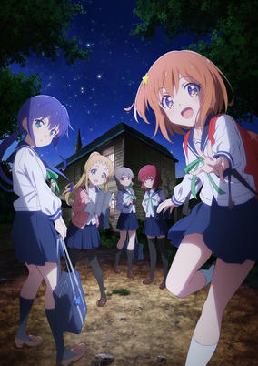

**Studio:** Doga Kobo &nbsp;|&nbsp; **Episodes:** 12 &nbsp;|&nbsp; **Director:** Daisuke Hiramaki &nbsp;|&nbsp; **Aired/Released:** January 3 – March 27 &nbsp;|&nbsp; **Genres:** Comedy, School Life, Slice of Life, School Clubs

> When she was little, Mira Kinohata met a boy named Ao at a campsite in town. While gazing at the starry sky together, Mira learns that there's a star with the same name as herself, but no star named Ao. The two then promised to one day explore asteroids together and find a star to name it after him. Several years later, Mira enrolls at the Hoshizaki high school and decides to join the astronomy club to fulfill her promise. However, she learns that the astronomy club will be merged with the geological research society to form the earth science club. Reluctantly, Mira goes to the club room and is reunited with Ao Manaka—the person she made the promise to explore asteroids with—and is shocked to learn that she is a girl!
>
> _Synopsis source: Kitsu_

[Wikipedia](https://en.wikipedia.org/wiki/Asteroid_in_Love) · [Kitsu](https://kitsu.io/anime/koisuru-asteroid)

---

### Darwin's Game

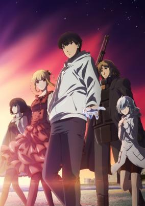

**Studio:** Nexus &nbsp;|&nbsp; **Episodes:** 11 &nbsp;|&nbsp; **Director:** Yoshinobu Tokumoto &nbsp;|&nbsp; **Aired/Released:** January 3 – March 20 &nbsp;|&nbsp; **Genres:** Violence, Battle Royale, Science Fiction, Super Power, Action, Mystery, Shounen

> An unknowing Sudou Kaname is invited to try out a new mysterious mobile app game called Darwin's Game, but later realizes that he's in for more than he's bargained for when he finds out that there's no way to quit the game.
>
> _Synopsis source: Kitsu_

[Wikipedia](https://en.wikipedia.org/wiki/Darwin%27s_Game) · [Kitsu](https://kitsu.io/anime/darwins-game)

---

### Magia Record: Puella Magi Madoka Magica Side Story (Puella Magi Madoka Magica Side Story: Magia Record)

**Studio:** Shaft &nbsp;|&nbsp; **Episodes:** 13 &nbsp;|&nbsp; **Director:** Gekidan Inu Curry (Doroinu) &nbsp;|&nbsp; **Aired/Released:** January 4 – March 28 &nbsp;|&nbsp; **Genres:** Psychological, Magic, Thriller, Magical Girl

> Few people know the truth: the world is safe thanks to the Magical Girls who are forced to slay Witches. Even though these girls are putting their lives on the line for a wish, rumors say they can be saved in Kamihama City. That’s where Iroha Tamaki is headed in search of answers. She can’t remember the wish she made to Kyubey, but a shadowy figure haunts her dreams.
>
> _Synopsis source: Kitsu_

[Wikipedia](https://en.wikipedia.org/wiki/Magia_Record) · [Kitsu](https://kitsu.io/anime/magia-record-mahou-shoujo-madoka-magica-gaiden-tv)

---

### Id: Invaded

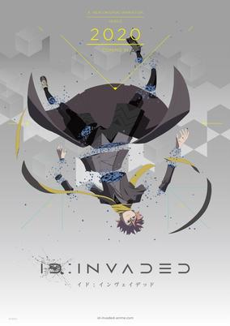

**Studio:** NAZ &nbsp;|&nbsp; **Episodes:** 13 &nbsp;|&nbsp; **Director:** Ei Aoki &nbsp;|&nbsp; **Aired/Released:** January 5 – March 22 &nbsp;|&nbsp; **Genres:** Action, Science Fiction, Mystery, Detective

> Sakaido is a detective looking to solve the grisly murder of Kaeru, a young girl. But solving this case is unlike any other as the world begins to twist and turn around Sakaido, challenging what he thinks and believes.
>
> _Synopsis source: Kitsu_

[Wikipedia](https://en.wikipedia.org/wiki/Id_%E2%80%93_Invaded) · [Kitsu](https://kitsu.io/anime/id-invaded)

---

### Keep Your Hands Off Eizouken!

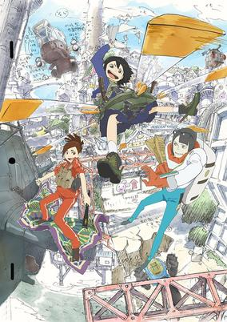

**Studio:** Science SARU &nbsp;|&nbsp; **Episodes:** 12 &nbsp;|&nbsp; **Director:** Masaaki Yuasa &nbsp;|&nbsp; **Aired/Released:** January 5 – March 22 &nbsp;|&nbsp; **Genres:** Slice of Life, Comedy, Adventure, School Life, High School, The Arts

> First-year high schooler Midori Asakusa loves anime so much, she insists that "concept is everything" in animation. Though she draws a variety of ideas in her sketchbook, she hasn't taken the first step to creating anime, insisting that she can't do it alone. The producer-type Sayaka Kanamori is the first to notice Asakusa's genius. Then, when it becomes clear that their classmate, charismatic fashion model Tsubame Mizusaki, really wants to be an animator, they create an animation club to realize the "ultimate world" that exists in their minds.
>
> _Synopsis source: Kitsu_

[Wikipedia](https://en.wikipedia.org/wiki/Keep_Your_Hands_Off_Eizouken!) · [Kitsu](https://kitsu.io/anime/eizouken-ni-wa-te-wo-dasu-na)

---

### Rebirth

**Studio:** Liden Films Osaka Studio &nbsp;|&nbsp; **Episodes:** 50 &nbsp;|&nbsp; **Director:** Shinobu Yoshioka &nbsp;|&nbsp; **Aired/Released:** January 5 – June 30, 2021

---

### Yatogame-chan Kansatsu Nikki (season 2)

**Studio:** Saetta &nbsp;|&nbsp; **Episodes:** 12 &nbsp;|&nbsp; **Director:** Hisayoshi Hirasawa &nbsp;|&nbsp; **Aired/Released:** January 5 – March 22 &nbsp;|&nbsp; **Genres:** School Life, Slice of Life, Shounen, Comedy

> After growing up in Tokyo, high school student Jin Kaito moves to Nagoya where he meets Yatogame Monaka, a fellow student who puts her Nagoya dialect on full display. With her cat-like appearance and unvarnished Nagoya dialect, Yatogame won't open up to him at all. This popular local comedy is increasing the status of Nagoya through observation of the adorable Yatogame-chan!
>
> _Synopsis source: Kitsu_

[Wikipedia](https://en.wikipedia.org/wiki/Yatogame-chan_Kansatsu_Nikki) · [Kitsu](https://kitsu.io/anime/yatogame-chan-kansatsu-nikki)

---

### Room Camp

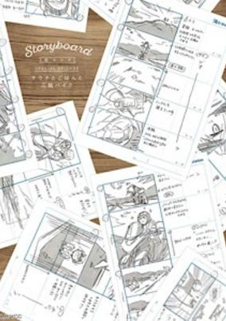

**Studio:** C-Station &nbsp;|&nbsp; **Episodes:** 12 &nbsp;|&nbsp; **Director:** Masato Jinbo &nbsp;|&nbsp; **Aired/Released:** January 6 – March 23 &nbsp;|&nbsp; **Genres:** Slice of Life, Comedy

> Adaptation of a manga collaboration with the Yamaha Motor Company. Included as an extra with the Blu-ray release.
>
> _Synopsis source: Kitsu_

[Wikipedia](https://en.wikipedia.org/wiki/Room_Camp) · [Kitsu](https://kitsu.io/anime/heya-camp-sauna-to-gohan-to-miwa-bike)

---

### Pet

**Studio:** Geno Studio &nbsp;|&nbsp; **Episodes:** 13 &nbsp;|&nbsp; **Director:** Takahiro Omori &nbsp;|&nbsp; **Aired/Released:** January 6 – March 30

[Wikipedia](https://en.wikipedia.org/wiki/Pet_(manga))

---

### Seton Academy: Join the Pack! (Seton Academy: Join The Pack)

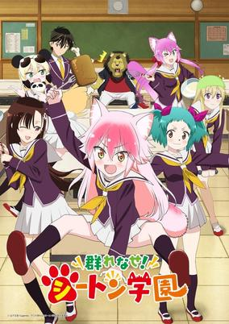

**Studio:** Studio Gokumi &nbsp;|&nbsp; **Episodes:** 12 &nbsp;|&nbsp; **Director:** Hiroshi Ikehata &nbsp;|&nbsp; **Aired/Released:** January 7 – March 24 &nbsp;|&nbsp; **Genres:** Comedy, School Life

> Seton Academy, a school full of animals where, thanks to population decline, there are fewer humans than any other creature. Mazama Jin, an animal hater and the only human male in his class, falls in love with Hino Hitomi, the only female human, the moment he lays eyes her. However he soon finds himself entangled with various other creatures after he reluctantly joins the 'pack' of Lanka the wolf, the only other member of her pack.
>
> _Synopsis source: Kitsu_

[Kitsu](https://kitsu.io/anime/murenase-shiiton-gakuen)

---

### Sorcerous Stabber Orphen

**Studio:** Studio Deen &nbsp;|&nbsp; **Episodes:** 13 &nbsp;|&nbsp; **Director:** Takayuki Hamana &nbsp;|&nbsp; **Aired/Released:** January 7 – March 31 &nbsp;|&nbsp; **Genres:** Fantasy, Magic, Action, Adventure, Martial Arts, Drama

> A sorcerer who was once the top student of the famous Tower of Fang, now spends his time chasing around his hopeless clients as a moneylender, at least until his client comes up with a plan to make money: marriage fraud. Unwillingly being dragged in to the plan, Orphen encounters a monster who has long been his goal since the day he left the Tower of Fang. Between those who seek to kill the monster and Orphen, giving everything to protect the monster, his lousy but peaceful days end. Trying to turn back his sister, Azalie, back to her true form leads to many more mysteries and the key to the secret to the world.
>
> _Synopsis source: Kitsu_

[Wikipedia](https://en.wikipedia.org/wiki/Sorcerous_Stabber_Orphen) · [Kitsu](https://kitsu.io/anime/majutsushi-orphen-hagure-tabi)

---

### Bofuri (BOFURI: I Don’t Want to Get Hurt, so I’ll Max Out My Defense.)

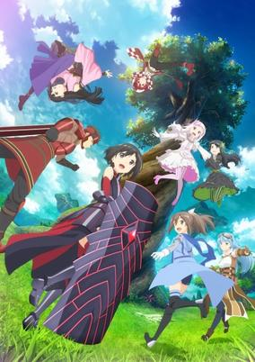

**Studio:** Silver Link &nbsp;|&nbsp; **Episodes:** 12 &nbsp;|&nbsp; **Director:** Shin Ōnuma Mirai Minato &nbsp;|&nbsp; **Aired/Released:** January 8 – March 25 &nbsp;|&nbsp; **Genres:** Action, Science Fiction, Adventure, Comedy, Fantasy, Slice of Life

> After receiving an invitation from her friend Risa Shiromine, Kaede Honjou begins playing the VRMMO game New World Online as the character Maple. Lacking knowledge of the game, she allocates all her status points to defense. As a result, her movements are slow, she cannot use magic, and even gets attacked by the rabbits. However, she obtains a skill called "Absolute Defense" due to maxing out her vitality points, and a counter skill that kills in a single hit. A "mobile fortress style" novice with a poisonous skill that makes all attacks invalid and overrides all obstacles, she goes off to adventures, disregarding her irregularities.
>
> _Synopsis source: Kitsu_

[Wikipedia](https://en.wikipedia.org/wiki/Bofuri) · [Kitsu](https://kitsu.io/anime/itai-no-wa-lya-nano-de-bougyoryoku-ni-kyokufuri-shitai-to-omoimasu)

---

### Hulaing Babies☆Petit

**Studio:** Gaina &nbsp;|&nbsp; **Episodes:** 12 &nbsp;|&nbsp; **Director:** Yoshinori Asao &nbsp;|&nbsp; **Aired/Released:** January 8 – March 25 &nbsp;|&nbsp; **Genres:** Slice of Life, Comedy

> Anime centering on a group of young girls and their struggle as they aim to become Hula Girls.
>
> _Synopsis source: Kitsu_

[Wikipedia](https://en.wikipedia.org/wiki/Hulaing_Babies) · [Kitsu](https://kitsu.io/anime/hulaing-babies)

---

### number24

**Studio:** PRA &nbsp;|&nbsp; **Episodes:** 12 &nbsp;|&nbsp; **Director:** Shigeru Kimiya &nbsp;|&nbsp; **Aired/Released:** January 8 – April 15 &nbsp;|&nbsp; **Genres:** Josei, Sports, School Life

> The college rugby story centers on Natsusa Yuzuki, who expects to be an ace on the rugby team when he enrolls in college. However, he is no longer able to play rugby due to certain circumstances. Ibuki Ueoka is an older fellow student who quit rugby. Yasunari Tsuru is a younger student who finds Natsusa disagreeable. Yuu Mashiro is a younger student who admires and follows Natsusa. Seiichirou Shingyou is Natsusa's close childhood friend. Together, they compete in the Kansai university rugby league.
>
> _Synopsis source: Kitsu_

[Wikipedia](https://en.wikipedia.org/wiki/Number24) · [Kitsu](https://kitsu.io/anime/number24)

---

### Plunderer

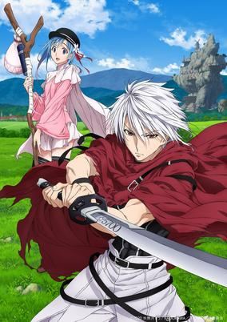

**Studio:** Geek Toys &nbsp;|&nbsp; **Episodes:** 24 &nbsp;|&nbsp; **Director:** Hiroyuki Kanbe &nbsp;|&nbsp; **Aired/Released:** January 8 – June 24 &nbsp;|&nbsp; **Genres:** Action, Fantasy, Ecchi, Shounen

> In a post-apocalyptic world dominated by the so-called "Numbers," each human will have their identity branded with their own "Count," which could define any number related to their life. May it be one's walked distance or amount of compliments given to them by others, this Count could lead them to the abyss when it has dropped to zero. In the year 305 of the Alcian calendar, Hina has inherited a mission from her Mother, whose Count has depreciated to zero, to search for the Legendary Red Baron. In her adventure, she meets a half-masked swordsman named Licht who tries to hide his identity, as he is known as a degenerate for having an incredibly low Count.
>
> _Synopsis source: Kitsu_

[Wikipedia](https://en.wikipedia.org/wiki/Plunderer_(manga)) · [Kitsu](https://kitsu.io/anime/plunderer)

---

### Drifting Dragons

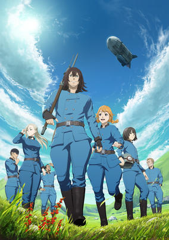

**Studio:** Polygon Pictures &nbsp;|&nbsp; **Episodes:** 12 &nbsp;|&nbsp; **Director:** Tadahiro Yoshihira &nbsp;|&nbsp; **Aired/Released:** January 9 – March 26 &nbsp;|&nbsp; **Genres:** Fantasy, Dragon, Adventure

> Dragons, the rulers of the sky. To many people on the surface, they are a dire threat, but at the same time, a valuable source of medicine, oil, and food. There are those who hunt the dragons. They travel the skies in dragon-hunting airships. This is the story of one of those ships, the “Quin Zaza,” and its crew.
>
> _Synopsis source: Kitsu_

[Wikipedia](https://en.wikipedia.org/wiki/Drifting_Dragons) · [Kitsu](https://kitsu.io/anime/kuutei-dragons)

---

### Hatena Illusion

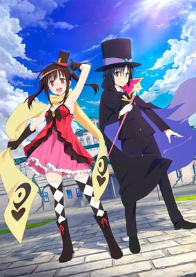

**Studio:** Children's Playground Entertainment &nbsp;|&nbsp; **Episodes:** 12 &nbsp;|&nbsp; **Director:** Shin Matsuo &nbsp;|&nbsp; **Aired/Released:** January 9 – June 3 &nbsp;|&nbsp; **Genres:** Comedy, Romance, Ecchi, Supernatural

> Ever since watching a magic show held by him and his wife Maeve, Makoto Shiranui has always admired Mamoru Hoshisato—a world-class magician, as well as friend of his parents—and came to Tokyo to become his apprentice. Kana, nicknamed Hatena, is the couple's daughter and his childhood friend. As the hustle and bustle activities in Tokyo catches Makoto off guard such as burglaries by a beautiful thief, he depends on Hatena's comforting side. When he came to Hoshisato's now-haunted mansion to reunite with his childhood friend, he is greeted by the family's butler and maid, Jeeves and Emma along with Hatena, only to discover that they are not as compatible anymore.
>
> _Synopsis source: Kitsu_

[Wikipedia](https://en.wikipedia.org/wiki/Hatena_Illusion) · [Kitsu](https://kitsu.io/anime/hatena-illusion)

---

### If My Favorite Pop Idol Made It to the Budokan, I Would Die

**Studio:** Eight Bit &nbsp;|&nbsp; **Episodes:** 12 &nbsp;|&nbsp; **Director:** Yusuke Yamamoto &nbsp;|&nbsp; **Aired/Released:** January 9 – March 26 &nbsp;|&nbsp; **Genres:** Music, Idol, Seinen, Comedy, Shoujo Ai, Drama

> The story centers on a woman called "Eripiyo," who is an extreme idol fan. She is wildly enthusiastic about Maina, the shy and lowest-ranking member of the minor underground idol group Cham Jam that performs in Okayama Prefecture. She gets so wrapped up in her love for Maina during a particular performance, that she has a major nosebleed. Eri will continue to give her complete devotion to Maina until the day she can perform at Budōkan (a major performing venue in Tokyo).
>
> _Synopsis source: Kitsu_

[Wikipedia](https://en.wikipedia.org/wiki/If_My_Favorite_Pop_Idol_Made_It_to_the_Budokan,_I_Would_Die) · [Kitsu](https://kitsu.io/anime/oshi-ga-budoukan-ittekuretara-shinu)

---

### Infinite Dendrogram

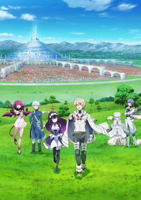

**Studio:** NAZ &nbsp;|&nbsp; **Episodes:** 13 &nbsp;|&nbsp; **Director:** Tomoki Kobayashi &nbsp;|&nbsp; **Aired/Released:** January 9 – April 16 &nbsp;|&nbsp; **Genres:** Fantasy, Action, Adventure, Science Fiction, Virtual Reality

> In the year 2043, , the world's first successful full-dive VRMMO was released. In addition to its ability to perfectly simulate the five senses, along with its many other amazing features, the game promised to offer players a world full of infinite possibilities. Nearly two years later, soon-to-be college freshman, Reiji Mukudori, is finally able to buy a copy of the game and start playing. With some help from his experienced older brother, Shuu, and his partner Embryo, Reiji embarks on an adventure into the world of . Just what will he discover and encounter in this game world known for its incredible realism and infinite possibilities?
>
> _Synopsis source: Kitsu_

[Wikipedia](https://en.wikipedia.org/wiki/Infinite_Dendrogram) · [Kitsu](https://kitsu.io/anime/infinite-dendrogram)

---

### Nekopara

**Studio:** Felix Film &nbsp;|&nbsp; **Episodes:** 12 &nbsp;|&nbsp; **Director:** Yasutaka Yamamoto &nbsp;|&nbsp; **Aired/Released:** January 9 – March 26

[Wikipedia](https://en.wikipedia.org/wiki/Nekopara)

---

### Show by Rock!! Mashumairesh!!

**Studio:** Kinema Citrus &nbsp;|&nbsp; **Episodes:** 12 &nbsp;|&nbsp; **Director:** Seung Hui Son &nbsp;|&nbsp; **Aired/Released:** January 9 – March 26

[Wikipedia](https://en.wikipedia.org/wiki/Show_by_Rock!!)

---

### Somali and the Forest Spirit

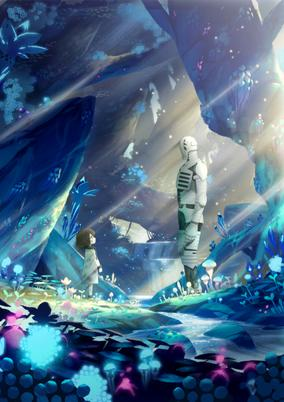

**Studio:** Satelight Hornets &nbsp;|&nbsp; **Episodes:** 12 &nbsp;|&nbsp; **Director:** Kenji Yasuda &nbsp;|&nbsp; **Aired/Released:** January 9 – March 26 &nbsp;|&nbsp; **Genres:** Fantasy World, Juujin, Adventure, Family, Demon, Drama, Android, Fantasy, Slice of Life

> The world is ruled by spirits, goblins and all manner of strange creatures. Human beings are persecuted, to the very point of extinction. One day, a golem and a lone human girl meet. This is a record of the pair; one a member of a ruined race, the other a watchman of the forest. It tells of their travels together, and of the bond between father and daughter. Episodes 1-2 were previewed at a screening in London on October 25, 2019. Regular broadcasting began on January 10. The first episode also received an advance web distribution on January 3.
>
> _Synopsis source: Kitsu_

[Wikipedia](https://en.wikipedia.org/wiki/Somali_and_the_Forest_Spirit) · [Kitsu](https://kitsu.io/anime/somali-to-mori-no-kamisama)

---

### The Case Files of Jeweler Richard

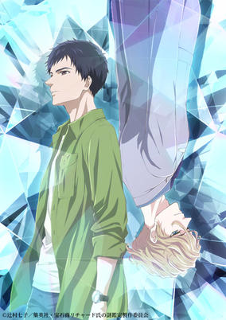

**Studio:** Shuka &nbsp;|&nbsp; **Episodes:** 12 &nbsp;|&nbsp; **Director:** Tarou Iwasaki &nbsp;|&nbsp; **Aired/Released:** January 9 – March 26 &nbsp;|&nbsp; **Genres:** Mystery, Drama, Slice of Life

> One night, a college student with a strong sense of justice, Seigi Nakata, saved a gorgeous foreigner, Richard, who was being harassed by some drunks. When Seigi found out that Richard was a jeweler, he asked for an appraisal on a ring with a shady history; one which his grandmother had kept secret until she died. The appraisal had revealed her past, truth, and desire. It led Seigi to work as a part-time employee for Richard’s jewelry store, the "Jewelry Etranger" in Ginza. While solving various "mysteries", the relationship between Richard and Seigi gradually changes.
>
> _Synopsis source: Kitsu_

[Wikipedia](https://en.wikipedia.org/wiki/The_Case_Files_of_Jeweler_Richard) · [Kitsu](https://kitsu.io/anime/housekisho-richard-shi-no-nazo-kantei)

---

### Toilet-Bound Hanako-kun

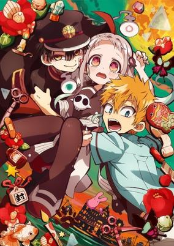

**Studio:** Lerche &nbsp;|&nbsp; **Episodes:** 12 &nbsp;|&nbsp; **Director:** Masaomi Andō &nbsp;|&nbsp; **Aired/Released:** January 9 – March 26 &nbsp;|&nbsp; **Genres:** Comedy, Supernatural, Shounen, Ghost, School Life, Japan

> "Hanako-san, Hanako-san...are you there?" At Kamome Academy, rumors abound about the school's Seven Mysteries, one of which is Hanako-san. Said to occupy the third stall of the third floor girls' bathroom in the old school building, Hanako-san grants any wish when summoned. Yashiro Nene, an occult-loving high school girl who dreams of romance, ventures into this haunted bathroom...but the Hanako-san she meets there is nothing like she imagined! Kamome Academy's Hanako-san...is a boy!
>
> _Synopsis source: Kitsu_

[Wikipedia](https://en.wikipedia.org/wiki/Toilet-Bound_Hanako-kun) · [Kitsu](https://kitsu.io/anime/jibaku-shounen-hanako-kun)

---

### Uchitama?! Have you seen my Tama?

**Studio:** MAPPA Lapin Track &nbsp;|&nbsp; **Episodes:** 11 &nbsp;|&nbsp; **Director:** Kiyoshi Matsuda &nbsp;|&nbsp; **Aired/Released:** January 9 – March 19

[Wikipedia](https://en.wikipedia.org/wiki/Tama_and_Friends)

---

### A Certain Scientific Railgun T

**Studio:** J.C.Staff &nbsp;|&nbsp; **Episodes:** 25 &nbsp;|&nbsp; **Director:** Tatsuyuki Nagai &nbsp;|&nbsp; **Aired/Released:** January 10 – September 25

[Wikipedia](https://en.wikipedia.org/wiki/A_Certain_Scientific_Railgun)

---

### Haikyu!! To The Top

**Studio:** Production I.G &nbsp;|&nbsp; **Episodes:** 13 &nbsp;|&nbsp; **Director:** Masako Sato &nbsp;|&nbsp; **Aired/Released:** January 10 – April 3

[Wikipedia](https://en.wikipedia.org/wiki/Haikyu!!)

---

### Oda Cinnamon Nobunaga

**Studio:** Studio Signpost &nbsp;|&nbsp; **Episodes:** 12 &nbsp;|&nbsp; **Director:** Hidetoshi Takahashi &nbsp;|&nbsp; **Aired/Released:** January 10 – March 27 &nbsp;|&nbsp; **Genres:** Slice of Life, Seinen, Historical, Comedy

> In the "one-of-a-kind samurai-general-reincarnated-as-a-canine comedy," Nobunaga perishes at Honnouji as in history, and reincarnates in modern-day Japan as a dog named Shinamon. Other Warring States era warlords such as Takeda Shingen eventually join him, also as dogs.
>
> _Synopsis source: Kitsu_

[Wikipedia](https://en.wikipedia.org/wiki/Oda_Cinnamon_Nobunaga) · [Kitsu](https://kitsu.io/anime/oda-cinnamon-nobunaga)

---

### Science Fell in Love, So I Tried to Prove It

**Studio:** Zero-G &nbsp;|&nbsp; **Episodes:** 12 &nbsp;|&nbsp; **Director:** Tōru Kitahata &nbsp;|&nbsp; **Aired/Released:** January 10 – March 13 &nbsp;|&nbsp; **Genres:** Comedy, Romance

> What happens when a science-inclined girl and boy who are deeply passionate about research fall in love? An intelligent woman named Himuro Ayame who is a science graduate student at Saitama University happens to ask fellow science grad student Yukimura Shinya out. Of course, there’s no logical reason for this love! But as a science and engineering major, not being able to logically prove love would mean that those feelings aren’t real, and they’d fail as a science student. With that in mind, the two drag everyone else in the lab into trying various experiments to prove love actually exists.
>
> _Synopsis source: Kitsu_

[Wikipedia](https://en.wikipedia.org/wiki/Science_Fell_in_Love,_So_I_Tried_to_Prove_It) · [Kitsu](https://kitsu.io/anime/rikei-ga-koi-ni-ochita-no-de-shoumei-shitemita)

---

### Smile Down the Runway

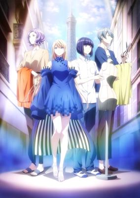

**Studio:** Ezo'la &nbsp;|&nbsp; **Episodes:** 12 &nbsp;|&nbsp; **Director:** Nobuyoshi Nagayama &nbsp;|&nbsp; **Aired/Released:** January 10 – March 27 &nbsp;|&nbsp; **Genres:** Slice of Life, Drama, School Life, Shounen, Comedy

> Fujito Chiyuki has a dream: to become a Paris Collection model. The problem is, she's too short to be a model, and everyone around her tells her so! But no matter what they say, she won't give up. Her classmate, a poor student named Tsumura Ikuto, also has a dream: to become a fashion designer. One day Chiyuki tells him that it's "probably impossible" for him, causing him to consider giving it up ... ?! This is the story of two individuals wholeheartedly chasing after their dreams in spite of all the negativity that comes after them!
>
> _Synopsis source: Kitsu_

[Wikipedia](https://en.wikipedia.org/wiki/Smile_Down_the_Runway) · [Kitsu](https://kitsu.io/anime/runway-de-waratte)

---

### 22/7

**Studio:** A-1 Pictures &nbsp;|&nbsp; **Episodes:** 12 &nbsp;|&nbsp; **Director:** Takao Abo &nbsp;|&nbsp; **Aired/Released:** January 11 – March 28

[Wikipedia](https://en.wikipedia.org/wiki/22/7_(TV_series))

---

### A Destructive God Sits Next to Me

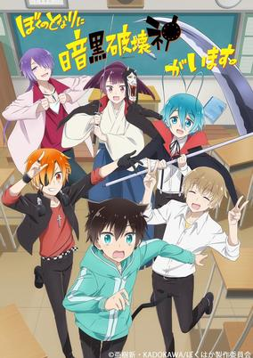

**Studio:** EMT Squared &nbsp;|&nbsp; **Episodes:** 12 &nbsp;|&nbsp; **Director:** Atsushi Nigorikawa &nbsp;|&nbsp; **Aired/Released:** January 11 – March 28 &nbsp;|&nbsp; **Genres:** Comedy, Josei, School Life, Slice of Life

> The story follows Seri Koyuki, a high school student who tries to avoid strange people because he knows he will just end up being the the straight man to their antics. Enter Kabuto Hanadori, Koyuki's classmate who has chuunibyou (second-year middle school syndrome) and claims his eyepatch seals his god of destruction alter ego. Everything about Hanadori exudes the need for a straight man to keep him in check, and sure enough Koyuki is drawn in.
>
> _Synopsis source: Kitsu_

[Wikipedia](https://en.wikipedia.org/wiki/A_Destructive_God_Sits_Next_to_Me) · [Kitsu](https://kitsu.io/anime/boku-no-tonari-ni-ankoku-hakaishin-ga-imasu)

---

### Interspecies Reviewers

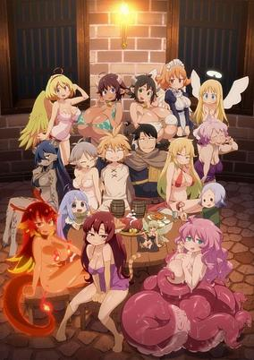

**Studio:** Passione &nbsp;|&nbsp; **Episodes:** 12 &nbsp;|&nbsp; **Director:** Yuki Ogawa &nbsp;|&nbsp; **Aired/Released:** January 11 – March 28 &nbsp;|&nbsp; **Genres:** Fantasy World, Loli, Gender Bender, Tentacle, Juujin, Seinen, Ecchi, Comedy, Fantasy

> Beauty truly is in the eye of the beholder! From elves to succubi to cyclopes and more, the Yoruno Gloss reviewers are here to rate the red-light delights of all manner of monster girls...The only thing is, they can never agree on which species are the hottest!
>
> _Synopsis source: Kitsu_

[Wikipedia](https://en.wikipedia.org/wiki/Interspecies_Reviewers) · [Kitsu](https://kitsu.io/anime/ishuzoku-reviewers)

---

### In/Spectre

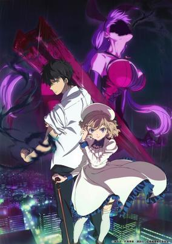

**Studio:** Brain's Base &nbsp;|&nbsp; **Episodes:** 12 &nbsp;|&nbsp; **Director:** Keiji Gotoh &nbsp;|&nbsp; **Aired/Released:** January 11 – March 28 &nbsp;|&nbsp; **Genres:** Mystery, Supernatural, Comedy, Shounen, Ghost, Romance, Demon, Thriller, Deity

> When she was still just a girl, Kotoko was kidnapped by yokai. These spirits made her into a powerful intermediary between the spirit and human worlds, but this power came at a price: an eye and a leg. Now, years later, she watches out for dangerous yokai while developing feelings for a young man named Kurou, who is also special: an incident with a yokai has given him healing powers. He's surprised when Kotoko asks him to team up to handle renegade yokai, preserving the thin line between reality and the supernatural.
>
> _Synopsis source: Kitsu_

[Wikipedia](https://en.wikipedia.org/wiki/In/Spectre) · [Kitsu](https://kitsu.io/anime/kyokou-suiri)

---

### Dorohedoro

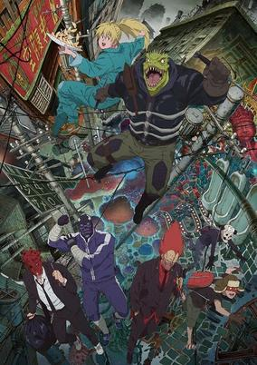

**Studio:** MAPPA &nbsp;|&nbsp; **Episodes:** 12 &nbsp;|&nbsp; **Director:** Yuichiro Hayashi &nbsp;|&nbsp; **Aired/Released:** January 12 – March 29 &nbsp;|&nbsp; **Genres:** Action, Comedy, Adventure, Fantasy, Horror, Magic, Mystery, Supernatural, Psychological, Seinen, Violence

> In the lawless district known as Hole, sorcerers from another world use its residents as guinea pigs for their twisted magic. Caiman is one of those victims—left with a reptilian head and no memory of his past, he’s now on a brutal quest for answers. To reclaim his true face and forgotten past, he and his partner Nikaido hunt sorcerers, hoping to uncover the truth behind his transformation.
>
> _Synopsis source: Kitsu_

[Wikipedia](https://en.wikipedia.org/wiki/Dorohedoro) · [Kitsu](https://kitsu.io/anime/dorohedoro)

---

### ARP Backstage Pass

**Studio:** Dynamo Pictures &nbsp;|&nbsp; **Episodes:** 11 &nbsp;|&nbsp; **Director:** Tetsuya Endo &nbsp;|&nbsp; **Aired/Released:** January 13 – March 23 &nbsp;|&nbsp; **Genres:** Idol, Josei, Music

> ARP: A 4-member dance and vocal group created by the latest AR technology. This popular group got their start with Avex, and are unique for their interactive concerts which combine highly-skilled song and dance routines with a format that changes based on how much the fans are cheering them on. And now, you can follow their rise to glory in the new anime, ARP Backstage Pass! less
>
> _Synopsis source: Kitsu_

[Kitsu](https://kitsu.io/anime/arp-backstage-pass)

---

### A3! Season Spring & Summer

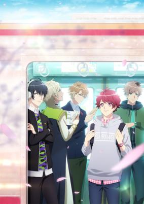

**Studio:** P.A. Works 3Hz &nbsp;|&nbsp; **Episodes:** 12 &nbsp;|&nbsp; **Director:** Masayuki Sakoi Keisuke Shinohara &nbsp;|&nbsp; **Aired/Released:** January 14 – June 23 &nbsp;|&nbsp; **Genres:** Music, The Arts

> "Director! Please Bloom Us!" On the street away from Veludo, Tokyo called Velude Way. It is a popular city for having many theater groups. One day, main character Izumi Tachibana, who was previously a stage actress, has arrived here with a letter delivered to her suddenly written "Full of debt! Zero customers! Only one actor!" It describes a theater group that was once popular! She has to rebuild the theater Mankai Company by being the owner and chief director!
>
> _Synopsis source: Kitsu_

[Wikipedia](https://en.wikipedia.org/wiki/A3!) · [Kitsu](https://kitsu.io/anime/a-three)

---

### Isekai Quartet (season 2) (ISEKAI QUARTET)

**Studio:** Studio Puyukai &nbsp;|&nbsp; **Episodes:** 12 &nbsp;|&nbsp; **Director:** Minoru Ashina &nbsp;|&nbsp; **Aired/Released:** January 14 – March 31 &nbsp;|&nbsp; **Genres:** Comedy, Fantasy, Parody, Isekai, Magic

> The button appeared out of nowhere. There weren’t any signs NOT to push it...so the solution is obvious, right? Is it a trap or the start of something new and exciting? The crews of Re:Zero, Overlord, Konosuba, and The Saga of Tanya the Evil will find out when they go from their world to another and get stuck in...class?! See what adorable chaos they’ll get up to in this collection of shorts!
>
> _Synopsis source: Kitsu_

[Wikipedia](https://en.wikipedia.org/wiki/Isekai_Quartet) · [Kitsu](https://kitsu.io/anime/isekai-quartet)

---

### BanG Dream! (season 3)

**Studio:** Sanzigen &nbsp;|&nbsp; **Episodes:** 13 &nbsp;|&nbsp; **Director:** Kōdai Kakimoto &nbsp;|&nbsp; **Aired/Released:** January 23 – April 23

[Wikipedia](https://en.wikipedia.org/wiki/BanG_Dream!)

---

### Healin' Good Pretty Cure

**Studio:** Toei Animation &nbsp;|&nbsp; **Episodes:** 45 &nbsp;|&nbsp; **Director:** Yoko Ikeda &nbsp;|&nbsp; **Aired/Released:** February 2 – February 21, 2021 &nbsp;|&nbsp; **Genres:** Action, Magic, Fantasy, Shoujo, Kids, Magical Girl

> The Healing Garden, a secret world that treats Earth's ailments, has been attacked by the Byōgens who seek to infect Earth. Three "medical trainee" Healing Animals and Latte, a Healing Garden princess with special powers, have come in search of partners to avert the threat. The three girls they meet — Nodoka, Chiyu, and Hinata — transform into Precures and stand up to the Byōgens to protect all life on Earth and the Healing Garden.
>
> _Synopsis source: Kitsu_

[Wikipedia](https://en.wikipedia.org/wiki/Healin%27_Good_Pretty_Cure) · [Kitsu](https://kitsu.io/anime/healin-good-precure)

---

### Tamayomi (TAMAYOMI: The Baseball Girls)

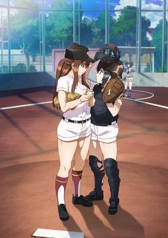

**Studio:** Studio A-Cat &nbsp;|&nbsp; **Episodes:** 12 &nbsp;|&nbsp; **Director:** Toshinori Fukushima &nbsp;|&nbsp; **Aired/Released:** April 1 – June 17 &nbsp;|&nbsp; **Genres:** School Life, Sports, Baseball, School Clubs, Seinen

> In her Junior High years, the pitcher Yomi Takeda was not able to get very far in a cross-school baseball tournament. Since the catcher on her team wasn't at her level, she couldn't use her signature move, the "Magic Throw," and eventually regretted not being able to use it. After Junior High, she decided to stop playing baseball and went to Shin Koshigaya High School, a school without a baseball club. There, she found her long lost childhood friend, Tamaki Yamazaki, who used to play catchball with her when they were kids. Tamaki also played baseball during her Junior High years as a catcher, and could even catch Yomi's "Magic Throw!" Their promise with each other during their childhood could now be fulfilled! Walking together on the road of baseball once again... The story of the girls who love baseball will begin!
>
> _Synopsis source: Kitsu_

[Wikipedia](https://en.wikipedia.org/wiki/Tamayomi) · [Kitsu](https://kitsu.io/anime/tamayomi)

---

### Tower of God

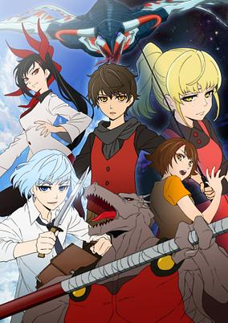

**Studio:** Telecom Animation Film &nbsp;|&nbsp; **Episodes:** 13 &nbsp;|&nbsp; **Director:** Takashi Sano &nbsp;|&nbsp; **Aired/Released:** April 1 – June 24 &nbsp;|&nbsp; **Genres:** Fantasy World, Adventure, Action, Fantasy, Mystery

> Reach the top, and everything will be yours. At the top of the tower exists everything in this world, and all of it can be yours. You can become a god. This is the story of the beginning and the end of Rachel, the girl who climbed the tower so she could see the stars, and Bam, the boy who needed nothing but her.
>
> _Synopsis source: Kitsu_

[Wikipedia](https://en.wikipedia.org/wiki/Tower_of_God) · [Kitsu](https://kitsu.io/anime/tower-of-god)

---

### Auto Boy - Carl from Mobile Land

**Studio:** CloverWorks &nbsp;|&nbsp; **Episodes:** 104 &nbsp;|&nbsp; **Director:** Shinobu Sasaki &nbsp;|&nbsp; **Aired/Released:** April 2 – March 24, 2022

[Wikipedia](https://en.wikipedia.org/wiki/Auto_Boy_-_Carl_from_Mobile_Land)

---

### The 8th Son? Are You Kidding Me?

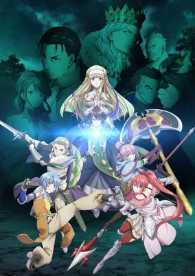

**Studio:** Shin-Ei Animation &nbsp;|&nbsp; **Episodes:** 12 &nbsp;|&nbsp; **Director:** Tatsuo Miura &nbsp;|&nbsp; **Aired/Released:** April 2 – June 18 &nbsp;|&nbsp; **Genres:** Drama, Action, Fantasy, Isekai, Fantasy World, Magic, Harem

> Ichinomiya Shingo, a 25-year-old man working at a firm company, while thinking of tomorrow's busy working day, goes to sleep. However, when he woke up, he found himself in a room unknown to him and realized that he is inside a 6-years-old body, taking over his body and mind. He soon learns from the memories of the boy that the boy was born as the youngest child of a poor noble family living in a back country. Having no administrative skill, he can't do anything to manage the vast land his family has. Fortunately, he is blessed with a very rare talent, the talent of magic. Unfortunately, while his talent could bring prosperity to his family, in his situation it only brought disaster. This is the story of the boy, Wendelin Von Benno Baumeister, opening his own path in a harsh world
>
> _Synopsis source: Kitsu_

[Wikipedia](https://en.wikipedia.org/wiki/The_8th_Son%3F_Are_You_Kidding_Me%3F) · [Kitsu](https://kitsu.io/anime/hachi-nan-tte-sore-wa-nai-desho)

---

### Kakushigoto

**Studio:** Ajia-do Animation Works &nbsp;|&nbsp; **Episodes:** 12 &nbsp;|&nbsp; **Director:** Yūta Murano &nbsp;|&nbsp; **Aired/Released:** April 2 – June 18

[Wikipedia](https://en.wikipedia.org/wiki/Kakushigoto)

---

### Bungo and Alchemist: Gears of Judgement

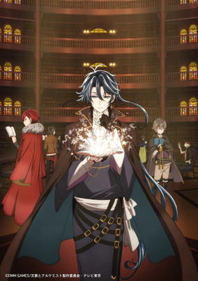

**Studio:** OLM &nbsp;|&nbsp; **Episodes:** 13 &nbsp;|&nbsp; **Director:** Toshinori Watanabe &nbsp;|&nbsp; **Aired/Released:** April 3 – August 7 &nbsp;|&nbsp; **Genres:** Fantasy, Adventure, Action

> You are in a world where you can meet famous Japanese historical writers. With a party composed of other writers, you delve into tainted books to purify them, unlock secrets, and gain new allies.
>
> _Synopsis source: Kitsu_

[Wikipedia](https://en.wikipedia.org/wiki/Bungo_and_Alchemist) · [Kitsu](https://kitsu.io/anime/bungou-to-alchemist-shinpan-no-haguruma)

---

### Listeners

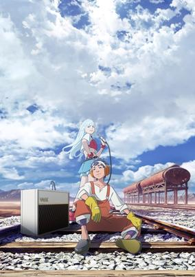

**Studio:** MAPPA &nbsp;|&nbsp; **Episodes:** 12 &nbsp;|&nbsp; **Director:** Hiroaki Ando &nbsp;|&nbsp; **Aired/Released:** April 3 – June 19 &nbsp;|&nbsp; **Genres:** Science Fiction, Music

> The "great adolescent symphony" is set in a world where nothing called "music" exists. A boy meets Myū, a mysterious girl with an empty audio input jack on her body. When she is plugged into an amp, something that will change the world is set in motion …. "Thus begins a journey of sound that will never be forgotten."
>
> _Synopsis source: Kitsu_

[Wikipedia](https://en.wikipedia.org/wiki/Listeners) · [Kitsu](https://kitsu.io/anime/listeners)

---

### Sakura Wars the Animation

**Studio:** Sanzigen &nbsp;|&nbsp; **Episodes:** 12 &nbsp;|&nbsp; **Director:** Manabu Ono &nbsp;|&nbsp; **Aired/Released:** April 3 – June 19 &nbsp;|&nbsp; **Genres:** Alternative Past, Japan, Adventure, Science Fiction, Mecha, Shounen, Plot Continuity, Piloted Robot

> Based on Sega Games's cross-genre video game Shin Sakura Taisen. The sixth mainline entry and a soft reboot of the Sakura Taisen (Sakura Wars) series. In 1930, two years after the events of So Long, My Love, the Great Demon War results in the annihilation of the Imperial, Paris and New York Combat Revues' Flower Divisions. With Earth at peace and the revues' actions becoming public, the World Combat Revue Organization is formed with several international divisions; a biennial international Combat Revue tournament has been organized. Ten years later in 1940, Imperial Japanese Navy captain Kamiyama Seijuurou is assigned as the captain of the new Imperial Combat Revue's Flower Division in Tokyo, which consists of: Amamiya Sakura, a swordswoman and new recruit; Shinonome Hatsuho, a shrine maiden and the most popular actress; Anastasia Palma, a newly-transferred Greek actress; Mochizuki Azami, a ninja prodigy from the Mochizuki clan; and Clarissa "Clarise" Snowflake, a Luxembourgian noblewoman. The division once again faces a new demon invasion and participates in the upcoming tournament–while trying to keep their home at the Imperial Theater open.
>
> _Synopsis source: Kitsu_

[Wikipedia](https://en.wikipedia.org/wiki/Sakura_Wars_the_Animation) · [Kitsu](https://kitsu.io/anime/shin-sakura-taisen)

---

### Wave, Listen to Me!

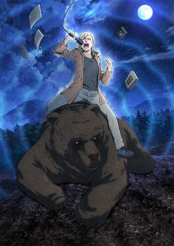

**Studio:** Sunrise &nbsp;|&nbsp; **Episodes:** 12 &nbsp;|&nbsp; **Director:** Tatsuma Minamikawa &nbsp;|&nbsp; **Aired/Released:** April 3 – June 19 &nbsp;|&nbsp; **Genres:** Comedy, Drama, Romance, Seinen, Working Life

> On a drunken night out to complain about an ex, Minare Koda absentmindedly shares too much information with a stranger from the radio station. The next morning, she’s shocked to hear her voice on the radio. Bursting into the station with intentions to justify her previous night’s rant quickly turns into an interview on-air and the offer to share her chaotic life with an unsuspecting audience!
>
> _Synopsis source: Kitsu_

[Wikipedia](https://en.wikipedia.org/wiki/Wave,_Listen_to_Me!) · [Kitsu](https://kitsu.io/anime/nami-yo-kiitekure)

---

### Arte

**Studio:** Seven Arcs &nbsp;|&nbsp; **Episodes:** 12 &nbsp;|&nbsp; **Director:** Takayuki Hamana &nbsp;|&nbsp; **Aired/Released:** April 4 – June 20 &nbsp;|&nbsp; **Genres:** Slice of Life, Historical, Drama, Romance, Seinen

> Firenze, early 16th century. The birthplace of the renaissance era, where art is thriving. In one small corner of this vast city, one sheltered girl's journey begins. She dreams of becoming an artist, an impossible career for a girl born into a noble family. In those days, art was an exclusively male profession, with woman facing strong discrimination. In spite of these challenges, Arte perseveres with hard work and a positive attitude!
>
> _Synopsis source: Kitsu_

[Wikipedia](https://en.wikipedia.org/wiki/Arte_(manga)) · [Kitsu](https://kitsu.io/anime/arte)

---

### Major 2nd (season 2)

**Studio:** OLM &nbsp;|&nbsp; **Episodes:** 25 &nbsp;|&nbsp; **Director:** Ayumu Watanabe &nbsp;|&nbsp; **Aired/Released:** April 4 – November 7

[Wikipedia](https://en.wikipedia.org/wiki/Major_2nd)

---

### My Next Life as a Villainess: All Routes Lead to Doom!

**Studio:** Silver Link &nbsp;|&nbsp; **Episodes:** 12 &nbsp;|&nbsp; **Director:** Keisuke Inoue &nbsp;|&nbsp; **Aired/Released:** April 4 – June 20 &nbsp;|&nbsp; **Genres:** Fantasy World, Magic, Josei, Comedy, Drama, Isekai, Romance, Fantasy, School Life

> After hitting her head particularly hard one day, Duke Claes' daughter suddenly recalls all the memories of her past life: that of a teenage Japanese girl. Just before her untimely death, this girl recalls playing an otome game... that is exactly like the world she's living in now! She is now Katarina Claes, the antagonist of the otome game, who nastily hounded the protagonist until the end. Knowing all the possible outcomes of the game, she realizes that every single possible route ends with Katarina being murdered or exiled! In order to avoid these Catastrophic Bad Ends, she has to use her knowledge of the game and her own wiles, starting with breaking off this engagement with the prince... Will Katarina survive while making her way through this world, where bad flags trip at every turn?
>
> _Synopsis source: Kitsu_

[Kitsu](https://kitsu.io/anime/otome-game-no-hametsu-flag-shika-nai-akuyaku-reijou-ni-tensei-shiteshimatta)

---

### Sing "Yesterday" for Me

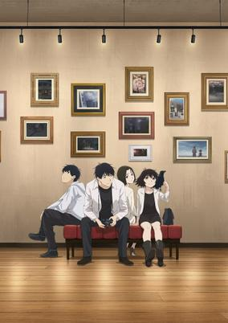

**Studio:** Doga Kobo &nbsp;|&nbsp; **Episodes:** 12 &nbsp;|&nbsp; **Director:** Yoshiyuki Fujiwara &nbsp;|&nbsp; **Aired/Released:** April 4 – June 20 &nbsp;|&nbsp; **Genres:** Coming Of Age, Seinen, Drama, Slice of Life, Romance, Plot Continuity, Comedy, School Life, Japan

> Kei Toume's eighteen-year youth ensemble classic gets its long-awaited animated adaptation. A story of love and humanity, following four boys and girls trying to live their best lives through hardship and turmoil, in a small town on a private rail line just outside of Shinjuku. Minor misunderstandings lead to big complications, and their various feelings become entangled. A story of daily life lived 49% looking back, 51% looking forward.
>
> _Synopsis source: Kitsu_

[Wikipedia](https://en.wikipedia.org/wiki/Sing_%22Yesterday%22_for_Me) · [Kitsu](https://kitsu.io/anime/yesterday-wo-utatte)

---

### Ascendance of a Bookworm (season 2) (Ascendance of a Bookworm)

**Studio:** Ajia-do Animation Works &nbsp;|&nbsp; **Episodes:** 12 &nbsp;|&nbsp; **Director:** Mitsuru Hongo &nbsp;|&nbsp; **Aired/Released:** April 5 – June 21 &nbsp;|&nbsp; **Genres:** Comedy, Slice of Life, Isekai, Fantasy, Magic, Drama, Religion, Fantasy World

> A certain college girl who's loved books ever since she was a little girl dies in an accident and is reborn in another world she knows nothing about. She is now Myne, the sickly five-year-old daughter of a poor soldier. To make things worse, the world she's been reborn in has a very low literacy rate and books mostly don't exist. She'd have to pay an enormous amounts of money to buy one. Myne resolves herself: If there aren't any books, she'll just have to make them! Her goal is to become a librarian. This story begins with her quest to make books so she can live surrounded by them! Dive into this biblio-fantasy written for book lovers and bookworms!
>
> _Synopsis source: Kitsu_

[Wikipedia](https://en.wikipedia.org/wiki/Ascendance_of_a_Bookworm) · [Kitsu](https://kitsu.io/anime/honzuki-no-gekujou-shisho-ni-naru-tame-niwa-shudan-o-erandeiramasen)

---

### Gleipnir

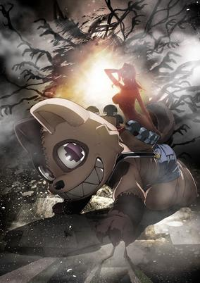

**Studio:** Pine Jam &nbsp;|&nbsp; **Episodes:** 13 &nbsp;|&nbsp; **Director:** Kazuhiro Yoneda &nbsp;|&nbsp; **Aired/Released:** April 5 – June 28 &nbsp;|&nbsp; **Genres:** Action, Mystery, Supernatural

> Shuichi Kagaya an ordinary high school kid in a boring little town. But when a beautiful classmate is caught in a warehouse fire, he discovers a mysterious power: he can transform into a furry dog with an oversized revolver and a zipper down his back. He saves the girl's life, sharing his secret with her. But she's searching for the sister who killed her family, and she doesn't care how degrading it gets: she will use Shuichi to accomplish her mission …
>
> _Synopsis source: Kitsu_

[Wikipedia](https://en.wikipedia.org/wiki/Gleipnir_(manga)) · [Kitsu](https://kitsu.io/anime/gleipnir)

---

### Idolish7: Second Beat!

**Studio:** Troyca &nbsp;|&nbsp; **Episodes:** 15 &nbsp;|&nbsp; **Director:** Makoto Bessho &nbsp;|&nbsp; **Aired/Released:** April 5 – December 27

[Wikipedia](https://en.wikipedia.org/wiki/Idolish7)

---

### Mewkledreamy

**Studio:** J.C.Staff &nbsp;|&nbsp; **Episodes:** 48 &nbsp;|&nbsp; **Director:** Hiroaki Sakurai &nbsp;|&nbsp; **Aired/Released:** April 5 – April 4, 2021 &nbsp;|&nbsp; **Genres:** Adventure, Fantasy, Kids, Shoujo

> The story begins when a middle school girl named Yume sees something fall from the sky, and meets a pale violet-colored kitten named Mew. It turns out that Mew has the power of "Yume Synchro" (Dream Synchro), the power to enter dreams. In the dream world, the girl and Mew collect Dream Stones.
>
> _Synopsis source: Kitsu_

[Wikipedia](https://en.wikipedia.org/wiki/Mewkledreamy) · [Kitsu](https://kitsu.io/anime/mewkledreamy)

---

### Motto! Majime ni Fumajime Kaiketsu Zorori (season 1)

**Studio:** Ajia-do Animation Works Bandai Namco Pictures &nbsp;|&nbsp; **Episodes:** 25 &nbsp;|&nbsp; **Director:** Takahide Ogata &nbsp;|&nbsp; **Aired/Released:** April 5 – November 8

[Wikipedia](https://en.wikipedia.org/wiki/Kaiketsu_Zorori)

---

### My Roomie Is a Dino

**Studio:** Space Neko Company Kamikaze Douga &nbsp;|&nbsp; **Episodes:** 12 &nbsp;|&nbsp; **Director:** Jun Aoki &nbsp;|&nbsp; **Aired/Released:** April 5 – December 20

[Wikipedia](https://en.wikipedia.org/wiki/My_Roomie_Is_a_Dino)

---

### Shachibato! President, It's Time for Battle!

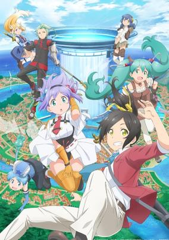

**Studio:** C2C &nbsp;|&nbsp; **Episodes:** 12 &nbsp;|&nbsp; **Director:** Hiroki Ikeshita &nbsp;|&nbsp; **Aired/Released:** April 5 – June 28 &nbsp;|&nbsp; **Genres:** Fantasy, Fantasy World, Adventure, Action, Comedy

> Shachou, Battle no Jikan Desu! is based on a strategy role-playing game of the same name, set in an alternative world where the player acts as the "president" to recruit and train adventurers. The adventurers are then dispatched into dungeons to fight monsters and recover loot.
>
> _Synopsis source: Kitsu_

[Wikipedia](https://en.wikipedia.org/wiki/Shachibato!_President,_It%27s_Time_for_Battle!) · [Kitsu](https://kitsu.io/anime/shachou-battle-no-jikan-desu)

---

### Tomica Kizuna Mode Combine Earth Granner

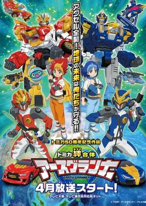

**Studio:** OLM, Inc. &nbsp;|&nbsp; **Episodes:** 51 &nbsp;|&nbsp; **Director:** Shinji Ushiro &nbsp;|&nbsp; **Aired/Released:** April 5 – March 28, 2021 &nbsp;|&nbsp; **Genres:** Kids, Transforming Craft, Super Robot, Science Fiction, Alien, Action, Mecha

> The story centers on the battles between the mysterious alien enemy Dark Spinner and the secret defense unit Earth Granner over Earth Energy, the energy generated from the Earth's rotation.
>
> _Synopsis source: Kitsu_

[Wikipedia](https://en.wikipedia.org/wiki/Tomica_Kizuna_Mode_Combine_Earth_Granner) · [Kitsu](https://kitsu.io/anime/tomica-kizuna-gattai-earth-granner)

---

### Tsugu Tsugumomo

**Studio:** Zero-G &nbsp;|&nbsp; **Episodes:** 12 &nbsp;|&nbsp; **Director:** Ryōichi Kuraya &nbsp;|&nbsp; **Aired/Released:** April 5 – June 21

[Wikipedia](https://en.wikipedia.org/wiki/Tsugumomo)

---

### Dropkick on My Devil!! Dash

**Studio:** Nomad &nbsp;|&nbsp; **Episodes:** 11 &nbsp;|&nbsp; **Director:** Hikaru Sato &nbsp;|&nbsp; **Aired/Released:** April 6 – June 15

[Wikipedia](https://en.wikipedia.org/wiki/Dropkick_on_My_Devil!)

---

### Fruits Basket (season 2)

**Studio:** TMS/8PAN &nbsp;|&nbsp; **Episodes:** 25 &nbsp;|&nbsp; **Director:** Yoshihide Ibata &nbsp;|&nbsp; **Aired/Released:** April 6 – September 21

[Wikipedia](https://en.wikipedia.org/wiki/Fruits_Basket)

---

### GaruGaku: Saint Girls Square Academy (Girl School.: St. Girls Square Academy)

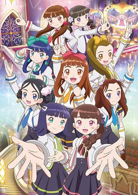

**Studio:** OLM Wit Studio &nbsp;|&nbsp; **Episodes:** 50 &nbsp;|&nbsp; **Director:** Hiroaki Akagi (Chief) Norihito Takahashi &nbsp;|&nbsp; **Aired/Released:** April 6 – March 29, 2021 &nbsp;|&nbsp; **Genres:** Music, School Life

> The anime is set in Holy Girls Square Academy, an academy for training pro star performers. The anime will focus on students who aim to participate in the academy's annual big event, the Girls' Arena.
>
> _Synopsis source: Kitsu_

[Wikipedia](https://en.wikipedia.org/wiki/GaruGaku) · [Kitsu](https://kitsu.io/anime/gal-gaku-hijiri-girls-square-gakuin)

---

### Kingdom (season 3) (Kingdom Season 3 Recap in 5 Minutes)

**Studio:** Pierrot Studio Signpost &nbsp;|&nbsp; **Episodes:** 26 &nbsp;|&nbsp; **Director:** Kenichi Imaizumi &nbsp;|&nbsp; **Aired/Released:** April 6 – October 18, 2021 &nbsp;|&nbsp; **Genres:** Action, Military, Historical, Feudal Warfare, Asia, War, Swordplay, Adventure

[Wikipedia](https://en.wikipedia.org/wiki/Kingdom_(season_3)) · [Kitsu](https://kitsu.io/anime/5-fun-de-wakaru-kingdom-gasshougun-hen)

---

### Princess Connect! Re:Dive

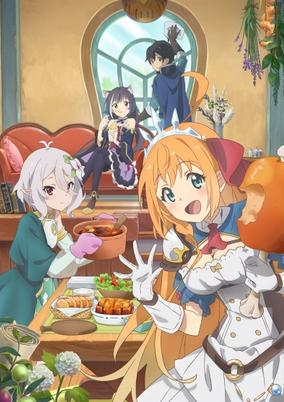

**Studio:** CygamesPictures &nbsp;|&nbsp; **Episodes:** 13 &nbsp;|&nbsp; **Director:** Takaomi Kanasaki &nbsp;|&nbsp; **Aired/Released:** April 6 – June 29 &nbsp;|&nbsp; **Genres:** Isekai, Comedy, Adventure, Fantasy

> In the beautiful land of Astraea where a gentle breeze blows, a young man named Yuuki awakens with no memory of his past. There he encounters a guide who has sworn to care for him—Kokkoro, a lovely swordswoman who's always feeling peckish—Pecorine, and a cat-eared sorceress with a prickly attitude—Karyl. Led by fate, these four come together to form the "Gourmet Guild." And so their adventure begins...
>
> _Synopsis source: Kitsu_

[Kitsu](https://kitsu.io/anime/princess-connect-redive)

---

### White Cat Project: Zero Chronicle

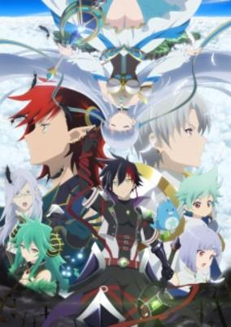

**Studio:** Project No.9 &nbsp;|&nbsp; **Episodes:** 12 &nbsp;|&nbsp; **Director:** Masato Jinbo &nbsp;|&nbsp; **Aired/Released:** April 6 – June 22 &nbsp;|&nbsp; **Genres:** Adventure, Action, Magic, Fantasy

> In a world consisting of numerous isles, a young hero from the Astora Isle encounters the adventurer Kyle and follows him on an expedition on the isle. They meet a mysterious girl named Iris and a talking white cat, and together they make their way to the isle's ruins, where they find a flying island. Kyle becomes consumed by darkness there, and the party resolves to travel to the ends of the world on the flying island in order to find the seven "Great Runes", following Kyle's words before he disappeared.
>
> _Synopsis source: Kitsu_

[Wikipedia](https://en.wikipedia.org/wiki/White_Cat_Project) · [Kitsu](https://kitsu.io/anime/shironeko-project-zero-chronicle)

---

### Diary of Our Days at the Breakwater

**Studio:** Doga Kobo &nbsp;|&nbsp; **Episodes:** 12 &nbsp;|&nbsp; **Director:** Takaharu Okuma &nbsp;|&nbsp; **Aired/Released:** April 7 – September 22 &nbsp;|&nbsp; **Genres:** School Clubs, Comedy, School Life, Slice of Life, Seinen

> Hina Tsurugi is a first year student at a coastal high school and regards herself as an indoorsy sort of person. Walking along the embankment, she runs into an older schoolmate, Kuroiwa, who invites her to join the “Teibou” club and start fishing! Surrounded by eccentric club members, how will Hina’s high school life turn out?
>
> _Synopsis source: Kitsu_

[Wikipedia](https://en.wikipedia.org/wiki/Diary_of_Our_Days_at_the_Breakwater) · [Kitsu](https://kitsu.io/anime/houkago-teibou-nisshi)

---

### Shadowverse

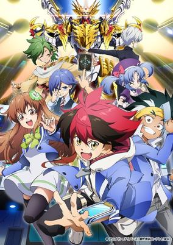

**Studio:** Zexcs &nbsp;|&nbsp; **Episodes:** 48 &nbsp;|&nbsp; **Director:** Keiichiro Kawaguchi &nbsp;|&nbsp; **Aired/Released:** April 7 – March 23, 2021 &nbsp;|&nbsp; **Genres:** Card Games, Fantasy, Kids, Shounen, Proxy Battles, Action

> The anime will feature a completely original story, and will feature anime-only characters. The anime centers on Hiiro Ryūgasaki, a student at Tensei Academy. Through a strange incident, Hiiro obtains a mysterious smartphone. The smartphone has installed the popular digital card game "Shadowverse." Through the game Hiiro meets rivals, participates in tournaments, and forms bonds with others.
>
> _Synopsis source: Kitsu_

[Wikipedia](https://en.wikipedia.org/wiki/Shadowverse_(TV_series)) · [Kitsu](https://kitsu.io/anime/shadowverse-tv)

---

### BNA: Brand New Animal (Brand New Animal)

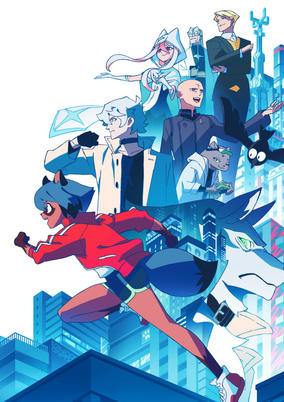

**Studio:** Trigger &nbsp;|&nbsp; **Episodes:** 12 &nbsp;|&nbsp; **Director:** Yoh Yoshinari &nbsp;|&nbsp; **Aired/Released:** April 8 – June 24 &nbsp;|&nbsp; **Genres:** Fantasy, Action, Anthropomorphism, Super Power

> In the 21st century, the existence of animal-humans came to light after being hidden in the darkness of history. Michiru lived life as a normal human, until one day she suddenly turns into a tanuki-human. She runs away and takes refuge in a special city area called "Anima City" that was set up 10 years ago for animal-humans to be able to live as themselves. There Michiru meets Shirou, a wolf-human who hates humans. Through Shirou, Michiru starts to learn about the worries, lifestyle, and joys of the animal-humans. As Michiru and Shirou try to learn why Michiru suddenly turned into an animal-human, they unexpectedly get wrapped up in a large incident.
>
> _Synopsis source: Kitsu_

[Kitsu](https://kitsu.io/anime/brand-new-animal)

---

### Komatta Jii-san

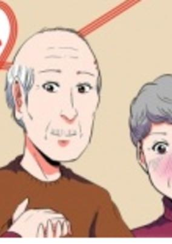

**Studio:** Kachidoki Studio &nbsp;|&nbsp; **Episodes:** 13 &nbsp;|&nbsp; **Director:** Hiroshi Namiki &nbsp;|&nbsp; **Aired/Released:** April 8 – July 1 &nbsp;|&nbsp; **Genres:** Adventure, Slice of Life, Comedy, Drama, Seinen, Stereotypes

> The comedy centers on an old man who pulls stereotypical ikemen (handsome man) actions on similarly old women and makes their hearts flutter.
>
> _Synopsis source: Kitsu_

[Wikipedia](https://en.wikipedia.org/wiki/Komatta_Jii-san) · [Kitsu](https://kitsu.io/anime/komatta-jiisan)

---

### The Millionaire Detective Balance: Unlimited (The Millionaire Detective - Balance: UNLIMITED)

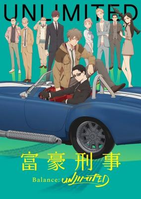

**Studio:** CloverWorks &nbsp;|&nbsp; **Episodes:** 11 &nbsp;|&nbsp; **Director:** Tomohiko Itō &nbsp;|&nbsp; **Aired/Released:** April 9 – September 24 &nbsp;|&nbsp; **Genres:** Drama, Mystery, Action, Science Fiction, Detective, Crime

> Detective Daisuke Kanbe has no problems using his own fortune to solve crimes even if he assesses human lives based on their financial worth. Compassionate Haru Katosees all life as sacred and is sickened by Daisuke’s materialistic ways. Can they stop butting heads and overcome their opposing world views for the sake of solving the toughest crimes in the precinct?
>
> _Synopsis source: Kitsu_

[Kitsu](https://kitsu.io/anime/fugou-keiji-balance-unlimited)

---

### Appare-Ranman!

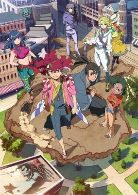

**Studio:** P.A. Works &nbsp;|&nbsp; **Episodes:** 13 &nbsp;|&nbsp; **Director:** Masakazu Hashimoto &nbsp;|&nbsp; **Aired/Released:** April 10 – September 25 &nbsp;|&nbsp; **Genres:** Motorsport, Action, Samurai, Past, Historical, United States, Alternative Past

> The story is set at the end of the 19th century and on the eve of the next one. After a certain mishap, the brilliant but socially inept engineer Sorano Appare (family name first) and the shrewd but cowardly samurai Isshiki Kosame find themselves drifting on a boat from Japan to America. Broke, the two decide to compete in the Trans-America Wild Race to win the prize and return to Japan. The two battle crazy rivals, outlaws, and the great outdoors itself as they race through the wild West from the starting line in Los Angeles to the finish line in New York — in the steam-powered car they built.
>
> _Synopsis source: Kitsu_

[Wikipedia](https://en.wikipedia.org/wiki/Appare-Ranman!) · [Kitsu](https://kitsu.io/anime/appare-ranman)

---

### Argonavis from BanG Dream!

**Studio:** Sanzigen &nbsp;|&nbsp; **Episodes:** 13 &nbsp;|&nbsp; **Director:** Hiroshi Nishikiori &nbsp;|&nbsp; **Aired/Released:** April 10 – July 3 &nbsp;|&nbsp; **Genres:** Music

> Ren Nanahoshi is a lonely college student who isn't good at communicating with others. He remembers the thrill of watching a live band perform when he was young, and spent most of his days searching for his own identity. One day, while singing karaoke alone, two boys named Yuuto and Wataru discover Ren's singing ability. The two agree: "This is fate. Let's start a band!" Ren promptly runs away, but fate indeed steps in, and their journey begins.
>
> _Synopsis source: Kitsu_

[Wikipedia](https://en.wikipedia.org/wiki/From_Argonavis) · [Kitsu](https://kitsu.io/anime/argonavis-from-bang-dream)

---

### Food Wars! Shokugeki no Soma: The Fifth Plate (Food Wars: The Fifth Plate)

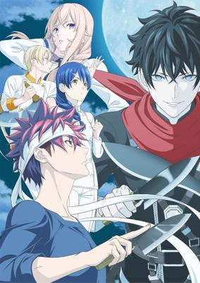

**Studio:** J.C.Staff &nbsp;|&nbsp; **Episodes:** 13 &nbsp;|&nbsp; **Director:** Yoshitomo Yonetani &nbsp;|&nbsp; **Aired/Released:** April 11 – September 26 &nbsp;|&nbsp; **Genres:** Ecchi, School Life, Cooking, Shounen, Action, Comedy

> In the heated final season of Food Wars! Shokugeki no Soma, Yukihira Soma and the Totsuki Academy compete in The Blue!
>
> _Synopsis source: Kitsu_

[Kitsu](https://kitsu.io/anime/shokugeki-no-souma-gou-no-sara)

---

### Kaguya-sama: Love Is War? (Kaguya-sama: Love is War)

**Studio:** A-1 Pictures &nbsp;|&nbsp; **Episodes:** 12 &nbsp;|&nbsp; **Director:** Mamoru Hatakeyama &nbsp;|&nbsp; **Aired/Released:** April 11 – June 27 &nbsp;|&nbsp; **Genres:** Comedy, Psychological, School Life, High School, Student Government, Romance

> Known for being both brilliant and powerful, Miyuki Shirogane and Kaguya Shinomiya lead the illustrious Shuchiin Academy as near equals. Everyone thinks they’d make a great couple. But with pride and arrogance in ample supply, the only logical move is to trick the other into instigating a date! Who will come out on top in this psychological war where the first move is the only one that matters?
>
> _Synopsis source: Kitsu_

[Kitsu](https://kitsu.io/anime/kaguya-sama-wa-kokurasetai-tensai-tachi-no-renai-zunousen)

---

### Woodpecker Detective's Office

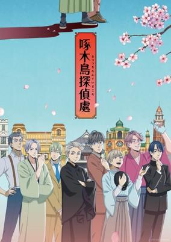

**Studio:** Liden Films &nbsp;|&nbsp; **Episodes:** 12 &nbsp;|&nbsp; **Director:** Shinpei Ezaki (Chief) Tomoe Makino &nbsp;|&nbsp; **Aired/Released:** April 13 – June 29 &nbsp;|&nbsp; **Genres:** Historical, Mystery, Japan, Past, Detective

> The story is set in 1909 during Japan's Meiji era, and centers on fictional versions of real-life poet Takuboku Ishikawa (right in picture above) and real-life linguist Kyousuke Kindaichi, who were acquaintances in real life. In the novel, Takuboku runs a private detective agency to support his family. Both begin to investigate a case of supposed ghost appearances at the Asakusa Juunikai building, also known as the Ryouunkai.
>
> _Synopsis source: Kitsu_

[Wikipedia](https://en.wikipedia.org/wiki/Woodpecker_Detective%27s_Office) · [Kitsu](https://kitsu.io/anime/kitsutsuki-tanteidokoro)

---

### Bessatsu Olympia Kyklos (Extra Olympia Kyklos)

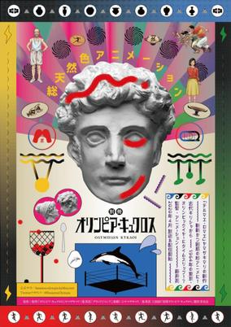

**Studio:** Gosay Studio &nbsp;|&nbsp; **Episodes:** 24 &nbsp;|&nbsp; **Director:** Ryō Fujii &nbsp;|&nbsp; **Aired/Released:** April 20 – November 2 &nbsp;|&nbsp; **Genres:** Historical, Time Travel, Japan, Past, Parody, Comedy, Seinen, Sports, Slice of Life

> Demetrios, a timid and kind vase painter in Ancient Greece who dislikes sports and competitions, is one day forced to come up with a game to compete with the mayor of the neighboring town in order to save his village. While hiding inside a large vase outside his workshop, lightning strikes the vase Demetrios is in, transferring him to Tokyo, Japan, during the 1964 Summer Olympics.
>
> _Synopsis source: Kitsu_

[Wikipedia](https://en.wikipedia.org/wiki/Olympia_Kyklos) · [Kitsu](https://kitsu.io/anime/bessatsu-olympia-kyklos)

---

### Fire Force (season 2) (Fire Force)

**Studio:** David Production &nbsp;|&nbsp; **Episodes:** 24 &nbsp;|&nbsp; **Director:** Tatsuma Minamikawa &nbsp;|&nbsp; **Aired/Released:** July 4 – December 12 &nbsp;|&nbsp; **Genres:** Supernatural, Demon, Action, Science Fiction, Shounen, Super Power

> Tokyo is burning, and citizens are mysteriously suffering from spontaneous human combustion all throughout the city! Responsible for snuffing out this inferno is the Fire Force, and Shinra is ready to join their fight. Now, as part of Company 8, he’ll use his devil’s footprints to help keep the city from turning to ash! But his past and a burning secret behind the scenes could set everything ablaze.
>
> _Synopsis source: Kitsu_

[Wikipedia](https://en.wikipedia.org/wiki/Fire_Force) · [Kitsu](https://kitsu.io/anime/enen-no-shouboutai)

---

### Lapis Re:Lights

**Studio:** Yokohama Animation Laboratory &nbsp;|&nbsp; **Episodes:** 12 &nbsp;|&nbsp; **Director:** Hiroyuki Hata &nbsp;|&nbsp; **Aired/Released:** July 4 – September 19 &nbsp;|&nbsp; **Genres:** Music, Idol, Magic, Fantasy, School Life

> Based on a mixed media project that blends fantasy, magical girl, and idol elements, Lapis Re:LiGHTs will follow a group of students as they train to become idols. Together, they'll use the magic of music and the magic of... well, literal magic... in their performances.
>
> _Synopsis source: Kitsu_

[Kitsu](https://kitsu.io/anime/lapis-re-lights)

---

### Super HxEros

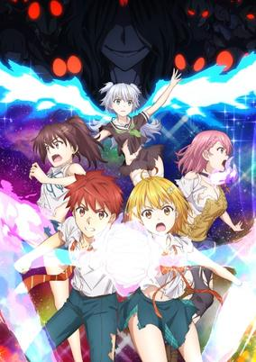

**Studio:** Project No.9 &nbsp;|&nbsp; **Episodes:** 12 &nbsp;|&nbsp; **Director:** Masato Jinbo &nbsp;|&nbsp; **Aired/Released:** July 4 – September 26 &nbsp;|&nbsp; **Genres:** Action, Comedy, Supernatural, Ecchi, School Life, Shounen

> Based on an ecchi love comedy manga by Kitada Ryouma.In a world on the verge of a great disaster that began five years ago, heroes who, with the help of a device called HxEros, use the power of Ecchi (H) and erotic power (Ero) to save the planet from libido-devouring monsters!Enjou Retto and Hoshino Kirara are childhood friends who have drifted apart from each other. One day, they're caught in a battle against a "Censor Bug" that feeds on human's sexual energy to evolve. After successfully taking down the enemy, they join a group of heroes like them, using the erotic power of the HxEROS force to fight off monsters.
>
> _Synopsis source: Kitsu_

[Wikipedia](https://en.wikipedia.org/wiki/Super_HxEros) · [Kitsu](https://kitsu.io/anime/dokyuu-hentai-hxeros)

---

### The Misfit of Demon King Academy

**Studio:** Silver Link &nbsp;|&nbsp; **Episodes:** 13 &nbsp;|&nbsp; **Director:** Shin Ōnuma (Chief) Masafumi Tamura &nbsp;|&nbsp; **Aired/Released:** July 4 – September 26 &nbsp;|&nbsp; **Genres:** Magic, Fantasy World, Fantasy, Demon, School Life

> After 2000 years has passed, the ruthless demon lord has just been reincarnated! But his aptitude at an academy for nurturing candidates for demon lords is, “inept”!?Having the capability to destroy humans, elementals, and gods, after a long period of countless wars and strife, Arnos the demon lord became sick and tired of all that and longed for a peaceful world, so he decided to reincarnate to the future.However, what awaited him after his reincarnation is a world too used to peace that his descendants became too weak due to a huge weakening in magical powers.
>
> _Synopsis source: Kitsu_

[Wikipedia](https://en.wikipedia.org/wiki/The_Misfit_of_Demon_King_Academy) · [Kitsu](https://kitsu.io/anime/maou-gakuin-no-futekigousha-shijou-saikyou-no-maou-no-shiso-tensei-shite-shison-tachi-no-gakkou-e-kayou)

---

### The God of High School

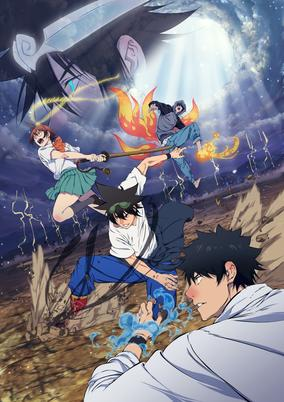

**Studio:** MAPPA &nbsp;|&nbsp; **Episodes:** 13 &nbsp;|&nbsp; **Director:** Sunghoo Park &nbsp;|&nbsp; **Aired/Released:** July 6 – September 28 &nbsp;|&nbsp; **Genres:** Action, Adventure, Comedy, Fantasy, Martial Arts, Science Fiction, Supernatural

> Jin Mori has proclaimed himself the strongest high schooler. His life changes when he's invited to participate in "God of High School," a tournament to determine the strongest high schooler of all. He's told that if he wins, any wish he makes will be granted... All the participants are powerful contenders who fight their hardest for their own wishes. What awaits them at the end of the tournament? A chaotic battle between unbelievably strong high school students is about to begin!
>
> _Synopsis source: Kitsu_

[Wikipedia](https://en.wikipedia.org/wiki/The_God_of_High_School) · [Kitsu](https://kitsu.io/anime/the-god-of-highschool-series)

---

### Muhyo & Roji's Bureau of Supernatural Investigation (season 2)

**Studio:** Studio Deen &nbsp;|&nbsp; **Episodes:** 12 &nbsp;|&nbsp; **Director:** Nobuhiro Kondo &nbsp;|&nbsp; **Aired/Released:** July 7 – September 22

[Wikipedia](https://en.wikipedia.org/wiki/Muhyo_%26_Roji%27s_Bureau_of_Supernatural_Investigation)

---

### Umayon

**Studio:** DMM.futureworks W-Toon Studio &nbsp;|&nbsp; **Episodes:** 12 &nbsp;|&nbsp; **Director:** Seiya Miyajima &nbsp;|&nbsp; **Aired/Released:** July 7 – September 22

[Wikipedia](https://en.wikipedia.org/wiki/Uma_Musume_Pretty_Derby)

---

### Deca-Dence

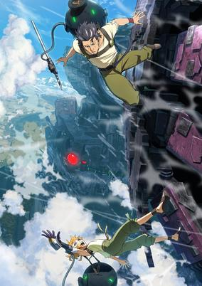

**Studio:** NUT &nbsp;|&nbsp; **Episodes:** 12 &nbsp;|&nbsp; **Director:** Yuzuru Tachikawa &nbsp;|&nbsp; **Aired/Released:** July 8 – September 23 &nbsp;|&nbsp; **Genres:** Adventure, Action, Steampunk, Science Fiction

> Many years have passed since humanity was driven to the brink of extinction by the sudden emergence of the unknown life forms Gadoll. Those humans that survived now dwell in a 3000 meter-high mobile fortress Deca-dence built to protect themselves from the Gadoll threat.Denizens of Deca-dence fall into two categories: Gears, warriors who fight the Gadoll daily, and Tankers, those without the skills to fight. One day, Natsume, a Tanker girl who dreams of becoming a Gear meets surly Kaburagi, an armor repairman of Deca-dence.This chance meeting between the seemingly two opposites, the girl with a positive attitude who never gives up on her dreams and the realist who has given up on his, will eventually shake the future course of this world.
>
> _Synopsis source: Kitsu_

[Wikipedia](https://en.wikipedia.org/wiki/Deca-Dence) · [Kitsu](https://kitsu.io/anime/deca-dence)

---

### Great Pretender

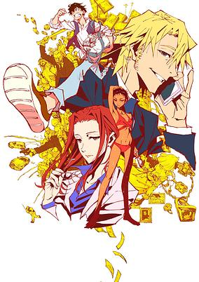

**Studio:** Wit Studio &nbsp;|&nbsp; **Episodes:** 23 &nbsp;|&nbsp; **Director:** Hiro Kaburagi &nbsp;|&nbsp; **Aired/Released:** July 8 – December 16 &nbsp;|&nbsp; **Genres:** Crime, United States, Japan, Adventure, Mafia, Seinen, Action, Comedy, Drama, Thriller, Psychological

> Only BADs are our targets! Trick you! Deceive you! Cheat all fortunes of you! You can hear our stories in LA, Singapore, London, Shanghai and Tokyo, Why? Our "CON GAMEs" stage, is the whole WORLD! Edamura Makoto is supposedly Japan's greatest swindler. Together with his partner Kudo, they try to trick a Frenchman in Asakusa but unexpectedly get tricked instead. The Frenchman, whom they tried to swindle, turns out to be Laurent Thierry—a much higher-level "confidence man," in control of the mafia. Edamura is yet to find out what fate awaits him, after having engaged in the Frenchman's dirty jobs...!
>
> _Synopsis source: Kitsu_

[Wikipedia](https://en.wikipedia.org/wiki/Great_Pretender_(TV_series)) · [Kitsu](https://kitsu.io/anime/great-pretender)

---

### Re:Zero − Starting Life in Another World (season 2, part 1) (Re:ZERO -Starting Life in Another World- Season 2 Part 2)

**Studio:** White Fox &nbsp;|&nbsp; **Episodes:** 13 &nbsp;|&nbsp; **Director:** Masaharu Watanabe &nbsp;|&nbsp; **Aired/Released:** July 8 – September 30 &nbsp;|&nbsp; **Genres:** Psychological, Drama, Thriller, Fantasy, Isekai, Magic, Violence

> After learning more about the Death Loop and Witches of Sin, Subaru vows to save Emilia and his friends from further doom.
>
> _Synopsis source: Kitsu_

[Kitsu](https://kitsu.io/anime/rezero-season-2-part-2)

---

### My Teen Romantic Comedy SNAFU Climax

**Studio:** Feel &nbsp;|&nbsp; **Episodes:** 12 &nbsp;|&nbsp; **Director:** Kei Oikawa &nbsp;|&nbsp; **Aired/Released:** July 9 – September 24 &nbsp;|&nbsp; **Genres:** School Life, School Clubs, Romance, Present, Japan, High School, Friendship, Earth, Comedy, Asia, Slice of Life, Drama

> Third season of Yahari Ore no Seishun Love Comedy wa Machigatteiru..
>
> _Synopsis source: Kitsu_

[Wikipedia](https://en.wikipedia.org/wiki/My_Teen_Romantic_Comedy_SNAFU_(season_3)) · [Kitsu](https://kitsu.io/anime/yahari-ore-no-seishun-love-comedy-wa-machigatteiru-kan)

---

### No Guns Life (season 2) (No Guns Life)

**Studio:** Madhouse &nbsp;|&nbsp; **Episodes:** 12 &nbsp;|&nbsp; **Director:** Naoyuki Itō &nbsp;|&nbsp; **Aired/Released:** July 9 – September 24 &nbsp;|&nbsp; **Genres:** Action, Science Fiction, Seinen, Cyberpunk, Cyborg, Dystopia, Gunfights

> Ex-soldier Inui Juuzou has one question - who turned him into a cyborg and erased his memories? After the war, cyborg soldiers known as the Extended were discharged. Inui Juuzou is one of them, a man whose body was transformed, his head replaced with a giant gun! With no memory of his previous life - or who replaced his head and why - Inui now scratches out a living in the dark streets of the city as a Resolver, taking on cases involving the Extended. When a fellow Extended showed up in Inui's office - on the run from the Security Bureau with a kidnapped child in tow and asking for help - Inui should have just thrown the guy out. But Inui's loyalty to a brother Extended makes him take the job. Keeping the child safe won't be easy, since everyone seems to want to grab him, from street punks to the megacorporation Berühren, who have sent out a special agent that knows exactly how to deal with the Extended...
>
> _Synopsis source: Kitsu_

[Wikipedia](https://en.wikipedia.org/wiki/No_Guns_Life) · [Kitsu](https://kitsu.io/anime/no-guns-life)

---

### Get Up! Get Live! (Brand New Animal)

**Studio:** Spellbound &nbsp;|&nbsp; **Episodes:** 10 &nbsp;|&nbsp; **Director:** 88 &nbsp;|&nbsp; **Aired/Released:** July 10 – September 11 &nbsp;|&nbsp; **Genres:** Fantasy, Action, Anthropomorphism, Super Power

> In the 21st century, the existence of animal-humans came to light after being hidden in the darkness of history. Michiru lived life as a normal human, until one day she suddenly turns into a tanuki-human. She runs away and takes refuge in a special city area called "Anima City" that was set up 10 years ago for animal-humans to be able to live as themselves. There Michiru meets Shirou, a wolf-human who hates humans. Through Shirou, Michiru starts to learn about the worries, lifestyle, and joys of the animal-humans. As Michiru and Shirou try to learn why Michiru suddenly turned into an animal-human, they unexpectedly get wrapped up in a large incident.
>
> _Synopsis source: Kitsu_

[Wikipedia](https://en.wikipedia.org/wiki/Get_Up!_Get_Live!) · [Kitsu](https://kitsu.io/anime/brand-new-animal)

---

### Uzaki-chan Wants to Hang Out! (Uzaki-chan Wants to Hang Out)

**Studio:** ENGI &nbsp;|&nbsp; **Episodes:** 12 &nbsp;|&nbsp; **Director:** Kazuya Miura &nbsp;|&nbsp; **Aired/Released:** July 10 – September 25 &nbsp;|&nbsp; **Genres:** Slice of Life, Comedy, Ecchi

> After enjoying the summer together, life returns to normal for Uzaki and Sakurai. Flabbergasted friends and family wonder why these two stubborn friends aren’t dating. Begrudgingly, both of them would admit there’s now a warmth, even an attraction, between them—and it’s growing. Is it possible this cold war of a relationship is about to turn hot? That would mean one of them making the first move!
>
> _Synopsis source: Kitsu_

[Wikipedia](https://en.wikipedia.org/wiki/Uzaki-chan_Wants_to_Hang_Out!) · [Kitsu](https://kitsu.io/anime/uzaki-chan-wa-asobitai)

---

### Peter Grill and the Philosopher's Time

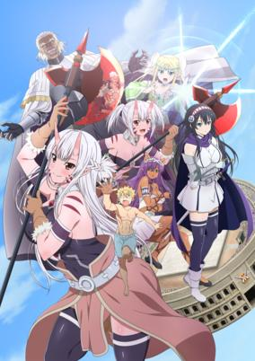

**Studio:** Wolfsbane &nbsp;|&nbsp; **Episodes:** 12 &nbsp;|&nbsp; **Director:** Tatsumi &nbsp;|&nbsp; **Aired/Released:** July 11 – September 26 &nbsp;|&nbsp; **Genres:** Harem, Ecchi, Comedy, Fantasy, Fantasy World

> Peter Grill is known throughout the land as the world's strongest fighter. He has a girlfriend who he's steadily trying to get closer with. Life is good for him. Until he realizes that dozens of women, who want to bear strong children, are all vying for his seed.
>
> _Synopsis source: Kitsu_

[Wikipedia](https://en.wikipedia.org/wiki/Peter_Grill_and_the_Philosopher%27s_Time) · [Kitsu](https://kitsu.io/anime/peter-grill-to-kenja-no-jikan)

---

### Rent-A-Girlfriend

**Studio:** TMS Entertainment &nbsp;|&nbsp; **Episodes:** 12 &nbsp;|&nbsp; **Director:** Kazuomi Koga &nbsp;|&nbsp; **Aired/Released:** July 11 – September 26 &nbsp;|&nbsp; **Genres:** Comedy, Romance, School Life, Shounen

> Dumped by his girlfriend, emotionally shattered college student Kazuya Kinoshita attempts to appease the void in his heart through a rental girlfriend from a mobile app. At first, Chizuru Mizuhara seems to be the perfect girl with everything he could possibly ask for: great looks and a cute, caring personality.Upon seeing mixed opinions on her profile after their first date, and still tormented by his previous relationship, Kazuya believes that Chizuru is just playing around with the hearts of men and leaves her a negative rating. Angry at her client's disrespect towards her, Chizuru reveals her true nature: sassy and temperamental, the complete opposite of Kazuya's first impression. At that very moment, Kazuya receives news of his grandmother's collapse and is forced to bring Chizuru along with him to the hospital.Although it turns out to be nothing serious, his grandmother is ecstatic that Kazuya has finally found a serious girlfriend, which had always been her wish. Unable to tell her the truth, Kazuya and Chizuru are forced into a fake relationship—acting as if they are truly lovers.
>
> _Synopsis source: Kitsu_

[Wikipedia](https://en.wikipedia.org/wiki/Rent-A-Girlfriend) · [Kitsu](https://kitsu.io/anime/kanojo-okarishimasu)

---

### Monster Girl Doctor

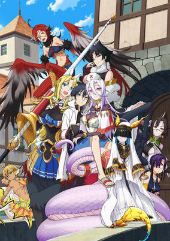

**Studio:** Arvo Animation &nbsp;|&nbsp; **Episodes:** 12 &nbsp;|&nbsp; **Director:** Yoshiaki Iwasaki &nbsp;|&nbsp; **Aired/Released:** July 12 – September 27 &nbsp;|&nbsp; **Genres:** Comedy, Romance, Ecchi, Fantasy, Harem, Juujin, Magic, Fantasy World

> In the town of Lindworm where monsters and humans coexist, Dr. Glenn runs an exemplary medical clinic for monster girls with his lamia assistant, Sapphee. Whether receiving a marriage proposal by a centaur injured in battle, palpating the injury of a mermaid, or suturing the delicate wounds of a flesh golem, Dr. Glenn performs his job with grace and confidence. But when an unsavory character seeks to steal a harpy egg, how will the unflappable Dr. Glenn respond...?
>
> _Synopsis source: Kitsu_

[Wikipedia](https://en.wikipedia.org/wiki/Monster_Girl_Doctor) · [Kitsu](https://kitsu.io/anime/monster-musume-no-oishasan)

---

### Sword Art Online: Alicization – War of Underworld (part 2) (Sword Art Online: Alicization - War of Underworld - Part 2)

**Studio:** A-1 Pictures &nbsp;|&nbsp; **Episodes:** 11 &nbsp;|&nbsp; **Director:** Manabu Ono &nbsp;|&nbsp; **Aired/Released:** July 12 – September 20 &nbsp;|&nbsp; **Genres:** Action, Adventure, Virtual Reality, Fantasy, Romance, Swordplay

> The final load test... The war between the Human Empire and the Dark Territory has engulfed Underworld entirely. The battle has shifted course with the Dark Territory army led by Gabriel, who seeks to capture Alice, the Priestess of Light, against Asuna and the Human Empire forces fighting to save Underworld. As Kirito's consciousness remains buried in a deep sleep, Gabriel, standing in as the Dark God Vecta, has recruited thousands of American players to log in to Underworld to annihilate the Human Empire forces. Meanwhile, Asuna, Sinon, and Leafa have joined the battle utilizing three super-accounts of the deities of the Underworld. As the Goddess of Creation Stacia Asuna fights alongside the Human Empire forces to take on the American players in a vicious combat. Sinon, who has gained the super-account for the Sun Goddess Solus, is in pursuit of Gabriel, who has abducted Alice, while Leafa arrives to Underworld with the super-account Earth Goddess Terraria. But that is not all... The impassioned speech by Lisbeth has convinced many ALO players to join the fight with the Human Empire despite the risks. With this great war, not only Underworld's continued existence, but the bottom-up artificial intelligence, the ultimate AI, and even the future of mankind is at stake. Though he has yet to awaken, only one man holds the fate of this world: the Black Swordsman.
>
> _Synopsis source: Kitsu_

[Kitsu](https://kitsu.io/anime/sword-art-online-alicization-war-of-underworld-2nd-season)

---

### Gibiate

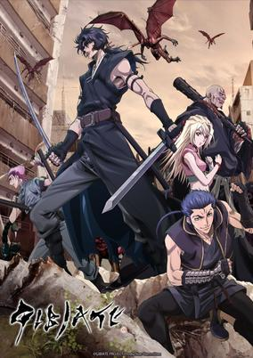

**Studio:** Lunch Box Studio Elle &nbsp;|&nbsp; **Episodes:** 12 &nbsp;|&nbsp; **Director:** Masahiko Komino &nbsp;|&nbsp; **Aired/Released:** July 15 – September 30 &nbsp;|&nbsp; **Genres:** Action, Fantasy, Horror, Martial Arts, Samurai

> In 2030, Japan. A virus has infected humans throughout the world. Infected people turn into different forms of monsters based on their ages, sexes, and races. The virus is named "Gibia"—after being rich in variety like gibia.Just then, a pair of samurai and ninja appeared in such a blighted wasteland of Japan. They both traveled from the early Edo period, fighting together with help from a doctor who tries to find cure for Gibia. Facing ceaseless attacks from Gibias and outlaws that attack travelers for food, they start the dangerous journey with enemies all around.
>
> _Synopsis source: Kitsu_

[Wikipedia](https://en.wikipedia.org/wiki/Gibiate) · [Kitsu](https://kitsu.io/anime/gibiate)

---

### Mr Love: Queen's Choice (Mr. Love: Queen's Choice)

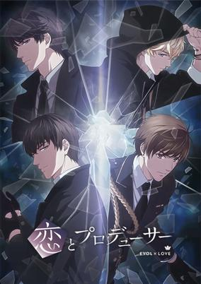

**Studio:** MAPPA &nbsp;|&nbsp; **Episodes:** 12 &nbsp;|&nbsp; **Director:** Munehisa Sakai &nbsp;|&nbsp; **Aired/Released:** July 15 – September 30 &nbsp;|&nbsp; **Genres:** Reverse Harem, Drama, Science Fiction, Mystery, Super Power, Romance

> After her father passed away, a young woman inherited his production company, Miracle Entertainment, along with its most successful program, "Miracle Finder." In recent years, however, the show has fallen off the radar and it is now mostly forgotten. In an attempt to save the show from being canceled, this young woman desperately tries to look for a unique topic to use as inspiration. She finds it in the form of "Evol," a mysterious gene that has granted certain people special powers and is considered the next step in human evolution. But, as marvelous as this gene seems, its existence may lead to an unstoppable battle between humans for survival. However, as she becomes more entangled with the strange world of the "Evolvers," her life is suddenly disturbed by the arrival of four men: the cheerful idol Kira; the neuroscientist and Loveland University professor, Simon; the stoic CEO of Loveland Financial Group and Miracle Entertainment's benefactor, Zen; and her high school upperclassman Haku, a former delinquent now working as a police officer. As strange incidents begin to plague the city, will she be able to find out the truth about the "Evol" or "Black Swan," the organization behind numerous attacks from "Evolvers" and possibly connected to her father's death? What is her part to play in its plan, and how are the men around her connected to it all?
>
> _Synopsis source: Kitsu_

[Kitsu](https://kitsu.io/anime/koi-to-producer-evolxlove)

---

### Higurashi: When They Cry – Gou (Higurashi: When They Cry - Gou)

**Studio:** Passione &nbsp;|&nbsp; **Episodes:** 24 &nbsp;|&nbsp; **Director:** Keiichiro Kawaguchi &nbsp;|&nbsp; **Aired/Released:** October 1 – March 19, 2021 &nbsp;|&nbsp; **Genres:** Horror, Angst, Drama, Plot Continuity, Psychological, Thriller, Mystery, Violence

> New kid Keiichi Maebara is settling into his new home of peaceful Hinamizawa village. Making quick friends with the girls from his school, he's arrived in time for the big festival of the year. But something about this isolated town seems "off," and his feelings of dread continue to grow. With a gnawing fear that he's right, what dark secrets could this small community be hiding?
>
> _Synopsis source: Kitsu_

[Wikipedia](https://en.wikipedia.org/wiki/Higurashi_When_They_Cry) · [Kitsu](https://kitsu.io/anime/higurashi-no-naku-koro-ni-gou)

---

### Assault Lily Bouquet

**Studio:** Shaft &nbsp;|&nbsp; **Episodes:** 12 &nbsp;|&nbsp; **Director:** Hajime Ootani (Chief) Shouji Saeki &nbsp;|&nbsp; **Aired/Released:** October 2 – December 25 &nbsp;|&nbsp; **Genres:** Magic, Military, Science Fiction

> On Earth in the near future, humanity faced imminent destruction from mysterious giant creatures known as "Huge." The entire world unites against the Huge, and successfully develops weaponry known as "CHARM" (Counter Huge Arms) by combining science and magic. CHARM exhibits high rates of synchronization with teenaged girls, and the girls who use CHARM are viewed as heroes called "Lilies." Throughout the world, "Garden" military academies are established to train Lilies to face the Huge and to serve as bases to protect and guide people. This is a story about fighting girls who aim to become Lilies at one such Garden.
>
> _Synopsis source: Kitsu_

[Wikipedia](https://en.wikipedia.org/wiki/Assault_Lily) · [Kitsu](https://kitsu.io/anime/assault-lily-bouquet)

---

### I'm Standing on a Million Lives (I'm standing on 1,000,000 lives.)

**Studio:** Maho Film &nbsp;|&nbsp; **Episodes:** 12 &nbsp;|&nbsp; **Director:** Kumiko Habara &nbsp;|&nbsp; **Aired/Released:** October 2 – December 18 &nbsp;|&nbsp; **Genres:** Fantasy, Action, Adventure, Fantasy World, Magic, Isekai, Harem

> Yotsuya Yuusuke along with his classmates Shindou Iu and Hakozaki Kusue have been transported to a strange and unknown world inhabited by mythological creatures. As soon as they arrive, they meet somebody calling himself the Game Master who then grants them a time-limited quest. To aid them in this quest, he also bestows Shindou and Hakozaki with the roles of a Magician and a Warrior while Yotsuya is randomly granted the role of... a Farmer?!This is how a hectic life of adventuring began for three students who now have no choice, but to complete random quests for several phases in the fantasy world if they want to stay alive and protect the real world from the demons and monsters they encounter.
>
> _Synopsis source: Kitsu_

[Wikipedia](https://en.wikipedia.org/wiki/I%27m_Standing_on_a_Million_Lives) · [Kitsu](https://kitsu.io/anime/one-hundred-man-no-inochi-no-ue-ni-ore-wa-tatteiru)

---

### Rail Romanesque

**Studio:** Saetta &nbsp;|&nbsp; **Episodes:** 12 &nbsp;|&nbsp; **Director:** Hisayoshi Hirasawa &nbsp;|&nbsp; **Aired/Released:** October 2 – December 18 &nbsp;|&nbsp; **Genres:** Science Fiction, Harem, Slice of Life

> Set in Hinomoto, a fictional version of Japan, where for a long time railway travel served as the most important form of transport. Each locomotive was paired with a humanoid control module, so-called Raillord, that aided the train operator. However, many rail lines had been discontinued due to the rising popularity of 'aerocrafts,' a safe and convenient aerial mode of transport. As such, their accompanying railroads also went into a deep sleep.Soutetsu had lost his entire family in a rail accident and was adopted into the Migita household, which runs a shochu brewery in the city of Ohitoyo. He returned to his hometown to save it from the potential water pollution that would occur if they accepted the proposal to build an aerocraft factory nearby. He woke up the Raillord Hachiroku by accident and became her owner. For different purposes, they agreed to help find her lost locomotive, with the help of his stepsister Hibiki, the town’s mayor and local railway chief, Paulette and others.
>
> _Synopsis source: Kitsu_

[Wikipedia](https://en.wikipedia.org/wiki/Maitetsu) · [Kitsu](https://kitsu.io/anime/rail-romanesque)

---

### Haikyu!! To The Top (season 2)

**Studio:** Production I.G &nbsp;|&nbsp; **Episodes:** 12 &nbsp;|&nbsp; **Director:** Masako Sato &nbsp;|&nbsp; **Aired/Released:** October 2 – December 18

[Wikipedia](https://en.wikipedia.org/wiki/Haikyu!!)

---

### Wandering Witch: The Journey of Elaina (The Journey of Elaina)

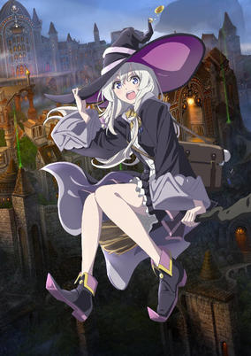

**Studio:** C2C &nbsp;|&nbsp; **Episodes:** 12 &nbsp;|&nbsp; **Director:** Toshiyuki Kubooka &nbsp;|&nbsp; **Aired/Released:** October 2 – December 18 &nbsp;|&nbsp; **Genres:** Adventure, Fantasy, Magic, Violence, Tone Changes, Dark Fantasy, Stereotypes

> In a certain place, there was a traveler witch. Her name was Elaina. Being a traveler, she came across many people and countries while continuing her long, long journey. A country that only accepted magicians, a muscle loving giant, a youth wanting to return a lover from the grasp of death, a Princess left alone in the ruined country, and the story of the witch herself up until now and from now on. While meeting unbelievably odd people and experiencing beautiful moments of some, then, even now, the witch keeps spinning the tale of meeting and parting.
>
> _Synopsis source: Kitsu_

[Kitsu](https://kitsu.io/anime/majo-no-tabitabi)

---

### With a Dog AND a Cat, Every Day is Fun

**Studio:** Team Till Dawn &nbsp;|&nbsp; **Episodes:** 24 &nbsp;|&nbsp; **Director:** Seiji Kishi &nbsp;|&nbsp; **Aired/Released:** October 2 – March 26, 2021 &nbsp;|&nbsp; **Genres:** Slice of Life, Comedy, Family

> A hard-working way-too-cute dog and a scary-faced but lovable cat. Living with them makes every day fun. Their owner's days are filled with laughter and sentiment. Are you a cat-lover? A dog-lover? Or both? This anime is a present for the people out there who love both dogs and cats so much they can't choose.
>
> _Synopsis source: Kitsu_

[Wikipedia](https://en.wikipedia.org/wiki/With_a_Dog_AND_a_Cat,_Every_Day_is_Fun) · [Kitsu](https://kitsu.io/anime/inu-to-neko-docchi-mo-katteru-to-mainichi-tanoshii)

---

### Dragon Quest: The Adventure of Dai

**Studio:** Toei Animation &nbsp;|&nbsp; **Episodes:** 100 &nbsp;|&nbsp; **Director:** Kazuya Karasawa &nbsp;|&nbsp; **Aired/Released:** October 3 – October 22, 2022 &nbsp;|&nbsp; **Genres:** Fantasy, High Fantasy, Fantasy World, Dragon, Adventure, Action, Shounen

> After the defeat of the demon lord Hadlar, all of the monsters were unleashed from his evil will and moved to the island of Delmurin to live in peace. Dai is the only human living on the island. Having been raised by the kindly monster Brass, Dai's dream is to grow up to be a hero. He gets to become one when Hadlar is resurrected and the previous hero, Avan, comes to train Dai to help in the battle. But Hadlar, announcing that he now works for an even more powerful demon lord, comes to kill Avan. To save his students, Avan uses a Self-Sacrifice spell to attack, but is unable to defeat Hadlar. When it seems that Dai and Avan's other student Pop are doomed, a mark appears on Dai's forehead and he suddenly gains super powers and is able to fend off Hadlar. The two students then go off on a journey to avenge Avan and bring peace back to the world.
>
> _Synopsis source: Kitsu_

[Kitsu](https://kitsu.io/anime/dragon-quest-dai-no-daibouken-2020)

---

### Fly Me to the Moon (TONIKAWA: Over the Moon For You)

**Studio:** Seven Arcs &nbsp;|&nbsp; **Episodes:** 12 &nbsp;|&nbsp; **Director:** Hiroshi Ikehata &nbsp;|&nbsp; **Aired/Released:** October 3 – December 19 &nbsp;|&nbsp; **Genres:** Shounen, Romance, Comedy, Slice of Life

> The story follows a protagonist whose name is written with the characters for "Hoshizora" ("Starry Sky" in Japanese), but whose name is pronounced as "Nasa". On the day of his high school entrance exams, Nasa encounters a beautiful girl named Tsukasa. For Nasa, it feels like destiny is finally calling out to him that he will have a girlfriend, but things take a turn for the worse when Nasa is hit by a car and unable to attend his entrance exams. After Tsukasa helps the injured Nasa, he confesses his feelings to her, and she agrees to go out with him, but only if Nasa agrees to marry her first. A year later Nasa aces the entrance exams, but he decides to work a part time job and live by himself instead of going to school. After Nasa turns 18, Tsukasa re-appears, and their happy, romantic, and mysterious married life together begins.
>
> _Synopsis source: Kitsu_

[Wikipedia](https://en.wikipedia.org/wiki/Fly_Me_to_the_Moon_(manga)) · [Kitsu](https://kitsu.io/anime/tonikaku-kawaii)

---

### Hypnosis Mic: Division Rap Battle: Rhyme Anima

**Studio:** A-1 Pictures &nbsp;|&nbsp; **Episodes:** 13 &nbsp;|&nbsp; **Director:** Katsumi Ono &nbsp;|&nbsp; **Aired/Released:** October 3 – December 26 &nbsp;|&nbsp; **Genres:** Music, Action, Drama, Science Fiction, Japan, The Arts

> In a world where women now dominate the government, the creation and use of weapons is strictly forbidden. However, by no means has conflict been brought to an end; instead of weapons, war is waged through words. With the power of the "Hypnosis Mic," lyrics can affect one's opponent in various ways and cause real damage. Those in the divisions outside the women-only Chuou Ward thus use it for fierce rap battles as their weapon in the constant clash for territory.
>
> _Synopsis source: Kitsu_

[Kitsu](https://kitsu.io/anime/hypnosis-mic-division-rap-battle-rhyme-anima)

---

### Is It Wrong to Try to Pick Up Girls in a Dungeon? (season 3)

**Studio:** J.C.Staff &nbsp;|&nbsp; **Episodes:** 12 &nbsp;|&nbsp; **Director:** Hideki Tachibana &nbsp;|&nbsp; **Aired/Released:** October 3 – December 19

[Wikipedia](https://en.wikipedia.org/wiki/Is_It_Wrong_to_Try_to_Pick_Up_Girls_in_a_Dungeon%3F)

---

### Jujutsu Kaisen

**Studio:** MAPPA &nbsp;|&nbsp; **Episodes:** 24 &nbsp;|&nbsp; **Director:** Sunghoo Park &nbsp;|&nbsp; **Aired/Released:** October 3 – March 27, 2021 &nbsp;|&nbsp; **Genres:** Action, Demon, Supernatural, Fantasy, Shounen, Violence, School Life, Swordplay, Angst, Contemporary Fantasy, Martial Arts, Japan

> Yuji Itadori is a boy with tremendous physical strength, though he lives a completely ordinary high school life. One day, to save a classmate who has been attacked by curses, he eats the finger of Ryomen Sukuna, taking the curse into his own soul. From then on, he shares one body with Ryomen Sukuna. Guided by the most powerful of sorcerers, Satoru Gojo, Itadori is admitted to Tokyo Jujutsu High School, an organization that fights the curses... and thus begins the heroic tale of a boy who became a curse to exorcise a curse, a life from which he could never turn back.
>
> _Synopsis source: Kitsu_

[Wikipedia](https://en.wikipedia.org/wiki/Jujutsu_Kaisen) · [Kitsu](https://kitsu.io/anime/jujutsu-kaisen)

---

### King's Raid: Successors of the Will

**Studio:** OLM Sunrise Beyond &nbsp;|&nbsp; **Episodes:** 26 &nbsp;|&nbsp; **Director:** Makoto Hoshino &nbsp;|&nbsp; **Aired/Released:** October 3 – March 27, 2021 &nbsp;|&nbsp; **Genres:** Action, Adventure, Magic, Fantasy

> The story is set in a world of sword and sorcery a century after King Kairu of Orvelia defeated the demon king Angumundo. The squire Kasel lives in these peaceful times. However, Kasel's destiny is set in motion when he hears of the demons reappearing on his land. Guided by a great wise man, Kasel embarks on an adventure with his companions to drive back the darkness threatening his once peaceful land and become the Chosen Warrior of the Holy Sword Aea.
>
> _Synopsis source: Kitsu_

[Kitsu](https://kitsu.io/anime/king-s-raid-ishi-wo-tsugumono-tachi)

---

### Love Live! Nijigasaki High School Idol Club

**Studio:** Sunrise &nbsp;|&nbsp; **Episodes:** 13 &nbsp;|&nbsp; **Director:** Tomoyuki Kawamura &nbsp;|&nbsp; **Aired/Released:** October 3 – December 26 &nbsp;|&nbsp; **Genres:** Music, Idol, Friendship, School Life, High School, Performance, The Arts

> Nijigasaki High School is known for their diverse subjects and the freedom they give to students. Second-year student Yuu Takasaki has been turned on to the charms of school idols, so she knocks on the door of the School Idol Club with her friend, Ayumu Uehara. Sometimes friends, sometimes rivals, the members of this club each contribute their own thoughts and motivations to the group.
>
> _Synopsis source: Kitsu_

[Wikipedia](https://en.wikipedia.org/wiki/Love_Live!_Nijigasaki_High_School_Idol_Club) · [Kitsu](https://kitsu.io/anime/love-live-nijigasaki-gakuen-school-idol-doukou-kai)

---

### Warlords of Sigrdrifa

**Studio:** A-1 Pictures &nbsp;|&nbsp; **Episodes:** 12 &nbsp;|&nbsp; **Director:** Hirotaka Tokuda &nbsp;|&nbsp; **Aired/Released:** October 3 – December 26 &nbsp;|&nbsp; **Genres:** Action, Military, Fantasy

> Aniplex opened an official website for an original anime series titled Senyoku no Sigrdrifa (Warlords of Sigrdrifa) on Sunday. The website revealed a 15-second commercial and a teaser visual (pictured).Tappei Nagatsuki—the original creator of the Re:Zero kara Hajimeru Isekai Seikatsu (Re:Zero -Starting Life in Another World-) franchise—is handling the series composition and screenplay. Manga artist Takuya Fujima (Mahou Shoujo Lyrical Nanoha ViVid, ViVid Strike!) is drawing the original character designs. Takaaki Suzuki, supervisor for Girls und Panzer and military researcher for Strike Witches, is in charge of the worldview setting and setting research.
>
> _Synopsis source: Kitsu_

[Wikipedia](https://en.wikipedia.org/wiki/Warlords_of_Sigrdrifa) · [Kitsu](https://kitsu.io/anime/senyoku-no-sigrdrifa)

---

### Yashahime: Princess Half-Demon

**Studio:** Sunrise &nbsp;|&nbsp; **Episodes:** 24 &nbsp;|&nbsp; **Director:** Teruo Sato &nbsp;|&nbsp; **Aired/Released:** October 3 – March 20, 2021 &nbsp;|&nbsp; **Genres:** Fantasy, Fantasy World, Adventure, Action, Shounen, Demon, Isekai, Family, Super Power, Time Travel, Historical, Alternative Past

> The daughters of Sesshomaru and Inuyasha set out on a journey transcending time!In Feudal Japan, Half-Demon twins Towa and Setsuna are separated from each other during a forest fire. While desperately searching for her younger sister, Towa wanders into a mysterious tunnel that sends her into present-day Japan, where she is found and raised by Kagome Higurashi's brother, Sota, and his family.Ten years later, the tunnel that connects the two eras has reopened, allowing Towa to be reunited with Setsuna, who is now a Demon Slayer working for Kohaku. But to Towa's shock, Setsuna appears to have lost all memories of her older sister.Joined by Moroha, the daughter of Inuyasha and Kagome, the three young women travel between the two eras on an adventure to regain their missing past.
>
> _Synopsis source: Kitsu_

[Kitsu](https://kitsu.io/anime/hanyou-no-yasha-hime)

---

### By the Grace of the Gods

**Studio:** Maho Film &nbsp;|&nbsp; **Episodes:** 12 &nbsp;|&nbsp; **Director:** Takeyuki Yanase &nbsp;|&nbsp; **Aired/Released:** October 4 – December 20 &nbsp;|&nbsp; **Genres:** Fantasy, Fantasy World, Adventure, Isekai, Slice of Life, Magic

> Ryouma Takebayashi dies in his sleep at the age of 39 after leading a life of misfortune. Taking pity on him, three deities offer him the chance to reincarnate in a world of magic where he has only one mission: to be himself and enjoy life. They bestow upon Ryouma powerful physical abilities as well as the affinity to master all elements, and promise to watch over him. His new life as a young child officially starts when he is teleported into a forest.Three years go by. Having spent most of his time researching slimes, Ryouma has managed to evolve unique kinds of slimes, training an army of them while developing his magic abilities. Although the young boy is happy with his hermit existence and comfortable cave home, he somewhat misses the company of humans. But after healing an injured member of a passing group of travelers from a duke's household, Ryouma is persuaded to go with them and exit the forest accompanied by his menagerie of slimes. A whole new world awaits him, where his skills as a magic user and slime tamer continue to elicit surprise and admiration.[Written by MAL Rewrite]
>
> _Synopsis source: Kitsu_

[Wikipedia](https://en.wikipedia.org/wiki/By_the_Grace_of_the_Gods) · [Kitsu](https://kitsu.io/anime/kami-tachi-ni-hirowareta-otoko)

---

### Iwa-Kakeru! Sport Climbing Girls (Hang On! Climbing Girls)

**Studio:** Blade &nbsp;|&nbsp; **Episodes:** 12 &nbsp;|&nbsp; **Director:** Tetsurō Amino &nbsp;|&nbsp; **Aired/Released:** October 4 – December 20 &nbsp;|&nbsp; **Genres:** Comedy, Sports, School Life

> The story centers around girls who compete in sport climbing, particularly climbing artificially constructed walls. First-year high school student Konomi Kasahara discovered this sport at Hanamiya Girls' High School after training her mind with puzzle games during junior high school.
>
> _Synopsis source: Kitsu_

[Wikipedia](https://en.wikipedia.org/wiki/Iwa-Kakeru!_Climbing_Girls) · [Kitsu](https://kitsu.io/anime/iwa-kakeru-sport-climbing-girls)

---

### Talentless Nana

**Studio:** Bridge &nbsp;|&nbsp; **Episodes:** 13 &nbsp;|&nbsp; **Director:** Shinji Ishihira &nbsp;|&nbsp; **Aired/Released:** October 4 – December 27 &nbsp;|&nbsp; **Genres:** Science Fiction, School Life, Shounen, Thriller, Supernatural, Psychological

> It is the year 20XX. Earth was assaulted by monsters that would come to be known as "the Enemy of Humanity." In order to deal with this threat, special schools composed of teenagers with extraordinary abilities were formed. These people, who came to be known as "the Talented," had abilities that could defy the rules of reality.Among these people with supernatural powers was an outlier, an individual who was sent to one of these schools despite having no innate special abilities whatsoever. This is the story of our protagonist, who attempts to defeat the Enemies of Humanity through the use of intelligence and manipulation alone.
>
> _Synopsis source: Kitsu_

[Wikipedia](https://en.wikipedia.org/wiki/Talentless_Nana) · [Kitsu](https://kitsu.io/anime/munou-na-nana)

---

### The Irregular at Magic High School: Visitor Arc

**Studio:** Eight Bit &nbsp;|&nbsp; **Episodes:** 13 &nbsp;|&nbsp; **Director:** Risako Yoshida &nbsp;|&nbsp; **Aired/Released:** October 4 – December 27

[Wikipedia](https://en.wikipedia.org/wiki/The_Irregular_at_Magic_High_School)

---

### Golden Kamuy (season 3)

**Studio:** Geno Studio &nbsp;|&nbsp; **Episodes:** 12 &nbsp;|&nbsp; **Director:** Hitoshi Nanba &nbsp;|&nbsp; **Aired/Released:** October 5 – December 21

[Wikipedia](https://en.wikipedia.org/wiki/Golden_Kamuy)

---

### One Room (season 3)

**Studio:** Zero-G &nbsp;|&nbsp; **Episodes:** 12 &nbsp;|&nbsp; **Director:** Shinichirō Ueda &nbsp;|&nbsp; **Aired/Released:** October 5 – December 21

[Wikipedia](https://en.wikipedia.org/wiki/One_Room)

---

### Ikebukuro West Gate Park

**Studio:** Doga Kobo &nbsp;|&nbsp; **Episodes:** 12 &nbsp;|&nbsp; **Director:** Tomoaki Koshida &nbsp;|&nbsp; **Aired/Released:** October 6 – December 22 &nbsp;|&nbsp; **Genres:** Mystery, Drama, Romance

> Living in an area known for its juvenile crime, 21-year-old Makoto is a friend of King, the leader of a youth gang called the G-Boys, though he himself does not want to join as a member. Known for his cool head and ability to get things done, Makoto becomes a key trouble-shooter for the gang by diffusing tense situations and keeping his friends out of harm's way. However, the death of his girlfriend and an escalating turf war with a rival gang threaten to be more than Makoto can handle.
>
> _Synopsis source: Kitsu_

[Wikipedia](https://en.wikipedia.org/wiki/Ikebukuro_West_Gate_Park) · [Kitsu](https://kitsu.io/anime/ikebukuro-west-gate-park)

---

### Sleepy Princess in the Demon Castle

**Studio:** Doga Kobo &nbsp;|&nbsp; **Episodes:** 12 &nbsp;|&nbsp; **Director:** Mitsue Yamazaki &nbsp;|&nbsp; **Aired/Released:** October 6 – December 22 &nbsp;|&nbsp; **Genres:** Slice of Life, Comedy, Supernatural, Magic, Fantasy, Shounen, Demon

> Sshhh! Princess Syalis is trying to get a good night's sleep. Some shut-eye. Forty winks. Catch some Z's. Long ago in olden times when people and demons lived together in—well, disharmony, really—a demon king kidnaps a human princess and imprisons her in his castle. Bereft, the princess's subjects beat their chests in anguish…until a hero arises to spearhead Project Rescue Our Princess! While waiting for her knight in shining armor, what's an imprisoned princess to do...? Teddy-bear guards with bat wings are all very well, but her dungeon cell is bo-o-o-ring! So, she decides to wile away the long hours by sleeping. Now if only she could get comfortable…and didn't suffer from insomnia...
>
> _Synopsis source: Kitsu_

[Wikipedia](https://en.wikipedia.org/wiki/Sleepy_Princess_in_the_Demon_Castle) · [Kitsu](https://kitsu.io/anime/maoujou-de-oyasumi)

---

### Kuma Kuma Kuma Bear

**Studio:** EMT Squared &nbsp;|&nbsp; **Episodes:** 12 &nbsp;|&nbsp; **Director:** Hisashi Ishii Yuu Nobuta &nbsp;|&nbsp; **Aired/Released:** October 7 – December 23 &nbsp;|&nbsp; **Genres:** Adventure, Comedy, Fantasy, Fantasy World, Isekai

> Fifteen-year-old Yuna prefers staying home and obsessively playing her favorite VRMMO to doing anything else, including going to school. When a strange new update gives her a one-of-a-kind bear outfit that comes with overpowered abilities, Yuna is torn: the outfit is unbearably cute, but too embarrassing to wear in-game. But then she suddenly finds herself transported into the world of the game, facing down monsters and magic for real, and the bear suit becomes the best weapon she has!(Source: Seven Seas Entertainment)Episode 1 was streamed in advance on September 19, 2020 on Abema TV. Regular broadcasting began on October 7, 2020.
>
> _Synopsis source: Kitsu_

[Wikipedia](https://en.wikipedia.org/wiki/Kuma_Kuma_Kuma_Bear) · [Kitsu](https://kitsu.io/anime/kuma-kuma-kuma-bear)

---

### Noblesse

**Studio:** Production I.G &nbsp;|&nbsp; **Episodes:** 13 &nbsp;|&nbsp; **Director:** Shunsuke Tada (Chief) Yasutaka Yamamoto &nbsp;|&nbsp; **Aired/Released:** October 7 – December 30 &nbsp;|&nbsp; **Genres:** Adventure, Action, Comedy, Drama, Fantasy, Slice of Life, Seinen, Supernatural

> A Crunchyroll and WEBTOON Production, based on the comic series “Noblesse” from Jeho Son and Kwangsu Lee and published by WEBTOON, this fantasy follows a powerful vampire noble who is thrown into modern civilization after 820 years of slumber. Dangerous adventures with his new friends await as they combat a secret organization and uncover his past.
>
> _Synopsis source: Kitsu_

[Wikipedia](https://en.wikipedia.org/wiki/Noblesse_(manhwa)) · [Kitsu](https://kitsu.io/anime/noblesse)

---

### Our Last Crusade or the Rise of a New World

**Studio:** Silver Link &nbsp;|&nbsp; **Episodes:** 12 &nbsp;|&nbsp; **Director:** Shin Ōnuma Mirai Minato &nbsp;|&nbsp; **Aired/Released:** October 7 – December 23 &nbsp;|&nbsp; **Genres:** Action, Military, Romance, Fantasy, Ecchi

> Embroiled in a hundred-year war, young Iska is sent to assassinate the Ice Calamity Witch, Aliceliese. Meant to murder each other, their initial encounter on the battleground creates doubt in their missions, but finding common ground together would make them traitors to their own countries. Though circumstances previously made them enemies, their now conflicted hearts may just make them lovers!
>
> _Synopsis source: Kitsu_

[Wikipedia](https://en.wikipedia.org/wiki/Our_Last_Crusade_or_the_Rise_of_a_New_World) · [Kitsu](https://kitsu.io/anime/kimi-to-boku-no-saigo-no-senjou-aruiwa-sekai-ga-hajimaru-seisen)

---

### Strike Witches: Road to Berlin

**Studio:** David Production &nbsp;|&nbsp; **Episodes:** 12 &nbsp;|&nbsp; **Director:** Hideya Takahashi Kazuhiro Takamura &nbsp;|&nbsp; **Aired/Released:** October 7 – December 23

[Wikipedia](https://en.wikipedia.org/wiki/Strike_Witches)

---

### Tsukiuta. THE ANIMATION (season 2)

**Studio:** Children's Playground Entertainment &nbsp;|&nbsp; **Episodes:** 13 &nbsp;|&nbsp; **Director:** Yukio Nishimoto &nbsp;|&nbsp; **Aired/Released:** October 7 – December 30

[Wikipedia](https://en.wikipedia.org/wiki/Tsukiuta)

---

### Akudama Drive

**Studio:** Pierrot &nbsp;|&nbsp; **Episodes:** 12 &nbsp;|&nbsp; **Director:** Tomohisa Taguchi &nbsp;|&nbsp; **Aired/Released:** October 8 – December 24 &nbsp;|&nbsp; **Genres:** Action, Science Fiction, Drama, Crime, Cyberpunk, Dystopia

> Many years ago, a Great Civil War ravaged Japan, leaving the country fragmented between two regions: Kansai and Kanto. In Kansai, a group of six Akudama carry out missions given to them by a mysterious black cat, while evading the police. But a dangerous journey is about to unfold when a civilian girl becomes twisted into the Akudama’s way of life and witnesses their criminal drives.
>
> _Synopsis source: Kitsu_

[Wikipedia](https://en.wikipedia.org/wiki/Akudama_Drive) · [Kitsu](https://kitsu.io/anime/akudama-drive)

---

### Grand Blues!

**Studio:** DMM.futureworks &nbsp;|&nbsp; **Episodes:** 12 &nbsp;|&nbsp; **Director:** Kenshirō Morii &nbsp;|&nbsp; **Aired/Released:** October 8 – December 24

[Wikipedia](https://en.wikipedia.org/wiki/Granblue_Fantasy)

---

### Adachi and Shimamura

**Studio:** Tezuka Productions &nbsp;|&nbsp; **Episodes:** 12 &nbsp;|&nbsp; **Director:** Satoshi Kuwabara &nbsp;|&nbsp; **Aired/Released:** October 9 – December 25 &nbsp;|&nbsp; **Genres:** Shoujo Ai, Romance, School Life, Slice of Life

> The second floor of the gym―this was where we always met. It was class time, but of course, there weren't any classes going on in a place like this.This was where Shimamura and I became friends. We hung out here―talking about TV shows and cooking, playing some ping pong... This is where we fostered our friendship.Keeping my head propped against the wall, I let out a small sigh.What was this feeling? Yesterday, I'd dreamt of me and Shimamura kissing.Not that I'm like that. I'm sure Shimamura isn’t either. It’s not even something worth repeating myself about, but really, it’s not like that.It's just that when she hears the word "friend," I want her to think of me first. That's all.
>
> _Synopsis source: Kitsu_

[Wikipedia](https://en.wikipedia.org/wiki/Adachi_and_Shimamura) · [Kitsu](https://kitsu.io/anime/adachi-to-shimamura)

---

### Is the Order a Rabbit? BLOOM

**Studio:** Encourage Films &nbsp;|&nbsp; **Episodes:** 12 &nbsp;|&nbsp; **Director:** Hiroyuki Hashimoto &nbsp;|&nbsp; **Aired/Released:** October 10 – December 26

[Wikipedia](https://en.wikipedia.org/wiki/Is_the_Order_a_Rabbit%3F)

---

### Maesetsu!

**Studio:** Studio Gokumi AXsiZ &nbsp;|&nbsp; **Episodes:** 12 &nbsp;|&nbsp; **Director:** Yuu Nobuta &nbsp;|&nbsp; **Aired/Released:** October 11 – December 27 &nbsp;|&nbsp; **Genres:** Comedy, Slice of Life, The Arts, Drama

> The project centers on four girls at the height of their youth, attempting to achieve their dreams even as they struggle gallantly.
>
> _Synopsis source: Kitsu_

[Wikipedia](https://en.wikipedia.org/wiki/Maesetsu!) · [Kitsu](https://kitsu.io/anime/maesetsu)

---

### Moriarty the Patriot (part 1) (Moriarty the Patriot)

**Studio:** Production I.G &nbsp;|&nbsp; **Episodes:** 11 &nbsp;|&nbsp; **Director:** Kazuya Nomura &nbsp;|&nbsp; **Aired/Released:** October 11 – December 20 &nbsp;|&nbsp; **Genres:** Shounen, Psychological, Historical, Mystery

> Based on a crime suspense historical manga written by Takeuchi Ryousuke and drawn by Miyoshi Hikaru. The story's protagonist is James Moriarty, the famous antagonist from Sir Arthur Conan Doyle's Sherlock Holmes series.James is an orphan who assumes the name William James Moriarty when he and his younger brother are adopted into the Moriarty family. As a young man, he seeks to remove the ills caused by England's strict class system.
>
> _Synopsis source: Kitsu_

[Wikipedia](https://en.wikipedia.org/wiki/Moriarty_the_Patriot) · [Kitsu](https://kitsu.io/anime/yuukoku-no-moriarty)

---

### The Day I Became a God

**Studio:** P.A. Works &nbsp;|&nbsp; **Episodes:** 12 &nbsp;|&nbsp; **Director:** Yoshiyuki Asai &nbsp;|&nbsp; **Aired/Released:** October 11 – December 27 &nbsp;|&nbsp; **Genres:** Drama, Fantasy

> The anime series centers on Hina, a girl who awakens as a God and foresees the "end of the world." She chooses a lone boy as her companion, who will spend time with her till the very end.
>
> _Synopsis source: Kitsu_

[Wikipedia](https://en.wikipedia.org/wiki/The_Day_I_Became_a_God) · [Kitsu](https://kitsu.io/anime/kamisama-ni-natta-hi)

---

### The Gymnastics Samurai (Gymnastics Samurai)

**Studio:** MAPPA &nbsp;|&nbsp; **Episodes:** 11 &nbsp;|&nbsp; **Director:** Hisatoshi Shimizu &nbsp;|&nbsp; **Aired/Released:** October 11 – December 20 &nbsp;|&nbsp; **Genres:** Sports

> The story is set in the year 2002 in the once powerful Japanese men's gymnastics team. Shoutarou Aragaki, the former Japanese team member who devoted his life to gymnastics, is no longer able to compete to his expectations. Despite still training strenuously day after day, he is advised to retire by his coach Amakusa. However, a certain encounter alters Aragaki's fate.
>
> _Synopsis source: Kitsu_

[Wikipedia](https://en.wikipedia.org/wiki/The_Gymnastics_Samurai) · [Kitsu](https://kitsu.io/anime/taisou-zamurai)

---

### Dropout Idol Fruit Tart

**Studio:** Feel &nbsp;|&nbsp; **Episodes:** 12 &nbsp;|&nbsp; **Director:** Keiichiro Kawaguchi &nbsp;|&nbsp; **Aired/Released:** October 12 – December 28 &nbsp;|&nbsp; **Genres:** Music, Slice of Life, Idol

> Fourth dormitory of the Rat Production (commonly known as Nezumi-sou), the place were dropout idol girls live; the former child actor Sekino Roko, musician Nukui Hayu, and model Maehara Nina. Sakura Ino, who always dreamed of becoming an idol, moves in. At the same time the decision is made to demolish the dormitory. Due to the project launched by the manager Kajino Hoho, "Ochikobore Fruit Tart," occupants of the dormitory form a new idol group called "Fruit Tart," and start their activities in order to repay a one hundred million yen debt.
>
> _Synopsis source: Kitsu_

[Wikipedia](https://en.wikipedia.org/wiki/Dropout_Idol_Fruit_Tart) · [Kitsu](https://kitsu.io/anime/ochikobore-fruit-tart)

---

### A3! Season Autumn & Winter

**Studio:** P.A. Works 3Hz &nbsp;|&nbsp; **Episodes:** 12 &nbsp;|&nbsp; **Director:** Masayuki Sakoi &nbsp;|&nbsp; **Aired/Released:** October 13 – December 29 &nbsp;|&nbsp; **Genres:** Music, The Arts

> "Director! Please Bloom Us!" On the street away from Veludo, Tokyo called Velude Way. It is a popular city for having many theater groups. One day, main character Izumi Tachibana, who was previously a stage actress, has arrived here with a letter delivered to her suddenly written "Full of debt! Zero customers! Only one actor!" It describes a theater group that was once popular! She has to rebuild the theater Mankai Company by being the owner and chief director!
>
> _Synopsis source: Kitsu_

[Wikipedia](https://en.wikipedia.org/wiki/A3!) · [Kitsu](https://kitsu.io/anime/a-three)

---

### Magatsu Wahrheit -Zuerst- (MAGATSU WAHRHEIT)

**Studio:** Yokohama Animation Laboratory &nbsp;|&nbsp; **Episodes:** 12 &nbsp;|&nbsp; **Director:** Naoto Hosoda &nbsp;|&nbsp; **Aired/Released:** October 13 – December 29 &nbsp;|&nbsp; **Genres:** Action, Magic, Fantasy

> Based on the popular RPG game from KLab. In the Wahrheit Empire, humanity’s spirit remains fragmented from a disaster in the past where many lives were lost to bloodthirsty monsters who were once summoned. But the fate of the capital is about to drastically change when shy transport worker Inumael and naive Empire soldier Leocadio get caught up in a smuggling incident.
>
> _Synopsis source: Kitsu_

[Wikipedia](https://en.wikipedia.org/wiki/Magatsu_Wahrheit) · [Kitsu](https://kitsu.io/anime/magatsu-wahrheit-zuerst)

---

### Mr. Osomatsu (season 3)

**Studio:** Pierrot &nbsp;|&nbsp; **Episodes:** 25 &nbsp;|&nbsp; **Director:** Yoichi Fujita &nbsp;|&nbsp; **Aired/Released:** October 13 – March 30, 2021

[Wikipedia](https://en.wikipedia.org/wiki/Mr._Osomatsu)

---

### Dogeza: I Tried Asking While Kowtowing (I Tried Asking In Dogeza)

**Studio:** Adonero &nbsp;|&nbsp; **Episodes:** 12 &nbsp;|&nbsp; **Director:** Shinpei Nagai &nbsp;|&nbsp; **Aired/Released:** October 14 – December 30 &nbsp;|&nbsp; **Genres:** Ecchi, Comedy, Fantasy

> The main character Dogesuaru, who wants to see the naughty bits of girls, has a last resort to persuade them. That is, to grovel in front of them. Intent on having his lewd requests heard, he endures through the kowtowing. The heroines are often taken aback, embarrassed, and confused by his sudden action. Is anything impossible before dogeza?! Will the girls show him their risqué side?!
>
> _Synopsis source: Kitsu_

[Kitsu](https://kitsu.io/anime/dogeza-de-tanondemita)

---

### D4DJ First Mix

**Studio:** Sanzigen &nbsp;|&nbsp; **Episodes:** 13 &nbsp;|&nbsp; **Director:** Seiji Mizushima &nbsp;|&nbsp; **Aired/Released:** October 30 – January 29, 2021 &nbsp;|&nbsp; **Genres:** Music, Slice of Life

> Having moved back to Japan from abroad, Rinku Aimoto transfers to Yoba Academy where DJing is popular. She is deeply moved by a DJ concert she sees there, and decides to form a unit of her own with Maho Akashi, Muni Ohnaruto, and Rei Togetsu.While interacting with the other DJ units like Peaky P-key and Photon Maiden, Rinku and her friends aim for the high stage!
>
> _Synopsis source: Kitsu_

[Wikipedia](https://en.wikipedia.org/wiki/D4DJ) · [Kitsu](https://kitsu.io/anime/d4dj-first-mix)

---

### Attack on Titan: The Final Season (part 1) (Attack on Titan: The Final Season)

**Studio:** MAPPA &nbsp;|&nbsp; **Episodes:** 16 &nbsp;|&nbsp; **Director:** Jun Shishido (Chief) Yūichirō Hayashi &nbsp;|&nbsp; **Aired/Released:** December 7 – March 29, 2021 &nbsp;|&nbsp; **Genres:** Action, Drama, Fantasy, Mystery, Military, Super Power, Henshin, Conspiracy, Dystopia, Revenge, Steampunk, Shounen

> 4 years after the Survey Corps reached the shore beyond the walls, Falco Grice and Gabi Braun are among Marley's "Warrior Candidates" who wish to inherit the power of the Titans. After emerging victorious in a hard-fought war, they continue their military training when Marley shifts its focus on invading Paradis once again. Nevertheless, in the midst of this announcement, Reiner has an unexpected encounter with a key person from his past... one who brings along terror and chaos.
>
> _Synopsis source: Kitsu_

[Wikipedia](https://en.wikipedia.org/wiki/Attack_on_Titan_(season_4)) · [Kitsu](https://kitsu.io/anime/shingeki-no-kyojin-the-final-season)

---

## Original net animations

### Pokémon: Twilight Wings (Pokemon: Twilight Wings)

**Studio:** Studio Colorido &nbsp;|&nbsp; **Episodes:** 7 &nbsp;|&nbsp; **Director:** Shingo Yamashita &nbsp;|&nbsp; **Aired/Released:** January 15 – August 6 &nbsp;|&nbsp; **Genres:** Fantasy, Fantasy World, Slice of Life, Kids

> Galar is a region where Pokémon battles have developed into a cultural sensation. Pokémon: Twilight Wings will show in detail the dreams of Galar's residents, the realities they face, and the conflicts they must resolve.
>
> _Synopsis source: Kitsu_

[Kitsu](https://kitsu.io/anime/pokemon-hakumei-no-tsubasa)

---

### Cagaster of an Insect Cage

**Studio:** Studio Kai &nbsp;|&nbsp; **Episodes:** 12 &nbsp;|&nbsp; **Director:** Koichi Chigira &nbsp;|&nbsp; **Aired/Released:** February 6 &nbsp;|&nbsp; **Genres:** Action, Science Fiction, Drama, Post Apocalypse, Violence, Future, Horror

> In a near future, an illness called "Cagaster" made ​​its appearance. It turns humans into insects. The story begins 30 years after the onset of the illness, in 2125. It follows the adventures of Kidou, a boy who fights insects.
>
> _Synopsis source: Kitsu_

[Wikipedia](https://en.wikipedia.org/wiki/Cagaster_of_an_Insect_Cage) · [Kitsu](https://kitsu.io/anime/mushikago-no-cagaster)

---

### Altered Carbon: Resleeved

**Studio:** Anima &nbsp;|&nbsp; **Episodes:** 1 &nbsp;|&nbsp; **Director:** Takeru Nakajima Yoshiyuki Okada &nbsp;|&nbsp; **Aired/Released:** March 19 &nbsp;|&nbsp; **Genres:** Cyberpunk, Human Enhancement, Science Fiction, Future, Action, Gunfights, Violence, Crime

> On the planet Latimer, Takeshi Kovacs must protect a tattooist while investigating the death of a yakuza boss alongside a no-nonsense CTAC.
>
> _Synopsis source: Kitsu_

[Wikipedia](https://en.wikipedia.org/wiki/Altered_Carbon_(TV_series)#Anime_film_(2020)) · [Kitsu](https://kitsu.io/anime/altered-carbon-resleeved)

---

### Dino Girl Gauko (season 2) (Dino Girl Gauko)

**Studio:** Ascension &nbsp;|&nbsp; **Episodes:** 19 &nbsp;|&nbsp; **Director:** Akira Shigino &nbsp;|&nbsp; **Aired/Released:** March 20 &nbsp;|&nbsp; **Genres:** Kids, Comedy, Slice of Life, Alien, Anthropomorphism, Science Fiction, Super Power

> The comedy series is set in Japan and follows Naoko Watanabe, a typical tween girl aside from the fact that she possesses strange and sometimes troubling powers. When her anger exceeds a maximum level, she turns into Gauko, the fire-breathing dinosaur girl.
>
> _Synopsis source: Kitsu_

[Wikipedia](https://en.wikipedia.org/wiki/Dino_Girl_Gauko) · [Kitsu](https://kitsu.io/anime/kyouryuu-shoujo-gauko)

---

### Sol Levante

**Studio:** Production I.G &nbsp;|&nbsp; **Episodes:** 1 &nbsp;|&nbsp; **Director:** Akira Saitoh &nbsp;|&nbsp; **Aired/Released:** March 23 &nbsp;|&nbsp; **Genres:** Action, Adventure, Fantasy

> Netflix and Production I.G. collaboration for the first 4K anime ever.
>
> _Synopsis source: Kitsu_

[Kitsu](https://kitsu.io/anime/sol-levante)

---

### 7 Seeds (season 2) (7 Seeds)

**Studio:** Studio Kai &nbsp;|&nbsp; **Episodes:** 12 &nbsp;|&nbsp; **Director:** Yukio Takahashi &nbsp;|&nbsp; **Aired/Released:** March 26 &nbsp;|&nbsp; **Genres:** Shoujo, Mystery, Psychological, Romance, Horror, Adventure, Science Fiction, Action, Post Apocalypse

> In the immediate future, a giant meteorite has collided with earth. All living organisms, including mankind, have been wiped off the face of the planet. The government, who had foreseen this outcome, took measures to counter the worst-case scenario. In particular was Project "7SEEDS," in which five sets of seven young men and women were carefully selected and placed into teams (Spring, Summer A, Summer B, Autumn and Winter). Each participant was then put under cryogenic sleep in hopes of preserving the continued existence of mankind. When those men and women awoke, they found themselves suddenly thrust into a cruel world. While bereft and grieved over forever losing their loved ones, they sought to find ways to survive.
>
> _Synopsis source: Kitsu_

[Wikipedia](https://en.wikipedia.org/wiki/7_Seeds) · [Kitsu](https://kitsu.io/anime/seven-seeds)

---

### Beyblade Burst Surge

**Studio:** OLM, Inc. &nbsp;|&nbsp; **Episodes:** 52 &nbsp;|&nbsp; **Director:** Jin Gu O &nbsp;|&nbsp; **Aired/Released:** April 3 – March 19, 2021

[Wikipedia](https://en.wikipedia.org/wiki/Beyblade_Burst_Surge)

---

### Gundam Build Divers Re:Rise (season 2) (Gundam Build Divers Re:RISE 2nd Season)

**Studio:** Sunrise Beyond &nbsp;|&nbsp; **Episodes:** 13 &nbsp;|&nbsp; **Director:** Shinya Watada &nbsp;|&nbsp; **Aired/Released:** April 9 – August 27 &nbsp;|&nbsp; **Genres:** Action, Mecha, Science Fiction

> Second Season of Gundam Build Divers Re:Rise
>
> _Synopsis source: Kitsu_

[Kitsu](https://kitsu.io/anime/gundam-build-divers-re-rise-2nd-season)

---

### Mashin Eiyūden Wataru Shichi Tamashii no Ryūjinmaru

**Studio:** Sunrise &nbsp;|&nbsp; **Episodes:** 9 &nbsp;|&nbsp; **Director:** Hiroshi Kōjina &nbsp;|&nbsp; **Aired/Released:** April 10 – November 20

[Wikipedia](https://en.wikipedia.org/wiki/Mashin_Hero_Wataru)

---

### The House Spirit Tatami-chan

**Studio:** Zero-G &nbsp;|&nbsp; **Episodes:** 12 &nbsp;|&nbsp; **Director:** Rensuke Oshikiri &nbsp;|&nbsp; **Aired/Released:** April 10 – June 26 &nbsp;|&nbsp; **Genres:** Slice of Life, Comedy, Supernatural, Tokyo, Ghost

> Tatami-chan is a sardonic ghost from Iwate Prefecture who is now living in Tokyo among other spirits, supernatural entities, and humans. In addition to dealing with otherworldly matters, the unemployed Tatami-chan has to deal with job-hunting as well as paying for gas, water, and electricity.
>
> _Synopsis source: Kitsu_

[Wikipedia](https://en.wikipedia.org/wiki/The_House_Spirit_Tatami-chan) · [Kitsu](https://kitsu.io/anime/zashiki-warashi-no-tatami-chan)

---

### Ghost in the Shell: SAC_2045 (season 1)

**Studio:** Production I.G Sola Digital Arts &nbsp;|&nbsp; **Episodes:** 12 &nbsp;|&nbsp; **Director:** Kenji Kamiyama Shinji Aramaki &nbsp;|&nbsp; **Aired/Released:** April 23

---

### Baki (season 2)

**Studio:** TMS Entertainment &nbsp;|&nbsp; **Episodes:** 13 &nbsp;|&nbsp; **Director:** Toshiki Hirano &nbsp;|&nbsp; **Aired/Released:** June 4

[Wikipedia](https://en.wikipedia.org/wiki/Baki_the_Grappler)

---

### A Whisker Away

**Studio:** Studio Colorido &nbsp;|&nbsp; **Episodes:** 1 &nbsp;|&nbsp; **Director:** Junichi Sato Tomotaka Shibayama &nbsp;|&nbsp; **Aired/Released:** June 18 &nbsp;|&nbsp; **Genres:** Drama, Magic, Romance, Fantasy, Contemporary Fantasy

> Miyo "Muge" Sasaki is a peculiar second-year junior high student who has fallen in love with her classmate Kento Hinode. Muge resolutely pursues Kento every day, but he takes no notice of her. Nevertheless, while carrying a secret she can tell no one, Muge continues to pursue Kento. Muge discovers a magic mask that allows her to transform into a cat named Tarō. The magic lets Muge get close to Kento, but eventually it may also make her unable to transform back to a human.
>
> _Synopsis source: Kitsu_

[Wikipedia](https://en.wikipedia.org/wiki/A_Whisker_Away) · [Kitsu](https://kitsu.io/anime/nakitai-watashi-wa-neko-wo-kaburu)

---

### Japan Sinks: 2020 (Japan Sinks 2020)

**Studio:** Science SARU &nbsp;|&nbsp; **Episodes:** 10 &nbsp;|&nbsp; **Director:** Pyeon-Gang Ho Masaaki Yuasa &nbsp;|&nbsp; **Aired/Released:** July 9 &nbsp;|&nbsp; **Genres:** Drama, Science Fiction, Post Apocalypse, Disaster, Japan

> Shortly after the Tokyo Olympics in 2020, a major earthquake hits Japan. Amidst the chaos, siblings Ayumu and Gou of the Mutou household, begin to escape the city with their family of four. The sinking Japanese archipelagos, however, relentlessly pursue the family. Plunged into extreme conditions, life and death, and the choice of meeting and parting—in the face of dreadful reality, the Mutou siblings believe in the future and acquire the strength to survive with utmost effort.
>
> _Synopsis source: Kitsu_

[Kitsu](https://kitsu.io/anime/nihon-chinbotsu-2020)

---

### My Hero Academia: Make It! Do-or-Die Survival Training

**Studio:** Bones &nbsp;|&nbsp; **Episodes:** 2 &nbsp;|&nbsp; **Director:** Kenji Nagasaki (Chief) Masahiro Mukai &nbsp;|&nbsp; **Aired/Released:** August 16

[Wikipedia](https://en.wikipedia.org/wiki/My_Hero_Academia)

---

### Aggretsuko (season 3)

**Studio:** Fanworks &nbsp;|&nbsp; **Episodes:** 10 &nbsp;|&nbsp; **Director:** Rarecho &nbsp;|&nbsp; **Aired/Released:** August 27

[Wikipedia](https://en.wikipedia.org/wiki/Aggretsuko)

---

### Dragon's Dogma

**Studio:** Sublimation &nbsp;|&nbsp; **Episodes:** 7 &nbsp;|&nbsp; **Director:** Shin'ya Sugai &nbsp;|&nbsp; **Aired/Released:** September 17 &nbsp;|&nbsp; **Genres:** Fantasy, Fantasy World, Dragon, Adventure, Action, High Fantasy, Magic

> Resurrected as an Arisen, Ethan sets out to vanquish the Dragon that took his heart. But with every demon he battles, his humanity slips further away.
>
> _Synopsis source: Kitsu_

[Wikipedia](https://en.wikipedia.org/wiki/Dragon%27s_Dogma_(TV_series)) · [Kitsu](https://kitsu.io/anime/dragon-s-dogma)

---

### Bōkyaku Battery

**Studio:** MAPPA &nbsp;|&nbsp; **Episodes:** 1 &nbsp;|&nbsp; **Director:** Parako Shinohara &nbsp;|&nbsp; **Aired/Released:** October 11 &nbsp;|&nbsp; **Genres:** Sports, Baseball, Shounen, School Life, University

> The story follows a group of baseball players who after having quit playing baseball are reunited by fate after enrolling in the same university. At the time the university did not have a baseball team, so the group who have previously faced off against each other throughout the years. Form a team and start playing once again, reviving their passion for the sport.
>
> _Synopsis source: Kitsu_

[Wikipedia](https://en.wikipedia.org/wiki/B%C5%8Dkyaku_Battery) · [Kitsu](https://kitsu.io/anime/boukyaku-battery)

---

### Onegai Patron-sama!

**Studio:** TANOsim &nbsp;|&nbsp; **Aired/Released:** October 11 –

---

### Obsolete (part 2)

**Studio:** Buemon &nbsp;|&nbsp; **Episodes:** 6 &nbsp;|&nbsp; **Director:** Hiroki Yamada Seiichi Shirato &nbsp;|&nbsp; **Aired/Released:** December 1

---

## Original video animations

### Haikyu!! Land vs. Sky

**Studio:** Production I.G &nbsp;|&nbsp; **Episodes:** 2 &nbsp;|&nbsp; **Director:** Susumu Mitsunaka &nbsp;|&nbsp; **Aired/Released:** January 22

[Wikipedia](https://en.wikipedia.org/wiki/Haikyu!!)

---

### Tsugumomo

**Studio:** Zero-G &nbsp;|&nbsp; **Episodes:** 1 &nbsp;|&nbsp; **Director:** Ryōichi Kuraya &nbsp;|&nbsp; **Aired/Released:** January 22

[Wikipedia](https://en.wikipedia.org/wiki/Tsugumomo)

---

### Is It Wrong to Try to Pick Up Girls in a Dungeon?

**Studio:** J.C.Staff &nbsp;|&nbsp; **Episodes:** 1 &nbsp;|&nbsp; **Director:** Hideki Tachibana &nbsp;|&nbsp; **Aired/Released:** January 29

[Wikipedia](https://en.wikipedia.org/wiki/Is_It_Wrong_to_Try_to_Pick_Up_Girls_in_a_Dungeon%3F)

---

### Strike the Blood: Kieta Seisō-hen

**Studio:** Connect &nbsp;|&nbsp; **Episodes:** 1 &nbsp;|&nbsp; **Director:** Hideyo Yamamoto &nbsp;|&nbsp; **Aired/Released:** January 29

[Wikipedia](https://en.wikipedia.org/wiki/Strike_the_Blood)

---

### ACCA: 13-Territory Inspection Dept. - Regards

**Studio:** Madhouse &nbsp;|&nbsp; **Episodes:** 1 &nbsp;|&nbsp; **Director:** Shingo Natsume &nbsp;|&nbsp; **Aired/Released:** February 14 &nbsp;|&nbsp; **Genres:** Mystery, Cops, Law And Order, Fantasy, Drama, Seinen

> Set in the capital city of Badon one year after the events of the TV anime, Jean and the rest of the ACCA department are preparing for the one-year anniversary of the establishment of the new order. For the characters — caught between rumors of unrest, unchanging days, new crossroads, gazes remembered in memories, and days of new beginnings — time once again begins to move forward.
>
> _Synopsis source: Kitsu_

[Kitsu](https://kitsu.io/anime/acca-13-ku-kansatsu-ka-regards)

---

### The Ones Within

**Studio:** Silver Link &nbsp;|&nbsp; **Episodes:** 1 &nbsp;|&nbsp; **Director:** Shin Ōnuma &nbsp;|&nbsp; **Aired/Released:** February 27 &nbsp;|&nbsp; **Genres:** Fantasy, Isekai, Fantasy World, Shounen, Drama

> Akatsuki Iride is a popular live streamer for the game The Ones Within –Genome. But what was once fantasy quickly becomes reality when he and seven others are transported against their will into the game world. View count matters more than ever as millions watch them put their lives on the line to complete various high-risk challenges. Only the best will survive in the land that’s always live!
>
> _Synopsis source: Kitsu_

[Wikipedia](https://en.wikipedia.org/wiki/The_Ones_Within) · [Kitsu](https://kitsu.io/anime/nakanohito-genome-jikkyouchuu)

---

### Queen's Blade: Unlimited (2nd OVA)

**Studio:** FORTES &nbsp;|&nbsp; **Episodes:** 1 &nbsp;|&nbsp; **Director:** Gabi Kisaragi &nbsp;|&nbsp; **Aired/Released:** February 28

[Wikipedia](https://en.wikipedia.org/wiki/Queen%27s_Blade)

---

### Ascendance of a Bookworm

**Studio:** Ajia-do Animation Works &nbsp;|&nbsp; **Episodes:** 2 &nbsp;|&nbsp; **Director:** Mitsuru Hongo &nbsp;|&nbsp; **Aired/Released:** February 27 &nbsp;|&nbsp; **Genres:** Comedy, Slice of Life, Isekai, Fantasy, Magic, Drama, Religion, Fantasy World

> A certain college girl who's loved books ever since she was a little girl dies in an accident and is reborn in another world she knows nothing about. She is now Myne, the sickly five-year-old daughter of a poor soldier. To make things worse, the world she's been reborn in has a very low literacy rate and books mostly don't exist. She'd have to pay an enormous amounts of money to buy one. Myne resolves herself: If there aren't any books, she'll just have to make them! Her goal is to become a librarian. This story begins with her quest to make books so she can live surrounded by them! Dive into this biblio-fantasy written for book lovers and bookworms!
>
> _Synopsis source: Kitsu_

[Wikipedia](https://en.wikipedia.org/wiki/Ascendance_of_a_Bookworm) · [Kitsu](https://kitsu.io/anime/honzuki-no-gekujou-shisho-ni-naru-tame-niwa-shudan-o-erandeiramasen)

---

### Do You Love Your Mom and Her Two-Hit Multi-Target Attacks?

**Studio:** J.C.Staff &nbsp;|&nbsp; **Episodes:** 1 &nbsp;|&nbsp; **Director:** Yoshiaki Iwasaki &nbsp;|&nbsp; **Aired/Released:** March 25 &nbsp;|&nbsp; **Genres:** Comedy, Adventure, Fantasy, Isekai, Virtual Reality

> Just when Masato thought that a random survey conducted in school was over, he got involved in a secret Government scheme. As he was carried along with the flow, he ended up in a Game world! As if that wasn't enough, shockingly, his mother was there as well! It was a little different from a typical transported to another world setting, but after some bickering, "Mom wants go on an adventure together with Maa-kun. Can mom become Maa-kun's companion?" With that, Masato and Mamako began their adventure as a mother and son pair. They met Porta, a cute traveling merchant, and Wise, a regrettable philosopher. Along with their new party members, Masato and co. start on their journey.
>
> _Synopsis source: Kitsu_

[Wikipedia](https://en.wikipedia.org/wiki/Do_You_Love_Your_Mom_and_Her_Two-Hit_Multi-Target_Attacks%3F) · [Kitsu](https://kitsu.io/anime/tsuujou-kougeki-ga-zentai-kougeki-de-ni-kai-kougeki-no-okaasan-wa-suki-desu-ka)

---

### We Never Learn: BOKUBEN

**Studio:** Studio Silver Arvo Animation &nbsp;|&nbsp; **Episodes:** 1 &nbsp;|&nbsp; **Director:** Yoshiaki Iwasaki &nbsp;|&nbsp; **Aired/Released:** April 3 &nbsp;|&nbsp; **Genres:** Comedy, Harem, Romance, School Life, Shounen, Slice of Life, Ecchi

> Nariyuki Yuiga is in his last and most painful year of high school. In order to gain the “special VIP recommendation” which would grant him a full scholarship to college, he must now tutor his classmates as they struggle to prepare for entrance exams. Among his pupils are “the sleeping beauty of the literary forest,” Fumino Furuhashi, and "the Thumbelina supercomputer," Rizu Ogata–two of the most beautiful super-geniuses at the school! While these two were thought to be academically flawless, it turns out that they’re completely clueless outside of their pet subjects…!?
>
> _Synopsis source: Kitsu_

[Wikipedia](https://en.wikipedia.org/wiki/We_Never_Learn) · [Kitsu](https://kitsu.io/anime/bokutachi-wa-benkyou-ga-dekinai)

---

### Strike the Blood IV

**Studio:** Connect &nbsp;|&nbsp; **Episodes:** 12 &nbsp;|&nbsp; **Director:** Hideyo Yamamoto &nbsp;|&nbsp; **Aired/Released:** April 8 – June 30, 2021

[Wikipedia](https://en.wikipedia.org/wiki/Strike_the_Blood)

---

### Case File nº221: Kabukicho

**Studio:** Production I.G &nbsp;|&nbsp; **Episodes:** 6 &nbsp;|&nbsp; **Director:** Ai Yoshimura &nbsp;|&nbsp; **Aired/Released:** August 26 &nbsp;|&nbsp; **Genres:** Comedy, Mystery, Drama

> The East Side of Shinjuku Ward … The neon-lit Kabuki-chou district stretches across the center of this chaotic city. Where light shines, there are also deep shadows. The curtains rise on this night stage where bizarre murders occurred! Is this suspense? No, comedy? An indistinguishable drama is about to begin…
>
> _Synopsis source: Kitsu_

[Kitsu](https://kitsu.io/anime/kabuki-chou-no-yatsu)

---

### Oresuki (ORESUKI: Are you the only one who loves me?)

**Studio:** Connect &nbsp;|&nbsp; **Episodes:** 1 &nbsp;|&nbsp; **Director:** Noriaki Akitaya &nbsp;|&nbsp; **Aired/Released:** September 2 &nbsp;|&nbsp; **Genres:** Comedy, Romance, School Life, Plot Continuity, Japan, Love Polygon, Unrequited Love, Ecchi, Friendship, High School

> What would you do if a girl you like would confess to you? Besides, what if it were not just one girl? Cool high school student that loves the whole school and your hilarious and cheerful childhood friend. Yes, you would be crazy with happiness. But, what if an unexpected problem arises because of the content of this confession?
>
> _Synopsis source: Kitsu_

[Wikipedia](https://en.wikipedia.org/wiki/Oresuki) · [Kitsu](https://kitsu.io/anime/ore-wo-suki-nano-wa-omae-dake-ka-yo)

---

### Katana Maidens – Tomoshibi

**Studio:** Project No.9 &nbsp;|&nbsp; **Episodes:** 2 &nbsp;|&nbsp; **Director:** Tomohiro Kamitani &nbsp;|&nbsp; **Aired/Released:** October 25 – November 29

[Wikipedia](https://en.wikipedia.org/wiki/Katana_Maidens_~_Toji_No_Miko)

---

## Films

### The Island of Giant Insects

**Studio:** Passione &nbsp;|&nbsp; **Director:** Takeo Takahashi Naoyuki Tatsuwa &nbsp;|&nbsp; **Aired/Released:** January 10 &nbsp;|&nbsp; **Genres:** Ecchi, Science Fiction, Horror, Violence, Supernatural

> After an airplane crash during a school trip, Oribe Mutsumi and her classmates were stranded on a seemingly deserted island. Mutsumi found the other survivors, and used her wilderness knowledge to help them. She expects that they will be rescued in about three days, which doesn't seem so long to endure. However, she didn't account for the fact that the island is populated with gigantic killer insects. Her knowledge of butterflies, wasps, and more may be the only thing that will help any of her classmates survive to be rescued!
>
> _Synopsis source: Kitsu_

[Wikipedia](https://en.wikipedia.org/wiki/The_Island_of_Giant_Insects) · [Kitsu](https://kitsu.io/anime/kyochuu-rettou)

---

### Made in Abyss: Dawn of the Deep Soul

**Studio:** Kinema Citrus &nbsp;|&nbsp; **Director:** Masayuki Kojima &nbsp;|&nbsp; **Aired/Released:** January 17

[Wikipedia](https://en.wikipedia.org/wiki/Made_in_Abyss)

---

### High School Fleet: The Movie

**Studio:** A-1 Pictures &nbsp;|&nbsp; **Director:** Yuu Nobuta (Chief) Jun Nakagawa &nbsp;|&nbsp; **Aired/Released:** January 18

---

### Goblin Slayer: Goblin's Crown

**Studio:** White Fox &nbsp;|&nbsp; **Director:** Takaharu Ozaki &nbsp;|&nbsp; **Aired/Released:** February 1

[Wikipedia](https://en.wikipedia.org/wiki/Goblin_Slayer)

---

### Saezuru Tori wa Habatakanai – The Clouds Gather (Twittering Birds Never Fly: The Clouds Gather)

**Studio:** Grizzly &nbsp;|&nbsp; **Director:** Kaori Makita &nbsp;|&nbsp; **Aired/Released:** February 15 &nbsp;|&nbsp; **Genres:** Yaoi, Mafia, Crime, Drama, Psychological

> The sexually masochistic yakuza boss, Yashiro, isn't the type to warm up to others easily. But when Chikara Doumeki, his newly hired bodyguard, catches his interest, he reconsiders his "hands-off" policy with subordinates. As Yashiro's invitations fail, the yakuza boss finds out his bodyguard has a very personal reason for staying at arm's length.
>
> _Synopsis source: Kitsu_

[Wikipedia](https://en.wikipedia.org/wiki/Twittering_Birds_Never_Fly) · [Kitsu](https://kitsu.io/anime/saezuru-tori-wa-habatakanai-the-clouds-gather)

---

### Digimon Adventure: Last Evolution Kizuna

**Studio:** Yumeta Company &nbsp;|&nbsp; **Director:** Tomohisa Taguchi &nbsp;|&nbsp; **Aired/Released:** February 21 &nbsp;|&nbsp; **Genres:** Action, Adventure, Proxy Battles

> Tai is now a university student, living alone, working hard at school, and working every day, but with his future still undecided. Meanwhile, Matt and others continue to work on Digimon incidents and activities that help people with their partner Digimon. When an unprecedented phenomenon occurs, the DigiDestined discover that when they grow up, their relationship with their partner Digimon will come closer to an end. As a countdown timer activates on the Digivice, they realize that the more they fight with their partner Digimon, the faster their bond breaks. Will they fight for others and lose their partner? The time to choose and decide is approaching fast. There is a short time before “chosen children” will become adults. This is the last adventure of Tai and Agumon.
>
> _Synopsis source: Kitsu_

[Kitsu](https://kitsu.io/anime/digimon-adventure-last-evolution)

---

### Sekai-ichi Hatsukoi: Propose-hen

**Studio:** Studio Deen &nbsp;|&nbsp; **Director:** Tomoya Takahashi &nbsp;|&nbsp; **Aired/Released:** February 21 &nbsp;|&nbsp; **Genres:** Comedy, Drama, Romance, Shounen Ai, Yaoi

[Wikipedia](https://en.wikipedia.org/wiki/The_World%27s_Greatest_First_Love) · [Kitsu](https://kitsu.io/anime/sekaiichi-hatsukoi-proposal-hen)

---

### Shirobako: The Movie (Shirobako Movie)

**Studio:** P.A. Works &nbsp;|&nbsp; **Director:** Tsutomu Mizushima &nbsp;|&nbsp; **Aired/Released:** February 29 &nbsp;|&nbsp; **Genres:** Comedy, Working Life, Slice of Life, Japan, Present, The Arts

> The film's story is set four years after the events of the original Shirobako anime. Aoi Miyamori keeps busy dealing with ordinary troubles in her daily work at Musashino Animation. After a morning meeting, Watanabe talks to Aoi and puts her in charge of a new theatrical anime project for the studio. The project has unexpected problems, and Aoi is unsure if the company can proceed with a theatrical anime with its current state of affairs. While dealing with that anxiety, Aoi meets a new colleague named Kaede Miyai (voiced by Ayane Sakura). She and the MusAni team work together to complete the project.
>
> _Synopsis source: Kitsu_

[Kitsu](https://kitsu.io/anime/shirobako-movie)

---

### Psycho-Pass 3: First Inspector

**Studio:** Production I.G &nbsp;|&nbsp; **Director:** Naoyoshi Shiotani &nbsp;|&nbsp; **Aired/Released:** March 27 &nbsp;|&nbsp; **Genres:** Action, Psychological, Science Fiction, Cops, Law And Order

> Tokyo, 2120. In a society overseen by the Sibyl System, Inspectors Arata Shindo and Kei Mikhail Ignatov of CID Unit One clash over truth and justice. Koichi Azusawa, the mastermind behind a string of crimes, sets his sights on the CID itself and launches an assault on the Public Safety Bureau Building. Unit One is in peril like never before—a case that will try Arata and Kei’s loyalties. Notes: - The three episodes were given a limited run in theaters as one film, and received a simultaneous release on Amazon Prime.
>
> _Synopsis source: Kitsu_

[Kitsu](https://kitsu.io/anime/psycho-pass-3-first-inspector)

---

### Doraemon: Nobita's New Dinosaur (Doraemon the Movie 2020: Nobita's New Dinosaur)

**Studio:** Shin-Ei Animation &nbsp;|&nbsp; **Director:** Kazuaki Imai &nbsp;|&nbsp; **Aired/Released:** August 7 &nbsp;|&nbsp; **Genres:** Kids, Adventure, Shounen, Science Fiction, Comedy

> Nobita and the gang travel 66 million years into the past to bring a pair of adorable dinosaur twins back to where they belong.
>
> _Synopsis source: Kitsu_

[Kitsu](https://kitsu.io/anime/doraemon-movie-40-nobita-no-shin-kyouryuu)

---

### Revue Starlight Rondo Rondo Rondo

**Studio:** Kinema Citrus &nbsp;|&nbsp; **Director:** Tomohiro Furukawa &nbsp;|&nbsp; **Aired/Released:** August 7

[Wikipedia](https://en.wikipedia.org/wiki/Revue_Starlight)

---

### Date A Bullet: Dead or Bullet

**Studio:** Geek Toys &nbsp;|&nbsp; **Director:** Jun Nakagawa &nbsp;|&nbsp; **Aired/Released:** August 14 &nbsp;|&nbsp; **Genres:** Comedy, Harem, Mecha, Romance, School Life, Science Fiction

> This is the story of Tokisaki Kurumi that shouldn't have been told—— The amnesiac young girl, Empty, who woke up in the neighboring world encounters Tokisaki Kurumi. Led by her, the place she arrived at was the school's classroom. In order to kill each other, the girls known as semi-Spirits gathered. Now then——Let's begin our battle (date).
>
> _Synopsis source: Kitsu_

[Kitsu](https://kitsu.io/anime/date-a-bullet-dead-or-bullet)

---

### Fate/stay night: Heaven's Feel III. spring song (Fate/stay night: Heaven's Feel - III. Spring Song)

**Studio:** Ufotable &nbsp;|&nbsp; **Director:** Tomonori Sudō &nbsp;|&nbsp; **Aired/Released:** August 15 &nbsp;|&nbsp; **Genres:** Magic, Action, Fantasy, Supernatural

> Final of three movies in an adaptation of the third route of Fate/stay night.
>
> _Synopsis source: Kitsu_

[Kitsu](https://kitsu.io/anime/fate-stay-night-movie-heaven-s-feel-3)

---

### Given

**Studio:** Lerche &nbsp;|&nbsp; **Director:** Hikaru Yamaguchi &nbsp;|&nbsp; **Aired/Released:** August 22 &nbsp;|&nbsp; **Genres:** Action, Psychological, Science Fiction, Cops, Law And Order

> Tokyo, 2120. In a society overseen by the Sibyl System, Inspectors Arata Shindo and Kei Mikhail Ignatov of CID Unit One clash over truth and justice. Koichi Azusawa, the mastermind behind a string of crimes, sets his sights on the CID itself and launches an assault on the Public Safety Bureau Building. Unit One is in peril like never before—a case that will try Arata and Kei’s loyalties. Notes: - The three episodes were given a limited run in theaters as one film, and received a simultaneous release on Amazon Prime.
>
> _Synopsis source: Kitsu_

[Wikipedia](https://en.wikipedia.org/wiki/Given_(film)) · [Kitsu](https://kitsu.io/anime/psycho-pass-3-first-inspector)

---

### "Hataraku Saibō!!" Saikyō no Teki, Futatabi. Karada no Naka wa "Chō" Ōsawagi!

**Studio:** David Production &nbsp;|&nbsp; **Director:** Hirofumi Ogura &nbsp;|&nbsp; **Aired/Released:** September 5

[Wikipedia](https://en.wikipedia.org/wiki/Cells_at_Work!)

---

### Crayon Shin-chan: Crash! Rakuga Kingdom and Almost Four Heroes

**Studio:** Shin-Ei Animation &nbsp;|&nbsp; **Director:** Takahiko Kyogoku &nbsp;|&nbsp; **Aired/Released:** September 11

---

### The Magnificent Kotobuki Complete Edition (The Magnificent KOTOBUKI)

**Studio:** GEMBA &nbsp;|&nbsp; **Director:** Tsutomu Mizushima &nbsp;|&nbsp; **Aired/Released:** September 11 &nbsp;|&nbsp; **Genres:** Adventure, Action, Military

> Combat is part of life. The talented members of Team KOTOBUKI use their impressive aerial fighting skills to help defend and transport goods across a desolate wasteland. For the right price, they’ll take on any enemy that comes their way!
>
> _Synopsis source: Kitsu_

[Wikipedia](https://en.wikipedia.org/wiki/The_Magnificent_Kotobuki) · [Kitsu](https://kitsu.io/anime/kouya-no-kotobuki-hikoutai)

---

### The Stranger by the Shore

**Studio:** Studio Hibari &nbsp;|&nbsp; **Director:** Akiyo Ohashi &nbsp;|&nbsp; **Aired/Released:** September 11 &nbsp;|&nbsp; **Genres:** Slice of Life, Romance, Shounen Ai

> "There's nothing wrong with liking another guy." To be in the arms of the person I love... I thought that was an unattainable dream... On an island off the coast of Okinawa, two young men meet on a beach. Shun Hashimoto is gay and aspires to be a novelist. He is interested in Mio Chibana, a somber high school student, and starts to flirt with him. Day by day, the two of them grow closer, but then, suddenly, Mio decides to leave the island. Three years later, Mio returns and approaches Shun with the words, "I've thought about it for the past three years. I like you, Shun, even if you're a guy." However, when faced with the prospect of finally becoming lovers with Mio, Shun cannot take the first step towards commitment. This is a tantalizing love story about a gay novelist and a younger part-time worker.
>
> _Synopsis source: Kitsu_

[Wikipedia](https://en.wikipedia.org/wiki/The_Stranger_by_the_Shore) · [Kitsu](https://kitsu.io/anime/umibe-no-etranger)

---

### Love Me, Love Me Not

**Studio:** A-1 Pictures &nbsp;|&nbsp; **Director:** Toshimasa Kuroyanagi &nbsp;|&nbsp; **Aired/Released:** September 18

[Wikipedia](https://en.wikipedia.org/wiki/Love_Me,_Love_Me_Not_(manga))

---

### Violet Evergarden: The Movie (Violet Evergarden the Movie)

**Studio:** Kyoto Animation &nbsp;|&nbsp; **Director:** Taichi Ishidate &nbsp;|&nbsp; **Aired/Released:** September 18 &nbsp;|&nbsp; **Genres:** Slice of Life, Fantasy, Android, Drama, Steampunk

> An original sequel to the TV anime which aired in 2018, the movie will follow "auto memory doll" Violet, still unable to forget about her former employer Gilbert, who taught her of love. One day, she meets his older brother Dietfried, who tells her that she should forget about Gilbert and move on - but it is impossible for her. Shortly after, Violet receives a call from a young client, while the post office discovers a letter with no address sitting in their warehouse.
>
> _Synopsis source: Kitsu_

[Kitsu](https://kitsu.io/anime/violet-evergarden-movie)

---

### BEM: Become Human

**Studio:** Production I.G &nbsp;|&nbsp; **Director:** Hiroshi Ikehata &nbsp;|&nbsp; **Aired/Released:** October 2 &nbsp;|&nbsp; **Genres:** Supernatural, Demon, Action, Horror

> Take place 2 years after the last episode of the TV series. Detective Sonia Summers are tracking Bem and the others. She reunited with Belo, who is fighting a dark organization alone. He brought her to Bem, but Bem doesn't remember anything and living in the city as an ordinary employee... or that is what he thought he was.
>
> _Synopsis source: Kitsu_

[Kitsu](https://kitsu.io/anime/bem-movie-become-human)

---

### Burn the Witch

**Studio:** Studio Colorido &nbsp;|&nbsp; **Director:** Tatsuro Kawano &nbsp;|&nbsp; **Aired/Released:** October 2 &nbsp;|&nbsp; **Genres:** Action, Shounen, Magic, Fantasy, United Kingdom, Contemporary Fantasy

> Historically, 72% of all the deaths in London are related to dragons, fantastical beings invisible to the majority of the people. While unknown to most, some people have been standing up to these dragons. Only inhabitants of Reverse London who live in the hidden "reverse" side of London can see the dragons. Even then, only a selected few become qualified enough as witches or wizards to make direct contact with them. The protagonists of the story are the witch duo Noel Niihashi and Ninny Spangcole. They are protection agents for Wing Bind (WB), an organization for dragon conservation and management. Their mission is to protect and manage the dragons within London on behalf of the people. (Source: Official Site) Note: The show was screened in theaters and released online on the same date; the theatrical release combines all three episodes into one.
>
> _Synopsis source: Kitsu_

[Wikipedia](https://en.wikipedia.org/wiki/Burn_the_Witch_(manga)) · [Kitsu](https://kitsu.io/anime/burn-the-witch)

---

### Wave!!: Let's Go Surfing!!

**Studio:** Asahi Production &nbsp;|&nbsp; **Director:** Takaharu Ozaki &nbsp;|&nbsp; **Aired/Released:** October 2 – October 30

[Wikipedia](https://en.wikipedia.org/wiki/Wave!!)

---

### Demon Slayer: Kimetsu no Yaiba the Movie: Mugen Train (Demon Slayer -Kimetsu no Yaiba- The Movie: Mugen Train)

**Studio:** Ufotable &nbsp;|&nbsp; **Director:** Haruo Sotozaki &nbsp;|&nbsp; **Aired/Released:** October 16 &nbsp;|&nbsp; **Genres:** Adventure, Action, Shounen, Demon, Historical, Supernatural, Fantasy

> Falling forever into an endless dream... Tanjiro and the group have completed their rehabilitation training at the Butterfly Mansion, and they arrive at their next mission on the Mugen Train, where over 40 people have disappeared in a very short period of time. Tanjiro and Nezuko, along with Zenitsu and Inosuke, join one of the most powerful swordsmen within the Demon Slayer Corps, Flame Hashira Kyojuro Rengoku, to face the demon aboard the Mugen Train on track to despair.
>
> _Synopsis source: Kitsu_

[Kitsu](https://kitsu.io/anime/kimetsu-no-yaiba-movie-mugen-ressha-hen)

---

### Happy-Go-Lucky Days

**Studio:** Liden Films Kyoto Studio &nbsp;|&nbsp; **Director:** Takuya Satō &nbsp;|&nbsp; **Aired/Released:** October 23 &nbsp;|&nbsp; **Genres:** Slice of Life, Drama, Romance, Yaoi

> A collection of short stories that take a refreshing and humorous look at the sexual relationships between young people in Japan.
>
> _Synopsis source: Kitsu_

[Wikipedia](https://en.wikipedia.org/wiki/Happy-Go-Lucky_Days) · [Kitsu](https://kitsu.io/anime/dounika-naru-hibi)

---

### Monster Strike the Movie: Lucifer - Zetsubō no Yoake

**Studio:** Anima Dynamo Pictures &nbsp;|&nbsp; **Director:** Kōbun Shizuno &nbsp;|&nbsp; **Aired/Released:** November 6

[Wikipedia](https://en.wikipedia.org/wiki/Monster_Strike_(anime))

---

### Date A Bullet: Nightmare or Queen

**Studio:** Geek Toys &nbsp;|&nbsp; **Director:** Jun Nakagawa &nbsp;|&nbsp; **Aired/Released:** November 13 &nbsp;|&nbsp; **Genres:** Science Fiction

> Second part of the Date A Bullet films.
>
> _Synopsis source: Kitsu_

[Kitsu](https://kitsu.io/anime/date-a-bullet-nightmare-or-queen)

---

### Looking for Magical Doremi

**Studio:** Toei Animation &nbsp;|&nbsp; **Director:** Junichi Sato Haruka Kamatani &nbsp;|&nbsp; **Aired/Released:** November 13 &nbsp;|&nbsp; **Genres:** Shoujo, Comedy, Magical Girl, Magic, Henshin, Contemporary Fantasy

> 27-year-old Tokyo office worker Mire Yoshizuki just returned to Japan, while 22-year-old fourth-year college student Sora Nagase aspires to be a teacher, and 20-year-old boyish Reika Kawatani is a part-time Hiroshima okonomiyaki shop worker and freelancer. What draws together these three women from completely different walks of life is a magic gem. A "New Magical Story" begins when they are mysteriously brought together by chance and embark on a journey.
>
> _Synopsis source: Kitsu_

[Wikipedia](https://en.wikipedia.org/wiki/Looking_for_Magical_Doremi) · [Kitsu](https://kitsu.io/anime/majo-minarai-wo-sagashite)

---

### Stand by Me Doraemon 2

**Studio:** Shirogumi Shin-Ei Animation &nbsp;|&nbsp; **Director:** Ryuichi Yagi Takashi Yamazaki &nbsp;|&nbsp; **Aired/Released:** November 20 &nbsp;|&nbsp; **Genres:** Comedy, Kids, Science Fiction, Seinen, Adventure, Fantasy

> Nobita - following his previous adventure - has managed to change his future for the better, making Shizuka marry him. Taken by despair, however, he decides to return to the past to re-meet his beloved grandmother, she died when he was still in kindergarten and to whom he was really fond of; grandmother is happy that Nobita came back in time to be with her, and confides in him a great desire: to meet his future bride. Meanwhile, the Nobita of the future, who is about to get married to Shizuka and crown his "dream of happiness", is seized by a panic attack and flees into the past to see Doraemon again, fearing that he is not the right person for Shizuka.
>
> _Synopsis source: Kitsu_

[Wikipedia](https://en.wikipedia.org/wiki/Stand_by_Me_Doraemon_2) · [Kitsu](https://kitsu.io/anime/stand-by-me-doraemon-2)

---

### Grisaia: Phantom Trigger the Animation Stargazer

**Studio:** Bibury Animation Studios &nbsp;|&nbsp; **Director:** Tensho &nbsp;|&nbsp; **Aired/Released:** November 27

[Wikipedia](https://en.wikipedia.org/wiki/The_Fruit_of_Grisaia)

---

### Over the Sky

**Studio:** Digital Network Animation &nbsp;|&nbsp; **Director:** Yoshinobu Sena &nbsp;|&nbsp; **Aired/Released:** November 27 &nbsp;|&nbsp; **Genres:** Drama, Fantasy

> Mio has feelings for Shin, and always thinks about him, but has never been able to tell him how she feels. One day, they get into an argument over something trivial, and sometime afterward, Mio decides to make up with him. As she heads to Shin while being drenched by the rain, she gets into a traffic accident. When Mio regains consciousness, she finds herself in a new and unfamiliar world.
>
> _Synopsis source: Kitsu_

[Wikipedia](https://en.wikipedia.org/wiki/Over_the_Sky) · [Kitsu](https://kitsu.io/anime/kimi-wa-kanata)

---

### Fate/Grand Order: Camelot - Wandering; Agaterám

**Studio:** Signal.MD &nbsp;|&nbsp; **Director:** Kei Suezawa &nbsp;|&nbsp; **Aired/Released:** December 5

[Wikipedia](https://en.wikipedia.org/wiki/Fate/Grand_Order)

---

### Yes, No, or Maybe? (Yes, No, or Maybe Half?)

**Studio:** Lesprit &nbsp;|&nbsp; **Director:** Masahiro Takata &nbsp;|&nbsp; **Aired/Released:** December 11 &nbsp;|&nbsp; **Genres:** Drama, Shounen Ai, Romance, Japan

> Kunieda Kei is a popular TV announcer known for being a cool and flawless professional. But on the inside, he’s the opposite: brash, hot-tempered, and as prickly as can be. Still, Kei juggles his private and professional personas successfully until one day, the unthinkable happens: stop-motion animator Tsuzuki Ushio from work sees him at the grocery store with his real personality on display! Now Kei has to figure out how to navigate a relationship he didn’t expect. But is that really as scary as the possibility that someone might love both sides of him?
>
> _Synopsis source: Kitsu_

[Wikipedia](https://en.wikipedia.org/wiki/Yes,_No,_or_Maybe%3F) · [Kitsu](https://kitsu.io/anime/yes-ka-no-ka-hanbun-ka)

---

### Josee, the Tiger and the Fish

**Studio:** Bones &nbsp;|&nbsp; **Director:** Kotaro Tamura &nbsp;|&nbsp; **Aired/Released:** December 25 &nbsp;|&nbsp; **Genres:** Drama, Romance, Slice of Life

> The story centers on the relationship between Tsuneo and Josee. Tsuneo is a university student, and Josee is a young girl who has rarely gone out of the house by herself due to her being unable to walk. The two meet when Tsuneo finds Josee's grandmother taking her out for a morning walk.
>
> _Synopsis source: Kitsu_

[Wikipedia](https://en.wikipedia.org/wiki/Josee,_the_Tiger_and_the_Fish_(2020_film)) · [Kitsu](https://kitsu.io/anime/josee-to-tora-to-sakana-tachi)

---

### Pokémon the Movie: Secrets of the Jungle

**Studio:** OLM &nbsp;|&nbsp; **Director:** Tetsuo Yajima &nbsp;|&nbsp; **Aired/Released:** December 25 &nbsp;|&nbsp; **Genres:** Adventure, Action, Fantasy, Fantasy World, Proxy Battles, Kids, Family

> The new film's story is set in Okoya Forest, a Pokémon paradise protected by strict rules that forbid outsiders from setting foot inside. The film centers on Coco, a boy who was raised by Pokémon and also considers himself as one, treating the Mythical Pokémon Zarude as his father. Ash and Pikachu encounter Coco during an adventure. The film focuses on the theme of a "human raised by Pokémon," instead of the previous films' focus of the "bond between a human trainer and their Pokémon."
>
> _Synopsis source: Kitsu_

[Kitsu](https://kitsu.io/anime/pokemon-movie-23-coco)

---

### Poupelle of Chimney Town

**Studio:** Studio 4°C &nbsp;|&nbsp; **Director:** Yusuke Hirota &nbsp;|&nbsp; **Aired/Released:** December 25

[Wikipedia](https://en.wikipedia.org/wiki/Poupelle_of_Chimney_Town_(film))

---

### Earwig and the Witch

**Studio:** Studio Ghibli &nbsp;|&nbsp; **Director:** Gorō Miyazaki &nbsp;|&nbsp; **Aired/Released:** December 30 &nbsp;|&nbsp; **Genres:** Magic, Music, Kids

> Not every orphan would love living at St. Morwald's Home for Children, but Earwig does. She gets whatever she wants, whenever she wants it, and it's been that way since she was dropped on the orphanage doorstep as a baby. But all that changes the day Bella Yaga and the Mandrake come to St. Morwald's, disguised as foster parents. Earwig is whisked off to their mysterious house full of invisible rooms, potions, and spell books, with magic around every corner. Most children would run in terror from a house like that...but not Earwig. Using her own cleverness—with a lot of help from a talking cat—she decides to show the witch who's boss.
>
> _Synopsis source: Kitsu_

[Wikipedia](https://en.wikipedia.org/wiki/Earwig_and_the_Witch) · [Kitsu](https://kitsu.io/anime/aya-and-the-witch)

---
