# 2021 in Anime

[← Back to index](../README.md)

295 titles · 205 with a matched synopsis/cover art · [source](https://en.wikipedia.org/wiki/2021_in_anime)

## Television series

### Otherside Picnic

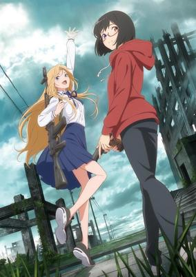

**Studio:** Liden Films Felix Film &nbsp;|&nbsp; **Episodes:** 12 &nbsp;|&nbsp; **Director:** Takuya Satō &nbsp;|&nbsp; **Aired/Released:** January 4 – March 22 &nbsp;|&nbsp; **Genres:** Shounen, Adventure, Action, Mystery, Parallel Universe, Science Fiction, Fantasy, Horror

> Her first encounter with Toriko Nishina was on the Otherside after seeing "that thing" and nearly dying. Ever since that day, exhausted university student Sorawo Kamikoshi's life changed. In this Otherworld, full of mystery, which exists alongside our own, dangerous beings like the Kunekune and Hasshaku-sama that are spoken of in real ghost stories appear. For research, for profit, and to find an important person, Toriko and Sorawo set foot into the abnormal.
>
> _Synopsis source: Kitsu_

[Wikipedia](https://en.wikipedia.org/wiki/Otherside_Picnic) · [Kitsu](https://kitsu.io/anime/urasekai-picnic)

---

### Suppose a Kid from the Last Dungeon Boonies Moved to a Starter Town

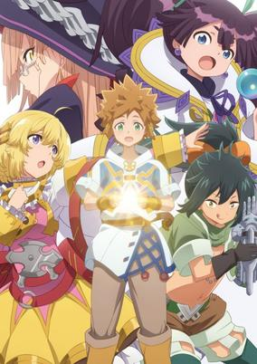

**Studio:** Liden Films &nbsp;|&nbsp; **Episodes:** 12 &nbsp;|&nbsp; **Director:** migmi &nbsp;|&nbsp; **Aired/Released:** January 4 – March 22 &nbsp;|&nbsp; **Genres:** Adventure, Fantasy, Magic, Comedy

> The story follows Lloyd, a budding adventurer who just wants to get stronger. His plan? Head to the capital and discover his true power, even though he grew up being considered a weakling. So Lloyd heads out from his hometown, which interestingly exists directly next to the most dangerous dungeon. He might not think of himself as strong, but he’ll soon learn that there’s even more of a difference between him and other starting adventurers. You know, because he grew up next to a deadly dungeon. He’s much stronger than he realizes.
>
> _Synopsis source: Kitsu_

[Wikipedia](https://en.wikipedia.org/wiki/Suppose_a_Kid_from_the_Last_Dungeon_Boonies_Moved_to_a_Starter_Town) · [Kitsu](https://kitsu.io/anime/tatoeba-last-dungeon-mae-no-mura-no-shounen-ga-joban-no-machi-de-kurasu-youna-monogatari)

---

### Gekidol

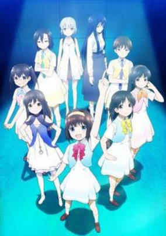

**Studio:** Hoods Entertainment &nbsp;|&nbsp; **Episodes:** 12 &nbsp;|&nbsp; **Director:** Shigeru Ueda &nbsp;|&nbsp; **Aired/Released:** January 5 – March 23 &nbsp;|&nbsp; **Genres:** Music

> Set five years after the mysterious disaster of a city's sudden disappearance, a group of girls fascinated by the "Theatrical Material System" using 3D holograms aims to brighten the stage during the city's post-apocalyptic recovery.
>
> _Synopsis source: Kitsu_

[Wikipedia](https://en.wikipedia.org/wiki/Gekidol) · [Kitsu](https://kitsu.io/anime/gekidol)

---

### Umamusume: Pretty Derby (season 2)

**Studio:** Studio Kai &nbsp;|&nbsp; **Episodes:** 13 &nbsp;|&nbsp; **Director:** Kei Oikawa &nbsp;|&nbsp; **Aired/Released:** January 5 – March 30 &nbsp;|&nbsp; **Genres:** Comedy, Juujin, Slice of Life, Sports

> Toukai Teiou, who has adored the undefeated Symboli Rudolph and is aiming for the Triple Crown, is attracting attention all over Japan ahead of the upcoming Japan Derby race.
>
> _Synopsis source: Kitsu_

[Kitsu](https://kitsu.io/anime/uma-musume-pretty-derby-season-2)

---

### I-Chu: Halfway Through the Idol

**Studio:** Lay-duce &nbsp;|&nbsp; **Episodes:** 12 &nbsp;|&nbsp; **Director:** Hitoshi Nanba &nbsp;|&nbsp; **Aired/Released:** January 6 – March 24 &nbsp;|&nbsp; **Genres:** Fantasy, Romance

> After dying of illness, she has been reincarnated as Celine, the selfish, fat, villainous duchess, sister of the heroine of a popular novel. If she stays this way, she will be killed by the hero prince and die a miserable death, just as in the novel. She vows to reform herself with all her might and begins to struggle, but she finds herself caught up in unexpected doting and obsession..! Will Celine be able to find "peaceful happiness"? A fantasy love story about a reincarnation in another world where she is loved too much by a Yandere.
>
> _Synopsis source: Kitsu_

[Wikipedia](https://en.wikipedia.org/wiki/I-Chu) · [Kitsu](https://kitsu.io/anime/odebu-akujo-ni-tensei-shitara-naze-ka-last-boss-ouji-sama-ni-shuuchaku-sareteimasu)

---

### Re:Zero − Starting Life in Another World (season 2, part 2) (Re:ZERO -Starting Life in Another World- Season 2 Part 2)

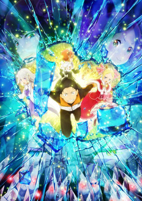

**Studio:** White Fox &nbsp;|&nbsp; **Episodes:** 12 &nbsp;|&nbsp; **Director:** Masaharu Watanabe &nbsp;|&nbsp; **Aired/Released:** January 6 – March 24 &nbsp;|&nbsp; **Genres:** Psychological, Drama, Thriller, Fantasy, Isekai, Magic, Violence

> After learning more about the Death Loop and Witches of Sin, Subaru vows to save Emilia and his friends from further doom.
>
> _Synopsis source: Kitsu_

[Kitsu](https://kitsu.io/anime/rezero-season-2-part-2)

---

### Beastars (season 2)

**Studio:** Orange &nbsp;|&nbsp; **Episodes:** 12 &nbsp;|&nbsp; **Director:** Shin'ichi Matsumi &nbsp;|&nbsp; **Aired/Released:** January 7 – March 25

[Wikipedia](https://en.wikipedia.org/wiki/Beastars)

---

### Heaven's Design Team

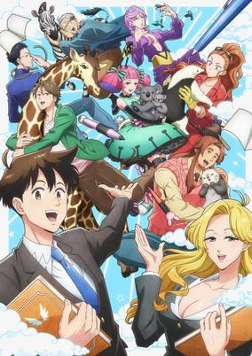

**Studio:** Asahi Production &nbsp;|&nbsp; **Episodes:** 12 &nbsp;|&nbsp; **Director:** Sōichi Masui &nbsp;|&nbsp; **Aired/Released:** January 7 – March 25 &nbsp;|&nbsp; **Genres:** Deity, Fantasy, Working Life, Slice of Life, Comedy

> "In Heaven's Animal Design Department, designers create a variety of new animals daily while contending with the unreasonable requests of their client: God. This series answers questions such as, 'Why can’t unicorns exist?', 'What makes an animal taste delicious?', 'What’s the most powerful creature in the ocean?', and, 'Bird versus snake: who would win?'"
>
> _Synopsis source: Kitsu_

[Wikipedia](https://en.wikipedia.org/wiki/Heaven%27s_Design_Team) · [Kitsu](https://kitsu.io/anime/tenchi-souzou-design-bu)

---

### Hortensia Saga

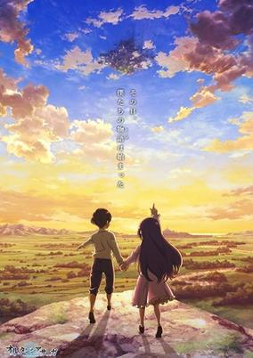

**Studio:** Liden Films &nbsp;|&nbsp; **Episodes:** 12 &nbsp;|&nbsp; **Director:** Yasuto Nishikata &nbsp;|&nbsp; **Aired/Released:** January 7 – March 25 &nbsp;|&nbsp; **Genres:** Fantasy, Fantasy World, Action, Adventure, Magic, Drama, War, Seinen, Historical, Swordplay

> When the duke of Hortensia murdered the king, he unleashed a wave of chaos that spilled the blood of many. Brazenly building his kingdom on the ashes of the old one, his violent rule has left many orphans in its wake. But now, the king’s heir has come of age. Living in secret as a man, she’s remained safe, and the time has come to gather allies to take back what is her’s—both country and throne! (Soure: Funimation)
>
> _Synopsis source: Kitsu_

[Wikipedia](https://en.wikipedia.org/wiki/Hortensia_Saga) · [Kitsu](https://kitsu.io/anime/hortensia-saga)

---

### Laid-Back Camp: Season 2

**Studio:** C-Station &nbsp;|&nbsp; **Episodes:** 13 &nbsp;|&nbsp; **Director:** Yoshiaki Kyogoku &nbsp;|&nbsp; **Aired/Released:** January 7 – April 1

---

### LBX Girls

**Studio:** Studio A-Cat &nbsp;|&nbsp; **Episodes:** 12 &nbsp;|&nbsp; **Director:** Keitaro Motonaga &nbsp;|&nbsp; **Aired/Released:** January 7 – March 25

[Wikipedia](https://en.wikipedia.org/wiki/Little_Battlers_Experience)

---

### Show by Rock!! Stars!!

**Studio:** Kinema Citrus &nbsp;|&nbsp; **Episodes:** 12 &nbsp;|&nbsp; **Director:** Takahiro Ikezoe (Chief) Daigo Yamagishi &nbsp;|&nbsp; **Aired/Released:** January 7 – March 25

[Wikipedia](https://en.wikipedia.org/wiki/Show_by_Rock!!)

---

### 2.43: Seiin High School Boys Volleyball Team

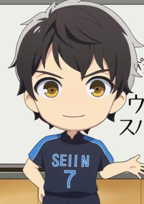

**Studio:** David Production &nbsp;|&nbsp; **Episodes:** 12 &nbsp;|&nbsp; **Director:** Yasuhiro Kimura &nbsp;|&nbsp; **Aired/Released:** January 8 – March 26 &nbsp;|&nbsp; **Genres:** Comedy, Super Deformed, Volleyball, Sports, Slice of Life

> Mini anime introducing the characters, released on the official Twitter.
>
> _Synopsis source: Kitsu_

[Kitsu](https://kitsu.io/anime/2-43-seiin-koukou-danshi-volley-bu-mini-anime)

---

### Bottom-tier Character Tomozaki

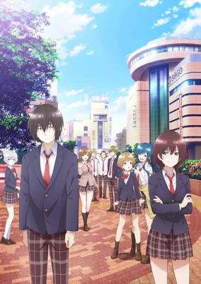

**Studio:** Project No.9 &nbsp;|&nbsp; **Episodes:** 12 &nbsp;|&nbsp; **Director:** Shinsuke Yanagi &nbsp;|&nbsp; **Aired/Released:** January 8 – March 26 &nbsp;|&nbsp; **Genres:** Drama, Romance, School Life, Harem

> Tomozaki is one of the best gamers in Japan, and in his opinion, the game of real life is one of the worst. No clear-cut rules for success, horribly balanced, and nothing makes sense. But then he meets a gamer who's just as good as him, and she offers to teach him a few exploits...
>
> _Synopsis source: Kitsu_

[Wikipedia](https://en.wikipedia.org/wiki/Bottom-tier_Character_Tomozaki) · [Kitsu](https://kitsu.io/anime/jaku-chara-tomozaki-kun)

---

### Idolls!

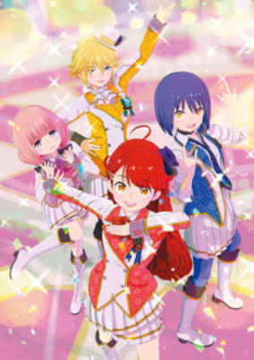

**Studio:** Shin-Ei Animation &nbsp;|&nbsp; **Episodes:** 10 &nbsp;|&nbsp; **Director:** Shōta Nakano &nbsp;|&nbsp; **Aired/Released:** January 8 – March 12 &nbsp;|&nbsp; **Genres:** Idol, Music

> The anime's production will use motion capture technology to capture the movements of the voice cast while simultaneously producing voice recordings.
>
> _Synopsis source: Kitsu_

[Kitsu](https://kitsu.io/anime/idolls)

---

### So I'm a Spider, So What?

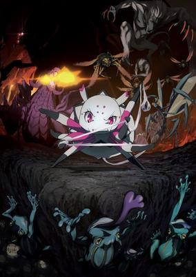

**Studio:** Millepensee &nbsp;|&nbsp; **Episodes:** 24 &nbsp;|&nbsp; **Director:** Shin Itagaki &nbsp;|&nbsp; **Aired/Released:** January 8 – July 3 &nbsp;|&nbsp; **Genres:** Comedy, Adventure, Fantasy, Isekai, Fantasy World

> When a mysterious explosion killed an entire class full of high school students, the souls of everyone in class was transported into a fantasy world and reincarnated. While some students were reincarnated as princes or prodigies, others were not as blessed. Our heroine, who was the lowest in the class, discovered that she was reincarnated as a spider!? Now at the bottom of the food chain, she needs to adapts to the current situation with willpower in order to live! Stuck in a dangerous labyrinth filled with monsters, it's eat or be eaten! This is the story of a spider doing whatever she can in order to survive!
>
> _Synopsis source: Kitsu_

[Wikipedia](https://en.wikipedia.org/wiki/So_I%27m_a_Spider,_So_What%3F) · [Kitsu](https://kitsu.io/anime/kumo-desu-ga-nani-ka)

---

### The Promised Neverland (season 2)

**Studio:** CloverWorks &nbsp;|&nbsp; **Episodes:** 11 &nbsp;|&nbsp; **Director:** Mamoru Kanbe &nbsp;|&nbsp; **Aired/Released:** January 8 – March 26

[Wikipedia](https://en.wikipedia.org/wiki/The_Promised_Neverland)

---

### The Quintessential Quintuplets ∬

**Studio:** Bibury Animation Studios &nbsp;|&nbsp; **Episodes:** 12 &nbsp;|&nbsp; **Director:** Kaori &nbsp;|&nbsp; **Aired/Released:** January 8 – March 26

[Wikipedia](https://en.wikipedia.org/wiki/The_Quintessential_Quintuplets)

---

### Back Arrow

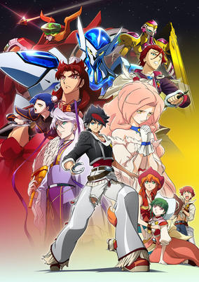

**Studio:** Studio VOLN &nbsp;|&nbsp; **Episodes:** 24 &nbsp;|&nbsp; **Director:** Gorō Taniguchi &nbsp;|&nbsp; **Aired/Released:** January 9 – June 19 &nbsp;|&nbsp; **Genres:** Fantasy, Fantasy World, Action, Mecha

> Ringarindo is a land surrounded by a wall. The wall covers, protects, cultivates, and nutures this land. The wall is god ... it is the foundation of this land of Ringarindo.One day, a mysterious man named Back Arrow appears in Essha village on the outskirts of Ringarindo. Arrow lost his memories, but says that all he knows is, "I came from beyond the wall." To restore his memories, Arrow heads out beyond the wall, but is embroiled in a battle with himself as the stakes.
>
> _Synopsis source: Kitsu_

[Wikipedia](https://en.wikipedia.org/wiki/Back_Arrow) · [Kitsu](https://kitsu.io/anime/back-arrow)

---

### Cells at Work!!

**Studio:** David Production &nbsp;|&nbsp; **Episodes:** 8 &nbsp;|&nbsp; **Director:** Hirofumi Ogura &nbsp;|&nbsp; **Aired/Released:** January 9 – February 27

[Wikipedia](https://en.wikipedia.org/wiki/Cells_at_Work!)

---

### Project Scard: Scar on the Praeter

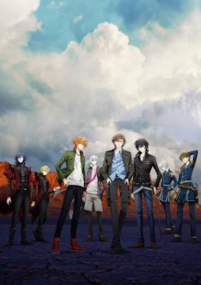

**Studio:** GoHands &nbsp;|&nbsp; **Episodes:** 13 &nbsp;|&nbsp; **Director:** Shingo Suzuki &nbsp;|&nbsp; **Aired/Released:** January 9 – April 3 &nbsp;|&nbsp; **Genres:** Action, Super Power

> Project Scard depicts the encounters and battles of those who have tattoos which possess the sealed powers of divine beasts and gods. The story is set in the Akatsuki Special Zone, a lawless zone in Tokyo. "Helios" are those who use the ability of the tattoos to protect the city, "Artemis" are committed to maintain security and control, whilst having a strong commercial motive, and the "Public Security Special Service" are Scard Staff of the metropolitan police department. They live through the turbulent days to keep on going.
>
> _Synopsis source: Kitsu_

[Wikipedia](https://en.wikipedia.org/wiki/Scar_on_the_Praeter) · [Kitsu](https://kitsu.io/anime/project-scard-praeter-no-kizu)

---

### The Hidden Dungeon Only I Can Enter

**Studio:** Okuruto Noboru &nbsp;|&nbsp; **Episodes:** 12 &nbsp;|&nbsp; **Director:** Kenta Ōnishi &nbsp;|&nbsp; **Aired/Released:** January 9 – March 27 &nbsp;|&nbsp; **Genres:** Harem, Ecchi, Adventure, Action, Fantasy

> Noir is the son of a minor noble with very little to his name other than a job offer—which is canceled before he can even start his first day. He does possess one rare trait, though: the magical ability to consult with a great sage, even if using the skill gives him terrible headaches! Unsure of what his future holds, he accesses the sage for advice on how to move forward and is directed to a secret dungeon filled with rare beasts and magical items. It is here that Noir will train, compiling experience and wealth, until he's powerful enough to change his fate.
>
> _Synopsis source: Kitsu_

[Wikipedia](https://en.wikipedia.org/wiki/The_Hidden_Dungeon_Only_I_Can_Enter) · [Kitsu](https://kitsu.io/anime/ore-dake-haireru-kakushi-dungeon)

---

### WIXOSS Diva(A)Live

**Studio:** J.C.Staff &nbsp;|&nbsp; **Episodes:** 12 &nbsp;|&nbsp; **Director:** Masato Matsune &nbsp;|&nbsp; **Aired/Released:** January 9 – March 27 &nbsp;|&nbsp; **Genres:** Card Games, Psychological, Idol

> The story moves the "Wixoss" card game to the online virtual space of "Wixossland" as it continues to grow more popular. The game allows players to become the LRIG avatars themselves. The most popular format in the game is "Diva Battle," which allows three players to team up to compete against other units for the most "Selector" fans. Some units are idol-themed, while others are DJ- and band-themed. (Source. ANN)
>
> _Synopsis source: Kitsu_

[Wikipedia](https://en.wikipedia.org/wiki/WIXOSS) · [Kitsu](https://kitsu.io/anime/wixoss-diva-a-live)

---

### Aikatsu Planet!

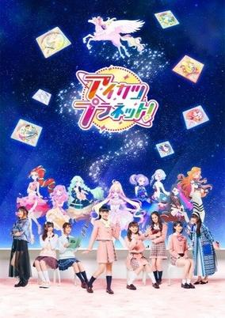

**Studio:** Bandai Namco Pictures &nbsp;|&nbsp; **Episodes:** 25 &nbsp;|&nbsp; **Director:** Ryūichi Kimura &nbsp;|&nbsp; **Aired/Released:** January 10 – June 27 &nbsp;|&nbsp; **Genres:** Idol, Music, Kids

> Aikatsu Planet is a world where anyone can assume the role of an avatar and become an adorably cute idol. Mao Otoha, an ordinary first-year student at the private academy Seirei High School, becomes the #1 idol Hana when Hana's previous alter ego Meisa Hinata suddenly disappeared. However, Mao's new role as the avatar Hana is a secret to everyone else.
>
> _Synopsis source: Kitsu_

[Wikipedia](https://en.wikipedia.org/wiki/Aikatsu_Planet!) · [Kitsu](https://kitsu.io/anime/aikatsu-planet)

---

### Cells at Work! Code Black

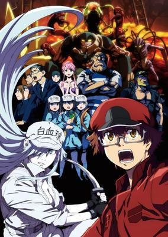

**Studio:** Liden Films &nbsp;|&nbsp; **Episodes:** 13 &nbsp;|&nbsp; **Director:** Hideyo Yamamoto &nbsp;|&nbsp; **Aired/Released:** January 10 – March 21 &nbsp;|&nbsp; **Genres:** Action, Seinen, Drama, Dystopia, Science Fiction, Working Life, Comedy, Violence

> In this new spin-off, a newbie Red Blood Cell is one of 37 trillion working to keep this body running. But something's wrong! Stress hormones keep yelling at him to go faster. The blood vessels are crusted over with cholesterol. Ulcers, fatty liver, trouble (ahem) downstairs... It's hard for a cell to keep working when every day is a CODE BLACK! There are trillions of cells in the human body, and they all have to work hard to keep that body alive. But what if that body isn't taking great care of itself? This new take stars a fresh-faced Red Blood Cell and his friend, the buxom White Blood Cell, as they struggle to keep themselves and their world together through alcoholism, smoking, erectile dysfunction, athlete's foot, gout. It turns out the same immune cells that fight off the common cold also have to deal with troubles of a distinctly more adult nature...
>
> _Synopsis source: Kitsu_

[Wikipedia](https://en.wikipedia.org/wiki/Cells_at_Work!_Code_Black) · [Kitsu](https://kitsu.io/anime/hataraku-saibou-black-tv)

---

### Dr. Ramune: Mysterious Disease Specialist (Dr. Ramune -Mysterious Disease Specialist-)

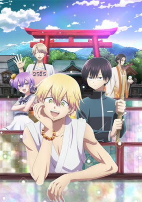

**Studio:** Platinum Vision &nbsp;|&nbsp; **Episodes:** 12 &nbsp;|&nbsp; **Director:** Hideaki Ōba &nbsp;|&nbsp; **Aired/Released:** January 10 – March 28 &nbsp;|&nbsp; **Genres:** Psychological, Supernatural, Shounen

> As long as hearts exist inside people, there will always be those who suffer. And then something "strange" enters their mind and causes a strange disease to manifest itself in the body. The illness, which is called a "mystery disease" is unknown to most, but certainly exists. There is a doctor and apprentice who fights the disease, which modern medicine cannot cure. His name is Ramune. He acts freely all the time, is foul-mouthed, and doesn't even look like a doctor! However, once he is confronted with the mysterious disease, he is able to quickly uncover the root cause of his patients' deep-seated distress and cure them. And beyond that...
>
> _Synopsis source: Kitsu_

[Kitsu](https://kitsu.io/anime/kai-byoui-ramune)

---

### Horimiya

**Studio:** CloverWorks &nbsp;|&nbsp; **Episodes:** 13 &nbsp;|&nbsp; **Director:** Masashi Ishihama &nbsp;|&nbsp; **Aired/Released:** January 10 – April 4

[Wikipedia](https://en.wikipedia.org/wiki/Hori-san_to_Miyamura-kun)

---

### Idoly Pride

**Studio:** Lerche &nbsp;|&nbsp; **Episodes:** 12 &nbsp;|&nbsp; **Director:** Yū Kinome &nbsp;|&nbsp; **Aired/Released:** January 10 – March 28 &nbsp;|&nbsp; **Genres:** Idol, Music, Drama, Slice of Life, Supernatural

> It was officially announced in the live-streamed program last night that Cyber Agent's consolidated subsidiary QualiArts, Sony Music Entertainment group's Music Ray'n, and character content planning company Straight Edge's mixed-media idol-themed project "IDOLY PRIDE" will include a TV anime. It will be produced as the first entry from Cyber Agent's newly-launched animation label "CAAnimation."
>
> _Synopsis source: Kitsu_

[Wikipedia](https://en.wikipedia.org/wiki/Idoly_Pride) · [Kitsu](https://kitsu.io/anime/idoly-pride)

---

### Kemono Jihen

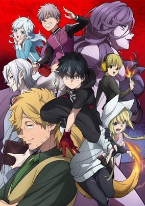

**Studio:** Ajia-do Animation Works &nbsp;|&nbsp; **Episodes:** 12 &nbsp;|&nbsp; **Director:** Masaya Fujimori &nbsp;|&nbsp; **Aired/Released:** January 10 – March 28 &nbsp;|&nbsp; **Genres:** Demon, Shounen, Action, Mystery, Supernatural, Dark Fantasy, Detective, Juujin

> When a series of animal bodies that rot away after a single night begin appearing in a remote mountain village, Inugami, a detective from Tokyo who specializes in the occult, is called to investigate. While working the case, he befriends a strange boy who works in the field every day instead of going to school. Shunned by his peers and nicknamed "Dorota-bou" after a yokai that lives in the mud, he helps Inugami uncover the truth behind the killings—but supernatural forces are at work, and while Dorota-bou is just a nickname, it might not be the only thing about the boy that isn't human.
>
> _Synopsis source: Kitsu_

[Wikipedia](https://en.wikipedia.org/wiki/Kemono_Jihen) · [Kitsu](https://kitsu.io/anime/kemono-jihen)

---

### SK8 the Infinity

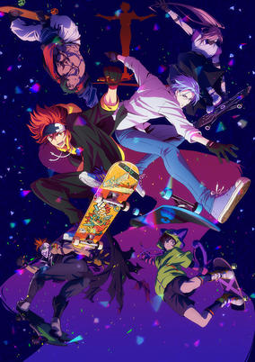

**Studio:** Bones &nbsp;|&nbsp; **Episodes:** 12 &nbsp;|&nbsp; **Director:** Hiroko Utsumi &nbsp;|&nbsp; **Aired/Released:** January 10 – April 4 &nbsp;|&nbsp; **Genres:** Sports, School Life, Action, Comedy, Drama, Slapstick

> Reki, a high school sophomore and skater, is addicted to "S," a highly secret and dangerous downhill skateboarding race that takes place in an abandoned mine. The skaters are especially wild about the "beefs," or heated battles that erupt in the races. Reki takes Langa, a transfer student returning to Japan after studying abroad, to the mine where the races are held. Langa, who has no skateboarding experience, finds himself pulled into the world of "S"...
>
> _Synopsis source: Kitsu_

[Wikipedia](https://en.wikipedia.org/wiki/SK8_the_Infinity) · [Kitsu](https://kitsu.io/anime/sk8)

---

### Skate-Leading Stars

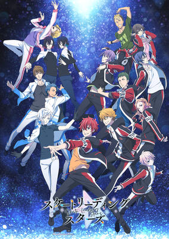

**Studio:** J.C.Staff &nbsp;|&nbsp; **Episodes:** 12 &nbsp;|&nbsp; **Director:** Gorō Taniguchi (Chief) Toshinori Fukushima &nbsp;|&nbsp; **Aired/Released:** January 10 – March 28 &nbsp;|&nbsp; **Genres:** Sports

> The story follows high schooler Kensei Maeshima who is swept back into the world of skating when his rival (who also led him to quit figure skating in the first place) Reo Shinozaki announces he will be competing in the team sport of skate-leading. When Maeshima meets Hayato Sasugai, a boy who knows all about Maeshima's time as a figure skater, he's convinced to join skate-leading and take on Shinozaki again! (Source: Funimation) Note: Funimation and their partnering services (AnimeLab and Wakanim) premiered the anime on the 27th of December 2020 while Japanese broadcast started the 10th of January 2021.
>
> _Synopsis source: Kitsu_

[Wikipedia](https://en.wikipedia.org/wiki/Skate-Leading_Stars) · [Kitsu](https://kitsu.io/anime/skate-leading-stars)

---

### World Trigger (season 2)

**Studio:** Toei Animation &nbsp;|&nbsp; **Episodes:** 12 &nbsp;|&nbsp; **Director:** Morio Hatano &nbsp;|&nbsp; **Aired/Released:** January 10 – April 4

[Wikipedia](https://en.wikipedia.org/wiki/World_Trigger)

---

### Yatogame-chan Kansatsu Nikki (season 3)

**Studio:** Saetta &nbsp;|&nbsp; **Episodes:** 12 &nbsp;|&nbsp; **Director:** Hisayoshi Hirasawa &nbsp;|&nbsp; **Aired/Released:** January 10 – March 28

[Wikipedia](https://en.wikipedia.org/wiki/Yatogame-chan_Kansatsu_Nikki)

---

### Ex-Arm

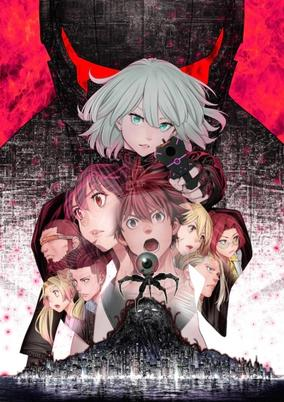

**Studio:** Visual Flight &nbsp;|&nbsp; **Episodes:** 12 &nbsp;|&nbsp; **Director:** Yoshikatsu Kimura &nbsp;|&nbsp; **Aired/Released:** January 11 – March 29 &nbsp;|&nbsp; **Genres:** Action, Science Fiction, Seinen, Ecchi, Mecha, Future

> 2014: Akira Natsume seems to almost have a phobia of electrical devices while also being very good at diagnosing them. He resolves to change himself for the better and get a girlfriend like his older brother did. ...But then Akira suddenly dies in an accident. 16 years later a special policewoman and her android partner retrieve and activate a highly advanced AI and superweapon called EX-ARM and put it into full control of their ship as a last resort. Turns out the AI is actually just Akira's brain!
>
> _Synopsis source: Kitsu_

[Wikipedia](https://en.wikipedia.org/wiki/Ex-Arm) · [Kitsu](https://kitsu.io/anime/ex-arm)

---

### Mushoku Tensei: Jobless Reincarnation (part 1) (Mushoku Tensei: Jobless Reincarnation)

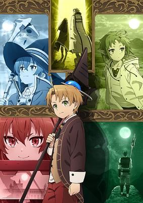

**Studio:** Studio Bind &nbsp;|&nbsp; **Episodes:** 11 &nbsp;|&nbsp; **Director:** Manabu Okamoto &nbsp;|&nbsp; **Aired/Released:** January 11 – March 22 &nbsp;|&nbsp; **Genres:** Fantasy, Magic, Isekai, Ecchi, Drama, Harem

> When a 34-year-old underachiever gets run over by a bus, his story doesn't end there. Reincarnated in a new world as an infant, Rudy will seize every opportunity to live the life he's always wanted. Armed with new friends, some freshly acquired magical abilities, and the courage to do the things he's always dreamed of, he's embarking on an epic adventure—with all of his past experience intact!
>
> _Synopsis source: Kitsu_

[Wikipedia](https://en.wikipedia.org/wiki/Mushoku_Tensei) · [Kitsu](https://kitsu.io/anime/mushoku-tensei-isekai-ittara-honki-dasu)

---

### Non Non Biyori Nonstop

**Studio:** Silver Link &nbsp;|&nbsp; **Episodes:** 12 &nbsp;|&nbsp; **Director:** Shinya Kawatsura &nbsp;|&nbsp; **Aired/Released:** January 11 – March 29

[Wikipedia](https://en.wikipedia.org/wiki/Non_Non_Biyori)

---

### Azur Lane: Slow Ahead!

**Studio:** Candy Box Yostar Pictures &nbsp;|&nbsp; **Episodes:** 12 &nbsp;|&nbsp; **Director:** Masato Jinbo &nbsp;|&nbsp; **Aired/Released:** January 12 – March 30 &nbsp;|&nbsp; **Genres:** Military, Science Fiction, Slice of Life

> Animation of the Azur Lane 4-koma manga.
>
> _Synopsis source: Kitsu_

[Kitsu](https://kitsu.io/anime/azur-lane-bisoku-zenshin)

---

### That Time I Got Reincarnated as a Slime (season 2, part 1)

**Studio:** Eight Bit &nbsp;|&nbsp; **Episodes:** 12 &nbsp;|&nbsp; **Director:** Atsushi Nakayama &nbsp;|&nbsp; **Aired/Released:** January 12 – March 30

[Wikipedia](https://en.wikipedia.org/wiki/That_Time_I_Got_Reincarnated_as_a_Slime)

---

### True Cooking Master Boy (season 2)

**Studio:** NAS &nbsp;|&nbsp; **Episodes:** 12 &nbsp;|&nbsp; **Director:** Itsuro Kawasaki &nbsp;|&nbsp; **Aired/Released:** January 12 – March 30

[Wikipedia](https://en.wikipedia.org/wiki/Ch%C5%ABka_Ichiban!)

---

### Bungo Stray Dogs Wan!

**Studio:** Bones Nomad &nbsp;|&nbsp; **Episodes:** 12 &nbsp;|&nbsp; **Director:** Satonobu Kikuchi &nbsp;|&nbsp; **Aired/Released:** January 13 – March 31

[Wikipedia](https://en.wikipedia.org/wiki/Bungo_Stray_Dogs)

---

### Log Horizon: Destruction of the Round Table

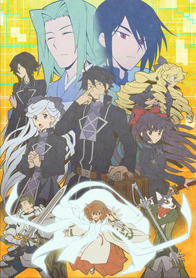

**Studio:** Studio Deen &nbsp;|&nbsp; **Episodes:** 12 &nbsp;|&nbsp; **Director:** Shinji Ishihira &nbsp;|&nbsp; **Aired/Released:** January 13 – March 31 &nbsp;|&nbsp; **Genres:** Fantasy, Fantasy World, Adventure, Action, Comedy, Virtual Reality, Isekai, Politics

> The third season of Log Horizon. It’s been a year since Shiroe and his friends were trapped in Akiba due to the Catastrophe. Their forging of the Round Table has brought order and prosperity to its people. But fracturing political alliances and the constant menace of the Genius monsters threaten to destabilize all they’ve fought for and built. Can faith be restored and they persevere, or is its destruction truly inevitable?
>
> _Synopsis source: Kitsu_

[Kitsu](https://kitsu.io/anime/log-horizon-3rd-season)

---

### Redo of Healer (Re:Zero Starting Life in Another World - Director's Cut)

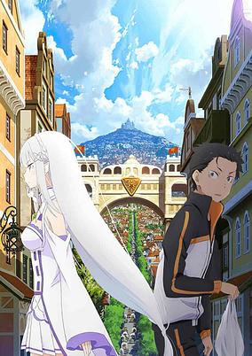

**Studio:** TNK &nbsp;|&nbsp; **Episodes:** 12 &nbsp;|&nbsp; **Director:** Takuya Asaoka &nbsp;|&nbsp; **Aired/Released:** January 13 – March 31 &nbsp;|&nbsp; **Genres:** Fantasy, Fantasy World, Adventure, Action, Isekai, Magic, Drama, Violence

> The first season of Re:ZERO -Starting Life in Another World- is being rebroadcast in edited one-hour episodes from January 1, condensing the 25 episode series into just 12 episodes. The edited episode will contain new animation linking the first season to the second. A new PV was released recapping the first season set to the banger of the first season OP, “Redo” by Konomi Suzuki.
>
> _Synopsis source: Kitsu_

[Wikipedia](https://en.wikipedia.org/wiki/Redo_of_Healer) · [Kitsu](https://kitsu.io/anime/re-zero-kara-hajimeru-isekai-seikatsu-re-start)

---

### The Seven Deadly Sins: Dragon's Judgement

**Studio:** Studio Deen &nbsp;|&nbsp; **Episodes:** 24 &nbsp;|&nbsp; **Director:** Susumu Nishizawa &nbsp;|&nbsp; **Aired/Released:** January 13 – June 23

---

### Wonder Egg Priority

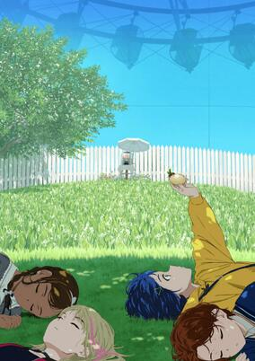

**Studio:** CloverWorks &nbsp;|&nbsp; **Episodes:** 12 &nbsp;|&nbsp; **Director:** Shin Wakabayashi &nbsp;|&nbsp; **Aired/Released:** January 13 – June 30 &nbsp;|&nbsp; **Genres:** Slice of Life, Drama, Action, Fantasy, Psychological, Parental Abandonment, Mystery, Friendship, Japan, Thriller

> This is the story of Ai, an introverted girl whose fate is forever changed when she acquires a mysterious “Wonder Egg” from a deserted arcade. That night, her dreams blend into reality, and as other girls obtain their own Wonder Eggs, Ai discovers new friends—and the magic within herself.
>
> _Synopsis source: Kitsu_

[Wikipedia](https://en.wikipedia.org/wiki/Wonder_Egg_Priority) · [Kitsu](https://kitsu.io/anime/wonder-egg-priority)

---

### World Witches Take Off!

**Studio:** acca effe Giga Production &nbsp;|&nbsp; **Episodes:** 12 &nbsp;|&nbsp; **Director:** Fumio Ito &nbsp;|&nbsp; **Aired/Released:** January 13 – March 31

[Wikipedia](https://en.wikipedia.org/wiki/Strike_Witches)

---

### Dr. Stone: Stone Wars

**Studio:** TMS/8PAN &nbsp;|&nbsp; **Episodes:** 11 &nbsp;|&nbsp; **Director:** Shinya Iino &nbsp;|&nbsp; **Aired/Released:** January 14 – March 25

[Wikipedia](https://en.wikipedia.org/wiki/Dr._Stone_season_2)

---

### Sorcerous Stabber Orphen: Battle of Kimluck (Sorcerous Stabber Orphen)

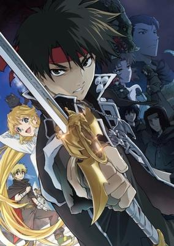

**Studio:** Studio Deen &nbsp;|&nbsp; **Episodes:** 11 &nbsp;|&nbsp; **Director:** Takayuki Hamana &nbsp;|&nbsp; **Aired/Released:** January 20 – March 31 &nbsp;|&nbsp; **Genres:** Fantasy, Magic, Action, Adventure, Martial Arts, Drama

> A sorcerer who was once the top student of the famous Tower of Fang, now spends his time chasing around his hopeless clients as a moneylender, at least until his client comes up with a plan to make money: marriage fraud. Unwillingly being dragged in to the plan, Orphen encounters a monster who has long been his goal since the day he left the Tower of Fang. Between those who seek to kill the monster and Orphen, giving everything to protect the monster, his lousy but peaceful days end. Trying to turn back his sister, Azalie, back to her true form leads to many more mysteries and the key to the secret to the world.
>
> _Synopsis source: Kitsu_

[Wikipedia](https://en.wikipedia.org/wiki/Sorcerous_Stabber_Orphen) · [Kitsu](https://kitsu.io/anime/majutsushi-orphen-hagure-tabi)

---

### D4DJ Petit Mix

**Studio:** DMM.futureworks W-Toon Studio &nbsp;|&nbsp; **Episodes:** 26 &nbsp;|&nbsp; **Director:** Seiya Miyajima &nbsp;|&nbsp; **Aired/Released:** February 5 – July 30 &nbsp;|&nbsp; **Genres:** Music, Slice of Life

> Having moved back to Japan from abroad, Rinku Aimoto transfers to Yoba Academy where DJing is popular. She is deeply moved by a DJ concert she sees there, and decides to form a unit of her own with Maho Akashi, Muni Ohnaruto, and Rei Togetsu.While interacting with the other DJ units like Peaky P-key and Photon Maiden, Rinku and her friends aim for the high stage!
>
> _Synopsis source: Kitsu_

[Wikipedia](https://en.wikipedia.org/wiki/D4DJ) · [Kitsu](https://kitsu.io/anime/d4dj-first-mix)

---

### Kiyo in Kyoto: From the Maiko House

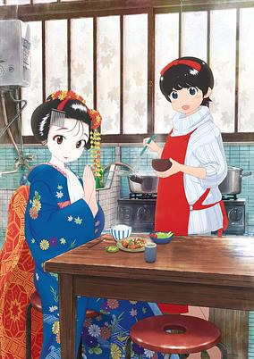

**Studio:** J.C.Staff &nbsp;|&nbsp; **Episodes:** 12 &nbsp;|&nbsp; **Director:** Yōhei Suzuki &nbsp;|&nbsp; **Aired/Released:** February 25 – January 27, 2022 &nbsp;|&nbsp; **Genres:** Slice of Life, Comedy, Shounen, Cooking

> Kiyo and Sumire came to Kyoto from Aomori Prefecture, dreaming of becoming maiko. But after an unexpected turn of events, Kiyo starts working as the live-in cook at the Maiko House. Their story unfolds in Kagai, the Geiko and maiko district in Kyoto, alongside their housemate maikos. Kiyo nourishes them daily with her homecooked meals, and Sumire strives toward her promising future as the once-in-a-century maiko.
>
> _Synopsis source: Kitsu_

[Wikipedia](https://en.wikipedia.org/wiki/Kiyo_in_Kyoto) · [Kitsu](https://kitsu.io/anime/maiko-san-chi-no-makanai-san)

---

### Tropical-Rouge! Pretty Cure

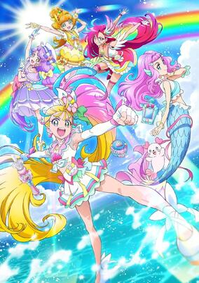

**Studio:** Toei Animation &nbsp;|&nbsp; **Episodes:** 46 &nbsp;|&nbsp; **Director:** Yutaka Tsuchida &nbsp;|&nbsp; **Aired/Released:** February 28 – January 30, 2022 &nbsp;|&nbsp; **Genres:** Magical Girl

> Manatsu Natsuumi is a first-year junior high school student born and raised on a small island. On the day she moves from the island, She meets Laura, a mermaid girl who has come to the earth alone in search of the legendary warrior, PreCure. Laura's hometown, Grand Ocean, is attacked by a witch who lives in the dark depths of the ocean, and all of their motivational power is taken away. It is said that if the motivational power of humans is also taken away, the world will be in deep trouble. Laura is captured by the witch's servant, and Manatsu transforms into Cure Summer to save her.
>
> _Synopsis source: Kitsu_

[Wikipedia](https://en.wikipedia.org/wiki/Tropical-Rouge!_Pretty_Cure) · [Kitsu](https://kitsu.io/anime/tropical-rouge-precure)

---

### My Hero Academia (season 5) (My Hero Academia Season 5)

**Studio:** Bones &nbsp;|&nbsp; **Episodes:** 25 &nbsp;|&nbsp; **Director:** Kenji Nagasaki (Chief) Masahiro Mukai &nbsp;|&nbsp; **Aired/Released:** March 27 – September 25 &nbsp;|&nbsp; **Genres:** Action, Superhero, Super Power, School Life, Shounen

> The rivalry between Class 1-A and Class 1-B heats up in a joint training battle. Eager to be a part of the hero course, brainwashing buff Shinso is tasked with competing on both sides. But as each team faces their own weaknesses and discovers new strengths, this showdown might just become a toss-up.
>
> _Synopsis source: Kitsu_

[Wikipedia](https://en.wikipedia.org/wiki/My_Hero_Academia_season_5) · [Kitsu](https://kitsu.io/anime/boku-no-hero-academia-5th-season)

---

### Godzilla Singular Point

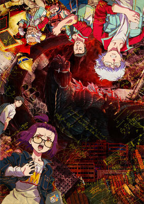

**Studio:** Bones Orange &nbsp;|&nbsp; **Episodes:** 13 &nbsp;|&nbsp; **Director:** Atsushi Takahashi &nbsp;|&nbsp; **Aired/Released:** April 1 – June 24 &nbsp;|&nbsp; **Genres:** Science Fiction, Future, Military, Action

> This series features an original story, which depicts the young geniuses Mei Kamino, a female researcher, and Yun Arikawa, a male engineer, as they take on an unprecedented threat with their companions. When danger comes up from the depths, only young geniuses Mei, Yun, and their team can face the threat in Godzilla Singular Point! (Source: Netflix) Each episode was released one week in advance of the TV broadcast beginning on March 25, 2021. Regular TV broadcast began on April 1, 2021.
>
> _Synopsis source: Kitsu_

[Wikipedia](https://en.wikipedia.org/wiki/Godzilla_Singular_Point) · [Kitsu](https://kitsu.io/anime/godzilla-s-p)

---

### Shaman King

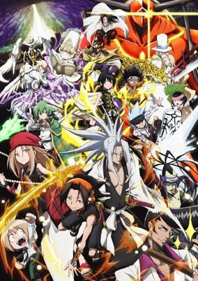

**Studio:** Bridge &nbsp;|&nbsp; **Episodes:** 52 &nbsp;|&nbsp; **Director:** Joji Furuta &nbsp;|&nbsp; **Aired/Released:** April 1 – April 21, 2022 &nbsp;|&nbsp; **Genres:** Shounen, Super Power, Adventure, Action, Comedy, Magic, Swordplay, Proxy Battles

> Shamans are extraordinary individuals with the ability to communicate with ghosts, spirits, and gods, which are invisible to ordinary people. The Shaman Fight—a prestigious tournament pitting shamans from all over the world against each other—is held every five hundred years, where the winner is crowned Shaman King. This title allows the current incumbent to call upon the Great Spirit and shape the world as they see fit. Finding himself late for class one night, Manta Oyamada, an ordinary middle school student, decides to take a shortcut through the local cemetery. Noticing him, a lone boy sitting on a gravestone invites Manta to stargaze with "them." Realizing that "them" refers to the boy and his ghostly friends, Manta flees the terror. Later, the boy introduces himself as You Asakura, a Shaman-in-training, and demonstrates his powers by teaming up with the ghost of six-hundred-year-old samurai Amidamaru to save Manta from a group of thugs. You befriends Manta due to his ability to see spirits, and with the help of Amidamaru, they set out to accomplish You's goal of becoming the next Shaman King. [Written by MAL Rewrite]
>
> _Synopsis source: Kitsu_

[Wikipedia](https://en.wikipedia.org/wiki/Shaman_King_(2021_TV_series)) · [Kitsu](https://kitsu.io/anime/shaman-king-2021)

---

### Motto! Majime ni Fumajime Kaiketsu Zorori (season 2)

**Studio:** Ajia-do Animation Works Bandai Namco Pictures &nbsp;|&nbsp; **Episodes:** 25 &nbsp;|&nbsp; **Director:** Takahide Ogata &nbsp;|&nbsp; **Aired/Released:** April 2 – October 22

[Wikipedia](https://en.wikipedia.org/wiki/Kaiketsu_Zorori)

---

### SSSS.Dynazenon

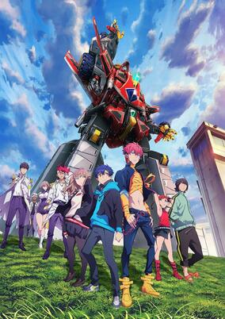

**Studio:** Trigger &nbsp;|&nbsp; **Episodes:** 12 &nbsp;|&nbsp; **Director:** Akira Amemiya &nbsp;|&nbsp; **Aired/Released:** April 2 – June 18 &nbsp;|&nbsp; **Genres:** Mecha, Science Fiction, Action

> One day, Yomogi Asanaka, a first-year student at Fujiyokidai High School, runs into a mysterious man named Gauma who claims to be a “kaiju user.” The sudden appearance of a kaiju is followed by the entry of the gigantic robot, Dynazenon. In the wrong place at the wrong time are Yume Minami, Koyomi Yamanaka, and Chise Asukagawa, who are dragged into the fight against the kaiju.
>
> _Synopsis source: Kitsu_

[Wikipedia](https://en.wikipedia.org/wiki/SSSS.Dynazenon) · [Kitsu](https://kitsu.io/anime/SSSS-Dynazenon)

---

### Burning Kabaddi

**Studio:** TMS Entertainment &nbsp;|&nbsp; **Episodes:** 12 &nbsp;|&nbsp; **Director:** Kazuya Ichikawa &nbsp;|&nbsp; **Aired/Released:** April 3 – June 19 &nbsp;|&nbsp; **Genres:** Sports, School Clubs, School Life

> First-year high schooler Tatsuya Yoigoshi, the former ace of a junior high school soccer team who has come to dislike sports, receives an invitation to join the Kabaddi club. Initially mocking the idea of Kabaddi, he takes an interest after watching an intense competition akin to martial arts at a practice session.
>
> _Synopsis source: Kitsu_

[Wikipedia](https://en.wikipedia.org/wiki/Burning_Kabaddi) · [Kitsu](https://kitsu.io/anime/shakunetsu-kabaddi)

---

### Let's Make a Mug Too

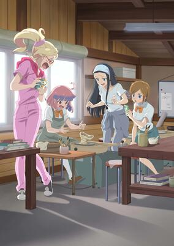

**Studio:** Nippon Animation &nbsp;|&nbsp; **Episodes:** 12 &nbsp;|&nbsp; **Director:** Jun Kamiya &nbsp;|&nbsp; **Aired/Released:** April 3 – June 21 &nbsp;|&nbsp; **Genres:** Working Life, Slice of Life, The Arts, Comedy

> The city of Tajimi, located in the southern part of Gifu Prefecture, Japan, is famous for Mino earthenware. The city is dotted with historical pottery producers and ceramic art museums. It has facilities where you can try your hand at making pottery, and many restaurants that serve food on Minoware dishes. The story begins when a high school girl moves to a shopping street in Tajimi. Many encounters await her, friends, town folk, ceramic art, etc. What will she discover in a town famous for ceramic?
>
> _Synopsis source: Kitsu_

[Wikipedia](https://en.wikipedia.org/wiki/Let%27s_Make_a_Mug_Too) · [Kitsu](https://kitsu.io/anime/yakunara-mug-cup-mo)

---

### Sushi Sumo

**Studio:** Shirogumi &nbsp;|&nbsp; **Episodes:** 52 &nbsp;|&nbsp; **Director:** Yūta Sukegawa &nbsp;|&nbsp; **Aired/Released:** April 3 – March 26, 2022 &nbsp;|&nbsp; **Genres:** Martial Arts, Sports, Comedy

> Sushi have become sumo wrestlers!! Which SUSHI ingredient is the strongest of all!? Tamago-nosato, Otoro-yama, Salmon-zakura, Kurumaebi-zou, Ikura-maru……and so many more. Each unique sumo wrestler uses its ingredients to its advantage, unleashing a wide range of techniques. So, who will win today’s match!? Put some spirit into it! “Hakkeyoi Nokotta!”
>
> _Synopsis source: Kitsu_

[Wikipedia](https://en.wikipedia.org/wiki/Sushi_Sumo) · [Kitsu](https://kitsu.io/anime/dosukoi-sushi-zumo)

---

### Those Snow White Notes

**Studio:** Shin-Ei Animation &nbsp;|&nbsp; **Episodes:** 12 &nbsp;|&nbsp; **Director:** Hiroaki Akagi &nbsp;|&nbsp; **Aired/Released:** April 3 – June 19 &nbsp;|&nbsp; **Genres:** Music, Drama, School Life, School Clubs, Performance

> When Setsu's grandfather died, so did Setsu's "sound"—his unique creative spark. Grieving, he goes to Tokyo to find himself...but manages to become totally, literally lost on his first day. Only a chance meeting with Yuna—aka Yuka, the hostess—saves him from being robbed. At first glance their lives seem totally different, but they're both striving for their dreams—hers, of being an actress, and his, of developing his talent with the shamisen—and it could just be that life in the raucous, unfeeling urban sprawl of Tokyo could just be what binds their fates together...
>
> _Synopsis source: Kitsu_

[Wikipedia](https://en.wikipedia.org/wiki/Those_Snow_White_Notes) · [Kitsu](https://kitsu.io/anime/mashiro-no-oto)

---

### Vivy: Fluorite Eye's Song (Vivy -Fluorite Eye's Song-)

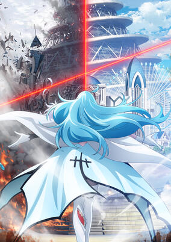

**Studio:** Wit Studio &nbsp;|&nbsp; **Episodes:** 13 &nbsp;|&nbsp; **Director:** Shinpei Ezaki &nbsp;|&nbsp; **Aired/Released:** April 3 – June 19 &nbsp;|&nbsp; **Genres:** Science Fiction, Action, Drama, Thriller, Android, Robot, Time Travel, Idol, Music

> Nierland—an A.I complex theme park where dreams, hopes, and science intermingle. Created as the first-ever autonomous humanoid A.I, Vivy acts as an A.I cast for the establishment. To fulfill her mission of making everyone happy through songs, she continues to take the stage and perform with all her heart. However, the theme park was still lacking in popularity. One day, an A.I named Matsumoto appears before Vivy and explains that he has travelled from 100 years into the future, with the mission to correct history with Vivy and prevent the war between A.I and humanity that is set to take place 100 years later. What sort of future will the encounter of two A.I with different missions redraw? This is the story of A.I destroying A.I. A.I diva Vivy's 100-year journey begins.
>
> _Synopsis source: Kitsu_

[Kitsu](https://kitsu.io/anime/vivy-fluorite-eye-s-song)

---

### Combatants Will Be Dispatched!

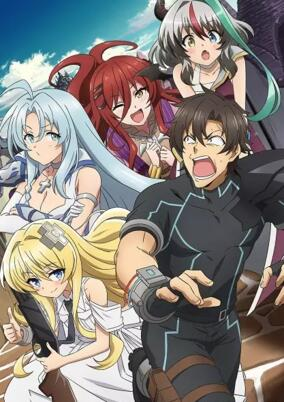

**Studio:** J.C.Staff &nbsp;|&nbsp; **Episodes:** 12 &nbsp;|&nbsp; **Director:** Hiroaki Akagi &nbsp;|&nbsp; **Aired/Released:** April 4 – June 20 &nbsp;|&nbsp; **Genres:** Fantasy, Science Fiction, Action, Ecchi, Comedy, Fantasy World, Adventure, Demon, Android

> The Secret Society Kisaragi has one mission: world domination! They claim to be an evil organization, but their scientist is eccentric, their hot female generals wear little clothing, and they’re surprisingly concerned about the fate of the world!? No. 6 is a Combatant for Kisaragi, meaning his body has been reconstructed to be stronger and obey the orders of the generals. His latest mission? To do recon on an unknown alien planet with his new partner, the deadpan android Alice. There, he meets a busty female knight...riding a unicorn!? Thus begins their hilarious invasion of a magical fantasy world!
>
> _Synopsis source: Kitsu_

[Wikipedia](https://en.wikipedia.org/wiki/Combatants_Will_Be_Dispatched!) · [Kitsu](https://kitsu.io/anime/sentouin-hakenshimasu)

---

### Dragon Goes House-Hunting

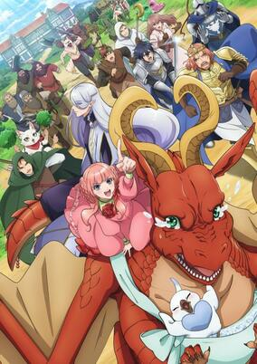

**Studio:** Signal.MD &nbsp;|&nbsp; **Episodes:** 12 &nbsp;|&nbsp; **Director:** Haruki Kasugamori &nbsp;|&nbsp; **Aired/Released:** April 4 – June 20 &nbsp;|&nbsp; **Genres:** Comedy, Fantasy, Dragon

> Letty is not very good at being a dragon. Actually, he’s so terrible at it that his dad went and kicked him out of the house! What’s a skittish monster of myth to do in a world where everyone sees him as material for their next suit of armor? Why, find a safe place to call home, of course. With the help of a slightly evil elvish architect, Letty’s quest for the ultimate draconic domicile begins!
>
> _Synopsis source: Kitsu_

[Wikipedia](https://en.wikipedia.org/wiki/Dragon_Goes_House-Hunting) · [Kitsu](https://kitsu.io/anime/dragon-ie-wo-kau)

---

### Farewell, My Dear Cramer

**Studio:** Liden Films &nbsp;|&nbsp; **Episodes:** 13 &nbsp;|&nbsp; **Director:** Seiki Takuno &nbsp;|&nbsp; **Aired/Released:** April 4 – June 27 &nbsp;|&nbsp; **Genres:** Soccer, Sports, Drama, Shounen

> With no soccer accomplishments to speak of during the entirety of Sumire Suou's junior high school years, the young wing gets an odd offer. Suou's main rival, Midori Soshizaki, invites her to join up on the same team in high school, with a promise that she'll never let Suou "play alone." It's an earnest offer, but the question is whether Suou will take her up on it. Thus the curtain opens on a story that collects an enormous cast of individual soccer-playing personalities!
>
> _Synopsis source: Kitsu_

[Wikipedia](https://en.wikipedia.org/wiki/Farewell,_My_Dear_Cramer) · [Kitsu](https://kitsu.io/anime/sayonara-watashi-no-cramer)

---

### Mazica Party

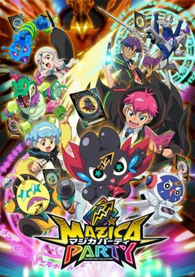

**Studio:** OLM &nbsp;|&nbsp; **Director:** Shinji Ushiro &nbsp;|&nbsp; **Aired/Released:** April 4 – &nbsp;|&nbsp; **Genres:** Kids, Adventure

> The franchise's story centers on wizards who gather mazica in order to save the world. Junior high school student Kezuru wakes up after a strange dream featuring himself as a wizard, a creature called "mazin," and a mysterious girl. The next day, his friend Kuracchi proudly shows off the newly launched Mazica Party card game. To Kezuru's shock, all the characters drawn in the game's cards are just like the ones in his dream. Meanwhile, Kezuru receives a notification for an event at the major international company Mazica. Intrigued, Kezuru goes to the Mazica Store as directed, only to meet the Mazica CEO himself, Jeff Johns. Johns says, "I have great expectations for you," and hands Kezuru Mazica Gear. On his way back home, Kezuru is attacked by an airship-like creature. Just when he thinks, "this is it!" to himself, his Mazica Gear erupts and a magic book appears. When he scratches a card, he seals a contract with Barunya, a "mazin" creature that is an odd remixed fusion between an airship and a cat. The mysterious girl Anya says Kezuru and those of his ilk will be "the true wizards who save the world." Amid all these mysterious revelations, Kezuru enrolls in the Mazica Academy and engages in Mazica Party card battles alongside his partner mazin.
>
> _Synopsis source: Kitsu_

[Kitsu](https://kitsu.io/anime/mazica-party)

---

### Megalobox 2: Nomad

**Studio:** TMS Entertainment &nbsp;|&nbsp; **Episodes:** 13 &nbsp;|&nbsp; **Director:** Yō Moriyama &nbsp;|&nbsp; **Aired/Released:** April 4 – June 27

[Wikipedia](https://en.wikipedia.org/wiki/Megalobox)

---

### Moriarty the Patriot (part 2) (Moriarty the Patriot)

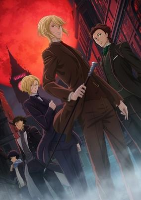

**Studio:** Production I.G &nbsp;|&nbsp; **Episodes:** 13 &nbsp;|&nbsp; **Director:** Kazuya Nomura &nbsp;|&nbsp; **Aired/Released:** April 4 – June 27 &nbsp;|&nbsp; **Genres:** Shounen, Psychological, Historical, Mystery

> Based on a crime suspense historical manga written by Takeuchi Ryousuke and drawn by Miyoshi Hikaru. The story's protagonist is James Moriarty, the famous antagonist from Sir Arthur Conan Doyle's Sherlock Holmes series.James is an orphan who assumes the name William James Moriarty when he and his younger brother are adopted into the Moriarty family. As a young man, he seeks to remove the ills caused by England's strict class system.
>
> _Synopsis source: Kitsu_

[Wikipedia](https://en.wikipedia.org/wiki/Moriarty_the_Patriot) · [Kitsu](https://kitsu.io/anime/yuukoku-no-moriarty)

---

### I Became a Kuro-Gyaru, so I Fucked My Best Friend.

**Studio:** Irawiasu &nbsp;|&nbsp; **Episodes:** 8 &nbsp;|&nbsp; **Director:** Chokkō &nbsp;|&nbsp; **Aired/Released:** April 5 – May 24

[Wikipedia](https://en.wikipedia.org/wiki/Fucked_by_My_Best_Friend)

---

### Higehiro (Higehiro: After Being Rejected, I Shaved and Took in a High School Runaway)

**Studio:** Project No.9 &nbsp;|&nbsp; **Episodes:** 13 &nbsp;|&nbsp; **Director:** Manabu Kamikita &nbsp;|&nbsp; **Aired/Released:** April 5 – June 28 &nbsp;|&nbsp; **Genres:** Drama, Romance, Present, Plot Continuity, Slice of Life, Love Polygon, Ecchi, Female Student, Japan, Slow When It Comes To Love

> Office worker Yoshida has been crushing on his coworker, Airi Gotou, for five years. Despite finally scoring a date with her, his confession is promptly rejected. Drunk and disappointed, he stumbles home, only to find a high school girl sitting on the side of the road. The girl, needing a place to stay the night, attempts to seduce Yoshida. Despite rejecting her advances, he nevertheless invites her into his apartment. The next morning, the girl, introducing herself as Sayu Ogiwara, reveals that she has run away from Hokkaido all the way to Tokyo. During her six-month spree, she continually traded sexual favors for a roof over her head. Yoshida, however, remains unswayed by her seduction. Instead, he has her do a different kind of work—one that entails washing dishes and doing laundry. And so, a touching relationship between a heartbroken adult and a runaway high school girl begins. [Written by MAL Rewrite]
>
> _Synopsis source: Kitsu_

[Wikipedia](https://en.wikipedia.org/wiki/Higehiro) · [Kitsu](https://kitsu.io/anime/hige-wo-soru-soshite-joshikousei-wo-hirou)

---

### Koikimo (It's Too Sick to Call this Love)

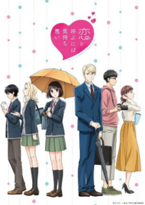

**Studio:** Nomad &nbsp;|&nbsp; **Episodes:** 12 &nbsp;|&nbsp; **Director:** Naomi Nakayama &nbsp;|&nbsp; **Aired/Released:** April 5 – June 21 &nbsp;|&nbsp; **Genres:** Comedy, Romance, Josei, Slice of Life

> Once you fall for someone, you can't stop the love. A strange encounter spurs the meeting of Amakusa Ryou, a high spec businessman who is loose with women, and his high school sister's best friend, Arima Ichika. From there, he falls madly in love. On one hand, he approaches her with almost too straight-forward methods, while she responds simply disgusted, insulting him without hesitation... and he takes it as her way of showing love. This is a romantic comedy about a twisted elite employee and a normal otaku high school girl.
>
> _Synopsis source: Kitsu_

[Wikipedia](https://en.wikipedia.org/wiki/Koikimo) · [Kitsu](https://kitsu.io/anime/koi-to-yobu-ni-wa-kimochi-warui)

---

### Seven Knights Revolution: Hero Successor

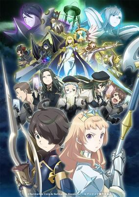

**Studio:** Liden Films DOMERICA &nbsp;|&nbsp; **Episodes:** 12 &nbsp;|&nbsp; **Director:** Kazuya Ichikawa &nbsp;|&nbsp; **Aired/Released:** April 5 – June 21 &nbsp;|&nbsp; **Genres:** Action, Adventure, Magic, Fantasy

> Seven Knights Revolution: Eiyuu no Keishousha is set in a world where eons ago valiant heroes fought against the forces of "Destruction." While their deeds passed into legend, the power of these heroes was later inherited by "successors" who fought to protect the world. One day, Faria, a successor of the Seven Knights, saves an ordinary boy named Nemo from the forces of Destruction. During the ensuing battle, Nemo summons the power of a hero and becomes a successor as well. However, Nemo's hero is a stranger that is unknown to history, and so an epic journey where the past and present collide begins.
>
> _Synopsis source: Kitsu_

[Wikipedia](https://en.wikipedia.org/wiki/Seven_Knights) · [Kitsu](https://kitsu.io/anime/seven-knights-revolution-eiyuu-no-keishousha)

---

### Fruits Basket: The Final

**Studio:** TMS/8PAN &nbsp;|&nbsp; **Episodes:** 13 &nbsp;|&nbsp; **Director:** Yoshihide Ibata &nbsp;|&nbsp; **Aired/Released:** April 6 – June 29

[Wikipedia](https://en.wikipedia.org/wiki/Fruits_Basket)

---

### Iii Icecrin

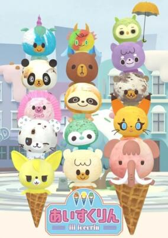

**Studio:** Shin-Ei Animation TIA &nbsp;|&nbsp; **Episodes:** 12 &nbsp;|&nbsp; **Director:** Juria Matsumura &nbsp;|&nbsp; **Aired/Released:** April 6 – June 29 &nbsp;|&nbsp; **Genres:** Kids

> Original anime produced as a collaboration between Shin-Ei Animation and Blue Seal ice cream.
>
> _Synopsis source: Kitsu_

[Wikipedia](https://en.wikipedia.org/wiki/Iii_Icecrin) · [Kitsu](https://kitsu.io/anime/iii-icecrin)

---

### Mars Red

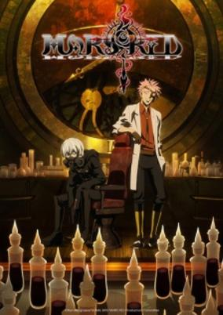

**Studio:** Signal.MD &nbsp;|&nbsp; **Episodes:** 13 &nbsp;|&nbsp; **Director:** Kouhei Hatano &nbsp;|&nbsp; **Aired/Released:** April 6 – June 29 &nbsp;|&nbsp; **Genres:** Action, Military, Historical, Vampire, Supernatural

> Mars Red takes place in 1923, and vampires have existed for quite a while. But now, the number of vampires is increasing and a mysterious, artificial blood source called Ascra has appeared. The Japanese government, in turn, creates "Code Zero," an unit within the army tasked with taking down the vampiric forces. And what better way to track vampires than by using vampires? Created by Lieutenant General Nakajima, this unit has historically been in the business of information war, but has been re-assigned to solve the vampire crisis.
>
> _Synopsis source: Kitsu_

[Wikipedia](https://en.wikipedia.org/wiki/Mars_Red) · [Kitsu](https://kitsu.io/anime/mars-red)

---

### Odd Taxi

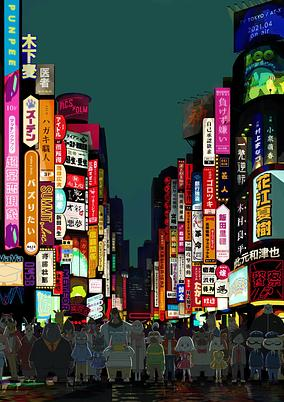

**Studio:** OLM P.I.C.S. &nbsp;|&nbsp; **Episodes:** 13 &nbsp;|&nbsp; **Director:** Baku Kinoshita &nbsp;|&nbsp; **Aired/Released:** April 6 – June 29 &nbsp;|&nbsp; **Genres:** Mystery, Anthropomorphism, Drama, Comedy

> This town should look familiar, but suddenly, it's not. The taxi driver Odokawa lives a very mundane life. He has no family, doesn't really hang out with others, and he's an oddball who is narrow-minded and doesn't talk much. The only people he can call his friends are his doctor, Gouriki, and his classmate from high school, Kakibana. All of his patrons seem to be slightly odd themselves. The college student who wants to be noticed online, Kabasawa. A nurse with secrets, Shirakawa. A comedy duo, the Homosapiens... All these mundane conversations somehow lead to a girl who's gone missing.
>
> _Synopsis source: Kitsu_

[Wikipedia](https://en.wikipedia.org/wiki/Odd_Taxi) · [Kitsu](https://kitsu.io/anime/odd-taxi)

---

### The Saint's Magic Power is Omnipotent

**Studio:** Diomedéa &nbsp;|&nbsp; **Episodes:** 12 &nbsp;|&nbsp; **Director:** Shōta Ihata &nbsp;|&nbsp; **Aired/Released:** April 6 – June 22 &nbsp;|&nbsp; **Genres:** Romance, Fantasy, Fantasy World, Magic, Slice of Life, Shoujo

> Sei, a 20-year-old office worker, is whisked away to a whole new world. Unfortunately for Sei, the ritual that summoned her—meant to produce a "Saint" who would banish the dark magic—brought two people over instead of one. And everyone prefers the second girl over Sei?! But this is just fine by Sei, who leaves the royal palace to set up shop making potions and cosmetics with her newfound magic. Business is booming, and this might not be such a bad life, after all...as long as her supposed Sainthood doesn't come back to haunt her.
>
> _Synopsis source: Kitsu_

[Wikipedia](https://en.wikipedia.org/wiki/The_Saint%27s_Magic_Power_is_Omnipotent) · [Kitsu](https://kitsu.io/anime/seijo-no-maryoku-wa-bannou-desu)

---

### The Slime Diaries: That Time I Got Reincarnated as a Slime

**Studio:** Eight Bit &nbsp;|&nbsp; **Episodes:** 12 &nbsp;|&nbsp; **Director:** Yuji Ikuhara &nbsp;|&nbsp; **Aired/Released:** April 6 – June 22

[Wikipedia](https://en.wikipedia.org/wiki/That_Time_I_Got_Reincarnated_as_a_Slime)

---

### Full Dive (Full Dive: This Ultimate Next-Gen Full Dive RPG Is Even Shittier than Real Life!)

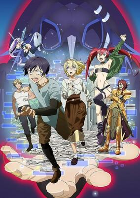

**Studio:** ENGI &nbsp;|&nbsp; **Episodes:** 12 &nbsp;|&nbsp; **Director:** Kazuya Miura &nbsp;|&nbsp; **Aired/Released:** April 7 – June 23 &nbsp;|&nbsp; **Genres:** Action, Comedy, Fantasy, Virtual Reality

> The story follows a dull high school student named Hiro Yuuki when he is tricked into joining a full-dive (fully immersive VR) role-playing game. The game, Kiwame Quest (literally, "Ultimate Quest"), is promoted as "more real than reality" with mind-blowing graphics, impressive NPC behavior, and even the scent of foliage and the sensation of wind blowing against your skin. Unfortunately, the game is already a virtual ghost town, after being flooded with player complaints that the game is little too realistic for its own good. Its quests are nearly impossible to clear, since players have to be as physical fit to complete them as they would in real life. Players feel actual pain when they get hit, and puncture wounds takes days to heal. The only reward is the mere sense of accomplishment. It is the complete opposite of a casual pick-up-and-play game, but Hiro vows to beat this most realistic (and most stressful) game ever.
>
> _Synopsis source: Kitsu_

[Wikipedia](https://en.wikipedia.org/wiki/Full_Dive) · [Kitsu](https://kitsu.io/anime/kyuukyoku-shinka-shita-full-dive-rpg-ga-genjitsu-yori-mo-kusogee-dattara)

---

### Joran: The Princess of Snow and Blood (Jouran: The Princess of Snow and Blood)

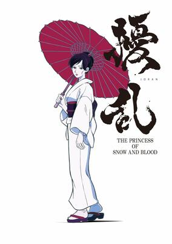

**Studio:** Bakken Record &nbsp;|&nbsp; **Episodes:** 12 &nbsp;|&nbsp; **Director:** Susumu Kudo &nbsp;|&nbsp; **Aired/Released:** April 7 – June 23 &nbsp;|&nbsp; **Genres:** Action, Historical, Alternative Past, Supernatural, Horror, Revenge, Swordplay

> The anime is set in an alternate history Japan in 1931, with the Tokugawa shogunate never abolished and the Meiji emperor never restored to power. The anime will follow the activities of "Nue," an organization of shogunate executioners who enforce government rule. The story description contains intentional historical discrepancies: noting the year as the 64th year of the Meiji era (the Meiji era only lasted 45 years up to 1912), and mentioning Tokugawa Yoshinobu as reigning shogun (Tokugawa Yoshinobu died in 1913).
>
> _Synopsis source: Kitsu_

[Kitsu](https://kitsu.io/anime/jouran-the-princess-of-snow-and-blood)

---

### Super Cub

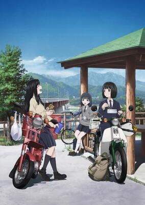

**Studio:** Studio Kai &nbsp;|&nbsp; **Episodes:** 12 &nbsp;|&nbsp; **Director:** Toshiro Fujii &nbsp;|&nbsp; **Aired/Released:** April 7 – June 23 &nbsp;|&nbsp; **Genres:** Slice of Life, School Life

> Second year high school student Koguma doesn't lead a very interesting life. She has no parents, and no friends nor hobbies to keep her daily life busy. One day, she acquires a second-hand Honda Super Cub motorcycle and rides it to school. As time goes by, not only does Koguma have a new adventurous life, but she also forges precious friendships thanks to her precious little motorcycle.
>
> _Synopsis source: Kitsu_

[Wikipedia](https://en.wikipedia.org/wiki/Super_Cub_(novel_series)) · [Kitsu](https://kitsu.io/anime/super-cub)

---

### Fairy Ranmaru

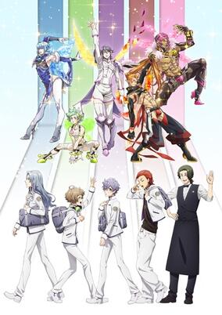

**Studio:** Studio Comet &nbsp;|&nbsp; **Episodes:** 12 &nbsp;|&nbsp; **Director:** Kōsuke Kobayashi Masakazu Hishida &nbsp;|&nbsp; **Aired/Released:** April 8 – June 24 &nbsp;|&nbsp; **Genres:** School Life, Slice of Life, Magic, Elf

> Set in a world of cruelty and heartbreak, Fairy Ranmaru: Anata no Kokoro Otasuke Shimasu follows five young men who work at the mysterious "Bar F" and who offer to heal the hearts of their clients, wiping away their tears and causing smiles to bloom like flowers. They take no payment... aside from stealing their clients' hearts.
>
> _Synopsis source: Kitsu_

[Wikipedia](https://en.wikipedia.org/wiki/Fairy_Ranmaru) · [Kitsu](https://kitsu.io/anime/fairy-ranmaru-anata-no-kokoro-otasuke-shimasu)

---

### Zombie Land Saga Revenge

**Studio:** MAPPA &nbsp;|&nbsp; **Episodes:** 12 &nbsp;|&nbsp; **Director:** Munehisa Sakai &nbsp;|&nbsp; **Aired/Released:** April 8 – June 24

[Wikipedia](https://en.wikipedia.org/wiki/Zombie_Land_Saga)

---

### Backflip!!

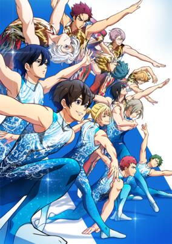

**Studio:** Zexcs &nbsp;|&nbsp; **Episodes:** 12 &nbsp;|&nbsp; **Director:** Seishirō Nagaya Toshimasa Kuroyanagi &nbsp;|&nbsp; **Aired/Released:** April 9 – June 25 &nbsp;|&nbsp; **Genres:** Sports, Comedy, Drama

> The anime is set in Miyagi prefecture's Iwanuma city, and centers on a high school rhythmic gymnastics team. The anime follows Shoutarou Futaba, who is fascinated by gymnastics after seeing it in his third year of middle school, and joins the rhythmic gymnastics team of his new high school Soushuukan High School, nicknamed "Ao High." He makes a friend with his schoolmate Ryouya Misato, who earned fame for as a gymnast during middle school.
>
> _Synopsis source: Kitsu_

[Wikipedia](https://en.wikipedia.org/wiki/Backflip!!) · [Kitsu](https://kitsu.io/anime/bakuten)

---

### How Not to Summon a Demon Lord Ω

**Studio:** Tezuka Productions Okuruto Noboru &nbsp;|&nbsp; **Episodes:** 10 &nbsp;|&nbsp; **Director:** Satoshi Kuwabara &nbsp;|&nbsp; **Aired/Released:** April 9 – June 11

[Wikipedia](https://en.wikipedia.org/wiki/How_Not_to_Summon_a_Demon_Lord)

---

### Shinkansen Henkei Robo Shinkalion Z

**Studio:** OLM &nbsp;|&nbsp; **Episodes:** 41 &nbsp;|&nbsp; **Director:** Takahiro Ikezoe (Chief) Kentarō Yamaguchi &nbsp;|&nbsp; **Aired/Released:** April 9 – March 18, 2022

[Wikipedia](https://en.wikipedia.org/wiki/Shinkansen_Henkei_Robo_Shinkalion)

---

### Blue Reflection Ray

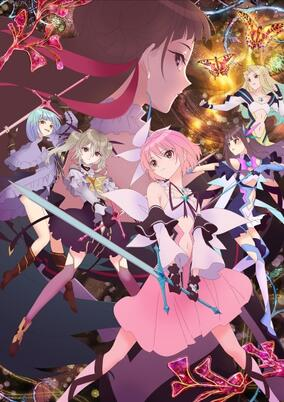

**Studio:** J.C.Staff &nbsp;|&nbsp; **Episodes:** 24 &nbsp;|&nbsp; **Director:** Risako Yoshida &nbsp;|&nbsp; **Aired/Released:** April 10 – September 25 &nbsp;|&nbsp; **Genres:** Magic, Fantasy, School Life, Magical Girl

> A clear summer sky spreads over the Hoshinomiya Girls' High School. This story begins with the belated start of school life for Hinako Shirai, who has just recovered from a leg injury due to a tragic accident. The magical sisters Yuzu and Lime bestowed her with a special power to become a "Reflector." Hinako transforms into the magical Reflector form and protects the world from devastating forces for the sake of the world, and her own dream that she thought she had to give up on.
>
> _Synopsis source: Kitsu_

[Wikipedia](https://en.wikipedia.org/wiki/Blue_Reflection_Ray) · [Kitsu](https://kitsu.io/anime/blue-reflection-ray)

---

### I've Been Killing Slimes for 300 Years and Maxed Out My Level

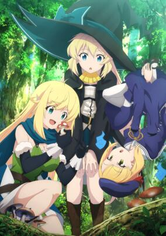

**Studio:** Revoroot &nbsp;|&nbsp; **Episodes:** 12 &nbsp;|&nbsp; **Director:** Nobukage Kimura &nbsp;|&nbsp; **Aired/Released:** April 10 – June 26 &nbsp;|&nbsp; **Genres:** Comedy, Fantasy, Slice of Life, Isekai, Family, Demon

> After living a painful life as an office worker, Azusa ended her short life by dying from overworking. So when she found herself reincarnated as an undying, unaging witch in a new world, she vows to spend her days stress-free and as pleasantly as possible. She ekes out a living by hunting down the easiest targets—the slimes! But after centuries of doing this simple job, she's ended up with insane powers...how will she maintain her low key life now?!
>
> _Synopsis source: Kitsu_

[Wikipedia](https://en.wikipedia.org/wiki/I%27ve_Been_Killing_Slimes_for_300_Years_and_Maxed_Out_My_Level) · [Kitsu](https://kitsu.io/anime/slime-taoshite-300-nen-shiranai-uchi-ni-level-max-ni-nattemashita)

---

### The World Ends with You the Animation (The World Ends With You - The Animation)

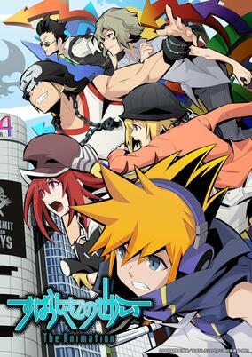

**Studio:** DOMERICA Shin-Ei Animation &nbsp;|&nbsp; **Episodes:** 12 &nbsp;|&nbsp; **Director:** Kazuya Ichikawa &nbsp;|&nbsp; **Aired/Released:** April 10 – June 26 &nbsp;|&nbsp; **Genres:** Action, Adventure

> Neku awakens in the middle of Shibuya's bustling Scramble Crossing with no memory of how he got there. Little does he know, he's been transported to an alternate plane of existence known as the Underground (UG). Now an unwilling participant in the mysterious "Reapers' Game," Neku must partner up with a girl named Shiki in order to survive. Together, they complete missions and defeat monsters known as "Noise" as they gradually uncover the true nature of this twisted Game. "There's only one way to stay alive in Shibuya: trust your partner." Will they survive the Reapers' Game?
>
> _Synopsis source: Kitsu_

[Wikipedia](https://en.wikipedia.org/wiki/The_World_Ends_with_You_the_Animation) · [Kitsu](https://kitsu.io/anime/the-world-ends-with-you-the-animation)

---

### Yuki Yuna is a Hero: Churutto!

**Studio:** DMM.futureworks W-Toon Studio &nbsp;|&nbsp; **Episodes:** 12 &nbsp;|&nbsp; **Director:** Seiya Miyajima &nbsp;|&nbsp; **Aired/Released:** April 10 – June 26

[Wikipedia](https://en.wikipedia.org/wiki/Yuki_Yuna_is_a_Hero)

---

### 86 (part 1)

**Studio:** A-1 Pictures &nbsp;|&nbsp; **Episodes:** 11 &nbsp;|&nbsp; **Director:** Toshimasa Ishii &nbsp;|&nbsp; **Aired/Released:** April 11 – June 20

[Wikipedia](https://en.wikipedia.org/wiki/86_(novel_series))

---

### Battle Athletes Victory ReSTART!

**Studio:** Seven &nbsp;|&nbsp; **Episodes:** 12 &nbsp;|&nbsp; **Director:** Tokihiro Sasaki &nbsp;|&nbsp; **Aired/Released:** April 11 – June 27

[Wikipedia](https://en.wikipedia.org/wiki/Battle_Athletes)

---

### Don't Toy with Me, Miss Nagatoro (Don’t Toy With Me, Miss Nagatoro)

**Studio:** Telecom Animation Film &nbsp;|&nbsp; **Episodes:** 12 &nbsp;|&nbsp; **Director:** Hirokazu Hanai &nbsp;|&nbsp; **Aired/Released:** April 11 – June 27 &nbsp;|&nbsp; **Genres:** Comedy, School Life, Slice of Life

> "A girl in a lower grade just made me cry!" One day, Senpai visits the library after school and becomes the target of a super sadistic junior! The name of the girl who teases, torments, and tantalizes Senpai is "Nagatoro!" She's annoying yet adorable. It's painful, but you still want to be by her side. This is a story about an extremely sadistic and temperamental girl and you'll feel something awaken inside of you.
>
> _Synopsis source: Kitsu_

[Wikipedia](https://en.wikipedia.org/wiki/Don%27t_Toy_with_Me,_Miss_Nagatoro) · [Kitsu](https://kitsu.io/anime/ijiranaide-nagatoro-san)

---

### Edens Zero

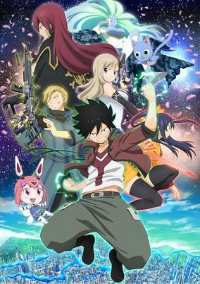

**Studio:** J.C.Staff &nbsp;|&nbsp; **Episodes:** 25 &nbsp;|&nbsp; **Director:** Shinji Ishihira (Chief) Yūshi Suzuki &nbsp;|&nbsp; **Aired/Released:** April 11 – October 3 &nbsp;|&nbsp; **Genres:** Ecchi, Space, Magic, Action, Adventure, Shounen, Comedy

> Aboard the Edens Zero, a lonely boy with the ability to control gravity embarks on an adventure to meet the fabled space goddess known as Mother.
>
> _Synopsis source: Kitsu_

[Wikipedia](https://en.wikipedia.org/wiki/Edens_Zero) · [Kitsu](https://kitsu.io/anime/edens-zero)

---

### Mewkledreamy Mix!

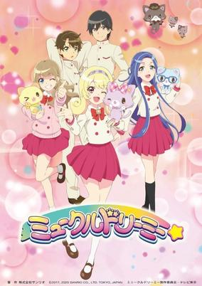

**Studio:** J.C.Staff &nbsp;|&nbsp; **Episodes:** 50 &nbsp;|&nbsp; **Director:** Hiroaki Sakurai &nbsp;|&nbsp; **Aired/Released:** April 11 – March 27, 2022 &nbsp;|&nbsp; **Genres:** Adventure, Fantasy, Kids, Shoujo

> The story begins when a middle school girl named Yume sees something fall from the sky, and meets a pale violet-colored kitten named Mew. It turns out that Mew has the power of "Yume Synchro" (Dream Synchro), the power to enter dreams. In the dream world, the girl and Mew collect Dream Stones.
>
> _Synopsis source: Kitsu_

[Wikipedia](https://en.wikipedia.org/wiki/Mewkledreamy) · [Kitsu](https://kitsu.io/anime/mewkledreamy)

---

### Pretty Boy Detective Club

**Studio:** Shaft &nbsp;|&nbsp; **Episodes:** 12 &nbsp;|&nbsp; **Director:** Akiyuki Shinbo (Chief) Hajime Ootani &nbsp;|&nbsp; **Aired/Released:** April 11 – June 27 &nbsp;|&nbsp; **Genres:** Mystery, School Life

> The Bishounen Series centers on the Pretty Boy Detective Club, a nonprofit organization located at Yubiwa Private Academy, with the purpose of helping those in need, but only if their requests are deemed as "beautiful" by the team's leader, Manabu Soutouin. The story begins when Mayumi Doujima, a girl looking to find the star she once saw ever since she was a child, encounters the Pretty Boy Detectives and requests their help for the case.
>
> _Synopsis source: Kitsu_

[Wikipedia](https://en.wikipedia.org/wiki/Pretty_Boy_Detective_Club) · [Kitsu](https://kitsu.io/anime/bishounen-series)

---

### Shadows House

**Studio:** CloverWorks &nbsp;|&nbsp; **Episodes:** 13 &nbsp;|&nbsp; **Director:** Kazuki Ohashi &nbsp;|&nbsp; **Aired/Released:** April 11 – July 4 &nbsp;|&nbsp; **Genres:** Slice of Life, Supernatural, Seinen, Mystery, Fantasy, Horror

> High atop a cliff sits the mansion known as Shadows House, home to a faceless clan that pretends to live like nobles. They express their emotions through living dolls that also endlessly clean the home of soot. One such servant, Emilico, aids her master Kate as they learn more about themselves and the mysteries of the house.
>
> _Synopsis source: Kitsu_

[Wikipedia](https://en.wikipedia.org/wiki/Shadows_House) · [Kitsu](https://kitsu.io/anime/shadows-house)

---

### Tokyo Revengers

**Studio:** Liden Films &nbsp;|&nbsp; **Episodes:** 24 &nbsp;|&nbsp; **Director:** Koichi Hatsumi &nbsp;|&nbsp; **Aired/Released:** April 11 – September 19 &nbsp;|&nbsp; **Genres:** Drama, Action, School Life, Shounen, Time Travel, Crime, Delinquent

> Takemichi Hanagaki is a freelancer that's reached the absolute pits of despair in his life. He finds out that the only girlfriend he ever had, in middle school, Hinata Tachibana, had been killed by the ruthless Tokyo Manji Gang. The day after hearing about her death, he's standing on the station platform and ends up being pushed over onto the tracks by a herd of people. He closes his eyes thinking he's about to die, but when he opens his eyes back up, he somehow had gone back in time 12 years. Now that he's back living the best days of his life, Takemichi decides to get revenge on his life
>
> _Synopsis source: Kitsu_

[Wikipedia](https://en.wikipedia.org/wiki/Tokyo_Revengers) · [Kitsu](https://kitsu.io/anime/tokyo-revengers)

---

### Gloomy the Naughty Grizzly

**Studio:** NAZ &nbsp;|&nbsp; **Episodes:** 12 &nbsp;|&nbsp; **Director:** Takehiro Kubota &nbsp;|&nbsp; **Aired/Released:** April 12 – June 28 &nbsp;|&nbsp; **Genres:** Horror, Comedy, Slice of Life

> Gloomy, an abandoned little bear, is rescued by Pitty (the little boy). At first, he is cute and cuddly, but becomes wilder as he grows up. Since bears do not become attached to people like dogs by nature, Gloomy attacks Pitty even though he is the owner. So Gloomy has blood on him from biting and/or scratching Pitty.
>
> _Synopsis source: Kitsu_

[Wikipedia](https://en.wikipedia.org/wiki/Gloomy_the_Naughty_Grizzly) · [Kitsu](https://kitsu.io/anime/itazuraguma-no-gloomy)

---

### To Your Eternity

**Studio:** Brain's Base &nbsp;|&nbsp; **Episodes:** 20 &nbsp;|&nbsp; **Director:** Masahiko Murata &nbsp;|&nbsp; **Aired/Released:** April 12 – August 30 &nbsp;|&nbsp; **Genres:** Adventure, Drama, Fantasy

> In the beginning, an "orb" is cast unto Earth. "It" can do two things: change into the form of the thing that stimulates "it"; and come back to life after death. "It" morphs from orb to rock, then to wolf, and finally to boy, but roams about like a newborn who knows nothing. As a boy, "it" becomes Fushi. Through encounters with human kindness, Fushi not only gains survival skills but grows as a "person". But his journey is darkened by the inexplicable and destructive enemy Nokker, as well as cruel partings with the people he loves.
>
> _Synopsis source: Kitsu_

[Wikipedia](https://en.wikipedia.org/wiki/To_Your_Eternity) · [Kitsu](https://kitsu.io/anime/fumetsu-no-anata-e)

---

### Osamake (The Romcom Where The Childhood Friend Won't Lose!)

**Studio:** Doga Kobo &nbsp;|&nbsp; **Episodes:** 12 &nbsp;|&nbsp; **Director:** Takashi Naoya &nbsp;|&nbsp; **Aired/Released:** April 14 – June 30 &nbsp;|&nbsp; **Genres:** Romance, Harem, Comedy, School Life

> My childhood friend Shida Kuroha seems to have feelings for me. She lives next door, and is small and cute. With an outgoing character, she's the caring Onee-san type, this being one of her greatest strengths. ...But, I already have my first love, the beautiful idol of our school, and the award-winning author, Kachi Shirokusa! Thinking about it rationally, I should have no chances with her, but, while walking home from school, she only talks to me, with a smile even! I might actually have a chance, don't you think?! Or so I thought, but then I heard that Shirokusa already has a boyfriend, and my life took a turn for the worse. I want to die. Why is it not me?! Even though she was my first love... As I was drowning in despair and depression, Kuroha whispered. —If it's that tough for you, then how about we get revenge? The best revenge ever, that is~
>
> _Synopsis source: Kitsu_

[Wikipedia](https://en.wikipedia.org/wiki/Osamake) · [Kitsu](https://kitsu.io/anime/osananajimi-ga-zettai-ni-makenai-love-comedy)

---

### Cestvs: The Roman Fighter (CESTVS -The Roman Fighter-)

**Studio:** Bandai Namco Pictures Logic&Magic &nbsp;|&nbsp; **Episodes:** 11 &nbsp;|&nbsp; **Director:** Toshifumi Kawase (Chief) Kazuya Monma &nbsp;|&nbsp; **Aired/Released:** April 15 – June 24 &nbsp;|&nbsp; **Genres:** Action, Historical, Drama, Sports, Boxing

> 54 AD. Cestus, a young boy orphaned by the Roman empire and made a slave, is placed into a training school for pugilists. It is here that he begins his journey to defy fate and fight for his own freedom.
>
> _Synopsis source: Kitsu_

[Kitsu](https://kitsu.io/anime/cestvs-the-roman-fighter)

---

### Welcome to Demon School! Iruma-kun (season 2)

**Studio:** Bandai Namco Pictures &nbsp;|&nbsp; **Episodes:** 21 &nbsp;|&nbsp; **Director:** Makoto Moriwaki &nbsp;|&nbsp; **Aired/Released:** April 17 – September 11

[Wikipedia](https://en.wikipedia.org/wiki/Welcome_to_Demon_School!_Iruma-kun)

---

### Higurashi: When They Cry – Sotsu (Higurashi: When They Cry - Gou)

**Studio:** Passione &nbsp;|&nbsp; **Episodes:** 15 &nbsp;|&nbsp; **Director:** Keiichiro Kawaguchi &nbsp;|&nbsp; **Aired/Released:** July 1 – September 30 &nbsp;|&nbsp; **Genres:** Horror, Angst, Drama, Plot Continuity, Psychological, Thriller, Mystery, Violence

> New kid Keiichi Maebara is settling into his new home of peaceful Hinamizawa village. Making quick friends with the girls from his school, he's arrived in time for the big festival of the year. But something about this isolated town seems "off," and his feelings of dread continue to grow. With a gnawing fear that he's right, what dark secrets could this small community be hiding?
>
> _Synopsis source: Kitsu_

[Wikipedia](https://en.wikipedia.org/wiki/Higurashi_When_They_Cry) · [Kitsu](https://kitsu.io/anime/higurashi-no-naku-koro-ni-gou)

---

### Peach Boy Riverside

**Studio:** Asahi Production &nbsp;|&nbsp; **Episodes:** 12 &nbsp;|&nbsp; **Director:** Shigeru Ueda &nbsp;|&nbsp; **Aired/Released:** July 1 – September 16 &nbsp;|&nbsp; **Genres:** Fantasy, Shounen, Fantasy World, Demon, Adventure

> Saltorine Aldike, or Sari, is a bright, cheerful princess who wants to go on an adventure because she is bored of her tiny little castle in the countryside. One day, a hoard of vicious demons known as "Oni" come knocking on her doorstep, threatening the lives of everyone in the Kingdom. Thankfully, they are saved by a lone traveler named Kibitsu Mikoto who slays these monsters with a mysterious "Peach Eye." Shocked by the dangers of the outside world, Sari decides to set off on a journey of her own. Little did she know that she would set in motion a chain of events that will come to determine the fate of this magical world.
>
> _Synopsis source: Kitsu_

[Wikipedia](https://en.wikipedia.org/wiki/Peach_Boy_Riverside) · [Kitsu](https://kitsu.io/anime/peach-boy-riverside)

---

### Scarlet Nexus

**Studio:** Sunrise &nbsp;|&nbsp; **Episodes:** 26 &nbsp;|&nbsp; **Director:** Hiroyuki Nishimura &nbsp;|&nbsp; **Aired/Released:** July 1 – December 23 &nbsp;|&nbsp; **Genres:** Action, Fantasy, Contemporary Fantasy, Supernatural

> Solar calendar year 2020: grotesque organisms called Others have begun eating people. To take down this new enemy, the Other Suppression Force is formed. Saved by this elite team as a child, psychokinetic Yuito withstands the training to enlist. On the other hand, prodigy Kasane was scouted for her abilities. But Kasane’s dreams tell her strange things, dragging the two into an unavoidable fate.
>
> _Synopsis source: Kitsu_

[Wikipedia](https://en.wikipedia.org/wiki/Scarlet_Nexus_(TV_series)) · [Kitsu](https://kitsu.io/anime/scarlet-nexus)

---

### Girlfriend, Girlfriend (Rent-a-Girlfriend)

**Studio:** Tezuka Productions &nbsp;|&nbsp; **Episodes:** 12 &nbsp;|&nbsp; **Director:** Satoshi Kuwabara &nbsp;|&nbsp; **Aired/Released:** July 3 – September 18 &nbsp;|&nbsp; **Genres:** Comedy, Romance, School Life, Shounen

> Dumped by his girlfriend, emotionally shattered college student Kazuya Kinoshita attempts to appease the void in his heart through a rental girlfriend from a mobile app. At first, Chizuru Mizuhara seems to be the perfect girl with everything he could possibly ask for: great looks and a cute, caring personality.Upon seeing mixed opinions on her profile after their first date, and still tormented by his previous relationship, Kazuya believes that Chizuru is just playing around with the hearts of men and leaves her a negative rating. Angry at her client's disrespect towards her, Chizuru reveals her true nature: sassy and temperamental, the complete opposite of Kazuya's first impression. At that very moment, Kazuya receives news of his grandmother's collapse and is forced to bring Chizuru along with him to the hospital.Although it turns out to be nothing serious, his grandmother is ecstatic that Kazuya has finally found a serious girlfriend, which had always been her wish. Unable to tell her the truth, Kazuya and Chizuru are forced into a fake relationship—acting as if they are truly lovers.
>
> _Synopsis source: Kitsu_

[Wikipedia](https://en.wikipedia.org/wiki/Girlfriend,_Girlfriend) · [Kitsu](https://kitsu.io/anime/kanojo-okarishimasu)

---

### My Next Life as a Villainess: All Routes Lead to Doom! X (Katarina's Brain Conference X)

**Studio:** Silver Link &nbsp;|&nbsp; **Episodes:** 12 &nbsp;|&nbsp; **Director:** Keisuke Inoue &nbsp;|&nbsp; **Aired/Released:** July 3 – September 18 &nbsp;|&nbsp; **Genres:** Super Deformed, Comedy, Isekai

> Short posted on the official twitter account where the "Katarina Five" introduces My Next Life as a Villainess: All Routes Lead to Doom! X.
>
> _Synopsis source: Kitsu_

[Kitsu](https://kitsu.io/anime/katarina-nounai-kaigi-x)

---

### Ore, Tsushima (I, Tsushima)

**Studio:** Fanworks Space Neko Company &nbsp;|&nbsp; **Episodes:** 12 &nbsp;|&nbsp; **Director:** Jun Aoki &nbsp;|&nbsp; **Aired/Released:** July 3 – September 18 &nbsp;|&nbsp; **Genres:** Slice of Life, Comedy, Seinen

> The manga centers on a woman who is getting on in years, but all her cats think she's a man so they call her Ojii-chan. One day a brazen cat named Tsushima appears in Ojii-chan's yard.
>
> _Synopsis source: Kitsu_

[Wikipedia](https://en.wikipedia.org/wiki/Ore,_Tsushima) · [Kitsu](https://kitsu.io/anime/ore-tsushima)

---

### Remake Our Life!

**Studio:** Feel &nbsp;|&nbsp; **Episodes:** 12 &nbsp;|&nbsp; **Director:** Tomoki Kobayashi &nbsp;|&nbsp; **Aired/Released:** July 3 – September 25 &nbsp;|&nbsp; **Genres:** Slice of Life, Time Travel, Comedy, Harem, Shounen, Romance, Science Fiction

> Hashiba Kyouya is a 28-year-old game developer. With his company going bankrupt, and him losing his job, he returns to his hometown. Looking at the success of creators of his age, he finds himself regretting his life decisions as he lay distressed on his bed. As Kyouya wakes up, he discovers that he has traveled ten years back to the time before he entered college. Will he be able to finally make things right? This is a story about a failed person who is given a second opportunity to follow his dreams.
>
> _Synopsis source: Kitsu_

[Wikipedia](https://en.wikipedia.org/wiki/Remake_Our_Life!) · [Kitsu](https://kitsu.io/anime/bokutachi-no-remake)

---

### The Case Study of Vanitas (part 1) (The Case Study of Vanitas)

**Studio:** Bones &nbsp;|&nbsp; **Episodes:** 12 &nbsp;|&nbsp; **Director:** Tomoyuki Itamura &nbsp;|&nbsp; **Aired/Released:** July 3 – September 18 &nbsp;|&nbsp; **Genres:** Historical, Supernatural, Vampire, Adventure, Drama, Mystery, Steampunk, Bishounen, Shounen, France

> It’s 19th-century Paris, and young vampire Noé hunts for the Book of Vanitas. Attacked by a vampire driven insane, a human intercedes, rescues Noé, and heals the sick creature. Commanding the book and calling himself Vanitas, this doctor tempts Noé with a mad crusade to “cure” the entire vampire race. Allying with one who wields arcane power so easily may be dangerous, but does he have a choice?
>
> _Synopsis source: Kitsu_

[Wikipedia](https://en.wikipedia.org/wiki/The_Case_Study_of_Vanitas) · [Kitsu](https://kitsu.io/anime/vanitas-no-carte)

---

### The Honor Student at Magic High School

**Studio:** Connect &nbsp;|&nbsp; **Episodes:** 13 &nbsp;|&nbsp; **Director:** Hideki Tachibana &nbsp;|&nbsp; **Aired/Released:** July 3 – September 25

[Wikipedia](https://en.wikipedia.org/wiki/The_Irregular_at_Magic_High_School)

---

### Getter Robo Arc

**Studio:** Bee Media Studio A-Cat &nbsp;|&nbsp; **Episodes:** 13 &nbsp;|&nbsp; **Director:** Jun Kawagoe &nbsp;|&nbsp; **Aired/Released:** July 4 – September 26 &nbsp;|&nbsp; **Genres:** Science Fiction, Mecha, Shounen, Action

> Getter Robo Arc is the fifth Getter Robo series chronologically.Taking place several years after Getter Robo Go, Earth is now a post-apocalyptic world. Hayato, now an aging scientist, has completed Professor Saotome's masterpiece, Getter Robo Arc. Piloting it are Ryoma's son Takuma, the human-dinosaur Kamui, and the younger brother of Tayel, Baku. Alongside the reformed Dinosaur Empire, they fight the insectoid Andromeda Flow Country attacking from across time and space.
>
> _Synopsis source: Kitsu_

[Wikipedia](https://en.wikipedia.org/wiki/Getter_Robo_Arc) · [Kitsu](https://kitsu.io/anime/getter-robo-arc)

---

### How a Realist Hero Rebuilt the Kingdom (part 1) (How a Realist Hero Rebuilt the Kingdom)

**Studio:** J.C.Staff &nbsp;|&nbsp; **Episodes:** 13 &nbsp;|&nbsp; **Director:** Takashi Watanabe &nbsp;|&nbsp; **Aired/Released:** July 4 – September 26 &nbsp;|&nbsp; **Genres:** Action, Military, Harem, Magic, Romance, Fantasy, Fantasy World, Isekai, Elf

> "O, Hero!" With that cliched line, Kazuya Souma found himself summoned to another world and his adventure--did not begin. After he presents his plan to strengthen the country economically and militarily, the king cedes the throne to him and Souma finds himself saddled with ruling the nation! What's more, he's betrothed to the king's daughter now...?! In order to get the country back on its feet, Souma calls the wise, the talented, and the gifted to his side. Five people gather before the newly crowned Souma. Just what are the many talents and abilities they possess...?! What path will his outlook as a realist take Souma and the people of his country down?
>
> _Synopsis source: Kitsu_

[Wikipedia](https://en.wikipedia.org/wiki/How_a_Realist_Hero_Rebuilt_the_Kingdom) · [Kitsu](https://kitsu.io/anime/genjitsu-shugi-yuusha-no-oukoku-saikenki)

---

### Idolish7: Third Beat! (part 1)

**Studio:** Troyca &nbsp;|&nbsp; **Episodes:** 13 &nbsp;|&nbsp; **Director:** Makoto Bessho &nbsp;|&nbsp; **Aired/Released:** July 4 – September 26

[Wikipedia](https://en.wikipedia.org/wiki/Idolish7)

---

### Kageki Shojo!! (Kageki Shoujo!!)

**Studio:** Pine Jam &nbsp;|&nbsp; **Episodes:** 13 &nbsp;|&nbsp; **Director:** Kazuhiro Yoneda &nbsp;|&nbsp; **Aired/Released:** July 4 – September 26 &nbsp;|&nbsp; **Genres:** Drama, School Life, The Arts, Seinen, Music, All Girls School, Performance

> The Kouka Kageki Musical Drama Academy is a high school that teaches musical theater like that at the Takarazuka Revue, and splits its actresses into those who play male and female roles. Ai Narada is a former idol who becomes a musume-yaku (female role) actress and meets Sarasa Watanabe, a simple farm girl who is an otoko-yaku (male role) actress.
>
> _Synopsis source: Kitsu_

[Wikipedia](https://en.wikipedia.org/wiki/Kageki_Shojo!!) · [Kitsu](https://kitsu.io/anime/kageki-shoujo)

---

### Re-Main

**Studio:** MAPPA &nbsp;|&nbsp; **Episodes:** 12 &nbsp;|&nbsp; **Director:** Masafumi Nishida (Chief) Kiyoshi Matsuda &nbsp;|&nbsp; **Aired/Released:** July 4 – October 3 &nbsp;|&nbsp; **Genres:** Sports, School Clubs

> The anime's story centers on Minato, a boy who stopped playing water polo due to a certain incident in the winter of his third middle school year. He picks the sport back up again with a new team when he starts in high school, but the fledgling team runs into many problems.
>
> _Synopsis source: Kitsu_

[Wikipedia](https://en.wikipedia.org/wiki/Re-Main) · [Kitsu](https://kitsu.io/anime/re-main)

---

### The Detective Is Already Dead

**Studio:** ENGI &nbsp;|&nbsp; **Episodes:** 12 &nbsp;|&nbsp; **Director:** Manabu Kurihara &nbsp;|&nbsp; **Aired/Released:** July 4 – September 19 &nbsp;|&nbsp; **Genres:** Mystery, Comedy, Drama, Detective, Romance, Supernatural

> The story follows Kimihiko Kimizuka, a young man who four years ago became the assistant of a mysterious detective known as "Siesta" on a hijacked airplane. Together, Kimihiko and Siesta went on mind-boggling, globe-trotting adventures while combatting a secret organization, but all of that came to an end when they were separated by Siesta's death. In the present day, Kimihiko tries to return to an ordinary, boring life as a high school student, but things are never that simple, even though the detective is already dead.
>
> _Synopsis source: Kitsu_

[Wikipedia](https://en.wikipedia.org/wiki/The_Detective_Is_Already_Dead) · [Kitsu](https://kitsu.io/anime/tantei-wa-mou-shindeiru)

---

### The Duke of Death and His Maid

**Studio:** J.C.Staff &nbsp;|&nbsp; **Episodes:** 12 &nbsp;|&nbsp; **Director:** Yoshinobu Yamakawa &nbsp;|&nbsp; **Aired/Released:** July 4 – September 19 &nbsp;|&nbsp; **Genres:** Comedy, Drama, Romance, Maid, Supernatural, Ecchi, Mystery, Magic

> In a large mansion lives a boy, an aristocrat who was cursed by the witch to "let everything he touches die." With him is his maid Alice, who besides serving him, likes to tease him. The boy who is interested in her doesn't mind the teasing, but not being able to touch her is painful! If they are unable to hold hands, how will their love ever bloom?
>
> _Synopsis source: Kitsu_

[Wikipedia](https://en.wikipedia.org/wiki/The_Duke_of_Death_and_His_Maid) · [Kitsu](https://kitsu.io/anime/shinigami-bocchan-to-kuro-maid)

---

### Fire in His Fingertips 2: My Boyfriend is a Firefighter

**Studio:** Studio Hōkiboshi &nbsp;|&nbsp; **Episodes:** 8 &nbsp;|&nbsp; **Director:** Toshihiro Watase &nbsp;|&nbsp; **Aired/Released:** July 5 – August 23

[Wikipedia](https://en.wikipedia.org/wiki/Fire_in_His_Fingertips)

---

### Life Lessons with Uramichi Oniisan

**Studio:** Studio Blanc &nbsp;|&nbsp; **Episodes:** 13 &nbsp;|&nbsp; **Director:** Nobuyoshi Nagayama &nbsp;|&nbsp; **Aired/Released:** July 6 – September 28 &nbsp;|&nbsp; **Genres:** Comedy, Slice of Life, Working Life, Satire, Josei

> "Hello, boys and girls! Do you like guys with more than one side to them?" 31 year old Omota Uramichi is the gymnastics coach in the children's educational TV program "Together with Mama." He might be sweet on the outside, but all boys and girls are inevitably scared off whenever they get a glimpse of the adult darkness that's the result of Uramichi-sensei's emotional instability. This is a tragic eulogy to all the "boys and girls" who are now adults!
>
> _Synopsis source: Kitsu_

[Wikipedia](https://en.wikipedia.org/wiki/Life_Lessons_with_Uramichi_Oniisan) · [Kitsu](https://kitsu.io/anime/uramichi-oniisan)

---

### Seirei Gensouki: Spirit Chronicles (Spirit Chronicles)

**Studio:** TMS Entertainment &nbsp;|&nbsp; **Episodes:** 12 &nbsp;|&nbsp; **Director:** Osamu Yamasaki &nbsp;|&nbsp; **Aired/Released:** July 6 – September 21 &nbsp;|&nbsp; **Genres:** Action, Adventure, Harem, Isekai, Fantasy, Fantasy World, School Life

> Amakawa Haruto is a young man who died before reuniting with his childhood friend who disappeared five years ago. Rio is a boy living in the slums who wants revenge for his mother who was murdered in front of him when he was five years old. Earth and another world. Two people with completely different backgrounds and values. For some reason, the memories and personality of Haruto who should've died is resurrected in Rio's body. As the two are confused over their memories and personalities fusing together, Rio decides to live in this new world. Along with Haruto's memories, Rio awakens an unknown "special power," and it seems that if he uses it well, he can live a better life. But before that, Rio encounters a kidnapping that turns out to be of a princess of the Bertram Kingdom that he lives in. After saving the princess, Rio is given a scholarship at the Royal Academy, a school for the rich and powerful. Being a poor orphan in a school of nobles turns out to be an extremely detestable place to be.
>
> _Synopsis source: Kitsu_

[Kitsu](https://kitsu.io/anime/seirei-gensouki)

---

### That Time I Got Reincarnated as a Slime (season 2, part 2)

**Studio:** Eight Bit &nbsp;|&nbsp; **Episodes:** 12 &nbsp;|&nbsp; **Director:** Atsushi Nakayama &nbsp;|&nbsp; **Aired/Released:** July 6 – September 21

[Wikipedia](https://en.wikipedia.org/wiki/That_Time_I_Got_Reincarnated_as_a_Slime)

---

### Drugstore in Another World (Cheat Pharmacist's Slow Life: Making a Drugstore in Another World)

**Studio:** EMT Squared &nbsp;|&nbsp; **Episodes:** 12 &nbsp;|&nbsp; **Director:** Masafumi Satō &nbsp;|&nbsp; **Aired/Released:** July 7 – September 22 &nbsp;|&nbsp; **Genres:** Comedy, Fantasy, Fantasy World, Isekai, Juujin, Working Life, Ghost

> One day, a corporate slave Reiji, suddenly got transported to another world. He made the best of his skills to make better potions, which earned him lots of money, and with that money, made a drugstore! An Elf who has trouble aiming with his bow? Give him some eye-drops! A Dragon who always let breathes out fire unintentionally? Don't worry, we have cough medicine for you! Reiji's new, fun, slow life as a pharmacist in a village drugstore starts now!!
>
> _Synopsis source: Kitsu_

[Wikipedia](https://en.wikipedia.org/wiki/Drugstore_in_Another_World) · [Kitsu](https://kitsu.io/anime/cheat-kusushi-no-slow-life-isekai-ni-tsukurou-drugstore)

---

### Tsukimichi: Moonlit Fantasy (Tsukimichi -Moonlit Fantasy-)

**Studio:** C2C &nbsp;|&nbsp; **Episodes:** 12 &nbsp;|&nbsp; **Director:** Shinji Ishihira &nbsp;|&nbsp; **Aired/Released:** July 7 – September 22 &nbsp;|&nbsp; **Genres:** Action, Adventure, Fantasy, Demon, Magic, Comedy, Shounen

> Makoto Misumi is an ordinary high school boy summoned to an alternate world as a brave warrior. Unfortunately, the goddess of the world said with disdain, "Your face is ugly," stripped him of his title, and banished him to the outermost fringes of the wilderness. While wandering the wilderness, Makoto encountered dragons, spiders, orcs, dwarves, and all sorts of other non-human species. Due to differences in the environment from his home world, Makoto now exhibits extraordinary powers in magic and combat. Thus, he survives on this world while dealing with various encounters. The curtain rises on the alternate-world social reform fantasy of a boy forsaken by gods and humans.
>
> _Synopsis source: Kitsu_

[Kitsu](https://kitsu.io/anime/tsuki-ga-michibiku-isekai-douchuu)

---

### Tsukipro the Animation (season 2)

**Studio:** PRA &nbsp;|&nbsp; **Episodes:** 13 &nbsp;|&nbsp; **Director:** Shigeru Kimiya &nbsp;|&nbsp; **Aired/Released:** July 7 – December 29 &nbsp;|&nbsp; **Genres:** Music, Idol

> Second season of Tsukipro The Animation.
>
> _Synopsis source: Kitsu_

[Kitsu](https://kitsu.io/anime/tsukipro-the-animation-2nd-season)

---

### Miss Kobayashi's Dragon Maid S

**Studio:** Kyoto Animation &nbsp;|&nbsp; **Episodes:** 12 &nbsp;|&nbsp; **Director:** Tatsuya Ishihara Yasuhiro Takemoto &nbsp;|&nbsp; **Aired/Released:** July 8 – September 23

[Wikipedia](https://en.wikipedia.org/wiki/Miss_Kobayashi%27s_Dragon_Maid)

---

### The Aquatope on White Sand (Aquatope of White Sand Mini)

**Studio:** P.A. Works &nbsp;|&nbsp; **Episodes:** 24 &nbsp;|&nbsp; **Director:** Toshiya Shinohara &nbsp;|&nbsp; **Aired/Released:** July 9 – December 17 &nbsp;|&nbsp; **Genres:** Slice of Life, Comedy

> Mini animations featuring the characters from The aquatope on white sand anime posted on the official Aquatope Twitter account.
>
> _Synopsis source: Kitsu_

[Wikipedia](https://en.wikipedia.org/wiki/The_Aquatope_on_White_Sand) · [Kitsu](https://kitsu.io/anime/shiroi-suna-no-aquatope-mini)

---

### The Dungeon of Black Company

**Studio:** Silver Link &nbsp;|&nbsp; **Episodes:** 12 &nbsp;|&nbsp; **Director:** Mirai Minato &nbsp;|&nbsp; **Aired/Released:** July 9 – September 24 &nbsp;|&nbsp; **Genres:** Comedy, Fantasy, Fantasy World, Demon, Isekai

> Kinji, who lacks any kind of work ethic, is a layabout in his modern life. One day, he finds himself transported to another world—but not in a grand fantasy of a hero welcomed with open arms. He's immediately shoved into a terrible job! Now enslaved by an evil mining company in a fantasy world, Kinji's about to really learn the meaning of hard work!
>
> _Synopsis source: Kitsu_

[Wikipedia](https://en.wikipedia.org/wiki/The_Dungeon_of_Black_Company) · [Kitsu](https://kitsu.io/anime/meikyuu-black-company)

---

### D_Cide Traumerei the Animation

**Studio:** Sanzigen &nbsp;|&nbsp; **Episodes:** 13 &nbsp;|&nbsp; **Director:** Yoshikazu Kon &nbsp;|&nbsp; **Aired/Released:** July 10 – October 2 &nbsp;|&nbsp; **Genres:** Action, Drama, Fantasy, Magic, Adventure

> The stage is Shibuya. When Ryuuhei Oda was in elementary school, he admired his kind older brother. Ryuuhei, who witnessed the mysterious death of his brother, is now a cheerful high schooler who doesn't let the lurking nightmare surrounding faze him. One day, while kickboxing, he's bitten by a mysterious creature named Tris and has an unusual dream. He confronts his twisted desires as rumored "Drops" fly through the streets. What does he see beyond that?
>
> _Synopsis source: Kitsu_

[Wikipedia](https://en.wikipedia.org/wiki/D_Cide_Traumerei) · [Kitsu](https://kitsu.io/anime/d_cide-traumerei)

---

### I'm Standing on a Million Lives (season 2) (I'm standing on 1,000,000 lives.)

**Studio:** Maho Film &nbsp;|&nbsp; **Episodes:** 12 &nbsp;|&nbsp; **Director:** Kumiko Habara &nbsp;|&nbsp; **Aired/Released:** July 10 – September 25 &nbsp;|&nbsp; **Genres:** Fantasy, Action, Adventure, Fantasy World, Magic, Isekai, Harem

> Yotsuya Yuusuke along with his classmates Shindou Iu and Hakozaki Kusue have been transported to a strange and unknown world inhabited by mythological creatures. As soon as they arrive, they meet somebody calling himself the Game Master who then grants them a time-limited quest. To aid them in this quest, he also bestows Shindou and Hakozaki with the roles of a Magician and a Warrior while Yotsuya is randomly granted the role of... a Farmer?!This is how a hectic life of adventuring began for three students who now have no choice, but to complete random quests for several phases in the fantasy world if they want to stay alive and protect the real world from the demons and monsters they encounter.
>
> _Synopsis source: Kitsu_

[Wikipedia](https://en.wikipedia.org/wiki/I%27m_Standing_on_a_Million_Lives) · [Kitsu](https://kitsu.io/anime/one-hundred-man-no-inochi-no-ue-ni-ore-wa-tatteiru)

---

### Love Live! Superstar!!

**Studio:** Sunrise &nbsp;|&nbsp; **Episodes:** 12 &nbsp;|&nbsp; **Director:** Takahiko Kyogoku &nbsp;|&nbsp; **Aired/Released:** July 11 – October 17 &nbsp;|&nbsp; **Genres:** Slice of Life, Music, Idol, Performance, Japan

> Yuigaoka Girls High School is a newly established school that lies between the Omotesando, Harajuku, and Aoyama neighborhoods of Tokyo. The story centers on its first batch of students. With no history, no upperclassmen or alumni, and no reputation, it is a school full of unknowns. Five girls, among them Kanon Shibuya, have a fateful encounter with school idols. Kanon decides, "I love singing. I want to make something come true with song!" Many feelings converge upon a star that has only started to grow. The future is blank and full of possibility for these girls, and their story that everyone will make possible has only just begun. Soar with your wings, our Love Live!
>
> _Synopsis source: Kitsu_

[Wikipedia](https://en.wikipedia.org/wiki/Love_Live!_Superstar!!) · [Kitsu](https://kitsu.io/anime/love-live-superstar)

---

### Battle Game in 5 Seconds

**Studio:** SynergySP Vega Entertainment &nbsp;|&nbsp; **Episodes:** 12 &nbsp;|&nbsp; **Director:** Meigo Naito (Chief) Nobuyoshi Arai &nbsp;|&nbsp; **Aired/Released:** July 13 – September 28 &nbsp;|&nbsp; **Genres:** Action, Supernatural, Super Power, Battle Royale, Drama, Violence

> It was just a usual morning. Akira Shiroyanagi, a high schooler who loves games and Konpeito (Japanese sweets), has suddenly been dragged into a battlefield by a mysterious girl who calls herself Mion. The participants are told that they are "erased from the family register, involved in an experiment, and gained certain powers." Akira is determined to win the game with his newfound powers and destroy the organization. Armed with a power no one expects and his "brain" skills, the new period of intelligence battle begins!
>
> _Synopsis source: Kitsu_

[Wikipedia](https://en.wikipedia.org/wiki/Battle_Game_in_5_Seconds) · [Kitsu](https://kitsu.io/anime/deatte-5-byou-de-battle)

---

### Mother of the Goddess' Dormitory

**Studio:** Asread &nbsp;|&nbsp; **Episodes:** 10 &nbsp;|&nbsp; **Director:** Shunsuke Nakashige &nbsp;|&nbsp; **Aired/Released:** July 14 – September 15 &nbsp;|&nbsp; **Genres:** Harem, Comedy, Ecchi, Romance, Shounen

> Nagumi Koushi is a 12-year-old boy who was abandoned by his father after their house caught on fire, leaving him to roam the streets penniless. Then one day, a girl named Minerva who finds him lying on the sidewalk, takes him to a women's college dormitory, one known for housing troublesome residents, and asks him to be their "Dormitory Mother." Surrounded by older women, forced to deal with their idiosyncrasies, Koushi starts his new (somewhat ecchi) life!
>
> _Synopsis source: Kitsu_

[Wikipedia](https://en.wikipedia.org/wiki/Mother_of_the_Goddess%27_Dormitory) · [Kitsu](https://kitsu.io/anime/megami-ryou-no-ryoubo-kun)

---

### Night Head 2041

**Studio:** Shirogumi &nbsp;|&nbsp; **Episodes:** 12 &nbsp;|&nbsp; **Director:** Takamitsu Hirakawa &nbsp;|&nbsp; **Aired/Released:** July 15 – September 30 &nbsp;|&nbsp; **Genres:** Science Fiction, Mystery, Psychological, Supernatural, Drama

> The story follows the Kirihara brothers who from a young age were incarcerated in a secure scientific facility due to their supernatural powers, having escaped after the barrier that was preventing them malfunctions. The story also follows the Kuroki brothers who are trying to chase the Kirihara brothers.
>
> _Synopsis source: Kitsu_

[Wikipedia](https://en.wikipedia.org/wiki/Night_Head_2041) · [Kitsu](https://kitsu.io/anime/night-head-2041)

---

### Sonny Boy

**Studio:** Madhouse &nbsp;|&nbsp; **Episodes:** 12 &nbsp;|&nbsp; **Director:** Shingo Natsume &nbsp;|&nbsp; **Aired/Released:** July 16 – October 1

[Wikipedia](https://en.wikipedia.org/wiki/Sonny_Boy_(TV_series))

---

### The Idaten Deities Know Only Peace

**Studio:** MAPPA &nbsp;|&nbsp; **Episodes:** 11 &nbsp;|&nbsp; **Director:** Seimei Kidokoro &nbsp;|&nbsp; **Aired/Released:** July 23 – October 1 &nbsp;|&nbsp; **Genres:** Action, Adventure, Demon, Seinen, Fantasy, Fantasy World

> It has been 800 years since the incredibly fast and powerful gods of battle known as the Idaten had sealed away the demons after an intense battle. Now, that battle is just considered a myth or a fairytale. While the current generation of Idaten who have never even had to fight are enjoying their peaceful lives, someone awakened the demons once again! Armed forces, ingenuity. politics, and intrigue. If you've got it, use everything you can! This three-way battle royale with no rules and no limits is about to begin!!
>
> _Synopsis source: Kitsu_

[Wikipedia](https://en.wikipedia.org/wiki/The_Idaten_Deities_Know_Only_Peace) · [Kitsu](https://kitsu.io/anime/heion-sedai-no-idaten-tachi)

---

### Magia Record: Puella Magi Madoka Magica Side Story - Eve of Awakening (Puella Magi Madoka Magica Side Story: Magia Record)

**Studio:** Shaft &nbsp;|&nbsp; **Episodes:** 8 &nbsp;|&nbsp; **Director:** Gekidan Inu Curry (Doroinu) (Chief) Yukihiro Miyamoto &nbsp;|&nbsp; **Aired/Released:** August 1 – September 26 &nbsp;|&nbsp; **Genres:** Psychological, Magic, Thriller, Magical Girl

> Few people know the truth: the world is safe thanks to the Magical Girls who are forced to slay Witches. Even though these girls are putting their lives on the line for a wish, rumors say they can be saved in Kamihama City. That’s where Iroha Tamaki is headed in search of answers. She can’t remember the wish she made to Kyubey, but a shadowy figure haunts her dreams.
>
> _Synopsis source: Kitsu_

[Wikipedia](https://en.wikipedia.org/wiki/Magia_Record) · [Kitsu](https://kitsu.io/anime/magia-record-mahou-shoujo-madoka-magica-gaiden-tv)

---

### The Great Jahy Will Not Be Defeated!

**Studio:** Silver Link &nbsp;|&nbsp; **Episodes:** 20 &nbsp;|&nbsp; **Director:** Mirai Minato &nbsp;|&nbsp; **Aired/Released:** August 1 – December 19 &nbsp;|&nbsp; **Genres:** Comedy, Ecchi, Supernatural, Slice of Life, Shounen

> In the Dark Realm, the Great Jahy was only second to the demon king. Feared by all, she was supposed to be just enjoying being endlessly willful and hedonistic, when a magical girl attacked her and blasted her to the human realm. Forced to live in poverty, her days consist of working in a bar while living in a tiny apartment without a bathroom. Blowing both pity and the demand for rent away, her ambitions are grand: Restoring the Dark Realm!
>
> _Synopsis source: Kitsu_

[Wikipedia](https://en.wikipedia.org/wiki/The_Great_Jahy_Will_Not_Be_Defeated!) · [Kitsu](https://kitsu.io/anime/jahy-sama-wa-kujikenai)

---

### Fena: Pirate Princess

**Studio:** Production I.G &nbsp;|&nbsp; **Episodes:** 12 &nbsp;|&nbsp; **Director:** ToyGerPROJECT Kazuto Nakazawa Tetsuya Takahashi Saki Fujii &nbsp;|&nbsp; **Aired/Released:** August 15 – October 24 &nbsp;|&nbsp; **Genres:** Shipboard, Alternative Past, Historical, Island, Pirate, Action, Adventure, Shoujo

> Fena Houtman is a young orphan girl that has been raised on an Island where there is no hope of becoming anything more than a chattel, to be used and discarded by soldiers of the British Empire. But Fena is more than just another powerless orphan. When her mysterious past comes knocking, Fena will break the chains of her oppressors. Her goal: forge a new identity, free of bondage, and search for a place where she can truly belong and find out the true mysteries behind a keyword, "Eden." It is the story of a lifetime adventure she and her crew of misfits and unlikely allies will have, in pursuit of her goals!
>
> _Synopsis source: Kitsu_

[Kitsu](https://kitsu.io/anime/fena-pirate-princess)

---

### Everything for Demon King Evelogia

**Studio:** Studio Hōkiboshi &nbsp;|&nbsp; **Episodes:** 9 &nbsp;|&nbsp; **Director:** Sanae Nagi &nbsp;|&nbsp; **Aired/Released:** October 1 – November 26

[Wikipedia](https://en.wikipedia.org/wiki/Reincarnated_into_Demon_King_Evelogia%27s_World)

---

### Kimi to Fit Boxing (Fit Boxing)

**Studio:** Imagineer Story Effect &nbsp;|&nbsp; **Episodes:** 12 &nbsp;|&nbsp; **Director:** Junpei Morita &nbsp;|&nbsp; **Aired/Released:** October 1 – December 17 &nbsp;|&nbsp; **Genres:** Sports

> Kimi to Fit BoxingKimi to Fit Boxing is a short Japanese anime television series adaptation of the Nintendo Switch game named Fitness Boxing.
>
> _Synopsis source: Kitsu_

[Wikipedia](https://en.wikipedia.org/wiki/Kimi_to_Fit_Boxing_(TV_series)) · [Kitsu](https://kitsu.io/anime/kimi-to-boxing)

---

### Megaton Musashi

**Studio:** OLM &nbsp;|&nbsp; **Episodes:** 13 &nbsp;|&nbsp; **Director:** Akihiro Hino (Chief) Shigeharu Takahashi &nbsp;|&nbsp; **Aired/Released:** October 1 – December 24 &nbsp;|&nbsp; **Genres:** School Life, Mecha, Science Fiction, Post Apocalypse

> The story takes place after 90 percent of humanity wiped out due to an invasion. Survivors live in a shelter where their lives are monitored, and memories of the invasion erased. Three teenagers from the shelter are chosen to pilot three machines that combine to form the Musashi robot, made out of a material named Megatronium alloy. The series will balance robot action with school life.
>
> _Synopsis source: Kitsu_

[Wikipedia](https://en.wikipedia.org/wiki/Megaton_Musashi) · [Kitsu](https://kitsu.io/anime/megaton-kyuu-musashi)

---

### Selection Project

**Studio:** Doga Kobo &nbsp;|&nbsp; **Episodes:** 13 &nbsp;|&nbsp; **Director:** Daisuke Hiramaki &nbsp;|&nbsp; **Aired/Released:** October 1 – December 24 &nbsp;|&nbsp; **Genres:** Music, Idol

> Held every summer, the national show "Selection Project" is the biggest gateway for girls who strive to be idols, and the place where the legendary idol Akari Amazawa was born. Suzune Miyama is also one who has longed for such a dream stage. Having been sick since childhood, she listened to the song of the light many times in her bed in the hospital room. Akari's singing voice gave her a lot of smiles and courage, inspiring Suzune to follow in her footsteps. In her last summer of junior high school, Suzune decides to challenge the 7th annual Selection Project to make her dream come true. The girls who challenge Selection all have strong feelings that are second to none, accumulated efforts, and extraordinary charm. Only nine stars are selected from among the thousands of candidates. Now, the hot and harsh "Audition Battle" of the girls begins to make their dreams come true.
>
> _Synopsis source: Kitsu_

[Wikipedia](https://en.wikipedia.org/wiki/Selection_Project) · [Kitsu](https://kitsu.io/anime/selection-project)

---

### Blue Period

**Studio:** Seven Arcs &nbsp;|&nbsp; **Episodes:** 12 &nbsp;|&nbsp; **Director:** Koji Masunari (Chief) Katsuya Asano &nbsp;|&nbsp; **Aired/Released:** October 2 – December 18 &nbsp;|&nbsp; **Genres:** Drama, School Life, The Arts, Seinen

> Bored with life, popular high schooler Yatora Yaguchi jumps into the beautiful yet unrelenting world of art after finding inspiration in a painting. (Source: Netflix) Note: The anime had an early premiere on Netflix on Sep 25, 2021 in Japan. The TV broadcast started on Oct 2, 2021. International Netflix streaming began on Oct 9th, 2021.
>
> _Synopsis source: Kitsu_

[Wikipedia](https://en.wikipedia.org/wiki/Blue_Period_(manga)) · [Kitsu](https://kitsu.io/anime/blue-period)

---

### "Deji" Meets Girl

**Studio:** Liden Films &nbsp;|&nbsp; **Episodes:** 12 &nbsp;|&nbsp; **Director:** Ushio Tazawa &nbsp;|&nbsp; **Aired/Released:** October 2 – December 18 &nbsp;|&nbsp; **Genres:** Drama, Slice of Life, Romance, Supernatural, Summer

> The wondrous story is set in motion one summer when Maise Higa, a listless first-year high school girl who works part-time at the front desk of her family's hotel in Okinawa, meets an "Ichirou Suzuki," a mysterious youth who came alone from Tokyo as a hotel guest. Since Suzuki's arrival, "deji" things have been happening around Maise, like fish swimming around the room or a giant banyan tree smashing through the hotel ceiling. ("Deji" is an Okinawan word that means "totally" or "very.")
>
> _Synopsis source: Kitsu_

[Wikipedia](https://en.wikipedia.org/wiki/%22Deji%22_Meets_Girl) · [Kitsu](https://kitsu.io/anime/deji-meets-girl)

---

### Let's Make a Mug Too: Second Kiln (Let's Make a Mug Too)

**Studio:** Nippon Animation &nbsp;|&nbsp; **Episodes:** 12 &nbsp;|&nbsp; **Director:** Jun Kamiya &nbsp;|&nbsp; **Aired/Released:** October 2 – December 18 &nbsp;|&nbsp; **Genres:** Working Life, Slice of Life, The Arts, Comedy

> The city of Tajimi, located in the southern part of Gifu Prefecture, Japan, is famous for Mino earthenware. The city is dotted with historical pottery producers and ceramic art museums. It has facilities where you can try your hand at making pottery, and many restaurants that serve food on Minoware dishes. The story begins when a high school girl moves to a shopping street in Tajimi. Many encounters await her, friends, town folk, ceramic art, etc. What will she discover in a town famous for ceramic?
>
> _Synopsis source: Kitsu_

[Wikipedia](https://en.wikipedia.org/wiki/Let%27s_Make_a_Mug_Too) · [Kitsu](https://kitsu.io/anime/yakunara-mug-cup-mo)

---

### Restaurant to Another World (season 2)

**Studio:** OLM &nbsp;|&nbsp; **Episodes:** 12 &nbsp;|&nbsp; **Director:** Masato Jinbo &nbsp;|&nbsp; **Aired/Released:** October 2 – December 18

[Wikipedia](https://en.wikipedia.org/wiki/Restaurant_to_Another_World)

---

### Yashahime: Princess Half-Demon - The Second Act (Yashahime: Princess Half-Demon: The Second Act)

**Studio:** Sunrise &nbsp;|&nbsp; **Episodes:** 24 &nbsp;|&nbsp; **Director:** Masakazu Hishida &nbsp;|&nbsp; **Aired/Released:** October 2 – January 2, 2022 [ a ] &nbsp;|&nbsp; **Genres:** Action, Adventure, Fantasy, Isekai, Fantasy World, Demon, Shounen, Historical, Alternative Past, Supernatural, Super Power, Time Travel

> Season 2 of Hanyou no Yashahime: Sengoku Otogizoushi.
>
> _Synopsis source: Kitsu_

[Kitsu](https://kitsu.io/anime/hanyou-no-yashahime-sengoku-otogizoushi-2)

---

### Yuki Yuna is a Hero: The Great Mankai Chapter

**Studio:** Studio Gokumi &nbsp;|&nbsp; **Episodes:** 12 &nbsp;|&nbsp; **Director:** Seiji Kishi &nbsp;|&nbsp; **Aired/Released:** October 2 – December 18

[Wikipedia](https://en.wikipedia.org/wiki/Yuki_Yuna_is_a_Hero)

---

### 86 (part 2)

**Studio:** A-1 Pictures &nbsp;|&nbsp; **Episodes:** 12 &nbsp;|&nbsp; **Director:** Toshimasa Ishii &nbsp;|&nbsp; **Aired/Released:** October 3 – March 19, 2022

[Wikipedia](https://en.wikipedia.org/wiki/86_(novel_series))

---

### Digimon Ghost Game

**Studio:** Toei Animation &nbsp;|&nbsp; **Episodes:** 67 &nbsp;|&nbsp; **Director:** Kimitoshi Chioka Masato Mitsuka &nbsp;|&nbsp; **Aired/Released:** October 3 – March 26, 2023 &nbsp;|&nbsp; **Genres:** Action, Adventure, Fantasy, Kids

> "They are near you" In the near future, new technology has been developed. On social media, rumors have been circulating about strange phenomena of unknown authenticity known as "Hologram Ghosts". First year junior high school student Hiro Amanokawa activates a mysterious device left by his father called a "Digivice", resulting in unknown creatures that can't be seen by the average person—Digimon—becoming visible to him. Since the day he met Gammamon, a mischievous Digimon that was entrusted to him by his father, Hiro has been caught up in various strange phenomena. There is a "Mouth-stitched Man" who steals human time, and a "Mummy Man" who wanders around every night kidnapping humans... Hologram Ghosts are nearby, and are targeting us. From here on, this is a story about the other side of the world that no one is aware of. Together with Gammamon and his friends, Hiro sets foot into a mysterious world inhabited by Digimon.
>
> _Synopsis source: Kitsu_

[Wikipedia](https://en.wikipedia.org/wiki/Digimon_Ghost_Game) · [Kitsu](https://kitsu.io/anime/digimon-ghost-game)

---

### Mieruko-chan

**Studio:** Passione &nbsp;|&nbsp; **Episodes:** 12 &nbsp;|&nbsp; **Director:** Yuki Ogawa &nbsp;|&nbsp; **Aired/Released:** October 3 – December 19 &nbsp;|&nbsp; **Genres:** Supernatural, Horror, Comedy, Ghost, Ecchi, School Life, High School, Japan

> All of a sudden, a girl is able to see grotesque monsters all around her; but no one else can. Rather than trying to run away or face them, she instead musters all of her courage and... ignores them. Join her day-to-day life as she keeps up her best poker face despite the supernatural goings-on.
>
> _Synopsis source: Kitsu_

[Wikipedia](https://en.wikipedia.org/wiki/Mieruko-chan) · [Kitsu](https://kitsu.io/anime/mieruko-chan)

---

### Muteking the Dancing Hero

**Studio:** Tatsunoko Production Tezuka Productions &nbsp;|&nbsp; **Episodes:** 12 &nbsp;|&nbsp; **Director:** Ryōsuke Takahashi (Chief) Yūzō Satō &nbsp;|&nbsp; **Aired/Released:** October 3 – December 19

[Wikipedia](https://en.wikipedia.org/wiki/Muteking,_The_Dashing_Warrior)

---

### Tesla Note

**Studio:** Gambit &nbsp;|&nbsp; **Episodes:** 13 &nbsp;|&nbsp; **Director:** Michio Fukuda &nbsp;|&nbsp; **Aired/Released:** October 3 – December 26 &nbsp;|&nbsp; **Genres:** Shounen, Thriller, Action, Drama, Comedy

> Mission T is a secret operation to save the world from destruction. Trained as a ninja from a young age, Botan Negoro, raised to become the ultimate spy, teams up with another excellent spy, Kuruma. Their aim is to recover the legacy of the genius inventor Nikola Tesla, the "Shards of Tesla." Can the two outwit the agents of other countries who are also pursuing these fragments? A super-original spy thriller begins.
>
> _Synopsis source: Kitsu_

[Wikipedia](https://en.wikipedia.org/wiki/Tesla_Note) · [Kitsu](https://kitsu.io/anime/tesla-note)

---

### The Night Beyond the Tricornered Window

**Studio:** Zero-G &nbsp;|&nbsp; **Episodes:** 12 &nbsp;|&nbsp; **Director:** Daiji Iwanaga (Chief) Yoshitaka Yasuda &nbsp;|&nbsp; **Aired/Released:** October 3 – December 19 &nbsp;|&nbsp; **Genres:** Comedy, Drama, Mystery, Slice of Life, Supernatural, Shounen Ai

> Shy bookstore clerk Kosuke Mikado has the ability to see ghosts and spirits, an ability he wishes he didn't have, since what he sees usually terrifies him. Rihito Hiyakawa, an exorcist whose supernatural powers are as strong as his social graces are weak, doesn't seem to fear anything, mortal or otherwise. When this odd couple gets together to solve the bizarre cases that come their way, their work methods may not be entirely safe for work!
>
> _Synopsis source: Kitsu_

[Wikipedia](https://en.wikipedia.org/wiki/The_Night_Beyond_the_Tricornered_Window) · [Kitsu](https://kitsu.io/anime/sankaku-mado-no-sotogawa-wa-yoru)

---

### Waccha PriMagi!

**Studio:** Tatsunoko Production Dongwoo A&E &nbsp;|&nbsp; **Director:** Junichi Sato (Chief) Kōsuke Kobayashi &nbsp;|&nbsp; **Aired/Released:** October 3 – &nbsp;|&nbsp; **Genres:** Music, Idol, Magic, Magical Girl

> Matsuri Hibino spends her days in middle school dreaming about PriMagi, the sparkling stage show that combines song, dance and fashion with actual magic. She’d love to star in the PriMagi one day, and when the spirited troublemaker Myamu appears from another, magical world to scout Matsuri as her PriMagi partner, the pair takes to the stage to become the top stars of PriMagi hand in hand!
>
> _Synopsis source: Kitsu_

[Wikipedia](https://en.wikipedia.org/wiki/Waccha_PriMagi!) · [Kitsu](https://kitsu.io/anime/waccha-primagi)

---

### Irina: The Vampire Cosmonaut

**Studio:** Arvo Animation &nbsp;|&nbsp; **Episodes:** 12 &nbsp;|&nbsp; **Director:** Akitoshi Yokoyama &nbsp;|&nbsp; **Aired/Released:** October 4 – December 20 &nbsp;|&nbsp; **Genres:** Science Fiction, Vampire, Space

> The first astronaut in human history was a vampire girl. Following the end of World War II, the world-dividing superpowers, Federal Republic of Zirnitra in the East and United Kingdom of Arnack in the West, turned their territorial ambitions toward space. Both countries have been competing fiercely for development. East history 1960. Gergiev, the chief leader of the Republic, announces the manned space flight program Project Mechtat (Dream), which, if successful, would be the first feat for humankind. At that time, Lev Leps, a substitute astronaut candidate, is ordered to perform a top secret mission. The "Nosferatu Project"—a program that experiments with vampires prior to manned missions—will use Irina Luminesk as a test subject, and Lev is to monitor and train her. Even while trifled by the walls of the race and ego of the nations, Lev and Irina share a genuine sentiment as they aim for the universe.
>
> _Synopsis source: Kitsu_

[Kitsu](https://kitsu.io/anime/tsuki-to-laika-to-nosferatu)

---

### Mushoku Tensei: Jobless Reincarnation (part 2) (Mushoku Tensei: Jobless Reincarnation)

**Studio:** Studio Bind &nbsp;|&nbsp; **Episodes:** 12 &nbsp;|&nbsp; **Director:** Manabu Okamoto &nbsp;|&nbsp; **Aired/Released:** October 4 – December 20 &nbsp;|&nbsp; **Genres:** Fantasy, Magic, Isekai, Ecchi, Drama, Harem

> When a 34-year-old underachiever gets run over by a bus, his story doesn't end there. Reincarnated in a new world as an infant, Rudy will seize every opportunity to live the life he's always wanted. Armed with new friends, some freshly acquired magical abilities, and the courage to do the things he's always dreamed of, he's embarking on an epic adventure—with all of his past experience intact!
>
> _Synopsis source: Kitsu_

[Wikipedia](https://en.wikipedia.org/wiki/Mushoku_Tensei) · [Kitsu](https://kitsu.io/anime/mushoku-tensei-isekai-ittara-honki-dasu)

---

### The Vampire Dies in No Time

**Studio:** Madhouse &nbsp;|&nbsp; **Episodes:** 12 &nbsp;|&nbsp; **Director:** Hiroshi Kōjina &nbsp;|&nbsp; **Aired/Released:** October 4 – December 20 &nbsp;|&nbsp; **Genres:** Comedy, Supernatural, Vampire, Shounen

> Legendary vampire hunter Ronaldo finds an unlikely (and unwilling) ally in Draluc, the world’s weakest vampire who turns to dust at the slightest attack. Together they’re in for more hilarious misadventures than you can shake a stake at, including enemy vampires, axe-wielding editors, and other pains in the neck.
>
> _Synopsis source: Kitsu_

[Wikipedia](https://en.wikipedia.org/wiki/The_Vampire_Dies_in_No_Time) · [Kitsu](https://kitsu.io/anime/kyuuketsuki-sugu-shinu)

---

### Amaim Warrior at the Borderline (part 1) (AMAIM Warrior at the Borderline)

**Studio:** Sunrise Beyond &nbsp;|&nbsp; **Episodes:** 13 &nbsp;|&nbsp; **Director:** Nobuyoshi Habara &nbsp;|&nbsp; **Aired/Released:** October 5 – December 28 &nbsp;|&nbsp; **Genres:** Mecha, Science Fiction, Action, Piloted Robot, Dystopia

> In the year 2061 AD, Japan has lost its sovereignty. The Japanese people spend their days as oppressed citizens after being divided and ruled by the four major trade factions. The country became the forefront of the world following the deployment of AMAIM—a humanoid special mobile weapon—by each economic bloc. One day, Amou Shiiba, a boy who loves machines, meets Gai, an autonomous thinking A.I. The encounter leads Amou to cast himself into the battle to reclaim Japan, piloting the AMAIM Kenbu that he built himself.
>
> _Synopsis source: Kitsu_

[Wikipedia](https://en.wikipedia.org/wiki/Amaim_Warrior_at_the_Borderline) · [Kitsu](https://kitsu.io/anime/kyoukai-senki)

---

### Chickip Dancers

**Studio:** Fanworks &nbsp;|&nbsp; **Episodes:** 26 &nbsp;|&nbsp; **Director:** Rareko &nbsp;|&nbsp; **Aired/Released:** October 5 – March 29, 2022

[Wikipedia](https://en.wikipedia.org/wiki/Chickip_Dancers)

---

### The Fruit of Evolution (The Fruit of Evolution: Before I Knew It, My Life Had It Made)

**Studio:** Hotline &nbsp;|&nbsp; **Episodes:** 12 &nbsp;|&nbsp; **Director:** Yoshiaki Okumura &nbsp;|&nbsp; **Aired/Released:** October 5 – December 21 &nbsp;|&nbsp; **Genres:** Fantasy, Fantasy World, Isekai, Adventure, Comedy, Romance

> "Seiichi Hiiragi is an ugly, revolting, dirty, smelly fatass"—these are the insults hurled at him one after another about his appearance. Such was Seiichi's miserable school life. One day, a voice claiming to be a God announced over the public address system to prepare to be transported to another world. The entire school, including Seiichi, were sent to a fantasy world featuring game-like elements such as levels, stats, and skills. However, the God still had preparations to complete for the transfer, and would send them over as soon as the hero summoning ritual was ready. The classes all formed groups to wait for the transfer, but Seiichi alone was excluded, and as such was summoned to a different area. After being transported, the first thing Seiichi ate was the "Fruit of Evolution," which would come to greatly change his life... This story follows Seiichi from being bullied by his classmates, neglected as a companion, to his hard work, positive attitude, and surviving in this new world. As a result, he becomes one of the champions before he knows it.
>
> _Synopsis source: Kitsu_

[Wikipedia](https://en.wikipedia.org/wiki/The_Fruit_of_Evolution) · [Kitsu](https://kitsu.io/anime/shinka-no-mi-shiranai-uchi-ni-kachigumi-jinsei)

---

### Banished from the Hero's Party (Banished from the Hero's Party, I Decided to Live a Quiet Life in the Countryside)

**Studio:** Wolfsbane Studio Flad &nbsp;|&nbsp; **Episodes:** 13 &nbsp;|&nbsp; **Director:** Makoto Hoshino &nbsp;|&nbsp; **Aired/Released:** October 6 – December 29 &nbsp;|&nbsp; **Genres:** Fantasy, Fantasy World, Working Life, Slice of Life, Adventure

> A heroic and mighty adventurer dreams of...opening a pharmacy? Red was once a member of the Hero's party, a powerful group destined to save the world from the evil forces of Taraxon, the Raging Demon Lord. That is, until one of his comrades kicked him out. Hoping to live the easy life on the frontier, Red's new goal is to open an apothecary. However, keeping the secret of his former life may not be as simple as he thinks. Especially when the beautiful Rit, an adventurer from his past, shows up and asks to move in with him!
>
> _Synopsis source: Kitsu_

[Wikipedia](https://en.wikipedia.org/wiki/Banished_from_the_Hero%27s_Party) · [Kitsu](https://kitsu.io/anime/shin-no-nakama-ja-nai-to-yuusha-no-party-wo-oidasareta-node-henkyou-de-slow-life-suru-koto-ni-shima)

---

### PuraOre! Pride of Orange

**Studio:** C2C &nbsp;|&nbsp; **Episodes:** 12 &nbsp;|&nbsp; **Director:** Takebumi Anzai &nbsp;|&nbsp; **Aired/Released:** October 6 – December 22 &nbsp;|&nbsp; **Genres:** Sports, Idol, Slice of Life, Friendship

> The story takes place in Nikko city, Tochigi Prefecture, where girls aim for the top of the world through ice hockey. Local junior high school student Manaka and her younger sister Ayaka, whom she forcibly invited, hit the gate of first-hand experience with ice hockey, held by the Nikko-based team Dream Monkeys. The two are joined by their childhood friends Kaoruko and Mami. As the girls practice, they become fascinated with ice hockey and eventually join the team.
>
> _Synopsis source: Kitsu_

[Wikipedia](https://en.wikipedia.org/wiki/PuraOre!_Pride_of_Orange) · [Kitsu](https://kitsu.io/anime/puraore-pride-of-orange)

---

### Takt Op. Destiny

**Studio:** MAPPA Madhouse &nbsp;|&nbsp; **Episodes:** 12 &nbsp;|&nbsp; **Director:** Yuuki Itoh &nbsp;|&nbsp; **Aired/Released:** October 6 – December 22 &nbsp;|&nbsp; **Genres:** Music, The Arts, Performance, Action, Contemporary Fantasy, Henshin, Adventure, Alternative Present

> Music is the light that illuminates people's hearts-- and that "light" was suddenly taken from the world. The world changed the night the black "Kuroya Meteorite" fell. Grotesque monsters known as D2 emerged from the meteorite and began to overrun the land and people. As the D2 were drawn to melodies people played, eventually "music" itself became taboo. However, those who opposed the monsters appeared. They the "Musicart," girls who draw power from music. They possess the great operas and musical scores of humanity history and use them to defeat the D2.
>
> _Synopsis source: Kitsu_

[Wikipedia](https://en.wikipedia.org/wiki/Takt_Op) · [Kitsu](https://kitsu.io/anime/takt-op)

---

### The World's Finest Assassin Gets Reincarnated in Another World as an Aristocrat

**Studio:** Silver Link Studio Palette &nbsp;|&nbsp; **Episodes:** 12 &nbsp;|&nbsp; **Director:** Masafumi Tamura &nbsp;|&nbsp; **Aired/Released:** October 6 – December 22 &nbsp;|&nbsp; **Genres:** Assassin, Action, Fantasy, Fantasy World, Isekai, Magic, Harem

> "I'm going to live for myself!" The greatest assassin on Earth knew only how to live as a tool for his employers—until they stopped letting him live. Reborn by the grace of a goddess into a world of swords and sorcery, he's offered a chance to do things differently this time around, but there's a catch...He has to eliminate a super-powerful hero who will bring about the end of the world unless he is stopped. Now known as Lugh Tuatha Dé, the master assassin certainly has his hands full, particularly because of all the beautiful girls who constantly surround him. Lugh may have been an incomparable killer, but how will he fare against foes with powerful magic?
>
> _Synopsis source: Kitsu_

[Wikipedia](https://en.wikipedia.org/wiki/The_World%27s_Finest_Assassin_Gets_Reincarnated_in_Another_World_as_an_Aristocrat) · [Kitsu](https://kitsu.io/anime/sekai-saikou-no-ansatsusha-isekai-kizoku-ni-tensei-suru)

---

### Komi Can't Communicate (season 1) (Komi Can’t Communicate)

**Studio:** OLM &nbsp;|&nbsp; **Episodes:** 12 &nbsp;|&nbsp; **Director:** Ayumu Watanabe (Chief) Kazuki Kawagoe &nbsp;|&nbsp; **Aired/Released:** October 7 – December 23 &nbsp;|&nbsp; **Genres:** Comedy, Romance, Slice of Life, School Life

> At a high school full of unique characters, Tadano helps his shy and unsociable classmate Komi reach her goal of making friends with 100 people.
>
> _Synopsis source: Kitsu_

[Wikipedia](https://en.wikipedia.org/wiki/Komi_Can%27t_Communicate) · [Kitsu](https://kitsu.io/anime/komi-san-wa-komyushou-desu)

---

### Muv-Luv Alternative

**Studio:** Yumeta Company Graphinica &nbsp;|&nbsp; **Episodes:** 12 &nbsp;|&nbsp; **Director:** Yukio Nishimoto &nbsp;|&nbsp; **Aired/Released:** October 7 – December 23

[Wikipedia](https://en.wikipedia.org/wiki/Muv-Luv)

---

### Sakugan

**Studio:** Satelight &nbsp;|&nbsp; **Episodes:** 12 &nbsp;|&nbsp; **Director:** Jun'ichi Wada &nbsp;|&nbsp; **Aired/Released:** October 7 – December 23 &nbsp;|&nbsp; **Genres:** Mecha, Science Fiction, Adventure, Post Apocalypse, Drama, Family, Action

> Far in the future, the human beings were pushed into the deep underground world called Labyrinth and they are living shoulder-to-shoulder. The Labyrinth has several colonies with severe settings such as one having an insanely high temperature, while another is full of gold and silver. Among those, in a colony of Pinyin, resides a curious nine-year-old girl named Memempuu and her father Gaganbar. As "workers" aiming for survival, they live with the lowest profession of riding a working robot to dig ore. One day, Memempuu pestered Gaganbar, a cave examiner who makes maps of the internal part of Labyrinth, to go travel together with her to find her mother. As a "marker," Gaganbar holds the most dangerous yet attractive profession. One step outside the colony is already deemed to be a dangerous area and meeting a huge mysterious creature that loiters the cave, one's chance of living will be cut down to five percent. Since it is a dangerous racket to explore the unknown world, the map they hold is valuable and can be sold at a high price. However, is the price for their curiosity higher? What could be the cruel truth that is hidden among them? What awaits at the end of the test? In this travel story between a father and a daughter surrounds adventure with family love.
>
> _Synopsis source: Kitsu_

[Wikipedia](https://en.wikipedia.org/wiki/Sakugan) · [Kitsu](https://kitsu.io/anime/sakugan-labyrinth-marker)

---

### Platinum End

**Studio:** Signal.MD &nbsp;|&nbsp; **Episodes:** 24 &nbsp;|&nbsp; **Director:** Hideya Takahashi Kazuchika Kise &nbsp;|&nbsp; **Aired/Released:** October 8 – March 25, 2022 &nbsp;|&nbsp; **Genres:** Drama, Supernatural, Psychological, Shounen

> When life becomes too much for Mirai to bear and attempts taking his own life, he’s saved by Nasse, a guardian angel who offers him a chance at becoming the new god. To do so, he must face off against 12 other candidates within 999 days. Mirai, who was once at rock bottom, now finds himself with supernatural powers in a battle royale for the highest title.
>
> _Synopsis source: Kitsu_

[Wikipedia](https://en.wikipedia.org/wiki/Platinum_End) · [Kitsu](https://kitsu.io/anime/platinum-end)

---

### World's End Harem

**Studio:** Studio Gokumi AXsiZ &nbsp;|&nbsp; **Episodes:** 11 &nbsp;|&nbsp; **Director:** Yuu Nobuta &nbsp;|&nbsp; **Aired/Released:** October 8 – March 18, 2022 &nbsp;|&nbsp; **Genres:** Ecchi, Shounen, Harem, Science Fiction

> "In the near future--Tokyo, Japan in 2040-- Reito, a young man suffering from an incurable disease, vows to reunite with his childhood friend Erisa and enters a "cold sleep" to cure his disease. When he wakes up five years later, the world has changed dramatically. The MK (Male Killer) virus has killed 99.9% of Earth's men. With just five men and five billion women, it has become a super harem. Only five men, known as " numbers," are resistant to the MK virus. As one of them, Reito is asked to "mate" with the remaining women for the survival of humankind. A harem lifestyle was waiting for him in a post-pandemic world. Meanwhile, Reito is dragged into the global conspiracy surrounding the numbers. Can he overcome temptation and save the world?"
>
> _Synopsis source: Kitsu_

[Wikipedia](https://en.wikipedia.org/wiki/World%27s_End_Harem) · [Kitsu](https://kitsu.io/anime/shuumatsu-no-harem)

---

### Taisho Otome Fairy Tale

**Studio:** SynergySP &nbsp;|&nbsp; **Episodes:** 12 &nbsp;|&nbsp; **Director:** Jun Hatori &nbsp;|&nbsp; **Aired/Released:** October 9 – December 25 &nbsp;|&nbsp; **Genres:** Slice of Life, Historical, Comedy, Romance

> In this story set in the early 1920s, Tamahiko is the son of a wealthy family, but his life is changed forever when an accident cripples his right arm. No longer considered by his father as an heir, he is shuffled off into the country, to live out of sight. The teenage Tamahiko shuts himself in his new home, bitterly thinking of it as the place where he will die. One day, he learns that his father has 'bought' him a bride to take care of him, when the young teen girl named Yuzuki arrives at his door. She comes into his life like an innocent ray of sunshine, and Tamahiko's view of the world and his life starts changing bit-by-bit.
>
> _Synopsis source: Kitsu_

[Wikipedia](https://en.wikipedia.org/wiki/Taisho_Otome_Fairy_Tale) · [Kitsu](https://kitsu.io/anime/taishou-otome-otogibanashi)

---

### The Faraway Paladin

**Studio:** Children's Playground Entertainment &nbsp;|&nbsp; **Episodes:** 12 &nbsp;|&nbsp; **Director:** Yuu Nobuta &nbsp;|&nbsp; **Aired/Released:** October 9 – January 3, 2022 &nbsp;|&nbsp; **Genres:** Fantasy, Adventure, Psychological, Action, Mystery, Isekai

> In a city of the dead, long since ruined and far from human civilization, lives a single human child. His name is Will, and he's being raised by three undead: the hearty skeletal warrior, Blood; the graceful mummified priestess, Mary; and the crotchety spectral sorcerer, Gus. The three pour love into the boy, and teach him all they know. But one day, Will starts to wonder: "Who am I?" Will must unravel the mysteries of this faraway dead man's land, and unearth the secret pasts of the undead. He must learn the love and mercy of the good gods, and the bigotry and madness of the bad. And when he knows it all, the boy will take his first step on the path to becoming a Paladin.
>
> _Synopsis source: Kitsu_

[Wikipedia](https://en.wikipedia.org/wiki/The_Faraway_Paladin) · [Kitsu](https://kitsu.io/anime/saihate-no-paladin)

---

### Visual Prison

**Studio:** A-1 Pictures &nbsp;|&nbsp; **Episodes:** 12 &nbsp;|&nbsp; **Director:** Takeshi Furuta (Chief) Tomoya Tanaka &nbsp;|&nbsp; **Aired/Released:** October 9 – December 25 &nbsp;|&nbsp; **Genres:** Music, Supernatural, Vampire, Bishounen, Idol, Performance

> Ange Yuki, a boy who wrestles with deep-seated loneliness and can't fit in... With nobody to call family, he leaves his hometown. Longing to see an artist he admires perform, he heads for Harajuku, where he encounters a live battle between visual kei units ECLIPSE and LOS † EDEN. Overwhelmed by the energetic performance, he is suddenly struck by an intense pain...
>
> _Synopsis source: Kitsu_

[Wikipedia](https://en.wikipedia.org/wiki/Visual_Prison) · [Kitsu](https://kitsu.io/anime/visual-prison)

---

### World Trigger (season 3)

**Studio:** Toei Animation &nbsp;|&nbsp; **Episodes:** 14 &nbsp;|&nbsp; **Director:** Morio Hatano &nbsp;|&nbsp; **Aired/Released:** October 10 – January 23, 2022

[Wikipedia](https://en.wikipedia.org/wiki/World_Trigger)

---

### Build Divide -#00000 (Code Black)- (part 1)

**Studio:** Liden Films &nbsp;|&nbsp; **Episodes:** 12 &nbsp;|&nbsp; **Director:** Yuki Komada &nbsp;|&nbsp; **Aired/Released:** October 10 – December 26 &nbsp;|&nbsp; **Genres:** Fantasy, Card Games

> In a city where the King reigns supreme, your strength in Build-Divide determines everything... There is a rumor circulating in Shin Kyoto. “Anyone able to defeat the King in Build-Divide shall be granted whatever their heart desires.” In order to challenge the King, one must first enter the battle known as Rebuild. There, they will have to complete the “Key.” The young Teruto Kurabe vows to defeat the King so that he can get what he longs for. He, with a little guidance from the mysterious Sakura Banka, dives headfirst into the Rebuild Battle. Now, the city of Shin Kyoto is the stage and BUILD-DIVIDE is the game! Watch as the battle unfolds for Teruto and his friends.
>
> _Synopsis source: Kitsu_

[Wikipedia](https://en.wikipedia.org/wiki/Build_Divide) · [Kitsu](https://kitsu.io/anime/build-divide-code-black)

---

### Demon Slayer: Kimetsu no Yaiba – Mugen Train Arc (Demon Slayer: Kimetsu no Yaiba - Mugen Train Arc)

**Studio:** Ufotable &nbsp;|&nbsp; **Episodes:** 7 &nbsp;|&nbsp; **Director:** Haruo Sotozaki &nbsp;|&nbsp; **Aired/Released:** October 10 – November 28 &nbsp;|&nbsp; **Genres:** Action, Swordplay, Shounen, Demon, Historical, Fantasy, Supernatural, Adventure

> The TV version of Kimetsu no Yaiba Movie: Mugen Ressha-hen including an entirely new first episode. The first episode depicts Rengoku as he embarks on his journey to the Mugen Train. The remaining episodes will add about 70 new animation cuts and new background music, as well as a new trailer.
>
> _Synopsis source: Kitsu_

[Kitsu](https://kitsu.io/anime/kimetsu-no-yaiba-mugen-ressha-hen)

---

### Lupin the 3rd Part 6 (Lupin the Third: Part 6)

**Studio:** TMS Entertainment &nbsp;|&nbsp; **Episodes:** 24 &nbsp;|&nbsp; **Director:** Eiji Suganuma &nbsp;|&nbsp; **Aired/Released:** October 10 – March 27, 2022 &nbsp;|&nbsp; **Genres:** Action, Crime, Europe, Thievery, Seinen, Present

> Gentleman thief Lupin III is back and ready for his next caper— unless legendary sleuth, Sherlock Holmes, has anything to say about it! When Holmes' longtime partner, Dr. Watson, is murdered, none other than Lupin tops the suspect's list. With Holmes fast closing in, Lupin must prove his innocence and bring a shadowy organization called The Raven to heel if he wants to live to steal another day.
>
> _Synopsis source: Kitsu_

[Wikipedia](https://en.wikipedia.org/wiki/Lupin_the_3rd_Part_6) · [Kitsu](https://kitsu.io/anime/lupin-iii-part-6)

---

### My Senpai Is Annoying

**Studio:** Doga Kobo &nbsp;|&nbsp; **Episodes:** 12 &nbsp;|&nbsp; **Director:** Ryota Itoh &nbsp;|&nbsp; **Aired/Released:** October 10 – December 26 &nbsp;|&nbsp; **Genres:** Comedy, Romance, Working Life

> Igarashi Futuba's new job would be great if her senpai, Takeda Harumi, wasn't so incredibly annoying! Futuba hates his laugh, she hates how big he is, and she really hates that he treats her like a little kid. Just because Futuba is short and looks young doesn't make her a kid, and just because she spends so much time with Takeda doesn't mean she sees him as anything but an annoying senpai...or does she?!
>
> _Synopsis source: Kitsu_

[Wikipedia](https://en.wikipedia.org/wiki/My_Senpai_Is_Annoying) · [Kitsu](https://kitsu.io/anime/senpai-ga-uzai-kouhai-no-hanashi)

---

### Shikizakura

**Studio:** Sublimation &nbsp;|&nbsp; **Episodes:** 12 &nbsp;|&nbsp; **Director:** Shinya Sugai (Chief) Gō Kurosaki &nbsp;|&nbsp; **Aired/Released:** October 10 – December 26 &nbsp;|&nbsp; **Genres:** Science Fiction, Action, Drama, Mecha

> Shikizakura: where cherry blossoms are in full bloom while trees are colored with autumn leaves. In this special place, where the transient world meets the spirit world, a ritual to save humanity is about to begin… High school student Kakeru Miwa, by a strange turn of events, winds up being an irregular member of a power suit team tasked with battling Oni. These Oni possess humans and try to cling to the transient world. Only the power suit, Yoroi, which combines ancient secrets with the latest technology, can protect people from Oni. Kakeru decides to become a hero who will battle Oni and protect Ouka Myoujin, the shrine maiden fated with saving the world. Shikizakura season. Ouka dances as a shrine maiden in autumn leaves and cherry blossoms. Heroic action—where the past and the future, the transient world and the spirit world, thoughts and wishes, all intersect—begins here!
>
> _Synopsis source: Kitsu_

[Wikipedia](https://en.wikipedia.org/wiki/Shikizakura) · [Kitsu](https://kitsu.io/anime/shikizakura)

---

### Ancient Girl's Frame (Ancient Girl’s Frame)

**Studio:** Seven Stone &nbsp;|&nbsp; **Episodes:** 12 &nbsp;|&nbsp; **Director:** Gong Zhenhua (Chief) &nbsp;|&nbsp; **Aired/Released:** October 11 – December 27 &nbsp;|&nbsp; **Genres:** Action, Mecha, Science Fiction, Space, Alien

> At the end of the 21st century, the discovery of a new energy source called "DG energy" (short for "divine grace energy") has revolutionized Earth's economy and allowed humanity to colonize space. However, when the initial expedition reaches Pluto, they are attacked by a mysterious, giant life-form known as "Nergal." The Earth Alliance Army fights back by creating an "AG Unit" using ancient robot weapons known as the "G's Frame" which were excavated from archaeological sites all around the world. Girls with special qualities known as "Ancient Girls" can pilot these robots against the Nergal. However, the first AG Unit suffers heavy casualties in the Jupiter Trojan campaign, and the pilot of Unit 04, Minamiya Reiu, goes missing-in-action... Years later, Minamiya Reika, the younger sister of Reiu, enlists with the AG Unit to search for her sister and to protect the Earth from the Nergal. A story of friendship, ancient robot weapons, and battles to the death with the Nergal ensues.
>
> _Synopsis source: Kitsu_

[Wikipedia](https://en.wikipedia.org/wiki/Ancient_Girl%27s_Frame) · [Kitsu](https://kitsu.io/anime/doushenji)

---

### Rumble Garanndoll (Reversal World's Battery Girl)

**Studio:** Lerche &nbsp;|&nbsp; **Episodes:** 12 &nbsp;|&nbsp; **Director:** Masaomi Andō &nbsp;|&nbsp; **Aired/Released:** October 11 – December 27 &nbsp;|&nbsp; **Genres:** Action, Comedy, Science Fiction, Mecha

> Japan, 2019, just before the dawn of a new era. Suddenly, a rift to another dimension appears in the sky, revealing an alternative world "Shinkoku Nippon," with the sky and the earth upside down. This parallel world keeps their former militarism, with its era being Eternal Showa. The military invades the real Japan with giant humanoid robots called "Garann" and their gas weapons "Genmu", rendering our modern weapons ineffective. "Shinkoku Nippon" instantly seizes the government and achieves de facto conquest of Japan. The new era, "Reiwa," has not arrived for Japan.
>
> _Synopsis source: Kitsu_

[Wikipedia](https://en.wikipedia.org/wiki/Rumble_Garanndoll) · [Kitsu](https://kitsu.io/anime/gyakuten-sekai-no-denchi-shoujo)

---

### Deep Insanity: The Lost Child

**Studio:** Silver Link &nbsp;|&nbsp; **Episodes:** 12 &nbsp;|&nbsp; **Director:** Shin Oonuma &nbsp;|&nbsp; **Aired/Released:** October 13 – December 29 &nbsp;|&nbsp; **Genres:** Science Fiction

> Madness and unawakening sleep, Randolph syndrome. This new illness is slowly but steadily approaching humanity, caused by the huge underground world Asylum that appeared in Antarctica. There are strange creatures different from the earth, and unknown resources. People bet their lives on the depths of the mysterious new world to get huge wealth, organizational plots, or their own ambitions. And here alone, a young man with a wish in his heart is trying to challenge the front line of Asylum.
>
> _Synopsis source: Kitsu_

[Wikipedia](https://en.wikipedia.org/wiki/Deep_Insanity) · [Kitsu](https://kitsu.io/anime/deep-insanity-the-lost-child)

---

### Kaginado

**Studio:** Liden Films Kyoto Studio &nbsp;|&nbsp; **Episodes:** 12 &nbsp;|&nbsp; **Director:** Kazuya Sakamoto &nbsp;|&nbsp; **Aired/Released:** October 13 – December 29 &nbsp;|&nbsp; **Genres:** Super Deformed, Comedy, Slice of Life

> A crossover television anime featuring chibi renditions of characters from Kanon, Air, Clannad, Little Busters!, Rewrite, and additional Key franchises to be revealed at a later date.
>
> _Synopsis source: Kitsu_

[Wikipedia](https://en.wikipedia.org/wiki/Kaginado) · [Kitsu](https://kitsu.io/anime/kaginado)

---

### 180-Byō de Kimi no Mimi o Shiawase ni Dekiru ka?

**Studio:** Ekachi Epilka Indivision &nbsp;|&nbsp; **Episodes:** 12 &nbsp;|&nbsp; **Director:** Yoshinobu Kasai &nbsp;|&nbsp; **Aired/Released:** October 15 – December 31 &nbsp;|&nbsp; **Genres:** Slice of Life

> A short anime that will let viewers experience various forms of ASMR in 180 seconds. In the story, the heroine challenges her classmates to share in her hobby of recording ASMR works.
>
> _Synopsis source: Kitsu_

[Wikipedia](https://en.wikipedia.org/wiki/180-By%C5%8D_de_Kimi_no_Mimi_o_Shiawase_ni_Dekiru_ka%3F) · [Kitsu](https://kitsu.io/anime/180-byou-de-kimi-no-mimi-wo-shiawase-ni-dekiru-ka)

---

### Ranking of Kings

**Studio:** Wit Studio &nbsp;|&nbsp; **Episodes:** 23 &nbsp;|&nbsp; **Director:** Yōsuke Hatta &nbsp;|&nbsp; **Aired/Released:** October 15 – March 25, 2022 &nbsp;|&nbsp; **Genres:** Action, Adventure, Comedy, Fantasy, Historical, Seinen

> How prosperous your nation is, how many powerful warriors it boasts, and how heroic and strong its king is. These are the criteria that factor into the system known as the Ranking of Kings. The main character, Bojji, was born the first prince of the kingdom ruled by King Bossu, who is ranked number seven. But Bojji was born unable to hear and is so powerless that he can’t even swing a sword. In consequence, his own retainers and the public, look down upon him as completely unfit to be king. It is then that Bojji finds his first friend, Kage, and Bojji’s life takes a dramatic turn…
>
> _Synopsis source: Kitsu_

[Wikipedia](https://en.wikipedia.org/wiki/Ranking_of_Kings) · [Kitsu](https://kitsu.io/anime/ousama-ranking)

---

### Blade Runner: Black Lotus

**Studio:** Sola Digital Arts &nbsp;|&nbsp; **Episodes:** 13 &nbsp;|&nbsp; **Director:** Shinji Aramaki Kenji Kamiyama &nbsp;|&nbsp; **Aired/Released:** November 14 – February 6, 2022 &nbsp;|&nbsp; **Genres:** Cyberpunk, Science Fiction, Future, Action, Human Enhancement, Revenge

> Los Angeles 2032. A young woman wakes up with no memories and possessing deadly skills. The only clues to her mystery are a locked data device and a tattoo of a black lotus. Putting together the pieces, she must hunt down the people responsible for her brutal and bloody past to find the truth of her lost identity.
>
> _Synopsis source: Kitsu_

[Kitsu](https://kitsu.io/anime/blade-runner-black-lotus)

---

### Detective Conan: Police Academy Arc

**Studio:** TMS Entertainment &nbsp;|&nbsp; **Aired/Released:** December 4 –

---

### Demon Slayer: Kimetsu no Yaiba – Entertainment District Arc (Demon Slayer: Kimetsu no Yaiba - Entertainment District Arc)

**Studio:** Ufotable &nbsp;|&nbsp; **Episodes:** 11 &nbsp;|&nbsp; **Director:** Haruo Sotozaki &nbsp;|&nbsp; **Aired/Released:** December 5 – February 13, 2022 &nbsp;|&nbsp; **Genres:** Action, Demon, Supernatural, Shounen, Historical

> After visiting the Rengoku residence, Tanjirou and his comrades volunteer for a mission within the Entertainment District, a place where desires are sold and demons dwell. They journey alongside the flashy Sound Hashira, Tengen Uzui, in search of a monstrous foe terrorizing the town. Sworn to slay creatures of the night, the hunt continues.
>
> _Synopsis source: Kitsu_

[Kitsu](https://kitsu.io/anime/kimetsu-no-yaiba-yuukaku-hen)

---

### Kanashiki Debu Neko-chan (The Sad and Fat Cat)

**Studio:** Cyclone Graphics &nbsp;|&nbsp; **Episodes:** 10 &nbsp;|&nbsp; **Director:** Michiya Katō &nbsp;|&nbsp; **Aired/Released:** December 6 – December 17 &nbsp;|&nbsp; **Genres:** Slice of Life

> The anime's story centers on a cat named Maru, adopted by a girl named Anna from a shelter in Matsuyama city. Loved and well fed by the family, Maru gets rounder and fatter every day, spending most of his day sitting by the window and looking at the garden outside. When the family gets a new cat named Cerisier and begins doting on it, Maru gets jealous. In a fight with Cerisier, Maru is hurt by the family's words to him, and follows the advice of another cat to leave and see the world.
>
> _Synopsis source: Kitsu_

[Kitsu](https://kitsu.io/anime/kanashiki-debu-neko-chan)

---

## Original net animations

### Cute Executive Officer

**Studio:** Project No.9 &nbsp;|&nbsp; **Episodes:** 13 &nbsp;|&nbsp; **Director:** Kazuya Iwata &nbsp;|&nbsp; **Aired/Released:** January 1 &nbsp;|&nbsp; **Genres:** Comedy, Working Life

> She’s not a genius. She’s not a prodigy. Heck, she’s not even old enough to vote! But somehow Najimu Mujina scored a totally above-average job as the president and “CEO” of the Mujina Company, where she navigates the world of adults with infectious, bright-eyed charm and enthusiasm. Whether it’s golfing with colleagues, negotiating contracts or pestering her executive assistant, Yuki, her hilarious antics are sure to captivate audiences of all ages.
>
> _Synopsis source: Kitsu_

[Wikipedia](https://en.wikipedia.org/wiki/Cute_Executive_Officer) · [Kitsu](https://kitsu.io/anime/youjo-shachou)

---

### Armor Shop for Ladies & Gentlemen (season 2)

**Studio:** IMAGICA Lab &nbsp;|&nbsp; **Episodes:** 12 &nbsp;|&nbsp; **Director:** Junichi Yamamoto &nbsp;|&nbsp; **Aired/Released:** January 2 – March 20

[Wikipedia](https://en.wikipedia.org/wiki/Armor_Shop_for_Ladies_%26_Gentlemen)

---

### Vlad Love

**Studio:** Drive &nbsp;|&nbsp; **Episodes:** 12 &nbsp;|&nbsp; **Director:** Mamoru Oshii (Chief) Junji Nishimura &nbsp;|&nbsp; **Aired/Released:** February 14 – March 14 &nbsp;|&nbsp; **Genres:** Vampire, Comedy, School Life, Slapstick

> Mitsugu Bamba is a high school girl who finds meaning in donating blood. She frequently visits a blood bank to donate blood, despite being harshly treated by the nurse. One day, she encounters a beautiful girl who looks like she's from overseas at the blood bank. The pale girl looks like she's about to faint any minute, but then, she starts destroying the blood bank. The girl loses consciousness and Mitsugu takes her home...
>
> _Synopsis source: Kitsu_

[Wikipedia](https://en.wikipedia.org/wiki/Vlad_Love) · [Kitsu](https://kitsu.io/anime/vlad-love)

---

### High-Rise Invasion

**Studio:** Zero-G &nbsp;|&nbsp; **Episodes:** 12 &nbsp;|&nbsp; **Director:** Masahiro Takata &nbsp;|&nbsp; **Aired/Released:** February 25 &nbsp;|&nbsp; **Genres:** Horror, Violence, Mystery, Supernatural, Action, Isekai, Super Power

> Based on the manga by Miura Tsuina (Ajin) and Takahiro Oba (Box!), this is an unpredictable and frightening survival story set in high-rise buildings that don’t reach the ground. The protagonist, Yuri, decides to survive in order to destroy this illogical world and kill the enemy wearing the “mask,” but what will she do? (Souce: Netflix)
>
> _Synopsis source: Kitsu_

[Wikipedia](https://en.wikipedia.org/wiki/High-Rise_Invasion) · [Kitsu](https://kitsu.io/anime/tenkuu-shinpan)

---

### Pacific Rim: The Black

**Studio:** Polygon Pictures &nbsp;|&nbsp; **Episodes:** 7 &nbsp;|&nbsp; **Director:** Hiroyuki Hayashi Jae-hong Kim &nbsp;|&nbsp; **Aired/Released:** March 4 &nbsp;|&nbsp; **Genres:** Mecha, Piloted Robot, Science Fiction, Action

> After Kaiju ravage Australia, two siblings pilot a Jaeger to search for their parents, encountering new creatures, seedy characters and chance allies.
>
> _Synopsis source: Kitsu_

[Kitsu](https://kitsu.io/anime/pacific-rim-the-black)

---

### Oshiete Hokusai!: The Animation

**Studio:** CoMix Wave Films &nbsp;|&nbsp; **Episodes:** 10 &nbsp;|&nbsp; **Director:** Naoto Iwakiri &nbsp;|&nbsp; **Aired/Released:** March 7 &nbsp;|&nbsp; **Genres:** Slice of Life, Comedy, Fantasy, Contemporary Fantasy, The Arts, Deity

> Tenkorin Okakura is a high school slacker girl. While dreaming of a painter god, she makes a wish that her dreams can come true without practice or effort. The god Raijin hears her wish, summons real-life historical artists, and tells Tenkorin to have these artists teach her so that she can fulfill her dreams. Guided by their teachings, Tenkorin aims to become a real painter with a promising future.
>
> _Synopsis source: Kitsu_

[Wikipedia](https://en.wikipedia.org/wiki/Teach_Me,_Hokusai!) · [Kitsu](https://kitsu.io/anime/oshiete-hokusai-the-animation)

---

### B: The Beginning Succession

**Studio:** Production I.G &nbsp;|&nbsp; **Episodes:** 6 &nbsp;|&nbsp; **Director:** Kazuto Nakazawa (Chief) Itsuro Kawasaki &nbsp;|&nbsp; **Aired/Released:** March 18

[Wikipedia](https://en.wikipedia.org/wiki/B_%E2%80%93_The_Beginning)

---

### Powerful Pro Yakyū Powerful Kōkō-hen

**Studio:** CloverWorks &nbsp;|&nbsp; **Episodes:** 4 &nbsp;|&nbsp; **Director:** Tetsuaki Watanabe &nbsp;|&nbsp; **Aired/Released:** March 20 – April 3

[Wikipedia](https://en.wikipedia.org/wiki/Power_Pros)

---

### Hetalia: World Stars (Hetalia World★Stars Specials)

**Studio:** Studio Deen &nbsp;|&nbsp; **Episodes:** 12 &nbsp;|&nbsp; **Director:** Hiroshi Watanabe &nbsp;|&nbsp; **Aired/Released:** April 1 – June 17 &nbsp;|&nbsp; **Genres:** Comedy, Parody, Historical

> Episodes 13-15 of Hetalia World★Stars included in the Blu-ray BOX.
>
> _Synopsis source: Kitsu_

[Kitsu](https://kitsu.io/anime/hetalia-world-stars-specials)

---

### Beyblade Burst QuadDrive

**Studio:** OLM &nbsp;|&nbsp; **Episodes:** 52 &nbsp;|&nbsp; **Director:** Jin Gu Oh &nbsp;|&nbsp; **Aired/Released:** April 2 – March 18, 2022 &nbsp;|&nbsp; **Genres:** Action, Adventure, Comedy, Science Fiction, Sports, Kids, Shounen, Proxy Battles

> The story centers on Bell Daikokuten, the leader of the Bey graveyard "Makai no Mon." Bell, who holds Dynamite Belial, declares war on Bladers across the world.
>
> _Synopsis source: Kitsu_

[Wikipedia](https://en.wikipedia.org/wiki/Beyblade_Burst_QuadDrive) · [Kitsu](https://kitsu.io/anime/beyblade-burst-db)

---

### The Way of the Househusband (part 1) (The Way of the Househusband)

**Studio:** J.C.Staff &nbsp;|&nbsp; **Episodes:** 5 &nbsp;|&nbsp; **Director:** Chiaki Kon &nbsp;|&nbsp; **Aired/Released:** April 8 &nbsp;|&nbsp; **Genres:** Slice of Life, Comedy, Romance

> After disappearing from the underworld, the legendary yakuza Tatsu, "the Immortal Dragon," resurfaces — as a fiercely devoted stay-at-home husband.
>
> _Synopsis source: Kitsu_

[Wikipedia](https://en.wikipedia.org/wiki/The_Way_of_the_Househusband) · [Kitsu](https://kitsu.io/anime/gokushufudou)

---

### Night World

**Studio:** Studio Daisy &nbsp;|&nbsp; **Episodes:** 3 &nbsp;|&nbsp; **Director:** Ryōsuke Sawa &nbsp;|&nbsp; **Aired/Released:** April 16 – September 12 &nbsp;|&nbsp; **Genres:** Music, The Arts, Performance, Action, Contemporary Fantasy, Henshin, Adventure, Alternative Present

> Music is the light that illuminates people's hearts-- and that "light" was suddenly taken from the world. The world changed the night the black "Kuroya Meteorite" fell. Grotesque monsters known as D2 emerged from the meteorite and began to overrun the land and people. As the D2 were drawn to melodies people played, eventually "music" itself became taboo. However, those who opposed the monsters appeared. They the "Musicart," girls who draw power from music. They possess the great operas and musical scores of humanity history and use them to defeat the D2.
>
> _Synopsis source: Kitsu_

[Kitsu](https://kitsu.io/anime/takt-op)

---

### Yasuke

**Studio:** MAPPA &nbsp;|&nbsp; **Episodes:** 6 &nbsp;|&nbsp; **Director:** Takeshi Satou (Chief) LeSean Thomas &nbsp;|&nbsp; **Aired/Released:** April 29

[Wikipedia](https://en.wikipedia.org/wiki/Yasuke_(TV_series))

---

### Ningen Kaishūsha

**Aired/Released:** April 30 –

---

### Etotama

**Studio:** Shirogumi Encourage Films &nbsp;|&nbsp; **Episodes:** 1 &nbsp;|&nbsp; **Director:** Fumitoshi Oizaki &nbsp;|&nbsp; **Aired/Released:** May 25

[Wikipedia](https://en.wikipedia.org/wiki/Etotama)

---

### Eden (The Promised Neverland Season 2)

**Studio:** Qubic Pictures CGCG Studio Inc. &nbsp;|&nbsp; **Episodes:** 4 &nbsp;|&nbsp; **Director:** Yasuhiro Irie &nbsp;|&nbsp; **Aired/Released:** May 27 &nbsp;|&nbsp; **Genres:** Action, Horror, Mystery, Psychological, Science Fiction, Shounen, Thriller, Demon

> Fifteen children escape Grace Field House, a false paradise, hoping for a chance at freedom. Instead, they encounter plants and animals they have never before seen, and are chased by demons. The outside world is so beautiful, and yet is almost too cruel to face. Even so, the children refuse to give up. They are guided in their search for better lives only by a message from Minerva and a pen Norman left behind in order to fulfill their promise to return to the House to save those of their family who are still trapped within. (Source: Aniplex of America) Note: Episode 1 streamed early on Amazon Prime on Jan 7, 2021. The regular TV broadcast started on Jan 8, 2021.
>
> _Synopsis source: Kitsu_

[Wikipedia](https://en.wikipedia.org/wiki/Eden_(2021_TV_series)) · [Kitsu](https://kitsu.io/anime/yakusoku-no-neverland-2nd-season)

---

### Artiswitch

**Studio:** Sunrise &nbsp;|&nbsp; **Episodes:** 6 &nbsp;|&nbsp; **Director:** Kazuma Ikeda &nbsp;|&nbsp; **Aired/Released:** May 28 – September 10 &nbsp;|&nbsp; **Genres:** Supernatural, Music, Drama, Angst, Contemporary Fantasy, Shoujo Ai, Psychological, Present, Japan, Coming Of Age

> There was a rumour among the young people in Harajuku, Tokyo. There is a place called Ura-Harajuku somewhere in Harajuku, and it seems that there is a shop run by a witch. The witch's name is Nina. A young witch with a chameleon and a pig fulfills the secret wishes of her guests. Her method is to invite her to a mysterious space and look into the "real feelings" deep inside her heart. Customers are sometimes excited, sometimes hurt, and make their own choices to fulfill their wishes.
>
> _Synopsis source: Kitsu_

[Kitsu](https://kitsu.io/anime/artiswitch)

---

### Record of Ragnarok

**Studio:** Graphinica &nbsp;|&nbsp; **Episodes:** 12 &nbsp;|&nbsp; **Director:** Masao Ōkubo &nbsp;|&nbsp; **Aired/Released:** June 17 &nbsp;|&nbsp; **Genres:** Action, Super Power, Supernatural, Drama, Seinen, Deity, Fantasy

> 7 million years of human civilization is coming to an end… Every thousand years, all the gods of the world gather in heaven to attend the Conference of Mankind Survival. The gods agree to end to mankind due to their foolish acts, but before the final verdict is made, Brunhild, the eldest of the 13 valkyrie sisters, makes an objection. “To spice things up, why don’t you test the humans?” She proposes that the all-powerful gods face off in one-on-one battles against the strongest champions from human history — during a final struggle known as “Ragnarok.” The first team to win 7 out of 13 battles will be declared the winner, but it seems almost impossible for humans to win against the gods. Although the gods sneer at her declaration, Brunhild provokes them further: “Are you chickening out?” Her words hit the gods’ nerves, and, enraged, they accept her proposal. Now, Brunhild and her sisters must choose humanity’s 13 champions in a desperate battle for survival. Will humans surpass gods and prevent humanity’s ultimate end? The eschatological battles between heaven and earth finally begins!
>
> _Synopsis source: Kitsu_

[Wikipedia](https://en.wikipedia.org/wiki/Record_of_Ragnarok) · [Kitsu](https://kitsu.io/anime/shuumatsu-no-walkure)

---

### Resident Evil: Infinite Darkness

**Studio:** TMS Entertainment Quebico &nbsp;|&nbsp; **Episodes:** 4 &nbsp;|&nbsp; **Director:** Eiichirō Hasumi &nbsp;|&nbsp; **Aired/Released:** July 8 &nbsp;|&nbsp; **Genres:** Horror, Zombie, Action, Violence, Science Fiction, Politics, Military

> Federal agent Leon S. Kennedy teams up with TerraSave staff member Claire Redfield to investigate a zombie outbreak. Based on the popular video game series of the same name by Capcom.
>
> _Synopsis source: Kitsu_

[Kitsu](https://kitsu.io/anime/biohazard-infinite-darkness)

---

### Assault Lily Fruits

**Studio:** Shaft &nbsp;|&nbsp; **Episodes:** 13 &nbsp;|&nbsp; **Director:** Shouji Saeki &nbsp;|&nbsp; **Aired/Released:** July 20 – January 4, 2022 &nbsp;|&nbsp; **Genres:** Magic, Military, Science Fiction

> On Earth in the near future, humanity faced imminent destruction from mysterious giant creatures known as "Huge." The entire world unites against the Huge, and successfully develops weaponry known as "CHARM" (Counter Huge Arms) by combining science and magic. CHARM exhibits high rates of synchronization with teenaged girls, and the girls who use CHARM are viewed as heroes called "Lilies." Throughout the world, "Garden" military academies are established to train Lilies to face the Huge and to serve as bases to protect and guide people. This is a story about fighting girls who aim to become Lilies at one such Garden.
>
> _Synopsis source: Kitsu_

[Wikipedia](https://en.wikipedia.org/wiki/Assault_Lily) · [Kitsu](https://kitsu.io/anime/assault-lily-bouquet)

---

### Pokémon Evolutions

**Studio:** OLM &nbsp;|&nbsp; **Episodes:** 8 &nbsp;|&nbsp; **Director:** Daiki Tomiyasu &nbsp;|&nbsp; **Aired/Released:** September 9 – December 23 &nbsp;|&nbsp; **Genres:** Kids, Adventure, Fantasy, Proxy Battles, Fantasy World, Action

> Get ready to battle! Explore the Pokemon world! An all-new web anime series recounting the timeless stories and events from the mainline Pokemon games.
>
> _Synopsis source: Kitsu_

[Wikipedia](https://en.wikipedia.org/wiki/Pok%C3%A9mon_Evolutions) · [Kitsu](https://kitsu.io/anime/pokemon-evolutions)

---

### The Heike Story

**Studio:** Science SARU &nbsp;|&nbsp; **Episodes:** 11 &nbsp;|&nbsp; **Director:** Naoko Yamada &nbsp;|&nbsp; **Aired/Released:** September 16 – November 25 &nbsp;|&nbsp; **Genres:** Historical

> The original epic tells the story of the rise and fall of the Taira clan during the Genpei War. The anime centers on the perspective of Biwa, a blind traveling minstrel. Biwa meets Taira no Shigemori, heir to his clan, and bearing a supernatural sight that can perceive ghosts. She then proclaims to him a prophecy of his clan's downfall.
>
> _Synopsis source: Kitsu_

[Wikipedia](https://en.wikipedia.org/wiki/The_Heike_Story_(anime)) · [Kitsu](https://kitsu.io/anime/heike-monogatari)

---

### Ganbare Doukichan

**Studio:** Atelier Pontdarc &nbsp;|&nbsp; **Episodes:** 12 &nbsp;|&nbsp; **Director:** Kazuomi Koga &nbsp;|&nbsp; **Aired/Released:** September 20 – December 6 &nbsp;|&nbsp; **Genres:** Comedy, Ecchi, Romance, Slice of Life, Working Life, Office Lady, Seinen

> Announced on Yom's Twitter, a web anime adaptation of Ganbare, Douki-chan. The story follows an office lady, Douki-chan, who is working with Douki-kun in an office. Unbeknownst to Douki-kun, Douki-chan secretly has feelings for him. As Douki-chan struggles to confess her feelings, her rivals, both the kohai and senpai, continue to vie for his affection.
>
> _Synopsis source: Kitsu_

[Wikipedia](https://en.wikipedia.org/wiki/Ganbare_Doukichan) · [Kitsu](https://kitsu.io/anime/ganbare-douki-chan)

---

### Tawawa on Monday 2

**Studio:** Yokohama Animation Laboratory &nbsp;|&nbsp; **Episodes:** 12 &nbsp;|&nbsp; **Director:** Yuki Ogawa &nbsp;|&nbsp; **Aired/Released:** September 20 – December 6

[Wikipedia](https://en.wikipedia.org/wiki/Tawawa_on_Monday)

---

### Star Wars: Visions

**Studio:** Geno Studio Kamikaze Douga Kinema Citrus Production I.G Science SARU Studio Colorido Studio Trigger &nbsp;|&nbsp; **Episodes:** 9 &nbsp;|&nbsp; **Director:** Yuki Igarashi Takanobu Mizuno Hitoshi Haga Kenji Kamiyama Eunyoung Choi Abel Góngora Taku Kimura Hiroyuki Imaishi Masahiko Otsuka &nbsp;|&nbsp; **Aired/Released:** September 22 &nbsp;|&nbsp; **Genres:** Science Fiction, Fantasy, Space, Action, Robot

> Star Wars: Visions is an anthology of animated shorts celebrating Star Wars through the lens of the world's best anime creators and storytellers.
>
> _Synopsis source: Kitsu_

[Kitsu](https://kitsu.io/anime/star-wars-visions)

---

### Baki Hanma

**Studio:** TMS Entertainment &nbsp;|&nbsp; **Episodes:** 12 &nbsp;|&nbsp; **Director:** Toshiki Hirano &nbsp;|&nbsp; **Aired/Released:** September 30

[Wikipedia](https://en.wikipedia.org/wiki/Baki_the_Grappler)

---

### Rich Police Cash

**Studio:** Sorajima Studio &nbsp;|&nbsp; **Director:** Shoya Miki &nbsp;|&nbsp; **Aired/Released:** October 1 –

---

### The Way of the Househusband (part 2) (The Way of the Househusband)

**Studio:** J.C.Staff &nbsp;|&nbsp; **Episodes:** 5 &nbsp;|&nbsp; **Director:** Chiaki Kon &nbsp;|&nbsp; **Aired/Released:** October 7 &nbsp;|&nbsp; **Genres:** Slice of Life, Comedy, Romance

> After disappearing from the underworld, the legendary yakuza Tatsu, "the Immortal Dragon," resurfaces — as a fiercely devoted stay-at-home husband.
>
> _Synopsis source: Kitsu_

[Wikipedia](https://en.wikipedia.org/wiki/The_Way_of_the_Househusband) · [Kitsu](https://kitsu.io/anime/gokushufudou)

---

### Gundam Breaker Battlogue

**Studio:** Sunrise &nbsp;|&nbsp; **Episodes:** 6 &nbsp;|&nbsp; **Director:** Masami Obari &nbsp;|&nbsp; **Aired/Released:** October 19 – November 23 &nbsp;|&nbsp; **Genres:** Mecha

> Sunrise produced six-episode short movie series which will stream this fall on GUNDAM.​INFO outside of Japan.
>
> _Synopsis source: Kitsu_

[Kitsu](https://kitsu.io/anime/gundam-breaker-battlogue)

---

### Super Crooks

**Studio:** Bones &nbsp;|&nbsp; **Episodes:** 13 &nbsp;|&nbsp; **Director:** Motonobu Hori &nbsp;|&nbsp; **Aired/Released:** November 25 &nbsp;|&nbsp; **Genres:** Crime, Science Fiction, Action, Superhero, Thievery, Super Power, Drama, Thriller

> Johnny Bolt recruits a group of ragtag supervillains for one last heist. Their target: A ruthless super-powered crime boss. What can go wrong?
>
> _Synopsis source: Kitsu_

[Wikipedia](https://en.wikipedia.org/wiki/Super_Crooks) · [Kitsu](https://kitsu.io/anime/super-crooks)

---

### JoJo's Bizarre Adventure: Stone Ocean

**Studio:** David Production &nbsp;|&nbsp; **Episodes:** 38 &nbsp;|&nbsp; **Director:** Kenichi Suzuki (Chief) Toshiyuki Kato &nbsp;|&nbsp; **Aired/Released:** December 1 – December 1, 2022 &nbsp;|&nbsp; **Genres:** Shounen, Action, Adventure, United States, Proxy Battles, Super Power

> Conspiring forces frame Jolyne Cujoh for a reckless crime, landing her in the infamous Green Dolphin Street Jail. Much like her father Jotaro, Jolyne is brash, brave, and just; she rails against her unfair sentence and quickly discovers the sinister circumstances that led to her incarceration. A gift from her absent father grants Jolyne the power of Stone Free, a supernatural ability known as a Stand that allows her to unravel her body into string. Jolyne uses Stone Free to battle her way through the prison, recruiting new allies—Hermes Costello and Foo Fighters—to assist in her investigation. Together, the fearless women fight to uncover the menace behind White Snake, an enemy Stand responsible for the increasingly dangerous prisoners who are after Jolyne's life. Through Jolyne, the Joestar lineage confronts the legacy of its one true enemy. Jolyne and her friends race to stop a disastrous plot and put an end to a culminating evil. [Written by MAL Rewrite]
>
> _Synopsis source: Kitsu_

[Kitsu](https://kitsu.io/anime/jojo-s-bizarre-adventure-part-6-stone-ocean)

---

### Neko de Yokereba

**Studio:** Gonpi &nbsp;|&nbsp; **Episodes:** 5 &nbsp;|&nbsp; **Director:** hironovski &nbsp;|&nbsp; **Aired/Released:** December 3

---

### Aggretsuko (season 4)

**Studio:** Fanworks &nbsp;|&nbsp; **Episodes:** 10 &nbsp;|&nbsp; **Director:** Rareko &nbsp;|&nbsp; **Aired/Released:** December 16

[Wikipedia](https://en.wikipedia.org/wiki/Aggretsuko)

---

### Oni no Hanayome wa Taberaretai

**Studio:** Magia &nbsp;|&nbsp; **Episodes:** 2 &nbsp;|&nbsp; **Aired/Released:** December 20 – December 27

---

### The Missing 8

**Studio:** Wit Studio &nbsp;|&nbsp; **Director:** Naoki Yoshibe &nbsp;|&nbsp; **Aired/Released:** December 28 – &nbsp;|&nbsp; **Genres:** Science Fiction

> A devastated world ── Androids and robots live there. "Poppy" is an android that looks like a human. Android "Punkun" who is not interested in human. One night, a star fell in front of them looking up at the sky ...
>
> _Synopsis source: Kitsu_

[Kitsu](https://kitsu.io/anime/the-missing-8)

---

## Original video animations

### Planetarian: Snow Globe

**Studio:** Okuruto Noboru &nbsp;|&nbsp; **Episodes:** 1 &nbsp;|&nbsp; **Director:** Jin Tamamura &nbsp;|&nbsp; **Aired/Released:** January 20 &nbsp;|&nbsp; **Genres:** Drama, Fantasy, Romance, Science Fiction

[Kitsu](https://kitsu.io/anime/planetarian-snow-globe)

---

### Wotakoi: Love Is Hard for Otaku

**Studio:** Lapin Track &nbsp;|&nbsp; **Episodes:** 2 &nbsp;|&nbsp; **Director:** Yayoi Takano &nbsp;|&nbsp; **Aired/Released:** February 26 – October 14

---

### Don't Stay Gold (Twittering Birds Never Fly: The Clouds Gather)

**Studio:** Grizzly &nbsp;|&nbsp; **Episodes:** 1 &nbsp;|&nbsp; **Director:** Kaori Makita &nbsp;|&nbsp; **Aired/Released:** March 1 &nbsp;|&nbsp; **Genres:** Yaoi, Mafia, Crime, Drama, Psychological

> The sexually masochistic yakuza boss, Yashiro, isn't the type to warm up to others easily. But when Chikara Doumeki, his newly hired bodyguard, catches his interest, he reconsiders his "hands-off" policy with subordinates. As Yashiro's invitations fail, the yakuza boss finds out his bodyguard has a very personal reason for staying at arm's length.
>
> _Synopsis source: Kitsu_

[Wikipedia](https://en.wikipedia.org/wiki/Twittering_Birds_Never_Fly) · [Kitsu](https://kitsu.io/anime/saezuru-tori-wa-habatakanai-the-clouds-gather)

---

### Alice in Deadly School

**Studio:** Hoods Entertainment &nbsp;|&nbsp; **Episodes:** 1 &nbsp;|&nbsp; **Director:** Shigeyasu Yamauchi &nbsp;|&nbsp; **Aired/Released:** March 3 &nbsp;|&nbsp; **Genres:** Comedy, School Life

> The story begins with the peaceful daily life of schoolgirls—which suddenly breaks down when former schoolmates become zombies. The story follows the actions taken by the girls left behind on the school roof. (Source: ANN) Note: Note: The first half aired on Jan 4, 2021 as part of a New Year's special alongside the first episode of Gekidol.
>
> _Synopsis source: Kitsu_

[Kitsu](https://kitsu.io/anime/alice-in-deadly-school)

---

### Is It Wrong to Try to Pick Up Girls in a Dungeon?

**Studio:** J.C.Staff &nbsp;|&nbsp; **Episodes:** 1 &nbsp;|&nbsp; **Director:** Hideki Tachibana &nbsp;|&nbsp; **Aired/Released:** April 28

[Wikipedia](https://en.wikipedia.org/wiki/Is_It_Wrong_to_Try_to_Pick_Up_Girls_in_a_Dungeon%3F)

---

### Kaguya-sama: Love Is War

**Studio:** A-1 Pictures &nbsp;|&nbsp; **Episodes:** 1 &nbsp;|&nbsp; **Director:** Mamoru Hatakeyama &nbsp;|&nbsp; **Aired/Released:** May 19

---

### Bottom-tier Character Tomozaki

**Studio:** Project No.9 &nbsp;|&nbsp; **Episodes:** 2 &nbsp;|&nbsp; **Director:** Shinsuke Yanagi &nbsp;|&nbsp; **Aired/Released:** May 7 – June 2 &nbsp;|&nbsp; **Genres:** Drama, Romance, School Life, Harem

> Tomozaki is one of the best gamers in Japan, and in his opinion, the game of real life is one of the worst. No clear-cut rules for success, horribly balanced, and nothing makes sense. But then he meets a gamer who's just as good as him, and she offers to teach him a few exploits...
>
> _Synopsis source: Kitsu_

[Wikipedia](https://en.wikipedia.org/wiki/Bottom-tier_Character_Tomozaki) · [Kitsu](https://kitsu.io/anime/jaku-chara-tomozaki-kun)

---

### Fate/Grand Carnival

**Studio:** Lerche &nbsp;|&nbsp; **Episodes:** 2 &nbsp;|&nbsp; **Director:** Seiji Kishi &nbsp;|&nbsp; **Aired/Released:** June 2 – October 13

[Wikipedia](https://en.wikipedia.org/wiki/Fate/Grand_Order)

---

### Isekai Cheat Magician: Starry Night Festival

**Studio:** Encourage Films &nbsp;|&nbsp; **Episodes:** 1 &nbsp;|&nbsp; **Director:** Daisuke Tsukushi &nbsp;|&nbsp; **Aired/Released:** July 4

[Wikipedia](https://en.wikipedia.org/wiki/Isekai_Cheat_Magician)

---

### Laid-Back Camp: Traveling Rin Shima

**Studio:** C-Station &nbsp;|&nbsp; **Episodes:** 1 &nbsp;|&nbsp; **Director:** Yoshiaki Kyogoku &nbsp;|&nbsp; **Aired/Released:** July 28

[Wikipedia](https://en.wikipedia.org/wiki/Laid-Back_Camp_season_2#Original_video_animations)

---

### Fly Me to the Moon ~SNS~ (TONIKAWA: Over the Moon For You)

**Studio:** Seven Arcs &nbsp;|&nbsp; **Episodes:** 1 &nbsp;|&nbsp; **Director:** Hiroshi Ikehata &nbsp;|&nbsp; **Aired/Released:** August 18 &nbsp;|&nbsp; **Genres:** Shounen, Romance, Comedy, Slice of Life

> The story follows a protagonist whose name is written with the characters for "Hoshizora" ("Starry Sky" in Japanese), but whose name is pronounced as "Nasa". On the day of his high school entrance exams, Nasa encounters a beautiful girl named Tsukasa. For Nasa, it feels like destiny is finally calling out to him that he will have a girlfriend, but things take a turn for the worse when Nasa is hit by a car and unable to attend his entrance exams. After Tsukasa helps the injured Nasa, he confesses his feelings to her, and she agrees to go out with him, but only if Nasa agrees to marry her first. A year later Nasa aces the entrance exams, but he decides to work a part time job and live by himself instead of going to school. After Nasa turns 18, Tsukasa re-appears, and their happy, romantic, and mysterious married life together begins.
>
> _Synopsis source: Kitsu_

[Wikipedia](https://en.wikipedia.org/wiki/Fly_Me_to_the_Moon_(manga)) · [Kitsu](https://kitsu.io/anime/tonikaku-kawaii)

---

### The Ancient Magus' Bride: The Boy From the West and the Knight of the Mountain Haze

**Studio:** Studio Kafka &nbsp;|&nbsp; **Episodes:** 3 &nbsp;|&nbsp; **Director:** Kazuaki Terasawa &nbsp;|&nbsp; **Aired/Released:** September 10 – September 10, 2022

[Wikipedia](https://en.wikipedia.org/wiki/The_Ancient_Magus%27_Bride)

---

### Alice Gear Aegis: Heart Pounding! Actress Packed Mermaid Grand Prix!

**Studio:** Nomad &nbsp;|&nbsp; **Director:** Hirokazu Hanai &nbsp;|&nbsp; **Aired/Released:** September 15

[Wikipedia](https://en.wikipedia.org/wiki/Alice_Gear_Aegis)

---

### Hakuoki

**Studio:** Studio Deen &nbsp;|&nbsp; **Episodes:** 3 &nbsp;|&nbsp; **Director:** Osamu Yamasaki &nbsp;|&nbsp; **Aired/Released:** November 14 – January 24, 2022

[Wikipedia](https://en.wikipedia.org/wiki/Hakuoki)

---

### Given: On the Other Hand (Given OVA)

**Studio:** Lerche &nbsp;|&nbsp; **Episodes:** 1 &nbsp;|&nbsp; **Director:** Akiyo Ōhashi &nbsp;|&nbsp; **Aired/Released:** December 1 &nbsp;|&nbsp; **Genres:** Drama, Music, Romance, Slice of Life, Shounen Ai

> OVA bundled with the Given manga's seventh volume, as a limited edition bonus.
>
> _Synopsis source: Kitsu_

[Wikipedia](https://en.wikipedia.org/wiki/Given_(manga)) · [Kitsu](https://kitsu.io/anime/given-uragawa-no-sonzai)

---

### Girls und Panzer das Finale: Daikon War!

**Studio:** Actas &nbsp;|&nbsp; **Episodes:** 1 &nbsp;|&nbsp; **Aired/Released:** December 24

[Wikipedia](https://en.wikipedia.org/wiki/Girls_und_Panzer_das_Finale#Original_video_animations)

---

## Films

### Seitokai Yakuindomo: The Movie 2

**Studio:** GoHands &nbsp;|&nbsp; **Director:** Hiromitsu Kanazawa &nbsp;|&nbsp; **Aired/Released:** January 1

[Wikipedia](https://en.wikipedia.org/wiki/Seitokai_Yakuindomo)

---

### Gintama: The Final

**Studio:** Bandai Namco Pictures &nbsp;|&nbsp; **Director:** Chizuru Miyawaki &nbsp;|&nbsp; **Aired/Released:** January 8 &nbsp;|&nbsp; **Genres:** Comedy, Parody, Shounen, Action, Swordplay

> Gintama: THE FINAL is the 3rd and final film adaptation of the remainder of the Silver Soul arc and is the series finale. Two years have passed following the Tendoshuu's invasion of the O-Edo Central Terminal. Since then, the Yorozuya have gone their separate ways. Foreseeing Utsuro's return, Gintoki Sakata begins surveying Earth's ley lines for traces of the other man's Altana. After an encounter with the remnants of the Tendoshuu—who continue to press on in search of immortality—Gintoki returns to Edo. Later, the regrouped Shinsengumi and Yorozuya begin an attack on the occupied Central Terminal. With the Altana harvested by the wreckage of the Tendoshuu's ship in danger of detonating, the Yorozuya and their allies fight their enemies while the safety of Edo—and the rest of the world—hangs in the balance. Fulfilling the wishes of their teacher, Shouyou Yoshida's former students unite and relive their pasts one final time in an attempt to save their futures.
>
> _Synopsis source: Kitsu_

[Kitsu](https://kitsu.io/anime/gintama-the-final)

---

### Sailor Moon Eternal (part 1) (Pretty Guardian Sailor Moon Eternal The Movie)

**Studio:** Toei Animation Studio Deen &nbsp;|&nbsp; **Director:** Chiaki Kon &nbsp;|&nbsp; **Aired/Released:** January 8 &nbsp;|&nbsp; **Genres:** Demon, Magic, Romance, Shoujo, Fantasy, Magical Girl

> Bishoujo Senshi Sailor Moon Eternal serves as the fourth installment in Toei Animation's reboot of Naoko Takeuchi's original magical girl manga. The sequel was announced in January 2017 as a part of the franchise's 25th anniversary and later confirmed to be a two-part anime film covering the Dream arc.
>
> _Synopsis source: Kitsu_

[Wikipedia](https://en.wikipedia.org/wiki/Sailor_Moon_Eternal) · [Kitsu](https://kitsu.io/anime/bishoujo-senshi-sailor-moon-eternal)

---

### Natsume's Book of Friends: The Waking Rock and the Strange Visitor

**Studio:** Shuka &nbsp;|&nbsp; **Director:** Takahiro Omori (Chief) Hideki Itō &nbsp;|&nbsp; **Aired/Released:** January 16 &nbsp;|&nbsp; **Genres:** Shoujo, Drama, Demon, Supernatural, Slice of Life, Fantasy

> The film will be made up of two stories: "Ishi Okoshi" and "Ayashiki Raihousha." In "Ishi Okoshi," Natsume meets a small youkai called Mitsumi in a forest. Mitsumi is entrusted to wake up the divine youkai "Iwatetsu" from its deep slumber. Mitsumi weighs on Natsume's mind, so he sets out to help Mitsumi with his task. In "Ayashiki Raihousha," a mysterious visitor appears in front of Tanuma. Nearly every day, the visitor visits Tanuma, talks to him a little, and then leaves. Natsume, who knows the visitor is a youkai, worries for Tanuma, but Tanuma enjoys these exchanges with the youkai. The youkai means no harm, but Tanuma's health slowly starts to deteriorate.
>
> _Synopsis source: Kitsu_

[Kitsu](https://kitsu.io/anime/natsume-yuujinchou-ishi-okoshi-to-ayashiki-raihousha)

---

### Princess Principal: Crown Handler – Chapter 1 (Princess Principal Crown Handler 1)

**Studio:** Actas &nbsp;|&nbsp; **Director:** Masaki Tachibana &nbsp;|&nbsp; **Aired/Released:** February 11 &nbsp;|&nbsp; **Genres:** Action, Steampunk, United Kingdom, Alternative Past, Special Squads, Mystery, Historical

> The film is set in London at the end of the 19th century and after the attempted assassination of the Imperial princess in the television anime. The Empire is increasing counter-spy actions in the wake of the incident, and finds Control, the Commonwealth group in charge of covert operations against the Empire, at unease and suspecting its spy within the royal family as a double agent. Control assigns their spy ring Dove with a new mission to extract a secondhand bookstore owner and deliver him to Commonwealth hands. Ange, Dorothy, and Chise successfully spring the bookstore owner from an Imperial prison. Control also assigns Dove to make contact with Bishop, their spy within the royal family, to ascertain their loyalties.
>
> _Synopsis source: Kitsu_

[Kitsu](https://kitsu.io/anime/princess-principal-crown-handler-one)

---

### Sailor Moon Eternal (part 2) (Pretty Guardian Sailor Moon Eternal The Movie)

**Studio:** Toei Animation Studio Deen &nbsp;|&nbsp; **Director:** Chiaki Kon &nbsp;|&nbsp; **Aired/Released:** February 11 &nbsp;|&nbsp; **Genres:** Demon, Magic, Romance, Shoujo, Fantasy, Magical Girl

> Bishoujo Senshi Sailor Moon Eternal serves as the fourth installment in Toei Animation's reboot of Naoko Takeuchi's original magical girl manga. The sequel was announced in January 2017 as a part of the franchise's 25th anniversary and later confirmed to be a two-part anime film covering the Dream arc.
>
> _Synopsis source: Kitsu_

[Wikipedia](https://en.wikipedia.org/wiki/Sailor_Moon_Eternal) · [Kitsu](https://kitsu.io/anime/bishoujo-senshi-sailor-moon-eternal)

---

### Tokyo 7th Sisters Movie: Bokura wa Aozora ni Naru

**Studio:** LandQ Studios &nbsp;|&nbsp; **Director:** Takayuki Kitagawa &nbsp;|&nbsp; **Aired/Released:** February 26 &nbsp;|&nbsp; **Genres:** Comedy, School Life, Slice of Life, Idol, Music

> In the year 2032, the legendary idol unit "7th Sisters" suddenly retired from the industry and disappeared. That was the end of the idol industry... until two years later, when a young glory-seeking employee is appointed to be the leader of Tokyo's next generation idol studio, "777 (Three Seven)," commonly referred to as Nanastar. However, the city continues to believe that idols are a thing of the past, and Nanastar is no exception. Their slump continues, but one day a mysterious and beautiful female manager approaches you and says, "If the idols of the past are gone, we'll just have to make new idols! True "sisters" linked by powerful bonds!" The story of the idols of the future, the Nanastar Sisters, will now unfold.
>
> _Synopsis source: Kitsu_

[Wikipedia](https://en.wikipedia.org/wiki/Tokyo_7th_Sisters) · [Kitsu](https://kitsu.io/anime/tokyo-7th-sisters)

---

### Aria the Crepuscolo

**Studio:** J.C.Staff &nbsp;|&nbsp; **Director:** Junichi Sato (Chief) Takahiro Natori &nbsp;|&nbsp; **Aired/Released:** March 5

[Wikipedia](https://en.wikipedia.org/wiki/Aria_(manga))

---

### Evangelion: 3.0+1.0 Thrice Upon a Time

**Studio:** Studio Khara &nbsp;|&nbsp; **Director:** Katsuichi Nakayama Kazuya Tsurumaki Mahiro Maeda &nbsp;|&nbsp; **Aired/Released:** March 8 &nbsp;|&nbsp; **Genres:** Post Apocalypse, Mecha, Japan, Action, Piloted Robot, Angst, Alien, Future, Science Fiction

> In the aftermath of the Fourth Impact, stranded without their Evangelions, Shinji, Asuka, and Rei find refuge in one of the rare pockets of humanity that still exist on the ruined planet Earth. There, each of them live a life far different from their days as an Evangelion pilot. However, the danger to the world is far from over. A new impact is looming on the horizon—one that will prove to be the true end of Evangelion. Finally, the Human Instrumentality Project is set in motion, and WILLE makes one last grueling stand to prevent the Final Impact.
>
> _Synopsis source: Kitsu_

[Kitsu](https://kitsu.io/anime/evangelion-3-0-1-0)

---

### Shimajiro to Sora Tobufune (Shimajirou and the Flying Ship)

**Studio:** Benesse Corporation &nbsp;|&nbsp; **Director:** Tomohiro Kawamura &nbsp;|&nbsp; **Aired/Released:** March 12 &nbsp;|&nbsp; **Genres:** Kids, Adventure, Comedy

> The film's story centers on Jin, an inventor squirrel who lives in Greenwood, a land far beyond the sea. Rain has not come to Greenwood in a long while, and to solve the land's problem, Jin decides to build a flying ship to make the rain fall, and enlists Shimajirō's help.
>
> _Synopsis source: Kitsu_

[Kitsu](https://kitsu.io/anime/shimajirou-to-sora-tobu-fune)

---

### Girls und Panzer das Finale: Part 3 (Girls und Panzer das Finale – Part 3)

**Studio:** Actas &nbsp;|&nbsp; **Director:** Tsutomu Mizushima &nbsp;|&nbsp; **Aired/Released:** March 26 &nbsp;|&nbsp; **Genres:** Action, Slice of Life, Sports, Military, All Girls School, Friendship, School Life, School Clubs

> The third film in the six-part Girls und Panzer: Saishuushou film series.
>
> _Synopsis source: Kitsu_

[Kitsu](https://kitsu.io/anime/movie-2021)

---

### Detective Conan: The Scarlet Bullet (Detective Conan Movie 24: The Scarlet Bullet)

**Studio:** TMS/V1Studio &nbsp;|&nbsp; **Director:** Tomoka Nagaoka &nbsp;|&nbsp; **Aired/Released:** April 16

> Japan is celebrating the upcoming World Sports Games (WSG), the world's largest sporting event, in Tokyo. The "Japanese Bullet," the world's first vacuum-tube super-conducting linear train, is built with the latest Japanese technology and timed to coincide with the WSG opening ceremonies. The train is set to run from Shin Nagoya Station to Tokyo Station at up to 1,000 kilometers per hour (about 600 miles per hour). However, a bizarre incident occurs during a party held by famous major sponsors, leading to a string of kidnappings of top executives. Conan deduces a possible link to serial abductions in the WSG 15 years earlier in Boston.
>
> _Synopsis source: Kitsu_

[Kitsu](https://kitsu.io/anime/detective-conan-movie-24-hiiro-no-dangan)

---

### BanG Dream! Episode of Roselia: Yakusoku

**Studio:** Sanzigen &nbsp;|&nbsp; **Director:** Kōdai Kakimoto (Chief) Atsushi Mimura &nbsp;|&nbsp; **Aired/Released:** April 23

[Wikipedia](https://en.wikipedia.org/wiki/BanG_Dream!)

---

### Fate/Grand Order: Camelot - Paladin; Agaterám

**Studio:** Production I.G &nbsp;|&nbsp; **Director:** Kazuto Arai &nbsp;|&nbsp; **Aired/Released:** May 15

[Wikipedia](https://en.wikipedia.org/wiki/Fate/Grand_Order)

---

### Knights of Sidonia: Love Woven in the Stars

**Studio:** Polygon Pictures &nbsp;|&nbsp; **Director:** Hiroyuki Seshita (Chief) Tadahiro Yoshihira &nbsp;|&nbsp; **Aired/Released:** June 4

[Wikipedia](https://en.wikipedia.org/wiki/Knights_of_Sidonia)

---

### Pompo: The Cinéphile

**Studio:** CLAP &nbsp;|&nbsp; **Director:** Takayuki Hirao &nbsp;|&nbsp; **Aired/Released:** June 4 &nbsp;|&nbsp; **Genres:** Comedy, Drama

> Operating out of the movie capital "Nyallywood," Pompo has been shooting one B-grade entertainment flick after another that anyone would enjoy. One day, Pompo's "movie buff" assistant Gene spots a new script written by Pompo, and is moved by its exquisite story. In a fit of passion, he proclaims, "I want to see this as a finished work in theaters as soon as possible!" However, Pompo tells him, "So you shoot this film." Thus, Gene takes on his first directing gig. Meanwhile, Natalie, an ordinary girl with movie actress dreams who had just arrived in town, has just been discovered by Pompo…
>
> _Synopsis source: Kitsu_

[Kitsu](https://kitsu.io/anime/eiga-daisuki-pompo-san)

---

### Revue Starlight the Movie

**Studio:** Kinema Citrus &nbsp;|&nbsp; **Director:** Tomohiro Furukawa &nbsp;|&nbsp; **Aired/Released:** June 4

[Wikipedia](https://en.wikipedia.org/wiki/Revue_Starlight)

---

### Fortune Favors Lady Nikuko

**Studio:** Studio 4°C &nbsp;|&nbsp; **Director:** Ayumu Watanabe &nbsp;|&nbsp; **Aired/Released:** June 11 &nbsp;|&nbsp; **Genres:** Drama, Family, Comedy, Slice of Life, Coming Of Age

> Brash single mother Nikuko is well-known for her bold spirit, much to the embarrassment of Kikuko, her pensive yet imaginative daughter. In contrast to her mother, Kikuko wants nothing more than to fit in as she navigates the everyday social dramas of middle school. Life in the harbor is peaceful until a shocking revelation from the past threatens to uproot the pair’s tender relationship.
>
> _Synopsis source: Kitsu_

[Wikipedia](https://en.wikipedia.org/wiki/Fortune_Favors_Lady_Nikuko_(film)) · [Kitsu](https://kitsu.io/anime/gyokou-no-nikuko-chan)

---

### Mobile Suit Gundam: Hathaway's Flash (part 1)

**Studio:** Sunrise &nbsp;|&nbsp; **Director:** Shūkō Murase &nbsp;|&nbsp; **Aired/Released:** June 11

---

### Farewell, My Dear Cramer: First Touch (Good-bye, Cramer Movie: First Touch)

**Studio:** Liden Films &nbsp;|&nbsp; **Director:** Seiki Takuno &nbsp;|&nbsp; **Aired/Released:** June 11 &nbsp;|&nbsp; **Genres:** Shounen, School Life, Romance, Sports, Soccer

> 14-year-old Nozomi Onda has only one thing on her mind: playing beautiful soccer. There's just one problem: no matter how much she longs to participate in official matches, she'd have physically superior boys as opponents. But when a boy from her past confronts her on the street, she decides she can't wait any longer.
>
> _Synopsis source: Kitsu_

[Wikipedia](https://en.wikipedia.org/wiki/Sayonara,_Football) · [Kitsu](https://kitsu.io/anime/sayonara-watashi-no-cramer-movie-first-touch)

---

### BanG Dream! Episode of Roselia: Song I am.

**Studio:** Sanzigen &nbsp;|&nbsp; **Director:** Kōdai Kakimoto (Chief) Atsushi Mimura &nbsp;|&nbsp; **Aired/Released:** June 25

[Wikipedia](https://en.wikipedia.org/wiki/BanG_Dream!)

---

### The Seven Deadly Sins: Cursed by Light (The Seven Deadly Sins the Movie: Cursed by Light)

**Studio:** Studio Deen &nbsp;|&nbsp; **Director:** Takayuki Hamana &nbsp;|&nbsp; **Aired/Released:** July 2 &nbsp;|&nbsp; **Genres:** Action, Adventure, Shounen, Fantasy, Fantasy World, Magic

> Meliodas and his friends jump back into action when the new era of peace is threatened by a powerful magical alliance that could spell the end for all.
>
> _Synopsis source: Kitsu_

[Kitsu](https://kitsu.io/anime/nanatsu-no-taizai-movie-2-hikari-ni-norowareshi-mono-tachi)

---

### Kakushigoto

**Studio:** Ajia-do Animation Works &nbsp;|&nbsp; **Director:** Yūta Murano &nbsp;|&nbsp; **Aired/Released:** July 9

[Wikipedia](https://en.wikipedia.org/wiki/Kakushigoto)

---

### Belle

**Studio:** Studio Chizu &nbsp;|&nbsp; **Director:** Mamoru Hosoda &nbsp;|&nbsp; **Aired/Released:** July 16

[Wikipedia](https://en.wikipedia.org/wiki/Belle_(2021_film))

---

### Kud Wafter

**Studio:** J.C.Staff &nbsp;|&nbsp; **Director:** Kentarō Suzuki &nbsp;|&nbsp; **Aired/Released:** July 16 &nbsp;|&nbsp; **Genres:** Comedy, Romance, School Life

> This anime adapts Key's visual novel Kud Wafter, which follows the romantic relationship between Riki Naoe and Kudryavka Noumi from the game Little Busters!
>
> _Synopsis source: Kitsu_

[Wikipedia](https://en.wikipedia.org/wiki/Kud_Wafter) · [Kitsu](https://kitsu.io/anime/kud-wafter)

---

### Words Bubble Up Like Soda Pop

**Studio:** Signal.MD Sublimation &nbsp;|&nbsp; **Director:** Kyōhei Ishiguro &nbsp;|&nbsp; **Aired/Released:** July 22 &nbsp;|&nbsp; **Genres:** Music, Slice of Life, Seinen, Drama, Romance

> After meeting one bright, sunny day, a shy boy who expresses himself through haiku and a bubbly but self-conscious girl share a brief, but magical summer.
>
> _Synopsis source: Kitsu_

[Wikipedia](https://en.wikipedia.org/wiki/Words_Bubble_Up_Like_Soda_Pop) · [Kitsu](https://kitsu.io/anime/cider-no-you-ni-kotoba-ga-wakiagaru)

---

### The Adventures on the Magic Island of Qiaohu

**Studio:** Benesse Corporation &nbsp;|&nbsp; **Aired/Released:** July 24

---

### Crayon Shin-chan: Shrouded in Mystery! The Flowers of Tenkazu Academy

**Studio:** Shin-Ei Animation &nbsp;|&nbsp; **Director:** Wataru Takahashi &nbsp;|&nbsp; **Aired/Released:** July 30 &nbsp;|&nbsp; **Genres:** Comedy, Seinen

> The film's story begins with Shinnosuke and his friends of "Kasukabe Defence Force" experiencing a one-week stay in "Tenkatōitsu Kasukabe Private Academy" (nicknamed "Tenkazu"), an elite boarding school that is administrated by a state-of-the-art AI, "Otsmun". All the students are given a badge initially with 1000 points and their points are increased/decreased by Otsmun based on their behaviors and academic performance. In there someone attacks Kazama. As a result, his intelligence is reduced, and strange bite marks are left on his butt. The Kasukabe Defense Force joins forces with the school's dropout student council president Chishio Atsuki, who was a former athlete, to form a group of detectives and solve the mystery.
>
> _Synopsis source: Kitsu_

[Kitsu](https://kitsu.io/anime/crayon-shin-chan-nazo-meki-hana-no-tenkasu-gakuen)

---

### Fate/Grand Order Final Singularity - Grand Temple of Time: Solomon

**Studio:** CloverWorks &nbsp;|&nbsp; **Director:** Toshifumi Akai &nbsp;|&nbsp; **Aired/Released:** July 30

[Wikipedia](https://en.wikipedia.org/wiki/Fate/Grand_Order)

---

### My Hero Academia: World Heroes' Mission (My Hero Academia the Movie 3: World Heroes' Mission)

**Studio:** Bones &nbsp;|&nbsp; **Director:** Kenji Nagasaki &nbsp;|&nbsp; **Aired/Released:** August 6 &nbsp;|&nbsp; **Genres:** Action, Shounen, Super Power, Superhero

> The third installment in the Boku no Hero Academia movie franchise. A mysterious organization dedicated to the destruction of people with Quirks has issued a threat and set bombs all over the world. Pro Heroes and those in Hero Internships scramble to find the bombs. Deku, Bakugo, and Todoroki encounter Rody, a boy living in a mobile home in their designated area of Oseon, and end up working with him.
>
> _Synopsis source: Kitsu_

[Kitsu](https://kitsu.io/anime/boku-no-hero-academia-the-movie-3)

---

### BanG Dream! Film Live 2nd Stage

**Studio:** Sanzigen &nbsp;|&nbsp; **Director:** Tomomi Umetsu &nbsp;|&nbsp; **Aired/Released:** August 20

[Wikipedia](https://en.wikipedia.org/wiki/BanG_Dream!)

---

### Kin-iro Mosaic: Thank You!!

**Studio:** Studio Gokumi AXsiZ &nbsp;|&nbsp; **Director:** Munenori Nawa &nbsp;|&nbsp; **Aired/Released:** August 20

[Wikipedia](https://en.wikipedia.org/wiki/Kin-iro_Mosaic)

---

### Fate/kaleid liner Prisma Illya: Licht - The Nameless Girl

**Studio:** Silver Link &nbsp;|&nbsp; **Director:** Shin Oonuma &nbsp;|&nbsp; **Aired/Released:** August 27

[Wikipedia](https://en.wikipedia.org/wiki/Fate/kaleid_liner_Prisma_Illya)

---

### The House of the Lost on the Cape

**Studio:** David Production &nbsp;|&nbsp; **Director:** Shinya Kawatsura &nbsp;|&nbsp; **Aired/Released:** August 27

[Wikipedia](https://en.wikipedia.org/wiki/The_House_of_the_Lost_on_the_Cape)

---

### Inu-Oh

**Studio:** Science SARU &nbsp;|&nbsp; **Director:** Masaaki Yuasa &nbsp;|&nbsp; **Aired/Released:** September 9 &nbsp;|&nbsp; **Genres:** Past, Historical

> Inu-Oh was a real-life figure, a Sarugaku Noh performer and playwright who was extremely popular in the 14th century. However, he is all but unknown to people nowadays, because very few documents about his life have survived. Now, around 600 years later, this Inu-Oh project portrays the tales of brotherhood between the legendary Inu-Oh, who vanished from history, and a certain Biwa player, and is full of music and dance sequences.
>
> _Synopsis source: Kitsu_

[Wikipedia](https://en.wikipedia.org/wiki/Inu-Oh) · [Kitsu](https://kitsu.io/anime/inu-oh)

---

### Free! The Final Stroke (part 1)

**Studio:** Kyoto Animation &nbsp;|&nbsp; **Director:** Eisaku Kawakami &nbsp;|&nbsp; **Aired/Released:** September 17

[Wikipedia](https://en.wikipedia.org/wiki/Free!_(TV_series))

---

### Princess Principal: Crown Handler – Chapter 2 (Princess Principal: Crown Handler 2)

**Studio:** Actas &nbsp;|&nbsp; **Director:** Masaki Tachibana &nbsp;|&nbsp; **Aired/Released:** September 23 &nbsp;|&nbsp; **Genres:** Mystery, Historical, Action, Steampunk, Special Squads, United Kingdom, Alternative Past

> The second out of six movie sequels to the TV series.
>
> _Synopsis source: Kitsu_

[Kitsu](https://kitsu.io/anime/princess-principal-crown-handler-2)

---

### Child of Kamiari Month

**Studio:** Liden Films &nbsp;|&nbsp; **Director:** Takana Shirai &nbsp;|&nbsp; **Aired/Released:** October 8 &nbsp;|&nbsp; **Genres:** Demon, Mystery, Adventure, Fantasy

> Kanna loses her love of running after her mother passes away. Due to the workings of the gods, she heads to Izumo City.
>
> _Synopsis source: Kitsu_

[Wikipedia](https://en.wikipedia.org/wiki/Child_of_Kamiari_Month) · [Kitsu](https://kitsu.io/anime/kamiarizuki-no-kodomo)

---

### Macross Delta the Movie: Absolute Live!!!!!!

**Studio:** Satelight &nbsp;|&nbsp; **Director:** Shōji Kawamori &nbsp;|&nbsp; **Aired/Released:** October 8

[Wikipedia](https://en.wikipedia.org/wiki/Macross_Delta)

---

### Star Blazers: Space Battleship Yamato 2205: Zensho -TAKE OFF- (Space Battleship Yamato 2205: The New Voyage Part II: Stasha)

**Studio:** Satelight &nbsp;|&nbsp; **Director:** Kenji Yasuda &nbsp;|&nbsp; **Aired/Released:** October 8 &nbsp;|&nbsp; **Genres:** Action, Drama, Military, Science Fiction, Space Opera, Space Battles, Space

> The second film in a duology of Uchuu Senkan Yamato 2205: Aratanaru Tabidachi.
>
> _Synopsis source: Kitsu_

[Kitsu](https://kitsu.io/anime/uchuu-senkan-yamato-2205-aratanaru-tabidachi-koushou-stasha)

---

### Dakaichi: Spain Arc

**Studio:** CloverWorks &nbsp;|&nbsp; **Director:** Naoyuki Tatsuwa &nbsp;|&nbsp; **Aired/Released:** October 9

[Wikipedia](https://en.wikipedia.org/wiki/Dakaichi)

---

### Bright: Samurai Soul

**Studio:** Arect &nbsp;|&nbsp; **Director:** Kyōhei Ishiguro &nbsp;|&nbsp; **Aired/Released:** October 12 &nbsp;|&nbsp; **Genres:** Action, Adventure, Fantasy, Samurai, Magic, Elf, Alternative Past

> Izo, a Ronin, and Raiden, an orc, work to bring a young elf girl and the wand she carries to the land of the elves in the north.
>
> _Synopsis source: Kitsu_

[Kitsu](https://kitsu.io/anime/bright-samurai-soul)

---

### Sing a Bit of Harmony

**Studio:** J.C.Staff &nbsp;|&nbsp; **Director:** Yasuhiro Yoshiura &nbsp;|&nbsp; **Aired/Released:** October 29 &nbsp;|&nbsp; **Genres:** School Life, High School, Music, The Arts

> The film tells the story of a new transfer student interested in her surroundings, and a song that brings happiness to her and her classmates.
>
> _Synopsis source: Kitsu_

[Wikipedia](https://en.wikipedia.org/wiki/Sing_a_Bit_of_Harmony) · [Kitsu](https://kitsu.io/anime/ai-no-utagoe-wo-kikasete)

---

### Sword Art Online Progressive: Aria of a Starless Night (Sword Art Online the Movie -Progressive- Aria of the Starless Night)

**Studio:** A-1 Pictures &nbsp;|&nbsp; **Director:** Ayako Kōno &nbsp;|&nbsp; **Aired/Released:** October 30 &nbsp;|&nbsp; **Genres:** Action, Adventure, Virtual Reality, Fantasy, Romance

> Return to the death game where it all began—Sword Art Online. In this new Aincrad Arc by original creator Reki Kawahara, the story is seen through Asuna’s eyes. What at first seems like a dream come true quickly becomes a nightmare when newbie gamer Asuna Yuuki learns the only way to escape the virtual world of Aincrad is to beat all 100 levels—but “Game Over” means you die in the real world.
>
> _Synopsis source: Kitsu_

[Kitsu](https://kitsu.io/anime/sword-art-online-progressive-movie-hoshi-naki-yoru-no-aria)

---

### Eiga Sumikko Gurashi: Aoi Tsukiyo no Mahō no Ko

**Studio:** Fanworks &nbsp;|&nbsp; **Director:** Takahiro Omori &nbsp;|&nbsp; **Aired/Released:** November 5

[Wikipedia](https://en.wikipedia.org/wiki/Sumikko_Gurashi)

---

### Ghost in the Shell: SAC_2045 Sustainable War (Ghost in the Shell: SAC_2045 - Sustainable Warfare)

**Studio:** Production I.G Sola Digital Arts &nbsp;|&nbsp; **Director:** Kenji Kamiyama (Chief) Shinji Aramaki (Chief) Michihito Fujii &nbsp;|&nbsp; **Aired/Released:** November 12 &nbsp;|&nbsp; **Genres:** Action, Science Fiction, Cyberpunk, Dystopia, Human Enhancement, Special Squads

> Film compiling the first season of Koukaku Kidoutai: SAC_2045 with the addition of new scenes.
>
> _Synopsis source: Kitsu_

[Kitsu](https://kitsu.io/anime/koukaku-kidoutai-sac_2045-jizoku-kanou-sensou)

---

### Summer Ghost

**Studio:** Flat Studio &nbsp;|&nbsp; **Director:** loundraw &nbsp;|&nbsp; **Aired/Released:** November 12 &nbsp;|&nbsp; **Genres:** Supernatural, Ghost, Drama, Seinen

> Tomoya, Aoi, and Ryou are high school students who met online. An urban legend speaks of a "summer ghost," a spirit girl who appears when fireworks are set off. Tomoya cannot live the life he envisioned for himself. Aoi cannot find her place in the world. Ryou has his once shining future suddenly pulled away. Each has their own reason for needing to meet the summer ghost. On a summer night when life and death cross paths, where will each of their emotions take them?
>
> _Synopsis source: Kitsu_

[Wikipedia](https://en.wikipedia.org/wiki/Summer_Ghost) · [Kitsu](https://kitsu.io/anime/summer-ghost)

---

### Gekijōban Argonavis: Ryūsei no Obligato

**Studio:** Sanzigen &nbsp;|&nbsp; **Director:** Shigeru Morikawa &nbsp;|&nbsp; **Aired/Released:** November 19 &nbsp;|&nbsp; **Genres:** Music

> Ren Nanahoshi is a lonely college student who isn't good at communicating with others. He remembers the thrill of watching a live band perform when he was young, and spent most of his days searching for his own identity. One day, while singing karaoke alone, two boys named Yuuto and Wataru discover Ren's singing ability. The two agree: "This is fate. Let's start a band!" Ren promptly runs away, but fate indeed steps in, and their journey begins.
>
> _Synopsis source: Kitsu_

[Wikipedia](https://en.wikipedia.org/wiki/From_Argonavis) · [Kitsu](https://kitsu.io/anime/argonavis-from-bang-dream)

---

### Eureka - Eureka Seven: Hi-Evolution

**Studio:** Bones &nbsp;|&nbsp; **Director:** Tomoki Kyoda &nbsp;|&nbsp; **Aired/Released:** November 26

[Wikipedia](https://en.wikipedia.org/wiki/Eureka_Seven)

---

### Aria the Benedizione

**Studio:** J.C.Staff &nbsp;|&nbsp; **Director:** Junichi Sato (Chief) Takahiro Natori &nbsp;|&nbsp; **Aired/Released:** December 3

[Wikipedia](https://en.wikipedia.org/wiki/Aria_(manga))

---

### Hula Fulla Dance

**Studio:** Bandai Namco Pictures &nbsp;|&nbsp; **Director:** Seiji Mizushima (Chief) Shinya Watada &nbsp;|&nbsp; **Aired/Released:** December 3 &nbsp;|&nbsp; **Genres:** Comedy, Drama, Seinen, Slice of Life

> Hiwa is following in her late sister’s footsteps and becomes a hula dancer at the famous Spa Resort Hawaiians. But when her team’s first show ends in disaster, their bond only strengthens. Now, they’re more determined than ever to reach their dreams!
>
> _Synopsis source: Kitsu_

[Wikipedia](https://en.wikipedia.org/wiki/Hula_Fulla_Dance) · [Kitsu](https://kitsu.io/anime/hula-fulla-dance)

---

### My Tyrano: Together, Forever

**Studio:** Tezuka Productions &nbsp;|&nbsp; **Director:** Kōbun Shizuno &nbsp;|&nbsp; **Aired/Released:** December 10

---

### Jujutsu Kaisen 0

**Studio:** MAPPA &nbsp;|&nbsp; **Director:** Sunghoo Park &nbsp;|&nbsp; **Aired/Released:** December 24 &nbsp;|&nbsp; **Genres:** Action, Angst, Shounen, Demon, Fantasy, Supernatural, Swordplay, Drama, Contemporary Fantasy

> Yuta Okkotsu, a nervous high school student, enrolls in the mysterious Tokyo Jujutsu High School under the guidance of Satoru Gojo after being haunted by the curse of his childhood friend.
>
> _Synopsis source: Kitsu_

[Wikipedia](https://en.wikipedia.org/wiki/Jujutsu_Kaisen_0_(film)) · [Kitsu](https://kitsu.io/anime/jujutsu-kaisen-movie-0)

---

### Sorairo Utility (Sky Blue Utility)

**Studio:** Yostar Pictures &nbsp;|&nbsp; **Director:** Kengo Saitō &nbsp;|&nbsp; **Aired/Released:** December 31 &nbsp;|&nbsp; **Genres:** Sports, Slice of Life

> Three high schoolers, Minami, Ayaka, and Haruka, head out for a sunny day of relaxation at the golf course. Beginner Minami slowly gains confidence on the grass as she learns and laughs with the help and encouragement of her more experienced senpai.
>
> _Synopsis source: Kitsu_

[Wikipedia](https://en.wikipedia.org/wiki/Sorairo_Utility) · [Kitsu](https://kitsu.io/anime/sorairo-utility)

---

### The Irregular at Magic High School: Reminiscence Arc

**Studio:** Eight Bit &nbsp;|&nbsp; **Director:** Risako Yoshida &nbsp;|&nbsp; **Aired/Released:** December 31

[Wikipedia](https://en.wikipedia.org/wiki/The_Irregular_at_Magic_High_School)

---
