# 2022 in Anime

[← Back to index](../README.md)

286 titles · 257 with a matched synopsis/cover art · [source](https://en.wikipedia.org/wiki/2022_in_anime)

## Television series

### In the Land of Leadale

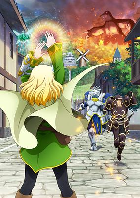

**Studio:** Maho Film &nbsp;|&nbsp; **Episodes:** 12 &nbsp;|&nbsp; **Director:** Takeyuki Yanase &nbsp;|&nbsp; **Aired/Released:** January 5 – March 23 &nbsp;|&nbsp; **Genres:** Fantasy World, Fantasy, Adventure, Isekai, Elf

> Due to a terrible accident, Keina Kagami is forced to live on life support in order to survive. The only way for her to be free is within the VRMMORPG "Leadale." One day, her life support stops functioning, and Keina loses her life. But when she wakes up, she finds herself in the world of Leadale 200 years in the future. She is now the high elf Cayna, who possesses lost skills and OP statuses and becomes closer to the other inhabitants of this world. But among those inhabitants happen to be the "children" she made in character creation?!
>
> _Synopsis source: Kitsu_

[Wikipedia](https://en.wikipedia.org/wiki/In_the_Land_of_Leadale) · [Kitsu](https://kitsu.io/anime/leadale-no-daichi-nite)

---

### Irodorimidori

**Studio:** Akatsuki &nbsp;|&nbsp; **Episodes:** 8 &nbsp;|&nbsp; **Director:** Chihaya Tanaka &nbsp;|&nbsp; **Aired/Released:** January 5 – February 23 &nbsp;|&nbsp; **Genres:** Music

> Maigahara Music College Affiliate School Maigahara Senior High (abbreviated as MaiMai). At this academy that gathers the most promising musical talents, there's a rumor circulating among students. "If you give an amazing performance at the school festival, you get special extra credit (or so they say)." Serina's grades are not very good, so she immediately believes the rumor and decides to form a band! Rehearsals, sleepovers... even cosplay? Everything they can imagine will become part of their colorful daily life. But will they really be able to give an amazing performance and get the rumored credit!? The curtain rises on the story of the daily, funny lives of these girls!
>
> _Synopsis source: Kitsu_

[Wikipedia](https://en.wikipedia.org/wiki/Irodorimidori) · [Kitsu](https://kitsu.io/anime/irodorimidori-tv)

---

### Police in a Pod

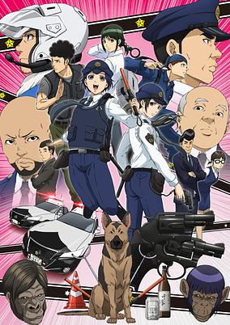

**Studio:** Madhouse &nbsp;|&nbsp; **Episodes:** 13 &nbsp;|&nbsp; **Director:** Yuzo Sato &nbsp;|&nbsp; **Aired/Released:** January 5 – March 30 &nbsp;|&nbsp; **Genres:** Comedy, Cops, Seinen, Drama, Slice of Life, Working Life

> Female police officer Kawai had enough of a career she wasn't even that into and was about to hand in her registration, when the unthinkable happened—she met the new, female director of her station! And after spending a little time with this gorgeous role model, Kawai realizes that maybe she isn't quite done being an officer after all.
>
> _Synopsis source: Kitsu_

[Wikipedia](https://en.wikipedia.org/wiki/Police_in_a_Pod) · [Kitsu](https://kitsu.io/anime/hakozume-koban-joshi-no-gyakushuu)

---

### Orient (part 1) (Orient)

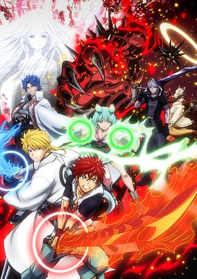

**Studio:** A.C.G.T &nbsp;|&nbsp; **Episodes:** 12 &nbsp;|&nbsp; **Director:** Tetsuya Yanagisawa &nbsp;|&nbsp; **Aired/Released:** January 6 – March 24 &nbsp;|&nbsp; **Genres:** Historical, Action, Fantasy, Shounen, Adventure, Demon

> At age 10, best friends Musashi and Kojirou sat in excited silence as Kojirou's father spun tales of evil demons who preyed on the innocent, and the warriors who defeated them. Practicing swordplay, the two swear an oath to become the strongest in the world, but as they grow up, Kojirou turns cynical, and Musashi comes to the realization that he can't overturn 150 years of demon rule on his own. He's being called a prodigy with a pickaxe, and he's almost ready to settle into a life of labor. Yet he can't shake the feeling that he is still has a responsibility to act... and soon, the injustices of his world will force his hand...
>
> _Synopsis source: Kitsu_

[Wikipedia](https://en.wikipedia.org/wiki/Orient_(manga)) · [Kitsu](https://kitsu.io/anime/orient)

---

### Saiyuki Reload: Zeroin

**Studio:** Liden Films &nbsp;|&nbsp; **Episodes:** 13 &nbsp;|&nbsp; **Director:** Misato Takada &nbsp;|&nbsp; **Aired/Released:** January 6 – March 31

[Wikipedia](https://en.wikipedia.org/wiki/Saiyuki_(manga))

---

### Tokyo 24th Ward

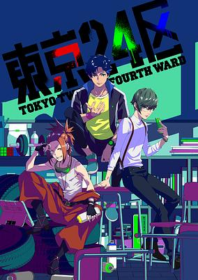

**Studio:** CloverWorks &nbsp;|&nbsp; **Episodes:** 12 &nbsp;|&nbsp; **Director:** Naokatsu Tsuda &nbsp;|&nbsp; **Aired/Released:** January 6 – April 7 &nbsp;|&nbsp; **Genres:** Science Fiction, Mystery, Super Power

> An artificial island in Tokyo Bay—Kyokutou Houreigai Tokubetsu Chiku (Far East Special District), commonly known as the 24-ku (24th Ward). Childhood friends Ran, Kouki, and Shuuta, who were born and raised there, have different family backgrounds, hobbies, and personalities, but always hung out together. However, their relationship changes drastically in the wake of a certain incident. At the first anniversary memorial of the incident, the three friends happen to meet again and their phones begin to ring simultaneously. The phone call is from a supposedly dead friend, urging them to "choose the future." The three will try to protect their beloved 24th Ward and the future of its people in their own ways.
>
> _Synopsis source: Kitsu_

[Wikipedia](https://en.wikipedia.org/wiki/Tokyo_24th_Ward) · [Kitsu](https://kitsu.io/anime/tokyo-24ku)

---

### Slow Loop

**Studio:** Connect &nbsp;|&nbsp; **Episodes:** 12 &nbsp;|&nbsp; **Director:** Noriaki Akitaya &nbsp;|&nbsp; **Aired/Released:** January 7 – March 25 &nbsp;|&nbsp; **Genres:** Slice of Life, Sports, Seinen, Family

> When Hiyori⁠—a young girl whose deceased father taught her the joys of fishing⁠—headed out to sea for some alone time, she never thought that she would encounter another girl there. After a while, this girl⁠—named Koharu⁠—and her end up fishing and cooking together, and they get to know each other a bit in the meantime. During their brief time together Koharu finds out that the reason Hiyori went out to sea that day was because she's hesitant towards meeting her new step family that same evening. But what a coincidence! Koharu is also meeting her new family tonight! "No. It can't be a coincidence..." Follow these two 'sisters' and their new life together!
>
> _Synopsis source: Kitsu_

[Wikipedia](https://en.wikipedia.org/wiki/Slow_Loop) · [Kitsu](https://kitsu.io/anime/slow-loop)

---

### Cue!

**Studio:** Yumeta Company Graphinica &nbsp;|&nbsp; **Episodes:** 24 &nbsp;|&nbsp; **Director:** Shin Katagai &nbsp;|&nbsp; **Aired/Released:** January 8 – June 25 &nbsp;|&nbsp; **Genres:** Music

> Based on an idol-training mobile game produced by Liber Entertainment and Pony Canyon. The brand-new voice actor office "AiRBLUE" has no track record or experience. Aspiring voice actors with rich individuality are signed on to the office. They do their best to achieve their dreams, but it's a tough world out there. No matter how much they practice, not everyone will pass the audition.
>
> _Synopsis source: Kitsu_

[Wikipedia](https://en.wikipedia.org/wiki/Cue!_(video_game)) · [Kitsu](https://kitsu.io/anime/cue)

---

### Girls' Frontline

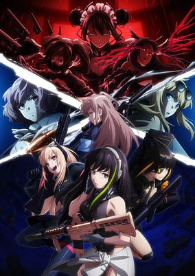

**Studio:** Asahi Production &nbsp;|&nbsp; **Episodes:** 12 &nbsp;|&nbsp; **Director:** Shigeru Ueda &nbsp;|&nbsp; **Aired/Released:** January 8 – March 26 &nbsp;|&nbsp; **Genres:** Action, Military, Science Fiction, Drama

> In the fallout of nuclear war, the last of humanity survives with the help of life-like androids known as Dolls. Built to serve, some fight in wars as Tactical Dolls or T-Dolls. Now, an elite team comprised of T-Dolls are sent to face a new rogue threat, Sangvis Ferri. Leading them into battle is their new human commander, M4A1.
>
> _Synopsis source: Kitsu_

[Wikipedia](https://en.wikipedia.org/wiki/Girls%27_Frontline) · [Kitsu](https://kitsu.io/anime/girls-frontline)

---

### Ninjala

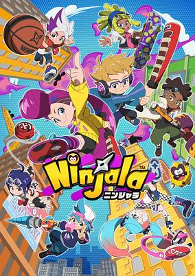

**Studio:** OLM &nbsp;|&nbsp; **Episodes:** 60 &nbsp;|&nbsp; **Director:** Mamoru Kanbe &nbsp;|&nbsp; **Aired/Released:** January 8 – March 18, 2023 &nbsp;|&nbsp; **Genres:** Action, Comedy, Science Fiction

> The year is 20XX. The ninja, who once forged the history of Japan, were scattered across the country during the Meiji Restoration. As these ninja mingled with the other clans, their bloodline thinned, and they gradually faded from sight. The descendants of these ninja clans, seeking to preserve their heritage, formed the WNA (World Ninja Association) in the hope of carrying on their legacy. And so it was that the WNA succeeded in developing Ninja-Gum, an art which could summon forth the strength of the Shinobi. And yet creating the most powerful Ninja-Gum requires the strongest of ninja DNA. So it was that the Ninjala Tournament was held, that the mightiest of all ninjas could be found...
>
> _Synopsis source: Kitsu_

[Wikipedia](https://en.wikipedia.org/wiki/Ninjala) · [Kitsu](https://kitsu.io/anime/ninjala)

---

### Teasing Master Takagi-san (season 3) (Teasing Master Takagi-san Season 3)

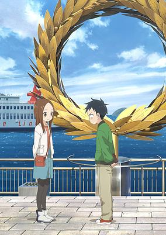

**Studio:** Shin-Ei Animation &nbsp;|&nbsp; **Episodes:** 12 &nbsp;|&nbsp; **Director:** Hiroaki Akagi &nbsp;|&nbsp; **Aired/Released:** January 8 – March 26 &nbsp;|&nbsp; **Genres:** Middle School, Comedy, Romance, Slice of Life, School Life, Shounen

> The third season of Karakai Jouzu no Takagi-san.
>
> _Synopsis source: Kitsu_

[Wikipedia](https://en.wikipedia.org/wiki/Teasing_Master_Takagi-san) · [Kitsu](https://kitsu.io/anime/karakai-jouzu-no-takagi-san-3)

---

### The Strongest Sage With the Weakest Crest

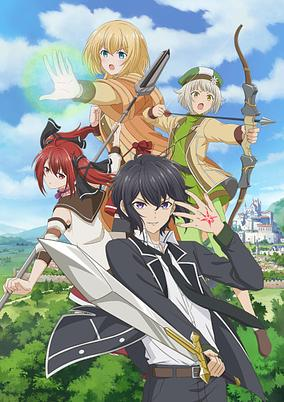

**Studio:** J.C.Staff &nbsp;|&nbsp; **Episodes:** 12 &nbsp;|&nbsp; **Director:** Noriaki Akitaya &nbsp;|&nbsp; **Aired/Released:** January 8 – March 26 &nbsp;|&nbsp; **Genres:** Fantasy, Fantasy World, Adventure, Action

> His strength limited by the magical crest with which he was born, Matthias, the world’s most powerful sage, decides reincarnation is necessary to become the strongest of all. Upon his rebirth as a young boy, Matthias is thrilled to discover he’s been born with the optimal crest for magical combat on his first try! Unfortunately, the world he’s been born into has abysmally poor standards when it comes to magic, and everyone thinks he’s still marked for failure! Now it’s up to Matthias to prove everyone wrong…world’s strongest sage-style!
>
> _Synopsis source: Kitsu_

[Wikipedia](https://en.wikipedia.org/wiki/The_Strongest_Sage_With_the_Weakest_Crest) · [Kitsu](https://kitsu.io/anime/shikkakumon-no-saikyou-kenja)

---

### Akebi's Sailor Uniform

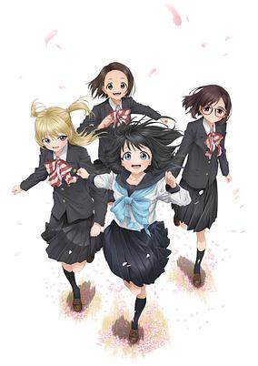

**Studio:** CloverWorks &nbsp;|&nbsp; **Episodes:** 12 &nbsp;|&nbsp; **Director:** Miyuki Kuroki &nbsp;|&nbsp; **Aired/Released:** January 9 – March 27 &nbsp;|&nbsp; **Genres:** School Life, Slice of Life, All Girls School, Middle School, Coming Of Age

> Robai Private Academy is a well-known girls’ junior high school in the countryside. Komichi Akebi is a girl who, for a certain reason, has dreamed of wearing a Robai Academy sailor uniform. Her dream comes true, and her heart races as the day of the school entrance ceremony arrives. With her heart set on her new sailor uniform, Komichi embarks on the junior high school life of her dreams♪ Komichi dashes headlong through days full of “firsts”—classmates, school lunches, club activities, and more—in this sparkling diary of girlhood. “I hope I can make a lot of friends.”
>
> _Synopsis source: Kitsu_

[Wikipedia](https://en.wikipedia.org/wiki/Akebi%27s_Sailor_Uniform) · [Kitsu](https://kitsu.io/anime/akebi-chan-no-sailor-fuku)

---

### Futsal Boys!!!!!

**Studio:** Diomedéa &nbsp;|&nbsp; **Episodes:** 12 &nbsp;|&nbsp; **Director:** Yukina Hiiro &nbsp;|&nbsp; **Aired/Released:** January 9 – March 27 &nbsp;|&nbsp; **Genres:** Sports, School Clubs

> The franchise's story is set in a world over a decade after futsal has skyrocketed in global popularity. Protagonist Haru Yamato watches the championship of the U-18 world cup and is inspired by a Japanese player named Tokinari Tenōji. He joins the Koyo Academy High School's futsal team with the goal of becoming a player like Tenōji. There, he finds friends, and together they face their rivals.
>
> _Synopsis source: Kitsu_

[Wikipedia](https://en.wikipedia.org/wiki/Futsal_Boys!!!!!) · [Kitsu](https://kitsu.io/anime/futsal-boys)

---

### How a Realist Hero Rebuilt the Kingdom (part 2) (How a Realist Hero Rebuilt the Kingdom)

**Studio:** J.C.Staff &nbsp;|&nbsp; **Episodes:** 13 &nbsp;|&nbsp; **Director:** Takashi Watanabe &nbsp;|&nbsp; **Aired/Released:** January 9 – April 3 &nbsp;|&nbsp; **Genres:** Action, Military, Harem, Magic, Romance, Fantasy, Fantasy World, Isekai, Elf

> "O, Hero!" With that cliched line, Kazuya Souma found himself summoned to another world and his adventure--did not begin. After he presents his plan to strengthen the country economically and militarily, the king cedes the throne to him and Souma finds himself saddled with ruling the nation! What's more, he's betrothed to the king's daughter now...?! In order to get the country back on its feet, Souma calls the wise, the talented, and the gifted to his side. Five people gather before the newly crowned Souma. Just what are the many talents and abilities they possess...?! What path will his outlook as a realist take Souma and the people of his country down?
>
> _Synopsis source: Kitsu_

[Wikipedia](https://en.wikipedia.org/wiki/How_a_Realist_Hero_Rebuilt_the_Kingdom) · [Kitsu](https://kitsu.io/anime/genjitsu-shugi-yuusha-no-oukoku-saikenki)

---

### Miss Kuroitsu from the Monster Development Department

**Studio:** Quad &nbsp;|&nbsp; **Episodes:** 12 &nbsp;|&nbsp; **Director:** Hisashi Saitō &nbsp;|&nbsp; **Aired/Released:** January 9 – April 3

[Wikipedia](https://en.wikipedia.org/wiki/Miss_Kuroitsu_from_the_Monster_Development_Department)

---

### My Dress-Up Darling

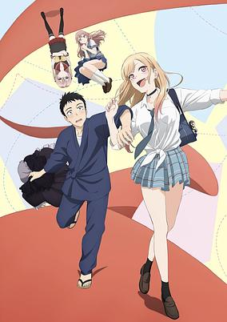

**Studio:** CloverWorks &nbsp;|&nbsp; **Episodes:** 12 &nbsp;|&nbsp; **Director:** Keisuke Shinohara &nbsp;|&nbsp; **Aired/Released:** January 9 – March 27 &nbsp;|&nbsp; **Genres:** Slice of Life, Romance, Seinen, School Life, Ecchi, High School

> Wakana Gojo is a high school boy who wants to become a kashirashi--a master craftsman who makes traditional Japanese Hina dolls. Though he's gung-ho about the craft, he knows nothing about the latest trends and has a hard time fitting in with his class. The popular kids--especially one girl, Marin Kitagawa--seem like they live in a completely different world. That all changes one day, when she shares an unexpected secret with him, and their completely different worlds collide
>
> _Synopsis source: Kitsu_

[Wikipedia](https://en.wikipedia.org/wiki/My_Dress-Up_Darling) · [Kitsu](https://kitsu.io/anime/sono-bisque-doll-wa-koi-wo-suru)

---

### Requiem of the Rose King

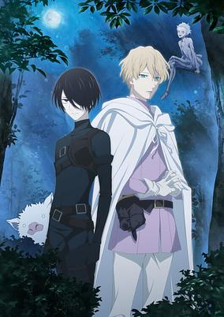

**Studio:** J.C.Staff &nbsp;|&nbsp; **Episodes:** 24 &nbsp;|&nbsp; **Director:** Kentarō Suzuki &nbsp;|&nbsp; **Aired/Released:** January 9 – June 26 &nbsp;|&nbsp; **Genres:** Action, Drama, Historical, Supernatural, Shoujo

> Richard, the ambitious third son of the House of York, believes he is cursed, damned from birth to eternal darkness. But is it truly fate that sets him on the path to personal destruction? Or his own tormented longings? Based on an early draft of Shakespeare’s Richard III, Aya Kanno’s dark fantasy finds the man who could be king standing between worlds, between classes, between good and evil.
>
> _Synopsis source: Kitsu_

[Wikipedia](https://en.wikipedia.org/wiki/Requiem_of_the_Rose_King) · [Kitsu](https://kitsu.io/anime/baraou-no-souretsu)

---

### Rusted Armors: Daybreak (Rusted Armors)

**Studio:** Kigumi &nbsp;|&nbsp; **Episodes:** 12 &nbsp;|&nbsp; **Director:** Shinmei Kawahara &nbsp;|&nbsp; **Aired/Released:** January 9 – March 27 &nbsp;|&nbsp; **Genres:** Action, Steampunk, Historical, Gunfights, Samurai, Swordplay

> The anime adaptation of Rusted Armors, a multimedia project that first started with a stage play and a manga adaptation. The project focuses on the relationship between the gun-toting Magoichi — who is the leader of the Saika Ikki mercenary group — and the Sengoku era warlord Oda Nobunaga.
>
> _Synopsis source: Kitsu_

[Wikipedia](https://en.wikipedia.org/wiki/Rusted_Armors) · [Kitsu](https://kitsu.io/anime/sabiiro-no-armor)

---

### Attack on Titan: The Final Season (part 2) (Attack on Titan: The Final Season Part 2)

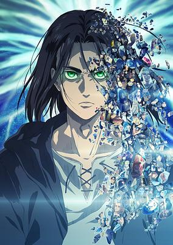

**Studio:** MAPPA &nbsp;|&nbsp; **Episodes:** 12 &nbsp;|&nbsp; **Director:** Jun Shishido (Chief) Yuichiro Hayashi &nbsp;|&nbsp; **Aired/Released:** January 10 – April 4 &nbsp;|&nbsp; **Genres:** Super Power, Action, Fantasy, Henshin, Steampunk, Revenge, Dystopia, Drama, Military, Shounen

> The war for Paradis zeroes in on Shiganshina just as the Jaegerists have seized control. After taking a huge blow from a surprise attack led by Eren, Marley swiftly acts to return the favor. With Zeke’s true plan revealed and the military forced under a new rule, this battle might be fought on two fronts. Does Eren intend on fulfilling his half-brother’s wishes or does he have a plan of his own?
>
> _Synopsis source: Kitsu_

[Wikipedia](https://en.wikipedia.org/wiki/Attack_on_Titan_(season_4)) · [Kitsu](https://kitsu.io/anime/shingeki-no-kyojin-the-final-season-part-2)

---

### GaruGaku II: Lucky Stars (Girl School.: Lucky Stars)

**Studio:** OLM &nbsp;|&nbsp; **Episodes:** 50 &nbsp;|&nbsp; **Director:** Makoto Nakata &nbsp;|&nbsp; **Aired/Released:** January 10 – March 18 &nbsp;|&nbsp; **Genres:** Music, Comedy

[Wikipedia](https://en.wikipedia.org/wiki/GaruGaku) · [Kitsu](https://kitsu.io/anime/garugaku-ii-lucky-stars)

---

### On Air Dekinai! (I Can't Go On Air!)

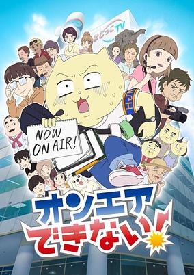

**Studio:** Jinnan Studio Space Neko Company &nbsp;|&nbsp; **Episodes:** 12 &nbsp;|&nbsp; **Director:** Jun Aoki &nbsp;|&nbsp; **Aired/Released:** January 10 – March 28 &nbsp;|&nbsp; **Genres:** Comedy

> The story takes place in 2014 and follows Mafuneko, a new hire at the "Tokyo Hajikko Television" company. The anime follows the hard struggles behind the scenes at making television content.
>
> _Synopsis source: Kitsu_

[Wikipedia](https://en.wikipedia.org/wiki/On_Air_Dekinai!) · [Kitsu](https://kitsu.io/anime/on-air-dekinai)

---

### Sasaki and Miyano

**Studio:** Studio Deen &nbsp;|&nbsp; **Episodes:** 12 &nbsp;|&nbsp; **Director:** Shinji Ishihira &nbsp;|&nbsp; **Aired/Released:** January 10 – March 28 &nbsp;|&nbsp; **Genres:** Comedy, Romance, Slice of Life, Shounen Ai, School Life

> Miyano spends his days peacefully reading Boys' Love comics and worrying about how girly his face is-until a chance encounter leads to a scuffle with his senior Sasaki. Intrigued by his feisty junior Miyano, delinquent Sasaki uses every opportunity he can to get closer...
>
> _Synopsis source: Kitsu_

[Wikipedia](https://en.wikipedia.org/wiki/Sasaki_and_Miyano) · [Kitsu](https://kitsu.io/anime/sasaki-to-miyano)

---

### Tribe Nine

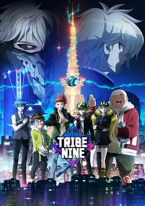

**Studio:** Liden Films &nbsp;|&nbsp; **Episodes:** 12 &nbsp;|&nbsp; **Director:** Yū Aoki &nbsp;|&nbsp; **Aired/Released:** January 10 – March 28 &nbsp;|&nbsp; **Genres:** Action, Sports, Baseball, Science Fiction, Cyberpunk, Delinquent

> Haru Shirogane is a weak-minded person who is constantly bullied while Taiga has traveled from across the sea in hopes of becoming the strongest man in the world. One night, the two meet up with Shun Kamiya, the strongest XB (Extreme Baseball) player, and leader of the Minato Tribe. When they meet, each of the Tribes scattered throughout Neo-Tokyo are about to face a major threat. On the orders of the King of Neo-Tokyo, "Houtenshin", the Chiyoda Try, led by the mysterious Ojiro Otori, has started to take control of all the tribes in the country. Their evil clutches are about to reach the Minato Tribe...
>
> _Synopsis source: Kitsu_

[Wikipedia](https://en.wikipedia.org/wiki/Tribe_Nine) · [Kitsu](https://kitsu.io/anime/tribe-nine)

---

### Fantasia Sango - Realm of Legends (Fantasia Sango)

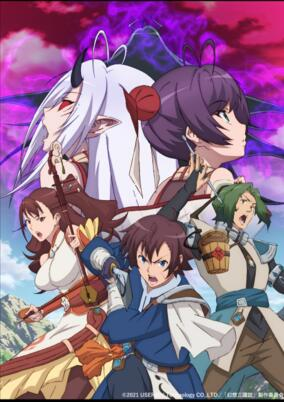

**Studio:** Geek Toys &nbsp;|&nbsp; **Episodes:** 12 &nbsp;|&nbsp; **Director:** Shunsuke Machitani &nbsp;|&nbsp; **Aired/Released:** January 11 – March 29 &nbsp;|&nbsp; **Genres:** Fantasy

> The story is set in ancient China during the Three Kingdoms era, when various powerful warlords began maneuvering to conquer the known realms. After it was wiped out in unforeseen circumstances, the 6th Unit has been reassembled with members from diverse, troubled pasts: the leader and seal practitioner Ouki, the spirit purifier Shunkyou, Teiken, and the demon slayer Shourei.
>
> _Synopsis source: Kitsu_

[Wikipedia](https://en.wikipedia.org/wiki/Fantasia_Sango) · [Kitsu](https://kitsu.io/anime/gensou-sangokushi-tengen-reishinki)

---

### Princess Connect! Re:Dive (season 2)

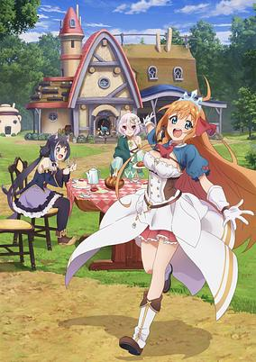

**Studio:** CygamesPictures &nbsp;|&nbsp; **Episodes:** 12 &nbsp;|&nbsp; **Director:** Takaomi Kansaki (Chief) Yasuo Iwamoto &nbsp;|&nbsp; **Aired/Released:** January 11 – March 29 &nbsp;|&nbsp; **Genres:** Fantasy, Fantasy World, Isekai, Comedy, Cooking, Adventure

> Second season of Princess Connect! Re:Dive.
>
> _Synopsis source: Kitsu_

[Kitsu](https://kitsu.io/anime/princess-connect-re-dive-season-2)

---

### Sabikui Bisco

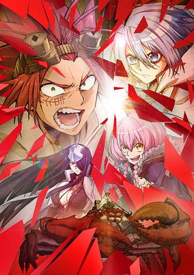

**Studio:** OZ &nbsp;|&nbsp; **Episodes:** 12 &nbsp;|&nbsp; **Director:** Atsushi Ikariya &nbsp;|&nbsp; **Aired/Released:** January 11 – March 29 &nbsp;|&nbsp; **Genres:** Action, Adventure, Fantasy

> Japan’s post-apocalyptic wasteland replete with dust can only be saved by one thing—fungus. Bisco Akaboshi, a wanted criminal and skilled archer, searches for a legendary mushroom, known as Sabikui, said to devour any and all rust. Joining him on this epic saga to save the country is a giant crab and a young doctor. Can this unlikely trio find the fabled fungi and save the land?
>
> _Synopsis source: Kitsu_

[Wikipedia](https://en.wikipedia.org/wiki/Sabikui_Bisco) · [Kitsu](https://kitsu.io/anime/sabikui-bisco)

---

### The Genius Prince's Guide to Raising a Nation Out of Debt

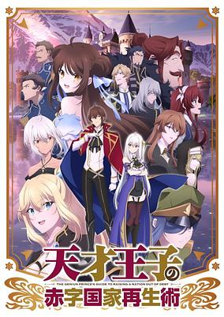

**Studio:** Yokohama Animation Laboratory &nbsp;|&nbsp; **Episodes:** 12 &nbsp;|&nbsp; **Director:** Masato Tamagawa &nbsp;|&nbsp; **Aired/Released:** January 11 – March 29 &nbsp;|&nbsp; **Genres:** Comedy, Fantasy, Fantasy World, Violence, Action, Swordplay, Parody, Politics

> It ain't easy being a genius... Prince Wein is ready to commit treason. And who can blame him? Faced with the impossible task of ruling his pathetic little kingdom, this poor guy just can't catch a break! But with his brilliant idea of auctioning off his country, this lazy prince should be able to retire once and for all. Or that was the plan...until his treasonous schemes lead to disastrous consequences-namely, accidental victories and the favor of his people!
>
> _Synopsis source: Kitsu_

[Wikipedia](https://en.wikipedia.org/wiki/The_Genius_Prince%27s_Guide_to_Raising_a_Nation_Out_of_Debt) · [Kitsu](https://kitsu.io/anime/tensai-ouji-no-akaji-kokka-saisei-jutsu-souda-baikoku-shiyou)

---

### Life with an Ordinary Guy Who Reincarnated into a Total Fantasy Knockout

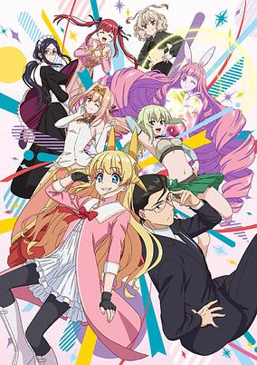

**Studio:** OLM Team Yoshioka &nbsp;|&nbsp; **Episodes:** 12 &nbsp;|&nbsp; **Director:** Sayaka Yamai &nbsp;|&nbsp; **Aired/Released:** January 12 – March 30 &nbsp;|&nbsp; **Genres:** Comedy, Fantasy, Adventure, Romance, Gender Bender, Isekai

> A dull old man and his handsome best friend were summoned to another world by a naked goddess! However, because of the goddess's mischief, he has turned into a peerless beautiful girl?! To get back his body, he has to go on a journey with his best friend to defeat the demon king!! "An old man that became a beautiful girl" and "A handsome old man"! Let the madness filled another world journey rom-com begin!! (Source MU)
>
> _Synopsis source: Kitsu_

[Wikipedia](https://en.wikipedia.org/wiki/Life_with_an_Ordinary_Guy_Who_Reincarnated_into_a_Total_Fantasy_Knockout) · [Kitsu](https://kitsu.io/anime/fantasy-bishoujo-juniku-ojisan-to)

---

### She Professed Herself Pupil of the Wise Man

**Studio:** Studio A-Cat &nbsp;|&nbsp; **Episodes:** 12 &nbsp;|&nbsp; **Director:** Keitaro Motonaga &nbsp;|&nbsp; **Aired/Released:** January 12 – March 30 &nbsp;|&nbsp; **Genres:** Adventure, Fantasy, Isekai, Gender Bender

> In one of the worlds that exist within virtual reality, Kagami held the title of one of the Nine Sages, a position that placed him at the pinnacle of magicians. One day, he fell asleep in-game after pulling an all-nighter. When he opened his eyes, what he found was a world that was different to the one before… More important than anything else, was that the grizzled and dignified veteran’s body that he was used to, had now turned into an innocent little girl’s. If his true identity was leaked, honestly speaking it was a situation where it was very possible that the solemn image he had built up until now would be destroyed. And to deal with this problem, the excuse that he came up with was…
>
> _Synopsis source: Kitsu_

[Wikipedia](https://en.wikipedia.org/wiki/She_Professed_Herself_Pupil_of_the_Wise_Man) · [Kitsu](https://kitsu.io/anime/kenja-no-deshi-wo-nanoru-kenja)

---

### Arifureta: From Commonplace to World's Strongest (season 2) (Arifureta: From Commonplace to World's Strongest Season 2)

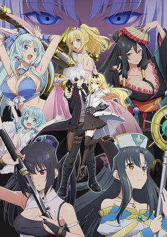

**Studio:** Asread Studio Mother &nbsp;|&nbsp; **Episodes:** 12 &nbsp;|&nbsp; **Director:** Akira Iwanaga &nbsp;|&nbsp; **Aired/Released:** January 13 – March 31 &nbsp;|&nbsp; **Genres:** Action, Adventure, Conspiracy, Fantasy, Vampire, Harem, Romance, Isekai, Loli, Magic

> Transported to another world and left behind by his former friends, Hajime had to make his rise from literal rock bottom. It was in the labyrinth where he strengthened his weak magic and found several beautiful allies. Now after saving his classmates, he ventures for Erisen to escort Myuu and her mother. He'll fight and defeat anyone he has to in order to find a way home—including a god!
>
> _Synopsis source: Kitsu_

[Kitsu](https://kitsu.io/anime/arifureta-shokugyou-de-sekai-saikyou-2)

---

### Love of Kill

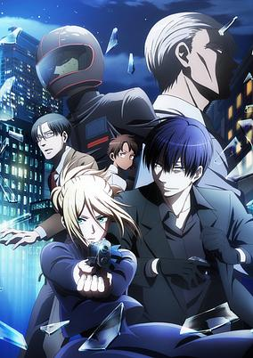

**Studio:** Platinum Vision &nbsp;|&nbsp; **Episodes:** 12 &nbsp;|&nbsp; **Director:** Hideaki Ōba &nbsp;|&nbsp; **Aired/Released:** January 13 – March 31 &nbsp;|&nbsp; **Genres:** Bounty Hunter, Assassin, Gunfights, Violence, Action, Romance, Psychological, Josei

> The silent and stoic Chateau Dankworth is a bounty hunter. Her target: Son Ryang-ha, a notorious killer known for killing 18 high-class officials in a single night. To this day, his murders remain swift, efficient, and bloody. However, after Son Ryang-ha overpowers Chateau in their first encounter, he reveals his own intentions: he too is after her, aiming for her heart. Son Ryang-ha's attempts to catch her eye are quite unique, to say the least. He offers gifts to her in the form of her current targets, tied up and battered, and will do anything to spend more time together. Reluctantly, Chateau goes along with this act, and so begins the cat-and-mouse game of love between two killers.
>
> _Synopsis source: Kitsu_

[Wikipedia](https://en.wikipedia.org/wiki/Love_of_Kill) · [Kitsu](https://kitsu.io/anime/koroshi-ai)

---

### I'm Kodama Kawashiri (I'm Quitting Heroing)

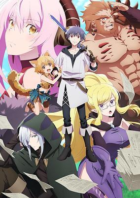

**Studio:** Lapin Track &nbsp;|&nbsp; **Episodes:** 24 &nbsp;|&nbsp; **Director:** Shingo Kaneko &nbsp;|&nbsp; **Aired/Released:** January 14 – August 12 &nbsp;|&nbsp; **Genres:** Action, Fantasy, Adventure, Comedy

> After saving the world, the strongest hero Leo became someone who is not wanted in the peaceful human world. He was too strong. Exiled, he seeks a job at the Demon King's Army, which he had defeated and needs to be rebuilt. The Army had many problems: too much work, financial troubles, etc. Leo starts to make things better using his power. Leo encounters Echidna again and asks her why she invaded the human world. There was an unexpected story---!
>
> _Synopsis source: Kitsu_

[Wikipedia](https://en.wikipedia.org/wiki/I%27m_Kodama_Kawashiri) · [Kitsu](https://kitsu.io/anime/yuusha-yamemasu)

---

### The Case Study of Vanitas (part 2) (The Case Study of Vanitas)

**Studio:** Bones &nbsp;|&nbsp; **Episodes:** 12 &nbsp;|&nbsp; **Director:** Tomoyuki Itamura &nbsp;|&nbsp; **Aired/Released:** January 15 – April 2 &nbsp;|&nbsp; **Genres:** Historical, Supernatural, Vampire, Adventure, Drama, Mystery, Steampunk, Bishounen, Shounen, France

> It’s 19th-century Paris, and young vampire Noé hunts for the Book of Vanitas. Attacked by a vampire driven insane, a human intercedes, rescues Noé, and heals the sick creature. Commanding the book and calling himself Vanitas, this doctor tempts Noé with a mad crusade to “cure” the entire vampire race. Allying with one who wields arcane power so easily may be dangerous, but does he have a choice?
>
> _Synopsis source: Kitsu_

[Wikipedia](https://en.wikipedia.org/wiki/The_Case_Study_of_Vanitas) · [Kitsu](https://kitsu.io/anime/vanitas-no-carte)

---

### Salaryman's Club

**Studio:** Liden Films &nbsp;|&nbsp; **Episodes:** 12 &nbsp;|&nbsp; **Director:** Aimi Yamauchi &nbsp;|&nbsp; **Aired/Released:** January 30 – April 17 &nbsp;|&nbsp; **Genres:** Sports

> The story centers on Mikoto Shiratori, a childhood prodigy at badminton, but who never recovered from a major loss during a high school competition. Now, he works in the sales department of the Sunlight Beverage company, playing badminton on the side.
>
> _Synopsis source: Kitsu_

[Wikipedia](https://en.wikipedia.org/wiki/Salaryman%27s_Club) · [Kitsu](https://kitsu.io/anime/ryman-s-club)

---

### Delicious Party Pretty Cure (My Precious Lunch)

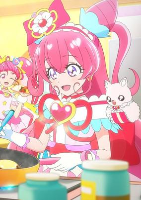

**Studio:** Toei Animation &nbsp;|&nbsp; **Episodes:** 45 &nbsp;|&nbsp; **Director:** Toshinori Fukazawa &nbsp;|&nbsp; **Aired/Released:** February 6 – January 29, 2023 &nbsp;|&nbsp; **Genres:** Action, Fantasy, Magical Girl, Shoujo, Slice of Life

> Anime short that will accompany screenings of the Delicious Party♡Precure: Yumemiru♡Okosama Lunch! film. The short will star characters from three previous Precure series — Tropical-Rouge! Precure, Healin' Good Precure, and Star☆Twinkle Precure — alongside the characters from the current Delicious Party♡Precure series.
>
> _Synopsis source: Kitsu_

[Wikipedia](https://en.wikipedia.org/wiki/Delicious_Party_Pretty_Cure) · [Kitsu](https://kitsu.io/anime/watashi-dake-no-okosama-lunch)

---

### Shenmue: The Animation (Shenmue the Animation)

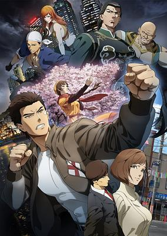

**Studio:** Telecom Animation Film &nbsp;|&nbsp; **Episodes:** 13 &nbsp;|&nbsp; **Director:** Chikara Sakurai &nbsp;|&nbsp; **Aired/Released:** February 6 – May 1 &nbsp;|&nbsp; **Genres:** Action, Adventure, Martial Arts

> 1986, Yokosuka. Ryo Hazuki has trained to master the Hazuki Style Jujitsu under his strict father in the Hazuki Dojo from his childhood. However, one day a mysterious man named Lan Di murders his father and takes the “mirror” his father was protecting. Ryo is determined to find the truth behind his father’s murder, but soon finds himself getting stuck in a war between the underground organizations…. Traveling from Yokosuka to Hong Kong, Ryo’s long journey begins!
>
> _Synopsis source: Kitsu_

[Kitsu](https://kitsu.io/anime/shenmue-the-animation)

---

### Aharen-san Is Indecipherable (Aharen Is Indecipherable)

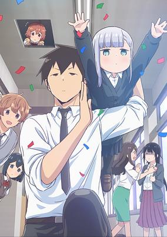

**Studio:** Felix Film &nbsp;|&nbsp; **Episodes:** 12 &nbsp;|&nbsp; **Director:** Yasutaka Yamamoto (Chief) Tomoe Makino &nbsp;|&nbsp; **Aired/Released:** April 2 – June 18 &nbsp;|&nbsp; **Genres:** Comedy, School Life

> The story follows the "indecipherable" daily life of the short and quiet Reina Aharen and Raidou who sits next to her. Aharen is not so good at gauging the distance between people, and Raidou initially felt some distance between the two of them. One day, when Raidou picked up the eraser that Aharen had dropped, the distance between them suddenly became uncomfortably close.
>
> _Synopsis source: Kitsu_

[Wikipedia](https://en.wikipedia.org/wiki/Aharen-san_Is_Indecipherable) · [Kitsu](https://kitsu.io/anime/aharen-san-wa-hakarenai)

---

### Fanfare of Adolescence

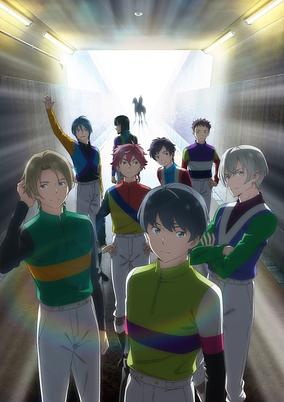

**Studio:** Lay-duce &nbsp;|&nbsp; **Episodes:** 13 &nbsp;|&nbsp; **Director:** Makoto Katō &nbsp;|&nbsp; **Aired/Released:** April 2 – June 25 &nbsp;|&nbsp; **Genres:** Sports

> The story takes place at a horse racing academy that trains boys to become jockeys. The three-year academy is very competitive, and those who wish to enter must not only pass an academic test but a physical and fitness test as well. Yuu Arimura is a former popular idol who becomes enamored with horse racing after seeing it for the first time, and wants to join the academy. Shun Kanami was raised on an island, and only experienced horse races through radio broadcasts growing up. Amane comes from a high-class family in England, and his father is a former jockey. Amane has previously attended horse racing academies in various countries. The show follows these three 15-year-old boys at the academy.
>
> _Synopsis source: Kitsu_

[Wikipedia](https://en.wikipedia.org/wiki/Fanfare_of_Adolescence) · [Kitsu](https://kitsu.io/anime/gunjou-no-fanfare)

---

### Love All Play

**Studio:** Nippon Animation OLM &nbsp;|&nbsp; **Episodes:** 24 &nbsp;|&nbsp; **Director:** Hiroshi Takeuchi &nbsp;|&nbsp; **Aired/Released:** April 2 – September 24 &nbsp;|&nbsp; **Genres:** Sports

> The story follows Ryou Mizushima, who was once an obscure badminton player in middle school. He now strives to become a top athlete and take his high school team to the inter-high tournament.
>
> _Synopsis source: Kitsu_

[Wikipedia](https://en.wikipedia.org/wiki/Love_All_Play_(novel_series)) · [Kitsu](https://kitsu.io/anime/love-all-play)

---

### Love Live! Nijigasaki High School Idol Club (season 2) (Love Live! Nijigasaki High School Idol Club Season 2)

**Studio:** Bandai Namco Filmworks &nbsp;|&nbsp; **Episodes:** 13 &nbsp;|&nbsp; **Director:** Tomoyuki Kawamura &nbsp;|&nbsp; **Aired/Released:** April 2 – June 25 &nbsp;|&nbsp; **Genres:** Idol, School Clubs, Music

> The second season of Love Live! Nijigasaki Gakuen School Idol Doukoukai.
>
> _Synopsis source: Kitsu_

[Wikipedia](https://en.wikipedia.org/wiki/Love_Live!_Nijigasaki_High_School_Idol_Club) · [Kitsu](https://kitsu.io/anime/love-live-nijigasaki-gakuen-school-idol-doukoukai-2)

---

### Mahjong Soul Pong (Mahjong Soul)

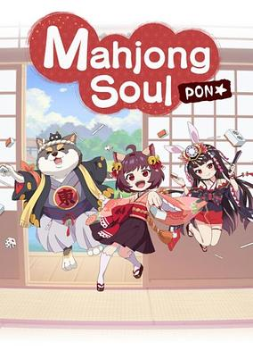

**Studio:** Scooter Films &nbsp;|&nbsp; **Episodes:** 12 &nbsp;|&nbsp; **Director:** Kenshirō Morii &nbsp;|&nbsp; **Aired/Released:** April 2 – June 18 &nbsp;|&nbsp; **Genres:** Comedy, Juujin, Slice of Life, Supernatural

> The live-streamed "Nijisanji Mahjong Cup" tournament announced on Sunday that a "comical" television anime adaptation of Cat Food Studio and Yostar's free-to-play mahjong game Mahjong Soul (Jong-Tama or Jan-Tama/majsoul) has been green-lit for April. Kenshirō Morii (Anime-Gataris, BanG Dream! Girls Band Party! Pico, Grand Blues!) is directing the Jong-Tama Pong☆ anime at Scooter Films.
>
> _Synopsis source: Kitsu_

[Wikipedia](https://en.wikipedia.org/wiki/Mahjong_Soul) · [Kitsu](https://kitsu.io/anime/jong-tama-pong)

---

### Science Fell in Love, So I Tried to Prove It r=1-sinθ (Science Fell in Love, So I Tried to Prove It  r=1-sinθ (Heart))

**Studio:** Zero-G &nbsp;|&nbsp; **Episodes:** 12 &nbsp;|&nbsp; **Director:** Tōru Kitahata &nbsp;|&nbsp; **Aired/Released:** April 2 – June 18 &nbsp;|&nbsp; **Genres:** Comedy, Romance

> Second season of Rikei ga Koi ni Ochita no de Shoumei shitemita.
>
> _Synopsis source: Kitsu_

[Wikipedia](https://en.wikipedia.org/wiki/Science_Fell_in_Love,_So_I_Tried_to_Prove_It) · [Kitsu](https://kitsu.io/anime/rikei-ga-koi-ni-ochita-no-de-shoumei-shitemita-2nd-season)

---

### Shadowverse Flame

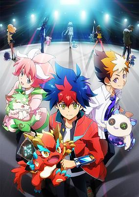

**Studio:** Zexcs &nbsp;|&nbsp; **Director:** Keiichiro Kawaguchi &nbsp;|&nbsp; **Aired/Released:** April 2 – &nbsp;|&nbsp; **Genres:** Fantasy, Card Games, Shounen

> Shadowverse Flame features a new protagonist Light Tenryu and its story is set in Shadovar College, a facility that trains professional players of the Shadowverse game. Tenryu Light, a transfer student, decides to join "Seventh Flame," one of the seven Shadovar clubs. However, Seventh Flame is on the verge of closure due to a lack of members! In order to avoid the club's demise, Light decides to look for new members. But what awaits him are powerful rivals who control a wide variety of cards...
>
> _Synopsis source: Kitsu_

[Wikipedia](https://en.wikipedia.org/wiki/Shadowverse_(TV_series)) · [Kitsu](https://kitsu.io/anime/shadowverse-f-flame)

---

### The Executioner and Her Way of Life

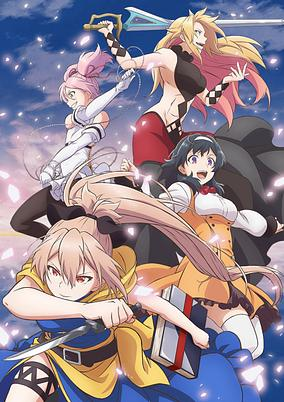

**Studio:** J.C.Staff &nbsp;|&nbsp; **Episodes:** 12 &nbsp;|&nbsp; **Director:** Yoshiki Kawasaki &nbsp;|&nbsp; **Aired/Released:** April 2 – June 18 &nbsp;|&nbsp; **Genres:** Action, Adventure, Isekai, Fantasy, Coming Of Age, Drama, Shoujo Ai

> The Lost Ones are wanderers who come here from a distant world known as "Japan." No one knows how or why they leave their homes. The only thing that is certain is that they bring disaster and calamity. The duty of exterminating them without remorse falls to Menou, a young Executioner. When she meets Akari, it seems like just another job...until she discovers it's impossible to kill this girl! And when Menou begins to search for a way to defeat this immortality, Akari is more than happy to tag along! So begins a journey that will change Menou forever...
>
> _Synopsis source: Kitsu_

[Wikipedia](https://en.wikipedia.org/wiki/The_Executioner_and_Her_Way_of_Life) · [Kitsu](https://kitsu.io/anime/shokei-shoujo-no-virgin-road)

---

### Black Rock Shooter: Dawn Fall (Black★★Rock Shooter: DAWN FALL)

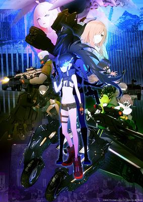

**Studio:** Bibury Animation Studios Bibury Animation CG &nbsp;|&nbsp; **Episodes:** 12 &nbsp;|&nbsp; **Director:** Tensho &nbsp;|&nbsp; **Aired/Released:** April 3 – June 19 &nbsp;|&nbsp; **Genres:** Cyborg, Super Power, Mecha, Action, Science Fiction, Cyberpunk, Drama

> The year is 2062. Earth has been left in ruin after the failure of a labor automation project when the AI called Artemis waged war against humanity. A girl, Empress, awakens in a research lab. As one of the three surviving guardians, she must destroy the Orbital Elevator before Artemis can complete its construction. Failure will result in a machine army overrunning Earth. However, Artemis' Unmanned Forces and a cult may have motives of their own.
>
> _Synopsis source: Kitsu_

[Wikipedia](https://en.wikipedia.org/wiki/Black_Rock_Shooter) · [Kitsu](https://kitsu.io/anime/black-rock-shooter-dawn-fall)

---

### Build Divide -#FFFFFF (Code White)-

**Studio:** Liden Films &nbsp;|&nbsp; **Episodes:** 12 &nbsp;|&nbsp; **Director:** Yuki Komada &nbsp;|&nbsp; **Aired/Released:** April 3 – June 26 &nbsp;|&nbsp; **Genres:** Fantasy, Card Games

> In a city where the King reigns supreme, your strength in Build-Divide determines everything... There is a rumor circulating in Shin Kyoto. “Anyone able to defeat the King in Build-Divide shall be granted whatever their heart desires.” In order to challenge the King, one must first enter the battle known as Rebuild. There, they will have to complete the “Key.” The young Teruto Kurabe vows to defeat the King so that he can get what he longs for. He, with a little guidance from the mysterious Sakura Banka, dives headfirst into the Rebuild Battle. Now, the city of Shin Kyoto is the stage and BUILD-DIVIDE is the game! Watch as the battle unfolds for Teruto and his friends.
>
> _Synopsis source: Kitsu_

[Wikipedia](https://en.wikipedia.org/wiki/Build_Divide) · [Kitsu](https://kitsu.io/anime/build-divide-code-black)

---

### Magia Record: Puella Magi Madoka Magica Side Story - Dawn of a Shallow Dream (Magia Record: Puella Magi Madoka Magica Side Story Season 2)

**Studio:** Shaft &nbsp;|&nbsp; **Episodes:** 4 &nbsp;|&nbsp; **Director:** Gekidan Inu Curry (Doroinu) (Chief) Yukihiro Miyamoto &nbsp;|&nbsp; **Aired/Released:** April 3 &nbsp;|&nbsp; **Genres:** Magic, Magical Girl, Thriller, Psychological

> 2nd Season of Magia Record: Mahou Shoujo Madoka☆Magica Gaiden TV series
>
> _Synopsis source: Kitsu_

[Wikipedia](https://en.wikipedia.org/wiki/Magia_Record) · [Kitsu](https://kitsu.io/anime/magia-record-mahou-shoujo-madoka-magica-gaiden-tv-second-season)

---

### Trapped in a Dating Sim: The World of Otome Games Is Tough for Mobs

**Studio:** ENGI &nbsp;|&nbsp; **Episodes:** 12 &nbsp;|&nbsp; **Director:** Kazuya Miura Shin'ichi Fukumoto &nbsp;|&nbsp; **Aired/Released:** April 3 – June 19 &nbsp;|&nbsp; **Genres:** Action, Comedy, Drama, Fantasy, Mecha, Romance, Isekai, Harem

> Office worker Leon is reincarnated into a particularly punishing dating sim video game, where women reign supreme and only beautiful men have a seat at the table. But Leon has a secret weapon: he remembers everything from his past life, which includes a complete playthrough of the very game in which he is now trapped. Watch Leon spark a revolution to change this new world in order to fulfill his ultimate desire…of living a quiet, easy life in the countryside!
>
> _Synopsis source: Kitsu_

[Kitsu](https://kitsu.io/anime/otomege-sekai-wa-mob-ni-kibishii-sekai-desu)

---

### Chiikawa

**Studio:** Doga Kobo &nbsp;|&nbsp; **Director:** Takenori Mihara &nbsp;|&nbsp; **Aired/Released:** April 4 – &nbsp;|&nbsp; **Genres:** Comedy, Seinen

> The sometimes happy, sometimes sad, and a tad stressful daily life of "some sort of small, cute creature" known as Chiikawa. Chiikawa enjoys delicious food with bees and rabbits, toils hard every day for the rewards of work, and still maintains a smile.
>
> _Synopsis source: Kitsu_

[Wikipedia](https://en.wikipedia.org/wiki/Chiikawa) · [Kitsu](https://kitsu.io/anime/chiikawa)

---

### Healer Girl

**Studio:** 3Hz &nbsp;|&nbsp; **Episodes:** 12 &nbsp;|&nbsp; **Director:** Yasuhiro Irie &nbsp;|&nbsp; **Aired/Released:** April 4 – June 20 &nbsp;|&nbsp; **Genres:** Music, Supernatural

> The anime depicts the world of "Healer Girls" — high school girls who cure people with singing.
>
> _Synopsis source: Kitsu_

[Wikipedia](https://en.wikipedia.org/wiki/Healer_Girl) · [Kitsu](https://kitsu.io/anime/healer-girl)

---

### Insect Land

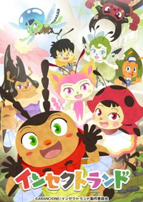

**Studio:** TMS Entertainment &nbsp;|&nbsp; **Episodes:** 22 &nbsp;|&nbsp; **Director:** Jun Kawagoe &nbsp;|&nbsp; **Aired/Released:** April 4 – August 29 &nbsp;|&nbsp; **Genres:** Kids, Slice of Life

> Anime based on "nature learning picture books" which explore the lives of insects, while also celebrating the themes of ecology and diversity.
>
> _Synopsis source: Kitsu_

[Kitsu](https://kitsu.io/anime/insect-land)

---

### Detective Conan: Zero's Tea Time (Case Closed: Zero's Tea Time)

**Studio:** TMS Entertainment &nbsp;|&nbsp; **Episodes:** 6 &nbsp;|&nbsp; **Director:** Tomochi Kosaka &nbsp;|&nbsp; **Aired/Released:** April 5 – May 10 &nbsp;|&nbsp; **Genres:** Cops, Law And Order, Mystery

> The story focuses on the life of the triple agent as he attempts to keep all his different roles in check.
>
> _Synopsis source: Kitsu_

[Kitsu](https://kitsu.io/anime/meitantei-conan-zero-no-tea-time)

---

### I'm Quitting Heroing

**Studio:** EMT Squared &nbsp;|&nbsp; **Episodes:** 12 &nbsp;|&nbsp; **Director:** Yuu Nobuta (Chief) Hisashi Ishii &nbsp;|&nbsp; **Aired/Released:** April 5 – June 21 &nbsp;|&nbsp; **Genres:** Action, Adventure, Comedy, Fantasy

> After saving the world, the strongest hero Leo became someone who is not wanted in the peaceful human world. He was too strong. Exiled, he seeks a job at the Demon King's Army, which he had defeated and needs to be rebuilt. The Army had many problems: too much work, financial troubles, etc. Leo starts to make things better using his power. Leo encounters Echidna again and asks her why she invaded the human world. There was an unexpected story---!
>
> _Synopsis source: Kitsu_

[Wikipedia](https://en.wikipedia.org/wiki/I%27m_Quitting_Heroing) · [Kitsu](https://kitsu.io/anime/yuusha-yamemasu)

---

### Ya Boy Kongming!

**Studio:** P.A. Works &nbsp;|&nbsp; **Episodes:** 12 &nbsp;|&nbsp; **Director:** Shū Honma &nbsp;|&nbsp; **Aired/Released:** April 5 – June 21 &nbsp;|&nbsp; **Genres:** Comedy, Slice of Life, Drama, Music, Supernatural

> The Tokyo Party Scene isn’t NEAR ready for the star general of the Three Kingdoms era, but he sure is ready for it! Get down, shake your thing, and prepare to laugh out loud with this historical fantasy timeslip comedy, Ya Boy Kongming!
>
> _Synopsis source: Kitsu_

[Wikipedia](https://en.wikipedia.org/wiki/Ya_Boy_Kongming!) · [Kitsu](https://kitsu.io/anime/paripi-koumei)

---

### Birdie Wing: Golf Girls' Story (BIRDIE WING -Golf Girls' Story-)

**Studio:** Bandai Namco Pictures &nbsp;|&nbsp; **Episodes:** 13 &nbsp;|&nbsp; **Director:** Takayuki Inagaki &nbsp;|&nbsp; **Aired/Released:** April 6 – June 29 &nbsp;|&nbsp; **Genres:** Sports

> The story centers on two young women golfers named Eve and Aoi Amawashi. The two come from completely different backgrounds, and have the completely opposite play styles, and together they will shake the world of golf.
>
> _Synopsis source: Kitsu_

[Kitsu](https://kitsu.io/anime/birdie-wing-golf-girls-story)

---

### Deaimon (Deaimon: Recipe for Happiness)

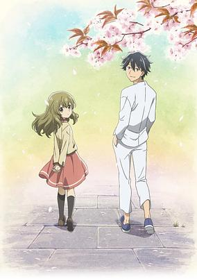

**Studio:** Encourage Films &nbsp;|&nbsp; **Episodes:** 12 &nbsp;|&nbsp; **Director:** Fumitoshi Oizaki &nbsp;|&nbsp; **Aired/Released:** April 6 – June 22 &nbsp;|&nbsp; **Genres:** Slice of Life, Seinen

> Nagomu is a man who left his home in Kyoto and his family's confectionery shop when he became a musician. Upon hearing that his father has been hospitalized though, he comes back home to take over the family business. However, while he was gone, a young girl named Itsuka started working at the shop. The whereabouts of Itsuka's parents is unknown, and she has no other relatives, and Nagomu finds himself as foster parent for Itsuka. Itsuka, on the other hand, dislikes Nagomu for abandoning the family to become a musician. She proclaims that it will be her who will take over the shop one day instead of Nagomu.
>
> _Synopsis source: Kitsu_

[Wikipedia](https://en.wikipedia.org/wiki/Deaimon) · [Kitsu](https://kitsu.io/anime/deaimon)

---

### RPG Real Estate

**Studio:** Doga Kobo &nbsp;|&nbsp; **Episodes:** 12 &nbsp;|&nbsp; **Director:** Tomoaki Koshida &nbsp;|&nbsp; **Aired/Released:** April 6 – June 22 &nbsp;|&nbsp; **Genres:** Fantasy, Slice of Life, Comedy, Seinen, Working Life

> The story begins 15 years after the demon king was defeated and the world has become peaceful. Kotone, who graduated from school and became a magician, inquired the kingdom-affiliated RPG Real Estate in order to find a new home. In reality, RPG Real Estate was Kotone's place of employment, and together with Fa, a demi-human, the priest Rufuria, and the soldier Rakira, they help support the searches of new homes for the customers with various circumstances.
>
> _Synopsis source: Kitsu_

[Wikipedia](https://en.wikipedia.org/wiki/RPG_Real_Estate) · [Kitsu](https://kitsu.io/anime/rpg-fudousan)

---

### The Greatest Demon Lord Is Reborn as a Typical Nobody

**Studio:** Silver Link Blade &nbsp;|&nbsp; **Episodes:** 12 &nbsp;|&nbsp; **Director:** Mirai Minato &nbsp;|&nbsp; **Aired/Released:** April 6 – June 22 &nbsp;|&nbsp; **Genres:** Action, Fantasy, School Life, Romance, Ecchi

> As the most powerful entity of all time, the Demon Lord Varvatos thinks life is a big fat snore. When he takes matters into his own hands and decides to reincarnate, he calibrates his magical strength to be perfectly average. But there is no way he could have predicted that everyone in the modern world would be weak as hell, which means he is totally overpowered once again! Reborn under the name Ard, he has ladies fawning over him, the royal family begging him to become the next king, and an ex-minion insisting on killing him?! But Ard has a one-track mind, and he won't stop at anything to achieve his ultimate goal!
>
> _Synopsis source: Kitsu_

[Wikipedia](https://en.wikipedia.org/wiki/The_Greatest_Demon_Lord_Is_Reborn_as_a_Typical_Nobody) · [Kitsu](https://kitsu.io/anime/shijou-saikyou-no-daimaou-murabito-a-ni-tensei-suru)

---

### The Rising of the Shield Hero (season 2) (The Rising of the Shield Hero Season 2)

**Studio:** Kinema Citrus DR Movie &nbsp;|&nbsp; **Episodes:** 13 &nbsp;|&nbsp; **Director:** Masato Jinbo &nbsp;|&nbsp; **Aired/Released:** April 6 – June 29 &nbsp;|&nbsp; **Genres:** Action, Fantasy, Adventure, Comedy, Romance, Drama, Isekai

> With another Wave happening in a week, Naofumi Iwatani and his party have no time to waste. However, when bat familiars raid Lurolona Village and the Wave countdown comes to a halt, the Four Cardinal Heroes reconvene with the queen, Mirelia Q Melromarc, for a quick briefing. The queen presumes that the odd occurrences are linked to the Spirit Tortoise—a threatening creature that has awakened from its slumber, back to cause havoc once again. A plan to put the Spirit Tortoise to rest is devised—but out of the four men, only the cursed Shield Hero agrees to help. [Written by MAL Rewrite]
>
> _Synopsis source: Kitsu_

[Wikipedia](https://en.wikipedia.org/wiki/The_Rising_of_the_Shield_Hero) · [Kitsu](https://kitsu.io/anime/tate-no-yuusha-no-nariagari-2)

---

### Tomodachi Game

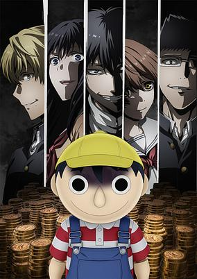

**Studio:** Okuruto Noboru &nbsp;|&nbsp; **Episodes:** 12 &nbsp;|&nbsp; **Director:** Hirofumi Ogura &nbsp;|&nbsp; **Aired/Released:** April 6 – June 22 &nbsp;|&nbsp; **Genres:** Drama, Mystery, Psychological, Virtual Reality

> High school student Katagiri Yuuichi, who values friendship above all else, enjoys a fulfilling life with his close friends Sawagiri Shiho, Mikasa Tenji, Shibe Makoto, and Kokorogi Yutori. However, after a particular incident, they're dragged into a debt repayment game. The only way to beat the "Tomodachi Game" is to not doubt their friends. Bound together by solid friendships, the game should've been easy, but– The hugely popular comic that sold over two million copies is finally becoming an anime! Will they trust or betray their precious friends? The true nature of humanity is exposed in the ultimate psychological game!
>
> _Synopsis source: Kitsu_

[Wikipedia](https://en.wikipedia.org/wiki/Tomodachi_Game) · [Kitsu](https://kitsu.io/anime/tomodachi-game)

---

### Estab-Life: Great Escape (Establishment in Life)

**Studio:** Polygon Pictures &nbsp;|&nbsp; **Episodes:** 12 &nbsp;|&nbsp; **Director:** Hiroyuki Hashimoto &nbsp;|&nbsp; **Aired/Released:** April 7 – June 23 &nbsp;|&nbsp; **Genres:** Robot, Science Fiction

> In the distant future, the cities of Japan have been walled off and isolated from one another. Tourism and immigration are heavily controlled—if not impossible. Each region is overseen by an AI moderator that maintains its domain as it sees fit. These clusters are refined into a single ideal, with every citizen fulfilling their role in preserving the moderator's creation. But not everyone is satisfied with the narrowly focused vision of the city they were born in, and thus, they require some under-the-table help in relocating to a more appropriate cluster. During the day, Equa, Ferres, and Martese are ordinary high school students; but at night, they act as Extractors—people who illegally smuggle civilians between the city borders. Transporting those brave enough to leave everything behind, Equa and her friends risk their lives in order to give their clients a second chance. But the dangers of extraction begin to intensify when the cluster moderators become increasingly aware of the group's actions that threaten their perfect utopias. [Written by MAL Rewrite]
>
> _Synopsis source: Kitsu_

[Wikipedia](https://en.wikipedia.org/wiki/Estab_Life) · [Kitsu](https://kitsu.io/anime/estab-life-great-escape)

---

### Heroines Run the Show

**Studio:** Lay-duce &nbsp;|&nbsp; **Episodes:** 12 &nbsp;|&nbsp; **Director:** Noriko Hashimoto &nbsp;|&nbsp; **Aired/Released:** April 7 – June 23 &nbsp;|&nbsp; **Genres:** Music

> Hiyori left her hometown to pursue her passion, track and field, by enrolling in Tokyo's Sakuragaoka High School. Looking for a part-time job in Tokyo, she ended up working as an apprentice manager for her classmates (and LIP×LIP members) Yuujirou Someya and Aizou Shibasaki. The story revolves around the coming-of-age of Hiyori (as she juggles school, extracurricular life, and managing) and LIP×LIP (as they shine on stage).
>
> _Synopsis source: Kitsu_

[Wikipedia](https://en.wikipedia.org/wiki/Heroines_Run_the_Show) · [Kitsu](https://kitsu.io/anime/heroine-tarumono-kiraware-heroine-to-naisho-no-oshigoto)

---

### Komi Can't Communicate (season 2) (Komi Can’t Communicate)

**Studio:** OLM &nbsp;|&nbsp; **Episodes:** 12 &nbsp;|&nbsp; **Director:** Ayumu Watanabe (Chief) Kazuki Kawagoe &nbsp;|&nbsp; **Aired/Released:** April 7 – June 23 &nbsp;|&nbsp; **Genres:** Comedy, Romance, Slice of Life, School Life

> At a high school full of unique characters, Tadano helps his shy and unsociable classmate Komi reach her goal of making friends with 100 people.
>
> _Synopsis source: Kitsu_

[Wikipedia](https://en.wikipedia.org/wiki/Komi_Can%27t_Communicate) · [Kitsu](https://kitsu.io/anime/komi-san-wa-komyushou-desu)

---

### Miss Shachiku and the Little Baby Ghost

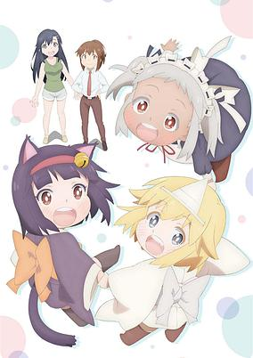

**Studio:** Project No.9 &nbsp;|&nbsp; **Episodes:** 12 &nbsp;|&nbsp; **Director:** Kū Nabara &nbsp;|&nbsp; **Aired/Released:** April 7 – June 23 &nbsp;|&nbsp; **Genres:** Comedy, Slice of Life, Supernatural

> A little ghost girl gets worries when Ms. Fushihara, a corporate slave, is working till midnight, and tries to make her go home. While saying "Leave now~," the ghost girl helps and brings her refreshments, healing Ms. Fushihara's heart with her preciousness. Be healed by the heartwarming daily life of the cute little ghost and the corporate slave Ms. Fushihara.
>
> _Synopsis source: Kitsu_

[Wikipedia](https://en.wikipedia.org/wiki/Miss_Shachiku_and_the_Little_Baby_Ghost) · [Kitsu](https://kitsu.io/anime/shachiku-san-wa-youjo-yuurei-ni-iyasaretai)

---

### Skeleton Knight in Another World

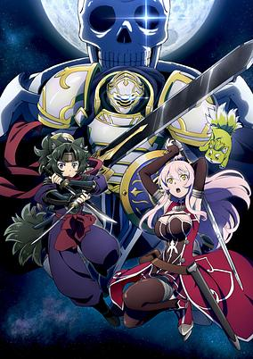

**Studio:** Studio Kai Hornets &nbsp;|&nbsp; **Episodes:** 12 &nbsp;|&nbsp; **Director:** Katsumi Ono &nbsp;|&nbsp; **Aired/Released:** April 7 – June 23 &nbsp;|&nbsp; **Genres:** Fantasy, Action, Adventure, Magic, Isekai

> One day, a gamer played video games until he fell asleep...and when he woke up, he found himself in the game world—as a skeleton! Equipped with the powerful weapons and armor of his avatar but stuck with its frightening skeletal appearance, Arc has to find a place for himself in this new, fantastical land. All his hopes for a quiet life are dashed when he crosses paths with a beautiful elven warrior, setting him on a journey full of conflict and adventure.
>
> _Synopsis source: Kitsu_

[Wikipedia](https://en.wikipedia.org/wiki/Skeleton_Knight_in_Another_World) · [Kitsu](https://kitsu.io/anime/gaikotsu-kishi-sama-tadaima-isekai-e-odekakechuu)

---

### Date A Live IV

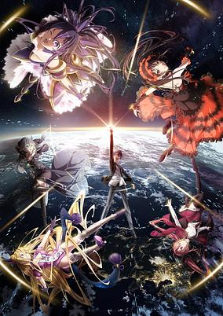

**Studio:** Geek Toys &nbsp;|&nbsp; **Episodes:** 12 &nbsp;|&nbsp; **Director:** Jun Nakagawa &nbsp;|&nbsp; **Aired/Released:** April 8 – June 24 &nbsp;|&nbsp; **Genres:** Comedy, Harem, Romance, Science Fiction, Fantasy, School Life, Mecha, Special Squads, Japan

> The fourth season of Date A Live.
>
> _Synopsis source: Kitsu_

[Wikipedia](https://en.wikipedia.org/wiki/Date_A_Live_(season_4)) · [Kitsu](https://kitsu.io/anime/date-a-live-iv)

---

### Love After World Domination

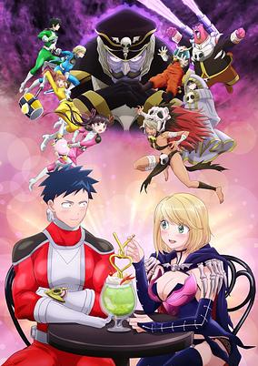

**Studio:** Project No.9 &nbsp;|&nbsp; **Episodes:** 12 &nbsp;|&nbsp; **Director:** Kazuya Iwata &nbsp;|&nbsp; **Aired/Released:** April 8 – June 24 &nbsp;|&nbsp; **Genres:** Ecchi, Shounen, Special Squads, Romance, Superhero, Supernatural, Action, Comedy

> It’s love at first sight for Fudo and Desumi, except it was during a battle of life and death. Fudo, leader of the hero squad Gelato 5, and Desumi, the Death Queen of the evil society Gekko, have found themselves caught in a forbidden love—and it’s their first relationship! Moving in secrecy, they live holding hands with one weapon in the other, finding out what’s truly fair in love and war.
>
> _Synopsis source: Kitsu_

[Wikipedia](https://en.wikipedia.org/wiki/Love_After_World_Domination) · [Kitsu](https://kitsu.io/anime/koi-wa-sekai-seifuku-no-ato-de)

---

### The Dawn of the Witch

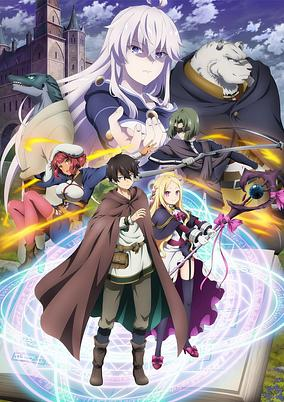

**Studio:** Tezuka Productions &nbsp;|&nbsp; **Episodes:** 12 &nbsp;|&nbsp; **Director:** Satoshi Kuwabara &nbsp;|&nbsp; **Aired/Released:** April 8 – July 1 &nbsp;|&nbsp; **Genres:** Adventure, Comedy, Ecchi, Fantasy, Magic

> The war that raged between the Church and the Witches for five centuries finally ended in peace but a few short years ago. However, nestled in the shadowy places of the world, the embers of that age old conflict still smoulder. Attending the Royal Academy of Magic of the Kingdom of Wenias is a struggling student named Sable, who has no memories of his time before being enrolled. At the command of Headmaster Albus, he left the Kingdom to travel to the southern reaches of the continent, where anti-magic insurgents are still a force to be reckoned with, as part of a special training regimen. Accompanying him are a party of individuals strong in both ability and personality; there's the one known as the Witch of the Dawn, Roux Cristasse, who seeks the forbidden knowledge of primeval magic in the 'Grimoire of Zero', the genius girl Holtz, as well as the school's sole beast, Kudd. Just what truth shall they uncover in their journey to the south...?
>
> _Synopsis source: Kitsu_

[Wikipedia](https://en.wikipedia.org/wiki/The_Dawn_of_the_Witch) · [Kitsu](https://kitsu.io/anime/mahoutsukai-reimeiki)

---

### The Demon Girl Next Door (season 2) (The Demon Girl Next Door 2nd Season)

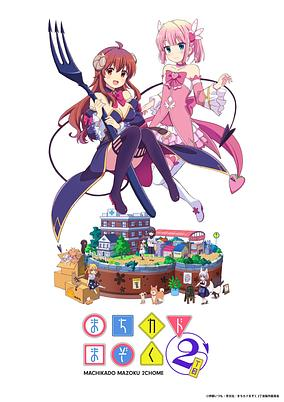

**Studio:** J.C.Staff &nbsp;|&nbsp; **Episodes:** 12 &nbsp;|&nbsp; **Director:** Hiroaki Sakurai &nbsp;|&nbsp; **Aired/Released:** April 8 – July 1 &nbsp;|&nbsp; **Genres:** Magic, Magical Girl, Demon, Contemporary Fantasy, Fantasy, Comedy, Slice of Life

> Second season of Machikado Mazoku.
>
> _Synopsis source: Kitsu_

[Wikipedia](https://en.wikipedia.org/wiki/The_Demon_Girl_Next_Door) · [Kitsu](https://kitsu.io/anime/machikado-mazoku-2nd-season)

---

### Aoashi

**Studio:** Production I.G &nbsp;|&nbsp; **Episodes:** 24 &nbsp;|&nbsp; **Director:** Akira Sato &nbsp;|&nbsp; **Aired/Released:** April 9 – September 24 &nbsp;|&nbsp; **Genres:** Sports, Seinen, School Life, School Clubs, Soccer

> Ashito Aoi is a young, aspiring soccer player from a backwater town in Japan. His hopes of getting into a high school with a good soccer club are dashed when he causes an incident during a critical match for his team, which results in their loss and elimination from the tournament. Nevertheless, he catches the eye of someone important who happened to be visiting from Tokyo. How will things turn out for Ashito?
>
> _Synopsis source: Kitsu_

[Wikipedia](https://en.wikipedia.org/wiki/Aoashi) · [Kitsu](https://kitsu.io/anime/ao-ashi)

---

### Dance Dance Danseur

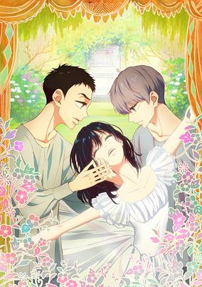

**Studio:** MAPPA &nbsp;|&nbsp; **Episodes:** 11 &nbsp;|&nbsp; **Director:** Munehisa Sakai &nbsp;|&nbsp; **Aired/Released:** April 9 – June 18 &nbsp;|&nbsp; **Genres:** Drama, Seinen, Romance, The Arts, Performance, Sports

> Danseur noble--a ballet dancer qualified to dance the role of the prince. Second-year junior high school student Murao Junpei was fascinated by ballet as a boy, but gave up on dancing after his father's death, as he had to become a man. However, one day, a beautiful transfer student named Godai Miyako appears before him. Miyako takes notice in Junpei's love of ballet and invites him to dance with her. Along with Miyako's cousin Mori Ruou, he begins his career as a full-fledged ballet dancer, with the aim of becoming the world's best dancer--the Danseur noble! Only those who have sacrificed everything are permitted to stand in the beautiful and harsh world of classical ballet. What will be the fate of a total beginner like Junpei?!
>
> _Synopsis source: Kitsu_

[Wikipedia](https://en.wikipedia.org/wiki/Dance_Dance_Danseur) · [Kitsu](https://kitsu.io/anime/dance-dance-danseur)

---

### Kaguya-sama: Love Is War – Ultra Romantic (Kaguya-sama: Love is War - Ultra Romantic -)

**Studio:** A-1 Pictures &nbsp;|&nbsp; **Episodes:** 13 &nbsp;|&nbsp; **Director:** Mamoru Hatakeyama &nbsp;|&nbsp; **Aired/Released:** April 9 – June 25 &nbsp;|&nbsp; **Genres:** Comedy, Psychological, Romance, School Life, Seinen

> The elite members of Shuchiin Academy's student council continue their competitive day-to-day antics. Council president Miyuki Shirogane clashes daily against vice-president Kaguya Shinomiya, each fighting tooth and nail to trick the other into confessing their romantic love. Kaguya struggles within the strict confines of her wealthy, uptight family, rebelling against her cold default demeanor as she warms to Shirogane and the rest of her friends. Meanwhile, council treasurer Yuu Ishigami suffers under the weight of his hopeless crush on Tsubame Koyasu, a popular upperclassman who helps to instill a new confidence in him. Miko Iino, the newest student council member, grows closer to the rule-breaking Ishigami while striving to overcome her own authoritarian moral code. As love further blooms at Shuchiin Academy, the student council officers drag their outsider friends into increasingly comedic conflicts. (Source: MAL Rewrite) Note: The first episode had an advanced screening on April 2, in both New York &amp; Los Angeles.
>
> _Synopsis source: Kitsu_

[Kitsu](https://kitsu.io/anime/kaguya-sama-wa-kokurasetai-tensai-tachi-no-renai-zunousen-3)

---

### Spy × Family (part 1) (SPY x FAMILY)

**Studio:** Wit Studio CloverWorks &nbsp;|&nbsp; **Episodes:** 12 &nbsp;|&nbsp; **Director:** Kazuhiro Furuhashi &nbsp;|&nbsp; **Aired/Released:** April 9 – June 25 &nbsp;|&nbsp; **Genres:** Action, Assassin, Comedy, Family, Slice of Life, Supernatural, Shounen

> Everyone has a part of themselves they cannot show to anyone else. At a time when all nations of the world were involved in a fierce war of information happening behind closed doors, Ostania and Westalis had been in a state of cold war against one another for decades. The Westalis Intelligence Services' Eastern-Focused Division (WISE) sends their most talented spy, "Twilight," on a top-secret mission to investigate the movements of Donovan Desmond, the chairman of Ostania's National Unity Party, who is threatening peace efforts between the two nations. This mission is known as "Operation Strix." It consists of "putting together a family in one week in order to infiltrate social gatherings organized by the elite school that Desmond's son attends." "Twilight" takes on the identity of psychiatrist Loid Forger and starts looking for family members. But Anya, the daughter he adopts, turns out to have the ability to read people's minds, while his wife, Yor, is an assassin! With it being in each of their own interests to keep these facts hidden, they start living together while concealing their true identities from one another. World peace is now in the hands of this brand-new family as they embark on an adventure full of surprises.
>
> _Synopsis source: Kitsu_

[Wikipedia](https://en.wikipedia.org/wiki/Spy_%C3%97_Family) · [Kitsu](https://kitsu.io/anime/spy-x-family)

---

### Yatogame-chan Kansatsu Nikki (season 4)

**Studio:** Hayabusa Film &nbsp;|&nbsp; **Episodes:** 10 &nbsp;|&nbsp; **Director:** Hisayoshi Hirasawa &nbsp;|&nbsp; **Aired/Released:** April 9 – June 11 &nbsp;|&nbsp; **Genres:** Comedy, Slice of Life, School Life, Shounen

> Third season of Yatogame-chan Kansatsu Nikki.
>
> _Synopsis source: Kitsu_

[Wikipedia](https://en.wikipedia.org/wiki/Yatogame-chan_Kansatsu_Nikki) · [Kitsu](https://kitsu.io/anime/yatogame-chan-kansatsu-nikki-sansatsume)

---

### Don't Hurt Me, My Healer!

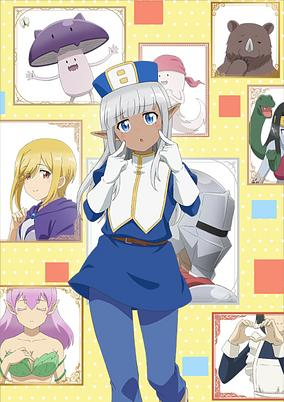

**Studio:** Jumondou &nbsp;|&nbsp; **Episodes:** 12 &nbsp;|&nbsp; **Director:** Nobuaki Nakanishi &nbsp;|&nbsp; **Aired/Released:** April 10 – June 26 &nbsp;|&nbsp; **Genres:** Comedy, Fantasy, Action, Adventure, Elf

> The story of the series follows Alvin, a knight with saint-like patience for annoying people, and Karla, a dark elf healer with a sharp tongue and a rotten personality who always speaks without thinking first. Together, they form a party and go on fantastical adventures.
>
> _Synopsis source: Kitsu_

[Wikipedia](https://en.wikipedia.org/wiki/Don%27t_Hurt_Me,_My_Healer!) · [Kitsu](https://kitsu.io/anime/kono-healer-mendokusai)

---

### In the Heart of Kunoichi Tsubaki

**Studio:** CloverWorks &nbsp;|&nbsp; **Episodes:** 13 &nbsp;|&nbsp; **Director:** Takuhiro Kadochi &nbsp;|&nbsp; **Aired/Released:** April 10 – July 3 &nbsp;|&nbsp; **Genres:** Comedy, School Life, Slice of Life

> The story centers on the titular Tsubaki Kunoichi, the best student in her school. She lives in a village of women with the rule that they cannot have contact with men. However, she has a curiosity about men that she cannot reveal.
>
> _Synopsis source: Kitsu_

[Wikipedia](https://en.wikipedia.org/wiki/In_the_Heart_of_Kunoichi_Tsubaki) · [Kitsu](https://kitsu.io/anime/kunoichi-tsubaki-no-mune-no-uchi)

---

### Kingdom (season 4)

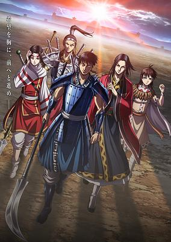

**Studio:** Pierrot Studio Signpost &nbsp;|&nbsp; **Episodes:** 26 &nbsp;|&nbsp; **Director:** Kenichi Imaizumi &nbsp;|&nbsp; **Aired/Released:** April 10 – October 2 &nbsp;|&nbsp; **Genres:** Action, Asia, Adventure, China, Feudal Warfare, Historical, Military, Swordplay, War

> The fourth season of Kingdom.
>
> _Synopsis source: Kitsu_

[Wikipedia](https://en.wikipedia.org/wiki/Kingdom_(season_4)) · [Kitsu](https://kitsu.io/anime/kingdom-4th-season)

---

### Shikimori's Not Just a Cutie

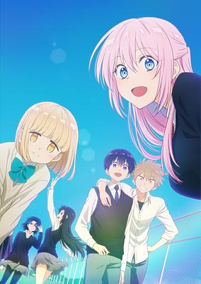

**Studio:** Doga Kobo &nbsp;|&nbsp; **Episodes:** 12 &nbsp;|&nbsp; **Director:** Ryota Itoh &nbsp;|&nbsp; **Aired/Released:** April 10 – July 10 &nbsp;|&nbsp; **Genres:** Slice of Life, Comedy, Romance

> The ultimate "heartthrob girlfriend" appears! Naturally unlucky high school student Izumi's girlfriend is his classmate Shikimori. She has a beautiful smile and kind personality and always seems happy when she's with Izumi. She's a pretty, cute, and loving girlfriend, but when Izumi's in trouble… she transforms into a super cool "heartthrob girlfriend!" The fun lives of the cute and cool Shikimori, Izumi, and their good friends never end!
>
> _Synopsis source: Kitsu_

[Wikipedia](https://en.wikipedia.org/wiki/Shikimori%27s_Not_Just_a_Cutie) · [Kitsu](https://kitsu.io/anime/kawaii-dake-ja-nai-shikimori-san)

---

### Onipan!

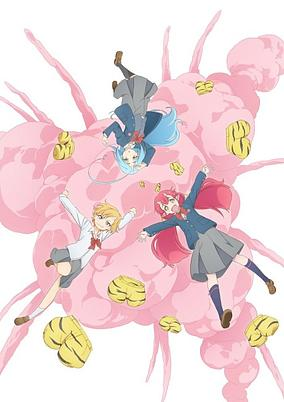

**Studio:** Wit Studio &nbsp;|&nbsp; **Episodes:** 12 &nbsp;|&nbsp; **Director:** Masahiko Ohta &nbsp;|&nbsp; **Aired/Released:** April 11 – July 1 &nbsp;|&nbsp; **Genres:** Slice of Life, Comedy, Idol, Kids, Fantasy

> Three oni-kids who, through the power of the onipan (a portmanteau of "oni" and "pantsu") become human to help fix the relationship between humans and oni. The three girls transfer into a normal Tokyo high school to aid in their task and help fix their image by revitalizing the town, sometimes jumping headfirst into school events, and other times ... becoming idols! Note: Aired in 2 versions, a 60-episode 3-minute short series, and a combined 12-episode 14-minute TV series with the same content. Each episode of the combined version is 5 parts of the original.
>
> _Synopsis source: Kitsu_

[Wikipedia](https://en.wikipedia.org/wiki/Onipan!) · [Kitsu](https://kitsu.io/anime/onipan)

---

### Amaim Warrior at the Borderline (part 2) (AMAIM Warrior at the Borderline)

**Studio:** Sunrise Beyond &nbsp;|&nbsp; **Episodes:** 12 &nbsp;|&nbsp; **Director:** Nobuyoshi Habara &nbsp;|&nbsp; **Aired/Released:** April 12 – June 28 &nbsp;|&nbsp; **Genres:** Mecha, Science Fiction, Action, Piloted Robot, Dystopia

> In the year 2061 AD, Japan has lost its sovereignty. The Japanese people spend their days as oppressed citizens after being divided and ruled by the four major trade factions. The country became the forefront of the world following the deployment of AMAIM—a humanoid special mobile weapon—by each economic bloc. One day, Amou Shiiba, a boy who loves machines, meets Gai, an autonomous thinking A.I. The encounter leads Amou to cast himself into the battle to reclaim Japan, piloting the AMAIM Kenbu that he built himself.
>
> _Synopsis source: Kitsu_

[Wikipedia](https://en.wikipedia.org/wiki/Amaim_Warrior_at_the_Borderline) · [Kitsu](https://kitsu.io/anime/kyoukai-senki)

---

### Ascendance of a Bookworm (season 3) (Ascendance of a Bookworm 3rd Season)

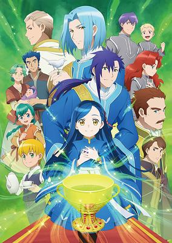

**Studio:** Ajia-do Animation Works &nbsp;|&nbsp; **Episodes:** 10 &nbsp;|&nbsp; **Director:** Mitsuru Hongo &nbsp;|&nbsp; **Aired/Released:** April 12 – June 14 &nbsp;|&nbsp; **Genres:** Magic, Fantasy World, Fantasy, Comedy, Slice of Life, Religion, Drama, Isekai

> Third season of Honzuki no Gekokujou: Shisho ni Naru Tame ni wa Shudan wo Erandeiraremasen.
>
> _Synopsis source: Kitsu_

[Wikipedia](https://en.wikipedia.org/wiki/Ascendance_of_a_Bookworm) · [Kitsu](https://kitsu.io/anime/honzuki-no-gekokujou-shisho-ni-naru-tame-ni-wa-shudan-wo-erandeiraremasen-3rd-season)

---

### Kaginado (season 2)

**Studio:** Liden Films Kyoto Studio &nbsp;|&nbsp; **Episodes:** 12 &nbsp;|&nbsp; **Director:** Kazuya Sakamoto &nbsp;|&nbsp; **Aired/Released:** April 13 – June 29 &nbsp;|&nbsp; **Genres:** Super Deformed, Comedy, Slice of Life

> A crossover television anime featuring chibi renditions of characters from Kanon, Air, Clannad, Little Busters!, Rewrite, and additional Key franchises to be revealed at a later date.
>
> _Synopsis source: Kitsu_

[Wikipedia](https://en.wikipedia.org/wiki/Kaginado) · [Kitsu](https://kitsu.io/anime/kaginado)

---

### Summer Time Rendering

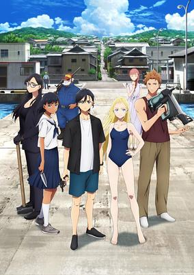

**Studio:** OLM &nbsp;|&nbsp; **Episodes:** 25 &nbsp;|&nbsp; **Director:** Ayumu Watanabe &nbsp;|&nbsp; **Aired/Released:** April 15 – September 30 &nbsp;|&nbsp; **Genres:** Shounen, Mystery, Conspiracy, Supernatural, Drama, Time Travel, Thriller, Island

> A sci-fi, summer story filled with suspense set on a small island with Shinpei Aijiro, whose childhood friend Ushio Kofune died. He returns to his hometown for the first time in two years for the funeral. Sou Hishigata, his best friend, suspects something's off with Ushio's death, and that someone can die next. A sinister omen is heard as an entire family next door suddenly disappears the following day. Furthermore, Mio implicates a "shadow" three days before Ushio's death.
>
> _Synopsis source: Kitsu_

[Wikipedia](https://en.wikipedia.org/wiki/Summer_Time_Rendering) · [Kitsu](https://kitsu.io/anime/summertime-render)

---

### A Couple of Cuckoos

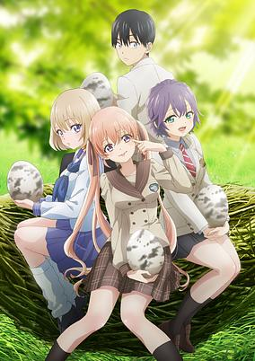

**Studio:** Shin-Ei Animation SynergySP &nbsp;|&nbsp; **Episodes:** 24 &nbsp;|&nbsp; **Director:** Hiroaki Akagi (Chief) Yoshiyuki Shirahata &nbsp;|&nbsp; **Aired/Released:** April 24 – October 2 &nbsp;|&nbsp; **Genres:** Shounen, Romance, Comedy, Harem

> On the way to meet his birth parents, super-student Nagi meets brash Erika, who needs a quick favor. Pose as her boyfriend at dinner so she can avoid an arranged marriage. But things get tricky once they realize they’re heading to the same spot, and her parents still want them wed. How does he ask out his school crush, keep his grades up, and hide his pending nuptials? No one said love was easy!
>
> _Synopsis source: Kitsu_

[Wikipedia](https://en.wikipedia.org/wiki/A_Couple_of_Cuckoos) · [Kitsu](https://kitsu.io/anime/kakkou-no-iinazuke)

---

### Shin Ikki Tousen

**Studio:** Arms &nbsp;|&nbsp; **Episodes:** 3 &nbsp;|&nbsp; **Director:** Rion Kujo &nbsp;|&nbsp; **Aired/Released:** May 17 – May 31

[Wikipedia](https://en.wikipedia.org/wiki/Ikki_Tousen)

---

### Iii Icecrin 2

**Studio:** Shin-Ei Animation TIA &nbsp;|&nbsp; **Episodes:** 12 &nbsp;|&nbsp; **Director:** Juria Matsumura &nbsp;|&nbsp; **Aired/Released:** July 2 – September 17 &nbsp;|&nbsp; **Genres:** Kids

> Original anime produced as a collaboration between Shin-Ei Animation and Blue Seal ice cream.
>
> _Synopsis source: Kitsu_

[Wikipedia](https://en.wikipedia.org/wiki/Iii_Icecrin) · [Kitsu](https://kitsu.io/anime/iii-icecrin)

---

### Lycoris Recoil

**Studio:** A-1 Pictures &nbsp;|&nbsp; **Episodes:** 13 &nbsp;|&nbsp; **Director:** Shingo Adachi &nbsp;|&nbsp; **Aired/Released:** July 2 – September 25 &nbsp;|&nbsp; **Genres:** Action, Slice of Life, Gunfights, Crime, Assassin, Conspiracy

> “LycoReco” is a café with a traditional Japanese twist located in downtown Tokyo. But the delicious coffee and sugary sweets are not the only orders this café takes! From delivering packages short distances, to pick-ups and drop-offs on the lonely streets at night, to zombies and giant monster extermination…?! Whatever your problem, we're here to help! We will solve any kind of "trouble" you may have! Waiting for you are the ever-smiling poster-girl and the cool, serious newcomer. A petite girl who never wants to work and a young woman approaching thirty who wants to get married. And the manager is a nice guy who’s obsessed with Japan! Whatever your order is, leave it all up to us♪
>
> _Synopsis source: Kitsu_

[Wikipedia](https://en.wikipedia.org/wiki/Lycoris_Recoil) · [Kitsu](https://kitsu.io/anime/lycoris-recoil)

---

### Musasino!

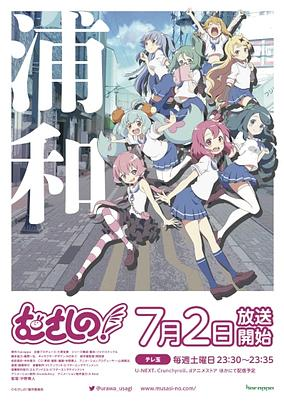

**Studio:** A-Real &nbsp;|&nbsp; **Episodes:** 12 &nbsp;|&nbsp; **Director:** Mitsuyuki Ishibashi &nbsp;|&nbsp; **Aired/Released:** July 2 – September 17 &nbsp;|&nbsp; **Genres:** Comedy, Slice of Life, School Life

> Sequel series to Urawa no Usagi-chan.
>
> _Synopsis source: Kitsu_

[Wikipedia](https://en.wikipedia.org/wiki/Urawa_no_Usagi-chan) · [Kitsu](https://kitsu.io/anime/musashino)

---

### Phantom of the Idol

**Studio:** Studio Gokumi &nbsp;|&nbsp; **Episodes:** 10 &nbsp;|&nbsp; **Director:** Daisei Fukuoka &nbsp;|&nbsp; **Aired/Released:** July 2 – September 3 &nbsp;|&nbsp; **Genres:** Comedy, Supernatural, Josei, Idol, Ghost

> Yuuya, one half of the boy pop duo ZINGS, may be the laziest performer in the Japanese music industry. His partner is out there giving 110% every night (and, thankfully, he’s quite popular), but Yuuya’s half-assed, sloppy dancing, and his frankly hostile attitude toward the audience, has the fans hating him and his agent looking for any excuse to cut him loose. The career of a pop idol just isn’t the path of easy leisure and adulation Yuuya expected… After a particularly lifeless concert appearance, Yuuya meets a girl backstage. She’s dressed to the nines in a colorful outfit, she’s full of vim and vigor, and all she wants from life is to perform. There’s just one problem: She’s been dead for a year. This is the ghost of Asahi Mogami, the beloved singer whose time on the stage was tragically cut short, unless… If ghosts are real, is spirit possession really that much of a stretch?
>
> _Synopsis source: Kitsu_

[Wikipedia](https://en.wikipedia.org/wiki/Phantom_of_the_Idol) · [Kitsu](https://kitsu.io/anime/kami-kuzu-idol)

---

### Rent-A-Girlfriend (season 2) (Rent-a-Girlfriend Season 2)

**Studio:** TMS Entertainment &nbsp;|&nbsp; **Episodes:** 12 &nbsp;|&nbsp; **Director:** Kazuomi Koga &nbsp;|&nbsp; **Aired/Released:** July 2 – September 17 &nbsp;|&nbsp; **Genres:** Comedy, Romance, Harem, School Life, Shounen

> The second season of Kanojo, Okarishimasu. A hopeless college student, Kinoshita Kazuya, meets a graceful rental girlfriend, Mizuhara Chizuru, and ends up introducing her as his girlfriend to his family and friends. Time goes on with Kazuya unable to tell the truth, as he's surrounded by devilish ex-girlfriend Nanami Mami, who keeps coming back to tempt him for some reason, hyper-aggressive provisional girlfriend Sarashina Ruka, who doesn't know how to take no for an answer, and super shy but diligent and hardworking younger rental girlfriend, Sakurasawa Sumi… beautiful girlfriends of all types! The pub, the beach, hot springs, Christmas, and New Year’s… Having gone through these challenging events, Kazuya's feelings for Chizuru keep growing stronger. But she reveals a shocking truth that threatens to shake their "relationship" to the very core!
>
> _Synopsis source: Kitsu_

[Wikipedia](https://en.wikipedia.org/wiki/Rent-A-Girlfriend) · [Kitsu](https://kitsu.io/anime/kanojo-okarishimasu-2nd-season)

---

### Shoot! Goal to the Future

**Studio:** EMT Squared Magic Bus &nbsp;|&nbsp; **Episodes:** 13 &nbsp;|&nbsp; **Director:** Noriyuki Nakamura &nbsp;|&nbsp; **Aired/Released:** July 2 – September 24

[Wikipedia](https://en.wikipedia.org/wiki/Shoot!_(manga))

---

### Teppen!!!!!!!!!!!!!!! Laughing 'til You Cry

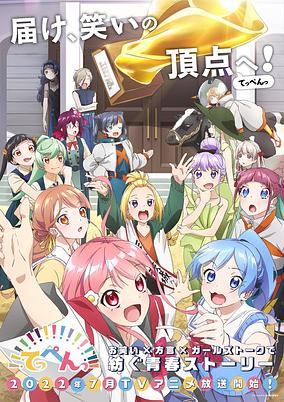

**Studio:** Drive &nbsp;|&nbsp; **Episodes:** 12 &nbsp;|&nbsp; **Director:** Shinji Takamatsu (Chief) Toshinori Watanabe &nbsp;|&nbsp; **Aired/Released:** July 2 – September 24 &nbsp;|&nbsp; **Genres:** Comedy, Slice of Life

> Yayoi Sakamoto, a diehard fan of comedians and comedy acts, enrolls in the private Kazuki High School in Nanba (Osaka's entertainment district famous as the starting point for many comedians). She reunites with Yomogi Takahashi, a childhood friend who once formed the comedy duo "Konamonzu" with her when they were little. Before long, they find themselves putting together a routine at a park like they did before, in order to enter a local shopping area's contest. At that moment, a mysterious girl calls out to them.
>
> _Synopsis source: Kitsu_

[Wikipedia](https://en.wikipedia.org/wiki/Teppen%E2%80%94!!!) · [Kitsu](https://kitsu.io/anime/teppen-tv)

---

### Engage Kiss

**Studio:** A-1 Pictures &nbsp;|&nbsp; **Episodes:** 13 &nbsp;|&nbsp; **Director:** Tomoya Tanaka &nbsp;|&nbsp; **Aired/Released:** July 3 – September 25 &nbsp;|&nbsp; **Genres:** Romance, Comedy, Action, Supernatural, Demon, Harem

> The anime is set in Baylong City, an artificial island city established in the Pacific Ocean to exploit local natural resources. The anime centers on three characters. The first is Shuu, who runs a small company, though his spending habits have left him constantly penniless. A girl named Kisara frequents Shuu’s office and is constantly worried for him. Kisara attends a high school in Baylong City, and does everything from clerical work to household chores with confidence. Meanwhile, Ayano is Shuu’s ex-girlfriend and former work colleague in a company that Shuu used to work for.
>
> _Synopsis source: Kitsu_

[Wikipedia](https://en.wikipedia.org/wiki/Engage_Kiss) · [Kitsu](https://kitsu.io/anime/engage-kiss)

---

### Luminous Witches

**Studio:** Shaft &nbsp;|&nbsp; **Episodes:** 12 &nbsp;|&nbsp; **Director:** Shouji Saeki &nbsp;|&nbsp; **Aired/Released:** July 3 – September 25

[Wikipedia](https://en.wikipedia.org/wiki/Strike_Witches)

---

### RWBY: Ice Queendom

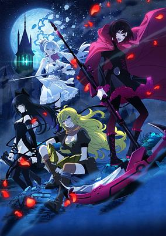

**Studio:** Shaft &nbsp;|&nbsp; **Episodes:** 12 &nbsp;|&nbsp; **Director:** Kenjirou Okada (Chief) Toshimasa Suzuki &nbsp;|&nbsp; **Aired/Released:** July 3 – September 18 &nbsp;|&nbsp; **Genres:** Action, Science Fiction, Fantasy

> RWBY: Ice Queendom presents RWBY in beautiful 2D anime visuals. RWBY imagines a world filled with horrific monsters bent on death and destruction, and humanity's only hope is dependent upon powerful Huntsmen and Huntresses. Ruby Rose, Weiss Schnee, Blake Belladonna, and Yang Xiao Long are four such Huntresses in training whose journeys will take them far past the grounds of their school, Beacon Academy. Though each may be powerful on their own, these four girls must overcome dark forces and work as a team if they truly hope to become the next generation of Remnant's protectors.
>
> _Synopsis source: Kitsu_

[Kitsu](https://kitsu.io/anime/rwby-ice-queendom)

---

### Utawarerumono: Mask of Truth

**Studio:** White Fox &nbsp;|&nbsp; **Episodes:** 28 &nbsp;|&nbsp; **Director:** Kenichi Kawamura &nbsp;|&nbsp; **Aired/Released:** July 3 – December 25 &nbsp;|&nbsp; **Genres:** Action, Science Fiction, Fantasy, Drama

> After the events of Mask of Deception, the Yamato Empire is now ruled with an iron fist by a ruthless usurper who seeks to subjugate all before him. It's up to a couple of familiar faces to band together against the might of the Imperial army, and the fate of the world hangs in the balance as nations and generals must pick a side to fight with in this perilous civil war. Secrets will be revealed, friendships will be tested, and battles will be fought. Will peace and order be restored or will victory at any cost be the beginning of the end?
>
> _Synopsis source: Kitsu_

[Wikipedia](https://en.wikipedia.org/wiki/Utawarerumono) · [Kitsu](https://kitsu.io/anime/utawarerumono-futari-no-hakuoro)

---

### Yurei Deco

**Studio:** Science SARU &nbsp;|&nbsp; **Episodes:** 12 &nbsp;|&nbsp; **Director:** Tomohisa Shimoyama &nbsp;|&nbsp; **Aired/Released:** July 3 – September 18 &nbsp;|&nbsp; **Genres:** Mystery, Science Fiction, Parody, Detective, Cyberpunk

> The story begins when Berry, an average girl from an average home, meets Hack, a girl who looks like a boy. Charmed by Hack, Berry meets up with the team Hack leads, the Ghost Detectives Club. Members of this club are “socially dead,” working invisibly within the digitally controlled society of Tom Sawyer. As she works with the group, Berry learns about Zero, a mysterious figure who lurks within Tom Sawyer’s underground. She and Hack decide to chase down this figure, and in time, the truth behind the city is revealed...
>
> _Synopsis source: Kitsu_

[Wikipedia](https://en.wikipedia.org/wiki/Yurei_Deco) · [Kitsu](https://kitsu.io/anime/yurei-deco)

---

### Classroom of the Elite (season 2) (Classroom of the Elite 2)

**Studio:** Lerche &nbsp;|&nbsp; **Episodes:** 13 &nbsp;|&nbsp; **Director:** Seiji Kishi (Chief) Hiroyuki Hashimoto (Chief) Yoshihito Nishōji &nbsp;|&nbsp; **Aired/Released:** July 4 – September 26 &nbsp;|&nbsp; **Genres:** Drama, Psychological, School Life

> The second season of Youkoso Jitsuryoku Shijou Shugi no Kyoushitsu e. Tokyo Metropolitan Advanced Nurturing High School seems like a paradise, but in reality, it is an extreme meritocracy. In the class of underachievers, Kiyotaka has begun working with Suzune, who seeks to ascend higher. After a survival test on an uninhabited island, they get to enjoy a luxury liner, but a new class-scrambling test will begin.
>
> _Synopsis source: Kitsu_

[Wikipedia](https://en.wikipedia.org/wiki/Classroom_of_the_Elite_(season_2)) · [Kitsu](https://kitsu.io/anime/youkoso-jitsuryoku-shijou-shugi-no-kyoushitsu-e-zoku-hen)

---

### My Isekai Life (My Isekai Life: I Gained a Second Class and Became the Strongest Sage in the World!)

**Studio:** Revoroot &nbsp;|&nbsp; **Episodes:** 12 &nbsp;|&nbsp; **Director:** Keisuke Kojima &nbsp;|&nbsp; **Aired/Released:** July 4 – September 12 &nbsp;|&nbsp; **Genres:** Action, Adventure, Fantasy, Fantasy World, Isekai

> Sano Yuji, a black company employee, is summoned to another world while finishing his work at home. His profession in the other world, a Monster Tamer, is considered a job that makes it difficult to become an adventurer. However, thanks to some slimes he met, which read several magical books, he gained magical powers and the second profession, Sage. Yuji acquired overwhelming power, but is he conscience of his strength? Blindly becoming unparalleled and strongest in the world!
>
> _Synopsis source: Kitsu_

[Wikipedia](https://en.wikipedia.org/wiki/My_Isekai_Life) · [Kitsu](https://kitsu.io/anime/tensei-kenja-no-isekai-life-dai-2-no-shokugyou-wo-ete-sekai-saikyou-ni-narimashita)

---

### Overlord (season 4) (Overlord IV)

**Studio:** Madhouse &nbsp;|&nbsp; **Episodes:** 13 &nbsp;|&nbsp; **Director:** Naoyuki Itō &nbsp;|&nbsp; **Aired/Released:** July 5 – September 27 &nbsp;|&nbsp; **Genres:** Action, Adventure, Fantasy, Fantasy World, Isekai, Magic, Virtual Reality, Comedy

> The fourth season of Overlord.
>
> _Synopsis source: Kitsu_

[Wikipedia](https://en.wikipedia.org/wiki/Overlord_(season_4)) · [Kitsu](https://kitsu.io/anime/overlord-iv)

---

### Vermeil in Gold (Vermeil in Gold - A Magician Pushes Through the Magical World With the Strongest Disaster)

**Studio:** Staple Entertainment &nbsp;|&nbsp; **Episodes:** 12 &nbsp;|&nbsp; **Director:** Takashi Naoya &nbsp;|&nbsp; **Aired/Released:** July 5 – September 20 &nbsp;|&nbsp; **Genres:** Fantasy, Ecchi, Harem, School Life, Demon, Romance, Dragon, Magic, Shounen

> A student at the magic school, Alto, who was on the verge of repeating the school year, accidentally found a book that activated a magic circle, and as a result, summoned the sealed devil Vermeil! Vermeil is a very unhealthy older sister with a power devastating enough to be called a disaster! The apprentice magician walks side by side with the strongest being in existence!!
>
> _Synopsis source: Kitsu_

[Wikipedia](https://en.wikipedia.org/wiki/Vermeil_in_Gold) · [Kitsu](https://kitsu.io/anime/kinsou-no-vermeil-gakeppuchi-majutshi-wa-saikyou-no-yakusai-to-mahou-sekai-wo-tsukisusumu)

---

### Dropkick on My Devil! X (Dropkick on My Devil!! X)

**Studio:** Nomad &nbsp;|&nbsp; **Episodes:** 12 &nbsp;|&nbsp; **Director:** Hikaru Sato (Chief) Taku Yamada &nbsp;|&nbsp; **Aired/Released:** July 6 – September 21 &nbsp;|&nbsp; **Genres:** Comedy, Supernatural

> The third season of Jashin-chan Dropkick.
>
> _Synopsis source: Kitsu_

[Wikipedia](https://en.wikipedia.org/wiki/Dropkick_on_My_Devil!) · [Kitsu](https://kitsu.io/anime/jashin-chan-dropkick-3)

---

### Harem in the Labyrinth of Another World

**Studio:** Passione &nbsp;|&nbsp; **Episodes:** 12 &nbsp;|&nbsp; **Director:** Naoyuki Tatsuwa &nbsp;|&nbsp; **Aired/Released:** July 6 – September 21 &nbsp;|&nbsp; **Genres:** Fantasy, Fantasy World, Isekai, Action, Adventure, Romance, Harem, Ecchi, Slavery, Juujin

> Struggling with life and society, high school student Michio Kaga wanders about the Internet and lands on an odd website. The website, featuring a number of questions and a point-based system, allows one to create skills and abilities for a character. Upon completing his character, Kaga was transported to a game-like fantasy world and reborn as a strong man who can claim idol-level girls. Thus begins the cheat and harem legend of a reborn man!
>
> _Synopsis source: Kitsu_

[Wikipedia](https://en.wikipedia.org/wiki/Harem_in_the_Labyrinth_of_Another_World) · [Kitsu](https://kitsu.io/anime/isekai-meikyuu-de-harem-wo)

---

### Made in Abyss: The Golden City of the Scorching Sun

**Studio:** Kinema Citrus &nbsp;|&nbsp; **Episodes:** 12 &nbsp;|&nbsp; **Director:** Masayuki Kojima &nbsp;|&nbsp; **Aired/Released:** July 6 – September 28 &nbsp;|&nbsp; **Genres:** Human Enhancement, Dark Fantasy, Science Fiction, Fantasy, Adventure, Drama, Psychological, Mystery

> The second season of Made in Abyss. Directly after the events of Made in Abyss: Fukaki Tamashii no Reimei, the third installment of Made in Abyss covers the adventures of Reg, Riko, and Nanachi in the Sixth Layer, The Capital of the Unreturned.
>
> _Synopsis source: Kitsu_

[Wikipedia](https://en.wikipedia.org/wiki/Made_in_Abyss) · [Kitsu](https://kitsu.io/anime/made-in-abyss-retsujitsu-no-ougonkyou)

---

### My Stepmom's Daughter Is My Ex

**Studio:** Project No.9 &nbsp;|&nbsp; **Episodes:** 12 &nbsp;|&nbsp; **Director:** Shinsuke Yanagi &nbsp;|&nbsp; **Aired/Released:** July 6 – September 21 &nbsp;|&nbsp; **Genres:** Comedy, Romance, School Life, Shounen

> The story centers on Mizuto and Yume, a former couple who enjoyed a relationship in junior high school, but became more and more irritated at each other, and used their graduation as an opportunity to break up. But on the day before entering high school, the two reunite in the most unlikely way: with their parents announcing a marriage, with Mizuto and Yume now becoming step-siblings. Wanting to prioritize their parents' relationship, the two promise to not fool around with each other, establishing a rule where "the first one to get aroused" loses.
>
> _Synopsis source: Kitsu_

[Wikipedia](https://en.wikipedia.org/wiki/My_Stepmom%27s_Daughter_Is_My_Ex) · [Kitsu](https://kitsu.io/anime/mamahaha-no-tsurego-ga-moto-kano-datta)

---

### Smile of the Arsnotoria the Animation

**Studio:** Liden Films &nbsp;|&nbsp; **Episodes:** 12 &nbsp;|&nbsp; **Director:** Naoyuki Tatsuwa &nbsp;|&nbsp; **Aired/Released:** July 6 – September 21 &nbsp;|&nbsp; **Genres:** Fantasy, Slice of Life, Magic, School Life

> Here in this magic academy city of Ashram, where everyone is required to live in dormitories, a close-knit group of girls known as "Pentagrams" pursue their studies, including training in manners and magic, to become "true ladies." Arsnotoria, one of the students in Ashram, lives in Dorm 5 and is always with her dormmate friends: Mel, who's the life of the party, Petit Albert, who's quiet and does things at her own pace, Picatrix, who wants to be the class president, and Abramelin, who's always cool. They take classes and work on their school duties together, and they throw tea parties after school in "that room"... We'll share the girls' fun and lively days with you!
>
> _Synopsis source: Kitsu_

[Wikipedia](https://en.wikipedia.org/wiki/Smile_of_the_Arsnotoria) · [Kitsu](https://kitsu.io/anime/warau-arsnotoria-sun)

---

### Tokyo Mew Mew New

**Studio:** Yumeta Company Graphinica &nbsp;|&nbsp; **Episodes:** 12 &nbsp;|&nbsp; **Director:** Takahiro Natori &nbsp;|&nbsp; **Aired/Released:** July 6 – September 21 &nbsp;|&nbsp; **Genres:** Magic, Alien, Magical Girl, Humanoid Alien, Science Fiction, Fantasy, Comedy, Romance, Juujin, Shoujo

> The scientists of the μ(Mew) Project use DNA of endangered species to create a team of heroines imbued with amazing super-human abilities. One of them, Ichigo Momomiya, awakens to discover she is armed with all the skills of a Iriomote cat. Ichigo must band together with other Mew Mew girls to repel an alien incursion, all the while hiding their thrilling double lives from friends and family.
>
> _Synopsis source: Kitsu_

[Wikipedia](https://en.wikipedia.org/wiki/Tokyo_Mew_Mew) · [Kitsu](https://kitsu.io/anime/tokyo-mew-mew-new)

---

### Uncle from Another World

**Studio:** Atelier Pontdarc &nbsp;|&nbsp; **Episodes:** 13 &nbsp;|&nbsp; **Director:** Shigeki Kawai &nbsp;|&nbsp; **Aired/Released:** July 6 – March 8, 2023 &nbsp;|&nbsp; **Genres:** Adventure, Comedy, Fantasy, Isekai, Magic, Elf, Parody, Stereotypes, Slice of Life, Seinen

> When his game-obsessed uncle wakes up from a coma, Takafumi tries to help him catch up on nearly two decades of advancements, from smartphones to modern anime tropes. For starters, they create a YouTube channel showing off his uncle's magical powers.
>
> _Synopsis source: Kitsu_

[Wikipedia](https://en.wikipedia.org/wiki/Uncle_from_Another_World) · [Kitsu](https://kitsu.io/anime/isekai-ojisan)

---

### Chimimo

**Studio:** Shin-Ei Animation &nbsp;|&nbsp; **Episodes:** 12 &nbsp;|&nbsp; **Director:** Pino Aruto &nbsp;|&nbsp; **Aired/Released:** July 7 – September 30 &nbsp;|&nbsp; **Genres:** Kids, Comedy

> The "heart-warming comedy" centers on Chimimo, a messenger of hell and a shape-shifting evil demon. Chimimo is one of 12 evil demons whose mission is to turn the human world into hell. The 12 demons along with "Hell-san" go to the human world, but Hell-san and Chimimo become freeloaders to a family of three sisters named Mutsumi, Hazuki, and Mei.
>
> _Synopsis source: Kitsu_

[Wikipedia](https://en.wikipedia.org/wiki/Chimimo) · [Kitsu](https://kitsu.io/anime/chimimo)

---

### The Prince of Tennis II: U-17 World Cup

**Studio:** M.S.C. Studio Kai &nbsp;|&nbsp; **Episodes:** 13 &nbsp;|&nbsp; **Director:** Keiichiro Kawaguchi &nbsp;|&nbsp; **Aired/Released:** July 7 – September 29 &nbsp;|&nbsp; **Genres:** Tennis, Sports, Shounen

> The sequel to Shin Tennis no Ouji-sama OVA vs. Genius 10.
>
> _Synopsis source: Kitsu_

[Wikipedia](https://en.wikipedia.org/wiki/The_Prince_of_Tennis_II) · [Kitsu](https://kitsu.io/anime/shin-tennis-no-oujisama-u17-world-cup)

---

### The Yakuza's Guide to Babysitting

**Studio:** Feel Gaina &nbsp;|&nbsp; **Episodes:** 12 &nbsp;|&nbsp; **Director:** Itsuro Kawasaki &nbsp;|&nbsp; **Aired/Released:** July 7 – September 22 &nbsp;|&nbsp; **Genres:** Comedy, Slice of Life, Mafia, Family, Josei

> Kirishima Tooru is the right-hand man of the Sakuragi crime family. For him, the job is a perfect excuse to let his violent instincts run wild, earning him the nickname “the Demon of Sakuragi”. It seems like nothing will stand in the way of his vicious nature. But then one day, he receives an assignment like never before from the boss—babysitting his daughter! This is the heartwarming (or is it bloodcurdling?) story of a little girl and her yakuza caretaker!
>
> _Synopsis source: Kitsu_

[Wikipedia](https://en.wikipedia.org/wiki/The_Yakuza%27s_Guide_to_Babysitting) · [Kitsu](https://kitsu.io/anime/kumicho-musume-to-sewagakari)

---

### Call of the Night

**Studio:** Liden Films &nbsp;|&nbsp; **Episodes:** 13 &nbsp;|&nbsp; **Director:** Tetsuya Miyanishi (Chief) Tomoyuki Itamura &nbsp;|&nbsp; **Aired/Released:** July 8 – September 30 &nbsp;|&nbsp; **Genres:** Comedy, Psychological, Romance, Slice of Life, Supernatural, Vampire, Coming Of Age

> Wracked by insomnia and wanderlust, Kou Yamori is driven onto the moonlit streets every night in an aimless search for something he can’t seem to name. His nightly ritual is marked by purposeless introspection — until he meets Nazuna, who might just be a vampire! Kou’s new companion could offer him dark gifts and a vampire’s immortality. But there are conditions that must be met before Kou can sink his teeth into vampirism, and he’ll have to discover just how far he’s willing to go to satisfy his desires before he can heed the Call of the Night!
>
> _Synopsis source: Kitsu_

[Wikipedia](https://en.wikipedia.org/wiki/Call_of_the_Night) · [Kitsu](https://kitsu.io/anime/yofukashi-no-uta)

---

### Shine On! Bakumatsu Bad Boys! (Shine On! Bakumatsu Boys)

**Studio:** Geno Studio &nbsp;|&nbsp; **Episodes:** 12 &nbsp;|&nbsp; **Director:** Tetsuo Hirakawa &nbsp;|&nbsp; **Aired/Released:** July 8 – September 23 &nbsp;|&nbsp; **Genres:** Action, Fantasy, Historical, Samurai, Demon, Crime

> The story of Bucchigire! is set in the era where samurai rule Japan. When the Shinsengumi police force has been all but wiped out by an unknown foe, leaving one survivor, seven criminals have been chosen as substitutes for the Shinsengumi. To ensure the law and order in Kyoto, this top-secret replacement operation is set in motion.
>
> _Synopsis source: Kitsu_

[Wikipedia](https://en.wikipedia.org/wiki/Shine_On!_Bakumatsu_Bad_Boys!) · [Kitsu](https://kitsu.io/anime/bucchigire)

---

### When Will Ayumu Make His Move?

**Studio:** Silver Link &nbsp;|&nbsp; **Episodes:** 12 &nbsp;|&nbsp; **Director:** Mirai Minato &nbsp;|&nbsp; **Aired/Released:** July 8 – September 23 &nbsp;|&nbsp; **Genres:** Slice of Life, Comedy, Shounen, School Life, Romance

> Ayumu Tanaka just fell in love at first sight with Urushi Yaotome, the head of the illegitimate Shogi Club, and joined the Shogi Club! But Ayumu has vowed not to confess his feelings until he can best Urushi, and he has a long way to go before he can stand up to her strategic brilliance. As Ayumu strives to beat his crush and confess, love becomes a battlefield both on and off the shogi board while audiences wonder, “When will Ayumu make his move!?”
>
> _Synopsis source: Kitsu_

[Wikipedia](https://en.wikipedia.org/wiki/When_Will_Ayumu_Make_His_Move%3F) · [Kitsu](https://kitsu.io/anime/soredemo-ayumu-wa-yosetekuru)

---

### Black Summoner

**Studio:** Satelight &nbsp;|&nbsp; **Episodes:** 12 &nbsp;|&nbsp; **Director:** Yoshimasa Hiraike &nbsp;|&nbsp; **Aired/Released:** July 9 – September 24 &nbsp;|&nbsp; **Genres:** Action, Adventure, Fantasy, Harem, Romance, Drama, Isekai, Magic, Slavery, Demon, Elf

> Waking up in a strange new place with no memory of his past life, Kelvin learns that he’s bartered away those very memories in exchange for powerful new abilities during his recent transmigration. Heading out into a whole new world as a Summoner — with his first Follower being the very goddess who brought him over! — Kelvin begins his new life as an adventurer, and it isn’t long before he discovers his hidden disposition as a battle junkie. From the Black Knight of the Ancient Castle of Evil Spirits to the demon within the Hidden Cave of the Sage, he revels in the fight against one formidable foe after another. Join this OP adventurer in an exhilarating and epic saga as he and his allies carve their way into the annals of history!
>
> _Synopsis source: Kitsu_

[Wikipedia](https://en.wikipedia.org/wiki/Black_Summoner) · [Kitsu](https://kitsu.io/anime/kuro-no-shoukanshi)

---

### Lucifer and the Biscuit Hammer

**Studio:** NAZ &nbsp;|&nbsp; **Episodes:** 24 &nbsp;|&nbsp; **Director:** Nobuaki Nakanishi &nbsp;|&nbsp; **Aired/Released:** July 9 – December 24 &nbsp;|&nbsp; **Genres:** Action, Comedy, Psychological, Supernatural, Drama, Adventure, Seinen

> Asamiya Yuuhi was an ordinary college student... until the day a lizard showed up and asked him to help save the world. The next thing he knows, he's been given a ring and special powers, plus an enemy stalking him. However, he's saved in the nick of time by the girl next door, Samidare, who's planning... WHAT kinds of things?! This is an unconventional story that mixes ordinary life with the bizarre and supernatural!
>
> _Synopsis source: Kitsu_

[Wikipedia](https://en.wikipedia.org/wiki/Lucifer_and_the_Biscuit_Hammer) · [Kitsu](https://kitsu.io/anime/hoshi-no-samidare)

---

### Prima Doll

**Studio:** Bibury Animation Studios &nbsp;|&nbsp; **Episodes:** 12 &nbsp;|&nbsp; **Director:** Tensho &nbsp;|&nbsp; **Aired/Released:** July 9 – September 24 &nbsp;|&nbsp; **Genres:** Android, Comedy, Drama, Slice of Life, Robot, War, Working Life, Military, Steampunk

> Café “Kuronekotei” boasts an unusual roster of employees. A group of automata, or autonomous mechanical dolls, serve their patrons with a smile, but they weren’t always so suited to domestic life. Just a few years prior, automata served as weapons in the great war, fulfilling the bloody purpose for which they were created. Now that the war has ended, these machines with human hearts search for their place in an unfamiliar, peaceful world — and their search begins at the Kuronekotei café.
>
> _Synopsis source: Kitsu_

[Wikipedia](https://en.wikipedia.org/wiki/Prima_Doll) · [Kitsu](https://kitsu.io/anime/prima-doll)

---

### Shadows House (season 2) (Shadows House)

**Studio:** CloverWorks &nbsp;|&nbsp; **Episodes:** 12 &nbsp;|&nbsp; **Director:** Kazuki Ōhashi &nbsp;|&nbsp; **Aired/Released:** July 9 – September 24 &nbsp;|&nbsp; **Genres:** Slice of Life, Supernatural, Seinen, Mystery, Fantasy, Horror

> High atop a cliff sits the mansion known as Shadows House, home to a faceless clan that pretends to live like nobles. They express their emotions through living dolls that also endlessly clean the home of soot. One such servant, Emilico, aids her master Kate as they learn more about themselves and the mysteries of the house.
>
> _Synopsis source: Kitsu_

[Wikipedia](https://en.wikipedia.org/wiki/Shadows_House) · [Kitsu](https://kitsu.io/anime/shadows-house)

---

### Extreme Hearts

**Studio:** Seven Arcs &nbsp;|&nbsp; **Episodes:** 12 &nbsp;|&nbsp; **Director:** Junji Nishimura &nbsp;|&nbsp; **Aired/Released:** July 10 – September 25 &nbsp;|&nbsp; **Genres:** Sports, Idol, Basketball, Baseball, Soccer

> The story of Extreme Hearts is set in the near future, when the hobby of "Hyper Sports" (which are enhanced with special gear and power-up items) has become popular among children and adults alike. The story focuses on Hiyori Hayama, a second year high school student who initially has no connection to "Hyper Sports", but after a chance encounter this begins to change as Hiyori and her friends grow closer and pursue their athletic dreams.
>
> _Synopsis source: Kitsu_

[Wikipedia](https://en.wikipedia.org/wiki/Extreme_Hearts) · [Kitsu](https://kitsu.io/anime/extreme-hearts)

---

### Hanabi-chan Is Often Late (Hanabichan ~The girl who popped out of the game world~)

**Studio:** Gaina &nbsp;|&nbsp; **Episodes:** 12 &nbsp;|&nbsp; **Director:** Hiromitsu Kanazawa &nbsp;|&nbsp; **Aired/Released:** July 10 – September 25 &nbsp;|&nbsp; **Genres:** Comedy, Fantasy, Romance, Slice of Life, Super Deformed, Working Life

> Recent college graduate Musashi Shinonome is visiting the Shitamachi God Heaven pachinko hall after inheriting it from his late grandfather. Inside, he stumbles upon a girl sleeping in a futon, who wakes up upon his arrival. She introduces herself as Hanabi Hana Ariake: a self-proclaimed perfected pachislot machine that has turned into a human. To prove this, she demonstrates her ability to transform and shoot fireworks out of her body. Over the following days, Musashi meets two of Ariake's human pachislot machine sisters—the energetic Versus Ikusa Takanawa and the loving Thunder Rai Nihonbashi. Now, Musashi and the dynamic trio must work together to make the grand reopening of Shitamachi God Heaven a success. [Written by MAL Rewrite]
>
> _Synopsis source: Kitsu_

[Wikipedia](https://en.wikipedia.org/wiki/Hanabi-chan_Is_Often_Late) · [Kitsu](https://kitsu.io/anime/hanabi-chan-wa-okure-gachi)

---

### KJ File

**Studio:** ILCA yell &nbsp;|&nbsp; **Episodes:** 13 &nbsp;|&nbsp; **Director:** Akira Funada &nbsp;|&nbsp; **Aired/Released:** July 10 – October 2 &nbsp;|&nbsp; **Genres:** Action, Science Fiction, Dragon

> The story is set in a world where unique kaijuus suddenly begin to appear in various places around the world. Members of the United Nations Monster Observatory will explore a world where kaijuus with great powers and humankind live together.
>
> _Synopsis source: Kitsu_

[Kitsu](https://kitsu.io/anime/kj-file)

---

### Parallel World Pharmacy

**Studio:** Diomedéa &nbsp;|&nbsp; **Episodes:** 12 &nbsp;|&nbsp; **Director:** Keizō Kusakawa &nbsp;|&nbsp; **Aired/Released:** July 10 – September 25 &nbsp;|&nbsp; **Genres:** Fantasy, Isekai, Historical, Magic

> A young pharmacologist and researcher in Japan died from overworking, and was reincarnated in a Medieval Parallel Europe. He was reincarnated as a 10-year-old apprentice to a famous Royal Court pharmacist, had attained an inhuman skills of ability to see through disease, material creation, and material destruction. In a society in which dubious medical practice are rampant, price gouging thru the monopoly of the pharmacist guild, and good medicine aren't available to the commoners. He was recognized by the Emperor at that time and opened a Pharmacy at the corner of the town. He will wipe out the fraud that has swept the world, and deliver to the commoners a truly effective medicine that was developed using present day pharmacology. Thus the boy pharmacist will cheat by using his previous knowledge to create innovative medicines while helping the people of the parallel world, a story about living his new life to the fullest this time.
>
> _Synopsis source: Kitsu_

[Wikipedia](https://en.wikipedia.org/wiki/Parallel_World_Pharmacy) · [Kitsu](https://kitsu.io/anime/isekai-yakkyoku)

---

### Orient (part 2) (Orient)

**Studio:** A.C.G.T &nbsp;|&nbsp; **Episodes:** 12 &nbsp;|&nbsp; **Director:** Tetsuya Yanagisawa &nbsp;|&nbsp; **Aired/Released:** July 12 – September 27 &nbsp;|&nbsp; **Genres:** Historical, Action, Fantasy, Shounen, Adventure, Demon

> At age 10, best friends Musashi and Kojirou sat in excited silence as Kojirou's father spun tales of evil demons who preyed on the innocent, and the warriors who defeated them. Practicing swordplay, the two swear an oath to become the strongest in the world, but as they grow up, Kojirou turns cynical, and Musashi comes to the realization that he can't overturn 150 years of demon rule on his own. He's being called a prodigy with a pickaxe, and he's almost ready to settle into a life of labor. Yet he can't shake the feeling that he is still has a responsibility to act... and soon, the injustices of his world will force his hand...
>
> _Synopsis source: Kitsu_

[Wikipedia](https://en.wikipedia.org/wiki/Orient_(manga)) · [Kitsu](https://kitsu.io/anime/orient)

---

### Shine Post (Shine Post Did You Know? The Most Ordinary, Natural, and Unique Magic to Make Me an Absolute Idol)

**Studio:** Studio Kai &nbsp;|&nbsp; **Episodes:** 12 &nbsp;|&nbsp; **Director:** Kei Oikawa &nbsp;|&nbsp; **Aired/Released:** July 13 – October 19 &nbsp;|&nbsp; **Genres:** Idol, Music, Slice of Life

> The idol unit "TINGS" has big dreams, but only small achievements, and is not very popular. The best manager in the world was supposed to be their savior, but... "I'm not interested in being your manager." The man who shows up is Naose Hinaki, a man with no motivation. However, he has a special power...? This is a story of you and the girls shining brightly to become "absolute idols." The best idol entertainment begins here!
>
> _Synopsis source: Kitsu_

[Wikipedia](https://en.wikipedia.org/wiki/Shine_Post) · [Kitsu](https://kitsu.io/anime/shine-post)

---

### The Devil Is a Part-Timer!! (The Devil is a Part-Timer! Season 2)

**Studio:** 3Hz &nbsp;|&nbsp; **Episodes:** 12 &nbsp;|&nbsp; **Director:** Daisuke Tsukushi &nbsp;|&nbsp; **Aired/Released:** July 14 – September 29 &nbsp;|&nbsp; **Genres:** Comedy, Demon, Supernatural, Romance, Slice of Life, Fantasy

> The second season of Hataraku Maou-sama! Sadao Maou returns for more shifts, now having to take care of a small girl born from a golden apple!
>
> _Synopsis source: Kitsu_

[Wikipedia](https://en.wikipedia.org/wiki/The_Devil_Is_a_Part-Timer!_(season_2)) · [Kitsu](https://kitsu.io/anime/the-devil-is-a-part-timer-2)

---

### Love Live! Superstar!! (season 2)

**Studio:** Bandai Namco Filmworks &nbsp;|&nbsp; **Episodes:** 12 &nbsp;|&nbsp; **Director:** Takahiko Kyogoku &nbsp;|&nbsp; **Aired/Released:** July 17 – October 9 &nbsp;|&nbsp; **Genres:** Slice of Life, Music, Idol, Performance, Japan

> Yuigaoka Girls High School is a newly established school that lies between the Omotesando, Harajuku, and Aoyama neighborhoods of Tokyo. The story centers on its first batch of students. With no history, no upperclassmen or alumni, and no reputation, it is a school full of unknowns. Five girls, among them Kanon Shibuya, have a fateful encounter with school idols. Kanon decides, "I love singing. I want to make something come true with song!" Many feelings converge upon a star that has only started to grow. The future is blank and full of possibility for these girls, and their story that everyone will make possible has only just begun. Soar with your wings, our Love Live!
>
> _Synopsis source: Kitsu_

[Wikipedia](https://en.wikipedia.org/wiki/Love_Live!_Superstar!!) · [Kitsu](https://kitsu.io/anime/love-live-superstar)

---

### Is It Wrong to Try to Pick Up Girls in a Dungeon? (season 4, part 1) (Is It Wrong to Try to Pick Up Girls in a Dungeon? IV)

**Studio:** J.C.Staff &nbsp;|&nbsp; **Episodes:** 11 &nbsp;|&nbsp; **Director:** Hideki Tachibana &nbsp;|&nbsp; **Aired/Released:** July 23 – October 1 &nbsp;|&nbsp; **Genres:** Magic, Deity, Swordplay, Fantasy World, Action, Fantasy, Adventure, Comedy, Juujin

> The fourth season of Dungeon ni Deai wo Motomeru no wa Machigatteiru Darou ka. Intrepid adventurer Bell Cranel has leveled up, but he can’t rest on his dungeoneering laurels just yet. The Hestia Familia still has a long way to go before it can stand toe-to-toe with the other Familias of Orario — but before Bell can set out on his next mission, reports of a brutal murder rock the adventuring community! One of Bell’s trusted allies stands accused of the horrible crime, and it’s up to Bell and his friends to clear their name and uncover a nefarious plot brewing in the dungeon’s dark depths.
>
> _Synopsis source: Kitsu_

[Wikipedia](https://en.wikipedia.org/wiki/Is_It_Wrong_to_Try_to_Pick_Up_Girls_in_a_Dungeon%3F) · [Kitsu](https://kitsu.io/anime/dungeon-ni-deai-wo-motomeru-no-wa-machigatteiru-darou-ka-iv)

---

### The Maid I Hired Recently Is Mysterious (The Maid I Recently Hired is Mysterious)

**Studio:** Silver Link Blade &nbsp;|&nbsp; **Episodes:** 11 &nbsp;|&nbsp; **Director:** Mirai Minato (Chief) Misuzu Hoshino &nbsp;|&nbsp; **Aired/Released:** July 24 – October 9 &nbsp;|&nbsp; **Genres:** Maid, Comedy, Romance, Slice of Life

> There’s something really strange about the maid I just hired! No normal person could be so beautiful, or cook such amazingly delicious food, or know exactly what I want before I even ask. She must be using magic—right, a spell is the only thing that can explain why my chest feels so tight whenever I look at her. I swear, I’m going to get to the bottom of what makes this maid so...mysterious!
>
> _Synopsis source: Kitsu_

[Wikipedia](https://en.wikipedia.org/wiki/The_Maid_I_Hired_Recently_Is_Mysterious) · [Kitsu](https://kitsu.io/anime/saikin-yatotta-maid-ga-ayashii)

---

### BanG Dream! Morfonication (Bang Dream! Episode of Roselia 1: Promise)

**Studio:** Sanzigen &nbsp;|&nbsp; **Episodes:** 2 &nbsp;|&nbsp; **Director:** Kōdai Kakimoto (Chief) Tomomi Umetsu &nbsp;|&nbsp; **Aired/Released:** July 28 – July 29 &nbsp;|&nbsp; **Genres:** Musical Band, Music

> The final episode of the third season of the BanG Dream! anime revealed on Thursday that the franchise is getting three theatrical films in the next two years. BanG Dream! Episode of Roselia I: Yakusoku (Promise) and BanG Dream! Episode of Roselia II: Song I am. are slated to open in theaters in Japan in 2021.
>
> _Synopsis source: Kitsu_

[Wikipedia](https://en.wikipedia.org/wiki/BanG_Dream!) · [Kitsu](https://kitsu.io/anime/bang-dream-episode-of-roselia-i-yakusoku)

---

### Fuuto PI

**Studio:** Studio Kai &nbsp;|&nbsp; **Episodes:** 12 &nbsp;|&nbsp; **Director:** Yousuke Kabashima &nbsp;|&nbsp; **Aired/Released:** August 1 – October 17 &nbsp;|&nbsp; **Genres:** Action, Drama, Mystery, Seinen, Cops, Supernatural

> In the ecologically-minded city of Fuuto, mysterious devices resembling USB flash drives called Gaia Memories are used by criminals and other interested parties to become monsters called Dopants, committing crimes with the police force powerless to stop them. To make matters worse, the Gaia Memories carry a dangerous toxin that cause their users to go insane to the point where they could die from the life-threatening devices. After the death of his boss, the self-proclaimed hard-boiled detective Shoutaro Hidari works with the mysterious Philip to investigate crimes which involve Dopants. Using their own Gaia Memories, Shoutaro and Philip use the Double Driver belts to transform and combine into Kamen Rider Double to fight the Dopant menace and keep Fuuto safe.
>
> _Synopsis source: Kitsu_

[Wikipedia](https://en.wikipedia.org/wiki/Fuuto_PI) · [Kitsu](https://kitsu.io/anime/fuuto-tantei)

---

### Nights with a Cat

**Studio:** Studio Puyukai &nbsp;|&nbsp; **Episodes:** 30 &nbsp;|&nbsp; **Director:** Minoru Ashina &nbsp;|&nbsp; **Aired/Released:** August 4 – January 11, 2023 &nbsp;|&nbsp; **Genres:** Slice of Life, Comedy, Family

> When Fuuta comes home tired at night, all he wants to do is spend time with his new cat. All the mysterious habits and mannerisms of house cats are carefully reproduced in this relaxed and cute comedy about living with an adorable furball!
>
> _Synopsis source: Kitsu_

[Wikipedia](https://en.wikipedia.org/wiki/Nights_with_a_Cat) · [Kitsu](https://kitsu.io/anime/yoru-wa-neko-to-issho)

---

### Chickip Dancers (season 2)

**Studio:** Fanworks &nbsp;|&nbsp; **Episodes:** 26 &nbsp;|&nbsp; **Director:** Rareko &nbsp;|&nbsp; **Aired/Released:** September 27 – March 28, 2023

[Wikipedia](https://en.wikipedia.org/wiki/Chickip_Dancers)

---

### My Master Has No Tail

**Studio:** Liden Films &nbsp;|&nbsp; **Episodes:** 13 &nbsp;|&nbsp; **Director:** Hideyo Yamamoto &nbsp;|&nbsp; **Aired/Released:** September 30 – December 23 &nbsp;|&nbsp; **Genres:** Comedy, Fantasy, Slice of Life, Historical, Seinen

> In Japan's Taishou era (1912–1926), Mameda is a shape-shifting tanuki girl who dreams of becoming human. Mame transforms her outward appearance into a pretty raven-haired human girl and heads to the bustling city of Osaka. However, people instantly see through Mameda's guise, and one beautiful woman ruthlessly says to the dejected Mameda, "Go back where you came from." As it turns out, that woman named Bunko is herself a supernatural creature who transformed herself into a rakugo (comic storytelling) storyteller. Mameda begs Bunko to become her master and teach her the ways of playing a human.
>
> _Synopsis source: Kitsu_

[Wikipedia](https://en.wikipedia.org/wiki/My_Master_Has_No_Tail) · [Kitsu](https://kitsu.io/anime/uchi-no-shishou-wa-shippo-ga-nai)

---

### I'm the Villainess, So I'm Taming the Final Boss

**Studio:** Maho Film &nbsp;|&nbsp; **Episodes:** 12 &nbsp;|&nbsp; **Director:** Kumiko Habara &nbsp;|&nbsp; **Aired/Released:** October 1 – December 17 &nbsp;|&nbsp; **Genres:** Comedy, Demon, Fantasy, Isekai, Magic, Romance, Shoujo, Supernatural

> When Aileen, the Duke’s daughter, regains her memories of her past life, she realizes she’s barreling toward ruin at full speed. Searching for any way out of her hopeless situation, the method she chooses is to capture the heart of the last boss--the Demon Lord Claude!
>
> _Synopsis source: Kitsu_

[Wikipedia](https://en.wikipedia.org/wiki/I%27m_the_Villainess,_So_I%27m_Taming_the_Final_Boss) · [Kitsu](https://kitsu.io/anime/akuyaku-reijou-nanode-last-boss-wo-kattemimashita)

---

### I've Somehow Gotten Stronger When I Improved My Farm-Related Skills (Amane Diary)

**Studio:** Studio A-Cat &nbsp;|&nbsp; **Episodes:** 12 &nbsp;|&nbsp; **Director:** Norihiko Nagahama &nbsp;|&nbsp; **Aired/Released:** October 1 – December 17 &nbsp;|&nbsp; **Genres:** Psychological, Dementia

> This work is based on 15 years of entries in the diary that I've kept since age eight. Through creating this work I was searching for freedom from my preconceptions about animation and myself.
>
> _Synopsis source: Kitsu_

[Wikipedia](https://en.wikipedia.org/wiki/I%27ve_Somehow_Gotten_Stronger_When_I_Improved_My_Farm-Related_Skills) · [Kitsu](https://kitsu.io/anime/amane-nikki)

---

### My Hero Academia (season 6) (My Hero Academia Season 6)

**Studio:** Bones &nbsp;|&nbsp; **Episodes:** 25 &nbsp;|&nbsp; **Director:** Kenji Nagasaki (Chief) Masahiro Mukai &nbsp;|&nbsp; **Aired/Released:** October 1 – March 25, 2023 &nbsp;|&nbsp; **Genres:** Superhero, Shounen, Action, War, Super Power

> After Tomura Shigaraki merges the villain organizations to become the Paranormal Liberation Front where Hawks undercover within them, the U.A. students join forces with the Pro Heroes to strike and capture enemies while targeting Shigaraki who desires to steal One For All and destroy the society by inheriting his new power. The unsuspected villains must regroup and fight back, but the Heroes are determined to eradicate every last one of them. The public's trust in the Heroes faces a significant decline during the aftermath of the war. Meanwhile, Midoriya's public revelation leads him to drop out of the school as the country's fate is in his hands.
>
> _Synopsis source: Kitsu_

[Wikipedia](https://en.wikipedia.org/wiki/My_Hero_Academia_(season_6)) · [Kitsu](https://kitsu.io/anime/boku-no-hero-academia-6th-season)

---

### Raven of the Inner Palace (Raven in the Inner Palace)

**Studio:** Bandai Namco Pictures &nbsp;|&nbsp; **Episodes:** 13 &nbsp;|&nbsp; **Director:** Chizuru Miyawaki &nbsp;|&nbsp; **Aired/Released:** October 1 – December 24 &nbsp;|&nbsp; **Genres:** Drama, Fantasy, Supernatural

> Deep within the inner palace lives a special consort who does not serve the emperor despite her position as a consort. She is known as the Raven Consort. People who has seen her say she looks like an old women, while others say she looks like a young girl. Stories talk of her use of mysterious arts, and how she can take on any request, be it death curses to finding lost things. Koushun, the current emperor, goes to visit the Raven Consort with that intention. Without knowing that their fated meeting will become a taboo that will overturn history.
>
> _Synopsis source: Kitsu_

[Wikipedia](https://en.wikipedia.org/wiki/Raven_of_the_Inner_Palace) · [Kitsu](https://kitsu.io/anime/koukyuu-no-karasu)

---

### Spy × Family (part 2) (SPY x FAMILY)

**Studio:** Wit Studio CloverWorks &nbsp;|&nbsp; **Episodes:** 13 &nbsp;|&nbsp; **Director:** Kazuhiro Furuhashi &nbsp;|&nbsp; **Aired/Released:** October 1 – December 24 &nbsp;|&nbsp; **Genres:** Action, Assassin, Comedy, Family, Slice of Life, Supernatural, Shounen

> Everyone has a part of themselves they cannot show to anyone else. At a time when all nations of the world were involved in a fierce war of information happening behind closed doors, Ostania and Westalis had been in a state of cold war against one another for decades. The Westalis Intelligence Services' Eastern-Focused Division (WISE) sends their most talented spy, "Twilight," on a top-secret mission to investigate the movements of Donovan Desmond, the chairman of Ostania's National Unity Party, who is threatening peace efforts between the two nations. This mission is known as "Operation Strix." It consists of "putting together a family in one week in order to infiltrate social gatherings organized by the elite school that Desmond's son attends." "Twilight" takes on the identity of psychiatrist Loid Forger and starts looking for family members. But Anya, the daughter he adopts, turns out to have the ability to read people's minds, while his wife, Yor, is an assassin! With it being in each of their own interests to keep these facts hidden, they start living together while concealing their true identities from one another. World peace is now in the hands of this brand-new family as they embark on an adventure full of surprises.
>
> _Synopsis source: Kitsu_

[Wikipedia](https://en.wikipedia.org/wiki/Spy_%C3%97_Family) · [Kitsu](https://kitsu.io/anime/spy-x-family)

---

### Uzaki-chan Wants to Hang Out! ω

**Studio:** ENGI &nbsp;|&nbsp; **Episodes:** 13 &nbsp;|&nbsp; **Director:** Kazuya Miura &nbsp;|&nbsp; **Aired/Released:** October 1 – December 24 &nbsp;|&nbsp; **Genres:** University, Comedy, Ecchi, Slice of Life

> Second season of Uzaki-chan wa Asobitai!
>
> _Synopsis source: Kitsu_

[Wikipedia](https://en.wikipedia.org/wiki/Uzaki-chan_Wants_to_Hang_Out!) · [Kitsu](https://kitsu.io/anime/uzaki-chan-wa-asobitai-2nd-season)

---

### Beast Tamer

**Studio:** EMT Squared &nbsp;|&nbsp; **Episodes:** 13 &nbsp;|&nbsp; **Director:** Atsushi Nigorikawa &nbsp;|&nbsp; **Aired/Released:** October 2 – December 25 &nbsp;|&nbsp; **Genres:** Magic, Harem, Fantasy, Fantasy World, Adventure, Action, Comedy, Slice of Life, Romance, Juujin

> Because Rein was a weak and simple beast tamer, he was expelled from the hero's group but that didn't stop his desire to be an adventurer. By taking simple quests afterwards he has a destined encounter with a strong cat girl.
>
> _Synopsis source: Kitsu_

[Wikipedia](https://en.wikipedia.org/wiki/Beast_Tamer) · [Kitsu](https://kitsu.io/anime/yuusha-party-wo-tsuihou-sareta-beast-tamer-saikyoushu-no-nekomimi-shoujo-to-deau)

---

### Berserk: The Golden Age Arc – Memorial Edition (Berserk: The Golden Age Arc - Memorial Edition)

**Studio:** Studio 4°C &nbsp;|&nbsp; **Episodes:** 13 &nbsp;|&nbsp; **Director:** Yuta Sano &nbsp;|&nbsp; **Aired/Released:** October 2 – December 25 &nbsp;|&nbsp; **Genres:** Action, Violence, Demon, Fantasy, Dark Fantasy, War, Drama, Friendship, Alternative Past

> Kentaro Miura's legendary series returns in Berserk: The Golden Age Arc - Memorial Edition. The lone mercenary Guts travels in a land where a century-old war is raging. His ferocity and skill in battle attract the attention of Griffith, the leader of a group of mercenaries called the Band of the Hawk. Guts becomes Griffith’s closest ally and confidant, but despite all their victories, Guts begins to question why he fights for another man’s dream of ruling his own kingdom. Unknown to Guts, Griffith’s unyielding ambition is about to bestow a horrible fate on them both. (Source: Crunchyroll, Viz Media) Note: This is a TV broadcast of the Golden Age film trilogy, with hundreds of new cuts including the "Bonfire of Dreams" scene and new music by Susumu Hirasawa and Shiro Sagisu.
>
> _Synopsis source: Kitsu_

[Kitsu](https://kitsu.io/anime/berserk-ougan-jidai-hen-memorial-edition)

---

### Harem Camp! (Harem in the Labyrinth of Another World)

**Studio:** Studio Hōkiboshi &nbsp;|&nbsp; **Episodes:** 8 &nbsp;|&nbsp; **Director:** Toshihiro Watase &nbsp;|&nbsp; **Aired/Released:** October 2 – December 5 &nbsp;|&nbsp; **Genres:** Fantasy World, Action, Fantasy, Adventure, Ecchi, Romance, Harem, Slavery, Juujin, Isekai

> Struggling with life and society, high school student Michio Kaga wanders about the Internet and lands on an odd website. The website, featuring a number of questions and a point-based system, allows one to create skills and abilities for a character. Upon completing his character, Kaga was transported to a game-like fantasy world and reborn as a strong man who can claim idol-level girls. Thus begins the cheat and harem legend of a reborn man!
>
> _Synopsis source: Kitsu_

[Wikipedia](https://en.wikipedia.org/wiki/Harem_Camp!) · [Kitsu](https://kitsu.io/anime/isekai-meikyuu-de-harem-wo)

---

### Housing Complex C

**Studio:** Akatsuki &nbsp;|&nbsp; **Episodes:** 4 &nbsp;|&nbsp; **Director:** Yūji Nara &nbsp;|&nbsp; **Aired/Released:** October 2 – October 23 &nbsp;|&nbsp; **Genres:** Horror, Psychological, Violence, Supernatural

> "Housing Complex C" centers around Kimi, who lives in a small, low-cost housing complex located in the seaside town of Kurosaki where trouble seems to follow her wherever she goes, and horrific incidents begin to occur. Is an ancient evil stalking the residents of Housing Complex C?
>
> _Synopsis source: Kitsu_

[Wikipedia](https://en.wikipedia.org/wiki/Housing_Complex_C) · [Kitsu](https://kitsu.io/anime/c-danchi)

---

### Idolish7: Third Beat! (part 2)

**Studio:** Troyca &nbsp;|&nbsp; **Episodes:** 17 &nbsp;|&nbsp; **Director:** Makoto Bessho &nbsp;|&nbsp; **Aired/Released:** October 2 – February 26, 2023 &nbsp;|&nbsp; **Genres:** Idol, Music

> Third season of IDOLiSH7.
>
> _Synopsis source: Kitsu_

[Wikipedia](https://en.wikipedia.org/wiki/Idolish7) · [Kitsu](https://kitsu.io/anime/idolish7-third-beat)

---

### Mobile Suit Gundam: The Witch from Mercury (part 1) (Mobile Suit Gundam: The Witch from Mercury Season 2)

**Studio:** Bandai Namco Filmworks &nbsp;|&nbsp; **Episodes:** 12 &nbsp;|&nbsp; **Director:** Hiroshi Kobayashi Ryo Ando &nbsp;|&nbsp; **Aired/Released:** October 2 – January 8, 2023 &nbsp;|&nbsp; **Genres:** Mecha, Science Fiction, Robot

> The second season of Mobile Suit Gundam: the Witch from Mercury. A.S.122... An era when a multitude of corporations have entered space and built a huge economic system. After transferring to the Asticassia School of Technology from the planet Mercury, Suletta Mercury has experienced a school life filled with encounters and excitement, as both Miorine Rembran's bridegroom and a member of GUNDAM-ARM, Inc. It has been two weeks since the incident at Plant Quetta. Suletta passes her days at the school, anticipating her reunion with Miorine. Miorine, meanwhile, has stationed herself at the head office of the Benerit Group, monitoring her father's condition. The two are about to face new hardships and pressing decisions. Each with her own feelings in her heart, the girls will confront the mighty curse the Gundam brings.
>
> _Synopsis source: Kitsu_

[Kitsu](https://kitsu.io/anime/kidou-senshi-gundam-suisei-no-majo-2)

---

### Pop Team Epic (season 2) (Pop Team Epic 2)

**Studio:** Space Neko Company Kamikaze Douga &nbsp;|&nbsp; **Episodes:** 12 &nbsp;|&nbsp; **Director:** Jun Aoki &nbsp;|&nbsp; **Aired/Released:** October 2 – December 18 &nbsp;|&nbsp; **Genres:** Absurdist Humour, Super Deformed, Slapstick, Parody, Satire, Comedy

> The second season of Pop Team Epic.
>
> _Synopsis source: Kitsu_

[Wikipedia](https://en.wikipedia.org/wiki/Pop_Team_Epic) · [Kitsu](https://kitsu.io/anime/poputepipikku-2)

---

### PuniRunes

**Studio:** OLM Digital &nbsp;|&nbsp; **Episodes:** 25 &nbsp;|&nbsp; **Director:** Kunihiko Yuyama &nbsp;|&nbsp; **Aired/Released:** October 2 – March 26, 2023 &nbsp;|&nbsp; **Genres:** Kids, Fantasy, Slice of Life

> The anime follows the daily life of PuniRunes—mysterious creatures who love to be coddled—and Yuka, a fourth-grade girl who loves soft, squishy things.
>
> _Synopsis source: Kitsu_

[Kitsu](https://kitsu.io/anime/punirunes)

---

### Golden Kamuy (season 4) (Golden Kamuy Season 4)

**Studio:** Brain's Base &nbsp;|&nbsp; **Episodes:** 13 &nbsp;|&nbsp; **Director:** Shizutaka Sugahara (Chief) &nbsp;|&nbsp; **Aired/Released:** October 3 – June 26, 2023 &nbsp;|&nbsp; **Genres:** Historical, Japan, Action, Adventure, Comedy, Seinen

> Immortal Sugimoto and Asirpa have reunited after the battle with Ogata. With the crew back together, they are pursuing the Russian woman Sofia. But in the meantime, they must be wary of continued threats, including the still-alive Ogata. Meanwhile, former head jailer Kadokura joins the many other groups searching for the hidden gold. (Source: Anime News Network) Note: The broadcast was halted on episode 6 in November 2022 and was restarted with episode 1 in April 2023.
>
> _Synopsis source: Kitsu_

[Wikipedia](https://en.wikipedia.org/wiki/Golden_Kamuy) · [Kitsu](https://kitsu.io/anime/golden-kamuy-4)

---

### Mamekichi Mameko NEET no Nichijō (Mameko Mamekichi's NEET Everyday Life)

**Studio:** Tezuka Productions &nbsp;|&nbsp; **Episodes:** 48 &nbsp;|&nbsp; **Director:** Satoshi Kuwabara &nbsp;|&nbsp; **Aired/Released:** October 3 – April 3, 2023 &nbsp;|&nbsp; **Genres:** Slice of Life, Comedy

> The story of Mamekichi Mameko NEET no Nichijou follows Mameko, a NEET ("Not in Education, Employment, or Training") young woman who lives with her dog Komachi and her three cats - Tabi, Simba, and Mero. "I'll do my best...starting tomorrow!" is Mameko's motto, and her daily life is a little bit normal, a little bit fun, and a little bit strange.
>
> _Synopsis source: Kitsu_

[Kitsu](https://kitsu.io/anime/mamekichi-mameko-neet-no-nichijou)

---

### Management of a Novice Alchemist (Management of Novice Alchemist)

**Studio:** ENGI &nbsp;|&nbsp; **Episodes:** 12 &nbsp;|&nbsp; **Director:** Hiroshi Ikehata &nbsp;|&nbsp; **Aired/Released:** October 3 – December 19 &nbsp;|&nbsp; **Genres:** Fantasy, Slice of Life, Magic

> Sarasa is an orphan girl who just graduated from the royal alchemist training school. Having received an isolated shop as a gift from her teacher, she embarks on the leisurely life she long dreamt of as a alchemist. However, what awaits her is a shop more decrepit than she ever imagined, out in the boondocks. As she gathers ingredients, trains herself, and sells goods to become an upstanding alchemist, she tries to lead her very own slow, relaxed alchemist life.
>
> _Synopsis source: Kitsu_

[Wikipedia](https://en.wikipedia.org/wiki/Management_of_a_Novice_Alchemist) · [Kitsu](https://kitsu.io/anime/shinmai-renkinjutsushi-no-tenpo-keiei)

---

### Detective Conan: The Culprit Hanzawa

**Studio:** TMS Entertainment &nbsp;|&nbsp; **Episodes:** 12 &nbsp;|&nbsp; **Director:** Akitaro Daichi &nbsp;|&nbsp; **Aired/Released:** October 4 – December 20 &nbsp;|&nbsp; **Genres:** Comedy, Mystery, Parody, Crime, Detective

> The story stars the black-silhouetted "criminal" who appears in the Detective Conan series who represents the mystery culprits.
>
> _Synopsis source: Kitsu_

[Kitsu](https://kitsu.io/anime/meitantei-conan-hannin-no-hanzawa-san)

---

### Shinobi no Ittoki

**Studio:** Troyca &nbsp;|&nbsp; **Episodes:** 12 &nbsp;|&nbsp; **Director:** Shuu Watanabe &nbsp;|&nbsp; **Aired/Released:** October 4 – December 20 &nbsp;|&nbsp; **Genres:** Ninja, Action

> Ittoki Sakuraba was an ordinary student, until his life was turned upside down! He finds out that he is the 19th heir of the famous Iga Ninjas. The Iga must try to defend what is theirs from the Koga, a rivaling clan seeking to end Ittoki’s life. Ittoki is left with no choice but to become a shinobi that’s strong enough to not only protect himself, but also his village. Now a student at Kokuten Ninja Academy, a high school specializing in shinobi techniques, Ittoki learns the way of the modern-day ninja, equipped with high-tech suits and gadgets. Together with students from other villages, Ittoki clashes with the Koga in an attempt to end the rivalry once and for all.
>
> _Synopsis source: Kitsu_

[Wikipedia](https://en.wikipedia.org/wiki/Shinobi_no_Ittoki) · [Kitsu](https://kitsu.io/anime/shinobi-no-ittoki)

---

### Encouragement of Climb: Next Summit

**Studio:** Eight Bit &nbsp;|&nbsp; **Episodes:** 12 &nbsp;|&nbsp; **Director:** Yusuke Yamamoto &nbsp;|&nbsp; **Aired/Released:** October 5 – December 21 &nbsp;|&nbsp; **Genres:** Adventure, Comedy, Slice of Life

> The fourth season of Yama no Susume. Aoi Yukimura’s fear of heights won’t hold her back in the next adaptation of Encouragement of Climb! Joined by fellow mountaineering enthusiasts, including the spirited Hinata Kuraue and the other climbers they’ve met on their journey to great heights, Aoi and friends tackle tough challenges and conquer new summits while they embark on adventures throughout the mountain ranges of Japan. Fans new to the franchise will get to know the world of Encouragement of Climb via a selection of compilation episodes that reintroduce fan-favorite characters and beloved moments from the series. Later episodes contain all-new stories that continue the tale of Aoi and her ambition to overcome her fears and achieve her dreams.
>
> _Synopsis source: Kitsu_

[Wikipedia](https://en.wikipedia.org/wiki/Encouragement_of_Climb) · [Kitsu](https://kitsu.io/anime/yama-no-susume-next-summit)

---

### Immoral Guild

**Studio:** TNK &nbsp;|&nbsp; **Episodes:** 12 &nbsp;|&nbsp; **Director:** Takuya Asaoka &nbsp;|&nbsp; **Aired/Released:** October 5 – December 21 &nbsp;|&nbsp; **Genres:** Action, Adventure, Comedy, Ecchi, Fantasy World, Fantasy, Harem

> This is the youth I want? The young hunter with the most kills in the guild is Kikuru. He spent his entire childhood honing his hunting skills, and now all he wanted was to quit his job and turn back the clock to his younger years! Training his successor is Kikuru's top priority because he wants to retire as soon as possible! But for some reason, nothing but immorality has taken place under his cunning new guard! How will the youth of Kikuru grow? The newcomers' training in Kikuru's immorality has begun!
>
> _Synopsis source: Kitsu_

[Wikipedia](https://en.wikipedia.org/wiki/Immoral_Guild) · [Kitsu](https://kitsu.io/anime/futoku-no-guild)

---

### Reincarnated as a Sword

**Studio:** C2C &nbsp;|&nbsp; **Episodes:** 12 &nbsp;|&nbsp; **Director:** Shinji Ishihira &nbsp;|&nbsp; **Aired/Released:** October 5 – December 21 &nbsp;|&nbsp; **Genres:** Action, Adventure, Fantasy, Isekai, Magic

> Some isekai protagonists are reincarnated as powerful warriors or skilled wizards, but our protagonist was reborn in another life as a sentient sword! He’s taken up by Fran, a desperate girl fleeing evil-doers intent on selling her into slavery. With her new weapon’s help and guidance, she’s able to strike down her captors and secure her freedom. Together, this unconventional master-student duo embark on an epic journey to liberate those in need and exact justice on the cruel of heart.
>
> _Synopsis source: Kitsu_

[Wikipedia](https://en.wikipedia.org/wiki/Reincarnated_as_a_Sword) · [Kitsu](https://kitsu.io/anime/tensei-shitara-ken-deshita)

---

### The Eminence in Shadow

**Studio:** Nexus &nbsp;|&nbsp; **Episodes:** 20 &nbsp;|&nbsp; **Director:** Kazuya Nakanishi &nbsp;|&nbsp; **Aired/Released:** October 5 – February 15, 2023 &nbsp;|&nbsp; **Genres:** Action, Comedy, Fantasy, Fantasy World, Isekai, Parody, Swordplay, School Life, Elf, Harem, Vampire, Juujin

> Some people just aren’t suited to playing the part of the flashy, in-your-face hero or the dastardly, mustache-twirling villain with larger-than-life panache. Instead, they operate in the shadows and pull the strings of society through wit and cleverness. That’s the role Cid wants to play when he’s transported to another world. Cid spins a yarn or three and becomes the unlikely leader of the underground Shadow Garden organization that fights against a menacing cult (which he totally made up). However, there’s a catch even his wild imagination didn’t see coming: the cult he concocted actually exists, and they’re beyond displeased that his power fantasy just got in the way of their evil plans!
>
> _Synopsis source: Kitsu_

[Wikipedia](https://en.wikipedia.org/wiki/The_Eminence_in_Shadow) · [Kitsu](https://kitsu.io/anime/kage-no-jitsuryokusha-ni-naritakute)

---

### The Human Crazy University

**Studio:** DLE &nbsp;|&nbsp; **Episodes:** 12 &nbsp;|&nbsp; **Director:** Tsukasa Nishiyama &nbsp;|&nbsp; **Aired/Released:** October 5 – December 21 &nbsp;|&nbsp; **Genres:** Mystery, Psychological, Crime, Comedy

> Satake Hirofumi is a prisoner on death row for murdering his fiancée. He's also an "Undeadman" who has survived many desperate situations. For this, he has earned the interest of a research institution called "Human Crazy University," which studies real-life miraculous phenomena and the people who become entangled in them. Now a subject of their research, Satake relates to them his memories of his immortal, yet unhappy, life. Why did he kill his fiancée? Soon enough, the truth sheds light on a much bigger conspiracy...
>
> _Synopsis source: Kitsu_

[Wikipedia](https://en.wikipedia.org/wiki/The_Human_Crazy_University) · [Kitsu](https://kitsu.io/anime/human-bug-daigaku)

---

### VazzRock the Animation

**Studio:** PRA &nbsp;|&nbsp; **Episodes:** 13 &nbsp;|&nbsp; **Director:** Yoshihiro Takamoto &nbsp;|&nbsp; **Aired/Released:** October 5 – December 28 &nbsp;|&nbsp; **Genres:** Idol, Music

> The anime will follow two units from the Vazzrock series—Vazzy and Rock Down.
>
> _Synopsis source: Kitsu_

[Kitsu](https://kitsu.io/anime/vazzrock-the-animation)

---

### Bibliophile Princess

**Studio:** Madhouse &nbsp;|&nbsp; **Episodes:** 12 &nbsp;|&nbsp; **Director:** Tarou Iwasaki &nbsp;|&nbsp; **Aired/Released:** October 6 – December 22 &nbsp;|&nbsp; **Genres:** Drama, Historical, Romance, Josei

> Known as the Bibliophile Princess for her unquenchable love of books, Lady Eliana Bernstein wants nothing more than to shirk social duties in favor of retreating to the library. So, when the handsome Crown Prince Christopher promises to shield her from high-society drudgery in exchange for pretending to be his fiancée, she jumps at the chance to hide behind their sham relationship and read to her heart’s content (especially since he’s offered her access to the palace library). But much like the plot of her favorite novel, soon Eli’s feelings for the prince develop in unexpected ways, and she realizes she can’t always judge a royal book by its cover.
>
> _Synopsis source: Kitsu_

[Wikipedia](https://en.wikipedia.org/wiki/Bibliophile_Princess) · [Kitsu](https://kitsu.io/anime/mushikaburi-hime)

---

### Do It Yourself!!

**Studio:** Pine Jam &nbsp;|&nbsp; **Episodes:** 12 &nbsp;|&nbsp; **Director:** Kazuhiro Yoneda &nbsp;|&nbsp; **Aired/Released:** October 6 – December 22 &nbsp;|&nbsp; **Genres:** School Life, Slice of Life, Friendship

> Building furniture and friendships have a lot in common. Intention, effort, and hard work are needed for both crafts. This is a story of girls in a DIY club building both as they carve out their futures. None of it comes easy, but that doesn’t stop any of ’em. Furniture, friendships, and the future—they’re building it all with their own hands!
>
> _Synopsis source: Kitsu_

[Wikipedia](https://en.wikipedia.org/wiki/Do_It_Yourself!!) · [Kitsu](https://kitsu.io/anime/do-it-yourself)

---

### Mob Psycho 100 III

**Studio:** Bones &nbsp;|&nbsp; **Episodes:** 12 &nbsp;|&nbsp; **Director:** Yuzuru Tachikawa (Chief) Takahiro Hasui &nbsp;|&nbsp; **Aired/Released:** October 6 – December 22 &nbsp;|&nbsp; **Genres:** Ghost, Super Power, Plot Continuity, Action, Comedy, Slice of Life, Supernatural

> The third and final season of Mob Psycho 100. The appearance of a divine tree and new religion turns Mob and Reigen's city upside down!
>
> _Synopsis source: Kitsu_

[Wikipedia](https://en.wikipedia.org/wiki/Mob_Psycho_100) · [Kitsu](https://kitsu.io/anime/mob-psycho-100-iii)

---

### Muv-Luv Alternative (season 2)

**Studio:** Yumeta Company Graphinica &nbsp;|&nbsp; **Episodes:** 12 &nbsp;|&nbsp; **Director:** Yukio Nishimoto &nbsp;|&nbsp; **Aired/Released:** October 6 – December 22 &nbsp;|&nbsp; **Genres:** Alien, Mecha, Action, Science Fiction, Drama, Military

> In Muv-Luv Alternative, Takeru wakes up three years after the end of Muv-Luv Unlimited to find himself back in his room. Although he first thinks that everything that had happened to him was a dream, he soon feels that something is wrong, and leaves the house to find that he has been sent back in time to the beginning of the events in Unlimited. Unwilling to accept something like Alternative V, he decides to help professor Kouzuki to complete Alternative IV and save mankind.
>
> _Synopsis source: Kitsu_

[Wikipedia](https://en.wikipedia.org/wiki/Muv-Luv) · [Kitsu](https://kitsu.io/anime/muv-luv-alternative)

---

### Sylvanian Families: Flare no Happy Diary

**Studio:** LandQ Studios &nbsp;|&nbsp; **Episodes:** 12 &nbsp;|&nbsp; **Aired/Released:** October 6 – December 22

[Wikipedia](https://en.wikipedia.org/wiki/Sylvanian_Families#Animation)

---

### Akiba Maid War

**Studio:** P.A. Works &nbsp;|&nbsp; **Episodes:** 12 &nbsp;|&nbsp; **Director:** Sōichi Masui &nbsp;|&nbsp; **Aired/Released:** October 7 – December 23 &nbsp;|&nbsp; **Genres:** Maid, Working Life, Action, Thriller, Mafia, Gunfights, Drama, Violence, Absurdist Humour

> Akihabara is the center of the universe for the coolest hobbies and quirkiest amusements. In the spring of 1999, bright-eyed Nagomi Wahira moves there with dreams of joining a maid café. She quickly dons an apron at café Ton Tokoton, AKA the Pig Hut. But adjusting to life in bustling Akihabara isn’t as easy as serving tea and delighting customers. Paired with the dour Ranko who never seems to smile, Nagomi must do her best to elevate the Pig Hut over all other maid cafés vying for top ranking. Along the way she’ll slice out a place for herself amid the frills and thrills of life at the Pig Hut. Just when Nagomi’s dreams are within her grasp, she discovers not everything is as it seems amid the maid cafés of Akihabara.
>
> _Synopsis source: Kitsu_

[Wikipedia](https://en.wikipedia.org/wiki/Akiba_Maid_War) · [Kitsu](https://kitsu.io/anime/akiba-maid-sensou)

---

### Megaton Musashi (season 2)

**Studio:** OLM &nbsp;|&nbsp; **Episodes:** 15 &nbsp;|&nbsp; **Director:** Akihiro Hino (Chief) Shigeharu Takahashi &nbsp;|&nbsp; **Aired/Released:** October 7 – March 17, 2023 &nbsp;|&nbsp; **Genres:** School Life, Mecha, Science Fiction, Post Apocalypse

> The story takes place after 90 percent of humanity wiped out due to an invasion. Survivors live in a shelter where their lives are monitored, and memories of the invasion erased. Three teenagers from the shelter are chosen to pilot three machines that combine to form the Musashi robot, made out of a material named Megatronium alloy. The series will balance robot action with school life.
>
> _Synopsis source: Kitsu_

[Wikipedia](https://en.wikipedia.org/wiki/Megaton_Musashi) · [Kitsu](https://kitsu.io/anime/megaton-kyuu-musashi)

---

### Reiwa no Di Gi Charat

**Studio:** Liden Films &nbsp;|&nbsp; **Episodes:** 16 &nbsp;|&nbsp; **Director:** Hiroaki Sakurai &nbsp;|&nbsp; **Aired/Released:** October 7 – January 3, 2023

[Wikipedia](https://en.wikipedia.org/wiki/Di_Gi_Charat)

---

### Legend of Mana: The Teardrop Crystal

**Studio:** Yokohama Animation Laboratory Graphinica &nbsp;|&nbsp; **Episodes:** 12 &nbsp;|&nbsp; **Director:** Masato Jinbo &nbsp;|&nbsp; **Aired/Released:** October 8 – December 24 &nbsp;|&nbsp; **Genres:** Adventure, Fantasy

> Not far from the town of Domina lives Shiloh, a boy who keeps hearing a voice in his dreams about a mission he must fulfill. But what mission could he be needed for remains unknown. That all changes when he meets two Jumi, a race that’s hunted for their unique gemstones, as a sudden outbreak of attacks against the Jumi occurs. His dream, his quest, becomes clear—help the Jumi and their gemstones!
>
> _Synopsis source: Kitsu_

[Kitsu](https://kitsu.io/anime/seiken-densetsu-legend-of-mana-the-teardrop-crystal)

---

### Pui Pui Molcar Driving School (PUI PUI MOLCAR)

**Studio:** Shin-Ei Animation &nbsp;|&nbsp; **Episodes:** 12 &nbsp;|&nbsp; **Director:** Hana Ono &nbsp;|&nbsp; **Aired/Released:** October 8 – December 24 &nbsp;|&nbsp; **Genres:** Kids, Comedy, Anthropomorphism, Parody

> The stage sets in a world where guinea pig became car. The car that makes you relax "Molcar". Having big round eyes, curvy butt and speedy limbs, they always explore the world with their innocent faces. Even during traffice jam, you can be eased just by looking at the butt of that Molcar in front of you. Even when they cause troubles, their furry cutieness will somehow make you forgive them!? Surrounded by situations only met by cars, it's a Mol-animation filled with cure, friendship, adventure and furry actions! [Source: Muse Asia]
>
> _Synopsis source: Kitsu_

[Wikipedia](https://en.wikipedia.org/wiki/Pui_Pui_Molcar) · [Kitsu](https://kitsu.io/anime/pui-pui-molcar)

---

### Welcome to Demon School! Iruma-kun (season 3) (Welcome to Demon School! Iruma-kun Season 2)

**Studio:** Bandai Namco Pictures &nbsp;|&nbsp; **Episodes:** 21 &nbsp;|&nbsp; **Director:** Makoto Moriwaki &nbsp;|&nbsp; **Aired/Released:** October 8 – March 4, 2023 &nbsp;|&nbsp; **Genres:** Demon, Fantasy, Comedy, Supernatural, Shounen

> The second season of Mairimashita! Iruma-kun. Suzuki Iruma, human and deeply non-aggressive, one day becomes the grandson of the great demon Sullivan. Doted on beyond belief, Iruma starts school where "Grandpa" serves as the chair... and finds, to his surprise, that he enjoys life there with Asmodeus, Clara, and the rest of his demon classmates. But just when Iruma thought he'd fitted in, there's more trouble ahead! A ring begins to talk, and Iruma... goes bad?! Iruma's chaotic, demonic life at school continues!
>
> _Synopsis source: Kitsu_

[Wikipedia](https://en.wikipedia.org/wiki/Welcome_to_Demon_School!_Iruma-kun) · [Kitsu](https://kitsu.io/anime/mairimashita-iruma-kun-s2)

---

### Blue Lock

**Studio:** Eight Bit &nbsp;|&nbsp; **Episodes:** 24 &nbsp;|&nbsp; **Director:** Tetsuaki Watanabe &nbsp;|&nbsp; **Aired/Released:** October 9 – March 26, 2023 &nbsp;|&nbsp; **Genres:** Shounen, Soccer, Sports, Battle Royale

> Japan’s desire for World Cup glory leads the Japanese Football Association to launch a new rigorous training program to find the national team’s next striker. Three hundred high school players are pitted against each other for the position, but only one will come out on top. Who among them will be the striker to usher in a new era of Japanese soccer?
>
> _Synopsis source: Kitsu_

[Wikipedia](https://en.wikipedia.org/wiki/Blue_Lock) · [Kitsu](https://kitsu.io/anime/blue-lock)

---

### Bocchi the Rock!

**Studio:** CloverWorks &nbsp;|&nbsp; **Episodes:** 12 &nbsp;|&nbsp; **Director:** Keiichirō Saitō &nbsp;|&nbsp; **Aired/Released:** October 9 – December 25 &nbsp;|&nbsp; **Genres:** Music, Slice of Life, Comedy, Musical Band

> Hitori Gotoh, “Bocchi-chan,” is a girl who’s so introverted and shy around people that she’d always start her conversations with “Ah...” During her middle school years, she started playing the guitar, wanting to join a band because she thought it could be an opportunity for even someone shy like her to also shine. But because she had no friends, she ended up practicing guitar for six hours every day all by herself. After becoming a skilled guitar player, she uploaded videos of herself playing the guitar to the internet under the name “Guitar Hero” and fantasized about performing at her school’s cultural festival concert. But not only could she not find any bandmates, before she knew it, she was in high school and still wasn’t able to make a single friend! She was really close to becoming a shut-in, but one day, Nijika Ijichi, the drummer in Kessoku Band, reached out to her. And because of that, her everyday life started to change little by little...
>
> _Synopsis source: Kitsu_

[Wikipedia](https://en.wikipedia.org/wiki/Bocchi_the_Rock!) · [Kitsu](https://kitsu.io/anime/bocchi-the-rock)

---

### More Than a Married Couple, But Not Lovers (More than a married couple, but not lovers.)

**Studio:** Studio Mother &nbsp;|&nbsp; **Episodes:** 12 &nbsp;|&nbsp; **Director:** Takao Kato (Chief) Junichi Yamamoto &nbsp;|&nbsp; **Aired/Released:** October 9 – December 25 &nbsp;|&nbsp; **Genres:** Comedy, Drama, Ecchi, High School, Sudden Girlfriend Appearance, Romance, School Life, Seinen

> Third-year high school student Jirou Yakuin hoped to partner with Shiori Sakurazaka of the same class in the mandatory "Couple Practical" course. In this practical, students must demonstrate that they have the necessary skillset to live with a partner of the opposite sex while presenting a certain level of harmony to the video surveillance that grades them. Unfortunately, random chance put his slightly subdued self into the practical with the person polar opposite to him, the gyaru Akari Watanabe. Akari on the other hand hoped to be paired with her crush Minami Tenjin. Their hopes are doubly dashed when they find out that Shiori and Minami are assigned together. Thus, they reluctantly decide to cooperate to reach the top ten, which would give them the right to exchange partners if both couples agree. To that end, Jirou steals Akari's first kiss without realizing what he'd done, while giving a hurried good-bye kiss...
>
> _Synopsis source: Kitsu_

[Wikipedia](https://en.wikipedia.org/wiki/More_Than_a_Married_Couple,_But_Not_Lovers) · [Kitsu](https://kitsu.io/anime/fuufu-ijou-koibito-miman)

---

### Peter Grill and the Philosopher's Time: Super Extra

**Studio:** Wolfsbane Seven &nbsp;|&nbsp; **Episodes:** 12 &nbsp;|&nbsp; **Director:** Tatsumi &nbsp;|&nbsp; **Aired/Released:** October 10 – December 26 &nbsp;|&nbsp; **Genres:** Fantasy World, Fantasy, Comedy, Ecchi, Harem

> The second season of Peter Grill to Kenja no Jikan.
>
> _Synopsis source: Kitsu_

[Wikipedia](https://en.wikipedia.org/wiki/Peter_Grill_and_the_Philosopher%27s_Time) · [Kitsu](https://kitsu.io/anime/peter-grill-to-kenja-no-jikan-2)

---

### Yowamushi Pedal: Limit Break

**Studio:** TMS/8PAN &nbsp;|&nbsp; **Episodes:** 25 &nbsp;|&nbsp; **Director:** Osamu Nabeshima &nbsp;|&nbsp; **Aired/Released:** October 10 – March 27, 2023 &nbsp;|&nbsp; **Genres:** Cycling, Comedy, Sports, Drama

> The fifth season of Yowamushi Pedal.
>
> _Synopsis source: Kitsu_

[Wikipedia](https://en.wikipedia.org/wiki/Yowamushi_Pedal) · [Kitsu](https://kitsu.io/anime/yowamushi-pedal-limit-break)

---

### Bleach: Thousand-Year Blood War (part 1) (BLEACH: Thousand-Year Blood War)

**Studio:** Pierrot &nbsp;|&nbsp; **Episodes:** 13 &nbsp;|&nbsp; **Director:** Tomohisa Taguchi &nbsp;|&nbsp; **Aired/Released:** October 11 – December 27 &nbsp;|&nbsp; **Genres:** Adventure, Action, Shounen, Supernatural, Super Power, Contemporary Fantasy, Fantasy World, Plot Continuity, Parallel Universe, Swordplay, War, Violence, Ghost

> Was it all just a coincidence, or was it inevitable? Ichigo Kurosaki gained the powers of a Soul Reaper through a chance encounter. As a Substitute Soul Reaper, Ichigo became caught in the turmoil of the Soul Society, a place where deceased souls gather. But with help from his friends, Ichigo overcame every challenge to become even stronger. When new Soul Reapers and a new enemy appear in his hometown of Karakura, Ichigo jumps back into the battlefield with his Zanpakuto to help those in need. Meanwhile, the Soul Society is observing a sudden surge in the number of Hollows being destroyed in the World of the Living. They also receive separate reports of residents in the Rukon District having gone missing. Finally, the Seireitei, home of the Soul Reapers, come under attack by a group calling themselves the Wandenreich. Led by Yhwach, the father of all Quincies, the Wandenreich declare war against the Soul Reapers with the following message: “Five days from now, the Soul Society will be annihilated by the Wandenreich.” The history and truth kept hidden by the Soul Reapers for a thousand long years are finally brought to light. All things must come to an end—as Ichigo Kurosaki’s final battle begins!
>
> _Synopsis source: Kitsu_

[Kitsu](https://kitsu.io/anime/bleach-sennen-kessen-hen)

---

### Eternal Boys (Eternal Boys Next Stage)

**Studio:** Liden Films &nbsp;|&nbsp; **Episodes:** 24 &nbsp;|&nbsp; **Director:** migmi &nbsp;|&nbsp; **Aired/Released:** October 11 – March 28, 2023 &nbsp;|&nbsp; **Genres:** Slice of Life, Music, Idol

> Sequel movie to Eternal Boys.
>
> _Synopsis source: Kitsu_

[Wikipedia](https://en.wikipedia.org/wiki/Eternal_Boys) · [Kitsu](https://kitsu.io/anime/eikyuu-shounen-eternal-boys-next-stage)

---

### Play It Cool, Guys

**Studio:** Pierrot &nbsp;|&nbsp; **Episodes:** 24 &nbsp;|&nbsp; **Director:** Chiaki Kon &nbsp;|&nbsp; **Aired/Released:** October 11 – March 28, 2023 &nbsp;|&nbsp; **Genres:** Comedy, Slice of Life, Slapstick, Shoujo

> Enter: a bunch of cool guys who look like they got that unapproachable swag. But let's be real—that's not the true them. They're just a bunch of dorks who've got the act down pat. So sit back, grab some popcorn and enjoy watching a bunch of goofy guys try to look cool all day every day.
>
> _Synopsis source: Kitsu_

[Wikipedia](https://en.wikipedia.org/wiki/Play_It_Cool,_Guys) · [Kitsu](https://kitsu.io/anime/cool-doji-danshi)

---

### Chainsaw Man

**Studio:** MAPPA &nbsp;|&nbsp; **Episodes:** 12 &nbsp;|&nbsp; **Director:** Ryū Nakayama &nbsp;|&nbsp; **Aired/Released:** October 12 – December 28 &nbsp;|&nbsp; **Genres:** Action, Adventure, Demon, Shounen, Juujin, Magic, Supernatural, Violence, Comedy, Horror

> Denji is a teenage boy living with a Chainsaw Devil named Pochita. Due to the debt his father left behind, he has been living a rock-bottom life while repaying his debt by harvesting devil corpses with Pochita. One day, Denji is betrayed and killed. As his consciousness fades, he makes a contract with Pochita and gets revived as "Chainsaw Man" — a man with a devil's heart.
>
> _Synopsis source: Kitsu_

[Wikipedia](https://en.wikipedia.org/wiki/Chainsaw_Man) · [Kitsu](https://kitsu.io/anime/chainsaw-man)

---

### Love Flops

**Studio:** Passione &nbsp;|&nbsp; **Episodes:** 12 &nbsp;|&nbsp; **Director:** Nobuyoshi Nagayama &nbsp;|&nbsp; **Aired/Released:** October 12 – December 28 &nbsp;|&nbsp; **Genres:** Comedy, Romance, Ecchi, Science Fiction

> Asahi Kashiwagi lives the typical life of an average high school student — until the day a TV fortune teller’s predictions come true one after another, culminating in a series of risqué encounters! Destiny seemingly draws five beautiful girls into Asahi’s path, and soon he finds himself fielding not one, not two, but five love confessions. Asahi will need to follow his heart to find the perfect love for him, or else his love fortunes may end in one epic flail and flop.
>
> _Synopsis source: Kitsu_

[Wikipedia](https://en.wikipedia.org/wiki/Love_Flops) · [Kitsu](https://kitsu.io/anime/renai-flops)

---

### Aru Asa Dummy Head Mike ni Natteita Ore-kun no Jinsei (My Life After I Became a Dummy Head Microphone One Morning)

**Studio:** Ekachi Epilka Indivision &nbsp;|&nbsp; **Episodes:** 12 &nbsp;|&nbsp; **Director:** Yoshinobu Kasai &nbsp;|&nbsp; **Aired/Released:** October 13 – December 29 &nbsp;|&nbsp; **Genres:** Comedy, Slice of Life, School Clubs

> The slapstick comedy revolves around a protagonist who was reincarnated into a dummy head microphone (a microphone embedded in a fake human head to faithfully record the aural ambience). That dummy head microphone happens to be used by Yuri and other high school girls in an ASMR club, who have their sights set on the "ASMR Koushien" high school championships. (ASMR or Autonomous Sensory Meridian Response is the nerve-tingling or relaxing sensation one gets in response to stimuli such as certain sounds or sights.)
>
> _Synopsis source: Kitsu_

[Wikipedia](https://en.wikipedia.org/wiki/Aru_Asa_Dummy_Head_Mike_ni_Natteita_Ore-kun_no_Jinsei) · [Kitsu](https://kitsu.io/anime/yuri-no-aida-ni-hasamareru-aru-asa-dummy-head-mic-ni-natteita-ore-kun-no-jinsei)

---

### Urusei Yatsura (part 1) (Urusei Yatsura (2022))

**Studio:** David Production &nbsp;|&nbsp; **Episodes:** 23 &nbsp;|&nbsp; **Director:** Takahiro Kamei Hideya Takahashi Yasuhiro Kimura &nbsp;|&nbsp; **Aired/Released:** October 14 – March 24, 2023 &nbsp;|&nbsp; **Genres:** Comedy, Romance, Science Fiction, Supernatural

> When an alien race known as the Oni invade Earth, the chronically unlucky and unapologetically lecherous Ataru Moroboshi is selected as humanity’s representative in a duel for the fate of the planet! His opponent is Lum, the Oni’s very pretty princess, and it’s only thanks to Ataru’s unscrupulous behavior that he’s able to scrape out a win in a treacherous game of tag against her. Ataru thinks he’s had his lucky break at last, but when Lum takes a shine to him off the battlefield, the conflict follows him home as Lum invades not only planet Earth, but also the womanizing Ataru’s love life! (Source: HIDIVE) Note: A new adaption of the manga of the same name by Rumiko Takahashi.
>
> _Synopsis source: Kitsu_

[Wikipedia](https://en.wikipedia.org/wiki/Urusei_Yatsura_(2022_TV_series)) · [Kitsu](https://kitsu.io/anime/urusei-yatsura-2022)

---

### The Little Lies We All Tell

**Studio:** Studio Flad &nbsp;|&nbsp; **Episodes:** 11 &nbsp;|&nbsp; **Director:** Makoto Hoshino &nbsp;|&nbsp; **Aired/Released:** October 16 – December 25 &nbsp;|&nbsp; **Genres:** Comedy, Science Fiction, Slice of Life, Supernatural, School Life, All Girls School, Humanoid Alien, Alien, Super Power, Ninja

> Each girl has at least one secret. Rikka, Chiyo, Sekine, and Tsubasa are four good friends in the same class. But each one has a ridiculous secrets...!?
>
> _Synopsis source: Kitsu_

[Wikipedia](https://en.wikipedia.org/wiki/The_Little_Lies_We_All_Tell) · [Kitsu](https://kitsu.io/anime/4-nin-wa-sorezore-uso-wo-tsuku)

---

### To Your Eternity (season 2) (To Your Eternity)

**Studio:** Drive &nbsp;|&nbsp; **Episodes:** 20 &nbsp;|&nbsp; **Director:** Kiyoko Sayama &nbsp;|&nbsp; **Aired/Released:** October 23 – March 12, 2023 &nbsp;|&nbsp; **Genres:** Adventure, Drama, Fantasy

> In the beginning, an "orb" is cast unto Earth. "It" can do two things: change into the form of the thing that stimulates "it"; and come back to life after death. "It" morphs from orb to rock, then to wolf, and finally to boy, but roams about like a newborn who knows nothing. As a boy, "it" becomes Fushi. Through encounters with human kindness, Fushi not only gains survival skills but grows as a "person". But his journey is darkened by the inexplicable and destructive enemy Nokker, as well as cruel partings with the people he loves.
>
> _Synopsis source: Kitsu_

[Wikipedia](https://en.wikipedia.org/wiki/To_Your_Eternity) · [Kitsu](https://kitsu.io/anime/fumetsu-no-anata-e)

---

### Arknights: Prelude to Dawn

**Studio:** Yostar Pictures &nbsp;|&nbsp; **Episodes:** 8 &nbsp;|&nbsp; **Director:** Yuki Watanabe &nbsp;|&nbsp; **Aired/Released:** October 29 – December 17

[Wikipedia](https://en.wikipedia.org/wiki/Arknights_(TV_series))

---

### Kantai Collection: Let's Meet at Sea (KanColle 2nd Season)

**Studio:** ENGI &nbsp;|&nbsp; **Episodes:** 8 &nbsp;|&nbsp; **Director:** Kazuya Miura &nbsp;|&nbsp; **Aired/Released:** November 4 – March 25, 2023 &nbsp;|&nbsp; **Genres:** Action, Science Fiction, Slice of Life, School Life, Military

> Second season of Kantai Collection.
>
> _Synopsis source: Kitsu_

[Wikipedia](https://en.wikipedia.org/wiki/Kantai_Collection_(TV_series)) · [Kitsu](https://kitsu.io/anime/kantai-collection-kancolle-2)

---

### Me & Roboco

**Studio:** Gallop &nbsp;|&nbsp; **Episodes:** 28 &nbsp;|&nbsp; **Director:** Akitaro Daichi &nbsp;|&nbsp; **Aired/Released:** December 5 – June 19, 2023 &nbsp;|&nbsp; **Genres:** Comedy, Shounen, Maid, Mecha, Robot

> The year is 20XX... A time when every household owns cute maid robots known as OrderMaids. Average grade-schooler Bondo dreams of having his very own robot. But what he got was... Unable to compute!!! Life is gonna get a whole lot weirder when Roboco, the most powerful clumsy maid ever created, shows up at his door!
>
> _Synopsis source: Kitsu_

[Wikipedia](https://en.wikipedia.org/wiki/Me_%26_Roboco) · [Kitsu](https://kitsu.io/anime/boku-to-roboko)

---

## Original net animations

### Ohiru no Shocker-san

**Studio:** Kachidoki Studio &nbsp;|&nbsp; **Episodes:** 1 &nbsp;|&nbsp; **Director:** Hiroshi Namiki &nbsp;|&nbsp; **Aired/Released:** January 11

---

### Inzai Aru Aru Monogatari

**Studio:** Asura Film &nbsp;|&nbsp; **Episodes:** 1 &nbsp;|&nbsp; **Director:** Yū Aoki &nbsp;|&nbsp; **Aired/Released:** January 14

---

### Tales of Luminaria: The Fateful Crossroad (Tales of Luminaria the Fateful Crossroad)

**Studio:** Kamikaze Douga Anima &nbsp;|&nbsp; **Episodes:** 2 &nbsp;|&nbsp; **Director:** Shiori Kato Midori Kato &nbsp;|&nbsp; **Aired/Released:** January 21 &nbsp;|&nbsp; **Genres:** Fantasy, Adventure, Action, Fantasy World, Special Squads

> Long ago, this land was home to beasts the size of mountains that have now become petrified. Mana overflowed from their remains, drawing people who sought its power, and civilizations sprang up. People came to revere these mana-producing creatures, which they named 'Primordial Beasts'. They built their lives around them. Thus began the worship of the Primordial Beasts. Time flowed ever onward, to the present day... War erupts between the Jerle Federation, an alliance of countries who worship the Primordial Beasts, and the Gildllan Empire, which has enjoyed explosive development thanks to advanced technology. The fires of war burn ever brighter. The special animated feature will tell an important juncture in the story of Luminaria, congealing and bringing to life the game's theme of "confronting antagonistic ideas of justice"!
>
> _Synopsis source: Kitsu_

[Wikipedia](https://en.wikipedia.org/wiki/Tales_of_Luminaria) · [Kitsu](https://kitsu.io/anime/tales-of-luminaria-the-fateful-crossroad)

---

### Shiyakusho (Death Hall)

**Studio:** Typhoon Graphics &nbsp;|&nbsp; **Episodes:** 1 &nbsp;|&nbsp; **Aired/Released:** February 9 &nbsp;|&nbsp; **Genres:** Seinen, Slice of Life

[Wikipedia](https://en.wikipedia.org/wiki/Shiyakusho) · [Kitsu](https://kitsu.io/anime/shiyakusho)

---

### Kotaro Lives Alone

**Studio:** Liden Films &nbsp;|&nbsp; **Episodes:** 10 &nbsp;|&nbsp; **Director:** Tomoe Makino &nbsp;|&nbsp; **Aired/Released:** March 10 &nbsp;|&nbsp; **Genres:** Comedy, Drama, Slice of Life, Shounen

> A lonely little boy moves into a ramshackle apartment building all on his own and makes friends with the broke manga artist who lives next door.
>
> _Synopsis source: Kitsu_

[Wikipedia](https://en.wikipedia.org/wiki/Kotaro_Lives_Alone) · [Kitsu](https://kitsu.io/anime/kotarou-wa-hitorigurashi)

---

### Thermae Romae Novae

**Studio:** NAZ &nbsp;|&nbsp; **Episodes:** 11 &nbsp;|&nbsp; **Director:** Tetsuya Tatamitani &nbsp;|&nbsp; **Aired/Released:** March 28 &nbsp;|&nbsp; **Genres:** Historical, Comedy, Slice of Life, Seinen

> The very popular manga by Yamazaki Mari has been brought back to life in the present day in a new way (“Novae” means “new” in Latin). Based on the manga, new episodes created by Mari Yamazaki will also appear. Lucius, a bath designer in the Roman Empire, accidentally slips back in time to present day Japan and learns about Japanese bath culture in this comedy.
>
> _Synopsis source: Kitsu_

[Wikipedia](https://en.wikipedia.org/wiki/Thermae_Romae) · [Kitsu](https://kitsu.io/anime/thermae-romae-novae)

---

### Tiger & Bunny 2 (part 1)

**Studio:** Bandai Namco Pictures &nbsp;|&nbsp; **Episodes:** 13 &nbsp;|&nbsp; **Director:** Mitsuko Kase &nbsp;|&nbsp; **Aired/Released:** April 8 &nbsp;|&nbsp; **Genres:** Super Power, Action, Comedy, Mystery

> In Sternbild City, people of all races and ethnicities live alongside humans with superhuman abilities called NEXT, who use their NEXT abilities to maintain peace. Heroes wear sponsor logos, help solve crimes and save people in order to improve the image of their companies and acquire hero points. Their activities are broadcast on the popular show "Hero TV," where the heroes try to climb the annual rankings and aim to be the "King of Heroes." Kaburagi T. Kotetsu and Barnaby Brooks Jr. continue their hero activities to boost the image of their company, Apollon Media, as well as maintain peace. The hero system that originated in Sternbild City has now been adopted in places around the world. As more and more heroes appear, a new hero enters Sternbild City. Now that they are more veteran heroes, will Kotetsu and Barnaby be able to live up to the expectations put on them?!
>
> _Synopsis source: Kitsu_

[Wikipedia](https://en.wikipedia.org/wiki/Tiger_%26_Bunny) · [Kitsu](https://kitsu.io/anime/tiger-and-bunny-2)

---

### Ultraman (season 2) (Ultraman Season 2)

**Studio:** Production I.G Sola Digital Arts &nbsp;|&nbsp; **Episodes:** 6 &nbsp;|&nbsp; **Director:** Kenji Kamiyama Shinji Aramaki Hiroki Uchiyama &nbsp;|&nbsp; **Aired/Released:** April 14 &nbsp;|&nbsp; **Genres:** Super Power, Power Suit, Action

> Several years have passed since the events of Ultraman, with the legendary "Giant of Light" (光の巨人 Hikari no Kyojin) now a memory, as it is believed he returned home after fighting the many giant aliens that invaded the Earth. Shin Hayata's son Shinjiro seems to possess a strange ability, and it is this ability, along with his father's revelation that he was Ultraman, that leads Shinjiro to battle the new aliens invading the Earth as the new Ultraman.
>
> _Synopsis source: Kitsu_

[Wikipedia](https://en.wikipedia.org/wiki/Ultraman_(manga)) · [Kitsu](https://kitsu.io/anime/ultraman-season-2)

---

### Pacific Rim: The Black (season 2) (Pacific Rim: The Black Season 2)

**Studio:** Polygon Pictures &nbsp;|&nbsp; **Episodes:** 7 &nbsp;|&nbsp; **Director:** Hiroyuki Hayashi Jae-hong Kim &nbsp;|&nbsp; **Aired/Released:** April 19 &nbsp;|&nbsp; **Genres:** Piloted Robot, Science Fiction, Mecha, Action

> Season 2 of Pacific Rim: The Black
>
> _Synopsis source: Kitsu_

[Kitsu](https://kitsu.io/anime/pacific-rim-the-black-2)

---

### Jewelpet Attack Travel!

**Studio:** Ashi Productions &nbsp;|&nbsp; **Episodes:** 1 &nbsp;|&nbsp; **Director:** Hiroshi Negishi &nbsp;|&nbsp; **Aired/Released:** May 14

[Wikipedia](https://en.wikipedia.org/wiki/Jewelpet_Attack_Travel!)

---

### Vampire in the Garden

**Studio:** Wit Studio &nbsp;|&nbsp; **Episodes:** 5 &nbsp;|&nbsp; **Director:** Ryōtarō Makihara &nbsp;|&nbsp; **Aired/Released:** May 16 &nbsp;|&nbsp; **Genres:** Music, Vampire, Fantasy, Science Fiction, Supernatural, Violence

> One cold winter, humanity lost its battle with the vampires, and with it, most of where they called home. A small population of survivors created a wall of light in a small town to protect them and give them a place to live in peace. The protagonist, Momo, lives a repressed life but still wishes to coexist with the enemy, the vampires. Fine, the vampire queen, once loved humans and disappeared from the battlefield. As war rages through the humans' town, the two have a fateful encounter. Once upon a time, humans and vampires lived in harmony in a place called Paradise. This is the story of a young girl and a vampire on a journey to find Paradise.
>
> _Synopsis source: Kitsu_

[Wikipedia](https://en.wikipedia.org/wiki/Vampire_in_the_Garden) · [Kitsu](https://kitsu.io/anime/vampire-in-the-garden)

---

### Pokémon: Hisuian Snow

**Studio:** Wit Studio &nbsp;|&nbsp; **Episodes:** 3 &nbsp;|&nbsp; **Director:** Ken Yamamoto &nbsp;|&nbsp; **Aired/Released:** May 18 – June 22 &nbsp;|&nbsp; **Genres:** Adventure, Fantasy, Kids

> Get ready for a new adventure set in the vast, stunning Hisui region, the location of Pokémon LEGENDS: Arceus. Yuki Hodokishi Futaai tells the story of a boy named Akio and his encounter with a Hisuian Zorua. When he was younger, Akio's father taught him that people and Pokémon cannot live together. But Akio's interactions with the Zorua might offer a different lesson.
>
> _Synopsis source: Kitsu_

[Kitsu](https://kitsu.io/anime/pokemon-yuki-hodokishi-futaai)

---

### Ghost in the Shell: SAC_2045 (season 2) (Ghost in the Shell: SAC_2045 Season 2)

**Studio:** Production I.G Sola Digital Arts &nbsp;|&nbsp; **Episodes:** 12 &nbsp;|&nbsp; **Director:** Kenji Kamiyama Shinji Aramaki &nbsp;|&nbsp; **Aired/Released:** May 23 &nbsp;|&nbsp; **Genres:** Cyberpunk, Human Enhancement, Action, Science Fiction, Special Squads

> The second season of Koukaku Kidoutai: SAC_2045. Fully prosthetic cyborg Motoko Kusanagi leads Public Security Section 9 as they once again take on cyberbrain crime.
>
> _Synopsis source: Kitsu_

[Kitsu](https://kitsu.io/anime/ghost-in-the-shell-sac-2045-season-2)

---

### Spriggan

**Studio:** David Production &nbsp;|&nbsp; **Episodes:** 6 &nbsp;|&nbsp; **Director:** Hiroshi Kobayashi &nbsp;|&nbsp; **Aired/Released:** June 18 &nbsp;|&nbsp; **Genres:** Action, Science Fiction, Adventure, Military, Shounen

> A great civilization once existed on this Earth. Possessing knowledge and scientific prowess far exceeding that of modern man, the relics of this ancient civilization remain hidden across this world even now. As high-speed communication networks cover the globe and the peering eyes of satellites are able to expose all secrets, the armies of great nations clash as they seek to uncover and research these artifacts, which possess an unfathomable “power.” A member of this ancient civilization carved a message into a plate: “Protect our relics from evil-doers.” Taking this message to heart, one organization aims to seal away this ancient civilization for good. The elite secret agents of this organization are known as…Spriggans.
>
> _Synopsis source: Kitsu_

[Wikipedia](https://en.wikipedia.org/wiki/Spriggan_(manga)) · [Kitsu](https://kitsu.io/anime/spriggan-ona)

---

### Bastard!! -Heavy Metal, Dark Fantasy- (part 1) (BASTARD‼ -Heavy Metal, Dark Fantasy-)

**Studio:** Liden Films &nbsp;|&nbsp; **Episodes:** 13 &nbsp;|&nbsp; **Director:** Takaharu Ozaki &nbsp;|&nbsp; **Aired/Released:** June 30 &nbsp;|&nbsp; **Genres:** Magic, Dark Fantasy, Violence, Action, Fantasy, Adventure, Comedy, Ecchi, Revenge, Seinen

> In a post-apocalyptic world of heavy metal fantasy, the only thing able to save humans from orcs, lizardmen, and other monsters is something even MORE evil. Sealed within a 14-year-old boy, the chaotic wizard Dark Schneider is unleashed to fight four mighty generals and their plot to resurrect the evil god Anslasax!
>
> _Synopsis source: Kitsu_

[Wikipedia](https://en.wikipedia.org/wiki/Bastard!!) · [Kitsu](https://kitsu.io/anime/bastard-heavy-metal-dark-fantasy)

---

### Kawaii Tanuki mo Raku ja nai (Shikimori's Not Just a Cutie)

**Studio:** Magia &nbsp;|&nbsp; **Episodes:** 5 &nbsp;|&nbsp; **Aired/Released:** July 23 – July 31 &nbsp;|&nbsp; **Genres:** Comedy, Romance, Slice of Life

> The ultimate "heartthrob girlfriend" appears! Naturally unlucky high school student Izumi's girlfriend is his classmate Shikimori. She has a beautiful smile and kind personality and always seems happy when she's with Izumi. She's a pretty, cute, and loving girlfriend, but when Izumi's in trouble… she transforms into a super cool "heartthrob girlfriend!" The fun lives of the cute and cool Shikimori, Izumi, and their good friends never end!
>
> _Synopsis source: Kitsu_

[Kitsu](https://kitsu.io/anime/kawaii-dake-ja-nai-shikimori-san)

---

### A Herbivorous Dragon of 5,000 Years Gets Unfairly Villainized

**Studio:** Studio LAN &nbsp;|&nbsp; **Episodes:** 12 &nbsp;|&nbsp; **Director:** Liu Siwen &nbsp;|&nbsp; **Aired/Released:** July 30 – October 8 &nbsp;|&nbsp; **Genres:** Dragon, Adventure, Comedy, Fantasy

> A 5000-year old vegan dragon was living peacefully when one day a young girl showed up in his cave. She offered herself as a sacrifice in order to gain favor for her village. He played along as the great "Evil Dragon, the Demon Lord's Army Leader" in order to get rid of her. However, his little white lie awoken her hidden powers and his peaceful life suddenly ended.
>
> _Synopsis source: Kitsu_

[Wikipedia](https://en.wikipedia.org/wiki/A_Herbivorous_Dragon_of_5,000_Years_Gets_Unfairly_Villainized) · [Kitsu](https://kitsu.io/anime/yowai-5000-nen-no-soushoku-dragon-iwarenaki-jaryuu-nintei)

---

### Knights of the Zodiac: Saint Seiya – Battle for Sanctuary (Saint Seiya: Knights of the Zodiac – Battle for Sanctuary –)

**Studio:** Toei Animation &nbsp;|&nbsp; **Episodes:** 12 &nbsp;|&nbsp; **Director:** Yoshiharu Ashino &nbsp;|&nbsp; **Aired/Released:** July 31 – October 9 &nbsp;|&nbsp; **Genres:** Action, Adventure, Fantasy, Shounen, Henshin, Martial Arts, Super Power, Deity

> Second season of Knights of the Zodiac: Saint Seiya. The young warriors who protect the goddess Athena are known as the Knights of the Zodiac. One young orphan, Seiya, is destined to become the Pegasus Knight. Athena has been born into this world, but this time under a dark prophecy that she will lose the war against Poseidon and Hades, and lead mankind to ruin. Seiya stands up against the prophecy, willing to protect her at all cost. But now a god-killer arrow has struck her heart. To save her life, Seiya must ascend Sanctuary and defeat twelve legendary Gold Knights - and he only has twelve hours to do it. Will he make it? And what will happen to the dark prophecy if he succeeds?
>
> _Synopsis source: Kitsu_

[Kitsu](https://kitsu.io/anime/saint-seiya-knights-of-the-zodiac-battle-for-sanctuary)

---

### Doomsday With My Dog

**Studio:** DLE &nbsp;|&nbsp; **Episodes:** 72 &nbsp;|&nbsp; **Director:** Sorosoro Tanigawa &nbsp;|&nbsp; **Aired/Released:** August 2 – February 5, 2023 &nbsp;|&nbsp; **Genres:** Adventure, Comedy, Slice of Life, Science Fiction, Post Apocalypse

> A nameless high school girl and her adventurous Shiba Inu traverse the wastelands of a post-apocalyptic world.
>
> _Synopsis source: Kitsu_

[Wikipedia](https://en.wikipedia.org/wiki/Doomsday_With_My_Dog) · [Kitsu](https://kitsu.io/anime/sekai-no-owari-ni-shiba-inu-to)

---

### Kakegurui Twin

**Studio:** MAPPA &nbsp;|&nbsp; **Episodes:** 6 &nbsp;|&nbsp; **Director:** Yuichiro Hayashi (Chief) Kaori Makita &nbsp;|&nbsp; **Aired/Released:** August 4 &nbsp;|&nbsp; **Genres:** Drama, Mystery, Psychological, School Life

> At an elite academy where social status is determined by gambling skills, students must put everything on the line to beat the odds - without mercy.
>
> _Synopsis source: Kitsu_

[Wikipedia](https://en.wikipedia.org/wiki/Kakegurui_Twin) · [Kitsu](https://kitsu.io/anime/kakegurui-twin)

---

### Tekken: Bloodline

**Studio:** Studio Hibari Larx Entertainment &nbsp;|&nbsp; **Episodes:** 6 &nbsp;|&nbsp; **Director:** Yoshikazu Miyao &nbsp;|&nbsp; **Aired/Released:** August 18 &nbsp;|&nbsp; **Genres:** Martial Arts, Action, Adventure, Supernatural, Revenge, Family

> "Power is everything." Jin Kazama learned the family self-defense arts, Kazama-Style Traditional Martial Arts, from his mother at an early age. Even so, he was powerless when a monstrous evil suddenly appeared, destroying everything dear to him, changing his life forever. Angry at himself for being unable to stop it, Jin vowed revenge and sought absolute power to exact it. His quest will lead to the ultimate battle on a global stage — The King of Iron Fist Tournament.
>
> _Synopsis source: Kitsu_

[Kitsu](https://kitsu.io/anime/tekken-bloodline)

---

### Cyberpunk: Edgerunners

**Studio:** Studio Trigger &nbsp;|&nbsp; **Episodes:** 10 &nbsp;|&nbsp; **Director:** Hiroyuki Imaishi &nbsp;|&nbsp; **Aired/Released:** September 13 &nbsp;|&nbsp; **Genres:** Cyberpunk, Action, Science Fiction, Crime, Dystopia, Cyborg, Violence, Drama, Romance

> An original anime series set in the universe of Cyberpunk 2077. In a dystopia riddled with corruption and cybernetic implants, a talented but reckless street kid strives to become a mercenary outlaw — an edgerunner. (Source: Netflix) Note: The first episode received a pre-screening at Anime Expo on July 2, 2022. The first 3 dubbed episodes were streamed on Twitch as part of a co-stream promotion on September 12, a day before the show’s premiere.
>
> _Synopsis source: Kitsu_

[Kitsu](https://kitsu.io/anime/cyberpunk-edgerunners)

---

### Tatami Time Machine Blues

**Studio:** Science SARU &nbsp;|&nbsp; **Episodes:** 6 &nbsp;|&nbsp; **Director:** Shingo Natsume &nbsp;|&nbsp; **Aired/Released:** September 14 – October 12

[Wikipedia](https://en.wikipedia.org/wiki/The_Tatami_Galaxy)

---

### Bastard!! -Heavy Metal, Dark Fantasy- (part 2) (BASTARD‼ -Heavy Metal, Dark Fantasy-)

**Studio:** Liden Films &nbsp;|&nbsp; **Episodes:** 11 &nbsp;|&nbsp; **Director:** Takaharu Ozaki &nbsp;|&nbsp; **Aired/Released:** September 15 &nbsp;|&nbsp; **Genres:** Magic, Dark Fantasy, Violence, Action, Fantasy, Adventure, Comedy, Ecchi, Revenge, Seinen

> In a post-apocalyptic world of heavy metal fantasy, the only thing able to save humans from orcs, lizardmen, and other monsters is something even MORE evil. Sealed within a 14-year-old boy, the chaotic wizard Dark Schneider is unleashed to fight four mighty generals and their plot to resurrect the evil god Anslasax!
>
> _Synopsis source: Kitsu_

[Wikipedia](https://en.wikipedia.org/wiki/Bastard!!) · [Kitsu](https://kitsu.io/anime/bastard-heavy-metal-dark-fantasy)

---

### Tiger & Bunny 2 (part 2)

**Studio:** Bandai Namco Pictures &nbsp;|&nbsp; **Episodes:** 12 &nbsp;|&nbsp; **Director:** Mitsuko Kase &nbsp;|&nbsp; **Aired/Released:** October 7 &nbsp;|&nbsp; **Genres:** Super Power, Action, Comedy, Mystery

> In Sternbild City, people of all races and ethnicities live alongside humans with superhuman abilities called NEXT, who use their NEXT abilities to maintain peace. Heroes wear sponsor logos, help solve crimes and save people in order to improve the image of their companies and acquire hero points. Their activities are broadcast on the popular show "Hero TV," where the heroes try to climb the annual rankings and aim to be the "King of Heroes." Kaburagi T. Kotetsu and Barnaby Brooks Jr. continue their hero activities to boost the image of their company, Apollon Media, as well as maintain peace. The hero system that originated in Sternbild City has now been adopted in places around the world. As more and more heroes appear, a new hero enters Sternbild City. Now that they are more veteran heroes, will Kotetsu and Barnaby be able to live up to the expectations put on them?!
>
> _Synopsis source: Kitsu_

[Wikipedia](https://en.wikipedia.org/wiki/Tiger_%26_Bunny) · [Kitsu](https://kitsu.io/anime/tiger-and-bunny-2)

---

### Exception

**Studio:** Tatsunoko Production 5 Inc. &nbsp;|&nbsp; **Episodes:** 8 &nbsp;|&nbsp; **Director:** Yūzō Satō &nbsp;|&nbsp; **Aired/Released:** October 13

[Wikipedia](https://en.wikipedia.org/wiki/Exception_(TV_series))

---

### Umayuru

**Studio:** Scooter Films &nbsp;|&nbsp; **Episodes:** 24 &nbsp;|&nbsp; **Director:** Seiya Miyajima &nbsp;|&nbsp; **Aired/Released:** October 16 – March 26, 2023 &nbsp;|&nbsp; **Genres:** Comedy, Slice of Life, Sports, Juujin

> Toukai Teiou, who has adored the undefeated Symboli Rudolph and is aiming for the Triple Crown, is attracting attention all over Japan ahead of the upcoming Japan Derby race.
>
> _Synopsis source: Kitsu_

[Wikipedia](https://en.wikipedia.org/wiki/Uma_Musume_Pretty_Derby) · [Kitsu](https://kitsu.io/anime/uma-musume-pretty-derby-season-2)

---

### Romantic Killer

**Studio:** DOMERICA &nbsp;|&nbsp; **Episodes:** 12 &nbsp;|&nbsp; **Director:** Kazuya Ichikawa &nbsp;|&nbsp; **Aired/Released:** October 27 &nbsp;|&nbsp; **Genres:** Comedy, Romance, Shounen, Reverse Harem, Parody, Tone Changes

> Anzu Hoshino is a "non-heroine type" high school girl who pays no attention to fashion or romance and spends every day playing video games. When the wizard Riri suddenly appears, Anzu is forced to participate in the Magical World's project to stop population decline. This romantic comedy depicts what happens when Anzu goes from living a life immersed in her three favorite things — video games, chocolate, and cats — to being surrounded by handsome guys. Anzu is steadfast in her claim that she never wanted to live in a dating simulation game. She meets a handsome guy who is so popular it hurts, a clean-cut and athletic childhood friend, and a beautiful rich young guy who is naive about the outside world. By meeting Anzu, they all begin to change gradually.
>
> _Synopsis source: Kitsu_

[Wikipedia](https://en.wikipedia.org/wiki/Romantic_Killer) · [Kitsu](https://kitsu.io/anime/romantic-killer)

---

### Lookism

**Studio:** Studio Mir &nbsp;|&nbsp; **Episodes:** 8 &nbsp;|&nbsp; **Director:** Kwang Il Han &nbsp;|&nbsp; **Aired/Released:** December 8

[Wikipedia](https://en.wikipedia.org/wiki/Lookism_(manhwa))

---

### Gudetama: An Eggcelent Adventure

**Studio:** OLM &nbsp;|&nbsp; **Episodes:** 10 &nbsp;|&nbsp; **Director:** Motonori Sakakibara &nbsp;|&nbsp; **Aired/Released:** December 13

[Wikipedia](https://en.wikipedia.org/wiki/Gudetama#Netflix_series)

---

### Lupin Zero

**Studio:** Telecom Animation Film &nbsp;|&nbsp; **Episodes:** 6 &nbsp;|&nbsp; **Director:** Daisuke Sakō &nbsp;|&nbsp; **Aired/Released:** December 16

[Wikipedia](https://en.wikipedia.org/wiki/Lupin_the_Third)

---

## Original video animations

### Otome wa Boku ni Koishiteru: Trinkle Stars (Otoboku: Maidens are Falling for Me 3)

**Studio:** Blue Bread &nbsp;|&nbsp; **Episodes:** 1 &nbsp;|&nbsp; **Director:** Fumio Ito &nbsp;|&nbsp; **Aired/Released:** January 28 &nbsp;|&nbsp; **Genres:** Romance, School Life, Drama, Coming Of Age

> Hisoka was an orphan who was raised by Yukitaka, the present head of the worldwide Jinsei Corporation, with the help of his right-hand man Daisuke. He was adopted for the sole purpose of working both publicly and secretly for his daughter Orihime, who was next in line to inherit the business. That’s why he did not hesitate when he was asked by Yukitaka to attend the same school as her and serve as her bodyguard in secret. The only problem was that her school was the refined Saint Ceral Girls’ Academy, which was closed to boys. He didn’t know it at the time, but it would be a major turning point in his life.
>
> _Synopsis source: Kitsu_

[Wikipedia](https://en.wikipedia.org/wiki/Otome_wa_Boku_ni_Koishiteru) · [Kitsu](https://kitsu.io/anime/otome-wa-boku-ni-koishiteru-mittsu-no-kiraboshi-the-animation)

---

### Hairpin Double

**Studio:** Felix Film GA-CREW &nbsp;|&nbsp; **Episodes:** 1 &nbsp;|&nbsp; **Director:** Tomohito Naka &nbsp;|&nbsp; **Aired/Released:** February 4 &nbsp;|&nbsp; **Genres:** Music, Mecha

> An original short anime made in celebration of Okayama International Circuit's 30th anniversary.
>
> _Synopsis source: Kitsu_

[Kitsu](https://kitsu.io/anime/hairpin-double)

---

### The Girl from the Other Side: Siúil, a Rún (The Girl from the Other Side)

**Studio:** Wit Studio &nbsp;|&nbsp; **Episodes:** 1 &nbsp;|&nbsp; **Director:** Yūtarō Kubo Satomi Maiya &nbsp;|&nbsp; **Aired/Released:** March 10 &nbsp;|&nbsp; **Genres:** Dark Fantasy, Fantasy, Horror, Drama, Supernatural, Mystery

> In a world split between two realms, its habitants were told never to cross to the other side, lest they be cursed. A little girl from the inner land named Shiva and a demon from the outer land simply known as “Teacher” initiate a quiet coexistence on the same side of the forest. But when Shiva leaves Teacher’s care to seek out her grandmother, their secret comes to light. (Source: Crunchyroll) Note: Originally released as a movie-length OVA. As streaming on Crunchyroll, it is split into 3 ‘normal’ length episodes.
>
> _Synopsis source: Kitsu_

[Kitsu](https://kitsu.io/anime/totsukuni-no-shoujo)

---

### Mushoku Tensei: Jobless Reincarnation

**Studio:** Studio Bind &nbsp;|&nbsp; **Episodes:** 1 &nbsp;|&nbsp; **Director:** Manabu Okamoto &nbsp;|&nbsp; **Aired/Released:** March 16 &nbsp;|&nbsp; **Genres:** Fantasy, Magic, Isekai, Ecchi, Drama, Harem

> When a 34-year-old underachiever gets run over by a bus, his story doesn't end there. Reincarnated in a new world as an infant, Rudy will seize every opportunity to live the life he's always wanted. Armed with new friends, some freshly acquired magical abilities, and the courage to do the things he's always dreamed of, he's embarking on an epic adventure—with all of his past experience intact!
>
> _Synopsis source: Kitsu_

[Wikipedia](https://en.wikipedia.org/wiki/Mushoku_Tensei) · [Kitsu](https://kitsu.io/anime/mushoku-tensei-isekai-ittara-honki-dasu)

---

### Non Non Biyori Nonstop

**Studio:** Silver Link &nbsp;|&nbsp; **Episodes:** 1 &nbsp;|&nbsp; **Director:** Shinya Kawatsura &nbsp;|&nbsp; **Aired/Released:** March 23 &nbsp;|&nbsp; **Genres:** Present, Earth, Countryside, Japan, Comedy, Friendship, Slice of Life, School Life

> Season 3 of Non Non Biyori.
>
> _Synopsis source: Kitsu_

[Wikipedia](https://en.wikipedia.org/wiki/Non_Non_Biyori) · [Kitsu](https://kitsu.io/anime/non-non-biyori-3)

---

### Strike the Blood Final (Strike the Blood V)

**Studio:** Connect &nbsp;|&nbsp; **Episodes:** 4 &nbsp;|&nbsp; **Director:** Hideyo Yamamoto &nbsp;|&nbsp; **Aired/Released:** March 30 – July 29 &nbsp;|&nbsp; **Genres:** Vampire, Action, Fantasy, Ecchi, Supernatural

> The fifth season of Strike the Blood.
>
> _Synopsis source: Kitsu_

[Wikipedia](https://en.wikipedia.org/wiki/Strike_the_Blood) · [Kitsu](https://kitsu.io/anime/strike-the-blood-final)

---

### Moriarty the Patriot (Moriarty the Patriot 2nd Season)

**Studio:** Production I.G &nbsp;|&nbsp; **Episodes:** 2 &nbsp;|&nbsp; **Director:** Kazuya Nomura &nbsp;|&nbsp; **Aired/Released:** April 27 &nbsp;|&nbsp; **Genres:** Historical, Psychological, Mystery, Shounen

> Second half of Youkoku no Moriarty.
>
> _Synopsis source: Kitsu_

[Wikipedia](https://en.wikipedia.org/wiki/Moriarty_the_Patriot) · [Kitsu](https://kitsu.io/anime/yuukoku-no-moriarty-2nd-season)

---

### Kaitō Queen wa Circus ga Osuki

**Studio:** East Fish Studio &nbsp;|&nbsp; **Episodes:** 1 &nbsp;|&nbsp; **Director:** Saori Den &nbsp;|&nbsp; **Aired/Released:** June 17

[Wikipedia](https://en.wikipedia.org/wiki/Kait%C5%8D_Queen)

---

### I'm Quitting Heroing

**Studio:** EMT Squared &nbsp;|&nbsp; **Episodes:** 2 &nbsp;|&nbsp; **Director:** Yuu Nobuta (Chief) Hisashi Ishii &nbsp;|&nbsp; **Aired/Released:** June 24 – August 24 &nbsp;|&nbsp; **Genres:** Action, Adventure, Comedy, Fantasy

> After saving the world, the strongest hero Leo became someone who is not wanted in the peaceful human world. He was too strong. Exiled, he seeks a job at the Demon King's Army, which he had defeated and needs to be rebuilt. The Army had many problems: too much work, financial troubles, etc. Leo starts to make things better using his power. Leo encounters Echidna again and asks her why she invaded the human world. There was an unexpected story---!
>
> _Synopsis source: Kitsu_

[Wikipedia](https://en.wikipedia.org/wiki/I%27m_Quitting_Heroing) · [Kitsu](https://kitsu.io/anime/yuusha-yamemasu)

---

### Sasaki and Miyano

**Studio:** Studio Deen &nbsp;|&nbsp; **Episodes:** 1 &nbsp;|&nbsp; **Director:** Shinji Ishihara &nbsp;|&nbsp; **Aired/Released:** July 27 &nbsp;|&nbsp; **Genres:** Comedy, Romance, Slice of Life, Shounen Ai, School Life

> Miyano spends his days peacefully reading Boys' Love comics and worrying about how girly his face is-until a chance encounter leads to a scuffle with his senior Sasaki. Intrigued by his feisty junior Miyano, delinquent Sasaki uses every opportunity he can to get closer...
>
> _Synopsis source: Kitsu_

[Wikipedia](https://en.wikipedia.org/wiki/Sasaki_and_Miyano) · [Kitsu](https://kitsu.io/anime/sasaki-to-miyano)

---

### Arifureta: From Commonplace to World's Strongest (Arifureta: From Commonplace to World's Strongest Season 2)

**Studio:** Asread Studio Mother &nbsp;|&nbsp; **Episodes:** 1 &nbsp;|&nbsp; **Director:** Akira Iwanaga &nbsp;|&nbsp; **Aired/Released:** September 25 &nbsp;|&nbsp; **Genres:** Vampire, Magic, Loli, Action, Fantasy, Adventure, Romance, Harem, Conspiracy, Isekai

> Transported to another world and left behind by his former friends, Hajime had to make his rise from literal rock bottom. It was in the labyrinth where he strengthened his weak magic and found several beautiful allies. Now after saving his classmates, he ventures for Erisen to escort Myuu and her mother. He'll fight and defeat anyone he has to in order to find a way home—including a god!
>
> _Synopsis source: Kitsu_

[Kitsu](https://kitsu.io/anime/arifureta-shokugyou-de-sekai-saikyou-2)

---

### Hyperdimension Neptunia: Nep Nep Darake no Festival

**Studio:** Okuruto Noboru &nbsp;|&nbsp; **Episodes:** 1 &nbsp;|&nbsp; **Director:** Masahiro Mukai &nbsp;|&nbsp; **Aired/Released:** October 26 &nbsp;|&nbsp; **Genres:** Action, Science Fiction, Comedy, Henshin, Supernatural

> The third and final installment of the Neptune OVA Series Trilogy. Magiquone, with her secret plan against the goddesses, Level Trick, appear to challenge the battle. While their guard are down, Level Trick's "Level-Down" attack hit the four goddesses. But Magiquone is also caught up in the aftermath. Worried about their sisters' disappearance, Nepgear and the others go out to search for them, and found Noir and the other sisters, who had been transformed into young children as a result of the Level Down attack..., and only Neptune is still missing. Meanwhile, Magiquone and Neptune are running a vast eggplant farm. They, too, have been transformed into their younger form and lost their memories due to the effects of Level-Down. What will become of their strange shared life with their eternal nemesis...? (Source: Crunchyroll) Note: The OVA had an advance release on various streaming platforms in Japan, July 2022.
>
> _Synopsis source: Kitsu_

[Wikipedia](https://en.wikipedia.org/wiki/Hyperdimension_Neptunia) · [Kitsu](https://kitsu.io/anime/choujigen-game-neptune-the-animation-hidamari-no-little-purple)

---

### Fly Me to the Moon ~Uniform~

**Studio:** Seven Arcs &nbsp;|&nbsp; **Episodes:** 1 &nbsp;|&nbsp; **Director:** Hiroshi Ikehata &nbsp;|&nbsp; **Aired/Released:** November 22

[Wikipedia](https://en.wikipedia.org/wiki/Fly_Me_to_the_Moon_(manga))

---

### Harem in the Labyrinth of Another World

**Studio:** Passione &nbsp;|&nbsp; **Episodes:** 2 &nbsp;|&nbsp; **Director:** Naoyuki Tatsuwa &nbsp;|&nbsp; **Aired/Released:** November 25 – December 23 &nbsp;|&nbsp; **Genres:** Fantasy, Fantasy World, Isekai, Action, Adventure, Romance, Harem, Ecchi, Slavery, Juujin

> Struggling with life and society, high school student Michio Kaga wanders about the Internet and lands on an odd website. The website, featuring a number of questions and a point-based system, allows one to create skills and abilities for a character. Upon completing his character, Kaga was transported to a game-like fantasy world and reborn as a strong man who can claim idol-level girls. Thus begins the cheat and harem legend of a reborn man!
>
> _Synopsis source: Kitsu_

[Wikipedia](https://en.wikipedia.org/wiki/Harem_in_the_Labyrinth_of_Another_World) · [Kitsu](https://kitsu.io/anime/isekai-meikyuu-de-harem-wo)

---

### Onna no Sono no Hoshi

**Studio:** Lapin Track &nbsp;|&nbsp; **Episodes:** 1 &nbsp;|&nbsp; **Director:** Mamoru Hatakeyama &nbsp;|&nbsp; **Aired/Released:** December 8 &nbsp;|&nbsp; **Genres:** Comedy, Slice of Life

> OVA bundled with a special edition of the manga's 3rd volume. The story of Onna no Sono Hoshi follows Hoshi-sensei as he experiences everyday adventures such as getting picked on by the girls in the daily classroom journal, getting saddled with looking after the class's pet dog, giving art advice to aspiring manga authors, and sometimes going out to drink with his coworkers.
>
> _Synopsis source: Kitsu_

[Wikipedia](https://en.wikipedia.org/wiki/Onna_no_Sono_no_Hoshi) · [Kitsu](https://kitsu.io/anime/onna-no-sono-no-hoshi)

---

## Films

### BanG Dream! Poppin' Dream! (Bang Dream! Episode of Roselia 1: Promise)

**Studio:** Sanzigen &nbsp;|&nbsp; **Director:** Kōdai Kakimoto (Chief) Masanori Uetaka &nbsp;|&nbsp; **Aired/Released:** January 1 &nbsp;|&nbsp; **Genres:** Musical Band, Music

> The final episode of the third season of the BanG Dream! anime revealed on Thursday that the franchise is getting three theatrical films in the next two years. BanG Dream! Episode of Roselia I: Yakusoku (Promise) and BanG Dream! Episode of Roselia II: Song I am. are slated to open in theaters in Japan in 2021.
>
> _Synopsis source: Kitsu_

[Wikipedia](https://en.wikipedia.org/wiki/BanG_Dream!) · [Kitsu](https://kitsu.io/anime/bang-dream-episode-of-roselia-i-yakusoku)

---

### The Orbital Children

**Studio:** Production +h &nbsp;|&nbsp; **Director:** Mitsuo Iso &nbsp;|&nbsp; **Aired/Released:** January 28 – February 11 &nbsp;|&nbsp; **Genres:** Space, Science Fiction

> In 2045, two children born on the moon and three kids from Earth try to survive after an accident on their space station leaves them stranded.
>
> _Synopsis source: Kitsu_

[Wikipedia](https://en.wikipedia.org/wiki/The_Orbital_Children) · [Kitsu](https://kitsu.io/anime/chikyuugai-shounen-shoujo)

---

### Eien no 831

**Studio:** Craftar &nbsp;|&nbsp; **Director:** Kenji Kamiyama &nbsp;|&nbsp; **Aired/Released:** January 30 &nbsp;|&nbsp; **Genres:** Supernatural

> In the present day, the world is in turmoil due to an "unprecedented disaster". A young man living in Tokyo, Suzushiro, has a secret he cannot tell anyone. That secret is that he can stop the time around him despite his thoughts. One day, he meets a girl named Nazuna who has the same "power". When he learns that she is being used in a crime, he impulsively reaches out to help her.
>
> _Synopsis source: Kitsu_

[Wikipedia](https://en.wikipedia.org/wiki/Eien_no_831) · [Kitsu](https://kitsu.io/anime/eien-no-831)

---

### Star Blazers: Space Battleship Yamato 2205: Kosho -STASHA- (Space Battleship Yamato 2205: A New Journey)

**Studio:** Satelight &nbsp;|&nbsp; **Director:** Kenji Yasuda &nbsp;|&nbsp; **Aired/Released:** February 4 &nbsp;|&nbsp; **Genres:** Action, Drama, Military, Science Fiction, Space Opera, Space Battles, Space

> The first film in a duology of Uchuu Senkan Yamato 2205: Aratanaru Tabidachi.
>
> _Synopsis source: Kitsu_

[Kitsu](https://kitsu.io/anime/space-battleship-yamato-2205-a-new-journey)

---

### The Deer King (The Deer King: The Promised Journey With Yuna)

**Studio:** Production I.G &nbsp;|&nbsp; **Director:** Masashi Ando Masayuki Miyaji &nbsp;|&nbsp; **Aired/Released:** February 4 &nbsp;|&nbsp; **Genres:** Fantasy, Drama, Adventure

> In the aftermath of a brutal war, former soldier Van toils in a mine controlled by the ruling empire. One day, his solitary existence is upended when a pack of wild dogs carrying a deadly and incurable disease attack, leaving only Van and a young girl named Yuna as survivors. Finally free, the pair seek out a simple existence in the countryside but are pursued by nefarious forces. Intent on protecting Yuna at all costs, Van must uncover the true cause of the plague ravaging the kingdom—and its possible cure. (Source: GKIDS) Note: The film received an early premiere at the Annecy International Animation Film Festival on June 14, 2021.
>
> _Synopsis source: Kitsu_

[Wikipedia](https://en.wikipedia.org/wiki/The_Deer_King) · [Kitsu](https://kitsu.io/anime/shika-no-ou)

---

### Fruits Basket: Prelude

**Studio:** TMS Entertainment &nbsp;|&nbsp; **Director:** Yoshihide Ibata &nbsp;|&nbsp; **Aired/Released:** February 18 &nbsp;|&nbsp; **Genres:** Drama, Romance

> A compilation film that will include the previously announced Kyоuko to Katsuya no Monogatari anime that will center on the backstory of Tooru's parents Kyоuko and Katsuya, which the 2019-2021 series did not adapt. The film will also include new scenes — written specifically for the film by Takaya — depicting events from after the television anime's story.
>
> _Synopsis source: Kitsu_

[Kitsu](https://kitsu.io/anime/fruits-basket-prelude)

---

### Goodbye, Don Glees!

**Studio:** Madhouse &nbsp;|&nbsp; **Director:** Atsuko Ishizuka &nbsp;|&nbsp; **Aired/Released:** February 18 &nbsp;|&nbsp; **Genres:** Adventure, Fantasy

> The film depicts the miracle-like encounter of the "DonGlees" boys. At the end of an adventure with friends that began during an unusual summer vacation, the boys arrive in Iceland—the land of flames and ice. What "treasure" have the boys found by looking at themselves and transcending the world...!
>
> _Synopsis source: Kitsu_

[Wikipedia](https://en.wikipedia.org/wiki/Goodbye,_Don_Glees!) · [Kitsu](https://kitsu.io/anime/goodbye-donglees)

---

### Deemo: Memorial Keys (DEEMO Memorial Keys)

**Studio:** Production I.G Signal.MD &nbsp;|&nbsp; **Director:** Jun'ichi Fujisaku (Chief) Shūhei Matsushita &nbsp;|&nbsp; **Aired/Released:** February 25 &nbsp;|&nbsp; **Genres:** Music, Fantasy, Drama

> Deemo is a mystic character lives in solitude, a castle, all by itself. A little girl falls from the sky, not knowing who she is, where she comes from. To help the little girl back to her world, Deemo comes to realize a tree keeps growing tall on top of the piano whenever it plays. What would Deemo do when it gets comfortable with the companionship it never had before? What if the little girl couldn't deal with the truth when her seemingly lost memories regained?!
>
> _Synopsis source: Kitsu_

[Kitsu](https://kitsu.io/anime/deemo-the-movie)

---

### Blue Thermal

**Studio:** Telecom Animation Film &nbsp;|&nbsp; **Director:** Masaki Tachibana &nbsp;|&nbsp; **Aired/Released:** March 4 &nbsp;|&nbsp; **Genres:** Drama, School Clubs, Seinen, University

> The story centers on Tamaki Tsuru, who was on sports teams throughout her entire school life until high school, but is instead seeking an active romantic life once she enters college. However, a turn of events puts her on the path to joining her university's glider club at college.
>
> _Synopsis source: Kitsu_

[Wikipedia](https://en.wikipedia.org/wiki/Blue_Thermal) · [Kitsu](https://kitsu.io/anime/blue-thermal)

---

### Doraemon: Nobita's Little Star Wars 2021 (Doraemon the Movie 2021: Nobita's Space War (Little Star Wars))

**Studio:** Shin-Ei Animation Shirogumi &nbsp;|&nbsp; **Director:** Susumu Yamaguchi &nbsp;|&nbsp; **Aired/Released:** March 4 &nbsp;|&nbsp; **Genres:** Kids, Shounen, Adventure, Science Fiction, Comedy

> One day, Nobita picks a small rocket from which a small-sized humanoid alien Papi comes out. He came from the planet named 'Pirika' to the Earth to escape from the PCIA army of his planet. At the very beginning, Doraemon and his friends were confused by the small size of Papi, but with the gadget "Small Light", they became small and play together. However, the whale-shaped battleship, who chased Papi and came to the Earth, attacks Doraemon and Nobita to catch Papi. Papi blames himself for having involved everyone, but he tries to fight against the PCIA army. In order to protect Papi and his planet Pirika, Doraemon and his friends go to Pirika. (Source: IMDb) Note: This work is a remake of Doraemon Movie 06: Nobita no Little Star Wars released in 1985.
>
> _Synopsis source: Kitsu_

[Kitsu](https://kitsu.io/anime/doraemon-movie-41-nobita-no-little-star-wars)

---

### Ensemble Stars!! Road to Show!! (Ensemble Stars!!: Road to Show!!)

**Studio:** David Production &nbsp;|&nbsp; **Director:** Asami Nakatani (Chief) Masakazu Hishida &nbsp;|&nbsp; **Aired/Released:** March 4 &nbsp;|&nbsp; **Genres:** Idol, Slice of Life

[Wikipedia](https://en.wikipedia.org/wiki/Ensemble_Stars!) · [Kitsu](https://kitsu.io/anime/ensemble-stars-road-to-show)

---

### Legend of the Galactic Heroes: The New Thesis - Clash (Legend of the Galactic Heroes: Die Neue These - Clash)

**Studio:** Production I.G &nbsp;|&nbsp; **Director:** Shunsuke Tada &nbsp;|&nbsp; **Aired/Released:** March 4 – May 13 &nbsp;|&nbsp; **Genres:** Space, Shipboard, Action, Science Fiction, Politics, War, Military, Space Battles

> Continuation of the Ginga Eiyuu Densetsu: Die Neue These series.
>
> _Synopsis source: Kitsu_

[Wikipedia](https://en.wikipedia.org/wiki/Legend_of_the_Galactic_Heroes) · [Kitsu](https://kitsu.io/anime/ginga-eiyuu-densetsu-die-neue-these-gekitotsu)

---

### Shimajirō to Kirakira Ōkoku no Ōji-sama

**Studio:** Benesse Corporation &nbsp;|&nbsp; **Director:** Takamitsu Kawamura &nbsp;|&nbsp; **Aired/Released:** March 11

---

### Odd Taxi: In the Woods

**Studio:** OLM P.I.C.S. &nbsp;|&nbsp; **Director:** Baku Kinoshita &nbsp;|&nbsp; **Aired/Released:** April 1 &nbsp;|&nbsp; **Genres:** Anthropomorphism, Comedy, Mystery, Drama

> A new film that acts as a “reconstruction” of the television anime episodes, but it also depicts what happens after the television anime’s finale.
>
> _Synopsis source: Kitsu_

[Kitsu](https://kitsu.io/anime/odd-taxi-in-the-woods)

---

### Detective Conan: The Bride of Halloween (Detective Conan Movie 25: The Bride of Helloween)

**Studio:** TMS Entertainment &nbsp;|&nbsp; **Director:** Susumu Mitsunaka &nbsp;|&nbsp; **Aired/Released:** April 15 &nbsp;|&nbsp; **Genres:** Action, Drama, Mystery

> The movie takes place in Shibuya on Halloween. At the Shibuya Hikarie building, a certain wedding ceremony is taking place, where Miwako Sato is in a wedding dress. Suddenly, an intruder bursts in, and Wataru Takagi is injured from protecting Miwako. At the same time, the serial bombing criminal from the incident three years ago that killed Jinpei Matsuda, whom Miwako was in love with, escapes. Is this really a coincidence?
>
> _Synopsis source: Kitsu_

[Kitsu](https://kitsu.io/anime/detective-conan-movie-24-halloween-no-hanayome)

---

### Crayon Shin-chan: Mononoke Ninja Chinpūden (Crayon Shinchan the Movie: The Tornado Legend of Ninja Mononoke)

**Studio:** Shin-Ei Animation &nbsp;|&nbsp; **Director:** Masakazu Hashimoto &nbsp;|&nbsp; **Aired/Released:** April 22 &nbsp;|&nbsp; **Genres:** Ninja, Parody, Adventure, Comedy, Kids, Family

> The film features Shinnosuke as a ninja, and will reveal if Shinnosuke is the real son of Hiroshi and Misae.
>
> _Synopsis source: Kitsu_

[Kitsu](https://kitsu.io/anime/crayon-shin-chan-mononoke-ninja-chinpuuden)

---

### Free! The Final Stroke (part 2)

**Studio:** Kyoto Animation &nbsp;|&nbsp; **Director:** Eisaku Kawakami &nbsp;|&nbsp; **Aired/Released:** April 22

[Wikipedia](https://en.wikipedia.org/wiki/Free!_(TV_series))

---

### Bubble

**Studio:** Wit Studio &nbsp;|&nbsp; **Director:** Tetsurō Araki &nbsp;|&nbsp; **Aired/Released:** April 28 &nbsp;|&nbsp; **Genres:** Science Fiction

> In a Tokyo where gravity has broken, a boy and a girl are drawn to each other... The story is set in Tokyo, after bubbles that broke the laws of gravity rained down upon the world. Cut off from the outside world, Tokyo has become a playground for a group of young people who have lost their families, acting as a battlefield for parkour team battles as they leap from building to building. Hibiki, a young ace known for his dangerous play style, makes a reckless move one day and plummets into the gravity-bending sea. His life is saved by Uta, a girl with mysterious powers. The pair then hear a unique sound audible only to them. Why did Uta appear before Hibiki? Their encounter leads to a revelation that will change the world.
>
> _Synopsis source: Kitsu_

[Wikipedia](https://en.wikipedia.org/wiki/Bubble_(2022_film)) · [Kitsu](https://kitsu.io/anime/bubble)

---

### Re:cycle of Penguindrum (part 1) (Re:cycle of Penguindrum Part 1: Your Train is the Survival Strategy)

**Studio:** Lapin Track &nbsp;|&nbsp; **Director:** Kunihiko Ikuhara &nbsp;|&nbsp; **Aired/Released:** April 29 &nbsp;|&nbsp; **Genres:** Comedy, Drama, Psychological, Supernatural, Mystery, Dementia

> The first film in a duology compiling the Mawaru Penguindrum anime with new elements.
>
> _Synopsis source: Kitsu_

[Wikipedia](https://en.wikipedia.org/wiki/Penguindrum) · [Kitsu](https://kitsu.io/anime/REcycle-of-the-PENGUINDRUM-Zenpen--Kimi-no-Ressha-wa-Seizon-Senryaku)

---

### The Quintessential Quintuplets Movie

**Studio:** Bibury Animation Studios &nbsp;|&nbsp; **Director:** Masato Jinbo &nbsp;|&nbsp; **Aired/Released:** May 20 &nbsp;|&nbsp; **Genres:** Harem, Comedy, Romance, School Life, Shounen

> A sequel film to 5-Toubun no Hanayome ∬.
>
> _Synopsis source: Kitsu_

[Wikipedia](https://en.wikipedia.org/wiki/The_Quintessential_Quintuplets_Movie) · [Kitsu](https://kitsu.io/anime/5-toubun-no-hanayome-movie)

---

### Toku Touken Ranbu: Hanamaru ~Setsugetsuka~

**Studio:** Doga Kobo &nbsp;|&nbsp; **Director:** Takashi Naoya Tomoaki Koshida Sumie Noro &nbsp;|&nbsp; **Aired/Released:** May 20 – September 1

---

### Mobile Suit Gundam: Cucuruz Doan's Island

**Studio:** Bandai Namco Filmworks &nbsp;|&nbsp; **Director:** Yoshikazu Yasuhiko &nbsp;|&nbsp; **Aired/Released:** June 3 &nbsp;|&nbsp; **Genres:** Mecha, Science Fiction, Piloted Robot, Space, Military, War, Drama

> Announced at the "Dai 2-kai Gundam Conference" event, the film is described as a retelling of the 15th episode of the original Mobile Suit Gundam television anime. The episode itself has been omitted from English releases of the series.
>
> _Synopsis source: Kitsu_

[Kitsu](https://kitsu.io/anime/kidou-senshi-gundam-cucuruz-doan-no-shima)

---

### Isekai Quartet: The Movie – Another World

**Studio:** Studio Puyukai &nbsp;|&nbsp; **Director:** Minoru Ashina &nbsp;|&nbsp; **Aired/Released:** June 10

---

### Teasing Master Takagi-san: The Movie (Teasing Master Takagi-san Movie)

**Studio:** Shin-Ei Animation &nbsp;|&nbsp; **Director:** Hiroaki Akagi &nbsp;|&nbsp; **Aired/Released:** June 10 &nbsp;|&nbsp; **Genres:** Comedy, Romance, Slice of Life

> Takagi and Nishikata are in their final year of middle school, and have both anxiety and hope for the future. During the summer of their final year, on the day before summer vacation starts, the two find a kitten that they name Hana. They decide to take care of the kitten themselves until they can find its mother.
>
> _Synopsis source: Kitsu_

[Kitsu](https://kitsu.io/anime/karakai-jouzu-no-takagi-san-movie)

---

### Dragon Ball Super: Super Hero

**Studio:** Toei Animation &nbsp;|&nbsp; **Director:** Tetsuro Kodama &nbsp;|&nbsp; **Aired/Released:** June 11 &nbsp;|&nbsp; **Genres:** Action, Adventure, Super Power, Shounen, Martial Arts, Fantasy, Fantasy World, Android, Humanoid Alien, Alien

> The Red Ribbon Army was once destroyed by Son Goku. Individuals, who carry on its spirit, have created the ultimate Androids, Gamma 1 and Gamma 2. These two Androids call themselves “Super Heroes”. They start attacking Piccolo and Gohan… What is the New Red Ribbon Army's objective? In the face of approaching danger, it is time to awaken, Super Hero!
>
> _Synopsis source: Kitsu_

[Kitsu](https://kitsu.io/anime/dragon-ball-super-super-hero)

---

### Idol Bu Show

**Studio:** ORENDA Amineworks &nbsp;|&nbsp; **Director:** Shingo Kobayashi &nbsp;|&nbsp; **Aired/Released:** June 24

[Wikipedia](https://en.wikipedia.org/wiki/Idol_Bu_Show)

---

### Laid-Back Camp Movie

**Studio:** C-Station &nbsp;|&nbsp; **Director:** Yoshiaki Kyōgoku &nbsp;|&nbsp; **Aired/Released:** July 1 &nbsp;|&nbsp; **Genres:** Slice of Life, Comedy, School Clubs

> The movie of Yuru Camp△. Nadeshiko, Rin, Chiaki, Aoi, Ena, and Chikuwa are reuniting once more as grown-ups for another camping trip, but instead of finding a place to pitch their tents, they'll be building their own camping ground!
>
> _Synopsis source: Kitsu_

[Wikipedia](https://en.wikipedia.org/wiki/Laid-Back_Camp_Movie) · [Kitsu](https://kitsu.io/anime/yuru-camp-movie)

---

### Backflip!!

**Studio:** Zexcs &nbsp;|&nbsp; **Director:** Toshimasa Kuroyanagi &nbsp;|&nbsp; **Aired/Released:** July 2 &nbsp;|&nbsp; **Genres:** Sports, Comedy, Drama

> The anime is set in Miyagi prefecture's Iwanuma city, and centers on a high school rhythmic gymnastics team. The anime follows Shoutarou Futaba, who is fascinated by gymnastics after seeing it in his third year of middle school, and joins the rhythmic gymnastics team of his new high school Soushuukan High School, nicknamed "Ao High." He makes a friend with his schoolmate Ryouya Misato, who earned fame for as a gymnast during middle school.
>
> _Synopsis source: Kitsu_

[Wikipedia](https://en.wikipedia.org/wiki/Backflip!!) · [Kitsu](https://kitsu.io/anime/bakuten)

---

### Mr. Osomatsu: Hipipo-Zoku to Kagayaku Kajitsu

**Studio:** Pierrot &nbsp;|&nbsp; **Director:** Yoshinori Odaka &nbsp;|&nbsp; **Aired/Released:** July 8

[Wikipedia](https://en.wikipedia.org/wiki/Mr._Osomatsu)

---

### Dr. Stone: Ryusui

**Studio:** TMS Entertainment &nbsp;|&nbsp; **Director:** Shūhei Matsushita &nbsp;|&nbsp; **Aired/Released:** July 10 &nbsp;|&nbsp; **Genres:** Future, Plot Continuity, Action, Science Fiction, Adventure, Comedy, Disaster, Post Apocalypse, Shounen

> Modern society is lost when a mysterious light leaves everyone petrified in stone. Thousands of years in the future, super genius Senku awakens and begins restoring civilization with his Kingdom of Science. Now as he sets down blueprints for a smartphone in the stone world, Tsukasa and his Empire of Might prepare for the upcoming war.
>
> _Synopsis source: Kitsu_

[Wikipedia](https://en.wikipedia.org/wiki/Dr._Stone) · [Kitsu](https://kitsu.io/anime/dr-stone-two)

---

### Re:cycle of Penguindrum (part 2) (Re:cycle of Penguindrum Part 1: Your Train is the Survival Strategy)

**Studio:** Lapin Track &nbsp;|&nbsp; **Director:** Kunihiko Ikuhara &nbsp;|&nbsp; **Aired/Released:** July 22 &nbsp;|&nbsp; **Genres:** Comedy, Drama, Psychological, Supernatural, Mystery, Dementia

> The first film in a duology compiling the Mawaru Penguindrum anime with new elements.
>
> _Synopsis source: Kitsu_

[Wikipedia](https://en.wikipedia.org/wiki/Penguindrum) · [Kitsu](https://kitsu.io/anime/REcycle-of-the-PENGUINDRUM-Zenpen--Kimi-no-Ressha-wa-Seizon-Senryaku)

---

### Joshi Kōsei to Mahō no Note

**Studio:** Noovo &nbsp;|&nbsp; **Director:** Mitsuho Seta &nbsp;|&nbsp; **Aired/Released:** July 31

[Wikipedia](https://en.wikipedia.org/wiki/Joshi_K%C5%8Dsei_to_Mah%C5%8D_no_Note)

---

### One Piece Film: Red

**Studio:** Toei Animation &nbsp;|&nbsp; **Director:** Gorō Taniguchi Aya Komaki &nbsp;|&nbsp; **Aired/Released:** August 6

> An almighty voice. With fiery red locks. The story takes place on an island where Uta, the world’s favorite diva, performs for the first time in public. Uta’s singing voice, which she sings with while concealing her true identity, has been described as “otherworldly,” and while the venue is filled with the Straw Hats led by Luffy, pirates, navy, and fans from all over the world who have come to enjoy her voice, Uta’s voice is heard in a new light. The curtain rises on the story with the shocking revelation that she is “Shanks’ daughter!“
>
> _Synopsis source: Kitsu_

[Kitsu](https://kitsu.io/anime/one-piece-film-red)

---

### Tsurune: The Movie – The First Shot (Tsurune The Movie: The Beginning Arrow)

**Studio:** Kyoto Animation &nbsp;|&nbsp; **Director:** Takuya Yamamura &nbsp;|&nbsp; **Aired/Released:** August 19 &nbsp;|&nbsp; **Genres:** Drama, Slice of Life, Sports

> Movie adaptation of Tsurune: Kazemai Koukou Kyuudoubu.
>
> _Synopsis source: Kitsu_

[Kitsu](https://kitsu.io/anime/tsurune-hajimari-no-issha)

---

### Animation x Paralympic: Harigane Service

**Studio:** SynergySP &nbsp;|&nbsp; **Director:** Hiroyuki Ōshima &nbsp;|&nbsp; **Aired/Released:** August 22

[Wikipedia](https://en.wikipedia.org/wiki/Harigane_Service)

---

### Uta no Prince-sama: Maji Love ST☆RISH Tours

**Studio:** A-1 Pictures &nbsp;|&nbsp; **Director:** Chika Nagaoka &nbsp;|&nbsp; **Aired/Released:** September 2 &nbsp;|&nbsp; **Genres:** Bishounen, Idol, Reverse Harem, Music, Comedy, Romance, Harem, Shoujo

> The film — described as part of a "new theatrical film series" — will be entirely composed of concert footage of the ST☆RISH idol group.
>
> _Synopsis source: Kitsu_

[Wikipedia](https://en.wikipedia.org/wiki/Uta_no_Prince-sama) · [Kitsu](https://kitsu.io/anime/uta-no-prince-sama-movie-maji-love-st-rish-tours)

---

### The Tunnel to Summer, the Exit of Goodbyes (The Tunnel to Summer, the Exit of Goodbye)

**Studio:** CLAP &nbsp;|&nbsp; **Director:** Tomohisa Taguchi &nbsp;|&nbsp; **Aired/Released:** September 9 &nbsp;|&nbsp; **Genres:** Drama, Romance, Supernatural

> Tono Kaoru heard a rumor: The laws of space and time mean nothing to the Urashima Tunnel. If you find it, walk through and you’ll find your heart’s desire on the other side…in exchange for years of your own life. On the night Kaoru just so happens to find himself standing in front of a tunnel that looks suspiciously like the one the rumor describes, he finds himself thinking of Karen, the sister he lost in an accident five years ago. To Kaoru’s surprise, he’s been followed by the new transfer student Anzu Hanaki, who promises to help him experiment with the mysterious tunnel–but what does she want from Kaoru in exchange? And what will he have left to give, after the tunnel’s done with him?
>
> _Synopsis source: Kitsu_

[Wikipedia](https://en.wikipedia.org/wiki/The_Tunnel_to_Summer,_the_Exit_of_Goodbyes) · [Kitsu](https://kitsu.io/anime/natsu-e-no-tunnel-sayonara-no-deguchi)

---

### Drifting Home

**Studio:** Studio Colorido &nbsp;|&nbsp; **Director:** Hiroyasu Ishida &nbsp;|&nbsp; **Aired/Released:** September 16 &nbsp;|&nbsp; **Genres:** Isekai, Drama, Supernatural, Mystery, Adventure, Kids, Coming Of Age

> One summer day, Kosuke &amp; Natsume are at an old housing complex which gets teardown soon. It is the memorable place they used to live. A mysterious phenomenon captures them out of the blue, and they find themselves drifting in the ocean....
>
> _Synopsis source: Kitsu_

[Wikipedia](https://en.wikipedia.org/wiki/Drifting_Home) · [Kitsu](https://kitsu.io/anime/ame-wo-tsugeru-hyouryuu-danchi)

---

### Legend of the Galactic Heroes: The New Thesis - Intrigue (Legend of the Galactic Heroes: Die Neue These - Clash)

**Studio:** Production I.G &nbsp;|&nbsp; **Director:** Shunsuke Tada &nbsp;|&nbsp; **Aired/Released:** September 30 – November 25 &nbsp;|&nbsp; **Genres:** Space, Shipboard, Action, Science Fiction, Politics, War, Military, Space Battles

> Continuation of the Ginga Eiyuu Densetsu: Die Neue These series.
>
> _Synopsis source: Kitsu_

[Wikipedia](https://en.wikipedia.org/wiki/Legend_of_the_Galactic_Heroes) · [Kitsu](https://kitsu.io/anime/ginga-eiyuu-densetsu-die-neue-these-gekitotsu)

---

### To Every You I've Loved Before (To Every You I’ve Loved Before)

**Studio:** Bakken Record &nbsp;|&nbsp; **Director:** Jun Matsumoto &nbsp;|&nbsp; **Aired/Released:** October 7 &nbsp;|&nbsp; **Genres:** Alternative Present, Romance, Drama

> Takasaki Koyomi is a boy who lives with his mother after his parents divorce. He attempts to make friends in his new college prep school, but his social awkwardness combined with an atmosphere of focusing on studies means he is unsuccessful. One day, his classmate Takigawa Kazune approaches him, and tells him that she is actually from World Line 85, where she and Koyomi are lovers.
>
> _Synopsis source: Kitsu_

[Wikipedia](https://en.wikipedia.org/wiki/To_Every_You_I%27ve_Loved_Before_(film)) · [Kitsu](https://kitsu.io/anime/boku-ga-aishita-subete-no-kimi-e)

---

### To Me, the One Who Loved You

**Studio:** TMS Entertainment &nbsp;|&nbsp; **Director:** Ken'ichi Kasai &nbsp;|&nbsp; **Aired/Released:** October 7 &nbsp;|&nbsp; **Genres:** Alternative Present, Romance, Drama

> Hidaka Koyomi is a boy who lives with his father after his parents divorce. He meets a girl named Satou Shiori at his father's research lab, and they begin a relationship that is slowly blossoming into love. But everything changes when their parents decide to marry each other, and they decide to move to a parallel world where they are not stepsiblings.
>
> _Synopsis source: Kitsu_

[Wikipedia](https://en.wikipedia.org/wiki/To_Me,_the_One_Who_Loved_You_(film)) · [Kitsu](https://kitsu.io/anime/kimi-wo-aishita-hitori-no-boku-e)

---

### Guardy Girls

**Studio:** Kachidoki Studio &nbsp;|&nbsp; **Director:** D-Key &nbsp;|&nbsp; **Aired/Released:** October 14

---

### Wataten!: An Angel Flew Down to Me: Precious Friends (WATATEN!: an Angel Flew Down to Me - Precious Friends)

**Studio:** Doga Kobo &nbsp;|&nbsp; **Director:** Daisuke Hiramaki &nbsp;|&nbsp; **Aired/Released:** October 14 &nbsp;|&nbsp; **Genres:** Shoujo Ai, Comedy, Slice of Life

> The sketch comedy about becoming friends with super cute girls is headed for the big screen! Good friends Hana, Hinata, Noa, Koyori, and Kanon are once again having a fun snack party at home with Miyako’s homemade sweets. They notice that the flower-shaped cookies look just like Hana’s trademark hair clip, a treasured item that was given to her by her grandmother when she was little. The girls get excited to learn about the story, so they decide to visit grandma’s house. The curtain rises on everyone’s first trip together!
>
> _Synopsis source: Kitsu_

[Wikipedia](https://en.wikipedia.org/wiki/Wataten!) · [Kitsu](https://kitsu.io/anime/watashi-ni-tenshi-ga-maiorita-precious-friends)

---

### Break of Dawn

**Studio:** Zero-G &nbsp;|&nbsp; **Director:** Tomoyuki Kurokawa &nbsp;|&nbsp; **Aired/Released:** October 21

[Wikipedia](https://en.wikipedia.org/wiki/Break_of_Dawn_(manga))

---

### Sword Art Online Progressive: Scherzo of Deep Night (Sword Art Online the Movie -Progressive- Scherzo of Deep Night)

**Studio:** A-1 Pictures &nbsp;|&nbsp; **Director:** Ayako Kōno &nbsp;|&nbsp; **Aired/Released:** October 22

> The world’s first VRMMORPG (Sword Art Online) became a game of death. Over a month has passed since 10,000 users were trapped inside the game world. Asuna, who cleared the first floor of the floating iron castle of Aincrad, joined up with Kirito and continued her journey to reach the top floor. With the support of female Information Broker Argo, clearing the floors seemed to be progressing smoothly, but… Conflict erupts between two major guilds who should be working together – the top player groups ALS (the Aincrad Liberation Squad) and DKB (the Dragon Knights Brigade). And meanwhile, behind the scenes exists a mysterious figure pulling the strings…. In a dangerous battle of death, there is an assault that differs from the threat, and it will involve Asuna and Kirito…!
>
> _Synopsis source: Kitsu_

[Kitsu](https://kitsu.io/anime/sword-art-online-progressive-movie-kuraki-yuuyami-no-scherzo)

---

### A Turtle's Shell Is a Human's Ribs

**Studio:** Type ZERO &nbsp;|&nbsp; **Director:** Masa Mori &nbsp;|&nbsp; **Aired/Released:** October 28 &nbsp;|&nbsp; **Genres:** Slice of Life, High School, Delinquent

> Kameda Kamerou is a normal second-year high school student who leads a dull school life. His true feelings are hidden behind his ribs. One day, the news that his best friend, Kaerugawa Erutaka, helped others spread quickly and caught the attention of a high-ranking group, including the school's superstar, Raionji Raiou, who is aiming to become the student council president. Kaerugawa suddenly joins them, and Kameda is tormented by jealousy and an inferiority complex. How will their friendship go? And on the day of the student council election, a session of "bone-to-bone collision" begins?! When the bones change, the world changes. This is a story of conflict and growth between certain high school students and ribs.
>
> _Synopsis source: Kitsu_

[Kitsu](https://kitsu.io/anime/kame-no-koura-wa-abarabone)

---

### Suzume (Sparrow’s Door Tightening)

**Studio:** CoMix Wave Films &nbsp;|&nbsp; **Director:** Makoto Shinkai &nbsp;|&nbsp; **Aired/Released:** November 11 &nbsp;|&nbsp; **Genres:** Fantasy, Mystery, Supernatural, Magic, Coming Of Age, Deity, Family, Adventure

> The story follows Suzume, a 17-year-old girl from a quiet Kyushu town who meets a young man looking for a door. They find a door within ruins in the mountain, and Suzume opens it. Soon, more doors begin to open around Japan, bringing disasters from the other side. The film depicts Suzume's liberation and growth, as she closes the doors that are causing disaster.
>
> _Synopsis source: Kitsu_

[Wikipedia](https://en.wikipedia.org/wiki/Suzume_(film)) · [Kitsu](https://kitsu.io/anime/suzume-no-tojimari)

---

### That Time I Got Reincarnated as a Slime: The Movie – Scarlet Bond (That Time I Got Reincarnated as a Slime the Movie: Scarlet Bond)

**Studio:** Eight Bit &nbsp;|&nbsp; **Director:** Yasuhito Kikuchi &nbsp;|&nbsp; **Aired/Released:** November 25 &nbsp;|&nbsp; **Genres:** Adventure, Comedy, Fantasy

> A long-running conspiracy is swirling over a mysterious power known as “Queen” in Raja, a small country west of Tempest. When a slime who evolved into a Demon Lord named Rimuru Tempest crosses paths with Hiiro, a survivor of the Ogre race, an incredible adventure packed with new characters begins. The power of bonds will be put to the test!
>
> _Synopsis source: Kitsu_

[Kitsu](https://kitsu.io/anime/tensei-shitara-slime-datta-ken-guren-no-kizuna)

---

### The First Slam Dunk

**Studio:** Toei Animation Dandelion Animation Studio &nbsp;|&nbsp; **Director:** Takehiko Inoue &nbsp;|&nbsp; **Aired/Released:** December 3 &nbsp;|&nbsp; **Genres:** Sports, Basketball, Shounen, Comedy, School Life, School Clubs

> Shohoku's “speedster” and point guard, Ryota Miyagi, always plays with brains and lightning speed, running circles around his opponents while feigning composure. Born and raised in Okinawa, Ryota had a brother who was three years older. Following in the footsteps of his older brother, who was a famous local player from a young age, Ryota also became addicted to basketball. In his second year of high school, Ryota plays with the Shohoku High School basketball team along with Sakuragi, Rukawa, Akagi, and Mitsui as they take the stage at the Inter-High School National Championship. And now, they are on the brink of challenging the reigning champions, Sannoh Kogyo High School.
>
> _Synopsis source: Kitsu_

[Wikipedia](https://en.wikipedia.org/wiki/The_First_Slam_Dunk) · [Kitsu](https://kitsu.io/anime/the-first-slam-dunk)

---

### Kaiketsu Zorori: La La La Sutā Tanjō

**Studio:** Ajia-do Animation Works Bandai Namco Pictures &nbsp;|&nbsp; **Director:** Takahide Ogata &nbsp;|&nbsp; **Aired/Released:** December 9 &nbsp;|&nbsp; **Genres:** Fantasy, Comedy, Anthropomorphism, Kids

> Collaboration between Kaiketsu Zorori and Suntory Tennensui.
>
> _Synopsis source: Kitsu_

[Wikipedia](https://en.wikipedia.org/wiki/Kaiketsu_Zorori) · [Kitsu](https://kitsu.io/anime/kaiketsu-zorori-to-mizo-no-ohimesama)

---

### Kaguya-sama: Love Is War – The First Kiss That Never Ends (Kaguya-sama: Love is War - The First Kiss Never Ends)

**Studio:** A-1 Pictures &nbsp;|&nbsp; **Director:** Mamoru Hatakeyama &nbsp;|&nbsp; **Aired/Released:** December 17 &nbsp;|&nbsp; **Genres:** Comedy, Psychological, Seinen, School Life, Romance

> Shuchiin Academy’s student council room: the place where Student Council Vice President Kaguya Shinomiya and President Miyuki Shirogane met. After a long battle in love, these two geniuses communicated their feelings and, at the Hoshin Festival, had their very first kiss. However, there was no clear confession of love. The relationship between these two, who assumed they would be a couple, remains ambiguous. Now, overly conscious of their feelings, they must face the biggest challenge yet: Christmas. It’s Shirogane who wants it to be perfect versus Kaguya who pursues the imperfect situation. This is the very “normal” love story of two geniuses and the first kiss that never ends. (Source: Aniplex of America) Kaguya-sama: Love is War -The First Kiss That Never Ends- first premiered in theaters across Japan on December 17, 2022. It was later released as 4 episodes on TV, streaming, and Blu-Ray/DVD.
>
> _Synopsis source: Kitsu_

[Kitsu](https://kitsu.io/anime/kaguya-sama-wa-kokurasetai-first-kiss-wa-owaranai)

---

### The Seven Deadly Sins: Grudge of Edinburgh (part 1) (The Seven Deadly Sins: Grudge of Edinburgh Part 1)

**Studio:** Alfred Imageworks Marvy Jack &nbsp;|&nbsp; **Director:** Noriyuki Abe (Chief) Bob Shirahata &nbsp;|&nbsp; **Aired/Released:** December 20 &nbsp;|&nbsp; **Genres:** Action, Adventure, Comedy, Super Power, Fantasy

> When sinister forces threaten the peace of Britannia, a young prince embarks on a perilous journey to save his loved ones and discover his true powers.
>
> _Synopsis source: Kitsu_

[Kitsu](https://kitsu.io/anime/nanatsu-no-taizai-ensa-no-edinburgh)

---

### Lonely Castle in the Mirror (The Solitary Castle in the Mirror)

**Studio:** A-1 Pictures &nbsp;|&nbsp; **Director:** Keiichi Hara &nbsp;|&nbsp; **Aired/Released:** December 23 &nbsp;|&nbsp; **Genres:** Drama, Mystery, Fantasy

> In a tranquil neighbourhood of Tokyo, seven teenagers wake to find their bedroom mirrors are shining. At a single touch, they are pulled from their lonely lives to a wondrous castle filled with winding stairways, watchful portraits and twinkling chandeliers. In this new sanctuary, they are confronted with a set of clues leading to a hidden room where one of them will be granted a wish. But there's a catch: if they don't leave the castle by five o'clock, they will be punished. As time passes, a devastating truth emerges: only those brave enough to share their stories will be saved.
>
> _Synopsis source: Kitsu_

[Wikipedia](https://en.wikipedia.org/wiki/Lonely_Castle_in_the_Mirror) · [Kitsu](https://kitsu.io/anime/kagami-no-kojou)

---
