# 2023 in Anime

[← Back to index](../README.md)

319 titles · 274 with a matched synopsis/cover art · [source](https://en.wikipedia.org/wiki/2023_in_anime)

## Television series

### The Ice Guy and His Cool Female Colleague

**Studio:** Zero-G Liber &nbsp;|&nbsp; **Episodes:** 12 &nbsp;|&nbsp; **Director:** Mankyū &nbsp;|&nbsp; **Aired/Released:** January 4 – March 22 &nbsp;|&nbsp; **Genres:** Office Lady, Comedy, Romance, Supernatural, Slice of Life, Josei

> Himuro-kun is a living descendant of the Snow Woman from Japanese folklore. But anytime he's around his eccentric yet kind colleague, Fuyutsuki-san, he totally freezes up! Despite the snowstorm of love that rages on in his heart, and her complete cluelessness, will he take a step forward or stay frozen in place?
>
> _Synopsis source: Kitsu_

[Wikipedia](https://en.wikipedia.org/wiki/The_Ice_Guy_and_His_Cool_Female_Colleague) · [Kitsu](https://kitsu.io/anime/koori-zokusei-danshi-to-cool-na-douryou-joshi)

---

### The Magical Revolution of the Reincarnated Princess and the Genius Young Lady

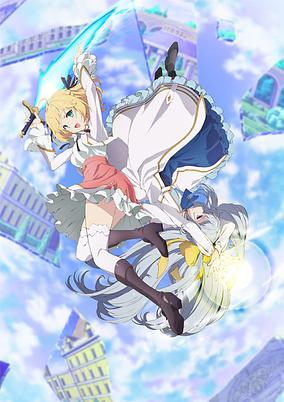

**Studio:** Diomedéa &nbsp;|&nbsp; **Episodes:** 12 &nbsp;|&nbsp; **Director:** Shingo Tamaki &nbsp;|&nbsp; **Aired/Released:** January 4 – March 22 &nbsp;|&nbsp; **Genres:** Magic, Fantasy, Romance, Politics, Isekai, Swordplay, Seinen

> Despite her supposed ineptitude with regular magic, Princess Anisphia defies the aristocracy’s expectations by developing “magicology,” a unique magical theory based on memories from her past life. One day, she witnesses the brilliant noblewoman Euphyllia unjustly stripped of her title as the kingdom’s next monarch. That’s when Anisphia concocts a plan to help Euphyllia regain her good name-which somehow involves them living together and researching magic! Little do these two ladies know, however, that their chance encounter will alter not only their own futures, but those of the kingdom...and the entire world!
>
> _Synopsis source: Kitsu_

[Wikipedia](https://en.wikipedia.org/wiki/The_Magical_Revolution_of_the_Reincarnated_Princess_and_the_Genius_Young_Lady) · [Kitsu](https://kitsu.io/anime/tensei-oujo-to-tensai-reijou-no-mahou-kakumei)

---

### Bungo Stray Dogs ( season 4 )

**Studio:** Bones &nbsp;|&nbsp; **Episodes:** 13 &nbsp;|&nbsp; **Director:** Takuya Igarashi &nbsp;|&nbsp; **Aired/Released:** January 4 – March 29

[Wikipedia](https://en.wikipedia.org/wiki/Bungo_Stray_Dogs)

---

### Tomo-chan Is a Girl!

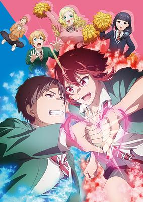

**Studio:** Lay-duce &nbsp;|&nbsp; **Episodes:** 13 &nbsp;|&nbsp; **Director:** Hitoshi Nanba &nbsp;|&nbsp; **Aired/Released:** January 5 – March 29 &nbsp;|&nbsp; **Genres:** Comedy, Slice of Life, Romance

> Tomboy Tomo couldn’t have picked a more awkward high school crush ’cause it’s on her childhood friend, Junichiro, but he only sees her as one of the guys. Despite her pretty looks and signals, nothing gets through to this meathead! Will Junichiro ever realize Tomo’s into him and see her for the cutesy girl she actually is?!
>
> _Synopsis source: Kitsu_

[Wikipedia](https://en.wikipedia.org/wiki/Tomo-chan_Is_a_Girl!) · [Kitsu](https://kitsu.io/anime/tomo-chan-wa-onna-no-ko)

---

### Onimai: I'm Now Your Sister!

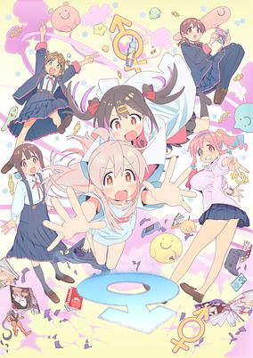

**Studio:** Studio Bind &nbsp;|&nbsp; **Episodes:** 12 &nbsp;|&nbsp; **Director:** Shingo Fujii &nbsp;|&nbsp; **Aired/Released:** January 5 – March 23 &nbsp;|&nbsp; **Genres:** Comedy, Cross Dressing, Gender Bender, Science Fiction, Slice of Life

> Recluse Mahiro would rather lose himself in his video games than venture into the outside world. After emerging from his cocoon of a room, he’s shocked to see a teenage girl staring back at him in the mirror. What did his younger sister Mihari do to him? Mahiro should be angry, yet he’s curious about this second chance at life. Can he soar in this brave new world? He’s intrigued to find out!
>
> _Synopsis source: Kitsu_

[Kitsu](https://kitsu.io/anime/onii-chan-wa-oshimai)

---

### Spy Classroom (season 1) (Spy Classroom)

**Studio:** Feel &nbsp;|&nbsp; **Episodes:** 12 &nbsp;|&nbsp; **Director:** Keiichiro Kawaguchi &nbsp;|&nbsp; **Aired/Released:** January 5 – March 30 &nbsp;|&nbsp; **Genres:** Action, Drama, Mystery, Comedy, Gunfights, Crime

> Conflict-ravaged nations now deploy covert operatives instead of missiles. Lily is recruited into spy-training… but her practical skills are absolutely abysmal. Desperate to pass, she leaps at the chance to join the mysterious “Tomoshibi” team. Too bad the team is filled with even more hopeless spies. Together they must conquer the Impassible Mission and best their genius instructor, but the true purpose behind their classroom is more harrowing than they can imagine…
>
> _Synopsis source: Kitsu_

[Wikipedia](https://en.wikipedia.org/wiki/Spy_Classroom) · [Kitsu](https://kitsu.io/anime/spy-kyoushitsu)

---

### Technoroid Overmind

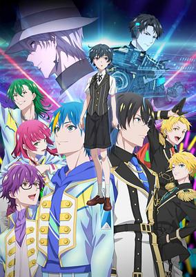

**Studio:** Doga Kobo &nbsp;|&nbsp; **Episodes:** 12 &nbsp;|&nbsp; **Director:** Ka Hee Im &nbsp;|&nbsp; **Aired/Released:** January 5 – March 29 &nbsp;|&nbsp; **Genres:** Music, Idol, Post Apocalypse, Android

> The story of "wretched, beautiful androids" is set on the entertainment tower Babel, the new source of hope for humanity after climate change has submerged the world underwater. Several unique musical units compete to rise to the top of Babel, by moving the hearts of both humans and androids with their performances.
>
> _Synopsis source: Kitsu_

[Wikipedia](https://en.wikipedia.org/wiki/Technoroid) · [Kitsu](https://kitsu.io/anime/technoroid-overmind)

---

### Tsurune: The Linking Shot (Tsurune - The Linking Shot -)

**Studio:** Kyoto Animation &nbsp;|&nbsp; **Episodes:** 13 &nbsp;|&nbsp; **Director:** Takuya Yamamura &nbsp;|&nbsp; **Aired/Released:** January 5 – March 29 &nbsp;|&nbsp; **Genres:** School Clubs, Slice of Life, Sports, Drama

> The second season of Tsurune.
>
> _Synopsis source: Kitsu_

[Wikipedia](https://en.wikipedia.org/wiki/Tsurune) · [Kitsu](https://kitsu.io/anime/tsurune-tsunagari-no-issha)

---

### Revenger

**Studio:** Ajia-do Animation Works &nbsp;|&nbsp; **Episodes:** 12 &nbsp;|&nbsp; **Director:** Masaya Fujimori &nbsp;|&nbsp; **Aired/Released:** January 5 – March 23

[Wikipedia](https://en.wikipedia.org/wiki/Revenger_(TV_series))

---

### The Iceblade Sorcerer Shall Rule the World

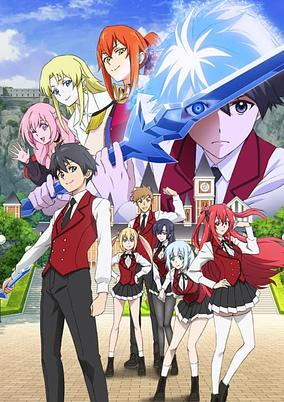

**Studio:** Cloud Hearts &nbsp;|&nbsp; **Episodes:** 12 &nbsp;|&nbsp; **Director:** Masahiro Takata &nbsp;|&nbsp; **Aired/Released:** January 6 – March 24 &nbsp;|&nbsp; **Genres:** Action, Adventure, Comedy, Fantasy, Ecchi, Magic, Drama

> The Arnold Academy of Magic is a school for the elite...and Ray White is just your ordinary guy. In fact, he doesn't seem particularly skilled with magic at all, and is a bit of a klutz. Which is why he has nothing to do with the rumor that one of the great magicians, the Iceblade Sorcerer, is a member of the incoming class...right?
>
> _Synopsis source: Kitsu_

[Wikipedia](https://en.wikipedia.org/wiki/The_Iceblade_Sorcerer_Shall_Rule_the_World) · [Kitsu](https://kitsu.io/anime/hyouken-no-majutsushi-ga-sekai-wo-suberu)

---

### Nijiyon Animation (Love Live! Nijigasaki High School Idol Club Season 2)

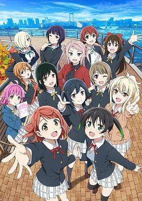

**Studio:** Bandai Namco Filmworks &nbsp;|&nbsp; **Episodes:** 12 &nbsp;|&nbsp; **Director:** Yūya Horiuchi &nbsp;|&nbsp; **Aired/Released:** January 6 – March 24 &nbsp;|&nbsp; **Genres:** Idol, School Clubs, Music

> The second season of Love Live! Nijigasaki Gakuen School Idol Doukoukai.
>
> _Synopsis source: Kitsu_

[Wikipedia](https://en.wikipedia.org/wiki/Love_Live!_Nijigasaki_High_School_Idol_Club) · [Kitsu](https://kitsu.io/anime/love-live-nijigasaki-gakuen-school-idol-doukoukai-2)

---

### Farming Life in Another World

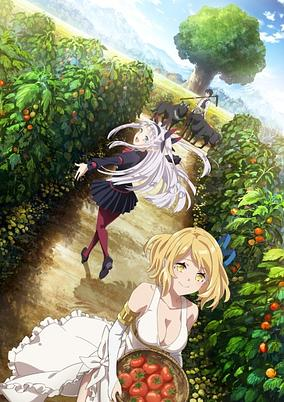

**Studio:** Zero-G &nbsp;|&nbsp; **Episodes:** 12 &nbsp;|&nbsp; **Director:** Ryōichi Kuraya &nbsp;|&nbsp; **Aired/Released:** January 6 – March 24 &nbsp;|&nbsp; **Genres:** Adventure, Fantasy, Fantasy World, Slice of Life, Isekai, Harem, Comedy

> After Hiraku dies of a serious illness, God brings him back to life, gives his health and youth back, and sends him to a fantasy world of his choice. In order to enjoy his second shot, God bestows upon him the almighty farming tool! Watch as Hiraku digs, chops, and plows in another world in this laidback farming fantasy!
>
> _Synopsis source: Kitsu_

[Wikipedia](https://en.wikipedia.org/wiki/Farming_Life_in_Another_World) · [Kitsu](https://kitsu.io/anime/isekai-nonbiri-nouka)

---

### Sugar Apple Fairy Tale (part 1) (Sugar Apple Fairy Tale)

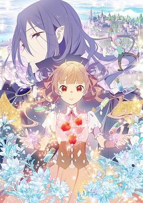

**Studio:** J.C.Staff &nbsp;|&nbsp; **Episodes:** 12 &nbsp;|&nbsp; **Director:** Yōhei Suzuki &nbsp;|&nbsp; **Aired/Released:** January 6 – March 24 &nbsp;|&nbsp; **Genres:** Adventure, Fantasy, Romance, Slavery, Shoujo, Magic

> In a world where fairies are bought and sold to the highest bidder, humans aren’t exactly on friendly terms with the fae folk. But friendship is exactly what Anne Halford seeks with Challe, her new fairy bodyguard, though he’s not so keen on the idea. As his new master, Anne tasks him with escorting her through a particularly dangerous area, but with a reluctant bodyguard eager to escape a life of servitude, she’ll have to deal with a lot more than she bargained for...
>
> _Synopsis source: Kitsu_

[Wikipedia](https://en.wikipedia.org/wiki/Sugar_Apple_Fairy_Tale) · [Kitsu](https://kitsu.io/anime/sugar-apple-fairy-tale)

---

### The Reincarnation of the Strongest Exorcist in Another World

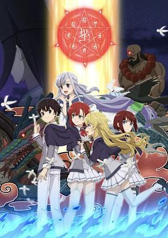

**Studio:** Studio Blanc &nbsp;|&nbsp; **Episodes:** 13 &nbsp;|&nbsp; **Director:** Nobuyoshi Nagayama (Chief) Ryōsuke Shibuya &nbsp;|&nbsp; **Aired/Released:** January 7 – April 1 &nbsp;|&nbsp; **Genres:** Action, Adventure, Fantasy, Romance, Supernatural, Isekai, Swordplay, Magic

> Haruyoshi, the strongest onmyoji was on the verge of death after the betrayal of his companions. Hoping to be happy in the next life, he tried the secret technique of reincarnation and was sent to a different world! Born into a family of magicians, the magic he failed to inherit was nothing compared to his previous skills as an onmyoji. “Who needs magic? I’ll survive in this world with my old techniques!”
>
> _Synopsis source: Kitsu_

[Wikipedia](https://en.wikipedia.org/wiki/The_Reincarnation_of_the_Strongest_Exorcist_in_Another_World) · [Kitsu](https://kitsu.io/anime/saikyou-onmyouji-no-isekai-tenseiki-geboku-no-youkaidomo-ni-kurabete-monster-ga-yowai-sugirundaga)

---

### Giant Beasts of Ars

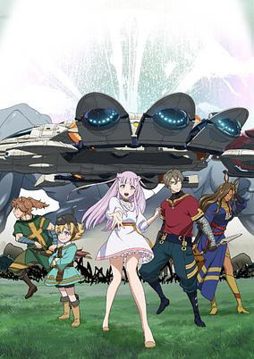

**Studio:** Asahi Production &nbsp;|&nbsp; **Episodes:** 12 &nbsp;|&nbsp; **Director:** Akira Oguro &nbsp;|&nbsp; **Aired/Released:** January 7 – March 25 &nbsp;|&nbsp; **Genres:** Magic, Politics, Swordplay, Fantasy

> The story takes place in an age of swords, heroes, and myths. Giant beasts created the land, but then humans stole that land. This angered the beasts, who then started eating humans. In order to fight back, humans called upon the gods. The Kyojuu beasts started spreading around the world, causing great damage, but humans fought back by hunting the Kyojuu. Humanity also prospered by to using the dissected parts of the beasts. Jiiro is "a man who has escaped death," and he hunts Kyojuu to earn a living. He meets "Twenty and Second Kuumi," who is being chased by someone. Jiiro and his friends then start to uncover the secrets of this world.
>
> _Synopsis source: Kitsu_

[Wikipedia](https://en.wikipedia.org/wiki/Giant_Beasts_of_Ars) · [Kitsu](https://kitsu.io/anime/ars-no-kyojuu)

---

### My Life as Inukai-san's Dog (My Life as Inukai-san’s Dog)

**Studio:** Quad &nbsp;|&nbsp; **Episodes:** 12 &nbsp;|&nbsp; **Director:** Takashi Andō &nbsp;|&nbsp; **Aired/Released:** January 7 – March 25 &nbsp;|&nbsp; **Genres:** Ecchi, Comedy, Romance, Supernatural

> A little ecchi comedy where you are being kept by a cool, beautiful girl! When you woke up, you found yourself as the pet dog of a girl named Inukai-san! At school, Inukai-san has no expression on her face, but she's a dog lover who loves her dog to pieces! She loves dogs so much that she's going to turn you into a real dog, body, and soul! An erotic comedy that makes you stop being human!
>
> _Synopsis source: Kitsu_

[Wikipedia](https://en.wikipedia.org/wiki/My_Life_as_Inukai-san%27s_Dog) · [Kitsu](https://kitsu.io/anime/inu-ni-nattara-suki-na-hito-ni-hirowareta)

---

### The Angel Next Door Spoils Me Rotten

**Studio:** Project No.9 &nbsp;|&nbsp; **Episodes:** 12 &nbsp;|&nbsp; **Director:** Lihua Wang &nbsp;|&nbsp; **Aired/Released:** January 7 – March 25 &nbsp;|&nbsp; **Genres:** Comedy, Romance, Slice of Life

> Amane lives alone in an apartment, and the most beautiful girl in school, Mahiru, lives just next door. They've almost never spoken until the day he sees her in distress on a rainy day and lends her his umbrella. To return the favor, she offers him help around the house, and a relationship slowly begins to blossom as the distance between them closes...
>
> _Synopsis source: Kitsu_

[Wikipedia](https://en.wikipedia.org/wiki/The_Angel_Next_Door_Spoils_Me_Rotten) · [Kitsu](https://kitsu.io/anime/otonari-no-tenshisama-ni-itsunomanika-dame-ningen-ni-sareteita-Ken)

---

### Buddy Daddies

**Studio:** P.A. Works &nbsp;|&nbsp; **Episodes:** 12 &nbsp;|&nbsp; **Director:** Yoshiyuki Asai &nbsp;|&nbsp; **Aired/Released:** January 7 – April 1 &nbsp;|&nbsp; **Genres:** Crime, Assassin, Comedy, Family

> Assassins Kazuki Kurusu and Rei Suwa meet Miri, a girl looking for her father on Christmas Day. Kazuki, Rei, and Miri unexpectedly end up living together. Follows Kazuki Kurusu, a criminal contractor/coordinator who lives with his best friend, Rei Suwa, a professional assassin who has been raised from childhood to be a contract killer. Kazuki is outgoing and loves gambling and women, while Rei is a man of few words who spends his off time playing video games. One day, the two buddies end up caring for Miri Unasaka, a four year old girl whose father is a mafia boss, after Miri accidentally wanders into a firefight in a hotel while looking for her father.
>
> _Synopsis source: Kitsu_

[Wikipedia](https://en.wikipedia.org/wiki/Buddy_Daddies) · [Kitsu](https://kitsu.io/anime/buddy-daddies)

---

### Trigun Stampede

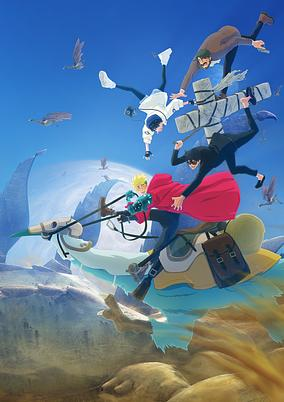

**Studio:** Orange &nbsp;|&nbsp; **Episodes:** 12 &nbsp;|&nbsp; **Director:** Kenji Mutō &nbsp;|&nbsp; **Aired/Released:** January 7 – March 25 &nbsp;|&nbsp; **Genres:** Shounen, Gunfights, Action, Drama, Science Fiction, Space, Adventure, Comedy

> Vash the Stampede’s a joyful gunslinging pacifist, so why does he have a $$6 million bounty on his head? That’s what’s puzzling rookie reporter Meryl Stryfe and her jaded veteran partner when looking into the vigilante only to find someone who hates blood. But their investigation turns out to uncover something heinous—his evil twin brother, Millions Knives.
>
> _Synopsis source: Kitsu_

[Wikipedia](https://en.wikipedia.org/wiki/Trigun_Stampede) · [Kitsu](https://kitsu.io/anime/trigun-stampede)

---

### Is It Wrong to Try to Pick Up Girls in a Dungeon? ( season 4, part 2 ) (Is It Wrong to Try to Pick Up Girls in a Dungeon? IV)

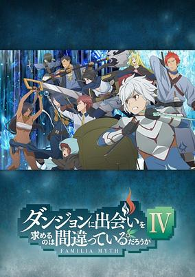

**Studio:** J.C.Staff &nbsp;|&nbsp; **Episodes:** 11 &nbsp;|&nbsp; **Director:** Hideki Tachibana &nbsp;|&nbsp; **Aired/Released:** January 7 – March 18 &nbsp;|&nbsp; **Genres:** Magic, Deity, Swordplay, Fantasy World, Action, Fantasy, Adventure, Comedy, Juujin

> The fourth season of Dungeon ni Deai wo Motomeru no wa Machigatteiru Darou ka. Intrepid adventurer Bell Cranel has leveled up, but he can’t rest on his dungeoneering laurels just yet. The Hestia Familia still has a long way to go before it can stand toe-to-toe with the other Familias of Orario — but before Bell can set out on his next mission, reports of a brutal murder rock the adventuring community! One of Bell’s trusted allies stands accused of the horrible crime, and it’s up to Bell and his friends to clear their name and uncover a nefarious plot brewing in the dungeon’s dark depths.
>
> _Synopsis source: Kitsu_

[Wikipedia](https://en.wikipedia.org/wiki/Is_It_Wrong_to_Try_to_Pick_Up_Girls_in_a_Dungeon%3F) · [Kitsu](https://kitsu.io/anime/dungeon-ni-deai-wo-motomeru-no-wa-machigatteiru-darou-ka-iv)

---

### Endo and Kobayashi Live! The Latest on Tsundere Villainess Lieselotte

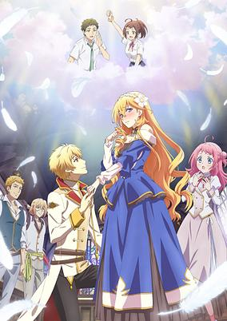

**Studio:** Tezuka Productions &nbsp;|&nbsp; **Episodes:** 12 &nbsp;|&nbsp; **Director:** Fumihiro Yoshimura &nbsp;|&nbsp; **Aired/Released:** January 7 – March 25 &nbsp;|&nbsp; **Genres:** Comedy, Drama, Isekai, Romance, School Life, Shoujo

> Endou and Kobayashi just decided to play A Magical Romance, an otome game featuring a devious villainess named Lieselotte. Kobayashi thinks Lieselotte is a traditionally dastardly villain but Endou insists Lieselotte is just misunderstood. The pair bicker and argue about Lieselotte’s character and motivations. But little do they know that Lieselotte’s in-game fiancé can hear their every word, and their colorful chatter will lead him down a completely different path than his character is supposed to tread!
>
> _Synopsis source: Kitsu_

[Wikipedia](https://en.wikipedia.org/wiki/Endo_and_Kobayashi_Live!_The_Latest_on_Tsundere_Villainess_Lieselotte) · [Kitsu](https://kitsu.io/anime/tsundere-akuyaku-reijou-liselotte-to-jikkyou-no-endo-kun-to-kaisetsu-no-kobayashi-san)

---

### UniteUp! (UniteUp)

**Studio:** CloverWorks &nbsp;|&nbsp; **Episodes:** 12 &nbsp;|&nbsp; **Director:** Shin'ichirō Ushijima &nbsp;|&nbsp; **Aired/Released:** January 7 – April 15 &nbsp;|&nbsp; **Genres:** Idol, Baseball, Music

> The anime's story centers on Akira Kiyose, who sings on a video streaming site under the singer name "KIKUNOYU." One day the talent agency sMiLea Production scouts him. sMiLea is an agency founded by the retired legendary idol pair AneLa to train new budding idols. Akira then forms an idol group with Banri Naoe and Chihiro Isuzugawa, who were also scouted. Their new group, Protostar, will have their debut alongside other new idol groups with sMiLea Production: Legit and Jaxx Jaxx.
>
> _Synopsis source: Kitsu_

[Wikipedia](https://en.wikipedia.org/wiki/UniteUp!) · [Kitsu](https://kitsu.io/anime/uniteup)

---

### Chillin' in My 30s After Getting Fired from the Demon King's Army

**Studio:** Encourage Films &nbsp;|&nbsp; **Episodes:** 12 &nbsp;|&nbsp; **Director:** Fumitoshi Oizaki &nbsp;|&nbsp; **Aired/Released:** January 7 – March 25 &nbsp;|&nbsp; **Genres:** Fantasy, Slice of Life, Harem, Romance, Ecchi, Seinen

> The story centers on Dariel, a soldier in the Dark Lord's army who cannot use magic. Instead, he wields his intellect and initiative as an assistant to one of the Dark Lord's most trusted captains. But when the captain is summarily replaced, Dariel also loses his privileged position and is fired. In disappointment, he retires in a village of humans, getting a new start at life by using his abilities to accept requests for help. (Source Anime News Network)
>
> _Synopsis source: Kitsu_

[Wikipedia](https://en.wikipedia.org/wiki/Chillin%27_in_My_30s_After_Getting_Fired_from_the_Demon_King%27s_Army) · [Kitsu](https://kitsu.io/anime/kaiko-sareta-ankoku-heishi-30-dai-no-slow-na-second-life)

---

### Saving 80,000 Gold in Another World for My Retirement

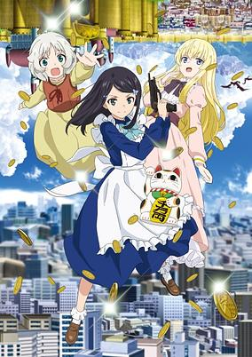

**Studio:** Felix Film &nbsp;|&nbsp; **Episodes:** 12 &nbsp;|&nbsp; **Director:** Hiroshi Tamada &nbsp;|&nbsp; **Aired/Released:** January 8 – March 26 &nbsp;|&nbsp; **Genres:** Fantasy, Isekai

> Mitsuha is an 18-year-old girl who’s often mistaken for a middle schooler due to her childlike face and small stature. The story begins when she loses her parents and her older brother at the same time in an accident and ends up all alone in the world. She fails her university entrance exams due to the shock of losing her family. There are people who are after her parents’ insurance money. She doesn’t know whether she should go to college or start working. There are also lots of expenses to worry about, including living expenses and the cost of maintaining the house. One day, as she worries about how she'll survive, she’s given the “World Jumping” ability by a mysterious being that allows her to go back and forth between “this world” and an “isekai”! Now that she has this ability, she comes up with a plan for the future in which she saves 1 billion yen in each world for a total of 2 billion yen (80,000 gold coins)!
>
> _Synopsis source: Kitsu_

[Wikipedia](https://en.wikipedia.org/wiki/Saving_80,000_Gold_in_Another_World_for_My_Retirement) · [Kitsu](https://kitsu.io/anime/rougo-ni-sonaete-isekai-de-8-manmai-no-kinka-wo-tamemasu)

---

### The Tale of the Outcasts

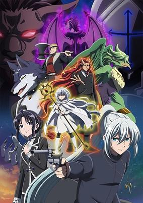

**Studio:** Ashi Productions &nbsp;|&nbsp; **Episodes:** 13 &nbsp;|&nbsp; **Director:** Yasutaka Yamamoto &nbsp;|&nbsp; **Aired/Released:** January 8 – April 2 &nbsp;|&nbsp; **Genres:** Action, Drama, Juujin, Fantasy, Shounen, Supernatural

> In Victorian England, the young orphan Wisteria begs for scraps. Able to see through demons’ disguises, she befriends the immortal Marbas, lonely after centuries of solitude. He finds kinship with the human girl, even while evading the brutal Sword Cross Knights—including Wisteria’s brother. Is it possible for two souls so different to find happiness together, and what price must they pay?
>
> _Synopsis source: Kitsu_

[Wikipedia](https://en.wikipedia.org/wiki/The_Tale_of_the_Outcasts) · [Kitsu](https://kitsu.io/anime/nokemono-tachi-no-yoru)

---

### Nier: Automata Ver1.1a

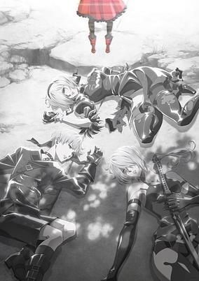

**Studio:** A-1 Pictures &nbsp;|&nbsp; **Episodes:** 12 &nbsp;|&nbsp; **Director:** Ryouji Masuyama &nbsp;|&nbsp; **Aired/Released:** January 8 – July 23 &nbsp;|&nbsp; **Genres:** Action, Drama, Science Fiction, Robot, Fantasy, Psychological

> The second half of NieR:Automata Ver1.1a The year 11954. YoRHa Soldiers 2B and 9S are newly dispatched to Earth to carry out and support the 243rd Descent Operation. There, they succeed in destroying the machine lifeform core units, Adam and Eve. With the annihilation of these enemies, the Army of Humanity takes this chance to end this long-lasting war and decides on an all-out attack against the machine lifeforms. This is a record of the battles and hopes of Androids and the fate which dictates them all… As war rages on, Unit 2B and others like her question their role. Reclaiming the planet will take sacrifice, but how much more can they give, and is humanity worth the cost?
>
> _Synopsis source: Kitsu_

[Kitsu](https://kitsu.io/anime/nier-automata-ver1-1a-part-2)

---

### The Legend of Heroes: Trails of Cold Steel – Northern War

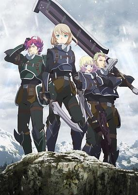

**Studio:** Tatsunoko Production &nbsp;|&nbsp; **Episodes:** 12 &nbsp;|&nbsp; **Director:** Hidekazu Sato &nbsp;|&nbsp; **Aired/Released:** January 8 – March 26 &nbsp;|&nbsp; **Genres:** Action, Adventure, Fantasy, Military, Politics, Swordplay, War, Magic, Dystopia

> Lavian is the granddaughter of a deeply respected North Ambria hero-turned-traitor named Vlad, who joins the Northern Jaegers to prove that she is different from her grandfather. After multiple and constant disciplinary violations, Lavie is then ordered to form a platoon alongside with Martin, Iseria, and Tallion to infiltrate the Erebonian Empire and to investigate more about the “Civil War Hero of the Empire” who is threatening North Ambria.
>
> _Synopsis source: Kitsu_

[Kitsu](https://kitsu.io/anime/eiyuu-densetsu-sen-no-kiseki)

---

### The Misfit of Demon King Academy ( season 2, part 1 ) (The Misfit of Demon King Academy Ⅱ: History's Strongest Demon King Reincarnates and Goes to School with His Descendants)

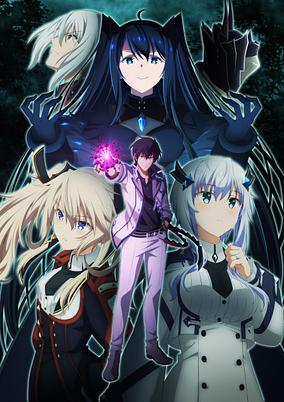

**Studio:** Silver Link &nbsp;|&nbsp; **Episodes:** 12 &nbsp;|&nbsp; **Director:** Shin Oonuma (Chief) Masafumi Tamura &nbsp;|&nbsp; **Aired/Released:** January 8 – September 24 &nbsp;|&nbsp; **Genres:** Magic, Demon, Action, Fantasy, Harem, School Life

> As peace returns to the demon realm, Anos Voldigoad wishes nothing more than to put his reputation as the Demon King of Tyranny to rest and go back to being a misfit at the prestigious Demon King Academy. Unfortunately, any tranquility is fleeting: sinister demons, kings, and deities plot Anos's demise from the shadows. Rumors spread about the "Child of God," a being whose power may rival that of Anos. To uncover the truth and eliminate the potential threat, Anos must journey deep into the land of spirits. However, the spirit world is shrouded in mystery, and it may only be entered after undergoing a series of difficult trials. With unrivaled power and confidence, Anos braces himself to defeat various formidable enemies with grandiose titles. But he—with the assistance of his trusted allies—will barely have to break a sweat as the true Demon King of Tyranny.
>
> _Synopsis source: Kitsu_

[Wikipedia](https://en.wikipedia.org/wiki/The_Misfit_of_Demon_King_Academy) · [Kitsu](https://kitsu.io/anime/maou-gakuin-no-futekigousha-shijou-saikyou-no-maou-no-shiso-tensei-shite-shison-tachi-no-gakkou-e)

---

### Tokyo Revengers: Christmas Showdown

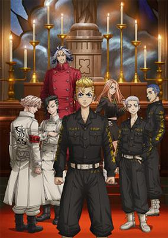

**Studio:** Liden Films &nbsp;|&nbsp; **Episodes:** 13 &nbsp;|&nbsp; **Director:** Koichi Hatsumi &nbsp;|&nbsp; **Aired/Released:** January 8 – April 2 &nbsp;|&nbsp; **Genres:** Delinquent, Time Travel, Action, School Life, Crime, Drama, Shounen

> The second season of Tokyo Revengers. Despite his best time-leaping efforts, Takemichi Hanagaki continuously fails to prevent the present-day death of Hinata Tachibana, his adolescent love. The adult Takemichi grapples with grief and the ramifications of the Tokyo Manji gang's criminal empire—an unintended product of his timeline meddling. Though the gang once operated under the idealistic Manjirou "Mikey" Sano, it has now been taken over by the malicious Tetta Kisaki and, as a result, has abandoned its original optimistic intent. Despite feeling hopeless, Takemichi travels to the past once again to investigate Black Dragon, a rival motorcycle gang whose actions ultimately lead to Hinata's demise. There, he meets the young Hakkai Shiba, a fellow gang member whose older brother, Taiju, tyrannically rules Black Dragon. Takemichi, with Chifuyu on his side, works to unravel the fates of Black Dragon's members, fighting to create a happy future for his loved ones.
>
> _Synopsis source: Kitsu_

[Wikipedia](https://en.wikipedia.org/wiki/Tokyo_Revengers) · [Kitsu](https://kitsu.io/anime/tokyo-revengers-seiya-kessen-hen)

---

### Don't Toy with Me, Miss Nagatoro 2nd Attack (Don’t Toy With Me, Miss Nagatoro: 2nd Attack)

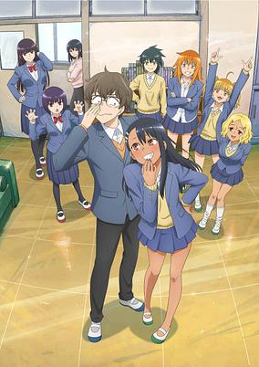

**Studio:** OLM &nbsp;|&nbsp; **Episodes:** 12 &nbsp;|&nbsp; **Director:** Shinji Ushiro &nbsp;|&nbsp; **Aired/Released:** January 8 – March 26 &nbsp;|&nbsp; **Genres:** Comedy, Romance, Slice of Life, School Life

> The second season of Ijiranaide, Nagatoro-san. Miss Nagatoro is back for even more antics against Senpai in her next round of shenanigans!
>
> _Synopsis source: Kitsu_

[Wikipedia](https://en.wikipedia.org/wiki/Don%27t_Toy_with_Me,_Miss_Nagatoro) · [Kitsu](https://kitsu.io/anime/ijiranaide-nagatoro-san-2nd-attack)

---

### Handyman Saitou in Another World

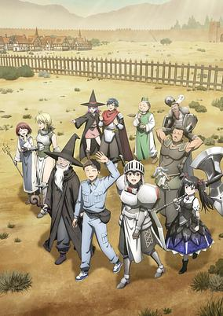

**Studio:** C2C &nbsp;|&nbsp; **Episodes:** 12 &nbsp;|&nbsp; **Director:** Toshiyuki Kubooka &nbsp;|&nbsp; **Aired/Released:** January 8 – March 26 &nbsp;|&nbsp; **Genres:** Isekai, Slice of Life, Shounen, Comedy, Adventure, Fantasy

> Handyman Saitou has never felt special in his life. When he’s dropped into a medieval fantasy world, he gathers a party of unique beings to survive. Surrounded by a heavy warrior, a spell-forgetting wizard, and even a divine fairy princess, he yearns to be helpful. But after Saitou saves everyone during a raid, it’s clear that having a handyman on an adventure isn’t just useful, it’s essential!
>
> _Synopsis source: Kitsu_

[Wikipedia](https://en.wikipedia.org/wiki/Handyman_Saitou_in_Another_World) · [Kitsu](https://kitsu.io/anime/benriya-saitou-san-isekai-ni-iku)

---

### High Card

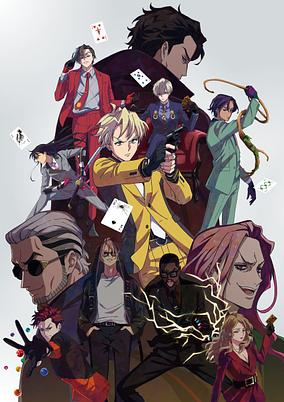

**Studio:** Studio Hibari &nbsp;|&nbsp; **Episodes:** 12 &nbsp;|&nbsp; **Director:** Junichi Wada &nbsp;|&nbsp; **Aired/Released:** January 9 – March 27 &nbsp;|&nbsp; **Genres:** Card Games, Action, Gunfights, Super Power

> After discovering that his orphanage was on the brink of closing due to financial stress, Finn, who was living freely on the streets, set out for a casino with the aim of making a fortune. However, nothing could have prepared Finn for the nightmare that was awaiting him. Once there, Finn encountered a car chase and bloody shootout caused by a man's “lucky” card. Finn will eventually learn what the shootout was about. The world order can be controlled by a set of 52 X-Playing cards with the power to bestow different superhuman powers and abilities to the ones that possess them. With these cards, people can access the hidden power of the “buddy” that can be found within themselves. There is a secret group of players called High Card, who have been directly ordered by the king of Fourland to collect the cards that have been scattered throughout the kingdom, while moonlighting as employees of the luxury car maker Pinochle. Scouted to become the group's fifth member, Finn soon joins the players on a dangerous mission to find these cards. However, Who's Who, the rival car maker obsessed with defeating Pinochle, and the Klondikes, the infamous Mafia family, stand in the way of the gang. A frenzied battle amongst these card obsessed players, fueled by justice, desire, and revenge, is about to begin!
>
> _Synopsis source: Kitsu_

[Wikipedia](https://en.wikipedia.org/wiki/High_Card) · [Kitsu](https://kitsu.io/anime/high-card)

---

### Show Time! (season 2)

**Studio:** Rabbit Gate &nbsp;|&nbsp; **Episodes:** 8 &nbsp;|&nbsp; **Director:** Satoshi Miura &nbsp;|&nbsp; **Aired/Released:** January 9 – March 13

---

### Ippon Again! ("Ippon" again!)

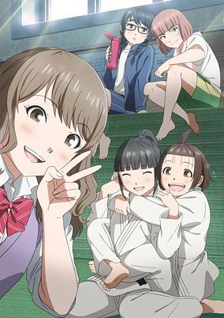

**Studio:** Bakken Record &nbsp;|&nbsp; **Episodes:** 13 &nbsp;|&nbsp; **Director:** Ken Ogiwara &nbsp;|&nbsp; **Aired/Released:** January 9 – April 3 &nbsp;|&nbsp; **Genres:** Sports, Martial Arts, Comedy, Drama, Friendship, School Life, School Clubs, Slice of Life, Shounen

> After one last tournament and an embarrassing loss in the final round, Michi decides to call it quits on the sport of judo. Between high school social activities and entrance exams, she’ll have no time to compete in the martial art she loves most, but putting aside old hobbies is a normal part of growing up. Still, the love of judo lingers—and it comes back full force when she meets her new classmate Towa, the girl who bested Michi in her final match! Towa wants to form a judo club at their school, but she’ll need new members to get it up and running. United by their love of judo, they’ll throw in their passions into the ring together and score ippon again!
>
> _Synopsis source: Kitsu_

[Wikipedia](https://en.wikipedia.org/wiki/Ippon_Again!) · [Kitsu](https://kitsu.io/anime/mou-ippon)

---

### The Vampire Dies in No Time (season 2) (The Vampire Dies in No Time Season 2)

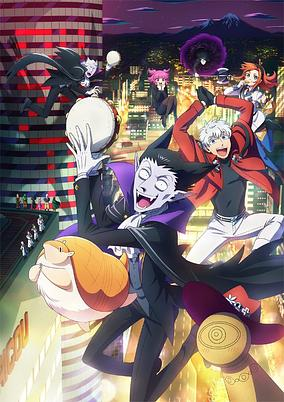

**Studio:** Madhouse &nbsp;|&nbsp; **Episodes:** 12 &nbsp;|&nbsp; **Director:** Hiroshi Kōjina &nbsp;|&nbsp; **Aired/Released:** January 9 – March 27 &nbsp;|&nbsp; **Genres:** Vampire, Comedy, Supernatural, Shounen

> The second season of Kyuuketsuki Sugu Shinu.
>
> _Synopsis source: Kitsu_

[Wikipedia](https://en.wikipedia.org/wiki/The_Vampire_Dies_in_No_Time) · [Kitsu](https://kitsu.io/anime/kyuuketsuki-sugu-shinu-2)

---

### KJ File (season 2)

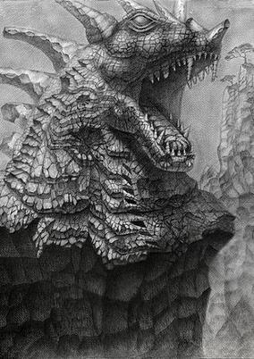

**Studio:** ILCA yell &nbsp;|&nbsp; **Episodes:** 13 &nbsp;|&nbsp; **Director:** Akira Funada &nbsp;|&nbsp; **Aired/Released:** January 9 – April 3 &nbsp;|&nbsp; **Genres:** Action, Dragon, Science Fiction

> Sequel to KJ File.
>
> _Synopsis source: Kitsu_

[Kitsu](https://kitsu.io/anime/kj-file-zoku-hen)

---

### By the Grace of the Gods (season 2) (By the Grace of the Gods Season 2)

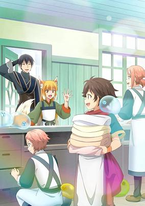

**Studio:** Maho Film &nbsp;|&nbsp; **Episodes:** 12 &nbsp;|&nbsp; **Director:** Takeyuki Yanase &nbsp;|&nbsp; **Aired/Released:** January 9 – March 26 &nbsp;|&nbsp; **Genres:** Magic, Fantasy World, Fantasy, Adventure, Slice of Life, Isekai

> The second season of Kami-tachi ni Hirowareta Otoko.
>
> _Synopsis source: Kitsu_

[Wikipedia](https://en.wikipedia.org/wiki/By_the_Grace_of_the_Gods) · [Kitsu](https://kitsu.io/anime/kami-tachi-ni-hirowareta-otoko-2)

---

### In/Spectre (season 2) (In/Spectre Season 2)

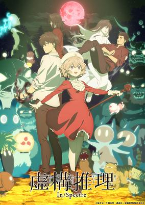

**Studio:** Brain's Base &nbsp;|&nbsp; **Episodes:** 12 &nbsp;|&nbsp; **Director:** Keiji Gotoh &nbsp;|&nbsp; **Aired/Released:** January 9 – March 27 &nbsp;|&nbsp; **Genres:** Ghost, Deity, Demon, Contemporary Fantasy, Fantasy, Romance, Supernatural, Mystery, Shounen

> Second season of Kyokou Suiri. Kotoko and Kuro team up to solve a mystery between a human and a yuki-onna!
>
> _Synopsis source: Kitsu_

[Wikipedia](https://en.wikipedia.org/wiki/In/Spectre) · [Kitsu](https://kitsu.io/anime/kyokou-suiri-2nd-season)

---

### Ningen Fushin: Adventurers Who Don't Believe in Humanity Will Save the World

**Studio:** Geek Toys &nbsp;|&nbsp; **Episodes:** 12 &nbsp;|&nbsp; **Director:** Itsuki Imazaki &nbsp;|&nbsp; **Aired/Released:** January 10 – March 28

[Wikipedia](https://en.wikipedia.org/wiki/Apparently,_Disillusioned_Adventurers_Will_Save_the_World)

---

### Kubo Won't Let Me Be Invisible

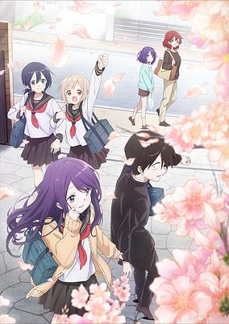

**Studio:** Pine Jam &nbsp;|&nbsp; **Episodes:** 12 &nbsp;|&nbsp; **Director:** Kazuomi Koga &nbsp;|&nbsp; **Aired/Released:** January 10 – June 20 &nbsp;|&nbsp; **Genres:** Romance, Comedy

> First year high schooler Junta Shiraishi is a mob character who goes unnoticed even when he's standing right next to you. But his classmate, "heroine-level beauty" Kubo, always notices him and is there to tease him. Anyone can become special to someone, but it might be a little too early to call these feelings "love." Perhaps this story is still two-steps from being a romantic comedy--let's call it a sweet comedy where a background character becomes visible!
>
> _Synopsis source: Kitsu_

[Wikipedia](https://en.wikipedia.org/wiki/Kubo_Won%27t_Let_Me_Be_Invisible) · [Kitsu](https://kitsu.io/anime/kubo-san-wa-mob-wo-yurusanai)

---

### Reborn to Master the Blade: From Hero-King to Extraordinary Squire (Reborn to Master the Blade: From Hero-King to Extraordinary Squire ♀)

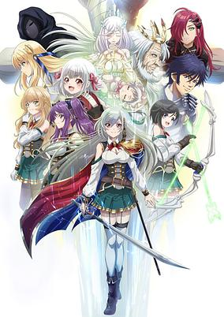

**Studio:** Studio Comet &nbsp;|&nbsp; **Episodes:** 12 &nbsp;|&nbsp; **Director:** Naoyuki Kuzuya &nbsp;|&nbsp; **Aired/Released:** January 10 – March 28 &nbsp;|&nbsp; **Genres:** Action, Adventure, Comedy, Fantasy, Gender Bender, Swordplay

> After living a life devoted to serving his country and people, Inglis’ one wish to be free of a king’s burden and to train was actually heard, but as a beautiful girl! Reborn in the far future as a daughter to renowned knights, Inglis can now focus on mastering the martial arts. A wish has been granted, and Inglis will be on the front lines fulfilling the dream of becoming the strongest knight.
>
> _Synopsis source: Kitsu_

[Kitsu](https://kitsu.io/anime/eiyuu-ou-bu-wo-kiwameru-tame-tenseisu-soshite-sekai-saikyou-no-minarai-kishi)

---

### Malevolent Spirits: Mononogatari (part 1) (Malevolent Spirits: Mononogatari)

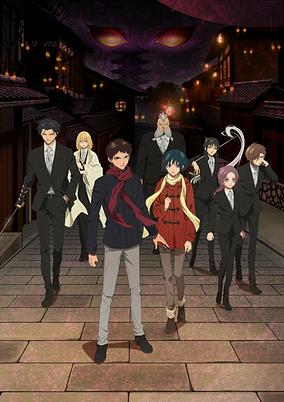

**Studio:** Bandai Namco Pictures &nbsp;|&nbsp; **Episodes:** 12 &nbsp;|&nbsp; **Director:** Ryuichi Kimura &nbsp;|&nbsp; **Aired/Released:** January 10 – March 28 &nbsp;|&nbsp; **Genres:** Action, Supernatural, Martial Arts, Family, Super Power

> Tsukumogami: spirits -- or "marebito" -- which have possessed objects of considerable age and gained a physical form. Although he is part of the Saenome clan which is charged with peacefully sending them back to their own world, Kunato Hyouma hates their guts because one took away what was very precious to him. In order to cure him of this loathing, Hyouma's grandfather sends him to live with Nagatsuki Botan, a girl who is the master of six "friendly" tsukumogami and lives with them as a family.
>
> _Synopsis source: Kitsu_

[Kitsu](https://kitsu.io/anime/mononogatari)

---

### Vinland Saga ( season 2 )

**Studio:** MAPPA &nbsp;|&nbsp; **Episodes:** 24 &nbsp;|&nbsp; **Director:** Shūhei Yabuta &nbsp;|&nbsp; **Aired/Released:** January 10 – June 20

[Wikipedia](https://en.wikipedia.org/wiki/Vinland_Saga_(TV_series))

---

### Ayakashi Triangle

**Studio:** Connect &nbsp;|&nbsp; **Episodes:** 12 &nbsp;|&nbsp; **Director:** Noriaki Akitaya &nbsp;|&nbsp; **Aired/Released:** January 10 – September 26 &nbsp;|&nbsp; **Genres:** Action, Comedy, Ecchi, Gender Bender, Ghost, Ninja, Shounen, Supernatural

> Matsuri Kazamaki is an exorcist ninja who exorcises evil spirits called ayakashi. His childhood friend, Suzu Kanade, tends to attract ayakashi, so he secretly protects her from them. But now Suzu has caught the eye of Shirogane, an ayakashi who looks like a cat but rules over all ayakashi as their king!
>
> _Synopsis source: Kitsu_

[Wikipedia](https://en.wikipedia.org/wiki/Ayakashi_Triangle) · [Kitsu](https://kitsu.io/anime/ayakashi-triangle)

---

### Campfire Cooking in Another World with My Absurd Skill

**Studio:** MAPPA &nbsp;|&nbsp; **Episodes:** 12 &nbsp;|&nbsp; **Director:** Kiyoshi Matsuda &nbsp;|&nbsp; **Aired/Released:** January 11 – March 29 &nbsp;|&nbsp; **Genres:** Comedy, Adventure, Fantasy, Slice of Life, Cooking

> Mukoda Tsuyoshi, an ordinary salaryman, is suddenly transported to another world one day. The unique skill he gains upon arrival in this world is the seemingly useless "Online Grocery." Mukoda is discouraged at first, but the modern foods he's able to bring to his new world using this skill prove to have some unbelievable effects!
>
> _Synopsis source: Kitsu_

[Wikipedia](https://en.wikipedia.org/wiki/Campfire_Cooking_in_Another_World_with_My_Absurd_Skill) · [Kitsu](https://kitsu.io/anime/tondemo-skill-de-isekai-hourou-meshi)

---

### Bofuri (season 2) (BOFURI: I Don't Want to Get Hurt, so I'll Max Out My Defense 2nd Season)

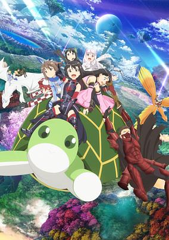

**Studio:** Silver Link &nbsp;|&nbsp; **Episodes:** 12 &nbsp;|&nbsp; **Director:** Shin Oonuma &nbsp;|&nbsp; **Aired/Released:** January 11 – April 19 &nbsp;|&nbsp; **Genres:** Action, Science Fiction, Fantasy, Adventure, Comedy, Slice of Life

> The second season of Itai no wa Iya nano de Bougyoryoku ni Kyokufuri Shitai to Omoimasu. The best offense is a great defense, and for VRMMO gamer Kaede Honjo, her defense is the best. Under her alias Maple, she and her guild journey through NewWorld Online gaining friends and foes through new battle-filled quests. All those skill points, new defensive techniques, and no pain—Maple can’t be stopped!
>
> _Synopsis source: Kitsu_

[Wikipedia](https://en.wikipedia.org/wiki/Bofuri) · [Kitsu](https://kitsu.io/anime/itai-no-wa-Iya-nano-de-bougyoryoku ni-kyokufuri-shitai-to-omoimasu-ii)

---

### Kaina of the Great Snow Sea

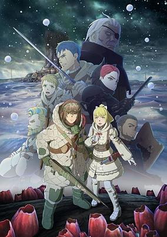

**Studio:** Polygon Pictures &nbsp;|&nbsp; **Episodes:** 11 &nbsp;|&nbsp; **Director:** Hiroaki Ando &nbsp;|&nbsp; **Aired/Released:** January 12 – March 22 &nbsp;|&nbsp; **Genres:** Dystopia, Post Apocalypse, Drama, Fantasy

> A world blanketed in an endless and ever-growing ocean of snow. The people eke out a living, either huddled around the roots of enormous trees dotting the surface, or high in the canopy, which spreads over the planet's atmosphere. A chance meeting between Kaina, a youth from the canopy, and Liliha, a young woman from the surface, sets off a chain of events that will change the fate of the world.
>
> _Synopsis source: Kitsu_

[Wikipedia](https://en.wikipedia.org/wiki/Kaina_of_the_Great_Snow_Sea) · [Kitsu](https://kitsu.io/anime/ooyukiumi-no-kaina)

---

### D4DJ All Mix (D4DJ Animation Season 2)

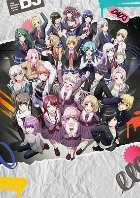

**Studio:** Sanzigen &nbsp;|&nbsp; **Episodes:** 12 &nbsp;|&nbsp; **Director:** Seiji Mizushima (Chief) Daisuke Suzuki &nbsp;|&nbsp; **Aired/Released:** January 13 – March 31 &nbsp;|&nbsp; **Genres:** Idol, Music, Slice of Life

> The second season to D4DJ First Mix.
>
> _Synopsis source: Kitsu_

[Wikipedia](https://en.wikipedia.org/wiki/D4DJ) · [Kitsu](https://kitsu.io/anime/d4dj-all-mix)

---

### The Fruit of Evolution (season 2) (The Fruit of Evolution: Before I Knew It, My Life Had It Made Season 2)

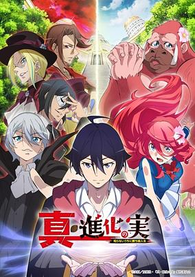

**Studio:** Hotline &nbsp;|&nbsp; **Episodes:** 12 &nbsp;|&nbsp; **Director:** Yoshiaki Okumura (Chief) Shige Fukase &nbsp;|&nbsp; **Aired/Released:** January 14 – April 1 &nbsp;|&nbsp; **Genres:** Fantasy World, Action, Fantasy, Adventure, Comedy, Romance, Isekai

> The second season of Shinka no Mi: Shiranai Uchi ni Kachigumi Jinsei.
>
> _Synopsis source: Kitsu_

[Wikipedia](https://en.wikipedia.org/wiki/The_Fruit_of_Evolution) · [Kitsu](https://kitsu.io/anime/shin-shinka-no-mi-shiranai-uchi-ni-kachigumi-jinsei)

---

### Cardfight!! Vanguard: will+Dress (Season 2) (Cardfight!! Vanguard: overDress Season 4)

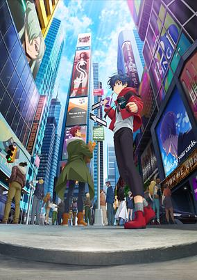

**Studio:** Kinema Citrus &nbsp;|&nbsp; **Episodes:** 12 &nbsp;|&nbsp; **Director:** Ken Mori (Chief) Ryūtarō Suzuki &nbsp;|&nbsp; **Aired/Released:** January 14 – April 1 &nbsp;|&nbsp; **Genres:** Action, Card Games, Proxy Battles

> The fourth season of Cardfight!! Vanguard: overDress.
>
> _Synopsis source: Kitsu_

[Kitsu](https://kitsu.io/anime/cardfight-vanguard-overdress-season-4)

---

### The Fire Hunter

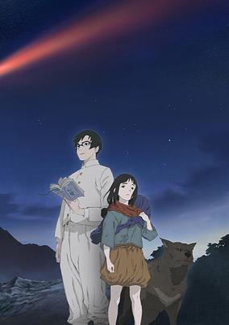

**Studio:** Signal.MD &nbsp;|&nbsp; **Episodes:** 10 &nbsp;|&nbsp; **Director:** Junji Nishimura &nbsp;|&nbsp; **Aired/Released:** January 14 – March 18 &nbsp;|&nbsp; **Genres:** Steampunk, Fantasy, Post Apocalypse

> The story is set in a world in the chaotic aftermath of humanity's Last War. A great forest, infested with flameling creatures and other fallen beasts, covers the world, and pockets of humanity live in small protected communities. Due to a special weapon used in the Last War, human beings spontaneously burst into flame even when merely getting close to a small source of fire. The only safe energy source for humanity lies within the bodies of flamelings, and the duty to hunt them falls to the sickle-wielding firecatchers who brave the depths of the great forest. Among the firecatchers, they whisper tales of one who would be "Firecatcher Lord," an individual who will be able to harvest the fire of the thousand-year comet, the "Wandering Spark" that has flown in the sky since it was sent up before the Last War, but is now returning to earth.
>
> _Synopsis source: Kitsu_

[Wikipedia](https://en.wikipedia.org/wiki/The_Fire_Hunter) · [Kitsu](https://kitsu.io/anime/hikari-no-ou)

---

### Flaglia

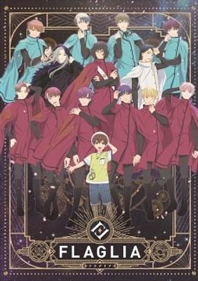

**Studio:** Gaina &nbsp;|&nbsp; **Episodes:** 6 &nbsp;|&nbsp; **Director:** Itsuro Kawasaki &nbsp;|&nbsp; **Aired/Released:** January 17 – January 31 &nbsp;|&nbsp; **Genres:** Shounen Ai, Drama, Idol

> A mixed-media project spanning anime and a musical. The anime side of the project is set in the present day while the musical is set in the Middle Ages era.
>
> _Synopsis source: Kitsu_

[Wikipedia](https://en.wikipedia.org/wiki/Flaglia) · [Kitsu](https://kitsu.io/anime/flaglia)

---

### Sorcerous Stabber Orphen: Chaos in Urbanrama

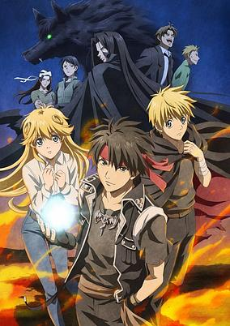

**Studio:** Studio Deen &nbsp;|&nbsp; **Episodes:** 12 &nbsp;|&nbsp; **Director:** Takayuki Hamana &nbsp;|&nbsp; **Aired/Released:** January 18 – April 5 &nbsp;|&nbsp; **Genres:** Martial Arts, Action, Fantasy, Adventure, Drama

> Third season of Majutsushi Orphen Hagure Tabi.
>
> _Synopsis source: Kitsu_

[Wikipedia](https://en.wikipedia.org/wiki/Sorcerous_Stabber_Orphen) · [Kitsu](https://kitsu.io/anime/majutsushi-orphen-hagure-tabi-urbanrama-hen)

---

### Soaring Sky! Pretty Cure (Soaring Sky! Precure)

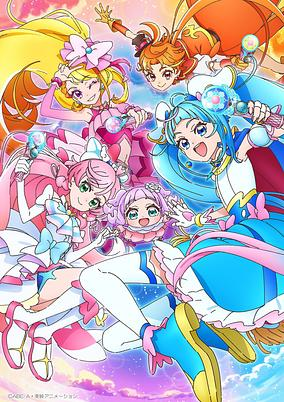

**Studio:** Toei Animation &nbsp;|&nbsp; **Episodes:** 50 &nbsp;|&nbsp; **Director:** Koji Ogawa &nbsp;|&nbsp; **Aired/Released:** February 5 – January 28, 2024 &nbsp;|&nbsp; **Genres:** Magical Girl, Magic, Action, Fantasy

> The 20th installment of the Precure series. A major incident has occurred in the peaceful Sky Land!? The young Princess Eru has been kidnapped by the monsters of Underg Empire! A brave young girl, Sora, follows the princess through a mysterious hole. "TV"? "Cars"? Are those some kind of magic tools!?!? But there's no time to be surprised! She has to get the princess back to the castle...! Flying between two worlds! The adventure with the Pretty Cure begins now! It's hero time!
>
> _Synopsis source: Kitsu_

[Wikipedia](https://en.wikipedia.org/wiki/Soaring_Sky!_Pretty_Cure) · [Kitsu](https://kitsu.io/anime/hirogaru-sky-precure)

---

### Attack on Titan: The Final Season ( part 3 )

**Studio:** MAPPA &nbsp;|&nbsp; **Episodes:** 1 &nbsp;|&nbsp; **Director:** Yuichiro Hayashi &nbsp;|&nbsp; **Aired/Released:** March 4

[Wikipedia](https://en.wikipedia.org/wiki/Attack_on_Titan_(TV_series))

---

### Heart Cocktail Colorful: Haru-hen (Heart Cocktail Colorful: Spring Chapter)

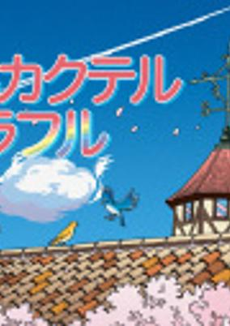

**Episodes:** 5 &nbsp;|&nbsp; **Aired/Released:** March 21 – March 28 &nbsp;|&nbsp; **Genres:** Seinen, Romance

[Kitsu](https://kitsu.io/anime/heart-cocktail-colorful-haru-hen)

---

### Yomawari Neko (Nightwatch Cat)

**Studio:** Shogakukan Music & Digital Entertainment &nbsp;|&nbsp; **Episodes:** 15 &nbsp;|&nbsp; **Director:** Kazuma Taketani &nbsp;|&nbsp; **Aired/Released:** March 21 – March 27 &nbsp;|&nbsp; **Genres:** Seinen, Drama, Slice of Life

> The manga centers on a cat who is drawn to the scent of tears, and goes toward anyone who is crying in order to comfort or encourage them.
>
> _Synopsis source: Kitsu_

[Wikipedia](https://en.wikipedia.org/wiki/Yomawari_Neko) · [Kitsu](https://kitsu.io/anime/yomawari-neko)

---

### Shuwawan!

**Studio:** KOO-KI &nbsp;|&nbsp; **Director:** Motohiro Shirakawa &nbsp;|&nbsp; **Aired/Released:** March 22 -

---

### Chibi Godzilla Raids Again

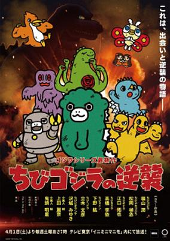

**Studio:** Pie in the Sky &nbsp;|&nbsp; **Episodes:** 13 &nbsp;|&nbsp; **Director:** Taketo Shinkai &nbsp;|&nbsp; **Aired/Released:** April 1 – June 24 &nbsp;|&nbsp; **Genres:** Kids, Fantasy, Comedy

[Wikipedia](https://en.wikipedia.org/wiki/Chibi_Godzilla_Raids_Again) · [Kitsu](https://kitsu.io/anime/chibi-godzilla-no-gyakushuu)

---

### Heavenly Delusion

**Studio:** Production I.G &nbsp;|&nbsp; **Episodes:** 13 &nbsp;|&nbsp; **Director:** Hirotaka Mori &nbsp;|&nbsp; **Aired/Released:** April 1 – June 24

[Wikipedia](https://en.wikipedia.org/wiki/Heavenly_Delusion)

---

### Hell's Paradise: Jigokuraku (Hell's Paradise)

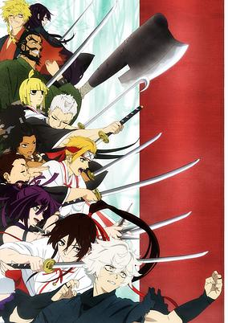

**Studio:** MAPPA &nbsp;|&nbsp; **Episodes:** 13 &nbsp;|&nbsp; **Director:** Kaori Makita &nbsp;|&nbsp; **Aired/Released:** April 1 – July 1 &nbsp;|&nbsp; **Genres:** Shounen, Ninja, Historical, Action, Romance, Buddhism, Fantasy, Island, Psychological, Samurai, Swordplay, Violence

> The Edo period is nearing its end. Gabimaru, a shinobi formerly known as the strongest in Iwagakure who is now a death row convict, is told that he will be acquitted and set free if he can bring back the Elixir of Life from an island that is rumored to be the Buddhist pure land Sukhavati. In hopes of reuniting with his beloved wife, Gabimaru heads to the island along with the executioner Yamada Asaemon Sagiri. Upon arriving there, they encounter other death row convicts in search of the Elixir of Life... as well as a host of unknown creatures, eerie manmade statues, and the hermits who rule the island. Can Gabimaru find the Elixir of Life on this mysterious island and make it back home alive?
>
> _Synopsis source: Kitsu_

[Kitsu](https://kitsu.io/anime/jigokuraku)

---

### Mix (season 2)

**Studio:** OLM &nbsp;|&nbsp; **Episodes:** 24 &nbsp;|&nbsp; **Director:** Tomohiro Kamitani &nbsp;|&nbsp; **Aired/Released:** April 1 – September 23

[Wikipedia](https://en.wikipedia.org/wiki/Mix_(manga))

---

### Edens Zero ( season 2 ) (Edens Zero Season 2)

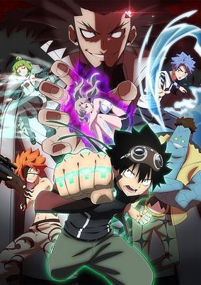

**Studio:** J.C.Staff &nbsp;|&nbsp; **Episodes:** 25 &nbsp;|&nbsp; **Director:** Shinji Ishihira (Chief) Toshinori Watanabe &nbsp;|&nbsp; **Aired/Released:** April 2 – October 1 &nbsp;|&nbsp; **Genres:** Magic, Space, Action, Adventure, Comedy, Ecchi, Shounen

> The second season of Edens Zero
>
> _Synopsis source: Kitsu_

[Wikipedia](https://en.wikipedia.org/wiki/Edens_Zero) · [Kitsu](https://kitsu.io/anime/edens-zero-2)

---

### My Home Hero

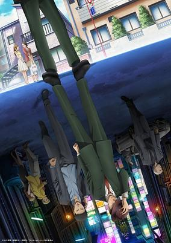

**Studio:** Tezuka Productions &nbsp;|&nbsp; **Episodes:** 12 &nbsp;|&nbsp; **Director:** Takashi Kamei &nbsp;|&nbsp; **Aired/Released:** April 2 – June 18 &nbsp;|&nbsp; **Genres:** Thriller, Seinen, Action, Drama, Crime, Mafia, Violence

> Tetsuo Tosu, an ordinary salaryman, discovers his daughter, Reika, has been physically abused by her boyfriend, Matori Nobuto. Trying to learn more about him, Tetsuo uncovers Matori's scheme to extort money from Reika's wealthy grandparents, and finds out that he is a member of a crime syndicate, with a history of murdering his former girlfriends. Filled with rage and fear at the thought of Reika being in danger, Tetsuo ends up killing Nobuto, and with the help of his wife, Kasen, successfully disposes of the body. Now, as the members of the syndicate begin to question Nobuto's sudden disappearance, Tetsuo and Kasen must work together to ensure the safety of their daughter and prevent her from getting involved in the predicament any further.
>
> _Synopsis source: Kitsu_

[Wikipedia](https://en.wikipedia.org/wiki/My_Home_Hero) · [Kitsu](https://kitsu.io/anime/my-home-hero)

---

### My Love Story with Yamada-kun at Lv999 (Loving Yamada at LV999!)

**Studio:** Madhouse &nbsp;|&nbsp; **Episodes:** 13 &nbsp;|&nbsp; **Director:** Morio Asaka &nbsp;|&nbsp; **Aired/Released:** April 2 – June 25 &nbsp;|&nbsp; **Genres:** Comedy, Drama, Romance, Shoujo

> Recently dumped, Akane is just about to quit the game she used to play with her boyfriend, when she meets Yamada in the same RPG. Yamada in real life turns out to be somewhat of a legend. The only problem is - he is ONLY interested in the game. As Akane's feelings grow, will Yamada's focus stay on the game?
>
> _Synopsis source: Kitsu_

[Wikipedia](https://en.wikipedia.org/wiki/My_Love_Story_with_Yamada-kun_at_Lv999) · [Kitsu](https://kitsu.io/anime/yamada-kun-to-lv999-no-koi-wo-suru)

---

### The Dangers in My Heart

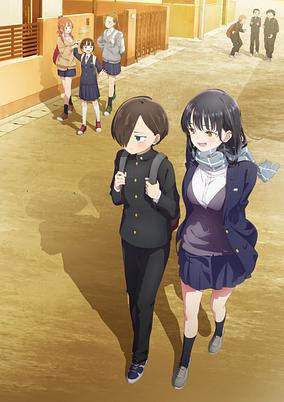

**Studio:** Shin-Ei Animation &nbsp;|&nbsp; **Episodes:** 12 &nbsp;|&nbsp; **Director:** Hiroaki Akagi &nbsp;|&nbsp; **Aired/Released:** April 2 – June 18 &nbsp;|&nbsp; **Genres:** Comedy, Romance, Slice of Life

> Fascinated by murder and all things macabre, Kyoutarou daydreams of acting out his twisted fantasies on his unsuspecting classmates — but an encounter with Anna Yamada, the gorgeous class idol, lights a spark in the darkness of his heart. It’s a classic tale of an antisocial boy falling for a popular girl, but neither are who they appear to be at first glance. Will Kyoutarou and Anna defy their expectations of each other — and of themselves?
>
> _Synopsis source: Kitsu_

[Wikipedia](https://en.wikipedia.org/wiki/The_Dangers_in_My_Heart) · [Kitsu](https://kitsu.io/anime/boku-no-kokoro-no-yabai-yatsu)

---

### Tōsōchū: The Great Mission (Run for Money: The Great Mission)

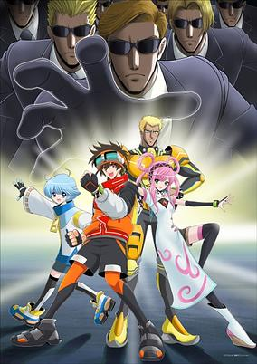

**Studio:** Toei Animation &nbsp;|&nbsp; **Director:** Yukio Kaizawa Kōhei Kureta &nbsp;|&nbsp; **Aired/Released:** April 2 – &nbsp;|&nbsp; **Genres:** Action, Science Fiction

> Due to Earth's increasing climate crisis, humanity has developed futuristic technology to migrate to the Moon. Tomura Sawyer works as a courier in the higher areas, saving money for his little brother, Haru, who suffers from Smoky Moon Disease - a sickness produced by the smoke and polution from the lower areas. The two siblings dream of moving to the higher, cleaner areas to treat this disease. Tomura takes a gamble to do the impossible: to participate in the TV program "Run for Money" and to win against all the other contestants even if he doesn't have the Chrono Bracelet required for it. A producer of said program by the name of Harvest seems to take an interest in Tomura's determination to participate, so she gifts him the Bracelet and allows him to participate. In this glorified game of Tag, Tomura Sawyer must last longer than anyone else without being touched by the enemies in this game — the Hunters.
>
> _Synopsis source: Kitsu_

[Kitsu](https://kitsu.io/anime/tousouchuu-great-mission)

---

### Bosanimal

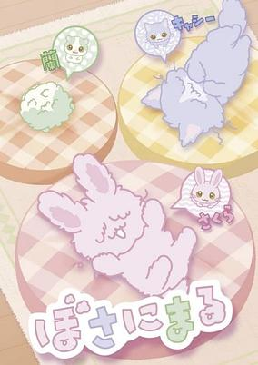

**Studio:** maroyaka soket ODDJOB Inc. &nbsp;|&nbsp; **Episodes:** 96 &nbsp;|&nbsp; **Director:** Isamu Ueno &nbsp;|&nbsp; **Aired/Released:** April 3 – September 14 &nbsp;|&nbsp; **Genres:** Slice of Life, Kids

> Bosanimal follows the daily adventures of a group of animals that live at their own pace in the human world even if it can be a bit messy and lazy at times.
>
> _Synopsis source: Kitsu_

[Kitsu](https://kitsu.io/anime/bosanimal)

---

### In Another World with My Smartphone (season 2) (In Another World With My Smartphone Season 2)

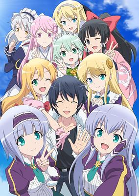

**Studio:** J.C.Staff &nbsp;|&nbsp; **Episodes:** 12 &nbsp;|&nbsp; **Director:** Yoshiaki Iwasaki &nbsp;|&nbsp; **Aired/Released:** April 3 – June 19 &nbsp;|&nbsp; **Genres:** Fantasy, Adventure, Comedy, Romance, Harem, Isekai

> The second season of Isekai wa Smartphone to Tomo ni.
>
> _Synopsis source: Kitsu_

[Wikipedia](https://en.wikipedia.org/wiki/In_Another_World_with_My_Smartphone) · [Kitsu](https://kitsu.io/anime/isekai-wa-smartphone-to-tomo-ni-2nd-season)

---

### Kuma Kuma Kuma Bear Punch!

**Studio:** EMT Squared &nbsp;|&nbsp; **Episodes:** 12 &nbsp;|&nbsp; **Director:** Hisashi Ishii Yuu Nobuta &nbsp;|&nbsp; **Aired/Released:** April 3 – June 19 &nbsp;|&nbsp; **Genres:** Fantasy World, Fantasy, Adventure, Comedy, Isekai

> Second season of Kuma Kuma Kuma Bear.
>
> _Synopsis source: Kitsu_

[Wikipedia](https://en.wikipedia.org/wiki/Kuma_Kuma_Kuma_Bear) · [Kitsu](https://kitsu.io/anime/kuma-kuma-kuma-bear-punch)

---

### The Aristocrat's Otherworldly Adventure: Serving Gods Who Go Too Far

**Studio:** EMT Squared Magic Bus &nbsp;|&nbsp; **Episodes:** 12 &nbsp;|&nbsp; **Director:** Noriyuki Nakamura &nbsp;|&nbsp; **Aired/Released:** April 3 – June 19

[Wikipedia](https://en.wikipedia.org/wiki/Chronicles_of_an_Aristocrat_Reborn_in_Another_World)

---

### Alice Gear Aegis Expansion

**Studio:** Nomad &nbsp;|&nbsp; **Episodes:** 12 &nbsp;|&nbsp; **Director:** Hirokazu Hanai &nbsp;|&nbsp; **Aired/Released:** April 4 – June 20 &nbsp;|&nbsp; **Genres:** Mecha, Science Fiction, Action

> Centuries ago, mankind abandoned planet Earth after the Vice, a race of mechanical aliens, drove them from their home into a life adrift in space. Now resigned to starships forged of pieces of Earth’s shattered moon, the final hope for humanity lies in the hands of Actresses, young women born with the ability to wield the only weapons that can harm the Vice: Alice Gears, mechanical suits that can finally turn the tide against the alien incursion.
>
> _Synopsis source: Kitsu_

[Wikipedia](https://en.wikipedia.org/wiki/Alice_Gear_Aegis) · [Kitsu](https://kitsu.io/anime/alice-gear-aegis)

---

### Kizuna no Allele

**Studio:** Wit Studio Signal.MD &nbsp;|&nbsp; **Episodes:** 12 &nbsp;|&nbsp; **Director:** Kenichiro Komaya &nbsp;|&nbsp; **Aired/Released:** April 4 – June 20

> In the virtual world, you can be anyone. And for Miracle, her dream is to be a famous virtual artist! Miracle attends ADEN Academy, where she learns new talents to prepare her for her big debut. Although she’s a bit of a klutz, she’s determined to follow in the footsteps of her idol: the legendary VTuber, Kizuna AI. With dedication and the help of her friends, her dream just might come true!
>
> _Synopsis source: Kitsu_

[Wikipedia](https://en.wikipedia.org/wiki/Kizuna_no_Allele) · [Kitsu](https://kitsu.io/anime/kizuna-no-allele)

---

### Skip and Loafer

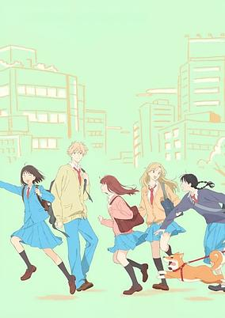

**Studio:** P.A. Works &nbsp;|&nbsp; **Episodes:** 12 &nbsp;|&nbsp; **Director:** Kotomi Deai &nbsp;|&nbsp; **Aired/Released:** April 4 – June 20 &nbsp;|&nbsp; **Genres:** Comedy, Romance, Slice of Life, Seinen

> This country girl is ready for the big city! Well, at least she thought she was. Mitsumi’s dream is to attend a prestigious school and make the world a better place. But when she finally gets to Tokyo, it turns out she isn’t exactly prepared for city life. Luckily, she runs into Shima, a sweet and handsome classmate who becomes her first friend! Can she make it in Tokyo with Shima by her side?
>
> _Synopsis source: Kitsu_

[Wikipedia](https://en.wikipedia.org/wiki/Skip_and_Loafer) · [Kitsu](https://kitsu.io/anime/skip-to-loafer)

---

### YouTuNya

**Studio:** Lesprit &nbsp;|&nbsp; **Episodes:** 15 &nbsp;|&nbsp; **Director:** Kyō Yatate &nbsp;|&nbsp; **Aired/Released:** April 4 – July 11 &nbsp;|&nbsp; **Genres:** Comedy, Slice of Life

> The story of YouTuNya follows the daily misadventures of cute cartoon kitties such as: Nya, a cat who runs an unpopular channel; Tomoneko, a cat who runs an extremely successful channel; and Tsuyoneko, a cat who runs a martial arts themed channel.
>
> _Synopsis source: Kitsu_

[Kitsu](https://kitsu.io/anime/youtunya)

---

### Tokyo Mew Mew New (season 2)

**Studio:** Yumeta Company Graphinica &nbsp;|&nbsp; **Episodes:** 12 &nbsp;|&nbsp; **Director:** Takahiro Natori &nbsp;|&nbsp; **Aired/Released:** April 5 – June 21 &nbsp;|&nbsp; **Genres:** Magic, Alien, Magical Girl, Humanoid Alien, Science Fiction, Fantasy, Comedy, Romance, Juujin, Shoujo

> The scientists of the μ(Mew) Project use DNA of endangered species to create a team of heroines imbued with amazing super-human abilities. One of them, Ichigo Momomiya, awakens to discover she is armed with all the skills of a Iriomote cat. Ichigo must band together with other Mew Mew girls to repel an alien incursion, all the while hiding their thrilling double lives from friends and family.
>
> _Synopsis source: Kitsu_

[Wikipedia](https://en.wikipedia.org/wiki/Tokyo_Mew_Mew) · [Kitsu](https://kitsu.io/anime/tokyo-mew-mew-new)

---

### Dr. Stone: New World ( part 1 ) (Dr. Stone: New World)

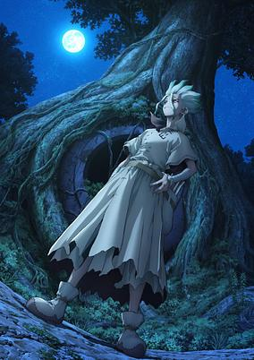

**Studio:** TMS Entertainment &nbsp;|&nbsp; **Episodes:** 11 &nbsp;|&nbsp; **Director:** Shūhei Matsushita &nbsp;|&nbsp; **Aired/Released:** April 6 – June 15 &nbsp;|&nbsp; **Genres:** Future, Plot Continuity, Action, Science Fiction, Adventure, Comedy, Disaster, Post Apocalypse, Shounen

> The third season of Dr. STONE. Senku and the Kingdom of Science sail to new lands to uncover more scientific secrets!
>
> _Synopsis source: Kitsu_

[Wikipedia](https://en.wikipedia.org/wiki/Dr._Stone) · [Kitsu](https://kitsu.io/anime/dr-stone-new-world)

---

### KamiKatsu: Working for God in a Godless World

**Studio:** Studio Palette &nbsp;|&nbsp; **Episodes:** 12 &nbsp;|&nbsp; **Director:** Yuki Inaba &nbsp;|&nbsp; **Aired/Released:** April 6 – July 6 &nbsp;|&nbsp; **Genres:** Action, Comedy, Ecchi, Drama, Fantasy, Isekai, Gender Bender, Religion

> Yukito's parents are the leaders of a cult. After he gets sacrificed, he gets reincarnated into another world where religion doesn't exist and porn books are akin to a child's doodles. He finds that it's also a world where your life and death is decided by the country. While obstructing his friend's execution, both of them lose their lives. Just at that moment, the god of his religion comes to their world and revives them.
>
> _Synopsis source: Kitsu_

[Wikipedia](https://en.wikipedia.org/wiki/KamiKatsu) · [Kitsu](https://kitsu.io/anime/kaminaki-sekai-no-kamisama-katsudou)

---

### KonoSuba: An Explosion on This Wonderful World! (KONOSUBA - An Explosion on This Wonderful World!)

**Studio:** Drive &nbsp;|&nbsp; **Episodes:** 12 &nbsp;|&nbsp; **Director:** Yujiro Abe &nbsp;|&nbsp; **Aired/Released:** April 6 – June 22 &nbsp;|&nbsp; **Genres:** Adventure, Comedy, Isekai, Fantasy, Satire

> This feisty young wizard will stop at nothing to master the spell that saved her life: Explosion! Megumin, the “Greatest Genius of the Crimson Magic Clan,” has chosen to devote her studies to the powerful offensive magic used by her mysterious savior. Then one day, her little sister finds a black kitten in the woods. But this cat isn’t just a new furry friend—she’s the key to awakening a Dark God!
>
> _Synopsis source: Kitsu_

[Kitsu](https://kitsu.io/anime/kono-subarashii-sekai-ni-bakuen-wo)

---

### The Ancient Magus' Bride (season 2, part 1) (The Ancient Magus' Bride Season 2)

**Studio:** Studio Kafka &nbsp;|&nbsp; **Episodes:** 12 &nbsp;|&nbsp; **Director:** Kazuaki Terasawa &nbsp;|&nbsp; **Aired/Released:** April 6 – June 22 &nbsp;|&nbsp; **Genres:** Fantasy, Romance, Slice of Life, Drama, Shounen

> The second season of Mahoutsukai no Yome. Chise was able to accept Elias and herself, if not necessarily everything about her situation. After Cartaphilus fell back into a slumber that would not last forever, Chise was able to go back to her regular life. Then she receives an invitation from a mutual aid organization for mages called the College. Under the British Library exists a secret society of mages. Encounters and interactions with people are about to open some new doors. This is a story about saving yourself to save another. (Source: Crunchyroll) Note: Episode 1 of season two premiered in a preview screening event together with "Fuyu no Okorimono" at Tachikawa Cinema City's Cinema Two in Tokyo on March 11, 2023.
>
> _Synopsis source: Kitsu_

[Wikipedia](https://en.wikipedia.org/wiki/The_Ancient_Magus%27_Bride) · [Kitsu](https://kitsu.io/anime/mahoutsukai-no-yome-season-2)

---

### The Idolmaster Cinderella Girls U149

**Studio:** CygamesPictures &nbsp;|&nbsp; **Episodes:** 12 &nbsp;|&nbsp; **Director:** Manabu Okamoto &nbsp;|&nbsp; **Aired/Released:** April 6 – June 28 &nbsp;|&nbsp; **Genres:** Comedy, Drama, Slice of Life, Idol, Music

> Announced during DAY 2 of "THE IDOLM@STER CINDERELLA GIRLS 10th ANNIVERSARY M@GICAL WONDERLAND!!!" final tour concert, a TV anime adaptation of the spin-off manga THE iDOLM@STER Cinderella Girls: U149. The U149 in the title refers to the aspiring idols at the center of it all: who stand at under 149 centimeters tall. Together with the help of their similarly squat rookie producer, these idols aim to make it to the top! As the announcement card puts it: "This story is about growth of little idols and their little producer."
>
> _Synopsis source: Kitsu_

[Wikipedia](https://en.wikipedia.org/wiki/The_Idolmaster_Cinderella_Girls_U149) · [Kitsu](https://kitsu.io/anime/the-idolm-ster-cinderella-girls-u149)

---

### Yuri Is My Job!

**Studio:** Passione Studio Lings &nbsp;|&nbsp; **Episodes:** 12 &nbsp;|&nbsp; **Director:** Hijiri Sanpei &nbsp;|&nbsp; **Aired/Released:** April 6 – June 22 &nbsp;|&nbsp; **Genres:** Shoujo Ai, Comedy, Romance, Working Life

> Hime gets roped into working at a weird café where the waitresses pretend to be students at an all-girl boarding school. She's strangely taken with her partner Mitsuki, who's so kind to her in front of the customers. There's just one problem…Mitsuki really can't stand her!
>
> _Synopsis source: Kitsu_

[Wikipedia](https://en.wikipedia.org/wiki/Yuri_Is_My_Job!) · [Kitsu](https://kitsu.io/anime/watashi-no-yuri-wa-oshigoto-desu)

---

### I Got a Cheat Skill in Another World and Became Unrivaled in the Real World, Too

**Studio:** Millepensee &nbsp;|&nbsp; **Episodes:** 13 &nbsp;|&nbsp; **Director:** Shin Itagaki (Chief) Shingo Tanabe &nbsp;|&nbsp; **Aired/Released:** April 7 – June 30 &nbsp;|&nbsp; **Genres:** Isekai, Action, Adventure, Fantasy, Romance, School Life

> A mysterious door stands open, inviting a boy who’s been brutally bullied all his life to take a courageous step forward into the unknown. On the other side, he finds a hoard of priceless artifacts and a world as filled with magic as it is with monsters. The most shocking revelation, however, is that he can bring whatever he wants back with him when he returns to Earth. It won’t be long before this double life changes him forever...
>
> _Synopsis source: Kitsu_

[Wikipedia](https://en.wikipedia.org/wiki/I_Got_a_Cheat_Skill_in_Another_World_and_Became_Unrivaled_in_the_Real_World,_Too) · [Kitsu](https://kitsu.io/anime/isekai-de-cheat-skill-wo-te-ni-shita-ore-wa-genjitsu-sekai-wo-mo-musou-suru-level-up-wa-jinsei-wo-kaeta)

---

### Opus Colors

**Studio:** C-Station &nbsp;|&nbsp; **Episodes:** 12 &nbsp;|&nbsp; **Director:** Shunsuke Tada &nbsp;|&nbsp; **Aired/Released:** April 7 – June 23 &nbsp;|&nbsp; **Genres:** Science Fiction

> --What color is your world? It has been about 10 years since "Perception Art" was born in the art world. Nowadays, it has completely permeated the world and is a colorful part of people's lives. Kazuya Yamanashi, the son of Mr. and Mrs. Yamanashi, the creators of Perception Art and also famous "artists," has just entered Eisen High School, a prestigious art school, with his childhood friend Jun Tsuzuki, with the dream of becoming a Perception Artist himself. Kazuya had another goal in mind. It is to regain friendship with "another childhood friend" who started avoiding him after "an incident" that occurred 10 years ago... Kyou Takise, whose father is also the creator of Perception Art and a well-known "grader," is a junior grader majoring in Perception Art at Eisei High School. He is a childhood friend of Kazuya and Jun, but has been avoiding them for years. Kyou's heart had scars that could never be revealed.
>
> _Synopsis source: Kitsu_

[Wikipedia](https://en.wikipedia.org/wiki/Opus_Colors) · [Kitsu](https://kitsu.io/anime/opus-colors)

---

### The Legendary Hero Is Dead!

**Studio:** Liden Films &nbsp;|&nbsp; **Episodes:** 12 &nbsp;|&nbsp; **Director:** Rion Kujo &nbsp;|&nbsp; **Aired/Released:** April 7 – June 23 &nbsp;|&nbsp; **Genres:** Action, Adventure, Comedy, Ecchi, Fantasy, Absurdist Humour

> Touka is just your average (slightly perverted) farmer in the village of Cheza. While he daydreams about being a hero and getting the girl, the real hero, Sion, is out battling demons that threaten to invade the world! But one day, Touka accidentally kills the hero…?! With the Legendary Hero dead, who’s going to save the world now?! Touka quickly buries Sion’s body to hide the evidence, but wakes up the next day to discover he is no longer in his own body…!!
>
> _Synopsis source: Kitsu_

[Wikipedia](https://en.wikipedia.org/wiki/The_Legendary_Hero_Is_Dead!) · [Kitsu](https://kitsu.io/anime/yuusha-ga-shinda)

---

### Too Cute Crisis

**Studio:** SynergySP &nbsp;|&nbsp; **Episodes:** 12 &nbsp;|&nbsp; **Director:** Jun Hatori &nbsp;|&nbsp; **Aired/Released:** April 7 – June 23 &nbsp;|&nbsp; **Genres:** Comedy, Science Fiction, Alien, Humanoid Alien

> Invading alien Liza Luna wants nothing more than to destroy planet Earth... after she gets in a little sightseeing, first. But her travels soon take her into a cat café, where the furry felines inside invade her heart just as surely as Liza invaded Earth! Destroying the world won’t be so easy now that she’s discovered the joys of kitty cats...
>
> _Synopsis source: Kitsu_

[Wikipedia](https://en.wikipedia.org/wiki/Too_Cute_Crisis) · [Kitsu](https://kitsu.io/anime/kawaisugi-crisis)

---

### Birdie Wing: Golf Girls' Story (season 2) (BIRDIE WING: Golf Girls' Story Season 2)

**Studio:** Bandai Namco Pictures &nbsp;|&nbsp; **Episodes:** 12 &nbsp;|&nbsp; **Director:** Takayuki Inagaki &nbsp;|&nbsp; **Aired/Released:** April 8 – June 24 &nbsp;|&nbsp; **Genres:** Sports

> The second season of BIRDIE WING: Golf Girls' Story.
>
> _Synopsis source: Kitsu_

[Kitsu](https://kitsu.io/anime/birdie-wing-golf-girls-story-season-2)

---

### Magical Destroyers

**Studio:** Bibury Animation Studios &nbsp;|&nbsp; **Episodes:** 12 &nbsp;|&nbsp; **Director:** Hiroshi Ikehata &nbsp;|&nbsp; **Aired/Released:** April 8 – June 24 &nbsp;|&nbsp; **Genres:** Magical Girl, Magic, Henshin, Dystopia

> Set in a dystopian near future where otaku culture in Japan has been obliterated by a mysterious organization known as "SSC", Magical Girl Destroyers follows the misadventures of Otaku Hero—a young revolutionary who loves otaku culture—and Anarchy, Blue, and Pink, a trio of magical girls who admire him. Together they struggle to create "a world where you can say what you like about what you like as much as you like."
>
> _Synopsis source: Kitsu_

[Wikipedia](https://en.wikipedia.org/wiki/Magical_Destroyers) · [Kitsu](https://kitsu.io/anime/mahou-shoujo-magical-destroyers)

---

### Mashle: Magic and Muscles

**Studio:** A-1 Pictures &nbsp;|&nbsp; **Episodes:** 12 &nbsp;|&nbsp; **Director:** Tomoya Tanaka &nbsp;|&nbsp; **Aired/Released:** April 8 – July 1 &nbsp;|&nbsp; **Genres:** Action, Comedy, Fantasy, Shounen, Magic

> This is a world of magic. This is a world in which magic is casually used by everyone. In a deep, dark forest in this world of magic, there is a boy who is singlemindedly working out. His name is Mash Burnedead, and he has a secret. He can’t use magic. All he wanted was to live a quiet life with his family, but people suddenly start trying to kill him one day and he somehow finds himself enrolled in Magic School. There, he sets his sights on becoming a “Divine Visionary,” the elite of the elite. Will his ripped muscles work against the best and brightest of the wizarding world? The curtain rises on this off-kilter magical fantasy in which the power of being jacked crushes any spell!
>
> _Synopsis source: Kitsu_

[Wikipedia](https://en.wikipedia.org/wiki/Mashle) · [Kitsu](https://kitsu.io/anime/mashle)

---

### My One-Hit Kill Sister

**Studio:** Gekkō &nbsp;|&nbsp; **Episodes:** 12 &nbsp;|&nbsp; **Director:** Hiroaki Takagi &nbsp;|&nbsp; **Aired/Released:** April 8 – June 24 &nbsp;|&nbsp; **Genres:** Comedy, Fantasy, Romance, Isekai

> "It wasn't me who was the strongest in another world, but my sister?!" As a result of an accident in the real world, Asahi Ikusaba is transported to another world. He tries to enjoy the different world he imagined, but his abilities prove to be the weakest. Just as he's about to be attacked by a vicious monster, Asahi's doting elder sister Mayu comes into his rescue and saves him. Chasing after Asahi's love, Mayu too ended up in the same world as him, with the strongest of abilities and cheat skills. The fantasy tale of the strongest elder sister with a brother complex and the younger brother with the weakest skills begins.
>
> _Synopsis source: Kitsu_

[Wikipedia](https://en.wikipedia.org/wiki/My_One-Hit_Kill_Sister) · [Kitsu](https://kitsu.io/anime/isekai-one-turn-kill-nee-san-ane-douhan-no-isekai-seikatsu-hajimemashita)

---

### Otaku Elf

**Studio:** C2C &nbsp;|&nbsp; **Episodes:** 12 &nbsp;|&nbsp; **Director:** Takebumi Anzai &nbsp;|&nbsp; **Aired/Released:** April 8 – June 24 &nbsp;|&nbsp; **Genres:** Elf, Comedy, Slice of Life, Supernatural

> Takamimi Shrine has an unusual resident – Elda, an ancient elf who’s obsessed with video games! The shrine’s teenage attendant, Koito Koganei, keeps this reclusive otaku well-supplied with energy drinks and junk food. Even though she loves 100%-ing her games, Elda has duties to attend to, and Koganei is bound and determined to make this otaku elf fulfill them! It’ll just take an offering or two to bribe—um, we mean convince Elda to put down her new game…
>
> _Synopsis source: Kitsu_

[Wikipedia](https://en.wikipedia.org/wiki/Otaku_Elf) · [Kitsu](https://kitsu.io/anime/edomae-elf)

---

### Rokudo's Bad Girls

**Studio:** Satelight &nbsp;|&nbsp; **Episodes:** 12 &nbsp;|&nbsp; **Director:** Keiya Saitō &nbsp;|&nbsp; **Aired/Released:** April 8 – June 24 &nbsp;|&nbsp; **Genres:** Action, Comedy, Drama, Romance, Supernatural, Delinquent, Harem

> Rokudou’s miserable days of being picked on have taken a major turn with a new ability that’s made him the target of every delinquent girl’s affection. The source? A mysterious scroll from his late grandfather, an unusual inheritance to say the least. Now he’s in a romantic panic full of nonstop madness with every bad girl he comes in contact with. Will he ever catch a break?
>
> _Synopsis source: Kitsu_

[Wikipedia](https://en.wikipedia.org/wiki/Rokudo%27s_Bad_Girls) · [Kitsu](https://kitsu.io/anime/rokudou-no-onna-tachi)

---

### The Café Terrace and Its Goddesses (Goddess Café Terrace)

**Studio:** Tezuka Productions &nbsp;|&nbsp; **Episodes:** 12 &nbsp;|&nbsp; **Director:** Satoshi Kuwabara &nbsp;|&nbsp; **Aired/Released:** April 8 – June 24 &nbsp;|&nbsp; **Genres:** Comedy, Ecchi, Romance, Maid, Harem, Working Life

> Hayato Kasukabe has been accepted to Tokyo U on his first try. Receiving news of his grandmother's death, he returns to his childhood home, Café Terrace Familia, for the first time in three years to find five strange girls there who claim to be "Grandma's Family"! Hayato's unexpected life in a seaside town with these five girls of fate begins here!
>
> _Synopsis source: Kitsu_

[Wikipedia](https://en.wikipedia.org/wiki/The_Caf%C3%A9_Terrace_and_Its_Goddesses) · [Kitsu](https://kitsu.io/anime/megami-no-cafe-terrace)

---

### Tonikawa: Over the Moon for You (season 2)

**Studio:** Seven Arcs &nbsp;|&nbsp; **Episodes:** 12 &nbsp;|&nbsp; **Director:** Hiroshi Ikehata &nbsp;|&nbsp; **Aired/Released:** April 8 – June 24

[Wikipedia](https://en.wikipedia.org/wiki/Fly_Me_to_the_Moon_(manga))

---

### A Galaxy Next Door

**Studio:** Asahi Production &nbsp;|&nbsp; **Episodes:** 12 &nbsp;|&nbsp; **Director:** Ryuichi Kimura &nbsp;|&nbsp; **Aired/Released:** April 9 – June 25 &nbsp;|&nbsp; **Genres:** Romance, Comedy, Slice of Life, Seinen, Supernatural

> Ever since their father died, Ichirou Kuga has struggled to support his two younger siblings on nothing but a small inheritance and his passion for drawing manga. But it’s becoming harder to keep up with his growing responsibilities and deadlines, especially after his last two assistants quit to follow their dreams. Just as he’s nearing his breaking point, the beautiful and scarily competent Shiori Goshiki applies to become his new assistant. But there’s something almost otherworldly about Goshiki, and soon Kuga finds his reality turned upside down when she suddenly declares them engaged to marry!
>
> _Synopsis source: Kitsu_

[Wikipedia](https://en.wikipedia.org/wiki/A_Galaxy_Next_Door) · [Kitsu](https://kitsu.io/anime/otonari-ni-ginga)

---

### Blue Orchestra (The Blue Orchestra)

**Studio:** Nippon Animation &nbsp;|&nbsp; **Episodes:** 24 &nbsp;|&nbsp; **Director:** Seiji Kishi &nbsp;|&nbsp; **Aired/Released:** April 9 – October 8 &nbsp;|&nbsp; **Genres:** Drama, Music, Seinen, School Clubs

> Hajime Aono was a prodigy violinist until he grew jaded with playing the violin due to personal reasons. Now in his third year of middle school, he struggles to decide his academic path. One day in school, he meets Ritsuko Akine, a hotheaded novice violinist who wants to enroll in a high school with a distinguished orchestra club. When he finds himself getting closer to Ritsuko and being brought back to the world of violinists, time starts moving again for him. This is the beginning of a youthful drama where sounds and hearts alike resound in harmony.
>
> _Synopsis source: Kitsu_

[Wikipedia](https://en.wikipedia.org/wiki/Blue_Orchestra) · [Kitsu](https://kitsu.io/anime/ao-no-orchestra)

---

### Demon Slayer: Kimetsu no Yaiba – Swordsmith Village Arc (Demon Slayer: Kimetsu no Yaiba - Swordsmith Village Arc)

**Studio:** Ufotable &nbsp;|&nbsp; **Episodes:** 11 &nbsp;|&nbsp; **Director:** Haruo Sotozaki &nbsp;|&nbsp; **Aired/Released:** April 9 – June 18 &nbsp;|&nbsp; **Genres:** Action, Demon, Historical, Shounen, Supernatural, Fantasy, Drama

> Tanjiro’s journey leads him to the Swordsmith Village, where he reunites with two Hashira, members of the Demon Slayer Corps’ highest-ranking swordsmen - Mist Hashira Muichiro Tokito and Love Hashira Mitsuri Kanroji. With the shadows of demons lurking near, a new battle begins for Tanjiro and his comrades. Notes: • The first episode has a runtime of ~49 minutes. • The final episode has a runtime of ~52 minutes.
>
> _Synopsis source: Kitsu_

[Kitsu](https://kitsu.io/anime/kimetsu-no-yaiba-katanakaji-no-satohen)

---

### Mobile Suit Gundam: The Witch from Mercury (season 2) (Mobile Suit Gundam: The Witch from Mercury Season 2)

**Studio:** Bandai Namco Filmworks &nbsp;|&nbsp; **Episodes:** 12 &nbsp;|&nbsp; **Director:** Hiroshi Kobayashi Ryo Ando &nbsp;|&nbsp; **Aired/Released:** April 9 – July 2 &nbsp;|&nbsp; **Genres:** Mecha, Science Fiction, Robot

> The second season of Mobile Suit Gundam: the Witch from Mercury. A.S.122... An era when a multitude of corporations have entered space and built a huge economic system. After transferring to the Asticassia School of Technology from the planet Mercury, Suletta Mercury has experienced a school life filled with encounters and excitement, as both Miorine Rembran's bridegroom and a member of GUNDAM-ARM, Inc. It has been two weeks since the incident at Plant Quetta. Suletta passes her days at the school, anticipating her reunion with Miorine. Miorine, meanwhile, has stationed herself at the head office of the Benerit Group, monitoring her father's condition. The two are about to face new hardships and pressing decisions. Each with her own feelings in her heart, the girls will confront the mighty curse the Gundam brings.
>
> _Synopsis source: Kitsu_

[Kitsu](https://kitsu.io/anime/kidou-senshi-gundam-suisei-no-majo-2)

---

### My Clueless First Friend

**Studio:** Studio Signpost &nbsp;|&nbsp; **Episodes:** 13 &nbsp;|&nbsp; **Director:** Shigenori Kageyama &nbsp;|&nbsp; **Aired/Released:** April 9 – July 2 &nbsp;|&nbsp; **Genres:** Comedy, Friendship, Slice of Life, Romance, Drama, Shounen, School Life

> Fifth grader Nishimura isn’t too proud of her “Grim Reaper” moniker given by her bullying schoolmates, but the new kid loves it. The once lonely target of everyone’s ridicule starts to get out of her shell with the help of her new cheerful yet airheaded friend, Takada. Together they’ll embark on a sweet and touching journey of summer fun and friendship!
>
> _Synopsis source: Kitsu_

[Wikipedia](https://en.wikipedia.org/wiki/My_Clueless_First_Friend) · [Kitsu](https://kitsu.io/anime/jijou-wo-shiranai-tenkousei-ga-guigui-kuru)

---

### Summoned to Another World for a Second Time (Summoned to Another World... Again?!)

**Studio:** Studio Elle &nbsp;|&nbsp; **Episodes:** 12 &nbsp;|&nbsp; **Director:** Motoki Nakanishi &nbsp;|&nbsp; **Aired/Released:** April 9 – June 25 &nbsp;|&nbsp; **Genres:** Isekai, Harem, Adventure, Comedy, Fantasy

> There was once a hero who was summoned to another world, and he saved that world. However, the man was caught in a "trap" and was forcibly returned to his original world. On top of that, he had to start over as a baby… This is the story of a crazy journey in another world where a former hero who was reincarnated into a slightly gloomy high school student is "resummoned" back to that same world! There's a lot of room to work with when it's the second time, huh♪
>
> _Synopsis source: Kitsu_

[Wikipedia](https://en.wikipedia.org/wiki/Summoned_to_Another_World..._Again%3F) · [Kitsu](https://kitsu.io/anime/isekai-shoukan-wa-nidome-desu)

---

### World Dai Star (Stella of the Theater: World Dai Star)

**Studio:** Lerche &nbsp;|&nbsp; **Episodes:** 12 &nbsp;|&nbsp; **Director:** Yū Kinome &nbsp;|&nbsp; **Aired/Released:** April 9 – June 25 &nbsp;|&nbsp; **Genres:** Idol, Performance, Music

> The story is set in a world after Dai Star stage performers exploded in worldwide popularity in the 20th century. 16-year-old Kokona Ootori follows her dream of becoming a World Dai Star by auditioning for the Sirius theatrical troupe.
>
> _Synopsis source: Kitsu_

[Wikipedia](https://en.wikipedia.org/wiki/World_Dai_Star) · [Kitsu](https://kitsu.io/anime/world-dai-star)

---

### Why Raeliana Ended Up at the Duke's Mansion

**Studio:** Typhoon Graphics &nbsp;|&nbsp; **Episodes:** 12 &nbsp;|&nbsp; **Director:** Junichi Yamamoto &nbsp;|&nbsp; **Aired/Released:** April 10 – June 26 &nbsp;|&nbsp; **Genres:** Fantasy, Isekai, Mystery, Romance, Comedy, Shoujo, Historical

> Eunha Park was just a regular girl desperate to get into college, but when she finally does, her elation is cut short as she's pushed off a roof—only to wake up as Raeliana McMillan, a character from a novel whose death serves as the catalyst for the story's events. But Raeliana refuses to die a second time and is determined to change her fate, no matter what!
>
> _Synopsis source: Kitsu_

[Wikipedia](https://en.wikipedia.org/wiki/Why_Raeliana_Ended_Up_at_the_Duke%27s_Mansion) · [Kitsu](https://kitsu.io/anime/kanojo-ga-koushaku-tei-ni-itta-riyuu)

---

### Dead Mount Death Play (part 1)

**Studio:** Geek Toys &nbsp;|&nbsp; **Episodes:** 12 &nbsp;|&nbsp; **Director:** Manabu Ono &nbsp;|&nbsp; **Aired/Released:** April 11 – June 27 &nbsp;|&nbsp; **Genres:** Action, Fantasy, Supernatural, Magic, Thriller, Isekai, Cops, Assassin, Detective, Zombie

> It's a showdown for the ages as the legendary hero takes on the corpse god necromancer, but when the dust settles, something isn't quite right... In the final moments of their epic confrontation, the corpse god's final gambit shot was wholly unexpected -- reincarnation magic! Across space and time, a boy named Polka Shinoyama awakens feeling...not quite himself...... Who could've expected that the climactic battle between good and evil would turn out like this??
>
> _Synopsis source: Kitsu_

[Wikipedia](https://en.wikipedia.org/wiki/Dead_Mount_Death_Play) · [Kitsu](https://kitsu.io/anime/dead-mount-death-play)

---

### Insomniacs After School

**Studio:** Liden Films &nbsp;|&nbsp; **Episodes:** 13 &nbsp;|&nbsp; **Director:** Yūki Ikeda &nbsp;|&nbsp; **Aired/Released:** April 11 – July 4 &nbsp;|&nbsp; **Genres:** Romance, Slice of Life, Seinen

> Ganta Nakami is a high school student who suffers from insomnia. One day, he meets Isaki Magari, a girl with the same condition. A strange, but special relationship forms as they share a secret and catch up on their sleep in their school’s abandoned observatory…
>
> _Synopsis source: Kitsu_

[Wikipedia](https://en.wikipedia.org/wiki/Insomniacs_After_School) · [Kitsu](https://kitsu.io/anime/kimi-wa-houkago-insomnia)

---

### Oshi no Ko

**Studio:** Doga Kobo &nbsp;|&nbsp; **Episodes:** 11 &nbsp;|&nbsp; **Director:** Daisuke Hiramaki &nbsp;|&nbsp; **Aired/Released:** April 12 – June 28 &nbsp;|&nbsp; **Genres:** Drama, Idol, Music, Mystery, Performance, Psychological, Revenge, Slice of Life, The Arts, Supernatural, Working Life

> When a pregnant young starlet appears in Gorou Amemiya’s countryside medical clinic, the doctor takes it upon himself to safely (and secretly) deliver Ai Hoshino’s child so she can make a scandal-free return to the stage. But no good deed goes unpunished, and on the eve of her delivery, he finds himself slain at the hands of Ai’s deluded stalker — and subsequently reborn as Ai’s child, Aquamarine Hoshino! The glitz and glamor of showbiz hide the dark underbelly of the entertainment industry, threatening to dull the shine of his favorite star. Can he help his new mother rise to the top of the charts? And what will he do when unthinkable disaster strikes? (Source: HIDIVE) Note: Episode 1【推しの子】Mother and Children was pre-screened in advance in Japanese theaters on March 17, 2023. The regular TV broadcast begins on April 12, 2023. The first episode has an extended runtime of ~90 minutes.
>
> _Synopsis source: Kitsu_

[Wikipedia](https://en.wikipedia.org/wiki/Oshi_no_Ko_(2023_TV_series)) · [Kitsu](https://kitsu.io/anime/oshi-no-ko)

---

### The Marginal Service

**Studio:** 3Hz &nbsp;|&nbsp; **Episodes:** 12 &nbsp;|&nbsp; **Director:** Masayuki Sakoi &nbsp;|&nbsp; **Aired/Released:** April 12 – June 27

> After being fired from his detective job, Brian receives a strange letter. He heads to the address written on the envelope and finds himself among THE MARGINAL SERVICE! This motley crew of fearless men and a woman (and a squirrel) are tasked with hunting down aliens. And Brian just became their newest member.
>
> _Synopsis source: Kitsu_

[Wikipedia](https://en.wikipedia.org/wiki/The_Marginal_Service) · [Kitsu](https://kitsu.io/anime/the-marginal-service)

---

### Ranking of Kings: The Treasure Chest of Courage

**Studio:** Wit Studio &nbsp;|&nbsp; **Episodes:** 10 &nbsp;|&nbsp; **Director:** Yōsuke Hatta &nbsp;|&nbsp; **Aired/Released:** April 14 – June 16 &nbsp;|&nbsp; **Genres:** Action, Fantasy, Adventure, Drama

> Get ready for a new collection of stories from Ranking of Kings!
>
> _Synopsis source: Kitsu_

[Wikipedia](https://en.wikipedia.org/wiki/Ranking_of_Kings) · [Kitsu](https://kitsu.io/anime/ousama-ranking-yuuki-no-takarabako)

---

### Sacrificial Princess and the King of Beasts

**Studio:** J.C.Staff &nbsp;|&nbsp; **Episodes:** 24 &nbsp;|&nbsp; **Director:** Chiaki Kon &nbsp;|&nbsp; **Aired/Released:** April 20 – September 28 &nbsp;|&nbsp; **Genres:** Romance, Fantasy, Shoujo, Fantasy World, Demon

> The King of the Beasts and Demons regularly receives female human sacrifices to eat in order to assert the dominance of his people over the human race. However, for the 99th sacrifice, the human girl brought to the capital, Sariphi, intrigues the Beast King. In fact she isn't afraid of him or any other beast and even accepts her death without begging or crying as she has neither home nor family to return to if she were released. The King finds her intriguing and let her stay at his side as his consort despite being human. This is the story of how Sariphi will become the queen of the demons and beasts.
>
> _Synopsis source: Kitsu_

[Wikipedia](https://en.wikipedia.org/wiki/Sacrificial_Princess_and_the_King_of_Beasts) · [Kitsu](https://kitsu.io/anime/niehime-to-kemono-no-ou)

---

### Mamekichi Mameko NEET no Nichijō (season 2)

**Studio:** Tezuka Productions &nbsp;|&nbsp; **Episodes:** 39 &nbsp;|&nbsp; **Director:** Satoshi Kuwabara &nbsp;|&nbsp; **Aired/Released:** May 17 – September 27 &nbsp;|&nbsp; **Genres:** Comedy, Slice of Life

> The second season of Mamekichi Mameko NEET no Nichijou.
>
> _Synopsis source: Kitsu_

[Kitsu](https://kitsu.io/anime/mamekichi-mameko-neet-no-nichijou-2)

---

### BanG Dream! It's MyGO!!!!!

**Studio:** Sanzigen &nbsp;|&nbsp; **Episodes:** 13 &nbsp;|&nbsp; **Director:** Kōdai Kakimoto &nbsp;|&nbsp; **Aired/Released:** June 29 – September 14 &nbsp;|&nbsp; **Genres:** Musical Band, Music

> "Would you be in a band with me for the rest of your life?" It’s the end of spring of Anon’s first year at Haneoka Girls’ Academy, and almost everyone seems to be in a band. In order to fit in with the rest of the class, Anon, who started school late, scurries to find band members, and finds out that “Haneoka's Weirdo" Tomori has yet to join any bands. So Anon resolves to speak with Tomori at any cost but... **Bruised and unseemly as it is, this is our music, our cry.** **We may be lost, but we’ll keep on moving as the lost.**
>
> _Synopsis source: Kitsu_

[Wikipedia](https://en.wikipedia.org/wiki/BanG_Dream!_It%27s_MyGO!!!!!) · [Kitsu](https://kitsu.io/anime/bang-dream-it-s-mygo)

---

### Horimiya: The Missing Pieces

**Studio:** CloverWorks &nbsp;|&nbsp; **Episodes:** 13 &nbsp;|&nbsp; **Director:** Masashi Ishihama &nbsp;|&nbsp; **Aired/Released:** July 1 – September 23

[Wikipedia](https://en.wikipedia.org/wiki/Hori-san_to_Miyamura-kun)

---

### Am I Actually the Strongest?

**Studio:** Staple Entertainment &nbsp;|&nbsp; **Episodes:** 12 &nbsp;|&nbsp; **Director:** Takashi Naoya &nbsp;|&nbsp; **Aired/Released:** July 2 – October 1 &nbsp;|&nbsp; **Genres:** Comedy, Ecchi, Fantasy, Romance, Magic, Isekai, Revenge, Demon

> To be reincarnated into another world with the promise of a "cheat" power is one thing... but to be reborn as a baby, and then left for dead after your royal parents think you're powerless?? That's another thing entirely! Now the newly-born Reinhart—or Hart to his new friends—must find his way through a dangerous world...but luckily he's got magic that's quite literally off the charts!
>
> _Synopsis source: Kitsu_

[Wikipedia](https://en.wikipedia.org/wiki/Am_I_Actually_the_Strongest%3F) · [Kitsu](https://kitsu.io/anime/jitsu-wa-ore-saikyou-deshita)

---

### Atelier Ryza: Ever Darkness & the Secret Hideout (Atelier Ryza: Ever Darkness & the Secret Hideout The Animation)

**Studio:** Liden Films &nbsp;|&nbsp; **Episodes:** 12 &nbsp;|&nbsp; **Director:** Ema Yuzuhira &nbsp;|&nbsp; **Aired/Released:** July 2 – September 17 &nbsp;|&nbsp; **Genres:** Action, Adventure, Comedy, Drama, Fantasy

> The village of Rasenboden lies on Kurken Island, which is surrounded by a lake. Time travels slowly on this island that's on the outskirts of the Roteswasser Kingdom. In this quiet little village with very little excitement lived Ryza, a girl with entirely too much energy for this quiet village, whose main feature was that she's so ordinary that she has no outstanding features. "Sigh... I wonder if there's anything interesting to do..." Ryza wasn't satisfied with solely being known as an ordinary farmer's daughter in the uptight, boring little village. So one day, she sneaks onto a boat boat with her childhood friends Lent and Tao, and they have their first adventure to the opposite shore. There, she encounters a man who uses a mysterious power called alchemy. Ryza is completely enchanted by this power and asks him to teach it to her. From an ordinary farmer's daughter to an alchemist... This was something completely new. Their own little single summer adventure is about to begin— (Source: Crunchyroll) Note: The first episode aired with a runtime of ~48 minutes.
>
> _Synopsis source: Kitsu_

[Kitsu](https://kitsu.io/anime/ryza-no-atelier-tokoyami-no-joou-to-himitsu-no-kakurega)

---

### Ayaka: A Story of Bonds and Wounds (AYAKA)

**Studio:** Studio Blanc &nbsp;|&nbsp; **Episodes:** 12 &nbsp;|&nbsp; **Director:** Nobuyoshi Nagayama &nbsp;|&nbsp; **Aired/Released:** July 2 – September 17 &nbsp;|&nbsp; **Genres:** Super Power, Action, Supernatural, Shounen

> The story is set in Ayakashima island, where Yukito, a boy with a mysterious power to control water and Jingi, a student of his dead father, come back to the island where he was born. Yukito's return is mysteriously anticipated by two other men in the island.
>
> _Synopsis source: Kitsu_

[Kitsu](https://kitsu.io/anime/ayaka)

---

### My Tiny Senpai

**Studio:** Project No.9 &nbsp;|&nbsp; **Episodes:** 12 &nbsp;|&nbsp; **Director:** Mitsutoshi Satō &nbsp;|&nbsp; **Aired/Released:** July 2 – October 1 &nbsp;|&nbsp; **Genres:** Comedy, Romance, Slice of Life, Working Life, Office Lady

> Shinozaki is an office worker who is taken care of and coddled by his senior team member Shiori Katase, who is a gorgeous, profoundly kind, loving, and diminutive woman. Shinozaki certainly hopes that she's not doing it out of duty... but her joy of doing so increasingly exposes her feelings!
>
> _Synopsis source: Kitsu_

[Wikipedia](https://en.wikipedia.org/wiki/My_Tiny_Senpai) · [Kitsu](https://kitsu.io/anime/uchi-no-kaisha-no-chiisai-senpai-no-hanashi)

---

### Yohane the Parhelion: Sunshine in the Mirror (YOHANE THE PARHELION -SUNSHINE in the MIRROR- Recap Movie)

**Studio:** Sunrise &nbsp;|&nbsp; **Episodes:** 13 &nbsp;|&nbsp; **Director:** Asami Nakatani &nbsp;|&nbsp; **Aired/Released:** July 2 – September 24 &nbsp;|&nbsp; **Genres:** Idol, Music, Fantasy, Slice of Life

> Theatrical compilation of Genjitsu no Yohane: Sunshine in the Mirror.
>
> _Synopsis source: Kitsu_

[Kitsu](https://kitsu.io/anime/genjitsu-no-yohane-sunshine-in-the-mirror-movie)

---

### Level 1 Demon Lord and One Room Hero

**Studio:** Silver Link Blade &nbsp;|&nbsp; **Episodes:** 12 &nbsp;|&nbsp; **Director:** Keisuke Inoue &nbsp;|&nbsp; **Aired/Released:** July 3 – September 18 &nbsp;|&nbsp; **Genres:** Comedy, Ecchi, Fantasy, Isekai, Seinen, Slice of Life

> The Demon Lord has been defeated by a brave warrior, but is destined to arise again! Ten years later, he emerges early from his slumber to exact his revenge. However, he returns to find that neither the world nor the legendary hero are what they once were. Can the powers of darkness triumph over…a shut-in slob?
>
> _Synopsis source: Kitsu_

[Wikipedia](https://en.wikipedia.org/wiki/Level_1_Demon_Lord_and_One_Room_Hero) · [Kitsu](https://kitsu.io/anime/lv1-maou-to-one-room-yuusha)

---

### Masamune-kun's Revenge R (Masamune-kun’s Revenge: R)

**Studio:** Silver Link &nbsp;|&nbsp; **Episodes:** 12 &nbsp;|&nbsp; **Director:** Mirai Minato &nbsp;|&nbsp; **Aired/Released:** July 3 – September 18 &nbsp;|&nbsp; **Genres:** Comedy, Romance, Slice of Life, Revenge

> Masamune and Adagaki return for more romantic antics, this time on a school trip to France!
>
> _Synopsis source: Kitsu_

[Wikipedia](https://en.wikipedia.org/wiki/Masamune-kun%27s_Revenge) · [Kitsu](https://kitsu.io/anime/masamune-kun-no-revenge-r)

---

### Mushoku Tensei: Jobless Reincarnation ( season 2, part 1 ) (Mushoku Tensei: Jobless Reincarnation Season 2 Part 2)

**Studio:** Studio Bind &nbsp;|&nbsp; **Episodes:** 12 &nbsp;|&nbsp; **Director:** Hiroki Hirano &nbsp;|&nbsp; **Aired/Released:** July 3 – September 25 &nbsp;|&nbsp; **Genres:** Adventure, Ecchi, Isekai, Fantasy, Drama

> The second cour of Mushoku Tensei II: Isekai Ittara Honki Dasu. Following the faceless god Hitogami's advice seems to have worked wonders for Rudeus Greyrat. After enrolling into the University of Magic as he was told, Rudeus reunites with his childhood friend Sylphiette, who put a valiant effort into curing his condition. The two grow ever closer together and decide to host a wedding party, inviting the friends they have made over the years to announce and formalize their relationship. For all his recent blessings, however, Rudeus' troubles are far from over. The research he is helping Shizuka Nanahoshi conduct hits a bottleneck, sending her into a deep slump much like he experienced in his previous life. Furthermore, a letter from his father, Paul, brings complications to Rudeus' relationships, and Sylphiette still knows next to nothing about his real background. In the face of these issues, Rudeus will have to apply the lessons he has learned in this new world to navigate through the challenges that come with living a life to its fullest.
>
> _Synopsis source: Kitsu_

[Kitsu](https://kitsu.io/anime/Mushoku-Tensei-Isekai-Ittara-Honki-Dasu-Season-2-Part-2)

---

### Malevolent Spirits: Mononogatari (part 2) (Malevolent Spirits: Mononogatari)

**Studio:** Bandai Namco Pictures &nbsp;|&nbsp; **Episodes:** 12 &nbsp;|&nbsp; **Director:** Ryuichi Kimura &nbsp;|&nbsp; **Aired/Released:** July 4 – September 19 &nbsp;|&nbsp; **Genres:** Action, Supernatural, Martial Arts, Family, Super Power

> Tsukumogami: spirits -- or "marebito" -- which have possessed objects of considerable age and gained a physical form. Although he is part of the Saenome clan which is charged with peacefully sending them back to their own world, Kunato Hyouma hates their guts because one took away what was very precious to him. In order to cure him of this loathing, Hyouma's grandfather sends him to live with Nagatsuki Botan, a girl who is the master of six "friendly" tsukumogami and lives with them as a family.
>
> _Synopsis source: Kitsu_

[Kitsu](https://kitsu.io/anime/mononogatari)

---

### Sweet Reincarnation

**Studio:** SynergySP &nbsp;|&nbsp; **Episodes:** 12 &nbsp;|&nbsp; **Director:** Naoyuki Kuzuya &nbsp;|&nbsp; **Aired/Released:** July 4 – September 19 &nbsp;|&nbsp; **Genres:** Isekai, Action, Fantasy, Slice of Life, Cooking, Seinen

> Pastry Mille Morteln, age 9, is both his father's heir and the reincarnation of an unfulfilled pastry chef. While he dreams of a land filled with sweet treats, there's a lot to be done first! From learning how to fight, to controlling his new magical talents and doing his best to defend his village from bandits, and yet all he really wants to do is bake the perfect apple pie... Pastry Mille Morteln has his work cut out for him in Sweet Reincarnation.
>
> _Synopsis source: Kitsu_

[Wikipedia](https://en.wikipedia.org/wiki/Sweet_Reincarnation) · [Kitsu](https://kitsu.io/anime/okashi-na-tensei)

---

### The Dreaming Boy Is a Realist

**Studio:** Studio Gokumi AXsiZ &nbsp;|&nbsp; **Episodes:** 12 &nbsp;|&nbsp; **Director:** Kazuomi Koga &nbsp;|&nbsp; **Aired/Released:** July 4 – September 19 &nbsp;|&nbsp; **Genres:** Comedy, Romance, Slice of Life, Drama, Psychological, School Life

> Sajou Wataru, who is deeply in love with his beautiful classmate Natsukawa Aika, is continuing to approach her without getting discouraged while having dreams about their mutual love. However one day he woke up thinking "I am not really fit to be together with someone as good as her, huh..." Upon realizing this, Wataru started keeping an appropriate distance towards her, much to Aika's surprise. "Could it be that he hates me now...?" Did his intentions slip by her because she was getting impatient after arriving at the wrong conclusion!? This is the start of a romcom revolving around two people who just cant get their feelings across and both think their love is unrequited!
>
> _Synopsis source: Kitsu_

[Wikipedia](https://en.wikipedia.org/wiki/The_Dreaming_Boy_Is_a_Realist) · [Kitsu](https://kitsu.io/anime/yumemiru-danshi-wa-genjitsushugisha)

---

### The Girl I Like Forgot Her Glasses

**Studio:** GoHands &nbsp;|&nbsp; **Episodes:** 13 &nbsp;|&nbsp; **Director:** Susumu Kudo (Chief) Katsumasa Yokomine &nbsp;|&nbsp; **Aired/Released:** July 4 – September 26 &nbsp;|&nbsp; **Genres:** Romance, School Life, High School, Comedy, Shounen, Slice of Life

> With the new school year comes a new homeroom, new classmates, and a new desk for the timid Komura. But any trepidation he might've felt quickly dissipates when he catches sight of Mie, his new seat neighbor. Apt to quietly blurt out the most random things, the quirky Mie wears thick glasses that accentuate her lovely eyes, making Komura’s heart skip a beat! Unfortunately, Mie is pathologically forgetful and can never seem to remember to bring her glasses to class. It's not all bad, though! Her resulting squinty, mean-girl face sends Komura’s heart into overdrive too! While Komura is keen to help out and share his textbooks with Mie, will his heart give out from the almost daily strain of being up close and personal with his crush?!
>
> _Synopsis source: Kitsu_

[Wikipedia](https://en.wikipedia.org/wiki/The_Girl_I_Like_Forgot_Her_Glasses) · [Kitsu](https://kitsu.io/anime/suki-na-ko-ga-megane-wo-wasureta)

---

### My Happy Marriage

**Studio:** Kinema Citrus &nbsp;|&nbsp; **Episodes:** 12 &nbsp;|&nbsp; **Director:** Takehiro Kubota &nbsp;|&nbsp; **Aired/Released:** July 5 – September 20 &nbsp;|&nbsp; **Genres:** Drama, Romance, Supernatural, Shoujo, Historical, Fantasy, Super Power, Coming Of Age

> Despite being born into a noble family, Miyo lost her birth mother at a young age and grew up being abused by her stepmother, stepsister, and father. When she finally receives news that she's to be married off, she finds out that her husband-to-be is Kiyoka, a soldier with a reputation for being cruel and heartless. In fact, he's had numerous previous fiancées who have all fled his household; none lasting even a mere three days. Resigned to the fact that her family had abandoned her, Miyo knocks on the gate of the Kudou household to find herself greeted by a beautiful man with pale skin. Despite the poor treatment she receives from her husband-to-be during their first meeting, Miyo is unable to return to her old home and spends her time cooking and doing chores. However, as the days pass, Miyo and Kiyoka being to slowly open their hearts to each other...
>
> _Synopsis source: Kitsu_

[Wikipedia](https://en.wikipedia.org/wiki/My_Happy_Marriage) · [Kitsu](https://kitsu.io/anime/watashi-no-shiawase-na-kekkon)

---

### Reborn as a Vending Machine, I Now Wander the Dungeon

**Studio:** Studio Gokumi AXsiZ &nbsp;|&nbsp; **Episodes:** 12 &nbsp;|&nbsp; **Director:** Noriaki Akitaya &nbsp;|&nbsp; **Aired/Released:** July 5 – September 20 &nbsp;|&nbsp; **Genres:** Comedy, Fantasy, Isekai, Adventure, Magic

> The future of this fantasy world now lies in the hands of…a vending machine! Boxxo was once a human, until he died in an accident and was reincarnated as a sentient piece of machinery. While he can still hear and see, there’s no way for him to move by himself or speak more than his programmed phrases. How can he make the most of this strange new life?
>
> _Synopsis source: Kitsu_

[Wikipedia](https://en.wikipedia.org/wiki/Reborn_as_a_Vending_Machine,_I_Now_Wander_the_Dungeon) · [Kitsu](https://kitsu.io/anime/jidou-hanbaiki-ni-umarekawatta-ore-wa-meikyuu-wo-samayou)

---

### Jujutsu Kaisen ( season 2 ) (Jujutsu Kaisen Season 2)

**Studio:** MAPPA &nbsp;|&nbsp; **Episodes:** 23 &nbsp;|&nbsp; **Director:** Shōta Goshozono &nbsp;|&nbsp; **Aired/Released:** July 6 – December 28 &nbsp;|&nbsp; **Genres:** Martial Arts, Swordplay, Demon, Contemporary Fantasy, Japan, Violence, Action, Angst, Fantasy, School Life

> The past comes to light when second-year students Satoru Gojou and Suguru Getou are tasked with escorting young Riko Amanai to Master Tengen. But when a non-sorcerer user tries to kill them, their mission to protect the Star Plasma Vessel threatens to turn them into bitter enemies and cement their destinies—one as the world’s strongest sorcerer, and the other its most twisted curse user!
>
> _Synopsis source: Kitsu_

[Wikipedia](https://en.wikipedia.org/wiki/Jujutsu_Kaisen) · [Kitsu](https://kitsu.io/anime/jujutsu-kaisen-2)

---

### Undead Girl Murder Farce (Undead Murder Farce)

**Studio:** Lapin Track &nbsp;|&nbsp; **Episodes:** 13 &nbsp;|&nbsp; **Director:** Mamoru Hatakeyama &nbsp;|&nbsp; **Aired/Released:** July 6 – September 28 &nbsp;|&nbsp; **Genres:** Detective, Fantasy, Mystery, Supernatural, Seinen, Maid, Historical, Revenge, Vampire, Demon

> The 19th century — a world inhabited by vampires, golems, werewolves and other paranormal creatures. Immortal beauty and disembodied head Aya Rindo, along with half-human-half-demon "Demon Killer" Tsugaru Shunichi and her loyal maid Shizuku Hasei, travels through Europe as supernatural detective "The Cage User," solving supernatural mysteries while she searches for her lost body.
>
> _Synopsis source: Kitsu_

[Wikipedia](https://en.wikipedia.org/wiki/Undead_Girl_Murder_Farce) · [Kitsu](https://kitsu.io/anime/undead-girl-murder-farce)

---

### Hyakushō Kizoku (Hyakusho Kizoku-the farmer's day)

**Studio:** Pie in the sky &nbsp;|&nbsp; **Episodes:** 12 &nbsp;|&nbsp; **Director:** Yūtarō Sawada &nbsp;|&nbsp; **Aired/Released:** July 7 – September 22 &nbsp;|&nbsp; **Genres:** Comedy, Slice of Life, Shoujo

> "If they have no water, then let them drink milk." Before becoming a manga author, Hiromu Arakawa was a farmer for seven years in Hokkaido. She raised cows, grew vegetables, feared bears and got jerked arund by squirrels! She worked all tear long from morning to night without any breaks - and it was tough! If you read the manga, you'll understand. Farmers are cool!! The author of Fullmetal Alchemist presents her life of blood, sweat and laughter in comic (and now in anime) form!!
>
> _Synopsis source: Kitsu_

[Wikipedia](https://en.wikipedia.org/wiki/Hyakush%C5%8D_Kizoku) · [Kitsu](https://kitsu.io/anime/hyakushou-kizoku)

---

### Rurouni Kenshin (Rurouni Kenshin (2023))

**Studio:** Liden Films &nbsp;|&nbsp; **Episodes:** 24 &nbsp;|&nbsp; **Director:** Hideyo Yamamoto &nbsp;|&nbsp; **Aired/Released:** July 7 – December 15 &nbsp;|&nbsp; **Genres:** Action, Adventure, Japan, Samurai, Shounen, Bakumatsu   Meiji Period, Romance, Drama

> During the upheaval of the Bakumatsu Era, there was an Imperialist warrior feared as the "Hitokiri Battosai." However, upon the arrival of the new era the Battosai disappeared from the public eye, leaving behind just his legend of the strongest Revolutionary warrior. Years later in downtown Tokyo, on the 11th year of Meiji. Kenshin Himura, a traveling swordsman who vowed to never kill again on the sakabato (reverse blade sword) he carries on his hip, meets Kaoru Kamiya, the head instructor of the Kamiya Kasshin-ryu sword style. Kenshin solves the case of a crossroad killer who was tarnishing the name of the Kasshin-ryu while claiming to be the "Hitokiri Battosai," which then leads to Kaoru offering to have the wanderer stay at her dojo. Follow Kenshin's journey as he makes treasured friendships with Yahiko Myojin, a descendent of a samurai-class family in Tokyo, and Sanosuke Sagara, a fighter for hire, and faces off against various foes who have unfinished business from Kenshin's past. The curtains have opened on the inspiring tale of a swordsman, and the resolute people surrounding him, living in the new Meiji Era.
>
> _Synopsis source: Kitsu_

[Wikipedia](https://en.wikipedia.org/wiki/Rurouni_Kenshin_(2023_TV_series)) · [Kitsu](https://kitsu.io/anime/rurouni-kenshin-meiji-kenkaku-romantan-2023)

---

### Sugar Apple Fairy Tale (part 2) (Sugar Apple Fairy Tale)

**Studio:** J.C.Staff &nbsp;|&nbsp; **Episodes:** 12 &nbsp;|&nbsp; **Director:** Yōhei Suzuki &nbsp;|&nbsp; **Aired/Released:** July 7 – September 22 &nbsp;|&nbsp; **Genres:** Adventure, Fantasy, Romance, Slavery, Shoujo, Magic

> In a world where fairies are bought and sold to the highest bidder, humans aren’t exactly on friendly terms with the fae folk. But friendship is exactly what Anne Halford seeks with Challe, her new fairy bodyguard, though he’s not so keen on the idea. As his new master, Anne tasks him with escorting her through a particularly dangerous area, but with a reluctant bodyguard eager to escape a life of servitude, she’ll have to deal with a lot more than she bargained for...
>
> _Synopsis source: Kitsu_

[Wikipedia](https://en.wikipedia.org/wiki/Sugar_Apple_Fairy_Tale) · [Kitsu](https://kitsu.io/anime/sugar-apple-fairy-tale)

---

### The Most Heretical Last Boss Queen: From Villainess to Savior

**Studio:** OLM Team Yoshioka &nbsp;|&nbsp; **Episodes:** 12 &nbsp;|&nbsp; **Director:** Norio Nitta &nbsp;|&nbsp; **Aired/Released:** July 7 – September 22 &nbsp;|&nbsp; **Genres:** Comedy, Fantasy, Romance, Drama, Isekai, Josei

> Pride Royal Ivy is only eight years old when she realizes that she’s been reincarnated, destined to become the future wicked queen and final boss of an otome game. She’s got it all in this new life: razor-sharp wit, boss-tier powers, and influence over the kingdom as crown princess. Determined to sow despair and destruction across the land, she… Wait, what kind of a rotten future is that?! Princess Pride decides to drop the maniacal villainess plan and protect the male love interests instead, cheating her way to saving everyone she can! Will this final boss end up earning the adoration of her kingdom?
>
> _Synopsis source: Kitsu_

[Wikipedia](https://en.wikipedia.org/wiki/The_Most_Heretical_Last_Boss_Queen) · [Kitsu](https://kitsu.io/anime/higeki-no-genkyou-to-naru-saikyou-gedou-last-boss-joou-wa-tami-no-tame-ni-tsukushimasu)

---

### Bleach: Thousand-Year Blood War (part 2) (BLEACH: Thousand-Year Blood War Part 2 - The Separation)

**Studio:** Pierrot &nbsp;|&nbsp; **Episodes:** 13 &nbsp;|&nbsp; **Director:** Tomohisa Taguchi &nbsp;|&nbsp; **Aired/Released:** July 8 – September 30 &nbsp;|&nbsp; **Genres:** Action, Shounen, War, Swordplay, Violence, Drama, Adventure, Contemporary Fantasy, Fantasy, Ghost, Parallel Universe, Plot Continuity, Supernatural

> With the secrets of his past and power finally revealed to him, Ichigo has reforged his Zanpakuto, and can now continue his training under the Squad Zero. However, time is not on his side; Yhwach and his assembled Sternritter are on the warpath once more, ready to finish their destruction of Soul Society and complete their millennium-long vengeance. What's more, their ranks have grown, with Uryu Ishida joining his fellow Quincy in their blood war. When the fates of every soul in the universe are at stake, Ichigo must find the strength to take on his own friend.
>
> _Synopsis source: Kitsu_

[Kitsu](https://kitsu.io/anime/bleach-sennen-kessen-hen-ketsubetsutan)

---

### Ikimono-san

**Studio:** New Deer &nbsp;|&nbsp; **Episodes:** 12 &nbsp;|&nbsp; **Director:** Atsushi Wada &nbsp;|&nbsp; **Aired/Released:** July 8 – September 30

[Wikipedia](https://en.wikipedia.org/wiki/My_Exercise)

---

### Liar, Liar (Liar Liar)

**Studio:** Geek Toys &nbsp;|&nbsp; **Episodes:** 12 &nbsp;|&nbsp; **Director:** Satoru Ono Naoki Matsuura &nbsp;|&nbsp; **Aired/Released:** July 8 – September 23 &nbsp;|&nbsp; **Genres:** School Life, Psychological, Romance, Ecchi

> At Academy Island, everything is settled through "Games" waged for a certain number of stars, with the strongest student being granted the ranking of Seven Stars. Hiroto, a transfer student, unexpectedly beats the strongest empress and becomes the pseudo-strongest in the school! A mind game of lies and bluffs begins!
>
> _Synopsis source: Kitsu_

[Wikipedia](https://en.wikipedia.org/wiki/Liar,_Liar_(novel_series)) · [Kitsu](https://kitsu.io/anime/liar-liar)

---

### My Unique Skill Makes Me OP Even at Level 1

**Studio:** Maho Film &nbsp;|&nbsp; **Episodes:** 12 &nbsp;|&nbsp; **Director:** Takeyuki Yanase &nbsp;|&nbsp; **Aired/Released:** July 8 – September 23 &nbsp;|&nbsp; **Genres:** Comedy, Fantasy, Fantasy World, Harem, Action, Adventure, Isekai

> Ryouta Satou gets the surprise of his life when he's suddenly transported into another world and nearly clobbered at the hands of the young, pretty adventurer Emily Brown. This new world revolves around defeating monsters and profiting on whatever they drop—food, money, items, etc. Unfortunately for Ryouta, he has no skills to speak of...until he learns he has the ability to get rare drops! Suddenly his luck turns around...or does it?
>
> _Synopsis source: Kitsu_

[Wikipedia](https://en.wikipedia.org/wiki/My_Unique_Skill_Makes_Me_OP_Even_at_Level_1) · [Kitsu](https://kitsu.io/anime/level-1-dakedo-unique-skill-de-saikyou-desu)

---

### Reign of the Seven Spellblades

**Studio:** J.C.Staff &nbsp;|&nbsp; **Episodes:** 15 &nbsp;|&nbsp; **Director:** Masato Matsune &nbsp;|&nbsp; **Aired/Released:** July 8 – October 14 &nbsp;|&nbsp; **Genres:** Action, Fantasy, School Life, Magic, Swordplay

> Springtime at Kimberly Magic Academy, when new students begin their first year. One boy, clad in black robes with a white cane and sword strapped to his hip, approaches the prestigious school. This young man--Oliver--must form a bond with a katana-wielding girl named Nanao if he's to survive the dangers he's to face at this school that is anything but what it seems!
>
> _Synopsis source: Kitsu_

[Wikipedia](https://en.wikipedia.org/wiki/Reign_of_the_Seven_Spellblades) · [Kitsu](https://kitsu.io/anime/nanatsu-no-maken-ga-shihai-suru)

---

### Rent-A-Girlfriend ( season 3 ) (Rent-a-Girlfriend Season 2)

**Studio:** TMS Entertainment &nbsp;|&nbsp; **Episodes:** 12 &nbsp;|&nbsp; **Director:** Shinya Une &nbsp;|&nbsp; **Aired/Released:** July 8 – September 30 &nbsp;|&nbsp; **Genres:** Comedy, Romance, Harem, School Life, Shounen

> The second season of Kanojo, Okarishimasu. A hopeless college student, Kinoshita Kazuya, meets a graceful rental girlfriend, Mizuhara Chizuru, and ends up introducing her as his girlfriend to his family and friends. Time goes on with Kazuya unable to tell the truth, as he's surrounded by devilish ex-girlfriend Nanami Mami, who keeps coming back to tempt him for some reason, hyper-aggressive provisional girlfriend Sarashina Ruka, who doesn't know how to take no for an answer, and super shy but diligent and hardworking younger rental girlfriend, Sakurasawa Sumi… beautiful girlfriends of all types! The pub, the beach, hot springs, Christmas, and New Year’s… Having gone through these challenging events, Kazuya's feelings for Chizuru keep growing stronger. But she reveals a shocking truth that threatens to shake their "relationship" to the very core!
>
> _Synopsis source: Kitsu_

[Wikipedia](https://en.wikipedia.org/wiki/Rent-A-Girlfriend) · [Kitsu](https://kitsu.io/anime/kanojo-okarishimasu-2nd-season)

---

### The Gene of AI

**Studio:** Madhouse &nbsp;|&nbsp; **Episodes:** 12 &nbsp;|&nbsp; **Director:** Yuzo Sato &nbsp;|&nbsp; **Aired/Released:** July 8 – September 30 &nbsp;|&nbsp; **Genres:** Science Fiction, Drama, Psychological

> Humanity's dream... Crystal humanoid technology. They have 'illnesses' just like humans but the treatment options are quite different. The troubled AI's band together, and the new doctor at the facility, Sudou, bears witness.
>
> _Synopsis source: Kitsu_

[Wikipedia](https://en.wikipedia.org/wiki/The_Gene_of_AI) · [Kitsu](https://kitsu.io/anime/ai-no-idenshi)

---

### The Masterful Cat Is Depressed Again Today

**Studio:** GoHands &nbsp;|&nbsp; **Episodes:** 13 &nbsp;|&nbsp; **Director:** Susumu Kudo (Chief) Katsumasa Yokomine &nbsp;|&nbsp; **Aired/Released:** July 8 – September 30 &nbsp;|&nbsp; **Genres:** Comedy, Fantasy, Slice of Life

> When Saku took in a stray black cat, she never expected that he would become the equivalent of a housekeeping life partner. But Yukichi, a giant cat who towers over Saku, is not your ordinary feline. He takes great pride in his culinary skills, and a good sale at the supermarket always gets his whiskers twitching. Saku may not have her act together yet, but at least she has Yukichi!
>
> _Synopsis source: Kitsu_

[Wikipedia](https://en.wikipedia.org/wiki/The_Masterful_Cat_Is_Depressed_Again_Today) · [Kitsu](https://kitsu.io/anime/dekiru-neko-wa-kyou-mo-yuuutsu)

---

### Classroom for Heroes

**Studio:** Actas &nbsp;|&nbsp; **Episodes:** 12 &nbsp;|&nbsp; **Director:** Keiichiro Kawaguchi &nbsp;|&nbsp; **Aired/Released:** July 9 – September 24 &nbsp;|&nbsp; **Genres:** Action, Fantasy, Slice of Life, Harem, School Life

> The story is set in Rosewood Academy, a school that trains future heroes destined to protect mankind. The school accepts only those with the most potential. Arnest Flaming, a girl who boasts the top record in the academy, is assigned to guide a mysterious but cheerful new student named Blade who rivals her own power.
>
> _Synopsis source: Kitsu_

[Wikipedia](https://en.wikipedia.org/wiki/Classroom_for_Heroes) · [Kitsu](https://kitsu.io/anime/eiyuu-kyoushitsu)

---

### TenPuru

**Studio:** Gekkō &nbsp;|&nbsp; **Episodes:** 12 &nbsp;|&nbsp; **Director:** Kazuomi Koga &nbsp;|&nbsp; **Aired/Released:** July 9 – September 24 &nbsp;|&nbsp; **Genres:** Comedy, Drama, Romance, Ecchi, Slice of Life, Harem

> Akemitsu Akegami was always told by his father that "no one can live alone"... but he's sure determined to do just that! After all, his father sure wasn't saying it with the best intentions, and Akemitsu has no desire to become like that creep. But when a chance encounter with a young woman leaves him with thoughts that are all too impure, he decides to do what he must - become a Buddhist monk and renounce his worldly ways. But the temple he decides to devote himself to...is full of women? And that same young woman is there, too?? What's a guy to do?
>
> _Synopsis source: Kitsu_

[Wikipedia](https://en.wikipedia.org/wiki/TenPuru) · [Kitsu](https://kitsu.io/anime/temple)

---

### The Duke of Death and His Maid (season 2) (The Duke of Death and His Maid Season 2)

**Studio:** J.C.Staff &nbsp;|&nbsp; **Episodes:** 12 &nbsp;|&nbsp; **Director:** Yoshinobu Yamakawa &nbsp;|&nbsp; **Aired/Released:** July 9 – September 24 &nbsp;|&nbsp; **Genres:** Maid, Magic, Comedy, Ecchi, Romance, Drama, Supernatural, Mystery

> The second season of Shinigami Bocchan to Kuro Maid. The duke, full of love and kindness, treads carefully around every living being, be it a tender flower or his seductive maid, Alice Lendrott. Were it not for the devotion Alice shows him and the fondness that grows ever stronger between them, the duke would have barely paid heed to his mother's demand: to either lift the dreadful curse placed upon him or lose his family inheritance. Although the duke has no greed for riches, he yearns to be rid of his frightful powers—which cause all he touches to die—for the sake of those closest to him. As the duke, Alice, and their friends enjoy spirited days filled with the ridiculous affairs of the supernatural, the spring deadline looms heavily over them. Nonetheless, the duke refuses to take any shortcuts in this endeavor if it means betraying the trust of his cherished friends.
>
> _Synopsis source: Kitsu_

[Wikipedia](https://en.wikipedia.org/wiki/The_Duke_of_Death_and_His_Maid) · [Kitsu](https://kitsu.io/anime/shinigami-bocchan-to-kuro-maid-season-2)

---

### Zom 100: Bucket List of the Dead

**Studio:** Bug Films &nbsp;|&nbsp; **Episodes:** 12 &nbsp;|&nbsp; **Director:** Kazuki Kawagoe &nbsp;|&nbsp; **Aired/Released:** July 9 – December 25 &nbsp;|&nbsp; **Genres:** Action, Zombie, Adventure, Comedy, Supernatural, Horror, Seinen

> With three years under his belt at the company from hell, Akira Tendo is mentally and physically spent. All at the ripe old age of twenty-four. Even his crush from Accounting, Saori, wants nothing to do with him. Then, just when life is beginning to look like one big disappointment, it happens. The zombie apocalypse descends on Japan! Surrounded by hordes of hungry zombies, Akira comes to a realization that will forever change his life… “Wait, does this mean I never have to go to work again?” Confess to… party like it's… travel Japan coast to… Now, with his nightmare job no longer, Akira's got his mojo back. Let the bucket listing begin!!
>
> _Synopsis source: Kitsu_

[Kitsu](https://kitsu.io/anime/zom-100-zombie-ni-naru-made-ni-shitai-100-no-koto)

---

### Dark Gathering

**Studio:** OLM Team Masuda &nbsp;|&nbsp; **Episodes:** 25 &nbsp;|&nbsp; **Director:** Hiroshi Ikehata &nbsp;|&nbsp; **Aired/Released:** July 10 – December 25 &nbsp;|&nbsp; **Genres:** Ghost, Horror, Supernatural

> The story centers on Keitarou Gentouga, who has the ability to be a spirit medium. In junior high school, he got someone else wrapped up in a spirit possession incident, and he has been a shut-in for more than two years. As he reintroduces himself to society as a private tutor, he meets a genius girl named Yayoi Houzuki. Yayoi is instantly able to tell that Keitarou has skill as a spirit medium, and she invites him to go with her to a haunted location. The two then start their journey capturing evil spirits.
>
> _Synopsis source: Kitsu_

[Wikipedia](https://en.wikipedia.org/wiki/Dark_Gathering) · [Kitsu](https://kitsu.io/anime/dark-gathering)

---

### Synduality: Noir (part 1) (SYNDUALITY Noir)

**Studio:** Eight Bit &nbsp;|&nbsp; **Episodes:** 12 &nbsp;|&nbsp; **Director:** Yūsuke Yamamoto &nbsp;|&nbsp; **Aired/Released:** July 11 – September 25 &nbsp;|&nbsp; **Genres:** Science Fiction, Mecha

> The year is 2222. It has been years since Tears of the New Moon, a mysterious rain, poured and wiped out almost the entire human race. The poisonous rain gave birth to deformed creatures devouring for humans, and humanity fled from the danger. As means for survival, the humans then build an underground haven; Amasia. In this new built dystopian city, on a pursuit of maintaining their existence, they run into an Artificial Intelligence named Magus. Not knowing how things will work between them, the story of how Humans and AI coinciding and trying to find their truths begin.
>
> _Synopsis source: Kitsu_

[Wikipedia](https://en.wikipedia.org/wiki/Synduality) · [Kitsu](https://kitsu.io/anime/synduality-noir)

---

### Bungo Stray Dogs ( season 5 )

**Studio:** Bones &nbsp;|&nbsp; **Episodes:** 11 &nbsp;|&nbsp; **Director:** Takuya Igarashi &nbsp;|&nbsp; **Aired/Released:** July 12 – September 20

[Wikipedia](https://en.wikipedia.org/wiki/Bungo_Stray_Dogs)

---

### Helck

**Studio:** Satelight &nbsp;|&nbsp; **Episodes:** 24 &nbsp;|&nbsp; **Director:** Tatsuo Sato &nbsp;|&nbsp; **Aired/Released:** July 12 – December 20 &nbsp;|&nbsp; **Genres:** Action, Adventure, Fantasy, Comedy, Demon, War, Magic, Shounen, Parody, Absurdist Humour, Angel, Juujin

> A certain country in the demon world. The Demon King was defeated by the hands of one of the heroes, and a competition was held for the title of the New Demon King. The Imperial Four Heavenly Kings Vermilio, who is in charge of the tournament, is furious at the participation of the human hero Helck, who is supposed to be her enemy. After receiving news of the fall of the castle of Urum before the final, Vermilio sets out to retake Urum Castle with Helck and other finalists. With a smile, Helck says, "Let's destroy humans." Are those words true? The truth behind the smile is... Notes: ・The first and second episode premiered at Anime Expo 2023 on July 1.
>
> _Synopsis source: Kitsu_

[Wikipedia](https://en.wikipedia.org/wiki/Helck_(manga)) · [Kitsu](https://kitsu.io/anime/helck)

---

### Saint Cecilia and Pastor Lawrence

**Studio:** Doga Kobo &nbsp;|&nbsp; **Episodes:** 12 &nbsp;|&nbsp; **Director:** Sumie Noro &nbsp;|&nbsp; **Aired/Released:** July 13 – September 28 &nbsp;|&nbsp; **Genres:** Comedy, Fantasy, Romance, Slice of Life

> Saint Cecilia is beloved by the townspeople—not only is she elegant and composed, she benevolently shares her wisdom with all who seek it. That is, until the last person has left—at which point she becomes totally hopeless! Only Pastor Lawrence, is keeping the Saint put together enough to do her duties...and though she may test him, it's all in a day's work!
>
> _Synopsis source: Kitsu_

[Wikipedia](https://en.wikipedia.org/wiki/Saint_Cecilia_and_Pastor_Lawrence) · [Kitsu](https://kitsu.io/anime/shiro-seijo-to-kuro-bokushi)

---

### Spy Classroom (season 2) (Spy Classroom)

**Studio:** Feel &nbsp;|&nbsp; **Episodes:** 12 &nbsp;|&nbsp; **Director:** Keiichiro Kawaguchi &nbsp;|&nbsp; **Aired/Released:** July 13 – September 28 &nbsp;|&nbsp; **Genres:** Action, Drama, Mystery, Comedy, Gunfights, Crime

> Conflict-ravaged nations now deploy covert operatives instead of missiles. Lily is recruited into spy-training… but her practical skills are absolutely abysmal. Desperate to pass, she leaps at the chance to join the mysterious “Tomoshibi” team. Too bad the team is filled with even more hopeless spies. Together they must conquer the Impassible Mission and best their genius instructor, but the true purpose behind their classroom is more harrowing than they can imagine…
>
> _Synopsis source: Kitsu_

[Wikipedia](https://en.wikipedia.org/wiki/Spy_Classroom) · [Kitsu](https://kitsu.io/anime/spy-kyoushitsu)

---

### The Devil Is a Part-Timer!! (part 2) (The Devil is a Part-Timer! Season 2)

**Studio:** 3Hz &nbsp;|&nbsp; **Episodes:** 12 &nbsp;|&nbsp; **Director:** Daisuke Tsukushi &nbsp;|&nbsp; **Aired/Released:** July 13 – September 28 &nbsp;|&nbsp; **Genres:** Demon, Fantasy, Comedy, Romance, Slice of Life, Supernatural

> The second season of Hataraku Maou-sama! Sadao Maou returns for more shifts, now having to take care of a small girl born from a golden apple!
>
> _Synopsis source: Kitsu_

[Wikipedia](https://en.wikipedia.org/wiki/The_Devil_Is_a_Part-Timer!) · [Kitsu](https://kitsu.io/anime/the-devil-is-a-part-timer-2)

---

### The Great Cleric

**Studio:** Yokohama Animation Laboratory Cloud Hearts &nbsp;|&nbsp; **Episodes:** 12 &nbsp;|&nbsp; **Director:** Masato Tamagawa &nbsp;|&nbsp; **Aired/Released:** July 14 – September 29 &nbsp;|&nbsp; **Genres:** Isekai, Magic, Adventure, Comedy, Fantasy, Working Life

> One moment, a certain salaryman is on cloud nine, that promotion finally within his grasp, and the next, he’s keeled over pain, and that was all she wrote. Luckily for him, fate had a bit more to say. A world of magic, monsters, and other such life-shortening entities await his newly reincarnated self for a second shot at life. With nothing but his past-life experiences and sharp business skills to guide him in the foreign lands of Galdardia, he takes up the name Luciel and vows that his (next) demise will be from naught but old age. And what better way to avoid a(nother) gruesome death, than by taking up a nice, cushy job as a healer? But getting by in another world doesn’t come easy, or cheap. It’ll take a lot of blood, sweat, and tears to hone the skills he needs to make his way. But make it he will...or die (again) trying!
>
> _Synopsis source: Kitsu_

[Wikipedia](https://en.wikipedia.org/wiki/The_Great_Cleric) · [Kitsu](https://kitsu.io/anime/seija-musou-salaryman-isekai-de-ikinokoru-tame-ni-ayumu-michi)

---

### The Quintessential Quintuplets~

**Studio:** Shaft &nbsp;|&nbsp; **Episodes:** 2 &nbsp;|&nbsp; **Director:** Yukihiro Miyamoto &nbsp;|&nbsp; **Aired/Released:** September 2 – September 9 &nbsp;|&nbsp; **Genres:** High School, Comedy, Harem, School Life, Shounen

> With only six months left until graduation Futarou decides to take a break from tutoring the quintuplets so he can focus on his studies during summer vacation. The girls are saddened they won't be able to spend as much time with Futarou but that changes when the receive an unexpected call from him. (Source: Official Site) Note: The anime was pre-screened in Japan theatrically for 3 weeks on July 14, 2023 before being aired as a two-part special on September 2 &amp; September 9, 2023.
>
> _Synopsis source: Kitsu_

[Wikipedia](https://en.wikipedia.org/wiki/The_Quintessential_Quintuplets) · [Kitsu](https://kitsu.io/anime/5-toubun-no-hanayome-tv)

---

### FLCL: Grunge

**Studio:** MontBlanc Pictures &nbsp;|&nbsp; **Episodes:** 3 &nbsp;|&nbsp; **Director:** Hitoshi Takekiyo &nbsp;|&nbsp; **Aired/Released:** September 10 – September 24 &nbsp;|&nbsp; **Genres:** Science Fiction, Action

> The fourth season of FLCL, and sequel to FLCL Alternative.
>
> _Synopsis source: Kitsu_

[Kitsu](https://kitsu.io/anime/flcl-grunge)

---

### Chickip Dancers (season 3)

**Studio:** Fanworks &nbsp;|&nbsp; **Episodes:** 78 &nbsp;|&nbsp; **Director:** Rareko &nbsp;|&nbsp; **Aired/Released:** September 25 – March 25, 2024

[Wikipedia](https://en.wikipedia.org/wiki/Chickip_Dancers)

---

### A Girl & Her Guard Dog

**Studio:** Project No.9 &nbsp;|&nbsp; **Episodes:** 13 &nbsp;|&nbsp; **Director:** Yoshihiro Takamoto &nbsp;|&nbsp; **Aired/Released:** September 29 – December 22 &nbsp;|&nbsp; **Genres:** Shoujo, Drama, Romance, Mafia, High School

> Isaku never asked to be the daughter of a yakuza boss, but when her parents died in a car accident when she was 5, her gangster grandfather took her in and raised her as part of the clan. After years of being avoided by her schoolmates because of her family ties, Isaku is finally ready to make her high-school debut, live a normal life, and maybe even find love...until loyal family servant and Isaku's dedicated guardian, 26-year-old Keiya, enters high school right alongside her and vows to protect her from all of the above! Now she's got a chain-smoking, pistol-wielding knight-in-shining(?)-armor to deal with, and navigating high school besides? What's a young lady to do?!
>
> _Synopsis source: Kitsu_

[Wikipedia](https://en.wikipedia.org/wiki/A_Girl_%26_Her_Guard_Dog) · [Kitsu](https://kitsu.io/anime/ojou-to-banken-kun)

---

### Frieren: Beyond Journey's End (Frieren: Beyond Journey’s End)

**Studio:** Madhouse &nbsp;|&nbsp; **Episodes:** 28 &nbsp;|&nbsp; **Director:** Keiichirō Saitō &nbsp;|&nbsp; **Aired/Released:** September 29 – March 24, 2024 &nbsp;|&nbsp; **Genres:** Fantasy, Elf, Adventure, Drama, Magic, Shounen, Slice of Life

> After the party of heroes defeated the Demon King, they restored peace to the land and returned to lives of solitude. Generations pass, and the elven mage Frieren comes face to face with humanity’s mortality. She takes on a new apprentice and promises to fulfill old friends’ dying wishes. Can an elven mind make peace with the nature of life and death? Frieren embarks on her quest to find out.
>
> _Synopsis source: Kitsu_

[Wikipedia](https://en.wikipedia.org/wiki/Frieren) · [Kitsu](https://kitsu.io/anime/sousou-no-frieren)

---

### Firefighter Daigo: Rescuer in Orange

**Studio:** Brain's Base &nbsp;|&nbsp; **Episodes:** 23 &nbsp;|&nbsp; **Director:** Masahiko Murata &nbsp;|&nbsp; **Aired/Released:** September 30 – March 23 2024 &nbsp;|&nbsp; **Genres:** Action, Drama, Shounen

> Shun Onoda struggled to overcome his own demons. Yuki Nakamura wanted to become one of the few female members of a special rescue team. And Daigo Toake met them with his outstanding talent and unshakable determination. These three firefighters aspired to join the Special Rescue Team (a.k.a. "Orange"), as the story of a "national crisis" in Japan began to unfold!
>
> _Synopsis source: Kitsu_

[Kitsu](https://kitsu.io/anime/megumi-no-daigo-kyuukoku-no-orange)

---

### Captain Tsubasa: Junior Youth Arc

**Studio:** Studio Kai &nbsp;|&nbsp; **Episodes:** 39 &nbsp;|&nbsp; **Director:** Katsumi Ono &nbsp;|&nbsp; **Aired/Released:** October 1 – June 30, 2024

[Wikipedia](https://en.wikipedia.org/wiki/Captain_Tsubasa)

---

### FLCL: Shoegaze

**Studio:** Production I.G NUT &nbsp;|&nbsp; **Episodes:** 3 &nbsp;|&nbsp; **Director:** Yutaka Uemura &nbsp;|&nbsp; **Aired/Released:** October 1 – October 15 &nbsp;|&nbsp; **Genres:** Science Fiction, Action

> The fifth season of FLCL, and sequel to FLCL: Grunge.
>
> _Synopsis source: Kitsu_

[Kitsu](https://kitsu.io/anime/flcl-shoegaze)

---

### Overtake!

**Studio:** Troyca &nbsp;|&nbsp; **Episodes:** 12 &nbsp;|&nbsp; **Director:** Ei Aoki &nbsp;|&nbsp; **Aired/Released:** October 1 – December 17 &nbsp;|&nbsp; **Genres:** Formula Racing, Sports

> Haruka Asahina is a 16-year-old high school boy racing F4 cars while staying at Komaki Motos, an auto-body shop in Shizuoka prefecture. Komaki Motors is a family-run shop that regularly competes in F4 with the team comprised of owner Futoshi Komaki who is also a mechanic, his daughter Mako Komaki, and now Haruka Asahina. Because this is a family-run business, they receive no support usually from any major manufacturers. Haruka Asahina boldly confronts the top teams head-on to get the attention of these revered companies in hopes of making it to the podium himself.
>
> _Synopsis source: Kitsu_

[Wikipedia](https://en.wikipedia.org/wiki/Overtake!) · [Kitsu](https://kitsu.io/anime/overtake)

---

### Ragna Crimson

**Studio:** Silver Link &nbsp;|&nbsp; **Episodes:** 24 &nbsp;|&nbsp; **Director:** Ken Takahashi &nbsp;|&nbsp; **Aired/Released:** October 1 – March 31 2024 &nbsp;|&nbsp; **Genres:** Adventure, Dragon, Drama, Fantasy World, Feudal Warfare, Revenge, Swordplay

> Dragons reign terror over the earth, sea and sky. If sworn dragon hunters like Ragna are to have any hope of dealing death to these seemingly invincible, fire-breathing beasts, they must find a way to level the odds. Ragna teams up with a mysterious man named Crimson who has likewise sworn to stand against the dragons menacing the world. But although Crimson’s motivations may be mysterious, his goal and Ragna’s perfectly align, and together they’ll fight to vanquish the dragons once and for all. (Source: Sentai Filmworks) Note: The first episode aired with a runtime of ~1 hour.
>
> _Synopsis source: Kitsu_

[Wikipedia](https://en.wikipedia.org/wiki/Ragna_Crimson) · [Kitsu](https://kitsu.io/anime/ragna-crimson)

---

### Shangri-La Frontier

**Studio:** C2C &nbsp;|&nbsp; **Episodes:** 25 &nbsp;|&nbsp; **Director:** Toshiyuki Kubooka &nbsp;|&nbsp; **Aired/Released:** October 1 – March 31, 2024 &nbsp;|&nbsp; **Genres:** Shounen, Action, Fantasy, Adventure, Virtual Reality, Comedy, Science Fiction

> "When was the last time I played a game that wasn't crap?" This is a world in the near future where games that use display screens are classified as retro. Anything that can't keep up with state-of-the-art VR technology is called a "crap game," and you see a large number of crap games coming out. Those who devote their lives to clearing these games are called "crap-game hunters," and Rakuro Hizutome is one of them. The game he's chosen to tackle next is Shangri-La Frontier, a "god-tier game" that has a total of thirty million players. Online friends... An expansive world... Encounters with rivals... These are changing Rakuro and all the other players' fates! The best game adventure tale by the strongest "crap game" player begins now!
>
> _Synopsis source: Kitsu_

[Wikipedia](https://en.wikipedia.org/wiki/Shangri-La_Frontier) · [Kitsu](https://kitsu.io/anime/shangri-la-frontier)

---

### The Family Circumstances of the Irregular Witch (The Family Circumstances of the Unreliable Witch)

**Studio:** A-Real &nbsp;|&nbsp; **Episodes:** 12 &nbsp;|&nbsp; **Director:** Masahiro Takata &nbsp;|&nbsp; **Aired/Released:** October 1 – December 17 &nbsp;|&nbsp; **Genres:** Comedy, Fantasy, Magic, Slice of Life, Supernatural, Family, Seinen

> The story centers on Alissa, who is a witch who lives alone in a forest. One day she finds a human baby, and she names her Viola. Alissa raises Viola for 16 years, but Viola grows beyond even Alissa's imagination. The comedy series focuses on the parent-and-child relationship where appearances are deceiving as to who is the parent and who is the child.
>
> _Synopsis source: Kitsu_

[Wikipedia](https://en.wikipedia.org/wiki/The_Family_Circumstances_of_the_Irregular_Witch) · [Kitsu](https://kitsu.io/anime/dekoboko-majo-no-oyako-jijou)

---

### B-Project Passion*Love Call

**Studio:** Asahi Production &nbsp;|&nbsp; **Episodes:** 12 &nbsp;|&nbsp; **Director:** Mutsumi Takeda &nbsp;|&nbsp; **Aired/Released:** October 2 – December 18 &nbsp;|&nbsp; **Genres:** Idol, Music, Shoujo

> Third season of B-Project.
>
> _Synopsis source: Kitsu_

[Wikipedia](https://en.wikipedia.org/wiki/B-Project) · [Kitsu](https://kitsu.io/anime/b-project-3rd-season)

---

### MF Ghost

**Studio:** Felix Film &nbsp;|&nbsp; **Episodes:** 12 &nbsp;|&nbsp; **Director:** Tomohito Naka &nbsp;|&nbsp; **Aired/Released:** October 2 – December 18 &nbsp;|&nbsp; **Genres:** Science Fiction, Sports, Motorsport, Seinen

> Japan adopts self-driving electric automobiles and renders most gas engines obsolete by 202X. The fastest cars find new life in the MFG, a racing circuit held on Japanese motorways. Drivers from around the world race for a shot at the title. Kanata Rivington returns from Britain to Japan for the MFG—and to find his father. Can he win the title and find answers? Buckle up and push it to the limit!
>
> _Synopsis source: Kitsu_

[Wikipedia](https://en.wikipedia.org/wiki/MF_Ghost) · [Kitsu](https://kitsu.io/anime/mf-ghost)

---

### Migi & Dali

**Studio:** Geek Toys CompTown &nbsp;|&nbsp; **Episodes:** 13 &nbsp;|&nbsp; **Director:** Mankyū &nbsp;|&nbsp; **Aired/Released:** October 2 – December 25 &nbsp;|&nbsp; **Genres:** Drama, Mystery, Slice of Life

> Under the table is the angel's secret. The boy's name was Hitori. A stork brought the angel into the lives of a middle-aged couple who were not blessed with children. His parents were kind, his house spacious, and his meals hot. But to protect the happiness he had received, Hitori continued to hide an important secret from his parents...
>
> _Synopsis source: Kitsu_

[Wikipedia](https://en.wikipedia.org/wiki/Migi_%26_Dali) · [Kitsu](https://kitsu.io/anime/migi-to-dali)

---

### Ron Kamonohashi's Forbidden Deductions (season 1) (Ron Kamonohashi's Forbidden Deductions)

**Studio:** Diomedéa &nbsp;|&nbsp; **Episodes:** 13 &nbsp;|&nbsp; **Director:** Shōta Ihata &nbsp;|&nbsp; **Aired/Released:** October 2 – December 25 &nbsp;|&nbsp; **Genres:** Drama, Mystery, Comedy, Detective

> This unusual duo brings the hidden truth into the light! Ron Kamonohashi, a private investigator with serious issues, and Totomaru Ishiki, a pure-hearted but dim police detective, team up to solve the most baffling mysteries! A thrilling detective story for a new generation from Akira Amano, creator of "Reborn!" and "Ēldlive"!
>
> _Synopsis source: Kitsu_

[Wikipedia](https://en.wikipedia.org/wiki/Ron_Kamonohashi) · [Kitsu](https://kitsu.io/anime/Kamonohashi-Ron-no-Kindan-Suiri)

---

### A Playthrough of a Certain Dude's VRMMO Life

**Studio:** Maho Film &nbsp;|&nbsp; **Episodes:** 12 &nbsp;|&nbsp; **Director:** Yuichi Nakazawa &nbsp;|&nbsp; **Aired/Released:** October 3 – December 19 &nbsp;|&nbsp; **Genres:** Action, Adventure, Comedy, Fantasy, Virtual Reality

> A new type of VRMMO called "One More Free Life Online" is out. He logs in as a young boy avatar called "Earth". Taichi Tanaka (38, single) has a regular office job and enjoys playing video games in his free time. In a world where the player is free to do as they wish, he decides to master a skill that's been deemed to be useless! He makes potions that are too much of a hassle to make, cooks food that is excessively too good, and uses bizarre original weapons to hunt monsters...
>
> _Synopsis source: Kitsu_

[Wikipedia](https://en.wikipedia.org/wiki/A_Playthrough_of_a_Certain_Dude%27s_VRMMO_Life) · [Kitsu](https://kitsu.io/anime/toaru-ossan-no-vrmmo-katsudouki)

---

### I'm in Love with the Villainess

**Studio:** Platinum Vision &nbsp;|&nbsp; **Episodes:** 12 &nbsp;|&nbsp; **Director:** Hideaki Ōba &nbsp;|&nbsp; **Aired/Released:** October 3 – December 19 &nbsp;|&nbsp; **Genres:** Comedy, Fantasy, Isekai, School Life, Politics, Drama, Romance, Magic, Shoujo Ai

> The story of a reincarnated gamer pursuing her villainous lady love at a fantasy girls’ academy! Ordinary office worker Oohashi Rei has just woken up in the body of the protagonist of her favorite girls’ otome game, Revolution. To her delight, the first person to greet her is her favorite character, Claire Francois–who just so happens to be the main antagonist of the story. Now, Rei is determined to do what the game never allowed: romance Claire instead of one of the male leads. But how will her villainous lady love react to that?!
>
> _Synopsis source: Kitsu_

[Wikipedia](https://en.wikipedia.org/wiki/I%27m_in_Love_with_the_Villainess) · [Kitsu](https://kitsu.io/anime/watashi-no-oshi-wa-akuyaku-reijou)

---

### Paradox Live the Animation

**Studio:** Pine Jam &nbsp;|&nbsp; **Episodes:** 12 &nbsp;|&nbsp; **Director:** Naoya Ando &nbsp;|&nbsp; **Aired/Released:** October 3 – December 26 &nbsp;|&nbsp; **Genres:** Music

> Avex and GCREST's hip-hop-themed multimedia project takes place in the near future, where rappers wear accessories that contain a metallic substance called Phantom Metal. Through the Phantom Metal's chemical reaction with the rappers' own DNA, the rapper can create illusions linked to their emotions during their performance. The result is a new type of spectacular concert.
>
> _Synopsis source: Kitsu_

[Wikipedia](https://en.wikipedia.org/wiki/Paradox_Live) · [Kitsu](https://kitsu.io/anime/paradox-live-the-animation)

---

### Shy

**Studio:** Eight Bit &nbsp;|&nbsp; **Episodes:** 12 &nbsp;|&nbsp; **Director:** Masaomi Andō &nbsp;|&nbsp; **Aired/Released:** October 3 – December 19

[Wikipedia](https://en.wikipedia.org/wiki/Shy_(manga))

---

### The Demon Sword Master of Excalibur Academy

**Studio:** Passione &nbsp;|&nbsp; **Episodes:** 12 &nbsp;|&nbsp; **Director:** Hiroyuki Morita &nbsp;|&nbsp; **Aired/Released:** October 3 – December 19 &nbsp;|&nbsp; **Genres:** Vampire, Demon, Super Power, Shounen, Action, Fantasy, Supernatural

> Battles for ancient kingdoms are nothing compared to the battles of a classroom! Awakening from magical stasis after a thousand years, the Dark Lord Leonis suddenly finds himself in the body of a ten-year-old boy! He quickly meets Riselia, a girl confronting the Voids, creatures that have nearly exterminated humanity. Determined to uncover the mysteries of this strange new era, Leonis enrolls in Excalibur Academy, a school that trains students to fight back against these enigmatic monsters. Could the Voids hold some connection to Leonis's past?
>
> _Synopsis source: Kitsu_

[Wikipedia](https://en.wikipedia.org/wiki/The_Demon_Sword_Master_of_Excalibur_Academy) · [Kitsu](https://kitsu.io/anime/seiken-gakuin-no-makentsukai)

---

### The Saint's Magic Power Is Omnipotent (season 2) (The Saint's Magic Power is Omnipotent Season 2)

**Studio:** Diomedéa &nbsp;|&nbsp; **Episodes:** 12 &nbsp;|&nbsp; **Director:** Shōta Ihata &nbsp;|&nbsp; **Aired/Released:** October 3 – December 19 &nbsp;|&nbsp; **Genres:** Fantasy, Romance, Slice of Life, Isekai

> The second season of Seijo no Maryoku wa Bannou desu.
>
> _Synopsis source: Kitsu_

[Wikipedia](https://en.wikipedia.org/wiki/The_Saint%27s_Magic_Power_Is_Omnipotent) · [Kitsu](https://kitsu.io/anime/seijo-no-maryoku-wa-bannou-desu-2nd-season)

---

### Bullbuster

**Studio:** NUT &nbsp;|&nbsp; **Episodes:** 12 &nbsp;|&nbsp; **Director:** Hiroyasu Aoki &nbsp;|&nbsp; **Aired/Released:** October 4 – December 20 &nbsp;|&nbsp; **Genres:** Mecha, Adventure, Working Life, Super Robot

> A young engineer named Okino Tetsurou who has developed the new robot Bullbuster is transferred to Hato Industries, a company that exterminates harmful animals. There, the company and its president Tajima Kouji are up against a mysterious lifeform named "Kyoujuu." As a small business that is always finding itself short on money, Hato must always account for every expense such as fuel and pilot labor. And of course, missed shots are not tolerated. The company is always stuck between their ideals of Kyoujuu extermination and the reality of the economy.
>
> _Synopsis source: Kitsu_

[Wikipedia](https://en.wikipedia.org/wiki/Bullbuster) · [Kitsu](https://kitsu.io/anime/bullbuster)

---

### I'm Giving the Disgraced Noble Lady I Rescued a Crash Course in Naughtiness

**Studio:** Zero-G Digital Network Animation &nbsp;|&nbsp; **Episodes:** 12 &nbsp;|&nbsp; **Director:** Takashi Asami &nbsp;|&nbsp; **Aired/Released:** October 4 – December 20 &nbsp;|&nbsp; **Genres:** Comedy, Romance, Fantasy, Magic, Slice of Life

> Allen Crawford is a misanthropic sorcerer known as the “Dark Lord.” When he comes across Charlotte Evans, a noblewoman exiled on false charges, his memories of being betrayed three years ago come rushing back. He decides to teach Charlotte about all the pleasures, vices, and joys of naughty living. Can a broken heart be mended with riotous living? These two are bound to find out!
>
> _Synopsis source: Kitsu_

[Wikipedia](https://en.wikipedia.org/wiki/I%27m_Giving_the_Disgraced_Noble_Lady_I_Rescued_a_Crash_Course_in_Naughtiness) · [Kitsu](https://kitsu.io/anime/konyaku-haki-sareta-reijou-wo-hirotta-ore-ga-ikenai-koto-wo-oshiekomu-oishii-mono-wo-tabesasete-oshare-wo-sasete-sekaiichi-shiawase-na-shoujo-ni-produce)

---

### The Eminence in Shadow (season 2) (The Eminence in Shadow)

**Studio:** Nexus &nbsp;|&nbsp; **Episodes:** 12 &nbsp;|&nbsp; **Director:** Kazuya Nakanishi &nbsp;|&nbsp; **Aired/Released:** October 4 – December 20 &nbsp;|&nbsp; **Genres:** Action, Comedy, Fantasy, Fantasy World, Isekai, Parody, Swordplay, School Life, Elf, Harem, Vampire, Juujin

> Some people just aren’t suited to playing the part of the flashy, in-your-face hero or the dastardly, mustache-twirling villain with larger-than-life panache. Instead, they operate in the shadows and pull the strings of society through wit and cleverness. That’s the role Cid wants to play when he’s transported to another world. Cid spins a yarn or three and becomes the unlikely leader of the underground Shadow Garden organization that fights against a menacing cult (which he totally made up). However, there’s a catch even his wild imagination didn’t see coming: the cult he concocted actually exists, and they’re beyond displeased that his power fantasy just got in the way of their evil plans!
>
> _Synopsis source: Kitsu_

[Wikipedia](https://en.wikipedia.org/wiki/The_Eminence_in_Shadow) · [Kitsu](https://kitsu.io/anime/kage-no-jitsuryokusha-ni-naritakute)

---

### Tokyo Revengers: Tenjiku Arc (Tokyo Revengers: Christmas Showdown)

**Studio:** Liden Films &nbsp;|&nbsp; **Episodes:** 13 &nbsp;|&nbsp; **Director:** Koichi Hatsumi &nbsp;|&nbsp; **Aired/Released:** October 4 – December 26 &nbsp;|&nbsp; **Genres:** Delinquent, Time Travel, Action, School Life, Crime, Drama, Shounen

> The second season of Tokyo Revengers. Despite his best time-leaping efforts, Takemichi Hanagaki continuously fails to prevent the present-day death of Hinata Tachibana, his adolescent love. The adult Takemichi grapples with grief and the ramifications of the Tokyo Manji gang's criminal empire—an unintended product of his timeline meddling. Though the gang once operated under the idealistic Manjirou "Mikey" Sano, it has now been taken over by the malicious Tetta Kisaki and, as a result, has abandoned its original optimistic intent. Despite feeling hopeless, Takemichi travels to the past once again to investigate Black Dragon, a rival motorcycle gang whose actions ultimately lead to Hinata's demise. There, he meets the young Hakkai Shiba, a fellow gang member whose older brother, Taiju, tyrannically rules Black Dragon. Takemichi, with Chifuyu on his side, works to unravel the fates of Black Dragon's members, fighting to create a happy future for his loved ones.
>
> _Synopsis source: Kitsu_

[Wikipedia](https://en.wikipedia.org/wiki/Tokyo_Revengers) · [Kitsu](https://kitsu.io/anime/tokyo-revengers-seiya-kessen-hen)

---

### 16bit Sensation: Another Layer

**Studio:** Studio Silver &nbsp;|&nbsp; **Episodes:** 13 &nbsp;|&nbsp; **Director:** Takashi Sakuma &nbsp;|&nbsp; **Aired/Released:** October 5 – December 28 &nbsp;|&nbsp; **Genres:** Comedy, Slice of Life, Working Life

> Konoha Akisato is an illustrator that loves beautiful girls and bishojo games. Her dream is to become a super-popular illustrator, so she is working hard at a bishojo game production company, but reality isn't that kind... With the golden age of social network games in full force, Konoha's company isn't doing well, and she works as a sub illustrator, spending her days painting the backs of random background characters. One day, the owner of a game shop gives her a classic bishojo game. With all her excitement over the golden age of bishojo games, she opens the package to "Dokyusei," and is enveloped by a bright light. Konoha then realizes that she just traveled back in time! She ends up in the year 1992! It's the dawn of the bishojo game era! Konoha ends up working at a company called Alcohol Soft. Will she be able to think about, draw, and create all the beautiful girls she’s ever wanted?! A story about a girl and her overwhelming love for beautiful girls—"Now, let's begin!"
>
> _Synopsis source: Kitsu_

[Wikipedia](https://en.wikipedia.org/wiki/16bit_Sensation) · [Kitsu](https://kitsu.io/anime/16bit-sensation)

---

### Berserk of Gluttony

**Studio:** A.C.G.T &nbsp;|&nbsp; **Episodes:** 12 &nbsp;|&nbsp; **Director:** Tetsuya Yanagisawa &nbsp;|&nbsp; **Aired/Released:** October 5 – December 21 &nbsp;|&nbsp; **Genres:** Action, Adventure, Fantasy, Romance, Drama

> Fate Barbatos has never tasted real power. Born with the magical skill Gluttony, he constantly hungers in a way that can’t be satiated, and has been shunned and looked down upon his entire life. One day, while working as a gatekeeper for a noble family and fighting a trespassing thief, he discovers Gluttony’s true power: when he kills someone, he devours their skills and feeds his gnawing hunger at last. In that grisly realization, Fate is awakened to his true potential. How many lives will he feed on to satisfy this hunger, and is the world ready for the frightening warrior he’ll become?
>
> _Synopsis source: Kitsu_

[Wikipedia](https://en.wikipedia.org/wiki/Berserk_of_Gluttony) · [Kitsu](https://kitsu.io/anime/boushoku-no-berserk)

---

### Bikkuri-Men

**Studio:** Shin-Ei Animation Lesprit &nbsp;|&nbsp; **Episodes:** 12 &nbsp;|&nbsp; **Director:** Tomohiro Tsukimisato &nbsp;|&nbsp; **Aired/Released:** October 5 – December 21

[Wikipedia](https://en.wikipedia.org/wiki/Bikkuriman)

---

### KamiErabi God.app

**Studio:** Unend &nbsp;|&nbsp; **Episodes:** 12 &nbsp;|&nbsp; **Director:** Hiroyuki Seshita &nbsp;|&nbsp; **Aired/Released:** October 5 – December 21 &nbsp;|&nbsp; **Genres:** Battle Royale

> The ultimate battle royale for divinity has begun. High schoolers must use their unique powers to compete against each other for the coveted title “God.” But as each brawl becomes more vicious than the last, alliances are formed and betrayals take place. Who will emerge victorious and claim their godly throne?
>
> _Synopsis source: Kitsu_

[Wikipedia](https://en.wikipedia.org/wiki/KamiErabi_God.app) · [Kitsu](https://kitsu.io/anime/kamierabi)

---

### Kizuna no Allele (season 2)

**Studio:** Signal.MD Wit Studio &nbsp;|&nbsp; **Episodes:** 12 &nbsp;|&nbsp; **Director:** Kenichiro Komaya &nbsp;|&nbsp; **Aired/Released:** October 5 – December 21

> In the virtual world, you can be anyone. And for Miracle, her dream is to be a famous virtual artist! Miracle attends ADEN Academy, where she learns new talents to prepare her for her big debut. Although she’s a bit of a klutz, she’s determined to follow in the footsteps of her idol: the legendary VTuber, Kizuna AI. With dedication and the help of her friends, her dream just might come true!
>
> _Synopsis source: Kitsu_

[Wikipedia](https://en.wikipedia.org/wiki/Kizuna_no_Allele) · [Kitsu](https://kitsu.io/anime/kizuna-no-allele)

---

### The Ancient Magus' Bride (season 2, part 2) (The Ancient Magus' Bride Season 2)

**Studio:** Studio Kafka &nbsp;|&nbsp; **Episodes:** 12 &nbsp;|&nbsp; **Director:** Kazuaki Terasawa &nbsp;|&nbsp; **Aired/Released:** October 5 – December 21 &nbsp;|&nbsp; **Genres:** Fantasy, Romance, Slice of Life, Drama, Shounen

> The second season of Mahoutsukai no Yome. Chise was able to accept Elias and herself, if not necessarily everything about her situation. After Cartaphilus fell back into a slumber that would not last forever, Chise was able to go back to her regular life. Then she receives an invitation from a mutual aid organization for mages called the College. Under the British Library exists a secret society of mages. Encounters and interactions with people are about to open some new doors. This is a story about saving yourself to save another. (Source: Crunchyroll) Note: Episode 1 of season two premiered in a preview screening event together with "Fuyu no Okorimono" at Tachikawa Cinema City's Cinema Two in Tokyo on March 11, 2023.
>
> _Synopsis source: Kitsu_

[Wikipedia](https://en.wikipedia.org/wiki/The_Ancient_Magus%27_Bride) · [Kitsu](https://kitsu.io/anime/mahoutsukai-no-yome-season-2)

---

### The Yuzuki Family's Four Sons (The Yuzuki Family’s Four Sons)

**Studio:** Shuka &nbsp;|&nbsp; **Episodes:** 12 &nbsp;|&nbsp; **Director:** Mitsuru Hongo &nbsp;|&nbsp; **Aired/Released:** October 5 – December 21 &nbsp;|&nbsp; **Genres:** Drama, Comedy, Slice of Life, Shoujo, Family, Coming Of Age

> The Yuzuki family consists of four brothers: Hayato, Mikoto, Minato, and Gakuto. The eldest son, Hayato, happily lives every day to the fullest. There are tears, laughter and excitement at home, at school, and in the neighborhood!
>
> _Synopsis source: Kitsu_

[Wikipedia](https://en.wikipedia.org/wiki/The_Yuzuki_Family%27s_Four_Sons) · [Kitsu](https://kitsu.io/anime/yuzuki-san-chi-no-yon-kyoudai)

---

### Umamusume: Pretty Derby (season 3)

**Studio:** Studio Kai &nbsp;|&nbsp; **Episodes:** 13 &nbsp;|&nbsp; **Director:** Kei Oikawa &nbsp;|&nbsp; **Aired/Released:** October 5 – December 28 &nbsp;|&nbsp; **Genres:** Comedy, Sports, Slice of Life, Drama, Juujin

> The third season of Uma Musume: Pretty Derby.
>
> _Synopsis source: Kitsu_

[Kitsu](https://kitsu.io/anime/uma-musume-pretty-derby-season-3)

---

### Beyblade X

**Studio:** OLM &nbsp;|&nbsp; **Director:** Katsuhito Akiyama (Chief) Sotsu Terada &nbsp;|&nbsp; **Aired/Released:** October 6 – &nbsp;|&nbsp; **Genres:** Sports, Action, Adventure

> Kazami Bird, aiming to become a professional, meets former champion Kurosu Ex also known as 'Kamen X' and forms a team so that they can aim for the "top" of the X Tower. But what awaits them is a spectacular battle that no one has ever seen before. The yet unseen 'X'. The super accelerated (Xtreme) beyblade runs through a new era!
>
> _Synopsis source: Kitsu_

[Wikipedia](https://en.wikipedia.org/wiki/Beyblade_X) · [Kitsu](https://kitsu.io/anime/beyblade-x)

---

### Goblin Slayer ( season 2 ) (Goblin Slayer II)

**Studio:** Liden Films &nbsp;|&nbsp; **Episodes:** 12 &nbsp;|&nbsp; **Director:** Takaharu Ozaki (Chief) Misato Takada &nbsp;|&nbsp; **Aired/Released:** October 6 – December 22 &nbsp;|&nbsp; **Genres:** Fantasy World, Violence, Action, Fantasy, Adventure

> The second season of Goblin Slayer.
>
> _Synopsis source: Kitsu_

[Wikipedia](https://en.wikipedia.org/wiki/Goblin_Slayer) · [Kitsu](https://kitsu.io/anime/goblin-slayer-2nd-season)

---

### My Daughter Left the Nest and Returned an S-Rank Adventurer

**Studio:** Typhoon Graphics &nbsp;|&nbsp; **Episodes:** 13 &nbsp;|&nbsp; **Director:** Takeshi Mori (Chief) Naoki Murata &nbsp;|&nbsp; **Aired/Released:** October 6 – December 29 &nbsp;|&nbsp; **Genres:** Adventure, Fantasy, Swordplay, Family, Action, Comedy

> The life of an adventurer isn’t always a glamorous one. Belgrieve finds this out the hard way when a deadly encounter robs him of his leg and the ability to pursue his dreams not long after setting off for fame and fortune. But fate isn’t finished with this retired adventurer! While gathering herbs in the wilderness, he discovers an abandoned baby girl and names her Angeline after deciding to raise her as his own. Angeline grows up to become a top-tier adventurer in her own right, yet after venturing out into the world and making a name for herself, fame, fortune, and power hold no allure for the accomplished S-rank adventurer: her heartfelt wish is for nothing more than to see her father again.
>
> _Synopsis source: Kitsu_

[Wikipedia](https://en.wikipedia.org/wiki/My_Daughter_Left_the_Nest_and_Returned_an_S-Rank_Adventurer) · [Kitsu](https://kitsu.io/anime/boukensha-ni-naritai-to-miyako-ni-deteitta-musume-ga-s-rank-ni-natteta)

---

### Our Dating Story: The Experienced You and the Inexperienced Me

**Studio:** ENGI &nbsp;|&nbsp; **Episodes:** 12 &nbsp;|&nbsp; **Director:** Hideaki Ōba &nbsp;|&nbsp; **Aired/Released:** October 6 – December 22 &nbsp;|&nbsp; **Genres:** Drama, Romance, School Life, Slice of Life

> The story centers on the relationship between Ryuuto Kashima, a gloomy social outcast, and Runa Shirakawa, a popular girl at school. Their relationship begins when Ryuuto has to ask Runa out as part of losing a game, and she ends up going out with him after saying "Well, I'm free right now, after all." They have completely different social circles, and completely different hobbies, but as they hang out with each other, they begin recognizing and even accepting those differences as something to bond over.
>
> _Synopsis source: Kitsu_

[Kitsu](https://kitsu.io/anime/keikenzumi-na-kimi-to-keiken-zero-na-ore-ga-otsukiai-suru-hanashi)

---

### Rail Romanesque (season 2)

**Studio:** Yokohama Animation Laboratory &nbsp;|&nbsp; **Episodes:** 13 &nbsp;|&nbsp; **Director:** Michiru Ebira &nbsp;|&nbsp; **Aired/Released:** October 6 – December 29

[Wikipedia](https://en.wikipedia.org/wiki/Maitetsu)

---

### The Rising of the Shield Hero ( season 3 ) (The Rising of the Shield Hero Season 2)

**Studio:** Kinema Citrus &nbsp;|&nbsp; **Episodes:** 12 &nbsp;|&nbsp; **Director:** Hitoshi Haga &nbsp;|&nbsp; **Aired/Released:** October 6 – December 22 &nbsp;|&nbsp; **Genres:** Action, Fantasy, Adventure, Comedy, Romance, Drama, Isekai

> With another Wave happening in a week, Naofumi Iwatani and his party have no time to waste. However, when bat familiars raid Lurolona Village and the Wave countdown comes to a halt, the Four Cardinal Heroes reconvene with the queen, Mirelia Q Melromarc, for a quick briefing. The queen presumes that the odd occurrences are linked to the Spirit Tortoise—a threatening creature that has awakened from its slumber, back to cause havoc once again. A plan to put the Spirit Tortoise to rest is devised—but out of the four men, only the cursed Shield Hero agrees to help. [Written by MAL Rewrite]
>
> _Synopsis source: Kitsu_

[Wikipedia](https://en.wikipedia.org/wiki/The_Rising_of_the_Shield_Hero) · [Kitsu](https://kitsu.io/anime/tate-no-yuusha-no-nariagari-2)

---

### Under Ninja

**Studio:** Tezuka Productions &nbsp;|&nbsp; **Episodes:** 12 &nbsp;|&nbsp; **Director:** Satoshi Kuwabara &nbsp;|&nbsp; **Aired/Released:** October 6 – December 22 &nbsp;|&nbsp; **Genres:** Action, Comedy, Ninja, Seinen

> Even in this day and age, Ninjas walk among us, hide within plain sight, still waiting for their mission orders. However, for some, it takes much longer to receive orders than others! Meet Kumogakure Kurō, a NEET and a Ninja. After being a long time without work, he finally receives orders from the higher-ups!
>
> _Synopsis source: Kitsu_

[Wikipedia](https://en.wikipedia.org/wiki/Under_Ninja) · [Kitsu](https://kitsu.io/anime/under-ninja)

---

### Arknights: Perish in Frost

**Studio:** Yostar Pictures &nbsp;|&nbsp; **Episodes:** 8 &nbsp;|&nbsp; **Director:** Yuki Watanabe &nbsp;|&nbsp; **Aired/Released:** October 7 – November 24

[Wikipedia](https://en.wikipedia.org/wiki/Arknights_(TV_series))

---

### Girlfriend, Girlfriend (season 2) (Rent-a-Girlfriend Season 2)

**Studio:** SynergySP &nbsp;|&nbsp; **Episodes:** 12 &nbsp;|&nbsp; **Director:** Takatoshi Suzuki &nbsp;|&nbsp; **Aired/Released:** October 7 – December 23 &nbsp;|&nbsp; **Genres:** Comedy, Romance, Harem, School Life, Shounen

> The second season of Kanojo, Okarishimasu. A hopeless college student, Kinoshita Kazuya, meets a graceful rental girlfriend, Mizuhara Chizuru, and ends up introducing her as his girlfriend to his family and friends. Time goes on with Kazuya unable to tell the truth, as he's surrounded by devilish ex-girlfriend Nanami Mami, who keeps coming back to tempt him for some reason, hyper-aggressive provisional girlfriend Sarashina Ruka, who doesn't know how to take no for an answer, and super shy but diligent and hardworking younger rental girlfriend, Sakurasawa Sumi… beautiful girlfriends of all types! The pub, the beach, hot springs, Christmas, and New Year’s… Having gone through these challenging events, Kazuya's feelings for Chizuru keep growing stronger. But she reveals a shocking truth that threatens to shake their "relationship" to the very core!
>
> _Synopsis source: Kitsu_

[Wikipedia](https://en.wikipedia.org/wiki/Girlfriend,_Girlfriend) · [Kitsu](https://kitsu.io/anime/kanojo-okarishimasu-2nd-season)

---

### Hypnosis Mic: Division Rap Battle: Rhyme Anima+ (Battle- Rhyme Anima Season 2)

**Studio:** A-1 Pictures &nbsp;|&nbsp; **Episodes:** 13 &nbsp;|&nbsp; **Director:** Katsumi Ono &nbsp;|&nbsp; **Aired/Released:** October 7 – December 30 &nbsp;|&nbsp; **Genres:** Music, Action, Science Fiction

> The second season of Hypnosis Mic: Division Rap Battle - Rhyme Anima.
>
> _Synopsis source: Kitsu_

[Kitsu](https://kitsu.io/anime/hypnosis-mic-division-rap-battle-rhyme-anima-tv)

---

### Matsuinu

**Studio:** Point Pictures &nbsp;|&nbsp; **Episodes:** 12 &nbsp;|&nbsp; **Director:** Tetsuya Endo &nbsp;|&nbsp; **Aired/Released:** October 7 – December 23

[Wikipedia](https://en.wikipedia.org/wiki/Mr._Osomatsu)

---

### My New Boss Is Goofy

**Studio:** A-1 Pictures &nbsp;|&nbsp; **Episodes:** 12 &nbsp;|&nbsp; **Director:** Noriyuki Abe &nbsp;|&nbsp; **Aired/Released:** October 7 – December 23 &nbsp;|&nbsp; **Genres:** Comedy, Working Life

> The story of Atarashii Joushi wa Dotennen follows Kentarou Momose, a 26 year old office worker who ends up leaving his previous job because of terrible "power harassment" from his previous boss. At first Momose is stressed that his new boss, Yuusei Shirosaki, may give him a similarly poor treatment, but it turns out that Shirosaki is a bit of a natural airhead despite his serious and severe-looking demeanor.
>
> _Synopsis source: Kitsu_

[Wikipedia](https://en.wikipedia.org/wiki/My_New_Boss_Is_Goofy) · [Kitsu](https://kitsu.io/anime/atarashii-joushi-wa-dotennen)

---

### Power of Hope: PreCure Full Bloom

**Studio:** Toei Animation Studio Deen &nbsp;|&nbsp; **Episodes:** 12 &nbsp;|&nbsp; **Director:** Takayuki Hamana &nbsp;|&nbsp; **Aired/Released:** October 7 – December 23

---

### Spy × Family ( season 2 ) (SPY x FAMILY)

**Studio:** Wit Studio CloverWorks &nbsp;|&nbsp; **Episodes:** 12 &nbsp;|&nbsp; **Director:** Kazuhiro Furuhashi &nbsp;|&nbsp; **Aired/Released:** October 7 – December 23 &nbsp;|&nbsp; **Genres:** Action, Assassin, Comedy, Family, Slice of Life, Supernatural, Shounen

> Everyone has a part of themselves they cannot show to anyone else. At a time when all nations of the world were involved in a fierce war of information happening behind closed doors, Ostania and Westalis had been in a state of cold war against one another for decades. The Westalis Intelligence Services' Eastern-Focused Division (WISE) sends their most talented spy, "Twilight," on a top-secret mission to investigate the movements of Donovan Desmond, the chairman of Ostania's National Unity Party, who is threatening peace efforts between the two nations. This mission is known as "Operation Strix." It consists of "putting together a family in one week in order to infiltrate social gatherings organized by the elite school that Desmond's son attends." "Twilight" takes on the identity of psychiatrist Loid Forger and starts looking for family members. But Anya, the daughter he adopts, turns out to have the ability to read people's minds, while his wife, Yor, is an assassin! With it being in each of their own interests to keep these facts hidden, they start living together while concealing their true identities from one another. World peace is now in the hands of this brand-new family as they embark on an adventure full of surprises.
>
> _Synopsis source: Kitsu_

[Wikipedia](https://en.wikipedia.org/wiki/Spy_%C3%97_Family_(TV_series)) · [Kitsu](https://kitsu.io/anime/spy-x-family)

---

### The Faraway Paladin: The Lord of Rust Mountain

**Studio:** OLM Sunrise Beyond &nbsp;|&nbsp; **Episodes:** 12 &nbsp;|&nbsp; **Director:** Akira Iwanaga &nbsp;|&nbsp; **Aired/Released:** October 7 – December 23 &nbsp;|&nbsp; **Genres:** Action, Fantasy, Adventure, Psychological, Mystery, Isekai

> The second season of Saihate no Paladin. Two years had passed since he left the City of the Dead, and Will was seventeen by count. As a lord, he developed "Torch Port, a river port of light", and gradually the people's activities and smiles returned to "Beast Woods". However, out-of-season flowers bloom profusely, and an abnormality is discovered in the forest. Will and his friends head into the depths of the forest to solve this problem, and receive an ominous prophecy from the king of the forest. "In the Iron Rust Mountains, the 'Fire of Black Calamity' will occur. The fire will spread, or it will burn everything in this land." What is the calamity that sleeps in the ruined dwarven city of Tetsusabi Sanmyaku...!?
>
> _Synopsis source: Kitsu_

[Wikipedia](https://en.wikipedia.org/wiki/The_Faraway_Paladin) · [Kitsu](https://kitsu.io/anime/saihate-no-paladin-2)

---

### The Kingdoms of Ruin

**Studio:** Yokohama Animation Laboratory &nbsp;|&nbsp; **Episodes:** 12 &nbsp;|&nbsp; **Director:** Keitaro Motonaga &nbsp;|&nbsp; **Aired/Released:** October 7 – December 23 &nbsp;|&nbsp; **Genres:** Action, Drama, Fantasy, Revenge, Magic

> For ages, humanity flourished through the power of magic, a gift from witches to aid mankind. But times have changed. The scientific Gear Expansion has made both magic and witches obsolete. In order to liberate humanity from the blight of magic, the mighty Redia Empire began a ruthless hunt to exterminate all witches. Adonis was only a boy when the hunt began, apprentice to a witch he dearly loved. When she perishes at the hands of the empire, Adonis vows revenge. By this furious wizard’s power, blood will flow!
>
> _Synopsis source: Kitsu_

[Wikipedia](https://en.wikipedia.org/wiki/The_Kingdoms_of_Ruin) · [Kitsu](https://kitsu.io/anime/hametsu-no-oukoku)

---

### The Vexations of a Shut-In Vampire Princess

**Studio:** Project No.9 &nbsp;|&nbsp; **Episodes:** 12 &nbsp;|&nbsp; **Director:** Tatsuma Minamikawa &nbsp;|&nbsp; **Aired/Released:** October 7 – December 30 &nbsp;|&nbsp; **Genres:** Action, Comedy, Fantasy, Vampire

> Three years into her life as a shut-in, vampire Terakomari Gandesblood (Komari for short), awakens to find she’s been appointed as a Commander in the Mulnite Imperial Army! The thing is, her new unit consists solely of belligerent ruffians who revolt against their superiors at the slightest hint of weakness. Although Komari hails from a line of vampires as powerful as they are prestigious, her refusal to drink blood has made her the picture of mediocrity—scrawny, un-coordinated, and inept at magic. With the odds stacked against her, will the help of her trusty (and slightly infatuated) maid Vill be enough for this recluse to blunder her way to success? Or will Komari rue the day she ever left the safety of her room?
>
> _Synopsis source: Kitsu_

[Wikipedia](https://en.wikipedia.org/wiki/The_Vexations_of_a_Shut-In_Vampire_Princess) · [Kitsu](https://kitsu.io/anime/hikikomari-kyuuketsuki-no-monmon)

---

### Undead Unluck

**Studio:** David Production &nbsp;|&nbsp; **Episodes:** 24 &nbsp;|&nbsp; **Director:** Yuki Yase &nbsp;|&nbsp; **Aired/Released:** October 7 – March 23, 2024 &nbsp;|&nbsp; **Genres:** Action, Comedy, Ecchi, Shounen, Zombie, Supernatural, Science Fiction, Romance

> Andy, a Negator with the ability Undead, has been long in search of someone with the ability to give him a 'real death.' Fuko Izumo brings misfortune to those around her due to her ability, Unluck. The two decide to join the Union, an organization that aims to control and protect the world from unidentified phenomena. The two uncover the mystery of the world as they search for the greatest death ever.
>
> _Synopsis source: Kitsu_

[Wikipedia](https://en.wikipedia.org/wiki/Undead_Unluck) · [Kitsu](https://kitsu.io/anime/undead-unluck)

---

### A Returner's Magic Should Be Special

**Studio:** Arvo Animation &nbsp;|&nbsp; **Episodes:** 12 &nbsp;|&nbsp; **Director:** Taishi Kawaguchi &nbsp;|&nbsp; **Aired/Released:** October 8 – December 24 &nbsp;|&nbsp; **Genres:** Action, Fantasy, Adventure, Magic, School Life, Gunfights, Swordplay, Demon

> Shadow Realms have ravaged the earth and decimated almost everyone in their way. The survival of humanity hinges upon the success of just six mages, including analytic fighter Desir Herrman. The remaining heroes make one final stand to end the bloodshed...but to no avail. Desir closes his eyes on what should be the end of his life—only to open them and see the beginning of his school days?! Desir has returned thirteen years back to the past, where he’s been given another chance. A chance to see the loved ones he lost, a chance to meet his fellow warriors again, and a chance to save the world…!
>
> _Synopsis source: Kitsu_

[Wikipedia](https://en.wikipedia.org/wiki/A_Returner%27s_Magic_Should_Be_Special) · [Kitsu](https://kitsu.io/anime/kikansha-no-mahou-wa-tokubetsu-desu)

---

### Butareba: The Story of a Man Turned into a Pig (Butareba -The Story of a Man Turned into a Pig-)

**Studio:** Project No.9 &nbsp;|&nbsp; **Episodes:** 12 &nbsp;|&nbsp; **Director:** Masayuki Takahashi &nbsp;|&nbsp; **Aired/Released:** October 8 – February 6, 2024 &nbsp;|&nbsp; **Genres:** Comedy, Fantasy, Isekai, Slavery, Magic, Drama

> An unappealing otaku awakens in the body of a pig after he passes out while eating raw pig liver. Pig finds himself in the company of Jess, an innocent girl who can read people's minds, and she accepts him despite his boorish thoughts... although she does plan to eat him. When Jess is in danger of succumbing to a dark destiny, can Pig save her using only his quick wits, wisdom, and refined sense of smell?
>
> _Synopsis source: Kitsu_

[Kitsu](https://kitsu.io/anime/buta-no-liver-wa-kanetsu-shiro)

---

### The Seven Deadly Sins: Four Knights of the Apocalypse (season 1) (The Seven Deadly Sins: Four Knights of the Apocalypse)

**Studio:** Telecom Animation Film &nbsp;|&nbsp; **Episodes:** 24 &nbsp;|&nbsp; **Director:** Maki Odaira &nbsp;|&nbsp; **Aired/Released:** October 8 – March 31, 2024 &nbsp;|&nbsp; **Genres:** Action, Drama, Comedy, Adventure, Shounen, Demon, Fantasy, Magic, Supernatural

> As a prophecy of doom unfolds on the peaceful land of Britannia, a purehearted boy sets out on a journey of discovery — and revenge.
>
> _Synopsis source: Kitsu_

[Wikipedia](https://en.wikipedia.org/wiki/Four_Knights_of_the_Apocalypse) · [Kitsu](https://kitsu.io/anime/Nanatsu-no-Taizai-Mokushiroku-no-Yonkishi)

---

### I Shall Survive Using Potions!

**Studio:** Jumondou &nbsp;|&nbsp; **Episodes:** 12 &nbsp;|&nbsp; **Director:** Nobuaki Nakanishi &nbsp;|&nbsp; **Aired/Released:** October 8 – December 24 &nbsp;|&nbsp; **Genres:** Fantasy, Isekai, Magic

> One day, the supervisor in charge of watching over Earth was taking care of a distortion, when they made a mistake that caused Kaoru Nagase to lose her physical body. Not only that, but reincarnating her into a different, less culturally advanced world is the only thing they can offer to do for her. Not one to take this turn of events sitting down, Kaoru makes a demand: the power to create potions at any time she pleases, with whatever effect she wants it to have—and it doesn’t stop there either. She asks for a magical Item Box, the ability to understand and speak every language, and the same body she had back when she was a fifteen-year-old girl. Using her newfound powers, Kaoru has to try and make a stable life for herself in a whole new world!
>
> _Synopsis source: Kitsu_

[Wikipedia](https://en.wikipedia.org/wiki/I_Shall_Survive_Using_Potions!) · [Kitsu](https://kitsu.io/anime/potion-danomi-de-ikinobimasu)

---

### Protocol: Rain (Our Rainy Protocol)

**Studio:** Quad &nbsp;|&nbsp; **Episodes:** 12 &nbsp;|&nbsp; **Director:** Yasutaka Yamamoto (Chief) Daishi Kato &nbsp;|&nbsp; **Aired/Released:** October 8 – December 24 &nbsp;|&nbsp; **Genres:** Drama

> The story centers on Shun Tokinoya, a second-year high school living with his mother and younger sister. After his father's death in an accident and his sister's injury, he quit the game he was passionate about, and now works at an esports café called "FOX ONE." He spends all his time studying and working part-time while hanging out with his childhood gaming friends. Suddenly, he learns that "FOX ONE" has a huge amount of debts. In order to repay the debts, Shun and his friends aim to win the "Xaxerion Championship" and win the prize money. With a sense of guilt, Shun jumps back into the world of online games, and is confronted by Bakuretsu-kun, who used to play the game with him.
>
> _Synopsis source: Kitsu_

[Kitsu](https://kitsu.io/anime/bokura-no-ameiro-protocol)

---

### Tearmoon Empire

**Studio:** Silver Link &nbsp;|&nbsp; **Episodes:** 12 &nbsp;|&nbsp; **Director:** Yūshi Ibe &nbsp;|&nbsp; **Aired/Released:** October 8 – December 24 &nbsp;|&nbsp; **Genres:** Drama, Fantasy, Romance

> Surrounded by the hate-filled gazes of her people, the selfish princess of the fallen Tearmoon Empire, Mia, takes one last look at the bleeding sun before the guillotine blade falls... Only to wake back up as a twelve-year-old! With time rewound and a second chance at life dropped into her lap, she sets out to right the countless wrongs that plague the ailing Empire. Corrupt governance? Check. Border troubles? Check. Natural calamities and economic strife? Check. My, seems like a lot of work. Hard work and Mia don’t mix, so she seeks out the aid of others, starting with her loyal maid, Anne, and the brilliant minister, Ludwig. Together, they strive day and night to restore the Empire. Little by little, their tireless efforts begin to change the course of history, pushing the whole of the continent toward a new future. And why did the selfish princess have a change of heart, you ask? Simple—she didn’t. She’s just terrified of the guillotine. They hurt like hell, and Mia hates pain more than work.
>
> _Synopsis source: Kitsu_

[Wikipedia](https://en.wikipedia.org/wiki/Tearmoon_Empire) · [Kitsu](https://kitsu.io/anime/tearmoon-teikoku-monogatari-dantoudai-kara-hajimaru-hime-no-tensei-gyakuten-story)

---

### The 100 Girlfriends Who Really, Really, Really, Really, Really Love You

**Studio:** Bibury Animation Studios &nbsp;|&nbsp; **Episodes:** 12 &nbsp;|&nbsp; **Director:** Hikaru Sato &nbsp;|&nbsp; **Aired/Released:** October 8 – December 24 &nbsp;|&nbsp; **Genres:** Harem, Romance, High School, Comedy, Breaking The Fourth Wall, School Life, Parody

> Rentaro Aijo was rejected 100 times in middle school. He visits a shrine and prays for better luck in high school. The God of Love appears and promises that he’ll soon meet 100 people he’s destined to date. But there’s a catch—once destiny introduces someone to him, the two must happily love each other. If they don’t, they’ll die. What will befall Rentaro and his 100 girlfriends in high school?
>
> _Synopsis source: Kitsu_

[Wikipedia](https://en.wikipedia.org/wiki/The_100_Girlfriends_Who_Really,_Really,_Really,_Really,_Really_Love_You) · [Kitsu](https://kitsu.io/anime/kimi-no-koto-ga-dai-dai-dai-dai-daisuki-na-100-nin-no-kanojo)

---

### The Diary of Ochibi-san

**Studio:** Studio Khara &nbsp;|&nbsp; **Episodes:** 24 &nbsp;|&nbsp; **Director:** Daisuke Onizuka Shogo Tsurii &nbsp;|&nbsp; **Aired/Released:** October 8 – April 7, 2024 &nbsp;|&nbsp; **Genres:** Slice of Life

> "I can help you laugh, but I can't take away the tears you've shed." In Mametsubu-cho, a town somewhere in the ancient Japanese city of Kamakura, Ochibi-san lives a relaxed, easy life. With his friend Nazeni the dog, Jack the naughty kitten, and Pankui the hungry dog, Ochibi-san's year in Mametsubu-cho is filled with encounters and new discoveries! Flower-viewing in spring, swimming in summer, collecting leaves in fall, and eating yummy food in winter.
>
> _Synopsis source: Kitsu_

[Wikipedia](https://en.wikipedia.org/wiki/The_Diary_of_Ochibi-san) · [Kitsu](https://kitsu.io/anime/ochibi-san)

---

### The Idolmaster Million Live!

**Studio:** Shirogumi &nbsp;|&nbsp; **Episodes:** 12 &nbsp;|&nbsp; **Director:** Shinya Watada &nbsp;|&nbsp; **Aired/Released:** October 8 – December 24

[Wikipedia](https://en.wikipedia.org/wiki/The_Idolmaster_Million_Live!)

---

### Kawagoe Boys Sing

**Studio:** evg &nbsp;|&nbsp; **Episodes:** 12 &nbsp;|&nbsp; **Director:** Jun Matsumoto &nbsp;|&nbsp; **Aired/Released:** October 9 – January 15, 2024 &nbsp;|&nbsp; **Genres:** Comedy, Music

> The story is about the Kawagoe School Boys Choir Club and their instructor, a former orchestra conductor named Haruo Hibiki. The club members' personalities clash, but Haruo helps them grow together through singing, as they aim for the nationals of the Boys Choir contest.
>
> _Synopsis source: Kitsu_

[Wikipedia](https://en.wikipedia.org/wiki/Kawagoe_Boys_Sing) · [Kitsu](https://kitsu.io/anime/kawagoe-boys-sing)

---

### Stardust Telepath

**Studio:** Studio Gokumi &nbsp;|&nbsp; **Episodes:** 12 &nbsp;|&nbsp; **Director:** Kaori &nbsp;|&nbsp; **Aired/Released:** October 9 – December 25 &nbsp;|&nbsp; **Genres:** Comedy, Slice of Life, School Clubs, Shoujo Ai, Alien, Coming Of Age

> Fifteen-year-old Umika Konohoshi is having a hard time socializing at school, but she hopes her words will someday reach other people. When self-proclaimed alien Yuu Akeuchi enters her life, Umika will learn more about being open.
>
> _Synopsis source: Kitsu_

[Wikipedia](https://en.wikipedia.org/wiki/Stardust_Telepath) · [Kitsu](https://kitsu.io/anime/hoshikuzu-telepath)

---

### Dead Mount Death Play (part 2)

**Studio:** Geek Toys &nbsp;|&nbsp; **Episodes:** 12 &nbsp;|&nbsp; **Director:** Yoshihiro Satsuma &nbsp;|&nbsp; **Aired/Released:** October 10 – December 26 &nbsp;|&nbsp; **Genres:** Action, Fantasy, Supernatural, Magic, Thriller, Isekai, Cops, Assassin, Detective, Zombie

> It's a showdown for the ages as the legendary hero takes on the corpse god necromancer, but when the dust settles, something isn't quite right... In the final moments of their epic confrontation, the corpse god's final gambit shot was wholly unexpected -- reincarnation magic! Across space and time, a boy named Polka Shinoyama awakens feeling...not quite himself...... Who could've expected that the climactic battle between good and evil would turn out like this??
>
> _Synopsis source: Kitsu_

[Wikipedia](https://en.wikipedia.org/wiki/Dead_Mount_Death_Play) · [Kitsu](https://kitsu.io/anime/dead-mount-death-play)

---

### Dr. Stone: New World (part 2) (Dr. Stone: New World)

**Studio:** TMS Entertainment &nbsp;|&nbsp; **Episodes:** 11 &nbsp;|&nbsp; **Director:** Shūhei Matsushita &nbsp;|&nbsp; **Aired/Released:** October 12 – December 21 &nbsp;|&nbsp; **Genres:** Future, Plot Continuity, Action, Science Fiction, Adventure, Comedy, Disaster, Post Apocalypse, Shounen

> The third season of Dr. STONE. Senku and the Kingdom of Science sail to new lands to uncover more scientific secrets!
>
> _Synopsis source: Kitsu_

[Wikipedia](https://en.wikipedia.org/wiki/Dr._Stone) · [Kitsu](https://kitsu.io/anime/dr-stone-new-world)

---

### After-School Hanako-kun

**Studio:** Lerche &nbsp;|&nbsp; **Episodes:** 4 &nbsp;|&nbsp; **Director:** Masaki Kitamura &nbsp;|&nbsp; **Aired/Released:** October 13 – November 3

[Wikipedia](https://en.wikipedia.org/wiki/Toilet-Bound_Hanako-kun)

---

### Dog Signal

**Studio:** Fugaku &nbsp;|&nbsp; **Episodes:** 20 &nbsp;|&nbsp; **Director:** Kazuhiro Furuhashi &nbsp;|&nbsp; **Aired/Released:** October 22 – March 18, 2024 &nbsp;|&nbsp; **Genres:** Slice of Life, Josei

> A dog trainer is a job that connects dogs and people. An indecisive young man, Miyu Samura, met Shinichiro Niwa, a miracle-working dog trainer, while walking the dog of his ex-girlfriend. The accidental encounter will greatly change Miyu's life! This is a story about the growth of a new dog trainer!
>
> _Synopsis source: Kitsu_

[Wikipedia](https://en.wikipedia.org/wiki/Dog_Signal) · [Kitsu](https://kitsu.io/anime/dog-signal)

---

### The Apothecary Diaries

**Studio:** Toho Animation Studio OLM &nbsp;|&nbsp; **Episodes:** 24 &nbsp;|&nbsp; **Director:** Norihiro Naganuma &nbsp;|&nbsp; **Aired/Released:** October 22 – March 24, 2024 &nbsp;|&nbsp; **Genres:** Historical, China, Drama, Mystery, Detective, Maid, Seinen, Romance, Slice of Life

> Maomao lived a peaceful life with her apothecary father. Until one day, she’s sold as a lowly servant to the emperor’s palace. But she wasn’t meant for a compliant life among royalty. So when imperial heirs fall ill, she decides to step in and find a cure! This catches the eye of Jinshi, a handsome palace official who promotes her. Now, she’s making a name for herself solving medical mysteries!
>
> _Synopsis source: Kitsu_

[Wikipedia](https://en.wikipedia.org/wiki/The_Apothecary_Diaries_(TV_series)) · [Kitsu](https://kitsu.io/anime/kusuriya-no-hitorigoto)

---

### Shinobanai! CryptoNinja Sakuya

**Studio:** Fanworks &nbsp;|&nbsp; **Episodes:** 13 &nbsp;|&nbsp; **Director:** Akifumi Nonaka &nbsp;|&nbsp; **Aired/Released:** October 4 – December 27 &nbsp;|&nbsp; **Genres:** Comedy, Historical

> In the story, the Crypto Scroll enshrined in the ninja city of Kōka has been stolen, leading to a battle royal among ninja. Sakuya, Nemu, and Xiaolan were living their daily lives until they must unite their forces.
>
> _Synopsis source: Kitsu_

[Kitsu](https://kitsu.io/anime/shinobanai-cryptoninja-sakuya)

---

### Attack on Titan: The Final Season (part 4)

**Studio:** MAPPA &nbsp;|&nbsp; **Episodes:** 1 &nbsp;|&nbsp; **Director:** Yuichiro Hayashi &nbsp;|&nbsp; **Aired/Released:** November 5

[Wikipedia](https://en.wikipedia.org/wiki/Attack_on_Titan_(TV_series))

---

### Dropkick on My Devil! Apocalypse Arc (Dropkick on My Devil!! X)

**Studio:** Makaria &nbsp;|&nbsp; **Episodes:** 1 &nbsp;|&nbsp; **Aired/Released:** December 26 &nbsp;|&nbsp; **Genres:** Comedy, Supernatural

> The third season of Jashin-chan Dropkick.
>
> _Synopsis source: Kitsu_

[Wikipedia](https://en.wikipedia.org/wiki/Dropkick_on_My_Devil!) · [Kitsu](https://kitsu.io/anime/jashin-chan-dropkick-3)

---

### Umi no Minwa no Machi

**Studio:** Tomason &nbsp;|&nbsp; **Episodes:** 25 &nbsp;|&nbsp; **Director:** Shinnosuke Numata &nbsp;|&nbsp; **Aired/Released:** December 12

---

## Original net animations

### The Way of the Househusband (season 2) (The Way of the Househusband Season 2)

**Studio:** J.C.Staff &nbsp;|&nbsp; **Episodes:** 5 &nbsp;|&nbsp; **Director:** Chiaki Kon &nbsp;|&nbsp; **Aired/Released:** January 1 &nbsp;|&nbsp; **Genres:** Comedy, Slice of Life

> Second season of Gokushufudou.
>
> _Synopsis source: Kitsu_

[Wikipedia](https://en.wikipedia.org/wiki/The_Way_of_the_Househusband) · [Kitsu](https://kitsu.io/anime/gokushufudou-season-2)

---

### Oh, Suddenly Egyptian God (season 2) (Oh, Suddenly Egyptian God 2)

**Studio:** Typhoon Graphics &nbsp;|&nbsp; **Episodes:** 10 &nbsp;|&nbsp; **Director:** Katsuya Kikuchi &nbsp;|&nbsp; **Aired/Released:** January 11 – March 14 &nbsp;|&nbsp; **Genres:** Fantasy, Comedy

> The second season of Oh, Suddenly Egyptian God.
>
> _Synopsis source: Kitsu_

[Wikipedia](https://en.wikipedia.org/wiki/Oh,_Suddenly_Egyptian_God) · [Kitsu](https://kitsu.io/anime/toutotsu-ni-egypt-kami-2)

---

### Pole Princess!!

**Studio:** Tatsunoko Production &nbsp;|&nbsp; **Episodes:** 7 &nbsp;|&nbsp; **Director:** Hitomi Ezoe Yoshihiro Otobe &nbsp;|&nbsp; **Aired/Released:** January 13 – April 3 &nbsp;|&nbsp; **Genres:** Performance, Slice of Life, Sports, Idol

> The story centers on Hinano, a very normal and mild-mannered 17-year-old girl. Since she was very young her grandmother ran a planetarium that Hinano loved, but one day Hinano found out that the planetarium would be closing down. Hinano worried about whether there was anything she could do for her grandmother and for the planetarium, and she coincidentally one day catches sight of a woman dancing on a pole under a starry sky. She gathers her friends and together they set up a stage in the planetarium to perform shows, and they jump into the world of pole dancing.
>
> _Synopsis source: Kitsu_

[Wikipedia](https://en.wikipedia.org/wiki/Pole_Princess!!) · [Kitsu](https://kitsu.io/anime/pole-princess)

---

### Junji Ito Maniac: Japanese Tales of the Macabre

**Studio:** Studio Deen &nbsp;|&nbsp; **Episodes:** 12 &nbsp;|&nbsp; **Director:** Shinobu Tagashira &nbsp;|&nbsp; **Aired/Released:** January 19 &nbsp;|&nbsp; **Genres:** Thriller, Horror, Psychological, Supernatural, Violence

> From the horror master of manga comes a new anime series: JUNJI ITO'S MANIAC A Netflix produced anime series adapting 20 stories chosen by Junji Ito, including from: - Tomie - Souichi - The Hanging Balloons - The Strange Hikizuri Siblings: The Séance - Unendurable Labyrinth - The Long Hair in the Attic - Bullied - Where the Sandman Lives - Ice Cream Truck - Tomb Town - Library Vision - Headless Statue
>
> _Synopsis source: Kitsu_

[Kitsu](https://kitsu.io/anime/Junji-Ito-Maniac-Japanese-Tales-of-the-Macabre)

---

### Record of Ragnarok (season 2) (Record of Ragnarok Season 2)

**Studio:** Graphinica Yumeta Company &nbsp;|&nbsp; **Episodes:** 15 &nbsp;|&nbsp; **Director:** Masao Ōkubo &nbsp;|&nbsp; **Aired/Released:** January 26 – July 12 &nbsp;|&nbsp; **Genres:** Deity, Super Power, Action, Fantasy, Drama, Supernatural, Seinen

> The second season of Record of Ragnarok
>
> _Synopsis source: Kitsu_

[Wikipedia](https://en.wikipedia.org/wiki/Record_of_Ragnarok) · [Kitsu](https://kitsu.io/anime/shuumatsu-no-walkure-2)

---

### Lupin the 3rd vs. Cat's Eye

**Studio:** TMS Entertainment &nbsp;|&nbsp; **Episodes:** 1 &nbsp;|&nbsp; **Director:** Kōbun Shizuno Hiroyuki Seshita &nbsp;|&nbsp; **Aired/Released:** January 27 &nbsp;|&nbsp; **Genres:** Action, Adventure, Mystery, Comedy, Seinen, Crime, Thievery, Conspiracy

> Hitomi, Rui, and Ai are sisters and cat burglars. They steal a painting from a museum around the same time Lupin the 3rd appears to steal another painting himself. Both paintings are part of Michael Heinz’s series titled the Girl and the Flowers. To the girls, the paintings are clues for their missing father's whereabouts. When they learn Lupin is after the same target, a fire lights inside them. (Source: Amazon Prime Video) Note: A collab animation to commemorate the 50th anniversary of the Lupin III anime and the 40th anniversary of Cat's Eye.
>
> _Synopsis source: Kitsu_

[Wikipedia](https://en.wikipedia.org/wiki/Lupin_the_3rd_vs._Cat%27s_Eye) · [Kitsu](https://kitsu.io/anime/lupin-iii-vs-cat-s-eye)

---

### Make My Day

**Studio:** 5 Inc. &nbsp;|&nbsp; **Episodes:** 8 &nbsp;|&nbsp; **Director:** Makoto Honda &nbsp;|&nbsp; **Aired/Released:** February 2 &nbsp;|&nbsp; **Genres:** Horror, Thriller, Violence, Science Fiction, Other Planet, Alien, Dystopia, Space

> On a cold planet of ice and snow, mysterious creatures suddenly have appeared from the dark underground and have begun to attack the inhabitants. Can humanity survive the terror lurking beyond the horizon?
>
> _Synopsis source: Kitsu_

[Wikipedia](https://en.wikipedia.org/wiki/Make_My_Day_(TV_series)) · [Kitsu](https://kitsu.io/anime/make-my-day)

---

### Fate/Grand Order: Fujimaru Ritsuka Doesn't Get It

**Studio:** DLE &nbsp;|&nbsp; **Episodes:** 33 &nbsp;|&nbsp; **Director:** Tsuchida &nbsp;|&nbsp; **Aired/Released:** February 4 – July 30

[Wikipedia](https://en.wikipedia.org/wiki/Fate/Grand_Order)

---

### Aggretsuko (season 5) (Aggretsuko: Season 5)

**Studio:** Fanworks &nbsp;|&nbsp; **Episodes:** 10 &nbsp;|&nbsp; **Director:** Rareko &nbsp;|&nbsp; **Aired/Released:** February 16 &nbsp;|&nbsp; **Genres:** Music, Comedy, Slice of Life, Working Life

> The fifth and final season of Aggressive Retsuko.
>
> _Synopsis source: Kitsu_

[Wikipedia](https://en.wikipedia.org/wiki/Aggretsuko) · [Kitsu](https://kitsu.io/anime/aggressive-retsuko-season-5)

---

### Kuromi's Pretty Journey

**Studio:** Imagica Digitalscape Qzil.LA &nbsp;|&nbsp; **Episodes:** 21 &nbsp;|&nbsp; **Director:** Sachi Miura &nbsp;|&nbsp; **Aired/Released:** February 17 – March 31 &nbsp;|&nbsp; **Genres:** Kids, Comedy, Fantasy, Adventure

> In the anime, Kuromi is traveling the world, searching for her missing older sister Romina. Throughout her journey, she gains companions, but also brushes up against evil organizations.
>
> _Synopsis source: Kitsu_

[Kitsu](https://kitsu.io/anime/kuromi-s-pretty-journey)

---

### Nights with a Cat (season 2) (Nights With a Cat)

**Studio:** Studio Puyukai &nbsp;|&nbsp; **Episodes:** 30 &nbsp;|&nbsp; **Director:** Minoru Ashina &nbsp;|&nbsp; **Aired/Released:** March 8 – November 15 &nbsp;|&nbsp; **Genres:** Slice of Life, Comedy, Family

> When Fuuta comes home tired at night, all he wants to do is spend time with his new cat. All the mysterious habits and mannerisms of house cats are carefully reproduced in this relaxed and cute comedy about living with an adorable furball!
>
> _Synopsis source: Kitsu_

[Wikipedia](https://en.wikipedia.org/wiki/Nights_with_a_Cat) · [Kitsu](https://kitsu.io/anime/yoru-wa-neko-to-issho)

---

### Shitasaki Kara Koi (Love from the Tip of the Tongue)

**Studio:** Aqua Aris &nbsp;|&nbsp; **Episodes:** 3 &nbsp;|&nbsp; **Director:** Yoshitomo &nbsp;|&nbsp; **Aired/Released:** March 10 – March 24 &nbsp;|&nbsp; **Genres:** Super Deformed, Romance, Yaoi

> The story revolves around the "cakeverse," in which people are categorized as "forks" and "cakes." Tatsunari is a "fork," who has lost his taste for people, except for "cakes." Naruya is a "cake," who is specifically scrumptious for "forks."
>
> _Synopsis source: Kitsu_

[Kitsu](https://kitsu.io/anime/shitasaki-kara-koi)

---

### Petit Cool Doji Danshi no Hitokoma (Play it Cool, Guys)

**Studio:** Aqua Aris &nbsp;|&nbsp; **Episodes:** 2 &nbsp;|&nbsp; **Director:** Yū Hayata &nbsp;|&nbsp; **Aired/Released:** March 21 – March 28 &nbsp;|&nbsp; **Genres:** Comedy, Slice of Life, Slapstick, Shoujo

> Enter: a bunch of cool guys who look like they got that unapproachable swag. But let's be real—that's not the true them. They're just a bunch of dorks who've got the act down pat. So sit back, grab some popcorn and enjoy watching a bunch of goofy guys try to look cool all day every day.
>
> _Synopsis source: Kitsu_

[Wikipedia](https://en.wikipedia.org/wiki/Play_It_Cool,_Guys) · [Kitsu](https://kitsu.io/anime/cool-doji-danshi)

---

### Sazanami Sōshi ni Junketsu o Sasagu

**Studio:** Studio Hōkiboshi &nbsp;|&nbsp; **Episodes:** 8 &nbsp;|&nbsp; **Director:** Sanae Nagi &nbsp;|&nbsp; **Aired/Released:** April 3 – June 5

---

### Ensemble Stars!! Tsuioku Selection "Element" (Ensemble Stars!!: Road to Show!!)

**Studio:** Dandelion Animation Studio &nbsp;|&nbsp; **Episodes:** 6 &nbsp;|&nbsp; **Director:** Osamu Yamasaki &nbsp;|&nbsp; **Aired/Released:** April 6 – April 11 &nbsp;|&nbsp; **Genres:** Idol, Slice of Life

[Wikipedia](https://en.wikipedia.org/wiki/Ensemble_Stars!) · [Kitsu](https://kitsu.io/anime/ensemble-stars-road-to-show)

---

### Umamusume: Pretty Derby – Road to the Top

**Studio:** CygamesPictures &nbsp;|&nbsp; **Episodes:** 4 &nbsp;|&nbsp; **Director:** Chengzhi Liao &nbsp;|&nbsp; **Aired/Released:** April 16 – May 7 &nbsp;|&nbsp; **Genres:** Sports, Anthropomorphism

> The new anime will depict T.M. Opera O, Admire Vega, Narita Top Road, and other Uma Musume (Horse Girls) going head-to-head to win Classic competitions.
>
> _Synopsis source: Kitsu_

[Kitsu](https://kitsu.io/anime/uma-musume-pretty-derby-road-to-the-top)

---

### Ultraman (season 3) (Ultraman Season 2)

**Studio:** Production I.G Sola Digital Arts &nbsp;|&nbsp; **Episodes:** 12 &nbsp;|&nbsp; **Director:** Kenji Kamiyama Shinji Aramaki &nbsp;|&nbsp; **Aired/Released:** May 11 &nbsp;|&nbsp; **Genres:** Super Power, Power Suit, Action

> Several years have passed since the events of Ultraman, with the legendary "Giant of Light" (光の巨人 Hikari no Kyojin) now a memory, as it is believed he returned home after fighting the many giant aliens that invaded the Earth. Shin Hayata's son Shinjiro seems to possess a strange ability, and it is this ability, along with his father's revelation that he was Ultraman, that leads Shinjiro to battle the new aliens invading the Earth as the new Ultraman.
>
> _Synopsis source: Kitsu_

[Wikipedia](https://en.wikipedia.org/wiki/Ultraman_(manga)) · [Kitsu](https://kitsu.io/anime/ultraman-season-2)

---

### Yakitori: Soldiers of Misfortune

**Studio:** Arect &nbsp;|&nbsp; **Episodes:** 6 &nbsp;|&nbsp; **Director:** Hideki Anbo &nbsp;|&nbsp; **Aired/Released:** May 18 &nbsp;|&nbsp; **Genres:** Action, Science Fiction, Gunfights

> Set in a future where the solar system is dominated by trade federations who are in constant conflict. In order to escape his restrictive homeland of Japan, and under the recommendation of his military cook friend Pupkin, Akira enlists in a trade federation orbital drop infantry unit. Such infantry are notorious for their 70% casualty rate, and are nicknamed "Yakitori" for their expendability.
>
> _Synopsis source: Kitsu_

[Kitsu](https://kitsu.io/anime/yakitori)

---

### Ōoku: The Inner Chambers (Ooku: The Inner Chambers)

**Studio:** Studio Deen &nbsp;|&nbsp; **Episodes:** 10 &nbsp;|&nbsp; **Director:** Noriyuki Abe &nbsp;|&nbsp; **Aired/Released:** June 29 &nbsp;|&nbsp; **Genres:** Drama, Romance, Slice of Life, Historical

> In Edo period Japan (1603 to 1868), a strange new disease called the Redface Pox has begun to prey on the country's men. Within eighty years of the first outbreak, the male population has fallen to a quarter of the total female population. Women have taken on all the roles traditionally granted to men, even that of the Shogun. The men, precious providers of life, are carefully protected and the most beautiful of the men are sent to serve in the Shogun's Inner Chambers.
>
> _Synopsis source: Kitsu_

[Kitsu](https://kitsu.io/anime/oooku)

---

### Cute Executive Officer R

**Studio:** Project No.9 &nbsp;|&nbsp; **Episodes:** 13 &nbsp;|&nbsp; **Director:** Kazuya Iwata &nbsp;|&nbsp; **Aired/Released:** July 1 – September 23 &nbsp;|&nbsp; **Genres:** Comedy, Working Life

> Sequel of Youjo Shachou.
>
> _Synopsis source: Kitsu_

[Wikipedia](https://en.wikipedia.org/wiki/Cute_Executive_Officer) · [Kitsu](https://kitsu.io/anime/youjo-shachou-r)

---

### Tonikawa: Over the Moon for You – High School Days

**Studio:** Seven Arcs &nbsp;|&nbsp; **Episodes:** 4 &nbsp;|&nbsp; **Director:** Hiroshi Ikehata &nbsp;|&nbsp; **Aired/Released:** July 12 – August 23

[Wikipedia](https://en.wikipedia.org/wiki/Fly_Me_to_the_Moon_(manga))

---

### Baki Hanma (season 2)

**Studio:** TMS Entertainment &nbsp;|&nbsp; **Episodes:** 27 &nbsp;|&nbsp; **Director:** Toshiki Hirano &nbsp;|&nbsp; **Aired/Released:** July 26 – August 24

[Wikipedia](https://en.wikipedia.org/wiki/Baki_the_Grappler)

---

### Bastard!! -Heavy Metal, Dark Fantasy-:Hell's Requiem (BASTARD‼ -Heavy Metal, Dark Fantasy-)

**Studio:** Liden Films &nbsp;|&nbsp; **Episodes:** 15 &nbsp;|&nbsp; **Director:** Takaharu Ozaki &nbsp;|&nbsp; **Aired/Released:** July 31 &nbsp;|&nbsp; **Genres:** Magic, Dark Fantasy, Violence, Action, Fantasy, Adventure, Comedy, Ecchi, Revenge, Seinen

> In a post-apocalyptic world of heavy metal fantasy, the only thing able to save humans from orcs, lizardmen, and other monsters is something even MORE evil. Sealed within a 14-year-old boy, the chaotic wizard Dark Schneider is unleashed to fight four mighty generals and their plot to resurrect the evil god Anslasax!
>
> _Synopsis source: Kitsu_

[Wikipedia](https://en.wikipedia.org/wiki/Bastard!!) · [Kitsu](https://kitsu.io/anime/bastard-heavy-metal-dark-fantasy)

---

### Odekake Kozame

**Studio:** ENGI &nbsp;|&nbsp; **Episodes:** 60 &nbsp;|&nbsp; **Director:** Marina Maki &nbsp;|&nbsp; **Aired/Released:** August 1 – May 10, 2024 &nbsp;|&nbsp; **Genres:** Slice of Life, Anthropomorphism

> The story follows a little shark character, Kozame-chan's adventures in Yauo town, which smells "nostalgic." From radio exercises to festival stalls to meeting with friends, Kozame-chan has a variety of heartwarming experiences in the town.
>
> _Synopsis source: Kitsu_

[Wikipedia](https://en.wikipedia.org/wiki/Odekake_Kozame) · [Kitsu](https://kitsu.io/anime/odekake-kozame)

---

### Amaim Warrior at the Borderline: UltraSteel Ogre-Gear (AMAIM Warrior at the Borderline)

**Studio:** Sunrise Beyond &nbsp;|&nbsp; **Episodes:** 6 &nbsp;|&nbsp; **Director:** Masami Ōbari &nbsp;|&nbsp; **Aired/Released:** August 10 – October 19 &nbsp;|&nbsp; **Genres:** Mecha, Science Fiction, Fantasy, War, Military

> A new Kyoukai Senki project directed by Masami Oobari. After the end of the Hokuriku front, a new land for the Japanese people was created, governed by the New Japan Cooperation Organization. However, this did not dramatically improve the situation in Japan. The effective control of the various powers in the country continued, and the oppression of the Japanese people, though lessened, continued. The same is true of the isolated islands in the South Sea. The Oceania Army, which is in effective control of the island, and the resistance organization "Hinukan" that resists them. Then the North American forces attacks, aiming to take over the isolated island--.
>
> _Synopsis source: Kitsu_

[Wikipedia](https://en.wikipedia.org/wiki/Amaim_Warrior_at_the_Borderline) · [Kitsu](https://kitsu.io/anime/kyoukai-senki-kyokkou-no-souki)

---

### Pokémon: Paldean Winds

**Studio:** Wit Studio &nbsp;|&nbsp; **Episodes:** 4 &nbsp;|&nbsp; **Director:** Ryohei Takeshita &nbsp;|&nbsp; **Aired/Released:** September 6 – December 13 &nbsp;|&nbsp; **Genres:** Kids

> A limited original series based in the Paldea region, the setting of the Pokémon Scarlet and Pokémon Violet games. Houkago no Breath follows three academy students—Ohara, Aliquis, and Houma—on their journey of growth and learning while attending school.
>
> _Synopsis source: Kitsu_

[Kitsu](https://kitsu.io/anime/Pokemon-Paldean-Winds)

---

### Gamera Rebirth (GAMERA -Rebirth-)

**Studio:** ENGI &nbsp;|&nbsp; **Episodes:** 6 &nbsp;|&nbsp; **Director:** Hiroyuki Seshita &nbsp;|&nbsp; **Aired/Released:** September 7 &nbsp;|&nbsp; **Genres:** Science Fiction, Action

> In the summer of 1989, four kids in Tokyo witness the emergence of the turtle kaiju Gamera, who bravely stands up against giant human-eating monsters.
>
> _Synopsis source: Kitsu_

[Wikipedia](https://en.wikipedia.org/wiki/Gamera_Rebirth) · [Kitsu](https://kitsu.io/anime/gamera-rebirth)

---

### Phoenix: Eden17

**Studio:** Studio 4°C &nbsp;|&nbsp; **Episodes:** 4 &nbsp;|&nbsp; **Director:** Shōjirō Nishimi &nbsp;|&nbsp; **Aired/Released:** September 13

[Wikipedia](https://en.wikipedia.org/wiki/Phoenix_(manga))

---

### Kengan Ashura (season 2) (Kengan Ashura Season 2)

**Studio:** Larx Entertainment &nbsp;|&nbsp; **Episodes:** 12 &nbsp;|&nbsp; **Director:** Seiji Kishi &nbsp;|&nbsp; **Aired/Released:** September 21 &nbsp;|&nbsp; **Genres:** Martial Arts, Violence, Action, Comedy, Sports

> The second season of Kengan Ashura. The second round of the Kengan Life-or-Death Tournament continues — without Ohma. As the mighty gladiators clash, a shadowy figure plots a violent coup.
>
> _Synopsis source: Kitsu_

[Wikipedia](https://en.wikipedia.org/wiki/Kengan_Ashura) · [Kitsu](https://kitsu.io/anime/kengan-ashura-2)

---

### I.Cinnamoroll

**Studio:** J.C.Staff &nbsp;|&nbsp; **Director:** Miyuki Ishida &nbsp;|&nbsp; **Aired/Released:** October 5 – &nbsp;|&nbsp; **Genres:** Kids

> In Cinnamoroll's origin story, a white dog flew down from the skies one day and was discovered by a female Cafe Cinnamon worker. The "I.Cinnamoroll" brand depicts an alternate world that poses a what-if question: What if Cinnamoroll had not met the Cafe Cinnamon worker on that fateful day? The "I" in the title stands for both the English first-person pronoun "I" and the Japanese word "ai" (love), and it represents the brand's theme of taking care of one's own body and mind.
>
> _Synopsis source: Kitsu_

[Wikipedia](https://en.wikipedia.org/wiki/Cinnamoroll) · [Kitsu](https://kitsu.io/anime/i-cinnamoroll)

---

### Gundam Build Metaverse

**Studio:** Sunrise Beyond &nbsp;|&nbsp; **Episodes:** 3 &nbsp;|&nbsp; **Director:** Masami Ōbari &nbsp;|&nbsp; **Aired/Released:** October 6 – October 20 &nbsp;|&nbsp; **Genres:** Mecha, Action, Science Fiction

> A series to commemorate the 10th anniversary of the "Gundam Build" franchise. A new Internet service has been born in the world of Gunpla. Within the Metaverse realm, the user can control their own avatar, interact with other users, play Gunpla Battle, and purchase actual Gunpla. Rio Hojo is a boy who has dived into this new world. Studying Gunpla building techniques in the real world with Seria Urutuski, and absorbing Gunpla Battle know-how from Mask Lady in the Metaverse world, he has been honing his skills day by day. After completing his own original Gunpla, the Lah Gundam, Rio happens to encounter some past champions of Gunpla Battle in the Metaverse realm.
>
> _Synopsis source: Kitsu_

[Wikipedia](https://en.wikipedia.org/wiki/Gundam_Build_Metaverse) · [Kitsu](https://kitsu.io/anime/gundam-build-metaverse)

---

### Good Night World

**Studio:** NAZ &nbsp;|&nbsp; **Episodes:** 12 &nbsp;|&nbsp; **Director:** Katsuya Kikuchi &nbsp;|&nbsp; **Aired/Released:** October 12 &nbsp;|&nbsp; **Genres:** Comedy, Drama, Fantasy, Action, Psychological

> In the online game "Planet," there is a powerful team of four players. This team goes by the name "The Akabane Family," and its members are a pseudo-family that only exists in the game. Although they aren't aware of it, these four players are actually a broken family in real life. A shut-in older brother. A high-achieving younger brother. A father who is not respected by his own children. A mother who neglects her own household. They do not know the warmth of family. They also don't know that the warmth of their online family is only a passing feeling. And most of all, they don't know they are a real family. Centered on the deeds of the Akabane Family in the online game "Planet," the story features battles against monsters, clashes with other guilds, and the machinations surrounding "Black Bird," the final objective of the game. The tale takes a major turn as it entangles the real world and this real family.
>
> _Synopsis source: Kitsu_

[Wikipedia](https://en.wikipedia.org/wiki/Good_Night_World) · [Kitsu](https://kitsu.io/anime/good-night-world)

---

### Pluto

**Studio:** Studio M2 &nbsp;|&nbsp; **Episodes:** 8 &nbsp;|&nbsp; **Director:** Toshio Kawaguchi &nbsp;|&nbsp; **Aired/Released:** October 26 &nbsp;|&nbsp; **Genres:** Detective, Science Fiction, Robot, Android, Psychological, Future, Action, Crime, Cops, Mystery

> A murder occurs in an orderly world where robots are unable to kill humans. The robotic Europol investigator Gesicht takes the case, but the mystery deepens when he finds no trace of a human at the scene of the crime. As he pursues the truth, Gesicht uncovers the most evil manifestation of hate that history ever seen, one that is bent on bringing destruction to the world ...
>
> _Synopsis source: Kitsu_

[Wikipedia](https://en.wikipedia.org/wiki/Pluto_(manga)) · [Kitsu](https://kitsu.io/anime/pluto)

---

### That Time I Got Reincarnated as a Slime: Coleus' Dream (That Time I Got Reincarnated as a Slime the Movie: Scarlet Bond)

**Studio:** Eight Bit &nbsp;|&nbsp; **Episodes:** 3 &nbsp;|&nbsp; **Director:** Atsushi Nakayama &nbsp;|&nbsp; **Aired/Released:** November 1 &nbsp;|&nbsp; **Genres:** Fantasy, Adventure, Comedy

> A long-running conspiracy is swirling over a mysterious power known as “Queen” in Raja, a small country west of Tempest. When a slime who evolved into a Demon Lord named Rimuru Tempest crosses paths with Hiiro, a survivor of the Ogre race, an incredible adventure packed with new characters begins. The power of bonds will be put to the test!
>
> _Synopsis source: Kitsu_

[Wikipedia](https://en.wikipedia.org/wiki/That_Time_I_Got_Reincarnated_as_a_Slime) · [Kitsu](https://kitsu.io/anime/tensei-shitara-slime-datta-ken-guren-no-kizuna)

---

### Onimusha

**Studio:** Sublimation &nbsp;|&nbsp; **Episodes:** 8 &nbsp;|&nbsp; **Director:** Takashi Miike (Chief) Shinya Sugai &nbsp;|&nbsp; **Aired/Released:** November 2

[Wikipedia](https://en.wikipedia.org/wiki/Onimusha_(TV_series))

---

### Akuma-kun

**Studio:** Encourage Films Toei Animation &nbsp;|&nbsp; **Episodes:** 12 &nbsp;|&nbsp; **Director:** Junichi Sato (Chief) Fumitoshi Oizaki &nbsp;|&nbsp; **Aired/Released:** November 9 &nbsp;|&nbsp; **Genres:** Adventure, Fantasy, Horror, Supernatural

> Akuma Kun, a boy raised by a demon, works with his half-human partner Mephisto III as paranormal investigators to solve various murders and mysteries.
>
> _Synopsis source: Kitsu_

[Wikipedia](https://en.wikipedia.org/wiki/Akuma-kun) · [Kitsu](https://kitsu.io/anime/akuma-kun-shin)

---

### Scott Pilgrim Takes Off

**Studio:** Science Saru &nbsp;|&nbsp; **Episodes:** 8 &nbsp;|&nbsp; **Director:** Abel Góngora &nbsp;|&nbsp; **Aired/Released:** November 17 &nbsp;|&nbsp; **Genres:** Action, Comedy, Romance, Martial Arts, Super Power, Slice of Life

> Scott Pilgrim meets the girl of his dreams, Ramona Flowers, but learns he must defeat her seven evil exes in order to date her. Then things get even more complicated.
>
> _Synopsis source: Kitsu_

[Wikipedia](https://en.wikipedia.org/wiki/Scott_Pilgrim_Takes_Off) · [Kitsu](https://kitsu.io/anime/scott-pilgrim-takes-off)

---

### Onmyōji

**Studio:** Marvy Jack &nbsp;|&nbsp; **Episodes:** 13 &nbsp;|&nbsp; **Director:** Soubi Yamamoto &nbsp;|&nbsp; **Aired/Released:** November 28

[Wikipedia](https://en.wikipedia.org/wiki/Onmy%C5%8Dji_(novel_series))

---

### Pokémon Concierge

**Studio:** Dwarf Studios &nbsp;|&nbsp; **Director:** Iku Ogawa &nbsp;|&nbsp; **Aired/Released:** December 28 &nbsp;|&nbsp; **Genres:** Slice of Life, Fantasy, Fantasy World, Working Life

> Welcome to Pokémon Resort, a peaceful getaway for Pokémon to relax and have fun. Which guest will the new concierge Haru befriend and help first?
>
> _Synopsis source: Kitsu_

[Wikipedia](https://en.wikipedia.org/wiki/Pok%C3%A9mon_Concierge) · [Kitsu](https://kitsu.io/anime/pokemon-concierge)

---

## Original video animations

### Nijiyon Animation (Love Live! Nijigasaki High School Idol Club Season 2)

**Studio:** Bandai Namco Filmworks &nbsp;|&nbsp; **Episodes:** 3 &nbsp;|&nbsp; **Director:** Yūya Horiuchi &nbsp;|&nbsp; **Aired/Released:** March 29 &nbsp;|&nbsp; **Genres:** Idol, School Clubs, Music

> The second season of Love Live! Nijigasaki Gakuen School Idol Doukoukai.
>
> _Synopsis source: Kitsu_

[Wikipedia](https://en.wikipedia.org/wiki/Love_Live!_Nijigasaki_High_School_Idol_Club) · [Kitsu](https://kitsu.io/anime/love-live-nijigasaki-gakuen-school-idol-doukoukai-2)

---

### Hyperdimension Neptunia: Hidamari no Little Purple

**Studio:** Okuruto Noboru &nbsp;|&nbsp; **Episodes:** 1 &nbsp;|&nbsp; **Director:** Masahiro Mukai &nbsp;|&nbsp; **Aired/Released:** April 26

[Wikipedia](https://en.wikipedia.org/wiki/Hyperdimension_Neptunia)

---

### Stand My Heroes: Warmth of Memories (Stand My Heroes OVA)

**Studio:** M.S.C &nbsp;|&nbsp; **Episodes:** 1 &nbsp;|&nbsp; **Director:** Hitomi Ezoe &nbsp;|&nbsp; **Aired/Released:** May 24 &nbsp;|&nbsp; **Genres:** Action, Romance, Drama, Psychological, Mystery, Josei

> The OVA will be based on the Narumi Seo character map story event that was featured in the smartphone game in April 2018. Seo, who has a unique memory disorder, will appear alongside other heroes of the Seo Research Laboratory in the OVA.
>
> _Synopsis source: Kitsu_

[Wikipedia](https://en.wikipedia.org/wiki/Stand_My_Heroes) · [Kitsu](https://kitsu.io/anime/stand-my-heroes-ova)

---

### Tenchi Muyo! GXP Paradise Shidō-hen (Tenchi Muyo! GXP Paradise Starting)

**Studio:** AIC Saber Project Digital Network Animation &nbsp;|&nbsp; **Episodes:** 6 &nbsp;|&nbsp; **Director:** Hiroshi Negishi (Chief) Takashi Asami &nbsp;|&nbsp; **Aired/Released:** May 26 – October 27 &nbsp;|&nbsp; **Genres:** Space, Space Travel, Action, Science Fiction, Comedy, Harem, Space Battles, Mystery

> 2022 marks the 30th anniversary of the original Tenchi Muyo! Ryo-Ohki OVA series and to celebrate, a brand new Tenchi Muyo! GXP anime series was announced. The new series, titled Tenchi Muyo! GXP Paradise Beginnings Arc, connects the 4th and 5th seasons of the series and will serve as an introduction to the Paradise War through the eyes of Seina Yamada.
>
> _Synopsis source: Kitsu_

[Wikipedia](https://en.wikipedia.org/wiki/Tenchi_Muyo!_GXP) · [Kitsu](https://kitsu.io/anime/tenchi-muyou-gxp-paradise-shidou-hen)

---

### Love Live! Nijigasaki High School Idol Club Next Sky (Love Live! Nijigasaki High School Idol Club Season 2)

**Studio:** Bandai Namco Filmworks &nbsp;|&nbsp; **Episodes:** 1 &nbsp;|&nbsp; **Director:** Tomoyuki Kawamura &nbsp;|&nbsp; **Aired/Released:** June 23 &nbsp;|&nbsp; **Genres:** Idol, School Clubs, Music

> The second season of Love Live! Nijigasaki Gakuen School Idol Doukoukai.
>
> _Synopsis source: Kitsu_

[Wikipedia](https://en.wikipedia.org/wiki/Love_Live!_Nijigasaki_High_School_Idol_Club) · [Kitsu](https://kitsu.io/anime/love-live-nijigasaki-gakuen-school-idol-doukoukai-2)

---

### Azur Lane Queen's Orders (Azur Lane: Queen's Orders OVA)

**Studio:** Yostar Pictures &nbsp;|&nbsp; **Episodes:** 1 &nbsp;|&nbsp; **Director:** Yu Yamashita &nbsp;|&nbsp; **Aired/Released:** July 27 &nbsp;|&nbsp; **Genres:** Comedy, Slice of Life

> An OVA adaptation of the Azur Lane spin-off manga Azur Lane: Queen's Orders announced at the Azur Lane 5th Anniversary Event.
>
> _Synopsis source: Kitsu_

[Wikipedia](https://en.wikipedia.org/wiki/Azur_Lane_Queen%27s_Orders) · [Kitsu](https://kitsu.io/anime/azur-lane-queen-s-orders-ova)

---

### Sound! Euphonium: Ensemble Contest (Sound! Euphonium 3)

**Studio:** Kyoto Animation &nbsp;|&nbsp; **Episodes:** 1 &nbsp;|&nbsp; **Director:** Tatsuya Ishihara &nbsp;|&nbsp; **Aired/Released:** August 4 &nbsp;|&nbsp; **Genres:** Musical Band, School Clubs, Music, School Life, The Arts, Drama

> The third season of Hibike! Euphonium. Kumiko's third year finally begins! With the concert band at Kitauji High School over 90 members, Kumiko is now the president and does her best with her final high school club activities to try to win her long-desired gold at nationals.
>
> _Synopsis source: Kitsu_

[Wikipedia](https://en.wikipedia.org/wiki/Sound!_Euphonium) · [Kitsu](https://kitsu.io/anime/hibike-euphonium-kumiko-3-nensei-hen)

---

### Mask Danshi: This Shouldn't Lead to Love

**Studio:** Studio Fusion &nbsp;|&nbsp; **Episodes:** 1 &nbsp;|&nbsp; **Director:** Naoko Takeichi &nbsp;|&nbsp; **Aired/Released:** October 20 &nbsp;|&nbsp; **Genres:** Romance, School Life, Yaoi

> An OVA included with the special edition version of the fourth manga volume. Sayama is a pessimistic guy who always wears a face mask to school. When the most popular boy in class, Saikawa, rips off the mask out of curiosity, Sayama flips out. Despite his harsh words, he's somehow captured Saikawa's interest, who offers to tutor him with a bizarre condition: to let him do as he pleases with what's under Sayama's mask. Sayama hates it when people touch his bare face, lips, and mouth, but he can't resist Saikawa's attention...
>
> _Synopsis source: Kitsu_

[Kitsu](https://kitsu.io/anime/mask-danshi-wa-koishitakunai-no-ni)

---

### The Idolmaster Cinderella Girls U149

**Studio:** CygamesPictures &nbsp;|&nbsp; **Episodes:** 1 &nbsp;|&nbsp; **Director:** Manabu Okamoto &nbsp;|&nbsp; **Aired/Released:** October 25

[Wikipedia](https://en.wikipedia.org/wiki/The_Idolmaster_Cinderella_Girls)

---

### Hyakushō Kizoku (Hyakusho Kizoku-the farmer's day)

**Studio:** Pie in the sky &nbsp;|&nbsp; **Episodes:** 2 &nbsp;|&nbsp; **Director:** Yūtarō Sawada &nbsp;|&nbsp; **Aired/Released:** December 20 &nbsp;|&nbsp; **Genres:** Comedy, Slice of Life, Shoujo

> "If they have no water, then let them drink milk." Before becoming a manga author, Hiromu Arakawa was a farmer for seven years in Hokkaido. She raised cows, grew vegetables, feared bears and got jerked arund by squirrels! She worked all tear long from morning to night without any breaks - and it was tough! If you read the manga, you'll understand. Farmers are cool!! The author of Fullmetal Alchemist presents her life of blood, sweat and laughter in comic (and now in anime) form!!
>
> _Synopsis source: Kitsu_

[Wikipedia](https://en.wikipedia.org/wiki/Hyakush%C5%8D_Kizoku) · [Kitsu](https://kitsu.io/anime/hyakushou-kizoku)

---

## Films

### Aikatsu! Mirai e no Starway

**Studio:** Bandai Namco Pictures &nbsp;|&nbsp; **Director:** Ryūichi Kimura &nbsp;|&nbsp; **Aired/Released:** January 20

[Wikipedia](https://en.wikipedia.org/wiki/Aikatsu!)

---

### Fafner in the Azure: Behind the Line

**Studio:** Production I.G &nbsp;|&nbsp; **Director:** Takashi Noto &nbsp;|&nbsp; **Aired/Released:** January 20

[Wikipedia](https://en.wikipedia.org/wiki/Fafner_in_the_Azure)

---

### SSSS.Gridman (SSSS.Gridman Movie)

**Studio:** Studio Trigger &nbsp;|&nbsp; **Director:** Yoshiyuki Kaneko &nbsp;|&nbsp; **Aired/Released:** January 20 &nbsp;|&nbsp; **Genres:** Mecha, Action, Science Fiction, Henshin, Super Robot

> Compilation film of "SSSS.Gridman"
>
> _Synopsis source: Kitsu_

[Wikipedia](https://en.wikipedia.org/wiki/SSSS.Gridman) · [Kitsu](https://kitsu.io/anime/SSSSGridman-Movie)

---

### Gold Kingdom and Water Kingdom

**Studio:** Madhouse &nbsp;|&nbsp; **Director:** Kotono Watanabe &nbsp;|&nbsp; **Aired/Released:** January 27 &nbsp;|&nbsp; **Genres:** Adventure, Fantasy, Romance

> The Gold Kingdom and the Water Kingdom had a long, troubled history filled with epic battles before they decided to take the drastic steps of building a wall between the two lands. But 100 years later, they make good on an agreement in hopes of bringing stability to all. The rulers from each land had decided that the Gold Kingdom would offer the most beautiful girl in their kingdom as a bride, to be wed to the most clever man from the Water Kingdom, creating not just a couple but the promise of renewed relations and peace. When it comes time for the rulers to make good on their promise, neither is entirely honest or admirable in their attempts. The Gold Kingdom offers Sara, a kind-hearted, but homely princess while the Water Kingdom marries off Naranbayar, a lanky scholar of modest background. To add insult to injury, the two separately find themselves with a dog (for Sara) and a cat (for Naranbayar) as their partner-to-be. As Sara and Naranbayar individually navigate the palace schemes of their respective homelands, their paths soon converge in a heartwarming new spin on the classic fairytale set-up.
>
> _Synopsis source: Kitsu_

[Wikipedia](https://en.wikipedia.org/wiki/Gold_Kingdom_and_Water_Kingdom) · [Kitsu](https://kitsu.io/anime/kin-no-kuni-mizu-no-kuni)

---

### Blue Giant

**Studio:** NUT &nbsp;|&nbsp; **Director:** Yuzuru Tachikawa &nbsp;|&nbsp; **Aired/Released:** February 17

[Wikipedia](https://en.wikipedia.org/wiki/Blue_Giant_(manga))

---

### Sasaki and Miyano: Graduation

**Studio:** Studio Deen &nbsp;|&nbsp; **Director:** Shinji Ishihira &nbsp;|&nbsp; **Aired/Released:** February 17 &nbsp;|&nbsp; **Genres:** Shounen Ai, School Life, Slice of Life, Romance, Comedy, Shoujo

> Theatrical follow-up to Sasaki to Miyano, adapting the "Graduation Arc" of the manga. Miyano’s world of Boys’ Love manga turns to reality when chance leads him to Sasaki. Now, Sasaki wants to spend every opportunity with him.
>
> _Synopsis source: Kitsu_

[Kitsu](https://kitsu.io/anime/sasaki-to-miyano-movie-sotsugyou-hen)

---

### Doraemon: Nobita's Sky Utopia

**Studio:** Shin-Ei Animation &nbsp;|&nbsp; **Director:** Takumi Doyama &nbsp;|&nbsp; **Aired/Released:** March 3

---

### SSSS.Dynazenon (SSSS.Dynazenon Movie)

**Studio:** Studio Trigger &nbsp;|&nbsp; **Director:** Yoshihiro Miyajima &nbsp;|&nbsp; **Aired/Released:** March 10 &nbsp;|&nbsp; **Genres:** Mecha, Action, Science Fiction

> Compilation film of "SSSS.Dynazenon"
>
> _Synopsis source: Kitsu_

[Wikipedia](https://en.wikipedia.org/wiki/SSSS.Dynazenon) · [Kitsu](https://kitsu.io/anime/SSSSDynazenon-Movie)

---

### Gekijōban Argonavis Axia

**Studio:** Sanzigen &nbsp;|&nbsp; **Director:** Shigeru Morikawa &nbsp;|&nbsp; **Aired/Released:** March 24

[Wikipedia](https://en.wikipedia.org/wiki/From_Argonavis)

---

### Gridman Universe

**Studio:** Studio Trigger &nbsp;|&nbsp; **Director:** Akira Amemiya &nbsp;|&nbsp; **Aired/Released:** March 24 &nbsp;|&nbsp; **Genres:** Mecha, Action, Science Fiction, Henshin, Super Robot

> Theatrical follow-up to SSSS.GRIDMAN and SSSS.DYNAZENON. A year has passed since the events of SSSS.GRIDMAN. The world is at peace and no one except for Rikka and Utsumi remembers the kaiju, Gridman, or Akane Shinjou. This includes Yuuta, who despite serving as Gridman's host, has no memory of the most important moments of his life. So when a new Kaiju appears, he leaps at the chance to prove to himself that he too can be the hero by merging with Gridman once more.
>
> _Synopsis source: Kitsu_

[Wikipedia](https://en.wikipedia.org/wiki/Gridman_Universe) · [Kitsu](https://kitsu.io/anime/gridman-universe)

---

### Rakudai Majo: Fūka to Yami no Majo (The Klutzy Witch: Fuuka and the Dark Witch)

**Studio:** Production I.G &nbsp;|&nbsp; **Director:** Takayuki Hamana &nbsp;|&nbsp; **Aired/Released:** March 31 &nbsp;|&nbsp; **Genres:** Fantasy

> Fuuka is a loveable but clumsy apprentice witch and princess of the Silver Castle who, unlike her classmates, still needs some practice with her beginner spells. Despite her lack of natural majesty, she aspires to be just like her mother, the Silver Queen, the legendary master of all things magic. When she accidentally breaks the seal of darkness and is transported to a spooky amusement park, nervous Fuuka must complete a series of tests to defeat an evil witch. Luckily for Fuuka, childhood friends Karin, gentle princess of the Green Castle, and cheeky Chitose, prince of the Blue Castle, are there to help. But in the face of danger, hot-headed Chitose and stubborn Fuuka can't seem to keep it together. It's up to patient Karin to find a path to harmony so the trio can go from clumsy to clever.
>
> _Synopsis source: Kitsu_

[Wikipedia](https://en.wikipedia.org/wiki/Rakudai_Majo) · [Kitsu](https://kitsu.io/anime/rakudai-majo)

---

### Princess Principal: Crown Handler – Chapter 3 (Princess Principal: Crown Handler 3)

**Studio:** Actas &nbsp;|&nbsp; **Director:** Masaki Tachibana &nbsp;|&nbsp; **Aired/Released:** April 7 &nbsp;|&nbsp; **Genres:** Action, Alternative Past, Historical, Mystery, Special Squads, Steampunk, United Kingdom

> The third out of six movie sequels to the TV series. While the funeral of the assassinated Prince Edward, who was the first in line to succeed the throne, is being held, the nobles of the Kingdom of Albion discuss topics such as whether the second-in-line Princess Mary or the third-in-line Duke of Arkham, Prince Richard, will succeed the throne, and how the Duke of Normandy will act. The Duke of Arkham asks Princess if she will side with him or the Duke of Normandy. While wishing to change the world so that all people are equal, Princess is shaken by the Duke of Arkham, who is the mastermind behind Edward's assassination. Meanwhile, Ange and Dorothy are given a mission to infiltrate as Mary's maids and investigate the state of the royal family by the Commonwealth's control. Mary is crushed and exhausted due to the pressure of becoming first in line to the throne. As chaos surrounds the succession to the throne, the Duke of Arkham's plot finally begins to unfold. The darkness writhing in the Kingdom of Albion begins to swallow up Team White Pigeon.
>
> _Synopsis source: Kitsu_

[Kitsu](https://kitsu.io/anime/princess-principal-crown-handler-chapter-3)

---

### Detective Conan: Black Iron Submarine

**Studio:** TMS Entertainment &nbsp;|&nbsp; **Director:** Yuzuru Tachikawa &nbsp;|&nbsp; **Aired/Released:** April 14 &nbsp;|&nbsp; **Genres:** Drama, Mystery, Detective, Shounen

> This time's location is set in the sea near the Hachijo-jima island, Tokyo. Engineers from around the world have gathered for the full-scale operation of "Pacific Buoy," an offshore facility to connect security cameras owned by the worldwide police forces. A test of a certain "new technology" based on a face recognition system is underway there. Meanwhile, Conan and the Detective Boys visit Hachijo-jima at Sonoko's invitation and receive a phone call from Subaru Okiya (a graduate student in the Graduate School of Engineering at Tokyo Metropolitan University, who is an FBI agent Shuichi Akai and a black-robed organization's Rye) informing them that a Europol employee was murdered in Germany by the Black Organization's Jin. Conan, who is disquieted, sneaks into the facility and finds that a female engineer has been kidnapped by the Black Organization...! Furthermore, a USB drive containing certain information in her possession ends up in the hands of the organization... A black shadow also creeps up on Ai Haibara (Detective Boys' Ai Haibara / Shiho Miyano / the Black Organization's Sherry),..
>
> _Synopsis source: Kitsu_

[Kitsu](https://kitsu.io/anime/meitantei-conan-kurogane-no-submarine)

---

### Psycho-Pass Providence (Psycho-Pass: Providence)

**Studio:** Production I.G &nbsp;|&nbsp; **Director:** Naoyoshi Shiotani &nbsp;|&nbsp; **Aired/Released:** May 12 &nbsp;|&nbsp; **Genres:** Action, Science Fiction, Psychological, Cyberpunk

> January 2118. Chief Inspector of the Criminal Investigation Department, Akane Tsunemori, receives a report of an incident on a foreign vessel – the body of Professor Milicia Stronskaya has been discovered. Behind the incident is a group known as the Peacebreakers, a foreign paramilitary organization and a new outside threat who are targeting the professor's research papers known as the “Stronskaya Document.” Reunited with Shinya Kogami, a former fugitive from the Criminal Investigation Department, Akane grapples with a case that quickly escalates beyond their expectations. The Stronskaya Papers could reveal a truth that would shake Japan's government, and even the Sibyl System, to the core. It is in this untold story that the missing link is revealed.
>
> _Synopsis source: Kitsu_

[Wikipedia](https://en.wikipedia.org/wiki/Psycho-Pass_Providence) · [Kitsu](https://kitsu.io/anime/psycho-pass-providence)

---

### Gekijōban Idolish7 Live 4bit Beyond the Period

**Studio:** Orange &nbsp;|&nbsp; **Director:** Hiroshi Nishikiori Kensuke Yamamoto &nbsp;|&nbsp; **Aired/Released:** May 20 &nbsp;|&nbsp; **Genres:** Idol, Music

> Second cour of the third season of IDOLiSH7.
>
> _Synopsis source: Kitsu_

[Wikipedia](https://en.wikipedia.org/wiki/Idolish7) · [Kitsu](https://kitsu.io/anime/idolish7-3rd-season-part-2)

---

### Gekijōban Collar × Malice Deep Cover (part 1) (Collar x Malice)

**Studio:** Studio Deen &nbsp;|&nbsp; **Director:** Hiroshi Watanabe &nbsp;|&nbsp; **Aired/Released:** May 26 &nbsp;|&nbsp; **Genres:** Josei, Mystery, Romance, Thriller, Reverse Harem, Cops

> A dangerous shadow organization launches a campaign of fear and violence in the city of Shinjuku, pushing society to the brink of chaos. As a young police officer tasked with restoring order, you become the target of an attack, and have a poisonous collar attached to your neck. With the situation spiraling out of control and time running out, five mysterious strangers appear to aid you in your quest for the truth. Who can you trust? Will you be able to save yourself and the soul of Shinjuku from the clutches of oblivion?
>
> _Synopsis source: Kitsu_

[Wikipedia](https://en.wikipedia.org/wiki/Collar_%C3%97_Malice) · [Kitsu](https://kitsu.io/anime/collar-x-malice)

---

### The Feast of Amrita

**Director:** Saku Sakamoto &nbsp;|&nbsp; **Aired/Released:** May 26 &nbsp;|&nbsp; **Genres:** Mystery, Fantasy, Horror

> The story will center on a high school girl named Tamahi, who encounters strange creatures while navigating a gigantic apartment building.
>
> _Synopsis source: Kitsu_

[Kitsu](https://kitsu.io/anime/amrita-no-kyouen)

---

### Sailor Moon Cosmos (part 1) (Pretty Guardian Sailor Moon Cosmos Part 1)

**Studio:** Toei Animation Studio Deen &nbsp;|&nbsp; **Director:** Tomoya Takahashi &nbsp;|&nbsp; **Aired/Released:** June 9 &nbsp;|&nbsp; **Genres:** Magical Girl, Shoujo

> The first film in a duology adapting the Bishoujo Senshi Sailor Moon "Stars" arc.
>
> _Synopsis source: Kitsu_

[Wikipedia](https://en.wikipedia.org/wiki/Sailor_Moon_Cosmos) · [Kitsu](https://kitsu.io/anime/Bishoujo-Senshi-Sailor-Moon-Cosmos--zenpen)

---

### Black Clover: Sword of the Wizard King

**Studio:** Pierrot &nbsp;|&nbsp; **Director:** Ayataka Tanemura &nbsp;|&nbsp; **Aired/Released:** June 16 &nbsp;|&nbsp; **Genres:** Action, Adventure, Magic, Shounen, Fantasy, Fantasy World

> As a lionhearted boy who can't wield magic strives for the title of Wizard King, four banished Wizard Kings of yore return to crush the Clover Kingdom.
>
> _Synopsis source: Kitsu_

[Kitsu](https://kitsu.io/anime/black-clover-mahou-tei-no-ken)

---

### Gekijōban Collar × Malice Deep Cover (part 2) (Collar x Malice)

**Studio:** Studio Deen &nbsp;|&nbsp; **Director:** Hiroshi Watanabe &nbsp;|&nbsp; **Aired/Released:** June 23 &nbsp;|&nbsp; **Genres:** Josei, Mystery, Romance, Thriller, Reverse Harem, Cops

> A dangerous shadow organization launches a campaign of fear and violence in the city of Shinjuku, pushing society to the brink of chaos. As a young police officer tasked with restoring order, you become the target of an attack, and have a poisonous collar attached to your neck. With the situation spiraling out of control and time running out, five mysterious strangers appear to aid you in your quest for the truth. Who can you trust? Will you be able to save yourself and the soul of Shinjuku from the clutches of oblivion?
>
> _Synopsis source: Kitsu_

[Wikipedia](https://en.wikipedia.org/wiki/Collar_%C3%97_Malice) · [Kitsu](https://kitsu.io/anime/collar-x-malice)

---

### Rascal Does Not Dream of a Sister Venturing Out

**Studio:** CloverWorks &nbsp;|&nbsp; **Director:** Sōichi Masui &nbsp;|&nbsp; **Aired/Released:** June 23 &nbsp;|&nbsp; **Genres:** Psychological, Comedy, Romance, Supernatural, Coming Of Age

> WHAT WILL IT TAKE TO MAKE HER WISH COME TRUE? After a draining December, Sakuta is quickly nearing the end of his second year of high school. Since Mai is a third-year student, they don’t have much time left together before graduation rolls around. Meanwhile, his sister, Kaede, is slowly but steadily venturing outdoors again. Just as she begins to find her footing, she announces her most ambitious goal yet—attending her brother’s high school! Sakuta knows better than anyone how difficult this will be for Kaede, and he’s ready to support her however he can. He’s just not sure if that’s what’s best for her…or what she really wants… (Source: Yen Press) Based on the 8th and 9th light novel volumes from Seishun Buta Yarou light novel series written by Kamoshida Hajime and illustrated by Mizoguchi Keiji.
>
> _Synopsis source: Kitsu_

[Wikipedia](https://en.wikipedia.org/wiki/Rascal_Does_Not_Dream_of_a_Sister_Venturing_Out) · [Kitsu](https://kitsu.io/anime/seishun-buta-yarou-wa-dekake-sister-no-yume-wo-minai)

---

### Sailor Moon Cosmos (part 2) (Pretty Guardian Sailor Moon Cosmos Part 1)

**Studio:** Toei Animation Studio Deen &nbsp;|&nbsp; **Director:** Tomoya Takahashi &nbsp;|&nbsp; **Aired/Released:** June 30 &nbsp;|&nbsp; **Genres:** Magical Girl, Shoujo

> The first film in a duology adapting the Bishoujo Senshi Sailor Moon "Stars" arc.
>
> _Synopsis source: Kitsu_

[Wikipedia](https://en.wikipedia.org/wiki/Sailor_Moon_Cosmos) · [Kitsu](https://kitsu.io/anime/Bishoujo-Senshi-Sailor-Moon-Cosmos--zenpen)

---

### Fate/strange Fake: Whispers of Dawn

**Studio:** A-1 Pictures &nbsp;|&nbsp; **Director:** Shun Enokido Takahito Sakazume &nbsp;|&nbsp; **Aired/Released:** July 2 &nbsp;|&nbsp; **Genres:** Magic, Action, Fantasy, Adventure, Supernatural, Mystery

> In a Holy Grail War, Mages (Masters) and their Heroic Spirits (Servants) fight for the control of the Holy Grail—an omnipotent wish-granting device said to fulfill any desire. Years have passed since the end of the Fifth Holy Grail War in Japan. Now, signs portend the emergence of a new Holy Grail in the western American city of Snowfield. Sure enough, Masters and Servants begin to gather... A missing Servant class... Impossible Servant summonings... A nation shrouded in secrecy... And a city created as a battleground. In the face of such irregularities, the Holy Grail War is twisted and driven into the depth of madness. Let the curtain rise on a masquerade of humans and heroes, made to dance upon the stage of a false Holy Grail. This is a Holy Grail War covered in lies.
>
> _Synopsis source: Kitsu_

[Wikipedia](https://en.wikipedia.org/wiki/Fate/strange_Fake) · [Kitsu](https://kitsu.io/anime/fate-strange-fake-whispers-of-dawn)

---

### The Boy and the Heron

**Studio:** Studio Ghibli &nbsp;|&nbsp; **Director:** Hayao Miyazaki &nbsp;|&nbsp; **Aired/Released:** July 14 &nbsp;|&nbsp; **Genres:** Historical, Japan, Slice of Life, Coming Of Age, World War II

> A young boy named Mahito, yearning for his mother, ventures into a world shared by the living and the dead. There, death comes to an end, and life finds a new beginning. A semi-autobiographical fantasy about life, death, and creation, in tribute to friendship, from the mind of Hayao Miyazaki.
>
> _Synopsis source: Kitsu_

[Wikipedia](https://en.wikipedia.org/wiki/The_Boy_and_the_Heron) · [Kitsu](https://kitsu.io/anime/kimitachi-wa-dou-ikiru-ka)

---

### The Quintessential Quintuplets ∽ (The Quintessential Quintuplets~)

**Studio:** Shaft &nbsp;|&nbsp; **Director:** Yukihiro Miyamoto &nbsp;|&nbsp; **Aired/Released:** July 14 &nbsp;|&nbsp; **Genres:** High School, Comedy, Harem, School Life, Shounen

> With only six months left until graduation Futarou decides to take a break from tutoring the quintuplets so he can focus on his studies during summer vacation. The girls are saddened they won't be able to spend as much time with Futarou but that changes when the receive an unexpected call from him. (Source: Official Site) Note: The anime was pre-screened in Japan theatrically for 3 weeks on July 14, 2023 before being aired as a two-part special on September 2 &amp; September 9, 2023.
>
> _Synopsis source: Kitsu_

[Wikipedia](https://en.wikipedia.org/wiki/The_Quintessential_Quintuplets) · [Kitsu](https://kitsu.io/anime/5-toubun-no-hanayome-tv)

---

### Mr. Osomatsu: The Soul's Takoyaki Party and the Legendary Sleepover Party

**Studio:** Pierrot &nbsp;|&nbsp; **Director:** Hikaru Yamaguchi &nbsp;|&nbsp; **Aired/Released:** July 21

[Wikipedia](https://en.wikipedia.org/wiki/Mr._Osomatsu)

---

### Shin Jigen! Crayon Shin-chan The Movie Chōnōryoku Dai Kessen: Tobetobe Temakizushi

**Studio:** Shirogumi &nbsp;|&nbsp; **Director:** Hitoshi Ōne &nbsp;|&nbsp; **Aired/Released:** August 4

[Wikipedia](https://en.wikipedia.org/wiki/Crayon_Shin-chan)

---

### The Seven Deadly Sins: Grudge of Edinburgh (part 2) (The Seven Deadly Sins: Grudge of Edinburgh Part 2)

**Studio:** Alfred Imageworks Marvy Jack &nbsp;|&nbsp; **Director:** Noriyuki Abe (Chief) Bob Shirahata &nbsp;|&nbsp; **Aired/Released:** August 8 &nbsp;|&nbsp; **Genres:** Action, Adventure, Comedy, Fantasy, Super Power

> The second half of The Seven Deadly Sins: Grudge of Edinburgh.
>
> _Synopsis source: Kitsu_

[Kitsu](https://kitsu.io/anime/nanatsu-no-taizai-ensa-no-edinburgh-kouhen)

---

### Sand Land

**Studio:** Sunrise Kamikaze Douga Anima &nbsp;|&nbsp; **Director:** Toshihisa Yokoshima &nbsp;|&nbsp; **Aired/Released:** August 18 &nbsp;|&nbsp; **Genres:** Action, Adventure, Supernatural, Fantasy

> In a desert world where both demons and humans suffer from an extreme water shortage, Beelzebub, the prince of demons, and Rao, a small-town sheriff, form a tag-team and set off on an adventure in search of the Phantom Lake somewhere in the desert.
>
> _Synopsis source: Kitsu_

[Wikipedia](https://en.wikipedia.org/wiki/Sand_Land) · [Kitsu](https://kitsu.io/anime/sand-land)

---

### City Hunter The Movie: Angel Dust

**Studio:** Sunrise The Answer Studio &nbsp;|&nbsp; **Director:** Kenji Kodama (Chief) Kazuyoshi Takeuchi &nbsp;|&nbsp; **Aired/Released:** September 8

[Wikipedia](https://en.wikipedia.org/wiki/City_Hunter)

---

### Maboroshi

**Studio:** MAPPA &nbsp;|&nbsp; **Director:** Mari Okada Seimei Kidokoro &nbsp;|&nbsp; **Aired/Released:** September 15 &nbsp;|&nbsp; **Genres:** Drama, Fantasy, Romance

> A factory explosion plunges a small town into a timeless freeze, leaving 14-year-old Masamune and his pals to grapple with a quickly collapsing reality.
>
> _Synopsis source: Kitsu_

[Wikipedia](https://en.wikipedia.org/wiki/Maboroshi) · [Kitsu](https://kitsu.io/anime/alice-to-therese-no-maboroshi-koujou)

---

### Precure All Stars F

**Studio:** Toei Animation &nbsp;|&nbsp; **Director:** Yūta Tanaka &nbsp;|&nbsp; **Aired/Released:** September 15 &nbsp;|&nbsp; **Genres:** Magical Girl, Magic, Henshin

> A great Pretty Cure gathering! Or so we thought. They've actually been separated~!? "Where am I...?" --When Sora wakes up, she finds herself in a mysterious world... It seems that she has lost Mashiro and the others.... But there she meets Yui, Manatsu, and Preme! What's more, Preme transforms into Cure Supreme! Mashiro meets Laura, Amane, and Nodoka on a small island in the sea, and rescues Puca from a monster attack! Tsubasa meets Saaya, Ha-chan, and Haruka, where they take a walk in the hanging garden! Ageha meets Asumi, Lala and Yukari, but Lala and Yukari are having trouble getting along! They meet a lot of friends, but for some reason, their memories are all a little hazy... And it seems that the only people in this world are Pretty Cure...? We want to go back to our own world! The clue is a castle in the distance-- Onward! Our journey begins here! Let's go on a great adventure to the castle! ♪ A movie celebrating the 20th anniversary of the Precure franchise, featuring characters from all 20 series so far!
>
> _Synopsis source: Kitsu_

[Kitsu](https://kitsu.io/anime/precure-all-stars-f)

---

### Girls und Panzer das Finale: Part 4

**Studio:** Actas &nbsp;|&nbsp; **Director:** Tsutomu Mizushima &nbsp;|&nbsp; **Aired/Released:** October 6 &nbsp;|&nbsp; **Genres:** Action, Sports, Slice of Life, Military, School Life, School Clubs, All Girls School, Friendship

> The fourth film in the six-part Girls und Panzer: Saishuushou film series.
>
> _Synopsis source: Kitsu_

[Kitsu](https://kitsu.io/anime/girls-und-panzer-saishuushou-part-4)

---

### Kaina of the Great Snow Sea: Star Sage (Kaina of the Great Snow Sea)

**Studio:** Polygon Pictures &nbsp;|&nbsp; **Director:** Hiroaki Ando &nbsp;|&nbsp; **Aired/Released:** October 13 &nbsp;|&nbsp; **Genres:** Dystopia, Post Apocalypse, Drama, Fantasy

> A world blanketed in an endless and ever-growing ocean of snow. The people eke out a living, either huddled around the roots of enormous trees dotting the surface, or high in the canopy, which spreads over the planet's atmosphere. A chance meeting between Kaina, a youth from the canopy, and Liliha, a young woman from the surface, sets off a chain of events that will change the fate of the world.
>
> _Synopsis source: Kitsu_

[Wikipedia](https://en.wikipedia.org/wiki/Kaina_of_the_Great_Snow_Sea) · [Kitsu](https://kitsu.io/anime/ooyukiumi-no-kaina)

---

### The Concierge at Hokkyoku Department Store (The Concierge)

**Studio:** Production I.G &nbsp;|&nbsp; **Director:** Yoshimi Itazu &nbsp;|&nbsp; **Aired/Released:** October 20 &nbsp;|&nbsp; **Genres:** Fantasy, Seinen, Anthropomorphism

> Welcome to the Hokkyoku Department Store! This unusual shop caters exclusively to animals, furry and feathered alike. Akino is a new concierge in training and she’s quickly realizing the high demands of her customers—especially those on the extinct species list. From a sea mink searching for a special gift to a laughing owl looking to please his wife, can she fulfill every request?
>
> _Synopsis source: Kitsu_

[Wikipedia](https://en.wikipedia.org/wiki/The_Concierge_at_Hokkyoku_Department_Store) · [Kitsu](https://kitsu.io/anime/hokkyoku-hyakkaten-no-concierge-san)

---

### Digimon Adventure 02: The Beginning

**Studio:** Yumeta Company &nbsp;|&nbsp; **Director:** Tomohisa Taguchi &nbsp;|&nbsp; **Aired/Released:** October 27 &nbsp;|&nbsp; **Genres:** Action, Adventure, Comedy, Drama, Fantasy

> It’s 2012, and ten years have passed since the adventure in the Digital World. Daisuke Motomiya is now twenty, and he and the rest of the DigiDestined seem to be changing bit by bit in terms of appearance and lifestyle. Then one day, a giant Digitama suddenly appears in the sky over Tokyo Tower. Daisuke and the others encounter a mysterious young man named Lui Ohwada, who informs them that he’s the first ever DigiDestined in the world…
>
> _Synopsis source: Kitsu_

[Kitsu](https://kitsu.io/anime/digimon-adventure-02-the-beginning)

---

### Phoenix: Reminiscence of Flower

**Studio:** Studio 4°C &nbsp;|&nbsp; **Director:** Shōjirō Nishimi &nbsp;|&nbsp; **Aired/Released:** November 3

[Wikipedia](https://en.wikipedia.org/wiki/Phoenix_(manga))

---

### Komada: A Whisky Family (Komada - A Whisky Family)

**Studio:** P.A. Works &nbsp;|&nbsp; **Director:** Masayuki Yoshihara &nbsp;|&nbsp; **Aired/Released:** November 10

> Koutarou, a novice editor for a web news, visits Komada Distillery for a project on Japanese craft whisky. Led by a young female president Rui who recently took over the family business, the distillery works hard to reproduce its signature whisky KOMA they had to stop making years ago. KOMA was a brand that Rui’s grandfather and father had lovingly preserved and a symbol of happiness for all. However, not to mention financial backing, too many clues are missing to revive the whisky once lost. Rui, Koutarou, and the distillery supporters pull together every thread to bring back the whisky filled with family memories.
>
> _Synopsis source: Kitsu_

[Kitsu](https://kitsu.io/anime/komada-jouryuusho-e-youkoso)

---

### Birth of Kitarō: The Mystery of GeGeGe (The Birth of Kitaro: The Mystery of Gegege)

**Studio:** Toei Animation &nbsp;|&nbsp; **Director:** Gō Koga &nbsp;|&nbsp; **Aired/Released:** November 17 &nbsp;|&nbsp; **Genres:** Demon, Supernatural

> In Showa 31 (1956), Nagura Village was secretly controlled by the Ryuga family, who dominated Japan's political and financial circles. Mizuki, who worked at the Imperial Blood Bank, entered the village under the pretense of mourning the death of the head of the family, carrying ambitions and a secret mission. At the same time, Kitaro's father entered the village searching for his wife. Within the Ryuga family, a vicious struggle over succession had begun.
>
> _Synopsis source: Kitsu_

[Kitsu](https://kitsu.io/anime/kitarou-tanjou-gegege-no-nazo)

---

### Gekijōban Pole Princess!!

**Studio:** Tatsunoko Production &nbsp;|&nbsp; **Director:** Hitomi Ezoe &nbsp;|&nbsp; **Aired/Released:** November 23 &nbsp;|&nbsp; **Genres:** Performance, Slice of Life, Sports, Idol

> The story centers on Hinano, a very normal and mild-mannered 17-year-old girl. Since she was very young her grandmother ran a planetarium that Hinano loved, but one day Hinano found out that the planetarium would be closing down. Hinano worried about whether there was anything she could do for her grandmother and for the planetarium, and she coincidentally one day catches sight of a woman dancing on a pole under a starry sky. She gathers her friends and together they set up a stage in the planetarium to perform shows, and they jump into the world of pole dancing.
>
> _Synopsis source: Kitsu_

[Wikipedia](https://en.wikipedia.org/wiki/Pole_Princess!!) · [Kitsu](https://kitsu.io/anime/pole-princess)

---

### Gekijōban Sylvanian Families: Freya Kara no Okurimono

**Director:** Kazuya Konaka &nbsp;|&nbsp; **Aired/Released:** November 23

[Wikipedia](https://en.wikipedia.org/wiki/Sylvanian_Families)

---

### Ghost in the Shell: SAC_2045 The Last Human (Ghost in the Shell: SAC_2045 Season 2)

**Studio:** Production I.G Sola Digital Arts &nbsp;|&nbsp; **Director:** Kenji Kamiyama (Chief) Shinji Aramaki (Chief) Michihito Fujii &nbsp;|&nbsp; **Aired/Released:** November 23 &nbsp;|&nbsp; **Genres:** Human Enhancement, Action, Science Fiction, Cyberpunk, Special Squads

> The second season of Koukaku Kidoutai: SAC_2045. Fully prosthetic cyborg Motoko Kusanagi leads Public Security Section 9 as they once again take on cyberbrain crime.
>
> _Synopsis source: Kitsu_

[Kitsu](https://kitsu.io/anime/ghost-in-the-shell-sac-2045-season-2)

---

### Rascal Does Not Dream of a Knapsack Kid (Rascal Does Not Dream of a Sister Venturing Out)

**Studio:** CloverWorks &nbsp;|&nbsp; **Director:** Sōichi Masui &nbsp;|&nbsp; **Aired/Released:** December 1 &nbsp;|&nbsp; **Genres:** Psychological, Comedy, Romance, Supernatural, Coming Of Age

> WHAT WILL IT TAKE TO MAKE HER WISH COME TRUE? After a draining December, Sakuta is quickly nearing the end of his second year of high school. Since Mai is a third-year student, they don’t have much time left together before graduation rolls around. Meanwhile, his sister, Kaede, is slowly but steadily venturing outdoors again. Just as she begins to find her footing, she announces her most ambitious goal yet—attending her brother’s high school! Sakuta knows better than anyone how difficult this will be for Kaede, and he’s ready to support her however he can. He’s just not sure if that’s what’s best for her…or what she really wants… (Source: Yen Press) Based on the 8th and 9th light novel volumes from Seishun Buta Yarou light novel series written by Kamoshida Hajime and illustrated by Mizoguchi Keiji.
>
> _Synopsis source: Kitsu_

[Wikipedia](https://en.wikipedia.org/wiki/Rascal_Does_Not_Dream_of_a_Knapsack_Kid) · [Kitsu](https://kitsu.io/anime/seishun-buta-yarou-wa-dekake-sister-no-yume-wo-minai)

---

### My Next Life as a Villainess: All Routes Lead to Doom! The Movie (My Next Life as a Villainess: All Routes Lead to Doom! Movie)

**Studio:** Silver Link &nbsp;|&nbsp; **Director:** Keisuke Inoue &nbsp;|&nbsp; **Aired/Released:** December 8 &nbsp;|&nbsp; **Genres:** Comedy, Drama, Fantasy, Fantasy World, Isekai, Romance, Magic, Josei, School Life

> Catarina comes across a traveling circus and meets Aaqil. She must uncover the truth and avoid doom flags!
>
> _Synopsis source: Kitsu_

[Kitsu](https://kitsu.io/anime/otome-game-no-hametsu-flag-shika-nai-akuyaku-reijou-ni-tensei-shiteshimatta-movie)

---

### Totto-Chan: The Little Girl at the Window

**Studio:** Shin-Ei Animation &nbsp;|&nbsp; **Director:** Shinnosuke Yakuwa &nbsp;|&nbsp; **Aired/Released:** December 8 &nbsp;|&nbsp; **Genres:** Historical, Drama

> This engaging series of childhood recollections tells about an ideal school in Tokyo during World War II that combined learning with fun, freedom, and love. This unusual school had old railroad cars for classrooms, and it was run by an extraordinary man-its founder and headmaster, Sosaku Kobayashi--who was a firm believer in freedom of expression and activity. In real life, the Totto-chan of the book has become one of Japan's most popular television personalities--Tetsuko Kuroyanagi. She attributes her success in life to this wonderful school and its headmaster. The charm of this account has won the hearts of millions of people of all ages and made this book a runaway bestseller in Japan, with sales hitting the 4.5 million mark in its first year.
>
> _Synopsis source: Kitsu_

[Kitsu](https://kitsu.io/anime/madogiwa-no-totto-chan)

---

### The Imaginary

**Studio:** Studio Ponoc &nbsp;|&nbsp; **Director:** Yoshiyuki Momose &nbsp;|&nbsp; **Aired/Released:** December 15 &nbsp;|&nbsp; **Genres:** Fantasy

> Born from a young girl’s imagination, Rudger is a boy no one can see who lives in a world where imaginations can live and be eaten by others. The Imaginary is an extraordinarily touching and beautiful hand-drawn fantasy film in which Rudger and his new friends in “The Imaginaries Town” embark on an adventure no one can see at the risk of the futures and fates of those they love.
>
> _Synopsis source: Kitsu_

[Wikipedia](https://en.wikipedia.org/wiki/The_Imaginary_(film)) · [Kitsu](https://kitsu.io/anime/yaneura-no-rudger)

---

### Spy × Family Code: White (SPY x FAMILY - CODE: White)

**Studio:** Wit Studio CloverWorks &nbsp;|&nbsp; **Director:** Takashi Katagiri &nbsp;|&nbsp; **Aired/Released:** December 22 &nbsp;|&nbsp; **Genres:** Action, Family, Assassin, Comedy, Slice of Life

> He's a spy. She's an assassin. Together, Loid and Yor keep their double lives to themselves while pretending to be the perfect family. However, their adopted daughter Anya, a telepath, knows both of their exciting secrets unbeknownst to them. While under the guise of taking his family on a weekend winter getaway, Loid's attempt to make progress on his current mission Operation Strix proves difficult when Anya mistakenly gets involved and triggers events that threaten world peace!
>
> _Synopsis source: Kitsu_

[Kitsu](https://kitsu.io/anime/spy-x-family-code-white)

---
