# 2024 in Anime

[← Back to index](../README.md)

293 titles · 201 with a matched synopsis/cover art · [source](https://en.wikipedia.org/wiki/2024_in_anime)

## Television series

### Ishura

**Studio:** Passione Sanzigen (CGI) &nbsp;|&nbsp; **Episodes:** 12 &nbsp;|&nbsp; **Director:** Takeo Takahashi (Chief) Yuki Ogawa &nbsp;|&nbsp; **Aired/Released:** January 3 – March 20 &nbsp;|&nbsp; **Genres:** Action, Drama, Fantasy, Swordplay, Battle Royale, Dystopia, Magic, Isekai, Politics, Dragon, Steampunk, Robot, Demon

> In a world where the Demon King has died, a host of demigods capable of felling him have inherited the world: a master fencer who can figure out how to take out their opponent with a single glance; a lancer so swift they can break the sound barrier; a wyvern rogue who fights with three legendary weapons at once; an all-powerful wizard who can speak thoughts into being; and an angelic assassin who deals instant death. Eager to attain the title of “One True Hero,” these champions each pursue challenges against formidable foes and spark conflicts themselves. The battle to determine the mightiest of the mighty begins.
>
> _Synopsis source: Kitsu_

[Wikipedia](https://en.wikipedia.org/wiki/Ishura) · [Kitsu](https://kitsu.io/anime/ishura)

---

### Classroom of the Elite ( season 3 )

**Studio:** Lerche &nbsp;|&nbsp; **Episodes:** 13 &nbsp;|&nbsp; **Director:** Seiji Kishi (Chief) Hiroyuki Hashimoto (Chief) Yoshihito Nishōji &nbsp;|&nbsp; **Aired/Released:** January 3 – March 27

[Wikipedia](https://en.wikipedia.org/wiki/Classroom_of_the_Elite)

---

### Bottom-tier Character Tomozaki 2nd Stage

**Studio:** Project No.9 &nbsp;|&nbsp; **Episodes:** 13 &nbsp;|&nbsp; **Director:** Shinsuke Yanagi &nbsp;|&nbsp; **Aired/Released:** January 3 – March 27

[Wikipedia](https://en.wikipedia.org/wiki/Bottom-tier_Character_Tomozaki)

---

### Gushing over Magical Girls

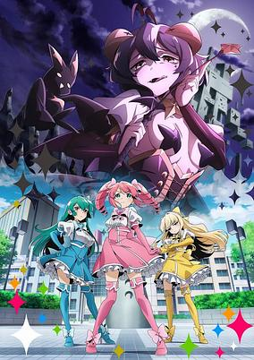

**Studio:** Asahi Production &nbsp;|&nbsp; **Episodes:** 13 &nbsp;|&nbsp; **Director:** Masato Suzuki Atsushi Ōtsuki &nbsp;|&nbsp; **Aired/Released:** January 3 – March 27 &nbsp;|&nbsp; **Genres:** Comedy, Ecchi, Magical Girl, Slice of Life

> Hiragi Utena is a major fangirl of the magical girls protecting her city, so when she has the chance to become one herself, she leaps at the chance to join their technicolor ranks… but when she transforms, she learns she isn’t fated to be a daring do-gooder, but rather a villain on the side of evil! At first, she tries to quit her new gig as the leader of the local baddies, but she quickly realizes she enjoys it and is a total natural at tormenting the magical girls she loves so much. With both a bang and a whimper, Hiragi’s journey as a magical-girl-tormenting sadist has begun!
>
> _Synopsis source: Kitsu_

[Wikipedia](https://en.wikipedia.org/wiki/Gushing_over_Magical_Girls) · [Kitsu](https://kitsu.io/anime/mahou-shoujo-ni-akogarete)

---

### Chained Soldier

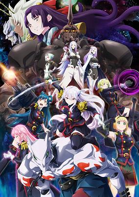

**Studio:** Seven Arcs &nbsp;|&nbsp; **Episodes:** 12 &nbsp;|&nbsp; **Director:** Junji Nishimura (Chief) Gorō Kuji &nbsp;|&nbsp; **Aired/Released:** January 4 – March 21 &nbsp;|&nbsp; **Genres:** Action, Adventure, Drama, Fantasy, Romance, Ecchi, Harem, Special Squads

> The demon-filled dimension known as "Mato" has opened to threaten humanity, and a type of "peach" tree that grows there yields fruit that confers special powers to those who eat it, giving humanity a fighting chance, but this only works for women. As such, as protectors of humanity, women rise in social status while men are relegated to second-class citizens scraping for basic occupation and acknowledgment. Cue Yuuki Wakura, a domestically crafty and laborious high school senior whose older sister was taken during a Mato event 5 years before; while lamenting the hardships of the life ahead of him, an event opens before him, and while being rescued from demons by Captain Kyouka of the Anti-Demon Corps, she confers his powers as her "slave" and turns him into a mighty beast mount that mows down the demons. However, there is a surprising price to pay for being her "slave"... and it's not him who has to pay it.
>
> _Synopsis source: Kitsu_

[Wikipedia](https://en.wikipedia.org/wiki/Chained_Soldier) · [Kitsu](https://kitsu.io/anime/mato-seihei-no-slave)

---

### Delicious in Dungeon

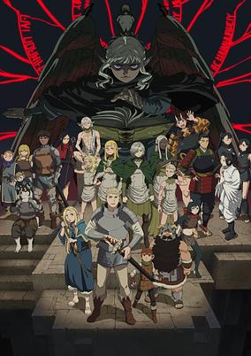

**Studio:** Trigger &nbsp;|&nbsp; **Episodes:** 24 &nbsp;|&nbsp; **Director:** Yoshihiro Miyajima &nbsp;|&nbsp; **Aired/Released:** January 4 – June 13 &nbsp;|&nbsp; **Genres:** Adventure, Comedy, Fantasy, Drama, Elf, Magic, Dragon, Seinen, Ghost, Zombie, Cooking

> Dungeons, dragons...and delicious monster stew!? Adventurers foray into a cursed buried kingdom to save their friend, cooking up a storm along the way. (Source: Netflix) Note: A world premiere screening of Episode 1 was shown in the Studio TRIGGER panel at Anime Expo on July 1, 2023.
>
> _Synopsis source: Kitsu_

[Wikipedia](https://en.wikipedia.org/wiki/Delicious_in_Dungeon) · [Kitsu](https://kitsu.io/anime/dungeon-meshi)

---

### My Instant Death Ability Is So Overpowered (My Instant Death Ability is So Overpowered, No One in This Other World Stands a Chance Against Me!)

**Studio:** Okuruto Noboru &nbsp;|&nbsp; **Episodes:** 12 &nbsp;|&nbsp; **Director:** Masakazu Hishida &nbsp;|&nbsp; **Aired/Released:** January 5 – March 22 &nbsp;|&nbsp; **Genres:** Action, Adventure, Comedy, Fantasy, Isekai

> Awaking to absolute chaos and carnage while on a school trip, Yogiri Takatou discovers that everyone in his class has been transported to another world! He had somehow managed to sleep through the entire ordeal himself, missing out on the Gift — powers bestowed upon the others by a mysterious Sage who appeared to transport them. Even worse, he and another classmate were ruthlessly abandoned by their friends, left as bait to distract a nearby dragon. Although not terribly bothered by the thought of dying, he reluctantly decides to protect his lone companion. After all, a lowly Level 1000 monster doesn't stand a chance against his secret power to invoke Instant Death with a single thought! If he can stay awake long enough to bother using it, that is...
>
> _Synopsis source: Kitsu_

[Wikipedia](https://en.wikipedia.org/wiki/My_Instant_Death_Ability_Is_So_Overpowered) · [Kitsu](https://kitsu.io/anime/sokushi-cheat-ga-saikyou-sugite-isekai-no-yatsura-ga-marude-aite-ni-naranai-n-desu-ga)

---

### Sasaki and Peeps

**Studio:** Silver Link &nbsp;|&nbsp; **Episodes:** 12 &nbsp;|&nbsp; **Director:** Mirai Minato &nbsp;|&nbsp; **Aired/Released:** January 5 – March 22 &nbsp;|&nbsp; **Genres:** Comedy, Fantasy, Magical Girl, Isekai, Magic, Working Life, Super Power, Cops

> Tired and unfulfilled by his dead-end job, Sasaki decides to adopt Peeps, an adorable pet Java sparrow. Peeps, however, is really Piercarlo, a powerful sage from another world! After Peeps bestows Sasaki with magic and the ability to cross worlds, the two decide to export household items for profit in pursuit of a leisurely lifestyle. But when Sasaki’s new magic gets him mixed up in a whole other kind of supernatural struggle back in Japan, will it destroy his chances at realizing the relaxing life of his dreams?
>
> _Synopsis source: Kitsu_

[Wikipedia](https://en.wikipedia.org/wiki/Sasaki_and_Peeps) · [Kitsu](https://kitsu.io/anime/sasaki-to-pi-chan)

---

### The Wrong Way to Use Healing Magic

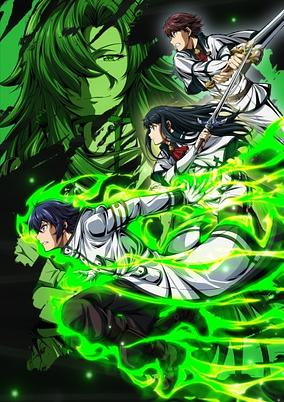

**Studio:** Studio Add Shin-Ei Animation &nbsp;|&nbsp; **Episodes:** 13 &nbsp;|&nbsp; **Director:** Takahide Ogata &nbsp;|&nbsp; **Aired/Released:** January 6 – March 30 &nbsp;|&nbsp; **Genres:** Fantasy, Action, Magic, Isekai, War, Military, Demon

> When ordinary high school student Usato happens to bump into student council president Suzune and classmate Kazuki on his way home. All three are suddenly swallowed up by a magic circle and transported to another world. The trio are summoned as heroes to save a kingdom from a demon king's army — but, only Suzune and Kazuki have what it takes to be heroes. Usato just happened to be dragged along for the ride. However, things turns around when Usato is discovered to have the rare knowledge of a healing mage. He is abducted by a woman who identifies herself as Rose, the leader of the life-saving corps, and drafted into her ranks. Source: ANN
>
> _Synopsis source: Kitsu_

[Wikipedia](https://en.wikipedia.org/wiki/The_Wrong_Way_to_Use_Healing_Magic) · [Kitsu](https://kitsu.io/anime/chiyu-mahou-no-machigatta-tsukaikata-senjou-wo-kakeru-kaifuku-youin)

---

### Mashle: Magic and Muscles – The Divine Visionary Candidate Exam Arc (Mashle: Magic and Muscles)

**Studio:** A-1 Pictures &nbsp;|&nbsp; **Episodes:** 12 &nbsp;|&nbsp; **Director:** Tomoya Tanaka &nbsp;|&nbsp; **Aired/Released:** January 6 – March 30 &nbsp;|&nbsp; **Genres:** Action, Comedy, Fantasy, Shounen, Magic

> This is a world of magic. This is a world in which magic is casually used by everyone. In a deep, dark forest in this world of magic, there is a boy who is singlemindedly working out. His name is Mash Burnedead, and he has a secret. He can’t use magic. All he wanted was to live a quiet life with his family, but people suddenly start trying to kill him one day and he somehow finds himself enrolled in Magic School. There, he sets his sights on becoming a “Divine Visionary,” the elite of the elite. Will his ripped muscles work against the best and brightest of the wizarding world? The curtain rises on this off-kilter magical fantasy in which the power of being jacked crushes any spell!
>
> _Synopsis source: Kitsu_

[Wikipedia](https://en.wikipedia.org/wiki/Mashle) · [Kitsu](https://kitsu.io/anime/mashle)

---

### Pon no Michi

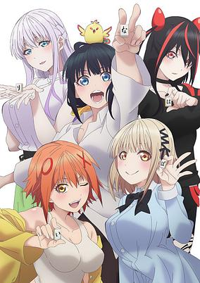

**Studio:** OLM &nbsp;|&nbsp; **Episodes:** 12 &nbsp;|&nbsp; **Director:** Tatsuma Minamikawa &nbsp;|&nbsp; **Aired/Released:** January 6 – March 23 &nbsp;|&nbsp; **Genres:** Slice of Life

> The anime is set in Hiroshima Prefecture's Onomichi City, where a high school student Nashiko Jippensha was kicked out of her house. Without a place to play with her friends, she learns that the mahjong parlor that her father used to run is now vacant. She fixes the mahjong parlor and turns it into a place where she and her friends can have fun, cook, have tea, and sometimes play mahjong.
>
> _Synopsis source: Kitsu_

[Wikipedia](https://en.wikipedia.org/wiki/Pon_no_Michi) · [Kitsu](https://kitsu.io/anime/pon-no-michi)

---

### Tales of Wedding Rings

**Studio:** Staple Entertainment &nbsp;|&nbsp; **Episodes:** 12 &nbsp;|&nbsp; **Director:** Takashi Naoya &nbsp;|&nbsp; **Aired/Released:** January 6 – March 23 &nbsp;|&nbsp; **Genres:** Adventure, Comedy, Ecchi, Fantasy, Romance, Harem

> Satou is a high school boy in love with his best friend Hime, an unearthly beauty from another realm. So when she moves back to her home world to get married, Satou doesn’t think twice—he follows her and crashes the wedding. Then, after a kiss from Hime, he suddenly becomes the new groom! But here, Hime is a Ring Princess and her husband is destined to be the Ring King: a hero of immense power.
>
> _Synopsis source: Kitsu_

[Wikipedia](https://en.wikipedia.org/wiki/Tales_of_Wedding_Rings) · [Kitsu](https://kitsu.io/anime/kekkon-yubiwa-monogatari)

---

### Stick It on Around! Koinu

**Studio:** Opera House &nbsp;|&nbsp; **Episodes:** 12 &nbsp;|&nbsp; **Director:** Ai Ikegaya &nbsp;|&nbsp; **Aired/Released:** January 6 – March 27

---

### A Sign of Affection

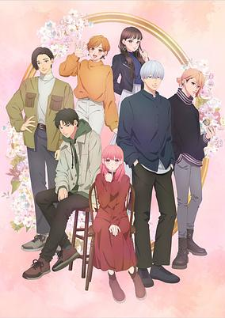

**Studio:** Ajia-do Animation Works &nbsp;|&nbsp; **Episodes:** 12 &nbsp;|&nbsp; **Director:** Yūta Murano &nbsp;|&nbsp; **Aired/Released:** January 6 – March 23 &nbsp;|&nbsp; **Genres:** Romance, Shoujo, Slice of Life

> Yuki Itose is just a typical student dealing with the pressures of college. She is struggling one day on the train when an upperclassman named Itsuomi Nagi helps her out. As he gradually opens a new world to her, Yuki develops feelings for Itsuomi. A pure love story begins to grow.
>
> _Synopsis source: Kitsu_

[Wikipedia](https://en.wikipedia.org/wiki/A_Sign_of_Affection) · [Kitsu](https://kitsu.io/anime/yubisaki-to-renren)

---

### The Demon Prince of Momochi House

**Studio:** Drive &nbsp;|&nbsp; **Episodes:** 12 &nbsp;|&nbsp; **Director:** Bob Shirahata &nbsp;|&nbsp; **Aired/Released:** January 6 – March 23 &nbsp;|&nbsp; **Genres:** Supernatural, Romance, Fantasy, Shoujo, Juujin

> On her sixteenth birthday, orphan Himari Momochi inherits her ancestral estate that she's never seen. Momochi House exists on the barrier between the human and spiritual realms, and Himari is meant to act as guardian between the two worlds. But on the day she moves in, she finds three handsome squatters already living in the house, and one seems to have already taken over her role!
>
> _Synopsis source: Kitsu_

[Wikipedia](https://en.wikipedia.org/wiki/The_Demon_Prince_of_Momochi_House) · [Kitsu](https://kitsu.io/anime/momochi-san-chi-no-ayakashi-ouji)

---

### 7th Time Loop: The Villainess Enjoys a Carefree Life Married to Her Worst Enemy!

**Studio:** Studio Kai Hornets &nbsp;|&nbsp; **Episodes:** 12 &nbsp;|&nbsp; **Director:** Kazuya Iwata &nbsp;|&nbsp; **Aired/Released:** January 7 – March 24 &nbsp;|&nbsp; **Genres:** Politics, Fantasy, Romance, Shoujo, Isekai

> If you think being reincarnated once is a big deal, try seven times. From lowly pharmacist to embattled knight, Rishe has lived many lives. This time around, she’s determined to live in the lap of luxury–but there’s just one catch. To make her extravagant dreams come true, she has to marry the prince who killed her in one of her previous lives! It’s going to take every one of the skills she’s honed over multiple lifetimes to accomplish this goal!
>
> _Synopsis source: Kitsu_

[Wikipedia](https://en.wikipedia.org/wiki/7th_Time_Loop) · [Kitsu](https://kitsu.io/anime/loop-7-kaime-no-akuyaku-reijou-wa-moto-tekikoku-de-jiyuu-kimamana-hanayome-seikatsu-wo-mankitsu-suru)

---

### The Strongest Tank's Labyrinth Raids (The Strongest Tank's Labyrinth Raids -A Tank with a Rare 9999 Resistance Skill Got Kicked from the Hero's Party-)

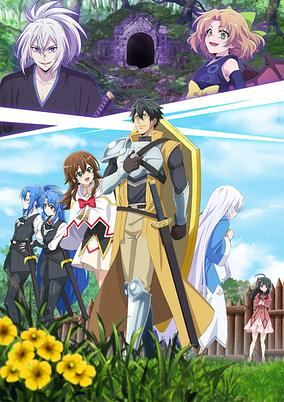

**Studio:** Studio Polon &nbsp;|&nbsp; **Episodes:** 12 &nbsp;|&nbsp; **Director:** Mitsutaka Noshitani &nbsp;|&nbsp; **Aired/Released:** January 7 – March 24 &nbsp;|&nbsp; **Genres:** Action, Adventure, Fantasy

> Rud is a tank of the Hero's Party and is said to have the highest defense ever in history. The party often does labyrinth raids, but to Rud, it means more than just a raid. To cure his beloved sister's illness, he is in search for the wish-granting treasure that might be hidden in those labyrinths. But one day, the arrogant hero kicks him from the party after an unsuccessful raid attempt, blaming it on his skills whose effects he is still unaware of. Without nowhere else to go and nothing to do, he decides to return to his hometown, where his sister is waiting. On his way there, he saves a girl who was being attacked by a monster. Unexpectedly, this girl has an extremely rare skill called "Appraisal". Thanks to her skill, Rud is able to discover the truth behind his unknown skills, which turn out to be very powerful skills. With a defense of 9999 and powerful skills, thus begins the adventure of the strongest tank, Rud!
>
> _Synopsis source: Kitsu_

[Wikipedia](https://en.wikipedia.org/wiki/The_Strongest_Tank%27s_Labyrinth_Raids) · [Kitsu](https://kitsu.io/anime/saikyou-tank-no-meikyuu-kouryaku-tairyoku-9999-no-rare-skill-mochi-tank-yuusha-party-wo-tsuihou-sareru)

---

### Banished from the Hero's Party (season 2)

**Studio:** Studio Flad &nbsp;|&nbsp; **Episodes:** 12 &nbsp;|&nbsp; **Director:** Makoto Hoshino (Chief) Satoshi Takafuji &nbsp;|&nbsp; **Aired/Released:** January 7 – March 24

[Wikipedia](https://en.wikipedia.org/wiki/Banished_from_the_Hero%27s_Party)

---

### The Dangers in My Heart (season 2) (The Dangers in My Heart)

**Studio:** Shin-Ei Animation &nbsp;|&nbsp; **Episodes:** 13 &nbsp;|&nbsp; **Director:** Hiroaki Akagi &nbsp;|&nbsp; **Aired/Released:** January 7 – March 31 &nbsp;|&nbsp; **Genres:** Comedy, Romance, Slice of Life

> Fascinated by murder and all things macabre, Kyoutarou daydreams of acting out his twisted fantasies on his unsuspecting classmates — but an encounter with Anna Yamada, the gorgeous class idol, lights a spark in the darkness of his heart. It’s a classic tale of an antisocial boy falling for a popular girl, but neither are who they appear to be at first glance. Will Kyoutarou and Anna defy their expectations of each other — and of themselves?
>
> _Synopsis source: Kitsu_

[Wikipedia](https://en.wikipedia.org/wiki/The_Dangers_in_My_Heart) · [Kitsu](https://kitsu.io/anime/boku-no-kokoro-no-yabai-yatsu)

---

### Solo Leveling

**Studio:** A-1 Pictures &nbsp;|&nbsp; **Episodes:** 12 &nbsp;|&nbsp; **Director:** Shunsuke Nakashige &nbsp;|&nbsp; **Aired/Released:** January 7 – March 31 &nbsp;|&nbsp; **Genres:** Action, Fantasy, Magic, Adventure, Human Enhancement, Earth, Korea

> They say whatever doesn’t kill you makes you stronger, but that’s not the case for the world’s weakest hunter Sung Jinwoo. After being brutally slaughtered by monsters in a high-ranking dungeon, Jinwoo came back with the System, a program only he could see, that’s leveling him up in every way. Now, he’s inspired to discover the secrets behind his powers and the dungeon that spawned them.
>
> _Synopsis source: Kitsu_

[Wikipedia](https://en.wikipedia.org/wiki/Solo_Leveling) · [Kitsu](https://kitsu.io/anime/solo-leveling)

---

### Blue Exorcist: Shimane Illuminati Saga

**Studio:** Studio VOLN &nbsp;|&nbsp; **Episodes:** 12 &nbsp;|&nbsp; **Director:** Daisuke Yoshida &nbsp;|&nbsp; **Aired/Released:** January 7 – March 24

[Wikipedia](https://en.wikipedia.org/wiki/Blue_Exorcist)

---

### Fluffy Paradise

**Studio:** EMT Squared &nbsp;|&nbsp; **Episodes:** 12 &nbsp;|&nbsp; **Director:** Jun'ichi Kitamura &nbsp;|&nbsp; **Aired/Released:** January 7 – March 24 &nbsp;|&nbsp; **Genres:** Fantasy, Isekai, Slice of Life, Adventure

> Midori Akitsu ends up in another world after dying from overwork!? I got reincarnated in another world after God blessed me with a special ability. This ability is "to be loved by non-human beings." Huh!? Meaning that humans might not like me, but all the fluffy animals will love me? Whoaaa! I get to pet a white tiger and dragons to my heart's contents!
>
> _Synopsis source: Kitsu_

[Wikipedia](https://en.wikipedia.org/wiki/Fluffy_Paradise) · [Kitsu](https://kitsu.io/anime/isekai-de-mofumofu-nadenade-suru-tame-ni-ganbattemasu)

---

### High Card (season 2) (High Card)

**Studio:** Studio Hibari &nbsp;|&nbsp; **Episodes:** 12 &nbsp;|&nbsp; **Director:** Junichi Wada &nbsp;|&nbsp; **Aired/Released:** January 8 – March 25 &nbsp;|&nbsp; **Genres:** Card Games, Action, Gunfights, Super Power

> After discovering that his orphanage was on the brink of closing due to financial stress, Finn, who was living freely on the streets, set out for a casino with the aim of making a fortune. However, nothing could have prepared Finn for the nightmare that was awaiting him. Once there, Finn encountered a car chase and bloody shootout caused by a man's “lucky” card. Finn will eventually learn what the shootout was about. The world order can be controlled by a set of 52 X-Playing cards with the power to bestow different superhuman powers and abilities to the ones that possess them. With these cards, people can access the hidden power of the “buddy” that can be found within themselves. There is a secret group of players called High Card, who have been directly ordered by the king of Fourland to collect the cards that have been scattered throughout the kingdom, while moonlighting as employees of the luxury car maker Pinochle. Scouted to become the group's fifth member, Finn soon joins the players on a dangerous mission to find these cards. However, Who's Who, the rival car maker obsessed with defeating Pinochle, and the Klondikes, the infamous Mafia family, stand in the way of the gang. A frenzied battle amongst these card obsessed players, fueled by justice, desire, and revenge, is about to begin!
>
> _Synopsis source: Kitsu_

[Wikipedia](https://en.wikipedia.org/wiki/High_Card) · [Kitsu](https://kitsu.io/anime/high-card)

---

### The Unwanted Undead Adventurer

**Studio:** Connect &nbsp;|&nbsp; **Episodes:** 12 &nbsp;|&nbsp; **Director:** Noriaki Akitaya &nbsp;|&nbsp; **Aired/Released:** January 8 – March 25 &nbsp;|&nbsp; **Genres:** Action, Fantasy, Adventure, Magic, Vampire, Zombie

> Rentt Faina has hunted monsters for the last 10 years. Sadly, he’s not great at his job, stuck hunting slimes and goblins for a few coins each day. His luck turns when he finds an undiscovered path. At the path’s end, he meets his demise in the maw of a legendary dragon. But, he wakes up as an undead bag of bones! He sets out to achieve Existential Evolution and rejoin the land of the living.
>
> _Synopsis source: Kitsu_

[Wikipedia](https://en.wikipedia.org/wiki/The_Unwanted_Undead_Adventurer) · [Kitsu](https://kitsu.io/anime/nozomanu-fushi-no-boukensha)

---

### Tsukimichi: Moonlit Fantasy (season 2) (Tsukimichi -Moonlit Fantasy- 2)

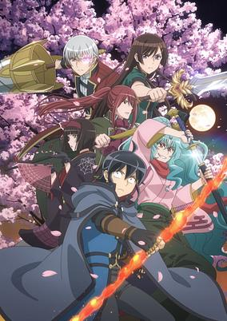

**Studio:** J.C.Staff &nbsp;|&nbsp; **Episodes:** 25 &nbsp;|&nbsp; **Director:** Shinji Ishihira &nbsp;|&nbsp; **Aired/Released:** January 8 – June 24 &nbsp;|&nbsp; **Genres:** Action, Adventure, Comedy, Fantasy, Isekai, Magic, Harem

> The second season of Tsuki ga Michibiku Isekai Douchuu.
>
> _Synopsis source: Kitsu_

[Kitsu](https://kitsu.io/anime/tsuki-ga-michibiku-isekai-douchuu-2)

---

### Mr. Villain's Day Off

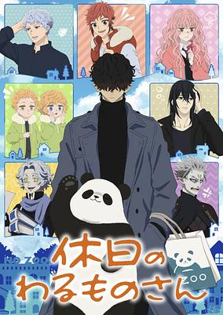

**Studio:** Shin-Ei Animation SynergySP &nbsp;|&nbsp; **Episodes:** 12 &nbsp;|&nbsp; **Director:** Yoshinori Odaka &nbsp;|&nbsp; **Aired/Released:** January 8 – March 25 &nbsp;|&nbsp; **Genres:** Comedy, Slice of Life, Henshin, Shoujo, Alien

> An Evil Organization from another planet is trying to take over Earth. An extraterrestrial from that organization named the "General" tirelessly fights against Earth's defenders every single day in a battle of life and death! However, today is his day off.
>
> _Synopsis source: Kitsu_

[Wikipedia](https://en.wikipedia.org/wiki/Mr._Villain%27s_Day_Off) · [Kitsu](https://kitsu.io/anime/kyuujitsu-no-warumono-san)

---

### Synduality: Noir (part 2) (SYNDUALITY Noir)

**Studio:** Eight Bit &nbsp;|&nbsp; **Episodes:** 12 &nbsp;|&nbsp; **Director:** Yusuke Yamamoto &nbsp;|&nbsp; **Aired/Released:** January 9 – March 26 &nbsp;|&nbsp; **Genres:** Science Fiction, Mecha

> The year is 2222. It has been years since Tears of the New Moon, a mysterious rain, poured and wiped out almost the entire human race. The poisonous rain gave birth to deformed creatures devouring for humans, and humanity fled from the danger. As means for survival, the humans then build an underground haven; Amasia. In this new built dystopian city, on a pursuit of maintaining their existence, they run into an Artificial Intelligence named Magus. Not knowing how things will work between them, the story of how Humans and AI coinciding and trying to find their truths begin.
>
> _Synopsis source: Kitsu_

[Wikipedia](https://en.wikipedia.org/wiki/Synduality) · [Kitsu](https://kitsu.io/anime/synduality-noir)

---

### 'Tis Time for "Torture," Princess (Tis Time for "Torture," Princess)

**Studio:** Pine Jam &nbsp;|&nbsp; **Episodes:** 12 &nbsp;|&nbsp; **Director:** Yōko Kanemori &nbsp;|&nbsp; **Aired/Released:** January 9 – March 26 &nbsp;|&nbsp; **Genres:** Comedy, Fantasy, Slapstick, Absurdist Humour, Demon

> As the war between the Imperial Army and Hellhorde rages on, the Princess, despite being armed with her mythical sword Excalibur, is captured and imprisoned. What kind of torture does she face at the hands of the chief demon interrogator? Fluffy fresh-baked toast! Hot, steaming ramen! Oh, the humanity! Can the Princess withstand these tormenting treats and keep her kingdom’s secrets safe?
>
> _Synopsis source: Kitsu_

[Wikipedia](https://en.wikipedia.org/wiki/%27Tis_Time_for_%22Torture,%22_Princess) · [Kitsu](https://kitsu.io/anime/himesama-goumon-no-jikan-desu)

---

### The Foolish Angel Dances with the Devil

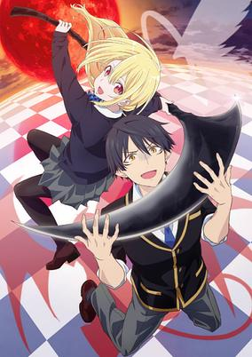

**Studio:** Children's Playground Entertainment &nbsp;|&nbsp; **Episodes:** 12 &nbsp;|&nbsp; **Director:** Itsuro Kawasaki &nbsp;|&nbsp; **Aired/Released:** January 9 – March 26 &nbsp;|&nbsp; **Genres:** Comedy, Supernatural, Seinen, Romance, Angel, Demon, School Life

> The story centers on Masatora Akutsu, a demon who descends to the human world in search of "idols" to motivate the corrupt demons and to boost their morale. He quickly finds a potential idol, Lily Amane, and recruits her. However, Lily turns out to be an angel, the natural enemy of Akutsu and the other demons! While Akutsu tries to corrupt Lily to protect himself and his clan, Lily decides to rehabilitate Akutsu for her own hidden ambitions.
>
> _Synopsis source: Kitsu_

[Wikipedia](https://en.wikipedia.org/wiki/The_Foolish_Angel_Dances_with_the_Devil) · [Kitsu](https://kitsu.io/anime/oroka-na-tenshi-wa-akuma-to-odoru)

---

### Hokkaido Gals Are Super Adorable!

**Studio:** Silver Link Blade &nbsp;|&nbsp; **Episodes:** 12 &nbsp;|&nbsp; **Director:** Mirai Minato (Chief) Misuzu Hoshino &nbsp;|&nbsp; **Aired/Released:** January 9 – March 26 &nbsp;|&nbsp; **Genres:** Romance, Comedy, School Life, Slice of Life, Ecchi, Shounen

> Snowflakes aren’t the only things dropping in Hokkaido—so are jaws, thanks to the super adorable gals who are turning the icy north into a hotbed of fashion and fun. Brace yourself for a winter storm of laughs, love, and killer outfits as these gals prove that being cute is an all-season affair. Here, frostbite meets fashionista!
>
> _Synopsis source: Kitsu_

[Wikipedia](https://en.wikipedia.org/wiki/Hokkaido_Gals_Are_Super_Adorable!) · [Kitsu](https://kitsu.io/anime/dosanko-gyaru-wa-namaramenkoi)

---

### Villainess Level 99 (Villainess Level 99: I May Be the Hidden Boss but I'm Not the Demon Lord)

**Studio:** Jumondou &nbsp;|&nbsp; **Episodes:** 12 &nbsp;|&nbsp; **Director:** Minoru Yamaoka &nbsp;|&nbsp; **Aired/Released:** January 9 – March 26 &nbsp;|&nbsp; **Genres:** Fantasy, Romance, Shoujo, Isekai, Magic, School Life, Demon

> Yumiella Dolkness is your run-of-the-mill villainess in an otome RPG—except for the fact that she’s also secretly the overpowered hidden boss. But Yumiella wasn’t always Yumiella, you see. In her past life, she was nothing more than an introverted college student and devout gamer. So when she realizes that she’s been reincarnated as a hidden boss, she’s determined to steer clear of the protagonists and avoid her demise at their hands. All she wants is a nice, quiet life. Too bad when her gamer instincts kick in, Yumiella can’t just ignore her awesome stats... A girl’s gotta grind! So, with plenty of time on her hands before starting life at the academy, she gets a little carried away and maxes out her level at 99. And when everyone else finds out, they get the wrong idea about her power—now they think she’s the Demon Lord! Is this OP villainess strong enough to win back the peaceful life she always wanted?!
>
> _Synopsis source: Kitsu_

[Wikipedia](https://en.wikipedia.org/wiki/Villainess_Level_99) · [Kitsu](https://kitsu.io/anime/akuyaku-reijou-level-99-watashi-wa-ura-boss-desu-ga-maou-de-wa-arimasen)

---

### Doctor Elise (Surgeon Elise)

**Studio:** Maho Film &nbsp;|&nbsp; **Episodes:** 12 &nbsp;|&nbsp; **Director:** Kumiko Habara &nbsp;|&nbsp; **Aired/Released:** January 10 – March 27 &nbsp;|&nbsp; **Genres:** Comedy, Fantasy, Romance, Isekai, Shoujo

> Jihyun is a master surgeon at the peak of her medical prowess. She’s made it her life’s mission to save lives in order to atone for the sins of her past life, but her dreams are cut short when her plane crashes in the middle of the Pacific. When Jihyun wakes up, she finds herself back in her first life as Elise de Clarence - the haughty nightmare of a girl who brought on her own tragic end. The new Elise, however, still has time to set things straight - with her newfound medical knowledge, the reformed Elise sets out to right the wrongs of her tragic first life!
>
> _Synopsis source: Kitsu_

[Wikipedia](https://en.wikipedia.org/wiki/Doctor_Elise) · [Kitsu](https://kitsu.io/anime/gekai-elise)

---

### Shaman King: Flowers

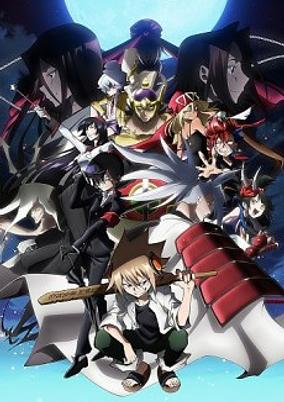

**Studio:** Bridge &nbsp;|&nbsp; **Episodes:** 13 &nbsp;|&nbsp; **Director:** Takeshi Furuta &nbsp;|&nbsp; **Aired/Released:** January 10 – April 3 &nbsp;|&nbsp; **Genres:** Action, Adventure, Comedy, Supernatural

> Hana Asakura thinks his life is boring — until two of his relatives try to kill him. To defend his family, he must now master his shaman powers!
>
> _Synopsis source: Kitsu_

[Kitsu](https://kitsu.io/anime/shaman-king-flowers)

---

### Delusional Monthly Magazine

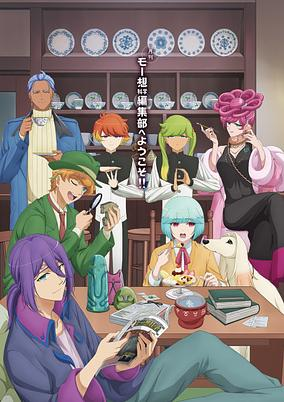

**Studio:** OLM Team Yoshioka &nbsp;|&nbsp; **Episodes:** 12 &nbsp;|&nbsp; **Director:** Chizuru Miyawaki &nbsp;|&nbsp; **Aired/Released:** January 11 – March 28 &nbsp;|&nbsp; **Genres:** Comedy, Slice of Life, Supernatural

> Delusional Monthly Magazine is set in Most City in an unknown country in a small publishing house that prints a monthly magazine about the most outlandish of things. Everything changes when the staff of the magazine, editor-in-chief Taro, his assistant Jiro and dog Saburo, meet with scientist Goro Sato…
>
> _Synopsis source: Kitsu_

[Wikipedia](https://en.wikipedia.org/wiki/Delusional_Monthly_Magazine) · [Kitsu](https://kitsu.io/anime/gekkan-mousou-kagaku)

---

### Sengoku Youko (part 1)

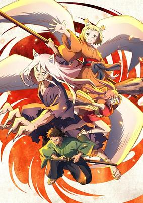

**Studio:** White Fox &nbsp;|&nbsp; **Episodes:** 13 &nbsp;|&nbsp; **Director:** Masahiro Aizawa &nbsp;|&nbsp; **Aired/Released:** January 11 – April 4 &nbsp;|&nbsp; **Genres:** Action, Adventure, Fantasy, Shounen

> The world is divided into two factions: humans and monsters called katawara. Despite being a katawara, Tama loves humans and vows to protect them from evil, even if it means fighting her own kind. Her stepbrother Jinka, however, hates humans, despite mostly being one. The siblings are joined by a cowardly swordsman named Shinsuke, who wants to learn how to become strong. The people they meet, places they see, and creatures they battle will be legendary!
>
> _Synopsis source: Kitsu_

[Wikipedia](https://en.wikipedia.org/wiki/Sengoku_Youko) · [Kitsu](https://kitsu.io/anime/sengoku-youko)

---

### Metallic Rouge

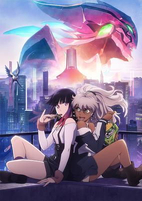

**Studio:** Bones &nbsp;|&nbsp; **Episodes:** 13 &nbsp;|&nbsp; **Director:** Yutaka Izubuchi (Chief) Motonobu Hori &nbsp;|&nbsp; **Aired/Released:** January 11 – April 4 &nbsp;|&nbsp; **Genres:** Henshin, Action, Mecha, Science Fiction, Super Power, Android, Dystopia, Alien, Robot, Assassin, Crime, Cyberpunk, Space

> Metallic Rouge takes place in a a world where humans and androids coexist. The story follows Rouge, an android girl, who is on a mission on Mars with her partner Naomi. The mission is to murder nine artificial humans who are hostile to the government.
>
> _Synopsis source: Kitsu_

[Wikipedia](https://en.wikipedia.org/wiki/Metallic_Rouge) · [Kitsu](https://kitsu.io/anime/metallic-rouge)

---

### Brave Bang Bravern! (Bang Brave Bang Bravern)

**Studio:** CygamesPictures &nbsp;|&nbsp; **Episodes:** 12 &nbsp;|&nbsp; **Director:** Masami Ōbari &nbsp;|&nbsp; **Aired/Released:** January 11 – March 28 &nbsp;|&nbsp; **Genres:** Action, Mecha, Comedy, Parody, War, Romance, Super Robot, Robot, Military, Alien

> Bang Brave Bang Bravern is set in a world where humanoid armored weapons known as “Titatonostrider” (“TS” for short) are used in warfare. The story kicks off when troops from various countries converge on the island of Oahu, Hawaii, including the main characters, Ao Isami of the Japan Ground Self-Defense Force and Lewis Smith of the United States Marine Corps. Isami and Smith cross paths during battle, but suddenly their teams are attacked by an unknown enemy, scattering soldiers and sending their forces into disarray. In order to save their friends and survive on the deadly battlefield, they must fight with every ounce of courage and pride that they can muster.
>
> _Synopsis source: Kitsu_

[Wikipedia](https://en.wikipedia.org/wiki/Brave_Bang_Bravern!) · [Kitsu](https://kitsu.io/anime/yuuki-bakuhatsu-bang-bravern)

---

### Cherry Magic! Thirty Years of Virginity Can Make You a Wizard?!

**Studio:** Satelight &nbsp;|&nbsp; **Episodes:** 12 &nbsp;|&nbsp; **Director:** Yoshiko Okuda &nbsp;|&nbsp; **Aired/Released:** January 11 – March 28 &nbsp;|&nbsp; **Genres:** Comedy, Romance, Supernatural, Slice of Life, Super Power, Shounen Ai, Working Life, Josei, Magic

> Adachi's 30th birthday as a virgin came with the oddest gift—the ability to read the mind of anyone he touches. Pondering what to do with this mysterious power, he gets a lead when he accidentally reads his colleague Kurosawa's mind. Turns out the handsome hotshot of the sales team has got a thing for him! How will Adachi respond to overhearing these affectionate thoughts?
>
> _Synopsis source: Kitsu_

[Wikipedia](https://en.wikipedia.org/wiki/Cherry_Magic!_Thirty_Years_of_Virginity_Can_Make_You_a_Wizard%3F!) · [Kitsu](https://kitsu.io/anime/30-sai-made-doutei-da-to-mahou-tsukai-ni-nareru-rashii)

---

### Isekai Onsen Paradise (Pioneer Log of the Storied Hot Springs "Alternate World's Springs": The Reincarnation Destination of an Onsen Fan (Who's Around 40) Was a Relaxing Hot Spring Paradise)

**Studio:** BloomZ Wolfsbane &nbsp;|&nbsp; **Episodes:** 12 &nbsp;|&nbsp; **Director:** Tomonori Mine &nbsp;|&nbsp; **Aired/Released:** January 12 – March 29 &nbsp;|&nbsp; **Genres:** Isekai, Fantasy, Fantasy World, Elf, Ecchi

> The story centers around Yoshizō Yukawa, a major hot spring fan who finds hidden springs to revitalize the economy of the local area. However, he dies after falling off a cliff and is transported to an alternate world, thanks to an inari deity of harvest at a small shrine nestled in the rocks. Together with the inari's attendant princess Mayudama, he continues searching for storied hot springs, only this time in the alternate world. Along the way, he ends up naked in hot springs with furry-eared girls and elven girls.
>
> _Synopsis source: Kitsu_

[Wikipedia](https://en.wikipedia.org/wiki/Isekai_Onsen_Paradise) · [Kitsu](https://kitsu.io/anime/isekai-no-yu-kaitaku-ki-arafo-onsen-mania-tensei-saki-wa-nonburi-onsen-tengoku-deshita)

---

### The Weakest Tamer Began a Journey to Pick Up Trash

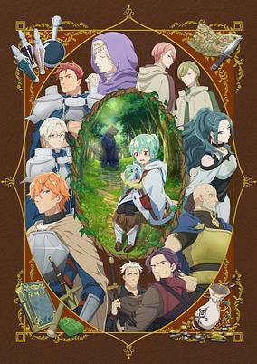

**Studio:** Studio Massket &nbsp;|&nbsp; **Episodes:** 12 &nbsp;|&nbsp; **Director:** Shigeyasu Yamauchi (Chief) Naoki Horiuchi &nbsp;|&nbsp; **Aired/Released:** January 12 – March 29 &nbsp;|&nbsp; **Genres:** Adventure, Fantasy, Isekai

> Young Ivy can’t catch a break. Though she has a few memories of her past life, she was reborn into an RPG-like world in the weakest class, and worse, as the weakest rank. As a no-star Tamer, even her parents want nothing to do with her, and she soon realizes she must survive on her own. She learns to live off the land and salvage what she can from other people’s leavings. But when Ivy manages to tame Sora, a lowly slime, everything changes for both of them. There’s something special about this frail little monster, and Ivy’s care will bring out the best in both of them!
>
> _Synopsis source: Kitsu_

[Wikipedia](https://en.wikipedia.org/wiki/The_Weakest_Tamer_Began_a_Journey_to_Pick_Up_Trash) · [Kitsu](https://kitsu.io/anime/saijaku-tamer-wa-gomi-hiroi-no-tabi-wo-hajimemashita)

---

### The Witch and the Beast

**Studio:** Yokohama Animation Laboratory &nbsp;|&nbsp; **Episodes:** 12 &nbsp;|&nbsp; **Director:** Takayuki Hamana &nbsp;|&nbsp; **Aired/Released:** January 12 – April 5 &nbsp;|&nbsp; **Genres:** Action, Adventure, Drama, Fantasy, Seinen, Magic

> Ashaf: a soft-spoken man with delicate features, a coffin strapped to his back, and an entourage of black crows. Guideau: a feral, violent girl with long fangs and the eyes of a beast. This ominous pair appear one day in a town in thrall to a witch — a ruler with magic coursing through her tattooed body, who has convinced the townsfolk she’s their hero. But Ashaf and Guideau know better. They live by one creed: “Wherever a witch goes, only curses and disasters follow.” They have scores to settle, and they won’t hesitate to remove anyone in their way, be it angry mob or army garrison.
>
> _Synopsis source: Kitsu_

[Wikipedia](https://en.wikipedia.org/wiki/The_Witch_and_the_Beast) · [Kitsu](https://kitsu.io/anime/majo-to-yajuu)

---

### Urusei Yatsura (season 2)

**Studio:** David Production &nbsp;|&nbsp; **Episodes:** 23 &nbsp;|&nbsp; **Director:** Takahiro Kamei Hideya Takahashi Yasuhiro Kimura &nbsp;|&nbsp; **Aired/Released:** January 12 – June 21

[Wikipedia](https://en.wikipedia.org/wiki/Urusei_Yatsura_(2022_TV_series))

---

### Snack Basue

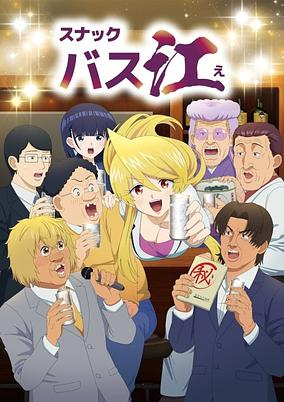

**Studio:** Studio Puyukai &nbsp;|&nbsp; **Episodes:** 12 &nbsp;|&nbsp; **Director:** Minoru Ashina &nbsp;|&nbsp; **Aired/Released:** January 13 – March 30 &nbsp;|&nbsp; **Genres:** Comedy

> The gag comedy manga centers on a bar in Sapporo's North 24th neighborhood, five stations away from the Susukino business district. There, the bar's proprietor, junior proprietor, odd regular customers, and its share of walk-ins recount their strange lives.
>
> _Synopsis source: Kitsu_

[Wikipedia](https://en.wikipedia.org/wiki/Snack_Basue) · [Kitsu](https://kitsu.io/anime/snack-basue)

---

### Bucchigiri?!

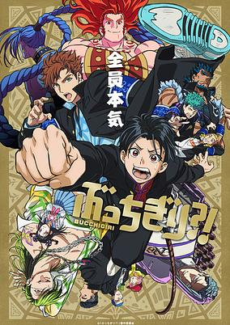

**Studio:** MAPPA &nbsp;|&nbsp; **Episodes:** 12 &nbsp;|&nbsp; **Director:** Hiroko Utsumi &nbsp;|&nbsp; **Aired/Released:** January 13 – April 6 &nbsp;|&nbsp; **Genres:** Action, Supernatural, Delinquent, Martial Arts

> Arajin Tomoshibi's reunion with his old pal Matakara Asamine takes an unexpected turn when they stumble into a brawl with the toughest guys in town. And just when you thought things couldn't get weirder, a colossal genie decides to drop in. Brace yourself for the ultimate showdown. It's the clash of the cool and the magical!
>
> _Synopsis source: Kitsu_

[Wikipedia](https://en.wikipedia.org/wiki/Bucchigiri%3F!) · [Kitsu](https://kitsu.io/anime/bucchigiri-tv)

---

### The Fire Hunter (season 2) (The Fire Hunter)

**Studio:** Signal.MD &nbsp;|&nbsp; **Episodes:** 10 &nbsp;|&nbsp; **Director:** Junji Nishimura &nbsp;|&nbsp; **Aired/Released:** January 14 – March 17 &nbsp;|&nbsp; **Genres:** Steampunk, Fantasy, Post Apocalypse

> The story is set in a world in the chaotic aftermath of humanity's Last War. A great forest, infested with flameling creatures and other fallen beasts, covers the world, and pockets of humanity live in small protected communities. Due to a special weapon used in the Last War, human beings spontaneously burst into flame even when merely getting close to a small source of fire. The only safe energy source for humanity lies within the bodies of flamelings, and the duty to hunt them falls to the sickle-wielding firecatchers who brave the depths of the great forest. Among the firecatchers, they whisper tales of one who would be "Firecatcher Lord," an individual who will be able to harvest the fire of the thousand-year comet, the "Wandering Spark" that has flown in the sky since it was sent up before the Last War, but is now returning to earth.
>
> _Synopsis source: Kitsu_

[Wikipedia](https://en.wikipedia.org/wiki/The_Fire_Hunter) · [Kitsu](https://kitsu.io/anime/hikari-no-ou)

---

### Meiji Gekken: 1874

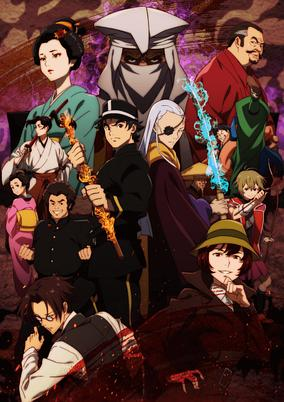

**Studio:** Tsumugi Akita Animation Lab &nbsp;|&nbsp; **Episodes:** 10 &nbsp;|&nbsp; **Director:** Jin Tamamura &nbsp;|&nbsp; **Aired/Released:** January 14 – March 17 &nbsp;|&nbsp; **Genres:** Action, Drama, Historical, Swordplay, Politics, Mystery

> By 1874, seven years have passed since the end of the samurai era. A former samurai, Shizuma Orikasa works as a rickshaw driver in Tokyo while looking for his fiancée, Sumie Kanomata, who went missing during the Boshin War. Shizuma thwarts an assassination attempt and joins the newly established police department, where he’ll fight to stop dark forces from overthrowing the government.
>
> _Synopsis source: Kitsu_

[Kitsu](https://kitsu.io/anime/meiji-gekken-1874)

---

### Kingdom ( season 5 )

**Studio:** Pierrot Studio Signpost &nbsp;|&nbsp; **Episodes:** 13 &nbsp;|&nbsp; **Director:** Kenichi Imaizumi &nbsp;|&nbsp; **Aired/Released:** January 14 – March 31

[Wikipedia](https://en.wikipedia.org/wiki/Kingdom_(manga))

---

### Wonderful PreCure!

**Studio:** Toei Animation &nbsp;|&nbsp; **Episodes:** 50 &nbsp;|&nbsp; **Director:** Masanori Sato &nbsp;|&nbsp; **Aired/Released:** February 4 – January 26, 2025 &nbsp;|&nbsp; **Genres:** Shounen, Henshin, Magic, Magical Girl, Fantasy

> The 21st installment in the Precure series. Animal Town is a town where animals and people live together. Iroha loves animals and is good friends with her dog, Komugi! One day, a mysterious creature, Garugaru, wreaks havoc in the town! However, in order to protect Iroha, Komugi transformed into human form and became a Precure...! I have to save the child animal whose heart is being garugaru-ed...! Let's join forces and return the animals to Niko Garden!
>
> _Synopsis source: Kitsu_

[Wikipedia](https://en.wikipedia.org/wiki/Wonderful_PreCure!) · [Kitsu](https://kitsu.io/anime/wonderful-precure)

---

### Ninja Kamui

**Studio:** E&H Production Sola Entertainment &nbsp;|&nbsp; **Episodes:** 13 &nbsp;|&nbsp; **Director:** Sunghoo Park &nbsp;|&nbsp; **Aired/Released:** February 11 – May 5 &nbsp;|&nbsp; **Genres:** Ninja, Action, Adventure

> Higan is a Nukenin - a former ninja who escaped his clan and is hiding from his violent past in rural America with his family. One night, he is ambushed by a team of assassins from his former organization who exact a bloody retribution on Joe and his family for betraying their ancient code. Rising from his seeming “death,” Joe will re-emerge as his former self - Ninja Kamui - to avenge his family and friends. Kamui is a 21st century ninja, a shadowy anachronism who pits his ancient skills against high-tech weaponry with brutal finesse. He must face off against trained assassins, combat cyborgs, and rival ninjas to bring down the very clan that made him.
>
> _Synopsis source: Kitsu_

[Wikipedia](https://en.wikipedia.org/wiki/Ninja_Kamui) · [Kitsu](https://kitsu.io/anime/ninja-kamui)

---

### Gods' Games We Play (Gods Game We Play)

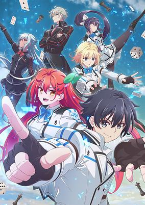

**Studio:** Liden Films &nbsp;|&nbsp; **Episodes:** 13 &nbsp;|&nbsp; **Director:** Tatsuya Shiraishi &nbsp;|&nbsp; **Aired/Released:** April 1 – June 24 &nbsp;|&nbsp; **Genres:** Comedy, Drama, Ecchi, Fantasy, Romance

> In a world of idle gods, humans are forced into brain challenges with them. With three defeats, gods lose their right to challenge, while 10 victories spell human triumph. Fay, determined to achieve the impossible, enters the ultimate test of wits against the gods. Will he defy divinity or is he just another loss in the making?
>
> _Synopsis source: Kitsu_

[Wikipedia](https://en.wikipedia.org/wiki/Gods%27_Games_We_Play) · [Kitsu](https://kitsu.io/anime/kami-wa-game-ni-ueteiru)

---

### Train to the End of the World

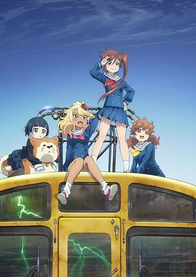

**Studio:** EMT Squared &nbsp;|&nbsp; **Episodes:** 12 &nbsp;|&nbsp; **Director:** Tsutomu Mizushima &nbsp;|&nbsp; **Aired/Released:** April 1 – June 24 &nbsp;|&nbsp; **Genres:** Adventure, Comedy, Science Fiction, Countryside, Post Apocalypse

> The anime's story is set in a town in a not-so-ordinary countryside, where a big and strange occurrence is happening to its residents. But a young girl named Shizuru Chikura has a strong desire to see her lost friend again. Shizuru and three other girls board an abandoned train, and they set out to the outside world, where survival is not certain. What awaits them at the last stop of the "Doomsday Train?"
>
> _Synopsis source: Kitsu_

[Wikipedia](https://en.wikipedia.org/wiki/Train_to_the_End_of_the_World) · [Kitsu](https://kitsu.io/anime/shuumatsu-train-doko-e-iku)

---

### Touken Ranbu Kai: Kyoden Moyuru Honnōji

**Studio:** DOMERICA &nbsp;|&nbsp; **Episodes:** 8 &nbsp;|&nbsp; **Director:** Kazuya Ichikawa &nbsp;|&nbsp; **Aired/Released:** April 2 – May 21

---

### Spice and Wolf: Merchant Meets the Wise Wolf

**Studio:** Passione &nbsp;|&nbsp; **Episodes:** 25 &nbsp;|&nbsp; **Director:** Takeo Takahashi (Chief) Hijiri Sanpei &nbsp;|&nbsp; **Aired/Released:** April 2 – September 24

[Wikipedia](https://en.wikipedia.org/wiki/Spice_and_Wolf)

---

### I Was Reincarnated as the 7th Prince so I Can Take My Time Perfecting My Magical Ability

**Studio:** Tsumugi Akita Animation Lab &nbsp;|&nbsp; **Episodes:** 12 &nbsp;|&nbsp; **Director:** Jin Tamamura &nbsp;|&nbsp; **Aired/Released:** April 2 – June 18 &nbsp;|&nbsp; **Genres:** Adventure, Fantasy, Slice of Life, Comedy, Harem, Magic, Isekai

> The study of magic requires aptitude, effort, and the right bloodline. One sorcerer loved magic, despite lacking the bloodline and aptitude for it, and died wishing he’d spent more time studying in life. He reawakens as Lloyd, the seventh prince of the Kingdom of Saloum, with all his previous memories intact. Blessed with a strong magical bloodline, he uses his gifts to master the study of magic.
>
> _Synopsis source: Kitsu_

[Wikipedia](https://en.wikipedia.org/wiki/I_Was_Reincarnated_as_the_7th_Prince_so_I_Can_Take_My_Time_Perfecting_My_Magical_Ability) · [Kitsu](https://kitsu.io/anime/tensei-shitara-dai-nana-ouji-dattanode-kimamani-majutsu-wo-kiwamemasu)

---

### The Banished Former Hero Lives as He Pleases

**Studio:** Studio Deen Marvy Jack &nbsp;|&nbsp; **Episodes:** 12 &nbsp;|&nbsp; **Director:** Kazuomi Koga &nbsp;|&nbsp; **Aired/Released:** April 2 – June 18 &nbsp;|&nbsp; **Genres:** Action, Adventure, Fantasy, Romance

> "I can finally go search for the peaceful life I've been looking forward to since my past life." Allen, a boy called a failure because he was not blessed with a "Gift" from god, is actually a former hero who still has the memories and powers of his past life?! Using his banishment from his family's duchy as an excuse, Allen is about to start a carefree journey to do whatever he wants when he comes across an attempt on the life of his ex-fiancée...?! The former hero wants to live a relaxing life this time around, but the heroic fantasy life he never wanted is about to begin!
>
> _Synopsis source: Kitsu_

[Wikipedia](https://en.wikipedia.org/wiki/The_Banished_Former_Hero_Lives_as_He_Pleases) · [Kitsu](https://kitsu.io/anime/dekisokonai-to-yobareta-moto-eiyuu-wa-jikka-kara-tsuihou-sareta-node-suki-katte-ni-ikiru-koto-ni-shita)

---

### Chibi Godzilla Raids Again (season 2)

**Studio:** Pie in the Sky &nbsp;|&nbsp; **Episodes:** 52 &nbsp;|&nbsp; **Director:** Taketo Shinkai &nbsp;|&nbsp; **Aired/Released:** April 3 – March 26, 2025 &nbsp;|&nbsp; **Genres:** Kids, Fantasy, Comedy

[Wikipedia](https://en.wikipedia.org/wiki/Chibi_Godzilla_Raids_Again) · [Kitsu](https://kitsu.io/anime/chibi-godzilla-no-gyakushuu)

---

### A Condition Called Love

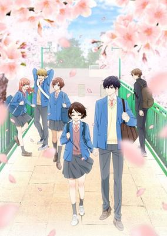

**Studio:** East Fish Studio &nbsp;|&nbsp; **Episodes:** 12 &nbsp;|&nbsp; **Director:** Tomoe Makino &nbsp;|&nbsp; **Aired/Released:** April 4 – June 20 &nbsp;|&nbsp; **Genres:** Shoujo, Drama, Romance

> High school freshman Hotaru Hinase has a vibrant life full of family and friendship, but not much luck in romance. That all changes when she makes a warm gesture to her handsome and heartbroken classmate, Hananoi, leading to him asking her out and her becoming flustered. Witness a girl who grapples with the enigma of love and a boy who is heavy-handed with it.
>
> _Synopsis source: Kitsu_

[Wikipedia](https://en.wikipedia.org/wiki/A_Condition_Called_Love) · [Kitsu](https://kitsu.io/anime/hananoi-kun-to-koi-no-yamai)

---

### Bartender: Glass of God

**Studio:** Liber &nbsp;|&nbsp; **Episodes:** 12 &nbsp;|&nbsp; **Director:** Ryōichi Kuraya &nbsp;|&nbsp; **Aired/Released:** April 4 – June 20

[Wikipedia](https://en.wikipedia.org/wiki/Bartender_(manga))

---

### Laid-Back Camp ( season 3 )

**Studio:** Eight Bit &nbsp;|&nbsp; **Episodes:** 12 &nbsp;|&nbsp; **Director:** Shin Tosaka &nbsp;|&nbsp; **Aired/Released:** April 4 – June 20

[Wikipedia](https://en.wikipedia.org/wiki/Laid-Back_Camp)

---

### Re:Monster

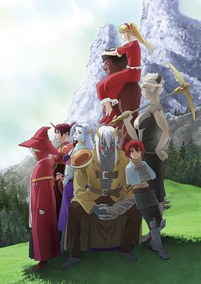

**Studio:** Studio Deen &nbsp;|&nbsp; **Episodes:** 12 &nbsp;|&nbsp; **Director:** Takayuki Inagaki &nbsp;|&nbsp; **Aired/Released:** April 5 – June 21 &nbsp;|&nbsp; **Genres:** Action, Adventure, Fantasy, Isekai

> After meeting an untimely death, Tomokui Kanata is reincarnated as a lowly goblin, but he’s worked up a monstrous appetite. Thanks to his new ability that allows him to grow stronger the more he feeds, his feeble status quickly changes, and he rises to become the goblin leader. With a mix of his past memories, new body, and a strong stomach, he’s taking a bite out of this new fantastical world! (Source: Crunchyroll, edited) The episodes were streamed several days ahead of the TV broadcast on U-NEXT, Anime Houdai, and Crunchyroll beginning on April 2nd, 2024 at 0:00 JST. The regular TV broadcast begins on April 5th, 2024.
>
> _Synopsis source: Kitsu_

[Kitsu](https://kitsu.io/anime/re-monster)

---

### A Salad Bowl of Eccentrics (Salad Bowl of Eccentrics)

**Studio:** SynergySP Studio Comet &nbsp;|&nbsp; **Episodes:** 12 &nbsp;|&nbsp; **Director:** Masafumi Satō &nbsp;|&nbsp; **Aired/Released:** April 5 – June 21 &nbsp;|&nbsp; **Genres:** Comedy, Fantasy, Slice of Life, Isekai, Magic, Detective

> Kaburaya Sosuke, an impoverished detective, met Sarah, a princess from another world with magical powers. Sarah began living with Sosuke, and she quickly adjusted to life in modern Japan. Meanwhile, Livia, a female knight who came from the same world as Sarah, found herself lost and homeless, but surprisingly enjoyed her days here. These two people, who live a positive life despite their situation, began to have an impact on Sosuke and the other oddballs in the neighborhood, including a devilish lawyer, a divorce agent, and a cult leader.
>
> _Synopsis source: Kitsu_

[Wikipedia](https://en.wikipedia.org/wiki/A_Salad_Bowl_of_Eccentrics) · [Kitsu](https://kitsu.io/anime/henjin-no-salad-bowl)

---

### Nijiyon Animation (season 2)

**Studio:** Bandai Namco Filmworks &nbsp;|&nbsp; **Episodes:** 12 &nbsp;|&nbsp; **Director:** Yūya Horiuchi &nbsp;|&nbsp; **Aired/Released:** April 5 – June 21

[Wikipedia](https://en.wikipedia.org/wiki/Love_Live!_Nijigasaki_High_School_Idol_Club)

---

### Astro Note

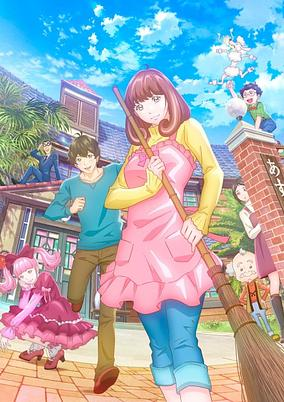

**Studio:** Telecom Animation Film &nbsp;|&nbsp; **Episodes:** 12 &nbsp;|&nbsp; **Director:** Shinji Takamatsu (Chief) Haruki Kasugamori &nbsp;|&nbsp; **Aired/Released:** April 5 – June 21 &nbsp;|&nbsp; **Genres:** Comedy, Romance, Science Fiction, Slice of Life

> Takumi, a gifted chef, was just let go from his job. He lands a gig at an old boarding house called Astro-sou, but hesitates to accept after learning he must also live there full-time. That is until he meets the beautiful and charming caretaker, Mira, and he’s sold. The two begin to work together and their connection deepens. But Mira has a secret: she isn’t from this world!
>
> _Synopsis source: Kitsu_

[Wikipedia](https://en.wikipedia.org/wiki/Astro_Note) · [Kitsu](https://kitsu.io/anime/astro-note)

---

### An Archdemon's Dilemma: How to Love Your Elf Bride

**Studio:** Brain's Base &nbsp;|&nbsp; **Episodes:** 12 &nbsp;|&nbsp; **Director:** Hiroshi Ishiodori &nbsp;|&nbsp; **Aired/Released:** April 5 – June 21 &nbsp;|&nbsp; **Genres:** Action, Fantasy, Romance, Demon, Elf, Magic, Slavery

> Zagan is feared by the masses as an evil sorcerer. Both socially awkward and foulmouthed, he spends his days studying sorcery while beating down any trespassers within his domain. One day he's invited to a dark auction, and what he finds there is an elven slave girl of peerless beauty, Nephy. Having fallen in love at first sight, Zagan uses up his entire fortune to purchase her, but being a poor conversationalist, he has no idea how to properly interact with her. Thus, the awkward cohabitation of a sorcerer who has no idea how to convey his love and his slave who yearns for her master but has no idea how to appeal to him begins.
>
> _Synopsis source: Kitsu_

[Kitsu](https://kitsu.io/anime/maou-no-ore-ga-dorei-elf-wo-yome-ni-shitanda-ga-dou-medereba-ii)

---

### The Irregular at Magic High School (season 3)

**Studio:** Eight Bit &nbsp;|&nbsp; **Episodes:** 13 &nbsp;|&nbsp; **Director:** Jimmy Stone &nbsp;|&nbsp; **Aired/Released:** April 5 – June 28

[Wikipedia](https://en.wikipedia.org/wiki/The_Irregular_at_Magic_High_School)

---

### Wind Breaker

**Studio:** CloverWorks &nbsp;|&nbsp; **Episodes:** 13 &nbsp;|&nbsp; **Director:** Toshifumi Akai &nbsp;|&nbsp; **Aired/Released:** April 5 – June 28 &nbsp;|&nbsp; **Genres:** Delinquent, Action, Comedy, Drama, Shounen, School Life

> Welcome to Furin High School, an institution infamous for its population of brawny brutes who solve every conflict with a show of strength. Some of the students even formed a group, Bofurin, which protects the town. Haruka Sakura, a first-year student who moved in from out of town, is only interested in one thing: fighting his way to the top.
>
> _Synopsis source: Kitsu_

[Wikipedia](https://en.wikipedia.org/wiki/Wind_Breaker_(manga)) · [Kitsu](https://kitsu.io/anime/wind-breaker)

---

### That Time I Got Reincarnated as a Slime (season 3)

**Studio:** Eight Bit &nbsp;|&nbsp; **Episodes:** 24 &nbsp;|&nbsp; **Director:** Atsushi Nakayama &nbsp;|&nbsp; **Aired/Released:** April 5 – September 27

[Wikipedia](https://en.wikipedia.org/wiki/That_Time_I_Got_Reincarnated_as_a_Slime)

---

### Yatagarasu: The Raven Does Not Choose Its Master

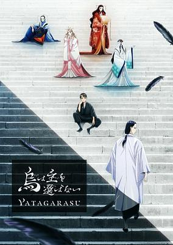

**Studio:** Pierrot &nbsp;|&nbsp; **Episodes:** 20 &nbsp;|&nbsp; **Director:** Yoshiaki Kyōgoku &nbsp;|&nbsp; **Aired/Released:** April 6 – September 21 &nbsp;|&nbsp; **Genres:** Action, Supernatural, Comedy, Drama, Slice of Life, Fantasy, Seinen, Politics

> In the world of flying crow-humans, trouble is brewing... YUKIYA is the lackluster second son of a regional boss in the North House territory. His younger brother has overtaken him in academics. He is no good at sword battle, either. Not that this ever bothers him. So it comes as a shock when this boy, who claims to have no ambition whatsoever, is the one chosen to attend the Imperial Prince in Court--. What awaits YUKIYA and his new master is intrigue, murder, a mysterious drug, and invasion from an unexpected enemy. Can they save the world of Yatagarasu (three-legged crows of Japanese myth)?
>
> _Synopsis source: Kitsu_

[Wikipedia](https://en.wikipedia.org/wiki/Yatagarasu_(novel_series)) · [Kitsu](https://kitsu.io/anime/karasu-wa-aruji-wo-erabanai)

---

### Studio Apartment, Good Lighting, Angel Included

**Studio:** Okuruto Noboru &nbsp;|&nbsp; **Episodes:** 12 &nbsp;|&nbsp; **Director:** Kenta Ōnishi &nbsp;|&nbsp; **Aired/Released:** April 6 – June 15 &nbsp;|&nbsp; **Genres:** Comedy, Fantasy, Slice of Life, Romance, Angel

> Shintarou Tokumitsu is a high schooler living all alone, but things take an unexpected turn when a girl named Towa shows up on his balcony! Not only is she incredibly pure and sweet, but there’s something different about her—something… divine. Just who is Shintarou’s new roommate, and what adorable high jinks lie in store?!
>
> _Synopsis source: Kitsu_

[Wikipedia](https://en.wikipedia.org/wiki/Studio_Apartment,_Good_Lighting,_Angel_Included) · [Kitsu](https://kitsu.io/anime/one-room-hi-atari-futsuu-tenshi-tsuki)

---

### Highspeed Etoile

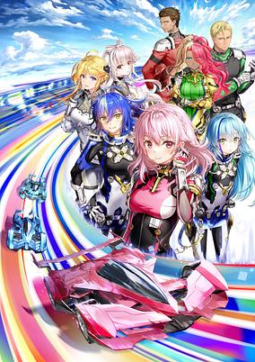

**Studio:** Studio A-Cat &nbsp;|&nbsp; **Episodes:** 12 &nbsp;|&nbsp; **Director:** Keitaro Motonaga &nbsp;|&nbsp; **Aired/Released:** April 6 – June 22 &nbsp;|&nbsp; **Genres:** Sports, Motorsport

> In the near future, a next-generation racing event called NEX Race is announced, changing the world of racing. New technology has made racing at over 500 km/h safe, changing racing on the world stage completely. Rin Rindou, who once dreamed of being a ballet dancer, had given up her dream due to an injury, becoming a NEET and living with her grandmother. However, one day she is suddenly thrown into the world of next-generation racing.
>
> _Synopsis source: Kitsu_

[Wikipedia](https://en.wikipedia.org/wiki/Highspeed_Etoile) · [Kitsu](https://kitsu.io/anime/highspeed-etoile)

---

### The Idolmaster Shiny Colors (season 1)

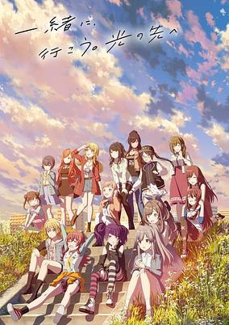

**Studio:** Polygon Pictures &nbsp;|&nbsp; **Episodes:** 12 &nbsp;|&nbsp; **Director:** Mankyū &nbsp;|&nbsp; **Aired/Released:** April 6 – June 22 &nbsp;|&nbsp; **Genres:** Idol, Music

> Note: The series is having a three-part theatrical pre-screening in Japan starting in October 2023. Regular TV broadcast begins in April 2024. • Part 1 releasing theatrically on October 27, 2023. • Part 2 releasing theatrically on November 24, 2023. • Part 3 releasing theatrically on January 5, 2024. - Anilist
>
> _Synopsis source: Kitsu_

[Wikipedia](https://en.wikipedia.org/wiki/The_Idolmaster_Shiny_Colors) · [Kitsu](https://kitsu.io/anime/the-idolm-ster-shiny-colors)

---

### Girls Band Cry

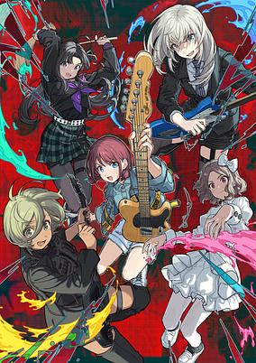

**Studio:** Toei Animation &nbsp;|&nbsp; **Episodes:** 13 &nbsp;|&nbsp; **Director:** Kazuo Sakai &nbsp;|&nbsp; **Aired/Released:** April 6 – June 29 &nbsp;|&nbsp; **Genres:** Music, Musical Band, Slice of Life, Drama

> The main character drops out of high school in her second year, and aims at entering a university while working alone in Tokyo. A girl is betrayed by her friends and doesn't know what to do. Another girl is abandoned by her parents, and tries to survive in the city by doing part-time jobs. This world lets us down all the time. Nothing goes as planned. But we want something that we can continue to like. We believe there's a place where we belong. That's why we sing
>
> _Synopsis source: Kitsu_

[Wikipedia](https://en.wikipedia.org/wiki/Girls_Band_Cry) · [Kitsu](https://kitsu.io/anime/girls-band-cry)

---

### Tonbo! (season 1)

**Studio:** OLM &nbsp;|&nbsp; **Episodes:** 13 &nbsp;|&nbsp; **Director:** Jin Gu Oh &nbsp;|&nbsp; **Aired/Released:** April 6 – June 29

[Wikipedia](https://en.wikipedia.org/wiki/Tonbo!)

---

### Grandpa and Grandma Turn Young Again

**Studio:** Gekkō &nbsp;|&nbsp; **Episodes:** 11 &nbsp;|&nbsp; **Director:** Masayoshi Nishida &nbsp;|&nbsp; **Aired/Released:** April 7 – June 16 &nbsp;|&nbsp; **Genres:** Comedy, Fantasy, Romance

> The story of Jii-san Baa-san Wakagaeru follows Shouzou and Ine, an elderly couple who are living a quiet life in a farming village in Aomori Prefecture. After eating a mysterious apple that they discover on their apple farm, Shozo and Ine spontaneously regain their youth, but even after being reinvigorated they continue to live life at a grandparent-ly pace.
>
> _Synopsis source: Kitsu_

[Wikipedia](https://en.wikipedia.org/wiki/Grandpa_and_Grandma_Turn_Young_Again) · [Kitsu](https://kitsu.io/anime/jii-san-baa-san-wakagaeru)

---

### As a Reincarnated Aristocrat, I'll Use My Appraisal Skill to Rise in the World (season 1) (As a Reincarnated Aristocrat, I’ll Use My Appraisal Skill to Rise in the World)

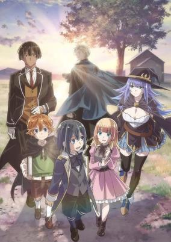

**Studio:** Studio Mother &nbsp;|&nbsp; **Episodes:** 12 &nbsp;|&nbsp; **Director:** Takao Kato &nbsp;|&nbsp; **Aired/Released:** April 7 – June 23 &nbsp;|&nbsp; **Genres:** Adventure, Fantasy, Isekai, Swordplay, Magic

> After thirty-five years of perfectly ordinary life, a run-of-the-mill businessman suddenly drops dead...only to be reborn in another world! Now he must live as Ars Louvent, scion of a minor noble family and wielder of a fabulous skill: Appraisal, the power to perceive the strengths and abilities of others at a glance. He'll need it, too, because there are plenty of problems to solve in the Louvent family's territory! Ars only has one choice: recruit the most talented individuals his skill can find, and rise up to new heights in his brand new world!
>
> _Synopsis source: Kitsu_

[Wikipedia](https://en.wikipedia.org/wiki/As_a_Reincarnated_Aristocrat,_I%27ll_Use_My_Appraisal_Skill_to_Rise_in_the_World) · [Kitsu](https://kitsu.io/anime/tensei-kizoku-kantei-skill-de-nariagaru)

---

### Blue Archive the Animation

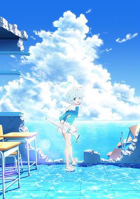

**Studio:** Yostar Pictures Candy Box &nbsp;|&nbsp; **Episodes:** 12 &nbsp;|&nbsp; **Director:** Daigo Yamagishi &nbsp;|&nbsp; **Aired/Released:** April 7 – June 23 &nbsp;|&nbsp; **Genres:** Gunfights, Angel, Action, Science Fiction

> The city's academies are divided into their own districts and are considered mostly independent. The General Student Council acts as governing board to manage the academies as a whole. However, the group's ability to govern has come to halt since the mysterious disappearance of the General Student Council president. Countless issues have begun to surface throughout Kivotos in the absence of the president's leadership. To avoid disaster, the General Student Council requests assistance from the Federal Investigation Club, otherwise known as Schale. In fact, Schale is the city's newest club and the last to be approved before the president's disappearance. To accomplish its task, Schale relies on the guidance of a Sensei who can help them resolve the incidents around Kivotos. (Students are required to carry personal weapons and smart phones! Get a taste of the military action, love, and friendship the Academy City has to offer!)
>
> _Synopsis source: Kitsu_

[Wikipedia](https://en.wikipedia.org/wiki/Blue_Archive) · [Kitsu](https://kitsu.io/anime/blue-archive-the-animation)

---

### Jellyfish Can't Swim in the Night

**Studio:** Doga Kobo &nbsp;|&nbsp; **Episodes:** 12 &nbsp;|&nbsp; **Director:** Ryōhei Takeshita &nbsp;|&nbsp; **Aired/Released:** April 7 – June 23 &nbsp;|&nbsp; **Genres:** Drama, Coming Of Age, Idol, Music, The Arts

> "I want to find what I enjoy." Shibuya, a district overflowing with identity. A girl trying to find herself drifts through Shibuya in the dead of night until a special encounter changes everything. For the first time, the creative activities of unknown young girls will begin—
>
> _Synopsis source: Kitsu_

[Wikipedia](https://en.wikipedia.org/wiki/Jellyfish_Can%27t_Swim_in_the_Night) · [Kitsu](https://kitsu.io/anime/yoru-no-kurage-wa-oyogenai)

---

### The Duke of Death and His Maid (season 3)

**Studio:** J.C.Staff &nbsp;|&nbsp; **Episodes:** 12 &nbsp;|&nbsp; **Director:** Yoshinobu Yamakawa &nbsp;|&nbsp; **Aired/Released:** April 7 – June 23

[Wikipedia](https://en.wikipedia.org/wiki/The_Duke_of_Death_and_His_Maid)

---

### Vampire Dormitory

**Studio:** Studio Blanc &nbsp;|&nbsp; **Episodes:** 12 &nbsp;|&nbsp; **Director:** Nobuyoshi Nagayama &nbsp;|&nbsp; **Aired/Released:** April 7 – June 23 &nbsp;|&nbsp; **Genres:** Romance, Supernatural, Cross Dressing, Vampire, Shoujo

> Mito, who has no family to rely on, lives on the streets, disguised as a boy. Ruka, a vampire, saves her from a perilous situation and makes her an offer: become his subservient thrall from which he can feed whenever he wants, and she can live with him—in the boys' dorm. Because her very existence depends on her secret not being found out, every day is a new danger—to say nothing of that vampire! Meanwhile, Ruka, not knowing Mito's a girl, dotes on her night and day in an attempt to ripen her "disgusting male blood," but when real feelings develop... This dangerous romance between a crossdressing girl and an obsessive vampire begins!
>
> _Synopsis source: Kitsu_

[Wikipedia](https://en.wikipedia.org/wiki/Vampire_Dormitory) · [Kitsu](https://kitsu.io/anime/vampire-danshiryou)

---

### Go! Go! Loser Ranger!

**Studio:** Yostar Pictures &nbsp;|&nbsp; **Episodes:** 12 &nbsp;|&nbsp; **Director:** Keiichi Sato &nbsp;|&nbsp; **Aired/Released:** April 7 – June 30 &nbsp;|&nbsp; **Genres:** Action, Fantasy, Science Fiction, Shounen, Comedy, Superhero

> With their old hideout and bosses wiped out, the surviving Dusters make a secret agreement with the Ranger Force to engage in the weekly Sunday Showdown - one where they will always be defeated. Tired of this charade, Fighter D finally steps up to make a change once and for all!
>
> _Synopsis source: Kitsu_

[Wikipedia](https://en.wikipedia.org/wiki/Go!_Go!_Loser_Ranger!) · [Kitsu](https://kitsu.io/anime/sentai-daishikkaku)

---

### Sound! Euphonium 3

**Studio:** Kyoto Animation &nbsp;|&nbsp; **Episodes:** 13 &nbsp;|&nbsp; **Director:** Tatsuya Ishihara &nbsp;|&nbsp; **Aired/Released:** April 7 – June 30

[Wikipedia](https://en.wikipedia.org/wiki/Sound!_Euphonium)

---

### Tonari no Yōkai-san

**Studio:** Liden Films &nbsp;|&nbsp; **Episodes:** 13 &nbsp;|&nbsp; **Director:** Aimi Yamauchi &nbsp;|&nbsp; **Aired/Released:** April 7 – June 30

[Wikipedia](https://en.wikipedia.org/wiki/My_Neighbor_Yokai)

---

### Himitsu no AiPri

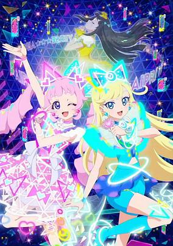

**Studio:** OLM DongWoo A&E &nbsp;|&nbsp; **Director:** Junichi Fujisaku Kentaro Yamaguchi &nbsp;|&nbsp; **Aired/Released:** April 7 – &nbsp;|&nbsp; **Genres:** Music, Idol, Magic

> The main characters, Himari Aozora and Mitsuki Hoshikawa, enter Paradise Private Academy. Himari, who aspires for AIPRI, dreams of making 10,000 friends! But for the shy and anxious Himari, it might be a bit difficult... Himari unexpectedly makes her AIPRI debut!? She has a "secret" she can't even tell her best friend, Mitsuki! But it seems that Mitsuki has a "secret" of her own... Secret-bearers Himari and Mitsuki's AIPRI begins!!
>
> _Synopsis source: Kitsu_

[Wikipedia](https://en.wikipedia.org/wiki/Secret_AiPri) · [Kitsu](https://kitsu.io/anime/himitsu-no-aipri)

---

### Mission: Yozakura Family

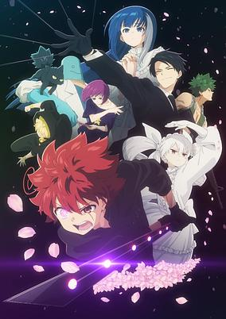

**Studio:** Silver Link &nbsp;|&nbsp; **Episodes:** 27 &nbsp;|&nbsp; **Director:** Mirai Minato &nbsp;|&nbsp; **Aired/Released:** April 7 – October 6 &nbsp;|&nbsp; **Genres:** Action, Comedy, Romance, Shounen

> A family far from ordinary?! High schooler Taiyo Asano, the 'Ultimate Introvert', lost his family in a tragic accident. The only one he could speak to is his childhood friend, Mutsumi Yozakura who harbors a wild secret as the heir to a spy lineage. Her brother, Kyoichiro, a skilled spy, targets Taiyo. To save themselves, Taiyo agrees to marry Mutsumi and join the Yozakura family, embarking on an unprecedented mission!
>
> _Synopsis source: Kitsu_

[Kitsu](https://kitsu.io/anime/yozakura-san-chi-no-daisakusen)

---

### Shinkalion: Change the World

**Studio:** Signal.MD Production I.G &nbsp;|&nbsp; **Episodes:** 39 &nbsp;|&nbsp; **Director:** Kenichiro Komaya &nbsp;|&nbsp; **Aired/Released:** April 7 – February 2, 2025

[Wikipedia](https://en.wikipedia.org/wiki/Shinkansen_Henkei_Robo_Shinkalion)

---

### The Fable

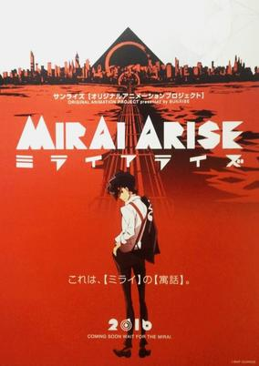

**Studio:** Tezuka Productions &nbsp;|&nbsp; **Episodes:** 25 &nbsp;|&nbsp; **Director:** Ryōsuke Takahashi &nbsp;|&nbsp; **Aired/Released:** April 7 – September 29 &nbsp;|&nbsp; **Genres:** Science Fiction

> The fable of the future.
>
> _Synopsis source: Kitsu_

[Wikipedia](https://en.wikipedia.org/wiki/The_Fable) · [Kitsu](https://kitsu.io/anime/mirai-arise)

---

### Chillin' in Another World with Level 2 Super Cheat Powers

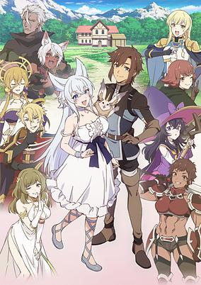

**Studio:** J.C.Staff &nbsp;|&nbsp; **Episodes:** 12 &nbsp;|&nbsp; **Director:** Yoshiaki Iwasaki &nbsp;|&nbsp; **Aired/Released:** April 8 – June 24 &nbsp;|&nbsp; **Genres:** Adventure, Fantasy, Romance, Isekai, Magic, Demon

> Flio is living an ordinary life as a merchant when he’s suddenly transported to Klyrode, an alternate world, as its potential hero. Stuck at level one and lacking abilities, he is banished to a forest where he’s attacked by slime. Defeating the slime, he reaches level two and gains infinite power. Join Flio on his quest for peace in a new world full of unique creatures, demons, and chaos.
>
> _Synopsis source: Kitsu_

[Wikipedia](https://en.wikipedia.org/wiki/Chillin%27_in_Another_World_with_Level_2_Super_Cheat_Powers) · [Kitsu](https://kitsu.io/anime/lv2-kara-cheat-datta-moto-yuusha-kouho-no-mattari-isekai-life)

---

### Mushoku Tensei: Jobless Reincarnation ( season 2, part 2 )

**Studio:** Studio Bind &nbsp;|&nbsp; **Episodes:** 12 &nbsp;|&nbsp; **Director:** Ryōsuke Shibuya &nbsp;|&nbsp; **Aired/Released:** April 8 – July 1

[Wikipedia](https://en.wikipedia.org/wiki/Mushoku_Tensei)

---

### Rinkai!

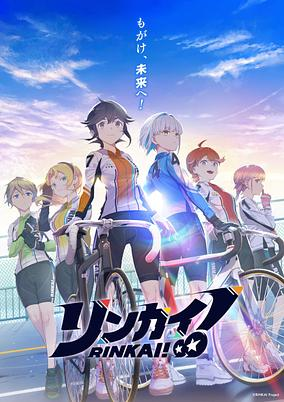

**Studio:** TMS Entertainment &nbsp;|&nbsp; **Episodes:** 12 &nbsp;|&nbsp; **Director:** Takaaki Ishiyama &nbsp;|&nbsp; **Aired/Released:** April 9 – June 25 &nbsp;|&nbsp; **Genres:** Sports, Cycling

> The story centers on the sport of women's cycling, which debuted in Japan shortly after World War II. However, organized competitions folded after just 15 years and laid dormant for several decades. Then the Rinkai! League launched to revive the sport.
>
> _Synopsis source: Kitsu_

[Wikipedia](https://en.wikipedia.org/wiki/Rinkai!) · [Kitsu](https://kitsu.io/anime/rinkai)

---

### Tadaima, Okaeri (Peleliu: Guernica of Paradise)

**Studio:** Studio Deen &nbsp;|&nbsp; **Episodes:** 12 &nbsp;|&nbsp; **Director:** Shinji Ishihira &nbsp;|&nbsp; **Aired/Released:** April 9 – June 25 &nbsp;|&nbsp; **Genres:** Drama, Historical, Military

> Anime adaptation of Kazuyoshi Takeda's Peleliu: Rakuen no Guernica manga. The story follows the daily lives of Japanese soldiers taking part in the Battle of Peleliu during World War II: a high-casualty, months-long campaign. The main character, Tamaru, dreams of returning home to become a mangaka, and sees their island outpost as a wild paradise that can one day be used as a setting for one of his stories. Most of his comrades, however, are prepared for the more realistic scenario - that they will not be leaving Peleliu alive.
>
> _Synopsis source: Kitsu_

[Wikipedia](https://en.wikipedia.org/wiki/Welcome_Home_(manga)) · [Kitsu](https://kitsu.io/anime/peleliu-rakuen-no-guernica)

---

### Unnamed Memory (season 1)

**Studio:** ENGI &nbsp;|&nbsp; **Episodes:** 12 &nbsp;|&nbsp; **Director:** Kazuya Miura &nbsp;|&nbsp; **Aired/Released:** April 9 – June 25 &nbsp;|&nbsp; **Genres:** Adventure, Fantasy, Romance, Action, Magic, Time Travel, Demon, Parallel Universe, Drama, Comedy

> "My wish as champion is for you to descend the tower and be my wife." Seeking to end a curse thwarting his lineage, Prince Oscar sets out on a quest that leads him to a powerful and beautiful witch, Tinasha, and he demands a unique bargain: marriage. Though unenthused by the proposal, she agrees to stay in his castle for a year while researching the spell cast upon him. But beneath her beauty lies a lifetime of dark secrets that soon come to light.
>
> _Synopsis source: Kitsu_

[Wikipedia](https://en.wikipedia.org/wiki/Unnamed_Memory) · [Kitsu](https://kitsu.io/anime/unnamed-memory)

---

### KonoSuba (season 3)

**Studio:** Drive &nbsp;|&nbsp; **Episodes:** 11 &nbsp;|&nbsp; **Director:** Takaomi Kanasaki (Chief) Yujiro Abe &nbsp;|&nbsp; **Aired/Released:** April 10 – June 19

[Wikipedia](https://en.wikipedia.org/wiki/KonoSuba)

---

### Date A Live V

**Studio:** Geek Toys &nbsp;|&nbsp; **Episodes:** 12 &nbsp;|&nbsp; **Director:** Jun Nakagawa &nbsp;|&nbsp; **Aired/Released:** April 10 – June 26

[Wikipedia](https://en.wikipedia.org/wiki/Date_A_Live)

---

### Mysterious Disappearances

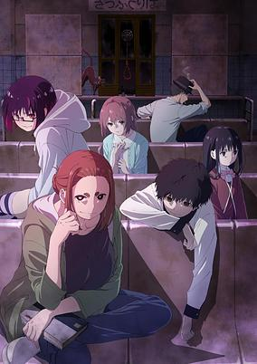

**Studio:** Zero-G &nbsp;|&nbsp; **Episodes:** 12 &nbsp;|&nbsp; **Director:** Tomomi Mochizuki &nbsp;|&nbsp; **Aired/Released:** April 10 – June 26 &nbsp;|&nbsp; **Genres:** Ecchi, Mystery, Romance, Ghost, Demon, Seinen

> Sumireko Ogawa’s dream of becoming a novelist is reinvigorated with new rumors of mystical incidents. Now a clerk at a bookstore, she enlists her young coworker, Ren Adashino, to investigate urban legends, black magic, and ghost stories across the city. Sumireko has a knack for triggering magical events, and Ren has a dark secret of his own. Will they survive their investigation unscathed?
>
> _Synopsis source: Kitsu_

[Wikipedia](https://en.wikipedia.org/wiki/Mysterious_Disappearances) · [Kitsu](https://kitsu.io/anime/kaii-to-otome-to-kamikakushi)

---

### The Many Sides of Voice Actor Radio

**Studio:** Connect &nbsp;|&nbsp; **Episodes:** 12 &nbsp;|&nbsp; **Director:** Hideki Tachibana &nbsp;|&nbsp; **Aired/Released:** April 10 – June 26

[Wikipedia](https://en.wikipedia.org/wiki/The_Many_Sides_of_Voice_Actor_Radio)

---

### Oblivion Battery

**Studio:** MAPPA &nbsp;|&nbsp; **Episodes:** 12 &nbsp;|&nbsp; **Director:** Makoto Nakazono &nbsp;|&nbsp; **Aired/Released:** April 10 – July 3 &nbsp;|&nbsp; **Genres:** Comedy, Sports, Baseball, Shounen

> The story of Bouyaku Battery follows Haruka Kiyomine and Kei Kaname, a pair of young baseball players who set the field afire as an unstoppable pitcher / catcher battery in middle school. Although they were scouted by elite sports schools all over Japan, the two instead enroll in an ordinary high school in Tokyo, because Kei is suffering from amnesia and his athletic skills have reverted to the level of a rank amateur.
>
> _Synopsis source: Kitsu_

[Wikipedia](https://en.wikipedia.org/wiki/Oblivion_Battery) · [Kitsu](https://kitsu.io/anime/boukyaku-battery-tv)

---

### Viral Hit

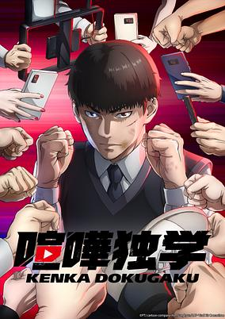

**Studio:** Okuruto Noboru &nbsp;|&nbsp; **Episodes:** 12 &nbsp;|&nbsp; **Director:** Masakazu Hishida &nbsp;|&nbsp; **Aired/Released:** April 11 – June 27 &nbsp;|&nbsp; **Genres:** Action, Comedy, Martial Arts, Delinquent

> Scrawny high school student Hobin Yu is probably the last guy you’d expect to star in a NewTube channel that revolves around fighting. But after following some advice from a mysterious NewTube channel, Hobin is soon knocking out guys stronger than him and raking in more money than he could have ever dreamed of. Can Hobin keep this up, or will he eventually meet his match?
>
> _Synopsis source: Kitsu_

[Wikipedia](https://en.wikipedia.org/wiki/Viral_Hit) · [Kitsu](https://kitsu.io/anime/kenka-dokugaku)

---

### The Misfit of Demon King Academy ( season 2, part 2 )

**Studio:** Silver Link &nbsp;|&nbsp; **Episodes:** 12 &nbsp;|&nbsp; **Director:** Shin Oonuma (Chief) Masafumi Tamura &nbsp;|&nbsp; **Aired/Released:** April 12 – July 25

[Wikipedia](https://en.wikipedia.org/wiki/The_Misfit_of_Demon_King_Academy)

---

### Black Butler: Public School Arc

**Studio:** CloverWorks &nbsp;|&nbsp; **Episodes:** 11 &nbsp;|&nbsp; **Director:** Kenjirou Okada &nbsp;|&nbsp; **Aired/Released:** April 13 – June 22

[Wikipedia](https://en.wikipedia.org/wiki/Black_Butler)

---

### Kaiju No. 8

**Studio:** Production I.G &nbsp;|&nbsp; **Episodes:** 12 &nbsp;|&nbsp; **Director:** Shigeyuki Miya Tomomi Kamiya &nbsp;|&nbsp; **Aired/Released:** April 13 – June 29 &nbsp;|&nbsp; **Genres:** Action, Adventure, Science Fiction, Shounen, Japan, Comedy

> In a world plagued by creatures known as Kaiju, Kafka Hibino aspired to enlist in The Defense Force. He makes a promise to enlist with his childhood friend, Mina Ashiro. Soon, life takes them in separate ways. While employed cleaning up after Kaiju battles, Kafka meets Reno Ichikawa. Reno's determination to join The Defense Force reawakens Kafka's promise to join Mina and protect humanity.
>
> _Synopsis source: Kitsu_

[Wikipedia](https://en.wikipedia.org/wiki/Kaiju_No._8) · [Kitsu](https://kitsu.io/anime/kaijuu-8-gou)

---

### Whisper Me a Love Song

**Studio:** Cloud Hearts Yokohama Animation Laboratory &nbsp;|&nbsp; **Episodes:** 12 &nbsp;|&nbsp; **Director:** Akira Mano &nbsp;|&nbsp; **Aired/Released:** April 14 – December 29 &nbsp;|&nbsp; **Genres:** Drama, Romance, Shoujo Ai, Coming Of Age, School Life, School Clubs, High School, Music

> Bubbly, energetic first-year high school student Himari falls head over heels for her senpai Yori after hearing her band perform on the first day of school. Himari tells Yori she just loves her, and to Himari's surprise, Yori says she loves Himari back! But when Himari realizes that she and her senpai are feeling two different kinds of love, she begins to ask herself what "love" really means...
>
> _Synopsis source: Kitsu_

[Wikipedia](https://en.wikipedia.org/wiki/Whisper_Me_a_Love_Song) · [Kitsu](https://kitsu.io/anime/sasayaku-you-ni-koi-wo-utau)

---

### The New Gate

**Studio:** Cloud Hearts Yokohama Animation Laboratory &nbsp;|&nbsp; **Episodes:** 12 &nbsp;|&nbsp; **Director:** Tamaki Nakatsu &nbsp;|&nbsp; **Aired/Released:** April 14 – June 30

[Wikipedia](https://en.wikipedia.org/wiki/The_New_Gate_(novel_series))

---

### My Hero Academia ( season 7 )

**Studio:** Bones &nbsp;|&nbsp; **Episodes:** 21 &nbsp;|&nbsp; **Director:** Kenji Nagasaki (Chief) Naomi Nakayama &nbsp;|&nbsp; **Aired/Released:** May 4 – October 12

[Wikipedia](https://en.wikipedia.org/wiki/My_Hero_Academia)

---

### Demon Slayer: Kimetsu no Yaiba – Hashira Training Arc (Demon Slayer: Kimetsu no Yaiba - Hashira Training Arc)

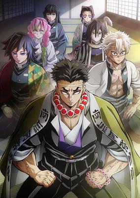

**Studio:** Ufotable &nbsp;|&nbsp; **Episodes:** 8 &nbsp;|&nbsp; **Director:** Haruo Sotozaki &nbsp;|&nbsp; **Aired/Released:** May 12 – June 30 &nbsp;|&nbsp; **Genres:** Shounen, Action, Demon, Swordplay, Drama, Fantasy, Historical

> The members of the Demon Slayer Corps and their highest-ranking swordsmen, the Hashira. In preparation for the forthcoming final battle against Muzan Kibutsuji, the Hashira Training commences. While each carries faith and determination within their hearts, Tanjiro and the Hashira enter a new story. (Source: Crunchyroll) Notes: • The first episode has a runtime of ~1 hour and received an early premiere in cinemas as part of a special screening alongside the final episode of Kimetsu no Yaiba: Katanakaji no Sato-hen.
>
> _Synopsis source: Kitsu_

[Kitsu](https://kitsu.io/anime/Kimetsu-no-Yaiba-Hashira-Geikohen)

---

### Shy (season 2)

**Studio:** Eight Bit &nbsp;|&nbsp; **Episodes:** 12 &nbsp;|&nbsp; **Director:** Masaomi Andō &nbsp;|&nbsp; **Aired/Released:** July 2 – September 24

[Wikipedia](https://en.wikipedia.org/wiki/Shy_(manga))

---

### My Wife Has No Emotion

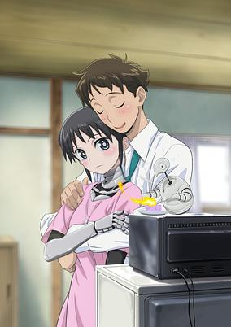

**Studio:** Tezuka Productions &nbsp;|&nbsp; **Episodes:** 12 &nbsp;|&nbsp; **Director:** Fumihiro Yoshimura &nbsp;|&nbsp; **Aired/Released:** July 2 – September 17 &nbsp;|&nbsp; **Genres:** Robot, Science Fiction, Romance, Comedy, Slice of Life

> Takuma is a single guy who does nothing but go to work and come home. Too tired to do chores, he decides to get a robot to cook and keep house. “Mina-chan” is such a good housekeeper, Takuma jokes that she should become his wife. Mina takes Takuma’s joke seriously, and slowly the two start doing more things together, like having a picnic outside. As time goes by, Takuma starts to fall for Mina, but can a human and a robot ever have an equal, loving relationship? (Source: Seven Seas Entertainment) Note: Boku no Tsuma wa Kanjou ga Nai was streamed 3 days in advance of the TV broadcast on ABEMA, dAnimestore, and Crunchyroll beginning June 29, 2024. Regular broadcasting began on July 2, 2024.
>
> _Synopsis source: Kitsu_

[Wikipedia](https://en.wikipedia.org/wiki/My_Wife_Has_No_Emotion) · [Kitsu](https://kitsu.io/anime/boku-no-tsuma-wa-kanjou-ga-nai)

---

### The Ossan Newbie Adventurer, Trained to Death by the Most Powerful Party, Became Invincible

**Studio:** Yumeta Company &nbsp;|&nbsp; **Episodes:** 12 &nbsp;|&nbsp; **Director:** Shin Katagai &nbsp;|&nbsp; **Aired/Released:** July 2 – September 24 &nbsp;|&nbsp; **Genres:** Action, Adventure, Comedy, Fantasy, Magic, Swordplay, Elf, Slapstick

> "Why should it matter how old you are if you want to start something new?" The strongest guy around, who also happens to be middle-aged, strives to be an adventurer! Everyone seems to think you should pursue your dreams while you're still young, but there's one man who just can't give up. In a world where most people who become adventurers do so in their teens, a guild employee in his thirties, Rick Gladiator, seeks to become an adventurer instead. After receiving unimaginably brutal training from the legendary party renowned as the strongest on the continent, Orichalcum Fist, he ends up with combat abilities worthy of S-rank status despite starting out as an F-rank rookie!
>
> _Synopsis source: Kitsu_

[Wikipedia](https://en.wikipedia.org/wiki/The_Ossan_Newbie_Adventurer) · [Kitsu](https://kitsu.io/anime/shinmai-ossan-bouken-sha-saikyou-party-ni-shinu-hodo-kitaerarete-muteki-ni-naru)

---

### Alya Sometimes Hides Her Feelings in Russian

**Studio:** Doga Kobo &nbsp;|&nbsp; **Episodes:** 12 &nbsp;|&nbsp; **Director:** Ryota Itoh &nbsp;|&nbsp; **Aired/Released:** July 3 – September 18 &nbsp;|&nbsp; **Genres:** Comedy, Romance, Slice of Life, School Life, Ecchi

> Alisa Mikhailovna Kujou is Seiren Private Academy’s “solitary princess.” She’s a half-Russian beauty with silver hair, at the top of her class, student council accountant, and…completely unapproachable. For some reason, she’s also taken on the responsibility of reprimanding the slacker who sits next to her in class. Masachika Kuze is constantly frustrating her by falling asleep, forgetting his textbooks, and just being an overall unexemplary student. Or at least, that’s how it looks from the outside. She may put on a tough act, but she doesn’t mind Masachika as much as others would think. She even lets him call her by her nickname, Alya. Anyone hearing the comments she mutters in Russian under her breath might know how she really feels, but since none of her classmates understand the language, she’s free to say whatever she likes! Except…there is one person who knows what she’s saying. Masachika eavesdrops on her embarrassing revelations, pretending to be clueless, all the while wondering what her flirtatious comments actually mean!
>
> _Synopsis source: Kitsu_

[Wikipedia](https://en.wikipedia.org/wiki/Alya_Sometimes_Hides_Her_Feelings_in_Russian) · [Kitsu](https://kitsu.io/anime/tokidoki-bosotto-russiago-de-dereru-tonari-no-alya-san)

---

### Oshi no Ko (season 2) (Oshi no Ko)

**Studio:** Doga Kobo &nbsp;|&nbsp; **Episodes:** 13 &nbsp;|&nbsp; **Director:** Daisuke Hiramaki &nbsp;|&nbsp; **Aired/Released:** July 3 – October 6 &nbsp;|&nbsp; **Genres:** Drama, Idol, Music, Mystery, Performance, Psychological, Revenge, Slice of Life, The Arts, Supernatural, Working Life

> When a pregnant young starlet appears in Gorou Amemiya’s countryside medical clinic, the doctor takes it upon himself to safely (and secretly) deliver Ai Hoshino’s child so she can make a scandal-free return to the stage. But no good deed goes unpunished, and on the eve of her delivery, he finds himself slain at the hands of Ai’s deluded stalker — and subsequently reborn as Ai’s child, Aquamarine Hoshino! The glitz and glamor of showbiz hide the dark underbelly of the entertainment industry, threatening to dull the shine of his favorite star. Can he help his new mother rise to the top of the charts? And what will he do when unthinkable disaster strikes? (Source: HIDIVE) Note: Episode 1【推しの子】Mother and Children was pre-screened in advance in Japanese theaters on March 17, 2023. The regular TV broadcast begins on April 12, 2023. The first episode has an extended runtime of ~90 minutes.
>
> _Synopsis source: Kitsu_

[Wikipedia](https://en.wikipedia.org/wiki/Oshi_no_Ko_(2023_TV_series)) · [Kitsu](https://kitsu.io/anime/oshi-no-ko)

---

### Tasūketsu: Fate of the Majority

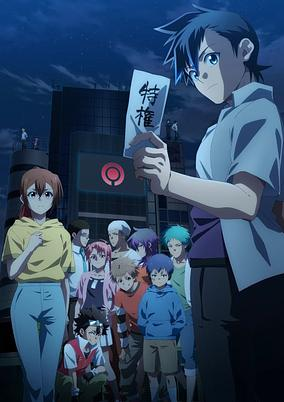

**Studio:** Satelight &nbsp;|&nbsp; **Episodes:** 24 &nbsp;|&nbsp; **Director:** Tatsuo Sato &nbsp;|&nbsp; **Aired/Released:** July 3 – December 25 &nbsp;|&nbsp; **Genres:** Action, Mystery, Thriller, Battle Royale, Super Power

> Saneatsu Narita finds himself in a game of survival as half of the human population disappears each night! The game began suddenly. It was "Tasuketsu", a brutal survival game in which the majority is eliminated. In order to fight back against the immensely powerful emperor masterminding the game, young men and women create their own futures using the mysterious special ability known as "Special Right."
>
> _Synopsis source: Kitsu_

[Kitsu](https://kitsu.io/anime/tasuuketsu)

---

### The Strongest Magician in the Demon Lord's Army Was a Human

**Studio:** Studio A-Cat &nbsp;|&nbsp; **Episodes:** 12 &nbsp;|&nbsp; **Director:** Norihiko Nagahama &nbsp;|&nbsp; **Aired/Released:** July 3 – September 18

[Wikipedia](https://en.wikipedia.org/wiki/The_Strongest_Magician_in_the_Demon_Lord%27s_Army_Was_a_Human)

---

### Days with My Stepsister (Days with my Step Sister)

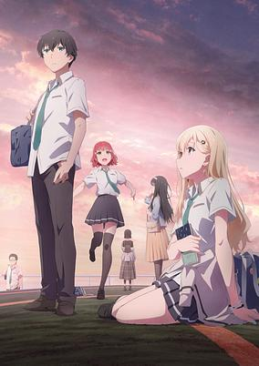

**Studio:** Studio Deen &nbsp;|&nbsp; **Episodes:** 12 &nbsp;|&nbsp; **Director:** Souta Ueno &nbsp;|&nbsp; **Aired/Released:** July 4 – September 19 &nbsp;|&nbsp; **Genres:** Romance, Slice of Life, Comedy, Psychological

> From classmates to brother and sister, living under the same roof. After his father's remarriage, Asamura Yuuta ends up getting a new stepsister, coincidentally the number one beauty of the school year, Ayase Saki. Having learned important values when it comes to man-woman relationships through the previous ones of their parents, they promise each other not to be too close, not to be too opposing, and to merely keep a vague and comfortable distance. On one hand, Saki, who has worked in solitude for the sake of her family, doesn't know how to properly rely on others, whereas Yuta is unsure of how to really treat her. Standing on fairly equal ground, these two slowly learn the comfortable sensation of living together. Their relationship slowly evolves from being strangers the more the days pass. Eventually, this could end up in a story about love for all we know.
>
> _Synopsis source: Kitsu_

[Wikipedia](https://en.wikipedia.org/wiki/Days_with_My_Stepsister) · [Kitsu](https://kitsu.io/anime/gimai-seikatsu)

---

### Red Cat Ramen

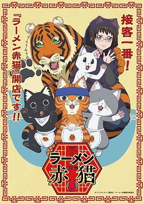

**Studio:** E&H Production &nbsp;|&nbsp; **Episodes:** 12 &nbsp;|&nbsp; **Director:** Hisatoshi Shimizu &nbsp;|&nbsp; **Aired/Released:** July 4 – September 19 &nbsp;|&nbsp; **Genres:** Cooking, Comedy, Fantasy, Slice of Life, Anthropomorphism, Shounen

> Meet Tamako, who’s found her way into an interview at a ramen shop run solely by cats. When the feline manager asks if she likes cats, Tamako admits that she’s actually more of a dog person...only to be hired on the spot! But her job description isn’t quite what she expects — rather than serving ramen, she’s now a dedicated cat caretaker...?!
>
> _Synopsis source: Kitsu_

[Wikipedia](https://en.wikipedia.org/wiki/Red_Cat_Ramen) · [Kitsu](https://kitsu.io/anime/ramen-aka-neko)

---

### Twilight Out of Focus

**Studio:** Studio Deen &nbsp;|&nbsp; **Episodes:** 12 &nbsp;|&nbsp; **Director:** Toshinori Watanabe &nbsp;|&nbsp; **Aired/Released:** July 4 – September 19 &nbsp;|&nbsp; **Genres:** Romance, Shounen Ai, Drama, School Clubs

> Second-years Mao Tsuchiya and Hisashi Ootomo make three promises: 1) That Mao will never tell anyone that Hisashi is gay and has a boyfriend, 2) That Hisashi will never think of Mao "in that way," and 3) That they'll always knock before entering, in case someone is having some "private time." The two's ground rules should ensure a peaceful life together in their dorm, but life is never as simple as it should be, and some things are not so easily promised...
>
> _Synopsis source: Kitsu_

[Wikipedia](https://en.wikipedia.org/wiki/Twilight_Out_of_Focus) · [Kitsu](https://kitsu.io/anime/tasogare-outfocus)

---

### 2.5 Dimensional Seduction

**Studio:** J.C.Staff &nbsp;|&nbsp; **Episodes:** 24 &nbsp;|&nbsp; **Director:** Hideki Okamoto &nbsp;|&nbsp; **Aired/Released:** July 5 – December 13 &nbsp;|&nbsp; **Genres:** Comedy, Ecchi, Romance, Slice of Life, School Clubs, School Life, Harem

> Okumura, president of his school’s manga club, prefers 2D character Liliel over real girls. When Ririsa, a cosplay enthusiast and Lilliel fan, joins the club and asks Okumura to become her photographer, the line between 2D and 3D blurs.
>
> _Synopsis source: Kitsu_

[Wikipedia](https://en.wikipedia.org/wiki/2.5_Dimensional_Seduction) · [Kitsu](https://kitsu.io/anime/2-5-jigen-no-ririsa)

---

### Failure Frame: I Became the Strongest and Annihilated Everything with Low-Level Spells

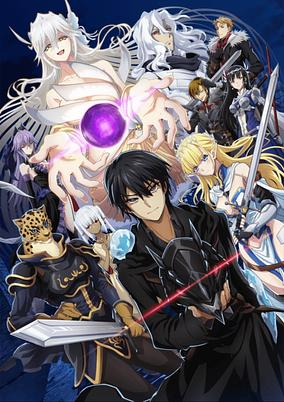

**Studio:** Seven Arcs &nbsp;|&nbsp; **Episodes:** 12 &nbsp;|&nbsp; **Director:** Michio Fukuda &nbsp;|&nbsp; **Aired/Released:** July 5 – September 27 &nbsp;|&nbsp; **Genres:** Action, Adventure, Drama, Fantasy, Isekai, Revenge

> Touka Mimori and his classmates are abruptly catapulted into a fantasy world, summoned by the resident goddess to serve as heroes. The good news? Most of the students display amazing skills upon arrival! The bad? Mimori is the worst of the lot, bottoming out at a measly E-rank. Incensed, the goddess tosses him into a dungeon to die–but it turns out that Mimori’s skills aren’t so much worthless as they are abnormal. Abnormally powerful, perhaps!
>
> _Synopsis source: Kitsu_

[Wikipedia](https://en.wikipedia.org/wiki/Failure_Frame) · [Kitsu](https://kitsu.io/anime/hazure-waku-no-joutai-ijou-skill-de-saikyou-ni-natta-ore-ga-subete-wo-juurin-suru-made)

---

### I Parry Everything: What Do You Mean I'm the Strongest? I'm Not Even an Adventurer Yet!

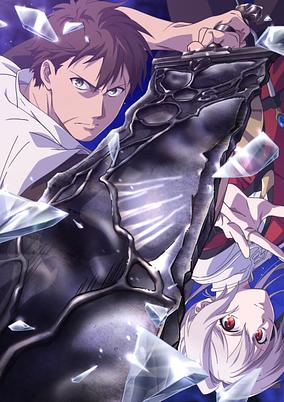

**Studio:** OLM &nbsp;|&nbsp; **Episodes:** 12 &nbsp;|&nbsp; **Director:** Dai Fukuyama &nbsp;|&nbsp; **Aired/Released:** July 5 – September 20 &nbsp;|&nbsp; **Genres:** Action, Adventure, Fantasy, Swordplay, Magic, Coming Of Age

> The Kingdom of Clays faces a dire crisis: an assassination attempt has just been made on its own Princess Lynneburg, and its neighboring countries eye the aftermath like starving vultures, plotting the Kingdom’s downfall. The ensuing conflict will shape the face of the continent for centuries to come...but Noor doesn’t have a clue about any of that! Having freshly arrived at the royal capital after over a decade of rigorous, isolated training at his mountain home, he’s dead set on achieving his childhood dream of becoming an adventurer, even if the only skills he possesses are useless ones. Sure, he can [Parry] thousands of swords in the span of a single breath, but everybody knows you need more than that if you want to be an adventurer! Our hero’s road to making his dream come true will be long(?) and arduous(?)—but if there’s one thing Noor’s not afraid of, it’s some good ol’ fashioned hard work!
>
> _Synopsis source: Kitsu_

[Wikipedia](https://en.wikipedia.org/wiki/I_Parry_Everything) · [Kitsu](https://kitsu.io/anime/ore-wa-subete-wo-parry-suru-gyaku-kanchigai-no-sekai-saikyou-wa-boukensha-ni-naritai)

---

### Nier: Automata Ver1.1a (part 2)

**Studio:** A-1 Pictures &nbsp;|&nbsp; **Episodes:** 12 &nbsp;|&nbsp; **Director:** Ryouji Masuyama &nbsp;|&nbsp; **Aired/Released:** July 5 – September 27 &nbsp;|&nbsp; **Genres:** Action, Drama, Science Fiction, Robot, Fantasy, Psychological

> The second half of NieR:Automata Ver1.1a The year 11954. YoRHa Soldiers 2B and 9S are newly dispatched to Earth to carry out and support the 243rd Descent Operation. There, they succeed in destroying the machine lifeform core units, Adam and Eve. With the annihilation of these enemies, the Army of Humanity takes this chance to end this long-lasting war and decides on an all-out attack against the machine lifeforms. This is a record of the battles and hopes of Androids and the fate which dictates them all… As war rages on, Unit 2B and others like her question their role. Reclaiming the planet will take sacrifice, but how much more can they give, and is humanity worth the cost?
>
> _Synopsis source: Kitsu_

[Kitsu](https://kitsu.io/anime/nier-automata-ver1-1a-part-2)

---

### Pseudo Harem

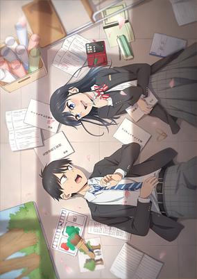

**Studio:** Nomad &nbsp;|&nbsp; **Episodes:** 12 &nbsp;|&nbsp; **Director:** Toshihiro Kikuchi &nbsp;|&nbsp; **Aired/Released:** July 5 – September 20 &nbsp;|&nbsp; **Genres:** Comedy, Romance, Slice of Life, School Clubs, School Life, High School, Parody

> Eiji Kitahama joins the drama club with dreams of having a harem like the ones from his favorite manga. Rin Nanakura, an underclassman, finds herself crushing hard on Eiji and tries on different personas in his presence to win him over. No matter how she acts, one thing is certain—her feelings for Eiji continue to grow stronger. Will she ever be able to tell him the truth and be herself?
>
> _Synopsis source: Kitsu_

[Wikipedia](https://en.wikipedia.org/wiki/Pseudo_Harem) · [Kitsu](https://kitsu.io/anime/giji-harem)

---

### Senpai Is an Otokonoko

**Studio:** Project No.9 &nbsp;|&nbsp; **Episodes:** 12 &nbsp;|&nbsp; **Director:** Shinsuke Yanagi &nbsp;|&nbsp; **Aired/Released:** July 5 – September 27 &nbsp;|&nbsp; **Genres:** Comedy, Drama, Romance, Cross Dressing, Coming Of Age, Gender Bender, Super Deformed

> Can true love really overcome any obstacles? Saki, a high school student, confesses her feelings to Makoto. Taken aback, Makoto reveals his secret, but the sudden discovery doesn’t seem to bother Saki who is already head over heels for him. After being rejected, Saki asks Ryuji, Makoto’s childhood friend, for some advice on how to win his heart. A love triangle unfolds when Ryuji realizes that he might also have some feelings for his old friend.
>
> _Synopsis source: Kitsu_

[Wikipedia](https://en.wikipedia.org/wiki/Senpai_Is_an_Otokonoko) · [Kitsu](https://kitsu.io/anime/senpai-wa-otokonoko)

---

### The Café Terrace and Its Goddesses (season 2) (Goddess Café Terrace)

**Studio:** Tezuka Productions &nbsp;|&nbsp; **Episodes:** 12 &nbsp;|&nbsp; **Director:** Satoshi Kuwabara &nbsp;|&nbsp; **Aired/Released:** July 5 – September 20 &nbsp;|&nbsp; **Genres:** Comedy, Ecchi, Romance, Maid, Harem, Working Life

> Hayato Kasukabe has been accepted to Tokyo U on his first try. Receiving news of his grandmother's death, he returns to his childhood home, Café Terrace Familia, for the first time in three years to find five strange girls there who claim to be "Grandma's Family"! Hayato's unexpected life in a seaside town with these five girls of fate begins here!
>
> _Synopsis source: Kitsu_

[Wikipedia](https://en.wikipedia.org/wiki/The_Caf%C3%A9_Terrace_and_Its_Goddesses) · [Kitsu](https://kitsu.io/anime/megami-no-cafe-terrace)

---

### A Nobody's Way Up to an Exploration Hero (A Nobody's Way Up to an Exploration Hero LV)

**Studio:** Gekkō &nbsp;|&nbsp; **Episodes:** 12 &nbsp;|&nbsp; **Director:** Tomoki Kobayashi &nbsp;|&nbsp; **Aired/Released:** July 6 – September 21 &nbsp;|&nbsp; **Genres:** Action, Fantasy, Adventure

> Kaito Takagi is a low status high schooler. A background mob character, you might say. He is just a low-level explorer who hunts slimes every day in the dungeons that appeared all around Japan, earning pocket money while admiring his childhood friend, the class queen, from afar. One day, a golden slime he had never seen appears before him. After he defeats it, it drops an extremely rare item, worth hundreds of millions, a card that can summon mythical beings!! After he decides to activate the summon, a warrior maiden with unparalleled beauty appears. Rise above the mob, Kaito! A modern battle fantasy story has begun!
>
> _Synopsis source: Kitsu_

[Wikipedia](https://en.wikipedia.org/wiki/A_Nobody%27s_Way_Up_to_an_Exploration_Hero) · [Kitsu](https://kitsu.io/anime/mob-kara-hajimaru-tansaku-eiyuutan)

---

### Dahlia in Bloom (Dahlia in Bloom: Crafting a Fresh Start with Magical Tools)

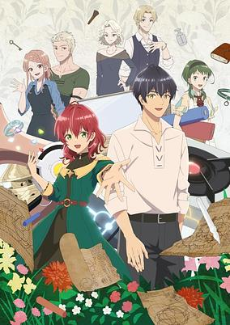

**Studio:** Typhoon Graphics Imagica Infos &nbsp;|&nbsp; **Episodes:** 12 &nbsp;|&nbsp; **Director:** Yōsuke Kubo &nbsp;|&nbsp; **Aired/Released:** July 6 – September 21 &nbsp;|&nbsp; **Genres:** Comedy, Fantasy, Romance, Isekai, Magic, Shoujo, Working Life

> After dying of overwork in Japan, Dahlia is reborn into a world filled with magic. Raised by a master of magical toolmaking, she develops a passion for the craft and becomes engaged to her father’s apprentice. Before her father can see her wed, however, he suddenly passes away. As if this weren’t enough, on the day before their wedding, her fiancé announces that he’s in love—but not with her! Dahlia finally realizes she needs to live for herself. She vows to be her own woman from now on and devote herself to her craft, even if it’s not quite the quiet life she was hoping for! From a chance encounter with a knight to starting her own company, there are challenges aplenty on the horizon. But this young craftswoman is no longer a shrinking violet—she’s Dahlia, and she’s ready to bloom.
>
> _Synopsis source: Kitsu_

[Wikipedia](https://en.wikipedia.org/wiki/Dahlia_in_Bloom) · [Kitsu](https://kitsu.io/anime/madougushi-dahlia-wa-utsumukanai)

---

### Dungeon People

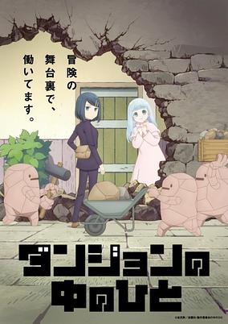

**Studio:** OLM &nbsp;|&nbsp; **Episodes:** 12 &nbsp;|&nbsp; **Director:** Sayaka Yamai &nbsp;|&nbsp; **Aired/Released:** July 6 – September 28 &nbsp;|&nbsp; **Genres:** Adventure, Fantasy, Comedy

> Clay was trained by her father to be an expert member of the thieves’ guild. Since her father disappeared three years ago, she’s been using her skills to search for him in a dungeon filled with goblins, a Minotaur, and all manner of other dangerous creatures. When Clay reaches deeper than anyone ever has before, she meets the caretaker of the dungeon. To her surprise, Clay is invited to join the staff! And thus begins Clay’s new job–to learn the inner workings and behind-the-scenes secrets of the dungeon from the inside.
>
> _Synopsis source: Kitsu_

[Wikipedia](https://en.wikipedia.org/wiki/Dungeon_People) · [Kitsu](https://kitsu.io/anime/dungeon-no-naka-no-hito)

---

### Grendizer U

**Studio:** Gaina &nbsp;|&nbsp; **Episodes:** 13 &nbsp;|&nbsp; **Director:** Mitsuo Fukuda (Chief) Shun Kudō &nbsp;|&nbsp; **Aired/Released:** July 6 – September 28

[Wikipedia](https://en.wikipedia.org/wiki/Grendizer)

---

### Quality Assurance in Another World

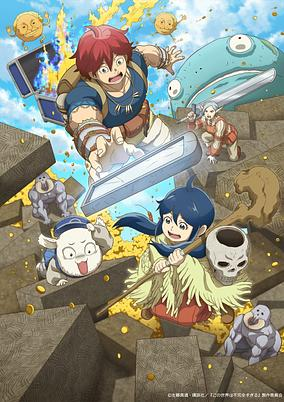

**Studio:** 100studio Studio Palette &nbsp;|&nbsp; **Episodes:** 13 &nbsp;|&nbsp; **Director:** Kei Umabiki &nbsp;|&nbsp; **Aired/Released:** July 6 – September 28 &nbsp;|&nbsp; **Genres:** Adventure, Comedy, Fantasy, Virtual Reality

> A fantasy world with a dark secret can still hold cheery villagers! But what happens when things start to go wrong in a reality so fantastic?
>
> _Synopsis source: Kitsu_

[Wikipedia](https://en.wikipedia.org/wiki/Quality_Assurance_in_Another_World) · [Kitsu](https://kitsu.io/anime/kono-sekai-wa-fukanzen-sugiru)

---

### Sakuna: Of Rice and Ruin

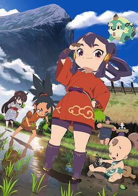

**Studio:** P.A. Works &nbsp;|&nbsp; **Episodes:** 13 &nbsp;|&nbsp; **Director:** Masayuki Yoshihara &nbsp;|&nbsp; **Aired/Released:** July 6 – September 28 &nbsp;|&nbsp; **Genres:** Action, Fantasy, Historical, Deity, Countryside

> Spoiled harvest goddess Sakuna finds herself banished from her opulent celestial home to an island overrun with demons. In the untamed wilderness, she must rediscover her birthright as the daughter of a warrior god and harvest goddess by weathering the elements, fighting monsters, and cultivating rice, the source of her power. By her side in this forbidding place is her guardian Tama and a group of outcast humans. Together, these unlikely companions must join hands to tame both the soil and the demons of Hinoe Island.
>
> _Synopsis source: Kitsu_

[Kitsu](https://kitsu.io/anime/tensui-no-sakuna-hime)

---

### Suicide Squad Isekai

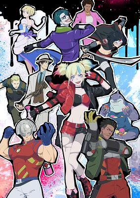

**Studio:** Wit Studio &nbsp;|&nbsp; **Episodes:** 10 &nbsp;|&nbsp; **Director:** Eri Osada &nbsp;|&nbsp; **Aired/Released:** July 6 – September 7 &nbsp;|&nbsp; **Genres:** Adventure, Fantasy, Isekai, Superhero

> In the crime-ridden city of Gotham, Amanda Waller, the head of A.R.G.U.S., has assembled a group of notorious criminals for a mission: Harley Quinn, Deadshot, Peacemaker, Clayface, and King Shark. These Super-Villains are sent into an otherworldly realm that’s connected to this world through a gate. It’s a world of swords and magic where orcs rampage and dragons rule the skies—an “ISEKAI”! With lethal explosives planted in their necks, there’s no running or hiding, and failing the mission means a one-way ticket to the afterlife! Can Harley Quinn and her crew conquer this perilous ISEKAI realm?! Brace yourselves for the pulse-pounding saga of the elite task force known as the “Suicide Squad” as they embark on a jaw-dropping adventure!
>
> _Synopsis source: Kitsu_

[Wikipedia](https://en.wikipedia.org/wiki/Suicide_Squad_Isekai) · [Kitsu](https://kitsu.io/anime/suicide-squad-isekai)

---

### The Elusive Samurai

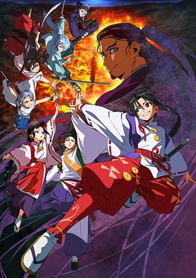

**Studio:** CloverWorks &nbsp;|&nbsp; **Episodes:** 12 &nbsp;|&nbsp; **Director:** Yuta Yamazaki &nbsp;|&nbsp; **Aired/Released:** July 6 – September 28 &nbsp;|&nbsp; **Genres:** Action, Adventure, Samurai, Shounen, Swordplay, Violence

> In the year 1333, the Kamakura shogunate government comes crumbling down. A trusted vassal, Ashikaga Takauji, betrays the shogunate and organizes a rebellion. Hojo Tokiyuki, the rightful heir, escapes the massacre with a Shinto priest named Suwa Yorishige to Kamakura. On the run and fighting to stay alive, Tokiyuki sets in motion his plan to reclaim his birthright.
>
> _Synopsis source: Kitsu_

[Wikipedia](https://en.wikipedia.org/wiki/The_Elusive_Samurai) · [Kitsu](https://kitsu.io/anime/nige-jouzu-no-wakagimi)

---

### Fairy Tail: 100 Years Quest

**Studio:** J.C.Staff &nbsp;|&nbsp; **Episodes:** 25 &nbsp;|&nbsp; **Director:** Shinji Ishihira (Chief) Toshinori Watanabe &nbsp;|&nbsp; **Aired/Released:** July 7 – January 5, 2025 &nbsp;|&nbsp; **Genres:** Adventure, Action, Comedy, Ecchi, Fantasy, Shounen

> The rowdiest guild in the Fiore Kingdom is back! Natsu, Lucy, Gray, Erza, and the whole Fairy Tail guild tackle the legendary “100 Years Quest,” tougher than any S-Class quest. Their goal: find the first wizard guild ever, located in the far north of Guiltina. Facing new gods, mysterious towns, and ominous foes, they’ll have their work cut out for them. Will they succeed where no wizard has before?
>
> _Synopsis source: Kitsu_

[Kitsu](https://kitsu.io/anime/fairy-tail-100-years-quest)

---

### Kinnikuman Perfect Origin Arc

**Studio:** Production I.G &nbsp;|&nbsp; **Episodes:** 12 &nbsp;|&nbsp; **Director:** Akira Sato &nbsp;|&nbsp; **Aired/Released:** July 7 – September 22

[Wikipedia](https://en.wikipedia.org/wiki/Kinnikuman)

---

### Head Start at Birth

**Episodes:** 12 &nbsp;|&nbsp; **Aired/Released:** July 7 – September 22 &nbsp;|&nbsp; **Genres:** Isekai, Adventure, Fantasy

> Lilia, the newborn daughter of a marquis, has the memories of her previous life! With cheat-like gamer knowledge she aims to become the strongest girl in this new "other world"!
>
> _Synopsis source: Kitsu_

[Wikipedia](https://en.wikipedia.org/wiki/Head_Start_at_Birth) · [Kitsu](https://kitsu.io/anime/0-saiji-start-dash-monogatari)

---

### Shoshimin: How to Become Ordinary

**Studio:** Lapin Track &nbsp;|&nbsp; **Episodes:** 10 &nbsp;|&nbsp; **Director:** Mamoru Kanbe &nbsp;|&nbsp; **Aired/Released:** July 7 – September 15 &nbsp;|&nbsp; **Genres:** Mystery, School Life, School Clubs, Detective

> Kobato decides to become an honest, humble citizen after enduring a bitter experience known as “wisdom work.” He forms a pact with Osanai, his classmate with the same goal, and they plan to enter high school leading quiet lives. But for some reason, inexplicable events and disasters keep happening around them. Will Kobato and Osanai ever manage to live ordinary, peaceful lives?
>
> _Synopsis source: Kitsu_

[Wikipedia](https://en.wikipedia.org/wiki/Sh%C5%8Dshimin_Series) · [Kitsu](https://kitsu.io/anime/shoushimin-series)

---

### My Deer Friend Nokotan

**Studio:** Wit Studio &nbsp;|&nbsp; **Episodes:** 12 &nbsp;|&nbsp; **Director:** Masahiko Ohta &nbsp;|&nbsp; **Aired/Released:** July 7 – September 22 &nbsp;|&nbsp; **Genres:** Comedy, Fantasy, Slice of Life, Delinquent, Absurdist Humour, School Life

> Koshi Torako has everyone fooled. Her classmates see her as the perfect honor student, unaware of her secret delinquent past. But her new picturesque school life is thrown into chaos when she bumps into Shikanoko Noko, a girl with antlers! Mayhem seems to follow this strange doe-eyed girl. Who, or what, is she? (Source: Crunchyroll) Note: Each episode streamed 4 days early on ABEMA. The original TV broadcast started on July 7th, 2024.
>
> _Synopsis source: Kitsu_

[Wikipedia](https://en.wikipedia.org/wiki/My_Deer_Friend_Nokotan) · [Kitsu](https://kitsu.io/anime/shikanoko-nokonoko-koshitantan)

---

### Narenare: Cheer for You! (Narenare -Cheer for You!-)

**Studio:** P.A. Works &nbsp;|&nbsp; **Episodes:** 12 &nbsp;|&nbsp; **Director:** Kōdai Kakimoto &nbsp;|&nbsp; **Aired/Released:** July 7 – September 23 &nbsp;|&nbsp; **Genres:** Sports, School Life

> Misora Kanata is a first-year student on the Takanosaki High School cheerleading team. She won a national championship in middle school, but can’t jump after a mistake in a competition. She befriends Suzuha, Shion, Anna, Onka, and Megumi to form the PoMPoMs. Their new team goes beyond cheerleading to reach the hearts of the people they cheer on. They might just change the world!
>
> _Synopsis source: Kitsu_

[Kitsu](https://kitsu.io/anime/na-nare-hana-nare)

---

### Plus-Sized Elf

**Studio:** Elias &nbsp;|&nbsp; **Episodes:** 12 &nbsp;|&nbsp; **Director:** Toshikatsu Tokoro &nbsp;|&nbsp; **Aired/Released:** July 7 – September 22 &nbsp;|&nbsp; **Genres:** Comedy, Ecchi, Fantasy, Contemporary Fantasy, Cooking, Slice of Life, Elf, Supernatural, Magic, Harem

> Naoe-kun, a massage therapist, is about to head home for the day when he's saddled with a rather strange patient. This lovely lady has emerald eyes, pointy ears, and grew up in the forest—everything about her screams "elf," except for one thing: her bodacious body. It turns out she left her world but loves junk food in this one, and now her obsession has caught up with her. Can Naoe-kun help this loveable elf girl lose the weight—and keep it off?
>
> _Synopsis source: Kitsu_

[Wikipedia](https://en.wikipedia.org/wiki/Plus-Sized_Elf) · [Kitsu](https://kitsu.io/anime/elf-san-wa-yaserarenai)

---

### Tower of God (season 2)

**Studio:** The Answer Studio &nbsp;|&nbsp; **Episodes:** 26 &nbsp;|&nbsp; **Director:** Kazuyoshi Takeuchi (Chief) Akira Suzuki &nbsp;|&nbsp; **Aired/Released:** July 7 – December 29

[Wikipedia](https://en.wikipedia.org/wiki/Tower_of_God)

---

### Wistoria: Wand and Sword

**Studio:** Actas Bandai Namco Pictures &nbsp;|&nbsp; **Episodes:** 12 &nbsp;|&nbsp; **Director:** Tatsuya Yoshihara &nbsp;|&nbsp; **Aired/Released:** July 7 – September 29 &nbsp;|&nbsp; **Genres:** Action, Adventure, Fantasy, Magic

> A hard-working boy named Will enters a magic academy in hopes of becoming a great sorcerer. Unfortunately, there's a fatal flaw in his plan: he lacks the ability to use magic. Amid the cold stares of his classmates and instructors, Will feels discouraged at times, but he presses forward with unwavering determination. He can't use a wand, but he can wield a sword in his battle to reach the top of a magic-dominated world. He just needs to believe in his own unique strengths and remember the promise he made with someone precious to him...
>
> _Synopsis source: Kitsu_

[Kitsu](https://kitsu.io/anime/tsue-to-tsurugi-no-wistoria)

---

### A Journey Through Another World (A Journey Through Another World ~Raising Kids While Adventuring~)

**Studio:** EMT Squared &nbsp;|&nbsp; **Episodes:** 12 &nbsp;|&nbsp; **Director:** Atsushi Nigorikawa &nbsp;|&nbsp; **Aired/Released:** July 8 – September 23 &nbsp;|&nbsp; **Genres:** Adventure, Fantasy, Slice of Life, Isekai, Family

> Takumi gets accidentally killed by the wind god Syl and is reborn and summoned to another world. After giving Takumi his sincerest apologies, Syl grants Takumi with skills and sends him to the world Etelldia that Syl presides over. However, this new world is a vast forest filled with dangerous monsters... In the forest, Takumi finds a young boy and girl who appear to be twins. He is worried about their safety and names them Alan and Elena, and decides to take care of them. He soon finds out to his surprise they are able to defeat a monster with their bare hands. The three of them reach a town, and Takumi decides to register at a guild to make a living. He begins his life as an adventurer while taking care of the two children. An isekai fantasy about an adventurer with two kids!
>
> _Synopsis source: Kitsu_

[Wikipedia](https://en.wikipedia.org/wiki/A_Journey_Through_Another_World) · [Kitsu](https://kitsu.io/anime/isekai-yururi-kikou-kosodate-shinagara-boukensha-shimasu)

---

### Mayonaka Punch

**Studio:** P.A. Works &nbsp;|&nbsp; **Episodes:** 12 &nbsp;|&nbsp; **Director:** Shū Honma &nbsp;|&nbsp; **Aired/Released:** July 8 – September 23 &nbsp;|&nbsp; **Genres:** Comedy, Supernatural, Vampire

> Meet Masaki, the now former member of the popular NewTuber group, Harikiri Sisters. After a career setback, aka getting fired unexpectedly via a Livestream, she joins forces with Live, a partner with superhuman abilities. Together, they aim to create sensational content and reach 1 million subscribers. Will they reach their content dreams or be hit with the block button?
>
> _Synopsis source: Kitsu_

[Wikipedia](https://en.wikipedia.org/wiki/Mayonaka_Punch) · [Kitsu](https://kitsu.io/anime/mayonaka-punch)

---

### VTuber Legend: How I Went Viral After Forgetting to Turn Off My Stream

**Studio:** TNK &nbsp;|&nbsp; **Episodes:** 12 &nbsp;|&nbsp; **Director:** Takuya Asaoka &nbsp;|&nbsp; **Aired/Released:** July 8 – September 23 &nbsp;|&nbsp; **Genres:** Comedy, Slice of Life, Satire, Slapstick

> Twenty-year-old former wage slave Yuki Tanaka now works among her idols: the streamers of Live-On, one of Japan’s top VTuber companies. As the gorgeous, polite Awayuki Kokorone, she delivers only the most ladylike content. Unfortunately, her subscriber count and savings are at rock bottom. One evening, after Yuki thinks she’s ended her stream, she cracks a few cold ones—and more than a few crude jokes—while watching Live-On’s video archives. But her viewers hear it all, and clips of her bawdy, drunken commentary go viral overnight. Yuki thinks her career is over...until her manager reveals that everyone at Live-On has been waiting for her to snap all along and gives her free rein to drink on-stream. Now free of all feigned purity, she jumps right into her new “rowdy drunk” character and is welcomed into the fold by her fellow Live-On VTubers, who turn out to be just as crazy as she is! With her views and finances skyrocketing, Yuki’s work—for the first time in her life—is actually fun!
>
> _Synopsis source: Kitsu_

[Wikipedia](https://en.wikipedia.org/wiki/VTuber_Legend) · [Kitsu](https://kitsu.io/anime/vtuber-nanda-ga-haishin-kiri-wasuretara-densetsu-ni-natteta)

---

### No Longer Allowed in Another World

**Studio:** Atelier Pontdarc &nbsp;|&nbsp; **Episodes:** 12 &nbsp;|&nbsp; **Director:** Shigeki Kawai &nbsp;|&nbsp; **Aired/Released:** July 9 – September 24 &nbsp;|&nbsp; **Genres:** Comedy, Fantasy, Romance, Slice of Life, Supernatural, Isekai

> An adventure in another world with cute girls by your side and video game-like powers–sounds like an anime fan’s dream, right? Not so for melancholic author Osamu Dazai, who would quite literally prefer to drop dead. Video games haven’t even been invented yet when he gets yanked into another world in 1948. Really, all the fantastical adventure he keeps running into is just getting in the way of his poetic dream of finding the perfect place to die. But no matter how much he risks his hide, everything seems to keep turning out okay. Follow a miserable hero like no other in this cheerfully bleak isekai comedy!
>
> _Synopsis source: Kitsu_

[Wikipedia](https://en.wikipedia.org/wiki/No_Longer_Allowed_in_Another_World) · [Kitsu](https://kitsu.io/anime/isekai-shikkaku)

---

### The Magical Girl and the Evil Lieutenant Used to Be Archenemies

**Studio:** Bones &nbsp;|&nbsp; **Episodes:** 12 &nbsp;|&nbsp; **Director:** Akiyo Ohashi &nbsp;|&nbsp; **Aired/Released:** July 9 – September 24 &nbsp;|&nbsp; **Genres:** Comedy, Fantasy, Romance, Magical Girl

> The story centers on Mira, the clever brains behind an evil organization that invades and destroys everything in its path. One day, a magical girl named Byakuya Mimori decides to stand up to the organization, and Mira falls in love with her at first sight.
>
> _Synopsis source: Kitsu_

[Wikipedia](https://en.wikipedia.org/wiki/The_Magical_Girl_and_the_Evil_Lieutenant_Used_to_Be_Archenemies) · [Kitsu](https://kitsu.io/anime/katsute-mahou-shoujo-to-aku-wa-tekitai-shite-ita)

---

### Love Is Indivisible by Twins

**Studio:** ROLL2 &nbsp;|&nbsp; **Episodes:** 12 &nbsp;|&nbsp; **Director:** Motoki Nakanishi &nbsp;|&nbsp; **Aired/Released:** July 10 – September 25 &nbsp;|&nbsp; **Genres:** Romance, Comedy

> Koi wa Futago de Warikirenai, written by Shinon Takamura, follows a boy named Jun as he falls in love with the twin girls who are his childhood friends and live next door; both of which who couldn’t be more different from each other. Rumi, the older sister, who has a boyish exterior but a maiden-like personality while Naori is super girly and also a super otaku.
>
> _Synopsis source: Kitsu_

[Wikipedia](https://en.wikipedia.org/wiki/Love_Is_Indivisible_by_Twins) · [Kitsu](https://kitsu.io/anime/koi-wa-futago-de-warikirenai)

---

### Our Last Crusade or the Rise of a New World (season 2)

**Studio:** Silver Link Studio Palette &nbsp;|&nbsp; **Episodes:** 12 &nbsp;|&nbsp; **Director:** Yuki Inaba &nbsp;|&nbsp; **Aired/Released:** July 10 – June 26, 2025

[Wikipedia](https://en.wikipedia.org/wiki/Our_Last_Crusade_or_the_Rise_of_a_New_World)

---

### Bye Bye, Earth

**Studio:** Liden Films &nbsp;|&nbsp; **Episodes:** 10 &nbsp;|&nbsp; **Director:** Yasuto Nishikata &nbsp;|&nbsp; **Aired/Released:** July 12 – September 13 &nbsp;|&nbsp; **Genres:** Action, Adventure, Fantasy, Swordplay

> In a world of anthropomorphic animals, Belle Lablac was born as the only human being. Having no fangs, fur, or scales, she was called "Faceless," and she lived a lonely life with no one else she could identify with. "I want to be part of the world..." With such longing in her heart, she decides to set out on a journey to find her roots, carrying the Runding, a great sword as tall as she is. She doesn’t know how many adversities await her along the way...
>
> _Synopsis source: Kitsu_

[Wikipedia](https://en.wikipedia.org/wiki/Bye_Bye,_Earth) · [Kitsu](https://kitsu.io/anime/bye-bye-earth)

---

### Why Does Nobody Remember Me in This World?

**Studio:** Project No.9 &nbsp;|&nbsp; **Episodes:** 12 &nbsp;|&nbsp; **Director:** Tatsuma Minamikawa &nbsp;|&nbsp; **Aired/Released:** July 13 – September 28 &nbsp;|&nbsp; **Genres:** Action, Adventure, Fantasy, Science Fiction, Demon, Alternative Present, Alternative Past

> "Why does no one remembers the true world...!" The era when the great race of the five tribes competing for hegemony on the ground ended with the victory of mankind led by hero Sid. However, that world was suddenly "overwritten" in front of a boy Kai. In the rewritten world, Kai saw the scene where humans lost to the five tribal wars because of the absence of hero Sid—here dragons and demons dominate the ground, and Kai is a forgotten existence from all human beings. However, after encountering the mysterious girl Rinne, Kai decides to break this rewritten destiny. In a world without heroes, he inherits the hero's sword and martial art and challenges the mighty enemy races who reign.
>
> _Synopsis source: Kitsu_

[Wikipedia](https://en.wikipedia.org/wiki/Why_Does_Nobody_Remember_Me_in_This_World%3F) · [Kitsu](https://kitsu.io/anime/naze-boku-no-sekai-wo-daremo-oboeteinai-no-ka)

---

### Atri: My Dear Moments

**Studio:** Troyca &nbsp;|&nbsp; **Episodes:** 13 &nbsp;|&nbsp; **Director:** Makoto Katō &nbsp;|&nbsp; **Aired/Released:** July 14 – October 6 &nbsp;|&nbsp; **Genres:** Drama, Romance, Robot, Dystopia, Science Fiction, Post Apocalypse

> In the near future, a sudden and unexplained sea rise has left much of human civilization underwater. Ikaruga Natsuki, a boy who lost his mother and his leg in an accident some years earlier, returns disillusioned from a harsh life in the big city to find his old countryside home half-swallowed by the sea. Left without a family, all he has to his name is the ship and submarine left to him by his oceanologist grandmother, and her debts. His only hope to restore the dreams for the future that he has lost is to take up an opportunity presented to him by the suspicious debt collector Catherine. They set sail to search the sunken ruins of his grandmother's laboratory in order to find a treasure rumor says she left there. But what they find is not riches or jewels; it is a strange girl lying asleep in a coffin at the bottom of the sea. Atri. Atri is a robot, but her appearance and her wealth of emotions would fool anyone into think she's a living, breathing human being. In gratitude for being salvaged, she makes a declaration to Natsuki. "I want to fulfill my master's final order. Until I do, I'll be your leg!" In a little town slowly being enveloped by the ocean, an unforgettable summer is about to begin for this boy and this mysterious robot girl...
>
> _Synopsis source: Kitsu_

[Kitsu](https://kitsu.io/anime/atri-my-dear-moments)

---

### Too Many Losing Heroines! (Toooooo Many Losing Heroines)

**Studio:** A-1 Pictures &nbsp;|&nbsp; **Episodes:** 12 &nbsp;|&nbsp; **Director:** Shōtarō Kitamura &nbsp;|&nbsp; **Aired/Released:** July 14 – September 29 &nbsp;|&nbsp; **Genres:** Romance, Comedy

> Kazuhiko Nukumizu is a high school boy content to blend in with the background mob, until he witnessed his more popular classmate Anna Yanami get dumped by her childhood friend. He felt like he had to try to comfort Yanami, but this led him to become entangled with other girls who have met defeat at love?
>
> _Synopsis source: Kitsu_

[Wikipedia](https://en.wikipedia.org/wiki/Too_Many_Losing_Heroines!) · [Kitsu](https://kitsu.io/anime/make-heroine-ga-oosugiru)

---

### Sengoku Youko (part 2)

**Studio:** White Fox &nbsp;|&nbsp; **Episodes:** 22 &nbsp;|&nbsp; **Director:** Masahiro Aizawa &nbsp;|&nbsp; **Aired/Released:** July 18 – December 26 &nbsp;|&nbsp; **Genres:** Action, Adventure, Fantasy, Shounen

> The world is divided into two factions: humans and monsters called katawara. Despite being a katawara, Tama loves humans and vows to protect them from evil, even if it means fighting her own kind. Her stepbrother Jinka, however, hates humans, despite mostly being one. The siblings are joined by a cowardly swordsman named Shinsuke, who wants to learn how to become strong. The people they meet, places they see, and creatures they battle will be legendary!
>
> _Synopsis source: Kitsu_

[Wikipedia](https://en.wikipedia.org/wiki/Sengoku_Youko) · [Kitsu](https://kitsu.io/anime/sengoku-youko)

---

### Delico's Nursery

**Studio:** J.C.Staff &nbsp;|&nbsp; **Episodes:** 13 &nbsp;|&nbsp; **Director:** Hiroshi Nishikiori &nbsp;|&nbsp; **Aired/Released:** August 8 – November 28

[Wikipedia](https://en.wikipedia.org/wiki/Trump_(series))

---

### Rick and Morty: The Anime

**Studio:** Telecom Animation Film &nbsp;|&nbsp; **Episodes:** 10 &nbsp;|&nbsp; **Director:** Takashi Sano &nbsp;|&nbsp; **Aired/Released:** August 16 – October 18 &nbsp;|&nbsp; **Genres:** Adventure, Comedy, Science Fiction, Time Travel, Space, Alien, Humanoid Alien

> It's life mostly as usual for the Smith family. Rick relaxes in a pseudo-world between multiverses, Summer helps Space Beth fight the evil Galactic Federation, and Morty falls in love with a mysterious girl. And they're all an anime.
>
> _Synopsis source: Kitsu_

[Kitsu](https://kitsu.io/anime/rick-and-morty-the-anime)

---

### As a Reincarnated Aristocrat, I'll Use My Appraisal Skill to Rise in the World (season 2) (As a Reincarnated Aristocrat, I’ll Use My Appraisal Skill to Rise in the World)

**Studio:** Studio Mother &nbsp;|&nbsp; **Episodes:** 12 &nbsp;|&nbsp; **Director:** Takao Kato &nbsp;|&nbsp; **Aired/Released:** September 29 – December 22 &nbsp;|&nbsp; **Genres:** Adventure, Fantasy, Isekai, Swordplay, Magic

> After thirty-five years of perfectly ordinary life, a run-of-the-mill businessman suddenly drops dead...only to be reborn in another world! Now he must live as Ars Louvent, scion of a minor noble family and wielder of a fabulous skill: Appraisal, the power to perceive the strengths and abilities of others at a glance. He'll need it, too, because there are plenty of problems to solve in the Louvent family's territory! Ars only has one choice: recruit the most talented individuals his skill can find, and rise up to new heights in his brand new world!
>
> _Synopsis source: Kitsu_

[Wikipedia](https://en.wikipedia.org/wiki/As_a_Reincarnated_Aristocrat,_I%27ll_Use_My_Appraisal_Skill_to_Rise_in_the_World) · [Kitsu](https://kitsu.io/anime/tensei-kizoku-kantei-skill-de-nariagaru)

---

### Uzumaki

**Studio:** Fugaku &nbsp;|&nbsp; **Episodes:** 4 &nbsp;|&nbsp; **Director:** Hiroshi Nagahama &nbsp;|&nbsp; **Aired/Released:** September 29 – October 20 &nbsp;|&nbsp; **Genres:** Seinen, Horror, Supernatural, Drama, Mystery, Dementia, Psychological

> Kurozu-cho, a small fogbound town on the coast of Japan, is cursed. According to Shuichi Saito, the withdrawn boyfriend of teenager Kirie Goshima, their town is haunted not by a person or being but by a pattern: uzumaki, the spiral, the hypnotic secret shape of the world. It manifests itself in small ways: seashells, ferns, whirlpools in water, whirlwinds in air. And in large ways: the spiral marks on people's bodies, the insane obsessions of Shuichi's father, the voice from the cochlea in your inner ear. As the madness spreads, the inhabitants of Kurouzu-cho are pulled ever deeper, as if into a whirlpool from which there is no return...
>
> _Synopsis source: Kitsu_

[Wikipedia](https://en.wikipedia.org/wiki/Uzumaki) · [Kitsu](https://kitsu.io/anime/uzumaki)

---

### I'll Become a Villainess Who Goes Down in History (I'll Become a Villainess That Will Go Down in History)

**Studio:** Maho Film &nbsp;|&nbsp; **Episodes:** 13 &nbsp;|&nbsp; **Director:** Yūji Yanase &nbsp;|&nbsp; **Aired/Released:** October 1 – December 24 &nbsp;|&nbsp; **Genres:** Comedy, Fantasy, Romance, Isekai

> This young girl hates all those goodie-two-shoes heroines. So when she’s reincarnated as Alicia, the villain in her favorite fantasy dating sim, it’s like a dream come true! There’s just one problem: the more she tries to be evil, the more the prince seems to fall for her. Alicia will have to work much harder if she ever wants to become the world’s greatest villainess.
>
> _Synopsis source: Kitsu_

[Wikipedia](https://en.wikipedia.org/wiki/I%27ll_Become_a_Villainess_Who_Goes_Down_in_History) · [Kitsu](https://kitsu.io/anime/rekishi-ni-nokoru-akujo-ni-naruzo)

---

### Let This Grieving Soul Retire! (Let This Grieving Soul Retire! Woe is the Weakling Who Leads the Strongest Party)

**Studio:** Zero-G &nbsp;|&nbsp; **Episodes:** 13 &nbsp;|&nbsp; **Director:** Masahiro Takata &nbsp;|&nbsp; **Aired/Released:** October 1 – December 24 &nbsp;|&nbsp; **Genres:** Fantasy, Action, Adventure

> It's the golden age for treasure hunters—adventurers hungry for wealth, fame, power, and glory, who risk their lives in treasure vaults throughout the world. “Let's become treasure hunters.” Krai and his childhood friends swore to become the greatest of them all, but that dream should have died the day Krai realized he wasn't cut out for the job! Yet expectations continue to mount, right along with Krai's fear for his life. While his childhood friends climb closer toward their dream, this grieving soul has one simple wish: to pack it all in and retire! (Source: J-Novel Club Note: Each episode was streamed two days in advance of the TV broadcast from September 29, 2024, on ABEMA and d-anime Store. Regular broadcasting began on October 1, 2024.
>
> _Synopsis source: Kitsu_

[Wikipedia](https://en.wikipedia.org/wiki/Let_This_Grieving_Soul_Retire!) · [Kitsu](https://kitsu.io/anime/nageki-no-bourei-ha-intai-shitai)

---

### Acro Trip

**Studio:** Voil &nbsp;|&nbsp; **Episodes:** 12 &nbsp;|&nbsp; **Director:** Ayumu Kotake &nbsp;|&nbsp; **Aired/Released:** October 2 – December 18 &nbsp;|&nbsp; **Genres:** Fantasy, Comedy, Shoujo, Magical Girl, Magic

> Machiko, who lives in Sakai City, Niigata Prefecture, is an otaku girl who is a big fan of the magical girl Berry Blossom who protects the city against the evil organisation Fossa Magna. However, nobody was worried about the battle of the two anymore because, Chroma, the wicked evil villain, was too sloppy. So Machiko decided “I want to make my magical girl shine more…!” That desire (?) Leads a shy junior high school student to a strange evil path…
>
> _Synopsis source: Kitsu_

[Wikipedia](https://en.wikipedia.org/wiki/Acro_Trip) · [Kitsu](https://kitsu.io/anime/acro-trip)

---

### Re:Zero (season 3) (Re:ZERO -Starting Life in Another World- Season 3)

**Studio:** White Fox &nbsp;|&nbsp; **Episodes:** 16 &nbsp;|&nbsp; **Director:** Masahiro Shinohara &nbsp;|&nbsp; **Aired/Released:** October 2 – March 26, 2025 &nbsp;|&nbsp; **Genres:** Drama, Isekai, Psychological, Fantasy, Magic, Time Travel, Elf

> The third season of Re:Zero kara Hajimeru Isekai Seikatsu. A year has passed since Subaru’s victory at the Sanctuary. He savors a life of fulfillment while Emilia’s camp stands united for the royal selection—until a fateful letter arrives. Anastasia, a royal selection candidate, has invited Emilia to the Watergate City of Priestella. But as the party begins its journey, crisis stirs beneath the surface and Subaru meets a cruel fate once again. (Source: Crunchyroll) Notes: The first episode has an extended runtime of ~90 minutes, and received an early premiere at Anime Expo on July 5, 2024.
>
> _Synopsis source: Kitsu_

[Kitsu](https://kitsu.io/anime/re-zero-kara-hajimeru-isekai-seikatsu-3)

---

### Tying the Knot with an Amagami Sister

**Studio:** Drive &nbsp;|&nbsp; **Episodes:** 24 &nbsp;|&nbsp; **Director:** Yujiro Abe &nbsp;|&nbsp; **Aired/Released:** October 2 – March 26, 2025 &nbsp;|&nbsp; **Genres:** Ecchi, Drama, Comedy, Romance, Harem

> Uryuu Kamihate has had a rough start to life, but plans to forget it all by achieving his dream—matriculating into medical school. But when he arrives at his new foster home, a working shrine, his dream of a quiet place to study goes up in smoke. Not only will he be living with the three beautiful, lively Amagami sisters—but he learns that he must marry one of them and take over the temple!
>
> _Synopsis source: Kitsu_

[Wikipedia](https://en.wikipedia.org/wiki/Tying_the_Knot_with_an_Amagami_Sister) · [Kitsu](https://kitsu.io/anime/amagami-san-chi-no-enmusubi)

---

### 365 Days to the Wedding

**Studio:** Ashi Productions &nbsp;|&nbsp; **Episodes:** 12 &nbsp;|&nbsp; **Director:** Hiroshi Ikehata &nbsp;|&nbsp; **Aired/Released:** October 3 – December 19 &nbsp;|&nbsp; **Genres:** Romance, Office Lady, Working Life, Seinen, Slice of Life

> Takuya and Rika work at the same travel agency in Tokyo and are both happily introverted and single. But their company is opening a new branch in Alaska next year, and employees without a spouse will be recruited to work there. Desperate to avoid the move, and though they’ve hardly spoken before, they decide to fake an engagement. Can these quiet coworkers become a convincing couple?
>
> _Synopsis source: Kitsu_

[Wikipedia](https://en.wikipedia.org/wiki/365_Days_to_the_Wedding) · [Kitsu](https://kitsu.io/anime/kekkon-suru-tte-hontou-desu-ka-365-days-to-the-wedding)

---

### Blue Box

**Studio:** Telecom Animation Film &nbsp;|&nbsp; **Episodes:** 25 &nbsp;|&nbsp; **Director:** Yuichiro Yano &nbsp;|&nbsp; **Aired/Released:** October 3 – March 27, 2025

[Wikipedia](https://en.wikipedia.org/wiki/Blue_Box_(manga))

---

### KamiErabi God.app (season 2) (KamiErabi GOD.app)

**Studio:** Unend &nbsp;|&nbsp; **Episodes:** 12 &nbsp;|&nbsp; **Director:** Hiroyuki Seshita &nbsp;|&nbsp; **Aired/Released:** October 3 – December 19 &nbsp;|&nbsp; **Genres:** Battle Royale

> The ultimate battle royale for divinity has begun. High schoolers must use their unique powers to compete against each other for the coveted title “God.” But as each brawl becomes more vicious than the last, alliances are formed and betrayals take place. Who will emerge victorious and claim their godly throne?
>
> _Synopsis source: Kitsu_

[Wikipedia](https://en.wikipedia.org/wiki/KamiErabi_God.app) · [Kitsu](https://kitsu.io/anime/kamierabi)

---

### Kinokoinu: Mushroom Pup (Kinoko Inu - Mushroom Pup)

**Studio:** C-Station &nbsp;|&nbsp; **Episodes:** 12 &nbsp;|&nbsp; **Director:** Kagetoshi Asano &nbsp;|&nbsp; **Aired/Released:** October 3 – December 19 &nbsp;|&nbsp; **Genres:** Seinen, Slice of Life, Drama, Comedy, Fantasy

> Picture book author Hotaru Yuuyami lost his beloved dog, Hanako. He was in the depths of a dark and deep sadness, regretting his inability to do anything about it. One day, he notices a pink mushroom growing under the snow willow tree in his garden. As he gazed at it idly, it suddenly began to move, wagging its tail and coming closer to him. “A mushroom...dog?” Despite his doubts, he decides to live with this mysterious creature, “Kinokoinu" (Mushroom Dog). Then he started drawing where he wasn't supposed to draw, ate all the melon bread and takoyaki, and made all sorts of messes, but his playful attitude is hard to hate. The days spent with Kinokoinu, involving his childhood friend Komako-chan, the editor, and Yara-kun of the Mushroom Research Institute, gradually changes Hotaru's expression. This is a slightly mysterious and heartwarming animation that depicts the funny days of Hotaru and everyone together with Kinokoinu, who is too mysterious in many ways.
>
> _Synopsis source: Kitsu_

[Kitsu](https://kitsu.io/anime/kinoko-inu)

---

### Negative Positive Angler

**Studio:** NUT &nbsp;|&nbsp; **Episodes:** 12 &nbsp;|&nbsp; **Director:** Yutaka Uemura &nbsp;|&nbsp; **Aired/Released:** October 3 – December 19 &nbsp;|&nbsp; **Genres:** Drama, Slice of Life, Sports

> The anime's story centers on Tsunehiro Sasaki, a university student with a large debt and is told by his doctor that he only has two years left to live. Living the rest of his days in depression, Tsunehiro one day gets chased by a debt collector and falls into the sea. He is rescued by Hana, a girl who loves fishing, and her fishing friends including Takaaki. Hana urges Tsunehiro to experience fishing for the first time in his life and he starts to develop friendship with other fishing enthusiasts. Things start looking up for Tsunehiro as he starts working at the convenience store where Hana and Takaaki work, and he slowly gets hooked into fishing.
>
> _Synopsis source: Kitsu_

[Wikipedia](https://en.wikipedia.org/wiki/Negative_Positive_Angler) · [Kitsu](https://kitsu.io/anime/negaposi-angler)

---

### The Prince of Tennis II: U-17 World Cup Semifinal

**Studio:** M.S.C &nbsp;|&nbsp; **Episodes:** 13 &nbsp;|&nbsp; **Director:** Yoshinobu Tokumoto &nbsp;|&nbsp; **Aired/Released:** October 3 – December 26

[Wikipedia](https://en.wikipedia.org/wiki/The_Prince_of_Tennis_II)

---

### Trillion Game

**Studio:** Madhouse &nbsp;|&nbsp; **Episodes:** 13 &nbsp;|&nbsp; **Director:** Yūzō Satō &nbsp;|&nbsp; **Aired/Released:** October 3 –December 20 &nbsp;|&nbsp; **Genres:** Action, Comedy, Drama, Psychological, Seinen

> Old schoolmates Haru and Gaku will do anything to achieve success. And success to them means earning a trillion dollars! But to do so, they’ll need to take full advantage of their own unique skills. Haru is a persuasive and confident speaker who can connect with anyone, while Gaku, although awkward, is an expert programmer. Will their combined talents be enough to make their dream a reality?
>
> _Synopsis source: Kitsu_

[Wikipedia](https://en.wikipedia.org/wiki/Trillion_Game) · [Kitsu](https://kitsu.io/anime/trillion-game)

---

### Dandadan (DAN DA DAN)

**Studio:** Science Saru &nbsp;|&nbsp; **Episodes:** 12 &nbsp;|&nbsp; **Director:** Fūga Yamashiro &nbsp;|&nbsp; **Aired/Released:** October 4 –December 19 &nbsp;|&nbsp; **Genres:** Action, Comedy, Supernatural, Shounen, Science Fiction, Romance, Drama, Mystery, Ghost, Alien

> This is a story about Momo, a high school girl who comes from a family of spirit mediums, and her classmate Okarun, an occult fanatic. After Momo rescues Okarun from being bullied, they begin talking. However, an argument ensues between them since Momo believes in ghosts but denies aliens exist, and Okarun believes in aliens but denies ghosts exist. To prove to each other what they believe in is real, Momo goes to an abandoned hospital where a UFO has been spotted and Okarun goes to a tunnel rumored to be haunted. To their surprise, they each encounter overwhelming paranormal activities that transcend comprehension. Amid these predicaments, Momo awakens her hidden power and Okarun gains the power of a curse to overcome these new dangers! Their fateful love begins as well!? The story of the occult battle and adolescence starts! (Source: Crunchyroll) Notes: - Worldwide premiere of Episode 1 before the Japanese television premiere occurred at Anime Expo July 6, 2024. - Episodes 1-3 titled as DAN DA DAN: FIRST ENCOUNTER was pre-screened in advance in theaters on September 13, 2024. The regular TV broadcast begins October 2024.
>
> _Synopsis source: Kitsu_

[Wikipedia](https://en.wikipedia.org/wiki/Dandadan) · [Kitsu](https://kitsu.io/anime/DAN-DA-DAN)

---

### Hamidashi Creative

**Studio:** Hayabusa Film &nbsp;|&nbsp; **Episodes:** 12 &nbsp;|&nbsp; **Director:** Hisayoshi Hirasawa (Chief) Shige Fukase &nbsp;|&nbsp; **Aired/Released:** October 4 – December 20 &nbsp;|&nbsp; **Genres:** Romance

> It's the end of June, and the summer seems to locked in place. Tomohiro Izumi, recognized by himself and those around him as an introvert, is spending another quiet day in his little corner of his classroom… or so he thought. “Congratulations! You've been selected as our next student council president!” The student council president lottery, held on the spur of the moment by the academy. Tomohiro manages to be the one randomly selected thanks to his ridiculous luck! Now the spotlight is suddenly upon him, and as a result, rumors about him begin to circulate. With no way out, Tomohiro relies on his advisor to start gathering allies he can rely on. But none of the candidates his advisor suggests, from his classmate Kano to his underclassman Asumi, and even his little sister Hiyori, are even coming to the campus!? Amidst all of this chaos, even the former president that no one could ever get ahold of, Shio, shows up…! Is it fate, or is it a foregone conclusion? The unheard of and unprecedented battles of the “Random Lottery Student Council President” are about to begin! (Source: Sekai Project) Note: Hamidashi Creative is a crowdfunded anime project based on the visual novel of the same name.
>
> _Synopsis source: Kitsu_

[Wikipedia](https://en.wikipedia.org/wiki/Hamidashi_Creative) · [Kitsu](https://kitsu.io/anime/hamidashi-creative)

---

### Loner Life in Another World

**Studio:** Hayabusa Film Passione &nbsp;|&nbsp; **Episodes:** 12 &nbsp;|&nbsp; **Director:** Akio Kazumi &nbsp;|&nbsp; **Aired/Released:** October 4 – December 12 &nbsp;|&nbsp; **Genres:** Action, Adventure, Fantasy, Isekai, Comedy, Magic, Satire, Parody

> Haruka has been living his high school life as a loner, but all of a sudden, he and his classmates are summoned into another world. A God gives him a list of skills he can freely pick... Or at least that was how it was supposed to be, as all the valuable skills have been taken by the other classmates first. After Haruka scolded God, he snapped back and gave all the remaining bad skills to Haruka. Thanks to the "Loner" skill, Haruka begins his lonely adventure in another world. (Source: Muse Asia) Note: Each episode streamed a week early on some streaming services. The original TV broadcast started on October 4th, 2024.
>
> _Synopsis source: Kitsu_

[Wikipedia](https://en.wikipedia.org/wiki/Loner_Life_in_Another_World) · [Kitsu](https://kitsu.io/anime/hitoribocchi-no-isekai-kouryaku)

---

### Magilumiere Magical Girls Inc.

**Studio:** Studio Moe J.C.Staff &nbsp;|&nbsp; **Episodes:** 12 &nbsp;|&nbsp; **Director:** Masahiro Hiraoka &nbsp;|&nbsp; **Aired/Released:** October 4 – December 20 &nbsp;|&nbsp; **Genres:** Magical Girl, Magic, Action, Comedy, Fantasy

> Magical girls: strong, cool, the ultimate dream job. College student Kana Sakuragi is job hunting - without much luck! One day, she is caught up in an attack by a "Kaii." Fiesty magical girl Hitomi Koshigaya flies to the rescue, and Kana uses her excellent memory to help her take it down. Hired as a magical girl by Magilumiere Magical Girls Inc., Kana takes her first step into the working world!
>
> _Synopsis source: Kitsu_

[Wikipedia](https://en.wikipedia.org/wiki/Magilumiere_Magical_Girls_Inc.) · [Kitsu](https://kitsu.io/anime/kabushiki-gaisha-magi-lumiere)

---

### Mechanical Arms

**Studio:** TriF Studio &nbsp;|&nbsp; **Episodes:** 12 &nbsp;|&nbsp; **Director:** Sae Okamoto &nbsp;|&nbsp; **Aired/Released:** October 4 – December 20

[Wikipedia](https://en.wikipedia.org/wiki/Mechanical_Arms)

---

### Rurouni Kenshin: Kyoto Disturbance (Rurouni Kenshin (2023))

**Studio:** Liden Films &nbsp;|&nbsp; **Episodes:** 23 &nbsp;|&nbsp; **Director:** Hideyo Yamamoto &nbsp;|&nbsp; **Aired/Released:** October 4 – March 21, 2025 &nbsp;|&nbsp; **Genres:** Action, Adventure, Japan, Samurai, Shounen, Bakumatsu   Meiji Period, Romance, Drama

> During the upheaval of the Bakumatsu Era, there was an Imperialist warrior feared as the "Hitokiri Battosai." However, upon the arrival of the new era the Battosai disappeared from the public eye, leaving behind just his legend of the strongest Revolutionary warrior. Years later in downtown Tokyo, on the 11th year of Meiji. Kenshin Himura, a traveling swordsman who vowed to never kill again on the sakabato (reverse blade sword) he carries on his hip, meets Kaoru Kamiya, the head instructor of the Kamiya Kasshin-ryu sword style. Kenshin solves the case of a crossroad killer who was tarnishing the name of the Kasshin-ryu while claiming to be the "Hitokiri Battosai," which then leads to Kaoru offering to have the wanderer stay at her dojo. Follow Kenshin's journey as he makes treasured friendships with Yahiko Myojin, a descendent of a samurai-class family in Tokyo, and Sanosuke Sagara, a fighter for hire, and faces off against various foes who have unfinished business from Kenshin's past. The curtains have opened on the inspiring tale of a swordsman, and the resolute people surrounding him, living in the new Meiji Era.
>
> _Synopsis source: Kitsu_

[Wikipedia](https://en.wikipedia.org/wiki/Rurouni_Kenshin_(2023_TV_series)) · [Kitsu](https://kitsu.io/anime/rurouni-kenshin-meiji-kenkaku-romantan-2023)

---

### Bleach: Thousand-Year Blood War (part 3) (BLEACH: Thousand-Year Blood War Part 3 - The Conflict)

**Studio:** Pierrot Films &nbsp;|&nbsp; **Episodes:** 14 &nbsp;|&nbsp; **Director:** Tomohisa Taguchi (Chief) Hikaru Murata &nbsp;|&nbsp; **Aired/Released:** October 5 – December 28 &nbsp;|&nbsp; **Genres:** Action, Ghost, Swordplay, Shounen, Parallel Universe, War, Drama, Fantasy, Adventure, Plot Continuity, Supernatural, Contemporary Fantasy, Violence

> With Uryu and the Royal Guards at his side, Yhwach successfully breaks past the Soul Shield Membrane barrier and finally sets foot into the sacred realm of the Royal Palace. But the Quincies’ advance seemingly ends after facing Squad Zero, who use their awesome powers to defeat Yhwach and the rest of the uninvited guests. However, the real battle and despair have yet to start… Soul Reapers and Quincies. Ichigo and Uryu. Beliefs and Resolve. The never-ending conflict between light and dark clashes above the dark-blue heavens.
>
> _Synopsis source: Kitsu_

[Kitsu](https://kitsu.io/anime/bleach-sennen-kessen-hen-soukokutan)

---

### Blue Lock vs. U-20 Japan

**Studio:** Eight Bit &nbsp;|&nbsp; **Episodes:** 14 &nbsp;|&nbsp; **Director:** Yūji Haibara (Chief) Shintarō Inokawa &nbsp;|&nbsp; **Aired/Released:** October 5 – December 28

[Wikipedia](https://en.wikipedia.org/wiki/Blue_Lock)

---

### Demon Lord, Retry! R

**Studio:** Gekkō &nbsp;|&nbsp; **Episodes:** 12 &nbsp;|&nbsp; **Director:** Kazuomi Koga &nbsp;|&nbsp; **Aired/Released:** October 5 – December 21

[Wikipedia](https://en.wikipedia.org/wiki/Demon_Lord,_Retry!)

---

### How I Attended an All-Guy's Mixer

**Studio:** Ashi Productions &nbsp;|&nbsp; **Episodes:** 12 &nbsp;|&nbsp; **Director:** Kazuomi Koga &nbsp;|&nbsp; **Aired/Released:** October 5 – December 21 &nbsp;|&nbsp; **Genres:** Cross Dressing, Comedy, Romance, Shoujo

> College student Tokiwa gets invited to a mixer by his female classmate Suo. But when he arrives with his friends, they're greeted by three dazzlingly handsome men?! But as the two groups get to know each other, they find themselves getting closer in unexpected ways. (Source: MANGA UP!) Note: Each episode streamed 1 week early on ABEMA. The original TV broadcast started on October 4th, 2024.
>
> _Synopsis source: Kitsu_

[Wikipedia](https://en.wikipedia.org/wiki/How_I_Attended_an_All-Guy%27s_Mixer) · [Kitsu](https://kitsu.io/anime/goukon-ni-ittara-onna-ga-inakatta-hanashi)

---

### Is It Wrong to Try to Pick Up Girls in a Dungeon? (season 5)

**Studio:** J.C.Staff &nbsp;|&nbsp; **Episodes:** 15 &nbsp;|&nbsp; **Director:** Hideki Tachibana &nbsp;|&nbsp; **Aired/Released:** October 5 – March 7, 2025

[Wikipedia](https://en.wikipedia.org/wiki/Is_It_Wrong_to_Try_to_Pick_Up_Girls_in_a_Dungeon%3F)

---

### Orb: On the Movements of the Earth

**Studio:** Madhouse &nbsp;|&nbsp; **Episodes:** 25 &nbsp;|&nbsp; **Director:** Kenichi Shimizu &nbsp;|&nbsp; **Aired/Released:** October 5 – March 15, 2025 &nbsp;|&nbsp; **Genres:** Drama, Europe, Historical, Mystery, Psychological, Seinen

> After learning heretical teaching about the Earth and the Sun, a child prodigy searches for his master's hidden research while evading the Inquisition.
>
> _Synopsis source: Kitsu_

[Kitsu](https://kitsu.io/anime/chi-chikyuu-no-undou-ni-tsuite)

---

### Sword Art Online Alternative: Gun Gale Online (season 2) (Sword Art Online Alternative: Gun Gale Online Season 2)

**Studio:** A-1 Pictures &nbsp;|&nbsp; **Episodes:** 12 &nbsp;|&nbsp; **Director:** Masayuki Sakoi &nbsp;|&nbsp; **Aired/Released:** October 5 – December 21 &nbsp;|&nbsp; **Genres:** Action, Science Fiction, Virtual Reality, Fantasy, Military

> The second season of Sword Art Online Alternative: Gun Gale Online. LLENN, M, Fukaziroh, and Pitohui form the strongest team, LPFM for short, and enter a new battle royale death match tournament that was announced out of the blue. LPFM is eyed as the top favorite candidate team to win, but the team will have to endure several rigorous ordeals to get there: a playing field that sinks into the ocean with the passage of time, an unknown area hidden in the middle of the map, and an anonymous team conspiracy. In addition to all of this, all players will have to follow some shocking special rules if they want to play the game and win… (Source: Aniplex USA) Note: On June 17, 2024, Studio 3Hz announced its acquisition by A-1 Pictures. The GGO Project would continue to be handled by the same staff, now working under their new studio's name.
>
> _Synopsis source: Kitsu_

[Kitsu](https://kitsu.io/anime/Sword-Art-Online-Alternative-Gun-Gale-Online-II)

---

### The Idolmaster Shiny Colors (season 2)

**Studio:** Polygon Pictures &nbsp;|&nbsp; **Episodes:** 12 &nbsp;|&nbsp; **Director:** Mankyū Takeshi Iwata &nbsp;|&nbsp; **Aired/Released:** October 5 – December 21 &nbsp;|&nbsp; **Genres:** Idol, Music

> Note: The series is having a three-part theatrical pre-screening in Japan starting in October 2023. Regular TV broadcast begins in April 2024. • Part 1 releasing theatrically on October 27, 2023. • Part 2 releasing theatrically on November 24, 2023. • Part 3 releasing theatrically on January 5, 2024. - Anilist
>
> _Synopsis source: Kitsu_

[Wikipedia](https://en.wikipedia.org/wiki/The_Idolmaster_Shiny_Colors) · [Kitsu](https://kitsu.io/anime/the-idolm-ster-shiny-colors)

---

### The Stories of Girls Who Couldn't Be Magicians

**Studio:** J.C.Staff &nbsp;|&nbsp; **Episodes:** 12 &nbsp;|&nbsp; **Director:** Takashi Watanabe (Chief) Masato Matsune &nbsp;|&nbsp; **Aired/Released:** October 5 – December 21 &nbsp;|&nbsp; **Genres:** Fantasy, Magic, School Life, Slice of Life, Drama

> Kurumi Mirai is in the first year of high school. She has enrolled in junior high section of the Redrun Magic School, the world's only facility for mages that approved by International Mage League and able to work under royal families when graduates, and she was always top of the class. However, when she applies for the high school section and took the examination to get into a mage training class "Ma-gumi (Mage Class)", she wasn't able to get in in spite having full scores and was top of the class for the whole three years. There are some students in the class next to her that takes that class. Among that there's someone she admires. How will Kurumi Mirai who has extraordinary brain but didn't get in to be a mage candidate try to overcome and grow up? What is the aim for Minami Suzuki, a loyal mage who suddenly appears to be the homeroom teacher? This is a relaxing story of her growth.
>
> _Synopsis source: Kitsu_

[Wikipedia](https://en.wikipedia.org/wiki/The_Stories_of_Girls_Who_Couldn%27t_Be_Magicians) · [Kitsu](https://kitsu.io/anime/mahoutsukai-ni-narenakatta-onnanoko-no-hanashi)

---

### Tōhai

**Studio:** East Fish Studio &nbsp;|&nbsp; **Episodes:** 25 &nbsp;|&nbsp; **Director:** Jun Hatori &nbsp;|&nbsp; **Aired/Released:** October 5 – April 5, 2025

[Wikipedia](https://en.wikipedia.org/wiki/T%C5%8Dhai)

---

### Tonbo! (season 2)

**Studio:** OLM &nbsp;|&nbsp; **Episodes:** 13 &nbsp;|&nbsp; **Director:** Jin Gu Oh &nbsp;|&nbsp; **Aired/Released:** October 5 – January 4, 2025

[Wikipedia](https://en.wikipedia.org/wiki/Tonbo!)

---

### Blue Exorcist: Beyond the Snow Saga

**Studio:** Studio VOLN &nbsp;|&nbsp; **Episodes:** 24 &nbsp;|&nbsp; **Director:** Daisuke Yoshida &nbsp;|&nbsp; **Aired/Released:** October 6 – March 23, 2025

[Wikipedia](https://en.wikipedia.org/wiki/Blue_Exorcist)

---

### Kagaku x Bouken Survival!

**Studio:** Gallop &nbsp;|&nbsp; **Episodes:** 21 &nbsp;|&nbsp; **Director:** Masahiro Hosoda &nbsp;|&nbsp; **Aired/Released:** October 6 –

[Wikipedia](https://en.wikipedia.org/wiki/Survival_(manhwa))

---

### Love Live! Superstar!! (season 3)

**Studio:** Bandai Namco Filmworks &nbsp;|&nbsp; **Episodes:** 12 &nbsp;|&nbsp; **Director:** Takahiko Kyogoku &nbsp;|&nbsp; **Aired/Released:** October 6 – December 22

[Wikipedia](https://en.wikipedia.org/wiki/Love_Live!_Superstar!!)

---

### MF Ghost (season 2) (MF Ghost)

**Studio:** Felix Film &nbsp;|&nbsp; **Episodes:** 12 &nbsp;|&nbsp; **Director:** Tomohito Naka &nbsp;|&nbsp; **Aired/Released:** October 6 – December 23 &nbsp;|&nbsp; **Genres:** Science Fiction, Sports, Motorsport, Seinen

> Japan adopts self-driving electric automobiles and renders most gas engines obsolete by 202X. The fastest cars find new life in the MFG, a racing circuit held on Japanese motorways. Drivers from around the world race for a shot at the title. Kanata Rivington returns from Britain to Japan for the MFG—and to find his father. Can he win the title and find answers? Buckle up and push it to the limit!
>
> _Synopsis source: Kitsu_

[Wikipedia](https://en.wikipedia.org/wiki/MF_Ghost) · [Kitsu](https://kitsu.io/anime/mf-ghost)

---

### Murai in Love

**Studio:** J.C.Staff &nbsp;|&nbsp; **Episodes:** 12 &nbsp;|&nbsp; **Director:** Yoshiki Yamakawa &nbsp;|&nbsp; **Aired/Released:** October 6 – December 22 &nbsp;|&nbsp; **Genres:** Comedy, Romance, Shoujo

> The slightly strange high school student Murai confessed love to his teacher and otome-game fanatic Tanaka-sensei. She refused by telling him she's not interested in (real-life) long, black-haired boys. The next day, Murai came back with short blonde hair, which made him look just like Tanaka-sensei's favorite game character! A non-stop romantic comedy between a stubborn high school boy and his favorite teacher!
>
> _Synopsis source: Kitsu_

[Wikipedia](https://en.wikipedia.org/wiki/Murai_in_Love) · [Kitsu](https://kitsu.io/anime/murai-no-koi)

---

### Puniru Is a Cute Slime (Puniru is a Kawaii Slime)

**Studio:** Toho Animation Studio &nbsp;|&nbsp; **Episodes:** 12 &nbsp;|&nbsp; **Director:** Yūshi Ibe &nbsp;|&nbsp; **Aired/Released:** October 6 – December 23 &nbsp;|&nbsp; **Genres:** Comedy, Fantasy, Romance, Slice of Life

> Seven years ago, Kotaro made a slime that unexpectedly came to life. He named her Puniru, and they’ve been best friends ever since. The two have grown up a lot over the years, and Puniru is now a beautiful, carefree girl who can shapeshift into other cute forms. But with her spontaneous spirit and wild antics, Kotaro can never catch a break!
>
> _Synopsis source: Kitsu_

[Wikipedia](https://en.wikipedia.org/wiki/Puniru_Is_a_Cute_Slime) · [Kitsu](https://kitsu.io/anime/Puniru-wa-Kawaii-Slime)

---

### PuniRunes Puni 2

**Studio:** OLM Digital &nbsp;|&nbsp; **Director:** Kunihiko Yuyama (Chief) Hiroshi Ikehata &nbsp;|&nbsp; **Aired/Released:** October 6 – &nbsp;|&nbsp; **Genres:** Kids, Slice of Life, Fantasy

> Second season of Punirunes.
>
> _Synopsis source: Kitsu_

[Kitsu](https://kitsu.io/anime/punirunes-puni-2)

---

### Ranma ½

**Studio:** MAPPA &nbsp;|&nbsp; **Episodes:** 12 &nbsp;|&nbsp; **Director:** Kōnosuke Uda &nbsp;|&nbsp; **Aired/Released:** October 6 – December 22

[Wikipedia](https://en.wikipedia.org/wiki/Ranma_%C2%BD)

---

### The Healer Who Was Banished From His Party, Is, in Fact, the Strongest

**Studio:** Studio Elle &nbsp;|&nbsp; **Episodes:** 12 &nbsp;|&nbsp; **Director:** Keisuke Ōnishi &nbsp;|&nbsp; **Aired/Released:** October 6 – December 22 &nbsp;|&nbsp; **Genres:** Action, Adventure, Fantasy, Comedy, Drama, Romance, Magic

> The story follows Raust, a healer who can only use one basic spell and is expelled from a first-class party for being too weak. While the leader of that party realizes how great his abilities actually are after hiring another healer, Raust finds new friends like Narsena who support him and his rise to the top.
>
> _Synopsis source: Kitsu_

[Wikipedia](https://en.wikipedia.org/wiki/The_Healer_Who_Was_Banished_From_His_Party,_Is,_in_Fact,_the_Strongest) · [Kitsu](https://kitsu.io/anime/party-kara-tsuihou-sareta-sono-chiyushi-jitsu-wa-saikyou-ni-tsuki)

---

### The Seven Deadly Sins: Four Knights of the Apocalypse (season 2) (The Seven Deadly Sins: Four Knights of the Apocalypse)

**Studio:** Telecom Animation Film &nbsp;|&nbsp; **Episodes:** 12 &nbsp;|&nbsp; **Director:** Maki Odaira &nbsp;|&nbsp; **Aired/Released:** October 6 – December 29 &nbsp;|&nbsp; **Genres:** Action, Drama, Comedy, Adventure, Shounen, Demon, Fantasy, Magic, Supernatural

> As a prophecy of doom unfolds on the peaceful land of Britannia, a purehearted boy sets out on a journey of discovery — and revenge.
>
> _Synopsis source: Kitsu_

[Wikipedia](https://en.wikipedia.org/wiki/Four_Knights_of_the_Apocalypse) · [Kitsu](https://kitsu.io/anime/Nanatsu-no-Taizai-Mokushiroku-no-Yonkishi)

---

### TsumaSho

**Studio:** Studio Signpost &nbsp;|&nbsp; **Episodes:** 12 &nbsp;|&nbsp; **Director:** Noriyuki Abe &nbsp;|&nbsp; **Aired/Released:** October 6 – December 22 &nbsp;|&nbsp; **Genres:** Seinen, Comedy, Drama, Romance, Slice of Life

> The story follows Keisuke Niijima—who lost his beloved wife, Takae, ten years ago—and their daughter, Mai. They have been in a state of despair since Takae's death. One evening, an elementary school girl visits the Niijima family claiming to be the reincarnation of Takae. At first, they don’t believe her but the girl continues to give them information that only the family knows. Keisuke and Mai soon recognize her as Takae and the three begin to act together as a "family.” (Source: Crunchyroll News) Note: The first two episodes received an early screening at a special event on 21 September 2024 at T-Joy Prince Shinagawa in Tokyo. The regular TV broadcast started on 6 October 2024.
>
> _Synopsis source: Kitsu_

[Wikipedia](https://en.wikipedia.org/wiki/TsumaSho) · [Kitsu](https://kitsu.io/anime/tsuma-shougakusei-ni-naru)

---

### You Are Ms. Servant

**Studio:** Felix Film &nbsp;|&nbsp; **Episodes:** 12 &nbsp;|&nbsp; **Director:** Ayumu Watanabe &nbsp;|&nbsp; **Aired/Released:** October 6 – December 22 &nbsp;|&nbsp; **Genres:** Comedy, Romance, Slice of Life, Maid, Assassin, Shounen

> This is the story of a maid who is all alone in the world, but who finally finds a family. Told from young that her only worth is as a killer, Yuki had known nothing else except cold efficiency and following orders. Now that she has a chance to leave her past behind, she arrives at the doorstep of Hitoyoshi Yokoya, asking to be employed… as a maid?! Thus begins the journey of a former assassin learning what it means to be ‘normal’!
>
> _Synopsis source: Kitsu_

[Wikipedia](https://en.wikipedia.org/wiki/You_Are_Ms._Servant) · [Kitsu](https://kitsu.io/anime/kimi-wa-meido-sama)

---

### After School Hanako-kun (season 2)

**Studio:** Lerche &nbsp;|&nbsp; **Episodes:** 4 &nbsp;|&nbsp; **Director:** Masaki Kitamura &nbsp;|&nbsp; **Aired/Released:** October 7 – October 28

[Wikipedia](https://en.wikipedia.org/wiki/Toilet-Bound_Hanako-kun)

---

### Haigakura

**Studio:** Typhoon Graphics &nbsp;|&nbsp; **Episodes:** 13 &nbsp;|&nbsp; **Director:** Junichi Yamamoto &nbsp;|&nbsp; **Aired/Released:** October 7 – September 26, 2025 &nbsp;|&nbsp; **Genres:** Action, Adventure, Fantasy, Josei, Deity

> The story takes place in another world where there are gods. This world lays above the sky and below the ocean. Four evil gods used to support this world by acting as pillars, but they ran away including all the other minor gods that lived in this world. Thus, people called Kashikan's appeared. Their job is to capture the gods that fled and return stability to the country. The main character Ichiyou is a Kashikan who unwillingly took up the job to regain his foster father's freedom. His foster father, a tiger, was captured to act as a replacement of the four gods who ran away. Ichiyou's main objective is to recapture the evil gods and take back the peaceful life that he used to live.
>
> _Synopsis source: Kitsu_

[Wikipedia](https://en.wikipedia.org/wiki/Haigakura) · [Kitsu](https://kitsu.io/anime/haigakura)

---

### Neko ni Tensei Shita Oji-san (Neko Oji: The Guy that got Reincarnated as a Cat)

**Studio:** Studio Eight Colors &nbsp;|&nbsp; **Episodes:** 48 &nbsp;|&nbsp; **Director:** Rio Takahiro Kawakoshi &nbsp;|&nbsp; **Aired/Released:** October 7 – September 8, 2025 &nbsp;|&nbsp; **Genres:** Comedy, Slice of Life

> The story of Neko ni Tensei Shita Oji-san follows an ordinary old man who one day suddenly is reincarnated as a cute cat, and the president of the company he works for picks him up.
>
> _Synopsis source: Kitsu_

[Wikipedia](https://en.wikipedia.org/wiki/Neko_ni_Tensei_Shita_Oji-san) · [Kitsu](https://kitsu.io/anime/neko-ni-tensei-shita-oji-san)

---

### Ron Kamonohashi's Forbidden Deductions (season 2) (Ron Kamonohashi's Forbidden Deductions)

**Studio:** Diomedéa &nbsp;|&nbsp; **Episodes:** 13 &nbsp;|&nbsp; **Director:** Shōta Ihata &nbsp;|&nbsp; **Aired/Released:** October 7 – December 30 &nbsp;|&nbsp; **Genres:** Drama, Mystery, Comedy, Detective

> This unusual duo brings the hidden truth into the light! Ron Kamonohashi, a private investigator with serious issues, and Totomaru Ishiki, a pure-hearted but dim police detective, team up to solve the most baffling mysteries! A thrilling detective story for a new generation from Akira Amano, creator of "Reborn!" and "Ēldlive"!
>
> _Synopsis source: Kitsu_

[Wikipedia](https://en.wikipedia.org/wiki/Ron_Kamonohashi) · [Kitsu](https://kitsu.io/anime/Kamonohashi-Ron-no-Kindan-Suiri)

---

### The Most Notorious "Talker" Runs the World's Greatest Clan (The Most Notorious "Talker" Runs the World’s Greatest Clan)

**Studio:** Felix Film GA-CREW &nbsp;|&nbsp; **Episodes:** 12 &nbsp;|&nbsp; **Director:** Yuta Takamura &nbsp;|&nbsp; **Aired/Released:** October 7 – December 23 &nbsp;|&nbsp; **Genres:** Action, Adventure, Comedy, Fantasy, Psychological, Magic, Swordplay

> Noel has grown up idolizing his grandfather, a legendary adventurer of the class known as Seekers. But when it comes time for Noel to set out on his own, much to his dismay, he turns out to be a Talker: a support class with meager abilities. But Noel’s got ambition in spades–and the smarts to match–so he’s determined to do whatever it takes to make the world know his name!
>
> _Synopsis source: Kitsu_

[Wikipedia](https://en.wikipedia.org/wiki/The_Most_Notorious_%22Talker%22_Runs_the_World%27s_Greatest_Clan) · [Kitsu](https://kitsu.io/anime/saikyou-no-shien-shoku-wajutsushi-dearu-ore-wa-sekai-saikyou-clan-wo-shitagaeru)

---

### Yakuza Fiancé: Raise wa Tanin ga Ii

**Studio:** Studio Deen &nbsp;|&nbsp; **Episodes:** 12 &nbsp;|&nbsp; **Director:** Toshifumi Kawase &nbsp;|&nbsp; **Aired/Released:** October 7 – December 23 &nbsp;|&nbsp; **Genres:** Comedy, Drama, Crime, Romance, Seinen

> Yoshino’s engagement is far from a dream come true. Her grandfather, head of the largest yakuza group in Kansai, has arranged her marriage to Kirishima, grandson of the Miyama Clan leader, as part of a truce. To Yoshino’s surprise, Kirishima seems kind and charming for a yakuza member. But his warm facade only serves to mask a dark and dangerous truth.
>
> _Synopsis source: Kitsu_

[Wikipedia](https://en.wikipedia.org/wiki/Yakuza_Fianc%C3%A9) · [Kitsu](https://kitsu.io/anime/raise-wa-tanin-ga-ii)

---

### A Terrified Teacher at Ghoul School!

**Studio:** Satelight &nbsp;|&nbsp; **Episodes:** 24 &nbsp;|&nbsp; **Director:** Katsumi Ono &nbsp;|&nbsp; **Aired/Released:** October 8 – March 25, 2025 &nbsp;|&nbsp; **Genres:** Comedy, Supernatural, School Life

> Haruaki Abe is happy to finally fulfill his dream of becoming a teacher. That happiness is short-lived after he arrives at Hyakki Academy and finds out the school is full of monsters! Can Abe overcome his cowardice and get his supernatural students under control? Join the timid teacher and his bizarre class for a tale of ghoulish mischief and paranormal education.
>
> _Synopsis source: Kitsu_

[Wikipedia](https://en.wikipedia.org/wiki/A_Terrified_Teacher_at_Ghoul_School!) · [Kitsu](https://kitsu.io/anime/youkai-gakkou-no-sensei-hajimemashita)

---

### Natsume's Book of Friends (season 7)

**Studio:** Shuka &nbsp;|&nbsp; **Episodes:** 12 &nbsp;|&nbsp; **Director:** Takahiro Omori (Chief) Hideki Ito &nbsp;|&nbsp; **Aired/Released:** October 8 – December 24

[Wikipedia](https://en.wikipedia.org/wiki/Natsume%27s_Book_of_Friends)

---

### Seirei Gensouki: Spirit Chronicles (season 2) (Spirit Chronicles Season 2)

**Studio:** TMS Entertainment &nbsp;|&nbsp; **Episodes:** 12 &nbsp;|&nbsp; **Director:** Osamu Yamasaki (Chief) Hiroshi Kubo &nbsp;|&nbsp; **Aired/Released:** October 8 – December 24 &nbsp;|&nbsp; **Genres:** Action, Adventure, Fantasy, Fantasy World, Harem, Isekai, School Life, Drama, Romance, Magic

> The second season of Seirei Gensouki.
>
> _Synopsis source: Kitsu_

[Kitsu](https://kitsu.io/anime/seirei-gensouki-2)

---

### The Do-Over Damsel Conquers the Dragon Emperor

**Studio:** J.C.Staff &nbsp;|&nbsp; **Episodes:** 12 &nbsp;|&nbsp; **Director:** Kentarō Suzuki &nbsp;|&nbsp; **Aired/Released:** October 9 – December 25 &nbsp;|&nbsp; **Genres:** Fantasy, Romance, Comedy, Time Travel, Shoujo

> Jill is sentenced to death by the crown prince, her fiancé. But just before she dies, she’s sent back in time six years to the party where their engagement had been decided. To avoid this route of ruin, Jill immediately proposes to the person standing behind her…but it’s the man who was her greatest enemy, Emperor Hadis?! Jill knows all about his future descent into evil. She quickly retracts the proposal, but the delighted Hadis takes her back to his castle and makes her a meal. Completely won over by the food, Jill makes a life-changing decision…
>
> _Synopsis source: Kitsu_

[Wikipedia](https://en.wikipedia.org/wiki/The_Do-Over_Damsel_Conquers_the_Dragon_Emperor) · [Kitsu](https://kitsu.io/anime/yarinaoshi-reijou-wa-ryuutei-heika-wo-kouryaku-chuu)

---

### Nina the Starry Bride

**Studio:** Signal.MD &nbsp;|&nbsp; **Episodes:** 12 &nbsp;|&nbsp; **Director:** Kenichiro Komaya &nbsp;|&nbsp; **Aired/Released:** October 10 – December 24 &nbsp;|&nbsp; **Genres:** Drama, Fantasy, Romance, Josei, Politics

> Nina had a rough start to life, stealing to survive—and eventually being sold into slavery by her own brother. But to her surprise, her captor, Prince Azure, ordained that she would live the life of a princess...specifically, that of the recently deceased princess-priestess, Alisha. But despite her changing fortune, Nina won't give up her old life without a fight...and Azure might just be the one to finally match her wits. But how much can she trust Azure? And can she stop the feelings budding in her heart, knowing she must eventually marry another...?
>
> _Synopsis source: Kitsu_

[Wikipedia](https://en.wikipedia.org/wiki/Nina_the_Starry_Bride) · [Kitsu](https://kitsu.io/anime/hoshi-furu-oukoku-no-nina)

---

### Tono to Inu

**Studio:** OLM Live2D Creative Studio &nbsp;|&nbsp; **Episodes:** 24 &nbsp;|&nbsp; **Director:** Haruki Kasugamori &nbsp;|&nbsp; **Aired/Released:** October 10 – March 28, 2025 &nbsp;|&nbsp; **Genres:** Samurai, Slice of Life, Historical

> In the warring states era, there were those who performed feats resembling demons or gods—though that is now a thing of the past. The Lord now lives in a completely declined and impoverished tenement. The Lord who has fallen into such circumstances, encounters a single dog. Feeling pity for its peculiar short-limbed appearance, the Lord reaches out a hand, but soon becomes amused by its mischievous behaviors. Thus begins the cohabitation of the fearsome Lord and cheerful dog, bringing peace and harmony to their lives!
>
> _Synopsis source: Kitsu_

[Wikipedia](https://en.wikipedia.org/wiki/Tono_to_Inu) · [Kitsu](https://kitsu.io/anime/tono-to-inu)

---

### Dragon Ball Daima

**Studio:** Toei Animation &nbsp;|&nbsp; **Episodes:** 20 &nbsp;|&nbsp; **Director:** Yoshitaka Yashima Aya Komaki &nbsp;|&nbsp; **Aired/Released:** October 11 – February 28, 2025 &nbsp;|&nbsp; **Genres:** Action, Adventure, Shounen, Demon, Martial Arts, Fantasy World, Comedy

> Goku and company were living peaceful lives when they suddenly turned small due to a conspiracy! When they discover that the reason for this may lie in a world known as the "Demon Realm", a mysterious young Majin named Glorio appears before them.
>
> _Synopsis source: Kitsu_

[Wikipedia](https://en.wikipedia.org/wiki/Dragon_Ball_Daima) · [Kitsu](https://kitsu.io/anime/dragon-ball-daima)

---

### Goodbye, Dragon Life

**Studio:** SynergySP Vega Entertainment &nbsp;|&nbsp; **Episodes:** 12 &nbsp;|&nbsp; **Director:** Kenichi Nishida &nbsp;|&nbsp; **Aired/Released:** October 11 – December 27 &nbsp;|&nbsp; **Genres:** Action, Adventure, Fantasy, Dragon

> Long ago, the most ancient of divine dragons was slain by a human. The mighty dragon accepted its death when suddenly, it was reborn as Dolan, a man who lives in a quiet village. While spending another peaceful day toiling in the fields, he meets Celina, a half-human, half-snake creature looking for a partner. The unlikely duo become friends, but challenges lie ahead that threaten their new bond.
>
> _Synopsis source: Kitsu_

[Wikipedia](https://en.wikipedia.org/wiki/Goodbye,_Dragon_Life) · [Kitsu](https://kitsu.io/anime/sayonara-ryuusei-konnichiwa-jinsei)

---

### Demon Lord 2099

**Studio:** J.C.Staff &nbsp;|&nbsp; **Episodes:** 12 &nbsp;|&nbsp; **Director:** Ryō Andō &nbsp;|&nbsp; **Aired/Released:** October 13 – December 29 &nbsp;|&nbsp; **Genres:** Cyberpunk, Demon, Magic, Action, Fantasy, Science Fiction

> ​The cyberpunk metropolis Shinjuku—a massive city-state bedecked with neon signs, towering skyscrapers, and the latest cutting-edge technology. It is here, in year 2099 of the Fused Era, where the legendary Demon Lord Veltol has his second coming five centuries in the making. But this landscape is nothing like the one he conquered all those years ago, for the fusion of magic and engineering has elevated civilization to dazzling, unprecedented heights. Veltol may have been reduced to a historical footnote, but make no mistake...this brave new world will be his for the taking!
>
> _Synopsis source: Kitsu_

[Wikipedia](https://en.wikipedia.org/wiki/Demon_Lord_2099) · [Kitsu](https://kitsu.io/anime/maou-2099)

---

### Shangri-La Frontier (season 2)

**Studio:** C2C &nbsp;|&nbsp; **Episodes:** 25 &nbsp;|&nbsp; **Director:** Toshiyuki Kubooka &nbsp;|&nbsp; **Aired/Released:** October 13 – March 30, 2025 &nbsp;|&nbsp; **Genres:** Shounen, Action, Fantasy, Adventure, Virtual Reality, Comedy, Science Fiction

> "When was the last time I played a game that wasn't crap?" This is a world in the near future where games that use display screens are classified as retro. Anything that can't keep up with state-of-the-art VR technology is called a "crap game," and you see a large number of crap games coming out. Those who devote their lives to clearing these games are called "crap-game hunters," and Rakuro Hizutome is one of them. The game he's chosen to tackle next is Shangri-La Frontier, a "god-tier game" that has a total of thirty million players. Online friends... An expansive world... Encounters with rivals... These are changing Rakuro and all the other players' fates! The best game adventure tale by the strongest "crap game" player begins now!
>
> _Synopsis source: Kitsu_

[Wikipedia](https://en.wikipedia.org/wiki/Shangri-La_Frontier) · [Kitsu](https://kitsu.io/anime/shangri-la-frontier)

---

### Arifureta: From Commonplace to World's Strongest (season 3)

**Studio:** Asread &nbsp;|&nbsp; **Episodes:** 16 &nbsp;|&nbsp; **Director:** Akira Iwanaga &nbsp;|&nbsp; **Aired/Released:** October 14 – February 17, 2025

[Wikipedia](https://en.wikipedia.org/wiki/Arifureta)

---

### Blue Miburo

**Studio:** Maho Film &nbsp;|&nbsp; **Episodes:** 24 &nbsp;|&nbsp; **Director:** Kumiko Habara &nbsp;|&nbsp; **Aired/Released:** October 19 – March 29, 2025 &nbsp;|&nbsp; **Genres:** Drama, Samurai, Historical, Shounen, Swordplay

> It's 1863, the twilight of the shogunate, and Japan is on the cusp of monumental change. The streets of the nation's capital are soaked in blood as political upheaval and rising tensions between masterless, wandering ronin and government samurai set the stage for one of the most turbulent times in Japan's history. Young orphan Nio is no stranger to the harsh realities of the world, and yet he can't help but cling to his burning passion for justice and desire to change the world for the better. One day, he crosses paths with two men who will become central figures of the coming revolution: Hijikata Toshizo and Okita Souji, two of the founding members of a group of hated ronin known as the Miburo—who would later become known as the Shinsengumi. Inspired by the efforts of the so-called "Blues Wolves of Mibu," Nio decides to join the ranks to help carve a path to the world he wishes to see. But with new betrayals and reversals every day, will Nio be able to stay true to his conscience?
>
> _Synopsis source: Kitsu_

[Wikipedia](https://en.wikipedia.org/wiki/The_Blue_Wolves_of_Mibu) · [Kitsu](https://kitsu.io/anime/ao-no-miburo)

---

### Murder Mystery of the Dead

**Studio:** Ziine Studio &nbsp;|&nbsp; **Episodes:** 6 &nbsp;|&nbsp; **Director:** Tomohiro Ishii &nbsp;|&nbsp; **Aired/Released:** November 14 – December 26 &nbsp;|&nbsp; **Genres:** Mystery, Supernatural, Zombie, Post Apocalypse

> The world has collapsed due to a zombie pandemic. The protagonist, Mikoto Amano, wakes up in an unfamiliar place with no memory and is taken in by six girls. However, a shocking incident occurs: a man who was taken in alongside Mikoto is murdered, and the culprit is one of them. Set in the Tokyu Kabukicho Tower, mysteries and secrets unfold one after another within the now-sealed building. Will the girls, who have begun to form a bond, be able to uncover the truth behind the incident? (animated Times, translated)
>
> _Synopsis source: Kitsu_

[Wikipedia](https://en.wikipedia.org/wiki/Murder_Mystery_of_the_Dead) · [Kitsu](https://kitsu.io/anime/murder-mystery-of-the-dead)

---

## Original net animations

### Monsters: 103 Mercies Dragon Damnation

**Studio:** E&H Production &nbsp;|&nbsp; **Episodes:** 1 &nbsp;|&nbsp; **Director:** Sunghoo Park &nbsp;|&nbsp; **Aired/Released:** January 21 &nbsp;|&nbsp; **Genres:** Action, Comedy, Samurai, Swordplay, Historical, Dragon

> MONSTERS: 103 Mercies Dragon Damnation by Eiichiro Oda tells the tale of Ryuuma, the legendary swordsman that hails from the Land of Wano in One Piece.
>
> _Synopsis source: Kitsu_

[Kitsu](https://kitsu.io/anime/MONSTERS-Ippaku-Sanjou-Hiryuu-Jigoku)

---

### Chikomaru

**Studio:** Pie in the sky &nbsp;|&nbsp; **Episodes:** 1 &nbsp;|&nbsp; **Director:** Haruka Suzuki &nbsp;|&nbsp; **Aired/Released:** January 25 &nbsp;|&nbsp; **Genres:** Comedy, Slice of Life, Anthropomorphism

[Kitsu](https://kitsu.io/anime/chikomaru)

---

### Great Pretender: Razbliuto

**Studio:** Wit Studio &nbsp;|&nbsp; **Episodes:** 4 &nbsp;|&nbsp; **Director:** Hiro Kaburagi &nbsp;|&nbsp; **Aired/Released:** February 23 – March 15

[Wikipedia](https://en.wikipedia.org/wiki/Great_Pretender_(TV_series))

---

### Sand Land: The Series (Sand Land)

**Studio:** Sunrise Kamikaze Douga Anima &nbsp;|&nbsp; **Episodes:** 13 &nbsp;|&nbsp; **Director:** Toshihisa Yokoshima &nbsp;|&nbsp; **Aired/Released:** March 20 – May 1 &nbsp;|&nbsp; **Genres:** Action, Adventure, Supernatural, Fantasy

> In a desert world where both demons and humans suffer from an extreme water shortage, Beelzebub, the prince of demons, and Rao, a small-town sheriff, form a tag-team and set off on an adventure in search of the Phantom Lake somewhere in the desert.
>
> _Synopsis source: Kitsu_

[Wikipedia](https://en.wikipedia.org/wiki/Sand_Land) · [Kitsu](https://kitsu.io/anime/sand-land)

---

### Rokurō no Dai Bōken

**Studio:** Planet Studio &nbsp;|&nbsp; **Director:** Tsutomu Yabuki &nbsp;|&nbsp; **Aired/Released:** April 1 –

[Wikipedia](https://en.wikipedia.org/wiki/Let%27s_Make_a_Mug_Too)

---

### The Grimm Variations

**Studio:** Wit Studio &nbsp;|&nbsp; **Episodes:** 6 &nbsp;|&nbsp; **Director:** Various &nbsp;|&nbsp; **Aired/Released:** April 17 &nbsp;|&nbsp; **Genres:** Violence, Fantasy, Magic, Thriller, Horror

> Once upon a time, brothers Jacob and Wilhelm collected fairy tales from across the land and made them into a book. They also had a much younger sister, the innocent and curious Charlotte, who they loved very much. One day, while the brothers were telling Charlotte a fairy tale like usual, they saw that she had a somewhat melancholy look on her face. She asked them, "Do you suppose they really lived happily ever after?" The pages of Grimm's Fairy Tales, written by Jacob and Wilhelm, are now presented from the unique perspective of Charlotte, who sees the stories quite differently from her brothers.
>
> _Synopsis source: Kitsu_

[Wikipedia](https://en.wikipedia.org/wiki/The_Grimm_Variations) · [Kitsu](https://kitsu.io/anime/the-grimm-variations)

---

### Mahjong Soul Kan!!

**Studio:** Alke &nbsp;|&nbsp; **Episodes:** 13 &nbsp;|&nbsp; **Director:** Kazuomi Koga &nbsp;|&nbsp; **Aired/Released:** April 25 – July 18

[Wikipedia](https://en.wikipedia.org/wiki/Mahjong_Soul)

---

### Time Patrol Bon

**Studio:** Bones &nbsp;|&nbsp; **Episodes:** 24 &nbsp;|&nbsp; **Director:** Masahiro Ando &nbsp;|&nbsp; **Aired/Released:** May 2 – July 17

[Wikipedia](https://en.wikipedia.org/wiki/Time_Patrol_Bon)

---

### Garouden: The Way of the Lone Wolf

**Studio:** NAZ &nbsp;|&nbsp; **Episodes:** 8 &nbsp;|&nbsp; **Director:** Atsushi Ikariya &nbsp;|&nbsp; **Aired/Released:** May 23

[Wikipedia](https://en.wikipedia.org/wiki/Gar%C5%8Dden)

---

### Dead Dead Demon's Dededede Destruction (series edition) (Dead Dead Demons Dededede Destruction)

**Studio:** Production +h. &nbsp;|&nbsp; **Episodes:** 18 &nbsp;|&nbsp; **Director:** Tomoyuki Kurokawa &nbsp;|&nbsp; **Aired/Released:** May 24 – September 20 &nbsp;|&nbsp; **Genres:** Drama, Science Fiction, Seinen, Comedy

> As the world is threatened by the sudden appearance of a mysterious alien mothership, best friends Koyama Kadode and Nakagawa “Ontan” Oran carry on about their high school life. But as they grow up, they face existential questions, learning adulthood’s complexities and that the true threat may not be from above.
>
> _Synopsis source: Kitsu_

[Wikipedia](https://en.wikipedia.org/wiki/Dead_Dead_Demon%27s_Dededede_Destruction) · [Kitsu](https://kitsu.io/anime/dead-dead-demons-dededede-destruction)

---

### Baki Hanma vs. Kengan Ashura

**Studio:** TMS Entertainment &nbsp;|&nbsp; **Episodes:** 1 &nbsp;|&nbsp; **Director:** Toshiki Hirano &nbsp;|&nbsp; **Aired/Released:** June 6

[Wikipedia](https://en.wikipedia.org/wiki/Baki_the_Grappler)

---

### Rising Impact

**Studio:** Lay-duce &nbsp;|&nbsp; **Episodes:** 26 &nbsp;|&nbsp; **Director:** Hitoshi Nanba &nbsp;|&nbsp; **Aired/Released:** June 22 – August 6 &nbsp;|&nbsp; **Genres:** Sports, Drama, Comedy

> A young boy, Gawain, lives in a mountainous, rural area with an incredible love for baseball and making the ball really fly. One day he runs into a visitor to the small area and she introduces him to a sport that can really make a ball take to flight: golf! It just takes one shot and Gawain is hooked. With his grandpa's approval he sets off to Tokyo with this mysterious woman to learn all he can about golf, encountering many colorful characters and obstacles along the way.
>
> _Synopsis source: Kitsu_

[Wikipedia](https://en.wikipedia.org/wiki/Rising_Impact) · [Kitsu](https://kitsu.io/anime/rising-impact)

---

### Monogatari Series Off & Monster Season

**Studio:** Shaft &nbsp;|&nbsp; **Episodes:** 14 &nbsp;|&nbsp; **Director:** Akiyuki Shinbo (Chief) Midori Yoshizawa &nbsp;|&nbsp; **Aired/Released:** July 6 – October 19

[Wikipedia](https://en.wikipedia.org/wiki/Monogatari_(series))

---

### Chi's Sweet Summer Vacation

**Studio:** Marza Animation Planet &nbsp;|&nbsp; **Episodes:** 12 &nbsp;|&nbsp; **Director:** Kiminori Kusano &nbsp;|&nbsp; **Aired/Released:** July 19

[Wikipedia](https://en.wikipedia.org/wiki/Chi%27s_Sweet_Home)

---

### Kimi ni Todoke (season 3)

**Studio:** Production I.G &nbsp;|&nbsp; **Episodes:** 5 &nbsp;|&nbsp; **Director:** Kenichi Matsuzawa &nbsp;|&nbsp; **Aired/Released:** August 1

[Wikipedia](https://en.wikipedia.org/wiki/Kimi_ni_Todoke)

---

### Kengan Ashura (season 2, part 2)

**Studio:** Larx Entertainment &nbsp;|&nbsp; **Episodes:** 16 &nbsp;|&nbsp; **Director:** Seiji Kishi &nbsp;|&nbsp; **Aired/Released:** August 15

[Wikipedia](https://en.wikipedia.org/wiki/Kengan_Ashura)

---

### Terminator Zero

**Studio:** Production I.G &nbsp;|&nbsp; **Episodes:** 8 &nbsp;|&nbsp; **Director:** Masashi Kudō &nbsp;|&nbsp; **Aired/Released:** August 29 &nbsp;|&nbsp; **Genres:** Anime Influenced, Robot, Cyborg, Post Apocalypse, Action, Time Travel

> 2022: A future war has raged for decades between the few human survivors and an endless army of machines. 1997: The AI known as Skynet gained self-awareness and began its war against humanity. Caught between the future and this past is a soldier sent back in time to change the fate of humanity. She arrives in 1997 to protect a scientist named Malcolm Lee who works to launch a new AI system designed to compete with Skynet’s impending attack on humanity. As Malcolm navigates the moral complexities of his creation, he’s hunted by an unrelenting assassin from the future, which forever alters the fate of his three children.
>
> _Synopsis source: Kitsu_

[Wikipedia](https://en.wikipedia.org/wiki/Terminator_Zero) · [Kitsu](https://kitsu.io/anime/terminator-zero)

---

### Duel Masters Lost: Tsuioku no Suishō

**Studio:** J.C.Staff &nbsp;|&nbsp; **Episodes:** 4 &nbsp;|&nbsp; **Director:** Riki Fukushima &nbsp;|&nbsp; **Aired/Released:** October 4 – November 29

[Wikipedia](https://en.wikipedia.org/wiki/Duel_Masters)

---

### Gundam: Requiem for Vengeance

**Studio:** Sunrise SAFEHOUSE &nbsp;|&nbsp; **Episodes:** 6 &nbsp;|&nbsp; **Director:** Erasmus Brosdau &nbsp;|&nbsp; **Aired/Released:** October 17 &nbsp;|&nbsp; **Genres:** Mecha, War

> Bandai Namco Filmworks announced the new animation project Mobile Suit Gundam: Requiem for Vengeance during its Anime Expo industry panel on July 1, 2023. The staff is producing the animation entirely with Epic Games' Unreal Engine 5, as previewed in a trailer presented at the panel. Episodes are set in the Universal Century chronology of the first Mobile Suit Gundam story and its sequels, and the story is told from the Zeon faction's perspective, particularly from the Zaku mobile suits' cockpits.
>
> _Synopsis source: Kitsu_

[Kitsu](https://kitsu.io/anime/gundam-requiem-for-vengeance)

---

### Nights with a Cat (season 3)

**Studio:** Studio Puyukai &nbsp;|&nbsp; **Director:** Minoru Ashina &nbsp;|&nbsp; **Aired/Released:** December 4 –

[Wikipedia](https://en.wikipedia.org/wiki/Nights_with_a_Cat)

---

### Beastars (season 3, part 1)

**Studio:** Orange &nbsp;|&nbsp; **Director:** Shinichi Matsumi &nbsp;|&nbsp; **Aired/Released:** December 5

[Wikipedia](https://en.wikipedia.org/wiki/Beastars)

---

### Duel Masters Lost: Gekka no Shinigami

**Studio:** J.C.Staff &nbsp;|&nbsp; **Director:** Riki Fukushima &nbsp;|&nbsp; **Aired/Released:** December 21 –

[Wikipedia](https://en.wikipedia.org/wiki/Duel_Masters)

---

## Original video animations

### My Happy Marriage

**Studio:** Kinema Citrus &nbsp;|&nbsp; **Episodes:** 1 &nbsp;|&nbsp; **Director:** Takehiro Kubota &nbsp;|&nbsp; **Aired/Released:** March 15 &nbsp;|&nbsp; **Genres:** Drama, Romance, Supernatural, Shoujo, Historical, Fantasy, Super Power, Coming Of Age

> Despite being born into a noble family, Miyo lost her birth mother at a young age and grew up being abused by her stepmother, stepsister, and father. When she finally receives news that she's to be married off, she finds out that her husband-to-be is Kiyoka, a soldier with a reputation for being cruel and heartless. In fact, he's had numerous previous fiancées who have all fled his household; none lasting even a mere three days. Resigned to the fact that her family had abandoned her, Miyo knocks on the gate of the Kudou household to find herself greeted by a beautiful man with pale skin. Despite the poor treatment she receives from her husband-to-be during their first meeting, Miyo is unable to return to her old home and spends her time cooking and doing chores. However, as the days pass, Miyo and Kiyoka being to slowly open their hearts to each other...
>
> _Synopsis source: Kitsu_

[Wikipedia](https://en.wikipedia.org/wiki/My_Happy_Marriage) · [Kitsu](https://kitsu.io/anime/watashi-no-shiawase-na-kekkon)

---

### Shin Yaranai ka

**Studio:** Anime Tokyo Studio Kingyoiro &nbsp;|&nbsp; **Episodes:** 1 &nbsp;|&nbsp; **Director:** Pierre Itō &nbsp;|&nbsp; **Aired/Released:** April 1

[Wikipedia](https://en.wikipedia.org/wiki/Kuso_Miso_Technique)

---

## Films

### Bloody Escape: Jigoku no Tōsō Geki

**Studio:** Polygon Pictures &nbsp;|&nbsp; **Director:** Gorō Taniguchi &nbsp;|&nbsp; **Aired/Released:** January 5

[Wikipedia](https://en.wikipedia.org/wiki/Estab_Life)

---

### Kizumonogatari: Koyomi Vamp

**Studio:** Shaft &nbsp;|&nbsp; **Director:** Tatsuya Oishi &nbsp;|&nbsp; **Aired/Released:** January 12

[Wikipedia](https://en.wikipedia.org/wiki/Kizumonogatari)

---

### Mobile Suit Gundam SEED Freedom

**Studio:** Bandai Namco Filmworks &nbsp;|&nbsp; **Director:** Mitsuo Fukuda &nbsp;|&nbsp; **Aired/Released:** January 26 &nbsp;|&nbsp; **Genres:** Mecha, Military, Space, Action, Science Fiction, Drama

> A new Gundam SEED Movie announced as part of the project "Mobile Suit Gundam SEED PROJECT Ignited" in celebration of Gundam SEED's upcoming 20th anniversary in 2022. It is now Cosmic Era (C.E.) 75, two years after the dismantlement of the Destiny Plan, but warfare still continues to rage on between Naturals and Coordinators. Independence movements are now sprouting up across Earth, and invasions by Blue Cosmos grow exponentially stronger... To deal with these predicaments, a World Peace Supervision Organization known as COMPASS has been established, with PLANT Chairwoman Lacus Clyne as the founding leader. Kira Yamato and the others, as its new members, intervene into various battles for the sake of this peace. However, as these battles take place, an emergent nation known as 'FOUNDATION' appears, and they propose a joint operation to attack the Blue Cosmos Headquarters. Will Destiny run its course, or will Kira still have the Freedom to resist against impossible odds?
>
> _Synopsis source: Kitsu_

[Wikipedia](https://en.wikipedia.org/wiki/Mobile_Suit_Gundam_SEED_Freedom) · [Kitsu](https://kitsu.io/anime/mobile-suit-gundam-seed-freedom)

---

### Given the Movie: Hiiragi Mix

**Studio:** Lerche &nbsp;|&nbsp; **Director:** Noriko Hashimoto &nbsp;|&nbsp; **Aired/Released:** January 27

[Wikipedia](https://en.wikipedia.org/wiki/Given_the_Movie_(2024_film))

---

### Ōmuro-ke: Dear Sisters

**Studio:** Passione Studio Lings &nbsp;|&nbsp; **Director:** Naoyuki Tatsuwa &nbsp;|&nbsp; **Aired/Released:** February 2

[Wikipedia](https://en.wikipedia.org/wiki/YuruYuri)

---

### Haikyu!! The Dumpster Battle

**Studio:** Production I.G &nbsp;|&nbsp; **Director:** Susumu Mitsunaka &nbsp;|&nbsp; **Aired/Released:** February 16 &nbsp;|&nbsp; **Genres:** Sports, Shounen, Comedy, Volleyball, Friendship, Plot Continuity

> Shoyo Hinata joins Karasuno High’s volleyball club to be like his idol, a former Karasuno player known as the “Little Giant.” But, Hinata soon finds that he must team up with his middle school nemesis, Tobio Kageyama. Their clashing styles turn into a surprising weapon, but can they beat their rival Nekoma High in the highly anticipated “Dumpster Battle,” the long-awaited ultimate showdown between two opposing underdog teams?
>
> _Synopsis source: Kitsu_

[Wikipedia](https://en.wikipedia.org/wiki/Haikyu!!_The_Dumpster_Battle) · [Kitsu](https://kitsu.io/anime/Haikyuu-Gomi-Suteba-no-Kessen)

---

### Paripi Kōmei: Road to Summer Sonia

**Studio:** P.A. Works &nbsp;|&nbsp; **Director:** Shū Honma &nbsp;|&nbsp; **Aired/Released:** March 1

[Wikipedia](https://en.wikipedia.org/wiki/Ya_Boy_Kongming!)

---

### Doraemon: Nobita's Earth Symphony

**Studio:** Shin-Ei Animation &nbsp;|&nbsp; **Director:** Kazuaki Imai &nbsp;|&nbsp; **Aired/Released:** March 1

---

### Dead Dead Demon's Dededede Destruction (part 1) (Dead Dead Demons Dededede Destruction)

**Studio:** Production +h. &nbsp;|&nbsp; **Director:** Tomoyuki Kurokawa &nbsp;|&nbsp; **Aired/Released:** March 22 &nbsp;|&nbsp; **Genres:** Drama, Science Fiction, Seinen, Comedy

> As the world is threatened by the sudden appearance of a mysterious alien mothership, best friends Koyama Kadode and Nakagawa “Ontan” Oran carry on about their high school life. But as they grow up, they face existential questions, learning adulthood’s complexities and that the true threat may not be from above.
>
> _Synopsis source: Kitsu_

[Wikipedia](https://en.wikipedia.org/wiki/Dead_Dead_Demon%27s_Dededede_Destruction) · [Kitsu](https://kitsu.io/anime/dead-dead-demons-dededede-destruction)

---

### Detective Conan: The Million Dollar Pentagram (Case Closed: The Million-dollar Pentagram)

**Studio:** TMS Entertainment &nbsp;|&nbsp; **Director:** Chika Nagaoka &nbsp;|&nbsp; **Aired/Released:** April 12 &nbsp;|&nbsp; **Genres:** Detective, Shounen, Mystery, Adventure, Crime

> The 27th Detective Conan movie. A message has arrived from Kid the Phantom Thief, that he will steal a Japanese sword belonging to the wealthy Onoe Family in Hakodate, Hokkaido. Conan and Heiji Hattori, who happened to be in Hakodate, are on the case to capture Kid. Onoe Family's collections are associated with Toshizo Hijikata, a historic figure who perished in Hakodate. Why is Kid, who specializes in jewels, going after a Japanese sword? Coincidentally the family lawyer of Onoe is found murdered in the warehouse district, apparently slaughtered by a Japanese sword. The suspect is an investor/arms dealer who is said to be after Onoe family's hidden treasure. The grandfather of Onoe family's patriarch was deeply involved with the army industry during wartime, and it was rumored he hid some powerful weapon that could “change the course of war” somewhere in Hakodate. Is Kid after that weapon? Meanwhile, Heiji is trying to find a perfect viewpoint to declare his love to Kazuha… In the North among cherry blossoms, the exciting hunt for treasure begins!
>
> _Synopsis source: Kitsu_

[Kitsu](https://kitsu.io/anime/meitantei-conan-100-man-dol-no-michishirube)

---

### Kuramerukagari

**Studio:** Team OneOne &nbsp;|&nbsp; **Director:** Shigeyoshi Tsukahara &nbsp;|&nbsp; **Aired/Released:** April 12 &nbsp;|&nbsp; **Genres:** Fantasy

> In the coal mining town crowded with small-scale miners, known as the "Hakoniwa", there is a girl named Kagari who runs a map shop, and her childhood friend Yuya, who dreams of breaking free from the "Hakoniwa" and the ever-changing labyrinth-like tow. Lately, suspicious "sinkhole accidents" occurring frequently in the town begin to encroach on their daily lives. Will Kagari be able to overcome this situation and determine the fate of the town? Beyond the challenges, the girl will grow up a bit today.
>
> _Synopsis source: Kitsu_

[Kitsu](https://kitsu.io/anime/kuramerukagari)

---

### Kurayukaba

**Studio:** Team OneOne &nbsp;|&nbsp; **Director:** Shigeyoshi Tsukahara &nbsp;|&nbsp; **Aired/Released:** April 12 &nbsp;|&nbsp; **Genres:** Fantasy, Mystery, Detective

> Business is slow for the Ootsuji Detective Agency. Sotaro and his juvenile sidekick Saki will take any job that comes along, even one that sounds like a lot more risk than it’s worth. It’s festival season in the city but away from the public eye, a wave of mysterious disappearances has occurred. A newspaperman hires Sotaro to investigate, suggesting that answers might lie somewhere in the Dark, the notorious, anarchic maze that is the city’s physical, social, and moral underground. Sotaro subcontracts the gig to Saki, but soon enough regrets it when the kid also goes missing. Now Sotaro is obligated to venture into the Dark himself, and confront its dubious subterranean denizens, including the malicious Laughing Masks gang and the renegade police squad piloting the fearsome Demon 463 armoured train!
>
> _Synopsis source: Kitsu_

[Kitsu](https://kitsu.io/anime/kurayukaba)

---

### Blue Lock: Episode Nagi

**Studio:** Eight Bit &nbsp;|&nbsp; **Director:** Shunsuke Ishikawa &nbsp;|&nbsp; **Aired/Released:** April 19

[Wikipedia](https://en.wikipedia.org/wiki/Blue_Lock)

---

### Code Geass: Rozé of the Recapture (part 1)

**Studio:** Bandai Namco Filmworks &nbsp;|&nbsp; **Director:** Yoshimitsu Ohashi &nbsp;|&nbsp; **Aired/Released:** May 10

[Wikipedia](https://en.wikipedia.org/wiki/Code_Geass)

---

### Trapezium

**Studio:** CloverWorks &nbsp;|&nbsp; **Director:** Masahiro Shinohara &nbsp;|&nbsp; **Aired/Released:** May 10 &nbsp;|&nbsp; **Genres:** Music, Idol

> The novel trapezium depicts the 10 years of Yuu Higashi, a high school girl, who aims to be an idol. To achieve her dream, she sets four rules for herself: she will not be active on social media, she will not have a boyfriend, she will not stand out in school, and she will make friends with beautiful girls from the north, south, east, and west.
>
> _Synopsis source: Kitsu_

[Wikipedia](https://en.wikipedia.org/wiki/Trapezium_(novel)) · [Kitsu](https://kitsu.io/anime/trapezium)

---

### Umamusume: Pretty Derby – Road to the Top

**Studio:** CygamesPictures &nbsp;|&nbsp; **Director:** Chengzhi Liao &nbsp;|&nbsp; **Aired/Released:** May 10 &nbsp;|&nbsp; **Genres:** Sports, Anthropomorphism

> The new anime will depict T.M. Opera O, Admire Vega, Narita Top Road, and other Uma Musume (Horse Girls) going head-to-head to win Classic competitions.
>
> _Synopsis source: Kitsu_

[Kitsu](https://kitsu.io/anime/uma-musume-pretty-derby-road-to-the-top)

---

### Iris the Movie: Full Energy!!

**Studio:** Studio Gokumi &nbsp;|&nbsp; **Director:** Hiroshi Ikehata &nbsp;|&nbsp; **Aired/Released:** May 17

---

### My Oni Girl

**Studio:** Studio Colorido &nbsp;|&nbsp; **Director:** Tomotaka Shibayama &nbsp;|&nbsp; **Aired/Released:** May 24 &nbsp;|&nbsp; **Genres:** Supernatural, Adventure

> Yearning to get along with others and not be disliked, first-year high school student Hiiragi finds himself unable to say no whenever someone requests something of him. One summer day, while unsuccessfully carrying out yet another request, he encounters an oni girl named Tsumugi, who has come to the human world to search for her mother. She does whatever she pleases and is the complete opposite of Hiiragi. Snow mysteriously begins to fall... and their adventure begins.
>
> _Synopsis source: Kitsu_

[Wikipedia](https://en.wikipedia.org/wiki/My_Oni_Girl) · [Kitsu](https://kitsu.io/anime/suki-demo-kirai-na-ama-no-jaku)

---

### Umamusume: Pretty Derby – Beginning of a New Era (Uma Musume: Pretty Derby Movie)

**Studio:** CygamesPictures &nbsp;|&nbsp; **Director:** Ken Yamamoto &nbsp;|&nbsp; **Aired/Released:** May 24 &nbsp;|&nbsp; **Genres:** Drama, Sports, Slice of Life, Anthropomorphism

> The film follows Jungle Pocket, who wishes to participate in the Triple Crown Classic race, which can only be run once in a lifetime. She faces rivals Agnes Tachyon and Manhattan Cafe.
>
> _Synopsis source: Kitsu_

[Kitsu](https://kitsu.io/anime/uma-musume-pretty-derby-beginning-of-a-new-era)

---

### Dead Dead Demon's Dededede Destruction (part 2) (Dead Dead Demons Dededede Destruction)

**Studio:** Production +h. &nbsp;|&nbsp; **Director:** Tomoyuki Kurokawa &nbsp;|&nbsp; **Aired/Released:** May 24 &nbsp;|&nbsp; **Genres:** Drama, Science Fiction, Seinen, Comedy

> As the world is threatened by the sudden appearance of a mysterious alien mothership, best friends Koyama Kadode and Nakagawa “Ontan” Oran carry on about their high school life. But as they grow up, they face existential questions, learning adulthood’s complexities and that the true threat may not be from above.
>
> _Synopsis source: Kitsu_

[Wikipedia](https://en.wikipedia.org/wiki/Dead_Dead_Demon%27s_Dededede_Destruction) · [Kitsu](https://kitsu.io/anime/dead-dead-demons-dededede-destruction)

---

### Bocchi the Rock! Re:

**Studio:** CloverWorks &nbsp;|&nbsp; **Director:** Keiichirō Saitō &nbsp;|&nbsp; **Aired/Released:** June 7

[Wikipedia](https://en.wikipedia.org/wiki/Bocchi_the_Rock!)

---

### Code Geass: Rozé of the Recapture (part 2)

**Studio:** Bandai Namco Filmworks &nbsp;|&nbsp; **Director:** Yoshimitsu Ohashi &nbsp;|&nbsp; **Aired/Released:** June 7

[Wikipedia](https://en.wikipedia.org/wiki/Code_Geass)

---

### A Few Moments of Cheers

**Studio:** 100studio Hurray! &nbsp;|&nbsp; **Director:** POPREQ &nbsp;|&nbsp; **Aired/Released:** June 14 &nbsp;|&nbsp; **Genres:** Music, High School, Slice of Life

> The film's story begins when a high schooler who makes music videos meets a teacher who has given up on music. Amateur music video creator Kanata Asaya sees teacher and musician Yuu Orie busking on the street, and decides to make a music video of her music.
>
> _Synopsis source: Kitsu_

[Wikipedia](https://en.wikipedia.org/wiki/A_Few_Moments_of_Cheers) · [Kitsu](https://kitsu.io/anime/suu-funkan-no-yell-wo)

---

### Rabbits Kingdom the Movie

**Studio:** Studio Sign &nbsp;|&nbsp; **Director:** Masayoshi Ozaki &nbsp;|&nbsp; **Aired/Released:** June 14

[Wikipedia](https://en.wikipedia.org/wiki/Tsukiuta)

---

### Ōmuro-ke: Dear Friends

**Studio:** Passione Studio Lings &nbsp;|&nbsp; **Director:** Naoyuki Tatsuwa &nbsp;|&nbsp; **Aired/Released:** June 21

[Wikipedia](https://en.wikipedia.org/wiki/YuruYuri)

---

### Anpanman: Baikinman and Lulun in the Picture Book

**Studio:** TMS Entertainment &nbsp;|&nbsp; **Director:** Jun Kawagoe &nbsp;|&nbsp; **Aired/Released:** June 28

---

### Look Back

**Studio:** Studio Durian &nbsp;|&nbsp; **Director:** Kiyotaka Oshiyama &nbsp;|&nbsp; **Aired/Released:** June 28

[Wikipedia](https://en.wikipedia.org/wiki/Look_Back_(2024_film))

---

### Code Geass: Rozé of the Recapture (part 3)

**Studio:** Bandai Namco Filmworks &nbsp;|&nbsp; **Director:** Yoshimitsu Ohashi &nbsp;|&nbsp; **Aired/Released:** July 5

[Wikipedia](https://en.wikipedia.org/wiki/Code_Geass)

---

### Be Forever Yamato: Rebel 3199 (part 1) (Be Forever Yamato: Rebel 3199)

**Studio:** Studio Mother &nbsp;|&nbsp; **Director:** Harutoshi Fukui (Chief) Naomichi Yamato &nbsp;|&nbsp; **Aired/Released:** July 19 &nbsp;|&nbsp; **Genres:** Action, Science Fiction

> A new Space Battleship Yamato project which is a sequel to the Uchuu Senkan Yamato 2205: Aratanaru Tabidachi films.
>
> _Synopsis source: Kitsu_

[Kitsu](https://kitsu.io/anime/yamato-yo-towa-ni-rebel3199)

---

### Ghost Cat Anzu

**Studio:** Shin-Ei Animation Miyu Productions &nbsp;|&nbsp; **Director:** Yōko Kuno Nobuhiro Yamashita &nbsp;|&nbsp; **Aired/Released:** July 19 &nbsp;|&nbsp; **Genres:** Supernatural

> Karin, 11 years old, is abandoned by her father at her grandfather’s house, the monk of a small town in the Japanese countryside. Her grandfather asks Anzu, his jovial and helpful although rather capricious ghost cat, to look after her. The meeting of their strong characters causes sparks, at least at the beginning…
>
> _Synopsis source: Kitsu_

[Wikipedia](https://en.wikipedia.org/wiki/Ghost_Cat_Anzu_(film)) · [Kitsu](https://kitsu.io/anime/bakeneko-anzu-chan)

---

### Gekijōban SutoPuri Hajimari no Monogatari: Strawberry School Festival!!!! (Strawberry Prince Movie)

**Studio:** Liden Films &nbsp;|&nbsp; **Director:** Naoki Matsuura &nbsp;|&nbsp; **Aired/Released:** July 19 &nbsp;|&nbsp; **Genres:** Music, Slice of Life, Idol

> A movie about the VTuber boy band Strawberry Prince.
>
> _Synopsis source: Kitsu_

[Wikipedia](https://en.wikipedia.org/wiki/Strawberry_Prince) · [Kitsu](https://kitsu.io/anime/stpri-hajimari-no-monogatari-strawberry-school-festival)

---

### Mononoke the Movie: Phantom in the Rain (Mononoke The Movie: The Phantom in the Rain)

**Studio:** EOTA &nbsp;|&nbsp; **Director:** Kenji Nakamura &nbsp;|&nbsp; **Aired/Released:** July 26 &nbsp;|&nbsp; **Genres:** Violence, Swordplay, Fantasy, Horror, Japan, Historical, Past, Mystery, Magic, Absurdist Humour, Supernatural, Psychological

> In the chambers of the Edo harem, two newcomers uncover political intrigue, rivalry, and a vengeful spirit only one traveling medicine seller can vanquish.
>
> _Synopsis source: Kitsu_

[Kitsu](https://kitsu.io/anime/Mononoke-Karakasa)

---

### Code Geass: Rozé of the Recapture (part 4)

**Studio:** Bandai Namco Filmworks &nbsp;|&nbsp; **Director:** Yoshimitsu Ohashi &nbsp;|&nbsp; **Aired/Released:** August 2

[Wikipedia](https://en.wikipedia.org/wiki/Code_Geass)

---

### My Hero Academia: You're Next (My Hero Academia the Movie 4: You're Next)

**Studio:** Bones &nbsp;|&nbsp; **Director:** Tensai Okamura &nbsp;|&nbsp; **Aired/Released:** August 2 &nbsp;|&nbsp; **Genres:** Superhero, Super Power, Action, Adventure, Shounen, Science Fiction

> “Next, it's your turn!” In a society where heroes and villains continuously battle in the name of peace and chaos, Deku, a U.A. High School student who aspires to be the best hero he can be, confronts the villain who imitates the hero he's long admired. Can Deku and the rest of U.A. High Class 1-A protect the world by putting an end to Dark Might, the man claiming to be the new Symbol of Peace?
>
> _Synopsis source: Kitsu_

[Kitsu](https://kitsu.io/anime/boku-no-hero-academia-the-movie-4)

---

### Bocchi the Rock! Re:Re:

**Studio:** CloverWorks &nbsp;|&nbsp; **Director:** Keiichirō Saitō &nbsp;|&nbsp; **Aired/Released:** August 9

[Wikipedia](https://en.wikipedia.org/wiki/Bocchi_the_Rock!)

---

### Crayon Shin-chan the Movie: Our Dinosaur Diary

**Studio:** Shin-Ei Animation &nbsp;|&nbsp; **Director:** Shinobu Sasaki &nbsp;|&nbsp; **Aired/Released:** August 9

---

### Touken Ranbu Dо̄den: Chikashi Samuraira Umonora

**Studio:** DOMERICA &nbsp;|&nbsp; **Director:** Kazuya Ichikawa &nbsp;|&nbsp; **Aired/Released:** August 16

---

### Zegapain STA

**Studio:** Bandai Namco Filmworks &nbsp;|&nbsp; **Director:** Masami Shimoda &nbsp;|&nbsp; **Aired/Released:** August 16

[Wikipedia](https://en.wikipedia.org/wiki/Zegapain)

---

### The Colors Within

**Studio:** Science Saru &nbsp;|&nbsp; **Director:** Naoko Yamada &nbsp;|&nbsp; **Aired/Released:** August 30 &nbsp;|&nbsp; **Genres:** Music, School Clubs, Musical Band, Coming Of Age

> Totsuko is a high school student with the ability to see the 'colors' of others. Colors of bliss, excitement, and serenity, plus a color she treasures as her favorite. Kimi, a classmate at her school, gives off the most beautiful color of all. Although she doesn’t play an instrument, Totsuko forms a band with Kimi and Rui, a quiet music enthusiast they meet at a used bookstore in a far corner of town. As they practice at an old church on a remote island, music brings them together, forming friendships and stirring affections. Will they discover their true 'colors'?
>
> _Synopsis source: Kitsu_

[Wikipedia](https://en.wikipedia.org/wiki/The_Colors_Within) · [Kitsu](https://kitsu.io/anime/kimi-no-iro)

---

### Love Live! Nijigasaki High School Idol Club Final Chapter (part 1)

**Studio:** Bandai Namco Filmworks &nbsp;|&nbsp; **Director:** Tomoyuki Kawamura &nbsp;|&nbsp; **Aired/Released:** September 6

[Wikipedia](https://en.wikipedia.org/wiki/Love_Live!_Nijigasaki_High_School_Idol_Club)

---

### Wonderful PreCure! The Movie

**Studio:** Toei Animation &nbsp;|&nbsp; **Director:** Naoki Miyahara &nbsp;|&nbsp; **Aired/Released:** September 13 &nbsp;|&nbsp; **Genres:** Shounen, Henshin, Magic, Magical Girl, Fantasy

> The 21st installment in the Precure series. Animal Town is a town where animals and people live together. Iroha loves animals and is good friends with her dog, Komugi! One day, a mysterious creature, Garugaru, wreaks havoc in the town! However, in order to protect Iroha, Komugi transformed into human form and became a Precure...! I have to save the child animal whose heart is being garugaru-ed...! Let's join forces and return the animals to Niko Garden!
>
> _Synopsis source: Kitsu_

[Wikipedia](https://en.wikipedia.org/wiki/Wonderful_PreCure!) · [Kitsu](https://kitsu.io/anime/wonderful-precure)

---

### Given the Movie: To the Sea

**Studio:** Lerche &nbsp;|&nbsp; **Aired/Released:** September 20

[Wikipedia](https://en.wikipedia.org/wiki/Given_the_Movie_(2024_film))

---

### Overlord: The Sacred Kingdom

**Studio:** Madhouse &nbsp;|&nbsp; **Director:** Naoyuki Itō &nbsp;|&nbsp; **Aired/Released:** September 20

[Wikipedia](https://en.wikipedia.org/wiki/Overlord_(novel_series))

---

### The Quintessential Quintuplets*

**Studio:** Bibury Animation Studios &nbsp;|&nbsp; **Director:** Masato Jinbo &nbsp;|&nbsp; **Aired/Released:** September 20

[Wikipedia](https://en.wikipedia.org/wiki/The_Quintessential_Quintuplets)

---

### BanG Dream! Spring Sunshine, Lost Cat

**Studio:** Sanzigen &nbsp;|&nbsp; **Director:** Kōdai Kakimoto &nbsp;|&nbsp; **Aired/Released:** September 27 &nbsp;|&nbsp; **Genres:** Musical Band, Music

> "Would you be in a band with me for the rest of your life?" It’s the end of spring of Anon’s first year at Haneoka Girls’ Academy, and almost everyone seems to be in a band. In order to fit in with the rest of the class, Anon, who started school late, scurries to find band members, and finds out that “Haneoka's Weirdo" Tomori has yet to join any bands. So Anon resolves to speak with Tomori at any cost but... **Bruised and unseemly as it is, this is our music, our cry.** **We may be lost, but we’ll keep on moving as the lost.**
>
> _Synopsis source: Kitsu_

[Wikipedia](https://en.wikipedia.org/wiki/BanG_Dream!_It%27s_MyGO!!!!!) · [Kitsu](https://kitsu.io/anime/bang-dream-it-s-mygo)

---

### Fureru

**Studio:** CloverWorks &nbsp;|&nbsp; **Director:** Tatsuyuki Nagai &nbsp;|&nbsp; **Aired/Released:** October 4 &nbsp;|&nbsp; **Genres:** Drama, Coming Of Age, Supernatural

> Fureru is a coming-of-age film set in present-day Tokyo, centering on childhood friends who find a creature with mysterious powers that pushes them to discover the bonds that tie the three students together.
>
> _Synopsis source: Kitsu_

[Wikipedia](https://en.wikipedia.org/wiki/Fureru) · [Kitsu](https://kitsu.io/anime/fureru)

---

### Ganbatte Ikimasshoi (give it all)

**Studio:** Studio Moe Reirs &nbsp;|&nbsp; **Director:** Yūhei Sakuragi &nbsp;|&nbsp; **Aired/Released:** October 25 &nbsp;|&nbsp; **Genres:** Drama, Sports, School Clubs

> Set in Matsuyama City, Ehime, the movie depicts the growth and life-sized fluctuations of the hearts of high school girls who devoted their youth to the rowing club.
>
> _Synopsis source: Kitsu_

[Wikipedia](https://en.wikipedia.org/wiki/Ganbatte_Ikimasshoi) · [Kitsu](https://kitsu.io/anime/ganbatte-ikimasshoi)

---

### Attack on Titan The Movie: The Last Attack

**Studio:** MAPPA &nbsp;|&nbsp; **Director:** Yuichiro Hayashi &nbsp;|&nbsp; **Aired/Released:** November 8

[Wikipedia](https://en.wikipedia.org/wiki/Attack_on_Titan_(TV_series))

---

### BanG Dream! Sing, Songs That Become Us & Film Live

**Studio:** Sanzigen &nbsp;|&nbsp; **Director:** Kōdai Kakimoto &nbsp;|&nbsp; **Aired/Released:** November 8 &nbsp;|&nbsp; **Genres:** Musical Band, Music

> "Would you be in a band with me for the rest of your life?" It’s the end of spring of Anon’s first year at Haneoka Girls’ Academy, and almost everyone seems to be in a band. In order to fit in with the rest of the class, Anon, who started school late, scurries to find band members, and finds out that “Haneoka's Weirdo" Tomori has yet to join any bands. So Anon resolves to speak with Tomori at any cost but... **Bruised and unseemly as it is, this is our music, our cry.** **We may be lost, but we’ll keep on moving as the lost.**
>
> _Synopsis source: Kitsu_

[Wikipedia](https://en.wikipedia.org/wiki/BanG_Dream!_It%27s_MyGO!!!!!) · [Kitsu](https://kitsu.io/anime/bang-dream-it-s-mygo)

---

### Fuuto PI: The Portrait of Kamen Rider Skull

**Studio:** Studio Kai &nbsp;|&nbsp; **Director:** Yousuke Kabashima &nbsp;|&nbsp; **Aired/Released:** November 8 &nbsp;|&nbsp; **Genres:** Henshin, Drama, Mystery, Supernatural, Detective, Action

> Shotaro tells Tokime all about his mentor, Shokichi Narumi, and the night he and Philip became Kamen Rider W.
>
> _Synopsis source: Kitsu_

[Kitsu](https://kitsu.io/anime/Fuuto-Tantei-Kamen-Rider-Skull-no-Shouzou)

---

### Be Forever Yamato: Rebel 3199 (part 2) (Be Forever Yamato: Rebel 3199)

**Studio:** Studio Mother &nbsp;|&nbsp; **Director:** Harutoshi Fukui (Chief) Naomichi Yamato &nbsp;|&nbsp; **Aired/Released:** November 22 &nbsp;|&nbsp; **Genres:** Action, Science Fiction

> A new Space Battleship Yamato project which is a sequel to the Uchuu Senkan Yamato 2205: Aratanaru Tabidachi films.
>
> _Synopsis source: Kitsu_

[Kitsu](https://kitsu.io/anime/yamato-yo-towa-ni-rebel3199)

---

### Pui Pui Molcar the Movie: MOLMAX

**Director:** Mankyū &nbsp;|&nbsp; **Aired/Released:** November 29

[Wikipedia](https://en.wikipedia.org/wiki/Pui_Pui_Molcar)

---

### Solo Leveling: ReAwakening (Solo Leveling)

**Studio:** A-1 Pictures &nbsp;|&nbsp; **Director:** Shunsuke Nakashige &nbsp;|&nbsp; **Aired/Released:** November 29 &nbsp;|&nbsp; **Genres:** Action, Fantasy, Magic, Adventure, Human Enhancement, Earth, Korea

> They say whatever doesn’t kill you makes you stronger, but that’s not the case for the world’s weakest hunter Sung Jinwoo. After being brutally slaughtered by monsters in a high-ranking dungeon, Jinwoo came back with the System, a program only he could see, that’s leveling him up in every way. Now, he’s inspired to discover the secrets behind his powers and the dungeon that spawned them.
>
> _Synopsis source: Kitsu_

[Wikipedia](https://en.wikipedia.org/wiki/Solo_Leveling) · [Kitsu](https://kitsu.io/anime/solo-leveling)

---

### Yohane the Parhelion: Sunshine in the Mirror (YOHANE THE PARHELION -SUNSHINE in the MIRROR- Recap Movie)

**Aired/Released:** November 29 &nbsp;|&nbsp; **Genres:** Idol, Music, Fantasy, Slice of Life

> Theatrical compilation of Genjitsu no Yohane: Sunshine in the Mirror.
>
> _Synopsis source: Kitsu_

[Kitsu](https://kitsu.io/anime/genjitsu-no-yohane-sunshine-in-the-mirror-movie)

---

### Gekijōban Nintama Rantaro Dokutake Ninjatai Saikyō no Gunshi

**Studio:** Ajia-do Animation Works &nbsp;|&nbsp; **Director:** Masaya Fujimori &nbsp;|&nbsp; **Aired/Released:** December 20

[Wikipedia](https://en.wikipedia.org/wiki/Nintama_Rantaro)

---
