# 2025 in Anime

[← Back to index](../README.md)

295 titles · 206 with a matched synopsis/cover art · [source](https://en.wikipedia.org/wiki/2025_in_anime)

## Television series

### Ameku M.D.: Doctor Detective

**Studio:** Project No.9 &nbsp;|&nbsp; **Episodes:** 12 &nbsp;|&nbsp; **Director:** Kazuya Iwata &nbsp;|&nbsp; **Aired/Released:** January 2 – April 3 &nbsp;|&nbsp; **Genres:** Mystery, Seinen, Detective, Slice of Life

> Ten’ikai General Hospital’s Supervisory Department of Diagnostic Pathology handles cases other physicians deem too difficult to treat. It’s also where bizarre mysteries surface, from unexplained illnesses to strange murders even the police can’t solve. At the center of it all is Takao Ameku, a brilliant doctor determined to reveal the shocking truth behind these anomalies.
>
> _Synopsis source: Kitsu_

[Kitsu](https://kitsu.io/anime/ameku-takao-no-suiri-karte)

---

### Ave Mujica: The Die Is Cast

**Studio:** Sanzigen &nbsp;|&nbsp; **Episodes:** 13 &nbsp;|&nbsp; **Director:** Kōdai Kakimoto &nbsp;|&nbsp; **Aired/Released:** January 2 – March 27 &nbsp;|&nbsp; **Genres:** Music, Musical Band, Drama, Psychological

> "Will you give me the rest of your life?" After losing everything in a single night, Sakiko Togawa reaches out toward an even deeper abyss, one that will drag everyone around her down as well. Gathering the lives of girls burdened with their own troubles and desires, Sakiko raises the curtain on a perfect masquerade. "Welcome to the world of Ave Mujica." On a stage where sorrow, death, fear, love—even the solace of forgetting—are stripped away, will their masks be torn off and shatter into oblivion, or will they….
>
> _Synopsis source: Kitsu_

[Wikipedia](https://en.wikipedia.org/wiki/BanG_Dream!_Ave_Mujica) · [Kitsu](https://kitsu.io/anime/bang-dream-ave-mujica)

---

### Grisaia: Phantom Trigger the Animation

**Studio:** Bibury Animation Studios &nbsp;|&nbsp; **Episodes:** 12 &nbsp;|&nbsp; **Director:** Kousuke Murayama &nbsp;|&nbsp; **Aired/Released:** January 2 – March 27

[Wikipedia](https://en.wikipedia.org/wiki/The_Fruit_of_Grisaia)

---

### Momentary Lily

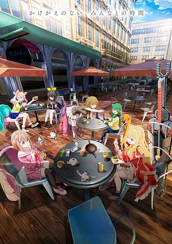

**Studio:** GoHands &nbsp;|&nbsp; **Episodes:** 13 &nbsp;|&nbsp; **Director:** Shingo Suzuki (Chief) Susumu Kudo Katsumasa Yokomine &nbsp;|&nbsp; **Aired/Released:** January 2 – March 28 &nbsp;|&nbsp; **Genres:** Action, Post Apocalypse, Super Power

> Robotic invaders wiped out all life, but Renge fights to survive using her powers. With no memories, she roams the city until she meets five other young women, each with unique abilities. Together, they make the most of their lives, cooking delicious meals between battles with mechanical monstrosities. As they uncover the secrets of their powers and pasts, they find strength in their friendship.
>
> _Synopsis source: Kitsu_

[Wikipedia](https://en.wikipedia.org/wiki/Momentary_Lily) · [Kitsu](https://kitsu.io/anime/momentary-lily)

---

### I Got Married to the Girl I Hate Most in Class

**Studio:** Studio Gokumi AXsiZ &nbsp;|&nbsp; **Episodes:** 12 &nbsp;|&nbsp; **Director:** Hiroyuki Oshima &nbsp;|&nbsp; **Aired/Released:** January 3 – March 21

[Wikipedia](https://en.wikipedia.org/wiki/I_Got_Married_to_the_Girl_I_Hate_Most_in_Class)

---

### Beheneko: The Elf-Girl's Cat Is Secretly an S-Ranked Monster!

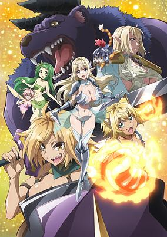

**Studio:** Zero-G Saber Works &nbsp;|&nbsp; **Episodes:** 12 &nbsp;|&nbsp; **Director:** Tetsuo Hirakawa &nbsp;|&nbsp; **Aired/Released:** January 4 – March 22 &nbsp;|&nbsp; **Genres:** Magic, Elf, Fantasy, Seinen, Action, Adventure, Ecchi, Comedy

> A knight is reborn as a baby behemoth that looks an awful lot like an adorable house cat. His situation grows even more confusing when a beautiful elven adventurer mistakes him for a furry feline and adopts him as her pet.
>
> _Synopsis source: Kitsu_

[Wikipedia](https://en.wikipedia.org/wiki/I%27m_a_Behemoth) · [Kitsu](https://kitsu.io/anime/SRank-Monster-no-Behemoth-Dakedo-Neko-to-Machigawarete-Elf-Musume-no-Pet-to-Shite-Kurashitemasu)

---

### Sorairo Utility

**Studio:** Yostar Pictures &nbsp;|&nbsp; **Episodes:** 12 &nbsp;|&nbsp; **Director:** Kengo Saitō &nbsp;|&nbsp; **Aired/Released:** January 4 – March 22

[Wikipedia](https://en.wikipedia.org/wiki/Sorairo_Utility)

---

### Head Start at Birth (season 2)

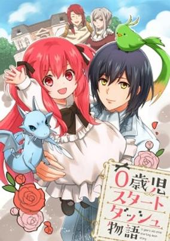

**Episodes:** 12 &nbsp;|&nbsp; **Aired/Released:** January 5 – March 23 &nbsp;|&nbsp; **Genres:** Isekai, Adventure, Fantasy

> Lilia, the newborn daughter of a marquis, has the memories of her previous life! With cheat-like gamer knowledge she aims to become the strongest girl in this new "other world"!
>
> _Synopsis source: Kitsu_

[Wikipedia](https://en.wikipedia.org/wiki/Head_Start_at_Birth) · [Kitsu](https://kitsu.io/anime/0-saiji-start-dash-monogatari)

---

### I Want to Escape from Princess Lessons (I Want to Escape From Princess Training)

**Studio:** EMT Squared &nbsp;|&nbsp; **Episodes:** 12 &nbsp;|&nbsp; **Director:** Shinobu Tagashira &nbsp;|&nbsp; **Aired/Released:** January 5 – March 23 &nbsp;|&nbsp; **Genres:** Shoujo, Fantasy, Comedy, Romance

> Duchess Leticia Dorman has been betrothed to Crown Prince Clarke since age seven. She was once a rambunctious and free-spirited child, but the strict education she's receiving to make her a fit future princess has really put a cramp in her lifestyle. Her only hope is that the prince might someday take an interest in someone else—so when Clarke shows up to a royal ball with an unknown woman at his side, Lettie is overcome with delight, presuming her dream has come true and her engagement has been broken off! She wastes no time retreating to an easygoing countryside life, but her newfound peace is cut short when the prince shows up and claims she's still his fiancée! Clarke is determined to win Lettie over and marry her, while Lettie is determined to resist his charms and escape! Who will emerge victorious in this heart-pounding battle of wills?
>
> _Synopsis source: Kitsu_

[Wikipedia](https://en.wikipedia.org/wiki/I_Want_to_Escape_from_Princess_Lessons) · [Kitsu](https://kitsu.io/anime/kisaki-kyouiku-kara-nigetai-watashi)

---

### I'm Living with an Otaku NEET Kunoichi!? (I’m Living with an Otaku NEET Kunoichi!?)

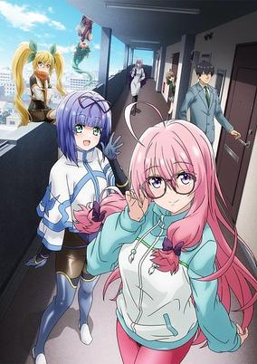

**Studio:** Quad &nbsp;|&nbsp; **Episodes:** 24 &nbsp;|&nbsp; **Director:** Hisashi Saito &nbsp;|&nbsp; **Aired/Released:** January 5 – June 22 &nbsp;|&nbsp; **Genres:** Comedy, Ecchi, Romance, Ninja, Supernatural

> In order to protect an ordinary businessman, Tsukasa Atsumi, from demons, a genius kunoichi, Shizuri Ideura, signs a master-servant contract with him on the condition that she stays with him. Despite her cool appearance of defeating demons, Shizuri is an otaku NEET who spends all her time playing video games. While Shizuri is spoiled by Tsukasa and leads a lazy cohabitation life, the quirky Kunoichi gather together... A romantic comedy about living together with a genius Kunoichi who is an otaku and a NEET!
>
> _Synopsis source: Kitsu_

[Wikipedia](https://en.wikipedia.org/wiki/I%27m_Living_with_an_Otaku_NEET_Kunoichi!%3F) · [Kitsu](https://kitsu.io/anime/neet-de-otaku-na-kunoichi-to-naze-ka-dousei-hajimemashita)

---

### Medalist

**Studio:** ENGI &nbsp;|&nbsp; **Episodes:** 13 &nbsp;|&nbsp; **Director:** Yasutaka Yamamoto &nbsp;|&nbsp; **Aired/Released:** January 5 – March 30 &nbsp;|&nbsp; **Genres:** Drama, Sports, Psychological

> Tsukasa Akeuraji, a frustrated skater, meets Inori Yuitsuka, a girl who yearns to be a figure skater. Motivated by Inori's obsession on the rink, Tsukasa begins coaching Inori. Inori's talent blossoms, and Tsukasa becomes a brilliant mentor. Together they aim to make her a glorious medalist!
>
> _Synopsis source: Kitsu_

[Wikipedia](https://en.wikipedia.org/wiki/Medalist_(manga)) · [Kitsu](https://kitsu.io/anime/medalist)

---

### Okitsura: Fell in Love with an Okinawan Girl, but I Just Wish I Know What She's Saying

**Studio:** Millepensee &nbsp;|&nbsp; **Episodes:** 12 &nbsp;|&nbsp; **Director:** Shin Itagaki (Chief) Shingo Tanabe &nbsp;|&nbsp; **Aired/Released:** January 5 – March 23 &nbsp;|&nbsp; **Genres:** Comedy, Romance, School Life

> Teruaki Nakamura recently transferred to a school in Okinawa from Tokyo and fell in love with a girl. Unfortunately, he can't understand her dialect! With the help of his new friend Higa-san, Nakamura will experience a cross-cultural romance on the southern island.
>
> _Synopsis source: Kitsu_

[Wikipedia](https://en.wikipedia.org/wiki/Okitsura) · [Kitsu](https://kitsu.io/anime/okinawa-de-suki-ni-natta-ko-ga-hougen-sugite-tsura-sugiru)

---

### Solo Leveling: Arise from the Shadow (Solo Leveling)

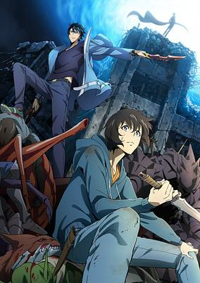

**Studio:** A-1 Pictures &nbsp;|&nbsp; **Episodes:** 13 &nbsp;|&nbsp; **Director:** Shunsuke Nakashige &nbsp;|&nbsp; **Aired/Released:** January 5 – March 30 &nbsp;|&nbsp; **Genres:** Action, Fantasy, Magic, Adventure, Human Enhancement, Earth, Korea

> They say whatever doesn’t kill you makes you stronger, but that’s not the case for the world’s weakest hunter Sung Jinwoo. After being brutally slaughtered by monsters in a high-ranking dungeon, Jinwoo came back with the System, a program only he could see, that’s leveling him up in every way. Now, he’s inspired to discover the secrets behind his powers and the dungeon that spawned them.
>
> _Synopsis source: Kitsu_

[Wikipedia](https://en.wikipedia.org/wiki/Solo_Leveling) · [Kitsu](https://kitsu.io/anime/solo-leveling)

---

### Zenshu

**Studio:** MAPPA &nbsp;|&nbsp; **Episodes:** 12 &nbsp;|&nbsp; **Director:** Mitsue Yamazaki &nbsp;|&nbsp; **Aired/Released:** January 5 – March 23

[Wikipedia](https://en.wikipedia.org/wiki/Zenshu_(TV_series))

---

### Headhunted to Another World: From Salaryman to Big Four! (Headhunted to Another World: From Salaryman to Heavenly King!)

**Studio:** Geek Toys CompTown &nbsp;|&nbsp; **Episodes:** 12 &nbsp;|&nbsp; **Director:** Michio Fukuda &nbsp;|&nbsp; **Aired/Released:** January 6 – March 24 &nbsp;|&nbsp; **Genres:** Adventure, Comedy, Fantasy, Isekai, Demon, Magic, Working Life, Politics, Elf

> The four heavenly kings of the Demon King's army who reign over another world. The person chosen for the last seat was... Dennosuke Uchimura, a dull salaryman! Headhunted by the Demon King's army, Uchimura was offered a position at the executive level, but the Demon King's army's work is a series of tough missions that put his life on the line...?! Uchimura, who has no special skills, faces the challenges of this other world with the experience and wisdom of a salaryman! A story of changing jobs in another world for all working people!
>
> _Synopsis source: Kitsu_

[Wikipedia](https://en.wikipedia.org/wiki/Headhunted_to_Another_World) · [Kitsu](https://kitsu.io/anime/salaryman-ga-isekai-ni-ittara-shitennou-ni-natta-hanashi)

---

### I Have a Crush at Work

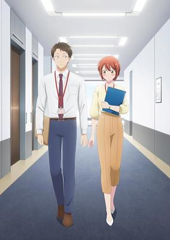

**Studio:** Blade &nbsp;|&nbsp; **Episodes:** 12 &nbsp;|&nbsp; **Director:** Naoko Takeichi &nbsp;|&nbsp; **Aired/Released:** January 6 – March 24 &nbsp;|&nbsp; **Genres:** Comedy, Romance, Slice of Life, Office Lady, Working Life, Seinen

> Yui Mitsuya and Masugu Tateishi aren't just any coworkers-they totally have the hots for each other. His helpful yet humble attitude makes her giddy, and her cuteness leaves him grinning like a fool. Problem is, they're trying to keep their new relationship under wraps to avoid making things awkward at work. But seeing how they can't keep their hands off each other, they run the risk of spilling their little secret with each passing day at the office.
>
> _Synopsis source: Kitsu_

[Wikipedia](https://en.wikipedia.org/wiki/I_Have_a_Crush_at_Work) · [Kitsu](https://kitsu.io/anime/kono-kaisha-ni-suki-na-hito-ga-imasu)

---

### My Happy Marriage (season 2)

**Studio:** Kinema Citrus &nbsp;|&nbsp; **Episodes:** 13 &nbsp;|&nbsp; **Director:** Takehiro Kubota Masayuki Kojima &nbsp;|&nbsp; **Aired/Released:** January 6 – April 9

[Wikipedia](https://en.wikipedia.org/wiki/My_Happy_Marriage)

---

### Promise of Wizard

**Studio:** Liden Films &nbsp;|&nbsp; **Episodes:** 12 &nbsp;|&nbsp; **Director:** Naoyuki Tatsuwa &nbsp;|&nbsp; **Aired/Released:** January 6 – March 24 &nbsp;|&nbsp; **Genres:** Fantasy, Magic, Josei

> On a moonlit night, Akira Masaki finds herself in a magical world where wizards and humans coexist. Every year, they must face an enormous, deadly moon that attacks the planet. Their only hope lies with the Wizards of the Sage, appointed to fight the supernatural threat. But Akira soon discovers she wasn’t summoned by chance—she was chosen to lead them in battle.
>
> _Synopsis source: Kitsu_

[Wikipedia](https://en.wikipedia.org/wiki/Promise_of_Wizard) · [Kitsu](https://kitsu.io/anime/mahoutsukai-no-yakusoku)

---

### Bogus Skill "Fruitmaster" (Bogus Skill <<Fruitmaster>> ~About that time I became able to eat unlimited numbers of Skill Fruits (that kill you)~)

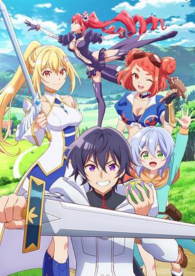

**Studio:** Asahi Production &nbsp;|&nbsp; **Episodes:** 12 &nbsp;|&nbsp; **Director:** Ryuichi Kimura &nbsp;|&nbsp; **Aired/Released:** January 7 – March 25 &nbsp;|&nbsp; **Genres:** Action, Adventure, Comedy, Fantasy

> In this world, one can gain special abilities by eating a skill fruit only once. To eat another is a certain death sentence. However, Light obtains a skill called "Fruit Master," which is unsuitable for battle. He resigns himself to a life as a farmer, but by chance, he eats another skill fruit. At this moment, he learns the hidden ability of "Fruit Master." "Why haven't I died? Is this some sort of new skill—" This is the story of a lowly farmer becoming the strongest by acquiring numerous different abilities. (Source: Shousetsuka ni Narou, translated) Note: Each episode streamed 1 week early on ABEMA and Cunrchyroll. The original TV broadcast started on January 7, 2025.
>
> _Synopsis source: Kitsu_

[Wikipedia](https://en.wikipedia.org/wiki/Bogus_Skill_%22Fruitmaster%22) · [Kitsu](https://kitsu.io/anime/hazure-skill-kinomi-master-skill-no-mi-tabetara-shinu-wo-mugen-ni-taberareru-you-ni-natta-ken-nitsuite)

---

### I'm a Noble on the Brink of Ruin, So I Might as Well Try Mastering Magic

**Studio:** Studio Deen Marvy Jack &nbsp;|&nbsp; **Episodes:** 12 &nbsp;|&nbsp; **Director:** Kenichi Ishikura &nbsp;|&nbsp; **Aired/Released:** January 7 – March 25 &nbsp;|&nbsp; **Genres:** Adventure, Fantasy

> What’s a guy to do when his life suddenly changes while innocently enjoying a nice, cold drink after work? And I mean really changes. This middle-aged commoner now finds himself in the body of Liam Hamilton, the young son of a noble house teetering on the brink of collapse. Between his fervidly desperate father and his utterly apathetic brothers, the only bright side to his new situation is that Liam can finally try learning magic like he’s always wanted. Little does he know his hobby of choice may be about to turn his life upside-down yet again! Will Liam be able to master the craft of magic? And will it be enough to save him from the shadow looming over his family...?
>
> _Synopsis source: Kitsu_

[Wikipedia](https://en.wikipedia.org/wiki/I%27m_a_Noble_on_the_Brink_of_Ruin,_So_I_Might_as_Well_Try_Mastering_Magic) · [Kitsu](https://kitsu.io/anime/botsuraku-yotei-no-kizoku-dakedo-hima-datta-kara-mahou-wo-kiwamete-mita)

---

### Medaka Kuroiwa Is Impervious to My Charms

**Studio:** SynergySP &nbsp;|&nbsp; **Episodes:** 12 &nbsp;|&nbsp; **Director:** Yoshiaki Okumura &nbsp;|&nbsp; **Aired/Released:** January 7 – March 25 &nbsp;|&nbsp; **Genres:** Comedy, School Life, Slice of Life, Shounen

> For Mona Kawai, winning hearts and turning heads comes naturally. Everything changes when Medaka Kuroiwa, a new transfer student, arrives. He won’t even give Mona a second look, and it turns her life upside down! Mona tries everything she can to win Medaka over, even going to the extreme at times. Tune in to a new rom-com about a queen bee and an unfazed boy among the school’s halls.
>
> _Synopsis source: Kitsu_

[Wikipedia](https://en.wikipedia.org/wiki/Medaka_Kuroiwa_Is_Impervious_to_My_Charms) · [Kitsu](https://kitsu.io/anime/kuroiwa-medaka-ni-watashi-no-kawaii-ga-tsuujinai)

---

### Unnamed Memory (season 2)

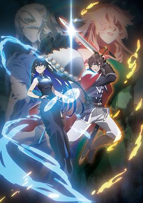

**Studio:** ENGI &nbsp;|&nbsp; **Episodes:** 12 &nbsp;|&nbsp; **Director:** Kazuya Miura &nbsp;|&nbsp; **Aired/Released:** January 7 – March 25 &nbsp;|&nbsp; **Genres:** Adventure, Fantasy, Romance, Action, Magic, Time Travel, Demon, Parallel Universe, Drama, Comedy

> "My wish as champion is for you to descend the tower and be my wife." Seeking to end a curse thwarting his lineage, Prince Oscar sets out on a quest that leads him to a powerful and beautiful witch, Tinasha, and he demands a unique bargain: marriage. Though unenthused by the proposal, she agrees to stay in his castle for a year while researching the spell cast upon him. But beneath her beauty lies a lifetime of dark secrets that soon come to light.
>
> _Synopsis source: Kitsu_

[Wikipedia](https://en.wikipedia.org/wiki/Unnamed_Memory) · [Kitsu](https://kitsu.io/anime/unnamed-memory)

---

### Flower and Asura

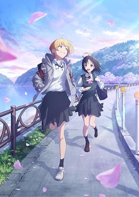

**Studio:** Studio Bind &nbsp;|&nbsp; **Episodes:** 12 &nbsp;|&nbsp; **Director:** Ayumu Uwano &nbsp;|&nbsp; **Aired/Released:** January 8 – March 26 &nbsp;|&nbsp; **Genres:** Drama, Slice of Life, Seinen, School Clubs, School Life

> Hana wa Saku, Shura no Gotoku is a coming-of-age tale set on Tonaru Island, a small island with a population of 600 people. In this setting, Hana Haruyama is a first year high school student who loves to recite works of literature aloud. One day, she is invited by second year student Mizuki Usurai to join the school's broadcasting club, because Mizuki believes that Hana's “reading” has the power to attract people's attention.
>
> _Synopsis source: Kitsu_

[Wikipedia](https://en.wikipedia.org/wiki/Flower_and_Asura) · [Kitsu](https://kitsu.io/anime/hana-wa-saku-shura-no-gotoku)

---

### Ishura (season 2)

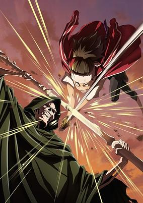

**Studio:** Passione Sanzigen (CGI) &nbsp;|&nbsp; **Episodes:** 12 &nbsp;|&nbsp; **Director:** Takeo Takahashi (Chief) Yuki Ogawa &nbsp;|&nbsp; **Aired/Released:** January 8 – March 26 &nbsp;|&nbsp; **Genres:** Action, Drama, Fantasy, Swordplay, Battle Royale, Dystopia, Magic, Isekai, Politics, Dragon, Steampunk, Robot, Demon

> In a world where the Demon King has died, a host of demigods capable of felling him have inherited the world: a master fencer who can figure out how to take out their opponent with a single glance; a lancer so swift they can break the sound barrier; a wyvern rogue who fights with three legendary weapons at once; an all-powerful wizard who can speak thoughts into being; and an angelic assassin who deals instant death. Eager to attain the title of “One True Hero,” these champions each pursue challenges against formidable foes and spark conflicts themselves. The battle to determine the mightiest of the mighty begins.
>
> _Synopsis source: Kitsu_

[Wikipedia](https://en.wikipedia.org/wiki/Ishura) · [Kitsu](https://kitsu.io/anime/ishura)

---

### Possibly the Greatest Alchemist of All Time

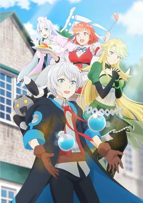

**Studio:** Studio Comet &nbsp;|&nbsp; **Episodes:** 12 &nbsp;|&nbsp; **Director:** Naoyuki Kuzuya &nbsp;|&nbsp; **Aired/Released:** January 8 – March 26 &nbsp;|&nbsp; **Genres:** Adventure, Fantasy, Isekai

> Not even a hero, Takumi Iruma gets accidentally mixed in with a group of heroes chosen to be summoned to another world. As compensation for the mix-up, a goddess offers him the right to choose any skill he wishes for! Hoping for a peaceful and quiet life that has nothing to do with fighting or going into battle, he chooses a seemingly boring creation skill. However, it turns out "alchemy" is the most powerful skill that allows him to create everything from a holy sword to flying ships! This cheat skill he unexpectedly acquired turns him into a wealthy merchant and makes him undefeatable in battles! A heartwarming adventure story about (possibly) the most powerful alchemist in another world!
>
> _Synopsis source: Kitsu_

[Wikipedia](https://en.wikipedia.org/wiki/Possibly_the_Greatest_Alchemist_of_All_Time) · [Kitsu](https://kitsu.io/anime/izure-saikyou-no-renkinjutsushi)

---

### Tasokare Hotel

**Studio:** PRA &nbsp;|&nbsp; **Episodes:** 12 &nbsp;|&nbsp; **Director:** Kōsuke Kuremizu &nbsp;|&nbsp; **Aired/Released:** January 8 – March 26 &nbsp;|&nbsp; **Genres:** Mystery, Supernatural

> The "Tasokare Hotel" never sees afternoon, nor does it see night, but rather exists in a state of endless twilight. This hotel exists in a limbo state, as a place that allows souls who have not yet decided if they are meant to pass on to the afterlife, or remain in the world of the living, to rest their wings. The protagonist, Neko Tsukahara, comes across this "Tasokare Hotel" with no memory of who she is or how she came to be there. An employee leads the way and shows Neko to her room, explaining, "In these rooms, there should be items that are related to our guests' memories. These items can also serve as clues to help our guests remember who they were before they arrived here." As Neko searches for a way to return to this world and remember who she was, a certain incident confronts her...
>
> _Synopsis source: Kitsu_

[Wikipedia](https://en.wikipedia.org/wiki/Tasokare_Hotel) · [Kitsu](https://kitsu.io/anime/tasokare-hotel)

---

### Dr. Stone: Science Future (part 1) (Dr. Stone: Science Future)

**Studio:** TMS Entertainment &nbsp;|&nbsp; **Episodes:** 12 &nbsp;|&nbsp; **Director:** Shūhei Matsushita &nbsp;|&nbsp; **Aired/Released:** January 9 – March 27 &nbsp;|&nbsp; **Genres:** Shounen, Adventure, Science Fiction, Action, Comedy

> The fourth and final season of Dr.STONE.
>
> _Synopsis source: Kitsu_

[Wikipedia](https://en.wikipedia.org/wiki/Dr._Stone_season_4) · [Kitsu](https://kitsu.io/anime/dr-stone-science-future)

---

### Even Given the Worthless "Appraiser" Class, I'm Actually the Strongest

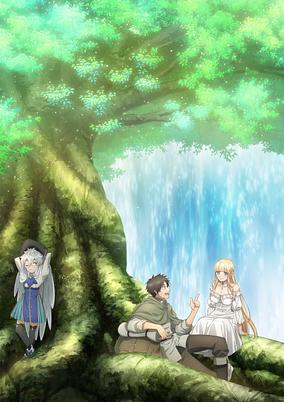

**Studio:** Okuruto Noboru &nbsp;|&nbsp; **Episodes:** 12 &nbsp;|&nbsp; **Director:** Kenta Ōnishi &nbsp;|&nbsp; **Aired/Released:** January 9 – March 27 &nbsp;|&nbsp; **Genres:** Action, Adventure, Comedy, Drama, Fantasy, Romance

> In a fantasy world where "jobs" are god-given from birth, heroes are born, not made... and Ein's job of "Appraiser" has put him about as far from the "hero" pedestal as possible. Used, abused, and eventually abandoned by his fellow adventurers, Ein decides it just isn't worth going on... Lucky for Ein, though, the end may just be the beginning... and a new lease on life. Turns out, his "worthless" job may just be the key to becoming a hero after all...
>
> _Synopsis source: Kitsu_

[Wikipedia](https://en.wikipedia.org/wiki/Even_Given_the_Worthless_%22Appraiser%22_Class,_I%27m_Actually_the_Strongest) · [Kitsu](https://kitsu.io/anime/fuguushoku-kanteishi-ga-jitsu-wa-saikyou-datta-naraku-de-kitaeta-saikyou-no-shingan-de-musou-suru)

---

### Honey Lemon Soda

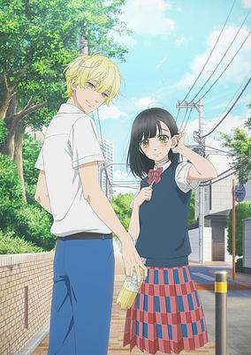

**Studio:** J.C.Staff &nbsp;|&nbsp; **Episodes:** 12 &nbsp;|&nbsp; **Director:** Hiroshi Nishikiori &nbsp;|&nbsp; **Aired/Released:** January 9 – March 27 &nbsp;|&nbsp; **Genres:** Shoujo, Coming Of Age, Romance, School Life

> After middle school, with its bullying and nicknames, Uka Ishimori is excited for a fresh start at Hachimitsu High School. Kai Miura, a cool and uninhibited boy, sits next to her in class. Uka remembers she met Kai in middle school and with a single word, he had convinced her to attend Hachimitsu. Though he’s popular, Kai supports Uka in her efforts to fit in with her new classmates.
>
> _Synopsis source: Kitsu_

[Wikipedia](https://en.wikipedia.org/wiki/Honey_Lemon_Soda) · [Kitsu](https://kitsu.io/anime/honey-lemon-soda)

---

### Magic Maker: How to Make Magic in Another World (Magic Maker: How to Create Magic in Another World)

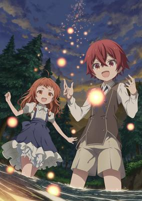

**Studio:** Studio Deen &nbsp;|&nbsp; **Episodes:** 12 &nbsp;|&nbsp; **Director:** Kazuomi Koga &nbsp;|&nbsp; **Aired/Released:** January 9 – March 27 &nbsp;|&nbsp; **Genres:** Adventure, Slice of Life, Action, Magic, Fantasy, Isekai

> A man who loved magic so much that he stayed a virgin untill age 30 can't use magic after all! What will happen when he's reborn into an isekai where there's no magic? Will he be able to become a pioneer of magic?
>
> _Synopsis source: Kitsu_

[Wikipedia](https://en.wikipedia.org/wiki/Magic_Maker) · [Kitsu](https://kitsu.io/anime/magic-maker-isekai-mahou-no-tsukurikata)

---

### The Daily Life of a Middle-Aged Online Shopper in Another World

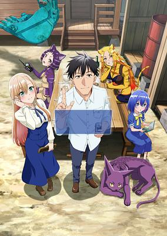

**Studio:** East Fish Studio &nbsp;|&nbsp; **Episodes:** 13 &nbsp;|&nbsp; **Director:** Yoshihide Yūzumi &nbsp;|&nbsp; **Aired/Released:** January 9 – April 3 &nbsp;|&nbsp; **Genres:** Isekai, Action, Adventure, Comedy, Drama, Ecchi, Fantasy, Romance, Slice of Life

> Kenichi, a single man in his 40s, transmigrates to another world while foraging in the mountains, and he gets out of danger by using the special online shopping skill that he was given when he was transferred. With the buy-back function, he can cash in his otherworldly belongings and buy goods from modern Japan. When he started selling those items in the market, they quickly became popular and sold for a good price. He could have continued to grow his store, but Kenichi's goal is to live a slow life. He is happy living self-sufficiently on the outskirts of town, but one after another, trouble arises. A middle-aged man's mail-order life in another world begins now!
>
> _Synopsis source: Kitsu_

[Wikipedia](https://en.wikipedia.org/wiki/The_Daily_Life_of_a_Middle-Aged_Online_Shopper_in_Another_World) · [Kitsu](https://kitsu.io/anime/arafou-otoko-no-isekai-tsuuhan-seikatsu)

---

### Anyway, I'm Falling in Love with You

**Studio:** Typhoon Graphics &nbsp;|&nbsp; **Episodes:** 12 &nbsp;|&nbsp; **Director:** Junichi Yamamoto &nbsp;|&nbsp; **Aired/Released:** January 10 – March 28 &nbsp;|&nbsp; **Genres:** Drama, Romance, Shoujo

> It's July 1, 2020. Mizuha, a high school second-year, is having the worst seventeenth birthday ever. She's missing her chance to get close to the older student she admires, and her parents didn't even remember that it's her birthday. Worst of all, there's a new and unknown infectious disease making the rounds, so all her club tournaments and school trips have been canceled. She's convinced that she'll never have the dazzling youth that she's always dreamed of... but then her childhood friend, Mizuki, suddenly declares himself a candidate to be her boyfriend. This is a school youth story about four childhood friends who grew up like family, one being the heroine, Nishino Mizuha, and the four boys she grew up with whom she sees as family.
>
> _Synopsis source: Kitsu_

[Wikipedia](https://en.wikipedia.org/wiki/Anyway,_I%27m_Falling_in_Love_with_You) · [Kitsu](https://kitsu.io/anime/douse-koishite-shimaunda)

---

### Aquarion: Myth of Emotions (Genesis of Aquarion Myth of Emotions)

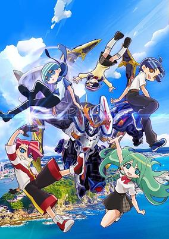

**Studio:** Satelight &nbsp;|&nbsp; **Episodes:** 12 &nbsp;|&nbsp; **Director:** Kenji Itoso &nbsp;|&nbsp; **Aired/Released:** January 10 – March 28 &nbsp;|&nbsp; **Genres:** Fantasy, Mecha, Action

> The Aquarion, a giant mechanized fighting suit, is humanity’s best weapon against interstellar threats. Human pilots trained and worked together to defeat Shadow Angels, invading Abductors, and kinetic energy monsters over thousands of years. Once again, humanity must turn to the Aquarion. With the fate of the Earth hanging in the balance, will the suit be enough to save mankind?
>
> _Synopsis source: Kitsu_

[Kitsu](https://kitsu.io/anime/sousei-no-aquarion-myth-of-emotions)

---

### Farmagia

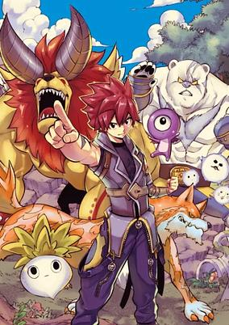

**Studio:** Bridge &nbsp;|&nbsp; **Episodes:** 12 &nbsp;|&nbsp; **Director:** Shinji Ishihira (Chief) Toshihiko Sano &nbsp;|&nbsp; **Aired/Released:** January 10 – March 28 &nbsp;|&nbsp; **Genres:** Fantasy, Action

> In Felicidad, farmers known as the Farmagia raise monsters under the peaceful rule of the Magus Diluculum. After the Magus passes, a power struggle erupts among forces using monsters to seize control. In the town of Centvelt, Farmagia Ten and his friends band together against the despotic new ruler, Glaza. Ten, his friends, and their home-grown monsters must stay strong to defend their freedom.
>
> _Synopsis source: Kitsu_

[Wikipedia](https://en.wikipedia.org/wiki/Farmagia) · [Kitsu](https://kitsu.io/anime/farmagia)

---

### From Bureaucrat to Villainess: Dad's Been Reincarnated!

**Studio:** Ajiado &nbsp;|&nbsp; **Episodes:** 12 &nbsp;|&nbsp; **Director:** Tetsuya Takeuchi &nbsp;|&nbsp; **Aired/Released:** January 10 – March 28

[Wikipedia](https://en.wikipedia.org/wiki/From_Bureaucrat_to_Villainess)

---

### The Apothecary Diaries (season 2)

**Studio:** Toho Animation Studio OLM &nbsp;|&nbsp; **Episodes:** 24 &nbsp;|&nbsp; **Director:** Norihiro Naganuma (Chief) Akinori Fudesaka &nbsp;|&nbsp; **Aired/Released:** January 10 – July 4

[Wikipedia](https://en.wikipedia.org/wiki/The_Apothecary_Diaries_(TV_series))

---

### Welcome to Japan, Ms. Elf!

**Studio:** Zero-G &nbsp;|&nbsp; **Episodes:** 12 &nbsp;|&nbsp; **Director:** Tōru Kitahata &nbsp;|&nbsp; **Aired/Released:** January 10 – March 28 &nbsp;|&nbsp; **Genres:** Elf, Fantasy, Slice of Life, Comedy, Romance

> Ms. Elf is intrigued by Japanese culture?! Working adult Kitase Kazuhiro’s hobby is sleeping. Ever since he was a child, he’s had exciting adventures in the mysterious other world he dreams about. One day, while exploring ancient ruins with an elf girl he befriended, he is unfortunately burned by the breath of a magic dragon he encounters. When he awakens from his dream, an elf girl who shouldn’t be in his room is sleeping next to him…
>
> _Synopsis source: Kitsu_

[Wikipedia](https://en.wikipedia.org/wiki/Welcome_to_Japan,_Ms._Elf!) · [Kitsu](https://kitsu.io/anime/nihon-e-youkoso-elf-san)

---

### Babanba Banban Vampire

**Studio:** Gaina &nbsp;|&nbsp; **Episodes:** 12 &nbsp;|&nbsp; **Director:** Itsuro Kawasaki &nbsp;|&nbsp; **Aired/Released:** January 11 – March 29 &nbsp;|&nbsp; **Genres:** Comedy, Romance, Supernatural, Vampire, Shounen Ai, Shounen

> The story begins with a 450-year-old vampire named Ranmaru, working part-time at an old public bath. He desires the blood of an 18-year-old virgin, and so watches over the growth of 15-year-old Rihito, the son of the bathhouse owners.
>
> _Synopsis source: Kitsu_

[Wikipedia](https://en.wikipedia.org/wiki/Babanba_Banban_Vampire) · [Kitsu](https://kitsu.io/anime/baban-baban-ban-vampire)

---

### I May Be a Guild Receptionist, But I'll Solo Any Boss to Clock Out on Time

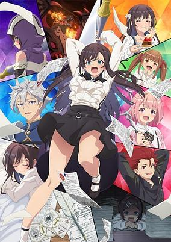

**Studio:** CloverWorks &nbsp;|&nbsp; **Episodes:** 12 &nbsp;|&nbsp; **Director:** Tsuyoshi Nagasawa &nbsp;|&nbsp; **Aired/Released:** January 11 – March 29 &nbsp;|&nbsp; **Genres:** Action, Adventure, Fantasy, Comedy

> Alina thought she had found the perfect job as a guild receptionist. It’s stable, safe, and has a super cute uniform. But this dream gig turns into an overtime nightmare whenever adventurers get stuck clearing a dungeon. Tired of the long nights, Alina starts taking down the bosses herself! She even earns the name Executioner for her impressive skills. Can she keep her identity a secret?
>
> _Synopsis source: Kitsu_

[Wikipedia](https://en.wikipedia.org/wiki/I_May_Be_a_Guild_Receptionist,_But_I%27ll_Solo_Any_Boss_to_Clock_Out_on_Time) · [Kitsu](https://kitsu.io/anime/guild-no-uketsukejou-desu-ga-zangyou-wa-iya-nanode-boss-wo-solo-tobatsu-shiyou-to-omoimasu)

---

### Sakamoto Days (part 1) (Sakamoto Days)

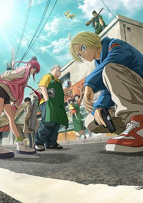

**Studio:** TMS Entertainment &nbsp;|&nbsp; **Episodes:** 11 &nbsp;|&nbsp; **Director:** Masaki Watanabe &nbsp;|&nbsp; **Aired/Released:** January 11 – March 22 &nbsp;|&nbsp; **Genres:** Action, Comedy, Assassin, Shounen, Family, Crime

> When Sakamoto meets Aoi, the convenience store clerk, it’s love at first sight — and just like that, he retires. Sakamoto gets married, has a daughter, opens a mom-and-pop store in a quiet town, and completely transforms … into a plus-size man. To ensure a peaceful life with his beloved family, the legendary ex–hit man bands together with comrades to face off against the looming threat of assassins. (Source: Netflix TUDUM) Note: The series is streaming a week in advance on Netflix Japan starting with episode 2 released alongside episode 1.
>
> _Synopsis source: Kitsu_

[Wikipedia](https://en.wikipedia.org/wiki/Sakamoto_Days) · [Kitsu](https://kitsu.io/anime/sakamoto-days)

---

### Übel Blatt

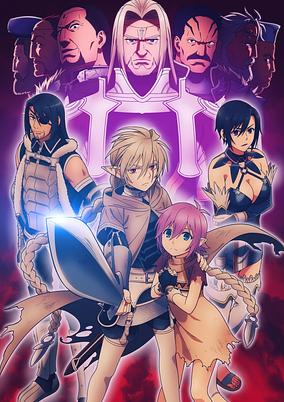

**Studio:** Satelight Staple Entertainment &nbsp;|&nbsp; **Episodes:** 12 &nbsp;|&nbsp; **Director:** Takashi Naoya &nbsp;|&nbsp; **Aired/Released:** January 11 – March 29 &nbsp;|&nbsp; **Genres:** Action, Fantasy, Adventure, Ecchi, Drama, Seinen

> Fourteen warriors set out to prevent an invasion, but only seven returned. Three died along the way, and four were slain for betraying the empire. In truth, the Seven Heroes turned on their allies so they could take all the glory. Ascheriit was their victim, but now, 20 years later, he is back to get revenge.
>
> _Synopsis source: Kitsu_

[Wikipedia](https://en.wikipedia.org/wiki/%C3%9Cbel_Blatt) · [Kitsu](https://kitsu.io/anime/ubel-blatt)

---

### UniteUp! Uni:Birth

**Studio:** CloverWorks &nbsp;|&nbsp; **Episodes:** 12 &nbsp;|&nbsp; **Director:** Shinichiro Ushijima &nbsp;|&nbsp; **Aired/Released:** January 11 – April 5

[Wikipedia](https://en.wikipedia.org/wiki/UniteUp!)

---

### I Left My A-Rank Party to Help My Former Students Reach the Dungeon Depths!

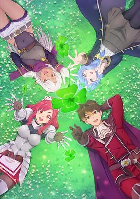

**Studio:** Bandai Namco Pictures &nbsp;|&nbsp; **Episodes:** 24 &nbsp;|&nbsp; **Director:** Katsumi Ono &nbsp;|&nbsp; **Aired/Released:** January 12 – June 29 &nbsp;|&nbsp; **Genres:** Fantasy, Action, Adventure, Comedy, Harem

> Yuke, a red mage, angrily declares that he's leaving Thunder Pike, the A-rank party he's been with for five years, because he's fed up with being insulted and ridiculed by the other members. While searching for a new party, he runs into his former students Marina, Silk, and Rain, and decides to join their party, Clover. Encouraged by their admiration of him as their teacher, Yuke leads them in completing several quests that show off his own extraordinary magic and skills while bringing out the girls' abilities to their fullest. Then, through an "adventure broadcast" by an artifact known as Camelot, Clover becomes well-known throughout society. The party's dream is to conquer Achromatic Darkness, the most challenging dungeon of all, but as they take on other dungeons in hopes of eventually achieving that goal, they gradually become entangled in chaos that threatens the whole world...
>
> _Synopsis source: Kitsu_

[Wikipedia](https://en.wikipedia.org/wiki/I_Left_My_A-Rank_Party_to_Help_My_Former_Students_Reach_the_Dungeon_Depths!) · [Kitsu](https://kitsu.io/anime/a-rank-party-wo-ridatsu-shita-ore-wa-moto-oshiegotachi-to-meikyuu-shinbu-wo-mezasu)

---

### Kinnikuman: Perfect Origin Arc (season 2)

**Studio:** Production I.G &nbsp;|&nbsp; **Episodes:** 11 &nbsp;|&nbsp; **Director:** Akira Sato &nbsp;|&nbsp; **Aired/Released:** January 12 – March 30

[Wikipedia](https://en.wikipedia.org/wiki/Kinnikuman)

---

### Mashin Creator Wataru

**Studio:** Bandai Namco Pictures &nbsp;|&nbsp; **Episodes:** 24 &nbsp;|&nbsp; **Director:** Yumi Kamakura &nbsp;|&nbsp; **Aired/Released:** January 12 – June 22

[Wikipedia](https://en.wikipedia.org/wiki/Mashin_Creator_Wataru)

---

### The 100 Girlfriends Who Really, Really, Really, Really, Really Love You (season 2)

**Studio:** Bibury Animation Studios &nbsp;|&nbsp; **Episodes:** 12 &nbsp;|&nbsp; **Director:** Hikaru Sato &nbsp;|&nbsp; **Aired/Released:** January 12 – March 30

[Wikipedia](https://en.wikipedia.org/wiki/The_100_Girlfriends_Who_Really,_Really,_Really,_Really,_Really_Love_You)

---

### The Red Ranger Becomes an Adventurer in Another World

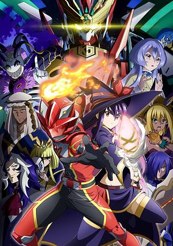

**Studio:** Satelight &nbsp;|&nbsp; **Episodes:** 12 &nbsp;|&nbsp; **Director:** Keiichiro Kawaguchi &nbsp;|&nbsp; **Aired/Released:** January 12 – March 30 &nbsp;|&nbsp; **Genres:** Henshin, Action, Adventure, Comedy, Fantasy, Shounen, Superhero, Isekai

> Asagaki Togo was the Red Ranger in a heroic Ranger squad. During their final battle against the ultimate evil organization, he suffers a crushing defeat and resigns himself to death... That is, until he finds himself reborn in an entirely different world! Embracing his new role as an adventurer, he transforms into Kizuna Red and continues his pursuit of justice, helping those in need. Enjoy this heroic tale of a Ranger becoming the protector of another world!
>
> _Synopsis source: Kitsu_

[Wikipedia](https://en.wikipedia.org/wiki/The_Red_Ranger_Becomes_an_Adventurer_in_Another_World) · [Kitsu](https://kitsu.io/anime/sentai-red-isekai-de-boukensha-ni-naru)

---

### Toilet-Bound Hanako-kun (season 2 part 1)

**Studio:** Lerche &nbsp;|&nbsp; **Episodes:** 12 &nbsp;|&nbsp; **Director:** Yōhei Fukui &nbsp;|&nbsp; **Aired/Released:** January 12 – March 30

[Wikipedia](https://en.wikipedia.org/wiki/Toilet-Bound_Hanako-kun)

---

### Witchy Pretty Cure!! Mirai Days

**Studio:** Toei Animation Studio Deen &nbsp;|&nbsp; **Episodes:** 12 &nbsp;|&nbsp; **Director:** Takayuki Hamana &nbsp;|&nbsp; **Aired/Released:** January 12 – March 30

[Wikipedia](https://en.wikipedia.org/wiki/Witchy_Pretty_Cure!)

---

### You and Idol Pretty Cure (You and Idol Precure♪)

**Studio:** Toei Animation &nbsp;|&nbsp; **Episodes:** 49 &nbsp;|&nbsp; **Director:** Chiaki Kon &nbsp;|&nbsp; **Aired/Released:** February 2 – January 25, 2026 &nbsp;|&nbsp; **Genres:** Magic, Magical Girl, Idol, Kids, Henshin

> The main character, Sakura Uta, is a second-year middle school student who loves to sing. One day, she meets the fairy Purirun that has come to search for the Legendary Protectors, Idol Precure! Purirun's hometown, KirakiLand has been plunged into total darkness by Darkine, the boss of the Chokkiri Gang. Meanwhile, the sparkles of the townspeople are being stolen by the Chokkiri Gang... it's a huge pinch! "I want to make it sparkle sparkly! Here is my song!" - With this determination, Uta transforms into the Legendary Protector, Cure Idol! She sings, dances, and gives fan service, making it sparkle no matter how pitch-black it is!
>
> _Synopsis source: Kitsu_

[Wikipedia](https://en.wikipedia.org/wiki/You_and_Idol_Pretty_Cure) · [Kitsu](https://kitsu.io/anime/kimi-to-idol-precure)

---

### Twins Hinahima

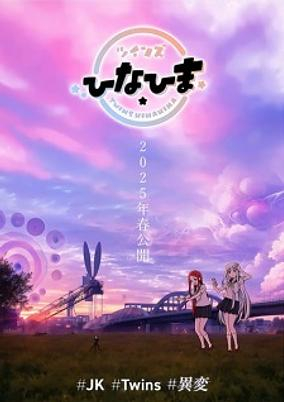

**Studio:** KaKa Technology Studio &nbsp;|&nbsp; **Episodes:** 1 &nbsp;|&nbsp; **Director:** Kō Nakano &nbsp;|&nbsp; **Aired/Released:** March 28 &nbsp;|&nbsp; **Genres:** Isekai

> Two high school girls Himari and Hinana dream of going viral. As they film all sorts of topics that could become a hot topic, they notice something weird and enter a strange world.
>
> _Synopsis source: Kitsu_

[Wikipedia](https://en.wikipedia.org/wiki/Twins_Hinahima) · [Kitsu](https://kitsu.io/anime/twins-hinahima)

---

### Sword of the Demon Hunter: Kijin Gentōshō (Sword of the Demon Hunter: Kijin Gentosho)

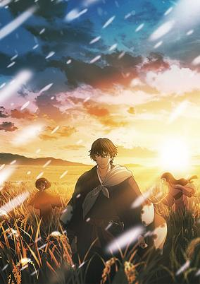

**Studio:** Yokohama Animation Laboratory &nbsp;|&nbsp; **Episodes:** 24 &nbsp;|&nbsp; **Director:** Kazuya Aiura &nbsp;|&nbsp; **Aired/Released:** March 31 – September 29 &nbsp;|&nbsp; **Genres:** Fantasy, Action, Demon, Swordplay, Historical

> In the Edo period, there was a shrine maiden called "Itsukihime" in the mountain village of Kadono. Jinta, a young man who acts as the shrine maiden's guardian despite being a stranger, encounters a mysterious demon who speaks of the far future in the forest where he went to defeat it. From Edo to the Heisei era, this huge Japanese fantasy series follows a demon man who travels through time while continuously questioning the meaning of wielding a sword.
>
> _Synopsis source: Kitsu_

[Kitsu](https://kitsu.io/anime/kijin-gentoushou)

---

### Once Upon a Witch's Death

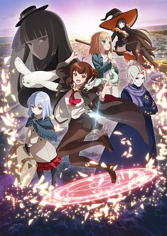

**Studio:** EMT Squared &nbsp;|&nbsp; **Episodes:** 12 &nbsp;|&nbsp; **Director:** Atsushi Nigorikawa &nbsp;|&nbsp; **Aired/Released:** April 1 – June 17 &nbsp;|&nbsp; **Genres:** Magic, Drama, Fantasy, Adventure

> On her seventeenth birthday, the apprentice witch Meg learns that she only has one year left to live. Her teacher, the long-lived witch Faust, explains that the only way to undo the death curse is to collect tears of joy and grow the seed of life. To find them, Meg will have to leave the sheltered life she's always known and head out into the world. There will be meetings, partings, and friendships aplenty, and of course many tears. Meg will learn that the most important lessons for a witch are bright, sweet, and somewhat heart-wrenching.
>
> _Synopsis source: Kitsu_

[Wikipedia](https://en.wikipedia.org/wiki/Once_Upon_a_Witch%27s_Death) · [Kitsu](https://kitsu.io/anime/aru-majo-ga-shinu-made)

---

### Catch Me at the Ballpark!

**Studio:** EMT Squared &nbsp;|&nbsp; **Episodes:** 12 &nbsp;|&nbsp; **Director:** Jun'ichi Kitamura &nbsp;|&nbsp; **Aired/Released:** April 2 – June 18 &nbsp;|&nbsp; **Genres:** Seinen, Baseball, Comedy, Slice of Life, Romance

> To escape his tiring job, weary Murata finds escape at a nearby baseball stadium. While the games are thrilling, it’s Ruriko, the gyaru as cold as the beer she serves but secretly a sweetheart, who keeps him coming back. As her first regular, Murata discovers the warmth behind her frosty demeanor, and their hilarious, heartwarming encounters light up the ballpark and maybe even their hearts.
>
> _Synopsis source: Kitsu_

[Wikipedia](https://en.wikipedia.org/wiki/Catch_Me_at_the_Ballpark!) · [Kitsu](https://kitsu.io/anime/ballpark-de-tsukamaete)

---

### Please Put Them On, Takamine-san

**Studio:** Liden Films &nbsp;|&nbsp; **Episodes:** 12 &nbsp;|&nbsp; **Director:** Tomoe Makino &nbsp;|&nbsp; **Aired/Released:** April 2 – June 18 &nbsp;|&nbsp; **Genres:** Comedy, Ecchi, Stereotypes, Romance, School Life, High School, Shounen, Slice of Life, Female Student, Japan

> Student council president Takane Takamine is a popular star student. On the other hand, Koushi Shirota doesn’t have many friends. That all changes when Koushi accidentally discovers Takane’s ability to go back in time and alter past actions just by changing her lingerie. After some pestering, Koushi agrees to help Takane and be her closet, by having spare lingerie on hand.
>
> _Synopsis source: Kitsu_

[Wikipedia](https://en.wikipedia.org/wiki/Please_Put_Them_On,_Takamine-san) · [Kitsu](https://kitsu.io/anime/haite-kudasai-takamine-san)

---

### The Beginning After the End

**Studio:** Studio A-Cat &nbsp;|&nbsp; **Episodes:** 12 &nbsp;|&nbsp; **Director:** Keitaro Motonaga &nbsp;|&nbsp; **Aired/Released:** April 2 – June 18

[Wikipedia](https://en.wikipedia.org/wiki/The_Beginning_After_the_End)

---

### Your Forma

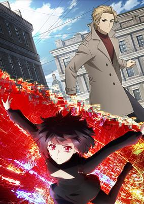

**Studio:** Geno Studio &nbsp;|&nbsp; **Episodes:** 13 &nbsp;|&nbsp; **Director:** Takaharu Ozaki &nbsp;|&nbsp; **Aired/Released:** April 2 – June 25 &nbsp;|&nbsp; **Genres:** Action, Drama, Science Fiction, Mystery, Cyberpunk, Detective, Crime, Robot, Robot Helper

> Your Forma, a technology developed to safeguard against viral encephalitis, has become commonplace. Officer Echika must use this invasive technology to crack cases in a world where your every sight, sound, and emotion is being recorded.
>
> _Synopsis source: Kitsu_

[Wikipedia](https://en.wikipedia.org/wiki/Your_Forma) · [Kitsu](https://kitsu.io/anime/your-forma)

---

### Miru: Paths to My Future

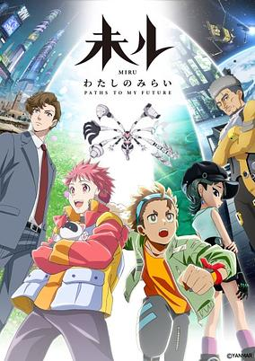

**Studio:** LinQ Trif Studio Scooter Films Shirogumi Reirs Larx Entertainment Studio Hibari &nbsp;|&nbsp; **Episodes:** 5 &nbsp;|&nbsp; **Director:** Norio Kashima Okamoto Tomohiro Kawamura Naofumi Mishina Saori Nakashiki &nbsp;|&nbsp; **Aired/Released:** April 3 – May 1 &nbsp;|&nbsp; **Genres:** Adventure, Science Fiction

> Confrontation and Harmony between Humans and Nature. In the distant future, humans create a robot named MIRU capable of traveling through time, visiting various eras, places, and even parallel worlds. Unlike some robots, MIRU isn't equipped with weapons. Instead, it helps people overcome immense obstacles peacefully, encouraging new beginnings without violence. MIRU continuously evolves by interacting with people, learning and growing to assist those struggling to survive. It listens to their problems and offers support. By helping others, MIRU sets off a “Butterfly Effect”, of dramatic change guiding society toward a brighter future. Why was MIRU created? What is its purpose? Can it save the Earth and humanity from a dystopian future? "The future is in our hands." (Official MIRU Site, edited)
>
> _Synopsis source: Kitsu_

[Kitsu](https://kitsu.io/anime/miru-watashi-no-mirai)

---

### Rock Is a Lady's Modesty (Rock is a Lady’s Modesty)

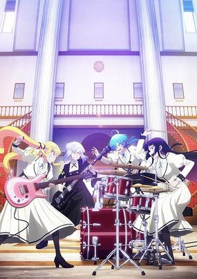

**Studio:** Bandai Namco Pictures &nbsp;|&nbsp; **Episodes:** 13 &nbsp;|&nbsp; **Director:** Shinya Watada &nbsp;|&nbsp; **Aired/Released:** April 3 – June 26 &nbsp;|&nbsp; **Genres:** Seinen, Music, Musical Band, Drama

> At an elite all-girls' academy where refined young ladies gather, Lilisa Suzunomiya, now the daughter of a real estate tycoon after her mother remarried, is forced to abandon her guitar and rock music to fit in. However, her passion is reignited by sounds from the old school building, where she meets a skilled drummer who shares her love for rock. Together, they embrace their inner rockstars, elegantly clashing and shouting their way through the academy in this captivating tale of grace and rebellion.
>
> _Synopsis source: Kitsu_

[Wikipedia](https://en.wikipedia.org/wiki/Rock_Is_a_Lady%27s_Modesty) · [Kitsu](https://kitsu.io/anime/rock-wa-lady-no-tashina-mideshite)

---

### The Brilliant Healer's New Life in the Shadows

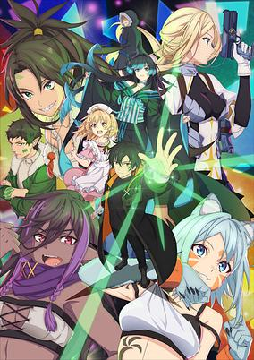

**Studio:** Makaria &nbsp;|&nbsp; **Episodes:** 12 &nbsp;|&nbsp; **Director:** Joe Yoshizaki &nbsp;|&nbsp; **Aired/Released:** April 3 – June 19 &nbsp;|&nbsp; **Genres:** Action, Comedy, Fantasy, Magic, Harem, Elf, Ghost, Slavery

> Banished as “useless,” Zenos, a self-taught healer from the slums, turns despair into defiance and opens a secret clinic in the city’s shadows. With unlicensed, unmatched magic, he cures, comforts, and rights wrongs, quietly becoming a legend. But as his power grows, even the royal palace takes notice. Can he buck the odds and heal a world that cast him aside?
>
> _Synopsis source: Kitsu_

[Wikipedia](https://en.wikipedia.org/wiki/The_Brilliant_Healer%27s_New_Life_in_the_Shadows) · [Kitsu](https://kitsu.io/anime/isshun-de-chiryou-shiteita-no-ni-yakutatazu-to-tsuihou-sareta-tensai-chiyushi-yami-healer-toshite-tanoshiku-ikiru)

---

### Araiguma Calcal-dan

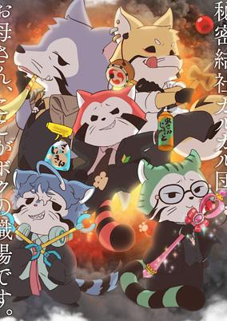

**Studio:** Nippon Animation &nbsp;|&nbsp; **Episodes:** 24 &nbsp;|&nbsp; **Director:** Henry Hirakawa &nbsp;|&nbsp; **Aired/Released:** April 4 – September 12 &nbsp;|&nbsp; **Genres:** Comedy, Slice of Life, Science Fiction, Anthropomorphism

> Comedy spin-off to the Araiguma Rascal (Raccoon Rascal) anime. The story is set around five employees working hard in the lesser Tama branch of a secret society aiming for world domination called the Calcal Group: an aspirational new recruit, a polite but self-conscious superior, a modern guy with a cold attitude to everything, a hotheaded but kind senior employee and a handsome older man leading the pack.
>
> _Synopsis source: Kitsu_

[Wikipedia](https://en.wikipedia.org/wiki/Araiguma_Calcal-dan) · [Kitsu](https://kitsu.io/anime/araiguma-calcal-dan)

---

### Bye Bye, Earth (season 2)

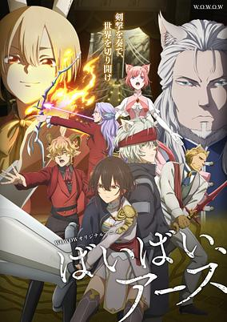

**Studio:** Liden Films &nbsp;|&nbsp; **Episodes:** 10 &nbsp;|&nbsp; **Director:** Yasuto Nishikata &nbsp;|&nbsp; **Aired/Released:** April 4 – June 6 &nbsp;|&nbsp; **Genres:** Action, Adventure, Fantasy, Swordplay

> In a world of anthropomorphic animals, Belle Lablac was born as the only human being. Having no fangs, fur, or scales, she was called "Faceless," and she lived a lonely life with no one else she could identify with. "I want to be part of the world..." With such longing in her heart, she decides to set out on a journey to find her roots, carrying the Runding, a great sword as tall as she is. She doesn’t know how many adversities await her along the way...
>
> _Synopsis source: Kitsu_

[Wikipedia](https://en.wikipedia.org/wiki/Bye_Bye,_Earth) · [Kitsu](https://kitsu.io/anime/bye-bye-earth)

---

### Can a Boy-Girl Friendship Survive?

**Studio:** J.C.Staff &nbsp;|&nbsp; **Episodes:** 12 &nbsp;|&nbsp; **Director:** Yōhei Suzuki &nbsp;|&nbsp; **Aired/Released:** April 4 – June 20 &nbsp;|&nbsp; **Genres:** Comedy, Romance, School Life

> Childhood BFFs Himari and Yuu’s vow of friendship hits turbulence when Yuu reunites with his first crush in high school. Himari, who’s never known the fuzzy warmth of a crush, now must confront her feelings. Their shared dreams and peaceful days as a twosome gardening club are tested in this tale of love, flowers, and growing pains!
>
> _Synopsis source: Kitsu_

[Wikipedia](https://en.wikipedia.org/wiki/Can_a_Boy-Girl_Friendship_Survive%3F) · [Kitsu](https://kitsu.io/anime/danjo-no-yuujou-wa-seiritsu-suru-iya-shinai)

---

### The Dinner Table Detective

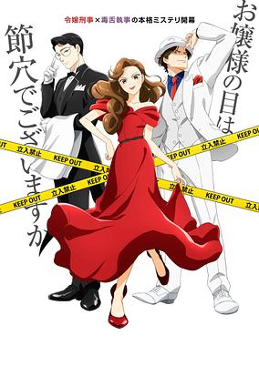

**Studio:** Madhouse &nbsp;|&nbsp; **Episodes:** 12 &nbsp;|&nbsp; **Director:** Mitsuyuki Masuhara &nbsp;|&nbsp; **Aired/Released:** April 4 – June 20 &nbsp;|&nbsp; **Genres:** Drama, Mystery, Comedy, Detective

> Reiko is a rich heiress to a zaibatsu, but she chose to work as a detective. She resents her superior, Kazamatsuri, who always seem to be making illogical deductions that causes murder cases to become cold cases. One day, her butler suddenly announces his retirement, and he chooses Kageyama as his replacement. Reiko realizes that Kageyama's deduction skills are very good after Kageyama solved a seemingly unsolvable mystery. After that, whenever Reiko meets an unsolvable case, she would lay out the details of the case for Kageyama, and he would explain to her how that particular case is solved after dinner. After every case, Kageyama also explains to Reiko some universal truth or human nature that led to each crime being committed.
>
> _Synopsis source: Kitsu_

[Wikipedia](https://en.wikipedia.org/wiki/The_Dinner_Table_Detective) · [Kitsu](https://kitsu.io/anime/nazotoki-wa-dinner-no-ato-de)

---

### Wind Breaker (season 2)

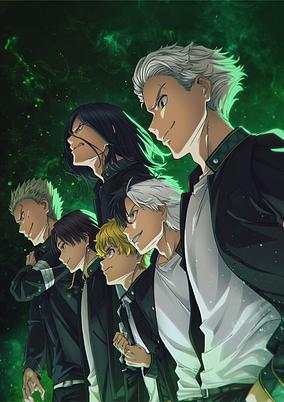

**Studio:** CloverWorks &nbsp;|&nbsp; **Episodes:** 12 &nbsp;|&nbsp; **Director:** Toshifumi Akai &nbsp;|&nbsp; **Aired/Released:** April 4 – June 20 &nbsp;|&nbsp; **Genres:** Delinquent, Action, Comedy, Drama, Shounen, School Life

> Welcome to Furin High School, an institution infamous for its population of brawny brutes who solve every conflict with a show of strength. Some of the students even formed a group, Bofurin, which protects the town. Haruka Sakura, a first-year student who moved in from out of town, is only interested in one thing: fighting his way to the top.
>
> _Synopsis source: Kitsu_

[Wikipedia](https://en.wikipedia.org/wiki/Wind_Breaker_(manga)) · [Kitsu](https://kitsu.io/anime/wind-breaker)

---

### Anne Shirley

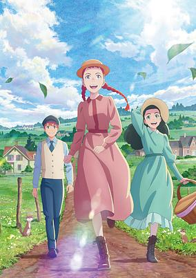

**Studio:** The Answer Studio &nbsp;|&nbsp; **Episodes:** 24 &nbsp;|&nbsp; **Director:** Hiroshi Kawamata &nbsp;|&nbsp; **Aired/Released:** April 5 – September 27 &nbsp;|&nbsp; **Genres:** Drama, Slice of Life, Countryside, Coming Of Age, Shoujo

> On the beautiful Prince Edward Island in Canada, an orphan named Anne Shirley is mistakenly sent to Green Gables, the home of Matthew and Marilla Cuthbert. They choose to adopt her anyway, as Anne finds friendship, love, and happiness in her new home. Come along for the story of a pure-hearted and imaginative girl growing up, leaving for college, and returning home a changed woman.
>
> _Synopsis source: Kitsu_

[Wikipedia](https://en.wikipedia.org/wiki/Anne_Shirley_(2025_TV_series)) · [Kitsu](https://kitsu.io/anime/Anne-Shirley)

---

### Black Butler: Emerald Witch Arc

**Studio:** CloverWorks &nbsp;|&nbsp; **Episodes:** 13 &nbsp;|&nbsp; **Director:** Kenjirou Okada &nbsp;|&nbsp; **Aired/Released:** April 5 – June 28

[Wikipedia](https://en.wikipedia.org/wiki/Black_Butler)

---

### Everyday Host

**Studio:** Fanworks &nbsp;|&nbsp; **Episodes:** 24 &nbsp;|&nbsp; **Director:** Rarecho &nbsp;|&nbsp; **Aired/Released:** April 5 – September 27 &nbsp;|&nbsp; **Genres:** Working Life, Comedy

> This series of shorts is set in a cozy host club called "Club One" a short distance from Shinjuku and follows the outlandish lives of people in the industry.
>
> _Synopsis source: Kitsu_

[Wikipedia](https://en.wikipedia.org/wiki/Everyday_Host) · [Kitsu](https://kitsu.io/anime/everyday-host)

---

### Fire Force (season 3, part 1)

**Studio:** David Production &nbsp;|&nbsp; **Episodes:** 12 &nbsp;|&nbsp; **Director:** Tatsuma Minamikawa &nbsp;|&nbsp; **Aired/Released:** April 5 – June 21

[Wikipedia](https://en.wikipedia.org/wiki/Fire_Force)

---

### From Old Country Bumpkin to Master Swordsman

**Studio:** Passione Hayabusa Film &nbsp;|&nbsp; **Episodes:** 12 &nbsp;|&nbsp; **Director:** Akio Kazumi &nbsp;|&nbsp; **Aired/Released:** April 5 – June 22 &nbsp;|&nbsp; **Genres:** Action, Adventure, Comedy, Fantasy, Swordplay, Harem, Seinen, Magic

> Beryl Gardenant, a middle-aged swordsman running a dojo in the backwaters, lives a quiet life until Allucia, a former student and Commander of the Royal Order of Knights, appears! Beryl’s life is about to change dramatically! City life. Old students. New friends and formidable foes. It’s all too much. But after years of training, he has mad skills, and he’s been dubbed “the backwater swordmaster.”
>
> _Synopsis source: Kitsu_

[Wikipedia](https://en.wikipedia.org/wiki/From_Old_Country_Bumpkin_to_Master_Swordsman) · [Kitsu](https://kitsu.io/anime/katainaka-no-ossan-kensei-ni-naru)

---

### Gag Manga Biyori Go

**Studio:** Studio Deen &nbsp;|&nbsp; **Episodes:** 12 &nbsp;|&nbsp; **Director:** Akitaro Daichi &nbsp;|&nbsp; **Aired/Released:** April 5 – June 21

[Wikipedia](https://en.wikipedia.org/wiki/Gag_Manga_Biyori)

---

### Guilty Gear Strive: Dual Rulers

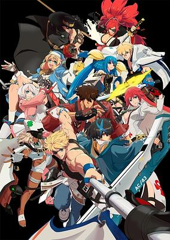

**Studio:** Sanzigen &nbsp;|&nbsp; **Episodes:** 8 &nbsp;|&nbsp; **Director:** Shigeru Morikawa &nbsp;|&nbsp; **Aired/Released:** April 5 – May 24 &nbsp;|&nbsp; **Genres:** Action, Adventure, Science Fiction, Post Apocalypse

> Sin Kiske, the forbidden child of a human and a magically crafted biological weapon called a Gear, lives in a world where magic has replaced science, and scars from the Gear rebellion remain. Attending his parents’ taboo-breaking wedding, he encounters a mysterious girl with a deep hatred for Gears, and their fateful meeting threatens to upend the world once again.
>
> _Synopsis source: Kitsu_

[Kitsu](https://kitsu.io/anime/guilty-gear-strive-dual-rulers)

---

### I've Been Killing Slimes for 300 Years and Maxed Out My Level (season 2)

**Studio:** Teddy &nbsp;|&nbsp; **Episodes:** 12 &nbsp;|&nbsp; **Director:** Kunihisa Sugishima &nbsp;|&nbsp; **Aired/Released:** April 5 – June 21

[Wikipedia](https://en.wikipedia.org/wiki/I%27ve_Been_Killing_Slimes_for_300_Years_and_Maxed_Out_My_Level)

---

### Kaijū Sekai Seifuku

**Studio:** DLE &nbsp;|&nbsp; **Director:** Kinuta Ōshiro &nbsp;|&nbsp; **Aired/Released:** April 5 –

---

### Kowloon Generic Romance

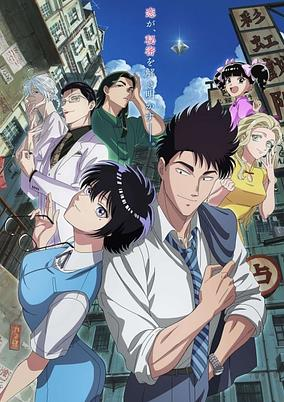

**Studio:** Arvo Animation &nbsp;|&nbsp; **Episodes:** 13 &nbsp;|&nbsp; **Director:** Yoshiaki Iwasaki &nbsp;|&nbsp; **Aired/Released:** April 5 – June 28 &nbsp;|&nbsp; **Genres:** Drama, Mystery, Romance, Science Fiction, Slice of Life, Office Lady, Seinen, Dystopia

> Real estate agents Reiko Kujirai and Hajime Kudo work in the nostalgic Kowloon Walled City. As they spend more time together, Reiko’s feelings for Hajime grow. But when she finds a photo of him and his former fiancée, she’s shocked to see the woman looks exactly like her. Reiko then realizes a chilling truth: she has no memory of her past.
>
> _Synopsis source: Kitsu_

[Wikipedia](https://en.wikipedia.org/wiki/Kowloon_Generic_Romance) · [Kitsu](https://kitsu.io/anime/Kowloon-Generic-Romance)

---

### Yaiba: Samurai Legend

**Studio:** Wit Studio &nbsp;|&nbsp; **Episodes:** 24 &nbsp;|&nbsp; **Director:** Takahiro Hasui &nbsp;|&nbsp; **Aired/Released:** April 5 – September 27

[Wikipedia](https://en.wikipedia.org/wiki/Yaiba)

---

### Classic Stars

**Studio:** Platinum Vision &nbsp;|&nbsp; **Episodes:** 13 &nbsp;|&nbsp; **Director:** Hideaki Ōba &nbsp;|&nbsp; **Aired/Released:** April 6 – June 29 &nbsp;|&nbsp; **Genres:** Music, Idol

> The anime CLASSIC★STARS takes place at Gloria Private Academy, where rising stars in the music, arts, and sports field gather. In the school's music department, the "Gift" of famous musicians of the past are implanted into the bodies of compatible students who can match their talent, and those students are then called by the names of those past masters. The anime focuses on Beethoven, who finds that he is compatible with Beethoven's "Gift," and is admitted to the school.
>
> _Synopsis source: Kitsu_

[Wikipedia](https://en.wikipedia.org/wiki/Classic_Stars) · [Kitsu](https://kitsu.io/anime/classic-stars)

---

### The Gorilla God's Go-To Girl (The Gorilla God’s Go-To Girl)

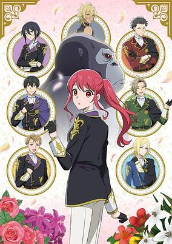

**Studio:** Kachigarasu &nbsp;|&nbsp; **Episodes:** 12 &nbsp;|&nbsp; **Director:** Fumitoshi Oizaki &nbsp;|&nbsp; **Aired/Released:** April 6 – June 22 &nbsp;|&nbsp; **Genres:** Comedy, Fantasy, Romance, Shoujo, Reverse Harem

> Sophia, a timid daughter of a count, just wanted a peaceful life, but the Gorilla God had other plans. Blessed with unmatched strength, she’s thrust into the Royal Knight Order, turning her quiet days into chaos. Now, she must juggle school, the knight life, and her overwhelming power. Who knew gorilla strength could be so complicated?
>
> _Synopsis source: Kitsu_

[Wikipedia](https://en.wikipedia.org/wiki/The_Gorilla_God%27s_Go-To_Girl) · [Kitsu](https://kitsu.io/anime/gorilla-no-kami-kara-kago-sareta-reijou-wa-ouritsu-kishidan-de-kawaigarareru)

---

### I'm the Evil Lord of an Intergalactic Empire!

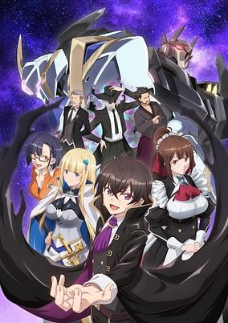

**Studio:** Quad &nbsp;|&nbsp; **Episodes:** 12 &nbsp;|&nbsp; **Director:** Tetsuya Yanagisawa &nbsp;|&nbsp; **Aired/Released:** April 6 – June 22 &nbsp;|&nbsp; **Genres:** Ecchi, Harem, Science Fiction, Isekai, Action, Adventure, Romance, Comedy, Fantasy, Mecha, Space, Politics, Maid

> In his last life, Liam lived as a moral, responsible person...but died deep in debt and betrayed by his wife. Reborn into the ruling family of a vast interstellar empire, Liam knows that life is divided into the downtrodden and the ones who do the stomping, so this time he's going to take what he wants and live for himself. But somehow, things refuse to work out that way. Despite doing his best to become a tyrant, Liam's decisions lead to nothing but peace and prosperity for the empire under his rule, and he just gets more and more popular! (Source: Seven Seas Entertainment) Note: The first two episodes streamed early on March 25, 2025 as part of a promotional agreement with ABEMA TV. Regular weekly releases began on April 6, 2025.
>
> _Synopsis source: Kitsu_

[Wikipedia](https://en.wikipedia.org/wiki/I%27m_the_Evil_Lord_of_an_Intergalactic_Empire!) · [Kitsu](https://kitsu.io/anime/ore-wa-seikan-kokka-no-akutoku-ryoushu)

---

### Koupen-chan

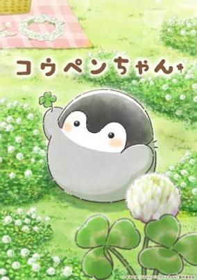

**Studio:** Lesprit &nbsp;|&nbsp; **Director:** Kyō Yatate &nbsp;|&nbsp; **Aired/Released:** April 6 – &nbsp;|&nbsp; **Genres:** Kids

> Follows the everyday adventures of Koupen-chan and their friends as they enjoy the little things in life.
>
> _Synopsis source: Kitsu_

[Kitsu](https://kitsu.io/anime/koupen-chan)

---

### Lazarus

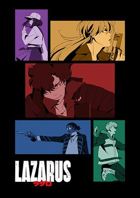

**Studio:** MAPPA &nbsp;|&nbsp; **Episodes:** 13 &nbsp;|&nbsp; **Director:** Shinichirō Watanabe &nbsp;|&nbsp; **Aired/Released:** April 6 – June 29 &nbsp;|&nbsp; **Genres:** Science Fiction, Action, Cyberpunk, Thriller

> The year is 2052—an era of unprecedented peace and prosperity prevails across the globe. The reason for this: mankind has been freed from sickness and pain. Nobel Prize winning neuroscientist Dr. Skinner has developed a miracle cure-all drug with no apparent drawbacks called Hapuna. Hapuna soon becomes ubiquitous... and essential. However, soon after Hapuna is officially introduced, Dr. Skinner vanishes. Three years later, the world has moved on. But Dr. Skinner has returned—this time, as a harbinger of doom. Skinner announces that Hapuna has a short half-life. Everyone who has taken it will die approximately three years later. Death is coming for this sinful world—and coming soon. As a response to this threat, a special task force of 5 agents is gathered from across the world to save humanity from Skinner’s plan. This group is called "Lazarus." Can they find Skinner and develop a vaccine before time runs out?
>
> _Synopsis source: Kitsu_

[Wikipedia](https://en.wikipedia.org/wiki/Lazarus_(Japanese_TV_series)) · [Kitsu](https://kitsu.io/anime/lazarus)

---

### Maebashi Witches

**Studio:** Sunrise &nbsp;|&nbsp; **Episodes:** 12 &nbsp;|&nbsp; **Director:** Junichi Yamamoto &nbsp;|&nbsp; **Aired/Released:** April 6 – June 22 &nbsp;|&nbsp; **Genres:** Coming Of Age, Fantasy, Slice of Life

> The anime's story, set in Maebashi City in Gunma Prefecture, is about the coming-of-age story of five high school girls. First year high school student Yuina Akagi lives an ordinary but unsatisfying everyday life. One day, a mysterious frog named Keroppe scouts her and four other girls to become the "Maebashi Witches." Suddenly, a room closet is connected to a mysterious space that brings the girls to a magical flower shop where they sing, dance, and make other people's wishes come true.
>
> _Synopsis source: Kitsu_

[Wikipedia](https://en.wikipedia.org/wiki/Maebashi_Witches) · [Kitsu](https://kitsu.io/anime/maebashi-witches)

---

### Princession Orchestra (Princess-Session Orchestra)

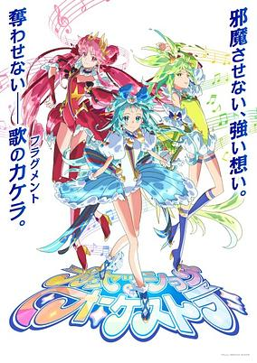

**Studio:** Silver Link &nbsp;|&nbsp; **Episodes:** 48 &nbsp;|&nbsp; **Director:** Shin Oonuma &nbsp;|&nbsp; **Aired/Released:** April 6 – &nbsp;|&nbsp; **Genres:** Music, Magical Girl, Action, Idol, Henshin, Super Power

> The anime takes place in Alicepia, which is a mysterious country that has existed since ancient times. The inhabitants of Alicepia, the Alicepians, are a fun-loving people, but one day mysterious monsters called Jamaock appeared to threaten the peace of Alicepia. The story follows a trio of "princesses" who never forget the song in their hearts, even when facing such danger and step up to save the day with the power of music.
>
> _Synopsis source: Kitsu_

[Wikipedia](https://en.wikipedia.org/wiki/Princession_Orchestra) · [Kitsu](https://kitsu.io/anime/princession-orchestra)

---

### Shoshimin: How to Become Ordinary (season 2) (SHOSHIMIN: How to become Ordinary)

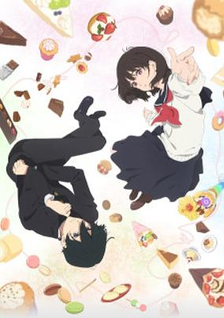

**Studio:** Lapin Track &nbsp;|&nbsp; **Episodes:** 12 &nbsp;|&nbsp; **Director:** Mamoru Kanbe &nbsp;|&nbsp; **Aired/Released:** April 6 – June 22 &nbsp;|&nbsp; **Genres:** Mystery, School Life, School Clubs, Detective

> Kobato decides to become an honest, humble citizen after enduring a bitter experience known as “wisdom work.” He forms a pact with Osanai, his classmate with the same goal, and they plan to enter high school leading quiet lives. But for some reason, inexplicable events and disasters keep happening around them. Will Kobato and Osanai ever manage to live ordinary, peaceful lives?
>
> _Synopsis source: Kitsu_

[Wikipedia](https://en.wikipedia.org/wiki/Sh%C5%8Dshimin_Series) · [Kitsu](https://kitsu.io/anime/shoushimin-series)

---

### The Unaware Atelier Master

**Studio:** EMT Squared &nbsp;|&nbsp; **Episodes:** 12 &nbsp;|&nbsp; **Director:** Hisashi Ishii &nbsp;|&nbsp; **Aired/Released:** April 6 – June 22

[Wikipedia](https://en.wikipedia.org/wiki/The_Unaware_Atelier_Master)

---

### Umamusume: Cinderella Gray (part 1)

**Studio:** CygamesPictures &nbsp;|&nbsp; **Episodes:** 13 &nbsp;|&nbsp; **Director:** Yūki Itō Takehiro Miura &nbsp;|&nbsp; **Aired/Released:** April 6 – June 29 &nbsp;|&nbsp; **Genres:** Anthropomorphism, Drama, Sports

> The second half of Umamusume: Cinderella Gray.
>
> _Synopsis source: Kitsu_

[Kitsu](https://kitsu.io/anime/uma-musume-cinderella-gray-part-2)

---

### Witch Watch

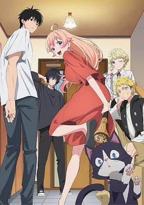

**Studio:** Bibury Animation Studios &nbsp;|&nbsp; **Episodes:** 25 &nbsp;|&nbsp; **Director:** Hiroshi Ikehata &nbsp;|&nbsp; **Aired/Released:** April 6 – October 5 &nbsp;|&nbsp; **Genres:** Comedy, Fantasy, Magic, Shounen, Romance, Slice of Life

> Morihito Otogi, a high school student who comes from a lineage of ogres, enjoys a peaceful, ordinary life until his childhood friend, Nico, moves in with him. Nico is a witch-in-training, and chooses Morihito to be her familiar. While Nico is thrilled to reunite with her old friend and crush, Morihito is tasked with the perilous duty to protect her from a foretold calamity. Between the unpredictable chaos caused by Nico’s magic, and the awkwardness of sharing a home, their lives become a whirlwind of supernatural hijinks and threats. (Source: Crunchyroll) Notes: - Worldwide premiere of Episodes 1-3 titled as WITCH WATCH: WATCH PARTY before the Japanese premiere was pre-screened in advance in theaters on March 16, 2025 in North America by GKIDS Films and March 22 and 23 in Europe by Animation Digital Network. - Episodes 1-2 + a selection of stories (Cat Scout, Kanshi's Part Time Job Diaries ~ The Side Job ~, and Kan &amp; Nico's Channel) was pre-screened in advance in theaters on March 30, 2025 in Japan. The regular TV broadcast began April 6, 2025.
>
> _Synopsis source: Kitsu_

[Wikipedia](https://en.wikipedia.org/wiki/Witch_Watch) · [Kitsu](https://kitsu.io/anime/witch-watch)

---

### Aharen-san Is Indecipherable (season 2)

**Studio:** Felix Film &nbsp;|&nbsp; **Episodes:** 12 &nbsp;|&nbsp; **Director:** Yasutaka Yamamoto (Chief) Tomoe Makino &nbsp;|&nbsp; **Aired/Released:** April 7 – June 23

[Wikipedia](https://en.wikipedia.org/wiki/Aharen-san_Is_Indecipherable)

---

### Makina-san's a Love Bot?!

**Studio:** BloomZ &nbsp;|&nbsp; **Episodes:** 12 &nbsp;|&nbsp; **Director:** Masayoshi Nishida &nbsp;|&nbsp; **Aired/Released:** April 7 – June 23 &nbsp;|&nbsp; **Genres:** Comedy, Ecchi, Mecha, Science Fiction, Romance, Robot

> Eita Akutsu is a loner and an introverted mecha otaku. One night, the cheerful and popular gyaru, Makina Agatsuma, suddenly appears in his apartment. But something seems off about her. When she abruptly strips in front of him… what he sees is not a human body, but a mechanical one! Makina is an AI robot designed for intimacy, yet she's been restricted from accessing any adult-related information. Eita, on the other hand, is a pure-hearted virgin who is extremely awkward with anything lewd. Thus begins their top-secret cohabitation, where no one must find out her true nature!
>
> _Synopsis source: Kitsu_

[Wikipedia](https://en.wikipedia.org/wiki/Makina-san%27s_a_Love_Bot%3F!) · [Kitsu](https://kitsu.io/anime/kakushite-makina-san)

---

### The Mononoke Lecture Logs of Chuzenji-sensei (The Mononoke Lecture Logs of Chuzenji-sensei: He Just Solves All the Mysteries)

**Studio:** 100studio &nbsp;|&nbsp; **Episodes:** 12 &nbsp;|&nbsp; **Director:** Chihiro Kumano &nbsp;|&nbsp; **Aired/Released:** April 7 – June 23 &nbsp;|&nbsp; **Genres:** Psychological, Historical, Drama, Supernatural, Mystery, Shounen

> School x Supernatural x Mystery. This story takes place before the exorcist Kyougokudou opened up a used bookstore... Our setting is in Tokyo in 1948, just right after the war. Kanna Kusakabe had just become a second-year at a high school when she meets the new language teacher, Akihiko Chuuzenji. Mysterious supernatural things keep happening around Kanna. Once again today, Kanna is going to open the doors to the library prep room to seek help from the surly Chuuzenji-sensei who is waiting inside. A high school supernatural mystery featuring the unlikely duo between a teacher and a high school girl is about to begin!
>
> _Synopsis source: Kitsu_

[Wikipedia](https://en.wikipedia.org/wiki/The_Mononoke_Lecture_Logs_of_Chuzenji-sensei) · [Kitsu](https://kitsu.io/anime/chuuzenji-sensei-mononoke-kougiroku-sensei-ga-nazo-wo-hodoite-shimau-kara)

---

### My Hero Academia: Vigilantes

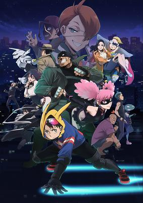

**Studio:** Bones Film &nbsp;|&nbsp; **Episodes:** 13 &nbsp;|&nbsp; **Director:** Kenichi Suzuki &nbsp;|&nbsp; **Aired/Released:** April 7 – June 30 &nbsp;|&nbsp; **Genres:** Action, Superhero, Super Power, Adventure, Drama, Fantasy

> Koichi Haimawari is a dull college student who aspires to be a hero but has given up on his dream. Although 80% of the world’s population has superhuman powers called Quirks, few are chosen to become heroes and protect people. Everything changes for Koichi when he and Pop☆Step are saved by the vigilante Knuckleduster and get recruited to become vigilantes themselves!
>
> _Synopsis source: Kitsu_

[Kitsu](https://kitsu.io/anime/vigilante-boku-no-hero-academia-illegals)

---

### Summer Pockets

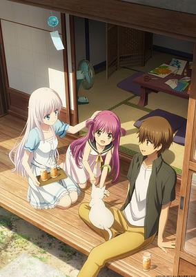

**Studio:** Feel &nbsp;|&nbsp; **Episodes:** 26 &nbsp;|&nbsp; **Director:** Tomoki Kobayashi &nbsp;|&nbsp; **Aired/Released:** April 7 – September 29 &nbsp;|&nbsp; **Genres:** Drama, Romance, Slice of Life, Supernatural, Coming Of Age

> Takahara Hairi never expected summer to feel like a dream. Sent to Torishirojima Island to sort through his late grandmother’s belongings, he’s met with endless sea, quiet nostalgia, and mysterious girls, each chasing something just out of reach. As he settles into island life, lost memories begin to surface and he finds what he never knew he’d lost.
>
> _Synopsis source: Kitsu_

[Wikipedia](https://en.wikipedia.org/wiki/Summer_Pockets) · [Kitsu](https://kitsu.io/anime/summer-pockets)

---

### Yandere Dark Elf: She Chased Me All the Way From Another World!

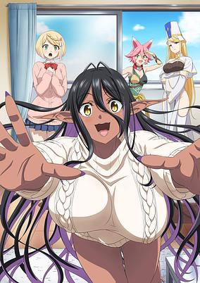

**Studio:** Elias &nbsp;|&nbsp; **Episodes:** 12 &nbsp;|&nbsp; **Director:** Toshikatsu Tokoro &nbsp;|&nbsp; **Aired/Released:** April 7 – June 23 &nbsp;|&nbsp; **Genres:** Ecchi, Fantasy, Romance, Comedy, Dark Skinned Girl, Elf, Isekai, Magic, Slice of Life, Japan

> Hinata did it. He got reincarnated into another world, took up the mantle of Hero, and slew the dreaded Demon Lord alongside his party of fellow adventurers. As his reward, he's returned to Earth to resume a normal life. Or it would be if it wasn't for the fact that his dark elf companion Mariabelle decided to travel to Earth to come and live with him! Now she uses her arcane talents to ward off any potential romantic rivals and capture Hinata's affection.
>
> _Synopsis source: Kitsu_

[Kitsu](https://kitsu.io/anime/Chotto-dake-Ai-ga-Omoi-Dark-Elf-ga-Isekai-kara-Oikakete-Kita)

---

### Zatsu Tabi: That's Journey (ZatsuTabi -That's Journey-)

**Studio:** Makaria &nbsp;|&nbsp; **Episodes:** 12 &nbsp;|&nbsp; **Director:** Masaharu Watanabe &nbsp;|&nbsp; **Aired/Released:** April 7 – June 23 &nbsp;|&nbsp; **Genres:** Adventure, Comedy, Drama, Slice of Life, Seinen

> When aspiring manga artist Chika’s storyboards get rejected, she ditches her desk for an adventure! Armed with a quirky social media poll, she sets off on a spontaneous journey of random crowdsourced destinations. From hilarious mishaps to heartwarming encounters, Chika discovers inspiration, friendship, and herself, one unpredictable stop at a time. (Source: Crunchyroll) Note: Based on the real-life travels of mangaka Chika Suzugamori.
>
> _Synopsis source: Kitsu_

[Kitsu](https://kitsu.io/anime/zatsu-tabi-that-s-journey)

---

### Chikuwa Senki: Ore no Kawaii Chikyū Shinryaku

**Studio:** Imagica Infos Imageworks Studio &nbsp;|&nbsp; **Episodes:** 12 &nbsp;|&nbsp; **Director:** Satoshi Mizuno &nbsp;|&nbsp; **Aired/Released:** April 8 – June 24 &nbsp;|&nbsp; **Genres:** Science Fiction, Comedy

[Wikipedia](https://en.wikipedia.org/wiki/Chikuwa_Senki) · [Kitsu](https://kitsu.io/anime/chikuwa-senki-ore-no-kawaii-de-chikyuu-shinryaku)

---

### #Compass 2.0: Combat Providence Analysis System

**Studio:** Lay-duce &nbsp;|&nbsp; **Episodes:** 12 &nbsp;|&nbsp; **Director:** Hitoshi Nanba &nbsp;|&nbsp; **Aired/Released:** April 8 – June 24 &nbsp;|&nbsp; **Genres:** Music

> Music video animated by PPP for the song Hongami Precious Moment by Korone Inugami. It was conceptualized during the July 2024 broadcast of Sonic Station Live! During it, Korone asked Tomoya Ohtani, a video game composer from SEGA, to compose the track.
>
> _Synopsis source: Kitsu_

[Wikipedia](https://en.wikipedia.org/wiki/Compass_(video_game)) · [Kitsu](https://kitsu.io/anime/hongami-precious-moment)

---

### The Shiunji Family Children

**Studio:** Doga Kobo &nbsp;|&nbsp; **Episodes:** 12 &nbsp;|&nbsp; **Director:** Ryouki Kamitsubo &nbsp;|&nbsp; **Aired/Released:** April 8 – June 24 &nbsp;|&nbsp; **Genres:** Harem, Romance, Comedy, Coming Of Age

> The Shiunji family, with their seven children reside in a mansion within Tokyo’s Setagaya ward. The eldest son, Arata, is tired of being pushed around by his five sisters and daydreams of a life without them. That is, until Arata’s father reveals a shocking truth—Arata isn’t biologically related to his sisters! The siblings’ relationships will be tested as they navigate life in this new light.
>
> _Synopsis source: Kitsu_

[Wikipedia](https://en.wikipedia.org/wiki/The_Shiunji_Family_Children) · [Kitsu](https://kitsu.io/anime/shiunji-ke-no-kodomotachi)

---

### Apocalypse Hotel

**Studio:** CygamesPictures &nbsp;|&nbsp; **Episodes:** 12 &nbsp;|&nbsp; **Director:** Kana Shundo &nbsp;|&nbsp; **Aired/Released:** April 9 – June 23 &nbsp;|&nbsp; **Genres:** Post Apocalypse, Science Fiction, Comedy, Slice of Life, Robot

> Many years have passed since humanity vanished from Earth, yet the Galaxy Tower hotel in Ginza, Tokyo, continues to operate. At the center of its staff is Yachiyo, a dedicated hotelier robot, along with other employee robots working tirelessly in various departments. Together, they spend what feels like an eternity maintaining the hotel, despite having no guests. As they await the return of their owner and the day humanity reappears. Now, a small miracle is about to change everything for Yachiyo and her robotic colleagues.
>
> _Synopsis source: Kitsu_

[Wikipedia](https://en.wikipedia.org/wiki/Apocalypse_Hotel) · [Kitsu](https://kitsu.io/anime/apocalypse-hotel)

---

### Hana-Doll*: Reinterpretation of Flowering

**Studio:** A-Real &nbsp;|&nbsp; **Episodes:** 12 &nbsp;|&nbsp; **Director:** Masahiro Takata &nbsp;|&nbsp; **Aired/Released:** April 9 – June 25 &nbsp;|&nbsp; **Genres:** Idol, Music

> The "Hana Ningyou Project" (Flower Doll Project) exists to artificially create the "perfect idol" by implanting a special flower seed inside a body. The franchise follows the growth of young men who dedicate their lives to the project.
>
> _Synopsis source: Kitsu_

[Wikipedia](https://en.wikipedia.org/wiki/Hana-Doll) · [Kitsu](https://kitsu.io/anime/hana-doll-reinterpretation-of-flowering)

---

### Mobile Suit Gundam GQuuuuuuX

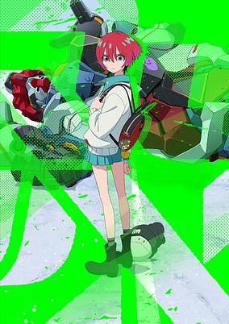

**Studio:** Sunrise Studio Khara &nbsp;|&nbsp; **Episodes:** 12 &nbsp;|&nbsp; **Director:** Kazuya Tsurumaki &nbsp;|&nbsp; **Aired/Released:** April 9 – June 25 &nbsp;|&nbsp; **Genres:** Space Battles, Space Opera, Space, Super Robot, Piloted Robot, Robot, Drama, Mecha, Science Fiction

> Amate Yuzuriha is a high-school student living peacefully in a space colony floating in outer space. When she meets a war refugee named Nyaan, Amate is drawn into the illegal mobile suit dueling sport known as Clan Battle. Under the entry name "Machu," she throws herself into fierce battle day after day, piloting the GQuuuuuuX. Then an unidentified Gundam mobile suit pursued by both the space force and the police appears before her, along with its pilot, a boy named Shuji. Now their world is about to enter a new era. (Source: Official Site) Note: Prior to broadcasting, "Mobile Suit Gundam GQuuuuuuX -Beginning-" — a theatrical version using re-edited episodes — is scheduled to debut in Japan on January 17, 2025.
>
> _Synopsis source: Kitsu_

[Wikipedia](https://en.wikipedia.org/wiki/Mobile_Suit_Gundam_GQuuuuuuX) · [Kitsu](https://kitsu.io/anime/kidou-senshi-gundam-gquuuuuux)

---

### A Ninja and an Assassin Under One Roof

**Studio:** Shaft &nbsp;|&nbsp; **Episodes:** 12 &nbsp;|&nbsp; **Director:** Yukihiro Miyamoto &nbsp;|&nbsp; **Aired/Released:** April 10 – June 26 &nbsp;|&nbsp; **Genres:** Comedy, Samurai, Shounen, Fantasy, Adventure, Ninja, Assassin, Absurdist Humour

> On the way home from school one day, Konoha Koga rescues Satoko Kusagakure, a ninja who escaped her village. Soon, pursuers from the village show up in search of Satoko only to be deftly dealt with by Konoha. As it turns out, the unassuming high schooler is actually an assassin. Thus, the potentially cutthroat cohabitation of a ninja and an assassin begins!
>
> _Synopsis source: Kitsu_

[Wikipedia](https://en.wikipedia.org/wiki/A_Ninja_and_an_Assassin_Under_One_Roof) · [Kitsu](https://kitsu.io/anime/ninja-to-koroshiya-no-futarigurashi)

---

### Me and the Alien MuMu

**Studio:** OLM &nbsp;|&nbsp; **Episodes:** 24 &nbsp;|&nbsp; **Director:** Tomoya Takahashi &nbsp;|&nbsp; **Aired/Released:** April 10 – September 18

[Wikipedia](https://en.wikipedia.org/wiki/Me_and_the_Alien_MuMu)

---

### The Too-Perfect Saint: Tossed Aside by My Fiancé and Sold to Another Kingdom

**Studio:** Troyca &nbsp;|&nbsp; **Episodes:** 12 &nbsp;|&nbsp; **Director:** Shuu Watanabe &nbsp;|&nbsp; **Aired/Released:** April 10 – June 26 &nbsp;|&nbsp; **Genres:** Fantasy, Romance, Shoujo, Magic

> Philia’s family has produced saints for generations. It’s no surprise that she’s known as the greatest saint of all time—and set to marry the second prince, Julius. What no one expects is for Julius to call off the engagement, claiming that Philia’s perfection makes her charmless and unlikable. To add insult to injury, Philia is packed off to a neighboring country in exchange for gold and resources, forcing her to leave her homeland! Despite bracing herself for mistreatment, Philia finds a warm welcome in her new town, where she puts her saintly abilities to good use erecting barriers against monsters and curing epidemics. But even as she flourishes in her new life, her homeland is under threat of destruction!
>
> _Synopsis source: Kitsu_

[Wikipedia](https://en.wikipedia.org/wiki/The_Too-Perfect_Saint) · [Kitsu](https://kitsu.io/anime/kanpeki-sugite-kawai-ge-ga-nai-to-konyaku-haki-sareta-seijo-wa-ringoku-ni-ura-reru)

---

### Teogonia

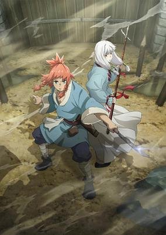

**Studio:** Asahi Production &nbsp;|&nbsp; **Episodes:** 12 &nbsp;|&nbsp; **Director:** Kunihiro Mori &nbsp;|&nbsp; **Aired/Released:** April 12 – June 28 &nbsp;|&nbsp; **Genres:** Action, Fantasy, Isekai

> Humans fight to protect their land from invading demi-human tribes in relentless battles. As his world is engulfed by intense warfare, Kai, a village boy from Lag, joins the fight to defend all he knows. After Kai’s comrades fall one by one and he’s injured, he suddenly recalls memories from another life. A fantasy tale unfolds as a village boy explores a world of magic, mystery, and heroism.
>
> _Synopsis source: Kitsu_

[Wikipedia](https://en.wikipedia.org/wiki/Teogonia) · [Kitsu](https://kitsu.io/anime/teogonia)

---

### Food for the Soul

**Studio:** P.A. Works &nbsp;|&nbsp; **Episodes:** 12 &nbsp;|&nbsp; **Director:** Shinya Kawatsura Yū Harumi &nbsp;|&nbsp; **Aired/Released:** April 13 – June 29 &nbsp;|&nbsp; **Genres:** Slice of Life

> An original animation about the daily life of five girls who have just become university students. They love delicious food, want to have lots of fun with everyone, and try their best to study, so they're enjoying university life to the fullest!
>
> _Synopsis source: Kitsu_

[Wikipedia](https://en.wikipedia.org/wiki/Food_for_the_Soul) · [Kitsu](https://kitsu.io/anime/food-for-the-soul)

---

### Go! Go! Loser Ranger! (season 2) (Go! Go! Loser Ranger!)

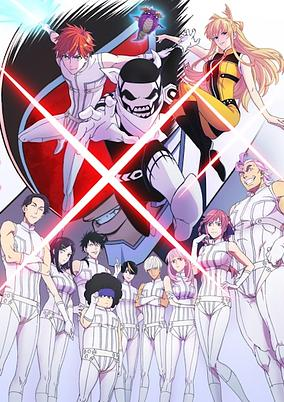

**Studio:** Yostar Pictures &nbsp;|&nbsp; **Episodes:** 12 &nbsp;|&nbsp; **Director:** Keiichi Sato &nbsp;|&nbsp; **Aired/Released:** April 13 – June 29 &nbsp;|&nbsp; **Genres:** Action, Fantasy, Science Fiction, Shounen, Comedy, Superhero

> With their old hideout and bosses wiped out, the surviving Dusters make a secret agreement with the Ranger Force to engage in the weekly Sunday Showdown - one where they will always be defeated. Tired of this charade, Fighter D finally steps up to make a change once and for all!
>
> _Synopsis source: Kitsu_

[Wikipedia](https://en.wikipedia.org/wiki/Go!_Go!_Loser_Ranger!) · [Kitsu](https://kitsu.io/anime/sentai-daishikkaku)

---

### Mono

**Studio:** Soigne &nbsp;|&nbsp; **Episodes:** 12 &nbsp;|&nbsp; **Director:** Ryota Aikei &nbsp;|&nbsp; **Aired/Released:** April 13 – June 29

[Wikipedia](https://en.wikipedia.org/wiki/Mono_(manga))

---

### Detectives These Days Are Crazy!

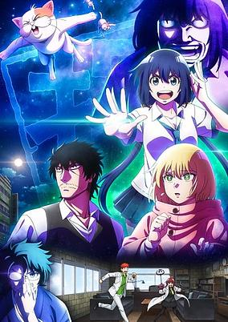

**Studio:** Liden Films &nbsp;|&nbsp; **Episodes:** 12 &nbsp;|&nbsp; **Director:** Rion Kujo &nbsp;|&nbsp; **Aired/Released:** July 1 – September 16 &nbsp;|&nbsp; **Genres:** Comedy, Mystery, Detective, Seinen, Cops

> Nagumo Keiichirou was a genius high-school detective. No case was complex enough for him. But what happens to genius detectives when they get older? Now 35, with bad hips, running a failing detective agency with no cases to solve and struggling to pay the rent, he's at a dead end. In comes a high school girl in his office who says she wants to work with him. With her help, will the out-of-touch, old-fashioned Nagumo get back the fire of his youth?
>
> _Synopsis source: Kitsu_

[Wikipedia](https://en.wikipedia.org/wiki/Detectives_These_Days_Are_Crazy!) · [Kitsu](https://kitsu.io/anime/mattaku-saikin-no-tantei-to-kitara)

---

### Necronomico and the Cosmic Horror Show

**Studio:** Studio Gokumi &nbsp;|&nbsp; **Episodes:** 12 &nbsp;|&nbsp; **Director:** Masato Matsune &nbsp;|&nbsp; **Aired/Released:** July 1 – September 16 &nbsp;|&nbsp; **Genres:** Drama, Virtual Reality, Comedy, Science Fiction

> We all need a chance to change our lives! The story follows Miko Kurono, who began her dream career as a livestreamer under the name "Necronomico" after graduating middle school. Amidst spending her days with childhood friend Mayu Mayusaka and rival Kanna Kagurazaka, she's introduced to a new VR game project!? Upon encountering the game, the girls start pursuing the 'irreplaceable now'.
>
> _Synopsis source: Kitsu_

[Wikipedia](https://en.wikipedia.org/wiki/Necronomico_and_the_Cosmic_Horror_Show) · [Kitsu](https://kitsu.io/anime/necronomico-no-cosmic-horror-show)

---

### Chuhai Lips: Canned Flavor of Married Women

**Studio:** Raiose &nbsp;|&nbsp; **Episodes:** 8 &nbsp;|&nbsp; **Director:** Hajime Keima &nbsp;|&nbsp; **Aired/Released:** July 2 – August 20

---

### Clevatess (Clevatess: The King of Devil Beasts)

**Studio:** Lay-duce &nbsp;|&nbsp; **Episodes:** 12 &nbsp;|&nbsp; **Director:** Kiyotaka Taguchi &nbsp;|&nbsp; **Aired/Released:** July 2 – September 17 &nbsp;|&nbsp; **Genres:** Action, Drama, Fantasy, Demon, Swordplay, Violence

> The story centers on the the titular Clevatess, the lord of Dark Beasts, who wields both uncanny intellect and destructive power. Frustrated by the 13 heroes tasked to destroy him, he has decided to be rid of humanity once and for all. However, he has been charged with one nuisance: he revived a hero he personally slayed and adopts an orphaned humanoid baby—the last hope to save a dying world. The world stands upon the brink of Armageddon, with the obligation of raising one child holding it all back. Now bound together, what fate awaits this unlikely trio?
>
> _Synopsis source: Kitsu_

[Wikipedia](https://en.wikipedia.org/wiki/Clevatess) · [Kitsu](https://kitsu.io/anime/clevatess-majuu-no-ou-to-akago-to-kabane-no-yuusha)

---

### Hell Teacher: Jigoku Sensei Nube (part 1)

**Studio:** Studio Kai &nbsp;|&nbsp; **Episodes:** 13 &nbsp;|&nbsp; **Director:** Yasuyuki Ōishi &nbsp;|&nbsp; **Aired/Released:** July 2 – September 24

---

### Reborn as a Vending Machine, I Now Wander the Dungeon (season 2)

**Studio:** Studio Gokumi AXsiZ &nbsp;|&nbsp; **Episodes:** 12 &nbsp;|&nbsp; **Director:** Takashi Yamamoto &nbsp;|&nbsp; **Aired/Released:** July 2 – September 17

[Wikipedia](https://en.wikipedia.org/wiki/Reborn_as_a_Vending_Machine,_I_Now_Wander_the_Dungeon)

---

### Kamitsubaki City Under Construction

**Studio:** SMDE &nbsp;|&nbsp; **Episodes:** 13 &nbsp;|&nbsp; **Director:** Kōdai Kakimoto &nbsp;|&nbsp; **Aired/Released:** July 3 – September 25 &nbsp;|&nbsp; **Genres:** Mystery, Music, Supernatural

> Kamitsubaki-shi Kensetsuchuu. is an original project by Kamitsubaki Studio that began in 2019. It showcases a story about exploring the mysteries of the virtual city "Kamitsubaki City" and seeking to restore peace and order.
>
> _Synopsis source: Kitsu_

[Wikipedia](https://en.wikipedia.org/wiki/Kamitsubaki_City_Under_Construction) · [Kitsu](https://kitsu.io/anime/kamitsubaki-shi-kensetsuchuu)

---

### Milky Subway: The Galactic Limited Express

**Studio:** Shin-Ei Animation Titan Productions &nbsp;|&nbsp; **Episodes:** 12 &nbsp;|&nbsp; **Director:** Yōhei Kameyama &nbsp;|&nbsp; **Aired/Released:** July 3 – September 18

---

### New Saga

**Studio:** Studio Clutch &nbsp;|&nbsp; **Episodes:** 12 &nbsp;|&nbsp; **Director:** Naoki Mizusawa &nbsp;|&nbsp; **Aired/Released:** July 3 – September 18

[Wikipedia](https://en.wikipedia.org/wiki/New_Saga)

---

### Onmyo Kaiten Re:Birth Verse

**Studio:** David Production &nbsp;|&nbsp; **Episodes:** 12 &nbsp;|&nbsp; **Director:** Hideya Takahashi &nbsp;|&nbsp; **Aired/Released:** July 3 – September 18 &nbsp;|&nbsp; **Genres:** Action, Isekai, Delinquent, Martial Arts

> Narihira Takeru is a delinquent who often thinks about Tsukimiya, the girl who appears in his dreams. After an unexpected accident, Takeru finds himself in a parallel universe and the world that Tsukimiya lives in. When Takeru and Tsukimiya are slain by a monster, he awakens again and realizes he has leapt through time. Now, Takeru must train with Abe Seimei to fight for Tsukimiya’s life!
>
> _Synopsis source: Kitsu_

[Kitsu](https://kitsu.io/anime/onmyo-kaiten-re-verse)

---

### Welcome to the Outcast's Restaurant!

**Studio:** OLM Team Yoshioka &nbsp;|&nbsp; **Episodes:** 12 &nbsp;|&nbsp; **Director:** Jōji Shimura &nbsp;|&nbsp; **Aired/Released:** July 3 – September 18 &nbsp;|&nbsp; **Genres:** Fantasy, Adventure, Comedy, Cooking, Slice of Life

> Dennis is one of the most popular members of the Silverwing Battalion, the world's strongest party. So popular, in fact, that the party leader expels him from the group out of spite. Stripped of his home, Dennis decides to start life anew following his true calling—as a chef! His life as an adventurer might be over, but his new life as a cook is just beginning. He teams up with Atelier, a young girl who has been similarly exiled from her home, and opens up a restaurant for adventurers. He's finally able to live out his dream, but he'll need use of more than just his cooking skills to take care of his eclectic customers' problems!
>
> _Synopsis source: Kitsu_

[Wikipedia](https://en.wikipedia.org/wiki/Welcome_to_the_Outcast%27s_Restaurant!) · [Kitsu](https://kitsu.io/anime/tsuihousha-shokudou-e-youkoso)

---

### April Showers Bring May Flowers

**Studio:** Silver Link &nbsp;|&nbsp; **Episodes:** 13 &nbsp;|&nbsp; **Director:** Mirai Minato &nbsp;|&nbsp; **Aired/Released:** July 4 – September 26 &nbsp;|&nbsp; **Genres:** Comedy, Romance, School Life, Seinen

> Hana Tabata is a lonely and unpopular high school girl with negative thoughts. Early morning in the classroom when she was pretending to be a manga heroine, the class's good looking Yosuke accidentally saw her...!? This love, you will definitely want to support it! Masochistic system unpopular girl comedy!
>
> _Synopsis source: Kitsu_

[Wikipedia](https://en.wikipedia.org/wiki/April_Showers_Bring_May_Flowers) · [Kitsu](https://kitsu.io/anime/busu-ni-hanataba-wo)

---

### Arknights: Rise from Ember

**Studio:** Yostar Pictures &nbsp;|&nbsp; **Episodes:** 10 &nbsp;|&nbsp; **Director:** Yuki Watanabe &nbsp;|&nbsp; **Aired/Released:** July 4 – September 5

[Wikipedia](https://en.wikipedia.org/wiki/Arknights_(TV_series))

---

### Call of the Night (season 2)

**Studio:** Liden Films &nbsp;|&nbsp; **Episodes:** 12 &nbsp;|&nbsp; **Director:** Tomoyuki Itamura &nbsp;|&nbsp; **Aired/Released:** July 4 – September 19

[Wikipedia](https://en.wikipedia.org/wiki/Call_of_the_Night)

---

### Dandadan (season 2) (DAN DA DAN)

**Studio:** Science Saru &nbsp;|&nbsp; **Episodes:** 12 &nbsp;|&nbsp; **Director:** Fūga Yamashiro Abel Góngora &nbsp;|&nbsp; **Aired/Released:** July 4 – September 19 &nbsp;|&nbsp; **Genres:** Action, Comedy, Supernatural, Shounen, Science Fiction, Romance, Drama, Mystery, Ghost, Alien

> This is a story about Momo, a high school girl who comes from a family of spirit mediums, and her classmate Okarun, an occult fanatic. After Momo rescues Okarun from being bullied, they begin talking. However, an argument ensues between them since Momo believes in ghosts but denies aliens exist, and Okarun believes in aliens but denies ghosts exist. To prove to each other what they believe in is real, Momo goes to an abandoned hospital where a UFO has been spotted and Okarun goes to a tunnel rumored to be haunted. To their surprise, they each encounter overwhelming paranormal activities that transcend comprehension. Amid these predicaments, Momo awakens her hidden power and Okarun gains the power of a curse to overcome these new dangers! Their fateful love begins as well!? The story of the occult battle and adolescence starts! (Source: Crunchyroll) Notes: - Worldwide premiere of Episode 1 before the Japanese television premiere occurred at Anime Expo July 6, 2024. - Episodes 1-3 titled as DAN DA DAN: FIRST ENCOUNTER was pre-screened in advance in theaters on September 13, 2024. The regular TV broadcast begins October 2024.
>
> _Synopsis source: Kitsu_

[Wikipedia](https://en.wikipedia.org/wiki/Dandadan) · [Kitsu](https://kitsu.io/anime/DAN-DA-DAN)

---

### The Water Magician

**Studio:** Typhoon Graphics Wonderland &nbsp;|&nbsp; **Episodes:** 12 &nbsp;|&nbsp; **Director:** Hideyuki Satake &nbsp;|&nbsp; **Aired/Released:** July 4 – September 26 &nbsp;|&nbsp; **Genres:** Action, Fantasy, Adventure, Magic

> Ryou is delighted to be reincarnated into the fantastical world of Phi, where he thinks he’ll get to live a quiet life learning to use his newfound water magic. Going with the flow here, however, means something very different. Ryou is immediately pitted against the wild lands he winds up in and the slew of deadly monsters that call the remote subcontinent home. You’d think he’d forget about taking it easy when he’s stuck fighting for his life, but lucky for Ryou, he’s naturally optimistic, clever, and blessed with the hidden “Eternal Youth” trait. Twenty years pass in the blink of an eye, and each encounter along the way pushes him one step closer to the pinnacle of human magic. Little does he realize that’s only the opening chapter of his tale. A fateful meeting soon thrusts Ryou to the forefront of history, forever changing the course of his life... Thus begins the adventures of the strongest water magician the world has ever seen—who also likes to do things at his own pace!
>
> _Synopsis source: Kitsu_

[Wikipedia](https://en.wikipedia.org/wiki/The_Water_Magician_(novel_series)) · [Kitsu](https://kitsu.io/anime/mizu-zokusei-no-mahou-tsukai)

---

### 9-Nine: Ruler's Crown

**Studio:** PRA &nbsp;|&nbsp; **Episodes:** 13 &nbsp;|&nbsp; **Director:** Koichi Ohata &nbsp;|&nbsp; **Aired/Released:** July 5 – September 27

[Wikipedia](https://en.wikipedia.org/wiki/9-Nine)

---

### Betrothed to My Sister's Ex

**Studio:** LandQ Studios &nbsp;|&nbsp; **Episodes:** 12 &nbsp;|&nbsp; **Director:** Takayuki Kitagawa &nbsp;|&nbsp; **Aired/Released:** July 5 – September 20 &nbsp;|&nbsp; **Genres:** Josei, Romance, Comedy, Fantasy

> Marie, the second daughter of a poor baron’s household, is treated like a servant by her parents. Even at Marie’s birthday party, her beautiful elder sister, Anastasia, is the star. Outside, Marie bumps into Count Kyuros Granado, who falls for her at first sight. Yet, due to a misunderstanding, the Count proposes to Anastasia. After a tragic accident, Marie must marry the count instead!
>
> _Synopsis source: Kitsu_

[Wikipedia](https://en.wikipedia.org/wiki/Betrothed_to_My_Sister%27s_Ex) · [Kitsu](https://kitsu.io/anime/zutaboro-reijou-wa-ane-no-moto-konyakusha-ni-dekiai-sareru)

---

### Fermat Kitchen

**Studio:** Domerica &nbsp;|&nbsp; **Episodes:** 12 &nbsp;|&nbsp; **Director:** Kazuya Ichikawa &nbsp;|&nbsp; **Aired/Released:** July 5 – September 27 &nbsp;|&nbsp; **Genres:** Cooking, Shounen

> Kitada Gaku, a young man who once aspired to uncover the world's truths through mathematics, finds himself at a crossroads after failing to achieve his dream of competing in the Math Olympiad. With his scholarship revoked, he spends his days working at a school cafeteria, struggling with a sense of aimlessness. Everything changes when he meets a brilliant chef who introduces him to the fascinating intersection of mathematics and cooking. As Gaku embarks on this unexpected journey, he is drawn into a culinary world that's as complex and precise as mathematics itself. A unique and inspiring story where numbers and flavors blend to reveal the beauty of discovery, Mathematics Meets Cuisine opens the door to a new world of gourmet adventure.
>
> _Synopsis source: Kitsu_

[Wikipedia](https://en.wikipedia.org/wiki/Fermat_Kitchen) · [Kitsu](https://kitsu.io/anime/fermat-no-ryouri)

---

### Private Tutor to the Duke's Daughter (Private Tutor to the Duke’s Daughter)

**Studio:** Studio Blanc &nbsp;|&nbsp; **Episodes:** 12 &nbsp;|&nbsp; **Director:** Nobuyoshi Nagayama &nbsp;|&nbsp; **Aired/Released:** July 5 – September 28 &nbsp;|&nbsp; **Genres:** Drama, Fantasy, Romance

> After Allen failed the court sorcerer exam, he couldn’t return home even if he wanted to. While searching for a job, an unexpected offer comes his way to be the private tutor of the duke’s daughter. Just as he lowers his guard, he faces a girl who can’t use magic at all! But what is preventing her magic from working? Allen’s unconventional lessons gently shine a light on the girl’s future. (Source: Crunchyroll) Note: Each episode streamed 1 week early on ABEMA and dAnimeStore. The original TV broadcast started on July 6, 2025.
>
> _Synopsis source: Kitsu_

[Wikipedia](https://en.wikipedia.org/wiki/Private_Tutor_to_the_Duke%27s_Daughter) · [Kitsu](https://kitsu.io/anime/koujo-denka-no-katei-kyoushi)

---

### Rascal Does Not Dream of Santa Claus

**Studio:** CloverWorks &nbsp;|&nbsp; **Episodes:** 13 &nbsp;|&nbsp; **Director:** Soichi Masui &nbsp;|&nbsp; **Aired/Released:** July 5 – September 27

[Wikipedia](https://en.wikipedia.org/wiki/Rascal_Does_Not_Dream)

---

### Rent-A-Girlfriend (season 4)

**Studio:** TMS Entertainment &nbsp;|&nbsp; **Episodes:** 12 &nbsp;|&nbsp; **Director:** Kazuomi Koga &nbsp;|&nbsp; **Aired/Released:** July 5 – September 20

[Wikipedia](https://en.wikipedia.org/wiki/Rent-A-Girlfriend)

---

### Secrets of the Silent Witch

**Studio:** Studio Gokumi &nbsp;|&nbsp; **Episodes:** 13 &nbsp;|&nbsp; **Director:** Takaomi Kanasaki (Chief) Yasuo Iwamoto &nbsp;|&nbsp; **Aired/Released:** July 5 – October 4 &nbsp;|&nbsp; **Genres:** Adventure, Fantasy, Magic, Politics, Shoujo, School Life

> Humans couldn’t handle magic without chanting until Monica Everett, the Silent Witch and one of the Seven Sages, made unspoken magecraft possible. Painfully shy, she enjoys seclusion. One day, Louis Miller, the Barrier Mage, delivers the king’s order: Go undercover at a prestigious school for nobles to guard the second prince. Get ready for her silent mission to begin!
>
> _Synopsis source: Kitsu_

[Wikipedia](https://en.wikipedia.org/wiki/Secrets_of_the_Silent_Witch) · [Kitsu](https://kitsu.io/anime/silent-witch-chinmoku-no-majo-no-kakushigoto)

---

### Watari-kun's ****** Is About to Collapse

**Studio:** Staple Entertainment &nbsp;|&nbsp; **Episodes:** 26 &nbsp;|&nbsp; **Director:** Takashi Naoya &nbsp;|&nbsp; **Aired/Released:** July 5 – December 27 &nbsp;|&nbsp; **Genres:** Comedy, Romance, Drama, Slice of Life

> Naoto Watari lives solely for his little sister, Suzushiro, until his chaotic childhood friend, Satsuki, storms back into his life. Without uttering a single word, her very presence ignites buried memories and unravels his rigid routine. As tensions rise and secrets surface, Naoto’s devotion to Suzushiro clashes with unresolved pain, threatening to collapse his fragile world.
>
> _Synopsis source: Kitsu_

[Wikipedia](https://en.wikipedia.org/wiki/Watari-kun%27s_******_Is_About_to_Collapse) · [Kitsu](https://kitsu.io/anime/watari-kun-no-xx-ga-houkai-sunzen)

---

### Apocalypse Bringer Mynoghra

**Studio:** Maho Film &nbsp;|&nbsp; **Episodes:** 13 &nbsp;|&nbsp; **Director:** Yūji Yanase &nbsp;|&nbsp; **Aired/Released:** July 6 – September 28 &nbsp;|&nbsp; **Genres:** Action, Adventure, Comedy, Drama, Fantasy, Romance

> Takuto Ira succumbed to illness at a young age and ended up reincarnating in a world that resembles the fantasy turn-based strategy game Eternal Nations. Not only did he reincarnate into his favorite game, but as the god who commands the evil civilization Mynoghra. With Mynoghra's beautiful hero unit, Sludge Witch Atou by his side, not even legendarily difficult race traits will stand in the way of restarting their civilization! “Lord Takuto…won't you start over with me?” Explore, Expand, Exploit, Exterminate! A tactical fantasy world is waiting for heroes like you! Join Eternal Nations today!
>
> _Synopsis source: Kitsu_

[Wikipedia](https://en.wikipedia.org/wiki/Apocalypse_Bringer_Mynoghra) · [Kitsu](https://kitsu.io/anime/isekai-mokushiroku-mynoghra-hametsu-no-bunmei-de-hajimeru-sekai-seifuku)

---

### Bad Girl (Ichijyoma Mankitsu Gurashi!)

**Studio:** Bridge &nbsp;|&nbsp; **Episodes:** 12 &nbsp;|&nbsp; **Director:** Jōji Furuta &nbsp;|&nbsp; **Aired/Released:** July 6 – September 21 &nbsp;|&nbsp; **Genres:** Comedy, Ecchi, Slice of Life

> A high school girl a manga cafe! Meiko, a countryside girl, enrolls in a rich girls' school. She is told that if she does volunteer work, her tuition will be free... but in reality, she will be living and working in a "manga cafe"!? Living in a small manga cafe booth turns out to be not so bad! Why not try enjoying a manga cafe filled with cute high school girls as staff?
>
> _Synopsis source: Kitsu_

[Wikipedia](https://en.wikipedia.org/wiki/Bad_Girl_(manga)) · [Kitsu](https://kitsu.io/anime/ichijouma-mankitsu-gurashi)

---

### Cultural Exchange with a Game Centre Girl (Cultural Exchange With a Game Center Girl)

**Studio:** Nomad &nbsp;|&nbsp; **Episodes:** 12 &nbsp;|&nbsp; **Director:** Toshihiro Kikuchi &nbsp;|&nbsp; **Aired/Released:** July 6 – September 28 &nbsp;|&nbsp; **Genres:** Comedy, Romance, Slice of Life

> Kusakabe Renji, a young man working at a game centre, sees an English girl named Lily Baker playing a crane game on Valentine’s Day. Seeing her fail repeatedly to win a prize, Renji can’t help but take action. The day after Lily finally gets her plushie, Renji receives an unexpected message from her that reads, “Be my valentine!” What started as a misunderstanding leads to cultural exchange!
>
> _Synopsis source: Kitsu_

[Wikipedia](https://en.wikipedia.org/wiki/Cultural_Exchange_with_a_Game_Centre_Girl) · [Kitsu](https://kitsu.io/anime/gacen-shoujo-to-ibunka-kouryuu)

---

### Gachiakuta

**Studio:** Bones Film &nbsp;|&nbsp; **Episodes:** 24 &nbsp;|&nbsp; **Director:** Fumihiko Suganuma &nbsp;|&nbsp; **Aired/Released:** July 6 – December 22 &nbsp;|&nbsp; **Genres:** Action, Post Apocalypse, Drama, Fantasy, Super Power, Shounen

> Crawl back from the abyss of Hell to change this lousy world! Rudo lives in the slums of a floating town, where the poor scrape by under the shadow of the rich who live a sumptuous life, simply casting their garbage off the side, into the abyss. Then one day, he’s falsely accused of murder, and his wrongful conviction leads to an unimaginable punishment—exile off the edge, with the rest of the trash. Down on the surface, the cast-off waste of humanity has bred vicious monsters. If Rudo wants to have any hope of discovering the truth and seeking vengeance against those who cast him into Hell, he will have to master a new power and join a group known as the Cleaners who battle the hulking trash beasts of the Pit!
>
> _Synopsis source: Kitsu_

[Wikipedia](https://en.wikipedia.org/wiki/Gachiakuta) · [Kitsu](https://kitsu.io/anime/gachiakuta)

---

### Hotel Inhumans

**Studio:** Bridge &nbsp;|&nbsp; **Episodes:** 13 &nbsp;|&nbsp; **Director:** Tetsurō Amino &nbsp;|&nbsp; **Aired/Released:** July 6 – September 28 &nbsp;|&nbsp; **Genres:** Action, Drama, Assassin

> The most exquisite hotels in the world have certain standards: the finest food, the most sublime comfort, captivating entertainment, the latest weapons, reliable identity fabrication, and untraceable corpse disposal. The name of this place where the people who have “forgotten their humanity” visit is “Hotel Inhumans.” The hitmen guests are welcomed by the concierges who never say "no."
>
> _Synopsis source: Kitsu_

[Wikipedia](https://en.wikipedia.org/wiki/Hotel_Inhumans) · [Kitsu](https://kitsu.io/anime/hotel-inhumans)

---

### My Dress-Up Darling (season 2)

**Studio:** CloverWorks &nbsp;|&nbsp; **Episodes:** 12 &nbsp;|&nbsp; **Director:** Keisuke Shinohara &nbsp;|&nbsp; **Aired/Released:** July 6 – September 21

[Wikipedia](https://en.wikipedia.org/wiki/My_Dress-Up_Darling)

---

### Puniru Is a Cute Slime (season 2) (Puniru is a Kawaii Slime)

**Studio:** Toho Animation Studio &nbsp;|&nbsp; **Episodes:** 12 &nbsp;|&nbsp; **Director:** Yūshi Ibe &nbsp;|&nbsp; **Aired/Released:** July 6 – September 21 &nbsp;|&nbsp; **Genres:** Comedy, Fantasy, Romance, Slice of Life

> Seven years ago, Kotaro made a slime that unexpectedly came to life. He named her Puniru, and they’ve been best friends ever since. The two have grown up a lot over the years, and Puniru is now a beautiful, carefree girl who can shapeshift into other cute forms. But with her spontaneous spirit and wild antics, Kotaro can never catch a break!
>
> _Synopsis source: Kitsu_

[Wikipedia](https://en.wikipedia.org/wiki/Puniru_Is_a_Cute_Slime) · [Kitsu](https://kitsu.io/anime/Puniru-wa-Kawaii-Slime)

---

### Reincarnated as a Neglected Noble: Raising My Baby Brother with Memories from My Past Life (SHIROHIYO - Reincarnated as a Neglected Noble: Raising My Baby Brother With Memories From My Past Life)

**Studio:** Studio Comet &nbsp;|&nbsp; **Episodes:** 12 &nbsp;|&nbsp; **Director:** Masafumi Sato &nbsp;|&nbsp; **Aired/Released:** July 6 – September 21 &nbsp;|&nbsp; **Genres:** Comedy, Fantasy, Slice of Life, Isekai

> The series follows Ageha, who is born into the world as the disliked son of a corrupt count. Ageha possesses all of the knowledge of his previous life, and learns that his half-brother Regulus will eventually attempt to kill him and take his title. Even with this awareness, Ageha decides to use all of the skills from his past life to raise his little brother.
>
> _Synopsis source: Kitsu_

[Wikipedia](https://en.wikipedia.org/wiki/Reincarnated_as_a_Neglected_Noble) · [Kitsu](https://kitsu.io/anime/shirobuta-kizoku-desu-ga-zense-no-kioku-ga-haeta-node-hiyoko-na-otouto-sodatemasu)

---

### Ruri Rocks

**Studio:** Studio Bind &nbsp;|&nbsp; **Episodes:** 13 &nbsp;|&nbsp; **Director:** Shingo Fujii &nbsp;|&nbsp; **Aired/Released:** July 6 – September 28 &nbsp;|&nbsp; **Genres:** Slice of Life, Seinen, School Life, School Clubs, High School, All Girls School

> High schooler Ruri Tanigawa loves shiny things. She loves them so much that she heads into the mountains to search for crystals herself — where she unexpectedly meets Nagi Arato, a graduate student studying mineralogy. As the pair starts collecting minerals together, Ruri begins developing a genuine appreciation for science and the beauty of the natural world.
>
> _Synopsis source: Kitsu_

[Wikipedia](https://en.wikipedia.org/wiki/Ruri_Rocks) · [Kitsu](https://kitsu.io/anime/ruri-no-houseki)

---

### The Fragrant Flower Blooms with Dignity

**Studio:** CloverWorks &nbsp;|&nbsp; **Episodes:** 13 &nbsp;|&nbsp; **Director:** Miyuki Kuroki &nbsp;|&nbsp; **Aired/Released:** July 6 – September 28 &nbsp;|&nbsp; **Genres:** School Life, Romance, Comedy, Drama

> "What lies beyond the curtains ... is a world I will probably never come in contact with." Chidori High, a boys' school predominantly attended by students with low grades, is loathed by Kikyo Girls' High, whose pupils mostly come from wealthy and prestigious families. Although the two schools are right next to each other, the curtains in the windows are always closed, and the students have never seen inside the other school's classrooms. Chidori student Rintaro Tsumugi has always had an intimidating appearance, so as other people have avoided him, he too has distanced himself from others. One day, while Rintaro is helping at his family's patisserie, he meets a girl named Kaoruko, who tells him she has never once thought of him as "scary." Despite some confusion, Rintaro starts to feel comfortable spending time with Kaoruko, who treats him without prejudice — but he soon discovers that she is a student at Kikyo. A vibrant and youthful school story unfolds between two people who are so close, yet so far apart.
>
> _Synopsis source: Kitsu_

[Wikipedia](https://en.wikipedia.org/wiki/The_Fragrant_Flower_Blooms_with_Dignity) · [Kitsu](https://kitsu.io/anime/kaoru-hana-wa-rin-to-saku)

---

### The Summer Hikaru Died

**Studio:** CygamesPictures &nbsp;|&nbsp; **Episodes:** 12 &nbsp;|&nbsp; **Director:** Ryōhei Takeshita &nbsp;|&nbsp; **Aired/Released:** July 6 – September 28 &nbsp;|&nbsp; **Genres:** Horror, Mystery, Psychological, Supernatural, Thriller, Shounen Ai, Angst, Drama, Romance

> Two best friends living in a rural Japanese village: Yoshiki and Hikaru. Growing up together, they were inseparable… until the day Hikaru came back from the mountains, and was no longer himself. “Something” has taken over Hikaru’s body, memories, feelings… and everything they know begins to unravel.
>
> _Synopsis source: Kitsu_

[Wikipedia](https://en.wikipedia.org/wiki/The_Summer_Hikaru_Died) · [Kitsu](https://kitsu.io/anime/hikaru-ga-shinda-natsu)

---

### Toilet-Bound Hanako-kun (season 2, part 2)

**Studio:** Lerche &nbsp;|&nbsp; **Episodes:** 12 &nbsp;|&nbsp; **Director:** Yōhei Fukui &nbsp;|&nbsp; **Aired/Released:** July 6 – September 21

[Wikipedia](https://en.wikipedia.org/wiki/Toilet-Bound_Hanako-kun)

---

### Uglymug, Epicfighter

**Studio:** White Fox &nbsp;|&nbsp; **Episodes:** 12 &nbsp;|&nbsp; **Director:** Toshiyuki Sone &nbsp;|&nbsp; **Aired/Released:** July 6 – September 21 &nbsp;|&nbsp; **Genres:** Action, Seinen, Adventure, Fantasy, Isekai

> Wrongly convicted of a crime, 34-year-old Shigeru Yoshioka loses everything, including his trust in women, and withdraws from society as an unemployed recluse. One day, he stumbles upon a way to travel to another world. When a mysterious status screen appears on his computer, Shigeru sacrifices his looks to gain an overwhelming 100 trillion and 5,100 parameters. Now reborn as an "Absolute God," he begins his second life in another world.
>
> _Synopsis source: Kitsu_

[Wikipedia](https://en.wikipedia.org/wiki/Uglymug,_Epicfighter) · [Kitsu](https://kitsu.io/anime/busamen-gachi-fighter)

---

### With You and the Rain

**Studio:** Lesprit &nbsp;|&nbsp; **Episodes:** 12 &nbsp;|&nbsp; **Director:** Tomohiro Tsukimisato &nbsp;|&nbsp; **Aired/Released:** July 6 – September 21 &nbsp;|&nbsp; **Genres:** Comedy, Slice of Life, Seinen

> On a rainy day, Fuji meets a cute critter posing as a dog and offering an umbrella and a cue card that says, “Please take me home,” and she can’t resist. With this dog-poster’s quirky charm and mysterious ways, life together becomes a heartwarming adventure of friendship and shared seasons.
>
> _Synopsis source: Kitsu_

[Wikipedia](https://en.wikipedia.org/wiki/With_You_and_the_Rain) · [Kitsu](https://kitsu.io/anime/ame-to-kimi-to)

---

### Binan Kōkō Chikyū Bōei-bu Haikara!

**Studio:** Studio Deen &nbsp;|&nbsp; **Episodes:** 12 &nbsp;|&nbsp; **Director:** Shinji Takamatsu &nbsp;|&nbsp; **Aired/Released:** July 7 – September 22

[Wikipedia](https://en.wikipedia.org/wiki/Cute_High_Earth_Defense_Club_Love!)

---

### City the Animation

**Studio:** Kyoto Animation &nbsp;|&nbsp; **Episodes:** 13 &nbsp;|&nbsp; **Director:** Taichi Ishidate &nbsp;|&nbsp; **Aired/Released:** July 7 – September 29

[Wikipedia](https://en.wikipedia.org/wiki/City_(manga))

---

### Dekin no Mogura (Dekin no Mogura: The Earthbound Mole)

**Studio:** Brain's Base &nbsp;|&nbsp; **Episodes:** 12 &nbsp;|&nbsp; **Director:** Hiroshi Ishiodori &nbsp;|&nbsp; **Aired/Released:** July 7 – September 22 &nbsp;|&nbsp; **Genres:** Supernatural, Seinen, Mystery, Comedy

> "I won't die 'cause I was banned from the afterlife." A shady self-proclaimed hermit named Momoyuki Mogura, AKA: Mogura, is banned from the afterlife due to an incident. Now he collects spirit possessed will-o'-wisps in his lantern, hoping to make a comeback. It seems that those who encounter him begin to see peculiar things.
>
> _Synopsis source: Kitsu_

[Wikipedia](https://en.wikipedia.org/wiki/Dekin_no_Mogura) · [Kitsu](https://kitsu.io/anime/dekin-no-mogura)

---

### Night of the Living Cat (Nyaight of the Living Cat)

**Studio:** OLM &nbsp;|&nbsp; **Episodes:** 12 &nbsp;|&nbsp; **Director:** Takashi Miike (Chief) Tomohiro Kamitani &nbsp;|&nbsp; **Aired/Released:** July 7 – September 22 &nbsp;|&nbsp; **Genres:** Horror, Post Apocalypse, Parody, Dystopia

> Run! In 20XX, the world is dominated by cats. A virus that turns anyone who touches a cat into a cat has spread into a worldwide nyandemic. Anytime cats rub against a human, they turn the person into a cat. Can humanity fight its urge to pet cats to survive in a cat-ridden world?
>
> _Synopsis source: Kitsu_

[Wikipedia](https://en.wikipedia.org/wiki/Night_of_the_Living_Cat) · [Kitsu](https://kitsu.io/anime/nyaight-of-the-living-cat)

---

### See You Tomorrow at the Food Court

**Studio:** Atelier Pontdarc &nbsp;|&nbsp; **Episodes:** 6 &nbsp;|&nbsp; **Director:** Kazuomi Koga &nbsp;|&nbsp; **Aired/Released:** July 7 – August 11 &nbsp;|&nbsp; **Genres:** Comedy, School Life, Slice of Life, Friendship, High School, Drama

> Meet Wada, who gives off an unapproachable vibe, and Yamamoto, who strikes fear into those around her because of her looks. Though the two girls attend separate high schools, they meet up at a shopping center’s food court almost every day. Take a little peek at the laid-back afternoons Wada and Yamamoto share as they reflect on the ups and downs of high school life together.
>
> _Synopsis source: Kitsu_

[Wikipedia](https://en.wikipedia.org/wiki/See_You_Tomorrow_at_the_Food_Court) · [Kitsu](https://kitsu.io/anime/food-court-de-mata-ashita)

---

### A Couple of Cuckoos (season 2)

**Studio:** Okuruto Noboru &nbsp;|&nbsp; **Episodes:** 12 &nbsp;|&nbsp; **Director:** Masakazu Hishida &nbsp;|&nbsp; **Aired/Released:** July 8 – September 23

[Wikipedia](https://en.wikipedia.org/wiki/A_Couple_of_Cuckoos)

---

### Grand Blue Dreaming (season 2)

**Studio:** Zero-G Liber &nbsp;|&nbsp; **Episodes:** 12 &nbsp;|&nbsp; **Director:** Shinji Takamatsu &nbsp;|&nbsp; **Aired/Released:** July 8 – September 23

[Wikipedia](https://en.wikipedia.org/wiki/Grand_Blue_Dreaming)

---

### There's No Freaking Way I'll be Your Lover! Unless...

**Studio:** Studio Mother &nbsp;|&nbsp; **Episodes:** 12 &nbsp;|&nbsp; **Director:** Natsumi Uchinuma &nbsp;|&nbsp; **Aired/Released:** July 8 – September 23 &nbsp;|&nbsp; **Genres:** Romance, Comedy

> Renako Amaori is leaving her awkward and lonely junior high school life behind, determined to become a normal girl with normal friends in high school. Glamorous, confident Mai Ouzuka is Renako's total opposite: wealthy, outgoing, and a literal fashion model. Against the odds, the two girls form an immediate connection. Renako thinks she may have found the best friend of her dreams...until Mai's romantic confession sends her into a tailspin. Renako wants to prove to Mai that being BFFs is better than being girlfriends, but Mai is dead set on convincing Renako that they're destined to be lovers. Let the love games begin!
>
> _Synopsis source: Kitsu_

[Wikipedia](https://en.wikipedia.org/wiki/There%27s_No_Freaking_Way_I%27ll_be_Your_Lover!_Unless...) · [Kitsu](https://kitsu.io/anime/watashi-ga-koibito-ni-nareru-wake-nai-jan-muri-muri-muri-ja-nakatta)

---

### Mr. Osomatsu (season 4)

**Studio:** Pierrot Films &nbsp;|&nbsp; **Episodes:** 13 &nbsp;|&nbsp; **Director:** Yoshinori Odaka &nbsp;|&nbsp; **Aired/Released:** July 9 – October 1

[Wikipedia](https://en.wikipedia.org/wiki/Mr._Osomatsu)

---

### The Rising of the Shield Hero (season 4)

**Studio:** Kinema Citrus &nbsp;|&nbsp; **Episodes:** 12 &nbsp;|&nbsp; **Director:** Hitoshi Haga &nbsp;|&nbsp; **Aired/Released:** July 9 – September 24

[Wikipedia](https://en.wikipedia.org/wiki/The_Rising_of_the_Shield_Hero)

---

### Turkey! Time to Strike (Turkey!-Time to Strike-)

**Studio:** Bakken Record &nbsp;|&nbsp; **Episodes:** 12 &nbsp;|&nbsp; **Director:** Susumu Kudo &nbsp;|&nbsp; **Aired/Released:** July 9 – September 24 &nbsp;|&nbsp; **Genres:** Slice of Life, Sports, Time Travel, Samurai, Historical, Isekai

> Mai Otonashi is a second-year student and the captain of the Ikkokukan High School Bowling Club, and recently, she’s struggled to win. Whenever she scores a Turkey, three consecutive strikes, she follows it up with an unbeatable split—the Snake Eyes. This is the story of Mai, Rina, Sayuri, Nozomi, and Nanase as they fight, fall, and rise again in pursuit of victory in the final days of summer.
>
> _Synopsis source: Kitsu_

[Wikipedia](https://en.wikipedia.org/wiki/Turkey!_Time_to_Strike) · [Kitsu](https://kitsu.io/anime/turkey)

---

### Dealing with Mikadono Sisters Is a Breeze

**Studio:** P.A. Works &nbsp;|&nbsp; **Episodes:** 12 &nbsp;|&nbsp; **Director:** Tadahito Matsubayashi &nbsp;|&nbsp; **Aired/Released:** July 10 – September 25 &nbsp;|&nbsp; **Genres:** Comedy, Romance

> Yu Ayase, son of a late legendary actress, is overwhelmingly mediocre. When he’s invited to stay with his mother’s friend, Yu is shocked to find out that he’ll be living with three prodigy sisters who possess both beauty and talent…and who rule his new school as the Three Emperors. Can Yu manage to melt the sisters’ cold hearts and fulfill his mother’s last wish for him to build a happy family?
>
> _Synopsis source: Kitsu_

[Wikipedia](https://en.wikipedia.org/wiki/Dealing_with_Mikadono_Sisters_Is_a_Breeze) · [Kitsu](https://kitsu.io/anime/mikadono-sanshimai-wa-angai-choroi)

---

### Dr. Stone: Science Future (part 2) (Dr. Stone: Science Future)

**Studio:** TMS Entertainment &nbsp;|&nbsp; **Episodes:** 12 &nbsp;|&nbsp; **Director:** Shūhei Matsushita &nbsp;|&nbsp; **Aired/Released:** July 10 – September 25 &nbsp;|&nbsp; **Genres:** Shounen, Adventure, Science Fiction, Action, Comedy

> The fourth and final season of Dr.STONE.
>
> _Synopsis source: Kitsu_

[Wikipedia](https://en.wikipedia.org/wiki/Dr._Stone_season_4) · [Kitsu](https://kitsu.io/anime/dr-stone-science-future)

---

### I Was Reincarnated as the 7th Prince so I Can Take My Time Perfecting My Magical Ability (season 2) (I Was Reincarnated as the 7th Prince So I Can Take My Time Perfecting My Magical Ability)

**Studio:** Tsumugi Akita Animation Lab &nbsp;|&nbsp; **Episodes:** 12 &nbsp;|&nbsp; **Director:** Jin Tamamura &nbsp;|&nbsp; **Aired/Released:** July 10 – September 25 &nbsp;|&nbsp; **Genres:** Adventure, Fantasy, Slice of Life, Comedy, Harem, Magic, Isekai

> The study of magic requires aptitude, effort, and the right bloodline. One sorcerer loved magic, despite lacking the bloodline and aptitude for it, and died wishing he’d spent more time studying in life. He reawakens as Lloyd, the seventh prince of the Kingdom of Saloum, with all his previous memories intact. Blessed with a strong magical bloodline, he uses his gifts to master the study of magic.
>
> _Synopsis source: Kitsu_

[Wikipedia](https://en.wikipedia.org/wiki/I_Was_Reincarnated_as_the_7th_Prince_so_I_Can_Take_My_Time_Perfecting_My_Magical_Ability) · [Kitsu](https://kitsu.io/anime/tensei-shitara-dai-nana-ouji-dattanode-kimamani-majutsu-wo-kiwamemasu)

---

### New Panty & Stocking with Garterbelt

**Studio:** Trigger &nbsp;|&nbsp; **Episodes:** 13 &nbsp;|&nbsp; **Director:** Hiroyuki Imaishi &nbsp;|&nbsp; **Aired/Released:** July 10 – September 25

[Wikipedia](https://en.wikipedia.org/wiki/Panty_%26_Stocking_with_Garterbelt)

---

### With Vengeance, Sincerely, Your Broken Saintess

**Studio:** Imagica Infos Imageworks Studio &nbsp;|&nbsp; **Episodes:** 12 &nbsp;|&nbsp; **Director:** Chisaki &nbsp;|&nbsp; **Aired/Released:** July 10 – September 25 &nbsp;|&nbsp; **Genres:** Fantasy, Romance

> Lua is a saintess candidate who possesses the power of healing. But her ability had one flaw: she could only heal others by transferring their wounds onto herself. Because of this, others bullied her, calling her the "Fallen Saintess." But it didn't bother Lua because her best friend Arianne always stood up for her. One day, Lua's crush, Commander Garrett, was on the brink of death from a beast attack. Lua healed him, which left her on the verge of death. When she woke up, she learned that all the credit was given to Arianne, and she finally saw her best friend's true color. Devastated, Lua is lost and helpless when the second prince appears in front of her with a tempting offer. What would happen to Lua as she begins her new life as a villainess?
>
> _Synopsis source: Kitsu_

[Wikipedia](https://en.wikipedia.org/wiki/With_Vengeance,_Sincerely,_Your_Broken_Saintess) · [Kitsu](https://kitsu.io/anime/kizu-darake-seijo-yori-houfuku-wo-komete)

---

### Scooped Up by an S-Rank Adventurer!

**Studio:** Felix Film &nbsp;|&nbsp; **Episodes:** 12 &nbsp;|&nbsp; **Director:** Hiroshi Tamada &nbsp;|&nbsp; **Aired/Released:** July 11 – September 27 &nbsp;|&nbsp; **Genres:** Action, Adventure, Fantasy, Magic

> Lloyd is a white mage who was unexpectedly banished from a hero’s party. Lost and uncertain, he crosses paths with an S-rank adventurer party in need of a white mage and joins them. Little did anyone know, the hero’s party would fall apart and Lloyd would rise to fame. This is a story about an unmatched support magic user who believes himself to be ordinary, becoming an unstoppable adventurer.
>
> _Synopsis source: Kitsu_

[Wikipedia](https://en.wikipedia.org/wiki/Scooped_Up_by_an_S-Rank_Adventurer!) · [Kitsu](https://kitsu.io/anime/yuusha-party-wo-tsuihou-sareta-shiro-madoushi-s-rank-boukensha-ni-hirowareru-kono-shiro-madoushi-ga-kikakugaisugiru)

---

### Solo Camping for Two

**Studio:** SynergySP &nbsp;|&nbsp; **Episodes:** 24 &nbsp;|&nbsp; **Director:** Jun Hatori &nbsp;|&nbsp; **Aired/Released:** July 11 – December 19 &nbsp;|&nbsp; **Genres:** Seinen, Slice of Life, Romance, Drama, Adventure, Comedy, Cooking

> Gen Kinokura just wanted to enjoy his peaceful solo camping trips—no distractions, no problems. Enter Shizuku Kusano, a clueless but enthusiastic newbie who crashes his campsite (literally). Now, this bothered outdoorsman is stuck teaching her the ropes. Laughs, mishaps, and heartwarming moments await this duo-camp adventure under the stars!
>
> _Synopsis source: Kitsu_

[Wikipedia](https://en.wikipedia.org/wiki/Solo_Camping_for_Two) · [Kitsu](https://kitsu.io/anime/futari-solo-camp)

---

### Tougen Anki (Tougen Anki: Legend of the Cursed Blood)

**Studio:** Studio Hibari &nbsp;|&nbsp; **Episodes:** 24 &nbsp;|&nbsp; **Director:** Ato Nonaka &nbsp;|&nbsp; **Aired/Released:** July 11 – December 26 &nbsp;|&nbsp; **Genres:** Action, Mystery, Supernatural, Demon, Revenge, Shounen

> The bloodlines of “Oni” and “Momotarou” have been passed down among certain humans for generations. Long ago, the Oni, aware of their own ferocity, lived in seclusion. However, their peace was shattered by an invasion led by Momotarou. Over thousands of years, these two factions formed the “Momotarou Agency” and the “Oni Agency,” respectively, and have been locked in conflict ever since. The protagonist, Shiki Ichinose, suddenly learns of his Oni lineage following an unexpected attack by Momotarou. This revelation sets Shiki on a path to discover the destiny that lies within his blood — a meeting with the Oni dwelling within him. —A new generation of dark heroics begins here in this tale of demons!
>
> _Synopsis source: Kitsu_

[Wikipedia](https://en.wikipedia.org/wiki/Tougen_Anki) · [Kitsu](https://kitsu.io/anime/Tougen-Anki-Legend-of-the-Cursed-Blood)

---

### The Shy Hero and the Assassin Princesses

**Studio:** Connect &nbsp;|&nbsp; **Episodes:** 12 &nbsp;|&nbsp; **Director:** Noriaki Akitaya &nbsp;|&nbsp; **Aired/Released:** July 12 – September 27 &nbsp;|&nbsp; **Genres:** Action, Comedy, Fantasy, Harem

> The hero Toto has talent, but his shyness has prevented him from forming a party. As he languishes in the town of origins, three beautiful women—Ciel, Anemone, and Goa—invite Toto to join their party out of the blue. Toto gears up to begin the journey, but unbeknownst to him, all three women are plotting to kill him for their own reasons! (Source: Crunchyroll) Note: Each episode is streamed 1 week early on ABEMA. The original TV broadcast started on July 12th, 2025.
>
> _Synopsis source: Kitsu_

[Wikipedia](https://en.wikipedia.org/wiki/The_Shy_Hero_and_the_Assassin_Princesses) · [Kitsu](https://kitsu.io/anime/kizetsu-yuusha-to-ansatsu-hime)

---

### Shūkan Ranobe Anime

**Studio:** Ziine Studio &nbsp;|&nbsp; **Episodes:** 12 &nbsp;|&nbsp; **Director:** Tomoyasu Murata Masayuki Kitamura Kazuya Shiraishi Daisuke Nakano Kaoruko Murakami &nbsp;|&nbsp; **Aired/Released:** July 13 – September 28 &nbsp;|&nbsp; **Genres:** Action, Drama, Romance, Historical, Super Power, Time Travel

> A collection of original short episodes based on stories created by light novel authors and illustrators. Includes: • Shoushin Time Leap • Femme Fatale Ikusei Keikaku • Jack the Reaper • Marie Antoinette ni Tensei Shita node, Zenryoku de Guillotine o Kaihi Shimasu
>
> _Synopsis source: Kitsu_

[Wikipedia](https://en.wikipedia.org/wiki/Sh%C5%ABkan_Ranobe_Anime) · [Kitsu](https://kitsu.io/anime/shuukan-ranobe-anime)

---

### Sakamoto Days (part 2) (Sakamoto Days)

**Studio:** TMS Entertainment &nbsp;|&nbsp; **Episodes:** 11 &nbsp;|&nbsp; **Director:** Masaki Watanabe &nbsp;|&nbsp; **Aired/Released:** July 15 – September 23 &nbsp;|&nbsp; **Genres:** Action, Comedy, Assassin, Shounen, Family, Crime

> When Sakamoto meets Aoi, the convenience store clerk, it’s love at first sight — and just like that, he retires. Sakamoto gets married, has a daughter, opens a mom-and-pop store in a quiet town, and completely transforms … into a plus-size man. To ensure a peaceful life with his beloved family, the legendary ex–hit man bands together with comrades to face off against the looming threat of assassins. (Source: Netflix TUDUM) Note: The series is streaming a week in advance on Netflix Japan starting with episode 2 released alongside episode 1.
>
> _Synopsis source: Kitsu_

[Wikipedia](https://en.wikipedia.org/wiki/Sakamoto_Days) · [Kitsu](https://kitsu.io/anime/sakamoto-days)

---

### Harmony of Mille-Feuille

**Studio:** Jumondou &nbsp;|&nbsp; **Episodes:** 10 &nbsp;|&nbsp; **Director:** Takuya Satō (Chief) Kiyoto Nakajima &nbsp;|&nbsp; **Aired/Released:** July 17 – September 18 &nbsp;|&nbsp; **Genres:** Music, Slice of Life, School Life, Coming Of Age

> You don't have to shine to have youth. First-year high school student Uta Komaki loves to sing, but she's extremely shy, timid, and a bit of a coward. She wants to join the light music club for her high school debut, but she's too intimidated by the dazzling presence of the members to submit her application. In her moment of despair, she receives an invitation to join the a cappella club from the president, Airi Kojou... The a cappella club is filled with unique individuals—some might say they're a bit odd. Even if they're not flashy or popular, there's a special kind of youth that connects through their voices, creating something truly unique.
>
> _Synopsis source: Kitsu_

[Wikipedia](https://en.wikipedia.org/wiki/Harmony_of_Mille-Feuille) · [Kitsu](https://kitsu.io/anime/utagoe-wa-mille-feuille)

---

### Kaiju No. 8 (season 2) (Kaiju No. 8)

**Studio:** Production I.G &nbsp;|&nbsp; **Episodes:** 11 &nbsp;|&nbsp; **Director:** Shigeyuki Miya &nbsp;|&nbsp; **Aired/Released:** July 19 – September 27 &nbsp;|&nbsp; **Genres:** Action, Adventure, Science Fiction, Shounen, Japan, Comedy

> In a world plagued by creatures known as Kaiju, Kafka Hibino aspired to enlist in The Defense Force. He makes a promise to enlist with his childhood friend, Mina Ashiro. Soon, life takes them in separate ways. While employed cleaning up after Kaiju battles, Kafka meets Reno Ichikawa. Reno's determination to join The Defense Force reawakens Kafka's promise to join Mina and protect humanity.
>
> _Synopsis source: Kitsu_

[Wikipedia](https://en.wikipedia.org/wiki/Kaiju_No._8) · [Kitsu](https://kitsu.io/anime/kaijuu-8-gou)

---

### Nukitashi the Animation

**Studio:** Passione &nbsp;|&nbsp; **Episodes:** 11 &nbsp;|&nbsp; **Director:** Nobuyoshi Nagayama &nbsp;|&nbsp; **Aired/Released:** July 19 – September 27 &nbsp;|&nbsp; **Genres:** Comedy, Drama, Ecchi, Romance

> The island of the everlasting summer, Seiran Island. Junnosuke Tachibana, whose family home was on this island, returned to it with his sister, Asane Tachibana, after the death of their parents. However, Seiran Island has become a place of madness due to the implementation of the “Perverted Law,” a law designed to combat population decline. This law permits and even encourages lewd sex acts everywhere on the island, and refusing to engage in “reproductive activities” is punished almost as severely as a crime. Junnosuke, a proud virgin and staunch defender of virginity, questions the legitimacy of this law. Determined to protect both his and his beloved sister’s purity, he forms the anti-copulation front NLNS (No Love No Sex) and sets out to destroy the Perveted Law once and for all. “I’ll… destroy the Perverted Law!” (Source: Official Site, translated) Note: Prior to the TV broadcast, a special pre-release screening titled “Nukitashi THE ANIMATION – Seiran Island Special ver. Pre-release Screening Event” was held on June 22, 2025, at Cinem@rt Shinjuku in Tokyo. It featured episodes 1-3.
>
> _Synopsis source: Kitsu_

[Wikipedia](https://en.wikipedia.org/wiki/Nukitashi) · [Kitsu](https://kitsu.io/anime/nukitashi-the-animation)

---

### Let's Go Karaoke!

**Studio:** Doga Kobo &nbsp;|&nbsp; **Episodes:** 5 &nbsp;|&nbsp; **Director:** Asami Nakatani &nbsp;|&nbsp; **Aired/Released:** July 24 – September 25 &nbsp;|&nbsp; **Genres:** Crime, Music, Comedy

> The president of the chorus club, Satomi Oka, is approached by a yakuza named Kyoji Narita. Kyoji’s yakuza group holds a customary karaoke competition, and whoever earns the title of worst singer must get a tattoo. Since he was asked to be Kyoji’s singing teacher, Satomi has no choice but to go along with these practice sessions. Brought together by karaoke, where will Satomi and Kyoji end up?
>
> _Synopsis source: Kitsu_

[Wikipedia](https://en.wikipedia.org/wiki/Let%27s_Go_Karaoke!) · [Kitsu](https://kitsu.io/anime/karaoke-iko)

---

### Captivated, by You

**Studio:** Doga Kobo &nbsp;|&nbsp; **Episodes:** 5 &nbsp;|&nbsp; **Director:** Asami Nakatani &nbsp;|&nbsp; **Aired/Released:** August 21 – September 18 &nbsp;|&nbsp; **Genres:** Crime, Music, Comedy

> Hayashi's frank, guileless demeanor quietly draws the attention of classmates and strangers as he counts all the stairs in school, photographs street signs, and dries sweet potatoes on the classroom balcony. In a world shaped by conformity, Hayashi is refreshingly and unapologetically true to himself. Conversely, Nikaidou has worked very hard to perfect a gloomy, dour façade that keeps his classmates far, far away. While much of the school regards Nikaidou as a bad omen, one student catches a glimpse behind the mask and-undeterred by rumors of bad luck and supernatural powers-begins to pick away Nikaidou's carefully crafted persona…
>
> _Synopsis source: Kitsu_

[Wikipedia](https://en.wikipedia.org/wiki/Captivated,_by_You) · [Kitsu](https://kitsu.io/anime/muchuu-sa-kimi-ni)

---

### Cocoon

**Studio:** Sasayuri &nbsp;|&nbsp; **Episodes:** 1 &nbsp;|&nbsp; **Director:** Toko Ina &nbsp;|&nbsp; **Aired/Released:** August 25

[Wikipedia](https://en.wikipedia.org/wiki/Cocoon_(manga))

---

### Dusk Beyond the End of the World

**Studio:** P.A. Works &nbsp;|&nbsp; **Episodes:** 12 &nbsp;|&nbsp; **Director:** Naokatsu Tsuda &nbsp;|&nbsp; **Aired/Released:** September 26 – December 19 &nbsp;|&nbsp; **Genres:** Robot, Romance, Science Fiction

> After waking from a long cryogenic sleep, high school student Akira Himegami finds himself in a world he no longer recognizes. The city lies in ruins from war, society is now governed by an organization called OWEL, and traditional marriage has been replaced by a new system known as “Elsie.” As Akira struggles to comprehend this drastically changed future, a familiar figure appeara before him—Yuugure, who bears a strong resemblance to his girlfriend Towasa. To his shock, Yuugure smiles gently and proposes: “Akira... please marry me.” Confused by her sudden proposal, Akira agrees to travel with Yuugure, holding onto hope that somewhere in this world, the real Towasa is still alive. Along their journey, they encounter the evolving forms of love in this new era and reflect on what their bond truly means.
>
> _Synopsis source: Kitsu_

[Wikipedia](https://en.wikipedia.org/wiki/Dusk_Beyond_the_End_of_the_World) · [Kitsu](https://kitsu.io/anime/towa-no-yuugure)

---

### Hero Without a Class: Who Even Needs Skills?!

**Studio:** Studio A-Cat &nbsp;|&nbsp; **Episodes:** 12 &nbsp;|&nbsp; **Director:** Kaoru Yabana &nbsp;|&nbsp; **Aired/Released:** October 1 – December 17

[Wikipedia](https://en.wikipedia.org/wiki/Hero_Without_a_Class)

---

### Kakuriyo: Bed & Breakfast for Spirits (season 2) (Kakuriyo: Bed & Breakfast for Spirits Season 2)

**Studio:** Gonzo Makaria &nbsp;|&nbsp; **Episodes:** 12 &nbsp;|&nbsp; **Director:** Joe Yoshizaki &nbsp;|&nbsp; **Aired/Released:** October 1 – December 18 &nbsp;|&nbsp; **Genres:** Shoujo, Supernatural, Drama, Romance, Slice of Life

> The second season of Kakuriyo no Yadomeshi. Aoi—a girl who can see spirits known as ayakashi—was suddenly approached by an ogre. Demanding she pay her grandfather’s debt, Odanna made a huge request: her hand in marriage! Refusing this absurd offer, Aoi decided to work at the Tenjin-ya bed and breakfast to pay back what her family owes. Where we left off, Aoi continues her employment at the Tenjin-ya where even more ayakashi drama ensues and challenges await her.
>
> _Synopsis source: Kitsu_

[Kitsu](https://kitsu.io/anime/kakuriyo-no-yadomeshi-2nd-season)

---

### Yano-kun's Ordinary Days

**Studio:** Ajiado &nbsp;|&nbsp; **Episodes:** 12 &nbsp;|&nbsp; **Director:** Shinpei Matsuo &nbsp;|&nbsp; **Aired/Released:** October 1 – December 17 &nbsp;|&nbsp; **Genres:** Comedy, Romance, Slice of Life, Seinen, School Life

> Yoshida is the chairman of the class and she is always worried. Her biggest worry these days is that Yano, who is in her class, comes to school every day with a serious injury. She can't take her eyes off Yano, who is injured in every possible way! She can't wait to help him! A love comedy about a boy who is covered in injuries and a girl who worries too much!
>
> _Synopsis source: Kitsu_

[Wikipedia](https://en.wikipedia.org/wiki/Yano-kun%27s_Ordinary_Days) · [Kitsu](https://kitsu.io/anime/yano-kun-no-futsuu-no-hibi)

---

### A Star Brighter Than the Sun

**Studio:** Studio Kai &nbsp;|&nbsp; **Episodes:** 12 &nbsp;|&nbsp; **Director:** Aya Kobayashi &nbsp;|&nbsp; **Aired/Released:** October 2 – December 18 &nbsp;|&nbsp; **Genres:** Romance, Shoujo

> Sae and Koki have been friends since childhood. One fateful day at the end of middle school, she has a revelation: Koki has grown up! Now they’re in high school, and she has another revelation: she has feelings for Koki! But Sae isn’t the only girl who does… The question is, who does Koki have feelings for?!
>
> _Synopsis source: Kitsu_

[Wikipedia](https://en.wikipedia.org/wiki/A_Star_Brighter_Than_the_Sun) · [Kitsu](https://kitsu.io/anime/taiyou-yori-mo-mabushii-hoshi)

---

### Let's Play

**Studio:** OLM &nbsp;|&nbsp; **Episodes:** 12 &nbsp;|&nbsp; **Director:** Daiki Tomiyasu &nbsp;|&nbsp; **Aired/Released:** October 2 – December 18

[Wikipedia](https://en.wikipedia.org/wiki/Let%27s_Play_(comic))

---

### My Awkward Senpai

**Studio:** Studio Elle &nbsp;|&nbsp; **Episodes:** 12 &nbsp;|&nbsp; **Director:** Ayumu Kotake &nbsp;|&nbsp; **Aired/Released:** October 2 – December 18 &nbsp;|&nbsp; **Genres:** Comedy, Romance, Office Lady

> Kannawa-senpai is considered many things, but smooth is definitely not one of them. Then she meets Kamegawa, her new Kouhai. He's cute, a little nerdy, and easy to talk to. How will this awkward Senpai be able to handle these new feelings?!
>
> _Synopsis source: Kitsu_

[Wikipedia](https://en.wikipedia.org/wiki/My_Awkward_Senpai) · [Kitsu](https://kitsu.io/anime/bukiyou-na-senpai)

---

### This Monster Wants to Eat Me (A Monster Wants to Eat Me)

**Studio:** Studio Lings &nbsp;|&nbsp; **Episodes:** 13 &nbsp;|&nbsp; **Director:** Naoyuki Kuzuya (Chief) Yūsuke Suzuki &nbsp;|&nbsp; **Aired/Released:** October 2 – December 25 &nbsp;|&nbsp; **Genres:** Countryside, Drama, Horror, Psychological, Romance, Supernatural, Mermaid, Seinen

> “I’ve come to eat you.” So softly utters the mermaid Shiori as she emerges from the sea and takes high school girl Hinako by the hand. Hinako lives alone in a town by the sea and possesses an unusually delicious body that is irresistible to nearby monsters. To ensure that she matures to the best condition, Shiori seeks to protect Hinako—all so that someday, she can devour every piece of her. What will become of Hinako’s feelings as this looming unjust death closes in on her…?
>
> _Synopsis source: Kitsu_

[Wikipedia](https://en.wikipedia.org/wiki/This_Monster_Wants_to_Eat_Me) · [Kitsu](https://kitsu.io/anime/watashi-wo-tabetai-hitodenashi)

---

### Backstabbed in a Backwater Dungeon (My Gift Lvl 9999 Unlimited Gacha: Backstabbed in a Backwater Dungeon, I'm Out for Revenge!)

**Studio:** J.C.Staff &nbsp;|&nbsp; **Episodes:** 12 &nbsp;|&nbsp; **Director:** Katsushi Sakurabi &nbsp;|&nbsp; **Aired/Released:** October 3 – December 19 &nbsp;|&nbsp; **Genres:** Fantasy, Action, Adventure, Magic

> When Light is kicked out of the Concord of the Tribes, his former comrades instantly turn on him. Light escapes this diabolical act of betrayal by the skin of his teeth...only to find himself in the deepest part of the Abyss, the most dangerous dungeon in the realm! To avoid being eaten by carnivorous monsters, he uses the Unlimited Gacha, his sole magical skill. But where it previously only produced junk items, this time Mei—a gorgeous Level 9999 fighter in a maid outfit—springs forth! Fast forward three years and Light has carved out his own kingdom in this backwater dungeon, summoning more beautiful Level 9999 warriors who swear absolute fealty to him. Now a powerful Level 9999 Overlord himself, Light plans to ascend to the surface and take revenge on his betrayers one by one!
>
> _Synopsis source: Kitsu_

[Wikipedia](https://en.wikipedia.org/wiki/Backstabbed_in_a_Backwater_Dungeon) · [Kitsu](https://kitsu.io/anime/shinjiteita-nakamatachi-ni-dungeon-okuchi-de-korosarekaketa-ga-gift-mugen-gacha-de-level-9999-no-nakamatachi-wo-te-ni-irete-moto-party-member-to-sekai-ni-fukushuu-zamaa-shimasu)

---

### Ganglion

**Studio:** Studio Maf &nbsp;|&nbsp; **Director:** Ayumu Watanabe &nbsp;|&nbsp; **Aired/Released:** October 3 – &nbsp;|&nbsp; **Genres:** Action

> Tokyo in the early 2000s. Isobe is a fighter for Ganglion Corporation, a company plotting world domination. His workplace is a battlefield. Wearing only tights, he takes on missions like the "Tokyo Cedar Pollen Operation" and the "Mount Fuji Bombing Operation," but is easily defeated by a blow of justice from the hero Hopeman. In the early days of compliance, he struggles to endure the unreasonableness of his superiors... A work-related drama dedicated to all working people. This is the sad story of a salaryman fighter that's just not for everyone.
>
> _Synopsis source: Kitsu_

[Wikipedia](https://en.wikipedia.org/wiki/Ganglion_(manga)) · [Kitsu](https://kitsu.io/anime/ganglion)

---

### Hyakushō Kizoku (season 3)

**Studio:** Pie in the sky &nbsp;|&nbsp; **Director:** Yūtarō Sawada &nbsp;|&nbsp; **Aired/Released:** October 3 –

[Wikipedia](https://en.wikipedia.org/wiki/Hyakush%C5%8D_Kizoku)

---

### I Saved Myself with a Potion!: Life in Another World

**Studio:** Imagica Infos Imageworks Studio &nbsp;|&nbsp; **Episodes:** 12 &nbsp;|&nbsp; **Director:** Mikiko Furukawa &nbsp;|&nbsp; **Aired/Released:** October 3 – December 19

[Wikipedia](https://en.wikipedia.org/wiki/I_Saved_Myself_with_a_Potion!)

---

### Style of Hiroshi Nohara Lunch

**Studio:** DLE &nbsp;|&nbsp; **Episodes:** 12 &nbsp;|&nbsp; **Director:** Tsukasa Nishiyama &nbsp;|&nbsp; **Aired/Released:** October 3 – December 19 &nbsp;|&nbsp; **Genres:** Comedy

> This series follows Hiroshi Nohara's ultimate lunchtime philosophy, as he carefully selects and enjoys his midday meals within the constraints of a limited budget and break time. But it's not just about savoring food—Hiroshi delves into cooking trivia, preparation methods, and the everyday dilemmas of a salaryman. From debating whether to treat his juniors to lunch, to finding quick meals between sales meetings, and even venting about his boss, the series is packed with relatable moments for working professionals.
>
> _Synopsis source: Kitsu_

[Wikipedia](https://en.wikipedia.org/wiki/Nohara_Hiroshi_Hirumeshi_no_Ry%C5%ABgi) · [Kitsu](https://kitsu.io/anime/nohara-hiroshi-hiru-meshi-no-ryuugi)

---

### Pass the Monster Meat, Milady!

**Studio:** Asahi Production &nbsp;|&nbsp; **Episodes:** 12 &nbsp;|&nbsp; **Director:** Mutsumi Takeda &nbsp;|&nbsp; **Aired/Released:** October 3 – December 19 &nbsp;|&nbsp; **Genres:** Fantasy, Romance, Shoujo, Cooking

> Like any proper noble lady, one must have certain acquired tastes. For Melphiera Marchalrayd, she just happens to crave a rather exotic protein—monsters! But do not judge! Despite its bad reputation, monster meat can be used in exquisite cuisine and Melphiera is determined to change the kingdom’s opinion of it! Unfortunately, since debuting in society, Melphiera has been struggling to find her perfect match…until she meets the fearless “Blood-Mad Duke” of Galbraith!
>
> _Synopsis source: Kitsu_

[Wikipedia](https://en.wikipedia.org/wiki/Pass_the_Monster_Meat,_Milady!) · [Kitsu](https://kitsu.io/anime/akujiki-reijou-to-kyouketsu-koushaku-sono-mamono-watashi-ga-oishiku-itadakimasu)

---

### Shabake

**Studio:** Bandai Namco Pictures &nbsp;|&nbsp; **Episodes:** 13 &nbsp;|&nbsp; **Director:** Takahiro Ōkawa &nbsp;|&nbsp; **Aired/Released:** October 3 – December 26 &nbsp;|&nbsp; **Genres:** Mystery, Fantasy, Historical

> The time is Edo. Ichitarou, the young master of Nagasakiya, one of the largest stores in Nihonbashi, has been in poor health since birth and is unable to go outside. Ichitarou is always protected by spirits such as Shirasawa and Inugami, who serve him. One night, Ichitarou sneaks out when no one is looking and witnesses a murder. From that day on, bizarre murders begin to occur one after another in Edo... With the help of the spirits, the search for Ichitarou's culprit begins!
>
> _Synopsis source: Kitsu_

[Wikipedia](https://en.wikipedia.org/wiki/Shabake) · [Kitsu](https://kitsu.io/anime/shabake-tv)

---

### A Wild Last Boss Appeared! (A Wild Last Boss Appeared! Season 2)

**Studio:** Wao World &nbsp;|&nbsp; **Episodes:** 12 &nbsp;|&nbsp; **Director:** Yūya Horiuchi &nbsp;|&nbsp; **Aired/Released:** October 4 – December 13 &nbsp;|&nbsp; **Genres:** Fantasy, Action, Adventure

> The second season of Yasei no Last Boss ga Arawareta!
>
> _Synopsis source: Kitsu_

[Wikipedia](https://en.wikipedia.org/wiki/A_Wild_Last_Boss_Appeared!) · [Kitsu](https://kitsu.io/anime/yasei-no-last-boss-ga-arawareta-2nd-season)

---

### Inexpressive Kashiwada and Expressive Oota

**Studio:** Studio Polon &nbsp;|&nbsp; **Episodes:** 12 &nbsp;|&nbsp; **Director:** Tomohiro Kamitani &nbsp;|&nbsp; **Aired/Released:** October 4 – December 20 &nbsp;|&nbsp; **Genres:** Slice of Life, Comedy, Romance

> Meet Kashiwada-san, a female middle-school student, who remains emotionless regardless of how she is meddled with. And Oota-kun, unable to control his facial expressions, is the complete opposite of Kashiwada-san--but he keeps messing with her, against his better judgment?! Though both of them are the exact opposite, will a mutual love eventually develop between them...?
>
> _Synopsis source: Kitsu_

[Wikipedia](https://en.wikipedia.org/wiki/Inexpressive_Kashiwada_and_Expressive_Oota) · [Kitsu](https://kitsu.io/anime/kao-ni-denai-kashiwada-san-to-kao-ni-deru-oota-kun)

---

### Kagaku×Bōken Survival! (season 2)

**Studio:** Gallop &nbsp;|&nbsp; **Director:** Masahiro Hosoda &nbsp;|&nbsp; **Aired/Released:** October 4 –

[Wikipedia](https://en.wikipedia.org/wiki/Survival_(manhwa))

---

### May I Ask for One Final Thing?

**Studio:** Liden Films Kyoto Studio &nbsp;|&nbsp; **Episodes:** 13 &nbsp;|&nbsp; **Director:** Kazuya Sakamoto &nbsp;|&nbsp; **Aired/Released:** October 4 – December 20 &nbsp;|&nbsp; **Genres:** Fantasy, Action, Drama, Comedy, Romance

> In the middle of a ball, Scarlet's fiancé, Kyle, suddenly calls off their engagement. She's falsely accused of being a bully and people unfairly call her a "Villainess." The aristocrats and noble families all denounce her. For years, she had to put up with his abuse and idiocy, but she can't take anymore of it! At her wit's end, she asks for one last favor; to give him a good fist in the face. So begins Scarlet's story of revenge against Kyle and his cronies! A fantasy about an elegant yet rebellious fighter, who doesn't let anyone take advantage of her!!
>
> _Synopsis source: Kitsu_

[Wikipedia](https://en.wikipedia.org/wiki/May_I_Ask_for_One_Final_Thing%3F) · [Kitsu](https://kitsu.io/anime/saigo-ni-hitotsu-dake-onegai-shite-mo-yoroshii-deshou-ka)

---

### My Hero Academia (season 8)

**Studio:** Bones &nbsp;|&nbsp; **Episodes:** 11 &nbsp;|&nbsp; **Director:** Kenji Nagasaki (Chief) Naomi Nakayama &nbsp;|&nbsp; **Aired/Released:** October 4 – December 13

[Wikipedia](https://en.wikipedia.org/wiki/My_Hero_Academia)

---

### Sanda

**Studio:** Science Saru &nbsp;|&nbsp; **Episodes:** 12 &nbsp;|&nbsp; **Director:** Tomohisa Shimoyama &nbsp;|&nbsp; **Aired/Released:** October 4 – December 20

[Wikipedia](https://en.wikipedia.org/wiki/Sanda_(manga))

---

### Spy × Family (season 3)

**Studio:** Wit Studio CloverWorks &nbsp;|&nbsp; **Episodes:** 13 &nbsp;|&nbsp; **Director:** Yukiko Imai &nbsp;|&nbsp; **Aired/Released:** October 4 – December 27

[Wikipedia](https://en.wikipedia.org/wiki/Spy_%C3%97_Family_(TV_series))

---

### Tales of Wedding Rings (season 2) (Tales of Wedding Rings)

**Studio:** Staple Entertainment &nbsp;|&nbsp; **Episodes:** 13 &nbsp;|&nbsp; **Director:** Takashi Naoya &nbsp;|&nbsp; **Aired/Released:** October 4 – December 27 &nbsp;|&nbsp; **Genres:** Adventure, Comedy, Ecchi, Fantasy, Romance, Harem

> Satou is a high school boy in love with his best friend Hime, an unearthly beauty from another realm. So when she moves back to her home world to get married, Satou doesn’t think twice—he follows her and crashes the wedding. Then, after a kiss from Hime, he suddenly becomes the new groom! But here, Hime is a Ring Princess and her husband is destined to be the Ring King: a hero of immense power.
>
> _Synopsis source: Kitsu_

[Wikipedia](https://en.wikipedia.org/wiki/Tales_of_Wedding_Rings) · [Kitsu](https://kitsu.io/anime/kekkon-yubiwa-monogatari)

---

### The Banished Court Magician Aims to Become the Strongest

**Studio:** Gekkou &nbsp;|&nbsp; **Episodes:** 12 &nbsp;|&nbsp; **Director:** Ken Takahashi &nbsp;|&nbsp; **Aired/Released:** October 4 – December 20 &nbsp;|&nbsp; **Genres:** Action, Adventure, Fantasy

> "This party does not need a useless magician who can only use support magic. You are fired, Alec Huguette." One day, Alec, a court magician who had been chaperoning the Crown Prince's dungeon-crawling party, was suddenly fired and banished from the court by the prince. The only one who reached out to him is Yoruha, his former party member from their Academy of Magic days, that had split up four years ago. "Hey Alec— would you like to come explore dungeons with us again?" Thus the legendary "Lasting Period" party was revived, and the name will soon became known all over the world once again.
>
> _Synopsis source: Kitsu_

[Wikipedia](https://en.wikipedia.org/wiki/The_Banished_Court_Magician_Aims_to_Become_the_Strongest) · [Kitsu](https://kitsu.io/anime/mikata-ga-yowa-sugite-hojo-mahou-ni-toushite-ita-kyuutei-mahoushi-tsuihou-sarete-saikyou-wo-mezasu)

---

### To Your Eternity (season 3)

**Studio:** Drive Studio Massket &nbsp;|&nbsp; **Episodes:** 22 &nbsp;|&nbsp; **Director:** Kiyoko Sayama (Chief) Sōta Yokote &nbsp;|&nbsp; **Aired/Released:** October 4 – March 29, 2026

[Wikipedia](https://en.wikipedia.org/wiki/To_Your_Eternity)

---

### Touring After the Apocalypse

**Studio:** Nexus &nbsp;|&nbsp; **Episodes:** 12 &nbsp;|&nbsp; **Director:** Yoshinobu Tokumoto &nbsp;|&nbsp; **Aired/Released:** October 4 – December 20 &nbsp;|&nbsp; **Genres:** Slice of Life, Post Apocalypse, Seinen, Adventure, Science Fiction

> Two young girls, Yoko and Airi, travel through an empty post-apocalyptic world. They photograph the scenery of famous places all to themselves and camp out in towns full of nature. The two of them ride and travel on a Serow off-road motorbike together, experiencing a never-before-felt freedom in travel with no traffic and no traffic lights. With the Serow bike, they embark on a journey around a now-destroyed Japan; a unique story about touring on a bike comes to life as an anime series! The world's over now, so let’s hop on a bike and go on a journey!
>
> _Synopsis source: Kitsu_

[Wikipedia](https://en.wikipedia.org/wiki/Touring_After_the_Apocalypse) · [Kitsu](https://kitsu.io/anime/shuumatsu-touring)

---

### Alma-chan Wants to Be a Family!

**Studio:** Studio Flad &nbsp;|&nbsp; **Episodes:** 11 &nbsp;|&nbsp; **Director:** Yasuhiro Minami &nbsp;|&nbsp; **Aired/Released:** October 5 – December 14 &nbsp;|&nbsp; **Genres:** Comedy, Science Fiction, Romance

> Alma, an autonomous self-learning robot with advanced combat capabilities, was created by two genius scientists, Enji Kamisato and Suzume Yobane, who developed Alma's artificial intelligence and robotics, respectively. After being mocked by their former acquaintances, the duo have worked together in order to show the world their true talents. But even though they cooperate in their work, the two scientists cannot seem to get along in their personal lives. However, despite their constant bickering, Enji and Suzume develop a glint of mutual affection—feelings that do not go unnoticed by their adorable robotic creation. Now curious, Alma starts to question the true nature of her creators' relationship. As she learns more about humanity from those around her, Alma's bonds with Enji and Suzume only grow stronger. [Written by MAL Rewrite]
>
> _Synopsis source: Kitsu_

[Wikipedia](https://en.wikipedia.org/wiki/Alma-chan_Wants_to_Be_a_Family!) · [Kitsu](https://kitsu.io/anime/alma-chan-wa-kazoku-ni-naritai)

---

### Blue Orchestra (season 2)

**Studio:** Nippon Animation &nbsp;|&nbsp; **Episodes:** 21 &nbsp;|&nbsp; **Director:** Seiji Kishi &nbsp;|&nbsp; **Aired/Released:** October 5 – March 1, 2026

[Wikipedia](https://en.wikipedia.org/wiki/Blue_Orchestra)

---

### Digimon Beatbreak

**Studio:** Toei Animation &nbsp;|&nbsp; **Director:** Hiroaki Miyamoto &nbsp;|&nbsp; **Aired/Released:** October 5 – &nbsp;|&nbsp; **Genres:** Action, Adventure, Comedy, Kids, Science Fiction, Fantasy

> GLITCH THE FUTURE. Tomoro Tenma lives in a world where human thoughts and emotions—known as “e-Pulse”—power AI devices called Sapotama. But when Digimon begin materializing from Sapotama and feeding on e-Pulse, society begins to fracture. After Gekkomon appears from his device, Tomoro joins Glowing Dawn, a secret team investigating rogue Digimon and the dark truth of a system both fueled and corrupted by emotion. What new future will be forged by humans and Digimon?
>
> _Synopsis source: Kitsu_

[Wikipedia](https://en.wikipedia.org/wiki/Digimon_Beatbreak) · [Kitsu](https://kitsu.io/anime/digimon-beatbreak)

---

### Kingdom (season 6)

**Studio:** Pierrot Studio Signpost &nbsp;|&nbsp; **Episodes:** 13 &nbsp;|&nbsp; **Director:** Kenichi Imaizumi &nbsp;|&nbsp; **Aired/Released:** October 5 – December 27

[Wikipedia](https://en.wikipedia.org/wiki/Kingdom_(manga))

---

### Mechanical Marie

**Studio:** Zero-G Liber &nbsp;|&nbsp; **Episodes:** 12 &nbsp;|&nbsp; **Director:** Junji Nishimura &nbsp;|&nbsp; **Aired/Released:** October 5 – December 21 &nbsp;|&nbsp; **Genres:** Action, Comedy, Romance, Science Fiction, Maid

> Marie, a former martial artist, has a new job as the personal maid of Arthur, the heir to a large conglomerate. However, Arthur is ruthless and hates people of the highest order, so Marie has to pretend to be a robot to work for him! If it is discovered that she is human, she will be executed immediately, but Arthur is extremely kind to inorganic objects and... unexpectedly goes into a doting route! Doting or death? The strongest romantic comedy that will make you laugh and make your heart thumping.
>
> _Synopsis source: Kitsu_

[Wikipedia](https://en.wikipedia.org/wiki/Mechanical_Marie) · [Kitsu](https://kitsu.io/anime/kikaijikake-no-marie)

---

### My Friend's Little Sister Has It In for Me!

**Studio:** Blade &nbsp;|&nbsp; **Episodes:** 12 &nbsp;|&nbsp; **Director:** Kazuomi Koga &nbsp;|&nbsp; **Aired/Released:** October 5 – December 21 &nbsp;|&nbsp; **Genres:** School Life, Romance, Comedy

> For high schooler Akiteru Oboshi, the whole youthful experience thing—like fun, friendships, and even having a girlfriend—is a complete waste of time. So when his best friend’s sister, Iroha Kohinata, keeps teasing him, Akiteru naturally finds it annoying. She practically lives in his room, she’s always on his bed, she’s just a raging storm of clinginess! Why is she only annoying around him?!
>
> _Synopsis source: Kitsu_

[Wikipedia](https://en.wikipedia.org/wiki/My_Friend%27s_Little_Sister_Has_It_In_for_Me!) · [Kitsu](https://kitsu.io/anime/tomodachi-no-imouto-ga-ore-ni-dake-uzai)

---

### Ranma ½ (season 2)

**Studio:** MAPPA &nbsp;|&nbsp; **Episodes:** 12 &nbsp;|&nbsp; **Director:** Kōnosuke Uda &nbsp;|&nbsp; **Aired/Released:** October 5 – December 21

[Wikipedia](https://en.wikipedia.org/wiki/Ranma_%C2%BD)

---

### Dad is a Hero, Mom is a Spirit, I'm a Reincarnator (Reincarnated as the Daughter of the Legendary Hero and the Queen of Spirits)

**Studio:** J.C.Staff &nbsp;|&nbsp; **Episodes:** 12 &nbsp;|&nbsp; **Director:** Toshinori Fukushima &nbsp;|&nbsp; **Aired/Released:** October 5 – December 21 &nbsp;|&nbsp; **Genres:** Fantasy, Romance, Isekai

> "I became the spirit of elements when I reincarnated?!" Ellen is a young girl reincarnated from modern-day Japan as a half-spirit. Her father, Rovel, is the legendary hero who saved the kingdom, and her mother, Origin, is the primordial queen and ruler of all spirits. Furthermore, she herself has the overpowered ability to manipulate the elements. While looking absolutely adorable, this perfect little girl will fall back on her past life's knowledge and the power of the spirits to protect her precious family!
>
> _Synopsis source: Kitsu_

[Wikipedia](https://en.wikipedia.org/wiki/Reincarnated_as_the_Daughter_of_the_Legendary_Hero_and_the_Queen_of_Spirits) · [Kitsu](https://kitsu.io/anime/chichi-wa-eiyuu-haha-wa-seirei-musume-no-watashi-wa-tenseisha)

---

### Si-Vis: The Sound of Heroes

**Studio:** Studio VOLN &nbsp;|&nbsp; **Episodes:** 24 &nbsp;|&nbsp; **Director:** Daisuke Yoshida &nbsp;|&nbsp; **Aired/Released:** October 5 – March 29, 2026 &nbsp;|&nbsp; **Genres:** Super Power, Music

> SI-VIS is a co-ed music group, led by Yosuke, shaking up the global music scene with their unmatched vocals and performances. However, they are actually heroes in disguise, battling against mysterious forces threatening the world. They convert audience energy at live performances into combat power. Luckily, the battles appear to be ordinary concerts to the public, keeping their identity a secret.
>
> _Synopsis source: Kitsu_

[Kitsu](https://kitsu.io/anime/si-vis-the-sound-of-heroes)

---

### Tojima Wants to Be a Kamen Rider

**Studio:** Liden Films &nbsp;|&nbsp; **Episodes:** 24 &nbsp;|&nbsp; **Director:** Takahiro Ikezoe &nbsp;|&nbsp; **Aired/Released:** October 5 – March 21, 2026 &nbsp;|&nbsp; **Genres:** Action, Comedy, Henshin, Super Power, Superhero

> Tanzaburo Tojima has dreamt of becoming a Kamen Rider his whole life. But now that he’s 40 years old, he’s starting to think his dream may never come true…until he’s swept up in a series of crimes inspired by the infamous “Shocker”! From Air Master and 81 Diver’s Shibata Yokusaru comes a wild, heartfelt tale about adults who love Kamen Rider a little too much and start playing pretend—for real!
>
> _Synopsis source: Kitsu_

[Wikipedia](https://en.wikipedia.org/wiki/Tojima_Wants_to_Be_a_Kamen_Rider) · [Kitsu](https://kitsu.io/anime/toujima-tanzaburou-wa-kamen-rider-ni-naritai)

---

### Umamusume: Cinderella Gray (part 2)

**Studio:** CygamesPictures &nbsp;|&nbsp; **Episodes:** 10 &nbsp;|&nbsp; **Director:** Yūki Itō Takehiro Miura &nbsp;|&nbsp; **Aired/Released:** October 5 – December 21 &nbsp;|&nbsp; **Genres:** Anthropomorphism, Drama, Sports

> The second half of Umamusume: Cinderella Gray.
>
> _Synopsis source: Kitsu_

[Kitsu](https://kitsu.io/anime/uma-musume-cinderella-gray-part-2)

---

### A Mangaka's Weirdly Wonderful Workplace (A Mangaka’s Weirdly Wonderful Workplace)

**Studio:** Voil &nbsp;|&nbsp; **Episodes:** 13 &nbsp;|&nbsp; **Director:** Kaoru Suzuki &nbsp;|&nbsp; **Aired/Released:** October 6 – December 29 &nbsp;|&nbsp; **Genres:** Comedy, Working Life, Slice of Life

> New shoujo manga artist Nana Futami works hard every day while being supported by Kaede Satou, her female editor who is older than her, and Mizuki Hazama, her assistant. According to the girl herself, she sometimes drums up intense daydream delusions of occupational illness! A working girls comedy set in the entertainment industry, brought to you by an author who always draws various girls.
>
> _Synopsis source: Kitsu_

[Wikipedia](https://en.wikipedia.org/wiki/A_Mangaka%27s_Weirdly_Wonderful_Workplace) · [Kitsu](https://kitsu.io/anime/egao-no-taenai-shokuba-desu)

---

### Let This Grieving Soul Retire! (part 2) (Let This Grieving Soul Retire! Woe is the Weakling Who Leads the Strongest Party)

**Studio:** Zero-G &nbsp;|&nbsp; **Episodes:** 11 &nbsp;|&nbsp; **Director:** Masahiro Takata &nbsp;|&nbsp; **Aired/Released:** October 6 – December 15 &nbsp;|&nbsp; **Genres:** Fantasy, Action, Adventure

> It's the golden age for treasure hunters—adventurers hungry for wealth, fame, power, and glory, who risk their lives in treasure vaults throughout the world. “Let's become treasure hunters.” Krai and his childhood friends swore to become the greatest of them all, but that dream should have died the day Krai realized he wasn't cut out for the job! Yet expectations continue to mount, right along with Krai's fear for his life. While his childhood friends climb closer toward their dream, this grieving soul has one simple wish: to pack it all in and retire! (Source: J-Novel Club Note: Each episode was streamed two days in advance of the TV broadcast from September 29, 2024, on ABEMA and d-anime Store. Regular broadcasting began on October 1, 2024.
>
> _Synopsis source: Kitsu_

[Wikipedia](https://en.wikipedia.org/wiki/Let_This_Grieving_Soul_Retire!) · [Kitsu](https://kitsu.io/anime/nageki-no-bourei-ha-intai-shitai)

---

### Plus-Sized Misadventures in Love!

**Studio:** Marvy Jack &nbsp;|&nbsp; **Episodes:** 12 &nbsp;|&nbsp; **Director:** Kazuomi Koga &nbsp;|&nbsp; **Aired/Released:** October 6 – December 23 &nbsp;|&nbsp; **Genres:** Office Lady, Josei, Romance, Drama, Comedy

> Yumeko is a quiet, downcast office worker, weighed down by crippling insecurities and self-loathing—until a sudden accident leaves her with amnesia…and a sparkling new personality. Her dramatic transformation baffles everyone around her, but with a new zest for life and unshakeable confidence, Yumeko is ready to tackle anything: love, work, friendship…and maybe even an attempted-murder mystery.
>
> _Synopsis source: Kitsu_

[Wikipedia](https://en.wikipedia.org/wiki/Plus-Sized_Misadventures_in_Love!) · [Kitsu](https://kitsu.io/anime/debu-to-love-to-ayamachi-to)

---

### Hands Off: Sawaranaide Kotesashi-kun (Hands off: Sawaranaide Kotesashi-kun!)

**Studio:** Quad &nbsp;|&nbsp; **Episodes:** 12 &nbsp;|&nbsp; **Director:** Hisashi Saito &nbsp;|&nbsp; **Aired/Released:** October 6 – December 22 &nbsp;|&nbsp; **Genres:** Sports, Ecchi, Harem

> Koyo Kotesashi is a first-year high school student with a special talent for giving massages. He takes a job as the dorm manager at Seiwa University High School, known for its athletes, to help pay for his tuition. Determined to earn a special scholarship to the medical department, Koyo dedicates himself to taking care of the players’ bodies and minds. Wildly over the top, yet irresistibly pure!
>
> _Synopsis source: Kitsu_

[Kitsu](https://kitsu.io/anime/sawaranaide-kotesashi-kun)

---

### 2200-Nen Neko no Kuni Nippon (Japan, the Land of Cats in the Year 2200)

**Studio:** Imagica Infos Imageworks Studio &nbsp;|&nbsp; **Episodes:** 12 &nbsp;|&nbsp; **Aired/Released:** October 7 – December 16 &nbsp;|&nbsp; **Genres:** Slice of Life, Comedy, Anthropomorphism, Science Fiction

> Takes place in the year 2200, where Japan has become a land of cats as the human population's birth rate has declined. In this future world, cats can talk, learn, and work. The story follows a high school girl and her argumentative cat.
>
> _Synopsis source: Kitsu_

[Wikipedia](https://en.wikipedia.org/wiki/2200-Nen_Neko_no_Kuni_Nippon) · [Kitsu](https://kitsu.io/anime/2200-nen-neko-no-kuni-nippon)

---

### A Gatherer's Adventure in Isekai

**Studio:** Tatsunoko Production SynergySP &nbsp;|&nbsp; **Episodes:** 12 &nbsp;|&nbsp; **Director:** Yoshinori Odaka &nbsp;|&nbsp; **Aired/Released:** October 7 – December 22 &nbsp;|&nbsp; **Genres:** Adventure, Comedy, Fantasy, Slice of Life, Isekai, Magic

> Takeru Kamishiro is an ordinary middle aged salaryman who was chosen by god to be reincarnated into a fantasy world in the body of a handsome young man in his prime. Takeru sets out to learn more about the world while gathering rare and interesting materials along the way to sell for money which he can use to gather even more materials ad infitium. Note: Each episode streams 1 week early on some streaming services. The original TV broadcast starts on October 7th, 2025.
>
> _Synopsis source: Kitsu_

[Wikipedia](https://en.wikipedia.org/wiki/A_Gatherer%27s_Adventure_in_Isekai) · [Kitsu](https://kitsu.io/anime/sozai-saishuka-no-isekai-ryokouki)

---

### Chitose Is in the Ramune Bottle (part 1) (Chitose Is in the Ramune Bottle)

**Studio:** Feel &nbsp;|&nbsp; **Episodes:** 13 &nbsp;|&nbsp; **Director:** Yūji Tokuno &nbsp;|&nbsp; **Aired/Released:** October 7 – March 31, 2026 &nbsp;|&nbsp; **Genres:** Comedy, Romance, Coming Of Age, Harem

> Being popular isn’t easy. It’s hard to beat Saku Chitose. The most popular kid in his high school? Check. An ironclad reputation that can weather even vicious online attacks? Check. A group of friends as attractive on the outside as they are inside? Check. But when a teacher asks for his help bringing back a student who has been shut away in his room for months, Saku’s perfect world will never be the same. What is this, some kind of normie harem story...?
>
> _Synopsis source: Kitsu_

[Wikipedia](https://en.wikipedia.org/wiki/Chitose_Is_in_the_Ramune_Bottle) · [Kitsu](https://kitsu.io/anime/chitose-kun-wa-ramune-bin-no-naka)

---

### Gintama: Mr. Ginpachi's Zany Class (Gintama - Mr. Ginpachi's Zany Class)

**Studio:** Bandai Namco Pictures &nbsp;|&nbsp; **Episodes:** 12 &nbsp;|&nbsp; **Director:** Makoto Moriwaki (Chief) Natsumi Higashida &nbsp;|&nbsp; **Aired/Released:** October 7 – December 23 &nbsp;|&nbsp; **Genres:** Comedy, Parody, School Life

> Announced at the the "Gintama Ato no Matsuri 2023" event: an anime adaptation of a light novel spin-off series of Gintama. Mainly about school-life played by the main series characters, the storyline revolves around class 3-Z's students and their wacky homeroom teacher Ginpachi-sensei at Gintama High School.
>
> _Synopsis source: Kitsu_

[Kitsu](https://kitsu.io/anime/3-nen-z-gumi-ginpachi-sensei)

---

### My Status as an Assassin Obviously Exceeds the Hero's (My Status as an Assassin Obviously Exceeds the Hero’s)

**Studio:** Sunrise &nbsp;|&nbsp; **Episodes:** 12 &nbsp;|&nbsp; **Director:** Nobuyoshi Habara &nbsp;|&nbsp; **Aired/Released:** October 7 – December 23 &nbsp;|&nbsp; **Genres:** Action, Adventure, Fantasy, Isekai, Assassin, Elf, Conspiracy

> Akira Oda and his high school classmates are summoned to another world! While the other students are granted cheat abilities through the summoning, Akira merely gains the abilities of a mediocre “assassin.” However, his status soon surpasses “hero,” the strongest profession. After Akira becomes suspicious of the King behind the summoning, he is falsely framed for a crime and forced to flee.
>
> _Synopsis source: Kitsu_

[Wikipedia](https://en.wikipedia.org/wiki/My_Status_as_an_Assassin_Obviously_Exceeds_the_Hero%27s) · [Kitsu](https://kitsu.io/anime/ansatsusha-de-aru-ore-no-status-ga-yuusha-yori-mo-akiraka-ni-tsuyoi-no-da-ga)

---

### Campfire Cooking in Another World with My Absurd Skill (season 2)

**Studio:** MAPPA &nbsp;|&nbsp; **Episodes:** 12 &nbsp;|&nbsp; **Director:** Kiyoshi Matsuda &nbsp;|&nbsp; **Aired/Released:** October 8 – December 24

[Wikipedia](https://en.wikipedia.org/wiki/Campfire_Cooking_in_Another_World_with_My_Absurd_Skill)

---

### Ninja vs. Gokudo

**Studio:** Studio Deen &nbsp;|&nbsp; **Episodes:** 12 &nbsp;|&nbsp; **Director:** Toshinori Watanabe &nbsp;|&nbsp; **Aired/Released:** October 8 – December 24 &nbsp;|&nbsp; **Genres:** Action, Superhero, Science Fiction, Samurai, Martial Arts

> In this sequel to Batman Ninja, the Batman family has returned to the present to discover that Japan has disappeared, and a giant island - Hinomoto - is now in the sky over Gotham City. At the top sits the Yakuza, a group of superpowered individuals who reign without honor or humanity and look suspiciously like the Justice League. Now, it’s up to Batman and his allies to save Gotham!
>
> _Synopsis source: Kitsu_

[Wikipedia](https://en.wikipedia.org/wiki/Ninja_vs._Gokudo) · [Kitsu](https://kitsu.io/anime/batman-ninja-vs-yakuza-league)

---

### Wandance

**Studio:** Madhouse Cyclone Graphics &nbsp;|&nbsp; **Episodes:** 12 &nbsp;|&nbsp; **Director:** Michiya Kato &nbsp;|&nbsp; **Aired/Released:** October 8 – December 24 &nbsp;|&nbsp; **Genres:** Drama, Sports, School Clubs, School Life, Seinen

> Kaboku Kotani is starting high school, and he plans to do what he’s always done: go along with his friends, keep quiet, and not draw too much attention to himself. After all, it’s hard enough to get by with a stutter like his— why make things worse by standing out from the crowd? But then he sees another first-year, Hikari Wanda, dancing like no one is watching—or like she doesn’t care who sees her. It makes Kaboku wonder: Could he reach that same freedom? To find his way to Wanda, he does something he never thought he could: He joins the dance club. After all, every routine begins with a single step, right? Join Kaboku and Wanda as they freestyle their way to life and love!
>
> _Synopsis source: Kitsu_

[Wikipedia](https://en.wikipedia.org/wiki/Wandance) · [Kitsu](https://kitsu.io/anime/WANDANCE-tv-2025)

---

### The Dark History of the Reincarnated Villainess

**Studio:** Studio Deen &nbsp;|&nbsp; **Episodes:** 12 &nbsp;|&nbsp; **Director:** Hiroaki Sakurai &nbsp;|&nbsp; **Aired/Released:** October 9 – December 25 &nbsp;|&nbsp; **Genres:** Comedy, Fantasy, Romance, Isekai, Shoujo, Assassin

> Konoha Satou has a dark history, written throughout middle school—a fantasy adventure of love and magic about the Count’s daughter Konoha Magnolia and the knights who love her! But when it looks like that dark history is going to be uncovered by her mother, Konoha panics and dies in a traffic accident! Opening her eyes, she finds that she’s been reincarnated into the world of her own dark history as Iana Magnolia, the worst villainess of her own creation!
>
> _Synopsis source: Kitsu_

[Wikipedia](https://en.wikipedia.org/wiki/The_Dark_History_of_the_Reincarnated_Villainess) · [Kitsu](https://kitsu.io/anime/tensei-akujo-no-kuro-rekishi)

---

### One-Punch Man (season 3, part 1)

**Studio:** J.C.Staff &nbsp;|&nbsp; **Episodes:** 12 &nbsp;|&nbsp; **Director:** Shinpei Nagai &nbsp;|&nbsp; **Aired/Released:** October 12 – December 28

[Wikipedia](https://en.wikipedia.org/wiki/One-Punch_Man)

---

### Gnosia

**Studio:** Domerica &nbsp;|&nbsp; **Episodes:** 21 &nbsp;|&nbsp; **Director:** Kazuya Ichikawa &nbsp;|&nbsp; **Aired/Released:** October 12 – March 15, 2026 &nbsp;|&nbsp; **Genres:** Drama, Mystery, Science Fiction, Alien, Space

> The story of GNOSIA takes place on a ship drifting through space. Gnosia is an enemy that disguises itself as a human and attacks them. It is now on the spaceship, causing everyone onboard to be suspicious of each other. The crew decides to vote on the most suspicious-looking person every day and put them into a cold sleep. If the humans succeed in putting Gnosia to sleep, they'll win. On the other hand, if they don't, everyone on board is in danger. The right decision must be made. No matter what decision is made by the main character, Yuri, she finds herself in a time loop that returns her to the first day of the crisis. Will the crew on board make the right decision? What is the secret behind the time loop? What secrets hide behind the faces of everyone on board? GNOSIA begins now – a story of looping, fleeting moments that feels like an eternity but passes by in an instant. Have a pleasant journey.
>
> _Synopsis source: Kitsu_

[Wikipedia](https://en.wikipedia.org/wiki/Gnosia) · [Kitsu](https://kitsu.io/anime/gnosia)

---

### Li'l Miss Vampire Can't Suck Right

**Studio:** Feel &nbsp;|&nbsp; **Episodes:** 12 &nbsp;|&nbsp; **Director:** Sayaka Yamai &nbsp;|&nbsp; **Aired/Released:** October 12 – December 28

[Wikipedia](https://en.wikipedia.org/wiki/Li%27l_Miss_Vampire_Can%27t_Suck_Right)

---

### Isekai Quartet (season 3)

**Studio:** Studio Puyukai &nbsp;|&nbsp; **Episodes:** 11 &nbsp;|&nbsp; **Director:** Minoru Ashina &nbsp;|&nbsp; **Aired/Released:** October 13 – December 22

[Wikipedia](https://en.wikipedia.org/wiki/Isekai_Quartet)

---

### With You, Our Love Will Make It Through

**Studio:** Millepensee &nbsp;|&nbsp; **Episodes:** 12 &nbsp;|&nbsp; **Director:** Shin Itagaki Hiromi Kimura &nbsp;|&nbsp; **Aired/Released:** October 14 – December 30 &nbsp;|&nbsp; **Genres:** Drama, Fantasy, Shoujo, Romance, Anthropomorphism

> When high schooler Mari bumps into a fellow tardy student, she's surprised to find out he's a beastfolk who's to attend her school! After all, it's not rare for beastfolk to coexist alongside humans, but it's still uncommon, with the prejudice and all. Nervous to meet one at first, Mari soon learns there's more to him than his furry exterior. In fact, the more she gets to know him, the more she finds herself drawn to him, his steadfastness, his kindheartedness, and…his body…
>
> _Synopsis source: Kitsu_

[Wikipedia](https://en.wikipedia.org/wiki/With_You,_Our_Love_Will_Make_It_Through) · [Kitsu](https://kitsu.io/anime/kimi-to-koete-koi-ni-naru)

---

### Monster Strike: Deadverse Reloaded

**Studio:** Yumeta Company &nbsp;|&nbsp; **Episodes:** 10 &nbsp;|&nbsp; **Director:** Masao Ōkubo &nbsp;|&nbsp; **Aired/Released:** October 21 – December 23

[Wikipedia](https://en.wikipedia.org/wiki/Monster_Strike_(TV_series))

---

### Future Kid Takara

**Studio:** Studio 4°C &nbsp;|&nbsp; **Episodes:** 11 &nbsp;|&nbsp; **Director:** Yuta Sano &nbsp;|&nbsp; **Aired/Released:** November 8 – November 9 &nbsp;|&nbsp; **Genres:** Drama, Adventure, Science Fiction

> The film will tackle the theme of global warming. The family-oriented adventure film takes place in a dystopian future and centers on a young boy named Takara. A girl from the present named Sara travels through time to the year 2100, and she and Takara must survive the world of the future where global warming has wreaked havoc on the planet.
>
> _Synopsis source: Kitsu_

[Wikipedia](https://en.wikipedia.org/wiki/Future_Kid_Takara) · [Kitsu](https://kitsu.io/anime/future-kid-takara)

---

### Kanagawa Elves

**Studio:** Imagica Infos Imageworks Studio &nbsp;|&nbsp; **Episodes:** 12 &nbsp;|&nbsp; **Director:** Yūji Umoto &nbsp;|&nbsp; **Aired/Released:** December 4 – March 12, 2026 &nbsp;|&nbsp; **Genres:** Fantasy, Elf, Comedy, Slice of Life

> 2 years ago, the elves who lived in the hidden forest lost their homes due to a forest fire, now they are living in the Kanagawa Prefecture. This story however focuses on a human who becomes the roommate of an elf living in an apartment.
>
> _Synopsis source: Kitsu_

[Wikipedia](https://en.wikipedia.org/wiki/Kanagawa_Elves) · [Kitsu](https://kitsu.io/anime/kanagawa-ni-sunderu-elf)

---

### Blue Miburo (season 2) (Blue Miburo)

**Studio:** Maho Film &nbsp;|&nbsp; **Episodes:** 14 &nbsp;|&nbsp; **Director:** Kumiko Habara &nbsp;|&nbsp; **Aired/Released:** December 20 – March 28, 2026 &nbsp;|&nbsp; **Genres:** Drama, Samurai, Historical, Shounen, Swordplay

> It's 1863, the twilight of the shogunate, and Japan is on the cusp of monumental change. The streets of the nation's capital are soaked in blood as political upheaval and rising tensions between masterless, wandering ronin and government samurai set the stage for one of the most turbulent times in Japan's history. Young orphan Nio is no stranger to the harsh realities of the world, and yet he can't help but cling to his burning passion for justice and desire to change the world for the better. One day, he crosses paths with two men who will become central figures of the coming revolution: Hijikata Toshizo and Okita Souji, two of the founding members of a group of hated ronin known as the Miburo—who would later become known as the Shinsengumi. Inspired by the efforts of the so-called "Blues Wolves of Mibu," Nio decides to join the ranks to help carve a path to the world he wishes to see. But with new betrayals and reversals every day, will Nio be able to stay true to his conscience?
>
> _Synopsis source: Kitsu_

[Wikipedia](https://en.wikipedia.org/wiki/The_Blue_Wolves_of_Mibu) · [Kitsu](https://kitsu.io/anime/ao-no-miburo)

---

## Original net animations

### Kairyū to Yūbinya-san (Pokémon: Dragonite and the Special Delivery)

**Studio:** CoMix Wave Films &nbsp;|&nbsp; **Episodes:** 1 &nbsp;|&nbsp; **Director:** Taku Kimura &nbsp;|&nbsp; **Aired/Released:** February 27 &nbsp;|&nbsp; **Genres:** Fantasy

> Special animation made to commemorate Pokemon Day 2025. This short follows the story of Hana, a young girl who lives in Paldea and admires the Dragonite postman. She aspires to become a postman but one day finds a letter with no addressee, so she decides to help find the sender with her partner Fuecoco. When they find the sender, a boy named Rio, they learn that Rio sent the letter to celebrate the birthday of his father who lives in Kanto, and to make it worse, the birthday is today. It's up to Hana, Rio, and Dragonite to get the letter to him as soon as possible.
>
> _Synopsis source: Kitsu_

[Kitsu](https://kitsu.io/anime/kairyuu-to-yuubinya-san)

---

### Koisuru One Piece

**Studio:** Toei Animation &nbsp;|&nbsp; **Episodes:** 5 &nbsp;|&nbsp; **Director:** Yū Kamatani Hazuki Omoya &nbsp;|&nbsp; **Aired/Released:** April 1 – April 5 &nbsp;|&nbsp; **Genres:** School Clubs, High School, Comedy, Romance

> The premise of this spinoff is about three high school students: a young male student, his girlfriend and a third wheel who is a One Piece fanatic. Their names are similar to the Straw Hat Pirates and the group form a fan club dedicated to One Piece.
>
> _Synopsis source: Kitsu_

[Wikipedia](https://en.wikipedia.org/wiki/Koisuru_One_Piece) · [Kitsu](https://kitsu.io/anime/koisuru-one-piece)

---

### Moonrise

**Studio:** Wit Studio &nbsp;|&nbsp; **Episodes:** 18 &nbsp;|&nbsp; **Director:** Masashi Koizuka &nbsp;|&nbsp; **Aired/Released:** April 10 &nbsp;|&nbsp; **Genres:** Science Fiction, Fantasy, Action, Drama, Space

> In a not-too-distant future, humanity has established a loosely organized world government with everything managed by an international AI network called Sapientia. People live peaceful lives by loyally obeying their rational decisions. However, Sapientia’s lunar development project, which sends criminals and pollutants to the Moon to maintain Earth’s peace, creates disparity and poverty on the Moon, sparking a catalyst for war. Jacob "Jack" Shadow gets caught up in this conflict after losing his family to a terrorist bombing by the Moon's rebel army. Vowing revenge, Jack joins the Earth army as a scout on the Moon, only to discover an unexpected leader among the resistance forces.
>
> _Synopsis source: Kitsu_

[Wikipedia](https://en.wikipedia.org/wiki/Moonrise_(TV_series)) · [Kitsu](https://kitsu.io/anime/moonrise)

---

### Lycoris Recoil: Friends are thieves of time

**Studio:** A-1 Pictures &nbsp;|&nbsp; **Episodes:** 6 &nbsp;|&nbsp; **Director:** Shingo Adachi &nbsp;|&nbsp; **Aired/Released:** April 16 – May 21

[Wikipedia](https://en.wikipedia.org/wiki/Lycoris_Recoil)

---

### Lupin the IIIrd: Zenigata to Futari no Lupin (LUPIN THE IIIRD: Zenigata and the Two Lupins)

**Studio:** Telecom Animation Film &nbsp;|&nbsp; **Director:** Takeshi Koike &nbsp;|&nbsp; **Aired/Released:** June 20 &nbsp;|&nbsp; **Genres:** Action, Seinen, Detective, Assassin, Politics, Gunfights, Adventure, Comedy, Mystery

> Prequel to Lupin the IIIrd the Movie: Fujimi no Ketsuzoku. An airport bombing terror attack occurs in the frigid Roviet Union. The unexpected suspect is Lupin III. However, the "other Lupin", cornered by Zenigata, claims his innocence. Zenigata, a man of justice, finds himself confronted by the mysterious "fake Lupin." A national conspiracy, the truth behind the bombing, and the intersection of two Lupins -- Zenigata's beliefs are put to the test. The most rugged, passionate, and melancholy buddy action movie in the series' history begins!
>
> _Synopsis source: Kitsu_

[Kitsu](https://kitsu.io/anime/LUPIN-THE-IIIRD-Zenigata-and-the-Two-Lupins)

---

### Shinsei Galverse

**Studio:** S.o.K &nbsp;|&nbsp; **Episodes:** 1 &nbsp;|&nbsp; **Director:** Ayaka Ōhira &nbsp;|&nbsp; **Aired/Released:** June 25 &nbsp;|&nbsp; **Genres:** Space, Action, Adventure, Science Fiction

> Long ago, harmony across the galaxy was maintained by a sacred star known as the Mother Planet. But that peace was shattered when the Mother mysteriously exploded and vanished without a trace. In the aftermath, the galaxy plunged into chaos and conflict. Yet from the scattered remnants of the Mother Planet, new beings were born—sentient fragments known as the Galverse. Now, these Galverse girls, each imbued with extraordinary powers and an unstoppable gal spirit, rise to confront the evil organization "Space End Society." As they battle across the stars, they begin to uncover the truth behind the galaxy's collapse—and the fate of the Mother Planet itself.
>
> _Synopsis source: Kitsu_

[Wikipedia](https://en.wikipedia.org/wiki/Shinsei_Galverse) · [Kitsu](https://kitsu.io/anime/shinsei-galverse)

---

### Takopi's Original Sin

**Studio:** Enishiya &nbsp;|&nbsp; **Episodes:** 6 &nbsp;|&nbsp; **Director:** Shinya Iino &nbsp;|&nbsp; **Aired/Released:** June 28 – August 2 &nbsp;|&nbsp; **Genres:** Drama, Psychological, Science Fiction, Alien, Time Travel

> A Happy alien, Takopi, lands on Earth with one mission: to spread happiness! When he meets Shizuka, a lonely fourth grader, he vows to bring back her smile using his magical Happy Gadgets. But as he uncovers the pain in her life, Takopi learns that true happiness may require more than gadgets.
>
> _Synopsis source: Kitsu_

[Wikipedia](https://en.wikipedia.org/wiki/Takopi%27s_Original_Sin) · [Kitsu](https://kitsu.io/anime/takopii-no-genzai)

---

### Sugar Sugar Rune Les deux sorcières

**Studio:** Studio Khara &nbsp;|&nbsp; **Episodes:** 1 &nbsp;|&nbsp; **Director:** Yusuke Matsui &nbsp;|&nbsp; **Aired/Released:** July 4

[Wikipedia](https://en.wikipedia.org/wiki/Sugar_Sugar_Rune)

---

### Leviathan

**Studio:** Orange &nbsp;|&nbsp; **Episodes:** 12 &nbsp;|&nbsp; **Director:** Christophe Ferreira &nbsp;|&nbsp; **Aired/Released:** July 10

[Wikipedia](https://en.wikipedia.org/wiki/Leviathan_(TV_series))

---

### Bullet/Bullet

**Studio:** E&H Production &nbsp;|&nbsp; **Episodes:** 12 &nbsp;|&nbsp; **Director:** Sunghoo Park &nbsp;|&nbsp; **Aired/Released:** July 16 – August 13

[Wikipedia](https://en.wikipedia.org/wiki/Bullet/Bullet)

---

### My Melody & Kuromi

**Studio:** Toruku Studio &nbsp;|&nbsp; **Episodes:** 12 &nbsp;|&nbsp; **Director:** Tomoki Misato &nbsp;|&nbsp; **Aired/Released:** July 24 &nbsp;|&nbsp; **Genres:** Slice of Life

> Get ready for a delightful adventure as My Melody &amp; Kuromi brings the beloved Sanrio characters to life in a charming stop-motion animation series, premiering in July 2025. Celebrating the 50th anniversary of My Melody and the 20th anniversary of Kuromi, the series takes viewers on an adventure in Mariland, their whimsical home. A special sneak peek reveals the characters in their adorable stop-motion form — and they’re so cute you’ll want to reach out and touch them!
>
> _Synopsis source: Kitsu_

[Wikipedia](https://en.wikipedia.org/wiki/My_Melody_%26_Kuromi) · [Kitsu](https://kitsu.io/anime/my-melody-kuromi)

---

### Pokémon Concierge (part 2)

**Studio:** Dwarf Studios &nbsp;|&nbsp; **Director:** Iku Ogawa &nbsp;|&nbsp; **Aired/Released:** September 4

[Wikipedia](https://en.wikipedia.org/wiki/Pok%C3%A9mon_Concierge)

---

### Cat's Eye

**Studio:** Liden Films &nbsp;|&nbsp; **Episodes:** 12 &nbsp;|&nbsp; **Director:** Yoshifumi Sueda &nbsp;|&nbsp; **Aired/Released:** September 26 –

[Wikipedia](https://en.wikipedia.org/wiki/Cat%27s_Eye_(manga))

---

### Ganso! Bandori-chan

**Episodes:** 52 &nbsp;|&nbsp; **Director:** Kenshirō Morii Seiya Miyajima &nbsp;|&nbsp; **Aired/Released:** October 2 –

[Wikipedia](https://en.wikipedia.org/wiki/BanG_Dream!)

---

### Koala's Diary

**Studio:** Studio Mother &nbsp;|&nbsp; **Director:** Takao Kato &nbsp;|&nbsp; **Aired/Released:** October 2 – &nbsp;|&nbsp; **Genres:** Slice of Life, Anthropomorphism

> Koala writes about daily life, whether it's good or bad, happy or sad. Koala treats every day as a precious day.
>
> _Synopsis source: Kitsu_

[Wikipedia](https://en.wikipedia.org/wiki/Koala%27s_Diary) · [Kitsu](https://kitsu.io/anime/koala-enikki)

---

### Ugoku! Neko Mukashi Banashi (Cat Tales)

**Studio:** Studio Comet &nbsp;|&nbsp; **Director:** Kazumi Nonaka &nbsp;|&nbsp; **Aired/Released:** October 15 &nbsp;|&nbsp; **Genres:** Comedy, Kids, Detective, Historical, Anthropomorphism

> What if cats appeared in that story…? When beloved old tales and fairy stories are joined by cats, a surreal and heartwarming new adventure begins…!? Tabby cats, orange cats, calico cats, and white cats— a delightful mix of feline friends woven into timeless stories is sure to soothe the hearts of all humanity! A charming cat comedy is about to unfold!
>
> _Synopsis source: Kitsu_

[Kitsu](https://kitsu.io/anime/cat-tales)

---

### Disney Twisted-Wonderland: The Animation (season 1)

**Studio:** Yumeta Company Graphinica &nbsp;|&nbsp; **Episodes:** 8 &nbsp;|&nbsp; **Director:** Takahiro Natori (Chief) Shin Katagai &nbsp;|&nbsp; **Aired/Released:** October 29 – December 17 &nbsp;|&nbsp; **Genres:** Adventure, Fantasy, Isekai

> Yuuken is whisked away to Night Raven College, an arcane academy in the world of Twisted Wonderland. Stranded until he can find a way home, Yuuken is allowed to stay on campus despite having no magic of his own. But when his new friends land him in trouble with the headmage, his future at the school looks bleak. Now Yuuken’s fate hinges on bringing together a pair of argumentative first-years and a fire-breathing monster cat…
>
> _Synopsis source: Kitsu_

[Kitsu](https://kitsu.io/anime/disney-twisted-wonderland)

---

### Star Wars: Visions (season 3) (Star Wars: Visions Volume 3)

**Studio:** Kamikaze Douga Anima Kinema Citrus Production I.G Studio Trigger Wit Studio Project Studio Q Polygon Pictures David Production &nbsp;|&nbsp; **Episodes:** 9 &nbsp;|&nbsp; **Director:** Takanobu Mizuno Hitoshi Haga Naoyoshi Shiotani Masaki Tachibana Masahiko Otsuka Junichi Yamamoto Hiroyasu Kobayashi Tadahiro Yoshihira Shinya Ohira &nbsp;|&nbsp; **Aired/Released:** October 29 &nbsp;|&nbsp; **Genres:** Action, Adventure, Science Fiction, Space Opera, Swordplay

> The critically acclaimed series of animated shorts returns to Japan for a third installment in collaboration with nine anime studios. 1) The Duel: Payback (Mizuno Takanobu, Kamikaze Douga x Anima) 2) The Song of Four Wings (Hiroyasu Kobayashi, Project Studio Q) 3) The Ninth Jedi: Child of Hope (Naoyoshi Shiotani, Production I.G.) 4) The Bounty Hunters (Junichi Yamamoto, Wit Studio) 5) Yuko's Treasure (Masaki Tachibana, Kinema Citrus) 6) The Lost Ones (Hitoshi Haga, Kinema Citrus) 7) The Smuggler (Masahiko Ootsuka, Trigger) 8) Bird of Paradise (Tadahiro Yoshihira, Polygon Pictures) 9) Black (Shinya Oohira, David Production)
>
> _Synopsis source: Kitsu_

[Kitsu](https://kitsu.io/anime/star-wars-visions-volume-three)

---

### The Lenticulars

**Studio:** Studio Trigger &nbsp;|&nbsp; **Episodes:** 8 &nbsp;|&nbsp; **Director:** Akira Amemiya &nbsp;|&nbsp; **Aired/Released:** October 31 – December 19 &nbsp;|&nbsp; **Genres:** School Life, Slice of Life, Romance, Comedy

[Wikipedia](https://en.wikipedia.org/wiki/The_Lenticulars) · [Kitsu](https://kitsu.io/anime/the-lenticulars)

---

### Tatsuki Fujimoto 17–26 (Tatsuki Fujimoto 17-26)

**Studio:** Zexcs Lapin Track Studio Graph77 100studio Studio Kafka P.A. Works &nbsp;|&nbsp; **Episodes:** 8 &nbsp;|&nbsp; **Director:** Seishirō Nagaya Nobukage Kimura Nobuyuki Takeuchi Naoya Ando Tetsuaki Watanabe Kazuaki Terasawa Shū Honma &nbsp;|&nbsp; **Aired/Released:** November 7 &nbsp;|&nbsp; **Genres:** Action, Comedy, Romance, Science Fiction, Alien, Vampire, School Life, Violence, Ecchi, Drama, Psychological, Supernatural, Mermaid, Gender Bender, The Arts

> Six studios and seven directors adapt the early works of Tatsuki Fujimoto, the mastermind behind "Chainsaw Man," into an anime anthology. Each episode is an anime adaptation of a short story he drew from ages seventeen to twenty-six, including the first manga he ever submitted for competition. Watch as vivid tales of young love, chaos, madness, and the bonds between people unfold in each episode. (Source: Amazon Prime Video) 1) A Couple Clucking Chickens Were Still Kickin' in the Schoolyard (Seishirou Nagaya, ZEXCS) 2) Sasaki Stopped a Bullet (Nobukage Kimura, Lapin Track) 3) Love is Blind (Nobuyuki Takeuchi, Lapin Track) 4) Shikaku (Naoya Ando, GRAPH77) 5) Mermaid Rhapsody (Tetsuaki Watanabe, 100Studio) 6) Woke-Up-as-a-Girl Syndrome (Kazuaki Terasawa, Studio Kafka) 7) Nayuta of the Prophecy (Tetsuaki Watanabe, 100Studio) 8) Sisters (Osamu Honma, P.A.WORKS) Note: This anime had a pre-release world premiere at the "Global Stage Hollywood 2025" film festival on October 5, 2025. A general two-week theatrical run in Japan, divided into two parts, was released on the same day, October 17, 2025. The anime series later streamed worldwide on Amazon Prime Video on November 8, 2025.
>
> _Synopsis source: Kitsu_

[Wikipedia](https://en.wikipedia.org/wiki/Tatsuki_Fujimoto_Before_Chainsaw_Man) · [Kitsu](https://kitsu.io/anime/Tatsuki-Fujimoto-17-26)

---

### Record of Ragnarok (season 3)

**Studio:** Yumeta Company Maru Animation &nbsp;|&nbsp; **Episodes:** 15 &nbsp;|&nbsp; **Director:** Koichi Hatsumi &nbsp;|&nbsp; **Aired/Released:** December 10

[Wikipedia](https://en.wikipedia.org/wiki/Record_of_Ragnarok)

---

## Original video animations

### SK8 the Infinity Extra Part

**Studio:** Bones &nbsp;|&nbsp; **Episodes:** 4 &nbsp;|&nbsp; **Director:** Hiroko Utsumi &nbsp;|&nbsp; **Aired/Released:** March 19

[Wikipedia](https://en.wikipedia.org/wiki/SK8_the_Infinity)

---

### KonoSuba 3 -Bonus Stage-

**Studio:** Drive &nbsp;|&nbsp; **Episodes:** 2 &nbsp;|&nbsp; **Director:** Yujiro Abe &nbsp;|&nbsp; **Aired/Released:** April 25

[Wikipedia](https://en.wikipedia.org/wiki/KonoSuba)

---

## Films

### Colorful Stage! The Movie: A Miku Who Can't Sing

**Studio:** P.A. Works &nbsp;|&nbsp; **Director:** Hiroyuki Hata &nbsp;|&nbsp; **Aired/Released:** January 17 &nbsp;|&nbsp; **Genres:** Drama, Music

> Set in modern-day Shibuya, Ichika Hoshino, a high school girl and street musician, encounters an unknown version of Hatsune Miku after hearing a Miku song that she'd never heard before in a CD store. Ichika learns that this version of Miku is having trouble reaching people with her songs, so together they team up to try to touch the hearts of their audience through music.
>
> _Synopsis source: Kitsu_

[Kitsu](https://kitsu.io/anime/Project-Sekai-Kowareta-SEKAI-to-Utaenai-MIKU)

---

### Mobile Suit Gundam GQuuuuuuX: Beginning (Mobile Suit Gundam GQuuuuuuX)

**Studio:** Sunrise Studio Khara &nbsp;|&nbsp; **Director:** Kazuya Tsurumaki &nbsp;|&nbsp; **Aired/Released:** January 17 &nbsp;|&nbsp; **Genres:** Space Battles, Space Opera, Space, Super Robot, Piloted Robot, Robot, Drama, Mecha, Science Fiction

> Amate Yuzuriha is a high-school student living peacefully in a space colony floating in outer space. When she meets a war refugee named Nyaan, Amate is drawn into the illegal mobile suit dueling sport known as Clan Battle. Under the entry name "Machu," she throws herself into fierce battle day after day, piloting the GQuuuuuuX. Then an unidentified Gundam mobile suit pursued by both the space force and the police appears before her, along with its pilot, a boy named Shuji. Now their world is about to enter a new era. (Source: Official Site) Note: Prior to broadcasting, "Mobile Suit Gundam GQuuuuuuX -Beginning-" — a theatrical version using re-edited episodes — is scheduled to debut in Japan on January 17, 2025.
>
> _Synopsis source: Kitsu_

[Wikipedia](https://en.wikipedia.org/wiki/Mobile_Suit_Gundam_GQuuuuuuX) · [Kitsu](https://kitsu.io/anime/kidou-senshi-gundam-gquuuuuux)

---

### Cute High Earth Defense Club Eternal Love!

**Studio:** Studio Comet &nbsp;|&nbsp; **Director:** Shinji Takamatsu &nbsp;|&nbsp; **Aired/Released:** January 24 &nbsp;|&nbsp; **Genres:** Comedy, Science Fiction, Magical Girl, Magic, Slice of Life

> A new film announced for the 10th anniversary of Binan Koukou Chikyuu Bouei-bu.
>
> _Synopsis source: Kitsu_

[Wikipedia](https://en.wikipedia.org/wiki/Cute_High_Earth_Defense_Club_Eternal_Love!) · [Kitsu](https://kitsu.io/anime/binan-koukou-chikyuu-bouei-bu-eternal-love)

---

### Make a Girl

**Studio:** Yasuda Gensho Studio by Xenotoon &nbsp;|&nbsp; **Director:** Genshō Yasuda &nbsp;|&nbsp; **Aired/Released:** January 31

---

### The Rose of Versailles

**Studio:** MAPPA &nbsp;|&nbsp; **Director:** Ai Yoshimura &nbsp;|&nbsp; **Aired/Released:** January 31

[Wikipedia](https://en.wikipedia.org/wiki/The_Rose_of_Versailles_(film))

---

### Eiga Senpai wa Otokonoko: Ame Nochi Hare (Senpai Is an Otokonoko)

**Studio:** Project No.9 &nbsp;|&nbsp; **Director:** Shinsuke Yanagi &nbsp;|&nbsp; **Aired/Released:** February 14 &nbsp;|&nbsp; **Genres:** Comedy, Drama, Romance, Cross Dressing, Coming Of Age, Gender Bender, Super Deformed

> Can true love really overcome any obstacles? Saki, a high school student, confesses her feelings to Makoto. Taken aback, Makoto reveals his secret, but the sudden discovery doesn’t seem to bother Saki who is already head over heels for him. After being rejected, Saki asks Ryuji, Makoto’s childhood friend, for some advice on how to win his heart. A love triangle unfolds when Ryuji realizes that he might also have some feelings for his old friend.
>
> _Synopsis source: Kitsu_

[Wikipedia](https://en.wikipedia.org/wiki/Senpai_Is_an_Otokonoko) · [Kitsu](https://kitsu.io/anime/senpai-wa-otokonoko)

---

### Hypnosis Mic: Division Rap Battle

**Studio:** Polygon Pictures &nbsp;|&nbsp; **Director:** Takanori Tsujimoto &nbsp;|&nbsp; **Aired/Released:** February 21

---

### Doraemon: Nobita's Art World Tales

**Studio:** Shin-Ei Animation &nbsp;|&nbsp; **Director:** Yukiyo Teramoto &nbsp;|&nbsp; **Aired/Released:** March 7

---

### Mononoke the Movie: The Ashes of Rage (Mononoke The Movie: Chapter II - The Ashes of Rage)

**Studio:** EOTA &nbsp;|&nbsp; **Director:** Kenji Nakamura &nbsp;|&nbsp; **Aired/Released:** March 14 &nbsp;|&nbsp; **Genres:** Fantasy, Horror, Mystery, Psychological, Supernatural

> Sequel to Mononoke: Karakasa and second movie in the Mononoke movie trilogy. The Medicine Seller returns as the Edo harem faces a new crisis, with family feuds, inner turmoil and fiery envy igniting the birth of a raging spirit.
>
> _Synopsis source: Kitsu_

[Kitsu](https://kitsu.io/anime/Mononoke-Hinezumi)

---

### Be Forever Yamato: Rebel 3199 : Part 3: Ultimate Asteroid (Be Forever Yamato: Rebel 3199)

**Studio:** Studio Mother &nbsp;|&nbsp; **Director:** Harutoshi Fukui (Chief) Naomichi Yamato &nbsp;|&nbsp; **Aired/Released:** April 11 &nbsp;|&nbsp; **Genres:** Action, Science Fiction

> A new Space Battleship Yamato project which is a sequel to the Uchuu Senkan Yamato 2205: Aratanaru Tabidachi films.
>
> _Synopsis source: Kitsu_

[Kitsu](https://kitsu.io/anime/yamato-yo-towa-ni-rebel3199)

---

### Detective Conan: One-eyed Flashback

**Studio:** TMS Entertainment &nbsp;|&nbsp; **Director:** Katsuya Shigehara &nbsp;|&nbsp; **Aired/Released:** April 18 &nbsp;|&nbsp; **Genres:** Crime, Mystery, Detective

> The 28th Detective Conan movie.
>
> _Synopsis source: Kitsu_

[Kitsu](https://kitsu.io/anime/meitantei-conan-sekigan-no-flashback)

---

### Gekijōban Boku to Roboco

**Studio:** Gallop &nbsp;|&nbsp; **Director:** Akitaro Daichi &nbsp;|&nbsp; **Aired/Released:** April 18

[Wikipedia](https://en.wikipedia.org/wiki/Me_%26_Roboco)

---

### Gekijōban Uta no Prince-sama Taboo Night XXXX

**Studio:** A-1 Pictures &nbsp;|&nbsp; **Director:** Akiko Seki &nbsp;|&nbsp; **Aired/Released:** May 9

[Wikipedia](https://en.wikipedia.org/wiki/Uta_no_Prince-sama)

---

### Kaitō Queen no Yūga na Kyūka (A Nobody's Way Up to an Exploration Hero LV)

**Studio:** East Fish Studio &nbsp;|&nbsp; **Director:** Shigetaka Ikeda &nbsp;|&nbsp; **Aired/Released:** May 23 &nbsp;|&nbsp; **Genres:** Action, Fantasy, Adventure

> Kaito Takagi is a low status high schooler. A background mob character, you might say. He is just a low-level explorer who hunts slimes every day in the dungeons that appeared all around Japan, earning pocket money while admiring his childhood friend, the class queen, from afar. One day, a golden slime he had never seen appears before him. After he defeats it, it drops an extremely rare item, worth hundreds of millions, a card that can summon mythical beings!! After he decides to activate the summon, a warrior maiden with unparalleled beauty appears. Rise above the mob, Kaito! A modern battle fantasy story has begun!
>
> _Synopsis source: Kitsu_

[Wikipedia](https://en.wikipedia.org/wiki/Kait%C5%8D_Queen) · [Kitsu](https://kitsu.io/anime/mob-kara-hajimaru-tansaku-eiyuutan)

---

### Princess Principal: Crown Handler – Chapter 4 (Princess Principal: Crown Handler 4)

**Studio:** Actas &nbsp;|&nbsp; **Director:** Masaki Tachibana &nbsp;|&nbsp; **Aired/Released:** May 23 &nbsp;|&nbsp; **Genres:** Action, Adventure, Mystery, Science Fiction, Steampunk, Politics

> The fourth out of six movie sequels to the Princess Principal TV series.
>
> _Synopsis source: Kitsu_

[Kitsu](https://kitsu.io/anime/Princess-Principal-Crown-Handler--Chapter-4)

---

### Anpanman: Chapon's Hero!

**Studio:** TMS Entertainment &nbsp;|&nbsp; **Director:** Toshikazu Hashimoto &nbsp;|&nbsp; **Aired/Released:** June 27

---

### Lupin the IIIrd the Movie: The Immortal Bloodline (LUPIN THE IIIRD THE MOVIE: The ‌Immortal ‌Bloodline)

**Studio:** Telecom Animation Film &nbsp;|&nbsp; **Director:** Takeshi Koike &nbsp;|&nbsp; **Aired/Released:** June 27 &nbsp;|&nbsp; **Genres:** Action

> You haven't seen the real Lupin III yet. The fourth movie under the LUPIN THE IIIRD series of films. Note: The current title and relations is provisional and may change when more info is announced.
>
> _Synopsis source: Kitsu_

[Kitsu](https://kitsu.io/anime/LUPIN-THE-IIIRD-THE-MOVIE-Fujimi-no-Ketsuzoku)

---

### Miss Kobayashi's Dragon Maid: A Lonely Dragon Wants to Be Loved

**Studio:** Kyoto Animation &nbsp;|&nbsp; **Director:** Tatsuya Ishihara &nbsp;|&nbsp; **Aired/Released:** June 27

[Wikipedia](https://en.wikipedia.org/wiki/Miss_Kobayashi%27s_Dragon_Maid)

---

### Virgin Punk: Clockwork Girl

**Studio:** Shaft &nbsp;|&nbsp; **Director:** Yasuomi Umetsu &nbsp;|&nbsp; **Aired/Released:** June 27 &nbsp;|&nbsp; **Genres:** Cyberpunk, Action, Fantasy, Science Fiction

> Conditions for Receiving Bounty: Bring the brain of a wanted criminal possessing illegal Somadea to authorities. Whether the target is alive or dead…is irrelevant. The year is 2099. Humanity has advanced, overcoming all injuries and illnesses with the development of the Medical Android Technology “Somadea.” However, along with the development of Somadea, crimes misusing said technology have rapidly increased. Somadea grants physical abilities far superior to those of normal flesh and blood, and by illegally modifying it, Somadea can be misused for criminal purposes. To deal with these Somadea crimes, the government established the Bounty Hunter System. Civilians registered as bounty hunters are permitted to kill illegal Somadea users designated as wanted criminals by the police. In return, they are rewarded with large amounts of bounty money. In this unforgiving world, Ubu Kamigori makes a living hunting down criminals as a bounty hunter. But one day, when she returns home from a job, she finds the man with whom she has a sordid history waiting there – Mr. Elegance. And so, her destiny begins to unravel. A tale woven by mechanical girls and the smell of gunpowder smoke, this suspenseful action begins!
>
> _Synopsis source: Kitsu_

[Wikipedia](https://en.wikipedia.org/wiki/Virgin_Punk) · [Kitsu](https://kitsu.io/anime/virgin-punk)

---

### Demon Slayer: Kimetsu no Yaiba – The Movie: Infinity Castle (Part 1: Akaza Returns) (Demon Slayer: Kimetsu no Yaiba - Infinity Castle - Part 1: Akaza Returns)

**Studio:** Ufotable &nbsp;|&nbsp; **Director:** Haruo Sotozaki &nbsp;|&nbsp; **Aired/Released:** July 18 &nbsp;|&nbsp; **Genres:** Action, Demon, Drama, Swordplay, Japan, Historical, Shounen, Fantasy, Violence, Supernatural

> Tanjiro Kamado – a boy who joined an organization dedicated to hunting down demons called the Demon Slayer Corps after his younger sister Nezuko, was turned into a demon. While growing stronger and deepening his friendships and bonds with fellow corps members, Tanjiro has battled many demons with his comrades, Zenitsu Agatsuma and Inosuke Hashibira. Along the way, his journey has led him to fight alongside the Demon Slayer Corps’ highest-ranking swordsmen, the Hashira, including Flame Hashira Kyojuro Rengoku aboard the Mugen Train, Sound Hashira Tengen Uzui within the Entertainment District, as well as Mist Hashira Muichiro Tokito and Love Hashira Mitsuri Kanroji at the Swordsmith Village. As the Demon Slayer Corps members and Hashira engaged in a group strength training program, the Hashira Training, in preparation for the forthcoming battle against the demons, Muzan Kibutsuji appeared at the Ubuyashiki Mansion. With the head of the Demon Corps in danger, Tanjiro and the Hashira rush to the headquarters but are plunged into a deep descent to a mysterious space by the hands of Muzan Kibutsuji. The destination where Tanjiro and the Demon Slayer Corps have fallen is the demons’ stronghold – the Infinity Castle. And so, the battleground is set as the final battle between the Demon Slayer Corps and the demons ignites.
>
> _Synopsis source: Kitsu_

[Kitsu](https://kitsu.io/anime/Kimetsu-no-Yaiba-Mugenjou-hen)

---

### Toi-san

**Studio:** Seven Arcs &nbsp;|&nbsp; **Director:** Mankyū &nbsp;|&nbsp; **Aired/Released:** July 18

---

### Crayon Shin-chan the Movie: Super Hot! The Spicy Kasukabe Dancers

**Studio:** Shin-Ei Animation &nbsp;|&nbsp; **Director:** Masakazu Hashimoto &nbsp;|&nbsp; **Aired/Released:** August 8

---

### ChaO

**Studio:** Studio 4°C &nbsp;|&nbsp; **Director:** Yasuhiro Aoki &nbsp;|&nbsp; **Aired/Released:** August 15

[Wikipedia](https://en.wikipedia.org/wiki/ChaO_(film))

---

### As One

**Studio:** Honoo Studio Gooneys &nbsp;|&nbsp; **Director:** Kōbun Shizuno &nbsp;|&nbsp; **Aired/Released:** August 22

[Wikipedia](https://en.wikipedia.org/wiki/Starwing_Paradox)

---

### Eiga Odekake Kozame: Tokai no Otomodachi

**Studio:** ENGI &nbsp;|&nbsp; **Director:** Chihiro Kumano &nbsp;|&nbsp; **Aired/Released:** August 22

[Wikipedia](https://en.wikipedia.org/wiki/Odekake_Kozame)

---

### Fushigi no Kuni de Alice to: Dive in Wonderland

**Studio:** P.A. Works &nbsp;|&nbsp; **Director:** Toshiya Shinohara &nbsp;|&nbsp; **Aired/Released:** August 29

---

### You and Idol Pretty Cure the Movie: For You! Our Kirakilala Concert!

**Studio:** Toei Animation &nbsp;|&nbsp; **Director:** Kouji Ogawa &nbsp;|&nbsp; **Aired/Released:** September 12

---

### 100 Meters

**Studio:** Rock 'n' Roll Mountain &nbsp;|&nbsp; **Director:** Kenji Iwaisawa &nbsp;|&nbsp; **Aired/Released:** September 19 &nbsp;|&nbsp; **Genres:** Shounen, Coming Of Age, Sports, Drama

> Togashi was born to run. As a child, he was naturally gifted and won every 100 meter race effortlessly. But in 6th grade, he meets Komiya, a new student full of determination, but who lacks technique. By teaching him, Togashi gives Komiya a new goal: to win whatever it takes. The years pass, Togashi and Komiya meet again on the track, like rivals, and reveal themselves in their true colors.
>
> _Synopsis source: Kitsu_

[Wikipedia](https://en.wikipedia.org/wiki/100_Meters_(manga)) · [Kitsu](https://kitsu.io/anime/hyakuemu)

---

### Chainsaw Man – The Movie: Reze Arc

**Studio:** MAPPA &nbsp;|&nbsp; **Director:** Tatsuya Yoshihara &nbsp;|&nbsp; **Aired/Released:** September 19 &nbsp;|&nbsp; **Genres:** Drama, Action, Comedy, Demon, Shounen, Juujin, Magic, Supernatural, Violence, Adventure, Romance, Fantasy

> Denji became “Chainsaw Man”, a boy with a devil’s heart, and is now part of Special Division 4’s devil hunters. After a date with Makima, the woman of his dreams, Denji takes shelter from the rain. There he meets Reze, a girl who works in a café. (Source: MAPPA CHANNEL).
>
> _Synopsis source: Kitsu_

[Kitsu](https://kitsu.io/anime/Chainsaw-Man--The-Movie-Reze-Arc)

---

### Aikatsu! × PriPara The Movie: Deai no Kiseki! (Aikatsu! x PriPara THE MOVIE -The Miracle of Encounters!-)

**Studio:** Bandai Namco Pictures &nbsp;|&nbsp; **Director:** Takahiro Ōkawa &nbsp;|&nbsp; **Aired/Released:** October 10 &nbsp;|&nbsp; **Genres:** Idol, Music

[Kitsu](https://kitsu.io/anime/aikatsu-x-pripara-the-movie-deai-no-kiseki)

---

### Be Forever Yamato: Rebel 3199 : Part 4: The Aqua Sasha (Be Forever Yamato: Rebel 3199)

**Studio:** Studio Mother &nbsp;|&nbsp; **Director:** Harutoshi Fukui (Chief) Naomichi Yamato &nbsp;|&nbsp; **Aired/Released:** October 10 &nbsp;|&nbsp; **Genres:** Action, Science Fiction

> A new Space Battleship Yamato project which is a sequel to the Uchuu Senkan Yamato 2205: Aratanaru Tabidachi films.
>
> _Synopsis source: Kitsu_

[Kitsu](https://kitsu.io/anime/yamato-yo-towa-ni-rebel3199)

---

### The Last Blossom

**Studio:** CLAP &nbsp;|&nbsp; **Director:** Baku Kinoshita &nbsp;|&nbsp; **Aired/Released:** October 10 &nbsp;|&nbsp; **Genres:** Drama

> "What a pathetic life it’s been." An elderly inmate serving a life sentence awaits a lonely death in his solitary cell—until a voice calls out to him. It belongs to a balsam flower, Housenka, that speaks like a human. Through their "conversation," the old man begins to reflect on the life he’s led.
>
> _Synopsis source: Kitsu_

[Wikipedia](https://en.wikipedia.org/wiki/The_Last_Blossom) · [Kitsu](https://kitsu.io/anime/housenka-movie)

---

### Zombie Land Saga: Yumeginga Paradise

**Studio:** MAPPA &nbsp;|&nbsp; **Director:** Kōnosuke Uda (Chief) Takeru Satō Takafumi Ishida &nbsp;|&nbsp; **Aired/Released:** October 24 &nbsp;|&nbsp; **Genres:** Music, Idol, Comedy, Supernatural, Zombie

> It’s an alien vs. zombie showdown! Zombie idol group Franchouchou is ready to rock the upcoming Saga Expo—until an alien spaceship appears and rains destruction. As if things couldn’t get any worse, the legendary Tae Yamada regains consciousness and announces her intention to go solo to stop the invasion. With Franchouchou scattered and Earth in peril, can the group reunite in time to save Saga?
>
> _Synopsis source: Kitsu_

[Kitsu](https://kitsu.io/anime/zombieland-saga-movie)

---

### Love Live! Nijigasaki High School Idol Club Final Chapter (part 2)

**Studio:** Sunrise &nbsp;|&nbsp; **Director:** Tomoyuki Kawamura &nbsp;|&nbsp; **Aired/Released:** November 7

[Wikipedia](https://en.wikipedia.org/wiki/Love_Live!_Nijigasaki_High_School_Idol_Club)

---

### The Obsessed

**Studio:** Shin-Ei Animation &nbsp;|&nbsp; **Director:** Wataru Takahashi &nbsp;|&nbsp; **Aired/Released:** November 7

[Wikipedia](https://en.wikipedia.org/wiki/The_Obsessed_(novel))

---

### Scarlet

**Studio:** Studio Chizu &nbsp;|&nbsp; **Director:** Mamoru Hosoda &nbsp;|&nbsp; **Aired/Released:** November 21

[Wikipedia](https://en.wikipedia.org/wiki/Scarlet_(2025_film))

---

### There's No Freaking Way I'll Be Your Lover! Unless... ~Next Shine~ (There's No Freaking Way I'll be Your Lover! Unless...)

**Studio:** Studio Mother &nbsp;|&nbsp; **Director:** Natsumi Uchinuma &nbsp;|&nbsp; **Aired/Released:** November 21 &nbsp;|&nbsp; **Genres:** Romance, Comedy

> Renako Amaori is leaving her awkward and lonely junior high school life behind, determined to become a normal girl with normal friends in high school. Glamorous, confident Mai Ouzuka is Renako's total opposite: wealthy, outgoing, and a literal fashion model. Against the odds, the two girls form an immediate connection. Renako thinks she may have found the best friend of her dreams...until Mai's romantic confession sends her into a tailspin. Renako wants to prove to Mai that being BFFs is better than being girlfriends, but Mai is dead set on convincing Renako that they're destined to be lovers. Let the love games begin!
>
> _Synopsis source: Kitsu_

[Wikipedia](https://en.wikipedia.org/wiki/There%27s_No_Freaking_Way_I%27ll_be_Your_Lover!_Unless...) · [Kitsu](https://kitsu.io/anime/watashi-ga-koibito-ni-nareru-wake-nai-jan-muri-muri-muri-ja-nakatta)

---

### Peleliu: Guernica of Paradise

**Studio:** Shin-Ei Animation Fugaku &nbsp;|&nbsp; **Director:** Gorō Kuji &nbsp;|&nbsp; **Aired/Released:** December 5 &nbsp;|&nbsp; **Genres:** Drama, Historical, Military

> Anime adaptation of Kazuyoshi Takeda's Peleliu: Rakuen no Guernica manga. The story follows the daily lives of Japanese soldiers taking part in the Battle of Peleliu during World War II: a high-casualty, months-long campaign. The main character, Tamaru, dreams of returning home to become a mangaka, and sees their island outpost as a wild paradise that can one day be used as a setting for one of his stories. Most of his comrades, however, are prepared for the more realistic scenario - that they will not be leaving Peleliu alive.
>
> _Synopsis source: Kitsu_

[Kitsu](https://kitsu.io/anime/peleliu-rakuen-no-guernica)

---

### Girls und Panzer: Motto Love Love Sakusen Desu! – Act 1

**Studio:** P.A. Works Actas &nbsp;|&nbsp; **Director:** Masami Shimoda &nbsp;|&nbsp; **Aired/Released:** December 26 &nbsp;|&nbsp; **Genres:** Comedy, Seinen

> Four part adaptation of the Girls und Panzer: Motto Love Love Sakusen desu! manga. (Source: Natalie Comics) Note: The anime will screen in theaters in four part beginning Winter 2025. Each part (Act) consists of three separate episodes that are 24 minutes long.
>
> _Synopsis source: Kitsu_

[Kitsu](https://kitsu.io/anime/girls-panzer-motto-love-love-sakusen-desu)

---

### Whoever Steals This Book

**Studio:** Kagokan &nbsp;|&nbsp; **Director:** Daisei Fukuoka &nbsp;|&nbsp; **Aired/Released:** December 26 &nbsp;|&nbsp; **Genres:** Adventure, Fantasy, Mystery

> Descended from a long line of book collectors, high school student Mifuyu is surrounded by books in every aspect of her life. Her great-grandfather established the famous Mikura Hall, a library in the heart of town, and even the townspeople are all avid readers. There’s just one problem—Mifuyu hates books! But when a thief in Mikura Hall triggers an ancient curse, she’s left with no choice but to reclaim the stolen books herself…by entering the very stories she despises! With the help of the mysterious Mashiro, will she be able to restore her great-grandfather’s collection and save her town from a magical doom?
>
> _Synopsis source: Kitsu_

[Wikipedia](https://en.wikipedia.org/wiki/Whoever_Steals_This_Book) · [Kitsu](https://kitsu.io/anime/kono-hon-wo-nusumu-mono-wa)

---
