# 2026 in Anime

[← Back to index](../README.md)

315 titles · 236 with a matched synopsis/cover art · [source](https://en.wikipedia.org/wiki/2026_in_anime)

## Television series

### Fate/strange Fake

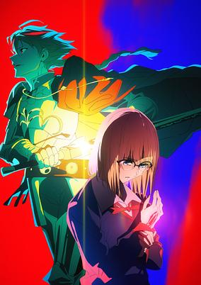

**Studio:** A-1 Pictures &nbsp;|&nbsp; **Episodes:** 13 &nbsp;|&nbsp; **Director:** Shun Enokido Takahito Sakazume &nbsp;|&nbsp; **Aired/Released:** January 3 – March 28 &nbsp;|&nbsp; **Genres:** Action, Adventure, Fantasy, Magic, Mystery, Supernatural, United States

> In a Holy Grail War, Mages (Masters) and their Heroic Spirits (Servants) fight for the control of the Holy Grail—an omnipotent wish-granting device said to fulfill any desire. Years have passed since the end of the Fifth Holy Grail War in Japan. Now, signs portend the emergence of a new Holy Grail in the western American city of Snowfield. Sure enough, Masters and Servants begin to gather... A missing Servant class... Impossible Servant summonings... A nation shrouded in secrecy... And a city created as a battleground. In the face of such irregularities, the Holy Grail War is twisted and driven into the depth of madness. Let the curtain rise on a masquerade of humans and heroes, made to dance upon the stage of a false Holy Grail. This is a Holy Grail War covered in lies. (Source: Official Site, Aniplex USA, edited) Notes: • Special premiere of Episode 1 in its English Dub occurred in Los Angeles at the Fate 20th Anniversary Showcase event and as well through Crunchyroll’s YouTube Channel on November 23, 2024 before the Japanese television premiere. • The Japanese advanced premiere occurred during the "Fate New Year's Eve TV Special 2024" on December 31, 2024.
>
> _Synopsis source: Kitsu_

[Wikipedia](https://en.wikipedia.org/wiki/Fate/strange_Fake) · [Kitsu](https://kitsu.io/anime/fate-strange-fake-tv)

---

### Sentenced to Be a Hero

**Studio:** Studio Kai &nbsp;|&nbsp; **Episodes:** 12 &nbsp;|&nbsp; **Director:** Hiroyuki Takashima &nbsp;|&nbsp; **Aired/Released:** January 3 – March 26 &nbsp;|&nbsp; **Genres:** Action, Comedy, Fantasy, Drama, Deity, Conspiracy

> In a world where heroism is a punishment, Xylo Forbartz, a condemned goddess killer, battles endless hordes of monstrous abominations as part of Penal Hero Unit 9004. Death is no escape, only a cycle of resurrection and relentless combat. But when Xylo encounters a mysterious new goddess, their unlikely alliance sparks a rebellion that could shatter the chains of eternal punishment. (Source: Crunchyroll) Notes: - The first episode aired with a runtime of ~58 minutes as opposed to the standard 24 minute long episode. - Initially scheduled to air in October, 2025
>
> _Synopsis source: Kitsu_

[Wikipedia](https://en.wikipedia.org/wiki/Sentenced_to_Be_a_Hero) · [Kitsu](https://kitsu.io/anime/yuusha-kei-ni-shosu-choubatsu-yuusha-9004-tai-keimu-kiroku)

---

### Hana-Kimi (season 1) (Hana-Kimi)

**Studio:** Signal.MD &nbsp;|&nbsp; **Episodes:** 12 &nbsp;|&nbsp; **Director:** Natsuki Takemura &nbsp;|&nbsp; **Aired/Released:** January 4 – March 22 &nbsp;|&nbsp; **Genres:** Comedy, Drama, Romance, Slice of Life, Reverse Harem, Cross Dressing, Gender Bender, Shoujo

> Mizuki Ashiya is on a mission: disguise herself as a boy and enroll in a male boarding school to meet her idol, high jump star Izumi Sano. But after successfully infiltrating the school, she discovers he’s suddenly quit the sport! Now Mizuki must dodge suspicion, protect her cover, and somehow reach the boy she came all this way for—all while surviving the chaos of an all-boys dorm!
>
> _Synopsis source: Kitsu_

[Wikipedia](https://en.wikipedia.org/wiki/Hana-Kimi) · [Kitsu](https://kitsu.io/anime/hanazakari-no-kimitachi-e)

---

### Ichigo Aika: Strawberry Elegy

**Studio:** Studio Hōkiboshi &nbsp;|&nbsp; **Episodes:** 12 &nbsp;|&nbsp; **Director:** Pyuta Konno &nbsp;|&nbsp; **Aired/Released:** January 4 – March 23

[Wikipedia](https://en.wikipedia.org/wiki/Ichigo_Aika)

---

### Jack-of-All-Trades, Party of None

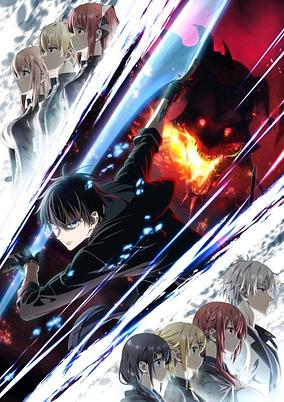

**Studio:** animation studio42 &nbsp;|&nbsp; **Episodes:** 12 &nbsp;|&nbsp; **Director:** Hiroyuki Kanbe &nbsp;|&nbsp; **Aired/Released:** January 4 – March 18 &nbsp;|&nbsp; **Genres:** Adventure, Action, Fantasy, Swordplay, Magic

> Betrayed by his childhood friend and cast out of the Hero Party, Orhun Dura—once their loyal Enchanter—is branded by his former comrades as “a jack-of-all-trades but a master of none.” Alone, he sets out to forge a new path as a solo adventurer. His journey sparks explosive battles, deadly rivals, and unexpected allies—and he’ll rise to shatter every expectation. The ultimate solo comeback begins!
>
> _Synopsis source: Kitsu_

[Wikipedia](https://en.wikipedia.org/wiki/Jack-of-All-Trades,_Party_of_None) · [Kitsu](https://kitsu.io/anime/jack-of-all-trades-party-of-none)

---

### Journal with Witch

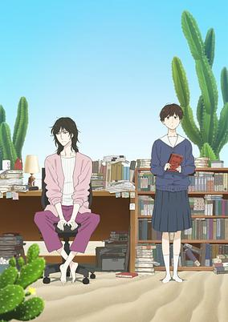

**Studio:** Shuka &nbsp;|&nbsp; **Episodes:** 13 &nbsp;|&nbsp; **Director:** Miyuki Oshiro &nbsp;|&nbsp; **Aired/Released:** January 4 – March 29 &nbsp;|&nbsp; **Genres:** Josei, Drama, Slice of Life, Coming Of Age

> Reclusive novelist Makio Koudai has always preferred the company of books—but when her sister and brother-in-law pass away, Makio unexpectedly becomes the guardian of her 15-year-old niece, Asa Takumi. As they navigate grief, clashing personalities, and the challenges of living together, the two slowly open their hearts to each other, discovering warmth, understanding, and the meaning of family.
>
> _Synopsis source: Kitsu_

[Wikipedia](https://en.wikipedia.org/wiki/Journal_with_Witch) · [Kitsu](https://kitsu.io/anime/ikoku-nikki)

---

### Kunon the Sorcerer Can See

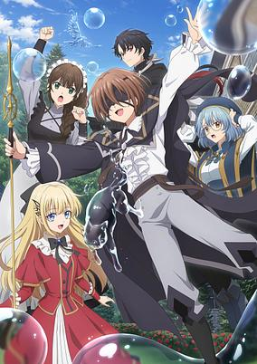

**Studio:** Platinum Vision &nbsp;|&nbsp; **Episodes:** 13 &nbsp;|&nbsp; **Director:** Hideaki Ōba &nbsp;|&nbsp; **Aired/Released:** January 4 – March 22 &nbsp;|&nbsp; **Genres:** Fantasy, Action, Adventure

> Kunon, a young man who cannot see, has the goal of creating new eyes with water magic. After just five months of learning sorcery, Kunon surpassed his own mentor and honed his talent as he tried to do a feat that's never been done before. A fantasy about a young man, a blind genius, who opens up the world through curiosity in the pursuit for magic is about to begin.
>
> _Synopsis source: Kitsu_

[Wikipedia](https://en.wikipedia.org/wiki/Kunon_the_Sorcerer_Can_See) · [Kitsu](https://kitsu.io/anime/majutsushi-kunon-wa-mieteiru)

---

### MF Ghost (season 3) (MF Ghost Season 3)

**Studio:** Felix Film &nbsp;|&nbsp; **Episodes:** 13 &nbsp;|&nbsp; **Director:** Tomohito Naka &nbsp;|&nbsp; **Aired/Released:** January 4 – March 29 &nbsp;|&nbsp; **Genres:** Motorsport, Sports, Seinen

> The third season of MF Ghost. Note: Each episode streams 3 days early on Prime Video. The original TV broadcast starts on January 4, 2026.
>
> _Synopsis source: Kitsu_

[Wikipedia](https://en.wikipedia.org/wiki/MF_Ghost) · [Kitsu](https://kitsu.io/anime/mf-ghost-3rd-season)

---

### Tamon's B-Side

**Studio:** J.C.Staff &nbsp;|&nbsp; **Episodes:** 13 &nbsp;|&nbsp; **Director:** Chika Nagaoka &nbsp;|&nbsp; **Aired/Released:** January 4 – March 29 &nbsp;|&nbsp; **Genres:** Romance, Comedy, Idol, Shoujo, Coming Of Age

> Utage Kinoshita is a high school girl who works part-time as a housekeeper. She has devoted her life to her favorite idol, Tamon Fukuhara, from the group F/ACE. Then one day, Utage ends up being assigned to Tamon’s house! There she discovers that off-stage, he is nothing like his wild idol persona. A gloomy, introverted boy with no self-confidence, Utage still finds herself falling for him anyway.
>
> _Synopsis source: Kitsu_

[Wikipedia](https://en.wikipedia.org/wiki/Tamon%27s_B-Side) · [Kitsu](https://kitsu.io/anime/tamon-kun-ima-docchi)

---

### The Daily Life of a Part-time Torturer

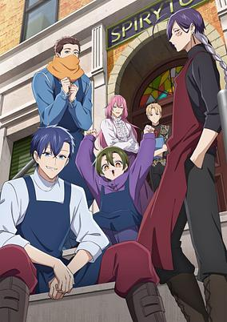

**Studio:** Diomedéa &nbsp;|&nbsp; **Episodes:** 12 &nbsp;|&nbsp; **Director:** Fumitoshi Oizaki &nbsp;|&nbsp; **Aired/Released:** January 4 – March 23 &nbsp;|&nbsp; **Genres:** Comedy

> In a society where torture is legal—and big business—Spirytus dominates the industry with skill, style, and surprisingly cheerful teamwork. Part-timers Cero, Shiu, Mikke, and Hugh tackle “client sessions,” office shenanigans, and even the occasional in-house assassin…all with a smile! Life at Spirytus proves that even in a world of pain, work can still be surprisingly fun!
>
> _Synopsis source: Kitsu_

[Wikipedia](https://en.wikipedia.org/wiki/The_Daily_Life_of_a_Part-time_Torturer) · [Kitsu](https://kitsu.io/anime/goumon-baito-kun-no-nichijou)

---

### Golden Kamuy (season 5) (Golden Kamuy Season 5)

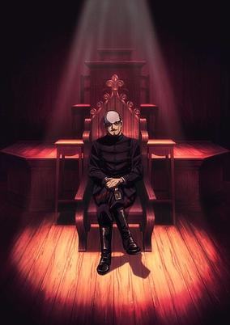

**Studio:** Brain's Base &nbsp;|&nbsp; **Episodes:** 13 &nbsp;|&nbsp; **Director:** Shizutaka Sugahara &nbsp;|&nbsp; **Aired/Released:** January 5 – March 30 &nbsp;|&nbsp; **Genres:** Historical, Japan, Action, Adventure, Comedy, Seinen

> The fifth and final season of Golden Kamuy.
>
> _Synopsis source: Kitsu_

[Wikipedia](https://en.wikipedia.org/wiki/Golden_Kamuy) · [Kitsu](https://kitsu.io/anime/golden-kamuy-5)

---

### My Hero Academia: Vigilantes (season 2) (My Hero Academia: Vigilantes Season 2)

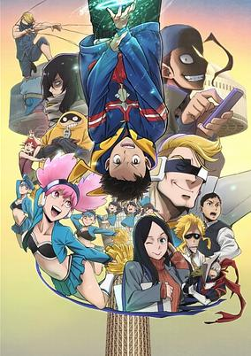

**Studio:** Bones Film &nbsp;|&nbsp; **Episodes:** 13 &nbsp;|&nbsp; **Director:** Kenichi Suzuki &nbsp;|&nbsp; **Aired/Released:** January 5 – March 30 &nbsp;|&nbsp; **Genres:** Superhero, Super Power, Shounen, Action, Adventure, Drama, Fantasy

> The second season of Vigilante: Boku no Hero Academia ILLEGALS.
>
> _Synopsis source: Kitsu_

[Kitsu](https://kitsu.io/anime/Vigilante-Boku-no-Hero-Academia-ILLEGALS-2nd-Season)

---

### Wash It All Away

**Studio:** Okuruto Noboru &nbsp;|&nbsp; **Episodes:** 12 &nbsp;|&nbsp; **Director:** Kenta Ōnishi &nbsp;|&nbsp; **Aired/Released:** January 5 – March 23

[Wikipedia](https://en.wikipedia.org/wiki/Wash_It_All_Away_(manga))

---

### I'll Live a Long Life to Dote on My Favorite Stepbrother!

**Studio:** Imagica Infos Imageworks Studio &nbsp;|&nbsp; **Episodes:** 12 &nbsp;|&nbsp; **Director:** Yūsuke Morishita &nbsp;|&nbsp; **Aired/Released:** January 6 – March 24 &nbsp;|&nbsp; **Genres:** Fantasy, Romance, Yaoi, Isekai

> The story of Saioshi no Gikei Mederutame, Nagaikishimasu! follows the struggle of a player to protect his favorite character, who gets reincarnated as his older brother-in-law in a simulation raising game - however, the player is reincarnated as the younger brother who was meant to die.
>
> _Synopsis source: Kitsu_

[Wikipedia](https://en.wikipedia.org/wiki/I%27ll_Live_a_Long_Life_to_Dote_on_My_Favorite_Stepbrother!) · [Kitsu](https://kitsu.io/anime/saioshi-no-gikei-mederu-tame-nagaikishimasu)

---

### Isekai Office Worker: The Other World's Books Depend on the Bean Counter

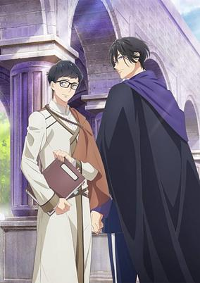

**Studio:** Studio Deen &nbsp;|&nbsp; **Episodes:** 12 &nbsp;|&nbsp; **Director:** Shinji Ishihara &nbsp;|&nbsp; **Aired/Released:** January 6 – March 24 &nbsp;|&nbsp; **Genres:** Isekai, Fantasy, Adventure, Romance, Slice of Life

> Seiichirou Kondou, a salaryman approaching his 30s, gets caught up in a holy maiden summoning ritual and is transported to a parallel world called Romany Kingdom. Having worked day and night, he developed the mindset of a corporate slave and even demanded work in this new world, which landed him an accounting job at the Royal Accounting Department. During his hectic days rebuilding the accounting department, Seiichirou came across a nutritional tonic that wiped away any fatigue. Thanks to the tonic, Seiichirou's chronic ailments and exhaustion completely disappeared, leaving him overjoyed. But because he had no resistance to the world's magic, the side effects put his life in danger! The only way to survive was to have someone with magic help accustom his body to magical energy, so with no other choice Seiichirou entrusts himself to Aresh, captain of the Third Royal Order, known as the Ice Prince.
>
> _Synopsis source: Kitsu_

[Wikipedia](https://en.wikipedia.org/wiki/The_Other_World%27s_Books_Depend_on_the_Bean_Counter) · [Kitsu](https://kitsu.io/anime/isekai-no-sata-wa-shachiku-shidai)

---

### There Was a Cute Girl in the Hero's Party, So I Tried Confessing to Her (There was a Cute Girl in the Hero’s Party, so I Tried Confessing to Her)

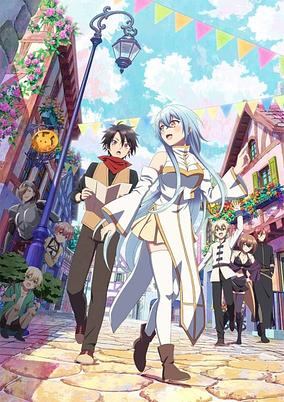

**Studio:** Gekkou &nbsp;|&nbsp; **Episodes:** 13 &nbsp;|&nbsp; **Director:** Yasutaka Yamamoto (Chief) Tomonori Mine &nbsp;|&nbsp; **Aired/Released:** January 6 – March 31 &nbsp;|&nbsp; **Genres:** Fantasy, Action, Adventure, Romance, Isekai

> When Youki was reincarnated into a magical world, he became neither a hero nor a demon lord, but instead became a middle-level subordinate demon guarding the castle. When the Hero's party attacked the demon lord's castle, Youki was able to defeat them easily. But he fell in love at first sight with the beautiful cleric Cecelia!
>
> _Synopsis source: Kitsu_

[Wikipedia](https://en.wikipedia.org/wiki/There_Was_a_Cute_Girl_in_the_Hero%27s_Party,_So_I_Tried_Confessing_to_Her) · [Kitsu](https://kitsu.io/anime/yuusha-party-ni-kawaii-ko-ga-ita-no-de-kokuhaku-shitemita)

---

### Tune In to the Midnight Heart

**Studio:** Gekkou &nbsp;|&nbsp; **Episodes:** 12 &nbsp;|&nbsp; **Director:** Masayuki Takahashi &nbsp;|&nbsp; **Aired/Released:** January 6 – March 24 &nbsp;|&nbsp; **Genres:** Comedy, Romance, Harem, Shounen

> When Arisu Yamabuki was all alone in bed at night, he was able to find solace in the voice of a radio host who went by “Apollo.” However, one day, she simply stopped broadcasting without any explanation. Years then passed, and Arisu is now a second-year high-schooler. He makes it his mission to search for Apollo, as there is something he wants to tell her. He doesn’t know what she looks like, or even what her real name is, but he manages to get some leads on her in his school’s broadcasting club. That’s where he meets four girls who all dream to get a job where they can make full use of their voices! Just who is Apollo, and how will those four’s dreams pan out?
>
> _Synopsis source: Kitsu_

[Wikipedia](https://en.wikipedia.org/wiki/Tune_In_to_the_Midnight_Heart) · [Kitsu](https://kitsu.io/anime/mayonaka-heart-tune)

---

### Yoroi-Shinden Samurai Troopers (part 1) (Yoroi-Shinden Samurai Troopers)

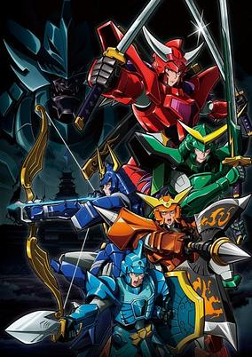

**Studio:** Sunrise &nbsp;|&nbsp; **Episodes:** 12 &nbsp;|&nbsp; **Director:** Yōichi Fujita &nbsp;|&nbsp; **Aired/Released:** January 6 – March 24 &nbsp;|&nbsp; **Genres:** Action, Adventure, Science Fiction, Samurai, Henshin, Super Power

> The Demon World once plunged the Human World into terror. With the seal broken and hordes of Demon Soldiers launching an invasion, five young warriors rushed to humanity's rescue. They were called the Samurai Troopers, and now their battle begins anew!
>
> _Synopsis source: Kitsu_

[Wikipedia](https://en.wikipedia.org/wiki/Yoroi-Shinden_Samurai_Troopers) · [Kitsu](https://kitsu.io/anime/yoroi-shinden-samurai-troopers)

---

### You Can't Be in a Rom-Com with Your Childhood Friends!

**Studio:** Tezuka Productions &nbsp;|&nbsp; **Episodes:** 12 &nbsp;|&nbsp; **Director:** Satoshi Kuwabara &nbsp;|&nbsp; **Aired/Released:** January 6 – March 24 &nbsp;|&nbsp; **Genres:** Romance, Comedy

> Eeyuu, a high school boy, has a problem! Two childhood friends "Shio" and "Akari" who go to the same high school are too cute! If they find out that I'm the only one looking sexually at them now that they've grown up, even though I have no intention of doing so... that would be too much! On the other hand, the two childhood friends also have their own secrets...? It's so awkward! It's complicated! But childhood friends are the best! A sweet and impatient love triangle love comedy where you can't be honest!
>
> _Synopsis source: Kitsu_

[Wikipedia](https://en.wikipedia.org/wiki/You_Can%27t_Be_in_a_Rom-Com_with_Your_Childhood_Friends!) · [Kitsu](https://kitsu.io/anime/osananajimi-to-wa-love-comedy-ni-naranai)

---

### A Gentle Noble's Vacation Recommendation

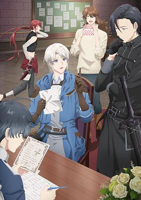

**Studio:** SynergySP &nbsp;|&nbsp; **Episodes:** 12 &nbsp;|&nbsp; **Director:** Kenta Noda &nbsp;|&nbsp; **Aired/Released:** January 7 – March 26 &nbsp;|&nbsp; **Genres:** Isekai, Adventure, Fantasy, Slice of Life

> When Lizel mysteriously finds himself in a city that bears odd similarities to his own but clearly isn't, he quickly comes to terms with the unlikely truth: this is an entirely different world. Even so, laid-back Lizel isn't the type to panic. He immediately sets out to learn more about this strange place, and to help him do so, hires a seasoned adventurer named Gil as his tour guide and protector. Until he's able to find a way home, Lizel figures this is a perfect opportunity to explore a new way of life adventuring as part of a guild. After all, he's sure he'll go home eventually... might as well enjoy the otherworldly vacation for now!
>
> _Synopsis source: Kitsu_

[Wikipedia](https://en.wikipedia.org/wiki/A_Gentle_Noble%27s_Vacation_Recommendation) · [Kitsu](https://kitsu.io/anime/odayaka-kizoku-no-kyuuka-no-susume)

---

### An Adventurer's Daily Grind at Age 29 (An Adventurer’s Daily Grind at Age 29)

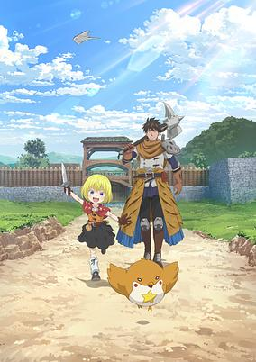

**Studio:** Hornets &nbsp;|&nbsp; **Episodes:** 12 &nbsp;|&nbsp; **Director:** Riki Fukushima &nbsp;|&nbsp; **Aired/Released:** January 7 – March 25 &nbsp;|&nbsp; **Genres:** Fantasy, Adventure, Slice of Life

> This story is about Shinonome Hajime, an adventurer of Silver Range. He's dedicated to fulfilling missions from the guild. One day when completing a quest for monster meat, he finds a strange girl named Lily in a dungeon who's far more trouble than she's worth. Saving the girl from certain death, her story reminds him of his similar past and he takes her under his care...
>
> _Synopsis source: Kitsu_

[Wikipedia](https://en.wikipedia.org/wiki/An_Adventurer%27s_Daily_Grind_at_Age_29) · [Kitsu](https://kitsu.io/anime/29-sai-dokushin-chuuken-boukensha-no-nichijou)

---

### Hell Teacher: Jigoku Sensei Nube (part 2)

**Studio:** Studio Kai &nbsp;|&nbsp; **Episodes:** 13 &nbsp;|&nbsp; **Director:** Yasuyuki Ōishi &nbsp;|&nbsp; **Aired/Released:** January 7 – March 25

---

### Shiboyugi: Playing Death Games to Put Food on the Table

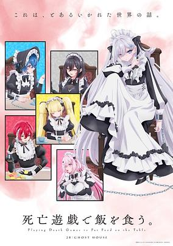

**Studio:** Studio Deen &nbsp;|&nbsp; **Episodes:** 11 &nbsp;|&nbsp; **Director:** Souta Ueno &nbsp;|&nbsp; **Aired/Released:** January 7 – March 18 &nbsp;|&nbsp; **Genres:** Action, Mystery, Drama

> At just seventeen, Yuki is a professional death game player. She’s survived enough rounds to know that survival is calculation, not luck—and that failure is final. For most players, the games are a nightmare with no escape. For Yuki, they’re simply business. Yet in a world where rooms turn into graves and every choice could be her last, even experience offers no protection.
>
> _Synopsis source: Kitsu_

[Wikipedia](https://en.wikipedia.org/wiki/Playing_Death_Games_to_Put_Food_on_the_Table) · [Kitsu](https://kitsu.io/anime/shibou-yuugi-de-meshi-wo-kuu)

---

### The Case Book of Arne

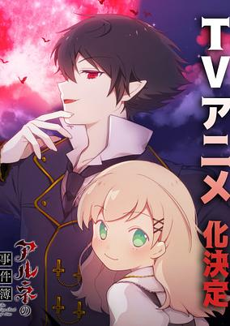

**Studio:** Silver Link &nbsp;|&nbsp; **Episodes:** 12 &nbsp;|&nbsp; **Director:** Keisuke Inoue &nbsp;|&nbsp; **Aired/Released:** January 7 – March 25 &nbsp;|&nbsp; **Genres:** Vampire, Mystery

> Arne Neuntöte is a vampire detective who manipulates supernatural powers. Lynn Reinweiß is a nobleman's daughter who loves vampires. Their worlds should never have crossed, but they join hands to solve a bloody mystery. In the darkest of nights, Lynn finds herself in desperate need of help. Then she wanders into the mysterious city of "Lügenberg," where non-humans live. Lynn's world changes drastically when she encounters "Arne," a vampire who is called "the worst" in the city. And tonight, a new "murder case" has occurred. What is the truth behind the bizarre incidents that take place in a world where humanity and the bizarre intersect? "Come on, human. You may dance merrily under the crimson moon."
>
> _Synopsis source: Kitsu_

[Wikipedia](https://en.wikipedia.org/wiki/The_Case_Book_of_Arne) · [Kitsu](https://kitsu.io/anime/arne-no-jikenbo)

---

### The Darwin Incident

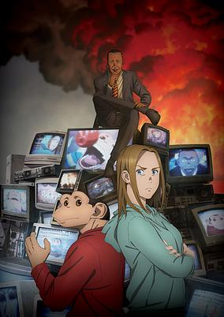

**Studio:** Bellnox Films &nbsp;|&nbsp; **Episodes:** 13 &nbsp;|&nbsp; **Director:** Naokatsu Tsuda &nbsp;|&nbsp; **Aired/Released:** January 7 – April 1 &nbsp;|&nbsp; **Genres:** Science Fiction, Drama, Psychological

> Charlie is one of a kind. As a half-human, half-chimpanzee Humanzee, his intellect and physical prowess is off the charts. Which is why The Animal Liberation Alliance, a terrorist group, wants him. And they will take extreme measures to get him. However, Charlie is determined to fight back for the sake of his loved ones.
>
> _Synopsis source: Kitsu_

[Wikipedia](https://en.wikipedia.org/wiki/The_Darwin_Incident) · [Kitsu](https://kitsu.io/anime/darwin-jihen)

---

### The Demon King's Daughter Is Too Kind!!

**Studio:** EMT Squared &nbsp;|&nbsp; **Episodes:** 12 &nbsp;|&nbsp; **Director:** Masahiko Ohta &nbsp;|&nbsp; **Aired/Released:** January 7 – March 25

[Wikipedia](https://en.wikipedia.org/wiki/The_Daughter_of_the_Demon_Lord_Is_Too_Kind!)

---

### Chained Soldier (season 2) (Chained Soldier Season 2)

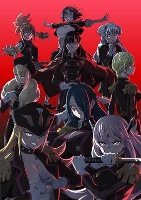

**Studio:** Passione Hayabusa Film &nbsp;|&nbsp; **Episodes:** 12 &nbsp;|&nbsp; **Director:** Masafumi Tamura &nbsp;|&nbsp; **Aired/Released:** January 8 – March 26 &nbsp;|&nbsp; **Genres:** Action, Fantasy, Adventure, Ecchi, Romance, Harem, Drama, Special Squads

> The second season of Mato Seihei no Slave.
>
> _Synopsis source: Kitsu_

[Wikipedia](https://en.wikipedia.org/wiki/Chained_Soldier) · [Kitsu](https://kitsu.io/anime/Mato-Seihei-no-Slave-2nd-Season)

---

### Noble Reincarnation: Born Blessed, So I'll Obtain Ultimate Power

**Studio:** CompTown &nbsp;|&nbsp; **Episodes:** 12 &nbsp;|&nbsp; **Director:** Michio Fukuda &nbsp;|&nbsp; **Aired/Released:** January 8 – March 26

[Wikipedia](https://en.wikipedia.org/wiki/Noble_Reincarnation)

---

### The Holy Grail of Eris

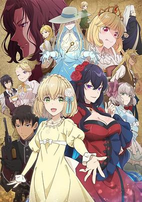

**Studio:** Ashi Productions &nbsp;|&nbsp; **Episodes:** 12 &nbsp;|&nbsp; **Director:** Morita to Junpei &nbsp;|&nbsp; **Aired/Released:** January 8 – March 26 &nbsp;|&nbsp; **Genres:** Shoujo, Drama, Fantasy, Mystery, Supernatural, Romance

> As a viscount’s daughter, Constance Grail is an ordinary girl whose only notable trait is sincerity, leaving her with no real options when someone steals her fiance and falsely accuses her of petty theft at a ball. While Connie awaits her undeserved punishment, a ghost appears to offer a bargain. The spirit is none other than Scarlett Castiel, a noblewoman once praised for her beauty, lineage, and undeniable charisma-and executed some ten years earlier for her wicked deeds. When Connie accepts this proposal, she is possessed by the infamous spirit who instantly turns the tide on her tormenter, thus saving the hapless girl from her miserable fate. It’s never wise striking a deal without knowing exactly what you’ve committed to, though...or you might find yourself bound to a ghost dead set on revenge against her own enemies!
>
> _Synopsis source: Kitsu_

[Wikipedia](https://en.wikipedia.org/wiki/The_Holy_Grail_of_Eris) · [Kitsu](https://kitsu.io/anime/eris-no-seihai)

---

### The Invisible Man and His Soon-to-Be Wife

**Studio:** Project No.9 &nbsp;|&nbsp; **Episodes:** 12 &nbsp;|&nbsp; **Director:** Mitsuho Seta &nbsp;|&nbsp; **Aired/Released:** January 8 – March 26 &nbsp;|&nbsp; **Genres:** Romance, Supernatural, Comedy

> Akira Tounome is an invisible gentleman who runs a detective agency, and Shizuka Yakou is a mild-mannered blind woman who works there. Shizuka can always find Akira, even when he turns completely invisible. Love begins to blossom between them as they grow closer to each other day by day. A touching and adorably frustrating romantic comedy is about to begin!
>
> _Synopsis source: Kitsu_

[Wikipedia](https://en.wikipedia.org/wiki/The_Invisible_Man_and_His_Soon-to-Be_Wife) · [Kitsu](https://kitsu.io/anime/toumei-otoko-to-ningen-onna-sonouchi-fuufu-ni-naru-futari)

---

### Anyway, I'm Falling in Love with You (season 2) (Anyway, I'm Falling in Love with You)

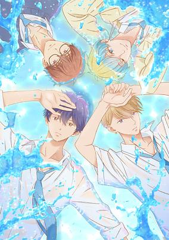

**Studio:** Typhoon Graphics &nbsp;|&nbsp; **Episodes:** 12 &nbsp;|&nbsp; **Director:** Junichi Yamamoto &nbsp;|&nbsp; **Aired/Released:** January 9 – March 27 &nbsp;|&nbsp; **Genres:** Drama, Romance, Shoujo

> It's July 1, 2020. Mizuha, a high school second-year, is having the worst seventeenth birthday ever. She's missing her chance to get close to the older student she admires, and her parents didn't even remember that it's her birthday. Worst of all, there's a new and unknown infectious disease making the rounds, so all her club tournaments and school trips have been canceled. She's convinced that she'll never have the dazzling youth that she's always dreamed of... but then her childhood friend, Mizuki, suddenly declares himself a candidate to be her boyfriend. This is a school youth story about four childhood friends who grew up like family, one being the heroine, Nishino Mizuha, and the four boys she grew up with whom she sees as family.
>
> _Synopsis source: Kitsu_

[Wikipedia](https://en.wikipedia.org/wiki/Anyway,_I%27m_Falling_in_Love_with_You) · [Kitsu](https://kitsu.io/anime/douse-koishite-shimaunda)

---

### Champignon Witch

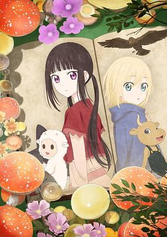

**Studio:** Typhoon Graphics Qzil.la &nbsp;|&nbsp; **Episodes:** 12 &nbsp;|&nbsp; **Director:** Yōsuke Kubo &nbsp;|&nbsp; **Aired/Released:** January 9 – March 20 &nbsp;|&nbsp; **Genres:** Drama, Fantasy, Supernatural, Shoujo, Magic

> Deep in a black forest, Luna, the feared Witch of Champignon, lives alone in her poison-mushroom cottage. Her touch brings poison, yet her potions heal all who take them. No one knows who the maker is, but still, the kindhearted Luna keeps brewing potions. Then one day, a mysterious, dreamlike encounter transforms her life, sparking a magical tale of love, adventure, and unexpected connections.
>
> _Synopsis source: Kitsu_

[Wikipedia](https://en.wikipedia.org/wiki/Champignon_Witch) · [Kitsu](https://kitsu.io/anime/Champignon-no-Majo)

---

### High School! Kimengumi (High School! Kimengumi (2026))

**Studio:** Seven &nbsp;|&nbsp; **Episodes:** 12 &nbsp;|&nbsp; **Director:** Kazuaki Seki &nbsp;|&nbsp; **Aired/Released:** January 9 – March 27 &nbsp;|&nbsp; **Genres:** Comedy, Romance, Shounen

> Rei Ichido, Go Reietsu, Kiyoshi Shusse, Jin Daima, and Dai Monohoshi are five students attending Ichio Junior High. With their unique quirks, eccentric personalities, and feats like repeating grades in junior high, they have earned a reputation among their peers as the infamous group, "Kimengumi."
>
> _Synopsis source: Kitsu_

[Wikipedia](https://en.wikipedia.org/wiki/High_School!_Kimengumi) · [Kitsu](https://kitsu.io/anime/high-school-kimengumi-2026)

---

### Jujutsu Kaisen (season 3)

**Studio:** MAPPA &nbsp;|&nbsp; **Episodes:** 12 &nbsp;|&nbsp; **Director:** Shōta Goshozono &nbsp;|&nbsp; **Aired/Released:** January 9 – March 27

[Wikipedia](https://en.wikipedia.org/wiki/Jujutsu_Kaisen_(TV_series))

---

### Roll Over and Die (ROLL OVER AND DIE: I Will Fight for an Ordinary Life with My Love and Cursed Sword!)

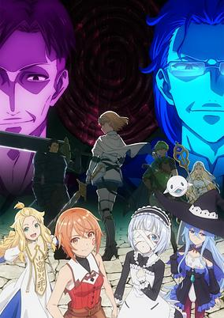

**Studio:** A.C.G.T &nbsp;|&nbsp; **Episodes:** 12 &nbsp;|&nbsp; **Director:** Nobuharu Kamanaka &nbsp;|&nbsp; **Aired/Released:** January 9 – March 27 &nbsp;|&nbsp; **Genres:** Action, Adventure, Fantasy, Drama, Horror

> Flum Apricot was never meant to be a hero. Despite zero stats across the board and a power she can’t even use, she somehow finds herself included in a party of heroes. But Flum’s life hits rock bottom when the party’s renowned sage, Jean Inteige, decides that the useless girl is dead weight, and arranges to have her sold into slavery. Tossed to monsters to be feasted upon for her master’s entertainment, Flum makes the desperate choice to reach for a cursed weapon…and something new awakens within her. A grimdark tale about one woman’s blood-soaked quest to reclaim her life!
>
> _Synopsis source: Kitsu_

[Wikipedia](https://en.wikipedia.org/wiki/Roll_Over_and_Die) · [Kitsu](https://kitsu.io/anime/omae-gotoki-ga-maou-ni-kateru-to-omou-na-to-yuusha-party-wo-tsuihou-sareta-node-outo-de-kimama-ni-kurashitai)

---

### Dark Moon: The Blood Altar (DARK MOON: THE BLOOD ALTAR Animation with ENHYPEN)

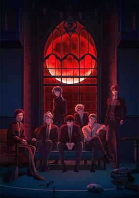

**Studio:** Troyca &nbsp;|&nbsp; **Episodes:** 12 &nbsp;|&nbsp; **Director:** Shōko Shiga &nbsp;|&nbsp; **Aired/Released:** January 10 – March 28 &nbsp;|&nbsp; **Genres:** Supernatural, Vampire, Reverse Harem

> In the seaside city of Riverfield stands Decelis Academy, home to seven mysterious boys sharing the same secret: They’re vampires, hiding their murky pasts. When Sooha, a female student who hates vampires, transfers to the academy, the boys find themselves irresistibly drawn to her. As strange events shake the city, old sins and buried secrets resurface, and their world begins to fracture.
>
> _Synopsis source: Kitsu_

[Kitsu](https://kitsu.io/anime/dark-moon-kuro-no-tsuki-tsuki-no-saidan)

---

### Dead Account

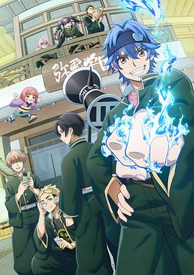

**Studio:** SynergySP &nbsp;|&nbsp; **Episodes:** 12 &nbsp;|&nbsp; **Director:** Keiya Saitō &nbsp;|&nbsp; **Aired/Released:** January 10 – March 28 &nbsp;|&nbsp; **Genres:** Shounen, Action, Supernatural

> When people die, their social media can sometimes become “ghost accounts,” manifesting their owners as digital specters. While trying to pay for his sister’s medical bills, Soji Enishiro awakens cyberkinesis and is dragged to Miden Academy, a secret school where spirit mediums train to fight digitized ghosts. Now Soji must master his powers before the online afterlife spills into the real world!
>
> _Synopsis source: Kitsu_

[Wikipedia](https://en.wikipedia.org/wiki/Dead_Account) · [Kitsu](https://kitsu.io/anime/dead-account)

---

### Does It Count If You Lose Your Virginity to an Android? (Does it Count if You Lose Your Innocence to an Android?)

**Studio:** Nyan Pollution-ω- &nbsp;|&nbsp; **Episodes:** 8 &nbsp;|&nbsp; **Director:** Neko B &nbsp;|&nbsp; **Aired/Released:** January 10 – February 28 &nbsp;|&nbsp; **Genres:** Android, Science Fiction, Comedy, Ecchi, Romance, Robot, Office Lady

> Akane Tsuda (28), working at a major electronics manufacturer, impulsively buys something while drunk—something that guarantees a felony just for possession!? It was Nadeshiko, an illegally manufactured adult romance android!? Akane finds herself at Nadeshiko's mercy, but despite being toyed with, she's drawn to Nadeshiko's various impressive skills...? The single office lady and the android begin their naughty cohabitation life together!!
>
> _Synopsis source: Kitsu_

[Wikipedia](https://en.wikipedia.org/wiki/Does_It_Count_If_You_Lose_Your_Virginity_to_an_Android%3F) · [Kitsu](https://kitsu.io/anime/android-wa-keiken-ninzuu-ni-hairimasu-ka)

---

### Easygoing Territory Defense by the Optimistic Lord: Production Magic Turns a Nameless Village into the Strongest Fortified City (Easygoing Territory Defense by the Optimistic Lord)

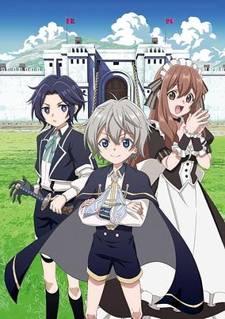

**Studio:** NAZ &nbsp;|&nbsp; **Episodes:** 12 &nbsp;|&nbsp; **Director:** Takayuki Kuriyama Tetsuya Tatamitani &nbsp;|&nbsp; **Aired/Released:** January 10 – March 28 &nbsp;|&nbsp; **Genres:** Fantasy, Action, Adventure, Drama, Comedy, Romance

> Van, fourth son of a marquis, is just a toddler when he realizes he’s been reincarnated. Thanks to his literal lifetime of knowledge, he’s raised as a child prodigy—until his production magic manifests, and it’s the last thing his snooty mage family wants to see! His disappointed father banishes him to a podunk town on the verge of collapse, yet Van can only see the place’s potential. Can our hero’s bastion of battlements build a better life than battle magic ever could?!
>
> _Synopsis source: Kitsu_

[Wikipedia](https://en.wikipedia.org/wiki/Easygoing_Territory_Defense_by_the_Optimistic_Lord) · [Kitsu](https://kitsu.io/anime/okiraku-ryoushu-no-tanoshii-ryouchi-bouei)

---

### Fire Force (season 3, part 2) (Fire Force Season 3)

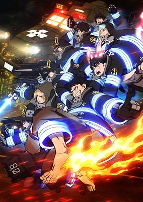

**Studio:** David Production &nbsp;|&nbsp; **Episodes:** 13 &nbsp;|&nbsp; **Director:** Tatsuma Minamikawa &nbsp;|&nbsp; **Aired/Released:** January 10 – April 4 &nbsp;|&nbsp; **Genres:** Super Power, Demon, Action, Science Fiction, Drama, Supernatural, Shounen

> The third and final season of Enen no Shouboutai. Shinra and the team are about to uncover the world’s greatest secret. But just as the other Special Fire Force Companies unite to face the looming disaster, Obi is captured by the Tokyo Imperial Army, and Company 8 is branded as traitors. Hunted by the Empire, they must fight alone to rescue Obi and stop the Evangelist—all while a new assassin and the corrupt Captain Burns block their path.
>
> _Synopsis source: Kitsu_

[Wikipedia](https://en.wikipedia.org/wiki/Fire_Force) · [Kitsu](https://kitsu.io/anime/enen-no-shouboutai-san-no-shou)

---

### Hell Mode: The Hardcore Gamer Dominates in Another World with Garbage Balancing (season 1) (HELL MODE: The Hardcore Gamer Dominates in Another World with Garbage Balancing)

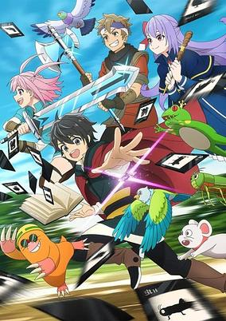

**Studio:** Yokohama Animation Laboratory &nbsp;|&nbsp; **Episodes:** 12 &nbsp;|&nbsp; **Director:** Masato Tamagawa &nbsp;|&nbsp; **Aired/Released:** January 10 – March 28 &nbsp;|&nbsp; **Genres:** Fantasy, Action, Adventure, Isekai

> Thirty-five-year-old Kenichi Yamada has spent his life playing every single MMORPG he can get his hands on. Tired of new games that cater to casual players, he leaps at the chance to try out a never-ending game with an intimidating “Hell Mode” that raises the difficulty (and chances to level up) to impossible heights. But, as soon as he selects the “Summoner,” Kenichi finds himself transported into the world of the game and reborn to a family of serfs as a baby named Allen! With nothing but his memories and wits to guide him, Allen sets off to conquer Hell Mode, unearth the secrets of the Summoner class, and free his newfound family from their fate.
>
> _Synopsis source: Kitsu_

[Wikipedia](https://en.wikipedia.org/wiki/Hell_Mode) · [Kitsu](https://kitsu.io/anime/hell-mode-the-hardcore-gamer-dominates-in-another-world-with-garbage-balancing)

---

### Reincarnated as a Dragon Hatchling

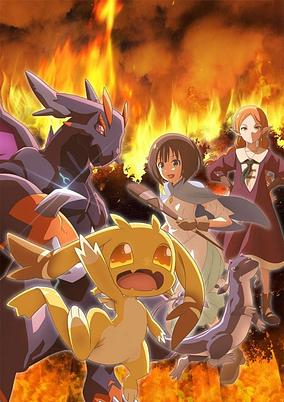

**Studio:** Felix Film Ga-Crew &nbsp;|&nbsp; **Episodes:** 12 &nbsp;|&nbsp; **Director:** Yuta Takamura &nbsp;|&nbsp; **Aired/Released:** January 10 – March 28 &nbsp;|&nbsp; **Genres:** Action, Adventure, Fantasy, Dragon, Isekai

> Our hero needs to come out of his shell... literally! Reborn in another world inside a dragon egg, he doesn’t have the amazing magic or mighty physical strength of your typical isekai’d adventurer just yet. He’ll need to break free and grow from a weak hatchling and into a fearsome beast if he wants to escape the deep, dark forest unscathed. What battles and adventures await him in this unique take on the isekai phenomenon?
>
> _Synopsis source: Kitsu_

[Wikipedia](https://en.wikipedia.org/wiki/Reincarnated_as_a_Dragon_Hatchling) · [Kitsu](https://kitsu.io/anime/tensei-shitara-dragon-no-tamago-datta)

---

### Trigun Stargaze

**Studio:** Orange &nbsp;|&nbsp; **Episodes:** 12 &nbsp;|&nbsp; **Director:** Masako Satō &nbsp;|&nbsp; **Aired/Released:** January 10 – March 28

[Wikipedia](https://en.wikipedia.org/wiki/Trigun_Stampede)

---

### You Don't Know Gunma Yet: Reiwa Version

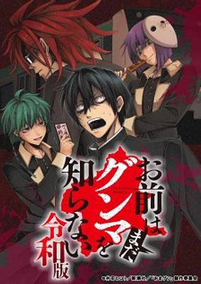

**Studio:** Imagica Infos Imageworks Studio &nbsp;|&nbsp; **Episodes:** 12 &nbsp;|&nbsp; **Director:** Tetsuya Tatamitani &nbsp;|&nbsp; **Aired/Released:** January 10 – March 14 &nbsp;|&nbsp; **Genres:** Comedy

> Light anime for Omae wa Mada Gunma wo Shiranai.
>
> _Synopsis source: Kitsu_

[Wikipedia](https://en.wikipedia.org/wiki/You_Don%27t_Know_Gunma_Yet) · [Kitsu](https://kitsu.io/anime/omae-wa-mada-gunma-wo-shiranai-reiwa-ban)

---

### A Misanthrope Teaches a Class for Demi-Humans

**Studio:** Asread &nbsp;|&nbsp; **Episodes:** 13 &nbsp;|&nbsp; **Director:** Akira Iwanaga &nbsp;|&nbsp; **Aired/Released:** January 11 – April 5 &nbsp;|&nbsp; **Genres:** Slice of Life, Romance, Comedy, Drama, Fantasy, Juujin, Harem, School Life

> Rei Hitoma is a former schoolteacher and a self-professed misanthrope due to past trauma. Hoping to live a slow, relaxing life, he takes a new teaching job in the mountains. But it turns out that this place is actually an all-girls school for demi-humans who want to become full-fledged human beings!
>
> _Synopsis source: Kitsu_

[Wikipedia](https://en.wikipedia.org/wiki/A_Misanthrope_Teaches_a_Class_for_Demi-Humans) · [Kitsu](https://kitsu.io/anime/jingai-kyoushitsu-no-ningengirai-kyoushi)

---

### Hell's Paradise (season 2) (Hell's Paradise Season 2)

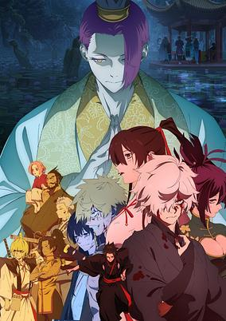

**Studio:** MAPPA &nbsp;|&nbsp; **Episodes:** 12 &nbsp;|&nbsp; **Director:** Kaori Makita &nbsp;|&nbsp; **Aired/Released:** January 11 – March 29 &nbsp;|&nbsp; **Genres:** Samurai, Ninja, Swordplay, Island, Historical, Violence, Action, Fantasy, Romance, Buddhism

> The second season of Jigokuraku. In search of clues to the elixir, Gabimaru and his group arrive at the castle of Tensen, the monsters who rule the island. Meanwhile, the shogunate sends additional expeditions to Shinsenkyo led by Yamada Asaemon Shugen, which are joined by the Iwagakure. Gabimaru must try to find the elixir and escape from the island as an all-out showdown between humans and celestial immortals looms near.
>
> _Synopsis source: Kitsu_

[Wikipedia](https://en.wikipedia.org/wiki/Hell%27s_Paradise_(TV_series)) · [Kitsu](https://kitsu.io/anime/jigokuraku-2nd-season)

---

### Oedo Fire Slayer: The Legend of Phoenix

**Studio:** SynergySP &nbsp;|&nbsp; **Episodes:** 12 &nbsp;|&nbsp; **Director:** Hajime Kamegaki Hiroshi Yasumi &nbsp;|&nbsp; **Aired/Released:** January 11 – April 5

[Wikipedia](https://en.wikipedia.org/wiki/Ush%C5%ABboro_Tobigumi)

---

### In the Clear Moonlit Dusk

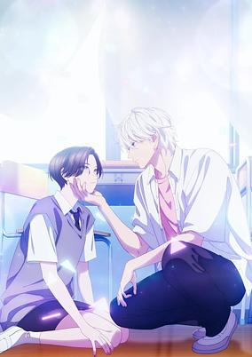

**Studio:** East Fish Studio Atelier Peuplier &nbsp;|&nbsp; **Episodes:** 12 &nbsp;|&nbsp; **Director:** Yūsuke Maruyama &nbsp;|&nbsp; **Aired/Released:** January 11 – March 29 &nbsp;|&nbsp; **Genres:** Slice of Life, Romance, Shoujo

> Yoi Takiguchi has long legs, a deep voice, and a handsome face…in other words, Yoi is such a good-looking guy that most people don’t notice or care that she is, in fact, a girl. Indeed, she’s had the nickname “Prince” as long as she can remember. That is, until she met Ichimura-senpai…the only person who’s really seemed to see her for herself. To her surprise, she’s not sure how to handle this new relationship, especially when her newfound friend is a prince himself (and a guy prince, at that).
>
> _Synopsis source: Kitsu_

[Wikipedia](https://en.wikipedia.org/wiki/In_the_Clear_Moonlit_Dusk) · [Kitsu](https://kitsu.io/anime/uruwashi-no-yoi-no-tsuki)

---

### Kaya-chan Isn't Scary

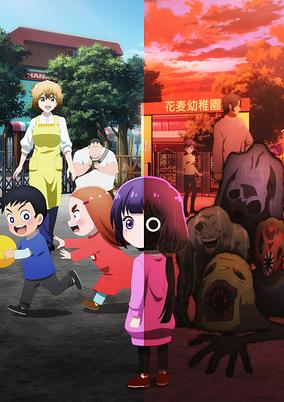

**Studio:** East Fish Studio &nbsp;|&nbsp; **Episodes:** 12 &nbsp;|&nbsp; **Director:** Hiroshi Ikehata &nbsp;|&nbsp; **Aired/Released:** January 11 – March 29 &nbsp;|&nbsp; **Genres:** Comedy, Horror, Slice of Life, Seinen, Ghost, Super Power

> Kaya-chan is an infamous problem child in kindergarten. However, when Chie-sensei is assigned to look after her, she finds out that Kaya has an ability... Presenting to you, the strongest horror action series set in a kindergarten!!
>
> _Synopsis source: Kitsu_

[Wikipedia](https://en.wikipedia.org/wiki/Kaya-chan_Isn%27t_Scary) · [Kitsu](https://kitsu.io/anime/kaya-chan-wa-kowakunai)

---

### Scum of the Brave

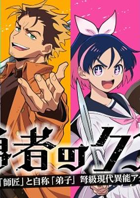

**Studio:** OLM &nbsp;|&nbsp; **Episodes:** 24 &nbsp;|&nbsp; **Director:** Shinji Ushiro &nbsp;|&nbsp; **Aired/Released:** January 11 – June 28 &nbsp;|&nbsp; **Genres:** Science Fiction, Action, Comedy, Drama, Fantasy

> In an alternate 21st century, rich mafia members can turn into "Demon Kings" through increasingly popular ether-enhancement surgery, and the bounty hunters called "Braves" are the ones called upon to take them down. Yashiro only wants the simple pleasures in life - pizza, beer, and card games. When three young Braves offer him a majestic sum to be their private tutor, he agrees solely for the money - but is it worth what he's getting himself into?
>
> _Synopsis source: Kitsu_

[Wikipedia](https://en.wikipedia.org/wiki/Scum_of_the_Brave) · [Kitsu](https://kitsu.io/anime/yuusha-no-kuzu)

---

### The Villainess Is Adored by the Prince of the Neighbor Kingdom

**Studio:** Studio Deen &nbsp;|&nbsp; **Episodes:** 12 &nbsp;|&nbsp; **Director:** Takayuki Hamana &nbsp;|&nbsp; **Aired/Released:** January 11 – March 29 &nbsp;|&nbsp; **Genres:** Fantasy, Romance, Shoujo, Isekai

> On the day before her downfall, Lady Tiararose Lapis Clementille recalls that she is in an otome game that she had once played in her former life. She used to adore the main love interest Prince Hartknights Lapis-Lazuli Lactomuth, but unfortunately, she was not reincarnated as the heroine, but rather as is his worst enemy—the villainess fiancée. At their graduation ceremony, without blinking an eye, Hartknights condemns Tiararose for alleged crimes, breaks off his engagement, and proclaims the heroine Akari as his new bride-to-be. No matter whether Tiararose is innocent, he banishes her from the kingdom. But before her sentence can be carried out, a shocking figure appears. Aquasteed Marineforest, the prince of a powerful neighboring country, has been harboring feelings for Tiararose for quite some time, and announces his intention to marry her! Adored by the prince of another kingdom, what awaits the villainess on her path to a happy ending?
>
> _Synopsis source: Kitsu_

[Wikipedia](https://en.wikipedia.org/wiki/The_Villainess_Is_Adored_by_the_Prince_of_the_Neighbor_Kingdom) · [Kitsu](https://kitsu.io/anime/akuyaku-reijou-wa-ringoku-no-outaishi-ni-dekiai-sareru)

---

### You and I Are Polar Opposites (season 1) (You and I are Polar Opposites)

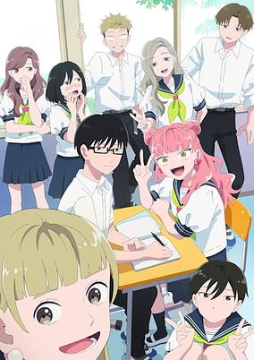

**Studio:** Lapin Track &nbsp;|&nbsp; **Episodes:** 12 &nbsp;|&nbsp; **Director:** Takayoshi Nagatomo &nbsp;|&nbsp; **Aired/Released:** January 11 – March 29 &nbsp;|&nbsp; **Genres:** Drama, Comedy, Slice of Life, Romance, Shounen

> Suzuki’s a high school girl in love, but the guy she’s fallen for is nothing like her! While she’s cheerful, outgoing, and always trying to fit in, her classmate Yusuke Tani is stoic, quiet, and doesn’t seem to care what people think of him. Will Suzuki be able to overcome her anxieties and ask him out, or will she discover that opposites really don’t attract?
>
> _Synopsis source: Kitsu_

[Wikipedia](https://en.wikipedia.org/wiki/You_and_I_Are_Polar_Opposites) · [Kitsu](https://kitsu.io/anime/seihantai-na-kimi-to-boku)

---

### 'Tis Time for "Torture," Princess (season 2) ('Tis Time for "Torture," Princess Season 2)

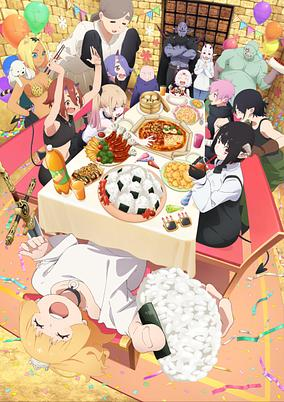

**Studio:** Pine Jam &nbsp;|&nbsp; **Episodes:** 12 &nbsp;|&nbsp; **Director:** Yōko Kanamori &nbsp;|&nbsp; **Aired/Released:** January 12 – March 30 &nbsp;|&nbsp; **Genres:** Demon, Absurdist Humour, Slapstick, Fantasy, Comedy

> As the war between the Imperial Army and Hellhorde rages on, the Princess, despite being armed with her mythical sword Excalibur, is captured and imprisoned. What kind of torture does she face at the hands of the chief demon interrogator? Fluffy fresh-baked toast! Hot, steaming ramen! Oh, the humanity! Can the Princess withstand these tormenting treats and keep her kingdom’s secrets safe?
>
> _Synopsis source: Kitsu_

[Wikipedia](https://en.wikipedia.org/wiki/%27Tis_Time_for_%22Torture,%22_Princess) · [Kitsu](https://kitsu.io/anime/hime-sama-goumon-no-jikan-desu-2nd-season)

---

### Oshi no Ko (season 3)

**Studio:** Doga Kobo &nbsp;|&nbsp; **Episodes:** 11 &nbsp;|&nbsp; **Director:** Daisuke Hiramaki &nbsp;|&nbsp; **Aired/Released:** January 14 – March 25

[Wikipedia](https://en.wikipedia.org/wiki/Oshi_no_Ko_(2023_TV_series))

---

### Frieren: Beyond Journey's End (season 2) (Frieren: Beyond Journey's End Season 2)

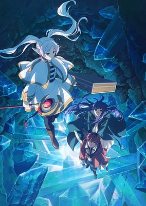

**Studio:** Madhouse &nbsp;|&nbsp; **Episodes:** 10 &nbsp;|&nbsp; **Director:** Tomoya Kitagawa &nbsp;|&nbsp; **Aired/Released:** January 16 – March 27 &nbsp;|&nbsp; **Genres:** Elf, Magic, High Fantasy, Fantasy, Adventure, Slice of Life, Drama

> The second season of Sousou no Frieren. On the road to Ende, Frieren confronts past bonds and rising threats with her newfound party.
>
> _Synopsis source: Kitsu_

[Wikipedia](https://en.wikipedia.org/wiki/Frieren_(TV_series)) · [Kitsu](https://kitsu.io/anime/sousou-no-frieren-season-2)

---

### Medalist (season 2)

**Studio:** ENGI &nbsp;|&nbsp; **Episodes:** 9 &nbsp;|&nbsp; **Director:** Yasutaka Yamamoto &nbsp;|&nbsp; **Aired/Released:** January 25 – March 22 &nbsp;|&nbsp; **Genres:** Drama, Sports, Psychological

> Tsukasa Akeuraji, a frustrated skater, meets Inori Yuitsuka, a girl who yearns to be a figure skater. Motivated by Inori's obsession on the rink, Tsukasa begins coaching Inori. Inori's talent blossoms, and Tsukasa becomes a brilliant mentor. Together they aim to make her a glorious medalist!
>
> _Synopsis source: Kitsu_

[Wikipedia](https://en.wikipedia.org/wiki/Medalist_(manga)) · [Kitsu](https://kitsu.io/anime/medalist)

---

### Star Detective Precure!

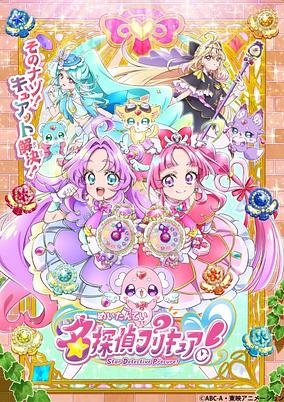

**Studio:** Toei Animation &nbsp;|&nbsp; **Director:** Kōji Kawasaki &nbsp;|&nbsp; **Aired/Released:** February 1 – &nbsp;|&nbsp; **Genres:** Magical Girl, Detective, Mystery, Kids, Henshin

> The 23rd installment of the long-running Precure series. Anna Akechi is a second-year junior high student living in Makoto Mirai Town. On her 14th birthday, she has a chance encounter with a fairy named Pochitan, and a magical pendant caused her to travel back in time from 2027 to 1999! In the Makoto Mirai Town 28 years in the past, Anna meets Mikuru Kobayashi, a girl her age who wants to become a great detective. Meanwhile, people in town are in trouble as their prized possessions are being stolen from under their noses - the cause being a group of Phantom Thieves. To stop them, Anna and Mikuru turn into Pretty Cures! Maybe if they solve these mysteries, Anna can find her way back to her own time?
>
> _Synopsis source: Kitsu_

[Wikipedia](https://en.wikipedia.org/wiki/Star_Detective_Precure!) · [Kitsu](https://kitsu.io/anime/meitantei-precure)

---

### Rooster Fighter

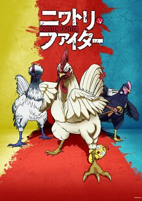

**Studio:** Sanzigen &nbsp;|&nbsp; **Episodes:** 12 &nbsp;|&nbsp; **Director:** Daisuke Suzuki &nbsp;|&nbsp; **Aired/Released:** March 15 – May 31 &nbsp;|&nbsp; **Genres:** Action, Adventure, Comedy, Supernatural, Parody, Seinen, Demon, Revenge

> Keiji, the neighborhood cock of the walk is more than just an ordinary rooster—he’s humanity’s greatest defender! His opponents may be ten stories tall, but nothing is bigger than his stout heart and his fearsome battle cry—Kokekokko!
>
> _Synopsis source: Kitsu_

[Wikipedia](https://en.wikipedia.org/wiki/Rooster_Fighter) · [Kitsu](https://kitsu.io/anime/niwatori-fighter)

---

### Agents of the Four Seasons: Dance of Spring

**Studio:** Wit Studio &nbsp;|&nbsp; **Episodes:** 14 &nbsp;|&nbsp; **Director:** Ken Yamamoto &nbsp;|&nbsp; **Aired/Released:** March 29 – June 28 &nbsp;|&nbsp; **Genres:** Drama, Fantasy, Romance

> Once upon a time, there was Winter. Winter was once the only season in the world—but such an existence was too lonely to bear, and so it created Spring to love. Before long, the earth wished for more time to rest in the cycle, and Summer and Autumn were born. The ones who carry the cycle are called the Agents of the Four Seasons. Hinagiku, the Vernal Agent, disappeared from this land ten years ago, taking the season of spring with her. Now, after incredible hardship, she has returned to restore the cycle to its proper state—and, as in the myth passed down since the dawn of time, she sends her love to Winter.
>
> _Synopsis source: Kitsu_

[Wikipedia](https://en.wikipedia.org/wiki/Agents_of_the_Four_Seasons) · [Kitsu](https://kitsu.io/anime/shunkashuutou-daikousha-haru-no-mai)

---

### Classroom of the Elite (season 4) (Classroom of the Elite 4th Season: Second Year, First Semester)

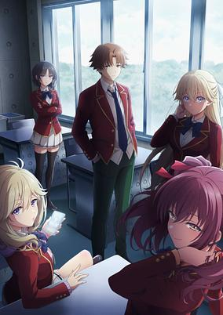

**Studio:** Lerche &nbsp;|&nbsp; **Episodes:** 16 &nbsp;|&nbsp; **Director:** Noriyuki Nomata &nbsp;|&nbsp; **Aired/Released:** April 1 – June 24 &nbsp;|&nbsp; **Genres:** High School, School Life, Drama, Psychological

> The fourth season of Youkoso Jitsuryoku Shijou Shugi no Kyoushitsu e. As Ayanokouji and his classmates begin their second year at the Advanced Nurturing High School, they’re greeted by a fresh gauntlet of exams and a fresh batch of rather unique first-year students. They’ll have to get to know each other quickly, because the first special exam pairs the first-years with the second-years on a written test, with only the second-years facing expulsion if their team performs poorly! Worse yet? It seems one of the new first-years is also from the White Room. Can Ayanokouji avoid expulsion while sussing out the identity of this hidden foe?
>
> _Synopsis source: Kitsu_

[Wikipedia](https://en.wikipedia.org/wiki/Classroom_of_the_Elite_(TV_series)) · [Kitsu](https://kitsu.io/anime/youkoso-jitsuryoku-shijou-shugi-no-kyoushitsu-e-4th-season-2-nensei-hen-1-gakki)

---

### Dorohedoro (season 2)

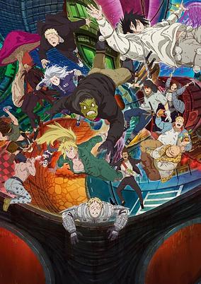

**Studio:** MAPPA &nbsp;|&nbsp; **Episodes:** 11 &nbsp;|&nbsp; **Director:** Yuichiro Hayashi &nbsp;|&nbsp; **Aired/Released:** April 1 – May 27 &nbsp;|&nbsp; **Genres:** Magic, Violence, Action, Fantasy, Adventure, Horror, Comedy, Psychological, Supernatural, Mystery

> The second season of Dorohedoro The anarchy continues as Caiman inches closer to the truth behind his cursed appearance, and the mystery around the Cross-Eyes' boss begins to unravel.
>
> _Synopsis source: Kitsu_

[Wikipedia](https://en.wikipedia.org/wiki/Dorohedoro) · [Kitsu](https://kitsu.io/anime/Dorohedoro-2)

---

### Go for It, Nakamura! (Go For It, Nakamura-kun!!)

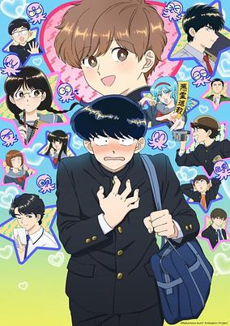

**Studio:** Drive &nbsp;|&nbsp; **Episodes:** 13 &nbsp;|&nbsp; **Director:** Aoi Umeki &nbsp;|&nbsp; **Aired/Released:** April 1 – June 17 &nbsp;|&nbsp; **Genres:** Shounen Ai, Comedy, Romance, Slice of Life, School Life

> Love at first sight is no myth—just ask Okuto Nakamura. Whenever his dreamy classmate Aiki Hirose enters the room, his heart skips a beat, despite the fact that they’ve never actually spoken. Not to mention, Nakamura is a complete klutz with zero friends. Will he ruin his chance at love before it even begins? (Source: Crunchyroll) Note: The series streamed a week in advance on Hulu Japan, starting with episode 2 released alongside episode 1.
>
> _Synopsis source: Kitsu_

[Wikipedia](https://en.wikipedia.org/wiki/Go_for_It,_Nakamura!) · [Kitsu](https://kitsu.io/anime/ganbare-nakamura-kun)

---

### Reborn as a Vending Machine, I Now Wander the Dungeon (season 3) (Reborn as a Vending Machine, I Now Wander the Dungeon Season 2)

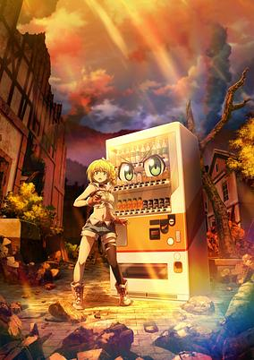

**Studio:** Studio Gokumi AXsiZ &nbsp;|&nbsp; **Episodes:** 12 &nbsp;|&nbsp; **Director:** Takashi Yamamoto &nbsp;|&nbsp; **Aired/Released:** April 1 – June 24 &nbsp;|&nbsp; **Genres:** Magic, Parody, Fantasy, Adventure, Comedy, Isekai

> The second season of Jidou Hanbaiki ni Umarekawatta Ore wa Meikyuu wo Samayou.
>
> _Synopsis source: Kitsu_

[Wikipedia](https://en.wikipedia.org/wiki/Reborn_as_a_Vending_Machine,_I_Now_Wander_the_Dungeon) · [Kitsu](https://kitsu.io/anime/jidou-hanbaiki-ni-umarekawatta-ore-wa-meikyuu-wo-samayou-2nd-season)

---

### The Beginning After the End (season 2) (The Beginning After the End)

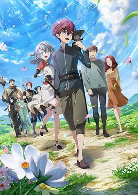

**Studio:** Studio A-Cat &nbsp;|&nbsp; **Episodes:** 12 &nbsp;|&nbsp; **Director:** Keitaro Motonaga &nbsp;|&nbsp; **Aired/Released:** April 1 – June 17 &nbsp;|&nbsp; **Genres:** Magic, Action, Fantasy, Adventure, Isekai

> After a mysterious death, King Grey is reborn as Arthur Leywin on the magical continent of Dicathen. Although he enters his second life as a baby, his previous wisdom remains. He begins to master magic and forge his own path as the years go by, seeking to correct the mistakes of his past life.
>
> _Synopsis source: Kitsu_

[Wikipedia](https://en.wikipedia.org/wiki/The_Beginning_After_the_End) · [Kitsu](https://kitsu.io/anime/saikyou-no-ousama-nidome-no-jinsei-wa-nani-wo-suru)

---

### Always a Catch!

**Studio:** Troyca &nbsp;|&nbsp; **Episodes:** 12 &nbsp;|&nbsp; **Director:** Akira Oguro &nbsp;|&nbsp; **Aired/Released:** April 2 – June 18

[Wikipedia](https://en.wikipedia.org/wiki/Always_a_Catch!)

---

### Dr. Stone: Science Future (part 3) (Dr. Stone: Science Future)

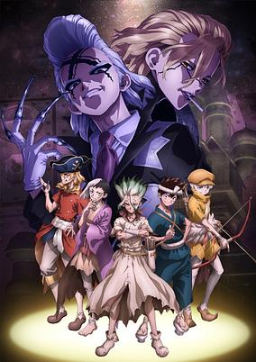

**Studio:** TMS Entertainment &nbsp;|&nbsp; **Episodes:** 13 &nbsp;|&nbsp; **Director:** Shūhei Matsushita &nbsp;|&nbsp; **Aired/Released:** April 2 – June 25 &nbsp;|&nbsp; **Genres:** Shounen, Adventure, Science Fiction, Action, Comedy

> The fourth and final season of Dr.STONE.
>
> _Synopsis source: Kitsu_

[Wikipedia](https://en.wikipedia.org/wiki/Dr._Stone_season_4) · [Kitsu](https://kitsu.io/anime/dr-stone-science-future)

---

### Kirio Fan Club

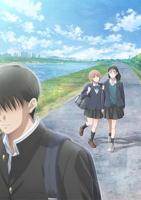

**Studio:** Satelight &nbsp;|&nbsp; **Episodes:** 12 &nbsp;|&nbsp; **Director:** Sō Toyama &nbsp;|&nbsp; **Aired/Released:** April 2 – June 18 &nbsp;|&nbsp; **Genres:** Josei, Comedy, Romance, Slice of Life

> For Aimi and Nami, the answer is to cry tears of joy for being able to pinpoint at a distance the object of their affections, Kirio, from a single toot. These are the kinds of deep, philosophical questions the two friends/rivals in romance pose to each other to prove their love for this boy who hardly seems to know they exist. That won’t stop them from conducting nightly rituals to entice him into their dreams, though, or listing out what exactly they like about him, down to the very last organ. But when push comes to shove, will they choose their hilarious friendship over a shot at love?
>
> _Synopsis source: Kitsu_

[Wikipedia](https://en.wikipedia.org/wiki/Kirio_Fan_Club) · [Kitsu](https://kitsu.io/anime/kirio-fanclub)

---

### The Ramparts of Ice (season 1) (The Ramparts of Ice)

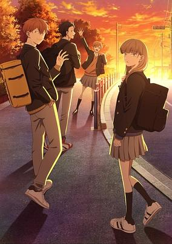

**Studio:** Studio Kai &nbsp;|&nbsp; **Episodes:** 14 &nbsp;|&nbsp; **Director:** Mankyū &nbsp;|&nbsp; **Aired/Released:** April 2 – July 2 &nbsp;|&nbsp; **Genres:** Comedy, Romance, School Life, Friendship

> Weighed down by memories she can't shake, high schooler Koyuki Hikawa keeps everyone at arm's length until three schoolmates draw her out of her shell.
>
> _Synopsis source: Kitsu_

[Wikipedia](https://en.wikipedia.org/wiki/The_Ramparts_of_Ice) · [Kitsu](https://kitsu.io/anime/koori-no-joheki)

---

### Haibara's Teenage New Game+ (Haibara’s Teenage New Game+)

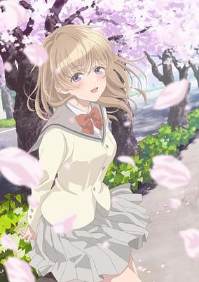

**Studio:** Studio Comet &nbsp;|&nbsp; **Episodes:** 12 &nbsp;|&nbsp; **Director:** Misuzu Hoshino &nbsp;|&nbsp; **Aired/Released:** April 3 – June 19 &nbsp;|&nbsp; **Genres:** Romance, Slice of Life, Time Travel

> We all have embarrassing memories or deep regrets from high school, right? Socially anxious college senior Natsuki Haibara sure does. When he thinks back on that time of his life, all he has are fleeting fantasies of a happy adolescence that could have been. Imagine his bewilderment and surprise, then, when he inexplicably finds himself seven years in the past—one month before his first year of high school! Can Haibara avoid his previous mistakes, make his way to the top of the school social pyramid, and end up with the girl of his dreams? Or will he be forced to relive three years of solitude as the most hated guy in school? He’ll need all the help he can get in order to succeed, from a workout regimen to online how-to guides, a childhood friend, and plenty of sheer willpower. Watch as Haibara takes a second shot at his teenage years!
>
> _Synopsis source: Kitsu_

[Wikipedia](https://en.wikipedia.org/wiki/Haibara%27s_Teenage_New_Game%2B) · [Kitsu](https://kitsu.io/anime/haibara-kun-no-tsuyokute-seishun-new-game)

---

### Killed Again, Mr. Detective?

**Studio:** Liden Films &nbsp;|&nbsp; **Episodes:** 12 &nbsp;|&nbsp; **Director:** Takashi Naoya &nbsp;|&nbsp; **Aired/Released:** April 3 – June 19

[Wikipedia](https://en.wikipedia.org/wiki/Killed_Again,_Mr._Detective%3F)

---

### Monster Eater

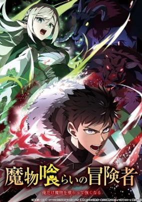

**Studio:** Imagica Infos Imageworks Studio &nbsp;|&nbsp; **Episodes:** 12 &nbsp;|&nbsp; **Director:** Hikaru Satō &nbsp;|&nbsp; **Aired/Released:** April 3 – June 19 &nbsp;|&nbsp; **Genres:** Action, Adventure, Fantasy

> Nobody wants "Grubby Forager" Rudd on their adventuring team. His nickname—and his stench—come from his constant treks into the Noxious Labyrinth to gather medicinal herbs, a job he survives only thanks to his status immunity skill. When he's finally recruited as a party porter, things seem to be looking up... Until a deadly dungeon monster appears and his fake allies use him as bait before abandoning him! Wounded, destitute, and barely surviving the attack, Rudd breaks a forbidden taboo to stay alive: eating monsters. But the more he devours, the more power he gains, kicking off a thrilling, adventurous gourmet fantasy!
>
> _Synopsis source: Kitsu_

[Wikipedia](https://en.wikipedia.org/wiki/Monster_Eater) · [Kitsu](https://kitsu.io/anime/mamonogurai-no-boukensha-ore-dake-mamono-wo-kuratte-tsuyoku-naru)

---

### Petals of Reincarnation

**Studio:** Benten Film &nbsp;|&nbsp; **Episodes:** 13 &nbsp;|&nbsp; **Director:** Shun Kudō &nbsp;|&nbsp; **Aired/Released:** April 3 – June 26 &nbsp;|&nbsp; **Genres:** Action, Supernatural, Super Power

> Touya Senji is talentless. He's tried everything but he can't seem to excel at anything no matter how hard he tries. Then he meets Haito, a Kendo champion and... humanity's protector? She uses the Stem of Reincarnation to draw on the abilities of her past lives, but it only works when she slits her own throat. And now she wants Touya to join her?!
>
> _Synopsis source: Kitsu_

[Wikipedia](https://en.wikipedia.org/wiki/Petals_of_Reincarnation) · [Kitsu](https://kitsu.io/anime/reincarnation-no-kaben)

---

### Snowball Earth

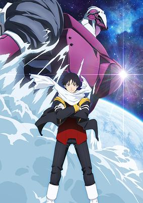

**Studio:** Studio Kai &nbsp;|&nbsp; **Episodes:** 13 &nbsp;|&nbsp; **Director:** Munehisa Sakai &nbsp;|&nbsp; **Aired/Released:** April 3 – June 26 &nbsp;|&nbsp; **Genres:** Post Apocalypse, Action, Mecha, Science Fiction

> "Yukio... I'm going to make a friend." A shy boy named Tetsuo. The only thing he had was a giant robot named Yukio. They became "saviors" in the fight against the galactic monsters coming from outer space. After the final battle, Tetsuo returns to Earth for the first time in ten years and witnesses an astonishing world. It's a frozen Earth (named Snowball Earth), where the entire land is covered in snow and ice, being turned into a deadly world! What happened to the human race? And will Tetsuo be able to fulfill the promise he made to Yukio?
>
> _Synopsis source: Kitsu_

[Wikipedia](https://en.wikipedia.org/wiki/Snowball_Earth_(manga)) · [Kitsu](https://kitsu.io/anime/snowball-earth)

---

### That Time I Got Reincarnated as a Slime ( season 4 , part 1) (That Time I Got Reincarnated as a Slime the Movie: Tears of the Azure Sea)

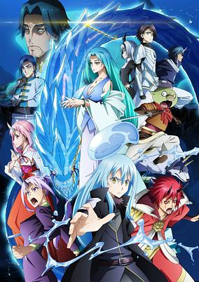

**Studio:** Eight Bit &nbsp;|&nbsp; **Episodes:** 12 &nbsp;|&nbsp; **Director:** Naokatsu Tsuda &nbsp;|&nbsp; **Aired/Released:** April 3 – June 26 &nbsp;|&nbsp; **Genres:** Action, Fantasy, Adventure, Comedy, Isekai

> The second movie in the Tensei Shitara Slime Datta Ken series. After concluding the opening ceremony of the Demon Kingdom Federation Tempest, Rimuru and his companions are invited by the Celestial Emperor Hermesia of the great elven nation – the Magi Dynasty Salion – to visit her private resort island. As the group enjoys their brief vacation, a mysterious woman named Yura appears. A new incident unfolds against the backdrop of the boundless azure sea.
>
> _Synopsis source: Kitsu_

[Wikipedia](https://en.wikipedia.org/wiki/That_Time_I_Got_Reincarnated_as_a_Slime_(TV_series)) · [Kitsu](https://kitsu.io/anime/tensei-shitara-slime-datta-ken-movie-2-soukai-no-namida-hen)

---

### The Angel Next Door Spoils Me Rotten (season 2) (The Angel Next Door Spoils Me Rotten Season 2)

**Studio:** Project No.9 &nbsp;|&nbsp; **Episodes:** 12 &nbsp;|&nbsp; **Director:** Chihiro Kumano &nbsp;|&nbsp; **Aired/Released:** April 3 – June 19 &nbsp;|&nbsp; **Genres:** High School, Romance, School Life

> Second season of Otonari no Tenshi-sama ni Itsunomanika Dame Ningen ni Sareteita
>
> _Synopsis source: Kitsu_

[Wikipedia](https://en.wikipedia.org/wiki/The_Angel_Next_Door_Spoils_Me_Rotten) · [Kitsu](https://kitsu.io/anime/otonari-no-tenshi-sama-ni-itsunomanika-dame-ningen-ni-sareteita-ken-2nd-season)

---

### Akane-banashi

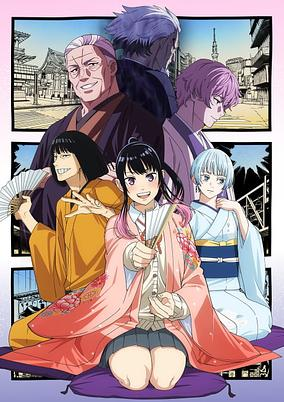

**Studio:** Zexcs &nbsp;|&nbsp; **Episodes:** 12 &nbsp;|&nbsp; **Director:** Ayumu Watanabe &nbsp;|&nbsp; **Aired/Released:** April 4 – June 20 &nbsp;|&nbsp; **Genres:** The Arts, Drama, Coming Of Age

> "With only your voice and body—master the art." Akane Ousaki, captivated since childhood by the magical performances of her father, Shinta Arakawa, witnesses a shocking incident during his decisive performance for promotion to shin’uchi (master rank). Six years later, now a high school student, she sets her sights on becoming a shin’uchi herself—pushing forward in the highly competitive world of rakugo. A passionate and authentic rakugo drama begins now!
>
> _Synopsis source: Kitsu_

[Wikipedia](https://en.wikipedia.org/wiki/Akane-banashi) · [Kitsu](https://kitsu.io/anime/Akanebanashi)

---

### Ascendance of a Bookworm: Adopted Daughter of an Archduke (Ascendance of a Bookworm Season 4)

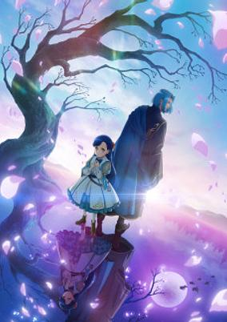

**Studio:** Wit Studio &nbsp;|&nbsp; **Episodes:** 24 &nbsp;|&nbsp; **Director:** Yoshiaki Iwasaki &nbsp;|&nbsp; **Aired/Released:** April 4 – &nbsp;|&nbsp; **Genres:** Magic, Fantasy World, Fantasy, Slice of Life, Isekai

> Anime adaptation of Part 3 of Honzuki no Gekokujou. Following a disastrous encounter with a noble, Myne finally resolves to say goodbye to her family and friends in the lower city, changing her name to “Rozemyne” and beginning her new life as the adopted daughter of Ehrenfest’s archduke. However, her days as an arch-noble in noble society are brutal, as she is put through rigorous etiquette and magic training on top of her duties as High Bishop and forewoman. It all proves too much for a weak little seven-year-old girl... Or it would have, had the High Priest not offered her the keys to the temple’s book room as a reward. If she could get her hands on those, she’d be able to read all sorts of precious books! Her name may have changed, but Rozemyne’s passion for books remains the same as she charges into a whole new world! The detailed setting expands as the printing industry grows in size. Here begins Part 3 of this biblio-fantasy for book lovers everywhere!
>
> _Synopsis source: Kitsu_

[Wikipedia](https://en.wikipedia.org/wiki/Ascendance_of_a_Bookworm) · [Kitsu](https://kitsu.io/anime/honzuki-no-gekokujou-shisho-ni-naru-tame-ni-wa-shudan-wo-erandeiraremasen-4th-season)

---

### Daemons of the Shadow Realm

**Studio:** Bones Film &nbsp;|&nbsp; **Episodes:** 24 &nbsp;|&nbsp; **Director:** Masahiro Andō &nbsp;|&nbsp; **Aired/Released:** April 4 – &nbsp;|&nbsp; **Genres:** Fantasy, Adventure, Comedy, Action, Contemporary Fantasy, Supernatural, Japan

> Yuru, a young hunter who lives in a small village deep in the mountains, hunts wild game and leads a humble life with Asa, his younger twin sister. Their peaceful lives are torn apart when a dragon’s roar echoes across the sky. What secrets lurk within their village? What fate awaits them? Enter a breathtaking mystical fantasy as exciting Daemon battles intertwine the mysterious and supernatural.
>
> _Synopsis source: Kitsu_

[Wikipedia](https://en.wikipedia.org/wiki/Daemons_of_the_Shadow_Realm) · [Kitsu](https://kitsu.io/anime/daemons-of-the-shadow-realm)

---

### Mao

**Studio:** Sunrise &nbsp;|&nbsp; **Director:** Teruo Sato &nbsp;|&nbsp; **Aired/Released:** April 4 –

[Wikipedia](https://en.wikipedia.org/wiki/Mao_(manga))

---

### The Strongest Job Is Apparently Not a Hero or a Sage, but an Appraiser (Provisional)!

**Studio:** Studio Flad &nbsp;|&nbsp; **Episodes:** 12 &nbsp;|&nbsp; **Director:** Makoto Hoshino &nbsp;|&nbsp; **Aired/Released:** April 4 – June 20

[Wikipedia](https://en.wikipedia.org/wiki/The_Strongest_Job_Is_Apparently_Not_a_Hero_or_a_Sage,_but_an_Appraiser_(Provisional)!)

---

### Welcome to Demon School! Iruma-kun (season 4) (Welcome to Demon School! Iruma-kun Season 4)

**Studio:** Bandai Namco Pictures &nbsp;|&nbsp; **Episodes:** 24 &nbsp;|&nbsp; **Director:** Makoto Moriwaki (Chief) Ayaka Tsujihashi &nbsp;|&nbsp; **Aired/Released:** April 4 – &nbsp;|&nbsp; **Genres:** Fantasy, Comedy, Supernatural

> The fourth season of Mairimashita! Iruma-kun. Suzuki Iruma and all thirteen students of the Misfit Class must perform to reach Rank 4 at the Music Festival.
>
> _Synopsis source: Kitsu_

[Wikipedia](https://en.wikipedia.org/wiki/Welcome_to_Demon_School!_Iruma-kun) · [Kitsu](https://kitsu.io/anime/mairimashita-iruma-kun-4th-season)

---

### Ace of Diamond Act II (season 2, part 1) (Ace of Diamond Act II Season 2 Part 2)

**Studio:** OLM &nbsp;|&nbsp; **Episodes:** 13 &nbsp;|&nbsp; **Director:** Hideaki Ōba &nbsp;|&nbsp; **Aired/Released:** April 5 – June 28 &nbsp;|&nbsp; **Genres:** Baseball, Sports, Shounen

> The second cour of the second season of Diamond no Ace act II.
>
> _Synopsis source: Kitsu_

[Wikipedia](https://en.wikipedia.org/wiki/Ace_of_Diamond) · [Kitsu](https://kitsu.io/anime/diamond-no-ace-act-ii-second-season-part-2)

---

### Kusunoki's Garden of Gods

**Studio:** Juvenage &nbsp;|&nbsp; **Episodes:** 12 &nbsp;|&nbsp; **Director:** Sekijuu Sekino &nbsp;|&nbsp; **Aired/Released:** April 5 – June 21 &nbsp;|&nbsp; **Genres:** Fantasy, Supernatural, Deity, Countryside, Comedy

> Deep in the countryside, Minato Kusunoki is left in charge of a terrifying house overflowing with evil spirits—or at least, it was full until his extraordinary ability cleared them all out! Instead, a procession of unique and peculiar gods is drawn to the comfort of the purified Kusunoki residence, and Minato spends his days relaxing in the company of his spiritual neighbors. What else lies in store for Minato as he lives peacefully surrounded by gods?
>
> _Synopsis source: Kitsu_

[Wikipedia](https://en.wikipedia.org/wiki/Kusunoki%27s_Garden_of_Gods) · [Kitsu](https://kitsu.io/anime/kami-no-niwatsuki-kusunoki-tei)

---

### Magical Sisters LuluttoLilly (part 1)

**Studio:** Studio Pierrot &nbsp;|&nbsp; **Episodes:** 12 &nbsp;|&nbsp; **Director:** Shintarō Dōge &nbsp;|&nbsp; **Aired/Released:** April 5 – June 21

[Wikipedia](https://en.wikipedia.org/wiki/Magical_Sisters_LuluttoLilly)

---

### Mistress Kanan Is Devilishly Easy

**Studio:** Studio Kai &nbsp;|&nbsp; **Episodes:** 12 &nbsp;|&nbsp; **Director:** Yasushi Muroya &nbsp;|&nbsp; **Aired/Released:** April 5 – June 21 &nbsp;|&nbsp; **Genres:** Comedy, Ecchi, Fantasy, Romance, Demon, Harem

> A beautiful and alluring devil that devours human souls has descended… Kanan, the "Gourmet Devil", descends upon a high school in the human world to devour young, sweet souls, and her first sacrifice is Youji Kyougi: "It's a high privilege to be devoured by yours truly. Be thankful, inferior creature." However… For some reason, she and Kyougi end up making a romantic contract?! For the innocent Kanan, who has lived for thousands of years without experiencing first love, every day is filled with excitement! Going home together?! Holding hands?! Going on dates?! A first time?!?!?!?! "You damn inferior creature—!" The first-love rom-com about a cute and simple-minded devil begins♪
>
> _Synopsis source: Kitsu_

[Wikipedia](https://en.wikipedia.org/wiki/Mistress_Kanan_Is_Devilishly_Easy) · [Kitsu](https://kitsu.io/anime/kanan-sama-wa-akumade-choroi)

---

### Needy Girl Overdose

**Studio:** Yostar Pictures &nbsp;|&nbsp; **Episodes:** 13 &nbsp;|&nbsp; **Director:** Masaoki Nakashima &nbsp;|&nbsp; **Aired/Released:** April 5 – June 28

[Wikipedia](https://en.wikipedia.org/wiki/Needy_Streamer_Overload)

---

### One Piece: Elbaph

**Studio:** Toei Animation &nbsp;|&nbsp; **Director:** Wataru Matsumi &nbsp;|&nbsp; **Aired/Released:** April 5 –

[Wikipedia](https://en.wikipedia.org/wiki/One_Piece_season_22)

---

### The Food Diary of Miss Maid

**Studio:** EMT Squared Magic Bus &nbsp;|&nbsp; **Episodes:** 12 &nbsp;|&nbsp; **Director:** Ryousuke Senbo &nbsp;|&nbsp; **Aired/Released:** April 5 – June 21 &nbsp;|&nbsp; **Genres:** Cooking, Slice of Life, Maid

> What's a maid to do when she finds herself suddenly stuck in Japan for a year? Eat, of course! Follow maid-in-training Suzume Tachibana as she tries all sorts of Japanese food, from sweets like taiyaki and melon bread to savory snacks like takoyaki and onigiri! Be warned, though—while Suzume sates her appetite through delicious treat after delicious treat, she might just end up whetting yours!
>
> _Synopsis source: Kitsu_

[Wikipedia](https://en.wikipedia.org/wiki/The_Food_Diary_of_Miss_Maid) · [Kitsu](https://kitsu.io/anime/maid-san-wa-taberu-dake)

---

### An Observation Log of My Fiancée Who Calls Herself a Villainess

**Studio:** Ashi Productions &nbsp;|&nbsp; **Episodes:** 12 &nbsp;|&nbsp; **Director:** Junichi Yamamoto &nbsp;|&nbsp; **Aired/Released:** April 6 – June 22 &nbsp;|&nbsp; **Genres:** Fantasy, Comedy, Slice of Life, Romance

> Because Prince Cecil is extraordinarily intelligent, life is boring for him. His days are without much excitement, but he becomes engaged to Bertia, the daughter of a marquis. The first thing she says to him when they first meet is quite baffling. She claims she is the "villainous heroine" in the story of his life!! According to Bertia, she has memories of her previous life. In a certain "romance game" she played in her life before, she played the character of the "villainess." Her purpose in her new life is to become an exemplary villainess and ruin the prince's engagement. In order to achieve this goal, Bertia does one outrageous thing after another and brings chaos and confusion into his life. A unique "love" story with a twist!! (Source: Alpha Manga) Note: Jishou Akuyaku Reijou na Konyakusha no Kansatsu Kiroku. was streamed 3 days in advance of the TV broadcast on Prime Video, and Crunchyroll beginning April 3, 2026. Regular broadcasting began on April 6, 2026.
>
> _Synopsis source: Kitsu_

[Wikipedia](https://en.wikipedia.org/wiki/An_Observation_Log_of_My_Fianc%C3%A9e_Who_Calls_Herself_a_Villainess) · [Kitsu](https://kitsu.io/anime/jishou-akuyaku-reijou-na-konyakusha-no-kansatsu-kiroku)

---

### Do You Like Big Girls?

**Studio:** Studio Hōkiboshi &nbsp;|&nbsp; **Episodes:** 12 &nbsp;|&nbsp; **Director:** Sōta Warai &nbsp;|&nbsp; **Aired/Released:** April 6 – June 22

[Wikipedia](https://en.wikipedia.org/wiki/Do_You_Like_Big_Girls%3F)

---

### Farming Life in Another World (season 2) (Farming Life in Another World Season 2)

**Studio:** Zero-G &nbsp;|&nbsp; **Episodes:** 12 &nbsp;|&nbsp; **Director:** Ryōichi Kuraya &nbsp;|&nbsp; **Aired/Released:** April 6 – June 22 &nbsp;|&nbsp; **Genres:** Fantasy, Harem, Isekai

> The second season of Isekai Nonbiri Nouka.
>
> _Synopsis source: Kitsu_

[Wikipedia](https://en.wikipedia.org/wiki/Farming_Life_in_Another_World) · [Kitsu](https://kitsu.io/anime/isekai-nonbiri-nouka-2)

---

### Ghost Concert: Missing Songs

**Studio:** ENGI &nbsp;|&nbsp; **Episodes:** 12 &nbsp;|&nbsp; **Director:** Masato Jinbo &nbsp;|&nbsp; **Aired/Released:** April 6 – June 22 &nbsp;|&nbsp; **Genres:** Action, Music, Supernatural

> The anime takes place in 2045, in a world where songs have been banned. Instead of humans playing instruments and creating music, a music app titled "MiucS" is in charge of these things. High school student Seria goes out with her friends one day, but she happens to hear someone singing, which is supposed to be prohibited. What she finds is a lone ghost, a "Great Ghost" who has appeared from outside this world.
>
> _Synopsis source: Kitsu_

[Wikipedia](https://en.wikipedia.org/wiki/Ghost_Concert) · [Kitsu](https://kitsu.io/anime/ghost-concert-missing-songs)

---

### Ingoku Danchi: Deviant’s Apartment Complex (Ingoku Danchi: Deviant's Apartment Complex)

**Studio:** Elias &nbsp;|&nbsp; **Episodes:** 12 &nbsp;|&nbsp; **Director:** Toshikatsu Tokoro &nbsp;|&nbsp; **Aired/Released:** April 6 – June 22 &nbsp;|&nbsp; **Genres:** Comedy, Supernatural

> Yoshida is a tiny, frail high school graduate who became an unwilling manager of an apartment complex when his father, the former manager, injured himself. Unbeknownst to him, this apartment complex houses quite a few women with very... unusual sexual preferences. This becomes a problem when a mysterious entity begins giving "Libido Cloth" to these women—skimpy outfits that give them superpowers and cause them to go on lewd rampages! Will Yoshida be able to stop them?
>
> _Synopsis source: Kitsu_

[Wikipedia](https://en.wikipedia.org/wiki/Ingoku_Danchi) · [Kitsu](https://kitsu.io/anime/ingoku-danchi)

---

### Marika's Love Meter Malfunction

**Studio:** Studio Leo &nbsp;|&nbsp; **Episodes:** 8 &nbsp;|&nbsp; **Director:** Sumito Sasaki &nbsp;|&nbsp; **Aired/Released:** April 6 – June 8 &nbsp;|&nbsp; **Genres:** Supernatural, Comedy, Romance, Drama

> Confessing to my childhood friend Marika was impossible for someone as unpopular as me. So, I did what any desperate boy would do—I wished upon a shooting star! When I woke up, that dream had come true?! I could see a love meter for people, just like in a love simulation game. Once I realized this was real and not a dream I went straight to see Marika. Her love meter was so low it had broken and practically fallen all the way to hell! If she hated me so much why was she so nice?! Is this how she really felt or...?! (Source: Coolmic) Note: Episode 1 receives an advances distribution on AnimeFesta on March 13th, 2026. The start date reflects the start of the regular series broadcasting.
>
> _Synopsis source: Kitsu_

[Wikipedia](https://en.wikipedia.org/wiki/Marika%27s_Love_Meter_Malfunction) · [Kitsu](https://kitsu.io/anime/marika-chan-no-koukando-wa-bukkowareteiru)

---

### The Klutzy Class Monitor and the Girl with the Short Skirt

**Studio:** Zero-G &nbsp;|&nbsp; **Episodes:** 12 &nbsp;|&nbsp; **Director:** Daiji Iwanaga &nbsp;|&nbsp; **Aired/Released:** April 6 – June 22 &nbsp;|&nbsp; **Genres:** Comedy, Romance, Slice of Life

> Sakuradaimon is the school's prefect. A prefect is a student who is authorized to enforce discipline. As a prefect, he's supposed to be a role model to other students, but unfortunately he's not perfect. Kohinata is one of the people who Sakuradaimon has tried to discipline into wearing appropriate school attire, but she has thusfar been disobedient. And so this is a story of the two interacting with one another.
>
> _Synopsis source: Kitsu_

[Wikipedia](https://en.wikipedia.org/wiki/The_Klutzy_Class_Monitor_and_the_Girl_with_the_Short_Skirt) · [Kitsu](https://kitsu.io/anime/ponkotsu-fuuki-iin-to-skirt-take-ga-futekisetsu-na-jk-no-hanashi)

---

### Witch Hat Atelier

**Studio:** Bug Films &nbsp;|&nbsp; **Episodes:** 13 &nbsp;|&nbsp; **Director:** Ayumu Watanabe &nbsp;|&nbsp; **Aired/Released:** April 6 – June 22 &nbsp;|&nbsp; **Genres:** Adventure, Comedy, Fantasy, Drama, Magic, Seinen

> In a world where only witches can cast magic, they must avoid being seen by ordinary people while casting. While Coco does her chores, she daydreams of becoming a witch. When a young witch named Qifrey visits her village, Coco uncovers the “absolute secret,” becomes Qifrey’s apprentice, and begins her studies. This is the story of children who encounter despair, yet reach out toward hope. (Source: Crunchyroll) Note: Tongari Boushi no Atelier episode 2 was streamed a week in advance on Crunchyroll, ABEMA, and Netflix, alongside episode 1. Streaming is one week ahead of the TV broadcast.
>
> _Synopsis source: Kitsu_

[Wikipedia](https://en.wikipedia.org/wiki/Witch_Hat_Atelier) · [Kitsu](https://kitsu.io/anime/tongari-boushi-no-atelier)

---

### Beyond Twilight

**Studio:** Imagica Infos Imageworks Studio &nbsp;|&nbsp; **Episodes:** 12 &nbsp;|&nbsp; **Director:** Saya Fukase &nbsp;|&nbsp; **Aired/Released:** April 7 – June 23

[Wikipedia](https://en.wikipedia.org/wiki/Beyond_Twilight_(manga))

---

### Even a Replica Can Fall in Love

**Studio:** Voil &nbsp;|&nbsp; **Episodes:** 13 &nbsp;|&nbsp; **Director:** Ryuichi Kimura &nbsp;|&nbsp; **Aired/Released:** April 7 – June 30 &nbsp;|&nbsp; **Genres:** Romance, Drama, Supernatural

> On days when Sunao is sick, or not feeling like going to school, she is called to take her place. She was born to this world when Sunao wished to have a substitute. No one knows that she exists, but she tries to do her best for Sunao whenever she is called. One day she talks with Sanada, one of her classmates. They become friends, but soon he notices that she is different from the original Sunao...he was the first one who did. She tells him to talk with her only when she has her hair half-up. Sanada does like she told him, and they enjoy their time together. As they become closer, she realizes that she has special feelings toward Sanada. But she doesn't know what will happen to her...if she, a replica, falls in love.
>
> _Synopsis source: Kitsu_

[Wikipedia](https://en.wikipedia.org/wiki/Even_a_Replica_Can_Fall_in_Love) · [Kitsu](https://kitsu.io/anime/replica-datte-koi-wo-suru)

---

### I Made Friends with the Second Prettiest Girl in My Class (I Became Friends with the Second Cutest Girl in My Class)

**Studio:** Connect &nbsp;|&nbsp; **Episodes:** 12 &nbsp;|&nbsp; **Director:** Hideki Tachibana &nbsp;|&nbsp; **Aired/Released:** April 7 – June 23 &nbsp;|&nbsp; **Genres:** Comedy, Romance

> I, Maki Maehara, was the loner boy in my class, until I made my first friend, Umi Asanagi. Asanagi is always at the center of attention, and boys considered her to be "the second cutest girl in the class." I thought I was just a guy in the shadows, living in a completely different world from her, but it turned out that she liked B-movies, too! Now Asanagi-san secretly comes over to my house on Fridays after school. We have a great time together, as we share the same interests in movies, games, and manga. "Sit next to me and we can read manga together." "This is my bed......." "It's my bed for now. Come on, come over here." Isn't that a bit too close, Asanagi-san?
>
> _Synopsis source: Kitsu_

[Wikipedia](https://en.wikipedia.org/wiki/I_Made_Friends_with_the_Second_Prettiest_Girl_in_My_Class) · [Kitsu](https://kitsu.io/anime/class-de-2-banme-ni-kawaii-onnanoko-to-tomodachi-ni-natta)

---

### Liar Game

**Studio:** Madhouse &nbsp;|&nbsp; **Director:** Yūzō Satō (Chief) Asami Kawano &nbsp;|&nbsp; **Aired/Released:** April 7 – &nbsp;|&nbsp; **Genres:** Drama, Psychological

> When Nao Kanzaki receives a strange letter and a suitcase containing 100 million yen, she learns that she has been selected to participate in the LIAR GAME. In this high-stakes psychological battle, lies, deception, and betrayal reign supreme. Naïve and honest, Nao turns to Shinichi Akiyama, a brilliant former con artist, to survive the twisted game. In a game built on lies, can honesty prevail?
>
> _Synopsis source: Kitsu_

[Wikipedia](https://en.wikipedia.org/wiki/Liar_Game) · [Kitsu](https://kitsu.io/anime/liar-game)

---

### Marriagetoxin

**Studio:** Bones Film &nbsp;|&nbsp; **Episodes:** 13 &nbsp;|&nbsp; **Director:** Motonobu Hori &nbsp;|&nbsp; **Aired/Released:** April 7 – June 30 &nbsp;|&nbsp; **Genres:** Action, Comedy, Drama, Romance

> For centuries, the deadly arts have been perfected by Masters, and Five Great Families hold the greatest power and influence. Hikaru Gero, an heir to the Gero family, lives in the underworld as an elite assassin. When his sister is pressured to produce an heir, Hikaru asks Mei Kinosaki, a brilliant marriage swindler, to find him a bride. The most challenging mission of his life begins!
>
> _Synopsis source: Kitsu_

[Wikipedia](https://en.wikipedia.org/wiki/Marriagetoxin) · [Kitsu](https://kitsu.io/anime/marriagetoxin)

---

### Nippon Sangoku: The Three Nations of the Crimson Sun

**Studio:** Studio Kafka &nbsp;|&nbsp; **Episodes:** 12 &nbsp;|&nbsp; **Director:** Kazuaki Terasawa &nbsp;|&nbsp; **Aired/Released:** April 7 – June 21 &nbsp;|&nbsp; **Genres:** Action, Drama, Science Fiction, Violence, Military

> A revolution sparked by nuclear war, natural disaster, and misrule leads to the collapse of Japanese society. The country splits into three nations vying for hegemony, and the Sangoku era begins. Aoteru Misumi, a former agricultural officer, vows to reunify Japan. He rises through the ranks with only his knowledge and eloquence. Witness the legend of the man later hailed as a genius strategist.
>
> _Synopsis source: Kitsu_

[Wikipedia](https://en.wikipedia.org/wiki/Nippon_Sangoku) · [Kitsu](https://kitsu.io/anime/nippon-sangoku-the-three-nations-of-the-crimson-sun)

---

### The Most Heretical Last Boss Queen: From Villainess to Savior (season 2) (The Most Heretical Last Boss Queen: From Villainess to Savior Season 2)

**Studio:** OLM Team Yoshioka &nbsp;|&nbsp; **Episodes:** 12 &nbsp;|&nbsp; **Director:** Norio Nitta &nbsp;|&nbsp; **Aired/Released:** April 7 – June 23 &nbsp;|&nbsp; **Genres:** Fantasy, Josei, Isekai

> Second season of Higeki no Genkyou to Naru Saikyou Gedou Last Boss Joou wa Tami no Tame ni Tsukushimasu.
>
> _Synopsis source: Kitsu_

[Wikipedia](https://en.wikipedia.org/wiki/The_Most_Heretical_Last_Boss_Queen) · [Kitsu](https://kitsu.io/anime/higeki-no-genkyou-to-naru-saikyou-gedou-last-boss-joou-wa-tami-no-tame-ni-tsukushimasu-season-2)

---

### Eren the Southpaw

**Studio:** Signal.MD Production I.G &nbsp;|&nbsp; **Episodes:** 13 &nbsp;|&nbsp; **Director:** Toshimasa Suzuki &nbsp;|&nbsp; **Aired/Released:** April 8 – July 1 &nbsp;|&nbsp; **Genres:** Drama

> Asakura Kouichi is a young designer working for an advertising agency. Lost and confused after being dropped from a project he worked hard to secure, he travels to the Yokohama Museum of Art. This is the place where, many years ago, he first encountered the talented "Eren." The start of an inspirational adult ensemble drama about creatives!
>
> _Synopsis source: Kitsu_

[Wikipedia](https://en.wikipedia.org/wiki/Eren_the_Southpaw) · [Kitsu](https://kitsu.io/anime/hidarikiki-no-eren)

---

### Gals Can't Be Kind to Otaku!? (Gals Can’t Be Kind to Otaku!?)

**Studio:** TMS Entertainment &nbsp;|&nbsp; **Episodes:** 12 &nbsp;|&nbsp; **Director:** Shin Mita &nbsp;|&nbsp; **Aired/Released:** April 8 – June 24 &nbsp;|&nbsp; **Genres:** Romance, Comedy, High School, Slice of Life, Seinen

> Takuya Seo is a quiet otaku who keeps a low profile at school—until two gals from his class start talking to him. The cool but scatterbrained Kei Amane and the cheerful, energetic Kotoko Ijichi couldn’t be more different, but the three soon bond over anime, games, and shared fandom. But one question remains: do nice gals who hang out with otaku really exist?!
>
> _Synopsis source: Kitsu_

[Wikipedia](https://en.wikipedia.org/wiki/Gals_Can%27t_Be_Kind_to_Otaku!%3F) · [Kitsu](https://kitsu.io/anime/otaku-ni-yasashii-gal-wa-inai)

---

### My Ribdiculous Reincarnation

**Studio:** Qzil.la S.o.K &nbsp;|&nbsp; **Episodes:** 12 &nbsp;|&nbsp; **Director:** Yasufumi Soejima &nbsp;|&nbsp; **Aired/Released:** April 8 – June 24 &nbsp;|&nbsp; **Genres:** Comedy, Fantasy, Isekai

> My reincarnation destination is... “the rib of a harem-loving, happy-ending, overpowered hero”!? An isekai reincarnation anime that defies animation conventions is born! Beyond traditional animation, this series delivers an exhilarating isekai reincarnation tale through unconventional techniques like stop-motion, puppet theater, and live-action—featuring the aloof “Goddess” in charge of isekai reincarnations and the protagonist “Me,” who endures one absurd reincarnation after another!
>
> _Synopsis source: Kitsu_

[Wikipedia](https://en.wikipedia.org/wiki/My_Ribdiculous_Reincarnation) · [Kitsu](https://kitsu.io/anime/megami-isekai-tensei-nani-ni-naritai-desu-ka-ore-yuusha-no-rokkotsu-de)

---

### Pardon the Intrusion, I'm Home!

**Studio:** Tatsunoko Production &nbsp;|&nbsp; **Episodes:** 12 &nbsp;|&nbsp; **Director:** Itsuki Imazaki &nbsp;|&nbsp; **Aired/Released:** April 8 – June 24 &nbsp;|&nbsp; **Genres:** Comedy, Romance, Shoujo

> So is this what it means to have roommates now?! Office worker Rinko, 24, lives alone and is secretly an otaku. One day, her apartment gets connected to the two neighboring rooms through a "hole" in the wall. In the room on the left is a fresh-faced yet mysterious guy who is overly-sweet to Rinko. The room on the right is occupied by a guy with violent tendences who is similarly mysterious... But wait! "I... I think I know him!" Rinko's only source of solitude, her apartment, has been turned upside down. Now, every day is full of heart-pounding surprises!
>
> _Synopsis source: Kitsu_

[Wikipedia](https://en.wikipedia.org/wiki/Pardon_the_Intrusion,_I%27m_Home!) · [Kitsu](https://kitsu.io/anime/tadaima-ojamasaremasu)

---

### Re:Zero − Starting Life in Another World ( season 4 , part 1) (Re:ZERO -Starting Life in Another World- Season 4)

**Studio:** White Fox &nbsp;|&nbsp; **Episodes:** 11 &nbsp;|&nbsp; **Director:** Masahiro Shinohara &nbsp;|&nbsp; **Aired/Released:** April 8 – June 17 &nbsp;|&nbsp; **Genres:** Isekai, Drama, Elf, Fantasy, Time Travel, Psychological, Magic

> The fourth season of Re:Zero kara Hajimeru Isekai Seikatsu. To save his stricken allies, Subaru faces a deadly desert to find the Sage at Pleiades Watchtower. (Source: Crunchyroll News) Note: World Premiere of Episode 1 screened at Lucca Comics &amp; Games 2025 on November 1, 2025, before the Japanese television broadcast.
>
> _Synopsis source: Kitsu_

[Kitsu](https://kitsu.io/anime/re-zero-kara-hajimeru-isekai-seikatsu-4)

---

### Kujima: Why Sing, When You Can Warble?

**Studio:** Studio Hibari &nbsp;|&nbsp; **Episodes:** 12 &nbsp;|&nbsp; **Director:** Noriyuki Nomata &nbsp;|&nbsp; **Aired/Released:** April 9 – June 25

---

### The Warrior Princess and the Barbaric King

**Studio:** Jumondou &nbsp;|&nbsp; **Episodes:** 12 &nbsp;|&nbsp; **Director:** Takayuki Tanaka &nbsp;|&nbsp; **Aired/Released:** April 9 – June 25 &nbsp;|&nbsp; **Genres:** Comedy, Fantasy, Romance, Shounen

> Serafina de Lavillant, the strongest female knight in the West, was sent to subjugate the barbaric tribes of the East. But when her mission fails spectacularly, she’s captured alive and imprisoned. Humiliated and dreading what horrific torture she’ll endure, she asks to be put to death. To her surprise, rather than tearing her limb from limb, the tribe leader asks for her hand…in marriage! Will Serafina face a cruel and abusive arranged marriage? Or will she discover that these tribes aren’t as barbaric as she was led to believe?
>
> _Synopsis source: Kitsu_

[Wikipedia](https://en.wikipedia.org/wiki/The_Warrior_Princess_and_the_Barbaric_King) · [Kitsu](https://kitsu.io/anime/hime-kishi-wa-barbaroi-no-yome)

---

### A Hundred Scenes of Awajima

**Studio:** Madhouse &nbsp;|&nbsp; **Episodes:** 12 &nbsp;|&nbsp; **Director:** Morio Asaka &nbsp;|&nbsp; **Aired/Released:** April 10 – June 26 &nbsp;|&nbsp; **Genres:** Drama, Music, Romance, School Life

> This coming-of-age omnibus series will follow the girls at an opera music school; each chapter will center around a different girl. Ohta Publishing indicates on Pocopoco that a "character from Sweet Blue Flowers may also appear" in the new series.
>
> _Synopsis source: Kitsu_

[Wikipedia](https://en.wikipedia.org/wiki/A_Hundred_Scenes_of_Awajima) · [Kitsu](https://kitsu.io/anime/awajima-hyakkei)

---

### Drops of God (The Drops of God)

**Studio:** Satelight &nbsp;|&nbsp; **Episodes:** 24 &nbsp;|&nbsp; **Director:** Kenji Itoso &nbsp;|&nbsp; **Aired/Released:** April 10 – &nbsp;|&nbsp; **Genres:** Drama, Mystery, Seinen, Slice of Life

> When world-renowned wine critic Toyotaka Kanzaki passes away, he leaves behind an enviable collection. The will promises his estate to whoever correctly guesses the brand and year of the 12 greatest wines he selected, and the legendary wine that stands atop them all, "Drops of God." The challengers are Toyotaka's son, Shizuku Kanzaki, and a young critic, Issei Tomine, who was adopted by Toyotaka.
>
> _Synopsis source: Kitsu_

[Wikipedia](https://en.wikipedia.org/wiki/Drops_of_God) · [Kitsu](https://kitsu.io/anime/kami-no-shizuku)

---

### Botan Kamiina Fully Blossoms When Drunk

**Studio:** Soigne &nbsp;|&nbsp; **Episodes:** 12 &nbsp;|&nbsp; **Director:** Takashi Sakuma &nbsp;|&nbsp; **Aired/Released:** April 11 – June 27 &nbsp;|&nbsp; **Genres:** Romance, Comedy, Slice of Life

> New university life, new dormmates…and a whole new world of drinks! Botan Kamiina takes her first sip of alcohol after spotting the quiet dorm leader, Ibuki Tonami, enjoying a highball alone. From shochu to whisky, Botan shares the joy of drinking with friends, while Ibuki slowly learns that some pleasures are better when shared.
>
> _Synopsis source: Kitsu_

[Wikipedia](https://en.wikipedia.org/wiki/Botan_Kamiina_Fully_Blossoms_When_Drunk) · [Kitsu](https://kitsu.io/anime/kamiina-botan-yoeru-sugata-wa-yuri-no-hana)

---

### Fist of the North Star

**Studio:** TMS Entertainment &nbsp;|&nbsp; **Episodes:** 14 &nbsp;|&nbsp; **Director:** Hiroshi Maeda &nbsp;|&nbsp; **Aired/Released:** April 11 – June 27

[Wikipedia](https://en.wikipedia.org/wiki/Fist_of_the_North_Star)

---

### Kill Blue

**Studio:** Cue &nbsp;|&nbsp; **Episodes:** 12 &nbsp;|&nbsp; **Director:** Hiro Kaburagi Yasunori Ide &nbsp;|&nbsp; **Aired/Released:** April 11 – June 27 &nbsp;|&nbsp; **Genres:** Action, Comedy, Assassin

> Juuzou Oogami is a legendary hitman who has never failed an assignment, no matter how impossible. One day, after wiping out a powerful organization, he is stung by a mysterious wasp and collapses. When he wakes up, the fearsome 39-year-old assassin has been transformed into a 13-year-old boy! Before he can even process what happened, his boss delivers a new order: “In that body, infiltrate a middle school.” What awaits him is an unexpected school life filled with colorful classmates, youthful chaos, and looming danger. Can Juuzou ever return to his original form? Or will the assassins closing in on him end his second life before it even begins!?
>
> _Synopsis source: Kitsu_

[Wikipedia](https://en.wikipedia.org/wiki/Kill_Blue) · [Kitsu](https://kitsu.io/anime/kill-ao)

---

### Rent-A-Girlfriend (season 5) (Rent-a-Girlfriend Season 4)

**Studio:** TMS Entertainment &nbsp;|&nbsp; **Episodes:** 12 &nbsp;|&nbsp; **Director:** Kazuomi Koga &nbsp;|&nbsp; **Aired/Released:** April 11 – June 27 &nbsp;|&nbsp; **Genres:** Comedy, Romance, Drama

> The fourth season of Kanojo, Okarishimasu. Kazuya’s ready to confess with the lush paradise of Hawaii as a backdrop. But renting Chizuru for the dream trip turns into a war zone of love due to Ruka’s aggressive advances and Mami’s scheming. Despite the chaos, this is Kazuya’s moment to bare his heart. Will his words reach Chizuru? And if they do, what will she even say? (Source: Crunchyroll) Note: Kanojo, Okarishimasu 4th Season was streamed 4 days in advance of the TV broadcast on DMM TV, dAnimestore, and Crunchyroll beginning July 1, 2025. Regular broadcasting began on July 5, 2025.
>
> _Synopsis source: Kitsu_

[Wikipedia](https://en.wikipedia.org/wiki/Rent-A-Girlfriend_(2020_TV_series)) · [Kitsu](https://kitsu.io/anime/Kanojo-Okarishimasu-4th-Season)

---

### Yowayowa Sensei

**Studio:** Brain's Base &nbsp;|&nbsp; **Episodes:** 12 &nbsp;|&nbsp; **Director:** Hiroshi Ishiodori &nbsp;|&nbsp; **Aired/Released:** April 11 – June 27 &nbsp;|&nbsp; **Genres:** Comedy, Ecchi, Romance, Female Teacher, School Life

> High school homeroom teacher Hiyori Hiwamura is known as the “Scary Teacher,” and if you offend her, she’ll put a curse on you! Or at least that’s what everyone believes. She’s secretly a total softy who’s deeply misunderstood, and once you see her sweet side, she’ll put a different kind of spell on you... Unfortunately, one of her students, Akihito Abikura, has accidentally discovered her secret.
>
> _Synopsis source: Kitsu_

[Wikipedia](https://en.wikipedia.org/wiki/Yowayowa_Sensei) · [Kitsu](https://kitsu.io/anime/yowa-yowa-sensei)

---

### Ichijyoma Mankitsu Gurashi!

**Studio:** PRA &nbsp;|&nbsp; **Episodes:** 11 &nbsp;|&nbsp; **Director:** Toshinori Watanabe &nbsp;|&nbsp; **Aired/Released:** April 12 – June 21 &nbsp;|&nbsp; **Genres:** Comedy, Ecchi, Slice of Life

> A high school girl a manga cafe! Meiko, a countryside girl, enrolls in a rich girls' school. She is told that if she does volunteer work, her tuition will be free... but in reality, she will be living and working in a "manga cafe"!? Living in a small manga cafe booth turns out to be not so bad! Why not try enjoying a manga cafe filled with cute high school girls as staff?
>
> _Synopsis source: Kitsu_

[Wikipedia](https://en.wikipedia.org/wiki/Ichijyoma_Mankitsu_Gurashi!) · [Kitsu](https://kitsu.io/anime/ichijouma-mankitsu-gurashi)

---

### Mission: Yozakura Family (season 2, part 1) (Mission: Yozakura Family Season 2 Part 2)

**Studio:** Silver Link &nbsp;|&nbsp; **Episodes:** 12 &nbsp;|&nbsp; **Director:** Mirai Minato (Chief) Takahiro Nakatsugawa &nbsp;|&nbsp; **Aired/Released:** April 12 – June 28 &nbsp;|&nbsp; **Genres:** Comedy, Action, Romance

> The second cour of the second season of Yozakura-san Chi no Daisakusen.
>
> _Synopsis source: Kitsu_

[Kitsu](https://kitsu.io/anime/mission-yozakura-family-season-2-part-2)

---

### Odekake Kozame (season 2)

**Studio:** ENGI &nbsp;|&nbsp; **Director:** Chihiro Kumano &nbsp;|&nbsp; **Aired/Released:** April 12 – &nbsp;|&nbsp; **Genres:** Anthropomorphism, Slice of Life

> Kozame-chan's everyday life is full of fun and excitement! This time, the next destination is the big city. What awaits Kozame-chan is an unfamiliar place, and new friends. A big adventure filed with tiny miracles is about to begin.
>
> _Synopsis source: Kitsu_

[Wikipedia](https://en.wikipedia.org/wiki/Odekake_Kozame) · [Kitsu](https://kitsu.io/anime/odekake-kozame-tokai-no-otomodachi)

---

### Shō 3 Ashibe QQ Goma-chan

**Studio:** DLE &nbsp;|&nbsp; **Director:** Kōtarō Yamawaki &nbsp;|&nbsp; **Aired/Released:** April 12 –

[Wikipedia](https://en.wikipedia.org/wiki/Sh%C5%8Dnen_Ashibe)

---

### The Classroom of a Black Cat and a Witch

**Studio:** Liden Films &nbsp;|&nbsp; **Director:** Naoyuki Tatsuwa &nbsp;|&nbsp; **Aired/Released:** April 12 – &nbsp;|&nbsp; **Genres:** Fantasy, Comedy

> Spica Virgo is an apprentice witch, but can’t use any magic. She needs someone to be her master in order to get into the academy of her dreams, but she has no money and no connections. Suddenly, a mysterious talking black cat that can use magic appears before her!! Spica wants to learn magic, and the black cat wants his curse broken—goals on the same path. Therefore, a secret master-apprentice relationship was born! But the key to breaking the curse is kissing his…?! A clumsy witch and the teachings of a black cat—the magic academy fantasy starts here!!
>
> _Synopsis source: Kitsu_

[Wikipedia](https://en.wikipedia.org/wiki/The_Classroom_of_a_Black_Cat_and_a_Witch) · [Kitsu](https://kitsu.io/anime/kuroneko-to-majo-no-kyoushitsu)

---

### Wistoria: Wand and Sword (season 2) (Wistoria: Wand and Sword Season 2)

**Studio:** Actas Bandai Namco Pictures &nbsp;|&nbsp; **Episodes:** 12 &nbsp;|&nbsp; **Director:** Tatsuya Yoshihara (Chief) Hideaki Nakano &nbsp;|&nbsp; **Aired/Released:** April 12 – June 28 &nbsp;|&nbsp; **Genres:** Action, Adventure, Fantasy, Drama, Magic

> Second season of Tsue to Tsurugi no Wistoria.
>
> _Synopsis source: Kitsu_

[Kitsu](https://kitsu.io/anime/tsue-to-tsurugi-no-wistoria-2nd-season)

---

### I Want to End This Love Game

**Studio:** Felix Film &nbsp;|&nbsp; **Episodes:** 12 &nbsp;|&nbsp; **Director:** Azuma Tani &nbsp;|&nbsp; **Aired/Released:** April 14 – June 30 &nbsp;|&nbsp; **Genres:** Romance, Comedy

> The first step to winning the Love Game is saying “I love you.” So how do you lose? By admitting you’re in love! Let the games begin! Since childhood, Yukiya Asagi and Miku Sakura have played the Love Game, where they try to fluster each other with a simple “I love you.” But after falling in love for real and refusing to admit it, neither of them can afford to lose this battle! After leaving behind his image as a quiet nerd, Yukiya’s ready to break hearts and take names with the ultimate high school glow-up. Well, he’s really just got one girl in his sights - his best friend, Miku! Using her favorite shojo manga as his weapon, he’s ready to pin her to the wall and gaze at her with a perfect smolder. Will his moves get her heart racing?
>
> _Synopsis source: Kitsu_

[Wikipedia](https://en.wikipedia.org/wiki/I_Want_to_End_This_Love_Game) · [Kitsu](https://kitsu.io/anime/aishiteru-game-wo-owarasetai)

---

### The Oblivious Saint Can't Contain Her Power

**Studio:** Magic Bus Picante Circus &nbsp;|&nbsp; **Director:** Mitsutaka Noshitani &nbsp;|&nbsp; **Aired/Released:** June 30 – &nbsp;|&nbsp; **Genres:** Drama, Fantasy, Romance

> Lady Carolina, the overlooked daughter of a powerful duke, has always believed herself to be the black sheep amid her illustrious kin. Her father is the distinguished prime minister; her elder sister, a prodigious mage destined to become their nation’s next Saint. In comparison, Carolina resigns herself to a quiet existence in their shadows until a sudden and unexpected royal decree alters her destiny, thrusting her into a political marriage with the formidable “Bloodthirsty Prince” of the neighboring Empire of Malcosias. Determined to prove her worth, Carolina takes a bold step into a world fraught with both political and mortal peril. As royal obligations intertwine with hints of true love and the stirrings of her own latent power, Carolina moves ever closer to understanding what it truly means to be exceptional.
>
> _Synopsis source: Kitsu_

[Wikipedia](https://en.wikipedia.org/wiki/The_Oblivious_Saint_Can%27t_Contain_Her_Power) · [Kitsu](https://kitsu.io/anime/mujikaku-seijo-wa-kyou-mo-muishiki-ni-chikara-wo-tare-nagasu)

---

### Heroine? Saint? No, I'm an All-Works Maid (and Proud of It)!

**Studio:** EMT Squared &nbsp;|&nbsp; **Director:** Shinji Ishihira (Chief) Naoya Murakawa &nbsp;|&nbsp; **Aired/Released:** July 1 – &nbsp;|&nbsp; **Genres:** Maid, Comedy, Fantasy, Isekai

> “I will become the world’s most wonderful maid!” With her skirt fluttering in black and white, the girl shouted. Her name is Melody. A reincarnated former Japanese girl, she now pursues her dream in her new life, working as an all-purpose maid for a poor count’s family in the kingdom of Théolas. When she makes it, even cheap tea turns into a luxury brew, and a dilapidated mansion is quickly restored to new! Cleaning, serving, hunting, DIY—leave it all to her and her powerful magic. Unbeknownst to Melody, this world is actually an otome game, and she is the most powerful and invincible heroine, the saint! Yet, she remains oblivious to this fact. Romance with handsome men? Attacks by the Demon Lord? Work comes first! A fantasy of misunderstood work that unknowingly shatters destiny!
>
> _Synopsis source: Kitsu_

[Wikipedia](https://en.wikipedia.org/wiki/Heroine%3F_Saint%3F_No,_I%27m_an_All-Works_Maid_(and_Proud_of_It)!) · [Kitsu](https://kitsu.io/anime/heroine-seijo-iie-all-works-maid-desu-ko)

---

### BanG Dream! Yume∞Mita

**Studio:** Nichicaline &nbsp;|&nbsp; **Director:** Tomomi Umetsu &nbsp;|&nbsp; **Aired/Released:** July 2 – &nbsp;|&nbsp; **Genres:** Music

> The latest anime project in the BanG Dream! franchise, spotlighting the band members in Mugendai Mewtype.
>
> _Synopsis source: Kitsu_

[Wikipedia](https://en.wikipedia.org/wiki/BanG_Dream!_Yume%E2%88%9EMita) · [Kitsu](https://kitsu.io/anime/bang-dream-yume-mita)

---

### Bungo Stray Dogs Wan! (season 2) (Bungo Stray Dogs Wan! 2)

**Studio:** Bones Nomad &nbsp;|&nbsp; **Director:** Toshihiro Kikuchi &nbsp;|&nbsp; **Aired/Released:** July 2 – &nbsp;|&nbsp; **Genres:** Comedy, Slice of Life, Supernatural

> Second season of Bungou Stray Dogs Wan!.
>
> _Synopsis source: Kitsu_

[Wikipedia](https://en.wikipedia.org/wiki/Bungo_Stray_Dogs) · [Kitsu](https://kitsu.io/anime/bungou-stray-dogs-wan-2)

---

### Dara-san of Reiwa

**Studio:** Asahi Production &nbsp;|&nbsp; **Director:** Masato Suzuki &nbsp;|&nbsp; **Aired/Released:** July 2 – &nbsp;|&nbsp; **Genres:** Comedy, Ghost, Horror, Supernatural, Ecchi

> After venturing into a restricted, treacherous mountain forest, siblings Hinata and Kaoru meet a terrifying serpent god and become besties! Despite her initially scary appearance, the self-named “god of misfortune” is awkward, lonely, and surprisingly easy to talk to. This is the tale of an unexpected friendship, and the many comedic, heartfelt adventures that ensue.
>
> _Synopsis source: Kitsu_

[Wikipedia](https://en.wikipedia.org/wiki/Dara-san_of_Reiwa) · [Kitsu](https://kitsu.io/anime/reiwa-no-dara-san)

---

### From Overshadowed to Overpowered: Second Reincarnation of a Talentless Sage

**Studio:** EMT Squared &nbsp;|&nbsp; **Director:** Hisashi Ishii &nbsp;|&nbsp; **Aired/Released:** July 2 – &nbsp;|&nbsp; **Genres:** Action, Adventure, Fantasy, Isekai

> Ephtal is reincarnated as a human, coming from modern Earth. In this new world where magic is real, he decides to devote the entirety of his life in the pursuit of magic. Despite his efforts, though, he discovers that he is absolutely talentless in magic, and breathed his last in anguish....But it isn't the end for him just yet! He reincarnates once again bearing the same name, Ephtal, 400 years later. Having retained his knowledge and power, he steals his resolve and once again sets his sights for the peak of magic! (Source: Comikey) Note: Rakudai Kenja no Gakuin Musou: Nidome no Tensei, S-Rank Cheat Majutsushi Boukenroku is streaming a week in advance of the TV broadcast on dAnimeStore, ABEMA, U-NEXT, and Anime Hodai beginning June 26th, 2026. Regular broadcasting begins on July 2nd, 2026.
>
> _Synopsis source: Kitsu_

[Wikipedia](https://en.wikipedia.org/wiki/From_Overshadowed_to_Overpowered) · [Kitsu](https://kitsu.io/anime/rakudai-kenja-no-gakuin-musou-nidome-no-tensei-s-rank-cheat-majutsushi-boukenroku)

---

### Hana-Kimi (season 2) (Hana-Kimi)

**Studio:** Signal.MD &nbsp;|&nbsp; **Director:** Natsuki Takemura &nbsp;|&nbsp; **Aired/Released:** July 2 – &nbsp;|&nbsp; **Genres:** Comedy, Drama, Romance, Slice of Life, Reverse Harem, Cross Dressing, Gender Bender, Shoujo

> Mizuki Ashiya is on a mission: disguise herself as a boy and enroll in a male boarding school to meet her idol, high jump star Izumi Sano. But after successfully infiltrating the school, she discovers he’s suddenly quit the sport! Now Mizuki must dodge suspicion, protect her cover, and somehow reach the boy she came all this way for—all while surviving the chaos of an all-boys dorm!
>
> _Synopsis source: Kitsu_

[Wikipedia](https://en.wikipedia.org/wiki/Hana-Kimi) · [Kitsu](https://kitsu.io/anime/hanazakari-no-kimitachi-e)

---

### The Villager of Level 999

**Studio:** Brain's Base &nbsp;|&nbsp; **Director:** Yoshinobu Kasai &nbsp;|&nbsp; **Aired/Released:** July 2 – &nbsp;|&nbsp; **Genres:** Action, Fantasy, Adventure, Comedy

> Monsters did not always exist in the island country of Hexaldoria, once known as Japan. But, once monsters appeared, their numbers grew in an instant. Eighty percent of the world is now too dangerous for people to live in. With the monsters' arrival, the world bestowed "Classes" upon its people. Classes are assigned at birth, and most people live according to them. There are eight COMPETENT classes: FIGHTER, HUNTER, CLERIC, WARRIOR, MAGE, MERCHANT, THEIF. And three special ORACLE classes: KING, SAGE, HERO. The weakest Class of all is VILLAGER. However, Kouji Kagami became "LEVEL 999"--the highest level that no one had reached before. When he met the daughter of the Demon King, the world started to change!
>
> _Synopsis source: Kitsu_

[Wikipedia](https://en.wikipedia.org/wiki/The_Villager_of_Level_999) · [Kitsu](https://kitsu.io/anime/lv999-no-murabito)

---

### The World Is Dancing

**Studio:** Cypic &nbsp;|&nbsp; **Director:** Toshimasa Kuroyanagi &nbsp;|&nbsp; **Aired/Released:** July 2 – &nbsp;|&nbsp; **Genres:** Drama, Historical, Coming Of Age

> Born into a life of acting and dance with a traveling theater troupe in 14th-century Japan, 12-year old Oniyasha has one problem—he doesn't know what the point of any of it is. "Why must I step with the left foot here instead of the right? Why is one performance good and another, bad? Why do people dance at all?" It all seems perfectly arbitrary, until a chance encounter in a run-down shack sets him down a path to revolutionizing the art form and influencing much of Japanese culture to come. A fictionalized account of the early life of Zeami Motokiyo (Oniyasha), the founder of modern Noh theater—the world's oldest surviving theater art—this coming-of-age artist's journey vividly brings to life a man far ahead of his time during one of Japan's most culturally and socially vibrant eras. (Source: Kodansha Comics) Note: World Is Dancing is streaming 3 days in advance of the TV broadcast on Prime Video and HIDIVE beginning June 29th, 2026. Regular broadcasting begins on July 2nd, 2026.
>
> _Synopsis source: Kitsu_

[Wikipedia](https://en.wikipedia.org/wiki/The_World_Is_Dancing) · [Kitsu](https://kitsu.io/anime/world-is-dancing)

---

### Chainsmoker Cat

**Studio:** Bibury Animation Studios &nbsp;|&nbsp; **Director:** Taku Kimura &nbsp;|&nbsp; **Aired/Released:** July 3 – &nbsp;|&nbsp; **Genres:** Slice of Life, Comedy

> Yani is a catgirl with a seriously bad smoking habit. She smokes so much that her apartment smells like ash and is littered with cigarette butts—and plenty of other trash! Every time she tries to quit, she becomes weak to the cravings and gives in almost instantly. Will she ever get her life together, or is she doomed to live as a chainsmoking slob forever?
>
> _Synopsis source: Kitsu_

[Wikipedia](https://en.wikipedia.org/wiki/Chainsmoker_Cat) · [Kitsu](https://kitsu.io/anime/yani-neko)

---

### Draw This, Then Die!

**Studio:** Shin-Ei Animation &nbsp;|&nbsp; **Director:** Hiroaki Akagi &nbsp;|&nbsp; **Aired/Released:** July 3 – &nbsp;|&nbsp; **Genres:** Slice of Life, Comedy

> Kore Kaite Shine is set in Izu Oshima, an island 120 kilometers south of Tokyo. The story centers on Ai Yasumi, a high school girl who loves to read manga, and learns about the joy and pain of drawing her own manga
>
> _Synopsis source: Kitsu_

[Wikipedia](https://en.wikipedia.org/wiki/Draw_This,_Then_Die!) · [Kitsu](https://kitsu.io/anime/kore-kaite-shine)

---

### Kaiju Girl Caramelise

**Studio:** Liden Films &nbsp;|&nbsp; **Director:** Teruyuki Omine &nbsp;|&nbsp; **Aired/Released:** July 3 – &nbsp;|&nbsp; **Genres:** Comedy, Supernatural, Romance, Coming Of Age, Contemporary Fantasy, Science Fiction

> Kuroe Akaishi just wants a normal high school life—but that’s impossible with a rare condition that turns her into a giant kaiju whenever her emotions spike! Things get even worse when she falls for Arata Minami, the most popular boy in class. Now every blush, heartbeat, and crush could trigger a monster transformation. Can Kuroe survive high school love before it destroys everything around her?!
>
> _Synopsis source: Kitsu_

[Wikipedia](https://en.wikipedia.org/wiki/Kaiju_Girl_Caramelise) · [Kitsu](https://kitsu.io/anime/otome-kaiju-caramelise)

---

### That Time I Got Reincarnated as a Slime ( season 4 , part 2) (That Time I Got Reincarnated as a Slime the Movie: Tears of the Azure Sea)

**Studio:** Eight Bit &nbsp;|&nbsp; **Director:** Naokatsu Tsuda &nbsp;|&nbsp; **Aired/Released:** July 3 – &nbsp;|&nbsp; **Genres:** Action, Fantasy, Adventure, Comedy, Isekai

> The second movie in the Tensei Shitara Slime Datta Ken series. After concluding the opening ceremony of the Demon Kingdom Federation Tempest, Rimuru and his companions are invited by the Celestial Emperor Hermesia of the great elven nation – the Magi Dynasty Salion – to visit her private resort island. As the group enjoys their brief vacation, a mysterious woman named Yura appears. A new incident unfolds against the backdrop of the boundless azure sea.
>
> _Synopsis source: Kitsu_

[Wikipedia](https://en.wikipedia.org/wiki/That_Time_I_Got_Reincarnated_as_a_Slime_(TV_series)) · [Kitsu](https://kitsu.io/anime/tensei-shitara-slime-datta-ken-movie-2-soukai-no-namida-hen)

---

### The Exiled Heavy Knight Knows How to Game the System

**Studio:** GoHands &nbsp;|&nbsp; **Director:** Shingo Suzuki (Chief) Tetsuichi Yamagishi (Chief) Katsumasa Yokomine &nbsp;|&nbsp; **Aired/Released:** July 3 –

[Wikipedia](https://en.wikipedia.org/wiki/The_Exiled_Heavy_Knight_Knows_How_to_Game_the_System)

---

### Black Torch

**Studio:** 100studio &nbsp;|&nbsp; **Director:** Kei Umabiki &nbsp;|&nbsp; **Aired/Released:** July 4 – &nbsp;|&nbsp; **Genres:** Action, Adventure, Science Fiction, Fantasy, Supernatural

> Although he may appear rough-and-tumble, Jiro Azuma’s compassionate side emerges when it comes to the furry critters he can communicate with. But Jiro's soft spot for animals gets him in major trouble when a suspicious stray cat fuses with him, granting him exceptional power but also dragging him into humanity's hidden battle against powerful Japanese spirits, mononoke.
>
> _Synopsis source: Kitsu_

[Wikipedia](https://en.wikipedia.org/wiki/Black_Torch) · [Kitsu](https://kitsu.io/anime/black-torch)

---

### Hell Mode: The Hardcore Gamer Dominates in Another World with Garbage Balancing (season 2) (HELL MODE: The Hardcore Gamer Dominates in Another World with Garbage Balancing)

**Studio:** Yokohama Animation Laboratory &nbsp;|&nbsp; **Director:** Masato Tamagawa &nbsp;|&nbsp; **Aired/Released:** July 4 – &nbsp;|&nbsp; **Genres:** Fantasy, Action, Adventure, Isekai

> Thirty-five-year-old Kenichi Yamada has spent his life playing every single MMORPG he can get his hands on. Tired of new games that cater to casual players, he leaps at the chance to try out a never-ending game with an intimidating “Hell Mode” that raises the difficulty (and chances to level up) to impossible heights. But, as soon as he selects the “Summoner,” Kenichi finds himself transported into the world of the game and reborn to a family of serfs as a baby named Allen! With nothing but his memories and wits to guide him, Allen sets off to conquer Hell Mode, unearth the secrets of the Summoner class, and free his newfound family from their fate.
>
> _Synopsis source: Kitsu_

[Wikipedia](https://en.wikipedia.org/wiki/Hell_Mode) · [Kitsu](https://kitsu.io/anime/hell-mode-the-hardcore-gamer-dominates-in-another-world-with-garbage-balancing)

---

### Jaadugar: A Witch in Mongolia

**Studio:** Science Saru &nbsp;|&nbsp; **Director:** Naoko Yamada (Chief) Abel Góngora &nbsp;|&nbsp; **Aired/Released:** July 4 – &nbsp;|&nbsp; **Genres:** Drama, Historical, Josei, Coming Of Age, Revenge, Religion, Politics, War, Slavery, Asia, Desert, Middle East

> After losing her mother and her homeland, Sitara’s despair transforms into determination with the power of knowledge. New possibilities unfold when a family of scholars takes her in, deepening her education. Meanwhile, Genghis Khan’s Mongol Empire conquers nation after nation, nearing Sitara’s new home. After the Fourth Prince of the empire takes her captive, a flame of revenge is ignited.
>
> _Synopsis source: Kitsu_

[Kitsu](https://kitsu.io/anime/tenmaku-no-jaadugar)

---

### Kamui: He's Behind You

**Studio:** Zero-G ZG-R &nbsp;|&nbsp; **Director:** Takumi Tsukumo &nbsp;|&nbsp; **Aired/Released:** July 4 –

---

### Mushoku Tensei: Jobless Reincarnation (season 3) (From Overshadowed to Overpowered: Second Reincarnation of a Talentless Sage)

**Studio:** Studio Bind &nbsp;|&nbsp; **Director:** Ryōsuke Shibuya &nbsp;|&nbsp; **Aired/Released:** July 4 – &nbsp;|&nbsp; **Genres:** Action, Adventure, Fantasy, Isekai

> Ephtal is reincarnated as a human, coming from modern Earth. In this new world where magic is real, he decides to devote the entirety of his life in the pursuit of magic. Despite his efforts, though, he discovers that he is absolutely talentless in magic, and breathed his last in anguish....But it isn't the end for him just yet! He reincarnates once again bearing the same name, Ephtal, 400 years later. Having retained his knowledge and power, he steals his resolve and once again sets his sights for the peak of magic! (Source: Comikey) Note: Rakudai Kenja no Gakuin Musou: Nidome no Tensei, S-Rank Cheat Majutsushi Boukenroku is streaming a week in advance of the TV broadcast on dAnimeStore, ABEMA, U-NEXT, and Anime Hodai beginning June 26th, 2026. Regular broadcasting begins on July 2nd, 2026.
>
> _Synopsis source: Kitsu_

[Wikipedia](https://en.wikipedia.org/wiki/Mushoku_Tensei_(TV_series)) · [Kitsu](https://kitsu.io/anime/rakudai-kenja-no-gakuin-musou-nidome-no-tensei-s-rank-cheat-majutsushi-boukenroku)

---

### Please Excuse My Younger Brothers

**Studio:** Lay-duce &nbsp;|&nbsp; **Episodes:** 24 &nbsp;|&nbsp; **Director:** Hitoshi Nanba &nbsp;|&nbsp; **Aired/Released:** July 4 – &nbsp;|&nbsp; **Genres:** Comedy, Romance, Slice of Life

> The manga centers on high school student Ito Hazui. During her spring break at the end of her first year of high school, Ito's mother remarries, and Ito moves to live with her new family, becoming Ito Narita. Upon arriving at her new house, Ito is shocked to learn she now has four younger step-brothers. Ito tries her hardest to get along with all of the new members of her family, but the eldest brother Gen is a bit cold to her. However, under his aloof facade, he occasionally shows his kindness.
>
> _Synopsis source: Kitsu_

[Wikipedia](https://en.wikipedia.org/wiki/Please_Excuse_My_Younger_Brothers) · [Kitsu](https://kitsu.io/anime/uchi-no-otouto-domo-ga-sumimasen)

---

### Recommendations from Iwamoto-senpai

**Studio:** Studio Deen &nbsp;|&nbsp; **Director:** Toshifumi Kawase &nbsp;|&nbsp; **Aired/Released:** July 4 – &nbsp;|&nbsp; **Genres:** Action, Supernatural

> The year 1910. Iwamoto Kodou is a young boy who has successfully carried out many curious missions under the military's directive. His destinations lead to encounters with the strange, weaving tales of history that have yet to be told.
>
> _Synopsis source: Kitsu_

[Wikipedia](https://en.wikipedia.org/wiki/Recommendations_from_Iwamoto-senpai) · [Kitsu](https://kitsu.io/anime/iwamoto-senpai-no-suisen)

---

### Skeleton Knight in Another World (season 2) (Skeleton Knight in Another World Season 2)

**Studio:** Aura Studio &nbsp;|&nbsp; **Director:** Katsumi Ono &nbsp;|&nbsp; **Aired/Released:** July 4 – &nbsp;|&nbsp; **Genres:** Action, Fantasy, Adventure, Comedy, Isekai

> The second season of Gaikotsu Kishi-sama, Tadaima Isekai e Odekakechuu.
>
> _Synopsis source: Kitsu_

[Wikipedia](https://en.wikipedia.org/wiki/Skeleton_Knight_in_Another_World) · [Kitsu](https://kitsu.io/anime/gaikotsu-kishi-sama-tadaima-isekai-e-odekakechuu-2nd-season)

---

### The Cat and the Dragon

**Studio:** OLM &nbsp;|&nbsp; **Director:** Jin-Koo Oh &nbsp;|&nbsp; **Aired/Released:** July 4 – &nbsp;|&nbsp; **Genres:** Fantasy, Adventure

> The story follows a fire-breathing, human-hating dragon raised by a mother cat in a forest. The dragon, known affectionately as "Uncle Wing," watches over the many curious cats — such as one that goes on an adventure with a human prince, and another that lives in the city and people-watches as a hobby — and gradually warms up to humans along the way. (Source: Crunchyroll News) Note: Each episode streamed 1 week early on ABEMA and dAnimeStore. The original TV broadcast started on July 4, 2026.
>
> _Synopsis source: Kitsu_

[Wikipedia](https://en.wikipedia.org/wiki/The_Cat_and_the_Dragon) · [Kitsu](https://kitsu.io/anime/neko-to-ryuu)

---

### Grow Up Show: Sunflower Circus (GROW UP SHOW -Sunflower Circus-)

**Studio:** A-1 Pictures Psyde Kick Studio &nbsp;|&nbsp; **Director:** Kanta Kamei &nbsp;|&nbsp; **Aired/Released:** July 5 – &nbsp;|&nbsp; **Genres:** Historical

> The anime's story is set in the late 1950s and early 1960s, during the height of Japan's economic boom, when the circus is a major form of entertainment. Different circus troupes travel throughout Japan to perform and compete for a chance to participate in the world-renowned festival called "Circus Collection." One troupe called the "Sunflower Circus," led by its ringmaster Maria, travels around Japan to perform, despite struggling with financial difficulties. However, they meet a circus prodigy named Mizuka Tsurumaki. This is the story of a one-of-a-kind circus show of young girls with big dreams.
>
> _Synopsis source: Kitsu_

[Wikipedia](https://en.wikipedia.org/wiki/Grow_Up_Show) · [Kitsu](https://kitsu.io/anime/grow-up-show-himawari-no-circus-dan)

---

### Iron Wok Jan

**Studio:** Troyca &nbsp;|&nbsp; **Director:** Ei Aoki &nbsp;|&nbsp; **Aired/Released:** July 5 – &nbsp;|&nbsp; **Genres:** Comedy, Action, Cooking

> Jan Akiyama, a cocky arrogant teenager wants to fulfill his grandfathers wish of defeating his arch nemesis Mutsuju Gobancho. When he arrives at the Gobancho restaurant he meets his granddaughter Kiriko Gobancho. Their rivalry is easily compared to Jan's and Kiriko's grandfathers, for Jan believes cooking is about competition and Kiriko believes cooking is about heart.
>
> _Synopsis source: Kitsu_

[Wikipedia](https://en.wikipedia.org/wiki/Iron_Wok_Jan) · [Kitsu](https://kitsu.io/anime/tetsunabe-no-jan)

---

### Let's Go Kaikigumi

**Studio:** C-Station &nbsp;|&nbsp; **Director:** Yutaka Hirata &nbsp;|&nbsp; **Aired/Released:** July 5 –

[Wikipedia](https://en.wikipedia.org/wiki/Let%27s_Go_Kaikigumi)

---

### Magical Girl Lyrical Nanoha Exceeds Gun Blaze Vengeance

**Studio:** Seven Arcs &nbsp;|&nbsp; **Director:** Takayuki Hamana &nbsp;|&nbsp; **Aired/Released:** July 5 – &nbsp;|&nbsp; **Genres:** Action, Comedy, Magical Girl, Magic, Drama, Fantasy

> Thirty years ago, the world was nearly destroyed by the sudden appearance of unknown "invasive alien species." Humans and these “invasive species” continue to vie for living space, and while humanity’s safety is currently barely secured, the world could be destroyed at any moment. Living in fear of death and destruction, people go about their daily lives as if trying to avert their eyes from danger and disaster. In this world, the United Nations Hazardous Species Investigation Agency, "EXCEEDS," has begun operations to ward off crises and disasters caused by invasive species. The story begins on the island nation of "Mizuho" in the Far East. Shina Hisase is a young invasive species extermination hunter living on a remote island. What incident will befall Shina, who wishes only to live quietly with her younger sister Setsuna, her sole remaining family member? Note: The first episode aired with a runtime of ~48 minutes as opposed to the standard 24 minute long episode.
>
> _Synopsis source: Kitsu_

[Wikipedia](https://en.wikipedia.org/wiki/Magical_Girl_Lyrical_Nanoha_Exceeds_Gun_Blaze_Vengeance) · [Kitsu](https://kitsu.io/anime/magical-girl-lyrical-nanoha-exceeds-gun-blaze-vengeance)

---

### Magilumiere Magical Girls Inc. (season 2) (Magilumiere Magical Girls Inc. Season 2)

**Studio:** J.C.Staff &nbsp;|&nbsp; **Director:** Toshinori Fukushima &nbsp;|&nbsp; **Aired/Released:** July 5 – &nbsp;|&nbsp; **Genres:** Magic, Magical Girl, Action, Fantasy, Comedy, Henshin

> The second season of Kabushiki Gaisha Magi Lumiere.
>
> _Synopsis source: Kitsu_

[Wikipedia](https://en.wikipedia.org/wiki/Magilumiere_Magical_Girls_Inc.) · [Kitsu](https://kitsu.io/anime/kabushiki-gaisha-magi-lumiere-2nd-season)

---

### One Piece: Heroines

**Episodes:** 1 &nbsp;|&nbsp; **Director:** Haruka Kamatani &nbsp;|&nbsp; **Aired/Released:** July 5 &nbsp;|&nbsp; **Genres:** Action, Adventure, Pirate

> After failing to stop the thieves due to ill-fitting shoes, Nami storms into the shop where she bought them for a refund. However, the head designer offers to make her a new pair from scratch on one condition: she must walk in their upcoming fashion show.
>
> _Synopsis source: Kitsu_

[Kitsu](https://kitsu.io/anime/ONE-PIECE-HEROINES)

---

### Rich Girl Caretaker: I'm Secretly the Caregiver of the Most Popular Girl in This Rich Kid School

**Studio:** Brain's Base &nbsp;|&nbsp; **Director:** Shūsei Morishita &nbsp;|&nbsp; **Aired/Released:** July 5 – &nbsp;|&nbsp; **Genres:** Romance, Comedy

> A poor high school boy, Itsuki Tomonari, got caught up in a kidnapping attempt on Hinako Konohana, a young lady from one of Japan's largest conglomerates. On the surface, Hinako appears to be a brilliant and beautiful young woman, but in reality, she is a lazy girl with no life skills. However, due to family reasons, Hinako has to play the role of the "perfect young lady" at school. Wanting to protect her, Itsuki took on the job of caring for her. Eventually, Hinako began to spoil Itsuki with all her might -- "I don't want...... Itsuki to leave my side right now." This is a love story that begins beyond the master-servant relationship featuring a princess with a beautiful facade.
>
> _Synopsis source: Kitsu_

[Wikipedia](https://en.wikipedia.org/wiki/Rich_Girl_Caretaker) · [Kitsu](https://kitsu.io/anime/saijo-no-osewa-takane-no-hanadarake-na-meimonkou-de-gakuin-ichi-no-ojousama-seikatsu-nouryoku-kaimu-wo-kagenagara-osewa-suru-koto-ni-narimashita)

---

### Sparks of Tomorrow

**Studio:** Kyoto Animation &nbsp;|&nbsp; **Director:** Minoru Ōta &nbsp;|&nbsp; **Aired/Released:** July 5 – &nbsp;|&nbsp; **Genres:** Bakumatsu   Meiji Period, Historical, Kyoto, Japan, Romance

> In an alternate past, an unlikely duo team up to look for a missing catalog that could bring electricity to the smoke-filled streets of Kyoto.
>
> _Synopsis source: Kitsu_

[Wikipedia](https://en.wikipedia.org/wiki/Sparks_of_Tomorrow) · [Kitsu](https://kitsu.io/anime/nijusseiki-denki-mokuroku)

---

### The 100 Girlfriends Who Really, Really, Really, Really, Really Love You (season 3) (The 100 Girlfriends Who Really, Really, Really, Really, REALLY Love You Season 2)

**Studio:** Bibury Animation Studios &nbsp;|&nbsp; **Director:** Hikaru Sato &nbsp;|&nbsp; **Aired/Released:** July 5 – &nbsp;|&nbsp; **Genres:** High School, Breaking The Fourth Wall, Parody, Comedy, Romance, Harem, School Life

> The second season of Kimi no Koto ga Dai Dai Dai Dai Daisuki na 100-nin no Kanojo. Rentaro meets new soulmates, balancing comedic chaos and heartfelt moments as his relationships deepen.
>
> _Synopsis source: Kitsu_

[Wikipedia](https://en.wikipedia.org/wiki/The_100_Girlfriends_Who_Really,_Really,_Really,_Really,_Really_Love_You) · [Kitsu](https://kitsu.io/anime/kimi-no-koto-ga-daidaidaidaidaisuki-na-100-nin-no-kanojo-2nd-season)

---

### The Duke's Son Claims He Won't Love Me yet Showers Me with Adoration

**Studio:** Zero-G Grass &nbsp;|&nbsp; **Director:** Hitoyuki Matsui &nbsp;|&nbsp; **Aired/Released:** July 5 –

[Wikipedia](https://en.wikipedia.org/wiki/The_Duke%27s_Son_Claims_He_Won%27t_Love_Me_yet_Showers_Me_with_Adoration)

---

### The Ogre's Bride

**Studio:** Colored Pencil Animation Japan &nbsp;|&nbsp; **Director:** Kazuhito Ōmiya &nbsp;|&nbsp; **Aired/Released:** July 5 – &nbsp;|&nbsp; **Genres:** Fantasy, Romance, Drama

> A Japanese-style ayakashi Cinderella story! "You're the bride I've been searching for all this time." The ayakashi and humans coexist in harmony. The ayakashi, having superior abilities and beautiful appearances, sometimes find their partner among human women, making them their "bride". The bride, in exchange for bringing prosperity, receives absolute love from the ayakashi. Yuzu is constantly compared to her sister, a bride of a demon fox, and is resented by her family every day. One day, when Yuzu just couldn't take things anymore, a man appears before her on a bridge. This man is the most beautiful man Yuzu has ever seen... and he's calling her his wife?! "Just be quiet and let me hold you." The most powerful, "cold-hearted" ayakashi is pouring his heart out for Yuzu?!
>
> _Synopsis source: Kitsu_

[Wikipedia](https://en.wikipedia.org/wiki/The_Ogre%27s_Bride) · [Kitsu](https://kitsu.io/anime/oni-no-hanayome)

---

### The World's Strongest Rearguard (The World's Strongest Rearguard: Labyrinth Country's Novice Seeker)

**Studio:** Maho Film &nbsp;|&nbsp; **Director:** Yūji Yanase &nbsp;|&nbsp; **Aired/Released:** July 5 – &nbsp;|&nbsp; **Genres:** Action, Fantasy, Comedy

> Corporate slave Arihito Atobe's death in a freak bus accident marks the beginning of his new life as a kind of adventurer called a Seeker. Reborn into a fantasy world, he settles into a previously unknown job class called "rearguard," capable of providing his (all-female) party with critical attack, defense, and recovery support. And it comes with an added bonus: Simply being at the back of the party line increases his companions' fondness for him! Freed from the shackles of corporate life, Arihito is eager to start fresh as a newly minted Seeker!
>
> _Synopsis source: Kitsu_

[Wikipedia](https://en.wikipedia.org/wiki/The_World%27s_Strongest_Rearguard) · [Kitsu](https://kitsu.io/anime/sekai-saikyou-no-kouei-meikyuukoku-no-shinjin-tansakusha)

---

### You and I Are Polar Opposites (season 2) (You and I are Polar Opposites)

**Studio:** Lapin Track &nbsp;|&nbsp; **Director:** Takayoshi Nagatomo &nbsp;|&nbsp; **Aired/Released:** July 5 – &nbsp;|&nbsp; **Genres:** Drama, Comedy, Slice of Life, Romance, Shounen

> Suzuki’s a high school girl in love, but the guy she’s fallen for is nothing like her! While she’s cheerful, outgoing, and always trying to fit in, her classmate Yusuke Tani is stoic, quiet, and doesn’t seem to care what people think of him. Will Suzuki be able to overcome her anxieties and ask him out, or will she discover that opposites really don’t attract?
>
> _Synopsis source: Kitsu_

[Wikipedia](https://en.wikipedia.org/wiki/You_and_I_Are_Polar_Opposites) · [Kitsu](https://kitsu.io/anime/seihantai-na-kimi-to-boku)

---

### A Livid Lady's Guide to Getting Even: How I Crushed My Homeland with My Mighty Grimoires (A Livid Lady’s Guide to Getting Even: How I Crushed My Homeland with My Mighty Grimoires)

**Studio:** Studio Comet &nbsp;|&nbsp; **Director:** Naoyuki Kuzuya &nbsp;|&nbsp; **Aired/Released:** July 6 – &nbsp;|&nbsp; **Genres:** Drama, Fantasy

> Elizabeth Leiston, daughter of the influential prime minister, is a picture-perfect lady on the path to becoming the future queen of the Kingdom of Haldoria. But her life takes a sudden turn for the worst when her fiancé makes a show of publicly calling off their engagement. Soon after, he throws her in jail and starts spreading nasty rumors about her. The encouragement Elizabeth receives from her loyal waiting maid, Mireille, and her inner fury are all she needs to reconsider her goals. Why should she continue devoting herself to a country that doesn’t respect her when she can trample over it instead? She will get even with those who wronged her and bring down the damned kingdom, even if it’s the last thing she does! Luckily, Elizabeth is no damsel in distress and has seven powerful magic grimoires she won’t hesitate to use. Get ready because this ruthless lady is out for blood!
>
> _Synopsis source: Kitsu_

[Wikipedia](https://en.wikipedia.org/wiki/A_Livid_Lady%27s_Guide_to_Getting_Even) · [Kitsu](https://kitsu.io/anime/buchigire-reijou-wa-houfuku-wo-chikaimashita-madousho-no-chikara-de-sokoku-wo-tataki-tsubushimasu)

---

### Azur Lane: Slow Ahead! (season 2) (AzurLane: Slow Ahead! Season 2)

**Studio:** Candy Box &nbsp;|&nbsp; **Director:** Shunji Maki &nbsp;|&nbsp; **Aired/Released:** July 6 – &nbsp;|&nbsp; **Genres:** Slice of Life

> The second season of Azur Lane Bisoku Zenshin!
>
> _Synopsis source: Kitsu_

[Kitsu](https://kitsu.io/anime/azur-lane-bisoku-zenshin-2nd-season)

---

### Goodbye, Lara

**Studio:** Kinema Citrus &nbsp;|&nbsp; **Director:** Takushi Koide &nbsp;|&nbsp; **Aired/Released:** July 6 – &nbsp;|&nbsp; **Genres:** Supernatural, Mermaid, Fantasy, Romance

> Long, long ago, there lived a mermaid princess named Lara. She was raised with love by her father, the king of the sea, and her sisters. One day, Lara fell in love with a human prince who lived on land. It was a forbidden love—one that was not allowed in the world of mermaids. Still, Lara journeyed to the surface. With a potion given to her by the witch Grace, she became human. But the potion came at a cost—fail to find true love, and she would turn into foam and vanish into the ocean. Though she was a princess of the sea, Lara chose love. Yet, her wish went unfulfilled, and she vanished into the sea. Two hundred years later, Lara awakens once more, in Lake Biwa to finally search for her true love. All because of "love".
>
> _Synopsis source: Kitsu_

[Wikipedia](https://en.wikipedia.org/wiki/Goodbye,_Lara) · [Kitsu](https://kitsu.io/anime/sayonara-lara)

---

### Honō no Tōkyūjo: Dodge Danko

**Studio:** Cue &nbsp;|&nbsp; **Director:** Hiroshi Ikehata &nbsp;|&nbsp; **Aired/Released:** July 6 –

---

### I Became a Legend After My 10 Year-Long Last Stand

**Studio:** Gekkou &nbsp;|&nbsp; **Director:** Hiroyuki Kanbe &nbsp;|&nbsp; **Aired/Released:** July 6 –

[Wikipedia](https://en.wikipedia.org/wiki/I_Became_a_Legend_After_My_10_Year-Long_Last_Stand)

---

### Love Unseen Beneath the Clear Night Sky

**Studio:** Makaria &nbsp;|&nbsp; **Director:** Joe Yoshizaki &nbsp;|&nbsp; **Aired/Released:** July 6 – &nbsp;|&nbsp; **Genres:** Romance, Drama

> On an April night in Tokyo, still too early for fireworks, university student Kakeru Sorano meets a woman named Koharu Fuyutsuki. She is a beautiful girl who stands out from the crowd, laughs a lot, and exudes a warmth that contrasts sharply with Kakeru's own introversion. But there was something Kakeru didn't know at first—she can't see. Unlike Kakeru, Koharu hasn't given up on anything, even with her blindness. She attends university daily, shows interest in clubs, makes friends—and dreams of launching fireworks one day. Kakeru wonders why, when she can't see them...but maybe it doesn't matter. And maybe he can start moving forward, too, for the girl who's always been by his side
>
> _Synopsis source: Kitsu_

[Wikipedia](https://en.wikipedia.org/wiki/Love_Unseen_Beneath_the_Clear_Night_Sky) · [Kitsu](https://kitsu.io/anime/tomei-na-yoru-ni-kakeru-kun-to-menimienai-koi-wo-shita)

---

### Oh Boy, Was I Wrong About Her

**Studio:** Project No.9 &nbsp;|&nbsp; **Director:** Chuan Feng Xu &nbsp;|&nbsp; **Aired/Released:** July 6 – &nbsp;|&nbsp; **Genres:** Comedy, Romance, High School

> I met my childhood friend again, and she had become a beautiful and innocent girl. "It's been a while, Hayato." "Haruki, is it?" In the past, I used to play in the mud with my childhood friend in the countryside, and when I saw him again, there was no trace of the bratty young man I thought he was back then. Only in front of Hayato, she threw away the coat she was wearing and reacted in the same crass way she did back then. The distance between you and me has not changed.
>
> _Synopsis source: Kitsu_

[Wikipedia](https://en.wikipedia.org/wiki/Oh_Boy,_Was_I_Wrong_About_Her) · [Kitsu](https://kitsu.io/anime/tenkousaki-no-seiso-karen-na-bishoujo-ga-mukashi-danshi-to-omotte-issho-ni-asonda-osananajimi-datta-ken)

---

### The Forsaken Saintess and Her Foodie Roadtrip in Another World

**Studio:** EMT Squared &nbsp;|&nbsp; **Director:** Atsushi Nigorikawa &nbsp;|&nbsp; **Aired/Released:** July 6 – &nbsp;|&nbsp; **Genres:** Isekai, Fantasy, Action, Adventure, Comedy

> Rin Takanashi, a caregiver in her thirties, was unceremoniously discarded as "trash" despite being summoned as a saint. However, as a lover of the great outdoors and all things camping, she was blessed with a special skill, "Survival," as well as another unique skill! Thus, a riveting tale begins: one of sweat, tears, and insatiable hunger as Rin, together with companions she picked up along the way, leisurely explores this parallel world and savours gourmet cuisine to her heart's content... Or so the story should have gone, but it looks like their road is going in an unexpected direction...?
>
> _Synopsis source: Kitsu_

[Wikipedia](https://en.wikipedia.org/wiki/The_Forsaken_Saintess_and_Her_Foodie_Roadtrip_in_Another_World) · [Kitsu](https://kitsu.io/anime/suterare-seijo-no-isekai-gohantabi-kakure-skill-de-camping-car-wo-shoukan-shimashita)

---

### The Insipid Prince's Furtive Grab for the Throne

**Studio:** Maho Film &nbsp;|&nbsp; **Director:** Yūji Yanase &nbsp;|&nbsp; **Aired/Released:** July 6 – &nbsp;|&nbsp; **Genres:** Action, Drama, Comedy, Fantasy, Romance

> Arnold, the seventh Imperial Prince of the Adrasia Empire, is called "THE INSIPID PRINCE" among people since his twin brother is genius and respected by all people. However, he has a secret identity -SILVER, one of the only five -SS-rank adventurers in the continent. When his younger brother Leo decides to aim for the throne, Arnold starts running things behind the scenes to support his brother. Unexpectedly the most beautiful lady becomes his assistant. The secret struggle of the strongest prince begins!
>
> _Synopsis source: Kitsu_

[Wikipedia](https://en.wikipedia.org/wiki/The_Insipid_Prince%27s_Furtive_Grab_for_the_Throne) · [Kitsu](https://kitsu.io/anime/saikyou-degarashi-ouji-no-anyaku-teii-arasoi-munou-wo-enjiru-ss-rank-ouji-wa-koui-keishou-sen-wo-kage-kara-shihai-suru)

---

### Grand Blue Dreaming (season 3) (Grand Blue Dreaming Season 2)

**Studio:** Zero-G Saber Works &nbsp;|&nbsp; **Director:** Shinji Takamatsu &nbsp;|&nbsp; **Aired/Released:** July 7 – &nbsp;|&nbsp; **Genres:** Comedy, Sports, Seinen

> Second season of Grand Blue. University is back in session for Iori, and so are the booze-fueled parties! Between diving club shenanigans, a surprise from his sister, and wild tests of courage, normal college life is anything but. Dive back into the madness with Iori and his beloved crew of lively splash artists.
>
> _Synopsis source: Kitsu_

[Wikipedia](https://en.wikipedia.org/wiki/Grand_Blue_Dreaming) · [Kitsu](https://kitsu.io/anime/grand-blue-season-2)

---

### I Want to Love You Till Your Dying Day

**Studio:** Roll2 &nbsp;|&nbsp; **Director:** Yasushi Tomoda &nbsp;|&nbsp; **Aired/Released:** July 7 – &nbsp;|&nbsp; **Genres:** War, Drama, Fantasy, Romance, Magic

> At the mysterious orphanage where Sheena lives, death is nothing new to its residents—girls who no longer have families of their own, who are raised as weapons of war, taught to kill and take the lives of others without batting an eye. Everyone, that is, except Sheena, who wishes for nothing more than the growing conflict around her to end. On the night of her roommate's death, Sheena meets a strange girl covered in blood, who smiles despite the turmoil surrounding them. The next day, the girl appears as a new student in Sheena's class and introduces herself as Mimi. Initially thought to be a school myth, there are now whispers in the orphanage's halls that Mimi is their secret weapon—an immortal who cannot die. When Mimi is later assigned as Sheena's new roommate, Sheena's world grows even more complicated when she begins living with someone who loves and welcomes death, when all Sheena wants to do is stop it…
>
> _Synopsis source: Kitsu_

[Wikipedia](https://en.wikipedia.org/wiki/I_Want_to_Love_You_Till_Your_Dying_Day) · [Kitsu](https://kitsu.io/anime/kimi-ga-shinu-made-koi-wo-shitai)

---

### Saved by the Ice Cold Prince's Embrace

**Studio:** Imagica Infos Imageworks Studio &nbsp;|&nbsp; **Director:** Yūsuke Morishita &nbsp;|&nbsp; **Aired/Released:** July 7 – &nbsp;|&nbsp; **Genres:** Fantasy, Romance

> As the illegitimate daughter of a count and his maid, Katrina was born into miserable circumstances. And now that she's lost her mother, the treatment from her stepsister and stepmother the countess has only grown worse. One day, her stepsister receives a royal order to move to the northern outskirts due to her unseemly behavior at a recent party. There, she is to learn proper conduct under the tutelage of the resident prince, rumored to be a cruel man. Not wanting to subject her daughter to such punishment, the countess decides to send Katrina instead. Katrina arrives in the north shaking in fear. But contrary to the stories, the "merciless and cold-hearted" prince is kinder than she believed. Might the pure-hearted Katrina find love in the wintry countryside?
>
> _Synopsis source: Kitsu_

[Wikipedia](https://en.wikipedia.org/wiki/Saved_by_the_Ice_Cold_Prince%27s_Embrace) · [Kitsu](https://kitsu.io/anime/migawari-reijou-wo-sukutta-no-wa-reikoku-mujihi-na-koori-no-ouji-no-ai-deshita)

---

### The Ghost in the Shell

**Studio:** Science Saru &nbsp;|&nbsp; **Director:** Moko-chan &nbsp;|&nbsp; **Aired/Released:** July 7 – &nbsp;|&nbsp; **Genres:** Cyberpunk, Action, Science Fiction, Android, Cops, Human Enhancement, Seinen, Special Squads

> The year is 2029, a near future Japan, where the world has become highly information-intensive, with a vast corporate network covering the planet, electrons and light pulsing through it. But the nation-state ethnic groups still survive. Motoko Kusanagi, a full-body cyborg, leads an elite combat unit of fellow cyborgs, including Batou. While commanding her team, Kusanagi envisions the creation of a specialized task force to preemptively strike against emerging threats. Meanwhile, Daisuke Aramaki of the Ministry of Home Affairs, who had been planning to establish a similar unit, scouts Kusanagi and her team. Together, they begin operations as Public Security Section 9 — an aggressive tactical organization known as the "Shell Squad." As they confront complex cyber-crimes and international conspiracies, the existence of a mysterious, unidentified hacker known as "the Pupper Master" emerges on the horizon of their investigation. What fate awaits Kusanagi? And what is the Puppet Master's true objective? A new era of cyberbunk action begins.
>
> _Synopsis source: Kitsu_

[Wikipedia](https://en.wikipedia.org/wiki/The_Ghost_in_the_Shell_(2026_TV_series)) · [Kitsu](https://kitsu.io/anime/The-Ghost-in-the-Shell)

---

### Yoroi-Shinden Samurai Troopers (part 2) (Yoroi-Shinden Samurai Troopers)

**Studio:** Sunrise &nbsp;|&nbsp; **Director:** Yōichi Fujita &nbsp;|&nbsp; **Aired/Released:** July 7 – &nbsp;|&nbsp; **Genres:** Action, Adventure, Science Fiction, Samurai, Henshin, Super Power

> The Demon World once plunged the Human World into terror. With the seal broken and hordes of Demon Soldiers launching an invasion, five young warriors rushed to humanity's rescue. They were called the Samurai Troopers, and now their battle begins anew!
>
> _Synopsis source: Kitsu_

[Wikipedia](https://en.wikipedia.org/wiki/Yoroi-Shinden_Samurai_Troopers) · [Kitsu](https://kitsu.io/anime/yoroi-shinden-samurai-troopers)

---

### Young Ladies Don't Play Fighting Games (Young Ladies Don’t Play Fighting Games)

**Studio:** Diomedéa &nbsp;|&nbsp; **Director:** Shōta Ihata &nbsp;|&nbsp; **Aired/Released:** July 7 – &nbsp;|&nbsp; **Genres:** Comedy, School Life, Seinen, Shoujo Ai

> Mitsuki Aya has one goal at the elite Kuromi Girls’ Academy: to become a refined young lady like the school’s flawless “White Lily,” Yorue Mio. But her image of Mio shatters when Aya accidentally catches her...playing fighting games?! Turns out, the elegant Mio is actually a hardcore gamer—and she wants to duel Aya! The battle (and their friendship) begins.
>
> _Synopsis source: Kitsu_

[Wikipedia](https://en.wikipedia.org/wiki/Young_Ladies_Don%27t_Play_Fighting_Games) · [Kitsu](https://kitsu.io/anime/tai-ari-deshita-ojou-sama-wa-kakutou-game-nante-shinai)

---

### Clevatess (season 2) (Clevatess: The King of Devil Beasts)

**Studio:** Lay-duce &nbsp;|&nbsp; **Director:** Kiyotaka Taguchi &nbsp;|&nbsp; **Aired/Released:** July 8 – &nbsp;|&nbsp; **Genres:** Action, Drama, Fantasy, Demon, Swordplay, Violence

> The story centers on the the titular Clevatess, the lord of Dark Beasts, who wields both uncanny intellect and destructive power. Frustrated by the 13 heroes tasked to destroy him, he has decided to be rid of humanity once and for all. However, he has been charged with one nuisance: he revived a hero he personally slayed and adopts an orphaned humanoid baby—the last hope to save a dying world. The world stands upon the brink of Armageddon, with the obligation of raising one child holding it all back. Now bound together, what fate awaits this unlikely trio?
>
> _Synopsis source: Kitsu_

[Wikipedia](https://en.wikipedia.org/wiki/Clevatess) · [Kitsu](https://kitsu.io/anime/clevatess-majuu-no-ou-to-akago-to-kabane-no-yuusha)

---

### From Old Country Bumpkin to Master Swordsman (season 2) (From Old Country Bumpkin to Master Swordsman)

**Studio:** Passione Hayabusa Film &nbsp;|&nbsp; **Director:** Akio Kazumi &nbsp;|&nbsp; **Aired/Released:** July 8 – &nbsp;|&nbsp; **Genres:** Action, Adventure, Comedy, Fantasy, Swordplay, Harem, Seinen, Magic

> Beryl Gardenant, a middle-aged swordsman running a dojo in the backwaters, lives a quiet life until Allucia, a former student and Commander of the Royal Order of Knights, appears! Beryl’s life is about to change dramatically! City life. Old students. New friends and formidable foes. It’s all too much. But after years of training, he has mad skills, and he’s been dubbed “the backwater swordmaster.”
>
> _Synopsis source: Kitsu_

[Wikipedia](https://en.wikipedia.org/wiki/From_Old_Country_Bumpkin_to_Master_Swordsman) · [Kitsu](https://kitsu.io/anime/katainaka-no-ossan-kensei-ni-naru)

---

### My Stepmother and Stepsisters Aren't Wicked

**Studio:** Newon &nbsp;|&nbsp; **Director:** Keisuke Inoue &nbsp;|&nbsp; **Aired/Released:** July 8 –

[Wikipedia](https://en.wikipedia.org/wiki/My_Stepmother_and_Stepsisters_Aren%27t_Wicked)

---

### Perfect Addiction

**Studio:** Imagica Infos Imageworks Studio &nbsp;|&nbsp; **Director:** Akashi Uozomi &nbsp;|&nbsp; **Aired/Released:** July 8 – &nbsp;|&nbsp; **Genres:** Yaoi, Romance, Drama

> Akihito is a college student obsessed with looks and sex, but he can't stand the handsome-yet-aloof Sae. Things come to a head when Akihito is shot down at a singles mixer by a girl who's set her romantic sights on Sae. Furious, he follows Sae to the hotel district where he learns Sae's secret: he's gay, and a bottom. Sae confesses he's been having trouble feeling pleasure from sex. Breaking through Sae's mental barriers is exactly the lovemaking challenge Akihito needed. It awakens something in them both. Will they ever be able to control themselves again?
>
> _Synopsis source: Kitsu_

[Wikipedia](https://en.wikipedia.org/wiki/Perfect_Addiction) · [Kitsu](https://kitsu.io/anime/perfect-addiction)

---

### Red River

**Studio:** Tatsunoko Production &nbsp;|&nbsp; **Director:** Kōsuke Kobayashi &nbsp;|&nbsp; **Aired/Released:** July 8 – &nbsp;|&nbsp; **Genres:** Action, Adventure, Drama, Fantasy, Romance

> After a mysterious hand drags her beneath a puddle, modern Japanese teenager Yuri awakens in the Hittite Empire of the 14th century BCE. Thrust into a deadly struggle for the throne, she joins Prince Kail to battle assassins, outwit royal conspiracies, and survive a world at war. As her exploits earn her renown as the goddess Ishtar, Yuri must choose between her old life and an uncertain future.
>
> _Synopsis source: Kitsu_

[Wikipedia](https://en.wikipedia.org/wiki/Red_River_(manga)) · [Kitsu](https://kitsu.io/anime/sora-wa-akai-kawa-no-hotori)

---

### Trapped in a Dating Sim: The World of Otome Games Is Tough for Mobs (season 2) (Trapped in a Dating Sim: The World of Otome Games Is Tough for Mobs Season 2)

**Studio:** ENGI &nbsp;|&nbsp; **Director:** Kazuya Miura &nbsp;|&nbsp; **Aired/Released:** July 8 – &nbsp;|&nbsp; **Genres:** Action, Drama, Fantasy, Mecha, Romance, Isekai, Harem

> The second season of Otomege Sekai wa Mob ni Kibishii Sekai desu.
>
> _Synopsis source: Kitsu_

[Kitsu](https://kitsu.io/anime/otomege-sekai-wa-mob-ni-kibishii-sekai-desu-2nd-season)

---

### Victoria of Many Faces

**Studio:** Studio Deen &nbsp;|&nbsp; **Director:** Nobukage Kimura &nbsp;|&nbsp; **Aired/Released:** July 8 – &nbsp;|&nbsp; **Genres:** Action, Drama, Fantasy, Romance

> In an age when spies act behind the scenes in every land, Chloe spends her days successfully carrying out even the most difficult missions due to her unparalleled disguise skills and martial arts abilities. After the betrayal of her boss, she suddenly disappears—as Chloe plans to redo her life as the ordinary citizen Victoria in the neighboring kingdom of Ashberry, striving for a “normal” life. However, Victoria's peaceful life is abruptly cut short as she begins to get involved with many people. In this new land, her experiences and abilities from her days as a spy come in far more useful than she ever expected! On the other hand, the second prince--and others--take an interest in Victoria's strength, and the shadows close in on the woman with many faces…
>
> _Synopsis source: Kitsu_

[Wikipedia](https://en.wikipedia.org/wiki/Victoria_of_Many_Faces) · [Kitsu](https://kitsu.io/anime/tefuda-ga-oume-no-victoria)

---

### Yōjo Senki: Saga of Tanya the Evil (season 2) (Saga of Tanya the Evil II)

**Studio:** NUT &nbsp;|&nbsp; **Director:** Takayuki Yamamoto &nbsp;|&nbsp; **Aired/Released:** July 8 – &nbsp;|&nbsp; **Genres:** Magic, Alternative Past, Germany, Europe, War, Military

> The second season of Youjo Senki.
>
> _Synopsis source: Kitsu_

[Wikipedia](https://en.wikipedia.org/wiki/The_Saga_of_Tanya_the_Evil) · [Kitsu](https://kitsu.io/anime/youjo-senki-ii)

---

### Mebius Dust

**Studio:** Doga Kobo &nbsp;|&nbsp; **Director:** Tarou Iwasaki &nbsp;|&nbsp; **Aired/Released:** July 9 – &nbsp;|&nbsp; **Genres:** Action, Supernatural

> On February 29, 2000, the Möbius meteorites fell on Earth. These meteorites brought a new form of matter known as Möbius Dust to Earth. The dust permeated Earth's atmosphere, leading to a miracle. The day the meteorites fell, nicknamed "2.29," accelerated the economic disparity in Japan. Before long, the Bloody War Alliance, discontent with this disparity, began committing acts of terrorism. Amidst all this, the police established the anti-RC special mobile unit and a joint anti-RC training school for the initial training of the unit members.
>
> _Synopsis source: Kitsu_

[Wikipedia](https://en.wikipedia.org/wiki/Mebius_Dust) · [Kitsu](https://kitsu.io/anime/mobius-dust)

---

### Smoking Behind the Supermarket with You

**Studio:** Asahi Production &nbsp;|&nbsp; **Director:** Masato Suzuki Aoi Mori &nbsp;|&nbsp; **Aired/Released:** July 9 – &nbsp;|&nbsp; **Genres:** Comedy, Romance, Slice of Life, Working Life, Seinen

> Sasaki is an overworked salaryman drifting through the corporate grind, sustained by cigarettes and the cheerful service and smile of Yamada, the clerk at his favorite supermarket. But one night after a grueling shift, he arrives late to find Yamada nowhere to be seen. With nowhere left to smoke, his spirits sink—until a pierced young woman calls out to him: “You can smoke here.” (Source: Crunchyroll) Note: Episodes 1-6 had an early release by ABEMA and Crunchyroll on June 3rd, 2026, in a mini-episode batch format that splits 6 episodes into 12, ahead of the TV broadcast, which starts on July 9th, 2026.
>
> _Synopsis source: Kitsu_

[Wikipedia](https://en.wikipedia.org/wiki/Smoking_Behind_the_Supermarket_with_You) · [Kitsu](https://kitsu.io/anime/super-no-ura-de-yani-suu-futari)

---

### Thunder 3

**Studio:** Unend &nbsp;|&nbsp; **Director:** Hiroyuki Seshita (Chief) Keisuke Ide &nbsp;|&nbsp; **Aired/Released:** July 9 –

[Wikipedia](https://en.wikipedia.org/wiki/Thunder_3_(manga))

---

### The Frontier Lord Begins with Zero Subjects

**Studio:** animation studio42 &nbsp;|&nbsp; **Director:** Kenichi Imaizumi &nbsp;|&nbsp; **Aired/Released:** July 10 –

[Wikipedia](https://en.wikipedia.org/wiki/The_Frontier_Lord_Begins_with_Zero_Subjects)

---

### Hanaori-san Still Wants to Fight in the Next Life

**Studio:** Liden Films &nbsp;|&nbsp; **Director:** Hideyo Yamamoto &nbsp;|&nbsp; **Aired/Released:** July 12 –

[Wikipedia](https://en.wikipedia.org/wiki/Hanaori-san_Still_Wants_to_Fight_in_the_Next_Life)

---

### Though I Am an Inept Villainess (Though I Am an Inept Villainess: Tale of the Butterfly-Rat Body Swap in the Maiden Court)

**Studio:** Doga Kobo &nbsp;|&nbsp; **Director:** Mitsue Yamazaki &nbsp;|&nbsp; **Aired/Released:** July 12 – &nbsp;|&nbsp; **Genres:** Romance, Josei, Magic

> As maidens from the Five Clans battle for the Crown Prince’s heart, jealous Keigetsu uses forbidden magic to swap bodies with the beloved Reirin. Switching places does not guarantee happiness for Keigetsu with her new body's ill health leaving her hanging on the verge of death. Meanwhile, Reirin, now wearing the face of a scorned outcast, must answer for Keigetsu’s crimes in a dangerous trial. The unlikely pair become increasingly entangled in each other’s lives and they will need to work together to survive after discovering the dark conspiracies brewing beneath the palace's genial surface. To confront the deadly threats lurking in the shadows, Reirin must embrace her new identity and defy their expectations of the court's inept villainess.
>
> _Synopsis source: Kitsu_

[Wikipedia](https://en.wikipedia.org/wiki/Though_I_Am_an_Inept_Villainess) · [Kitsu](https://kitsu.io/anime/futsutsuka-na-akujo-de-wa-gozaimasu-ga-hinamiya-chou-nezumi-torikae-den)

---

### The Elusive Samurai (season 2) (The Elusive Samurai Season 2)

**Studio:** CloverWorks &nbsp;|&nbsp; **Director:** Yuta Yamazaki &nbsp;|&nbsp; **Aired/Released:** July 17 – &nbsp;|&nbsp; **Genres:** Samurai, Action, Adventure, Shounen

> The second season of Nige Jouzu no Wakagimi.
>
> _Synopsis source: Kitsu_

[Wikipedia](https://en.wikipedia.org/wiki/The_Elusive_Samurai) · [Kitsu](https://kitsu.io/anime/nige-jouzu-no-wakagimi-2nd-season)

---

### Bleach: Thousand-Year Blood War (part 4) (BLEACH: Thousand-Year Blood War Part 4 - The Calamity)

**Studio:** Pierrot Films &nbsp;|&nbsp; **Director:** Tomohisa Taguchi (Chief) Hikaru Murata &nbsp;|&nbsp; **Aired/Released:** July 25 – &nbsp;|&nbsp; **Genres:** Action, Adventure, Shounen, Supernatural, Contemporary Fantasy, Drama, Fantasy, Ghost, Parallel Universe, Plot Continuity, Swordplay, Violence, War

> Destruction looms at the end of the Thousand-Year Blood War between the Soul Reapers and the Quincies... The Royal Guard Squad Zero confronts Yhwach as he attempts to enter the Royal Palace. However, the Quincy King and his Royal Guard shatter Squad Zero's powerful Bankai and finally step into the Reio Greater Palace. Ichibe Hyosube entrusts Ichigo Kurosaki and his allies to protect the Soul King, but due to Yhwach's trickery, Ichigo cuts down the Soul King with his sword. The death of the Soul King mirrors the collapse of the Three Worlds, as distortions and omens of destruction start to appear in all realms. The Thirteen Court Guard Squads join forces with the surviving Quincies and head for the Royal Palace, but it's fallen under the control of the Wandenreich, who have transformed it into the Wahr Welt. The Royal Guard wait for them within the castle, ominously towering against the sky. Fierce battles then erupt throughout the Wahr Welt between the Thirteen Court Guard Squads and the Royal Guard. Ichigo learns about Uryu's true intentions and renews his determination to protect the world together, as friends who trust each other. Yhwach has surpassed even his own ability, The Almighty... The fierce battle for the survival of the Three Worlds approaches its end. Beyond the chaos of calamity, what lies in wait—despair or hope?
>
> _Synopsis source: Kitsu_

[Kitsu](https://kitsu.io/anime/bleach-sennen-kessen-hen-kashintan)

---

### Re:Zero − Starting Life in Another World ( season 4 , part 2) (Re:ZERO -Starting Life in Another World- Season 4)

**Studio:** White Fox &nbsp;|&nbsp; **Director:** Masahiro Shinohara &nbsp;|&nbsp; **Aired/Released:** August 12 – &nbsp;|&nbsp; **Genres:** Isekai, Drama, Elf, Fantasy, Time Travel, Psychological, Magic

> The fourth season of Re:Zero kara Hajimeru Isekai Seikatsu. To save his stricken allies, Subaru faces a deadly desert to find the Sage at Pleiades Watchtower. (Source: Crunchyroll News) Note: World Premiere of Episode 1 screened at Lucca Comics &amp; Games 2025 on November 1, 2025, before the Japanese television broadcast.
>
> _Synopsis source: Kitsu_

[Kitsu](https://kitsu.io/anime/re-zero-kara-hajimeru-isekai-seikatsu-4)

---

### As a Reincarnated Aristocrat, I'll Use My Appraisal Skill to Rise in the World (season 3)

**Studio:** GeyeG Pictures &nbsp;|&nbsp; **Director:** Takao Kato &nbsp;|&nbsp; **Aired/Released:** September 27 –

[Wikipedia](https://en.wikipedia.org/wiki/As_a_Reincarnated_Aristocrat,_I%27ll_Use_My_Appraisal_Skill_to_Rise_in_the_World)

---

### FX Fighter Kurumi-chan

**Studio:** Passione &nbsp;|&nbsp; **Director:** Yuki Ogawa &nbsp;|&nbsp; **Aired/Released:** October 1 – &nbsp;|&nbsp; **Genres:** Drama, Slice of Life, Seinen

> University student Kurumi Fukuga has finally fulfilled her long-held desire of starting foreign exchange (FX) trading, motivated by recouping the 20 million yen her late mother lost in trading. "I'll easily make it back," she thought, but the world she enters can become heaven or hell in an instant. Unrealized losses, loss-cutting, unstoppable fluctuations… but she still wants to buy, sell and make money! With fellow FX addicts Mochiko, Mebuki and Yasuko along for the ride, the market heats up! Joy, despair, joy, despair — this is an endearing, yet slightly risky money game. Can Kurumi and her friends survive this turbulent world?
>
> _Synopsis source: Kitsu_

[Wikipedia](https://en.wikipedia.org/wiki/FX_Fighter_Kurumi-chan) · [Kitsu](https://kitsu.io/anime/fx-fighter-kurumi-chan)

---

### The Prince of Tennis II: U-17 World Cup Finals Members Decisive Match

**Studio:** M.S.C &nbsp;|&nbsp; **Director:** Yoshinobu Tokumoto &nbsp;|&nbsp; **Aired/Released:** October 1 –

[Wikipedia](https://en.wikipedia.org/wiki/The_Prince_of_Tennis_II)

---

### The Ramparts of Ice (season 2) (The Ramparts of Ice)

**Studio:** Studio Kai &nbsp;|&nbsp; **Director:** Mankyū &nbsp;|&nbsp; **Aired/Released:** October 1 – &nbsp;|&nbsp; **Genres:** Comedy, Romance, School Life, Friendship

> Weighed down by memories she can't shake, high schooler Koyuki Hikawa keeps everyone at arm's length until three schoolmates draw her out of her shell.
>
> _Synopsis source: Kitsu_

[Wikipedia](https://en.wikipedia.org/wiki/The_Ramparts_of_Ice) · [Kitsu](https://kitsu.io/anime/koori-no-joheki)

---

### Overgeared

**Studio:** J.C.Staff &nbsp;|&nbsp; **Director:** Ayako Kōno &nbsp;|&nbsp; **Aired/Released:** October 2 –

[Wikipedia](https://en.wikipedia.org/wiki/Overgeared)

---

### The Apothecary Diaries (season 3, part 1) (The Apothecary Diaries Season 2)

**Studio:** OLM &nbsp;|&nbsp; **Director:** Akinori Fudesaka &nbsp;|&nbsp; **Aired/Released:** October 2 – &nbsp;|&nbsp; **Genres:** Historical, China, Romance, Drama, Mystery

> The second season of Kusuriya no Hitorigoto. Maomao and Jinshi face palace intrigue as a pregnant concubine's safety and a looming conspiracy collide.
>
> _Synopsis source: Kitsu_

[Wikipedia](https://en.wikipedia.org/wiki/The_Apothecary_Diaries_(TV_series)) · [Kitsu](https://kitsu.io/anime/kusuriya-no-hitorigoto-2nd-season)

---

### With Vengeance, Sincerely, Your Broken Saintess (season 2) (With Vengeance, Sincerely, Your Broken Saintess)

**Studio:** Imagica Infos Imageworks Studio &nbsp;|&nbsp; **Director:** Saya Fukase &nbsp;|&nbsp; **Aired/Released:** October 2 – &nbsp;|&nbsp; **Genres:** Fantasy, Romance

> Lua is a saintess candidate who possesses the power of healing. But her ability had one flaw: she could only heal others by transferring their wounds onto herself. Because of this, others bullied her, calling her the "Fallen Saintess." But it didn't bother Lua because her best friend Arianne always stood up for her. One day, Lua's crush, Commander Garrett, was on the brink of death from a beast attack. Lua healed him, which left her on the verge of death. When she woke up, she learned that all the credit was given to Arianne, and she finally saw her best friend's true color. Devastated, Lua is lost and helpless when the second prince appears in front of her with a tempting offer. What would happen to Lua as she begins her new life as a villainess?
>
> _Synopsis source: Kitsu_

[Wikipedia](https://en.wikipedia.org/wiki/With_Vengeance,_Sincerely,_Your_Broken_Saintess) · [Kitsu](https://kitsu.io/anime/kizu-darake-seijo-yori-houfuku-wo-komete)

---

### A Tale of the Secret Saint

**Studio:** Felix Film &nbsp;|&nbsp; **Director:** Tomoe Makino &nbsp;|&nbsp; **Aired/Released:** October 3 – &nbsp;|&nbsp; **Genres:** Action, Adventure, Fantasy

> Fia always dreamed of becoming a knight. Born into a family of knights, she’s the least talented among them, but she still clutches to her hope and trains with everything she has. When the day comes for her to slay a small demon and prove her worth, she ends up face to face with a dragon instead! A deadly injury makes her life flash before her eyes…and she suddenly remembers her former life, when she was a powerful Saint in a bygone era who defeated the Demon King. That life ended in pain because of who she was, making her fear ever becoming a Saint again. Now that the magic from her previous life has been rekindled, she may become a more powerful knight than she ever dreamed–if only she can survive long enough!
>
> _Synopsis source: Kitsu_

[Wikipedia](https://en.wikipedia.org/wiki/A_Tale_of_the_Secret_Saint) · [Kitsu](https://kitsu.io/anime/tensei-shita-dai-seijo-wa-seijo-de-aru-koto-wo-hita-kakusu)

---

### Black Clover (season 2) (Black Clover Season 2)

**Studio:** Studio Pierrot &nbsp;|&nbsp; **Director:** Ayataka Tanemura &nbsp;|&nbsp; **Aired/Released:** October 3 – &nbsp;|&nbsp; **Genres:** Magic, Swordplay, Fantasy World, Demon, Action, Fantasy, Drama, Shounen

> The second season of Black Clover.
>
> _Synopsis source: Kitsu_

[Wikipedia](https://en.wikipedia.org/wiki/Black_Clover_(TV_series)) · [Kitsu](https://kitsu.io/anime/Black-Clover-Season-2)

---

### Sirotan

**Studio:** Lesprit &nbsp;|&nbsp; **Director:** Arisa Okada &nbsp;|&nbsp; **Aired/Released:** October 3 –

[Wikipedia](https://en.wikipedia.org/wiki/Sirotan)

---

### Sgt. Frog☆

**Studio:** Bandai Namco Pictures &nbsp;|&nbsp; **Director:** Nobuhiro Kondo (Chief) Akihiko Sano &nbsp;|&nbsp; **Aired/Released:** October 3 –

[Wikipedia](https://en.wikipedia.org/wiki/Sgt._Frog_(TV_series))

---

### The Seven Knights of the Marronnier Kingdom

**Studio:** J.C.Staff &nbsp;|&nbsp; **Director:** Kiyoko Sayama &nbsp;|&nbsp; **Aired/Released:** October 3 –

[Wikipedia](https://en.wikipedia.org/wiki/The_Seven_Knights_of_the_Marronnier_Kingdom)

---

### Tokyo Revengers: War of the Three Titans Arc (Tokyo Revengers: The Three Deities)

**Studio:** Liden Films &nbsp;|&nbsp; **Director:** Maki Kodaira &nbsp;|&nbsp; **Aired/Released:** October 3 – &nbsp;|&nbsp; **Genres:** Delinquent, Time Travel, Action, Drama, Supernatural

> Sequel to Tokyo Revengers: Tenjiku-hen.
>
> _Synopsis source: Kitsu_

[Wikipedia](https://en.wikipedia.org/wiki/Tokyo_Revengers) · [Kitsu](https://kitsu.io/anime/Tokyo-Revengers-Zokuhen)

---

### Vertex Force

**Studio:** SMDE &nbsp;|&nbsp; **Director:** Kazuhiro Takamura &nbsp;|&nbsp; **Aired/Released:** October 3 – &nbsp;|&nbsp; **Genres:** Mecha

> An original TV anime series, "Vertex Force," is being planned under the direction of Kazuhiro Takamura, who previously directed "Strike Witches" and "Vividred Operation"! Airing in 2026!
>
> _Synopsis source: Kitsu_

[Wikipedia](https://en.wikipedia.org/wiki/Vertex_Force) · [Kitsu](https://kitsu.io/anime/vertex-force)

---

### Aoashi (season 2)

**Studio:** TMS Entertainment &nbsp;|&nbsp; **Director:** Kazuki Yokoyama &nbsp;|&nbsp; **Aired/Released:** October 4 – &nbsp;|&nbsp; **Genres:** Sports, Soccer

> The second season of Aoashi.
>
> _Synopsis source: Kitsu_

[Wikipedia](https://en.wikipedia.org/wiki/Aoashi) · [Kitsu](https://kitsu.io/anime/aoashi-2nd-season)

---

### Blue Box (season 2)

**Studio:** Electric Circus &nbsp;|&nbsp; **Director:** Daisuke Sakō &nbsp;|&nbsp; **Aired/Released:** October 4 –

[Wikipedia](https://en.wikipedia.org/wiki/Blue_Box_(manga))

---

### Even the Student Council Has Its Holes!

**Studio:** Passione &nbsp;|&nbsp; **Director:** Naoyuki Tatsuwa &nbsp;|&nbsp; **Aired/Released:** October 4 –

[Wikipedia](https://en.wikipedia.org/wiki/Even_the_Student_Council_Has_Its_Holes!)

---

### Hotel Inhumans (season 2)

**Studio:** Bridge Aisle &nbsp;|&nbsp; **Director:** Tetsurō Amino &nbsp;|&nbsp; **Aired/Released:** October 4 – &nbsp;|&nbsp; **Genres:** Action, Drama, Assassin

> The most exquisite hotels in the world have certain standards: the finest food, the most sublime comfort, captivating entertainment, the latest weapons, reliable identity fabrication, and untraceable corpse disposal. The name of this place where the people who have “forgotten their humanity” visit is “Hotel Inhumans.” The hitmen guests are welcomed by the concierges who never say "no."
>
> _Synopsis source: Kitsu_

[Wikipedia](https://en.wikipedia.org/wiki/Hotel_Inhumans) · [Kitsu](https://kitsu.io/anime/hotel-inhumans)

---

### Magic Repo Man

**Studio:** SynergySP &nbsp;|&nbsp; **Director:** Takahiro Tamano &nbsp;|&nbsp; **Aired/Released:** October 4 –

[Wikipedia](https://en.wikipedia.org/wiki/Magic_Repo_Man)

---

### Magical Explorer

**Studio:** White Fox &nbsp;|&nbsp; **Director:** Kazuki Ohashi &nbsp;|&nbsp; **Aired/Released:** October 4 – &nbsp;|&nbsp; **Genres:** Ecchi, Fantasy, Romance, Magic, Harem, Isekai

> Few titles are more revered among horndogs-(ahem) connoisseurs of Japanese erotic video games-than Magical Explorer. One day, our smut-loving hero wakes up to find he has been reincarnated into the body of the game’s dreamboat protagonist! Or rather, his hapless comic-relief best friend, Kousuke Takioto. But with his unparalleled knowledge of Magical Explorer and Kousuke’s unorthodox abilities (a scarf that doubles as a fist?), our hero vows to turn the game’s unluckiest loser into its mightiest heartthrob. In this world, nothing is out of reach when you’ve got the know-how!
>
> _Synopsis source: Kitsu_

[Wikipedia](https://en.wikipedia.org/wiki/Magical_Explorer) · [Kitsu](https://kitsu.io/anime/magical-explorer-eroge-no-yuujin-chara-ni-tensei-shitakedo-game-chishiki-tsukatte-jiyuu-ni-ikiru)

---

### Magical Sisters LuluttoLilly (part 2)

**Studio:** Studio Pierrot &nbsp;|&nbsp; **Director:** Shintarō Dōge &nbsp;|&nbsp; **Aired/Released:** October 4 –

[Wikipedia](https://en.wikipedia.org/wiki/Magical_Sisters_LuluttoLilly)

---

### Ranma ½ (season 3)

**Studio:** MAPPA &nbsp;|&nbsp; **Director:** Kōnosuke Uda &nbsp;|&nbsp; **Aired/Released:** October 4 –

[Wikipedia](https://en.wikipedia.org/wiki/Ranma_%C2%BD_(2024_TV_series))

---

### Tank Chair

**Studio:** Polygon Pictures &nbsp;|&nbsp; **Director:** Tadahiro Yoshihira Hiroaki Ando &nbsp;|&nbsp; **Aired/Released:** October 4 – &nbsp;|&nbsp; **Genres:** Action, Drama, Shounen, Violence, Science Fiction

> Shizuka takes on the most dangerous of assassin jobs, but she's not the one doing the killing. Rather, it's her brother, Nagi, a strong assassin who took a bullet to protect his sister, leaving him in a comatose state and having to use a wheelchair. However, Shizuka has figured out the key to waking her brother up: he must be faced with killing intent! Thus begins a violent journey of recovery, battling the most dangerous foes!
>
> _Synopsis source: Kitsu_

[Wikipedia](https://en.wikipedia.org/wiki/Tank_Chair) · [Kitsu](https://kitsu.io/anime/sensha-isu-tank-chair)

---

### Tanuki to Kitsune

**Studio:** Akatsuki Media Studio &nbsp;|&nbsp; **Director:** Tommy Hino &nbsp;|&nbsp; **Aired/Released:** October 4 –

[Wikipedia](https://en.wikipedia.org/wiki/Tanuki_to_Kitsune)

---

### Uncle's Obsession with Cute Things

**Studio:** Liden Films &nbsp;|&nbsp; **Director:** Tomoe Makino &nbsp;|&nbsp; **Aired/Released:** October 4 –

[Wikipedia](https://en.wikipedia.org/wiki/Uncle%27s_Obsession_with_Cute_Things)

---

### Yowaki MAX Reijō nanoni, Ratsuwan Konyakusha-sama no Kake ni Notte Shimatta

**Studio:** Jumondou &nbsp;|&nbsp; **Director:** Nobuaki Nakanishi &nbsp;|&nbsp; **Aired/Released:** October 4 –

[Wikipedia](https://en.wikipedia.org/wiki/Yowaki_MAX_Reij%C5%8D_nanoni,_Ratsuwan_Konyakusha-sama_no_Kake_ni_Notte_Shimatta)

---

### From Far Away

**Studio:** Studio Deen &nbsp;|&nbsp; **Director:** Noriyuki Abe &nbsp;|&nbsp; **Aired/Released:** October 5 – &nbsp;|&nbsp; **Genres:** Fantasy, Adventure, Romance, Shoujo, Isekai

> On her way home from school one day, Noriko is unexpectedly plunged into a strange and extraordinary fantasy world. Her troubles compound exponentially when she is rescued and befriended by a handsome young man by the name of Izark. He may be brave and courageous, but inside Izark lurks the darkest evil imaginable. And according to an ancient prophecy, Noriko possesses the power to unleash that evil. Now, inexorably bound together, these two unlikely allies must navigate a world both wondrous and hostile.
>
> _Synopsis source: Kitsu_

[Wikipedia](https://en.wikipedia.org/wiki/From_Far_Away) · [Kitsu](https://kitsu.io/anime/kanata-kara)

---

### I'm Dating a Dark Summoner

**Studio:** AtoriE &nbsp;|&nbsp; **Director:** Seiya Miyajima &nbsp;|&nbsp; **Aired/Released:** October 5 – &nbsp;|&nbsp; **Genres:** Seinen, Ecchi, Fantasy, Romance, Comedy

> Amona, a dark summoner and demi-human who uses demonic powers, is the newest addition to the party of the uptight cleric Roni. Everyone expected the two to dislike each other and to have nothing to do with each other. But to their surprise, on their first day together as an adventuring party, they had a one-night stand...!
>
> _Synopsis source: Kitsu_

[Wikipedia](https://en.wikipedia.org/wiki/I%27m_Dating_a_Dark_Summoner) · [Kitsu](https://kitsu.io/anime/dark-summoner-to-dekiteiru)

---

### Kanojo no Tomodachi (My Girlfriend's Friend)

**Studio:** Quad &nbsp;|&nbsp; **Director:** Takashi Andō &nbsp;|&nbsp; **Aired/Released:** October 5 – &nbsp;|&nbsp; **Genres:** Ecchi, Drama, Romance, Seinen

> For the first time in my life, I have a girlfriend. But her friend tempts me with a body that's so seductive... What would you do if your girlfriend's friend came on to you like this?
>
> _Synopsis source: Kitsu_

[Wikipedia](https://en.wikipedia.org/wiki/Kanojo_no_Tomodachi) · [Kitsu](https://kitsu.io/anime/kanojo-no-tomodachi)

---

### The Lonely Snow Widow and the Cursed Ring (The Shy Snow Woman and the Cursed Ring)

**Studio:** Studio Hōkiboshi &nbsp;|&nbsp; **Director:** Kazuomi Koga &nbsp;|&nbsp; **Aired/Released:** October 5 – &nbsp;|&nbsp; **Genres:** Ecchi, Supernatural

> Widowed Snow Woman Meets Young Man... It's the modern world, where humans, yokai, and various other races coexist... One day, Satoru—who works as the apartment manager—ends up angering his secret crush, Mifuyu, a snow woman who lives in the same building. Eager to make amends, he uses a mysterious ring that is said to help in communicating with yokai. However, he finds himself hotly pursued by Mifuyu, who has suddenly become extremely forward. A socially aloof widowed snow woman and a young adult male who wants to support her. What awaits them at the end of their repeated physical encounters, fueled by the ring’s power…?
>
> _Synopsis source: Kitsu_

[Wikipedia](https://en.wikipedia.org/wiki/The_Shy_Snow_Woman_and_the_Cursed_Ring) · [Kitsu](https://kitsu.io/anime/hitozukiai-ga-nigate-na-miboujin-no-yukionna-san-to-noroi-no-yubiwa)

---

### Battle Spirits [Re] Zekkai no Kū

**Studio:** Bandai Namco Pictures &nbsp;|&nbsp; **Director:** Masashi Kudo &nbsp;|&nbsp; **Aired/Released:** October 6 –

[Wikipedia](https://en.wikipedia.org/wiki/Battle_Spirits)

---

### Magical Girl Raising Project: Restart

**Studio:** SynergySP &nbsp;|&nbsp; **Director:** Hiroyuki Hashimoto &nbsp;|&nbsp; **Aired/Released:** October 6 – &nbsp;|&nbsp; **Genres:** Thriller, Magical Girl, Action, Fantasy, Magic, Battle Royale

> A stage reading in the Magical Girl Raising Project franchise announced that an anime adaptation of Asari Endou's Magical Girl Raising Project Restart light novel volumes has been green-lit. Hiroyuki Hashimoto reported on Twitter that he will return from the first Magical Girl Raising Project anime as the director. The franchise's Twitter account also teased that various initiatives are in the works for "Project restart."
>
> _Synopsis source: Kitsu_

[Kitsu](https://kitsu.io/anime/mahou-shoujo-ikusei-keikaku-restart)

---

### Nia Liston: The Merciless Maiden

**Studio:** Konami Animation &nbsp;|&nbsp; **Director:** Motoki Nakanishi &nbsp;|&nbsp; **Aired/Released:** October 6 – &nbsp;|&nbsp; **Genres:** Fantasy

> A great hero lies undefeated on her deathbed, regretting that she never found a foe who could take her down. She never intended to meet her fate anywhere other than on the battlefield, and her peaceful demise has her wishing desperately that things could have been different... But when she suddenly comes to in the body of the young, frail Nia Liston, she’s got an all-new fight ahead of her. Nia is a sickly child, meaning she has a long way to go before she’s in fighting form. Now that she’s been given a second shot at life, however, she’s determined to get what she wants. She’s going to live—and die—for battle this time! Make way for the Merciless Maiden!
>
> _Synopsis source: Kitsu_

[Kitsu](https://kitsu.io/anime/kyouran-reijou-nia-liston)

---

### Super Psychic Policeman Chojo

**Studio:** Arvo Animation &nbsp;|&nbsp; **Director:** Junichi Yamamoto &nbsp;|&nbsp; **Aired/Released:** October 6 –

[Wikipedia](https://en.wikipedia.org/wiki/Super_Psychic_Policeman_Chojo)

---

### Magic Knight Rayearth

**Studio:** E&H Production &nbsp;|&nbsp; **Director:** Yui Miura &nbsp;|&nbsp; **Aired/Released:** October 7 – &nbsp;|&nbsp; **Genres:** Magic, Magical Girl, Mecha, Fantasy, Adventure, Shoujo, Isekai

> In celebration of "Magic Knight Rayearth”anime’s 30th anniversary, a new animation project has been launched!
>
> _Synopsis source: Kitsu_

[Wikipedia](https://en.wikipedia.org/wiki/Magic_Knight_Rayearth) · [Kitsu](https://kitsu.io/anime/magical-knight-rayearth-2026)

---

### The Detective Is Already Dead (season 2)

**Studio:** ENGI &nbsp;|&nbsp; **Director:** Manabu Kurihara &nbsp;|&nbsp; **Aired/Released:** October 7 –

[Wikipedia](https://en.wikipedia.org/wiki/The_Detective_Is_Already_Dead)

---

### The Laid-Off Cheat-Granting Mage Enjoys a Second Lease on Life (The Laid Off Demon)

**Studio:** P.A. Works &nbsp;|&nbsp; **Director:** Shū Honma &nbsp;|&nbsp; **Aired/Released:** October 7 – &nbsp;|&nbsp; **Genres:** Action, Fantasy, Comedy, Romance

> He is the king of the demon world who has become unemployed because of impeachment. She was the brave hero who was laid off because of the failure of the expedition. The bond of destiny binds the two together as they embark on an journey full of unknown adventures.
>
> _Synopsis source: Kitsu_

[Wikipedia](https://en.wikipedia.org/wiki/The_Laid-Off_Cheat-Granting_Mage_Enjoys_a_Second_Lease_on_Life) · [Kitsu](https://kitsu.io/anime/shiye-mowang)

---

### The World's Strongest Witch

**Studio:** Bridge Aisle &nbsp;|&nbsp; **Director:** Jōji Furuta &nbsp;|&nbsp; **Aired/Released:** October 7 – &nbsp;|&nbsp; **Genres:** Adventure, Comedy, Fantasy

> When Lorna manifests a completely useless ability, she's labeled an embarrassment to her family and kicked out of the house. With no money or food, she's about to hit rock bottom. But then, she figures out how to use her supposedly worthless SSS-Rank skill, "Internet." This cheat-level talent gives her the know-how to gather an unlimited amount of valuable items and easily acquire rare equipment. Armed with godlike knowledge, Lorna's free to do anything she wants! If only she could figure out what "lmfao" means...
>
> _Synopsis source: Kitsu_

[Wikipedia](https://en.wikipedia.org/wiki/The_World%27s_Strongest_Witch) · [Kitsu](https://kitsu.io/anime/sekai-saikyou-no-majo-hajimemashita)

---

### Beast King War God Dandivine

**Studio:** Liden Films Kayac Animation &nbsp;|&nbsp; **Director:** Yi Cao &nbsp;|&nbsp; **Aired/Released:** October 8 –

[Wikipedia](https://en.wikipedia.org/wiki/Beast_King_War_God_Dandivine)

---

### Reincarnated as a Sword (season 2) (Reincarnated as a Sword 2nd Season)

**Studio:** C2C &nbsp;|&nbsp; **Director:** Shinji Ishihira &nbsp;|&nbsp; **Aired/Released:** October 8 – &nbsp;|&nbsp; **Genres:** Swordplay, Action, Fantasy, Adventure, Isekai

> The second season of Tensei Shitara Ken Deshita.
>
> _Synopsis source: Kitsu_

[Wikipedia](https://en.wikipedia.org/wiki/Reincarnated_as_a_Sword) · [Kitsu](https://kitsu.io/anime/tensei-shitara-ken-deshita-2nd-season)

---

### The Iceblade Sorcerer Shall Rule the World (season 2) (The Iceblade Sorcerer Shall Rule the World Season 2)

**Studio:** Zero-G &nbsp;|&nbsp; **Director:** Masahiro Takata &nbsp;|&nbsp; **Aired/Released:** October 8 – &nbsp;|&nbsp; **Genres:** Action, Fantasy, Adventure

> The second season of Hyouken no Majutsushi ga Sekai wo Suberu.
>
> _Synopsis source: Kitsu_

[Wikipedia](https://en.wikipedia.org/wiki/The_Iceblade_Sorcerer_Shall_Rule_the_World) · [Kitsu](https://kitsu.io/anime/hyouken-no-majutsushi-ga-sekai-wo-suberu-ii)

---

### Firefly Wedding

**Studio:** David Production &nbsp;|&nbsp; **Director:** Takahiro Kamei &nbsp;|&nbsp; **Aired/Released:** October 9 – &nbsp;|&nbsp; **Genres:** Drama, Romance, Historical

> On the surface, Satoko has it all—she’s beautiful, the daughter of a nobleman, and at a prime age for marriage. Unfortunately, she is also quite ill and only has a short time left to live. Before she can secure a marriage that will redeem her worth in her family’s eyes, she finds herself the target of the mysterious assassin Shinpei, and her plans are put in jeopardy. In order to save herself, she makes a desperate proposal—of marriage! When it comes to love, however, Shinpei takes “until death do we part” seriously.
>
> _Synopsis source: Kitsu_

[Wikipedia](https://en.wikipedia.org/wiki/Firefly_Wedding) · [Kitsu](https://kitsu.io/anime/hotaru-no-yomeiri)

---

### Tetsuryō! Meet with Tetsudō Musume

**Studio:** East Fish Studio &nbsp;|&nbsp; **Director:** Misuzu Hoshino &nbsp;|&nbsp; **Aired/Released:** October 9 – &nbsp;|&nbsp; **Genres:** Slice of Life

[Wikipedia](https://en.wikipedia.org/wiki/Tetsury%C5%8D!_Meet_with_Tetsud%C5%8D_Musume) · [Kitsu](https://kitsu.io/anime/tetsuryou-meet-with-tetsudou-musume)

---

### A Certain Item of Dark Side

**Studio:** J.C.Staff &nbsp;|&nbsp; **Director:** Tatsuyuki Nagai &nbsp;|&nbsp; **Aired/Released:** October 10 –

[Wikipedia](https://en.wikipedia.org/wiki/A_Certain_Item_of_Dark_Side)

---

### Ace of Diamond Act II (season 2, part 2) (Ace of Diamond Act II Season 2 Part 2)

**Studio:** OLM &nbsp;|&nbsp; **Director:** Hideaki Ōba &nbsp;|&nbsp; **Aired/Released:** October 11 – &nbsp;|&nbsp; **Genres:** Baseball, Sports, Shounen

> The second cour of the second season of Diamond no Ace act II.
>
> _Synopsis source: Kitsu_

[Wikipedia](https://en.wikipedia.org/wiki/Ace_of_Diamond) · [Kitsu](https://kitsu.io/anime/diamond-no-ace-act-ii-second-season-part-2)

---

### Full Clearing Another World Under a Goddess with Zero Believers

**Studio:** Hornets &nbsp;|&nbsp; **Director:** Riki Fukushima &nbsp;|&nbsp; **Aired/Released:** October 11 –

[Wikipedia](https://en.wikipedia.org/wiki/Full_Clearing_Another_World_Under_a_Goddess_with_Zero_Believers)

---

### Mission: Yozakura Family (season 2, part 2) (Mission: Yozakura Family Season 2 Part 2)

**Studio:** Silver Link &nbsp;|&nbsp; **Director:** Mirai Minato (Chief) Takahiro Nakatsugawa &nbsp;|&nbsp; **Aired/Released:** October 11 – &nbsp;|&nbsp; **Genres:** Comedy, Action, Romance

> The second cour of the second season of Yozakura-san Chi no Daisakusen.
>
> _Synopsis source: Kitsu_

[Kitsu](https://kitsu.io/anime/mission-yozakura-family-season-2-part-2)

---

### Dark Machine: The Animation

**Studio:** Production +h. &nbsp;|&nbsp; **Director:** Kazumi Terada &nbsp;|&nbsp; **Aired/Released:** October 14 – &nbsp;|&nbsp; **Genres:** Mecha, Science Fiction

> Part of the "DARK MACHINE" Web3 cross-media project where the story of the Game and its anime adaptation intertwine.
>
> _Synopsis source: Kitsu_

[Kitsu](https://kitsu.io/anime/dark-machine-the-animation)

---

### My Happy Marriage (special) (My Happy Marriage Season 2)

**Studio:** Kinema Citrus &nbsp;|&nbsp; **Episodes:** 3 &nbsp;|&nbsp; **Director:** Takehiro Kubota &nbsp;|&nbsp; **Aired/Released:** October 25 &nbsp;|&nbsp; **Genres:** Romance, Drama, Supernatural

> The second season of Watashi no Shiawase na Kekkon. Miyo and Kiyoka's love will be put to the test as trouble looms over them. Will they achieve the future they dream of?
>
> _Synopsis source: Kitsu_

[Wikipedia](https://en.wikipedia.org/wiki/My_Happy_Marriage) · [Kitsu](https://kitsu.io/anime/watashi-no-shiawase-na-kekkon-2nd-season)

---

### A Returner's Magic Should Be Special (season 2) (A Returner's Magic Should Be Special Season 2)

**Studio:** Arvo Animation &nbsp;|&nbsp; **Director:** Taishi Kawaguchi &nbsp;|&nbsp; **Aired/Released:** October &nbsp;|&nbsp; **Genres:** Magic, Demon, Action, Fantasy, Adventure

> The second season of Kikansha no Mahou wa Tokubetsu desu.
>
> _Synopsis source: Kitsu_

[Wikipedia](https://en.wikipedia.org/wiki/A_Returner%27s_Magic_Should_Be_Special) · [Kitsu](https://kitsu.io/anime/kikansha-no-mahou-wa-tokubetsu-desu-2nd-season)

---

### A Wild Last Boss Appeared! (season 2) (A Wild Last Boss Appeared! Season 2)

**Studio:** Wao World &nbsp;|&nbsp; **Director:** Yūya Horiuchi &nbsp;|&nbsp; **Aired/Released:** October &nbsp;|&nbsp; **Genres:** Fantasy, Action, Adventure

> The second season of Yasei no Last Boss ga Arawareta!
>
> _Synopsis source: Kitsu_

[Wikipedia](https://en.wikipedia.org/wiki/A_Wild_Last_Boss_Appeared!) · [Kitsu](https://kitsu.io/anime/yasei-no-last-boss-ga-arawareta-2nd-season)

---

### Chitose Is in the Ramune Bottle (part 2) (Chitose Is in the Ramune Bottle)

**Studio:** Feel &nbsp;|&nbsp; **Director:** Yūji Tokuno &nbsp;|&nbsp; **Aired/Released:** October &nbsp;|&nbsp; **Genres:** Comedy, Romance, Coming Of Age, Harem

> Being popular isn’t easy. It’s hard to beat Saku Chitose. The most popular kid in his high school? Check. An ironclad reputation that can weather even vicious online attacks? Check. A group of friends as attractive on the outside as they are inside? Check. But when a teacher asks for his help bringing back a student who has been shut away in his room for months, Saku’s perfect world will never be the same. What is this, some kind of normie harem story...?
>
> _Synopsis source: Kitsu_

[Wikipedia](https://en.wikipedia.org/wiki/Chitose_Is_in_the_Ramune_Bottle) · [Kitsu](https://kitsu.io/anime/chitose-kun-wa-ramune-bin-no-naka)

---

### Hello, I am a Witch, and My Crush Wants Me to Make a Love Potion! (I'm a Witch Who's Crush Requested a Love Potion)

**Studio:** Diomedéa &nbsp;|&nbsp; **Director:** Keizō Kusakawa &nbsp;|&nbsp; **Aired/Released:** October &nbsp;|&nbsp; **Genres:** Romance, Fantasy, Josei

> "I want you to make a love potion." The Good Witch of the Lake's four-year crush ended in heartbreak with a single request from the object of her affections! Wanting to increase what little time she has with Royal Knight Harij, Rose sends him on a wild-goose chase for the ingredients but gets more than she bargained for when the grumbling knight starts visiting her every day... to feed her? This is the heartwarming story of a shut-in witch and an arrogant, strait-laced knight whose romance starts from a love potion.
>
> _Synopsis source: Kitsu_

[Wikipedia](https://en.wikipedia.org/wiki/Hello,_I_am_a_Witch,_and_My_Crush_Wants_Me_to_Make_a_Love_Potion!) · [Kitsu](https://kitsu.io/anime/doumo-suki-na-hito-ni-horegusuri-wo-irai-sareta-majo-desu)

---

### Horror Collector

**Aired/Released:** October &nbsp;|&nbsp; **Genres:** Horror, Mystery, Supernatural

> Urban legends come to life…Everyone’s heard an urban legend before, but few have ever come face-to-face with one. These phenomena are everywhere, existing in the shadows of reality. More and more of them have been appearing in the wake of the faceless kid sighted all over Japan. If you see her or one of the urban legends she brings―pray the boy in the red hood finds you before it’s too late. You won’t stand a chance on your own. But with his help, you may just live to see another day…
>
> _Synopsis source: Kitsu_

[Wikipedia](https://en.wikipedia.org/wiki/Horror_Collector) · [Kitsu](https://kitsu.io/anime/kyoufu-collector)

---

### I'm Looking for Zombies

**Studio:** Studio Comet &nbsp;|&nbsp; **Director:** Shinya Une &nbsp;|&nbsp; **Aired/Released:** October

[Wikipedia](https://en.wikipedia.org/wiki/I%27m_Looking_for_Zombies)

---

### Psyren

**Studio:** Satelight &nbsp;|&nbsp; **Director:** Katsumi Ono &nbsp;|&nbsp; **Aired/Released:** October &nbsp;|&nbsp; **Genres:** Action, Adventure, Science Fiction, Super Power, Shounen

> One day, high schooler Ageha Yoshina picks up a mysterious “red phone card” left behind in a public telephone booth. A few days later, his childhood friend and classmate, Sakurako Amamiya—who possessed the same card—suddenly vanishes without a trace. In search of her, Ageha finds himself drawn into the rumors surrounding a nationwide string of mysterious disappearances, said to be the work of a secret organization known only as “Psyren.” When he accesses the group, a deadly game begins—one that will change his fate forever.
>
> _Synopsis source: Kitsu_

[Wikipedia](https://en.wikipedia.org/wiki/Psyren) · [Kitsu](https://kitsu.io/anime/psy-en)

---

### Reborn as a Space Mercenary: I Woke Up Piloting the Strongest Starship!

**Studio:** Studio A-Cat &nbsp;|&nbsp; **Director:** Norihiko Nagahama &nbsp;|&nbsp; **Aired/Released:** October &nbsp;|&nbsp; **Genres:** Mecha, Action, Science Fiction, Comedy, Romance, Drama

> Sato Takahiro was an ordinary office worker and hobbyist gamer until the day he woke up on a spaceship–one that strangely resembled a craft from a favorite space-shooter game. With a decked-out ship, a crew full of babes, and a fantastic universe to explore, he's going to make the most of his good luck and create the life he's always dreamed of!
>
> _Synopsis source: Kitsu_

[Wikipedia](https://en.wikipedia.org/wiki/Reborn_as_a_Space_Mercenary) · [Kitsu](https://kitsu.io/anime/mezametara-saikyou-soubi-to-uchuusen-mochi-datta-node-ikkodate-mezashite-youhei-to-shite-jiyuu-ni-ikitai)

---

### Romelia War Chronicle

**Studio:** Atra &nbsp;|&nbsp; **Director:** Hiroshi Shirai &nbsp;|&nbsp; **Aired/Released:** October

[Wikipedia](https://en.wikipedia.org/wiki/Romelia_War_Chronicle)

---

### Sasaki and Peeps (season 2) (Sasaki and Peeps 2)

**Studio:** Silver Link &nbsp;|&nbsp; **Director:** Yūshi Ibe &nbsp;|&nbsp; **Aired/Released:** October &nbsp;|&nbsp; **Genres:** Magic, Magical Girl, Fantasy, Comedy, Cops, Working Life, Isekai

> The second season of Sasaki to Pii-chan.
>
> _Synopsis source: Kitsu_

[Wikipedia](https://en.wikipedia.org/wiki/Sasaki_and_Peeps) · [Kitsu](https://kitsu.io/anime/sasaki-to-pii-chan-2nd-season)

---

### So What's Wrong with Getting Reborn as a Goblin?

**Studio:** Bakkka &nbsp;|&nbsp; **Director:** Ryūta Kawahara &nbsp;|&nbsp; **Aired/Released:** October

[Wikipedia](https://en.wikipedia.org/wiki/So_What%27s_Wrong_with_Getting_Reborn_as_a_Goblin%3F)

---

### Suikoden: The Anime

**Studio:** Konami Animation &nbsp;|&nbsp; **Director:** Yūzō Satō &nbsp;|&nbsp; **Aired/Released:** October &nbsp;|&nbsp; **Genres:** Action, Adventure, Fantasy

> During Suikoden Live Broadcast, Konami announced Suikoden: The Anime, an anime adaptation of Suikoden II. Suikoden: The Anime will be the first anime series directly handled by Konami Animation.
>
> _Synopsis source: Kitsu_

[Kitsu](https://kitsu.io/anime/gensou-suikoden)

---

### The Salty Koharu Has a Soft Spot for Me

**Studio:** Tezuka Productions &nbsp;|&nbsp; **Director:** Fumihiro Yoshimura &nbsp;|&nbsp; **Aired/Released:** October

[Wikipedia](https://en.wikipedia.org/wiki/The_Salty_Koharu_Has_a_Soft_Spot_for_Me)

---

### The Vermilion Mask

**Studio:** 100studio &nbsp;|&nbsp; **Director:** Tetsuaki Watanabe &nbsp;|&nbsp; **Aired/Released:** October &nbsp;|&nbsp; **Genres:** Supernatural, Action, Drama

> The mask causes disaster. The mask prefers slaughter. The mask has a will. A traveling mask merchant Pell who can create a mysterious mask that grants abilities. In a city with a gloomy atmosphere, I meet a mysterious girl, Sona ...!? The boy begins to walk at the end of publicity and self-discipline! Masked battle fantasy!
>
> _Synopsis source: Kitsu_

[Wikipedia](https://en.wikipedia.org/wiki/The_Vermilion_Mask) · [Kitsu](https://kitsu.io/anime/shuiro-no-kamen)

---

### Tougen Anki: Nikko Kegon Falls Arc (Tougen Anki: Legend of the Cursed Blood)

**Studio:** Studio Hibari &nbsp;|&nbsp; **Director:** Ato Nonaka &nbsp;|&nbsp; **Aired/Released:** October &nbsp;|&nbsp; **Genres:** Action, Mystery, Supernatural, Demon, Revenge, Shounen

> The bloodlines of “Oni” and “Momotarou” have been passed down among certain humans for generations. Long ago, the Oni, aware of their own ferocity, lived in seclusion. However, their peace was shattered by an invasion led by Momotarou. Over thousands of years, these two factions formed the “Momotarou Agency” and the “Oni Agency,” respectively, and have been locked in conflict ever since. The protagonist, Shiki Ichinose, suddenly learns of his Oni lineage following an unexpected attack by Momotarou. This revelation sets Shiki on a path to discover the destiny that lies within his blood — a meeting with the Oni dwelling within him. —A new generation of dark heroics begins here in this tale of demons!
>
> _Synopsis source: Kitsu_

[Wikipedia](https://en.wikipedia.org/wiki/Tougen_Anki) · [Kitsu](https://kitsu.io/anime/Tougen-Anki-Legend-of-the-Cursed-Blood)

---

## Original net animations

### Love Through a Prism

**Studio:** Wit Studio &nbsp;|&nbsp; **Episodes:** 20 &nbsp;|&nbsp; **Director:** Kazuto Nakazawa Tetsuya Takahashi Saki Fujii &nbsp;|&nbsp; **Aired/Released:** January 15 &nbsp;|&nbsp; **Genres:** Romance

> Yoko Kamio, whose manga "Boys Over Flowers" enraptured readers around the globe, brings a brand-new classic to viewers worldwide. Set at a London art academy in the opening decade of the 1900s, the Netflix Series "Love Through a Prism" follows Lili Ichijoin, a girl enchanted by painting, as she chases her dreams and experiences youth. This ensemble coming-of-age story about young people striving for prismatic radiance against the odds is about to begin.
>
> _Synopsis source: Kitsu_

[Wikipedia](https://en.wikipedia.org/wiki/Love_Through_a_Prism) · [Kitsu](https://kitsu.io/anime/prism-rondo)

---

### Baki-Dou

**Studio:** TMS Entertainment &nbsp;|&nbsp; **Episodes:** 13 &nbsp;|&nbsp; **Director:** Toshiki Hirano &nbsp;|&nbsp; **Aired/Released:** February 26

[Wikipedia](https://en.wikipedia.org/wiki/Baki_the_Grappler)

---

### Beastars (season 3, part 2) (BEASTARS Final Season Part 2)

**Studio:** Orange &nbsp;|&nbsp; **Episodes:** 12 &nbsp;|&nbsp; **Director:** Shinichi Matsumi &nbsp;|&nbsp; **Aired/Released:** March 7 &nbsp;|&nbsp; **Genres:** Anthropomorphism, Slice of Life, Drama, Coming Of Age, Psychological, Mystery

> The second part of BEASTARS Final Season. Desiring a future where he can be with Haru and where carnivores and herbivores can coexist, Legoshi continues down the difficult path of opposing the wicked and fighting his own instincts.
>
> _Synopsis source: Kitsu_

[Wikipedia](https://en.wikipedia.org/wiki/Beastars) · [Kitsu](https://kitsu.io/anime/beastars-final-season-part-2)

---

### Steel Ball Run: JoJo's Bizarre Adventure

**Studio:** David Production &nbsp;|&nbsp; **Director:** Yasuhiro Kimura Hideya Takahashi Toshiyuki Kato &nbsp;|&nbsp; **Aired/Released:** March 19 &nbsp;|&nbsp; **Genres:** Mystery, Adventure, United States, Drama, Action, Supernatural, Desert, Gunfights, Historical, Horror, Thriller, Fantasy

> It’s 1890, in America, the Steel Ball Run — the first horse racing championship across the North American continent — was about to begin. Spanning around 4,000 miles, the race offered 50 million dollars as the winning prize. Johnny Joestar, once hailed as a genius jockey, is now paralysed and lost in despair. He finds hope in the mysterious phenomena caused by Gyro Zeppeli, an outlaw aiming to win the race, and determines to participate in the Steel Ball Run Race. Each having their own goal in mind, the two form an alliance and set foot upon the gruelling adventure and race. (Source: STEEL BALL RUN: JoJo no Kimyou na Bouken Site, edited) Note: The first episode initially aired early on March 19th with a runtime of 47 minutes for the First Stage.
>
> _Synopsis source: Kitsu_

[Kitsu](https://kitsu.io/anime/steel-ball-run-jojo-no-kimyou-na-bouken)

---

### Dandelion

**Studio:** NAZ &nbsp;|&nbsp; **Episodes:** 7 &nbsp;|&nbsp; **Director:** Daisuke Mataga &nbsp;|&nbsp; **Aired/Released:** April 16 &nbsp;|&nbsp; **Genres:** Action, Comedy, Supernatural, Angel, Ghost

> Dandelion follows Tetsuo Tanba and Misaki Kurogane, members of the Japanese Angel Federation’s Send-Off Department. Their job? Tracking down restless earthbound spirits and gently guiding them to the afterlife. While other angels rush to close their cases, the 21st Division’s Dandelion Clan takes a different approach. Dandelion members Tetsuo Tanba and his leader, Misaki Kurogane, listen to each spirit’s regrets and help them resolve what’s holding them back. They even help a spirit who’s an elderly man running at full speed, desperate to escape. The angels themselves are full of surprises. Tanba’s permanent scowl and sharp tongue mask a deeply compassionate nature, while Kurogane is a formidable force — despite her girlish appearance. She’s rumored to have laid to rest the legendary soul of Musashi Miyamoto.
>
> _Synopsis source: Kitsu_

[Wikipedia](https://en.wikipedia.org/wiki/Dandelion_(manga)) · [Kitsu](https://kitsu.io/anime/dandelion)

---

### Cyborg 009: Nemesis

**Studio:** Arect &nbsp;|&nbsp; **Episodes:** 3 &nbsp;|&nbsp; **Director:** Hideki Ambo &nbsp;|&nbsp; **Aired/Released:** July 19

[Wikipedia](https://en.wikipedia.org/wiki/Cyborg_009)

---

### Star Wars: Visions Presents – The Ninth Jedi (Star Wars: Visions Presents - The Ninth Jedi)

**Studio:** Production I.G &nbsp;|&nbsp; **Episodes:** 8 &nbsp;|&nbsp; **Director:** Kenji Kamiyama (Chief) Shunsuke Tada &nbsp;|&nbsp; **Aired/Released:** August 5 &nbsp;|&nbsp; **Genres:** Science Fiction, Fantasy, Action, Swordplay, Space, Military, Space Opera

> Kara and her ragtag Jedi crew seek out to find worthy Jedi to fight against an increasingly powerful warlord.
>
> _Synopsis source: Kitsu_

[Kitsu](https://kitsu.io/anime/star-wars-visions-presents-the-ninth-jedi)

---

### Kaiju No. 8 Narumi's Weekday (Kaiju No.8 Season 2)

**Studio:** Production I.G &nbsp;|&nbsp; **Director:** Shigeyuki Miya &nbsp;|&nbsp; **Aired/Released:** September 5 – &nbsp;|&nbsp; **Genres:** Japan, Action, Science Fiction, Adventure, Comedy, Shounen

> The second season of Kaijuu 8-gou. Kafka must face new challenges, new Kaiju, and… a new Captain?!
>
> _Synopsis source: Kitsu_

[Wikipedia](https://en.wikipedia.org/wiki/Kaiju_No._8) · [Kitsu](https://kitsu.io/anime/Kaiju-No8-SEASON-2)

---

### Umayuru: Full Gate!

**Studio:** AtoriE &nbsp;|&nbsp; **Aired/Released:** September

---

### Cyberpunk: Edgerunners 2 (CYBERPUNK: EDGERUNNERS II)

**Studio:** Trigger &nbsp;|&nbsp; **Episodes:** 10 &nbsp;|&nbsp; **Director:** Kai Ikarashi &nbsp;|&nbsp; **Aired/Released:** October 20 &nbsp;|&nbsp; **Genres:** Drama, Science Fiction, Cyberpunk, Dystopia

> Cyberpunk: Edgerunners 2 presents a new standalone 10-episode story from the world of Cyberpunk 2077— a raw chronicle of redemption and revenge. When the world is blinded by spectacle, what extremes do you have to go to make your story matter?
>
> _Synopsis source: Kitsu_

[Kitsu](https://kitsu.io/anime/Cyberpunk-Edgerunners-II)

---

### Devils' Crest (Devil's Crest)

**Studio:** Production I.G &nbsp;|&nbsp; **Director:** Shinji Ushiro (Chief) Kenichirō Komaya &nbsp;|&nbsp; **Aired/Released:** November 6 – &nbsp;|&nbsp; **Genres:** Action, Adventure, Fantasy

> Sixth-grader Yuuma Ashihara and his twin sister, Sawa, are playing Actual Magic , a brand-new virtual reality MMORPG, when it suddenly begins fusing with the real world. Amid all the chaos and confusion, it becomes clear that death is lurking around every corner, including when Yuuma runs into his classmate Sumika. Before, she was one of the cutest girls in his class, but she’s since undergone a terrible metamorphosis—into one of the game’s horrifying monsters! From the author of Sword Art Online and Accel World comes a story beyond VR and AR, where gaming and reality are one and the same…and staying alive is just the beginning!
>
> _Synopsis source: Kitsu_

[Wikipedia](https://en.wikipedia.org/wiki/Devils%27_Crest) · [Kitsu](https://kitsu.io/anime/demons-crest)

---

### Fool Night

**Studio:** Sunrise Shaft &nbsp;|&nbsp; **Director:** Atsushi Yukawa &nbsp;|&nbsp; **Aired/Released:** November 26 &nbsp;|&nbsp; **Genres:** Drama, Psychological, Thriller, Science Fiction, Seinen

> The earth of the distant future is covered in thick clouds, and the sun no longer shines. Plants wither, and oxygen is thin. To fight extinction, humankind has developed a technology that turns humans into plants, providing a small amount of oxygen. Is this process sustainable? Is it ethical? Toshiro Kamiya must consider these questions as he’s faced with a difficult choice—save his family or save himself. Kamiya is at the end of his rope. His mother is ill, and his job barely pays for her medication, much less food. With few options left, he considers the life-changing process of transfloration. Ready to give his body up for a payday, Kamiya is about to explore the limits of society’s waning humanity.
>
> _Synopsis source: Kitsu_

[Wikipedia](https://en.wikipedia.org/wiki/Fool_Night) · [Kitsu](https://kitsu.io/anime/fool-night)

---

### Disney Twisted-Wonderland: The Animation (season 2)

**Studio:** Yumeta Company Graphinica &nbsp;|&nbsp; **Director:** Takahiro Natori (Chief) Shin Katagai &nbsp;|&nbsp; **Aired/Released:** December &nbsp;|&nbsp; **Genres:** Adventure, Fantasy, Isekai

> Yuuken is whisked away to Night Raven College, an arcane academy in the world of Twisted Wonderland. Stranded until he can find a way home, Yuuken is allowed to stay on campus despite having no magic of his own. But when his new friends land him in trouble with the headmage, his future at the school looks bleak. Now Yuuken’s fate hinges on bringing together a pair of argumentative first-years and a fire-breathing monster cat…
>
> _Synopsis source: Kitsu_

[Kitsu](https://kitsu.io/anime/disney-twisted-wonderland)

---

## Original video animations

### The Idolmaster Million Live!

**Studio:** Shirogumi &nbsp;|&nbsp; **Episodes:** 1 &nbsp;|&nbsp; **Director:** Shinya Watada &nbsp;|&nbsp; **Aired/Released:** March 27

[Wikipedia](https://en.wikipedia.org/wiki/The_Idolmaster_Million_Live!)

---

### Magical Princess Minky Momo: A Duo of Sincerity Toward a Dream of Longing

**Studio:** Ashi Productions &nbsp;|&nbsp; **Episodes:** 1 &nbsp;|&nbsp; **Director:** Ayumu Watanabe &nbsp;|&nbsp; **Aired/Released:** November 13

[Wikipedia](https://en.wikipedia.org/wiki/Magical_Princess_Minky_Momo)

---

## Films

### Labyrinth

**Studio:** Sanzigen &nbsp;|&nbsp; **Director:** Shōji Kawamori &nbsp;|&nbsp; **Aired/Released:** January 1

[Wikipedia](https://en.wikipedia.org/wiki/Labyrinth_(2026_film))

---

### All You Need Is Kill

**Studio:** Studio 4°C &nbsp;|&nbsp; **Director:** Kenichiro Akimoto &nbsp;|&nbsp; **Aired/Released:** January 9 &nbsp;|&nbsp; **Genres:** Science Fiction, Action, Supernatural, Super Robot, Alien, Time Travel

> After an unidentified plant from outer space invasion, Rita finds herself trapped in a time loop, forced to relive the same day over and over again. With each loop, she learns. She fights. Her memories and experiences sharpen her skills, turning her into a formidable warrior. Yet, the endless cycle of death and solitude begins to wear her down. Then, she meets Keiji. "I've been repeating this day too," he says. Two lost souls, trapped in an endless war. Could their meeting change fate? (Source: Warner Bros. Japan Anime) Note: The film received an early premiere at the 2025 Annecy International Animation Film Festival on June 9, 2025.
>
> _Synopsis source: Kitsu_

[Wikipedia](https://en.wikipedia.org/wiki/All_You_Need_Is_Kill_(film)) · [Kitsu](https://kitsu.io/anime/all-you-need-is-kill)

---

### Cosmic Princess Kaguya!

**Studio:** Studio Colorido Studio Chromato &nbsp;|&nbsp; **Director:** Shingo Yamashita &nbsp;|&nbsp; **Aired/Released:** January 22 &nbsp;|&nbsp; **Genres:** Fantasy, Science Fiction, Music

> A tale of otherworldly beauty and celestial secrets unfolds in this new take on Japan’s oldest folktale. Inspired by The Tale of the Bamboo Cutter, the film reimagines Japan’s oldest folktale with a modern touch by integrating music, fantasy, and contemporary animation. Set in the virtual realm of Tsukuyomi, the story unfolds as a live performance marrying original music with Yamashita’s signature style of polished visuals, emotive pacing, and dynamic 3D camerawork to boldly transform this classic tale for a new generation.
>
> _Synopsis source: Kitsu_

[Wikipedia](https://en.wikipedia.org/wiki/Cosmic_Princess_Kaguya!) · [Kitsu](https://kitsu.io/anime/chou-kaguya-hime)

---

### Girls und Panzer: Motto Love Love Sakusen Desu! – Act 2

**Studio:** P.A. Works Actas &nbsp;|&nbsp; **Director:** Masami Shimoda &nbsp;|&nbsp; **Aired/Released:** January 30 &nbsp;|&nbsp; **Genres:** Comedy, Seinen

> Four part adaptation of the Girls und Panzer: Motto Love Love Sakusen desu! manga. (Source: Natalie Comics) Note: The anime will screen in theaters in four part beginning Winter 2025. Each part (Act) consists of three separate episodes that are 24 minutes long.
>
> _Synopsis source: Kitsu_

[Kitsu](https://kitsu.io/anime/girls-panzer-motto-love-love-sakusen-desu)

---

### The Keeper of the Camphor Tree

**Studio:** A-1 Pictures Psyde Kick Studio &nbsp;|&nbsp; **Director:** Tomohiko Itō &nbsp;|&nbsp; **Aired/Released:** January 30

> If you knew you didn't have long to live, who would you tell? What would you say? And how would you deliver the message? The Keeper of the Camphor Tree starts with Reito Naoi, a man in his early 20s, being unjustly fired from his job. Enraged and fueled by feelings of revenge, he tries to steal a valuable device from his workplace, but things don't go to plan, and he ends up arrested. In jail, Reito is paid an unexpected visit by a lawyer who offers to arrange for his release, if he complies with the wishes of the lawyer's client. Seeing no alternative, Reito accepts and soon discovers that the lawyer's client is his aunt. When Reito tells her that he has no plans for the future, she gives him an order: "What I want you to do is to guard a camphor tree." And thus begins Reito's custodianship of a camphor tree standing on the grounds of a shrine—a camphor tree with a mysterious legend associated with it.
>
> _Synopsis source: Kitsu_

[Wikipedia](https://en.wikipedia.org/wiki/Kusunoki_no_Bannin) · [Kitsu](https://kitsu.io/anime/kusunoki-no-bannin)

---

### Mobile Suit Gundam Hathaway: The Sorcery of Nymph Circe (Mobile Suit Gundam: Hathaway - The Sorcery of Nymph Circe)

**Studio:** Sunrise &nbsp;|&nbsp; **Director:** Shūkō Murase &nbsp;|&nbsp; **Aired/Released:** January 30 &nbsp;|&nbsp; **Genres:** Action, Drama, Mecha, Science Fiction, Military, Space Battles, Space

> The second movie in the trilogy celebrating the Gundam franchise's 40th anniversary, and the second project in the "UC NexT 0100 Project" that will tackle the future of the UC timeline. Haunted by past trauma, Hathaway is drawn to the mysterious girl Gigi Andalucia, whose strange powers stir memories within him. While swayed by her cryptic words, he continues preparing for Mafty’s mission — the attack on the Adelaide Conference. Meanwhile, Kenneth Sleg of the Federation Forces prepares a defense operation for the Adelaide Conference and a plan to eliminate Mafty, when he is approached by Handley Yoxon of the Criminal Police Organization with a secret proposal. As Hathaway and Kenneth pursue their respective goals, Gigi also sets off for Hong Kong to fulfill her own role.
>
> _Synopsis source: Kitsu_

[Kitsu](https://kitsu.io/anime/kidou-senshi-gundam-senkou-no-hathaway-2)

---

### Gintama: Yoshiwara in Flames

**Studio:** Bandai Namco Pictures &nbsp;|&nbsp; **Director:** Naoya Ando &nbsp;|&nbsp; **Aired/Released:** February 13

[Wikipedia](https://en.wikipedia.org/wiki/Gintama)

---

### The Dangers in My Heart: The Movie

**Studio:** Shin-Ei Animation &nbsp;|&nbsp; **Director:** Hiroaki Akagi (Chief) Chen Dali &nbsp;|&nbsp; **Aired/Released:** February 13

[Wikipedia](https://en.wikipedia.org/wiki/The_Dangers_in_My_Heart)

---

### Be Forever Yamato: Rebel 3199 : Part 5: The Incandescent Galactic War

**Studio:** Satelight &nbsp;|&nbsp; **Director:** Harutoshi Fukui (Chief) Naomichi Yamato &nbsp;|&nbsp; **Aired/Released:** February 20

---

### Doraemon: New Nobita and the Castle of the Undersea Devil

**Studio:** Shin-Ei Animation &nbsp;|&nbsp; **Director:** Tetsuo Yajima &nbsp;|&nbsp; **Aired/Released:** February 27

---

### That Time I Got Reincarnated as a Slime the Movie: Tears of the Azure Sea

**Studio:** Eight Bit &nbsp;|&nbsp; **Director:** Yasuhito Kikuchi &nbsp;|&nbsp; **Aired/Released:** February 27 &nbsp;|&nbsp; **Genres:** Isekai, Action, Adventure, Fantasy, Comedy

> The second movie in the Tensei Shitara Slime Datta Ken series. After concluding the opening ceremony of the Demon Kingdom Federation Tempest, Rimuru and his companions are invited by the Celestial Emperor Hermesia of the great elven nation – the Magi Dynasty Salion – to visit her private resort island. As the group enjoys their brief vacation, a mysterious woman named Yura appears. A new incident unfolds against the backdrop of the boundless azure sea.
>
> _Synopsis source: Kitsu_

[Kitsu](https://kitsu.io/anime/tensei-shitara-slime-datta-ken-movie-2-soukai-no-namida-hen)

---

### A New Dawn

**Studio:** Asmik Ace Studio Outrigger Miyu Productions &nbsp;|&nbsp; **Director:** Yoshitoshi Shinomiya &nbsp;|&nbsp; **Aired/Released:** March 6

[Wikipedia](https://en.wikipedia.org/wiki/A_New_Dawn_(film))

---

### Girls und Panzer: Motto Love Love Sakusen Desu! – Act 3

**Studio:** P.A. Works Actas &nbsp;|&nbsp; **Director:** Masami Shimoda &nbsp;|&nbsp; **Aired/Released:** March 6 &nbsp;|&nbsp; **Genres:** Comedy, Seinen

> Four part adaptation of the Girls und Panzer: Motto Love Love Sakusen desu! manga. (Source: Natalie Comics) Note: The anime will screen in theaters in four part beginning Winter 2025. Each part (Act) consists of three separate episodes that are 24 minutes long.
>
> _Synopsis source: Kitsu_

[Kitsu](https://kitsu.io/anime/girls-panzer-motto-love-love-sakusen-desu)

---

### Paris ni Saku Étoile

**Studio:** Arvo Animation &nbsp;|&nbsp; **Director:** Gorō Taniguchi &nbsp;|&nbsp; **Aired/Released:** March 13 &nbsp;|&nbsp; **Genres:** Europe, The Arts, France

> ""I want to blossom, in this city." The story follows two Japanese girls who never give up in reaching for étoile (stars) during the difficult times at the start of 20th century. Fujiko, who dreams of becoming a painter, and Chizuru, who is drawn into the world of ballet, meet by chance in Yokohama. Then, as if guided by fate, they meet again in Paris and work hard to follow their dreams together.
>
> _Synopsis source: Kitsu_

[Wikipedia](https://en.wikipedia.org/wiki/Paris_ni_Saku_%C3%89toile) · [Kitsu](https://kitsu.io/anime/paris-ni-saku-etoile)

---

### Assassination Classroom the Movie: Our Time

**Studio:** Lerche &nbsp;|&nbsp; **Director:** Masaki Kitamura &nbsp;|&nbsp; **Aired/Released:** March 20

---

### Chimney Town: Frozen in Time (Poupelle of Chimney Town: The Clock Tower of Promise)

**Studio:** Studio 4°C &nbsp;|&nbsp; **Director:** Yusuke Hirota &nbsp;|&nbsp; **Aired/Released:** March 27 &nbsp;|&nbsp; **Genres:** Fantasy

> Sequel to Entotsu-machi no Poupelle. After losing his friend Poupelle, young Lubicchi wanders into a mysterious realm where a clock in a tower is frozen at 11:59. To return home, he must restart it – and find the courage to believe again.
>
> _Synopsis source: Kitsu_

[Wikipedia](https://en.wikipedia.org/wiki/Poupelle_of_Chimney_Town) · [Kitsu](https://kitsu.io/anime/entotsu-machi-no-poupelle-yakusoku-no-tokei-dai)

---

### Detective Conan: Fallen Angel of the Highway (Detective Conan Movie 29: Fallen Angel of the Highway)

**Studio:** TMS Entertainment &nbsp;|&nbsp; **Director:** Takahiro Hasui &nbsp;|&nbsp; **Aired/Released:** April 10 &nbsp;|&nbsp; **Genres:** Detective, Mystery, Shounen

[Kitsu](https://kitsu.io/anime/meitantei-conan-movie-29-highway-no-datenshi)

---

### Girls und Panzer: Motto Love Love Sakusen Desu! – Act 4

**Studio:** P.A. Works Actas &nbsp;|&nbsp; **Director:** Masami Shimoda &nbsp;|&nbsp; **Aired/Released:** April 10 &nbsp;|&nbsp; **Genres:** Comedy, Seinen

> Four part adaptation of the Girls und Panzer: Motto Love Love Sakusen desu! manga. (Source: Natalie Comics) Note: The anime will screen in theaters in four part beginning Winter 2025. Each part (Act) consists of three separate episodes that are 24 minutes long.
>
> _Synopsis source: Kitsu_

[Kitsu](https://kitsu.io/anime/girls-panzer-motto-love-love-sakusen-desu)

---

### Sound! Euphonium: The Final Movie – Part 1

**Studio:** Kyoto Animation &nbsp;|&nbsp; **Director:** Tatsuya Ishihara (Chief) Taichi Ogawa &nbsp;|&nbsp; **Aired/Released:** April 24

[Wikipedia](https://en.wikipedia.org/wiki/Sound!_Euphonium)

---

### Love Live! Hasunosora Girls' High School Idol Club Bloom Garden Party

**Studio:** Sublimation &nbsp;|&nbsp; **Director:** Gō Kurosaki &nbsp;|&nbsp; **Aired/Released:** May 8 &nbsp;|&nbsp; **Genres:** Idol, Music, Slice of Life

> The Bloom Garden Party is finally here. It’s the stage where everyone will “someday, surely” bloom—the goal Kaho and the others have been chasing for a whole year. This is the first step. The long-awaited day has finally arrived — the day when the promise they made with the graduates will come true. It was also the last day for the 103rd-year students, on the verge of graduation, could spend with their friends as students of Hasunosora. ―Even so, the girls race through their “youth” with all their might. This is the story of girls who struggled to bloom, a tale of dreams made real together.
>
> _Synopsis source: Kitsu_

[Wikipedia](https://en.wikipedia.org/wiki/Love_Live!_Hasunosora_Girls%27_High_School_Idol_Club) · [Kitsu](https://kitsu.io/anime/love-live-hasu-no-sora-jogakuin-school-idol-club-bloom-garden-party)

---

### The Irregular at Magic High School: The Movie – Yotsuba Succession Arc

**Studio:** Eight Bit &nbsp;|&nbsp; **Director:** Jimmy Stone &nbsp;|&nbsp; **Aired/Released:** May 8

[Wikipedia](https://en.wikipedia.org/wiki/The_Irregular_at_Magic_High_School)

---

### Mononoke the Movie: The Curse of the Serpent (Mononoke The Movie: Chapter Ⅲ - The Curse of the Serpent)

**Studio:** Studio Kafka EOTA &nbsp;|&nbsp; **Director:** Kenji Nakamura (Chief) Tomoaki Koshida &nbsp;|&nbsp; **Aired/Released:** May 29 &nbsp;|&nbsp; **Genres:** Fantasy, Horror, Mystery, Psychological, Supernatural

> The third movie in the Mononoke movie trilogy.
>
> _Synopsis source: Kitsu_

[Kitsu](https://kitsu.io/anime/Mononoke-Hebigami)

---

### New Theatrical Movie Keroro Gunsō: Upon Revival, Immediately Facing the Threat of Earth's Destruction!

**Studio:** Bandai Namco Pictures &nbsp;|&nbsp; **Director:** Yūichi Fukuda (Chief) Fumitoshi Oizaki &nbsp;|&nbsp; **Aired/Released:** June 26

---

### Shiboyugi: Playing Death Games to Put Food on the Table – 44: Cloudy Beach (SHIBOYUGI: Playing Death Games to Put Food on the Table)

**Studio:** Studio Deen &nbsp;|&nbsp; **Director:** Souta Ueno &nbsp;|&nbsp; **Aired/Released:** July 10 &nbsp;|&nbsp; **Genres:** Action, Mystery, Drama

> At just seventeen, Yuki is a professional death game player. She’s survived enough rounds to know that survival is calculation, not luck—and that failure is final. For most players, the games are a nightmare with no escape. For Yuki, they’re simply business. Yet in a world where rooms turn into graves and every choice could be her last, even experience offers no protection.
>
> _Synopsis source: Kitsu_

[Wikipedia](https://en.wikipedia.org/wiki/Playing_Death_Games_to_Put_Food_on_the_Table) · [Kitsu](https://kitsu.io/anime/shibou-yuugi-de-meshi-wo-kuu)

---

### Kimi to Hanabi to Yakusoku to

**Studio:** SynergySP The Answer Studio &nbsp;|&nbsp; **Director:** Kei Suzuki &nbsp;|&nbsp; **Aired/Released:** July 17 &nbsp;|&nbsp; **Genres:** Romance

> The story centers on two Tokyo high schoolers who connect over a painting of fireworks. They trace the painting to the Nagaoka Fireworks Festival in Niigata, one of Japan's three major fireworks festivals, and to a mysterious promise that connects the two to the past.
>
> _Synopsis source: Kitsu_

[Wikipedia](https://en.wikipedia.org/wiki/Kimi_to_Hanabi_to_Yakusoku_to) · [Kitsu](https://kitsu.io/anime/kimi-to-hanabi-to-yakusoku-to)

---

### Chiikawa the Movie: The Secret of Mermaid Island

**Studio:** Cypic &nbsp;|&nbsp; **Director:** Kei Oikawa &nbsp;|&nbsp; **Aired/Released:** July 24

---

### Crayon Shin-chan the Movie: Spooky! My Yokai Vacation

**Studio:** Shin-Ei Animation &nbsp;|&nbsp; **Director:** Masaki Watanabe &nbsp;|&nbsp; **Aired/Released:** July 31

---

### The Ribbon Hero

**Studio:** Outline &nbsp;|&nbsp; **Director:** Yuuki Igarashi &nbsp;|&nbsp; **Aired/Released:** August 8 &nbsp;|&nbsp; **Genres:** Action, Fantasy, Magical Girl, Magic

> Princess Sapphire of the lost kingdom. Stripped of everything in her homeland, Silverland, by the calamity known as "Nergal," she arrived in Goldland at the very depths of despair. While carrying the weight of her past, she began to find a glimmer of hope through the kindness of the people. Yet, as if mocking her peaceful daily life, the calamity "Nergal" appears once more. The same despair that reduced her homeland to ashes is now threatening to steal the light from this land as well. "No more loss for me. No more loss for anyone.” Wiping way her fears of sorrow, the young girl takes up her sword. This is the story of a hero who ties her ribbon and resolves to defy fate. (Source: THE RIBBON HERO Official Site) Note: This anime is inspired by Osamu Tezuka's manga "Princess Knight”.
>
> _Synopsis source: Kitsu_

[Wikipedia](https://en.wikipedia.org/wiki/The_Ribbon_Hero) · [Kitsu](https://kitsu.io/anime/the-ribbon-hero)

---

### Puella Magi Madoka Magica: Walpurgisnacht: Rising

**Studio:** Shaft &nbsp;|&nbsp; **Director:** Akiyuki Shinbo (Chief) Yukihiro Miyamoto &nbsp;|&nbsp; **Aired/Released:** August 28

[Wikipedia](https://en.wikipedia.org/wiki/Puella_Magi_Madoka_Magica_(film_series))

---

### Sekiro: No Defeat

**Studio:** Qzil.la &nbsp;|&nbsp; **Director:** Kenichi Kutsuna &nbsp;|&nbsp; **Aired/Released:** September 4 &nbsp;|&nbsp; **Genres:** Action, Supernatural, Swordplay, Samurai, Fantasy, Japan

> The time is Sengoku. Japan is fractured into many independent nations entangled in ceaseless war. At the center lies Ashina, a land of sacred earth and ancient mystery. Two decades after Sword Saint Isshin Ashina reclaimed the region in a brutal coup, a new threat emerges from within: The Interior Ministry. Desperate to protect his homeland, Isshin's grandson Genichiro turns to forbidden powers. The only hope lies in a kidnapped boy — the Divine Heir — and his silent protector: a loyal shinobi known only as Sekiro. This is the story of a lord and his retainer — and their quest to restore balance to a nation on the edge.
>
> _Synopsis source: Kitsu_

[Kitsu](https://kitsu.io/anime/sekiro-no-defeat)

---

### Sound! Euphonium: The Final Movie – Part 2

**Studio:** Kyoto Animation &nbsp;|&nbsp; **Director:** Tatsuya Ishihara (Chief) Taichi Ogawa &nbsp;|&nbsp; **Aired/Released:** September 11

[Wikipedia](https://en.wikipedia.org/wiki/Sound!_Euphonium)

---

### We Are Aliens

**Studio:** Nothing New &nbsp;|&nbsp; **Director:** Kōhei Kadowaki &nbsp;|&nbsp; **Aired/Released:** September 25

[Wikipedia](https://en.wikipedia.org/wiki/We_Are_Aliens)

---

### Doko Yori mo Tooi Basho ni Iru Kimi e (To You in the Beyond)

**Studio:** TMS Entertainment &nbsp;|&nbsp; **Director:** Junichi Wada &nbsp;|&nbsp; **Aired/Released:** October 9 &nbsp;|&nbsp; **Genres:** Mystery, Romance

> The story centers on a boy named Kazuki Tsukigase, who transfers to a high school on a remote island to get away from anyone who knows him. Kazuki finds out that there is an inlet on the island where people are rumored to disappear. Exploring the inlet, he encounters an unconscious girl. When she comes to after Kazuki takes her to the clinic, she is unable to give out anything about her identity except that she is named Nao, is 16 years old, and whispers the year "1974."
>
> _Synopsis source: Kitsu_

[Wikipedia](https://en.wikipedia.org/wiki/Doko_Yori_mo_Tooi_Basho_ni_Iru_Kimi_e) · [Kitsu](https://kitsu.io/anime/doko-yori-mo-tooi-basho-ni-iru-kimi-e)

---

### Girls und Panzer das Finale: Part 5

**Studio:** Actas &nbsp;|&nbsp; **Director:** Tsutomu Mizushima &nbsp;|&nbsp; **Aired/Released:** October 9 &nbsp;|&nbsp; **Genres:** Action, Sports

> The fifth film in the six-part Girls und Panzer: Saishuushou film series.
>
> _Synopsis source: Kitsu_

[Kitsu](https://kitsu.io/anime/girls-und-panzer-saishuushou-5)

---

### BanG Dream! Ave Mujica Prima Aurora

**Studio:** Nichicaline &nbsp;|&nbsp; **Director:** Kōdai Kakimoto &nbsp;|&nbsp; **Aired/Released:** October 16 &nbsp;|&nbsp; **Genres:** Drama, Music, Idol

[Wikipedia](https://en.wikipedia.org/wiki/BanG_Dream!_Ave_Mujica_Prima_Aurora) · [Kitsu](https://kitsu.io/anime/bang-dream-ave-mujica-prima-aurora)

---

### Rascal Does Not Dream of a Dear Friend

**Studio:** CloverWorks &nbsp;|&nbsp; **Director:** Sōichi Masui &nbsp;|&nbsp; **Aired/Released:** October 16

[Wikipedia](https://en.wikipedia.org/wiki/Rascal_Does_Not_Dream_of_a_Dear_Friend)

---

### Made in Abyss: Mezameru Shinpi (Made In Abyss: Awakening Mystery)

**Studio:** Kinema Citrus &nbsp;|&nbsp; **Director:** Masayuki Kojima &nbsp;|&nbsp; **Aired/Released:** October 23 &nbsp;|&nbsp; **Genres:** Adventure, Drama, Fantasy, Horror, Mystery, Science Fiction

> Sequel to Made in Abyss: Retsujitsu no Ougonkyou.
>
> _Synopsis source: Kitsu_

[Kitsu](https://kitsu.io/anime/Made-in-Abyss-Mezameru-Shinpi)

---

### Maebashi Witches Emoemories: Blooming Witches

**Studio:** Sunrise &nbsp;|&nbsp; **Director:** Junichi Yamamoto &nbsp;|&nbsp; **Aired/Released:** October 23 &nbsp;|&nbsp; **Genres:** Coming Of Age, Fantasy, Slice of Life

> The anime's story, set in Maebashi City in Gunma Prefecture, is about the coming-of-age story of five high school girls. First year high school student Yuina Akagi lives an ordinary but unsatisfying everyday life. One day, a mysterious frog named Keroppe scouts her and four other girls to become the "Maebashi Witches." Suddenly, a room closet is connected to a mysterious space that brings the girls to a magical flower shop where they sing, dance, and make other people's wishes come true.
>
> _Synopsis source: Kitsu_

[Wikipedia](https://en.wikipedia.org/wiki/Maebashi_Witches) · [Kitsu](https://kitsu.io/anime/maebashi-witches)

---

### Grotesqqque

**Studio:** CloverWorks &nbsp;|&nbsp; **Director:** Atsushi Nishigori &nbsp;|&nbsp; **Aired/Released:** November 6 &nbsp;|&nbsp; **Genres:** Action, Comedy, Drama, Science Fiction, Supernatural, Slice of Life

> Anthology movie consisting of three original animation segments: Q1 - ÆLIENS (エリィアンズ): Earth has entered an era of intergalatic exchange. Amidst swirling prejudice and fear of aliens, Elie, an alien girl, arrives as a space goodwill ambassador. She loves Earth's culture and its often absurd daily life, and has teamed up with a civil servant working at the space agency to search for "friends". Q2 - Yotsuyushika★Shoujo (夜露死駆★少女): GALs TOKYO, a city where morning never comes. Night after night, girls who have lost their place in reality, known as "Gal P", gather here. Their goal is to become the winner, the "Queen" in a game called "Queen of Butterfly" or "QoB" for short. Q3 - Nocturne: Kono Grotesque Yoru ni (ノクターン～このグロテスクな夜に～): A world after humanity has perished. Traveling in a van are Ayame, a pure-blooded vampire, and three girls who survived by being bitten and "infected" by her. There, they find a sky full of stars that illuminate the night as brightly as day, and fields of glittering golden grass—even a desolate world looks so beautiful through the eyes of a vampire. They enjoy a simple everyday life in this world left behind. (Souce: Official Website, translated) Note: Grotesqqque was previewed at a screening at Fantasia International Film Festival on July 25, 2026. Regular screenings premiered in Japanese theaters on November 6, 2026.
>
> _Synopsis source: Kitsu_

[Wikipedia](https://en.wikipedia.org/wiki/Grotesqqque) · [Kitsu](https://kitsu.io/anime/grotesqqque)

---

### Expelled from Paradise: Resonance from the Heart

**Studio:** Toei Animation &nbsp;|&nbsp; **Director:** Seiji Mizushima &nbsp;|&nbsp; **Aired/Released:** November 13

---

### Armored Trooper VOTOMS: Die Graue Hexe Part 1

**Studio:** Sunrise &nbsp;|&nbsp; **Director:** Mamoru Oshii &nbsp;|&nbsp; **Aired/Released:** November 20

[Wikipedia](https://en.wikipedia.org/wiki/Armored_Trooper_VOTOMS)

---

### Witch on the Holy Night

**Studio:** Ufotable &nbsp;|&nbsp; **Aired/Released:** November 20 &nbsp;|&nbsp; **Genres:** Action, Drama, Fantasy, Magic

> Near the end of the Showa era in the late 1980s, in Misaki town, an old mansion is rumored to be the home of a witch. After moving into the mansion, Aoko Aozaki begins to learn sorcery from a young mage, Alice Kuonji, the rumored witch of the mansion. The Aozaki family oversees the land on which Misaki is built, and the heir (Aoko) is tasked with protecting it. Mysterious intruders have been disrupting the bounded field in Misaki, leading Alice and Aoko to investigate. A mannequin or puppet attacks them and is incinerated. As this happens, both of them spot someone running away, a civilian who must not get away, having seen magic alive. Unexpectedly, a young boy named Soujuurou Shizuki is drawn to the mansion and comes to reside with them as well.
>
> _Synopsis source: Kitsu_

[Wikipedia](https://en.wikipedia.org/wiki/Witch_on_the_Holy_Night) · [Kitsu](https://kitsu.io/anime/mahoutsukai-no-yoru)

---

### Takopi's Original Sin: Thank You, See You Tomorrow

**Studio:** Enishiya &nbsp;|&nbsp; **Director:** Shinya Iino &nbsp;|&nbsp; **Aired/Released:** November 27

---

### Gekijōban Kusuriya no Hitorigoto: Bōhi no Hihō (The Apothecary Diaries Season 2)

**Studio:** Toho Animation Studio &nbsp;|&nbsp; **Director:** Norihiro Naganuma &nbsp;|&nbsp; **Aired/Released:** December 11 &nbsp;|&nbsp; **Genres:** Historical, China, Romance, Drama, Mystery

> The second season of Kusuriya no Hitorigoto. Maomao and Jinshi face palace intrigue as a pregnant concubine's safety and a looming conspiracy collide.
>
> _Synopsis source: Kitsu_

[Wikipedia](https://en.wikipedia.org/wiki/The_Apothecary_Diaries) · [Kitsu](https://kitsu.io/anime/kusuriya-no-hitorigoto-2nd-season)

---
