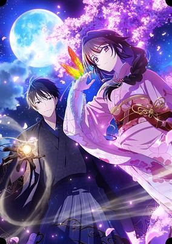
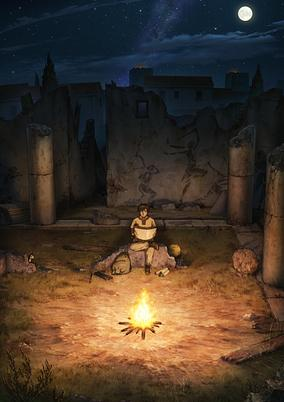
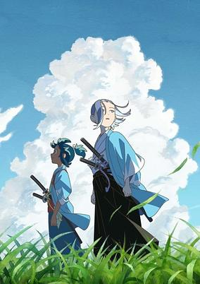
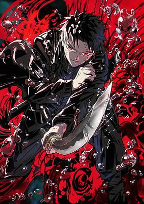
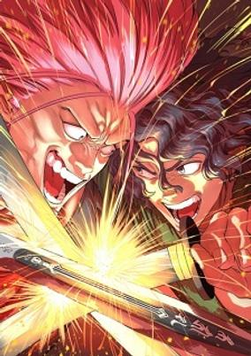
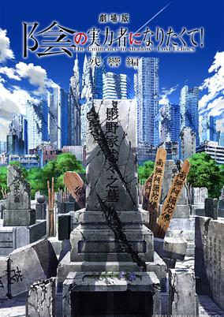

# 2027 in Anime

[← Back to index](../README.md)

52 titles · 18 with a matched synopsis/cover art · [source](https://en.wikipedia.org/wiki/2027_in_anime)

## Television series

### A Pen, Handcuffs, and a Common-Law Marriage

**Studio:** EMT Squared &nbsp;|&nbsp; **Director:** Takaaki Ishiyama &nbsp;|&nbsp; **Aired/Released:** January

[Wikipedia](https://en.wikipedia.org/wiki/A_Pen,_Handcuffs,_and_a_Common-Law_Marriage)

---

### Akane-banashi (season 2) (Akane-Banashi)

**Studio:** Zexcs &nbsp;|&nbsp; **Director:** Ayumu Watanabe &nbsp;|&nbsp; **Aired/Released:** January &nbsp;|&nbsp; **Genres:** The Arts, Drama, Coming Of Age

> "With only your voice and body—master the art." Akane Ousaki, captivated since childhood by the magical performances of her father, Shinta Arakawa, witnesses a shocking incident during his decisive performance for promotion to shin’uchi (master rank). Six years later, now a high school student, she sets her sights on becoming a shin’uchi herself—pushing forward in the highly competitive world of rakugo. A passionate and authentic rakugo drama begins now!
>
> _Synopsis source: Kitsu_

[Wikipedia](https://en.wikipedia.org/wiki/Akane-banashi) · [Kitsu](https://kitsu.io/anime/Akanebanashi)

---

### Arcanadea

**Studio:** Yokohama Animation Laboratory &nbsp;|&nbsp; **Director:** Keiichiro Kawaguchi &nbsp;|&nbsp; **Aired/Released:** January

[Wikipedia](https://en.wikipedia.org/wiki/Arcanadea)

---

### Are You a Landmine, Chihara-san?

**Studio:** SynergySP &nbsp;|&nbsp; **Director:** Yasuaki Fujii &nbsp;|&nbsp; **Aired/Released:** January

[Wikipedia](https://en.wikipedia.org/wiki/Are_You_a_Landmine,_Chihara-san%3F)

---

### BanG Dream! It's MyGO!!!!! and BanG Dream! Ave Mujica (sequel)

**Aired/Released:** January

[Wikipedia](https://en.wikipedia.org/wiki/BanG_Dream!_It%27s_MyGO!!!!!)

---

### Bride of the Barrier Master

**Studio:** Troyca &nbsp;|&nbsp; **Director:** Tōru Kitahata &nbsp;|&nbsp; **Aired/Released:** January &nbsp;|&nbsp; **Genres:** Drama, Fantasy, Romance

> Hana Ichise is from a branch family to one of five barrier-weaving magical clans who protect and support Japan. But in the eyes of her mother and father, she’s an afterthought compared to her talented older twin sister. When Hana’s true potential awakens at age fifteen, she decides to keep her newfound abilities a secret—including from her parents—so she can have a quiet life. But the powerful new head of the elite Ichinomiya clan, Saku Ichinomiya, is looking for a bride…and he has his eyes on Hana!
>
> _Synopsis source: Kitsu_

[Wikipedia](https://en.wikipedia.org/wiki/Bride_of_the_Barrier_Master) · [Kitsu](https://kitsu.io/anime/kekkaishi-no-ichirinka)

---

### Chōjin-teki Share House Story Charisma

**Studio:** Pierrot Films &nbsp;|&nbsp; **Director:** Jōji Furuta &nbsp;|&nbsp; **Aired/Released:** January

[Wikipedia](https://en.wikipedia.org/wiki/Ch%C5%8Djin-teki_Share_House_Story_Charisma)

---

### Everyday Host (sequel)

**Studio:** Fanworks &nbsp;|&nbsp; **Director:** Rarecho &nbsp;|&nbsp; **Aired/Released:** January

[Wikipedia](https://en.wikipedia.org/wiki/Everyday_Host)

---

### Gacha Girls Corps

**Studio:** Zero-G Saber Works &nbsp;|&nbsp; **Director:** Masahiro Takata (chief) Takashi Asami &nbsp;|&nbsp; **Aired/Released:** January

[Wikipedia](https://en.wikipedia.org/wiki/Gacha_Girls_Corps)

---

### Giant Ojō-sama

**Studio:** Tatsunoko Production &nbsp;|&nbsp; **Director:** Hiroshi Ikehata &nbsp;|&nbsp; **Aired/Released:** January

[Wikipedia](https://en.wikipedia.org/wiki/Giant_Oj%C5%8D-sama)

---

### Hirayasumi

**Studio:** Production +h &nbsp;|&nbsp; **Director:** Kei Suezawa &nbsp;|&nbsp; **Aired/Released:** January &nbsp;|&nbsp; **Genres:** Slice of Life, Drama, Comedy

> With a carefree outlook on life, Hiroto knows better than anyone that slowing down is sometimes the best way to move forward. At 29 years old, carefree Hiroto Ikuta doesn’t have a girlfriend, a full-time job, or a plan for the future—and he couldn’t be happier. Hiroto’s breezy attitude isn’t easy for everyone to understand, though. In a world filled with anxiety, confusion, and grief, Hiroto and the people who surround him are all just doing their best to figure out this thing called life. After developing an unlikely friendship with the grouchy old granny who lives in his neighborhood, Hiroto suddenly finds himself inheriting not just her house, but some rather difficult emotions as well. His 18-year-old cousin Natsumi moves in with him, but as a struggling art student, she has her own troubles to deal with and may just put Hiroto’s easygoing lifestyle to the test.
>
> _Synopsis source: Kitsu_

[Wikipedia](https://en.wikipedia.org/wiki/Hirayasumi) · [Kitsu](https://kitsu.io/anime/hirayasumi)

---

### Historié

**Studio:** Liden Films &nbsp;|&nbsp; **Aired/Released:** January &nbsp;|&nbsp; **Genres:** Adventure, Psychological, Historical, Europe, Seinen, Past, Action, Thriller

> After shocking the world with Parasyte, Hitoshi Iwaaki is back with a series he's been aching to tackle since even before his pro manga debut! A historical epic set in ancient times, Historie tells the story of Eumenes, a young man with quick wits and a vast destiny to fulfill. In time, he'll become a famed army commander and personal secretary to Alexander the Great—but the road to this glory is fraught with danger… "
>
> _Synopsis source: Kitsu_

[Wikipedia](https://en.wikipedia.org/wiki/Histori%C3%A9) · [Kitsu](https://kitsu.io/anime/historie)

---

### In a World Full of Zombies I'm the Only One Who Doesn't Get Attacked

**Studio:** acca effe Frontier Engine &nbsp;|&nbsp; **Director:** Kazuya Fujishiro &nbsp;|&nbsp; **Aired/Released:** January

[Wikipedia](https://en.wikipedia.org/wiki/In_a_World_Full_of_Zombies_I%27m_the_Only_One_Who_Doesn%27t_Get_Attacked)

---

### Inherit the Winds

**Studio:** Live2D Creative Studio Drive &nbsp;|&nbsp; **Director:** Tomohiro Kawamura &nbsp;|&nbsp; **Aired/Released:** January &nbsp;|&nbsp; **Genres:** Samurai

> During the Bakumatsu era in the city of Kyoto, a soldier, his memories lost, is aided by Soji Okita, assistant officer of the Mibu Roshigumi. "Your name is Jinsuke Tachikawa." Jinsuke's life begins anew living among the Mibu soldiers. Portraying the fleeting youth of these young people who lived in turbulent times, this original anime will bring their stories to life with sharp detail and a fresh perspective.
>
> _Synopsis source: Kitsu_

[Wikipedia](https://en.wikipedia.org/wiki/Inherit_the_Winds) · [Kitsu](https://kitsu.io/anime/kaze-wo-tsugumono)

---

### IruMafia Edition

**Aired/Released:** January

[Wikipedia](https://en.wikipedia.org/wiki/Welcome_to_Demon_School!_Iruma-kun)

---

### Isshiki-san Wants to Know About Love

**Studio:** Sakura Create &nbsp;|&nbsp; **Director:** Kazuya Komai &nbsp;|&nbsp; **Aired/Released:** January &nbsp;|&nbsp; **Genres:** Comedy, Romance, Ecchi, Mystery, Action, Shounen

> A maiden who doesn't know what love is tries her hand at dating as a pseudo-couple! Inspector Rinna, who is respected by everyone as a hard-working and serious policewoman, seems to be having trouble with her work lately. The reason for this is because she loses focus. It only happens when Meishi, the detective she works with, is around... So, she makes a choice...?
>
> _Synopsis source: Kitsu_

[Wikipedia](https://en.wikipedia.org/wiki/Isshiki-san_Wants_to_Know_About_Love) · [Kitsu](https://kitsu.io/anime/isshiki-san-wa-koi-wo-shiritai)

---

### Love Live! Hasunosora Girls' High School Idol Club

**Aired/Released:** January &nbsp;|&nbsp; **Genres:** Idol, Music, Slice of Life

> The Bloom Garden Party is finally here. It’s the stage where everyone will “someday, surely” bloom—the goal Kaho and the others have been chasing for a whole year. This is the first step. The long-awaited day has finally arrived — the day when the promise they made with the graduates will come true. It was also the last day for the 103rd-year students, on the verge of graduation, could spend with their friends as students of Hasunosora. ―Even so, the girls race through their “youth” with all their might. This is the story of girls who struggled to bloom, a tale of dreams made real together.
>
> _Synopsis source: Kitsu_

[Wikipedia](https://en.wikipedia.org/wiki/Love_Live!_Hasunosora_Girls%27_High_School_Idol_Club) · [Kitsu](https://kitsu.io/anime/love-live-hasu-no-sora-jogakuin-school-idol-club-bloom-garden-party)

---

### Magical Buffs: The Support Caster Is Stronger Than He Realized!

**Studio:** J.C.Staff &nbsp;|&nbsp; **Director:** Hideki Okamoto &nbsp;|&nbsp; **Aired/Released:** January

---

### Marriagetoxin (season 2) (MARRIAGETOXIN)

**Studio:** Bones Film &nbsp;|&nbsp; **Director:** Motonobu Hori &nbsp;|&nbsp; **Aired/Released:** January &nbsp;|&nbsp; **Genres:** Action, Comedy, Drama, Romance

> For centuries, the deadly arts have been perfected by Masters, and Five Great Families hold the greatest power and influence. Hikaru Gero, an heir to the Gero family, lives in the underworld as an elite assassin. When his sister is pressured to produce an heir, Hikaru asks Mei Kinosaki, a brilliant marriage swindler, to find him a bride. The most challenging mission of his life begins!
>
> _Synopsis source: Kitsu_

[Wikipedia](https://en.wikipedia.org/wiki/Marriagetoxin) · [Kitsu](https://kitsu.io/anime/marriagetoxin)

---

### Mashle (season 3)

**Studio:** A-1 Pictures &nbsp;|&nbsp; **Director:** Tomonari Tanaka &nbsp;|&nbsp; **Aired/Released:** January

[Wikipedia](https://en.wikipedia.org/wiki/Mashle)

---

### Matsurika Kanriden

**Studio:** Maho Film &nbsp;|&nbsp; **Director:** Takeshi Mori (chief) Yuichi Nakazawa &nbsp;|&nbsp; **Aired/Released:** January

[Wikipedia](https://en.wikipedia.org/wiki/Matsurika_Kanriden)

---

### Medaka Kuroiwa Is Impervious to My Charms (season 2)

**Studio:** SynergySP &nbsp;|&nbsp; **Director:** Yoshiaki Okumura &nbsp;|&nbsp; **Aired/Released:** January

[Wikipedia](https://en.wikipedia.org/wiki/Medaka_Kuroiwa_Is_Impervious_to_My_Charms)

---

### Mercedes and the Waning Moon (Purple River 3)

**Studio:** Teddy &nbsp;|&nbsp; **Director:** Kunihisa Sugishima &nbsp;|&nbsp; **Aired/Released:** January &nbsp;|&nbsp; **Genres:** Fantasy, Action, Adventure, Military

> Once, they swore to protect this land; later, they buried that era with their own hands. This season, we witness Bataan's rebirth from the brink of death, the gleaming armor of the expedition, and the fateful judgment known as the "Rebellion of the Three Heroes." When the threat of the demons recedes, the demons within people awaken. Torn between loyalty and ambition, the Three Heroes face the longest winter of their lives. The stars will never fall, Zichuan will endure forever—but can you afford the price?
>
> _Synopsis source: Kitsu_

[Wikipedia](https://en.wikipedia.org/wiki/Mercedes_and_the_Waning_Moon) · [Kitsu](https://kitsu.io/anime/zi-chuan-3rd-season)

---

### Multi-Mind Mayhem

**Studio:** Studio Deen &nbsp;|&nbsp; **Director:** Hiroaki Sakurai &nbsp;|&nbsp; **Aired/Released:** January &nbsp;|&nbsp; **Genres:** Action, Adventure, Fantasy, Isekai

> Bard Cornelius: the son of a nobleman of Mauricia, an empire located in a parallel universe. But Bard is no ordinary boy―he's got three souls packed into one body! Aside from his own consciousness, he's got Oka Sanai, a miserly samurai, and Masaharu Oka, a high school otaku who loves animal ears. With his extra knowledge of military tactics and business acumen, Bard's ready to cheat his way to the top!
>
> _Synopsis source: Kitsu_

[Wikipedia](https://en.wikipedia.org/wiki/Multi-Mind_Mayhem) · [Kitsu](https://kitsu.io/anime/isekai-tensei-soudouki)

---

### Murciélago

**Studio:** Satelight Staple Entertainment &nbsp;|&nbsp; **Director:** Takashi Naoya (chief) Matsuo Asami &nbsp;|&nbsp; **Aired/Released:** January

[Wikipedia](https://en.wikipedia.org/wiki/Murci%C3%A9lago_(manga))

---

### Ore to Yu Nii!

**Studio:** Studio Hibari &nbsp;|&nbsp; **Director:** Noriko Hashimoto &nbsp;|&nbsp; **Aired/Released:** January

[Wikipedia](https://en.wikipedia.org/wiki/Ore_to_Yu_Nii!)

---

### Red Cat Ramen (season 2)

**Studio:** E&H Production &nbsp;|&nbsp; **Director:** Hisatoshi Shimizu &nbsp;|&nbsp; **Aired/Released:** January

[Wikipedia](https://en.wikipedia.org/wiki/Red_Cat_Ramen)

---

### Reincarnation in the Game World Dan-Katsu (Reincarnation in the Game World Dan-Katsu: Game Addict Plays "Encouragement for Job Hunting in Dungeons" From a "New Game")

**Studio:** Studio Massket &nbsp;|&nbsp; **Director:** Nagisa Miyazaki &nbsp;|&nbsp; **Aired/Released:** January &nbsp;|&nbsp; **Genres:** Action, Adventure, Fantasy, Romance

> Dan-Katsu is a legendary role-playing game that allows you to play more than 1021 classes and has more than 400 possible endings! The more we delve into it, the more we discover new ways to enjoy it, new objects… A certain gamer (player name: Zephyrus) is reincarnated in the world of Dan-Katsu, of which he becomes the main character. Overjoyed, he joins the Labyrinth Academy, the place where the main story takes place. He quickly obtains the 'Hero' class, the best in the game, but discovers that the 'Muscle Warrior', a class considered 'for fun' where he comes from, is perceived in this world as a good class?! That the most difficult dungeons have never been conquered?! In other words… he will be able to enjoy this world as if it were a new game! Determined to show everyone what a good class is, he brings together classmates, allows his reserved childhood friend to become an Alchemist, transforms a selfish Princess into a Saint… Now that he has gathered powerful classes around from him, he is ready to conquer the dungeons!
>
> _Synopsis source: Kitsu_

[Wikipedia](https://en.wikipedia.org/wiki/Reincarnation_in_the_Game_World_Dan-Katsu) · [Kitsu](https://kitsu.io/anime/game-sekai-tensei-dankatsu-gamer-wa-dungeon-shuukatsu-no-susume-wo-hajime-kara-play-suru)

---

### Sakamoto Days (season 2)

**Studio:** TMS Entertainment &nbsp;|&nbsp; **Director:** Daisuke Nakajima &nbsp;|&nbsp; **Aired/Released:** January

[Wikipedia](https://en.wikipedia.org/wiki/Sakamoto_Days)

---

### Shangri-La Frontier (season 3)

**Studio:** C2C &nbsp;|&nbsp; **Director:** Toshiyuki Kubooka (chief) Hiro Ōki &nbsp;|&nbsp; **Aired/Released:** January

[Wikipedia](https://en.wikipedia.org/wiki/Shangri-La_Frontier)

---

### The Eternal Fool's Words of Wisdom

**Studio:** Studio Elle &nbsp;|&nbsp; **Director:** Keisuke Ōnishi &nbsp;|&nbsp; **Aired/Released:** January

[Wikipedia](https://en.wikipedia.org/wiki/The_Eternal_Fool%27s_Words_of_Wisdom)

---

### The Fledgling Demon Lord's Starter Shop

**Studio:** Project No.9 &nbsp;|&nbsp; **Director:** Jun Hira &nbsp;|&nbsp; **Aired/Released:** January

[Wikipedia](https://en.wikipedia.org/wiki/The_Fledgling_Demon_Lord%27s_Starter_Shop)

---

### The Guy She Was Interested in Wasn't a Guy at All

**Studio:** CloverWorks &nbsp;|&nbsp; **Director:** Masashi Ishihama &nbsp;|&nbsp; **Aired/Released:** January &nbsp;|&nbsp; **Genres:** Music

> The black-clad boy that Aya Oosawa likes is perfect: he is effortlessly nonchalant, has a sharp sense of style, and listens to the best music. Ever since the trendy Aya stumbled upon a small CD store to enjoy the rock classics her friends are not familiar with, the mysterious employee behind the counter has been on her mind. Meanwhile, the quiet and aloof Mitsuki Koga listens to her popular classmate Aya rave about her crush, tormented by a nagging thought: how to tell Aya that the guy she is interested in is not a guy at all! In reality, when Mitsuki sheds her plain high school uniform, she is the one manning the counter at her uncle Joe's CD shop. She wrestles with how to reveal her identity, but flirting with the stunning and clueless Aya is just too tempting. As music becomes their shared passion, it seems that Aya's feelings will remain unchanged—even when Mitsuki's secret comes to light.
>
> _Synopsis source: Kitsu_

[Wikipedia](https://en.wikipedia.org/wiki/The_Guy_She_Was_Interested_in_Wasn%27t_a_Guy_at_All) · [Kitsu](https://kitsu.io/anime/kininatteru-hito-ga-otoko-ja-nakatta)

---

### The Kept Man of the Princess Knight

**Studio:** Blade &nbsp;|&nbsp; **Director:** Chihiro Kumano &nbsp;|&nbsp; **Aired/Released:** January &nbsp;|&nbsp; **Genres:** Action, Adventure, Fantasy, Comedy, Romance

> Matthew is just another parasite in the chaotic dungeon city of Gray Neighbor. People say he's a lazy weakling who gambles and drinks away all the money he gets from his keeper, princess knight Arwin. But the truth is, no one in this town knows what he's really like—a ruthless protector who works in the shadows and will do whatever it takes for the sake of his mistress.
>
> _Synopsis source: Kitsu_

[Wikipedia](https://en.wikipedia.org/wiki/The_Kept_Man_of_the_Princess_Knight) · [Kitsu](https://kitsu.io/anime/himekishi-sama-no-himo)

---

### The World's Finest Assassin Gets Reincarnated in Another World as an Aristocrat (season 2)

**Studio:** Silver Link &nbsp;|&nbsp; **Director:** Masafumi Tamura &nbsp;|&nbsp; **Aired/Released:** January

[Wikipedia](https://en.wikipedia.org/wiki/The_World%27s_Finest_Assassin_Gets_Reincarnated_in_Another_World_as_an_Aristocrat)

---

### Wound & Bandage

**Studio:** J.C.Staff &nbsp;|&nbsp; **Director:** Miyuki Ishida &nbsp;|&nbsp; **Aired/Released:** January

[Wikipedia](https://en.wikipedia.org/wiki/Wound_%26_Bandage)

---

### Fate Rewinder

**Studio:** Bones Film &nbsp;|&nbsp; **Director:** Rie Matsumoto &nbsp;|&nbsp; **Aired/Released:** April

[Wikipedia](https://en.wikipedia.org/wiki/Fate_Rewinder)

---

### Kagurabachi

**Studio:** Cypic &nbsp;|&nbsp; **Director:** Tetsuya Takeuchi &nbsp;|&nbsp; **Aired/Released:** April &nbsp;|&nbsp; **Genres:** Action, Drama, Fantasy, Swordplay, Supernatural, Mafia, Revenge, Shounen, Magic, Violence, Contemporary Fantasy, Politics, Dark Fantasy

> Flames of resolve, kindled by hatred. Chihiro Rokuhira is a boy who aspires to become a swordsmith, and took daily training under his father, Kunishige, a renowned swordsmith. Their days, once filled with laughter, are brutally torn apart by an attack from the mysterious sorcerer organization, the Hishaku. What is stolen from them are the six Enchanted Blades—swords of immense power capable of shaping the fate of the nation—and the gentle, warm life they once shared. From that day on, everything changed. In a world engulfed in darkness, Chihiro takes up Enten, the seventh Enchanted Blade left behind by his father, and sets out on a blood-soaked path of revenge.
>
> _Synopsis source: Kitsu_

[Wikipedia](https://en.wikipedia.org/wiki/Kagurabachi) · [Kitsu](https://kitsu.io/anime/kagurabachi)

---

### Shōzen

**Studio:** Dangun Pictures Cannon Code &nbsp;|&nbsp; **Director:** Itsuro Kawasaki &nbsp;|&nbsp; **Aired/Released:** April

[Wikipedia](https://en.wikipedia.org/wiki/Shang_Shan)

---

### Skip and Loafer (season 2)

**Studio:** P.A. Works &nbsp;|&nbsp; **Director:** Kotomi Deai &nbsp;|&nbsp; **Aired/Released:** April

[Wikipedia](https://en.wikipedia.org/wiki/Skip_and_Loafer)

---

### Tenkaichi: The Greatest Warrior Under the Rising Sun

**Studio:** Fugaku &nbsp;|&nbsp; **Director:** Masashi Abe &nbsp;|&nbsp; **Aired/Released:** April &nbsp;|&nbsp; **Genres:** Action, Martial Arts, Seinen, Samurai

> This is not history as we know it. The year is 1600. Ten years have passed since Oda Nobunaga unified the whole of Japan. When Nobunaga realizes he is nearing the end of his life, he announces that he will hand over the reins of power to whoever brings him the strongest warrior. The generals, whose dreams of conquering the country had been crushed, put up their own strongest warriors and aim to become the king of the country!
>
> _Synopsis source: Kitsu_

[Kitsu](https://kitsu.io/anime/tenkaichi)

---

### The Apothecary Diaries (season 3, part 2)

**Studio:** OLM &nbsp;|&nbsp; **Director:** Akinori Fudesaka &nbsp;|&nbsp; **Aired/Released:** April

[Wikipedia](https://en.wikipedia.org/wiki/The_Apothecary_Diaries_(TV_series))

---

### Delicious in Dungeon (season 2)

**Studio:** Studio Trigger &nbsp;|&nbsp; **Director:** Yoshihiro Miyajima &nbsp;|&nbsp; **Aired/Released:** October

[Wikipedia](https://en.wikipedia.org/wiki/Delicious_in_Dungeon)

---

### Frieren: Beyond Journey's End (season 3)

**Studio:** Madhouse &nbsp;|&nbsp; **Director:** Tomoya Kitagawa &nbsp;|&nbsp; **Aired/Released:** October

[Wikipedia](https://en.wikipedia.org/wiki/Frieren_(TV_series))

---

### TBA

**Aired/Released:** KochiKame: Tokyo Beat Cops

---

## Original net animations

### The One Piece

**Studio:** Wit Studio &nbsp;|&nbsp; **Director:** Masashi Koizuka &nbsp;|&nbsp; **Aired/Released:** February

[Wikipedia](https://en.wikipedia.org/wiki/The_One_Piece)

---

## Films

### Ghost

**Studio:** Bandai Namco Filmworks Madhouse &nbsp;|&nbsp; **Director:** Shingo Natsume &nbsp;|&nbsp; **Aired/Released:** February 11

[Wikipedia](https://en.wikipedia.org/wiki/Ghost_(2027_film))

---

### Gekijōban Medalist

**Studio:** ENGI &nbsp;|&nbsp; **Director:** Yasutaka Yamamoto &nbsp;|&nbsp; **Aired/Released:** February 19

[Wikipedia](https://en.wikipedia.org/wiki/Gekij%C5%8Dban_Medalist)

---

### Patlabor EZY: File 3 (Patlabor EZY File 1)

**Studio:** J.C.Staff &nbsp;|&nbsp; **Director:** Yutaka Izubuchi &nbsp;|&nbsp; **Aired/Released:** March 5 &nbsp;|&nbsp; **Genres:** Action, Cops, Cyberpunk, Law And Order, Special Squads, Future, Science Fiction, Piloted Robot, Mecha

> With the rapidly accelerating development of hyper-technology, a humanoid-type machine called "Labor" is being used in every field of industry. However, it has created the new social menace of "Labor" crime. In order to curb such crimes from happening one after another, the Metropolitan Police Department has established a special department. the "Special Vehicle Section No.2". It consists of company of patrol "Labor" known as Patlabor. (Source: GENCO) Notes: - Initially released on May 15, 2026, as a limited theatrical pre-screening. - Relations are provisional and will be updated when more info is announced.
>
> _Synopsis source: Kitsu_

[Wikipedia](https://en.wikipedia.org/wiki/Patlabor_EZY) · [Kitsu](https://kitsu.io/anime/patlabor-ezy)

---

### Doraemon: Nobita's Steam-Powered Time Machine

**Studio:** Shin-Ei Animation &nbsp;|&nbsp; **Director:** Rushio Moriyama &nbsp;|&nbsp; **Aired/Released:** Spring

---

### One Piece Film God Valley (One Piece Film: God Valley)

**Studio:** Toei Animation &nbsp;|&nbsp; **Director:** Masashi Koizuka &nbsp;|&nbsp; **Aired/Released:** Summer &nbsp;|&nbsp; **Genres:** Action, Pirate, Conspiracy, Drama, Adventure, Shounen, Demon, Comedy, Crime, Swordplay, Past, Slavery, Plot Continuity, Navy, Special Squads, War

> A theatrical film adaptation of the God Valley Incident.
>
> _Synopsis source: Kitsu_

[Kitsu](https://kitsu.io/anime/one-piece-film-GOD-VALLEY)

---

### The Eminence in Shadow: Lost Echoes

**Studio:** Nexus &nbsp;|&nbsp; **Director:** Kazuya Nakanishi &nbsp;|&nbsp; **Aired/Released:** TBA &nbsp;|&nbsp; **Genres:** Action, Comedy, Fantasy, Isekai, Magic, Parody, Swordplay, Dystopia

> Theatrical follow-up to Kage no Jitsuryokusha ni Naritakute! 2nd season.
>
> _Synopsis source: Kitsu_

[Kitsu](https://kitsu.io/anime/Kage-no-Jitsuryokusha-ni-Naritakute-Zankyouhen)

---
